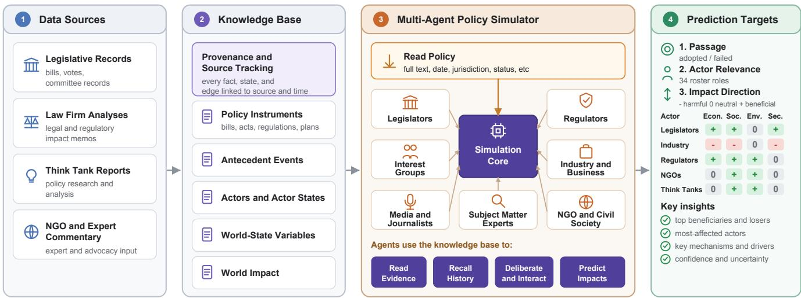
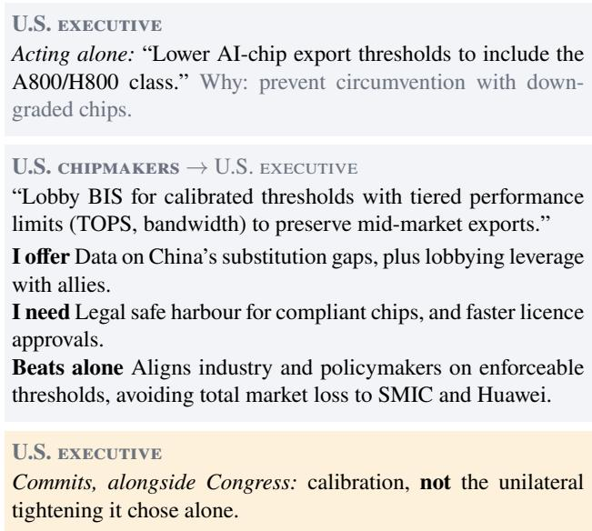
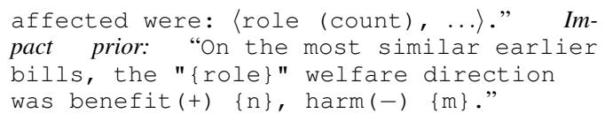
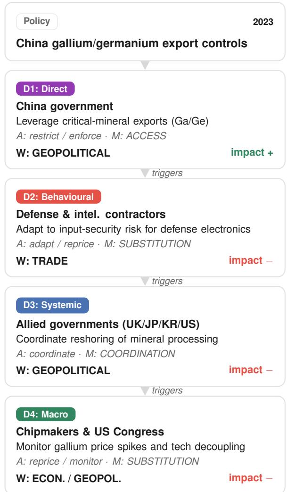
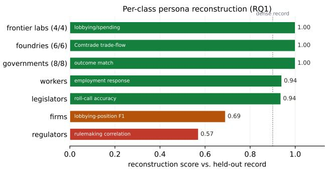
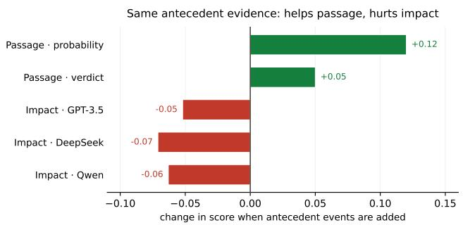
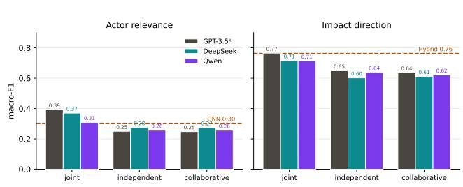
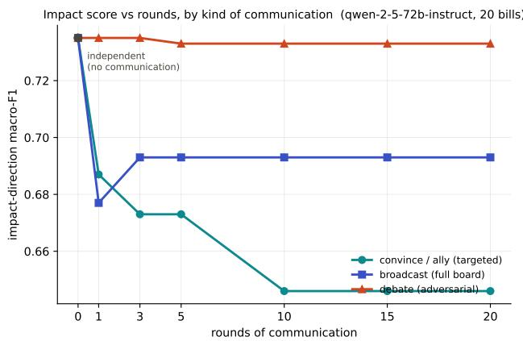
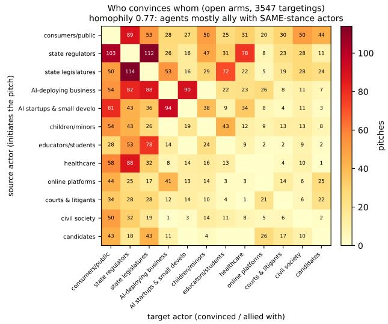
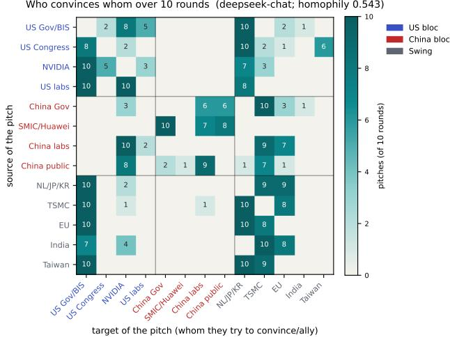

# GPS-Bench: A Governance Policy Benchmark for Automating Policy Analysis

Linh Le1, Melanie Bui1, My Chifon Nguyen1, Zachary Schlosser1, David Williams-King1,2

1Lida Safety 2ERA

## Abstract

Policy analysis requires more than predicting whether a pro- posal will pass: it requires identifying who will be afected, how those actors res ond, and what follows. LLM-based ol- icy simulations model these processes at scale, but their valid- ity is hard to establish when plausible behaviour is never com- pared with observed outcomes. We introduce GPS-Bench, an evidence-grounded benchmark for governance policy simu- lation that links policies to relevant actors, actor actions and downstream impacts using legislative records, lobbying dis- closures, regulatory documents, corporate filings, economic data and other public evidence. Actors are reconstructed from the dated record rather than prompted as archetypes, so a persona is an evidence object with provenance; a human-annotated pool forms the Gold evaluation set, while cases la- belled by a separate LLM from retrieved evidence are treated as Silver supervision and never as test labels. Because every inference mode reads the same grounded state and emits the same schema, GPS-Bench turns “does multi-agent simulation help?” into a controlled comparison: we contrast joint rea-soning, independent and communicating actor agents, graph- based methods and weight-level fine-tuning over one policy state. Fine-tuning on the grounded record gives the strongest actor-level impact prediction, and decomposition does not beat it; what decomposition adds is mechanism. Agents hold pri- vate, non-identical evidence, each seeing its own exposure clause, and address named partners with concrete joint pro-posals, what they ofer, what they need in return, and why acting together beats acting alone, so the coalitions that form can be checked against the commitments the record holds. GPS-Bench therefore gives a common empirical setting for studying when evidence, actor modelling and multi-agent in- teraction improve the prediction and interpretation of policy outcomes.

## Introduction

Large language models (LLMs) are increasingly used to simulate political and institutional decision-making, coop- eration and resource management (Piatti et al. 2024), escalation (Hua et al. 2023; Rivera et al. 2024), collaborative law-making (Hota and Jokinen 2025), roll-call prediction (Li, Gong, and Jiang 2025; Grossmann et al. 2023). Unlike rule-based models, LLM agents reason in natural language and simulate open-ended behaviour, but their validity is hard to establish: they can produce plausible interactions without reproducing the actors, actions, or outcomes of real policy processes. In practice they are judged by qualitative plausibility rather than realized outcomes (Larooij and Törnberg 2025; Barnett, Kieslich, and Diakopoulos 2024), and role-played agents over-converge (Chuang et al. 2024), mistrack real groups (Santurkar et al. 2023), and carry political biases (Rozado 2024).

This validity gap is consequential in AI governance, where policy must anticipate fast-moving technology: frontier train- ing compute has grown by roughly an order of magnitude per year (Sevilla et al. 2022; Maslej et al. 2025) with large but uncertain stakes (Briggs and Kodnani 2023; Brynjolfsson, Li, and Raymond 2025; Grace et al. 2024; Hendrycks, Schmidt, and Wang 2025), and rules written against it are often obsolete on arrival (Collingridge 1980; Heim and Koessler 2024; Gstrein, Haleem, and Zwitter 2024; OECD 2025). Forwardlooking simulation is therefore attractive (Anthis et al. 2025), but equilibrium- and agent-based frameworks (Fagiolo and Roventini 2017) and their LLM successors are rarely scored against what actually happened.

These settings share a design, LLM agents standing in for institutions, but difer in what they evaluate: one line stud- ies emergent interaction judged by plausibility (Hua et al. 2023; Rivera et al. 2024; Piatti et al. 2024; Hota and Joki- nen 2025); another predicts a single downstream label (Nay 2017; Li, Gong, and Jiang 2025), treating actors as features. We keep the agents-as-institutions setting and change the object of evaluation: governance simulation as evidencegrounded structured prediction: actors reconstructed from the record rather than prompted as archetypes, conditioned on the dated situation, and scored along the whole ac- tor → action → impact chain against predictor-independent targets.

We introduce GPS-Bench, an evidence-grounded gov- ernance policy benchmark built on the Governance Policy Simulator (GPS). GPS separates policy simulation into two components: state construction and inference. For a policy b, public records reconstruct the information available before the decision point as an observed graph $G _ { \leq t } ( b )$ , containing the policy, antecedent events, and policy-specific actor states. An inference mechanism then predicts a continuation $\hat { G } ^ { * } ( b )$ containing legislative outcome, afected actors, actor actions, intermediate state changes, and actor-level impacts. Histori- cal impact and action records are used only as evidence or as evaluation targets for past policies; they are not inserted into the predicted portion of a held-out policy.

The actor layer is the core of the benchmark. A forecast that stops at “will it pass” does not tell an analyst which stakeholders a measure moves, how each responds, or whether it is helped or harmed. GPS-Bench therefore evaluates three linked targets over one evidence-grounded graph: legislative passage, afected-actor identification, and actorlevel impact direction, the two actor-level targets being its spine. Other trajectory components (mechanisms, world state changes, multi-step edges) are emitted and structured but not scored, so we test only the parts with retrospective labels (appendix).

Because every inference mode operates over the same $G _ { < t }$ and emits the same output schema, GPS provides a controlled test of whether decomposing policy reasoning into inter- acting actor agents improves prediction. We compare joint inference over the complete policy state with independent ac- tor inference, single-revision collaboration, and multi-round communication.

## Contributions.

• Benchmark. An evidence-grounded temporal bench-mark linking AI policies to dated antecedents, policy- specific actors, recorded behaviour and observed stake- holder efects, with node- and edge-level provenance to public records.

• Representation. A typed temporal graph that cleanly sep- arates the observed state $G _ { \leq t }$ from the predicted contin- uation $\hat { G } ^ { * }$ (Figure 1), decoupling knowledge grounding from inference.

• Tasks. Three linked, retrospectively scored tasks, legislative passage, afected-actor identification and actor-level impact direction, with contamination audits, a held-out behavioural-fidelity probe, and a label taxonomy keeping observed, human-verified and Silver targets distinct.

• Inference study. A controlled comparison of joint, independent, collaborative, and communicating inference, and of training-free vs. weight-level adaptation, over iden- tical evidence, showing that the efective architecture is target-dependent and that a weight-level fine-tune on the grounded record surpasses in-context inference on every actor target.

• Coalitions the record can check. Agents holding private evidence address named partners with concrete joint pro-posals, what they ofer, what they need back, why together beats alone, and the resulting coalitions are scored against the dated commitments on record (Tables 2 and 2).

Our experiments address four questions. (RQ1, Grounding and behavioural fidelity) Can public records reconstruct policy-specific actors and context, and do grounded agents reproduce held-out actor behaviour? (RQ2, Prediction) How accurately can GPS predict legislative passage, afected ac- tors, and actor-level impact direction? (RQ3, Inference) How does joint inference compare with actor-decomposed infer-ence when both receive the same grounded policy state? (RQ4, Interaction) When actor decomposition is used, what does communication change in predictive performance and interaction structure?

As a running example we use the 2022 U.S. advancedchip export controls (BIS, 7 October 2022), which barred exports to China of advanced AI chips, the tools to make them, and U.S.-person support. The measure reached firms, foundries, allied toolmakers and states that its text never names, and each responded from a diferent position: chip- makers lobbied to recalibrate thresholds, foundries and allies re-planned supply, and the target state answered with its own controls. Which parties are reached, what each does, and who is helped or harmed are exactly the questions GPS- Bench scores, and this instrument carries them through the paper, into the actor exchange of Figure 2 and the case study in the appendix.

## Related Work and Dataset Gap

LLM-based social and multi-agent simulation. LLM agents stand in for institutions in political-military wargam- ing and escalation (Hua et al. 2023; Rivera et al. 2024), cooperation and common-resource games (Piatti et al. 2024), collaborative law-making (Hota and Jokinen 2025), and scenario generation for policy analysis (Grossmann et al. 2023). These study emergent interaction but do not ask whether the simulated actors and consequences correspond to a histor- ical policy record; GPS-Bench makes that correspondence the object of evaluation.

Grounding and validity of simulated agents. The validity ofLLM agents as proxies for real groups is contested: role- played opinions over-converge (Chuang et al. 2024), mistrack the populations they represent (Santurkar et al. 2023), and carry documented political bias (Rozado 2024); a review of 35 generative agent-based studies found 15 rested on plausibility alone (Larooij and Törnberg 2025). We treat grounding not as preprocessing but as a measured contribution: actors are reconstructed from the public record and scored against behaviour they are documented to have taken.

Outcome prediction and policy impact. A second line predicts legislative outcomes from bill text and sponsorship (Nay 2017) or roll-call votes from legislator personas (Li, Gong, and Jiang 2025), and a third generates policy scenarios judged by perceived impact (Barnett, Kieslich, and Diakopoulos 2024). The first two are grounded in outcomes but forecast a single label, treat actors as features rather than reconstructing them, and stop at enactment; the third recon- structs consequences but scores them by plausibility.

The gap is a benchmark that (i) reconstructs the billspecific cast from the public record rather than prompting archetypes, (ii) conditions on the dated situation a bill entered, and (iii) scores both whether it passes and what follows against targets built independently of the predictor. GPS- Bench is built to fill it, with provenance-graded actors and antecedents on the input side, oficial status and implemen- tation records on the scoring side, every number reported against a trivial baseline, and every leakage limit quantified rather than hidden.

## Problem Formulation

GPS represents policy simulation as the continuation ofa par- tially observed typed temporal graph (Figure 1; node signatures and the per-edge tuple in the appendix). For policy b, the observed state at prediction time t is $G _ { \leq t } ( b ) = \mathsf { \bar { \{ P , A , X \} } }$ provisions P, dated antecedents A, and policy-specific actor states X reconstructed from records available by t. Given $\mathrm { d o } ( P )$ , an inference mechanism predicts a continuation $\hat { G } ^ { * } ( b ) = \{ \hat { Y } , \hat { R } , \hat { A } , \hat { M } , \hat { W } , \hat { I } \}$ (passage outcome, relevant actors, actions, mechanisms, world-state changes, impacts); edges carry direction, probability, lag, controlling actor, and provenance. The boundary is temporal: information before t is input, while post-t events and consequences are prediction targets or evaluation evidence, not input for the held-out policy, so a historical record can label an earlier policy without leaking into the one being predicted.

  
Figure 1: The GPS-Bench governance-policy simulation framework (inputs → simulator → impact). Trusted, provenancetracked data sources populate an evidence-grounded knowledge base in which every fact, state, and edge is traced to its source and time. For a policy, LLM-driven actor agents reason over the knowledge base associated with that policy: reading evidence and states, recalling history and positions, deliberating, and predicting actions and impacts, to produce per-bill impacts on each actor group by direction and magnitude across world dimensions (economic, social, environmental, innovation, security).

The benchmark scores three linked targets along the causal spine of the graph, policy → afected actor → impact, with passage as a policy-level target:

• Passage (Yˆ ): adopted / failed, scored by balanced accuracy stratified by jurisdiction; predicted first, so an impact is not scored against a bill the model expected to die.

• Actor relevance (Rˆ): for each of the 34 roster roles, whether the bill materially afects it (macro-F1).

• Impact direction ( ˆI): the welfare sign ± on each afected actor (macro-F1), scored either by self-report or, alternatively, inferred from the actor’s predicted response by an independent judge.

The two actor-level targets $( \hat { R } , \hat { I } )$ make the actor layer the core of the benchmark: they test not only which stakeholders a policy moves, but whether it helps or harms them. The predicted actions Aˆ, intermediate mechanisms Mˆ and world- state changes Wˆ remain inspectable components of $\hat { G } ^ { * }$ , and are emitted and auditable but not scored here, giving the contract $G _ { \leq t } + { \mathrm { m o d e } } \to { \hat { G } } ^ { * }$ . The Appendix gives each field’s label source and validation status, and traverses the formalism on a single provision.

## The GPS-Bench Benchmark

GPS constructs a temporal graph from the public record for one governance instrument, proposed or in force, and predicts its continuation under a stated intervention. Construction has two phases. Data collection extracts each field from a named public source; data customization transforms them into the graph the simulation is scored on. Both obey one constraint: every input traces to an inspectable source, and every evalu- ated output has a target built independently of the predictor. Targets difer in evidential strength, from observed outcomes to a human-verified impact subset and Silver relevance and impact labels from a separate annotator (appendix). Figure 1 gives the typed schema and the per-actor to world-level ag- gregation.

## Data collection

Automated discovery does not determine inclusion in GPS- Bench. Every record begins with the URL of an inspectable oficial publication, retrieved and staged; a curator then veri- fies the source and declares the instrument’s title, issuing au- thority, jurisdiction, type, legal status, normative character, and date before it is admitted. Automation supports retrieval and validation but never determines inclusion or authoritative metadata. The corpus holds 1,233 instruments, each with its full text. Non-English instruments retain their authoritative source text, and an attached English rendering never defines a label. the appendix details the procedure, provenance fields, and language coverage.

## Policy episodes and Gold/Silver tiers

Each policy episode carries re-derived outcome labels and a dated pre-decision context, on a strict temporal split (train before 2024, test from 2024 on). The appendix maps the purpose-built sets; none is a superset of another.

The benchmark separates evaluation quality from super- vision scale. The primary Gold pool contains 679 human-annotated policy cases. Annotators code the policy-specific actors, observable actor actions, and actor-level impacts from cited evidence; oficial outcomes and recorded actions re- main observed Gold. A further 4,235 evidence-grounded records form an Evidence-Silver expansion: a separate an-notation LLM receives retrieved evidence from the trusted source collection and must return both the label and its sup- porting source span. Silver labels may be used for training, retrieval, and ablation studies, but headline evaluation is per- formed on held-out Gold cases only.

Every instrument stores oficial title, issuing authority, ju-risdiction, status, dates and verified text, and every derived field stores an evidence\_grade and attribution. Because adoption and failure are jurisdictionally confounded, passage is always reported with jurisdiction-aware baselines.

## Actor, action and impact ontology

Actors are drawn from a fixed roster of 34 stakeholder roles covering every actor named in the bills’ causal chains; per bill a cast is selected by scoring each roster actor for rele- vance against the actors the record names, where recall is the meaningful side because the label counts only named actors. Responses are coded on a controlled 15-way action vocabulary (comply, disclose, adopt, build, restrict, enforce, litigate, lobby, support, oppose, fund, audit, coordinate, adapt, mon- itor).

Personas from the record. Each actor’s collected behavioural facts (roll-call and sponsorship history, filings, lobbying, trade series) become per-actor dated memories: a persona built from documented behaviour rather than a stipulated objective. A model-written persona is not gold; it is admissible only as scored against behaviour the actor is recorded as having taken, and sparse-record classes are re- ported rather than averaged away. Per-bill antecedent events are assembled under two rules, each dated strictly before the bill, and the bill’s own downstream events withheld, which truncates what we inject but not the simulator’s pretraining, so a clean record is necessary but not suficient for leakage control (appendix).

Impact and world state. Every actor–impact record is projected onto a second ontology, actor → action → impact, classifying each action into one of 12 mechanisms and each impact by world perspective (ten), causal depth (D1–D4) and functional role (twelve), all deterministic from the collected fields. Over the corpus this yields 402 typed impact nodes and 214 graded causal maps across 1,233 instruments. The functional-role grouping is what makes actor-level supervi- sion viable, raising mean pre-2024 records per actor class from 3.2 to 63.9; the causal graphs are in the appendix.

## Governance Simulation Methods

## Inference over the graph

GPS separates the construction of the observed policy state from the mechanism used to predict its continuation. For bill $b ,$ all inference modes receive the same evidence-grounded graph $G _ { < t } ( b )$ and produce predictions in the same output schema $\hat { G } ^ { * } \hat { ( b ) }$ , so inference strategies can be compared with- out changing the underlying representation or the evidence available to the system. We evaluate three modes that dif- fer only in what each LLM call sees, not in the evidence available:

• Joint $f _ { \mathrm { j o i n t } } .$ : full bill + full cast + all actor states → all actor outputs in one pass.

• Independent $f _ { \mathrm { i n d } } \colon$ the same graph partitioned to one ac- tor at a time → that actor’s output, no cross-actor context.

• Collaborative $f _ { \mathrm { c o l l a b } } \mathrm { : }$ : the same partition + exchanged messages → revised per-actor outputs.

All three emit the same output schema $\hat { G } ^ { * }$ , so the com- parison is diagnostic rather than architectural: if joint infer-ence outperforms independent agents, actor decomposition has removed useful cross-actor context; if communication recovers performance, interaction has restored some of it. Within the graph, an actor’s action drives an impact through an explicit two-layer typing: a mechanism, one of twelve (cost, access, incentive, capacity, information, risk, com-petition, demand, supply, coordination, substitution, retali- ation): changes a world-state variable on one of ten world dimensions (economy, labour, technology, competition, safety, rights, governance, trade, geopolitics, environment). Mech-anisms and world dimensions are thus separate ontologies, how a bill acts versus what it changes, and both populate $G ^ { * }$ without being scored; the scored consequence is the welfare direction of the impact on each afected actor (Figure 1).

## Actor-decomposed and interactive inference

Multi-agent inference provides an actor-decomposed alterna- tive to joint reasoning within GPS. Its purpose is twofold: to test whether actor-local reasoning improves prediction, and to expose interaction structure: coalition formation, persua- sion, and coordinated action: that a single joint prediction does not represent explicitly. We specify how each actor agent is constructed from the record, conditioned on prior measures, and made to interact.

Evidence-grounded actor states. Each agent is initialised from a dated actor state derived from public records: insti- tutional role, observed positions, prior actions, resources, relationships and relevant indicators, each carrying source provenance and restricted to information available before the simulated decision point. A low-weight scenario-prior layer from published forward-looking analyses (AI Futures Project 2025a,b) is evaluated separately and never used as a groundtruth label. The state is realised in the prompt as a persona, whose reconstruction accuracy against held-out records is reported in the Results.

Conditioning on prior measures. Each agent is additionally conditioned in context on labelled pre-2024 examples:

few-shot, our surrogate for fine-tuning the hosted 72B models, alongside a genuine weight-level LoRA of an open 7B model (Table 4), so predictions are calibrated to how compa-rable actors behaved on comparable measures without seeing the ≥2024 test period.

Interaction regimes. Over identical inputs the agents run in three regimes: independent (each answers from its own persona in isolation), collaborative (each sees a shared board of the others’ positions and revises once), and communication (over several rounds each agent chooses which others to convince or ally with, sends a message, and updates): followed by a synthesis pass that reads a single world state of the transcript. Comparing these against the zero-shot single call lets us measure the contribution of the agent machinery rather than assume it (Results).

## Experimental Setup

Every forecasting claim uses a strict temporal split: train <2024, test ≥2024, never random, so no test instrument is seen in training; the primary predictor is separated from the test window by its model cutof and is not fitted. Predictors see outcome-scrubbed context only, headline evaluation uses held-out Human Gold, and Evidence-Silver comes from a separate annotator that is never a predictor, so no model is scored against its own labels. Datasets and per-split sizes, the model list, input construction, decision modes, metrics, leakage controls and the fine-tuning configuration are given in full in the appendix, together with the verbatim prompts.

## Results and Analysis

We organize the evaluation by prediction target rather than by model family. Each result varies the dataset/supervision setting (No training, Gold, Silver, or Gold+Silver) and the inference environment (joint, inde endent actor a ents, collabo-rative agents, communicating agents, graph-based baselines, or weight-level fine-tuning). Every test sample reported below is Gold, held out and human-annotated or observed, with a cited source per field; Silver enters training only, so a supervision arm is measured by what it transfers rather than by how closely it reproduces its own annotator. The one ex- ception is flagged in Table 4. Extended results, contamination audits and protocol sweeps are in the appendix.

## Grounding and annotation validity (RQ1)

Before evaluating forecasts, we test whether the benchmark reconstructs the policy state every inference mode depends on. Cast selection recovers most actors named in the legisla- tive record, antecedent extraction passes verbatim-quote ver- ification at a comparable rate, and reconstruction is strongest for classes with dense public records. On a separate overlap audit the Silver annotator agrees with human coding more strongly on extractable structural fields than on interpretive ones, so Silver is scalable supervision rather than a substitute for Gold evaluation.

Historical behaviour also carries predictive information: conditioning an actor on its dated prior actions helps where history exists, while rich narrative personas alone are less reliable. The useful signal is documented precedent, not de- scriptive text.

  
Figure 2: One agent convincing another to act jointly, on the 2022 U.S. advanced-chip export controls. Each agent reasons from its own private evidence and neither sees the other’s proposal before making its own; the recipient’s com- mitted action difers from the position it held alone.

Table 1: Legislative passage under diferent evidence and inference settings, scored by balanced accuracy (BA), which is the metric passage is reported on throughout because the pool is jurisdictionally skewed. “Gold” denotes the held-out human/observed evaluation pool. The multi-agent synthesis row is contaminated and shown only as an upper bound.
<table><tr><td>Dataset / evidence</td><td>Environment</td><td>BA</td><td>Status</td></tr><tr><td>Gold, jurisdiction only</td><td>Statistical prior</td><td>0.86</td><td>baseline</td></tr><tr><td>Gold, bill only</td><td>Joint calibrated</td><td>0.80</td><td>primary</td></tr><tr><td>Gold, bill + antecedents</td><td>Joint calibrated</td><td>0.89</td><td>primary</td></tr><tr><td>Gold, bill + actor synthesis</td><td>Multi-agent</td><td>0.96</td><td>contaminated UB</td></tr></table>

## Legislative passage (RQ2)

Table 1 separates evidence conditions from inference envi- ronments. Passage is unusually sensitive to political timing: a calibrated joint forecast reaches balanced accuracy 0.80, and dated antecedent events raise it to 0.89. A jurisdiction-only baseline reaches 0.86, so the passage corpus carries a substantial institutional confound. The multi-agent score (0.96) is retained only as a contamination-bounded upper bound.

Passage and impact should therefore not share a single context policy: antecedents help passage because they encode timing and institutional pressure, whereas actor-level impact depends more on the mechanism of the policy itself.

Table 2: A reciprocated coalition on the NAIRR pilot (dated 2024, held out of training). Each agent proposes independently, without seeing the other’s proposal; the record rows are the dated commitments the corpus holds for the same instrument.
<table><tr><td colspan="2">Proposals emitted by the simulation</td></tr><tr><td>Microsoft NVIDIA</td><td>NVIDIA → Collaborate to provide GPU infrastructure and computational resources for the NAIRR pilot, giv- ing researchers access to AI compute. Microsoft → Collaborate on AI infrastructure for the NAIRR pilot, leveraging NVIDIA&#x27;s GPU technology to</td></tr><tr><td>What the record holds for the same instrument</td><td>accelerate model training.</td></tr><tr><td>NVIDIA</td><td>announce_investment: $30M committed, $24M of it as DGX Cloud compute, with soft-</td></tr><tr><td>Microsoft</td><td>ware licences to national supercomputing centres. announce_investment: $20M in Azure credits, plus model access delivered through the</td></tr></table>

Table 3: Actor relevance prediction across supervision and simulation environments, as relevant-class F1. Gold+Silver adds evidence-grounded supervision with evaluation still on held-out Gold.
<table><tr><td>Training</td><td>EnvironmentModel setting</td><td>F1</td></tr><tr><td>None</td><td>Joint zero-shot</td><td>0.39</td></tr><tr><td>None</td><td>Independent actor-local</td><td>0.28</td></tr><tr><td>None</td><td>agents Collaborative one board revision 0.27</td><td></td></tr><tr><td>Gold/Silver Joint</td><td>72B in-context</td><td>0.43</td></tr><tr><td></td><td>Gold+Silver Independent 7B LoRA, tempo- 0.62</td><td></td></tr><tr><td></td><td>actor ral</td><td></td></tr></table>

## Actor relevance prediction (RQ2)

The actor layer first asks who is reached by the policy?, reported in Table 3. Training-free joint inference is stronger here, comparing the full cast against the whole policy state, while actor-decomposed environments lose cross-actor con- text. A weight-level LoRA on the grounded record reaches relevance F1 0.62.

The main implication is not that actor decomposition is uniformly better or worse. Relevance is a global selection problem, so joint inference benefits from seeing all actors at once, whereas actor-level impact is local and benefits from an actor’s own behavioural history. The benchmark therefore separates these targets rather than treating “actor quality” as a single score.

## Actor-level impact prediction (RQ2–RQ3)

Impact is the central downstream task because it links a pol- icy and actor response to a signed consequence. Table 4 crosses dataset and environment settings. Among training- free methods on the 34-role grounded corpus, joint inference reaches macro-F1 0.77, compared with 0.65 for independent agents and 0.64 after a single collaborative revision. Three rounds of communication recover part of the decomposition gap (0.70), indicating that interaction can restore some context that was removed when the policy state was partitioned.

Table 4: Actor-level impact prediction across supervision and inference settings, macro-F1 for impact direction on a temporal split. The upper block is training-free inference on the role-level Gold surface (“Comm-3” is three communication rounds); the lower block varies only the supervision tier, with every arm evaluated on the same held-out human- curated Gold pairs. †A diferent surface: 1,331 (bill, role) pairs over the twelve functional roles the graph’s actor types collapse into, on the whole >2k corpus. Its test labels combine Gold and Silver, so it is reported separately rather than beside the block above.
<table><tr><td>Evaluation supervision</td><td>/ EnvironmentModel setting</td><td>F1</td></tr><tr><td colspan="3">Training-free inference, role-level Gold</td></tr><tr><td>None</td><td>Joint zero-shot</td><td>0.77</td></tr><tr><td>None</td><td>Independent actor-local agents</td><td>0.65</td></tr><tr><td>None</td><td>Collaborative one revision</td><td>0.64</td></tr><tr><td>None</td><td>Communicatiomm-3</td><td>0.70</td></tr><tr><td>None</td><td>Graph hy- structural prior brid</td><td>0.76</td></tr><tr><td colspan="3">Weight-level supervision, scored on human-curated Gold</td></tr><tr><td>None</td><td>Independent 7B base, actor adapter</td><td>0.604</td></tr><tr><td>Gold</td><td>Independent 7B LoRA actor</td><td>0.673</td></tr><tr><td>Silver</td><td>Independent 7B LoRA actor</td><td>0.630</td></tr><tr><td>Gold + Silver</td><td>Independent 7B LoRA actor</td><td>0.716</td></tr><tr><td colspan="3">Role-level graph projection, &gt;2k corpus†</td></tr><tr><td>Gold + Silver</td><td>Independent 7B LoRA actor</td><td>0.85</td></tr></table>

Weight-level grounding is the strongest intervention. On the human-curated pool a Qwen2.5-7B LoRA lifts impact direction from macro-F1 0.604 untrained to 0.673 on Gold supervision and 0.630 on Silver, with the union reaching 0.716: the tiers are close once the prompts match, and each still contributes what the other misses. On the role-level pro- jection of the graph over the full corpus, trained on Gold and Silver together, the same model reaches 0.85, well above the per-role majority prior.

These results separate two roles of the benchmark. Predictive validity asks whether the final actor-level impact is correct. Mechanistic resolution asks whether the system also exposes the actions, messages, coalitions, and intermediate pathways that lead to that prediction. Joint inference is cur- rently stronger on the former in training-free settings; actor- decomposed simulation is richer on the latter. Historical su- pervision can substantially reduce the predictive cost of de- composition.

## Multi-agent interaction and communication (RQ4)

Collaboration pays of exactly where agents difer: when each agent sees only its own exposure clause, one round of exchange revises stances and improves on independent inference, which identifies private evidence as the condition that makes deliberation worth running. Communication is a property of the governance environment, not only an ac- curacy intervention. Additional rounds give no monotonic gain, but the protocol changes the interaction structure: tar- geted convince/ally communication produces strong same- stance targeting (homophily 0.77), while adversarial debate preserves impact accuracy better than targeted or broadcast communication. The resulting graph contains coalitions and actor-to-actor responses a joint forecast does not expose.

## Coalition formation: agents committing to joint action.

The communication environment’s distinctive output is not a revised label but a proposal: each actor may address a named partner with a concrete joint move and a reason for it. A proposal is reciprocated when the named partner, reasoning independently from its own evidence, proposes back to the proposer. Reciprocation is the operational test of persua- sion in GPS-Bench, because neither agent sees the other’s proposal before making its own; agreement has to be re- constructed from each actor’s separate position rather than negotiated in a shared transcript.

Over the fine-tuned actor pool this produces 74 proposals from 47 proposers to 31 partners across 15 instruments, of which 14 are reciprocated, forming 7 mutually agreed coalitions. No actor proposes to itself. The most-sought part- ners are the parties that hold what others need: China (7 approaches), the European AI Ofice (6), and NVIDIA, Microsoft and OpenAI (5 each). Coalitions form both within blocs (Anthropic↔OpenAI on SB 1047) and across the firm– government boundary (Anthropic↔the Governor of California on SB 53; Waymo↔the United Kingdom on the Automated Vehicles Act).

Table 2 gives one such coalition in full, on an instrument dated 2024 and therefore held out of training: NVIDIA and Microsoft each independently name the other as the compute partner for the NAIRR pilot, and the record confirms both committed, at \$30M and \$20M.

Figure 2 shows what one agent actually says to another: not a bare label, but the joint action, what it ofers, what it needs back and what becomes possible only together. The chipmakers’ agent trades substitution data and allied lobby- ing leverage for a legal safe harbour, and the executive agent, which alone would have tightened, commits to calibration instead. The pitch, not the label, is what changed.

Coalitions form along existing lines: across 77 committed coalitions among 13 record-grounded actors, none crosses the U.S.–China boundary, while instructing the agents to reach across it yields 37 of 72. The contrast is a property of the instruction rather than an emergent finding: the bloc boundary is a strong default prior, not a constraint.

The same example bounds the mechanism, since a matched pair is easy to overread as a validated prediction. The record documents six firms making parallel commitments to one federal programme, not a bilateral NVIDIA–Microsoft agreement: the simulation recovers who commits and that the two are natural counterparts, but renders as a pairwise deal what the world organised through a convening institu- tion. Reciprocation evidences a shared joint interest, not a contract.

An analyst may care both about the aggregate forecast and about which actors coordinate, oppose, lobby or retaliate, so multi-agent interaction stays first-class even where it is not the highest-scoring predictor.

Case studies. Four extended studies in the appendix carry the mechanism further than aggregate scores can: a US–China semiconductor study running thirteen record-grounded actors on the 2022 export controls, logging every pitch, coalition and stance revision; a worked dossier giving the gold record for one bill per reached actor; a walkthrough of that bill through each inference mode; and a gold anchor study scoring our labels for eleven governance failures against the oficial inquiry that named the failed link.

## Cross-task findings

Three findings recur. Evidence can be routed per target: antecedents give passage its largest gain, while impact is best served by the instrument’s own mechanism. Behavioural grounding is the reliable lever: an actor’s dated record carries the signal narrative elaboration does not. Supervision and interaction compose: joint context suits global selection, actor decomposition yields explicit behavioural and relational output, and Gold and Silver together beat either alone. Every predicted edge is typed and dated, so it can be registered before the outcome is observed.

## Limitations

GPS-Bench remains a first version, and its scope is bounded in three ways. The corpus is English-heavy with substantial US coverage, so legislative passage is partly confounded by jurisdiction, which is why every passage result is reported against a jurisdiction-aware baseline. Actor histories are re-constructed from the public record, which represents visible behaviour, lobbying, litigation, public statements and for- mal enforcement, better than private negotiation, so the actor layer models what an outside analyst could have observed rather than everything that occurred. Finally, the benchmark directly scores passage, actor relevance and impact direction; the mechanisms and world-state edges the simulator also emits are typed and inspectable, and scoring them prospec- tively, once the outcomes they predict have resolved, is the natural next step.

## Conclusion

GPS-Bench turns governance simulation into an evidence- grounded prediction problem, scoring the trajectory from policy to afected actor to actor-level impact. The useful architecture proves target-dependent, and a simulation is judged on the record.

## Appendix overview

The appendices below extend the main paper. Section let- ters and table numbers (A1, A2, . . . ) are the ones the body cites. The first sections are the paper’s appendices: corpus construction and provenance, the experimental setup, evi- dence sources, the extended results tables, additional figures, the multi-agent analysis, the case study, the worked dossier and inference walk-through, and the prompt templates. The sections after those document the precursor system whose failure-mechanism vocabulary the main text reuses as its con- sequence label space. References are shared with the main paper.

## A Data collection, language, and expert-analysis provenance

## A.1 Collection procedure and corpus composition

Ingestion is a two-step, URL-first procedure. The fetch step retrieves the nominated source as HTML or extracts PDF text with Poppler, detects the language, checks the candi- date against the corpus for duplication, and stages the result for inspection. The add step admits the record only after a curator has read the staged text and declared its title, issu- ing authority, jurisdiction and jurisdiction type, instrument type, original and normalised legal status, normative charac- ter, issue date, and a source-grounded description of its AI provisions.

GPS-Bench holds 1,233 instruments from 350 publisher domains, each with its full text. Of these, 431 carry 641 independently published expert analyses (Appendix A.3); lan-guage coverage is in Appendix A.2. Each document stores a SHA-256 of its text and its extraction provenance, and each source its URL, publisher, and oficial-source status. Legal status is harmonised by declared mapping rules. Before re- lease the corpus must pass schema validation, a text audit for extraction artefacts and translation coverage, and duplicate detection. Table A3 lists the remaining evidence sources and the fields they populate. Outcome labels are verified against the GovInfo BILLSTATUS collection, 82,967 bills across Congresses 114–119, of which 558 are AI-related and 14 enacted.

## A.2 Language coverage and translation provenance

Of the 1,233 instruments, 1,162 have English as the language of their stored text and 71 span 20 other lan-guages (Table A1). Language is detected at ingestion rather than inferred from jurisdiction, and the source-language title is retained in title\_original beside the English title\_official. Some instruments, chiefly Chinese, are obtained from English-language publishers such as CSET and DigiChina; their stored text is English and they are counted as English, so the 71 counts instruments whose stored text is non-English.

Of those 71, three carry an English version issued by the originating body, 57 non-English instruments are translated into English with Gemini 3.5 Flash, and 12 carry no English rendering and are retained only in their source language. All

<table><tr><td>Language</td><td>Instr.</td><td>Published</td><td>Machine</td><td>None</td></tr><tr><td>Chinese (zh)</td><td>23</td><td></td><td>11</td><td>12</td></tr><tr><td>Spanish (es)</td><td>18</td><td></td><td>18</td><td>一</td></tr><tr><td>German (de)</td><td>3</td><td></td><td>3</td><td></td></tr><tr><td>Dutch (nl)</td><td>3</td><td></td><td>1</td><td>2</td></tr><tr><td>Danish (da)</td><td>2</td><td></td><td>2</td><td></td></tr><tr><td>French (fr)</td><td>2</td><td></td><td>2</td><td>一</td></tr><tr><td>Greek (el)</td><td>2</td><td>一</td><td>1</td><td>1</td></tr><tr><td>Indonesian (id)</td><td>2</td><td>一</td><td>2</td><td></td></tr><tr><td>Hebrew (he)</td><td>2</td><td>2</td><td>一</td><td></td></tr><tr><td>Italian (it)</td><td>2</td><td>一</td><td>2</td><td>一</td></tr><tr><td>Korean (ko)</td><td>2</td><td>一</td><td>1</td><td>1</td></tr><tr><td>Thai (th)</td><td>2</td><td>一</td><td>2</td><td>一</td></tr><tr><td>Other (8 langs.)</td><td>8</td><td>1</td><td>6</td><td>1</td></tr><tr><td>Total</td><td>71</td><td>3</td><td>51</td><td>17</td></tr></table>

Table A1: Non-English instruments and their attached English renderings. Rows count instruments whose stored text is non-English. Published is an English text issued by the originating body or an established translator; Machine is a Gemini 3.5 Flash translation; None means no English rendering is attached. Instruments obtained from English-language publishers such as CSET and DigiChina count as English and fall outside this table. Other is Portuguese, Hungarian, Per-sian, Japanese, Serbian, Russian, Slovak, and Vietnamese, one instrument each.

57 translations were produced in a single corpus-level pass, so the procedure is consistent across ingestion dates, though this does not imply uniform quality across languages.

A rendering never replaces the authoritative text. It is stored as a separate document under document\_role: translation with its own language code and a SHA-256 reference to its source, so the two can be compared. Trans- lations may enter model context but define no scored target; every target is coded from the authoritative text or from an independently published expert analysis.

## A.3 Human expert-analysis provenance

The 641 analyses come from 441 distinct publishers, in-cluding law firms, think tanks, news organisations, aca- demic institutions, industry and civil-society organisations, and independent policy analysts. They were not commis- sioned, rewritten, or generated for the benchmark. An in- strument may carry several, preserving distinct legal, policy, and sectoral readings rather than collapsing them into one benchmark-authored summary.

Each analysis is stored separately from the instrument it discusses and linked to it. Its provenance records the source URL and publisher for every analysis, the publication date for 609 of 641, the author for 438, and the title where the source states one. Publisher provenance is recorded by name rather than assigned to a coded category, and no publisher type is treated as carrying greater evidentiary weight. Analyses form the human-analysed evaluation subset but do not alter the instrument text or its metadata.

<table><tr><td>Tier</td><td>Source</td><td>Human-ver.</td><td>Train</td><td>Head. eva</td></tr><tr><td>Observed gold</td><td>official recorded out- come / action</td><td>observable</td><td>yes</td><td>yes</td></tr><tr><td>Human gold</td><td>human annotation + cited evidence</td><td>yes</td><td>yes</td><td>yes</td></tr><tr><td>Evidence silver</td><td>separate LLM + re- trieved evidence</td><td>no</td><td>yes</td><td>no</td></tr><tr><td>Prediction</td><td>GPS simulator output</td><td>no</td><td>no</td><td>scored</td></tr></table>

Table A2: Label taxonomy. GPS-Bench separates a humanvalidated evaluation core (observed and human-gold tiers) from an evidence-grounded silver expansion (separate-LLM labels with retrieved evidence and provenance). Silver labels enter training but not headline evaluation; predictions are the scored simulator output, not a label. A reviewer can read the benchmark’s integrity from this table: no headline result rests on silver labels alone.

## B Label taxonomy

## C Experimental setup in full

Our evaluation is organized by what kind of ground truth each claim can have, and is asymmetric between the two questions by design.

## C.1 Datasets and splits

Train/test split. Every forecasting claim uses a strict temporal split: train <2024, test ≥2024, not random (Table A4). The LLM predictors are temporally separated by model cutof (gpt-3.5-turbo-0613, trained to September 2021), so no LLM is fitted and “train” marks only the exclusion boundary. The two fitted models are the weight-level LoRA fine-tune (main paper) and the graph-structural impact hy- brid; the latter trains on the sub-2k pre-2024 prior and is a caveated, non-recommended baseline (Results).

Leakage-free passage. Leakage-freeness and label resolution are in tension: a measure avoids temporal contamina- tion only because it is recent, but is labelledfailed only once its legislature adjourns (up to two years), whereas adoption is observable at once. Post-cutof resolved negatives are there- fore the binding constraint, and the reachable pool contains only three (one vetoed state bill, two withdrawn international measures). We consequently exclude a fully contamination-controlled passage arm from the primary results and retain 68 dated pending predictions for prospective evaluation after the 119th Congress adjourns (3 January 2027).

## C.2 Evaluation metrics

Each prediction is scored with the metric standard for its type: passage by balanced accuracy (jurisdiction-stratified, enacted-class P/R vs. always-no) (Nay 2017); actor relevance and impact direction by macro-F1; the action multilabel target by micro/macro/family-F1 with no-action recall. Impact additionally reports accuracy and balanced accuracy (Tables the main paper, A9).

Predictor models. The primary temporally separated model is gpt-3.5-turbo-0613 (cutof September 2021, predating the ≥2024 window). As robustness checks we add DeepSeek-V3 and Qwen2.5-72B (∼2024 cutofs, partial leakage) and, as a leaky upper bound, Claude Sonnet-4.5; Qwen2.5-7B-Instruct is the weightlevel LoRA arm (main paper) and gpt-oss-20b the inde-pendent impact judge (Table A9). Headline relevance/impact evaluation uses held-out Human Gold labels; Evidence- Silver labels are produced by a separate annotator (Sonnet-4.5, not a predictor) and are used only for additional super-vision, so no model is scored against its own labels; leakage is audited in Table A10.

Inputs. A predictor sees only outcome-scrubbed context, the bill’s name and summary, with outcome tells, expert anal- ysis, gold labels, and evidence quotes withheld: plus the role roster (relevance) or related-actor list (impact); antecedents and personas enter only where an ablation studies them. Fit- ted models take outcome-free embeddings of the bill title and actor text.

Decision modes and prompts. Over identical inputs we compare three decision modes: zero-shot (one joint call), independent agents (each actor answers alone), and collaborative agents (each sees a shared board and revises, or communicates over several rounds): plus an in-context few-shot variant conditioned on $k \in \{ 0 , 1 \bar { 6 } \}$ labelled pre-2024 exam- ples. Verbatim prompt templates for every task and mode, keyed to the blocks of Table A20, are in Appendix L.

## C.4 Graph and non-LLM baselines

Three families of method consume this representation, all trained (where trained at all) on pre-2024 measures and tested on ≥2024 (Table A20). (i) LLM: reads the typed context and predicts the scored attributes directly (relevant roles, welfare signs), training-free or with in-context fewshot conditioning; the primary predictor. (ii) GNN, a onehop bill–actor message-passing network for relevance. (iii) Graph-structural prior, a rule reading the sign of typed edges (legal-action polarity × variable valence × actor role), fused with the LLM guess (the impact hybrid). Families (ii)– (iii) are fitted on the thin sub-2k pre-2024 prior and reported as caveated baselines; the graph’s primary value is as the representation the LLM reasons over.

## C.5 Label quality

Not all labels have the same evidential status. We distinguish Observed Gold (oficial outcomes and recorded actions), Human Gold (human annotation with cited evidence), Evidence Silver (separate-LLM coding constrained by retrieved evidence), and simulator predictions (Table A2). Headline re-sults use held-out Gold labels. Silver labels are used only as additional supervision or retrieval context and are evaluated against Gold on an overlap subset before being admitted to training. For the action task, verified-no-public-action is distinguished from insuficient-evidence, so a missing record is never automatically scored as inaction.

## D Experimental setup: fine-tuning, decoding, and tests

## D.1 Fine-tuning and decoding

Weight-level fine-tuning. Every LoRA arm uses one recipe, varied only in its training file. Base model Qwen2.5-7B-Instruct; LoRA rank 16, α=32, dropout 0.05, adapters on all attention and MLP projections $( \mathrm { q } , \mathrm { k } , \mathrm { v } , \mathrm { o } , \mathrm { g a t e } , \mathrm { u p } , \mathrm { d o w n \_ p r o j } )$ , 40.4M trainable parameters (0.53% of 7.7B). Training is bf16 with gradient checkpointing, per-device batch size 1 and gradient accumulation 8 (efective batch 8), AdamW at learning rate $2 \times 1 0 ^ { - 4 }$ cosine schedule with warmup ratio 0.03, three epochs, maximum sequence length 2,048 tokens. Loss is computed on the assistant completion only: prompt tokens are masked to −100, and over-length examples are left-truncated so the an-swer and the generation prompt survive. Hardware is two NVIDIA RTX 3090 cards (24 GB each) in one workstation with a 20-core Intel i7-12700K and 62 GB of RAM; one adapter trains on one card, and the k-fold arms run two folds concurrently. The host runs Debian 13 (trixie), kernel 6.12.73, with NVIDIA driver 595.58.03; training runs in a Conda environment on Python 3.12.13 with torch 2.12.0 (CUDA 13.0), transformers 5.9.0 and peft 0.19.1. A small arm (∼100 rows) trains in under a minute, the largest (∼2,200 rows) in about fifteen.

Decoding. All local evaluation is greedy (do\_sample=False), so the only stochasticity in a fine-tuned arm is training. Generation budgets are the smallest that fit the answer schema: 16 new tokens for impact direction, 24 for the k-fold action verb, 80 for the multilabel action list, 90 for the multi-agent turns. Hosted models are called at temperature 0 through a single API layer; note that this does not make them deterministic; byte-identical reruns disagree on a fifth of predictions on the smallest test.

Repetition. Every fine-tuned arm is trained several times under independent initialisations and reported as the mean, so no single run carries a claim; the spread is given in the text where it bears on one. In-context arms resample the exemplar draw and report the majority vote over draws. Label construction is made deterministic: an earlier tie-break over a set iteration order silently flipped gold impact labels between runs, and a fixed hash order with a deterministic tie-break removed it.

## D.2 Statistical tests and leakage controls

Statistical tests. Paired comparisons on the same test items use an exact McNemar test over the discordant pairs, re- ported as $n _ { 0 1 } / n _ { 1 0 }$ with its p-value; we report the counts as well as $p$ because several comparisons have fewer than ten discordant items, where a p-value alone would overstate what the test can resolve. Interval estimates on aggregate scores are bootstrap percentile intervals. We do not report AUC anywhere: the targets are decisions at a fixed operating point, and on class-skewed splits AUC would flatter arms that never commit to the minority label. Balanced accuracy and macro-F1 are used instead, and passage is additionally re- portedjurisdiction-stratified because a single “is US-federal”

<table><tr><td>Source (website / dataset)</td><td>Field it populates</td></tr><tr><td>GovInfo BILLSTATUS bulk</td><td>bill text, sponsor, stage; passage label</td></tr><tr><td>OECD.AI policy database</td><td>non-US AI policies + adoption status</td></tr><tr><td>US state legislatures</td><td>state AI bills + status</td></tr><tr><td>(law-firm, think-tank, news, welfare-impact records</td><td>CRS reports &amp; expert analyses antecedent events; per-actor</td></tr><tr><td> $\dots )$  Voteview roll-call votes</td><td>legislator stance &amp; behaviour</td></tr><tr><td>SEC / investor filings</td><td>firm resources</td></tr><tr><td>Senate LDA lobbying disclo- actor lobbying positions sures</td><td></td></tr><tr><td>UN Comtrade</td><td>trade flows (foundry / chip ac- tors)</td></tr><tr><td>World Bank (WDI)</td><td>country world state (GDP, R&amp;D,</td></tr><tr><td>CSET / ETO (Zenodo)</td><td>military) country AI capability (papers,</td></tr><tr><td>Historic causal studies</td><td>patents, investment) graded causal maps</td></tr><tr><td>AI 2027 &amp; AI 2040 (AI Fu- scenario-prior persona layer tures Project)</td><td>(antecedent→bill→impact)</td></tr></table>

Table A3: Data collection: each source and the benchmark field it populates. No value is fabricated, a reviewer can open the document behind any field. The scenario forecasts (bottom row) seed a forward-looking prior that is always weighted below the documented record.

feature outperforms the forecaster on the unstratified register. Leakage controls. Splits are temporal everywhere (train <2024, test ≥2024), never random. Persona track records are truncated to strictly-earlier events than the example they con- dition, and exposure-only memories, which carry anachro- nistic dates, are excluded from personas entirely. Silver rows whose (bill, actor) key appears in a gold test set are dropped from every training pool. For the annotator-detail feature, the evidence text is supplied to exemplars and to the test item in separate arms, and the arm that supplies it at test time is labelled as such, since it changes the task from forecasting to reading.

## E Evidence sources and causal-graph detail

## F Extended results tables

These tables give the full model×mode breakdowns and cross-model audits summarized in the main text (Results).

## G Additional benchmark and results figures

## H Multi-agent interaction and extended analysis

## H.1 Multi-agent interaction (RQ4)

Efect of communication depth. Figure A5 reports impactdirection performance over 0–20 communication rounds for the two open arms on all 151 multi-actor test bills. Bal-anced accuracy improves during the first five rounds and then plateaus (DeepSeek 0.59 → 0.65, Qwen 0.62 → 0.65), whereas macro-F1 shows no consistent improvement over the independent-agent condition (DeepSeek peaks near round ten at 0.62 then declines to 0.61; Qwen remains near its inde-pendent value). Stance churn continues to rise with additional rounds (DeepSeek 0.19→0.29). Additional communication therefore increases interaction without a corresponding im- provement in predictive performance.

<table><tr><td>Task</td><td>Split</td><td>Train</td><td>Test</td><td>Predictor</td></tr><tr><td>Relevance / impact (918)</td><td>temporal</td><td>24 b.</td><td>157 b.</td><td>LLM</td></tr><tr><td>Impact direction</td><td>5-fold CV</td><td></td><td>130 imp.</td><td>hybrid</td></tr><tr><td>same, temporal</td><td>temporal</td><td>13 b.</td><td>62 b.</td><td>hybrid</td></tr></table>

Table A4: Train/test for the forecasting experiments. Temporal = train dated <2024, test ≥2024, not random. LLM predictors are temporally separated by the September-2021 model cutof and are not fitted (“train” marks only the exclusion boundary); the impact hybrid is the only fitted model, reported both under 5-fold cross-validation and out-of-time (sub-2k prior, caveated).

Communication protocol ablation. Fixing the mecha-nism at communication rather than depth, we compare three protocols over 20 rounds on the open arms (Figure A5): targeted convince/ally, full-board broadcast, and adversarial debate. None exceeds the independent baseline (0.735). Convince/ally progressively degrades macro-F1 (−0.09 by round ten), broadcast settles just below baseline (−0.04), and debate remains approximately stable (churn 2–4%). Across both models, adversarial debate preserves impact-direction performance more efectively than targeted or broadcast com- munication; the communication protocol matters more than the number of rounds.

## H.2 Analysis: mechanisms behind the results

The preceding section reports what each mode predicts; here we explain why, through the interaction structure the agents expose, the grounding that drives actor prediction, and a qualitative case.

Coalition formation. To characterise what communication does, we instrument the convince/ally step (Figure A6). Across 4,254 pitches from the two open arms, an agent almost always selects a target (1–4% pitch to none), and 77% of targets already hold the same stance as the source (homophily 0.77 pooled, 0.70 on DeepSeek-V3 and 0.84 on Qwen-72B): agents predominantly reinforce same-stance coalitions rather than convert opponents. The heaviest edges form a government/regulatory core (state legislatures ↔ reg- ulators) and an industry bloc (business ↔ startups). This coalition-reinforcing topology is consistent with the absence of accuracy gains from additional communication rounds.

Case study: semiconductor export controls. We instantiate 13 evidence-grounded actors associated with the 2022 U.S. semiconductor export controls to examine whether the communication topology observed at scale also appears in a policy-specific simulation. Across both open models, ten communication rounds produce stable coalition struc- ture with limited stance conversion (Figure A7). Joint-action simulation similarly favours within-bloc coordination unless cross-bloc interaction is explicitly required. This case illus- trates how actor-decomposed inference provides interaction- level outputs that complement, rather than replace, the stronger aggregate predictions from joint inference; the detailed coalition analysis is in Appendix I.

When they can act, not just argue, coalitions still stop at the bloc line. A stance debate only exchanges words, so we change the mechanism to elicit joint action: each of the 13 agents first names the move it would take alone, then proposes concrete joint actions to named partners: co-signed proposals, reciprocal deals, shared funds and fabs, which partners accept, counter, or reject, with accepted proposals becoming committed coalitions. Over six rounds the agents commit 77 coalitions and every agent joins one, yet not a single coalition pairs a U.S. actor with a Chinese one. The joint actions are moreover a diferent kind of object than the solo moves: alone an actor tweaks a threshold or lobbies, but together the roster pools capital into two rival build-outs, a Western secure-supply bloc (a China-barred Arizona fab, a U.S.–Taiwan packaging line, an allied resilience pact, a tiered DUV framework) and a Chinese self-reliance bloc (a \$50B national chip fund, a \$20B sovereign accelerator fund, a joint open-model ecosystem), with the swing states con-solidating into the Western one. This sharpens the earlier lesson: shared preference crosses the divide (in the debate every commercial actor wanted “calibrate”), but shared commitment does not, so deliberation among grounded actors manufactures rival coalitions rather than a common solu- tion. The bloc line is a preference, not an inability: when the mechanism instead requires each agent to include a rival partner, 37 of 72 committed coalitions cross it, and the deals converge on a managed-competition regime, a mutually verified sub-threshold “safe-harbor” chip tier, a legacy-node (28nm+) carve-out with a joint R&D fund, and a market-access-for-ending-retaliation truce, while the frontier is not put on the table. The agents can bargain across the divide; left to themselves they simply prefer not to.

Efect of actor grounding. Actor descriptions alone do not reliably improve multi-agent prediction. On impact di- rection (independent mode, all 151 test bills; Table A20, block C), rich interest profiles improve performance for GPT-3.5 (0.64 → 0.70) and Qwen (0.56 → 0.64) but substantially reduce it for DeepSeek (0.61→ 0.45). Conditioning the same actor representations on pre-cutof behavioural examples re- moves much of this cross-model instability and yields con- sistently stronger performance across models and inference modes (up to 0.74; Table A20 (block C)). This result distinguishes actor grounding from persona complexity: adding descriptive detail is insuficient unless the agent is anchored to observed behaviour.

Context aggregation. The joint advantage follows from context aggregation. A single call observes the whole bill and all 34 candidate actors, exploiting the relational structure both tasks depend on: welfare direction is relative, a mea- sure restricting platforms simultaneously benefits regulators, consumers, and courts, so splitting the cast into self-focused agents drops impact from 0.77 to 0.65, and communication recovers part of it by re-injecting shared context. For rele-vance, a self-interested agent over-claims that it is afected, answering $\mathrm { ^ { 6 6 } y e s ^ { , 9 } }$ far more than the true ∼ 5-of-34 rate and collapsing precision $( 0 . 3 9  0 . 2 5 )$ , whereas the joint call calibrates across the roster. Multi-agent structure therefore helps only when the target is a joint property of the cast.

## I US–China semiconductor case study

This appendix expands the case study reported in the Re- sults. We instantiate 13 record-grounded actors around the 2022 U.S. advanced-chip export controls: the U.S. and Chi- nese governments, U.S. chipmakers (NVIDIA) and frontier labs, Chinese foundries (SMIC/Huawei), Chinese AI labs and public, and swing states (the ASML/Japan/Korea toolmakers, TSMC, the EU, India, and Taiwan). Each actor is conditioned on its documented record, motivation (objectives, red-lines, AI-stance), dated antecedents, and a scenario prior. All runs use open-arm models (DeepSeek-V3, Qwen2.5-72B).

Deliberation. Over 10 rounds of convince/ally, stances barely move $( 1 / 3 7 0$ moves under DeepSeek, 13/390 under Qwen). The emergent cleavage follows interest rather than nationality: the two U.S. political actors hold “expand,” whereas a cross-bloc commercial coalition: U.S. and Chinese chipmakers and labs, the toolmakers, TSMC, the EU, and In- dia: converges on “calibrate.” Two actors keep the controls because they benefit: China’s government, which reframes containment as a self-reliance mandate, and Taiwan, whose “silicon shield” depends on its fabs remaining indispensable. Every cross-bloc pitch targets the U.S. chip-seller, lobbied to loosen thresholds.

Joint action. When agents propose and commit to concrete joint actions, 77 coalitions form but none crosses the US–China line; the roster instead pools capital into two rival build-outs, a Western secure-supply bloc (a China-barred Arizona fab, a U.S.–Taiwan packaging line, an allied re- silience pact, a tiered DUV framework) and a Chinese selfreliance bloc (national chip funds and a joint open-model ecosystem), with the swing states joining the Western one.

Forced cross-bloc bargaining. Requiring each agent to include a rival partner yields 37 of 72 cross-bloc coalitions, converging on a managed-competition regime: a mutu- ally verified sub-threshold “safe-harbor” chip tier, a legacy- node (28nm+) carve-out with a joint R&D fund, a market-access-for-ending-retaliation truce, and a compute-for-safety exchange, while the advanced frontier is not traded. The bloc line is thus a preference rather than an inability.

## J Worked dossier: the grounded record for one bill

Before the predictive walkthrough (Appendix K), we show the gold it is scored against: the benchmark’s record for a bill is, per reached actor, its role, its action, a documented response with source and evidence grade, the mechanism by which the instrument reaches it (the exposure channel), a counterfactual stating what the instrument actually changed, and the welfare sign of the impact on that actor. Table A12 gives seven of the twelve actors reached by the Chips and

Science Act; every cell is copied from the record (a browsable dossier per bill is generated by gen\_bill\_dossier.py).

World-state roll-up. Actor-level impacts aggregate to a bill-level world-state vector over the benchmark’s world axes: each impact’s variable maps to one of ten axes (eco-nomic/fiscal, labour, innovation, competition, safety, rights, governance, trade, geopolitical, environment), and signs are summed per axis. For the Chips and Science Act the vec- tor is net economic/fiscal −3, labour +2, trade +1, governance +1, geopolitical −1: concentrated domestic industrial gains, but a net-negative global fiscal read once every rival’s counter-subsidy is counted, the subsidy race made quanti- tative. The same roll-up over China’s Interim Measures for Generative AI is dominated by governance capacity +13 (thirteen firms file registrations or launch only after security clearance), the signature of a licensing regime rather than an industrial-policy one. This is the aggregate object a bill-level impact label would flatten away, and it is read directly of the per-actor record.

## K Worked example: one bill through each inference mode

This appendix walks a reviewer, step by step, through what GPS produces for a single input bill under each infer-ence mode, so that the abstract schema of the main pa- per becomes concrete. We use a real run of the record- grounded actor system on the 2022 U.S. advanced-chip export controls (BIS, 7 Oct 2022; bar advanced AI chips and the tools to make them from China), with ten evidence-grounded actors. Every stance, pitch, and move- ment count below is taken verbatim from the logged tran- script (sim\_uschina\_deliberation.json); nothing here is illustrative-only.

Step 0: Input. The system receives the outcome-scrubbed bill context ⟨ctx⟩ and the evidence-grounded graph $G _ { \leq t } ( b )$ the ten actors, each with a dated state (role, prior positions, resources, relationships) restricted to information available before 7 Oct 2022. All three modes below see this same graph; they difer only in what each LLM call is shown. The required output schema is, for every actor, a response (the action it takes) and the welfare direction of the bill’s impact on it (+ benefits / − harms), which together populate $\hat { G } ^ { * } ( b )$

Step 1: Independent mode $( f _ { \mathrm { i n d } } )$ . Each actor is queried alone from its own persona, with no sight of any other actor. It returns its response and its self-impact in one pass. Table A13 (columns 2–3) gives all ten outputs: the two U.S. political actors take expand and read the bill as beneficial to them; the commercial actors on both sides take calibrate (seek looser thresholds) and read it as harmful (e.g. U.S. chipmakers, consistent with NVIDIA’s later \$5.5B H20 write-down); China’s government takes maintain, reframing containment as a self-reliance mandate it benefits from, as does Taiwan, whose “silicon shield” depends on its fabs staying indispensable. This mode yields the per-actor predictions directly, but no actor’s answer is informed by any other’s.

Step 2: Collaborative mode, convince/ally regime $( f _ { \mathrm { c o l l a b } } )$ . The same ten actors now run over communication rounds. In each round every actor reads a shared board of the others’ current positions, chooses which actors to convince or ally with, sends a targeted argument, and may revise. This exposes structure the independent pass cannot represent. A representative real pitch:

U.S. chipmakers → U.S. Executive/BIS: “Current controls push China to develop domestic alternatives, eroding the U.S. lead. Adjust thresholds to allow legal exports while maintaining security.”

Over ten rounds the actors exchange 270 such pitches. The interaction has clear topolog : pitches cluster within blocs (homophily 0.48) and the most-lobbied target is the U.S. chip-seller, courted across the divide to loosen thresholds (Table A13, column 4). But the predictions do not change: 0 of 270 pitches move a stance; every actor’s final re-sponse and impact direction equal its independent answer (column 5). Persuasion is bounded by material interest, actors argue vigorously and build same-stance coalitions, but interest-anchored positions do not convert. (Fixing depth and varying the protocol reproduces this: targeted convince/ally in fact erodes macro-F1 relative to acting independently, Figure A5.)

Step 3: Joint mode (fjoint), for contrast. A single call sees the whole bill and all ten actors at once and emits ev- ery actor’s response together. Because welfare direction is a relative property of the cast (the same rule that harms sellers helps the containment coalition), this shared view calibrates the signs across the roster and gives the strongest aggregate score of the three modes (main paper); the decom-posed modes trade that cross-actor context for an explicit, inspectable interaction record.

What each setting buys the reviewer. Independent mode is the per-actor predictor: one response and one impact sign per actor, cheaply and in parallel. The collaborative/convince setting adds an interaction layer, who lobbies whom, which coalitions form, what is ofered: that is valuable as a model of the politics, but on this bill (and in aggregate, Figure A5) it does not improve the forecast, because grounded actors reinforce coalitions rather than convert. Joint mode gives the best aggregate accuracy by pooling context but hides that structure. The three are therefore complementary readings of one graph, not competing architectures: choose the mode by whether the question is what each actor does, how they try to move each other, or the single most accurate world state.

## L Prompts and context per evaluation mode

Each paragraph below gives the exact prompt for one setting of the consolidated results table (Table A20), keyed to its block. All settings share the same outcome-scrubbed context: the predictor sees only the bill name and summary, with outcome tells (enacted, vetoed, signed into law, . . . ) scrubbed, and not the expert analysis, the gold label, or the evidence quote. We write ⟨ctx⟩ for that context and ⟨roster⟩ for the 34 actor labels. The default identity persona is only the actor’s identity: “You ARE "{actor}", an actor in AI governance, reasoning only from your own interests.”, and the rich persona of block C replaces it (defined below). No setting is given any actor’s gold direction or relevance. The templates are verbatim skeletons (JSON reply formats abbreviated).

## Block A: Zero-shot (one joint call).

• Relevance: “A neutral policy analyst   
reviews this AI bill: ⟨ctx⟩. Which of   
these actors are MATERIALLY affected   
(bear costs, gain/lose, must change   
behaviour)? Actors: ⟨roster⟩. JSON:   
{"related":[...]}”

• Impact direction: “. . .For each actor, is the   
impact BENEFICIAL(+) or HARMFUL(−)   
to it? Actors: ⟨gold-related actors⟩.   
JSON: {"dir":{"<actor>":"+/−"}}”

## Block A: Independent agents (each actor answers alone, no communication).

• Relevance: “⟨persona⟩ A bill is proposed:   
⟨ctx⟩. Are YOU materially affected?   
JSON: {"affected": true/false}”

• Impact: “⟨persona⟩ Bill: ⟨ctx⟩. Does   
this bill BENEFIT(+) you (funding,   
market, protection, lighter burden)   
or HARM(−) you (cost, liability,   
lost access, restriction)? JSON:   
{"dir":"+/−"}”

Block A: Collaborative, single revision (each actor sees the board once, then revises). Round 1 is the independent call above. Round 2: “⟨persona⟩ Bill: ⟨ctx⟩. Other parties’ first read: ⟨board of all actors’ round-1 answers⟩. In light of the others, [are YOU affected? / your sign?] JSON: {. . .}” (Blocks C and D also run this single-revision collaborative call, with the rich persona and the antecedent block respectively.)

Collaborative, 3-round communication (convince/ally, then update; Table A20 and Figures A5–A6). Shared independent init, then three rounds of two steps each. Convince/ally: “⟨persona⟩ Bill: ⟨ctx⟩. Positions: ⟨board⟩. You want others to adopt your reading and may ally. Whom do you CONVINCE/ALLY with, and what do you argue? JSON: {"targets":[...],"message":"<one sentence>"}” Update: “⟨persona⟩ Bill: ⟨ctx⟩. Others’ positions: ⟨board⟩. Messages to you: ⟨inbox⟩. Weighing their arguments/alliances, your UPDATED sign. JSON: {. . .}” Only the messages actors send each other carry influence; no external information enters, so the regime isolates the efect of communication itself.

Block B: Few-shot (in-context conditioning on the training data; also Table A20). The block-A impact prompt of the chosen mode, prefixed with a labelled- example block: “Labelled examples (actor, bill → welfare impact on that actor): ⟨K balanced examples drawn from the pre-2024 train split, each - actor: {a}; bill: {text} -> +/−⟩” followed by the usual per-actor impact question. Every example is dated before 2024 and the test bill is ≥2024 and bill-disjoint from the examples, so the conditioning is temporally separated. Reported at k=0 (no examples) and k=16.

Block C. Agent specification: rich persona (independent / collaborative). Identical to the block-A independent and single-revision collaborative impact prompts, except the identity persona is replaced by the rich interestpersona: “You ARE {actor} - {what the actor does; what it wants; what it fears}” (e.g. “insurers - use AI in underwriting, claims and prior-authorization; face anti-discrimination and disclosure duties; want actuarial freedom, fear mandates”). The rich + few-shot row additionally prefixes the block-B example block. No outcome information enters; only the persona wording changes.

Block D: Antecedent events (zero-shot / independent / collaborative). Identical to the block-A impact prompts of the given mode, with a pre-bill antecedent block inserted after ⟨ctx⟩: “. . .Events that preceded and motivated the bill: ⟨up to 10 lines, each - [date] event⟩ . . .” The antecedents (real motivating events, quote-verified, post-outcome sources removed) are themselves scrubbed of outcome tells, and the pair is compared with the block-A prompt (no antecedents) on the same bills.

The remaining paragraphs give the prompts for the targets and models beyond Table A20: the multilabel action task (Tables A7, A8), the weight-level LoRA fine-tune (main paper), impact via an independent judge (Table A9), title-only passage, and the full-corpus relevance/impact prior (Table A6). All keep the same outcome-scrubbed ⟨ctx⟩.

Actor-action, multilabel with explicit negatives (Table A7). Per (bill, actor), over the 15-action vocabulary ⟨vocab⟩: “⟨persona⟩⟨history⟩ Bill: ⟨ctx⟩. List EVERY public action you take in response to this bill (zero or more). Choose only from: ⟨vocab⟩. If you take no public action, return an empty list. JSON: {"actions":[...]}” The empty-list option is what makes the verified-no-action negatives scorable. ⟨history⟩ is empty in the base row and, when conditioned, is one of the three forms below.

Conditioning forms for the action target (Table A8). All three are temporally restricted to bills dated before the target. Action repertoire (flat track record): “Your documented track record on earlier bills (most-recent first): ⟨(year) title: action-types; . . .⟩. Across your record your actions break down as: ⟨distribution⟩.” Structural rationale: each prior action with the world-state variable it targeted, its welfare direction, and the co-actors: “({y}) {title}: you {action} [{type}] targeting {variable} ({dir} to you) amid {other actors}.” Stated motive (the actor’s own-voice reason per prior bill, written by the separate an- notator grounded in the record, NONE where unsupported): “({y}) {title}: {action-types} - Because ⟨stated motive⟩.”

Weight-level LoRA fine-tune (main paper). The fine-tuned model uses the same prompts as its in-context counterpart; only the weights difer. Relevance (one joint call per bill over the 12 functional roles ⟨menu⟩): “For this bill, which stakeholder roles does it MATERIALLY affect? Bill: ⟨ctx⟩. Choose any number from these roles: ⟨menu⟩. JSON: {"roles":[...]}” Impact (per (bill, role)): “You ARE the "{role}" stakeholder role ({gloss}). Bill: ⟨ctx⟩. Does this bill BENEFIT(+) or HARM(−) you? JSON: {"dir":"+/−"}” Action: the action prompt above with stated-motive conditioning. Training targets are the gold JSON (role set / sign / action set); the loss is on the completion tokens only, on pre-2024 bills, with the ≥2024 test bills held out and bill-disjoint.

Impact via response and an independent judge (Table A9). Two stages. Response (open responder): “You ARE the "{role}" stakeholder role ({gloss}). Bill: ⟨ctx⟩. In 1-2   
sentences, what concrete PUBLIC   
action(s) do you take in response   
to this bill? State what you DO,   
not how you feel.” Judge (a separate open model, gpt-oss-20b, not the responder and not shown the gold): “An AI-governance bill prompted a stakeholder to   
respond. Actor: "{role}" ({gloss}).   
Bill: ⟨ctx⟩. The actor’s response:   
"⟨response⟩". Assess the IMPACT OF THIS RESPONSE. JSON: {"self\_dir":"+/−",   
"world\_dimension":⟨one of   
ten⟩, "world\_dir":"+/−",   
"magnitude":"small/moderate/large"}”   
self\_dir is scored against the gold welfare sign; the signed magnitudes aggregate into the world-state vector.

Legislative passage, title-only (leak-free). “Forecast whether this proposed AI-related bill will be ADOPTED / enacted into law, judging ONLY from its title (most such bills die in committee). JURISDICTION: {juris}. BILL TITLE: {title}. JSON: {"adopted": true/false}” The title-only form drops the constructed summary, which leaks the outcome for most US bills, so it is the leak-free passage prompt reported per open model in Table A6.

Bill-specific retrieval prior (fine-tuned relevance / impact; Table A6). For each test bill we retrieve its nearest prior bills by TF-IDF cosine (year < target) and inject only their relevant actors and welfare signs, not a global fre- quency list. Relevance prior: “In the most similar earlier bills, the roles materially

  
Figure A1: An exemplar typed causal graph from the full corpus: China’s 2023 gallium and germa- nium export controls. Each causal depth (D1 direct mandate through D4 macro consequence) is a typed actor → action (mechanism) → world-variable → impact record, and the triggers edges chain each stage to the response it provokes: an access restriction (geopolitical+ for China) propagates to a defense-supply shock, allied reshoring, and finally a price spike and technology decou- pling. The rail colour encodes the world perspective and the sign encodes benefit/harm. Every node derives from a verbatim-sourced record.

Figure A2: Per-class persona reconstruction against heldout records (RQ1). Classes with dense, structured records (governments, foundries, frontier labs, workers, legislators) reconstruct accurately; classes whose behaviour is sparser or more discretionary (firms, regulators) are weaker. The per-class metric is shown inside each bar.  

Figure A3: Evidence must match the grain of the target. Adding the same antecedent events improves legislative passage prediction (green; balanced accuracy, temporally separated model, calibrated and verdict prompting) but degrades impact-direction prediction (red; macro-F1, zeroshot) across all three models. The passage forecast depends on political timing, which antecedents supply; the welfare sign is structural, for which antecedents are distractor con- text.  
  
Figure A4: Efect of inference mode (macro-F1, 34-role corpus, 153 post-2024 test bills). Joint inference is strongest on both tasks for every model; decomposing into indepen- dent or collaborative per-actor agents removes cross-actor context and lowers performance. The trained non-LLM base- lines (GNN on relevance, graph-structural Hybrid on impact; dashed) trail the joint LLM.

  
Figure A5: Impact-direction macro-F1 vs. rounds of communication, by kind (open-arm Qwen2.5-72B, 20 grounded bills; the ordering reproduces on DeepSeek). All three regimes start at the independent, no-communication score (0.735) and none rises above it: targeted convince/ally erodes to 0.65, broadcast settles at 0.69, and adversarial debate holds at 0.73. Communication protocol has a larger efect on performance than communication depth within the evaluated range.

  
Figure A6: Who agents choose to convince/ally with (open arms, 7,138 targetings from 4,254 pitches over the 3-round communication; cell = pitches from the row actor to the column actor, top-12 actors by activity). Agents overwhelmingly target same-stance actors (homophily 0.77): they build coalitions rather than persuade opponents. The heaviest edges are a government/regulatory core (state legislatures ↔ regulators) and an industry bloc (business ↔ startups), with con-sumers/the public the most-courted target.

  
Figure A7: Who convinces whom in the US–China chipcontrol deliberation (13 record-grounded agents ordered U.S. | China | swing; cell = pitches from the row actor to the column actor over 10 rounds; DeepSeek). Pitches cluster within blocs (homophily 0.54; 0.72 under Qwen), and the heaviest cross-bloc column is the U.S. chip-seller (NVIDIA), lobbied by Chinese labs, users and government alike. Almost no stance is converted (1/370 moves), so the structure is coalition maintenance, not persuasion.

<table><tr><td>Setting</td><td>Mode / variant</td><td>GPT-3.5*</td><td>DeepSeek</td><td>Qwen</td><td>GNN</td><td>Hybrid</td></tr><tr><td colspan="7">A. Core benchmark: macro-F1 (relevance base rate ~14%; impact majority F1 0.39)</td></tr><tr><td>Actor relevance (34-way) zero-shot</td><td></td><td>0.39</td><td>0.37</td><td>0.31</td><td>0.30</td><td></td></tr><tr><td></td><td>independent</td><td>0.25</td><td>0.28</td><td>0.26</td><td></td><td></td></tr><tr><td></td><td>collaborative</td><td>0.25</td><td>0.27</td><td>0.26</td><td></td><td></td></tr><tr><td>Impact direction</td><td>zero-shot</td><td>0.77</td><td>0.71</td><td>0.71</td><td></td><td>0.76</td></tr><tr><td></td><td>independent</td><td>0.65</td><td>0.60</td><td>0.64</td><td></td><td></td></tr><tr><td></td><td>collaborative</td><td>0.64</td><td>0.61</td><td>0.62</td><td></td><td></td></tr><tr><td colspan="7">B. Training data in context: impact direction, few-shot k=0 → k=16</td></tr><tr><td></td><td>zero-shot</td><td>0.78→0.77</td><td>0.72→0.77</td><td>0.70→0.76</td><td></td><td></td></tr><tr><td></td><td>independent</td><td>0.64→0.68</td><td>0.61→0.63</td><td>0.62→0.69</td><td></td><td></td></tr><tr><td></td><td>collaborative</td><td>0.64→0.69</td><td>0.63→0.66</td><td>0.62→0.68</td><td></td><td></td></tr><tr><td colspan="7">C. Agent specification: impact direction, independent / collaborative</td></tr><tr><td>Identity persona</td><td>ind. / col.</td><td>0.64 / 0.65</td><td>0.61 / 0.60</td><td>0.56 / 0.62</td><td></td><td></td></tr><tr><td>Rich persona</td><td>ind. / col.</td><td>0.70 / 0.73</td><td>0.45 / 0.51</td><td>0.64 / 0.62</td><td></td><td></td></tr><tr><td>Rich persona + few-shot</td><td>ind. / col.</td><td>0.71 / 0.71</td><td>0.72 / 0.74</td><td>0.70 / 0.70</td><td></td><td></td></tr><tr><td colspan="7">D. Antecedent events: impact direction, bill-only / +antecedents (17 bills that carry them)</td></tr><tr><td></td><td>zero-shot</td><td>0.81 / 0.76</td><td>0.85 / 0.78</td><td>0.81 / 0.75</td><td></td><td></td></tr><tr><td></td><td>independent</td><td>0.78 / 0.76</td><td>0.60 / 0.61</td><td>0.77 / 0.76</td><td></td><td></td></tr><tr><td></td><td>collaborative</td><td>0.78 / 0.78</td><td>0.72 / 0.62</td><td>0.84 / 0.73</td><td></td><td></td></tr><tr><td colspan="7">E. Earlier 18-role corpus: F1; model cols: GPT-3.5 / DeepSeek / Sonnet (UB)</td></tr><tr><td>Relevance (18-way)</td><td>zero-shot</td><td>0.66</td><td>0.62</td><td>0.71</td><td>0.58</td><td></td></tr><tr><td></td><td>independent</td><td>0.56</td><td>0.61</td><td>0.59</td><td></td><td></td></tr><tr><td></td><td>collaborative</td><td>0.55</td><td>0.60</td><td>0.63</td><td></td><td></td></tr><tr><td>Impact direction</td><td>zero-shot</td><td>0.79</td><td>0.78</td><td>0.82</td><td></td><td></td></tr><tr><td></td><td>independent</td><td>0.59</td><td>0.52</td><td>0.73</td><td></td><td></td></tr><tr><td></td><td>collaborative</td><td>0.60</td><td>0.53</td><td>0.71</td><td></td><td></td></tr><tr><td colspan="7">F. Release named-actor pool: impact-direction macro-F1, DeepSeek-V3, 18 multi-actor post-2023 gold bills (98 actors)</td></tr><tr><td>Impact direction</td><td>zero-shot</td><td></td><td>0.71</td><td></td><td></td><td></td></tr><tr><td></td><td>independent collaborative</td><td></td><td>0.62 0.58</td><td></td><td></td><td></td></tr><tr><td></td><td></td><td></td><td></td><td></td><td></td><td></td></tr></table>

Table A5: All GPS-Bench prediction results in one table (blocks A–D on the 34-role rounded cor us, 153 ost-2024 test bills except D’s 17; block E on the earlier 18-role corpus). The three model columns are ∗GPT-3.5 (temporally separated, Sept-2021 cutof), DeepSeek and Qwen (≥2024-cutof); block E swaps Qwen for Claude Sonnet-4.5, a leaky upper bound (see its header). The two trained-baseline columns are the paper’s non-LLM predictor families, each a single fitted configuration with no decision modes (sub-2k prior, caveated): GNN, our one-hop bill–actor relevance model (block A F1 0.30; block E F1 0.58), and Hybrid, the ra h-structural im act-direction model, the bill’s le al-action olarit crossed with the measurable variable’s valence, fused with a DeepSeek per-pair guess via a gradient-boosted tree (block A impact F1 0.76). Each sits on its one task’s row; every other cell is “: ”. Reading the blocks: (A) joint zero-shot wins relevance and impact on every model, the multi-agent modes win nothing, and the trained baselines trail the best LLM (GNN 0.30 on relevance; Hybrid 0.76 on impact vs. GPT-3.5 0.77, though it edges out its DeepSeek base 0.71); (B) few-shot conditioning lifts every model and mode, most in the multi-agent cells; (C) a rich persona alone is a gamble, it helps GPT-3.5 and Qwen but crashes DeepSeek, while rich+few-shot is reliably strong on all three; (D) antecedents do not help impact and hurt most under collaboration on the open models; (E) on the 18-role corpus zero-shot again wins both tasks and the trained GNN (F1 0.58) trails every LLM; (F) the same joint>independent>collaborative ordering reproduces on the human-curated release named-actor pool (DeepSeek-V3 0.71/0.62/0.58), and when the collaborative agents may commit joint actions they form 42 record-grounded coalitions across the four richest bills (co-signed frameworks, shared funds), the interaction structure a single prediction does not express. The cross-model leakage audit is reported in Table A10.

<table><tr><td>Predictor</td><td>Cond.</td><td>mic-F1</td><td>mac-F1</td><td>fam-F1</td></tr><tr><td>majority (all-comply)</td><td>2</td><td>0.12</td><td>0.01</td><td>，</td></tr><tr><td>DeepSeek-V3</td><td>none</td><td>0.15</td><td>0.14</td><td>0.22</td></tr><tr><td>DeepSeek-V3</td><td>fine-tuned</td><td>0.18</td><td>0.16</td><td>0.21</td></tr><tr><td>Qwen2.5-72B</td><td>none</td><td>0.13</td><td>0.12</td><td>0.21</td></tr><tr><td>Qwen2.5-72B</td><td>fine-tuned</td><td>0.25</td><td>0.21</td><td>0.30</td></tr></table>

<table><tr><td>Predictor</td><td>Cond.</td><td>Pass.</td><td>Rel. F1</td><td>Imp. F1</td><td>Imp. acc</td></tr><tr><td>DeepSeek-V3</td><td>none</td><td>0.55</td><td>0.39</td><td>0.56</td><td>0.59</td></tr><tr><td>DeepSeek-V3</td><td>fine-tuned</td><td></td><td>0.42</td><td>0.58</td><td>0.58</td></tr><tr><td>Qwen2.5-72B</td><td>none</td><td>0.51</td><td>0.40</td><td>0.67</td><td>0.68</td></tr><tr><td>Qwen2.5-72B</td><td>fine-tuned</td><td>:</td><td>0.43</td><td>0.66</td><td>0.66</td></tr></table>

Table A6: All three policy-level targets per open model. Rel. F1 and Imp. are actor relevance and impact direction on the full >2k corpus (644 post-2023 test bills, 1,331 (bill, role) impact pairs, over the 12 functional roles both the gps918 roster and the auto-crawled corpus collapse into); Pass. is legislative-passage balanced accuracy on the 329- bill US register (title-only, leak-free), which is unconditioned and so is reported once per model (GPT-3.5 reference 0.55). Rel. F1 is relevant-class F1: recall-dominated, since only impact-recorded roles are annotated positive (DeepSeek recall 0.69/0.52, Qwen 0.90/0.79 for none/fine-tuned). Imp. F1 is macro-F1 of the welfare sign, Imp. acc its accuracy. Fine-tuned = in-context conditioning on a bill-specific prior: the relevant actors and their welfare signs drawn from each bill’s nearest prior bills, retrieved by TF-IDF similarity (year < target). Passage from the title alone sits near the majority baseline (0.50), consistent with the jurisdiction confound; relevance and impact are well above their trivial baselines. Open-weights predictors only.

Table A7: Actor-action multilabel benchmark (2,466 test pairs: 1,201 acted + 1,265 verified-no-action, over 820 bills). Fine-tuned = in-context conditioning on the actor’sfull documented track record: every prior bill it acted on (title and action set) plus the aggregate action distribution, temporally restricted to earlier bills. no-act = recall on the verified-noaction pairs (does the agent correctly stay silent). Conditioning improves every model’s F1, but only DeepSeek learns re- straint; Qwen predicts actions best yet over-attributes. Open-weights predictors only.
<table><tr><td>Predictor</td><td>History form</td><td>mic-F1</td><td>mac-F1</td><td>fam-F1</td><td>no-act</td></tr><tr><td>DeepSeek-V3</td><td>action repertoire</td><td>0.19</td><td>0.17</td><td>0.23</td><td>0.60</td></tr><tr><td>DeepSeek-V3</td><td>structural rationale</td><td>0.05</td><td>0.07</td><td>0.09</td><td>0.91</td></tr><tr><td>DeepSeek-V3</td><td>stated motive</td><td>0.23</td><td>0.19</td><td>0.29</td><td>0.27</td></tr><tr><td>Qwen2.5-72B</td><td>action repertoire</td><td>0.24</td><td>0.20</td><td>0.29</td><td>0.01</td></tr><tr><td>Qwen2.5-72B</td><td>structural rationale</td><td>0.21</td><td>0.18</td><td>0.27</td><td>0.05</td></tr><tr><td>Qwen2.5-72B</td><td>stated motive</td><td>0.22</td><td>0.19</td><td>0.28</td><td>0.01</td></tr></table>

Table A8: Form of the historical conditioning on the actoraction benchmark (2,466 test pairs), all at a fixed depth of ten prior bills. Action repertoire = the terse list of actiontypes the actor used; structural rationale = each past action with the world-state variable it targeted, welfare direction, and co-actors; stated motive = the actor’s own-voice firstperson reason per past action, written by the separate an- notator (Sonnet-4.5) grounded in the record. The structural rationale hurts both models (DeepSeek collapses into neartotal passivity, no-action recall 0.91 with micro-F1 0.05); the stated motive is best for DeepSeek but does not beat the terse repertoire for Qwen. Open-weights predictors only.

<table><tr><td>Impact measurement</td><td>macro-F1</td><td>acc</td></tr><tr><td>Self-report, in-context (DeepSeek)</td><td>0.56</td><td>0.59</td></tr><tr><td>Self-report, LoRA fine-tune (7B)</td><td>0.85</td><td>0.86</td></tr><tr><td></td><td>0.44</td><td>0.62</td></tr><tr><td>0.00 majority-sign baseline</td><td>•</td><td>0.62</td></tr></table>

0.64Table A9: Two ways to measure impact on the same $^ { 0 . 0 5 , 3 3 1 } _ { \textrm { \tinycap } }$ post-2023 (bill, actor) pairs. Self-report asks the ac-0.02tor whether the bill benefits/harms it (welfare sign); response → judge instead predicts the actor’s concrete response and has an independent open-weights model (gptoss-20b, not the responder) infer the impact from that response. The response→judge chain drops to the majority-sign baseline on welfare-sign recovery, the two-stage pipeline compounds error where the sign is directly readable, but yields a richer output: the actor’s action plus a signed, per-dimension world-impact attribution (aggregate direction governance/rights/safety/innovation-positive, matching the corpus world vector).

<table><tr><td>Model (knowledge cutoff) Audit</td><td> $( / 6 )$ </td><td>Recog.  $( \mathsf { b a s e \to + P + A } )$ </td><td>Gen. recall  $\left( + \mathrm { P + A } \mathrm { ~ / ~ n o n e ) } \right.$ </td></tr><tr><td>qwen3:4b (2024)</td><td> $1 / 6 ^ { \dagger }$ </td><td> $0 . 4 9 \substack {  } 0 . 7 0$ </td><td> $0 . 1 9 / 0 . 3 0$ </td></tr><tr><td>gpt-3.5-turbo-0613</td><td> $4 / 6$ </td><td> $0 . 7 5 {  } 0 . 8 8$ </td><td> $0 . 3 5 / 0 . 3 5$ </td></tr><tr><td>Claude Sonnet 4.5 (2025)</td><td> $6 / 6$ </td><td> $0 . 8 3 {  } 0 . 8 0$ </td><td> $0 . 5 5 / 0 . 4 5$ </td></tr></table>

Table A10: Cross-model robustness and leakage. $\mathrm { \ A u ^ { - } }$ dit: number of 2023+ outcome facts recovered by direct probes (of 6); every reachable model leaks, from gpt-3.5-turbo-0613 at $4 / 6$ to the frontier model at $6 / 6 .$ . Recognition: 4-option accuracy over each bill’s real gen- erated events, no-persona → persona+antecedents (P+A). Generation: generated-action recall, P+A vs. a neutral analyst. The persona efect is model-dependent: grounding helps recognition on weaker models but is saturated on Sonnet (0.83→0.80, flat-to-slightly-negative), and helps generation only on the strongest model, where, being fully contaminated, it is largely memorisation retrieval rather than forecasting. †qwen recovers only $1 / 6$ on direct probes yet reproduces post-cutof events at high coverage (0.89), so a low direct-probe count does not certify a model clean.

<table><tr><td>Node type</td><td>Output signature</td></tr><tr><td>Antecedent event</td><td>event, date, provenance grade</td></tr><tr><td>Policy provision</td><td>mechanism, scope, status</td></tr><tr><td>Actor state</td><td>role, resources, stance</td></tr><tr><td>Actor action</td><td>type (15-way), target, probability</td></tr><tr><td>Mechanism</td><td>family (12-way)</td></tr><tr><td>World-state change</td><td>dimension (10-way), variable, sign</td></tr><tr><td>Impact</td><td>affected actor, variable, sign ±, horizon</td></tr></table>

Table A11: Node schema. Every vertex is a typed function f : in-edges → out-edges with the output signature shown; every edge carries ⟨relation, variable, $\mathrm { s i g n \pm } ,$ , probability, lag⟩ and a provenance tag binding it to a named source field.

<table><tr><td>Actor (role)</td><td>Documented response</td><td>Sign</td><td>Why: mechanism / counterfactual</td></tr><tr><td>NVIDIA (excluded_from)</td><td>Marks the first domestic Blackwell wafer at TSMC Arizona</td><td>0</td><td>Credit written for facilities, not fabless design- ers; absent CHIPS its leading-edge capacity stays concentrated in Taiwan.</td></tr><tr><td>TSMC Arizona (benefits_from)</td><td>Accepts a $6.6B direct-funding award (+$5B loans)</td><td>十</td><td>Direct incentive + loan authority for US fabs; the Act&#x27;s contribution is read as scale and sched- ule, not existence.</td></tr><tr><td>US Commerce (implementer)</td><td>Stands up the CHIPS office; $39B NOFO</td><td>十</td><td>The Act appropriates $52.7B and hands Com- merce the job of designing and policing the in- centives.</td></tr><tr><td>Intel (benefits_from)</td><td>Grants restructured into a ~10% US-government equity stake</td><td></td><td>Received the money but at the cost of indepen- dence; the Act changed who holds the equity, not the build timetable.</td></tr><tr><td>EU (lobbied_against)</td><td>EU Chips Act (Reg. 2023/1781) en- ters into force</td><td></td><td>Policy diffusion: a US statute produced a match- ing EU statute within thirteen months, a defen- sive subsidy.</td></tr><tr><td>Japan / Korea China (lobbied_against)</td><td>Rapidus ($3.9B); “supercluster&quot; (W622tn); Big Fund III</td><td></td><td>Counter-subsidy: rivals commit public funds to hold domestic capacity against a foreign subsidy.</td></tr><tr><td>Huawei, ZTE (excluded_from)</td><td>No public action on record</td><td></td><td>Coded absence, a verified non-response, not missing evidence.</td></tr></table>

Table A12: Grounded dossier for one bill (Chips and Science Act; 7 of 12 reached actors, verbatim from the record). Each actor carries a response (with source/grade, omitted here), an impact sign, and the why: the exposure mechanism and a counterfactual. The signs are relational, the same statute that benefits domestic fabs and the implementing agency (+) triggers rival countersubsidies abroad (−), and records two coded non-responses.

<table><tr><td></td><td colspan="2">Independent  $( f _ { \mathrm { i n d } } )$ </td><td colspan="2">Collaborative / convince  $( f _ { \mathrm { c o l l a b } } )$ </td></tr><tr><td>Actor</td><td>Response</td><td>Impact</td><td>Pitches to</td><td>Final (moved?)</td></tr><tr><td>U.S. Exec / BIS</td><td>expand</td><td>十</td><td>(most-lobbied tar- get)</td><td>expand (no)</td></tr><tr><td>U.S. Congress</td><td>expand</td><td>十</td><td>allies, BIS</td><td>expand (no)</td></tr><tr><td>U.S. chipmakers</td><td>calibrate</td><td></td><td>BIS, Congress</td><td>calibrate (no)</td></tr><tr><td>U.S. frontier labs</td><td>calibrate</td><td></td><td>BIS, chipmakers</td><td>calibrate (no)</td></tr><tr><td>China gov / MOFCOM</td><td>maintain</td><td>十</td><td>foundry, labs</td><td>maintain (no)</td></tr><tr><td>SMIC / Huawei (fab)</td><td>calibrate</td><td></td><td>China gov</td><td>calibrate (no)</td></tr><tr><td>Chinese AI labs</td><td>calibrate</td><td></td><td>chip-seller</td><td>calibrate (no)</td></tr><tr><td>Chinese users / public</td><td>calibrate</td><td></td><td>chip-seller</td><td>calibrate (no)</td></tr><tr><td>Allied toolmakers†</td><td>calibrate</td><td></td><td>BIS, chip-seller</td><td>calibrate (no)</td></tr><tr><td>TSMC / global supply</td><td>calibrate</td><td>十</td><td>BIS</td><td>calibrate (no)</td></tr></table>

Table A13: One bill through two inference modes (2022 U.S. chip export controls; real transcript). Independent mode returns each actor’s response and self-impact from its per- sona alone. The collaborative/convince regime runs the same ten actors over ten rounds of targeted persuasion (270 pitches, within-bloc homophily 0.48, the U.S. chip-seller the mostlobbied cross-bloc target), yet 0/270pitches change a stance, so every final response equals the independent one. Interac- tion adds structure, not a diferent forecast, when actors are interest-anchored. †ASML/Japan/Korea.

## M Data-to-Agent Validation Matrix

The benchmark’s organizing principle: every simulated actor has a real-data source and an independent validator; every bill a real database entry with an oficial status; every antecedent event a dated public document, so an actor’s state is derivedfrom observable data and scored against its historical actions, not prompted. Table A14 states, per component, the real data it draws on, what it predicts, the independent label it is scored against, and its status: pilot = instantiated and validated on real data in this paper; target = specified with its data source and released as the benchmark, not yet run.

Evidence tiers. Not all sources carry equal weight (Table A15). Crucially, LLM-generated labels are never gold (Tier 6), only candidate annotations requiring external validation, which is why GPS’s validators are the histori- cal record (votes, laws, inquiries, enforcement, government statistics), not model judgments.

## N The Precursor System

This appendix documents the system that preceded the pipeline in the main text. It assembled governance measures, incidents, and historical analogues into source-grounded causal chains, certified those chains edge-by-edge under an adversarial protocol, validated the resulting failure- mechanism labels against incident attributes and oficial in- quiries, and paired them with a world-state adoption model backtested on hand-described decisions. Three parts follow: the chain substrate and its problem model, the validation protocols and their detailed metrics, and the pilot adoption model.

The main text depends on exactly two things from it, the failure-mechanism vocabulary used as the consequence la- bel space (§S5) and the inquiry-anchored validation of that vocabulary (Appendix S). Everything else is retained for completeness and is not re-claimed as a result of this paper. The module was previously named Cast; we drop the name here.

What is superseded. The adoption backtest below (48 hand-described decisions, described neutrally to role-agents) is the small-scale precursor of the bill-level benchmark in the main text, which replaces both its corpus and its world- state input with real bills, oficial status labels, and per-bill antecedent events. It is reported here as provenance, not as a current claim. The coupled hindcast and the expert-panel decision sets are independent of the new pipeline and stand as reported.

## N.1 Question 2: If It Passes, Will It Work?

Suppose Parliament passes the retraining levy anyway. Will unemployment actually fall? Not necessarily, the levy can be undercut: firms move the work ofshore, so it leaves the rule’s scope; the money never reaches the workers most at risk; or the obligation carries no penalty. The failure-mechanism component identifies which of these mechanisms is most likely to break a given measure. The mechanisms are not ad hoc: seven recurring governance-failure modes drawn from free-riding, regulatory capture, nonproliferation, the pacing problem, the security dilemma, and systemic risk (Ostrom 1990; Stigler 1971; Sastry et al. 2024; Hatz 2025; Collingridge 1980; Hendrycks, Schmidt, and Wang 2025; Perrow 1984; Hacker, Edwards, and Kasirzadeh 2025).

Unit of Analysis The unit of analysis is a governance mea-sure, event, or incident represented as a chain rather than as a flat label. For each row, we store extracted fields and author- coded fields separately. Extracted fields include source name, URL, date, verbatim excerpt, and explicitly named actors. Author-coded fields include actor subset, governance gap, ca- pability or hazard movement, failed control, endpoint, path- way, closure variable, bottleneck, and candidate repair.

The chain schema is:

$$
x \mapsto ( A , g , m , c , e , p , z , b , r ) ,
$$

where x is the source excerpt, A is the required actor subset set, g is the governance gap, m is capability or hazard movement, c is the failed control, e is the endpoint, p is the pathway, z is the closure variable, b is the bottleneck, and r is the repair.

Corpus and Sources The pilot dataset contains 57 source-grounded items and 136 actor-role rows across 14 domains (Table A16): recent AI-specific items (governance measures, model releases, incidents, capability updates) and 30 histori-cal analogues across cyber, financial, export-control, nuclear, public-health, aviation, and infrastructure governance, each included only when the source supports all four causal steps and the row records a limit of analogy. The benchmark splits into a certified core (27 chains passing the strict edge test), an exploratory set (30 with uncertain links), an adversarial set (negative controls), and an external test set (silver incidents and oficial-inquiry gold, frozen after the taxonomy). It is a deliberate pilot: 57 audited cases fix the task and metrics; scaling to a community benchmark (∼200 cases, ∼100 adop- tion decisions; Appendix O) keeps the hand-audited character rather than trading it for volume.

Field Provenance Each field is extracted, author-coded, or rule-derived, and this distinction is central: extracted fields (source name, URL, date, verbatim excerpt, explicitly named actors) make the dataset auditable; author-coded fields (actor subsets, the four chain steps, pathway, closure variable, bottleneck, repair) are hypotheses; silver labels are produced from independent incident attributes by pre-specified rules and provide external consistency checks. Field provenance is recorded per row in the released data.

Grounding and Splits: Guarding Against Hallucination and Bias Two worries, that a dataset about AI could itself be AI-hallucinated, and that its splits could be arranged to flatter the results, are addressed and verified reproducibly. No model generates the data: every row is hand-authored from a named source with a verbatim excerpt, URL, and date (all 57 rows, 45 distinct sources, no duplicate excerpts; the build script rejects any row lacking an excerpt), and a reviewer can click any URL to check the quote. Language models enter only downstream, as blind coders and evaluators on this fixed data. Splits are deterministic, not hand-picked, a random hash of the item id, a temporal split by year, and a domain-transfer split by source domain, and recomputing the rules reproduces the stored splits exactly (0/57 mismatches), so nothing can be cherry-picked. The history-to-present matcher split shares zero source URLs and zero excerpts across train and test; the per-split pathway balance (appendix, Table A23) is uneven, which we disclose as one reason strict single-label temporal transfer is hard.

<table><tr><td>Stage</td><td>Component</td><td>Derived from (real data)</td><td>Predicts</td><td>Validated against</td><td>Status</td></tr><tr><td>S1</td><td>Bill record</td><td>Congress.gov, GovInfo</td><td>, (input)</td><td>official status codes</td><td>pilot</td></tr><tr><td>S2</td><td>Actor pool</td><td>bill records, hearings, filings, recurring participants reporting</td><td></td><td>named mentions in the record</td><td>pilot (recall</td></tr><tr><td>S2</td><td>Cast selection</td><td>bill + actor pool</td><td>who decided this bill</td><td>actors the record names as par- pilot (R ticipating</td><td>1.00) 0.93/P</td></tr><tr><td>S3</td><td>Antecedent events</td><td>dated pre-introduction sources , (input)</td><td></td><td>publication dates precede in- pilot troduction</td><td>0.34)</td></tr><tr><td>S4</td><td>Legislator persona</td><td>sponsorship, cosponsorship, cosponsor / support / vote actual roll-call action roll-call, committee, district</td><td></td><td></td><td>pilot (0.94)</td></tr><tr><td>S4</td><td>Company persona</td><td></td><td>SEC EDGAR, LDA lobbying support / comply / oppose later filings &amp; lobbying</td><td></td><td>pilot (F1</td></tr><tr><td>S4</td><td>Agency persona</td><td>record</td><td></td><td>rulemaking &amp; enforcement rulemake / enforce / defer Federal Register, enforcement pilot</td><td>0.69)</td></tr><tr><td>S5</td><td>Passage (zero-shot)</td><td>bill + antecedent events</td><td>pass / fail / stage</td><td>records official legislative status</td><td>(0.57) pilot (bal.</td></tr><tr><td>S5</td><td>Passage (multi-agent) + cast and personas</td><td></td><td>pass / fail / stage</td><td>official legislative status</td><td>0.804) pilot (bal. 0.959,</td></tr><tr><td>S5</td><td>Consequences</td><td>simulation transcript</td><td>failure mechanism</td><td>implementation record, judged</td><td>contamina pilot (weaker)</td></tr><tr><td>S2 S4</td><td>Committee agent Worker / adopter</td><td>committee histories</td><td>hearing / report / delay</td><td>committee timeline &amp; dates QCEW, BTOS, occupation ex- employment, AI adoption later QCEW / BTOS periods</td><td>target target</td></tr><tr><td></td><td></td><td>posure AI adoption + policy shock</td><td>jobs / wages</td><td>QCEW (event study)</td><td></td></tr><tr><td>S5 S5</td><td>Employment effect Innovation effect</td><td>policy, R&amp;D, compute</td><td>patents / publications</td><td>USPTO PatentsView/AIPD</td><td>target</td></tr><tr><td>S5</td><td>Price effect</td><td>input exposure + shock</td><td>consumer/producer prices BLS CPI/PPI; BEA I-O</td><td></td><td>target</td></tr><tr><td>S5</td><td>Repair ranking</td><td>failure mechanism + revisions best targeted repair</td><td></td><td>enacted amendment outcome</td><td>target target</td></tr></table>

Table A14: Data-to-agent validation matrix, organized by pipeline stage. Each component’s real-data source, prediction, and independent validator. pilot rows are instantiated and scored on real data in this paper; target rows are specified with their data source and released as the benchmark (Congress.gov, SEC EDGAR, LDA, BTOS, QCEW, PatentsView, BLS/BEA), each to be scored on tem orall held-out data. The a ents are thus falsifiable redictive models not role- la the distinction the main text turns on.

Causal-Chain Examples Table A17 gives expert-facing examples. Experts rate each chain step rather than only the final pathway label.

## N.2 Problem Model: Actors, Pathways, and Closure

Actor Subsets A governance measure is complete only if the actor subsets required for implementation, verifica- tion, and enforcement are covered. We use ten role-level actor subsets (frontier developers, compute providers, reg- ulators, evaluators, model hubs, open-weight actors, for- eign states, deployers, and critical-infrastructure opera- tors/afected publics), mapped by the governance lever an actor controls, not by identity (an actor can belong to several).

Failure Pathways Start with the retraining levy. Firms subject to it can shift the work to contractors abroad, so the levied activity slips outside the rule’s reach, a coverage failure (foreign free-riding when the decisive actor is ofshore); and if the obligation carries no real penalty, the levy is an enforcement gap. These are two of seven recurring governance-failure mechanisms (foreign free-riding, enforcement gap, capability leakage, open-weight proliferation, governance lag, rivalry acceleration, systemic dependency), each a chain of real events escalating to a catastrophic end- point if left unclosed (Table A32). A side example shows the range: a frontier training license binds domestic labs, but an insider can move model weights abroad, unrecallable once gone, capability leakage, the containment failure from the A.Q. Khan network (2004) to a 2024 AI trade-secret theft. The taxonomy is testable: membership is decided by an ex- plicit five-part rule (appendix), not by resemblance to a label.

<table><tr><td>Tier</td><td>Evidence type</td><td>Use</td></tr><tr><td>1</td><td>official vote, law, regulation, in- quiry, enforcement, admin statis- tics</td><td>gold out- come/action label</td></tr><tr><td>2</td><td>government survey, patent, trade, labor, incident database</td><td>quantitative state &amp; consequence</td></tr><tr><td>3</td><td>independent academic dataset (documented coding)</td><td>mechanism / exter- nal validation</td></tr><tr><td>4</td><td>company filing, lobbying report, testimony</td><td>actor state, stance, action</td></tr><tr><td>5</td><td>reputable media report</td><td>event discovery, supplementary</td></tr><tr><td>6</td><td>LLM-generated label</td><td>never gold; candi- date needing vali- dation</td></tr></table>

Table A15: Evidence reliability hierarchy. GPS uses Tier-1- 2 sources as validators wherever possible and treats LLM output as Tier-6.
<table><tr><td>Property</td><td>Value</td></tr><tr><td>Items / actor-role rows</td><td>57 / 136</td></tr><tr><td>Domains</td><td>14 AI and analogue domains</td></tr><tr><td>Pathways</td><td>7 source-grounded pathways, 6-11 items each</td></tr><tr><td>Historical analogues</td><td>30 across 9 domains, each with a limit of analogy</td></tr><tr><td>Splits</td><td>random, temporal, and domain- transfer</td></tr><tr><td>Source grounding</td><td>100% of rows have a verbatim excerpt and URL</td></tr></table>

Table A16: Summary of the source-grounded pilot dataset. The corpus is intentionally small and audit-focused rather than a large benchmark.

Closure Model For a measure m and pathway p, the component computes a closure score

$$
C ( m , p ) = r ( m , p ) a ( m , p ) v ( m , p ) e ( m , p ) t ( m , p ) h ( m , p ) ,
$$

where r is relevance, a is actor coverage, v is verification, e is enforcement, t is timeliness, and h is containment or revocability when distribution matters. The pathway remains open when a necessary factor is near zero. The diagnosed bottleneck is the factor whose repair produces the largest reduction in diagnostic failure score.

The multiplicative form is a conservative bottleneck model, not a probability model; we read only relative diagno- sis, and the diagnosed bottleneck is invariant across min-link and additive-with-threshold aggregators on the seven sce- nario factor vectors. Policy takeaway: most implementation failures trace to a few recurring mechanisms, so a government can screen a proposal against seven known failure modes be- fore harm, not after.

## N.3 Question 3: Where Will It Fail, and How to Fix It?

Applied to the retraining levy, the workflow converts its labels into closure factors and performs a counterfactual sweep: holding the scenario fixed, it strengthens one clo-sure link at a time and measures the change in the diagnostic failure score (read only for relative diagnosis, not as a catastrophe probability). For the levy the links whose repair helps most are coverage and enforcement, so the fix is to redesign the instrument, a funded transition fund with mandatory dis- placement reporting and tax incentives, which firms cannot ofshore around and which routes support to the workers at risk, exactly what the brief recommends.

## N.4 How We Evaluate GPS

“Is GPS good?” has one structured answer: GPS is a pipeline whose every stage is a concrete decision question with its own test and data (Table A18), each mapping to one of four validity dimensions, predictive, diagnostic, decision, and simulation. More broadly, every agent and transition has a real-data source and an independent validator, the historical record, not LLM judgment, as the label (Appendix M); this pilot validates the decision-critical rows and releases the rest as the benchmark. Throughout we report Wilson intervals and treat small-n checks as plausibility signals.

Perceive, model, decide, a pipeline, not a single answer. A recommendation is only as sound as the world GPS starts from, so we evaluate every stage, from perceiving the actors, through modeling the stakeholders and causal chain, to the decision, both in isolation and end-to-end, with all metrics collected in Table A18. Because stages depend on each other, we do not multiply their accuracies (errors correlate; later stages recover); instead a sensitivity analysis (stable in 98.5% of ±0.10 trials) flags the 2/15 flip-prone decisions for human review. GPS also attaches a confidence to each answer from its validation strength, adoption and hindcast high, pathway medium, repair advisory, so an upstream error is surfaced, not silently propagated (Appendix N.5).

Strict Edge-Backed Chain Certification (SECC), Diagnostic The component does not assume a full policy-failure chain can be validated automatically end-to-end; it decom- poses the diagnosis into five edges and certifies which sur- vive skeptical scrutiny. We keep a deliberately strict criterion: a chain is certified only if all five edges, policy gap → movement, movement → failed control, control → endpoint, endpoint → pathway, pathway → bottleneck, withstand an adversarial judge that tries to refute each and defaults to “refuted” when evidence is insuficient. A first pass judging bare chain steps certifies 0/57: the early edges are robust but the interpretive tail is weak (Table A24), the final edges were left implicit.

We therefore introduce Strict Edge-Backed Chain Certification (SECC), which makes each edge’s evidence explicit (a verbatim excerpt, the codebook warrant, a stated alternative, and for the bottleneck a targeted-versus-wrong repair contrast) before the same all-five-edges test. Certification rises to 27/57 (0.47 [0.35, 0.60]; Table A24), but this measures whether each edge is defensible once its warrant is explicit, not blind survival. We therefore also run the harder test: a blind, cross-model re-certification. A diferent model (claude-opus-4-8; chains coded with claude-sonnet-4-6), given only the chain facts and the neutral label space, no warrant, no preferred alternative, independently assigns the pathway and bottleneck, agreeing with the coded labels on endpoint→pathway 0.81 and pathway→bottleneck 0.77 (all five edges 36/57, 0.63 [0.50, 0.75]; Table A24). This is intermodel agreement given the coded chain, not raw-fact recov-ery, the harder neutral-facts test is the gold anchor below. We do not force the rest to pass: the remaining 30 chains are released as exploratory (Table A19).

<table><tr><td>Case</td><td>Source signal</td><td>Causal chain</td><td colspan="2">Pathway / variable</td></tr><tr><td>Open-weight lease</td><td>A model provider makes weights available for</td><td>release control does not bind redistribution → weights diffuse to downstream actors → takedown cannot reach local copies → non-</td><td>open-weight pro- liferation / con-</td><td></td></tr><tr><td>Ebola analogue</td><td>broad use delayed emergency dec-</td><td>revocable dual-use capability early signals not escalated → outbreak outruns response → emer-</td><td>tainment governance lag /</td><td></td></tr><tr><td></td><td>laration</td><td>gency authority delayed → early control fails rule covers domestic providers → training can move offshore →</td><td>timeliness</td><td></td></tr><tr><td>Compute reporting</td><td>domestic compute report- ing rule</td><td>domestic reporting cannot observe uncovered compute → unsafe scaling outside regime</td><td>foreign free-riding / coverage</td><td></td></tr><tr><td>Critical- infrastructure dependency</td><td>many deployers rely on shared AI component</td><td>single provider/component becomes common dependency → fail- ure propagates across users → fallback/diversity control absent → correlated service failure</td><td>systemic depen- dency / resilience</td><td></td></tr></table>

Table A17: Examples of the cause-efect chain format. Each row is designed for audit: the expert can agree with the pathway while rejecting a specific step.

<table><tr><td>Stage / layer (valid- How it is validated (data) Result ity)</td><td></td><td></td></tr><tr><td>understanding</td><td>Perception, world actor-subset identifica- F1 0.73 (recall tion, 57 cases</td><td>0.94)</td></tr><tr><td>eling</td><td>Stakeholder mod- coverage vs. author- 0.63 coded key, 4 policies</td><td></td></tr><tr><td>tive</td><td>Adoption, predic- 48 real 2023-2025 deci- 0.77 (Brier 0.11) sions, neutral</td><td></td></tr><tr><td></td><td>Failure mechanism pathway &amp; bottleneck: pathway / implementation, SECC blind cross- 0.90;</td><td>0.77- gold</td></tr><tr><td>diagnostic</td><td>model, anchor</td><td>silver, gold 8/11; bottleneck contested</td></tr><tr><td>Repair</td><td>objective improvement; advisory expert review (future)</td><td></td></tr><tr><td>Decision, decision </td><td>expert-panel plurality, 14/15 15 sets</td><td></td></tr><tr><td>Simulation, simu- coupled hindcast, 17 real 0.88 (15/17) lation</td><td>decisions</td><td></td></tr><tr><td>Robustness</td><td>objective adoption paraphrase</td><td>sensitivity; 98.5% stable; 0.78±0.035</td></tr></table>

Table A18: All GPS validation metrics in one place, by stage and validity layer (the precursor pipeline’s input→output flow). The failure type reproduces robustly while the fine-grained repair link is contested (mechanism row); repair quality and the long-run policy-ranking target await the register (Appendix O). Wilson intervals are in the text; small-n rows are plausibility signals, not powered estimates.

<table><tr><td>Set</td><td>Criterion</td><td>n</td></tr><tr><td>Full corpus</td><td>source excerpt + chain</td><td>57</td></tr><tr><td>SECC-certified</td><td>all five edges survive strict refutation</td><td>27</td></tr><tr><td>Exploratory</td><td>≥1 edge fails after SECC</td><td>30</td></tr><tr><td>Priority target</td><td>failing edge is path- way/bottleneck</td><td>23</td></tr></table>

Table A19: Chain certification under SECC. The strict all- five-edges criterion is unchanged from the first pass (which certified 0/57); making each edge explicit lifts certification to 27/57. Exploratory chains are retained for the silver and agentic checks, not discarded or forced to pass.

Diagnostic Layers, Results The diagnostic dimension is checked without gold labels along the data, problem-model, and output criteria by which an applied AI-for-social-impact contribution is ordinarily judged (Table A20): the problem model is certified edge-by-edge (SECC), the output is aligned to independently coded incident attributes (silver) and to what emerges when role-agents play each scenario out (agentic), and both are backed b transfer and ne ative-control stress tests. A paired test separates the two labels where sam- ples are small.

Internal sanity checks (the counterfactual sweep recov-ering the coded bottleneck, repair discrimination, the new- pathway trigger, grounding, and closure-aggregator invari- ance) all pass as expected unit tests (Table A20, appendix).

Transfer, Baselines, and Negative Controls, Diagnostic A central claim is that new AI governance failures often resemble older governance failures in cyber, public health, ex-port controls, finance, and infrastructure. Most recent events nearest precedent is a pre-2019 case, a 2025 open-weight re- lease matches historical proliferation, a compute-reporting gap matches export-control free-riding, and a mechanism- aware model matches the right pathway family across the history-to-present split at ≈ 0.8 top-2 (Table A22), though surface retrieval does not (next subsection). Recent AI failures are largely new technologies with old governance mechanisms. A blind zero-shot labeler over all 57 chains reaches pathway accuracy 0.56 (κ 0.32), confirming the assignment is non-trivial, and supplying non-AI historical exemplars lifts held-out pathway accuracy from 0.75 to 0.83, direct evidence the pathways recur rather than being AI-specific stories. Be- cause the near-misses are confusable pairs, a contrastive fewshot mapper (one exemplar per candidate pathway with its discriminator) raises leave-one-out top-1 from 0.49 (kNN) to 0.61 (top-2 0.83).

Three deterministic stress tests reposition surface meth- ods as baselines (Table A21). A keyword classifier matches embedding retrieval at pathway naming (0.54 vs. 0.51 top-1, both far above the 0.19 majority) yet passes only 3/7 adver-sarial negative controls and transfers weakly across domains (0.37): pathway naming is partly lexical, but surface features cannot read the invariant, so the membership rule and reasoning-based certification carry the diagnosis. Abstaining on low-margin cases lifts accuracy on the confident 40% to 0.65.

The dataset also supports first-draft memo generation (Table A33 format): a model proposes actors, pathway, and a candidate bottleneck as decision support, not ground truth (actor-role F1 0.61, pathway top-1 0.67 on twelve held-out events).

Silver-Standard External Alignment, Diagnostic Be-cause no dataset gives gold governance-pathway labels, we build a silver benchmark from 26 AI Incident Database re- ports: we extract independent incident attributes (misuse vs. failure, cross-jurisdiction actor, unauthorized transfer, over-reliance, mitigation type), derive a silver pathway and bottleneck by pre-specified rules, and apply the codebook blind to them. The pathway label receives silver support, the codebook matches on 20/26 (top-2 0.77 [0.58, 0.89]; top-1 0.46), but the fine-grained bottleneck does not (≈ 0.19 [0.09, 0.38]), because observed responses are reactive whereas the codebook asks which upstream link would have closed the pathway before harm. A paired test settles the asymmetry: on 7/26 incidents the codebook gets the pathway right while missing the bottleneck and on none the reverse (McNemar p = 0.016); against the 0.385 majority baseline, pathway reaches baseline while the bottleneck falls below it, the contested label the agentic and gold checks target.

External grounding. The pathways are orthogonal to harm-type catalogs (McGregor 2021; Slattery et al. 2024): re-coding 26 incidents with an “other” option maps only 7/26 (the rest are product harms), so the taxonomy does not forcefit, and endpoints are calibrated against expert elicitation (Grace et al. 2024) (Appendix Q.2).

Gold anchor. For 11 governance failures with an authoritative oficial inquiry, we take the inquiry’s named failure as gold. A blind LLM matches it on 8/11 (0.73 [0.43, 0.90]); our codebook on 4/8 of the corpus cases (0.50 [0.22, 0.78]), small n, so read as an anchor, not an estimate. Historical failures split on enforcement (under-weighted by our coding, so the bottleneck stays contested even against gold); three algorithmic scandals (Dutch childcare algorithm, Robodebt, Post Ofice Horizon) are all verification failures the mode recovers (Appendix S).

Agentic-Simulation Validation, Diagnostic The silver and panel layers check the bottleneck label against static attributes and re-coders. The strongest independent test asks a diferent question: when the actors actuallyplay out the sce-nario, does the same failure link emerge on its own? We run a short LLM multi-agent simulation for each of seven gov- ernance scenarios. Role-agents, a frontier developer (deploy fast while appearing compliant), a regulator (prevent harm using only the powers the measure actually grants), and a scenario-specific third actor (a foreign compute provider, a subcontractor, a rival state, . . .), each take a concrete action over two rounds, given only the situation and their incentive, never the coded bottleneck. A separate extractor then reads the transcript and names the single closure link whose failure drove the bad outcome. Agreement with the independently coded bottleneck is a behavioral, label-free check that the diagnosed link is what the incentives actually produce, not merely our annotation.

The emer ent failure link matches the coded bottleneck on 4/7 scenarios (timeliness, containment, verification, and resilience recovered exactly). To rule out a same-model artifact, the agents and the extractor were the same model, we re-run with a cross-model split (agents claude-sonnet-4- 6, extractor claude-opus-4-8); agreement rises to 5/7, so the emergent link is not an artifact of one model judging itself. With only 7 scenarios both intervals are wide and span chance (4/7 = 0.57 [0.25, 0.84]; 5/7 = 0.71 [0.36, 0.92]): this is a behavioral plausibility check, not a powered estimate. The misses are diagnostic, not random: the agents converge on the earliest link an actor can exploit while the codebook records the downstream link that ultimately breaks, localizing exactly where the fine-grained bottleneck label is contestable, the same link the silver and panel layers flag.

Question 1: Will the Proposal Become Law? (Adoption) The government proposes the mandatory retraining levy. Will it pass? GPS predicts only 11%, firms call the cost too high; workers back it but the government fears slower growth. The reason is that adoption turns not on technical merit but on the shared interest of politicians and the public: politicians optimize re-election, the public optimizes concrete concerns, polls put worry on deepfakes (66-87%), jobs (56%), and bias (55%) (Pew Research Center 2025; AI Policy Institute 2024), so a measure passes when it addresses a concern the public holds at low industry cost. Stakeholder role-agents (including a public agent) model this; on a hard backtest of 48 real 2023-2025 decisions (Table A27) described neutrally the model recovers outcomes at 0.77 (Brier 0.11; 0.95 clear, 0.66 hard), with 8/8 leakage-free synthetic and 5/5 counterfactual flips confirming mechanism over recall, and accuracy stable (0.78±0.035; 4/48 flips) across neutral paraphrases by a diferent model (Appendix N.5). Composite. Multi-plying adoption by implementation efectiveness locates the achievable-and-efective zone, deepfake and scam bans are in it, voluntary commitments adopted-but-toothless, a fron- tier license efective-but-unadoptable (Appendix N.6). Policy takeaway: public support and industry cost jointly decide whether an efective AI rule becomes law, so rules aimed at a felt harm (scams, deepfakes) are both more passable and more impactful.

Does GPS Reproduce Governance History? (Hindcast) The simulator is a dynamical system,

$$
W _ { t + 1 } = f ( W _ { t } , A _ { t } , P _ { t } ) ,
$$

where $W _ { t }$ is the world state, A the agent actions (com-pany, citizen, and government moves), and $P _ { t }$ the policy; each stage computes one component of $f .$ Stages 1-2 are one transition: a world state $\dot { W _ { t } }$ (ten coded variables with data sources, AI capability, the economy, public opinion, in- dustry, politics, international competition) and a measure $P _ { t }$ map to adoption, implementation, and consequences, updat- ing $W _ { t + 1 }$ . The test is whether coupling the stages, driving adoption from the evolving state, not a per-case constant, preserves accuracy. Hindcasting 2022-2025 (concern rises $0 . 4 1  0 . 8 0 $ , tracking polls from 57% to 72%), the coupled model recovers 15/17 real decisions (0.88), with n=17 this shows coupling preserves accuracy (its CI overlaps the 48-case backtest), not that it improves it, and reproduces the 2024 consumer-law surge, once institutional route (executive, authoritarian, regulatory-union) is modeled. Forward 2026- 2030 were conditional stress-tests: under a cyber incident, labor displacement, or an international race, consumer mea- sures stay feasible while frontier-safety controls stay hard. Policy takeaway: GPS reproduces recent governance history closely enough for scenario analysis, stress-testing which rules stay feasible under a shock, not prediction.

Does GPS Recommend Sensible Policies? GPS ultimately claims to help choose measures, so we test that endto-end. On 15 decision sets (a goal and three candidate mea-sures each, across compute, elections, labor, model release, hiring, medical AI, and more), GPS ranks candidates by its objective while five single-lens experts (economist, legal, security, safety, political) each pick from their remit alone. The lenses conflict and split on 10 of 15 sets. GPS’s bal- anced choice matches the divided panel’s plurality on 14/15 (0.93 [0.70, 0.99]; e.g. compute-provider KYC over both a hard license and toothless commitments); the one miss is medical AI, where GPS down-weights a costly pre-market approval the experts still favor. We do not claim GPS matches human experts: both sides are LLMs, so the honest reading is narrow, a deterministic aggregator internally consistent with the plurality of LLM single-lens agents, robust to the panel model and coding. Whether it tracks human judgment needs a human study we have not run, the result’s central limi- tation. Policy takeaway: GPS steers scarce political efort toward rules that can both pass and cut real harm.

## N.5 Detailed Evaluation Metrics

Decision-Objective Sensitivity The decision objective multiplies three hand-coded quantities, so we test whether its ranking is an artifact of the coding or the aggregation form. Adding uniform noise to every coded input (salience, implementation, risk-reduction) and re-ranking over 400 trials per set, GPS’s top-1 choice is unchanged in 99.9% of trials at ±0.05, 98.5% at ±0.10, 94.4% at ±0.15, and 89.1% at ±0.20. Swapping the multiplicative form for a min-link form reproduces all 15/15 winners and an additive form $1 2 / 1 5 ,$ , so the ranking is largely form-independent. Only two sets are genuinely fragile (top-1 flips in ≥10% of ±0.10 trials): election-deepfake governance and AI incident response, where two candidates score nearly equally, we flag these rather than present a spurious winner. This does not make the coded inputs objective; it shows the ranking does not hinge on their exact values, and the objective’s weights should be set by the deploying ofice, not us.

Adoption prompt-sensitivity. A benchmark others run must not swing on phrasing, so we re-run the 48-case adop- tion backtest across three neutral phrasings of each case: the original plus two paraphrases generated by a diferent model (claude-opus-4-8) that preserve every fact and add no outcome cue. Accuracy is $0 . 7 8 \pm 0 . 0 3 5$ (by phrasing 0.81/0.79/0.73), and only 4/48 cases change their binary prediction across phrasings, so the score is stable to neutral rewording. (A separate, non-neutral “cued” phrasing does score higher; we report the neutral number precisely because cueing is what a usable benchmark must avoid.)

World understanding (perception). Before GPS reasons it must see the world. On the 57 corpus cases, a blind model given only the neutral summary identifies the involved role- level actor subsets (A1-A10) at recall 0.94, precision 0.59, F1 0.73 (117 hits, 8 misses, 80 over-inclusions): it almost never misses an involved actor but tends to over-include plausible ones, the safe error direction for a tool whose job is to not overlook an afected party.

Stakeholder coverage. GPS’s consequence map is only useful if it names the right afected parties. For four policies (GPU export, worker retraining, frontier license, deepfake liability) we author-code the expected stakeholders in three tiers (primary/secondary/tertiary) and ask a blind model to list a policy’s afected parties; it recovers the key at 0.63 (19/30), and the errors are structured: primary, most-afected actors are found reliably while secondary and tertiary ripples are missed more often. The key is author-coded (an anchor, not gold), so this bounds coverage rather than certifying it; scaling to a graded, independently-built stakeholder key is future work.

## N.6 Pilot Adoption and Feasibility Model

This simulation reframes the agentic layer from technical desirability to political feasibility. Each stakeholder-agent optimizes an incentive-weighted utility U = α Re-elect + β Party + γ Econ + δ NatSec + ϵ Safety in which AI safety (ϵ) is usually not the dominant term (Table A25). We do not ask “is this policy good?” but “given these incentives, will it be adopted?”. Stakeholders report a stance in [−2, +2] and the salience they assign AI in the current world state; a government-agent, weighting stakeholders by electoral power, returns an adoption probability. Sweeping world-state regimes, including a post-incident shock anchored to a real corpus event (the 2026 grid-attack), exposes the focusing- event dynamics behind most real policy change (Table A26).

Shared-interest backtest. A second backtest tests the reframed claim directly: measures are adopted when they lie in the shared-interest zone, high public salience at low industry cost, not when experts rank them important. Public salience is grounded in polling, not assigned per case: deep- fakes/misinformation ≈ 0.85, scams ≈ 0.80, job loss 0.56, bias 0.55 (Pew Research Center 2025; AI Policy Institute 2024). Coding eleven real measures on (public salience, industry cost), every shared-interest measure was adopted (3/3) and expert-favored high-cost, low-salience measures mostly failed (4/5); adopted measures carry mean public salience 0.68 vs 0.47 for non-adoptions (Table A28). The lone highcost adoption (binding GPAI transparency) reflects a strong regional regulatory culture, an honest confound.

Leakage-robustness. Because the real backtest cases are well known, we add two leakage-free tests. On eightfictional jurisdictions and measures with a by-construction correct answer (no real outcome exists to recall), the model is 8/8. On five counterfactualflips, a real case with its decisive incentive reversed, the prediction flips to match the reversed incentives 5/5: e.g., the vetoed frontier-license bill rises to 0.82 adoption probability when placed one week after a catastrophic AI attack, and the adopted election-deepfake ban falls to 0.30 when the public is unaware and compliance is costly. Pre- dicting the opposite of the memorized real outcome once incentives are flipped is direct evidence the model reasons from incentives, not recall.

Composite (Stage 1 × Stage 2). The operative policy question is not which measure is best but which is both politically achievable and efective once implemented. We multi-ply each measure’s Stage-1 adoption probability by a coded Stage-2 implementation efectiveness (does the measure add the closure link its pathway needs?) into an expected value that places it in the grid of Table A29. Only the low-cost, high-salience measures (deepfake disclosure, scam-robocall bans) fall in the achievable-and-efective corner; voluntary commitments pass but add no enforcement (adopted-buttoothless); a frontier license would add containment but does not pass (efective-but-unadoptable).

Stage 3 pilot (policy consequences). To close the loop to Stage 1, a pilot translates each measure into the every- day outcomes voters weigh, employment, consumer safety (scams/deepfakes), prices, innovation, privacy (illustrative, not validated). Measures the public benefits from (deepfake and scam bans) are net-positive; frontier controls are netnegative on innovation and jobs. The net-positive measures are exactly the high-adoption ones, the societal outcomes are the public concerns that drive Stage 1, so a dynamic version in which outcomes reshape the next round’s incentives is the natural extension.

## O Benchmark Protocol and Leakage Control

The benchmark protocol below is inherited by the bill-level pipeline in the main text: it fixes the time boundary, the presentation forms used on the leakage-free split, and the order of evidence used to grade a prediction.

Temporal design and leakage control. The benchmark’s protocol fixes a single time boundary. Components are developed on the historical record through 31 December 2024, constructing actor states, estimating world-state tran- sitions, fitting behavior models, and reconstructing pre-2025 episodes, under an internal split (train on earliest-available-2021, develop/validate on 2022-2023, integration-test on 2024). Proposals from 1 January 2025 onward form a frozen register: each entry stores the proposal text, the actors and world state known at the cutof, and GPS’s dated prediction before any outcome is inspected, then is later scored against committee actions, votes, enforcement, firm responses, em- ployment and price movements, incidents, and expert assess- ment. Because a language model may already have absorbed famous 2025 events, each frozen case is tested in three ver- sions: (i) original, the proposal text and metadata available at the cutof; (ii) outcome-masked, final status, post-cutof dates, and retrospective wording (“failed bill,” “landmark law”) removed; and (iii) neutralized, identifying names re-placed with a generic description (“a federal legislature con-siders requiring compute providers above a threshold to re- port training runs”), which tests reasoning from the world state rather than recall. Retrieval is restricted to documents published before the cutof. The pilot’s 48-decision adop- tion backtest is retrospective with leakage controls already in force (neutral phrasing, a cross-model paraphrase ablation); the frozen register is its leakage-free upgrade.

Evidence hierarchy for scoring. Predictions are graded against the strongest available evidence, in order: (1) an observed real-world outcome (vote, law, enforcement action, employment or price statistic, firm action); (2) an oficial inquiry or administrative record; (3) a credible causal estimate from existing research; (4) independent domain-expert judgment; and only then (5) an LLM-based evaluator. Ex-perts are decisive precisely where real outcomes cannot yet settle a case, an unresolved proposal, contested causality, a counterfactual repair, several plausible pathways, and each judges one layer at a time (actor completeness, actor re-sponse, adoption obstacle, implementation edge, stakeholder set, outcome direction, analogy validity, bottleneck, repair, overall usefulness) rather than a single “do you agree?”. Ex-perts never overwrite a clear vote, enforcement event, or ob- served statistic. Correspondingly, GPS traces each proposal across an auditable, predefined set of actor-response and world-state pathways, institutional, implementation, actor- response, world-state, and failure/escalation, not an exhaus- tive claim on “all” consequences; every edge carries an ob- served transition, an independently validated relationship, a documented analogue, or an explicit unvalidated-hypothesis label.

## P Field Provenance

Extracted fields are auditable against the cited source; author- coded fields are hypotheses validated downstream; silver la- bels are produced by deterministic rules from independent incident attributes, never chosen to match our labels.

## Q Pathways as Chains of Real Events

A pathway is not a single event but a recurring mechanism that shows up across many real events and, left unclosed, es- calates toward a catastrophic endpoint. Table A32 traces each pathway as a time-ordered chain of real, cited events drawn from the released dataset, ending in the endpoint the pathway produces. These are repeated instances of one mechanism, not a single causal line; the bottleneck is the link whose clo- sure would break the chain, and the recent AI event sits at the end of a long historical series.

## Q.1 Why these events form one pathway

Membership in a pathway is by shared mechanism, not shared domain. We make the rule explicit.

Membership rule. An event e with source excerpt $x _ { e }$ is placed in the chain of pathway p if and only if:

R1 Invariant match. The coded mechanism of e, its gover-nance gap, the control that fails, and the endpoint, instan- tiates $p \mathrm { ^ { \circ } s }$ defining invariant (the gap-type, failed-control, and endpoint-type that define $p )$

R2 Unique discriminator. e fits $p \mathbf { \hat { s } }$ invariant strictly better than the nearest competing pathway under $p \mathbf { \hat { s } }$ stated dis- criminating criterion, so the assignment is unique.

R3 Source-grounded. R1 is supported by the verbatim excerpt $x _ { e } ,$ not inferred beyond it.

R4 Adversarially robust. The assignment survives a skeptic instructed to refute it and to default to reject when the evidence is insuficient (the SECC edge test).

R5 Externally recognized. The analogy defining p is one drawn independently in public scholarship or policy, not a novel leap.

Events satisfying R1-R5 are ordered by date, and the chain terminates in p’s catastrophic endpoint. An event that fails R2 (fits two pathways equally) is assigned to neither and flagged for audit; one that fails R4 is kept as exploratory (Table A19). Below we instantiate the rule: for each chain we state p’s invariant (R1), cite where the analogy is publicly made (R5), and give the discriminating criterion (R2); source-grounding (R3) and adversarial survival (R4) are the dataset’s per-row excerpt and the SECC test.

Capability leakage. Invariant: a capability held by a covered actor escapes the holder’s control, through theft, insider exfiltration, intermediary transfer, or loss of containment of an ofensive tool, and passes beyond recall. Khan (centrifuge designs pass to Libya/NK/Iran through an intermediary net- work), Stuxnet (a built ofensive capability loses containment and becomes re-targetable), EternalBlue (stolen and leaked, then reused in WannaCry), and the ex-Google theft (an insider exfiltrates proprietary AI methods to outside firms) all share holder-loses-control → irreversibility. The AI-asdual-use-proliferation framing, using exactly these nuclear and cyber precedents, is drawn across a large literature sur- veyed by Hatz (2025). Discriminator vs. open proliferation: the mechanism is a covered holder losing control of its ca-pability; in open proliferation the capability instead enters a public, unbounded channel with no bounded holder to reach. The two borderline ofensive-tool cases (Stuxnet, Eternal-Blue) later spread publicly and carry open proliferation as a recorded secondary label.

Open-weight proliferation. Invariant: a capability enters a public, unbounded distribution channel under an assumption of revocable access, then is copied and mirrored so no bounded holder remains and revocation cannot reach the copies. GPT-2, Stable Difusion, the Llama weights (posted and mirrored), and Mixtral each instantiate public availability → local copies → takedown cannot reach them. The nonproliferation analogy for released weights and for com- pute is public and explicit (Sastry et al. 2024; Hatz 2025). Discriminator vs. leakage: the capability is now in an un- bounded public channel with no bounded holder (so revocation is structurally impossible), rather than having escaped a specific covered holder to specific uncovered actors, which is why the involuntarily-leaked Llama weights are still pro- liferation, not leakage.

Systemic dependency. Invariant: many actors converge on one shared component or provider with no fallback, so a single fault propagates as a correlated cascade. The blackout, flash crash, Fukushima, Colonial Pipeline, and Poland-grid events each show a local failure in a shared dependency cascading system-wide because diversity or fallback is ab- sent. The mapping from financial contagion and infrastruc- ture single-points-of-failure to AI “model monoculture” is made directly by Hacker, Edwards, and Kasirzadeh (2025). Discriminator: correlation through shared dependence, not transfer or release.

Rivalry acceleration. Invariant: actors cannot credibly verify reciprocal restraint, so each hedges by accelerating and cooperation collapses. The naval race, nuclear race, Cuban Missile Crisis, “AI arms race,” and INF collapse each show unverifiable restraint → mutual acceleration. The arms-race framing and the centrality of verification to any AI restraint regime are argued explicitly by Hendrycks, Schmidt, and Wang (2025). Discriminator vs. free-riding: the failure is unverifiable mutual restraint, not a single actor escaping ju-risdiction.

Governance lag. Invariant: the hazard changes faster than the institution’s evaluate-and-respond cycle, so the response arrives too late. Chernobyl’s delayed acknowledgement, the unattended 2008 build-up, the WHO’s delayed PHEIC, and 5×/yr compute growth each show a control that exists but is outpaced. This is the classic “pacing problem”/Collingridge dilemma (Collingridge 1980). Discriminator: the control is too slow, not absent (enforcement) or mis-scoped (coverage).

Foreign free-riding. Invariant: the decisive actor operates outside the regulating jurisdiction, so a domestic rule can-not bind it. Flags of convenience, Kyoto’s exemptions, the Salt Typhoon breach, and training under chip-export limits each show the decisive actor beyond coverage, the collective- action free-rider structure (Ostrom 1990). Discriminator: the actor is out of scope, not merely unpunished (enforcement).

Enforcement gap. Invariant: a violation is observable but no actor holds authority to impose consequences, or that authority is withdrawn. Boeing’s delegated oversight, AI re- porting without pause power, the EO 14110 rescission, and unsanctioned AI-misuse incidents each show visibility with- out authority, the regulatory-capture/delegated-oversight pat- tern (Stigler 1971). Discriminator: authority is missing, not the information (governance lag) or the scope (coverage).

## Q.2 External Grounding in Existing Risk Datasets and Expert Elicitations

The pathways are not asserted in isolation; we position and test them against existing risk taxonomies, an external inci- dent corpus, and expert elicitations.

Cross-walk to a published risk taxonomy. The MIT AI Risk Repository (Slattery et al. 2024) classifies AI risks by type of harm into seven domains. The codebook classifies by which governance closure linkfails. The axes are orthogonal (Table A34): one harm domain (e.g. malicious actors & misuse) spreads across several pathways, and one path-way spreads across several harm domains. The codebook therefore adds a governance-mechanism layer that harm- type catalogs, and even the repository’s causal taxonomy (entity/intent/timing), which still names a risk’s cause rather than the link whose closure would break the chain, do not provide.

Coverage against an external incident corpus. We rerun the codebook over 26 AI Incident Database reports (Mc-Gregor 2021) with an explicit “other” option, so the classifier may decline to assign a pathway. Only 7/26 (0.27) map to one of the seven; 19/26 are rejected as product harms (bias, an autonomous-vehicle crash, a wrongful arrest, a welfare- algorithm error) with no failed governance closure link. This is the intended behavior: the taxonomy does not force-fit, and it confirms the codebook is scoped to governance-measure failures, not all AI harms, so the silver figures in the main text condition on this governance-relevant subset. Only the three deployment-era pathways (foreign free-riding, enforcement gap, open proliferation) surface in an incident database; the four frontier/state-level pathways (capability leakage, governance lag, rivalry acceleration, systemic dependency) are under-sampled by a deployment-incident corpus and instead populate the governance-measure and historical-analogue cases, all seven appear across the temporal splits (Table A23). The AIAAIC repository (AIAAIC 2024) (≈1009 incidents) and the OECD AI Incidents Monitor (OECD 2023) are the stated scale-up corpora; we report the 26-incident sample as a bound, not a silent cap.

Elicitation calibration of the endpoints. The claim that an unclosed pathway escalates toward a catastrophic endpoint is calibrated against expert elicitation rather than as-serted. The survey of 2,778 published AI authors by Grace et al. (2024) places a median 5% (mean 16%) probability on extremely bad outcomes such as human extinction, and a median 10% on outcomes stemming from human inability to control advanced AI, with 38-51% of respondents assigning at least a 10% chance. These are field-level, not pathway- specific, figures; they establish that the endpoints the chains terminate in are non-negligible in expert judgment, which is the premise for stress-testing a measure before harm rather than after.

## R Worked Policy Diagnoses

Each example traces the full mechanism chain, governance gap → capability/hazard movement → failed control → end-point → pathway → bottleneck → repair, and reasons step by step why each edge holds and why the pathway beats its alternatives, in the SECC edge-card style.

Compute reporting. Policy: “large AI training runs must be reported by domestic cloud providers.” Chain: reporting duty binds only domestic hosts → a developer rents an ofshore provider outside the duty → the domestic reporting requirement cannot observe compute it does not host → a frontier run proceeds unseen → foreign free-riding → coverage. Reasoning: the measure defines its reach by hosting location, not by who trains, so its scope is set at step one. Compute is portable, so a developer facing the duty can shift the run abroad; the capability moves outside the covered set. A reporting duty is an observation hook attached to the domestic host, when the host is ofshore there is nothing to trigger it, so the control fails by absence, not weakness. At endpoint→pathway the decisive feature is that the actor is outside jurisdiction (foreign free-riding), not that a visible violation went unpunished (enforcement gap): enforcement never engages because nothing is seen. Hence coverage, not enforcement, is the bottleneck. Repair: targeted, recipro-cal international reporting or cloud-provider KYC that fol- lows the developer ofshore; weak, higher domestic penalties, which raise cost only for the already-covered set.

Incident reporting. Policy: “frontier developers must report serious incidents to a public authority.” Chain: the duty yields information but no response power → a developer keeps a harmful system deployed after reporting → reporting is a visibility control, not an intervention control, so it cannot compel a pause → harm continues after it is observed → enforcement gap → enforcement. Reasoning: the text obliges reporting to an authority but is silent on what the authority may do, visibility is not authority. Absent a pause power, a developer with commercial incentives can continue deployment even once the incident is on record. The control that fails is the tacit assumption that informa- tion triggers action; the duty is discharged the moment the report is filed. At endpoint→pathway the missing element is authority (enforcement gap), which dominates slow information (timeliness): even an instantaneous report changes nothing without a pause power. Repair: targeted, pause / re-vocation / compute-denial authority attached to the report; weak, more reporting templates or lower thresholds, which add information the authority still cannot act on.

Open-weight release. Policy: “a model is evaluated before release, then its weights are made public.” Chain: governance assumes revocable access → weights are downloaded, copied, and mirrored to unbounded holders → post-release controls act on the provider’s endpoint, not on local copies → the dual-use capability becomes non-revocable → openweight proliferation → containment. Reasoning: the release model presumes a revocable channel (an API); publishing weights breaks that presumption at step one. Once public, copies propagate beyond any one actor’s reach. Ev- ery post-release control (API limits, takedown, monitoring) operates at a node the copies have already left, so it fails structurally, not for lack of stringency. At endpoint→pathway this is open-weight proliferation, not capability leakage: leakage is transfer through a covered intermediary, whereas here dis- tribution is public and direct. The only node where a control can still bite is before release, so containment is the bot- tleneck. This is the cleanest chain (all edges strong) and is SECC-certified. Repair: targeted, staged release, pre-release containment, or withholding high-risk weights; weak, post- release API monitoring, which never reaches local copies.

Dangerous-capability evaluations. Policy: “frontier models must pass dangerous-capability evaluations before deployment.” This measure instantiates a diferent chain de-pending on design, and the codebook traces whichever one the regime creates rather than asserting a label. If one-time and pre-deployment: evals fix capabilit at t → new tool-use / cyber / agentic capability emerges post-deployment via fine-tuning or scafolding → a passed pre-deployment check never re-examines the deployed system → a model holds an untested dangerous capability in the field → governance lag → timeliness; repair: continuous post-deployment evaluation with a refresh trigger. If self-run and unaudited: the developer can select or game the eval → a latent dangerous capability passes → enforcement/verification → verification; repair: independent third-party audit. If it binds only domestic developers: an uncovered developer deploys unevaluated → coverage; repair: extend the requirement across jurisdictions. The point is that the analyst must follow the chain the specific regime creates, not attach a fixed bottle- neck.

Critical-infrastructure deployment. Policy: “a critical sector may deploy an AI system if the provider satisfies safety documentation.” Chain: approval is granted per provider on documentation → many operators independently adopt the same compliant provider → per-provider review never examines cross-operator concentration or fallback → a single provider fault propagates simultaneously across the sector → systemic dependency → resilience. Reasoning: the gate is a property of one provider’s paperwork. A compliant provider is attractive, so adoption concentrates on it. The control is blind to the system level, each approval is locally valid while the aggregate is fragile. At endpoint→pathway this is systemic dependency, not verification: even perfectly verified documentation does not create a fallback, so correlated fail- ure remains. Resilience, a system-level property no single provider’s compliance can supply, is the bottleneck. Repair: targeted, fallback capacity, provider diversity, rollback plans, sector-level stress testing; weak, stricter per-provider docu- mentation.

International AI agreement. Policy: “countries agree to reciprocal restraint on risky frontier AI development.” Chain: the agreement assumes parties can trust reciprocal compliance → each state, unable to confirm others are restraining, hedges by continuing development → voluntary commitments carry no inspection to confirm restraint → the agreement unravels into renewed acceleration → rivalry acceleration → verification. Reasoning: restraint is a mutual bet on others’ behavior. Under uncertainty about others, the dominant strategy is to hedge, a security-dilemma dy- namic. The missing control is credible verification; without it, stated restraint is unobservable and therefore not believed. At endpoint→pathway the decisive failure is unverifiable restraint (rivalry acceleration), not non-signatories (coverage) or missing penalties (enforcement): verification failure breaks the treaty even among willing, joined, penalty-bound parties. Repair: targeted, credible inspection, compute monitoring, or shared reporting; weak, voluntary declarations.

## S Gold Anchor from Oficial Inquiries

For 11 governance failures with an authoritative government inquiry or root-cause report, we take the failed governance link the report names as a gold label, independent of our codebook (Table A37). A blind LLM given only neutral facts (never the report’s conclusion) recovers the oficial link on 8/11 (0.73); on the 8 that are also in the 57-case cor-pus, our hand-coded label matches on 4/8. Two findings. On the corpus cases the blind model agrees with the in- quiries more than our hand-coded labels do: on the blackout and Fukushima, inquiries foreground enforcement (unenforceable voluntary standards; regulatory capture) where our pilot coding recorded the structural resilience link, so enforcement is an under-weighted link and the fine-grained bottleneck stays contested even against gold. The three exter- nal algorithmic-governance scandals (the Dutch childcarebenefits algorithm, Robodebt, Post Ofice Horizon) are all verification failures, automated outputs treated as reliable with no independent audit or appeal, a pattern distinct from the enforcement-heavy historical cases, and one the model recovers on all three. This is a gold anchor, not a full bench- mark, but it confirms against gold what silver and the panel show: the pathway is more robust than the contested bottle- neck.

<table><tr><td>Test</td><td>Setup</td><td>Result</td></tr><tr><td colspan="3">Internal consistency (mechanics)</td></tr><tr><td>Bottleneck diagnosis</td><td>sim vs. coded link, 17 cases</td><td>0.94 /κ 0.93</td></tr><tr><td>Repair discrimina- tion</td><td>correct vs. best wrong, 11 cases</td><td>win 1.00 / mar- gin 0.24 0/5 FP, 5/5 TP</td></tr><tr><td>New-pathway flag Source grounding Closure-form invari- ance</td><td>5 known / 5 novel field audit, 10 events 3 aggregators, 7 sce- narios</td><td>1.00 7/7 identical</td></tr><tr><td colspan="3">Automated recoding &amp; transfer</td></tr><tr><td>Zero-shot chain la- beling</td><td>blind LLM, 57 items</td><td>pathway 0.56 / κ 0.32</td></tr><tr><td>Actor-behavior- pathway synthesis</td><td>LLM applies rules, 12 events</td><td>actor-role F1 0.61 / pathway 0.67</td></tr><tr><td>Pathway matching (history → 23-26)</td><td>retrieval, temporal</td><td>top-2 0.77 /0.86</td></tr><tr><td>Contrastive few-shot mapping</td><td>1 exemplar/pathway, LOO</td><td>top-1 0.61 / top- 2 0.83</td></tr><tr><td colspan="3">External alignment (silver standard) Pathway (AIID) silver rule vs. blind</td></tr><tr><td>Preventive bottle- neck</td><td>codebook, 26 vs. cause-implied sil- ver, 26</td><td>top-2 0.77 / top- 10.46 0.19</td></tr><tr><td>Response bottleneck</td><td>vs. mitigation-implied silver, 21</td><td>0.19</td></tr><tr><td>Agentic simulation Emergent vs. coded bottleneck</td><td>LLM role-agents, 7 4/7 = 0.57 scenarios</td><td></td></tr></table>

Table A20: Evaluation results. Internal-consistency values are deterministic checks that the machinery behaves as in- tended (near-perfect is an expected unit-test outcome, not generalization); the remaining blocks are external and behavioral signals, automated recoding and history-to-present transfer, silver-standard alignment to independently coded incident attributes, and an agentic simulation that plays each scenario out and compares the emergent failure link to the coded bottleneck. Pathway labels reproduce substantially while the fine-grained bottleneck label is the harder target; 95% Wilson CIs are given in the text, and a paired McNemar test on the silver incidents separates the two labels at matched top-1 (p = 0.016).

<table><tr><td>Label-free stress test Baselines (pathway top-1)</td><td>value</td></tr><tr><td>chance (1/7) majority class keyword/rule classifier embedding retrieval (kNN)</td><td>0.14 0.19 0.54 0.51 (top-2 0.77)</td></tr><tr><td colspan="2">Calibration (accuracy at coverage) coverage 1.00 / 0.60 / 0.40 0.51 / 0.53 / 0.65</td></tr><tr><td colspan="2">Leave-one-domain-out (surface retrieval) historical analogues → AI cases top-1 0.19 / top-2 0.37 (mechanism-aware model, same top-2 0.86</td></tr><tr><td colspan="2">transfer) Negative controls (should-not-fit) surface predictor avoids the invalid pathway</td></tr></table>

Table A21: Deterministic label-free stress tests. Surface methods (keyword, embedding retrieval) name pathways moderately but fail the invariant checks, negative controls (3/7) and strict domain transfer (top-2 0.37), because they cannot read the mechanism; a mechanism-aware model re- covers the same transfer at 0.86. This positions surface meth- ods as baselines and motivates the mechanism-level mem- bership rule and reasoning-based certification. Abstention on low-confidence cases lifts accuracy on the confident core.

<table><tr><td>Matcher (setting)</td><td>metric</td><td>value [95% CI]</td></tr><tr><td>Embedding kNN, leave- one-out</td><td>top-1</td><td>0.53 [0.40, 0.65]</td></tr><tr><td>Embedding kNN, leave- one-out</td><td>top-2</td><td>0.77 [0.65, 0.86]</td></tr><tr><td>Embedding kNN, temporal ≤2022→23-26</td><td>top-2</td><td>0.48 [0.31, 0.66]</td></tr><tr><td>RAG + LLM, temporal (pred in gold)</td><td>acc</td><td>0.69 [0.51, 0.83]</td></tr><tr><td>RAG + LLM, temporal (ei- ther/either)</td><td>acc</td><td>0.86 [0.69, 0.95]</td></tr><tr><td>RAG + LLM, temporal</td><td>top-1 / macro-F1</td><td>0.45 / 0.31</td></tr><tr><td>Recent event nearest prece- dent is ≤2019</td><td>rate</td><td>0.72 [0.54, 0.85]</td></tr></table>

Table A22: Pathway matching across time. Deployed-tool retrieval is deterministic; the retrieval-augmented LLM uses claude-sonnet-4-6 and is non-deterministic (model version reported). Matching a recent event to the correct pathway family is reliable (≈ 0.8 at top-2 / either); exact single-label and per-class balance remain hard.

<table><tr><td>Pathway</td><td>train (≤2019)</td><td>dev (20-23)</td><td>test (≥24)</td></tr><tr><td>foreign free-riding</td><td>2</td><td>2</td><td>5</td></tr><tr><td>enforcement gap</td><td>1</td><td>3</td><td>5</td></tr><tr><td>capability leakage</td><td>5</td><td>1</td><td>2</td></tr><tr><td>open-weight prolifera-</td><td>1</td><td>5</td><td>0</td></tr><tr><td>tion governance lag</td><td>3</td><td>3</td><td>5</td></tr><tr><td>rivalry acceleration</td><td>6</td><td>1</td><td>0</td></tr><tr><td>systemic dependency</td><td>4</td><td>2</td><td>1</td></tr><tr><td>total</td><td>22</td><td>17</td><td>18</td></tr></table>

Table A23: Per-split pathway balance for the temporal split. The distribution is uneven, some pathways (e.g. open-weight proliferation, rivalry acceleration) are rare or absent in a given split, which is one honest reason strict single-label temporal transfer is hard. Splits are recomputed from de- terministic rules and match the stored splits exactly (0/57 mismatches); the temporal history-to-present matcher split shares zero source URLs and zero excerpts across train/test.

<table><tr><td>Chain edge</td><td>bare</td><td>+SECC</td><td>blind×model</td></tr><tr><td>gap → movement</td><td>0.91</td><td>0.83</td><td>0.90</td></tr><tr><td>movement → control</td><td>0.79</td><td>0.91</td><td>0.88</td></tr><tr><td>control → endpoint</td><td>0.63</td><td>1.00</td><td>0.86</td></tr><tr><td>endpoint → pathway</td><td>0.39</td><td>0.77</td><td>0.81</td></tr><tr><td>pathway → bottleneck</td><td>0.16</td><td>0.65</td><td>0.77</td></tr><tr><td>chains with all 5 edges intact</td><td>0/57</td><td>27/57</td><td>36/57</td></tr></table>

Table A24: Per-edge survival across three protocols. bare: same-model judge sees only the chain steps and tries to refute each edge (default “refuted”), an adversarial floor. +SECC: the judge is given the codebook warrant and a stated alternative, measuring whether each edge is defensible once its warrant is explicit (not independent evidence). blind×model: the follow-up we promised, now run, a diferent model (claudeopus-4-8; chains coded with claude-sonnet-4-6) is given only the chain facts and the neutral label space, no warrant and no preferred alternative, and independently assigns the pathway and bottleneck; the number is inter-model agreement with the coded label. A diferent model reads the same mechanism the same way on endpoint→pathway 0.81 and pathway→bottleneck 0.77 (all five edges 36/57). This is agreement given the coded chain, not recovery from raw facts (the gold anchor is that harder test).

<table><tr><td>Stakeholder</td><td>Primary incentive (AI safety is minor)</td></tr><tr><td>Politician</td><td>re-election, party success, then economy / national security</td></tr><tr><td>Voter</td><td>jobs, cost of living, healthcare, personal safety</td></tr><tr><td>AI company</td><td>profit, market share, speed to deploy</td></tr><tr><td>Nat.-security</td><td>strategic advantage; avoid capability sur-</td></tr><tr><td>agency</td><td>prise</td></tr><tr><td>Research lab</td><td>scientific progress; open access</td></tr></table>

Table A25: Stakeholder incentives used by the feasibility agents. AI safety enters each utility only through its efect on the stakeholder’s primary concerns.

<table><tr><td>World-state regime</td><td>License</td><td>Reporting</td></tr><tr><td>Baseline (AI a niche issue)</td><td>0.08</td><td>0.18</td></tr><tr><td>Post-incident shock (grid attack)</td><td>0.82</td><td>0.82</td></tr><tr><td>High unemployment (AI- blamed)</td><td>0.72</td><td>0.72</td></tr><tr><td>GDP declining (AI a growth engine)</td><td>0.08</td><td>0.72</td></tr><tr><td>Pre-election (electoral cal- culus)</td><td>0.18</td><td>0.62</td></tr></table>

Table A26: Adoption probability by world-state regime for a heavy measure (a 2028 frontier-training license) and a light one (compute-run reporting). Both spike after a fo-cusing event and under AI-blamed unemployment; they di- verge when GDP contracts, the burdensome license con- flicts with the growth priority while the light rule does not. Incentive-conditioned scenario estimates from role-agents (claude-sonnet-4-6), not empirical predictions; the ordering and the regime shift are the signal, not the abso- lute values.

<table><tr><td>Real decision (described neutrally to agents)</td><td>pred</td><td>out.</td></tr><tr><td>Frontier safety-test + liability bill, AI-hub</td><td>0.35</td><td>fail</td></tr><tr><td>state Binding GPAI duties amid a voluntary-</td><td>0.62</td><td>adopt</td></tr><tr><td>code push Executive AI directive under existing au-</td><td>0.82</td><td>adopt</td></tr><tr><td>thority Comprehensive federal AI law, split</td><td>0.12</td><td>fail</td></tr><tr><td>chambers Binding duties vs. offered voluntary com-</td><td>0.08</td><td>fail</td></tr><tr><td>mitments Statutory AI rules vs. regulators (tech</td><td>0.55</td><td>fail</td></tr><tr><td>economy) First-mover AI anti-discrimination law</td><td>0.35</td><td>adopt*</td></tr><tr><td>(non-AI state) Ban on real-time public facial recognition</td><td>0.41</td><td>partial</td></tr><tr><td>Disclosure of AI content in election ads</td><td>0.72</td><td>adopt</td></tr><tr><td>Ban AI voices in unsolicited robocalls</td><td>0.82</td><td>adopt</td></tr><tr><td>Full AI duties applied to open-source de- velopers</td><td>0.08</td><td>partial*</td></tr><tr><td>Pre-launch review of generative-AI ser- vices</td><td>0.41</td><td>partial</td></tr><tr><td>Post-election signal of binding frontier rules</td><td>0.55</td><td>pending</td></tr><tr><td>Broad private liability for AI harms AI disclosure via a consumer-protection</td><td>0.18</td><td>fail</td></tr><tr><td>law</td><td>0.82</td><td>adopt</td></tr><tr><td>Prohibit AI for enumerated harmful pur- poses</td><td>0.72</td><td>adopt</td></tr><tr><td>Protect voice / likeness from AI cloning</td><td>0.75</td><td>adopt</td></tr><tr><td>Disclose generative-AI training-data sum- maries</td><td>0.35</td><td>adopt*</td></tr><tr><td>Criminalize non-consensual intimate deepfakes</td><td>0.85</td><td>adopt</td></tr><tr><td>Framework duties for high-impact / gen- erative AI</td><td>0.72</td><td>adopt</td></tr><tr><td>Light AI-promotion law, no penalties</td><td>0.07</td><td>partial*</td></tr><tr><td>High-risk AI duties bill (light-touch gov- ernor)</td><td>0.23</td><td>fail</td></tr><tr><td>Ban algorithmic rent-price coordination</td><td>0.62</td><td>fail*</td></tr><tr><td>Ten-year moratorium on state AI laws Comprehensive AI law (government falls</td><td>0.27</td><td>fail</td></tr><tr><td>mid-session)</td><td>0.28</td><td>fail</td></tr><tr><td>Risk-based AI framework (one chamber</td><td>0.72</td><td>pending</td></tr><tr><td>approved) Comprehensive risk-tiered AI law (union)</td><td>0.82</td><td>adopt</td></tr><tr><td>Consent for AI replicas of performers</td><td>0.74</td><td>adopt</td></tr></table>

Table A27: Hard backtest against 48 real 2023-2025 AI- governance decisions described neutrally, facts only, no outcome-telegraphing, spanning adoptions, vetoes, a pro- cedural death, weakened, and pending cases across US states, national governments, and unions (representative cases shown). out.: adopt / fail / partial or pending (graded 0.5, scored correct when $0 . 2 5 \leq \mathrm { p r e d } \leq 0 . 7 5 )$ . Accuracy 0.77 (37/48): 0.95 on clear-incentive cases but 0.66 on hard ones; Brier 0.11; probabilities sit near 0.5 on contested cases. The misses (11/48, some marked ∗) concentrate on surprising first-mover adoptions and non-binding international dec- larations that expert observers also found hard to call. LLM predictions vary slightly by run; a version with cued descrip- tions scores higher but is not the honest number.

<table><tr><td>Real measure</td><td>sal.</td><td>cost</td><td>adopted</td></tr><tr><td>Election-deepfake ban / disclo- sure</td><td>0.85</td><td>low</td><td>yes</td></tr><tr><td>AI-voice robocall ban (scams)</td><td>0.80</td><td>low</td><td>yes</td></tr><tr><td>Non-consensual AI imagery ban</td><td>0.85</td><td>low</td><td>yes</td></tr><tr><td>Anti-discrimination AI law (non- AI state)</td><td>0.55</td><td>med</td><td>yes</td></tr><tr><td>Binding GPAI transparency (reg- ulatory union)</td><td>0.50</td><td>high</td><td>yes</td></tr><tr><td>Executive AI safety directive</td><td>0.50</td><td>med</td><td>yes</td></tr><tr><td>Frontier-model license + liability</td><td>0.40</td><td>high</td><td>no</td></tr><tr><td>Comprehensive federal AI law</td><td>0.50</td><td>high</td><td>no</td></tr><tr><td>(gridlock) Binding frontier law (pro-</td><td>0.40</td><td>high</td><td>no</td></tr><tr><td>innovation) Voluntary frm commitments</td><td>0.50</td><td>low</td><td>no</td></tr><tr><td colspan="2">(binding) Outright facial-recognition ban</td><td>0.53</td><td>high</td><td>no</td></tr></table>

Table A28: Shared-interest backtest. Public salience is poll- grounded (Pew Research Center 2025; AI Policy Institute 2024); industry cost is coded per measure. Measures in the shared-interest zone (salience ≥ 0.6, low/medium cost) are adopted (3/3); expert-favored high-cost, low-salience measures mostly fail (4/5). Adoption tracks what the public con-cretely worries about, not what experts rank most important.

<table><tr><td>Measure</td><td>P(adopt)</td><td>impl.</td><td>E[value]</td></tr><tr><td>Election-deepfake disclosure</td><td>0.72</td><td>high</td><td>0.58</td></tr><tr><td>AI-voice robocall ban</td><td>0.82</td><td>high</td><td>0.66</td></tr><tr><td>Anti-discrimination AI audits</td><td>0.55</td><td>med</td><td>0.28</td></tr><tr><td>Voluntary firm commitments</td><td>0.85</td><td>low</td><td>0.17</td></tr><tr><td>Frontier-model license</td><td>0.08</td><td>high</td><td>0.06</td></tr><tr><td>Broad AI liability</td><td>0.18</td><td>low</td><td>0.04</td></tr></table>

Table A29: Composite of Stage-1 adoption (from the backtest) and coded Stage-2 implementation efectiveness $( { \mathrm { h i g h / m e d / l o w } } = 0 . 8 / 0 . 5 / 0 . 2 ) . { \dot { E } } [ \mathrm { v a l u e } ] = P ( \mathrm { a d o p t } ) \times \mathrm { e f f } .$ The achievable-and-efective measures are the low-cost, high-public-salience ones; strong measures that would work (frontier license) score low because they do not pass.

<table><tr><td>Reliable cutoff</td><td>Post-cutoff</td><td>Usable</td><td>Failed</td></tr><tr><td>2025-01-31</td><td>87</td><td>19</td><td>1</td></tr><tr><td>2025-02-28</td><td>83</td><td>19</td><td>1</td></tr><tr><td>2025-03-31</td><td>73</td><td>13</td><td>0</td></tr><tr><td>2025-05-31</td><td>64</td><td>10</td><td>0</td></tr><tr><td>2025-08-31</td><td>53</td><td>8</td><td>0</td></tr><tr><td>2026-01-31</td><td>26</td><td>1</td><td>0</td></tr></table>

Table A30: Why the leakage-free passage test cannot yet be run. For each reachable model cutof: register bills introduced after it, those additionally resolved and carrying verified antecedents, and how many of those failed. The last column holds a single failure at the two earliest cutofs and none thereafter. An earlier version of this table reported zero everywhere; that was an artifact of requiring antecedent ev- idence before a bill could enter the pool, which removed the one post-cutof failure because no published analysis of it exists. A separate set of resolved international measures adds two further post-cutof failures, bringing the reachable total to three. Nineteen resolved measures splitting 18 to 1 is still not a usable test. Recency buys leakage-freeness and costs label resolution, because failure is only observable at adjournment while adoption is observable at once. Cutofs are reliable knowledge cutofs, not training cutofs; the two difer by months.

<table><tr><td>Dataset type</td><td>Examples</td><td>Provides</td><td>Missing</td></tr><tr><td>AI incident cat- alogs</td><td>AIID, RiskNet</td><td>real incidents</td><td>governance chain</td></tr><tr><td>AI risk tax- onomies</td><td>AI Risk Repository</td><td>risk cate- gories</td><td>event pro- gression</td></tr><tr><td>Cause/mitigation Pittaras-</td><td></td><td>cause or re-</td><td>actor and</td></tr><tr><td>taxonomies</td><td>McGregor; mitiga- tion taxonomies</td><td>sponse labels</td><td>bottleneck mapping</td></tr><tr><td>Policy trackers</td><td>OECD.AI, IAPP, MIT mapping</td><td>policies, scope</td><td>causal failure mechanism</td></tr><tr><td>Historical events</td><td>cyber, public- health, financial, nuclear cases</td><td>analogues</td><td>AI- governance mapping</td></tr></table>

Table A31: Existing resources cover incidents, risks, policies, or mitigations, but not source-grounded governance pathway chains with bottleneck and repair labels.

<table><tr><td>Pathway</td><td>Chain of real events (year → year) ⇒ catastrophic endpoint</td><td>Bottleneck</td></tr><tr><td>Capability leakage</td><td>A.Q. Khan nuclear black market (2004) → Stuxnet source made downloadable (2010) → EternalBlue leaked → WannaCry (2017) → ex-Google AI trade-secret theft (2024) ⇒ a transferred capability is unrecallable and recurs across domains</td><td>containment</td></tr><tr><td>Open-weight prolif- eration</td><td>GPT-2 withheld then released (2019) → Stable Diffusion weights public (2022) → Llama weights torrented (2023) → Mixtral via BitTorrent (2023) ⇒ frontier models</td><td>containment</td></tr><tr><td>Systemic depen- dency</td><td>become permanently, globally non-revocable Northeast blackout (2003) → flash crash (2010) → Fukushima (2011) → Colonial Pipeline (2021) → Poland grid attack (2026) ⇒ one shared fault cascades sector-wide</td><td>resilience</td></tr><tr><td>Rivalry acceleration</td><td>Anglo-German naval race (1906) → nuclear arms race (1949) → Cuban Missile Crisis (1962) → “AI arms race&quot; (2017) → INF Treaty collapse (2019) ⇒ unverifiable restraint drives acceleration to the brink</td><td>verification</td></tr><tr><td>Governance lag</td><td>Chernobyl acknowledged late (1986) → 2008 crisis unattended by regulators → WHO Ebola PHEIC delay (2015) → frontier compute +5×/yr (2024) ⇒ institutions update slower than the hazard moves</td><td>timeliness</td></tr><tr><td>Foreign free-riding</td><td>flags of convenience (1950) → Kyoto exempts 80% of the world (2001) → Salt Typhoon foreign breach (2024) → training under chip export limits (2025) ⇒ the decisive actor</td><td>coverage</td></tr><tr><td>Enforcement gap</td><td>sits outside the regime Boeing 737 MAX delegated oversight (2019) → AI reporting/evals without authority (2023-2024) → EO 14110 rescinded (2025) → AI-misuse incidents unsanctioned (2025) ⇒ harm is visible but no authority acts</td><td>enforcement</td></tr></table>

Table A32: Each pathway as a chain of real, cited events over time, ending in its catastrophic endpoint (all events are rows in the released dataset, each with a verbatim excer t and URL). The chains s an historical analo ues and recent AI cases; the AI event is the latest instance of a decades-old mechanism, reinforcing the “new technology, old governance mechanism” finding. These are recurrent instances of one mechanism, not a single causal line.

<table><tr><td colspan="2">Example first-draft stress-test memo</td></tr><tr><td>Policy tested</td><td>Domestic compute providers must report large frontier-AI training runs.</td></tr><tr><td>Likely failure pathway</td><td>Foreign free-riding.</td></tr><tr><td>Why it may fail</td><td>The rule improves visibility over covered do- mestic cloud providers, but need not reach offshore providers, foreign labs, or unre- ported chip clusters. If training moves out- side the covered infrastructure, the main</td></tr><tr><td>Missing link Weak repair</td><td>pathway stays open. Actor coverage. Increase domestic penalties while leaving</td></tr><tr><td>Targeted repair</td><td>offshore compute uncovered. Compute-provider know-your-customer re-</td></tr><tr><td></td><td>quirements, reciprocal international report- ing, chip-supply monitoring, or verified compute agreements with partner jurisdic- tions.</td></tr><tr><td>Human-review note</td><td>The pathway label is relatively stable; the exact repair should be reviewed by policy and technical experts.</td></tr></table>

Table A33: A first-draft stress-test memo the component pro- duces (Question 1 applied to a compute-reporting rule). The workflow proposes the pathway and the missing link; experts confirm the repair.

<table><tr><td>Pathway (failed gov- ernance link)</td><td>MIT harm domain(s) the resulting harm lands in</td></tr><tr><td>foreign free-riding</td><td>malicious actors &amp; misuse; socioeco- nomic</td></tr><tr><td>enforcement gap</td><td>malicious actors &amp; misuse; AI system</td></tr><tr><td>capability leakage</td><td>safety privacy &amp; security; malicious actors &amp; misuse</td></tr><tr><td>open proliferation</td><td>malicious actors &amp; misuse; misinfor- mation</td></tr><tr><td>governance lag</td><td>AI system safety, failures &amp; limita- tions</td></tr><tr><td>rivalry acceleration systemic dependency</td><td>AI system safety; socioeconomic AI system safety; socioeconomic</td></tr><tr><td>User</td><td>Decision GPS supports</td></tr><tr><td>staff</td><td>Legislators / their Which proposal is most likely to pass?</td></tr><tr><td>Regulators</td><td>Where will enforcement or verification fail?</td></tr><tr><td>Ministries</td><td>What are the likely economic and safety consequences?</td></tr><tr><td>International bodies</td><td>Which governance gaps remain across borders?</td></tr></table>

Table A34: Cross-walk of the seven governance-mechanism pathways onto the harm-type domains of the MIT AI Risk Repository (Slattery et al. 2024). The many-to-many map- ping shows the two taxonomies are orthogonal: the pathway set is a governance-mechanism cut across a recognized harm space, not a subset of it.

Table A35: GPS is built for the institutions that prepare AI- governance decisions; each row is a concrete decision the policy brief informs.

<table><tr><td colspan="2">GPS policy brief, frontier-model training license</td></tr><tr><td>Likelihood of pas- sage</td><td>4%</td></tr><tr><td>Primary obstacle Most effective mod- ification</td><td>AI-industry opposition (innovation, jobs) phase in over 3 years + worker-transition support (objective 0.03→0.19)</td></tr><tr><td>Expected conse- quences</td><td>↑ fewer scams, ↑ cyber resilience, ↓ pro- ductivity, ↓ short-term jobs, ↓ innovation, ↑ oversight</td></tr><tr><td>Residual catas- trophic risk Likely failure path- way</td><td>High (frontier controls are the ones that address it, and are hard to pass) capability leakage</td></tr><tr><td>Recommended re- pair Why preferred</td><td>cross-border compute reporting + provider know-your-customer</td></tr><tr><td></td><td>the phase-in retains most of the risk re- duction of immediate licensing while be- coming politically feasible</td></tr></table>

Table A36: GPS’s output is a policy brief assembled from its modules (passage, main obstacle, best modification, consequences, residual risk, and the failure pathway + repair). Here a phase-in redesign raises the objective ∼6× by making a risk-reducing measure feasible, while voluntary commit- ments pass easily (0.60) but score near zero.

<table><tr><td>Case (official in- quiry)</td><td>inquiry</td><td>gold</td><td>codebook</td><td>LLM</td></tr><tr><td>Boeing 737 MAX</td><td>House T&amp;I / OIG</td><td>verif.</td><td>verif.</td><td>verif.</td></tr><tr><td>Fukushima Blackout 2003</td><td>Diet NAIIC US-Canada TF</td><td>enforce enforce</td><td>resil. resil.</td><td>verif. enforce</td></tr><tr><td>Ebola PHEIC 2008 crisis</td><td>WHO panel FCIC</td><td>timely enforce</td><td>timely verif.</td><td>timely cover.</td></tr><tr><td>Flash crash 2010 Salt Typhoon</td><td>SEC-CFTC CISA</td><td>resil. cover.</td><td>resil. cover.</td><td>contain. cover.</td></tr><tr><td>A.Q. Khan</td><td>ISIS/IAEA</td><td>cover.</td><td>leak.</td><td>cover.</td></tr><tr><td>external algorithmic-governance scandals (not corpus-coded) Dutch childcare</td><td>NL parl. inquiry</td><td></td><td></td><td></td></tr><tr><td>algo.</td><td></td><td>verif.</td><td></td><td>verif.</td></tr><tr><td>Robodebt</td><td>AU Royal</td><td>verif.</td><td></td><td>verif.</td></tr><tr><td>Post Office Horizon</td><td>Comm. UK inquiry</td><td>verif.</td><td></td><td>verif.</td></tr></table>

Table A37: Gold anchor: the failed closure link named by an oficial inquiry, vs. our codebook label and a blind LLM on neutral facts. LLM-vs-gold 8/11 (0.73); codebook-vs-gold 4/8 on the corpus cases (-: external, not corpus-coded). Historical cases split on enforcement (under-weighted by our coding); the three algorithmic scandals are verification fail-ures the model recovers.

## References

AI Futures Project. 2025a. AI 2027. Ai-2027.com.

AI Futures Project. 2025b. AI 2040: Plan A. Ai-2040.com.

AI Policy Institute. 2024. Polling on U.S. Public Attitudes Toward AI Regulation. https://theaipi.org/.

AIAAIC. 2024. The AIAAIC Repository of AI, Algorithmic, and Automation Incidents and Controversies. https://www. aiaaic.org/aiaaic-repository.

Anthis, J. R.; Liu, R.; Richardson, S. M.; Kozlowski, A. C.; Koch, B.; Evans, J.; Brynjolfsson, E.; and Bernstein, M. 2025. LLM Social Simulations Are a Promising Research Method. In International Conference on Machine Learning (ICML).

Barnett, J.; Kieslich, K.; and Diakopoulos, N. 2024. Sim- ulating Policy Impacts: Developing a Generative Scenario Writing Method to Evaluate the Perceived Efects of Regu- lation. In Proceedings of the AAAI/ACM Conference on AI, Ethics, and Society (AIES).

Briggs, J.; and Kodnani, D. 2023. The Potentially Large Ef- fects of Artificial Intelligence on Economic Growth. Tech- nical report, Goldman Sachs Global Investment Research.

Brynjolfsson, E.; Li, D.; and Raymond, L. 2025. Generative AI at Work. Quarterly Journal of Economics, 140(2): 889– 942.

Chuang, Y.-S.; Goyal, A.; Harlalka, N.; Suresh, S.; Hawkins, R.; Yang, S.; Shah, D.; Hu, J.; and Rogers, T. T. 2024. Sim- ulating Opinion Dynamics with Networks of LLM-based Agents. In Findings of the Association for Computational Linguistics: NAACL.

Collingridge, D. 1980. The Social Control of Technology. Frances Pinter.

Fagiolo, G.; and Roventini, A. 2017. Macroeconomic Policy in DSGE and Agent-Based Models Redux: New Develop- ments and Challenges Ahead. Journal ofArtificial Societies and Social Simulation, 20(1).

Grace, K.; Stewart, H.; Sandkühler, J. F.; Thomas, S.; Weinstein-Raun, B.; Brauner, J.; and Korzekwa, R. 2024. Thousands of AI Authors on the Future of AI. arXiv preprint arXiv:2401.02843.

Grossmann, I.; Feinberg, M.; Parker, D. C.; Christakis, N. A.; Tetlock, P. E.; and Cunningham, W. A. 2023. AI and the Transformation of Social Science Research. Science, 380(6650): 1108–1109.

Gstrein, O. J.; Haleem, N.; and Zwitter, A. 2024. General- Purpose AI Regulation and the European Union AI Act. Internet Policy Review, 13(3).

Hacker, P.; Edwards, L.; and Kasirzadeh, A. 2025. AI, Dig- ital Platforms, and the New Systemic Risk. arXiv preprint arXiv:2509.17878.

Hatz, S. 2025. The Nuclear Analogy in AI Governance Research. arXiv preprint arXiv:2510.21203.

Heim, L.; and Koessler, L. 2024. Training Compute Thresh- olds: Features and Functions in AI Regulation. arXiv preprint arXiv:2405.10799.

Hendrycks, D.; Schmidt, E.; and Wang, A. 2025. Su- perintelligence Strategy: Expert Version. arXiv preprint arXiv:2503.05628.

Hota, A.; and Jokinen, J. P. P. 2025. NomicLaw: Emergent Trust and Strategic Argumentation in LLMs During Col- laborative Law-Making. In Proceedings of the AAAI/ACM Conference on AI, Ethics, and Society (AIES), 2.

Hua, W.; Fan, L.; Li, L.; Mei, K.; Ji, J.; Ge, Y.; Hemphill, L.; and Zhang, Y. 2023. War and Peace (WarAgent): LLMbased Multi-Agent Simulation of World Wars. arXiv preprint arXiv:2311.17227.

Larooij, M.; and Törnberg, P. 2025. Validation Is the Central Challenge for Generative Social Simulation: A Critical Review of LLMs in Agent-Based Modeling. Artificial Intelligence Review, 59(1). DOI: 10.1007/s10462-025-11412-6.

Li, H.; Gong, R.; and Jiang, H. 2025. Political Actor Agent: Simulating Legislative System for Roll Call Votes Prediction with Large Language Models. In Proceedings of the AAAI Conference on Artificial Intelligence, 1.

Maslej, N.; Fattorini, L.; Perrault, R.; et al. 2025. Artificial Intelligence Index Report 2025. Technical report, Stanford Institute for Human-Centered AI.

McGregor, S. 2021. Preventing Repeated Real World AI Failures by Cataloging Incidents: The AI Incident Database. In Proceedings of the AAAI Conference on Artificial Intelligence.

Nay, J. J. 2017. Predicting and Understanding Law-Making with Word Vectors and an Ensemble Model. PLoS ONE, 12(5): e0176999.

OECD. 2023. OECD AI Incidents Monitor (AIM). https: //oecd.ai/en/incidents.

OECD. 2025. Governing with Artificial Intelligence: The State of Play and Way Forward in Core Government Func- tions. Technical report, OECD Public Governance Policy Papers.

Ostrom, E. 1990. Governing the Commons: The Evolution of Institutions for Collective Action. Cambridge University Press.

Perrow, C. 1984. Normal Accidents: Living with High-Risk Technologies. Basic Books.

Pew Research Center. 2025. How the U.S. Pub- lic and AI Experts View Artificial Intelligence. https://www.pewresearch.org/internet/2025/04/03/how- the-us-public-and-ai-experts-view-artificial-intelligence/.

Piatti, G.; Jin, Z.; Kleiman-Weiner, M.; Schölkopf, B.; Sachan, M.; and Mihalcea, R. 2024. Cooperate or Collapse: Emergence of Sustainable Cooperation in a Society of LLM Agents. In Advances in Neural Information Processing Systems (NeurIPS).

Rivera, J.-P.; Mukobi, G.; Reuel, A.; Lamparth, M.; Smith, C.; and Schneider, J. 2024. Escalation Risks from Language Models in Military and Diplomatic Decision-Making. In ACM Conference on Fairness, Accountability, and Transparency (FAccT).

Rozado, D. 2024. The Political Preferences of LLMs. PLoS ONE, 19(7): e0306621.

Santurkar, S.; Durmus, E.; Ladhak, F.; Lee, C.; Liang, P.; and Hashimoto, T. 2023. Whose Opinions Do Language Models Reflect? In International Conference on Machine Learning (ICML).

Sastry, G.; et al. 2024. Computing Power and the Governance of Artificial Intelligence. arXiv preprint arXiv:2402.08797.

Sevilla, J.; Heim, L.; Ho, A.; Besiroglu, T.; Hobbhahn, M.; and Villalobos, P. 2022. Compute Trends Across Three Eras of Machine Learning. In International Joint Conference on Neural Networks (IJCNN).

Slattery, P.; et al. 2024. The AI Risk Repository: A Comprehensive Meta-Review, Database, and Taxonomy of Risks From Artificial Intelligence. arXiv preprint arXiv:2408.12622.

Stigler, G. J. 1971. The Theory of Economic Regulation. Bell Journal of Economics and Management Science, 2(1): 3–21.