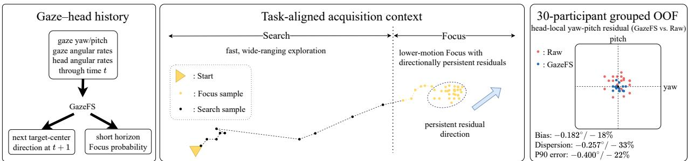
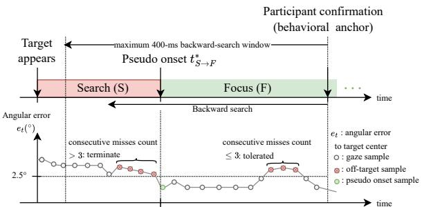
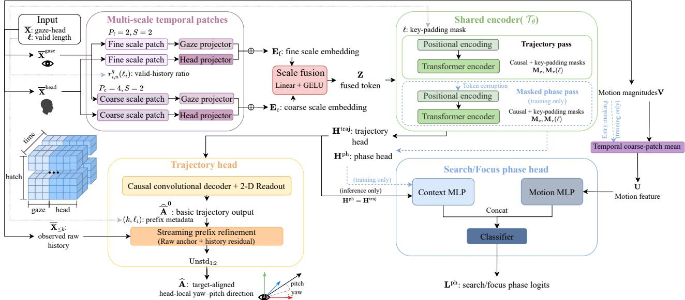

# GazeFS: Target-Centered Gaze-Trajectory Forecasting and Stabilization from Gaze–Head History

Yaozheng Xia (1), Zaiping Zhu (2), Bo Pang (3), Minghao Xie (4),

Hui Li (1), Shaorong Wang (1)∗, Sheng Li (3)∗

(1) School of Information Science and Technology, School of Artificial Intelligence, Beijing Forestry University (2) School of Digital Art, Nanjing University of the Arts (3) School of Computer Science, Peking University (4) Leicester International Institute, Dalian University of Technology

  
Figure 1: Overview of GazeFS. From task-aligned gaze–head history, the model forecasts the next target-center direction and short-horizon Focus probability without target geometry at inference; grouped OOF shows lower Focus bias, dispersion, and P90 error than Raw.

## Abstract

Target-centered gaze interaction requires more than suppressing frame-to-frame fluctuations: target acquisition produces task-aligned changes in gaze-head dynamics, while a gaze trace may retain a persistent target-relative residual direction. We formulate gaze correction as online target-centered gazetrajectory forecasting and stabilization and introduce GazeFS, which maps a variable-length gaze-head history to the next target-center direction and a short-horizon Search/Focus estimate without target information at inference. Across 7,960 acquisition episodes from 30 participants, Search–Focus differences remain stable under quality control, onset exclusion, and duration matching. History windows improve phase decoding over the current endpoint, but explicit task progress remains a strong control. Under the 30-participant, five-fold grouped out-of-fold protocol across three seeds, the reductions relative to raw hold in Focus episode bias, within-episode dispersion, and P90 target error are 0.182◦, 0.257◦, and 0.400◦, with participant-bootstrap 95% confidence intervals excluding zero. Endpoint-free replay from empty history preserves the Focus advantage and yields raw-network phase balanced accuracy/AUPRC of0.925/0.993; coordinate controls further show that recent history contributes beyond explicit progress metadata. GazeFS therefore improves Focus target centering and empirical residual contraction while leaving temporal smoothness as a separate objective.

## Introduction

Eye gaze enables fast, hands-free interaction in augmented and virtual reality (Plopski et al. 2022). As a pointing signal, however, gaze estimates reported by head-mounted devices exhibit two errors that should not be conflated: shorttimescale fluctuation, observed as local dispersion or frameto-frame motion, and persistent target-relative ofset, which displaces the interaction ray from the intended target (Aziz and Komogortsev 2022; Wagner et al. 2024; Marquardt et al. 2024). A low-pass filter can attenuate the former, but its steady-state output remains centered on the measured signal and therefore cannot, by itself, infer a corrected target center. A gaze trace can consequently be smooth yet systematically of target. Here, “stabilization” denotes target-relative centering and residual contraction; temporal smoothness is evaluated as a separate objective.

Target acquisition also evolves as a user locates a target, approaches it, and maintains a target-centered direction for confirmation. We operationalize this task progression as two confirmation-anchored phases, Search and Focus; they are task-defined labels rather than assumed physiological states. This raises a joint AI question: can a target-agnostic online model use gaze-head history to infer both where the target center lies and when the acquisition has entered the shorthorizon Focus phase?

Prior methods address only isolated aspects of gaze-based target acquisition. Temporal filters reduce rapid fluctuation but remain anchored to current measurement (Špakov 2012; Kumar et al. 2008), while eye-head pointing combines instantaneous motion cues (Sidenmark and Gellersen 2019; Sidenmark et al. 2020, 2022; Hou et al. 2024). Spatial correction methods either infer recalibration from interaction correspondences or rely on scene geometry and target candidates to adjust the landing position (Hou et al. 2025; Wei et al. 2023). In parallel, intent and adaptive-dwell models estimate when activation should occur without correcting the underlying pointing direction (David-John et al. 2021; Isomoto, Yamanaka, and Shizuki 2022; Narkar et al. 2024). Consequently, spatial correction and acquisition timing are typically modeled separately, often with runtime access to interaction feedback or candidate targets.

We motivate a joint formulation using synchronized gaze and head-motion recordings collected during user targetacquisition episodes. Complete-episode analyses show robust Search-Focus diferences in gaze-speed tails, head motion, and local dispersion, while target-relative Focus residuals retain a persistent episode-level direction. Controlled history-window probes show that recent gaze-head context is more informative than a single current observation. However, simple task-progress cues explain much of the phase predictability, and perturbing frame order causes little loss. We therefore treat history as acquisition-history context rather than claiming that an exact temporal ordering is necessary.

These observations motivate three modeling choices. First, directionally persistent Focus residuals require forecasting a target-center direction rather than smoothing measured gaze. Second, phase-dependent behavior motivates a parallel phase output and phase-aligned coordinate learning. Third, progressively growing and variable-length histories motivate masked history encoding and episode prefix refinement. We formulate task-state-aligned online target-directionforecasting and introduce GazeFS. Given gaze–head observations through time t, GazeFS predicts the next-frame target-center direction in head-local yaw–pitch and whether the next short interval contains Focus. Fine- and coarse-scale tokens share a Transformer encoder with a causal mask and feed parallel trajectory and phase heads. The predicted phase does not gate the trajectory decoder at inference; task-phase labels instead shape coordinate learning during training. A two-stage refinement module addresses the short context available at bufer initialization. Target information is used for ofline label construction, supervision, sampling, and evaluation, but never enters the inference tensor.

We evaluate GazeFS over all 30 participants using five participant-grouped outer folds and three seeds. On common valid Focus support, Full GazeFS reduces episode bias, within-episode dispersion, median error, and P90 error relative to raw hold by 0.182◦, 0.257◦, 0.109◦, and 0.400◦, respectively; participant-level simultaneous intervals over the four primary outcomes remain below zero. The same centering advantage persists in endpoint-free replay from empty history. Additional controls show that recent gaze– head history contributes spatial information beyond observable progress cues, although the available probes do not isolate exact frame order as the necessary mechanism. Futuresufix, exact-prefix, and endpoint-free tests verify that the reported outputs do not depend on endpoint knowledge or unobserved future samples.

Contributions. Our contributions are:

• We formulate target-centered gaze–trajectory forecasting and stabilization, which uses gaze-head history to jointly estimate the target-center direction and stabilize the evolving gaze trajectory throughout target acquisition, without requiring target information at inference time.

• We introduce GazeFS, which combines multi-scale history encoding, parallel direction and phase prediction, and phase-aligned training for target-direction correction.

• We establish an evaluation protocol, demonstrating improved Focus-stage target centering without access to future or endpoint information.

## Related Work

Gaze filtering and spatial correction. Temporal filters suppress sample-to-sample gaze fluctuation but generally remain anchored to the measured direction (Plopski et al. 2022; Špakov 2012; Kumar et al. 2008). Eye–head pointing combines the rapid response of gaze with the relative stability of head motion (Sidenmark and Gellersen 2019; Sidenmark et al. 2020, 2022; Hou et al. 2024). Candidateaware methods instead infer an intended object from scene geometry or learned endpoint distributions (Pfeufer et al. 2017; Wei et al. 2023). Scene-level gaze-target detection further combines human-attention and activity cues to localize the attended object (Yang, Yin, and Lu 2024). These approaches improve smoothness, control, or object selection, but they either remain tied to current measurements or require an explicit candidate set. GazeFS forecasts a targetcentered direction from target-agnostic gaze–head history. Target information is restricted to ofline construction and supervision, and endpoint-only and Endpoint+Progress controls test whether the result can be explained by nonlinear current-frame or progress-conditioned calibration.

Temporal gaze forecasting. Prior work uses gaze, head motion, and scene history to anticipate future viewing behavior (Hu et al. 2019; Burlingham et al. 2024; Hu et al. 2020, 2021; Rolf et al. 2022). Recent work further formulates short-horizon VR gaze as multivariate time-series forecasting with oculomotor-event prediction (Melnyk, Friedman, and Komogortsev 2026), while general forecasting architectures model multi-scale or non-stationary temporal patterns, including multi-scale inter-series correlations (Wu et al. 2023; Cai et al. 2024). Most prior forecasting methods predict subsequently observed gaze for attention anticipation or latency compensation. GazeFS instead predicts a latent target-center interaction direction whose geometry is available only during training.

Fixation, intent, and task-aligned phase. Velocity- and dispersion-based methods identify physiological fixations and saccades (Salvucci and Goldberg 2000), whereas intent and adaptive-dwell models estimate interaction readiness or activation timing (David-John et al. 2021; Isomoto, Yamanaka, and Shizuki 2022; Narkar et al. 2024). Our confirmation-anchored Search/Focus labels encode targetacquisition progress, not an intrinsic oculomotor regime. GazeFS predicts this short-horizon phase jointly with target direction from a shared historical representation.

## Data and Task Definition

We analyze 7,960 60-Hz episodes from 30 HoloLens 2 participants with $\mathbf { x } _ { t } = [ \mathbf { g } _ { t } ^ { \top } , \dot { \mathbf { g } } _ { t } ^ { \top } , \dot { \mathbf { h } } _ { t } ^ { \top } ] ^ { \top } \in \mathbb { R } ^ { 7 }$

The channels are head-local gaze yaw–pitch, their angular rates, and head yaw–pitch–roll rates. The target-center direction is expressed in the same frame but is used only for ofline label construction, supervision, and evaluation; it is never provided at inference.

Figure 2 summarizes the label construction. We derive two task-aligned phase labels, Search and Focus, from each confirmation-anchored gaze-to-target trace. Treating participant confirmation as a retrospective anchor, a backward scan locates the earliest stable target-centered segment. Frames before this onset are labeled Search and frames from the onset onward are labeled Focus. These labels represent acquisition progress rather than physiological fixation or saccade states. Collection, coordinate conversion, quality control, threshold sensitivity, and participant-grouped splits are detailed in Supplement Sec. B.

The following analysis uses complete episodes to characterize phase-dependent gaze–head structure. Natural historywindow probes use frozen endpoints across endpoint-only, ordered-history, order-invariant, and explicit-progress controls; the complete protocol is reported in Supplement Sec. A.2.

  
Figure 2: Confirmation-anchored construction of the Search and Focus task-phase labels. Starting from participant confirmation, a backward scan locates the earliest stable target-centered segment; its onset defines the Search-to-Focus boundary. The angular, continuity, and search-window thresholds are shown in the figure and detailed in Supplement Sec. B.

Ethics and consent. Both studies were approved by the responsible institutional ethics committee (identifier withheld for anonymous review), and all participants provided informed consent before participation.

## Task-Aligned Gaze–Head Structure

Task-aligned non-stationarity. Table 1(a) shows that Focus has a lower gaze-speed tail, lower head motion, and lower local dispersion than Search. The efects retain their direction after excluding ±300 ms around the recovered boundary and after matching the Search and Focus duration distributions.

(a) Focus − Search efects.
<table><tr><td>Metric</td><td>Default</td><td>Excl.</td><td>Match</td></tr><tr><td>Gaze P90 (° /s)</td><td>-15.263</td><td>-14.705</td><td>-17.872</td></tr><tr><td>Head med. (°/s)</td><td>-2.291</td><td>-1.860</td><td>-2.421</td></tr><tr><td>Dispersion (°)</td><td>-0.562</td><td>-0.404</td><td>-0.567</td></tr></table>

(b) Raw Focus residual persistence.
<table><tr><td>Metric</td><td>Estimate 95% CI</td></tr><tr><td>Early/late bias-vector cosine ↑ Persistent-offset ratio ↑</td><td>0.886 [0.856, 0.912] 0.977 [0.972, 0.982]</td></tr><tr><td>(c) Natural-window phase diagnostic.</td><td></td></tr><tr><td colspan="2"> ${ \bf B A } _ { 6 4 }$ </td></tr><tr><td>Input</td><td>↑ BA128 ↑ AUPRC1281</td></tr><tr><td>Endpoint only</td><td>0.640 0.640</td></tr><tr><td>Ordered history 0.927</td><td>0.928</td></tr><tr><td>Unordered summary 0.914</td><td>0.921</td></tr><tr><td>Elapsed time + endpoint 0.928</td><td>0.928</td></tr><tr><td>Elapsed time + ordered 0.925</td><td>0.924</td></tr></table>

Table 1: Task-aligned gaze–head structure. Panel (a) uses all 30 participants; “Excl.” removes ±300 ms around the Search/Focus boundary and “Match” matches phase duration. Panel (b) summarizes direction persistence within raw Focus over 7,960 episodes. Panel (c) is a one-seed controlled probe; a three-seed 16/32-frame shufle audit and paired effects appear in Supplement Sec. A.2.

Sensitivity of the label construction and retained membership to threshold choices is reported separately in Supplement Sec. B.3. Together, these results support task-aligned non-stationarity during acquisition.

Directionally persistent Focus residuals. For each episode, we compute the mean raw target-relative residual vector separately over the first and second halves of Focus. Table 1(b) shows an early/late bias-vector cosine of 0.886 and a persistent-ofset ratio of 0.977, with both intervals well above zero. The residual therefore tends to retain a similar direction across Focus rather than behave as purely frame-local fluctuation, motivating history-based target-center forecasting rather than local smoothing alone (Supplement Sec. A.1).

Recent history provides acquisition context. Table 1(c) shows that a recent gaze–head window raises balanced accuracy from 0.640 for the current 7D observation to 0.927/0.928 at 64/128 frames and remains above a compact order-invariant summary of the same window. However, historically observed elapsed-time features are competitive with the full window, and preserving the same observations while shufling individual frames or short blocks produces essentially no loss. These probes therefore show that access to rich recent-frame content is useful, without identifying exact frame order as the necessary mechanism. This still motivates variable-length history modeling because multiple recent observations are more informative than a single endpoint; later coordinate-level OOF controls test whether the spatial gains persist beyond explicit progress cues. Exact probe definitions and paired efects appear in Supplement Sec. A.2.

## Online Target-Centered Gaze-Trajectory Forecasting and Stabilization

## Problem Formulation

For sample i, let $\overline { { \mathbf { X } } } _ { i } ~ \in ~ \mathbb { R } ^ { T \times 7 }$ be a standardized, padded gaze–head tensor whose first $\ell _ { i } \leq T$ rows form the observed history and whose remaining rows are padding. The seven inference channels are gaze yaw–pitch, their angular rates, and head yaw–pitch–roll rates. Given only the observed prefix $\overline { { \mathbf { X } } } _ { i , 1 : \ell _ { i } }$ —that is, the currently available history—GazeFS predicts a dense target-direction sequence and patch-level Search/Focus logits:

$$
\begin{array} { r } { ( \widehat { \bf A } _ { i } , { \bf L } _ { i } ^ { \mathrm { p h } } ) = f _ { \pmb { \theta } } ( \overline { { { \bf X } } } _ { i } , \ell _ { i } ) . } \end{array}\tag{1}
$$

$\widehat { \mathbf { A } } _ { i }$ is the target-center direction expressed in head-local yaw– pitch. It is not a reconstruction of future recorded gaze. No target-derived quantity enters $f _ { \theta }$ at inference; target information and task labels are used only to construct supervision, training losses, sampling or augmentation weights, and offline metrics. The observed-history length $\ell _ { i }$ and historical bufer-age/prefix descriptors are also available to the model; although online observable, they may encode task progress.

Indexing frames from zero, token n is anchored at $a _ { n } =$ nS and predicts the next S target-center directions, aligned to frames $a _ { n } + \delta \operatorname { f o r } \delta = 1 , \dots , S$ . Its phase target asks whether the same short future interval contains Focus. Thus the phase output is a short-horizon estimate, not a current-frame label. The two outputs share a representation but remain parallel; predicted phase never gates the direction forecast.

## GazeFS Architecture

Figure 3 shows the deployed path and training-only regularization. The design addresses three constraints suggested by the data: gaze and head motion evolve at diferent local scales, inference must operate online without access to future observations, and only limited history is available immediately after initialization or reset.

Multi-scale temporal tokens. We split the input into a four-channel gaze stream and a three-channel head-motion stream. Fine and coarse patches use $P _ { f } = 2$ and $P _ { c } = 4$ with shared stride $S = 2 .$ , which provides a balanced development trade-of among coordinate error, phase quality, and output support (Supplement Sec. D.2). At scale $q \in \{ f , c \}$ token n is constructed from the $P _ { q }$ observations ending at anchor $a _ { n } .$ . Missing pre-sequence context is filled by replicating the first observed frame, and $r _ { i , n } ^ { q } ( \ell _ { i } )$ records the fraction of patch positions supported by actual observed history rather than replicated left-boundary context. Separate gaze and head projections are added within each scale; aligned fine and coarse tokens are then concatenated and fused into tokens Z. The fine scale captures rapid acquisition changes, while the coarse scale provides longer local motion context.

Shared encoder and parallel heads. The shared Transformer (Vaswani et al. 2017) uses sinusoidal positional encoding, an upper-triangular causal mask $\mathbf { M } _ { \mathrm { c } } .$ , and a keypadding mask $\mathrm { \tilde { M } _ { v } } ( \ell )$ . Here, "causal" refers only to leftlooking operators that exclude future samples. The causal mask prevents each token from attending to later anchors, whereas the key-padding mask excludes token positions outside the observed history, allowing variable-length samples to share a mini-batch. Its clean trajectory representation is

$$
\begin{array} { r } { \mathbf { H } ^ { \mathrm { t r a j } } = \mathcal { T } _ { \boldsymbol { \theta } } ( \mathbf { Z } + \mathrm { P E } ; \mathbf { M } _ { \mathrm { c } } , \mathbf { M } _ { \mathrm { v } } ( \boldsymbol { \ell } ) ) . } \end{array}\tag{2}
$$

During training, a random fixed-cardinality token mask $\mathbf { M } _ { p }$ forms

$$
\mathbf { Z } ^ { e } = ( 1 - \mathbf { M } _ { p } ) \odot \mathbf { Z } + \mathbf { M } _ { p } \odot \mathbf { e } _ { \operatorname* { m a s k } } ,\tag{3}
$$

and the same encoder parameters produce

$$
\mathbf { H } ^ { \mathrm { p h } } = \left\{ \begin{array} { l l } { T _ { \theta } ( \mathbf { Z } ^ { e } + \mathrm { P E } ; \mathbf { M } _ { \mathrm { c } } , \mathbf { M } _ { \mathrm { v } } ( \ell ) ) , } & { \mathrm { t r a i n i n g } , } \\ { \mathbf { H } ^ { \mathrm { t r a j } } , } & { \mathrm { i n f e r e n c e } . } \end{array} \right.\tag{4}
$$

Thus deployment uses one encoder pass. The trajectory head always consumes $\mathbf { H } ^ { \mathrm { t r a j } }$ . During training, the Search/Focus phase head consumes Hph from the masked second pass; at inference it reuses $\mathbf { H } ^ { \mathrm { t r a j } }$ . The phase logits are never fed to the trajectory head, so deployment requires only one encoder pass.

Trajectory head and streaming-prefix refinement. A causal convolutional decoder maps $\mathbf { \hat { H } } ^ { \mathrm { t r a j } }$ to a standardized base forecast $\widehat { \mathbf { A } } ^ { 0 } \in \mathbb { R } ^ { B \times N \times S \times 2 }$ . Concatenating successive token outputs gives the dense alignment $\widehat { \mathbf { a } } _ { i , k }  \mathbf { a } _ { i , k + 1 } ^ { * } ;$ for clarity, the notation retains only the two yaw–pitch channels used for supervision.

For the first R dense outputs, two causal residual modules refine the base forecast in the standardized domain:

$$
\overline { { \mathbf { a } } } _ { i , k } ^ { ( 1 ) } = ( 1 - \rho _ { k } ) \widehat { \overline { { \mathbf { a } } } } _ { i , k } ^ { 0 } + \rho _ { k } \big ( \overline { { \mathbf { x } } } _ { i , k , 1 : 2 } + \Delta _ { i , k } ^ { r } \big ) ,\tag{5}
$$

$$
\widehat { \bar { \mathbf { a } } } _ { i , k } = \mathbf { \bar { a } } _ { i , k } ^ { ( 1 ) } + \gamma _ { i , k } \Delta _ { i , k } ^ { h } .\tag{6}
$$

The raw-anchor residual $\Delta ^ { r }$ uses raw observed gaze–head history. The history residual $\Delta ^ { h }$ additionally receives the first-stage direction and prefix descriptors derived from k and $\ell _ { i } .$ . Gates $\rho _ { k }$ and $\gamma _ { i , k }$ decay as context accumulates, leaving the base forecast unchanged outside the short prefix. The final yaw–pitch output is obtained by inverse standardization.

Motion-aware Search/Focus phase head. From standardized rates, we form gaze- and head-motion magnitudes and temporally mean-pool them over the coarse patches, yielding $\mathbf { \dot { U } } \in \mathbf { \check { \mathbb { R } } } ^ { B \times N \times 2 } .$ A context MLP consumes $\mathbf { \dot { H } } ^ { \mathrm { p h } }$ , a motion MLP consumes U, and their features are concatenated:

$$
\begin{array} { r } { \mathbf { L } _ { i , n , : } ^ { \mathrm { p h } } = D _ { \mathrm { p h } } \Big ( [ F _ { t } ( \mathbf { H } _ { i , n } ^ { \mathrm { p h } } ) ; F _ { v } ( \mathbf { U } _ { i , n } ) ] \Big ) . } \end{array}\tag{7}
$$

Training-only token replacement and motion-entry masking discourage reliance on isolated token and rate measurements; inference reuses $\mathbf { H } ^ { \mathrm { t r a j } }$ and the unmasked motion descriptors.

## Task-Aligned Learning

Let $y _ { i , t } \in \{ 0 , 1 \}$ denote the frame-level Search/Focus label. The native phase target for token n is the next-S maximum

$$
\bar { y } _ { i , n } = \operatorname* { m a x } _ { 1 \leq j \leq S } y _ { i , a _ { n } + j } .\tag{8}
$$

For frame-level evaluation, each token probability is expanded over its corresponding S outputs and aligned to the physical t + 1 frame label; the native training target remains the next-S maximum above. The coordinate target is the next-frame target-center direction $\mathbf { a } _ { i , k + 1 } ^ { * } .$ Let $\widetilde { y } _ { i , k } \in [ 0 , 1 ]$ be a label-derived Focus weight softened only near the task boundary, and define

  
Figure 3: Overview of GazeFS. Separate gaze and head projectors form fine- and coarse-scale temporal tokens, which are fused and processed by a shared Transformer encoder with a causal mask. The trajectory head forecasts target-aligned yaw–pitch and applies short-prefix refinement; the Search/Focus phase head combines the encoded context with temporally pooled motion magnitudes. The two heads are parallel: predicted phase is not fed to the trajectory branch. Solid paths are used at inference, blue dashed paths are training-only, and dotted paths carry valid-history metadata. Target information and phase labels supervise training but never enter the inference graph.

$$
\mathbf { e } _ { i , k } = [ \mathrm { w r a p } ( \widehat { \psi } _ { i , k } - \psi _ { i , k + 1 } ^ { * } ) , \widehat { \phi } _ { i , k } - \phi _ { i , k + 1 } ^ { * } ] ^ { \top } .\tag{9}
$$

The coordinate objective combines a phase-weighted Huber term for robust, component-wise yaw/pitch displacement with a directional cosine term for scale-invariant orientation mismatch in the yaw–pitch plane,

$$
\mathcal { L } _ { \mathrm { c o o r d } } = \left. w _ { r } ( \widetilde { y } ) \left[ w _ { H } ( \widetilde { y } ) H _ { \delta ( \widetilde { y } ) } ( \mathbf { e } ) + w _ { C } ( \widetilde { y } ) \ell _ { \mathrm { c o s } } \right] \right. _ { v } ,\tag{10}
$$

where $\langle \cdot \rangle _ { v }$ averages valid outputs. Crucially, $\widetilde { y }$ comes from y, never from the predicted phase.

The phase head uses α-balanced focal-weighted crossentropy (Lin et al. 2017). Two training-only geometry terms penalize missed target-plane entry on raw-stable Focus frames and around synthetic boundaries. The complete objective is

$$
\begin{array} { r } { \begin{array} { r c l } { \mathscr { L } = e ^ { - s _ { c } } \mathscr { L } _ { \mathrm { c o o r d } } + s _ { c } + e ^ { - s _ { f } } \lambda _ { f } \mathscr { L } _ { \mathrm { f o c u s } } + s _ { f } } \\ { + \lambda _ { e } \mathscr { L } _ { \mathrm { e f f e c t i v e } } + \lambda _ { b } \mathscr { L } _ { \mathrm { b o u n d a r y } } , } \end{array} } \end{array}\tag{11}
$$

with homoscedastic task weighting (Kendall, Gal, and Cipolla 2018). Exact masks, augmentation, geometry construction, tensor alignment, coeficients, and the export/runtime profile are given in Supplement Sec. C.

## Experiments

## Protocols, Statistics, and Baselines

Evaluation and grouped-OOF protocol. Fixed-window evaluation uses common 128-frame crops; exact-prefix evaluation scores the next frame after L observed frames; and endpoint-free replay starts from empty history, grows to 128 frames, and then slides without endpoint or future information. Five participant-grouped outer folds use 21/3/6 participants for fitting, checkpoint selection, and testing. Scaling, training, and selection exclude outer-test participants; learned methods use seeds 42, 314, and 2718. The fixed 24/3/3 split and consecutive-target reset tests are supplementary development/lifecycle diagnostics.

Inference contract and controls. All methods estimate direction at t + 1 from information available through t. Rawhold copies the measured direction at t; One Euro (Casiez, Roussel, and Vogel 2012) filters the same stream with frozen parameters. Endpoint-only uses ${ \bf x } _ { t } ,$ whereas Endpoint+Progress adds observable bufer-age/history-ratio descriptors but no earlier gaze–head samples. The noexplicit-progress variant retains history while removing explicit history-ratio, positional, and prefix metadata. The Transformer-Causal baseline uses the same participant folds, 7D inputs, next-frame coordinate target, phase-label alignment, feature scaling, and documented shared sampling and loss settings. Encoder-specific modules difer by design; the audited matching scope is reported in Supplement Sec. A.9. OOF results use raw network outputs without EMA, dwell, or FSM decisions.

<table><tr><td>Method</td><td>Bias ↓ Disp. ↓</td><td>Med. ↓</td><td>P90↓</td></tr><tr><td>Raw hold</td><td>1.010 0.777</td><td>1.016</td><td>1.814</td></tr><tr><td>One Euro</td><td>1.004 0.761</td><td>1.008</td><td>1.802</td></tr><tr><td>Endpoint-only</td><td>1.045 0.820</td><td>1.070</td><td>1.907</td></tr><tr><td>Transformer-Causal</td><td>0.968</td><td>0.570 1.048</td><td>1.599</td></tr><tr><td>GazeFS w/o align.</td><td>0.908</td><td>0.642 1.003</td><td>1.626</td></tr><tr><td>Full GazeFS</td><td>0.828</td><td>0.520 0.906</td><td>1.415</td></tr></table>

Table 2: Common-support fixed-window Focus outcomes (degrees) under grouped OOF. Bold/underline denote best/second-best values; paired and simultaneous intervals are in Supplement Sec. A.4.

Metrics and participant-level inference. Fixed-window contrasts use the same finite, label-valid Focus samples for all compared methods. Episode bias is the norm of the mean signed target-relative residual, dispersion is its centered spatial spread, and target-error median and P90 summarize typical and upper-tail angular distance. Temporal behavior is reported separately as frame-to-frame residual motion, the mean tangent-plane displacement between physically adjacent, jointly valid source frames; it is not target error, dispersion, input velocity, or deployed pointer jitter. Metrics are computed per episode, summarized within participant and seed, averaged across the three seeds within participant, and then averaged with equal participant weight. Paired efects use 5,000 participant-bootstrap resamples. The four Fullminus-Raw Focus spatial outcomes form the primary family, with max-|T| simultaneous intervals. Phase metrics use the physical t + 1 label, raw Focus probabilities, and threshold 0.5. Exact formulas and support rules are in Supplement Sec. A.3.

## RQ1: Focus-Stage Target Centering

On common Focus support, Full GazeFS reduces Raw bias, dispersion, median error, and P90 error by 0.182◦, 0.257◦, 0.109◦, and 0.400◦, respectively; participant-bootstrap and simultaneous intervals remain below zero. All four outcomes also improve relative to One Euro, endpoint-only, Transformer-Causal, and GazeFS without phase alignment. These controls test current-frame calibration, a generic history model, and phase-dependent coordinate training, respectively.

The gain is not temporal smoothing. Full GazeFS increases mean frame-to-frame target-relative residual motion by 0.0578◦ per adjacent physical frame and residual path by 7.003◦ relative to Raw (Supplement Sec. A.4). These metrics quantify temporal movement of the residual trajectory rather than spatial spread or device-level pointer jitter.

## RQ2: Phase Dependence and Mechanism Boundaries

Table 3 localizes the joint spatial improvement to Focus; Search and transition do not improve consistently across centering, spread, tail error, and residual motion. Because the noalignment control keeps the phase head but removes phasedependent coordinate weighting, it supports the coordinatetraining mechanism rather than an isolated classifier benefit. Development-only modality ablations show that gaze orientation carries target bearing, while gaze/head rates mainly improve endpoint-free upper-tail error (Supplement Sec. D).

<table><tr><td>Phase</td><td>Bias ↓</td><td>Disp. ↓</td><td>Med. ↓</td><td>P90↓</td></tr><tr><td>Search</td><td>13.887/13.475</td><td>1.687/2.420</td><td>14.407/14.06416.306/16.443</td><td></td></tr><tr><td>Transition</td><td>3.229/3.057</td><td>4.192/4.225</td><td>2.113/2.317</td><td>8.564/8.572</td></tr><tr><td>Focus</td><td>1.010/0.828</td><td>0.777/0.520</td><td>1.016/0.906</td><td>1.814/1.415</td></tr></table>

Table 3: Phase harm audit, shown as Raw/Full GazeFS in degrees. Bold marks the lower value within each pair; only Focus improves jointly across all four spatial outcomes. Complete motion diagnostics appear in Supplement Sec. A.4.
<table><tr><td>Method</td><td>BA ↑ F1 ↑ AUPRC ↑ Cov. ↑</td><td></td><td></td><td></td><td>Onset Median/P90 ↓ Focus (%)</td><td>Pre-onset</td></tr><tr><td>Endpoint-only</td><td>0.530 0.172</td><td></td><td>0.875</td><td>0.399</td><td>398/1368</td><td>3.79</td></tr><tr><td>Transformer-Causal 0.8960.940</td><td></td><td></td><td>0.989</td><td>1.000</td><td>225/630</td><td>13.93</td></tr><tr><td>GazeFS w/o align.</td><td>0.901</td><td>0.934</td><td>0.990</td><td>1.000</td><td>246/594</td><td>10.83</td></tr><tr><td>Full GazeFS</td><td>0.903</td><td>0.936</td><td>0.990</td><td>1.000</td><td>248/585</td><td>10.58</td></tr></table>

Table 4: Raw-logit phase/onset outcomes. Cov. denotes threshold-crossing coverage; onset entries are absolute median/P90 errors (ms). Pre-Focus is a one-sided, unranked diagnostic. No EMA, dwell, or FSM is applied.

RQ3: Online Phase, Progress Controls, and Replay Full obtains 0.903 balanced accuracy, 0.936 Focus F1, 0.990 AUPRC, and 248/585 ms median/P90 absolute onset error from raw phase outputs. This is a trade-of rather than uniform dominance, and coverage is not a false-alarm estimate because every source episode eventually acquires a target.

All 60 learned OOF checkpoints satisfy future-sufix invariance: replacing samples strictly after an audit frame leaves every earlier direction output and phase logit unchanged, with a global maximum absolute diference of zero (Supplement Sec. A.3). Exact-prefix results improve over Raw at 8, 16, 64, and 128 frames, while the 32-frame interval crosses zero; cold-start superiority is therefore not uniform.

Table 6 shows that the fixed-window centering advantage persists when every episode is replayed from empty history. Relative to Transformer-Causal, Full has higher balanced accuracy and AUPRC and a lower onset-error P90, while Focus F1 is slightly lower and the median threshold crossing is later; complete trade-ofs are in Supplement Sec. A.6.

History and progress. Table 7 separates current observation, explicit progress, and earlier gaze–head history under the same endpoint-free protocol. Progress alone improves all four spatial outcomes over Endpoint-only. A history model without explicit progress metadata then improves bias, dispersion, median, and P90 over Endpoint+Progress by 0.159◦, 0.132◦, 0.098◦, and 0.303◦, respectively, with participant-paired intervals below zero. Restoring the full progress/position context primarily reduces dispersion and P90 and improves frame-to-frame residual motion and phase/onset reliability. The control is bundled and does not isolate exact frame order.

<table><tr><td>L frames / s</td><td>Valid Cold</td><td></td><td>Full median ↓ (Full − Raw)</td><td>∆ med. [95% CI]</td></tr><tr><td>8 / 0.13</td><td>7,9595,445</td><td></td><td>14.036</td><td> $- 0 . 1 5 4 \left[ - 0 . 1 8 0 , - 0 . 1 2 9 \right]$ </td></tr><tr><td>16 / 0.27</td><td>7,9595,445</td><td></td><td>12.443</td><td> $- 0 . 1 6 9 \left[ - 0 . 2 0 3 , - 0 . 1 3 5 \right]$ </td></tr><tr><td>32 / 0.53</td><td>7,9605,445</td><td></td><td>1.742</td><td> $0 . 0 0 0 \left[ - 0 . 0 4 4 , 0 . 0 4 3 \right]$ </td></tr><tr><td>64 / 1.07</td><td>7,9605,445</td><td></td><td>0.970</td><td> $- 0 . 0 8 6 \left[ - 0 . 1 3 7 , - 0 . 0 3 5 \right]$ </td></tr><tr><td>128 / 2.13</td><td>7,8287,828</td><td></td><td>0.928</td><td> $- 0 . 1 4 2 \left[ - 0 . 2 0 2 , - 0 . 0 8 1 \right]$ </td></tr></table>

Table 5: Exact source-prefix evaluation in degrees at approximately 60 Hz. Prefix L scores frame L from observations through L − 1 and never counts backward from a known endpoint. “Cold” excludes previous-target context.

(a) Endpoint-free Focus outcomes.
<table><tr><td>Method</td><td colspan="3">Bias ↓ Disp. ↓ Med.↓ P90↓</td></tr><tr><td>Raw hold</td><td>1.010 0.777</td><td>1.016</td><td>1.814</td></tr><tr><td>Transformer-Causal</td><td>0.964 0.558</td><td>1.039</td><td>1.580</td></tr><tr><td>Full GazeFS</td><td>0.824 0.508</td><td>0.900</td><td>1.397</td></tr><tr><td colspan="4">(b) Raw-network phase output.</td></tr><tr><td>Method</td><td>Balanced accuracy ↑</td><td> $\mathbf { A U P R C } \uparrow$ </td><td>Pre-onset Focus (%)</td></tr><tr><td>Transformer-Causal</td><td>0.920</td><td>0.992</td><td>9.0</td></tr><tr><td>Full GazeFS</td><td>0.925</td><td>0.993</td><td>6.0</td></tr></table>

Table 6: Endpoint-free OOF from empty history. Context grows to 128 frames and then slides without endpoint/future input, output EMA, or FSM decisions. Pre-onset Focus is unranked; complete results appear in Supplement Sec. A.6.

Mature history and temporal localization. $\mathrm { A t } \geq 1 2 8$ frames, after bufer length has saturated and short-prefix refinement has ended, Full remains better than Endpoint+Progress by 0.139◦, 0.100◦, 0.076◦, and 0.284◦ in bias, dispersion, median, and P90, respectively; all four paired intervals remain below zero, while residual-motion and path intervals include zero. Relative to Raw, P90 is worse during the first 250 ms after Focus onset (+0.360◦) but better after 500 ms (−0.455◦), localizing the claim to sustained Focus rather than initial target discovery (Supplement Sec. A.8).

## Secondary Closed-Loop Feasibility

A 12-participant within-subject HoloLens 2 study compares the native gaze pointer, One Euro, a Weighted Pointing implementation of Weighted Pointer (Sidenmark et al. 2022), and GazeFS Residual over 384 scored trials per condition. Completion is near ceiling. In the all-trial min(T, 5 s) sensitivity, GazeFS is 0.196 s faster than One Euro (95% CI [−0.263, −0.124], pHolm = 0.0044); comparisons with the native pointer and Weighted Pointing cross zero. Because only GazeFS resets history/state after selection or timeout, this compares complete deployed conditions rather than isolating learned correction or reset (Supplement Sec. F).

<table><tr><td>Method</td><td>Earlier Explicit history progress</td><td></td><td>Bias ↓ Disp. ↓ Med. ↓ P90 ↓</td><td></td><td></td><td></td></tr><tr><td>Endpoint-only</td><td>一</td><td></td><td>1.045</td><td>0.820</td><td>1.070</td><td>1.907</td></tr><tr><td>Endpoint+Progress</td><td>一</td><td>√</td><td>0.962</td><td>0.775</td><td>0.985</td><td>1.783</td></tr><tr><td>GazeFS w/o explicit progress metadata</td><td>√</td><td></td><td>0.803</td><td>0.643</td><td>0.887</td><td>1.481</td></tr><tr><td>Full GazeFS</td><td>√</td><td>√</td><td>0.824</td><td>0.508</td><td>0.900</td><td>1.397</td></tr></table>

Table 7: Endpoint-free history–progress controls. History denotes preceding 7D observations; progress denotes buferage, history-ratio, positional, and prefix metadata. The noexplicit variant still exposes structural prefix support; paired intervals appear in Supplement Sec. A.7.
<table><tr><td>Condition</td><td>(%) ↑</td><td>Completion Completed-target time (s) ↓</td><td>Focus</td><td>Focus error (cm) ↓ dispersion (cm) ↓</td></tr><tr><td>HoloLens 2 native</td><td>99.2</td><td>1.562</td><td>2.069</td><td>2.230</td></tr><tr><td>One Euro</td><td>99.7</td><td>1.732</td><td>2.082</td><td>2.317</td></tr><tr><td>Weighted Pointing</td><td>99.5</td><td>1.552</td><td>2.018</td><td>2.221</td></tr><tr><td>GazeFS Residual</td><td>100.0</td><td>1.544</td><td>2.067</td><td>2.214</td></tr></table>

Table 8: Twelve-participant study with 384 scored trials per condition. Bold/underline are descriptive only. Completedtarget time is conditioned on completion; the all-trial sensitivity is in Supplement Sec. F.

Discussion. The controls suggest complementary roles for history and progress. Recent history contributes spatial information beyond explicit bufer-age descriptors, and this advantage remains after the bufer reaches 128 frames and short-prefix refinement has ended. Progress/position context chiefly reduces dispersion, upper-tail error, and targetrelative temporal motion while improving phase/onset reliability. Near-null shufle efects show that rich recent observations matter, but do not isolate exact frame order as necessary. The no-alignment comparison supports phase-dependent coordinate training, not an independent benefit of the auxiliary classifier; predicted phase is never fed to the trajectory output. Stable Raw-relative gains occur in sustained Focus rather than initial target discovery. The live study supports feasibility and a narrow One-Euro duration contrast, while the remaining Raw-relative motion cost motivates explicit centering–smoothness optimization.

## Limitations

Search and Focus are confirmation-anchored task phases, and target information is used for supervision although it is absent at inference. The evidence supports complementary history and progress context, not a strict order law. Evaluation covers segmented successful acquisitions from one HoloLens 2 task. A single-seed held-quadrant screen supports extrapolation within the recorded geometry, while open-stream false activation and cross-layout, session, task, and device generalization remain to be evaluated.

Because model development used a fixed split from the same corpus, grouped OOF is internal validation rather than independent-cohort confirmation. The closed-loop comparison does not isolate reset from learned correction, and centering retains a Raw-relative motion cost. PC-side ONNX latency excludes sensing, network transport, and Unity rendering (Supplement Sec. C.8).

## Conclusion

GazeFS forecasts the next target-center direction and a shorthorizon Search/Focus phase from gaze–head history without target geometry at inference. Participant-grouped OOF and endpoint-free replay show sustained-Focus reductions in bias, dispersion, median, and upper-tail error, while controls indicate complementary roles for recent history and observable progress. A secondary closed-loop study supports feasibility and a narrow duration benefit over One Euro; temporal smoothness and broader continuous-stream generalization remain open.

## References

Aziz, S. D.; and Komogortsev, O. V. 2022. An Assessment of the Eye Tracking Signal Quality Captured in the HoloLens 2. In Proceedings of the 2022 Symposium on Eye Tracking Research and Applications, 5:1–5:6.

Burlingham, C. S.; Sendhilnathan, N.; Wu, X.; Murdison, T. S.; and Proulx, M. J. 2024. Real-World Scanpaths Exhibit Long-Term Temporal Dependencies: Considerations for Contextual AI for AR Applications. In Proceedings of the 2024 Symposium on Eye Tracking Research and Applications, 89:1–89:7.

Cai, W.; Liang, Y.; Liu, X.; Feng, J.; and Wu, Y. 2024. Msgnet: Learning multi-scale inter-series correlations for multivariate time series forecasting. In Proceedings of the AAAI conference on artificial intelligence, volume 38, 11141– 11149.

Casiez, G.; Roussel, N.; and Vogel, D. 2012. 1 Euro Filter: A Simple Speed-Based Low-Pass Filter for Noisy Input in Interactive Systems. In Proceedings of the SIGCHI Conference on Human Factors in Computing Systems, 2527–2530. ACM.

David-John, B.; Peacock, C.; Zhang, T.; Murdison, T. S.; Benko, H.; and Jonker, T. R. 2021. Towards Gaze-Based Prediction of the Intent to Interact in Virtual Reality. In ACM Symposium on Eye Tracking Research andApplications, 2:1– 2:7.

Hou, B. J.; Abramyan, L.; Gurumurthy, P.; Adams, H.; Tosic Rodgers, I.; Gonzalez, E. J.; Patel, K.; Colaço, A.; Pfeufer, K.; Gellersen, H.; Ahuja, K.; and Gonzalez-Franco, M. 2025. Online-EYE: Multimodal Implicit Eye Tracking Calibration for XR. In Proceedings of the 2025 CHI Conference on Human Factors in Computing Systems, 550:1– 550:16.

Hou, B. J.; Newn, J.; Sidenmark, L.; Khan, A. A.; and Gellersen, H. 2024. GazeSwitch: Automatic Eye-Head Mode Switching for Optimised Hands-Free Pointing. Proceedings of the ACM on Human-Computer Interaction, 8(ETRA): 227:1–227:20.

Hu, Z.; Bulling, A.; Li, S.; and Wang, G. 2021. FixationNet: Forecasting Eye Fixations in Task-Oriented Virtual Environments. IEEE Transactions on Visualization and Computer Graphics, 27(5): 2681–2690.

Hu, Z.; Li, S.; Zhang, C.; Yi, K.; Wang, G.; and Manocha, D. 2020. DGaze: CNN-Based Gaze Prediction in Dynamic Scenes. IEEE Transactions on Visualization and Computer Graphics, 26(5): 1902–1911.

Hu, Z.; Zhang, C.; Li, S.; Wang, G.; and Manocha, D. 2019. SGaze: A Data-Driven Eye-Head Coordination Model for Realtime Gaze Prediction. IEEE Transactions on Visualization and Computer Graphics, 25(5): 2002–2010.

Isomoto, T.; Yamanaka, S.; and Shizuki, B. 2022. Dwell Selection with ML-Based Intent Prediction Using Only Gaze Data. Proceedings ofthe ACM on Interactive, Mobile, Wearable and Ubiquitous Technologies, 6(3): 120:1–120:21.

Kendall, A.; Gal, Y.; and Cipolla, R. 2018. Multi-Task Learning Using Uncertainty to Weigh Losses for Scene Geometry and Semantics. In Proceedings of the IEEE Conference on Computer Vision and Pattern Recognition, 7482–7491.

Kumar, M.; Klingner, J.; Puranik, R.; Winograd, T.; and Paepcke, A. 2008. Improving the Accuracy of Gaze Input for Interaction. In Proceedings of the 2008 Symposium on Eye Tracking Research & Applications, 65–68.

Lin, T.-Y.; Goyal, P.; Girshick, R.; He, K.; and Dollár, P. 2017. Focal Loss for Dense Object Detection. In Proceedings of the IEEE International Conference on Computer Vision, 2980– 2988.

Marquardt, A.; Steininger, M.; Trepkowski, C.; Weier, M.; and Kruijf, E. 2024. Selection Performance and Reliability of Eye and Head Gaze Tracking under Varying Light Conditions. In 2024 IEEE Conference Virtual Reality and 3D User Interfaces (VR), 546–556. IEEE.

Melnyk, K.; Friedman, L.; and Komogortsev, O. 2026. Gaze Prediction as Time-Series Forecasting for Virtual Reality Applications: Quantifying Performance Variability and Extreme-Case Errors. In Proceedings of the 2026 Symposium on Eye Tracking Research and Applications, 16:1–16:10.

Narkar, A. S.; Michalak, J. J.; Peacock, C. E.; and David-John, B. 2024. GazeIntent: Adapting Dwell-Time Selection in VR Interaction with Real-Time Intent Modeling. Proceedings ofthe ACM on Human-Computer Interaction, 8(ETRA): 226:1–226:18.

Pfeufer, K.; Mayer, B.; Mardanbegi, D.; and Gellersen, H. 2017. Gaze + pinch interaction in virtual reality. In Proceedings ofthe 5th Symposium on Spatial User Interaction, SUI ’17, 99–108. New York, NY, USA: Association for Computing Machinery. ISBN 9781450354868.

Plopski, A.; Hirzle, T.; Norouzi, N.; Qian, L.; Bruder, G.; and Langlotz, T. 2022. The Eye in Extended Reality: A Survey on Gaze Interaction and Eye Tracking in Head-Worn Extended Reality. ACM Computing Surveys, 55(3): 53:1–53:39.

Rolf, T.; Harms, H. M.; Steinicke, F.; and Frintrop, S. 2022. GazeTransformer: Gaze Forecasting for Virtual Reality Using Transformer Networks. In Pattern Recognition, volume 13485 of Lecture Notes in Computer Science, 577–593. Springer.

Salvucci, D. D.; and Goldberg, J. H. 2000. Identifying Fixations and Saccades in Eye-Tracking Protocols. In Proceedings of the 2000 Symposium on Eye Tracking Research & Applications, 71–78. ACM.

Sidenmark, L.; and Gellersen, H. 2019. Eye&Head: Synergetic Eye and Head Movement for Gaze Pointing and Selection. In Proceedings of the 32nd Annual ACM Symposium on User Interface Software and Technology, 1161–1174.

Sidenmark, L.; Mardanbegi, D.; Ramirez Gomez, A.; Clarke, C.; and Gellersen, H. 2020. BimodalGaze: Seamlessly Refined Pointing with Gaze and Filtered Gestural Head Movement. In ACM Symposium on Eye Tracking Research and Applications, 8:1–8:9.

Sidenmark, L.; Parent, M.; Wu, C.-H.; Chan, J.; Glueck, M.; Wigdor, D.; Grossman, T.; and Giordano, M. 2022. Weighted Pointer: Error-Aware Gaze-Based Interaction through Fallback Modalities. IEEE Transactions on Visualization and Computer Graphics, 28(11): 3585–3595.

Špakov, O. 2012. Comparison of Eye Movement Filters Used in HCI. In Proceedings of the Symposium on Eye Tracking Research and Applications, 281–284.

Vaswani, A.; Shazeer, N.; Parmar, N.; Uszkoreit, J.; Jones, L.; Gomez, A. N.; Kaiser, Ł.; and Polosukhin, I. 2017. Attention Is All You Need. In Advances in Neural Information Processing Systems, volume 30.

Wagner, U.; Jacobsen, A. A.; Feuchtner, T.; Gellersen, H.; and Pfeufer, K. 2024. Eye-Hand Movement of Objects in Near Space Extended Reality. In Proceedings of the 37th Annual ACM Symposium on User Interface Software and Technology, 84:1–84:13.

Wei, Y.; Shi, R.; Yu, D.; Wang, Y.; Li, Y.; Yu, L.; and Liang, H.-N. 2023. Predicting Gaze-Based Target Selection in Augmented Reality Headsets Based on Eye and Head Endpoint Distributions. In Proceedings of the 2023 CHI Conference on Human Factors in Computing Systems, 283:1–283:14.

Wu, H.; Hu, T.; Liu, Y.; Zhou, H.; Wang, J.; and Long, M. 2023. TimesNet: Temporal 2D-Variation Modeling for General Time Series Analysis. In International Conference on Learning Representations.

Yang, Y.; Yin, Y.; and Lu, F. 2024. Gaze target detection by merging human attention and activity cues. In Proceedings of the AAAI Conference on Artificial Intelligence, volume 38, 6585–6593.