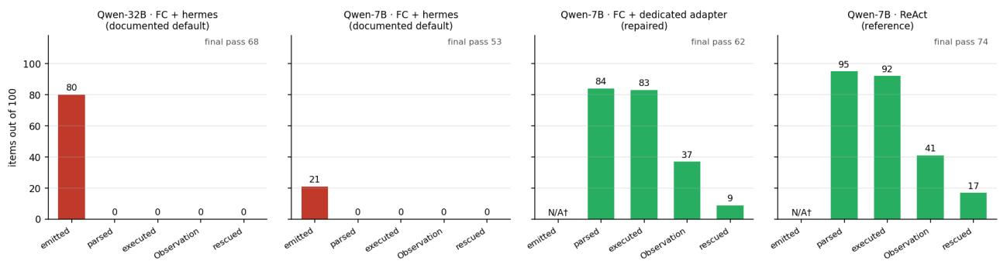
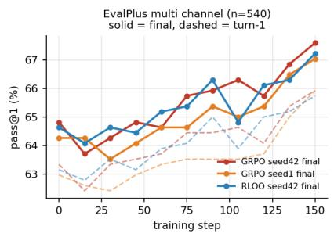
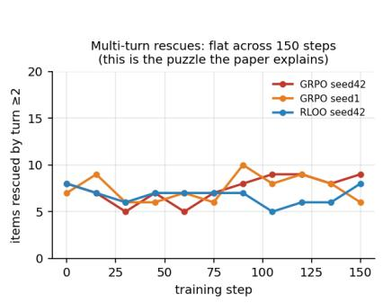
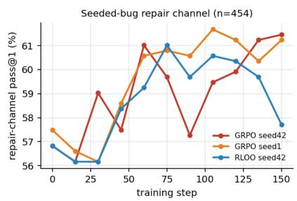
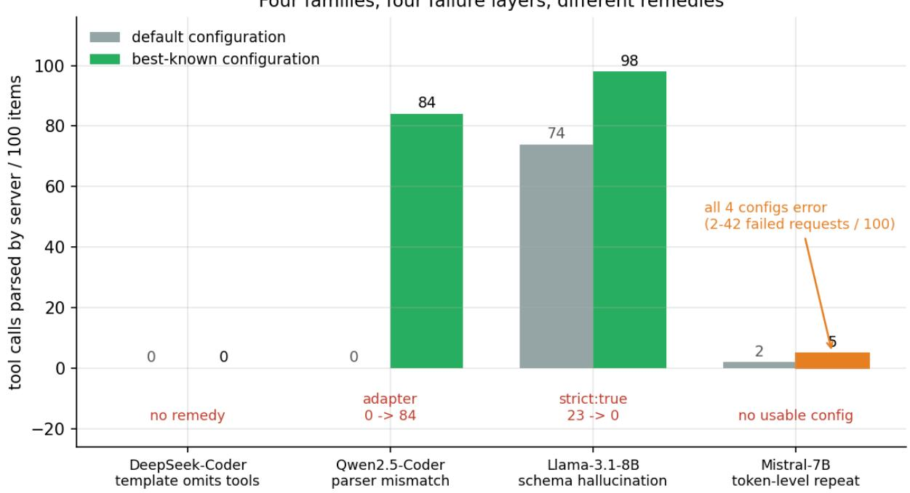
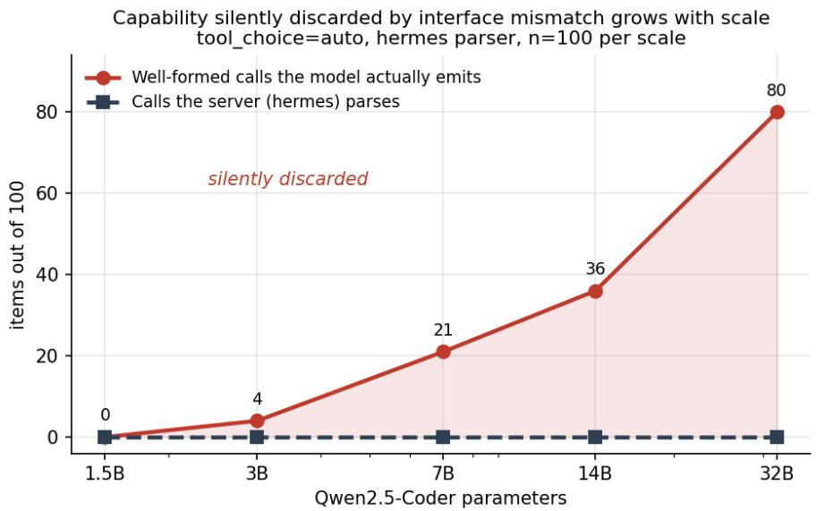
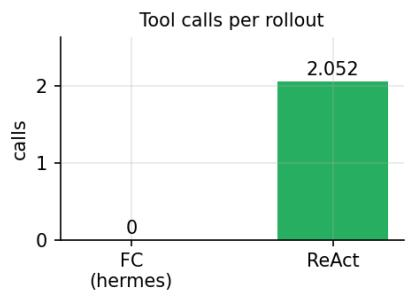
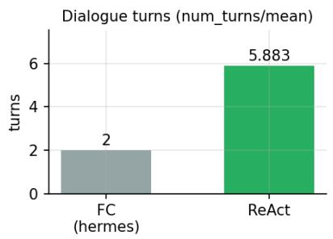
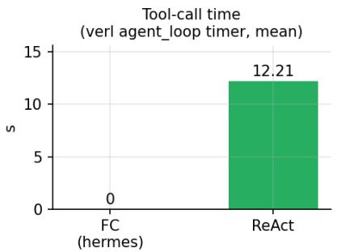

# Interface-Induced Trajectory Censoring

A mismatched serving interface distorts both what a benchmark measures and what RL training ever sees

Wenbo Wang City University of Hong Kong wenbwang3-c@my.cityu.edu.hk

Code, data and pre-registrations: https://github.com/nebula-1999/Interface-Induced-Trajectory-Censoring

September 4, 2026

## Abstract

Agent evaluations report a tool-call rate read of the serving stack. That number can be zero while the model is emitting well-formed calls: the interface censors the trajectory before anything downstream sees it.

On BFCL v4’s own data, executor and scorer, holding weights, cases, decoding and seeds fixed and changing only the serving adapter configuration, the same model scores 0.00 or 0.96 / 0.19 (simple\_python / multi\_turn\_base). A 2 2 over chat template and parser locates the efect exactly: both main efects are exactly zero and all of it sits in the interaction no component is defective, and repairing one side of the contract buys precisely nothing. On τ-bench’s 115 interactive retail tasks the same swap moves server-parsed calls from 0 to 636 and tasks reaching any tool execution from 0 to 103. Our own probe reproduces the funnel across a 21 scale range of Qwen2.5-Coder: the server parses 0/100 at every size while well-formed emitted calls rise to 80/100 at 32B ( 72 after calibration against a third-party adjudicated gold standard). Under a matched envelope, across a comparable span of scale, the silent fraction instead stays at 0–2 — a prediction committed to the repository before the run. Llama-3.1-8B’s 23% rate of calling the task function itself as a tool falls to 0 under one strict: true flag.

The mismatch reaches inside the training loop, and its consequence is scale-dependent: in verl’s AgentLoop at 7B, 45 of 115 generations carry a complete call; 0 are accepted, 0 execute, 0 return an observation, while at 1.5B the same zero is over-determined, so we report the two scales separately. At evaluation time, repairing the adapter restores the mechanism but not a significant outcome gain — parsing 0 84, rescues 0 9, pass rate 53 62 (n.s.). We release a 98-line preflight check that catches every silent failure reported here. The observed tool-call rate is not a property of the model alone; it is a property of the model–interface stack that measures it.

## 1 Introduction

We set out to train a multi-turn code agent with RL and could not explain our own training curve. Over 150 GRPO steps on Qwen2.5-Coder-1.5B, pass@1 on a held-out EvalPlus split rose 2.6–2.8 points across three independent runs (p = 0.064 / 0.078 / 0.077 — none significant at α = .05; the evidence is the consistent direction across two algorithms and two seeds, not any single test). But

  
Figure 1: Where the agent trajectory is censored. Five layers, n=100 per arm. The two left panels (documented default configuration) show a tall first bar and a clif to zero: the model emits well-formed calls and nothing downstream happens. Emitted-call counts are measurable only where the server parses nothing — a successful parse moves the call into tool\_calls and empties content — so those cells are N/A, not zero.

91–94% of newly-passing items passed on the first turn, and items rescued by turn 2 or later stayed flat at 6–9 out of 540 from step 0 to step 150 (Appendix G). The natural reading is that a 1.5B model cannot learn multi-turn repair. What we found instead was that the tool was never successfully called. Not rarely — never. And nothing in the stack said so: the server returned HTTP 200, tool\_calls was an empty array, and the training loop recorded a well-formed single-turn trajectory.

An agent evaluation does not measure a model. It measures a composition model protocol serialization parser execution stack, and the failure of most stages is indistinguishable at the output from model incapability: when a parser does not recognise the format a model emits, the serving layer reports zero tool calls — exactly what a model that refuses to use tools would produce. We call this interface-induced trajectory censoring.<sup>1</sup> It acts in two opposite directions, and our results contain a clean instance of each: masking, where a valid call is not recognised and the action never reaches the environment (§4.3), and suppression, where an invalid call is removed from the sampleable support before it becomes an action (§4.5). The serving interface is therefore simultaneously part of the measurement function and part of the agent’s efective action space — literally so under RL, where whatever the policy emits must survive serialisation and parsing before it becomes an action that earns a reward. When nothing tool-intended survives that passage, the experience distribution contains no tool-mediated trajectory at all.

Why this is not a parser bug. The term invites a reading we refuse at the outset. Replaying vLLM’s own hermes extractor line by line over every stored first turn in our archive — 4254 of them, after removing byte-identical duplicate files — we find zero cases in which the server failed to parse a call its own rules would have accepted (§4.3). What fails is the contract between three parties configured independently: what the checkpoint was trained to emit, what the chat template tells it to emit, and what the parser is defined to accept. Qwen2.5-Coder emits a well-formed bare call and never the <tool\_call> envelope, so hermes not seeing it is correct behaviour; Qwen2.5-Instruct emits the envelope and then breaks the JSON inside it. Censoring can occur at any boundary along emission serialization parse execution, and at every one the observable is identical: HTTP 200 with an empty tool\_calls array. The claim is therefore not that parsers are buggy but that a tool-call rate is a property of a three-way contract, and is routinely reported as though it were a property of the model alone.

What is and is not new. That Qwen2.5-Coder does not emit hermes-format tool calls was reported in vLLM issue #32926 (2026-01-23) with a <tools> parser proposal; it was closed as not planned and labelled stale, so the trap is still live (§2). What this paper adds is measurement, decomposition and consequence. We measure the funnel on two standard benchmarks — BFCL v4 and τ -bench — where changing only the serving adapter moves BFCL’s reported score from 0.00 to 0.96 / 0.19 and τ -bench’s parsed calls from 0 to 636, and a 2  2 over template and parser finds both main efects exactly zero with the whole efect in their interaction (§4.1). We separate model intent / emitted format / server parse / actual execution / multi-turn rescue into five independently measured quantities — reporting only the third is the practice we argue against — quantify what censoring removes across a 21 scale range, and pair that ladder with a preregistered counterfactual under a matched envelope where the silent fraction stays at 0–2 instead of rising to 80 (§4.3). Four families failing at template, parser, schema and token layers motivate a layered taxonomy on deliberately asymmetric evidence (§4.6). And we follow the distortion into training: at 7B, 45 of 115 generations inside verl’s AgentLoop carry a complete call and none becomes an action, so the sampled experience contains no tool-mediated trajectory to reinforce. We argue that from the sampled rollouts, not the support of the policy — zero observed samples is not zero probability — and the comparison arm changes protocol and interface together (§4.9).

## 2 Related Work

Evaluation validity under nuisance factors. Reported LLM capability is sensitive to factors that ought to be irrelevant: prompt formatting alone moves benchmark scores by margins comparable to model diferences [Sclar et al., 2024], single-prompt evaluation is unreliable [Mizrahi et al., 2024], and benchmark and configuration choices determine which method appears to win [Dehghani et al., 2021]. Those works vary an input the evaluator controls and observe score movement. We identify a component of the measurement apparatus — the serving stack’s tool-call parser — that can zero out a capability signal entirely, without any error, and whose distortion grows with model scale.

Parsing-induced measurement error. The mechanism has been isolated once before, in another domain: Garware and Zisad [2026] show that in LLM-based security-log classification a strict regular-expression parser reports 0% threat accuracy while a corrected fuzzy parser recovers 76% on identical model outputs, with an unafected severity metric as an internal control. We regard it as the closest antecedent and adopt the same standard of proof: one fixed set of bytes, reparsed under diferent rules (§4.3). Three things separate the contributions — their gap is a single mechanism in a single domain, which they explicitly decline to generalise, whereas we separate four layers across four families; their gap is a fixed quantity, ours is a function of scale; and their distortion terminates at the reported number, whereas we follow it into an RL rollout and identify which branch of the policy the gradient can no longer reach (§4.8). Outside the literature the claim that tool-call failures originate in serving infrastructure is already practitioner folklore [LiveKit,

2026], qualitatively and without measurements.

Audits and failure taxonomies of tool use. A cluster of concurrent 2026 work asks whether reported tool-use scores mean what they appear to mean, and stops one layer above us: Bhat et al. [2026] report an 18.5% evaluator–human misalignment rate across BFCL v4, τ<sup>2</sup>-bench [Barres et al., 2025], LiveMCPBench and MCP-Atlas; τ<sup>2</sup>-Bench-Verified [Amazon AGI, 2025] documents four categories of ground-truth defect in a benchmark used to rank frontier agents; Raj et al. [2026] organise 41 failure modes by interaction edge and by whether the repair belongs to model or harness; Soni [2026] label traces across 1,000 tasks as Tool-Skip, Result-Ignore, Output-Fabrication or Unnecessary-Tool-Use; and Albayaydh et al. [2026] synthesise 27 such papers into six clusters, one being measurement validity. In two cases our result is a precondition for theirs: Model or Harness? supplies the vocabulary but no measurement, and ToolFailBench’s Tool-Skip label is read as a model behaviour when it is also exactly what an unparsed emission produces — the category is confounded by the interface unless the stack is verified first, which the preflight check of §5 does in seconds. Every audit above varies something above the API boundary; the distortion we report occurs below it, and is invisible to all of them.

Constrained decoding, protocols, stacks. Tam et al. [2024] report that format restrictions can degrade reasoning; §4.5 is a counter-instance, where strict: true eliminates a 23% roleconfusion failure and improves pass rate, though we also report the CoT control where added reasoning made matters worse. Guided-decoding machinery [Willard and Louf, 2023] underlies both strict and vLLM’s required mode. ReAct [Yao et al., 2023] is the text protocol we compare against, and BFCL [Patil et al., 2025], τ-bench [Yao et al., 2025], ToolLLM [Qin et al., 2024], API Bank [Li et al., 2023] and Toolformer [Schick et al., 2023] evaluate or train tool use, reporting tool-call rates as parsed by the serving layer. verl [Sheng et al., 2025] provides the RL stack, and importantly its AgentLoop performs its own tool-call parsing (verl/experimental/agent\_loop/ tool\_parser.py, adapted from vLLM v0.9.1), so a vLLM-side parser plugin does not afect training rollouts — a distinction that cost us one wasted experiment design (§4.9).

Prior report of the Qwen case. vLLM issue #32926 [hanXen, 2026], opened 2026-01-23, documents that Qwen2.5-Coder was not trained on tool-call tokens, that it emits json fenced blocks or bare JSON absent format instructions, and that a <tools> few-shot template plus a dedicated parser reaches 98–100% compliance. It was closed as not planned and labelled stale. §4.3 reproduces this baseline exactly — zero <tool\_call> and <tools> tags at every scale — and extends it to scale quantification, three further families and training; a related verl issue [ver, 2025] reports the same role-confusion signature we characterise in §4.5. Our claim is not that the interface can fail silently, which is known; it is that the silent fraction is measurable, that it grows with checkpoint size under the same mismatched interface, and that it propagates into training. A literature search conducted 2026-09-01 returned nothing that follows the distortion below the API boundary into training; we state this as the scope of our search rather than as a claim of novelty.

## 3 Setup

Task. 100 problems from a decontaminated KodCode [kod, 2025] subset (n-gram containment against EvalPlus [Liu et al., 2023]). All 50 full-length arms use the identical 100 items (verified: unique item-set count = 1), so every cross-arm comparison is paired.

Protocols. ReAct — a text protocol with Thought: / Action: run\_tests / Action Input: / Observation:, tool name fixed in the template. Function calling (FC) — OpenAI-style, tool\_choice: auto, one tool run\_tests taking a single code string, in three schema variants:

terse (bare {"type":"string"}), rich (description, counter-example, code sample), strict (strict: true, additionalProperties: false).

We train with GRPO [Shao et al., 2024] and RLOO [Ahmadian et al., 2024].

Serving. vLLM 0.27.1 [Kwon et al., 2023, vll, 2026], per-family parser and chat template as documented. temperature=0 is greedy but not bit-wise deterministic under continuous batching; the main results are a single sample per item and Appendix G quantifies sampling variability separately at temperature=0.6. max $\_ { \mathrm { t o k e n s } } ~ = ~ 2 0 4 8$ for both protocols (Appendix A: an earlier asymmetry favoured $\mathrm { F C } ;$ <sup>re-running</sup> <sup>under</sup> <sup>the</sup> <sup>true</sup> <sup>shared</sup> <sup>limit</sup> <sup>changed</sup> <sup>final</sup> <sup>pass</sup> <sup>by</sup> ≤<sup>1</sup> <sup>item).</sup> Serving flags per family and the full training configuration are in Appendix D; every arm’s recorded configuration is in Appendix E.

## 3.1 Intent criterion, and its validation

Reporting only server-parsed calls is the practice under examination, so we need an independent measure of what the model emitted. A single classifier (analysis/intent.py) is shared by all text, tables and figures, with three nested-not-exclusive tiers: tight — a JSON object naming run\_tests whose arguments.code is a string literal containing real Python, excluding two contaminants we observed (echoing the injected schema; illustrative pseudo-code such as {"code": test\_code}, an identifier rather than a string); strong tight — trajectory tag json\_named\_call or xml\_tool\_call; and weak, disjoint from both — JSON-shaped fragments not naming the tool, which at 1.5B are almost entirely false positives and are reported separately rather than merged. Every prompt, schema and tier definition is reproduced verbatim in Appendix C.

Three facts about the validation carry into the results; the full two-round procedure, the instrument failure that produced the first round’s $\kappa = 0 . 7 1 3$ , the adjudication rule and the three successive values of the correction factor are in Appendix F. (i) Against a gold standard built by third-party adjudication of all fifteen non-unanimous items — selected by any three-way disagreement, never by disagreement with the classifier — the classifier scores $\kappa = 0 . 8 7 1$ [0.756, 0.958], and two blind annotators reach inter-annotator $\kappa = 0 . 9 6 7$ on the 62 items where both read identical bytes. (ii) The tight stratum’s precision against that gold standard is $3 6 / 4 0 = 0 . 9 0 0 .$ so §4.3’s headline 80/100 at 32B corrects to ${ \approx } 7 2 { : }$ ; we report uncorrected counts throughout with this factor stated rather than rescaling silently, and applying it uniformly leaves the trend unchanged (0, 3.6, 18.9, 32.4, 72 against a server-side zero at every size). (iii) The probe stores at most 4000 characters of raw output per item and 10 of the 98 sampled outputs reach that ceiling, so emittedcall counts are a lower bound — conservative for our claim, since it can only understate the censoring we report.

## 3.2 Positive control: the pipeline works

Before attributing a zero to a model we verify the instrument. On the same live server, model, tools and prompt, changing only tool\_choice: under auto the server returns finish\_reason = stop with tool\_calls = 0 while the assistant writes the solution as fenced code; under required it returns one parsed call naming run\_tests with real Python in arguments. Server flag, parser and template are therefore all functional. This establishes that the pipeline can accept a conforming call; it does not locate the zero under auto in the model, since required uses constrained decoding and says nothing about whether the model spontaneously knows the format. The emitted-intent measurement of $\ S 4$ is what separates them.

## 3.3 Validity gating

An arm is admissible for pass-rate comparison only if it has exactly 100 items, exit code 0, zero request errors, and provenance (model / protocol / temperature / max\_tokens / adapter) matching the intended configuration. Arms with request errors retain a valid error-rate census but are marked N/A for pass rates and no p-value is computed for them. This rule is enforced in code (validate\_arms.py, final\_table.py), not by convention: an earlier draft computed p=0.648 on such an arm, and that number is retracted (Appendix A).

## 4 Results

Nine measurements, in the order the argument needs them. Each is stated here with its numbers; the tables, the funnel columns behind them and the reproduction records are in Appendix G, and every scope condition is collected in §6.

4.1 BFCL v4: the score moves the whole span of the metric, and the efect is pure interaction

BFCL v4 supplies oficial data, a multi-turn executor and a scorer at pinned Gorilla commit 6ea57973c7a6097fd7c5915698c54c17c5b1b6c8. Holding weights, cases, decoding, seeds, executor and scorer fixed on 200 cases and changing only the serving adapter configuration, BFCL’s own scorer reports 0.00 or 0.96 / 0.19 (simple\_python / multi\_turn\_base) for the same model. The intervention is a pair — parser and its chat template — so we ran the 2 2 that separates them.

Table 1: Template  parser on BFCL, first request per case.
<table><tr><td></td><td>documented template</td><td>dedicated template</td></tr><tr><td>hermes parser</td><td>0/200</td><td>0/200</td></tr><tr><td>dedicated parser</td><td>0/200</td><td>196/200</td></tr></table>

Both main efects are exactly zero and all of the efect sits in the interaction, so it cannot be apportioned. Under the documented template the model writes a bare call inside a \`\`\`json fence; under the dedicated template it writes the same payload, byte for byte, inside <tools> tags. Each parser behaves correctly for the envelope it is defined to accept, so no component is defective and repairing one side of the contract buys exactly nothing. The funnel behind those scores: the documented arm parses 0 of 200 first requests with zero HTTP errors, while 166 of those same responses carry a call meeting the strict criterion; the repaired arm parses 196, executes 98 of 100 multi\_turn\_base cases and succeeds on 19, against 0 executed and 0 succeeded for hermes, whose zero is therefore by construction rather than by capability (Tables 10–20). A published benchmark number for this model can difer by the entire span of the metric depending on a serving flag the model card does not mention. We claim only that 0.00 is not a measurement of the model; and since the repaired arm uses the community adapter, not a verified-optimal one, and still fails 4 of 200, 0 19 is a lower bound on what the interface was removing.

BFCL’s shipped handler for local Qwen models bypasses the serving parser entirely, so we route BFCL’s own OpenAI handler through /v1/chat/completions, adding only tool\_choice: auto and trace headers; dataset loading, execution and scoring remain BFCL’s code and bfcl\_eval’s files are byte-identical (Appendix G.4).

## 4.2 τ-bench: the mechanism survives a simulated user and a stateful environment

BFCL scores a single trajectory against a final state. τ-bench [Yao et al., 2025] adds a simulated user and a stateful environment, so a censored call costs not one action but the rest of the conversation. Across all 115 retail tasks, paired across arms with none dropped and changing only the serving adapter: server-parsed calls 0 versus 636, tool executions 0 versus 636, and tasks reaching any tool execution 0 versus 103. Every one of the documented arm’s 1389 requests carried tools, not one was parsed, and 789 assistant turns carried a call-shaped payload the server discarded (Table 11). The task-outcome diference does not reach significance and we do not claim it: 7 versus 10 solved, three discordant pairs all in the repaired direction, exact McNemar $\mathrm { \Delta } p { = } 0 . 2 5$ , with the documented arm’s solved set a strict subset of the repaired arm’s. Two scope conditions belong with these numbers rather than in a footnote: the user simulator is a locally served Llama-3.1-8B rather than the gpt-4o of the original harness, so the absolute scores are not comparable to the τ-bench leaderboard and only the between-arm diference is claimed; and the arms difer in conversation length by construction, which is why every quantity is per task and not per request.

The envelope layer is domain-invariant; the payload layer is not. τ-bench also lets us ask whether the failure layer travels across domains, because its arguments are short scalars ({"order\_id": "W123"}) where our own task passes a whole program as a string. Replaying vLLM’s extractor over the documented arm’s 789 emitted-but-unparsed assistant turns puts 789 of 789 (100%) at the envelope layer, with 0 malformed payloads, 0 recoverable by lenient decoding, and — as everywhere else in this paper — 0 genuine parser losses. The emissions carry the same signature as the code task: a bare call inside a \`\`\`json fence, never the <tool\_call> envelope. This matters in two directions. The layer that carries our headline result is unchanged by the domain, and the running total of first turns in which the server discarded a call its own extractor would have accepted stays at zero across code and non-code alike. But the other layer moves: Qwen2.5-Instruct loses 41% of its unparsed items to malformed payloads on the code task (Table 19), almost always by leaving docstring quotes or raw newlines unescaped inside a code string — a failure mode that short scalar arguments cannot produce. We therefore expect the envelope-layer result to generalise and the payload-layer proportions not to, and we state that as a prediction rather than a measurement, having tested one non-code domain and not a sample of them.

## 4.3 Censoring against scale, and the same scale under a matched interface

Our own probe, across the Qwen2.5-Coder ladder under tool\_choice: auto and hermes — the documented recommendation for Qwen2.5 — n=100 per size.

Table 2: Qwen2.5-Coder under the documented hermes configuration, n=100 per size.
<table><tr><td>Size</td><td>Server-parsed</td><td>tight</td><td>strong (2 tight)</td><td>weak (disjoint)</td><td>Final pass</td></tr><tr><td>1.5B</td><td>0</td><td>0</td><td>0</td><td> $2 7 ^ { * }$ </td><td>31</td></tr><tr><td>3B</td><td>0</td><td>4</td><td>5</td><td>28</td><td>37</td></tr><tr><td>7B</td><td>0</td><td>21</td><td>22</td><td>1</td><td>53</td></tr><tr><td>14B</td><td>0</td><td>36</td><td>42</td><td>3</td><td>53</td></tr><tr><td>32B</td><td>0</td><td>80</td><td>100</td><td>0</td><td>68</td></tr></table>

Across a 21 range the server reports a flat zero while well-formed emitted calls rise to 80/100 ( 72 after the 0.900 correction factor of §3.1). Within this family, the larger the checkpoint, the larger the absolute undercount under the same mismatched interface — a within family observation across five checkpoints, not a law relating capability to censoring. Raw-tag counts reproduce vLLM issue #32926’s baseline exactly: <tool\_call> and <tools> appear zero times at every size. Two ofline analyses close the obvious objections (Appendix G.3): re-parsing the same stored bytes under four rules excludes “your extractor is simply better than hermes”, and replaying vLLM’s extractor line for line to locate each loss shows genuine parser loss is zero in every arm, across all 4254 de-duplicated first turns.<sup>2</sup>

The counterfactual. The server column is flat zero, so the growth comes entirely from the emitted column — and larger checkpoints emit more well-formed JSON for reasons unrelated to tool calling. Qwen3 supplies a ladder whose template injects tools and requires the <tool\_call> enve lope hermes accepts; the prediction (“parsed > 0 at every size”) was committed to the repository before running (p4/PREREGISTRATION.md). Server-parsed counts are 86 / 44 / 70 / 97 at 0.6B–8B, and the silent fraction is 1, 1, 2, 0 against the mismatched ladder’s 0, 4, 21, 36, 80 (Table 12). Across a comparable span of scale under a matched envelope, the silent fraction does not grow. This rules out capability growth as a suficient cause; it does not isolate the envelope, since the ladder changes family and envelope together. Two caveats we state rather than bury: the parsed column is not monotone, so this shows presence, not a trend; and Qwen3 was served with enable\_thinking=false, because with thinking on the model exhausts its token budget in a <think> block before emitting a call — a confound unrelated to the envelope, recorded as a protocol deviation before the run.

A second family showing the same undercount would be stronger, and we did not get one. Of nine families surveyed beforehand, six do not inject OpenAI-style tools at all; of the remaining three, Granite-3.1-8B does not attempt tool calls on this task — 0 under hermes and 0 under its own granite parser. That rescue arm is what tells us the arm is uninformative rather than confirmatory, and we claim nothing from it.

## 4.4 Within-lineage control, and the ceiling it puts on multi-turn rescue

Changing family cannot test the scale result — Llama parses correctly, Mistral returns 400, DeepSeek never injects the template, so none can exhibit censoring at all. Qwen2.5-Instruct can: it shares Coder’s chat template, which is what produces the false-positive template check of §4.6, and difers in whether the checkpoint was trained on tool-call tokens. On the same items, parser, tool\_choice, temperature and seed, its server-parsed rate runs 1, 11, 63, 77, 88 against Coder’s flat zero (Table 13). The contrast localises the mismatch to checkpoint-specific training rather than to the shared family and template, or to parameter count alone. We stop short of naming tool-call-format training as the cause: the two difer in their whole posttraining mixture, and this varies the bundle, not one element. It also answers the objection that Instruct emits better-shaped calls around worse contents — it solves 13–42% of items on turn 1 and 13–65% by the end, nowhere near the zero that would require.

The multi-turn layer was initially void, because that host lacked pytest; we re-ran all five arms with the executor working, changing nothing else and not touching the probe binary, and the parsed column reproduced value for value. Rescues then rise with the parsed column — 0, +3, +6, +14, +23 against 1, 11, 63, 77, 88, monotone together. Coder’s first-turn and final passes are identical at every size $( 3 1 / 3 1 , 3 7 / 3 7 , 5 3 / 5 3 , 5 3 / 5 3 , 6 8 / 6 8 )$ , which it would be natural to read as multi-turn repair being useless at this scale; the Instruct ladder, on the same items and criterion, shows it is not. We therefore state the repair result as a ceiling rather than an absence: how much multi-turn recovers is bounded by how much of the tool channel the interface leaves open.

## 4.5 A 23% failure that survived three controls and fell to the fourth

Llama-3.1-8B under FC issues a tool call on 97/100 items, but on 23 the call names the function the task asks it to implement, with that function’s own parameters as arguments; a re-run restricted to those 23 reproduced 23/23. This also corrects a measurement of our own: because the probe did not verify the tool name, these 23 were counted as initiations, so Llama’s true run\_tests initiation rate is $\mathbf { 7 4 / 1 0 0 } .$ , not 97/100 (Appendix A). Four single-variable paired controls: a richer schema explicitly warning that the tool is not the task function left it at $2 2 / 1 0 0 \ ( p { = } 1 . 0 0 0 ) ;$ a Thought scafold before the call raised it to 59 (p<0.001, worse), the model supplying exactly the parameters it had just reasoned about; the oficial chat template moved nothing (23 22, p=0.125); strict: true took it to 0 (p=0.0001). The first three rejected their alternative explanations and pointed at the model; the fourth found the cause and withdrew that conclusion.

strict drives the chain constraint valid execution (73 97) task performance (33 46 turn-1, 44 61 final): 23 items that produced no executable code now execute and become repairable (Table 14). Paired McNemar decomposes the ReAct–FC gap into interface repair, +12 (p=0.0075) and protocol, +19 (p=0.0019), against +31 for both (Table 15) — roughly two fifths of what looked like a protocol efect was an interface efect. With strict the two protocols have identical execution mechanics (98 calls, 0 wrong-tool, 97 executed on both sides) yet turn-1 difers 46 vs 61, so what remains is first-draft code quality under the protocol, not tool use mechanics. The defensible statement is narrower than either “model defect” or “configuration bug”: the model exhibits role confusion under unconstrained function calling, and the interface constraint determines whether that confusion can be expressed as an environment action. We cannot show the tendency disappears once constrained, only that it stops reaching the action space.

## 4.6 Four layers, and what a pre-flight check can see

The two families above fail at diferent layers with diferent remedies — Qwen2.5-Coder at the parser layer, repaired by a dedicated adapter; Llama at the schema layer, repaired by strict: true and neither is caught by the obvious pre-flight test. Two further families extend the taxonomy without supporting a quantitative comparison, and we report them as such. DeepSeek-Coder fails at the template layer: its chat template never injects tools, which a template check does catch, and we found no remedy. Mistral-7B-v0.3 fails at the token layer, repeating a [TOOL\_CALLS] marker that produces HTTP 400, and has no admissible 100-item FC run at all — all four configurations produce request errors (parser only 2; oficial template 42; parser + strict 3; oficial template + strict 39), so vLLM’s own recommended configuration raises the error rate from 2% to 42% and strict, which fixes Llama, does not help (Table 21).

Mistral is the one family whose failure announces itself; the other three return HTTP 200 with tool\_calls: [], byte-identical to a model that declined to call the tool. The claim is not that all failures are silent; it is that the silent ones dominate and are the hardest to attribute. The natural pre-flight test — does apply\_chat\_template(tools=...) render the schema? — correctly rejects DeepSeek-Coder but passes Qwen2.5-Coder, which inherits Hermes scafolding from Qwen2.5-Instruct while never having been trained on it: protocol support is a per-checkpoint property and is not inferable from the chat template.

## 4.7 Repair loop: how much comes back

On Qwen2.5-Coder-7B with tool\_choice: auto held fixed and only the adapter changed, parse goes 0 84, items reaching a second turn 0 37 and multi-turn rescues 0 9: the mechanism is restored from literal zero (Table 16). The two FC arms have identical turn-1 pass, 53 vs 53 — the internal-validity check, since an adapter can only afect what happens after the first turn. That Llama’s turn-1 does move (34 46) while Qwen’s does not is the taxonomy making a prediction: Qwen’s failure is downstream of generation, so the first turn is produced and then discarded; Llama’s is inside generation, so the first turn is itself destroyed and repairing the constraint restores it. Diferent failure layers leave diferent downstream signatures, and the direction of the turn-1 efect identifies the layer.

The pass-rate gain is not significant (53 62, p=0.093). A pre-planned replication on a random 300-item sample reproduces the direction (160/300 178/300, 43 discordant against 25, p=0.0385) — nominally below 0.05, but this paper runs roughly a dozen McNemar tests and the Bonferroni threshold is 0.0042, so the repair gain still does not survive correction and we rest no claim on it. The protocol gap on the same 300 items $( 1 7 8 / 3 0 0 {  } 2 1 9 / 3 0 0 , p { = } 3 . 1 { \times } 1 0 ^ { - 6 } )$ clears it by three orders of magnitude. Restricting to items both arms parsed, the residual protocol gap holds on Llama $\scriptstyle \left( p = 0 . 0 0 2 1 \right)$ and is not detected on Qwen: +8.4 pp, 95% CI $[ - 0 . 5 , + 1 7 . 4 ] , p { = } 0 . 1 1 8 .$ We do not read $p > 0 . 0 5$ as evidence of no efect — that interval admits a residual larger than the efect we detect on Llama — so the residual is established on one family and undetermined on the other (Appendix G.8).

## 4.8 Zero tool execution in RL rollouts, and where it comes from at two scales

With model, data, hyper-parameters, seed and prompt strength matched, the FC arm’s num\_turns is pinned at its minimum of 2.000, tool time is 0.00 s and a dedicated counter reads 0.000 calls per rollout, against 5.883 / 12.21 s / 2.052 for ReAct (Table 17). Instrumentation sits at the two agent-side call sites and not at the sandbox entry point, because the reward function evaluates final code through the same function and would merge reward evaluation into the tool-call count. Wording bound. What is measured is parser-accepted and executed calls = 0, not “the model never attempted to call”: FC rollouts were not saved.

At 1.5B that zero is over-determined. A probe replication under the identical mandatory prompt gives 0 well-formed calls, 54 direct answers, 46 unparsable outputs and 66 items containing JSON fragments but not one naming run\_tests — a capability failure, not a parser one. So we ran the probe again inside verl’s own AgentLoop at 7B, under the documented configuration, logging every generation, the parser’s verdict, executions and observations.

Table 3: Rollout-path probe inside verl, Qwen2.5-Coder-7B, documented hermes configuration, 115 generations.

<table><tr><td></td><td>count</td></tr><tr><td>bare JSON run_tests call, valid and complete names run_tests but payload malformed no call attempted</td><td>45 12 58</td></tr><tr><td>accepted by verl&#x27;s hermes parser</td><td>0</td></tr><tr><td>tool executions</td><td>0</td></tr><tr><td>observations returned</td><td>0</td></tr></table>

Forty-five of 115 generations carry a call that would execute if it were wrapped in the envelope, and none reaches the environment. This is the serving-side mechanism of §4.3 observed inside the training loop, which is where the RL claim needs it: at 7B the absence of tool mediated trajectories is attributable to the interface, not the policy. It does not retroactively change the 1.5B run, whose zero remains over-determined, and we report the two scales separately. This probe’s run terminated with a CUDA OOM during the actor update following rollout collection, so no gradient step completed; the rollout observations all precede that point.

Valid calls are zero from step 1 and the reward admits direct answers (FC critic/rewards/ mean rose 0.233 0.281), so the tool branch has a zero-sample return while direct answering is continuously reinforced. The model cannot discover the tool path by exploration, because every attempt is discarded at the protocol layer and no positively-rewarded tool trajectory ever exists. The tool-using branch receives no direct on-policy gradient signal under the observed rollout distribution, and is efectively inaccessible to policy-gradient learning in this cold-start regime. At 10 and 3 steps this is a mechanism result, not an outcome comparison.

## 4.9 Why no repaired-FC arm exists yet, and what a working channel did not buy

The natural control is repaired FC rather than ReAct, and we did not have it at the time of writing. Four obstacles were met and three dissolved on inspection (Appendix D.5). A vLLM parser plugin does not reach the training loop at all, because verl’s AgentLoop parses for itself. A parser registered inside verl’s registry does reach it and lifts recoverable calls from 0/100 to 52/100 at 1.5B — but zero of those 52 name run\_tests, every one targeting the function the task asks the model to write, which name normalisation cannot repair because no call carries code to normalise. A role-disambiguation few-shot aimed at that confusion made the model more fluent at emitting the wrong call (52 64 recoverable, still 0 naming the tool) and slightly worse at the task (15 13).

Correcting our own prescription. We previously named the missing capability as guided decoding. That was the wrong diagnosis: guided decoding forces a format, whereas the repair argued for everywhere else here is the opposite — accept what the model already emits. What actually blocks the arm is scale: at 1.5B a repaired parser would have nothing to accept, and the checkpoint that does emit well-formed calls is 7B, whose full-parameter RL exhausted memory on our single 80 GB card. The control is a 7B experiment under parameter-eficient tuning, not a stack-replacement project (§6).

Accordingly ReAct serves as a positive-control interaction channel, not a parserrepair control, and it is the only configuration delivering tool feedback at this scale. Run for 75 GRPO steps with everything else matched to the historical runs, it executed 23,676 tool calls and left rescues by turn 2 at 8, 6, 6, 8, 6 over steps 0–60 — net change zero, inside the range of the zero-execution runs. The interface determines whether tool-mediated trajectories exist at all, and their absence is suficient to explain why no multi-turn signal was available — but their presence is not suficient to produce multi-turn learning at this scale and budget. Because this arm changes protocol and interface together it cannot separate “a working channel is insuficient” from “ReAct in particular is insuficient”; it is 75 steps on one seed at 1.5B against 150-step baselines, and the step-75 evaluation was lost when the checkpoint write exhausted the disk after training completed.

## 5 Discussion

Report the composition, not the model. Any claim of the form “model M does not use tools” is, as measured, a claim about M protocol serialization parser stack. Agent evaluations should report at minimum (i) server-parsed calls, (ii) emitted-but-unparsed calls under a stated criterion, (iii) request errors, and (iv) the exact serving configuration. Reporting only (i) is the practice this paper argues against, and (ii) is where the 21 scale trend lives.

Pre-flight, don’t post-hoc. A missing --enable-auto-tool-choice is the only failure that announces itself, and template inspection alone is insuficient (§4.6). We therefore treat a tools-bearing request returning HTTP 200 — and a server-parsed call under tool\_choice: required — as a required pre-flight for any FC experiment, shipped as a 98-line script (preflight\_toolcall.py) that issues one canonical request, asserts tool\_calls is non-empty with the expected name and parseable arguments, then repeats under required as a positive control. It runs in seconds and would have caught every silent failure in this paper.

The guidance for this flag lives in the wrong place. We surveyed the HuggingFace model cards of nine families for any mention of --tool-call-parser. Of the eight reachable cards, none mentions it, while six recommend serving the model with vLLM. The publisher tells you which server to use, the server asks you which parser to use, and neither treats the pairing as its responsibility. We do not read this as evidence that mismatch is common in deployment — we surveyed documents, not deployments, and vLLM ships dedicated parsers for some forty families, so following its table generally works. The claim is narrower: the one piece of configuration that can silently zero a capability measurement is documented by neither party at the point of use.

Interface repair precedes protocol comparison. On Llama the ReAct-vs-FC gap was 31 points before the strict fix and 19 after, both components separately significant. On Qwen, conditioning on parsed items, we do not detect a residual (p=0.118) — but that interval is wide enough to contain efects as large as the unconditioned gap, so it is evidence of insuficient resolution, not equivalence. Comparisons of agent protocols that do not first exhaust the serving configuration matrix are not measuring protocols.

A cold-start hazard for agentic RL. §4.8’s mechanism generalises beyond this stack: whenever (a) tool trajectories are censored at rate 1 and (b) the reward admits a tool-free path, the tool-using branch has no sampled return and cannot be reinforced. Prompt-level coercion does not help, and we observed it actively hurting (final pass 31 15). Practitioners should verify a non-zero tool-execution count in the first training step before interpreting any multi-turn result.

## 6 Limitations

Seventeen limitations, in the order a sceptical reader should apply them, are stated in full in Appendix H; the six that most constrain what may be concluded are here.

The scale result is within one family. The 0 4 21 36 80 ladder is Qwen2.5- Coder alone, against one mismatched interface, on one task (item 3). We claim a within-family monotone relation between checkpoint size and absolute undercount; we do not claim censoring is generally scale-increasing, and we do not equate parameter count with capability. A second family’s ladder is the test that would promote or refute it.

There is no clean repaired-FC training control (item 8). The training evidence compares FC against ReAct, changing protocol and interface together. We previously attributed the arm’s absence to verl lacking guided decoding; that was wrong — the registry is extensible and we have since installed code in it — and what blocks it is scale (§4.9). We therefore claim that interface censoring can be observed directly inside rollout collection and eliminates tool-mediated samples; we do not claim to have causally proven that it prevents RL from learning multi-turn repair.

Observed zero is not zero probability, and zero executions is not zero attempts (items 10–11). Our instrumentation records the sampled experience distribution, not the support of the policy, and the FC training arm did not save raw rollout text, so “never attempted” cannot be separated from “attempted and discarded”. Retaining rollout text is a change we would make before any further training.

Conditioning on a successful parse is post-treatment conditioning (item 9). Whether an item parses is determined by the interface under test, so the both-parsed subset is not a random subsample. On Qwen the residual is +8.4 pp, 95% CI [ 0.5, +17.4], p=0.118: we do not detect a residual diference, which is not the same as establishing there is none.

Multiple comparisons (item 6). Roughly a dozen McNemar tests; the Bonferroni threshold is 0.0042. Surviving it: the strict: true intervention (p=0.0001) and the protocol gap on 300 random items $( p { = } 3 . 1 { \times } 1 0 ^ { - 6 } )$ . Not surviving it: the repair-loop pass gain (p=0.093 at n=100, $\scriptstyle { p = 0 . 0 3 8 5 }$ at n=300), the Llama protocol contrast at n=300 (p=0.0352), the τ -bench outcome diference $\left( p { = } 0 . 2 5 \right)$ , and the residual-gap estimates (p=0.118, 0.125). We rest no claim on the latter group.

The training verifier has two exploitable seams, which we audited rather than assumed away (item 14). The summary parser takes the first (\d+) passed match over merged stdout/stderr, and skipped/xfail are not in the denominator; both are reachable in principle. Across the five training logs that retain generated code there are zero occurrences of a printed \`\`N passed'', of pytest.skip or of sys.exit, and critic/rewards/mean oscillates in 0.46–0.73 without the step change a discovered exploit produces. The audit’s own limit is that full rollout text was not retained, so it covers only the fragments those logs carry.

Also constraining, and stated in full in the appendix: one task family and one tool (item 1); a non-random 100-item set, whose 7B rung the random 300-item replication moves from 21 to 30 (item 2); a deliberately asymmetric taxonomy in which Mistral has no admissible FC comparison at all (item 4); single-sample headline arms (item 5); scale stopping at 32B (item 7); suficiency tested only through ReAct (item 12); a stratified validation sample with a 4000-character output cap that makes emitted-call counts a lower bound (item 13); dependence on vLLM 0.27.1, verl 0.9.0 and publisher-mutable chat templates (items 15–16); and the instrumentation errata we disclose rather than absorb — seven arms recording max\_tokens they did not run at, Llama’s initiation rate corrected from 97 to 74, and one previously reported p=0.648 withdrawn (item 17, Appendix A).

## What would change our conclusions

We name these so the claims are falsifiable rather than merely hedged. A broken-FC versus repaired-FC RL comparison, everything else fixed — a parser registered in verl’s own registry, two arms difering only in that registration, run at 7B under parameter-eficient tuning because 1.5B emits nothing for a repaired parser to accept and 7B full-parameter RL does not fit our card. If repaired-FC recovers multi-turn learning, our suficiency claim in §4.9 is wrong; if it does not, the “bottleneck is not singular” reading strengthens from one arm to two, the second being singlevariable. This is the experiment most likely to overturn something we have written, which is why we name it precisely. A second family’s scale ladder, with a working test executor: if the undercount does not grow with checkpoint size elsewhere, §4.3’s claim is a Qwen-plus-hermes fact rather than a scaling phenomenon. The same ladder on a non-code task. The five Qwen2.5-Coder checkpoints run against τ-bench retail under the documented configuration — models and interface fixed, only the domain varied. If the emitted column still rises with size while the parsed column stays at zero, the scale result is a property of the interface; if it does not, it is a property of code-shaped payloads. This needs a rescue arm at the small sizes for the reason Granite did: a checkpoint that simply never attempts a call produces an uninformative zero, not a censored one. The same five-layer measurement on further benchmarks. Done for BFCL v4 and τ -bench retail, so the concern is not specific to our harness and now covers one interactive suite; suites with much larger tool schemas, or whose scoring depends on argument-level matching, remain untested.

## 7 Conclusion

Tool-call interfaces censor agent trajectories, silently and per checkpoint; within Qwen2.5-Coder the absolute undercount rises monotonically with checkpoint size, which we report as a within-family observation rather than a general law. In reinforcement learning the same mismatch leaves the sampled experience distribution with no tool-mediated trajectories — 45 of 115 generations inside the training loop carry a complete call and none becomes an action — so the tool-using branch receives no direct on-policy gradient signal under the observed rollout distribution. Repairing the interface restores the mechanism but recovers only part of the outcome gap.

Two controls fix what the efect is a property of. A 2 2 over chat template and parser on a public benchmark finds both main efects exactly zero, with the entire 0.00-to-0.96 swing in their interaction; and a ladder under a matched interface holds the silent fraction at 0–2 across a comparable span of scale, where the mismatched interface takes it to 80. What the serving layer removes is not a property of the model, nor of the parser, but of the contract between them.

The most uncomfortable finding is methodological. We ran three single-variable paired controls on a 23% failure and concluded it was a model deficiency; a fourth, taken from a sentence in the serving documentation, reduced it to zero. Our own human validation reproduced the same mechanism: twelve of ninety-eight annotations missed a tool call because it sat after a fenced code block, and the annotator — like the parser — concluded from the same bytes that no call had been made. Reporting server-parsed tool-call rates as model capability is not a safe default.

## References

Kodcode: A diverse, challenging, and verifiable synthetic dataset for coding. https:// huggingface.co/datasets/KodCode/KodCode-Light-RL-10K, 2025.

Agentic rl training example: Keyerror: ’solve\_equation’. verl issue #4124, 2025. https://github. com/verl-project/verl/issues/4124.

Tool calling — vllm documentation, 2026. https://docs.vllm.ai/en/stable/features/tool\_ calling/.

Arash Ahmadian, Chris Cremer, Matthias Gallé, Marzieh Fadaee, Julia Kreutzer, Olivier Pietquin, Ahmet Üstün, and Sara Hooker. Back to basics: Revisiting reinforce-style optimization for learning from human feedback in llms. In Proceedings of the 62nd Annual Meeting of the Association for Computational Linguistics (ACL), Volume 1: Long Papers, pages 12248–12267, 2024.

Wael Albayaydh, Rui Zhao, and Ivan Flechais. Beyond the leaderboard: A synthesis of tool-use, planning, and reasoning failures in large language model agents. arXiv preprint arXiv:2607.05775, 2026. Submitted 2026-07-07.

Amazon AGI. τ<sup>2</sup>-bench-verified: a corrected and human-verified release of τ<sup>2</sup>-bench. GitHub repository, released 2025-11-26, last updated 2026-04-02, 2025. https://github.com/amazon-agi/ tau2-bench-verified; defect categories and per-task justifications in its FIXES.md.

Victor Barres, Honghua Dong, Soham Ray, Xujie Si, and Karthik Narasimhan. τ<sup>2</sup>-bench: Evaluating conversational agents in a dual-control environment. arXiv preprint arXiv:2506.07982, 2025. Submitted 2025-06-09; no conference venue found as of 2026-09-01.

Vishvesh Bhat, Jay Vaghasiya, Muhammad Ahmed Mohsin, and Asad Aali. Benchmarking the benchmarks: A validity audit of tool-calling evaluation. arXiv preprint arXiv:2607.02577, 2026. Submitted 2026-06-30.

Mostafa Dehghani, Yi Tay, Alexey A. Gritsenko, Zhe Zhao, Neil Houlsby, Fernando Diaz, Donald Metzler, and Oriol Vinyals. The benchmark lottery. arXiv preprint arXiv:2107.07002, 2021.

Chaitanya Vilas Garware and Sharif Noor Zisad. When the ruler is broken: Parsing-induced suppression in llm-based security log evaluation. arXiv preprint arXiv:2605.07293, 2026. Submitted 2026-05-08.

hanXen. Feature request: dedicated tool parser for qwen2.5-coder models. vLLM issue #32926, opened 2026-01-23, closed as not planned, 2026. https://github.com/vllm-project/vllm/ issues/32926.

Woosuk Kwon, Zhuohan Li, Siyuan Zhuang, Ying Sheng, Lianmin Zheng, Cody Hao Yu, Joseph E. Gonzalez, Hao Zhang, and Ion Stoica. Eficient memory management for large language model serving with pagedattention. In ACM SIGOPS Symposium on Operating Systems Principles (SOSP), 2023.

Minghao Li, Yingxiu Zhao, Bowen Yu, Feifan Song, Hangyu Li, Haiyang Yu, Zhoujun Li, Fei Huang, and Yongbin Li. Api-bank: A comprehensive benchmark for tool-augmented llms. In Proceedings of the 2023 Conference on Empirical Methods in Natural Language Processing (EMNLP), 2023.

Jiawei Liu, Chunqiu Steven Xia, Yuyao Wang, and Lingming Zhang. Is your code generated by chatgpt really correct? rigorous evaluation of large language models for code generation. In Advances in Neural Information Processing Systems 36 (NeurIPS), 2023.

LiveKit. Your model isn’t bad at tool calling. your serving stack is. LiveKit engineering blog, 2026-07-06, 2026. https://livekit.com/blog/your-model-isnt-bad-at-tool-calling.

Moran Mizrahi, Guy Kaplan, Dan Malkin, Rotem Dror, Dafna Shahaf, and Gabriel Stanovsky. State of what art? a call for multi-prompt llm evaluation. Transactions of the Association for Computational Linguistics (TACL), 12:933–949, 2024.

Shishir G. Patil, Huanzhi Mao, Fanjia Yan, Charlie Cheng-Jie Ji, Vishnu Suresh, Ion Stoica, and Joseph E. Gonzalez. The berkeley function calling leaderboard (bfcl): From tool use to agentic evaluation of large language models. In International Conference on Machine Learning (ICML), 2025. https://gorilla.cs.berkeley.edu/leaderboard.html.

Yujia Qin, Shihao Liang, Yining Ye, Kunlun Zhu, Lan Yan, Yaxi Lu, Yankai Lin, Xin Cong, Xiangru Tang, Bill Qian, Sihan Zhao, Lauren Hong, Runchu Tian, Ruobing Xie, Jie Zhou, Mark Gerstein, Dahai Li, Zhiyuan Liu, and Maosong Sun. Toolllm: Facilitating large language models to master 16000+ real-world apis. In International Conference on Learning Representations (ICLR), 2024.

Harsh Raj, Vipul Gupta, Anas Mahmoud, Razvan-Gabriel Dumitru, Darvin Yi, Aakash Sabharwal, and Yunzhong He. Model or harness? an interaction-centric taxonomy for localizing agent failures. arXiv preprint arXiv:2607.28802, 2026. Submitted 2026-07-30.

Timo Schick, Jane Dwivedi-Yu, Roberto Dessì, Roberta Raileanu, Maria Lomeli, Luke Zettlemoyer, Nicola Cancedda, and Thomas Scialom. Toolformer: Language models can teach themselves to use tools. In Advances in Neural Information Processing Systems 36 (NeurIPS), 2023.

Melanie Sclar, Yejin Choi, Yulia Tsvetkov, and Alane Suhr. Quantifying language models’ sensitivity to spurious features in prompt design, or: How i learned to start worrying about prompt formatting. In International Conference on Learning Representations (ICLR), 2024.

Zhihong Shao, Peiyi Wang, Qihao Zhu, Runxin Xu, Junxiao Song, Xiao Bi, Haowei Zhang, Mingchuan Zhang, Y. K. Li, Y. Wu, and Daya Guo. Deepseekmath: Pushing the limits of mathematical reasoning in open language models. arXiv preprint arXiv:2402.03300, 2024.

Guangming Sheng, Chi Zhang, Zilingfeng Ye, Xibin Wu, Wang Zhang, Ru Zhang, Yanghua Peng, Haibin Lin, and Chuan Wu. Hybridflow: A flexible and eficient rlhf framework. In Proceedings of the Twentieth European Conference on Computer Systems (EuroSys), 2025.

Harsh Soni. Toolfailbench: Diagnosing tool-use failures in llm agents. arXiv preprint arXiv:2607.04686, 2026. Submitted 2026-07-06; workshops on Agents in the Wild (AIWILD) and Failure Modes of Agentic AI (FAGEN) at ICML 2026.

Zhi Rui Tam, Cheng-Kuang Wu, Yi-Lin Tsai, Chieh-Yen Lin, Hung-yi Lee, and Yun-Nung Chen. Let me speak freely? a study on the impact of format restrictions on performance of large language models. In Proceedings of the 2024 Conference on Empirical Methods in Natural Language Processing: Industry Track (EMNLP Industry), pages 1218–1236, 2024.

Brandon T. Willard and Rémi Louf. Eficient guided generation for large language models. arXiv preprint arXiv:2307.09702, 2023.

Shunyu Yao, Jefrey Zhao, Dian Yu, Nan Du, Izhak Shafran, Karthik Narasimhan, and Yuan Cao. React: Synergizing reasoning and acting in language models. In International Conference on Learning Representations (ICLR), 2023.

Shunyu Yao, Noah Shinn, Pedram Razavi, and Karthik Narasimhan. τ -bench: A benchmark for tool-agent-user interaction in real-world domains. In International Conference on Learning Representations (ICLR), 2025.

## A Data Errata

Every number in this paper traces to a trajectory file under runs/final/. This appendix lists the files whose recorded provenance is wrong, the arms that are inadmissible for pass-rate comparison, and what was verified correct. It is reproduced from runs/final/ERRATA.md in the released repository.

## A.1 Seven ReAct arms record the wrong max\_tokens

The following files record max\_tokens=2048 while the generation limit in force was 1024. Cause: gen() in the probe carried a default of max\_tokens=1024 while gen\_fc() used the global MAX\_TOKENS=2048, and the provenance written to disk recorded MAX\_TOKENS for both. Fixed 2026-08-31.

traj\_v3\_Llama8B\_react.jsonl recorded 2048 / actual 1024   
traj\_v3\_Qwen7B\_react.jsonl recorded 2048 / actual 1024   
traj\_v3\_Mistral7B\_react.jsonl recorded 2048 / actual 1024   
traj\_v11\_DS1.3b\_react.jsonl recorded 2048 / actual 1024   
traj\_v11\_DS6.7b\_react.jsonl recorded 2048 / actual 1024   
traj\_v11\_Llama32\_1B\_react.jsonl recorded 2048 / actual 1024   
traj\_v11\_Llama32\_3B\_react.jsonl recorded 2048 / actual 1024

Direction of the bias. The contemporaneous FC arms were genuinely at 2048, so in every afected ReAct-vs-FC comparison the function-calling side had the larger generation budget. ReAct nonetheless won those comparisons, so the reported protocol gaps are conservative; correcting the asymmetry can only widen them. Re-running the three main ReAct arms at a true 2048 changed final pass by at most one item (80 80, 74 74, 32 33), which is why the correction is small in practice.

Replacement data. The four v11 arms are superseded by traj\_v13\_\*\_react.jsonl; the three v3 arms by traj\_v14\_\*\_react.jsonl. All tables in this paper cite the v13/v14 versions; the v3/v11 ReAct arms are retained only as a record.

## A.2 Llama-3.1-8B initiation rate required manual correction

traj\_v3\_Llama8B\_fc.jsonl records an initiation rate of 97/100, but 23 of those calls target the task function rather than run\_tests. The probe did not verify tool names when that batch was collected, so has\_action did not distinguish them. The corrected run\_tests initiation rate is 74/100.

A re-run restricted to exactly those 23 items under matched configuration (traj\_v8\_Llama8B\_ recheck.jsonl, seed fixed) reproduced 23/23 as wrong-tool calls, with names such as can\_form\_ word, check\_password\_strength and floyd\_warshall.

Of the same batch, traj\_v3\_Qwen7B\_fc\_nosuffix.jsonl has an initiation rate of 0 and needs no correction; traj\_v3\_Mistral7B\_fc.jsonl has 2, and those two were not individually re-checked for tool name.

## A.3 Arms inadmissible for pass-rate comparison

traj\_v3\_Mistral7B\_fc.jsonl n\_err = 2 (rc=2)   
traj\_v5\_Mistral7B\_fc\_official.jsonl n\_err = 42 (rc=2)   
traj\_v9\_Mistral7B\_fc\_strict.jsonl n\_err = 3 (rc=2)   
traj\_v9\_Mistral7B\_fc\_official\_strict.jsonl n\_err = 39 (rc=2)   
traj\_v13\_Llama8B\_fcstrict\_t06\_s3.jsonl n\_err = 1 (rc=2)

For these arms the error-rate census remains valid — that census is itself a result — but pass rates are not comparable because data are missing, and no p-value is computed for them. An earlier draft computed p = 0.648 on one such arm; that number is retracted.

## A.4 Provenance schema drift

Fields were added over the course of the work, giving four schema generations: early arms lack seed, temperature or fc\_schema. The fields load-bearing for every claim (model, protocol, adapter, max\_tokens, clean\_index) are present in all generations. A script\_sha256 field was never successfully added — the patch was interrupted twice — so script identity across a run is instead guaranteed externally, by hashing the probe before launch (v13\_pinned\_hashes.txt) and re-checking after.

## A.5 Verified correct

• All 50 full-length arms use the identical 100-item set (clean[:100]; unique item-set count = 1), so every cross-arm comparison in this paper is exactly paired.

• Every FC arm ran at a true max\_tokens of 2048.

• Sampling in the variance experiment is genuine: at temperature = 0.6, two seeds difer in first-turn code on 95/100 items and flip outcomes on 16/100.

## A.6 Third-party component versions

The Qwen2.5-Coder <tools> parser is taken from hanXen/vllm-qwen2.5-coder-tool-parser (Apache 2.0), downloaded 2026-08-31, at the then-current main:

commit 1b921501f30cbfe347dccb1db7de3c82a1d55131 (1b92150, 2026-04-29)   
"fix: buffer partial <tools> prefix in streaming to prevent tag leak"

SHA256 (first 20):   
c16bb1f88936a2d96c7c qwen2\_5\_coder\_tool\_parser.py (unmodified)   
736bd175adbf90942c1d tool\_chat\_template\_qwen2\_5\_coder.jinja (MODIFIED)   
a95b2a9b91e65b3d452f tool\_chat\_template\_qwen2\_5\_coder.jinja.orig (original)

The template was modified because its few-shot examples invoke get\_weather, a tool absent from our schema. Left unchanged it would induce calls to a non-existent tool, simultaneously inflating the initiation count and contaminating the empty-argument statistic. The original is retained alongside.

## B Reproducibility

```shell
# analysis and figures (no GPU)
pip install -r requirements.txt
python analysis/intent.py # the single intent criterion, all four counts
python runs/final/final_table.py # main / variance / error-rate tables (N/A enforced)
python figures/make_figs.py
# probe (needs a vLLM server)
python probe_react_full.py --model <path> --port 8000 --n 100 \
--protocol {react,fc} --strength {optional,mandatory} \
```

--fc-schema {terse,rich,strict} --parser-adapter cross\_family \   
--temperature 0.0 --seed 0 --out traj.jsonl   
python validate\_arms.py # per-arm admissibility: lines / rc / n\_err / provenance / script ha

Model snapshots must be pinned: tokenizer\_config.json inheritance is the mechanism behind §4.6’s false-positive capability check, so a family’s behaviour can change with a repository revision. Every model path, its HF revision, and the serving flags used are recorded per arm in the trajectory provenance and in runs/final/by\_config/README.md.

Trajectories for all 50 full-length arms, the training logs, the errata, and the per-configuration index are in runs/final/. Third-party parser: hanXen (1b92150, Apache 2.0), few-shot examples rewritten from get\_weather to run\_tests; original retained with both hashes recorded.

## C Prompts and tool schemas, verbatim

All prompts are reproduced exactly as sent, in the original Chinese. We do not translate them: the protocol comparison is between two prompts, and a translation is a third prompt. An English gloss follows each block for readers who do not read Chinese, but the gloss was never sent to any model.

## C.1 ReAct

Two strengths. optional permits a direct answer; mandatory requires an Action first. The main table uses optional on both protocols so that neither side is coerced.

REACT\_OPTIONAL  
你是一个 Python 编程助手，可以按以下格式工作：  
Thought: 你的思考  
Action: run\_tests  
Action Input: \`\`\`python  
<完整代码>  
Observation: （由系统填写测试结果）  
Thought: 我已确认代码正确  
Final Answer: \`\`\`python  
<最终代码>  
你可以用 Action 提交代码验证，也可以直接给 Final Answer。

Gloss: “You are a Python coding assistant and may work in the following format: Thought / Action: run\_tests / Action Input: (fenced code) / Observation (filled in by the system) / … / Final Answer: (fenced code). You may submit code with Action for verification, or give a Final Answer directly.”

The mandatory variant is identical except that the closing line becomes 必须先用 Action 提交 代码验证，再给 Final Answer。 (“You must first submit code for verification with Action, then give a Final Answer”), and the loop is marked as repeatable.

## C.2 Function calling

FC\_OPTIONAL

你是一个 Python 编程助手。请根据用户的描述实现所要求的函数。

你可以调用 run\_tests 工具把代码交给测试运行，工具会返回通过情况与报错，你可以据此修改代码再次提交。

FC\_MANDATORY

你是一个 Python 编程助手。请根据用户的描述实现所要求的函数。

\*\*你必须先调用 run\_tests 工具验证你的代码\*\*，不要直接给出答案。  
工具会返回测试通过情况与报错；若有失败，请修改代码并再次调用 run\_tests。

Gloss: optional — “You may call the run\_tests tool to submit code to the test runner; it returns pass/fail and errors, and you may revise and resubmit.” mandatory — “You must first call the run\_tests tool to verify your code; do not answer directly.”

Strength is matched across protocols in every comparison we report. The training comparison in §4.8 uses mandatory on both sides, so “FC executed zero tool calls” cannot be attributed to a weaker instruction.

## C.3 Tool schemas: terse, rich, strict

terse is the schema a reader arrives at by following the API documentation. It is the schema under which Llama’s 23% wrong-tool rate appears.

terse   
{"type": "function", "function": {   
"name": "run\_tests",   
"description": "把你写的 Python 代码交给测试运行，返回通过情况与报错。",   
"parameters": {"type": "object",   
"properties": {"code": {"type": "string"}},   
"required": ["code"]}}}

Gloss: “Hand the Python code you wrote to the test runner; it returns pass/fail status and errors.”

rich is the §4.5 control. Its purpose is to test whether the wrong-tool rate is simply an underspecified schema, so it is written to be maximally explicit: the description states that the tool is not the function the user asked for, and the parameter description carries a worked example.

```json
rich
{"type": "function", "function": {
"name": "run_tests",
"description": "把你写的 Python 代码提交给测试运行器执行，返回测试通过情况与报错。"
"注意：这个工具不是你要实现的那个函数，不要把题目函数的参数传进来；"
"唯一的参数 code 是你写的完整源代码文本。",
"parameters": {"type": "object",
"properties": {"code": {
"type": "string",
"description": "完整的 Python 源代码文本，包含所需的 import 和完整的"
"函数定义。例如：\"def add(a, b):\\n return a + b\""}},
"required": ["code"]}}}
```

{"name": "run\_tests", "arguments": {"code": "def join\_integers(int\_array):\n  
return ','.join(map(str, int\_array))"}}  
—— 函数名恒为 run\_tests，你写的整段代码作为字符串放进 code。

Gloss of the added text: “Note: this tool is not the function you are being asked to implement. Do not pass the task function’s parameters into it. Its only parameter, code, is the complete source text you wrote.”

Under this explicit warning 22/100 items still pass the task function’s parameters, and they are the same parameter names that failed under terse (§4.5, p=1.000).

strict is terse plus "strict": true on the function object, with VLLM\_ENFORCE\_STRICT\_ TOOL\_CALLING=true (the default). This is the single change that takes the wrong-tool rate to zero.

## C.4 The Thought-scafold control (§4.5)

To test whether ReAct’s advantage is merely an extra reasoning step, the FC system prompt was given a Thought requirement and nothing else changed:

“First write out your reasoning in a Thought: what the problem asks for, what the edge cases are, what algorithm you intend to use. Once you have thought it through, call the run\_tests tool…”

The wrong-tool rate rose from 23 to 59 (p < 0.001). We report this as a single wording, not as a claim about reasoning scafolds in general.

## C.5 The role-disambiguation few-shot (§4.8)

Used at training scale (1.5B) after the wrong-tool failure was found to be semantic rather than syntactic. It shows the wrong call and the right call side by side.

你是一个 Python 编程助手。请根据用户的描述实现所要求的函数。

\*\*你必须先调用 run\_tests 工具验证你的代码\*\*，不要直接给出答案。

注意一个常见错误：\*\*用户描述里要你实现的那个函数，不是可调用的工具。\*\*你唯一可以调用的工具是 \`run\_tests\`，它只有一个参数 \`code\`，内容是你写的完整源代码。

错误示范（用户要求实现 join\_integers）：  
{"name": "join\_integers", "arguments": {"int\_array": [1, 2, 3]}}  
—— 这是在调用你自己该编写的函数，run\_tests 收不到任何代码。

工具会返回测试通过情况与报错；若有失败，请修改代码并再次调用 run\_tests。

Gloss: “You are a Python coding assistant. Implement the function the user describes. You must first call the run\_tests tool to verify your code; do not answer directly. Note a common mistake: the function the user asks you to implement is not a callable tool. The only tool you may call is run\_tests; it has a single parameter code, holding the complete source text you wrote. Wrong (the user asked for join\_integers): {"name": "join\_integers", "arguments": {"int\_array": [1, 2, 3]}} — this calls the function you were supposed to write, and run\_tests receives no code at all. Right: {"name": "run\_tests", "arguments": {"code": "def join\_integers(...)"}} — the function name is always run\_tests, and your whole program goes into code as a string. The tool returns pass/fail and errors; if any fail, revise and call run\_tests again.”

It made things worse: recoverable calls rose 52 64 while calls naming run\_tests stayed at 0 and final pass fell 15 13. The model became more fluent at emitting the wrong call.

## C.6 The intent criterion

Every emitted-call count in this paper comes from one function, applied identically to every arm.   
There is no per-arm tuning.

```python
TIGHT = re.compile(
r'"name"\s*:\s*"run_tests".{0,200}?"arguments"\s*:\s*\{'
r'.{0,80}?"code"\s*:\s*"(.{0,4000}?)"\s*\}', re.S)
REAL = re.compile(r'\\n|def |class |return |import |lambda ')
def is_tight_call(raw):
m = TIGHT.search(raw or "")
return bool(m and REAL.search(m.group(1)))
```

TIGHT requires the name, an arguments object, and a code key whose value is a string literal; REAL then requires that literal to contain actual Python. Together they exclude schema echo (parameters/description present, arguments absent), identifiers passed instead of strings ("code": test\_code), and placeholders ("<your code here>").

The strong tier drops the payload requirement (name present, or an XML tool tag); weak counts JSON structure with no run\_tests name and is disjoint from both. Tiers are nested, not mutually exclusive, and the paper states which tier each number uses. Human validation of this criterion is in §3.1; two independent blind annotators give inter-annotator κ = 0.967 on items where both read identical bytes.

## D Serving and training configuration

## D.1 Per-family serving flags

These are the configurations under test, not our inventions: each is what the vLLM documentation prescribes for that family. The rightmost column is what happens when the flag is absent — the property that motivates the paper.

Table 4: Serving configuration per family (vLLM 0.27.1) and the symptom of omission.
<table><tr><td>Family</td><td>Flags</td><td>If omitted</td></tr><tr><td>all</td><td>--enable-auto-tool-choice</td><td>HTTP 400 — the only loud failure</td></tr><tr><td>struct)</td><td>Qwen2.5(In---tool-call-parser hermes</td><td>silent empty tool_calls</td></tr><tr><td>Qwen2.5-Coder</td><td>no working stock configuration; we install the silent, at every scale community &lt;tools&gt; parser plus its chat tem- plate</td><td></td></tr><tr><td rowspan="2">Llama 3.1 / 3.2</td><td rowspan="2">--tool-call-parser llama3_json --chat- tool_chat_template_llama3.1_json.jinja</td><td>malformed arguments;</td></tr><tr><td>template without strict the wrong- tool rate is 23%</td></tr><tr><td>mat)</td><td>Mistral (HF for- --tokenizer- mode hf --config- format hf --load-format hf --tool-call-parser mistral --chat- template tool_chat_template_ from 2% to 42%</td><td>HTTP 400; the officially recommended parallel tem- plate raises the error rate</td></tr><tr><td>DeepSeek-Coder</td><td>mistral_parallel.jinja tool_call_id must be exactly 9 characters none available: the chat template never injects n/a tools</td><td></td></tr></table>

Only the first row fails loudly. Every other omission returns HTTP 200 with an empty tool\_calls array, which is byte-identical to a model that declined to call the tool. This is what preflight\_toolcall.py (98 lines, released with this paper) exists to catch: it issues one canonical request, asserts tool\_calls is non-empty with the right name and parseable arguments, then repeats under tool\_choice: required as a positive control. It would have caught every silent failure reported here.

## D.2 Training configuration

Shared by all training arms, including the three historical runs of §1 and the arms of §4.8:

Table 5: Training configuration. All arms share every value below; arms difer only in the protocol and, for the historical runs, the algorithm and seed.

Setting Value   
Model Qwen2.5-Coder-1.5B-Instruct   
Framework verl 0.9.0 (vLLM 0.27.1 rollout backend)   
Algorithm GRPO ( 2 seeds) and RLOO ( 1 seed)   
Trajectories per step train\_batch\_size 16 rollout.n 8 = 128   
Steps 150 (historical runs); 10 / 3 / 75 for the arms of §4.8   
Training data KodCode, decontaminated pool of 7669 items   
Held-out evaluation EvalPlus: HumanEval+ 319, MBPP+ 677   
Denominators 540 (multi channel), 454 (repair channel), after removing 2 known-defective items   
Agent loop tool\_agent (FC) or react\_agent (ReAct)   
Tool run\_tests, single code argument, sandboxed pytest   
System prompt FC\_MANDATORY / ReAct mandatory — matched strength (Appendix C)   
Hardware single A800 80 GB

## D.3 Tool-call instrumentation

verl 0.9.0’s step metrics contain no tool-call count. The metric named timing\_s/agent\_loop/ tool\_calls is elapsed seconds; reading it as a count is a hard error and we flag it because the name invites exactly that.

We therefore instrumented the two agent-side call sites directly, each writing one labelled line per call:

• CodeTool.execute — the function-calling path

• ReActAgentLoop.\_run\_tests — the ReAct path

The counter must not be placed in sandbox.run\_tests. The reward function evaluates the final program through that same function, so a counter there conflates reward evaluation with agent tool use. We hit this and moved the counter; the sandbox’s own counter was renamed sandbox\_exec\_count so the two can never be confused again.

Result: the FC arm’s counter file has 0 lines; the ReAct arm’s has 788, all carrying the react label, so the provenance is uncontaminated. Three mutually independent signals agree num\_turns pinned at its minimum of 2, tool time exactly 0.00 s, and a dedicated counter at 0.

## D.4 Why no repaired-FC training arm exists

For completeness, the three layers that block the control experiment a reader will ask for (§4.8, and Limitations item 8):

1. multi\_turn.format=hermes selects verl’s own ToolParser registry, which is independent of vLLM’s — so installing a vLLM parser plugin has no efect on the training path.

2. A verl-side parser we wrote does recover calls, but none of them are the tool: 36/52 target the task function, 16/52 carry executable code elsewhere in the body. Name normalisation cannot repair this, because no call carries code to normalise.

3. The remedy that works at evaluation time — forced tool choice or schema-constrained decoding — is not exposed by verl 0.9.0’s vLLM rollout path. Its only strict key belongs to the profiler.

This is a property of the training stack’s configuration surface, not a proof that FC is irreparable in principle. We previously named the missing capability as guided decoding; §4.8 corrects that. The repaired arm needs a parser registered in verl’s own registry that accepts the model’s actual output format — a code change rather than a diferent backend — and must be run at 7B under parameter-eficient tuning, for the reasons given there.

## D.5 The four obstacles to a repaired-FC training arm

We attempted to construct a repaired-FC RL condition and failed at four successive layers. Each attempt is a measurement, so we report them; three of the four dissolved on inspection and the corrected account is in §4.9.

(i) A vLLM parser plugin does not reach the training loop. verl’s AgentLoop performs its own tool-call parsing (verl/experimental/agent\_loop/tool\_parser.py, registered as hermes, adapted from vLLM v0.9.1). multi\_turn.format=hermes selects that parser, not the server’s, so attaching a plugin to the vLLM rollout server changes nothing in training — a distinction worth stating because the two look identical from the outside.

(ii) A verl-side parser recovers calls, but none of them are the tool. We implemented a qwen2\_5\_coder parser inside verl’s registry accepting <tools> tags, json fenced blocks and bare JSON. On the exact training condition (1.5B, mandatory prompt, n=100) it lifts recoverable calls from 0/100 (hermes) to 52/100. Of those 52, zero name run\_tests (Table 27). Every call targets the function the task asks the model to write — can\_form\_word({"tiles", "word"}), check\_password\_strength({"password"}) — the same signature as Llama’s failure in §4.5, now at a 5 smaller model. Name normalisation cannot repair this: no call carries code to normalise.

(iii) A role-disambiguation few-shot makes it worse, not better. Since the failure is semantic rather than syntactic, we targeted it directly: a system prompt containing the wrong call and the right call side by side, with an explicit warning that the task function is not a tool. Same model, same 100 items, same server; only the system prompt changes. The intervention made the model more fluent at emitting the wrong call (52 64 recoverable) and slightly worse at the task (15 13), with the count that matters staying at zero (Table 28). This is the third independent instance of the pattern in §G.9.

(iv) Constrained decoding is unavailable in this stack. Forcing the tool choice, or schema-constrained decoding, is not exposed by verl 0.9.0’s vLLM rollout path (its only strict key belongs to the profiler). This obstacle is real but was the wrong diagnosis of what a repaired-FC arm needs: guided decoding forces a format, whereas the repair this paper argues for is to accept what the model already emits. See §4.9.

## E Arm inventory

Every full-length arm, generated from the trajectory files’ own provenance rather than transcribed by hand. All 50 arms share one item set (clean[:100]; distinct-set count verified = 1), so every cross-arm comparison in the paper is exactly paired. Fields recorded as --- were absent from that generation’s provenance schema (Appendix A.4); this is disclosed rather than back-filled. Seven arms carry a known-wrong max\_tokens record and are listed in Appendix A.1; five are inadmissible for pass rates and are listed in Appendix A.3.

Not listed: v8\_Llama8B\_recheck (23 items, a targeted qualitative re-run) and eight \*smoke\* files at n=3. Neither is a formal arm.

Table 6: All 50 full-length arms and their recorded configuration.
<table><tr><td>Arm</td><td>Model</td><td>Prot.</td><td>Strength</td><td>Schema</td><td>Adapter</td><td>tok</td><td>temp</td><td>seed</td></tr><tr><td>a14_Qwen1.5B_fc_mandatory</td><td>Qwen-1.5B</td><td>fc</td><td>optional</td><td>terse</td><td>cross_family</td><td>2048</td><td></td><td></td></tr><tr><td>roleprobe_Qwen1.5B_fc_roledisambig Qwen-1.5B</td><td></td><td>fc</td><td>optional</td><td>terse</td><td>cross_family 2048</td><td></td><td>0.0</td><td>0</td></tr><tr><td>v11_DS1.3b_react</td><td>DS-1.3B</td><td>react</td><td>optional</td><td>terse</td><td>cross_family 2048</td><td></td><td></td><td></td></tr><tr><td>v11_DS6.7b_react</td><td>DS-6.7B</td><td>react</td><td>optional</td><td>terse</td><td>cross_family 2048</td><td></td><td>0.0</td><td></td></tr><tr><td>v11_Llama32_1B_fc_strict</td><td>Llama-3.2-1B</td><td>fc</td><td>optional</td><td>strict</td><td>cross_family</td><td>2048</td><td>0.0</td><td></td></tr><tr><td>v11 Llama32 1B react</td><td>Llama-3.2-1B</td><td>react</td><td>optional</td><td>terse</td><td>cross_family 2048</td><td></td><td>0.0</td><td></td></tr><tr><td>v11_Llama32_3B_fc_strict</td><td>Llama-3.2-3B</td><td>fc</td><td>optional</td><td>strict</td><td>cross family</td><td>2048</td><td>0.0</td><td></td></tr><tr><td>v11_Llama32_3B_react</td><td>Llama-3.2-3B</td><td>react</td><td>optional</td><td>terse</td><td>cross_family</td><td>2048</td><td>0.0</td><td></td></tr><tr><td>v13_DS1.3b_react</td><td>DS-1.3B</td><td>react</td><td>optional</td><td>terse</td><td>cross_family 2048</td><td></td><td>0.0</td><td></td></tr><tr><td>v13_DS6.7b_react</td><td>DS-6.7B</td><td></td><td>react optional</td><td>terse</td><td>cross_family 2048</td><td></td><td>0.0</td><td></td></tr><tr><td>v13_Llama32_1B_react</td><td>Llama-3.2-1B</td><td></td><td>react optional</td><td>terse</td><td>cross_family</td><td>2048</td><td>0.0</td><td></td></tr><tr><td>v13_Llama32_3B_react</td><td>Llama-3.2-3B</td><td></td><td>react optional</td><td>terse</td><td>cross_family</td><td>2048</td><td>0.0</td><td></td></tr><tr><td>v13_Llama8B_fcstrict_t06_s1</td><td>Llama-3.1-8B-Instruct fc</td><td></td><td>optional</td><td>strict</td><td>cross_family 2048</td><td></td><td>0.6</td><td>1</td></tr><tr><td>v13 Llama8B fcstrict t06 s2</td><td>Llama-3.1-8B-Instruct fc</td><td></td><td>optional</td><td>strict</td><td>cross_family 2048</td><td></td><td>0.6</td><td>2</td></tr><tr><td>v13_Llama8B_fcstrict_t06_s3</td><td>Llama-3.1-8B-Instruct fc</td><td></td><td>optional</td><td>strict</td><td>cross_family</td><td>2048</td><td>0.6</td><td>3</td></tr><tr><td>v13 Llama8B react t06 s1</td><td>Llama-3.1-8B-Instruct react</td><td></td><td>optional</td><td>terse</td><td>cross family</td><td>2048</td><td>0.6</td><td>1</td></tr><tr><td>v13_Llama8B_react_t06_s2</td><td>Llama-3.1-8B-Instruct react</td><td></td><td>optional</td><td>terse</td><td>cross family 2048</td><td></td><td>0.6</td><td>2</td></tr><tr><td>v13_Llama8B_react_t06_s3</td><td>Llama-3.1-8B-Instruct react</td><td></td><td>optional</td><td>terse</td><td>cross_family</td><td>2048</td><td>0.6</td><td>3</td></tr><tr><td>v14_Llama8B_react</td><td>Llama-3.1-8B-Instruct react</td><td></td><td>optional</td><td>terse</td><td>cross_family</td><td>2048</td><td>0.0</td><td></td></tr><tr><td>v14_Mistral7B_react</td><td>Mistral-7B</td><td></td><td>react optional</td><td>terse</td><td>cross_family 2048</td><td></td><td>0.0</td><td></td></tr><tr><td>v14_Qwen7B_react</td><td>Qwen-7B</td><td>react</td><td>optional</td><td>terse</td><td>crossfamily 2048</td><td></td><td>0.0</td><td></td></tr><tr><td>v3_Llama8B_fc</td><td>Llama-3.1-8B-Instruct fc</td><td></td><td>optional</td><td></td><td>cross_family 2048</td><td></td><td></td><td></td></tr><tr><td>v3_Llama8B_fc_legacy</td><td>Llama-3.1-8B-Instruct</td><td>fc</td><td>optional</td><td></td><td>cross_family 2048</td><td></td><td></td><td></td></tr><tr><td>v3_Llama8B_react</td><td>Llama-3.1-8B-Instruct</td><td>react</td><td>optional</td><td></td><td>cross_family 2048</td><td></td><td></td><td></td></tr><tr><td>v3_Mistral7B_fc</td><td>Mistral-7B</td><td>fc</td><td>optional</td><td>terse</td><td>cross_family 2048</td><td></td><td></td><td></td></tr><tr><td>v3_Mistral7B_react</td><td>Mistral-7B</td><td>react</td><td>optional</td><td>terse</td><td>cross_family 2048</td><td></td><td></td><td></td></tr><tr><td>v3_Qwen7B_fc_legacy</td><td>Qwen-7B</td><td>fc</td><td>optional</td><td>terse</td><td>cross_family 2048</td><td></td><td></td><td></td></tr><tr><td>v3_Qwen7B_fc_nosuffix</td><td>Qwen-7B</td><td>fc</td><td>optional</td><td>terse</td><td>cross_family 2048</td><td></td><td></td><td></td></tr><tr><td>v3_Qwen7B_react</td><td>Qwen-7B</td><td>react</td><td>optional</td><td>terse</td><td>cross_family 2048</td><td></td><td></td><td></td></tr><tr><td>v4_Llama8B_fc_cot</td><td>Llama-3.1-8B-Instruct fc</td><td></td><td>optional</td><td>terse</td><td>cross_family 2048</td><td></td><td></td><td></td></tr><tr><td>v4_Llama8B_fc_rich</td><td>Llama-3.1-8B-Instruct fc</td><td></td><td>optional</td><td>rich</td><td>cross_family 2048</td><td></td><td></td><td></td></tr><tr><td>v5_Llama8B_fc_official</td><td>Llama-3.1-8B-Instruct fc</td><td></td><td>optional</td><td>terse</td><td>cross_family 2048</td><td></td><td></td><td></td></tr><tr><td>v5_Mistral7B_fc_official</td><td>Mistral-7B</td><td>fc</td><td>optional</td><td>terse</td><td>cross_family 2048</td><td></td><td></td><td></td></tr><tr><td>v5_Qwen1.5B_fc_intent</td><td>Qwen-1.5B</td><td>fc</td><td>optional</td><td>terse</td><td>cross_family 2048</td><td></td><td></td><td></td></tr></table>

<table><tr><td>Arm</td><td>Model</td><td></td><td>Prot. Strength Schema Adapter</td><td></td><td></td><td></td><td>tok temp seed</td><td></td><td></td></tr><tr><td>v5_Qwen14B_fc_intent</td><td>Qwen-14B</td><td>fc</td><td>optional</td><td>terse</td><td></td><td>cross_family 2048</td><td></td><td></td><td></td></tr><tr><td>v5_Qwen32B_fc_intent</td><td>Qwen-32B</td><td>fc</td><td>optional</td><td>terse</td><td></td><td>cross_family 2048</td><td></td><td></td><td></td></tr><tr><td>v5_Qwen3B_fc_intent</td><td>Qwen-3B</td><td>fc</td><td>optional</td><td>terse</td><td></td><td>cross_family 2048</td><td></td><td></td><td></td></tr><tr><td>v5_Qwen7B_fc_intent</td><td>Qwen-7B</td><td>fc</td><td>optional</td><td>terse</td><td></td><td>cross_family 2048</td><td></td><td></td><td></td></tr><tr><td>v6_Llama8B_fc_strict</td><td>Llama-3.1-8B-Instruct fc</td><td></td><td>optional</td><td>strict</td><td></td><td>cross family 2048</td><td></td><td></td><td></td></tr><tr><td>v6b_Qwen1.5B_fc_plugin</td><td>Qwen-1.5B</td><td>fc</td><td>optional</td><td>terse</td><td></td><td>cross_family 2048</td><td></td><td></td><td></td></tr><tr><td>v6b_Qwen3B_fc_plugin</td><td>Qwen-3B</td><td>fc</td><td>optional</td><td>terse</td><td></td><td>cross_family 2048</td><td></td><td></td><td></td></tr><tr><td>v6b_Qwen7B_fc_plugin</td><td>Qwen-7B</td><td>fc</td><td>optional</td><td>terse</td><td></td><td>cross family 2048</td><td></td><td></td><td></td></tr><tr><td>v9_Mistral7B_fc_official_strict</td><td>Mistral-7B</td><td>fc</td><td>optional</td><td>strict</td><td></td><td>cross_family 2048</td><td></td><td></td><td></td></tr><tr><td>v9_Mistral7B_fc_strict</td><td>Mistral-7B</td><td>fc</td><td>optional</td><td>strict</td><td></td><td>cross_family 2048</td><td></td><td></td><td></td></tr><tr><td>x2_DS1.3B_react</td><td>DS-1.3B</td><td></td><td>react optional</td><td></td><td></td><td></td><td></td><td></td><td></td></tr><tr><td>x2_DS6.7B_react</td><td>DS-6.7B</td><td></td><td>react optional</td><td></td><td></td><td></td><td></td><td></td><td></td></tr><tr><td>x2_Llama8B_fc</td><td>Llama-3.1-8B-Instruct fc</td><td></td><td>optional</td><td></td><td></td><td></td><td></td><td></td><td></td></tr><tr><td>x2_Llama8B_react</td><td>Llama-3.1-8B-Instruct react optional</td><td></td><td></td><td></td><td></td><td></td><td></td><td></td><td></td></tr><tr><td>x2_Mistral7B_fc</td><td>Mistral-7B</td><td>fc</td><td>optional</td><td></td><td></td><td></td><td></td><td></td><td></td></tr><tr><td>x2_Mistral7B_react</td><td>Mistral-7B</td><td></td><td>react optional</td><td></td><td></td><td></td><td></td><td></td><td></td></tr></table>

## F Human validation of the intent criterion, in full

The scale trend in §4.3 rests on an automated classifier, so we validated it against human judgement. 98 outputs were sampled stratified by classifier verdict (40 tight, 28 strong-but-not-tight, 30 neither) — deliberately over-sampling the decision boundary so both false positives and false negatives are estimable. Sampling is seeded and the annotator saw only the raw output, never the classifier’s label. We report two rounds, because the first is itself a finding.

Table 7: Human validation of the intent criterion, round 1 and its adjudication. The classifier is used only to count what the server discarded, so its recall matters more than its precision.
<table><tr><td></td><td>agreement</td><td>Cohen&#x27;s κ</td><td>precision</td><td>recall</td><td>FP</td><td>FN</td></tr><tr><td>Round 1 (raw output only)</td><td>86.7%</td><td>0.713</td><td>70.0%</td><td>96.6%</td><td>12</td><td>1</td></tr><tr><td>After adjudication</td><td>96.9%</td><td>0.936</td><td>95.0%</td><td>97.4%</td><td>2</td><td>1</td></tr></table>

The 12 round-1 false positives split into two causes, and the second is ours, not the annotator’s. Eleven are reading-order failures: the tool call sits mid-document, after a fenced \`\`\`python block (match positions 1209–2585 in outputs of median length 2000); the annotator read the code block, concluded “this is a direct answer, not a call”, and stopped. One is an instrument failure: for a 32B item the matched span begins at character 2585 and the annotation pack truncated every output at 2400, so the evidence was not in the pack at all and that item could not have been labelled correctly. Re-shown the matched span alone, 10 of 13 disputed items were reversed. The corrected pack carries every output in full.

The first adjudication was one-sided, and we do not treat its κ as a reliability estimate. Auditing the procedure after the fact: the 13 adjudicated items were selected exactly as the items where the annotator disagreed with the classifier (13/13 overlap), and all 10 reversals moved toward the classifier, none away. Under that selection rule agreement can only rise, so 0.713 0.936 is a property of which items were re-examined, not evidence of reliability. We report the second annotator instead.

## A second independent annotator

A second annotator, blind to the classifier, to the first annotator’s labels and to the first pack’s item order, labelled the identical 98 items under a verbatim-identical rubric. Two changes were made to the instrument: outputs are carried in full, and the adjudication rule was fixed in advance to review all three-way disagreements rather than only those disagreeing with the classifier.

Table 8: Inter-annotator reliability. Restricting to items where both annotators read identical bytes is not a convenience: 11 of the 12 raw disagreements are items the first pack truncated, where A1 answered “no call” because the call had been cut from their copy.
<table><tr><td>Cohen&#x27;s κ (95% CI, bootstrap)</td><td>all items (n=97)</td><td>identical bytes (n=62)</td></tr><tr><td>A1 vs. A2 (inter-annotator)</td><td>0.736 [0.590, 0.863]</td><td>0.967 [0.897, 1.000]</td></tr><tr><td>A2 vs. classifier</td><td>0.936 [0.855, 1.000]</td><td>0.967 [0.897, 1.000]</td></tr><tr><td>A1 vs. classifier</td><td>0.712 [0.559, 0.847]</td><td>0.934 [0.834, 1.000]</td></tr></table>

The apparent unreliability was the instrument, not the raters. Of the 12 items where the two annotators disagree, 11 have full text exceeding 2400 characters, and in every one A1 answered N while A2 answered Y. On the 62 items where both read identical bytes the two agree on 61, and inter-annotator $\mathbf { \Sigma } _ { \kappa } = \mathbf { 0 . 9 6 7 }$

Third-party adjudication, and the final labels. Fifteen items were not unanimous across A1, A2 and the classifier. All fifteen went to a third adjudicator under the pre-registered rule selected by any three-way disagreement, never by disagreement with the classifier — who saw full text and no one else’s labels. The adjudicator sided with A2 on 11, with the classifier on 9, and with A1 on 6, and moved away from the classifier on 6 of 15. That last number is the check that matters: the first round’s adjudication moved away from the classifier zero times out of thirteen, which is what an outcome looks like when the selection rule has already decided it. Combining the 83 unanimous items with the 15 adjudicated ones gives a gold standard that at no point consulted the classifier.

Table 9: Validation against the adjudicated gold standard. The inter-annotator column is restricted to items where both annotators read identical bytes; the classifier and the gold standard are unaf fected by that truncation and are scored on the full sample.
<table><tr><td>Cohen&#x27;s κ (95% CI, bootstrap)</td><td>full sample (n=97)</td><td>identical bytes (n=62)</td></tr><tr><td>A1 vs. A2 (inter-annotator)</td><td>0.736 [0.595, 0.866]</td><td>0.967 [0.893, 1.000]</td></tr><tr><td>Classifier vs. gold standard</td><td>0.871 [0.756, 0.958]</td><td>0.934 [0.829, 1.000]</td></tr></table>

Correction factor. Against the gold standard the tight stratum’s precision is $3 6 / 4 0 = \mathbf { 0 . 9 0 0 }$ so §4.3’s headline 80/100 at 32B corrects to 72. The criterion errs in both directions — 4 overcounts against 2 calls it misses entirely, a net over-count of 2 — so the correction is smaller than the precision figure alone suggests. The trend is unafected: applying 0.900 uniformly gives 0, 3.6, 18.9, 32.4, 72 against a server-side zero at every size. We report uncorrected classifier counts in all tables with this factor stated, rather than rescaling silently.

For the record, this number moved twice as the validation improved, and we report the trajectory rather than only its endpoint: 0.950 under the first, one-sided adjudication; 0.975 under A2’s labels alone; 0.900 against the adjudicated gold standard. The first was inflated by its selection rule, the second rested on a single rater, and only the third is built from a rule fixed before the labels were seen.

A bound on the measurement itself. The probe stores at most 4000 characters of raw output per item; 10 of the 98 sampled outputs reach that ceiling, and one grey-zone item is a cal truncated by it. The classifier and both annotators read identical bytes, which is what agreement requires, but a call emitted beyond character 4000 is invisible to all three. Emitted-call counts are accordingly a lower bound — conservative for our claim, since it can only understate the censoring we report.

## G Supplementary results

## G.1 The anomaly that motivated the study

  
RL improves first drafts; multi-turn repair never moves



  
Figure 2: Left: pass@1 rises over 150 steps on all three runs, driven by first drafts (dashed) rather than final answers. Centre: the count of items rescued by turn 2 or later never moves — 6–9 out of 540 from step 0 to step 150, across two algorithms and two seeds. Right: the seededbug repair channel does improve, confirming the model is learning something about fixing code; it simply never does so across turns. §4.8 shows the tool was never successfully called in any of these runs.

## G.2 Result tables referenced from $\ S 4$

Table 10: BFCL v4, first HTTP request per case. Intent columns are measured only where the parse failed.
<table><tr><td>Arm</td><td></td><td>cases HTTP err first parsed unparsed tight strong weak</td><td></td><td></td><td></td><td></td><td></td></tr><tr><td>hermes (documented)</td><td>200</td><td>0</td><td>0</td><td>200</td><td>166</td><td>169</td><td>187</td></tr><tr><td>qwen2_5_coder (repaired) 200</td><td></td><td>0</td><td>196</td><td>4</td><td>0</td><td>1</td><td>2</td></tr></table>

Table 11: τ-bench retail, all 115 tasks paired across arms (none dropped).
<table><tr><td></td><td>documented repaired</td><td></td></tr><tr><td>assistant turns</td><td>1389</td><td>1971</td></tr><tr><td>server-parsed calls</td><td>0</td><td>636</td></tr><tr><td>emitted but unparsed</td><td>789</td><td>6</td></tr><tr><td>tool executions / observations returned</td><td>0</td><td>636</td></tr><tr><td>tasks entering the tool loop at all</td><td>0</td><td>103</td></tr><tr><td>tasks solved</td><td>7</td><td>10</td></tr></table>

Table 12: Same probe, items and criterion under a matched envelope.

<table><tr><td>Size</td><td>server-parsed</td><td>silent fraction (tight, unparsed)</td></tr><tr><td>Qwen3-0.6B</td><td>86</td><td>1</td></tr><tr><td>Qwen3-1.7B</td><td>44</td><td>1</td></tr><tr><td>Qwen3-4B</td><td>70</td><td>2</td></tr><tr><td>Qwen3-8B</td><td>97</td><td>0</td></tr><tr><td>Qwen2.5-Coder 1.5B–32B (mismatched)</td><td>0 at every size</td><td>0 → 4 → 21 → 36 → 80</td></tr></table>

Table 13: Qwen2.5-Instruct under the identical mismatched configuration, with both ladders’ task outcomes measured on a working executor.
<table><tr><td colspan="4">Instruct, emitted</td><td colspan="4">Coder</td></tr><tr><td>Size</td><td>parsed tight weak</td><td></td><td></td><td>|parsed turn-1 = final</td><td></td><td></td><td>turn-1 final rescued</td></tr><tr><td>1.5B</td><td>1</td><td>0</td><td>7</td><td>0</td><td></td><td>13</td><td>0</td></tr><tr><td>3B</td><td>11</td><td>56</td><td>2</td><td></td><td>13 14</td><td>17</td><td>+3</td></tr><tr><td>7B</td><td>63</td><td>21</td><td>0</td><td></td><td>34</td><td>40</td><td>+6</td></tr><tr><td>14B</td><td>77</td><td>19</td><td>0</td><td></td><td>38</td><td>52</td><td>+14</td></tr><tr><td>32B</td><td>88</td><td>8</td><td>0</td><td></td><td>42</td><td>65</td><td>+23</td></tr></table>

Table 14: Llama-3.1-8B arms, paired on the same 100 items.
<table><tr><td>Arm</td><td>Calls issued</td><td>Wrong-tool</td><td>Executed</td><td>Turn-1</td><td>Final</td></tr><tr><td>terse (parser only)</td><td>97</td><td>23</td><td>74</td><td>34</td><td>49</td></tr><tr><td>+ official template</td><td>95</td><td>22</td><td>73</td><td>33</td><td>44</td></tr><tr><td>+ official template + strict</td><td>98</td><td>0</td><td>97</td><td>46</td><td>61</td></tr><tr><td>ReAct (reference)</td><td>98</td><td>0</td><td>97</td><td>61</td><td>80</td></tr></table>

Table 15: Decomposing the ReAct–FC gap on Llama, paired McNemar.
<table><tr><td>Comparison</td><td> $\mathrm { b / c }$ </td><td>p</td><td>Attributable to</td></tr><tr><td>terse-FC → strict-FC (49 → 61)</td><td>15/3</td><td>0.0075</td><td>interface repair, +12</td></tr><tr><td>strict-FC → ReAct (61 → 80)</td><td>27/8</td><td>0.0019</td><td>protocol, +19</td></tr><tr><td>terse-FC → ReAct (49 → 80)</td><td>38/7</td><td>3.1e-06</td><td>both, +31</td></tr></table>

Table 16: Repair loop on Qwen2.5-Coder-7B, tool\_choice: auto fixed, changing only the adapter.
<table><tr><td>Arm</td><td>Parsed</td><td>Mean turns</td><td>≥2 turns</td><td>Turn-1</td><td>Final</td><td>Rescued</td></tr><tr><td>ReAct</td><td>95</td><td>1.92</td><td>40</td><td>57</td><td>74</td><td>17</td></tr><tr><td>FC + hermes</td><td>0</td><td>0.96</td><td>0</td><td>53</td><td>53</td><td>0</td></tr><tr><td>FC + dedicated adapter</td><td>84</td><td>1.82</td><td>37</td><td>53</td><td>62</td><td>9</td></tr></table>

Table 17: RL training rollouts, matched in model, data, hyper-parameters, seed and prompt strength.
<table><tr><td>Arm</td><td>Steps</td><td>num_turns/mean</td><td>Tool time</td><td>Tool calls / rollout</td></tr><tr><td>FC (tool_agent + hermes)</td><td>10</td><td>2.000 (constant)</td><td>0.00 s</td><td>0.000</td></tr><tr><td>ReAct (react_agent)</td><td>3</td><td>5.883</td><td>12.21 s</td><td>2.052</td></tr></table>

## G.3 Ofline re-parse matrix and failure-layer decomposition

To exclude “your extractor is simply better than hermes”, we re-parsed the same stored bytes under four rules (analysis/reparse\_matrix.py, no GPU).

Table 18: The same bytes, re-parsed ofline under four rules. Where the server already parsed a call, content is empty and ofline replay has nothing to read; those cells are N/A rather than zero. The gap is a parser mismatch, not a claim that no parser could have read the output.
<table><tr><td>Arm (server-parsed = 0)</td><td>server</td><td>hermes replay</td><td>&lt;tools&gt; replay</td><td>bare JSON</td><td>tight</td></tr><tr><td>Qwen-1.5B</td><td>0</td><td>0</td><td>0</td><td>0</td><td>0</td></tr><tr><td>Qwen-3B</td><td>0</td><td>0</td><td>0</td><td>5</td><td>4</td></tr><tr><td>Qwen-7B</td><td>0</td><td>0</td><td>0</td><td>22</td><td>21</td></tr><tr><td>Qwen-14B</td><td>0</td><td>0</td><td>0</td><td>42</td><td>36</td></tr><tr><td>Qwen-32B</td><td>0</td><td>0</td><td>0</td><td>100</td><td>80</td></tr></table>

The hermes column is zero at every scale: the model never produces that format. The bare-JSON and tight columns are not: the calls exist, and their diference from the server column is precisely what the format mismatch removes. For arms where the server did parse, ofline contentonly re-parsing is undefined, not zero — a successful parse moves the call into tool\_calls and leaves content empty.

Replaying vLLM 0.27.1’s hermes extractor line for line over the stored bytes (analysis/ failure\_layer.py) separates the layer at which each item is lost: no <tool\_call> envelope at all; envelope present but the JSON payload malformed; payload well-formed and rejected only because json.loads does not tolerate trailing text in the capture; or a genuine parser loss, meaning the replay succeeds where the server did not.

Table 19: Where the unparsed items are lost. Coder fails entirely at the envelope; Instruct reaches the envelope and fails at the payload. Genuine parser loss is zero in every arm — and across all 4254 de-duplicated first turns in the archive.
<table><tr><td>Arm</td><td>no envelope</td><td>payload malformed</td><td>strictness only</td><td>parser loss</td></tr><tr><td>Coder 1.5B–32B (all sizes)</td><td>100</td><td>0</td><td>0</td><td>0</td></tr><tr><td>Instruct 1.5B</td><td>93</td><td>6</td><td>0</td><td>0</td></tr><tr><td>Instruct 3B</td><td>22</td><td>41</td><td>26</td><td>0</td></tr><tr><td>Instruct 7B</td><td>3</td><td>33</td><td>1</td><td>0</td></tr><tr><td>Instruct 14B</td><td>13</td><td>6</td><td>4</td><td>0</td></tr><tr><td>Instruct 32B</td><td>1</td><td>9</td><td>2</td><td>0</td></tr></table>

The two ladders fail at diferent layers: Coder emits a well-formed bare call and never the envelope, so hermes not seeing it is correct behaviour; Instruct emits the envelope and then breaks the JSON, almost always by embedding Python whose docstring quotes or raw newlines are left unescaped inside the code string. And in no arm — across the whole archive — did the server fail to parse a call that its own extractor would have accepted. “Censoring” throughout this paper therefore means the attempt never reaches the parser in a form it is defined to accept, not the parser discards valid calls.

## G.4 BFCL: gating and the full reproduction record

Each arm passes a two-case end-to-end smoke test before its full run, and a run is rejected unless the result count, the score file’s total\_count and the number of distinct case ids in the recording proxy all agree at 200 with zero HTTP errors. Both arms run at max\_model\_len = 16384, temperature = 0 and inference seed 0, on cases drawn at manifest seed 20260901. Registration of BFCL’s OpenAI handler happens in memory at import time, so bfcl\_eval’s own files are left byte-identical; a recording proxy sits between benchmark and server and logs every request.

We ran the pair twice. The hermes arm is identical across runs in every column: 0/200 parsed, 166 tight, 480 requests, 0 errors. The repaired arm moves by one case between runs — 197 versus 196 first parsed, 99 versus 98 executed — while success is 19 in both. Greedy decoding does not make vLLM bitwise deterministic across difering batch compositions, and this arm runs eight threads through a multi-turn executor, so we report its intermediate funnel columns as 1 rather than exact.

Table 20: BFCL multi\_turn\_base, n = 100, joined to the HTTP trace by case id.
<table><tr><td>Arm</td><td>tight (unparsed)</td><td>first parsed</td><td>any parsed</td><td>executed</td><td>success</td><td>rescued</td></tr><tr><td>hermes</td><td>69</td><td>0</td><td>0</td><td>0</td><td>0</td><td>0</td></tr><tr><td>qwen2_5_coder</td><td>0</td><td>97</td><td>98</td><td>98</td><td>19</td><td>0</td></tr></table>

Table 21: Two quantified failure layers; the full four-family table is Table 22.
<table><tr><td>Family</td><td>Layer</td><td>Symptom</td><td>Detectable in vance?</td><td>ad- Remedy</td></tr><tr><td>Qwen2.5- Coder</td><td>parser</td><td>emits a fenced JSON block, not &lt;tool_call&gt;</td><td>X template check false-positives</td><td>dedicated adapter</td></tr><tr><td>Llama-3.1-8B</td><td>schema</td><td>calls the task function as a tool (23%)</td><td>× requires argument inspection</td><td>strict: true</td></tr></table>

## G.5 The full four-family taxonomy

Table 22: Four families, four layers. Only Mistral’s failure announces itself.
<table><tr><td>Family</td><td>Layer</td><td>Symptom</td><td>Detectable vance?</td><td>ad- Remedy</td></tr><tr><td>DeepSeek- Coder</td><td>template</td><td>chat template never in- jects tools</td><td>√ template inspection none</td><td></td></tr><tr><td>Qwen2.5-Coder parser</td><td></td><td>emits a fenced JSON block, not &lt;tool_call&gt;</td><td>X templatecheck dedicated false-positives</td><td></td></tr><tr><td>Llama-3.1-8B</td><td>schema</td><td>calls the task function as a × requires argument strict: true</td><td></td><td>adapter</td></tr><tr><td>Mistral-7B-v0.3 token</td><td></td><td>tool (23%) repeats [TOOL_CALLS] → HTTP 400</td><td>inspection ~ errors, but only none found sometimes</td><td></td></tr></table>

## G.6 Main table under unified configuration

Table 23: All arms genuinely at max\_tokens=2048, one shared 100-item set, temperature=0. Mistral has no admissible FC arm: all four configurations produce request errors, so no pass rate and no p-value are computed.

Four families, four failure layers, different remedies  
  
Figure 3: The same four failures, quantified. Grey is the configuration a reader arrives at by following the documentation; green is the best configuration we found. Mistral never produces an error-free run under any of four configurations, so its bars are not comparable with the others and are drawn in orange.

  
Figure 4: The undercount grows with scale. Across a 21 range the server parses zero calls at every size, while well-formed calls the model actually emits rise to 80/100 at 32B (72 after the correction factor of 0.900, Appendix F). Same data as Table 2.

<table><tr><td>Model</td><td colspan="2">ReAct</td><td colspan="2">FC</td><td rowspan="2"> $\mathrm { b / c }$ </td><td rowspan="2">p</td><td rowspan="2">FC arm</td></tr><tr><td></td><td>turn-1 f</td><td>final</td><td>turn-1 final</td><td></td></tr><tr><td>Llama-3.1-8B</td><td>61</td><td>80</td><td>46</td><td>61</td><td></td><td></td><td>27/8 0.0019 official tmpl. + strict</td></tr><tr><td>Qwen2.5-Coder-7B</td><td>57</td><td>74</td><td>53</td><td>62</td><td></td><td></td><td>17/5 0.0169 dedicated adapter</td></tr><tr><td>Mistral-7B-v0.3</td><td>26</td><td>33</td><td>N/A</td><td>N/A N/A N/A</td><td></td><td></td><td></td></tr></table>

## G.7 The four Llama controls, tabulated

Table 24: Four single-variable controls on Llama-3.1-8B’s 23% wrong-tool rate. The first three rejected their alternative explanations and pointed at the model; the fourth found the actual cause and withdrew that conclusion.
<table><tr><td>Alternative explanation</td><td>Control</td><td>Empty-argument rate</td><td>Verdict</td></tr><tr><td>schema lacks a parameter rich vs terse description</td><td></td><td>23 → 22 (p=1.000)</td><td>rejected</td></tr><tr><td>soning step</td><td>fold</td><td>ReAct merely adds a rea- FC + Thought scaf- 23 → 59 (p&lt;0.001, rejected worse)</td><td></td></tr><tr><td>server not configured per + official chat tem- 23 → 22 (p=0.125) documentation</td><td>plate</td><td></td><td>rejected</td></tr><tr><td>schema constraint not + strict: true enabled</td><td></td><td>23 → 0 (p=0.0001)</td><td>accepted</td></tr></table>

## G.8 Conditioning on a successful parse, and access vs. use of feedback

Table 25: Conditioning on items where both protocols parsed successfully. The residual protocol gap holds on Llama and does not reach significance on Qwen — the honest reading is one family out of two, not a general law.
<table><tr><td>Family</td><td>Items both parsed</td><td>ReAct</td><td>FC</td><td>b/c p</td></tr><tr><td>Qwen2.5-Coder-7B</td><td>83</td><td>63</td><td>56</td><td>11/4</td><td>0.119 (n.s.)</td></tr><tr><td>Llama-3.1-8B</td><td>96</td><td>78</td><td>60</td><td>25/7</td><td>0.0021</td></tr></table>

Table 26: Repair success given that feedback was actually received. Conditioned this way the two protocols are much closer, which locates the gap in how often feedback arrives rather than in what the model does with it. On Qwen this diference is within the non-significant band above, so we state it as an observation, not a result.
<table><tr><td>Arm</td><td>Reached turn ≥2</td><td>Rescued</td><td>Repair success given feedback</td></tr><tr><td>ReAct</td><td>40</td><td>17</td><td>42%</td></tr><tr><td>FC + adapter</td><td>37</td><td>9</td><td>24%</td></tr><tr><td>FC + hermes</td><td>0</td><td>0</td><td>undefined</td></tr></table>

Adapters are not a universal switch. The same adapter recovers 84/100 at 7B and 1/100 at 3B: the 3B checkpoint ignores the <tools> few-shot entirely (zero <tools> tags in 100 items, 99 direct code) while still solving the task at a comparable rate (final 53). Adapter efectiveness is non-monotonic in scale, reinforcing the per-checkpoint claim of §4.6. The dedicated solution also changes parser, chat template and few-shot simultaneously; we additionally rewrote the template’s few-shot examples, which originally invoked get\_weather — a tool absent from our schema, which would have induced calls to a non-existent tool and inflated both initiation and empty-argument counts. Original and modified hashes are recorded.

## G.9 Pressure on a broken interface makes things worse

Two independent controls point the same way. Adding a reasoning scafold to FC raised role confusion from 23 to 59 (§4.5). Replacing the optional tool instruction with a mandatory one on Qwen2.5-Coder-1.5B moved parser-accepted calls not at all — still 0/100 — while final pass fell from 31 to 15 and unparsable outputs rose from 0 to 46/100. Neither intervention touches the interface, and both make the observable outcome worse. When an agent appears reluctant to use tools, strengthening the instruction is the cheapest thing to try and the most likely to mislead — it can degrade task performance while leaving the tool-call count at zero, which looks like a model that is both unwilling and incapable.

Table 27: Probe replication on the 1.5B model actually being trained, same mandatory prompt (n=100). Not one output names run\_tests, so at this scale the missing calls are not a parser mismatch — there was nothing well-formed to censor.
<table><tr><td>Category</td><td>n</td><td>%</td></tr><tr><td>wrong name, arguments carry complete code</td><td>0</td><td>0%</td></tr><tr><td>wrong name, arguments are the task function&#x27;s parameters 36</td><td></td><td>69%</td></tr><tr><td>wrong name, executable code present elsewhere in the body 16 31%</td><td></td><td></td></tr></table>

Table 28: Increasing pressure on the 1.5B model. Stronger instruction and few-shot examples raise the number of recoverable code payloads but never produce a call that names the tool.
<table><tr><td></td><td></td><td>recoverable calls naming run_tests final pass</td><td></td></tr><tr><td>mandatory prompt (baseline)</td><td>52</td><td>0</td><td>15</td></tr><tr><td>+ role-disambiguation few-shot 64</td><td></td><td>0</td><td>13</td></tr></table>

## G.10 The suficiency arm, tabulated

Table 29: ReAct training with a working tool channel, 23,676 executed calls. Rescues by turn 2 do not move. The three historical FC runs, in which zero tool calls executed, give rescue sequences [7, 9, 6, 6, 7, 6, 10, 8, 9, 8, 6], [8, 7, 6, 7, 7, 7, 7, 5, 6, 6, 8] and [7, 5, 7, 5, 7, 8, 9, 9, 8, 9] — the two conditions are indistinguishable on this metric.

<table><tr><td>step</td><td>turn-1</td><td>final</td><td>rescued by turn ≥2</td><td>repair channel</td></tr><tr><td>0</td><td>359</td><td>367</td><td>8</td><td>263</td></tr><tr><td>15</td><td>340</td><td>346</td><td>6</td><td>266</td></tr><tr><td>30</td><td>340</td><td>346</td><td>6</td><td>262</td></tr><tr><td>45</td><td>341</td><td>349</td><td>8</td><td>261</td></tr><tr><td>60</td><td>341</td><td>347</td><td>6</td><td>274</td></tr></table>

## G.11 Sampling variance, and an inverted noise structure Llama-3.1-8B, temperature=0.6, n=100 3 seeds.





  
Figure 5: RL training rollouts. Under function calling the tool is never successfully called; num\_turns stays pinned at its minimum of 2 and tool time is exactly zero. Prompt strength is matched across arms (both mandatory); step counts are not (10 vs 3).

Table 30: Sampling variance. FC seed 3 is inadmissible (a parallel tool call vLLM rejects), leaving two arms — too few for a standard deviation, so only the interval is reported.
<table><tr><td></td><td>seed 1</td><td>seed 2</td><td>seed 3</td><td>admissible</td></tr><tr><td>ReAct turn-1</td><td>53</td><td>56</td><td>43</td><td>3/3</td></tr><tr><td>ReAct final</td><td>72</td><td>72</td><td>72</td><td>3/3</td></tr><tr><td>FC turn-1</td><td>44</td><td>44</td><td>45</td><td></td></tr><tr><td>FC final</td><td>62</td><td>66</td><td>57</td><td>2/3</td></tr></table>

FC seed 3 contains one request error — the model emitted parallel tool calls and vLLM returned “This model only supports single tool-calls at once” — so it is inadmissible by §3.3. With two admissible FC arms we report the interval [62, 66] and no standard deviation. Worst case: ReAct’s lowest (72) versus FC’s highest (66) = +6; the direction is consistent across all admissible repetitions.

Inverted noise structure. ReAct’s turn-1 varies widely (43–56, sd 6.8) while its final converges; FC’s turn-1 is nearly constant (44–45, sd 0.58) while its final disperses. The mechanism is compensation in the rescue count — 19 / 16 / 29, largest where turn-1 was worst — and in all three seeds the count of “passed at turn 1 but failed finally” is 0: the repair loop is monotone. The three identical finals are a coincidence of totals, not identical item sets, and sd = 0.00 must not be read as “ReAct is perfectly stable”.

## G.12 Multi-turn repair stabilises the total while its composition keeps moving

Two independent observations show the same structure. Across sampling seeds: ReAct’s final pass is $7 2 \ / \ 7 2 \ / \ 7 2$ at temperature=0.6, yet the solved sets have pairwise Jaccard 0.71–0.80 — 15–24 items difer. Across training steps: between steps 15 and 30 of the ReAct run, 85 of 542 firstturn completions changed verbatim and 6 items flipped outcome (3 gained, 3 lost), leaving turn-1 and final pass numerically identical (340 / 346 at both checkpoints). The policy is demonstrably moving; the aggregate is not.

The common structure is that the repair loop absorbs perturbation upstream of it. Two consequences follow. For measurement, an aggregate pass rate is a poor instrument for detecting change in a multi-turn agent: it is stabilised by the very mechanism under study, and item-level set comparison detects movement the total conceals. We report both throughout, and note that had we reported only totals we would have concluded — twice, on two diferent axes — that nothing was happening. For deployment, stability of the total under sampling noise is a property practitioners want, it is contributed by the multi-turn loop rather than the base policy, and it is invisible in single-turn evaluation. Bound: both observations are on one model family and one task, the identical totals are in part coincidence, and we do not claim the aggregate is invariant — only that it is far less sensitive than its components.

## G.13 The training verifier: seams, audit, and planned fixes

The GRPO reward is outcome-only: it extracts the last submitted program, runs the item’s own pytest suite in the sandbox, and returns the pass ratio (reward\_code.py). Three reward-hacking routes are closed by construction — a run in which no test executes scores 0 rather than 1, a timeout scores 0, and an item with no test string scores 0. Two seams remain. (i) The summary parser searches (\d+) passed over the merged stdout/stderr bufer and takes the first match, so a program that itself prints a pytest-like line could be scored on its own output — this needs no understanding of the harness and could fire by accident. (ii) skipped and xfail are not counted in the denominator, so a rollout that skips the hard tests is scored on the subset it did not skip. Solutions execute at import time under the double-file layout, so both are reachable in principle. We therefore audited: across the five training logs that retain generated code there are zero occurrences of a printed \`\`N passed'', of pytest.skip/allow\_module\_level, or of sys.exit/os.\_exit, and critic/rewards/mean oscillates in 0.46–0.73 without the step change a discovered exploit produces. The audit’s own limit is that full rollout text was not retained, so it covers the code fragments those logs happen to carry, not the entire corpus. Neither seam can reach the reported pass rates, which use a stricter path (mode="script", exit code only, all\_passed additionally requiring status=="ok"). Before further training we would anchor the regex to pytest’s own summary line, count skipped and xfail, and separate model stdout from harness output; we do not change it now because doing so would make future runs incomparable to those reported here.

## H Limitations, in full

In the order a sceptical reader should apply them.

Scope of the evidence. (1) One task family for the scale and training results. Our own probe uses decontaminated KodCode items with a single tool taking one code argument. The externalvalidity results are not code-only: BFCL’s multi\_turn\_base spans file-system, vehicle and trading APIs, and τ-bench retail is a customer-service domain whose 789 unparsed turns decompose to 100% envelope-layer with zero parser loss, reproducing the code result (§4.2). What remains code only is the scale ladder and the RL contamination result. The former is a real gap — the same ladder on a non-code task would test whether the undercount’s growth with checkpoint size is a property of the interface or of code-shaped payloads (§6). The latter we do not expect to close: the reward is a pytest pass ratio, so porting it changes environment, reward and task at once. Multi-tool schemas and tool selection among alternatives remain untested throughout; a single-tool schema is the easiest case for a parser, which if anything makes the measured censoring a lower bound — but that is an argument, not a measurement. (2) Item sampling. The 50 full-length arms use 100 items taken as clean[:100], not a random sample; pairing across arms is exact, so within-study comparisons are sound. Generalisation rests on a replication on a random 300-item sample (seed 20260901): server-parsed remains 0 at every size across 1500 items, and strict emitted counts scale to 0, 4, 30, 40, 81 per 100 against the original 0, 4, 21, 36, 80. 7B moves from 21 to 30, so the original subset understated that rung; direction and monotonicity are unafected, but a single 100- item subset is evidently not a stable estimate of an intermediate rung. (3) The scale result is within one family. The $0  4  2 1  3 6  8 0$ ladder is Qwen2.5-Coder alone, against one mismatched interface, on one task; we do not claim censoring is generally scale-increasing, and we do not equate parameter count with capability. The Instruct ladder is a control on the mechanism, not a second ladder of undercount — its execution layer was initially void (the host lacked pytest) and has since been re-run with a working executor, the parse layer reproducing value for value. A second family’s ladder remains the test that would promote or refute the scale claim. (4) The taxonomy is four instances, not an enumeration. The evidence is deliberately asymmetric: Qwen has a scale ladder, a replay matrix and a repair; Llama a single-variable intervention; Mistral has no admissible 100-item FC comparison at all; DeepSeek is a template check with little quantification. (5) Single-sample headline arms. Table 16 and the ladders are one sample at temperature=0. Variance is estimated only on Llama-3.1-8B, and there only 2 of 3 FC arms are admissible — too few for a standard deviation (§G.11). (6) Multiple comparisons. Roughly a dozen McNemar tests; the Bonferroni threshold at that family size is 0.0042. Surviving it: the strict: true intervention $\scriptstyle \left( p = 0 . 0 0 0 1 \right)$ , the protocol gap on 300 random items $( p { = } 3 . 1 { \times } 1 0 ^ { - 6 } )$ , and the main efects of order 10−<sup>3</sup>. Not surviving it: the repair-loop pass gain (p=0.093 at n=100, $\scriptstyle { p = 0 . 0 3 8 5 }$ at $n { = } 3 0 0 )$ , the Llama protocol contrast at $n { = } 3 0 0 \ ( p { = } 0 . 0 3 5 2 )$ , and the residual-gap estimates $\left( p { = } 0 . 1 1 8 , \ 0 . 1 2 5 \right)$ We rest no claim on the latter group, and report the $n { = } 3 0 0$ values precisely so a reader can see the direction is stable where significance is not claimed. (7) Model scale stops at 32B, on a single A800; no frontier models.

Threats to the causal reading. (8) There is no clean repaired-FC training control. The training evidence compares FC against ReAct, changing protocol and interface together; ReAct is a positive-control interaction channel, not a parser-repair control. We previously attributed the arm’s absence to verl 0.9.0 lacking guided decoding. That was wrong: the registry is extensible and we have since installed code in it, and what actually blocks the arm is scale (§4.9). Consequently we claim that interface censoring can be observed directly inside rollout collection and eliminates tool-mediated samples; we do not claim to have causally proven that it prevents RL from learning multi-turn repair. (9) Conditioning on a successful parse is post-treatment conditioning. Whether an item parses is determined by the interface under test, so the both-parsed subset is not a random subsample and its contrast is not a clean causal estimate. On Qwen the residual is $+ 8 . 4 \mathrm { p p }$ , 95% CI [ 0.5, +17.4], $\scriptstyle { p = 0 . 1 1 8 : }$ we do not detect a residual diference, which is not the same as establishing there is none. (10) Observed zero is not zero probability. Our instrumentation records zero parser-accepted tool executions across every step of the FC arm — a statement about the sampled experience distribution, not the support of the policy, since entropy and of-branch updates could in principle carry the model into parser-compatible output. We therefore say the branch receives no direct on-policy gradient signal under the observed rollout distribution and is efectively inaccessible in this cold-start regime, not mathematically unreachable. (11) Zero executions is not zero attempts. The FC training arm did not save raw rollout text, so we cannot separate “never attempted” from “attempted and discarded”. The probe replication at the same scale and prompt finds no output naming run\_tests, which makes “nothing well-formed to censor” the most likely reading at 1.5B — but it is a replication, not the training run itself. Retaining rollout text is a change we would make before any further training. (12) Opening the channel is tested only through ReAct. The 75-step arm executing 23,676 calls shows a working channel does not by itself move multi-turn rescues, but because it is not a parser-repair control it cannot separate “a working channel is insuficient” from “ReAct in particular is insuficient”, and it is 75 steps on one seed at 1.5B against 150-step historical baselines. (13) Human validation covers one criterion on one sample. Two blind annotators on 98 stratified items give inter-annotator κ = 0.967 on the 62 items where both read identical bytes, and classifier-vs-gold-standard κ = 0.871 after third-party adjudication (Appendix F). Two residual limits: the sample is stratified by classifier verdict, so it estimates per-stratum precision and recall, not a population rate; and stored raw output is capped at 4000 characters, so a call emitted past that point is invisible to classifier and annotators alike, making emitted-call counts a lower bound. The first round’s apparent unreliability (κ=0.713) was an artefact of a 2400-character truncation in the annotation pack, not of the raters; that pack is superseded. (14) The training verifier has two exploitable seams, which we audited rather than assumed away. The GRPO reward is outcome-only — last submitted program, item’s own pytest suite, pass ratio — and closes three reward-hacking routes by construction (no test executed, timeout, and no test string all score 0). Two seams remain: the summary parser takes the first (\d+) passed match over merged stdout/stderr, so a program printing a pytest-like line could be scored on its own output; and skipped/xfail are not in the denominator, so a rollout that skips the hard tests is scored on what it did not skip. Both are reachable in principle, so we audited: across the five training logs that retain generated code there are zero occurrences of a printed \`\`N passed'', of pytest.skip, or of sys.exit, and critic/rewards/mean oscillates in 0.46–0.73 without the step change a discovered exploit produces. The audit’s own limit is that full rollout text was not retained, so it covers only the fragments those logs carry. Neither seam can reach the reported pass rates, which use a stricter path. Full detail and the fixes we would apply before further training are in §G.13.

Environment dependence and provenance. (15) Serving-stack version dependence. Every measurement is against vLLM 0.27.1 and verl 0.9.0, so parser behaviour, template defaults and the semantics of strict: true are properties of those versions. We pin versions, parser and template hashes, and model revisions for exactly this reason, and we have not replicated on a second serving stack (e.g. SGLang), so we cannot say which findings are vLLM-specific. (16) Repository-revision dependence. Chat templates ship inside tokenizer\_config.json and can be changed by the publisher without a model change; the Qwen2.5-Coder false positive is precisely an artefact of an inherited template. (17) Instrumentation errata, disclosed rather than absorbed. Seven ReAct arms recorded max\_tokens=2048 while running at 1024 (an asymmetry that favoured FC; re-running changed final pass by 1 item); Llama’s initiation rate required manual correction from 97 to 74 after tool-name validation was added; five arms are error-bearing and admissible only for the errorrate census, and one previously reported p=0.648 computed on such an arm is withdrawn. All are enumerated in Appendix A. None is silently absorbed into a reported number.

## What would change our conclusions (restated)

We name these so the claims are falsifiable rather than merely hedged. A broken-FC versus repaired-FC RL comparison, everything else fixed. The repaired arm requires registering a parser that accepts the model’s actual output format in verl’s own registry — a code change, not a diferent backend. It must be run at 7B, because the 1.5B checkpoint emits no well-formed call for a repaired parser to accept, and therefore under parameter-eficient tuning, because 7B full-parameter RL does not fit our single card: two arms difering only in that registration. If repaired-FC recovers multi-turn learning, our suficiency claim in §4.9 is wrong; if it does not, the “bottleneck is not singular” reading strengthens from one arm to two, the second being single-variable. This is the experiment most likely to overturn something we have written, which is why we name it precisely. A second family’s scale ladder, with a working test executor: if the undercount does not grow with checkpoint size in another family, §4.3’s scale claim is a Qwen-plus-hermes fact rather than a scaling phenomenon. The same ladder on a non-code task. The five Qwen2.5-Coder checkpoints run against τ-bench retail under the documented configuration — models and interface fixed, only the domain varied. If the emitted column still rises with size while the parsed column stays at zero, the scale result is a property of the interface; if it does not, it is a property of code-shaped payloads. This needs a rescue arm at the small sizes for the reason Granite did: a checkpoint that simply never attempts a call produces an uninformative zero, not a censored one. The same fivelayer measurement on further standard benchmarks. Done for BFCL v4 and for τ-bench retail (§4.1), so the measurement-validity concern is not specific to our harness, and it now covers one interactive suite with a simulated user and stateful environment. What the τ-bench arm does not establish is an outcome efect: 7 versus 10 tasks solved on three discordant pairs is far from significant, and its user simulator is a local Llama-3.1-8B rather than gpt-4o, so its absolute scores are not comparable to the published leaderboard. Suites whose tool schemas are much larger, or whose scoring depends on argument-level matching, remain untested.