# AI for AI: Optimizing Additional Infrastructure Build-out to Power Artificial Intelligence Data Centers

Alexander Crosier∗ Kyle Onghai† Ronnie Sircar‡

September 9, 2026

## Abstract

The twenty-first century’s transformative technology, artificial intelligence, is increasingly constrained by the twentieth century’s transformative technology, the electricity grid. Rapid growth in electricity demand from data centers is leading to higher electricity prices, without a compensating supply-side response. We develop a framework linking data-center load growth, available generation capacity, and market-clearing prices to understand this phenomenon. We first analyze a deterministic model to show how difering estimates of demand and supply growth rates afect prices. We then model the expansion of new data centers and their associated electricity demand, together with build-outs of new electricity supply, as stochastic processes, resulting in probabilistic distributions of supply, demand, and prices rather than a single forecast. Finally, we formulate generation expansion as a stochastic control problem in which a revenuemaximizing investor dynamically chooses the intensity of supply-side investments. The analysis highlights a central challenge of the data-center build-out: even when rapid demand growth increases the need for new generation, the uncertainties related to load forecasts, development execution risks, and value cannibalization from overbuilding capacity may weaken incentives to invest at the pace required to keep electricity prices stable.

## 1 Introduction

The artificial intelligence era has sparked a rapid increase in electricity demand from data centers. From 2018 to 2025, electricity demand from data centers alone increased from 76 TWh (1.9% of U.S. total demand) to more than 200 TWh (4.8% of U.S. total demand) [22]. Forecasts for future demand from AI data centers vary widely, though grid operators and utilities across the Midwest, Southeast, Southwest, and Texas expect these facilities to increase peak demand by 20% to 40% or more over the next decade. In 2025, ERCOT, Texas’s primary power grid, forecasted 33 GW of new demand from data centers for artificial intelligence and cryptocurrency mining by 2031, equivalent to a 36% increase relative to its all-time system peak of 91 GW [9]. According to [24], “Texas alone accounts for roughly 100 GW of planned data center capacity, more than the next two states, Virginia and Utah, combined.”

These projections expose a fundamental tension between the rapid development of artificial intelligence and the much slower expansion of the infrastructure required to power data centers. In this sense, one of the twenty-first century’s most transformative technologies, artificial intelligence, is increasingly constrained by one of the twentieth century’s most transformative technologies, the electricity grid.

## 1.1 Demand, Supply & Price Uncertainties

On the supply side, interconnection queues, transmission constraints, and supply chain challenges may limit the pace at which new generation can be added to the grid. As aging thermal plants retire, replacement resources may not connect quickly enough to meet the sudden surge in electricity demand. Lead times for new gas turbines have reached five to seven years, while renewable energy projects, the fastest way to add new capacity, often face permitting hurdles, political headwinds, and community opposition that can delay deployment for years [1]. Calvin Butler, the chief executive of the nation’s largest utility, Exelon, warned that capacity-constrained regions could be at risk of rolling blackouts as soon as 2027, and rate increases for all customers would be needed to fund new infrastructure [20].

The challenge is not only how much new electricity supply should be built, but also which technologies should be built and when. Natural gas, solar, wind, large-scale nuclear, and small modular reactors difer substantially in their capital and operating costs, reliability characteristics, and permitting and supply-chain constraints. The attractiveness of each option depends both on a technology’s cost, and how long it can take for it to be built and get connected to the grid.

These issues have recently become politically prominent. PJM Interconnection operates the grid across 13 states and the District of Columbia, including regions where retail customers have recently experienced substantial increases in electricity bills. Following a 20% increase in residential power bills in parts of New Jersey, both candidates in the state’s 2025 gubernatorial race made consumers’ electricity costs a centerpiece of their campaigns [29]. PJM’s coverage includes the largest concentration of data centers in the United States, the so-called Data Center Alley in Northern Virginia, and the region’s independent market monitor attributed 40% of the costs in the December 2025 capacity auction to data centers expected to come online in 2027 and 2028 [19].

PJM’s forecast demand for the 2028-9 delivery year increased by roughly 2 GW, largely because of data-center development, while its most recent capacity auction in July 2026 attracted only about 525 MW of new resources for that delivery year [14]. Capacity costs are only one component of retail bills, which combine energy costs, capacity charges, transmission and distribution costs. Nevertheless, higher wholesale energy and capacity prices ultimately raise costs borne by households and businesses that are not directly responsible for the new data-center load.

The economic mechanism is not simply that high prices call forth instantaneous new supply. High electricity and capacity prices may be necessary to attract generation investment, but they need not induce suficient or timely entry when build-outs are costly, slow, uncertain, and irreversible. Moreover, the same investment that alleviates scarcity erodes the revenues that motivated it. Because electricity prices are determined by supply-demand market clearing, each new completed supply generator lowers the price received by other generators, thus cannibalizing the revenue earned by existing capacity.

A capacity expansion decision weighs the value of one more completion against this self-inflicted price decline, and when the latter dominates, optimal investment can cease even while aggregate electricity demand continues to grow. This tension between the scarcity prices and the pace of new entry those prices induce, compounded by the uncertainty and lumpy arrival of new build-outs, is central to the stochastic model developed below.

## 1.2 Contributions

Building upon the study of data-center impact on electricity grids started in May 2025 coauthored by the first and third authors [23], we develop a framework linking data-center load growth, available electricity supply, and market-clearing prices. Our starting point is a deterministic model that tracks the average evolution of supply and demand (Section 2.3). It describes the path obtained when electricity supply and data-center load grow at their forecasted rates. A first stochastic model then preserves these underlying growth rates while replacing smooth average growth with uncertain, discrete arrivals (Section 2.4). The deterministic analysis can be viewed as the mean-path counterpart of this stochastic model: it describes where supply, demand, and prices tend to move on average, while the stochastic formulation reveals the distribution of outcomes around that benchmark.

We subsequently endogenize generation expansion from the perspective of a revenuemaximizing capacity developer who dynamically chooses the intensity of supply-side investment under uncertainty about both data-center load growth and build-out completion (Section 3). This framework also allows investors to compare alternative supply technologies, including natural gas, solar, wind, and nuclear, whose attractiveness depends on their capital costs and expected time to build-out. The resulting controlled-intensity formulation captures both the uncertain arrival of new capacity and the revenue-cannibalization efect through which successful investment may lower the market-clearing price earned on the owner’s generation portfolio.

## 2 Electricity Demand, Supply, and Price Formation

We introduce a stylized dynamic model of an electricity market historically organized around traditional residential, commercial, and industrial consumers, but now being reshaped by the rapid arrival of hyperscaler data centers. We therefore distinguish between traditional (group 1) and hyperscaler (group 2) electricity demand, the latter of which we treat as a relatively new, fast-growing and unpredictable load driver.

## 2.1 Market Clearing

We fix a reference price $P _ { 0 }$ representative of the average wholesale market price before anticipated rapid data center growth. The three components capturing the state of a simplified electricity market at time $t \geq 0$ in our model are:

$S = ( S _ { t } ) _ { t \geq 0 }$ – total accredited power generation capacity (supply);

$I = ( I _ { t } ) _ { t \geq 0 }$ – traditional (group 1) electricity demand at the reference price $P _ { 0 } ;$

$X = ( X _ { t } ) _ { t \geq 0 }$ – data-center (group 2) electricity demand at the reference price $P _ { 0 }$

We simulate our model on the ERCOT-operated grid by taking parameters inferred from published figures and estimates specific to Texas. More specifically, we set the reference price $P _ { 0 } = { \mathfrak { H } } 3 0 / { \mathrm { M W h } }$ to roughly match ERCOT’s average wholesale energy price [10], initial reference aggregate traditional demand $I _ { 0 } = 5 5$ GW, and reference aggregate data-center demand $X _ { 0 } = 8 ~ \mathrm { G W }$ [6].

Supply As time evolves, more supply capacity becomes available, and we will assume $S _ { t }$ is overall increasing (ignoring asset retirements, degradation, and seasonal efects as relatively minor decrements). In this stylized model, $S _ { t }$ represents total generation capacity that is available to service demand. We do not model short-term events afecting dispatchable energy like intermittency, outages, transmission constraints when calculating this component as our goal is to understand long-term shifts in grid operations.

Demand Increase in $I _ { t }$ over time reflects traditional (non-AI) economic growth and broader electrification, while growth in $X _ { t }$ reflects additional reference data-center demand. Priceresponsive demand from each group is obtained by multiplying their reference demand by their respective demand elasticity (or price-response) functions $F _ { 1 , 2 }$ at price level $P _ { t }$ :

$$
D _ { 1 } ( I _ { t } , P _ { t } ) = I _ { t } F _ { 1 } ( P _ { t } ) , \qquad D _ { 2 } ( X _ { t } , P _ { t } ) = X _ { t } F _ { 2 } ( P _ { t } ) .\tag{2.1}
$$

The demand elasticity functions $F _ { 1 , 2 } : \mathbb { R } _ { \ge 0 }  \mathbb { R } _ { \ge 0 }$ are positive (or zero), decreasing (or flat). The total demand

$$
D ( I _ { t } , X _ { t } , P _ { t } ) = D _ { 1 } ( I _ { t } , P _ { t } ) + D _ { 2 } ( X _ { t } , P _ { t } )
$$

is therefore also a non-increasing, non-negative function of price for each $I _ { t } , X _ { t } > 0$ . We impose the normalization

$$
F _ { 1 } ( P _ { 0 } ) = F _ { 2 } ( P _ { 0 } ) = 1 ,\tag{2.2}
$$

which is consistent with the interpretations of I and X given above. This gives that the demand at time $t = 0$ is $D ( I _ { 0 } , X _ { 0 } , P _ { 0 } ) = I _ { 0 } + X _ { 0 }$ . Thus $I _ { t }$ and $X _ { t }$ are reference demand levels at the price $P _ { 0 }$ , while $D _ { 1 }$ and $D _ { 2 }$ are the corresponding price-responsive demands at the prevailing price $P _ { t }$

Price Given supply $S _ { t } ,$ the price $P _ { t }$ is determined by the market-clearing condition

$$
D ( I _ { t } , X _ { t } , P _ { t } ) = S _ { t } ,\tag{2.3}
$$

with the proviso that if $S _ { t } \ge D ( I _ { t } , X _ { t } , 0 )$ , we set $P _ { t } = 0$ . We think of $P _ { t }$ as a long-term (for instance, monthly) average price at time t rather than a specific day-ahead or real-time price, both of which fluctuates on a short (minute or hourly) microscopic time scale. Thus we interpret any fluctuation in the price that the model produces as a shift in the prevailing average price induced by a shift in demand or supply.

Remark 2.1. If $F _ { 1 }$ and $F _ { 2 }$ are $C ^ { 1 }$ on an open interval $O = ( p , \overline { { p } } ) \subseteq \mathbb { R } _ { + }$ and $F _ { 1 } ^ { \prime } , F _ { 2 } ^ { \prime } < 0$ on $O _ { ; }$ then there is at most one market-clearing price in O. Indeed, define $G ( s , i , x , p ) =$ $s - D ( i , x , p )$ so that the market-clearing condition (2.3) becomes $G ( s , i , x , p ) = 0 . \ \mathrm { O b s e r v e }$ that $G \in C ^ { 1 } ( \mathbb { R } _ { + } ^ { 3 } \times O ; \mathbb { R } )$ and

$$
\frac { \partial G } { \partial p } ( s , i , x , p ) = - \frac { \partial D } { \partial p } ( i , x , p ) = - [ i F _ { 1 } ^ { \prime } ( p ) + x F _ { 2 } ^ { \prime } ( p ) ] > 0
$$

for all $( s , i , x , p ) \in \mathbb { R } _ { + } ^ { 3 } \times O$ . Because G is strictly increasing with respect to $p ,$ there is at most one $p ^ { * } \in O$ that clears the market. For existence, define $\begin{array} { r } { D ^ { + } ( i , x ) = \operatorname* { l i m } _ { p \uparrow \overline { { p } } } D ( i , x , p ) } \end{array}$ $\begin{array} { r } { D ^ { - } ( i , x ) = \operatorname* { l i m } _ { p \downarrow p } D ( i , x , p ) } \end{array}$ , and $U = \{ ( s , i , x ) \in \mathbb { R } _ { + } ^ { 3 } : D ^ { + } ( i , x ) < s < D ^ { - } ( i , x ) \}$ to be the open domain of states where market-clearing is possible within O. Since $\begin{array} { r } { \operatorname* { l i m } _ { p \downarrow p } G ( s , i , x , p ) < 0 } \end{array}$ and $\begin{array} { r } { \operatorname* { l i m } _ { p \uparrow \overline { { p } } } G ( s , i , x , p ) > 0 } \end{array}$ for each $( s , i , x ) \in U$ , the intermediate value theorem furnishes a unique root $p ^ { * } \in O$ . In this way, we obtain a function $p ^ { * } : U \to O$ such that

$$
( s , i , x ) \in U \implies G ( s , i , x , p ^ { * } ( s , i , x ) ) = 0 .
$$

Moreover, by the implicit function theorem, we have $\partial _ { s } p ^ { * } < 0 , \ \partial _ { x } p ^ { * } > 0 , \ \partial _ { i } p ^ { * } > 0$ . The signs of the partial derivatives confirm standard expectations that price decreases with supply and increases with demand.

## 2.2 Demand Response Functions

We now fix a particular choice of demand elasticity functions that we will use throughout. These are constructed so that higher prices, while causing both consumer groups to decrease their demand, impact the hyperscalers to a lesser extent than the traditional users.

Let

$$
F _ { 1 } ( P ) : = B _ { 1 } \left[ 1 - \frac { P } { A _ { 1 } } \right] ^ { + } , \qquad F _ { 2 } ( P ) : = B _ { 2 } \left( \left[ 1 - \frac { P } { A _ { 2 } } \right] ^ { + } \right) ^ { 2 } ,\tag{2.4}
$$

where $A _ { 1 , 2 } < \infty$ are the (efective) choke prices of traditional and hyperscale consumers respectively. We assume that the reference price $P _ { 0 } < A _ { 1 , 2 }$ and set

$$
B _ { 1 } = ( 1 - P _ { 0 } / A _ { 1 } ) ^ { - 1 } > 1 , \qquad B _ { 2 } = ( 1 - P _ { 0 } / A _ { 2 } ) ^ { - 2 } > 1 ,
$$

so that the demand-response functions are normalized to one for both groups at $P _ { 0 }$ , consistent with (2.2). Remark 2.1 applies with $O = ( 0$ , min $\left\{ A _ { 1 } , A _ { 2 } \right\} )$

In our simulation results, we retain $P _ { 0 } = { \mathbb { \ S } } 3 0 / { \mathrm { M W h } }$ as motivated in Section 2.1 and choose $A _ { 1 } = { \mathbb { S } } 7 0 / { \mathrm { M W h } }$ and $\mathit { A } _ { 2 } = \mathbb { \ S } 1 5 0 / \mathrm { M W h }$ . The demand-response functions are plotted in Figure 1. With these parameters, traditional consumers will largely shut down operations or move elsewhere if typical (not just peak) wholesale prices approach $A _ { 1 } = { \mathbb { S } } 7 0 / { \mathrm { M W h } }$ while hyperscalers retain a higher proportion of reference demand at these prices. However, we demonstrate in Section 2.3 that even when the supply remains fixed at $S _ { 0 } = I _ { 0 } + X _ { 0 }$ with $I _ { 0 } = 5 5 ~ \mathrm { G W }$ and $X _ { 0 } = 8 ~ \mathrm { G W }$ , the model’s price does not reach $A _ { 1 }$ until over 22 years, long after the time horizon $T = 6$ years that we consider. $\operatorname { A s } S _ { t }$ is increasing, we observe that neither group’s aggregate demand vanishes in both the deterministic (Section 2.3) and stochastic (Section 2.4) settings.

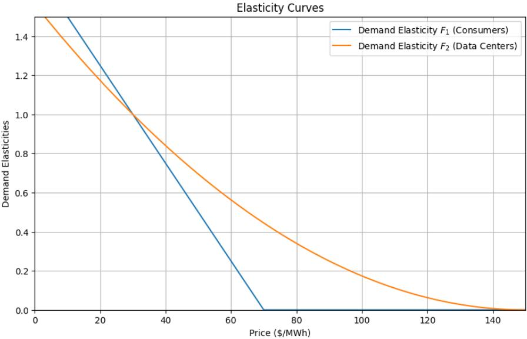  
Figure 1: Demand elasticities for traditional consumers and hyperscalers normalized to 1 at the reference price $P _ { 0 } = { \mathfrak { H } } 3 0 / M W h$ , with $A _ { 1 } = { \mathfrak { H } } 7 0 / M W h$ and $A _ { 2 } = \mathbb { \ S } 1 5 0 / M W h$

## 2.3 Deterministic Demand & Supply Growth

We assume throughout that reference traditional demand grows at a rate $\gamma \geq 0$ relative to its size:

$$
I _ { t } = I _ { 0 } e ^ { \gamma t } ,\tag{2.5}
$$

with running time t measured in years. So, for example, $\gamma = 0 . 0 3$ would quantify an economy and electrification-driven growth in reference traditional demand of 3%.

## 2.3.1 No New Build-out

To give some intuition about the deterministic model’s predictions, we begin with the extreme case where supply stays fixed: $S _ { t } = S _ { 0 }$ for all $t \geq 0$ . In other words, there is no additional infrastructure built or planned for. This is in some ways our worst-case scenario, as we exclude supply actually declining overall in our models. Detailed calculations and figures are relegated to Appendix A.

Pre-hyperscaler Era Suppose first that there are no hyperscalers, so that $X _ { t } = 0$ for all $t \geq 0$ . Then the market clearing condition (2.3) reduces to $I _ { t } F _ { 1 } ( P _ { t } ) = S _ { 0 }$ , and substituting the demand-response functions established in Section 2.2 leads to $P _ { t } = A _ { 1 } - ( A _ { 1 } - P _ { 0 } ) e ^ { - \gamma t }$

Thus, in the absence of hyperscalers, the price rises gradually from $P _ { 0 } < A _ { 1 }$ but never reaches $A _ { 1 }$ . The rising market-clearing price adjusts the growing reference demands to the fixed available supply. See Figure 9 (blue curve).

Linear data-center reference-demand growth The rise of data center demand changes this price trajectory. Suppose next that $X _ { t }$ grows linearly over time: $X _ { t } = X _ { 0 } + c _ { X } t$ , where $c _ { X } > 0$ is the growth rate of reference data-center demand, but that there is still no growth in supply. As a compromise between ERCOT’s adjusted large load breakdown and the TSP provided large load breakdown, we choose $c _ { X } : = 6 ~ \mathrm { G W / y e a r }$ for our simulations [9]. The resulting price path is computed in Appendix A and is also plotted in Figure 9 (red curve). Because data-center demand is less price-sensitive, growth in reference data-center demand raises the market-clearing price significantly above the no-hyperscaler case.

Figure 10 contrasts reference and price-responsive demand for both groups, and illustrates the crowding out of traditional demand by reference data-center demand under fixed supply. We conclude that, even with no growth in supply, traditional demand would not fall to zero until over 22 years, and typical electricity prices would take that long to approach the group 1 choke price. However, without supply-side response, that is, additional infrastructure, prices would double from \$30/MWh to \$60/MWh over 10 years.

## 2.3.2 Linear Supply Growth

Suppose that available supply also grows linearly in time: $S _ { t } = S _ { 0 } + c _ { S } t$ , where $c _ { S } \geq 0$ is the amount of new supply capacity added per year in GW/year. Figure 2 shows the resulting price paths for diferent choices of $c _ { S }$ . When supply grows slowly, demand growth dominates and prices rise; as $c _ { S }$ increases, this upward pressure is reduced, and suficiently rapid supply growth causes prices to fall, illustrating the cannibalization efect.

While we could as a next step incorporate the costs of building new supply and build a revenue-maximization model to quantify the optimal build-out rate $c _ { S }$ , we do that instead in Section 3, in a stochastic framework which includes uncertainties in supply and hyperscaler demand, which we introduce in Section 2.4.

## 2.4 Stochastic Supply and Demand Model

The deterministic analysis in Section 2.3 describes how electricity prices evolve when supply and demand grow smoothly at specified average rates. In practice, however, neither new generation capacity nor data-center load arrives smoothly. Power plants come online at uncertain times, while new data centers create large, irregular increments in electricity demand. We therefore replace the deterministic growth paths with stochastic jump processes that preserve the same underlying average growth rates while allowing the timing of additions to be uncertain.

## 2.4.1 Poisson and Compound Poisson Processes

A Poisson process $N _ { t } ^ { \mu }$ , with intensity parameter $\mu > 0$ , is a useful building block to model new data centers coming online at uncertain times. It is a counting process, meaning it takes

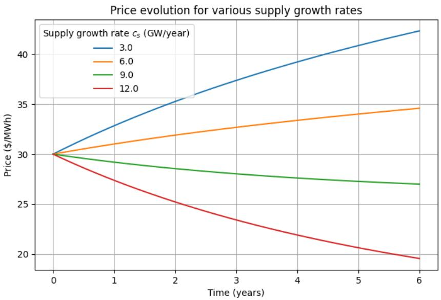  
Figure 2: Average annual wholesale price with supply growth rates 3, 6, 9, 12 GW/year over 2025–2031. General demand grows at 3% per year and reference data-center demand grows at 6 GW/year.

successively values in $\{ 0 , 1 , 2 , \cdots \}$ , starting at zero: $N _ { 0 } ^ { \mu } = 0$ . Over a short time interval $[ t , t + \Delta t ]$ of length $\Delta t$ , the probability that $N ^ { \mu }$ jumps by one is approximately $\mu \Delta t$

$$
\mathbb { P } \{ N _ { t + \Delta t } ^ { \mu } - N _ { t } ^ { \mu } = 1 \} = \mu \Delta t + o ( \Delta t ) ,
$$

while the probability of no jump is

$$
\mathbb { P } \{ N _ { t + \Delta t } ^ { \mu } - N _ { t } ^ { \mu } = 0 \} = 1 - \mu \Delta t + o ( \Delta t ) .
$$

Consequently, the probability of two or more jumps over the short time period is negligibly small.

A compound Poisson process extends this framework by allowing each new data center to have a random reference-demand increment. If $Y _ { 1 } , Y _ { 2 } , . . .$ . are independent and identically distributed jump sizes, then

$$
X _ { t } = X _ { 0 } + \sum _ { k = 1 } ^ { N _ { t } ^ { \mu } } Y _ { k }\tag{2.6}
$$

is called a compound Poisson process. The counting process $N _ { t } ^ { \mu }$ determines when new data centers come online, while $Y _ { k }$ determines the increase in reference data-center demand contributed by the kth arriving data center.

## 2.4.2 Demand Model & Parameters

On the demand side, we keep the deterministic growth formula (2.5) for $I _ { t } .$ , and we model reference data-center demand $X _ { t }$ as a compound Poisson process (2.6). According to recent reporting by the Texas Tribune [5], ERCOT projects that peak demand on the Texas grid could reach 175 GW by 2032, nearly double the state’s current record peak. This explosive growth is largely attributed to the rapid expansion of data centers handling AI-related workloads. Figure 3 shows a representative distribution of data-center campuses across capacity bins. The distribution is strongly right-skewed, reflecting that while many facilities

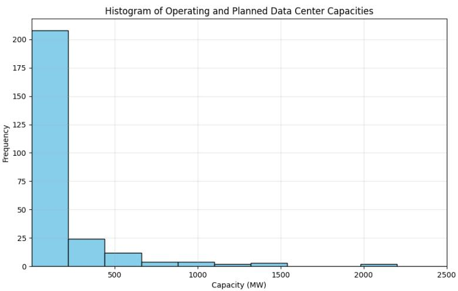  
Figure 3: Distribution of Texas data-center campus capacities (operating and planned). Most campuses fall below 0.5 GW, while a small number of very large projects create a pronounced right tail. Data centers with capacity above 2.5 GW (e.g. Fermi Project Matador) are not displayed. Source: [12].

are smaller, the massive aggregate growth is driven by the addition of extraordinarily large facilities. This unprecedented scale and empirical pattern motivate a model in which very large data-center additions are rare but possible.

Additions to reference data-center demand are thus random variables: each new data-center arrival contributes a reference-demand increment $Y _ { k }$ drawn from a lognormal distribution calibrated by maximum-likelihood on Texas data center capacities without the Project Matador outlier, giving mean 0.225 GW and standard deviation 1.54 GW. The choice of lognormal is motivated by the observed heavy right tail. Performing a Monte Carlo goodnessof-fit test as specified in [21, 27] demonstrates that the MLE-fitted lognormal distribution describes the data center capacities (excluding the Project Matador outlier) well.

The data-center build-out intensity is set to $\mu = 6 / 0 . 2 2 5 \approx 2 6 / \mathrm { y e a r }$ , so that $\mu { \mathbb { E } } [ Y ] =$ 6 GW/year agrees with the choice of $c _ { X }$ in Section 2.3.1.

## 2.4.3 Supply Model & Parameters

For additional infrastructure technologies $j = 1 , \dots , d$ (see Table 1), let $N _ { t } ^ { \lambda _ { j } }$ be independent Poisson processes with intensities $\lambda _ { j } > 0$ , where each arrival represents the completion of an additional generation build-out of technology $j .$ . Let $\delta _ { j }$ denote the amount of generation capacity added by one such installation, assumed constant for each technology, for simplicity. The total available generation capacity at time t is then

$$
S _ { t } = S _ { 0 } + \sum _ { j = 1 } ^ { d } \delta _ { j } N _ { t } ^ { \lambda _ { j } } .\tag{2.7}
$$

The technology-specific counting processes describe additions of new infrastructure, while $S _ { t }$ is the aggregate generation capacity across all technologies entering the market-clearing condition (2.3).

We distinguish additional infrastructure by generation technology: natural gas, coal, solar, wind, large-scale (LS) nuclear, and small modular reactor (SMR) nuclear. They difer both in terms of the average build-out time (for instance long for LS nuclear, considerably shorter for a new solar installation); and the increase in potential generation capacity that they bring (large for LS nuclear, much smaller for solar or wind farms). Using the additional infrastructure capacity data in [26], we calibrate the Poisson arrival intensities $\lambda _ { j }$ and representative capacity increment $\delta _ { j }$ for each technology, as reported in Table 1.

<table><tr><td rowspan=1 colspan=1>Technology j</td><td rowspan=1 colspan=1> $\lambda _ { j } \ \mathrm { ( p e r \ y e a r ) }$ </td><td rowspan=1 colspan=1> $\delta _ { j }$ (MW)</td><td rowspan=1 colspan=1>Expected additional capacity $\lambda _ { j } \delta _ { j }$ (MW/year)</td></tr><tr><td rowspan=1 colspan=1>Natural gas</td><td rowspan=1 colspan=1>10</td><td rowspan=1 colspan=1>250</td><td rowspan=6 colspan=1>2500125200010062.5</td></tr><tr><td rowspan=2 colspan=1>CoalSolar</td><td rowspan=2 colspan=1>0.2540</td><td rowspan=1 colspan=1>500</td></tr><tr><td rowspan=1 colspan=1>50</td></tr><tr><td rowspan=1 colspan=1>Wind</td><td rowspan=1 colspan=1>10</td><td rowspan=1 colspan=1>100</td><td rowspan=1 colspan=1></td></tr><tr><td rowspan=1 colspan=1>LS nuclear</td><td rowspan=1 colspan=1>0.1</td><td rowspan=1 colspan=1>1000</td></tr><tr><td rowspan=1 colspan=1>SMR nuclear</td><td rowspan=1 colspan=1>0.25</td><td rowspan=1 colspan=1>250</td></tr></table>

Table 1: Baseline parameters for stochastic capacity additions by generation technology. Parameters for established technologies are calibrated using 2015–2025 data from [25]; the SMR parameters are assumed as described in the text.

As $\lambda _ { j }$ is the expected number of capacity additions of technology j per year, while $\delta _ { j }$ is the capacity added by each arrival, $\lambda _ { j } \delta _ { j }$ is the expected annual contribution of technology j to total generation capacity. Because commercial SMRs have not yet generated a historical record of capacity additions, their parameters cannot be calibrated in the same way. We assume an SMR arrival intensity corresponding to one new build every four years on average.

## 2.4.4 Simulations

We compute N = 1000 Monte Carlo simulations of the supply process $S _ { t }$ in (2.7) and the hyperscaler demand driver $X _ { t }$ in (2.6) over T = 6 years, representing years 2025-31, summarizing the results in Figure 4. Three representative paths of $S$ are shown in panel (a), the first of which is divided more granularly into generator technologies in panel (b). The three corresponding paths of X are plotted in panel (c).

Along each path, we calculate the prices $P _ { t }$ from the market-clearing condition (2.3). Panel (e) exhibits the three corresponding price paths, while panel (f) shows the full Monte Carlo distribution of terminal prices in 2031.

Quantitatively, the mean terminal price is \$33.43/MWh and the standard deviation is \$5.87/MWh. In both figures, we emphasize the possibility of prices falling below the baseline level $P _ { 0 }$ . The price-responsive demands in the current-supply scenario are shown in panel (d). Because prices rise above the reference level when new data centers interconnect, price-responsive demand shocks are more mild than the reference demand trajectories suggest.

Nevertheless, after accounting for electricity prices, data centers extract a significant proportion of total generation capacity. Across the full Monte Carlo sample, the mean data-center share of price-responsive demand at the terminal date is 27.6%.

The deterministic growth model in Section 2.3 identifies the average capacity growth needed to stabilize prices, while the stochastic growth model of Section 2.4 shows how supply additions and data-center load arrivals create dispersion around those averages. Rapid supply expansion can suppress prices and create revenue cannibalization as seen in panel (e), which may weaken incentives to build capacity even when aggregate load is rising. These efects motivate the controlled-intensity formulation in Section $^ { 3 , }$ where a generation investor or capacity owner chooses supply expansion dynamically rather than it being exogenously specified.

## 3 Optimal Supply-Side Investment

We now develop a stochastic control framework in which a generation owner chooses the intensity of supply additions under uncertain data-center load growth. Unlike the exogenous supply processes studied in Section 2, capacity expansion is now endogenous while retaining uncertain infrastructure completion times. Such delays may be attributed $^ { \mathrm { t o , } }$ for instance, supply-chain disruptions or permitting delays. The owner controls the arrival intensity of new generation capacity rather than its exact installation date in order to maximize discounted her revenue net of capacity-expansion costs up to a finite time horizon $T = 6$ , matching the terminal time in Section 2.4.4. In this way, our representative generation owner is an investor whose portfolio is the available supply $S _ { t }$ . Investment thus afects both the quantity of generation earning revenue and the market-clearing price received on the existing portfolio, thereby capturing the revenue-cannibalization efect directly. Our formulation focuses on this aggregate investment incentive, leaving the strategic interaction among individual generators to future work.

There is long-dated and large literature on stochastic control models for irreversible capacity investment under uncertainty. Classical approaches typically represent investment through singular controls, in which capacity is added immediately when the investment decision is made; see [18, 8]. We instead represent build-out completion through a controlled counting process, allowing the waiting time until the next capacity addition to be random and state dependent. The model also difers from approaches with exogenous output prices because the electricity price is determined endogenously by market clearing. Consequently, additional capacity afects both the quantity available for sale and the price received on the owner’s generation portfolio.

Related controlled-intensity models have appeared in energy and resource economics, where dynamic oligopoly models use intensity controls to describe exploration and capacity expansion under competition, for instance [17, 4, 15], or cryptocurrency mining [16], or ticket pricing [2]. Our model adapts this controlled-intensity framework to electricity capacity expansion by combining uncertain project completion with uncertain data-center load and an endogenous market-clearing price.

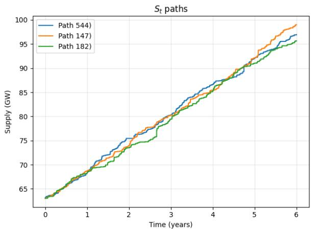  
(a)

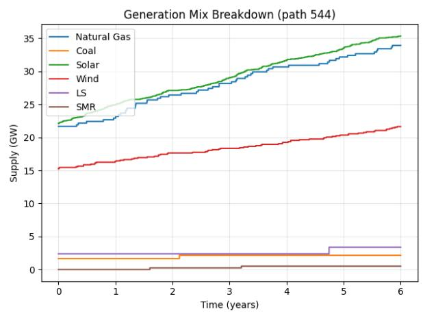  
(b)

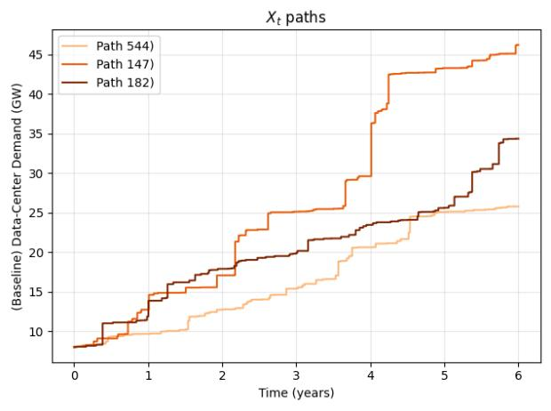  
(c)

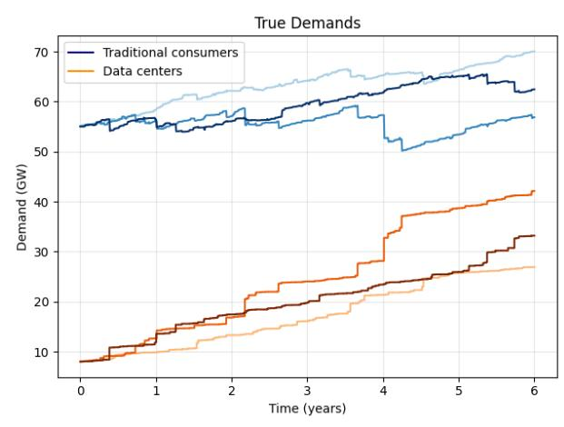  
(d)

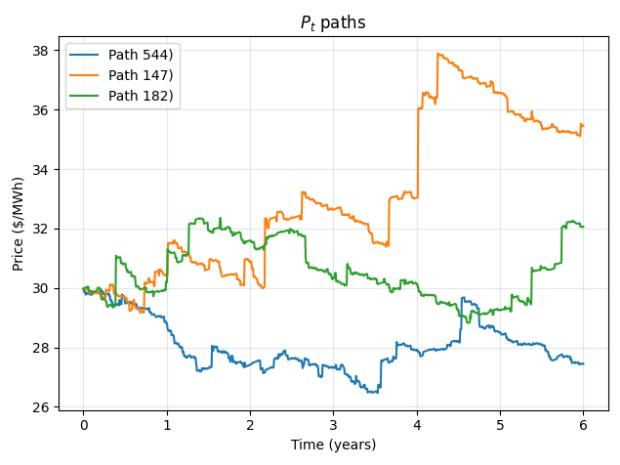  
(e)

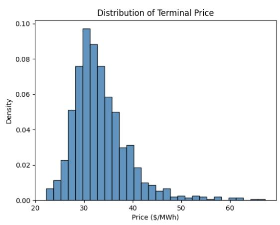  
(f )  
Figure 4: Summary of 1000 Monte Carlo simulations in the current trend scenario (Section 2.4.4). Top: (a) three simulated paths of total generation capacity, and (b) breakdown of one of these capacity paths into generative technologies. Middle: (c) three simulated paths of reference data-center demand, and (d) price-responsive demand of traditional consumers and data centers. Bottom: (e) three representative price paths, and (f) the terminal-price distribution.

## 3.1 Single-Technology Investment

We first suppose supply is increased only by a single available technology $( d = 1 )$ , for instance wind. We incorporate multiple asset types in Section 3.2. The state variables are the available generation capacity $S _ { t }$ and reference data-center demand $X _ { t } ,$ as introduced in Section 2. The reference traditional demand continues to evolve deterministically according to $I _ { t } = I _ { 0 } e ^ { \gamma t }$

For tractability in the stochastic control problem, we simplify the compound-Poisson specification for data-center load in Section 2.4 by replacing the random jump sizes $Y _ { k }$ with a representative constant increment $\kappa = \mathbb { E } [ Y ]$ , while retaining stochastic arrival times. Thus, reference data-center demand X evolves as

$$
d X _ { t } = \kappa d N _ { t } ^ { \mu } ,\tag{3.1}
$$

where $N ^ { \mu }$ is a Poisson process with intensity $\mu > 0$ . On the supply side, rather than taking the infrastructure build-out process as exogenous as in Section 2.4, the investor now controls its arrival intensity:

$$
d S _ { t } = \delta d N _ { t } ^ { \lambda }\tag{3.2}
$$

where $N ^ { \lambda }$ is a point process whose nonnegative intensity $\lambda _ { t } \geq 0$ is chosen by the investor at each time $t \in [ 0 , T ]$ . The precise admissibility and integrability conditions are stated in Appendix B.

Roughly speaking, the efect of choosing intensity $\lambda _ { t } \geq 0$ at time t is to make the probability that $N ^ { \lambda }$ jumps by one over a small time period $[ t , t + \Delta t ]$ of length $\Delta t$ is approximately $\lambda \Delta t \colon$

$$
\mathbb { P } \{ N _ { t + \Delta t } ^ { \lambda } - N _ { t } ^ { \lambda } = 1 \} = \lambda _ { t } \Delta t + o ( \Delta t ) ,
$$

while the probability of no increment is

$$
\mathbb { P } \{ N _ { t + \Delta t } ^ { \lambda } - N _ { t } ^ { \lambda } = 0 \} = 1 - \lambda _ { t } \Delta t + o ( \Delta t ) .
$$

This makes the probability of two or more jumps over the short time period negligibly small. Consequently, (3.2) says that when $N ^ { \lambda }$ increases by one, supply capacity S increases by δ:

$$
\begin{array} { r l } & { \mathbb { P } \{ S _ { t + \Delta t } - S _ { t } = \delta \} = \lambda _ { t } \Delta t + o ( \Delta t ) , } \\ & { \mathbb { P } \{ S _ { t + \Delta t } - S _ { t } = 0 \} = 1 - \lambda _ { t } \Delta t + o ( \Delta t ) . } \end{array}
$$

As such, $\lambda _ { t }$ controls the probability of an immediate jump in supply at time t. It can be viewed as a measure of investment and efort to build a new generation asset: the larger the investment intensity over $[ t , t _ { 1 } ) \colon ( \lambda _ { s } ) _ { t \leq s < t _ { 1 } }$ , the greater the likelihood of one (or more) new build-outs between times t and some $t _ { 1 } > t$

However, a higher supply intensity requires greater development efort and incurs higher costs. We represent this by an increasing convex cost function $C : \mathbb { R } _ { \geq 0 }  \mathbb { R } _ { \geq 0 }$ , where $C ( \lambda _ { t } ) \Delta t$ is the instantaneous cost of maintaining investment intensity $\lambda _ { t }$ over the small time interval $[ t , t + \Delta t )$ . Having C increasing captures greater efort incurring greater cost, while convexity captures the concept of diminishing returns, i.e. the marginal cost of investment is increasing. We further assume $C ( 0 ) = 0$ so that the supplier can stop incurring costs by choosing intensity equal to zero and the technical assumption $\lambda \mapsto C ( \lambda )$ is diferentiable with lim $_ { \cdot \lambda \to \infty } C ^ { \prime } ( \lambda ) = \infty$ , so that the optimal intensity is always uniquely defined. These are common assumptions in the project investment and research & development literature; see, for instance, [8].

The running payof is producer revenue net of the cost of maintaining the chosen installation intensity: $S _ { t } P ( t , S _ { t } , X _ { t } ) - C ( \lambda _ { t } )$ We note that, because we record supply and demand quantities in GW, and price in \$/MWh, the unit of revenue $S \times P$ is \$1000/hour, and cost C is assumed also to be in \$1000/hour. A realized supply jump changes the state from $S _ { t }$ to $S _ { t } + \delta$ , and hence afects subsequent producer revenue through both available capacity and the market-clearing price. Since $I _ { t }$ is deterministic, the controlled state is $( S _ { t } , X _ { t } )$ , with time t entering explicitly. We stress the dependence of the market-clearing price $P _ { t }$ determined by (2.3) on the controlled state by writing $P ( t , S _ { t } , X _ { t } )$

The generation investor maximizes over intensity $( \lambda _ { t } ) _ { t \in [ 0 , T ) }$ their expected discounted revenue minus cost, up to a finite time horizon $T$

$$
\mathbb { E } \left\{ \int _ { 0 } ^ { T } e ^ { - r u } 8 7 6 0 \times \left[ S _ { u } P ( u , S _ { u } , X _ { u } ) - C ( \lambda _ { u } ) \right] \mathrm { d } u \right\} ,\tag{3.3}
$$

where the 8760 hours/year adjust the time units of revenue and cost. Here, $r > 0$ is an annualized rate at which future profits are discounted.

To use dynamic programming to solve this stochastic control problem, we define the the value function $v : [ 0 , T ] \times \mathbb { R } _ { + } \times \mathbb { R } _ { + } \to \mathbb { R } _ { + }$ by

$$
v ( t , s , x ) = \underset { \lambda \in \Lambda } { \operatorname* { s u p } } \mathbb { E } \left\{ \int _ { t } ^ { T } e ^ { - r ( u - t ) } \left[ S _ { u } P ( u , S _ { u } , X _ { u } ) - C ( \lambda _ { u } ) \right] \mathrm { d } u \mid S _ { t } = s , X _ { t } = x \right\} ,\tag{3.4}
$$

where Λ denotes the admissible class defined in Appendix B, and we have divided by 8760 in our definition of $v ,$ , which cancels the conversion factor in (3.3). We note that $v \geq 0$ because prices $P$ and supply $S$ are non-negative and doing nothing $( \lambda _ { t } \equiv 0 )$ is an admissible costless strategy. The function v encodes the optimal value of potential future profits for the supply investor when the program starts at time $t \in [ 0 , T ]$ with current supply level $s > 0$ and data-center demand at the reference price equal to $x > 0$

The dynamic programming principle gives the single-technology Hamilton-Jacobi-Bellman (HJB) diferential equation for v:

$$
\partial _ { t } v ( t , s , x ) + \mu \Delta _ { x } v ( t , s , x ) + \operatorname* { s u p } _ { \lambda \geq 0 } \left\{ \lambda \Delta _ { s } v ( t , s , x ) - C ( \lambda ) \right\} + s P ( t , s , x ) - r v ( t , s , x ) = 0 ,\tag{3.5}
$$

with $v ( T , s , x ) = 0$ . The diferences

$$
\Delta _ { s } v ( t , s , x ) : = v ( t , s + \delta , x ) - v ( t , s , x ) , \qquad \Delta _ { x } v ( t , s , x ) : = v ( t , s , x + \kappa ) - v ( t , s , x ) ,
$$

denote the changes in the value function resulting from one additional supply-capacity completion and one additional data center arrival, respectively. The optimal investment intensity is given by

$$
\lambda ^ { * } ( t , s , x ) = \left\{ \begin{array} { l l } { 0 , } & { \Delta _ { s } v ( t , s , x ) \leq C ^ { \prime } ( 0 ) , } \\ { ( C ^ { \prime } ) ^ { - 1 } ( \Delta _ { s } v ( t , s , x ) ) , } & { \Delta _ { s } v ( t , s , x ) > C ^ { \prime } ( 0 ) . } \end{array} \right.
$$

To interpret (3.5), we state the role of each term. The derivative $\partial _ { t } \boldsymbol { v }$ records the passage of time; $\mu \Delta _ { x } v$ captures the expected change in value arising from a new increment in reference data-center demand; $\lambda \Delta _ { s } v$ analogously measures the same for a new generator; $C ( \lambda )$ is the cost explained above; current revenue is $s P ;$ ; and rv is a consequence of discounting future returns. The derivation of equation (3.5) and verification theorem that its solution recovers the value of the stochastic control problem (3.4) are given in Appendix B.

We work with a power-cost specification

$$
C ( \lambda ) = \frac { 1 } { \beta } \lambda ^ { \beta } + \rho \lambda , \qquad \beta > 1 , \rho \geq 0 .\tag{3.6}
$$

If $\rho > 0$ in (3.6), then $C ^ { \prime } ( 0 ) = \rho$ represents a positive marginal cost of initiating investment efort. With this specification, the optimal intensity is unique and given by

$$
\lambda ^ { * } ( t , s , x ) = \big ( \Delta _ { s } v ( t , s , x ) - \rho \big ) _ { + } ^ { 1 / ( \beta - 1 ) } .\tag{3.7}
$$

Investment is positive only when the incremental value of another capacity addition exceeds the threshold $\rho .$ The curvature parameter $\beta$ governs how strongly the optimal investment intensity responds to that incremental value.

## 3.1.1 Numerical results

For the single-technology model, we solve the HJB equation (3.5) backward in time on a discrete grid for available supply and reference data-center demand. At each time step, the investment intensity is updated from the current marginal value of an additional capacity increment. Holding this policy fixed, a semi-implicit Euler step produces a sparse linear system for the value function. Full discretization and implementation details are provided in Appendix C.

We now present the numerical results of the model using the parameters reported in Table 2. Price elasticities are determined using the demand response functions in Section 2.2. The single-technology results address when investment is attractive and how revenue cannibalization can limit further investment.

<table><tr><td rowspan=1 colspan=1>Parameter</td><td rowspan=1 colspan=1>Value</td></tr><tr><td rowspan=1 colspan=1>Generator size (δ)</td><td rowspan=1 colspan=1>100 MW</td></tr><tr><td rowspan=1 colspan=1>Reference traditional demand growth rate (γ)</td><td rowspan=1 colspan=1>3%</td></tr><tr><td rowspan=1 colspan=1>Reference data-center demand increment (κ)</td><td rowspan=1 colspan=1>225 MW</td></tr><tr><td rowspan=1 colspan=1>Data center intensity (µ)</td><td rowspan=1 colspan=1>6/0.225 ≈ 26 per year</td></tr><tr><td rowspan=1 colspan=1>Cost power (β)</td><td rowspan=1 colspan=1>2</td></tr><tr><td rowspan=1 colspan=1>Cost linear (ρ)</td><td rowspan=1 colspan=1>0</td></tr><tr><td rowspan=1 colspan=1>Discount rate (r)</td><td rowspan=1 colspan=1>3%</td></tr></table>

Table 2: Parameters in the single supply numerical simulations.

Figure 5 shows how the value function and the corresponding optimal investment policy vary with available supply and reference data-center demand.

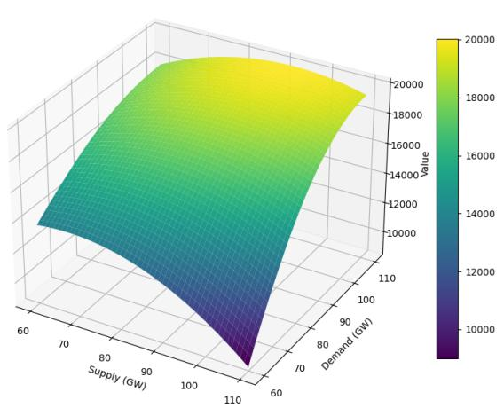  
(a) Value function $v ( 0 , s , x )$

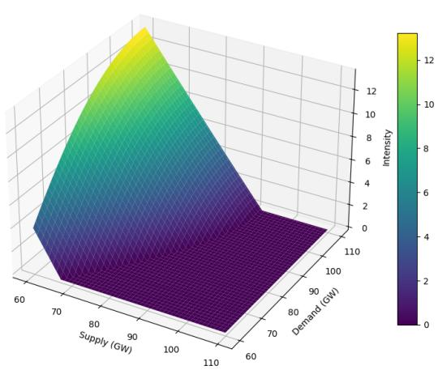

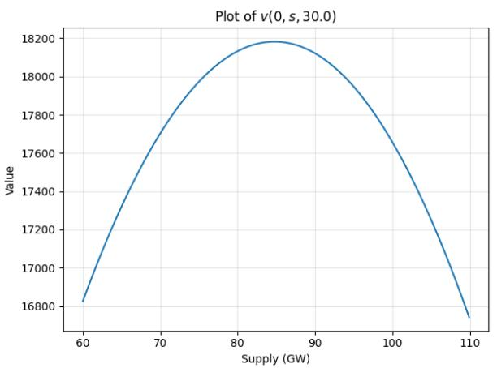  
(c) Cross-section $v ( 0 , s , 3 0 )$

(b) Optimal intensity $\lambda ^ { * } ( 0 , s , x )$  
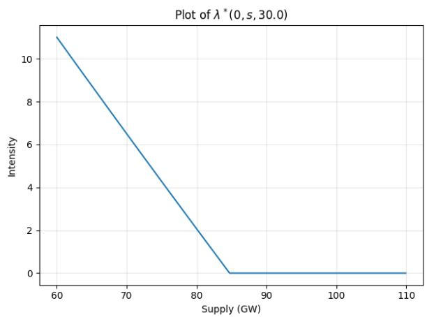  
(d) Cross-section $\lambda ^ { * } ( 0 , s , 3 0 )$  
Figure 5: Single-technology numerical results at the initial time using the calibration in Table 2. Panels (a) and (b) show the value function and corresponding optimal investment intensity over the state space, while Panels (c) and $( d )$ show the corresponding cross-sections at $x = 3 0$ . In the surface plots, the demand is the reference demand from traditional consumers plus data centers.

Panels (a) and (c) show that the value function increases with reference data-center demand, which reflects the greater revenue opportunity created by additional electricity demand. As a function of supply, value increases up to a point and then decreases. Panels (b) and (d) show the optimal investment intensity from formula (3.7). Investment is concentrated in states with relatively low available supply and suficiently high reference data-center demand. In these states, scarcity keeps the marginal value of new capacity above the cost threshold $\rho .$ Once available supply rises beyond the region in which another increment has suficient value, the optimal intensity falls to zero. Thus a high portfolio value does not by itself imply continued investment; investment depends on the incremental value of the next

capacity addition.

## 3.1.2 Monte Carlo simulations

The Monte Carlo simulations summarized in Figure 6 illustrate how demand growth, capacity additions, and investment incentives interact under the optimal policy. Panel (a) shows three controlled paths of available generation capacity, with discrete increases corresponding to buildout completions. The associated optimal investment intensities are shown in panel (b), which demonstrates the combined efects of capacity accumulation and the shortening remaining investment horizon.

On the demand side, panel (c) shows that reference data-center demand continues to increase through repeated exogenous arrivals. Thus, the decline in optimal investment intensity can occur even while reference data-center demand continues to grow. Panel (d) shows the corresponding price-responsive demands of traditional consumers and data centers, while panel (e) shows the resulting market-clearing price paths.

We highlight the opposing efects of rising reference data-center demand and additional generation capacity: demand arrivals place upward pressure on the market-clearing price while completed supply investments reduce scarcity and place downward pressure on it. The terminal-price distribution across the full Monte Carlo sample is shown in panel (f). The observed dispersion in terminal prices in panel (f) illustrates optimal investment does not eliminate price uncertainty since the timing of demand arrivals and project completions remains stochastic.

More importantly, the decline of the optimal intensity in panel (b) despite continued growth in panel (c) illustrates the revenue-cannibalization mechanism. Adding capacity supports additional sales but also lowers the market-clearing price earned on the owner’s existing generation portfolio, eventually reducing the incremental value of further investment.

## 3.1.3 Explicit Formula Example

As we have seen, higher reference data-center demand raises the market-clearing price and generally increases the value of additional capacity, while greater available supply lowers the price. The investment incentive is therefore governed by a tradeof: additional capacity creates revenue from new output, but also depresses the market-clearing price earned on the producer’s existing capacity. In suficiently well-supplied states, this revenue-cannibalization efect can make the incremental value of further capacity nonpositive even while reference data-center demand continues to grow. We give here an extreme analytical example where there is complete cannibalization.

We suppose a slightly diferent type of demand model in which price response additively changes the hyperscaler and traditional demands I and X at the reference price, rather than multiplicatively as in (2.1). Specifically we take $I _ { t } \equiv I _ { 0 } ( \gamma = 0 )$ and

$$
D _ { 1 } ( I _ { t } , P _ { t } ) = I _ { 0 } - { \frac { 1 } { 2 } } \alpha \log ( P _ { t } / P _ { 0 } ) , \qquad D _ { 2 } ( X _ { t } , P _ { t } ) = X _ { t } - { \frac { 1 } { 2 } } \alpha \log ( P _ { t } / P _ { 0 } ) ,
$$

where $\alpha > 0$ is a conversion parameter in GW. In this model, demand is equated to riskadjusted supply given by $S _ { t } { + } \alpha \log ( S _ { t } / S _ { b } )$ , where $S _ { b } > 0$ is “large" so the reliability adjustment

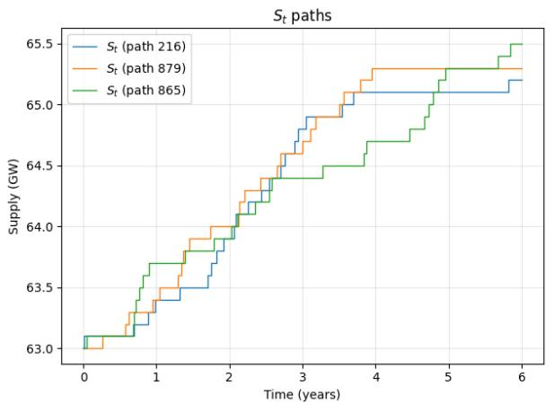  
(a)

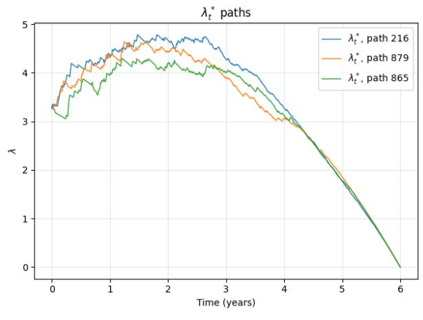  
(b)

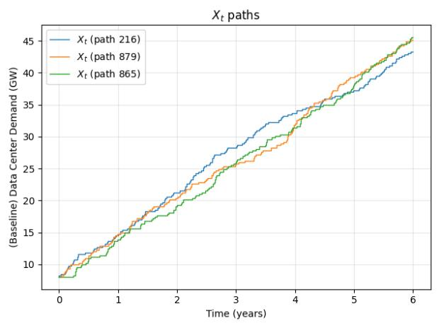  
(c)

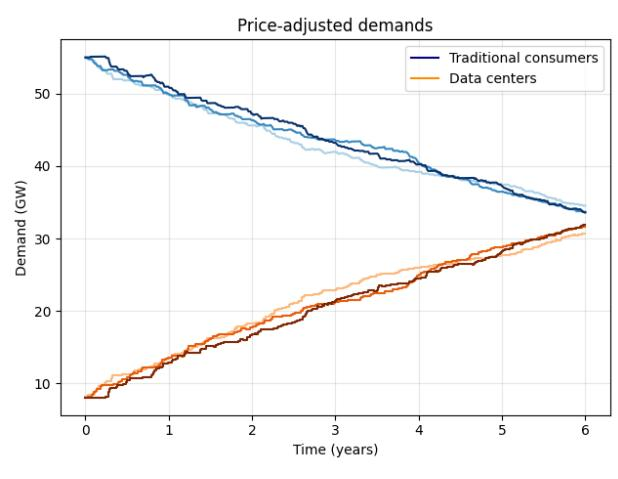  
(d)

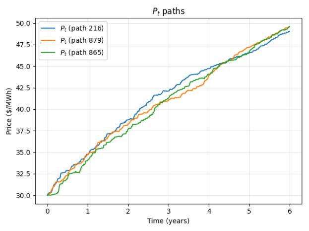  
(e)

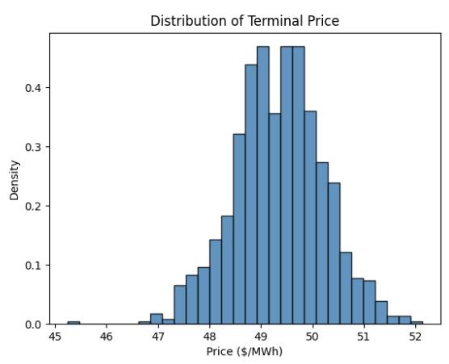  
(f )  
Figure 6: Summary of single-technology Monte Carlo simulation (N = 1000) under the parameters in Table 2. Top: (a) three simulated paths of total generation capacity $S _ { t } ,$ and (b) the corresponding optimal intensity paths λ∗. Middle: (c) three simulated paths of reference data-center demand $X _ { t }$ , and (d) price-responsive demand of traditional consumers and data centers. Bottom: (e) three simulated price paths, and (f) simulated terminal-price distribution.

is negative for $S _ { t } < S _ { b }$ . As supply capacity increases, supply is treated as more reliable and the modification is smaller.

Then the demand-supply market clearing condition

$$
I _ { 0 } - \frac { 1 } { 2 } \alpha \log ( P _ { t } / P _ { 0 } ) + X _ { t } - \frac { 1 } { 2 } \alpha \log ( P _ { t } / P _ { 0 } ) = S _ { t } + \alpha \log ( S _ { t } / S _ { b } )
$$

gives $P _ { t } = k e ^ { ( X _ { t } - S _ { t } ) / \alpha } / S _ { t }$ , where k collects the constants $( I _ { 0 } , P _ { 0 } , S _ { b } )$ . We assume for simplicity $\alpha = k = 1$ Therefore we have the revenue at time t is given by $S _ { t } P _ { t } = e ^ { X _ { t } - S _ { t } }$ . It is exponentially increasing in hyperscaler demand, and exponentially decreasing in installed capacity.

We further suppose that cost of supply investment depends on $X _ { t }$ and $S _ { t }$ as well in the same functional form:

$$
C ( \lambda ) \mapsto C ( \lambda ; X _ { t } , S _ { t } ) = e ^ { X _ { t } - S _ { t } } c ( \lambda ) ,
$$

where c is increasing, strictly convex and $c ( 0 ) = 0$ . So the cost of building new supply is high when hyperscaler demand is high because everyone is trying to get in, but it is low when supply is already high. We also assume $c ^ { \prime } ( 0 ) = 0$

Then (3.5) becomes

$$
\partial _ { t } v ( t , s , x ) + \operatorname* { s u p } _ { \lambda \geq 0 } \left[ \lambda \Delta _ { s } v ( t , s , x ) - e ^ { x - s } c ( \lambda ) \right] + \mu \Delta _ { x } v ( t , s , x ) + e ^ { x - s } - r v ( t , s , x ) = 0 .\tag{3.8}
$$

We look for a solution of the form

$$
v ( t , s , x ) = e ^ { x - s } g ( t ) ,\tag{3.9}
$$

for some function g to be found. Note that we have

$$
\begin{array} { r l } & { \Delta _ { s } v ( t , s , x ) = v ( t , s + \delta , x ) - v ( t , s , x ) = e ^ { x - s } g ( t ) ( e ^ { - \delta } - 1 ) , } \\ & { \Delta _ { x } v ( t , s , x ) = v ( t , s , x + \kappa ) - v ( t , s , x ) = e ^ { x - s } g ( t ) ( e ^ { \kappa } - 1 ) . } \end{array}
$$

The optimization problem is

$$
e ^ { ( x - s ) } \operatorname* { s u p } _ { \lambda \geq 0 } \left[ \lambda g ( t ) ( e ^ { - \delta } - 1 ) - c ( \lambda ) \right] ,
$$

which gives

$$
\lambda _ { t } ^ { * } = \left\{ { 0 , \atop ( c ^ { \prime } ) ^ { - 1 } ( g ( t ) ( e ^ { - \delta } - 1 ) ) , } \quad g ( t ) { \left( e ^ { - \delta } - 1 \right) } \leq 0 , \right.\tag{3.10}
$$

Substituting the ansatz (3.9) into (3.8) gives the nonlinear ODE

$$
g ^ { \prime } ( t ) + g ( t ) \lambda ^ { * } ( t ) ( e ^ { - \delta } - 1 ) - c ( \lambda ^ { * } ( t ) ) + \mu g ( t ) ( e ^ { \kappa } - 1 ) + 1 - r g ( t ) = 0 , \qquad g ( T ) = 0 ,\tag{3.11}
$$

From (3.10), in order that ${ \lambda } _ { t } ^ { * } > 0 ,$ we must have $g ( t ) < 0$ . However, since $g ( T ^ { - } ) = 0 { } _ { ; }$ we have $\lambda _ { T ^ { - } } ^ { * } = 0$ and therefore $g ^ { \prime } ( T ^ { - } ) = - 1$ , which means g is decreasing to zero as $t \uparrow T$ If at some earlier time $t _ { 0 } < T$ we had $g ( t _ { 0 } ) = 0$ , then $\lambda _ { t _ { 0 } } ^ { * } = 0$ and the same argument gives $g ^ { \prime } ( t _ { 0 } ^ { - } ) = - 1$ . Hence $g ( t ) > 0$ for $t < t _ { 0 }$ suficiently close to $t _ { 0 }$ , so $g$ cannot cross from nonnegative values into negative values as the equation is solved backward from $T$ Consequently, $g ( t ) \geq 0$ and $\lambda _ { t } ^ { * } = 0$ for all t.

This example illustrates revenue cannibalization: additional supply depresses the marketclearing price suficiently that a revenue-maximizing generation owner optimally chooses never to invest, even when demand is growing.

## 3.2 Multiple Supply Technologies

We now extend the single-technology framework by allowing the investor to allocate investment efort across $d$ generation technologies. For each technology $j = 1 , \ldots , d , \delta _ { j }$ is the capacity delivered by one completed project, $\lambda _ { j , t } \geq 0$ is the controlled completion intensity, and $C _ { j }$ is the technology-specific investment cost. The aggregate controlled supply process is

$$
d S _ { t } = \sum _ { j = 1 } ^ { d } \delta _ { j } d N _ { t } ^ { \lambda _ { j } } .
$$

The value function becomes

$$
v ( t , s , x ) = \operatorname* { s u p } _ { \lambda \in \Lambda } \mathbb { E } \left[ \int _ { t } ^ { T } e ^ { - r ( u - t ) } \left( S _ { u } P ( u , S _ { u } , X _ { u } ) - \sum _ { j = 1 } ^ { d } C _ { j } ( \lambda _ { j , u } ) \right) d u \Bigg | S _ { t } = s , X _ { t } = x \right] .
$$

The multi-technology HJB is

$$
\partial _ { t } v ( t , s , x ) + \sum _ { j = 1 } ^ { d } \operatorname* { s u p } _ { \lambda _ { j } \geq 0 } \left\{ \lambda _ { j } \Delta _ { s _ { j } } v ( t , s , x ) - C _ { j } ( \lambda _ { j } ) \right\} + \mu \Delta _ { x } v ( t , s , x ) + s P ( t , s , x ) - r v ( t , s , x ) = 0 ,\tag{3.12}
$$

with $v ( T , s , x ) = 0$ , where

$$
\Delta _ { s _ { j } } v ( t , s , x ) = v ( t , s + \delta _ { j } , x ) - v ( t , s , x ) , \quad \mathrm { a n d } \quad \Delta _ { x } v ( t , s , x ) = v ( t , s , x + \kappa ) - v ( t , s , x ) .
$$

A multivariate derivation and verification argument are given in Appendix B.

For the power-cost specification

$$
C _ { j } ( \lambda _ { j } ) = \frac { 1 } { \beta _ { j } } \lambda _ { j } ^ { \beta _ { j } } + \rho _ { j } \lambda _ { j } ,
$$

the optimal intensity for technology $j$ is

$$
\lambda _ { j } ^ { * } ( t , s , x ) = \left( \Delta _ { s _ { j } } v ( t , s , x ) - \rho _ { j } \right) _ { + } ^ { 1 / ( \beta _ { j } - 1 ) } .
$$

Investment in technology $j$ is positive only when the incremental value of another completed asset exceeds the threshold $\rho _ { j }$ . Technologies difer both in the size $\delta _ { j }$ of a completed build-out and in the cost of raising its completion intensity. The investor therefore allocates efort by comparing the marginal value of each technology-specific capacity addition with the corresponding marginal investment cost.

Because the horizon is finite and future revenues are discounted, technologies whose expected benefits arrive too late relative to the remaining horizon may receive little or no investment efort.

## 3.2.1 Numerical results

The multi-technology HJB is solved using the same backward semi-implicit scheme as in the single-technology case, except that the policy update is performed separately for each $\lambda _ { j }$ Full implementation details are provided in Appendix C.

Technology choice. We run experiments in the case when there are multiple supply technologies. The parameters used in these experiments are presented in Table 3. The multi-technology results ask how the investor allocates efort when technologies difer in capacity increments and cost parameters.

Figure 7 reports the optimal investment intensity for each generation technology as a function of available supply and reference data-center demand at the initial time. The panels therefore show how the same market state can lead to diferent technology-specific project-completion intensities after solving (3.12).

<table><tr><td rowspan=1 colspan=1>Parameters</td><td rowspan=1 colspan=1>Value</td></tr><tr><td rowspan=1 colspan=1>Completed-project capacity increments (δ)</td><td rowspan=1 colspan=1>(250, 500, 50, 100, 1000, 250) MW</td></tr><tr><td rowspan=1 colspan=1>Reference traditional demand growth rate (γ)</td><td rowspan=1 colspan=1>3%</td></tr><tr><td rowspan=1 colspan=1>Reference data-center demand increment (κ)</td><td rowspan=1 colspan=1>225 MW</td></tr><tr><td rowspan=1 colspan=1>Cost power (β)</td><td rowspan=1 colspan=1>(2, 2, 2, 2, 2, 2)</td></tr><tr><td rowspan=1 colspan=1>Cost linear (ρ)</td><td rowspan=1 colspan=1>(4, 25, 0, 0, 50, 10)</td></tr><tr><td rowspan=1 colspan=1>Discount rate (r)</td><td rowspan=1 colspan=1>3%</td></tr></table>

Table 3: Parameters used in the multiple supply technologies numerical experiments.

The entries of $\delta , \beta ,$ and ρ are ordered as natural gas, coal, solar, wind, large-scale nuclear, and SMR nuclear. The technology-specific cost parameters are reduced-form, illustrative parameters that jointly represent capital requirements, development dificulty, and the efort required to increase the expected project-completion rate.

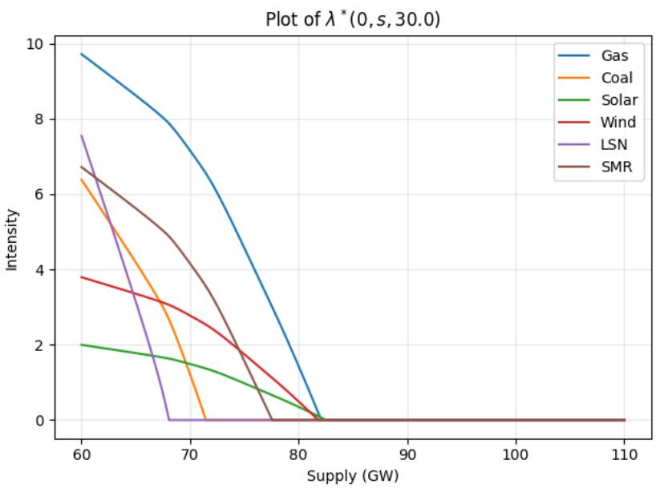  
Figure 7: Optimal investment intensities across generation technologies as a function of available supply, holding reference data-center demand fixed, using the parameters in Table 3.

Figure 7 compares the optimal intensities across technologies at a common level of reference data-center demand. The comparison shows that technology choice is state dependent. At low available supply, the optimal intensity incorporates all technologies but prioritizes high capacity projects, namely natural gas, both types of nuclear, and coal, to try to catch up to demand quickly. As available supply ramps up, large-scale nuclear and coal, the highest cost but highest capacity technologies, fall to no investment while relatively inexpensive natural gas, SMR nuclear, solar, and wind all continue to attract investment until available supply meets demand. High cost projects have rapidly decreasing marginal reward as the deficit between available supply and demand narrows.

These diferences reflect both the technology-specific capacity increments $\delta _ { j }$ and the corresponding investment-cost parameters in Table 3. In particular, a larger optimal projectcompletion intensity does not necessarily imply a larger rate of capacity addition, since each completed project contributes a diferent amount $\delta _ { j }$ of generation capacity. Thus, Figure 7 compares optimal investment efort across technologies rather than simply comparing nameplate capacities or levelized generation costs.

Controlled investment paths We conclude the section with Monte Carlo simulations in the multi-technology case, summarized in Figure 8. Panel (a) shows total available generationcapacity paths, and panel (b) shows the technology-specific optimal investment intensities. The exogenous reference data-center demand paths are shown in Panel (c), while panel (d) reports the corresponding price-responsive demands. The market-clearing price paths are shown in panel (e), and panel (f) gives the terminal-price distribution.

The simulated paths show how the investor reallocates efort across technologies as the state evolves. Increases in reference data-center demand raise the value of additional capacity, while completed capacity additions increase supply and reduce the marginal value of later additions. Technologies respond diferently because they difer in project size and investment cost. Demand arrivals put upward pressure on price, while capacity completions put downward pressure on price. Dynamically reallocating investment across technologies does not eliminate terminal-price uncertainty: the timing of demand arrivals and project completions still generates a range of possible market outcomes. The main diference from the single-technology model is the additional technology-choice margin,

## 4 Conclusion

We have developed a framework linking data-center load growth, generation capacity, and market-clearing electricity prices. Absent a supply response, data-center demand growing at ERCOT’s projected pace roughly doubles the average wholesale price within a decade, and the discrete, uncertain arrival of load and capacity turns any point forecast into a wide distribution of outcomes. Endogenizing investment then shows that because each completed project lowers the price earned on the investor’s entire portfolio, optimal investment intensity falls toward zero as capacity accumulates even while data-center load continues to arrive. Under our calibrations, prices rise from \$30/MWh to roughly \$46–49/MWh over six years despite optimal investment.

These conclusions should be read in contrast to recent publications arguing that new datacenter loads can, and in some cases have, lowered costs to residential customers, particularly where supply is already available. A May 2026 white paper by the Energy Systems Integration

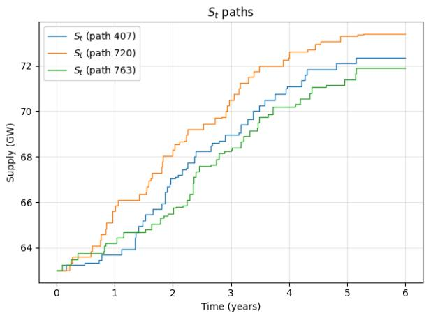  
(a)

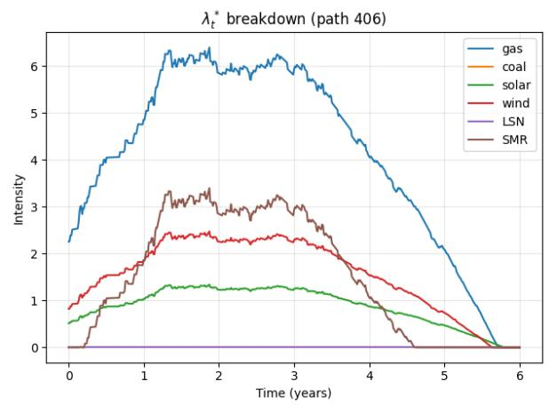  
(b)

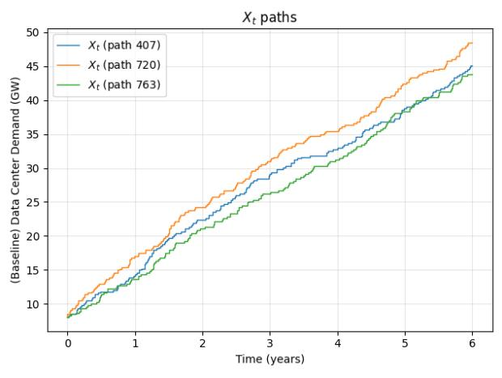  
(c)

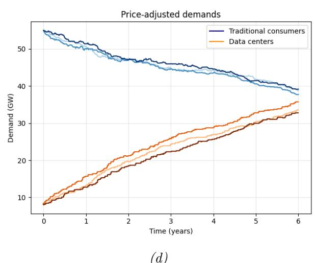  
(d)

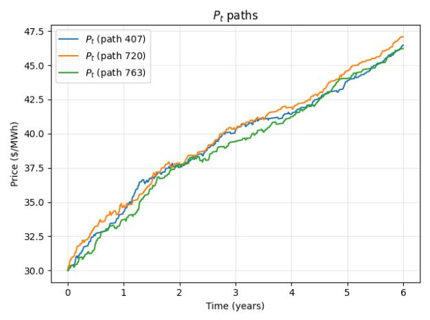  
(e)

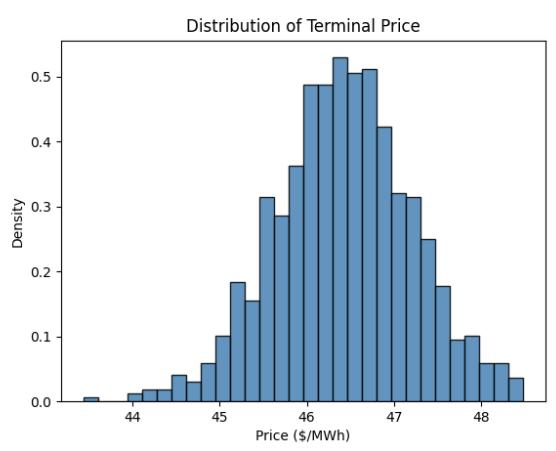  
(f )  
Figure 8: Summary of multi-technology Monte Carlo simulation (N = 1000) under the parameters in Table 3. Top: (a) three simulated paths of total generation capacity $S _ { t } ,$ and $( b )$ intensity mix breakdown $\lambda _ { t } ^ { * }$ of one simulated $S _ { t }$ path. Middle: (c) three simulated paths of reference data-center demand $X _ { t }$ , and (d) price-responsive demand of traditional consumers and data centers. Bottom: (e) three simulated price paths, and $( f )$ simulated terminal-price distribution.

Group and the Brattle Group explains that utilities with unused capacity can lower rates because the fixed costs of the grid are spread over a larger demand base [11]. An October 2025 regression study by Lawrence Berkeley National Laboratory and the Brattle Group found that, from 2019 to 2024, states with the highest load growth “experienced reductions in real prices,” whereas states with contracting loads generally saw prices rise [30]. Using an instrumental-variables approach, an EPRI and Watershed working paper estimates that data centers modestly reduced average residential rates between 2015 and 2024 through the same fixed-cost-spreading mechanism [28].

The past decade, however, may not be a reliable guide to the efects of new large loads in the future. This evidence is retrospective and estimated over a period in which aggregate load growth was modest by the standard of current forecasts and existing capacity was underutilized. It says little about wholesale energy and capacity prices, which are set by supply–demand clearing, passing a higher cost to every customer once supply is tight. The EPRI and Watershed authors themselves caution that emerging supply constraints could reverse the efect they identify [28].

With forecasts of up to 40% load growth over the next decade, and considerable uncertainty about whether and when it will materialize, many regions of the United States may enter a period of severe supply tightness. Building new generation at the required pace could run into supply-chain limits and rising incremental costs that push wholesale energy and capacity prices higher, costs ultimately passed on to households and existing businesses. Our results add an economic reason for the supply response to lag even where physical constraints do not bind: an investor who expands capacity erodes the scarcity rents that motivated the investment. In the regime ahead, rising wholesale prices, not the dilution of fixed costs, will be the stronger factor in what existing customers pay, and capturing this requires a structural model of price formation because that regime lies outside the historical sample on which the retrospective studies rest.

Several extensions would sharpen these conclusions: endogenous data-center demand, in which developers choose when to connect, how much capacity to request, and whether to sign long-term contracts; a distinction between project initiation and completion to represent construction pipelines, cancellation risk, and uncertain time-to-build; a retail-rate layer that weighs the dilution efect directly against the wholesale efect analyzed here.

## A Formulas & Figures for Section 2.3.1

In Section 2.3.1, when X grows linearly, the market-clearing price is now determined by

$$
I _ { t } F _ { 1 } ( P _ { t } ) + X _ { t } F _ { 2 } ( P _ { t } ) = S _ { 0 } .
$$

As long as both groups remain active, we have for $P _ { t } < A _ { 1 }$

$$
P _ { t } = A _ { 2 } + \frac { R _ { t } } { 2 } - \frac { 1 } { 2 } \sqrt { R _ { t } ^ { 2 } + 4 ( A _ { 2 } - A _ { 1 } ) R _ { t } + 4 ( A _ { 2 } - P _ { 0 } ) ^ { 2 } \frac { S _ { 0 } } { X _ { t } } } , \quad R _ { t } : = \frac { ( A _ { 2 } - P _ { 0 } ) ^ { 2 } } { A _ { 1 } - P _ { 0 } } \frac { I _ { t } } { X _ { t } } .\tag{A.1}
$$

Define τ to be the time at which traditional consumers reach their efective choke price, i.e. $P _ { \tau } = A _ { 1 }$ . Since $A _ { 1 } < A _ { 2 }$ , we have $F _ { 2 } ( A _ { 1 } ) > 0$ . Moreover, $X _ { t } = X _ { 0 } + c _ { X } t$ grows without

bound, while supply remains fixed at $S _ { 0 }$ . Hence $X _ { t } F _ { 2 } ( A _ { 1 } )$ eventually reaches $S _ { 0 }$ , so $\tau < \infty$ 2 unless group 1 is already priced out at $t = 0$ . At $t = \tau$ , price-responsive traditional demand is zero:

$$
D _ { 1 } ( I _ { \tau } , A _ { 1 } ) = I _ { \tau } F _ { 1 } ( A _ { 1 } ) = 0 .
$$

The market-clearing condition therefore becomes $S _ { 0 } = X _ { \tau } F _ { 2 } ( A _ { 1 } )$ , which, using the definition of $F _ { 2 }$ , gives that the dropout time, when traditional demand is gone, is given by

$$
\tau = \frac { 1 } { c _ { X } } \left( k S _ { 0 } - X _ { 0 } \right) ^ { + } , \quad k : = \left( \frac { A _ { 2 } - P _ { 0 } } { A _ { 2 } - A _ { 1 } } \right) ^ { 2 } .\tag{A.2}
$$

Then $\tau > 0$ as long as initial reference data center demand $X _ { 0 } < k S _ { 0 }$ ; otherwise group 1 is already priced out at the initial time and one sets $\tau = 0$

For $t \geq \tau ,$ group 1 is no longer active, and market clearing is determined entirely by price-responsive data-center demand: $S _ { 0 } = X _ { t } F _ { 2 } ( P _ { t } )$ . It follows that

$$
P _ { t } = A _ { 2 } - ( A _ { 2 } - P _ { 0 } ) \sqrt { \frac { S _ { 0 } } { X _ { 0 } + c _ { X } t } } , \qquad t \ge \tau ,
$$

and so $\begin{array} { r } { \operatorname* { l i m } _ { t \to \infty } P _ { t } = A _ { 2 } } \end{array}$ . Thus the price crosses the traditional-consumer choke price $A _ { 1 }$ in finite time, but approaches the hyperscaler choke price $A _ { 2 }$ only asymptotically. In this sense, suficiently rapid growth in reference data-center demand can price the more elastic traditional demand out of the market when supply does not expand. The price nevertheless remains below the hyperscaler efective choke price $A _ { 2 }$ at every finite time.

Figure 9 illustrates this predicted price growth over time using parameter values given in Sections 2.1 and 2.3, and Figure 10 ofers insight into how each group’s demand evolves under the predicted. The reference data-center demand shifts the price path upward, but it does not cross $A _ { 1 } = { \mathbb { S } } 7 0 / { \mathrm { M W h } }$ until after approximately $\tau = 2 2 . 3$ years, after which traditional demand is negligible and the market is supported by price-responsive data-center demand. The price remains below the hyperscaler efective choke price $A _ { 2 }$ at every finite time.

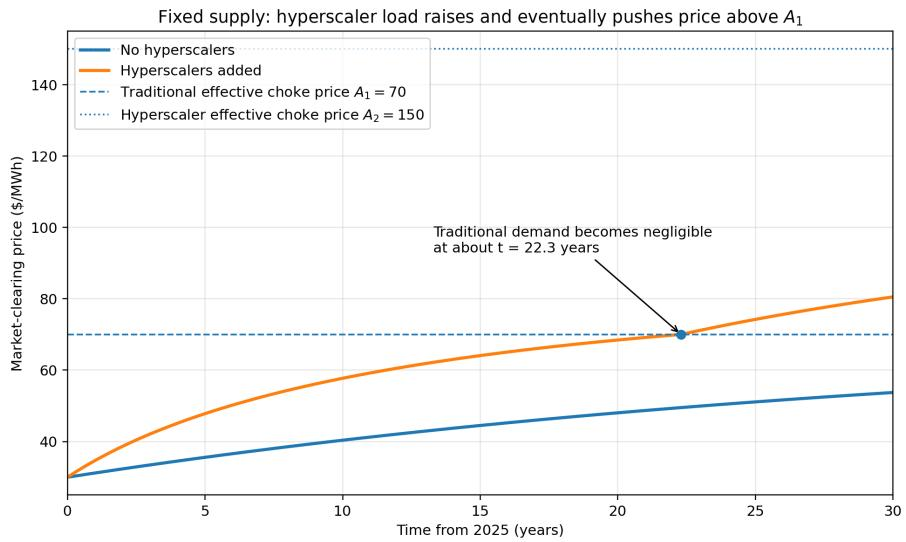  
Figure 9: Efect of growth in reference data-center demand on the market clearing price under fixed supply.

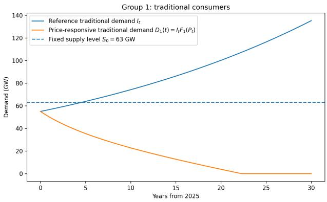

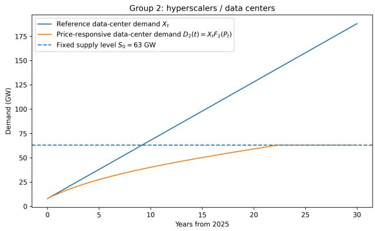  
(a) Traditional consumers  
(b) Data centers / hyperscalers  
Figure 10: Reference and price-responsive demands under fixed supply. Panel $( a )$ shows traditional consumers: reference traditional demand $I _ { t }$ rises over time, while price-responsive traditional demand $D _ { 1 } ( t ) = I _ { t } F _ { 1 } ( P _ { t } )$ declines as the market-clearing price rises. Panel $( b )$ shows data centers: reference data-center demand $X _ { t }$ rises over time, while price-responsive data-center demand $D _ { 2 } ( t ) = X _ { t } F _ { 2 } ( P _ { t } )$ increases and eventually absorbs the full fixed supply $S _ { 0 }$

Finally, when supply grows linearly (Section 2.3.2), we can re-compute $\tau$ . As long as both groups remain active, the market-clearing price is obtained from the expression in (A.1) by replacing $S _ { 0 }$ with $S _ { t }$ . The dropout time of group 1 is again defined by $P _ { \tau } = A _ { 1 }$ . Hence, provided $c _ { X } > k c _ { S }$ , we have $\begin{array} { r } { \tau = \frac { \bar { k } S _ { 0 } - X _ { 0 } } { c _ { X } - k c _ { S } } } \end{array}$ . This reduces to the fixed-supply expression (A.2) when $c _ { S } = 0$ . If $\begin{array} { r } { c _ { S } \geq \frac { c _ { X } } { k } } \end{array}$ , then supply grows suficiently rapidly that group 1 never reaches its efective choke price, and $\tau = \infty$ . With $c _ { X } = 6$ GW/year as in Section 2.3, the threshold is $\textstyle { \frac { c _ { X } } { k } } \approx 2 . 6 7 ~ { \mathrm { G W / y e a r } }$ . Thus all of the positive supply-growth rates considered in Figure 2 prevent traditional demand from reaching zero.

## B Technical Foundations for the Controlled-intensity Model

This appendix gives the dynamic-programming calculation for the controlled-intensity model used in Section 3. The formulation follows the point-process control framework in [3, Ch. VII, Section 2], [7, Chapter 21], and [13], specialized to the state variables in the paper: available supply S, reference data-center demand X, and deterministic reference traditional demand $I _ { t } = I _ { 0 } e ^ { \gamma t }$

## B.1 Controlled-intensity Setup

Stochastic basis. Fix a probability space $( \Omega , \mathcal { F } , \mathbb { P } )$ carrying a Poisson random measure $\mathcal { N } ( d z , d t )$ on $\mathbb { R } _ { + } \times \mathbb { R } _ { + }$ with compensator dz ⊗ dt and an independent homogeneous Poisson process $N ^ { \mu }$ with intensity $\mu > 0$ . The symbol $\mu$ is reserved for this exogenous data-center arrival intensity. Define the compensated random measure by

$$
\widetilde { \mathcal { N } } ( d z , d t ) = \mathcal { N } ( d z , d t ) - d z d t .
$$

The filtration $\mathbb { F } = ( \mathcal { F } _ { t } ) _ { t \ge 0 }$ is generated by $\mathcal { N }$ , $N ^ { \mu }$ , and the initial conditions, augmented to satisfy the usual conditions. For a nonnegative predictable intensity $\lambda _ { t }$ , the controlled

supply-arrival process is constructed by thinning:

$$
d N _ { t } ^ { \lambda } = \int _ { 0 } ^ { \infty } \mathbf { 1 } _ { [ 0 , \lambda _ { t } ] } ( z ) \mathcal { N } ( d z , d t ) = \lambda _ { t } d t + \int _ { 0 } ^ { \infty } \mathbf { 1 } _ { [ 0 , \lambda _ { t } ] } ( z ) \widetilde { \mathcal { N } } ( d z , d t ) .
$$

All expectations below are taken under this fixed probability measure $\mathbb { P } .$

State dynamics. For the single-technology model, $d S _ { t } = \delta d N _ { t } ^ { \lambda }$ and $d X _ { t } = \kappa d N _ { t } ^ { \mu }$ . The deterministic traditional demand path is fixed as $I _ { t } = I _ { 0 } e ^ { \gamma t }$ . For notation convenience, we wrap the stochastic state processes into vector $Y _ { t } : = ( S _ { t } , X _ { t } )$ . The stochastic state has initial condition $Y _ { 0 } = y _ { 0 } = \left( s _ { 0 } , x _ { 0 } \right)$ . Feedback controls use the predictable left-limit state,

$$
\begin{array} { r } { \lambda _ { t } = \lambda ( t , Y _ { t - } ) . } \end{array}
$$

The market-clearing price is written as $P ( t , y )$ , with the deterministic dependence on $I _ { t }$ absorbed into the explicit time argument.

Definition B.1 (Admissible controls). Let $p \geq 1$ and let $L \subseteq \mathbb { R } _ { \geq 0 }$ be the action set. For $( t , y ) \in [ 0 , T ] \times \mathbb { R } _ { + } ^ { 2 }$ , the admissible class $\Lambda _ { p } ( t , y )$ consists of predictable nonnegative controls taking values in $L ,$ satisfying

$$
\mathbb { E } _ { t , y } \left[ \int _ { t } ^ { T } | \lambda _ { u } | ^ { p } d u \right] < \infty ,
$$

and, when restricted to Markov feedback controls, admitting the form $\lambda _ { t } = \lambda ( t , Y _ { t - } )$ for a measurable function $\lambda : [ 0 , T ] \times \mathbb { R } _ { 2 } ^ { + }  L$ . We assume admissible controls are stable under concatenation at stopping times.

The running payof is producer revenue net of investment cost:

$$
f ( t , y , \lambda ) = s P ( t , y ) - C ( \lambda ) , \qquad f : [ 0 , T ] \times \mathbb { R } _ { + } ^ { 2 } \times L  \mathbb { R } ,
$$

where $y = ( s , x )$ . This payof may be negative because investment costs can exceed contemporaneous revenue. Using constant discount rate r, the expected remaining payof starting at $( t , y )$ under λ is

$$
J ( t , y ; \lambda ) = \mathbb { E } _ { t , y } \left[ \int _ { t } ^ { T } e ^ { - r ( u - t ) } f ( u , Y _ { u } , \lambda _ { u } ) d u \right] ,
$$

and the value function is

$$
v ( t , y ) = \operatorname* { s u p } _ { \lambda \in \Lambda _ { p } ( t , y ) } J ( t , y ; \lambda ) .
$$

We restrict the admissible class further, if necessary, so that the controlled state process has the finite moments required for the dynamic-programming and verification arguments below.

## B.2 Dynamic Programming Principle

Lemma B.2 (DPP). Assume V is continuous. For every stopping time θ with values in [t, T],

$$
v ( t , y ) = \operatorname* { s u p } _ { \lambda \in \Lambda _ { p } ( t , y ) } \mathbb { E } _ { t , y } \left[ \int _ { t } ^ { \theta } e ^ { - r ( u - t ) } f ( u , Y _ { u } , \lambda _ { u } ) d u + e ^ { - r ( \theta - t ) } V ( \theta , Y _ { \theta } ) \right] .
$$

Proof. Fix an admissible control on $[ t , T ]$ and decompose its payof at θ. Conditional on $\mathcal { F } _ { \theta }$ the continuation value from $( \theta , Y _ { \theta } )$ is bounded above by $v ( \theta , Y _ { \theta } )$ , which gives one inequality after taking the supremum over admissible controls.

For the reverse inequality, choose any admissible control up to θ and concatenate it with an ε-optimal admissible continuation control for the post-θ state $( \theta , Y _ { \theta } )$ . Stability of $\Lambda _ { p }$ under concatenation and the Markov property give an admissible control on [t, T] whose payof is within ε of the displayed right-hand side. Sending $\varepsilon \downarrow 0$ proves the result. □

## B.3 Martingale Principle

Lemma B.3 (Martingale Principle). For an admissible control λ, define the Bellman process

$$
M _ { t } ^ { \lambda } = \int _ { 0 } ^ { t } e ^ { - r u } f ( u , Y _ { u } , \lambda _ { u } ) d u + e ^ { - r t } V ( t , Y _ { t } ) .
$$

For $0 \leq r \leq \theta \leq T$

$$
M _ { r } ^ { \lambda } \geq \mathbb { E } \left[ M _ { \theta } ^ { \lambda } \mid { \mathcal { F } } _ { r } \right] ,
$$

so $M ^ { \lambda }$ is a supermartingale. Under an optimal control it is a martingale.

Proof. Apply the DPP at time r with stopping time θ. For the fixed continuation control $\lambda ,$ the value $V ( r , Y _ { r } )$ is at least the conditional expected payof earned from r to θ plus the discounted continuation value at θ. Multiplying by the discount factor from 0 to r and adding the payof accumulated on [0, r] gives the displayed supermartingale inequality. If λ is optimal, the DPP is attained along λ, so the inequality is an equality. □

## B.4 HJB equation

To derive the HJB equation from the DPP, assume $V \in C ^ { 1 , 1 } ( [ 0 , T ] , \mathbb { R } _ { + } ^ { 2 } )$ and $f$ is continuous in $( t , y )$ for each fixed $\lambda \in L$ . For a test function $\phi ( t , y )$ , define the forward diferences

$$
\Delta _ { s } \phi ( t , y ) = \phi ( t , s + \delta , x ) - \phi ( t , s , x ) , \qquad \Delta _ { x } \phi ( t , y ) = \phi ( t , s , x + \kappa ) - \phi ( t , s , x )
$$

with $y = ( s , x )$ . The controlled state generator acts only on the state variables:

$$
\begin{array} { r } { \mathcal { A } ^ { \lambda } \phi ( t , y ) = \lambda \Delta _ { s } \phi ( t , y ) + \mu \Delta _ { x } \phi ( t , y ) . } \end{array}
$$

Note that the time derivative is not part of $\mathcal { A } ^ { \lambda }$

Applying the dynamic programming principle over a short interval $[ t , t + h ]$ , assuming smoothness of v, gives

$$
0 = \operatorname* { s u p } _ { \lambda \in L } \left\{ s P ( t , s , x ) - C ( \lambda ) + \partial _ { t } v ( t , s , x ) + \mathcal { A } ^ { \lambda } v ( t , s , x ) - r v ( t , s , x ) \right\} .
$$

Equivalently,

$$
\partial _ { t } v ( t , s , x ) + \operatorname* { s u p } _ { \lambda \in L } \left\{ \lambda \Delta _ { s } v ( t , s , x ) - C ( \lambda ) \right\} + \mu \Delta _ { x } v ( t , s , x ) + s P ( t , s , x ) - r v ( t , s , x ) = 0 ,
$$

with terminal condition $v ( T , s , x ) = 0$ . This is the single-technology HJB in equation (3.5).

## B.5 Verification Theorem

We record the verification statement corresponding to the HJB above.

Theorem B.4 (Verification). Let $w \in C ^ { 1 , 1 } ( [ 0 , T ) \times \mathbb { R } _ { + } ^ { 2 } ) \cap C ( [ 0 , T ] \times \mathbb { R } _ { + } ^ { 2 } )$ have at most polynomial growth, with suficient integrability under the admissible controls to justify Dynkin’s formula and passage to the terminal time. Suppose

$$
\partial _ { t } w ( t , y ) + \operatorname* { s u p } _ { \lambda \in L } \left\{ \mathcal { A } ^ { \lambda } w ( t , y ) - C ( \lambda ) \right\} + s P ( t , y ) - r w ( t , y ) \leq 0
$$

on $[ 0 , T ) \times \mathbb { R } _ { + } ^ { 2 }$ , and $w ( T , y ) \geq 0$ . Then

$$
w ( t , y ) \geq v ( t , y ) .
$$

$I f ,$ in addition, $w ( T , y ) = 0$ and there exists a measurable selector $\hat { \lambda } ( t , y ) \in \mathbb { R } _ { + }$ attaining the supremum such that

$$
\partial _ { t } w ( t , y ) + \mathcal { A } ^ { \hat { \lambda } } w ( t , y ) - C ( \hat { \lambda } ( t , y ) ) + s P ( t , y ) - r w ( t , y ) = 0 ,
$$

and the feedback control $\hat { \lambda } _ { u } = \hat { \lambda } ( u , Y _ { u - } )$ is admissible, then $w = V$ and $\hat { \lambda }$ is optimal.

Proof. Fix $( t , y )$ and an admissible control λ. Let $Y _ { u } = ( S _ { u } , X _ { u } )$ denote the corresponding state process on $[ t , T ]$ . Localizing if necessary and applying Dynkin’s formula to the discounted process gives

$$
\begin{array} { r l r } {  { \mathbb { E } \big [ e ^ { - r ( \tau - t ) } w ( \tau , Y _ { \tau } ) \big ] = w ( t , y ) } } \\ & { } & { + \operatorname * { \mathbb { E } } [ \int _ { t } ^ { \tau } e ^ { - r ( u - t ) } ( \partial _ { t } w ( u , Y _ { u } ) + \mathcal { A } ^ { \lambda _ { u } } w ( u , Y _ { u } ) - r w ( u , Y _ { u } ) ) d u ] . } \end{array}
$$

Since the supersolution inequality implies

$$
\partial _ { t } w + A ^ { \lambda } w - r w + s P - C ( \lambda ) \leq 0
$$

for every admissible $\lambda ,$ we obtain

$$
w ( t , y ) \geq \mathbb { E } \left[ \int _ { t } ^ { \tau } e ^ { - r ( u - t ) } \big ( S _ { u } P ( u , Y _ { u } ) - C ( \lambda _ { u } ) \big ) d u + e ^ { - r ( \tau - t ) } w ( \tau , Y _ { \tau } ) \right] .
$$

Letting $\tau \uparrow T$ and using $w ( T , \cdot ) \geq 0 \mathrm { ~ g i v e s ~ } w ( t , y ) \geq J ( t , y ; \lambda )$ . Taking the supremum over λ yields $w \ge v$

If $\hat { \lambda }$ attains the supremum and the equality condition holds, the preceding inequalities become equalities under $\hat { \lambda } ,$ with terminal value zero. Hence $w ( t , y ) = J ( t , y ; \hat { \lambda } ) \leq v ( t , y )$ Together with $w \ge v$ , this proves $w = v$ and optimality of $\hat { \lambda }$ □

## B.6 Multi-technology Extension

Analogously to the single-technology setting, we define a probability space with now d independent Poisson random measures $\mathcal { N } ^ { j } ( d z , d t ) ~ ( j \in \{ 1 , \dots , d \} )$ on $\mathbb { R } _ { + } \times \mathbb { R } _ { + }$ and apply thinning to construct $d$ controlled-intensity point processes driving available supply of each technology. The aggregate available supply $S _ { t }$ , which we define by superposition, and reference data-center demand $X _ { t }$ still constitute the state. For the higher-dimensional case, now $L \subseteq \mathbb { R } _ { \geq 0 } ^ { d } , C \colon \mathbb { R } _ { \geq 0 } ^ { d } \to \mathbb { R } _ { \geq 0 } ^ { d }$ , and

$$
f ( t , y , \lambda ) = s P ( t , y ) - \sum _ { j = 1 } ^ { d } C _ { j } ( \lambda _ { j } ) , \qquad f \colon [ 0 , T ] \times \mathbb { R } _ { + } ^ { 2 } \times \mathbb { R } _ { + } ^ { d } \to \mathbb { R } ,
$$

the same formulas for the expected remaining payof and value function apply here. The DPP and martingale principle continue to holdt by straightforward extensions of the arguments presented in the single-technology case.

For d supply technologies with controlled intensities $\pmb { \lambda } = ( \lambda _ { 1 } , \ldots , \lambda _ { d } )$ and jump sizes $\delta _ { 1 } , \ldots , \delta _ { d } .$ define $\Delta _ { s _ { i } } \phi ( t , y ) = \phi ( t , s + \delta _ { j } , x ) - \phi ( t , s , x )$ . The state generator is then

$$
\mathcal { A } ^ { \lambda } \phi ( t , y ) = \sum _ { j = 1 } ^ { d } \lambda _ { j } \Delta _ { s _ { j } } \phi ( t , y ) + \mu \Delta _ { x } \phi ( t , y ) .
$$

The leads the multi-technology HJB presented in Section 3.2, equation (3.12). The verification theorem is a natural multivariate extension of Theorem B.4, so we do not repeat it here.

## C Numerical Implementation Details

We first describe the numerical solver for (3.5). Provided positive integers $N _ { s }$ and $N _ { x } .$ the algorithm operates on a discrete state space

$$
\begin{array} { r } { \big \{ s _ { \operatorname* { m i n } } + \delta i : i \in \{ 0 , 1 , \dots , N _ { s } - 1 \} \} \times \big \{ x _ { \operatorname* { m i n } } + \kappa j : j \in \{ 0 , 1 , \dots , N _ { x } - 1 \} \big \} . } \end{array}
$$

It will be convenient to think of this grid as a (tensor) product of vectors, i.e.

$$
\mathbf { s } = \left[ s _ { \operatorname* { m i n } } \quad \cdots \quad s _ { \operatorname* { m i n } } + \delta ( N _ { s } - 1 ) \right] ^ { \top } \quad \mathrm { a n d } \quad \mathbf { x } = \left[ x _ { \operatorname* { m i n } } \quad \cdots \quad x _ { \operatorname* { m i n } } + \kappa ( N _ { x } - 1 ) \right] ^ { \top } .
$$

We then discretize the first-order system of ODEs that corresponds to the discretized version of (3.5), namely

$$
\frac { d v _ { i , j } } { d t } + \lambda _ { i , j } ^ { * } ( v _ { i + 1 , j } - v _ { i , j } ) + \mu ( v _ { i , j + 1 } - v _ { i , j } ) + s _ { i } P ( t , s _ { i } , x _ { j } ) - C ( \lambda _ { i , j } ^ { * } ) - r v _ { i , j } = 0 .\tag{C.1}
$$

where $i$ and $j$ run through $\{ 0 , \ldots , N _ { s } - 1 \}$ and $\{ 0 , \ldots , N _ { x } - 1 \}$ respectively. We implement a semi-implicit Euler method to solve (C.1). At each iteration $n _ { \mathrm { : } }$ we first compute $\lambda _ { i , j } ^ { * , ( n ) }$ by (3.7) with $v _ { i + 1 , j } ^ { ( n ) } - v _ { i , j } ^ { ( n ) }$ replacing $\Delta _ { s } v$ . With $\lambda _ { i , j } ^ { * , ( n ) }$ fixed, after substituting a finite diference for the time derivative, we solve

$$
\begin{array} { r l r } {  { v _ { i , j } ^ { ( n + 1 ) } - \Delta t [ \lambda _ { i , j } ^ { * , ( n ) } ( v _ { i + 1 , j } ^ { ( n + 1 ) } - v _ { i , j } ^ { ( n + 1 ) } ) + \mu ( v _ { i , j + 1 } ^ { ( n + 1 ) } - v _ { i , j } ^ { ( n + 1 ) } ) - r v _ { i , j } ^ { ( n + 1 ) } ] } } \\ & { } & { = v _ { i , j } ^ { ( n ) } + \Delta t [ s _ { i } P ^ { ( n ) } ( s _ { i } , x _ { j } ) - C ( \lambda _ { i , j } ^ { * , ( n ) } ) ] } \end{array}\tag{C.2}
$$

for $V ^ { ( n + 1 ) }$ . Because $V ^ { 0 } = V ( T , \cdot ) = 0$ , the solver works backwards in time, and $V ^ { ( n + 1 ) }$ is (approximately) the value at time $\tau _ { n } - \Delta t$ where $\tau _ { n }$ is the time corresponding to $V ^ { ( n ) }$ . Observe that this is a linear system. Indeed, define $N = N _ { s } \cdot N _ { x }$ -dimensional vectors $V ^ { ( n ) }$ , S and X by stacking the entries of $\boldsymbol { v } ^ { ( n ) }$ row by row to build $V ^ { ( n ) }$ and filling each columns of S with s and each row of X with x. Then (C.2) becomes

$$
( I - \Delta t M ^ { \lambda ^ { * , ( n ) } } ) V ^ { ( n + 1 ) } = V ^ { ( n ) } + \Delta t [ S P ( t , S , X ) - C ( \lambda ^ { * , ( n ) } ) ] .
$$

Here I is the identity and $M ^ { \lambda ^ { * , ( n ) } }$ is defined to have entries

$$
M _ { q , q } ^ { \lambda ^ { * , ( n ) } } = - ( r + \lambda _ { i , j } ^ { * , ( n ) } + \mu ) , \qquad M _ { q , q + 1 } ^ { \lambda ^ { * , ( n ) } } = \mu , \qquad M _ { q , q + N _ { x } } ^ { \lambda ^ { * , ( n ) } } = \lambda _ { i , j } ^ { * , ( n ) } .
$$

where $q = i N _ { x } + j$ . The entry $q + 1$ is included only when $j < N _ { x } - 1$ , and the entry $q + N _ { x }$ is included only when $i < N _ { s } - 1$ . At the upper demand and supply boundaries we use zero forward diferences, omit the corresponding of-diagonal transition and its matching diagonal rate, and do not allow wrap-around between rows. Notice that $I - \Delta t M ^ { \lambda ^ { * , ( n ) } }$ is sparse, so we can solve for $V ^ { ( n + 1 ) }$ eficiently.

The multi-technology solver generalizes the single-control solver to the multi-technology setting. It begins by similarly considering the discrete state space

$$
\left\{ s _ { \operatorname* { m i n } } + \eta i : i \in \left\{ 0 , 1 , \ldots , N _ { s } - 1 \right\} \right\} \times \left\{ x _ { \operatorname* { m i n } } + \kappa j : j \in \left\{ 0 , 1 , \ldots , N _ { x } - 1 \right\} \right\}
$$

Here $0 < \eta \leq \mathrm { { \ m i n } _ { 1 \leq \ell \leq d } } \delta _ { \ell }$ is a coarseness parameter chosen small enough so that the d possible jump sizes are multiples of $\eta .$ For technology ℓ, write $w _ { \ell } = \delta _ { \ell } / \eta$ . Following the same arguments as in the single supply case, we derive the sparse linear system

$$
( I - { { \mit \Delta } } t { { \cal M } ^ { { \mit \lambda } ^ { \ast , ( n ) } } } ) V ^ { ( n + 1 ) } = V ^ { ( n ) } + { \mit \Delta } t \left[ S P ( t , S , X ) - \sum _ { \ell = 1 } ^ { d } C _ { \ell } ( { \lambda } _ { \ell } ^ { \ast , ( n ) } ) \right] .
$$

where $M ^ { \lambda ^ { * , ( n ) } }$ now has entries

$$
M _ { q , q } ^ { \lambda ^ { * , ( n ) } } = - \left( r + \mu + \sum _ { \ell = 1 } ^ { d } \lambda _ { \ell , i , j } ^ { * , ( n ) } \right) , \qquad M _ { q , q + 1 } ^ { \lambda ^ { * , ( n ) } } = \mu , \qquad M _ { q , q + w _ { \ell } N _ { x } } ^ { \lambda ^ { * , ( n ) } } = \lambda _ { \ell , i , j } ^ { * , ( n ) } ,
$$

for $q = i N _ { x } + j$ . In the implementation, these entries are assembled through precomputed sparse jump matrices, which also handle the same indexing for interpolation on the supply grid. The interpolation is done for purely computational purposes as it avoids potential floating-point arthimetic errors when computing $w _ { \ell }$

## References

[1] Jared Anderson. US gas-fired turbine wait times as much as seven years; costs up sharply. May 2025. url: https://www.spglobal.com/energy/en/news-research/latestnews/electric-power/052025-us-gas-fired-turbine-wait-times-as-much-asseven-years-costs-up-sharply.

[2] Burak Aydın, Emre Parmaksız, and Ronnie Sircar. “Fare Game: A Mean Field Model of Stochastic Intensity Control in Dynamic Ticket Pricing”, Mathematics and Financial Economics 20 (2026), pp. 203–228.

[3] Pierre Brémaud. Point Processes and Queues: Martingale Dynamics. Springer Series in Statistics. Springer New York, Sept. 1981. isbn: 9781468494792.

[4] Patrick Chan and Ronnie Sircar. “Fracking, Renewables & Mean Field Games”, SIAM Review 59.3 (2017), pp. 588–615.

[5] Paul Cobler. ERCOT: Texas’ power grid meeting record demand now, but could falter when it doubles by 2032. July 2026. url: https://www.texastribune.org/2026/07/ 29/texas-ercot-power-grid-record-data-center/.

[6] Paul Cobler. Texas to be top market for data centers soon, report says. Jan. 2026. url: https://www.texastribune.org/2026/01/20/texas-top-data-center-marketpower-grid/.

[7] Samuel N. Cohen and Robert J. Elliott. Stochastic Calculus and Applications. Probability and Its Applications. Springer New York, 2015. isbn: 9781493928675.

[8] Avinash K. Dixit and Robert S. Pindyck. Investment under Uncertainty. Princeton University Press, 1994.

[9] Electric Reliability Council of Texas. 2025 Load Forecast. Electric Reliability Council of Texas, 2025. url: https://www.ercot.com/gridinfo/load/forecast/2025.

[10] Electric Reliability Council of Texas. ERCOT Monthly Operational Overview: December 2024. Tech. rep. Electric Reliability Council of Texas, Jan. 2025. url: https : / / www . ercot . com / files / docs / 2025 / 01 / 21 / ERCOT % 20Monthly % 20Operational % 20Overview%20December%202024.pdf.

[11] Energy Systems Integration Group. Rate Impacts of Large Loads Primer. Tech. rep. Energy Systems Integration Group, May 2026. url: https://www.esig.energy/ reports-briefs/rate-impacts-of-large-loads-primer.

[12] Apurva Ford, Alex Mahajan, and Emily Foxhall. A data center boom is coming to Texas. See where they’re going. June 2026. url: https://www.texastribune.org/ 2026/06/08/texas-regulation-data-centers-electricity-power-water/.

[13] Ma. Elena Hernández-Hernández, Saul Jacka, and Aleksandar Mijatović. Martingale approach to control for general jump processes. 2019. arXiv: 1912.13205 [math.PR]. url: https://arxiv.org/abs/1912.13205.

[14] Ethan Howland. PJM capacity prices hit price cap, reserve shortfall grows. July 2026. url: https://www.utilitydive.com/news/pjm- capacity- auction- price- capreserve-shortfall/825282/.

[15] Emma Hubert, Dimitrios Lolas, and Ronnie Sircar. A Mean Field Game for Capacity Expansion Modeling. July 2025. url: https://sircar.princeton.edu/document/ 546.

[16] Zongxi Li, A. Max Reppen, and Ronnie Sircar. “A Mean Field Games Model for Cryptocurrency Mining”, Management Science 70 (2024), pp. 2188–2208.

[17] Mike Ludkovski and Ronnie Sircar. “Exploration and Exhaustibility in Dynamic Cournot Games”, European Journal of Applied Mathematics 23.3 (2012), pp. 343–372.

[18] Alan S. Manne. “Capacity Expansion and Probabilistic Growth”, Econometrica 29.4 (1961), pp. 632–649. issn: 00129682, 14680262.

[19] Monitoring Analytics. 2026 Quarterly State of the Market Report for PJM: January through March. Tech. rep. Monitoring Analytics, LLC, May 2026. url: https://www. monitoringanalytics.com/reports/PJM\_State\_of\_the\_Market/2026/2026q1- som-pjm.pdf.

[20] Martha Muir. Utility boss warns US faces blackouts due to power supply shortfall. June 2026. url: https : / / www . ft . com / content / 14d2e591 - 7cd5 - 4456 - 904f - 1b7fdc5cbc1a.

[21] SciPy Developers. scipy.stats.goodness\_of\_fit. 2026. url: https://docs.scipy.org/ doc/scipy/reference/generated/scipy.stats.goodness\_of\_fit.html.

[22] Arman Shehabi et al. 2024 United States Data Center Energy Usage Report. Tech. rep. LBNL-2001637. Lawrence Berkeley National Laboratory, 2024. doi: 10.71468/P1WC7Q. url: https://escholarship.org/uc/item/32d6m0d1.

[23] Kirill Sirik, Alex Crosier, and Ronnie Sircar. Data centers will strain the grid (even with demand response). ORFEUS, Princeton University. 2026. url: https://orfeus. princeton.edu/data-centers-will-strain-grid-even-demand-response.html.

[24] Torsten Slok. The Data Center Boom Is a Texas Story. Apollo Global Management, The Daily Spark. Aug. 2026. url: https://www.apollo.com/insights-news/insights/ daily-spark/the-data-center-boom-is-a-texas-story.

[25] U.S. Energy Information Administration. Capacity of electric power plants. Apr. 2025. url: https://www.eia.gov/electricity/data.php/.

[26] U.S. Energy Information Administration. Form EIA-860M: Monthly Update to the Annual Electric Generator Report. Dec. 2025. url: https://www.eia.gov/electricity/ data/eia860M/.

[27] Pauli Virtanen et al. “SciPy 1.0: Fundamental Algorithms for Scientific Computing in Python”, Nature Methods 17 (2020), pp. 261–272. doi: 10.1038/s41592-019-0686-2.

[28] Asa Watten, John Bistline, and Geofrey Blanford. Have Data Centers Raised Your Electric Bill? Causal Evidence from the United States. 2026. doi: 10.48550/arXiv. 2606.19777. arXiv: 2606.19777 [physics.soc-ph].

[29] Julie Zauzmer Weil. Voters Facing Skyrocketing Electric Bills Turn Ire toward Politicians. Oct. 2025. url: https://www.washingtonpost.com/business/2025/10/15/energyprices-politics-virginia-jersey/.

[30] Ryan Wiser et al. “Factors influencing recent trends in retail electricity prices in the United States”, The Electricity Journal 38.4 (2025), p. 107516. issn: 1040-6190. doi: https://doi.org/10.1016/j.tej.2025.107516.