# Less Is Personal: Learning Minimal Suficient User Profiles for Personalized Language Models

Minghang Liu♠,♡, Qiang Qiu♠, Yuanzhuo Wang♠ Huawei Shen♠, Xueqi Cheng♠

♠State Key Laboratory of AI Safety, Institute of Computing Technology, CAS ♡University of Chinese Academy of Sciences, Beijing, China {liuminghang23s, wangyuanzhuo, qiangqiu, shenhuawei}@ict.ac.cn

## Abstract

Retrieval-augmented personalization enables large language models to produce more accurate and preference-aligned out- puts using relevant records retrieved from user histories. Per- sonalized language models typically prepend a fixed number of retrieved user records, even when additional history is re- dundant, harmful, or unrelated to a user’s distinctive behavior. We study minimal suficient personalization: constructing the least costly ordered profile for each input while preserving the utility achievable from a retrieved candidate pool. We introduce ENOUGH, a method that iteratively appends be- havioral records or emits STOP to construct profiles with adaptive lengths. Ofline, bounded counterfactual search eval- uates profile prefixes byjointly considering downstream gains, user specificity, and token costs. The resulting long-horizon targets are distilled into a multi-head value controller with explicit ranking and stopping supervision. At inference, the controller selects and orders records through lightweight deci- sions, and the frozen generator is invoked once after stopping. Extensive experiments on six personalized tasks demonstrate that ENOUGH consistently outperforms strong heuristic and retrieval-augmented baselines in both efectiveness and efi- ciency, achieving minimal suficient profiles that preserve per- sonalization utility while reducing unnecessary context costs.

## 1 Introduction

Personalized large language models (LLMs) adapt predictions and generations to a user’s preferences, expertise, and behavioral patterns, supporting tasks from classification and recommendation to tailored text generation (Salemi et al. 2024a; Zhang et al. 2025b). One approach encodes the user in model parameters or a static textual profile (Zhang 2024; Tan et al. 2024). Such persistent representations, however, can be costly to update or may compress away the fine-grained, request-dependent evidence in a growing interaction history. Retrieval-augmented personalized LLMs ofer a flexible ap- proach: for each request, they retrieve a set of the user’s past behavioral records and place them in the prompt, allowing a frozen generator to adapt without per-user retraining (Salemi et al. 2024a; Xu et al. 2025).

However, making history accessible does not determine how it should be used. A typical retrieval-augmented pipeline ranks records by semantic relevance and prepends a fixed top-k profile. Recent methods improve this pipeline through generation feedback (Salemi et al. 2024b), attention-derived relevance scoring (Chen et al. 2025), or order-aware profile policies (Du et al. 2026), but the resulting profile is still com-monly a fixed-size set or fixed-length permutation. This view leaves two questions unresolved: how much history should be used? and which useful history is genuinely personal?

  
Figure 1: (a) A user’s requests may require profiles of different lengths, including an empty one. (b) Query-relevant records can encode diferent user actions, so usefulness need not imply target-user specificity.

How much history should be used? The useful amount of history depends on both the current request and the records already selected. As illustrated in Figure 1(a), a request may be answerable without personal context, may need a single revealing behavior, or may require several selected records. A fixed profile length ofers no mechanism to recognize when later records merely repeat an established preference, intro- duce conflicting signals, or dilute useful context. Personal- ized generation should thus be viewed as a selective, self- terminating evidence-acquisition process, not an always-on retrieval regime. Model should decide whether histor is needed at all and identify when further history ceases.

Which useful history is genuinely personal? Relevance, general task utility, and personalization answer diferent uestions. Semantic similarit indicates whether a histori- cal context concerns the current request, but not whether the associated action reveals the target user’s behavior. Likewise, a record can improve generation simply by serving as a generally useful in-context example. Figure 1(b) illustrates this distinction: target-user and other-user records share the same relevant context, yet their actions imply diferent preferences. We operationalize personal value through two contrasts. The no-profile contrast asks whether the complete selected profile helps at all. For a beneficial profile, content-matched other- user replacements then ask whether a target-user record con- tributes more than a comparably relevant record while the remaining profile is held fixed. Thus, for our frozen gen- erator, history is valued neither by semantic similarity nor by generic generation gain, but by its user-specific marginal value under the current profile.

These two questions are inseparable. The marginal value of a candidate changes with the selected profile: a record that is useful initially can become redundant after a similar behav- ior has been included, while records may interact or comple- ment one another. Consequently, history length should not be a hyperparameter chosen independently of record value. It should emerge from the same conditional decision process: continue while some candidate ofers future personalized value, and stop when the current profile is suficient. We call this objective minimal suficientpersonalization: within a retrieved candidate pool, seek the least costly ordered profile that approaches its best attainable personalized utility.

We propose Eficient Net-utility Optimization for User- profile Growth and Halting (ENOUGH), a method that targets this objective by either appending a behavioral record or emitting Stop. Starting from the empty profile, ENOUGH can reject profile augmentation at the root, choose and order interacting records, and terminate at any feasible length. Ofline, bounded counterfactual search evaluates profile pre- fixes through three quantities: downstream gain over no personalization, beneficial user specificity measured against content-matched other user replacements, and actual incre- mental prompt-token cost. Long-horizon backups then super- vise a multi-head value controller, so selection and stopping account for future record interactions rather than only imme- diate gains. At inference, the controller constructs the profile through lightweight decisions, and the frozen generator is invoked once after stopping. Our contributions are threefold:

• We formulate retrieval-augmented personalization as minimal suficient profile construction, unifying whether to personalize, which behavioral records to select, and when additional history is no longer worthwhile.

• We introduce a dual counterfactual utility that separates general downstream gain from user-specific marginal value, and a long-horizon sequential controller with an explicit Stop action.

• Our evaluation spans six tasks across a broad range of per-sonalization settings, including classification, regression, and text generation, together with diagnostics of stopping, specificity, robustness, and eficiency.

## 2 Methodology

As shown in Figure 2, ENOUGH constructs an input- adaptive ordered user profile that targets minimal suficiency from the top-M candidates of a frozen retriever. Starting from the empty profile, a lightweight controller sequentially appends a behavioral record consisting of its historical con- text and the user’s action or selects Stop. Ofline, bounded counterfactual search evaluates profiles using downstream gain, target-user specificity, and token cost, then distills long- horizon action values into the controller. At test time, con- struction uses neither references nor generator rollouts; the frozen generator is invoked once after stopping.

## 2.1 Problem Formulation

Let the training set be

$$
\mathcal { D } = \{ ( u _ { i } , \tau _ { i } , x _ { i } , y _ { i } , H _ { u _ { i } } ) \} _ { i = 1 } ^ { N } ,\tag{1}
$$

where $u _ { i }$ denotes a profile owner, $\tau _ { i }$ its personalization task, $x _ { i }$ the current input, $y _ { i }$ its reference output, and $H _ { u }$ the history. Each history item is $d = ( c _ { d } , a _ { d } , m _ { d } )$ , with $c _ { d }$ is the historical context, $a _ { d }$ is an observed user action (e.g., a label, score, or generated text), and $m _ { d }$ contains optional metadata such as timestamps. A task-specific serializer $\phi _ { \tau }$ τ maps each record into a common textual schema.

A frozen retriever R constructs a candidate pool

$$
C _ { i } = R ( x _ { i } , H _ { u _ { i } } ; M ) , \qquad | C _ { i } | \leq M ,\tag{2}
$$

where M is the candidate-pool size limit and we set $K _ { i } =$ min $\left( K _ { \operatorname* { m a x } } , | C _ { i } | \right)$

We consider the space ${ \mathfrak { S } } _ { i }$ of ordered, non-repeating se- quences from $C _ { i }$ whose length is at most $K _ { i }$ and whose rendered prompt satisfies a hard context limit $L _ { \mathrm { m a x } } .$ At step t the controller holds $\mathbf { S } _ { t } = \left( d _ { 1 } , \ldots , d _ { t } \right)$ and chooses

$$
a _ { t } \in \mathcal { A } ( s _ { t } ) = \{ d \in C _ { i } \ \backslash \ \mathbf { S } _ { t } : \mathbf { S } _ { t } \oplus d \in \mathfrak { S } _ { i } \} \cup \{ \mathrm { S r o p } \} .\tag{3}
$$

Selecting d appends it to the ordered profile; selecting Stop terminates construction. The final output is

$$
\widehat { y } _ { i } = G \big ( P _ { \tau _ { i } } ( x _ { i } , \mathbf { S } _ { T } ) \big ) ,\tag{4}
$$

where G is the frozen generator and $P _ { \tau }$ is prompt template.

Minimal suficient personalization. Let $U _ { i } ( \mathbf { S } )$ denote the cost-free personalized utility defined in Section 2.3, and let

$$
U _ { i } ^ { \star } = \operatorname* { m a x } _ { \mathbf { s } \in \mathfrak { S } _ { i } } U _ { i } ( \mathbf { S } ) .\tag{5}
$$

An ϵ-minimal suficient profile is

$$
\mathbf { S } _ { i } ^ { \mathrm { M S P } } \in \arg \operatorname* { m i n } _ { \mathbf { S } \in \mathfrak { S } _ { i } } c _ { i } ( \mathbf { S } ) \quad \mathrm { s . t . } \quad U _ { i } ( \mathbf { S } ) \geq U _ { i } ^ { \star } - \epsilon .\tag{6}
$$

This definition separates suficiency from minimality. Be- cause the ordered search space is discrete and non-convex, we optimize the cost-regularized surrogate:

$$
J _ { i } ^ { \lambda } ( \mathbf { S } ) = U _ { i } ( \mathbf { S } ) - \lambda c _ { i } ( \mathbf { S } ) .\tag{7}
$$

Diferent values of λ recover supported points on the empirical quality–cost frontier.

We measure the actual incremental prompt cost:

$$
c _ { i } ( \mathbf { S } ) = \frac { \mathrm { T o k } ( P _ { \tau _ { i } } ( x _ { i } , \mathbf { S } ) ) - \mathrm { T o k } ( P _ { \tau _ { i } } ( x _ { i } , \mathcal { O } ) ) } { L _ { \mathrm { r e f } } } ,\tag{8}
$$

where $L _ { \mathrm { r e f } }$ is a profile reference budget shared by all tasks.

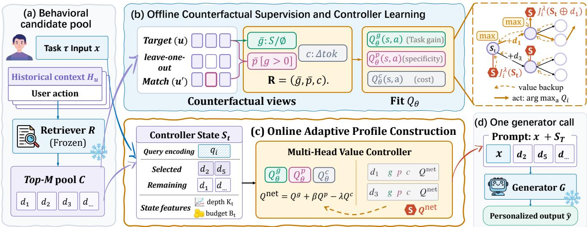  
Figure 2: Overview of the ENOUGH framework. (a) A frozen retriever forms a behavioral candidate pool. (b) Ofline counterfactual views measure downstream gain, matched-replacement specificity, and prompt cost; value backup supplies aligned lon -horizon tar ets for the controller. (c) At test time the controller ada tivel scores feasible record additions and Stop b net value. (d) Once construction stops, the ordered profile and current input are passed to the frozen generator in one call.

## 2.2 Behavior-Aware Profile Representation

Personalization histories are observations of user behavior. The controller therefore encodes both the situation and the user’s response. For a candidate record $d _ { j }$ , we compute

$$
\begin{array} { r } { \boldsymbol { e } _ { j } = E _ { h } \big ( [ \mathrm { T A S K } = \tau _ { i } ] \ \lVert \ [ \mathrm { H I S T } _ { - } \mathrm { C O N T E X T } ] \ \rVert \ c _ { d _ { j } } \ } \\ { \lVert \ [ \mathrm { U S E R } _ { - } \mathrm { A C T I O N } ] \ \rVert \ a _ { d _ { j } } \ \lVert \ [ \mathrm { M E T A } ] \ \rVert \ m _ { d _ { j } } \big ) . } \end{array}\tag{9}
$$

The current request is encoded as $q _ { i } = E _ { q } ( \mathrm { [ T A S K ~ = ~ }$ $\tau _ { i } ] \parallel [ \mathrm { Q U E R Y } ] \parallel x _ { i } )$

The controller state induced by the ordered profile $\mathbf { S } _ { t }$

$$
s _ { t } = ( q _ { i } , z _ { t } , r _ { t } , b _ { t } ) ,\tag{10}
$$

where $\begin{array} { r c l } { \boldsymbol { z _ { t } } } & { = } & { E _ { S } ( e _ { d _ { 1 } } , \dots , e _ { d _ { t } } ) } \end{array}$ is an order-sensitive in- cremental representation of the selected profile. $r _ { t } = $ $\mathrm { A t t n P o o l } ( [ q _ { i } ; z _ { t } ] , \{ e _ { j } : d _ { j } \in C _ { i } \setminus \mathbf { S } _ { t } \} )$ is a permutation- invariant summary of the remaining candidates. $b _ { t }$ contains the current incremental token cost, remaining horizon, and remaining context budget. In the multi-task setting, the en- coders and value controller are shared across personalization tasks, while the task embedding, serializer, and prompt tem- plate are task-conditioned.

## 2.3 Dual Counterfactual Profile Utility

Downstream task gain For a user profile S, we compute the length-normalized log-likelihood of the reference output:

$$
\ell _ { i } ( { \mathbf S } ) = \frac { 1 } { | y _ { i } | } \sum _ { r = 1 } ^ { | y _ { i } | } \log p _ { G } ( y _ { i , r } \mid y _ { i , < r } , P _ { \tau _ { i } } ( x _ { i } , { \mathbf S } ) ) .\tag{11}
$$

The downstream gain over no profile is

$$
g _ { i } ( \mathbf { S } ) = \ell _ { i } ( \mathbf { S } ) - \ell _ { i } ( \boldsymbol \alpha ) .\tag{12}
$$

To prevent high variance tasks from dominating shared training, we use a scale-only normalization. On a fixed cali- bration subset of the initial ofline branches, we compute

$$
s _ { \tau } ^ { g } = \sqrt { \mathbb { E } _ { i : \tau _ { i } = \tau } [ g _ { i } ( \mathbf { S } ) ^ { 2 } ] } , \qquad \overline { { g } } _ { i } ( \mathbf { S } ) = \frac { g _ { i } ( \mathbf { S } ) } { s _ { \tau _ { i } } ^ { g } + \varepsilon } .\tag{13}
$$

We do not subtract a mean, preserving $\overline { { g } } _ { i } ( \mathcal { D } ) = 0$

User-specific gain over matched replacements A profile can improve the likelihood simply because it contains a useful in-context demonstration. To isolate user-specific usefulness, we intervene on one profile slot while holding the rest of the selected profile fixed.

For every candidate d owned by $u _ { i }$ , we precompute $K ^ { - }$ matched replacements $m _ { k } ( d ; u _ { i } )$ from other profile owners. Matching uses only variables available before observing the user action: task identity, historical context semantics, rele- vance to the current query, length, and time when present.

For a profile $\mathbf { S } = \left( d _ { 1 } , \ldots , d _ { t } \right)$ and position $r ,$ let $\mathbf { S } _ { - 1 }$ be the sequence with $d _ { r }$ removed while preserving the order of all other records. For each slot, the target-user and matched- control marginal gains are then

$$
\Delta _ { i , r } ^ { u } ( \mathbf { S } ) = \ell _ { i } ( \mathbf { S } ) - \ell _ { i } ( \mathbf { S } _ { - r } ) ,\tag{14}
$$

$$
\begin{array} { r } { \Delta _ { i , r } ^ { c , k } ( \mathbf { S } ) = \ell _ { i } ( \mathbf { S } _ { - r } \oplus m _ { k } ( d _ { r } ; u _ { i } ) ) - \ell _ { i } ( \mathbf { S } _ { - r } ) . } \end{array}\tag{15}
$$

The slot-level beneficial specificity is

$$
\rho _ { i , r } ( \mathbf { S } ) = \left[ \Delta _ { i , r } ^ { u } ( \mathbf { S } ) \right] _ { + } - \frac { 1 } { K ^ { - } } \sum _ { k = 1 } ^ { K ^ { - } } \left[ \Delta _ { i , r } ^ { c , k } ( \mathbf { S } ) \right] _ { + } .\tag{16}
$$

We credit specificity only when the complete target-user pro- file improves over the empty profile:

$$
p _ { i } ( \mathbf { S } ) = \mathbb { I } [ g _ { i } ( \mathbf { S } ) > 0 ] \frac { 1 } { t } \sum _ { r = 1 } ^ { t } \rho _ { i , r } ( \mathbf { S } ) , \qquad p _ { i } ( \boldsymbol { \mathcal { O } } ) = 0 .\tag{17}
$$

This prevents a profile that is harmful relative to no person- alization from receiving a positive specificity bonus merely because the matched controls are even worse. A single uni- formly sampled position per profile yields an unbiased Monte Carlo estimator of Eq. (17).

As with task gain, we compute a scale on the fixed cali- bration subset and freeze it:

$$
s _ { \tau } ^ { p } = \sqrt { \mathbb { E } _ { i : \tau _ { i } = \tau } [ p _ { i } ( \mathbf { S } ) ^ { 2 } ] } , \qquad \overline { { p } } _ { i } ( \mathbf { S } ) = \frac { p _ { i } ( \mathbf { S } ) } { s _ { \tau _ { i } } ^ { p } + \varepsilon } .\tag{18}
$$

The cost-free personalized utility objective is

$$
U _ { i } ( \mathbf { S } ) = \overline { { g } } _ { i } ( \mathbf { S } ) + \beta \overline { { p } } _ { i } ( \mathbf { S } ) .\tag{19}
$$

Here, $\overline { { g } } _ { i } ( \mathbf { S } )$ rewards profiles that improve task likelihood over the empty profile, while $\overline { { p } } _ { i } ( { \bf S } )$ measures the additional benefit of target-user records over matched records from other users, discounting generic few-shot efects. The coeficients $\beta$ and λ balance user specificity and prompt cost, respectively.

## 2.4 Long-Horizon Decision Principle

For a candidate pool, context budget and maximum depth, the theoretical optimal value obeys the finite-horizon recursion

$$
V _ { i } ^ { \star } ( \mathbf { S } ) = \operatorname* { m a x } \left\{ J _ { i } ^ { \lambda } ( \mathbf { S } ) , \operatorname* { m a x } _ { \substack { d \in \mathcal { A } ( s ) \backslash \{ \mathrm { S T o P } \} } } V _ { i } ^ { \star } ( \mathbf { S } \oplus d ) \right\} .\tag{20}
$$

Similarly,

$$
Q _ { i } ^ { \star } ( s , \mathrm { S r o p } ) = J _ { i } ^ { \lambda } ( \mathbf { S } ) , Q _ { i } ^ { \star } ( s , d ) = V _ { i } ^ { \star } ( \mathbf { S } \oplus d ) .\tag{21}
$$

Equation (20) is a Bellman characterization, not a claim that the learned controller recovers the full combinatorial optimum. A detailed proof is provided in Appendix D.1.

Proposition 1 (Exact-value stopping). On the finite deter-ministic candidate tree, $i f Q _ { i } ^ { \star } ( s , a )$ is knownfor every reach-able state and action, selecting an action with maximum $Q _ { i } ^ { \star }$ at each step, with ties resolved in favor of Stop, returns a terminal profile that maximizes $J _ { i } ^ { \lambda }$ within the candidate tree.

## 2.5 Ofline Counterfactual Supervision and Controller Learning

The complete ordered candidate tree is intractable. We con- struct a bounded prefix tree $\mathcal { T } _ { i }$ using ofline counterfactual search and perform exact backups only within that tree. The resulting target $\widehat { Q } _ { T _ { i } }$ is exact for the sampled tree but is only an approximation to $Q _ { i } ^ { \star }$

Bounded-tree construction. We first sample tree roots from the empty profile, prefixes of the frozen retriever, re- cency and diversity policies, and random subsets. Profile sizes are stratified from zero to $K _ { i }$ so that the controller observes both early and late stopping states.

At each sampled root, Stop is always evaluated, and all feasible remaining candidate actions are expanded. At deeper states, a fixed action budget J combines high retriever-score, diversity, and uniformly sampled actions. Search retains at most W prefixes per depth. Each intermediate prefix is a legal terminal node. Unique ordered prefixes are represented once in directed acyclic graph structured cache, and all teacher- forced generator evaluations are batched.

Long-horizon target backup. For an expanded state- action pair $( s , a )$ , let $\mathcal { L } _ { \mathcal { T } } ( s , a )$ denote the terminal nodes in the sampled subtree reached after taking a. We select one terminal node using the same composite objective for all three value components:

$$
L _ { \mathcal { T } } ^ { \star } ( s , a ) = \arg \operatorname* { m a x } _ { L \in \mathcal { L } _ { \mathcal { T } } ( s , a ) } J _ { i } ^ { \lambda } ( L ) .\tag{22}
$$

The vector-valued target is then ${ \bf R } _ { i } ( s , a ) = ( R _ { i } ^ { g } , R _ { i } ^ { p } , R _ { i } ^ { c } )$

For Stop, the leaf is the current profile. Thus, the three components always describe the same optimal continuation within the sampled tree. Define the corresponding scalar target as $R _ { i } ^ { \mathrm { n e t } } ( \acute { s , a } ) = R _ { i } ^ { g } ( s , a ) + \beta R _ { i } ^ { p } ( s , a ) \dot { - } \lambda R _ { i } ^ { c } \bar { ( } s , a )$

Multi-head value controller. For every available action, the controller predicts three outcome components of the net-optimal sampled continuation: $Q _ { \theta } ^ { g } ( s , a ) \overset { \textstyle - } { , } Q _ { \theta } ^ { p } ( s , a )$ , and $Q _ { \theta } ^ { c } ( s , a )$ . These quantities estimate normalized task gain, normalized matched-replacement specificity, and normal- ized prompt cost, respectively. The composite score is

$$
Q _ { \theta } ^ { \mathrm { n e t } } ( s , a ) = Q _ { \theta } ^ { g } ( s , a ) + \beta Q _ { \theta } ^ { p } ( s , a ) - \lambda Q _ { \theta } ^ { c } ( s , a ) .\tag{23}
$$

For any state with at least one feasible record action, define the predicted stop margin

$$
\Delta _ { \theta } ^ { \mathrm { s t o p } } ( s ) = Q _ { \theta } ^ { \mathrm { n e t } } ( s , \mathrm { S r o p } ) - \operatorname* { m a x } _ { d \in A ( s ) \backslash \{ \mathrm { S r o p } \} } Q _ { \theta } ^ { \mathrm { n e t } } ( s , d ) .\tag{24}
$$

Controller optimization. Let $\boldsymbol { \mathcal { A } } _ { \mathrm { l a b } } ( s )$ be the action subset expanded and labeled in the bounded tree. For each labeled state-action pair, we regress the three outcome components:

$$
\mathcal { L } _ { \mathrm { v a l u e } } = \mathbb { E } _ { ( s , a ) } \sum _ { k \in \{ g , p , c \} } w _ { k } \mathrm { H u b e r } \Big ( Q _ { \theta } ^ { k } \big ( s , a \big ) , R _ { i } ^ { k } \big ( s , a \big ) \Big ) .\tag{25}
$$

In addition to pointwise value regression, we encourage the controller to preserve the relative preferences among the labeled actions at each state. The bounded-tree target and controller distributions over the same action subset are

$$
\begin{array} { r } { p ^ { \star } ( a \mid s ) = \mathrm { s o f t m a x } _ { a \in {  { \mathcal A } } _ { \mathrm { l a b } } ( s ) } \left( R _ { i } ^ { \mathrm { n e t } } ( s , a ) / T _ { r } \right) , } \end{array}\tag{26}
$$

$$
\begin{array} { r } { p _ { \theta } ( a \mid s ) = \mathrm { s o f t m a x } _ { a \in \mathcal { A } _ { \mathrm { l a b } } ( s ) } \left( Q _ { \theta } ^ { \mathrm { n e t } } ( s , a ) / T _ { r } \right) . } \end{array}\tag{27}
$$

The resulting listwise ranking loss is

$$
\begin{array} { r } { \mathcal { L } _ { \mathrm { r a n k } } = \mathbb { E } _ { s } \left[ D _ { \mathrm { K L } } ( p ^ { \star } ( \cdot \mid s ) \parallel p _ { \theta } ( \cdot \mid s ) ) \right] . } \end{array}\tag{28}
$$

The stop-decision loss is applied only to fully expanded states with at least one record action, for which the labeled action mask contains every feasible action. This restriction prevents an unexpanded beneficial action from creating a false positive Stop label. For such a state, define the bounded- tree teacher margin as

$$
\Delta _ { \mathcal { T } _ { i } } ^ { \mathrm { s t o p } } ( s ) = R _ { i } ^ { \mathrm { n e t } } ( s , \mathrm { S r o p } ) - \operatorname* { m a x } _ { d \in A ( s ) \backslash \{ \mathrm { S r o p } \} } R _ { i } ^ { \mathrm { n e t } } ( s , d ) .\tag{29}
$$

Using the soft target $y _ { \mathrm { s t o p } } = \sigma ( \Delta _ { T _ { i } } ^ { \mathrm { s t o p } } / T _ { s } )$ , we set

$$
\begin{array} { r } { \mathcal { L } _ { \mathrm { s t o p } } = \mathrm { B C E } \big ( \sigma ( \Delta _ { \theta } ^ { \mathrm { s t o p } } / T _ { s } ) , y _ { \mathrm { s t o p } } \big ) . } \end{array}\tag{30}
$$

The complete objective is

$$
\begin{array} { r } { \mathcal { L } = \mathcal { L } _ { \mathrm { v a l u e } } + \eta \mathcal { L } _ { \mathrm { r a n k } } + \zeta \mathcal { L } _ { \mathrm { s t o p } } . } \end{array}\tag{31}
$$

Mini-batches are task-balanced by uniform task sampling.

## 2.6 Online Adaptive Profile Construction

After ofline training, only the learned controller param- eters cross the ofline–online boundary. Matched replace- ments, reference likelihoods, and counterfactual search are discarded. The deployment retains only R, the controller (with its training-time $\beta , \lambda )$ , and the frozen generator G.

The learned policy replaces the unavailable oracle value with the predicted composite score:

$$
\pi _ { \boldsymbol { \theta } } ( s ) = \arg \operatorname* { m a x } _ { a \in \mathcal { A } ( s ) } Q _ { \boldsymbol { \theta } } ^ { \mathrm { n e t } } ( s , a ) ,\tag{32}
$$

with ties resolved in favor of Stop. When at least one record action remains feasible, the controller stops if and only if the predicted margin $\Delta _ { \theta } ^ { \mathrm { s t o p } } ( s )$ in Eq. (24) is non-negative. A Stop decision at the root yields no profile aug- mentation, although candidate retrieval has still been per- formed.

<table><tr><td>Task</td><td>Metric</td><td>BM25</td><td>Contriever</td><td>IC-RALM</td><td>REPLUG</td><td>RankGPT</td><td>ICR</td><td>RSPG-Pre</td><td>PURPLE</td><td>ENOUGH</td></tr><tr><td colspan="9">With Qwen3.5-9B</td></tr><tr><td>LaMP-1</td><td>Acc./F1</td><td>63.1/61.5</td><td>64.5/63.0</td><td>67.1/65.6</td><td>65.7/64.1</td><td>67.0/65.3</td><td>64.8/63.4</td><td>66.2/64.7</td><td>66.7/65.1</td><td>68.6*/67.0*</td></tr><tr><td>LaMP-2</td><td>Acc./F1</td><td>50.2/45.8</td><td>49.8/44.9</td><td>50.1/46.0</td><td>48.7/44.7</td><td>50.2/46.0</td><td>51.2/46.6</td><td>50.3/46.1</td><td>52.1/47.0</td><td>53.9*/48.6*</td></tr><tr><td>LaMP-3</td><td>MAE/RMSE</td><td>31.7/68.8</td><td>31.4/67.6</td><td>29.3/66.2</td><td>28.5/62.4</td><td>28.2/61.9</td><td>30.5/67.0</td><td>29.4/66.4</td><td>29.0/65.5</td><td>26.9*/58.3*</td></tr><tr><td>LaMP-4</td><td>R-1/R-L</td><td>19.0/16.7</td><td>18.8/17.0</td><td>17.7/16.8</td><td>19.1/17.5</td><td>18.3/17.6</td><td>19.1/17.3</td><td>18.2/17.2</td><td>19.4/17.8</td><td>19.9*/18.1*</td></tr><tr><td>LaMP-5</td><td>R-1/R-L</td><td>45.5/39.9</td><td>46.1/40.7</td><td>45.8/42.3</td><td>45.7/41.8</td><td>47.5/42.8</td><td>46.4/41.8</td><td>46.1/41.3</td><td>45.3/42.5</td><td>48.2*/43.6*</td></tr><tr><td>LaMP-7</td><td>R-1/R-L</td><td>49.3/44.8</td><td>48.8/45.6</td><td>51.7/47.0</td><td>51.0/47.5</td><td>49.8/46.9</td><td>49.8/47.1</td><td>49.4/46.1</td><td>51.9/47.8</td><td>53.0*/48.7*</td></tr><tr><td colspan="9">With Llama-3.1-8B-Instruct</td><td></td><td></td></tr><tr><td>LaMP-1</td><td>Acc./F1</td><td>62.2/59.7</td><td>63.7/61.4</td><td>64.0/62.5</td><td>64.8/62.1</td><td>66.1/63.9</td><td>63.9/61.1</td><td>65.3/62.7</td><td>65.8/63.4</td><td>67.6*/64.9*</td></tr><tr><td>LaMP-2</td><td>Acc./F1</td><td>47.9/43.8</td><td>48.9/44.0</td><td>49.2/45.1</td><td>49.4/44.9</td><td>49.3/45.0</td><td>50.3/45.7</td><td>49.5/45.2</td><td>51.2/46.1</td><td>52.9*/47.7*</td></tr><tr><td>LaMP-3</td><td>MAE/RMSE</td><td>32.6/70.0</td><td>32.3/67.7</td><td>30.3/68.6</td><td>29.4/67.5</td><td>30.2/65.1</td><td>31.4/64.1</td><td>29.1/62.3</td><td>29.9/68.0</td><td>27.8*/59.4*</td></tr><tr><td>LaMP-4</td><td>R-1/R-L</td><td>17.9/17.1</td><td>17.1/16.6</td><td>17.3/16.4</td><td>18.6/17.0</td><td>18.5/16.3</td><td>18.6/16.9</td><td>17.8/16.8</td><td>18.9/17.3</td><td>19.4*/17.6*</td></tr><tr><td>LaMP-5</td><td>R-1/R-L</td><td>44.7/39.2</td><td>45.3/39.9</td><td>45.0/41.5</td><td>44.9/41.0</td><td>45.6/41.5</td><td>46.7/42.0</td><td>45.3/40.5</td><td>44.5/41.7</td><td>47.4*/42.8*</td></tr><tr><td>LaMP-7</td><td>R-1/R-L</td><td>47.9/43.5</td><td>47.4/44.3</td><td>50.3/45.7</td><td>49.6/46.2</td><td>48.4/45.6</td><td>48.4/45.8</td><td>48.0/44.8</td><td>50.5/46.5</td><td>51.6*/47.4*</td></tr></table>

Table 1: Main results on the LaMP time-based split with Qwen3.5-9B (top) and Llama-3.1-8B-Instruct (bottom) as frozen task generators. Accuracy, F1, and ROUGE are reported on a 0–100 scale; MAE and RMSE are multiplied by 100. The best and second-best results within each generator are shown in bold and underlined, respectively. The superscript ∗ denotes a statistically significant improvement over the strongest baseline under a two-sided paired t-test across the same ten runs $( p < 0 . 0 5 )$

## 3 Experiments

## 3.1 Experimental Setup

Dataset and Evaluation. Our experiments use the LaMP benchmark (Salemi et al. 2024a), which covers six person-alized tasks, including three classification tasks—LaMP-1 (Citation Identification, binary), LaMP-2 (Movie Tagging, multiclass with 15 categories), and LaMP-3 (Product Rating, ordinal from 1–5 stars)and four text generation tasks: LaMP-4 (News Headline Generation), LaMP-5 (Scholarly Title Generation), and LaMP-7 (Tweet Paraphrasing).

Following previous work (Salemi et al., 2024b,a; Shi et al., 2025), we report accuracy(Acc.) and F1 score for LaMP-1 and LaMP-2, mean absolute error (MAE) and root mean squared error (RMSE) for LaMP-3. We evaluate text gener-ation performance on LaMP-4, LaMP-5, and LaMP-7 using ROUGE-1 (R-1) and ROUGE-L (R-L) (Lin, 2004). Dataset statistics, the time-based (T) split protocols, and detailed metric definitions are reported in Appendix E.1.

Implementation Details. We use Qwen3.5-9B(Qwen Team 2026) as the primary frozen task generator in all main experiments. We repeat the evaluation with Llama-3.1-8B- Instruct(Grattafiori et al. 2024) as an alternative frozen task generator. Our frozen retriever is Contriever (Izacard et al. 2022), which returns at most M = 20 legal records. Further implementation details are provided in Appendix E.2.

Baselines The main comparison contains eight retrieval- augmented baselines. BM25 (Robertson and Zaragoza 2009) and Contriever (Izacard et al. 2022) provide sparse and frozen dense relevance rankings. RankGPT (Sun et al. 2023) performs zero-shot listwise permutation reranking, whereas ICR (Chen et al. 2025) derives calibrated relevance scores from query-to-record attention. IC-RALM (Ram et al. 2023) in-corporates records through decoding-time context switch- ing, while REPLUG (Shi et al. 2024) marginalizes token predictions from record-conditioned generation streams us- ing normalized retrieval scores. RSPG-Pre (Salemi et al.

2024b) uses a Longformer selector before generation to choose among multiple retrievers. PURPLE (Du et al. 2026) learns an order-sensitive Plackett–Luce profile policy using the frozen generator’s reference-response log-likelihood as reward. Detailed baseline configurations, shared budgets and prompts are provided in Appendix E.2.

## 3.2 Main Results

ENOUGH consistently achieves the best performance across tasks, metrics, and generator backbones. As shown in Table 1, it ranks first in all 24 reported metric cells: six tasks with two metrics each under both Qwen3.5-9B and Llama-3.1-8B-Instruct. With Qwen3.5-9B, ENOUGH improves over the strongest baseline by 1.5/1.4 points on LaMP-1 and by 1.8/1.6 points on LaMP-2. On the ordinal-rating task LaMP-3, it re- duces MAE and RMSE by 1.3 and 3.6 points, respectively. The gains extend to all generation tasks: ENOUGH improves ROUGE-1/ROUGE-L by 0.5/0.3 points on LaMP-4, 0.7/0.8 points on LaMP-5, and 1.1/0.9 points on LaMP-7. Together, these results establish the efectiveness of ENOUGH across classification, ordinal prediction, and personalized genera- tion. The same pattern transfers to Llama-3.1-8B-Instruct. The consistent improvements across two frozen generators support the robustness of ENOUGH to the choice of task backbone.

## 3.3 Ablation Analysis

Figure 3 compares four single-component ablations. w/o Long-horizon replaces long-horizon supervision with my- opic targets, w/o Adaptive Stop forces the development- selected k, w/o User-Specificity sets $\beta = 0$ , and w/o Token- Cost sets λ = 0.

Long-horizon supervision and adaptive stopping. Both components are important for selecting suficient rather than merely relevant history. Replacing long-horizon supervi- sion with myopic targets significantly degrades task quality, lengthens profiles, and increases harm, showing that locally attractive records do not reliably form a useful final pro- file. Disabling adaptive stopping produces the same pattern: fixed-length selection cannot avoid unnecessary evidence. Together, these results validate reasoning about future selec- tions when additional personalization is no longer beneficial.

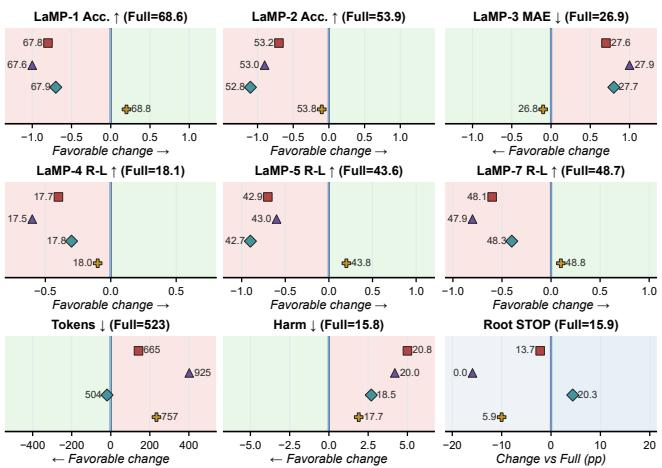  
w/o Long-horizon target backup w/o Adaptive STOP w/o User-Specificity Term w/o Token-Cost Term  
Figure 3: Component ablations. Marker positions show mean changes from full ENOUGH. Rightward is favorable for Acc. and R-L, whereas leftward is favorable for MAE, Tokens, and Harm. Root Stop has no single favorable direction.

User specificity and token cost play distinct roles. Re- moving user specificity significantly reduces task quality though profiles become slightly shorter. Removing token cost yields a slight improvement in aggregate task quality, but significantly increases both token usage while making early stopping much less frequent. The token-cost term is there- fore useful: it prevents marginal quality gains from being purchased with disproportionately long and riskier profiles, yielding a better quality–cost–harm trade-of.

## 3.4 Is More Personalization Always Beneficial?

Longer fixed profiles are not always better. Figure 4(a) shows that fixed-length personalization does not improve monotonically as more history is added. Here, quality ag- gregates direction-normalized evaluation metrics across all six tasks. Among the evaluated lengths, quality is highest at k = 5 (98.7) but falls by 0.8 points at k = 10, while harm relative to the empty profile rises from 23.2% to 31.7%. This trade-of motivates instance-adaptive rather than fixed pro- file lengths. Appendix Table 6 reports the measured quality, token cost, and harm values for the full fixed-length grid.

Overriding predicted Stop becomes increasingly risky. Figure 4(b) forces the controller to append its next one, two, or three records after predicted Stop. From +1 to +3, the beneficial share falls from 18.0% to 9.9%, whereas the harm- ful share rises from 16.9% to 35.9% alongside increasing to- ken cost. Thus, deeper continuation is less likely to improve the objective and more likely to hurt performance. Appendix Table 7 gives the policy-by-depth breakdown, and Appendix Figure 8 reports calibration of the learned stop confidence to the bounded-tree teacher.

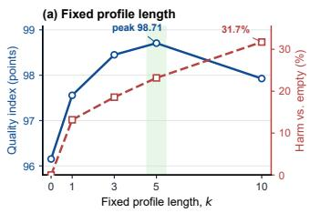

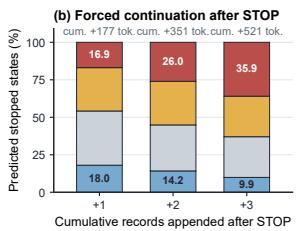

Figure 4: Measured profile-length and stopping diagnostics. (a) Direction-normalized quality and harm rate relative to the empty profile for fixed-k Contriever profiles. (b) Out-come shares after appending one to three controller-selected records beyond predicted Stop prefixes.
<table><tr><td>Intervention</td><td>Quality Ref.-LL gain ∆ target Match SMD</td><td></td><td></td><td></td></tr><tr><td>Target-user profile</td><td>100.0</td><td>+0.041</td><td>+0.001</td><td>0.002</td></tr><tr><td>Matched other user</td><td>99.1</td><td>+0.024</td><td>-0.018</td><td>0.041</td></tr><tr><td>Action shuffle</td><td>98.7</td><td>+0.018</td><td>-0.025</td><td>0.039</td></tr><tr><td>Owner permutation</td><td>98.6</td><td>+0.011</td><td>-0.029</td><td>0.044</td></tr><tr><td>Random other user</td><td>98.5</td><td>+0.012</td><td>-0.031</td><td>0.180</td></tr><tr><td>Whole-profile swap</td><td>98.0</td><td>+0.005</td><td>-0.037</td><td>0.191</td></tr></table>

Table 2: Frozen-generator specificity interventions. Quality is normalized so the target-user profile is 100; likelihood values are per target token.

## 3.5 User Specificity

Content-matched other-user replacement shifts the nor- malized quality index from 100.0 to 99.1 and reference- likelihood gain from 0.041 to 0.024 per token (Table 2). This matched audit covers 87.5% of records (mean absolute standardized diference: 0.040), excluding unmatched cases. Together with the $\beta = 0$ , context-only, action-only, and no-harm-gate rows, these interventions assess whether the observed gains arise from target-user-specific informa- tion rather than generic contextual utility.

Human evaluation. In the human evaluation on LaMP-4 and LaMP-7, the observed win-rate ranges are 53.7–56.0% for task faithfulness, 60.3–61.3% for user-style consistency, and 58.7% overall, with Fleiss’ κ spanning 0.41–0.47 (Ap-pendix E.5). The study randomized presentation order, concealed method identity, and adjudicated only protocol violations; ties were retained as valid outcomes.

## 3.6 Hyperparameter Sensitivity

We examine how the two objective weights shape distinct aspects of profile construction. We vary β and λ one at a time; at each setting, we hold the remaining configuration fixed, recompute tree backups, and train the corresponding controller. Figure 5 pairs the direction-normalized quality index across all six tasks (higher is better) with specificity gain for β and profile length for λ.

The sweeps motivate the selected operating point $( \beta , \lambda ) =$ (0.4, 0.10). In the β sweep, $\beta = 0 . 4$ gives the highest quality index (99.9) while reaching a specificity gain of 0.90, close to the observed maximum of 0.98. In the λ sweep, $\lambda = 0 . 1 0$ reduces mean profile length from 741 to 512 tokens (30.9%) relative to $\lambda \ = \ 0 ,$ , while the quality index changes from 100.2 to 99.9. Additional development-set sweeps over M, $K _ { \operatorname* { m a x } } , K ^ { - } , ( J , W )$ , and the training-loss weights η and $\zeta$ are reported in Appendix E.8.

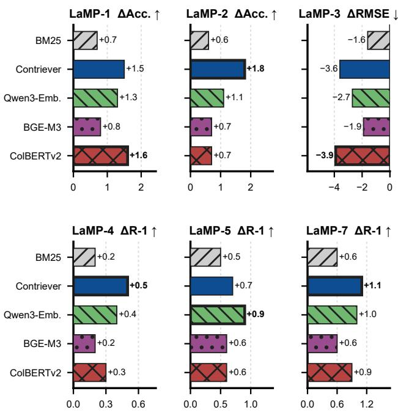

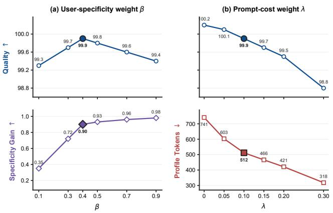  
Figure 5: Hyperparameter sensitivity of ENOUGH to β (specificity weight, left) and λ (token-cost weight, right).  
Figure 6: Performance gaps between ENOUGH and the strongest compatible baseline across diferent retrievers.

## 3.7 Retriever Independence

We test whether the gains of ENOUGH are specific to Contriever by repeating the evaluation with BM25, Con- triever, Qwen3-Embedding-0.6B (Zhang et al. 2025a), BGE-M3 (Chen et al. 2024), and ColBERTv2 (Santhanam et al. 2022). For each retriever, ENOUGH and all compatible baselines use the same retriever-specific candidate pool and gen- eration settings. Figure 6 reports the resulting test-set gap, ∆ = ENOUGH−strongest baseline. ENOUGH outperforms the strongest baseline in all 30 retriever–task combinations. Across retrievers, the Accuracy and ROUGE-1 gains range from +0.2 to +1.8 points. The largest margin occurs under diferent retrievers across tasks, suggesting that the benefit of ENOUGH comes from its selection and stopping strategy rather than from a particular retrieval model.

<table><tr><td>Method</td><td>Quality</td><td>Tokens</td><td>Calls</td><td>p50 ms</td><td>p95 ms</td></tr><tr><td>ENOUGH</td><td>100.00</td><td>510</td><td>1</td><td>370</td><td>440</td></tr><tr><td>PURPLE</td><td>96.49</td><td>905</td><td>1</td><td>398</td><td>474</td></tr><tr><td>RankGPT</td><td>96.32</td><td>869</td><td>6</td><td>1120</td><td>1379</td></tr><tr><td>REPLUG</td><td>95.38</td><td>1388</td><td>5</td><td>1323</td><td>1595</td></tr><tr><td>IC-RALM</td><td>94.82</td><td>1210</td><td>7</td><td>1463</td><td>1793</td></tr><tr><td>ICR</td><td>94.30</td><td>819</td><td>4</td><td>865</td><td>1049</td></tr><tr><td>RSPG-Pre</td><td>94.29</td><td>765</td><td>3</td><td>796</td><td>951</td></tr><tr><td>Contriever</td><td>92.17</td><td>931</td><td>1</td><td>365</td><td>442</td></tr><tr><td>BM25</td><td>90.96</td><td>905</td><td>1</td><td>360</td><td>421</td></tr></table>

Table 3: Measured online inference cost under identical gen- eration settings. Tokens is the mean selected-profile length; Calls is the number of generator-equivalent invocations; p50/p95 are end-to-end latency in milliseconds.

## 3.8 Eficiency

Table 3 shows that ENOUGH achieves the highest six-task normalized Quality (100.00) with the shortest selected profile (510 tokens) and one generator-equivalent call. Compared with the strongest baseline, PURPLE, it improves Quality by 3.51 points while using 43.6% fewer profile tokens and re- ducing p50/p95 latency from 398/474 to 370/440 ms. BM25 and Contriever have comparable one-call latency but trail ENOUGH by 9.04 and 7.83 Quality points, respectively. Multi-call baselines require 3–7 calls and exhibit substan- tially higher p50/p95 latency (796–1463/951–1793 ms), indicating that the Quality gain of ENOUGH does not rely on additional online calls. Appendix E.10 separate the ofline training-time and task-family latency views.

## 4 Conclusion

This paper introduced ENOUGH, a framework for minimal suficient personalization that jointly decides whether to per-sonalize, which behavioral records to include, and when to stop. By distilling ofline counterfactual evaluations of downstream gain, user specificity, and token cost into a long- horizon controller, ENOUGH constructs input-adaptive pro- files while requiring only one frozen-generator call at infer- ence. Across six LaMP tasks and two generator backbones, ENOUGH achieves the best result in all 24 task–metric set- tings; it also improves normalized quality by 3.51 points over the strongest baseline while using 43.6% fewer profile tokens. These results show that efective personalization depends on identifying when selected user evidence is suficient, not on exposing models to more history. Future work will extend this formulation to evolving histories and interactive settings.

## References

Chen, J.; Xiao, S.; Zhang, P.; Luo, K.; Lian, D.; and Liu, Z. 2024. M3-Embedding: Multi-Linguality, Multi- Functionality, Multi-Granularity Text Embeddings Through Self-Knowledge Distillation. In Findings of the Association for Computational Linguistics: ACL 2024, 2318–2335. Bangkok, Thailand: Association for Computational Linguis- tics.

Chen, S.; Jimenez Gutierrez, B.; and Su, Y. 2025. Attention in Large Language Models Yields Eficient Zero-Shot Re- Rankers. In The Thirteenth International Conference on Learning Representations.

Du, L.; Yuan, Y.; Zhao, Z.; Lyu, F.; Penaloza, E.; Chen, X.; Sun, Z.; Kang, J.; Charlin, L.; Liu, X.; and Wu, H. 2026. Optimizing User Profiles via Contextual Bandits for Retrieval-Augmented LLM Personalization. In Proceedings ofthe 64th Annual Meeting ofthe Associationfor Computational Linguistics (Volume 1: Long Papers), 31803–31817. San Diego, California, United States: Association for Com- putational Linguistics.

Grattafiori, A.; Dubey, A.; Jauhri, A.; Pandey, A.; et al. 2024. The Llama 3 Herd of Models. arXiv preprint arXiv:2407.21783.

Izacard, G.; Caron, M.; Hosseini, L.; Riedel, S.; Bojanowski, P.; Joulin, A.; and Grave, E. 2022. Unsupervised Dense In- formation Retrieval with Contrastive Learning. Transactions on Machine Learning Research.

Qwen Team. 2026. Qwen3.5: Towards Native Multimodal Agents.

Ram, O.; Levine, Y.; Dalmedigos, I.; Muhlgay, D.; Shashua, A.; Leyton-Brown, K.; and Shoham, Y. 2023. In-Context Retrieval-Augmented Language Models. Transactions ofthe Association for Computational Linguistics, 11: 1316–1331.

Robertson, S. E.; and Zaragoza, H. 2009. The Probabilistic Relevance Framework: BM25 and Beyond. Foundations and Trends in Information Retrieval, 3(4): 333–389.

Salemi, A.; Killingback, J.; and Zamani, H. 2025. ExPerT: Efective and Explainable Evaluation of Personalized Long- Form Text Generation. In Findings of the Association for Computational Linguistics: ACL 2025, 17516–17532. Vi- enna, Austria: Association for Computational Linguistics.

Salemi, A.; Mysore, S.; Bendersky, M.; and Zamani, H. 2024a. LaMP: When Large Language Models Meet Per- sonalization. In Proceedings of the 62nd Annual Meeting ofthe Associationfor Computational Linguistics (Volume 1: Long Papers), 7370–7392. Bangkok, Thailand: Association for Computational Linguistics.

Salemi, A.; et al. 2024b. Optimization Methods for Person- alizing Large Language Models through Retrieval Augmen- tation. In Proceedings ofthe 47th International ACM SIGIR Conference on Research and Development in Information Retrieval, 752–762. Washington, DC, USA: Association for Computing Machinery.

Santhanam, K.; Khattab, O.; Saad-Falcon, J.; Potts, C.; and Zaharia, M. 2022. ColBERTv2: Efective and Eficient Re- trieval via Lightweight Late Interaction. In Proceedings

of the 2022 Conference of the North American Chapter of the Association for Computational Linguistics: Human Lan-guage Technologies, 3715–3734. Seattle, United States: As- sociation for Computational Linguistics.

Shi, T.; Xu, J.; Zhang, X.; Zang, X.; Zheng, K.; Song, Y.; and Li, H. 2025. Retrieval Augmented Generation with Collab- orative Filtering for Personalized Text Generation. In Pro- ceedings ofthe 48th InternationalACMSIGIR Conference on Research and Development in Information Retrieval, 1294– 1304. Padua, Italy: Association for Computing Machinery.

Shi, W.; Min, S.; Yasunaga, M.; Seo, M.; James, R.; Lewis, M.; Zettlemoyer, L.; and Yih, W.-t. 2024. REPLUG: Retrieval-Augmented Black-Box Language Models. In Pro- ceedings of the 2024 Conference of the North American Chapter of the Association for Computational Linguistics: Human Language Technologies (Volume 1: Long Papers), 8371–8384. Mexico City, Mexico: Association for Compu- tational Linguistics.

Sun, W.; Yan, L.; Ma, X.; Wang, S.; Ren, P.; Chen, Z.; Yin, D.; and Ren, Z. 2023. Is ChatGPT Good at Search? Inves- tigating Large Language Models as Re-Ranking Agents. In Proceedings of the 2023 Conference on Empirical Methods in Natural Language Processing, 14918–14937. Singapore: Association for Computational Linguistics.

Tan, Z.; Zeng, Q.; Tian, Y.; Liu, Z.; Yin, B.; and Jiang, M. 2024. Democratizing Large Language Models via Personal- ized Parameter-Eficient Fine-tuning. In Proceedings of the 2024 Conference on Empirical Methods in Natural Language Processing, 6476–6491. Miami, Florida, USA: Association for Computational Linguistics.

Xu, Y.; Zhang, J.; Salemi, A.; Hu, X.; Wang, W.; Feng, F.; Zamani, H.; He, X.; and Chua, T.-S. 2025. Personalized Gen- eration In Large Model Era: A Survey. In Proceedings of the 63rd Annual Meeting of the Association for Computational Linguistics (Volume 1: Long Papers), 24607–24649. Vienna, Austria: Association for Computational Linguistics.

Zhang, J. 2024. Guided Profile Generation Improves Person- alization with Large Language Models. In Findings of the Association for Computational Linguistics: EMNLP 2024, 4005–4016. Miami, Florida, USA: Association for Compu- tational Linguistics.

Zhang, Y.; Li, M.; Long, D.; Zhang, X.; Lin, H.; Yang, B.; Xie, P.; Yang, A.; Liu, D.; Lin, J.; Huang, F.; and Zhou, J. 2025a. Qwen3 Embedding: Advancing Text Embedding and Reranking Through Foundation Models. arXiv preprint arXiv:2506.05176.

Zhang, Z.; Rossi, R. A.; Kveton, B.; Shao, Y.; Yang, D.; Zamani, H.; Dernoncourt, F.; Barrow, J.; Yu, T.; Kim, S.; Zhang, R.; Gu, J.; Derr, T.; Chen, H.; Wu, J.; Chen, X.; Wang, Z.; Mitra, S.; Lipka, N.; Ahmed, N. K.; and Wang, Y. 2025b. Personalization of Large Language Models: A Survey. Transactions on Machine Learning Research.

## A Related Work

## A.1 Personalized Large Language Models

Personalized large language models adapt generation to user histories, preferences, or interaction patterns through in- context records, explicit profiles, or user-specific parameters (Zhang et al. 2025b; Xu et al. 2025). Guided Profile Gen-eration distills sparse personal context into concise natural- language descriptions (Zhang 2024), whereas OPPU assigns each user a parameter-eficient module and combines this parametric memory with retrieved profile information (Tan et al. 2024). These approaches provide history abstraction or persistent user modeling. In contrast, our setting freezes both retriever and generator, represents history as behav- ioral context–action records, and shares a task-conditioned controller across users and tasks. ENOUGH constructs a transparent ordered profile for each input, maintains no user- specific parameters, and may select no record when person- alization is not worth its prompt-token cost.

Reliable personalization must also separate user-specific benefit from generic task improvement. ExPerT evaluates content and writing-style alignment (Salemi, Killingback, and Zamani 2025), while CFRAG uses other users’ histories as generation evidence (Shi et al. 2025). Because a generically useful in-context example can improve reference likelihood even when its owner is irrelevant, ENOUGH com- bines gain over the empty profile with an ofline matched- replacement comparison. For each selected slot, it contrasts the target-user record with other-user records matched on task, pre-action content, query relevance, length, and time when available, while holding the remaining profile fixed. Specificity is credited only if the complete target-user pro- file also improves over no personalization. Matched records supervise the controller but are discarded at inference; the resulting score estimates a replacement efect for the frozen generator, not a causal efect of user preference.

## A.2 Retrieval-Augmented Personalized Large Language Models

Retrieval-augmented personalization conditions a language model on selected user-history records without updating the generator for each user. LaMP established this setting across classification and generation tasks (Salemi et al. 2024a). Later work optimizes selection for downstream utility: RSPG chooses among no retrieval and multiple personalized re- trievers using generation feedback (Salemi et al. 2024b); CFRAG expands the evidence pool with similar users and learns retrieval and reranking (Shi et al. 2025); and PUR-PLE trains an order-sensitive Plackett–Luce profile policy from reference-response likelihood (Du et al. 2026). General-purpose rerankers RankGPT (Sun et al. 2023) and ICR (Chen et al. 2025) provide strong pool-reordering baselines but do not model profile termination. CFRAG returns a top-k set, PURPLE an ordered K-permutation, and our LaMP adaptations of RankGPT and ICR a preset number of records. RSPG may choose no retrieval but does not make record-wise continuation decisions after selecting a retriever. ENOUGH instead treats record inclusion and Stop as actions in one sequential problem after frozen candidate retrieval. It can return an empty profile or any feasible length up to $K _ { \mathrm { m a x } } .$ evaluating terminal profiles by downstream gain, incremental prompt-token cost, and user-specific benefit.

Other retrieval-augmented systems alter how evidence en- ters generation: IC-RALM switches context during decoding (Ram et al. 2023), whereas REPLUG marginalizes predictions from multiple record-conditioned streams (Shi et al. 2024). These methods primarily address knowledge-centric evidence and use inference paths diferent from personal- ized profile construction. ENOUGH makes all inclusion and stopping decisions before generation with a lightweight con- troller trained from bounded-tree outcomes, then invokes the frozen generator exactly once; a root Stop means no profile is injected, although candidate retrieval has already occurred.

## B Notation

Symbol Meaning   
$C _ { i }$ top-M candidate records from the frozen retriever   
$\mathbf { S } _ { t }$ ordered profile after t inclusion actions   
$g _ { i } ( \mathbf { S } )$ downstream likelihood gain over the empty profile   
$p _ { i } ( \mathbf { S } )$ matched-replacement user specificity   
$c _ { i } ( \mathbf { S } )$ normalized incremental prompt-token cost   
$U _ { i } ( \mathbf { S } )$ cost-free personalized utility   
$J _ { i } ^ { \lambda } ( \mathbf { S } )$ cost-regularized terminal objective   
$\dot { O } _ { \alpha } ^ { g , \dot { p } , \dot { c } }$ θ predicted outcome components of one action   
Stop terminate with the current profile  
Table 4: Core notation.

## C Algorithms

Algorithm 1 Ofline bounded-tree supervision   
Require: Training data $\mathcal { D } ;$ frozen retriever $R ;$ frozen genera  
tor $G ;$ candidate limit M; horizon $K _ { \mathrm { m a x } } ;$ search budgets   
$J , W$   
Ensure: Labeled state-action set $\mathcal { Z }$   
1: $\mathcal { Z }  \mathcal { D }$   
2: for each trainin instance i do   
3: $C _ { i } \gets R ( x _ { i } , \mathbf { \bar { \mathit { H } } } _ { u _ { i } } ; M )$ and remove target duplicates   
4: Precompute fixed matched replacements for every   
$d \in C _ { i }$   
5: Sample partial-profile roots from the current state-   
proposal mixture   
6: for each sampled root state s do   
7: Build bounded prefix tree $\mathcal { T } _ { i } ( s )$ with budgets   
$J , W$   
8: Score every unique terminal prefix and its sam-   
pled slot replacements   
9: Back up $J _ { i } ^ { \lambda }$ from leaves to expanded actions   
10: for each labeled $( s ^ { \prime } , a )$ in $\bar { \mathcal { T } } _ { i } ( \bar { s } )$ do   
11: Propagate the three components of the same   
best leaf   
12: $\mathcal { Z }  \mathcal { Z } \cup \{ ( s ^ { \prime } , a , \mathbf { R } _ { i } ( s ^ { \prime } , a ) ) \}$   
13: end for   
14: end for   
15: end for   
16: return $\mathcal { Z }$

Ofline complexity. With $N _ { s }$ sampled roots, horizon $K _ { \mathrm { m a x } } ,$ search width W, action budget J, and $K ^ { - }$ matched replacements, ofline label construction requires at most

$$
O \big ( N _ { s } K _ { \operatorname* { m a x } } W J ( K ^ { - } + 2 ) \big )\tag{33}
$$

teacher-forced scoring operations before prefix caching. The $K ^ { - } + 2$ factor accounts for the target profile, the leave-one- out profile, and the matched replacements for the sampled slot. These claims assume cached candidate representations and do not include the frozen candidate-retrieval cost.

Algorithm 2 Minimal suficient profile construction   
Require: Input $( \tau , x , H _ { u } ) ;$ frozen retriever $R ;$ controller   
$Q _ { \theta } ;$ frozen generator $\dot { G }$   
Ensure: Ordered profile $\widehat { \mathbf { S } }$ and output $\widehat { y }$   
1: $C \gets R ( x , H _ { u } ; M ) ; \mathbf { S } \gets \emptyset$   
2: while $| \mathbf { S } | <$ min $( \dot { K } _ { \mathrm { m a x } } , | C | )$ do   
3: Mask repeated records and actions exceeding $L _ { \mathrm { m a x } }$   
4: Score all feasible record actions and Stop in one   
controller batch   
5: $a  \arg \operatorname* { m a x } _ { a ^ { \prime } \in A ( s ) } Q _ { \theta } ^ { \mathrm { n e t } } ( s , a ^ { \prime } )$   
6: $\mathbf { i f } \ a = \mathrm { S r o p }$ then   
7: break   
8: end if   
9: $\mathbf { S } \gets \mathbf { S } \oplus a$   
10: end while   
11: $\widehat { \boldsymbol { y } } \gets G ( P _ { \tau } ( \boldsymbol { x } , \mathbf { S } ) )$   
12: return $( \mathbf { S } , \widehat { y } )$

Test-time procedure. Algorithm 2 gives the inference pro- cedure. Candidate record embeddings are cached and all remaining actions are scored in a batch at each step. Nei- ther record selection nor the Stop decision uses a reference output, matched replacement, generator likelihood, counter- factual rollout, or generator call. The controller performs at most $K _ { \mathrm { m a x } }$ lightweight decision steps. Once profile con- struction terminates, the autoregressive generator is called exactly once on the final prompt.

Online complexity. Online profile construction uses at most $O ( K _ { \operatorname* { m a x } } M )$ batched lightweight action scores and ex- actly one final generator call. This bound assumes cached candidate representations and excludes the frozen candidate- retrieval cost.

## D Proofs

## D.1 Proposition 1: Exact-value stopping

Proof. Fix an instance i and a reachable state s whose current ordered profile prefix is S. Let $\mathscr { L } _ { i } ( \mathbf { S } )$ be the set of terminal profile prefixes reachable from S, including S itself via the Stop action. Because Ci is finite, records cannot repeat, and profile length is at most $K _ { i }$ , every candidate subtree is fi- nite. Let h(S) denote the maximum number of record-action edges on a path starting from S.

We first establish, by induction on $h ( \mathbf { S } )$ , that

$$
V _ { i } ^ { \star } ( \mathbf { S } ) = \operatorname* { m a x } _ { \mathbf { L } \in \mathcal { L } _ { i } ( \mathbf { S } ) } J _ { i } ^ { \lambda } ( \mathbf { L } ) .\tag{34}
$$

If $h ( \mathbf { S } ) = 0 .$ , no record action is feasible, so ${ \mathcal { L } } _ { i } ( \mathbf { S } ) = \{ \mathbf { S } \}$ and the boundary condition gives $V _ { i } { } ^ { \star } ( { \bf S } ) = J _ { i } ^ { \lambda } ( { \bf \dot { S } } )$ . Now suppose $h ( \mathbf { S } ) > 0$ and that Eq. (34) holds for every child prefix. The terminal descendants decompose as

$$
\mathcal { L } _ { i } ( \mathbf { S } ) = \{ \mathbf { S } \} \cup \bigcup _ { d \in \mathcal { A } ( s ) \setminus \{ \mathrm { S r o p } \} } \mathcal { L } _ { i } ( \mathbf { S } \oplus d ) .\tag{35}
$$

Applying the induction hypothesis to each child and then

<table><tr><td>Task</td><td>#Train</td><td>#Dev</td><td>#Test</td><td>Input length</td><td>Output length</td><td>Profile size</td><td>#Labels</td></tr><tr><td>LaMP-1: Personalized Citation Identification</td><td>6,542</td><td>1,500</td><td>1,500</td><td> $5 1 . 4 4 \pm 5 . 7 1$ </td><td></td><td> $8 4 . 1 6 \pm 4 7 . 5 4$ </td><td>2</td></tr><tr><td>LaMP-2: Personalized Movie Tagging</td><td>5,073</td><td>1,410</td><td>1,557</td><td> $9 2 . 4 0 \pm 2 1 . 9 5$ </td><td></td><td> $8 6 . 7 6 \pm 1 8 9 . 5 3$ </td><td>15</td></tr><tr><td>LaMP-3: Personalized Product Rating</td><td>20,000</td><td>2,500</td><td>2,500</td><td> $1 2 8 . 1 8 \pm 1 4 6 . 2 5$ </td><td></td><td> $1 8 5 . 4 1 \pm 1 2 9 . 3 0$ </td><td>5</td></tr><tr><td>LaMP-4: Personalized News Headline Generation</td><td>12,500</td><td>1,500</td><td>1,800</td><td> $2 9 . 9 8 \pm 1 2 . 0 9$ </td><td> $1 0 . 0 8 \pm 3 . 1 1$ </td><td> $2 0 4 . 6 0 \pm 2 5 0 . 7 5$ </td><td></td></tr><tr><td>LaMP-5: Personalized Scholarly Title Generation</td><td>14,682</td><td>1,500</td><td>1,500</td><td> $1 6 2 . 3 4 \pm 6 5 . 6 4$ </td><td> $9 . 7 2 \pm 3 . 2 1$ </td><td> $8 7 . 8 9 \pm 5 3 . 6 4$ </td><td></td></tr><tr><td>LaMP-7: Personalized Tweet Paraphrasing</td><td>13,437</td><td>1,498</td><td>1,500</td><td> $2 9 . 7 2 \pm 7 . 0 1$ </td><td> $1 6 . 9 7 \pm 5 . 6 8$ </td><td> $1 5 . 7 1 \pm 1 4 . 8 6$ </td><td></td></tr></table>

Table 5: Statistics of the LaMP time-based (T) split used in our main experiments. Counts are instances; input and output lengths are whitespace-delimited words; profile size is the number of historical records. Length and profile statistics are mean ± standard deviation over all train, development, and test instances. Classification and rating outputs are labels, so their output lengths are omitted.

Eq. (20) yields

$$
\operatorname* { m a x } _ { \mathbf { L } \in \mathscr { L } _ { i } ( \mathbf { S } ) } J _ { i } ^ { \lambda } ( \mathbf { L } ) = \operatorname* { m a x } \left\{ J _ { i } ^ { \lambda } ( \mathbf { S } ) , \operatorname* { m a x } _ { d \in \mathscr { A } ( s ) \backslash \{ \mathrm { S r o p } \} } V _ { i } ^ { \star } ( \mathbf { S } \oplus d ) \right\}\tag{36}
$$

$$
{ \bf \Xi } = V _ { i } ^ { \star } ( { \bf S } ) ,\tag{37}
$$

which proves Eq. (34).

Consider now a policy that selects an action maximizing $Q _ { i } ^ { \star } ( s , a )$ . By the definitions of the action values and the Bellman recursion,

$$
\operatorname* { m a x } _ { a \in \mathcal { A } ( s ) } Q _ { i } ^ { \star } ( s , a ) = V _ { i } ^ { \star } ( \mathbf { S } ) .\tag{38}
$$

If the policy selects Stop, then $J _ { i } ^ { \lambda } ( { \bf S } ) = Q _ { i } ^ { \star } ( s , { \bf S } \mathrm { \scriptscriptstyle { T O P } } ) =$ $V _ { i } ^ { \star } ( { \bf S } )$ , so Eq. (34) shows that the current prefix is optimal among all terminal descendants. If it selects a record d, then $V _ { i } ^ { \star } ( \bar { \bf S ^ { \star } } \oplus d ) = Q _ { i } ^ { \star } ( s , d ) = V _ { i } ^ { \star } ( { \bf S } )$ . The child subtree has smaller height, so repeating the same argument eventually reaches a terminal prefix L with $J _ { i } ^ { \lambda } ( \mathbf { L } ) = { V } _ { i } ^ { \star } ( \mathbf { S } )$ . Termina- tion is guaranteed because every record action descends one level in a finite tree.

When Stop is tied with a record action, it is itself a max- imizing action; the Stop case above therefore shows that resolving the tie in its favor preserves optimality. Applying the result at the root proves the proposition. □

This guarantee is conditional on access to the exact values $Q _ { i } ^ { \star }$ . It does not imply that the learned controller $Q _ { \theta }$ recovers the optimum of the complete combinatorial candidate tree.

## E Supplementary Experimental Details

## E.1 Datasets, Time-Based Split Protocol, and Evaluation

We use the six publicly available tasks in the oficial LaMP snapshot: LaMP-1–5 and LaMP-7. LaMP-6 is excluded be- cause its publicly distributed files contain only identifiers from the licensed Avocado email collection rather than the underlying email text. For the main experiments, we use the time-based (T) protocol, in which interactions are ordered chronologically: earlier records form the profile and later interactions form the prediction targets, thereby evaluating personalization for future interactions of existing users. Ta- ble 5 reports time-based statistics computed directly from the files used in the main experiments.

## E.2 Implementation Details

Models and search. Our frozen retriever is Contriever, which returns at most M = 20 legal records in the main setting. We use Qwen3.5-9B as the main LLM and Llama-3.1-8B-Instruct for generator transfer; both LLMs are frozen and use deterministic decoding with their respective of- ficial chat templates. Qwen3.5-9B is served through its text-only path with enable\_thinking=false. Teacherforced likelihood is computed only over reference-response tokens, excluding prompt tokens and all chat-template, con- trol, and thinking tokens. The controller has $K _ { \operatorname* { m a x } } = 1 0 ,$ uses $K ^ { - } = 3$ matched alternatives per candidate, and is trained from bounded-tree targets with the policy-induced ofline aggregation described below. The search uses $J = 8$ candidate expansions and beam width $W = 4$ at the de- fault operating point. We set the ranking- and stopping-loss weights in Eq. (31) to $\eta = 0 . 2$ and $\zeta = 0 . 4$ , respectively. Frozen-model likelihoods and tokenized record encodings are cached across selectors and λ values. For each generator, we independently recompute tokenizer costs, likelihoods, controller labels, and caches rather than reusing artifacts pro- duced by another model.

Policy-induced ofline aggregation. Algorithm 1 is the label-construction routine used for both rounds of ofline supervision. We first apply it to the initial state-proposal mixture and optimize the controller under Eq. (31). After warm-start convergence, one policy-induced ofline data- aggregation round adds states visited by the current con- troller, reuses the same frozen generator to label them, and retrains the controller on the union of both state pools. No controller update is performed during test-time profile con- struction.

Baseline configurations. BM25 and Contriever indepen- dently retrieve the top $K \ = \ 5$ records from the same leakage-filtered user history using the oficial task-specific query fields. RankGPT, ICR, and PURPLE receive the same top M = 20 pool from frozen Contriever and return

$K = 5$ records; following the published LaMP adaptation, RankGPT and ICR use frozen Llama-3.1-8B-Instruct as a separate reranker. IC-RALM and REPLUG use Contriever evidence under the same five-record budget but retain their native context-switching and marginalization mechanisms; for REPLUG, we use the LM-supervised retrieval variant from its LaMP adaptation. RSPG-Pre operates over its na- tive retriever pool and is retrained with our task generator and K = 5. ENOUGH and the single-prompt baselines invoke the task generator once after profile construction, whereas IC-RALM and REPLUG retain their native multi-pass infer- ence. All methods share the record serialization, task prompt, frozen task generator, decoding configuration, and leakage controls. Empty/full profiles, fixed-k and fixed-token controls, Recency, Random, MMR, ROPG-KD, the myopic con- troller, and forced-length ENOUGH variants are retained as diagnostics or ablations rather than as main baselines.

Serialization, leakage controls, and matching. Each pro- file record is serialized with a task tag and explicit field boundaries:

$$
\begin{array} { l } { { \mathrm { [ { T A S K } ] } \tau [ \mathrm { { H I S T \_ C O N T E X T } } ] x _ { d } } } \\ { { \mathrm { [ { U S E R \_ A C T I O N } ] } a _ { d } [ \mathrm { { M E T A } } ] m _ { d } . } } \end{array}
$$

The current input is serialized separately and never copied into the profile. We preserve complete record boundaries, mask an action if its complete serialization would over- flow the context window, and never silently truncate records. Within each generator condition, all selectors use the same generator-specific tokenizer and prompt construction. The empty-profile prompt contains the same instructions and de- limiters but no historical record, so its comparison changes only the augmentation content. Appendix F shows the com- plete logical system and user messages for all six tasks.

For every target, the legal user history contains only inter- actions whose timestamps strictly precede the target times- tamp. We apply this temporal truncation before constructing the retrieval pool or drawing matched replacements. Before retrieval, we remove the target interaction, matching source IDs, normalized exact duplicates, and embedding-near du- plicates above a development-set threshold; consequently, neither retrieval nor matching can access an interaction or metadata recorded at or after the target. Matched other-user records come from the same task and legal partition and are matched using pre-action semantic content, length, retrieval- score bin, time bin, and available nonbehavioral metadata. Historical actions, target references, and all post-target fields are unavailable to the matcher. The matched-specificity test therefore estimates a frozen-LLM replacement efect and is not a causal claim about users.

Cost and statistical protocol. Profile cost is the actual in- cremental number of tokenizer tokens, not document count. We additionally record selected records, root Stop rate, harm rate relative to the empty-profile output, generator calls, la- tency, and throughput. A root Stop means no profile augmentation; candidate retrieval has still occurred. Every reranker and generator-equivalent forward pass is included in the cost audit.

We choose the operating point, $\beta , \lambda .$ , loss weights, temper- atures $T _ { r }$ and $T _ { s }$ , calipers, M, $K _ { \operatorname* { m a x } } , K ^ { - } , J ,$ , and $W$ using development data only; no test result is used for tuning, and all selected values are frozen before test evaluation. Each automatic result uses three complete pipeline seeds. We pair predictions at the instance level, use a paired 95% bootstrap clustered by user rather than by isolated record, and ap- ply Holm-corrected comparisons against all main baselines. Reported seed variation reflects variation across complete experimental runs.

## E.3 Generator-Scale Sensitivity

We evaluate task-generator capacity on the time-based (T) split by comparing dense Qwen3.5-4B, Qwen3.5-9B, and Qwen3.5-27B (Qwen Team 2026) generators while holding the retriever pool, search budget, task prompt, determinis- tic decoding, and leakage controls fixed. Tokenizer costs, frozen-generator likelihoods, bounded-tree labels, caches, and the controller are recomputed independently for each scale; no controller or generator-dependent artifact is trans- ferred from the 9B condition.

Figure 7 reports both oficial metrics for every task and all nine main methods. The 9B column reproduces the corre- sponding main-table results, while the 4B and 27B columns report independently measured scale conditions. Every cell aggregates three complete pipeline seeds. As in Table 1, ev- ery displayed metric is multiplied by 100.

The measured scale response difers across methods, tasks, and metrics rather than following a uniform ofset. From 4B to 27B, baseline changes range from 1.2–2.5 points for classi- fication accuracy, 1.2–2.6 for F1, 1.3–2.7 for MAE reduction, 2.5–5.0 for RMSE reduction, and 0.4–2.0 for ROUGE. The consistent gains show that greater generator capacity gener- ally improves downstream quality, while the heterogeneous magnitudes indicate that scale does not afect every task or selector equally.

<table><tr><td rowspan=1 colspan=16>(a) LaMP-1 ·Acc. ↑                 LaMP-1 ·F1↑                 (b) LaMP-2·Acc. ↑                 LaMP-2·F1↑</td></tr><tr><td rowspan=1 colspan=1>BM25</td><td rowspan=1 colspan=1>62.3</td><td rowspan=1 colspan=1>63.1</td><td rowspan=1 colspan=1>63.5</td><td rowspan=1 colspan=1></td><td rowspan=1 colspan=1>60.7</td><td rowspan=1 colspan=1>61.5</td><td rowspan=1 colspan=1>62.0</td><td rowspan=1 colspan=1></td><td rowspan=1 colspan=1>49.4</td><td rowspan=1 colspan=1>50.2</td><td rowspan=1 colspan=1>50.6</td><td rowspan=1 colspan=1></td><td rowspan=1 colspan=1>45.0</td><td rowspan=1 colspan=1>45.8</td><td rowspan=1 colspan=1>46.2</td></tr><tr><td rowspan=1 colspan=1>Contriever</td><td rowspan=1 colspan=1>63.6</td><td rowspan=1 colspan=1>64.5</td><td rowspan=1 colspan=1>65.1</td><td rowspan=1 colspan=1></td><td rowspan=1 colspan=1>62.2</td><td rowspan=1 colspan=1>63.0</td><td rowspan=1 colspan=1>63.8</td><td rowspan=1 colspan=1></td><td rowspan=1 colspan=1>48.7</td><td rowspan=1 colspan=1>49.8</td><td rowspan=1 colspan=1>50.2</td><td rowspan=1 colspan=1></td><td rowspan=1 colspan=1>43.9</td><td rowspan=1 colspan=1>44.9</td><td rowspan=1 colspan=1>45.4</td></tr><tr><td rowspan=1 colspan=1>IC-RALM</td><td rowspan=1 colspan=1>65.7</td><td rowspan=1 colspan=1>67.1</td><td rowspan=1 colspan=1>68.0</td><td rowspan=1 colspan=1></td><td rowspan=1 colspan=1>64.0</td><td rowspan=1 colspan=1>65.6</td><td rowspan=1 colspan=1>66.5</td><td rowspan=1 colspan=1></td><td rowspan=1 colspan=1>48.8</td><td rowspan=1 colspan=1>50.1</td><td rowspan=1 colspan=1>51.0</td><td rowspan=1 colspan=1></td><td rowspan=1 colspan=1>44.5</td><td rowspan=1 colspan=1>46.0</td><td rowspan=1 colspan=1>46.8</td></tr><tr><td rowspan=1 colspan=1>REPLUG</td><td rowspan=1 colspan=1>64.1</td><td rowspan=1 colspan=1>65.7</td><td rowspan=1 colspan=1>66.6</td><td rowspan=1 colspan=1></td><td rowspan=1 colspan=1>62.7</td><td rowspan=1 colspan=1>64.1</td><td rowspan=1 colspan=1>65.3</td><td rowspan=1 colspan=1></td><td rowspan=1 colspan=1>47.1</td><td rowspan=1 colspan=1>48.7</td><td rowspan=1 colspan=1>49.4</td><td rowspan=1 colspan=1></td><td rowspan=1 colspan=1>43.1</td><td rowspan=1 colspan=1>44.7</td><td rowspan=1 colspan=1>45.5</td></tr><tr><td rowspan=1 colspan=1>RankGPT</td><td rowspan=1 colspan=1>65.6</td><td rowspan=1 colspan=1>67.0</td><td rowspan=1 colspan=1>68.0</td><td rowspan=1 colspan=1></td><td rowspan=1 colspan=1>63.6</td><td rowspan=1 colspan=1>65.3</td><td rowspan=1 colspan=1>66.2</td><td rowspan=1 colspan=1></td><td rowspan=1 colspan=1>48.9</td><td rowspan=1 colspan=1>50.2</td><td rowspan=1 colspan=1>51.2</td><td rowspan=1 colspan=1></td><td rowspan=1 colspan=1>44.4</td><td rowspan=1 colspan=1>46.0</td><td rowspan=1 colspan=1>46.9</td></tr><tr><td rowspan=1 colspan=1>ICR</td><td rowspan=1 colspan=1>63.8</td><td rowspan=1 colspan=1>64.8</td><td rowspan=1 colspan=1>65.4</td><td rowspan=1 colspan=1></td><td rowspan=1 colspan=1>62.5</td><td rowspan=1 colspan=1>63.4</td><td rowspan=1 colspan=1>64.2</td><td rowspan=1 colspan=1></td><td rowspan=1 colspan=1>49.9</td><td rowspan=1 colspan=1>51.2</td><td rowspan=1 colspan=1>51.7</td><td rowspan=1 colspan=1></td><td rowspan=1 colspan=1>45.4</td><td rowspan=1 colspan=1>46.6</td><td rowspan=1 colspan=1>47.1</td></tr><tr><td rowspan=1 colspan=1>RSPG-Pre</td><td rowspan=1 colspan=1>65.2</td><td rowspan=1 colspan=1>66.2</td><td rowspan=1 colspan=1>66.9</td><td rowspan=1 colspan=1></td><td rowspan=1 colspan=1>63.6</td><td rowspan=1 colspan=1>64.7</td><td rowspan=1 colspan=1>65.4</td><td rowspan=1 colspan=1></td><td rowspan=1 colspan=1>49.4</td><td rowspan=1 colspan=1>50.3</td><td rowspan=1 colspan=1>51.0</td><td rowspan=1 colspan=1></td><td rowspan=1 colspan=1>45.1</td><td rowspan=1 colspan=1>46.1</td><td rowspan=1 colspan=1>46.7</td></tr><tr><td rowspan=1 colspan=1>PURPLE</td><td rowspan=1 colspan=1>65.5</td><td rowspan=1 colspan=1>66.7</td><td rowspan=1 colspan=1>67.5</td><td rowspan=1 colspan=1></td><td rowspan=1 colspan=1>64.0</td><td rowspan=1 colspan=1>65.1</td><td rowspan=1 colspan=1>66.1</td><td rowspan=1 colspan=1></td><td rowspan=1 colspan=1>50.7</td><td rowspan=1 colspan=1>52.1</td><td rowspan=1 colspan=1>52.7</td><td rowspan=1 colspan=1></td><td rowspan=1 colspan=1>45.8</td><td rowspan=1 colspan=1>47.0</td><td rowspan=1 colspan=1>47.7</td></tr><tr><td rowspan=1 colspan=1>ENOUGH</td><td rowspan=1 colspan=1>67.4</td><td rowspan=1 colspan=1>68.6</td><td rowspan=1 colspan=1>69.4</td><td rowspan=1 colspan=1></td><td rowspan=1 colspan=1>65.7</td><td rowspan=1 colspan=1>67.0</td><td rowspan=1 colspan=1>67.9</td><td rowspan=1 colspan=1></td><td rowspan=1 colspan=1>52.7</td><td rowspan=1 colspan=1>53.9</td><td rowspan=1 colspan=1>54.6</td><td rowspan=1 colspan=1></td><td rowspan=1 colspan=1>47.3</td><td rowspan=1 colspan=1>48.6</td><td rowspan=1 colspan=1>49.3</td></tr><tr><td rowspan=1 colspan=1></td><td rowspan=1 colspan=1></td><td rowspan=1 colspan=14>27B          4B      9B      27B          4B      9B      27B(c) LaMP-3 · MAE↓               LaMP-3·RMSE↓               (d) LaMP-4 ·R-1 ↑                 LaMP-4 ·R-L ↑</td></tr><tr><td rowspan=1 colspan=1>BM25</td><td rowspan=1 colspan=1>32.5</td><td rowspan=1 colspan=1>31.7</td><td rowspan=1 colspan=1>31.2</td><td rowspan=1 colspan=1></td><td rowspan=1 colspan=1>70.4</td><td rowspan=1 colspan=1>68.8</td><td rowspan=1 colspan=1>67.9</td><td rowspan=1 colspan=1></td><td rowspan=1 colspan=1>18.7</td><td rowspan=1 colspan=1>19.0</td><td rowspan=1 colspan=1>19.2</td><td rowspan=1 colspan=1></td><td rowspan=1 colspan=1>16.5</td><td rowspan=1 colspan=1>16.7</td><td rowspan=1 colspan=1>16.9</td></tr><tr><td rowspan=1 colspan=1>Contriever</td><td rowspan=1 colspan=1>32.3</td><td rowspan=1 colspan=1>31.4</td><td rowspan=1 colspan=1>30.7</td><td rowspan=1 colspan=1></td><td rowspan=1 colspan=1>69.1</td><td rowspan=1 colspan=1>67.6</td><td rowspan=1 colspan=1>66.3</td><td rowspan=1 colspan=1></td><td rowspan=1 colspan=1>18.4</td><td rowspan=1 colspan=1>18.8</td><td rowspan=1 colspan=1>19.0</td><td rowspan=1 colspan=1></td><td rowspan=1 colspan=1>16.7</td><td rowspan=1 colspan=1>17.0</td><td rowspan=1 colspan=1>17.2</td></tr><tr><td rowspan=1 colspan=1>IC-RALM</td><td rowspan=1 colspan=1>30.6</td><td rowspan=1 colspan=1>29.3</td><td rowspan=1 colspan=1>28.3</td><td rowspan=1 colspan=1></td><td rowspan=1 colspan=1>68.9</td><td rowspan=1 colspan=1>66.2</td><td rowspan=1 colspan=1>64.6</td><td rowspan=1 colspan=1></td><td rowspan=1 colspan=1>17.3</td><td rowspan=1 colspan=1>17.7</td><td rowspan=1 colspan=1>18.2</td><td rowspan=1 colspan=1></td><td rowspan=1 colspan=1>16.4</td><td rowspan=1 colspan=1>16.8</td><td rowspan=1 colspan=1>17.1</td></tr><tr><td rowspan=1 colspan=1>REPLUG</td><td rowspan=1 colspan=1>30.0</td><td rowspan=1 colspan=1>28.5</td><td rowspan=1 colspan=1>27.3</td><td rowspan=1 colspan=1></td><td rowspan=1 colspan=1>64.7</td><td rowspan=1 colspan=1>62.4</td><td rowspan=1 colspan=1>60.3</td><td rowspan=1 colspan=1></td><td rowspan=1 colspan=1>18.4</td><td rowspan=1 colspan=1>19.1</td><td rowspan=1 colspan=1>19.5</td><td rowspan=1 colspan=1></td><td rowspan=1 colspan=1>17.0</td><td rowspan=1 colspan=1>17.5</td><td rowspan=1 colspan=1>17.9</td></tr><tr><td rowspan=1 colspan=1>RankGPT</td><td rowspan=1 colspan=1>29.6</td><td rowspan=1 colspan=1>28.2</td><td rowspan=1 colspan=1>27.0</td><td rowspan=1 colspan=1></td><td rowspan=1 colspan=1>65.0</td><td rowspan=1 colspan=1>61.9</td><td rowspan=1 colspan=1>60.0</td><td rowspan=1 colspan=1></td><td rowspan=1 colspan=1>17.8</td><td rowspan=1 colspan=1>18.3</td><td rowspan=1 colspan=1>18.9</td><td rowspan=1 colspan=1></td><td rowspan=1 colspan=1>17.1</td><td rowspan=1 colspan=1>17.6</td><td rowspan=1 colspan=1>18.0</td></tr><tr><td rowspan=1 colspan=1>ICR</td><td rowspan=1 colspan=1>31.5</td><td rowspan=1 colspan=1>30.5</td><td rowspan=1 colspan=1>29.7</td><td rowspan=1 colspan=1></td><td rowspan=1 colspan=1>68.8</td><td rowspan=1 colspan=1>67.0</td><td rowspan=1 colspan=1>65.5</td><td rowspan=1 colspan=1></td><td rowspan=1 colspan=1>18.6</td><td rowspan=1 colspan=1>19.1</td><td rowspan=1 colspan=1>19.4</td><td rowspan=1 colspan=1></td><td rowspan=1 colspan=1>17.0</td><td rowspan=1 colspan=1>17.3</td><td rowspan=1 colspan=1>17.5</td></tr><tr><td rowspan=1 colspan=1>RSPG-Pre</td><td rowspan=1 colspan=1>30.3</td><td rowspan=1 colspan=1>29.4</td><td rowspan=1 colspan=1>28.6</td><td rowspan=1 colspan=1></td><td rowspan=1 colspan=1>68.3</td><td rowspan=1 colspan=1>66.4</td><td rowspan=1 colspan=1>65.2</td><td rowspan=1 colspan=1></td><td rowspan=1 colspan=1>17.9</td><td rowspan=1 colspan=1>18.2</td><td rowspan=1 colspan=1>18.6</td><td rowspan=1 colspan=1></td><td rowspan=1 colspan=1>16.9</td><td rowspan=1 colspan=1>17.2</td><td rowspan=1 colspan=1>17.4</td></tr><tr><td rowspan=1 colspan=1>PURPLE</td><td rowspan=1 colspan=1>30.1</td><td rowspan=1 colspan=1>29.0</td><td rowspan=1 colspan=1>28.1</td><td rowspan=1 colspan=1></td><td rowspan=1 colspan=1>67.2</td><td rowspan=1 colspan=1>65.5</td><td rowspan=1 colspan=1>63.7</td><td rowspan=1 colspan=1></td><td rowspan=1 colspan=1>18.9</td><td rowspan=1 colspan=1>19.4</td><td rowspan=1 colspan=1>19.7</td><td rowspan=1 colspan=1></td><td rowspan=1 colspan=1>17.4</td><td rowspan=1 colspan=1>17.8</td><td rowspan=1 colspan=1>18.1</td></tr><tr><td rowspan=1 colspan=1>ENOUGH</td><td rowspan=1 colspan=1>28.1</td><td rowspan=1 colspan=1>26.9</td><td rowspan=1 colspan=1>25.9</td><td rowspan=1 colspan=1></td><td rowspan=1 colspan=1>60.6</td><td rowspan=1 colspan=1>58.3</td><td rowspan=1 colspan=1>56.6</td><td rowspan=1 colspan=1></td><td rowspan=1 colspan=1>19.5</td><td rowspan=1 colspan=1>19.9</td><td rowspan=1 colspan=1>20.3</td><td rowspan=1 colspan=1></td><td rowspan=1 colspan=1>17.7</td><td rowspan=1 colspan=1>18.1</td><td rowspan=1 colspan=1>18.4</td></tr><tr><td rowspan=2 colspan=1></td><td rowspan=1 colspan=1></td><td rowspan=1 colspan=1>4B</td><td rowspan=1 colspan=1>9B</td><td rowspan=1 colspan=1>27B</td><td rowspan=1 colspan=2>4B      9B</td><td rowspan=1 colspan=3>27B          4B</td><td rowspan=1 colspan=1>9B</td><td rowspan=1 colspan=1>27B</td><td rowspan=1 colspan=2>4B</td><td rowspan=1 colspan=1>9B</td><td rowspan=1 colspan=1>27B</td></tr><tr><td rowspan=1 colspan=15>(e) LaMP-5 · R-1↑                 LaMP-5·R-L ↑                 (f) LaMP-7 · R-1 ↑                 LaMP-7 · R-L ↑</td></tr><tr><td rowspan=1 colspan=1>BM25</td><td rowspan=1 colspan=1>44.9</td><td rowspan=1 colspan=1>45.5</td><td rowspan=1 colspan=1>45.9</td><td rowspan=1 colspan=1></td><td rowspan=1 colspan=1>39.3</td><td rowspan=1 colspan=1>39.9</td><td rowspan=1 colspan=1>40.3</td><td rowspan=1 colspan=1></td><td rowspan=1 colspan=1>48.7</td><td rowspan=1 colspan=1>49.3</td><td rowspan=1 colspan=1>49.7</td><td rowspan=1 colspan=1></td><td rowspan=1 colspan=1>44.2</td><td rowspan=1 colspan=1>44.8</td><td rowspan=1 colspan=1>45.2</td></tr><tr><td rowspan=1 colspan=1>Contriever</td><td rowspan=1 colspan=1>45.4</td><td rowspan=1 colspan=1>46.1</td><td rowspan=1 colspan=1>46.6</td><td rowspan=1 colspan=1></td><td rowspan=1 colspan=1>40.2</td><td rowspan=1 colspan=1>40.7</td><td rowspan=1 colspan=1>41.3</td><td rowspan=1 colspan=1></td><td rowspan=1 colspan=1>48.0</td><td rowspan=1 colspan=1>48.8</td><td rowspan=1 colspan=1>49.2</td><td rowspan=1 colspan=1></td><td rowspan=1 colspan=1>45.0</td><td rowspan=1 colspan=1>45.6</td><td rowspan=1 colspan=1>46.1</td></tr><tr><td rowspan=1 colspan=1>IC-RALM</td><td rowspan=1 colspan=1>44.8</td><td rowspan=1 colspan=1>45.8</td><td rowspan=1 colspan=1>46.6</td><td rowspan=1 colspan=1></td><td rowspan=1 colspan=1>41.2</td><td rowspan=1 colspan=1>42.3</td><td rowspan=1 colspan=1>43.0</td><td rowspan=1 colspan=1></td><td rowspan=1 colspan=1>50.7</td><td rowspan=1 colspan=1>51.7</td><td rowspan=1 colspan=1>52.5</td><td rowspan=1 colspan=1></td><td rowspan=1 colspan=1>46.0</td><td rowspan=1 colspan=1>47.0</td><td rowspan=1 colspan=1>47.7</td></tr><tr><td rowspan=1 colspan=1>REPLUG</td><td rowspan=1 colspan=1>44.5</td><td rowspan=1 colspan=1>45.7</td><td rowspan=1 colspan=1>46.5</td><td rowspan=1 colspan=1></td><td rowspan=1 colspan=1>40.9</td><td rowspan=1 colspan=1>41.8</td><td rowspan=1 colspan=1>42.7</td><td rowspan=1 colspan=1></td><td rowspan=1 colspan=1>49.8</td><td rowspan=1 colspan=1>51.0</td><td rowspan=1 colspan=1>51.7</td><td rowspan=1 colspan=1></td><td rowspan=1 colspan=1>46.5</td><td rowspan=1 colspan=1>47.5</td><td rowspan=1 colspan=1>48.3</td></tr><tr><td rowspan=1 colspan=1>RankGPT</td><td rowspan=1 colspan=1>46.5</td><td rowspan=1 colspan=1>47.5</td><td rowspan=1 colspan=1>48.4</td><td rowspan=1 colspan=1></td><td rowspan=1 colspan=1>41.8</td><td rowspan=1 colspan=1>42.8</td><td rowspan=1 colspan=1>43.6</td><td rowspan=1 colspan=1></td><td rowspan=1 colspan=1>48.8</td><td rowspan=1 colspan=1>49.8</td><td rowspan=1 colspan=1>50.7</td><td rowspan=1 colspan=1></td><td rowspan=1 colspan=1>45.9</td><td rowspan=1 colspan=1>46.9</td><td rowspan=1 colspan=1>47.7</td></tr><tr><td rowspan=1 colspan=1>ICR</td><td rowspan=1 colspan=1>45.6</td><td rowspan=1 colspan=1>46.4</td><td rowspan=1 colspan=1>47.0</td><td rowspan=1 colspan=1></td><td rowspan=1 colspan=1>41.2</td><td rowspan=1 colspan=1>41.8</td><td rowspan=1 colspan=1>42.4</td><td rowspan=1 colspan=1></td><td rowspan=1 colspan=1>48.9</td><td rowspan=1 colspan=1>49.8</td><td rowspan=1 colspan=1>50.2</td><td rowspan=1 colspan=1></td><td rowspan=1 colspan=1>46.4</td><td rowspan=1 colspan=1>47.1</td><td rowspan=1 colspan=1>47.6</td></tr><tr><td rowspan=1 colspan=1>RSPG-Pre</td><td rowspan=1 colspan=1>45.3</td><td rowspan=1 colspan=1>46.1</td><td rowspan=1 colspan=1>46.7</td><td rowspan=1 colspan=1></td><td rowspan=1 colspan=1>40.6</td><td rowspan=1 colspan=1>41.3</td><td rowspan=1 colspan=1>41.8</td><td rowspan=1 colspan=1></td><td rowspan=1 colspan=1>48.7</td><td rowspan=1 colspan=1>49.4</td><td rowspan=1 colspan=1>50.0</td><td rowspan=1 colspan=1></td><td rowspan=1 colspan=1>45.4</td><td rowspan=1 colspan=1>46.1</td><td rowspan=1 colspan=1>46.6</td></tr><tr><td rowspan=1 colspan=1>PURPLE</td><td rowspan=1 colspan=1>44.4</td><td rowspan=1 colspan=1>45.3</td><td rowspan=1 colspan=1>46.0</td><td rowspan=1 colspan=1></td><td rowspan=1 colspan=1>41.8</td><td rowspan=1 colspan=1>42.5</td><td rowspan=1 colspan=1>43.3</td><td rowspan=1 colspan=1></td><td rowspan=1 colspan=1>50.8</td><td rowspan=1 colspan=1>51.9</td><td rowspan=1 colspan=1>52.4</td><td rowspan=1 colspan=1></td><td rowspan=1 colspan=1>47.0</td><td rowspan=1 colspan=1>47.8</td><td rowspan=1 colspan=1>48.4</td></tr><tr><td rowspan=1 colspan=1>ENOUGH</td><td rowspan=1 colspan=1>47.3</td><td rowspan=1 colspan=1>48.2</td><td rowspan=1 colspan=1>48.9</td><td rowspan=1 colspan=1></td><td rowspan=1 colspan=1>42.8</td><td rowspan=1 colspan=1>43.6</td><td rowspan=1 colspan=1>44.3</td><td rowspan=1 colspan=1></td><td rowspan=1 colspan=1>52.1</td><td rowspan=1 colspan=1>53.0</td><td rowspan=1 colspan=1>53.6</td><td rowspan=1 colspan=1></td><td rowspan=1 colspan=1>47.9</td><td rowspan=1 colspan=1>48.7</td><td rowspan=1 colspan=1>49.3</td></tr><tr><td rowspan=1 colspan=16>4B      9B      27B          4B      9B      27B          4B      9B      27B          4B      9B      27B</td></tr></table>

Figure 7: Generator-scale sensitivity on the LaMP time-based (T) split, averaged over three complete pipeline seeds. Each task is represented by two adjacent panels, one per oficial metric, and task-level labels run from (a) through (f); each row therefore contains four panels for two tasks. We compare dense Qwen3.5-4B, Qwen3.5-9B, and Qwen3.5-27B task generators. Cells display raw values; darker shading denotes better performance within each panel after respecting metric direction, so color intensity is not comparable across panels. Higher is better except for MAE and RMSE.

## E.4 Profile Length and Stopping Diagnostics

The diagnostics separate length efects from stopping quality. We report three complementary measured diag- nostics. Table 6 tests whether a common fixed length bene- fits all instances; Table 7 tests whether overriding a learned Stop decision remains useful; and Figure 8 tests whether the learned stop score tracks its bounded-tree supervision. Unless stated otherwise, results use the time-based split with Qwen3.5-9B and average three complete pipeline seeds. Quality is the six-task macro-average after orienting each official task metric so that higher is better; token counts are actual increments over the empty-profile prompt.

Fixed profiles expose a quality–risk trade-of. We first vary the number of records while holding the frozen Con- triever retriever, generator, and evaluation protocol fixed. A fixed-k profile contains up to the first k legal retrieved records.

As Table 6 shows, the aggregate quality index rises from 96.15 with no profile to 98.71 at k = 5, but falls to 97.93 at k = 10. Over the same grid, mean profile cost reaches 1,755 tokens and the harm rate relative to the empty-profile output rises from the defined 0% baseline to 31.7%. Thus, quality is non-monotonic within the evaluated grid while both cost and instance-level risk increase with length. This diagnostic motivates instance-adaptive length selection; it does not identify $k = 5$ as a universally optimal length.

<table><tr><td>Length</td><td>Quality</td><td>Tokens</td><td>Harm</td></tr><tr><td>k=0</td><td>96.15</td><td>0</td><td>0.0%</td></tr><tr><td>k=1</td><td>97.56</td><td>200</td><td>13.2%</td></tr><tr><td>k=3</td><td>98.45</td><td>560</td><td>18.6%</td></tr><tr><td>k=5</td><td>98.71</td><td>918</td><td>23.2%</td></tr><tr><td>k=10</td><td>97.93</td><td>1755</td><td>31.7%</td></tr></table>

Table 6: Measured fixed-length diagnostic on the time-based split, averaged over three complete pipeline seeds. Profiles contain up to the first k legal Contriever records. Quality is the direction-normalized six-task macro-index; tokens are incremental over the empty-profile prompt; harm is measured relative to the empty-profile output, so k = 0 is the defined zero-harm baseline.

Forced continuation isolates the decision value of Stop. For each stopped prefix with enough remaining legal actions, we suppress Stop and cumulatively append $\bar { d } \in \{ 1 , 2 , 3 \}$ records using the controller ordering, the frozen retriever ranking, or a reference-aware oracle-best diagnostic order- ing. The +d rows therefore evaluate cumulative continuations from the same prefix rather than the marginal efect of only the dth record; the oracle ordering is diagnostic and is not available at deployment. Relative to stopping at that prefix, outcomes are assigned in priority order: beneficial if continuation increases ${ \bar { J } } _ { i } ^ { \lambda . }$ among the remaining cases, cost-not-worth if direction-normalized task quality improves, harmful ifit worsens, and redundant otherwise. This ordering makes the four categories mutually exclusive and exhaustive before rounding. Because $J _ { i } ^ { \lambda }$ combines task gain, specificity, and token cost, cost-not-worth is shorthand for a task-quality gain rejected by the full objective, not evidence that token cost alone caused the rejection.

Table 7 shows that, for controller-ordered continuation, the beneficial share decreases from 18.0% at +1 to 9.9% at +3, whereas the harmful share increases from 16.9% to 35.9% as the cumulative added cost grows from 177 to 521 tokens. Retriever-ordered continuation is more harmful at every reported depth. The oracle-best diagnostic retains a larger beneficial share—28.2% at +1—which confirms that some learned stops leave useful continuations, but its bene- ficial share also falls and its harmful share rises with depth. These are descriptive aggregate comparisons: without row- level paired intervals and a common-depth eligibility audit, they do not establish policy dominance or imply that every learned stop is optimal.

The stop confidence tracks the bounded-tree teacher, not an exact oracle. Figure 8 plots $\begin{array} { r l } { \widehat { p } _ { \mathrm { s t o p } } ( s ) } & { { } = } \end{array}$ $\sigma ( \Delta _ { \theta } ^ { \mathrm { s t o p } } ( s ) / T _ { s } )$ , where Eq. (24) defines the controller mar-gin and Eq. (30) defines its temperature-scaled training tar-get. The development-selected $\bar { T } _ { s }$ is frozen for test evalua- tion. We evaluate against the hard bounded-teacher decision $\mathbb { I } [ \Delta _ { T _ { i } } ^ { \mathrm { s t o p } } ( s ) \geq 0 ]$ , consistent with resolving ties in favor of Stop. The five mean confidence/teacher-frequency pairs are 0.10/0.09, 0.30/0.26, 0.50/0.49, 0.70/0.73, 0.90/0.88. Within this binning, the Brier/ECE scores of 0.116/0.028 indicate close aggregate agreement, while AUROC/AUPRC scores of 0.839/0.794 indicate useful discrimination. These metrics do not estimate the probability that Stop is globally optimal, and bin counts or uncertainty intervals are still needed to assess sparsely populated regions.

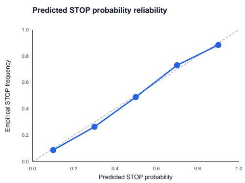  
Figure 8: Measured calibration of the temperature-scaled Stop confidence against binary bounded-tree teacher deci- sions. Each point compares the mean predicted confidence with the teacher-label frequency in one of five bins; the dashed diagonal denotes perfect agreement. This is calibra- tion to the bounded-tree teacher, not to exact global stopping optimality.

Residual stopping errors occur in both directions. The error audit records a stop as premature when the best available exact or bounded-teacher continuation value strictly exceeds the Stop value, as late when the teacher preferred Stop at an earlier prefix, and as forced when the controller reaches $K _ { \mathrm { m a x } }$ without selecting Stop. These are separate trajectory events and are not assumed to partition the diagnostic subset. Their respective rates are 8.8%, 10.7%, and 3.0%, and the associated mean utility loss relative to the audit’s continu- ation benchmark is 0.076. The late-stop rate is numerically 1.9 percentage points higher than the premature-stop rate, but without paired uncertainty we treat this diference as descriptive rather than evidence of a systematic error asym- metry. Because this audit can use bounded-tree continuation values, its stopping-regret statistic should not be conflated with the reduced-space exact-oracle terminal-profile regret in Appendix E.7. Overall, the diagnostics support Stop as an informative, imperfect decision signal relative to its teacher; they do not establish globally minimal profiles.

<table><tr><td>Continuation</td><td>Cum. depth</td><td>Cum. extra tok.</td><td>Beneficial</td><td>Redundant</td><td>Cost-not-worth</td><td>Harmful</td></tr><tr><td>controller-next</td><td>+1</td><td>177</td><td>18.0%</td><td>36.2%</td><td>28.9%</td><td>16.9%</td></tr><tr><td>controller-next</td><td>+2</td><td>351</td><td>14.2%</td><td>30.7%</td><td>29.1%</td><td>26.0%</td></tr><tr><td>controller-next</td><td>+3</td><td>521</td><td>9.9%</td><td>27.1%</td><td>27.0%</td><td>35.9%</td></tr><tr><td>retriever-next</td><td>+1</td><td>181</td><td>14.0%</td><td>33.6%</td><td>29.0%</td><td>23.4%</td></tr><tr><td>retriever-next</td><td>+2</td><td>359</td><td>9.7%</td><td>29.5%</td><td>28.0%</td><td>32.9%</td></tr><tr><td>retriever-next</td><td>+3</td><td>536</td><td>7.2%</td><td>23.8%</td><td>25.0%</td><td>43.9%</td></tr><tr><td>oracle-best-continuation</td><td>+1</td><td>170</td><td>28.2%</td><td>33.6%</td><td>26.2%</td><td>11.9%</td></tr><tr><td>oracle-best-continuation</td><td>+2</td><td>331</td><td>21.8%</td><td>30.7%</td><td>29.3%</td><td>18.2%</td></tr><tr><td>oracle-best-continuation</td><td>+3</td><td>490</td><td>17.8%</td><td>29.1%</td><td>28.0%</td><td>25.1%</td></tr></table>

Table 7: Measured forced-continuation diagnostic from prefixes where Stop was predicted, averaged over three complete pipeline seeds. For each policy, +d cumulatively appends its first d records from the same prefix; extra tokens are cumulative relative to that prefix. Categories partition the evaluated stopped prefixes before rounding.

<table><tr><td>Audit</td><td>Coverage Reject Exact SMD SMD</td><td></td><td>Mean p90</td></tr><tr><td></td><td></td><td></td><td></td></tr><tr><td>K− = 3;</td><td></td><td></td><td></td></tr><tr><td></td><td></td><td></td><td>caliper enabled 87.5% 8.1% 31.1% 0.040 0.083</td></tr></table>

Table 8: Measured balance audit for content-matched re- placements. Coverage is the share of selected records with three valid controls; Reject is the share excluded by the caliper.

## E.5 Specificity, Matching, and Human Evaluation

We assess whether the selected profiles capture target-user behavior rather than merely providing useful task demon- strations from three complementary perspectives: a balance audit of the matched controls, frozen-generator interventions on profile ownership, action, and content, and blind human judgments of the resulting outputs.

Matching quality bounds the specificity analysis. Ta- ble 8 re orts both the feasibilit of constructin matched con- trols and their balance on variables observed before the user action. Covera e is the fraction of selected records for which all $K ^ { - } = 3$ other-user controls satisfy the caliper; candidates that fail this requirement are rejected rather than silently re-placed. Exact-match rate measures agreement within dis- crete matching strata, whereas standardized mean difer- ences summarize balance over continuous covariates. Be- cause the subsequent replacement comparisons exclude un- matched records, they characterize the matched subset rather than all selected profiles.

Interventions distinguish personal from generic utility. Table 2 compares the target-user profile with five controls. Content-matched replacement approximately preserves ob- servable content and query relevance while replacing a target-user record with a record from another user; random- user replacement and whole-profile swaps provide progres- sively less constrained controls. Action shufling breaks the pairing between a historical context and the action taken in that context. Finally, owner permutation keeps record con- tents fixed while reassigning ownership labels, serving as a negative-control audit of whether the matching pipeline itself can manufacture an apparent specificity efect. These comparisons estimate frozen-generator replacement efects conditional on the achieved covariate balance; they do not identify a causal efect of user identity.

<table><tr><td>Task</td><td>Criterion</td><td>Win</td><td>Tie</td><td>Loss</td><td>κ</td></tr><tr><td></td><td>LaMP-4 task faithfulness</td><td>56.0%</td><td>24.0%</td><td>20.0%</td><td>0.41</td></tr><tr><td></td><td>LaMP-4 user style consistency</td><td>61.3%</td><td>21.0%</td><td>17.7%0.47</td><td></td></tr><tr><td></td><td>LaMP-4 overall preference</td><td>58.7%</td><td>23.0%</td><td>18.3%0.44</td><td></td></tr><tr><td></td><td>LaMP-7 task faithfulness</td><td></td><td></td><td>53.7%25.3%21.0%0.41</td><td></td></tr><tr><td></td><td>LaMP-7 user style consistency</td><td></td><td></td><td>60.3%22.0%17.7%0.44</td><td></td></tr><tr><td></td><td>LaMP-7 overall preference</td><td></td><td></td><td>58.7%24.0%17.3%0.42</td><td></td></tr></table>

Table 9: Measured three-annotator blind comparison of ENOUGH against PURPLE on 200 samples per task. Win, tie, and loss are defined from the perspective of ENOUGH; κ denotes Fleiss’ agreement coeficient.

Blind human judgments test whether the diferences are perceptible. For each of LaMP-4 and LaMP-7, Table 9 compares ENOUGH with PURPLE on 200 examples, with three annotators independently judging each example. Task faithfulness, consistency with the user’s style, and overall preference are elicited as separate questions so that task cor- rectness is not conflated with stylistic personalization. Pre- sentation order is randomized and method identity is con- cealed. Annotators see the current input and the legally avail- able user history, but not likelihood scores; automatic refer- ences are also hidden for the overall-preference judgment. Ties are retained as valid outcomes, and adjudication is re-stricted to protocol violations. The table reports win/tie/loss rates and Fleiss’ κ from the completed annotation study.

## E.6 Additional Ablations

The main ablation figure isolates long-horizon targets, adap- tive stopping, user specificity, and token cost. We additionally test the value-head decomposition, ranking and STOP losses, and order-sensitive profile encoding.

<table><tr><td>Variant</td><td>Quality</td><td>Tokens</td><td>Harm</td><td>Regret</td></tr><tr><td>Full ENOUGH</td><td>99.9</td><td>512</td><td>15.0%</td><td>0.070</td></tr><tr><td>Single net-value head</td><td>99.4</td><td>515</td><td>17.1%</td><td>0.096</td></tr><tr><td>No ranking loss</td><td>99.4</td><td>516</td><td>16.7%</td><td>0.090</td></tr><tr><td>No STOP loss</td><td>99.0</td><td>581</td><td>18.7%</td><td>0.121</td></tr><tr><td>Permutation-invariant profile</td><td>99.2</td><td>513</td><td>17.5%</td><td>0.112</td></tr></table>

Table 10: Measured controller-objective and representation ablations, averaged over three complete pipeline seeds. Higher Quality and lower token cost, harm, and regret are better.
<table><tr><td>Selector</td><td>Regret</td><td></td><td>€-suff. Excess tok.</td><td>Stop agree</td></tr><tr><td>Exact oracle</td><td>0.000</td><td>100.0%</td><td>0</td><td>100.0%</td></tr><tr><td>Bounded-tree teacher</td><td>0.028</td><td>91.6%</td><td>41</td><td>92.3%</td></tr><tr><td>Learned ENOUGH</td><td>0.069</td><td>81.8%</td><td>89</td><td>83.7%</td></tr><tr><td>Myopic</td><td>0.129</td><td>68.5%</td><td>169</td><td>71.9%</td></tr><tr><td>Fixed  $k = 4$ </td><td>0.152</td><td>64.1%</td><td>248</td><td>65.2%</td></tr></table>

Table 11: Measured exact-oracle diagnostic pooled over 50 examples per task with $M ^ { \prime } = 6$ and $\check { K } ^ { \prime } = 4$ . Lower is better for regret and excess tokens; higher is better for ϵ-suficiency and stop agreement.
<table><tr><td>Task</td><td>Teacher</td><td>ENOUGH</td><td>Myopic</td><td>Fixed-4</td></tr><tr><td>LaMP-1</td><td>0.025</td><td>0.064</td><td>0.122</td><td>0.147</td></tr><tr><td>LaMP-2</td><td>0.030</td><td>0.073</td><td>0.130</td><td>0.154</td></tr><tr><td>LaMP-3</td><td>0.042</td><td>0.082</td><td>0.141</td><td>0.162</td></tr><tr><td>LaMP-4</td><td>0.024</td><td>0.066</td><td>0.126</td><td>0.148</td></tr><tr><td>LaMP-5</td><td>0.037</td><td>0.080</td><td>0.137</td><td>0.161</td></tr><tr><td>LaMP-7</td><td>0.023</td><td>0.065</td><td>0.121</td><td>0.144</td></tr></table>

Table 12: Measured utility regret to the exact oracle by task; lower is better, and the exact oracle has zero regret by defi- nition.

## E.7 Exact Minimal-Suficient Oracle

We measure how closely each selector approaches a mini- mal suficient profile using an exact-oracle diagnostic on 50 examples per task. For each instance, we reduce the candi- date pool to $M ^ { \prime } = 6 .$ , cap the profile length at $K ^ { \prime } = 4 _ { \mathrm { { } } }$ , and enumerate all 517 legal ordered profiles: the empty profile and every length-one-to-four permutation drawn without re- placement. All methods use the same frozen generator and exact token cost. Because the exact oracle scores profiles us- ing the gold reference, it provides a diagnostic upper bound rather than a deployable selector.

The bounded-tree teacher retains most of the oracle per- formance, with 0.028 utility regret, 91.6% ϵ-suficiency, 41 excess tokens, and 92.3% agreement with the oracle stop de- cision (Table 11). The learned ENOUGH controller obtains 0.069 regret and reaches ϵ-suficiency on 81.8% of instances while using 89 excess tokens and matching the oracle stop decision 83.7% of the time. It is substantially closer to the oracle than the myopic and fixed-k selectors on all four di-agnostics. The gap between the exact oracle and bounded teacher quantifies bounded-search truncation, whereas the additional gap from the teacher to ENOUGH reflects con- troller approximation.

The task-level results show the same ordering: ENOUGH regret ranges from 0.064 on LaMP-1 to 0.082 on LaMP- 3, below both the myopic and fixed-4 alternatives on every task (Table 12). Pooled quantities are computed directly over diagnostic instances rather than by averaging heterogeneous task-level metrics.

## E.8 Additional Hyperparameter Sensitivity

To assess whether ENOUGH depends on a narrow config- uration, we conduct additional one-at-a-time sweeps on the development set over the candidate-pool size M, maximum profile depth $K _ { \mathrm { m a x } } ,$ number of matched controls $K ^ { - }$ , ofline search budget $( J , W )$ , and auxiliary-loss weights η and $\zeta . \mathrm { A l l }$ remaining settings are held fixed at their selected values. For each task, we orient its oficial development metric so that higher is better and normalize it to a common 100-point ref- erence level; the reported quality index is the macro-average of the six task-level indices rather than an average of raw het- erogeneous metrics. Stop regret is the mean utility shortfall of the controller-selected stopping point relative to the best feasible stopping value on the exact-oracle diagnostic subset in Appendix E.7. For the structural and search parameters, we report both metrics; for the loss weights, we report only aggregate quality. Following the protocol above, each plot- ted point aggregates three complete pipeline seeds. Because the figures do not show seed-level intervals, we interpret the trends descriptively within the evaluated grids and do not use these sweeps to claim statistical significance. All operating points are selected using development data and frozen before test evaluation.

Structural and search parameters. Figure 9 shows that the selected settings lie near favorable regions of their re- spective sweeps. Among the evaluated pool sizes, $M = 2 0$ attains both the highest quality value, 99.4, and the lowest stop regret, 0.069; enlarging the pool further produces small degradations in both metrics. Increasing $K _ { \mathrm { m a x } }$ from 2 to 10 substantially improves quality and stop regret, whereas $K _ { \operatorname* { m a x } } = 1 5$ preserves the same quality of 99.4 and lowers regret by only 0.001. Similarly, $\dot { K } ^ { - } \stackrel { - } { = } 3$ captures most of the improvement from additional matched controls: moving to four or five controls changes quality by at most 0.1 and stop regret by at most 0.001. Larger search budgets con- tinue to improve both metrics, but the gains diminish beyond $( J , W ) = ( 8 , 4 )$ : increasing the budget to (16, 8) raises quality from 99.4 to 99.6 and reduces stop regret from 0.069 to 0.066. These trends motivate moderate operating points that retain strong development-set performance while bounding candidate processing, matched-control scoring, and ofline search.

Training-loss weights. Both loss-weight sweeps favor moderate, nonzero coeficients within the evaluated grids. The selected value $\eta = 0 . 2$ reaches a quality index of 99.9, compared with 99.4 when the ranking loss is omitted and 99.6 at $\eta = 1$ . Likewise, $\zeta = 0 . 4$ reaches 99.9, compared with 99.0 at $\zeta = 0$ and 99.4 at $\zeta = 1$ . The neighboring settings remain competitive—quality is 99.8 at both $\eta = 0 . 5$ and $\zeta = 0 . 6 { - } \mathrm { s o }$ the results indicate a favorable region rather than a sharply isolated optimum. The sweeps therefore sup- port balancing the ranking and stopping objectives with value regression. Because Figure 10 reports only aggregate quality, it does not by itself establish how either coeficient afects stopping calibration, profile length, or task-level variability.

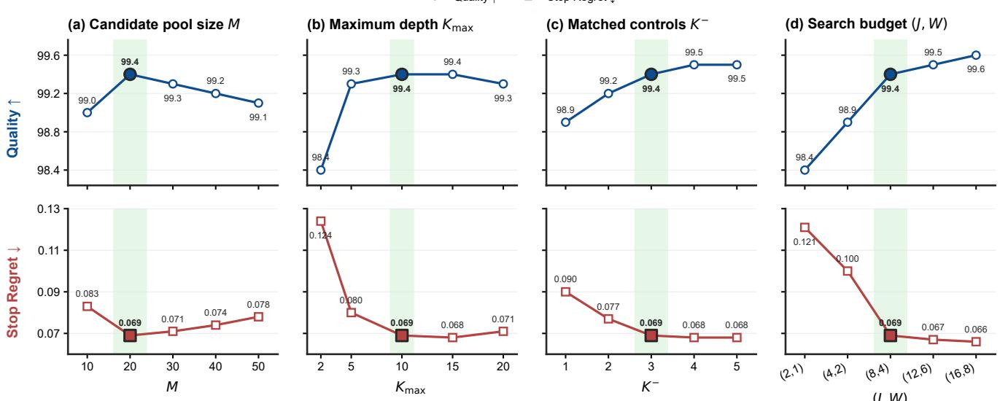  
Figure 9: Measured development-set sensitivity of ENOUGH to candidate-pool size M, maximum profile depth $K _ { \mathrm { m a x } } ,$ , number of matched controls $K ^ { - }$ , and ofline search budget $( J , W )$ . The upper row reports the aggregate quality index (higher is better), and the lower row reports stop regret (lower is better). Shaded bands and black-outlined markers denote the selected settings M = 20, K = 10, K− = 3, and $( J , W ) = ( 8 , 4 )$

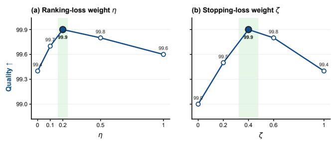  
Figure 10: Measured development-set quality sensitivity to the ranking-loss weight η and stopping-loss weight ζ in Eq. (31). Each weight is varied within [0, 1] while the re-maining configuration is held fixed. Higher is better; shaded bands and black-outlined markers denote the selected values η = 0.2 and $\zeta = 0 . 4$

## E.9 Robustness and Subgroups

Controlled stress tests. Starting from the one-useful- record condition, a near duplicate changes selected length by 0.07 records. The action-conflicting condition changes harm from 12.0% to 19.0% and quality by 0.7 index points (Table 13). The subgroup analysis stratifies history length, match coverage, and input dificulty.

The robustness ladder inserts one perturbation at a time into an otherwise controlled pool. Near duplicates test redun- dancy, random records test distraction, and action conflicts test whether the controller can reject semantically relevant but behaviorally inconsistent evidence. Subgroups are de- fined on development-set quantiles and frozen before test evaluation.

<table><tr><td colspan="4"></td><td colspan="2">Root</td></tr><tr><td>Candidate ladder</td><td>Quality</td><td></td><td>Tokens Records</td><td>STOP</td><td>Harm</td></tr><tr><td>No useful history</td><td>96.3</td><td>0</td><td>0.00</td><td>100.0%</td><td>0.0%</td></tr><tr><td>+ useful record</td><td>99.3</td><td>220</td><td>0.99</td><td></td><td>18.2%12.0%</td></tr><tr><td>+ near duplicate</td><td>99.3</td><td>233</td><td>1.06</td><td></td><td>17.7%11.9%</td></tr><tr><td>+ irrelevant record</td><td>99.2</td><td>237</td><td>1.08</td><td></td><td>17.0%13.1%</td></tr><tr><td>+ action conflict</td><td>98.5</td><td>266</td><td>1.25</td><td>15.0%19.0%</td><td></td></tr></table>

Table 13: Measured controlled candidate-injection stress test. Each row adds one perturbation to the preceding candidate- pool condition.
<table><tr><td>Dimension</td><td>Bucket</td><td>Quality</td><td>Tokens</td><td>Root SToP</td><td>Harm</td></tr><tr><td>History</td><td>short</td><td>98.9</td><td>302</td><td>26.6%</td><td>13.7%</td></tr><tr><td>History</td><td>medium</td><td>99.5</td><td>506</td><td>16.8%</td><td>15.2%</td></tr><tr><td>History</td><td>long</td><td>99.6</td><td>727</td><td>8.3%</td><td>18.0%</td></tr><tr><td>Coverage</td><td>low</td><td>98.5</td><td>354</td><td>30.1%</td><td>18.2%</td></tr><tr><td>Coverage</td><td>medium</td><td>99.3</td><td>501</td><td>16.9%</td><td>15.4%</td></tr><tr><td>Coverage</td><td>high</td><td>99.7</td><td>656</td><td>8.1%</td><td>13.8%</td></tr><tr><td>Difficulty</td><td>easy</td><td>99.5</td><td>425</td><td>20.2%</td><td>11.2%</td></tr><tr><td>Difficulty</td><td>medium</td><td>99.3</td><td>514</td><td>16.6%</td><td>14.9%</td></tr><tr><td>Difficulty</td><td>hard</td><td>98.8</td><td>611</td><td>13.1%</td><td>22.0%</td></tr></table>

Table 14: Measured subgroup analysis by user-history length, matched-candidate coverage, and input dificulty. Buckets are defined by development-set quantiles and frozen for test evaluation.

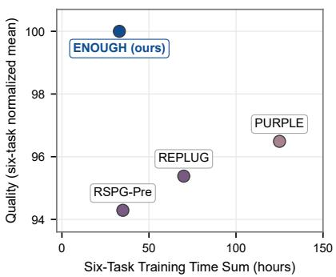

Classification / scoring Text generation  
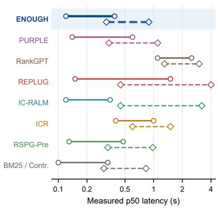  
Figure 11: Detailed training-time and latency comparison. Top: Quality versus the measured six-task training-time sum on one A800 for the four methods that require task-specific GPU training; Quality is the equal-weight mean of six task-normalized scores. Bottom: measured batch-size-one p50 latency ranges across classification/scoring tasks (solid lines with circles) and text-generation tasks (dashed lines with diamonds); BM25 and Contriever are grouped in this panel.

## E.10 Online and Ofline Eficiency

All online timings use the same single-GPU machine, batch size one, warmed caches, and identical generator settings. We report median and p95 end-to-end latency and decompose the median into retrieval, controller or selector, generation, and residual preprocessing. Multi-call baselines include every reranking or generation call. Ofline teacher scoring, cache construction, and additional λ operating points are excluded from online latency but reported explicitly in Table 17.

Training and task-family detail. Figure 11 separates ofline training time from task-dependent online latency. ENOUGH reaches Quality 100.00 with a six-task training sum of 33 hours, close to RSPG-Pre at 35 hours and below

<table><tr><td>Method</td><td>Quality</td><td>Tokens</td><td>Calls</td><td>p50 ms</td><td>p95 ms</td></tr><tr><td>ENOUGH</td><td>100.00</td><td>510</td><td>1</td><td>370</td><td>440</td></tr><tr><td>PURPLE</td><td>96.49</td><td>905</td><td>1</td><td>398</td><td>474</td></tr><tr><td>RankGPT</td><td>96.32</td><td>869</td><td>6</td><td>1120</td><td>1379</td></tr><tr><td>REPLUG</td><td>95.38</td><td>1388</td><td>5</td><td>1323</td><td>1595</td></tr><tr><td>IC-RALM</td><td>94.82</td><td>1210</td><td>7</td><td>1463</td><td>1793</td></tr><tr><td>ICR</td><td>94.30</td><td>819</td><td>4</td><td>865</td><td>1049</td></tr><tr><td>RSPG-Pre</td><td>94.29</td><td>765</td><td>3</td><td>796</td><td>951</td></tr><tr><td>Contriever</td><td>92.17</td><td>931</td><td>1</td><td>365</td><td>442</td></tr><tr><td>BM25</td><td>90.96</td><td>905</td><td>1</td><td>360</td><td>421</td></tr></table>

Table 15: Measured online inference cost under identical gen- eration settings. Tokens is the mean selected-profile length; Calls is the number of generator-equivalent invocations; p50/p95 are end-to-end latency in milliseconds.
<table><tr><td>Method</td><td></td><td>Retrieval Controller Selector Generator</td><td></td><td></td><td>Other</td></tr><tr><td>Contriever-5</td><td>17</td><td></td><td>1</td><td>362</td><td>15</td></tr><tr><td>PURPLE-5</td><td>18</td><td></td><td>10</td><td>357</td><td>16</td></tr><tr><td>ENOUGH</td><td>17</td><td>11</td><td>一</td><td>325</td><td>17</td></tr></table>

Table 16: Measured p50 end-to-end latency decomposition in milliseconds under the common batch-size-one evaluation protocol.

<table><tr><td>calls (M)</td><td>hit</td><td>hours</td><td>(GB)</td><td>Teacher Cache GPU- Storage Extra GPU-h per λ</td></tr><tr><td>9.7</td><td>74.8%</td><td>336</td><td>95</td><td>95</td></tr></table>

Table 17: Measured ofline teacher-scoring and cache cost for one operating point. Teacher calls are reported in millions.

REPLUG and PURPLE at 70 and 125 hours. In the measured latency comparison, ENOUGH remains in the low-latency group for both task families; BM25/Contriever have slightly lower ranges, whereas RankGPT and the generation paths of REPLUG and IC-RALM extend to substantially higher upper bounds. Because the two panels measure diferent cost dimensions, we do not collapse them into a single eficiency score.

## F Complete Generator Prompt Templates

Figure 12 shows the complete logical system and user messages supplied to the frozen generator before model-specific chat serialization. The gray system in- struction and the <TASK>, <USER\_HISTORY>, and <CURRENT\_REQUEST> delimiters are shared by every method. Within <CURRENT\_REQUEST>, we retain the official LaMP task instruction verbatim and replace only instance-specific content with descriptive braced fields. The gold block uses our uniform behavioral-record serializa- tion; records are repeated in the order chosen by the selector. If the controller selects Stop at the root, the two <USER\_HISTORY> delimiters remain but enclose no record. Display line breaks inside the blue block are visual wrapping only. The oficial Qwen3.5-9B and Llama-3.1-8B-

Instruct chat templates subsequently add their model-specific control tokens.

For LaMP-1–5, the historical context and user action correspond to the task fields reported in each figure. Public LaMP-7 histories contain only the user’s prior tweet and no separate pre-action context; accordingly, its [HIST\_CONTEXT] field is empty and the tweet is serialized as [USER\_ACTION]. This is a property of the released benchmark schema rather than a task-specific prompt excep- tion.

USER / Task tag   
<TASK> LaMP\_3 </TASK>

SYSTEM / Shared instruction (used by panels a-f)   
You are solving a LaMP personalization task. Use the user history only when useful.   
Follow the current request exactly and output only the requested answer.

## (a) LaMP-1

USER / Task tag   
<TASK> LaMP\_1 </TASK>

USER / Unified profile serialization   
<USER\_HISTORY>   
[TASK] LaMP\_1   
[HIST\_CONTEXT]   
{historical\_paper\_abstract\_j}   
[USER\_ACTION] {historical\_paper\_title\_j}   
[META] {"date": {historical\_paper\_year\_j}}   
... repeated in ENOUGH-selected order for   
j = 1, |S\_i| ...   
</USER\_HISTORY>

## (b) LaMP-2

USER / Task tag   
<TASK> LaMP\_2 </TASK>

USER / Unified profile serialization   
<USER\_HISTORY>   
[TASK] LaMP\_2   
[HIST\_CONTEXT]   
{historical\_movie\_description\_j}   
[USER\_ACTION] {historical\_user\_tag\_j}   
[META] {"date": "{historical\_tag\_date\_j}"}   
... repeated in ENOUGH-selected order for   
j = 1, ..., |S\_i| ...   
</USER\_HISTORY>

## (c) LaMP-3

USER / Unified profile serialization   
<USER\_HISTORY>   
[TASK] LaMP\_3   
[HIST\_CONTEXT] {historical\_review\_text\_j}   
[USER\_ACTION] {historical\_user\_score\_j}   
[META] {"date":   
"{historical\_review\_date\_j}"}   
... repeated in ENOUGH-selected order for   
j = 1, ..., |S\_i| ...   
</USER\_HISTORY>

Citation Identification

## USER / Official LaMP task instruction

<CURRENT\_REQUEST>   
For an author who has written the paper   
with the title "{query\_paper\_title}",   
which reference is related? Just answer   
with [1] or [2] without explanation. [1]:   
"{candidate\_reference\_1}" [2]:   
"{candidate\_reference\_2}"   
</CURRENT\_REQUEST>

Movie Tagging

## USER / Official LaMP task instruction

## <CURRENT\_REQUEST>

Which tag does this movie relate to among the following tags? Just answer with the tag name without further explanation. tags: [sci-fi, based on a book, comedy, action, twist ending, dystopia, dark comedy, classic, psychology, fantasy, romance, thought-provoking, social commentary, violence, true story] description: {target\_movie\_description} </CURRENT\_REQUEST>

Product Rating

## USER / Official LaMP task instruction

## <CURRENT\_REQUEST>

What is the score of the following review on a scale of 1 to 5? just answer with 1, 2, 3, 4, or 5 without further explanation. review: {target\_review\_text} </CURRENT\_REQUEST>

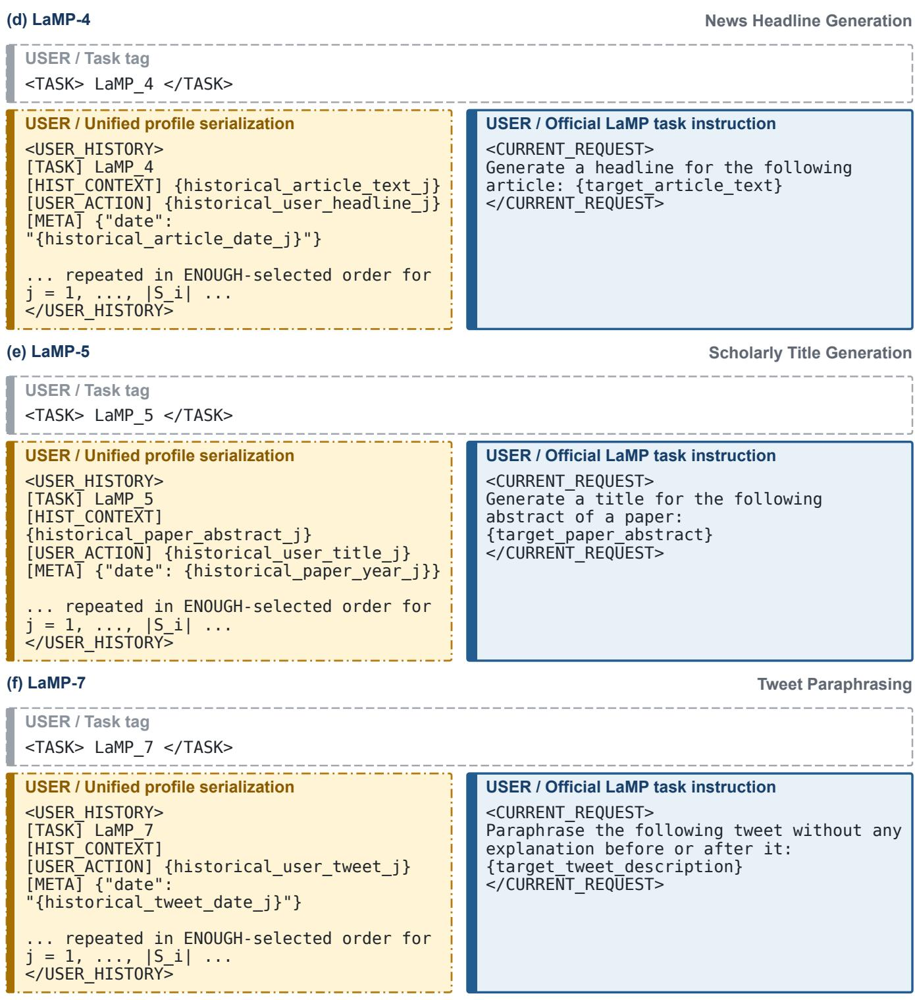  
Figure 12: Complete logical generator-prompt templates for (a) LaMP-1 personalized citation identification, (b) LaMP-2 personalized movie tagging, (c) LaMP-3 personalized product rating, (d) LaMP-4 personalized news headline generation, (e) LaMP-5 personalized scholarly title generation, and (f) LaMP-7 personalized tweet paraphrasing. The system instruction shown on the first page is shared by all six templates.