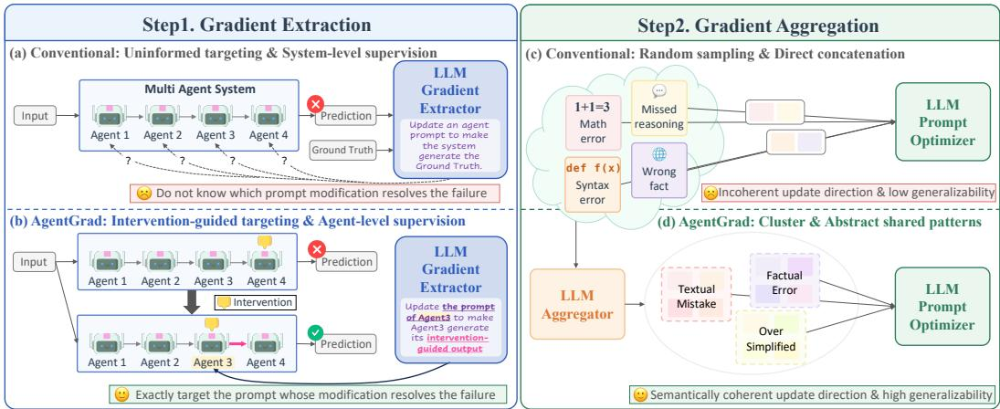
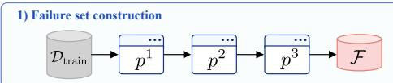
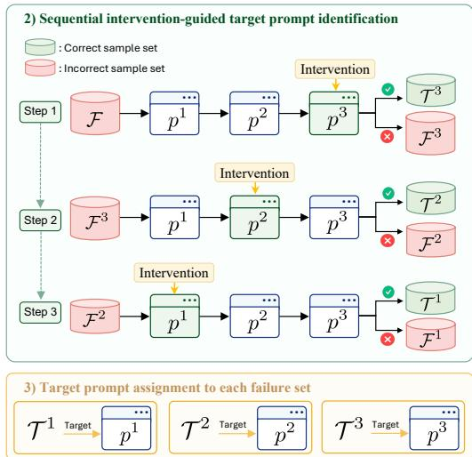
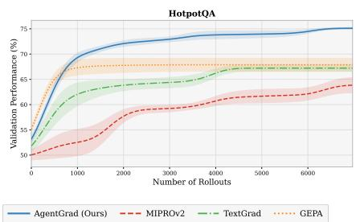
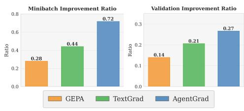
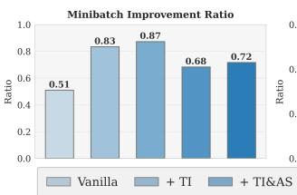
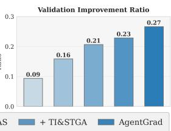
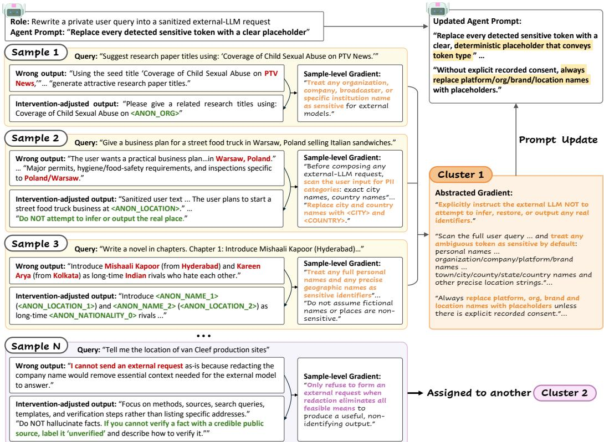

# AgentGrad: Intervention-guided Prompt Optimization for Multi Agent Systems

Jaewon Chu1 Jinwoo Seo2 Jaewon Cho2 Jeehye Na2 Yunyang Xiong3 Youngdae Kim4 Hyunwoo J. Kim2∗

1Korea University, 2KAIST, 3Meta AI, 4UNIST

allonsy07@korea.ac.kr

{sjwoo0612, cho35750, jeehyena, hyunwoojkim}@kaist.ac.kr yunyang@meta.com youngdae.kim@unist.ac.kr

## Abstract

Large language model (LLM)-based multi-agent systems (MAS) achieve strong performance by employing specialized multiple agents, yet their performance depends on the prompt design of each agent. For MAS prompt optimization, textual gradient methods that guide prompt updates using natural-language feedback have emerged as a leading paradigm. In this paper, we identify limitations in two stages of existing textual gradient approaches: gradient extraction and gradient aggregation. In gradient extraction, previous works select a target prompt without verifying whether modifying it resolves the failure, and derive gradients without agent-level supervision over the corresponding agent’s intermediate output. In gradient aggregation, individual gradients are randomly grouped and concatenated, often mixing unrelated failure modes and producing prompts that fail to generalize. To address these limitations, we propose AgentGrad, a prompt optimization framework for multi-agent systems based on sequential intervention and semantic textual gradient abstraction. For each failure, sequential intervention modifies the behavior of one agent at a time to identify the target agent whose modification resolves the failure. The modified output of the target agent then serves as agentlevel supervision for extracting a fine-grained gradient. Semantic textual gradient abstraction clusters semantically similar gradients to prevent mixing unrelated failure modes, and abstracts each cluster into a generalized gradient that captures the shared corrective pattern. Experimental results show that AgentGrad achieves state-of-the-art performance across five MAS benchmarks and reduces wall-clock optimization time by 2.5× on average compared to the next-fastest baseline.

## 1 Introduction

Recent advances in large language models (LLMs) have enabled the development of multi-agent systems (MAS), where multiple LLM-powered agents interact to solve complex tasks [1–4]. A key advantage of MAS is that they decompose difficult problems into subtasks, allowing different agents to contribute complementary capabilities [1–3]. Such systems have shown strong performance across a wide range of challenging settings, including multi-step reasoning, planning, and information synthesis [1, 3–6]. The behavior of each agent is governed by its input prompt, making prompt design critical to system performance [7, 8]. Motivated by this, recent works have explored automatic prompt optimization for MAS showing that refining agent prompts can substantially improve system performance [7–13]. Among these, textual gradient methods, which employ natural-language feedback to iteratively refine prompts, have emerged as a leading paradigm. [9–11, 14, 15].

  
Figure 1: Comparison of conventional textual gradient approaches and AgentGrad. In gradient extraction, conventional approaches (a) select target prompts without identifying whose modification resolves the failure and extract gradients without agent-level intermediate supervision, while AgentGrad (b) identifies the target agent via sequential intervention and extracts gradients using the intervention-adjusted output of the target agent. In gradient aggregation, conventional approaches (c) randomly group gradients causing spurious signals, while AgentGrad (d) clusters gradients by shared patterns and abstracts them into a generalized gradient.

In this paper, we identify systematic limitations in two stages of existing textual gradient approaches for MAS: textual gradient extraction and textual gradient aggregation. For gradient extraction, previous works exhibit two issues. First, the target prompt is selected without verifying whether modifying an individual prompt can resolve the failure. Existing methods either update all agent prompts simultaneously at substantial cost, or apply round-robin selection without testing which agent can repair the failure. Second, the gradient is derived without direct agent-level supervision over individual agents’ intermediate outputs. While agent-level supervision provides a direct update signal, it is unavailable in most MAS settings. In gradient aggregation, individual textual gradients are randomly grouped and directly concatenated. It often mixes unrelated failure modes and produces prompt that fails to generalize.

To address these challenges, we propose AgentGrad, a prompt optimization framework based on sequential intervention and semantic textual gradient abstraction. Sequential intervention addresses both limitations in the gradient extraction stage [16–18]. Specifically, AgentGrad applies sequential interventions (e.g., hint injection) to individual agents, identifying the target agent whose correction resolves the failure [16–20]. The intervention-adjusted output then serves as an agent-level pseudolabel to yield a fine-grained textual gradient. [9, 11, 21–23]. Semantic textual gradient abstraction improves the gradient aggregation stage. It groups sample-level gradients that share a corrective pattern into semantic minibatches, and abstracts each minibatch into a single generalized textual gradient that captures the shared pattern [9–11, 14, 15, 24].

We evaluate AgentGrad on five MAS benchmarks spanning diverse task types: multi-hop QA (HotpotQA) [25], claim verification (HoVer) [26], instruction following (IFBench) [27], privacyconscious delegation (PUPA) [28], and math reasoning (MATH) [29], using both open-source (Qwen3-8B) [30] and proprietary (GPT-5-mini) [31] backbones. Across all benchmarks, AgentGrad consistently outperforms strong recent prompt optimization baselines, including TextGrad [9] and GEPA [10], while substantially reducing wall-clock optimization time.

## Our contributions are summarized as follows:

• We propose AgentGrad, a prompt optimization framework for MAS that addresses limitations in two stages of existing textual gradient approaches: gradient extraction and gradient aggregation.

• We introduce sequential intervention, a mechanism that resolves two limitations in gradient extraction stage: it identifies the target agent whose correction resolves the failure, and

produces an agent-level pseudo-label that supplies fine-grained supervision for gradient extraction.

• We introduce semantic textual gradient abstraction, which groups sample-level gradients into semantic minibatches sharing a corrective pattern and abstracts each cluster into a single textual gradient with improved generalizability.

• Across five MAS benchmarks, AgentGrad achieves state-of-the-art performance and reduces wall-clock optimization time by 2.5× on average over the next-fastest baseline.

## 2 Related Works

Automatic Prompt Optimization for LLM-Driven Agents Automatic prompt optimization (APO) improves LLM-driven agents by refining instructions, demonstrations, and other textual inputs [7, 8, 32]. Early APO mainly targeted single-prompt settings through black-box search, edit-based instruction search, or LLM-generated feedback [12, 13, 33–35]. ProTeGi [11] introduced textual gradients by treating natural-language critiques of failed examples as gradient-like directions for prompt revision. Recent work extends APO from isolated prompts to compound agent systems [7–10]. MIPRO [8] jointly searches instructions and demonstrations for multi-stage LM programs with Bayesian optimization [36–38]. TextGrad [9] extends textual gradients to compound LLM systems by propagating natural-language feedback across multiple LLM components, analogous to backpropagation. GEPA [10] combines trajectory-level reflection with evolutionary prompt search. These methods provide strong APO signals, typically through task-level feedback or trajectory-level reflection [8–10]. However, intermediate agent behaviors and interactions could provide finer-grained signals for multi-agent prompt optimization, yet this direction remains underexplored.

Failure Attribution in Multi-Agent Systems Failure attribution in multi-agent systems is challenging since system-level errors can emerge from interactions among multiple agents [16, 19, 20]. This creates a credit-assignment problem: a failed final output gives limited evidence about which agent or step is associated with the failure [16, 39]. Recent benchmarks and diagnostic methods formalize this problem by localizing failures within multi-agent trajectories [16–20, 40]. Intervention-driven debugging systems further study these failures by editing, replaying, or perturbing agent executions to test how alternative behaviors affect the outcome [17, 41, 42]. Together, these works establish intervention as a practical tool for failure localization, attribution validation, and multi-agent debugging [41, 42]. AgentGrad extends this line of work from failure analysis to prompt optimization. It treats the corrected behavior revealed by intervention as agent-level supervision, turning attribution evidence into a localized target for updating the corresponding agent prompt.

Self-Generated Supervision Self-generated supervision studies how LLMs can produce rationales, feedback, or reflections as optimization signals [43–45]. STaR bootstraps rationales to improve reasoning [43]. Reflexion and Self-Refine use model-generated feedback to refine later attempts, revised outputs, or future task behavior [44, 45]. These methods establish LLM-generated supervision as an effective optimization source without dense human annotations. Prior work primarily uses such supervision to improve reasoning trajectories, iterative outputs, or training objectives [22, 43– 45], rather than to derive localized prompt updates for individual agents. AgentGrad redirects this supervision toward prompt-level optimization in multi-agent systems, translating agent-level behavioral correction into supervision for revising agent prompts.

## 3 Preliminaries

Prompt Optimization for MAS Let Π denote an MAS composed of N LLM-based agents $( \pi ^ { 1 } , \ldots , \pi ^ { \tilde { N } } )$ . Given an input x, Π generates output $\hat { y } = \Pi ( x ; \mathcal { P } )$ , where $\mathcal { P } = ( p ^ { 1 } , \ldots , p ^ { N } )$ denotes the collection of agent prompts. Given a reward function $r : \hat { \mathcal { V } } { \times } \mathcal { V } \to [ 0 , 1 ]$ , prompt optimization finds ${ \mathcal { P } } ^ { * }$ that maximizes the expected reward by exploring candidate prompts and validating improvement using a training set $\mathcal { D } _ { \mathrm { t r a i n } }$ and a validation set $\mathcal { D } _ { \mathrm { v a l } } .$ , respectively. Since rollouts—running Π on an input followed by evaluation under reward function r—are computationally expensive, prompt optimization is typically formulated as finding the best solution within a budget of B rollouts allowed [8, 10]:

$$
\mathcal { P } ^ { * } = \arg \operatorname* { m a x } _ { \mathcal { P } } \mathbb { E } _ { ( { \boldsymbol { x } } , { \boldsymbol { y } } ) \sim \mathcal { D } _ { \mathrm { v a l } } } r ( \Pi ( { \boldsymbol { x } } ; \mathcal { P } ) , { \boldsymbol { y } } ) , \quad \mathrm { s . t . ~ } \# \mathrm { r o l l o u t s } \le B .\tag{1}
$$

The optimized ${ \mathcal { P } } ^ { * }$ is then evaluated on a held-out test set $\mathcal { D } _ { \mathrm { t e s t } }$ . For the i-th input $x _ { i }$ , the system produces a sequence of intermediate inputs and outputs, where $\hat { y } _ { i } ^ { n } = \pi ^ { n } ( x _ { i } ^ { n } ; p ^ { n } ) , \bar { x } _ { i } ^ { 1 } = x _ { i } , \hat { y } _ { i } ^ { N } = \hat { y } _ { i }$ and $\boldsymbol { x } _ { i } ^ { n }$ for $n \geq 2$ is constructed from preceding agents’ outputs.

Textual Gradient The textual gradient [11] is a natural-language analog of the numerical gradient used in gradient-based optimization. Following the formulation in TextGrad [9], the textual gradient with respect to a prompt p is defined as

$$
\frac { \partial \mathcal { L } } { \partial p } = \mathrm { L L M } _ { \nabla } ( p , \hat { y } , \mathcal { L } ) ,\tag{2}
$$

where $\mathcal { L }$ is an objective, which may be either a non-differentiable function or a natural-language description of the failure, yˆ is the prompt-conditioned output, and $\mathrm { L L M } _ { \mathrm { { V } } }$ is an LLM-based gradient extractor that produces a natural-language critique describing how $p$ should be modified to improve $\mathcal { L } .$ A separate prompt optimizer LLM then aggregates sample-level textual gradients to produce an updated prompt. This extraction–aggregation procedure underlies a family of textual gradient methods [9, 14, 15]. Some recent works refer to this signal under different names — GEPA, for instance, calls it natural-language feedback [10] — but these methods share the same abstraction: a natural language description of how a prompt should be updated. We adopt textual gradient throughout this work to denote this signal.

## 4 Method

In this section, we present AgentGrad, a prompt optimization framework for multi-agent systems based on sequential intervention and semantic textual gradient abstraction. For the gradient extraction stage, we introduce sequential intervention, a mechanism that resolves the two limitations of this stage. Sequential intervention identifies the agent whose correction resolves a system-level failure (Section 4.1). The intervention-induced output then serves as an agent-level pseudo-label that supplies fine-grained supervision for textual gradient extraction (Section 4.2). For the gradient aggregation stage, we introduce semantic textual gradient abstraction (Section 4.3), which groups sample-level gradients into semantic minibatches sharing a corrective pattern and abstracts each cluster into a single textual gradient with improved generalizability. We provide the pseudocode of AgentGrad in algorithm 1.

## 4.1 Target Prompt Identification via Sequential Intervention

Our goal is to select the target prompt to update. We define the target prompt as the one whose correction alone is sufficient to resolve the failure. To this end, we identify the target prompt via sequential intervention, which modifies one agent at a time to verify whether its correction resolves the failure. An intervention modifies an agent’s behavior by injecting a hint into its prompt, guiding it toward a corrected intermediate output that leads the system to generate the correct output. Figure 2 illustrates the overall procedure of the sequential intervention.

Sequential Intervention. Given the current prompt set $\mathcal { P }$ of $N$ agents, let $\mathcal { F } ~ = ~ \{ ( x _ { i } , y _ { i } ) ~ \{$ $r ( \bar { \Pi } ( x _ { i } ; \mathcal { P } ) , y _ { i } ) < r _ { \operatorname* { m a x } } \big \}$ denote the set of failures from the training set $\mathcal { D } _ { \mathrm { t r a i n } } .$ , where r is a reward function and $r _ { \mathrm { m a x } }$ is the maximum reward value. For each failure $( x _ { i } , y _ { i } ) \in \mathcal { F }$ , we apply interventions one agent at a time in reverse execution order to identify the agent whose correction resolves it. Since we observed that failures tend to concentrate in later agents, this reverse order reduces the expected number of interventions. Starting with $\mathcal { F } ^ { N + 1 } = \mathcal { F }$ , at step n we inject hint H into agent $\pi ^ { n }$ by appending it to the agent’s current prompt. The appended hint guides the agent toward a corrected output; we denote the intervened MAS as $\Pi ^ { ( n , \mathcal { H } ) } ( x _ { i } ; \mathcal { P } )$ . We define ${ \mathcal { T } } ^ { n }$ as the subset of $\mathcal { F } ^ { n + 1 }$ resolved by intervening on $\pi ^ { n }$ ; for this subset, $\pi ^ { n }$ is identified as the target agent:

$$
\begin{array} { r } { \mathcal { T } ^ { n } = \big \{ ( x _ { i } , y _ { i } ) \in \mathcal { F } ^ { n + 1 } \ \big | \ r \Big ( \Pi ^ { ( n , \mathcal { H } ) } ( x _ { i } ; \mathcal { P } ) , y _ { i } \Big ) = r _ { \operatorname* { m a x } } \big \} , } \end{array}\tag{3}
$$

where $\mathcal { F } ^ { n + 1 }$ denotes the failures still unresolved when the procedure reaches step $n + 1$ . The resolved failures $\mathcal { T } ^ { n }$ are then removed from the unresolved set $( \mathcal { F } ^ { n } \bar { = } \mathcal { F } ^ { n + 1 } \backslash \mathcal { T } ^ { n } )$ , and the procedure proceeds to step n. Failures unresolved after step $n = 1$ are treated as hard cases that cannot be resolved even with hint guidance, and are therefore excluded from the current training round. They are not permanently discarded: since $\mathcal { F }$ is reconstructed from $\mathcal { D } _ { \mathrm { t r a i n } }$ at the start of every round, these cases are revisited under the updated prompt set.

  
Figure 2: Intervention-Guided Target Identification. AgentGrad first executes the current prompt set on $\mathcal { D } _ { \mathrm { t r a i n } }$ to obtain the failed examples ${ \mathcal F } .$ . It then applies interventions to each agent in reverse execution order, progressively separating the unresolved failures into corrected subsets $\mathcal T ^ { \bar { n } }$ and remaining failure sets ${ \mathcal { F } } ^ { n }$ . Here, $\mathcal { T } ^ { n }$ denotes the subset of failures for which the n-th agent is identified as the target, namely those resolved by intervening on prompt $p ^ { n }$

Algorithm 1 AgentGrad   
Require: MAS Π, prompts P, train/val sets $\begin{array} { r l } { \mathcal { D } _ { \mathrm { t r a i n } } , \mathcal { D } _ { \mathrm { v a l } } , } \end{array}$   
reward r, max reward rmax, budget B, Hint H   
$\ ! : r _ { \mathcal { P } } ( x , y ) : = r ( \Pi ( x ; \mathcal { P } ) , y )$   
$\ ? \colon \mathring { R } _ { \mathcal { D } } ( \mathcal { P } ) : = \mathbb { E } _ { ( x , y ) \sim \mathcal { D } } [ r _ { \mathcal { P } } ( x , y ) ]$   
3: Fail $( \mathcal { P } ; S ) : = \{ ( x , y ) \in S : r _ { \mathcal { P } } ( x , y ) < r _ { \operatorname* { m a x } } \}$   
4: Fail $( n , \mathcal { H } )$ and $r _ { \mathcal { P } } ^ { ( n , \mathcal { H } ) }$ denote Fail and $r _ { \mathcal { P } }$ after interven  
ing on $\pi ^ { n }$ with hint H   
5: while rollout budget is not exhausted do   
6: $\mathcal { F }  \mathrm { F a i l } ( \mathcal { P } ; \mathcal { D } _ { \mathrm { t r a i n } } )$   
7: $\Omega ^ { n } \gets \emptyset , \mathcal { F } ^ { \dot { N } + 1 } \gets \mathcal { F } \quad \forall n \in \{ 1 , \dots , N \}$   
8: for $n = N , \ldots , 1 \cdot$ do   
9: $\mathcal { F } ^ { n } \gets \mathrm { F a i l } ^ { ( n , \mathcal { H } ) } ( \mathcal { P } ; \mathcal { F } ^ { n + 1 } )$   
10: ${ \mathcal { T } } ^ { n } \gets { \mathcal { F } } ^ { n + 1 } \setminus { \dot { \mathcal { F } } } ^ { n }$   
11: for each $( x _ { i } , y _ { i } ) \in \mathcal { T } ^ { n }$ do   
12: Obtain $( x _ { i } ^ { n } , \hat { y } _ { i } ^ { n } , \tilde { y } _ { i } ^ { n } )$   
13: $\delta _ { i } ^ { n } \gets \dot { \mathrm { L L M } } _ { \nabla } ( p ^ { n } , x _ { i } ^ { n } , \hat { y } _ { i } ^ { n } , \tilde { y } _ { i } ^ { n } )$   
14: $\mathring { \Omega ^ { n } }  \Omega ^ { n } \cup \big \{ \delta _ { i } ^ { n } \big \}$   
15: end for   
16: end for   
17: for each n do   
18: $\{ \bar { \delta } _ { j } ^ { n } \} _ { j = 1 } ^ { M _ { n } } \gets \mathrm { L L M } _ { \mathrm { A g g r e g a t o r } } ( \Omega ^ { n } )$ ▷ with   
semantic minibatch $\mathcal { D } _ { j } ^ { n }$ for each $\bar { \delta } _ { j } ^ { n }$   
19: end for   
20: for each $n , j$ in decreasing order of $| \mathcal { D } _ { j } ^ { n }$ | do   
21: pnnew ← LLMPromptOptimizer $( p ^ { n } , \bar { \delta } _ { i } ^ { n } )$   
22: $\mathcal { P } _ { \mathrm { n e w } }  \mathcal { P }$ with $p ^ { n }$ replaced by $\breve { p _ { \mathrm { n e w } } ^ { n } }$   
23: if RDn $( \mathcal { P } _ { \mathrm { n e w } } ) > R _ { \mathcal { D } _ { i } ^ { n } } ( \mathcal { P } )$ then   
24: if ${ \mathop { R } } _ { { \mathcal { D } } _ { \mathrm { v a l } } } ( { \mathcal { P } } _ { \mathrm { n e w } } ) > { \mathop { R } } _ { { \mathcal { D } } _ { \mathrm { v a l } } } ( { \mathcal { P } } )$ then   
25: $\mathcal { P }  \mathcal { P } _ { \mathrm { n e w } }$   
26: end if   
27: end if   
28: end for   
29: end while   
30: return $\mathcal { P }$

Hint Construction. The hint H is designed to provide the necessary guidance to direct an agent toward correct behavior. We construct H from the ground-truth $y _ { i }$ or from constraints that the final output must satisfy, together with auxiliary context such as descriptions of the dataset, the MAS, and each agent role—components commonly used in prior prompt optimization methods [7]. We emphasize that H is used only at training time; the optimized prompts are deployed without any hint injection at inference time.

## 4.2 Textual Gradient Extraction via Agent-Level Supervision

In this section, we describe textual gradient extraction using the target agent’s intervention-induced output as an agent-level pseudo-label. For each target agent ${ \bar { \pi } } ^ { n }$ and each failure sample $( x _ { i } , y _ { i } ) \in T ^ { n }$ attributed to it (Section 4.1), we have two outputs under the same input $\boldsymbol { x } _ { i } ^ { n }$ : the original output $\hat { y } _ { i } ^ { n }$ produced during the failed execution, and the corrected output $\tilde { y } _ { i } ^ { n }$ obtained by injecting hint H during sequential intervention:

$$
\hat { y } _ { i } ^ { n } = \pi ^ { n } ( x _ { i } ^ { n } ; p ^ { n } ) , \quad \tilde { y } _ { i } ^ { n } = \pi ^ { n } ( x _ { i } ^ { n } ; p ^ { n } , \mathcal { H } ) .\tag{4}
$$

Since both $\hat { y } _ { i } ^ { n }$ and $\tilde { y } _ { i } ^ { n }$ are generated under the same input context $\boldsymbol { x } _ { i } ^ { n }$ , their difference isolates the behavioral change induced by the intervention. We therefore interpret $\tilde { y } _ { i } ^ { n }$ as an agent-level pseudolabel specifying how $\pi ^ { n }$ should behave under $\boldsymbol { x } _ { i } ^ { n }$ . To extract a textual gradient, AgentGrad uses this pseudo-label as input to a gradient extractor LLM:

$$
\delta _ { i } ^ { n } = \mathrm { L L M } _ { \nabla } ( p ^ { n } , x _ { i } ^ { n } , \hat { y } _ { i } ^ { n } , \tilde { y } _ { i } ^ { n } ) ,\tag{5}
$$

which captures how $p ^ { n }$ should be modified to produce $\tilde { y } _ { i } ^ { n }$ instead of $\hat { y } _ { i } ^ { n }$ . We call $\delta _ { i } ^ { n }$ a sample-level textual gradient, since it is derived from a single failure sample $( x _ { i } , y _ { i } )$ and describes the correction required for that instance alone. Unlike standard textual gradient methods — which require an explicit $\mathcal { L }$ derived from comparing the system-level output against the ground-truth — our gradient requires no explicit loss; the contrast between $\hat { y } _ { i } ^ { n }$ and $\tilde { y } _ { i } ^ { n }$ implicitly provides agent-level supervision. This agent-level supervision yields fine-grained update signals for the target agent.

## 4.3 Semantic Textual Gradient Abstraction

In this section, we introduce semantic textual gradient abstraction, which clusters semantically similar sample-level gradients into semantic minibatches and abstracts each minibatch into a single generalized textual gradient. Standard textual gradient methods aggregate sample-level gradients from random minibatches. Such minibatches often mix gradients from unrelated failure modes leaving the prompt optimizer without a coherent update direction. In contrast, semantic minibatches contain failures that share a common corrective pattern, providing a coherent update direction.

For each agent $\pi ^ { n }$ , let $\Omega ^ { n } = \{ \delta _ { i } ^ { n } \} _ { ( x _ { i } , y _ { i } ) \in \mathcal { T } ^ { n } }$ denote the set of sample-level textual gradients extracted in Section $4 . 2$ over all failures attributed to $\pi ^ { n }$ . We employ an aggregator LLM that clusters $\Omega ^ { n }$ into semantic minibatches and abstracts each minibatch into a generalized textual gradient:

$$
\{ \bar { \delta } _ { j } ^ { n } \} _ { j = 1 } ^ { M _ { n } } = \mathrm { L L M } _ { \mathrm { A g g r e g a t o r } } ( \Omega ^ { n } ) ,\tag{6}
$$

where $\bar { \delta } _ { j } ^ { n }$ denotes the $j { \cdot } \mathrm { t h }$ generalized gradient for agent $\pi ^ { n }$ and $M _ { n }$ is the number of resulting clusters, which is determined by the aggregator LLM. We use a separate index $j$ to distinguish generalized gradients from sample-level gradients indexed by i. The aggregator LLM performs two coupled steps within a single call: clustering $\Omega ^ { n }$ into semantically coherent groups, and abstracting each group into a generalized gradient that captures its shared corrective pattern.

Clustering into Semantic Minibatches. The aggregator LLM groups semantically similar samplelevel gradients in $\Omega ^ { n }$ . Each group induces a semantic minibatch $\mathcal { D } _ { j } ^ { n }$ : the training failures from which the sample-level gradients in that group were extracted. The size of each cluster determines the abstraction level: larger clusters yield more general patterns shared across many failures, while smaller clusters yield finer-grained corrections. To guide this abstraction level, we provide the aggregator with a soft lower bound on cluster size, which follows a cyclic schedule across optimization iterations $( \mathrm { e . g . , 5 \to 3 \to 1 \to 5 \to . . . } )$ . This schedule encourages the aggregator to alternate between coarse, broadly-shared patterns and finer, more specific corrections over the course of training. The lower bound on cluster size is recommended rather than strictly enforced, allowing the aggregator to form smaller clusters when the gradients are too dissimilar to group.

Abstracting into Generalized Gradients. For each cluster, the aggregator LLM produces a generalized textual gradient $\bar { \delta } _ { j } ^ { n }$ that captures the shared corrective pattern of its semantic minibatch. This gives the prompt optimizer a single, coherent direction to follow rather than a mixture of diverse sample-level signals. The resulting generalized gradients $\{ \bar { \delta } _ { j } ^ { n } \}$ } and their semantic minibatches $\{ \mathcal { D } _ { j } ^ { n } \}$ serve as the primary signal for prompt updates.

## 4.4 Prompt Update and Validation

Given the generalized gradients $\{ \bar { \delta } _ { j } ^ { n } \}$ from Section 4.3, we update agent prompts in decreasing order of semantic minibatch size, applying broader, high-influence updates before finer ones. $\mathbf { A }$ prompt optimizer LLM generates a candidate prompt $p _ { \mathrm { n e w } } ^ { n }$ using the generalized gradient $\bar { \delta } _ { j } ^ { n }$ and the current prompt $p ^ { n }$ :

$$
p _ { \mathrm { n e w } } ^ { n } = \mathrm { L L M } _ { \mathrm { P r o m p t O p t i m i z e r } } \left( p ^ { n } , \bar { \delta } _ { j } ^ { n } \right) .\tag{7}
$$

Each candidate prompt is first evaluated on the semantic minibatch $\mathcal { D } _ { j } ^ { n }$ ; if performance improves, it is then evaluated on the held-out validation set $\mathcal { D } _ { \mathrm { v a l } }$ . If both stages pass, we accept the update by replacing $p ^ { n }$ in $\mathcal { P }$ with $p _ { \mathrm { n e w } } ^ { n } \mathrm { . }$ ; otherwise, we discard it and proceed to the next gradient.

## 5 Experiment

## 5.1 Experimental Setup

We evaluate AgentGrad against three state-of-the-art prompt optimization algorithms—MIPROv2 [8], TextGrad [9], and GEPA [10]—and a no-optimization baseline across five MAS benchmarks: HotpotQA, HoVer, IFBench, PUPA, and MATH [25–29]. For HotpotQA, HoVer, PUPA, and IFBench, we adopt the multi-agent systems, data splits, and reward functions from [10]; for MATH, we adopt from [6]. We evaluate two LLM backbones, GPT-5-mini and Qwen3-8B [30], where the same backbone serves as both the task LLM and all optimizer components across all optimization algorithms.

Table 1: Main results on five MAS benchmarks with GPT-5-mini. We report the mean ± standard error over three random seeds. Bold indicates the best result.
<table><tr><td>GPT-5-mini</td><td>HotpotQA</td><td>HoVer</td><td>PUPA</td><td>IFBench</td><td>MATH</td><td>Improvement</td></tr><tr><td>Baseline (No PO)</td><td> $4 6 . 3 3 \pm 0 . 6 9$ </td><td> $5 8 . 1 1 \pm 1 . 0 1$ </td><td> $8 4 . 7 4 \pm 0 . 3 3$ </td><td> $7 3 . 0 7 \pm 0 . 6 0$ </td><td> $7 6 . 4 8 \pm 0 . 9 1$ </td><td></td></tr><tr><td>MIPROv2</td><td> $5 9 . 0 0 \pm 1 . 6 6$ </td><td> $6 2 . 8 9 \pm 1 . 3 4$ </td><td> $8 8 . 3 3 \pm 2 . 1 3$ </td><td> $7 3 . 7 0 \pm 0 . 8 6$ </td><td> $8 3 . 1 3 \pm 1 . 7 2$ </td><td>+5.66</td></tr><tr><td>TextGrad</td><td> $6 7 . 8 9 \pm 1 . 3 1$ </td><td> $6 3 . 2 2 \pm 1 . 4 7$ </td><td> $8 9 . 7 2 \pm 2 . 4 3$ </td><td> $7 3 . 0 7 \pm 0 . 6 0$ </td><td> $7 6 . 4 8 \pm 0 . 9 1$ </td><td>+6.33</td></tr><tr><td>GEPA</td><td> $6 8 . 3 3 \pm 1 . 5 5$ </td><td> $6 3 . 1 1 \pm 1 . 9 0$ </td><td> $9 1 . 8 7 \pm 1 . 5 5$ </td><td> $7 5 . 2 3 \pm 0 . 3 2$ </td><td> $8 6 . 3 7 \pm 0 . 5 0$ </td><td>+9.24</td></tr><tr><td>AgentGrad (Ours)</td><td> ${ \bf 7 3 . 8 9 \pm 1 . 0 9 }$ </td><td> ${ \bf 6 4 . 7 8 \pm 1 . 4 4 }$ </td><td> ${ \bf 9 5 . 1 7 \pm 0 . 4 9 }$ </td><td> ${ \bf 7 6 . 0 8 \pm 0 . 4 5 }$ </td><td> ${ \bf 8 7 . 6 2 \pm 0 . 0 9 }$ </td><td>+11.76</td></tr></table>

Table 2: Main results on five MAS benchmarks with Qwen3-8B. We report the mean ± standard error over three random seeds. Bold indicates the best result.
<table><tr><td>Qwen3-8B</td><td>HotpotQA</td><td>HoVer</td><td>PUPA</td><td>IFBench</td><td>MATH</td><td>Improvement</td></tr><tr><td>Baseline (No PO)</td><td> $4 1 . 3 3 \pm 0 . 8 4$ </td><td> $3 6 . 6 7 \pm { 1 . 0 2 }$ </td><td> $8 0 . 8 7 \pm 0 . 0 6$ </td><td> $4 0 . 8 2 \pm 1 . 9 9$ </td><td> $8 3 . 2 4 \pm 0 . 3 8$ </td><td></td></tr><tr><td>MIPROv2</td><td> $5 8 . 3 3 \pm 2 . 3 7$ </td><td> $4 5 . 4 4 \pm 0 . 6 8$ </td><td> $8 5 . 7 6 \pm 2 . 8 6$ </td><td> $4 0 . 0 8 \pm 2 . 2 1$ </td><td> $8 4 . 6 8 \pm 0 . 9 2$ </td><td>+6.27</td></tr><tr><td>TextGrad</td><td> $5 0 . 8 6 \pm 5 . 3 6$ </td><td> $5 1 . 4 4 \pm 0 . 7 8$ </td><td> $8 4 . 5 0 \pm 2 . 3 1$ </td><td> $4 2 . 5 2 \pm 0 . 4 5$ </td><td> $8 3 . 9 0 \pm 0 . 6 7$ </td><td>+6.06</td></tr><tr><td>GEPA</td><td> $5 7 . 3 3 \pm 2 . 5 4$ </td><td> $5 0 . 1 1 \pm 1 . 6 0$ </td><td> $9 1 . 0 3 \pm 1 . 7 1 $ </td><td> $3 7 . 5 3 \pm 1 . 6 2$ </td><td> $8 5 . 0 5 \pm 0 . 4 8$ </td><td>+7.62</td></tr><tr><td>AgentGrad (Ours)</td><td> ${ \bf 6 0 . 4 5 \pm 1 . 6 8 }$ </td><td> ${ \pm 2 . 1 1 \pm 1 . 6 6 }$ </td><td> ${ \bf 9 1 . 5 1 \pm 0 . 7 2 }$ </td><td> $4 1 . 4 2 \pm 0 . 9 9$ </td><td> ${ \pm } 5 . 8 1 \pm 0 . 2 5$ </td><td>+9.67</td></tr></table>

## 5.2 Main Results

AgentGrad achieves state-of-the-art performance across five MAS benchmarks on both backbone settings. With GPT-5-mini in Table 1, AgentGrad outperforms all baselines on every benchmark, achieving an average improvement of +11.76 points over the no-optimization baseline, with the largest margins on HotpotQA (73.89 vs. 68.33 for GEPA) and PUPA (95.17 vs. 91.87). In Table 2, AgentGrad with Qwen3-8B achieves the largest average improvement of +9.67 points over the no-optimization baseline, surpassing all baselines. The consistent gains across both proprietary and open-source models, spanning multi-hop QA, claim verification, instruction following, privacyconscious delegation, and math reasoning, demonstrate that sequential intervention and semantic textual gradient abstraction generalize across diverse task types and agent configurations.

## 5.3 Analysis

Ablation Studies. Table 3 presents an ablation study on HotpotQA and PUPA with GPT-5-mini, progressively adding each component of AgentGrad to a vanilla baseline. All three components contribute positively. Target identification (TI) using sequential-intervention alone yields +1.44 and +3.84 points on HotpotQA and PUPA, showing that identifying the responsible agent already produces more effective gradients. Adding agent-level supervision (AS) on top of TI yields a further +1.56 and +2.65 points, while semantic textual gradient abstraction (STGA) on top of TI contributes +2.56 and +3.55 points. The full model (AgentGrad) achieves the best performance on both benchmarks, confirming that TI, AS, and STGA address complementary aspects of the prompt optimization process.

Optimization Trajectory. Figure 3 shows validation performance as a function of the number of rollouts on HotpotQA (GPT-5-mini). AgentGrad consistently dominates all baselines at every rollout count on both benchmarks. On HotpotQA, AgentGrad achieves approximately 70% by 1,000 rollouts, while GEPA requires over 6,000 rollouts to approach a comparable level, and MIPROv2 and TextGrad plateau below this threshold. AgentGrad’s confidence bands are also notably narrow, reflecting more stable optimization across seeds, and the performance gap is maintained rather than narrowing with additional rollouts.

Table 3: Ablation study of AgentGrad. We progressively add intervention-guided target identification (TI), agent-level supervision (AS), and semantic textual gradient abstraction (STGA) to a vanilla baseline.
<table><tr><td>TI</td><td>AS</td><td>STGA</td><td>HotpotQA</td><td>PUPA</td></tr><tr><td></td><td></td><td></td><td> $6 7 . 8 9 \pm 0 . 8 0$ </td><td> $8 5 . 7 4 \pm 1 . 6 5$ </td></tr><tr><td>√</td><td></td><td></td><td> $6 9 . 3 3 \pm 0 . 3 8$ </td><td> $8 9 . 5 8 \pm 1 . 8 9$ </td></tr><tr><td>√</td><td>√</td><td></td><td> $7 0 . 8 9 \pm 0 . 6 2$ </td><td> $9 2 . 2 3 \pm 0 . 6 8$ </td></tr><tr><td>√</td><td></td><td>√</td><td> $7 1 . 8 9 \pm 0 . 2 9$ </td><td> $9 3 . 1 3 \pm 0 . 5 3$ </td></tr><tr><td>√</td><td>√</td><td>√</td><td> ${ \bf 7 3 . 8 9 \pm 1 . 0 9 }$ </td><td> ${ \bf 9 5 . 1 7 \pm 0 . 4 9 }$ </td></tr></table>

  
Figure 3: Optimization trajectory. Validation curves on HotpotQA of AgentGrad and 3 baselines.

Table 4: Wall-clock optimization time (in minutes) on five MAS benchmarks with GPT-5-mini. AgentGrad consistently requires the least optimization time across all benchmarks. The bottom row reports the speedup over the next-best baseline. Bold indicates the lowest time per benchmark.
<table><tr><td>Method</td><td>HotpotQA</td><td>HoVer</td><td>PUPA</td><td>IFBench</td><td>MATH</td><td>Avg. ↓</td></tr><tr><td>MIPROv2</td><td>501</td><td>1226</td><td>304</td><td>581</td><td>431</td><td>608</td></tr><tr><td>TextGrad</td><td>899</td><td>1553</td><td>325</td><td>332</td><td>126</td><td>647</td></tr><tr><td>GEPA</td><td>346</td><td>390</td><td>319</td><td>269</td><td>360</td><td>337</td></tr><tr><td>AgentGrad (Ours)</td><td>109</td><td>244</td><td>151</td><td>90</td><td>88</td><td>136</td></tr><tr><td>AgentGrad vs. next-best</td><td>3.2×</td><td>1.6×</td><td>2.0×</td><td>3.0×</td><td>1.4×</td><td>2.5×</td></tr></table>

  
(a)  
(b)

  
(c)

  
(d)  
Figure 4: Minibatch and validation improvement ratios. The minibatch improvement ratio is the fraction of candidate updates that improve performance on their semantic minibatch and trigger validation, while the validation improvement ratio is the fraction of validation calls that yield further improvement. (a, b) AgentGrad vs. baselines (GEPA, TextGrad). (c, d) Ablation across AgentGrad components: Vanilla, +TI, +TI&AS, +TI&STGA, and full AgentGrad. All values are averaged over HotpotQA and PUPA with GPT-5-mini.

Wall-clock Time Comparison. Table 4 reports wall-clock optimization time on five benchmarks with GPT-5-mini. AgentGrad is the fastest method across all five benchmarks without exception, completing optimization in 136 minutes on average — 2.5× faster than GEPA, the next-fastest baseline, and 4.7× faster than TextGrad. The speedup is most pronounced on HotpotQA (3.2× over GEPA) and IFBench (3.0×), where AgentGrad finishes in under two hours while GEPA requires nearly six. Even on MATH, where TextGrad is unusually fast at 126 minutes, AgentGrad completes in just 88 minutes. Notably, AgentGrad achieves these speedups while simultaneously attaining the best task performance (Table 1), demonstrating that the two objectives — optimization quality and efficiency — are not in tension but are jointly improved by agent-level gradient signals.

Why AgentGrad Optimizes Faster and Generalizes Better. Figure 4(a–b) compares minibatch and validation improvement ratios against GEPA and TextGrad, averaged over HotpotQA and PUPA. AgentGrad achieves a minibatch improvement ratio of 0.72 versus 0.44 for TextGrad and 0.28 for GEPA. Since validation is triggered only when a candidate improves the minibatch, this higher ratio directly translates into more rollout usages per unit time, explaining AgentGrad’s wall-clock speedup. This efficiency does not come at the cost of quality: AgentGrad also achieves the highest validation improvement ratio (0.27 vs. 0.21 and 0.14), indicating that its accepted updates generalize more reliably. Figure 4(c–d) isolates each component’s contribution. TI and AS primarily raise the minibatch ratio (from 0.51 to 0.87), improving per-sample gradient signal quality, while STGA trades a modest minibatch ratio reduction for a gain in validation ratio, improving generalizability — yielding a clear division of roles among the three components.

Table 5: Prompt transferability across unseen benchmarks. We evaluate the transferability of prompts optimized on the source benchmark to an unseen target benchmark within the same domain. We report the mean ± standard error over three random seeds. Bold indicates the best performance.
<table><tr><td>Source Target</td><td>HotpotQA 2WikiMultiHopQA</td><td>HoVer EX-FEVER</td><td>PUPA PUPA-TNB</td><td>IFBench IFEval</td><td>MATH OlympiadBench</td></tr><tr><td>Baseline (No PO)</td><td> $2 4 . 3 3 \pm 0 . 0 0$ </td><td> $3 0 . 0 0 \pm 0 . 0 0$ </td><td> $8 8 . 4 0 \pm 0 . 2 7$ </td><td> $9 1 . 2 2 \pm 0 . 1 1$ </td><td> $5 9 . 3 3 \pm 0 . 0 0$ </td></tr><tr><td>MIPROv2</td><td> $3 1 . 1 1 \pm 4 . 8 1$ </td><td> $3 2 . 8 9 \pm 0 . 2 5$ </td><td> $9 0 . 5 6 \pm 2 . 2 0$ </td><td> $9 1 . 7 0 \pm 0 . 8 2$ </td><td> $6 3 . 5 6 \pm 2 . 9 2$ </td></tr><tr><td>TextGrad</td><td> $3 6 . 2 2 \pm 5 . 4 3$ </td><td> $3 2 . 6 7 \pm 1 . 4 9$ </td><td> $8 9 . 6 0 \pm 1 . 2 0$ </td><td> $9 1 . 2 2 \pm 0 . 1 1$ </td><td> $5 9 . 3 3 \pm 0 . 0 0$ </td></tr><tr><td>GEPA</td><td> $4 4 . 8 9 \pm 4 . 9 6$ </td><td> $3 1 . 4 4 \pm 0 . 8 2$ </td><td> $9 1 . 5 1 \pm 3 . 1 1$ </td><td> $9 3 . 1 5 \pm 0 . 4 7$ </td><td> $6 6 . 0 0 \pm 1 . 4 3$ </td></tr><tr><td>AgentGrad (Ours)</td><td> ${ \bf 5 1 . 2 2 \pm 1 . 6 3 }$ </td><td> ${ \bf 3 3 . 1 1 \pm 0 . 3 1 }$ </td><td> ${ \pm } 4 . 3 8 \pm 0 . 8 3$ </td><td> ${ \bf 9 5 . 0 0 \pm 0 . 7 2 }$ </td><td> ${ \bf 6 8 . 3 3 \pm 1 . 2 1 }$ </td></tr></table>

Transferability of Optimized Prompts. Table 5 evaluates whether optimized prompts remain effective on an unseen benchmark from the same domain [46, 47, 28, 48, 49], without any further optimization. AgentGrad achieves the best transfer performance on all five target benchmarks compared to strong prompt optimization algorithms. The margin over the next-best method is largest on 2WikiMultiHopQA (51.22 vs. 44.89 for GEPA) and PUPA-TNB (94.38 vs. 91.51). Together with the in-domain results (Tables 1, 2) and the optimization time comparison (Table 4), this shows that AgentGrad’s gains are not confined to the benchmark it was optimized on: the same prompts remain the strongest on unseen benchmarks within the domain.

Qualitative Results. Figure 5 illustrates how AgentGrad abstracts sample-level gradients into an abstracted gradient. The target agent is asked to rewrite a private user query while replacing sensitive tokens with clear placeholders. However, the original outputs in red still reveal identifiers such as PTV News, Warsaw, Poland, and Mishaali Kapoor. Through intervention, AgentGrad obtains improved outputs, where sensitive tokens are correctly replaced with placeholders in green. By comparing the failed output with the intervention-adjusted output, AgentGrad extracts sample-level gradients that specify how the target agent prompt should be updated. Rather than using these gradients independently, AgentGrad clusters gradients with similar corrective signals and abstracts each cluster into a coherent update direction. In this example, the first three samples share the signal that names and locations identifying a person, organization, or place should be treated as sensitive. Their sample-level gradients are therefore abstracted into a generalized gradient and used to update the agent prompt in a more reliable and generalizable direction.

## 6 Conclusion

We propose AgentGrad, a prompt optimization framework for multi-agent systems that addresses systematic limitations in two stages of existing textual gradient approaches: gradient extraction and gradient aggregation. AgentGrad introduces sequential intervention, which identifies the agent responsible for each failure and produces an agent-level pseudo-label as fine-grained supervision for gradient extraction. Next, AgentGrad introduces semantic textual gradient abstraction, which clusters sample-level gradients into semantic minibatches sharing a corrective pattern and abstracts each cluster into a single generalized gradient with improved generalizability. Across five MAS benchmarks spanning multi-hop QA, claim verification, instruction following, privacy-conscious delegation, and math reasoning, AgentGrad achieves state-of-the-art performance with both GPT-5-mini and Qwen3-8B, outperforming MIPROv2, TextGrad, and GEPA while reducing wall-clock optimization time by 2.5× on average over the next-fastest baseline. It shows that sequential intervention-based target prompt identification, agent-level supervision, and textual gradient abstraction are effective for prompt optimization.

  
Figure 5: Qualitative example of semantic textual gradient abstraction. Three in-cluster examples produce distinct sample-level gradients for organization-name, geolocation, and fictional-looking identifier leakage. AgentGrad abstracts these signals into a generalized redaction policy that updates the target agent prompt, while an out-of-cluster example with a different corrective signal is excluded from the abstraction.

## References

[1] Qingyun Wu, Gagan Bansal, Jieyu Zhang, Yiran Wu, Beibin Li, Erkang Zhu, Li Jiang, Xiaoyun Zhang, Shaokun Zhang, Jiale Liu, et al. Autogen: Enabling next-gen llm applications via multi-agent conversations. In COLM, 2024.

[2] Guohao Li, Hasan Hammoud, Hani Itani, Dmitrii Khizbullin, and Bernard Ghanem. Camel: Communicative agents for" mind" exploration of large language model society. In NeurIPS, 2023.

[3] Sirui Hong, Mingchen Zhuge, Jonathan Chen, Xiawu Zheng, Yuheng Cheng, Jinlin Wang, Ceyao Zhang, Zili Wang, Steven Ka Shing Yau, Zijuan Lin, et al. Metagpt: Meta programming for a multi-agent collaborative framework. In ICLR, 2023.

[4] Chen Qian, Wei Liu, Hongzhang Liu, Nuo Chen, Yufan Dang, Jiahao Li, Cheng Yang, Weize Chen, Yusheng Su, Xin Cong, et al. Chatdev: Communicative agents for software development. In ACL, 2024.

[5] Md Ashraful Islam, Mohammed Eunus Ali, and Md Rizwan Parvez. Mapcoder: Multi-agent code generation for competitive problem solving. In ACL, 2024.

[6] Bin Lei, Yi Zhang, Shan Zuo, Ali Payani, and Caiwen Ding. Macm: Utilizing a multi-agent system for condition mining in solving complex mathematical problems. In NeurIPS, 2024.

[7] Omar Khattab, Arnav Singhvi, Paridhi Maheshwari, Zhiyuan Zhang, Keshav Santhanam, Sri Vardhamanan, Saiful Haq, Ashutosh Sharma, Thomas T Joshi, Hanna Moazam, et al. Dspy: Compiling declarative language model calls into self-improving pipelines. In ICLR, 2024.

[8] Krista Opsahl-Ong, Michael J Ryan, Josh Purtell, David Broman, Christopher Potts, Matei Zaharia, and Omar Khattab. Optimizing instructions and demonstrations for multi-stage language model programs. In EMNLP, 2024.

[9] Mert Yuksekgonul, Federico Bianchi, Joseph Boen, Sheng Liu, Zhi Huang, Carlos Guestrin, and James Zou. Textgrad: Automatic" differentiation" via text. arXiv preprint arXiv:2406.07496, 2024.

[10] Lakshya A Agrawal, Shangyin Tan, Dilara Soylu, Noah Ziems, Rishi Khare, Krista Opsahl-Ong, Arnav Singhvi, Herumb Shandilya, Michael J Ryan, Meng Jiang, et al. Gepa: Reflective prompt evolution can outperform reinforcement learning. In ICLR, 2026.

[11] Reid Pryzant, Dan Iter, Jerry Li, Yin Lee, Chenguang Zhu, and Michael Zeng. Automatic prompt optimization with “gradient descent” and beam search. In EMNLP, 2023.

[12] Chengrun Yang, Xuezhi Wang, Yifeng Lu, Hanxiao Liu, Quoc V Le, Denny Zhou, and Xinyun Chen. Large language models as optimizers. In ICLR, 2023.

[13] Yongchao Zhou, Andrei Ioan Muresanu, Ziwen Han, Keiran Paster, Silviu Pitis, Harris Chan, and Jimmy Ba. Large language models are human-level prompt engineers. In ICLR, 2022.

[14] Prith Sharma and Austin Z Henley. Modular prompt optimization: Optimizing structured prompts with section-local textual gradients. arXiv preprint arXiv:2601.04055, 2026.

[15] Anthony Cui, Pranav Nandyalam, Andrew Rufail, Ethan Cheung, Aiden Lei, Kevin Zhu, and Sean O’Brien. Introducing mapo: Momentum-aided gradient descent prompt optimization. arXiv preprint arXiv:2410.19499, 2024.

[16] Shaokun Zhang, Ming Yin, Jieyu Zhang, Jiale Liu, Zhiguang Han, Jingyang Zhang, Beibin Li, Chi Wang, Huazheng Wang, Yiran Chen, et al. Which agent causes task failures and when? on automated failure attribution of llm multi-agent systems. In ICML, 2025.

[17] Guibin Zhang, Junhao Wang, Junjie Chen, Wangchunshu Zhou, Kun Wang, and Shuicheng Yan. Agentracer: Who is inducing failure in the llm agentic systems? In ICLR, 2026.

[18] Yawen Wang, Wenjie Wu, Junjie Wang, and Qing Wang. From flat logs to causal graphs: Hierarchical failure attribution for llm-based multi-agent systems. arXiv preprint arXiv:2602.23701, 2026.

[19] Yeonjun In, Mehrab Tanjim, Jayakumar Subramanian, Sungchul Kim, Uttaran Bhattacharya, Wonjoong Kim, Sangwu Park, Somdeb Sarkhel, and Chanyoung Park. Rethinking failure attribution in multi-agent systems: A multi-perspective benchmark and evaluation. arXiv preprint arXiv:2603.25001, 2026.

[20] Mengzhuo Chen, Junjie Wang, Fangwen Mu, Yawen Wang, Zhe Liu, Huanxiang Feng, and Qing Wang. Seeing the whole elephant: A benchmark for failure attribution in llm-based multi-agent systems. In ACL, 2026.

[21] Mingqi Li, Karan Aggarwal, Yong Xie, Aitzaz Ahmad, and Stephen Lau. Learning from contrastive prompts: Automated optimization and adaptation. arXiv preprint arXiv:2409.15199, 2024.

[22] Fangkai Jiao, Geyang Guo, Xingxing Zhang, Nancy F Chen, Shafiq Joty, and Furu Wei. Preference optimization for reasoning with pseudo feedback. In ICLR, 2025.

[23] Xiaoqiang Lin, Zhongxiang Dai, Arun Verma, See-Kiong Ng, Patrick Jaillet, and Bryan Kian Hsiang Low. Prompt optimization with human feedback. arXiv preprint arXiv:2405.17346, 2024.

[24] Zixin Ding, Junyuan Hong, Zhan Shi, Jiachen T Wang, Zinan Lin, Li Yin, Meng Liu, Zhangyang Wang, and Yuxin Chen. Scaling textual gradients via sampling-based momentum. In ICML Workshop, 2025.

[25] Zhilin Yang, Peng Qi, Saizheng Zhang, Yoshua Bengio, William Cohen, Ruslan Salakhutdinov, and Christopher D Manning. Hotpotqa: A dataset for diverse, explainable multi-hop question answering. In EMNLP, 2018.

[26] Yichen Jiang, Shikha Bordia, Zheng Zhong, Charles Dognin, Maneesh Singh, and Mohit Bansal. Hover: A dataset for many-hop fact extraction and claim verification. In EMNLP Findings, 2020.

[27] Valentina Pyatkin, Saumya Malik, Victoria Graf, Hamish Ivison, Shengyi Huang, Pradeep Dasigi, Nathan Lambert, and Hannaneh Hajishirzi. Generalizing verifiable instruction following. In NeurIPS Datasets and Benchmarks Track, 2025.

[28] Li Siyan, Vethavikashini Chithrra Raghuram, Omar Khattab, Julia Hirschberg, and Zhou Yu. Papillon: Privacy preservation from internet-based and local language model ensembles. In NAACL, 2025.

[29] Dan Hendrycks, Collin Burns, Saurav Kadavath, Akul Arora, Steven Basart, Eric Tang, Dawn Song, and Jacob Steinhardt. Measuring mathematical problem solving with the MATH dataset. In Proceedings ofthe Neural Information Processing Systems Track on Datasets and Benchmarks 1, NeurIPS Datasets and Benchmarks 2021, 2021.

[30] An Yang, Anfeng Li, Baosong Yang, Beichen Zhang, Binyuan Hui, Bo Zheng, Bowen Yu, Chang Gao, Chengen Huang, Chenxu Lv, et al. Qwen3 technical report. arXiv preprint arXiv:2505.09388, 2025.

[31] OpenAI. GPT-5 mini Model. https://developers.openai.com/api/docs/models/ gpt-5-mini, 2026. Accessed: 2026-05-07.

[32] Kiran Ramnath, Kang Zhou, Sheng Guan, Soumya Smruti Mishra, Xuan Qi, Zhengyuan Shen, Shuai Wang, Sangmin Woo, Sullam Jeoung, Yawei Wang, et al. A systematic survey of automatic prompt optimization techniques. In EMNLP, 2025.

[33] Jaewon Chu, Seunghun Lee, and Hyunwoo J Kim. Presto: preimage-informed instruction optimization for prompting black-box llms. NeurIPS, 2026.

[34] Archiki Prasad, Peter Hase, Xiang Zhou, and Mohit Bansal. Grips: Gradient-free, edit-based instruction search for prompting large language models. In EACL, 2023.

[35] Qingyan Guo, Rui Wang, Junliang Guo, Bei Li, Kaitao Song, Xu Tan, Guoqing Liu, Jiang Bian, and Yujiu Yang. Evoprompt: Connecting llms with evolutionary algorithms yields powerful prompt optimizers. In ICLR, 2024.

[36] Peter I Frazier. A tutorial on bayesian optimization. arXiv preprint arXiv:1807.02811, 2018.

[37] Jaewon Chu, Jinyoung Park, Seunghun Lee, and Hyunwoo J Kim. Inversion-based latent bayesian optimization. NeurIPS, 2024.

[38] Seunghun Lee, Jaewon Chu, Sihyeon Kim, Juyeon Ko, and Hyunwoo J Kim. Advancing bayesian optimization via learning correlated latent space. NeurIPS, 2023.

[39] Kartik Nagpal, Dayi Dong, Jean-Baptiste Bouvier, and Negar Mehr. Leveraging large language models for effective and explainable multi-agent credit assignment. In AAMAS, 2025.

[40] Yifan Yu, Moyan Li, Shaoyuan Xu, Jinmiao Fu, Xinhai Hou, Fan Lai, and Bryan Wang. Correct: Condensed error recognition via knowledge transfer in multi-agent systems. arXiv preprint arXiv:2509.24088, 2025.

[41] Will Epperson, Gagan Bansal, Victor C Dibia, Adam Fourney, Jack Gerrits, Erkang Zhu, and Saleema Amershi. Interactive debugging and steering of multi-agent ai systems. In CHI, 2025.

[42] Ming Ma, Jue Zhang, Fangkai Yang, Yu Kang, Qingwei Lin, Saravan Rajmohan, and Dongmei Zhang. Dover: Intervention-driven auto debugging for llm multi-agent systems. In ICLR, 2026.

[43] Eric Zelikman, Yuhuai Wu, Jesse Mu, and Noah Goodman. Star: Bootstrapping reasoning with reasoning. In NeurIPS, 2022.

[44] Noah Shinn, Federico Cassano, Ashwin Gopinath, Karthik Narasimhan, and Shunyu Yao. Reflexion: Language agents with verbal reinforcement learning. In NeurIPS, 2023.

[45] Aman Madaan, Niket Tandon, Prakhar Gupta, Skyler Hallinan, Luyu Gao, Sarah Wiegreffe, Uri Alon, Nouha Dziri, Shrimai Prabhumoye, Yiming Yang, et al. Self-refine: Iterative refinement with self-feedback. In NeurIPS, 2023.

[46] Xanh Ho, Anh-Khoa Duong Nguyen, Saku Sugawara, and Akiko Aizawa. Constructing a multi-hop qa dataset for comprehensive evaluation of reasoning steps. In COLING, 2020.

[47] Huanhuan Ma, Weizhi Xu, Yifan Wei, Liuji Chen, Liang Wang, Qiang Liu, and Shu Wu. Ex-fever: A dataset for multi-hop explainable fact verification. In ACL Findings, 2024.

[48] Jeffrey Zhou, Tianjian Lu, Swaroop Mishra, Siddhartha Brahma, Sujoy Basu, Yi Luan, Denny Zhou, and Le Hou. Instruction-following evaluation for large language models. arXiv preprint arXiv:2311.07911, 2023.

[49] Chaoqun He, Renjie Luo, Yuzhuo Bai, Shengding Hu, Zhen Thai, Junhao Shen, Jinyi Hu, Xu Han, Yujie Huang, Yuxiang Zhang, et al. Olympiadbench: A challenging benchmark for promoting agi with olympiad-level bilingual multimodal scientific problems. In ACL, 2024.