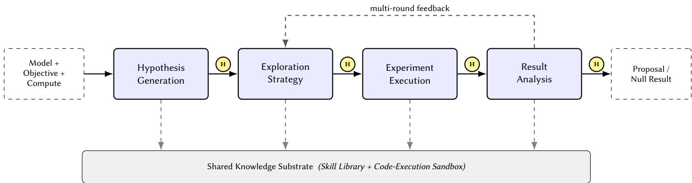
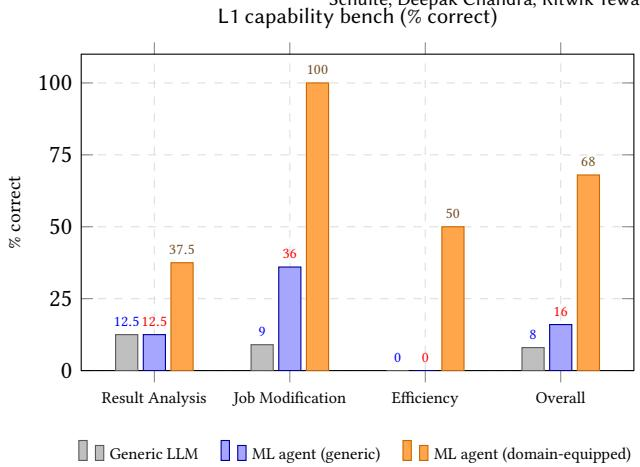
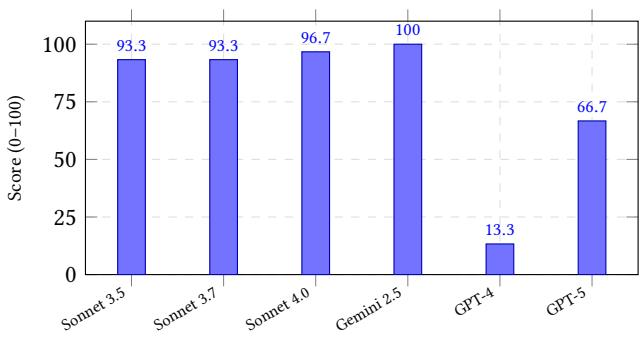
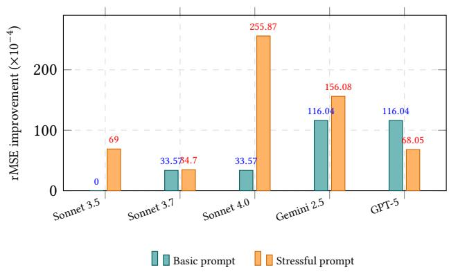

# Agentic ML Exploration (A-MLE) for Ads Ranking

Erwin Gao, Vinodh Kumar Sunkara, Jingyi Guan, Qinjin Jia, Hangjun Xu, Xiang Ji, Sherman Wong, Surya Teja Chavali, Pratik Vaishnavi, Aryan Pandhi, Xiaoyu Deng, Zhaodong Wang, Samarth Inani, Fan Yang, Jakob Moberg, Zoe Zu, Nicolas Bievre, Sami Khenissi, Amit Jaspal, Ehsan Fakharizadi, Srinidhi Viswanathan, Dorothy Sun, Abishek Vanam, Sneha Iyer, Sheela Yadawad, Wenjie Chen, Gaby Nahum, Junhua Gu, Peter Chu, Yucheng Liu, Xin Zhao, Vitor Cid, Chaorong Chen, Vijay Pappu, Ashwin Kumar, Wenlin Chen, Ben Schulte, Deepak Chandra, Ritwik Tewari

Meta Platforms, Inc.

Menlo Park and New York, USA

clingsz,vinodhsunkara,jingyiguan,qjia,hangjunxu,xiangji,shermanwong,teja5832,pratikv,aryanpandhi(@meta.com) xiaoyud,zhaodongwang,samarthinani,fyang7,jamoberg,zoezu,nbievre,samikhenissi,ajaspal(@meta.com) ehsanf,srinidhiv,dorothysun,abishekvanam,snehaiyer,sheelayadawad,wenjiec,gnahum12345,jug,pchu(@meta.com) yuchengliu,zhaox,cid,chaorong,psnvijay,ashwink3029,wenlinchen,bschulte,deepakchandra,ritwikt(@meta.com)

## Abstract

Modern industrial ads ranking stacks are increasingly bottlenecked not by model capacity or training compute, but by the throughput of human ML iteration – the cycles of research, implementation, training, debugging, evaluation, and launch required to surface a single statistically significant improvement. A typical ranking stack contains numerous diferentiated models with heterogeneous data, architectures, and infrastructure constraints, and each cycle takes days to weeks of senior engineer attention per model. As a result, techniques that have proven efective on one model difuse into others slowly and unevenly, leaving substantial recoverable signal unexplored.

We present Agentic ML Exploration (A-MLE), an autonomous LLM-agent system that systematically explores ML techniques across a portfolio of ads ranking models. A-MLE decomposes ML iteration into five stages involving hypothesis generation, exploration strategy, experiment execution, result analysis and shared knowledge substrate which are orchestrated by a single agent that invokes domain-specific skills and agentic workflows against a sandboxed execution layer, with human-in-the-loop checkpoints at each stage boundary.

We deploy A-MLE across a representative set of large-scale ads ranking models and evaluate it along a tiered capability framework (tool availability, autonomous workflow execution, and open-ended exploration). We further report a controlled cross-LLM study using a fixed agent loop, which surfaces qualitative diferences in execution reliability and exploration aggressiveness across the Claude Sonnet, Gemini, and GPT families.

We discuss failure modes and the design choices that govern reliability. Our findings suggest that agentic exploration is a practical force multiplier for ML engineers in industrial recommenders, especially for the long tail of models that rarely receive expert attention.

## Keywords

LLM Agents, Autonomous ML Exploration, Ads Ranking, AutoML, Recommendation Systems, ML Engineering

## 1 Introduction

Industrial ads ranking systems have grown into portfolios of dozens of diferentiated models, each tailored to a specific objective (e.g., click, conversion, view), surface, and ad segment. Each model carries its own training data, feature set, architecture, and infrastructure constraints, which makes the efort of porting a proven idea from one model to another surprisingly large.

The rate of progress on such a portfolio is therefore governed less by the ceiling of any single architectural innovation and more by the throughput of human ML iteration. A single end-to-end exploration from hypothesis generation and exploration code changes to successful model training and proposal takes a senior ML engineer on the order of days to weeks per model. With a finite engineering pool, only a small subset of model × technique combinations are ever attempted, and the long tail of models receives little exploration even when proven techniques exist nearby.

Recent advances in large language model (LLM) agents [14, 21, 23, 24] suggest a diferent operating point: rather than improving any one model architecture, we can improve the iteration loop itself. We design and study A-MLE, a system in which an LLM agent that is equipped with a domain-specific skill library, a code execution environment, and structured access to training and evaluation pipelines - autonomously explores ML techniques across a portfolio of ranking models. The agent handles hypothesis generation, exploration planning, experiment execution, result analysis, etc. stages in the ML Exploration cycle with human engineers serving as reviewers at well-defined checkpoints rather than as moment-to-moment operators.

## CCS Concepts

• Computing methodologies → Machine learning approaches; Natural language generation; • Information systems → Recommender systems.

Contributions.

• We characterize the manual-iteration bottleneck in industrial ads ranking and frame it as the relevant unit of systemlevel optimization (Section 3).

Erwin Gao, Vinodh Kumar Sunkara, Jingyi Guan, Qinjin Jia, Hangjun Xu, Xiang Ji, Sherman Wong, Surya Teja Chavali, Pratik Vaishnavi, Aryan Pandhi, Xiaoyu Deng, Zhaodong Wang, Samarth Inani, Fan Yang, Jakob Moberg, Zoe Zu, Nicolas Bievre, Sami Khenissi, Amit Jaspal, Ehsan Fakharizadi, Srinidhi Viswanathan, Dorothy Sun, Abishek Vanam, Sneha Iyer, Sheela Yadawad, Wenjie Chen, Gaby Nahum, Junhua Gu, Peter Chu, Yucheng Liu, Xin Zhao, Vitor Cid, Chaorong Chen, Vijay Pappu, Ashwin Kumar, Wenlin Chen, Ben

• We describe the A-MLE architecture as a single agent orchestrating five stages over a shared skill library, sandbox, and the design choices that govern its reliability (Section 4).

• We deploy A-MLE across a representative model portfolio and report results along a tiered capability framework, including a concrete model-improvement headline and a controlled cross-LLM comparison (Sections 5 and 6).

• We document the dominant failure modes, orchestration harness that, in our experience, dominate base-model capability (Section 6).

The remainder of the paper is organized as follows. Section 2 reviews related work in AutoML and LLM agents. Section 3 formalizes the manual-iteration bottleneck. Section 4 presents the A-MLE system. Sections 5 and 6 cover experimental setup and results. Section 7 concludes.

## 2 Related Work

AutoML and Neural Architecture Search. A long line of work has automated parts of the ML pipeline including hyperparameter optimization [1, 19], neural architecture search [11, 15, 30], and end to-end AutoML systems [5, 10]. These systems target a well-defined search space and a single optimization objective. A-MLE difers in that the search space is open-ended (any code-level change to a complex model architecture) and the objective is composite (ofline metric gain, infrastructure feasibility, statistical significance, and launch candidate quality).

LLM Agents and Tool Use. Recent work has shown that LLMs equipped with tools and feedback can solve increasingly complex multi-step tasks [17, 18, 22, 24]. Code-generation agents [3, 9, 16] have demonstrated competence on software engineering bench marks. A-MLE extends this line into the ML engineering domain, where tasks are dominated not by code synthesis but by the surrounding loop of hypothesis generation, adaptive training under failures, evaluation, and identifying high-ROI candidates under infrastructure and compute constraints.

ML Engineering Automation. Concurrent and prior work has explored agents for data science [6–8] and for end-to-end ML research [2, 12]. These eforts focus primarily on academic Kagglestyle benchmarks. A-MLE targets a complementary regime: numerous industry scale models, where each iteration carries significant compute cost, training datasets are large, and the deliverable is incremental improvements on top of a mature baseline with statistical rigor, beyond a leaderboard score as the gating criterion.

Recommendation and Ads Ranking. Modern ads ranking systems use cascaded multi-stage architectures with deep models at each stage [4, 13, 26–28]. Recent advances include self-supervised learning for sparse features [25], token-mixing architectures [20, 29], many other embedding based features. A-MLE treats this body of techniques as a search space: the agent’s job is to identify which technique to attempt next on which model, given the current state of evidence.

## 3 The Manual ML Iteration Bottleneck

A canonical manual iteration on a single ranking model consists of multiple phases including:

(1) Ideation and hypothesis generation. An engineer surveys recent literature, internal proposals, and the model’s recent training history to select a candidate technique to try.

(2) Prioritize exploration candidates. With a given training compute budget to trigger the model runs, an efective prioritization is required to identify which of the initial set of hypotheses are worth pursuing and number of variants to attempt per hypothesis.

(3) Implementation. The engineer writes or adapts the code change within the model architecture and against its training entry point, taking care not to break unrelated downstream consumers.

(4) Training and failure recovery. The engineer launches a training run on a shared compute pool, monitors stability, and intervenes when the run fails.

(5) Evaluation triage. The engineer compares ofline metrics against the rolling baseline, decomposes gains by diferent required ad and user segments, and decides whether the candidate is worth promoting.

(6) Proposal preparation. The engineer authors a proposal with experiment design, results, statistical analysis, and a launch recommendation.

Each phase has diferent challenges. Ideation and hypothesis generation is bottlenecked by the engineer’s familiarity with both the model and the broader technique landscape. Prioritization of candidates for model training is dependent on in-depth understanding of the trade ofs with diferent directions of exploration. Implementation is bottlenecked by the complexity of the codebase and of the technique itself. Training and observation are bottlenecked by infrastructure stochasticity, the shared-pool preemption, data pipeline incidents, and intermittent evaluation failures. Evaluation triage is bottlenecked by metric variance and the engineer’s ability to disentangle real signal from baseline drift.

The aggregate efect is that a single end-to-end iteration on a single model takes a multi-week span. Multiplied across a portfolio of models, the total number of (model, technique) pairs that can be explored within any given period is inherently limited. This is the gap that A-MLE targets.

## 4 System Design

A-MLE is organized around five stages primarily – hypothesis generation, exploration strategy, experiment execution, result analysis, shared substrate – driven by a single tool-using LLM agent that operates against a shared skill library and a sandboxed code-execution layer. Each exploration session is parameterized by a (model, objective, compute) triple and produces, at termination, either a documented proposal or a documented null result. Figure 1 shows the overall flow; we describe each stage below.

## 4.1 Hypothesis Generation

The agent reads the model’s recent training configuration, baseline metrics, and the rolling history of attempted techniques, then proposes a small set ofcandidate techniques, each with an explicit rationale linking the technique to the model’s current state. Hypotheses can be sourced from internal generators e.g. model-internal-state analyzers, training-eficiency analyzers, recent-literature retrievers, and are scored by an LLM critic for novelty and feasibility. Grounding hypotheses in the live state of the model rather than a stale snapshot is the focus here: a hypothesis that fits the previous baseline rarely transfers cleanly after a baseline refresh.

  
Figure 1: A-MLE orchestration. Within each session, a single agent walks five stages with human-in-the-loop checkpoints (H) and a multi-round feedback loop into strategy planning. Across sessions, the agent reads from and writes back to a shared substrate (per-technique and per-model artifacts) so that outcomes accumulated on one model become consumable on another.

## 4.2 Exploration Strategy

Given diferent constraints (number of training runs, total compute, or wall time) and a candidate set, the agent prioritizes and plans the experiment model iterations sequence. Plans typically interleave exploration – validating individual hypotheses in isolation – with exploitation – combining the most promising candidates and pushing them harder. The agent negotiates the plan with the user at this checkpoint, since trade-ofs between aggressiveness and compute are best surfaced explicitly to review.

## 4.3 Experiment Execution

The agent edits the training configuration or the model architecture in a sandboxed copy ofthe codebase, runs type checks and unit tests, builds an image with the updated code, runs a short smoke pass for verification, then submits the full training job. Once submitted, the agent monitors progress, distinguishes infrastructure errors from genuine training divergence, and either retries, fixes at the code or config level, or reports the run as needed. Across a multiexperiment plan, the agent adapts through failures e.g. if one branch is found to be infeasible, it reroutes the remaining compute rather than abandoning the session.

## 4.4 Result Analysis

After each completed run, the agent computes statistical significance against the rolling baseline (not a frozen snapshot, which would be vulnerable to baseline drift), decomposes metrics by segment to surface localized regressions, and triggers an automatic re-run when within-run variance exceeds a threshold. At the end of an exploration round the agent produces a structured leaderboard of candidates and either feeds it back into the strategy stage for another round or assembles a final proposal.

## 4.5 Shared Substrate

Each session reads from and writes to a shared-learning substrate: a structured, machine-actionable representation of cross-model ML knowledge. Knowledge accumulated on one model becomes automatically consumable on another model. The substrate is long-lived markdown trees versioned in source control with per-technique and per-model shared knowledge from the past and applied on subsequent iterations. At session start, the agent matches the target model’s context against the substrate’s structured eligibility annotations to surface ML techniques with prior evidence on architecturally similar models. At session end, the new outcomes are then committed back to the relevant Track Record, reviewable like any other source-control change.

## 4.6 Human-in-the-Loop Checkpoints

In addition to the five stages, despite the agent’s autonomy within each stage, every stage boundary is a checkpoint at which a human engineer can approve continuation, request modifications, or terminate the session. The agent’s strength is in covering a wide search space eficiently; the engineer’s strength is in reviewing the findings to cover all edge cases and gaps, informed by practical expertise in trade-ofs. The checkpoint structure lets us combine the two without giving up either, and limits the blast radius of any single agent decision e.g. a hallucinated code change is caught before training launch, a miscalibrated evaluation is caught before proposal authoring.

## 5 Experimental Setup

Models. We deploy A-MLE against a representative set of largescale ads ranking models drawn from a real industrial portfolio. The set is chosen to span the principal axes of variation: optimization objective (click vs. conversion vs. view), surface, and architecture family (deep cross network, deep interest network, multi-tower). For external review purposes, models are referred to as anonymized identifiers $M _ { 1 } , M _ { 2 } , \dots$ . that abstract away surface and product-line specifics. Several detailed studies in the remainder of the paper are conducted on a single experimental ranking model that we denote

Erwin Gao, Vinodh Kumar Sunkara, Jingyi Guan, Qinjin Jia, Hangjun Xu, Xiang Ji, Sherman Wong, Surya Teja Chavali, Pratik Vaishnavi, Aryan Pandhi, Xiaoyu Deng, Zhaodong Wang, Samarth Inani, Fan Yang, Jakob Moberg, Zoe Zu, Nicolas Bievre, Sami Khenissi, Amit Jaspal, Ehsan Fakharizadi, Srinidhi Viswanathan, Dorothy Sun, Abishek Vanam, Sneha Iyer, Sheela Yadawad, Wenjie Chen, Gaby Nahum, Junhua Gu, Peter Chu, Yucheng Liu, Xin Zhao, Vitor Cid, Chaorong Chen, Vijay Pappu, Ashwin Kumar, Wenlin Chen, Ben

�∗ – a regression-objective model with a lightweight resource footprint, suitable as a benchmark substrate.

Tiered capability framework. To make the setup tractable for evaluation, we organize tasks in a three-tier capability framework, drawn from our internal benchmark design:

• L1 – Tool availability. The agent is asked focused singlestep questions over a model’s training configuration, evaluation strategy, metric stores, serving and training infrastructure etc. This isolates the question of whether the agent has the right APIs and domain knowledge.

• L2 – Autonomous workflow execution. The agent is given a multi-step task that requires submitting workflows, monitoring them, recovering from infrastructure failures, and summarizing results. This isolates the question ofwhether the agent can reliably operate the iteration loop.

• L3 – Open-ended exploration. The agent is given a model, an objective, and compute, and asked to surface the best improvement it can find. This is the regime we ultimately care about.

Baselines. We use rolling baseline to refer to the current reference training configuration of a given model — the metric values against which candidate changes are compared. Additionally, we also use methodological baselines (manual and semi-automated) which are operating points we compare A-MLE against. The manual baseline is the prior operating point: senior ML engineers executing iterations themselves. The semi-automated baseline retains the engineer in the driver’s seat for hypothesis generation but uses scripted helpers for triggering runs, evaluation, etc. steps. Both baselines share the same ofline evaluation suite as A-MLE.

## Metrics. We report five classes of metrics:

• Throughput. Completed end-to-end iterations per engineerweek, where a completed iteration terminates in either a documented proposal or a documented null result.

• Training success rate. Fraction of training runs the agent triggers that complete successfully (after automated debugging and retries) without requiring human intervention.

• Proposal acceptance rate. Fraction of agent-authored proposals with statistically significant ofline impact that pass human review gating without rework.

• Technique coverage. Distinct technique families surfaced across the model portfolio over a fixed evaluation window.

• Model Ofline evaluation. Model iterations evaluated using ofline metric suite like NE (Normalized Entropy) NE for prediction quality and informativeness, rMSE for calibration between predicted and observed rates etc.

Reporting. All performance results are reported as relative improvements over the relevant baseline. Statistical significance is measured and reported against the rolling-baseline framework described in Section 4.

## 6 Results, Analysis, and Discussion

## 6.1 End-to-End Throughput

Across the evaluation window, A-MLE delivered multiple times the productivity in completed iterations per engineer-week compared to the baseline described in Section 5. The semi-automated baseline showed a smaller order improvement in throughput with less stronger ofline impact and longer iteration cycle to land convergence, indicating that the principal source of leverage is not the automation of any individual phase but the agent’s ability to chain phases without engineer-mediated handofs.

  
Figure 2: L1 tool-availability bench on �∗. The domainequipped configuration is necessary to clear the basic operations bar; generic LLM capability is not suficient.

## 6.2 Training Success Rate

The fraction of A-MLE-triggered runs that completed successfully, after the agent’s automated debugging and bounded re-run loop – meaningfully surpassed the baseline described in Section 5. A small minority of runs still required human attention when the agent failed to recover within its retry limits set, which we cap to ensure eficient use of training resources.

## 6.3 Proposal Acceptance Rate

A-MLE-authored proposals passed review criteria at a much higher rate than that of the baseline described in Section 5. Reviewers cited better-grounded statistical analysis, cleaner documentation of negative results, and explicit segment-level decomposition as the diferentiating factors.

## 6.4 Tier-1 Capability Bench

Figure 2 reports the L1 capability bench on �∗, comparing three configurations: a generic LLM with no ML tooling, a generic ML agent with cross-portfolio tools but no domain knowledge, and the domain-equipped A-MLE configuration. The domain-equipped agent reaches 68% overall accuracy versus 16% for the generic ML agent and 8% for the generic LLM. The largest gap is on job-config modification, where the domain-equipped agent solves all questions; the generic configurations score below 40%. This confirms that domain skills, not raw LLM capability, dominate at the tool-availability tier.

Agentic ML Exploration (A-MLE) for Ads Ranking
<table><tr><td>A-MLE configuration</td><td>Rel. improvement</td><td>Train QPS impact</td></tr><tr><td>Single-hypothesis arch scale-up</td><td>+0.44%</td><td>neutral</td></tr><tr><td>Multi-round arch exploration</td><td>+0.58%</td><td>neutral</td></tr><tr><td>Multi-source (arch + efficiency)</td><td>+2.56%</td><td>+0.42%</td></tr></table>

Table 1: Headline exploration outcomes on the experimen tal ranking model �∗. Improvements are relative ofline regression-error reductions; QPS impact reports change in training throughput.

## 6.5 Tier-2 Workflow Execution

At the workflow-execution tier, we evaluate the agent on multistep tasks that require submitting training workflows, monitoring asynchronous completions, recovering from infrastructure failures, and summarizing results. Four tier-2 representative tasks anchor this bench on $M ^ { * } \colon ( \mathrm { i } )$ a baseline refresh, in which the agent refreshes a baseline workflow onto the latest available training window and reports train/eval metrics; (ii) a variance test, in which the agent submits multiple duplicate runs of the same baseline and computes train/eval/QPS variance across them; (iii) a config-change experiment, in which the agent clones a baseline, applies a structured architectural edit (e.g., doubling a layer width), runs both versions to completion, and produces a side-by-side metric comparison; and (iv) a batch ofline evaluation, in which the agent schedules ofline-evaluation runs across a set of previously trained jobs and aggregates the resulting metric rollups for side-by-side comparison.

The domain-equipped A-MLE configuration completes all four tier-2 tasks end-to-end with high reliability. Three capabilities dif ferentiate it from a single-turn LLM loop: (a) an explicit waiting operator that lets the agent suspend its own loop pending an ex ternal event (workflow completion, eval availability) and resume cleanly when the condition is met, which is necessary to support multi-hour asynchronous training jobs; (b) the ability to distinguish infrastructure failures from genuine training divergence and retry without operator help; and (c) reliable summarization that survives the noise of multi-run, multi-stage output. We defer cross-LLM variation on these tasks to Section 6.7.

## 6.6 Tier-3 Exploration Outcomes

At the open-ended exploration tier, A-MLE delivered measurable ofline improvements on a majority of evaluated models. Table 1 summarizes representative headline results on �∗ across two generations of the system: a single-hypothesis arch scale-up exploration and a multi-source exploration that combines hypothesis generators (model-internal-state analyzers and training-eficiency analyzers). The multi-source variant produces a +2.557% relative improvement on the regression objective with neutral training throughput (+0.42% QPS), substantially above the single-hypothesis baseline.

## 6.7 Cross-LLM Comparison

A natural question is how much of A-MLE’s behavior comes from the orchestration harness versus the underlying LLM. We hold the agent loop, skills, and prompts fixed and swap the LLM. Figure 3 reports L2 task completeness (a) and L3 exploration outcomes (b) across the Claude Sonnet, Gemini, and GPT families.

(a) L2: workflow execution (avg. task completeness)  

(b) L3: arch exploration outcome  
  
Figure 3: L2 task completeness (a) and L3 exploration outcomes (b)

Three observations stand out. First, at the L2 tier, models split cleanly into two clusters based on the capability with high 90s average task completeness scores. Sonnet ≥ 3.5, Gemini 2.5, GPT-5 stood out to be the most capable models for L2 tier. Rest of the other models were unable to operate the workflow loop at all, often hallucinating workflow IDs or failing to wait for asynchronous jobs. Second, at the L3 tier, the relationship between model and outcome is more nuanced: Gemini 2.5 and GPT-5 explore most aggressively under the basic prompt, while the Sonnet family tends to play conservatively. Third, the efect of prompt stress flips by model family: under stressful, competitive prompts, Sonnet 4.0 surfaces the largest improvement of any configuration $( \sim 2 . 6 { \times } 1 0 ^ { - 2 } ~ \mathrm { r M S E } )$ while GPT-5 becomes more conservative and gives back most of its basic-prompt gains.

## 6.8 Agent-Surfaced Techniques

Across the model portfolio during the evaluation window, A-MLE surfaced and validated techniques across five families. Table 2 reports counts of distinct models on which each family was attempted and on which the agent’s candidate passed human review gating without rework. The agent’s strongest results came from technique transfer – recognizing that a technique already validated on one

Erwin Gao, Vinodh Kumar Sunkara, Jingyi Guan, Qinjin Jia, Hangjun Xu, Xiang Ji, Sherman Wong, Surya Teja Chavali, Pratik Vaishnavi, Aryan Pandhi, Xiaoyu Deng, Zhaodong Wang, Samarth Inani, Fan Yang, Jakob Moberg, Zoe Zu, Nicolas Bievre, Sami Khenissi, Amit Jaspal, Ehsan Fakharizadi, Srinidhi Viswanathan, Dorothy Sun, Abishek Vanam, Sneha Iyer, Sheela Yadawad, Wenjie Chen, Gaby Nahum, Junhua Gu, Peter Chu, Yucheng Liu, Xin Zhao, Vitor Cid, Chaorong Chen, Vijay Pappu, Ashwin Kumar, Wenlin Chen, Ben Ritwil

model in the portfolio (e.g. a model arch change or embeddingbased feature variant) was likely to transfer to a structurally similar model that had not yet attempted it. The agent struggled on models that had recently undergone non-trivial baseline changes, where its hypotheses were calibrated to a prior version of the model.
<table><tr><td>Technique family</td><td>Attempted</td><td>Passed gating</td></tr><tr><td>Self-supervised pretraining (SSL)</td><td>many</td><td>majority</td></tr><tr><td>Generic optimizer / loss tweaks</td><td>many</td><td>mixed</td></tr><tr><td>Embedding-based features</td><td>several</td><td>majority</td></tr><tr><td>Token-mixing architectures</td><td>several</td><td>mixed</td></tr><tr><td>Architecture scaling</td><td>few</td><td>mixed</td></tr></table>

Table 2: Technique families surfaced by A-MLE. Counts are bucketed: many ≥ 8 models, several 3–7, few ≤ 2. “Passed gating” counts only candidates that cleared the human review statistical-significance bar without rework.

## 6.9 Failure Modes

We observed five recurring failure modes.

• Hallucinated APIs: the agent occasionally invokes plausible but non-existent functions in the training pipeline; pre-flight checks catch these before training launch but consume compute.

• Baseline drift: the agent’s ofline win is sometimes erased by a concurrent baseline refresh, mitigated but not elimi nated by the orchestration harness on rolling-baseline.

• Infrastructure fragility: transient incidents appear to the agent as training divergence, leading to premature abandonment of viable candidates; the retry loop was extended to discriminate these cases.

• Over-confident triage: the agent sometimes promoted a candidate based on a single seed when within-run variance warranted re-running; the auto re-run rule materially reduced this.

• LLM-specific failures: weaker base models hallucinate workflow identifiers and pretend to have completed tasks; some models change behavior under stressful prompts in non-monotone ways, as shown in Section 6.7.

## 6.10 Discussion

The most important design lesson from A-MLE is that the agent’s reliability is governed less by the underlying model’s reasoning capability and more by the quality of the surrounding orchestration harness: the skill library’s coverage, the evaluation pipeline’s statistical rigor, and the execution layer’s resilience to infrastructure noise. We expect this to remain true as base-model capability im proves: better LLMs will close the hypothesis-quality gap faster than they close the orchestration harness gap.

## 7 Conclusion and Future Work

A-MLE reframes the bottleneck in industrial ML as the throughput of human iteration rather than the ceiling of any single model, and operationalizes that reframing as a five-stage agent over a shared skill library and execution sandbox. Across our evaluation, A-MLE produced meaningful relative improvements on a majority of models, with the largest gains on the long tail that historically received the least senior attention.

Three directions stand out for future work. First, we plan to deepen resilient execution – automating more of the discrimination between infrastructure noise and genuine training divergence, and further boosting the productivity and impact from the model iterations. Second, we plan to strengthen hypothesis generation via richer domain-specific skills and deeper understanding of the ML model architectures. Third, we plan to extend agentic exploration from a breadth regime – rapidly scaling proven techniques across many models – into a depth regime, in which the agent participates in the design of new architectures and pipelines, with the engineer as architect-in-chief and the agent as implementation and ablation partner.

## References

[1] James Bergstra and Yoshua Bengio. 2012. Random Search for Hyper-Parameter Optimization. Journal ofMachine Learning Research 13 (2012), 281–305.

[2] Jun Shern Chan, Neil Chowdhury, Oliver Jafe, James Aung, Dane Sherburn, Evan Mays, Giulio Starace, Kevin Liu, Leon Maksin, Tejal Patwardhan, Lilian Weng, and Aleksander Mądry. 2025. MLE-bench: Evaluating Machine Learning Agents on Machine Learning Engineering. International Conference on Learning Representations (ICLR) (2025).

[3] Mark Chen, Jerry Tworek, Heewoo Jun, Qiming Yuan, Henrique Ponde de Oliveira Pinto, Jared Kaplan, Harri Edwards, Yuri Burda, Nicholas Joseph, Greg Brockman, et al. 2021. Evaluating Large Language Models Trained on Code. arXiv preprint arXiv:2107.03374 (2021).

[4] Paul Covington, Jay Adams, and Emre Sargin. 2016. Deep Neural Networks for YouTube Recommendations. In Proceedings of the 10th ACM Conference on Recommender Systems (RecSys).

[5] Matthias Feurer, Aaron Klein, Katharina Eggensperger, Jost Tobias Springenberg, Manuel Blum, and Frank Hutter. 2015. Eficient and Robust Automated Machine Learning. In Advances in Neural Information Processing Systems (NeurIPS).

[6] Liqiang Guo, Junzhi Lin, Jingyan Yang, et al. 2024. DSBench: How Far Are Data Science Agents to Becoming Data Science Experts? arXiv preprint arXiv:2409.07703 (2024).

[7] Sirui Hong, Yizhang Lin, Bang Liu, Bangbang Liu, Binhao Wu, Ceyao Zhang, Chenxing Wei, Danyang Li, Jiaqi Chen, Jiayi Zhang, et al. 2024. Data Interpreter: An LLM Agent For Data Science. arXiv preprint arXiv:2402.18679 (2024).

[8] Qian Huang, Jian Vora, Percy Liang, and Jure Leskovec. 2024. MLAgentBench: Evaluating Language Agents on Machine Learning Experimentation. In International Conference on Machine Learning (ICML).

[9] Carlos E. Jimenez, John Yang, Alexander Wettig, Shunyu Yao, Kexin Pei, Ofir Press, and Karthik Narasimhan. 2024. SWE-bench: Can Language Models Resolve Real-World GitHub Issues?. In International Conference on Learning Representations (ICLR).

[10] Haifeng Jin, Qingquan Song, and Xia Hu. 2019. Auto-Keras: An Eficient Neural Architecture Search System. In Proceedings ofthe 25th ACM SIGKDD International Conference on Knowledge Discovery and Data Mining (KDD).

[11] Hanxiao Liu, Karen Simonyan, and Yiming Yang. 2019. DARTS: Diferentiable Architecture Search. In International Conference on Learning Representations (ICLR).

[12] Chris Lu, Cong Lu, Robert Tjarko Lange, Jakob Foerster, Jef Clune, and David Ha. 2024. The AI Scientist: Towards Fully Automated Open-Ended Scientific Discovery. arXiv preprint arXiv:2408.06292 (2024).

[13] Maxim Naumov, Dheevatsa Mudigere, Hao-Jun Michael Shi, Jianyu Huang, Narayanan Sundaraman, Jongsoo Park, Xiaodong Wang, Udit Gupta, Carole-Jean Wu, Alisson G. Azzolini, et al. 2019. Deep Learning Recommendation Model for Personalization and Recommendation Systems. arXiv preprint arXiv:1906.00091 (2019).

[14] Joon Sung Park, Joseph C. O’Brien, Carrie J. Cai, Meredith Ringel Morris, Percy Liang, and Michael S. Bernstein. 2023. Generative Agents: Interactive Simulacra of Human Behavior. In Proceedings of the 36th Annual ACM Symposium on User Interface Software and Technology (UIST).

[15] Esteban Real, Alok Aggarwal, Yanping Huang, and Quoc V. Le. 2019. Regularized Evolution for Image Classifier Architecture Search. In Proceedings of the AAAI Conference on Artificial Intelligence.

[16] Baptiste Rozière, Jonas Gehring, Fabian Gloeckle, Sten Sootla, Itai Gat, Xiaoqing Ellen Tan, Yossi Adi, Jingyu Liu, Tal Remez, Jérémy Rapin, et al. 2023. Code

Llama: Open Foundation Models for Code. arXiv preprint arXiv:2308.12950 (2023).

[17] Timo Schick, Jane Dwivedi-Yu, Roberto Dessì, Roberta Raileanu, Maria Lomeli, Luke Zettlemoyer, Nicola Cancedda, and Thomas Scialom. 2023. Toolformer: Language Models Can Teach Themselves to Use Tools. In Advances in Neural Information Processing Systems (NeurIPS).

[18] Noah Shinn, Federico Cassano, Edward Berman, Ashwin Gopinath, Karthik Narasimhan, and Shunyu Yao. 2023. Reflexion: Language Agents with Verbal Reinforcement Learning. In Advances in Neural Information Processing Systems (NeurIPS).

[19] Jasper Snoek, Hugo Larochelle, and Ryan P. Adams. 2012. Practical Bayesian Optimization of Machine Learning Algorithms. In Advances in Neural Information Processing Systems (NeurIPS).

[20] Ilya O. Tolstikhin, Neil Houlsby, Alexander Kolesnikov, Lucas Beyer, Xiaohua Zhai, Thomas Unterthiner, Jessica Yung, Andreas Steiner, Daniel Keysers, Jakob Uszkoreit, Mario Lucic, and Alexey Dosovitskiy. 2021. MLP-Mixer: An all-MLP Architecture for Vision. In Advances in Neural Information Processing Systems (NeurIPS).

[21] Guanzhi Wang, Yuqi Xie, YunfanJiang, Ajay Mandlekar, Chaowei Xiao, Yuke Zhu, Linxi Fan, and Anima Anandkumar. 2024. Voyager: An Open-Ended Embodied Agent with Large Language Models. Transactions on Machine Learning Research (TMLR) (2024).

[22] Lei Wang, Chen Ma, Xueyang Feng, Zeyu Zhang, Hao Yang, Jingsen Zhang, Zhiyuan Chen, Jiakai Tang, Xu Chen, Yankai Lin, Wayne Xin Zhao, Zhewei Wei, and Ji-Rong Wen. 2024. A Survey on Large Language Model Based Autonomous Agents. Frontiers ofComputer Science 18, 6 (2024).

[23] Zhiheng Xi, Wenxiang Chen, Xin Guo, Wei He, Yiwen Ding, Boyang Hong, Ming Zhang, Junzhe Wang, Senjie Jin, Enyu Zhou, et al. 2023. The Rise and Potential of Large Language Model Based Agents: A Survey. arXiv preprint arXiv:2309.07864 (2023).

[24] Shunyu Yao, Jefrey Zhao, Dian Yu, Nan Du, Izhak Shafran, Karthik Narasimhan, and Yuan Cao. 2023. ReAct: Synergizing Reasoning and Acting in Language Models. In International Conference on Learning Representations (ICLR).

[25] Tiansheng Yao, Xinyang Yi, Derek Zhiyuan Cheng, Felix Yu, Ting Chen, Aditya Menon, Lichan Hong, Ed H. Chi, Steve Tjoa, Jieqi Kang, and Evan Ettinger. 2021. Self-supervised Learning for Large-scale Item Recommendations. In Proceedings of the 30th ACM International Conference on Information and Knowledge Management (CIKM).

[26] Jiaqi Zhai, Lucy Liao, Xing Liu, Yueming Wang, Rui Li, Xuan Cao, Leon Gao, Zhaojie Gong, Fangda Gu, Michael He, Yinghai Lu, and Yu Shi. 2024. Actions Speak Louder than Words: Trillion-Parameter Sequential Transducers for Generative Recommendations. In International Conference on Machine Learning (ICML).

[27] Guorui Zhou, Na Mou, Ying Fan, Qi Pi, Weijie Bian, Chang Zhou, Xiaoqiang Zhu, and Kun Gai. 2019. Deep Interest Evolution Network for Click-Through Rate Prediction. In Proceedings ofthe AAAI Conference on Artificial Intelligence.

[28] Guorui Zhou, Xiaoqiang Zhu, Chenru Song, Ying Fan, Han Zhu, Xiao Ma, Yanghui Yan, Junqi Jin, Han Li, and Kun Gai. 2018. Deep Interest Network for Click Through Rate Prediction. In Proceedings ofthe 24th ACM SIGKDD International Conference on Knowledge Discovery and Data Mining (KDD).

[29] Jie Zhu, Zhifang Fan, Xiaoxie Zhu, Yuchen Jiang, Hangyu Wang, Xintian Han, Haoran Ding, Xinmin Wang, Wenlin Zhao, Zhen Gong, Huizhi Yang, Zheng Chai, Zhe Chen, Yuchao Zheng, Qiwei Chen, Feng Zhang, Xun Zhou, Peng Xu, Xiao Yang, Di Wu, and Zuotao Liu. 2025. RankMixer: Scaling Up Ranking Models in Industrial Recommenders. arXiv:2507.15551 [cs.IR] https://arxiv.org/abs/2507. 15551

[30] Barret Zoph and Quoc V. Le. 2017. Neural Architecture Search with Reinforcement Learning. In International Conference on Learning Representations (ICLR).

## A Skill Library Excerpt

For reference, we list the high-level categories of skills exposed to the agent. Each category contains several typed procedures with structured input/output schemas; we omit the exact signatures.

• Codebase navigation. Locate the model architecture implementation, training entry point, identify the active feature group, list recently modified files in the relevant module.

• Training configuration. Read the current training config, propose a structured edit, validate the edit against the schema.

• Launch and monitoring. Submit a training run with compute estimation, poll status, fetch the most recent logs, distinguish infra errors from training divergence.

• Evaluation. Run the ofline evaluation suite, compute statistical significance against the rolling baseline, decompose by segment.

• Proposal authoring. Assemble a proposal document with experiment design, results, confidence intervals, and a recommendation.

## B Phase Boundary Conventions

For completeness, we summarize the human-checkpoint conventions at each stage boundary:

• After hypothesis generation. Reviewer approves a hypothesis or substitutes one of their own.

• After exploration strategy. Reviewer confirms the planned experiment set and compute allocation.

• After experiment execution. Reviewer confirms the run results and statistical analysis before proposal authoring.

• After proposal authoring. Reviewer revises the proposal as needed and routes it through the standard review process.