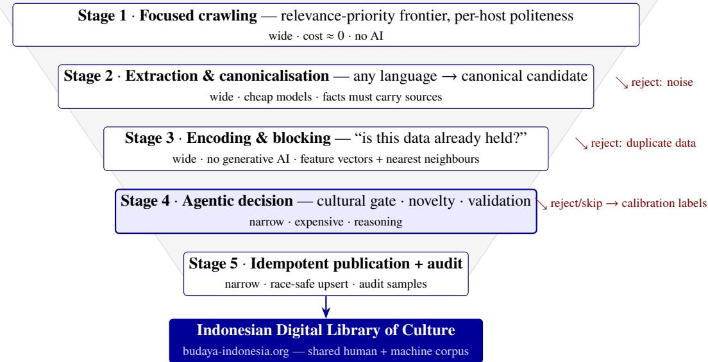
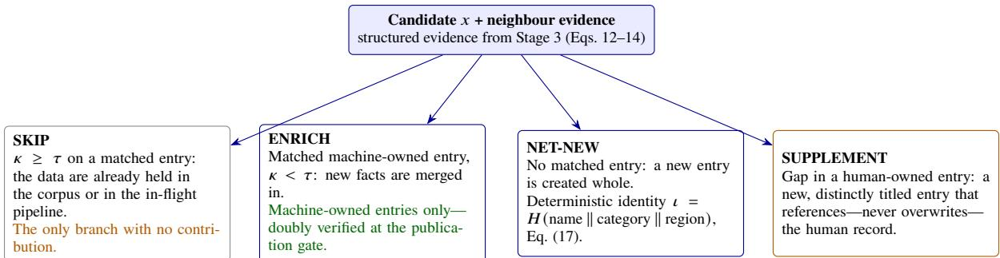
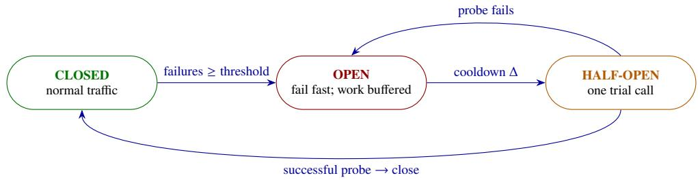

# Artificial Intelligence-Assisted Digital Inventory of Cultural Heritage & Traditional Knowledge

Case for Indonesian Open Digital Library of Culture

Hokky Situngkir

September 9, 2026

## Abstract

The Indonesian Digital Library ofCulture (Perpustakaan Digital Budaya Indonesia, PDBI; budaya-indonesia.org) is a participatory platform that has collected tens of thousands of entries on Nusantara cultural heritage through public contribution since 2007. Manual contribution faces three structural barriers: coverage (knowledge is scattered across languages and sites), integrity (open sources mix authentic documentation with noise), and completeness (subjects are recorded but their data remain shallow). This paper presents a methodological framework for autonomous, AI-based harvesting of cultural knowledge from the open web, designed to expand corpus coverage while intensifying per-entry data depth. The methodology is organised as a five-stage economic funnel—focused crawling, multilingual extraction and canonicalisation, vector encoding with blocking, agentic decision-making, and idempotent publication—under the principle of deterministic orchestration, agentic decisions. Each stage is formalised: funnel economics and optimal filter ordering; crawl-frontier dynamics as a subcritical branching process that explains the necessity of recurrent re-seeding; fact-level novelty via a containment measure; Bayesian multi-source evidence fusion with elevated publication thresholds for sacred categories; exactly-once efects via idempotent upserts and the transactiona outbox; sliding-window inference budgeting with a reservation protocol; statistical quality auditing; and seed selection as submodular coverage maximisation. The framework retains four high-value human roles—curator of direction, escalation approver, quality auditor, and guardian of meaning—while machine autonomy is raised in stages. Ethical, legal, and cultural-sensitivity implications are discussed, including the architectural guarantee tha the machine never overwrites human contributions

Keywords: intangible cultural heritage; digital library; knowledge harvesting; focused crawling; entity resolution;   
agentic artificial intelligence; Perpustakaan Digital Budaya Indonesia.

## 1 Introduction

The documentation of intangible cultural heritage is internationally recognised as a prerequisite of safeguarding [1]. In Indonesia, one of its institutional embodiments is the Indonesian Digital Library of Culture (Perpustakaan Digital Budaya Indonesia, PDBI) at budaya-indonesia.org—a computational platform for participatory preservation of traditional culture initiated in late 2007 by a research community and cultural volunteers, later amplified by the “One Million Cultural Data” movement [2, 3, 4, 5]. To date PDBI holds tens of thousands of entries in fifteen oficial categories, from musical instruments and folklore to rituals, dances, and traditional medicine [4, 5].

The participatory-manual model of collection, meritorious as it is, faces three structural barriers. First, the coverage barrier: documented knowledge of Nusantara culture is scattered across the web—ethnographic journals, colonial archives, regional-government sites, community and diaspora documentation—in many languages, far beyond what human contributors can sweep. Second, the integrity barrier: open sources mix authentic documentation with commercial content, ephemeral news, and unreferenced claims; copying without filtering damages the corpus. Third, the completeness barrier: many entries are shallow—the subject is recorded, but its recipe, motifs, performance structure, or regional distribution are not.

This paper proposes and formalises a methodological framework that addresses all three barriers through autonomous knowledge harvesting: a system that continuously discovers cultural knowledge artefacts on the open web in any language, distils them into source-bound canonical records in Indonesian, tests their novelty at the level of data (not merely subjects), and publishes only what genuinely adds—with architectural guarantees of quality, traceability, and the sovereignty of human contribution. The framework has been implemented in a production prototype operating against the PDBI corpus; here the methodology is presented generically so that other digital cultural-heritage documentation initiatives may replicate it.

The contributions are: (i) a five-stage economicfunnel architecture that renders national-scale harvesting afordable (§4, §5.2); (ii) a complete mathematical formalisation of every stage—from frontier dynamics as a branching process (§5.3) to Bayesian evidence fusion with graded thresholds for sacred categories (§5.7); (iii) exactly-once reliability semantics and inference-budget control that guarantee operational sustainability (§5.8–§5.9); and (iv) a staged autonomy governance protocol with statistical auditing and well-defined human roles (§5.10, §6).

## 2 The Indonesian Digital Library of Culture as Context

PDBI is built on the idea that the cultural diversity of the Indonesian archipelago demands a participatory, web-based documentation system [2, 3]. Kusumaningtiyas and Nurazizah [4] document the role of society and communities— most notably the Sobat Budaya community—in protecting and preserving Indonesian culture through the platform, and its policy trajectory is recorded on UNESCO’s policy monitoring platform [5]. For the framework proposed here, PDBI plays three methodological roles at once: (a) a target schema—its fifteen oficial categories and entry structure define the mapping space; (b) a deduplication baseline—the human-contributed corpus anchors the question “is this data already held?”; and (c) a publication channel—machine-produced entries are published back into PDBI through its programmatic interface, making the machine an additional contributor alongside (never a replacement for) human contributors.

Against taxonomies of digital-heritage platforms [6], the approach can be read as an evolutionary continuation from participatory (web 2.0) platforms toward machine-intelligence-augmented platforms, without abandoning the participatory principle: human labels and reviews become the machine’s training material (§5.10), in line with established practice in cultural-heritage crowdsourcing [7].

## 3 Related Work

Focused crawling. Topic-focused web crawling with relevance-prioritised frontiers was introduced by Chakrabarti et al. [8]; URL ordering by expected page value was studied by Cho et al. [9], and large-scale crawler architecture with per-host politeness by Heydon and Najork [10]. The present framework adopts a relevance-priority frontier with two domain-specific deviations: no freshness re-crawling (cultural data are static), and the use of open encyclopaedias strictly as pointers to primary sources, never as quotable sources.

Knowledge-base construction. The never-ending language learner NELL [11] and Knowledge Vault [12] pioneered web-scale fact extraction with probabilistic evidence fusion; this framework continues that line with multilingual large language models [13, 14] as the extraction engine, adding a source-boundness constraint: facts without references are rejected by the data schema itself.

Entity resolution and deduplication. The classical theory of record linkage is due to Fellegi and Sunter [15]; practical data matching and blocking techniques are surveyed in [16, 17]. The document-containment measure [18] is adapted here to the level of fact sets. Approximate nearest-neighbour search uses hierarchical navigable small-world graphs (HNSW) [19].

Distributed-systems reliability. The circuit-breaker pattern and operational stability are treated by Nygard [20]; idempotence as the foundation of exactly-once efect semantics by Helland [21]; the transactional-outbox pattern and at-least-once delivery in [22, 23]. Pipelined filter ordering follows [24]; queue dimensioning uses Little’s law [25].

Quality and calibration. Error-proportion estimation with Wilson intervals [26]; confidence calibration of modern models [27]; submodular maximisation for coverage selection [28].

## 4 Methodological Framework

The framework’s principal design rule can be stated in one sentence: deterministic orchestration, agentic decisions. The workflow is fixed, auditable code—queues, transactions, retries, and logging are all deterministic—while artificial-intelligence components (agents) are invoked only at decision nodes that genuinely require reasoning:

  
Figure 1: The five-stage methodological funnel. Each stage narrows; expensive reasoning only ever touches candidates that survived the cheap filters above it. Rejections become calibration labels for subsequent learning.

<table><tr><td>Stage</td><td>Function</td><td>Cost profile</td><td>Core technology</td></tr><tr><td>1. Crawling</td><td>Discover pages, harvest links, filter early relevance wide, ≈ zero/item</td><td></td><td>priority frontier, polite ness</td></tr><tr><td>2. Extraction</td><td>Page → canonical Indonesian candidate, source- wide, cheap models bound facts</td><td></td><td>multilingual LLM</td></tr><tr><td>3. Encoding</td><td>Feature vectors, blocking, neighbour search; struc- wide, no LLM tured evidence</td><td></td><td>partitioned ANN</td></tr><tr><td>4. Decision 5. Publication</td><td>Cultural gate, data-level novelty, cross-validation narrow, expensive Structured record composition, licensed media, narrow audit</td><td></td><td>reasoning agents idempotent upsert</td></tr></table>

Table 1: Summary of funnel stages and their cost profiles.

cultural relevance, extraction–canonicalisation, novelty, and cross-validation. This separation makes system behaviour predictable and inspectable, and concentrates inference cost at high-value points only.

The architecture is a five-stage funnel (Figure 1; Table 1; notation in Appendix A). Early stages cost almost nothing per item and filter aggressively; late stages are expensive but receive only survivors. Stages are connected by durable message queues with one consumer per stage; all shared state lives in a relational database with a vector extension, so workers are fully stateless.

## 5 Formal Models

## 5.1 Corpus formalisation and objective

The corpus is modelled as a set of entries $K = \{ e \}$ . Each entry is a tuple

$$
e = ( \iota _ { e } , k _ { e } , r _ { e } , F _ { e } ) , \qquad f = ( a , \nu , \sigma ) \in F _ { e } , \qquad \sigma ( f ) \neq \emptyset ,\tag{1}
$$

where � is the entry identity, $k \in \mathcal { K }$ the category $( | \mathcal { K } | = 1 5$ for PDBI), $r \in \mathcal { R }$ the region, and � a set of facts with attribute �, value �, and source $\sigma .$ The constraint $\sigma \neq \emptyset$ (source-boundness) is enforced by the data schema: an unreferenced fact cannot be represented. The open web is modelled as a directed graph $G = ( V , E )$ of pages and links. The system objective is to maximise validated information gain:

$$
\operatorname* { m a x } _ { \pi } \mathbb { E } \left[ \sum _ { e \in K ^ { \prime } } w ( e ) \Delta I ( e ) \right] \quad \mathrm { s . t . } \quad C ( \pi ) \leq B , \qquad \operatorname* { P r e c } ( K ^ { \prime } ) \geq p _ { \operatorname* { m i n } } ,\tag{2}
$$

where � is the harvesting policy, $K ^ { \prime }$ the published entries, Δ� the validated novel facts added, � curatorial priority weights, � the budget, and $p _ { \mathrm { m i n } }$ the minimum precision required by governance.

## 5.2 Funnel economics and filter ordering

Let the funnel consist of � stages with per-item costs $c _ { 1 } , \ldots , c _ { n }$ and pass rates $p _ { 1 } , . . . , p _ { n }$ . The expected cost per input item and per published entry are

$$
C _ { \mathrm { i n } } = \sum _ { k = 1 } ^ { n } c _ { k } \prod _ { j < k } p _ { j } , \qquad C _ { \mathrm { p u b } } = C _ { \mathrm { i n } } \Big / \prod _ { k = 1 } ^ { n } p _ { k } .\tag{3}
$$

Because $\Pi _ { j < k } p _ { j }$ shrinks rapidly, expensive stages (large $c _ { k } )$ must sit behind strong filters. For filters whose order is exchangeable, the ordering that minimises (3) is ascending in the cost–selectivity ratio [24]:

$$
{ \mathrm { o r d e r ~ f i l t e r s ~ b y ~ a s c e n d i n g ~ } } { \frac { c _ { i } } { 1 - p _ { i } } } .\tag{4}
$$

This is the quantitative basis for placing a cheap lexical relevance gate at Stage 1, AI-free deduplication at Stage 3, and expensive reasoning only at Stage 4: the funnel drives $C _ { \mathrm { p u b } }$ down to a level that makes national-scale harvesting feasible on a small, fixed daily inference budget (§5.9).

## 5.3 Crawl dynamics: priority, politeness, and frontier extinction

The frontier Φ is a priority queue of normalised URLs (unique key; idempotent under rediscovery). Each URL’s priority is a function of relevance features:

$$
U ( u ) = \sum _ { m } w _ { m } x _ { m } ( u ) ,\tag{5}
$$

where the features $x _ { m }$ include link-context score, page type (index/listing pages are treated as discovery-only: their links are harvested, the pages themselves never become entries), depth from seed (bounded by $d \leq d _ { \operatorname* { m a x } } ) ,$ and denylist membership. Crawl politeness is enforced as a minimum per-host delay �, bounding per-host and global fetch rates:

$$
\lambda _ { h } \le 1 / \delta \forall h , \qquad \Lambda \le | H _ { \mathrm { a c t i v e } } | / \delta ,\tag{6}
$$

making � an ethical-legal constraint and a capacity parameter at once [10]. Two domain-specific decisions distinguish cultural from news crawling: (i) nofreshness re-crawling—cultural data are static, old pages are never re-fetched; (ii) open encyclopaedias as doorways—the references and external-links sections of encyclopaedia articles are harvested and followed to primary sources, while encyclopaedia text itself is never quoted or stored.

The structural consequence of these decisions can be modelled as a Galton–Watson branching process [29]. Let $Z _ { t }$ be the number of productive URLs in generation �, and $\xi$ the number of new, unique, filter-passing links yielded by one page:

$$
Z _ { t + 1 } = \sum _ { i = 1 } ^ { Z _ { t } } \xi _ { i } , \qquad m = \mathbb { E } [ \xi ] .\tag{7}
$$

Since URL deduplication and the saturation of seed neighbourhoods drive � down over time, the process becomes subcritical $( m < 1 )$ ) and dies out almost surely: the extinction probability $q$ is the smallest fixed point of the ofspring probability generating function �,

$$
q = g ( q ) , q = 1 \longleftrightarrow m \leq 1 .\tag{8}
$$

Frontier exhaustion is therefore not an incidental failure but a structural property of any system without freshness re-crawling. The protocol consequently makes re-seeding an operational cadence: new seeds are injected (per category “tranche”, one tranche at a time) whenever frontier depth falls below a threshold,

$$
\left| \Phi _ { t } \right| < \phi _ { \mathrm { m i n } } \implies \mathrm { i n j e c t ~ n e x t ~ s e e d ~ t r a n c h e } ,\tag{9}
$$

while monitoring inter-tranche yield before the next widening (§5.11 formalises tranche selection).

## 5.4 Multilingual extraction and canonicalisation

Stage 2 maps a raw document in any language to zero or more canonical candidates:

$$
\psi : d \longmapsto \{ x _ { 1 } , \ldots , x _ { j } \} , \qquad x = ( n , A , k , r , F ) , \qquad T : \Sigma _ { \mathrm { a n y } } ^ { * } \longrightarrow \Sigma _ { \mathrm { i d } } ^ { * } ,\tag{10}
$$

where � is the canonical entity name with aliases �, � the category, � the region, and $F$ facts all satisfying the source-boundness constraint (1). The language-normalisation operator � (implemented by multilingual language models [13, 14]) is placed once, in one place: all downstream stages operate on a single canonical language, so matching, reasoning, and publication are language-clean. Long documents are segmented before extraction (one source → many candidates) with checkpoints so processing is monotone and resumable. Media (images) are captured as references (URL, caption, licence hint); binary retrieval is deferred until a candidate is accepted (fetch-on-accept), reducing cost and licensing risk.

## 5.5 Vector representation, blocking, and partitioned neighbour search

Every candidate and entry is represented by an explicit two-block feature vector:

$$
\varphi ( x ) = [ \varphi _ { \mathrm { s h a p e } } ( x ) ; \varphi _ { \mathrm { c o n t e n t } } ( x ) ] ,\tag{11}
$$

with a shape block (category, region, structural flags) and a content block (character �-grams of the entity name, region tokens, category-conditional attribute bags). Candidate pairs are compared only if they pass the blocking predicate [16, 17]:

$$
B ( x , y ) = { \bf 1 } \left[ k _ { x } = k _ { y } \ \wedge \ r _ { x } \sim r _ { y } \ \right] ,\tag{12}
$$

and the final similarity is computedfrom the content block only—a convex combination of �-gram cosine similarity, attribute Jaccard, and name match:

$$
s ( x , y ) = \alpha \cos { \bigl ( \varphi _ { \mathrm { c } } ( x ) , \varphi _ { \mathrm { c } } ( y ) \bigr ) } + \beta J ( A _ { x } , A _ { y } ) + \gamma \sin _ { \mathrm { n a m e } } ( n _ { x } , n _ { y } ) , \qquad \alpha + \beta + \gamma = 1 .\tag{13}
$$

The shape block is deliberately never fused into the score: its cardinality is low, so its discriminative power decays as the corpus grows—in a corpus of size � with $P = | \mathcal { K } | \cdot | \mathcal { R } |$ balanced partitions, the number of same-category-sameregion pairs grows quadratically, E[pairs/partition] $\approx N ^ { 2 } / ( 2 P ^ { 2 } )$ , so “same category and region” carries almost no information at large $N .$ Conversely the shape key is highly efective as a partitioner: the nearest-neighbour index is partitioned by (�, �)—the same key serving blocking accuracy and sharding strategy—with one HNSW graph per partition [19] and search complexity

$$
O ( \log N _ { p } ) , \qquad N _ { p } \approx N / P .\tag{14}
$$

The stage’s output is not an opaque scalar score but structured evidence per neighbour (category-region agreement, attribute overlap, name match) that the next stage can reason over and humans can audit.

## 5.6 Data-level novelty: fact containment

The framework’s most important methodological diferentiator is its definition of duplication. Conventional deduplication asks “does this subject already exist?”; this framework asks “does the corpus already hold this data?” Adapting the document-containment measure [18] to fact sets, for candidate � and linked entry � define the fact containment

$$
\kappa ( x , e ) = \frac { | F _ { x } \sqcap F _ { e } | } { | F _ { x } | } ,\tag{15}
$$

where ⊓ intersects facts after canonical attribute alignment. The novelty decision tree (Figure 2) is

$$
\operatorname* { d e c i d e } ( x ) = \left\{ \begin{array} { l l } { s k i p , } & { \exists e \mathrm { ~ m a t c h e d ~ w i t h ~ } \kappa ( x , e ) \geq \tau ; } \\ { e n r i c h , } & { \exists e \mathrm { ~ m a t c h e d , ~ m a c h i n e \mathrm { - } o w n e d } , \kappa ( x , e ) < \tau ; } \\ { s u p p l e m e n t , } & { \exists e \mathrm { ~ m a t c h e d } , \mathrm { h u m a n \mathrm { - } o w n e d } , \kappa ( x , e ) < \tau ; } \\ { n e t { - } n e w , } & { \nexists e \mathrm { ~ m a t c h e d } . } \end{array} \right.\tag{16}
$$

The supplement rule enforces the sovereignty of human contribution architecturally: update operations may only touch machine-owned entries (doubly verified at the publication gate); a genuine gap in a human-covered subject is filled by a new, distinctly titled entry that references—never overwrites—the human record. Entry identity is deterministic in content,

$$
\iota = H { \big ( } \mathrm { n o r m } ( n ) \parallel k \parallel r { \big ) } ,\tag{17}
$$

so many sources about the same variant accumulate into one entry, while distinct regional variants—precisely the local diversity that preservation seeks to protect—receive entries of their own.

  
Figure 2: The novelty decision tree, Eq. (16). Expansion is realised by the net-new branch; intensification by the enrich and supplement branches. Three of four branches contribute: data-level duplication turns an anti-duplicate engine into an intensification engine.

## 5.7 Multi-source evidence fusion and graded publication thresholds

Before publication, every fact is cross-validated against its clustered sources. Under conditional independence of sources, the probability that fact � is correct given sources $S = \{ s _ { 1 } , \ldots , s _ { k } \}$ takes odds form [12, 15]:

$$
O ( f \mid S ) = O _ { 0 } \prod _ { i = 1 } ^ { k } \lambda _ { i } , \qquad \lambda _ { i } = { \frac { P ( s _ { i } \mid f \mathrm { t r u e } ) } { P ( s _ { i } \mid f \mathrm { f a l s e } ) } } ,\tag{18}
$$

where $\lambda _ { i }$ is a source-credibility factor (a function of source type: academic, oficial institution, community). A single credible, uncontradicted source may be accepted; contradiction lowers the odds. The publication rule is graded by category:

$$
\mathrm { a u t o - p u b l i s h } \ \Longleftrightarrow \ P \left( f \mid S \right) \ge \theta _ { k } ; \qquad \mathrm { s e n s i t i v e : } \ \theta _ { s } > \theta \wedge \ \left| S _ { \mathrm { i n d e p } } \right| \ge 2 , \ \mathrm { e l s e \to h u m a n \ r e v i e w } ,\tag{19}
$$

with sensitive categories (rituals; sacred objects and dances) designated together with cultural stakeholders, not by the machine. Low-confidence decisions that are still published are flagged and prioritised for audit sampling (§5.10)—transparency of uncertainty replaces blind trust.

## 5.8 Idempotent publication and exactly-once efect semantics

Distributed messaging can guarantee only at-least-once delivery; exactly-once efects are obtained by making publication idempotent [21, 23]. With the upsert operator � keyed by identity (17):

$$
U { \big ( } U ( K , x ) , x { \big ) } = U ( K , x ) ,\tag{20}
$$

redelivery leaves the final state unchanged. Consistency between database and message queue is guaranteed by the transactional outbox pattern [22]: the stage artefact, the follow-on job, and the outgoing message are written in one transaction; a relay moves messages to the queue and marks them sent only after the queue acknowledges. Transient failures are handled by bounded geometric backof:

$$
d _ { n } = \operatorname * { m i n } \bigl ( d _ { 0 } \gamma ^ { n } , d _ { \operatorname * { m a x } } \bigr ) , \quad n \leq M ; \qquad n > M \Rightarrow \mathrm { d e a d - l e t t e r ~ q u e u e } ,\tag{21}
$$

with a dead-letter queue that can be re-driven after capability recovery—work is never lost, only delayed.

## 5.9 Inference-cost control and provider reliability

All external capabilities (page fetching, search, AI inference, translation) are wrapped in one uniform provider layer with health monitoring, circuit breakers, and failover [20]. The circuit breaker is modelled as a three-state machine (Figure 3): closed → open after consecutive failures exceed a threshold; open → half-open after a cooldown Δ; one successful probe closes it again. The inference budget is enforced as a sliding-window constraint with a reservation protocol:

$$
\sum _ { t ^ { \prime } \in ( t - W , t ] } \mathrm { s p e n d } ( t ^ { \prime } ) \ + \ \mathrm { r e s e r v e d } _ { \mathrm { i n - f l i g h t } } \ \leq \ B _ { W } ,\tag{22}
$$

with a shared cost ledger as the single source of truth: every worker reserves before calling and settles afterwards, so � parallel workers enforce one cap, not � caps. The sliding-window form (rather than a lifetime accumulation) makes the constraint self-clearing as old spend leaves the window—the system cannot freeze permanently on account of its history. Per-stage concurrency is dimensioned by Little’s law [25], $L = \lambda \bar { W }$ , with bounded per-stage concurrency as the backpressure mechanism.

  
Figure 3: The per-provider circuit-breaker state machine [20]. Environmental failure leads to bufer-and-retry, never to discarding work; error classes are distinguished (rate-limit → backof; budget → stage pause; moderation → per-request terminal).

## 5.10 Statistical auditing, calibration, and feedback

Every publication emits an audit sample into a human review queue, with inclusion probability boosted for low confidence decisions and sensitive categories (stratified sampling). The corpus error proportion $\hat { p }$ is estimated with Wilson confidence intervals [26]; the sample size for margin � at level � is

$$
n \geq z ^ { 2 } p ( 1 - p ) / \varepsilon ^ { 2 } .\tag{23}
$$

Model confidence quality is monitored with the expected calibration error [27]:

$$
\mathrm { E C E } = \sum _ { b } \frac { | B _ { b } | } { n } \left| \operatorname { a c c } ( B _ { b } ) - \operatorname { c o n f } ( B _ { b } ) \right| .\tag{24}
$$

Human review labels (correct/incorrect; duplicate/novel) are written back to the decision store and become training data for the next-generation learned similarity encoder—a layer that is earned from operation, not built up front. A second feedback loop is structural: every published entry is immediately re-encoded into the index (§5.5), so the standard of “what is already held” rises as the corpus grows.

## 5.11 Coverage and submodular seed selection

Corpus coverage is mapped by a matrix $M [ k , r ]$ over category × region. The coverage value of a seed set � is defined as

$$
f ( S ) = \sum _ { ( k , r ) } w _ { k , r } \ \operatorname* { m i n } \left\{ 1 , \ n _ { k , r } ( S ) / n _ { k , r } ^ { * } \right\} ,\tag{25}
$$

where $n _ { k , r } ( S )$ is the yield of cell $( k , r )$ from seeds � and $n ^ { * }$ a per-cell target. Such a sum-of-minima function is monotone and submodular (diminishing returns), so greedy tranche selection—adding the tranche with the largest marginal yield per unit cost, one tranche at a time while observing outcomes—guarantees a $( 1 - 1 / e )$ approximation of the optimum [28]:

$$
\begin{array} { r } { f ( S _ { \mathrm { g r e e d y } } ) \geq \left( 1 - \frac { 1 } { e } \right) \underset { | S | \leq B } { \operatorname* { m a x } } f ( S ) . } \end{array}\tag{26}
$$

The operational protocol of “widening one tranche at a time under yield monitoring” is therefore not mere caution but an implementation of the greedy algorithm on a submodular coverage function—and simultaneously the feedback mechanism for estimating true marginal yields.

## 6 Operational Protocol and Autonomy Governance

The methodology runs as a recurring seven-step protocol:

1. Seed curation. Humans compose and widen the seed list per category tranche (§5.11), guided by the coverage matrix $M [ k , r ]$

2. Focused crawling with the priority frontier (5), politeness (6), depth and page-budget bounds; frontier depth is monitored against the re-seeding threshold (9).

3. Extraction–canonicalisation across languages (10) under the source-boundness constraint (1).

4. Encoding and filtering—blocking (12), content similarity (13), partitioned neighbour search (14), structured evidence.

5. Agentic decision—the cultural scope gate (a specific, named item of Nusantara tradition, mappable to a category; with an explicit carve-out for diaspora heritage practised today as Indonesian culture), the novelty tree (16), evidence fusion and graded thresholds (18)–(19).

6. Idempotent publication (20) with the ownership gate, licensed media retrieval, and audit-sample emission.

7. Audit and learning—error estimation (23), calibration monitoring (24), label write-back.

Staged autonomy. The machine is raised through three modes—shadow (compose and validate, no writes), trickle (sampled �/day publications under observation), andfull (autonomous)—with human sign-of at each promotion, gated by three risk classes: cultural correctness and sensitivity; the safety of the shared corpus (a dedicated machine account, add-never-overwrite, reconcile-before-write); and legal, terms-of-service, and licensing compliance. In steady state no human gate blocks the daily flow, yet four human roles remain decisive: the curator ofdirection (seeds and tranches), the escalation approver (autonomy modes), the quality auditor (samples and labels), and the guardian of meaning (scope definition, the sensitive-category list, the diaspora carve-out).

## 7 Discussion

Expansion and intensification as two outputs of one machine. In this framework, expansion (new entries; widening cells of the coverage matrix) and intensification (deepening facts of existing entries via the enrich/supplement branches) are not two separate programmes but two branches of the same decision tree (16)— both flowing from the data-level definition of duplication (15). This directly answers the coverage and completeness barriers at once.

Integrity as an architectural property. Source-boundness is enforced by the schema (1); correctness is treated probabilistically with explicit thresholds (18)–(19); uncertainty is flagged and audited (§5.10); correction is always possible (idempotent remediation and soft deletion); and human contributions are structurally untouchable (16). Integrity is thus not a guideline hoping to be obeyed but an invariant enforced by code.

Limitations. First, frontier extinction (8) demands continuous seed curation; automating the trigger (9) reduces but does not remove the curator’s role. Second, some sources behind anti-bot protection are unreachable without technical escalation that is costly and brittle—protection circumvention is an arms race with no finish line, and its ethical-legal boundary must be set by policy, not technique. Third, the conditional-independence assumption in (18) is violated when sources copy one another; estimating source kinship (copy clusters) is future work. Fourth, cross-lingual canonicalisation quality depends on the language models used and requires dedicated evaluation for regional languages with non-Latin scripts. Fifth, the audit-label loop must actually be closed for the learned encoder to be earned; deployment experience shows this step is easily postponed and deserves treatment as a governance indicator.

Ethics and cultural sensitivity. The framework translates sensitivity into mechanism: higher thresholds and multi-source requirements for sacred categories (19), human review routes, and stakeholder designation of the sensitive list. Crawl politeness (6) and media licence checking are treated as hard constraints. The general principle: cultural values govern the technology, not the other way around.

## 8 Conclusion

This paper has presented a complete methodological framework—together with its formal models—for expanding and intensifying digital cultural-heritage documentation through autonomous, AI-based knowledge harvesting, with the Indonesian Digital Library of Culture as the application context. Three ideas form its backbone: the economicfunnel that reserves expensive reasoning for filtered candidates (3)–(4); data-level novelty that turns deduplication into an intensification engine (15)–(16); and reliability and governance as architectural invariants—from exactly-once efects (20) and sliding-window budgets (22) to graded thresholds for sacred categories (19) and statistical audits (23)–(24). The framework demonstrates that artificial intelligence can extend a cultural encyclopaedia’s reach to scales impossible for manual curation without displacing the sovereignty of human contributors—indeed it elevates the human role to curator of direction, approver, auditor, and guardian of meaning. Future work includes the learned similarity encoder trained from audit labels, source-kinship estimation for evidence fusion, and evaluation of regional-language canonicalisation.

## Acknowledgements

The author thanks colleagues in Svadaya Budhi Futura Incresca currently administering the Indonesian Digital Library of Culture (Perpustakaan Digital Budaya Indonesia)—in particular the Sobat Budaya community, whose participatory corpus provides both the target schema and the deduplication baseline for the framework described here—and the cultural stakeholders whose counsel shapes the sensitive-category list and the scope rules. The sovereignty of human contribution that this framework protects is, first of all, theirs.

## References

[1] UNESCO. Conventionfor the Safeguarding ofthe Intangible Cultural Heritage. Paris: UNESCO, 2003.

[2] H. Situngkir. Platform Komputasi untuk Preservasi Budaya Tradisional secara Partisipatif. BFI Working Paper Series. Bandung: Bandung Fe Institute, 2008

[3] H. Situngkir. “From Data to Celebration of Cultural Heritages: Preservations, Acquisitions, and Intellectual Property Regulations.” MPRA Paper No. 27021, Munich Personal RePEc Archive, 2010.

[4] T. Kusumaningtiyas and Nurazizah. “Perpustakaan Digital Budaya Indonesia: Peran Masyarakat dan Komunitas Melindung dan Melestarikan Budaya Indonesia.” Jurnal Pustaka Budaya 9(1):50–62, 2022. doi:10.31849/pb.v9i1.9178.

[5] UNESCO Diversity of Cultural Expressions. “Perpustakaan Digital Budaya Indonesia (PDBI).” Policy Monitoring Platform, n.d. https://www.unesco.org/creativity.

[6] P. A. Permatasari, A. A. Qohar, and A. Faizal. “From web 1.0 to web 4.0: The digital heritage platforms for UNESCO’s heritage properties in Indonesia.” Virtual Archaeology Review 11(23):75–93, 2020.

[7] M. Ridge, editor. Crowdsourcing our Cultural Heritage. Farnham: Ashgate, 2014.

[8] S. Chakrabarti, M. van den Berg, and B. Dom. “Focused crawling: A new approach to topic-specific Web resource discovery.” Computer Networks 31(11–16):1623–1640, 1999.

[9] J. Cho, H. Garc´ıa-Molina, and L. Page. “Eficient crawling through URL ordering.” Computer Networks and ISDN Systems 30(1–7):161–172, 1998.

[10] A. Heydon and M. Najork. “Mercator: A scalable, extensible Web crawler.” World Wide Web 2(4):219–229, 1999.

[11] A. Carlson, J. Betteridge, B. Kisiel, B. Settles, E. R. Hruschka, and T. M. Mitchell. “Toward an architecture for never-ending language learning.” In Proc. AAAI, 2010.

[12] X. L. Dong, E. Gabrilovich, G. Heitz, W. Horn, N. Lao, K. Murphy, T. Strohmann, S. Sun, and W. Zhang. “Knowledge Vault: A web-scale approach to probabilistic knowledge fusion.” In Proc. ACM SIGKDD, pp. 601–610, 2014.

[13] M. Johnson et al. “Google’s multilingual neural machine translation system: Enabling zero-shot translation.” Transactions of the ACL 5:339–351, 2017.

[14] T. Brown et al. “Language models are few-shot learners.” In Advances in Neural Information Processing Systems 33, 2020.

[15] I. P. Fellegi and A. B. Sunter. “A theory for record linkage.” Journal ofthe American Statistical Association 64(328):1183–1210, 1969.

[16] P. Christen. Data Matching: Concepts and Techniques for Record Linkage, Entity Resolution, and Duplicate Detection. Berlin: Springer, 2012.

[17] G. Papadakis, D. Skoutas, E. Thanos, and T. Palpanas. “Blocking and filtering techniques for entity resolution: A survey.” ACM Computing Surveys 53(2):1–42, 2020.

[18] A. Z. Broder. “On the resemblance and containment of documents.” In Proc. Compression and Complexity of Sequences (SEQUENCES ’97), pp. 21–29, 1997.

[19] Y. A. Malkov and D. A. Yashunin. “Eficient and robust approximate nearest neighbor search using hierarchical navigable small world graphs.” IEEE Trans. Pattern Analysis and Machine Intelligence 42(4):824–836, 2020.

[20] M. T. Nygard. Release It! Design and Deploy Production-Ready Software, 2nd edition. Raleigh: Pragmatic Bookshelf, 2018.

[21] P. Helland. “Idempotence is not a medical condition.” ACM Queue 10(4):30–46, 2012.

[22] C. Richardson. Microservices Patterns. Shelter Island: Manning, 2018.

[23] M. Kleppmann. Designing Data-Intensive Applications. Sebastopol: O’Reilly, 2017.

[24] S. Babu, R. Motwani, K. Munagala, I. Nishizawa, and J. Widom. “Adaptive ordering of pipelined stream filters.” In Proc. ACM SIGMOD, pp. 407–418, 2004.

[25] J. D. C. Little. “A proof for the queuing formula � = ��.” Operations Research 9(3):383–387, 1961.

[26] E. B. Wilson. “Probable inference, the law of succession, and statistical inference.” Journal of the American Statistical Association 22(158):209–212, 1927.

[27] C. Guo, G. Pleiss, Y. Sun, and K. Q. Weinberger. “On calibration of modern neural networks.” In Proc. ICML, pp. 1321–1330, 2017.

[28] G. L. Nemhauser, L. A. Wolsey, and M. L. Fisher. “An analysis of approximations for maximizing submodular set functions—I.” Mathematical Programming 14:265–294, 1978.

[29] T. E. Harris. The Theory ofBranching Processes. Berlin: Springer, 1963.

## A Notation

<table><tr><td>Symbol</td><td>Meaning</td></tr><tr><td> $e , x ; F , f$ </td><td>corpus entry, candidate; fact set, fact (attribute, value, source)</td></tr><tr><td> $\iota , k , r$ </td><td>entry identity; category (€  $\sharp \mathcal { K } , | \mathcal { K } | = 1 5 ) ;$  region  $( \in { \mathcal { R } } )$ </td></tr><tr><td> $c _ { k } , p _ { k }$ </td><td>per-item cost and pass rate of funnel stage k</td></tr><tr><td> $\Phi , U ( u ) , \delta , d _ { \mathrm { m a x } }$ </td><td>frontier; URL priority; per-host politeness delay; maximum depth</td></tr><tr><td> $m , q , g$ </td><td>offspring mean, extinction probability, generating function of the branching process</td></tr><tr><td> $\varphi , B ( \cdot , \cdot ) , s ( \cdot , \cdot ) , \kappa$ </td><td>feature vector; blocking predicate; content similarity; fact containment</td></tr><tr><td> $\lambda _ { i } , \theta _ { k } , \theta _ { s }$ </td><td>source-credibility factor; category publication threshold; sensitive-category threshold</td></tr><tr><td> $U , d _ { n } , M$ </td><td>idempotent upsert operator; backoff schedule; redelivery bound</td></tr><tr><td> $B _ { W } , W$ </td><td>per-window budget cap; sliding-window width</td></tr><tr><td> $f ( S ) , M [ k , r ]$ </td><td>submodular coverage function over seeds; category × region coverage matrix</td></tr></table>

Table 2: Principal notation.