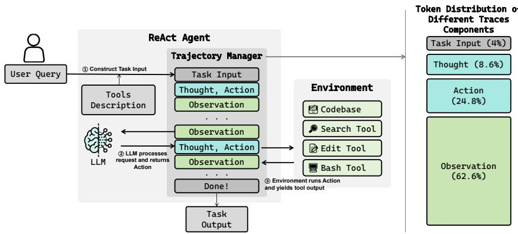
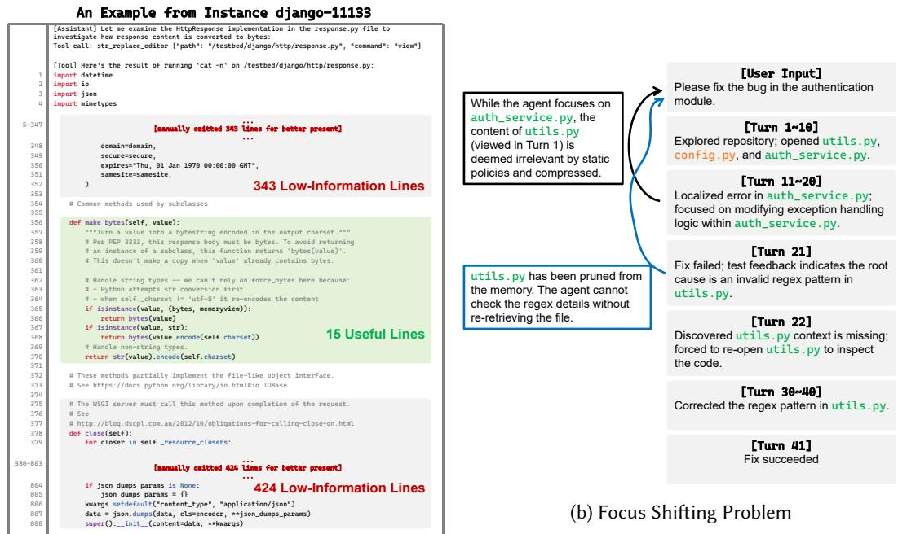
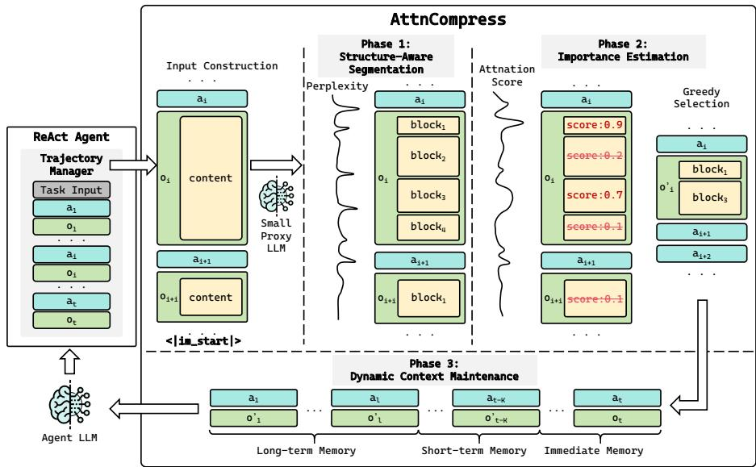
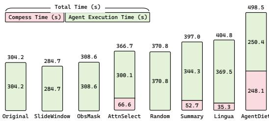
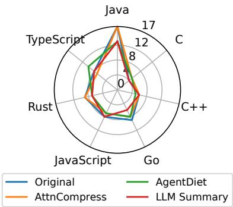

# AtnCompress: Dynamic Atention-Guided Trajectory Compression for Software Engineering Agents

ZHENGRAN ZENG∗, Peking University, China

YIXIN LI∗, Peking University, China

RUI XIE†, Peking University, China

WEI YE†, Peking University, China

SHIKUN ZHANG†, Peking University, China

The transition from human-centric assistance to Autonomous Software Engineering (ASE) agents has enabled the resolution of complex real-world SE tasks. However, the trial-and-error nature of these agents generates lengthy interaction trajectories, creating severe bottlenecks in terms of context window limits and cost. While context compression ofers a potential remedy, prior approaches sufer from static pruning strategies and granularity mismatches, often failing to preserve the semantic dependencies and syntactic details crucial for SE tasks. To strictly preserve critical task evidence while reducing context length, we introduce AttnCompress, a dynamic attention-guided trajectory compression framework. Unlike existing approaches, AttnCompress bridges the gap between semantic integrity and dynamic adaptability through three key mechanisms: (1) structure-aware segmentation via perplexity (PPL) spikes to preserve the syntactic structure of code and logs; (2) relevance estimation using proxy attention weights to quantify the precise relevance of historical blocks to the agent’s current reasoning; and (3) a dynamic rolling window to re-evaluate and recall historical context as the task evolves. Extensive evaluation on SWE-Bench-Verified and Multi-SWE-Bench demonstrates that AttnCompress achieves a pass rate of 53.17%, outperforming prior state-of-the-art baselines while reducing token consumption by 21.6% and total costs by 33.6%. The framework proves to be model-agnostic and generalizes efectively across diverse programming languages.

CCS Concepts: • Software and its engineering → Automatic programming.

Additional Key Words and Phrases: Software Engineering Agents, Large Language Models, Context Compression

ACM Reference Format:

Zhengran Zeng, Yixin Li, Rui Xie, Wei Ye, and Shikun Zhang. 2026. AttnCompress: Dynamic Attention-Guided Trajectory Compression for Software Engineering Agents. Proc. ACM Softw. Eng. 3, ISSTA, Article ISSTA058 (October 2026), 23 pages. https://doi.org/10.1145/3832149

## 1 Introduction

The advent of Large Language Models (LLMs) has catalyzed a paradigm shift in software engineering (SE), transitioning from human-centric assistance to Autonomous Software Engineering (ASE) agents [22, 43]. Capable of perceiving, reasoning, and acting, these agents have demonstrated

∗Both authors contributed equally to this research.   
†Those authors are the corresponding authors.

Authors’ Contact Information: Zhengran Zeng, Peking University, Beijing, China, zhengranzeng@stu.pku.edu.cn; Yixin Li, Peking University, Beijing, China, leason\_lyx@stu.pku.edu.cn; Rui Xie, Peking University, Beijing, China, ruixie@pku.edu.cn; Wei Ye, Peking University, Beijing, China, wye@pku.edu.cn; Shikun Zhang, Peking University, Beijing, China, zhangsk@pku.edu.cn.

remarkable potential in resolving complex real-world GitHub issues, as evidenced by benchmarks like SWE-Bench [15] and its extensions [2, 42, 45]. More broadly, SE agents have also been applied to a wide range of software engineering tasks that require sustained interaction with large codebases, including repository-level code understanding, feature implementation and test generation [16, 38]. Unlike simple Q&A tasks, SE agents operate through long-horizon interactions, engaging in iterative “trial-and-error” workflows involving codebase analysis, file editing, test execution, and debugging [5]. This process inevitably generates lengthy interaction trajectories.

However, this extended context poses a severe eficiency bottleneck. As the trajectory grows, the accumulation of verbose logs, redundant file contents, and obsolete error stacks leads to rapidly growing token consumption. Such overhead results in increased latency, substantial API expenditures, and potentially surpassing the maximum context length of LLMs, which poses a significant barrier to industrial scalability. Furthermore, the “Lost-in-the-Middle” phenomenon suggests that feeding excessive noise to the model can degrade its reasoning performance [13, 23].

To mitigate this, context compression has become essential. Current research broadly falls into three categories: heuristic-based pruning, which removes historical messages based on rules (e.g., ObsMask [20]); summarization-based methods, which utilize LLMs to condense history into shorter text (e.g., AgentDiet [36]); and selection-based methods, which employ a small model to predict and filter out less important tokens (e.g., Lingua [14]). While these methods alleviate the context burden to some extent, they sufer from two critical limitations when applied to the dynamic nature of SE tasks:

First, inability to handle dynamic context dependencies. Existing methods typically employ a “static, one-pass” strategy, where compression is performed once based on the agent’s current view of the task, producing a finalized reduced context. For instance, ObsMask mechanically removes observations older than a fixed window, while AgentDiet performs step-wise trajectory rewriting: at each step, it invokes a cost-eficient LLM to rewrite a previous step (typically a fixed lag behind the current step) into a shorter form. Such approaches are irrevocable and neglect the non-linear nature of debugging. In SE tasks, agents often exhibit focus shifting [27, 39], such as abandoning a hypothesis about a database error to investigate a network configuration mentioned twenty turns earlier. Static methods sever these long-range semantic dependencies because once a block of context is deemed “irrelevant” and removed, it cannot be recovered when the agent’s focus shifts, leading to context-induced hallucinations.

Second, granularity mismatch and precision loss. There is a trade-of between semantic integrity and compression rate that prior works fail to balance. On one hand, coarse-grained methods like ObsMask operate at the message level, forcing the retention of entire verbose logs even if only a single error line is relevant. Conversely, summarization-based methods like AgentDiet employ an additional LLM to rewrite context. While this reduces length, the generative nature of summarization poses a severe risk to SE tasks which demand verbatim accuracy. Such methods often abstract away critical details (e.g., specific line numbers or variable names) and, more critically, are prone to hallucinating [25] non-existent code behaviors or incorrect error references, thereby misleading the agent. Furthermore, relying on an extra strong LLM for every step incurs prohibitive computational overhead. On the other hand, fine-grained token-level selection (e.g., Lingua [29]) disregards the syntactic structure of code. Arbitrarily dropping tokens can break JSON objects or function definitions, rendering the context incomprehensible for the LLM.

To address these challenges, we introduce AttnCompress, a dynamic attention-guided trajectory compression framework designed specifically for the dynamic workflows of SE agents. Our approach bridges the gap between semantic integrity and dynamic adaptability through three key mechanisms:

(1) Structure-Aware Segmentation via PPL Spikes: To resolve the granularity mismatch, we utilize a small proxy model to monitor the Perplexity (PPL) fluctuations [31] of the output stream. By identifying PPL spikes, which naturally occur at semantic boundaries (e.g., the switch from code to error logs), we segment the trajectory into semantically coherent blocks rather than arbitrary tokens. This strategy mitigates the risk of breaking syntactic structures like JSON objects and function bodies after compression.

(2) Relevance Estimation via Proxy Attention: Instead of relying on heuristic rules or heavy summarization models, we leverage the attention distribution of a cost-efective small model (e.g., Qwen3-4B-Instruct [30]). We calculate the attention weights projected from the generation start token of the next response to historical blocks, enabling us to quantify the precise relevance of each block to the immediate reasoning step.

(3) Dynamic Context Maintenance: To overcome the static limitation, we introduce a rolling window mechanism. Unlike static pruning, our framework maintains a dynamic bufer where recent history is continuously re-evaluated against the agent’s shifting intent. This allows previously suppressed information to be recalled if it becomes relevant again, efectively mitigating the risk of information loss during goal shifting.

## Our contributions are as follows:

• We propose a dynamic attention-guided trajectory compression framework that leverages the attention distribution of a cost-efective proxy model to quantify the relevance between historical context and the agent’s current work.

• We introduce a PPL-based block segmentation algorithm that preserves the syntactic structure of code and logs during compression.

• Extensive evaluation on SWE-Bench-Verified [15] and Multi-SWE-Bench-Flash [45] demonstrates that AttnCompress achieves a pass rate of 53.17%, outperforming prior SOTA Agent Diet while reducing token consumption by 21.6% and total costs by 33.6%.

## 2 Background & Related Work

## 2.1 LLM-based SE Agents & Workflow

In Autonomous Software Engineering (ASE), LLM-based agents are commonly deployed to address GitHub issues, implement feature requests, comprehend codebases, and generate tests in an endto-end manner [22, 38, 41]. As illustrated in the left panel of Figure 1, the operational workflow typically follows an iterative ReAct (Reasoning and Acting) pattern [44]. The process begins with 1) constructing task input, where the user query is combined with detailed descriptions of available tools (e.g., search, edit, and bash utilities). Subsequently, the agent enters a cyclic interaction loop:

• LLM Processing: Based on the current history, the LLM generates a Thought for reasoning and an Action to interact with the environment

• Environment Execution: The environment executes the action using specific tools (e.g., searching the codebase or running a script) and yields an Observation, which contains the execution results such as file contents or error logs.

This cycle repeats until the issue is resolved (“Done!”). While this mechanism enables complex problem-solving, it incurs a significant context overhead. As shown in the statistical breakdown in the right panel of Figure 1, (derived from the trajectories in RQ1), the distribution of tokens in interaction traces is highly imbalanced. Observation tokens account for the vast majority (62.6%) of the total context, significantly outweighing Action (24.8%), Thought (8.6%), and Task Input (4%). This data underscores that verbose environmental feedback is the primary contributor to context bloat, making the compression of observations the critical bottleneck for eficiency.

  
Fig. 1. The typical workflow of a ReAct-based SE agent (left) and the token distribution across trace components (right). The statistical analysis reveals that Observation content (e.g., logs and code retrieval) dominates the context window (62.6%), posing a major challenge for long-horizon tasks.

## 2.2 The Context Challenge in SE

While extensive context provides necessary information, it introduces two fundamental challenges specific to software engineering tasks: Information Density Variance and Dynamic Relevance.

  
(a) Granularity Mismatch  
Fig. 2. Challenges in SE context compression. (a) Granularity Mismatch: A case from django-11133 showing that within a large file output, only a small function (make\_bytes) is useful. (b) Focus Shifting Problem: A debugging timeline where the agent shifts focus from auth\_service.py to utils.py.

Information Density Variance. The information density within an agent’s trajectory is highly uneven. A significant portion of the context often consists of verbose logs or irrelevant code snippets. As illustrated in Figure 2a, we present a real-world example from the SWE-Bench instance django-11133. The agent retrieves the content of response.py to inspect the HttpResponse implementation. This action generates a massive output where over 700 lines are essentially noise (highlighted in red as “Low-Information Lines”). The agent efectively needs only the make\_bytes method (approximately 15 lines, highlighted in green) to proceed. This variance creates a practical granularity challenge for compression. If compression operates at a coarse unit such as a full message or a full tool output, the method tends to either keep large chunks of noise or discard large chunks that may still contain small but critical details. If compression operates at an overly fine unit such as individual tokens, it risks breaking code and structured logs. This motivates a segmentation strategy that identifies semantically coherent units within long observations so that the agent can retain complete and meaningful parts while discarding irrelevant parts.

Dynamic Relevance. The relevance of historical information in SE tasks fluctuates as the agent’s debugging focus and hypotheses evolve. As illustrated in Figure 2b, the agent initially inspects the whole repository (Turns 1-10), then shifts its focus to auth\_service.py (Turns 11-20) to address the error, believing the root cause lies therein. During this phase, static compression methods (e.g., ObsMask, LLMSummary, and AgentDiet) deem the previously viewed utils.py as irrelevant “old” context and permanently prune it. However, in Turn 21, execution feedback reveals that the root cause is actually an incorrect regex pattern defined in utils.py. Since the specific details of utils.py were discarded, the agent cannot “look back” to verify the pattern, forcing a redundant re-opening of the file (Turn 22). This ineficiency highlights the need for a dynamic mechanism that can recall previously suppressed blocks when the agent’s focus shifts back to them. To quantify how frequently this phenomenon occurs in practice, we randomly sampled 100 trajectories from LLMSummary runs and audited them using an LLM-assisted review followed by human verification. We found that 40 of these trajectories exhibited the focus shifting problem, indicating that this challenge is not merely illustrative but occurs in a substantial portion of real agent debugging workflows.

## 2.3 Related Work

Prior work on context reduction for LLMs and agents can be grouped into three categories. Each category addresses part of the long-context problem but exhibits limitations for SE agent trajectories.

2.3.1 Selection-based Compression. Selection-based compression aims to improve LLM eficiency by identifying and retaining only the most informative parts of the input. A significant body of work relies on training dedicated modules to score content relevance. For instance, RECOMP [37] trains an abstractive compressor to paraphrase documents, while CPC [21] employs a trained context-aware sentence encoder to judge similarity. Similarly, methods like Provence [7] and LLMLingua-2 [29] utilize distillation techniques to train classifier models that predict the necessity of individual tokens. Alternatively, non-training approaches such as FilCo [35] and Selective Context [19] rely on information-theoretic metrics, calculating the self-information of tokens to prune those with low density. However, these approaches encounter two fundamental limitations in the context of SE agents. First, the heavy reliance on specific training restricts their plug-and-play capability and generalizability across diverse SE scenarios. Second, most selection methods operate at a token granularity. Token-level selectors disregard syntactic boundaries, where removing ostensibly low-information tokens, such as brackets, colons, or indentation, which can corrupt the Abstract Syntax Tree (AST) of code or the structure of JSON logs, rendering the context incomprehensible to the LLM. These shortcomings underscore the necessity for a structure-aware compression strategy that respects the semantic coherence of software artifacts.

2.3.2 Heuristic-based Compression. Another category relies on simple heuristics, such as keeping only the most recent turns, applying FIFO-style eviction, or masking older observations. ObsMask [20] is a representative approach that directly drops tool outputs from older dialogue history. Moreover, Pan et al. [28] propose reformatting code to remove tokens related to whitespaces and indentations. These methods are attractive due to simplicity and low overhead, and they can reduce context length substantially in practice.

However, heuristic strategies typically lack semantic awareness. They assume that old content is less useful, and they do not distinguish between a verbose but unimportant log and a short but critical clue. Meanwhile, as discussed in Section 2.2, SE tasks often require revisiting earlier evidence after a hypothesis shift. Heuristic deletion can therefore discard essential information and cause irreversible information loss, reducing agent success rates on complex tasks.

2.3.3 Summarization-based Compression. A third family of methods compresses context by utilizing LLMs to summarize or rewrite historical information. This strategy is widely adopted in practical agent systems, often in an ad-hoc manner to handle context saturation. For instance, tools like Gemini-Cli [11] and Claude Code [4] trigger LLM-based compression only when the context window reaches a predefined threshold. Others rely on rigid heuristics: Trae Agent [34] truncates tool responses to a fixed size (e.g., 16KB), while SWE-agent [41] employs configurable regex patterns to remove specific text blocks. In the research domain, AgentDiet [36] proposes a more systematic approach. It utilizes an additional LLM to refine or shorten messages, aiming to remove irrelevant parts while keeping key content.

These approaches can preserve high-level semantics, but they introduce new issues in SE settings. First, they strongly depend on the summarization model’s ability to retain precise details that are often indispensable for SE tasks, including exact file paths, line numbers, error codes, and variable names. If these details are dropped or altered by hallucinating, the agent may lose grounding and propose incorrect patches. Second, using an extra LLM for summarization increases runtime overhead and latency, and it can complicate deployment when the agent is expected to run at scale or under tight response constraints.

In summary, existing techniques either prune too aggressively without adapting to dependency shifts, or compress by rewriting content in ways that may lose critical debugging details. These limitations motivate methods that can both preserve structural integrity and dynamically select context based on the agent’s current needs. Although chunking, relevance scoring, and rolling context maintenance are not new in isolation, AttnCompress difers by unifying PPL-based block segmentation, proxy-attention selection, and dynamic re-evaluation in one training-free middleware built for multi-turn SE agent trajectories, explicitly targeting the granularity mismatch and focusshifting challenges discussed above.

## 3 Approach

## 3.1 Overview

We formalize AttnCompress as a plug-and-play middleware positioned between the SE Agent’s trajectory manager and the backend LLM. As illustrated in Figure 3, the workflow consists of three consecutive phases: Structure-Aware Segmentation, Attention-based Scoring, and Dynamic Context Maintenance.

Given a raw trajectory consisting of multiple interaction turns $T = \{ ( a _ { 1 } , o _ { 1 } ) , \dots , ( a _ { t } , o _ { t } ) \}$ , where $a _ { t }$ represents the agent’s action and $o _ { t }$ represents the observation from the environment (typically the output of tool executions, often containing verbose code or logs), our goal is to maintain a compressed trajectory $T ^ { \prime } = \{ ( a _ { 1 } , o _ { 1 } ^ { \prime } ) , \dots , ( a _ { t } , o _ { t } ^ { \prime } ) \}$ in real-time. The objective is to ensure $\left| T ^ { \prime } \right| \ll \left| T \right|$ while maximizing the retention of semantic information relevant to the current reasoning step $s _ { t }$ thereby accommodating a longer interaction history within a limited context window.

  
Fig. 3. Overview of the AttnCompress Framework. The system intercepts the raw trajectory, segments observations into blocks, scores them via a proxy model’s atention, and dynamically maintains a compressed context using a rolling window mechanism.

## 3.2 Phase 1: Structure-Aware Segmentation via PPL Spikes

To address the “granularity mismatch” problem in compression, where token-level pruning destroys syntax and message-level pruning retains excessive noise, we introduced an adaptive segmentation algorithm based on Perplexity (PPL) spike detection [31]. This algorithm utilizes a small model (Proxy Model) as a probe to perceive semantic boundaries within text. Prior work has empirically shown that perplexity-based boundary detection can preserve the syntactic integrity of long code contexts more efectively than fixed-size or heuristic chunking [31].

PPL Calculation. For any given tool output text $O \left( \mathbf { e . g . } \right.$ , file content read by cat or error traces from pytest), we first split it into lines $L = \{ l _ { 1 } , \ldots . l _ { n } \}$ . We use the proxy model to calculate the log probability of each token � and compute the average perplexity $P P L ( l _ { i } )$ for each line $l _ { i } \colon$

$$
P P L ( l _ { i } ) = \exp \left( - \frac { 1 } { | l _ { i } | } \sum _ { x \in l _ { i } } \log P ( x \mid x _ { < c o n t e x t } ) \right)\tag{1}
$$

Typically, at boundaries where semantic content shifts drastically $( \mathrm { e . g . }$ , from the end of a function definition to the start of a new one, or from a normal log stream to an error stack), the model exhibits higher “surprise,” manifested as local peaks in the PPL curve.

Boundary Detection. We determine split boundaries by detecting “spikes” in the ��� sequence. To adapt to the fluctuating PPL baselines of diferent text contents, we employ an adaptive thresholding strategy:

(1) Dif Calculation: Compute the PPL diference between adjacent lines $D _ { i } = | P P L ( l _ { i } ) -$ $P P L ( l _ { i - 1 } ) |$

(2) Adaptive Threshold: Calculate the mean $\mu$ and standard deviation $\sigma$ of the diference sequence. Define the spike threshold $\tau = \mu + h \cdot \sigma ;$ , where ℎ is a sensitivity coeficient.

(3) Segmentation: Mark all local maxima points where $D _ { i } > \tau$ as split boundaries. Additionally, to avoid fragmentation, minute blocks with length only one line are merged with the preceding block.

Finally, the raw output � is transformed into a series of semantic blocks $B = \{ b _ { 1 } , b _ { 2 } , \dots , b _ { m } \}$ , where each block acts as a relatively independent unit in terms ofsyntax or semantics. Besides, introducing overlapping regions between adjacent blocks is a feasible engineering improvement that could further improve cross-boundary coherence, but it would introduce additional hyperparameters (e.g., overlap size). We therefore adopt only the simplest non-overlapping segmentation scheme in this paper.

## 3.3 Phase 2: Importance Estimation via Proxy Atention

To evaluate the dynamic relevance of historical blocks to the current task, we leverage the attention weights of the proxy model as a filtering signal, which prior work has shown can identify tokens semantically salient to a query [24].

Input Construction. To calculate relevance, we construct an input sequence that incorporates the current context. The input sequence is formed by concatenating three components: (1) Context History (using the compressed trajectory $T _ { 1 : t - 1 } ^ { \prime }$ or raw trajectory $T _ { 1 : t - 1 } )$ , (2) The New Observation $O _ { n e w } ,$ and (3) a single special Query Token $q _ { g e n }$ appended at the very end (e.g., the generation start token in the chat template, such $\mathsf { a s } < | \mathrm { i m \_ s t a r t } | >$ , which corresponds to �[�].�����\_����� in Algorithm 1). In a causal LLM, this token must attend to the preceding context before generating the agent’s next response. This construction allows the model to aggregate the attention from the entire preceding context onto this final token, representing the agent’s “current reasoning state."

Scoring Metric. We feed the constructed sequence into the proxy model to perform a forward pass. Crucially, this process is computationally eficient: the logits required for PPL-based segmentation (Phase 1) and the attention maps required for scoring (Phase 2) are extracted simultaneously in a single inference pass. We utilize the attention map from a specific layer (the last layer is used in our experiments). For each candidate block $b _ { i } ,$ , its importance score $S c o r e ( b _ { i } )$ is defined as the average attention weight projected from the single query token $q _ { g e n }$ to the tokens within the block:

$$
S c o r e ( b _ { i } ) = \frac { 1 } { \left| b _ { i } \right| } \sum _ { t \in b _ { i } } A ( q _ { g e n } , t )\tag{2}
$$

Here, $A ( q _ { g e n } , t )$ denotes the attention weight from the query token $q _ { g e n }$ to a token � inside block $b _ { i }$ This metric efectively captures the semantic alignment between the agent’s current state and the historical information.

Selection Strategy. Based on the calculated scores, we apply a Greedy Selection strategy. Let $B = \{ b _ { 1 } , \ldots , b _ { m } \}$ be all candidate blocks segmented from the tool output context, and let $\left| b _ { i } \right|$ denote the number of tokens in block $b _ { i }$ . Given a compression ratio $\rho \in ( 0 , 1 )$ , we set a token budget $\begin{array} { r } { L _ { \mathrm { b u d g e t } } = \rho \cdot \sum _ { i = 1 } ^ { m } \left| b _ { i } \right| } \end{array}$ . We then sort all blocks in descending order of $S c o r e ( b _ { i } )$ and greedily add blocks to the retention set until the accumulated retained tokens reach $\boldsymbol { L } _ { \mathrm { b u d g e t } }$ . Unselected blocks are discarded.

## 3.4 Phase 3: Dynamic Rolling Maintenance

In SE tasks, the agent’s focus shifts continuously as the programming process evolves, leading to task focus drift. Traditional static compression (compress once, delete forever) results in the inability to retrieve old information. To address this, we design a Three-Tier Rolling Window mechanism to maintain context dynamically.

The Context Bufer. As shown in Figure 3, at interaction turn �, we partition the trajectory into three regions:

$$
T = \{ \underbrace { ( a _ { 1 } , o _ { 1 } ) , \ldots , ( a _ { l } , o _ { l } ) } _ { \mathrm { L o n g - t e r m } } , \underbrace { \ldots , ( a _ { t - k } , o _ { t - k } ) } _ { \mathrm { S h o r t - t e r m } } , \underbrace { \ldots , ( a _ { t } , o _ { t } ) } _ { \mathrm { I m m e d i a t e } } \}\tag{3}
$$

(1) Immediate Memory (Raw): The most recent � turns (e.g., Tail 2) are kept in their raw state without compression. This ensures the agent maintains coherent perception of the immediate interaction, preventing the loss of actionable details (e.g., filenames, line numbers).

(2) Short-term Memory (Rolling Bufer): The intermediate region covering turns $I _ { l o n g } + 1$ through $t - k$ . This serves as a dynamic bufer. In every interaction turn, all content within this region is re-evaluated against the current $\mathcal { Q } _ { c u r r } { : }$ , and attention scores are re-calculated to re-compress the content. This ensures the agent can extract the most relevant information from recent history based on its latest intent.

(3) Long-term Memory (Fixed Archive): The region from turn 1 to $I _ { l o n g } .$ . This serves as the archived history. To minimize computational overhead, this region remains static during standard interaction steps, which allows the LLM to leverage prefix caching [18]. Consequently, we avoid reconstructing this long-term memory at every step, significantly reducing the inference cost. This archive is only reconstructed when a “Global Refresh” is triggered.

Periodic Global Refresh. To balance computational cost with recall capability, we introduce a sliding-window-based Global Refresh mechanism (Algorithm 1). This mechanism operates in two distinct modes:

Mode 1: Incremental Update (Standard). This corresponds to the else block (Lines 19-25). In most interaction steps where the bufer is not full, the long-term boundary $I _ { l o n g }$ remains unchanged. We perform selection and re-compression only on the short-term region $T _ { s h o r t }$ (Lines 19-22), generating $T _ { s h o r t } ^ { \prime }$ . Crucially, as shown in Line 25, the final context is constructed by concatenating the pre-existing compressed archive $T _ { l o n g } ^ { \prime }$ with the newly updated short-term blocks. Since $T _ { l o n g } ^ { \prime }$ is textually invariant, this strategy maximizes the cache hit rate for the Agent LLM’s prefix cache.

Mode 2: Global Refresh (Triggered). When the short-term bufer accumulates beyond threshold � (condition at Line 9), a Global Refresh is triggered (Lines 10-17). To address the limitation of a frozen archive, we merge the existing long-term archive with the current short-term bufer $( T _ { l o n g } + T _ { s h o r t }$ in Line 11) and perform a global selection over this combined history. This allows the agent to “resurrect” previously discarded blocks from the deep history if they become relevant to the current task. Finally, we advance the archive pointer $I _ { l o n g }$ to the current raw boundary $I _ { r a w }$ (Line 16), efectively committing the current history to the long-term archive. While this step invalidates the prefix cache, it is performed infrequently to minimize overhead while ensuring semantic completeness.

This mechanism efectively combines high-frequency updates for the short term (adapting to rapid focus changes) with low-frequency refreshes for the long term (adapting to major shifts in debugging direction), solving the focus drift problem while maintaining eficiency.

Algorithm 1 Dynamic Context Maintenance with Rolling Window   
Require: Full Trajectory �, Compressed Trajectory $\overline { { T ^ { \prime } } } .$ , Current Turn �, Tail Size �, Rolling Window   
Size �   
1: $I _ { l o n g } $ Index of the last long memory turn ⊲ Initially 0   
2: $I _ { r a w }  t - k$   
3: // Phase 3.1: Define Context Regions   
4: $T _ { l o n g } \gets T [ 0 : I _ { l o n g } ]$   
5: $T _ { l o n q } ^ { \prime }  T ^ { \prime } [ 0 : I _ { l o n g } ]$   
6: $T _ { s h o r t } \gets T [ I _ { l o n g } : I _ { r a w } ]$   
7: $T _ { r a w } \gets T [ I _ { r a w } : t ]$ ⊲ Keep Raw   
8: // Phase 3.2: Check Trigger for Global Refresh   
9: if Le $\mathrm { n g t h } ( T _ { s h o r t } ) \geq M$ then   
10: // Global Refresh: Re-evaluate EVERYTHING before Raw   
11: ���������� ← Segment $( T _ { l o n g } + T _ { s h o r t } )$   
12: ������ ← ProxyAttention(�����,��ℎ���,����, ����� = � [�].�����\_�����)   
13: �������� ← SelectTop(����������, ������)   
14: $T _ { c o m p r e s s e d } ^ { \prime }$ ← Reconstruct(��������)   
15: // Update Archive Pointer   
16: $I _ { l o n g }  I _ { r a w }$   
17: Output Context: $T _ { c o m p r e s s e d } ^ { \prime } + T _ { r a w }$   
18: else   
19: // Local Rolling: Re-evaluate only Short-term   
20: ���������� ← Segmen $( T _ { s h o r t } )$   
21: ������ ← ProxyAttention $( T _ { l o n g } ^ { \prime } , T _ { s h o r t } , T _ { r a w } , Q u e r y = T [ t ]$ .�����\_�����)   
22: �������� ← SelectTop(����������, ������)   
23: $T _ { s h o r t } ^ { \prime }$ ← Reconstruct(��������)   
24: // Merge with existing Long-term   
25: Output Context: $T _ { l o n g } ^ { \prime } + T _ { s h o r t } ^ { \prime } + T _ { r a w }$   
26: end if

## 3.5 Implementation

AttnCompress is a generalized trajectory compression framework designed to be compatible with various ReAct-style LLM agents. To evaluate its efectiveness in a SOTA setting, we integrated AttnCompress into Trae-Agent [34], a leading open-source agent that has demonstrated top-tier performance on benchmarks like SWE-Bench Verified [3, 8].

For the proxy model $( L L M _ { p r o x y } )$ , we selected Qwen3-4B-Instruct [30, 40]. We chose this model for two strategic reasons: first, despite its small size, it retains strong capabilities in code syntax understanding and context processing; second, its significantly lower parameter count incurs minimal computational overhead, satisfying the real-time requirements of the agent workflow. All experiments, including the inference of the proxy model and the execution of the agent loop, were conducted on a server equipped with 8 NVIDIA A100 GPUs.

AttnCompress involves several key hyperparameters. To determine the optimal configuration, we conducted a preliminary ablation study on a subset of the SWE-Bench-Verified dataset (randomly select 100 instances). Based on the trade-ofs between token cost and pass rate, we established the following default settings for our main evaluation:

• Tail Size (�): 2 (The 2 most recent turns are always kept raw).

• Compression Ratio (�): 0.2 (Retaining top 20% of information by attention score).

• PPL Block Threshold: -2 (Used for adaptive boundary detection).

• Attention Layer: -1 (Using the attention map from the last layer of the proxy model).

• Rolling Window Size (�): 10 (Triggers a Global Refresh when the short-term bufer accumulates 10 turns).

We omit the detailed analysis of how these parameters afect performance in this section. A comprehensive sensitivity analysis and the impact of diferent hyperparameter combinations are presented in Section 5.2.

## 4 Experimental Design

## 4.1 Research Questions

To systematically assess the proposed framework, we structure our evaluation around three key research questions:

RQ1: Cost-Efectiveness Trade-of. Does AttnCompress achieve a superior balance between problem-solving efectiveness and computational eficiency compared to state-of-theart baselines? We investigate whether AttnCompress can maintain or improve the pass rate on SWE-Bench-Verified while reducing token consumption, monetary cost, and end-to-end latency compared to existing methods.

RQ2: Component Contribution. How do the internal architectural components and hyperparameters impact the performance of AttnCompress? We perform an ablation study to quantify the individual contributions of the ppl-based segmentation, proxy-attention scoring, and rolling window mechanism, while also analyzing the sensitivity of key hyperparameters (e.g., tail size � and compression ratio �).

RQ3: Generalization Capabilities. Does the framework generalize well across diferent proxy models and datasets? We assess the robustness of AttnCompress by evaluating its performance with diferent proxy model (e.g., Qwen vs. Llama) and testing its adaptability on the multilingual Multi-SWE-Bench dataset.

## 4.2 Experimental Setup

4.2.1 Datasets. We evaluate AttnCompress and the baselines on two complementary benchmarks to assess both efectiveness and generalization, consistent with the setup in [36].

• SWE-Bench-Verified [8]: This is the primary dataset for our evaluation. It consists of 500 human-verified software engineering tasks derived from real-world GitHub issues. To maintain consistency and eliminate sampling bias, we do not sample a new subset; instead, we utilize the exact instance lists curated by AgentDiet [36]. Specifically, we use their defined validation set (100 instances) for the parameter tuning and ablation studies described in RQ2. The remaining test set (200 instances), as identified in their work, is strictly reserved for the main comparative evaluation in RQ1 and the proxy-model generalization study in RQ3.

• Multi-SWE-Bench-Flash [6, 45]: To evaluate the generalization capabilities of our approach across diferent languages and environments (RQ3), we utilize Multi-SWE-Bench-Flash. This benchmark contains 300 instances covering seven programming languages (Rust, TypeScript, JavaScript, Java, Go, C, and C++). These tasks typically present higher complexity, often requiring the agent to troubleshoot environment build errors, providing a robust testbed for the agent’s adaptability.

4.2.2 Baselines. We compare AttnCompress against seven baselines. All baselines are integrated into the same Trae-Agent [34] framework to ensure a fair comparison.

• Original: The unmodified Trae-Agent that retains the full interaction history. This serves as the upper bound for context completeness and the lower bound for eficiency.

• Random: A sanity check that randomly drops 75% of the tokens from previous turns.

• SlidingWindow: A strict token-budget sliding window baseline that retains only the most recent trajectory content under a fixed token budget. To keep its token cost comparable to the other compression methods, we set the window size to 8k tokens.

• ObsMask [20]: A rule-based approach that masks the outputs of tools from older turns with placeholder, assuming that recent observations are more relevant.

• Lingua [29]: A token compression method that uses a small BERT-based [9] model to classify and remove non-essential tokens.

• LLMSummary [17]: A standard summarization approach where an additional LLM is prompted to summarize the history of multiple turns into a concise paragraph.

• AgentDiet [36]: A recent SOTA method that employs a reflection module (i.e., a summarize LLM) to rewrite and condense the trajectory after each step.

For all baseline methods, we generally adopt the default hyperparameter settings reported in their original works. However, to ensure a strictly fair comparison, we standardize the tail size parameter (the number of most recent turns retained in raw format) to $k = 2$ across all applicable methods. This alignment follows the experimental protocol of AgentDiet [36], ensuring that observed performance diferences stem from the compression strategy rather than the amount of immediate raw history. Meanwhile, for the summarization-based methods (LLMSummary and AgentDiet), we utilize the identical LLM backbone as the agent LLM to perform the summarization and reflection tasks. This ensures that these baselines operate at their optimal capability and are not bottlenecked by a weaker summary model.

4.2.3 Metrics. We utilize a comprehensive set of metrics to evaluate the trade-of between performance and cost.

• Pass%: The ratio of successfully resolved instances in the benchmark. This is the primary indicator of whether compression harmed the agent’s reasoning capabilities.

• Step: The average number of interaction turns required to solve a task. An increase in steps typically indicates that the agent lost critical information due to compression and had to perform redundant actions to recover it.

• PStep: The average number of interaction turns required for only successfully resolved instances. Unlike Step, this metric isolates the eficiency of successful trajectories, filtering out noise from failed attempts that simply exhaust the maximum step limit.

• Input (I) & Output (O): The accumulated number of input and output tokens used by the backend LLM. We first sum input and output tokens over all interaction turns within each instance, and then report the average of these per-instance totals across instances.

• Agent Cost $( C _ { a g e n t } ) { : }$ The monetary cost incurred solely by the backend SE agent during interaction steps. This reflects the direct expenditure on reasoning and generation based on the (potentially compressed) context.

• Compression Cost $\textstyle ( C _ { c o m p } ) \colon$ The cost incurred specifically by the compression mechanism itself $( \mathbf { e . g . }$ , the summarizer cost in AgentDiet). Note that while the proxy model in AttnCompress can be deployed locally to avoid API charges, we calculate $C _ { c o m p }$ based on its oficial API pricing [30] to ensure a fair comparison.

• Total Cost $( C _ { t o t a l } ) \colon$ The sum of the agent cost and compression cost $( C _ { t o t a l } = C _ { a g e n t } + C _ { c o m p } )$ Crucially, all cost calculations account for the input token discounts provided by prefix caching to reflect realistic API pricing.

## 5 Results

In this section, we present the experimental results to answer the three research questions proposed in Section 4.1.

## 5.1 RQ1: Cost-Efectiveness Trade-of

To demonstrate the superiority of AttnCompress, we evaluated its performance on SWE-bench Verified using three diferent backend agents: Qwen3-Coder-30B [33], Qwen3-235B-Instruct [32], and Gemini-3-Flash [12]. Table 1 summarizes the comprehensive results.

Table 1. Main Results on SWE-bench Verified. We report Pass Rate (Pass%), Input/Output token usage (k), Agent Cost (\$), Compression Overhead (\$), Total Cost (\$), Average Steps, and Steps for Passed instances (PStep). All token, cost, and step values are per-instance averages. Bold indicates the best performance among compression methods; Underline indicates the second best.
<table><tr><td>Method</td><td>Agent LLM</td><td>Pass (%)</td><td>Input (k)</td><td>Output (k)</td><td>Cagent</td><td>Ccomp</td><td>Ctotal</td><td>Step</td><td>PStep</td></tr><tr><td rowspan="4">Original</td><td>Gemini-3-Flash</td><td>72.50</td><td>1150.97</td><td>6.13</td><td>0.2156</td><td>/</td><td>0.2156</td><td>50.93</td><td>47.31</td></tr><tr><td>Qwen3-235B</td><td>46.50</td><td>1278.10</td><td>6.31</td><td>0.0864</td><td>/</td><td>0.0864</td><td>45.62</td><td>35.84</td></tr><tr><td>Qwen3-Coder-30B</td><td>46.50</td><td>925.41</td><td>10.74</td><td>0.0546</td><td>/</td><td>0.0546</td><td>41.24</td><td>34.51</td></tr><tr><td>Mean</td><td>55.17</td><td>1118.16</td><td>7.73</td><td>0.1189</td><td>/</td><td>0.1189</td><td>45.93</td><td>39.22</td></tr><tr><td rowspan="4">Random</td><td>Gemini-3-Flash</td><td>67.00</td><td>1075.24</td><td>6.69</td><td>0.1896</td><td>/</td><td>0.1896</td><td>66.97</td><td>61.58</td></tr><tr><td>Qwen3-235B</td><td>39.00</td><td>875.20</td><td>7.62</td><td>0.0679</td><td>/</td><td>0.0679</td><td>60.81</td><td>43.55</td></tr><tr><td>Qwen3-Coder-30B</td><td>38.50</td><td>762.83</td><td>13.27</td><td>0.0616</td><td>/</td><td>0.0616</td><td>56.50</td><td>44.65</td></tr><tr><td>Mean</td><td>48.17</td><td>904.42</td><td>9.19</td><td>0.1064</td><td>1</td><td>0.1064</td><td>61.42</td><td>49.93</td></tr><tr><td rowspan="4">Lingua</td><td>Gemini-3-Flash</td><td>69.50</td><td>906.21</td><td>6.43</td><td>0.1469</td><td>/</td><td>0.1469</td><td>62.84</td><td>58.03</td></tr><tr><td>Qwen3-235B</td><td>36.50</td><td>799.10</td><td>7.10</td><td>0.0688</td><td>/</td><td>0.0688</td><td>55.57</td><td>39.07</td></tr><tr><td>Qwen3-Coder-30B</td><td>40.00</td><td>745.77</td><td>13.17</td><td>0.0578</td><td>1</td><td>0.0578</td><td>56.53</td><td>42.70</td></tr><tr><td>Mean</td><td>48.67</td><td>817.03</td><td>8.90</td><td>0.0912</td><td>1</td><td>0.0912</td><td>58.31</td><td>46.60</td></tr><tr><td rowspan="4">LLMSummary</td><td>Gemini-3-Flash</td><td>67.00</td><td>896.45</td><td>5.76</td><td>0.1731</td><td>0.0185</td><td>0.1916</td><td>61.75</td><td>53.86</td></tr><tr><td>Qwen3-235B</td><td>42.50</td><td>836.14</td><td>7.56</td><td>0.0801</td><td>0.0089</td><td>0.0890</td><td>51.63</td><td>34.29</td></tr><tr><td>Qwen3-Coder-30B</td><td>43.00</td><td>698.96</td><td>10.98</td><td>0.0509</td><td>0.0063</td><td>0.0572</td><td>44.24</td><td>35.23</td></tr><tr><td>Mean</td><td>50.83</td><td>810.52</td><td>8.10</td><td>0.1014</td><td>0.0112</td><td>0.1126</td><td>52.54</td><td>41.13</td></tr><tr><td rowspan="4">ObsMask</td><td>Gemini-3-Flash</td><td>67.50</td><td>775.20</td><td>6.29</td><td>0.0699</td><td>/</td><td>0.0699</td><td>71.39</td><td>66.27</td></tr><tr><td>Qwen3-235B</td><td>31.50</td><td>634.67</td><td>8.82</td><td>0.0350</td><td>/</td><td>0.0350</td><td>67.05</td><td>39.32</td></tr><tr><td>Qwen3-Coder-30B</td><td>42.50</td><td>476.91</td><td>10.38</td><td>0.0282</td><td>1</td><td>0.0282</td><td>51.99</td><td>43.24</td></tr><tr><td>Mean</td><td>47.17</td><td>628.93</td><td>8.49</td><td>0.0443</td><td>1</td><td>0.0443</td><td>63.47</td><td>49.61</td></tr><tr><td rowspan="4">SlidingWindow</td><td>Gemini-3-Flash</td><td>67.00</td><td>641.79</td><td>5.75</td><td>0.1572</td><td>/</td><td>0.1572</td><td>57.63</td><td>51.50</td></tr><tr><td>Qwen3-235B</td><td>42.00</td><td>602.30</td><td>6.53</td><td>0.0766</td><td>/</td><td>0.0766</td><td>52.12</td><td>36.20</td></tr><tr><td>Qwen3-Coder-30B</td><td>40.50</td><td>520.08</td><td>10.21</td><td>0.0567</td><td>/</td><td>0.0567</td><td>43.90</td><td>36.49</td></tr><tr><td>Mean</td><td>49.83</td><td>588.06</td><td>7.50</td><td>0.0968</td><td>1</td><td>0.0968</td><td>51.21</td><td>41.40</td></tr><tr><td rowspan="4">AgentDiet</td><td>Gemini-3-Flash</td><td>68.00</td><td>713.40</td><td>6.31</td><td>0.1400</td><td>0.0932</td><td>0.2332</td><td>51.93</td><td>47.15</td></tr><tr><td>Qwen3-235B</td><td>43.00</td><td>1143.56</td><td>6.26</td><td>0.0838</td><td>0.0423</td><td>0.1260</td><td>49.96</td><td>35.14</td></tr><tr><td>Qwen3-Coder-30B</td><td>42.50</td><td>610.37</td><td>9.88</td><td>0.0424</td><td>0.0269</td><td>0.0693</td><td>42.49</td><td>35.00</td></tr><tr><td>Mean</td><td>51.17</td><td>822.44</td><td>7.49</td><td>0.0887</td><td>0.0541</td><td>0.1429</td><td>48.12</td><td>39.10</td></tr><tr><td rowspan="4">AttnCompress</td><td>Gemini-3-Flash</td><td>71.50</td><td>780.17</td><td>5.45</td><td>0.1543</td><td>0.0027</td><td>0.1570</td><td>60.46</td><td>55.48</td></tr><tr><td>Qwen3-235B</td><td>43.50</td><td>619.19</td><td>6.21</td><td>0.0706</td><td>0.0020</td><td>0.0726</td><td>50.53</td><td>36.00</td></tr><tr><td>Qwen3-Coder-30B</td><td>44.50</td><td>534.62</td><td>10.20</td><td>0.0532</td><td>0.0019</td><td>0.0551</td><td>46.30</td><td>38.56</td></tr><tr><td>Mean</td><td>53.17</td><td>644.66</td><td>7.29</td><td>0.0927</td><td>0.0022</td><td>0.0949</td><td>52.43</td><td>43.35</td></tr></table>

Pass Rate Analysis. The primary challenge in context compression is balancing information retention with token reduction. As observed in Table 1, applying any compression strategy naturally results in a slight performance dip compared to the Original full-context baseline (Mean Pass

55.17%). However, relying on full context is often impractical or impossible. Most current LLMs are constrained by context windows, which are easily exceeded by the massive observation logs generated during long-horizon SE tasks. Consequently, compression strategies are necessary not merely for cost savings, but to enable the agent to function within these hard limits.

Among all compression techniques, AttnCompress achieves the best balance between performance and overhead. It attains the highest mean Pass Rate of 53.17%, outperforming heuristic methods like ObsMask (47.17%) and SlidingWindow (49.83%), as well as selection-based methods like Lingua (48.67%). Moreover, AttnCompress consistently outperforms all baselines individually across all three agent LLMs (achieving 71.50%, 43.50%, and 44.50% on Gemini-3-Flash, Qwen3-235B, and Qwen3-Coder-30B, respectively). Compared to the previous SOTA summarization method AgentDiet (51.17%), AttnCompress achieves a 3.9% relative improvement in mean pass rate, demonstrating better information retention.

To further assess statistical robustness, we repeated the SWE-Bench-Verified (200 case subset) evaluation five times using Qwen3-Coder-30B as the backend agent. As shown in Table 2, AttnCompress achieves a higher mean pass rate than both LLMSummary (43.70% vs. 42.70%) and AgentDiet (43.70% vs. 41.80%), suggesting that the improvement is not driven by a single lucky run.

Table 2. Repeated-run robustness on SWE-Bench-Verified with Qwen3-Coder-30B. We report pass-rate and total-cost statistics over five runs.
<table><tr><td rowspan="2">Method</td><td colspan="4">Pass (%)</td><td colspan="4"> $C _ { t o t a l } \left( \ S \right)$ </td></tr><tr><td>Mean</td><td>Std</td><td>Min</td><td>Max</td><td>Mean</td><td>Std</td><td>Min</td><td>Max</td></tr><tr><td>Original</td><td>44.10</td><td>2.38</td><td>41.00</td><td>46.50</td><td>0.0563</td><td>0.0016</td><td>0.0546</td><td>0.0582</td></tr><tr><td>LLMSummary</td><td>42.70</td><td>2.22</td><td>40.00</td><td>46.00</td><td>0.0585</td><td>0.0012</td><td>0.0572</td><td>0.0599</td></tr><tr><td>ObsMask</td><td>40.80</td><td>2.08</td><td>38.00</td><td>43.00</td><td>0.0305</td><td>0.0013</td><td>0.0282</td><td>0.0313</td></tr><tr><td>SlidingWindow</td><td>39.20</td><td>2.41</td><td>36.00</td><td>42.00</td><td>0.0567</td><td>0.0012</td><td>0.0556</td><td>0.0584</td></tr><tr><td>AgentDiet</td><td>41.80</td><td>2.99</td><td>38.50</td><td>45.50</td><td>0.0718</td><td>0.0028</td><td>0.0688</td><td>0.0751</td></tr><tr><td>AttnCompress</td><td>43.70</td><td>2.17</td><td>40.50</td><td>46.50</td><td>0.0566</td><td>0.0013</td><td>0.0551</td><td>0.0584</td></tr></table>

To understand the remaining gap from the full-context baseline, we manually inspected the failed cases. The main failure mode is that AttnCompress can still remove information that later becomes important, such as an earlier file path, helper function, or error message. When the agent’s subsequent reasoning depends on such omitted evidence, it may make an incorrect decision and fail to recover within the remaining steps.

Moreover, AttnCompress demonstrates superior cost eficiency compared to both the full-context and SOTA approaches. By avoiding the expensive process of using a large LLM to summarize every turn (as in AgentDiet), AttnCompress lowers the total cost to 0.0949\$, representing a 33.6% reduction compared to AgentDiet (0.1429\$) and a 20.2% reduction compared to the Original baseline (0.1189\$). This cost eficiency is robust across all models; for example, on the expensive Qwen3-235B model, AttnCompress reduces total cost from 0.0864\$ (Original) to 0.0726\$. Furthermore, regarding token consumption, AttnCompress operates with a significantly leaner context (Mean Input: 644.66k). This corresponds to a 21.6% reduction against AgentDiet (822.44k) and a substantial 42.3% reduction against Original (1118.16k), validating that our attention-based selection mechanism eficiently filters noise in raw contexts.

Eficiency and Latency. Beyond monetary cost, latency is a critical factor for real-time agents. We analyzed the time overhead using the breakdown illustrated in Figure 4.

AttnCompress incurs a manageable computational overhead with an average total end-to-end time of 366.7s, where the compression (proxy model inference) accounts for only 66.6s. This is significantly faster than the SOTA method AgentDiet, which requires an average of 498.5s due to substantial summarization overhead (248.1s). While heuristic methods like ObsMask and SlidingWindow are indeed faster (total time 303.6s and 284.7s, respectively) due to zero processing cost, they sufer from a significantly lower pass rate (47.17% and 49.83%, respectively). AttnCompress thus strikes a critical balance, ofering a reasonable trade-of between the speed of heuristic pruning and the efectiveness of heavy summarization.

Interestingly, our method also outperforms lighter baselines like Random and Lingua in terms of total eficiency, despite those methods having negligible compression overhead. As shown in the Step column of Table 1, those two methods often disrupt semantic continuity, causing the agent to get confused. This forces the agent to perform redundant actions to recover missing information, driving up the average step count (Random: 61.42 steps; Lingua: 58.31 steps). In contrast, AttnCompress preserves the semantic integrity of the trajectory, allowing the agent to solve problems in fewer steps (52.43 steps), thereby reducing the total cumulative inference time of the backend agent.

  
Fig. 4. End-to-end Latency Breakdown.

## Conclusion 1

AttnCompress achieves the highest pass rate among studied compression methods (53.17%), improving upon prior SOTA methods by 3.9% while reducing total costs by over 33.6%. Furthermore, it lowers end-to-end latency by 26.4% compared to AgentDiet, ofering more practical solution for long-horizon SE tasks.

## 5.2 RQ2: Component Contribution

To quantify the contribution of individual architectural components to the overall performance, we conducted an ablation study on a subset of SWE-Bench-Verified as detailed in Section 4.2.1 with Qwen3-Coder-30B as agent LLM. We subsequently analyzed the sensitivity of the framework to key hyperparameters to determine the optimal configuration.

Analysis ofPPL-based Segmentation. We first evaluate the necessity of our structure-aware segmentation by replacing PPL-based blocking with standard token-level pruning (while maintaining the same compression ratio). As shown in Table 3, removing the PPL module leads to a 3.0% decrease in Pass Rate (from 42.0% to 39.0%) and an increase in the average steps required. This degradation occurs because token-level pruning is agnostic to syntactic boundaries. In SE tasks, observations often consist of structured data such as JSON objects, stack traces, or code snippets. Randomly dropping tokens within these structures breaks the syntax, rendering the remaining context incomprehensible for the LLM. PPL-based segmentation ensures that we drop entire semantically coherent blocks (e.g., a redundant log line) rather than fragmenting critical code structures.

Table 3. Ablation Study of Key Components. We compare the full AttnCompress framework against variants where specific mechanisms are removed or replaced.
<table><tr><td>Method</td><td>Pass (%)</td><td>Input (k)</td><td>Output (k)</td><td> $C _ { t o t a l }$  ($)</td><td>Step</td><td>PStep</td></tr><tr><td>AttnCompress (Full)</td><td>42.0</td><td>547.27</td><td>10.74</td><td>0.0557</td><td>45.89</td><td>38.17</td></tr><tr><td>w/o PPL (Token-level)</td><td>39.0</td><td>622.37</td><td>10.88</td><td>0.0635</td><td>50.48</td><td>40.13</td></tr><tr><td>w/o Attention (Random)</td><td>35.0</td><td>566.81</td><td>10.06</td><td>0.0567</td><td>47.38</td><td>35.89</td></tr><tr><td>w/o Rolling (Fixed)</td><td>37.0</td><td>514.36</td><td>10.95</td><td>0.0619</td><td>48.44</td><td>39.51</td></tr></table>

Analysis of Proxy Attention. To assess the impact of our attention score module, we replaced the proxy model’s attention scoring with a random block selection strategy. This resulted in the most significant performance drop, with the pass rate plummeting to 35.0% (-7.0%). This result underscores the high noise ratio in SE trajectories. The majority of tool outputs are irrelevant to the specific bug at hand. The attention mechanism acts as a critical filter, aligning the historical context with the agent’s current reasoning. Without this guidance, the agent fails to locate the bug eficiently, forcing it to waste steps on unrelated files and often leading to task failure.

Analysis ofDynamic Rolling Window. We investigated the importance of dynamic context maintenance by disabling the rolling window mechanism (using a fixed strategy where context is compressed once and never revisited). The pass rate dropped significantly to 37.0% (-5.0%). This validates the task focus drift hypothesis in debugging workflows. Information that appears irrelevant at step � often becomes critical at step � + 20 when the agent shifts its hypothesis. A static compression strategy permanently discards this information, preventing the agent from “looking back”. The rolling window mechanism is therefore essential for allowing the agent to recall previously suppressed blocks as its focus evolves.

## Conclusion 2

The ablation study confirms that all three components are essential. The attention mechanism is the primary driver of efectiveness (+7.0% pass rate) by filtering noise. The rolling window is crucial for handling non-linear debugging (+5.0% pass rate), and PPL segmentation ensures syntactic integrity (+3.0% pass rate) for code parsing.

Hyperparameter Sensitivity. We further examined the impact of five key hyperparameters on the validation set. The results are detailed in Table 4.

Tail Size (�): There is a trade-of between performance and cost. Increasing the tail size from 2 to 10 improves the pass rate to 44.0%, as keeping more raw context helps the agent understand the immediate consequences of its actions. However, this comes at a significantly higher token cost (0.0821\$ vs 0.0557\$). To balance eficiency with efectiveness, and to maintain consistency with previous work like AgentDiet, we selected � = 2 as the default.

Compression Ratio (�): As expected, a higher retention budget leads to better performance. Increasing � to 0.3 yields a slight gain (43.0%). However, reducing it to 0.1 causes a drop (40.0%), indicating that essential information is being discarded. We selected $\rho = 0 . 2$ as it ofers a favorable cost-performance ratio, capturing the majority of relevant signals without inflating the context.

Block Threshold: The results favor smaller thresholds, which correspond to finer-grained segmentation. A threshold of -2 (adaptive) or 0 allows the model to select precise lines of interest, whereas a coarser threshold of 2 (grouping larger chunks) degrades performance to 39.0%. Since the threshold has a negligible impact on computational overhead, we selected -2 to maximize segmentation flexibility.

Table 4. Hyperparameter Sensitivity Analysis on the Validation Set. Default setings are marked with \*.
<table><tr><td>Parameter</td><td>Value</td><td>Pass (%)</td><td>Input (k)</td><td>Output (k)</td><td> $C _ { t o t a l }$  ($)</td><td>Step</td><td>PStep</td></tr><tr><td rowspan="3">Tail Size (k)</td><td>2 (*)</td><td>42.0</td><td>547.27</td><td>10.74</td><td>0.0557</td><td>45.89</td><td>38.17</td></tr><tr><td>5</td><td>42.0</td><td>563.19</td><td>10.69</td><td>0.0657</td><td>44.47</td><td>40.31</td></tr><tr><td>10</td><td>44.0</td><td>603.26</td><td>10.74</td><td>0.0821</td><td>43.64</td><td>38.77</td></tr><tr><td rowspan="3">Comp. Ratio (ρ)</td><td>0.1</td><td>40.0</td><td>465.49</td><td>10.17</td><td>0.0469</td><td>46.03</td><td>41.45</td></tr><tr><td>0.2 (*)</td><td>42.0</td><td>547.27</td><td>10.74</td><td>0.0557</td><td>45.89</td><td>38.17</td></tr><tr><td>0.3</td><td>43.0</td><td>600.65</td><td>10.72</td><td>0.0613</td><td>45.39</td><td>41.35</td></tr><tr><td rowspan="3">Block Threshold</td><td>-2 (*)</td><td>42.0</td><td>547.27</td><td>10.74</td><td>0.0557</td><td>45.89</td><td>38.17</td></tr><tr><td>0</td><td>42.0</td><td>520.38</td><td>10.19</td><td>0.0519</td><td>45.23</td><td>35.69</td></tr><tr><td>2</td><td>39.0</td><td>516.52</td><td>10.41</td><td>0.0486</td><td>45.39</td><td>37.08</td></tr><tr><td rowspan="4">Proxy Layer</td><td>Mean</td><td>41.0</td><td>556.99</td><td>10.50</td><td>0.0541</td><td>46.58</td><td>40.90</td></tr><tr><td>0 (First)</td><td>41.0</td><td>536.46</td><td>10.15</td><td>0.0532</td><td>46.00</td><td>35.88</td></tr><tr><td>Middle</td><td>43.0</td><td>548.67</td><td>10.32</td><td>0.0539</td><td>46.10</td><td>38.35</td></tr><tr><td>-1 (Last) (*)</td><td>42.0</td><td>547.27</td><td>10.74</td><td>0.0557</td><td>45.89</td><td>38.17</td></tr><tr><td rowspan="3">Window Size</td><td>2</td><td>35.0</td><td>541.79</td><td>10.79</td><td>0.0761</td><td>45.17</td><td>37.17</td></tr><tr><td>5</td><td>38.0</td><td>488.52</td><td>10.00</td><td>0.0529</td><td>43.11</td><td>35.32</td></tr><tr><td>10 (*)</td><td>42.0</td><td>547.27</td><td>10.74</td><td>0.0557</td><td>45.89</td><td>38.17</td></tr></table>

Proxy Layer selection: The choice of proxy layer has only a marginal impact on the final performance, as the results across diferent layers (First, Middle, and Last) are largely comparable. This suggests that the relevance signal derived from proxy attention is robust. Given this insensitivity, we selected the Last layer (-1) as it is computationally free to extract and performs robustly.

Window Size: A larger rolling window is beneficial. Increasing the window size from 2 to 10 improves the pass rate from 35.0% to 42.0%. Meanwhile, increasing the Window Size has a minimal impact on token cost because the content within the window is already compressed. Therefore, we selected a larger window of � = 10 to maximize the agent’s ability to recall historical context.

In summary, while AttnCompress introduces several hyperparameters, Table 4 demonstrates that they primarily govern cost-performance trade-ofs rather than acting as fragile triggers. Key variables like compression ratio (�) and tail size (�) smoothly scale performance up or down, whereas architectural choices (threshold and proxy layer) show robust plateaus (e.g., both threshold -2 and 0 achieve 42%, and middle/last layers achieve 43% and 42%). This indicates that the framework is resilient to parameter shifts and does not require exhaustive, task-specific fine-tuning.

## Conclusion 3

AttnCompress exhibits a clear trade-of between cost and performance. Notably, we adopted a conservative “balanced” configuration for our main evaluation rather than greedily maximizing the pass rate. This default setting already outperforms prior SOTA methods, suggesting that AttnCompress is highly efective even under cost constraints, while ofering significant headroom for performance improvement if larger token budgets are permitted.

## 5.3 RQ3: Generalization Capabilities

Finally, we assess the generalization capabilities of AttnCompress. We investigate whether the framework maintains its efectiveness when utilizing diferent proxy model architectures and when applied to diverse programming languages beyond Python.

Proxy Model Robustness. To verify that our approach is not dependent on a specific model family, we evaluated AttnCompress using five distinct small language models (SLMs) as the proxy scorer on the 200-instance SWE-Bench-Verified test set. This includes three models from the Qwen3 [30] family to analyze scaling laws (1.7B, 4B, 8B), as well as Gemma3-4B-Instruct [10] and Llama3.2-3B-Instruct [26] to test cross-architecture generalization.

Table 5. Proxy–agent atention alignment (Qwen3-Coder-30B as reference scorer).
<table><tr><td>Proxy Model</td><td>Spearman ρ</td><td>Top-10% Ovlp.</td><td>Top-20% Ovlp.</td></tr><tr><td>Qwen3-1.7B-Instruct</td><td>0.64</td><td>0.63</td><td>0.66</td></tr><tr><td>Qwen3-4B-Instruct</td><td>0.63</td><td>0.60</td><td>0.65</td></tr><tr><td>Qwen3-8B-Instruct</td><td>0.61</td><td>0.55</td><td>0.62</td></tr><tr><td>Gemma3-4B-Instruct</td><td>0.60</td><td>0.64</td><td>0.62</td></tr><tr><td>Llama3.2-3B-Instruct</td><td>0.56</td><td>0.63</td><td>0.63</td></tr></table>

Table 6. Performance and Eficiency with diferent Proxy Models.
<table><tr><td>Agent LLM</td><td>Proxy Model</td><td>Pass (%)</td><td>Input (k)</td><td> $C _ { t o t a l }$  ($)</td><td>Step</td><td>Ana Time (s)</td></tr><tr><td rowspan="5">Qwen3-Coder-30B</td><td>Qwen3-1.7B-Instruct</td><td>43.50</td><td>551.63</td><td>0.0571</td><td>47.16</td><td>71.61</td></tr><tr><td>Qwen3-4B-Instruct</td><td>44.50</td><td>534.62</td><td>0.0551</td><td>46.30</td><td>530.87</td></tr><tr><td>Qwen3-8B-Instruct</td><td>46.50</td><td>558.34</td><td>0.0607</td><td>46.67</td><td>384.13</td></tr><tr><td>Gemma3-4B-Instruct</td><td>45.00</td><td>694.98</td><td>0.0588</td><td>55.02</td><td>515.63</td></tr><tr><td>Llama3.2-3B-Instruct</td><td>45.50</td><td>507.71</td><td>0.0548</td><td>44.98</td><td>100.37</td></tr><tr><td rowspan="5">Gemini-3-Flash</td><td>Qwen3-1.7B-Instruct</td><td>69.00</td><td>749.32</td><td>0.1940</td><td>64.90</td><td>131.49</td></tr><tr><td>Qwen3-4B-Instruct</td><td>71.50</td><td>780.17</td><td>0.1570</td><td>60.46</td><td>252.47</td></tr><tr><td>Qwen3-8B-Instruct</td><td>72.50</td><td>773.15</td><td>0.2077</td><td>65.78</td><td>682.06</td></tr><tr><td>Gemma3-4B-Instruct</td><td>68.50</td><td>781.90</td><td>0.1705</td><td>71.48</td><td>790.62</td></tr><tr><td>Llama3.2-3B-Instruct</td><td>71.50</td><td>781.39</td><td>0.2072</td><td>68.41</td><td>239.08</td></tr></table>

We first verify whether proxy relevance scoring aligns with the backend agent’s needs. We use 200 uncompressed Original agent trajectories from the same 200-instance SWE-Bench-Verified subset evaluated below, and compare block-level attention rankings from each proxy model against Qwen3-Coder-30B on identical PPL-segmented blocks. Table 5 reports spearman rank correlation (�), the fraction of shared blocks in the top 10% of each ranking, and the same for the top 20% (instance means). Our default Qwen3-4B-Instruct proxy achieves �=0.63 with 0.60 and 0.65 top 10%/20% overlap, indicating substantial agreement on the blocks most likely to be retained under our compression budget. Cross-family proxies remain in a similar range, suggesting that imperfect global rankings still preserve the salient context the agent attends to.

The end-to-end results are presented in Table 6, where we report both Qwen3-Coder-30B and Gemini-3-Flash as backend agents. Together with Table 5, this shows that small–big LLM attention agreement is suficient for stable agent behavior: pass rates vary by only a few points across proxies.

The data indicates a high degree of transferability across model families. On Qwen3-Coder-30B, both Gemma3-4B-Instruct (45.0%) and Llama3.2-3B-Instruct (45.5%) achieve competitive pass rates comparable to Qwen3-4B-Instruct (44.5%). The same trend holds on Gemini-3-Flash, where Gemma3-4B-Instruct and Llama3.2-3B-Instruct reach 68.5% and 71.5%, respectively, close to the default Qwen3-4B-Instruct (71.5%). This is consistent with their strong top-10%/20% overlap with the backend agent in Table 5 (e.g., 0.63, 0.64 for Llama3.2-3B-Instruct), suggesting that the attention patterns used to distinguish signal from noise are universal features present in various LLM families, making AttnCompress model-agnostic.

We further analyze the impact of model size within the Qwen3 series using Qwen3-Coder-30B as the backend agent. There is a nuanced trade-of between proxy model size, selection quality, and compression latency (Ana Time column). Specifically, Qwen3-1.7B-Instruct is the fastest (71.6s) but sufers from a slight performance drop (43.5%), suggesting that very small models may struggle to accurately identify subtle long-term dependencies beyond coarse attention agreement. Qwen3-8B-Instruct achieves the highest pass rate of 46.5%. However, this gain comes at a higher analysis time (384.1s). Therefore, Qwen3-4B-Instruct strikes the optimal balance. It improves pass rate over the 1.7B model (+1.0%) while incurring substantially lower analysis time than the 8B proxy.

We also observe that the ranking of proxy models based on end-to-end agent performance (Table 6) does not strictly align with their attention alignment scores (Table 5). For instance, Qwen3-1.7B-Instruct achieves the highest top-20% overlap (0.66) but records the lowest pass rate on Qwen3-Coder-30B. We attribute this discrepancy primarily to two factors: (i) the diferences in alignment across proxies are marginal (all top-20% overlaps fall within [0.62, 0.66]), meaning that minor variations in ranking do not necessarily translate to downstream success; and (ii) end-to-end evaluations inherently introduce variance due to agent stochasticity. While the exact mechanism by which attention alignment influences final agent outcomes warrants further investigation, our results yield two practical takeaways: proxy models from diverse families and scales share broadly similar attention distributions, and this shared structure enables efective compression with negligible variations in pass rates across proxies.

## Conclusion 4

The efectiveness of attention-based filtering is not tied to a single architecture; both Gemma and Llama models provide suficient semantic signals to drive high agent performance.

Multi-Language Generalization. We extended our evaluation to Multi-SWE-Bench-Flash to test adaptability across seven programming languages: C, C++, Go, Java, JavaScript, Rust, and TypeScript. Table 7 summarizes the overall results, and Figure 5 illustrates the specific pass counts per language.and Programming Language

Table 7. Main Results on Multi-SWE-Bench-Flash. Bold indicates the best performance among compression methods; Underline indicates the second best.
<table><tr><td>Method</td><td>Pass (%)</td><td>Input (k)</td><td>Output (k)</td><td> $C _ { t o t a l }$  ($)</td><td>Step</td><td>PStep</td></tr><tr><td>Original</td><td>20.33</td><td>1629.38</td><td>11.69</td><td>0.1057</td><td>52.83</td><td>42.66</td></tr><tr><td>Random</td><td>17.00</td><td>1420.96</td><td>14.54</td><td>0.1074</td><td>79.51</td><td>62.24</td></tr><tr><td>Lingua</td><td>16.00</td><td>1360.88</td><td>16.50</td><td>0.1046</td><td>78.24</td><td>58.69</td></tr><tr><td>LLMSummary</td><td>17.39</td><td>1107.88</td><td>11.54</td><td>0.0971</td><td>59.07</td><td>45.62</td></tr><tr><td>ObsMask</td><td>15.72</td><td>719.77</td><td>12.35</td><td>0.0376</td><td>72.05</td><td>55.85</td></tr><tr><td>SlidingWindow</td><td>17.67</td><td>790.56</td><td>12.02</td><td>0.0764</td><td>61.76</td><td>52.36</td></tr><tr><td>AgentDiet</td><td>18.33</td><td>1014.70</td><td>11.56</td><td>0.1132</td><td>58.45</td><td>45.04</td></tr><tr><td>AttnCompress</td><td>19.67</td><td>879.77</td><td>11.90</td><td>0.0826</td><td>62.38</td><td>49.32</td></tr></table>

  
Fig. 5. Number of passed instances per language on Multi-SWE-Bench-Flash. AttnCompress matches the Original baseline in Java, Rust, and C++, outperforming other compression methods.

AttnCompress achieves the best performance among all compression methods, with a pass rate of 19.67%, which is close to the Original full-context baseline (20.33%). In contrast, other methods show significant degradation: ObsMask drops to 15.72%, SlidingWindow achieves 17.67%, and AgentDiet achieves 18.33% while incurring higher costs (0.1132\$ vs 0.0826\$).

Language-specific analysis (Figure 5) reveals that AttnCompress maintains parity with the Original baseline in strictly typed and verbose languages.

• C/C++ & Java: In Java, AttnCompress matches the Original baseline exactly (17 passed) and outperforms AgentDiet (13 passed). Similarly, in C, it successfully solves 5 instances compared to 4 for the Original baseline. This indicates that our method remains efective in verbose, statically-typed environments.

• Rust & Go: Performance is stable in modern systems languages. In Rust, AttnCompress matches the Original baseline (9 passed), and in Go, it shows a marginal diference (8 vs. 9).

• Web Languages (TS/JS): For TypeScript and JavaScript, AttnCompress (7 passed) performs slightly below the Original (8 passed) but remains competitive with AgentDiet.

## Conclusion 5

AttnCompress generalizes across diverse programming languages, achieving near-parity with full-context agents (96.7% relative performance) while reducing token costs by 20%.

## 6 Threats to Validity

Threats to Internal Validity. The primary internal threat is Data Leakage, as proprietary LLMs might have seen the SWE-Bench issues during training. We mitigated this by including the more recent Multi-SWE-Bench in our evaluation. Furthermore, since all baselines utilize the same backend models, any leakage afects them equally, preserving the validity of relative comparisons. A second threat is hyperparameter overfitting. To address this, we strictly isolated a 100-instance validation set for ablation studies and parameter tuning, ensuring the reported performance on the 200-instance test set reflects genuine generalization rather than overfitting.

Threats to External Validity. The main external threat is generalization across agent frameworks. Due to computational costs, we evaluated AttnCompress primarily on Trae-Agent. However, as most SE agents follow similar ReAct patterns, our middleware approach is theoretically transferable. We also addressed model and language generalization by validating our framework across diverse proxy models (Qwen, Llama, Gemma) and seven programming languages. The consistent results suggest our findings are not limited to a specific model architecture or language ecosystem.

Threats to Construct Validity. A threat to construct validity is the reliance on test-based evaluation. A patch passing available tests (plausible) may not be semantically equivalent to the developer’s fix (correct). While this is a known limitation of benchmarks like SWE-Bench, it serves as a standard proxy for task success. Crucially, this metric limits all comparison methods equally; therefore, the observed improvements in pass rate reliably indicate that AttnCompress retains more critical task information than other compression baselines.

## 7 Conclusions

In this paper, we addressed the critical context scalability bottleneck in Autonomous Software Engineering (ASE) agents. We introduced AttnCompress, a dynamic compression framework that overcomes the limitations of static pruning and heuristic summarization through three key mechanisms: structure-aware segmentation via PPL spikes, proxy attention-guided relevance estimation, and a dynamic rolling window. This approach ensures the preservation of syntactic integrity and semantic dependencies essential for SE tasks. Extensive evaluation on SWE-Bench-Verified demonstrates that AttnCompress achieves a state-of-the-art pass rate of 53.17%, outperforming strong compression baselines while reducing token consumption by over 21.6% and total costs by 33.6%. Our results confirm that dynamic attention alignment ofers a superior, model-agnostic solution for eficient, long-horizon software engineering tasks.

## Data Availability

The replication package for our study, containing the necessary source code and scripts to reproduce our experiments, is available at the repository [1].

## References

[1] [n. d.]. AttnCompress: Dynamic Attention-Guided Trajectory Compression for Software Engineering Agents. https: //github.com/ZZR0/AttnCompress. Accessed: 2026-07-16..

[2] 2025. SWE-bench Multilingual · Kabir Khandpur — kabirk.com. https://kabirk.com/multilingual. [Accessed 26-01-2026].

[3] 2026. SWE-bench Leaderboards — swebench.com. https://www.swebench.com/index.html. [Accessed 19-01-2026].

[4] Anthropic. 2025. Claude Code. https://claude.com/product/claude-code. Agentic AI coding tool for terminal and development workflows, accessed 2026-01-28.

[5] Islem Bouzenia and Michael Pradel. 2025. Understanding Software Engineering Agents: A Study of Thought-Action-Result Trajectories. CoRR abs/2506.18824 (2025). arXiv:2506.18824 doi:10.48550/ARXIV.2506.18824

[6] ByteDance Seed Team. 2025. Multi-SWE-bench-flash. https://huggingface.co/datasets/ByteDance-Seed/Multi-SWEbench-flash. Subset of Multi-SWE-bench for rapid evaluation; accessed 2026-01-20.

[7] Nadezhda Chirkova, Thibault Formal, Vassilina Nikoulina, and Stéphane Clinchant. 2025. Provence: eficient and robust context pruning for retrieval-augmented generation. In The Thirteenth International Conference on Learning Representations, ICLR 2025, Singapore, April 24-28, 2025. OpenReview.net. https://openreview.net/forum?id=TDy5Ih78b4

[8] Neil Chowdhury, James Aung, Chan Jun Shern, Oliver Jafe, Dane Sherburn, Giulio Starace, Evan Mays, Rachel Dias, Marwan Aljubeh, Mia Glaese, Carlos E. Jimenez, John Yang, Leyton Ho, Tejal Patwardhan, Kevin Liu, and Aleksander Madry. 2024. Introducing SWE-bench Verified. https://openai.com/index/introducing-swe-bench-verified/

[9] Jacob Devlin, Ming-Wei Chang, Kenton Lee, and Kristina Toutanova. 2019. BERT: Pre-training of Deep Bidirectional Transformers for Language Understanding. In Proceedings of the 2019 Conference of the North American Chapter ofthe Association for Computational Linguistics: Human Language Technologies, Volume 1 (Long and Short Papers), Jill Burstein, Christy Doran, and Thamar Solorio (Eds.). Association for Computational Linguistics, Minneapolis, Minnesota, 4171–4186. doi:10.18653/v1/N19-1423

[10] Google. 2024. Gemma-3-4B-IT. https://huggingface.co/google/gemma-3-4b-it. Model card, accessed 2026-01-28.

[11] Google. 2025. Gemini CLI. https://geminicli.com/. Open-source AI command-line interface for Gemini models, accessed 2026-01-28.

[12] Google DeepMind. 2025. Gemini 3 Flash. https://deepmind.google/models/gemini/flash/. Model card and oficia description, accessed 2026-01-28; proprietary large language model by Google DeepMind.

[13] Cheng-Ping Hsieh, Simeng Sun, Samuel Kriman, Shantanu Acharya, Dima Rekesh, Fei Jia, and Boris Ginsburg. 2024. RULER: What’s the Real Context Size of Your Long-Context Language Models?. In First Conference on Language Modeling. https://openreview.net/forum?id=kIoBbc76Sy

[14] Huiqiang Jiang, Qianhui Wu, Chin-Yew Lin, Yuqing Yang, and Lili Qiu. 2023. LLMLingua: Compressing Prompts for Accelerated Inference of Large Language Models. In Proceedings ofthe 2023 Conference on Empirical Methods in Natural Language Processing, EMNLP 2023, Singapore, December 6-10, 2023, Houda Bouamor, Juan Pino, and Kalika Bali (Eds.). Association for Computational Linguistics, 13358–13376. doi:10.18653/V1/2023.EMNLP-MAIN.825

[15] Carlos E. Jimenez, John Yang, Alexander Wettig, Shunyu Yao, Kexin Pei, Ofir Press, and Karthik R. Narasimhan. 2024. SWE-bench: Can Language Models Resolve Real-world Github Issues?. In The Twelfth International Conference on Learning Representations, ICLR 2024, Vienna, Austria, May 7-11, 2024. OpenReview.net. https://openreview.net/forum? id=VTF8yNQM66

[16] Haolin Jin, Linghan Huang, Haipeng Cai, Jun Yan, Bo Li, and Huaming Chen. 2024. From LLMs to LLM-based Agents for Software Engineering: A Survey of Current, Challenges and Future. CoRR abs/2408.02479 (2024). arXiv:2408.02479 doi:10.48550/ARXIV.2408.02479

[17] Minki Kang, Wei-Ning Chen, Dongge Han, Huseyin A Inan, Lukas Wutschitz, Yanzhi Chen, Robert Sim, and Saravan Rajmohan. 2025. Acon: Optimizing context compression for long-horizon llm agents. arXiv preprint arXiv:2510.00615 (2025).

[18] Woosuk Kwon, Zhuohan Li, Siyuan Zhuang, Ying Sheng, Lianmin Zheng, Cody Hao Yu, Joseph Gonzalez, Hao Zhang, and Ion Stoica. 2023. Eficient Memory Management for Large Language Model Serving with PagedAttention. In Proceedings of the 29th Symposium on Operating Systems Principles, SOSP 2023, Koblenz, Germany, October 23-26, 2023, Jason Flinn, Margo I. Seltzer, Peter Druschel, Antoine Kaufmann, and Jonathan Mace (Eds.). ACM, 611–626. doi:10.1145/3600006.3613165

[19] Yucheng Li, Bo Dong, Frank Guerin, and Chenghua Lin. 2023. Compressing Context to Enhance Inference Eficiency of Large Language Models. In Proceedings of the 2023 Conference on Empirical Methods in Natural Language Processing, EMNLP 2023, Singapore, December 6-10, 2023, Houda Bouamor, Juan Pino, and Kalika Bali (Eds.). Association for Computational Linguistics, 6342–6353. doi:10.18653/V1/2023.EMNLP-MAIN.391

[20] Tobias Lindenbauer, Igor Slinko, Ludwig Felder, Egor Bogomolov, and Yaroslav Zharov. 2025. The Complexity Trap: Simple Observation Masking Is as Eficient as LLM Summarization for Agent Context Management. In NeurIPS 2025 Fourth Workshop on Deep Learning for Code. https://openreview.net/forum?id=OHVzruJl5k

[21] Barys Liskavets, Maxim Ushakov, Shuvendu Roy, Mark Klibanov, Ali Etemad, and Shane K. Luke. 2025. Prompt Compression with Context-Aware Sentence Encoding for Fast and Improved LLM Inference. In AAAI-25, Sponsored by the Association for the Advancement ofArtificial Intelligence, February 25 - March 4, 2025, Philadelphia, PA, USA, Toby Walsh, Julie Shah, and Zico Kolter (Eds.). AAAI Press, 24595–24604. doi:10.1609/AAAI.V39I23.34639

[22] Junwei Liu, Kaixin Wang, Yixuan Chen, Xin Peng, Zhenpeng Chen, Lingming Zhang, and Yiling Lou. 2024. Large Language Model-Based Agents for Software Engineering: A Survey. CoRR abs/2409.02977 (2024). arXiv:2409.02977 doi:10.48550/ARXIV.2409.02977

[23] Nelson F. Liu, Kevin Lin, John Hewitt, Ashwin Paranjape, Michele Bevilacqua, Fabio Petroni, and Percy Liang. 2024. Lost in the Middle: How Language Models Use Long Contexts. Trans. Assoc. Comput. Linguistics 12 (2024), 157–173. doi:10.1162/TACL\_A\_00638

[24] Lvzhou Luo, Yixuan Cao, and Ping Luo. 2025. AttnComp: Attention-Guided Adaptive Context Compression for Retrieval-Augmented Generation. In Findings ofthe Association for Computational Linguistics: EMNLP 2025, Suzhou, China, November 4-9, 2025, Christos Christodoulopoulos, Tanmoy Chakraborty, Carolyn Rose, and Violet Peng (Eds.). Association for Computational Linguistics, 8456–8472. https://aclanthology.org/2025.findings-emnlp.449/

[25] Kishan Maharaj, Vitobha Munigala, Srikanth G. Tamilselvam, Prince Kumar, Sayandeep Sen, Palani Kodeswaran, Abhijit Mishra, and Pushpak Bhattacharyya. 2025. ETF: An Entity Tracing Framework for Hallucination Detection in Code Summaries. In Proceedings ofthe 63rd Annual Meeting ofthe Association for Computational Linguistics (Volume 1: Long Papers), Wanxiang Che, Joyce Nabende, Ekaterina Shutova, and Mohammad Taher Pilehvar (Eds.). Association for Computational Linguistics, Vienna, Austria, 30639–30652. doi:10.18653/v1/2025.acl-long.1480

[26] Meta AI. 2024. Llama-3.2-3B-Instruct. https://huggingface.co/meta-llama/Llama-3.2-3B-Instruct. Model card, accessed 2026-01-28.

[27] Tianyue Ou, Wanyao Guo, Apurva Gandhi, Graham Neubig, and Xiang Yue. 2025. AgentDiagnose: An Open Toolkit for Diagnosing LLM Agent Trajectories. In Proceedings of the 2025 Conference on Empirical Methods in Natural Language Processing: System Demonstrations, Ivan Habernal, Peter Schulam, and Jörg Tiedemann (Eds.). Association for Computational Linguistics, Suzhou, China, 207–215. doi:10.18653/v1/2025.emnlp-demos.15

[28] Dangfeng Pan, Zhensu Sun, Cenyuan Zhang, David Lo, and Xiaoning Du. 2025. The Hidden Cost of Readability: How Code Formatting Silently Consumes Your LLM Budget. CoRR abs/2508.13666 (2025). arXiv:2508.13666 doi:10.48550 ARXIV.2508.13666

[29] Zhuoshi Pan, Qianhui Wu, Huiqiang Jiang, Menglin Xia, Xufang Luo, Jue Zhang, Qingwei Lin, Victor Rühle, Yuqing Yang, Chin-Yew Lin, H. Vicky Zhao, Lili Qiu, and Dongmei Zhang. 2024. LLMLingua-2: Data Distillation for Eficient and Faithful Task-Agnostic Prompt Compression. In Findings of the Association for Computational Linguistics, ACL 2024, Bangkok, Thailand and virtual meeting, August 11-16, 2024, Lun-Wei Ku, Andre Martins, and Vivek Srikumar (Eds.). Association for Computational Linguistics, 963–981. doi:10.18653/V1/2024.FINDINGS-ACL.57

[30] Qwen Team. 2025. Qwen3-4B-Instruct-2507. https://huggingface.co/Qwen/Qwen3-4B-Instruct-2507. Model card, accessed 2026-01-20.

[31] Yuling Shi, Yichun Qian, Hongyu Zhang, Beijun Shen, and Xiaodong Gu. 2025. LongCodeZip: Compress Long Context for Code Language Models. CoRR abs/2510.00446 (2025). arXiv:2510.00446 doi:10.48550/ARXIV.2510.00446

[32] Qwen Team. 2025. Qwen3-235B-A22B-Instruct-2507. https://huggingface.co/Qwen/Qwen3-235B-A22B-Instruct-2507. A 235B instruction-tuned causal Mixture-of-Experts model. Model card on Hugging Face..

[33] Qwen Team. 2025. Qwen3-Coder-30B-A3B-Instruct. https://huggingface.co/Qwen/Qwen3-Coder-30B-A3B-Instruct. A 30B instruction-tuned causal Mixture-of-Experts model. Model card on Hugging Face..

[34] Trae Research Team, Pengfei Gao, Zhao Tian, Xiangxin Meng, Xinchen Wang, Ruida Hu, Yuanan Xiao, Yizhou Liu, Zhao Zhang, Junjie Chen, Cuiyun Gao, Yun Lin, Yingfei Xiong, Chao Peng, and Xia Liu. 2025. Trae Agent: An LLM-based Agent for Software Engineering with Test-time Scaling. (2025). arXiv:2507.23370 [cs.SE] https: //arxiv.org/abs/2507.23370

[35] Zhiruo Wang, Jun Araki, Zhengbao Jiang, Md. Rizwan Parvez, and Graham Neubig. 2023. Learning to Filter Context for Retrieval-Augmented Generation. CoRR abs/2311.08377 (2023). arXiv:2311.08377 doi:10.48550/ARXIV.2311.08377

[36] Yuan-An Xiao, Pengfei Gao, Chao Peng, and Yingfei Xiong. 2025. Improving the Eficiency of LLM Agent Systems through Trajectory Reduction. CoRR abs/2509.23586 (2025). arXiv:2509.23586 doi:10.48550/ARXIV.2509.23586

[37] Fangyuan Xu, Weijia Shi, and Eunsol Choi. 2024. RECOMP: Improving Retrieval-Augmented LMs with Context Compression and Selective Augmentation. In The Twelfth International Conference on Learning Representations, ICLR 2024, Vienna, Austria, May 7-11, 2024. OpenReview.net. https://openreview.net/forum?id=mlJLVigNHp

[38] Jingxuan Xu, Ken Deng, Weihao Li, Songwei Yu, Huaixi Tang, Haoyang Huang, Zhiyi Lai, Zizheng Zhan, Yanan Wu, Chenchen Zhang, Kepeng Lei, Yifan Yao, Xinping Lei, Wenqiang Zhu, Zong-Xian Feng, Han Li, Junqi Xiong, Dailin Li, Zuchen Gao, Kun Wu, Wen Xiang, Ziqi Zhan, Yuanxing Zhang, Wuxuan Gong, Ziyuan Gao, Guanxiang Wang, Yirong Xue, Mengtong Li, Mengfei Xie, Xiaojiang Zhang, Jinghui Wang, Wenhao Zhuang, Zheng Lin, Huiming Wang, Zhaoxiang Zhang, Yuqun Zhang, Haotian Zhang, Bin Chen, and Jiaheng Liu. 2025. SWE-Compass: Towards Unified

Evaluation of Agentic Coding Abilities for Large Language Models. CoRR abs/2511.05459 (2025). arXiv:2511.05459 doi:10.48550/ARXIV.2511.05459

[39] Qi Xuan, Aaron Okano, Premkumar T. Devanbu, and Vladimir Filkov. 2014. Focus-shifting patterns of OSS developers and their congruence with call graphs. In Proceedings ofthe 22nd ACM SIGSOFTInternational Symposium on Foundations of Software Engineering, (FSE-22), Hong Kong, China, November 16 - 22, 2014, Shing-Chi Cheung, Alessandro Orso, and Margaret-Anne D. Storey (Eds.). ACM, 401–412. doi:10.1145/2635868.2635914

[40] An Yang, Anfeng Li, Baosong Yang, Beichen Zhang, Binyuan Hui, Bo Zheng, Bowen Yu, Chang Gao, Chengen Huang, Chenxu Lv, Chujie Zheng, Dayiheng Liu, Fan Zhou, Fei Huang, Feng Hu, Hao Ge, Haoran Wei, Huan Lin, Jialong Tang, Jian Yang, Jianhong Tu, Jianwei Zhang, Jian Yang, Jiaxi Yang, Jingren Zhou, Junyang Lin, Kai Dang, Keqin Bao, Kexin Yang, Le Yu, Lianghao Deng, Mei Li, Mingfeng Xue, Mingze Li, Pei Zhang, Peng Wang, Qin Zhu, Rui Men, Ruize Gao, Shixuan Liu, Shuang Luo, Tianhao Li, Tianyi Tang, Wenbiao Yin, Xingzhang Ren, Xinyu Wang, Xinyu Zhang, Xuancheng Ren, Yang Fan, Yang Su, Yichang Zhang, Yinger Zhang, Yu Wan, Yuqiong Liu, Zekun Wang, Zeyu Cui, Zhenru Zhang, Zhipeng Zhou, and Zihan Qiu. 2025. Qwen3 Technical Report. CoRR abs/2505.09388 (2025). arXiv:2505.09388 doi:10.48550/ARXIV.2505.09388

[41] John Yang, Carlos E. Jimenez, Alexander Wettig, Kilian Lieret, Shunyu Yao, Karthik Narasimhan, and Ofir Press. 2024. SWE-agent: Agent-Computer Interfaces Enable Automated Software Engineering. In Advances in Neura Information Processing Systems 38: Annual Conference on Neural Information Processing Systems 2024, NeurIPS 2024, Vancouver, BC, Canada, December 10 - 15, 2024, Amir Globersons, Lester Mackey, Danielle Belgrave, Angela Fan, Ulrich Paquet, Jakub M. Tomczak, and Cheng Zhang (Eds.). http://papers.nips.cc/paper\_files/paper/2024/hash 5a7c947568c1b1328ccc5230172e1e7c-Abstract-Conference.html

[42] John Yang, Carlos E Jimenez, Alex L Zhang, Kilian Lieret, Joyce Yang, Xindi Wu, Ori Press, Niklas Muennighof, Gabriel Synnaeve, Karthik R Narasimhan, Diyi Yang, Sida Wang, and Ofir Press. 2025. SWE-bench Multimodal: Do AI Systems Generalize to Visual Software Domains?. In The Thirteenth International Conference on Learning Representations. https://openreview.net/forum?id=riTiq3i21b

[43] Jian Yang, Xianglong Liu, Weifeng Lv, Ken Deng, Shawn Guo, Lin Jing, Yizhi Li, Shark Liu, Xianzhen Luo, Yuyu Luo, Changzai Pan, Ensheng Shi, Yingshui Tan, Renshuai Tao, Jiajun Wu, Xianjie Wu, Zhenhe Wu, Daoguang Zan, Chenchen Zhang, Wei Zhang, He Zhu, Terry Yue Zhuo, Kerui Cao, Xianfu Cheng, Jun Dong, Shengjie Fang, Zhiwei Fei, Xiangyuan Guan, Qipeng Guo, Zhiguang Han, Joseph James, Tianqi Luo, Renyuan Li, Yuhang Li, Yiming Liang, Congnan Liu, Jiaheng Liu, Qian Liu, Ruitong Liu, Tyler Loakman, Xiangxin Meng, Chuang Peng, Tianhao Peng, Jiajun Shi, Mingjie Tang, Boyang Wang, Haowen Wang, Yunli Wang, Fanglin Xu, Zihan Xu, Fei Yuan, Ge Zhang, Jiayi Zhang, Xinhao Zhang, Wangchunshu Zhou, Hualei Zhu, King Zhu, Bryan Dai, Aishan Liu, Zhoujun Li, Chenghua Lin, Tianyu Liu, Chao Peng, Kai Shen, Libo Qin, Shuangyong Song, Zizheng Zhan, Jiajun Zhang, Jie Zhang, Zhaoxiang Zhang, and Bo Zheng. 2025. From Code Foundation Models to Agents and Applications: A Comprehensive Survey and Practica Guide to Code Intelligence. CoRR abs/2511.18538 (2025). arXiv:2511.18538 doi:10.48550/ARXIV.2511.18538

[44] Shunyu Yao, Jefrey Zhao, Dian Yu, Nan Du, Izhak Shafran, Karthik R. Narasimhan, and Yuan Cao. 2023. ReAct: Synergizing Reasoning and Acting in Language Models. In The Eleventh International Conference on Learning Representations, ICLR 2023, Kigali, Rwanda, May 1-5, 2023. OpenReview.net. https://openreview.net/forum?id=WE\_vluYUL-X

[45] Daoguang Zan, Zhirong Huang, Wei Liu, Hanwu Chen, Linhao Zhang, Shulin Xin, Lu Chen, Qi Liu, Xiaojian Zhong, Aoyan Li, Siyao Liu, Yongsheng Xiao, Liangqiang Chen, Yuyu Zhang, Jing Su, Tianyu Liu, Rui Long, Kai Shen, and Liang Xiang. 2025. Multi-SWE-bench: A Multilingual Benchmark for Issue Resolving. CoRR abs/2504.02605 (2025). arXiv:2504.02605 doi:10.48550/ARXIV.2504.02605

Received 2026-01-30; accepted 2026-06-25