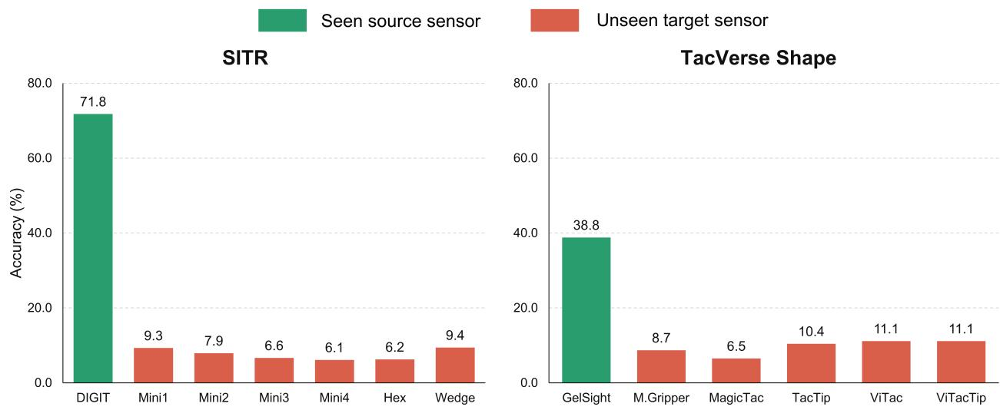
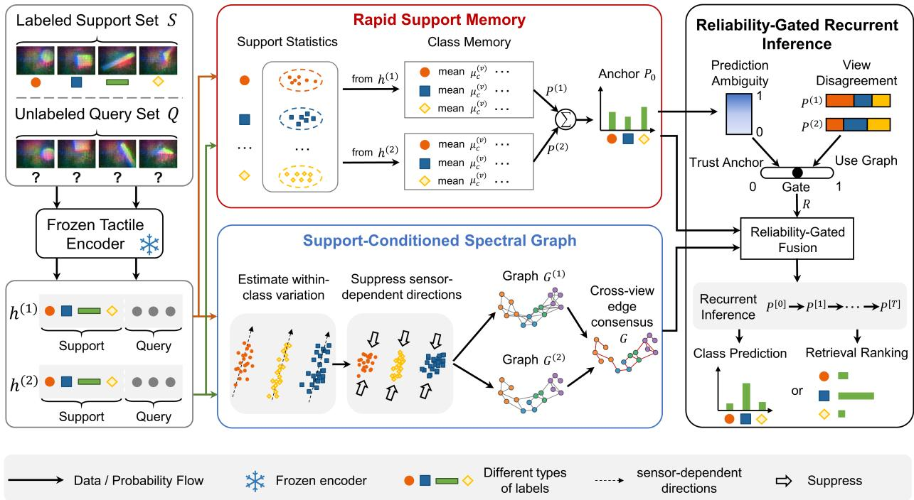
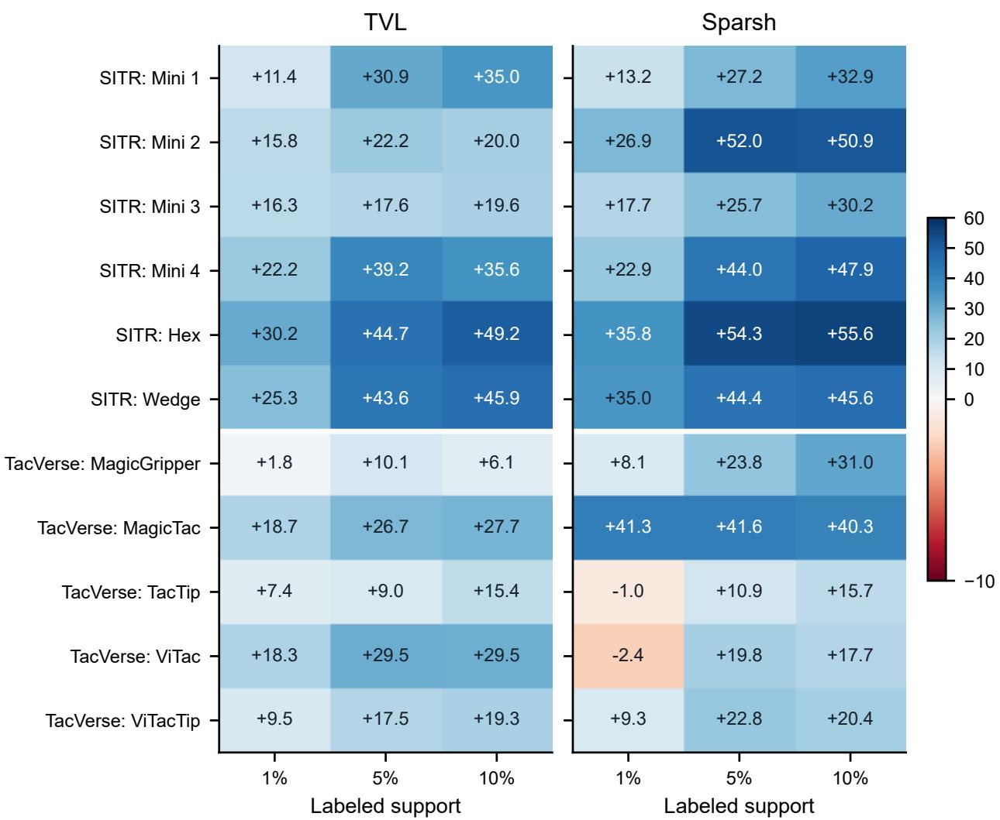
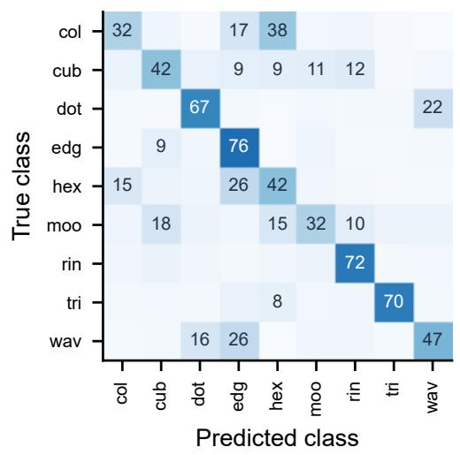
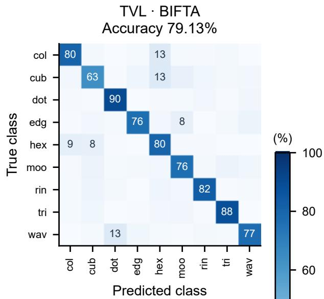
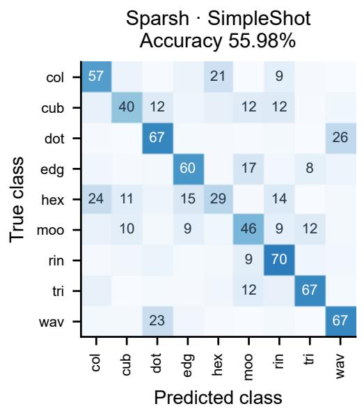
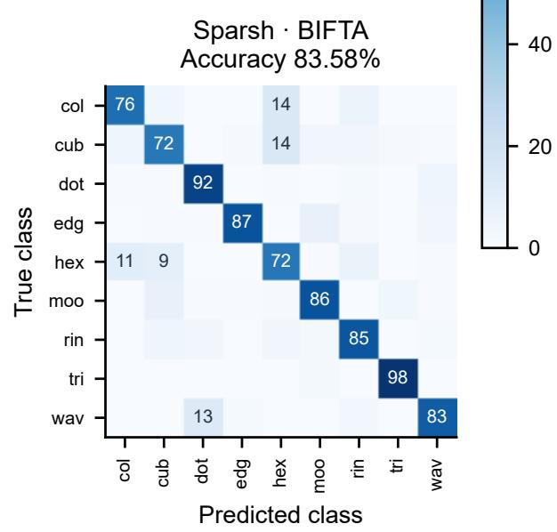

# BIFTA: BRAIN-INSPIRED FEW-SHOT TACTILE ADAPTATION FOR UNKNOWN SENSORS

PREPRINT

Boheng Liu School of Computer Science and Technology Beijing Institute of Technology Beijing, China boheng@bit.edu.cn

Ziyu Li\* School of Computer Science and Technology Beijing Institute of Technology Beijing, China ziyuli@bit.edu.cn

Xia Wu School of Computer Science and Technology Beijing Institute of Technology Beijing, China

## ABSTRACT

Advances in tactile sensing have made contact-rich perception possible, accelerating progress in robotic manipulation, material understanding, and embodied interaction. However, because optical design, elastomer mechanics, and imaging geometry differ substantially across tactile sensors, models trained on known sensor types can suffer an abrupt performance collapse on unknown sensors. To address this problem, we propose the Brain-Inspired Few-Shot Tactile Adaptation (BIFTA) framework; it draws on the brain’s rapid sensory adaptation mechanism to adapt a frozen encoder to an unknown tactile sensor from a small labeled support set. BIFTA preserves pretrained representations through dual-view statistical memory, constructs support-conditioned spectral graphs to repair sensordependent feature neighborhoods, and applies uncertainty-gated recurrent propagation to strengthen reliable cross-query evidence. Extensive benchmarks across three tactile datasets show that BIFTA substantially improves adaptation to unknown sensors: with only 10% labeled target data on SITR, it raises mean Sparsh accuracy from 6.86% for the frozen source classifier to 87.09%, exceeding the strongest implemented prior comparison by 47.22 percentage points, and these gains generalize across datasets, pretrained backbones, and tactile tasks. These results validate BIFTA for data-efficient adaptation to unknown tactile sensors and offer a promising route toward tactile models that transfer across heterogeneous hardware.

## 1 Introduction

With rapid progress in embodied intelligence, touch is becoming a core capability for agents that must perceive and understand the physical world through contact. Vision-based tactile sensors recover contact geometry and material responses that external vision cannot directly observe, thereby bringing robotic perception closer to human touch and improving manipulation, object recognition, and physical interaction [Yuan et al., 2017, Lambeta et al., 2020]. However, differences in optics, marker layout, field of view, and elastomer mechanics cause the same contact to produce sensor-specific observations. Most tactile models learn representations at scale on one or several known sensor types and generalize poorly when deployed with previously unseen hardware. Rapid adaptation to unknown tactile sensors is therefore essential for sensor replacement, hardware upgrades, and heterogeneous robot fleets.

Recent tactile foundation models reduce the cost of learning transferable features. TVL aligns touch with vision and language to learn semantically grounded tactile representations, while Sparsh uses self-supervised learning on heterogeneous tactile data to support transfer across downstream tasks [Fu et al., 2024, Higuera et al., 2025a]. Crosssensor methods further learn invariance, alignment, or sensor-conditioned representations [Gupta et al., 2025, Feng et al., 2025, Zhang et al., 2026]. Nevertheless, these models learn from a finite set of sensor designs and cannot anticipate every device encountered after deployment. Figure 1 shows the consequence: a TVL classifier that performs well on its source sensor falls close to chance on every evaluated unknown sensor. Fine-tuning or additional representation learning on the new device can reduce this gap, but it requires target data, computation, and optimization, while limited supervision can overwrite reusable features or fit sensor-specific artifacts. More fundamentally, sensor shift can amplify nondiscriminative feature directions, alter nearest-neighbor relations, and make different encoder readouts disagree, leaving the pretrained geometry poorly matched to the target sensor.

  
Figure 1: TVL performs well on the source sensor but collapses on unknown sensors. A linear classifier trained on the source sensor is evaluated with frozen TVL features and no target labels. Green bars denote seen source sensors and red bars denote unseen target sensors. Bars show mean accuracy over three seeds. On SITR, accuracy falls from 71.75% on DIGIT to 7.58% on average across six unknown sensors. On TacVerse Shape, it falls from 38.78% on GelSightNoMarker to 9.56% across five unknown sensors.

Few-shot adaptation offers two practical routes. Optimization-based approaches attach a lightweight classifier or adapter and update it from the labeled support set; this directly adjusts the target decision boundary, but it still requires training and can overfit scarce examples. Relation-based approaches instead classify through prototypes, normalized nearest neighbors, support caches, or query graphs [Wang et al., 2019, Zhang et al., 2022, Ziko et al., 2020, Boudiaf et al., 2020]. They reduce optimization cost and can exploit query structure, but their success depends on a feature metric that remains meaningful after sensor shift. Distorted neighborhoods can make graph inference propagate correlated errors, while uniform propagation gives reliable and unreliable queries the same dependence on their neighbors. These approaches reduce adaptation cost, yet they do not jointly preserve stable pretrained evidence, repair target-specific geometry, and control relational inference for each query. This exposes the central question of our work: how can a tactile foundation model use only a few labeled contacts and, in doing so, transfer its perception capability rapidly and reliably to an unknown sensor?

To address this question, we draw inspiration from the brain’s rapid sensory adaptation mechanism [McClelland et al., 1995, Carandini and Heeger, 2012, Ernst and Banks, 2002, Khona and Fiete, 2022] and propose Brain-Inspired Few-Shot Tactile Adaptation (BIFTA). First, rapid support memory fits discriminant memories to two readouts from the same frozen encoder; it then fuses them into a stable probability anchor. Second, support-conditioned spectral geometry uses labeled target variation to suppress unstable feature directions; it then constructs a cross-readout consensus graph with more reliable neighborhoods. Third, reliability-gated anchored recurrence uses prediction ambiguity and readout disagreement; these signals determine how strongly each query should absorb graph evidence while retaining its support derived anchor. By separating stable memory from rapid geometric recalibration and reliability-controlled integration, BIFTA converts unknown-sensor transfer into a support-conditioned inference problem without gradient-based encoder updates, bridging the gap between pretrained sensor experience and previously unseen hardware.

Experiments across three tactile datasets, using two frozen backbones, demonstrate that BIFTA substantially improves perception on unknown sensors. With only 10% labeled target data on SITR, BIFTA raises TVL accuracy from the frozen source classifier’s 7.58% to 85.71% and exceeds the strongest external comparison by 38.24 percentage points. On TacVerse Shape, the same target-data budget raises Sparsh accuracy from 13.67% to 83.58%, exceeding the strongest external comparison by 27.60 points. The gains extend across datasets, pretrained backbones, and tactile classification and retrieval tasks. These results show that brain-inspired rapid adaptation can strengthen cross-sensor tactile generalization, thereby offering a promising direction for robust embodied perception across evolving hardware.

## 2 Related Work

Tactile foundation models. Vision-based tactile learning began with sensors such as GelSight and DIGIT, which convert contact deformation into high-resolution images [Yuan et al., 2017, Lambeta et al., 2020]. Early large-scale resources such as Touch and Go enabled paired vision–touch learning [Yang et al., 2022]. Tactile foundation models then moved from task-specific supervision toward reusable multimodal and self-supervised representations. TVL aligns touch with vision and language, UniTouch binds heterogeneous sensors through sensor-specific tokens, ViT-Lens connects touch to a pretrained visual representation, and Sparsh learns transferable features from unlabeled tactile data [Fu et al., 2024, Yang et al., 2024, Lei et al., 2024, Higuera et al., 2025a]. Recent models have further expanded tactile learning toward multisensory manipulation, distributed tactile skin, and visual–tactile material localization [Higuera et al., 2025b, Sharma et al., 2025, Kim et al., 2026]. These advances increase data scale, semantic alignment, and hardware diversity, but the learned encoders remain limited to data from a finite set of sensors. Changes in optical configuration, marker layout, and elastomer mechanics on an unknown sensor alter feature statistics and neighborhood structure, making efficient adaptation difficult.

Few-shot learning for unknown tactile sensors. General few-shot learning methods broadly follow optimization-based or relation-based strategies. Optimization-based methods fit a lightweight classifier, adapter, or test-time state from the support set, which can adjust the decision boundary directly but requires iterative updates and can overfit scarce examples [Karmanov et al., 2024, Boudiaf et al., 2020, Singh et al., 2026]. Relation-based methods retain frozen features and classify through normalized prototypes, support caches, probability objectives, or query graphs [Wang et al., 2019, Zhang et al., 2022, Ziko et al., 2020, Zhou et al., 2003, Martin et al., 2024]. These methods reduce target-training cost, but a fixed metric or unreliable pseudo-label can amplify errors after sensor shift. Few-shot adaptation designed specifically for tactile hardware remains sparse. The closest cross-sensor methods use simulated variation and calibration in SITR, cross-sensor matching in AnyTouch, or synthetic transfer and sensor-conditioned modulation in CTSRL [Gupta et al., 2025, Feng et al., 2025, Zhang et al., 2026]. These approaches require specific calibration or paired data, or struggle to adapt when an unknown sensor differs substantially from the training sensors. They also adapt at the overall sensor or representation level, leaving class-dependent feature distortion and unreliable query relations insufficiently addressed. BIFTA instead learns target statistics from a small labeled support set, using them to reshape neighborhood geometry and regulate evidence propagation without paired calibration observations or encoder retraining.

## 3 Method

## 3.1 Problem formulation

We consider an unknown target tactile sensor with a labeled support set $\pmb { \cal S } = \{ ( x _ { i } , y _ { i } ) \} _ { i = 1 } ^ { n }$ and an unlabeled query batch $\mathcal { Q } = \{ x _ { j } \} _ { j = 1 } ^ { m }$ , where x denotes a tactile observation, $y _ { i } \in \{ \bar { 1 } , \ldots , C \}$ is its label, C is the number of classes, and every class appears in S. A pretrained encoder $f _ { \theta }$ with fixed parameters $\theta$ provides two feature readouts $h ^ { ( v ) } ( x ) \in \mathbb { R } ^ { d _ { v } }$ where $v \in \{ \bar { 1 } , 2 \}$ indexes the readout and $d _ { v }$ is its dimension. Given $s$ and $\mathcal { Q } ,$ our goal is to predict the m query labels jointly without query annotations, source-data replay, or encoder updates.

## 3.2 Brain-inspired design overview

Human perception remains stable under changing sensory conditions, as the brain combines long-term knowledge with rapid sensory adaptation. Complementary learning protects established representations while incorporating new experience, sensory normalization recalibrates responses to current input statistics, and reliability-weighted recurrent integration accumulates uncertain evidence toward a stable interpretation [McClelland et al., 1995, Carandini and Heeger, 2012, Ernst and Banks, 2002, Khona and Fiete, 2022]. Together, these processes allow perception to adjust quickly without discarding previously acquired knowledge.

Inspired by this mechanism, BIFTA couples three modules, as shown in Figure 2. Rapid support memory converts the two frozen readouts into a support-supervised probability anchor $P _ { 0 } \in [ 0 , 1 ] ^ { m \times C }$ . A support-conditioned spectral graph suppresses unstable feature directions and produces a query affinity matrix $G \in \mathbb { R } _ { + } ^ { m \times m }$ , where $\mathbb { R } _ { + }$ denotes the nonnegative real numbers. A query-wise reliability gate forms a diagonal matrix $R \in [ 0 , 1 ] ^ { m \times m }$ that controls how strongly each query uses relational evidence. Their joint action preserves stable class evidence while recalibrating sensor-dependent geometry and evidence flow for the unknown sensor.

  
Figure 2: Information flow through BIFTA. A frozen encoder produces two readouts. Rapid support memory forms the probability anchor $P _ { 0 } .$ , while the support-conditioned spectral graph reshapes query geometry and constructs the cross-readout affinity matrix $G .$ . Prediction ambiguity and readout disagreement determine the query-wise reliability gate R. Anchored recurrent inference combines $\bar { P } _ { 0 } , \bar { G }$ , and R to produce class probabilities or identity rankings.

## 3.3 Rapid support memory

For each readout $v ,$ we compute the support mean $b ^ { ( v ) } \in \mathbb { R } ^ { d _ { v } }$ and coordinate-wise standard deviation $s ^ { ( v ) } \in \mathbb { R } ^ { d _ { v } }$ , then standardize every support or query feature as

$$
z ^ { ( v ) } ( x ) = \big ( h ^ { ( v ) } ( x ) - b ^ { ( v ) } \big ) \oslash s ^ { ( v ) } ,\tag{1}
$$

where ⊘ denotes coordinate-wise division and constant coordinates use unit scale. Let $n _ { c } = | \{ i : y _ { i } = c \} | , \pi _ { c } = n _ { c } / n _ { i }$ and $\mu _ { c } ^ { ( v ) }$ denote the support count, support prior, and standardized mean of class c in readout $v .$ We fit a shrinkage linear discriminant analysis memory [Fisher, 1936] with pooled within-class covariance $\Sigma _ { \rho } ^ { ( v ) } \in \mathbb { R } ^ { d _ { v } \times d _ { v } }$ and shrinkage parameter $\rho \in [ 0 , 1 ]$ . Its class score for a standardized feature z is

$$
\ell _ { c } ^ { ( v ) } ( z ) = z ^ { \top } ( \Sigma _ { \rho } ^ { ( v ) } ) ^ { - 1 } \mu _ { c } ^ { ( v ) } - \frac { 1 } { 2 } ( \mu _ { c } ^ { ( v ) } ) ^ { \top } ( \Sigma _ { \rho } ^ { ( v ) } ) ^ { - 1 } \mu _ { c } ^ { ( v ) } + \log \pi _ { c } .\tag{2}
$$

For query $x _ { j }$ , a temperature $\tau _ { m } > 0$ converts the scores into the class distribution $P _ { j } ^ { ( v ) } \in [ 0 , 1 ] ^ { C }$ through

$$
P _ { j c } ^ { ( v ) } = \mathrm { s o f t m a x } _ { c } \Big ( \ell _ { c } ^ { ( v ) } ( z ^ { ( v ) } ( x _ { j } ) ) / \tau _ { m } \Big ) , \qquad P _ { 0 } = \alpha P ^ { ( 1 ) } + ( 1 - \alpha ) P ^ { ( 2 ) } ,\tag{3}
$$

where softma $\mathbf { x } _ { c }$ normalizes over the $C$ class scores, $\alpha \in [ 0 , 1 ]$ is the readout weight, and $P _ { 0 }$ is the fused probability anchor. This anchor carries direct support-supervised class evidence into the final inference stage.

## 3.4 Support-conditioned spectral graph

Sensor changes can enlarge feature directions that vary within a class, causing them to dominate query similarity. For each support example, we define the class residual $e _ { i } ^ { ( v ) } = z ^ { ( v ) } ( x _ { i } ) - \mu _ { y _ { i } } ^ { ( v ) }$ and estimate its covariance with Ledoit–Wolf

shrinkage [Ledoit and Wolf, 2004]:

$$
\widehat { \Sigma } _ { w } ^ { ( v ) } = \mathrm { L W } \Big ( \{ e _ { i } ^ { ( v ) } \} _ { i = 1 } ^ { n } \Big ) = U ^ { ( v ) } \mathrm { d i a g } ( \lambda _ { 1 } ^ { ( v ) } , \ldots , \lambda _ { d _ { v } } ^ { ( v ) } ) ( U ^ { ( v ) } ) ^ { \top } ,\tag{4}
$$

where $U ^ { ( v ) }$ contains the eigenvectors and $\lambda _ { a } ^ { ( v ) }$ is the eigenvalue of direction a. Given a spectral exponent $\gamma \geq 0$ and numerical floor $\epsilon = 1 0 ^ { - 6 }$ , we downweight high-variance directions through

$$
\begin{array} { l l } { g _ { a } ^ { ( v ) } = \displaystyle \frac { \operatorname* { m a x } ( \lambda _ { a } ^ { ( v ) } , \epsilon ) ^ { - \gamma } } { \operatorname* { m e d i a n } _ { b } \operatorname* { m a x } ( \lambda _ { b } ^ { ( v ) } , \epsilon ) ^ { - \gamma } } , \ ~ } & { ~ A ^ { ( v ) } = U ^ { ( v ) } \mathrm { d i a g } ( g ^ { ( v ) } ) ( U ^ { ( v ) } ) ^ { \top } , } \\ { \displaystyle \widetilde { z } _ { j } ^ { ( v ) } = A ^ { ( v ) } z ^ { ( v ) } ( x _ { j } ) , } \end{array}\tag{5}
$$

where $g _ { a } ^ { ( v ) }$ is the gain for direction $a , A ^ { ( v ) }$ is the spectral transform, and $\widetilde { z } _ { j } ^ { ( v ) }$ is the transformed query feature. The transform changes only the geometry used to connect queries and leaves the probability anchor in Eq. (3) unchanged.

We normalize $q _ { j } ^ { ( v ) } = { \widetilde { z } _ { j } ^ { ( v ) } } / \| \widetilde { z } _ { j } ^ { ( v ) } \| _ { 2 }$ and construct a directed k-nearest-neighbor graph. Let $\mathcal { N } _ { k } ^ { ( v ) } ( j )$ be the neighbors of query j in readout v, excluding j, and let $\tau _ { g } > 0$ be the graph temperature. The directed edge from query $j$ to query l is

$$
W _ { j l } ^ { ( v ) } = \frac { \mathbf { 1 } [ l \in \mathcal { N } _ { k } ^ { ( v ) } ( j ) ] \exp ( ( q _ { j } ^ { ( v ) } ) ^ { \top } q _ { l } ^ { ( v ) } / \tau _ { g } ) } { \sum _ { a \in \mathcal { N } _ { k } ^ { ( v ) } ( j ) } \exp ( ( q _ { j } ^ { ( v ) } ) ^ { \top } q _ { a } ^ { ( v ) } / \tau _ { g } ) } .\tag{6}
$$

Here $\mathbf { 1 } [ \cdot ]$ is the indicator function. We symmetrize each readout graph and retain relations supported by both readouts:

$$
G ^ { ( v ) } = \mathrm { R o w N o r m } \left( \frac { W ^ { ( v ) } + ( W ^ { ( v ) } ) ^ { \top } } { 2 } \right) , \qquad G = \mathrm { R o w N o r m } \left( \sqrt { G ^ { ( 1 ) } \odot G ^ { ( 2 ) } } \right) ,\tag{7}
$$

where RowNorm divides each nonzero row by its sum, ⊙ is entry-wise multiplication, and the square root is entry-wise.   
If a query has no shared edge, its row is replaced by the corresponding row of $( G ^ { ( 1 ) } + G ^ { ( 2 ) } ) / 2$ before normalization.   
The resulting row-stochastic matrix G encodes the support-adapted query geometry.

## 3.5 Query-wise reliability gate

The gate measures whether each query has a stable initial prediction. For class distributions $u , v \in [ 0 , 1 ] ^ { C }$ , define entropy $\begin{array} { r } { H ( u ) = - \sum _ { c = 1 } ^ { C } u _ { c } \log u _ { c } } \end{array}$ and divergence $\begin{array} { r } { \mathrm { K L } ( u \| v ) = \sum _ { c = 1 } ^ { C } u _ { c } \log ( u _ { c } / v _ { c } ) } \end{array}$ . For query $j ,$ , let $P _ { 0 , j }$ be row $j$ of $P _ { 0 }$ and $\overline { { P } } _ { j } = ( P _ { i } ^ { ( 1 ) } + P _ { i } ^ { ( 2 ) } ) / 2$ . We measure anchor ambiguity $a _ { j } \in [ 0 , 1 ]$ and cross-readout disagreement $d _ { j } \in [ 0 , 1 ]$ as [Shannon, 1948, Lin, 1991]

$$
a _ { j } = \frac { H ( P _ { 0 , j } ) } { \log C } , \qquad d _ { j } = \sqrt { \frac { \frac { 1 } { 2 } \operatorname { K L } ( P _ { j } ^ { ( 1 ) } | | \overline { { P } } _ { j } ) + \frac { 1 } { 2 } \operatorname { K L } ( P _ { j } ^ { ( 2 ) } | | \overline { { P } } _ { j } ) } { \log 2 } } .\tag{8}
$$

Given a disagreement weight $\lambda \in [ 0 , 1 ]$ , gate exponent $p > 0$ , and recurrence bounds $0 \leq r _ { \operatorname* { m i n } } \leq r _ { \operatorname* { m a x } } < 1$ , the combined uncertainty $s _ { j }$ and recurrence weight $r _ { j }$ are

$$
\begin{array} { r l r l r l } & { s _ { j } = \mathrm { c l i p } ( ( 1 - \lambda ) a _ { j } + \lambda d _ { j } , 0 , 1 ) , } & & { r _ { j } = r _ { \operatorname* { m i n } } + ( r _ { \operatorname* { m a x } } - r _ { \operatorname* { m i n } } ) s _ { j } ^ { p } , } & & { R = \mathrm { d i a g } ( r _ { 1 } , . . . , r _ { m } ) . } \end{array}\tag{9}
$$

Here $\mathrm { c l i p } ( u , 0 , 1 )$ truncates u to [0, 1]. A larger $r _ { j }$ gives query $j$ greater access to graph evidence, while a smaller value keeps its prediction closer to the support-derived anchor.

## 3.6 Anchored recurrent inference and output

Starting from $P ^ { [ 0 ] } = P _ { 0 }$ , BIFTA combines the anchor, spectral graph, and reliability gate for $T \in \mathbb { N } _ { + }$ iterations:

$$
P ^ { [ t + 1 ] } = \mathcal { N } _ { \pi } \Big [ ( I _ { m } - R ) P _ { 0 } + R G P ^ { [ t ] } \Big ] , \qquad t = 0 , \dotsc , T - 1 ,\tag{10}
$$

where $P ^ { [ t ] } \in [ 0 , 1 ] ^ { m \times C }$ is the query probability matrix at iteration t and $I _ { m }$ is the $m \times m$ identity matrix. The first term restores support-supervised evidence, while the second propagates neighborhood evidence in proportion to each query’s reliability weight.

The operator $\mathcal { N } _ { \pi }$ clips its nonnegative input below $1 0 ^ { - 8 }$ and applies five alternating column and row normalizations [Cuturi, 2013]. For an intermediate matrix $V \in \mathbb { R } _ { + } ^ { m \times C }$ , each normalization step is

$$
V _ { j c }  V _ { j c } \frac { m \pi _ { c } } { \sum _ { l = 1 } ^ { m } V _ { l c } + 1 0 ^ { - 1 2 } } , \qquad V _ { j c }  \frac { V _ { j c } } { \sum _ { b = 1 } ^ { C } V _ { j b } + 1 0 ^ { - 1 2 } } .\tag{11}
$$

This operation aligns aggregate query mass with the support prior $\pi = ( \pi _ { 1 } , \ldots , \pi _ { C } )$ while returning each row to a class distribution. After T iterations, classification outputs $\widehat { y } _ { j } = \arg \operatorname* { m a x } _ { c } P _ { j c } ^ { [ T ] }$ , whereas retrieval ranks enrolled identities by sorting $P _ { j c } ^ { [ T ] }$ over c in descending order. Appendix A.1 provides the complete pseudocode.

## 4 Experiments

## 4.1 Experimental setup

Datasets and label budgets. SITR [Gupta et al., 2025] contains seven sensors and a 16-class subset. We use DIGIT as the source and four GelSight Mini devices, GelSight Hex, and GelSight Wedge as six targets; all six are outside TVL’s DIGIT pretraining, while Hex and Wedge are outside the sensor families listed for Sparsh pretraining. From the 800 training images per class and target, 1%, 5%, and 10% budgets provide 8, 40, and 80 support images, and the 200-image evaluation split gives 3,200 queries per target. TacVerse Shape [Wei et al., 2026] contains seven sensors and nine shape classes. We use GelSightNoMarker as the source and MagicGripper, MagicTac, TacTip, ViTac, and ViTacTip as five targets, all absent from the listed pretraining sensors of both backbones. Each sensor–class pair is divided into 300 training, 100 validation, and 100 test images; the three budgets sample 3, 15, and 30 support images per class and use 900 test queries per target. TacQuad [Feng et al., 2025] contains 56 enrolled identities across three RGB sensors. DIGIT is the source, while GelSight Mini and DuraGel are two targets; both are outside TVL’s pretraining sensors, and DuraGel is outside Sparsh’s. We sample 2, 4, or 6 support frames per identity, corresponding to 10%, 20%, and 30% of each 20-frame sequence, reserve the next four frames as a temporal gap, and use the final four frames to form 224 queries per target. Appendix A.2 provides the exact splits and sample accounting.

Encoders and sensor exposure. Both TVL ViT-Small and Sparsh-DINO Small remain frozen [Fu et al., 2024, Higuera et al., 2025a]. Their architectures follow the Vision Transformer [Dosovitskiy et al., 2021], and Sparsh uses DINO self-distillation [Caron et al., 2021]. TVL takes 224 × 224 RGB images, whereas Sparsh concatenates two RGB frames along the channel dimension. SITR and TacVerse duplicate the same frame for Sparsh, while TacQuad pair each frame with an earlier neighboring frame from the same trial. TVL was pretrained with DIGIT; Sparsh’s pretraining includes DIGIT, GelSight 2017, and GelSight Mini. Appendix A.3 details preprocessing.

Comparison methods. We use Tip-Adapter [Zhang et al., 2022], SimpleShot [Wang et al., 2019], and Laplacian-Shot [Ziko et al., 2020] as representative frozen-feature few-shot methods. They transfer support information through cache affinity, normalized class prototypes, or transductive query relations without updating the tactile encoder. We further include three recent tactile cross-sensor adaptation methods: SITR-Calib [Gupta et al., 2025], AnyTouch Match [Feng et al., 2025], and CTSRL CSM [Zhang et al., 2026]. These methods retain frozen features while training a lightweight feature module and classification head. Appendix A.4 gives their implementations.

Metrics and experimental settings. Classification uses accuracy and macro-F1 [Sokolova and Lapalme, 2009]; ranking uses mean reciprocal rank (MRR) [Craswell, 2009] and recall at one (R@1), following standard ranked-retrieval evaluation [Manning et al., 2008]. We report the mean and sample standard deviation over three random seeds. All experiments run on an NVIDIA H800 GPU with 80 GB memory. Appendix A.5 reports the complete implementation and parameters.

Table 1: Few-shot classification on six unknown SITR sensors with two pretrained backbones under different label budgets. Accuracy (%) is averaged across the unknown sensors and reported as mean ± sample standard deviation over three random seeds. I/T denotes inductive/transductive inference. Best results are in bold and second-best results are underlined.
<table><tr><td>Method</td><td>Mode</td><td>TVL 1%</td><td>TVL 5%</td><td>TVL 10%</td><td>Sparsh 1%</td><td> $\mathrm { S p a r s h } 5 \%$ </td><td>Sparsh 10%</td></tr><tr><td>Frozen backbone</td><td>I</td><td> $7 . 5 8 \pm 0 . 1 4$ </td><td> $7 . 5 8 \pm 0 . 1 4$ </td><td> $7 . 5 8 \pm 0 . 1 4$ </td><td> $6 . 8 6 \pm 0 . 3 3$ </td><td> $6 . 8 6 \pm 0 . 3 3$ </td><td> $6 . 8 6 \pm 0 . 3 3$ </td></tr><tr><td>Tip-Adapter</td><td>I</td><td> $1 7 . 2 1 \pm 1 . 6 3$ </td><td> $2 3 . 5 1 \pm 0 . 5 1$ </td><td> $2 8 . 5 6 \pm 1 . 3 7$ </td><td> $1 4 . 8 5 \pm 0 . 3 4$ </td><td> $2 1 . 9 0 \pm 0 . 9 2$ </td><td> $2 2 . 3 0 \pm 0 . 0 4$ </td></tr><tr><td>SimpleShot</td><td>I</td><td> $3 7 . 9 8 \pm 0 . 6 9$ </td><td> $4 4 . 4 7 \pm 0 . 9 0$ </td><td> $4 4 . 5 5 \pm 0 . 6 2$ </td><td> $3 2 . 0 8 \pm 2 . 4 5$ </td><td> $3 8 . 6 4 \pm 0 . 9 6$ </td><td> $3 9 . 2 1 \pm 0 . 8 1$ </td></tr><tr><td>LaplacianShot</td><td>T</td><td> $3 8 . 5 5 \pm 0 . 3 8 $ </td><td> $4 5 . 8 4 \pm 1 . 6 5$ </td><td> $4 4 . 1 1 \pm 0 . 6 0$ </td><td> $3 2 . 7 8 \pm 3 . 5 2$ </td><td> $3 9 . 9 4 \pm 1 . 2 9 $ </td><td> $3 9 . 8 7 \pm 0 . 7 7$ </td></tr><tr><td>SITR-Calib</td><td>I</td><td> $\overline { { 3 8 . 0 0 \pm 1 . 5 6 } }$ </td><td> $4 6 . 5 8 \pm 0 . 0 8$ </td><td> $4 7 . 4 7 \pm 1 . 4 4$ </td><td> $\overline { { 3 0 . 8 8 \pm 1 . 9 9 } }$ </td><td> $\overline { { 3 4 . 4 6 \pm 1 . 0 0 } }$ </td><td> $\overline { { 3 4 . 1 7 \pm 0 . 3 5 } }$ </td></tr><tr><td>AnyTouch Match</td><td>I</td><td> $3 6 . 2 7 \pm 1 . 5 5$ </td><td> $4 4 . 3 0 \pm 0 . 1 2$ </td><td> $\overline { { 4 5 . 3 2 \pm 1 . 0 0 } }$ </td><td> $3 2 . 3 4 \pm 0 . 9 9$ </td><td> $3 5 . 3 6 \pm 0 . 5 6$ </td><td> $3 5 . 8 1 \pm 0 . 6 4$ </td></tr><tr><td>CTSRL CSM</td><td>I</td><td> $3 7 . 4 2 \pm 1 . 7 7$ </td><td> $4 3 . 8 7 \pm 1 . 2 9$ </td><td> $4 4 . 9 9 \pm 0 . 8 5$ </td><td> $3 1 . 9 8 \pm 1 . 2 7$ </td><td> $3 4 . 9 4 \pm 0 . 2 5$ </td><td> $3 4 . 3 1 \pm 0 . 3 9$ </td></tr><tr><td>BIFTA</td><td>T</td><td> ${ \bf 6 2 . 2 2 \pm 1 . 1 1 }$ </td><td> ${ \bf 8 3 . 5 9 \pm 0 . 8 1 }$ </td><td> ${ \bf 8 5 . 7 1 \pm 0 . 1 2 }$ </td><td> ${ \bf 6 2 . 1 2 \pm 1 . 4 3 }$ </td><td> $\mathbf { 8 3 . 8 1 \pm 0 . 8 0 }$ </td><td> ${ \bf 8 7 . 0 9 \pm 0 . 6 1 }$ </td></tr></table>

Table 2: Few-shot classification on five unknown TacVerse Shape sensors with two pretrained backbones under different label budgets. Accuracy (%) is averaged across the unknown sensors and reported as mean ± sample standard deviation over three random seeds. I/T denotes inductive/transductive inference. SITR-Calib is unavailable because standard calibration images are absent. Best results are in bold and second-best results are underlined.
<table><tr><td>Method</td><td>Mode</td><td>TVL 1%</td><td>TVL 5%</td><td>TVL 10%</td><td>Sparsh 1%</td><td>Sparsh 5%</td><td>Sparsh 10%</td></tr><tr><td>Frozen backbone</td><td>I</td><td> $9 . 5 6 \pm 0 . 4 8$ </td><td> $9 . 5 6 \pm 0 . 4 8$ </td><td> $9 . 5 6 \pm 0 . 4 8$ </td><td> $1 3 . 6 7 \pm 0 . 4 7$ </td><td> $1 3 . 6 7 \pm 0 . 4 7$ </td><td> $1 3 . 6 7 \pm 0 . 4 7$ </td></tr><tr><td>Tip-Adapter</td><td>I</td><td> $2 2 . 7 9 \pm 4 . 2 4$ </td><td> $3 9 . 4 5 \pm 2 . 1 5$ </td><td> $4 5 . 5 2 \pm 0 . 7 3$ </td><td> $1 4 . 2 4 \pm 1 . 0 7$ </td><td> $2 5 . 6 1 \pm 0 . 7 4$ </td><td> $3 5 . 4 3 \pm 0 . 7 2$ </td></tr><tr><td>SimpleShot</td><td>I</td><td> $\underline { { 4 4 . 5 7 \pm 2 . 7 0 } }$ </td><td> $5 1 . 1 3 \pm 1 . 7 3$ </td><td> $5 3 . 3 5 \pm 0 . 7 6$ </td><td> $\underline { { 4 6 . 6 1 \pm 0 . 5 4 } }$ </td><td> $5 3 . 8 0 \pm 0 . 9 1$ </td><td> $5 5 . 9 8 \pm 0 . 8 6$ </td></tr><tr><td>LaplacianShot</td><td>T</td><td> $\overline { { 4 3 . 5 7 \pm 4 . 2 8 } }$ </td><td> $4 9 . 6 6 \pm 1 . 6 1$ </td><td> $5 1 . 6 1 \pm 1 . 2 6$ </td><td> $4 4 . 9 6 \pm 2 . 3 1$ </td><td> $\overline { { 5 1 . 4 7 \pm 0 . 6 0 } }$ </td><td> $5 2 . 2 4 \pm 1 . 1 7$ </td></tr><tr><td>SITR-Calib</td><td>I</td><td></td><td></td><td></td><td></td><td></td><td></td></tr><tr><td>AnyTouch Match</td><td>I</td><td> $4 2 . 4 4 \pm 1 . 9 3$ </td><td> $5 1 . 6 1 \pm 1 . 7 3$ </td><td> $5 5 . 8 3 \pm 0 . 3 7$ </td><td> $4 1 . 3 3 \pm 1 . 7 1$ </td><td> $4 9 . 2 3 \pm 1 . 1 6$ </td><td> $4 9 . 8 2 \pm 2 . 1 2$ </td></tr><tr><td>CTSRL CSM</td><td>I</td><td> $4 3 . 2 6 \pm 1 . 4 1$ </td><td> $5 3 . 6 1 \pm 3 . 4 1$ </td><td> $5 6 . 6 7 \pm 0 . 8 3$ </td><td> $4 2 . 4 4 \pm 1 . 9 3$ </td><td> $4 9 . 5 0 \pm 1 . 8 2$ </td><td> $4 9 . 7 4 \pm 1 . 9 7$ </td></tr><tr><td>BIFTA</td><td>T</td><td> ${ \bf 5 7 . 9 3 \pm 1 . 7 3 }$ </td><td> $\pm \bf { 7 5 . 4 7 \pm 2 . 0 3 }$ </td><td> $\mathbf { 7 9 . 1 3 \pm 1 . 2 0 }$ </td><td> ${ \bf 5 9 . 6 6 \pm 2 . 6 1 }$ </td><td> $\mathbf { 8 0 . 6 5 \pm 0 . 4 3 }$ </td><td> $\mathbf { 8 3 . 5 8 \pm 1 . 0 5 }$ </td></tr></table>

## 4.2 Cross-sensor classification

Table 1 shows that BIFTA improves unknown-sensor performance at every backbone–budget setting on SITR. With TVL and only 1% labeled target data, BIFTA raises accuracy from 7.58% for the frozen source classifier to 62.22%, outperforming the strongest comparison by 23.67 percentage points. At the 10% budget, it raises accuracy from 7.58% to 85.71% and exceeds the strongest comparison by 38.24 percentage points. With Sparsh, BIFTA reaches 62.12%, 83.81%, and 87.09% at the three budgets, outperforming LaplacianShot by 29.34, 43.87, and 47.22 percentage points, respectively. These results show that BIFTA restores discriminative capability on unknown sensors, reduces the amount of target data required for adaptation, and strengthens robustness to sensor shifts.

Table 2 evaluates whether BIFTA’s performance advantage transfers to another dataset. With TVL at the 10% budget, BIFTA reaches 79.13% accuracy and outperforms the strongest comparison by 22.46 percentage points. With Sparsh, BIFTA achieves 83.58% and improves over the strongest comparison by 27.60 percentage points. Even at the 1% budget, where only three support frames are available per class, BIFTA improves over the strongest comparisons by 13.36 percentage points with TVL and 13.05 percentage points with Sparsh. These results demonstrate that BIFTA robustly generalizes across datasets and improves unknown-sensor recognition with different pretrained backbones.

Figure 3 reports BIFTA’s gain over the strongest comparison for every unknown sensor on SITR and TacVerse with both pretrained backbones. The largest gains occur on GelSight Hex in SITR and MagicTac in TacVerse, reaching 55.6 and 41.6 percentage points, respectively. This pattern is consistent with BIFTA’s dual-view target memory preserving class evidence while its support-conditioned spectral graph suppresses sensor-dependent directions and reconstructs class-consistent neighborhoods under pronounced sensor shifts. Relative gains are smaller on TacTip and MagicGripper in TacVerse, the gains generally expand as more target examples become available, indicating further potential to strengthen adaptation under the most extreme few-shot sensor shifts. Additional sensor-wise, class-wise, and macro-F1 results are reported in Appendix B.

  
Figure 3: Performance comparison with the strongest baseline across sensors on SITR and TacVerse. Each cell reports the accuracy gain of BIFTA for the corresponding unknown sensor and label budget.

Table 3: MRR results for closed-set identity ranking on TacQuad. MRR is reported as a percentage, with mean ± sample standard deviation over three random seeds. SITR-Support uses the support–source mean difference as its condition. I/T denotes inductive/transductive inference. Best results are in bold and second-best results are underlined.
<table><tr><td>Method</td><td>Mode</td><td>TVL 10%</td><td>TVL 20%</td><td>TVL 30%</td><td>Sparsh 10%</td><td>Sparsh 20%</td><td>Sparsh 30%</td></tr><tr><td>Frozen backbone</td><td>I</td><td> $8 . 7 6 \pm 0 . 0 0$ </td><td> $8 . 7 6 \pm 0 . 0 0$ </td><td> $8 . 7 6 \pm 0 . 0 0$ </td><td> $1 0 . 0 1 \pm 0 . 0 0$ </td><td> $1 0 . 0 1 \pm 0 . 0 0$ </td><td> $1 0 . 0 1 \pm 0 . 0 0$ </td></tr><tr><td>Tip-Adapter</td><td>I</td><td> $3 6 . 6 8 \pm 3 . 7 0$ </td><td> $4 7 . 8 0 \pm 1 2 . 3 6$ </td><td> $5 3 . 8 0 \pm 9 . 5 5$ </td><td> $4 5 . 8 0 \pm 0 . 6 9$ </td><td> $6 1 . 4 2 \pm 1 . 1 7$ </td><td> $6 4 . 5 7 \pm 0 . 7 3$ </td></tr><tr><td>SimpleShot</td><td>I</td><td> $5 9 . 0 5 \pm 0 . 7 8$ </td><td> $6 4 . 6 5 \pm 1 . 6 5$ </td><td> $6 6 . 5 7 \pm 1 . 0 6$ </td><td> $6 0 . 3 6 \pm 0 . 8 5$ </td><td> $6 5 . 8 3 \pm 1 . 2 0$ </td><td> $6 8 . 7 5 \pm 0 . 7 8$ </td></tr><tr><td>LaplacianShot</td><td>T</td><td> $\overline { { 4 5 . 1 1 \pm 3 . 0 3 } }$ </td><td> $4 8 . 7 8 \pm 2 . 2 7$ </td><td> $4 7 . 6 4 \pm 1 . 4 4$ </td><td> $4 3 . 3 2 \pm 3 . 1 0$ </td><td> $4 3 . 6 1 \pm 2 . 6 1$ </td><td> $4 5 . 8 2 \pm 0 . 8 8$ </td></tr><tr><td>SITR-Support</td><td>I</td><td> $5 7 . 9 4 \pm 2 . 0 0$ </td><td> $6 4 . 5 4 \pm 0 . 3 8$ </td><td> $6 5 . 4 9 \pm 1 . 4 2$ </td><td> $6 1 . 4 9 \pm 1 . 6 2$ </td><td> $6 7 . 9 0 \pm 0 . 6 3$ </td><td> $7 0 . 7 2 \pm 0 . 4 4$ </td></tr><tr><td>AnyTouch Match</td><td>I</td><td> $5 8 . 2 9 \pm 1 . 3 7$ </td><td> $6 6 . 1 5 \pm 2 . 4 9$ </td><td> $6 8 . 4 9 \pm 1 . 1 0$ </td><td> $\underline { { 6 1 . 7 3 \pm 0 . 9 3 } }$ </td><td> $6 7 . 9 3 \pm 0 . 8 5$ </td><td> $7 1 . 0 0 \pm 0 . 5 1$ </td></tr><tr><td>CTSRL CSM</td><td>I</td><td> $5 7 . 4 9 \pm 2 . 1 6$ </td><td> $6 3 . 8 8 \pm 0 . 8 8$ </td><td> $\overline { { 6 5 . 3 8 \pm 1 . 3 5 } }$ </td><td> $5 8 . 8 8 \pm 0 . 7 8$ </td><td> $6 4 . 9 9 \pm 1 . 1 1 $ </td><td> $6 8 . 1 4 \pm 0 . 2 3$ </td></tr><tr><td>BIFTA</td><td>T</td><td> ${ \bf 6 1 . 1 6 \pm 0 . 9 5 }$ </td><td> ${ \bf 7 6 . 9 8 \pm 0 . 2 0 }$ </td><td> $\mathbf { 8 0 . 9 0 \pm 1 . 8 9 }$ </td><td> ${ \bf 6 9 . 2 8 \pm 0 . 7 2 }$ </td><td> ${ \bf 8 0 . 8 2 \pm 2 . 6 7 }$ </td><td> $\mathbf { 8 5 . 8 6 \pm 1 . 8 0 }$ </td></tr></table>

## 4.3 Closed-set identity ranking

Table 3 reports closed-set identity-ranking performance on TacQuad with different pretrained backbones. Using the TVL backbone, BIFTA improves MRR over the frozen backbone by an average of 64.25 percentage points and over the strongest comparison by an average of 8.45 percentage points. Using Sparsh, BIFTA outperforms the strongest external

comparison by 7.55, 12.89, and 14.86 percentage points at the 10%, 20%, and 30% support budgets, respectively. These results demonstrate BIFTA’s cross-task gains, validating the framework’s adaptability beyond classification. Appendix C reports additional R@1 results.  
Table 4: Ablation results on SITR. Accuracy (%) is reported as mean ± sample standard deviation over three random seeds. Best results are in bold and second-best results are underlined.
<table><tr><td>Variant</td><td>TVL 1%</td><td>TVL 5%</td><td>TVL 10%</td><td>Sparsh 1%</td><td>Sparsh 5%</td><td>Sparsh 10%</td></tr><tr><td>Feature-memory ablations</td><td></td><td></td><td></td><td></td><td></td><td></td></tr><tr><td>Memory: view 1 only</td><td> $5 0 . 3 7 \pm 0 . 8 5$ </td><td> $7 2 . 4 9 \pm 0 . 9 9$ </td><td> $7 5 . 8 5 \pm 0 . 3 2$ </td><td> $5 1 . 6 5 \pm 3 . 0 6$ </td><td> $7 5 . 1 3 \pm 0 . 2 3$ </td><td> $7 7 . 6 5 \pm 0 . 5 9$ </td></tr><tr><td>Memory: view 2 only</td><td> $4 9 . 8 4 \pm 1 . 6 7$ </td><td> $7 0 . 8 2 \pm 1 . 0 1$ </td><td> $7 6 . 0 0 \pm 0 . 1 5$ </td><td> $5 4 . 5 4 \pm 1 . 3 8$ </td><td> $7 1 . 3 8 \pm 0 . 2 0$ </td><td> $7 7 . 6 2 \pm 0 . 8 2$ </td></tr><tr><td>Dual memory; no graph</td><td> $5 1 . 7 1 \pm 0 . 8 8$ </td><td> $7 2 . 7 4 \pm 1 . 0 2$ </td><td> $7 6 . 0 7 \pm 0 . 2 3$ </td><td>52.88 ± 2.88</td><td> $7 4 . 5 6 \pm 0 . 2 0$ </td><td> $7 7 . 9 2 \pm 0 . 8 0$ </td></tr><tr><td>Graph-geometry ablations</td><td></td><td></td><td></td><td></td><td></td><td></td></tr><tr><td>+ Consensus recurrence</td><td> $5 6 . 4 2 \pm 1 . 0 0$ </td><td> $7 7 . 4 1 \pm 0 . 5 7$ </td><td> $8 0 . 1 0 \pm 0 . 2 1$ </td><td> $5 5 . 5 3 \pm 2 . 5 7$ </td><td> $7 8 . 6 2 \pm 0 . 6 3$ </td><td> $8 0 . 8 6 \pm 0 . 6 7$ </td></tr><tr><td>+ Support standardization</td><td> $5 7 . 0 1 \pm 1 . 0 2$ </td><td> $7 7 . 9 9 \pm 0 . 5 8$ </td><td>80.49 ± 0.21</td><td>56.18 ± 2.50</td><td> $7 9 . 1 9 \pm 0 . 6 3$ </td><td> $8 1 . 5 1 \pm 0 . 6 3$ </td></tr><tr><td>+ Spectral normalization</td><td> $5 8 . 7 3 \pm 1 . 1 1$ </td><td> $8 1 . 4 8 \pm 0 . 7 7$ </td><td> $8 2 . 6 8 \pm 0 . 1 1$ </td><td>59.17 ± 2.25</td><td> $8 1 . 7 0 \pm 0 . 9 0$ </td><td> $8 4 . 1 4 \pm 0 . 8 3$ </td></tr><tr><td>Full: arithmetic graph fusion</td><td> $6 1 . 7 6 \pm 1 . 1 7$ </td><td> $8 3 . 2 4 \pm 0 . 7 9$ </td><td> $8 5 . 7 0 \pm 0 . 1 5$ </td><td> $6 1 . 8 9 \pm 1 . 4 6$ </td><td> $8 3 . 6 1 \pm 0 . 7 8$ </td><td> $8 6 . 8 8 \pm 0 . 6 7$ </td></tr><tr><td>Full: no spectral normalization</td><td> $5 8 . 0 4 \pm 1 . 0 2$ </td><td> $7 6 . 5 3 \pm 0 . 4 4$ </td><td> $8 1 . 5 0 \pm 0 . 1 1$ </td><td>56.27 ± 2.10</td><td> $7 7 . 7 4 \pm 0 . 3 4$ </td><td> $8 2 . 2 9 \pm 0 . 7 5$ </td></tr><tr><td>Reliability-gate ablations</td><td></td><td></td><td></td><td></td><td></td><td></td></tr><tr><td>Full: disagreement only</td><td> ${ \bf 6 2 . 2 2 \pm 1 . 1 1 }$ </td><td> $8 3 . 5 3 \pm 0 . 8 1$ </td><td>85.71 ± 0.12 62.12 ± 1.43</td><td></td><td> $8 3 . 7 9 \pm 0 . 7 9$ </td><td> ${ \bf 8 7 . 0 9 \pm 0 . 6 4 }$ </td></tr><tr><td>Full: entropy only</td><td> $6 2 . 0 4 \pm 1 . 0 7$ </td><td> $\mathbf { 8 3 . 5 9 \pm 0 . 8 0 }$ </td><td>85.70 ± 0.22</td><td>61.80 ± 1.46 83.85 ± 0.83</td><td></td><td> $8 7 . 0 2 \pm 0 . 5 0 $ </td></tr><tr><td>Complete framework</td><td></td><td></td><td></td><td></td><td></td><td></td></tr><tr><td>Full BIFTA</td><td> ${ \bf 6 2 . 2 2 \pm 1 . 1 1 }$ </td><td>83.59 ± 0.81 85.71 ± 0.12 62.12 ± 1.43</td><td></td><td></td><td> $8 3 . 8 1 \pm 0 . 8 0$ </td><td> ${ \bf 8 7 . 0 9 \pm 0 . 6 1 }$ </td></tr></table>

## 4.4 Ablation Study

Table 4 reports the component ablations on SITR. Among the sequential component additions, consensus recurrence produces the largest gain, improving accuracy by 2.65–4.71 percentage points across the six backbone–budget settings. By repeatedly aggregating cross-view-consistent evidence over the query graph, it strengthens neighborhood coherence and class discrimination. Within the full model, removing spectral normalization causes the largest performance loss, reducing accuracy by 5.36 percentage points on average and by up to 7.06 points. Its support-conditioned covariance transformation suppresses sensor-dependent variation and aligns target neighborhoods with class structure, making it central to robust cross-sensor propagation. The view-1-only and view-2-only configurations also show a clear decline relative to full BIFTA, indicating that complementary hierarchical representations preserve richer class evidence and stabilize few-shot adaptation. Together, these components provide complementary functions, and their integration achieves the strongest overall performance across the evaluated settings. Appendix D reports additional macro-F1 ablations, while Appendix E presents the parameter-sensitivity experiments.

## 5 Conclusion

Tactile foundation models provide strong representations for embodied perception, yet their performance can collapse when sensor-dependent optics, elastomer mechanics, and imaging geometry differ from the sensors seen during pretraining. To address this problem, we proposed BIFTA, a brain-inspired few-shot adaptation framework that transfers frozen tactile encoders to unknown sensors through dual-view statistical memory, support-conditioned spectral geometry, and reliability-gated recurrent inference. Experiments across three tactile datasets, two pretrained backbones, and classification and ranking tasks demonstrate consistent cross-sensor gains. On SITR, BIFTA requires only 10% labeled target data to raise Sparsh accuracy from 6.86% to 87.09%, outperforming the strongest comparison by 47.22 percentage points. The ablation results further verify that memory, geometry correction, and recurrent evidence integration provide complementary functions for data-efficient adaptation.

Future work will extend BIFTA to online robotic manipulation, visual–tactile material understanding, and distributed tactile-skin perception. We will further optimize support-conditioned graph construction and recurrent inference through sparse neighborhoods and streaming updates, improving computational efficiency and real-time adaptability on large query streams. These advances can promote sensor-agnostic tactile foundation models and address the rapid transfer of embodied agents to newly deployed, heterogeneous tactile hardware.

## References

Malik Boudiaf, Imtiaz Ziko, Jérôme Rony, Jose Dolz, Pablo Piantanida, and Ismail Ben Ayed. Information Maximization for Few-Shot Learning. In Advances in Neural Information Processing Systems, volume 33, pages 2445–2457. Curran Associates, Inc., 2020. URL https://proceedings.neurips.cc/paper\_files/paper/2020/ file/196f5641aa9dc87067da4ff90fd81e7b-Paper.pdf.

Matteo Carandini and David J. Heeger. Normalization as a canonical neural computation. Nature Reviews Neuroscience, 13(1):51–62, 2012. doi: 10.1038/nrn3136.

Mathilde Caron, Hugo Touvron, Ishan Misra, Hervé Jégou, Julien Mairal, Piotr Bojanowski, and Armand Joulin. Emerging Properties in Self-Supervised Vision Transformers. In Proceedings of the IEEE/CVF International Conference on Computer Vision (ICCV), pages 9650–9660, 2021. URL https://openaccess.thecvf.com/content/ ICCV2021/html/Caron\_Emerging\_Properties\_in\_Self-Supervised\_Vision\_Transformers\_ICCV\_2021\_paper.html.

Nick Craswell. Mean Reciprocal Rank. In Encyclopedia of Database Systems, pages 1703–1703. Springer US, 2009. doi: 10.1007/978-0-387-39940-9\_488.

Marco Cuturi. Sinkhorn Distances: Lightspeed Computation of Optimal Transport. In Advances in Neural Information Processing Systems, volume 26. Curran Associates, Inc., 2013. URL https://proceedings.neurips.cc/paper\_files/paper/ 2013/file/af21d0c97db2e27e13572cbf59eb343d-Paper.pdf.

Alexey Dosovitskiy, Lucas Beyer, Alexander Kolesnikov, Dirk Weissenborn, Xiaohua Zhai, Thomas Unterthiner, Mostafa Dehghani, Matthias Minderer, Georg Heigold, Sylvain Gelly, Jakob Uszkoreit, and Neil Houlsby. An Image is Worth 16x16 Words: Transformers for Image Recognition at Scale. In International Conference on Learning Representations, 2021. URL https://openreview.net/forum?id=YicbFdNTTy.

Marc O. Ernst and Martin S. Banks. Humans integrate visual and haptic information in a statistically optimal fashion. Nature, 415(6870):429–433, 2002. doi: 10.1038/415429a.

Ruoxuan Feng, Jiangyu Hu, Wenke Xia, Tianci Gao, Ao Shen, Yuhao Sun, Bin Fang, and Di Hu. Any-Touch: Learning Unified Static-Dynamic Representation across Multiple Visuo-tactile Sensors. In International Conference on Learning Representations, 2025. URL https://proceedings.iclr.cc/paper\_files/paper/2025/ file/4d893f766ab60e5337659b9e71883af4-Paper-Conference.pdf.

R. A. Fisher. The use of multiple measurements in taxonomic problems. Annals ofEugenics, 7(2):179–188, 1936. doi: 10.1111/j.1469-1809.1936.tb02137.x.

Letian Fu, Gaurav Datta, Huang Huang, William Chung-Ho Panitch, Jaimyn Drake, Joseph Ortiz, Mustafa Mukadam, Mike Lambeta, Roberto Calandra, and Ken Goldberg. A Touch, Vision, and Language Dataset for Multimodal Alignment. In Proceedings ofthe 41st International Conference on Machine Learning, volume 235 of Proceedings of Machine Learning Research, pages 14080–14101. PMLR, 2024. URL https://proceedings.mlr.press/v235/fu24b.html.

Harsh Gupta, Yuchen Mo, Shengmiao Jin, and Wenzhen Yuan. Sensor-Invariant Tactile Representation. In International Conference on Learning Representations, 2025. URL https://proceedings.iclr.cc/paper\_files/paper/2025/file/ f05a11e682bf9c57ab62f7cff08fbe5b-Paper-Conference.pdf.

Carolina Higuera, Akash Sharma, Chaithanya Krishna Bodduluri, Taosha Fan, Patrick Lancaster, Mrinal Kalakrishnan, Michael Kaess, Byron Boots, Mike Lambeta, Tingfan Wu, and Mustafa Mukadam. Sparsh: Self-supervised touch representations for vision-based tactile sensing. In Proceedings ofThe 8th Conference on Robot Learning, volume 270 of Proceedings ofMachine Learning Research, pages 885–915. PMLR, 2025a. URL https://proceedings.mlr. press/v270/higuera25a.html.

Carolina Higuera, Akash Sharma, Taosha Fan, Chaithanya Krishna Bodduluri, Byron Boots, Michael Kaess, Mike Lambeta, Tingfan Wu, Zixi Liu, Francois Robert Hogan, and Mustafa Mukadam. Tactile Beyond Pixels: Multisensory Touch Representations for Robot Manipulation. In Proceedings ofThe 9th Conference on Robot Learning, volume 305 of Proceedings ofMachine Learning Research, pages 105–123. PMLR, 2025b. URL https://proceedings.mlr. press/v305/higuera25a.html.

Adilbek Karmanov, Dayan Guan, Shijian Lu, Abdulmotaleb El Saddik, and Eric Xing. Efficient Test-Time Adaptation of Vision-Language Models. In Proceedings ofthe IEEE/CVF Conference on Computer Vision and Pattern Recognition (CVPR), pages 14162–14171, 2024. URL https://openaccess.thecvf.com/content/CVPR2024/html/Karmanov\_ Efficient\_Test-Time\_Adaptation\_of\_Vision-Language\_Models\_CVPR\_2024\_paper.html.

Mikail Khona and Ila R. Fiete. Attractor and integrator networks in the brain. Nature Reviews Neuroscience, 23(12): 744–766, 2022. doi: 10.1038/s41583-022-00642-0.

Seongyu Kim, Seungwoo Lee, Hyeonggon Ryu, Joon Son Chung, and Arda Senocak. Seeing Through Touch: Tactile-Driven Visual Localization of Material Regions. In Proceedings of the

IEEE/CVF Conference on Computer Vision and Pattern Recognition (CVPR), pages 8717–8726, 2026. URL https://openaccess.thecvf.com/content/CVPR2026/html/Kim\_Seeing\_Through\_Touch\_Tactile-Driven\_Visual\_ Localization\_of\_Material\_Regions\_CVPR\_2026\_paper.html.

Mike Lambeta, Po-Wei Chou, Stephen Tian, Brian Yang, Benjamin Maloon, Victoria Rose Most, Dave Stroud, Raymond Santos, Ahmad Byagowi, Gregg Kammerer, Dinesh Jayaraman, and Roberto Calandra. DIGIT: A Novel Design for a Low-Cost Compact High-Resolution Tactile Sensor With Application to In-Hand Manipulation. IEEE Robotics and Automation Letters, 5(3):3838–3845, 2020. doi: 10.1109/lra.2020.2977257.

Olivier Ledoit and Michael Wolf. A well-conditioned estimator for large-dimensional covariance matrices. Journal of Multivariate Analysis, 88(2):365–411, 2004. doi: 10.1016/s0047-259x(03)00096-4.

Weixian Lei, Yixiao Ge, Kun Yi, Jianfeng Zhang, Difei Gao, Dylan Sun, Yuying Ge, Ying Shan, and Mike Zheng Shou. ViT-Lens: Towards Omni-modal Representations. In Proceedings ofthe IEEE/CVF Conference on Computer Vision and Pattern Recognition (CVPR), pages 26647–26657, 2024. URL https://openaccess.thecvf.com/content/ CVPR2024/html/Lei\_ViT-Lens\_Towards\_Omni-modal\_Representations\_CVPR\_2024\_paper.html.

J. Lin. Divergence measures based on the Shannon entropy. IEEE Transactions on Information Theory, 37(1):145–151, 1991. doi: 10.1109/18.61115.

Ilya Loshchilov and Frank Hutter. Decoupled Weight Decay Regularization. In International Conference on Learning Representations, 2019. URL https://openreview.net/forum?id=Bkg6RiCqY7.

Christopher D. Manning, Prabhakar Raghavan, and Hinrich Schütze. Introduction to Information Retrieval. Cambridge University Press, 2008. URL https://nlp.stanford.edu/IR-book/.

Ségolène Martin, Yunshi Huang, Fereshteh Shakeri, Jean-Christophe Pesquet, and Ismail Ben Ayed. Transductive Zero-Shot and Few-Shot CLIP. In Proceedings of the IEEE/CVF Conference on Computer Vision and Pattern Recognition (CVPR), pages 28816–28826, 2024. URL https://openaccess.thecvf.com/content/CVPR2024/html/ Martin\_Transductive\_Zero-Shot\_and\_Few-Shot\_CLIP\_CVPR\_2024\_paper.html.

James L. McClelland, Bruce L. McNaughton, and Randall C. O’Reilly. Why there are complementary learning systems in the hippocampus and neocortex: Insights from the successes and failures of connectionist models of learning and memory. Psychological Review, 102(3):419–457, 1995. doi: 10.1037/0033-295x.102.3.419.

C. E. Shannon. A Mathematical Theory of Communication. Bell System Technical Journal, 27(3):379–423, 1948. doi: 10.1002/j.1538-7305.1948.tb01338.x.

Akash Sharma, Carolina Higuera, Chaithanya Krishna Bodduluri, Zixi Liu, Taosha Fan, Tess Hellebrekers, Mike Lambeta, Byron Boots, Michael Kaess, Tingfan Wu, Francois Robert Hogan, and Mustafa Mukadam. Selfsupervised perception for tactile skin covered dexterous hands. In Proceedings of The 9th Conference on Robot Learning, volume 305 of Proceedings of Machine Learning Research, pages 2311–2328. PMLR, 2025. URL https://proceedings.mlr.press/v305/sharma25a.html.

Kunal Pratap Singh, Ali Garjani, Rishubh Singh, Muhammad Uzair Khattak, Jason Toskov, Efe Tarhan, Andrei Atanov, Oguzhan Kar, and Amir Zamir. Multimodality as Supervision: Self-Supervised Specialization to the Test˘ Environment via Multimodality. In International Conference on Learning Representations, 2026. URL https: //proceedings.iclr.cc/paper\_files/paper/2026/file/517241fc7c6396bf5694822447008b64-Paper-Conference.pdf.

Marina Sokolova and Guy Lapalme. A systematic analysis of performance measures for classification tasks. Information Processing & Management, 45(4):427–437, 2009. doi: 10.1016/j.ipm.2009.03.002.

Yan Wang, Wei-Lun Chao, Kilian Q. Weinberger, and Laurens van der Maaten. SimpleShot: Revisiting Nearest-Neighbor Classification for Few-Shot Learning. arXiv:1911.04623, 2019. URL https://arxiv.org/abs/1911.04623.

Lan Wei, Gurmeher Khurana, Sirine Bhouri, Wenhao Hong, Zeyuan Xin, Qingzheng Cong, Wen Fan, Yanzheng Xiang, and Dandan Zhang. TacVerse: A Multi-Sensor Dataset and Benchmark for Cross-Sensor Vision-Based Tactile Perception. arXiv:2606.25877, 2026. URL https://arxiv.org/abs/2606.25877.

Fengyu Yang, Chenyang Ma, Jiacheng Zhang, Jing Zhu, Wenzhen Yuan, and Andrew Owens. Touch and Go: Learning from Human-Collected Vision and Touch. In Advances in Neural Information Processing Systems, volume 35, pages 8081–8103. Curran Associates, Inc., 2022. doi: 10.52202/068431-0587. URL https://proceedings.neurips.cc/paper\_ files/paper/2022/file/354892587fe39b17c2b727af02abff4a-Paper-Datasets\_and\_Benchmarks.pdf.

Fengyu Yang, Chao Feng, Ziyang Chen, Hyoungseob Park, Daniel Wang, Yiming Dou, Ziyao Zeng, Xien Chen, Rit Gangopadhyay, Andrew Owens, and Alex Wong. Binding Touch to Everything: Learning Unified Multimodal Tactile Representations. In Proceedings ofthe IEEE/CVF Conference on Computer Vision and Pattern Recognition (CVPR), pages 26340–26353, 2024. URL https://openaccess.thecvf.com/content/CVPR2024/html/Yang\_Binding\_Touch\_to\_ Everything\_Learning\_Unified\_Multimodal\_Tactile\_Representations\_CVPR\_2024\_paper.html.

Wenzhen Yuan, Siyuan Dong, and Edward Adelson. GelSight: High-Resolution Robot Tactile Sensors for Estimating Geometry and Force. Sensors, 17(12):2762, 2017. doi: 10.3390/s17122762.

Renrui Zhang, Wei Zhang, Rongyao Fang, Peng Gao, Kunchang Li, Jifeng Dai, Yu Qiao, and Hongsheng Li. Tip-Adapter: Training-Free Adaption of CLIP for Few-Shot Classification. In Computer Vision – ECCV 2022, volume 13695 of Lecture Notes in Computer Science, pages 493–510. Springer, 2022. doi: 10.1007/978-3-031-19833-5\_29. URL https://www.ecva.net/papers/eccv\_2022/papers\_ECCV/html/154\_ECCV\_2022\_paper.php.

Yan Zhang, Zheng Wang, Pengpeng Zeng, Xing Xu, Jingkuan Song, and Heng Tao Shen. Cross-Tactile Sensor Representation Learning. In International Conference on Machine Learning, 2026. URL https://icml.cc/virtual/2026/ poster/66793.

Dengyong Zhou, Olivier Bousquet, Thomas Lal, Jason Weston, and Bernhard Schölkopf. Learning with Local and Global Consistency. In Advances in Neural Information Processing Systems, volume 16. MIT Press, 2003. URL https://proceedings.neurips.cc/paper\_files/paper/2003/file/87682805257e619d49b8e0dfdc14affa-Paper.pdf.

Imtiaz Ziko, Jose Dolz, Eric Granger, and Ismail Ben Ayed. Laplacian Regularized Few-Shot Learning. In Proceedings of the 37th International Conference on Machine Learning, volume 119 of Proceedings of Machine Learning Research, pages 11660–11670. PMLR, 2020. URL https://proceedings.mlr.press/v119/ziko20a.html.

## A Protocol and implementation details

## A.1 Algorithm Procedure

Algorithm 1 BIFTA adaptation for one target sensor   
Require: Frozen encoder $f _ { \theta } ,$ labeled support $s ,$ unlabeled queries $\mathcal { Q } ,$ and fixed hyperparameters   
1: Extract two support and query readouts with $f _ { \theta }$   
2: for $v \in \{ 1 , 2 \}$ do   
3: Fit the support scaler and shrinkage-LDA memory   
4: Compute query probabilities $P ^ { ( v ) }$ and spectral transform $A ^ { ( v ) }$   
5: Transform query features and construct the readout graph $G ^ { ( v ) }$   
6: end for   
7: Fuse the two memories into $P _ { 0 }$ and the two graphs into $G$   
8: Compute the reliability gate R and initialize $\mathbf { \bar { \boldsymbol { P } } }  \mathbf { \boldsymbol { P _ { 0 } } }$   
9: for $t \sp { \bullet } = 1 , \ldots , T$ do   
10: $P  \mathcal { N } _ { \pi } [ ( I _ { m } - R ) P _ { 0 } + R G P ]$   
11: end for   
12: return class predictions or identity rankings from $P$

## A.2 Dataset splits and sample accounting

SITR’s original classification archive contains 20 classes across seven sensors. We follow the supplied 16-class subset, mapped consecutively to the classifier label space. This yields 112,000 images: 12,800 training and 3,200 validation images per sensor. The six target episodes each use 128, 640, or 1,280 support images. The source is DIGIT, and targets correspond to Mini\_1, Mini\_2, Mini\_3, Mini\_4, Hex, and Wedge. The train-only inner split is distinct from this evaluation set; the final support sample is drawn from the full 800-per-class training pool.

The TacVerse Shape archive contains 30,094 images across seven sensors. The experiment uses the source plus five targets specified in the main text; GelSightMarker is not part of the five-target average. The nine labels are column, cuboid, dots, edge, hexagon, moon, ring, triangles, and wave. For the included sensor–class pairs, the 300/100/100 ordered split yields 2,700 training images, 900 validation images, and 900 test images per sensor. The support sizes are 27, 135, and 270 per target.

The final TacQuad task retains 56 trial identities with complete 20-frame sequences across all three RGB sensors. The force-field sensor Tac3D is excluded from the RGB encoder experiment. The source contains 12 frames per identity (672 total); target support contains 112/224/336 frames, and each target query set contains 224 frames. The support and query positions are disjoint within the sampled sequence, but they share identity and can share a physical trial.

## A.3 Preprocessing and Feature Extraction

SITR and TacVerse images are converted to RGB and resized to 224 × 224 with PIL bicubic interpolation. TVL uses channel means (0.291746, 0.297133, 0.291040) and standard deviations (0.187645, 0.194677, 0.218716) after conversion to [0, 1]. Sparsh uses no additional channel normalization and concatenates the image with itself to obtain six channels. TacQuad uses torchvision v2 resizing with bilinear interpolation and antialiasing.

The TVL wrapper loads the tactile-encoder state from the released checkpoint and returns global average-pooled and projected features. The first readout is not a penultimate transformer block or a CLS token. For Sparsh, the wrapper mean-pools normalized patch tokens from the final two blocks, excluding register tokens. The archived frozen parameter counts are 21,961,344 for TVL and 21,894,144 for Sparsh. Encoders run in evaluation mode without gradient updates.

## A.4 Baseline Implementations

Methods with lightweight classification heads keep the tactile encoder frozen and optimize compact feature modules and classifiers with AdamW [Loshchilov and Hutter, 2019], class-balanced target sampling, target cross-entropy, source-prototype preservation, and within-class compactness. The shared settings use a weight decay of 0.0005, at most 300 epochs, and 16 sampled examples per class in each training step. Checkpoints are selected using the training loss. Frozen-feature methods use normalized source or support features, class prototypes, support caches, or query graphs without updating the backbone.

Table 5: Baseline implementations.
<table><tr><td>Method</td><td>Readout</td><td>Target fitting</td><td>Joint query inference</td></tr><tr><td>Frozen backbone</td><td>Final</td><td>None</td><td>No</td></tr><tr><td>Tip-Adapter</td><td>Final</td><td>Support cache</td><td>No</td></tr><tr><td>SimpleShot</td><td>Earlier</td><td>Class prototypes</td><td>No</td></tr><tr><td>LaplacianShot</td><td>Earlier</td><td>Class prototypes</td><td>Yes</td></tr><tr><td>SITR-Calib</td><td>Final</td><td>Lightweight head</td><td>No</td></tr><tr><td>AnyTouch Match</td><td>Final</td><td>Lightweight head</td><td>No</td></tr><tr><td>CTSRL CSM</td><td>Final</td><td>Lightweight head</td><td>No</td></tr><tr><td>BIFTA</td><td>Both</td><td>Statistical memory and graph</td><td>Yes</td></tr></table>

## A.5 Experimental Settings and Hyperparameters

SITR and TacVerse use the same hyperparameter configuration, while TacQuad uses a separate configuration because it evaluates identity ranking. Table 6 lists the fixed values used for these two settings.

Table 6: Hyperparameter configurations used in the experiments. SITR and TacVerse share one configuration, while TacQuad uses a task-specific configuration.
<table><tr><td>Hyperparameter</td><td>Value</td></tr><tr><td>SITR and TacVerse Spectral exponent (γ) Neighborhood size (k) Graph temperature  $( \tau _ { g } )$  Recurrence range (rmin-rmax) Iterations (T) Disagreement weight (λ) Gate exponent (p)</td><td>0.6 40 0.2 0.70–0.90 10 1.0 0.05</td></tr><tr><td>TacQuad Spectral exponent (γ) Neighborhood size (k) Graph temperature  $( \tau _ { g } )$  Recurrence range  $( r _ { \operatorname* { m i n } } { - { r _ { \operatorname* { m a x } } } } )$  Iterations (T) Disagreement weight (λ) Gate exponent (p)</td><td>0.25 80 0.07 0.60-0.80 20 0.50 0.15</td></tr></table>

## B Classification Results

## B.1 Per-Sensor Accuracy Results

Tables 7–10 report all main accuracy results by sensor. The gains generally increase with the support budget, and BIFTA achieves the strongest overall performance across sensors and backbones, showing that support-conditioned memory and graph inference effectively adapt pretrained representations to sensor-specific shifts.

Table 7: Per-sensor accuracy on SITR with TVL. Results (%) are reported as mean ± sample standard deviation over three random seeds. Best results are in bold and second-best results are underlined.
<table><tr><td>Method</td><td>Labels</td><td>Mini 1</td><td>Mini 2</td><td>Mini 3</td><td>Mini 4</td><td>Hex</td><td>Wedge</td><td>Mean</td></tr><tr><td>Frozen backbone</td><td>0%</td><td> $9 . 2 7 \pm 0 . 8 1$ </td><td> $7 . 8 9 \pm 0 . 1 3$ </td><td> $6 . 6 2 \pm 0 . 1 6$ </td><td> $6 . 1 0 \pm 0 . 0 5$ </td><td> $6 . 2 2 \pm 0 . 0 5$ </td><td> $9 . 3 9 \pm 0 . 2 5$ </td><td> $7 . 5 8 \pm 0 . 1 4$ </td></tr><tr><td>Tip-Adapter</td><td>1%</td><td>12.40 ± 5.43</td><td> $2 4 . 8 8 \pm 6 . 2 3$ </td><td> $3 7 . 0 3 \pm 1 . 0 9$ </td><td>13.27 ± 0.21</td><td> $6 . 2 2 \pm 0 . 0 5$ </td><td> $9 . 4 8 \pm 0 . 3 4$ </td><td>17.21 ± 1.63</td></tr><tr><td>Tip-Adapter</td><td>5%</td><td> $2 3 . 3 3 \pm 0 . 2 4$ </td><td> $3 1 . 3 9 \pm 1 . 2 6$ </td><td> $4 5 . 1 5 \pm 0 . 2 1$ </td><td> $2 3 . 5 4 \pm 2 . 3 2$ </td><td> $6 . 2 5 \pm 0 . 0 0$ </td><td> $1 1 . 4 3 \pm 3 . 1 6$ </td><td> $2 3 . 5 1 \pm 0 . 5 1$ </td></tr><tr><td>Tip-Adapter</td><td>10%</td><td>25.74 ± 2.32</td><td> $3 4 . 5 0 \pm 0 . 6 8$ </td><td> $4 4 . 3 9 \pm 1 . 8 7$ </td><td> $2 8 . 2 6 \pm 0 . 8 2$ </td><td>7.54 ± 1.12</td><td> $3 0 . 9 6 \pm 4 . 3 8$ </td><td> $2 8 . 5 6 \pm 1 . 3 7$ </td></tr><tr><td>SimpleShot</td><td>1%</td><td> $3 3 . 1 4 \pm 3 . 9 3$ </td><td> $3 2 . 9 3 \pm 3 . 4 9$ </td><td> $5 0 . 8 0 \pm 1 . 0 1$ </td><td> $3 4 . 6 1 \pm 5 . 2 7$ </td><td> $3 4 . 2 8 \pm 2 . 1 5$ </td><td> $4 2 . 1 5 \pm 0 . 8 5$ </td><td> $3 7 . 9 8 \pm 0 . 6 9$ </td></tr><tr><td>SimpleShot</td><td>5%</td><td> $4 1 . 2 5 \pm 2 . 2 4$ </td><td>41.29 ± 1.32</td><td> $5 8 . 6 3 \pm 1 . 5 2$ </td><td>41.00 ± 1.81</td><td> $3 7 . 8 8 \pm 0 . 6 8$ </td><td> $4 6 . 7 5 \pm 1 . 2 6$ </td><td> $4 4 . 4 7 \pm 0 . 9 0$ </td></tr><tr><td>SimpleShot</td><td>10%</td><td> $3 9 . 8 1 \pm 0 . 8 9$ </td><td> $4 3 . 2 8 \pm 2 . 1 8$ </td><td> $5 8 . 1 1 \pm 2 . 0 2$ </td><td> $4 0 . 6 5 \pm 1 . 1 7$ </td><td> $3 7 . 2 7 \pm 0 . 9 5$ </td><td> $4 8 . 1 9 \pm 0 . 4 6$ </td><td> $4 4 . 5 5 \pm 0 . 6 2$ </td></tr><tr><td>LaplacianShot</td><td>1%</td><td>29.73 ± 3.37</td><td> $3 6 . 6 1 \pm 4 . 4 3$ </td><td>55.74 ± 1.39</td><td> $3 2 . 8 0 \pm 5 . 8 8$ </td><td> $\overline { { 3 5 . 3 0 \pm 2 . 6 3 } }$ </td><td> $\overline { { 4 1 . 0 8 \pm 1 . 1 2 } }$ </td><td> $3 8 . 5 5 \pm 0 . 3 8$ </td></tr><tr><td>LaplacianShot</td><td>5%</td><td> $4 2 . 0 2 \pm 3 . 4 8$ </td><td> $4 4 . 8 6 \pm 0 . 8 3$ </td><td> $6 1 . 0 2 \pm 2 . 5 7$ </td><td> $4 0 . 7 2 \pm 1 . 3 7$ </td><td>38.05 ± 1.47</td><td> $4 8 . 3 6 \pm 1 . 5 5$ </td><td> $\overline { { 4 5 . 8 4 \pm 1 . 6 5 } }$ </td></tr><tr><td>LaplacianShot</td><td>10%</td><td>37.23 ± 2.03</td><td> $4 4 . 2 5 \pm 3 . 3 4$ </td><td> $6 0 . 9 7 \pm 3 . 6 4$ </td><td> $3 8 . 0 7 \pm 0 . 8 3$ </td><td>37.11 ± 2.06</td><td> $\overline { { 4 7 . 0 2 \pm 1 . 5 0 } }$ </td><td> $4 4 . 1 1 \pm 0 . 6 0$ </td></tr><tr><td>SITR-Calib</td><td>1%</td><td> $4 0 . 0 3 \pm 1 . 8 9$ </td><td> $3 6 . 8 3 \pm 2 . 0 8$ </td><td> $5 5 . 7 8 \pm 1 . 5 4$ </td><td> $3 9 . 9 7 \pm 4 . 8 4$ </td><td> $1 7 . 8 1 \pm 0 . 2 0$ </td><td> $3 7 . 5 6 \pm 3 . 9 8$ </td><td> $3 8 . 0 0 \pm 1 . 5 6$ </td></tr><tr><td>SITR-Calib</td><td>5%</td><td> $4 6 . 8 5 \pm 3 . 4 5$ </td><td> $5 6 . 4 0 \pm 0 . 9 7$ </td><td> $6 8 . 1 5 \pm 4 . 6 4$ </td><td> $4 1 . 4 6 \pm 1 . 8 5$ </td><td> $2 3 . 6 6 \pm 3 . 7 2$ </td><td> $4 2 . 9 5 \pm 1 . 4 7$ </td><td>46.58 ± 0.08</td></tr><tr><td>SITR-Calib</td><td>10%</td><td>46.10 ± 1.75</td><td> $6 4 . 4 6 \pm 1 . 3 1$ </td><td> $6 8 . 4 3 \pm 2 . 2 6$ </td><td> $4 1 . 9 7 \pm 1 . 8 8$ </td><td> $2 1 . 1 9 \pm 6 . 0 3$ </td><td> $4 2 . 6 5 \pm 2 . 2 2$ </td><td>47.47 ± 1.44</td></tr><tr><td>AnyTouch Match</td><td>1%</td><td> $\overline { { 4 1 . 9 8 \pm 1 . 8 1 } }$ </td><td> $3 5 . 2 0 \pm 2 . 1 0$ </td><td> $5 5 . 3 0 \pm 1 . 4 4$ </td><td>38.81 ± 5.66</td><td> $6 . 0 3 \pm 1 . 2 2$ </td><td>40.27 ± 2.70</td><td> $\overline { { 3 6 . 2 7 \pm 1 . 5 5 } }$ </td></tr><tr><td>AnyTouch Match</td><td>5%</td><td>47.41 ± 2.19</td><td> $5 6 . 4 9 \pm 0 . 6 6$ </td><td> $7 0 . 4 1 \pm 2 . 6 1$ </td><td> $\underline { { 4 2 . 4 4 } } \pm 1 . 4 9$ </td><td> $6 . 5 8 \pm 0 . 7 3$ </td><td>42.50 ± 0.78</td><td> $4 4 . 3 0 \pm 0 . 1 2$ </td></tr><tr><td>AnyTouch Match</td><td>10%</td><td> $\overline { { 4 4 . 0 7 \pm 3 . 3 8 } }$ </td><td> $6 3 . 9 7 \pm 1 . 0 0$ </td><td> $6 8 . 6 8 \pm 1 . 6 4$ </td><td>44.22 ± 1.90</td><td>6.07 ± 1.71</td><td>44.90 ± 2.89</td><td> $4 5 . 3 2 \pm 1 . 0 0$ </td></tr><tr><td>CTSRL CSM</td><td>1%</td><td> $3 9 . 9 3 \pm 0 . 8 9$ </td><td> $3 6 . 7 1 \pm 2 . 0 4$ </td><td> $\overline { { 5 5 . 5 9 \pm 2 . 8 6 } }$ </td><td> $\overline { { 3 6 . 6 0 \pm 5 . 4 3 } }$ </td><td> $1 7 . 6 1 \pm 3 . 0 8$ </td><td> $3 8 . 0 9 \pm 0 . 2 3 $ </td><td> $3 7 . 4 2 \pm 1 . 7 7$ </td></tr><tr><td>CTSRL CSM</td><td>5%</td><td> $4 4 . 9 9 \pm 1 . 4 2 $ </td><td> $5 6 . 7 2 \pm 1 . 1 1$ </td><td> $6 6 . 6 4 \pm 3 . 8 3$ </td><td> $4 1 . 8 2 \pm 2 . 0 5$ </td><td> $1 5 . 7 9 \pm 2 . 7 1$ </td><td>37.28 ± 1.41</td><td> $4 3 . 8 7 \pm 1 . 2 9$ </td></tr><tr><td>CTSRL CSM</td><td>10%</td><td>45.24 ± 1.83</td><td>63.53 ± 1.02</td><td>65.88 ± 2.70</td><td>41.40 ± 1.75</td><td> $1 5 . 7 2 \pm 4 . 6 8$ </td><td>38.21 ± 3.24</td><td> $4 4 . 9 9 \pm 0 . 8 5$ </td></tr><tr><td>BIFTA</td><td>1%</td><td> ${ \bf 5 3 . 3 9 \pm 3 . 2 0 }$ </td><td> ${ \bf 5 2 . 6 6 \pm 0 . 6 5 }$ </td><td>72.06 ± 3.99</td><td>62.18 ± 1.84</td><td> ${ \bf 6 5 . 5 5 \pm 4 . 2 7 }$ </td><td>67.47 ± 2.32</td><td> ${ \bf 6 2 . 2 2 \pm 1 . 1 1 }$ </td></tr><tr><td>BIFTA</td><td>5%</td><td> ${ \bf 7 8 . 3 3 \pm 1 . 7 7 }$ </td><td>78.88 ± 1.06</td><td>88.05 ± 2.62</td><td>81.63 ± 1.21</td><td> $\mathbf { 8 2 . 7 2 \pm 1 . 8 9 }$ </td><td>91.93 ± 1.58</td><td>83  ${ \bf . 5 9 \pm 0 . 8 1 }$ </td></tr><tr><td>BIFTA</td><td>10%</td><td> ${ \bf 8 1 . 1 3 \pm 0 . 8 3 }$ </td><td> ${ \bf 8 4 . 4 1 \pm 2 . 6 7 }$ </td><td>88.25 ± 0.94</td><td>79.85 ± 1.99</td><td> $\mathbf { 8 6 . 5 0 \pm 3 . 3 5 }$ </td><td>94.10 ± 0.83</td><td> ${ \bf 8 5 . 7 1 \pm 0 . 1 2 }$ </td></tr></table>

Table 8: Per-sensor accuracy on SITR with Sparsh. Results (%) are reported as mean ± sample standard deviation over three random seeds. Best results are in bold and second-best results are underlined.
<table><tr><td>Method</td><td>Labels</td><td>Mini 1</td><td>Mini 2</td><td>Mini 3</td><td>Mini 4</td><td>Hex</td><td>Wedge</td><td>Mean</td></tr><tr><td>Frozen backbone</td><td>0%</td><td> $6 . 2 5 \pm 0 . 0 0$ </td><td> $6 . 2 5 \pm 0 . 0 0$ </td><td> $6 . 2 5 \pm 0 . 0 0$ </td><td> $6 . 2 5 \pm 0 . 0 0$ </td><td> $6 . 2 6 \pm 0 . 0 2$ </td><td> $9 . 8 8 \pm 1 . 9 9$ </td><td> $6 . 8 6 \pm 0 . 3 3$ </td></tr><tr><td>Tip-Adapter</td><td>1%</td><td> $6 . 8 6 \pm 1 . 0 6$ </td><td> $2 7 . 5 6 \pm 1 . 7 0$ </td><td> $3 2 . 0 4 \pm 2 . 5 1$ </td><td> $6 . 2 5 \pm 0 . 0 0$ </td><td> $6 . 2 6 \pm 0 . 0 2$ </td><td> $1 0 . 1 3 \pm 1 . 9 6$ </td><td> $1 4 . 8 5 \pm 0 . 3 4$ </td></tr><tr><td>Tip-Adapter</td><td>5%</td><td> $2 0 . 8 3 \pm 0 . 4 6$ </td><td> $3 0 . 5 8 \pm 2 . 8 6$ </td><td> $3 8 . 0 5 \pm 1 . 8 1$ </td><td> $2 3 . 0 0 \pm 2 . 8 9$ </td><td> $6 . 2 7 \pm 0 . 0 4$ </td><td> $1 2 . 6 7 \pm 0 . 6 9$ </td><td> $2 1 . 9 0 \pm 0 . 9 2$ </td></tr><tr><td>Tip-Adapter</td><td>10%</td><td>20.40 ± 0.93</td><td> $3 4 . 2 3 \pm 1 . 7 6$ </td><td> $3 6 . 5 4 \pm 1 . 1 9$ </td><td> $2 2 . 4 4 \pm 0 . 7 4$ </td><td>6.58 ± 0.58</td><td> $1 3 . 5 9 \pm 0 . 5 7$ </td><td> $2 2 . 3 0 \pm 0 . 0 4$ </td></tr><tr><td>SimpleShot</td><td>1%</td><td> $2 5 . 5 3 \pm 2 . 5 1$ </td><td> $3 2 . 7 0 \pm 3 . 6 8$ </td><td> $3 7 . 3 5 \pm 4 . 2 5$ </td><td> $2 8 . 9 7 \pm 5 . 4 4$ </td><td> $2 9 . 8 5 \pm 2 . 8 3 $ </td><td> $3 8 . 0 7 \pm 1 . 8 8$ </td><td> $3 2 . 0 8 \pm 2 . 4 5$ </td></tr><tr><td>SimpleShot</td><td>5%</td><td> $3 3 . 4 0 \pm 2 . 2 3$ </td><td> $3 6 . 1 8 \pm 2 . 7 8$ </td><td> $4 6 . 0 2 \pm 1 . 4 9$ </td><td> $3 5 . 9 8 \pm 2 . 8 5$ </td><td> $\overline { { 3 4 . 8 1 \pm 4 . 3 3 } }$ </td><td> $4 5 . 4 6 \pm 0 . 3 0$ </td><td> $3 8 . 6 4 \pm 0 . 9 6$ </td></tr><tr><td>SimpleShot</td><td>10%</td><td> $3 1 . 5 7 \pm 1 . 0 7$ </td><td> $4 1 . 2 8 \pm 3 . 0 1$ </td><td> $4 3 . 5 2 \pm 0 . 1 3$ </td><td> $3 5 . 8 0 \pm 1 . 7 2$ </td><td> $\overline { { 3 7 . 2 3 \pm 0 . 5 1 } }$ </td><td> $4 5 . 8 4 \pm 0 . 6 6$ </td><td> $3 9 . 2 1 \pm 0 . 8 1$ </td></tr><tr><td>LaplacianShot</td><td>1%</td><td>25.30 ± 3.18</td><td> $3 5 . 9 9 \pm 5 . 7 9$ </td><td> $3 9 . 1 0 \pm 6 . 4 5$ </td><td> $2 9 . 2 0 \pm 6 . 4 5$ </td><td> $\overline { { 2 9 . 8 2 \pm 5 . 3 0 } }$ </td><td> $\overline { { 3 7 . 2 6 \pm 2 . 7 7 } }$ </td><td> $3 2 . 7 8 \pm 3 . 5 2$ </td></tr><tr><td>LaplacianShot</td><td>5%</td><td>32.82 ± 2.79</td><td> $4 0 . 3 0 \pm 2 . 8 8$ </td><td> $4 7 . 4 9 \pm 1 . 8 5$ </td><td> $3 8 . 1 3 \pm 4 . 4 9$ </td><td> $3 4 . 6 8 \pm 4 . 9 3$ </td><td> $4 6 . 2 0 \pm 0 . 6 9$ </td><td>39.94 ± 1.29</td></tr><tr><td>LaplacianShot</td><td>10%</td><td>31.72 ± 1.14</td><td> $4 4 . 9 7 \pm 4 . 4 0$ </td><td> $4 3 . 7 1 \pm 1 . 3 7$ </td><td> $\overline { { 3 7 . 3 0 \pm 3 . 7 4 } }$ </td><td> $3 6 . 0 8 \pm 0 . 4 8$ </td><td> $\overline { { 4 5 . 4 3 \pm 0 . 3 4 } }$ </td><td>39.87 ± 0.77</td></tr><tr><td>SITR-Calib</td><td>1%</td><td> $3 3 . 1 9 \pm 5 . 4 9$ </td><td> $\overline { { 3 5 . 4 2 \pm 1 . 8 7 } }$ </td><td> $4 4 . 8 2 \pm 4 . 4 9$ </td><td> $2 8 . 8 5 \pm 1 . 4 0$ </td><td> $1 3 . 9 6 \pm 1 . 6 6$ </td><td> $2 9 . 0 1 \pm 2 . 1 2$ </td><td> $\overline { { 3 0 . 8 8 \pm 1 . 9 9 } }$ </td></tr><tr><td>SITR-Calib</td><td>5%</td><td>36.48 ± 0.10</td><td> $3 6 . 5 2 \pm 3 . 9 9$ </td><td> $5 2 . 0 8 \pm 6 . 8 1$ </td><td> $3 5 . 9 5 \pm 0 . 8 1$ </td><td> $1 4 . 7 0 \pm 2 . 2 1$ </td><td> $3 1 . 0 2 \pm 0 . 4 4$ </td><td> $3 4 . 4 6 \pm 1 . 0 0$ </td></tr><tr><td>SITR-Calib</td><td>10%</td><td> $3 6 . 0 7 \pm 1 . 3 9$ </td><td> $3 9 . 0 1 \pm 1 . 2 5$ </td><td> $5 0 . 6 8 \pm 2 . 8 8$ </td><td> $3 6 . 6 7 \pm 2 . 0 0$ </td><td> $1 3 . 4 1 \pm 0 . 6 1$ </td><td> $2 9 . 1 7 \pm 2 . 8 2$ </td><td> $3 4 . 1 7 \pm 0 . 3 5$ </td></tr><tr><td>AnyTouch Match</td><td>1%</td><td> $3 8 . 1 5 \pm 4 . 8 8$ </td><td> $3 6 . 8 2 \pm 2 . 2 3$ </td><td> $4 5 . 3 4 \pm 4 . 2 5$ </td><td> $3 2 . 9 6 \pm 0 . 9 7$ </td><td> $1 1 . 6 6 \pm 2 . 0 0$ </td><td> $2 9 . 0 9 \pm 2 . 7 2$ </td><td> $3 2 . 3 4 \pm 0 . 9 9$ </td></tr><tr><td>AnyTouch Match</td><td>5%</td><td>40.17 ± 1.30</td><td> $\overline { { 4 1 . 6 4 \pm 2 . 0 1 } }$ </td><td> $\overline { { 5 2 . 0 0 \pm 0 . 9 7 } }$ </td><td> $\overline { { 3 7 . 5 8 \pm 1 . 8 2 } }$ </td><td> $1 2 . 2 8 \pm 1 . 2 6$ </td><td> $2 8 . 5 1 \pm 4 . 1 1$ </td><td> $3 5 . 3 6 \pm 0 . 5 6$ </td></tr><tr><td>AnyTouch Match</td><td>10%</td><td>38.60 ± 2.37</td><td> $\overline { { 4 3 . 9 4 \pm 2 . 0 2 } }$ </td><td> $5 4 . 4 4 \pm 4 . 5 6$ </td><td> $3 8 . 3 2 \pm 0 . 3 5$ </td><td> $1 2 . 9 4 \pm 1 . 7 3$ </td><td> $2 6 . 6 3 \pm 4 . 7 5$ </td><td> $3 5 . 8 1 \pm 0 . 6 4$ </td></tr><tr><td>CTSRL CSM</td><td>1%</td><td>34.83 ± 1.75</td><td> $3 4 . 5 9 \pm 2 . 5 7$ </td><td> $\overline { { 4 4 . 8 5 \pm 3 . 8 5 } }$ </td><td> $\overline { { 3 0 . 2 3 \pm 1 . 2 7 } }$ </td><td> $1 6 . 4 0 \pm 1 . 0 2$ </td><td> $3 0 . 9 6 \pm 1 . 1 3$ </td><td> $3 1 . 9 8 \pm 1 . 2 7$ </td></tr><tr><td>CTSRL CSM</td><td>5%</td><td>37.95 ± 0.23</td><td> $3 8 . 8 5 \pm 1 . 3 8 $ </td><td> $5 4 . 3 9 \pm 2 . 8 5$ </td><td> $3 4 . 1 1 \pm 1 . 6 3$ </td><td> $1 4 . 2 2 \pm 1 . 3 0$ </td><td> $3 0 . 1 0 \pm 1 . 2 3 $ </td><td> $3 4 . 9 4 \pm 0 . 2 5$ </td></tr><tr><td>CTSRL CSM</td><td>10%</td><td> $3 6 . 1 6 \pm 0 . 6 9$ </td><td> $3 8 . 5 1 \pm 1 . 9 5$ </td><td> $\overline { { 5 1 . 6 6 \pm 2 . 1 6 } }$ </td><td> $3 5 . 1 6 \pm 1 . 3 4$ </td><td> $1 3 . 7 0 \pm 1 . 9 4$ </td><td> $3 0 . 7 0 \pm 1 . 8 1$ </td><td> $3 4 . 3 1 \pm 0 . 3 9$ </td></tr><tr><td>BIFTA</td><td>1%</td><td> ${ \bf 5 1 . 3 4 \pm 2 . 8 6 }$ </td><td> ${ \bf 6 3 . 7 3 \pm 3 . 7 3 }$ </td><td> ${ \bf 6 3 . 0 6 \pm 4 . 5 0 }$ </td><td> ${ \bf 5 5 . 8 8 \pm 3 . 1 9 }$ </td><td> ${ \bf 6 5 . 6 4 \pm 4 . 4 7 }$ </td><td> ${ \bf 7 3 . 0 5 \pm 2 . 4 9 }$ </td><td> ${ \bf 6 2 . 1 2 \pm 1 . 4 3 }$ </td></tr><tr><td>BIFTA</td><td>5%</td><td> ${ \bf 6 7 . 3 5 \pm 2 . 3 6 }$ </td><td> $\mathbf { 9 3 . 6 6 \pm 1 . 1 3 }$ </td><td> ${ \bf 8 0 . 0 7 \pm 2 . 0 4 }$ </td><td> $\mathbf { 8 2 . 1 0 \pm 1 . 1 3 }$ </td><td> $\mathbf { 8 9 . 1 0 \pm 1 . 1 7 }$ </td><td> ${ \bf 9 0 . 5 9 \pm 1 . 6 9 }$ </td><td> $\mathbf { 8 3 . 8 1 \pm 0 . 8 0 }$ </td></tr><tr><td>BIFTA</td><td>10%</td><td> ${ \bf 7 1 . 5 2 \pm 2 . 6 1 }$ </td><td> ${ \bf 9 5 . 8 9 \pm 0 . 1 0 }$ </td><td> $\mathbf { 8 4 . 6 6 \pm 0 . 8 1 }$ </td><td> ${ \bf 8 6 . 2 1 \pm 1 . 1 1 }$ </td><td> ${ \bf 9 2 . 8 8 \pm 0 . 8 1 }$ </td><td> ${ \bf 9 1 . 4 2 \pm 1 . 1 7 }$ </td><td> $\mathbf { 8 7 . 0 9 \pm 0 . 6 1 }$ </td></tr></table>

Table 9: Per-sensor accuracy on TacVerse Shape with TVL. Results (%) are reported as mean ± sample standard deviation over three random seeds. Best results are in bold and second-best results are underlined. SITR-Calib is unavailable because standard calibration images are absent.
<table><tr><td>Method</td><td>Labels</td><td>MagicGripper</td><td>MagicTac</td><td> $\operatorname { T a c T i p }$ </td><td>ViTac</td><td>ViTacTip</td><td>Mean</td></tr><tr><td>Frozen backbone</td><td>0%</td><td> $8 . 6 7 \pm 0 . 3 8$ </td><td> $6 . 4 8 \pm 1 . 8 0$ </td><td> $1 0 . 4 1 \pm 1 . 0 0$ </td><td>11.11 ± 0.00</td><td> $1 1 . 1 1 \pm 0 . 0 0$ </td><td>9.56 ± 0.48</td></tr><tr><td>Tip-Adapter</td><td>1%</td><td> $2 3 . 0 7 \pm 6 . 5 5$ </td><td> $3 0 . 2 6 \pm 1 3 . 4 5$ </td><td> $1 0 . 7 4 \pm 1 . 1 2$ </td><td> $2 6 . 5 6 \pm 1 4 . 1 1$ </td><td> $2 3 . 3 0 \pm 2 . 2 6$ </td><td> $2 2 . 7 9 \pm 4 . 2 4$ </td></tr><tr><td>Tip-Adapter</td><td>5%</td><td> $3 9 . 7 8 \pm 3 . 8 4$ </td><td> $5 2 . 0 7 \pm 0 . 8 4$ </td><td> $1 7 . 4 8 \pm 9 . 3 6$ </td><td> $4 3 . 3 7 \pm 1 . 9 9$ </td><td> $4 4 . 5 6 \pm 0 . 6 9$ </td><td> $3 9 . 4 5 \pm 2 . 1 5$ </td></tr><tr><td>Tip-Adapter</td><td>10%</td><td> $4 2 . 4 1 \pm 3 . 8 1$ </td><td> $5 1 . 1 9 \pm 0 . 5 3$ </td><td> $2 8 . 9 3 \pm 0 . 8 4$ </td><td> $4 3 . 8 1 \pm 1 . 5 3$ </td><td> $6 1 . 2 6 \pm 1 . 5 7$ </td><td> $4 5 . 5 2 \pm 0 . 7 3$ </td></tr><tr><td>SimpleShot</td><td>1%</td><td> $3 3 . 7 8 \pm 5 . 6 1$ </td><td> $4 6 . 5 9 \pm 4 . 3 3$ </td><td> $2 9 . 5 6 \pm 2 . 1 9$ </td><td> $5 5 . 0 0 \pm 6 . 4 7$ </td><td> $5 7 . 9 3 \pm 7 . 4 7$ </td><td> $4 4 . 5 7 \pm 2 . 7 0$ </td></tr><tr><td>SimpleShot</td><td>5%</td><td> $4 0 . 7 8 \pm 3 . 7 2$ </td><td> $4 7 . 6 7 \pm 0 . 1 9$ </td><td> $3 3 . 7 8 \pm 1 . 6 4$ </td><td> $\overline { { 6 4 . 0 0 \pm 2 . 9 8 } }$ </td><td> $\overline { { 6 9 . 4 1 \pm 3 . 4 9 } }$ </td><td> $\overline { { 5 1 . 1 3 \pm 1 . 7 3 } }$ </td></tr><tr><td>SimpleShot</td><td>10%</td><td> $4 8 . 8 5 \pm 3 . 0 4$ </td><td> $4 8 . 3 0 \pm 1 . 6 7$ </td><td> $\overline { { 3 6 . 1 1 \pm 0 . 4 0 } }$ </td><td> $6 4 . 2 2 \pm 3 . 6 1$ </td><td> $6 9 . 2 6 \pm 2 . 6 4$ </td><td> $5 3 . 3 5 \pm 0 . 7 6$ </td></tr><tr><td>LaplacianShot</td><td>1%</td><td> $3 6 . 5 6 \pm 8 . 7 6$ </td><td> $4 7 . 5 2 \pm 2 . 3 1$ </td><td> $\overline { { 2 6 . 2 2 \pm 5 . 4 6 } }$ </td><td> $5 2 . 1 5 \pm 6 . 2 0$ </td><td> $5 5 . 4 1 \pm 4 . 0 1$ </td><td> $4 3 . 5 7 \pm 4 . 2 8$ </td></tr><tr><td>LaplacianShot</td><td>5%</td><td> $\overline { { 4 1 . 8 5 \pm 6 . 4 1 } }$ </td><td> $4 6 . 3 7 \pm 1 . 6 8$ </td><td>31.07 ± 4.59</td><td>66.30 ± 4.07</td><td> $6 2 . 7 0 \pm 3 . 9 5$ </td><td> $4 9 . 6 6 \pm 1 . 6 1$ </td></tr><tr><td>LaplacianShot</td><td>10%</td><td> $4 9 . 8 9 \pm 3 . 0 1$ </td><td> $4 7 . 6 7 \pm 2 . 3 8$ </td><td> $3 4 . 0 0 \pm 0 . 5 6$ </td><td> $6 5 . 0 4 \pm 2 . 8 1$ </td><td> $6 1 . 4 4 \pm 4 . 4 6$ </td><td> $5 1 . 6 1 \pm 1 . 2 6$ </td></tr><tr><td>SITR-Calib</td><td>1%</td><td></td><td></td><td></td><td></td><td></td><td></td></tr><tr><td>SITR-Calib</td><td>5%</td><td></td><td></td><td></td><td></td><td></td><td></td></tr><tr><td>SITR-Calib</td><td>10%</td><td></td><td></td><td></td><td></td><td></td><td></td></tr><tr><td>AnyTouch Match</td><td>1%</td><td> $2 9 . 6 7 \pm 4 . 4 5$ </td><td> $5 4 . 4 4 \pm 1 1 . 2 6$ </td><td> $2 0 . 5 9 \pm 1 . 6 1$ </td><td> $5 2 . 7 8 \pm 6 . 4 4$ </td><td> $5 4 . 7 0 \pm 8 . 5 6$ </td><td> $4 2 . 4 4 \pm 1 . 9 3$ </td></tr><tr><td>AnyTouch Match</td><td>5%</td><td> $4 1 . 3 7 \pm 8 . 6 6$ </td><td> $7 0 . 1 5 \pm 3 . 0 2$ </td><td> $2 2 . 4 1 \pm 0 . 9 6$ </td><td> $6 0 . 2 6 \pm 4 . 7 2$ </td><td> $6 3 . 8 5 \pm 4 . 7 2$ </td><td> $5 1 . 6 1 \pm 1 . 7 3$ </td></tr><tr><td>AnyTouch Match</td><td>10%</td><td> $5 0 . 8 9 \pm 1 . 4 9$ </td><td> $7 0 . 7 4 \pm 2 . 8 4$ </td><td> $2 2 . 4 8 \pm 1 . 0 3$ </td><td> $6 8 . 0 4 \pm 0 . 2 3$ </td><td> $6 7 . 0 0 \pm 2 . 6 7$ </td><td> $5 5 . 8 3 \pm 0 . 3 7$ </td></tr><tr><td>CTSRL CSM</td><td>1%</td><td> $\overline { { 3 0 . 3 3 \pm 2 . 9 9 } }$ </td><td> $5 4 . 9 3 \pm 1 4 . 7 5$ </td><td> $2 2 . 5 6 \pm 3 . 5 3$ </td><td> $\overline { { 5 4 . 6 3 \pm 5 . 1 4 } }$ </td><td> $5 3 . 8 5 \pm 8 . 4 6$ </td><td> $4 3 . 2 6 \pm 1 . 4 1$ </td></tr><tr><td>CTSRL CSM</td><td>5%</td><td> $4 2 . 3 0 \pm 8 . 7 9$ </td><td> $\overline { { 7 2 . 7 0 \pm 2 . 5 6 } }$ </td><td> $2 5 . 1 9 \pm 1 . 6 7$ </td><td> $6 2 . 1 9 \pm 0 . 9 3$ </td><td> $6 5 . 6 7 \pm 6 . 0 1$ </td><td> $5 3 . 6 1 \pm 3 . 4 1$ </td></tr><tr><td>CTSRL CSM</td><td>10%</td><td>50.22 ± 2.83</td><td> $\overline { { 7 1 . 7 4 \pm 0 . 6 8 } }$ </td><td> $2 5 . 3 3 \pm 1 . 0 7$ </td><td>65.26 ± 0.97</td><td> $7 0 . 7 8 \pm 0 . 6 9$ </td><td> $\overline { { 5 6 . 6 7 \pm 0 . 8 3 } }$ </td></tr><tr><td>BIFTA</td><td>1%</td><td> ${ \bf 3 8 . 4 1 \pm 6 . 5 6 }$ </td><td> $\pm \mathbf { 7 3 . 5 9 } \pm \mathbf { 7 . 5 8 }$ </td><td> ${ \bf 3 6 . 9 3 \pm 2 . 2 1 }$ </td><td> ${ \bf 7 3 . 3 0 \pm 3 . 2 2 }$ </td><td> $\mathbf { 6 7 . 4 4 \pm 3 . 7 0 }$ </td><td> $\mathbf { 5 7 . 9 3 \pm 1 . 7 3 }$ </td></tr><tr><td>BIFTA</td><td>5%</td><td> ${ \bf 5 2 . 4 4 \pm 5 . 1 7 }$ </td><td>99.44 ± 0.87</td><td> ${ \bf 4 2 . 7 4 \pm 1 . 3 9 }$ </td><td> ${ \bf 9 5 . 8 5 \pm 0 . 6 5 }$ </td><td> ${ \bf 8 6 . 8 9 \pm 4 . 2 6 }$ </td><td> ${ \pm \bf { 7 5 . 4 7 \pm 2 . 0 3 } }$ </td></tr><tr><td>BIFTA</td><td>10%</td><td> $\mathbf { 5 7 . 0 4 \pm 6 . 4 0 }$ </td><td> ${ \bf 9 9 . 4 8 \pm 0 . 7 1 }$ </td><td> ${ \bf 5 1 . 5 2 \pm 3 . 2 1 }$ </td><td> $\mathbf { 9 7 . 5 2 \pm 1 . 0 7 }$ </td><td> ${ \bf 9 0 . 1 1 \pm 1 . 1 6 }$ </td><td> ${ \bf 7 9 . 1 3 \pm 1 . 2 0 }$ </td></tr></table>

Table 10: Per-sensor accuracy on TacVerse Shape with Sparsh. Results (%) are reported as mean ± sample standard deviation over three random seeds. Best results are in bold and second-best results are underlined. SITR-Calib is unavailable because standard calibration images are absent.
<table><tr><td>Method</td><td>Labels</td><td>MagicGripper</td><td>MagicTac</td><td>TacTip</td><td>ViTac</td><td>ViTacTip</td><td>Mean</td></tr><tr><td>Frozen backbone</td><td>0%</td><td> $1 0 . 5 9 \pm 0 . 6 3$ </td><td> $1 1 . 1 1 \pm 0 . 0 0$ </td><td> $1 1 . 1 1 \pm 0 . 0 0$ </td><td> $1 7 . 2 6 \pm 1 . 5 8$ </td><td> $1 8 . 2 6 \pm 1 . 9 8$ </td><td> $1 3 . 6 7 \pm 0 . 4 7$ </td></tr><tr><td>Tip-Adapter</td><td>1%</td><td> $1 3 . 1 9 \pm 3 . 3 9$ </td><td> $1 1 . 1 1 \pm 0 . 0 0$ </td><td> $1 1 . 1 1 \pm 0 . 0 0$ </td><td> $1 7 . 4 8 \pm 1 . 4 5$ </td><td> $1 8 . 3 3 \pm 2 . 0 4$ </td><td> $1 4 . 2 4 \pm 1 . 0 7$ </td></tr><tr><td>Tip-Adapter</td><td>5%</td><td> $4 3 . 7 0 \pm 2 . 8 4$ </td><td> $1 1 . 1 1 \pm 0 . 0 0$ </td><td> $1 1 . 1 1 \pm 0 . 0 0$ </td><td> $\smash { 3 1 . 1 5 \pm 0 . 9 3 }$ </td><td> $3 0 . 9 6 \pm 0 . 5 0$ </td><td> $2 5 . 6 1 \pm 0 . 7 4$ </td></tr><tr><td>Tip-Adapter</td><td>10%</td><td> $4 3 . 9 3 \pm 1 . 6 2$ </td><td> $5 7 . 3 3 \pm 2 . 4 4$ </td><td> $1 1 . 1 1 \pm 0 . 0 0$ </td><td> $3 2 . 4 8 \pm 0 . 5 1$ </td><td> $3 2 . 3 0 \pm 0 . 4 5$ </td><td> $3 5 . 4 3 \pm 0 . 7 2$ </td></tr><tr><td>SimpleShot</td><td>1%</td><td> $3 8 . 5 6 \pm 2 . 1 1$ </td><td>48.04 ± 4.45</td><td> ${ \bf 4 0 . 0 0 \pm 5 . 1 4 }$ </td><td> $5 7 . 9 6 \pm 6 . 4 2$ </td><td> $4 8 . 4 8 \pm 1 . 0 1$ </td><td> $4 6 . 6 1 \pm 0 . 5 4$ </td></tr><tr><td>SimpleShot</td><td>5%</td><td> $4 8 . 7 0 \pm 2 . 4 1$ </td><td> $\overline { { 5 8 . 1 5 \pm 2 . 0 6 } }$ </td><td> $4 1 . 0 0 \pm 0 . 8 7$ </td><td> $6 8 . 4 8 \pm 1 . 1 0$ </td><td> $5 2 . 6 7 \pm 1 . 9 5$ </td><td> $\overline { { 5 3 . 8 0 \pm 0 . 9 1 } }$ </td></tr><tr><td>SimpleShot</td><td>10%</td><td> $4 8 . 8 5 \pm 2 . 3 9$ </td><td> $5 9 . 7 0 \pm 2 . 4 5$ </td><td> $4 6 . 7 8 \pm 2 . 3 5$ </td><td> $\overline { { 6 9 . 9 3 \pm 1 . 5 6 } }$ </td><td> $5 4 . 6 3 \pm 1 . 1 7$ </td><td> $\overline { { 5 5 . 9 8 \pm 0 . 8 6 } }$ </td></tr><tr><td>LaplacianShot</td><td>1%</td><td>38.41 ± 2.93</td><td> $\overline { { 4 6 . 7 4 \pm 5 . 4 7 } }$ </td><td> $\overline { { 3 8 . 9 3 \pm 4 . 1 4 } }$ </td><td> $\overline { { 5 6 . 2 2 \pm 8 . 1 1 } }$ </td><td> $4 4 . 5 2 \pm 4 . 3 9$ </td><td> $\overline { { 4 4 . 9 6 \pm 2 . 3 1 } }$ </td></tr><tr><td>LaplacianShot</td><td>5%</td><td> $4 8 . 0 7 \pm 3 . 0 3$ </td><td> $5 8 . 3 7 \pm 2 . 1 7$ </td><td> $\frac { 4 1 . 4 4 \pm 2 . 7 0 } { 4 4 . 4 8 \pm 2 . 9 7 }$ </td><td> $6 4 . 2 2 \pm 0 . 6 9$ </td><td> $4 5 . 2 6 \pm 5 . 2 0$ </td><td> $5 1 . 4 7 \pm 0 . 6 0$ </td></tr><tr><td>LaplacianShot</td><td>10%</td><td> $4 7 . 5 6 \pm 2 . 2 2$ </td><td> $\overline { { 5 8 . 0 0 \pm 3 . 0 7 } }$ </td><td></td><td> $6 8 . 8 1 \pm 3 . 1 1$ </td><td> $4 2 . 3 7 \pm 2 . 4 5$ </td><td> $5 2 . 2 4 \pm 1 . 1 7$ </td></tr><tr><td>SITR-Calib</td><td>1%</td><td></td><td></td><td></td><td></td><td></td><td></td></tr><tr><td>SITR-Calib</td><td>5%</td><td></td><td></td><td></td><td></td><td></td><td></td></tr><tr><td>SITR-Calib</td><td>10%</td><td></td><td></td><td></td><td></td><td></td><td></td></tr><tr><td>AnyTouch Match</td><td>1%</td><td> $4 1 . 1 5 \pm 2 . 4 4$ </td><td> $4 5 . 6 3 \pm 6 . 3 0$ </td><td> $1 1 . 1 1 \pm 0 . 0 0$ </td><td> $5 8 . 2 2 \pm 3 . 6 6$ </td><td> $5 0 . 5 2 \pm 1 . 6 9$ </td><td> $4 1 . 3 3 \pm 1 . 7 1$ </td></tr><tr><td>AnyTouch Match</td><td>5%</td><td> $\overline { { 5 8 . 0 0 \pm 3 . 2 9 } }$ </td><td> $5 4 . 5 2 \pm 1 . 1 2$ </td><td> $1 1 . 1 1 \pm 0 . 0 0$ </td><td> $6 4 . 3 7 \pm 1 . 8 3$ </td><td> $5 8 . 1 5 \pm 2 . 0 2$ </td><td> $4 9 . 2 3 \pm 1 . 1 6$ </td></tr><tr><td>AnyTouch Match</td><td>10%</td><td> $\overline { { 5 8 . 7 4 \pm 3 . 1 1 } }$ </td><td> $5 7 . 7 0 \pm 3 . 2 4$ </td><td> $1 1 . 1 1 \pm 0 . 0 0$ </td><td> $6 6 . 1 1 \pm 4 . 0 3$ </td><td> $\overline { { 5 5 . 4 4 \pm 4 . 3 5 } }$ </td><td> $4 9 . 8 2 \pm 2 . 1 2$ </td></tr><tr><td>CTSRL CSM</td><td>1%</td><td> $\overline { { 4 0 . 6 7 \pm 6 . 3 0 } }$ </td><td> $4 4 . 7 4 \pm 6 . 5 3$ </td><td> $1 2 . 9 6 \pm 0 . 6 5$ </td><td> ${ \bf 6 1 . 1 5 \pm 3 . 7 3 }$ </td><td> $5 2 . 6 7 \pm 1 . 9 5$ </td><td> $4 2 . 4 4 \pm 1 . 9 3$ </td></tr><tr><td>CTSRL CSM</td><td>5%</td><td> $5 3 . 9 6 \pm 5 . 1 1$ </td><td> $5 2 . 8 9 \pm 1 . 1 5$ </td><td> $1 4 . 8 1 \pm 3 . 6 1$ </td><td> $6 8 . 0 4 \pm 1 . 3 4$ </td><td> $\overline { { 5 7 . 8 1 \pm 1 . 3 9 } }$ </td><td> $4 9 . 5 0 \pm 1 . 8 2$ </td></tr><tr><td>CTSRL CSM</td><td>10%</td><td>56.63 ± 3.11</td><td> $5 2 . 6 7 \pm 3 . 4 2$ </td><td> $1 3 . 5 9 \pm 0 . 9 3$ </td><td> $6 8 . 1 9 \pm 0 . 3 4$ </td><td> $5 7 . 6 3 \pm 3 . 3 4$ </td><td> $4 9 . 7 4 \pm 1 . 9 7$ </td></tr><tr><td>BIFTA</td><td>1%</td><td> ${ \bf 4 9 . 2 2 \pm 8 . 1 9 }$ </td><td> ${ \bf 8 9 . 3 7 \pm 5 . 1 1 }$ </td><td> $3 9 . 0 0 \pm 2 . 4 4$ </td><td> $5 8 . 7 4 \pm 2 . 9 8$ </td><td> $\mathbf { 6 1 . 9 6 \pm 6 . 1 0 }$ </td><td> ${ \bf 5 9 . 6 6 \pm 2 . 6 1 }$ </td></tr><tr><td>BIFTA</td><td>5%</td><td> ${ \bf 8 1 . 7 8 \pm 7 . 6 2 }$ </td><td> $\mathbf { 1 0 0 . 0 0 \pm 0 . 0 0 }$ </td><td>52.30 ± 1.88</td><td> $\mathbf { 8 8 . 2 6 \pm 1 . 9 8 }$ </td><td> ${ \bf 8 0 . 9 3 \pm 3 . 3 7 }$ </td><td> ${ \bf 8 0 . 6 5 \pm 0 . 4 3 }$ </td></tr><tr><td>BIFTA</td><td>10%</td><td> ${ \bf 8 9 . 7 4 \pm 3 . 2 6 }$ </td><td> $\mathbf { 1 0 0 . 0 0 \pm 0 . 0 0 }$ </td><td> $\mathbf { 6 2 . 4 8 \pm 1 . 8 0 }$ </td><td> $\mathbf { 8 7 . 6 3 \pm 1 . 6 2 }$ </td><td> ${ \bf 7 8 . 0 4 \pm 5 . 6 5 }$ </td><td> $\mathbf { 8 3 . 5 8 \pm 1 . 0 5 }$ </td></tr></table>

Table 11: Per-sensor Macro-F1 on SITR with TVL. Results (%) are reported as mean ± sample standard deviation over three random seeds. Best results are in bold and second-best results are underlined.
<table><tr><td>Method</td><td>Labels</td><td>Mini 1</td><td>Mini 2</td><td>Mini 3</td><td>Mini 4</td><td>Hex</td><td>Wedge</td><td>Mean</td></tr><tr><td>Frozen backbone</td><td>0%</td><td> $2 . 1 6 \pm 0 . 2 3$ </td><td> $5 . 4 9 \pm 0 . 1 1$ </td><td> $2 . 2 7 \pm 0 . 1 1$ </td><td> $0 . 8 1 \pm 0 . 1 5$ </td><td> $0 . 7 3 \pm 0 . 0 0$ </td><td> $2 . 5 1 \pm 0 . 1 3$ </td><td> $2 . 3 3 \pm 0 . 0 1$ </td></tr><tr><td>Tip-Adapter</td><td>1%</td><td> $6 . 2 9 \pm 7 . 3 3$ </td><td> $2 2 . 9 2 \pm 6 . 5 8$ </td><td> $3 2 . 8 8 \pm 0 . 4 4$ </td><td> $5 . 5 8 \pm 0 . 4 9$ </td><td> $0 . 7 3 \pm 0 . 0 0$ </td><td> $2 . 5 5 \pm 0 . 0 9$ </td><td> $1 1 . 8 2 \pm 1 . 9 8$ </td></tr><tr><td>Tip-Adapter</td><td>5%</td><td> $1 8 . 7 4 \pm 0 . 1 6$ </td><td> $3 1 . 0 2 \pm 1 . 6 1$ </td><td> $4 1 . 2 6 \pm 0 . 8 3$ </td><td> $1 9 . 0 3 \pm 0 . 8 0$ </td><td> $0 . 7 4 \pm 0 . 0 0$ </td><td> $5 . 9 9 \pm 5 . 7 9$ </td><td>19.46 ± 0.66</td></tr><tr><td>Tip-Adapter</td><td>10%</td><td> $2 1 . 6 7 \pm 2 . 9 5$ </td><td> $3 4 . 3 0 \pm 0 . 6 5$ </td><td> $4 0 . 3 6 \pm 1 . 8 2$ </td><td> $2 3 . 5 1 \pm 1 . 6 3$ </td><td> $2 . 7 4 \pm 1 . 7 3$ </td><td> $2 6 . 0 7 \pm 3 . 2 8$ </td><td> $2 4 . 7 7 \pm 1 . 5 7$ </td></tr><tr><td>SimpleShot</td><td>1%</td><td> $3 1 . 3 1 \pm 3 . 6 0$ </td><td> $3 1 . 7 1 \pm 3 . 1 9$ </td><td> $4 8 . 7 2 \pm 0 . 6 3$ </td><td> $3 2 . 7 7 \pm 4 . 1 8$ </td><td> $3 2 . 6 5 \pm 2 . 7 4$ </td><td> $4 0 . 0 7 \pm 0 . 9 1$ </td><td> $3 6 . 2 0 \pm 0 . 8 8$ </td></tr><tr><td>SimpleShot</td><td>5%</td><td>39.67 ± 2.49</td><td> $4 0 . 2 8 \pm 1 . 2 4$ </td><td> $5 7 . 9 2 \pm 1 . 6 9$ </td><td> $4 0 . 6 7 \pm 1 . 0 4$ </td><td> $3 6 . 6 8 \pm 0 . 9 5$ </td><td>45.18 ± 1.06</td><td>43.40 ± 1.12</td></tr><tr><td>SimpleShot</td><td>10%</td><td> $3 7 . 7 9 \pm 1 . 4 7$ </td><td> $4 2 . 0 5 \pm 2 . 3 9$ </td><td> $5 7 . 2 9 \pm 2 . 2 8$ </td><td> $4 0 . 1 6 \pm 1 . 2 1$ </td><td> $\overline { { 3 6 . 2 1 \pm 1 . 3 0 } }$ </td><td>46.70 ± 0.48</td><td>43.37 ± 0.74</td></tr><tr><td>LaplacianShot</td><td>1%</td><td>27.49 ± 2.45</td><td> $3 3 . 9 6 \pm 4 . 0 1$ </td><td> $5 3 . 2 2 \pm 3 . 0 0$ </td><td> $3 0 . 2 6 \pm 4 . 8 1$ </td><td> $\overline { { 3 2 . 5 3 \pm 3 . 6 7 } }$ </td><td>37.03 ± 0.61</td><td>35.75 ± 0.96</td></tr><tr><td>LaplacianShot</td><td>5%</td><td>39.79 ± 3.25</td><td>43.25 ± 1.20</td><td> $6 0 . 1 5 \pm 2 . 8 2$ </td><td>40.23 ± 1.60</td><td> $3 6 . 0 3 \pm 1 . 4 4$ </td><td>45.75 ± 1.34</td><td>44.20 ± 1.82</td></tr><tr><td>LaplacianShot</td><td>10%</td><td> $3 4 . 3 9 \pm 2 . 4 4$ </td><td>41.85 ± 3.43</td><td> $6 0 . 0 5 \pm 3 . 7 9$ </td><td>37.29 ± 0.75</td><td> $3 5 . 2 3 \pm 3 . 1 0$ </td><td>44.07 ± 1.78</td><td>42.15 ± 0.78</td></tr><tr><td>SITR-Calib</td><td>1%</td><td> $3 8 . 8 8 \pm 2 . 1 6$ </td><td> $3 6 . 3 5 \pm 1 . 6 8$ </td><td> $5 4 . 4 0 \pm 1 . 4 6$ </td><td>38.50 ± 3.87</td><td> $1 3 . 7 1 \pm 0 . 4 8$ </td><td>35.11 ± 3.87</td><td>36.16 ± 1.54</td></tr><tr><td>SITR-Calib</td><td>5%</td><td> $4 4 . 7 5 \pm 4 . 4 8$ </td><td>55.76 ± 0.77</td><td> $6 7 . 3 4 \pm 4 . 9 9$ </td><td>40.44 ± 1.90</td><td> $1 8 . 1 1 \pm 3 . 3 2$ </td><td>39.18 ± 2.87</td><td>44.26 ± 0.51</td></tr><tr><td>SITR-Calib</td><td>10%</td><td>43.58 ± 0.24</td><td> $6 4 . 0 0 \pm 1 . 5 0$ </td><td>67.73 ± 2.42</td><td>40.41 ± 2.59</td><td> $1 5 . 0 7 \pm 6 . 4 3$ </td><td>40.99 ± 2.23</td><td>45.30 ± 1.70</td></tr><tr><td>AnyTouch Match</td><td>1%</td><td>40.28 ± 1.72</td><td> $\overline { { 3 4 . 2 7 \pm 1 . 7 4 } }$ </td><td> $5 4 . 2 7 \pm 1 . 5 8$ </td><td>37.48 ± 4.39</td><td> $3 . 6 1 \pm 0 . 4 3$ </td><td>38.10 ± 3.69</td><td> $\overline { { 3 4 . 6 7 \pm 1 . 4 1 } }$ </td></tr><tr><td>AnyTouch Match</td><td>5%</td><td>46.13 ± 2.64</td><td> $5 5 . 8 5 \pm 0 . 4 7$ </td><td> $6 9 . 6 1 \pm 2 . 4 6$ </td><td>41.65 ± 1.24</td><td> $3 . 9 6 \pm 0 . 1 3$ </td><td>39.42 ± 1.78</td><td>42.77 ± 0.30</td></tr><tr><td>AnyTouch Match</td><td>10%</td><td> $\overline { { 4 2 . 5 3 \pm 4 . 3 7 } }$ </td><td> $6 3 . 1 1 \pm 1 . 0 9$ </td><td> $\overline { { 6 7 . 9 1 \pm 1 . 7 1 } }$ </td><td>43.53 ± 2.11</td><td> $3 . 5 9 \pm 0 . 6 1$ </td><td>41.68 ± 4.23</td><td> $4 3 . 7 2 \pm 1 . 6 4$ </td></tr><tr><td>CTSRL CSM</td><td>1%</td><td>38.24 ± 1.26</td><td> $3 6 . 0 9 \pm 1 . 5 0$ </td><td> ${ \underline { { 5 4 . 6 8 \pm 2 . 4 8 } } }$ </td><td>35.56 ± 4.72</td><td> $1 4 . 3 8 \pm 1 . 3 9$ </td><td>34.58 ± 1.43</td><td> $3 5 . 5 9 \pm 1 . 4 4$ </td></tr><tr><td>CTSRL CSM</td><td>5%</td><td> $4 3 . 9 9 \pm 1 . 6 7$ </td><td> $5 6 . 2 3 \pm 0 . 9 8$ </td><td> $\overline { { 6 6 . 1 5 \pm 3 . 9 7 } }$ </td><td> $4 0 . 4 1 \pm 2 . 2 3$ </td><td> $1 2 . 6 8 \pm 2 . 6 3$ </td><td>34.33 ± 2.94</td><td> $4 2 . 3 0 \pm 1 . 5 9$ </td></tr><tr><td>CTSRL CSM</td><td>10%</td><td> $4 4 . 3 3 \pm 1 . 1 1$ </td><td>62.64 ± 1.58</td><td> $6 5 . 4 2 \pm 2 . 5 6$ </td><td>40.75 ± 2.33</td><td> $1 1 . 4 3 \pm 3 . 1 1$ </td><td>35.53 ± 4.13</td><td> $4 3 . 3 5 \pm 0 . 5 7$ </td></tr><tr><td>BIFTA</td><td>1%</td><td> $\pm \mathbf { 2 . 2 3 \pm 2 . 9 0 }$ </td><td>52.44 ± 1.04</td><td> $\mathbf { 7 1 . 7 0 \pm 4 . 2 3 }$ </td><td>61.28 ± 1.21</td><td> ${ \bf 6 3 . 9 7 \pm 4 . 6 6 }$ </td><td>67.08 ± 3.07</td><td>61.45 ± 1.36</td></tr><tr><td>BIFTA</td><td>5%</td><td> ${ \bf 7 7 . 1 2 \pm 1 . 5 8 }$ </td><td>78.27 ± 1.03</td><td> ${ \bf 8 7 . 8 0 \pm 2 . 4 8 }$ </td><td>80.82 ± 1.19</td><td> ${ \bf 8 1 . 9 3 \pm 1 . 9 8 }$ </td><td>91.69 ± 1.73</td><td>82.94 ± 0.79</td></tr><tr><td>BIFTA</td><td>10%</td><td>80.69 ± 0.66</td><td>84.17 ± 2.79</td><td>88.13 ± 0.89</td><td>79.35 ± 2.23</td><td>86.32 ± 3.52</td><td>94.05 ± 0.83</td><td>85.45 ± 0.19</td></tr></table>

Table 12: Per-sensor Macro-F1 on SITR with Sparsh. Results (%) are reported as mean ± sample standard deviation over three random seeds. Best results are in bold and second-best results are underlined.

<table><tr><td>Method</td><td>Labels</td><td>Mini 1</td><td>Mini 2</td><td>Mini 3</td><td>Mini 4</td><td>Hex</td><td>Wedge</td><td>Mean</td></tr><tr><td>Frozen backbone</td><td>0%</td><td> $0 . 7 4 \pm 0 . 0 0$ </td><td> $0 . 7 4 \pm 0 . 0 0$ </td><td> $0 . 7 4 \pm 0 . 0 0$ </td><td> $0 . 7 4 \pm 0 . 0 0$ </td><td> $0 . 7 6 \pm 0 . 0 4$ </td><td> $3 . 3 6 \pm 0 . 6 4$ </td><td> $1 . 1 8 \pm 0 . 1 1$ </td></tr><tr><td>Tip-Adapter</td><td>1%</td><td> $1 . 0 8 \pm 0 . 6 0$ </td><td> $2 5 . 3 6 \pm 3 . 1 3$ </td><td> $2 7 . 3 0 \pm 1 . 2 5$ </td><td> $0 . 7 4 \pm 0 . 0 0$ </td><td> $0 . 7 6 \pm 0 . 0 4$ </td><td> $3 . 4 6 \pm 0 . 6 0$ </td><td>9.78 ± 0.49</td></tr><tr><td>Tip-Adapter</td><td>5%</td><td> $1 6 . 5 8 \pm 0 . 3 7$ </td><td> $2 7 . 6 2 \pm 3 . 0 9$ </td><td> $3 2 . 3 4 \pm 1 . 6 2$ </td><td> $1 6 . 3 6 \pm 2 . 7 1$ </td><td> $0 . 7 8 \pm 0 . 0 7$ </td><td> $4 . 3 4 \pm 0 . 1 6$ </td><td> $1 6 . 3 4 \pm 1 . 1 2$ </td></tr><tr><td>Tip-Adapter</td><td>10%</td><td>15.23 ± 0.51</td><td>30.77 ± 2.41</td><td> $3 1 . 2 6 \pm 1 . 1 6$ </td><td> $1 4 . 3 3 \pm 1 . 0 0$ </td><td> $1 . 0 8 \pm 0 . 6 0$ </td><td>4.68 ± 0.20</td><td>16.23 ± 0.27</td></tr><tr><td>SimpleShot</td><td>1%</td><td>23.80 ± 2.41</td><td>31.30 ± 4.30</td><td> $3 5 . 0 4 \pm 3 . 4 0$ </td><td> $2 7 . 7 4 \pm 5 . 1 3$ </td><td> $2 8 . 6 8 \pm 2 . 8 0$ </td><td>36.97 ± 2.28</td><td>30.59 ± 2.71</td></tr><tr><td>SimpleShot</td><td>5%</td><td>31.79 ± 1.87</td><td>34.96 ± 2.79</td><td>45.11 ± 0.98</td><td>35.02 ± 3.05</td><td>33.44 ± 4.00</td><td>44.82 ± 0.42</td><td>37.52 ± 0.80</td></tr><tr><td>SimpleShot</td><td>10%</td><td>29.31 ± 0.91</td><td>39.91 ± 3.24</td><td> $4 2 . 2 3 \pm 0 . 1 5$ </td><td>34.46 ± 1.81</td><td>36.37 ± 0.95</td><td>45.40 ± 1.12</td><td>37.94 ± 0.88</td></tr><tr><td>LaplacianShot</td><td>1%</td><td>22.96 ± 2.98</td><td>34.88 ± 6.70</td><td>36.23 ± 6.12</td><td>27.23 ± 5.25</td><td>27.96 ± 5.89</td><td>35.00 ± 3.63</td><td>30.71 ± 3.82</td></tr><tr><td>LaplacianShot</td><td>5%</td><td>31.19 ± 2.78</td><td>38.59 ± 3.01</td><td>46.49 ± 1.24</td><td>36.98 ± 4.63</td><td>32.96 ± 4.68</td><td>45.76 ± 1.14</td><td>38.66 ± 1.20</td></tr><tr><td>LaplacianShot</td><td>10%</td><td>29.27 ± 1.51</td><td>42.89 ± 4.45</td><td>42.21 ± 1.64</td><td>35.55 ± 3.77</td><td>34.55 ± 0.81</td><td>44.47 ± 0.36</td><td>38.16 ± 0.91</td></tr><tr><td>SITR-Calib</td><td>1%</td><td>31.03 ± 5.98</td><td>32.01 ± 2.13</td><td> $4 2 . 8 0 \pm 5 . 6 1$ </td><td>26.67 ± 1.31</td><td>9.02 ± 1.67</td><td>24.69 ± 0.84</td><td>27.70 ± 1.75</td></tr><tr><td>SITR-Calib</td><td>5%</td><td>33.61 ± 0.20</td><td> $3 3 . 7 8 \pm 3 . 4 5$ </td><td> $4 9 . 9 6 \pm 7 . 2 4$ </td><td>32.92 ± 1.57</td><td>10.74 ± 2.58</td><td>26.82 ± 0.41</td><td>31.31 ± 1.04</td></tr><tr><td>SITR-Calib</td><td>10%</td><td>33.36 ± 1.78</td><td> $3 5 . 7 2 \pm 2 . 0 7$ </td><td> $4 8 . 8 2 \pm 3 . 0 9$ </td><td> $3 4 . 3 1 \pm 1 . 1 9$ </td><td> $8 . 4 7 \pm 1 . 1 0$ </td><td>24.44 ± 2.72</td><td>30.85 ± 0.83</td></tr><tr><td>AnyTouch Match</td><td>1%</td><td>35.09 ± 5.25</td><td>34.05 ± 2.28</td><td> $\underline { { 4 3 . 5 2 \pm 3 . 7 5 } }$ </td><td>31.09 ± 2.19</td><td>8.95 ± 1.74</td><td>26.76 ± 2.81</td><td>29.91 ± 0.60</td></tr><tr><td>AnyTouch Match</td><td>5%</td><td>37.40 ± 0.90</td><td> $3 8 . 4 3 \pm 2 . 3 7$ </td><td>50.74 ± 1.41</td><td>35.10 ± 2.67</td><td> $9 . 0 1 \pm 1 . 5 7$ </td><td>24.59 ± 4.96</td><td>32.54 ± 0.55</td></tr><tr><td>AnyTouch Match</td><td>10%</td><td>35.87 ± 2.18</td><td>40.44 ± 1.29</td><td> ${ \underline { { 5 2 . 8 9 } } } \pm 5 . 3 8 $ </td><td>36.32 ± 0.59</td><td>9.64 ± 1.69</td><td>24.68 ± 4.97</td><td>33.31 ± 0.78</td></tr><tr><td>CTSRL CSM</td><td>1%</td><td>32.84 ± 2.40</td><td>32.38 ± 3.07</td><td>43.11 ± 3.45</td><td>28.67 ± 0.45</td><td> $1 4 . 2 7 \pm 1 . 3 0$ </td><td>28.08 ± 1.32</td><td>29.89 ± 1.12</td></tr><tr><td>CTSRL CSM</td><td>5%</td><td>35.20 ± 0.70</td><td>36.42 ± 1.47</td><td> $5 2 . 9 8 \pm 2 . 3 1$ </td><td>31.91 ± 2.09</td><td>11.98 ± 2.64</td><td>26.12 ± 1.71</td><td>32.43 ± 0.35</td></tr><tr><td>CTSRL CSM</td><td>10%</td><td>33.62 ± 0.80</td><td>36.01 ± 2.03</td><td>49.72 ± 2.39</td><td>32.99 ± 1.09</td><td>11.20 ± 1.54</td><td>27.61 ± 1.26</td><td>31.86 ± 0.50</td></tr><tr><td>BIFTA</td><td>1%</td><td>50.16 ± 2.49</td><td>61.49 ± 4.48</td><td> ${ \bf 6 2 . 4 1 \pm 5 . 0 1 }$ </td><td>55.37 ± 3.25</td><td>65.14 ± 4.44</td><td>72.42 ± 2.82</td><td>61.16 ± 1.79</td></tr><tr><td>BIFTA</td><td>5%</td><td>66.04 ± 2.45</td><td>93.45 ± 1.17</td><td>79.73 ± 1.90</td><td>81.70 ± 1.31</td><td>89.05 ± 1.16</td><td>90.47 ± 1.70</td><td>83.41 ± 0.79</td></tr><tr><td>BIFTA</td><td>10%</td><td>71.21 ± 2.59</td><td>95.80 ± 0.09</td><td>84.25 ± 0.82</td><td>85.91 ± 1.26</td><td>92.84 ± 0.80</td><td>91.20 ± 1.18</td><td>86.87 ± 0.58</td></tr></table>

## B.2 Macro-F1 and sensor dependence

Macro-F1 assigns equal weight to every class and complements accuracy. Tables 11–14 report the corresponding Macro-F1 results. BIFTA remains the strongest overall method on both datasets; compared with accuracy, Macro-F1 reveals a more balanced advantage across classes, indicating greater robustness to class-dependent sensor shifts.

## B.3 Class-wise prediction structure

Figure 4 compares BIFTA with SimpleShot on the same TacVerse queries using 10% support. BIFTA provides stronger class discrimination and cross-class balance, with predictions concentrated more clearly along the diagonal than SimpleShot, producing more accurate and stable recognition.

Table 13: Per-sensor Macro-F1 on TacVerse Shape with TVL. Results (%) are reported as mean ± sample standard deviation over three random seeds. Best results are in bold and second-best results are underlined. SITR-Calib is unavailable because standard calibration images are absent.
<table><tr><td>Method</td><td>Labels</td><td> $\mathbf { M a g i c G r i p p e r }$ </td><td>MagicTac</td><td>TacTip</td><td>ViTac</td><td> ${ \mathrm { V i T a c T i p } }$ </td><td>Mean</td></tr><tr><td>Frozen backbone</td><td>0%</td><td> $6 . 9 1 \pm 0 . 6 0$ </td><td> $2 . 5 1 \pm 0 . 3 5$ </td><td> $3 . 8 9 \pm 0 . 7 2$ </td><td> $2 . 2 2 \pm 0 . 0 0$ </td><td> $2 . 2 2 \pm 0 . 0 0$ </td><td> $3 . 5 5 \pm 0 . 1 3$ </td></tr><tr><td>Tip-Adapter</td><td>1%</td><td> $2 1 . 2 0 \pm 6 . 3 4$ </td><td> $2 3 . 8 8 \pm 1 5 . 7 0$ </td><td> $3 . 9 5 \pm 0 . 6 5$ </td><td> $1 5 . 7 2 \pm 1 2 . 2 1$ </td><td> $1 2 . 2 9 \pm 3 . 3 1$ </td><td> $1 5 . 4 1 \pm 4 . 2 9$ </td></tr><tr><td>Tip-Adapter</td><td>5%</td><td> $3 8 . 4 1 \pm 3 . 4 2 $ </td><td> $4 6 . 4 4 \pm 0 . 5 1$ </td><td> $9 . 4 7 \pm 8 . 1 0$ </td><td> $3 3 . 0 6 \pm 1 . 4 0$ </td><td> $3 4 . 9 9 \pm 0 . 3 8$ </td><td> $3 2 . 4 7 \pm 1 . 7 1$ </td></tr><tr><td>Tip-Adapter</td><td>10%</td><td> $3 9 . 7 3 \pm 4 . 3 6$ </td><td> $4 6 . 4 8 \pm 0 . 4 4$ </td><td> $2 0 . 9 7 \pm 0 . 5 2$ </td><td> $3 4 . 4 0 \pm 3 . 4 9$ </td><td> $5 9 . 4 5 \pm 1 . 2 3 $ </td><td> $4 0 . 2 1 \pm 0 . 4 8$ </td></tr><tr><td>SimpleShot</td><td>1%</td><td> $3 0 . 8 6 \pm 6 . 5 8$ </td><td> $4 3 . 2 5 \pm 5 . 0 1$ </td><td> $2 6 . 1 1 \pm 3 . 1 0$ </td><td> $5 1 . 0 0 \pm 7 . 2 7$ </td><td> $5 7 . 0 9 \pm 7 . 6 2$ </td><td> $4 1 . 6 6 \pm 2 . 3 1$ </td></tr><tr><td>SimpleShot</td><td>5%</td><td> $4 0 . 0 3 \pm 3 . 0 5$ </td><td> $4 4 . 7 0 \pm 0 . 6 4$ </td><td> $\overline { { 2 9 . 4 0 \pm 1 . 5 9 } }$ </td><td> $\overline { { 6 1 . 3 7 \pm 3 . 1 3 } }$ </td><td> $6 8 . 6 2 \pm 3 . 9 8$ </td><td> $\overline { { 4 8 . 8 2 \pm 1 . 6 7 } }$ </td></tr><tr><td>SimpleShot</td><td>10%</td><td> $4 6 . 8 3 \pm 3 . 0 8$ </td><td> $4 5 . 6 2 \pm 1 . 8 6$ </td><td> $\overline { { 3 1 . 9 0 \pm 0 . 6 7 } }$ </td><td>62.01 ± 3.42</td><td> $\overline { { 6 8 . 3 4 \pm 3 . 0 9 } }$ </td><td> $5 0 . 9 4 \pm 0 . 8 1$ </td></tr><tr><td>LaplacianShot</td><td>1%</td><td> $3 1 . 5 9 \pm 8 . 1 6$ </td><td> $4 3 . 7 0 \pm 3 . 2 8$ </td><td> $\overline { { 1 9 . 5 7 \pm 6 . 8 1 } }$ </td><td> $4 3 . 5 7 \pm 6 . 9 3$ </td><td> $4 9 . 5 6 \pm 3 . 4 9$ </td><td> $3 7 . 6 0 \pm 4 . 0 2$ </td></tr><tr><td>LaplacianShot</td><td>5%</td><td> $\overline { { 4 1 . 0 5 \pm 5 . 0 3 } }$ </td><td> $4 3 . 1 3 \pm 2 . 3 2$ </td><td> $2 3 . 7 4 \pm 4 . 5 5$ </td><td>59.28 ± 5.49</td><td> $5 8 . 2 5 \pm 5 . 9 1$ </td><td> $4 5 . 0 9 \pm 1 . 8 2$ </td></tr><tr><td>LaplacianShot</td><td>10%</td><td> $\overline { { 4 8 . 1 2 \pm 3 . 5 0 } }$ </td><td> $4 4 . 6 7 \pm 1 . 8 6$ </td><td> $2 5 . 6 2 \pm 1 . 2 5$ </td><td> $5 7 . 8 2 \pm 4 . 5 8$ </td><td> $5 5 . 6 1 \pm 6 . 2 9$ </td><td> $4 6 . 3 7 \pm 1 . 7 8$ </td></tr><tr><td>SITR-Calib</td><td>1%</td><td></td><td></td><td></td><td></td><td></td><td></td></tr><tr><td>SITR-Calib</td><td>5%</td><td></td><td></td><td></td><td></td><td></td><td></td></tr><tr><td>SITR-Calib</td><td>10%</td><td></td><td></td><td></td><td></td><td></td><td></td></tr><tr><td>AnyTouch Match</td><td>1%</td><td> $2 7 . 5 4 \pm 3 . 2 3$ </td><td> $5 0 . 9 6 \pm 1 2 . 7 1$ </td><td> $1 7 . 0 2 \pm 1 . 8 2$ </td><td> $4 8 . 2 7 \pm 8 . 1 4$ </td><td> $5 2 . 9 7 \pm 8 . 3 0$ </td><td> $3 9 . 3 5 \pm 1 . 6 6$ </td></tr><tr><td>AnyTouch Match</td><td>5%</td><td> $3 9 . 0 4 \pm 9 . 1 4$ </td><td> $6 7 . 4 5 \pm 3 . 6 4$ </td><td> $1 9 . 4 6 \pm 1 . 3 9$ </td><td>55.47 ± 9.09</td><td> $6 1 . 8 1 \pm 5 . 0 3$ </td><td> $4 8 . 6 5 \pm 1 . 3 6$ </td></tr><tr><td>AnyTouch Match</td><td>10%</td><td> $4 9 . 3 4 \pm 2 . 4 1$ </td><td> $6 8 . 3 0 \pm 3 . 5 7$ </td><td> $1 8 . 6 2 \pm 1 . 1 8$ </td><td> $6 5 . 3 9 \pm 0 . 6 6$ </td><td> $6 5 . 6 0 \pm 3 . 3 8$ </td><td> $5 3 . 4 5 \pm 0 . 3 5$ </td></tr><tr><td>CTSRL CSM</td><td>1%</td><td> $\overline { { 2 8 . 1 9 \pm 2 . 0 3 } }$ </td><td> $5 2 . 2 4 \pm 1 6 . 3 8$ </td><td> $1 8 . 7 9 \pm 3 . 6 0$ </td><td>49.85 ± 7.48</td><td> $5 2 . 3 7 \pm 8 . 6 6$ </td><td> $4 0 . 2 9 \pm 1 . 2 8$ </td></tr><tr><td>CTSRL CSM</td><td>5%</td><td> $4 0 . 2 3 \pm 8 . 4 7$ </td><td> $\overline { { 7 0 . 2 2 \pm 4 . 0 2 } }$ </td><td> $2 2 . 4 1 \pm 3 . 5 0$ </td><td> $5 6 . 9 9 \pm 1 . 8 5$ </td><td> $6 4 . 5 9 \pm 6 . 6 6$ </td><td> $5 0 . 8 9 \pm 4 . 2 4$ </td></tr><tr><td>CTSRL CSM</td><td>10%</td><td> $4 9 . 0 3 \pm 3 . 4 8$ </td><td> $6 9 . 6 8 \pm 1 . 4 8$ </td><td> $2 1 . 2 0 \pm 1 . 4 4$ </td><td>61.80 ± 1.65</td><td> ${ \underline { { 7 0 . 2 4 } } } \pm 1 . 3 4$ </td><td> $\overline { { 5 4 . 3 9 \pm 0 . 6 6 } }$ </td></tr><tr><td>BIFTA</td><td>1%</td><td> ${ \bf 3 6 . 5 3 \pm 3 . 7 9 }$ </td><td> $\pm \mathbf { 8 . 4 7 \pm 8 . 1 3 }$ </td><td> ${ \bf 3 5 . 6 7 \pm 2 . 9 4 }$ </td><td> $\mathbf { 7 1 . 0 6 \pm 2 . 0 9 }$ </td><td> $\mathbf { 6 7 . 3 2 \pm 4 . 0 0 }$ </td><td> $\pm \frac { } { \mathbf { 5 6 . 4 1 \pm 1 . 8 4 } }$ </td></tr><tr><td>BIFTA</td><td>5%</td><td> ${ \bf 5 1 . 8 8 \pm 5 . 0 9 }$ </td><td> ${ \bf 9 9 . 4 4 \pm 0 . 8 7 }$ </td><td> ${ \bf 4 1 . 1 2 \pm 1 . 2 8 }$ </td><td> ${ \bf 9 5 . 7 7 \pm 0 . 6 8 }$ </td><td> $\mathbf { 8 6 . 9 3 \pm 4 . 4 4 }$ </td><td> ${ \bf 7 5 . 0 3 \pm 1 . 9 8 }$ </td></tr><tr><td>BIFTA</td><td>10%</td><td> ${ \bf 5 6 . 3 2 \pm 6 . 9 0 }$ </td><td> ${ \bf 9 9 . 4 8 \pm 0 . 7 1 }$ </td><td> ${ \bf 5 0 . 3 9 \pm 3 . 4 8 }$ </td><td> ${ \bf 9 7 . 4 9 \pm 1 . 0 9 }$ </td><td> $\mathbf { 9 0 . 2 2 \pm 1 . 3 0 }$ </td><td> ${ \bf 7 8 . 7 8 \pm 1 . 1 5 }$ </td></tr></table>

Table 14: Per-sensor Macro-F1 on TacVerse Shape with Sparsh. Results (%) are reported as mean ± sample standard deviation over three random seeds. Best results are in bold and second-best results are underlined. SITR-Calib is unavailable because standard calibration images are absent.
<table><tr><td>Method</td><td>Labels</td><td>MagicGripper</td><td>MagicTac</td><td>TacTip</td><td>ViTac</td><td>ViTacTip</td><td>Mean</td></tr><tr><td>Frozen backbone</td><td>0%</td><td> $5 . 4 7 \pm 0 . 4 5$ </td><td> $2 . 2 2 \pm 0 . 0 0$ </td><td> $2 . 2 2 \pm 0 . 0 0$ </td><td> $6 . 5 8 \pm 0 . 8 0$ </td><td> $6 . 6 8 \pm 1 . 0 0$ </td><td> $4 . 6 4 \pm 0 . 1 9$ </td></tr><tr><td>Tip-Adapter</td><td>1%</td><td> $7 . 0 3 \pm 1 . 7 8$ </td><td> $2 . 2 2 \pm 0 . 0 0$ </td><td> $2 . 2 2 \pm 0 . 0 0$ </td><td> $6 . 6 8 \pm 0 . 7 4$ </td><td> $6 . 7 0 \pm 1 . 0 2$ </td><td> $4 . 9 7 \pm 0 . 5 2$ </td></tr><tr><td>Tip-Adapter</td><td>5%</td><td> $3 6 . 4 9 \pm 2 . 6 3$ </td><td> $2 . 2 2 \pm 0 . 0 0$ </td><td> $2 . 2 2 \pm 0 . 0 0$ </td><td> $1 6 . 3 2 \pm 0 . 4 3$ </td><td> $1 6 . 9 9 \pm 0 . 3 8$ </td><td> $1 4 . 8 5 \pm 0 . 6 6$ </td></tr><tr><td>Tip-Adapter</td><td>10%</td><td>37.81 ± 1.37</td><td> $5 6 . 2 7 \pm 3 . 1 7$ </td><td> $2 . 2 2 \pm 0 . 0 0$ </td><td> $1 6 . 9 2 \pm 0 . 2 4$ </td><td> $1 8 . 3 4 \pm 0 . 5 4$ </td><td> $2 6 . 3 1 \pm 0 . 5 4$ </td></tr><tr><td>SimpleShot</td><td>1%</td><td> $3 4 . 6 8 \pm 1 . 3 3 $ </td><td> $4 5 . 4 2 \pm 3 . 8 4$ </td><td> $3 5 . 3 6 \pm 4 . 2 7$ </td><td> $5 4 . 4 7 \pm 6 . 3 4$ </td><td> $4 4 . 6 0 \pm 4 . 0 5$ </td><td> $4 2 . 9 1 \pm 0 . 4 9$ </td></tr><tr><td>SimpleShot</td><td>5%</td><td> $4 4 . 5 5 \pm 2 . 7 4$ </td><td> $\overline { { 5 4 . 8 9 \pm 2 . 8 1 } }$ </td><td> $3 7 . 7 9 \pm 0 . 9 0$ </td><td> $6 6 . 0 1 \pm 2 . 5 3$ </td><td> $4 8 . 7 1 \pm 1 . 8 0$ </td><td> $\overline { { 5 0 . 3 9 \pm 0 . 2 6 } }$ </td></tr><tr><td>SimpleShot</td><td>10%</td><td>43.95 ± 3.53</td><td> $5 8 . 5 5 \pm 2 . 8 3$ </td><td> $\overline { { 4 3 . 4 9 \pm 2 . 8 8 } }$ </td><td> $\overline { { 6 8 . 1 7 \pm 2 . 0 1 } }$ </td><td> $5 2 . 3 8 \pm 1 . 4 8$ </td><td> $\overline { { 5 3 . 3 1 \pm 1 . 2 5 } }$ </td></tr><tr><td>LaplacianShot</td><td>1%</td><td> $3 2 . 5 0 \pm 2 . 8 1$ </td><td> $\overline { { 4 3 . 1 6 \pm 4 . 9 1 } }$ </td><td> $\overline { { 3 0 . 6 7 \pm 3 . 4 3 } }$ </td><td> $\overline { { 4 9 . 5 1 \pm 6 . 9 9 } }$ </td><td> $\overline { { 3 7 . 9 9 \pm 9 . 0 4 } }$ </td><td> $\overline { { 3 8 . 7 7 \pm 2 . 8 4 } }$ </td></tr><tr><td>LaplacianShot</td><td>5%</td><td> $4 3 . 6 2 \pm 3 . 4 4$ </td><td> $5 5 . 1 6 \pm 2 . 4 2$ </td><td> $3 6 . 1 5 \pm 5 . 1 3$ </td><td> $6 0 . 2 0 \pm 0 . 3 3$ </td><td> $3 7 . 7 5 \pm 8 . 5 0$ </td><td> $4 6 . 5 7 \pm 1 . 6 2$ </td></tr><tr><td>LaplacianShot</td><td>10%</td><td> $4 1 . 2 6 \pm 2 . 5 4$ </td><td> $5 6 . 2 4 \pm 3 . 2 0$ </td><td> $3 6 . 1 5 \pm 3 . 2 3$ </td><td> $6 3 . 9 4 \pm 5 . 9 8$ </td><td> $3 4 . 5 5 \pm 4 . 1 6$ </td><td> $4 6 . 4 3 \pm 2 . 1 4$ </td></tr><tr><td>SITR-Calib</td><td>1%</td><td></td><td></td><td></td><td></td><td></td><td></td></tr><tr><td>SITR-Calib</td><td>5%</td><td></td><td></td><td></td><td></td><td></td><td></td></tr><tr><td>SITR-Calib</td><td>10%</td><td></td><td></td><td></td><td></td><td></td><td></td></tr><tr><td>AnyTouch Match</td><td>1%</td><td> $3 7 . 7 2 \pm 2 . 8 7$ </td><td> $4 3 . 1 0 \pm 7 . 2 7$ </td><td> $2 . 2 2 \pm 0 . 0 0$ </td><td> $5 4 . 4 0 \pm 4 . 6 1$ </td><td> $4 6 . 1 2 \pm 1 . 9 2$ </td><td> $3 6 . 7 1 \pm 2 . 2 9$ </td></tr><tr><td>AnyTouch Match</td><td>5%</td><td>57.65 ± 2.90</td><td>50.32 ± 1.26</td><td> $2 . 2 2 \pm 0 . 0 0$ </td><td> $5 8 . 6 9 \pm 1 . 3 4$ </td><td> $5 5 . 5 8 \pm 2 . 6 5$ </td><td> $4 4 . 8 9 \pm 0 . 8 3$ </td></tr><tr><td>AnyTouch Match</td><td>10%</td><td> $\overline { { 5 7 . 9 4 \pm 2 . 4 1 } }$ </td><td> $5 5 . 0 3 \pm 4 . 8 7$ </td><td> $2 . 2 2 \pm 0 . 0 0$ </td><td> $6 3 . 6 1 \pm 4 . 2 7$ </td><td> $\overline { { 4 9 . 9 8 \pm 4 . 4 8 } }$ </td><td> $4 5 . 7 6 \pm 2 . 0 0$ </td></tr><tr><td>CTSRL CSM</td><td>1%</td><td> $\overline { { 3 7 . 8 3 \pm 6 . 4 9 } }$ </td><td> $4 2 . 0 1 \pm 6 . 2 4$ </td><td> $5 . 5 4 \pm 1 . 1 1$ </td><td> ${ \bf 5 8 . 7 0 \pm 4 . 6 7 }$ </td><td> ${ \underline { { 5 0 . 4 4 } } } \pm 2 . 7 8$ </td><td> $3 8 . 9 1 \pm 2 . 2 1$ </td></tr><tr><td>CTSRL CSM</td><td>5%</td><td> $\overline { { 5 2 . 6 7 \pm 5 . 7 7 } }$ </td><td> $4 8 . 5 3 \pm 2 . 6 6$ </td><td> $5 . 7 0 \pm 3 . 3 4$ </td><td> $6 5 . 2 3 \pm 0 . 6 2$ </td><td> $\overline { { 5 2 . 8 6 \pm 1 . 0 0 } }$ </td><td> $4 5 . 0 0 \pm 1 . 7 9$ </td></tr><tr><td>CTSRL CSM</td><td>10%</td><td>54.50 ± 3.45</td><td> $4 9 . 6 2 \pm 4 . 5 8$ </td><td> $6 . 0 3 \pm 1 . 1 0$ </td><td> $6 5 . 6 3 \pm 1 . 9 6$ </td><td> $5 1 . 9 8 \pm 2 . 4 3$ </td><td> $4 5 . 5 5 \pm 2 . 0 4$ </td></tr><tr><td>BIFTA</td><td>1%</td><td> ${ \bf 4 8 . 4 5 \pm 8 . 2 5 }$ </td><td> ${ \bf 8 8 . 9 5 \pm 5 . 3 1 }$ </td><td> ${ \bf 3 7 . 7 5 \pm 2 . 0 6 }$ </td><td> $5 6 . 3 0 \pm 3 . 0 4$ </td><td> ${ \bf 5 9 . 1 7 \pm 6 . 5 5 }$ </td><td> ${ \bf 5 8 . 1 2 \pm 2 . 4 9 }$ </td></tr><tr><td>BIFTA</td><td>5%</td><td> ${ \bf 8 1 . 8 1 \pm 7 . 3 4 }$ </td><td> $\mathbf { 1 0 0 . 0 0 \pm 0 . 0 0 }$ </td><td> $\mathbf { 5 0 . 8 4 \pm 1 . 5 0 }$ </td><td> $\mathbf { 8 6 . 7 7 \pm 3 . 4 4 }$ </td><td> ${ \bf 8 0 . 1 4 \pm 3 . 7 5 }$ </td><td> ${ \bf 7 9 . 9 1 \pm 0 . 1 6 }$ </td></tr><tr><td>BIFTA</td><td>10%</td><td> ${ \bf 8 9 . 6 7 \pm 3 . 4 1 }$ </td><td> $\mathbf { 1 0 0 . 0 0 \pm 0 . 0 0 }$ </td><td> ${ \bf 6 1 . 9 2 \pm 2 . 1 9 }$ </td><td> $\mathbf { 8 6 . 8 8 \pm 1 . 8 8 }$ </td><td> ${ \pm \bf 7 7 . 1 4 \pm 5 . 9 1 }$ </td><td> ${ \bf 8 3 . 1 2 \pm 1 . 1 9 }$ </td></tr></table>

TVL · SimpleShot Accuracy 53.35%  

  
Figure 4: TacVerse class predictions with 10% support. Row-normalized confusion matrices compare SimpleShot and BIFTA on identical queries. Each matrix aggregates 13,500 predictions from five target sensors, three random seeds, and 900 queries per target.

Table 15: TacQuad identity-ranking results with TVL. MRR and R@1 (%) are reported as mean ± sample standard deviation over three random seeds. Best results are in bold and second-best results are underlined.
<table><tr><td>Method</td><td>R@1 10%</td><td>MRR 10%</td><td> $\mathbb { R } @ 1 \ : 2 0 \%$ </td><td>MRR 20%</td><td> $\textR @ 1 3 0 \%$ </td><td>MRR 30%</td></tr><tr><td>Frozen backbone</td><td> $2 . 4 6 \pm 0 . 0 0$ </td><td> $8 . 7 6 \pm 0 . 0 0$ </td><td> $2 . 4 6 \pm 0 . 0 0$ </td><td> $8 . 7 6 \pm 0 . 0 0$ </td><td> $2 . 4 6 \pm 0 . 0 0$ </td><td> $8 . 7 6 \pm 0 . 0 0$ </td></tr><tr><td>Tip-Adapter</td><td> $2 4 . 1 8 \pm 3 . 9 3$ </td><td> $3 6 . 6 8 \pm 3 . 7 0$ </td><td> $3 4 . 9 0 \pm 1 1 . 1 2$ </td><td> $4 7 . 8 0 \pm 1 2 . 3 6$ </td><td> $4 1 . 2 9 \pm 1 1 . 6 2$ </td><td> $5 3 . 8 0 \pm 9 . 5 5$ </td></tr><tr><td>SimpleShot</td><td> $4 8 . 0 7 \pm 1 . 5 7$ </td><td> $5 9 . 0 5 \pm 0 . 7 8$ </td><td> $5 3 . 4 2 \pm 2 . 9 1$ </td><td> $6 4 . 6 5 \pm 1 . 6 5$ </td><td> $5 4 . 5 4 \pm 1 . 9 5$ </td><td> $6 6 . 5 7 \pm 1 . 0 6$ </td></tr><tr><td>LaplacianShot</td><td> $\overline { { 2 4 . 9 3 \pm 5 . 8 6 } }$ </td><td> $\overline { { 4 5 . 1 1 \pm 3 . 0 3 } }$ </td><td> $2 7 . 0 8 \pm 2 . 9 5$ </td><td> $4 8 . 7 8 \pm 2 . 2 7$ </td><td> $2 3 . 9 6 \pm 1 . 9 0$ </td><td> $4 7 . 6 4 \pm 1 . 4 4$ </td></tr><tr><td>SITR-Support</td><td> $4 5 . 3 9 \pm 2 . 9 1$ </td><td> $5 7 . 9 4 \pm 2 . 0 0$ </td><td> $5 2 . 1 6 \pm 0 . 5 2$ </td><td> $6 4 . 5 4 \pm 0 . 3 8$ </td><td> $5 2 . 3 8 \pm 1 . 5 2$ </td><td> $6 5 . 4 9 \pm 1 . 4 2$ </td></tr><tr><td>AnyTouch Match</td><td> $4 5 . 7 6 \pm 0 . 9 7$ </td><td> $5 8 . 2 9 \pm 1 . 3 7$ </td><td> $5 4 . 0 9 \pm 4 . 1 5$ </td><td> $6 6 . 1 5 \pm 2 . 4 9$ </td><td> $5 6 . 3 2 \pm 1 . 4 9$ </td><td> $6 8 . 4 9 \pm 1 . 1 0$ </td></tr><tr><td>CTSRL CSM</td><td> $4 5 . 3 9 \pm 3 . 1 9$ </td><td> $5 7 . 4 9 \pm 2 . 1 6$ </td><td> $\overline { { 5 1 . 1 9 \pm 1 . 7 9 } }$ </td><td> $\overline { { 6 3 . 8 8 \pm 0 . 8 8 } }$ </td><td> $\overline { { 5 2 . 1 6 \pm 2 . 3 4 } }$ </td><td> $\overline { { 6 5 . 3 8 \pm 1 . 3 5 } }$ </td></tr><tr><td>BIFTA</td><td> ${ \bf 5 0 . 9 7 \pm 1 . 0 1 }$ </td><td> ${ \bf 6 1 . 1 6 \pm 0 . 9 5 }$ </td><td> ${ \bf 6 9 . 3 5 \pm 0 . 9 3 }$ </td><td> ${ \bf 7 6 . 9 8 \pm 0 . 2 0 }$ </td><td> ${ \bf 7 4 . 8 5 \pm 2 . 2 8 }$ </td><td> $\mathbf { 8 0 . 9 0 \pm 1 . 8 9 }$ </td></tr></table>

Table 16: TacQuad identity-ranking results with Sparsh. MRR and R@1 (%) are reported as mean ± sample standard deviation over three random seeds. Best results are in bold and second-best results are underlined.
<table><tr><td>Method</td><td> $\mathrm { R @ 1 1 0 \% }$ </td><td>MRR 10%</td><td> $\mathbb { R } @ 1 \ : 2 0 \%$ </td><td> $\mathrm { M R R } 2 0 \%$ </td><td> $\textR @ 1 3 0 \%$ </td><td>MRR 30%</td></tr><tr><td>Frozen backbone</td><td> $1 . 3 4 \pm 0 . 0 0$ </td><td> $1 0 . 0 1 \pm 0 . 0 0$ </td><td> $1 . 3 4 \pm 0 . 0 0$ </td><td> $1 0 . 0 1 \pm 0 . 0 0$ </td><td> $1 . 3 4 \pm 0 . 0 0$ </td><td> $1 0 . 0 1 \pm 0 . 0 0$ </td></tr><tr><td>Tip-Adapter</td><td> $3 6 . 9 0 \pm 0 . 3 4$ </td><td> $4 5 . 8 0 \pm 0 . 6 9$ </td><td> $5 1 . 0 4 \pm 1 . 2 3$ </td><td> $6 1 . 4 2 \pm 1 . 1 7$ </td><td> $5 4 . 3 9 \pm 1 . 2 3$ </td><td> $6 4 . 5 7 \pm 0 . 7 3$ </td></tr><tr><td>SimpleShot</td><td> $5 1 . 2 6 \pm 0 . 9 3$ </td><td> $6 0 . 3 6 \pm 0 . 8 5$ </td><td> $5 6 . 5 5 \pm 1 . 6 1$ </td><td> $6 5 . 8 3 \pm 1 . 2 0$ </td><td> $6 0 . 2 7 \pm 0 . 8 0$ </td><td> $6 8 . 7 5 \pm 0 . 7 8$ </td></tr><tr><td>LaplacianShot</td><td> $2 1 . 6 5 \pm 3 . 7 2$ </td><td> $4 3 . 3 2 \pm 3 . 1 0$ </td><td> $1 8 . 1 5 \pm 3 . 1 6$ </td><td> $4 3 . 6 1 \pm 2 . 6 1$ </td><td> $2 0 . 1 6 \pm 0 . 8 5$ </td><td> $4 5 . 8 2 \pm 0 . 8 8$ </td></tr><tr><td>SITR-Support</td><td> $5 1 . 7 9 \pm 1 . 8 3$ </td><td> $6 1 . 4 9 \pm 1 . 6 2$ </td><td> $5 7 . 6 6 \pm 0 . 7 8$ </td><td> $6 7 . 9 0 \pm 0 . 6 3$ </td><td> $6 0 . 4 9 \pm 0 . 5 9$ </td><td> $7 0 . 7 2 \pm 0 . 4 4$ </td></tr><tr><td>AnyTouch Match</td><td> $5 1 . 8 6 \pm 0 . 6 8$ </td><td> $6 1 . 7 3 \pm 0 . 9 3$ </td><td> $\overline { { 5 7 . 0 7 \pm 1 . 9 2 } }$ </td><td> $6 7 . 9 3 \pm 0 . 8 5$ </td><td> $6 0 . 6 4 \pm 1 . 3 6$ </td><td> $7 1 . 0 0 \pm 0 . 5 1$ </td></tr><tr><td>CTSRL CSM</td><td> $4 8 . 2 9 \pm 1 . 0 1$ </td><td> $5 8 . 8 8 \pm 0 . 7 8$ </td><td> $5 3 . 7 9 \pm 1 . 3 6$ </td><td> $6 4 . 9 9 \pm 1 . 1 1 $ </td><td> $5 7 . 3 7 \pm 0 . 6 7$ </td><td> $6 8 . 1 4 \pm 0 . 2 3$ </td></tr><tr><td>BIFTA</td><td> ${ \bf 6 2 . 0 5 \pm 1 . 3 6 }$ </td><td> ${ \bf 6 9 . 2 8 \pm 0 . 7 2 }$ </td><td> ${ \pm \mathbf { 2 4 . 8 5 \pm 2 . 8 3 } }$ </td><td> ${ \bf 8 0 . 8 2 \pm 2 . 6 7 }$ </td><td> ${ \bf 8 0 . 7 3 \pm 2 . 1 9 }$ </td><td> $\mathbf { 8 5 . 8 6 \pm 1 . 8 0 }$ </td></tr></table>

## C Additional identity-ranking results

Tables 15 and 16 present identity-ranking results on TacQuad with different pretrained backbones. R@1 is the percentage of queries for which the correct identity ranks first and is equivalent to closed-set identity classification accuracy. Compared with the other methods, BIFTA consistently achieves higher first-rank accuracy and MRR across both backbones and all support budgets, demonstrating stronger cross-sensor identity discrimination.

## D Complete component evidence

Table 17: Complete component ablation on SITR. Macro-F1 (%) is reported as mean ± sample standard deviation over three random seeds. Best results are in bold and second-best results are underlined.
<table><tr><td>Type</td><td>Variant</td><td>TVL 1%</td><td>TVL 5%</td><td>TVL 10%</td><td>Sparsh 1%</td><td>Sparsh 5%</td><td>Sparsh 10%</td></tr><tr><td rowspan="3">Memory</td><td>View 1 only</td><td> $4 9 . 6 1 \pm 0 . 9 7$ </td><td> $7 1 . 8 8 \pm 0 . 9 4$ </td><td> $7 5 . 2 5 \pm 0 . 2 8$ </td><td> $5 0 . 1 8 \pm 3 . 2 3$ </td><td> $7 4 . 4 1 \pm 0 . 1 4$ </td><td> $7 6 . 8 9 \pm 0 . 6 3$ </td></tr><tr><td> $\operatorname { V i e w } 2 \operatorname { o n i y }$ </td><td> $4 8 . 6 2 \pm 1 . 7 9$ </td><td> $7 0 . 2 6 \pm 0 . 9 2$ </td><td> $7 5 . 4 5 \pm 0 . 1 3$ </td><td> $5 3 . 0 6 \pm 1 . 6 3$ </td><td> $7 0 . 6 8 \pm 0 . 1 9$ </td><td> $7 6 . 9 1 \pm 0 . 8 6$ </td></tr><tr><td>Dual-view memory</td><td> $5 0 . 8 4 \pm 0 . 9 8$ </td><td> $7 2 . 1 3 \pm 0 . 9 5$ </td><td> $7 5 . 4 8 \pm 0 . 2 1$ </td><td> $5 1 . 3 8 \pm 3 . 1 1$ </td><td> $7 3 . 8 4 \pm 0 . 1 3$ </td><td> $7 7 . 1 6 \pm 0 . 8 3$ </td></tr><tr><td rowspan="3">Geometry</td><td>+ Consensus recurrence</td><td> $5 5 . 6 9 \pm 1 . 0 6$ </td><td> $7 6 . 7 6 \pm 0 . 6 1$ </td><td> $7 9 . 7 2 \pm 0 . 2 2$ </td><td> $5 4 . 3 6 \pm 2 . 6 5$ </td><td> $7 8 . 1 8 \pm 0 . 7 2$ </td><td> $8 0 . 4 3 \pm 0 . 7 3$ </td></tr><tr><td>+ Support standardization</td><td> $5 6 . 3 5 \pm 1 . 0 9$ </td><td> $7 7 . 3 7 \pm 0 . 6 2$ </td><td> $8 0 . 1 4 \pm 0 . 2 3$ </td><td> $5 5 . 1 4 \pm 2 . 5 6$ </td><td> $7 8 . 7 8 \pm 0 . 7 2$ </td><td> $8 1 . 1 2 \pm 0 . 6 5$ </td></tr><tr><td>+ Spectral normalization</td><td> $5 8 . 1 3 \pm 1 . 2 6$ </td><td> $8 0 . 9 8 \pm 0 . 7 8$ </td><td> $8 2 . 4 0 \pm 0 . 0 8$ </td><td> $5 8 . 1 6 \pm 2 . 5 0$ </td><td> $8 1 . 3 3 \pm 0 . 9 5$ </td><td> $8 3 . 8 4 \pm 0 . 8 3$ </td></tr><tr><td rowspan="5"></td><td>Arithmetic graph fusion</td><td> $6 0 . 9 6 \pm 1 . 3 9$ </td><td> $8 2 . 5 5 \pm 0 . 7 6$ </td><td> $8 5 . 4 3 \pm 0 . 2 3$ </td><td> $6 0 . 8 8 \pm 1 . 8 2$ </td><td> $8 3 . 1 9 \pm 0 . 7 6$ </td><td> $8 6 . 6 5 \pm 0 . 6 4$ </td></tr><tr><td>Without spectral normalization</td><td> $5 7 . 0 2 \pm 1 . 1 4$ </td><td> $7 5 . 4 3 \pm 0 . 5 2$ </td><td> $8 1 . 1 0 \pm 0 . 1 3$ </td><td> $5 5 . 2 7 \pm 2 . 2 0$ </td><td> $7 7 . 1 6 \pm 0 . 4 2$ </td><td> $8 1 . 9 8 \pm 0 . 7 3$ </td></tr><tr><td>Fusion and gate Disagreement only</td><td> ${ \bf 6 1 . 4 5 \pm 1 . 3 6 }$ </td><td> $8 2 . 8 8 \pm 0 . 7 9$ </td><td> ${ \bf 8 5 . 4 5 \pm 0 . 1 9 }$ </td><td> ${ \bf 6 1 . 1 6 \pm 1 . 7 9 }$ </td><td> $\underline { { 8 3 . 3 8 \pm 0 . 7 9 } }$ </td><td> $8 6 . 8 6 \pm 0 . 6 1$ </td></tr><tr><td>Entropy only</td><td> $\underline { { 6 1 . 3 1 \pm 1 . 3 2 } }$ </td><td> ${ \bf 8 2 . 9 4 \pm 0 . 7 8 }$ </td><td> $8 5 . 4 4 \pm 0 . 3 2$ </td><td> $6 0 . 8 5 \pm 1 . 8 4$ </td><td> $\mathbf { 8 3 . 4 4 \pm 0 . 8 3 }$ </td><td> $8 6 . 8 0 \pm 0 . 4 8$ </td></tr><tr><td>Full BIFTA</td><td> $\mathbf { 6 1 . 4 5 \pm 1 . 3 6 }$ </td><td> ${ \bf 8 2 . 9 4 \pm 0 . 7 9 }$ </td><td> $\mathbf { 8 5 . 4 5 \pm 0 . 1 9 }$ </td><td> $\mathbf { 6 1 . 1 6 \pm 1 . 7 9 }$ </td><td> $\underline { { 8 3 . 4 1 \pm 0 . 7 9 } }$ </td><td> ${ \bf 8 6 . 8 7 \pm 0 . 5 8 }$ </td></tr></table>

Table 17 reports Macro-F1 for 11 BIFTA variants on SITR. Spectral normalization reshapes the standardized feature geometry and consistently strengthens class-balanced discrimination, while the uncertainty gate regulates anchor and graph evidence to reduce unreliable propagation. Removing spectral normalization produces the largest decline among the full-model variants; separating the gate branches shows that disagreement matches the complete gate in several settings, whereas entropy contributes more strongly with Sparsh at the 5% budget. Overall, the complete framework provides the strongest and most consistent performance pattern, indicating that memory construction, spectral geometry, and reliability-aware inference form a tightly coordinated adaptation process.

## E Parameter sensitivity

## E.1 Training-only inner validation on SITR

Tables 18–24 evaluate parameter sensitivity on Mini\_3 with a 5% support budget. Selecting parameters on one trainingonly sensor separates configuration selection from the six-sensor evaluation and improves experimental fairness. The disagreement weight and iteration count remain comparatively stable around their selected values, whereas graph temperature and recurrence range are more sensitive because they directly control edge concentration and the strength of recurrent evidence propagation.

Table 18: Neighborhood-size sensitivity on SITR. Accuracy (%) on the Mini\_3 inner validation split with 5% support is reported as mean ± sample standard deviation over three random seeds. ∗ indicates the selected value.
<table><tr><td>Value</td><td>TVL</td><td>Sparsh</td></tr><tr><td>10</td><td> $8 9 . 7 4 \pm 2 . 6 9$ </td><td> $8 7 . 2 5 \pm 3 . 6 7$ </td></tr><tr><td>20</td><td> $9 1 . 1 7 \pm 2 . 1 1$ </td><td> $8 8 . 0 1 \pm 4 . 9 2 $ </td></tr><tr><td>40</td><td> $9 2 . 3 8 \pm 1 . 9 1 ^ { \ast }$ </td><td> $8 8 . 3 9 \pm 4 . 8 2 ^ { \ast }$ </td></tr><tr><td>80</td><td> $9 2 . 0 6 \pm 2 . 2 8$ </td><td> $8 7 . 2 8 \pm 5 . 1 6$ </td></tr><tr><td>120</td><td> $9 1 . 4 5 \pm 2 . 3 0$ </td><td> $8 5 . 4 9 \pm 4 . 2 6$ </td></tr><tr><td>160</td><td> $9 0 . 5 7 \pm 2 . 3 7$ </td><td> $8 4 . 7 1 \pm 4 . 2 2$ </td></tr></table>

Table 19: Graph-temperature sensitivity on SITR. Accuracy (%) on the Mini\_3 inner validation split with 5% support is reported as mean ± sample standard deviation over three random seeds. ∗ indicates the selected value.
<table><tr><td>Value</td><td>TVL</td><td>Sparsh</td></tr><tr><td>0.03</td><td> $8 4 . 9 2 \pm 2 . 2 9$ </td><td> $8 6 . 0 3 \pm 4 . 0 5$ </td></tr><tr><td>0.05</td><td> $8 6 . 5 2 \pm 2 . 7 2$ </td><td> $8 6 . 5 5 \pm 4 . 2 4$ </td></tr><tr><td>0.07</td><td> $8 8 . 1 6 \pm 2 . 5 9$ </td><td> $8 6 . 6 8 \pm 4 . 8 8$ </td></tr><tr><td>0.1</td><td> $9 0 . 0 0 \pm 2 . 4 8$ </td><td> $8 7 . 3 8 \pm 4 . 9 1$ </td></tr><tr><td>0.2</td><td> $9 2 . 3 8 \pm 1 . 9 1 ^ { \ast }$ </td><td> $8 8 . 3 9 \pm 4 . 8 2 ^ { \ast }$ </td></tr></table>

Table 20: Spectral-exponent sensitivity on SITR. Accuracy (%) on the Mini\_3 inner validation split with 5% support is reported as mean ± sample standard deviation over three random seeds. ∗ indicates the selected value.
<table><tr><td>Value</td><td>TVL</td><td>Sparsh</td></tr><tr><td>0.0</td><td> $8 8 . 6 1 \pm 2 . 2 3 $ </td><td> $8 3 . 6 6 \pm 5 . 3 4$ </td></tr><tr><td>0.05</td><td> $8 9 . 4 0 \pm 2 . 0 7$ </td><td> $8 4 . 4 3 \pm 5 . 3 6$ </td></tr><tr><td>0.15</td><td> $9 0 . 3 9 \pm 1 . 8 1$ </td><td> $8 5 . 5 9 \pm 5 . 4 1$ </td></tr><tr><td>0.25</td><td> $9 1 . 2 5 \pm 1 . 4 6$ </td><td> $8 6 . 6 3 \pm 5 . 6 8$ </td></tr><tr><td>0.4</td><td> $9 2 . 0 3 \pm 1 . 7 6$ </td><td> $8 7 . 7 7 \pm 5 . 2 1$ </td></tr><tr><td>0.6</td><td> $9 2 . 3 8 \pm 1 . 9 1 ^ { \ast }$ </td><td> $8 8 . 3 9 \pm 4 . 8 2 ^ { \ast }$ </td></tr></table>

Table 21: Disagreement-weight sensitivity on SITR. Accuracy (%) on the Mini\_3 inner validation split with 5% support is reported as mean ± sample standard deviation over three random seeds. ∗ indicates the selected value.
<table><tr><td>Value</td><td>TVL</td><td>Sparsh</td></tr><tr><td>0.0</td><td> $9 2 . 3 8 \pm 1 . 9 4$ </td><td> $8 8 . 3 7 \pm 4 . 8 3 $ </td></tr><tr><td>0.25</td><td> $9 2 . 3 8 \pm 1 . 9 1$ </td><td> $8 8 . 3 6 \pm 4 . 8 4$ </td></tr><tr><td>0.5</td><td> $9 2 . 3 8 \pm 1 . 9 1 ^ { \ast }$ </td><td> $8 8 . 3 9 \pm 4 . 8 2 ^ { \ast }$ </td></tr><tr><td>0.75</td><td> $9 2 . 3 8 \pm 1 . 9 1$ </td><td> $8 8 . 3 5 \pm 4 . 8 6$ </td></tr><tr><td>1.0</td><td> $9 2 . 3 7 \pm 1 . 8 9$ </td><td> $8 8 . 3 1 \pm 4 . 9 0$ </td></tr></table>

Table 22: Gate-exponent sensitivity on SITR. Accuracy (%) on the Mini\_3 inner validation split with 5% support is reported as mean ± sample standard deviation over three random seeds. ∗ indicates the selected value.
<table><tr><td>Value</td><td>TVL</td><td>Sparsh</td></tr><tr><td>0.05</td><td> $9 2 . 3 8 \pm 1 . 9 1 ^ { \ast }$ </td><td> $8 8 . 3 9 \pm 4 . 8 2 ^ { \ast }$ </td></tr><tr><td>0.15</td><td> $9 2 . 0 6 \pm 2 . 0 5$ </td><td> $8 8 . 1 8 \pm 4 . 7 3$ </td></tr><tr><td>0.3</td><td> $9 1 . 4 8 \pm 2 . 2 0$ </td><td> $8 7 . 9 7 \pm 4 . 6 4$ </td></tr><tr><td>0.5</td><td> $9 1 . 0 9 \pm 2 . 3 7$ </td><td> $8 7 . 9 6 \pm 4 . 4 8$ </td></tr><tr><td>1.0</td><td> $9 0 . 4 7 \pm 2 . 4 8$ </td><td> $8 7 . 5 1 \pm 4 . 2 5$ </td></tr></table>

Table 23: Recurrence-range sensitivity on SITR. Accuracy (%) on the Mini\_3 inner validation split with 5% support is reported as mean ± sample standard deviation over three random seeds. ∗ indicates the selected value.
<table><tr><td>Value</td><td>TVL</td><td>Sparsh</td></tr><tr><td>0.20:0.40</td><td> $8 5 . 1 7 \pm 2 . 0 7$ </td><td> $8 3 . 6 1 \pm 3 . 5 2$ </td></tr><tr><td>0.40:0.60</td><td> $8 8 . 0 5 \pm 2 . 4 4$ </td><td> $8 5 . 5 1 \pm 3 . 8 8$ </td></tr><tr><td>0.50:0.70</td><td> $8 9 . 5 1 \pm 2 . 5 1$ </td><td> $8 6 . 6 8 \pm 4 . 3 2$ </td></tr><tr><td>0.60:0.80</td><td> $9 0 . 9 8 \pm 2 . 4 8$ </td><td> $8 7 . 8 1 \pm 4 . 7 0$ </td></tr><tr><td>0.70:0.90</td><td> $9 2 . 3 8 \pm 1 . 9 1 ^ { \ast }$ </td><td> $8 8 . 3 9 \pm 4 . 8 2 ^ { \ast }$ </td></tr></table>

Table 24: Iteration-count sensitivity on SITR. Accuracy (%) on the Mini\_3 inner validation split with 5% support is reported as mean ± sample standard deviation over three random seeds. ∗ indicates the selected value.
<table><tr><td>Value</td><td>TVL</td><td>Sparsh</td></tr><tr><td>1</td><td> $8 8 . 2 4 \pm 2 . 8 8$ </td><td> $8 4 . 9 6 \pm 3 . 6 3$ </td></tr><tr><td>3</td><td> $9 1 . 8 0 \pm 2 . 1 3$ </td><td> $8 7 . 6 7 \pm 4 . 7 4$ </td></tr><tr><td>5</td><td> $9 2 . 3 8 \pm 1 . 9 1$ </td><td> $8 8 . 1 5 \pm 4 . 7 9$ </td></tr><tr><td>10</td><td> $9 2 . 3 8 \pm 2 . 0 8 ^ { \ast }$ </td><td> $8 8 . 3 9 \pm 4 . 8 2 ^ { \ast }$ </td></tr><tr><td>20</td><td> $9 2 . 2 1 \pm 2 . 3 3$ </td><td> $8 8 . 1 8 \pm 4 . 9 7$ </td></tr><tr><td>30</td><td> $9 2 . 0 8 \pm 2 . 2 8$ </td><td> $8 7 . 5 7 \pm 4 . 0 2$ </td></tr><tr><td>50</td><td> $9 1 . 9 1 \pm 2 . 2 0$ </td><td> $8 6 . 4 5 \pm 4 . 3 9$ </td></tr></table>

## E.2 TacQuad ranking sensitivity

Tables 25–29 report parameter sensitivity for identity ranking on TacQuad. At the default spectral exponent of 0.25, spectral normalization improves MRR over an exponent of zero across all six backbone–budget settings. Neighborhood size and disagreement weight remain comparatively stable, whereas the spectral exponent and recurrence length have larger effects because they reshape inter-identity neighborhoods and regulate how strongly ranking evidence is propagated; this influence is most visible under the lowest support budget.

Table 25: Neighborhood-size sensitivity on TacQuad. MRR (%) for identity ranking is reported as mean ± sample standard deviation over three random seeds. ∗ indicates the default value.
<table><tr><td>Value</td><td>TVL-10%</td><td>TVL-20%</td><td>TVL-30%</td><td></td><td></td><td>Sparsh-10% Sparsh-20% Sparsh-30%</td></tr><tr><td>10</td><td> $6 1 . 3 8 \pm 1 . 0 4$ </td><td> $7 7 . 1 4 \pm 0 . 3 0$ </td><td> $8 0 . 8 8 \pm 1 . 7 6$ </td><td> $6 9 . 6 1 \pm 0 . 6 0$ </td><td> $8 0 . 8 2 \pm 2 . 8 1$ </td><td> $8 6 . 0 4 \pm 1 . 4 5$ </td></tr><tr><td>20</td><td> $6 1 . 2 3 \pm 0 . 9 1$ </td><td> $7 7 . 0 9 \pm 0 . 3 6$ </td><td> $8 1 . 1 0 \pm 1 . 8 4$ </td><td> $6 9 . 2 9 \pm 0 . 6 0$ </td><td> $8 0 . 8 6 \pm 2 . 7 1$ </td><td> $8 5 . 9 9 \pm 1 . 6 6$ </td></tr><tr><td>40</td><td> $6 1 . 0 8 \pm 0 . 8 6$ </td><td> $7 6 . 9 7 \pm 0 . 1 9$ </td><td> $8 0 . 9 6 \pm 1 . 8 5$ </td><td> $6 9 . 2 6 \pm 0 . 6 6$ </td><td> $8 0 . 5 4 \pm 2 . 6 8$ </td><td> $8 5 . 9 6 \pm 1 . 7 1$ </td></tr><tr><td>80 茶</td><td> $6 1 . 1 6 \pm 0 . 9 5$ </td><td> $7 6 . 9 8 \pm 0 . 2 0$ </td><td> $8 0 . 9 0 \pm 1 . 8 9$ </td><td> $6 9 . 2 8 \pm 0 . 7 2$ </td><td> $8 0 . 8 2 \pm 2 . 6 7$ </td><td> $8 5 . 8 6 \pm 1 . 8 0$ </td></tr><tr><td>120</td><td> $6 1 . 1 7 \pm 0 . 9 5$ </td><td> $7 6 . 9 6 \pm 0 . 2 4$ </td><td> $8 0 . 8 5 \pm 1 . 9 3$ </td><td> $6 9 . 3 4 \pm 0 . 7 3$ </td><td> $8 0 . 8 3 \pm 2 . 6 3$ </td><td> $8 5 . 8 6 \pm 1 . 8 1$ </td></tr></table>

Table 26: Spectral-exponent sensitivity on TacQuad. MRR (%) for identity ranking is reported as mean ± sample standard deviation over three random seeds. ∗ indicates the default value.
<table><tr><td>Value</td><td>TVL-10%</td><td>TVL-20%</td><td>TVL-30%</td><td>Sparsh-10% Sparsh-20%</td><td></td><td>6 Sparsh-30%</td></tr><tr><td>0.0</td><td> $6 0 . 1 4 \pm 0 . 3 1$ </td><td> $7 5 . 6 3 \pm 0 . 7 4$ </td><td> $7 9 . 4 7 \pm 1 . 4 6$ </td><td> $6 8 . 2 2 \pm 0 . 5 3$ </td><td> $7 8 . 5 3 \pm 3 . 3 8$ </td><td> $8 4 . 0 0 \pm 2 . 1 7$ </td></tr><tr><td>0.1</td><td> $6 0 . 6 4 \pm 0 . 5 0$ </td><td> $7 6 . 3 1 \pm 0 . 3 4$ </td><td> $8 0 . 2 2 \pm 1 . 6 7$ </td><td> $6 8 . 5 9 \pm 0 . 8 6$ </td><td> $7 9 . 4 4 \pm 3 . 2 0$ </td><td> $8 4 . 6 5 \pm 1 . 7 9$ </td></tr><tr><td>0.25 *</td><td> $6 1 . 1 6 \pm 0 . 9 5$ </td><td> $7 6 . 9 8 \pm 0 . 2 0$ </td><td> $8 0 . 9 0 \pm 1 . 8 9$ </td><td> $6 9 . 2 8 \pm 0 . 7 2$ </td><td> $8 0 . 8 2 \pm 2 . 6 7$ </td><td> $8 5 . 8 6 \pm 1 . 8 0$ </td></tr><tr><td>0.4</td><td> $6 1 . 3 4 \pm 1 . 1 5$ </td><td> $7 7 . 2 6 \pm 0 . 1 0$ </td><td> $8 1 . 2 3 \pm 1 . 6 1$ </td><td> $6 9 . 4 7 \pm 0 . 6 6$ </td><td> $8 1 . 1 4 \pm 2 . 3 4$ </td><td> $8 6 . 2 2 \pm 1 . 4 9$ </td></tr><tr><td>0.6</td><td> $6 1 . 6 1 \pm 1 . 1 0$ </td><td> $7 7 . 3 5 \pm 0 . 1 3$ </td><td> $8 1 . 5 2 \pm 1 . 7 2$ </td><td> $6 9 . 4 3 \pm 0 . 6 2$ </td><td> $8 1 . 2 1 \pm 2 . 3 1$ </td><td> $8 6 . 1 0 \pm 1 . 4 1$ </td></tr></table>

Table 27: Recurrence-range sensitivity on TacQuad. MRR (%) for identity ranking is reported as mean ± sample standard deviation over three random seeds. ∗ indicates the default value.
<table><tr><td>Value</td><td>TVL-10%</td><td>TVL-20%</td><td>TVL-30%</td><td>Sparsh-10% Sparsh-20% Sparsh-30%</td><td></td><td></td></tr><tr><td>0.20:0.40</td><td> $6 0 . 8 8 \pm 0 . 4 1$ </td><td> $7 6 . 5 1 \pm 0 . 4 9$ </td><td> $8 0 . 5 5 \pm 1 . 0 9$ </td><td> $6 8 . 3 3 \pm 0 . 7 2$ </td><td> $8 0 . 0 7 \pm 2 . 7 0$ </td><td> $8 5 . 3 6 \pm 1 . 4 0$ </td></tr><tr><td> $0 . 4 0 { : } 0 . 6 0$ </td><td> $6 1 . 2 0 \pm 0 . 8 2$ </td><td> $7 6 . 8 3 \pm 0 . 3 5$ </td><td> $8 0 . 7 5 \pm 1 . 3 1$ </td><td> $6 8 . 8 6 \pm 0 . 9 2$ </td><td> $8 0 . 3 7 \pm 2 . 5 7$ </td><td> $8 5 . 5 7 \pm 1 . 7 2$ </td></tr><tr><td> $0 . 6 0 { : } 0 . 8 0 \ ^ { * }$ </td><td> $6 1 . 1 6 \pm 0 . 9 5$ </td><td> $7 6 . 9 8 \pm 0 . 2 0$ </td><td> $8 0 . 9 0 \pm 1 . 8 9$ </td><td> $6 9 . 2 8 \pm 0 . 7 2$ </td><td> $8 0 . 8 2 \pm 2 . 6 7$ </td><td> $8 5 . 8 6 \pm 1 . 8 0$ </td></tr><tr><td> $0 . 7 0 { : } 0 . 9 0$ </td><td> $6 1 . 0 6 \pm 1 . 0 1$ </td><td> $7 6 . 9 8 \pm 0 . 2 3$ </td><td> $8 0 . 6 2 \pm 1 . 9 3 $ </td><td> $6 9 . 7 1 \pm 0 . 5 7$ </td><td> $8 0 . 9 5 \pm 2 . 8 1$ </td><td> $8 6 . 1 5 \pm 1 . 5 6$ </td></tr></table>

<table><tr><td>Value</td><td>TVL-10%</td><td>TVL-20%</td><td>TVL-30%</td><td></td><td></td><td>Sparsh-10% Sparsh-20% Sparsh-30%</td></tr><tr><td>0.0</td><td> $6 1 . 2 4 \pm 0 . 9 2$ </td><td> $7 6 . 9 6 \pm 0 . 3 4$ </td><td> $8 0 . 7 8 \pm 1 . 9 3$ </td><td> $6 9 . 1 6 \pm 0 . 7 5$ </td><td> $8 0 . 8 2 \pm 2 . 6 8$ </td><td> $8 5 . 8 5 \pm 1 . 7 7$ </td></tr><tr><td>0.25</td><td> $6 1 . 2 1 \pm 0 . 9 3$ </td><td> $7 7 . 0 3 \pm 0 . 2 9$ </td><td> $8 0 . 8 5 \pm 1 . 9 1 $ </td><td> $6 9 . 2 1 \pm 0 . 7 8$ </td><td> $8 0 . 8 4 \pm 2 . 7 1$ </td><td> $8 5 . 8 8 \pm 1 . 7 9$ </td></tr><tr><td>0.5 *</td><td> $6 1 . 1 6 \pm 0 . 9 5$ </td><td> $7 6 . 9 8 \pm 0 . 2 0$ </td><td> $8 0 . 9 0 \pm 1 . 8 9$ </td><td> $6 9 . 2 8 \pm 0 . 7 2$ </td><td> $8 0 . 8 2 \pm 2 . 6 7$ </td><td> $8 5 . 8 6 \pm 1 . 8 0$ </td></tr><tr><td>0.75</td><td> $6 1 . 1 6 \pm 0 . 9 6$ </td><td> $7 6 . 9 7 \pm 0 . 1 7$ </td><td> $8 0 . 9 3 \pm 1 . 8 8$ </td><td> $6 9 . 3 0 \pm 0 . 7 0$ </td><td> $8 0 . 7 6 \pm 2 . 6 8$ </td><td> $8 5 . 9 1 \pm 1 . 7 5$ </td></tr><tr><td>1.0</td><td> $6 1 . 1 0 \pm 0 . 9 2$ </td><td> $7 7 . 0 4 \pm 0 . 1 9$ </td><td> $8 0 . 9 4 \pm 1 . 8 8$ </td><td> $6 9 . 3 9 \pm 0 . 6 6$ </td><td> $8 0 . 7 7 \pm 2 . 6 9$ </td><td> $8 5 . 9 1 \pm 1 . 7 5$ </td></tr></table>

Table 29: Iteration-count sensitivity on TacQuad. MRR (%) for identity ranking is reported as mean ± sample standard deviation over three random seeds. ∗ indicates the default value.
<table><tr><td>Value</td><td>TVL-10%</td><td>TVL-20%</td><td>TVL-30%</td><td>Sparsh-10% Sparsh-20% Sparsh-30%</td><td></td><td></td></tr><tr><td>1</td><td> $6 3 . 3 5 \pm 1 . 7 7$ </td><td> $7 8 . 0 1 \pm 0 . 6 0$ </td><td> $8 1 . 9 3 \pm 2 . 3 2$ </td><td> $6 9 . 4 9 \pm 0 . 8 2$ </td><td> $8 1 . 2 0 \pm 2 . 5 4$ </td><td> $8 5 . 8 2 \pm 1 . 1 9$ </td></tr><tr><td>3</td><td> $6 2 . 4 2 \pm 1 . 4 1$ </td><td> $7 7 . 8 7 \pm 0 . 8 4$ </td><td> $8 1 . 4 0 \pm 2 . 2 0 $ </td><td> $6 9 . 4 1 \pm 1 . 0 7$ </td><td> $8 1 . 3 7 \pm 2 . 8 3$ </td><td> $8 6 . 0 2 \pm 1 . 2 8$ </td></tr><tr><td>5</td><td> $6 2 . 0 0 \pm 1 . 0 9$ </td><td> $7 7 . 4 9 \pm 0 . 7 0$ </td><td> $8 0 . 9 7 \pm 1 . 8 6$ </td><td> $6 9 . 4 2 \pm 0 . 8 1$ </td><td> $8 1 . 2 2 \pm 2 . 6 2$ </td><td> $8 5 . 7 6 \pm 1 . 3 2$ </td></tr><tr><td>10</td><td> $6 1 . 1 8 \pm 0 . 8 9$ </td><td> $7 7 . 1 0 \pm 0 . 2 7$ </td><td> $8 0 . 9 2 \pm 1 . 8 2$ </td><td> $6 9 . 2 9 \pm 0 . 7 8$ </td><td> $8 0 . 8 8 \pm 2 . 7 7$ </td><td> $8 5 . 9 5 \pm 1 . 7 6$ </td></tr><tr><td>20 *</td><td> $6 1 . 1 6 \pm 0 . 9 5$ </td><td> $7 6 . 9 8 \pm 0 . 2 0$ </td><td> $8 0 . 9 0 \pm 1 . 8 9$ </td><td> $6 9 . 2 8 \pm 0 . 7 2$ </td><td> $8 0 . 8 2 \pm 2 . 6 7$ </td><td> $8 5 . 8 6 \pm 1 . 8 0$ </td></tr><tr><td>30</td><td> $6 1 . 1 4 \pm 0 . 9 0$ </td><td> $7 6 . 8 8 \pm 0 . 1 2$ </td><td> $8 0 . 7 9 \pm 1 . 9 4$ </td><td> $6 9 . 2 7 \pm 0 . 7 1$ </td><td> $8 0 . 7 7 \pm 2 . 6 6$ </td><td> $8 5 . 8 6 \pm 1 . 8 3$ </td></tr></table>

## F Algorithm Cost Comparison

Table 30: Target-sensor adaptation and inference costs on three tactile datasets. Adaptation time (s) is reported as mean ± sample standard deviation over three random seeds. Query/s denotes the estimated end-to-end throughput including frozen-encoder inference. SITR and TacVerse use 10% support, while TacQuad uses 30% support. SITR-Calib is unavailable on TacVerse; its TacQuad counterpart is denoted SITR-Support. Best results are in bold and second-best results are underlined.
<table><tr><td></td><td></td><td></td><td colspan="2">SITR</td><td colspan="2">TacVerse Shape</td><td colspan="2">TacQuad</td></tr><tr><td>Backbone Method</td><td></td><td>Mode</td><td>Adapt. (s) ↓</td><td>Query/s ↑</td><td>Adapt. (s) ↓</td><td>Query/s ↑</td><td>Adapt. (s) ↓</td><td>Query/s ↑</td></tr><tr><td>TVL</td><td>Frozen backbone</td><td>I</td><td> $\mathbf { 0 . 0 0 0 \mathop { \pm } 0 . 0 0 0 }$ </td><td>7,168.1</td><td> $\mathbf { 0 . 0 0 0 \pm 0 . 0 0 0 }$ </td><td>7,156.6</td><td> $\mathbf { 0 . 0 0 0 \mathop { \pm } 0 . 0 0 0 }$ </td><td>7,082.3</td></tr><tr><td>TVL</td><td>Tip-Adapter</td><td>I</td><td> $0 . 0 3 3 \pm 0 . 0 0 9$ </td><td>6,770.7</td><td> $0 . 0 0 7 \pm 0 . 0 0 3$ </td><td>6,932.0</td><td> $0 . 0 0 7 \pm 0 . 0 0 1$ </td><td>6,793.0</td></tr><tr><td>TVL</td><td>SimpleShot</td><td>I</td><td> $0 . 0 0 9 \pm 0 . 0 0 0$ </td><td>7,026.5</td><td> $0 . 0 0 3 \pm 0 . 0 0 0$ </td><td>7,016.2</td><td> $0 . 0 0 4 \pm 0 . 0 0 0$ </td><td>6,970.9</td></tr><tr><td>TVL</td><td>LaplacianShot</td><td>T</td><td> $0 . 0 0 8 \pm 0 . 0 0 0$ </td><td>5,256.2</td><td> $\underline { { 0 . 0 0 2 \pm 0 . 0 0 0 } }$ </td><td>5,688.7</td><td> $\overline { { 0 . 0 0 4 \pm 0 . 0 0 0 } }$ </td><td>4,697.8</td></tr><tr><td>TVL</td><td>SITR-Calib / SITR-SupportI</td><td></td><td> $\bar { 1 2 . 2 6 8 \pm 0 . 8 0 7 }$ </td><td>7,118.3</td><td></td><td></td><td> $2 5 . 2 6 9 \pm 2 . 3 2 5$ </td><td>6,903.6</td></tr><tr><td>TVL</td><td>AnyTouch Match</td><td>I</td><td> $1 0 . 2 4 9 \pm 0 . 3 9 4$ </td><td>7,130.8</td><td> $8 . 1 8 3 \pm 1 . 4 8 9$ </td><td>7,112.1</td><td> $2 2 . 3 3 0 \pm 3 . 0 5 2$ </td><td>6,989.5</td></tr><tr><td>TVL</td><td>CTSRL CSM</td><td>I</td><td> $1 3 . 2 3 2 \pm 0 . 2 2 3$ </td><td>7,115.8</td><td> $1 0 . 6 2 3 \pm 0 . 1 0 5$ </td><td>7,092.2</td><td> $2 7 . 2 0 6 \pm 0 . 5 9 0$ </td><td>6,880.3</td></tr><tr><td>TVL</td><td>BIFTA</td><td>T</td><td> $0 . 6 3 6 \pm 0 . 0 1 5$ </td><td>6,056.0</td><td> $0 . 5 1 4 \pm 0 . 0 3 1$ </td><td>5,835.1</td><td> $0 . 8 4 6 \pm 0 . 0 5 1$ </td><td>4,581.3</td></tr><tr><td>Sparsh</td><td>Frozen backbone</td><td>I</td><td> $\mathbf { 0 . 0 0 0 \mathop { \pm } 0 . 0 0 0 }$ </td><td>4,965.2</td><td> $\mathbf { 0 . 0 0 0 \pm 0 . 0 0 0 }$ </td><td>4,958.5</td><td> $\mathbf { 0 . 0 0 0 \mathop { \pm } 0 . 0 0 0 }$ </td><td>4,930.4</td></tr><tr><td>Sparsh</td><td>Tip-Adapter</td><td>I</td><td> $0 . 0 3 4 \pm 0 . 0 1 1$ </td><td>4,845.3</td><td> $0 . 0 0 5 \pm 0 . 0 0 0$ </td><td>4,884.9</td><td> $0 . 0 0 7 \pm 0 . 0 0 1$ </td><td>4,830.3</td></tr><tr><td>Sparsh</td><td>SimpleShot</td><td>I</td><td> $\underline { { 0 . 0 0 9 \pm 0 . 0 0 1 } }$ </td><td>4,891.2</td><td> $0 . 0 0 2 \pm 0 . 0 0 0$ </td><td>4,888.8</td><td> $0 . 0 0 4 \pm 0 . 0 0 0$ </td><td>4,866.6</td></tr><tr><td>Sparsh</td><td>LaplacianShot</td><td>T</td><td> $\overline { { 0 . 0 0 9 \pm 0 . 0 0 0 } }$ </td><td>3,980.5</td><td> $\overline { { 0 . 0 0 2 \pm 0 . 0 0 0 } }$ </td><td>4,167.6</td><td> $\overline { { 0 . 0 0 4 \pm 0 . 0 0 0 } }$ </td><td>3,593.8</td></tr><tr><td>Sparsh</td><td>SITR-Calib / SITR-Support I</td><td></td><td> $1 2 . 6 0 0 \pm 1 . 1 8 2$ </td><td>4,943.1</td><td></td><td></td><td> $2 4 . 2 1 9 \pm 0 . 1 7 5$ </td><td>4,840.1</td></tr><tr><td>Sparsh</td><td>AnyTouch Match</td><td>I</td><td> $1 0 . 3 1 6 \pm 0 . 1 1 0$ </td><td>4,951.2</td><td> $7 . 6 5 5 \pm 0 . 8 8 2$ </td><td>4,942.2</td><td> $2 3 . 7 7 0 \pm 0 . 5 7 0$ </td><td>4,881.0</td></tr><tr><td>Sparsh</td><td>CTSRL CSM</td><td>I</td><td> $1 3 . 6 8 8 \pm 0 . 1 5 5$ </td><td>4,944.1</td><td> $1 0 . 1 3 6 \pm 0 . 6 5 9$ </td><td>4,929.0</td><td> $2 4 . 9 1 7 \pm 1 . 4 5 6$ </td><td>4,838.2</td></tr><tr><td>Sparsh</td><td>BIFTA</td><td>T</td><td> $0 . 2 8 3 \pm 0 . 0 3 4$ </td><td>4,545.1</td><td> $0 . 1 6 0 \pm 0 . 0 0 1$ </td><td>4,477.0</td><td> $0 . 2 9 3 \pm 0 . 0 1 5$ </td><td>3,747.4</td></tr></table>