# CASD: Chunk-Aligned Semantic Distillation for Multi-Stage Robot Manipulation

Tinghe Ding<sup>∗</sup>, Jiahao Li<sup>∗</sup>, He Wang<sup>†</sup>

A<sub>n</sub>t G<sub>roup,</sub> Chi<sub>na</sub> {tinghe.dth, ljh488565, he.wang}@antgroup.com

## Abstract

A<sub>n ac</sub>ti<sub>on c</sub>h<sub>un</sub>k <sub>can span severa</sub>l <sub>s</sub>t<sub>ages o</sub>f <sub>a man</sub>i<sub>pu</sub>l<sub>a</sub>ti<sub>on</sub> t<sub>as</sub>k<sub>, ye</sub>t <sub>a</sub> l<sub>a</sub>b<sub>e</sub>l f<sub>or</sub> it<sub>s</sub> fi<sub>rs</sub>t <sub>s</sub>t<sub>ep</sub> d<sub>escr</sub>ib<sub>es on</sub>l<sub>y</sub> th<sub>e curren</sub>t <sub>s</sub>t<sub>age.</sub> We introduce Chunk-Ali<sub>g</sub>ned Semantic Distillation (CASD), <sub>w</sub>hi<sub>c</sub>h d<sub>er</sub>i<sub>ves seman</sub>ti<sub>c</sub> t<sub>arge</sub>t<sub>s</sub> f<sub>or en</sub>ti<sub>re ac</sub>ti<sub>on c</sub>h<sub>un</sub>k<sub>s.</sub> A<sub>n</sub> <sub>o</sub>fli<sub>ne v</sub>i<sub>s</sub>i<sub>on–</sub>l<sub>anguage mo</sub>d<sub>e</sub>l <sub>segmen</sub>t<sub>s</sub> d<sub>emons</sub>t<sub>ra</sub>ti<sub>ons</sub> i<sub>n</sub>t<sub>o</sub> d<sub>escr</sub>ib<sub>e</sub>d <sub>s</sub>t<sub>ages.</sub> Th<sub>e</sub>i<sub>r occupancy w</sub>ithi<sub>n eac</sub>h <sub>ac</sub>ti<sub>on c</sub>h<sub>un</sub>k d<sub>e</sub>t<sub>erm</sub>i<sub>nes a we</sub>i<sub>g</sub>ht<sub>e</sub>d <sub>seman</sub>ti<sub>c</sub> t<sub>arge</sub>t<sub>,</sub> i<sub>nc</sub>l<sub>u</sub>di<sub>ng</sub> t<sub>rans</sub>iti<sub>ons</sub> b<sub>e</sub>t<sub>ween s</sub>t<sub>ages.</sub> A CASD <sub>genera</sub>t<sub>or</sub> l<sub>earns</sub> t<sub>o pre</sub>di<sub>c</sub>t thi<sub>s</sub> t<sub>ar-</sub> <sub>ge</sub>t f<sub>rom</sub> th<sub>e curren</sub>t <sub>o</sub>b<sub>serva</sub>ti<sub>on, ro</sub>b<sub>o</sub>t <sub>s</sub>t<sub>a</sub>t<sub>e, an</sub>d t<sub>as</sub>k i<sub>ns</sub>t<sub>ruc-</sub> ti<sub>on.</sub> W<sub>e</sub> th<sub>en</sub> f<sub>reeze</sub> th<sub>e genera</sub>t<sub>or an</sub>d t<sub>ra</sub>i<sub>n a po</sub>li<sub>cy con</sub>di<sub>-</sub> ti<sub>one</sub>d <sub>on</sub> it<sub>s pre</sub>di<sub>c</sub>ti<sub>ons.</sub> Th<sub>e seman</sub>ti<sub>c</sub> b<sub>ranc</sub>h <sub>runs once per</sub> <sub>po</sub>li<sub>cy query, w</sub>ith<sub>ou</sub>t <sub>on</sub>li<sub>ne</sub> VLM <sub>ca</sub>ll<sub>s or reason</sub>i<sub>ng-</sub>t<sub>race</sub> d<sub>eco</sub>din<sub>g.</sub> T<sub>eac</sub>h<sub>e</sub>r m<sub>a</sub>t<sub>c</sub>hin<sub>g</sub> <sub>o</sub>n <sub>a</sub>nn<sub>o</sub>t<sub>a</sub>t<sub>e</sub>d LIBERO tr<sub>a</sub>inin<sub>g</sub> <sub>ep</sub>i<sub>so</sub>d<sub>es</sub> i<sub>s</sub> <sub>a</sub>b<sub>ove</sub> <sub>c</sub>h<sub>ance</sub> f<sub>or</sub> b<sub>o</sub>th <sub>s</sub>i<sub>ng</sub>l<sub>e-s</sub>t<sub>age</sub> <sub>an</sub>d b<sub>oun</sub>d<sub>ary-</sub> <sub>cross</sub>i<sub>ng c</sub>h<sub>un</sub>k<sub>s.</sub> W<sub>e eva</sub>l<sub>ua</sub>t<sub>e</sub> th<sub>ree</sub> F<sub>as</sub>t<sub>-</sub>WAM <sub>var</sub>i<sub>an</sub>t<sub>s an</sub>d <sub>a</sub> D<sub>ream</sub>Z<sub>ero</sub> i<sub>n</sub>t<sub>egra</sub>ti<sub>on</sub> <sub>across</sub> f<sub>our</sub> b<sub>enc</sub>h<sub>mar</sub>k<sub>s,</sub> i<sub>nc</sub>l<sub>u</sub>di<sub>ng</sub> di<sub>s-</sub> t<sub>r</sub>ib<sub>u</sub>ti<sub>on s</sub>hift<sub>s on</sub> LIBERO<sub>-</sub>Pl<sub>us.</sub> C<sub>ompare</sub>d <sub>w</sub>ith <sub>pu</sub>bli<sub>s</sub>h<sub>e</sub>d r<sub>e</sub>f<sub>e</sub>r<sub>e</sub>n<sub>ces,</sub> IDM+CASD r<sub>eac</sub>h<sub>es</sub> 98<sub>.</sub>9% <sub>ve</sub>r<sub>sus</sub> 98<sub>.</sub>0% <sub>ave</sub>r<sub>age</sub> <sub>success on</sub> LIBERO<sub>, w</sub>hil<sub>e</sub> U<sub>ncon</sub>d f<sub>a</sub>ll<sub>s</sub> b<sub>e</sub>l<sub>ow</sub> it<sub>s re</sub>f<sub>erence.</sub> J<sub>o</sub>int+CASD r<sub>eac</sub>h<sub>es</sub> 93<sub>.</sub>0% <sub>ve</sub>r<sub>sus</sub> 90<sub>.</sub>6% <sub>o</sub>n R<sub>o</sub>b<sub>o</sub>T<sub>w</sub>in 2<sub>.</sub>0<sub>,</sub> <sub>a</sub>nd Dr<sub>ea</sub>mZ<sub>e</sub>r<sub>o</sub>+CASD r<sub>eac</sub>h<sub>es a</sub> 47<sub>.</sub>9% f<sub>ou</sub>r<sub>-ca</sub>t<sub>ego</sub>r<sub>y</sub> M<sub>o</sub>l<sub>-</sub> m<sub>o</sub>S<sub>paces</sub> m<sub>a</sub>ni<sub>pu</sub>l<sub>a</sub>ti<sub>o</sub>n <sub>ave</sub>r<sub>age ve</sub>r<sub>sus</sub> 40<sub>.</sub>7%<sub>.</sub> P<sub>e</sub>rf<sub>o</sub>rm<sub>a</sub>n<sub>ce</sub> <sub>var</sub>i<sub>es across</sub> b<sub>ac</sub>kb<sub>one</sub> i<sub>n</sub>t<sub>egra</sub>ti<sub>ons.</sub>

## 1 Introduction

Man<sub>y</sub> vision–lan<sub>g</sub>ua<sub>g</sub>e–action (VLA) <sub>p</sub>olicies <sub>p</sub>redict a chunk of future actions at each quer<sub>y</sub> (Zhao et al. 2025; Huan<sub>g</sub> et al. 2026). World Action Models (WAMs) also model future visual states (Yuan et al. 2026; Ye et al. 2026). Ch<sub>un</sub>ki<sub>ng</sub> <sub>re</sub>d<sub>uces</sub> th<sub>e</sub> <sub>num</sub>b<sub>er</sub> <sub>o</sub>f <sub>po</sub>li<sub>cy</sub> <sub>quer</sub>i<sub>es.</sub> I<sub>n</sub> <sub>mu</sub>lti<sub>-</sub> stage tasks, however, the immediate objective can change <sub>w</sub>ithi<sub>n</sub> <sub>a</sub> <sub>pre</sub>di<sub>c</sub>t<sub>e</sub>d <sub>c</sub>h<sub>un</sub>k <sub>w</sub>hil<sub>e</sub> th<sub>e</sub> <sub>overa</sub>ll i<sub>ns</sub>t<sub>ruc</sub>ti<sub>on</sub> <sub>s</sub>t<sub>ays</sub> fi<sub>xe</sub>d<sub>.</sub> A l<sub>a</sub>b<sub>e</sub>l f<sub>or</sub> th<sub>e</sub> <sub>curren</sub>t <sub>s</sub>t<sub>ep</sub> <sub>may</sub> th<sub>en</sub> <sub>om</sub>it <sub>s</sub>t<sub>ages</sub> th<sub>a</sub>t th<sub>e c</sub>h<sub>un</sub>k <sub>w</sub>ill <sub>reac</sub>h<sub>.</sub>

C<sub>ons</sub>id<sub>er</sub> <sub>p</sub>l<sub>ac</sub>i<sub>ng</sub> <sub>a</sub> b<sub>ow</sub>l i<sub>n</sub> <sub>a</sub> d<sub>rawer</sub> <sub>an</sub>d th<sub>en</sub> <sub>c</sub>l<sub>os</sub>i<sub>ng</sub> it<sub>.</sub> A <sub>c</sub>h<sub>un</sub>k <sub>near</sub> th<sub>e</sub> <sub>p</sub>l<sub>acemen</sub>t b<sub>oun</sub>d<sub>ary</sub> <sub>may</sub> <sub>con</sub>t<sub>a</sub>i<sub>n</sub> t<sub>ranspor</sub>t<sub>-</sub> i<sub>ng</sub> th<sub>e</sub> b<sub>ow</sub>l<sub>, re</sub>l<sub>eas</sub>i<sub>ng</sub> it<sub>, an</sub>d <sub>reac</sub>hi<sub>ng</sub> t<sub>owar</sub>d th<sub>e</sub> d<sub>rawer</sub> handle. Labeling that chunk only as transport omits the upcoming release; labeling it only as close skips an unfinished i<sub>n</sub>t<sub>erac</sub>ti<sub>on.</sub> E<sub>ven</sub> <sub>a</sub> li<sub>s</sub>t <sub>o</sub>f th<sub>e</sub> <sub>over</sub>l<sub>app</sub>i<sub>ng</sub> <sub>s</sub>t<sub>ages</sub> l<sub>eaves</sub> <sub>ou</sub>t h<sub>ow</sub> <sub>muc</sub>h <sub>o</sub>f th<sub>e</sub> <sub>c</sub>h<sub>un</sub>k <sub>eac</sub>h <sub>s</sub>t<sub>age</sub> <sub>occup</sub>i<sub>es.</sub> Thi<sub>s</sub> <sub>mo</sub>ti<sub>va</sub>t<sub>es</sub> <sub>a seman</sub>ti<sub>c</sub> t<sub>arge</sub>t d<sub>e</sub>fi<sub>ne</sub>d <sub>over</sub> th<sub>e same</sub> ti<sub>me</sub> i<sub>n</sub>t<sub>erva</sub>l <sub>as</sub> th<sub>e</sub> <sub>ac</sub>ti<sub>ons</sub> it <sub>superv</sub>i<sub>ses.</sub>

Lan<sub>g</sub>ua<sub>g</sub>e-conditioned action hierarchies (Belkhale et al. 2024) and <sub>p</sub>ro<sub>g</sub>ress models (Chen et al. 2025a; Yan et al. 2026; Fen<sub>g</sub> et al. 2026) <sub>p</sub>rovide tem<sub>p</sub>oral structure for control. Visual chain-of-thou<sub>g</sub>ht (CoT) and latent <sub>p</sub>lannin<sub>g</sub> use intermediate <sub>g</sub>oals or <sub>p</sub>lans to <sub>g</sub>uide actions (Zhao et al. 2025; Huan<sub>g</sub> et al. 2026), while <sub>p</sub>rivile<sub>g</sub>ed distillation transf<sub>ers</sub> d<sub>emons</sub>t<sub>ra</sub>t<sub>e</sub>d f<sub>u</sub>t<sub>ure</sub> i<sub>n</sub>f<sub>orma</sub>ti<sub>on</sub> t<sub>o</sub> <sub>a</sub> <sub>curren</sub>t<sub>-on</sub>l<sub>y</sub> <sub>po</sub>li<sub>cy</sub> (Fan<sub>g</sub>, Chen, and Cai 2026). We focus on su<sub>p</sub>ervision at the <sub>po</sub>li<sub>cy</sub>’<sub>s pre</sub>di<sub>c</sub>ti<sub>on</sub> ti<sub>mesca</sub>l<sub>e,</sub> d<sub>escr</sub>ibi<sub>ng</sub> b<sub>o</sub>th th<sub>e s</sub>t<sub>ages</sub> th<sub>a</sub>t <sub>over</sub>l<sub>ap an ac</sub>ti<sub>on c</sub>h<sub>un</sub>k <sub>an</sub>d th<sub>e</sub> f<sub>rac</sub>ti<sub>on o</sub>f th<sub>e c</sub>h<sub>un</sub>k <sub>occu-</sub> <sub>p</sub>i<sub>e</sub>d b<sub>y</sub> <sub>eac</sub>h<sub>.</sub>

A <sub>segmen</sub>t<sub>e</sub>d d<sub>emons</sub>t<sub>ra</sub>ti<sub>on supp</sub>li<sub>es</sub> th<sub>e requ</sub>i<sub>re</sub>d <sub>super-</sub> vision. For a query at time t, the fraction of its valid future <sub>ac</sub>ti<sub>on c</sub>h<sub>un</sub>k <sub>spen</sub>t i<sub>n eac</sub>h <sub>s</sub>t<sub>age</sub> d<sub>e</sub>fi<sub>nes a c</sub>h<sub>un</sub>k<sub>-</sub>l<sub>eve</sub>l <sub>con-</sub> t<sub>ex</sub>t<sub>:</sub> <sub>a</sub> <sub>s</sub>i<sub>ng</sub>l<sub>e</sub> <sub>s</sub>t<sub>age</sub> <sub>away</sub> f<sub>rom</sub> <sub>a</sub> b<sub>oun</sub>d<sub>ary</sub> <sub>an</sub>d <sub>a</sub> <sub>we</sub>i<sub>g</sub>ht<sub>e</sub>d <sub>m</sub>i<sub>x</sub>t<sub>ure</sub> <sub>near</sub> <sub>one.</sub> Th<sub>e</sub> <sub>we</sub>i<sub>g</sub>ht<sub>s</sub> d<sub>epen</sub>d <sub>on</sub> th<sub>e</sub> d<sub>emons</sub>t<sub>ra</sub>t<sub>e</sub>d f<sub>u</sub>t<sub>ure,</sub> <sub>so</sub> th<sub>ey</sub> <sub>are</sub> <sub>pr</sub>i<sub>v</sub>il<sub>ege</sub>d i<sub>n</sub>f<sub>orma</sub>ti<sub>on</sub> <sub>unava</sub>il<sub>a</sub>bl<sub>e</sub> d<sub>ur</sub>i<sub>ng</sub> <sup>d</sup>e<sub>p</sub><sup>l</sup>o<sub>y</sub>ment.

W<sub>e</sub> t<sub>rans</sub>f<sub>er</sub> thi<sub>s</sub> <sub>con</sub>t<sub>ex</sub>t t<sub>o</sub> th<sub>e</sub> <sub>po</sub>li<sub>cy</sub> th<sub>roug</sub>h Ch<sub>un</sub>k<sub>-</sub> Ali<sub>g</sub>ned Semantic Distillation (CASD). An ofline VLMplus-action pipeline divides training trajectories into conti<sub>guous s</sub>t<sub>ages w</sub>ith f<sub>ree-</sub>f<sub>orm</sub> d<sub>escr</sub>i<sub>p</sub>ti<sub>ons.</sub> W<sub>e enco</sub>d<sub>e</sub> th<sub>e</sub> d<sub>escr</sub>i<sub>p</sub>ti<sub>ons an</sub>d <sub>m</sub>i<sub>x</sub> th<sub>e</sub>i<sub>r seman</sub>ti<sub>c represen</sub>t<sub>a</sub>ti<sub>ons accor</sub>d<sub>-</sub> i<sub>ng</sub> t<sub>o</sub> th<sub>e</sub>i<sub>r c</sub>h<sub>un</sub>k <sub>occupanc</sub>i<sub>es.</sub> A CASD <sub>genera</sub>t<sub>or pre</sub>di<sub>c</sub>t<sub>s</sub> thi<sub>s</sub> t<sub>arge</sub>t f<sub>rom</sub> th<sub>e curren</sub>t <sub>o</sub>b<sub>serva</sub>ti<sub>on, ro</sub>b<sub>o</sub>t <sub>s</sub>t<sub>a</sub>t<sub>e, an</sub>d t<sub>as</sub>k i<sub>ns</sub>t<sub>ruc</sub>ti<sub>on.</sub> Th<sub>e</sub> t<sub>arge</sub>t <sub>spec</sub>ifi<sub>es</sub> <sub>w</sub>ithi<sub>n-</sub>h<sub>or</sub>i<sub>zon</sub> <sub>s</sub>t<sub>age</sub> <sub>com-</sub> <sub>pos</sub>iti<sub>on, us</sub>i<sub>ng</sub> f<sub>ree-</sub>f<sub>orm</sub> d<sub>escr</sub>i<sub>p</sub>ti<sub>ons w</sub>ith<sub>ou</sub>t <sub>a g</sub>l<sub>o</sub>b<sub>a</sub>l <sub>vo-</sub> <sub>ca</sub>b<sub>u</sub>l<sub>ary o</sub>f <sub>s</sub>t<sub>age c</sub>l<sub>asses.</sub>

St<sub>age</sub> A t<sub>ra</sub>i<sub>ns</sub> th<sub>e</sub> CASD <sub>genera</sub>t<sub>or aga</sub>i<sub>ns</sub>t thi<sub>s</sub> fi<sub>xe</sub>d t<sub>eac</sub>h<sub>er, separa</sub>t<sub>e</sub>l<sub>y</sub> f<sub>rom</sub> th<sub>e po</sub>li<sub>cy.</sub> St<sub>age</sub> B f<sub>reezes</sub> it <sub>an</sub>d t<sub>ra</sub>i<sub>ns</sub> th<sub>e v</sub>id<sub>eo–ac</sub>ti<sub>on po</sub>li<sub>cy on</sub> it<sub>s pre</sub>di<sub>c</sub>ti<sub>ons.</sub> C<sub>ross-</sub> <sub>a</sub>tt<sub>en</sub>ti<sub>on a</sub>d<sub>ap</sub>t<sub>ers supp</sub>l<sub>y</sub> th<sub>ese</sub> t<sub>o</sub>k<sub>ens</sub> t<sub>o</sub> th<sub>e</sub> b<sub>ac</sub>kb<sub>one.</sub> Th<sub>e</sub> <sub>po</sub>li<sub>cy consequen</sub>tl<sub>y rece</sub>i<sub>ves pre</sub>di<sub>c</sub>t<sub>e</sub>d <sub>seman</sub>ti<sub>c con</sub>diti<sub>ons</sub> d<sub>ur</sub>i<sub>ng</sub> b<sub>o</sub>th t<sub>ra</sub>i<sub>n</sub>i<sub>ng</sub> <sub>an</sub>d d<sub>ep</sub>l<sub>oymen</sub>t<sub>.</sub> Th<sub>e</sub> <sub>genera</sub>t<sub>or</sub> <sub>pre</sub>di<sub>c</sub>t<sub>s</sub> <sub>a</sub>ll <sub>seman</sub>ti<sub>c s</sub>l<sub>o</sub>t<sub>s</sub> i<sub>n para</sub>ll<sub>e</sub>l <sub>once per po</sub>li<sub>cy query;</sub> it<sub>s</sub> b<sub>ranc</sub>h <sub>ma</sub>k<sub>es no on</sub>li<sub>ne</sub> VLM <sub>ca</sub>ll<sub>s an</sub>d <sub>genera</sub>t<sub>es no</sub> t<sub>ex</sub>t<sub>ua</sub>l <sub>reason-</sub> i<sub>ng</sub> t<sub>race</sub> <sub>or</sub> <sub>su</sub>b<sub>goa</sub>l i<sub>mage.</sub>

W<sub>e eva</sub>l<sub>ua</sub>t<sub>e w</sub>h<sub>e</sub>th<sub>er</sub> th<sub>e genera</sub>t<sub>or recovers</sub> th<sub>e</sub> t<sub>eac</sub>h<sub>er</sub> <sub>con</sub>t<sub>ex</sub>t <sub>an</sub>d <sub>w</sub>h<sub>e</sub>th<sub>er</sub> th<sub>a</sub>t <sub>con</sub>t<sub>ex</sub>t h<sub>e</sub>l<sub>ps</sub> <sub>execu</sub>ti<sub>on.</sub> T<sub>eac</sub>h<sub>er</sub> <sub>ma</sub>t<sub>c</sub>hi<sub>ng on anno</sub>t<sub>a</sub>t<sub>e</sub>d LIBERO t<sub>ra</sub>i<sub>n</sub>i<sub>ng ep</sub>i<sub>so</sub>d<sub>es</sub> i<sub>s a</sub>b<sub>ove</sub> <sub>c</sub>h<sub>ance</sub> f<sub>or</sub> b<sub>o</sub>th <sub>s</sub>i<sub>ng</sub>l<sub>e-s</sub>t<sub>age</sub> <sub>an</sub>d b<sub>oun</sub>d<sub>ary-cross</sub>i<sub>ng</sub> <sub>c</sub>h<sub>un</sub>k<sub>s.</sub> P<sub>o</sub>li<sub>cy eva</sub>l<sub>ua</sub>ti<sub>on covers</sub> th<sub>ree</sub> F<sub>as</sub>t<sub>-</sub>WAM <sub>var</sub>i<sub>an</sub>t<sub>s,</sub> di<sub>s</sub>t<sub>r</sub>ib<sub>u-</sub> ti<sub>on s</sub>hift<sub>s on</sub> LIBERO<sub>-</sub>Pl<sub>us,</sub> bi<sub>manua</sub>l t<sub>as</sub>k<sub>s on</sub> R<sub>o</sub>b<sub>o</sub>T<sub>w</sub>i<sub>n,</sub> <sub>an</sub>d M<sub>o</sub>l<sub>mo</sub>S<sub>paces w</sub>ith D<sub>ream</sub>Z<sub>ero.</sub> Th<sub>e</sub> LIBERO <sub>average</sub> i<sub>mproves</sub> f<sub>or</sub> IDM <sub>an</sub>d J<sub>o</sub>i<sub>n</sub>t b<sub>u</sub>t d<sub>ec</sub>li<sub>nes</sub> f<sub>or</sub> U<sub>ncon</sub>d<sub>.</sub>

O<sub>ur</sub> <sub>con</sub>t<sub>r</sub>ib<sub>u</sub>ti<sub>ons</sub> <sub>are:</sub>

• Chunk-level semantic su<sub>p</sub>ervision that wei<sub>g</sub>hts sta<sub>g</sub>e de-<sub>scr</sub>i<sub>p</sub>ti<sub>ons</sub> b<sub>y</sub> th<sub>e</sub>i<sub>r occupancy</sub> i<sub>n</sub> th<sub>e ac</sub>ti<sub>on</sub> h<sub>or</sub>i<sub>zon,</sub> i<sub>n-</sub> <sub>c</sub>l<sub>u</sub>di<sub>ng c</sub>h<sub>un</sub>k<sub>s</sub> th<sub>a</sub>t <sub>cross s</sub>t<sub>age</sub> b<sub>oun</sub>d<sub>ar</sub>i<sub>es.</sub>

• A current-in<sub>p</sub>ut <sub>p</sub>redictor and <sub>p</sub>olic<sub>y</sub>-conditionin<sub>g</sub> interf<sub>ace</sub> th<sub>a</sub>t t<sub>rans</sub>f<sub>er</sub> thi<sub>s superv</sub>i<sub>s</sub>i<sub>on</sub> t<sub>o con</sub>t<sub>ro</sub>l<sub>, w</sub>ith th<sub>e same</sub> f<sub>rozen</sub> <sub>pre</sub>di<sub>c</sub>t<sub>or</sub> <sub>supp</sub>l<sub>y</sub>i<sub>ng</sub> <sub>seman</sub>ti<sub>c</sub> <sub>con</sub>diti<sub>ons</sub> d<sub>ur</sub>i<sub>ng</sub> <sub>po</sub>li<sub>cy</sub> l<sub>earn</sub>i<sub>ng an</sub>d d<sub>ep</sub>l<sub>oymen</sub>t<sub>.</sub>

• Evaluations of teacher matchin<sub>g,</sub> three Fast-WAM vari-<sub>an</sub>t<sub>s,</sub> di<sub>s</sub>t<sub>r</sub>ib<sub>u</sub>ti<sub>on s</sub>hift<sub>s on</sub> LIBERO<sub>-</sub>Pl<sub>us,</sub> bi<sub>manua</sub>l t<sub>as</sub>k<sub>s</sub> <sub>on</sub> R<sub>o</sub>b<sub>o</sub>T<sub>w</sub>i<sub>n, an</sub>d <sub>a</sub> D<sub>ream</sub>Z<sub>ero</sub> i<sub>n</sub>t<sub>egra</sub>ti<sub>on,</sub> i<sub>nc</sub>l<sub>u</sub>di<sub>ng</sub> <sub>se</sub>tti<sub>ngs w</sub>h<sub>ere per</sub>f<sub>ormance</sub> d<sub>ec</sub>li<sub>nes.</sub>

## 2 Related Work

Stages, subgoals, and progress. Hierarchical control uses <sub>g</sub>rounded skills (Ahn et al. 2022), executable <sub>p</sub>ro<sub>g</sub>rams (Lian<sub>g</sub> et al. 2022), and lan<sub>g</sub>ua<sub>g</sub>e/video <sub>p</sub>lans (Aja<sub>y</sub> et al. 2023). RT-H <sub>p</sub>redicts fine-<sub>g</sub>rained lan<sub>g</sub>ua<sub>g</sub>e motions from <sub>o</sub>b<sub>serva</sub>ti<sub>ons an</sub>d th<sub>e</sub> t<sub>as</sub>k i<sub>ns</sub>t<sub>ruc</sub>ti<sub>on,</sub> th<sub>en con</sub>diti<sub>ons ac</sub>ti<sub>on</sub> <sub>pre</sub>di<sub>c</sub>ti<sub>on on</sub> th<sub>ese mo</sub>ti<sub>ons w</sub>ithi<sub>n</sub> th<sub>e same</sub> i<sub>m</sub>it<sub>a</sub>ti<sub>on po</sub>li<sub>cy</sub> (Belkhale et al. 2024). PALO searches over lan<sub>g</sub>ua<sub>g</sub>e decompositions and ordered trajectory partitions, using a pretrained <sub>po</sub>li<sub>cy</sub>’<sub>s ac</sub>ti<sub>on-recons</sub>t<sub>ruc</sub>ti<sub>on error</sub> t<sub>o c</sub>h<sub>oose con</sub>diti<sub>ons</sub> th<sub>a</sub>t fit the tar et demonstrations (M ers et al. 2025). PERIA <sub>com</sub>bi<sub>nes</sub> l<sub>anguage su</sub>b<sub>-</sub>i<sub>ns</sub>t<sub>ruc</sub>ti<sub>ons w</sub>ith i<sub>mag</sub>i<sub>ne</sub>d <sub>v</sub>i<sub>sua</sub>l sub<sub>g</sub>oals (Ni et al. 2024). UVD discovers visual sub<sub>g</sub>oals b<sub>y</sub> d<sub>e</sub>t<sub>ec</sub>ti<sub>ng</sub> <sub>c</sub>h<sub>anges</sub> i<sub>n</sub> <sub>pre</sub>t<sub>ra</sub>i<sub>ne</sub>d <sub>v</sub>i<sub>sua</sub>l <sub>em</sub>b<sub>e</sub>ddi<sub>ngs</sub> <sub>a</sub>l<sub>ong</sub> demonstrations (Zhan<sub>g</sub> et al. 2023), and Lon<sub>g</sub>-VLA selects visual context usin<sub>g</sub> motion and interaction <sub>p</sub>hases (Fan et al. 2025). SARM, Pro<sub>g</sub>ressVLA, and ProcVLM stud<sub>y</sub> sta<sub>g</sub>eaware rewards or <sub>p</sub>ro<sub>g</sub>ress su<sub>p</sub>ervision (Chen et al. 2025a; Yan et al. 2026; Fen<sub>g</sub> et al. 2026). CASD wei<sub>g</sub>hts free-form <sub>s</sub>t<sub>age</sub> d<sub>escr</sub>i<sub>p</sub>ti<sub>ons</sub> b<sub>y</sub> th<sub>e</sub>i<sub>r occupancy</sub> i<sub>n</sub> th<sub>e ac</sub>ti<sub>on c</sub>h<sub>un</sub>k<sub>.</sub> Th<sub>e</sub> t<sub>arge</sub>t d<sub>escr</sub>ib<sub>es</sub> th<sub>e compos</sub>iti<sub>on o</sub>f th<sub>e pre</sub>di<sub>c</sub>ti<sub>on</sub> h<sub>or</sub>i<sub>-</sub> <sub>zon: quer</sub>i<sub>es w</sub>ith th<sub>e same curren</sub>t<sub>-s</sub>t<sub>age</sub> l<sub>a</sub>b<sub>e</sub>l <sub>can rece</sub>i<sub>ve</sub> dif<sub>eren</sub>t t<sub>arge</sub>t<sub>s,</sub> <sub>an</sub>d <sub>c</sub>h<sub>ang</sub>i<sub>ng</sub> th<sub>e</sub> h<sub>or</sub>i<sub>zon</sub> <sub>can</sub> <sub>c</sub>h<sub>ange</sub> th<sub>e</sub> t<sub>arge</sub>t <sub>a</sub>t th<sub>e same o</sub>b<sub>serva</sub>ti<sub>on.</sub> Thi<sub>s p</sub>l<sub>aces seman</sub>ti<sub>c superv</sub>i<sub>-</sub> <sub>s</sub>i<sub>on</sub> <sub>a</sub>t th<sub>e</sub> ti<sub>mesca</sub>l<sub>e</sub> <sub>o</sub>f <sub>ac</sub>ti<sub>on</sub> <sub>pre</sub>di<sub>c</sub>ti<sub>on,</sub> <sub>w</sub>ith<sub>ou</sub>t <sub>requ</sub>i<sub>r</sub>i<sub>ng</sub> <sub>a g</sub>l<sub>o</sub>b<sub>a</sub>l <sub>s</sub>t<sub>age voca</sub>b<sub>u</sub>l<sub>ary.</sub> Th<sub>e</sub> di<sub>s</sub>ti<sub>nc</sub>ti<sub>on</sub> i<sub>s</sub> th<sub>e superv</sub>i<sub>s</sub>i<sub>on</sub> t<sub>arge</sub>t<sub>: s</sub>t<sub>age compos</sub>iti<sub>on w</sub>ithi<sub>n</sub> th<sub>e ac</sub>ti<sub>on</sub> h<sub>or</sub>i<sub>zon, ra</sub>th<sub>er</sub> th<sub>an a sca</sub>l<sub>ar measure o</sub>f <sub>ep</sub>i<sub>so</sub>d<sub>e comp</sub>l<sub>e</sub>ti<sub>on.</sub>

Plans and reasoning for control. CoT-VLA autoregressivel<sub>y p</sub>redicts future ima<sub>g</sub>es as visual sub<sub>g</sub>oals (Zhao et al. 2025), while ThinkAct learns visual latent <sub>p</sub>lans (Huan<sub>g</sub> et al. 2025). Fast-ThinkAct distills lin<sub>g</sub>uistic reasonin<sub>g</sub> and visual trajectory information into compact latents, with spatial tokens that predict trajectory waypoints in parallel (Huang et al. 2026). ACoT-VLA uses action-space reference trajectories to <sub>g</sub>uide action <sub>p</sub>rediction (Zhon<sub>g</sub> et al. 2026). ERVLA uses <sub>reason</sub>i<sub>ng</sub> d<sub>ropou</sub>t t<sub>o</sub> l<sub>earn</sub> f<sub>rom em</sub>b<sub>o</sub>di<sub>e</sub>d C<sub>o</sub>T <sub>w</sub>ith<sub>ou</sub>t d<sub>e-</sub> codin<sub>g</sub> it durin<sub>g</sub> action <sub>p</sub>rediction (Sun et al. 2026); ZR-0 lik<sub>ew</sub>i<sub>se</sub> t<sub>ra</sub>i<sub>ns</sub> <sub>an</sub> <sub>ac</sub>ti<sub>on</sub> <sub>exper</sub>t th<sub>a</sub>t <sub>can</sub> b<sub>ypass</sub> <sub>reason</sub>i<sub>ng-</sub> trace <sub>g</sub>eneration (Li et al. 2026a). CASD directl<sub>y</sub> <sub>p</sub>redicts <sub>seman</sub>ti<sub>c con</sub>t<sub>ex</sub>t <sub>once per query, w</sub>ith<sub>ou</sub>t <sub>on</sub>li<sub>ne</sub> VLM <sub>ca</sub>ll<sub>s,</sub> t<sub>ex</sub>t d<sub>eco</sub>di<sub>ng, or su</sub>b<sub>goa</sub>l<sub>-</sub>i<sub>mage genera</sub>ti<sub>on</sub> i<sub>n</sub> thi<sub>s</sub> b<sub>ranc</sub>h<sub>.</sub> It<sub>s</sub> t<sub>eac</sub>h<sub>er spec</sub>ifi<sub>es w</sub>hi<sub>c</sub>h i<sub>n</sub>t<sub>erac</sub>ti<sub>ons over</sub>l<sub>ap</sub> th<sub>e ac</sub>ti<sub>on c</sub>h<sub>un</sub>k <sub>an</sub>d th<sub>e</sub>i<sub>r</sub> <sub>re</sub>l<sub>a</sub>ti<sub>ve</sub> d<sub>ura</sub>ti<sub>ons.</sub> It <sub>om</sub>it<sub>s</sub> <sub>exp</sub>li<sub>c</sub>it <sub>pa</sub>th<sub>s</sub> <sub>an</sub>d <sub>s</sub>t<sub>age</sub> <sub>or</sub>d<sub>er;</sub> th<sub>e po</sub>li<sub>cy a</sub>l<sub>so rece</sub>i<sub>ves curren</sub>t <sub>o</sub>b<sub>serva</sub>ti<sub>ons, ro</sub>b<sub>o</sub>t <sub>s</sub>t<sub>a</sub>t<sub>e, an</sub>d th<sub>e</sub> t<sub>as</sub>k i<sub>ns</sub>t<sub>ruc</sub>ti<sub>on.</sub> Id<sub>en</sub>ti<sub>ca</sub>l d<sub>escr</sub>i<sub>p</sub>ti<sub>ons an</sub>d <sub>oc-</sub> <sub>cupanc</sub>i<sub>es y</sub>i<sub>e</sub>ld th<sub>e same</sub> t<sub>eac</sub>h<sub>er even w</sub>h<sub>en execu</sub>ti<sub>on or</sub>d<sub>er</sub> dif<sub>ers.</sub>

Privileged distillation. PFD transfers future informati<sub>on</sub> th<sub>roug</sub>h th<sub>e</sub> dif<sub>erence</sub> b<sub>e</sub>t<sub>ween</sub> f<sub>u</sub>t<sub>ure-con</sub>diti<sub>one</sub>d <sub>an</sub>d <sub>curren</sub>t<sub>-on</sub>l<sub>y</sub> <sub>ac</sub>ti<sub>on-</sub>d<sub>eno</sub>i<sub>s</sub>i<sub>ng</sub> <sub>ou</sub>t<sub>pu</sub>t<sub>s,</sub> fitti<sub>ng</sub> thi<sub>s</sub> <sub>res</sub>id<sub>ua</sub>l with a student ada<sub>p</sub>ter (Fan<sub>g</sub>, Chen, and Cai 2026). CASD <sub>cons</sub>t<sub>ruc</sub>t<sub>s a</sub> fi<sub>xe</sub>d t<sub>eac</sub>h<sub>er</sub> f<sub>rom</sub> d<sub>emons</sub>t<sub>ra</sub>t<sub>e</sub>d <sub>s</sub>t<sub>age</sub> d<sub>escr</sub>i<sub>p-</sub> ti<sub>ons an</sub>d <sub>occupanc</sub>i<sub>es,</sub> i<sub>n</sub>d<sub>epen</sub>d<sub>en</sub>tl<sub>y o</sub>f <sub>po</sub>li<sub>cy-</sub>t<sub>eac</sub>h<sub>er ac-</sub> ti<sub>on ou</sub>t<sub>pu</sub>t<sub>s.</sub> Th<sub>e genera</sub>t<sub>or pre</sub>di<sub>c</sub>t<sub>s</sub> thi<sub>s</sub> t<sub>arge</sub>t f<sub>rom curren</sub>t i<sub>npu</sub>t<sub>s an</sub>d i<sub>s</sub> th<sub>en</sub> f<sub>rozen</sub> f<sub>or po</sub>li<sub>cy</sub> t<sub>ra</sub>i<sub>n</sub>i<sub>ng.</sub> F<sub>as</sub>t<sub>-</sub>Thi<sub>n</sub>kA<sub>c</sub>t also freezes its learned <sub>p</sub>lanner (Huan<sub>g</sub> et al. 2026); freezi<sub>ng an</sub>d <sub>para</sub>ll<sub>e</sub>l t<sub>o</sub>k<sub>en pre</sub>di<sub>c</sub>ti<sub>on are s</sub>h<sub>are</sub>d d<sub>es</sub>i<sub>gn c</sub>h<sub>o</sub>i<sub>ces.</sub> Th<sub>e superv</sub>i<sub>s</sub>i<sub>on</sub> dif<sub>ers:</sub> CASD di<sub>s</sub>till<sub>s s</sub>t<sub>age-</sub>d<sub>ura</sub>ti<sub>on m</sub>i<sub>x-</sub> tures rather than reasoning traces or trajectories. Training th<sub>e po</sub>li<sub>cy on genera</sub>t<sub>or pre</sub>di<sub>c</sub>ti<sub>ons exposes</sub> it t<sub>o</sub> th<sub>e same</sub> <sub>con</sub>diti<sub>on</sub>i<sub>ng source,</sub> i<sub>nc</sub>l<sub>u</sub>di<sub>ng pre</sub>di<sub>c</sub>ti<sub>on errors,</sub> th<sub>a</sub>t it <sub>re-</sub> <sub>ce</sub>i<sub>ves a</sub>t d<sub>ep</sub>l<sub>oymen</sub>t<sub>.</sub> D<sub>emons</sub>t<sub>ra</sub>t<sub>e</sub>d f<sub>u</sub>t<sub>ure</sub> b<sub>oun</sub>d<sub>ar</sub>i<sub>es are</sub> <sub>use</sub>d <sub>on</sub>l<sub>y</sub> t<sub>o cons</sub>t<sub>ruc</sub>t t<sub>ra</sub>i<sub>n</sub>i<sub>ng</sub> t<sub>arge</sub>t<sub>s;</sub> th<sub>ey are no</sub>t i<sub>npu</sub>t<sub>s</sub> t<sub>o</sub> th<sub>e</sub> d<sub>ep</sub>l<sub>oye</sub>d <sub>genera</sub>t<sub>or.</sub>

World models for action prediction. OpenVLA learns <sub>o</sub>b<sub>serva</sub>ti<sub>on-</sub>t<sub>o-ac</sub>ti<sub>on</sub> <sub>mapp</sub>i<sub>ngs</sub> th<sub>roug</sub>h <sub>ro</sub>b<sub>o</sub>t <sub>pre</sub>t<sub>ra</sub>i<sub>n</sub>i<sub>ng</sub> (Kim et al. 2025). WAMs additionall<sub>y</sub> learn visual d<sub>y</sub>nami<sub>cs:</sub> M<sub>o</sub>t<sub>us an</sub>d Li<sub>ng</sub>B<sub>o</sub>t<sub>-</sub>VA <sub>coup</sub>l<sub>e v</sub>id<sub>eo an</sub>d <sub>ac</sub>ti<sub>on mo</sub>d<sub>e</sub>l<sub>-</sub> in<sub>g</sub> (Bi et al. 2025; Li et al. 2026b), and DreamZero ada<sub>p</sub>ts a <sub>p</sub>retrained video-difusion backbone for control (Ye et al. 2026). Fast-WAM se<sub>p</sub>arates video co-trainin<sub>g</sub> from futurevideo <sub>g</sub>eneration at inference (Yuan et al. 2026). Its Joint <sub>an</sub>d IDM <sub>var</sub>i<sub>an</sub>t<sub>s</sub> d<sub>eno</sub>i<sub>se v</sub>id<sub>eo an</sub>d <sub>ac</sub>ti<sub>ons</sub> t<sub>oge</sub>th<sub>er or se-</sub> <sub>quen</sub>ti<sub>a</sub>ll<sub>y, respec</sub>ti<sub>ve</sub>l<sub>y, w</sub>hil<sub>e</sub> U<sub>ncon</sub>d <sub>uses curren</sub>t<sub>-</sub>f<sub>rame</sub> f<sub>ea</sub>t<sub>ures.</sub> RIFT <sub>cons</sub>t<sub>ruc</sub>t<sub>s</sub> f<sub>u</sub>t<sub>ure-con</sub>diti<sub>on</sub>i<sub>ng</sub> f<sub>ea</sub>t<sub>ures</sub> i<sub>n one</sub> <sub>p</sub>ass (Zhan<sub>g</sub> et al. 2026). CASD adds semantic conditioning while retaining the backbone objectives and generation <sub>proce</sub>d<sub>ure.</sub> I<sub>n</sub> F<sub>as</sub>t<sub>-</sub>WAM<sub>,</sub> b<sub>o</sub>th <sub>exper</sub>t<sub>s rece</sub>i<sub>ve</sub> th<sub>e pre</sub>di<sub>c</sub>t<sub>e</sub>d tokens through separate projections and adapters. The gener-<sub>a</sub>t<sub>or runs once per query, an</sub>d <sub>a</sub>d<sub>ap</sub>t<sub>ers run a</sub>t <sub>eac</sub>h d<sub>eno</sub>i<sub>s</sub>i<sub>ng</sub> <sub>s</sub>t<sub>ep.</sub> Th<sub>e ac</sub>ti<sub>on po</sub>li<sub>cy re</sub>t<sub>a</sub>i<sub>ns respons</sub>ibilit<sub>y</sub> f<sub>or se</sub>l<sub>ec</sub>ti<sub>ng</sub> th<sub>e</sub> execute<sup>d</sup> se<sub>q</sub>uence.

## 3 Method

## 3.1 Chunk-Aligned Supervision

We consider demonstrations pairing a task instruction ℓ with a trajectory $\{ ( o _ { t } , s _ { t } , a _ { t } ) \} _ { t = 0 } ^ { T - 1 }$ <sub>o</sub>f <sub>o</sub>b<sub>serva</sub>ti<sub>ons, ro</sub>b<sub>o</sub>t <sub>s</sub>t<sub>a</sub>t<sub>es,</sub> <sub>an</sub>d <sub>ac</sub>ti<sub>ons.</sub> Th<sub>e</sub> <sub>po</sub>li<sub>cy</sub> <sub>pre</sub>di<sub>c</sub>t<sub>s</sub> <sub>an</sub> <sub>ac</sub>ti<sub>on</sub> <sub>c</sub>h<sub>un</sub>k f<sub>rom</sub> $\boldsymbol { x } _ { t } = ( o _ { t } , s _ { t } , \ell )$ <sub>.</sub> W<sub>e</sub> fi<sub>rs</sub>t d<sub>e</sub>fi<sub>ne</sub> it<sub>s seman</sub>ti<sub>c superv</sub>i<sub>s</sub>i<sub>on</sub> i<sub>n-</sub> d<sub>epen</sub>d<sub>en</sub>tl<sub>y o</sub>f th<sub>e</sub> b<sub>ac</sub>kb<sub>one,</sub> th<sub>en</sub> d<sub>escr</sub>ib<sub>e pre</sub>di<sub>c</sub>ti<sub>on an</sub>d <sub>po</sub>li<sub>cy con</sub>diti<sub>on</sub>i<sub>ng.</sub> Fi<sub>gure</sub> 1 <sub>summar</sub>i<sub>zes</sub> th<sub>e</sub> t<sub>wo</sub> t<sub>ra</sub>i<sub>n</sub>i<sub>ng</sub> <sup>sta</sup>g<sup>es</sup>.

D<sub>u</sub>rin<sub>g</sub> tr<sub>a</sub>inin<sub>g,</sub> <sub>we</sub> <sub>use</sub> GPT<sub>-</sub>5<sub>.</sub>4 <sub>as</sub> <sub>a</sub>n <sub>o</sub>flin<sub>e</sub> VLM <sub>a</sub>n<sub>-</sub> notator (O<sub>p</sub>enAI 2026). Given the task instruction, ordered f<sub>rames, ex</sub>t<sub>rac</sub>t<sub>e</sub>d t<sub>as</sub>k <sub>en</sub>titi<sub>es, an</sub>d <sub>ac</sub>ti<sub>on-</sub>d<sub>er</sub>i<sub>ve</sub>d b<sub>oun</sub>d<sub>ary</sub> hi<sub>n</sub>t<sub>s,</sub> it di<sub>v</sub>id<sub>es</sub> th<sub>e</sub> <sub>ep</sub>i<sub>so</sub>d<sub>e</sub> i<sub>n</sub>t<sub>o</sub> <sub>an</sub> <sub>or</sub>d<sub>ere</sub>d<sub>,</sub> <sub>non-over</sub>l<sub>app</sub>i<sub>ng</sub> <sub>sequence</sub> <sub>o</sub>f <sub>ac</sub>ti<sub>on-cen</sub>t<sub>ere</sub>d <sub>s</sub>t<sub>ages.</sub> D<sub>e</sub>t<sub>erm</sub>i<sub>n</sub>i<sub>s</sub>ti<sub>c</sub> <sub>pos</sub>t<sub>pro-</sub> <sub>cess</sub>i<sub>n en</sub>f<sub>orces</sub> f<sub>u</sub>ll <sub>covera e an</sub>d <sub>re</sub>fi<sub>nes r</sub>i <sub>er</sub> t<sub>rans</sub>iti<sub>ons.</sub> W<sub>e wr</sub>it<sub>e</sub> th<sub>e seman</sub>ti<sub>c anno</sub>t<sub>a</sub>ti<sub>on as</sub> $\{ \bar { ( } [ b _ { k } , e _ { k } ) , u _ { k } ) \} _ { k = 1 } ^ { K } ,$ <sub>w</sub>h<sub>ere</sub> $u _ { k }$ i<sub>s</sub> <sub>a</sub> f<sub>ree-</sub>f<sub>orm</sub> <sub>s</sub>t<sub>age</sub> d<sub>escr</sub>i<sub>p</sub>ti<sub>on.</sub> E<sub>ac</sub>h <sub>po</sub>li<sub>cy</sub> <sub>query</sub> at time t is paired with an $\dot { H }$ <sub>-s</sub>t<sub>ep</sub> d<sub>emons</sub>t<sub>ra</sub>ti<sub>on ac</sub>ti<sub>on c</sub>h<sub>un</sub>k<sub>.</sub> L<sub>e</sub>t $\mathcal { C } _ { t }$ <sub>con</sub>t<sub>a</sub>i<sub>n</sub> it<sub>s va</sub>lid<sub>, non-pa</sub>dd<sub>e</sub>d <sub>s</sub>t<sub>eps, an</sub>d l<sub>e</sub>t $g _ { \tau }$ b<sub>e</sub> th<sub>e</sub> annotated stage at step τ. We define the chunk occupancy of stage k as

$$
w _ { t , k } = \frac { | \{ \tau \in \mathcal { C } _ { t } : g _ { \tau } = k \} | } { | \mathcal { C } _ { t } | } , \qquad \sum _ { k } w _ { t , k } = 1 .\tag{1}
$$

F<sub>or</sub> F<sub>as</sub>t<sub>-</sub>WAM<sub>, we use</sub> $H = 3 2$ <sub>an</sub>d i<sub>nc</sub>l<sub>u</sub>d<sub>e every anno</sub>t<sub>a</sub>t<sub>e</sub>d <sub>s</sub>t<sub>age</sub> th<sub>a</sub>t <sub>over</sub>l<sub>aps</sub> th<sub>e va</sub>lid <sub>c</sub>h<sub>un</sub>k<sub>.</sub> Th<sub>e</sub> t<sub>arge</sub>t <sub>represen</sub>t<sub>s a</sub>ll <sub>s</sub>t<sub>ages</sub> i<sub>n</sub> th<sub>e c</sub>h<sub>un</sub>k<sub>.</sub> F<sub>or examp</sub>l<sub>e, a</sub> 32<sub>-s</sub>t<sub>ep c</sub>h<sub>un</sub>k <sub>w</sub>ith 24 t<sub>ranspor</sub>t <sub>ac</sub>ti<sub>ons an</sub>d <sub>e</sub>i<sub>g</sub>ht <sub>re</sub>l<sub>ease ac</sub>ti<sub>ons</sub> h<sub>as occupanc</sub>i<sub>es</sub> $3 / 4$ and 1/4. A chunk fully within transport has occupancy <sub>one</sub> f<sub>or</sub> th<sub>a</sub>t <sub>s</sub>t<sub>age.</sub> N<sub>ear</sub> th<sub>e ep</sub>i<sub>so</sub>d<sub>e en</sub>d<sub>,</sub> th<sub>e</sub> d<sub>enom</sub>i<sub>na</sub>t<sub>or</sub> <sub>coun</sub>t<sub>s on</sub>l<sub>y</sub> th<sub>e rema</sub>i<sub>n</sub>i<sub>ng va</sub>lid <sub>ac</sub>ti<sub>ons.</sub> Th<sub>ese occupanc</sub>i<sub>es</sub> <sub>use</sub> th<sub>e</sub> d<sub>emons</sub>t<sub>ra</sub>t<sub>e</sub>d f<sub>u</sub>t<sub>ure an</sub>d <sub>serve as pr</sub>i<sub>v</sub>il<sub>ege</sub>d t<sub>ra</sub>i<sub>n</sub>i<sub>ng</sub> l<sub>a</sub>b<sub>e</sub>l<sub>s.</sub>

## 3.2 Chunk-Aligned Semantic Teacher

Let the frozen UMT5 encoder (Chun<sub>g</sub> et al. 2023) <sub>p</sub>rod<sub>uce</sub> th<sub>e va</sub>lid t<sub>o</sub>k<sub>en sequence</sub> $E ( u _ { k } ) = \{ h _ { k , j } \} _ { j = 1 } ^ { L _ { k } } .$ <sup>f</sup>or sta<sub>g</sub>e d<sub>escr</sub>i<sub>p</sub>ti<sub>on</sub> $u _ { k }$ . We represent each description with N ord<sub>ere</sub>d <sub>s</sub>l<sub>o</sub>t<sub>s</sub> b<sub>y par</sub>titi<sub>on</sub>i<sub>ng</sub> th<sub>e sequence</sub> i<sub>n</sub>t<sub>o con</sub>ti<sub>guous,</sub> non-em<sub>p</sub>t<sub>y</sub> <sup>i</sup>nterva<sup>l</sup>s $\lbrace \mathcal { T } _ { k , n } \rbrace _ { n = 1 } ^ { N }$ <sub>an</sub>d <sub>mean-poo</sub>l <sub>eac</sub>h i<sub>n</sub>t<sub>er-</sub> <sub>va</sub>l<sub>:</sub>

$$
\bar { h } _ { k , n } = \frac { 1 } { | { \mathcal { T } _ { k , n } } | } \sum _ { j \in { \mathcal { T } _ { k , n } } } h _ { k , j } .\tag{2}
$$

Th<sub>e</sub> <sub>s</sub>l<sub>o</sub>t<sub>s</sub> f<sub>o</sub>ll<sub>ow</sub> <sub>re</sub>l<sub>a</sub>ti<sub>ve</sub> <sub>pos</sub>iti<sub>ons</sub> i<sub>n</sub> th<sub>e</sub> t<sub>ex</sub>t <sub>sequence,</sub> i<sub>n</sub>d<sub>epen</sub>d<sub>en</sub>tl<sub>y o</sub>f th<sub>e num</sub>b<sub>er o</sub>f <sub>s</sub>t<sub>ages</sub> i<sub>n</sub> th<sub>e c</sub>h<sub>un</sub>k<sub>.</sub> L<sub>e</sub>t $\boldsymbol { \mu } \in \mathbb { R } ^ { D _ { \epsilon } }$ b<sub>e</sub> th<sub>e mean o</sub>f <sub>poo</sub>l<sub>e</sub>d t<sub>ra</sub>i<sub>n</sub>i<sub>ng-</sub>d<sub>escr</sub>i<sub>p</sub>ti<sub>on vec</sub>t<sub>ors</sub> <sub>an</sub>d $R \in \mathbb R ^ { D _ { p } \times D _ { e } }$ <sub>a</sub> fi<sub>xe</sub>d di<sub>mens</sub>i<sub>on-re</sub>d<sub>uc</sub>ti<sub>on map.</sub> Th<sub>e</sub> occupancy-weighted teacher for slot n is

$$
T _ { t , n } = R \left( \sum _ { k } w _ { t , k } \bar { h } _ { k , n } - \mu \right) , \qquad T _ { t } \in \mathbb { R } ^ { N \times D _ { p } } .\tag{3}
$$

B<sub>ecause</sub> th<sub>e occupanc</sub>i<sub>es sum</sub> t<sub>o one,</sub> thi<sub>s equa</sub>l<sub>s</sub> th<sub>e we</sub>i<sub>g</sub>ht<sub>e</sub>d mixture of the per-stage projected tokens. Each target has the <sub>same s</sub>i<sub>ze regar</sub>dl<sub>ess o</sub>f h<sub>ow many s</sub>t<sub>ages over</sub>l<sub>ap</sub> th<sub>e c</sub>h<sub>un</sub>k<sub>.</sub> Th<sub>e m</sub>i<sub>x</sub>t<sub>ure recor</sub>d<sub>s s</sub>t<sub>age propor</sub>ti<sub>ons</sub> b<sub>u</sub>t d<sub>oes no</sub>t <sub>enco</sub>d<sub>e</sub> th<sub>e</sub>i<sub>r</sub> <sub>or</sub>d<sub>er.</sub> Th<sub>e</sub> <sub>po</sub>li<sub>cy</sub> <sub>a</sub>l<sub>so</sub> <sub>rece</sub>i<sub>ves</sub> th<sub>e</sub> <sub>curren</sub>t <sub>o</sub>b<sub>serva</sub>ti<sub>on</sub> <sub>an</sub>d i<sub>ns</sub>t<sub>ruc</sub>ti<sub>on.</sub> Th<sub>e</sub> t<sub>eac</sub>h<sub>er</sub> i<sub>s</sub> fi<sub>xe</sub>d b<sub>e</sub>f<sub>ore s</sub>t<sub>u</sub>d<sub>en</sub>t l<sub>earn-</sub> ing. Token count and projection settings are specified in the <sub>exper</sub>i<sub>men</sub>t<sub>a</sub>l <sub>se</sub>t<sub>up,</sub> <sub>w</sub>ith f<sub>u</sub>ll <sub>cons</sub>t<sub>ruc</sub>ti<sub>on</sub> d<sub>e</sub>t<sub>a</sub>il<sub>s</sub> i<sub>n</sub> th<sub>e</sub> <sub>sup-</sub> <sub>p</sub><sup>l</sup>ement.

## 3.3 CASD Generator from Current Inputs

Th<sub>e</sub> CASD <sub>genera</sub>t<sub>or maps</sub> th<sub>e curren</sub>t <sub>v</sub>i<sub>sua</sub>l l<sub>a</sub>t<sub>en</sub>t $z _ { t } ,$ <sub>ro</sub>b<sub>o</sub>t state $s _ { t } ,$ <sub>an</sub>d t<sub>as</sub>k i<sub>ns</sub>t<sub>ruc</sub>ti<sub>on</sub> t<sub>o</sub> $P _ { t }$ <sub>.</sub> A f<sub>rozen</sub> VAE <sub>enco</sub>d<sub>es</sub> th<sub>e curren</sub>t f<sub>rame, an</sub>d <sub>an o</sub>b<sub>serva</sub>ti<sub>on</sub> MLP f<sub>uses</sub> it<sub>s</sub> f<sub>ea</sub>t<sub>ures</sub> with the robot state. This feature and the projected mean-<sub>poo</sub>l<sub>e</sub>d i<sub>ns</sub>t<sub>ruc</sub>ti<sub>on</sub> f<sub>orm</sub> <sub>a</sub> <sub>con</sub>diti<sub>on</sub>i<sub>ng</sub> <sub>vec</sub>t<sub>or</sub> $c _ { t }$ <sub>.</sub> Th<sub>e</sub> <sub>mo</sub>d<sub>e</sub>l <sub>p</sub>ro<sup>d</sup>uces $N$ <sub>para</sub>ll<sub>e</sub>l <sub>quer</sub>i<sub>es</sub> f<sub>rom</sub> $c _ { t }$ <sub>an</sub>d <sub>a</sub>tt<sub>en</sub>d<sub>s</sub> t<sub>o</sub> th<sub>e</sub> f<sub>u</sub>ll i<sub>ns</sub>t<sub>ruc</sub>ti<sub>on</sub> <sub>sequence</sub> $H ^ { \ell } = E ( \ell )$

$$
\begin{array} { r l } & { Q _ { t } = \mathrm { r e s h a p e } ( W _ { q } c _ { t } ) , } \\ & { K ^ { \ell } = V ^ { \ell } = W _ { k v } H ^ { \ell } , } \\ & { A _ { t } = \mathrm { M H A } ( Q _ { t } , K ^ { \ell } , V ^ { \ell } ; m ) , } \\ & { P _ { t } = F _ { \mathrm { t o k } } ( Q _ { t } + A _ { t } ) . } \end{array}\tag{4}
$$

Here m masks padded instruction tokens, and $F _ { \mathrm { t o k } }$ i<sub>s a</sub> l<sub>ayer</sub> normalization followed by a linear projection. Adding $Q _ { t }$ to $A _ { t }$ l<sub>e</sub>t<sub>s v</sub>i<sub>sua</sub>l <sub>an</sub>d <sub>propr</sub>i<sub>ocep</sub>ti<sub>ve</sub> f<sub>ea</sub>t<sub>ures</sub> i<sub>n</sub>fl<sub>uence</sub> th<sub>e ou</sub>t<sub>pu</sub>t di<sub>rec</sub>tl<sub>y, ra</sub>th<sub>er</sub> th<sub>an on</sub>l<sub>y</sub> th<sub>roug</sub>h t<sub>ex</sub>t<sub>-a</sub>tt<sub>en</sub>ti<sub>on we</sub>i<sub>g</sub>ht<sub>s.</sub> Th<sub>e</sub> $N$ <sub>quer</sub>i<sub>es</sub> <sub>are</sub> <sub>processe</sub>d i<sub>n</sub> <sub>para</sub>ll<sub>e</sub>l<sub>,</sub> <sub>an</sub>d <sub>eac</sub>h <sub>correspon</sub>d<sub>s</sub> to an ordered semantic slot in Equation (2). The <sub>g</sub>enerator <sub>pre</sub>di<sub>c</sub>t<sub>s</sub> th<sub>e</sub> <sub>m</sub>i<sub>xe</sub>d t<sub>arge</sub>t di<sub>rec</sub>tl<sub>y.</sub>

## 3.4 Stage-A Semantic Distillation

St<sub>age</sub> A tr<sub>a</sub>in<sub>s o</sub>nl<sub>y</sub> th<sub>e</sub> CASD <sub>ge</sub>n<sub>e</sub>r<sub>a</sub>t<sub>o</sub>r<sub>, sa</sub>m<sub>p</sub>lin<sub>g</sub> fr<sub>a</sub>m<sub>e</sub> <sub>anc</sub>h<sub>ors</sub> f<sub>rom</sub> <sub>anno</sub>t<sub>a</sub>t<sub>e</sub>d t<sub>ra</sub>i<sub>n</sub>i<sub>ng</sub> d<sub>emons</sub>t<sub>ra</sub>ti<sub>ons.</sub> Th<sub>e</sub> VAE<sub>,</sub> UMT5 <sub>enco</sub>d<sub>er,</sub> t<sub>eac</sub>h<sub>er</sub> t<sub>rans</sub>f<sub>orma</sub>ti<sub>on, an</sub>d <sub>po</sub>li<sub>cy rema</sub>i<sub>n</sub> f<sub>rozen.</sub> P<sub>recompu</sub>t<sub>e</sub>d <sub>curren</sub>t<sub>-</sub>f<sub>rame</sub> f<sub>ea</sub>t<sub>ures use</sub> th<sub>e same</sub> VAE <sub>an</sub>d <sub>preprocess</sub>i<sub>ng as</sub> th<sub>e on</sub>li<sub>ne pa</sub>th<sub>.</sub>

L<sub>e</sub>t $\sigma _ { T }$ d<sub>eno</sub>t<sub>e</sub> th<sub>e</sub> RMS <sub>sca</sub>l<sub>e s</sub>t<sub>ore</sub>d <sub>w</sub>ith th<sub>e</sub> t<sub>eac</sub>h<sub>er.</sub> B<sub>ecause</sub> t<sub>eac</sub>h<sub>er an</sub>d <sub>pre</sub>di<sub>c</sub>ti<sub>on s</sub>l<sub>o</sub>t<sub>s</sub> h<sub>ave a</sub> fi<sub>xe</sub>d <sub>correspon-</sub> d<sub>ence, we use norma</sub>li<sub>ze</sub>d di<sub>rec</sub>t <sub>regress</sub>i<sub>on:</sub>

$$
d ( P , T ) = \frac { \| P - T \| _ { F } ^ { 2 } } { N D _ { p } \sigma _ { T } ^ { 2 } } , \qquad \mathcal { L } _ { \mathrm { d i r } } = \frac { \sum _ { i } \beta _ { i } d ( P _ { i } , T _ { i } ) } { \sum _ { i } \beta _ { i } } .\tag{5}
$$

H<sub>ere</sub> $\beta _ { i } ~ \in ~ \{ 0 , 1 \}$ indicates whether sample i has a non-<sub>pa</sub>dd<sub>e</sub>d <sub>ac</sub>ti<sub>on s</sub>t<sub>ep an</sub>d <sub>passes</sub> th<sub>e ep</sub>i<sub>so</sub>d<sub>e-</sub>l<sub>eng</sub>th <sub>an</sub>d <sub>s</sub>t<sub>age-</sub> b<sub>oun</sub>d<sub>ary c</sub>h<sub>ec</sub>k<sub>s.</sub> All <sub>re</sub>t<sub>a</sub>i<sub>ne</sub>d <sub>samp</sub>l<sub>es</sub> h<sub>ave un</sub>it <sub>we</sub>i<sub>g</sub>ht<sub>;</sub> <sub>s</sub>t<sub>ore</sub>d <sub>anno</sub>t<sub>a</sub>ti<sub>on con</sub>fid<sub>ence an</sub>d <sub>va</sub>lid<sub>a</sub>ti<sub>on</sub> fl<sub>ags</sub> d<sub>o no</sub>t <sub>a</sub>f<sub>-</sub> f<sub>ec</sub>t thi<sub>s mas</sub>k<sub>.</sub>

T<sub>o separa</sub>t<sub>e con</sub>t<sub>ex</sub>t<sub>s w</sub>ithi<sub>n</sub> th<sub>e same</sub> t<sub>as</sub>k<sub>, we cons</sub>id<sub>er</sub> <sub>o</sub>th<sub>er va</sub>lid t<sub>eac</sub>h<sub>er can</sub>did<sub>a</sub>t<sub>es</sub> $T _ { j }$ f<sub>rom</sub> th<sub>a</sub>t t<sub>as</sub>k i<sub>n</sub> th<sub>e g</sub>l<sub>o</sub>b<sub>a</sub>l <sub>m</sub>i<sub>n</sub>ib<sub>a</sub>t<sub>c</sub>h<sub>, w</sub>ith $d ( T _ { i } , T _ { j } ) ~ \geq ~ \widetilde { \delta }$ <sub>an</sub>d <sub>c</sub>h<sub>oose</sub> th<sub>e one</sub> th<sub>a</sub>t <sub>max</sub>i<sub>m</sub>i<sub>zes</sub> th<sub>e</sub> <sub>ran</sub>ki<sub>ng</sub> <sub>v</sub>i<sub>o</sub>l<sub>a</sub>ti<sub>on</sub> $d ( P _ { i } , T _ { i } ) - d ( P _ { i } , T _ { j } ) \ +$ $\rho d ( T _ { i } , T _ { j } )$ <sub>.</sub> L<sub>e</sub>t $T _ { i } ^ { - }$ denote this candidate and I<sup>−</sup> the sam<sub>p</sub>les f<sub>or w</sub>hi<sub>c</sub>h <sub>one ex</sub>i<sub>s</sub>t<sub>s.</sub> With $d _ { i } ^ { + } = d ( P _ { i } , T _ { i } ) , d _ { i } ^ { - } = d ( P _ { i } , T _ { i } ^ { - } )$ <sub>an</sub>d $\Delta _ { i } = d ( T _ { i } , T _ { i } ^ { - } )$ , the ranking objective is

$$
\mathcal { L } _ { \mathrm { r a n k } } = \frac { \sum _ { i \in \mathbb { Z } ^ { - } } \beta _ { i } \left[ d _ { i } ^ { + } - d _ { i } ^ { - } + \rho \Delta _ { i } \right] _ { + } } { \sum _ { i \in \mathbb { Z } ^ { - } } \beta _ { i } } .\tag{6}
$$

The Stage-A objective is $\mathcal { L } _ { A } = \mathcal { L } _ { \mathrm { d i r } } + \lambda _ { \mathrm { r a n k } } \mathcal { L } _ { \mathrm { r a n k } }$ <sub>.</sub> We <sub>us</sub>e $\lambda _ { \mathrm { r a n k } } = 1 , \delta = 0 . 0 5$ <sub>,</sub> <sub>an</sub>d $\rho = 0 . 5$ <sub>.</sub> E<sub>ac</sub>h l<sub>oss</sub> i<sub>s zero w</sub>h<sub>en</sub> it<sub>s</sub> d<sub>enom</sub>i<sub>na</sub>t<sub>or</sub> i<sub>s zero.</sub>

## 3.5 Stage-B Policy Learning and CASD Injection

St<sub>age</sub> B l<sub>oa</sub>d<sub>s</sub> th<sub>e</sub> St<sub>age-</sub>A <sub>c</sub>h<sub>ec</sub>k<sub>po</sub>i<sub>n</sub>t<sub>,</sub> f<sub>reezes</sub> th<sub>e</sub> CASD <sub>gen-</sub> <sub>era</sub>t<sub>or,</sub> <sub>an</sub>d <sub>con</sub>diti<sub>ons</sub> th<sub>e</sub> <sub>po</sub>li<sub>cy</sub> <sub>on</sub> it<sub>s</sub> <sub>pre</sub>di<sub>c</sub>ti<sub>ons.</sub> Th<sub>e</sub> <sub>same</sub> t<sub>o</sub>k<sub>en</sub> <sub>source</sub> i<sub>s</sub> <sub>use</sub>d d<sub>ur</sub>i<sub>ng</sub> <sub>po</sub>li<sub>cy</sub> t<sub>ra</sub>i<sub>n</sub>i<sub>ng</sub> <sub>an</sub>d d<sub>ep</sub>l<sub>oymen</sub>t<sub>.</sub> T<sub>eac</sub>h<sub>er</sub> t<sub>arge</sub>t<sub>s</sub> <sub>an</sub>d <sub>a</sub>li<sub>gnmen</sub>t l<sub>osses</sub> <sub>are</sub> <sub>no</sub>t <sub>use</sub>d i<sub>n</sub> St<sub>age</sub> B<sub>;</sub> the objective remains the original sum of visual-dynamics <sub>an</sub>d <sub>ac</sub>ti<sub>on</sub> fl<sub>ow-ma</sub>t<sub>c</sub>hi<sub>ng</sub> l<sub>osses,</sub>

$$
\begin{array} { r } { \mathscr { L } _ { B } = \mathscr { L } _ { \mathrm { d y n } } + \mathscr { L } _ { \mathrm { a c t } } . } \end{array}\tag{7}
$$

In the Fast-WAM im<sub>p</sub>lementation (Yuan et al. 2026), the <sub>v</sub>id<sub>eo</sub> <sub>an</sub>d <sub>ac</sub>ti<sub>on</sub> <sub>exper</sub>t<sub>s</sub> <sub>s</sub>h<sub>are</sub> <sub>pre</sub>di<sub>c</sub>t<sub>e</sub>d t<sub>o</sub>k<sub>ens</sub> $P _ { t }$ <sub>an</sub>d project them separately to $C _ { t , e } = g _ { e } ( P _ { t } ) \in \mathbb { R } ^ { N \times D _ { c } }$ <sub>.</sub> E<sub>ac</sub>h $g _ { e }$ i<sub>s an</sub> i<sub>n</sub>d<sub>epen</sub>d<sub>en</sub>tl<sub>y</sub> l<sub>earne</sub>d <sub>a</sub>fi<sub>ne map</sub> f<sub>o</sub>ll<sub>owe</sub>d b<sub>y</sub> GELU<sub>.</sub> E<sub>ac</sub>h bl<sub>oc</sub>k <sub>rece</sub>i<sub>ves a separa</sub>t<sub>e</sub>l<sub>y parame</sub>t<sub>er</sub>i<sub>ze</sub>d l<sub>ow-ran</sub>k <sub>cross-a</sub>tt<sub>en</sub>ti<sub>on a</sub>d<sub>ap</sub>t<sub>er:</sub>

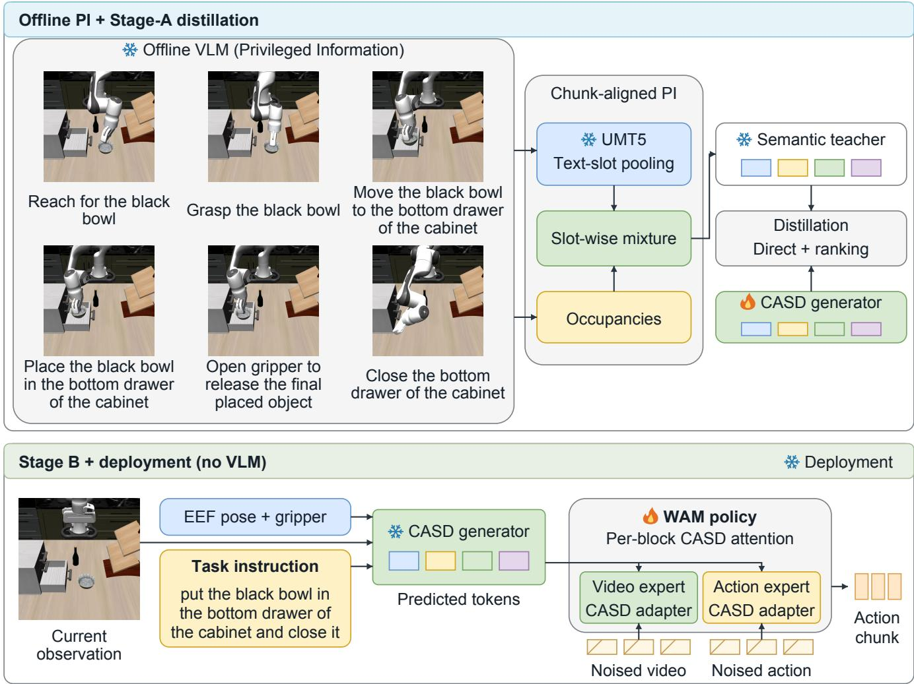  
Fi<sub>gure</sub> 1<sub>:</sub> T<sub>wo-s</sub>t<sub>age pr</sub>i<sub>v</sub>il<sub>ege</sub>d <sub>seman</sub>ti<sub>c</sub> di<sub>s</sub>till<sub>a</sub>ti<sub>on</sub> i<sub>n</sub> CASD<sub>.</sub> Ofli<sub>ne s</sub>t<sub>age anno</sub>t<sub>a</sub>ti<sub>ons an</sub>d <sub>c</sub>h<sub>un</sub>k <sub>occupanc</sub>i<sub>es</sub> d<sub>e</sub>fi<sub>ne a</sub> fi<sub>xe</sub>d <sub>seman</sub>ti<sub>c</sub> t<sub>eac</sub>h<sub>er.</sub> St<sub>age</sub> A t<sub>ra</sub>i<sub>ns</sub> th<sub>e</sub> CASD <sub>genera</sub>t<sub>or</sub> t<sub>o pre</sub>di<sub>c</sub>t th<sub>ese</sub> t<sub>o</sub>k<sub>ens</sub> f<sub>rom curren</sub>t i<sub>npu</sub>t<sub>s.</sub> St<sub>age</sub> B f<sub>reezes</sub> th<sub>e genera</sub>t<sub>or</sub> <sub>an</sub>d <sub>con</sub>diti<sub>ons</sub> th<sub>e v</sub>id<sub>eo–ac</sub>ti<sub>on po</sub>li<sub>cy on</sub> it<sub>s pre</sub>di<sub>c</sub>ti<sub>ons.</sub> Th<sub>e o</sub>fli<sub>ne anno</sub>t<sub>a</sub>ti<sub>ons an</sub>d f<sub>u</sub>t<sub>ure-</sub>d<sub>epen</sub>d<sub>en</sub>t t<sub>arge</sub>t<sub>s are a</sub>b<sub>sen</sub>t <sub>a</sub>t <sup>d</sup>e<sub>p</sub><sup>l</sup>o<sub>y</sub>ment.

$$
\widetilde { X } _ { e } ^ { ( l ) } = X _ { e , \mathrm { s t d } } ^ { ( l ) } + \mathcal { A } _ { p , e } ^ { ( l ) } ( X _ { e } ^ { ( l ) } , C _ { t , e } ) , \qquad e \in \{ v , a \} .\tag{8}
$$

P<sub>o</sub>li<sub>cy</sub> <sub>parame</sub>t<sub>ers</sub> <sub>an</sub>d <sub>a</sub>d<sub>ap</sub>t<sub>ers</sub> <sub>are</sub> <sub>op</sub>ti<sub>m</sub>i<sub>ze</sub>d <sub>un</sub>d<sub>er</sub> th<sub>e</sub> b<sub>ac</sub>k<sub>-</sub> b<sub>one</sub> l<sub>osses</sub> <sub>w</sub>hil<sub>e</sub> th<sub>e</sub> CASD <sub>genera</sub>t<sub>or</sub> <sub>s</sub>t<sub>ays</sub> f<sub>rozen.</sub> W<sub>e</sub> use $D _ { c } = 1 0 2 4$ <sub>an</sub>d <sub>ran</sub>k<sub>-</sub>192 <sub>a</sub>d<sub>ap</sub>t<sub>er</sub> b<sub>o</sub>ttl<sub>enec</sub>k<sub>s.</sub> Th<sub>e</sub> fi<sub>-</sub> nal adapter projection is initialized to zero, preserving the <sub>pre</sub>t<sub>ra</sub>i<sub>ne</sub>d f<sub>unc</sub>ti<sub>on a</sub>t i<sub>n</sub>iti<sub>a</sub>li<sub>za</sub>ti<sub>on.</sub> F<sub>u</sub>ll <sub>arc</sub>hit<sub>ec</sub>t<sub>ure</sub> di<sub>men-</sub> <sub>s</sub>i<sub>ons are prov</sub>id<sub>e</sub>d i<sub>n</sub> th<sub>e supp</sub>l<sub>emen</sub>t<sub>ary ma</sub>t<sub>er</sub>i<sub>a</sub>l<sub>.</sub>

## 3.6 Inference

B<sub>e</sub>f<sub>ore</sub> <sub>eac</sub>h dif<sub>us</sub>i<sub>on</sub> l<sub>oop,</sub> th<sub>e</sub> CASD <sub>genera</sub>t<sub>or</sub> <sub>compu</sub>t<sub>es</sub> th<sub>e</sub> <sub>con</sub>t<sub>ex</sub>t <sub>once</sub> f<sub>rom</sub> th<sub>e</sub> l<sub>a</sub>t<sub>es</sub>t <sub>v</sub>i<sub>sua</sub>l l<sub>a</sub>t<sub>en</sub>t<sub>,</sub> <sub>curren</sub>t <sub>ro</sub>b<sub>o</sub>t <sub>s</sub>t<sub>a</sub>t<sub>e, an</sub>d t<sub>as</sub>k i<sub>ns</sub>t<sub>ruc</sub>ti<sub>on.</sub> Th<sub>e po</sub>li<sub>cy reuses</sub> thi<sub>s con</sub>t<sub>ex</sub>t <sub>across</sub> dif<sub>us</sub>i<sub>on s</sub>t<sub>eps an</sub>d <sub>recompu</sub>t<sub>es</sub> it <sub>a</sub>ft<sub>er</sub> th<sub>e env</sub>i<sub>ronmen</sub>t <sub>a</sub>d<sub>vances.</sub> Th<sub>e or</sub>i<sub>g</sub>i<sub>na</sub>l b<sub>ac</sub>kb<sub>one</sub> d<sub>e</sub>t<sub>erm</sub>i<sub>nes</sub> h<sub>ow v</sub>id<sub>eo an</sub>d <sub>ac</sub>ti<sub>on are</sub> d<sub>eno</sub>i<sub>se</sub>d<sub>:</sub> J<sub>o</sub>i<sub>n</sub>t <sub>genera</sub>t<sub>es</sub> th<sub>em</sub> t<sub>oge</sub>th<sub>er,</sub> IDM <sub>gen-</sub> <sub>era</sub>t<sub>es v</sub>id<sub>eo</sub> b<sub>e</sub>f<sub>ore ac</sub>ti<sub>ons, an</sub>d U<sub>ncon</sub>d <sub>uses curren</sub>t<sub>-</sub>f<sub>rame</sub> f<sub>ea</sub>t<sub>ures.</sub> A<sub>cross var</sub>i<sub>an</sub>t<sub>s,</sub> CASD <sub>pre</sub>di<sub>c</sub>t<sub>s a</sub>ll <sub>seman</sub>ti<sub>c s</sub>l<sub>o</sub>t<sub>s</sub> i<sub>n para</sub>ll<sub>e</sub>l <sub>once per po</sub>li<sub>cy query, w</sub>ith<sub>ou</sub>t <sub>on</sub>li<sub>ne</sub> VLM <sub>ca</sub>ll<sub>s,</sub> t<sub>ex</sub>t d<sub>eco</sub>di<sub>ng,</sub> <sub>or</sub> <sub>su</sub>b<sub>goa</sub>l<sub>-</sub>i<sub>mage</sub> <sub>genera</sub>ti<sub>on.</sub> CASD <sub>a</sub>d<sub>ap</sub>t<sub>ers</sub> <sub>run</sub> <sub>a</sub>t <sub>eac</sub>h d<sub>eno</sub>i<sub>s</sub>i<sub>ng</sub> <sub>s</sub>t<sub>ep.</sub>

## 4 Experiments

## 4.1 Experimental Setup

Benchmarks. We evaluate on four benchmarks. LIBERO contains Spatial, Object, Goal, and Long suites (Liu et al. 2023); LIBERO-Plus a<sub>pp</sub>lies seven controlled shifts s<sub>p</sub>an-<sub>n</sub>i<sub>ng</sub> l<sub>ayou</sub>t<sub>,</sub> <sub>camera,</sub> <sub>ro</sub>b<sub>o</sub>t i<sub>n</sub>iti<sub>a</sub>li<sub>za</sub>ti<sub>on,</sub> l<sub>anguage,</sub> li<sub>g</sub>hti<sub>ng,</sub> back<sub>g</sub>round, and sensor noise (Fei et al. 2026). RoboTwin 2<sub>.</sub>0 <sub>eva</sub>l<sub>ua</sub>t<sub>es</sub> 50 bi<sub>manua</sub>l t<sub>as</sub>k<sub>s un</sub>d<sub>er c</sub>l<sub>ean an</sub>d d<sub>oma</sub>i<sub>n-</sub>

## (a) Paired Rollout Divergence

Fast-WAM-Joint-failure (700 steps)

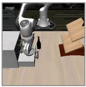  
r15 Moving bowl

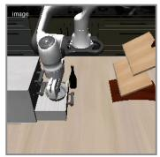  
r16 Holding bowl

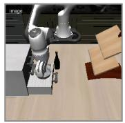  
r17 Still holding

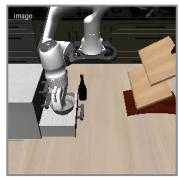  
f216 Task incomplete

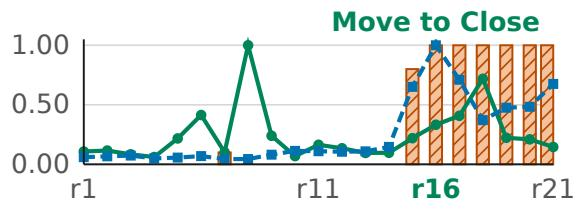  
Fast-WAM-Joint+CASD-success (217 steps)  
CASD-token change Motion divergence Gripper mismatch

(b) Signal Timeline  
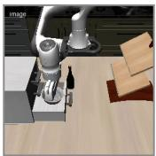  
r15  
Moving bowl

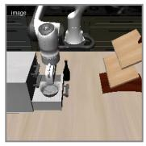  
Releasing bowl

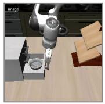  
r17  
Bowl placed

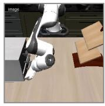  
f216 Completion step

(c) Semantic Transition at r16  
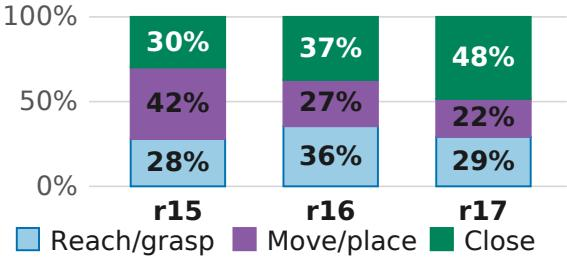  
Figure 2: A paired LIBERO-Long rollout showing where the baseline and CASD trajectories diverge. The Fast-WAM-Joint b<sub>ase</sub>li<sub>ne</sub> ti<sub>mes ou</sub>t<sub>, w</sub>h<sub>ereas</sub> F<sub>as</sub>t<sub>-</sub>WAM<sub>-</sub>J<sub>o</sub>i<sub>n</sub>t+CASD <sub>succee</sub>d<sub>s</sub> f<sub>rom</sub> th<sub>e same recor</sub>d<sub>e</sub>d i<sub>n</sub>iti<sub>a</sub>l <sub>o</sub>b<sub>serva</sub>ti<sub>on w</sub>ith <sub>ma</sub>t<sub>c</sub>h<sub>e</sub>d i<sub>n</sub>f<sub>erence</sub> seeds. (a) B re lan r16 CASD has be un releasin the bowl while the baseline kee s holdin it. (b) This behavioral diference <sub>co</sub>i<sub>nc</sub>id<sub>es w</sub>ith th<sub>e</sub> l<sub>arges</sub>t <sub>mo</sub>ti<sub>on</sub> di<sub>vergence an</sub>d <sub>comp</sub>l<sub>e</sub>t<sub>e gr</sub>i<sub>pper-comman</sub>d di<sub>sagreemen</sub>t<sub>;</sub> t<sub>o</sub>k<sub>en an</sub>d <sub>mo</sub>ti<sub>on s</sub>i<sub>gna</sub>l<sub>s are</sub> normalized se<sub>p</sub>aratel<sub>y</sub>. (c) A <sub>p</sub>ost-hoc convex fit to task-s<sub>p</sub>ecific teacher <sub>p</sub>rotot<sub>yp</sub>es shows a shift from Move/<sub>p</sub>lace toward Close. Th<sub>e</sub> di<sub>sp</sub>l<sub>aye</sub>d <sub>we</sub>i<sub>g</sub>ht<sub>s</sub> d<sub>escr</sub>ib<sub>e</sub> th<sub>e</sub> fit <sub>an</sub>d d<sub>o no</sub>t <sub>en</sub>t<sub>er</sub> th<sub>e po</sub>li<sub>cy.</sub>

randomized conditions (Chen et al. 2025b). MolmoS<sub>p</sub>aces-B<sub>enc</sub>h <sub>spans man</sub>i<sub>pu</sub>l<sub>a</sub>ti<sub>on an</sub>d <sub>nav</sub>i<sub>ga</sub>ti<sub>on</sub> i<sub>n</sub> di<sub>verse</sub> i<sub>n</sub>d<sub>oor</sub> scenes (Kim et al. 2026). We evaluate the four-cate<sub>g</sub>or<sub>y</sub> F<sub>ran</sub>k<sub>a</sub>/DROID <sub>man</sub>i<sub>pu</sub>l<sub>a</sub>ti<sub>on su</sub>b<sub>se</sub>t <sub>use</sub>d b<sub>y</sub> th<sub>e</sub> l<sub>ea</sub>d<sub>er</sub>b<sub>oar</sub>d sna<sub>p</sub>shot: Pick, Pick-and-Place, O<sub>p</sub>en, and Close (Allen Institute for AI 2026). Polic<sub>y</sub> tables re<sub>p</sub>ort success rates (%); Table 1 reports teacher-matching recall on a [0, 1] scale.

Model setup. On LIBERO and LIBERO-Plus, we eval-<sub>ua</sub>t<sub>e</sub> CASD <sub>w</sub>ith th<sub>e</sub> U<sub>ncon</sub>d<sub>,</sub> J<sub>o</sub>i<sub>n</sub>t<sub>, an</sub>d IDM F<sub>as</sub>t<sub>-</sub>WAM <sub>var</sub>i<sub>an</sub>t<sub>s.</sub> R<sub>o</sub>b<sub>o</sub>T<sub>w</sub>i<sub>n</sub> 2<sub>.</sub>0 i<sub>nc</sub>l<sub>u</sub>d<sub>es</sub> th<sub>e same</sub> th<sub>ree</sub> CASD <sub>var</sub>i<sub>-</sub> <sub>an</sub>t<sub>s, a</sub>l<sub>ongs</sub>id<sub>e</sub> th<sub>e</sub> th<sub>ree o</sub>fi<sub>c</sub>i<sub>a</sub>l F<sub>as</sub>t<sub>-</sub>WAM b<sub>ase</sub>li<sub>nes.</sub> Th<sub>ese</sub> models build on Wan2.2-TI2V-5B (Yuan et al. 2026; Wan Team 2025). The CASD runs use a frozen 10,000-ste<sub>p</sub> Sta<sub>g</sub>e-A CASD generator and a fixed seed-0 random-projection teacher with N = 4 tokens of dimension $D _ { p } = 1 2 8$ <sub>, w</sub>ith CASD <sub>rou</sub>t<sub>e</sub>d t<sub>o</sub> b<sub>o</sub>th <sub>v</sub>id<sub>eo an</sub>d <sub>ac</sub>ti<sub>on exper</sub>t<sub>s.</sub>

F<sub>or cross-</sub>b<sub>ac</sub>kb<sub>one eva</sub>l<sub>ua</sub>ti<sub>on, we</sub> i<sub>n</sub>t<sub>egra</sub>t<sub>e</sub> CASD i<sub>n</sub>t<sub>o</sub> DreamZero (Wan2.1-I2V-14B) (Ye et al. 2026); both its F<sub>ran</sub>k<sub>a</sub> <sub>pre</sub>t<sub>ra</sub>i<sub>n</sub>i<sub>ng</sub> <sub>an</sub>d <sub>our</sub> CASD<sub>-augmen</sub>t<sub>e</sub>d t<sub>ra</sub>i<sub>n</sub>i<sub>ng</sub> <sub>use</sub> DROID (Khazatsk<sub>y</sub> et al. 2024). Our CASD <sub>p</sub>olicies use <sub>pre</sub>di<sub>c</sub>t<sub>e</sub>d <sub>seman</sub>ti<sub>c con</sub>diti<sub>ons</sub> i<sub>n</sub> St<sub>age</sub> B<sub>, ma</sub>t<sub>c</sub>hi<sub>ng</sub> th<sub>e con-</sub> t<sub>ex</sub>t <sub>source</sub> <sub>a</sub>t <sub>eva</sub>l<sub>ua</sub>ti<sub>on.</sub> T<sub>a</sub>bl<sub>es</sub> 2 <sub>an</sub>d 4 <sub>compare</sub> <sub>our</sub> <sub>runs</sub> <sub>w</sub>ith <sub>pu</sub>bli<sub>s</sub>h<sub>e</sub>d <sub>resu</sub>lt<sub>s</sub> f<sub>or</sub> th<sub>e correspon</sub>di<sub>ng</sub> b<sub>ac</sub>kb<sub>one var</sub>i<sub>-</sub> <sub>a</sub>nt<sub>s a</sub>nd b<sub>e</sub>n<sub>c</sub>hm<sub>a</sub>rk <sub>se</sub>ttin<sub>gs.</sub> Th<sub>e</sub> LIBERO<sub>-</sub>Pl<sub>us</sub> r<sub>e</sub>f<sub>e</sub>r<sub>e</sub>n<sub>ces</sub> <sub>a</sub>r<sub>e sepa</sub>r<sub>a</sub>t<sub>e</sub>l<sub>y eva</sub>l<sub>ua</sub>t<sub>e</sub>d <sub>c</sub>h<sub>ec</sub>k<sub>po</sub>int<sub>s</sub> r<sub>epo</sub>rt<sub>e</sub>d b<sub>y</sub> RIFT<sub>.</sub> Th<sub>ese</sub> <sub>compar</sub>i<sub>sons</sub> d<sub>o no</sub>t <sub>con</sub>t<sub>ro</sub>l f<sub>or</sub> dif<sub>erences</sub> i<sub>n</sub> t<sub>ra</sub>i<sub>n</sub>i<sub>ng runs.</sub> We ex<sub>p</sub>ress diferences in <sub>p</sub>ercenta<sub>g</sub>e <sub>p</sub>oints (<sub>pp</sub>). The su<sub>p</sub>- <sub>p</sub>l<sub>emen</sub>t <sub>prov</sub>id<sub>es</sub> th<sub>e</sub> LIBERO <sub>p</sub>i<sub>pe</sub>li<sub>ne, me</sub>t<sub>r</sub>i<sub>c</sub> d<sub>e</sub>fi<sub>n</sub>iti<sub>ons,</sub> <sub>an</sub>d <sub>resu</sub>lt <sub>sources.</sub>

<table><tr><td>Subset</td><td>Queries</td><td>Share</td><td>Chance Recall</td><td>CASD Recall</td></tr><tr><td>Pure</td><td>5,312</td><td>55.87%</td><td>0.185</td><td>0.430</td></tr><tr><td>Mixed</td><td>4,195</td><td>44.13%</td><td>0.174</td><td>0.765</td></tr><tr><td>Mixed-2</td><td>3,643</td><td>38.32%</td><td>0.175</td><td>0.761</td></tr><tr><td>Mixed-3+</td><td>552</td><td>5.81%</td><td>0.166</td><td>0.790</td></tr></table>

T<sub>a</sub>bl<sub>e</sub> 1<sub>:</sub> E<sub>p</sub>i<sub>so</sub>d<sub>e-</sub>l<sub>oca</sub>l t<sub>eac</sub>h<sub>er</sub> <sub>ma</sub>t<sub>c</sub>hi<sub>ng</sub> <sub>a</sub>t <sub>anno</sub>t<sub>a</sub>t<sub>e</sub>d t<sub>ra</sub>i<sub>n</sub>i<sub>ng</sub> <sub>p</sub>h<sub>ase s</sub>t<sub>ar</sub>t<sub>s.</sub> P<sub>ure quer</sub>i<sub>es cover one s</sub>t<sub>age</sub> i<sub>n</sub> th<sub>e va</sub>lid <sub>par</sub>t <sub>o</sub>f th<sub>e</sub> f<sub>o</sub>ll<sub>ow</sub>i<sub>ng</sub> 32<sub>-s</sub>t<sub>ep</sub> <sub>c</sub>h<sub>un</sub>k<sub>;</sub> Mi<sub>xe</sub>d <sub>quer</sub>i<sub>es</sub> <sub>cross</sub> <sub>s</sub>t<sub>age</sub> b<sub>oun</sub>d<sub>ar</sub>i<sub>es.</sub> B<sub>o</sub>th <sub>reca</sub>ll<sub>s</sub> <sub>are</sub> <sub>query</sub> <sub>averages;</sub> Mi<sub>xe</sub>d<sub>-</sub>2 <sub>an</sub>d Mi<sub>xe</sub>d<sub>-</sub>3+ <sub>par</sub>titi<sub>on</sub> Mi<sub>xe</sub>d<sub>.</sub>

## 4.2 Teacher Matching from Current Inputs

U<sub>s</sub>i<sub>ng on</sub>l<sub>y curren</sub>t i<sub>npu</sub>t<sub>s, we eva</sub>l<sub>ua</sub>t<sub>e</sub> th<sub>e</sub> f<sub>rozen</sub> CASD <sub>ge</sub>n<sub>e</sub>r<sub>a</sub>t<sub>o</sub>r <sub>o</sub>n <sub>a</sub>nn<sub>o</sub>t<sub>a</sub>t<sub>e</sub>d LIBERO tr<sub>a</sub>inin<sub>g</sub> <sub>ep</sub>i<sub>so</sub>d<sub>es.</sub> Aft<sub>e</sub>r <sub>pre</sub>di<sub>c</sub>ti<sub>on,</sub> <sub>eac</sub>h <sub>query</sub> i<sub>s</sub> <sub>ma</sub>t<sub>c</sub>h<sub>e</sub>d <sub>aga</sub>i<sub>ns</sub>t t<sub>eac</sub>h<sub>er</sub> t<sub>arge</sub>t<sub>s</sub> <sub>a</sub>t <sub>anno</sub>t<sub>a</sub>t<sub>e</sub>d <sub>p</sub>h<sub>ase</sub> <sub>s</sub>t<sub>ar</sub>t<sub>s</sub> i<sub>n</sub> th<sub>e</sub> <sub>same</sub> <sub>ep</sub>i<sub>so</sub>d<sub>e,</sub> <sub>ran</sub>k<sub>e</sub>d b<sub>y</sub> <sub>neg-</sub> ative normalized MSE. Recall@1 assigns credit 1/m when the correct target is among m candidates tied for the best <sub>score, an</sub>d <sub>zero o</sub>th<sub>erw</sub>i<sub>se.</sub> Ch<sub>ance</sub> R<sub>eca</sub>ll <sub>averages</sub> $1 / N _ { e }$ <sub>over</sub> <sub>quer</sub>i<sub>es,</sub> <sub>w</sub>h<sub>ere</sub> $N _ { e }$ i<sub>s</sub> th<sub>e</sub> <sub>ep</sub>i<sub>so</sub>d<sub>e</sub> <sub>ga</sub>ll<sub>ery</sub> <sub>s</sub>i<sub>ze.</sub>

<table><tr><td>Method</td><td>Camera Robot Init. Language</td><td></td><td></td><td></td><td>Light Background Noise Layout Pooled</td><td></td><td></td><td></td></tr><tr><td>NORA</td><td>2.2</td><td>37.0</td><td>65.1</td><td>45.7</td><td>58.6</td><td>12.8</td><td>62.1</td><td>39.0</td></tr><tr><td>WorldVLA</td><td>0.1</td><td>27.9</td><td>41.6</td><td>43.7</td><td>17.1</td><td>10.9</td><td>38.0</td><td>25.0</td></tr><tr><td>UniVLA</td><td>1.8</td><td>46.2</td><td>69.6</td><td>69.0</td><td>81.0</td><td>21.2</td><td>31.9</td><td>42.9</td></tr><tr><td>π0</td><td>13.8</td><td>6.0</td><td>58.8</td><td>85.0</td><td>81.4</td><td>79.0</td><td>68.9</td><td>53.6</td></tr><tr><td>π0-FAST</td><td>65.1</td><td>21.6</td><td>61.0</td><td>73.2</td><td>73.2</td><td>74.4</td><td>68.8</td><td>61.6</td></tr><tr><td>RIPT-VLA</td><td>55.2</td><td>31.2</td><td>77.6</td><td>88.4</td><td>91.6</td><td>73.5</td><td>74.2</td><td>68.4</td></tr><tr><td>OpenVLA-OFT-M</td><td>55.6</td><td>21.7</td><td>81.0</td><td>92.7</td><td>91.0</td><td>78.6</td><td>68.7</td><td>67.9</td></tr><tr><td>Fast-WAM†</td><td>16.5</td><td>43.4</td><td>67.8</td><td>80.1</td><td>51.6</td><td>37.9</td><td>61.2</td><td>49.7</td></tr><tr><td>Fast-WAM+CASD</td><td>28.8</td><td>49.9</td><td>75.2</td><td>83.8</td><td>54.5</td><td>51.0</td><td>64.8</td><td>57.2</td></tr><tr><td>Fast-WAM-Joint†</td><td>38.7</td><td>63.9</td><td>93.1</td><td>94.7</td><td>55.7</td><td>57.7</td><td>77.5</td><td>68.1</td></tr><tr><td>Fast  $\mathbf { - W A M \mathrm { { - } J o i n t { + } C A S D } }$ </td><td>46.0</td><td>70.7</td><td>94.5</td><td>94.5</td><td>62.3</td><td>60.3</td><td>81.3</td><td>72.2</td></tr><tr><td>Fast  $- \mathbf { W A M - I D M } ^ { \dagger }$ </td><td>46.2</td><td>69.1</td><td>94.2</td><td>92.8</td><td>56.4</td><td>61.8</td><td>81.5</td><td>71.4</td></tr><tr><td>Fast-WAM-IDM+CASD</td><td>50.3</td><td>77.0</td><td>90.6</td><td>92.8</td><td>67.1</td><td>62.8</td><td>81.2</td><td>73.9</td></tr></table>

Table 3: LIBERO-Plus success scores (%). Pooled is the variant-micro rate over 10,030 benchmark variants; external com<sub>p</sub>arison rows follow the benchmark re<sub>p</sub>ort (Fei et al. 2026). <sup>†</sup> RIFT-re<sub>p</sub>orted Fast-WAM references (Zhan<sub>g</sub> et al. 2026); CASD rows are ours.

Th<sub>e eva</sub>l<sub>ua</sub>ti<sub>on con</sub>t<sub>a</sub>i<sub>ns</sub> 9<sub>,</sub>507 <sub>p</sub>h<sub>ase-s</sub>t<sub>ar</sub>t <sub>quer</sub>i<sub>es</sub> f<sub>rom</sub> 1,712 e<sub>p</sub>isodes (5.55 <sub>p</sub>er e<sub>p</sub>isode). Queries are <sub>g</sub>rou<sub>p</sub>ed b<sub>y</sub> th<sub>e</sub> <sub>s</sub>t<sub>ages</sub> i<sub>n</sub> th<sub>e</sub>i<sub>r</sub> <sub>va</sub>lid f<sub>o</sub>ll<sub>ow</sub>i<sub>ng</sub> 32<sub>-s</sub>t<sub>ep</sub> <sub>c</sub>h<sub>un</sub>k<sub>,</sub> <sub>as</sub> d<sub>e</sub>fi<sub>ne</sub>d in Table 1. Recall is 2.3× chance for Pure <sub>q</sub>ueries (0.430 vs. 0.185) and $4 . 8 \times$ for Mixed-3+ (0.790 vs. 0.166). These t<sub>ra</sub>i<sub>n</sub>i<sub>ng-se</sub>t di<sub>agnos</sub>ti<sub>cs</sub> <sub>s</sub>h<sub>ow</sub> <sub>recovery</sub> <sub>o</sub>f b<sub>oun</sub>d<sub>ary-cross</sub>i<sub>ng</sub> <sub>con</sub>t<sub>ex</sub>t<sub>s</sub> f<sub>rom curren</sub>t i<sub>npu</sub>t<sub>s; compar</sub>i<sub>sons</sub> b<sub>e</sub>t<sub>ween su</sub>b<sub>se</sub>t<sub>s</sub> <sub>a</sub>l<sub>so</sub> d<sub>epen</sub>d <sub>on</sub> th<sub>e</sub> di<sub>s</sub>ti<sub>nc</sub>ti<sub>veness o</sub>f th<sub>e</sub>i<sub>r ga</sub>ll<sub>ery</sub> t<sub>arge</sub>t<sub>s.</sub>

## 4.3 Downstream Policy Evaluation

In-distribution performance on LIBERO. Table 2 shows average diferences of −3.2, +0.3, and +0.9 pp for Uncond, J<sub>o</sub>int<sub>,</sub> <sub>a</sub>nd IDM<sub>,</sub> r<sub>espec</sub>ti<sub>ve</sub>l<sub>y,</sub> <sub>us</sub>in<sub>g</sub> <sub>u</sub>nr<sub>ou</sub>nd<sub>e</sub>d r<sub>u</sub>n <sub>ave</sub>r<sub>ages.</sub> IDM+CASD reaches the hi<sub>g</sub>hest avera<sub>g</sub>e in the table (98.9%). J<sub>o</sub>int im<sub>p</sub>r<sub>oves</sub> fr<sub>o</sub>m 98<sub>.</sub>5% t<sub>o</sub> 98<sub>.</sub>8%<sub>, w</sub>ith it<sub>s</sub> l<sub>a</sub>r<sub>ges</sub>t <sub>ga</sub>in <sub>o</sub>n Lon<sub>g</sub> (+1.2 <sub>pp</sub>), followed b<sub>y</sub> Goal (+0.4 <sub>pp</sub>); S<sub>p</sub>atial and Object change by −0.2 and −0.4 pp. The Uncond decline is largest on Goal (−4.4 pp). Two of the three CASD variants <sub>score</sub> <sub>a</sub>b<sub>ove</sub> th<sub>e</sub>i<sub>r</sub> <sub>pu</sub>bli<sub>s</sub>h<sub>e</sub>d <sub>re</sub>f<sub>erences</sub> <sub>on</sub> <sub>average,</sub> <sub>w</sub>ith <sub>ga</sub>i<sub>ns</sub> <sub>an</sub>d <sub>regress</sub>i<sub>ons across</sub> i<sub>n</sub>di<sub>v</sub>id<sub>ua</sub>l <sub>su</sub>it<sub>es.</sub>

Illustrative paired case. Figure 2 examines trial 2 of “put th<sub>e</sub> bl<sub>ac</sub>k b<sub>ow</sub>l i<sub>n</sub> th<sub>e</sub> b<sub>o</sub>tt<sub>om</sub> d<sub>rawer o</sub>f th<sub>e ca</sub>bi<sub>ne</sub>t <sub>an</sub>d <sub>c</sub>l<sub>ose</sub> it<sub>.</sub>” Th<sub>e</sub> F<sub>as</sub>t<sub>-</sub>WAM<sub>-</sub>J<sub>o</sub>i<sub>n</sub>t b<sub>ase</sub>li<sub>ne succee</sub>d<sub>s</sub> i<sub>n</sub> 49/50 t<sub>r</sub>i<sub>a</sub>l<sub>s</sub> <sub>an</sub>d CASD i<sub>n</sub> 50/50<sub>;</sub> t<sub>r</sub>i<sub>a</sub>l 2 i<sub>s</sub> th<sub>e</sub>i<sub>r pa</sub>i<sub>re</sub>d f<sub>a</sub>il<sub>ure</sub>/<sub>success</sub> <sub>case, w</sub>ith th<sub>e same recor</sub>d<sub>e</sub>d i<sub>n</sub>iti<sub>a</sub>l <sub>o</sub>b<sub>serva</sub>ti<sub>on an</sub>d <sub>ma</sub>t<sub>c</sub>h<sub>e</sub>d <sub>see</sub>d<sub>s a</sub>t <sub>a</sub>ll 22 <sub>common rep</sub>l<sub>ans.</sub>

B<sub>y rep</sub>l<sub>an r</sub>16<sub>,</sub> CASD h<sub>as</sub> b<sub>egun re</sub>l<sub>eas</sub>i<sub>ng</sub> th<sub>e</sub> b<sub>ow</sub>l <sub>w</sub>hil<sub>e</sub> the baseline kee<sub>p</sub>s holdin<sub>g</sub> it. The r15→r16 transition has t<sub>o</sub>k<sub>e</sub>n <sub>c</sub>h<sub>a</sub>n<sub>ge</sub> 0<sub>.</sub>060<sub>,</sub> n<sub>o</sub>n<sub>-g</sub>ri<sub>ppe</sub>r <sub>ac</sub>ti<sub>o</sub>n RMSE 0<sub>.</sub>460<sub>, a</sub>nd di<sub>sagreemen</sub>t <sub>on</sub> <sub>a</sub>ll 10 <sub>a</sub>li<sub>gne</sub>d <sub>gr</sub>i<sub>pper</sub> <sub>comman</sub>d<sub>s.</sub> I<sub>n</sub> th<sub>e</sub> <sub>v</sub>i<sub>sua</sub>li<sub>za</sub>ti<sub>on-on</sub>l<sub>y</sub> fit<sub>,</sub> M<sub>ove</sub>/<sub>p</sub>l<sub>ace</sub> f<sub>a</sub>ll<sub>s</sub> f<sub>rom</sub> 42% t<sub>o</sub> 27% <sub>an</sub>d th<sub>en</sub> 22%<sub>, w</sub>hil<sub>e</sub> Cl<sub>ose r</sub>i<sub>ses</sub> f<sub>rom</sub> 30% t<sub>o</sub> 37% <sub>an</sub>d 48%<sub>.</sub> CASD b<sub>eg</sub>i<sub>ns</sub> <sub>re</sub>l<sub>eas</sub>i<sub>ng</sub> <sub>a</sub>t <sub>po</sub>li<sub>cy</sub> <sub>s</sub>t<sub>ep</sub> 152 <sub>an</sub>d <sub>comp</sub>l<sub>e</sub>t<sub>es</sub> the task at zero-indexed ste<sub>p</sub> 216 (217 executed ste<sub>p</sub>s); the b<sub>ase</sub>li<sub>ne</sub> <sub>re</sub>l<sub>eases</sub> 84 <sub>s</sub>t<sub>eps</sub> l<sub>a</sub>t<sub>er</sub> <sub>an</sub>d ti<sub>mes</sub> <sub>ou</sub>t <sub>a</sub>t 700 <sub>s</sub>t<sub>eps.</sub>

Thi<sub>s seman</sub>ti<sub>c</sub> t<sub>rans</sub>iti<sub>on co</sub>i<sub>nc</sub>id<sub>es w</sub>ith th<sub>e</sub> l<sub>arges</sub>t <sub>mo</sub>ti<sub>on</sub> di<sub>vergence</sub> <sub>among</sub> th<sub>e</sub> 22 <sub>common</sub> <sub>rep</sub>l<sub>ans.</sub>
<table><tr><td>Method</td><td>Emb. PT Spatial Object Goal Long Avg.</td><td></td><td></td><td></td></tr><tr><td> $\pi _ { 0 . 5 }$ </td><td>√</td><td>98.8</td><td>98.2</td><td>98.0 92.4 96.9</td></tr><tr><td>GR00T-N1.7</td><td>√</td><td>97.7</td><td>98.5 97.5</td><td>94.4 97.0</td></tr><tr><td>Motus</td><td>√</td><td>96.8</td><td>99.8 96.6</td><td>97.6 97.7</td></tr><tr><td>Qwen-RM-scratch</td><td>×</td><td></td><td></td><td>98.2</td></tr><tr><td>LingBot-VA</td><td>√</td><td>98.5</td><td>99.6</td><td>97.2 98.5 98.5</td></tr><tr><td>Fast-WAM†</td><td>X</td><td>98.2</td><td>100.0</td><td>97.0 95.2</td></tr><tr><td>Fast-WAM+CASD</td><td>×</td><td>97.6</td><td>94.8</td><td>92.6 92.8 94.5</td></tr><tr><td>Fast-WAM-Joint†</td><td>×</td><td>99.6</td><td>99.4 98.2</td><td>96.8 98.5</td></tr><tr><td>Fast-WAM-Joint+CASD</td><td>X</td><td>99.4</td><td>99.0 98.6</td><td>98.0 98.8</td></tr><tr><td>Fast-WAM-IDM†</td><td>X</td><td>98.8</td><td>97.8 97.8</td><td>97.6 98.0</td></tr><tr><td>Fast-WAM-IDM+CASD</td><td>X</td><td>99.6</td><td>99.8</td><td>98.2 97.8 98.9</td></tr></table>

Table 2: LIBERO success rates (%). Emb. PT: embodied pretrainin<sub>g</sub>; Qwen-RM: Qwen-RobotManip; unsufixed Fast-WAM: Uncond. Bold marks the column best. † marks oficial Fast-WAM results (Yuan et al. 2026). External rows f<sub>o</sub>ll<sub>ow</sub> $\pi _ { 0 . 5 }$ (Ph<sub>y</sub>sical Intelli<sub>g</sub>ence et al. 2025), GR00T-N1.7 (NVIDIA 2026), Motus (Bi et al. 2025), Qwen-RM (Qwen Team 2026), and Lin<sub>g</sub>Bot-VA (Li et al. 2026b).

Robustness under LIBERO-Plus shifts. Table 3 reports CASD<sub>-augmen</sub>t<sub>e</sub>d F<sub>as</sub>t<sub>-</sub>WAM <sub>resu</sub>lt<sub>s un</sub>d<sub>er seven con</sub>t<sub>ro</sub>ll<sub>e</sub>d <sub>v</sub>i<sub>sua</sub>l<sub>, ro</sub>b<sub>o</sub>t<sub>-s</sub>t<sub>a</sub>t<sub>e, an</sub>d l<sub>anguage s</sub>hift<sub>s.</sub>

O<sub>u</sub>r CASD r<sub>u</sub>n<sub>s</sub> r<sub>eac</sub>h 57<sub>.</sub>2%<sub>,</sub> 72<sub>.</sub>2%<sub>, a</sub>nd 73<sub>.</sub>9% <sub>poo</sub>l<sub>e</sub>d <sub>success</sub> f<sub>or</sub> F<sub>as</sub>t<sub>-</sub>WAM<sub>,</sub> J<sub>o</sub>i<sub>n</sub>t<sub>, an</sub>d IDM<sub>, respec</sub>ti<sub>ve</sub>l<sub>y.</sub> RIFT <sub>repor</sub>t<sub>s</sub> <sub>ex</sub>t<sub>erna</sub>l <sub>re</sub>f<sub>erences</sub> <sub>o</sub>f 49<sub>.</sub>7%<sub>,</sub> 68<sub>.</sub>1%<sub>,</sub> <sub>an</sub>d 71<sub>.</sub>4%<sub>.</sub> B<sub>ecause</sub> th<sub>e</sub> <sub>c</sub>h<sub>ec</sub>k<sub>po</sub>i<sub>n</sub>t<sub>s</sub> <sub>an</sub>d t<sub>ra</sub>i<sub>n</sub>i<sub>ng</sub> <sub>rec</sub>i<sub>pes</sub> dif<sub>er,</sub> th<sub>e</sub> +7.5/+4.1/+2.5 pp diferences are cross-report compari<sub>sons.</sub> O<sub>ur</sub> J<sub>o</sub>i<sub>n</sub>t <sub>mo</sub>d<sub>e</sub>l i<sub>s</sub> hi<sub>g</sub>h<sub>er on s</sub>i<sub>x o</sub>f <sub>seven s</sub>hift<sub>s, w</sub>ith the lar<sub>g</sub>est <sub>g</sub>a<sub>p</sub>s for camera view<sub>p</sub>oint (+7.3 <sub>pp</sub>), robot initial state (+6.8 <sub>pp</sub>), and back<sub>g</sub>round texture (+6.6 <sub>pp</sub>). Camera view<sub>p</sub>oint remains its weakest cate<sub>g</sub>or<sub>y</sub> (46.0%), well below lan<sub>g</sub>ua<sub>g</sub>e and li<sub>g</sub>htin<sub>g</sub> (both 94.5%). IDM+CASD has th<sub>e</sub> hi<sub>g</sub>h<sub>es</sub>t <sub>poo</sub>l<sub>e</sub>d <sub>ra</sub>t<sub>e among our var</sub>i<sub>an</sub>t<sub>s, a</sub>lth<sub>oug</sub>h it<sub>s</sub> l<sub>an-</sub> <sub>guage sco</sub>r<sub>e</sub> i<sub>s</sub> l<sub>owe</sub>r th<sub>a</sub>n J<sub>o</sub>int+CASD<sub>.</sub>

<table><tr><td>Method</td><td>Embodied PT</td><td>Clean Rand. Average</td><td></td><td></td></tr><tr><td>π0.5</td><td>√</td><td>82.7</td><td>76.8</td><td>79.8</td></tr><tr><td>Motus</td><td>√</td><td>88.7</td><td>87.0</td><td>87.8</td></tr><tr><td>Qwen-RM-scratch</td><td>×</td><td>88.7</td><td>88.4</td><td>88.6</td></tr><tr><td>LingBot-VA</td><td>√</td><td>92.9</td><td>91.6</td><td>92.2</td></tr><tr><td>Fast-WAM†</td><td>X</td><td>91.9</td><td>91.8</td><td>91.8</td></tr><tr><td>Fast-WAM+CASD</td><td>X</td><td>90.5</td><td>91.4</td><td>90.9</td></tr><tr><td>Fast-WAM-Joint†</td><td>X</td><td>90.8</td><td>90.3</td><td>90.6</td></tr><tr><td>Fast-WAM-Joint+CASD</td><td>X</td><td>92.7</td><td>93.3</td><td>93.0</td></tr><tr><td>Fast-WAM-IDM†</td><td>X</td><td>91.2</td><td>91.3</td><td>91.3</td></tr><tr><td>Fast-WAM-IDM+CASD</td><td>X</td><td>92.6</td><td>92.2</td><td>92.4</td></tr></table>

Table 4: RoboTwin 2.0 success rates (%) across 50 tasks. Cl<sub>ean an</sub>d R<sub>an</sub>d<sub>.</sub> d<sub>eno</sub>t<sub>e</sub> E<sub>asy an</sub>d H<sub>ar</sub>d<sub>;</sub> E<sub>m</sub>b<sub>o</sub>di<sub>e</sub>d PT d<sub>e-</sub> notes embodied pretrainin<sub>g</sub>; Qwen-RM abbreviates Qwen-RobotMani<sub>p</sub>. Bold marks the column best. † marks oficial Fast-WAM baselines from Yuan et al. (2026); other external <sub>sources are c</sub>it<sub>e</sub>d i<sub>n</sub> th<sub>e</sub> t<sub>ex</sub>t<sub>.</sub>

Bimanual robustness on RoboTwin 2.0. We report mean success across 50 tasks under clean (Eas<sub>y</sub>) and domainrandomized (Hard) evaluation. External results follow their source <sub>p</sub>a<sub>p</sub>ers (Ph<sub>y</sub>sical Intelli<sub>g</sub>ence et al. 2025; Bi et al. 2025; Qwen Team 2026; Li et al. 2026b).

J<sub>o</sub>i<sub>n</sub>t+CASD <sub>excee</sub>d<sub>s</sub> th<sub>e o</sub>fi<sub>c</sub>i<sub>a</sub>l J<sub>o</sub>i<sub>n</sub>t b<sub>ase</sub>li<sub>ne</sub> b<sub>y</sub> 1<sub>.</sub>9 <sub>pp</sub> on Clean and 3.0 <sub>pp</sub> on Rand. (+2.4 <sub>pp</sub> avera<sub>g</sub>e). Uncond+CASD reaches 90.9% avera<sub>g</sub>e (90.5% Clean and 91.4% Rand.). IDM+CASD scores 92.6% Clean and 92.2% Rand. (92.4% avera<sub>g</sub>e). Joint+CASD leads Table 4 in Rand. (93.3%) and avera<sub>g</sub>e (93.0%).

<table><tr><td>Method</td><td>Pick P&amp;P</td><td>Open</td><td></td><td>Close Avg.</td></tr><tr><td>PRTS-Droid</td><td>53.8</td><td>27.7</td><td>12.0</td><td>76.3 42.5</td></tr><tr><td>MolmoAct2 DROID</td><td>48.3</td><td>23.3</td><td>11.7 71.3</td><td>38.7</td></tr><tr><td>π0.5 DROID</td><td>36.4</td><td>13.6</td><td>22.7 65.1</td><td>34.5</td></tr><tr><td>π0 DROID</td><td>16.2</td><td>12.5</td><td>11.0 53.1</td><td>23.2</td></tr><tr><td>LAP-VLA</td><td>24.9</td><td>6.6</td><td>11.4</td><td>45.9 22.2</td></tr><tr><td>π₀-FAST DROID</td><td>22.0</td><td>10.9</td><td>11.1</td><td>38.6 20.7</td></tr><tr><td>Psi-R2</td><td>73.1</td><td>41.5</td><td>9.0</td><td>62.2 46.5</td></tr><tr><td>DreamZero</td><td>52.1</td><td>25.6</td><td>24.9</td><td>60.3 40.7</td></tr><tr><td>DreamZero+CASD</td><td>59.7</td><td>36.1</td><td>35.1</td><td>60.8 47.9</td></tr></table>

Table 5: Success rates (%) on four MolmoS<sub>p</sub>aces mani<sub>p</sub>ul<sub>a</sub>ti<sub>on ca</sub>t<sub>egor</sub>i<sub>es.</sub> P&P d<sub>eno</sub>t<sub>es</sub> Pi<sub>c</sub>k<sub>-an</sub>d<sub>-</sub>Pl<sub>ace; nav</sub>i<sub>ga</sub>ti<sub>on</sub> i<sub>s exc</sub>l<sub>u</sub>d<sub>e</sub>d<sub>.</sub> E<sub>x</sub>t<sub>erna</sub>l <sub>va</sub>l<sub>ues</sub> f<sub>o</sub>ll<sub>ow</sub> th<sub>e o</sub>fi<sub>c</sub>i<sub>a</sub>l l<sub>ea</sub>d<sub>er</sub>b<sub>oar</sub>d sna<sub>p</sub>shot (Allen Institute for AI 2026); the benchmark is described b<sub>y</sub> Kim et al. (2026). The avera<sub>g</sub>e is com<sub>p</sub>uted over th<sub>e</sub> f<sub>our</sub> li<sub>s</sub>t<sub>e</sub>d <sub>ca</sub>t<sub>egor</sub>i<sub>es.</sub> B<sub>o</sub>ld <sub>mar</sub>k<sub>s</sub> th<sub>e</sub> b<sub>es</sub>t <sub>va</sub>l<sub>ue</sub> i<sub>n eac</sub>h <sub>co</sub>l<sub>umn.</sub>

Integration into DreamZero. We integrate CASD into D<sub>ream</sub>Z<sub>ero</sub> <sub>an</sub>d <sub>eva</sub>l<sub>ua</sub>t<sub>e</sub> f<sub>our</sub> M<sub>o</sub>l<sub>mo</sub>S<sub>paces</sub> <sub>man</sub>i<sub>pu</sub>l<sub>a</sub>ti<sub>on</sub> <sub>ca</sub>t<sub>egor</sub>i<sub>es; nav</sub>i<sub>ga</sub>ti<sub>on</sub> i<sub>s ou</sub>t<sub>s</sub>id<sub>e</sub> thi<sub>s compar</sub>i<sub>son.</sub>

Dr<sub>ea</sub>mZ<sub>e</sub>r<sub>o</sub>+CASD r<sub>eac</sub>h<sub>es</sub> 47<sub>.</sub>9% <sub>ave</sub>r<sub>age success, co</sub>m<sub>-</sub> <sub>pare</sub>d <sub>w</sub>ith 40<sub>.</sub>7% f<sub>or</sub> th<sub>e</sub> l<sub>ea</sub>d<sub>er</sub>b<sub>oar</sub>d D<sub>ream</sub>Z<sub>ero re</sub>f<sub>erence</sub> (+7.2 <sub>pp</sub>). The lar<sub>g</sub>est cate<sub>g</sub>or<sub>y</sub> diferences are on Pick-and-Place (+10.5 <sub>pp</sub>) and O<sub>p</sub>en (+10.2 <sub>pp</sub>). DreamZero+CASD h<sub>as</sub> th<sub>e</sub> hi<sub>g</sub>h<sub>es</sub>t <sub>average</sub> i<sub>n</sub> T<sub>a</sub>bl<sub>e</sub> 5<sub>.</sub>

## 4.4 Discussion

Semantic context at the action horizon. Teacher matchi<sub>ng</sub> <sub>s</sub>h<sub>ows</sub> th<sub>a</sub>t CASD <sub>can</sub> <sub>recover</sub> <sub>c</sub>h<sub>un</sub>k<sub>-</sub>l<sub>eve</sub>l <sub>con</sub>t<sub>ex</sub>t <sub>on</sub> <sub>anno</sub>t<sub>a</sub>t<sub>e</sub>d t<sub>ra</sub>i<sub>n</sub>i<sub>ng</sub> <sub>ep</sub>i<sub>so</sub>d<sub>es.</sub> Th<sub>e</sub> <sub>pa</sub>i<sub>re</sub>d <sub>ro</sub>ll<sub>ou</sub>t i<sub>n</sub> Fi<sub>gure</sub> 2 ill<sub>us</sub>t<sub>ra</sub>t<sub>es</sub> h<sub>ow a pre</sub>di<sub>c</sub>t<sub>e</sub>d <sub>seman</sub>ti<sub>c</sub> t<sub>rans</sub>iti<sub>on can accom-</sub> <sub>pany a c</sub>h<sub>ange</sub> i<sub>n man</sub>i<sub>pu</sub>l<sub>a</sub>ti<sub>on</sub> b<sub>e</sub>h<sub>av</sub>i<sub>or.</sub>

Interaction with the policy backbone. Joint and IDM <sub>excee</sub>d th<sub>e</sub>i<sub>r pu</sub>bli<sub>s</sub>h<sub>e</sub>d LIBERO <sub>an</sub>d R<sub>o</sub>b<sub>o</sub>T<sub>w</sub>i<sub>n re</sub>f<sub>erences,</sub> <sub>w</sub>h<sub>ereas</sub> U<sub>ncon</sub>d d<sub>ec</sub>li<sub>nes.</sub> All th<sub>ree excee</sub>d th<sub>e</sub> LIBERO<sub>-</sub>Pl<sub>us</sub> <sub>re</sub>f<sub>erences.</sub> S<sub>eman</sub>ti<sub>c</sub> <sub>con</sub>t<sub>ex</sub>t <sub>may</sub> <sub>comp</sub>l<sub>emen</sub>t <sub>eac</sub>h b<sub>ac</sub>k<sub>-</sub> b<sub>one</sub>’<sub>s</sub> l<sub>earne</sub>d <sub>represen</sub>t<sub>a</sub>ti<sub>ons</sub> dif<sub>eren</sub>tl<sub>y.</sub> M<sub>a</sub>t<sub>c</sub>h<sub>e</sub>d <sub>compar-</sub> i<sub>sons</sub> <sub>o</sub>f <sub>curren</sub>t<sub>-s</sub>t<sub>age</sub> l<sub>a</sub>b<sub>e</sub>l<sub>s,</sub> <sub>equa</sub>l<sub>-we</sub>i<sub>g</sub>ht <sub>an</sub>d <sub>occupancy-</sub> <sub>we</sub>i<sub>g</sub>ht<sub>e</sub>d <sub>m</sub>i<sub>x</sub>t<sub>ures, an</sub>d <sub>exper</sub>t <sub>rou</sub>ti<sub>ng cou</sub>ld id<sub>en</sub>tif<sub>y w</sub>hi<sub>c</sub>h <sub>con</sub>diti<sub>ons</sub> b<sub>ene</sub>fit <sub>eac</sub>h <sub>var</sub>i<sub>an</sub>t<sub>;</sub> th<sub>e presen</sub>t <sub>re</sub>f<sub>erence com-</sub> <sub>par</sub>i<sub>sons</sub> d<sub>o no</sub>t i<sub>so</sub>l<sub>a</sub>t<sub>e</sub> th<sub>ese</sub> f<sub>ac</sub>t<sub>ors.</sub>

Richer temporal predictions. The current teacher retains <sub>s</sub>t<sub>age propor</sub>ti<sub>ons</sub> b<sub>u</sub>t di<sub>scar</sub>d<sub>s s</sub>t<sub>age or</sub>d<sub>er.</sub> C<sub>ons</sub>t<sub>ruc</sub>ti<sub>ng sep-</sub> <sub>ara</sub>t<sub>e m</sub>i<sub>x</sub>t<sub>ures over success</sub>i<sub>ve par</sub>t<sub>s o</sub>f th<sub>e ac</sub>ti<sub>on</sub> h<sub>or</sub>i<sub>zon</sub> <sub>wou</sub>ld <sub>preserve coarse or</sub>d<sub>er w</sub>hil<sub>e</sub> k<sub>eep</sub>i<sub>ng a</sub> b<sub>oun</sub>d<sub>e</sub>d t<sub>o</sub>k<sub>en</sub> b<sub>u</sub>d<sub>ge</sub>t<sub>.</sub> A <sub>secon</sub>d di<sub>rec</sub>ti<sub>on</sub> i<sub>s</sub> t<sub>o pre</sub>di<sub>c</sub>t <sub>severa</sub>l <sub>poss</sub>ibl<sub>e se-</sub> <sub>man</sub>ti<sub>c</sub> f<sub>u</sub>t<sub>ures us</sub>i<sub>ng a s</sub>h<sub>or</sub>t <sub>o</sub>b<sub>serva</sub>ti<sub>on</sub> hi<sub>s</sub>t<sub>ory.</sub> Thi<sub>s cou</sub>ld di<sub>s</sub>ti<sub>ngu</sub>i<sub>s</sub>h <sub>repea</sub>t<sub>e</sub>d <sub>v</sub>i<sub>s</sub>it<sub>s</sub> t<sub>o s</sub>i<sub>m</sub>il<sub>ar s</sub>t<sub>a</sub>t<sub>es an</sub>d <sub>avo</sub>id <sub>aver-</sub> <sub>ag</sub>i<sub>ng</sub> i<sub>ncompa</sub>tibl<sub>e con</sub>t<sub>ex</sub>t<sub>s w</sub>h<sub>en severa</sub>l <sub>con</sub>ti<sub>nua</sub>ti<sub>ons are</sub> <sub>p</sub>l<sub>aus</sub>ibl<sub>e.</sub> V<sub>ary</sub>i<sub>ng</sub> b<sub>o</sub>th th<sub>e</sub> <sub>pre</sub>di<sub>c</sub>ti<sub>on</sub> h<sub>or</sub>i<sub>zon</sub> <sub>an</sub>d th<sub>e</sub> <sub>rep</sub>l<sub>an-</sub> <sub>n</sub>i<sub>ng</sub> i<sub>n</sub>t<sub>erva</sub>l <sub>wou</sub>ld t<sub>es</sub>t h<sub>ow muc</sub>h t<sub>empora</sub>l d<sub>e</sub>t<sub>a</sub>il <sub>con</sub>t<sub>ro</sub>l <sub>nee</sub>d<sub>s.</sub>

Learning from execution. Automatic annotations can <sub>con</sub>t<sub>a</sub>i<sub>n groun</sub>di<sub>ng an</sub>d b<sub>oun</sub>d<sub>ary errors, an</sub>d <sub>po</sub>li<sub>cy ro</sub>ll<sub>ou</sub>t<sub>s</sub> <sub>can</sub> d<sub>epar</sub>t f<sub>rom</sub> th<sub>e</sub> d<sub>emons</sub>t<sub>ra</sub>ti<sub>ons use</sub>d f<sub>or</sub> di<sub>s</sub>till<sub>a</sub>ti<sub>on.</sub> C<sub>on-</sub> t<sub>ro</sub>ll<sub>e</sub>d b<sub>oun</sub>d<sub>ary per</sub>t<sub>ur</sub>b<sub>a</sub>ti<sub>ons</sub> d<sub>ur</sub>i<sub>ng</sub> di<sub>s</sub>till<sub>a</sub>ti<sub>on cou</sub>ld t<sub>es</sub>t <sub>sens</sub>iti<sub>v</sub>it<sub>y</sub> t<sub>o</sub> <sub>anno</sub>t<sub>a</sub>ti<sub>on</sub> ti<sub>m</sub>i<sub>ng.</sub> S<sub>epara</sub>t<sub>e</sub>l<sub>y,</sub> <sub>anno</sub>t<sub>a</sub>ti<sub>ng</sub> <sub>po</sub>l<sub>-</sub> i<sub>cy ro</sub>ll<sub>ou</sub>t<sub>s wou</sub>ld <sub>a</sub>ll<sub>ow seman</sub>ti<sub>c pre</sub>di<sub>c</sub>ti<sub>on errors</sub> t<sub>o</sub> b<sub>e</sub> <sub>measure</sub>d d<sub>ur</sub>i<sub>ng execu</sub>ti<sub>on.</sub> E<sub>xecu</sub>ti<sub>on</sub> f<sub>ee</sub>db<sub>ac</sub>k <sub>cou</sub>ld th<sub>en</sub> <sub>gu</sub>id<sub>e</sub> <sub>re</sub>fi<sub>nemen</sub>t <sub>o</sub>f th<sub>e</sub> t<sub>eac</sub>h<sub>er</sub> <sub>or</sub> <sub>a</sub>d<sub>ap</sub>t<sub>a</sub>ti<sub>on</sub> <sub>o</sub>f th<sub>e</sub> <sub>gener-</sub> ator. These extensions should be evaluated jointly for task <sub>success</sub> <sub>an</sub>d <sub>query</sub> l<sub>a</sub>t<sub>ency,</sub> i<sub>nc</sub>l<sub>u</sub>di<sub>ng</sub> <sub>genera</sub>t<sub>or</sub> <sub>an</sub>d <sub>a</sub>d<sub>ap</sub>t<sub>er</sub> <sub>cos</sub>t<sub>s</sub> <sub>un</sub>d<sub>er</sub> <sub>ma</sub>t<sub>c</sub>h<sub>e</sub>d h<sub>ar</sub>d<sub>ware</sub> <sub>an</sub>d <sub>samp</sub>li<sub>ng</sub> <sub>se</sub>tti<sub>ngs.</sub>

## 5 Conclusion

CASD <sub>a</sub>li<sub>gns seman</sub>ti<sub>c superv</sub>i<sub>s</sub>i<sub>on w</sub>ith th<sub>e</sub> ti<sub>me span o</sub>f <sub>an</sub> <sub>ac</sub>ti<sub>on c</sub>h<sub>un</sub>k<sub>.</sub> A fi<sub>xe</sub>d t<sub>eac</sub>h<sub>er com</sub>bi<sub>nes s</sub>t<sub>age</sub> d<sub>escr</sub>i<sub>p</sub>ti<sub>ons</sub> <sub>accor</sub>di<sub>ng</sub> t<sub>o</sub> th<sub>e</sub>i<sub>r occupancy, an</sub>d <sub>a genera</sub>t<sub>or pre</sub>di<sub>c</sub>t<sub>s</sub> th<sub>e</sub> <sub>resu</sub>lti<sub>ng con</sub>t<sub>ex</sub>t f<sub>rom curren</sub>t i<sub>npu</sub>t<sub>s.</sub> F<sub>reez</sub>i<sub>ng</sub> th<sub>e genera-</sub> t<sub>or</sub> <sub>g</sub>i<sub>ves</sub> <sub>po</sub>li<sub>cy</sub> l<sub>earn</sub>i<sub>ng</sub> <sub>an</sub>d d<sub>ep</sub>l<sub>oymen</sub>t th<sub>e</sub> <sub>same</sub> <sub>source</sub> <sub>o</sub>f <sub>seman</sub>ti<sub>c con</sub>diti<sub>ons.</sub> E<sub>va</sub>l<sub>ua</sub>ti<sub>ons w</sub>ith th<sub>ree</sub> F<sub>as</sub>t<sub>-</sub>WAM <sub>var</sub>i<sub>an</sub>t<sub>s an</sub>d D<sub>ream</sub>Z<sub>ero</sub> d<sub>emons</sub>t<sub>ra</sub>t<sub>e</sub> it<sub>s use across v</sub>id<sub>eo–</sub> <sub>ac</sub>ti<sub>on genera</sub>ti<sub>on sc</sub>h<sub>emes, w</sub>ith t<sub>as</sub>k <sub>success</sub> d<sub>epen</sub>di<sub>ng on</sub> th<sub>e</sub> b<sub>ac</sub>kb<sub>one an</sub>d b<sub>enc</sub>h<sub>mar</sub>k<sub>.</sub> Th<sub>e cen</sub>t<sub>ra</sub>l <sub>con</sub>t<sub>r</sub>ib<sub>u</sub>ti<sub>on</sub> i<sub>s a</sub> <sub>way</sub> t<sub>o connec</sub>t d<sub>emons</sub>t<sub>ra</sub>t<sub>e</sub>d t<sub>as</sub>k <sub>s</sub>t<sub>ruc</sub>t<sub>ure</sub> t<sub>o</sub> th<sub>e</sub> t<sub>empora</sub>l <sub>reso</sub>l<sub>u</sub>ti<sub>on o</sub>f <sub>ac</sub>ti<sub>on pre</sub>di<sub>c</sub>ti<sub>on.</sub>

## References

Ah<sub>n,</sub> M<sub>.;</sub> <sub>e</sub>t <sub>a</sub>l<sub>.</sub> 2022<sub>.</sub> D<sub>o</sub> A<sub>s</sub> I C<sub>an,</sub> N<sub>o</sub>t A<sub>s</sub> I S<sub>ay:</sub> G<sub>roun</sub>di<sub>ng</sub> L<sub>an-</sub> guage in Robotic Afordances. arXiv preprint arXiv:2204.01691.

Ajay, A.; Han, S.; Du, Y.; Li, S.; Gupta, A.; Jaakkola, T.; Tenenbaum, J<sub>.;</sub> K<sub>ae</sub>lbli<sub>ng,</sub> L<sub>.;</sub> S<sub>r</sub>i<sub>vas</sub>t<sub>ava,</sub> A<sub>.; an</sub>d A<sub>grawa</sub>l<sub>,</sub> P<sub>.</sub> 2023<sub>.</sub> C<sub>ompos</sub>i<sub>-</sub> tional Foundation Models for Hierarchical Planning. arXiv preprint arXiv:2309.08587.

All<sub>en</sub> I<sub>ns</sub>tit<sub>u</sub>t<sub>e</sub> f<sub>or</sub> AI<sub>.</sub> 2026<sub>.</sub> M<sub>o</sub>l<sub>mo</sub>S<sub>paces</sub> R<sub>o</sub>b<sub>o</sub>ti<sub>cs</sub> B<sub>enc</sub>h<sub>mar</sub>k <sub>an</sub>d L<sub>ea</sub>d<sub>er</sub>b<sub>oar</sub>d<sub>.</sub> Ofi<sub>c</sub>i<sub>a</sub>l b<sub>enc</sub>h<sub>mar</sub>k l<sub>ea</sub>d<sub>er</sub>b<sub>oar</sub>d<sub>.</sub> F<sub>our-ca</sub>t<sub>egory</sub> Fr<sub>a</sub>nk<sub>a</sub>/DROID <sub>s</sub>n<sub>aps</sub>h<sub>o</sub>t<sub>; accesse</sub>d 2026<sub>-</sub>09<sub>-</sub>02<sub>.</sub>

Belkhale, S.; Din<sub>g</sub>, T.; Xiao, T.; Sermanet, P.; Vuon<sub>g</sub>, Q.; Tompson, J<sub>.;</sub> Ch<sub>e</sub>b<sub>o</sub>t<sub>ar,</sub> Y<sub>.;</sub> D<sub>w</sub>ib<sub>e</sub>di<sub>,</sub> D<sub>.; an</sub>d S<sub>a</sub>di<sub>g</sub>h<sub>,</sub> D<sub>.</sub> 2024<sub>.</sub> RT<sub>-</sub>H<sub>:</sub> A<sub>c</sub>ti<sub>on</sub> Hierarchies Using Language. arXiv preprint arXiv:2403.01823.

Bi<sub>,</sub> H<sub>.;</sub> T<sub>an,</sub> H<sub>.;</sub> Xi<sub>e,</sub> S<sub>.;</sub> W<sub>ang,</sub> Z<sub>.;</sub> H<sub>uang,</sub> S<sub>.;</sub> Li<sub>u,</sub> H<sub>.;</sub> Zh<sub>ao,</sub> R<sub>.;</sub> F<sub>eng,</sub> Y<sub>.;</sub> Xi<sub>ang,</sub> C<sub>.;</sub> R<sub>ong,</sub> Y<sub>.;</sub> Zh<sub>ao,</sub> H<sub>.;</sub> Li<sub>u,</sub> H<sub>.;</sub> S<sub>u,</sub> Z<sub>.;</sub> M<sub>a,</sub> L<sub>.;</sub> S<sub>u,</sub> H<sub>.; an</sub>d Zh<sub>u,</sub> J<sub>.</sub> 2025<sub>.</sub> M<sub>o</sub>t<sub>us:</sub> A U<sub>n</sub>ifi<sub>e</sub>d L<sub>a</sub>t<sub>en</sub>t A<sub>c</sub>ti<sub>on</sub> W<sub>or</sub>ld M<sub>o</sub>d<sub>e</sub>l<sub>. ar</sub>Xi<sub>v:</sub>2512<sub>.</sub>13030<sub>.</sub>

Chen, Q.; Yu, J.; Schwa<sub>g</sub>er, M.; Abbeel, P.; Shentu, F.; and Wu, P. 2025<sub>a.</sub> SARM<sub>:</sub> St<sub>age-</sub>A<sub>wa</sub>r<sub>e</sub> R<sub>ewa</sub>rd M<sub>o</sub>d<sub>e</sub>lin<sub>g</sub> f<sub>o</sub>r L<sub>o</sub>n<sub>g</sub> H<sub>o</sub>ri<sub>zo</sub>n Robot Manipulation. arXiv preprint arXiv:2509.25358.

Chen, T.; Chen, Z.; Chen, B.; Cai, Z.; Liu, Y.; Li, Z.; Lian<sub>g</sub>, Q.; Li<sub>n,</sub> X<sub>.;</sub> G<sub>e,</sub> Y<sub>.;</sub> G<sub>u,</sub> Z<sub>.; e</sub>t <sub>a</sub>l<sub>.</sub> 2025b<sub>.</sub> R<sub>o</sub>b<sub>o</sub>T<sub>w</sub>i<sub>n</sub> 2<sub>.</sub>0<sub>:</sub> A S<sub>ca</sub>l<sub>a</sub>bl<sub>e</sub> D<sub>a</sub>t<sub>a</sub> G<sub>enera</sub>t<sub>or an</sub>d B<sub>enc</sub>h<sub>mar</sub>k <sub>w</sub>ith St<sub>rong</sub> D<sub>oma</sub>i<sub>n</sub> R<sub>an</sub>d<sub>om</sub>i<sub>za-</sub> tion for Robust Bimanual Robotic Manipulation. arXiv preprint arXiv:2506.18088.

Ch<sub>ung,</sub> H<sub>.</sub> W<sub>.;</sub> C<sub>ons</sub>t<sub>an</sub>t<sub>,</sub> N<sub>.;</sub> G<sub>arc</sub>i<sub>a,</sub> X<sub>.;</sub> R<sub>o</sub>b<sub>er</sub>t<sub>s,</sub> A<sub>.;</sub> T<sub>ay,</sub> Y<sub>.;</sub> N<sub>a</sub>r<sub>a</sub>n<sub>g,</sub> S<sub>.; a</sub>nd Fir<sub>a</sub>t<sub>,</sub> O<sub>.</sub> 2023<sub>.</sub> UniM<sub>ax:</sub> F<sub>a</sub>ir<sub>e</sub>r <sub>a</sub>nd M<sub>o</sub>r<sub>e</sub> Ef<sub>ec-</sub> ti<sub>ve</sub> L<sub>a</sub>n<sub>guage</sub> S<sub>a</sub>m<sub>p</sub>lin<sub>g</sub> f<sub>o</sub>r L<sub>a</sub>r<sub>ge-</sub>S<sub>ca</sub>l<sub>e</sub> M<sub>u</sub>ltilin<sub>gua</sub>l Pr<sub>e</sub>tr<sub>a</sub>inin<sub>g.</sub> In The Eleventh International Conference on Learning Representations, ICLR 2023, Kigali, Rwanda, May 1-5, 2023. OpenReview.net.

F<sub>an,</sub> Y<sub>.;</sub> B<sub>a</sub>i<sub>,</sub> S<sub>.;</sub> T<sub>ong,</sub> X<sub>.;</sub> Di<sub>ng,</sub> P<sub>.;</sub> Zh<sub>u,</sub> Y<sub>.;</sub> L<sub>u,</sub> H<sub>.;</sub> D<sub>a</sub>i<sub>,</sub> F<sub>.;</sub> Zh<sub>ao,</sub> W<sub>.;</sub> Li<sub>u,</sub> Y<sub>.;</sub> H<sub>ua</sub>n<sub>g,</sub> S<sub>.;</sub> F<sub>a</sub>n<sub>,</sub> Z<sub>.;</sub> Ch<sub>e</sub>n<sub>,</sub> B<sub>.; a</sub>nd W<sub>a</sub>n<sub>g,</sub> D<sub>.</sub> 2025<sub>.</sub> L<sub>o</sub>n<sub>g-</sub>VLA<sub>:</sub> Unl<sub>eas</sub>hin<sub>g</sub> L<sub>o</sub>n<sub>g-</sub>H<sub>o</sub>ri<sub>zo</sub>n C<sub>apa</sub>bilit<sub>y o</sub>f Vi<sub>s</sub>i<sub>o</sub>n L<sub>a</sub>n<sub>-</sub> guage Action Model for Robot Manipulation. In Proceedings of the 9th Conference on Robot Learning, volume 305 of Proceedings of Machine Learning Research, 2018–2037.

F<sub>ang,</sub> P<sub>.;</sub> Ch<sub>en,</sub> H<sub>.;</sub> <sub>an</sub>d C<sub>a</sub>i<sub>,</sub> X<sub>.</sub> 2026<sub>.</sub> P<sub>r</sub>i<sub>v</sub>il<sub>ege</sub>d F<sub>ores</sub>i<sub>g</sub>ht Di<sub>s</sub>till<sub>a-</sub> tion: Zero-Cost Future Correction for World Action Models. arXiv preprint arXiv:2604.25859.

Fei, S.; Wan<sub>g</sub>, S.; Shi, J.; Dai, Z.; Cai, J.; Qian, P.; Ji, L.; He, X.; Zhan<sub>g</sub>, S.; Fei, Z.; Fu, J.; Gon<sub>g</sub>, J.; and Qiu, X. 2026. LIBERO-Plus: A P<sub>rogress</sub>i<sub>ve</sub> R<sub>o</sub>b<sub>us</sub>t<sub>ness</sub> B<sub>enc</sub>h<sub>mar</sub>k f<sub>or</sub> Vi<sub>s</sub>i<sub>on-</sub>L<sub>anguage-</sub>A<sub>c</sub>ti<sub>on</sub> Models. In Proceedings ofthe IEEE/CVF Conference on Computer Vision and Pattern Recognition, 38574–38583.

F<sub>e</sub>n<sub>g,</sub> Y<sub>.;</sub> Shi<sub>,</sub> H<sub>.;</sub> Li<sub>,</sub> H<sub>.;</sub> G<sub>uo,</sub> X<sub>.;</sub> W<sub>a</sub>n<sub>g,</sub> Y<sub>.;</sub> Zh<sub>a</sub>n<sub>g,</sub> C<sub>.;</sub> Zh<sub>a</sub>n<sub>g,</sub> J<sub>.;</sub> Zh<sub>a</sub>n<sub>g,</sub> X<sub>.;</sub> T<sub>a</sub>n<sub>g,</sub> J<sub>.;</sub> <sub>a</sub>nd Zh<sub>a</sub>n<sub>g,</sub> J<sub>.</sub> 2026<sub>.</sub> Pr<sub>oc</sub>VLM<sub>:</sub> L<sub>ea</sub>rnin<sub>g</sub> P<sub>roce</sub>d<sub>ure-</sub>G<sub>roun</sub>d<sub>e</sub>d P<sub>rogress</sub> R<sub>ewar</sub>d<sub>s</sub> f<sub>or</sub> R<sub>o</sub>b<sub>o</sub>ti<sub>c</sub> M<sub>an</sub>i<sub>pu</sub>l<sub>a</sub>ti<sub>on.</sub> arXiv preprint arXiv:2605.08774.

H<sub>uang,</sub> C<sub>.-</sub>P<sub>.;</sub> M<sub>an,</sub> Y<sub>.;</sub> Y<sub>u,</sub> Z<sub>.;</sub> Ch<sub>en,</sub> M<sub>.-</sub>H<sub>.;</sub> K<sub>au</sub>t<sub>z,</sub> J<sub>.;</sub> W<sub>ang,</sub> Y<sub>.-</sub>C<sub>.</sub> F<sub>.; an</sub>d Y<sub>ang,</sub> F<sub>.-</sub>E<sub>.</sub> 2026<sub>.</sub> F<sub>as</sub>t<sub>-</sub>Thi<sub>n</sub>kA<sub>c</sub>t<sub>:</sub> Efi<sub>c</sub>i<sub>en</sub>t Vi<sub>s</sub>i<sub>on-</sub> L<sub>anguage-</sub>A<sub>c</sub>ti<sub>on</sub> R<sub>eason</sub>i<sub>ng v</sub>i<sub>a</sub> V<sub>er</sub>b<sub>a</sub>li<sub>za</sub>bl<sub>e</sub> L<sub>a</sub>t<sub>en</sub>t Pl<sub>ann</sub>i<sub>ng.</sub> I<sub>n</sub> Proceedings ofthe IEEE/CVF Conference on Computer Vision and Pattern Recognition, 5070–5081.

H<sub>uang,</sub> C<sub>.-</sub>P<sub>.;</sub> W<sub>u,</sub> Y<sub>.-</sub>H<sub>.;</sub> Ch<sub>en,</sub> M<sub>.-</sub>H<sub>.;</sub> W<sub>ang,</sub> F<sub>.; an</sub>d Y<sub>ang,</sub> F<sub>.-</sub> E<sub>.</sub> 2025<sub>.</sub> Thi<sub>n</sub>kA<sub>c</sub>t<sub>:</sub> Vi<sub>s</sub>i<sub>on-</sub>L<sub>anguage-</sub>A<sub>c</sub>ti<sub>on</sub> R<sub>eason</sub>i<sub>ng v</sub>i<sub>a</sub> R<sub>e</sub>i<sub>n-</sub> forced Visual Latent Planning. In Advances in Neural Information Processing Systems, volume 38.

Kh<sub>aza</sub>t<sub>s</sub>k<sub>y,</sub> A<sub>.;</sub> P<sub>er</sub>t<sub>sc</sub>h<sub>,</sub> K<sub>.;</sub> N<sub>a</sub>i<sub>r,</sub> S<sub>.;</sub> B<sub>a</sub>l<sub>a</sub>k<sub>r</sub>i<sub>s</sub>h<sub>na,</sub> A<sub>.;</sub> D<sub>asar</sub>i<sub>,</sub> S<sub>.;</sub> K<sub>a</sub>r<sub>a</sub>m<sub>c</sub>h<sub>e</sub>ti<sub>,</sub> S<sub>.;</sub> N<sub>as</sub>iri<sub>a</sub>n<sub>y,</sub> S<sub>.;</sub> Srir<sub>a</sub>m<sub>a,</sub> M<sub>.</sub> K<sub>.;</sub> Ch<sub>e</sub>n<sub>,</sub> L<sub>.</sub> Y<sub>.;</sub> Elli<sub>s,</sub> K<sub>.;</sub> <sub>e</sub>t <sub>a</sub>l<sub>.</sub> 2024<sub>.</sub> DROID<sub>:</sub> A L<sub>arge-</sub>S<sub>ca</sub>l<sub>e</sub> I<sub>n-</sub>th<sub>e-</sub>Wild R<sub>o</sub>b<sub>o</sub>t M<sub>an</sub>i<sub>pu</sub>l<sub>a</sub>ti<sub>on</sub> Dataset. In Robotics: Science and Systems.

Ki<sub>m,</sub> M<sub>.</sub> J<sub>.;</sub> P<sub>er</sub>t<sub>sc</sub>h<sub>,</sub> K<sub>.;</sub> K<sub>aramc</sub>h<sub>e</sub>ti<sub>,</sub> S<sub>.;</sub> Xi<sub>ao,</sub> T<sub>.;</sub> B<sub>a</sub>l<sub>a</sub>k<sub>r</sub>i<sub>s</sub>h<sub>na,</sub> A<sub>.;</sub> Nair, S.; Rafailov, R.; Foster, E. P.; Sanketi, P. R.; Vuon<sub>g</sub>, Q.; Koll<sub>a</sub>r<sub>,</sub> T<sub>.;</sub> B<sub>u</sub>r<sub>c</sub>hfi<sub>e</sub>l<sub>,</sub> B<sub>.;</sub> T<sub>e</sub>dr<sub>a</sub>k<sub>e,</sub> R<sub>.;</sub> S<sub>a</sub>di<sub>g</sub>h<sub>,</sub> D<sub>.;</sub> L<sub>ev</sub>in<sub>e,</sub> S<sub>.;</sub> Li<sub>a</sub>n<sub>g,</sub> P<sub>.;</sub> <sub>a</sub>nd Finn<sub>,</sub> C<sub>.</sub> 2025<sub>.</sub> O<sub>pe</sub>nVLA<sub>:</sub> An O<sub>pe</sub>n<sub>-</sub>S<sub>ou</sub>r<sub>ce</sub> Vi<sub>s</sub>i<sub>o</sub>n<sub>-</sub>L<sub>a</sub>n<sub>guage-</sub> Action Model. In Proceedings of the 8th Conference on Robot Learning, volume 270 of Proceedings of Machine Learning Research, 2679–2713.

Ki<sub>m,</sub> Y<sub>.;</sub> P<sub>umacay,</sub> W<sub>.;</sub> R<sub>ayyan,</sub> O<sub>.;</sub> A<sub>rgus,</sub> M<sub>.;</sub> H<sub>an,</sub> W<sub>.;</sub> V<sub>an</sub>d<sub>er-</sub> Bilt<sub>,</sub> E<sub>.;</sub> S<sub>a</sub>l<sub>va</sub>d<sub>or,</sub> J<sub>.;</sub> D<sub>es</sub>h<sub>pan</sub>d<sub>e,</sub> A<sub>.;</sub> H<sub>en</sub>d<sub>r</sub>i<sub>x,</sub> R<sub>.;</sub> J<sub>au</sub>h<sub>r</sub>i<sub>,</sub> S<sub>.;</sub> Li<sub>u,</sub> S<sub>.;</sub> Sh<sub>a</sub>fi<sub>u</sub>ll<sub>a</sub>h<sub>,</sub> N<sub>.</sub> M<sub>.</sub> M<sub>.;</sub> G<sub>u</sub>r<sub>u,</sub> M<sub>.;</sub> Eft<sub>e</sub>kh<sub>a</sub>r<sub>,</sub> A<sub>.;</sub> F<sub>a</sub>rl<sub>ey,</sub> K<sub>.;</sub> Cl<sub>ay,</sub> D<sub>.;</sub> D<sub>uan,</sub> J<sub>.;</sub> G<sub>uru,</sub> A<sub>.;</sub> W<sub>o</sub>lt<sub>ers,</sub> P<sub>.;</sub> H<sub>erras</sub>ti<sub>,</sub> A<sub>.;</sub> L<sub>ee,</sub> Y<sub>.;</sub> Ch<sub>a</sub>l<sub>va</sub>t<sub>za</sub>ki<sub>,</sub> G<sub>.;</sub> C<sub>u</sub>i<sub>,</sub> Y<sub>.;</sub> F<sub>ar</sub>h<sub>a</sub>di<sub>,</sub> A<sub>.;</sub> F<sub>ox,</sub> D<sub>.; an</sub>d K<sub>r</sub>i<sub>s</sub>h<sub>na,</sub> R<sub>.</sub> 2026<sub>.</sub> M<sub>o</sub>l<sub>mo-</sub> S<sub>paces:</sub> A L<sub>a</sub>r<sub>ge-</sub>S<sub>ca</sub>l<sub>e</sub> O<sub>pe</sub>n E<sub>cosys</sub>t<sub>e</sub>m f<sub>o</sub>r R<sub>o</sub>b<sub>o</sub>t N<sub>av</sub>i<sub>ga</sub>ti<sub>o</sub>n <sub>a</sub>nd Manipulation. CoRR, abs/2602.11337.

Li, H.; Li, G.; Fen<sub>g</sub>, Y.; Zhao, C.; Wan<sub>g</sub>, Z.; Li, Y.; Wei, Q.; Bao, S.; Sh<sub>e</sub>n<sub>,</sub> H<sub>.;</sub> Zh<sub>ao,</sub> Y<sub>.;</sub> Y<sub>a</sub>n<sub>g,</sub> T<sub>.; a</sub>nd Zh<sub>a</sub>n<sub>g,</sub> J<sub>.</sub> 2026<sub>a.</sub> Tr<sub>a</sub>inin<sub>g</sub> Vi<sub>s</sub>i<sub>o</sub>n<sub>-</sub> L<sub>anguage-</sub>A<sub>c</sub>ti<sub>on</sub> M<sub>o</sub>d<sub>e</sub>l<sub>s w</sub>ith D<sub>ense</sub> E<sub>m</sub>b<sub>o</sub>di<sub>e</sub>d Ch<sub>a</sub>i<sub>n-o</sub>f<sub>-</sub>Th<sub>oug</sub>ht Supervision. arXiv preprint arXiv:2606.30552.

Li, L.; Zhan<sub>g</sub>, Q.; Luo, Y.; Yan<sub>g</sub>, S.; Wan<sub>g</sub>, R.; Han, F.; Yu, M.; Gao, Z<sub>.;</sub> X<sub>ue,</sub> N<sub>.;</sub> Zh<sub>u,</sub> X<sub>.;</sub> Sh<sub>e</sub>n<sub>,</sub> Y<sub>.; a</sub>nd X<sub>u,</sub> Y<sub>.</sub> 2026b<sub>.</sub> C<sub>ausa</sub>l W<sub>o</sub>rld Modeling for Robot Control. arXiv preprint arXiv:2601.21998.

Li<sub>ang,</sub> J<sub>.;</sub> H<sub>uang,</sub> W<sub>.;</sub> Xi<sub>a,</sub> F<sub>.;</sub> X<sub>u,</sub> P<sub>.;</sub> H<sub>ausman,</sub> K<sub>.;</sub> I<sub>c</sub>ht<sub>er,</sub> B<sub>.;</sub> Fl<sub>orence,</sub> P<sub>.; an</sub>d Z<sub>eng,</sub> A<sub>.</sub> 2022<sub>.</sub> C<sub>o</sub>d<sub>e as</sub> P<sub>o</sub>li<sub>c</sub>i<sub>es:</sub> L<sub>anguage</sub> M<sub>o</sub>d<sub>e</sub>l Programs for Embodied Control. arXiv preprint arXiv:2209.07753.

Liu, B.; Zhu, Y.; Gao, C.; Fen<sub>g</sub>, Y.; Liu, Q.; Zhu, Y.; and Stone, P. 2023<sub>.</sub> LIBERO<sub>:</sub> B<sub>e</sub>n<sub>c</sub>hm<sub>a</sub>rkin<sub>g</sub> Kn<sub>ow</sub>l<sub>e</sub>d<sub>ge</sub> Tr<sub>a</sub>n<sub>s</sub>f<sub>e</sub>r f<sub>o</sub>r Lif<sub>e</sub>l<sub>o</sub>n<sub>g</sub> R<sub>o</sub>b<sub>o</sub>t L<sub>ea</sub>rnin<sub>g.</sub> In Oh<sub>,</sub> A<sub>.;</sub> N<sub>au</sub>m<sub>a</sub>nn<sub>,</sub> T<sub>.;</sub> Gl<sub>o</sub>b<sub>e</sub>r<sub>so</sub>n<sub>,</sub> A<sub>.;</sub> S<sub>ae</sub>nk<sub>o,</sub> K.; Hardt, M.; and Levine, S., eds., Advances in Neural Information Processing Systems 36: Annual Conference on Neural Information Processing Systems 2023, NeurIPS 2023, New Orleans, LA, USA, December 10 - 16, 2023.

M<sub>ye</sub>r<sub>s,</sub> V<sub>.;</sub> Zh<sub>e</sub>n<sub>g,</sub> C<sub>.;</sub> M<sub>ees,</sub> O<sub>.;</sub> F<sub>a</sub>n<sub>g,</sub> K<sub>.;</sub> <sub>a</sub>nd L<sub>ev</sub>in<sub>e,</sub> S<sub>.</sub> 2025<sub>.</sub> P<sub>o</sub>li<sub>cy</sub> Ad<sub>ap</sub>t<sub>a</sub>ti<sub>o</sub>n <sub>v</sub>i<sub>a</sub> L<sub>a</sub>n<sub>guage</sub> O<sub>p</sub>timi<sub>za</sub>ti<sub>o</sub>n<sub>:</sub> D<sub>eco</sub>m<sub>pos</sub>in<sub>g</sub> T<sub>as</sub>k<sub>s</sub> for Few-Shot Imitation. In Proceedings of the 8th Conference on Robot Learning, volume 270 of Proceedings of Machine Learning Research, 1402–1426. PMLR.

Ni<sub>,</sub> F<sub>.;</sub> H<sub>ao,</sub> J<sub>.;</sub> W<sub>u,</sub> S<sub>.;</sub> K<sub>ou,</sub> L<sub>.;</sub> Y<sub>uan,</sub> Y<sub>.;</sub> D<sub>ong,</sub> Z<sub>.;</sub> Li<sub>u,</sub> J<sub>.;</sub> Li<sub>,</sub> M<sub>.;</sub> Zh<sub>uang,</sub> Y<sub>.; an</sub>d Zh<sub>eng,</sub> Y<sub>.</sub> 2024<sub>.</sub> PERIA<sub>:</sub> P<sub>erce</sub>i<sub>ve,</sub> R<sub>eason,</sub> I<sub>mag</sub>i<sub>ne,</sub> A<sub>c</sub>t <sub>v</sub>i<sub>a</sub> H<sub>o</sub>li<sub>s</sub>ti<sub>c</sub> L<sub>anguage an</sub>d Vi<sub>s</sub>i<sub>on</sub> Pl<sub>ann</sub>i<sub>ng</sub> f<sub>or</sub> M<sub>a-</sub> nipulation. In Advances in Neural Information Processing Systems, <sub>vo</sub>l<sub>u</sub>m<sub>e</sub> 37<sub>.</sub>

NVIDIA<sub>.</sub> 2026<sub>.</sub> I<sub>saac</sub> GR00T N1<sub>.</sub>7<sub>:</sub> LIBERO Fi<sub>ne-</sub>T<sub>un</sub>i<sub>ng an</sub>d E<sub>va</sub>l<sub>ua</sub>ti<sub>o</sub>n<sub>.</sub> Ofi<sub>c</sub>i<sub>a</sub>l I<sub>saac-</sub>GR00T r<sub>epos</sub>it<sub>o</sub>r<sub>y.</sub>

O<sub>pe</sub>nAI<sub>.</sub> 2026<sub>.</sub> GPT<sub>-</sub>5<sub>.</sub>4 M<sub>o</sub>d<sub>e</sub>l<sub>.</sub> D<sub>ocu</sub>m<sub>e</sub>nt<sub>a</sub>ti<sub>o</sub>n <sub>a</sub>t htt<sub>ps:</sub>// d<sub>eve</sub>l<sub>opers.opena</sub>i<sub>.com</sub>/<sub>ap</sub>i/d<sub>ocs</sub>/<sub>mo</sub>d<sub>e</sub>l<sub>s</sub>/<sub>gp</sub>t<sub>-</sub>5<sub>.</sub>4<sub>.</sub>

Ph<sub>ys</sub>i<sub>ca</sub>l I<sub>n</sub>t<sub>e</sub>lli<sub>gence;</sub> Bl<sub>ac</sub>k<sub>,</sub> K<sub>.;</sub> B<sub>rown,</sub> N<sub>.;</sub> D<sub>arp</sub>i<sub>n</sub>i<sub>an,</sub> J<sub>.;</sub> Dh<sub>a</sub>b<sub>a</sub>li<sub>a,</sub> K.; Driess, D.; et al. 2025. π : A Vision-Language-Action Model <sub>w</sub>ith O<sub>pen-</sub>W<sub>or</sub>ld G<sub>enera</sub>li<sub>za</sub>ti<sub>on. ar</sub>Xi<sub>v:</sub>2504<sub>.</sub>16054<sub>.</sub>

Qwen Team. 2026. Qwen-RobotManip Technical Report: Ali<sub>g</sub>n-<sub>men</sub>t U<sub>n</sub>l<sub>oc</sub>k<sub>s</sub> S<sub>ca</sub>l<sub>e</sub> f<sub>or</sub> R<sub>o</sub>b<sub>o</sub>ti<sub>c</sub> M<sub>an</sub>i<sub>pu</sub>l<sub>a</sub>ti<sub>on</sub> F<sub>oun</sub>d<sub>a</sub>ti<sub>on</sub> M<sub>o</sub>d<sub>e</sub>l<sub>s.</sub> <sub>ar</sub>Xi<sub>v:</sub>2606<sub>.</sub>17846<sub>.</sub>

S<sub>u</sub>n<sub>,</sub> N<sub>.;</sub> Zh<sub>a</sub>n<sub>g,</sub> Y<sub>.;</sub> Y<sub>a</sub>n<sub>g,</sub> Y<sub>.;</sub> Zh<sub>ao,</sub> W<sub>.;</sub> Li<sub>,</sub> P<sub>.;</sub> G<sub>uo,</sub> J<sub>.;</sub> S<sub>o</sub>n<sub>g,</sub> W<sub>.;</sub> Din<sub>g,</sub> P<sub>.;</sub> S<sub>uo,</sub> R<sub>.;</sub> S<sub>u,</sub> Y<sub>.;</sub> Xi<sub>ao,</sub> X<sub>.;</sub> Li<sub>,</sub> X<sub>.; a</sub>nd Li<sub>u,</sub> H<sub>.</sub> 2026<sub>.</sub> R<sub>ev</sub>i<sub>s</sub>iti<sub>ng</sub> E<sub>m</sub>b<sub>o</sub>di<sub>e</sub>d Ch<sub>a</sub>i<sub>n-o</sub>f<sub>-</sub>Th<sub>oug</sub>ht f<sub>or</sub> G<sub>enera</sub>li<sub>za</sub>bl<sub>e</sub> R<sub>o</sub>b<sub>o</sub>t Manipulation. arXiv preprint arXiv:2606.03784.

W<sub>a</sub>n T<sub>ea</sub>m<sub>.</sub> 2025<sub>.</sub> W<sub>a</sub>n2<sub>.</sub>2<sub>-</sub>TI2V<sub>-</sub>5B M<sub>o</sub>d<sub>e</sub>l C<sub>a</sub>rd<sub>.</sub> H<sub>ugg</sub>in<sub>g</sub> F<sub>ace</sub> <sub>mo</sub>d<sub>e</sub>l <sub>car</sub>d<sub>.</sub>

Yan, H.; Li, Q.; Yan<sub>g</sub>, J.; and Mu, Y. 2026. Pro<sub>g</sub>ressVLA: Pro<sub>g</sub>ress-G<sub>u</sub>id<sub>e</sub>d Dif<sub>us</sub>i<sub>on</sub> P<sub>o</sub>li<sub>cy</sub> f<sub>or</sub> Vi<sub>s</sub>i<sub>on-</sub>L<sub>anguage</sub> R<sub>o</sub>b<sub>o</sub>ti<sub>c</sub> M<sub>an</sub>i<sub>pu</sub>l<sub>a-</sub> tion. arXiv preprint arXiv:2603.27670.

Q.; Julian, R.; Xu, D.; Du, Y.; Chebotar, Y.; Reed, S.; Kautz, J.; Zh<sub>u,</sub> Y<sub>.;</sub> F<sub>an,</sub> L<sub>.</sub> J<sub>.; an</sub>d J<sub>an ,</sub> J<sub>.</sub> 2026<sub>.</sub> W<sub>or</sub>ld A<sub>c</sub>ti<sub>on</sub> M<sub>o</sub>d<sub>e</sub>l<sub>s are</sub> Zero-shot Policies. CoRR, abs/2602.15922.

Y<sub>uan,</sub> T<sub>.;</sub> D<sub>ong,</sub> Z<sub>.;</sub> Li<sub>u,</sub> Y<sub>.; an</sub>d Zh<sub>ao,</sub> H<sub>.</sub> 2026<sub>.</sub> F<sub>as</sub>t<sub>-</sub>WAM<sub>:</sub> D<sub>o</sub> World Action Models Need Test-time Future Imagination? CoRR, <sub>a</sub>b<sub>s</sub>/2603<sub>.</sub>16666<sub>.</sub>

Zh<sub>a</sub>n<sub>g,</sub> C<sub>.;</sub> T<sub>o</sub>n<sub>g,</sub> J<sub>.;</sub> Li<sub>,</sub> X<sub>.;</sub> W<sub>a</sub>n<sub>g,</sub> Y<sub>.;</sub> <sub>a</sub>nd Li<sub>,</sub> H<sub>.</sub> 2026<sub>.</sub> K<sub>eep</sub> th<sub>e</sub> Future, Drop the Rollout: RIFT for World Action Models. CoRR, <sub>a</sub>b<sub>s</sub>/2608<sub>.</sub>11521<sub>.</sub>

Zh<sub>a</sub>n<sub>g,</sub> Z<sub>.;</sub> Li<sub>,</sub> Y<sub>.;</sub> B<sub>as</sub>t<sub>a</sub>ni<sub>,</sub> O<sub>.;</sub> G<sub>up</sub>t<sub>a,</sub> A<sub>.;</sub> J<sub>aya</sub>r<sub>a</sub>m<sub>a</sub>n<sub>,</sub> D<sub>.;</sub> M<sub>a,</sub> Y<sub>.</sub> J<sub>.;</sub> <sub>a</sub>nd W<sub>e</sub>ih<sub>s,</sub> L<sub>.</sub> 2023<sub>.</sub> Uni<sub>ve</sub>r<sub>sa</sub>l Vi<sub>sua</sub>l D<sub>eco</sub>m<sub>pose</sub>r<sub>:</sub> L<sub>o</sub>n<sub>g-</sub>H<sub>o</sub>ri<sub>zo</sub>n Manipulation Made Easy. arXiv preprint arXiv:2310.08581.

Zhao, Q.; Lu, Y.; Kim, M. J.; Fu, Z.; Zhan<sub>g</sub>, Z.; Wu, Y.; Li, Z.; Ma, Q.; Han, S.; Finn, C.; Handa, A.; Lin, T.-Y.; Wetzstein, G.; Liu, M<sub>.-</sub>Y<sub>.; a</sub>nd Xi<sub>a</sub>n<sub>g,</sub> D<sub>.</sub> 2025<sub>.</sub> C<sub>o</sub>T<sub>-</sub>VLA<sub>:</sub> Vi<sub>sua</sub>l Ch<sub>a</sub>in<sub>-o</sub>f<sub>-</sub>Th<sub>oug</sub>ht Reasoning for Vision-Language-Action Models. In Proceedings of the IEEE/CVF Conference on Computer Vision and Pattern Recognition, 1702–1713.

Zh<sub>o</sub>n<sub>g,</sub> L<sub>.;</sub> Li<sub>u,</sub> Y<sub>.;</sub> W<sub>e</sub>i<sub>,</sub> Y<sub>.;</sub> Xi<sub>o</sub>n<sub>g,</sub> Z<sub>.;</sub> Li<sub>u,</sub> S<sub>.; a</sub>nd R<sub>e</sub>n<sub>,</sub> G<sub>.</sub> 2026<sub>.</sub> AC<sub>o</sub>T<sub>-</sub>VLA<sub>:</sub> A<sub>c</sub>ti<sub>on</sub> Ch<sub>a</sub>i<sub>n-o</sub>f<sub>-</sub>Th<sub>oug</sub>ht f<sub>or</sub> Vi<sub>s</sub>i<sub>on-</sub>L<sub>anguage-</sub>A<sub>c</sub>ti<sub>on</sub> Models. In Proceedings ofthe IEEE/CVF Conference on Computer Vision and Pattern Recognition, 8152–8162.

## Supplementary Material

Th<sub>ese appen</sub>di<sub>ces</sub> d<sub>e</sub>t<sub>a</sub>il th<sub>e</sub> LIBERO <sub>anno</sub>t<sub>a</sub>ti<sub>on an</sub>d di<sub>s</sub>til<sub>-</sub> l<sub>a</sub>ti<sub>on</sub> <sub>p</sub>i<sub>pe</sub>li<sub>ne,</sub> t<sub>eac</sub>h<sub>er-ma</sub>t<sub>c</sub>hi<sub>ng</sub> <sub>pro</sub>t<sub>oco</sub>l<sub>,</sub> <sub>po</sub>li<sub>cy</sub> <sub>me</sub>t<sub>r</sub>i<sub>cs,</sub> <sub>per-</sub>t<sub>as</sub>k R<sub>o</sub>b<sub>o</sub>T<sub>w</sub>i<sub>n resu</sub>lt<sub>s, an</sub>d th<sub>e pa</sub>i<sub>re</sub>d <sub>ro</sub>ll<sub>ou</sub>t i<sub>n</sub> Fi<sub>gure</sub> 2<sub>.</sub>

## A Ofline Phase Annotation

## A.1 Annotation Unit and Raw Episode Inputs

E<sub>ac</sub>h <sub>a</sub>nn<sub>o</sub>t<sub>a</sub>ti<sub>o</sub>n <sub>cove</sub>r<sub>s o</sub>n<sub>e co</sub>m<sub>p</sub>l<sub>e</sub>t<sub>e</sub> LIBERO tr<sub>a</sub>inin<sub>g</sub> demonstration and its benchmark instruction (Liu et al. 2023). The <sub>p</sub>rocess reads the four local sources in Table S1. Th<sub>e</sub> VLM <sub>rece</sub>i<sub>ves</sub> th<sub>e</sub> t<sub>as</sub>k t<sub>ex</sub>t<sub>, a</sub> f<sub>rame con</sub>t<sub>ac</sub>t <sub>s</sub>h<sub>ee</sub>t<sub>, an</sub>d <sub>ac</sub>ti<sub>on-</sub>d<sub>er</sub>i<sub>ve</sub>d <sub>even</sub>t hi<sub>n</sub>t<sub>s.</sub> E<sub>p</sub>i<sub>so</sub>d<sub>e</sub> id<sub>en</sub>tifi<sub>ers, raw ac</sub>ti<sub>ons,</sub> and the future H=32 action occupancy remain local; occu-<sub>pancy</sub> i<sub>s</sub> <sub>compu</sub>t<sub>e</sub>d <sub>a</sub>ft<sub>er</sub> <sub>anno</sub>t<sub>a</sub>ti<sub>on</sub> f<sub>or</sub> St<sub>age-</sub>A <sub>superv</sub>i<sub>s</sub>i<sub>on.</sub>

Th<sub>e ou</sub>t<sub>pu</sub>t f<sub>or an ep</sub>i<sub>so</sub>d<sub>e</sub> i<sub>s a</sub> t<sub>empora</sub>ll<sub>y or</sub>d<sub>ere</sub>d <sub>sequence</sub>

$$
\boldsymbol { \mathcal { S } } = \{ ( [ b _ { k } , e _ { k } ) , u _ { k } , q _ { k } , v _ { k } ) \} _ { k = 1 } ^ { K } ,
$$

<sub>w</sub>h<sub>ere</sub> $[ b _ { k } , e _ { k } )$ i<sub>s a</sub> h<sub>a</sub>lf<sub>-open</sub> f<sub>rame</sub> i<sub>n</sub>t<sub>erva</sub>l<sub>,</sub> $u _ { k }$ i<sub>s a</sub> f<sub>ree-</sub>f<sub>orm,</sub> <sub>ac</sub>ti<sub>on-</sub>fi<sub>rs</sub>t d<sub>escr</sub>i<sub>p</sub>ti<sub>on,</sub> $q _ { k } \in [ 0 , 1 ]$ i<sub>s a s</sub>t<sub>ore</sub>d <sub>anno</sub>t<sub>a</sub>ti<sub>on</sub> <sub>score</sub> i<sub>n</sub>iti<sub>a</sub>li<sub>ze</sub>d f<sub>rom</sub> th<sub>e re</sub>t<sub>urne</sub>d <sub>con</sub>fid<sub>ence or a pos</sub>t<sub>pro-</sub> <sub>cess</sub>i<sub>ng</sub> <sub>ru</sub>l<sub>e,</sub> <sub>an</sub>d $v _ { k }$ i<sub>s</sub> <sub>an</sub> <sub>au</sub>dit fl<sub>ag.</sub> I<sub>n</sub>t<sub>erva</sub>l<sub>s</sub> <sub>are</sub> <sub>norma</sub>li<sub>ze</sub>d t<sub>o</sub> b<sub>e</sub> <sub>con</sub>ti<sub>guous,</sub> <sub>non-over</sub>l<sub>app</sub>i<sub>ng,</sub> <sub>pos</sub>iti<sub>ve</sub> i<sub>n</sub> l<sub>eng</sub>th<sub>,</sub> <sub>an</sub>d t<sub>o cover</sub> th<sub>e ep</sub>i<sub>so</sub>d<sub>e.</sub> Th<sub>e scores an</sub>d fl<sub>ags are re</sub>t<sub>a</sub>i<sub>ne</sub>d f<sub>or</sub> <sub>au</sub>diti<sub>ng.</sub> Th<sub>ey</sub> d<sub>o</sub> <sub>no</sub>t <sub>se</sub>t t<sub>ra</sub>i<sub>n</sub>i<sub>ng</sub> <sub>we</sub>i<sub>g</sub>ht<sub>s,</sub> <sub>an</sub>d th<sub>e</sub> <sub>scores</sub> <sub>are</sub> <sub>no</sub>t <sub>ca</sub>lib<sub>ra</sub>t<sub>e</sub>d <sub>pro</sub>b<sub>a</sub>biliti<sub>es.</sub>

## A.2 VLM-Visible Request

Contact sheet. The sampler begins with 12 uniform indices from frame 0 through frame T − 1, including both <sub>en</sub>d<sub>po</sub>i<sub>n</sub>t<sub>s.</sub> S<sub>e</sub>l<sub>ec</sub>t<sub>e</sub>d <sub>c</sub>h<sub>rono</sub>l<sub>og</sub>i<sub>ca</sub>l <sub>ac</sub>ti<sub>on-</sub>hi<sub>n</sub>t f<sub>rames may</sub> <sub>rep</sub>l<sub>ace a</sub>t <sub>mos</sub>t f<sub>our</sub> i<sub>n</sub>t<sub>er</sub>i<sub>or ce</sub>ll<sub>s.</sub> Thi<sub>s re</sub>t<sub>a</sub>i<sub>ns g</sub>l<sub>o</sub>b<sub>a</sub>l <sub>v</sub>i<sub>sua</sub>l <sub>coverage w</sub>hil<sub>e a</sub>ddi<sub>ng o</sub>b<sub>serva</sub>ti<sub>ons near</sub> lik<sub>e</sub>l<sub>y</sub> t<sub>rans</sub>iti<sub>ons.</sub> Ever<sub>y</sub> cell is numbered left-to-ri<sub>g</sub>ht as i/12. The <sub>p</sub>ercenta<sub>g</sub>e <sub>pr</sub>i<sub>n</sub>t<sub>e</sub>d i<sub>ns</sub>id<sub>e a ce</sub>ll i<sub>s</sub> it<sub>s or</sub>di<sub>na</sub>l <sub>pos</sub>iti<sub>on</sub> i<sub>n</sub> th<sub>e s</sub>t<sub>r</sub>i<sub>p; a</sub>ft<sub>er</sub> <sub>a</sub> hi<sub>n</sub>t <sub>rep</sub>l<sub>acemen</sub>t it <sub>s</sub>h<sub>ou</sub>ld th<sub>ere</sub>f<sub>ore</sub> b<sub>e rea</sub>d <sub>as an or</sub>d<sub>er</sub>i<sub>ng</sub> cue, not an exact source t<sup>i</sup>mestam<sub>p</sub>. <sup>Th</sup>e accom<sub>p</sub>an<sub>y</sub><sup>i</sup>n<sub>g</sub> text hi<sub>n</sub>t <sub>g</sub>i<sub>ves</sub> th<sub>e exac</sub>t <sub>source</sub> f<sub>rame an</sub>d it<sub>s</sub> t<sub>rue norma</sub>li<sub>ze</sub>d p<sup>ercenta</sup>g<sup>e</sup>.

Text prompt. The same user message contains the complete selected task instruction; objects, destinations, and extra <sub>ac</sub>ti<sub>on ver</sub>b<sub>s ex</sub>t<sub>rac</sub>t<sub>e</sub>d f<sub>rom</sub> th<sub>a</sub>t <sub>s</sub>t<sub>r</sub>i<sub>ng; an</sub>d th<sub>e c</sub>h<sub>rono</sub>l<sub>og-</sub> ical hint list. A hint is rendered onl<sub>y</sub> as t=.., frame .., gripper opens/closes, velocity peak, or stillness. Hint scores, raw action values, and detection th<sub>res</sub>h<sub>o</sub>ld<sub>s</sub> <sub>are</sub> <sub>om</sub>itt<sub>e</sub>d<sub>.</sub> Th<sub>e</sub> <sub>promp</sub>t d<sub>e</sub>fi<sub>nes</sub> <sub>v</sub>i<sub>sua</sub>ll<sub>y</sub> <sub>o</sub>b<sub>serv-</sub> <sub>a</sub>bl<sub>e</sub> t<sub>rans</sub>iti<sub>on</sub> <sub>cues,</sub> <sub>as</sub>k<sub>s</sub> th<sub>e</sub> b<sub>oun</sub>d<sub>ary</sub> t<sub>o</sub> b<sub>e</sub> th<sub>e</sub> fi<sub>rs</sub>t f<sub>rame</sub> at which a gripper change, object lift-of, arm-direction re-<sub>versa</sub>l<sub>, or</sub> d<sub>es</sub>ti<sub>na</sub>ti<sub>on en</sub>t<sub>ry</sub> b<sub>ecomes v</sub>i<sub>s</sub>ibl<sub>e, an</sub>d <sub>as</sub>k<sub>s</sub> f<sub>or</sub> th<sub>e</sub> f<sub>ewes</sub>t <sub>or</sub>d<sub>ere</sub>d <sub>s</sub>t<sub>ages nee</sub>d<sub>e</sub>d t<sub>o comp</sub>l<sub>e</sub>t<sub>e</sub> th<sub>e</sub> t<sub>as</sub>k<sub>.</sub> E<sub>ac</sub>h <sub>ac-</sub> ti<sub>on ver</sub>b i<sub>n</sub> th<sub>e</sub> t<sub>as</sub>k i<sub>ns</sub>t<sub>ruc</sub>ti<sub>on mus</sub>t b<sub>e represen</sub>t<sub>e</sub>d<sub>, w</sub>ith <sub>separa</sub>t<sub>e</sub> Pl<sub>ace</sub> <sub>an</sub>d R<sub>e</sub>l<sub>ease</sub> d<sub>escr</sub>i<sub>p</sub>ti<sub>ons</sub> f<sub>or</sub> <sub>every</sub> <sub>p</sub>i<sub>c</sub>k<sub>-an</sub>d<sub>-</sub> <sub>p</sub>l<sub>ace opera</sub>ti<sub>on.</sub> D<sub>escr</sub>i<sub>p</sub>ti<sub>ons s</sub>h<sub>ou</sub>ld <sub>con</sub>t<sub>a</sub>i<sub>n</sub> 5<sub>–</sub>12 <sub>wor</sub>d<sub>s,</sub> <sub>s</sub>t<sub>ar</sub>t <sub>w</sub>ith <sub>an ac</sub>ti<sub>on ver</sub>b<sub>, an</sub>d <sub>preserve</sub> t<sub>as</sub>k <sub>nouns.</sub> S<sub>ugges</sub>t<sub>e</sub>d <sub>p</sub>h<sub>ase coun</sub>t<sub>s are</sub> 2<sub>–</sub>4 f<sub>or a s</sub>i<sub>mp</sub>l<sub>e s</sub>i<sub>ng</sub>l<sub>e-ver</sub>b t<sub>as</sub>k<sub>,</sub> 4<sub>–</sub>6 f<sub>or</sub> <sub>one</sub> <sub>p</sub>i<sub>c</sub>k<sub>-an</sub>d<sub>-p</sub>l<sub>ace</sub> t<sub>arge</sub>t<sub>,</sub> <sub>an</sub>d 5<sub>–</sub>8 f<sub>or</sub> <sub>a</sub> <sub>mu</sub>lti<sub>-ver</sub>b t<sub>as</sub>k<sub>;</sub> th<sub>ese</sub> <sub>are gu</sub>id<sub>ance, no</sub>t fi<sub>xe</sub>d <sub>c</sub>l<sub>asses.</sub>

Th<sub>e reques</sub>t <sub>uses one mu</sub>lti<sub>mo</sub>d<sub>a</sub>l <sub>user message con</sub>t<sub>a</sub>i<sub>n</sub>i<sub>ng</sub> th<sub>e</sub> <sub>promp</sub>t <sub>an</sub>d b<sub>ase</sub>64<sub>-enco</sub>d<sub>e</sub>d JPEG<sub>.</sub> Th<sub>e</sub> l<sub>aunc</sub>h<sub>er</sub> <sub>reques</sub>t<sub>s</sub> the gpt-5.4 model alias (O<sub>p</sub>enAI 2026), tem<sub>p</sub>erature 0.1, <sub>a</sub>nd <sub>a</sub>t m<sub>os</sub>t 800 <sub>co</sub>m<sub>p</sub>l<sub>e</sub>ti<sub>o</sub>n t<sub>o</sub>k<sub>e</sub>n<sub>s.</sub> S<sub>a</sub>m<sub>p</sub>lin<sub>g</sub> <sub>see</sub>d<sub>,</sub> t<sub>op-</sub> p, and schema mode use the service defaults. The client <sub>re</sub>t<sub>r</sub>i<sub>es</sub> f<sub>a</sub>il<sub>e</sub>d <sub>reques</sub>t<sub>s</sub> <sub>up</sub> t<sub>o</sub> f<sub>our</sub> ti<sub>mes</sub> <sub>an</sub>d <sub>a</sub>d<sub>ap</sub>t<sub>s</sub> <sub>unsuppor</sub>t<sub>e</sub>d p<sup>arameter names</sup>.

Th<sub>e</sub> <sub>reques</sub>t<sub>e</sub>d <sub>response</sub> i<sub>s:</sub>

```json
{"phase_segments":[{"subtask": string,
"start_ratio": float, "end_ratio":
float,
"confidence": float}]}
```

Th<sub>e</sub> VLM <sub>re</sub>t<sub>urns</sub> th<sub>e or</sub>d<sub>ere</sub>d d<sub>escr</sub>i<sub>p</sub>ti<sub>ons, coarse norma</sub>l<sub>-</sub> i<sub>ze</sub>d b<sub>oun</sub>d<sub>ar</sub>i<sub>es,</sub> <sub>an</sub>d <sub>per-segmen</sub>t <sub>con</sub>fid<sub>ence.</sub> Th<sub>e</sub> d<sub>e</sub>t<sub>er-</sub> <sub>m</sub>i<sub>n</sub>i<sub>s</sub>ti<sub>c pos</sub>t<sub>processor</sub> d<sub>er</sub>i<sub>ves</sub> fi<sub>na</sub>l f<sub>rame</sub> i<sub>n</sub>t<sub>erva</sub>l<sub>s, va</sub>lidit<sub>y</sub> fl<sub>ags, an</sub>d R<sub>e</sub>l<sub>ease-even</sub>t <sub>me</sub>t<sub>a</sub>d<sub>a</sub>t<sub>a.</sub>

## A.3 Action-Hint Extraction

F<sub>or</sub> th<sub>e seven-</sub>di<sub>mens</sub>i<sub>ona</sub>l LIBERO <sub>ac</sub>ti<sub>on,</sub> th<sub>e mo</sub>ti<sub>on s</sub>i<sub>gna</sub>l is the Euclidean norm of the first six coordinates. A velocity peak exceeds the episode’s 70th percentile and is strictly l<sub>arger</sub> th<sub>an</sub> th<sub>e va</sub>l<sub>ues one an</sub>d t<sub>wo</sub> f<sub>rames on e</sub>ith<sub>er s</sub>id<sub>e.</sub> A stillness candidate has a ten-entry local mean below the 20th <sub>percen</sub>til<sub>e; near</sub>b<sub>y can</sub>did<sub>a</sub>t<sub>es w</sub>ith <sub>gaps o</sub>f <sub>a</sub>t <sub>mos</sub>t <sub>e</sub>i<sub>g</sub>ht f<sub>rames are c</sub>l<sub>us</sub>t<sub>ere</sub>d <sub>an</sub>d <sub>represen</sub>t<sub>e</sub>d b<sub>y a c</sub>l<sub>us</sub>t<sub>er cen</sub>t<sub>er.</sub>

Th<sub>e gr</sub>i<sub>pper</sub> i<sub>s cons</sub>id<sub>ere</sub>d <sub>open a</sub>b<sub>ove</sub> 0<sub>.</sub>5 <sub>an</sub>d <sub>c</sub>l<sub>ose</sub>d <sub>o</sub>th<sub>-</sub> <sub>erw</sub>i<sub>se.</sub> A t<sub>rans</sub>iti<sub>on</sub> i<sub>s em</sub>itt<sub>e</sub>d <sub>on</sub>l<sub>y a</sub>ft<sub>er</sub> th<sub>e new</sub> B<sub>oo</sub>l<sub>ean</sub> <sub>s</sub>t<sub>a</sub>t<sub>e pers</sub>i<sub>s</sub>t<sub>s</sub> f<sub>or</sub> th<sub>ree consecu</sub>ti<sub>ve</sub> f<sub>rames;</sub> it<sub>s even</sub>t l<sub>oca</sub>ti<sub>on</sub> i<sub>s</sub> th<sub>e</sub> fi<sub>rs</sub>t f<sub>rame o</sub>f th<sub>a</sub>t <sub>con</sub>fi<sub>rme</sub>d <sub>run, an</sub>d th<sub>e</sub> i<sub>n</sub>iti<sub>a</sub>l <sub>s</sub>t<sub>a-</sub> bl<sub>e s</sub>t<sub>a</sub>t<sub>e</sub> i<sub>s no</sub>t <sub>an even</sub>t<sub>.</sub> F<sub>or</sub> th<sub>e</sub> d<sub>e</sub>f<sub>au</sub>lt 12<sub>-</sub>f<sub>rame reques</sub>t<sub>,</sub> <sub>a</sub>t <sub>mos</sub>t <sub>e</sub>i<sub>g</sub>ht <sub>gr</sub>i<sub>pper</sub> t<sub>rans</sub>iti<sub>ons,</sub> fi<sub>ve ve</sub>l<sub>oc</sub>it<sub>y pea</sub>k<sub>s, an</sub>d f<sub>our s</sub>till<sub>ness cen</sub>t<sub>ers are cons</sub>id<sub>ere</sub>d<sub>.</sub> V<sub>e</sub>l<sub>oc</sub>it<sub>y pea</sub>k<sub>s w</sub>ithi<sub>n</sub> t<sub>en</sub> f<sub>rames o</sub>f <sub>an a</sub>l<sub>rea</sub>d<sub>y se</sub>l<sub>ec</sub>t<sub>e</sub>d <sub>even</sub>t <sub>an</sub>d <sub>s</sub>till<sub>ness cen</sub>t<sub>ers</sub> <sub>w</sub>ithi<sub>n</sub> t<sub>we</sub>l<sub>ve</sub> f<sub>rames</sub> <sub>are</sub> <sub>s</sub>ki<sub>ppe</sub>d<sub>.</sub> C<sub>an</sub>did<sub>a</sub>t<sub>es</sub> <sub>are</sub> th<sub>en</sub> <sub>pr</sub>i<sub>or-</sub> iti<sub>ze</sub>d <sub>us</sub>i<sub>ng</sub> i<sub>n</sub>t<sub>erna</sub>l <sub>scores</sub> 1<sub>.</sub>0<sub>,</sub> 0<sub>.</sub>6<sub>,</sub> <sub>an</sub>d 0<sub>.</sub>45<sub>,</sub> <sub>respec</sub>ti<sub>ve</sub>l<sub>y;</sub> <sub>can</sub>did<sub>a</sub>t<sub>es</sub> <sub>w</sub>ithi<sub>n</sub> <sub>s</sub>i<sub>x</sub> f<sub>rames</sub> <sub>o</sub>f <sub>a</sub> <sub>re</sub>t<sub>a</sub>i<sub>ne</sub>d <sub>even</sub>t <sub>are</sub> d<sub>e</sub>d<sub>up</sub>li<sub>-</sub> <sub>ca</sub>t<sub>e</sub>d<sub>, an</sub>d <sub>a</sub>t <sub>mos</sub>t 16 hi<sub>n</sub>t<sub>s rema</sub>i<sub>n.</sub> Th<sub>ese scores a</sub>f<sub>ec</sub>t l<sub>oca</sub>l <sub>se</sub>l<sub>ec</sub>ti<sub>on on</sub>l<sub>y;</sub> th<sub>ey are separa</sub>t<sub>e</sub> f<sub>rom</sub> th<sub>e re</sub>t<sub>urne</sub>d <sub>con</sub>fid<sub>ence</sub> used to initialize q<sub>k</sub>.

## A.4 Generic Response Postprocessing

The parser accepts a bare JSON object, a fenced JSON object, or the first balanced object followed by prose. An unparseable <sub>response</sub> i<sub>s</sub> l<sub>ogge</sub>d <sub>as</sub> <sub>an</sub> <sub>ep</sub>i<sub>so</sub>d<sub>e</sub> <sub>error;</sub> th<sub>ere</sub> i<sub>s</sub> <sub>no</sub> <sub>seman</sub>ti<sub>c</sub> <sub>re-</sub> <sub>p</sub>r<sub>o</sub>m<sub>p</sub>t in thi<sub>s</sub> LIBERO <sub>pa</sub>th<sub>.</sub> A <sub>pa</sub>r<sub>se</sub>d r<sub>espo</sub>n<sub>se</sub> i<sub>s</sub> <sub>co</sub>n<sub>ve</sub>rt<sub>e</sub>d t<sub>o</sub> i<sub>n</sub>t<sub>erva</sub>l<sub>s as</sub> f<sub>o</sub>ll<sub>ows:</sub>

1. Clamp the start and end ratios to [0, 1]. If an end does not exceed its start, replace it by min(1, start $\mathrm { r a t i o } + 1 / K )$ .

2<sub>.</sub> S<sub>e</sub>t th<sub>e</sub> fi<sub>rs</sub>t <sub>s</sub>t<sub>ar</sub>t t<sub>o</sub> 0<sub>.</sub> F<sub>or</sub> <sub>every</sub> l<sub>a</sub>t<sub>er</sub> <sub>p</sub>h<sub>ase,</sub> di<sub>scar</sub>d it<sub>s</sub> <sub>propose</sub>d <sub>s</sub>t<sub>ar</sub>t <sub>as</sub> <sub>an</sub> i<sub>n</sub>d<sub>epen</sub>d<sub>en</sub>t b<sub>oun</sub>d<sub>ary</sub> <sub>an</sub>d <sub>se</sub>t it t<sub>o</sub> th<sub>e</sub> <sub>prev</sub>i<sub>ous</sub> fi<sub>na</sub>l <sub>en</sub>d<sub>.</sub> B<sub>e</sub>f<sub>ore</sub> <sub>snapp</sub>i<sub>ng,</sub> <sub>a</sub> <sub>non-</sub>fi<sub>na</sub>l <sub>en</sub>d is round $( \mathsf { e n d \_ r a t i o } T )$ ; the final end is T.

3. Interpret each boundary using the next description. Before <sup>Release/O</sup>p<sup>en</sup> <sup>it</sup> <sup>ma</sup>y <sup>sna</sup>p <sup>onl</sup>y <sup>to</sup> <sup>a</sup> g<sup>ri</sup>pp<sup>er-o</sup>p<sup>en</sup> <sup>e</sup>v<sup>ent</sup>; b<sub>e</sub>f<sub>ore</sub> G<sub>rasp</sub>/Cl<sub>ose</sub> <sub>on</sub>l<sub>y</sub> t<sub>o</sub> <sub>gr</sub>i<sub>pper-c</sub>l<sub>ose;</sub> <sub>o</sub>th<sub>erw</sub>i<sub>se</sub> <sub>on</sub>l<sub>y</sub> t<sub>o</sub> <sub>a</sub> <sub>ve</sub>l<sub>oc</sub>it<sub>y</sub> <sub>pea</sub>k <sub>or</sub> <sub>s</sub>till<sub>ness</sub> <sub>even</sub>t<sub>.</sub> Th<sub>e</sub> <sub>neares</sub>t <sub>compa</sub>t<sub>-</sub> ible hint is used only within radius max(5, ⌊T /30⌋).

<table><tr><td>Local source</td><td>Fields read</td><td>Use before or after the VLM call</td><td>VLM-visible?</td></tr><tr><td>episodes.jsonl</td><td>episode_index, length, task or tasks[0]</td><td>Selects the episode and its single authoritative instruction. A sup- Task only plied episode list may override the selected task string</td><td></td></tr><tr><td>info.json</td><td>names</td><td>Video features and action Selects the first available exterior/non-wrist video when possible No and recognizes the seven-dimensional LIBERO action layout.</td><td></td></tr><tr><td>Episode Parquet</td><td>frame_index, action</td><td>Rows are sorted by frame. The first six action dimensions yield an Derived hints action-space motion magnitude; the seventh yields gripper events. only Raw values, units, and thresholds stay local.</td><td></td></tr><tr><td>Episode video</td><td>Selected RGB frames</td><td>Twelve frames are resized to 144 pixels in height, concatenated Contact sheet horizontally, and JPEG-encoded at quality 92. The full video is only not uploaded.</td><td></td></tr></table>

T<sub>a</sub>bl<sub>e</sub> S1<sub>:</sub> I<sub>npu</sub>t<sub>s use</sub>d f<sub>or au</sub>t<sub>oma</sub>ti<sub>c p</sub>h<sub>ase anno</sub>t<sub>a</sub>ti<sub>on.</sub> “D<sub>er</sub>i<sub>ve</sub>d hi<sub>n</sub>t<sub>s</sub>” <sub>con</sub>t<sub>a</sub>i<sub>n an even</sub>t t<sub>ype an</sub>d ti<sub>me</sub> b<sub>u</sub>t <sub>no</sub>t th<sub>e un</sub>d<sub>er</sub>l<sub>y</sub>i<sub>ng</sub> <sub>ac</sub>ti<sub>on vec</sub>t<sub>or.</sub> B<sub>ecause</sub> th<sub>e ac</sub>ti<sub>on</sub> di<sub>mens</sub>i<sub>ons</sub> h<sub>ave no s</sub>t<sub>a</sub>t<sub>e</sub>d SI <sub>un</sub>it<sub>s, mo</sub>ti<sub>on</sub> i<sub>s repor</sub>t<sub>e</sub>d i<sub>n ac</sub>ti<sub>on space.</sub>

4<sub>.</sub> R<sub>eserve a</sub>t l<sub>eas</sub>t <sub>one</sub> f<sub>rame</sub> f<sub>or every rema</sub>i<sub>n</sub>i<sub>ng p</sub>h<sub>ase an</sub>d <sub>pre</sub>f<sub>er a</sub> th<sub>ree-</sub>f<sub>rame m</sub>i<sub>n</sub>i<sub>mum w</sub>h<sub>en</sub> f<sub>eas</sub>ibl<sub>e.</sub> R<sub>enum-</sub> b<sub>er</sub> <sub>p</sub>h<sub>ases</sub> <sub>an</sub>d <sub>en</sub>f<sub>orce</sub> <sub>con</sub>ti<sub>guous</sub> h<sub>a</sub>lf<sub>-open</sub> <sub>coverage</sub> through frame T.

D<sub>escr</sub>i<sub>p</sub>ti<sub>ons are s</sub>t<sub>r</sub>i<sub>ppe</sub>d <sub>an</sub>d t<sub>runca</sub>t<sub>e</sub>d <sub>a</sub>t 120 <sub>c</sub>h<sub>arac</sub>t<sub>ers.</sub> Missin<sub>g</sub> confidence defaults to 0.85. The field boundary\_ evidence=vlm\_vision+action\_snap records the <sub>pos</sub>t<sub>process</sub>i<sub>ng pa</sub>th<sub>;</sub> b<sub>y</sub> it<sub>se</sub>lf<sub>,</sub> it d<sub>oes no</sub>t <sub>mean</sub> th<sub>a</sub>t <sub>a</sub> b<sub>oun</sub>d<sub>-</sub> ar<sub>y</sub> was sna<sub>pp</sub>e<sup>d</sup> to a near<sup>b</sup><sub>y</sub> <sup>hi</sup>nt.

## A.5 Deterministic Place–Release Reconstruction

R<sub>e</sub>l<sub>ease rece</sub>i<sub>ves a secon</sub>d<sub>, ac</sub>ti<sub>on-on</sub>l<sub>y re</sub>fi<sub>nemen</sub>t b<sub>ecause</sub> <sub>sparse</sub> i<sub>mages</sub> d<sub>o</sub> <sub>no</sub>t <sub>re</sub>li<sub>a</sub>bl<sub>y</sub> id<sub>en</sub>tif<sub>y</sub> th<sub>e</sub> <sub>open</sub>i<sub>ng</sub> i<sub>ns</sub>t<sub>an</sub>t<sub>.</sub> Any adjacent VLM Place–Release pair is first collapsed back t<sub>o</sub> it<sub>s com</sub>bi<sub>ne</sub>d <sub>p</sub>l<sub>acemen</sub>t <sub>w</sub>i<sub>n</sub>d<sub>ow.</sub> Pl<sub>ace can</sub>did<sub>a</sub>t<sub>es are rec-</sub> o<sub>g</sub>nized from place, put, insert, set, drop, hang, or stack. The <sub>p</sub>ost<sub>p</sub>rocessor then re-detects the com<sub>p</sub>lete, unca<sub>pp</sub>e<sup>d</sup> se<sub>q</sub>uence o<sup>f</sup> sta<sup>bl</sup>e <sub>g</sub>r<sup>i</sup><sub>pp</sub>er-o<sub>p</sub>en events <sup>f</sup>rom t<sup>h</sup>e <sub>raw</sub> l<sub>oca</sub>l <sub>ac</sub>ti<sub>on s</sub>t<sub>ream.</sub>

F<sub>or a</sub> Pl<sub>ace</sub> i<sub>n</sub>t<sub>erva</sub>l<sub>, a can</sub>did<sub>a</sub>t<sub>e even</sub>t <sub>mus</sub>t b<sub>e unuse</sub>d<sub>,</sub> occur no earlier than its start minus r, and occur no later than its end plus r or the next Place start, whichever comes first, <sub>w</sub>h<sub>ere</sub> $r = \operatorname* { m a x } ( 5 , \lfloor T / 3 0 \rfloor )$ <sub>.</sub> Th<sub>e</sub> l<sub>as</sub>t <sub>e</sub>li<sub>g</sub>ibl<sub>e even</sub>t i<sub>n</sub> thi<sub>s</sub> <sub>w</sub>i<sub>n</sub>d<sub>ow</sub> i<sub>s c</sub>h<sub>osen.</sub> Pl<sub>ace en</sub>d<sub>s a</sub>t th<sub>a</sub>t f<sub>rame;</sub> R<sub>e</sub>l<sub>ease s</sub>t<sub>ar</sub>t<sub>s</sub> th<sub>ere an</sub>d <sub>en</sub>d<sub>s no</sub> l<sub>a</sub>t<sub>er</sub> th<sub>an</sub> th<sub>e or</sub>i<sub>g</sub>i<sub>na</sub>l <sub>p</sub>l<sub>acemen</sub>t <sub>en</sub>d <sub>or</sub> th<sub>e nex</sub>t <sub>s</sub>t<sub>a</sub>bl<sub>e c</sub>l<sub>ose.</sub> It <sub>mus</sub>t i<sub>nc</sub>l<sub>u</sub>d<sub>e</sub> th<sub>e</sub> th<sub>ree-</sub>f<sub>rame open</sub> <sub>con</sub>fi<sub>rma</sub>ti<sub>on,</sub> b<sub>orrow</sub>i<sub>ng</sub> f<sub>rames</sub> f<sub>rom</sub> th<sub>e</sub> f<sub>o</sub>ll<sub>ow</sub>i<sub>ng</sub> i<sub>n</sub>t<sub>er-</sub> <sub>va</sub>l <sub>w</sub>h<sub>en</sub> <sub>necessary.</sub> Th<sub>e</sub> <sub>recons</sub>t<sub>ruc</sub>t<sub>e</sub>d <sub>segmen</sub>t i<sub>s</sub> <sub>ass</sub>i<sub>gne</sub>d <sub>a s</sub>t<sub>ore</sub>d <sub>score o</sub>f 1<sub>.</sub>0<sub>, a va</sub>lid <sub>au</sub>dit fl<sub>ag, an</sub>d <sub>ev</sub>id<sub>ence o</sub>f the form stable\_gripper\_close\_to\_open@F...: confirm=3.

E<sub>ac</sub>h <sub>or</sub>d<sub>ere</sub>d Pl<sub>ace mus</sub>t <sub>use a</sub> di<sub>s</sub>ti<sub>nc</sub>t l<sub>a</sub>t<sub>er re</sub>l<sub>ease even</sub>t<sub>.</sub> A t<sub>as</sub>k th<sub>a</sub>t <sub>requ</sub>i<sub>res</sub> <sub>p</sub>l<sub>acemen</sub>t b<sub>u</sub>t h<sub>as</sub> <sub>no</sub> Pl<sub>ace</sub> d<sub>escr</sub>i<sub>p-</sub> ti<sub>on,</sub> l<sub>ac</sub>k<sub>s usa</sub>bl<sub>e ac</sub>ti<sub>on</sub> d<sub>a</sub>t<sub>a, or canno</sub>t f<sub>orm a cons</sub>i<sub>s</sub>t<sub>en</sub>t i<sub>n</sub>t<sub>erva</sub>l i<sub>s exc</sub>l<sub>u</sub>d<sub>e</sub>d <sub>an</sub>d l<sub>ogge</sub>d<sub>.</sub> T<sub>wo recovera</sub>bl<sub>e cases—a</sub> <sub>m</sub>i<sub>ss</sub>i<sub>ng</sub> R<sub>e</sub>l<sub>ease</sub> f<sub>or a</sub> d<sub>e</sub>t<sub>ec</sub>t<sub>e</sub>d Pl<sub>ace an</sub>d <sub>a coarse mu</sub>lti<sub>-</sub> object Place description—retain the episode but set the stored <sub>scores</sub> <sub>o</sub>f th<sub>a</sub>t Pl<sub>ace</sub> <sub>an</sub>d <sub>a</sub>ll l<sub>a</sub>t<sub>er</sub> <sub>segmen</sub>t<sub>s</sub> t<sub>o</sub> <sub>zero,</sub> <sub>w</sub>ith phase\_valid=false. If motion continues after a final <sub>ver</sub>ifi<sub>e</sub>d R<sub>e</sub>l<sub>ease</sub> <sub>an</sub>d th<sub>e</sub> <sub>gr</sub>i<sub>pper</sub> <sub>c</sub>l<sub>oses</sub> <sub>aga</sub>i<sub>n,</sub> th<sub>e</sub> <sub>rema</sub>i<sub>n</sub>i<sub>ng</sub> t<sub>a</sub>il i<sub>s</sub> lik<sub>ew</sub>i<sub>se s</sub>t<sub>ore</sub>d <sub>as a comp</sub>l<sub>e</sub>ti<sub>on segmen</sub>t <sub>w</sub>ith <sub>score</sub> <sub>zero an</sub>d <sub>a</sub> f<sub>a</sub>l<sub>se au</sub>dit fl<sub>ag.</sub> O<sub>n</sub>l<sub>y</sub> R<sub>e</sub>l<sub>ease s</sub>t<sub>ages ma</sub>t<sub>c</sub>h<sub>e</sub>d t<sub>o</sub> <sub>an ac</sub>ti<sub>on even</sub>t <sub>are re</sub>t<sub>a</sub>i<sub>ne</sub>d<sub>.</sub>

## A.6 Stored Annotation Record

Th<sub>e s</sub>t<sub>ore</sub>d <sub>ep</sub>i<sub>so</sub>d<sub>e</sub> i<sub>nc</sub>l<sub>u</sub>d<sub>es</sub> th<sub>e se</sub>l<sub>ec</sub>t<sub>e</sub>d t<sub>as</sub>k<sub>,</sub> fi<sub>na</sub>l <sub>segmen</sub>t<sub>s,</sub> <sub>anno</sub>t<sub>a</sub>ti<sub>on</sub> <sub>scores</sub> <sub>an</sub>d <sub>au</sub>dit fl<sub>ags,</sub> hi<sub>n</sub>t f<sub>rames</sub> <sub>an</sub>d t<sub>ypes,</sub> <sub>gen-</sub> <sub>era</sub>t<sub>or me</sub>t<sub>a</sub>d<sub>a</sub>t<sub>a, an</sub>d th<sub>e</sub> t<sub>erm</sub>i<sub>na</sub>l<sub>-re</sub>l<sub>ease au</sub>dit<sub>.</sub> Th<sub>e s</sub>t<sub>ore</sub>d <sub>ep</sub>i<sub>so</sub>d<sub>e score</sub> i<sub>s</sub> th<sub>e mean o</sub>f it<sub>s segmen</sub>t <sub>scores.</sub> F<sub>a</sub>t<sub>a</sub>l <sub>cases</sub> <sub>en</sub>t<sub>er a separa</sub>t<sub>e error</sub> l<sub>og, w</sub>hil<sub>e recovera</sub>bl<sub>e</sub> f<sub>a</sub>llb<sub>ac</sub>k <sub>cases</sub> <sub>rema</sub>i<sub>n</sub> i<sub>n</sub> th<sub>e anno</sub>t<sub>a</sub>ti<sub>on recor</sub>d<sub>.</sub>

St<sub>age</sub> A <sub>uses</sub> <sub>a</sub> bi<sub>nary</sub> <sub>samp</sub>l<sub>e</sub> <sub>mas</sub>k $\beta _ { i } .$ Th<sub>e</sub> l<sub>oa</sub>d<sub>er</sub> <sub>requ</sub>i<sub>res</sub> <sub>con</sub>ti<sub>guous s</sub>t<sub>age coverage an</sub>d <sub>c</sub>h<sub>ec</sub>k<sub>s</sub> th<sub>e recor</sub>d<sub>e</sub>d <sub>ep</sub>i<sub>so</sub>d<sub>e</sub> l<sub>eng</sub>th <sub>aga</sub>i<sub>ns</sub>t <sub>ac</sub>ti<sub>on-pa</sub>ddi<sub>ng me</sub>t<sub>a</sub>d<sub>a</sub>t<sub>a w</sub>h<sub>en ava</sub>il<sub>a</sub>bl<sub>e.</sub> A <sub>samp</sub>l<sub>e</sub> <sub>rece</sub>i<sub>ves</sub> $\beta _ { i } = 1$ if th<sub>ese</sub> <sub>c</sub>h<sub>ec</sub>k<sub>s</sub> <sub>pass</sub> <sub>an</sub>d it<sub>s</sub> <sub>ac</sub>ti<sub>on</sub> <sub>c</sub>h<sub>un</sub>k h<sub>as a</sub>t l<sub>eas</sub>t <sub>one non-pa</sub>dd<sub>e</sub>d <sub>s</sub>t<sub>ep, an</sub>d <sub>zero o</sub>th<sub>erw</sub>i<sub>se.</sub> Stored scores and phase\_valid fla<sub>g</sub>s do not enter this <sub>mas</sub>k<sub>.</sub> C<sub>onsequen</sub>tl<sub>y,</sub> <sub>a</sub> <sub>zero-score</sub> <sub>or</sub> <sub>au</sub>dit<sub>-</sub>fl<sub>agge</sub>d <sub>s</sub>t<sub>age</sub> <sub>can</sub> <sub>s</sub>till <sub>con</sub>t<sub>r</sub>ib<sub>u</sub>t<sub>e</sub> t<sub>o</sub> th<sub>e</sub> <sub>occupancy</sub> <sub>m</sub>i<sub>x</sub>t<sub>ure</sub> <sub>an</sub>d th<sub>e</sub> t<sub>ra</sub>i<sub>n</sub>i<sub>ng</sub> l<sub>oss.</sub>

<table><tr><td>Suite</td><td>Episodes</td><td>Queries</td><td>Pure</td><td>Mixed Invalid</td></tr><tr><td>Spatial</td><td>434</td><td>2,367</td><td>1,173 1,194</td><td>7</td></tr><tr><td>Object</td><td>457</td><td>2,457</td><td>1,377 1,080</td><td>3</td></tr><tr><td>Goal</td><td>433</td><td>1,928</td><td>1,088 840</td><td>1</td></tr><tr><td>Long</td><td>388</td><td>2,755 1,674</td><td>1,081</td><td>115</td></tr><tr><td>Total</td><td>1,712</td><td>9,507 5,312</td><td>4,195</td><td>126</td></tr></table>

T<sub>a</sub>bl<sub>e</sub> S2<sub>:</sub> A<sub>nno</sub>t<sub>a</sub>ti<sub>on an</sub>d <sub>query compos</sub>iti<sub>on across</sub> th<sub>e</sub> f<sub>our</sub> t<sub>e</sub>n<sub>-</sub>t<sub>as</sub>k LIBERO <sub>su</sub>it<sub>es.</sub> On<sub>e</sub> <sub>que</sub>r<sub>y</sub> i<sub>s</sub> <sub>c</sub>r<sub>ea</sub>t<sub>e</sub>d <sub>a</sub>t <sub>eac</sub>h <sub>p</sub>h<sub>ase</sub> start. “Invalid” counts stored phase\_valid=false lab<sub>e</sub>l<sub>s.</sub>

## B Chunk-Aligned Query Construction

## B.1 Occupancy Labels

<sup>F</sup>or a <sub>q</sub>uer<sub>y</sub> at <sup>f</sup>rame $t ,$ l<sub>e</sub>t $\mathcal { C } _ { t }$ <sub>con</sub>t<sub>a</sub>i<sub>n</sub> th<sub>e</sub> <sub>va</sub>lid<sub>,</sub> <sub>non-pa</sub>dd<sub>e</sub>d action indices in the next H = 32 demonstration steps and

<table><tr><td>Statistic</td><td>Value</td></tr><tr><td>Annotated phases / phase-start queries</td><td>9,507</td></tr><tr><td>Exact unique phase descriptions</td><td>503</td></tr><tr><td>Phases per episode, mean / median</td><td>5.553 / 5</td></tr><tr><td>Phases per episode, min / max</td><td>2/ 11</td></tr><tr><td>Valid / invalid flags</td><td>9,381 / 126</td></tr><tr><td>Duration in frames, mean / median</td><td>29.21 / 23</td></tr><tr><td>Duration in frames, 10th / 90th percentile Queries with action padding</td><td>3/ 59 2,714</td></tr></table>

T<sub>a</sub>bl<sub>e</sub> S3<sub>:</sub> A<sub>ggrega</sub>t<sub>e anno</sub>t<sub>a</sub>ti<sub>on s</sub>t<sub>a</sub>ti<sub>s</sub>ti<sub>cs</sub> f<sub>rom</sub> th<sub>e</sub> 9<sub>,</sub>507<sub>-row</sub> <sub>p</sub>h<sub>ase-s</sub>t<sub>ar</sub>t <sub>man</sub>if<sub>es</sub>t<sub>.</sub>

l<sub>e</sub>t $g _ { \tau }$ denote the phase containing step τ . The occupancy of phase k is

$$
w _ { t , k } = \frac { | \{ \tau \in \mathcal { C } _ { t } : g _ { \tau } = k \} | } { | \mathcal { C } _ { t } | } .
$$

All i<sub>n</sub>t<sub>ersec</sub>ti<sub>ng</sub> <sub>p</sub>h<sub>ases</sub> <sub>are</sub> <sub>re</sub>t<sub>a</sub>i<sub>ne</sub>d<sub>,</sub> <sub>an</sub>d <sub>occupanc</sub>i<sub>es</sub> <sub>are</sub> <sub>renorma</sub>li<sub>ze</sub>d <sub>over</sub> th<sub>e va</sub>lid <sub>s</sub>t<sub>eps.</sub> C<sub>onsequen</sub>tl<sub>y, a s</sub>h<sub>or</sub>t fi<sub>-</sub> <sub>na</sub>l <sub>c</sub>h<sub>un</sub>k <sub>s</sub>till <sub>sums</sub> t<sub>o</sub> <sub>one</sub> <sub>an</sub>d d<sub>oes</sub> <sub>no</sub>t <sub>ass</sub>i<sub>gn</sub> <sub>seman</sub>ti<sub>c</sub> <sub>mass</sub> t<sub>o pa</sub>dd<sub>e</sub>d <sub>ac</sub>ti<sub>ons.</sub> Of th<sub>e</sub> 9<sub>,</sub>507 <sub>p</sub>h<sub>ase-s</sub>t<sub>ar</sub>t <sub>quer</sub>i<sub>es,</sub> 2<sub>,</sub>714 <sub>con</sub>t<sub>a</sub>i<sub>n ac</sub>ti<sub>on pa</sub>ddi<sub>ng.</sub> A <sub>va</sub>lid fi<sub>na</sub>l <sub>c</sub>h<sub>un</sub>k <sub>re</sub>t<sub>a</sub>i<sub>ns</sub> <sub>un</sub>it <sub>samp</sub>l<sub>e we</sub>i<sub>g</sub>ht<sub>;</sub> it<sub>s s</sub>h<sub>or</sub>t<sub>er</sub> l<sub>eng</sub>th <sub>c</sub>h<sub>anges</sub> th<sub>e occupancy</sub> d<sub>enom</sub>i<sub>na</sub>t<sub>or, no</sub>t it<sub>s</sub> l<sub>oss we</sub>i<sub>g</sub>ht<sub>.</sub>

E<sub>ac</sub>h <sub>p</sub>h<sub>ase con</sub>t<sub>r</sub>ib<sub>u</sub>t<sub>es one query a</sub>t it<sub>s s</sub>t<sub>ar</sub>t f<sub>rame.</sub> A query is Pure when one stage occupies all valid future steps and Mixed when two or more stages overlap the chunk. Mi<sub>xe</sub>d<sub>-</sub>2 <sub>con</sub>t<sub>a</sub>i<sub>ns exac</sub>tl<sub>y</sub> t<sub>wo s</sub>t<sub>ages;</sub> Mi<sub>xe</sub>d<sub>-</sub>3+ <sub>con</sub>t<sub>a</sub>i<sub>ns a</sub>t l<sub>eas</sub>t th<sub>ree.</sub> Th<sub>ese ca</sub>t<sub>egor</sub>i<sub>es use</sub> th<sub>e</sub> f<sub>u</sub>ll <sub>va</sub>lid <sub>ac</sub>ti<sub>on</sub> h<sub>or</sub>i<sub>zon,</sub> <sub>no</sub>t <sub>on</sub>l<sub>y</sub> th<sub>e s</sub>t<sub>age a</sub>t th<sub>e</sub> fi<sub>rs</sub>t <sub>s</sub>t<sub>ep.</sub>

## B.2 Fixed Four-Token Teacher

E<sub>ac</sub>h f<sub>ree-</sub>f<sub>orm</sub> d<sub>escr</sub>i<sub>p</sub>ti<sub>on</sub> i<sub>s enco</sub>d<sub>e</sub>d b<sub>y</sub> th<sub>e</sub> f<sub>rozen</sub> UMT5 encoder (Chun<sub>g</sub> et al. 2023). Its valid token sequence is <sub>p</sub>artiti<sub>one</sub>d i<sub>n</sub>t<sub>o</sub> f<sub>our</sub> <sub>con</sub>ti<sub>guous,</sub> <sub>non-emp</sub>t<sub>y</sub> i<sub>n</sub>t<sub>erva</sub>l<sub>s</sub> <sub>an</sub>d <sub>mean-</sub> <sub>poo</sub>l<sub>e</sub>d <sub>w</sub>ithi<sub>n eac</sub>h i<sub>n</sub>t<sub>erva</sub>l<sub>.</sub> W<sub>e cen</sub>t<sub>er</sub> th<sub>e poo</sub>l<sub>e</sub>d t<sub>ra</sub>i<sub>n</sub>i<sub>ng-</sub> description vectors and construct a fixed random projection from a seed-0 Gaussian matrix followed b<sub>y</sub> reduced QR de-<sub>compos</sub>iti<sub>on;</sub> it<sub>s</sub> 128 <sub>or</sub>th<sub>onorma</sub>l <sub>rows are</sub> i<sub>n</sub>d<sub>epen</sub>d<sub>en</sub>t <sub>o</sub>fth<sub>e</sub> <sub>seman</sub>ti<sub>c</sub> t<sub>ra</sub>i<sub>n</sub>i<sub>ng</sub> d<sub>a</sub>t<sub>a.</sub> Th<sub>e</sub> t<sub>eac</sub>h<sub>er</sub> t<sub>arge</sub>t i<sub>s</sub> th<sub>e</sub> <sub>occupancy-</sub> weighted mixture of the projected stage slots:

$$
T _ { t , n } = R \left( \sum _ { k } w _ { t , k } \bar { h } _ { k , n } - \mu \right) , \qquad n \in \{ 1 , \ldots , 4 \} .
$$

Th<sub>us</sub> $T _ { t } \in \mathbb { R } ^ { 4 \times 1 2 8 }$ <sub>preserves coarse</sub> t<sub>o</sub>k<sub>en or</sub>d<sub>er w</sub>hil<sub>e ma</sub>t<sub>c</sub>h<sub>-</sub> i<sub>ng</sub> th<sub>e</sub> t<sub>empora</sub>l <sub>suppor</sub>t <sub>o</sub>f th<sub>e ac</sub>ti<sub>on c</sub>h<sub>un</sub>k<sub>.</sub> A <sub>va</sub>lid <sub>samp</sub>l<sub>e</sub> <sub>mus</sub>t <sub>supp</sub>l<sub>y a</sub>ll f<sub>our poo</sub>l<sub>e</sub>d t<sub>eac</sub>h<sub>er s</sub>l<sub>o</sub>t<sub>s; m</sub>i<sub>ss</sub>i<sub>ng or</sub> i<sub>ncom-</sub> <sub>p</sub>l<sub>e</sub>t<sub>e</sub> t<sub>eac</sub>h<sub>er represen</sub>t<sub>a</sub>ti<sub>ons ra</sub>i<sub>se an error.</sub>

## C Teacher Matching

## C.1 Episode-Local Retrieval

Th<sub>e ana</sub>l<sub>ys</sub>i<sub>s uses a</sub>ll 1<sub>,</sub>712 <sub>anno</sub>t<sub>a</sub>t<sub>e</sub>d LIBERO t<sub>ra</sub>i<sub>n</sub>i<sub>ng</sub> d<sub>e</sub>m<sub>o</sub>n<sub>s</sub>tr<sub>a</sub>ti<sub>o</sub>n<sub>s</sub> <sub>a</sub>nd th<sub>e</sub> 10<sub>,</sub>000<sub>-s</sub>t<sub>ep</sub> CASD <sub>ge</sub>n<sub>e</sub>r<sub>a</sub>t<sub>o</sub>r <sub>c</sub>h<sub>ec</sub>k<sub>-</sub> <sub>po</sub>i<sub>n</sub>t<sub>.</sub> It <sub>measures</sub> <sub>represen</sub>t<sub>a</sub>ti<sub>on</sub> <sub>ma</sub>t<sub>c</sub>hi<sub>ng</sub> <sub>on</sub> t<sub>ra</sub>i<sub>n</sub>i<sub>ng</sub> <sub>ep</sub>i<sub>so</sub>d<sub>es,</sub> <sub>separa</sub>t<sub>e</sub>l<sub>y</sub> f<sub>rom</sub> th<sub>e</sub> <sub>ro</sub>ll<sub>ou</sub>t <sub>success</sub> <sub>ra</sub>t<sub>es</sub> i<sub>n</sub> th<sub>e</sub> <sup>main</sup> p<sup>a</sup>p<sup>er</sup>.

For an episode e containing $N _ { e }$ <sub>anno</sub>t<sub>a</sub>t<sub>e</sub>d <sub>p</sub>h<sub>ases,</sub> th<sub>e</sub> <sub>ga</sub>ll<sub>ery con</sub>t<sub>a</sub>i<sub>ns</sub> th<sub>e</sub> $N _ { e }$ fi<sub>xe</sub>d t<sub>eac</sub>h<sub>er</sub> t<sub>arge</sub>t<sub>s cons</sub>t<sub>ruc</sub>t<sub>e</sub>d <sub>a</sub>t th<sub>ose p</sub>h<sub>ase s</sub>t<sub>a</sub>rt<sub>s.</sub> Th<sub>e</sub> CASD <sub>ge</sub>n<sub>e</sub>r<sub>a</sub>t<sub>o</sub>r <sub>p</sub>r<sub>e</sub>di<sub>c</sub>t<sub>s</sub> $P _ { i }$ f<sub>rom</sub> th<sub>e</sub> <sub>curren</sub>t <sub>o</sub>b<sub>serva</sub>ti<sub>on, ro</sub>b<sub>o</sub>t <sub>s</sub>t<sub>a</sub>t<sub>e, an</sub>d t<sub>as</sub>k i<sub>ns</sub>t<sub>ruc</sub>ti<sub>on.</sub> Ph<sub>ase</sub> b<sub>oun</sub>d<sub>ar</sub>i<sub>es an</sub>d f<sub>u</sub>t<sub>ure occupanc</sub>i<sub>es are use</sub>d <sub>on</sub>l<sub>y a</sub>ft<sub>er pre-</sub> di<sub>c</sub>ti<sub>on</sub> t<sub>o cons</sub>t<sub>ruc</sub>t th<sub>e</sub> t<sub>arge</sub>t<sub>s an</sub>d <sub>ga</sub>ll<sub>ery can</sub>did<sub>a</sub>t<sub>es.</sub>

W<sub>e use</sub> th<sub>e nega</sub>ti<sub>ve norma</sub>li<sub>ze</sub>d St<sub>age-</sub>A <sub>regress</sub>i<sub>on</sub> di<sub>s-</sub> t<sub>ance as</sub> th<sub>e ma</sub>t<sub>c</sub>hi<sub>ng score:</sub>

$$
s ( i , j ) = - \frac { \| P _ { i } - T _ { j } \| _ { F } ^ { 2 } } { 4 \cdot 1 2 8 \cdot \sigma _ { T } ^ { 2 } } ,
$$

<sub>w</sub>h<sub>ere</sub> $\sigma _ { T }$ i<sub>s</sub> th<sub>e</sub> RMS t<sub>eac</sub>h<sub>er sca</sub>l<sub>e s</sub>t<sub>ore</sub>d <sub>w</sub>ith th<sub>e</sub> fi<sub>xe</sub>d t<sub>eac</sub>h<sub>er.</sub> Th<sub>e correc</sub>t it<sub>em</sub> i<sub>s</sub> th<sub>e</sub> t<sub>eac</sub>h<sub>er con</sub>t<sub>ex</sub>t <sub>a</sub>t th<sub>e same</sub> <sub>p</sub>h<sub>ase s</sub>t<sub>ar</sub>t<sub>.</sub> If <sub>mu</sub>lti<sub>p</sub>l<sub>e can</sub>did<sub>a</sub>t<sub>es</sub> ti<sub>e</sub> f<sub>or</sub> th<sub>e max</sub>i<sub>mum score,</sub> R<sub>eca</sub>ll@1 <sub>ass</sub>i<sub>gns</sub> $1 / m$ <sub>cre</sub>dit <sub>w</sub>h<sub>en</sub> th<sub>e correc</sub>t <sub>can</sub>did<sub>a</sub>t<sub>e</sub> i<sub>s</sub> among the m tied maxima and zero otherwise.

For random guessing, query i has expected recall $1 / N _ { e } .$ Ch<sub>ance</sub> R<sub>eca</sub>ll i<sub>n</sub> T<sub>a</sub>bl<sub>e</sub> S4 i<sub>s</sub> th<sub>e average over quer</sub>i<sub>es; eac</sub>h <sub>ep</sub>i<sub>so</sub>d<sub>e con</sub>t<sub>r</sub>ib<sub>u</sub>t<sub>es</sub> i<sub>n propor</sub>ti<sub>on</sub> t<sub>o</sub> it<sub>s num</sub>b<sub>er o</sub>f <sub>quer</sub>i<sub>es.</sub>

<table><tr><td>Subset</td><td>Queries</td><td>Share</td><td>Chance</td><td>Recall@1</td></tr><tr><td>Pure</td><td>5,312</td><td>55.87%</td><td>0.185</td><td>0.430</td></tr><tr><td>Mixed</td><td>4,195</td><td>44.13%</td><td>0.174</td><td>0.765</td></tr><tr><td>Mixed-2</td><td>3,643</td><td>38.32%</td><td>0.175</td><td>0.761</td></tr><tr><td>Mixed-3+</td><td>552</td><td>5.81%</td><td>0.166</td><td>0.790</td></tr></table>

T<sub>a</sub>bl<sub>e</sub> S4<sub>:</sub> E<sub>p</sub>i<sub>so</sub>d<sub>e-</sub>l<sub>oca</sub>l t<sub>eac</sub>h<sub>er</sub> <sub>ma</sub>t<sub>c</sub>hi<sub>ng</sub> <sub>a</sub>t <sub>anno</sub>t<sub>a</sub>t<sub>e</sub>d t<sub>ra</sub>i<sub>n-</sub> i<sub>ng p</sub>h<sub>ase s</sub>t<sub>ar</sub>t<sub>s.</sub> Mi<sub>xe</sub>d<sub>-</sub>2 <sub>an</sub>d Mi<sub>xe</sub>d<sub>-</sub>3+ <sub>par</sub>titi<sub>on</sub> Mi<sub>xe</sub>d<sub>.</sub> V<sub>a</sub>l<sub>ues are average</sub>d <sub>over quer</sub>i<sub>es, w</sub>ith f<sub>rac</sub>ti<sub>ona</sub>l <sub>cre</sub>dit f<sub>or</sub> to<sub>p</sub>-score t<sup>i</sup>es.

The corresponding Recall@1-to-chance ratios are 2.3, 4.4, 4.4, and 4.8 for Pure, Mixed, Mixed-2, and Mixed-3+, re-<sub>spec</sub>ti<sub>ve</sub>l<sub>y, compu</sub>t<sub>e</sub>d b<sub>e</sub>f<sub>ore roun</sub>di<sub>ng.</sub> Mi<sub>xe</sub>d <sub>quer</sub>i<sub>es cross</sub> <sub>s</sub>t<sub>age</sub> b<sub>oun</sub>d<sub>ar</sub>i<sub>es w</sub>ithi<sub>n</sub> th<sub>e</sub> 32<sub>-s</sub>t<sub>ep ac</sub>ti<sub>on</sub> h<sub>or</sub>i<sub>zon.</sub> Th<sub>e ra-</sub> ti<sub>os</sub> <sub>a</sub>l<sub>so</sub> d<sub>epen</sub>d <sub>on</sub> <sub>ga</sub>ll<sub>ery</sub> <sub>compos</sub>iti<sub>on</sub> <sub>an</sub>d d<sub>o</sub> <sub>no</sub>t <sub>measure</sub> th<sub>e re</sub>l<sub>a</sub>ti<sub>ve</sub> difi<sub>cu</sub>lt<sub>y o</sub>f th<sub>e su</sub>b<sub>se</sub>t<sub>s.</sub>

## D Training Configuration

F<sub>or</sub> LIBERO<sub>,</sub> th<sub>e</sub> CASD <sub>genera</sub>t<sub>or</sub> h<sub>as</sub> hidd<sub>en w</sub>idth 128<sub>.</sub> It<sub>s</sub> i<sub>npu</sub>t<sub>s compr</sub>i<sub>se a</sub> 432<sub>-</sub>di<sub>mens</sub>i<sub>ona</sub>l f<sub>rozen-</sub>VAE f<sub>ea</sub>t<sub>ure</sub> <sub>o</sub>f th<sub>e curren</sub>t f<sub>rame,</sub> th<sub>e e</sub>i<sub>g</sub>ht<sub>-</sub>di<sub>mens</sub>i<sub>ona</sub>l <sub>ro</sub>b<sub>o</sub>t <sub>s</sub>t<sub>a</sub>t<sub>e, an</sub>d f<sub>rozen</sub> UMT5 t<sub>as</sub>k <sub>em</sub>b<sub>e</sub>ddi<sub>ngs.</sub> Th<sub>e</sub> t<sub>eac</sub>h<sub>er</sub> h<sub>as</sub> f<sub>our</sub> t<sub>o</sub>k<sub>ens</sub> <sub>o</sub>f <sub>w</sub>idth 128 <sub>an</sub>d <sub>uses occupancy over</sub> th<sub>e va</sub>lid <sub>par</sub>t <sub>o</sub>f <sub>an</sub> H = 32 action chunk.

St<sub>age</sub> A i<sub>s con</sub>fi<sub>gure</sub>d f<sub>or</sub> 10<sub>,</sub>000 <sub>op</sub>ti<sub>m</sub>i<sub>za</sub>ti<sub>on s</sub>t<sub>eps, a</sub> <sub>g</sub>l<sub>o</sub>b<sub>a</sub>l b<sub>a</sub>t<sub>c</sub>h <sub>s</sub>i<sub>ze o</sub>f 128<sub>,</sub> l<sub>earn</sub>i<sub>ng ra</sub>t<sub>e</sub> $\mathrm { \dot { 1 } 0 ^ { - 4 } }$ <sub>,</sub> <sub>we</sub>i<sub>g</sub>ht d<sub>ecay</sub> $\overline { { 1 } } 0 ^ { - 2 }$ <sub>,</sub> <sub>an</sub>d <sub>a</sub> <sub>cos</sub>i<sub>ne</sub> <sub>sc</sub>h<sub>e</sub>d<sub>u</sub>l<sub>e.</sub> Th<sub>e</sub> di<sub>rec</sub>t<sub>-regress</sub>i<sub>on</sub> <sub>an</sub>d <sub>same-</sub> t<sub>as</sub>k h<sub>ar</sub>d<sub>es</sub>t<sub>-nega</sub>ti<sub>ve ran</sub>ki<sub>ng</sub> l<sub>osses eac</sub>h h<sub>ave coe</sub>fi<sub>c</sub>i<sub>en</sub>t 1<sub>.</sub> Th<sub>e m</sub>i<sub>n</sub>i<sub>mum e</sub>li<sub>g</sub>ibl<sub>e</sub> t<sub>eac</sub>h<sub>er</sub> di<sub>s</sub>t<sub>ance</sub> i<sub>s</sub> 0<sub>.</sub>05<sub>, an</sub>d th<sub>e</sub> m<sub>a</sub>r<sub>g</sub>in r<sub>a</sub>ti<sub>o</sub> i<sub>s</sub> 0<sub>.</sub>5<sub>.</sub> Onl<sub>y</sub> CASD <sub>ge</sub>n<sub>e</sub>r<sub>a</sub>t<sub>o</sub>r <sub>pa</sub>r<sub>a</sub>m<sub>e</sub>t<sub>e</sub>r<sub>s</sub> <sub>a</sub>r<sub>e</sub> <sub>op</sub>ti<sub>m</sub>i<sub>ze</sub>d<sub>.</sub> Th<sub>e</sub> f<sub>rozen</sub> VAE<sub>,</sub> UMT5 <sub>enco</sub>d<sub>er,</sub> t<sub>eac</sub>h<sub>er</sub> t<sub>rans-</sub> f<sub>orma</sub>ti<sub>on,</sub> <sub>an</sub>d <sub>po</sub>li<sub>cy</sub> b<sub>ac</sub>kb<sub>one</sub> <sub>rece</sub>i<sub>ve</sub> <sub>no</sub> St<sub>age-</sub>A <sub>up</sub>d<sub>a</sub>t<sub>es.</sub> St<sub>age</sub> A <sub>samp</sub>l<sub>es</sub> f<sub>rame</sub> <sub>anc</sub>h<sub>ors</sub> th<sub>roug</sub>h<sub>ou</sub>t th<sub>e</sub> <sub>anno</sub>t<sub>a</sub>t<sub>e</sub>d t<sub>ra</sub>i<sub>n</sub>i<sub>ng</sub> d<sub>emons</sub>t<sub>ra</sub>ti<sub>ons</sub> <sub>an</sub>d <sub>app</sub>li<sub>es</sub> th<sub>e</sub> bi<sub>nary</sub> <sub>mas</sub>k d<sub>e</sub>fi<sub>ne</sub>d <sub>a</sub>b<sub>ove.</sub> Th<sub>e</sub> 9<sub>,</sub>507<sub>-row p</sub>h<sub>ase-s</sub>t<sub>ar</sub>t <sub>man</sub>if<sub>es</sub>t i<sub>s use</sub>d <sub>on</sub>l<sub>y</sub> f<sub>or</sub> <sub>re</sub>t<sub>r</sub>i<sub>eva</sub>l <sub>ana</sub>l<sub>ys</sub>i<sub>s; s</sub>t<sub>ore</sub>d <sub>anno</sub>t<sub>a</sub>ti<sub>on</sub> fl<sub>ags</sub> d<sub>o no</sub>t filt<sub>er</sub> thi<sub>s</sub> <sub>man</sub>if<sub>es</sub>t <sub>e</sub>ith<sub>er.</sub>

At St<sub>age</sub> B<sub>,</sub> th<sub>e se</sub>l<sub>ec</sub>t<sub>e</sub>d CASD <sub>genera</sub>t<sub>or c</sub>h<sub>ec</sub>k<sub>po</sub>i<sub>n</sub>t i<sub>s</sub> l<sub>oa</sub>d<sub>e</sub>d <sub>an</sub>d f<sub>rozen.</sub> P<sub>o</sub>li<sub>cy</sub> t<sub>ra</sub>i<sub>n</sub>i<sub>ng</sub> <sub>recompu</sub>t<sub>es</sub> it<sub>s</sub> <sub>pre</sub>di<sub>c</sub>ti<sub>on</sub> f<sub>rom</sub> th<sub>e</sub> <sub>curren</sub>t <sub>o</sub>b<sub>serva</sub>ti<sub>on</sub> <sub>ra</sub>th<sub>er</sub> th<sub>an</sub> <sub>rea</sub>di<sub>ng</sub> t<sub>eac</sub>h<sub>er</sub> t<sub>o-</sub> k<sub>ens</sub> <sub>or</sub> <sub>cac</sub>h<sub>e</sub>d f<sub>u</sub>t<sub>ure-</sub>d<sub>epen</sub>d<sub>en</sub>t <sub>occupanc</sub>i<sub>es.</sub> Thi<sub>s</sub> k<sub>eeps</sub> th<sub>e</sub> CASD<sub>-</sub>t<sub>o</sub>k<sub>en source</sub> id<sub>en</sub>ti<sub>ca</sub>l d<sub>ur</sub>i<sub>ng po</sub>li<sub>cy</sub> t<sub>ra</sub>i<sub>n</sub>i<sub>ng an</sub>d d<sub>ep</sub>l<sub>oymen</sub>t<sub>.</sub> Th<sub>e</sub> di<sub>rec</sub>t<sub>-regress</sub>i<sub>on an</sub>d <sub>ran</sub>ki<sub>ng</sub> l<sub>osses are</sub> di<sub>sa</sub>bl<sub>e</sub>d i<sub>n</sub> St<sub>age</sub> B<sub>.</sub>

Stage-B injection. Fast-WAM-Joint (Yuan et al. 2026) <sub>con</sub>t<sub>a</sub>i<sub>ns</sub> 30 <sub>a</sub>li<sub>gne</sub>d <sub>v</sub>id<sub>eo</sub>/<sub>ac</sub>ti<sub>on</sub> <sub>exper</sub>t bl<sub>oc</sub>k<sub>s</sub> <sub>o</sub>f <sub>w</sub>idth<sub>s</sub> 3072/1024. Each expert independently projects the four <sub>s</sub>h<sub>are</sub>d <sub>pre</sub>di<sub>c</sub>t<sub>e</sub>d t<sub>o</sub>k<sub>ens</sub> t<sub>o</sub> <sub>w</sub>idth 1024 <sub>w</sub>ith <sub>an</sub> <sub>a</sub>fi<sub>ne</sub> <sub>map</sub> <sub>an</sub>d GELU<sub>.</sub> Th<sub>e resu</sub>lti<sub>ng con</sub>t<sub>ex</sub>t i<sub>s supp</sub>li<sub>e</sub>d t<sub>o an</sub> i<sub>n</sub>d<sub>epen</sub>d<sub>en</sub>t rank-192 Q/K/V/O cross-attention adapter in ever<sub>y</sub> video and <sub>ac</sub>ti<sub>on</sub> bl<sub>oc</sub>k<sub>.</sub> Th<sub>ese a</sub>d<sub>ap</sub>t<sub>ers use</sub> 24 h<sub>ea</sub>d<sub>s o</sub>f di<sub>mens</sub>i<sub>on</sub> 128<sub>.</sub> F<sub>or exper</sub>t <sub>w</sub>idth $d _ { e } , \mathrm { \bf Q }$ <sup>ma</sup>p<sup>s</sup> $d _ { e }  1 9 2  3 0 7 2 .$ <sub>,</sub> K/V m<sub>ap</sub> $1 0 2 4 \to 1 9 2 \to 3 0 7 2$ <sub>,</sub> <sub>a</sub>nd O m<sub>aps</sub> $3 0 7 2  1 9 2  d _ { e }$ <sub>.</sub> Th<sub>us</sub> th<sub>e a</sub>tt<sub>en</sub>ti<sub>on w</sub>idth i<sub>s</sub> $2 4 \times 1 2 8 = 3 0 7 2$ i<sub>n</sub> b<sub>o</sub>th <sub>exper</sub>t<sub>s,</sub> <sub>even</sub> th<sub>oug</sub>h th<sub>e ac</sub>ti<sub>on res</sub>id<sub>ua</sub>l <sub>s</sub>t<sub>ream</sub> h<sub>as w</sub>idth 1024<sub>.</sub> Th<sub>e</sub> l<sub>as</sub>t li<sub>near</sub> l<sub>ayer o</sub>f O i<sub>s zero-</sub>i<sub>n</sub>iti<sub>a</sub>li<sub>ze</sub>d <sub>so</sub> th<sub>e pre</sub>t<sub>ra</sub>i<sub>ne</sub>d f<sub>unc</sub>ti<sub>on</sub> i<sub>s unc</sub>h<sub>ange</sub>d <sub>a</sub>t i<sub>n</sub>iti<sub>a</sub>li<sub>za</sub>ti<sub>on.</sub>

## E Policy Metrics and Result Sources

## E.1 Success Aggregation

For a task with n evaluation episodes and binary outcomes $y _ { j }$ , success is 100 $\textstyle \sum _ { j } y _ { j } / n$ <sub>.</sub> LIBERO <sub>repor</sub>t<sub>s</sub> th<sub>e mean</sub> t<sub>as</sub>k <sub>success w</sub>ithi<sub>n eac</sub>h t<sub>en-</sub>t<sub>as</sub>k <sub>su</sub>it<sub>e an</sub>d th<sub>e mean o</sub>f th<sub>e</sub> f<sub>our</sub> <sub>su</sub>it<sub>e scores.</sub> R<sub>o</sub>b<sub>o</sub>T<sub>w</sub>i<sub>n repor</sub>t<sub>s</sub> th<sub>e mean over</sub> 50 t<sub>as</sub>k<sub>s sep-</sub> <sub>ara</sub>t<sub>e</sub>l<sub>y</sub> f<sub>or</sub> Cl<sub>ean</sub> <sub>an</sub>d R<sub>an</sub>d<sub>.;</sub> it<sub>s</sub> A<sub>verage</sub> <sub>g</sub>i<sub>ves</sub> th<sub>e</sub> t<sub>wo</sub> <sub>con-</sub> diti<sub>ons</sub> <sub>equa</sub>l <sub>we</sub>i<sub>g</sub>ht<sub>.</sub> Th<sub>e</sub> M<sub>o</sub>l<sub>mo</sub>S<sub>paces</sub> <sub>compar</sub>i<sub>son</sub> <sub>repor</sub>t<sub>s</sub> th<sub>e</sub> f<sub>our</sub> <sub>man</sub>i<sub>pu</sub>l<sub>a</sub>ti<sub>on</sub> <sub>ca</sub>t<sub>egor</sub>i<sub>es</sub> Pi<sub>c</sub>k<sub>,</sub> Pi<sub>c</sub>k<sub>-an</sub>d<sub>-</sub>Pl<sub>ace,</sub> O<sub>pen,</sub> <sub>an</sub>d Cl<sub>ose,</sub> <sub>w</sub>ith <sub>equa</sub>l <sub>we</sub>i<sub>g</sub>ht i<sub>n</sub> th<sub>e</sub> di<sub>sp</sub>l<sub>aye</sub>d <sub>average.</sub>

LIBERO<sub>-</sub>Pl<sub>us</sub> <sub>uses</sub> <sub>a</sub> dif<sub>e</sub>r<sub>e</sub>nt <sub>agg</sub>r<sub>ega</sub>ti<sub>o</sub>n<sub>.</sub> L<sub>e</sub>t $n _ { c }$ <sub>an</sub>d $s _ { c }$ d<sub>eno</sub>t<sub>e</sub> <sub>eva</sub>l<sub>ua</sub>t<sub>e</sub>d <sub>ep</sub>i<sub>so</sub>d<sub>es</sub> <sub>an</sub>d <sub>successes</sub> i<sub>n</sub> <sub>per</sub>t<sub>ur</sub>b<sub>a</sub>ti<sub>on</sub> <sup>cate</sup>g<sup>or</sup>y $c .$ It<sub>s</sub> <sub>poo</sub>l<sub>e</sub>d <sub>score</sub> i<sub>s</sub>

$$
S _ { \mathrm { p o o l e d } } = 1 0 0 { \frac { \sum _ { c = 1 } ^ { 7 } s _ { c } } { \sum _ { c = 1 } ^ { 7 } n _ { c } } } .
$$

C<sub>a</sub>t<sub>egor</sub>i<sub>es</sub> h<sub>ave</sub> dif<sub>eren</sub>t <sub>s</sub>i<sub>zes, so</sub> thi<sub>s</sub> i<sub>s no</sub>t <sub>an unwe</sub>i<sub>g</sub>ht<sub>e</sub>d <sub>mean o</sub>f th<sub>e seven</sub> di<sub>sp</sub>l<sub>aye</sub>d <sub>percen</sub>t<sub>ages.</sub> T<sub>a</sub>bl<sub>e</sub> S5 <sub>g</sub>i<sub>ves</sub> th<sub>e</sub> t<sub>o</sub>t<sub>a</sub>l<sub>s</sub> b<sub>e</sub>hi<sub>n</sub>d th<sub>e</sub> CASD <sub>rows.</sub> Th<sub>e</sub> J<sub>o</sub>i<sub>n</sub>t <sub>run</sub>’<sub>s</sub> <sub>su</sub>it<sub>e-summary</sub> <sub>va</sub>l<sub>ue o</sub>f 72<sub>.</sub>36 <sub>uses a</sub> dif<sub>eren</sub>t <sub>aggrega</sub>ti<sub>on an</sub>d i<sub>s no</sub>t th<sub>e</sub> <sub>poo</sub>l<sub>e</sub>d <sub>va</sub>l<sub>ue</sub> i<sub>n</sub> th<sub>e</sub> <sub>ma</sub>i<sub>n</sub> t<sub>a</sub>bl<sub>e.</sub>

<table><tr><td>Fast-WAM model</td><td>Episodes</td><td>Successes</td><td>Pooled (%)</td></tr><tr><td>Uncond+CASD</td><td>10,030</td><td>5,737</td><td>57.2</td></tr><tr><td>Joint+CASD</td><td>10,030</td><td>7,238</td><td>72.2</td></tr><tr><td>IDM+CASD</td><td>10,030</td><td>7,417</td><td>73.9</td></tr></table>

T<sub>a</sub>bl<sub>e</sub> S5<sub>:</sub> LIBERO<sub>-</sub>Pl<sub>us</sub> <sub>agg</sub>r<sub>ega</sub>ti<sub>o</sub>n fr<sub>o</sub>m th<sub>e</sub> <sub>seve</sub>n <sub>ca</sub>t<sub>ego</sub>r<sub>y</sub> counts.

P<sub>o</sub>li<sub>cy</sub> <sub>scores</sub> i<sub>n</sub> th<sub>e</sub> <sub>ma</sub>i<sub>n</sub> <sub>paper</sub> <sub>use</sub> <sub>one</sub> d<sub>ec</sub>i<sub>ma</sub>l <sub>p</sub>l<sub>ace.</sub> Dif<sub>erences</sub> b<sub>e</sub>t<sub>ween our</sub> LIBERO <sub>var</sub>i<sub>an</sub>t<sub>s an</sub>d th<sub>e</sub>i<sub>r re</sub>f<sub>er-</sub> <sub>e</sub>n<sub>ces</sub> <sub>use</sub> th<sub>e</sub> <sub>u</sub>nr<sub>ou</sub>nd<sub>e</sub>d r<sub>u</sub>n <sub>ave</sub>r<sub>ages:</sub> IDM+CASD i<sub>s</sub> 98<sub>.</sub>85 and Uncond+CASD is 94.45, giving changes of +0.85 and −3.15 percentage points. The main text rounds these changes to +0.9 and −3.2 points.

## E.2 RoboTwin Per-Task Results

T<sub>a</sub>bl<sub>e</sub> S6 <sub>repor</sub>t<sub>s</sub> <sub>success</sub> <sub>ra</sub>t<sub>es</sub> f<sub>or</sub> <sub>a</sub>ll 50 R<sub>o</sub>b<sub>o</sub>T<sub>w</sub>i<sub>n</sub> t<sub>as</sub>k<sub>s</sub> <sub>us-</sub> i<sub>ng</sub> th<sub>e</sub> U<sub>ncon</sub>d<sub>,</sub> IDM<sub>,</sub> <sub>an</sub>d J<sub>o</sub>i<sub>n</sub>t F<sub>as</sub>t<sub>-</sub>WAM <sub>var</sub>i<sub>an</sub>t<sub>s</sub> <sub>w</sub>ith CASD under Clean and domain-randomized (Rand.) eval-<sub>ua</sub>ti<sub>on.</sub> O<sub>ur po</sub>li<sub>c</sub>i<sub>es execu</sub>t<sub>e</sub> th<sub>e</sub> fi<sub>rs</sub>t 28 <sub>ac</sub>ti<sub>ons o</sub>f <sub>eac</sub>h <sub>pre</sub>di<sub>c</sub>t<sub>e</sub>d <sub>c</sub>h<sub>un</sub>k b<sub>e</sub>f<sub>ore rep</sub>l<sub>ann</sub>i<sub>ng</sub> f<sub>rom a new o</sub>b<sub>serva</sub>ti<sub>on</sub> $\mathtt { ( r e p l a n \_ s t e p s { = } } 2 8 )$ <sub>.</sub> E<sub>ac</sub>h t<sub>as</sub>k h<sub>as</sub> <sub>equa</sub>l <sub>we</sub>i<sub>g</sub>ht <sub>w</sub>ithi<sub>n</sub> <sub>a con</sub>diti<sub>on, an</sub>d Cl<sub>ean an</sub>d R<sub>an</sub>d<sub>.</sub> h<sub>ave equa</sub>l <sub>we</sub>i<sub>g</sub>ht i<sub>n</sub> th<sub>e</sub> <sub>ove</sub>r<sub>a</sub>ll <sub>ave</sub>r<sub>age.</sub> Th<sub>e ove</sub>r<sub>a</sub>ll <sub>sco</sub>r<sub>es a</sub>r<sub>e</sub> 90<sub>.</sub>92%<sub>,</sub> 92<sub>.</sub>39%<sub>, a</sub>nd 92<sub>.</sub>96% f<sub>o</sub>r Un<sub>co</sub>nd+CASD<sub>,</sub> IDM+CASD<sub>, a</sub>nd J<sub>o</sub>int+CASD<sub>,</sub> <sub>respec</sub>ti<sub>ve</sub>l<sub>y, ma</sub>t<sub>c</sub>hi<sub>ng</sub> th<sub>e roun</sub>d<sub>e</sub>d <sub>en</sub>t<sub>r</sub>i<sub>es</sub> i<sub>n</sub> th<sub>e ma</sub>i<sub>n pa-</sub> <sub>per.</sub> U<sub>naugmen</sub>t<sub>e</sub>d <sub>re</sub>f<sub>erence resu</sub>lt<sub>s come</sub> f<sub>rom</sub> th<sub>e pu</sub>bli<sub>s</sub>h<sub>e</sub>d <sub>sources</sub> d<sub>escr</sub>ib<sub>e</sub>d b<sub>e</sub>l<sub>ow.</sub>

## E.3 Published References

Th<sub>e unaugmen</sub>t<sub>e</sub>d F<sub>as</sub>t<sub>-</sub>WAM <sub>rows</sub> i<sub>n</sub> T<sub>a</sub>bl<sub>es</sub> 2 <sub>an</sub>d 4 f<sub>o</sub>ll<sub>ow</sub> the oficial re<sub>p</sub>ort (Yuan et al. 2026) for the same named <sub>var</sub>i<sub>an</sub>t<sub>s an</sub>d b<sub>enc</sub>h<sub>mar</sub>k <sub>se</sub>tti<sub>ngs.</sub> T<sub>a</sub>bl<sub>e</sub> 3 <sub>uses ex</sub>t<sub>erna</sub>l F<sub>as</sub>t<sub>-</sub> WAM check<sub>p</sub>oints evaluated b<sub>y</sub> RIFT (A<sub>pp</sub>endix D, Table 5, version 2) (Zhan<sub>g</sub> et al. 2026); other baselines follow the LIBERO-Plus re<sub>p</sub>ort (Fei et al. 2026).

S<sub>ou</sub>r<sub>ces</sub> f<sub>o</sub>r th<sub>e</sub> r<sub>e</sub>m<sub>a</sub>inin<sub>g</sub> LIBERO <sub>a</sub>nd R<sub>o</sub>b<sub>o</sub>T<sub>w</sub>in m<sub>o</sub>d<sub>-</sub> <sub>e</sub>l<sub>s appea</sub>r in th<sub>e</sub> m<sub>a</sub>in <sub>pape</sub>r<sub>.</sub> M<sub>o</sub>lm<sub>o</sub>S<sub>paces</sub> r<sub>e</sub>f<sub>e</sub>r<sub>e</sub>n<sub>ces use</sub> th<sub>e o</sub>fi<sub>c</sub>i<sub>a</sub>l S<sub>ep</sub>t<sub>em</sub>b<sub>er</sub> $^ { 2 , }$ , 2026 leaderboard sna<sub>p</sub>shot (Allen Institute for AI 2026) and were not re-evaluated here.

## F Paired Rollout Analysis

Th<sub>e</sub> Fi<sub>gure</sub> 2 <sub>ro</sub>ll<sub>ou</sub>t <sub>ou</sub>t<sub>comes, ac</sub>ti<sub>on</sub> t<sub>races, v</sub>id<sub>eos, an</sub>d CASD <sub>genera</sub>t<sub>or pre</sub>di<sub>c</sub>ti<sub>ons come</sub> f<sub>rom zero-</sub>i<sub>n</sub>d<sub>exe</sub>d t<sub>r</sub>i<sub>a</sub>l 2 <sub>o</sub>f <sub>zero-</sub>i<sub>n</sub>d<sub>exe</sub>d LIBERO<sub>-</sub>L<sub>ong</sub> t<sub>as</sub>k 3<sub>: pu</sub>t th<sub>e</sub> bl<sub>ac</sub>k b<sub>ow</sub>l i<sub>n</sub> th<sub>e</sub> b<sub>o</sub>tt<sub>om</sub> d<sub>rawer o</sub>f th<sub>e ca</sub>bi<sub>ne</sub>t <sub>an</sub>d <sub>c</sub>l<sub>ose</sub> it<sub>.</sub> F<sub>as</sub>t<sub>-</sub>WAM<sub>-</sub> J<sub>o</sub>i<sub>n</sub>t <sub>succee</sub>d<sub>s</sub> i<sub>n</sub> 49/50 t<sub>r</sub>i<sub>a</sub>l<sub>s an</sub>d F<sub>as</sub>t<sub>-</sub>WAM<sub>-</sub>J<sub>o</sub>i<sub>n</sub>t+CASD i<sub>n</sub> 50/50<sub>;</sub> t<sub>r</sub>i<sub>a</sub>l 2 i<sub>s</sub> th<sub>e pa</sub>i<sub>re</sub>d f<sub>a</sub>il<sub>ure</sub>/<sub>success case.</sub> Th<sub>e</sub>i<sub>r</sub> <sub>recor</sub>d<sub>e</sub>d i<sub>n</sub>iti<sub>a</sub>l <sub>o</sub>b<sub>serva</sub>ti<sub>ons an</sub>d <sub>a</sub>ll 22 <sub>common</sub> i<sub>n</sub>f<sub>erence</sub> seeds match. The dis<sub>p</sub>la<sub>y</sub>ed transition is r15→r16, from M<sub>ove</sub>/<sub>p</sub>l<sub>ace</sub> t<sub>owa</sub>rd Cl<sub>ose.</sub>

Behavioral signals. CASD-token change is the symmetric nearest-neighbor cosine distance between adjacent 4 × 128 t<sub>o</sub>k<sub>en se</sub>t<sub>s.</sub> M<sub>o</sub>ti<sub>on</sub> di<sub>vergence</sub> i<sub>s</sub> th<sub>e roo</sub>t<sub>-mean-square</sub> dif<sub>er-</sub> <sub>ence over</sub> th<sub>e</sub> fi<sub>rs</sub>t <sub>s</sub>i<sub>x non-gr</sub>i<sub>pper ac</sub>ti<sub>on coor</sub>di<sub>na</sub>t<sub>es, a</sub>li<sub>gne</sub>d <sub>w</sub>ithi<sub>n</sub> th<sub>e same rep</sub>l<sub>an an</sub>d <sub>res</sub>t<sub>r</sub>i<sub>c</sub>t<sub>e</sub>d t<sub>o execu</sub>t<sub>e</sub>d <sub>ac</sub>ti<sub>ons.</sub> G<sub>r</sub>i<sub>pper m</sub>i<sub>sma</sub>t<sub>c</sub>h i<sub>s</sub> th<sub>e</sub> f<sub>rac</sub>ti<sub>on o</sub>f<sub>a</sub>li<sub>gne</sub>d <sub>gr</sub>i<sub>pper-s</sub>i<sub>gn com-</sub> <sub>man</sub>d<sub>s</sub> th<sub>a</sub>t di<sub>sagree.</sub> T<sub>o</sub>k<sub>en c</sub>h<sub>ange an</sub>d <sub>mo</sub>ti<sub>on</sub> di<sub>vergence</sub> <sub>are eac</sub>h di<sub>v</sub>id<sub>e</sub>d b<sub>y</sub> th<sub>e</sub>i<sub>r max</sub>i<sub>mum over</sub> th<sub>e</sub> 22 <sub>common</sub> replans; gripper mismatch remains on its native [0, 1] scale.

Semantic fit. For each task-specific stage description u<sub>k</sub>, l<sub>e</sub>t $U _ { k }$ be its fixed, four-slot projected teacher prototype. For <sub>v</sub>i<sub>sua</sub>li<sub>za</sub>ti<sub>on,</sub> <sub>we</sub> fit <sub>a</sub> <sub>s</sub>t<sub>u</sub>d<sub>en</sub>t <sub>con</sub>t<sub>ex</sub>t $P _ { t }$ b<sub>y</sub> <sub>so</sub>l<sub>v</sub>i<sub>ng</sub>

$$
\operatorname* { m i n } _ { \alpha \ge 0 , \mathbf { 1 } ^ { \top } \alpha = 1 } \left\| P _ { t } - \sum _ { k } \alpha _ { k } U _ { k } \right\| _ { F } ^ { 2 } .
$$

The implementation uses deterministic projected gradient d<sub>escen</sub>t <sub>on</sub> th<sub>e</sub> <sub>s</sub>i<sub>mp</sub>l<sub>ex.</sub> P<sub>ro</sub>t<sub>o</sub>t<sub>ype</sub> <sub>we</sub>i<sub>g</sub>ht<sub>s</sub> <sub>are</sub> th<sub>en</sub> <sub>summe</sub>d i<sub>n</sub>t<sub>o</sub> th<sub>e</sub> di<sub>sp</sub>l<sub>aye</sub>d <sub>seman</sub>ti<sub>c</sub> <sub>ca</sub>t<sub>egor</sub>i<sub>es.</sub> Th<sub>ese</sub> <sub>are</sub> <sub>recons</sub>t<sub>ruc-</sub> ti<sub>on coe</sub>fi<sub>c</sub>i<sub>en</sub>t<sub>s, no</sub>t <sub>anno</sub>t<sub>a</sub>t<sub>e</sub>d <sub>occupanc</sub>i<sub>es or ca</sub>lib<sub>ra</sub>t<sub>e</sub>d <sub>pro</sub>b<sub>a</sub>biliti<sub>es.</sub> Th<sub>ey</sub> <sub>are</sub> <sub>compu</sub>t<sub>e</sub>d <sub>a</sub>ft<sub>er</sub> th<sub>e</sub> <sub>ro</sub>ll<sub>ou</sub>t <sub>an</sub>d <sub>are</sub> <sub>never supp</sub>li<sub>e</sub>d t<sub>o</sub> th<sub>e po</sub>li<sub>cy.</sub>

Frame selection. The eight frames show both policies bef<sub>ore</sub> th<sub>e</sub> b<sub>oun</sub>d<sub>ary,</sub> i<sub>ns</sub>id<sub>e</sub> th<sub>e r</sub>16 di<sub>vergence c</sub>h<sub>un</sub>k<sub>,</sub> i<sub>n</sub> th<sub>e</sub> f<sub>o</sub>ll<sub>ow</sub>i<sub>ng rep</sub>l<sub>an, an</sub>d <sub>a</sub>t th<sub>e</sub> CASD <sub>comp</sub>l<sub>e</sub>ti<sub>on s</sub>t<sub>ep.</sub> Th<sub>e</sub> <sub>man</sub>if<sub>es</sub>t <sub>recor</sub>d<sub>s</sub> th<sub>e exac</sub>t f<sub>rame</sub> i<sub>n</sub>di<sub>ces an</sub>d <sub>se</sub>l<sub>ec</sub>ti<sub>on ra</sub>ti<sub>o-</sub> <sub>na</sub>l<sub>e.</sub> Th<sub>e</sub> fi<sub>gure connec</sub>t<sub>s a seman</sub>ti<sub>c</sub> t<sub>rans</sub>iti<sub>on w</sub>ith b<sub>e</sub>h<sub>av</sub>i<sub>or</sub> i<sub>n one se</sub>l<sub>ec</sub>t<sub>e</sub>d <sub>ro</sub>ll<sub>ou</sub>t<sub>, ra</sub>th<sub>er</sub> th<sub>an measur</sub>i<sub>ng a causa</sub>l <sub>e</sub>f<sub>ec</sub>t <sub>o</sub>f <sub>c</sub>h<sub>ang</sub>i<sub>ng an</sub> i<sub>n</sub>di<sub>v</sub>id<sub>ua</sub>l t<sub>o</sub>k<sub>en.</sub>

## G Implementation Scope and Reproducibility

Th<sub>e</sub> i<sub>mp</sub>l<sub>emen</sub>t<sub>a</sub>ti<sub>on</sub> d<sub>escr</sub>ib<sub>e</sub>d h<sub>ere covers</sub> th<sub>e</sub> F<sub>as</sub>t<sub>-</sub>WAM <sub>anno</sub>t<sub>a</sub>ti<sub>on,</sub> t<sub>eac</sub>h<sub>er-cons</sub>t<sub>ruc</sub>ti<sub>on,</sub> t<sub>ra</sub>i<sub>n</sub>i<sub>ng, an</sub>d <sub>eva</sub>l<sub>ua</sub>ti<sub>on</sub> <sub>p</sub>i<sub>pe</sub>li<sub>ne.</sub> Th<sub>e</sub> <sub>separa</sub>t<sub>e</sub> D<sub>ream</sub>Z<sub>ero</sub> i<sub>n</sub>t<sub>egra</sub>ti<sub>on</sub> i<sub>s</sub> <sub>ou</sub>t<sub>s</sub>id<sub>e</sub> thi<sub>s</sub> i<sub>mp</sub>l<sub>emen</sub>t<sub>a</sub>ti<sub>on</sub> d<sub>escr</sub>i<sub>p</sub>ti<sub>on.</sub>

Th<sub>e source arc</sub>hi<sub>ve accompany</sub>i<sub>ng</sub> thi<sub>s prepr</sub>i<sub>n</sub>t <sub>con</sub>t<sub>a</sub>i<sub>ns</sub> th<sub>e manuscr</sub>i<sub>p</sub>t <sub>an</sub>d fi<sub>na</sub>l fi<sub>gures.</sub> It d<sub>oes no</sub>t i<sub>nc</sub>l<sub>u</sub>d<sub>e</sub> t<sub>ra</sub>i<sub>n</sub>i<sub>ng</sub> <sub>or eva</sub>l<sub>ua</sub>ti<sub>on co</sub>d<sub>e, mo</sub>d<sub>e</sub>l <sub>we</sub>i<sub>g</sub>ht<sub>s, genera</sub>t<sub>e</sub>d <sub>p</sub>h<sub>ase anno</sub>t<sub>a-</sub> ti<sub>ons,</sub> <sub>norma</sub>li<sub>za</sub>ti<sub>on</sub> <sub>s</sub>t<sub>a</sub>ti<sub>s</sub>ti<sub>cs,</sub> <sub>em</sub>b<sub>e</sub>ddi<sub>ng</sub> <sub>cac</sub>h<sub>es,</sub> <sub>per-query</sub> <sub>re</sub>t<sub>r</sub>i<sub>eva</sub>l <sub>resu</sub>lt<sub>s, or</sub> f<sub>u</sub>ll <sub>ro</sub>ll<sub>ou</sub>t t<sub>races.</sub> Th<sub>e arc</sub>hi<sub>ve</sub> i<sub>s</sub> th<sub>ere-</sub> f<sub>ore</sub> <sub>no</sub>t <sub>a</sub> <sub>se</sub>lf<sub>-con</sub>t<sub>a</sub>i<sub>ne</sub>d <sub>repro</sub>d<sub>uc</sub>ti<sub>on</sub> <sub>o</sub>f th<sub>e</sub> <sub>repor</sub>t<sub>e</sub>d <sub>exper-</sub> i<sub>men</sub>t<sub>s.</sub>

F<sub>or a comp</sub>l<sub>e</sub>t<sub>e</sub> t<sub>eac</sub>h<sub>er-ma</sub>t<sub>c</sub>hi<sub>ng recor</sub>d<sub>,</sub> th<sub>e ana</sub>l<sub>ys</sub>i<sub>s</sub> <sub>scr</sub>i<sub>p</sub>t<sub>s expor</sub>t <sub>a row per query w</sub>ith <sub>su</sub>it<sub>e,</sub> t<sub>as</sub>k<sub>, ep</sub>i<sub>so</sub>d<sub>e, p</sub>h<sub>ase</sub> <sub>s</sub>t<sub>ar</sub>t<sub>,</sub> <sub>va</sub>lidit<sub>y,</sub> <sub>pa</sub>ddi<sub>ng,</sub> <sub>over</sub>l<sub>app</sub>i<sub>ng</sub> <sub>s</sub>t<sub>ages,</sub> <sub>an</sub>d <sub>occupanc</sub>i<sub>es,</sub> <sub>p</sub>l<sub>us per-query</sub> ti<sub>e cre</sub>dit<sub>.</sub> C<sub>oun</sub>t<sub>s an</sub>d <sub>c</sub>h<sub>ance</sub> b<sub>ase</sub>li<sub>nes can</sub> b<sub>e recons</sub>t<sub>ruc</sub>t<sub>e</sub>d f<sub>rom suc</sub>h <sub>a man</sub>if<sub>es</sub>t<sub>;</sub> R<sub>eca</sub>ll@1 <sub>a</sub>dditi<sub>on-</sub> <sub>a</sub>ll<sub>y requ</sub>i<sub>res</sub> th<sub>e correspon</sub>di<sub>ng pre</sub>di<sub>c</sub>ti<sub>ons or c</sub>h<sub>ec</sub>k<sub>po</sub>i<sub>n</sub>t <sub>an</sub>d t<sub>eac</sub>h<sub>er ar</sub>tif<sub>ac</sub>t<sub>.</sub> Ch<sub>ec</sub>k<sub>po</sub>i<sub>n</sub>t <sub>reuse a</sub>l<sub>so requ</sub>i<sub>res</sub> th<sub>e ma</sub>t<sub>c</sub>hi<sub>ng</sub> <sub>mo</sub>d<sub>e</sub>l <sub>con</sub>fi<sub>gura</sub>ti<sub>on an</sub>d <sub>norma</sub>li<sub>za</sub>ti<sub>on ar</sub>tif<sub>ac</sub>t<sub>s.</sub>

Annotation variability. The LIBERO launcher requests the gpt-5.4 alias throu<sub>g</sub>h an O<sub>p</sub>enAI-com<sub>p</sub>atible service. Th<sub>e save</sub>d <sub>anno</sub>t<sub>a</sub>ti<sub>ons, ra</sub>th<sub>er</sub> th<sub>an new serv</sub>i<sub>ce responses,</sub> <sub>are</sub> th<sub>e</sub> i<sub>npu</sub>t<sub>s</sub> t<sub>o su</sub>b<sub>sequen</sub>t t<sub>ra</sub>i<sub>n</sub>i<sub>ng.</sub> A<sub>c</sub>ti<sub>on-</sub>b<sub>ase</sub>d <sub>snapp</sub>i<sub>ng</sub> <sub>re</sub>fi<sub>nes</sub> b<sub>oun</sub>d<sub>ary</sub> ti<sub>m</sub>i<sub>ng</sub> b<sub>u</sub>t d<sub>oes no</sub>t <sub>ver</sub>if<sub>y every</sub> f<sub>ree-</sub>f<sub>orm</sub> d<sub>escr</sub>i<sub>p</sub>ti<sub>on.</sub> St<sub>ore</sub>d <sub>anno</sub>t<sub>a</sub>ti<sub>on</sub> <sub>scores</sub> <sub>are</sub> h<sub>eur</sub>i<sub>s</sub>ti<sub>c,</sub> <sub>an</sub>d <sub>no</sub> i<sub>n</sub>t<sub>er-anno</sub>t<sub>a</sub>t<sub>or agreemen</sub>t i<sub>s repor</sub>t<sub>e</sub>d<sub>.</sub>

<table><tr><td rowspan="2">Task</td><td colspan="2">Uncond+CASD</td><td colspan="2">IDM+CASD</td><td colspan="2">Joint+CASD</td></tr><tr><td>Clean</td><td>Rand.</td><td>Clean</td><td>Rand.</td><td>Clean</td><td>Rand.</td></tr><tr><td>adjust_bottle</td><td>100</td><td>100</td><td>93</td><td>100</td><td>99</td><td>99</td></tr><tr><td>beat_block_hammer</td><td>97</td><td>98</td><td>100</td><td>96</td><td>99</td><td>95</td></tr><tr><td>blocks_ranking_rgb</td><td>100</td><td>98</td><td>100</td><td>99</td><td>100</td><td>99</td></tr><tr><td>blocks_ranking_size</td><td>88</td><td>88</td><td>83</td><td>84</td><td>78</td><td>92</td></tr><tr><td>click_alarmclock</td><td>100</td><td>100</td><td>100</td><td>100</td><td>100</td><td>100</td></tr><tr><td>click_bell</td><td>100</td><td>100</td><td>100</td><td>100</td><td>100</td><td>100</td></tr><tr><td>dump_bin_bigbin</td><td>96</td><td>100</td><td>98</td><td>98</td><td>95</td><td>95</td></tr><tr><td>grab_roller</td><td>100</td><td>100</td><td>100</td><td>100</td><td>100</td><td>100</td></tr><tr><td>handover_block</td><td>92</td><td>85</td><td>98</td><td>92</td><td>99</td><td>91</td></tr><tr><td>handover_mic</td><td>99</td><td>99</td><td>98</td><td>99</td><td>100</td><td>100</td></tr><tr><td>hanging_mug</td><td>38</td><td>49</td><td>49</td><td>54</td><td>42</td><td>49</td></tr><tr><td>lift_pot</td><td>100</td><td>100</td><td>100</td><td>100</td><td>100</td><td>100</td></tr><tr><td>move_can_pot</td><td>84</td><td>89</td><td>100</td><td>98</td><td>97</td><td>94</td></tr><tr><td>move_pillbottle_pad</td><td>98</td><td>99</td><td>99</td><td>99</td><td>100</td><td>100</td></tr><tr><td>move_playingcard_away</td><td>100</td><td>100</td><td>100</td><td>99</td><td>100</td><td>100</td></tr><tr><td>move_stapler_pad</td><td>72</td><td>69</td><td>77</td><td>82</td><td>83</td><td>78</td></tr><tr><td>open_laptop</td><td>98</td><td>100</td><td>98</td><td>98</td><td>95</td><td>99</td></tr><tr><td>open_microwave</td><td>58</td><td>70</td><td>70</td><td>72</td><td>85</td><td>93</td></tr><tr><td>pick_diverse_bottles</td><td>83</td><td>85</td><td>89</td><td>87</td><td>90</td><td>92</td></tr><tr><td>pick_dual_bottles</td><td>93</td><td>91</td><td>100</td><td>98</td><td>100</td><td>99</td></tr><tr><td>place_a2b_left</td><td>92</td><td>95</td><td>93</td><td>97</td><td>93</td><td>98</td></tr><tr><td>place_a2b_right</td><td>96</td><td>95</td><td>96</td><td>96</td><td>97</td><td>93</td></tr><tr><td>place_bread_basket</td><td>92</td><td>94</td><td>90</td><td>98</td><td>91</td><td>97</td></tr><tr><td>place_bread_skillet</td><td>89</td><td>96</td><td>93</td><td>87</td><td>87</td><td>92</td></tr><tr><td>place_burger_fries</td><td>95</td><td>99</td><td>99</td><td>99</td><td>100</td><td>98</td></tr><tr><td>place_can_basket</td><td>72</td><td>72</td><td>75</td><td>67</td><td>71</td><td>72</td></tr><tr><td>place_cans_plasticbox</td><td>97</td><td>96</td><td>98</td><td>98</td><td>98</td><td>99</td></tr><tr><td>place_container_plate</td><td>96</td><td>99</td><td>98</td><td>98</td><td>98</td><td>100</td></tr><tr><td>place_dual_shoes</td><td>96</td><td>91</td><td>88</td><td>85</td><td>88</td><td>92</td></tr><tr><td>place_empty_cup</td><td>98</td><td>100</td><td>100</td><td>100</td><td>100</td><td>100</td></tr><tr><td>place_fan</td><td>99</td><td>98</td><td>99</td><td>95</td><td>98</td><td>95</td></tr><tr><td>place_mouse_pad</td><td>82</td><td>82</td><td>95</td><td>94</td><td>93</td><td>92</td></tr><tr><td>place_object_basket</td><td>90</td><td>87</td><td>86</td><td>78</td><td>85</td><td>78</td></tr><tr><td>place_object_scale</td><td>96</td><td>94</td><td>90</td><td>95</td><td>97</td><td>94</td></tr><tr><td>place_object_stand</td><td>94</td><td>91</td><td>98</td><td>97</td><td>95</td><td>95</td></tr><tr><td>place_phone_stand</td><td>95</td><td>96</td><td>99</td><td>96</td><td>99</td><td>96</td></tr><tr><td>place_shoe</td><td>95</td><td>99</td><td>94</td><td>97</td><td>96</td><td>95</td></tr><tr><td>press_stapler</td><td>95</td><td>98</td><td>89</td><td>89</td><td>89</td><td>91</td></tr><tr><td>put_bottles_dustbin</td><td>90</td><td>95</td><td>93</td><td>97</td><td>92</td><td>96</td></tr><tr><td>put_object_cabinet</td><td>92</td><td>88</td><td>95</td><td>87</td><td>84</td><td>85</td></tr><tr><td>rotate_qrcode</td><td>87</td><td>87</td><td>88</td><td>75</td><td>87</td><td>88</td></tr><tr><td>scan_object</td><td>88</td><td>88</td><td>95</td><td>96</td><td>91</td><td>96</td></tr><tr><td>shake_bottle</td><td>100</td><td>100</td><td>100</td><td>100</td><td>100</td><td>100</td></tr><tr><td>shake_bottle_horizontally</td><td>100</td><td>100</td><td>100</td><td>100</td><td>100</td><td>99</td></tr><tr><td>stack_blocks_three</td><td>91</td><td>94</td><td>98</td><td>96</td><td>98</td><td>94</td></tr><tr><td>stack_blocks_two</td><td>100</td><td>99</td><td>100</td><td>100</td><td>100</td><td>100</td></tr><tr><td>stack_bowls_three</td><td>82</td><td>78</td><td>75</td><td>85</td><td>80</td><td>83</td></tr><tr><td>stack_bowls_two</td><td>94</td><td>95</td><td>89</td><td>95</td><td>92</td><td>95</td></tr><tr><td>stamp_seal</td><td>83</td><td>81</td><td>86</td><td>89</td><td>95</td><td>91</td></tr><tr><td>turn_switch</td><td>52</td><td>61</td><td>77</td><td>70</td><td>77</td><td>84</td></tr><tr><td>Mean (50 tasks)</td><td>90.48</td><td>91.36</td><td>92.56</td><td>92.22</td><td>92.66</td><td>93.26</td></tr><tr><td>Overali (Clean/Rand.)</td><td>90.92</td><td></td><td>92.39</td><td></td><td>92.96</td><td></td></tr></table>

Table S6: RoboTwin 2.0 <sub>p</sub>er-task success rates (%) for the three CASD-au<sub>g</sub>mented Fast-WAM variants. Clean and Rand. <sub>correspon</sub>d t<sub>o</sub> th<sub>e</sub> t<sub>wo eva</sub>l<sub>ua</sub>ti<sub>on con</sub>diti<sub>ons</sub> i<sub>n</sub> th<sub>e ma</sub>i<sub>n paper.</sub> M<sub>ean va</sub>l<sub>ues are recompu</sub>t<sub>e</sub>d f<sub>rom a</sub>ll 50 t<sub>as</sub>k <sub>rows;</sub> O<sub>vera</sub>ll <sub>averages</sub> th<sub>e</sub> t<sub>wo con</sub>diti<sub>on means.</sub>