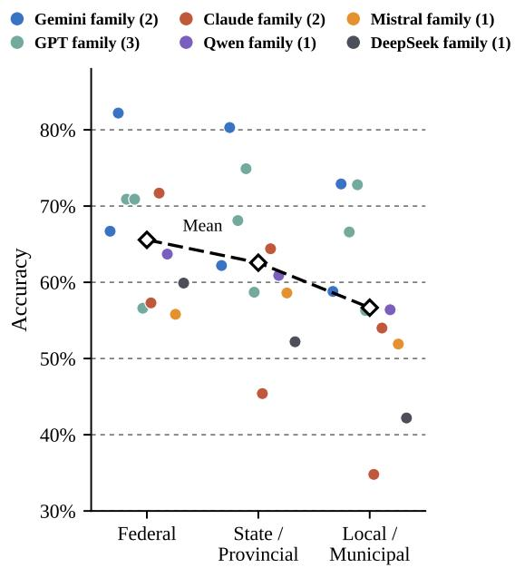
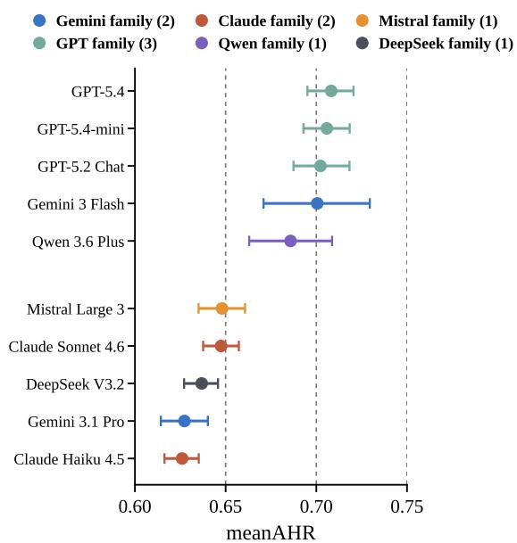
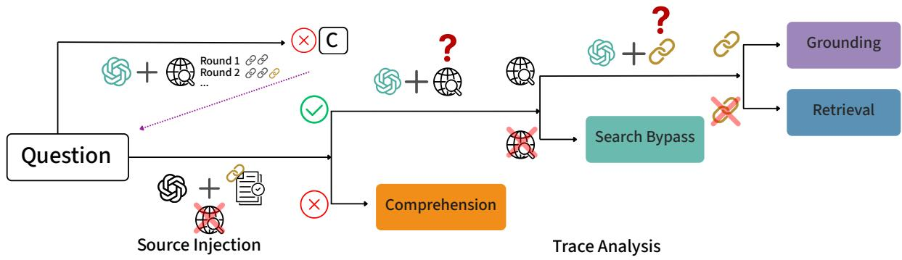
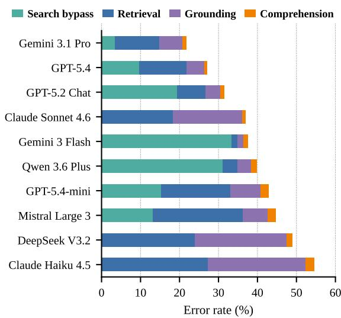

# CIVI: A Framework for Diagnosing Search Agent Failures in Civic Information

Dingying Liu<sup>1</sup> Yunshun Zhong<sup>2</sup> Wentao Zhang<sup>3</sup> Yiyuan Li<sup>4</sup> <sup>1</sup>University of Sydney <sup>2</sup>University of Toronto <sup>3</sup>University of Waterloo <sup>4</sup>UNC-Chapel Hill dliu6951@uni.sydney.edu.au, yunshun.zhong@mail.utoronto.ca, w564zhang@uwaterloo.ca, yiyuanli@cs.unc.edu

## Abstract

LLMs are increasingly deployed in publicsector settings, where incorrect guidance can cause irreversible harm. We introduce CIVI, the first framework for diagnosing search agent failures in civic information. Its benchmark instantiation jointly spans cross-national, interjurisdictional government contexts (federal, state, and local) and functional categories from an internationally adopted United Nations standard. We evaluate ten frontier search agents and find that none matches an attentive human baseline. Alongside accuracy, CIVI measures search invocation rate, selective no-search accuracy, and how often agents cite authoritative government sources. To perform this diagnosis, we introduce ARISE, which decomposes agentic search failures into four mutually exclusive modes, isolated via source-injection ablation. ARISE attributes 72.1% of all observed failures to retrieval-bound causes rather than to gaps in the models’ parametric knowledge.

## 1 Introduction

Frontier large language models (LLMs) are increasingly used in everyday decision-making (Sidoti and McClain, 2025), including in the public sector, where humans consult LLMs for guidance on benefit eligibility, tax obligations, and legal compliance. Unlike general factuality settings, authoritative public-sector information has near-zero tolerance for error. A single incorrect statement can produce significant and irreversible harm. New York City’s MyCity chatbot was found to give illegal advice across regulatory domains. It told small business owners they have the right to fire employees who report harassment, advised restaurants that rat-bitten cheese was safe to serve, and offered similar misinformation on housing and labor matters (Lecher, 2024; OECD, 2024). About 32% of U.S. adults have turned to AI chatbots for health information (Montero et al., 2026). At the same time, government agencies are deploying AI chatbots for public information at rapid scale: chatbots operated by the Internal Revenue Service, Social Security Administration, and Centers for Disease Control and Prevention have handled over 70 million human interactions, with several agencies seeing yearover-year growth of 5 times or more (GAO, 2026; SSA OIG, 2025; Castonguay et al., 2026).

Evaluating LLM accuracy on authoritative public-sector information is therefore important, and what such an evaluation can establish depends on its scope and setting. Authoritative answers differ across countries and jurisdictional levels, so a model’s overall civic reliability cannot be inferred from its accuracy in any single country. Humans obtain this information from general-purpose AI assistants that search the web as they answer, so a realistic evaluation must test models with agentic search rather than in a closed-book setup. While LLM factuality has been studied extensively in general settings (Min et al., 2023; Wei et al., 2024; Manakul et al., 2023; Li et al., 2023; Lin et al., 2022), recent benchmarks targeting government information specifically remain confined to a single country at a single jurisdictional level (Majithia et al., 2026; Gao et al., 2026). However, three gaps remain. First, no existing benchmark spans both cross-national and inter-jurisdictional government contexts with an international standard. Second, civic question answering (QA) evaluations report only aggregate accuracy, leaving diagnostic decomposition of failures unaddressed. Third, agentic search behavior, including whether models invoke search and cite authoritative sources, has not been systematically studied in civic QA.

To address these gaps, we introduce CIVI (Civic Intergovernmental Verification of Information)<sup>1</sup>, a framework for evaluating and diagnosing search agent failures in authoritative civic information across multiple governmental contexts. The present benchmark instantiation covers three Englishmajority federal democracies while the construction framework itself is country-agnostic.

Our main contributions are as follows:

1. The CIVI Benchmark. We instantiate CIVI as a benchmark of 4,097 expertverified multiple-choice question-answer pairs grounded in 576 manually curated authoritative public-sector web pages. The dataset is stratified along three axes: four governmentfunction categories drawn from the international Classification of the Functions of Government (COFOG) (United Nations Statistics Division, 2000), three jurisdictional levels (federal, state/provincial, municipal), and three federal democracies (Canada, the United States, and Australia). To our knowledge, it is the first benchmark to jointly span crossnational, inter-jurisdictional civic QA with an international classification standard.

2. The ARISE failure diagnostic. We introduce Agentic failuRe dIagnoStic probE (ARISE), CIVI’s failure-attribution procedure combining source-injection ablation with search-trace analysis to assign search agent failures to four mutually exclusive modes: search bypass, retrieval failure, grounding failure, and comprehension failure. Across all ten models, ARISE attributes 72.1% of all observed failures to retrieval-bound causes rather than to gaps in parametric knowledge.

3. Deployment-realistic evaluation. We evaluate ten frontier LLMs across proprietary and open-source families, reporting overall accuracy alongside complementary measures of agentic search behavior, namely search invocation rate, Selective No-Search Accuracy, and a tier-inclusive Authoritative Hit Rate (AHR) measuring how often cited URLs come from authoritative government sources.

## 2 Dataset Construction

## 2.1 Data Source

We construct CIVI from expert-curated authoritative public-sector web pages using a balanced threeaxis stratification scheme: COFOG government function, country, and jurisdictional level. Table 1 summarizes the resulting design.

<table><tr><td>Axis or unit</td><td>Levels or allocation</td><td>Count</td></tr><tr><td>COFOG function</td><td>Public Order and Safety, Economic Affairs, Health, Social Protection</td><td>4</td></tr><tr><td>Country</td><td>Canada, United States, Australia</td><td>3</td></tr><tr><td></td><td>Jurisdictional level Federal, state/provincial, local</td><td>3</td></tr><tr><td>Stratification cells</td><td>#COFOG × #Country × #Jurisdiction</td><td>36</td></tr><tr><td>Source pages</td><td>16 pages per cell</td><td>576</td></tr><tr><td></td><td>Validated QA pairs Approximately 114 QA pairs 4,097 per cell</td><td></td></tr></table>

Table 1: CIVI stratification across COFOG function, country, and jurisdictional level.

Government-function axis. We adopt the Classification of the Functions of Government (CO-FOG), the international standard for classifying government expenditure by function, and sample from four categories: Public Order and Safety, Economic Affairs, Health, and Social Protection. These domains cover civic questions for which humans routinely seek authoritative information and where misinformation can produce material harm.

Country axis. We sample from three federal democracies: Canada, the United States, and Australia. This design tests whether models can answer civic questions across national institutional regimes rather than within a single-country setting.

Jurisdictional-level axis. Within each country, we sample source pages at three jurisdictional levels: federal, state or provincial, and local. This design captures the fact that authoritative civic answers often depend not only on the country but also on the level of government responsible for the policy, service, or legal requirement. The three axes yield 4×3×3 = 36 stratification cells.

Source page curation. Three domain experts with public-sector experience curated the source pages one cell at a time. For each cell, an expert first identified the government body or governmentfunded public-sector body responsible for that function and jurisdiction, and only then selected pages from its official or accredited website, reviewing many pages within each cell. For each cell this produced a candidate pool at least four times the 16- page target, drawn entirely from government and government-funded public-sector domains. From each pool, the experts retained the pages with the most substantive, decision-relevant content for residents, discarding landing pages and navigation hubs and excluding pages whose terms restrict use for AI training or evaluation. Trimming each pool to its 16 strongest pages yielded a final corpus of 576 source pages. Appendix E details the full criteria, thresholds, and procedure.

## 2.2 Question Generation

After curating the source pages described in §2.1, we generate CIVI QA pairs using Claude Opus 4.6 (Anthropic, 2026a). We adopt a multiple-choice format, following factual-knowledge benchmarks (Hendrycks et al., 2021; Clark et al., 2018; Lin et al., 2022) and domain-specific factuality benchmarks (Pandit et al., 2025; Jansen et al., 2025). This format enables automated evaluation at scale. Each question must satisfy four criteria.

Source derivability. Each question must be directly answerable from a single source page, without external knowledge or cross-page synthesis. This single-page grounding also supports the source-injection diagnostic in §5. This criterion reflects the task-oriented structure promoted by the Canada.ca Content and Information Architecture Specification, the Australian Government Style Manual and Digital Service Standard, and U.S. federal web standards under the 21st Century IDEA: resident-facing service pages are generally designed to consolidate eligibility, procedures, fees, and deadlines for a specific task.

Concrete consequence. Each question tests information whose accuracy carries a concrete consequence for a human: either a required action (eligibility, deadlines, fees, application steps, contact channels) or a substantive feature of a public service (how it operates, what it delivers, how its performance is measured). Generated questions are distributed across both types. Trivia, definitions, and common-knowledge questions are excluded.

Jurisdictional precision. Each question concerns a single specific jurisdiction and has exactly one correct answer for that jurisdiction.

Source attribution. Alongside each correct answer, the generator returns the verbatim quotations from the source page that license it. This constrains generation toward extractive answering and gives the §2.3 validators the precise span to verify.

Each question presents eight options, of which one or more are correct. The remaining options are distractors. Distractors come from two sources: controlled perturbation of page content (changing a threshold, flipping a condition, altering a deadline, substituting an entity, or reordering steps) and plausible misconceptions a reader might draw from related civic knowledge but that the source page does not support. Distractors are deduplicated so that no two test the same underlying misconception. The full prompt is provided in Appendix D.1.

QA pair contents. Each finalized QA pair records the question with its eight options, the correct option set, the gold source URL and page title of the authoritative source page, and the verbatim supporting quotations that license the answer. Each pair is also tagged with its COFOG category and jurisdictional level. The gold source URL serves as the provenance anchor for the §5 diagnostic, which checks whether a model retrieved the gold source page. The generated candidates are then passed to the validation procedure described in §2.3.

## 2.3 Human Validation

Two researchers with domain expertise in publicsector AI independently validated all 4,354 generated pairs. Each reviewed the full dataset, so every pair received two independent annotations. The validators brought complementary experience in public-sector AI. One has multiple years of experience working with public-sector agencies on deployed retrieval-augmented systems, and the other has advised municipal government stakeholders on AI accuracy in civic information access.

For each pair, the annotator examined the question, re-examined the gold source page it was generated from, confirmed that the supporting quotations appear in that page, and verified the pair against the four §2.2 criteria: source derivability, concrete consequence, jurisdictional precision, and source attribution. Pairs flagged by either annotator as failing any criterion were excluded from the final dataset. Both annotators returned matching verdicts on 96.8% of pairs (raw agreement), and 94.1% of generated pairs were accepted by both annotators and retained in the final dataset. This acceptance rate confirms the effectiveness of our automated question generation pipeline.

## 3 Evaluation Protocol

## 3.1 Evaluation Setup

Our agentic condition reflects how people actually access civic information. They query a publicly available AI assistant that retrieves authoritative sources at inference time, rather than being supplied curated context in advance (Jo et al., 2023).

To standardize this setting across models, we route all agentic search through Exa, which provides a common search substrate and enables direct comparison of search behavior. Following the retrieval budgets used in prior agentic search evaluation (Li et al., 2025; Jin et al., 2025; Zheng et al., 2025; Song et al., 2025), each model may issue up to three rounds of search queries, with each round allowing unlimited search queries, and may retrieve a maximum of 10 URLs across queries. This range falls within the per-turn retrieval patterns of consumer AI assistants such as Claude (Anthropic, 2025b) and ChatGPT (OpenAI, 2024), both of which rewrite user prompts into multiple bounded search invocations. The full setup of our implementation is shown in Appendix D.

## 3.2 Models

We evaluate ten frontier LLMs selected to reflect the deployments most likely encountered by humans accessing public-sector information. Seven are closed-source, the consumer-facing default of each major provider (Gemini 3 Flash (Google DeepMind, 2025), GPT-5.2 Chat (OpenAI, 2025), and Claude Sonnet 4.6 (Anthropic, 2026b)) together with higher- and lower-tier variants from the same three families (GPT-5.4 (OpenAI, 2026a), GPT-5.4-mini (OpenAI, 2026b), Gemini 3.1 Pro (Google DeepMind, 2026), and Claude Haiku 4.5 (Anthropic, 2025a)). The remaining three are open-weight models from major open-source families, including DeepSeek-V3.2 (DeepSeek-AI, 2025), Mistral Large 3 (Mistral AI, 2025), and Qwen3.6-Plus (Qwen Team, 2026).

## 3.3 Metrics

We evaluate model responses with four metrics. Accuracy captures whether a model answers correctly. The other three, search invocation rate, Selective No-Search Accuracy, and authoritative hit rate, characterize the model’s search and sourcing behavior, which the agentic deployment setting makes consequential beyond correctness alone.

Accuracy. We compute accuracy via exact set match (order-invariant and case insensitive), treating a response as correct only when it selects exactly the correct option set, with no missing or incorrect selections. Exact match aligns with civic information stakes, where partially correct answers can still produce materially misleading guidance.

Search invocation rate. The proportion of all evaluation questions on which a model invokes search at least once, reported both overall and separately by jurisdictional level.

Selective No-Search Accuracy. The proportion of correct answers among questions for which the model did not invoke search. Because this subset is selected by the model and varies in size and composition across models, Selective No-Search Accuracy is a per-model behavioral diagnostic rather than a direct cross-model measure of closed-book ability. For cross-model comparison of searchpolicy calibration, we define $\Delta _ { \mathrm { s k i p } }$ as Selective No-Search Accuracy minus accuracy when search is disabled on the full benchmark. Positive values indicate that a model preferentially skips search on questions that are easier for it, values near zero indicate little selection advantage, and negative values indicate that it skips search on comparatively difficult questions.

Authoritative hit rate. Models cite sources of varying authority, from official government domains to community forums, news outlets, and editorial sites, but only government domains can definitively answer institutional questions about benefits, eligibility, and procedural requirements. We define the authoritative set for a question based on its jurisdictional level: a federal question admits only federal government domains, a state question admits state and federal domains, and a municipal question admits municipal, parent-state, and federal domains.<sup>2</sup> For each question, we compute the proportion of the model’s cited URLs that come from authoritative government domains. The mean Authoritative Hit Rate (meanAHR) is the average of these per-question proportions across all questions for which the model cited at least one URL. Let $Q _ { m }$ be the set of questions for which model m cited at least one URL, let $n ( q , m )$ be the number of unique URLs cited by m in response to question $q ,$ and let $n _ { \mathrm { a u t h } } ( q , m )$ be the number of those URLs from authoritative domains. The mean AHR for model m is:

$$
\mathrm { m e a n A H R } _ { m } = \frac { 1 } { | Q _ { m } | } \sum _ { q \in Q _ { m } } \frac { n _ { \mathrm { a u t h } } ( q , m ) } { n ( q , m ) } .\tag{1}
$$

We report 95% confidence intervals (CIs) on permodel meanAHR using non-parametric bootstrap resampling with 1000 resamples over the perquestion AHR values.

## 4 CIVI

## 4.1 Results

We evaluate ten frontier LLMs on the full CIVI set of 4,097 questions under the agentic search condition described in §3.1. Table 2 reports aggregate exact-match accuracy. As a comparator, we establish a human baseline from 5 participants, each answering the same 150 stratified questions with unrestricted search-engine access and unlimited time. Mean accuracy across these users is 92.67%, with a standard deviation of 3.1 percentage points. Model scores and rankings are largely stable across three runs on a stratified subset of 410 questions (Appendix C.3).

All models trail the attentive human baseline. The strongest model, Gemini 3.1 Pro at 78.28% (95% CI ±1.3 pp), falls 14.4 percentage points below the human baseline. Despite access to agentic search, no frontier LLM matches an attentive human on civic question answering. On the same subset answered by the human participants, Gemini 3.1 Pro scores 77.33%, 15.3 percentage points below the human baseline (Appendix C.1).

Performance declines with jurisdictional level. As Figure 1 shows, mean accuracy declines monotonically from 65.6% at the federal level to 62.6% at the state/provincial level and 56.7% at the local/municipal level, a difference of 8.9 percentage points between the federal and local levels. We hypothesize that this pattern aligns with the unequal representation of authoritative sources across general-purpose training corpora, with local sources especially sparse.

Inter-model spread widens at lower levels. The range of accuracies across models grows as jurisdictional level descends. Federal accuracies span 26.4 percentage points (55.8% to 82.2%), state accuracies span 34.9 percentage points, and municipal accuracies span 38.1 percentage points. Models that perform similarly on federal questions diverge more sharply on questions whose authoritative sources are sparser.

Cross-jurisdictional robustness varies dramatically. The federal-to-municipal accuracy drop varies widely across models, from +1.9 percentage points for GPT-5.4, which improves at the municipal level, to −22.5 for Claude Haiku 4.5. The GPT family is flat across levels, with all three dropping less than 5 percentage points. We hypothesize that their substantially increased search invocation at lower jurisdictional levels contributes to this robustness in accuracy (§4.2).

<table><tr><td>Model</td><td>Accuracy</td></tr><tr><td>Human Baseline</td><td>92.67</td></tr><tr><td>Gemini 3.1 Pro</td><td>78.28 (±1.3) 72.88 (±1.4)</td></tr><tr><td>GPT-5.4 GPT-5.2 Chat</td><td>68.46 (±1.4)</td></tr><tr><td>Claude Sonnet 4.6</td><td>63.05 (±1.5)</td></tr><tr><td>Gemini 3 Flash</td><td>62.44 (±1.5)</td></tr><tr><td>Qwen 3.6 Plus GPT-5.4-mini</td><td>60.20 (±1.5)</td></tr><tr><td>Mistral Large 3</td><td>57.18 (±1.5)</td></tr><tr><td></td><td>55.33 (±1.5)</td></tr><tr><td>DeepSeek V3.2 Claude Haiku 4.5</td><td>51.12 (±1.5) 45.45 (±1.5)</td></tr></table>

Table 2: Aggregate accuracy on CIVI. The strongest model’s full benchmark score is 14.4 percentage points below the human subset baseline. On the matched subset, the gap is 15.3 percentage points (Appendix C.1). Parenthetical values are 95% Wilson score confidence interval half-widths in percentage points. The human baseline is the mean accuracy of five users with unrestricted search-engine access and unlimited time.  
  
Figure 1: Accuracy declines as jurisdictional level descends, with mean accuracy falling from 65.6% at federal questions to 56.7% at local/municipal questions. Each dot is one model’s accuracy at one level (n = 1,310 federal, n = 1,334 state/provincial, n = 1,453 local/municipal). The dashed line traces the cross-model mean, and dots are colored by model family.

Top model lead widens at higher jurisdictional levels. The accuracy gap between the top-ranked model and the second-best widens substantially as jurisdictional level rises. At state, Gemini 3.1 Pro leads by 5.4 percentage points (80.3% versus GPT-5.4 at 74.9%). At federal, the lead widens to 10.5 percentage points (82.2% versus Claude Sonnet 4.6 at 71.7%), nearly double the state-level gap.

Accuracy varies less across countries than across jurisdictional levels. Averaging the ten model scores equally, accuracy is 63.4% on U.S. questions, 62.0% on Australian questions, and 59.1% on Canadian questions. The range across countries is 4.3 percentage points, compared with an 8.9 percentage point difference between the federal and local levels (Appendix C.2).

## 4.2 Agentic Search Behavior

Accuracy captures whether models answer correctly, but not whether they ground their answers in current authoritative sources or rely on parametric recall. For civic information that changes with policy and regulatory updates, bypassing search risks relying on stale training-time knowledge. Table 3 reports search invocation rates and Selective No-Search Accuracy for all ten models.

Default agentic search behavior varies substantially across models. Search invocation rates range from 13.5% (Gemini 3 Flash) to 99.8% (DeepSeek V3.2), an 86-percentage-point spread. The low end includes the proprietary Gemini 3 Flash and the open-source Qwen3.6-Plus, while the high end includes the proprietary Claude variants and the open-source DeepSeek V3.2. These results indicate that default search behavior varies independently of whether a model is open-source or proprietary. For public sector deployment, a model that rarely invokes search relies more on parametric knowledge and may be more exposed to outdated civic information.

Search invocation rate increases substantially with descending jurisdictional level. Federal-tomunicipal search invocation gaps (Table 3) range from 23.4 percentage points (Gemini 3 Flash) to 62.0 percentage points (GPT-5.2 Chat). This pattern is consistent with the hypothesis in §4.1 that local civic information is less represented in generalpurpose training corpora, since models with weaker parametric knowledge at lower jurisdictional levels would rely more on search.

Agentic search achieves higher average accuracy than closed-book answering and RAG. On average, the ten models score 10.0 percentage points higher with agentic search than with closed-book answering and 9.1 percentage points higher than with single retrieval RAG. Single retrieval RAG improves accuracy by less than 1 percentage point over closed-book answering. Agentic search exceeds single retrieval RAG for every model.

  
Figure 2: Models partition into two tiers on meanAHR, ordered from highest to lowest. Each point is one model’s meanAHR with 95% bootstrap CI. Points are colored by model family. The GPT family holds the top three positions. Within each tier, CIs overlap.

Most models skip search selectively. Among the seven models with sufficient numbers of questions answered without search, six have positive $\Delta _ { \mathrm { s k i p } }$ values. Mistral Large 3 has the largest positive value at +12.9 percentage points, whereas Gemini 3 Flash is the only model with a negative value at −3.7 percentage points.

## 4.3 Authoritative Source Citing

For public-sector deployment, citing authoritative sources ensures the authenticity of the information. In this regard, meanAHR complements prior source-reliability estimation approaches (Hwang et al., 2025) and citation-grounded evaluation (Gao et al., 2023) by measuring the share of cited URLs from authoritative government domains. Figure 2 demonstrates model-wise meanAHR with 95% bootstrap confidence intervals.

Models partition into two tiers on meanAHR. Models in our evaluation partition into a top tier with meanAHR values of 0.69 to 0.71 and a bottom tier with values of 0.63 to 0.65. A meanAHR of 0.63 indicates that, on the average question, roughly 63% of the URLs cited by the model are authoritative. Within each tier, confidence intervals overlap, so we treat the two-tier split, which a larger model set might narrow, as the meaningful feature rather than within-tier ordering.

<table><tr><td>Model</td><td colspan="3">Accuracy</td><td colspan="4">Search rate</td><td rowspan="2">Selective No-Search Accuracy</td><td rowspan="2"> $\Delta _ { \mathrm { s k i p } }$  (pp)</td></tr><tr><td></td><td>Agentic</td><td>Disabled</td><td>RAG</td><td>Overall</td><td>Federal</td><td>State/Prov.</td><td>Local/Mun.</td></tr><tr><td>GPT-5.4</td><td>72.88 (±1.4)</td><td>60.4 (±1.5)</td><td>61.9 (±1.5)</td><td>69.8%</td><td>40.4%</td><td>73.0%</td><td>93.3%</td><td>68.4%</td><td>+8.0</td></tr><tr><td>GPT-5.4-mini</td><td>57.18 (±1.5)</td><td>45.1 (±1.5)</td><td>47.4 (±1.5)</td><td>69.1%</td><td>41.7%</td><td>71.6%</td><td>91.6%</td><td>53.3%</td><td>+8.2</td></tr><tr><td>GPT-5.2 Chat</td><td>68.46 (±1.4)</td><td>55.1 (±1.5)</td><td>52.4 (±1.5)</td><td>47.4%</td><td>19.1%</td><td>38.5%</td><td>81.1%</td><td>66.4%</td><td>+11.3</td></tr><tr><td>Claude Sonnet 4.6</td><td>63.05 (±1.5)</td><td>56.9 (±1.5)</td><td>57.7 (±1.5)</td><td>≥99%</td><td>≥99%</td><td>≥99%</td><td>≥99%</td><td>N/A</td><td>N/A</td></tr><tr><td>Claude Haiku 4.5</td><td>45.45 (±1.5)</td><td>33.3 (±1.4)</td><td>32.9 (±1.4)</td><td>≥99%</td><td>≥99%</td><td>≥99%</td><td>≥99%</td><td>N/A</td><td>N/A</td></tr><tr><td>Gemini 3.1 Pro</td><td>78.28 (±1.3)</td><td>73.2 (±1.4)</td><td>68.4 (±1.4)</td><td>62.4%</td><td>41.1%</td><td>58.0%</td><td>85.5%</td><td>78.0%</td><td>+4.8</td></tr><tr><td>Gemini 3 Flash</td><td>62.44 (±1.5)</td><td>66.5 (±1.4)</td><td>54.2 (±1.5)</td><td>13.5%</td><td>5.0%</td><td>5.6%</td><td>28.4%</td><td>62.8%</td><td>-3.7</td></tr><tr><td>DeepSeek V3.2</td><td>51.12 (±1.5)</td><td>42.7 (±1.5)</td><td>47.3 (±1.5)</td><td>≥99%</td><td>≥99%</td><td>≥99%</td><td>≥99%</td><td>N/A</td><td>N/A</td></tr><tr><td>Qwen3.6-Plus</td><td>60.20 (±1.5)</td><td>48.9 (±1.5)</td><td>51.0 (±1.5)</td><td>22.7%</td><td>9.0%</td><td>14.3%</td><td>42.9%</td><td>56.7%</td><td>+7.8</td></tr><tr><td>Mistral Large 3</td><td>55.33 (±1.5)</td><td>32.0 (±1.4)</td><td>50.6 (±1.5)</td><td>75.0%</td><td>57.2%</td><td>76.1%</td><td>90.0%</td><td>44.9%</td><td>+12.9</td></tr></table>

Table 3: Averaged across models, agentic search improves accuracy by 10.0 percentage points over the searchdisabled baseline and by 9.1 points over retrieval-augmented generation (RAG) with one retrieval. Search invocation ranges from 13.5% to ≥99% and generally increases toward municipal questions. Bold marks the highest accuracy condition within each model. Parentheses report 95% Wilson confidence-interval half-widths in percentage points. Selective No-Search Accuracy is computed on questions a model chose not to search. $\Delta _ { \mathrm { s k i p } }$ is this value minus the same model’s Search-Disabled Accuracy on the full benchmark. ≥99% denotes near-universal search. N/A indicates too few no-search responses.

Top-tier performance concentrates within the GPT family. Three of the top five models are GPT variants: GPT-5.4, GPT-5.4 mini, and GPT-5.2 Chat. These models span different product tiers within OpenAI’s lineup yet sit within overlapping confidence intervals on meanAHR. We hypothesize that GPT-family models share retrieval-grounding and citation behaviors that are largely independent of general model capability, producing this withinlineup consistency. The meanAHR ordering also diverges from aggregate accuracy. Gemini 3.1 Pro, the strongest model by accuracy (Table 2), sits in the lower meanAHR tier, while GPT-5.4-mini ranks in the top meanAHR tier despite placing seventh on accuracy. Rank order on meanAHR shows only weak agreement with rank order on LMArena Text Arena Elo<sup>3</sup> (Spearman ρ = 0.27, p = 0.45, N = 10), with Kendall τ = 0.24 (p = 0.38) supporting this magnitude. These results show insufficient evidence for a correlation between general capability rank and meanAHR rank, suggesting that authoritative-source citation captures a dimension only weakly aligned with general model capability.

## 5 Decomposing Failures

The metrics in §4 establish that the evaluated agents underperform on civic question answering and characterize their search and sourcing behavior, but they do not distinguish among the ways an answer can be wrong. We introduce ARISE, CIVI’s failureattribution procedure, which combines a sourceinjection ablation following Cuconasu et al. (2024) with inspection of the original agentic search trace to deterministically categorize each incorrect response into one of four failure modes: search bypass, retrieval, grounding, or comprehension. These modes are mutually exclusive and exhaustive, so every incorrect response receives exactly one failure label.

Diagnostic methodology. We apply ARISE to all observed failures from all ten agents evaluated in §4, using the two-step diagnostic described below.

Step 1: Source injection. For each failed response, we rerun the underlying model with search disabled and supply the gold source page as additional context. This eliminates retrieval, grounding, and search-bypass failure modes by design. If the model still produces an incorrect answer, the failure is attributed to a comprehension failure. An example of this is provided in Appendix B, where GPT-5.4 cited the verbatim text from the supplied source page but still produced an incorrect answer.

Step 2. Trace analysis. For questions where the model now produces the correct answer under source injection, the model demonstrates the ability to comprehend the gold source when supplied directly. We analyze the agentic search trace preserved from the §4 evaluation run. No additional model calls are required, as all trace data was logged during the original evaluation. Three categories are possible. Search bypass: the trace shows no search invocation, indicating the model answered from parametric knowledge alone. Retrieval failure: search was invoked but the gold source URL was not retrieved. Grounding failure: search was invoked and the gold source URL was retrieved, yet the answer was incorrect.

  
Figure 3: The ARISE workflow that categorizes incorrect responses from the initial evaluation into four failure modes. Specifically, the incorrectly answered question is re-evaluated with the gold source page as context with search disabled (Source Injection). The failure is categorized as Comprehension if the answer remains incorrect in re-evaluation. Otherwise, ARISE investigates whether search is bypassed and whether the gold source page is correctly retrieved in the initial evaluation (Trace Analysis).

  
Figure 4: Full-population failure diagnostic. Failures are predominantly retrieval-bound. Search bypass and retrieval failure together account for an average of 72.1% of errors across the ten models, suggesting that most failures occur without the authoritative source in context. Search bypass accounts for 34.5% of failures and retrieval failure for 37.6%. Bar length reflects each model’s overall error rate.

Retrieval-bound failures dominate. As shown in Figure 4, search bypass and retrieval failures together account for an average of 72.1% of failures across the ten evaluated models, ranging from 48.9% (DeepSeek V3.2) to 92.9% (Gemini 3 Flash). Averaged across models, search bypass accounts for 34.5% of failures and retrieval failure for 37.6%. These findings indicate that civic information accuracy is most often lost at the retrieval stage, whether through failure to invoke search or failure to surface the authoritative source, rather than at grounding or comprehension.

Improving retrieval cannot eliminate comprehension errors. In the full-population diagnostic, between 2.3% and 4.8% of each model’s failed questions persist even when the gold source page (median \~1,000 words) is provided in the model’s context window (Figure 4). For example, even when the model is given the gold source page and quotes verbatim text from it, it can still produce an incorrect answer (see Appendix B). Unlike search bypass, retrieval, and grounding failures, these errors cannot be addressed by better retrieval. This residual may reflect the difficulty of public-sector institutional language, which combines precise terminology with complex conditional structures such as eligibility criteria and regulatory text (Martínez et al., 2022).

Diagnostic implications. Because the four modes localize failures at different stages, they also identify different intervention targets. Search bypass points to search triggering or civic intent routing, retrieval failure to query reformulation or authoritative source indexing, grounding failure to checks for consistency between answers and evidence, and comprehension failure to stronger reasoning support or human escalation. These are implications of the diagnostic categories rather than interventions evaluated in this study.

## 6 Related Work

Failure Decomposition. Diagnosing failures in retrieval-augmented and agentic LLM systems has been approached through trajectory-step taxonomies, claim-level metrics, and pipeline-stage decompositions (Jiao et al., 2026; Sivakumar et al., 2026; Ru et al., 2024; Zhang et al., 2025; Leung et al., 2026; Shao et al., 2025). Mallen et al. (2023) establish the parametric-versus-nonparametric memory distinction that motivates source-injection ablation, while Wu et al. (2025) taxonomize suboptimal agentic search behavior into over-search and under-search categories. To our knowledge, no prior work applies sourceinjection ablation together with agentic search trace analysis to civic information. ARISE combines them to decompose failures into search bypass, retrieval, grounding, and comprehension.

LLM Evaluation for Civic and Public-Sector Information. A growing line of benchmarks evaluates LLM accuracy on government information at single-country, single-jurisdictional scopes (Majithia et al., 2026; Harris et al., 2025; Gao et al., 2026; Liu et al., 2025; Yang et al., 2025; Wang et al., 2025). Some benchmarks also evaluate municipal open-data and regulatory knowledge (Siebenmann et al., 2026; Guha et al., 2023). CIVI’s benchmark instantiation is the first to jointly span cross-national and inter-jurisdictional civic QA under an international functional classification standard, covering three federal democracies, three jurisdictional levels, and four COFOG categories.

## 7 Conclusion

We present CIVI, the first framework for diagnosing search agent failures in civic information, instantiated across three federal democracies, three jurisdictional levels, and functional categories from an internationally adopted United Nations standard. CIVI performs failure attribution through ARISE, which combines source-injection ablation with agentic search trace analysis to distinguish search bypass, retrieval, grounding, and comprehension failures. None of the ten evaluated agents matches the attentive human baseline, and ARISE attributes 72.1% of failures to retrieval-bound causes, comprising 34.5% search bypass and 37.6% retrieval failure. By localizing failures to different stages, CIVI indicates whether interventions should target search invocation, authoritative source retrieval, answer-evidence consistency, or comprehension support and human escalation. More broadly, civic deployers should consider not only accuracy but also how quickly information changes, the jurisdictional level served, and whether answers must be traceable to authoritative government sources.

## Limitations

Geographic and linguistic scope. The present evaluation focuses on English-language civic information across three countries (Canada, the United States, and Australia). Although Canada is officially bilingual, our source pages and questions are in English only. The COFOG based construction protocol is country agnostic, but expansion requires experts familiar with each country’s languages and administrative system. Extending CIVI to multilingual civic QA and to governance systems with different legal or administrative traditions is a natural direction for future work.

Uniform search substrate. All models access agentic search through a single provider (Exa), a design choice that prioritizes controlled comparison across model families. Future evaluations could complement this by testing models under their native search infrastructure to assess ecological validity in specific deployment settings.

## Ethical Considerations

Human participants. The human baseline used as a human comparator in our evaluation involved five volunteer participants. Participants were recruited from the authors’ personal networks and did not receive compensation. Participation was entirely voluntary, and participants were free to withdraw at any time. Before starting, each participant was informed about the purpose of the study, the nature of the question-answering task, and its expected duration, and gave informed consent. We collected no personally identifiable or sensitive information. The task consisted of answering publicly available civic questions and posed minimal risk to participants.

## References

Anthropic. 2025a. Claude haiku 4.5 system card. Accessed: 2026-05-25.

Anthropic. 2025b. Web search tool. https:// docs.claude.com/en/docs/agents-and-tools/ tool-use/web-search-tool. Claude API documentation. Accessed: 2026-05-25.

Anthropic. 2026a. Claude Opus 4.6: System card. https://www.anthropic.com/ claude-opus-4-6-system-card. Accessed: 2026-05-25.

Anthropic. 2026b. System card: Claude Sonnet 4.6. https://anthropic.com/ claude-sonnet-4-6-system-card. Accessed: 2026-05-25.

François M. Castonguay, Melissa H. Boyette, Dolly Katz, Tou Fong Lee, Rebecca McDaniel, Palak Patel, W. Fred Smith, Peter D. Way, and Martin I. Meltzer. 2026. Simplifying Public Health Recommendations: Use of a Public CDC Chatbot During the COVID-19 Pandemic, 2022–2024. Public Health Reports. Online ahead of print.

Peter Clark, Isaac Cowhey, Oren Etzioni, Tushar Khot, Ashish Sabharwal, Carissa Schoenick, and Oyvind Tafjord. 2018. Think you have solved question answering? Try ARC, the AI2 reasoning challenge. arXiv preprint arXiv:1803.05457.

Florin Cuconasu, Giovanni Trappolini, Federico Siciliano, Simone Filice, Cesare Campagnano, Yoelle Maarek, Nicola Tonellotto, and Fabrizio Silvestri. 2024. The power of noise: Redefining retrieval for RAG systems. In Proceedings of the 47th International ACM SIGIR Conference on Research and Development in Information Retrieval, pages 719–729.

DeepSeek-AI. 2025. DeepSeek-V3.2: Pushing the frontier of open large language models. Preprint, arXiv:2512.02556.

GAO. 2026. Artificial Intelligence: IRS Actions Needed to Address Skills Gaps, Information Quality, and Strategic Management. Technical Report GAO-26-107522, U.S. Government Accountability Office.

Tianyu Gao, Howard Yen, Jiatong Yu, and Danqi Chen. 2023. Enabling large language models to generate text with citations. In Proceedings ofthe 2023 Conference on Empirical Methods in Natural Language Processing. Association for Computational Linguistics.

Zihan Gao, Yifei Xu, and Jacob Thebault-Spieker. 2026. LocalBench: Benchmarking llms on county-level local knowledge and reasoning. In Proceedings ofthe Fortieth AAAI Conference on Artificial Intelligence (AAAI-26). AAAI Press.

Google DeepMind. 2025. Gemini 3 Flash: Model card. Accessed: 2026-05-25.

Google DeepMind. 2026. Gemini 3.1 Pro: Model card. https://deepmind.google/models/ model-cards/gemini-3-1-pro/. Accessed: 2026-05-25.

Neel Guha, Julian Nyarko, Daniel E. Ho, Christopher Ré, and 1 others. 2023. LegalBench: A collaboratively built benchmark for measuring legal reasoning in large language models. In Advances in Neural Information Processing Systems 36 (NeurIPS 2023), Datasets and Benchmarks Track.

Joshua Harris, Fan Grayson, Felix Feldman, Timothy Laurence, Toby Nonnenmacher, Oliver Higgins, Leo Loman, Selina Patel, Thomas Finnie, Samuel Collins, and Michael Borowitz. 2025. Healthy LLMs? benchmarking LLM knowledge of UK government public health information. arXiv preprint arXiv:2505.06046.

Dan Hendrycks, Collin Burns, Steven Basart, Andy Zou, Mantas Mazeika, Dawn Song, and Jacob Steinhardt. 2021. Measuring massive multitask language understanding. In International Conference on Learning Representations.

Jeongyeon Hwang, Junyoung Park, Hyejin Park, Dongwoo Kim, Sangdon Park, and Jungseul Ok. 2025. Retrieval-augmented generation with estimation of source reliability. In Proceedings of the 2025 Conference on Empirical Methods in Natural Language Processing, pages 34267–34291, Suzhou, China. Association for Computational Linguistics.

Peter Jansen, Samiah Hassan, and Ruoyao Wang. 2025. Matter-of-Fact: A benchmark for verifying the feasibility of literature-supported claims in materials science. In Proceedings ofthe 2025 Conference on Empirical Methods in Natural Language Processing, pages 4090–4102, Suzhou, China. Association for Computational Linguistics.

Shuguang Jiao, Chengkai Huang, Shuhan Qi, Xuan Wang, Yifan Li, Quanchi Weng, Lingchuan Liu, Xunliang Cai, and Lina Yao. 2026. Doctor-RAG: A failure-aware repair framework for agentic retrievalaugmented generation. Preprint, arXiv:2604.00865.

Bowen Jin, Hansi Zeng, Zhenrui Yue, Jinsung Yoon, Sercan Arik, Dong Wang, Hamed Zamani, and Jiawei Han. 2025. Search-R1: Training LLMs to reason and leverage search engines with reinforcement learning. In Conference on Language Modeling (COLM 2025).

Eunkyung Jo, Daniel A. Epstein, Hyunhoon Jung, and Young-Ho Kim. 2023. Understanding the benefits and challenges of deploying conversational AI leveraging large language models for public health intervention. In Proceedings ofthe 2023 CHI Conference on Human Factors in Computing Systems, CHI ’23, New York, NY, USA. Association for Computing Machinery.

Colin Lecher. 2024. NYC’s AI Chatbot Tells Businesses to Break the Law. The Markup. Published March 29, 2024.

Kin Kwan Leung, Mouloud Belbahri, Yi Sui, Alex Labach, Xueying Zhang, Stephen Anthony Rose, and Jesse C. Cresswell. 2026. Classifying and addressing the diversity of errors in retrieval-augmented generation systems. In Proceedings of the 19th Conference ofthe European Chapter ofthe Associationfor Computational Linguistics (Volume 1: Long Papers), pages 3185–3207, Rabat, Morocco. Association for Computational Linguistics.

Junyi Li, Xiaoxue Cheng, Xin Zhao, Jian-Yun Nie, and Ji-Rong Wen. 2023. HaluEval: A large-scale hallucination evaluation benchmark for large language models. In Proceedings ofthe 2023 Conference on Empirical Methods in Natural Language Processing, pages 6449–6464, Singapore. Association for Computational Linguistics.

Xiaoxi Li, Guanting Dong, Jiajie Jin, Yuyao Zhang, Yujia Zhou, Yutao Zhu, Peitian Zhang, and Zhicheng Dou. 2025. Search-o1: Agentic search-enhanced large reasoning models. In Proceedings ofthe 2025 Conference on Empirical Methods in Natural Lan guage Processing, pages 5420–5438, Suzhou, China. Association for Computational Linguistics.

Stephanie Lin, Jacob Hilton, and Owain Evans. 2022. TruthfulQA: Measuring how models mimic human falsehoods. In Proceedings ofthe 60th Annual Meeting ofthe Associationfor Computational Linguistics (Volume 1: Long Papers), pages 3214–3252, Dublin, Ireland. Association for Computational Linguistics.

Shuo Liu, Lin Zhang, Weidong Liu, Jianfeng Zhang, Donghui Gao, and Xiaofeng Jia. 2025. The evaluation framework and benchmark for large language models in the government affairs domain. ACM Transactions on Intelligent Systems and Technology, 16(6):1–24.

Neil Majithia, Rajat Shinde, Zo Chapman, Prajun Trital, Jordan Decker, Manil Maskey, Elena Simperl, and Nigel Shadbolt. 2026. The CitizenQuery benchmark: A novel dataset and evaluation pipeline for measuring LLM performance in citizen query tasks. arXiv preprint arXiv:2602.04064.

Alex Mallen, Akari Asai, Victor Zhong, Rajarshi Das, Daniel Khashabi, and Hannaneh Hajishirzi. 2023. When not to trust language models: Investigating effectiveness of parametric and non-parametric memories. In Proceedings of the 61st Annual Meeting of the Associationfor Computational Linguistics (Volume 1: Long Papers), pages 9802–9822. Association for Computational Linguistics.

Potsawee Manakul, Adian Liusie, and Mark Gales. 2023. SelfCheckGPT: Zero-resource black-box hallucination detection for generative large language models. In Proceedings of the 2023 Conference on Empirical Methods in Natural Language Processing, pages 9004–9017, Singapore. Association for Computational Linguistics.

Eric Martínez, Francis Mollica, and Edward Gibson. 2022. Poor writing, not specialized concepts, drives

processing difficulty in legal language. Cognition, 224:105070.

Sewon Min, Kalpesh Krishna, Xinxi Lyu, Mike Lewis, Wen-tau Yih, Pang Wei Koh, Mohit Iyyer, Luke Zettlemoyer, and Hannaneh Hajishirzi. 2023. FActScore: Fine-grained atomic evaluation of factual precision in long form text generation. In Proceedings ofthe 2023 Conference on Empirical Methods in Natural Language Processing, pages 12076–12100, Singapore. Association for Computational Linguistics.

Mistral AI. 2025. Introducing Mistral 3. https: //mistral.ai/news/mistral-3. Includes Mistral Large 3. Accessed: 2026-05-25.

Alex Montero, Julian Montalvo III, Audrey Kearney, Isabelle Valdes, Ashley Kirzinger, and Liz Hamel. 2026. KFF Tracking Poll on Health Information and Trust: Use of AI for Health Information and Advice. Technical report, Kaiser Family Foundation. Survey of 1,343 U.S. adults conducted February 24–March 2, 2026.

OECD. 2024. NYC MyCity Chatbot Gives Dangerous, Illegal Advice to Businesses. OECD AI Incidents Monitor.

OpenAI. 2024. Introducing ChatGPT search. https://openai.com/index/ introducing-chatgpt-search/. OpenAI announcement page. Accessed: 2026-05-25.

OpenAI. 2025. Introducing GPT-5.2. Accessed: 2026- 05-25.

OpenAI. 2026a. Introducing GPT-5.4. https:// openai.com/index/introducing-gpt-5-4/. Accessed: 2026-05-25.

OpenAI. 2026b. Introducing GPT-5.4 mini and nano. https://openai.com/index/ introducing-gpt-5-4-mini-and-nano/. Accessed: 2026-05-25.

Shrey Pandit, Jiawei Xu, Junyuan Hong, Zhangyang Wang, Tianlong Chen, Kaidi Xu, and Ying Ding. 2025. MedHallu: A comprehensive benchmark for detecting medical hallucinations in large language models. In Proceedings ofthe 2025 Conference on Empirical Methods in Natural Language Processing, pages 2858–2873, Suzhou, China. Association for Computational Linguistics.

Qwen Team. 2026. Qwen3.6-Plus: Towards real world agents. https://qwen.ai/blog?id=qwen3.6. Accessed: 2026-05-25.

Dongyu Ru, Lin Qiu, Xiangkun Hu, Tianhang Zhang, Peng Shi, Shuaichen Chang, Jiayang Cheng, Cunxiang Wang, Shichao Sun, Huanyu Li, Zizhao Zhang, Binjie Wang, Jiarong Jiang, Tong He, Zhiguo Wang, Pengfei Liu, Yue Zhang, and Zheng Zhang. 2024. RAGChecker: A fine-grained framework for diagnosing retrieval-augmented generation. In Advances in

Neural Information Processing Systems (NeurIPS), Datasets and Benchmarks Track.

Jiaqi Shao, Yuxiang Lin, Munish Prasad Lohani, Yufeng Miao, and Bing Luo. 2025. Do LLM agents know how to ground, recover, and assess? a benchmark for epistemic competence in information-seeking agents. Preprint, arXiv:2509.22391.

Olivia Sidoti and Colleen McClain. 2025. 34% of U.S. adults have used ChatGPT, about double the share in 2023. Pew Research Center. Accessed May 2026.

Michael Siebenmann, Javier Argota Sánchez-Vaquerizo, Stefan Arisona, Krystian Samp, Luis Gisler, and Dirk Helbing. 2026. OGD4All: A framework for accessible interaction with geospatial open government data based on large language models. arXiv preprint arXiv:2602.00012.

Aswini Sivakumar, Vijayan Sugumaran, and Yao Qiang. 2026. RAG-X: Systematic diagnosis of retrievalaugmented generation for medical question answering. Preprint, arXiv:2603.03541.

Huatong Song, Jinhao Jiang, Yingqian Min, Jie Chen, Zhipeng Chen, Wayne Xin Zhao, Lei Fang, and Ji-Rong Wen. 2025. R1-Searcher: Incentivizing the search capability in LLMs via reinforcement learning. Preprint, arXiv:2503.05592.

SSA OIG. 2025. Social Security Administration’s Telephone Metrics. Technical Report 032517, SSA Office of the Inspector General.

United Nations Statistics Division. 2000. Classifications of expenditure according to purpose: COFOG, COICOP, COPNI, COPP. Statistical Papers Series M 84, United Nations Department of Economic and Social Affairs, Statistics Division, New York.

Haiquan Wang, Yi Chen, Shang Zeng, Yun Bian, and Zhe Cui. 2025. GovRelBench: A benchmark for government domain relevance. arXiv preprint arXiv:2507.21419.

Jerry Wei, Chengrun Yang, Xinying Song, Yifeng Lu, Nathan Hu, Jie Huang, Dustin Tran, Daiyi Peng, Ruibo Liu, Da Huang, Cosmo Du, and Quoc V. Le. 2024. Long-form factuality in large language models. In Advances in Neural Information Processing Systems 37 (NeurIPS 2024).

Peilin Wu, Mian Zhang, Xinlu Zhang, Xinya Du, and Zhiyu Chen. 2025. Search wisely: Mitigating suboptimal agentic searches by reducing uncertainty. In Proceedings of the 2025 Conference on Empirical Methods in Natural Language Processing. Association for Computational Linguistics.

Tingyue Yang, Junchi Yao, Yuhui Guo, and Chang Liu. 2025. POLIS-Bench: Towards multi-dimensional evaluation of llms for bilingual policy tasks in governmental scenarios. arXiv preprint arXiv:2511.04705.

Dingling Zhang, He Zhu, Jincheng Ren, Kangqi Song, Xinran Zhou, Boyu Feng, Shudong Liu, Jiabin Luo, Weihao Xie, Zhaohui Wang, Tianrui Qin, King Zhu, Yuqing Wang, Qianben Chen, Yuchen Eleanor Jiang, Wei Wang, Jiaheng Liu, and Wangchunshu Zhou. 2025. How far are we from genuinely useful deep research agents? Preprint, arXiv:2512.01948.

Yuxiang Zheng, Dayuan Fu, Xiangkun Hu, Xiaojie Cai, Lyumanshan Ye, Pengrui Lu, and Pengfei Liu. 2025. DeepResearcher: Scaling deep research via reinforcement learning in real-world environments. In Proceedings ofthe 2025 Conference on Empirical Methods in Natural Language Processing, pages 414–431, Suzhou, China. Association for Computational Linguistics.

## A Dataset Format

We release the CIVI dataset under the Creative Commons Attribution 4.0 International (CC BY 4.0) license and the accompanying code under the MIT License. The underlying source pages are drawn from government materials available under open-government provisions, including the Open Government Licence (Canada and Australia), U.S. federal public-domain works, or comparable openaccess provisions at the state and municipal level.

## A.1 Source Page Curation

Source pages are organized by country, jurisdictional layer, and institution, with each page assigned to one COFOG category. The full index covers 576 pages across 36 strata. An excerpt of the index, showing one institution, is given in Figure 5.

## A.2 Example QA Instance

Each evaluation instance is grounded in a single curated source page. The instance below is drawn from the police check page listed in Figure 5.

Question ID: australian\_government\_q001

Institution: Australian Government

Jurisdiction: Federal

COFOG category: Public Order and Safety

Source page: Applyfor a police check,

https://www.acic.gov.au/

i-need-check-myself

Question. How can an individual obtain a Nationally Coordinated Criminal History Check? (Select all that apply)

A. Apply through a state or territory Screening Unit

B. Apply online through the National Police Checking Service Support System (NSS) directly

C. Submit an application to an ACIC accredited body

D. Submit an application directly to the ACIC

E. Submit an application through the Australian Federal Police website only

F. Submit an application through the Department of Home Affairs

G. Apply through any government agency that handles identity verification

H. Apply through an Australian police agency

## Gold answer: {C, H}

Supporting evidence. Verbatim spans from the source page:

“The ACIC does not accept applications or submit checks on behalf of individuals.”

“To get a check, you can either:   
submit an application to an ACIC accred  
ited body   
apply through an Australian police   
agency.”

Table 4: QA pair counts per stratification cell. CIVI comprises 4,097 QA pairs across 36 cells, formed by 4 COFOG categories × 3 countries × 3 jurisdictional levels.
<table><tr><td>Jurisdiction</td><td>03 Public Order &amp; Safety</td><td>04 Economic Affairs</td><td>07 Health</td><td>10 Social Protection</td><td>Total</td></tr><tr><td>Australia, Federal</td><td>70</td><td>114</td><td>113</td><td>121</td><td>418</td></tr><tr><td>Australia, State</td><td>127</td><td>112</td><td>100</td><td>99</td><td>438</td></tr><tr><td>Australia, Municipal</td><td>142</td><td>101</td><td>107</td><td>122</td><td>472</td></tr><tr><td>Canada, Federal</td><td>82</td><td>137</td><td>100</td><td>110</td><td>429</td></tr><tr><td>Canada, Provincial</td><td>104</td><td>98</td><td>88</td><td>115</td><td>405</td></tr><tr><td>Canada, Municipal</td><td>140</td><td>143</td><td>75</td><td>134</td><td>492</td></tr><tr><td>United States, Federal</td><td>96</td><td>114</td><td>134</td><td>119</td><td>463</td></tr><tr><td>United States, State</td><td>133</td><td>146</td><td>106</td><td>106</td><td>491</td></tr><tr><td>United States, Municipal</td><td>115</td><td>145</td><td>84</td><td>145</td><td>489</td></tr><tr><td>Column total</td><td>1,009</td><td>1,110</td><td>907</td><td>1,071</td><td>4,097</td></tr></table>

```json
{
"country": "Australia",
"layer": "Federal",
"institutions": [
{
"institution": "Australian Government",
"short_name": "australian_government",
"pages": [
{
"url": "https://www.acic.gov.au/i-need-check-myself",
"cell": "03",
"cell_name": "Public Order and Safety",
"label": "Apply for a police check"
},
{
"url": "https://www.acic.gov.au/how-service-works",
"cell": "03",
"cell_name": "Public Order and Safety",
"label": "How the National Police Checking Service works"
}
]
}
]
}
```  
Figure 5: Excerpt of the curated source index. Source pages are organized by country, jurisdictional layer, and institution, with each page assigned to one COFOG category. The full index covers 576 pages across 36 strata (4 COFOG categories × 3 countries × 3 jurisdictional levels).

## B Comprehension Error Example

The following illustrates a comprehension failure by GPT-5.4 under source injection.

Question: In Australia, under what circumstances can a child attending secondary school still be eligible for the Child Care Subsidy? (Select all that apply)

A. The child is aged under 15 years or has a medical condition B. The child is aged 13 years of age or under C. The child is aged 14–18 years and has a disability D. The child is in foster care E. The child attends an approved after-school program F. The child is aged 14–18 years and the family income is below a threshold G. The child is aged under 16 years regardless of disability status H. The child is aged

13–18 years and needs supervision

Correct answer: B, C

Gold source URL: https:// www.servicesaustralia.gov.au/ who-can-get-child-care-subsidy

## Relevant source text:

“If your child attends secondary school, you may still be eligible if they need supervision. They must be either: 13 or under; 14 to 18 with disability.”

## GPT-5.4 response (verbatim):

The correct answers are C and H.

In Australia, a child attending secondary school can still be eligible for Child Care Subsidy if they need supervision and are either:

• 13 or under

• 14 to 18 with disability

So:

• C. The child is aged 14–18 years and has a disability ✓

• H. The child is aged 13–18 years and needs supervision ✓, but more precisely: 13 or under, or 14–18 with disability, and they need supervision.

Analysis. The source states that supervision is a prerequisite for all secondary-school children, with two age-based conditions: 13 or under (B), or 14– 18 with a disability (C). GPT-5.4 correctly identified the disability condition (C) and reproduced the source text accurately in its reasoning, but conflated the supervision prerequisite with the age range to select H (“13–18 years and needs supervision”) while missing option B (“13 years of age or under”), which maps directly to the source’s “13 or under” criterion. The model’s own explanation acknowledges the correct conditions but its final selection does not reflect them. The full source page is approximately 800 words. The relevant excerpt is shown above.

## C Additional Robustness Analyses

## C.1 Matched Comparison on Human Questions

Table 5 compares each model with the human baseline on the same 150 questions. Gemini 3.1 Pro, the strongest model on this subset, is 15.3 percentage points below the human baseline. Across models, the mean absolute difference between accuracy on the matched subset and the full benchmark is 1.8 percentage points.

## C.2 Country Results

Table 6 reports the country results averaged equally across the ten models.

## C.3 Stability Across Three Runs

Table 7 reports three runs on the same stratified subset of 410 questions. The mean within model range between the maximum and minimum is 2.2 percentage points and the largest is 3.4 percentage points. Only Gemini 3 Flash and Qwen3.6-Plus exchange order, and their full benchmark confidence intervals in Table 2 overlap.

Table 5: Accuracy on the 150 questions answered by the human participants and on the full 4,097 question benchmark. N/A indicates that the human participants were evaluated only on the matched subset.
<table><tr><td>Model</td><td>Matched</td><td>Full</td></tr><tr><td>Human baseline</td><td>92.67</td><td>N/A</td></tr><tr><td>Gemini 3.1 Pro</td><td>77.33</td><td>78.28</td></tr><tr><td>GPT-5.4</td><td>71.33</td><td>72.88</td></tr><tr><td>GPT-5.2 Chat</td><td>70.00</td><td>68.46</td></tr><tr><td>Claude Sonnet 4.6</td><td>61.33</td><td>63.05</td></tr><tr><td>Gemini 3 Flash</td><td>62.00</td><td>62.44</td></tr><tr><td>Qwen3.6-Plus</td><td>56.67</td><td>60.20</td></tr><tr><td>GPT-5.4-mini</td><td>60.67</td><td>57.18</td></tr><tr><td>Mistral Large 3</td><td>52.00</td><td>55.33</td></tr><tr><td>DeepSeek V3.2</td><td>49.33</td><td>51.12</td></tr><tr><td>Claude Haiku 4.5</td><td>45.33</td><td>45.45</td></tr></table>

Table 6: Accuracy averaged equally across the ten models by country.
<table><tr><td>Country</td><td>Questions</td><td>Accuracy</td></tr><tr><td>United States</td><td>1,443</td><td>63.4%</td></tr><tr><td>Australia</td><td>1,328</td><td>62.0%</td></tr><tr><td>Canada</td><td>1,326</td><td>59.1%</td></tr></table>

Table 7: Accuracy across three runs on the same stratified subset of 410 questions. Range is the maximum minus the minimum in percentage points.
<table><tr><td>Model</td><td>Run 1</td><td>Run 2</td><td>Run 3</td><td>Range</td></tr><tr><td>Gemini 3.1 Pro</td><td>78.54</td><td>78.05</td><td>78.54</td><td>0.49</td></tr><tr><td>GPT-5.4</td><td>73.66</td><td>72.44</td><td>74.39</td><td>1.95</td></tr><tr><td>GPT-5.2 Chat</td><td>69.02</td><td>68.29</td><td>68.29</td><td>0.73</td></tr><tr><td>Claude Sonnet 4.6</td><td>63.90</td><td>64.88</td><td>62.20</td><td>2.68</td></tr><tr><td>Gemini 3 Flash</td><td>61.71</td><td>63.41</td><td>60.49</td><td>2.92</td></tr><tr><td>Qwen3.6-Plus</td><td>59.27</td><td>61.22</td><td>61.46</td><td>2.19</td></tr><tr><td>GPT-5.4-mini</td><td>58.54</td><td>59.27</td><td>57.56</td><td>1.71</td></tr><tr><td>Mistral Large 3</td><td>56.59</td><td>53.66</td><td>57.07</td><td>3.41</td></tr><tr><td>DeepSeek V3.2</td><td>49.27</td><td>52.00</td><td>50.49</td><td>2.73</td></tr><tr><td>Claude Haiku 4.5</td><td>44.63</td><td>43.17</td><td>46.10</td><td>2.93</td></tr></table>

## D Implementation Details

## D.1 QA Pair Generation

All QA pairs were generated with Claude Opus 4.6 (anthropic/claude-opus-4.6) through Open-Router at temperature 0. Each source page was supplied in full in one call, without chunking or retrieval. The system prompt is shown in Figure 6, and the user message contains the institution name, country, and jurisdictional level, followed by the page text. Generation follows a fixed JSON schema. The model generates 3–10 eight-option questions per page according to content density and returns verbatim quotations supporting each correct answer.

Generated questions pass two automatic checks before human validation. A structural check requires eight uniquely labeled options and at least one correct answer. Malformed questions are dropped, and generation is attempted at most three times for any page whose output fails to parse or validate. A quote check verifies every supporting quotation against the source page by substring matching after whitespace normalization. Pairs with missing or unmatched quotations are discarded, while retained quotations are stored verbatim. After both checks, 4,354 QA pairs remained for human validation (§2.3).

## D.2 Evaluation

All ten evaluated models were accessed through the OpenRouter API and queried at temperature 0. Agentic search is provided to each model as a tool that issues queries to the Exa search API, which the model may invoke while answering. Following the retrieval budget in §3.1, each model may issue up to three rounds of search queries and retrieve at most ten URLs in total. For scoring, the selected option letters are extracted from each model’s final response by a separate model, Gemini 2.5 Flash, and the extracted set is compared against the gold answer set. A response is counted correct only when the extracted set matches the gold set exactly, with no missing and no additional letters. To verify this extraction step, the extracted answers were manually checked against the corresponding model responses for a sample of 100 questions, and all 100 were correct. For each question, the model’s search queries, the retrieved URLs, the cited URLs, and the final response are logged.

## D.3 Search Baseline Conditions

The search disabled and single retrieval RAG baselines use the same ten model versions, all 4,097 questions, the same eight option select all response format, temperature 0, and the same exact match scoring procedure as the agentic condition. In the search disabled condition, search is unavailable and the model receives no retrieved context. In single retrieval RAG, the verbatim question is issued once to the same Exa search substrate, and the top three results are inserted into the model context. This condition includes no query reformulation, no model decision about whether to search, and no additional retrieval round. Table 3 reports 95% Wilson score confidence intervals for both baselines.

## E Source Page Curation Criteria

Candidate source pages were drawn exclusively from official government domains (e.g., .gc.ca, .gov, .gov.au, and accredited subdomains for state, provincial, and municipal authorities). Three domain experts with public-sector experience across research, practitioner, and advisory roles curated the source pages, retaining only pages that satisfied four criteria:

Curation procedure. The 576 source pages were curated by three domain experts in public sector information, one cell at a time. For each of the 36 cells, an expert first determined which government body is responsible for the cell’s function at its jurisdictional level, a mapping decided during curation rather than fixed in advance. The expert then worked through the body’s official website, navigating to the service categories matching the function and reviewing many pages within them as candidates. For example, an expert curating a local cell for Canada reviewed the snow-clearing service pages on the City of Toronto website. For each cell this produced a candidate pool of at least four times the 16-page target. Selection criteria. From each candidate pool, pages were retained according to four criteria. Authoritative source. The page is hosted on an official government domain or on the domain of a government-funded public-sector body. Substantive content. The page presents substantive content rather than functioning as a landing page or navigation hub. Retained pages have a median length of roughly 1,000 words, and shorter pages were kept only when dense with information relevant to a resident’s decision. Resident relevance. The content reflects information residents would need for a real task or decision. No AI-use restriction. To the best of the experts’ determination, the page carries no terms restricting its use for AI training or evaluation. A small number of pages were excluded on this basis. Page count and finalization. The target of 16 pages per cell was fixed in advance. Most cells admitted well over 16 qualifying pages, so curation primarily involved trimming a larger qualified set to the 16 most substantive and representative pages. One expert led candidate gathering, and all three experts reviewed and finalized the selection for every cell together.

User prompt. {institution\_header}Source text: {page\_text} Return JSON matching the schema exactly.
<table><tr><td>You are a question writer for a factual knowledge benchmark. You will be given the full text of a web page. Generate between {min_questions} and {max_questions } questions. Decide how many based on how much content is on the page — more content means more questions, less content means fewer. Generate a balanced set of source-grounded questions that evenly covers the page&#x27;s major decision-relevant content. The questions should span distinct aspects of the service rather than clustering around the same section, detail, or information</td></tr><tr><td>type. When present on the page, distribute questions across different decision-relevant information types, such as eligibility, required documents, deadlines, fees, application or service steps, exceptions, locations/contact channels, processing times, restrictions, and emergency or high-risk instructions. Treat these as coverage prompts rather than mandatory categories. Avoid redundant or near-duplicate questions.</td></tr><tr><td>All questions must be multiple-choice (MC).</td></tr><tr><td>Multiple-choice (MC) rules</td></tr><tr><td>• Generate {num_options} options (labels A-{max_label}).</td></tr><tr><td>• End the question with “(Select all that apply)&quot;.</td></tr><tr><td>• There may be one or more correct answers. • Construct each distractor in one of two ways:</td></tr><tr><td>(a) Take real content from the page and apply a controlled perturbation. Examples include but are not limited to:</td></tr><tr><td>changing a number, swapping a threshold, flipping a condition, altering a deadline, substituting a nearby-but- incorrect name, or reordering a process step. (b) Construct a plausible misconception that a reader might believe based on common assumptions or related civic</td></tr><tr><td>knowledge, but that is not supported by the source page. • Each distractor must test a distinct misconception. Do not generate multiple distractors that make the same claim with</td></tr><tr><td>different wording. If two distractor candidates would be eliminated by the same reasoning, combine them or replace one with a different perturbation type. • Each question should ask about information that has consequences for residents interacting with services. Based on the</td></tr><tr><td>nature of the page, choose the appropriate question type: (a) Action-relevant questions: who qualifies (eligibility), what they pay (fees), when they must act (deadlines), what</td></tr><tr><td>they need to provide (documentation), how they should proceed (process), where they need to go (channels), what they receive (entitlements). Use these for pages about applying for services, eligibility rules, or process descriptions.</td></tr><tr><td>(b) Transparency questions: how the service operates, what&#x27;s being delivered, how the system works in ways residents would reasonably want to verify or understand. Use these for pages describing how a service works, or how performance is measured.</td></tr><tr><td>A single page may support both types — generate the mix that the page content naturally supports. Avoid questions</td></tr><tr><td>whose answer is purely descriptive trivia with no practical or accountability significance. • DO NOT ask trivial definition or abbreviation questions. (Definitional questions about what a bylaw covers, who or</td></tr><tr><td>what qualifies as regulated, or scope of eligibility are not trivial.) • DO NOT ask questions whose answer is obvious from common knowledge.</td></tr><tr><td>• Prefer questions that combine or compare multiple pieces of information, testing whether the reader understands how</td></tr><tr><td>they relate. • Do NOT start the question with “Which of the following statements&quot; or “Which of the following&quot;.</td></tr><tr><td>• Write questions the way a real person would ask them — direct and specific. Vary the phrasing naturally. Do not repeat</td></tr><tr><td>the same question structure across multiple questions. • Do NOT use generic phrasing like “accurately describe&quot; or “correctly describe&quot;. Be specific about what you are asking.</td></tr><tr><td>Quotes. Include verbatim quotes from the source text that support the correct answer(s). Copy quotes exactly as they appear</td></tr><tr><td>in the source text. Preserve line breaks. Do not convert bullet points or numbered lists into comma-separated text. Do not truncate with ellipsis. Do not paraphrase.</td></tr></table>

Figure 6: Prompt used to generate multiple-choice QA pairs from each curated source page. Placeholders in braces are filled at generation time.