# Evidence-Aligned Entity Verification for Hallucination Detection in Retrieval-Augmented Generation

Runsong Jia1 Zhen Fang1\* Mengjia Wu1 Jie Lu1 Yi Zhang1\*

1University of Technology Sydney, Sydney, Australia

runsong.jia@student.uts.edu.au

{zhen.fang, mengjia.wu, jie.lu, yi.zhang}@uts.edu.au

## Abstract

Hallucination detection is crucial for large language models (LLMs), as hallucinated content creates significant barriers in applications requiring factual accuracy. Current detection methods mainly depend on internal signals like uncertainty and self-consistency checks, using the model’s pre-trained knowledge to identify unreliable outputs. However, pre-trained knowledge may become outdated and has coverage limitations, especially for specialized or recent information. To address these limita tions, retrieval-augmented generation (RAG) has emerged as a promising solution by retrieving relevant evidence at inference time, grounding outputs beyond the model’s parametric knowledge. In this paper, we target a critical and practical learning problem RAG-based hallucination detection (RHD), where RAG is employed to enhance hallucination detection by addressing information updating challenges. To address RHD, we propose a novel method Evidence-Aligned Entity Verification (EAEV), which detects entity-level hallucinations by leveraging RAG to align generated entities with retrieved evidence contexts. Specif ically, EAEV evaluates entity-evidence alignment through three complementary dimensions and introduces counterfactual stability analysis to ensure robust alignments under evidence per turbations. Experiments across multiple RAG benchmarks demonstrate that EAEV achieves consistent improvements over existing methods with strong generalization capabilities.

## 1 Introduction

The deployment of large language models (LLMs) in practical applications faces a critical challenge: models frequently generate factually incorrect or inconsistent content, known as hallucinations (Ji et al., 2023). This problem poses significant risks in domains where accuracy is essential, such as medical diagnosis, educational assistance, and financial advisory services (Zhao et al., 2025; Li et al., 2023). As organizations increasingly rely on LLMs for complex tasks, the consequences of undetected hallucinations can range from misinformation propagation to decision-making failures, making robust hallucination detection an urgent priority for trustworthy AI deployment.

Existing hallucination detection methods have established foundations across diverse paradigms, including uncertainty and consistency based detectors that leverage internal signals (Manakul et al., 2023; Farquhar et al., 2024; Li et al., 2023; Zhang et al., 2023), as well as evidence based verification using NLI models or LLM judges to check consistency against provided text (Lattimer et al., 2023; Min et al., 2023). While effective in their respective settings, these approaches often provide limited entity-level evidence traceability in RAG pipelines or incur additional overhead.

However, traditional detection approaches face fundamental limitations when deployed in realworld applications. As illustrated in Figure 1, models often generate hallucinations about recent events, specialized domains, or rapidly evolving information that falls outside their training data coverage (Mallen et al., 2023). Additionally, reliance on internal model signals makes these methods vulnerable to distribution shifts and domain-specific biases that can compromise detection reliability. To mitigate coverage and recency limitations, RAG augments generation with retrieved evidence—making evidence explicitly available and shifting hallucination detection toward evidence-traceable verification (Lewis et al., 2020; Gao et al., 2024; Yeh et al., 2025). RAG systems dynamically incorporate relevant documents during generation, enabling models to access up-todate information while providing explicit evidence for factual claims.

Despite the promise of evidence-grounded generation, RAG introduces new requirements for hallucination detection. Models can still fabricate entities even when correct information exists within the retrieved context, leading to misalignments between evidence and generation (Niu et al., 2024). Moreover, many recent RAG faithfulness detectors rely on external judges for verification, which incur additional complexity and potential error propagation, and often operate at token-, sentence-, or paragraph-level granularity. Such coarse-grained decisions fail to localize the entity-centric factual commitments that users most critically verify (Yue et al., 2023). Beyond granularity, evidence-based detection in RAG must also be robust to spurious correlations, where hallucinated entities appear supported due to superficial keyword overlaps in retrieved passages. Together, these issues highlight the need for entity-level, evidence-traceable verification that can distinguish genuine factual support from accidental matches. This motivates our central question:

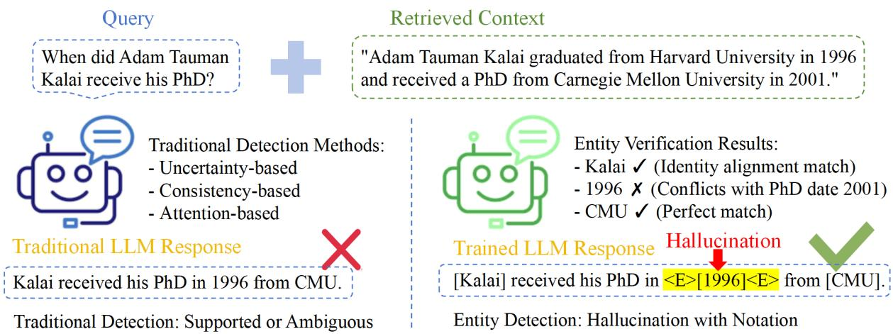  
Figure 1: Comparison of traditional and RAG-based entity hallucination detection methods. Although the retrieved context contains correct factual evidence, traditional detection methods operating at the answer or sentence level may fail to identify subtle factual errors, whereas entity-level verification explicitly aligns generated entities with evidence and reveals fine-grained hallucinations. Example adapted from (Kalai et al., 2025).

## How can we leverage RAG to enhance hallucination detection by establishing direct entity–evidence alignment in retrieved contexts?

Building on this foundation, we propose Evidence-Aligned Entity Verification (EAEV), an entity-anchored and evidence-traceable hallucination detector that operates entirely within retrieved contexts. EAEV verifies each entity mention through complementary identity, semantic, and consistency alignment, and further incorporates counterfactual stability analysis to distinguish robust evidence support from fragile, surface-level matches. By grounding verification at the entity level, EAEV enables fine-grained localization of factual errors while remaining robust to spurious correlations. Extensive experiments demonstrate the effectiveness of EAEV, achieving 87.89% AU-ROC on LLaMA2-13B with strong generalization across datasets. Our main contributions are summarized as follows:

• We establish RAG-based hallucination detection (RHD) as a practically important setting for hallucination detection in RAG pipelines, formulating it as entity-level evidence alignment verification to provide finegrained, evidence-traceable decisions beyond prior methods based on uncertainty estimation or black-box judgment signals.

• We propose Evidence-Aligned Entity Verification (EAEV), a novel method that combines multi-dimensional alignment with counterfactual stability analysis to distinguish genuine evidence support from spurious correlations.

• We demonstrate superior performance and generalization across multiple RAG benchmarks and model architectures, achieving state-of-the-art results while maintaining practical deployability.

## 2 Learning Setups

In this section, we present necessary notations and establish the theoretical foundation for RAG-based hallucination detection, emphasizing entity-centric verification within retrieved contexts.

## 2.1 Basic Definitions

Following previous work (Oh et al., 2025; Du et al., 2024), we use a distribution $P _ { \theta } ( \cdot )$ over token sequences to define LLM, where θ is the model parameters. Given a token sequence $\mathbf Q =$ $[ x _ { 1 } , \ldots , x _ { k } ]$ representing the query, where each $x _ { i }$ is the i-th token in the sequence. $P _ { \theta } ( \cdot )$ generates an answer $\mathbf { A } = [ x _ { k + 1 } , \dots , x _ { k + q } ]$ by predicting each token based on the preceding context: $P _ { \pmb \theta } ( x _ { i } \mid x _ { 1 } , \dots , x _ { i - 1 } ) , { \mathrm { f o r ~ } } i = k + 1 , \dots , k + q .$

## 2.2 Traditional Hallucination Detection

Traditional hallucination detection aims to identify incorrect content in LLM outputs. Given a query $\mathbf { Q }$ and an answer A, a detector D produces $\hat { y } = D ( \mathbf { Q } , \mathbf { A } )$ , where $\hat { y } \in \{ 0 , 1 \}$ indicates hallucination. Existing methods operate through uncertainty estimation, consistency checking, or external verification, but face challenges when evidence is available yet underutilized in RAG settings.

## 2.3 RAG-based Hallucination Detection

RHD represents a fundamental shift from traditional approaches by leveraging retrieved evidence for verification. Unlike conventional methods that rely solely on model internals, RHD operates under the assumption that factual accuracy can be determined through explicit alignment between generated content and available evidence within retrieved contexts $\mathcal { P }$ . We formalize RHD as follows: given a query $\mathbf { Q } ,$ retrieved contexts $\mathcal { P } _ { \cdot }$ , and a generated answer A, the objective of RHD is to learn a detector D that determines factual accuracy through evidence alignment:

$$
D ( \mathbf { Q } , \mathbf { A } , \mathcal { P } ) = \left\{ { \begin{array} { l l } { 1 , } & { \mathrm { i f ~ } \mathbf { A } \mathrm { ~ i s ~ s u p p o r t e d } } \\ & { \mathrm { b y ~ e v i d e n c e } \mathrm { ~ i n ~ } \mathcal { P } , } \\ { 0 , } & { \mathrm { o t h e r w i s e } . } \end{array} } \right.\tag{1}
$$

The key insight is that factual errors in RAG settings manifest primarily at the entity level, where specific named entities, temporal expressions, and quantities determine overall response reliability.

## 2.4 Entity-Centric Verification Framework

For entity-centric verification, we extract candidate mentions s from the generated answer A, where each mention has type $t \in$ {ENT, NUM, NP} corresponding to named entities, numerical values, and noun phrases. For each mention s, we retrieve evidence windows from $\mathcal { P }$ and select primary evidence $e ^ { * }$ through relevance scoring. We define three core alignment functions: identity alignment $\mathrm { I d } ( s , e ^ { * } ) ~ \in ~ [ 0 , 1 ]$ measuring surface correspondence, semantic alignment $\operatorname { S e m } ( s , e ^ { * } ) \in [ - 1 , 1 ]$ capturing meaning preservation, and consistency alignment $\operatorname { C o n } ( s , e ^ { * } ) \in [ 0 , 1 ]$ evaluating quantitative agreement and conflict detection.

For each mention s, we compute support signals through weighted combination of alignment dimensions and detect conflicts through binary indicators. To distinguish robust evidence from spurious correlations, we apply counterfactual stability analysis using perturbation sets $\mathcal { U } .$ Finally, mentions are aggregated into entity-level decisions through canonicalization, producing interpretable verification scores with direct evidence traceability.

Due to space constraints, the related work is discussed in Appendix A.1.

## 3 Methodology

## 3.1 Motivation and Observations

Effective RAG verification requires understanding how factual errors manifest in the presence of relevant evidence. As illustrated in Figure 1, traditional hallucination detection methods rely solely on internal model signals and are limited by training data coverage, while our RAG-enhanced approach incorporates external evidence sources to improve detection accuracy and coverage. Consider a model that is provided with partially correct supporting documents, as shown in the OpenAI example in Figure 1 (Kalai et al., 2025). This example illustrates a fundamental challenge: models canfabricate specific entities while correctly incorporating other factual elements from the context, as noted by recent analysis of why language models hallucinate.

Existing detection methods operating at sentence or paragraph levels fail to localize such precise factual inconsistencies, as the overall semantic coherence remains high despite the critical entity-level error. Prior analyses suggest that hallucinations often manifest as entity-centric errors (e.g., names, dates, quantities), which are particularly important for users’ trust judgments (Yeh et al., 2025). This observation motivates our entity-centric approach: rather than evaluating global semantic consistency, we decompose verification into atomic factual units where evidence alignment can be precisely established and traced.

## 3.2 Framework Overview

To address these challenges, we propose EAEV, which transforms entity verification into a systematic evidence alignment task through four interconnected stages that maintain evidence traceability throughout verification. As shown in Figure 2, the framework operates under three core principles: context-only verification where all signals derive from alignment between generated content and retrieved evidence, entity-centric aggregation enabling cross-mention evidence consolidation, and unified verification architecture that produces interpretable signals and supports supervised finetuning for deployment.

Given a query $\mathbf { Q } .$ retrieved context $\mathcal { P } _ { : }$ , and generated answer $\mathbf { A } ,$ , we first perform candidate mention extraction to identify factual commitments in A and construct local answer windows, followed by evidence retrieval and selection that identifies relevant evidence windows from $\mathcal { P }$ and selects primary evidence $e ^ { * }$ for each mention. These steps provide the necessary inputs for verification. EAEV then performs entity-level verification through four core stages: (1) multi-dimensional alignment assessment, which evaluates entity–evidence correspondence through complementary identity, semantic, and consistency signals; (2) counterfactual stability analysis, which tests the robustness of evidence alignment under controlled perturbations to distinguish genuine support from spurious correlations; (3) entity-centric aggregation, which consolidates mention-level signals into entity-level decisions with explicit evidence traceability; and (4) EAEVguided supervised learning, which transfers these verification signals into a unified verifier through standard fine-tuning. This modular design enables fine-grained, interpretable hallucination detection while maintaining practical deployability.

## 3.3 Multi-Dimensional Alignment Assessment

For each candidate mention s extracted from the answer and its selected primary evidence $e ^ { * }$ from the retrieved context, we evaluate alignment through three complementary dimensions, as different types of factual support fail in distinct ways and cannot be reliably captured by a single alignment signal.

## 3.3.1 Identity Alignment

Identity alignment captures direct matches through lexical forms and aliases, providing precise signals for exact alignment. This dimension uses a normalized similarity function that blends exact substring matching with fuzzy token-level matching:

$$
\begin{array} { r l } & { ~ \operatorname { I d } ( s , e ^ { * } ) } \\ & { = \operatorname* { m a x } \left( \mathbb { I } [ s \subseteq e ^ { * } \lor e ^ { * } \subseteq s ] , \operatorname { T S R } ( s , e ^ { * } ) \right) , } \end{array}\tag{2}
$$

where $\mathbb { I } [ \cdot ]$ is the indicator function and $\mathrm { T S R } ( s , e ^ { * } ) \quad \in \quad [ 0 , 1 ]$ computes the normalized token set ratio measuring lexical overlap between mention and evidence tokens. This formulation prioritizes exact matches while gracefully handling orthographic variations and aliases through the fuzzy matching fallback, ensuring robust identity detection across diverse lexical forms.

## 3.3.2 Semantic Alignment

Semantic alignment evaluates meaning preservation through embedding similarity, capturing paraphrases and reformulations that maintain factual content despite variations:

$$
\operatorname { S e m } ( s , e ^ { * } ) = \cos ( f _ { \mathrm { e n c } } ( s ) , f _ { \mathrm { e n c } } ( e ^ { * } ) ) ,\tag{3}
$$

where $f _ { \mathrm { e n c } } ( \cdot )$ represents sentence-level embedding encoding that captures semantic correspondence beyond explicit textual correspondence. This approach enables detection of semantically equivalent expressions while maintaining computational efficiency, though it requires careful calibration to prevent accepting spurious semantic matches that lack genuine factual grounding.

## 3.3.3 Consistency Alignment

Consistency alignment addresses value correspondence and explicit factual conflicts through numerical overlap assessment combined with lightweight pattern-based contradiction detection. For mentions with quantitative attributes, we measure value consistency via normalized intersection over union of extracted numerical values:

$$
\operatorname { C o n } ( s , e ^ { * } ) = { \frac { | N ( s ) \cap N ( e ^ { * } ) | } { | N ( s ) \cup N ( e ^ { * } ) | } } ,\tag{4}
$$

where $N ( \cdot )$ extracts and normalizes numerical values from text. We additionally define an anchor indicator $A ( \mathbf { Q } , e ^ { * } ) \in \{ 0 , 1 \}$ , which is 1 if the selected evidence contains key terms from the original query. Moreover, we detect explicit contradictions through $S _ { \mathrm { n e g } } ( s ) ~ \in ~ \{ 0 , 1 \}$ using lightweight pattern matching that identifies temporal mismatches, numerical conflicts, and relational inconsistencies, providing high-precision negative signals that complement positive support.

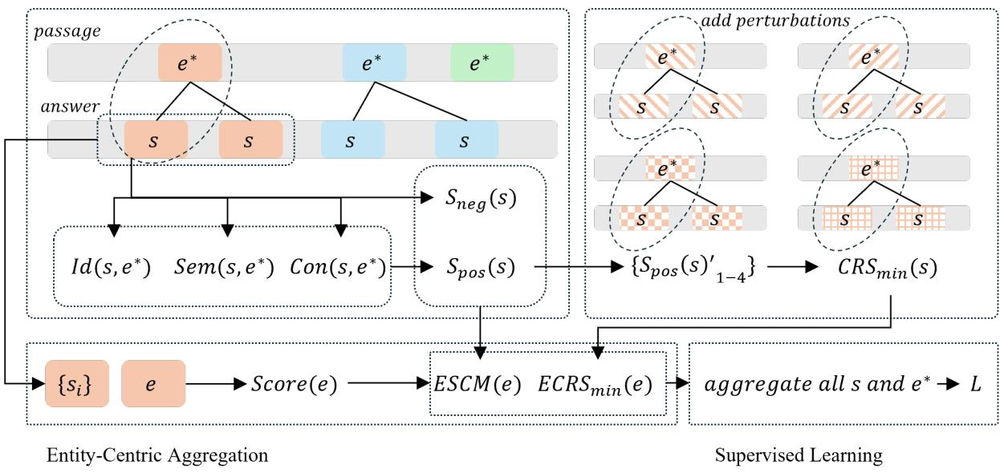  
Figure 2: Overview of Evidence-Aligned Entity Verification (EAEV), which leverages RAG to align generated entities with retrieved evidence contexts, evaluates entity–evidence correspondence through multi-dimensional alignment and counterfactual stability analysis, and aggregates these signals to supervise a unified verifier.

## 3.3.4 Type-Adaptive Support Synthesis

We synthesize the three alignment dimensions into a unified support score that adapts to mention types, recognizing that different mention categories rely on different verification signals. For each mention s of type $t \in \{ \mathrm { E N T }$ , NUM, NP}, we compute the support signal $S _ { \mathrm { p o s } } ( s ) \in [ 0 , 1 ]$ as:

$$
\begin{array} { r l } & { w _ { I } ^ { ( t ) } \cdot \mathrm { I d } ( s , e ^ { * } ) + w _ { S } ^ { ( t ) } \cdot \mathrm { S e m } ( s , e ^ { * } ) } \\ & { + w _ { C } ^ { ( t ) } \Big ( \mathrm { C o n } ( s , e ^ { * } ) + b _ { \mathrm { a n c } } \cdot A ( \mathbf { Q } , e ^ { * } ) \Big ) , } \end{array}\tag{5}
$$

where type-adaptive weights $w _ { I } ^ { ( t ) } , w _ { S } ^ { ( t ) } , w _ { C } ^ { ( t ) }$ are optimized for each mention type—numerical mentions emphasize consistency alignment while named entities prioritize identity and semantic alignment. We incorporate the contradiction indicator $S _ { \mathrm { n e g } } ( s ) \in \{ 0 , 1 \}$ to compute the support margin $\mathrm { S C M } ( s ) = S _ { \mathrm { p o s } } ( s ) - \beta \cdot S _ { \mathrm { n e g } } ( s )$ , where $\beta$ controls conflict penalties.

## 3.4 Counterfactual Stability Analysis

A critical challenge in RAG-based verification is that surface-level evidence alignment alone is insufficient to establish factual support, as hallucinated content can accidentally match retrieved text through spurious correlations. Traditional alignment metrics can be deceived by coincidental keyword overlaps or formatting artifacts that create false signals of factual support. To address this limitation, we introduce counterfactual stability analysis, which treats robustness under controlled perturbations as a necessary condition for evidence-based verification.

The core insight is that genuine factual correspondence should persist across minor variations in text presentation, while spurious matches are inherently fragile and collapse when surface features change. We define perturbation sets U containing controlled variations that preserve semantic content while altering surface characteristics. For each mention s, we compute stability bounds: minimum support $\begin{array} { r } { \mathbf { C } \mathrm { R } \mathbf { S } _ { \mathrm { m i n } } ( s ) = \operatorname* { m i n } _ { u \in \mathcal { U } } S _ { \mathrm { p o s } } ^ { ( u ) } ( s ) } \end{array}$ measuring the lowest support under perturbations, and stability gaps $\mathrm { C R S } _ { \Delta } ( s ) = S _ { \mathrm { p o s } } ( s )$ $\mathrm { C R S } _ { \operatorname* { m i n } } ( s )$ indicating robustness to variations.

We instantiate U with four targeted perturbations that address distinct sources of spurious correlation: (1) leave-one-out evidence removal eliminates the strongest evidence window to test dependency on single sources, preventing over-reliance on potentially misleading context; (2) punctuation and case normalization removes formatting artifacts and capitalization patterns creating false lexical matches, ensuring alignment reflects genuine content rather than presentation; (3) whitespace compression eliminates spacing variations and tokenization inconsistencies that might artificially inflate similarity scores; and (4) alphanumeric-only filtering retains only core semantic content by removing symbols and special characters that could create spurious token-level alignments.

High minimum support $\mathrm { C R S } _ { \operatorname* { m i n } } ( s )$ indicates that evidence alignment persists across these controlled variations, indicating the factual correspondence is robust rather than circumstantial. Conversely, large stability gaps $\mathrm { C R S } _ { \Delta } ( s )$ reveal fragile correlations that depend on specific textual configurations, flagging potentially unreliable evidence support. This stability analysis enables EAEV to distinguish authentic factual grounding from accidental surface-level matches, improving detection precision in challenging cases where traditional alignment metrics alone prove insufficient.

## 3.5 Entity-Centric Aggregation

For entities with multiple mentions across the answer, we consolidate evidence signals to obtain robust entity-level assessments. We canonicalize mention strings through lowercasing, punctuation and article removal to identify coreferent mentions, and apply lightweight pronoun resolution that links pronouns to the most recent non-pronoun entity.

For an entity e with mention set $\left\{ s _ { i } \right\}$ , we aggregate verification signals conservatively. Positive support uses top-K averaging $\mathrm { E S } _ { \mathrm { p o s } } ( e ) ~ =$ mean $( \mathrm { t o p K } \{ S _ { \mathrm { p o s } } ( s _ { i } ) \} )$ to emphasize strongest evidence across mentions. Negative signals use max pooling $\mathrm { E S } _ { \mathrm { n e g } } ( e ) = \operatorname* { m a x } \{ S _ { \mathrm { n e g } } ( s _ { i } ) \}$ for conservative conflict detection, ensuring any mention-level conflict propagates to entity level. Stability becomes $\mathrm { E C R S } _ { \mathrm { m i n } } ( e ) = \mathrm { m i n } \{ \mathrm { C R S } _ { \mathrm { m i n } } ( s _ { i } ) \}$ to identify the weakest link across all entity mentions.

The entity consistency margin $\begin{array} { l l } { \displaystyle \mathrm { E S C M } ( e ) } & { = } \end{array}$ $\mathrm { E S } _ { \mathrm { p o s } } ( e ) - \beta _ { e } \cdot \mathrm { E S } _ { \mathrm { n e g } } ( e )$ integrates these consolidated signals, where $\beta _ { e }$ controls entity-level conflict penalties. The final entity verification score integrates consistency and stability through a multiplicative combination:

$$
\mathrm { s c o r e } ( e ) = \sigma ( - \mathrm { E S C M } ( e ) ) \cdot ( 1 - \sigma ( \mathrm { E C R S } _ { \mathrm { m i n } } ( e ) ) )
$$

where $\sigma ( \cdot )$ denotes the sigmoid function. This formulation produces high risk scores for entities with weak evidence support or low stability, enabling answer-level assessment through max pooling over entity scores while preserving traceability to specific evidence windows. In our main setting, these alignment and stability scores are used to construct supervision for training a single-model verifier, all evaluations use the fine-tuned model for inference.

## 3.6 EAEV-Guided Supervised Learning

The alignment and stability signals computed by EAEV provide direct supervision for training models to perform interpretable hallucination detection through entity-level annotation. Rather than requiring complex architectural modifications, we leverage EAEV’s verification capabilities to construct high-quality training data where models learn to reproduce answers while marking unsupported entities with verification tags.

For each training instance, we generate target sequences where entities with ${ \mathrm { E S C M } } ( e ) ~ <$ $\tau _ { \mathrm { t h r e s h o l d } }$ are enclosed in ⟨E⟩ markers, creating supervision that directly transfers EAEV’s multidimensional verification logic to generation. We optimize a token-weighted cross-entropy that transfers EAEV’s entity-level signals into generation:

$$
L = \sum _ { t } w _ { t } \cdot \mathbf { C E } ( p _ { \pmb { \theta } } ( y _ { t } | x , y _ { < t } ) , y _ { t } ) ,\tag{6}
$$

where

$$
\begin{array} { r l } & { r _ { t } = \underset { t \in e } { \operatorname* { m a x } } \sigma \big ( - \mathrm { E S C M } ( e ) \big ) , } \\ & { u _ { t } = \underset { t \in e } { \operatorname* { m a x } } \big ( 1 - \sigma \big ( \mathrm { E C R } \mathrm { S } _ { \operatorname* { m i n } } ( e ) \big ) \big ) , } \\ & { w _ { t } = \mathrm { c l i p } \big ( 1 + \alpha r _ { t } + \gamma u _ { t } , ~ w _ { \operatorname* { m i n } } , w _ { \operatorname* { m a x } } \big ) , } \end{array}\tag{7}
$$

and tokens outside any tagged entity use $\operatorname* { m a x } _ { t \in e } =$ 0.

This approach enables standard supervised finetuning to learn EAEV’s verification patterns, transferring interpretable entity-level detection capabilities into generation without requiring specialized decoding procedures or multi-model coordination. In all main experiments, the reported results of EAEV are obtained by fine-tuning the backbone LLM with the EAEV-guided supervised learning procedure described in this subsection.

## 4 Experiment

## 4.1 Experiment Settings

We evaluate EAEV on three representative benchmarks: RAGTruth (Niu et al., 2024), HotpotQA (Yang et al., 2018), and DelucionQA (Sadat et al., 2023). Experiments are conducted with three LLM backbones: Qwen2.5-7B (Yang et al., 2024), LLaMA2-7B (Touvron et al., 2023), and LLaMA2-13B (Touvron et al., 2023) and compared against multiple strong hallucination detection baselines, including SelfCheckGPT (Manakul et al., 2023), Semantic Entropy (Kuhn et al., 2023),

LLM-Check (Sriramanan et al., 2024), EarlyDetect (Snyder et al., 2024), NoVo (Ho et al., 2025), RAGAS (Es et al., 2024), RefChecker (Hu et al., 2024), ReDEeP (Sun et al., 2025), TSV (Park et al., 2025), Linear Probe (Duan et al., 2024), and Halo-Scope (Du et al., 2024). We employ three complementary metrics for evaluation: area under the receiver operating characteristic curve (AUROC), Accuracy, and F1 score. Full experimental details are provided in Appendix A.2.

## 4.2 Experimental Results and Analysis

## 4.2.1 Main Results

EAEV achieves strong performance across all evaluation settings, demonstrating the effectiveness of entity-centric evidence alignment for RAG hallucination detection. As shown in Table 1, our method attains 84.72% average AUROC on Qwen2.5-7B, 79.63% on LLaMA2-7B, and 87.55% on LLaMA2- 13B, representing improvements of 2.29, 2.59, and 3.34 percentage points respectively over the strongest baseline TSV. These gains across different backbone architectures support our core hypothesis that entity-level factual errors constitute a model-agnostic challenge in RAG systems. Larger models exhibit higher performance, with LLaMA2- 13B achieving the best results, suggesting that EAEV can effectively leverage increased model capacity for more accurate evidence alignment.

Cross-dataset evaluation shows that EAEV generalizes across diverse reasoning scenarios and domain requirements. On RAGTruth, the method demonstrates strong sensitivity to nuanced factual inconsistencies in general knowledge contexts, while results on HotpotQA and DelucionQA indicate effective verification in multi-hop reasoning and precision-critical technical domains. Together, these results suggest that the proposed multidimensional alignment framework captures broadly applicable patterns in entity-level hallucination detection across tasks with distinct characteristics.

The observed scaling behavior highlights the practical applicability of EAEV across different deployment regimes. While larger models benefit from increased capacity for sophisticated evidence alignment, smaller models also achieve meaningful improvements, enabling use in resourceconstrained settings. Overall, these findings indicate that EAEV provides a scalable and practical direction for hallucination detection under varied model sizes and task demands.

  
Figure 3: Ablation study results on LLaMA2-13B, showing ablation analysis on different components.

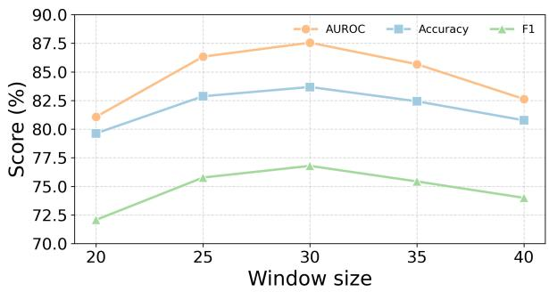  
Figure 4: Ablation study results on LLaMA2-13B, showing ablation analysis on window size sensitivity.

## 4.2.2 Ablation Study

To validate each component’s contribution, we conduct comprehensive ablation studies across all benchmarks. As shown in Figure 3, counterfactual stability analysis provides the most substantial contribution, confirming the necessity of our approach for distinguishing genuine evidence support from spurious correlations. The results demonstrate that each alignment dimension contributes meaningfully to overall performance, with balanced degradation patterns indicating that all components address distinct verification challenges. The full framework consistently achieves the best performance, indicating that the proposed components jointly contribute to effective verification. More ablation details are provided in Appendix A.3.1.

## 4.2.3 Sensitivity Analysis

We analyze EAEV’s robustness to answer-side window length, a key parameter controlling contextual span during evidence alignment. As shown in Figure 4, the framework achieves optimal performance with 30-token windows while maintaining stability across the practical range. Smaller windows limit contextual information for accurate alignment, while larger windows introduce noise that dilutes alignment signals. The framework demonstrates reasonable robustness within the 25-35 token range, validating our parameter choice and confirming consistent performance across deployment scenarios. This analysis establishes EAEV’s reliability and practical applicability under varying configuration settings. Details are provided in Appendix A.3.2.

<table><tr><td></td><td colspan="3">RAGTruth</td><td colspan="3">HotpotQA</td><td colspan="3">DelucionQA</td><td colspan="3">Average</td></tr><tr><td>Method</td><td>AUROC</td><td>Acc</td><td>F1</td><td>AUROC</td><td>Acc</td><td>F1</td><td>AUROC</td><td>Acc</td><td>F1</td><td>AUROC</td><td>Acc</td><td>F1</td></tr><tr><td colspan="10">Qwen2.5-7B</td><td></td><td></td><td></td></tr><tr><td>EarlyDetect</td><td>66.38</td><td>70.12</td><td>65.34</td><td>67.15</td><td>69.32</td><td>65.10</td><td>68.25</td><td>69.83</td><td>66.21</td><td>67.26</td><td>69.76</td><td>65.55</td></tr><tr><td>Selfcheckgpt</td><td>64.39</td><td>69.05</td><td>63.28</td><td>65.73</td><td>68.32</td><td>63.95</td><td>66.43</td><td>68.76</td><td>65.01</td><td>65.52</td><td>68.71</td><td>64.08</td></tr><tr><td>Novo</td><td>73.79</td><td>76.21</td><td>68.67</td><td>74.85</td><td>75.75</td><td>69.12</td><td>76.03</td><td>76.12</td><td>70.43</td><td>74.89</td><td>76.03</td><td>69.41</td></tr><tr><td>Linear Probe</td><td>75.27</td><td>77.38</td><td>69.52</td><td>76.11</td><td>77.02</td><td>69.84</td><td>77.10</td><td>77.54</td><td>71.02</td><td>76.16</td><td>77.31</td><td>70.13</td></tr><tr><td>HaloScope</td><td>71.01</td><td>74.16</td><td>67.70</td><td>72.24</td><td>73.90</td><td>68.20</td><td>73.01</td><td>74.16</td><td>69.05</td><td>72.09</td><td>74.07</td><td>68.32</td></tr><tr><td>LLM-Check</td><td>62.75</td><td>61.07</td><td>62.18</td><td>63.91</td><td>67.20</td><td>62.93</td><td>65.14</td><td>67.86</td><td>64.23</td><td>63.93</td><td>65.38</td><td>63.11</td></tr><tr><td>Semantic Entropy</td><td>65.43</td><td>70.65</td><td>64.71</td><td>66.87</td><td>69.83</td><td>65.25</td><td>68.02</td><td>70.19</td><td>65.84</td><td>66.77</td><td>70.22</td><td>65.27</td></tr><tr><td>RAGAS</td><td>74.76</td><td>77.32</td><td>69.90</td><td>76.02</td><td>76.84</td><td>70.40</td><td>76.89</td><td>77.01</td><td>71.43</td><td>75.89</td><td>77.06</td><td>70.58</td></tr><tr><td>RefCheck</td><td>73.25</td><td>75.89</td><td>68.43</td><td>74.61</td><td>75.30</td><td>68.81</td><td>75.20</td><td>75.76</td><td>70.01</td><td>74.35</td><td>75.65</td><td>69.08</td></tr><tr><td>ReDEeP</td><td>77.87</td><td>78.51</td><td>71.92</td><td>79.43</td><td>78.23</td><td>72.74</td><td>80.12</td><td>78.96</td><td>73.52</td><td>79.14</td><td>78.57</td><td>72.73</td></tr><tr><td>TSV</td><td>79.34</td><td>77.69</td><td>72.37</td><td>82.07</td><td>79.36</td><td>72.28</td><td>85.87</td><td>80.47</td><td>74.97</td><td>82.43</td><td>79.17</td><td>73.21</td></tr><tr><td>EAEV (Ours)</td><td>81.73</td><td>80.04</td><td>74.28</td><td>86.74</td><td>81.23</td><td>74.35</td><td>85.68</td><td>80.25</td><td>75.62</td><td>84.72</td><td>80.51</td><td>74.75</td></tr><tr><td colspan="10">LLaMA2-7B</td><td></td><td></td><td></td></tr><tr><td>EarlyDetect</td><td>65.12</td><td>68.87</td><td>63.98</td><td>66.23</td><td>68.05</td><td>63.55</td><td>67.12</td><td>68.42</td><td>64.33</td><td>66.16</td><td>68.45</td><td>63.95</td></tr><tr><td>Selfcheckgpt</td><td>63.18</td><td>67.31</td><td>62.01 67.12</td><td>64.45 73.31</td><td>66.25</td><td>62.74</td><td>65.37 74.38</td><td>66.90 72.13</td><td>63.45 68.92</td><td>64.33 73.31</td><td>66.82 72.58</td><td>62.73 67.89</td></tr><tr><td>Novo Linear Probe</td><td>72.25</td><td>70.79</td><td></td><td>74.25</td><td>74.82</td><td>67.62</td><td>75.48</td><td>75.62</td><td></td><td>74.43</td><td>75.80</td><td></td></tr><tr><td></td><td>73.56</td><td>76.36</td><td>68.23</td><td>70.92</td><td>75.43</td><td>68.55</td><td>71.74</td><td>73.25</td><td>70.02</td><td>70.83</td><td>72.97</td><td>68.93</td></tr><tr><td>HaloScope</td><td>69.83</td><td>73.24</td><td>66.31</td><td>62.63</td><td>72.43</td><td>66.75</td><td></td><td></td><td>67.45</td><td></td><td></td><td>66.84</td></tr><tr><td>LLM-Check</td><td>61.47</td><td>60.42</td><td>60.08</td><td></td><td>65.32</td><td>61.32</td><td>63.71</td><td>66.19</td><td>62.03</td><td>62.60</td><td>63.98</td><td>61.14</td></tr><tr><td>Semantic Entropy</td><td>64.12</td><td>69.01</td><td>63.43</td><td>65.25</td><td>68.32</td><td>63.78</td><td>66.30</td><td>69.02</td><td>64.01</td><td>65.22</td><td>68.78</td><td>63.74</td></tr><tr><td>RAGAS</td><td>73.11</td><td>76.25</td><td>68.11</td><td>74.43</td><td>75.62</td><td>68.75</td><td>75.45</td><td>76.12</td><td>70.12</td><td>74.33</td><td>76.00</td><td>68.99</td></tr><tr><td>RefCheck</td><td>71.66</td><td>74.83</td><td>66.92</td><td>73.08</td><td>74.41</td><td>67.30</td><td>74.02</td><td>74.88</td><td>68.15</td><td>72.92</td><td>74.71</td><td>67.46</td></tr><tr><td>ReDEeP</td><td>76.42</td><td>78.01</td><td>71.23</td><td>74.58</td><td>77.15</td><td>71.94</td><td>78.35</td><td>77.66</td><td>72.43</td><td>76.45</td><td>77.61</td><td>71.87</td></tr><tr><td>TSV EAEV (Ours)</td><td>78.87</td><td>77.02</td><td>72.01</td><td>75.04</td><td>78.83</td><td>72.01</td><td>77.21</td><td>77.52</td><td>73.95</td><td>77.04</td><td>77.79</td><td>72.66</td></tr><tr><td colspan="10">82.12 80.12 74.07 77.91 80.56</td><td>79.63</td><td>79.67</td><td>73.97</td></tr><tr><td>LLaMA2-13B</td><td></td><td></td><td></td><td></td><td></td><td></td><td></td><td></td><td></td><td></td><td></td><td></td></tr><tr><td>EarlyDetect Selfcheckgpt</td><td>67.18 65.47</td><td>70.01 68.10</td><td>65.12 63.02</td><td>68.42 66.93</td><td>69.05 67.22</td><td>65.87 63.89</td><td>69.66 67.82</td><td>69.81 67.88</td><td>66.50 64.52</td><td>68.42 66.74</td><td>69.62 67.73</td><td>65.83 63.81</td></tr><tr><td>Novo</td><td>80.54</td><td>76.35</td><td>69.31</td><td>78.68</td><td>76.13</td><td>70.16</td><td>77.12</td><td>76.55</td><td>71.22</td><td>78.78</td><td>76.34</td><td>70.23</td></tr><tr><td>Linear Probe</td><td>76.31</td><td>77.65</td><td>70.54</td><td>77.54</td><td>77.33</td><td>71.39</td><td>78.82</td><td>77.97</td><td>72.82</td><td>77.56</td><td>77.65</td><td>71.58</td></tr><tr><td>HaloScope</td><td>71.74</td><td>74.45</td><td>68.20</td><td>72.81</td><td>73.25</td><td>68.91</td><td>73.93</td><td>74.15</td><td>69.85</td><td>72.83</td><td>73.95</td><td>68.99</td></tr><tr><td>LLM-Check</td><td>63.83</td><td>67.12</td><td>61.95</td><td>65.28</td><td>64.62</td><td>62.73</td><td>66.55</td><td>66.98</td><td>63.45</td><td>65.22</td><td>66.24</td><td>62.71</td></tr><tr><td>Semantic Entropy</td></table>

Table 1: Performance comparison across different models and datasets. All results are averaged over three independent runs, with the rightmost columns showing metrics averaged across datasets.

## 5 Conclusion

Hallucination detection remains critical for reliable RAG system deployment in factual applications. We introduce EAEV, a framework that performs entity-level verification through multi-dimensional evidence alignment and counterfactual stability analysis. By distinguishing genuine factual support from spurious correlations, EAEV addresses key challenges in RAG-based verification where hallucinated content may accidentally align with retrieved text. Experimental results demonstrate substantial improvements across benchmarks and model architectures. Importantly, EAEV operates entirely within retrieved contexts and produces interpretable verification signals, making it well aligned with practical RAG pipelines. Overall, these findings suggest that robust entity-level verification provides a practical and effective direction for improving hallucination detection in real-world evidence-grounded generation systems.

## Limitations

While our approach demonstrates strong effectiveness for RAG-based hallucination detection, several limitations should be acknowledged. First, LLM outputs can exhibit instability across different runs, particularly for complex queries that require multi-step reasoning. Second, as a context-only verification framework, EAEV depends on the quality and coverage of retrieved evidence; missing or incomplete retrieval may limit detection performance. Finally, while this work focuses on accurate and interpretable hallucination detection, it does not directly address mitigating hallucinations during generation. Integrating entity-level verification signals into decoding or training-time mitigation mechanisms is a promising direction for future work.

## Acknowledgments

Runsong Jia, Mengjia Wu, and Yi Zhang were supported by the Australian Commonwealth Scientific and Industrial Research Organization (CSIRO) in conjunction with the National Science Foundation (NSF) of the United States, under CSIRO-NSF #2303037. Zhen Fang was supported by grant DE250100363.

## References

Shehzaad Dhuliawala, Mojtaba Komeili, Jing Xu, Roberta Raileanu, Xian Li, Asli Celikyilmaz, and Jason Weston. 2024. Chain-of-verification reduces hallucination in large language models. In Findings of the Association for Computational Linguistics: ACL 2024, pages 3563–3578.

Xuefeng Du, Chaowei Xiao, and Yixuan Li. 2024. Haloscope: Harnessing unlabeled llm generations for hallucination detection. Advances in Neural Information Processing Systems, 37:102948–102972.

Hanyu Duan, Yi Yang, and Kar Yan Tam. 2024. Do llms know about hallucination? an empirical investigation of llm’s hidden states. arXiv preprint arXiv:2402.09733.

Shahul Es, Jithin James, Luis Espinosa Anke, and Steven Schockaert. 2024. Ragas: Automated evaluation of retrieval augmented generation. In Proceedings ofthe 18th conference ofthe european chapter of the associationfor computational linguistics: system demonstrations, pages 150–158.

Sebastian Farquhar, Jannik Kossen, Lorenz Kuhn, and Yarin Gal. 2024. Detecting hallucinations in large language models using semantic entropy. Nature, 630(8017):625–630.

Javier Ferrando, Oscar Obeso, Senthooran Rajamanoharan, and Neel Nanda. 2025. Do i know this entity? knowledge awareness and hallucinations in language models. In Proceedings of the International Conference on Learning Representations (ICLR). Oral presentation at ICLR 2025.

Robert Friel, Masha Belyi, and Atindriyo Sanyal. 2024. Ragbench: Explainable benchmark for retrievalaugmented generation systems. arXiv preprint arXiv:2407.11005.

Luyu Gao, Zhuyun Dai, Panupong Pasupat, Anthony Chen, Arun Tejasvi Chaganty, Yicheng Fan, Vincent Zhao, Ni Lao, Hongrae Lee, Da-Cheng Juan, and 1 others. 2023. Rarr: Researching and revising what language models say, using language models. In Proceedings of the 61st Annual Meeting of the Associationfor Computational Linguistics (Volume 1: Long Papers), pages 16477–16508.

Yunfan Gao, Yun Xiong, Xinyu Gao, Kangxiang Jia, Jinliu Pan, Yuxi Bi, Yi Dai, Jiawei Sun, and Haofen Wang. 2024. Retrieval-augmented generation for large language models: A survey. arXiv preprint arXiv:2312.10997.

Zheng Yi Ho, Siyuan Liang, Sen Zhang, Yibing Zhan, and Dacheng Tao. 2025. Novo: Norm voting off hallucinations with attention heads in large language models. In Proceedings ofthe International Conference on Learning Representations (ICLR). Poster presentation.

Xiangkun Hu, Dongyu Ru, Lin Qiu, Qipeng Guo, Tianhang Zhang, Yang Xu, Yun Luo, Pengfei Liu, Yue Zhang, and Zheng Zhang. 2024. Refchecker: Reference-based fine-grained hallucination checker and benchmark for large language models. arXiv preprint arXiv:2405.14486.

Ziwei Ji, Nayeon Lee, Rita Frieske, Tiezheng Yu, Dan Su, Yan Xu, Etsuko Ishii, Ye Jin Bang, Andrea Madotto, and Pascale Fung. 2023. Survey of hallucination in natural language generation. ACM Computing Surveys, 55(12):1–38.

Adam Tauman Kalai, Ofir Nachum, Santosh S Vempala, and Edwin Zhang. 2025. Why language models hallucinate. arXiv preprint arXiv:2509.04664.

Lorenz Kuhn, Yarin Gal, and Sebastian Farquhar. 2023. Semantic uncertainty: Linguistic invariances for uncertainty estimation in natural language generation. arXiv preprint arXiv:2302.09664.

Barrett Lattimer, Patrick H. Chen, Xinyuan Zhang, and Yi Yang. 2023. Fast and accurate factual inconsistency detection over long documents. In Proceedings of the 2023 Conference on Empirical Methods in Natural Language Processing. Association for Computational Linguistics.

Patrick Lewis, Ethan Perez, Aleksandra Piktus, Fabio Petroni, Vladimir Karpukhin, Naman Goyal, Heinrich Küttler, Mike Lewis, Wen-tau Yih, Tim Rocktäschel, Sebastian Riedel, and Douwe Kiela. 2020.

Retrieval-augmented generation for knowledgeintensive nlp tasks. In Advances in Neural Information Processing Systems (NeurIPS).

Junyi Li, Xiaoxue Cheng, Wayne Xin Zhao, Jian-Yun Nie, and Ji-Rong Wen. 2023. Halueval: A largescale hallucination evaluation benchmark for large language models. In Proceedings ofthe 2023 Conference on Empirical Methods in Natural Language Processing, pages 6449–6464.

Alex Mallen, Akari Asai, Victor Zhong, Rajarshi Das, Daniel Khashabi, and Hannaneh Hajishirzi. 2023. When not to trust language models: Investigating effectiveness of parametric and non-parametric memories. In Proceedings of the 61st annual meeting of the association for computational linguistics (volume 1: Long papers), pages 9802–9822.

Potsawee Manakul, Adian Liusie, and Mark J. F. Gales. 2023. Selfcheckgpt: Zero-resource black-box hallucination detection for generative large language models. In EMNLP 2023.

Sewon Min, Kalpesh Krishna, Xinxi Lyu, Mike Lewis, Wen-tau Yih, Pang Koh, Mohit Iyyer, Luke Zettlemoyer, and Hannaneh Hajishirzi. 2023. Factscore: Fine-grained atomic evaluation of factual precision in long form text generation. In Proceedings ofthe 2023 Conference on Empirical Methods in Natural Language Processing. Association for Computational Linguistics.

Cheng Niu, Yuanhao Wu, Juno Zhu, Siliang Xu, Kashun Shum, Randy Zhong, Juntong Song, and Tong Zhang. 2024. Ragtruth: A hallucination corpus for developing trustworthy retrieval-augmented language models. In Proceedings of the 62nd Annual Meeting of the Associationfor Computational Linguistics (Volume 1: Long Papers), pages 10862–10878, Bangkok, Thailand. Association for Computational Linguistics.

Changdae Oh, Zhen Fang, Shawn Im, Xuefeng Du, and Yixuan Li. 2025. Understanding multimodal LLMs under distribution shifts: An information-theoretic approach. In ICML.

Seongheon Park, Xuefeng Du, Min-Hsuan Yeh, Haobo Wang, and Yixuan Li. 2025. Steer llm latents for hallucination detection. In Proceedings of the International Conference on Machine Learning (ICML).

Mobashir Sadat, Zhengyu Zhou, Lukas Lange, Jun Araki, Arsalan Gundroo, Bingqing Wang, Rakesh Menon, Md Parvez, and Zhe Feng. 2023. Delucionqa: Detecting hallucinations in domain-specific question answering. In Findings of the Association for Computational Linguistics: EMNLP 2023, pages 822–835, Singapore. Association for Computational Linguistics.

Ben Snyder, Marius Moisescu, and Muhammad Bilal Zafar. 2024. On early detection of hallucinations in factual question answering. In KDD 2024.

Gaurang Sriramanan, Siddhant Bharti, Vinu Sankar Sadasivan, Shoumik Saha, Priyatham Kattakinda, and Soheil Feizi. 2024. Llm-check: Investigating detection of hallucinations in large language models. In Proceedings of the 38th Conference on Neural Information Processing Systems (NeurIPS).

ZhongXiang Sun, Xiaoxue Zang, Kai Zheng, Jun Xu, Xiao Zhang, Weijie Yu, Yang Song, and Han Li. 2025. Redeep: Detecting hallucination in retrievalaugmented generation via mechanistic interpretability. In Proceedings ofthe International Conference on Learning Representations (ICLR).

Hugo Touvron, Louis Martin, Kevin Stone, Peter Albert, Amjad Almahairi, Yasmine Babaei, and et al. 2023. Llama 2: Open foundation and fine-tuned chat models. arXiv preprint arXiv:2307.09288.

An Yang, Baosong Yang, Beichen Zhang, Binyuan Hui, Bo Zheng, Bowen Yu, Chengyuan Li, Dayiheng Liu, Fei Huang, Haoran Wei, Huan Lin, Jian Yang, Jianhong Tu, Jianwei Zhang, Jianxin Yang, Jiaxi Yang, Jingren Zhou, Junyang Lin, Kai Dang, and 23 others. 2024. Qwen2.5 technical report. arXiv preprint arXiv:2412.15115.

Zhilin Yang, Peng Qi, Saizheng Zhang, Yoshua Bengio, William W. Cohen, Ruslan Salakhutdinov, and Christopher D. Manning. 2018. Hotpotqa: A dataset for diverse, explainable multi-hop question answering. In Proceedings ofthe 2018 Conference on Empirical Methods in Natural Language Processing, Brussels, Belgium. Association for Computational Linguistics.

Min-Hsuan Yeh, Max Kamachee, Seongheon Park, and Yixuan Li. 2025. Halluentity: Benchmarking and understanding entity-level hallucination detection. Transactions on Machine Learning Research. Accepted by TMLR.

Xiang Yue, Boshi Wang, Ziru Chen, Kai Zhang, Yu Su, and Huan Sun. 2023. Automatic evaluation of attribution by large language models. In Findings of the Associationfor Computational Linguistics: EMNLP 2023, pages 4615–4635.

Tianhang Zhang, Lin Qiu, Qipeng Guo, Cheng Deng, Yue Zhang, Zheng Zhang, Chenghu Zhou, Xinbing Wang, and Luoyi Fu. 2023. Enhancing uncertaintybased hallucination detection with stronger focus. In Proceedings of the 2023 Conference on Empirical Methods in Natural Language Processing (EMNLP).

Xuejiao Zhao, Siyan Liu, Su-Yin Yang, and Chunyan Miao. 2025. Medrag: Enhancing retrievalaugmented generation with knowledge graph-elicited reasoning for healthcare copilot. In Proceedings of the ACM on Web Conference 2025 (WWW), pages 4442–4457.

## A Appendix

## A.1 Related Works

## A.1.1 Traditional Hallucination Detection

Traditional hallucination detection methods primarily leverage uncertainty estimation and selfconsistency mechanisms within model outputs. Representative approaches include SelfCheckGPT, which measures semantic consistency across multiple generations (Manakul et al., 2023), and Semantic Entropy, which operates on meaninglevel divergences (Farquhar et al., 2024). Recent advances explore attention-level interpretability through NoVo (Ho et al., 2025) and representational analysis of knowledge-awareness directions (Ferrando et al., 2025). While effective in controlled settings, these methods remain constrained by their reliance on internal model signals rather than explicit evidence verification.

## A.1.2 Evidence-Based Hallucination Detection in RAG

RAG environments present unique challenges where hallucinations persist despite available evidence, motivating specialized detection approaches. RARR employs research and revision stages for evidence attribution and consistency-based correction (Gao et al., 2023). FActScore provides atomic-level factual evaluation by decomposing generated text into verifiable claims (Min et al., 2023). CoVe introduces systematic self-verification through question generation and independent answering (Dhuliawala et al., 2024). ReDeEP leverages mechanistic interpretability to disentangle parametric and contextual knowledge contributions (Sun et al., 2025), while RAGTruth establishes evaluation infrastructure with fine-grained annotations (Niu et al., 2024). These approaches highlight the importance of evidence-grounded verification but typically operate at coarse granularities or require external verification mechanisms. Our work addresses this limitation through entitylevel verification within retrieved contexts, providing direct evidence traceability without dependencies on external judges.

## A.2 Experimental Details

## A.2.1 Datasets Details

RAGTruth RAGTruth provides a controlled environment for analyzing hallucinations in standard RAG pipelines. The corpus aggregates responses from both open-source and closed-source LLMs, accompanied by meticulous word-level manual annotations and instance-level labels across three task categories: question answering, data-to-text generation, and news summarization. The dataset comprises approximately 18,000 annotated responses in total. We compute all evaluation metrics at the answer level to maintain consistency across comparisons (Niu et al., 2024).

RAGBench (HotpotQA & DelucionQA) RAG-Bench is a large-scale benchmark containing approximately 100,000 examples with a standardized RAG schema that provides retrieved contexts and answer annotations suitable for hallucination detection tasks. The benchmark spans five domains and twelve component datasets. We utilize two representative components: (i) HotpotQA, a multi-hop question answering benchmark built on Wikipedia articles with sentence-level supporting facts that emphasizes cross-document reasoning capabilities; and (ii) DelucionQA, a domain-specific QA dataset constructed from automotive user manuals, featuring human-annotated labels that indicate whether answers contain hallucinations given the retrieved context. We adopt the benchmark’s evaluation protocol and consistently assess performance at the answer level (Friel et al., 2024; Yang et al., 2018; Sadat et al., 2023).

## A.2.2 Implementation Details

We run all experiments on servers equipped with 4×NVIDIA A100 GPUs and server-grade multicore processors. Our implementation is based on PyTorch and Hugging Face Transformers. We use LLaMA-Factory for LLM fine-tuning and inference (with LoRA). Unless otherwise specified, we employ greedy search for generation decoding, and all other parameters follow the default settings of each model.

For candidate construction and evidence retrieval, we retain at most 5 candidate windows per mention with top\_bm25 = 2 and top\_embed = 2. Answer-side windows use window\_tokens = 30 and stride = 15. For multi-dimensional alignment, we use type-adaptive weights with defaults ENT: (0.45, 0.45, 0.10), NUM: (0.25, 0.25, 0.50), and NP: (0.35, 0.35, 0.30). We set default β = 1.0 for consistency margin. For CRS analysis, we apply four perturbation types: leave-one-out, depunctuating and lowercasing, compressing whitespace, and retaining only alphanumeric characters. For entity grouping, we use conservative aggregation with default $K = 2$ and $\beta _ { e } = 1 . 0$ . For decision rules, we scan $\tau _ { \mathrm { s c m } } \in [ - 0 . 5 , 0 . 2 ] , \tau _ { \mathrm { e s c m } } \in [ - 0 . 5 , - 0 . 1 ]$ $\tau _ { \mathrm { c r s \_ m i n } } \in [ 0 . 0 , 0 . 5 ]$ , and $K \in \{ 1 , 2 , 3 \}$ on validation sets.

For EAEV-guided SFT, we insert $\langle E \rangle . . . \langle / E \rangle$ markers and select $( \alpha , \gamma , w _ { \mathrm { m i n } } , w _ { \mathrm { m a x } } )$ on validation sets. Fine-tuning uses LLaMA-Factory with LoRA, following framework defaults except for token weighting and data annotation. All hyperparameters use validation set selection, and final results report best validation configurations.

## A.2.3 Evaluation Metrics

Following prior works (Kuhn et al., 2023; Du et al., 2024), we employ three complementary metrics to evaluate hallucination detection performance: area under the receiver operating characteristic curve (AUROC), Accuracy, and F1 score.

AUROC measures the ability of a method to discriminate between truthful and hallucinated outputs across different decision thresholds. A higher AU-ROC indicates better overall ranking performance independent of a specific threshold.

Accuracy is calculated by comparing predicted labels with ground-truth annotations under a fixed threshold (e.g., 0.5 on the similarity score between the generation and the reference). It reflects the proportion of correctly classified instances but can be biased when classes are imbalanced.

F1 score, the harmonic mean of Precision and Recall, provides a balanced evaluation when both false positives and false negatives are costly. It is particularly useful in assessing detection performance under skewed class distributions.

Together, these metrics ensure a comprehensive assessment of both ranking quality and classification reliability in hallucination detection.

## A.2.4 Model Details

We conduct our experiments on three widely used large language models that represent different scales and training paradigms. Qwen2.5-7B (Yang et al., 2024) is an open-source model from Alibaba’s Qwen series, designed with improved pretraining data and instruction tuning for multilingual reasoning. LLaMA2-7B (Touvron et al., 2023) and LLaMA2-13B (Touvron et al., 2023) are part of Meta’s LLaMA2 family, which have been extensively used as backbone models in academic research and industrial applications. Together, these models cover diverse capacities and training corpora, providing a representative testbed for evaluating hallucination detection methods.

## A.2.5 Details about Baseline Models

We compare our approach against eleven representative hallucination detection baselines. Below we briefly introduce each method and its underlying intuition.

• SelfCheckGPT (Manakul et al., 2023): A zero-resource, sampling-based detector that repeatedly queries the model to generate multiple candidate responses and then measures their consistency. Greater inconsistency across samples suggests a higher risk of hallucination, making this method effective even without external evidence.

• Semantic Entropy (Kuhn et al., 2023): Estimates hallucination likelihood by computing linguistic invariances in token-level predictive distributions. When semantic alternatives diverge strongly in probability space, the model exhibits higher semantic entropy, indicating uncertainty and potential unreliability in factual grounding.

• LLM-Check (Sriramanan et al., 2024): Probes internal hidden states of LLMs with lightweight classifiers to directly flag hallucinations. By exploiting activation-level features, LLM-Check can detect subtle factual errors that do not manifest at the surface level but are encoded within the model’s latent representations.

• Linear Probe (Duan et al., 2024): A straightforward but effective baseline that trains linear classifiers on the hidden states of LLMs. By mapping internal activations to truthfulness labels, Linear Probe directly tests how much factuality information is encoded within raw model representations.

• HaloScope (Du et al., 2024): Leverages large quantities of unlabeled LLM outputs and applies energy-based and representationdriven detectors. By clustering semantic patterns across generations, HaloScope effectively identifies outliers that correspond to hallucinated claims with minimal supervision.

• EarlyDetect (Snyder et al., 2024): A proactive detector that monitors generation inprogress. By analyzing partial outputs and their factual signals, EarlyDetect aims to catch hallucinations early, before the model produces fully misleading answers, thus enabling faster correction or intervention.

• NoVo (Ho et al., 2025): Stands for Norm Voting off hallucinations. This method measures the norms of attention heads and aggregates their “votes” to infer factual reliability. It leverages attention-level interpretability to highlight internal disagreement patterns that often precede hallucinated generations.

• RAGAS (Es et al., 2024): Focuses on retrieval-augmented settings by breaking down model outputs into atomic statements and verifying each against retrieved passages. Faithfulness is quantified as the ratio of supported claims, allowing fine-grained detection of unsupported or fabricated content.

• RefChecker (Hu et al., 2024): Constructs structured knowledge graphs from model outputs and checks their alignment with external references. This graph-based perspective enables detection of hallucinations that may not be obvious at sentence level but become evident when relational consistency is examined.

• ReDEeP (Sun et al., 2025): Employs mechanistic interpretability in retrieval-augmented generation (RAG). By tracing attention flow from queries to evidence passages, ReDEeP identifies whether the model’s factual claims are truly supported by retrieved documents or merely spurious correlations.

• TSV (Park et al., 2025): Introduces the Truthfulness Separator Vector, which perturbs latent representations during inference to evaluate the stability of factual claims. Robust claims remain separable under perturbations, while hallucinated ones collapse, offering a novel perspective on truthfulness detection.

## A.3 Additional Results

## A.3.1 Complete Ablation Study

We provide comprehensive ablation analysis across all datasets and model architectures to validate each component’s contribution. Table 2 presents the complete ablation results on LLaMA2-13B, while Figures 5a through 5d show detailed performance degradation patterns across individual datasets and averaged results.

The ablation visualizations reveal distinct component contributions across different evaluation scenarios. Counterfactual stability analysis demonstrates the most substantial impact across all datasets, with removal leading to 5.52 AUROC points average degradation. This consistent pattern confirms the necessity of distinguishing genuine evidence support from spurious correlations regardless of dataset characteristics. Consistency alignment shows particularly pronounced effects on HotpotQA and DelucionQA, where quantitative verification becomes critical for multi-hop reasoning and domain-specific content. Semantic alignment exhibits stronger influence on RAGTruth, reflecting its importance for handling paraphrased expressions in general knowledge contexts. Identity alignment provides steady baseline performance through exact matching across all evaluation settings.

The balanced degradation curves across datasets validate our multi-dimensional design philosophy. Each alignment dimension addresses distinct verification challenges while maintaining complementary effects, with no single component dominating performance. The stability analysis component’s consistent importance across all scenarios confirms the practical value of robustness testing in evidencebased verification systems.

## A.3.2 Sensitivity Analysis

Parameter sensitivity analysis demonstrates EAEV’s robustness across different configuration settings. Table 3 provides detailed performance under varying answer-side window lengths, while Figures 6a through 6d illustrate the characteristic inverted-U performance curves across individual datasets.

The sensitivity visualizations reveal consistent optimal performance at 30-token windows across all datasets, with graceful degradation patterns for both smaller and larger window sizes. RAGTruth shows the sharpest sensitivity curve, indicating that fine-grained annotations benefit most from optimal contextualization. HotpotQA exhibits broader stability around the optimum, reflecting the method’s robustness for multi-hop reasoning tasks. DelucionQA demonstrates intermediate sensitivity patterns, suggesting balanced requirements between contextual information and noise control in domainspecific settings.

Performance degradation below 25 tokens reflects insufficient contextual information for accurate alignment assessment, while degradation above 35 tokens indicates noise introduction from irrelevant content. The framework maintains reasonable stability within the 25-35 token range across all datasets, supporting practical deployment flexibility. These results validate our parameter selection methodology and confirm EAEV’s reliability under varying configuration requirements.

<table><tr><td>Variant</td><td colspan="3">RAGTruth</td><td colspan="3">HotpotQA</td><td colspan="3">DelucionQA</td><td colspan="3">Average</td></tr><tr><td></td><td>AUROC</td><td>Acc</td><td>F1</td><td>AUROC</td><td>Acc</td><td>F1</td><td>AUROC</td><td>Acc</td><td>F1</td><td>AUROC</td><td>Acc</td><td>F1</td></tr><tr><td>w/o Identity</td><td>84.97</td><td>82.72</td><td>74.23</td><td>86.12</td><td>81.35</td><td>73.20</td><td>84.26</td><td>81.82</td><td>75.89</td><td>85.12</td><td>81.43</td><td>74.53</td></tr><tr><td>w/o Semantic</td><td>83.81</td><td>81.43</td><td>73.67</td><td>85.40</td><td>81.14</td><td>73.15</td><td>83.08</td><td>80.80</td><td>75.64</td><td>84.07</td><td>81.13</td><td>74.10</td></tr><tr><td>w/o Consistency</td><td>85.67</td><td>82.13</td><td>74.55</td><td>83.42</td><td>79.37</td><td>71.08</td><td>81.85</td><td>78.96</td><td>73.34</td><td>83.60</td><td>80.15</td><td>72.93</td></tr><tr><td>w/o Stability</td><td>82.49</td><td>79.84</td><td>72.47</td><td>82.30</td><td>79.06</td><td>71.65</td><td>81.73</td><td>78.70</td><td>73.06</td><td>82.03</td><td>79.17</td><td>72.33</td></tr><tr><td>Full</td><td>87.89</td><td>84.29</td><td>76.85</td><td>88.12</td><td>83.53</td><td>75.59</td><td>86.65</td><td>83.22</td><td>77.92</td><td>87.55</td><td>83.68</td><td>76.79</td></tr></table>

Table 2: Ablation study on LLaMA2-13B model. Results are reported as AUROC, Accuracy (Acc), and F1 on three benchmarks. The rightmost columns show averaged metrics across all datasets.  
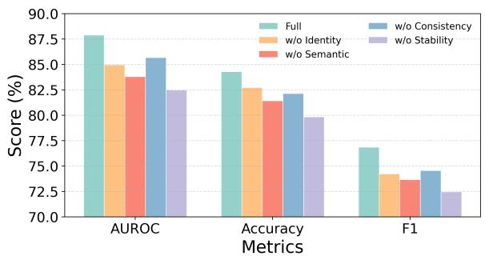  
(a) Ablation Result on RAGTruth

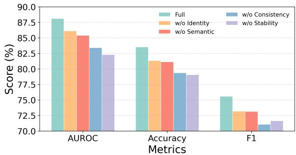  
(b) Ablation Result on HotpotQA

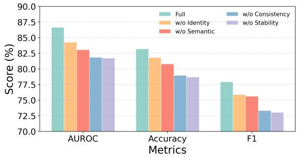  
(c) Ablation Result on DelucionQA

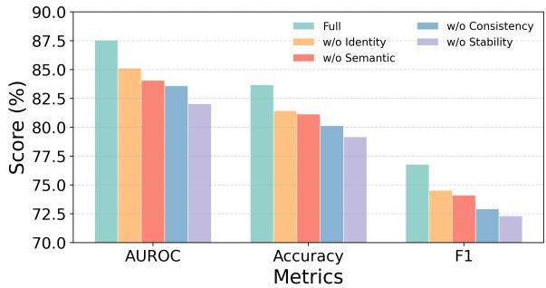  
(d) Average Ablation Result  
Figure 5: Detailed ablation results on LLaMA2-13B. Results are shown on RAGTruth (top-left), HotpotQA (topright), DelucionQA (bottom-left), and averaged across datasets (bottom-right).

## A.3.3 Results on a Newer Backbone LLM

To address concerns about model freshness, we additionally evaluate our approach on a newer backbone, Qwen3-8B, using the RAGTruth dataset. We run several strong baselines under the same evaluation protocol. Table 4 reports Precision, Recall, and F1. Our method achieves the best overall performance, indicating that the effectiveness of EAEV generalizes to newer LLM backbones.

## A.3.4 Entity-Level Hallucination Detection on RAGTruth

While the main paper reports answer-level detection results, EAEV is designed to provide finegrained, entity-anchored verification signals. We therefore additionally report entity-level hallucination detection on RAGTruth. Table 5 shows AUROC, Accuracy, and F1 for our method across three backbone models. The results demonstrate that EAEV yields meaningful entity-level separability between supported and unsupported entities, consistent with the goal of fine-grained verification.

## A.3.5 Resource Cost Comparison

We report an efficiency comparison between EAEV and SelfCheckGPT under the same setting (50 samples; Qwen2.5-7B-Instruct). Table 6 summarizes runtime and memory usage. EAEV is substantially faster and more memory efficient in this setup, largely because SelfCheckGPT requires multiple additional LLM forward passes per sample and similarity computations (e.g., BERTScore), whereas EAEV relies on a single generation with evidence-

<table><tr><td></td><td colspan="3">RAGTruth</td><td colspan="3">HotpotQA</td><td colspan="3">DelucionQA</td><td colspan="3">Average</td></tr><tr><td>window size</td><td>AUROC</td><td>Acc</td><td>F1</td><td>AUROC</td><td>Acc</td><td>F1</td><td>AUROC</td><td>Acc</td><td>F1</td><td>AUROC</td><td>Acc</td><td>F1</td></tr><tr><td>20</td><td>81.81</td><td>79.95</td><td>72.04</td><td>80.52</td><td>79.27</td><td>71.03</td><td>80.90</td><td>79.85</td><td>73.28</td><td>81.07</td><td>79.63</td><td>72.07</td></tr><tr><td>25</td><td>86.23</td><td>83.17</td><td>75.64</td><td>87.03</td><td>82.81</td><td>74.82</td><td>85.81</td><td>82.70</td><td>76.96</td><td>86.33</td><td>82.87</td><td>75.77</td></tr><tr><td>30</td><td>87.89</td><td>84.29</td><td>76.85</td><td>88.12</td><td>83.53</td><td>75.59</td><td>86.65</td><td>83.22</td><td>77.92</td><td>87.55</td><td>83.68</td><td>76.79</td></tr><tr><td>35</td><td>85.42</td><td>82.51</td><td>75.15</td><td>86.13</td><td>82.26</td><td>74.64</td><td>85.53</td><td>82.68</td><td>76.60</td><td>85.67</td><td>82.43</td><td>75.43</td></tr><tr><td>40</td><td>82.65</td><td>80.53</td><td>73.42</td><td>83.16</td><td>81.04</td><td>73.68</td><td>82.27</td><td>80.83</td><td>75.01</td><td>82.63</td><td>80.77</td><td>74.00</td></tr></table>

Table 3: Sensitivity to answer-side window length (LLaMA2-13B). Results are reported as AUROC, Accuracy (Acc), and F1 on three benchmarks. The rightmost columns show averaged metrics across all datasets.  
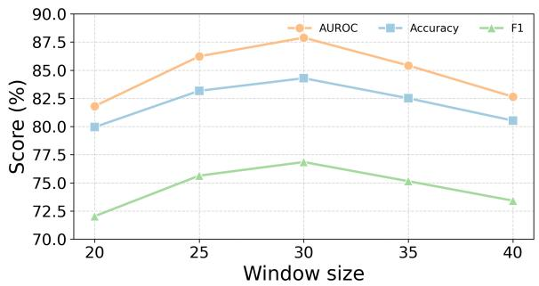  
(a) Window Sensitivity on RAGTruth

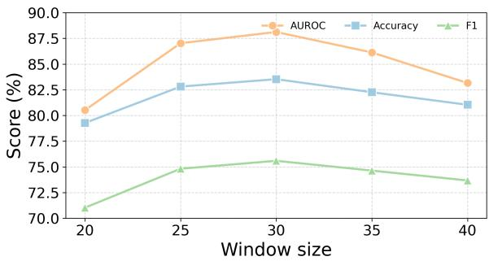  
(b) Window Sensitivity on HotpotQA

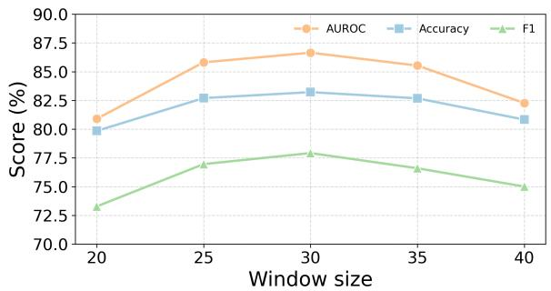  
(c) Window Sensitivity on DelucionQA

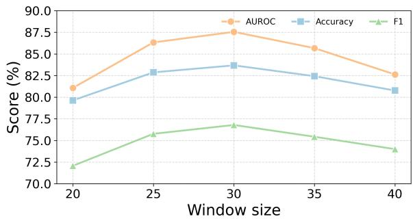  
(d) Average Window Sensitivity

Figure 6: Parameter sensitivity analysis of EAEV under different answer-side window lengths. Results are shown on RAGTruth (top-left), HotpotQA (top-right), DelucionQA (bottom-left), and averaged across datasets (bottom-right).
<table><tr><td>Model</td><td>Method</td><td>Precision</td><td>Recall</td><td>F1</td></tr><tr><td rowspan="4">Qwen3-8B</td><td>RefCheck</td><td>75.54</td><td>76.66</td><td>69.43</td></tr><tr><td>ReDEeP</td><td>78.85</td><td>78.98</td><td>72.35</td></tr><tr><td>TSV</td><td>81.56</td><td>80.08</td><td>72.23</td></tr><tr><td>Ours</td><td>87.51</td><td>81.56</td><td>75.39</td></tr></table>

Table 4: Performance on RAGTruth using a newer backbone model (Qwen3-8B). Our method remains consistently strong compared to representative baselines.

<table><tr><td>Model</td><td>AUROC</td><td>Acc</td><td>F1</td></tr><tr><td>Qwen2.5-7B</td><td>77.42</td><td>78.12</td><td>67.12</td></tr><tr><td>LLaMA2-7B</td><td>76.95</td><td>75.87</td><td>66.58</td></tr><tr><td>LLaMA2-13B</td><td>78.34</td><td>78.68</td><td>68.36</td></tr></table>

Table 5: Entity-level hallucination detection performance of EAEV on RAGTruth across different backbones.

aligned scoring.

## A.4 Case Study

To qualitatively illustrate how EAEV performs entity-level hallucination detection under RAG settings, we present a representative case study in Figure 7. The example demonstrates a scenario where the retrieved context contains correct factual evidence, yet the generated answer exhibits a subtle entity-level inconsistency due to incorrect binding between a comparative claim and numerical attributes. EAEV explicitly marks unsupported entities while preserving supported ones, enabling fine-grained and interpretable hallucination detection beyond sentence-level semantic coherence.

<table><tr><td>Metric</td><td>EAEV</td><td>SelfCheckGPT</td><td>Efficiency Ratio</td></tr><tr><td>Total Runtime (s)</td><td>1825.9</td><td>13348.5</td><td>7.3× faster</td></tr><tr><td>GPU Memory (MB)</td><td>6578.7</td><td>7735.4</td><td>lower</td></tr><tr><td>CPU Memory (MB)</td><td>42.5</td><td>146.3</td><td>lower</td></tr></table>

Table 6: Resource cost comparison between EAEV and SelfCheckGPT (50 samples, Qwen2.5-7B-Instruct).

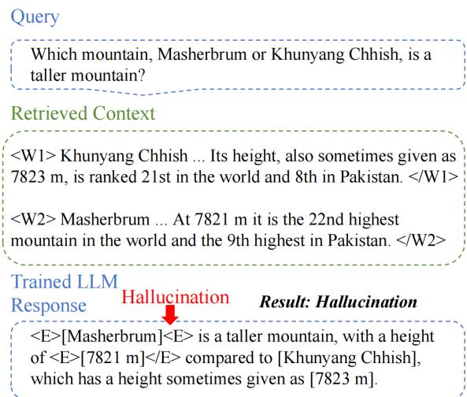  
Figure 7: An illustrative case study of entity-level hallucination detection with EAEV. Although the retrieved context contains correct height information for both mountains, the generated answer incorrectly binds the comparative claim to an inconsistent numerical entity. EAEV explicitly identifies unsupported entities (<E>) while preserving supported ones.

## A.5 Details for Prompt Template

The EAEV-guided supervised fine-tuning transforms entity verification into an executable annotation generation task. We design a structured prompt that enables models to learn EAEV’s multidimensional alignment patterns through standard supervised training while maintaining evidence traceability.

The prompt design follows several key principles to ensure effective knowledge transfer from EAEV’s verification framework. The task description explicitly requires minimal modification where only annotation tags are added without altering original answer text. Supporting passages are clearly delineated with window markers (<W1>, <W2>, <W3>) to maintain precise evidence traceability throughout verification. The instructions distinguish between contradicted entities and those lacking sufficient support, reflecting EAEV’s multidimensional alignment assessment.

<table><tr><td rowspan=1 colspan=1>Task</td></tr><tr><td rowspan=1 colspan=1>Given a question, supporting passages, and a modelanswer, mark any unsupported or contradictory en-tity mentions in the answer using &lt;E&gt;. . . &lt;/E&gt; tags.Keep the original answer text and only add tags.</td></tr><tr><td rowspan=1 colspan=1>Question{String}</td></tr><tr><td rowspan=1 colspan=1>Supporting Passages</td></tr><tr><td rowspan=1 colspan=1>&lt;W1&gt; {String} &lt;/W1&gt;&lt;W2&gt; {String} &lt;/W2&gt;&lt;W3&gt; {String} &lt;/W3&gt;</td></tr><tr><td rowspan=1 colspan=1>Original Answer{String}</td></tr><tr><td rowspan=1 colspan=1>Instructions</td></tr><tr><td rowspan=1 colspan=1>• Mark entities contradicted by the supporting pas-sages.• Mark entities lacking sufficient evidence support.• Preserve all original text—only add &lt;E&gt;. . . &lt;/E&gt;tags.• Focus on named entities, dates, numbers, and keyfactual claims.</td></tr><tr><td rowspan=1 colspan=1>Expected Output</td></tr><tr><td rowspan=1 colspan=1>Answer text with &lt;E&gt;. . .&lt;/E&gt; tags around unsup-ported entities.</td></tr></table>

Table 7: Prompt template for EAEV-guided supervised fine-tuning.

This structured approach enables standard supervised fine-tuning to learn sophisticated verification patterns while preserving interpretability through direct evidence grounding. The prompt transforms entity-level hallucination detection into a sequence labeling task that models can learn through tokenweighted cross-entropy loss, directly implementing the supervision mechanism described in Section 3.

## A.6 Usage Claim of AI assistants

We use LLM for grammar and spelling checks only, with prompt “Proofread the sentences”. All conceptual development, analysis, writing, and editing were carried out solely by the authors without LLM assistance.