# Evidence-Grounded Retrieval for Investigation Hunt Lead Generation from CTI Reports

Akash Prakash¶, Boubakr Nour∗, Makan Pourzandi∗, Chadi Assi¶, and Mourad Debbabi¶

¶Concordia University, Canada

∗Ericsson Security Research, Canada

Abstract—Threat hunting increasingly depends on converting unstructured knowledge (e.g., Cyber Threat Intelligence reports) into actionable hunt leads: concise, investigable hypotheses grounded in observable artifacts and adversary techniques. Producing such leads manually is a tedious and hard-to-scale task. Existing automated approaches stop at the entity layer, ignore the defender’s operational environment, and analyze each report in isolation. To address these gaps, we introduce AHLERT, a system that automatically extracts relevant, environment-aware, and hunt leads from threat reports through (i) a hybrid retriever that combines dense vector search with multi-hop traversal over a knowledge graph seeded with MITRE ATT&CK; (ii) an ontology-grounding retrieval augmented generation method that constrains each lead to the defender’s own assets and controls; and (iii) an LLM-agnostic framework that emits structured, directly actionable leads rather than loose indicators of compromise. We evaluate AHLERT on public CTI reports for wellknown APT across multiple proprietary and open-weight models. Hybrid evidence retrieval with ontology grounding raises mean F1 by ≈ 2× (0.44 to 0.85) over a single-route flat-RAG baseline, and AHLERT attains the highest effectiveness score (≈86.95%) compared with off-the-shelf LLM models.

ÅAHLERT Demo: https://youtu.be/zdCquNNV6sA

Index Terms—Threat hunting, security automation, retrievalaugmented generation

## I. INTRODUCTION

The cyber threat landscape is expanding in volume, velocity, and sophistication faster than security operations teams can keep pace. Contemporary adversaries combine zero-day exploits, living-off-the-land techniques, and supply-chain compromise into campaigns that evade signature-based controls, leaving residual risk that requires human-in-the-loop investigation [1]. Threat hunting has emerged to address this gap [2], with analysts iteratively forming hypotheses about adversary behavior and searching enterprise telemetry for corroborating evidence. At the core of this process is a knowledge-transformation challenge: raw, unstructured Cyber Threat Intelligence (CTI) [3], including vendor reports, malware analyses, and incident post-mortems, must be distilled into actionable hunt leads. CrowdStrike [4] defines a hunt lead as a highly specific, low-fidelity indicator, data point, or anomalous behavior that a hunter identifies and investigates; while not malicious on their own, such leads provide context to trace adversary activity before automated systems alert.

A hunt lead is a combination of: a natural-language hypothesis tied to the supporting evidence and adversary technique it rests on, a triage assessment of its SEVERITY, PRIORITY, and likely IMPACT, and the concrete METRICS and ARTIFACTS, such as hosts, processes, and indicators, that the hunter can immediately pivot on.

Motivation: While CTI is widely accessible, constructing actionable hunt leads remains a major operational bottleneck [5]. A single report can span dozens of pages mixing indicators, MITRE ATT&CK tactics, techniques, and procedures (TTPs), malware details, and narrative; hunters must manually extract observations and map them to the assets and controls of their environment, a process that is slow, error-prone, and hard to scale. Prior work [6], [7], [8] improves entity extraction and technique mapping but typically stops at the entity layer [9], before generating the behavioral hypotheses that actually produce a hunt lead. This is a critical gap, since TTPs are more stable and valuable for defense than atomic IoCs, which adversaries easily change.

Challenges: Automating hunt lead extraction is hard because a lead is useful only if it is at once faithful to the source intelligence, aware of the defender’s environment, and informed by prior knowledge. Three challenges follow:

Faithfulness to evidence: an extracted lead must rest on indicators and techniques that genuinely appear in the source intelligence; fabricated hashes, spurious technique identifiers, or unsupported behavioral claims misdirect a hunt and erode analyst’s trust; 2 Environment blindness: a technically valid lead is operationally ineffective if it refers to sensors, controls, or data sources that are absent from the defender’s environment; extraction must therefore be grounded in what the defender can actually observe; 3 Absence of relational memory: each report is typically analyzed in isolation, ignoring the broader graph of actor → tool → technique → asset relationships that experienced hunters use to connect new observations to months or years of prior intelligence.

Limitations of existing solutions: Existing approaches to hunt lead extraction fall short on three fronts: 1 Most solutions [6], [7], [8] stop at the entity layer: they extract indicators, map techniques, and tag actors, but leave the synthesis of an investigable hypothesis, the lead itself, to the human analyst; 2 The evidence for a single lead is rarely co-located; it must be assembled across a malware analysis, a technique description, and an asset inventory connected only through a shared actor, tool, or technique, a relational structure that flat keyword or similarity matching cannot stitch together; and 3 Extracted leads are seldom validated against the defender’s own environment, so they may reference sensors, controls, or data sources that the SOC does not actually operate, yielding leads that read well but cannot be hunted.

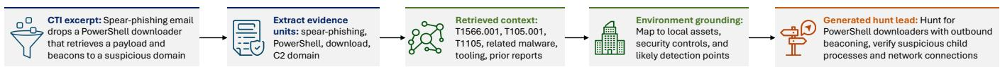  
Fig. 1: High-level overview of hunt lead extraction.

TABLE I: Capability comparison between AHLERT and representative state-of-the-art extraction solutions.
<table><tr><td></td><td>Graph Retrieval Pre-built</td><td>KB</td><td>Grounding</td><td>Output</td><td>Environment hunt lead Multi-LLM Evaluation</td></tr><tr><td>AZERG [6]</td><td>X</td><td>x</td><td>x</td><td>X</td><td>X</td></tr><tr><td>ANCHOR [7]</td><td>X</td><td>x</td><td>x</td><td>x</td><td>x</td></tr><tr><td>CTINEXUS [8]</td><td>x</td><td>X</td><td>X</td><td>X</td><td>x</td></tr><tr><td>TECHNIQUERAG [10]</td><td>x</td><td>x</td><td>x</td><td>X</td><td>√</td></tr><tr><td>AGCYRAG [11]</td><td>√</td><td>x</td><td>X</td><td>X</td><td>x</td></tr><tr><td>BEYOND RAG [12]</td><td>L</td><td>√</td><td>x</td><td>x</td><td></td></tr><tr><td>AHLERT</td><td></td><td>J</td><td>L</td><td>√</td><td>V</td></tr></table>

A practical solution must therefore unify flat retrieval, graph traversal, and controlled generation, and be environmentaware, filtering leads against a formal description of the defender’s infrastructure so only operationally actionable hypotheses reach the analyst. As shown in Table I, existing solutions such as AZERG [6], CTINEXUS [8], and TECHNI-QUERAG [10] rarely incorporate this constraint, assuming an abstract defender with a complete sensor fleet, whereas real SOCs cover only a bounded subset of assets, controls, and data sources.

Contributions: To address these challenges, we design AHLERT, an automated solution that turns a threat report into actionable hunt leads by extracting evidence, enriching it through hybrid evidence retrieval, grounding it to the defender’s environment, and synthesizing prioritized hypotheses (Fig. 1). The main contributions are:

• We introduce AHLERT, a hybrid retrieval-and-generation system for automated hunt lead extraction from unstructured threat reports that combines dense vector retrieval with cyber knowledge graph reasoning to enrich report-derived evidence through explicit relationships among techniques, tools, actors, campaigns, assets, and indicators.

• We introduce an ontology-aware and post-filtering mechanism that constrains LLM outputs to the defender’s asset and control universe, thereby reducing environment-irrelevant leads.

• We present an evidence-grounded generation stage supported by LLM that synthesizes candidate hunt leads from the retrieved evidence and then verifies and ranks them, so that AHLERT emits fully phrased, prioritized leads rather than loose indicators of compromise.

• We evaluate AHLERT across multiple contemporary LLMs, including proprietary and open-weight models, on public CTI reports and knowledge base. Obtained results show that AHLERT consistently improves hunt lead quality, raising hunt lead F1 score by ≈ 2× (0.44 to 0.85) over a singleroute flat-RAG baseline and attaining a highest effectiveness score (avg. 86.95%).

II. AHLERT: AUTOMATED HUNT LEAD EXTRACTIONUSING RETRIEVAL-AUGMENTED THREAT INTELLIGENCE

## A. System Overview

Overview: AHLERT is a hybrid-retrieval, ontology-aware system that transforms an unstructured threat report into a ranked list of environment-consistent hunt leads. Unlike single-route RAG [13] that conditions the generator on one modality alone, AHLERT fuses three complementary routes, semantic similarity, graph expansion, and entity expansion, into a unified evidence bundle grounded in a defender environment ontology. Fig. 2 illustrates the high-level overview of AHLERT and its working principle. AHLERT is organized into three phases that move a report from raw text to validated hunt leads.

The first phase is Offline Knowledge Construction (Step 1 ), which is prepared in advance. A historical CTI corpus and a curated cyber knowledge base are ingested into a persistent CTI knowledge substrate that exposes both a semantic index and a relationship graph, together with the provenance of every stored item. The second phase, Online CTI Report Analysis (Step 2 ), runs when an analyst submits a report. It normalizes the raw input into clean segments, extracts structured evidence units capturing the entities, behaviors, techniques, tools, infrastructure, targets, and temporal context of each passage, and enriches them against the substrate through semantic similarity, graph expansion, and entity expansion into a bundle of matched fragments, associated techniques, neighboring graph context, and provenance. The third phase, Hunt Lead Generation (Step 3 ), is driven by an analyst task prompt. An evidence-grounded synthesizer drafts candidate leads, which are then verified and ranked for evidence sufficiency, ontology consistency, redundancy, and confidence before the final ranked leads are delivered to the threat hunter. AHLERT emits structured, evidence-backed leads, each carrying its ATT&CK mapping and source provenance, that a threat hunter can execute directly against enterprise telemetry.

Novelty: The design of AHLERT introduces three novelties that distinguish it from existing CTI solutions: 1 Hybrid evidence retrieval: the retrieval stage fuses three complementary routes, semantic similarity, graph expansion, and entity expansion, so report-derived evidence reaches the generator through topical, structural, and relational paths rather than text matching alone; 2 Ontology-aware grounding: when the defender’s environment is provided, AHLERT constrains leads to reference it and prunes any that do not, keeping emitted leads operationally actionable rather than generic;

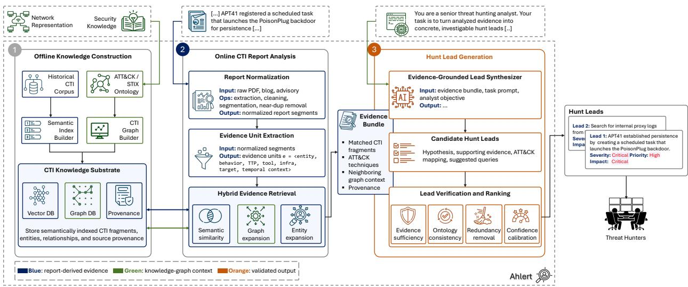  
Fig. 2: End-to-end architecture of AHLERT. Color coding distinguishes report-derived evidence, knowledge-base context, and validated output.

and 3 Model-agnostic generation: the generation stage is decoupled from retrieval behind a uniform interface, so the same framework runs unchanged across proprietary and open-weight models, enabling a fair comparison across model families.

## B. Offline Knowledge Construction

Ahead of any analysis, AHLERT assembles a persistent CTI knowledge substrate as its long-term knowledge. A historical CTI corpus and a curated cyber knowledge base (KB) are ingested once and organized along two complementary views: a semantic index [14], [15] capturing the meaning of CTI fragments for similarity-based recall, and a relationship graph [3], [16] recording entities and the actor, tool, technique, and asset links among them. The substrate stores semantically indexed CTI fragments, their entities and relationships, and the source provenance of each item, so that evidence surfaced later can be traced back to where it came from.

CTI Graph Builder: AHLERT’s CTI graph is the structural backbone of the retrieval phase. It records cybersecurity entities, such as threat groups, techniques, software, and the reports that describe them, together with the relationships among them, drawn from community-curated sources such as MITRE ATT&CK and a corpus of historical incident reports. The ATT&CK/TIE backbone is loaded offline, while each newly uploaded CTI report is incrementally merged into the knowledge graph during ingestion, so that retrieval can connect new observations to prior intelligence and reach an actor’s known techniques in only a couple of hops.

Semantic Index Construction: Alongside the graph, the same corpus is embedded into a dense vector index so that passages can later be recalled by meaning rather than by exact keywords. Each document is segmented into overlapping passages of 600 tokens with an 80-token overlap, preserving cross-sentence context while keeping each unit small enough to embed precisely. Every passage is encoded with the all-MiniLM-L6-v2 sentence transformer [14] into a 384-dimensional vector, $L _ { 2 }$ -normalized so that inner-product search equals cosine similarity. The collection is indexed with a FAISS HNSW (hierarchical navigable small-world) graph index [15], [17], giving logarithmic-time approximate nearestneighbor search at high recall. Each vector is stored with lightweight metadata (source document, passage offset, and provenance), so a retrieved passage can be traced to its origin and fused with graph-derived evidence at query time.

## C. Online CTI Report Analysis

For a CTI report, AHLERT processes it online in three steps: (i) report normalization takes the raw/unstructured input and applies extraction, cleaning, segmentation, and near-duplicate removal to yield clean, normalized report segments; (ii) evidence unit extraction then converts those segments into structured evidence units, each capturing the salient facets of a passage, namely the entity, behavior, technique, tool, infrastructure, target, and temporal context it describes; and (iii) hy brid evidence retrieval enriches these units against the offline substrate through three parallel routes, semantic similarity, graph expansion, and entity expansion, so that report-derived evidence is augmented with related knowledge-base context. The result is a consolidated evidence bundle comprising the matched CTI fragments, the associated techniques, the neighboring graph context, and the provenance of each element.

Hybrid Evidence Retrieval: Each evidence unit is enriched against the offline knowledge substrate through three complementary retrieval routes. (i) Semantic similarity recalls report passages and prior CTI that are close in meaning to the unit, (ii) graph expansion follows relationships in the cyber-knowledge graph to bring in associated techniques, tooling, and threat groups; and (iii) entity expansion pulls in connected entities such as actors, assets, and indicators.

Fig. 3 walks a single evidence unit through the three routes with a concrete example. Starting from unstructured input, semantic similarity embeds the unit and runs approximatenearest-neighbor search over the semantic index, recalling the closest prior passages (e.g., at cosine similarity 0.89 and 0.84) and mapping them onto technique T1053.005; graph expansion traverses the relationship graph from that technique to the actor APT41 and to sibling techniques and tooling it is linked to (e.g., T1059.001); and entity expansion pulls in the concrete entities connected to those nodes, such as the implant POISONPLUG, the affected host, and the scheduled-task indicator. Each bundle is deliberately compact and quality-controlled: the top k=10 passages survive a 0.15 minimum-relevance cutoff and optional crossencoder re-ranking (ms-marco-MiniLM-L-6-v2); graph expansion is capped at 20 technique and 10 group candidates linked to the report’s focus actor, and every retained element carries source provenance.

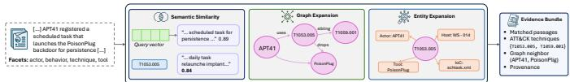  
Fig. 3: Illustrative example of hybrid evidence retrieval.

## D. Hunt Lead Generation

The final phase of AHLERT turns the evidence bundle assembled by retrieval into a ranked list of hunt leads: concise, action-oriented hypotheses that a threat hunter can execute directly against enterprise telemetry. A hunt lead is not a restatement of the report but an investigable hypothesis about what to look for and where, grounded in the defender’s own environment whenever a description of it is available. As shown in Fig. 2, generation proceeds in two steps guided by the analyst’s task prompt and objective: an evidence-grounded synthesizer that first drafts candidate hunt leads from the evidence bundle, and these candidates are then verified and ranked so that only validated leads reach the threat hunter.

Evidence-Grounded Lead Synthesis: The synthesizer consumes the evidence bundle produced by retrieval, comprising the matched report fragments, their associated ATT&CK techniques, the neighboring graph context, and the provenance of each item, together with the analyst’s task prompt and objective (see Appendix VI). From this grounded context, AHLERT drafts a set of candidate hunt leads, each pairing a behavioral hypothesis with the supporting evidence it rests on, the relevant technique mapping, and concrete queries the hunter can run. Because every candidate is tied back to retrieved evidence, the synthesizer is steered towards investigable hypotheses rather than a paraphrase of the report.

Lead Verification and Ranking: The candidate leads pass through a verification and ranking step before they reach the threat hunter. Each lead is checked for: (i) evidence sufficiency: so that unsupported hypotheses are discarded a lead is evidence sufficient if at least one retrieved evidence unit semantically supports it above a confidence threshold; (ii) consistency with the defender’s environment: so that operationally infeasible leads are pruned, retaining the unfiltered set if this would discard every candidate; (iii) redundancy: so that near-duplicate leads are merged; and (iv) calibrated confidence score and ranked to ensure that what reaches the threat hunter is both grounded in the report and relevant to the defender’s estate.

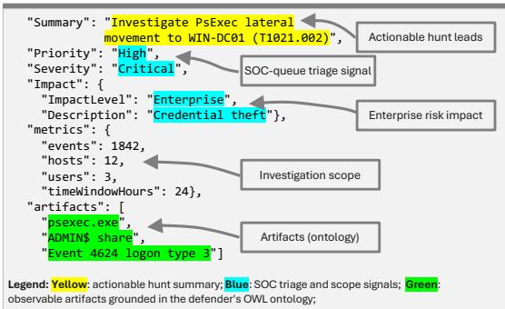  
Fig. 4: Excerpt of generated hunt lead by AHLERT.

Ranking is performed by the same generator in a single verification pass over the candidate set, guided by the task prompt (Appendix VI): each surviving lead is assigned a calibrated confidence score that reflects the strength and amount of supporting evidence, its consistency with the defender’s environment, and the assessed severity of the implied activity. Leads are then ordered by this score, with severity breaking ties, so the highest-confidence, most operationally relevant hypotheses surface first. Each validated lead is emitted in the fixed schema of Fig. 4.

## III. EXPERIMENTAL SETUP

We built a PoC of AHLERT in Python 3.121. The knowledge base is maintained in Neo4j with a FAISS-HNSW index, and semantic matching uses all-MiniLM-L6-v2 [14] embeddings. Decoding uses temperature 0 for GPT-4.1-mini and nucleus sampling for the open-weight models (Qwen-2.5-7B, T=0.7; Foundation-Sec-8B, T=0.3; both top-p=0.9). The experiments were performed on a VM running Ubuntu 20.04 LTS (Linux kernel 5.4), provisioned with 30 vCPUs on an AMD EPYC 7702 processor, 211 GB of RAM, and a single NVIDIA A100, SXM4 GPU with 80 GB of memory.

Knowledge Base: The Knowledge Base merges two datasets that are highly complementary: (i) ENTERPRISE ATT&CK [3], which provides the canonical taxonomy of adversarial tradecraft: attack patterns (techniques and subtechniques), intrusion sets, malware, tools, and the uses relationships among them; and (ii) MITRE TECHNIQUE IN-FERENCE ENGINE (TIE) [16], which contains several thousand historical incident reports annotated with the techniques, threat actor groups, software, and campaigns that each report describes. ATT&CK supplies the what of attacker behavior while TIE supplies the who and the where-we-have-seen-this.

Baselines: As no directly comparable prior work exists, we evaluate AHLERT against six configurations spanning three AHLERT-augmented generators and their corresponding off-the-shelf (OTS) counterparts: (1) AHLERT-CHATGPT: AHLERT-augmented ChatGPT2, (2) AHLERT-QWEN: AHLERT-augmented Qwen3, (3) AHLERT-FOUNDATION-SEC: AHLERT-augmented Cisco Foundation-Sec4, (4) CHATGPT-OTS, (5) QWEN-OTS, and (6) FOUNDATION-SEC-OTS.

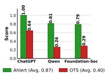  
(a) Precision.

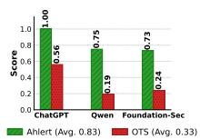

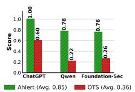  
(b) Recall.  
(c) F1 score.  
Fig. 5: AHLERT performance over APT41 reports.

Threat Reports: We used the APTNotes repository5, a collection of public threat intelligence reports from vendors including Mandiant, Trend Micro, and CrowdStrike, and selected four reports on APT41.

Ground truth: A domain expert curated a ground truth set of investigable hunt leads spanning the intrusion’s initialaccess, execution, persistence, and exfiltration phases for the associated threat. Each ground truth lead is a single imperative sentence following the same schema as AHLERT (Fig. 4).

Ontologies: The ontologies used in this work were developed in Web Ontology Language (OWL) and constructed using Protégé6. The cybersecurity ontology [18] contains 12,838 triples and models over 4,280 unique entities, including 103 APT groups, 296 malware families, and 2,896 CVE vulnerabilities, interconnected through 115 relationship types.

The system ontology models 79 node instances across six component types: 22 virtual machines, 14 servers, 13 firewalls, 10 applications, 9 services, and 11 workstations.

## IV. EVALUATION

RQ1 - Lead Relevance: How relevant are the generated hunt leads to the given threat report and the ontology? To address RQ1, we measured the lead relevance by computing the semantic similarity between each generated hunt lead and a curated set of ground truth leads. We encoded the summary field of every lead using all-MiniLM-L6-v2 [14]. We consider a true positive lead each generated lead whose maximum semantic similarity to any ground truth lead meets or exceeds the threshold $\tau _ { \mathrm { g t } }$ . Matching uses independent maximum-similarity checks for generated and ground truth leads rather than a oneto-one assignment. We set $\tau _ { \mathrm { g t } } = 0 . 8 2$ to balance strictness with tolerance (see RQ4).

Fig. 5 reports the precision, the share of generated leads matching ground truth, recall, the share of ground truth leads recovered, and F1, their harmonic mean, by each generator. For every generator, AHLERT produces a consistent improvement over the OTS baselines. F1 rises from 0.22 to 0.78 for AHLERT-QWEN and from 0.26 to 0.76 for AHLERT-FOUNDATION-SEC, with precision and recall improving in tandem (e.g., for AHLERT-QWEN, precision from 0.26 to 0.81 and recall from 0.19 to 0.75). Averaged across the three generators, AHLERT raises mean precision from 0.40 to 0.87, recall from 0.33 to 0.83, and F1 from 0.36 to 0.85. The AHLERT-CHATGPT, which serves as the reference model for ground-truth curation, attains a perfect F1 of 1.00 and is shown only as a completeness point rather than as an independent comparison. This lift stems from the hybrid design: graph and entity expansion surface the implied ATT&CK techniques and connected assets, and ontology grounding anchors each lead to a declared asset, yielding specific, verifiable hypotheses rather than the generic prose of single-route retrieval.

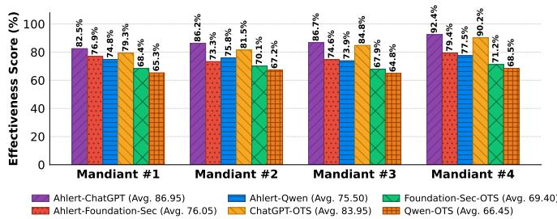  
Fig. 6: Lead relevance effectiveness score (%).

We further computed the effectiveness score per system and report. This metric is calculated as the mean, taken over AHLERT’s generated leads, of a weighted combination of three per-lead dimensions: (i) Lead Relevance: does the hypothesis relate to the reported threat activity?), (ii) IoC Accuracy: are named indicators correct and attributable to the report?, and (iii) Actionability: is the lead specific enough to execute as a hunt query?. Each dimension is scored on a 0 to 100 scale. A high effectiveness score, therefore, indicates leads that are simultaneously on topic with the reported threat activity, accurate in their named indicators, and specific enough for an analyst to execute directly. As shown in Fig. 6, AHLERT-CHATGPT consistently achieves the highest effectiveness score across all four reports (avg. 86.95%). AHLERT-FOUNDATION-SEC and AHLERT-QWEN follow at 76.05% and 75.50% respectively, with both benefiting measurably from the AHLERT pipeline relative to their offthe-shelf counterparts. Among the off-the-shelf systems, ■ CHATGPT-OTS (avg. 83.95%) is the strongest single baseline, reflecting GPT-4.1-mini’s strong instruction-following even without retrieval; however, AHLERT-CHATGPT still outperforms it by 3 percentage points on average. QWEN-OTS and FOUNDATION-SEC-OTS, operating in pure off-theshelf mode without a hybrid evidence context, score 66.45% and 69.40% respectively. Overall, AHLERT improves not only precision and recall but also the practical usefulness of the leads, transforming generic LLM outputs into accurate, reportspecific, and analyst-actionable hunt leads.

To further validate these results, we performed a dual validation protocol using both human and LLM-based assessment. In the human-based validation, a domain expert evaluated each generated lead against its source report. In the LLMbased validation, GPT-4o [19] acted as an independent judge and scored each lead against the extracted ground truth. Both validators assessed the same effectiveness dimensions, namely lead relevance, IoC accuracy, and actionability, and the resulting scores are reported in Table II. Both validators confirm the same trend: AHLERT-augmented configuration scores higher than its OTS counterpart, averaged over the four reports, AHLERT-CHATGPT leads CHATGPT-OTS (human 85.5 vs. 78.0; LLM 81.5 vs. 75.3), AHLERT-QWEN leads QWEN-OTS (68.0 vs. 65.0; 65.3 vs. 62.2), and AHLERT-FOUNDATION-SEC leads FOUNDATION-SEC-OTS (71.5 vs. 68.6; 69.8 vs. 66.9). AHLERT-CHATGPT attains the highest overall scores (up to 94% human and 90% LLM on Mandiant 4). However, because this configuration is also used as the reference model for ground-truth curation, it is reported for completeness only. For the open-weight pairs, which are independent of the curation process, AHLERT gain is smaller but consistent across all four reports, about +3 percentage points for both AHLERT-QWEN over QWEN-OTS and AHLERT-FOUNDATION-SEC over FOUNDATION-SEC-OTS under either validator. The improvement brought by AHLERT is not an artifact of a single evaluation method. Human and GPT-4o validation agree closely on both the relative ranking and the magnitude of the gains, with the LLM judge being slightly more conservative by about 2-4 percentage points on average. This suggests that LLM-based validation can serve as a scalable proxy for expert assessment, while the human confirms the operational relevance of the generated hunt leads.

RQ2 - Contextual Correctness: Does AHLERT correctly ground threat to the enterprise network defined in the ontology? RQ2 examines whether AHLERT correctly grounds threat behaviors to entities that exist in the defender’s environment. For each hunt lead, we verify that at least one entity mentioned in the lead (i.e., host name, service, IP address, or application) corresponds to an entity declared in the system ontology. We define the grounding rate as the fraction of leads that pass this verification. A high grounding rate indicates that AHLERT effectively constrains generation to the defender’s operational context rather than producing generic or hallucinated recommendations. As shown in Fig. 7, AHLERT-CHATGPT achieves the highest rate (97.2%), followed closely by CHATGPT-OTS (95.8%). AHLERTaugmented open-weight models, AHLERT-FOUNDATION-SEC and AHLERT-QWEN, reach 82.4% and 78.6%, respectively. OTS open-weight models, FOUNDATION-SEC-OTS and QWEN-OTS, achieve lower grounding rates of 73.4% and 70.8% respectively. The gap reflects the ontologyconstrained rewriting step: proprietary models reliably conform to the structured prompt mapping behaviors onto declared entities, whereas smaller open-weight models only partially follow it. AHLERT thus improves not only lead quality

TABLE II: Avg. results for human and LLM-based validation across threat reports, evaluated using different generators (%).
<table><tr><td>Report</td><td>Model</td><td>Human- based Validation</td><td>LLM- based Validation</td></tr><tr><td rowspan="6">Maan1</td><td>AHLERT-CHATGPT</td><td>70.00</td><td>68.00</td></tr><tr><td>CHATGPT-OTS</td><td>66.00</td><td>62.00</td></tr><tr><td>AHLERT-QWEN</td><td>60.00</td><td>58.00</td></tr><tr><td>QWEN-OTS</td><td>56.30</td><td>54.30</td></tr><tr><td>AHLERT-FOUNDATION-SEC</td><td>56.00</td><td>55.00</td></tr><tr><td>FOUNDATION-SEC-OTS</td><td>52.90</td><td>51.90</td></tr><tr><td rowspan="6">2 Maiant</td><td>AHLERT-CHATGPT</td><td>94.00</td><td>88.00</td></tr><tr><td>CHATGPT-OTS</td><td>86.00</td><td>82.00</td></tr><tr><td>AHLERT-QWEN</td><td>66.00</td><td>60.00</td></tr><tr><td>QWEN-OTS</td><td>63.20</td><td>57.20</td></tr><tr><td>AHLERT-FOUNDATION-SEC</td><td>80.00</td><td>78.00</td></tr><tr><td>FOUNDATION-SEC-OTS</td><td>77.30</td><td>75.30</td></tr><tr><td rowspan="6">3 Maiant</td><td>AHLERT-CHATGPT</td><td>84.00</td><td>80.00</td></tr><tr><td>CHATGPT-OTS</td><td>74.00</td><td>72.00</td></tr><tr><td>AHLERT-QWEN</td><td>66.00</td><td>65.00</td></tr><tr><td>QWEN-OTS</td><td>62.90</td><td>61.90</td></tr><tr><td>AHLERT-FOUNDATION-SEC</td><td>76.00</td><td>74.00</td></tr><tr><td>FOUNDATION-SEC-OTS</td><td>72.60</td><td>70.60</td></tr><tr><td rowspan="6">MaMaan4</td><td>AHLERT-CHATGPT</td><td>94.00</td><td>90.00</td></tr><tr><td>CHATGPT-OTS</td><td>86.00</td><td>85.00</td></tr><tr><td>AHLERT-QWEN</td><td>80.00</td><td>78.00</td></tr><tr><td>QWEN-OTS</td><td>77.50</td><td>75.50</td></tr><tr><td>AHLERT-FOUNDATION-SEC</td><td>74.00</td><td>72.00</td></tr><tr><td>FOUNDATION-SEC-OTS</td><td>71.70</td><td>69.70</td></tr></table>

## but also operational grounding

RQ3 - Actionability: Are the generated hunt leads sufficiently specific and structured for a threat hunter to act upon? RQ3 assesses whether the leads are structured and specific enough to execute without additional interpretation. We evaluate actionability along three dimensions: (i) whether the lead begins with a prescribed imperative verb (e.g., search, query, scan); (ii) whether it references at least one ATT&CK technique or CVE; and (iii) whether the metrics block specifies concrete scoping parameters (e.g., hosts, users, events). Fig. 8 reports the actionability score for each configuration as the percentage of leads that satisfy all three criteria simultaneously. AHLERT-CHATGPT attains the highest actionability score (88% of leads satisfy all three criteria), followed by AHLERT-FOUNDATION-SEC at 79% and AHLERT-QWEN at 76%; all three reliably open with an imperative verb and embed an ATT&CK identifier or CVE, as the ontologygrounded prompt enforces that structure.

The OTS systems trail substantially: CHATGPT-OTS reaches 64%, while open-weight baselines FOUNDATION-SEC-OTS and QWEN-OTS reach only 55% and 51%. By dimension, (i) is met by nearly every system; (ii) is the primary differentiator, as OTS generators often describe behavior without a concrete identifier; and (iii) is most often missing, as OTS leads omit executable bounds.

RQ4 - Ablation Study: What is the contribution of retrieval, ontology grounding, and threshold to overall hunt lead quality?

• Impact of retrieval: Fig. 9 isolates the retriever by comparing AHLERT with a single-route flat-RAG retriever (dense vector search only, graph and entity expansion disabled)

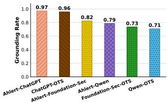  
Fig. 7: Grounding rate.

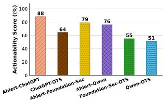  
Fig. 8: Actionability score.

against the full hybrid pipeline. Hybrid retrieval doubles the flat-RAG baseline, raising mean F1 from 0.44 to 0.85 (≈ 2×). For reference, the off-the-shelf generator without retrieval scores only 0.36 mean F1 (OTS, Fig. 5), so dense retrieval alone adds little over OTS; the decisive lift comes from graph expansion and ontology grounding.

• Impact of ontology grounding: Fig. 10 reports hunt lead F1 score across all three generators, using different retrieval (OTS vs. hybrid graph retrieval) and with and without ontology grounding. Isolating ontology grounding while holding the retriever fixed reveals a value strongly complementary to graph retrieval. On top of hybrid graph retrieval, it lifts mean F1 from 0.64 to 0.85 (+0.21), with per-generator gains of +0.25 for AHLERT-CHATGPT (0.75→1.00), +0.16 for AHLERT-QWEN (0.62→0.78), and +0.21 for AHLERT-FOUNDATION-SEC (0.55→0.76). On top of the flat off-theshelf retriever, the same grounding yields only +0.04 mean (0.36 to 0.40, at most +0.06 per generator), roughly 5× less, since the hybrid retriever surfaces the concrete entities the ontology binds onto. The effect is largest for open-weight generators, narrowing much of the proprietary gap.

• Impact of threshold: Fig. 11 shows the mean hunt lead F1 score at different threshold $\tau _ { \mathrm { g t } }$ . for OTS baseline and AHLERTaugmented systems. Two patterns hold across the whole range. First, absolute F1 declines gradually as the threshold tightens (AHLERT 0.90 to 0.82, OTS 0.44 to 0.31), since a stricter cutoff admits fewer loosely related matches; the decline is smooth rather than abrupt, indicating genuine matches cluster well above the cut-off. Second, the ordering is invariant: AHLERT outperforms OTS at every threshold, and the margin widens from +0.46 at $\tau _ { \mathrm { g t } } ~ = ~ 0 . 7 5 ~ { \mathrm { t o } } ~ + 0 . 5 1$ at $\tau _ { \mathrm { g t } } ~ = ~ 0 . 8 5$ , as generic OTS leads lose matches faster than ontology-grounded ones. We adopt $\tau _ { \mathrm { g t } } = 0 . 8 2$ as it demands a close semantic paraphrase of an expert reference lead yet lies on the stable part of the curve where AHLERT scores 0.85.

Discussion: AHLERT does not surface unconstrained model output: its verification step discards any candidate lead unsupported by a retrieved evidence unit, suppressing fabricated techniques and indicators. Every actionable lead must cite an ATT&CK technique or CVE drawn from the retrieved evidence (RQ3), and 70%–97% of leads reference assets that genuinely exist in the defender ontology (RQ2); a dedicated faithfulness benchmark is left to future work.

Despite these promising results of AHLERT, several limitations remain: (i) the ground truth was curated starting from AHLERT-CHATGPT output, so that configuration’s F1 of 1.00 is a reference upper bound rather than an independent comparison; (ii) our evaluation centers on four reports for a single threat actor (APT41); AHLERT’s pipeline is actor-agnostic, but cross-actor validation remains future work; (iii) the defender system ontology is a compact 79-instance proof of concept; AHLERT’s retrieval and grounding logic is independent of ontology scale, but large-scale evaluation remains future work; (iv) lead quality depends on ontology completeness: when a relevant asset is absent from the snapshot, the grounding filter falls back to the unfiltered lead, which accounts for most residual ungrounded cases (RQ2); (v) our automated relevance metric uses an SBERT matcher (all-MiniLM-L6-v2, $\tau _ { \mathrm { g t } } = 0 . 8 2 )$ as a proxy for human judgment, mitigated by parallel human validation but still a conservative design choice; and (vi) our evaluation does not yet include deployment in a live SOC, so operational scalability and analyst usability remain to be measured.

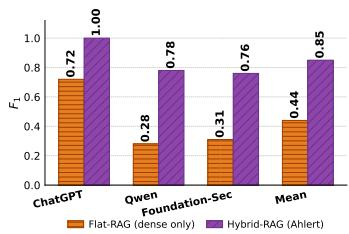

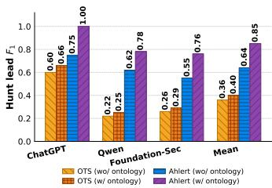

Fig. 9: Impact of hybrid retrieval. Fig. 10: Impact of ontology.  
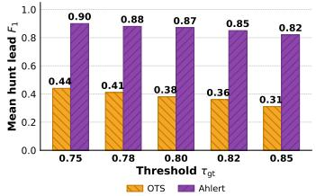  
Fig. 11: Impact of the threshold.

Future work will address these gaps through automated ontology expansion, harder domain/range generation constraints, and analyst feedback loops that continuously refine lead quality against expert scoring.

## V. RELATED WORK

Cyber Threat Intelligence Extraction: A long line of work converts narrative threat reports into structured artifacts that downstream tooling can consume. Lekssays et al. [6] introduce AZERG, a tool that fine-tunes general-purpose LLMs on four sequential subtasks. Kim et al. [7] follow a complementary path with ANCHOR, a schema-agnostic knowledge-graph construction system that pairs a search-and-navigate hybrid ontology-discovery mechanism with SHACL-based validation to assign schema-compliant types across large ontologies. CTINEXUS [8] takes a third approach: rather than fine-tune, it uses in-context-learning prompts with optimal demonstration retrieval and hierarchical entity alignment to build a cybersecurity knowledge graph. The recent SoK [9] systematizes more than 40 such efforts and finds that most stop at the entity or technique-mapping layer and rely on incompatible custom ontologies, leaving outputs hard to reuse and of limited value to a SOC analyst who must still hand-craft the hunt query. In contrast, AHLERT treats structured extraction as a means: techniques and indicators feed the KB-backed graph queried at generation time, yielding a ranked, environment-consistent list of hypotheses rather than a static extraction bundle.

RAG for Threat Intelligence: RAG [20] is the default recipe for grounding LLM outputs in external knowledge, and several recent systems specialise it for cybersecurity [21]. Lekssays et al. [10] present TECHNIQUERAG, a retrievalaugmented [20] framework that maps free-form CTI text to adversarial ATT&CK techniques by pairing instruction-tuned generation with retrieval over a technique corpus. Kurniawan et al. [11] push further with AGCYRAG, an agentic framework combining vector retrieval with Cypher and SPARQL traversals over a security knowledge graph. The generalpurpose GRAPHRAG framework [13] informs our own hybridcontext-assembly design. A practical lesson is that hybridizing graph and vector evidence is necessary but not sufficient: the context must still become something an analyst can act on, yet existing CTI-RAG systems stop at technique annotation, freeform Q&A (e.g., [10], [11]), or graph construction (e.g., [8]). In contrast, AHLERT fuses semantic similarity, graph traversal [22], and entity expansion into a unified evidence bundle grounded via a system ontology, yielding leads that are operationally actionable on the defender’s estate.

## VI. CONCLUSION

This paper proposed AHLERT, a hybrid retrieval-andgeneration system for automatically extracting actionable, evidence-grounded hunt leads from unstructured CTI reports. AHLERT unifies flat retrieval across sources, graph traversal across knowledge, and controlled natural-language generation, and is environment-aware: leads are filtered against a formal description of the defender’s infrastructure so only operationally actionable hypotheses reach the analyst. Across four APT reports, the full hybrid pipeline raises mean F1 by ≈ 2× (0.44 to 0.85) over a single-route flat-RAG baseline, the AHLERT-augmented GPT attains the highest effectiveness score (avg. 86.95%), and all three AHLERT-augmented generators exceed their off-the-shelf counterparts.

## ACKNOWLEDGEMENT

This work was made possible in part through the support of the National Cybersecurity Consortium and the Government of Canada. It was also supported in part by Ericsson Research and the Security Research Centre of Concordia University. The authors would like to thank Jan Willekens and Jesus Alatorre from Ericsson Cyber Defense Center for their invaluable feedback.

## MODEL-AWARE PROMPTING

The example shows the prompt used by AHLERT to synthesize hunt leads from the retrieved evidence bundle.

## Example of a prompt

System: You are a senior threat hunting analyst. Your task is to turn analyzed Cyber Threat Intelligence into concrete, investigable hunt leads that a SOC can execute against its own telemetry.

User: Read the evidence bundle and produce a ranked set of hunt leads, each grounded in the retrieved evidence and the defender’s declared environment.

Input: <evidence bundle> matched CTI passages, their MITRE ATT&CK techniques, knowledge graph context, and system-ontology entities defining the defender’s environment.

Constraints: Each lead must reference at least one ontology entity and at least one ATT&CK technique or CVE, begin with an imperative verb, and carry explicit scoping parameters.

Instructions: Emit each lead as a structured object with summary, severity, priority, impact, and a metrics block (hosts, users, events, time window). Discard candidates that lack supporting evidence or are inconsistent with the environment, merge nearduplicates, and rank the remainder by calibrated confidence.

## REFERENCES

[1] CrowdStrike Intelligence, “CrowdStrike global threat report,” https://ww w.crowdstrike.com/global-threat-report/, 2024.

[2] B. Nour et al., “A survey on threat hunting in enterprise networks,” IEEE Communications Surveys & Tutorials, 2023.

[3] B. E. Strom et al., “MITRE ATT&CK: Design and philosophy,” The MITRE Corporation, Tech. Rep. MP180360R1, 2018.

[4] CrowdStrike, “Behind the Curtain: Falcon OverWatch Hunting Leads Explained,” https://www.crowdstrike.com/en-us/blog/what-is-a-hunting -lead/, 2023.

[5] W. P. Maxam III et al., “An Interview Study on Third-Party Cyber Threat Hunting Processes in the US. Department of Homeland Security,” in USENIX Security Symposium, 2024.

[6] A. Lekssays et al., “From text to actionable intelligence: Automating STIX entity and relationship extraction,” in RAID, 2025.

[7] S. Kim et al., “Schema-agnostic knowledge graph construction via hybrid ontology discovery for cyber threat intelligence,” arXiv, 2026.

[8] Y. Cheng et al., “CTINEXUS: Automatic cyber threat intelligence knowledge graph construction using large language models,” in EuroS&P, 2025.

[9] M. Büchel et al., “SoK: Automated TTP extraction from CTI reports – are we there yet?” in USENIX Security Symposium, 2025.

[10] A. Lekssays et al., “TechniqueRAG: Retrieval augmented generation for adversarial technique annotation in cyber threat intelligence text,” in ACL, 2025.

[11] K. Kurniawan et al., “AgCyRAG: An agentic knowledge graph based RAG framework for automated security analysis,” in RAGE-KG, 2025.

[12] D. Hamzic´ et al., “Beyond RAG for cyber threat intelligence: A systematic evaluation of graph-based and agentic retrieval,” arXiv, 2025.

[13] D. Edge et al., “From local to global: A graph RAG approach to queryfocused summarization,” arXiv, 2024.

[14] W. Wang et al., “MiniLM: Deep self-attention distillation for taskagnostic compression of pre-trained transformers,” in NeurIPS, 2020.

[15] J. Johnson et al., “Billion-scale similarity search with GPUs,” IEEE Transactions on Big Data, 2021.

[16] M. J. Turner et al., “Technique Inference Engine: A Recommender Model to Support Cyber Threat Hunting,” arXiv, 2025.

[17] Y. A. Malkov et al., “Efficient and Robust Approximate Nearest Neighbor Search Using Hierarchical Navigable Small World Graphs,” IEEE Transactions on Pattern Analysis and Machine Intelligence, 2020.

[18] Z. Syed et al., “UCO: A unified cybersecurity ontology,” in AAAI Workshop, 2016, pp. 195–202.

[19] OpenAI et al., “GPT-4 technical report,” arXiv, 2024.

[20] P. Lewis et al., “Retrieval-augmented generation for knowledge-intensive NLP tasks,” in NeurIPS, 2020.

[21] F. Ahmadou et al., “Automating Threat-Aligned Testflows Generation Using Ontology-Grounded RAG From CTI Reports,” IEEE Transactions on Network and Service Management, 2026.

[22] N. Francis et al., “Cypher: An evolving query language for property graphs,” in ACM SIGMOD, 2018.