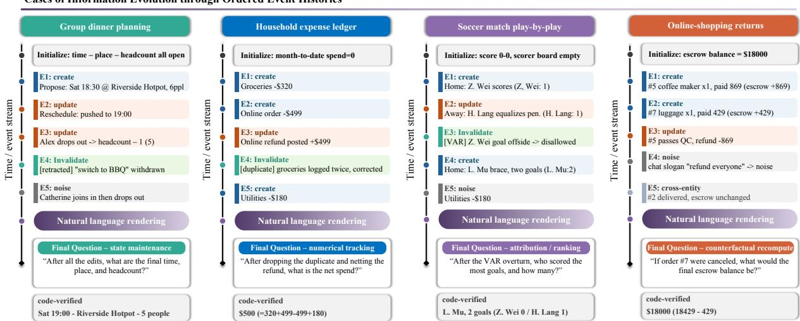
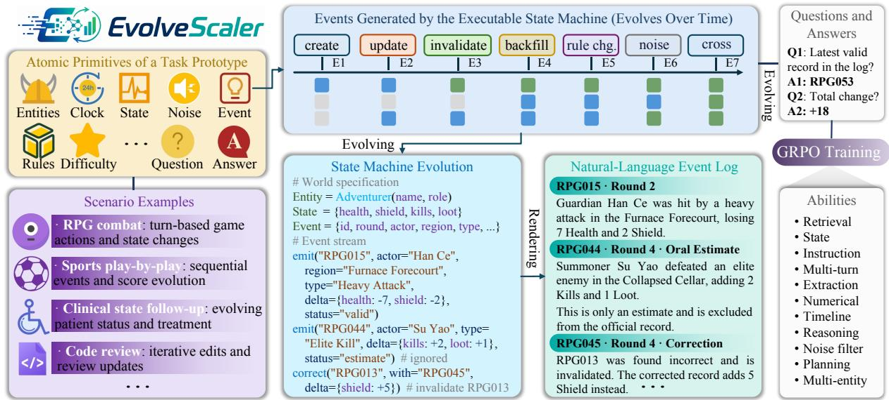
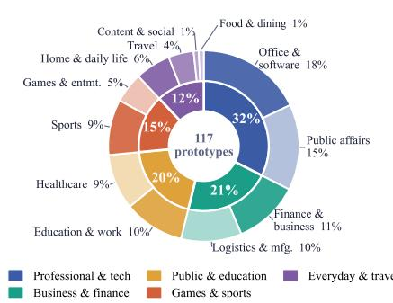
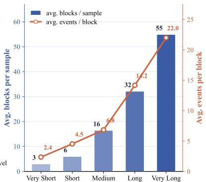
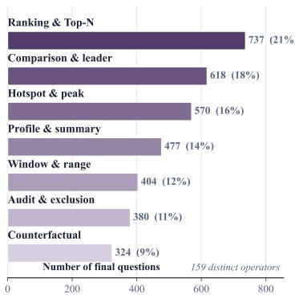
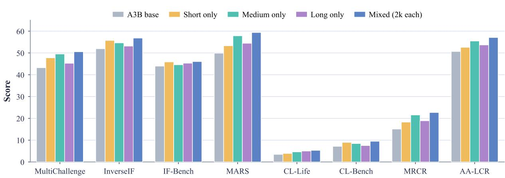

# EvolveScaler: Synthesizing Information-Evolution Contexts via Executable State Machines and Natural-Language Rendering

Ziliang Zhao1,2,∗, Zenan Xu2,∗, Shuting Wang1, Zhao Wang1,2, Bowen Cao1,3, Minda Hu1,3, Lincheng Li2, Pluto Zhou2,†, Zhicheng Dou1,†

1Gaoling School of Artificial Intelligence, Renmin University of China 2LLM Department, Hunyuan Team, Tencent 3The Chinese University of Hong Kong ∗Equal contribution. †Corresponding author.

## Abstract

In persistent interactions, a long context can encode an evolving process rather than a fixed record of facts. Later events can revise or revoke earlier records, changing which information remains valid and what conclusions follow. We refer to this setting as information evolution (IE). Solving an IE task requires identifying valid records, applying updates in order, and reconstructing the query- relevant state from the event history. Constructing reliable IE data is dificult because conventional pipelines generate long-form text before deriving supervision, leaving state transitions implicit and answers dificult to verify. To address this problem, we introduce EvolveScaler, a code-driven framework that defines information evolution in code before rendering it as natural language. Human-authored operational specifications define how events alter state and which records remain valid. They also specify dificulty controls and executable answer logic. A strong LLM synthesizes a self-contained simulator from each specification. Executing a validated simulator produces natural-language, multi-turn event histories, while deterministic replay computes reference answers and atomic checklists. The LLM proposes the executable mechanism, while the replayed program state determines the supervision. We instantiate EvolveScaler with 117 task prototypes and 159 final-question operators. Five controlled dificulty levels jointly increase trajectory scale and evolution complexity, spanning approximately 7 to 1,200 events per instance. The resulting resource contains approximately 35,100 training examples and 585 validated evaluation instances. Using the evaluation instances, we benchmark frontier and open-source models across the five dificulty levels. On the very\_long tier, the strongest model achieves an avg@5 of 59.3%, while six models have avg@5 scores below 10%. To test the training value of the generated data, we train an internal A3B model on 6,000 EvolveScaler examples. The trained model outperforms its base checkpoint on all eight independently constructed out-of-distribution benchmarks, with an average gain of 5.25 points. These results show that code-driven IE synthesis supports both diagnostic evaluation and transferable training supervision.1

## 1 Introduction

As large language models (LLMs) are increasingly expected to support tasks that unfold over extended interactions, they must reason over information introduced as those interactions progress (Dou et al., 2026a;b). However, many long-context and multi-turn task formulations still treat the context as a relatively static snapshot whose task-relevant information remains largely stable while the task is being solved. This view breaks down in persistent settings because information does not merely accumulate. A later update may revise an earlier record and invalidate conclusions drawn from it. Even when the complete interaction history is presented as a fixed input sequence, the context remains semantically dynamic. Its interpretation depends on how successive updates transform the state established so far. Such a context is not merely a longer document to read but an event history to replay. A model must therefore recover the state required by the current query from that ordered history.

We refer to this setting as Information Evolution (IE) and to the resulting context as an information-evolution context (IEC). As Figure 1 illustrates across four domains, diferent final questions request diferent views of the evolving state, but all require the model to resolve record validity and apply updates in order. IE therefore adds a source of dificulty beyond context length or turn count alone. Even when two interactions have comparable context lengths and the same number of turns, their dificulty can difer sharply if one merely accumulates information that remains valid while the other repeatedly revises or invalidates earlier records. Long-context benchmarks have substantially advanced retrieval and reasoning over extended inputs, but many still center on static documents or synthetic retrieval targets (Yang et al., 2025; Bai et al., 2024c; Hsieh et al., 2024; Liu et al., 2024a; Shaham et al., 2023; An et al., 2024). Multi-turn benchmarks primarily examine instruction retention and cross-turn coherence (Zheng et al., 2023; Deshpande et al., 2025; Laban et al., 2026). Although some tasks include corrections or versioned edits (Deshpande et al., 2025), update semantics are rarely formalized as an explicit and controllable part of the task. Existing evaluations therefore do not yet isolate IE systematically across domains and dificulty levels.

  
Figure 1: Four information-evolution scenarios drawn from task prototypes in group dinner planning, a household expense ledger, soccer match play-by-play, and online shopping returns. Across the examples, state updates are interleaved with invalid, state-preserving, and cross-entity records. The final questions probe diferent views of the reconstructed state and span varying dificulty levels; each answer is computed by deterministic replay.

Reliable evaluation and efective training for IE require data built from an explicit specification of how information evolves, with su ervision derived from the same rocess. Conventional s nthesis i elines instead enerate instructions or conversations directly in natural language (Wang et al., 2023; Xu et al., 2023; Ding et al., 2023). For IE, this text-first workflow leaves transition semantics and answer logic implicit, making consistency and correctness increasingly dificult to guarantee as trajectories grow. We therefore reverse the pipeline by defining information evolution in code before rendering it as natural language. In EvolveScaler, a human-authored operational specification defines the state-transition system, record-validity rules, dificulty controls, and executable answer logic for each task prototype. A frontier LLM then synthesizes a self-contained simulator under a fixed generation contract. Only simulators that preserve the annotated constraints and reproduce the same state under deterministic replay are retained. Accepted simulators map each state transition to a corresponding natural-language description according to the specified rendering rules, thereby producing multi-turn event histories, while the underlying program state yields the reference answer and atomic checklist. The LLM thus proposes the executable mechanism, but the program state determines the supervision. This design combines long and mutable contexts, dense and controllable event streams, and deterministically verifiable supervision. Explicit controls over trajectory scale and evolution complexity allow each simulator to span training-oriented warm-ups and evaluation instances that challenge frontier models.

We instantiate the framework at scale with 117 task prototypes authored by more than twenty annotators and spanning twelve themes. The synthesis and validation pipeline yields 117 accepted simulators supporting 159 distinct final-question operators. Sampling these simulators across five tiers that jointly scale trajectory length and evolution complexity produces approximately 35,100 training examples. We generate the held-out pool with a random seed disjoint from training and retain 585 validated examples for model evaluation. We evaluate the resulting data in two intended roles. For evaluation, deterministically computed answers provide a trustworthy basis for comparing information-evolution capability across 14 frontier and open-source LLMs. The median avg@5 falls from 71.2 on the shortest tier to 11.3 on the longest, revealing a sharp loss of reliability as evolution histories grow. For training, independently sampled traces provide scalable code-derived supervision. Continued training on 6,000 examples improves performance on all eight independently constructed out-of-distribution benchmarks and raises their average score by 5.25 points. Because these benchmarks are absent from the training data, the breadth of the gains supports the transfer of state-tracking and evidence-aggregation capabilities to out-of-distribution settings beyond the EvolveScaler task format.

## Our contributions are threefold.

(i) We formulate Information Evolution (IE) as a distinct reasoning setting not captured by context length or turn count alone, and introduce the information-evolution context (IEC), in which models must reconstruct query-relevant state from an ordered event history whose updates can change the validity and consequences of prior information.

(ii) We introduce EvolveScaler, a code-driven synthesis framework that defines information evolution in code before rendering it as natural language. It uses an LLM to synthesize executable simulators from human-authored operational specifications. These simulators preserve the specified state and validity semantics while generating long, mutable histories with controllable dificulty and deterministic supervision.

(iii) We instantiate the framework with 117 task prototypes and 159 final-question operators, and establish the value of the resulting data in its two intended roles. As an evaluation suite, deterministically computed answers support trustworthy comparison across 14 LLMs and reveal a sharp decline in reliability as trajectory scale and evolution complexity increase. As a training source, continued training improves performance on all eight independentl constructed out-of-distribution benchmarks, providing evidence that state-tracking and evidence-aggregation capabilities transfer beyond the EvolveScaler task format.

## 2 Related Work

## 2.1 Long-Context and Multi-Turn Evaluation

Long-context benchmarks study whether models can retrieve, integrate, and reason over evidence distributed across extended inputs. LongBench, SCROLLS, ZeroSCROLLS, L-Eval, LooGLE, InfiniteBench, and HELMET span single- and multi-document question answering, summarization, and other long-text understanding tasks across a range of context lengths (Bai et al., 2024c; Shaham et al., 2022; 2023; An et al., 2024; Li et al., 2024; Zhang et al., 2024). Building on needle-in-a-haystack tests, RULER introduces configurable retrieval tasks together with multi-hop tracing and aggregation (Hsieh et al., 2024). BABILong embeds fact chaining, induction, deduction, counting, and related reasoning tasks within extremely long documents (Kuratov et al., 2024), while LongBench v2 focuses on realistic long-context problems that require deeper understanding and reasoning (Bai et al., 2025). Lost in the Middle further shows that models may fail to use relevant evidence when it appears away from favorable context positions (Liu et al., 2024a). Together, these benchmarks show that accepting a long input does not guarantee reliable use of the information it contains. In many of these settings, however, the context remains fixed during inference. Later records do not typically revise the validity or consequences of earlier evidence.

Multi-turn benchmarks examine failures that emerge when information and instructions are distributed across an interaction. MT-Bench and MT-Bench-101 evaluate multi-turn chat and instruction-following behavior, while Chatbot Arena provides large-scale pairwise preference comparisons of chat models (Zheng et al., 2023; Bai et al., 2024a). IFEval evaluates compliance with programmatically verifiable instructions, and Multi-IF extends this setting to multi-turn and multilingual conversations (Zhou et al., 2023; He et al., 2024). MultiChallenge covers instruction retention, inference memor , versioned editing, and self-coherence (Deshpande et al., 2025). Recent work also shows that tasks that are straightforward when fully specified in one turn can become substantially harder when the same information is revealed over a longer interaction (Laban et al., 2026). These evaluations capture instruction retention, cross-turn de endence, and some forms of revision. Even when revisions are resent, the underlying update semantics are not generally represented as an executable state process with explicit controls over record validity and dificulty. EvolveScaler focuses on this dimension by treating ordered state changes and record-validit rules as art of the task s ecification.

## 2.2 State Tracking, Memory, and Dynamic Environments

Dialogue state tracking is closely related to information evolution because it represents an interaction through successive changes to a dialogue state. DSTC, MultiWOZ, and Schema-Guided Dialogue model updates to slot-based states across turns (Williams et al., 2013; Budzianowski et al., 2018; Rastogi et al., 2020). LoCoMo and Lon MemEval evaluate lon -term conversational memor across extended or multi-session interactions (Maharana et al., 2024; Wu et al., 2024). MemGPT studies how memory can be managed beyond the immediate context window (Packer et al., 2023), while entity-state probing directly tests whether models can infer an entity’s final state after a se uence of state-chan in o erations (Kim & Schuster, 2023). EvolveScaler builds on these concerns but targets histories in which records may be revised, invalidated, backfilled, or mixed with state-preserving noise. It also allows diferent final questions to request diferent views of the reconstructed state from the same underlying process, a capability that previous studies emphasize less.

MARS-Bench is particularly close in its use of event streams. It constructs multi-turn evaluation scenarios from real-world sports play-by-play data and uses these event histories to test complex dependencies across turns (Yang et al., 2025). Its use of real commentary provides naturally occurring event streams. EvolveScaler takes a complementary programmatic approach by encoding the event system itself, allowing trajectory scale, record validity, noise, and question dificulty to be controlled while reference answers remain deterministic. WebArena and �-bench evaluate agents that interact with external web or database-backed environments over multiple steps (Zhou et al., 2024; Yao et al., 2024). Other agent benchmarks cover software-issue resolution, function calling, multi-environment evaluation, and general assistant tasks (Jimenez et al., 2024; Patil et al., 2025; Liu et al., 2024c; Mialon et al., 2024). In interactive environment benchmarks, state management is assessed together with tool use, planning, and action selection. EvolveScaler instead provides the event history as context and focuses on reconstructing and querying the state encoded by that history.

## 2.3 Synthetic Data and Executable Supervision

LLM-generated synthetic data has become an important source of training examples. Self-Instruct, WizardLM, and UltraChat show that model-generated instructions and conversations can improve instruction following and dialogue capabilities (Wang et al., 2023; Xu et al., 2023; Ding et al., 2023). Related work extends this paradigm through instruction tuning, distillation, textbook-style synthesis, prompt-based data generation, and self-play (Taori et al., 2023; Mukherjee et al., 2023; Gunasekar et al., 2023; Xu et al., 2025; Chen et al., 2024; Liu et al., 2024b). These approaches generally construct examples and supervision directly in natural language. They do not typically require an inde endent executable rocess that verifies each state transition and recom utes the tar et answer.

Programmatic datasets and simulator-based environments provide stronger structural guarantees. bAbI, CLEVR, SCAN, PrOntoQA, and ProofWriter derive examples from synthetic worlds, functional programs, or formal rule systems (Weston et al., 2015; Johnson et al., 2017; Lake & Baroni, 2018; Saparov & He, 2022; Tafjord et al., 2021). TextWorld and ALFWorld provide executable interactive environments for training and evaluating agents (Côté et al., 2018; Shridhar et al., 2020). These works rimaril tar et text understandin , com ositional reasonin , visual question answering, formal inference, or agent actions. LongAlign and work on data engineering for 128K contexts introduce data and training recipes that improve the use of extended input sequences (Bai et al., 2024b; Fu et al., 2024). Their rimar oal is to extend lon -context modelin rather than to model how later records alter the validit of earlier information. EvolveScaler assigns diferent responsibilities across the synthesis process. Human-authored operational specifications define state-transition and record-validity semantics together with dificulty controls and answer logic. An LLM synthesizes the executable simulator, while program execution and deterministic replay determine the reference answer and atomic checklist. This design produces natural-language information-evolution histories whose dificulty is controllable and whose supervision remains independently verifiable.

## 3 The EvolveScaler Framework

EvolveScaler follows a code-first design that separates task semantics, executable realization, and supervision. Each task prototype is formalized as a human-authored operational specification Π, which defines how events alter the state, which records remain valid, how dificulty is controlled, and how answers are computed. Conditioned on Π, a strong LLM synthesizes a self-contained simulator $P _ { \Pi }$ under a fixed generation contract. The LLM thus proposes an executable mechanism rather than directly authoring an unverifiable long-form sample. The specification governs the task semantics and dificulty, while the resulting program state determines the supervision. Figure 2 summarizes these roles and their interaction.

A validated simulator represents a family of IE instances rather than a single fixed sample. Varying the random seed, question operator, and dificulty setting changes the realized event history and the requested view of its reconstructed state without changing the underlying task semantics. Each execution renders the event history as a natural-language, multi-turn context and samples a final question. Deterministic replay of the same history yields the reference answer and atomic checklist. The central technical challenge is therefore to synthesize diverse executable simulators while ensuring that their transitions and supervision remain faithful to the operational specification. We next describe how EvolveScaler generates and verifies $P _ { \Pi }$

## 3.1 Code-Driven Simulator Synthesis and Deterministic Supervision

Directly asking an LLM to generate both a long IE trajectory and its target answer makes correctness dificult to verify. The model must preserve the consequences of every update while deriving the answer from the same generated text. As trajectories grow, a local inconsistency can propagate through later updates, while a model-generated answer provides no independent check that the underlying state has been tracked correctly. To address these issues, EvolveScaler shifts the role of the LLM from directly generating trajectories and labels to synthesizing an executable simulator, while program execution determines the supervision.

Executable simulator synthesis. Given an operational specification Π, we prompt a strong LLM to generate a self-contained Python simulator $P _ { \Pi }$ . Rather than directly authoring a long-form instance, the LLM implements the operational semantics encoded by Π under a fixed generation contract. The contract specifies the complete program interface from state initialization and event execution to natural-language rendering and answer computation. Crucially, hard constraints in Π are compiled into transition guards and runtime assertions instead of being left as prose for the LLM to follow implicitly. For example, an inventory-decrement event is legal only when suficient stock remains. A refund must reference a valid earlier payment and cannot exceed its unsettled amount. The simulator therefore enforces legal state evolution during execution rather than attempting to recover consistency from the rendered text afterward.

Program-level verification and deterministic supervision. A generated program may run successfully yet still fail to implement Π faithfully. We retain $P _ { \Pi }$ only if it executes successfully across sampled random seeds, preserves all annotated invariants, reproduces the same state under deterministic replay, and produces an atomic checklist consistent with its reference answer. More than twenty annotators additionally inspect the logical consistency of the synthesized data; this audit finds zero errors in a random sample of 117 instances. For an accepted simulator and random seed $\omega ,$ the execution contract is

  
Figure 2: The EvolveScaler framework. Starting from atomic task primitives, EvolveScaler synthesizes executable state machines that simulate evolving entities, states, and events over time, renders these structured trajectories into diverse natural-language contexts, and automatically produces verifiable question–answer pairs for training and evaluation.

$$
\begin{array} { r } { \mathrm { E x e c } ( P _ { \Pi } ; \omega ) = \bigl ( C _ { \omega } , q _ { \omega } , a _ { \omega } ^ { \star } , \chi _ { \omega } \bigr ) , \qquad a _ { \omega } ^ { \star } = G _ { q _ { \omega } } \bigl ( \mathrm { R e p l a y } _ { \Pi } ( e _ { 1 : T } ; \omega ) \bigr ) , } \end{array}\tag{1}
$$

where $e _ { 1 : T }$ is the generated event history, $C _ { \omega }$ is its rendered natural-language context, $q _ { \omega }$ is the sampled final question, $a _ { \omega } ^ { \star }$ is the reference answer, and $\chi _ { \omega }$ is the corresponding atomic checklist. The executable answer program $G _ { q _ { \alpha } }$ applies the sampled question operator to the state reconstructed through replay. The checklist is derived from the same replayed state and must remain consistent with the reference answer. For counterfactual questions, the replay operator removes the designated subset of events before recomputing the requested state view.

This design separates model-assisted synthesis from ground-truth computation. The LLM determines how the operational specification is realized as an executable program, but the replayed program state determines the reference answer and checklist. Supervision therefore does not rely on a post hoc model judgment over the rendered text, and natural-language variation does not change the underlying answer semantics. The next subsection defines the operational specification Π that constrains simulator synthesis and replay.

## 3.2 Executable Specifications for Information Evolution

The synthesis and verification procedure above is meaningful only if the intended task semantics are defined independently of the LLM-generated simulator. EvolveScaler establishes this semantic reference through a human-authored operational specification Π, which turns each task prototype into an executable contract. Annotators begin from prototypes drawn from process-intensive settings in which records are routinely added, revised, or invalidated. The specification serves two complementary roles. It defines the evolving world that every simulator must preserve, and it defines how that world is queried and scaled into concrete instances. Table 1 summarizes its constituent fields, while Appendix A provides the complete inventory of task prototypes.

Evolution semantics. The first role of Рis to define how information changes over time. It specifies the entities and temporal structure of the process, the admissible event schemas, the state maintained by the simulator, and the rules governing legal transitions, record validity, and state-preserving noise. For an event �� with parameters ��, a state update is admissible only if it satisfies every domain invariant:

$$
s _ { t } = \delta _ { a _ { t } } \bigl ( s _ { t - 1 } ; \theta _ { t } \bigr ) , \qquad g _ { r } \bigl ( s _ { t } \bigr ) \leq 0 , \ : \forall r ,\tag{2}
$$

where each function $g _ { r }$ encodes a domain-specific requirement, such as non-negative inventory, refunds not exceeding prior payments, capacity limits, or precedence constraints. Transition invariants determine whether a proposed event can legally alter the state. Record-validity rules address a diferent question by determining whether a record shown in the context should contribute during replay. A plausible record may still be excluded because it is duplicated, retracted, superseded, or otherwise invalid, while noise records leave the tracked state unchanged. Together, these rules ensure that every generated event has a well-defined state efect and every invalid record has an explicit exclusion rule. The running state is never exposed directly in the rendered context. Individual records reveal only local changes, such as “stock $+ 2 ^ { , , }$ , so the evaluated model must identify which records apply and reconstruct the required state from the event history.

Table 1: Atomic primitives of a task prototype. Examples are drawn from a group-trip shared-expense chat. The last column reports the corresponding inventory measured across all 117 prototypes.
<table><tr><td>Primitive</td><td>What it specifies</td><td>Concrete example (a group-trip expense chat)</td><td>In the corpus</td></tr><tr><td>Entities</td><td>typed actors and objects</td><td>travelers (Ann, Bob, Carl, Dan); expense items (flights, hotel, 3,410 named entities; car rental, meals, tickets); categories (transport, lodging, food)</td><td>median 28 per prototype (range 19–52)</td></tr><tr><td>Clock / block</td><td>temporal granularity</td><td>a trip day or planning round (e.g., “Day 2”, “round 5”), each containing a batch of newly posted messages</td><td>20 distinct clock schemes; 3–55 blocks per sample</td></tr><tr><td>Event schemas</td><td>admissible updates</td><td>add or revise an expense; cancel a booking and issue a refund; add or remove a traveler; confirm a tentative quote</td><td>928 schemas, median 8 each (range 5–15), realized by 2,784</td></tr><tr><td>State variables</td><td>quantities maintained over time</td><td>total trip cost; each traveler&#x27;s paid amount, liability, and balance; category-level spending; confirmed deposits and refundable amounts</td><td>phrasings 549 tracked quantities, median 5 each (range 4–7)</td></tr><tr><td>Transition constraints</td><td>legal state transitions</td><td>a refund cannot exceed the corresponding payment; only current members share a new expense; allocation shares must sum to the expense; confirmed deposits and refundable amounts cannot become negative</td><td>1,852 declared signed updates, median 15 each (range 5–30)</td></tr><tr><td>Validity rules</td><td>records that affect state</td><td>confirmed bookings and receipts are valid; canceled items, fully refunded payments, tentative quotes, duplicated forwards, and superseded screenshots are excluded</td><td>1,019 rules drawn from 756 distinct status labels (404 invalid, 352 valid)</td></tr><tr><td>Noise channels</td><td>state-preserving distractors</td><td>small talk, stickers, hypothetical suggestions, aliases, duplicated messages, and receipts backfilled out of chronological order</td><td>442 distractor templates; out-of-order rate 0.02–0.05</td></tr><tr><td>Difficulty controls</td><td>scalable generation parameters</td><td>number of members, blocks, and events; invalid-record ratio; backfill distance; entity interleaving; counterfactual depth</td><td>five tiers spanning ~7 to ~1,200 events per sample; invalid rate 0.10–0.14</td></tr><tr><td>Question operators</td><td>requested state views</td><td>one of 159 operators: running totals, Top-N spenders, windowed aggregation, invalid-record auditing, comparison, or counterfactual removal</td><td>159 operators in seven families under four groups</td></tr><tr><td>Answer program</td><td>executable supervision</td><td>replay valid events, apply the selected operator to the resulting ledger, and emit both the reference answer and its independently checkable atomic checklist</td><td>117 accepted simulators; 35,100 training examples and 585 held-out evaluation instances</td></tr></table>

Question and dificulty controls. Once the evolution semantics are fixed, the second role of Π is to define how the underlying process becomes a concrete training or evaluation instance. The dificulty controls determine the trajectory length and evolution complexity. A question operator � selects the requested view of the reconstructed state, and an executable answer program $G _ { q }$ computes the corresponding reference answer. Varying the dificulty changes how much information evolution must be processed, while varying � changes what must be recovered from the same underlying process. The same task prototype can therefore support multiple context scales and reasoning demands without changing its state-transition semantics. The next subsection describes how these controls are instantiated together with natural-language rendering to construct the final instances.

## 3.3 Controllable Instance Generation and Corpus Construction

With the evolution semantics fixed, EvolveScaler constructs concrete IE instances at three levels. The question operator and dificulty setting determine which state view must be recovered and how demanding the recovery is. Multi-turn context construction determines how the evolving history is presented to the model. Repeated sampling across simulators and dificulty tiers then produces the final training and held-out corpora.

Instance controls. The final question acts as a controlled probe of the reconstructed state. We define 159 distinct operators organized into seven families under four broader groups covering ranking and comparison, aggregation and profiling, audit and counterfactual reasoning, and localization. Diferent operators induce diferent access patterns over the same event history. Ranking operators compare reconstructed values across entities, windowed operators restrict computation to a selected portion of the trajectory, and counterfactual operators remove designated events before replaying the remainder. Pairing the same underlying process with diferent operators therefore changes what the model must recover without chan in the evolution semantics.

(a) five macro-groups (inner ring) and twelve themes (outer ring)  
  
(b) Trajectory scale across five tiers

  
(c) Final-question distribution by operator family  
Figure 3: Task coverage, trajectory scale, and final-question distribution in EvolveScaler.

The dificult settin determines how much information evolution the model must process. We define five ordered tiers that jointly scale the number of blocks, events per block, invalid-record rate, backfill distance, entity interleaving, and counterfactual depth. The resulting instances span approximately 7 to 1,200 events per sample. Question operators and dificulty settings thus play complementary roles. Question operators determine the requested state view, whereas dificulty settings determine how dificult it is to reconstruct that view. Several operator families require multi-step numerical or relational computation over the reconstructed state (Cobbe et al., 2021; Wei et al., 2022). Appendix B summarizes the final-question bank and provides representative operators and questions.

Multi-turn context construction. Given a confirmed parameter set, each simulator execution is rendered as a fixed natural-lan ua e, multi-turn context. The s stem messa e states the task-s ecific trackin and validit conventions, and each user turn contributes a new block of events. Some turns also contain an intermediate question followed by a code-derived stage-wise response generated by the simulator. These intermediate question–response pairs are included as fixed parts of the context to illustrate the expected question–answer format. They are neither generated b the evaluated model nor scored durin evaluation. At evaluation time, the model receives the com lete rendered context and is asked to answer only the final question, which requires integrating the full event history.

The renderer interleaves valid records with invalidated, out-of-order, and state-preserving distractor records without exposing the running state directly. The model must therefore determine which records apply and reconstruct the state required by the final question. Each final question is paired with the code-derived reference answer and atomic checklist defined in Section 3.1. The checklist decomposes the expected answer into independently verifiable claims, enabling response evaluation without requiring the judge to replay the complete history. Appendix D provides worked examples of the resulting format, including one event history queried through all seven question families.

Corpus construction. We apply this controlled generation process to 117 accepted simulators spanning 12 themes under five macro-groups. For each simulator and dificulty tier, we sample 60 training instances and one held-out instance. This produces approximately 35,100 training examples and 585 generated held-out examples, with 7,020 training examples and 117 held-out examples in each tier. Figure 3 summarizes the resulting corpus in terms of task-theme coverage, context scale, and final-question distribution.

## 4 Experiments

We evaluate EvolveScaler in its two intended roles and further analyze the failure modes exposed by the evaluation suite. We first describe the evaluation rotocol for the held-out data in Section 4.1, followed b a com arison of 14 frontier and open-source LLMs in Section 4.2. We then use the training subsets for continued training and evaluate transfer to ei ht inde endentl constructed out-of-distribution benchmarks in Section 4.3. Finall , Section 4.4 examines the main error patterns in failed responses.

## 4.1 Evaluation Setup

At evaluation time, each model receives the complete rendered multi-turn dialogue, including simulator-generated intermediate question–response pairs from earlier turns. These pairs are fixed in the input and serve as in-context examples of the expected question–answer format. Only the model’s response to the final user question is scored. Each response is evaluated against its code-derived atomic checklist. The checklist judge receives only the final user question, the candidate response, and the checklist. It does not see the preceding dialogue, and its role is limited to determining whether the specified atomic claims are satisfied. We use gpt-oss-120b with its default inference parameters as the checklist judge; Appendix C provides the exact grading template.

Table 2: Frontier and open-source models on EvolveScaler (%; er se uence-len th tier and overall, each as ass@5 / av @5). Best er column in bold, second best underlined; rows are sorted b overall av @5. VS / S / M / L / VL = very\_short / short / medium / long / very\_long. The bottom two rows summarize each column across all 14 models.
<table><tr><td rowspan="2">Model</td><td colspan="2">VS</td><td colspan="2">S</td><td colspan="2">M</td><td colspan="2">L</td><td colspan="2">VL</td><td colspan="2">Average</td></tr><tr><td>p@5</td><td>a@5</td><td>p@5</td><td>a@5</td><td>p@5</td><td>a@5</td><td>p@5</td><td>a@5</td><td>p@5</td><td>a@5</td><td>p@5</td><td>a@5</td></tr><tr><td>GPT-5.5-xhigh</td><td>83.8</td><td>78.5</td><td>83.8</td><td>76.4</td><td>79.5</td><td>76.6</td><td>85.5</td><td>73.2</td><td>81.2</td><td>59.3</td><td>82.7</td><td>72.8</td></tr><tr><td>GPT-5.5-high</td><td>87.2</td><td>81.7</td><td>82.9</td><td>75.2</td><td>79.5</td><td>73.8</td><td>83.8</td><td>69.7</td><td>75.2</td><td>47.5</td><td>81.7</td><td>69.6</td></tr><tr><td>GPT-5.5-medium</td><td>83.8</td><td>77.9</td><td>87.2</td><td>75.7</td><td>79.5</td><td>74.2</td><td>77.8</td><td>62.7</td><td>59.8</td><td>37.9</td><td>77.6</td><td>65.7</td></tr><tr><td>Gemini-3.1-Pro</td><td>84.6</td><td>74.5</td><td>81.2</td><td>67.5</td><td>75.2</td><td>59.8</td><td>61.5</td><td>42.2</td><td>47.0</td><td>27.5</td><td>69.9</td><td>54.3</td></tr><tr><td>Hy-3-high</td><td>84.6</td><td>72.1</td><td>88.0</td><td>74.4</td><td>78.6</td><td>63.6</td><td>73.5</td><td>39.7</td><td>34.2</td><td>19.8</td><td>71.8</td><td>53.9</td></tr><tr><td>DeepSeek-V4-Preview-Pro</td><td>83.8</td><td>66.2</td><td>82.9</td><td>62.2</td><td>74.4</td><td>52.5</td><td>67.5</td><td>40.0</td><td>56.4</td><td>29.7</td><td>73.0</td><td>50.1</td></tr><tr><td>GLM-5.2</td><td>86.3</td><td>76.6</td><td>82.9</td><td>70.6</td><td>75.2</td><td>48.7</td><td>45.3</td><td>21.5</td><td>26.5</td><td>12.5</td><td>63.2</td><td>46.0</td></tr><tr><td>Qwen3.5-Plus-Thinking</td><td>80.3</td><td>62.7</td><td>75.2</td><td>64.8</td><td>72.6</td><td>51.6</td><td>35.0</td><td>22.2</td><td>16.2</td><td>10.1</td><td>55.9</td><td>42.3</td></tr><tr><td>GLM-5.1</td><td>86.3</td><td>74.9</td><td>83.8</td><td>68.0</td><td>64.1</td><td>38.8</td><td>25.6</td><td>13.7</td><td>16.2</td><td>9.6</td><td>55.2</td><td>41.0</td></tr><tr><td>Hy3-Preview-high</td><td>86.3</td><td>70.3</td><td>80.3</td><td>70.4</td><td>68.4</td><td>42.2</td><td>26.5</td><td>14.4</td><td>10.3</td><td>5.1</td><td>54.4</td><td>40.5</td></tr><tr><td>Doubao-2.0-Pro-high</td><td>71.8</td><td>59.1</td><td>71.8</td><td>63.4</td><td>65.0</td><td>49.4</td><td>28.2</td><td>16.8</td><td>12.8</td><td>9.1</td><td>49.9</td><td>39.6</td></tr><tr><td>Doubao-1.8-high</td><td>76.1</td><td>59.0</td><td>75.2</td><td>65.6</td><td>52.1</td><td>35.0</td><td>17.1</td><td>11.5</td><td>12.8</td><td>8.4</td><td>46.7</td><td>35.9</td></tr><tr><td>Doubao-2.0-Pro-medium</td><td>75.2</td><td>60.3</td><td>71.8</td><td>60.7</td><td>37.6</td><td>27.5</td><td>16.2</td><td>9.4</td><td>9.4</td><td>4.8</td><td>42.1</td><td>32.5</td></tr><tr><td>Doubao-1.8-medium</td><td>73.5</td><td>60.0</td><td>71.8</td><td>61.5</td><td>35.9</td><td>21.2</td><td>12.8</td><td>7.5</td><td>11.1</td><td>6.2</td><td>41.0</td><td>31.3</td></tr><tr><td>Average</td><td>81.7</td><td>69.6</td><td>79.9</td><td>68.3</td><td>67.0</td><td>51.1</td><td>46.9</td><td>31.8</td><td>33.5</td><td>20.5</td><td>61.8</td><td>48.2</td></tr><tr><td>Median</td><td>83.8</td><td>71.2</td><td>82.1</td><td>67.8</td><td>73.5</td><td>50.5</td><td>40.2</td><td>21.9</td><td>21.4</td><td>11.3</td><td>59.6</td><td>44.1</td></tr></table>

Question sampling is controlled separately from sequence length. Within each task prototype, final questions are sampled uniformly from its available question operators at every tier, keeping the operator mix and the associated question-dificulty distribution broadly balanced across tiers. We evaluate five ordered sequence-length tiers: very\_short, short, medium, long, and very\_long. Longer sequences contain more events and require models to integrate more state transitions, increasing state-reconstruction and reasoning complexity and thereby making the instances more dificult. Reasoning-efort variants are identified explicitly in the model names in Table 2; all other inference parameters use the same settings supplied by the model provider. Every input fits within the evaluated model’s supported context window and is processed without truncation.

We report performance using two complementary metrics, pass@5 and avg@5. A response passes only when it satisfies every item in its atomic checklist, in which case it receives a binary value of 1; all other responses receive 0. The pass@5 metric is the proportion of instances for which at least one of five independently generated responses receives 1. The avg@5 metric is the average of these five binary values, computed across all instances. Pass@5 indicates whether a model can solve an instance at least once, whereas avg@5 reflects response-level reliability.

## 4.2 Evaluation with Frontier and Open-Source LLMs

Table 2 compares frontier and open-source models across five dificulty tiers. GPT-5.5-xhigh achieves the best overall performance, with a pass@5 of 82.7 and an avg@5 of 72.8. Performance declines sharply as the tiers jointly increase trajectory scale and evolution complexity. At each tier, we compute the median of the avg@5 scores across all evaluated models. This value falls from 71.2 on very\_short to 67.8 on short, 50.5 on medium, 21.9 on long, and 11.3 on very\_long. The decline becomes especially pronounced on the two hardest tiers. Six models score below an avg@5 of 10 on very\_long. Only the three GPT-5.5 variants exceed an avg@5 of 30, while DeepSeek-V4-Preview-Pro is close at 29.7. These results show that EvolveScaler covers a broad and unsaturated dificulty range. Its easier tiers remain relatively tractable, while its hardest tiers continue to challenge even the strongest models.

The harder tiers also provide substantially greater separation among models. The range of avg@5 scores spans only 59.0–81.7 on very\_short, but widens to 7.5–73.2 on long and 4.8–59.3 on very\_long. GPT-5.5-xhigh and GLM-5.1, for example, difer by only 3.6 points on very\_short, where they score 78.5 and 74.9, but by 49.7 points on very\_long, where they score 59.3 and 9.6. The harder tiers therefore do more than lower overall performance. They expose substantial diferences in models’ ability to reconstruct evolving state; these diferences remain largely hidden on easier instances. This increased separation gives EvolveScaler greater diagnostic value for comparing frontier and open-source models.

The harder tiers further reveal model behavior that is not captured by an overall score alone. On very\_long, GPT-5.5-medium achieves a pass@5 of 59.8 and an avg@5 of 37.9. The corresponding scores are 56.4 and 29.7 for DeepSeek-V4-Preview-Pro, 34.2 and 19.8 for H -3-high, and 26.5 and 12.5 for GLM-5.2. These diferences distinguish models that can occasionally produce a successful response under repeated sampling from those that do so reliabl . Within the GPT-5.5 famil , the three reasonin -efort variants remain close on the first three tiers but diverge on the harder tiers. Avg@5 increases from 62.7 to 69.7 and 73.2 on long, and from 37.9 to 47.5 and 59.3 on very\_long, as reasoning efort increases from medium to high and xhigh. Together, these results show that the harder tiers reveal both diferences in response reliability and, within the GPT-5.5 family, gains from increased reasoning efort that remain less visible on easier instances.

Table 3: Out-of-distribution generalization of continued training on EvolveScaler (%). An internal A3B model under oes continued trainin on 200 / 2,000 / 6,000 EvolveScaler sam les and is evaluated on ei ht held-out benchmarks. Best per column in bold; Avg. is the unweighted mean across benchmarks, and the last row is the gain over the base.
<table><tr><td>Training setting</td><td>MultiChallenge</td><td>InverseIF</td><td>IF-Bench</td><td>MARS</td><td>CL-Life</td><td>CL-Bench</td><td>MRCR</td><td>AA-LCR</td><td>Avg.</td></tr><tr><td>Internal A3B model (base)</td><td>43.22</td><td>51.93</td><td>43.95</td><td>49.88</td><td>3.46</td><td>7.15</td><td>15.09</td><td>50.67</td><td>33.17</td></tr><tr><td>+ EVOLVESCALER (200)</td><td>46.28</td><td>53.51</td><td>43.06</td><td>55.09</td><td>4.32</td><td>8.21</td><td>19.31</td><td>54.99</td><td>35.60</td></tr><tr><td>+ EVOLVESCALER (2,000)</td><td>48.23</td><td>55.04</td><td>46.53</td><td>57.23</td><td>4.57</td><td>9.48</td><td>21.74</td><td>56.80</td><td>37.45</td></tr><tr><td>+ EVOLVESCALER (6,000)</td><td>50.55</td><td>56.82</td><td>46.05</td><td>59.38</td><td>5.31</td><td>9.48</td><td>22.68</td><td>57.08</td><td>38.42</td></tr><tr><td>∆ (6,000-base)</td><td>+7.33</td><td>+4.89</td><td>+2.10</td><td>+9.50</td><td>+1.85</td><td>+2.33</td><td>+7.59</td><td>+6.41</td><td>+5.25</td></tr></table>

  
Figure 4: Training-length composition at a fixed 6,000-example budget. Each single-tier setting uses 6,000 examples from one tier, whereas the mixed setting uses 2,000 examples from each of the short, medium, and long tiers. The mixed-length setting achieves the strongest performance on all eight benchmarks.

## 4.3 Training Generalization of EvolveScaler

We continue training an internal A3B model using the GRPO algorithm on mixed-tier EvolveScaler examples and evaluate transfer on eight independently constructed benchmarks whose instances are absent from the training data. These benchmarks include MultiChallen e (Deshpande et al., 2025), InverseIF (Zhan et al., 2026), IF-Bench (Pyatkin et al., 2026), MARS (Yang et al., 2025), CL-Life (Dou et al., 2026a), CL-Bench (Dou et al., 2026b), MRCR (Vodrahalli et al., 2024), and AA-LCR (Team, 2025). Table 3 compares the base model with continued-training settings using 200, 2,000, and 6,000 examples.

The avera e score across the ei ht benchmarks increases monotonicall with trainin scale. It rises from 33.17 for the base model to 35.60, 37.45, and 38.42, yielding a total gain of 5.25 points at 6,000 examples. The first 200 examples improve the average by 2.43 points, followed by additional gains of 1.85 and 0.97 points. At 6,000 examples, performance exceeds the base model on all eight benchmarks. The largest gains occur on MARS (+9.50), MRCR (+7.59), MultiChallenge (+7.33), and AA-LCR (+6.41). The remaining benchmarks also improve, with gains of 4.89 on InverseIF, 2.33 on CL-Bench, 2.10 on IF-Bench, and 1.85 on CL-Life. Because none of these benchmark instances is included in the continued-training data, the broad gains provide evidence that the benefits of EvolveScaler supervision extend beyond its own task format.

To examine the efect of length composition independently of the total training budget, Figure 4 shows the base model and compares three single-tier training sets with a mixed-length set under the same 6,000-example budget. The mixed set contains 2,000 examples from each of the short, medium, and long tiers. It achieves the strongest performance on all eight benchmarks, while the single-tier settings exhibit benchmark-dependent trade-ofs. This pattern suggests that exposure to multiple trajectory scales provides complementary supervision.

Table 4: Distribution of semantic error types across representative models (% of semantic failures; blank/refusal outputs excluded). Each failure is assigned one primary type according to the first atomic checklist item it fails to satisfy.
<table><tr><td>Model</td><td>Invalid-Record Handling (%)</td><td>Retrieval &amp; Counting (%)</td><td>Net-Change Aggregation (%)</td><td>Ranking &amp; Tie-Breaking (%)</td><td>Comparison Verdict (%)</td></tr><tr><td>GPT-5.5-xhigh</td><td>4.5</td><td>18.4</td><td>46.2</td><td>29.8</td><td>1.1</td></tr><tr><td>Gemini-3.1-Pro</td><td>2.0</td><td>16.8</td><td>50.7</td><td>21.9</td><td>8.5</td></tr><tr><td>Hy-3-high</td><td>4.7</td><td>20.1</td><td>49.6</td><td>22.5</td><td>3.1</td></tr><tr><td>DeepSeek-V4-Preview-Pro</td><td>2.9</td><td>19.3</td><td>48.6</td><td>20.7</td><td>8.5</td></tr><tr><td>GLM-5.2</td><td>5.0</td><td>21.1</td><td>50.3</td><td>22.4</td><td>1.3</td></tr><tr><td>Qwen3.5-Plus-Thinking</td><td>4.4</td><td>17.3</td><td>55.6</td><td>19.2</td><td>3.5</td></tr><tr><td>GLM-5.1</td><td>5.5</td><td>17.7</td><td>53.8</td><td>20.3</td><td>2.8</td></tr><tr><td>Hy3-Preview-high</td><td>4.8</td><td>19.7</td><td>53.3</td><td>19.6</td><td>2.5</td></tr><tr><td>Doubao-2.0-Pro-high</td><td>4.3</td><td>17.3</td><td>52.9</td><td>19.4 19.3</td><td>6.1</td></tr><tr><td>Doubao-1.8-high</td><td>4.9</td><td>17.2</td><td>55.9</td><td></td><td>2.6</td></tr></table>

## 4.4 Error Analysis

Pass@5 and avg@5 summarize whether a model succeeds, but they do not show where a failed response breaks down. We therefore manually inspect failed responses across models and question operators. Each semantic failure receives one primary label according to the first atomic checklist item it fails to satisfy. Invalid-Record Handling marks cases in which the model constructs the wrong set of valid records. Retrieval & Counting covers cases in which relevant records are omitted or irrelevant records are included. Net-Change Aggregation applies when the selected records are appropriate but their signed efects are combined incorrectly. Ranking & Tie-Breaking captures errors in ordering or deterministic tie resolution. Comparison Verdict covers cases in which the underlying values are correct but the winner or margin is wrong or missing. We do not add a generic calculation category because nearly every EvolveScaler query requires computation. Formatting errors are negligible; blank outputs and refusals are excluded. Table 4 reports the distribution of these primary labels for ten models.

Net-Change Aggregation is the largest error category for every reported model and accounts for roughly half of the labeled semantic failures. Its share is lowest for GPT-5.5-xhigh at 46.2% and highest for Doubao-1.8-high at 55.9%. Retrieval & Counting falls within the narrower range of 16.8%–21.1%. Together, these two categories constitute at least 64.6% and as much as 73.1% of the labeled failures. Most observed errors therefore surface when models select the records that contribute to the reconstructed state or combine the signed efects of those records. Ranking & Tie-Breaking is also substantial. It accounts for at least 19.2% of the labeled failures and reaches 29.8% for GPT-5.5-xhigh. Notably, GPT-5.5-xhigh has both the lowest share of Net-Change Aggregation errors and the highest share of Ranking & Tie-Breaking errors. This combination shows that deterministic ordering and tie resolution remain prominent in the residual errors of the strongest model. By contrast, Invalid-Record Handling never exceeds 5.5%, and Comparison Verdict does not exceed 8.5%. Because each response receives only the label associated with its first violated checklist claim, these proportions should not be interpreted as independent error rates. An early validity error may later appear as a retrieval, counting, or aggregation failure. Even with this limitation, the analysis shows that code-derived atomic checklists provide a structured view of where failures surface during state reconstruction and downstream computation. This gives EvolveScaler diagnostic value beyond pass@5 and avg@5 alone and reveals where information evolution remains most dificult.

## 5 Conclusion

We introduced EvolveScaler, a code-driven framework for s nthesizin data that tar ets information evolution in long, multi-turn interactions. In these settings, the context is not merely a document to read but an event history whose ordered updates must be replayed to recover the state required by the final question. EvolveScaler begins with human-authored operational specifications that define state transitions, record validity, dificulty controls, and answer logic. A strong LLM compiles each specification into an executable simulator, but the replayed program state, rather than the LLM, determines the supervision. Simulator execution produces natural-language event histories, while deterministic replay yields reference answers and atomic checklists. This separation allows varied natural-language realizations while keeping the underlying semantics and ground truth under executable control. The resulting resource comprises 117 task prototypes and 159 final-question operators across five dificulty tiers.

As an evaluation suite, EvolveScaler remains challenging for frontier and open-source models. As trajectory scale and evolution complexity increase, the median of the models’ avg@5 scores falls from 71.2 on very\_short to 11.3 on very\_long, and the harder tiers reveal substantially larger performance diferences among models. As a training source, EvolveScaler supports continued training of an internal A3B model on 6,000 examples using the GRPO algorithm, improving performance on all eight independently constructed out-of-distribution benchmarks and raising their average score by 5.25 points. The code-derived atomic checklists further show that many labeled failures surface during record selection, net-change aggregation, and tie-aware ranking. Together, these findings show that reasoning over evolving information remains dificult for current models and that executable synthesis can support both diagnostic evaluation and transferable training supervision. The current framework focuses on discrete, programmatically specified state transitions. Extending it to partially observed, continuous, and multimodal settings remains an important direction for future work.

## References

Chenxin An, Shansan Gong, Ming Zhong, Xingjian Zhao, Mukai Li, Jun Zhang, Lingpeng Kong, and Xipeng Qiu. L-eval: Instituting standardized evaluation for long context language models. In Proceedings ofthe 62nd Annual Meeting ofthe Associationfor Computational Linguistics (Volume 1: Long Papers), pp. 14388–14411, 2024.

Ge Bai, Jie Liu, Xingyuan Bu, Yancheng He, Jiaheng Liu, Zhanhui Zhou, Zhuoran Lin, Wenbo Su, Tiezheng Ge, Bo Zheng, et al. Mt-bench-101: A fine-grained benchmark for evaluating large language models in multi-turn dialogues. In Proceedings ofthe 62nd Annual Meeting ofthe Associationfor Computational Linguistics (Volume 1: Long Papers), pp. 7421–7454, 2024a.

Yushi Bai, Xin Lv, Jiajie Zhang, Yuze He, Ji Qi, Lei Hou, Jie Tang, Yuxiao Dong, and Juanzi Li. Longalign: A recipe for long context alignment of large language models. In Findings ofthe Associationfor Computational Linguistics: EMNLP 2024, pp. 1376–1395, 2024b.

Yushi Bai, Xin Lv, Jiajie Zhang, Hongchang Lyu, Jiankai Tang, Zhidian Huang, Zhengxiao Du, Xiao Liu, Aohan Zeng, Lei Hou, et al. Longbench: A bilingual, multitask benchmark for long context understanding. In Proceedings of the 62nd annual meeting of the association for computational linguistics (volume 1: Long papers), pp. 3119–3137, 2024c.

Yushi Bai, Shangqing Tu, Jiajie Zhang, Hao Peng, Xiaozhi Wang, Xin Lv, Shulin Cao, Jiazheng Xu, Lei Hou, Yuxiao Dong, et al. Longbench v2: Towards deeper understanding and reasoning on realistic long-context multitasks. In Proceedings ofthe 63rd Annual Meeting ofthe Associationfor Computational Linguistics (Volume 1: Long Papers), pp. 3639–3664, 2025.

Paweł Budzianowski, Tsung-Hsien Wen, Bo-Hsiang Tseng, Iñigo Casanueva, Stefan Ultes, Osman Ramadan, and Milica Gasic. Multiwoz-a large-scale multi-domain wizard-of-oz dataset for task-oriented dialogue modelling. In Proceedings ofthe 2018 conference on empirical methods in natural language processing, pp. 5016–5026, 2018.

Zixiang Chen, Yihe Deng, Huizhuo Yuan, Kaixuan Ji, and Quanquan Gu. Self-play fine-tuning converts weak language models to strong language models. arXiv preprint arXiv:2401.01335, 2024.

Karl Cobbe, Vineet Kosaraju, Mohammad Bavarian, Mark Chen, Heewoo Jun, Lukasz Kaiser, Matthias Plappert, Jerry Tworek, Jacob Hilton, Reiichiro Nakano, et al. Training verifiers to solve math word problems. arXiv preprint arXiv:2110.14168, 2021.

Marc-Alexandre Côté, Akos Kádár, Xingdi Yuan, Ben Kybartas, Tavian Barnes, Emery Fine, James Moore, Matthew Hausknecht, Layla El Asri, Mahmoud Adada, et al. Textworld: A learning environment for text-based games. In Workshop on computer games, pp. 41–75. Springer, 2018.

Kaustubh Deshpande, Ved Sirdeshmukh, Johannes Baptist Mols, Lifeng Jin, Ed-Yeremai Hernandez-Cardona, Dean Lee, Jeremy Kritz, Willow E Primack, Summer Yue, and Chen Xing. Multichallenge: A realistic multi-turn conversation evaluation benchmark challenging to frontier llms. In Findings ofthe Associationfor Computational Linguistics: ACL 2025, pp. 18632–18702, 2025.

Ning Ding, Yulin Chen, Bokai Xu, Yujia Qin, Shengding Hu, Zhiyuan Liu, Maosong Sun, and Bowen Zhou. Enhancing chat language models by scaling high-quality instructional conversations. In Proceedings of the 2023 Conference on Empirical Methods in Natural Language Processing, pp. 3029–3051, 2023.

Shihan Dou, Yujiong Shen, Chenhao Huang, Junjie Ye, Jiayi Chen, Junzhe Wang, Qianyu He, Shichun Liu, Changze Lv, Jiahang Lin, et al. Cl-bench life: Can language models learn from real-life context? arXiv preprin arXiv:2604.27043, 2026a.

Shihan Dou, Ming Zhang, Zhangyue Yin, Chenhao Huang, Yujiong Shen, Junzhe Wang, Jiayi Chen, Yuchen Ni, Junjie Ye, Cheng Zhang, et al. Cl-bench: A benchmark for context learning. arXiv preprint arXiv:2602.03587, 2026b.

Yao Fu, Rameswar Panda, Xinyao Niu, Xiang Yue, Hannaneh Hajishirzi, Yoon Kim, and Hao Peng. Data engineering for scaling language models to 128k context. arXiv preprint arXiv:2402.10171, 2024.

Suriya Gunasekar, Yi Zhang, Jyoti Aneja, Caio César Teodoro Mendes, Allie Del Giorno, Sivakanth Gopi, Mojan Javaheripi, Piero Kaufmann, Gustavo de Rosa, Olli Saarikivi, et al. Textbooks are all you need. arXiv preprint arXiv:2306.11644, 2023.

Yun He, Di Jin, Chaoqi Wang, Chloe Bi, Karishma Mandyam, Hejia Zhang, Chen Zhu, Ning Li, Tengyu Xu, Hongjiang Lv, et al. Multi-if: Benchmarking llms on multi-turn and multilingual instructions following. arXiv preprint arXiv:2410.15553, 2024.

Cheng-Ping Hsieh, Simeng Sun, Samuel Kriman, Shantanu Acharya, Dima Rekesh, Fei Jia, Yang Zhang, and Boris Ginsburg. Ruler: What’s the real context size of your long-context language models? arXiv preprin arXiv:2404.06654, 2024.

Carlos E Jimenez, John Yang, Alexander Wettig, Shunyu Yao, Kexin Pei, Ofir Press, and Karthik Narasimhan. Swe-bench: Can language models resolve real-world github issues? In International Conference on Learning Representations, volume 2024, pp. 54107–54157, 2024.

Justin Johnson, Bharath Hariharan, Laurens Van Der Maaten, Li Fei-Fei, C Lawrence Zitnick, and Ross Girshick. Clevr: A diagnostic dataset for compositional language and elementary visual reasoning. In Proceedings ofthe IEEE conference on computer vision and pattern recognition, pp. 2901–2910, 2017.

Najoung Kim and Sebastian Schuster. Entity tracking in language models. In Proceedings of the 61st Annual Meeting ofthe Associationfor Computational Linguistics (Volume 1: Long Papers), pp. 3835–3855, 2023.

Yuri Kuratov, Aydar Bulatov, Petr Anokhin, Ivan Rodkin, Dmitry Sorokin, Artyom Sorokin, and Mikhail Burtsev. Babilong: Testing the limits of llms with long context reasoning-in-a-haystack. Advances in Neural Information Processing Systems, 37:106519–106554, 2024.

Philippe Laban, Hiroaki Hayashi, Yingbo Zhou, and Jennifer Neville. Llms get lost in multi-turn conversation. In International Conference on Learning Representations, volume 2026, pp. 54738–54778, 2026.

Brenden Lake and Marco Baroni. Generalization without systematicity: On the compositional skills of sequence- to-sequence recurrent networks. In International conference on machine learning, pp. 2873–2882. PMLR, 2018.

Jiaqi Li, Mengmeng Wang, Zilong Zheng, and Muhan Zhang. Loogle: Can long-context language models understand long contexts? In Proceedings ofthe 62nd Annual Meeting ofthe Associationfor Computational Linguistics (Volume 1: Long Papers), pp. 16304–16333, 2024.

Nelson F Liu, Kevin Lin, John Hewitt, Ashwin Paranjape, Michele Bevilacqua, Fabio Petroni, and Percy Liang. Lost in the middle: How language models use long contexts. Transactions ofthe associationfor computational linguistics, 12:157–173, 2024a.

Ruibo Liu, Jerry Wei, Fangyu Liu, Chenglei Si, Yanzhe Zhang, Jinmeng Rao, Steven Zheng, Daiyi Peng, Diyi Yang, Denny Zhou, et al. Best practices and lessons learned on synthetic data. arXiv preprint arXiv:2404.07503, 2024b.

Xiao Liu, Hao Yu, Hanchen Zhang, Yifan Xu, Xuanyu Lei, Hanyu Lai, Yu Gu, Hangliang Ding, Kaiwen Men, Kejuan Yang, et al. Agentbench: Evaluating llms as agents. In International Conference on Learning Representations, volume 2024, pp. 52989–53046, 2024c.

Adyasha Maharana, Dong-Ho Lee, Sergey Tulyakov, Mohit Bansal, Francesco Barbieri, and Yuwei Fang. Evaluating very long-term conversational memory of llm agents. In Proceedings ofthe 62ndAnnual Meeting ofthe Association for Computational Linguistics (Volume 1: Long Papers), pp. 13851–13870, 2024.

Grégoire Mialon, Clémentine Fourrier, Thomas Wolf, Yann LeCun, and Thomas Scialom. Gaia: a benchmark for general ai assistants. In International Conference on Learning Representations, volume 2024, pp. 9025–9049, 2024.

Subhabrata Mukherjee, Arindam Mitra, Ganesh Jawahar, Sahaj Agarwal, Hamid Palangi, and Ahmed Awadallah. Orca: Progressive learning from complex explanation traces of gpt-4. arXiv preprint arXiv:2306.02707, 2023.

Charles Packer, Sarah Wooders, Kevin Lin, Vivian Fang, Shishir G Patil, Ion Stoica, and Joseph E Gonzalez. Memgpt: Towards llms as operating systems. arXiv preprint arXiv:2310.08560, 2023.

Shishir G Patil Huanzhi Mao Fanjia Yan Charlie Chen -Jie Ji Vishnu Suresh Ion Stoica and Jose h E Gonzalez. The berkeley function calling leaderboard (bfcl): From tool use to agentic evaluation of large language models. In Forty-second International Conference on Machine Learning, 2025.

Valentina Pyatkin, Saumya Malik, Victoria Graf, Hamish Ivison, Shengyi Huang, Pradeep Dasigi, Nathan Lambert, and Hanna Hajishirzi. Generalizing verifiable instruction following. Advances in Neural Information Processing Systems, 38, 2026.

Abhinav Rastogi, Xiaoxue Zang, Srinivas Sunkara, Raghav Gupta, and Pranav Khaitan. Towards scalable multi- domain conversational agents: The schema-guided dialogue dataset. In Proceedings ofthe AAAI conference on artificial intelligence, volume 34, pp. 8689–8696, 2020.

Abulhair Saparov and He He. Language models are greedy reasoners: A systematic formal analysis of chain-of- thou ht. arXiv preprint arXiv:2210.01240, 2022.

Uri Shaham, Elad Segal, Maor Ivgi, Avia Efrat, Ori Yoran, Adi Haviv, Ankit Gupta, Wenhan Xiong, Mor Geva, Jonathan Berant, et al. Scrolls: Standardized comparison over long language sequences. In Proceedings ofthe 2022 Conference on Empirical Methods in Natural Language Processing, pp. 12007–12021, 2022.

Uri Shaham, Maor Ivgi, Avia Efrat, Jonathan Berant, and Omer Levy. Zeroscrolls: A zero-shot benchmark for long text understanding. In Findings ofthe Associationfor Computational Linguistics: EMNLP 2023, pp. 7977–7989, 2023.

Mohit Shridhar, Xingdi Yuan, Marc-Alexandre Côté, Yonatan Bisk, Adam Trischler, and Matthew Hausknecht. Alfworld: Aligning text and embodied environments for interactive learning. arXiv preprint arXiv:2010.03768, 2020.

Oyvind Tafjord, Bhavana Dalvi, and Peter Clark. Proofwriter: Generating implications, proofs, and abductive statements over natural language. In Findings of the association for computational linguistics: ACL-IJCNLP 2021, pp. 3621–3634, 2021.

Rohan Taori, Ishaan Gulrajani, Tianyi Zhang, Yann Dubois, Xuechen Li, Carlos Guestrin, Percy Liang, and Tatsunori B Hashimoto. Stanford alpaca: An instruction-following llama model, 2023.

Artificial Analysis Team. Artificial analysis long context reasoning benchmark(lcr), 2025.

Kiran Vodrahalli, Santia o Ontanon, Nilesh Tri uraneni, Kelvin Xu, Sanil Jain, Rakesh Shivanna, Jefre Hui, Nishanth Dikkala, Mehran Kazemi, Bahare Fatemi, et al. Michelangelo: Long context evaluations beyond haystacks via latent structure queries. arXiv preprint arXiv:2409.12640, 2024.

Yizhong Wang, Yeganeh Kordi, Swaroop Mishra, Alisa Liu, Noah A Smith, Daniel Khashabi, and Hannaneh Hajishirzi. Self-instruct: Aligning language models with self-generated instructions. In Proceedings ofthe 61st annual meeting ofthe associationfor computational linguistics (volume 1: long papers), pp. 13484–13508, 2023.

Jason Wei, Xuezhi Wang, Dale Schuurmans, Maarten Bosma, Fei Xia, Ed Chi, Quoc V Le, Denny Zhou, et al. Chain-of-thought prompting elicits reasoning in large language models. Advances in neural information processing systems, 35:24824–24837, 2022.

Jason Weston, Antoine Bordes, Sumit Chopra, Alexander M Rush, Bart Van Merriënboer, Armand Joulin, and Tomas Mikolov. Towards ai-complete question answering: A set of prerequisite toy tasks. arXiv preprint arXiv:1502.05698, 2015.

Jason D Williams, Antoine Raux, Deepak Ramachandran, and Alan W Black. The dialog state tracking challenge. In Proceedings of the SIGDIAL 2013 Conference, pp. 404–413, 2013.

Di Wu, Hongwei Wang, Wenhao Yu, Yuwei Zhang, Kai-Wei Chang, and Dong Yu. Longmemeval: Benchmarking chat assistants on long-term interactive memory. arXiv preprint arXiv:2410.10813, 2024.

Can Xu, Qingfeng Sun, Kai Zheng, Xiubo Geng, Pu Zhao, Jiazhan Feng, Chongyang Tao, and Daxin Jiang. Wizardlm: Empowering large language models to follow complex instructions. arXiv e-prints, pp. arXiv–2304, 2023.

Zhangchen Xu, Fengqing Jiang, Luyao Niu, Yuntian Deng, Radha Poovendran, Yejin Choi, and Bill Yuchen Lin. Magpie: Alignment data synthesis from scratch by prompting aligned llms with nothing. In International Conference on Learning Representations, volume 2025, pp. 76346–76382, 2025.

Chenghao Yang, Yinbo Luo, Zhoufutu Wen, Qi Chu, Tao Gong, Longxiang Liu, Kaiyuan Zhang, Jianpeng Jiao, Ge Zhang, Wenhao Huang, et al. Mars-bench: A multi-turn athletic real-world scenario benchmark for dialogue evaluation. In EMNLP (Findings), pp. 5872–5898, 2025.

Shunyu Yao, Noah Shinn, Pedram Razavi, and Karthik Narasimhan. ���-bench: A benchmark for tool-agent-user interaction in real-world domains. arXiv preprint arXiv:2406.12045, 2024.

Qinyan Zhang, Xinping Lei, Ruijie Miao, FU YU, Haojie Fan, Le Chang, Jiafan Hou, Dingling Zhang, Zhongfei Hou, FEI HU, et al. Inverse ifeval: Can llms unlearn stubborn training conventions to follow real instructions? In International Conference on Learning Representations, volume 2026, pp. 129040–129063, 2026.

Xinrong Zhang, Yingfa Chen, Shengding Hu, Zihang Xu, Junhao Chen, Moo Hao, Xu Han, Zhen Thai, Shuo Wang, Zhiyuan Liu, et al. Infinite bench: Extending long context evaluation beyond 100k tokens. In Proceedings of the 62nd Annual Meeting of the Association for Computational Linguistics (Volume 1: Long Papers), pp. 15262–15277, 2024.

Lianmin Zheng, Wei-Lin Chiang, Ying Sheng, Siyuan Zhuang, Zhanghao Wu, Yonghao Zhuang, Zi Lin, Zhuohan Li, Dacheng Li, Eric Xing, et al. Judging llm-as-a-judge with mt-bench and chatbot arena. Advances in neural information processing systems, 36:46595–46623, 2023.

Jefrey Zhou, Tianjian Lu, Swaroop Mishra, Siddhartha Brahma, Sujoy Basu, Yi Luan, Denny Zhou, and Le Hou. Instruction-following evaluation for large language models. arXiv preprint arXiv:2311.07911, 2023.

Shuyan Zhou, Frank F Xu, Hao Zhu, Xuhui Zhou, Robert Lo, Abishek Sridhar, Xianyi Cheng, Tianyue Ou, Yonatan Bisk, Daniel Fried, et al. Webarena: A realistic web environment for building autonomous agents. In International Conference on Learning Representations, volume 2024, pp. 15585–15606, 2024.

## A Task Domains

The 117 EvolveScaler prototypes span 12 themes under five macro-groups, deliberately covering registers in which information genuinely accumulates and mutates over time. Table 5 lists all 117 prototypes, grouped exactly as in Figure 3(a). The distribution is deliberately uneven: process-intensive registers, where records are filed, revised, and retracted as a matter of routine, carry more prototypes than registers in which information mostly accumulates without being corrected.

Table 5: The 117 task prototypes of EvolveScaler, grouped into 12 themes under five macro-groups. Counts in parentheses give the number of prototypes.
<table><tr><td>Macro-group</td><td>Theme</td><td>Prototypes</td></tr><tr><td>Professional &amp; tech (38)</td><td>Office &amp; software (21)</td><td>Annotation QC log; API spec revisions; CI/CD deployment log; Cloud cost optimization; Code review thread; Data pipeline incident; Dataset curation log; Design feedback stream; Energy grid event stream; IoT device logs; Localization changes; Network routing changes; PRD revision flow; Project versioned editing; Prompt iteration log; Release notes revisions; Sensor stream monitoring; Server outage timeline; Slide deck revision; Taxonomy building flow; UX research notes</td></tr><tr><td></td><td>Public affairs (17)</td><td>Archival timeline notes; Committee voting thread; Compliance audit flow; Contract negotiation; Court docket updates; Detective case board; Diplomacy negotiation log; Election count updates; Emergency coordination chat; Fire response timeline; Historical policy process; Legal discovery timeline; Legislative amendments; Museum collection log; Online moderation queue; Security incident response; Treaty clause tracking</td></tr><tr><td>Business &amp; finance (25)</td><td>Finance &amp; business (13)</td><td>Ad campaign budgeting; Auction bidding log; Budget revision thread; Expense reconciliation; Fundraising donor log; Insurance claims flow; Invoice matching queue; Loan portfolio updates; Procurement bid process; Real estate listing updates; Sales CRM pipeline; Subscription churn log; Trading ledger updates</td></tr><tr><td></td><td>Logistics &amp; mfg. (12)</td><td>Farm irrigation log; Flight disruption updates; Food delivery dispatch; Logistics dispatch board; Manufacturing line log; Route planning log; Shipment route tracking; Survival resource log; Traffic count stream; Train timetable changes; Warehouse inventory ops; Weather station updates</td></tr><tr><td>Public &amp; education (23)</td><td>Education &amp; work (12)</td><td>Classroom forum planning; Classroom gradebook; Debate score flow; Grant review queue; Hiring pipeline flow; Job application pipeline; Lab experiment log; Library lending records; Literature review coding; Parent-teacher thread; Peer review process; Study group quiz</td></tr><tr><td></td><td>Healthcare (11)</td><td>Ambulance dispatch log; Clinic queue management; Clinical trial visit log; Hospital triage queue; Lab results tracker; Medication inventory; Nutrition log updates; Public health case trace; Rehab session log; Symptom tracker stream; Vaccination booking flow</td></tr><tr><td>Games &amp; sports (17)</td><td>Sports (11)</td><td>Sim racing telemetry; Badminton rally; Baseball inning; Basketball play-by-play; Handball attack; Ice hockey shift; Rugby phase; Soccer timeline; Table tennis points; Tennis point log; Volleyball rally</td></tr><tr><td></td><td>Games &amp; entmt. (6)</td><td>Board game moves; Card game turns; Chess-like match log; Escape room clues; Puzzle hunt progress; Roleplay RPG combat</td></tr><tr><td>(14)</td><td>Everyday &amp; travel Home &amp; daily life (7)</td><td>Apartment chores chat; Conference scheduling; Customer chat preferences; Group chat scheduling; Multiplayer strategy chat; Spreadsheet ledger rows; Survey</td></tr><tr><td></td><td>Travel (5)</td><td>collection stream City walking tour; Conference travel plan; Hotel booking thread; Itinerary</td></tr><tr><td></td><td></td><td>constraints; Travel group discussion</td></tr><tr><td></td><td>Content &amp; social (1) Food &amp; dining (1)</td><td>Editorial board chat Restaurant planning chat</td></tr></table>

## B The Final-Question Bank

Table 6 details the bank of 159 final-question operators, grouped into seven families under four groups. Each row ives exam le o erator names and a re resentative ( ara hrased) uestion; shares are calculated over 3,510 final questions randomly sampled from the training set.

Table 6: The final-question bank. There are seven families under four groups in total. Example operator names and a representative question of each family are shown in the table.
<table><tr><td>Group</td><td>Family (share)</td><td>Example operators</td><td>Example question (paraphrased)</td></tr><tr><td>Ranking &amp; comparison</td><td>Ranking / Top-N (21%)</td><td>event_type_actor_leaderboard, component_rank_top_n_metric</td><td>Counting only confirmed records, rank the top-3 accounts by spend—what are the values?</td></tr><tr><td></td><td>Comparison &amp; leader (18%)</td><td>actor_target_dual_metric, actor_ best_target_dual</td><td>Compare accounts A and B on remaining budget and spend; which has the higher remaining budget?</td></tr><tr><td>Aggregation &amp; profiling</td><td>Profile &amp; summary (14%)</td><td>actor_full_trajectory, actor_ event_type_breakdown</td><td>Summarize actor X&#x27;s valid trajectory: current metrics and the latest valid record ID?</td></tr><tr><td></td><td>Window &amp; range (12%)</td><td>event_type_window_summary, recent_window_actor_leader</td><td>Over batches 1–5 only, what is the net change in pending-invoices and remaining budget?</td></tr><tr><td>Audit &amp; counterfactual</td><td>Audit &amp; exclusion (11%) Counterfactual</td><td>invalid_exclusion_with_total, event_type_total_recount counterfactual_remove_actor,</td><td>Which records are invalid? After excluding them, what is the overall valid alert count? Counterfactual: dropping all valid records</td></tr><tr><td></td><td>(9%)</td><td>counterfactual_remove_target</td><td>of account X, what is the remaining valid pending-invoice total?</td></tr><tr><td>Localization</td><td>Hotspot &amp; peak (16%)</td><td>actor_target_hotspot, busiest_ turn_for_event_type</td><td>Which project has the most valid “budget top-up&quot; records, and what is its net spend change?</td></tr></table>

## C Checklist-Judge Template

We use gpt-oss-120b with its default inference parameters as the checklist judge. A response is assigned 1 only when every checklist item is satisfied, and 0 otherwise. For each instance, avg@5 is the mean of these binary values across five independently generated responses; pass@5 is 1 if at least one of the five responses receives 1, and 0 otherwise. The following grading template is supplied verbatim for every candidate response:

From now on, your role is a rigorous instruction-following grader. Your task is to grade the student's answer precisely according to the <Scoring Checklist>.

\## Scoring Principle

Every requirement in the <Scoring Checklist> is equally important and carries the same weight. When determining the final score, you must consider all requirements in the checklist jointly. A student answer that violates multiple requirements should receive a lower score, while a student answer that satisfies all requirements should receive a higher score.

\## Grading Procedure

You must strictly follow the steps below and must not skip any part.

\### Step 1: Analyze the reference criteria

\* List all explicit requirements in the <Scoring Checklist> one by one (including format, content, quantity, order, etc.).

\* Identify the implicit requirements in the <Scoring Checklist> (such as language style or logical structure).

\* Define concrete evaluation standards for each requirement (for example: \`\`must include X'', \`\`must not exceed Y'').

\### Step 2: Check the student answer against each requirement

\* For each requirement in the <Scoring Checklist>, verify one by one whether the student answer fully satisfies it.

\### Step 3: Self-reflection

Before giving the final score, you must conduct the following checks:

\* Completeness check: Have all requirements in the <Scoring Checklist> been reviewed without omission?

\* Strictness check: Did you adhere to the standard of \`\`fully satisfied'' without relaxing the requirements based on subjective judgment?

\* Consistency check: Are the scoring rationale and the final score logically consistent?

\* Objectivity check: Is the judgment based on objective evidence rather than subjective speculation?

\## Output Format Requirements

Your output must contain exactly three parts: [Scoring Rationale], [Requirement Satisfaction Status List], and [Score]. Do not output any additional content. The output format must be exactly as follows:

<begin\_of\_Scoring\_Rationale>xxx<end\_of\_Scoring\_Rationale>

<begin\_of\_Requirement\_Satisfaction\_Status\_List>[x\_1, x\_2, ..., x\_i, ..., x\_n] (where n is the total number of requirements in the <Scoring Checklist>, and x\_i indicates whether the student answer satisfies the i-th requirement; each x\_i must be either 0 or 1.)<end\_of\_Requirement\_Satisfaction\_Status\_List>

<begin\_of\_Score>x points (The score must be an integer from 0 to 10. Please assign an overall quality score between 0 and 10 based on the degree to which the student answer satisfies the requirements. If all requirements are violated, assign 0. If all requirements are satisfied, assign 10.)<end\_of\_Score>

## I hope you can fulfill the role of a grading teacher well, because this is very important to my work. If you do well, I will   
give you an appropriate reward. Otherwise, I may impose an appropriate penalty. The formal question is as follows:   
<Question>:   
{question}   
<Scoring Checklist>:   
{checklist}   
<Student Answer>:   
{response}

## D Worked Evolution Examples

This appendix gives three abridged samples drawn from diferent registers, together covering all seven final-question families. In every case, the answer does not appear in any single line of the log; it can only be recovered by replaying the trace and dropping the invalid records. Example 2 additionally shows the same trace answered under all seven families, which is the mechanism by which one prototype yields many distinct reasoning demands.

## D.1 Example 1: an editorial pitch group (audit & exclusion)

Table 7 shows one abridged short-tier sample. Only formally confirmed messages count; old screenshots, hearsay, mock drafts, tests, and retracted messages are invalid.

Table 7: A worked evolution example (editorial pitch group; short tier, abridged and translated).

System. Track an editorial pitch group. Answer only from formally confirmed messages, post-meeting syncs, and schedule   
entries; re-meetin brainstorm, old schedule screenshots, unverified hearsa , mock sam les, tests, and retracted messa es do no   
count.   
Turn 1 (user). Newl confirmed: • T01-E01 (Da 1 09:00, old screenshot): itch “indie-café deliver ” assed; assed- itch   
+1. [superseded] • T01-E02 (09:07, schedule s nc): Tan fla s a risk on “old-bookstore ni ht lo ”; risk-fla s +1. • T01-E03   
(09:14, schedule sync): a to-do added—“subway breakfast-cart” still needs materials; pending-material +1. Q: over all valid   
“risk report” records, what is the change in risk-flags, and who contributed most? Assistant: +1; top contributor Tang.   
Turn 2 (user). Newly synced: • T02-E01 (09:21): materials completed for “dorm-AC dispute”; pending-material −1. • T02-E02   
(09:28): materials completed for “old-bookstore”; pending-material −1, risk-flags −1. • T02-E03 (09:35, old screenshot): pitch   
“subway breakfast-cart” passed. [superseded] • T02-E04 (09:42, post-meeting confirm): “old-bookstore” scheduled to Han;   
scheduled +1. Q (same as before). Assistant: +1; top contributor Tang.   
Turn 3 (user). • T03-E01 (09:49): Tang reports a new execution risk on “old-bookstore”; risk-flags +1. • T03-E02 (09:56):   
ush back the “subwa breakfast-cart” release; scheduled −1. • T03-E03 (10:03, confirm): “indie-café” slotted into the next   
issue; scheduled +1. Q: total valid risk-flag count sofar? Assistant: 1.   
Final question (audit & exclusion). Which records are invalid? After excluding them, what is the overall valid pending-material   
count?   
Checklist (code-derived). (1) invalid records = T01-E01, T02-E03; (2) overall valid pending-material count = −1.   
Code-verified answer. Invalid: T01-E01, T02-E03 (old screenshots). Excluding them, the pending-material count is −1: +1   
(T01-E03) −1 (T02-E01) −1 (T02-E02); the two screenshots touch only passed-pitch and are dropped.

## D.2 Example 2: a warehouse shift board, answered seven ways

Table 8 shows a medium-tier trace from warehouse inventory operations. Four crews act on four SKU-locations with five tracked metrics. Table 9 then poses one final question from each of the seven familiesfor this same trace. The context never changes; only the requested view of the reconstructed state does.

Table 8: A warehouse shift board (warehouse inventory operations; medium tier, abridged and translated).

System. Track a warehouse shift board across receiving, put-away, picking, and replenishment. Only WMS-posted, floor-re-checked, supervisor-confirmed, and stock-control-confirmed records count; drill tasks, retracted scans, old count drafts, and test waves do not. Running metrics: inbound units, outbound units, relocated units, pending discrepancy, exceptions.

Wave 1 (user). • W1-R1 (08:10, WMS posted): East Dock Receiving books in A1-03 bottled water; inbound +120. • W1-R2 (08:18, drill task): Night Picking ships B1-05 jasmine tea; outbound +80. [drill] • W1-R3 (08:25, floor re-checked): West Rack Put-away replenishes A2-11 tissue packs; inbound +45, relocated +45. • W1-R4 (08:33, WMS posted): Night Picking picks A1-03 bottled water; outbound +60. Q: over all valid receipts, what is the change in inbound units? Assistant: +165.

Wave 2 (user). • W2-R1 (09:02, supervisor confirmed): Cold-chain Replenishment books in D4-08 detergent; inbound +90. • W2-R2 (09:09, old count draft): East Dock Receivin lo s a count ap on A1-03; pendin discrepanc +12. [superseded] • W2-R3 (09:15, WMS posted): East Dock Receiving finds a count gap on A2-11; pending discrepancy +18, exceptions +1. • W2-R4 (09:24, stock-control confirmed): Night Picking ships B1-05 jasmine tea; outbound +75. • W2-R5 (09:31, floor re-checked): West Rack Put-awa relocates A1-03; relocated +30. Q (same as before). Assistant: +255.

Wave 3 (user). • W3-R1 (10:05, WMS posted): East Dock Receiving clears the A2-11 gap; pending discrepancy −18. • W3-R2 (10:12, retracted scan): Cold-chain Replenishment ships D4-08; outbound +40. [retracted] • W3-R3 (10:20, supervisor confirmed): Night Picking recovers a mis-pick on A1-03; outbound −15, exceptions +1. • W3-R4 (10:28, WMS posted): Cold-chain Replenishment ships D4-08 detergent; outbound +55. • W3-R5 (10:36, floor re-checked): West Rack Put-away replenishes B1-05 jasmine tea; inbound +60, relocated +60. Q: total valid exceptions sofar? Assistant: 2.

Hidden state after replay (valid records only; never shown to the model). Inbound 315, outbound 175, relocated 135, pending discrepancy 0, exceptions 2. Invalid: W1-R2, W2-R2, W3-R2.

Table 9: One trace, seven final questions. Each row applies a diferent operator family to the identical log in Table 8; every answer is computed by replay, not judged.
<table><tr><td>Family</td><td>Final question (paraphrased)</td><td>Code-verified answer</td></tr><tr><td>Ranking / Top-N</td><td>Counting only valid records, rank the top-3 crews by inbound units.</td><td>East Dock Receiving 120; West Rack Put-away 105; Cold-chain Replenishment 90.</td></tr><tr><td>Comparison &amp; leader</td><td>Compare West Rack Put-away and Cold-chain Replenishment on inbound and outbound units.</td><td>West Rack leads inbound (105 vs. 90); Cold-chain leads outbound (55 vs. 0).</td></tr><tr><td>Profile &amp; summary</td><td>Summarize Night Picking&#x27;s valid trajectory and give its latest valid record.</td><td>Outbound 120, exceptions 1, all other metrics 0; latest valid record W3-R3.</td></tr><tr><td>Window &amp; range</td><td>Over waves 2–3 only, what is the net change in outbound units and pending discrepancy?</td><td>Outbound +115 (+75 – 15 + 55); pending discrepancy 0 (+18 then -18).</td></tr><tr><td>Audit &amp; exclusion</td><td>Which records are invalid? After excluding them, Invalid: W1-R2 (drill), W2-R2 (old draft), W3-R2 what is the total outbound?</td><td>(retracted). Total outbound 175.</td></tr><tr><td>Counterfactual</td><td>Dropping all valid records of Night Picking, what 55: only W3-R4 survives, since Night Picking is the remaining outbound?</td><td>contributed +60 + 75 – 15 = 120 of the 175.</td></tr><tr><td>Hotspot &amp; peak</td><td>Which SKU-location carries the most valid records, and what is its inbound?</td><td>A1-03 bottled water, with 4 valid records; its inbound is 120.</td></tr></table>

## D.3 Example 3: a clinical-trial follow-up log (profile and comparison)

Table 10 shows a short-tier trace from a diferent register, in which the sources of invalid records are training drills and screenshot replays rather than stale screenshots or drills on a shop floor.

Table 10: A clinical-trial follow-up log (clinical trial visit log; short tier, abridged and translated).

System. Track a clinical-trial follow-up log across visit stations. Only signed-and-entered, investigator-confirmed, EDC-locked, and monitor-reviewed records count; old drafts, training drills, verbal transcriptions, retracted records, and screenshot replays do not. Running metrics: completed items, pending re-review, risk flags, waiting minutes.

Visit day 1 (user). • V1-R1 (signed & entered): subject Han completes the vitals room; completed items +1. • V1-R2 (training drill): subject Zhou completes the blood draw; completed items +1. [drill] • V1-R3 (investigator confirmed): a risk is reported for Han at the blood draw; risk fla s +1, endin re-review +1. • V1-R4 (si ned & entered): subject Chen waits lon er at the check-in desk; waiting +25 min. Q: how many valid completed items sofar? Assistant: 1.

Visit day 2 (user). • V2-R1 (EDC locked): Han’s blood-draw data passes review; pending re-review −1. • V2-R2 (screenshot replay): Han completes the ECG room; completed items +1. [replay] • V2-R3 (monitor review passed): subject Zhou completes the ECG room; completed items +1. • V2-R4 (signed & entered): a protocol deviation is filed for Chen at the investigator ofice; risk flags +1, pending re-review +1. • V2-R5 (investigator confirmed): subject Zhou waits longer at the vitals room; waiting +15 min.

Final question A (profile & summary). Summarize subject Han’s valid trajectory: current metrics and the latest valid record.   
Code-verified answer. Com leted items 1, risk fla s 1, endin re-review 0 (raised b V1-R3, cleared b V2-R1), waitin 0 min;   
latest valid record V2-R1. The ECG entr V2-R2 is a screenshot re la and does not count.

Final question B (comparison & leader). Compare subjects Chen and Zhou on completed items and risk flags. Code-verified answer. Zhou leads completed items (1 vs. 0; Zhou’s day-1 blood draw was a training drill and is dropped, but V2-R3 counts). Chen leads risk flags (1 vs. 0) and is the only subject with an open pending re-review.