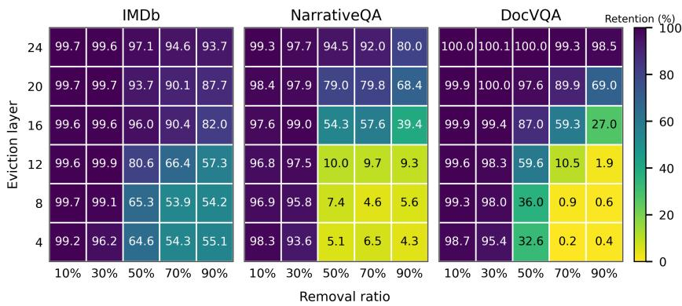
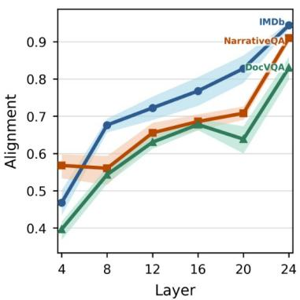
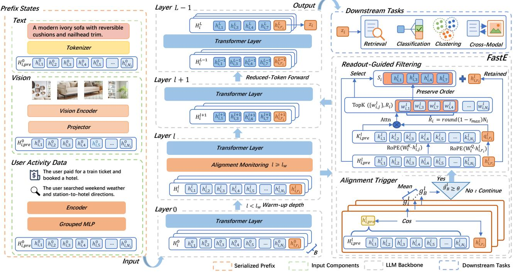
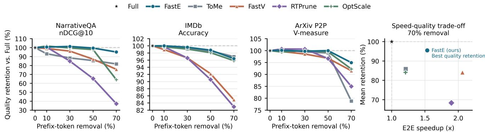
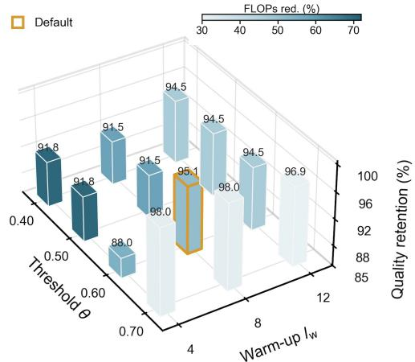
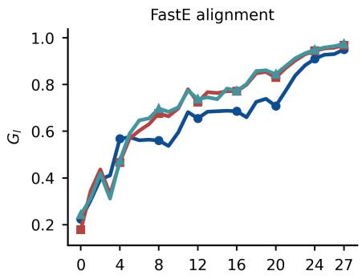
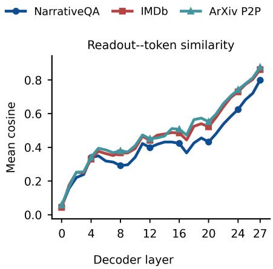
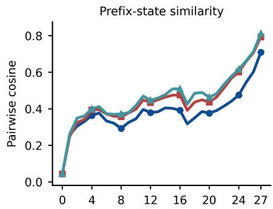
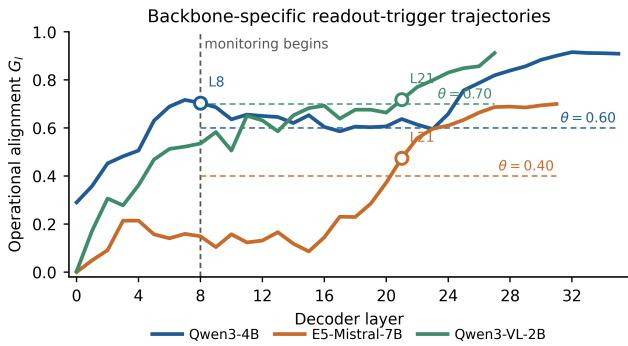

# FastE: Readout-Triggered Token Compression for LLM Embedding Inference

Jinsong Shu1,4, Jinyong Wen2, Baokun Wang2, Zhongle Xie1∗

Lidan Shou3,4, Weiqiang Wang2, Gang Chen1

1Zhejiang University 2Ant Group

3The State Key Laboratory of Blockchain and Data Security, Zhejiang University

4Hangzhou High-Tech Zone (Binjiang) Institute of Blockchain and Data Security

## Abstract

In this study, we identify depth-dependent prefix redundancy in final-readout LLM embedding models, notably across representative backbones including Qwen3-Embedding and Qwen3-VL-Embedding. We find that removing prefix states is substantially more damaging in shallow layers than at greater depth, showing that prefix states become increasingly compressible as the prefix and readout states propagate through the network. To this end, we introduce FastE, a training-free, plug-and-play method. FastE uses a shared fixed threshold on batch-mean readout–prefix alignment as a lightweight online heuristic for selecting when compression occurs, and ranks prefix states by the attention scores they receive from the readout position to determine which states are retained in subsequent layers. Our evaluations demonstrate FastE’s ability to substantially reduce computational costs: on NarrativeQA with Qwen3-Embedding-0.6B, it reduces decoder-backbone FLOPs by 40.11% while retaining 99.53% of Full Forward nDCG@10. Across five text embedding benchmarks, two backbone scales, and three cross-modal retrieval tasks, the quality–eficiency trade-of is directly customizable through the maximum removal ratio without retraining. We believe FastE ofers practical value for scalable embedding generation in retrieval, indexing, clustering, and multimodal representation systems.

## Introduction

Embeddings are vector representations that support retrieval, indexing, classification, and clustering across text and multimodal applications (Manzoor et al. 2023; Opitz et al. 2025). Large language model (LLM)-based embedding models have recently become strong general-purpose embedding backbones by transferring the semantic capabilities of pretrained LLMs to embedding tasks for sequence inputs (Zhang et al. 2025b; Lee et al. 2025; Wang et al. 2024a; BehnamGhader et al. 2024; Muennighof et al. 2025).

We focus on final-readout LLM embedding models, which serialize each input as a prefix followed by an end-ofsequence (EOS) or dedicated readout token and process it with causal attention. The hidden state at this final position, namely readout state, develops layer by layer and ultimately yields the sequence embedding. The preceding serialized input forms the serializedprefix and its layer-wise hidden states, which are called prefix states, provide the context absorbed by the readout state. Note that standard inference propagates both through the transformer stack.

For long serialized prefixes, this joint propagation becomes computationally expensive. In an anonymized production workload, processing 450 million inputs with a mean valid serialized-prefix length of 732 tokens using an instruction-tuned LLM embedding model requires approximately 6 hours on 300 L20 GPUs. A natural response is prefix-state filtering, which shortens subsequent computation by removing selected prefix states. Attention-based pruning and token merging provide such reduction operators, but commonly apply them at fixed depths or rely on modalityspecific signals (Chen et al. 2024; Zhang et al. 2025a; Yang et al. 2025a; Huang et al. 2024). Key–value (KV) cache compression instead selects past states for future autoregressive queries (Xiao et al. 2023; Li et al. 2024), yet its decoding objective does not characterize how prefix states support a single readout state as it develops through depth. Hence, these limitations leave a central question: are prefix states equally necessary in shallow and deep layers?

Our controlled depth-wise interventions reveal a clear answer: no, prefix-state removal causes substantially less performance loss in deeper layers. We call this empirical pattern depth-dependent prefix redundancy, in which prefix states that are important during shallow computation become more compressible after further contextualization. As Figure 1(a) quantifies: at 50% prefix-state removal, the performance drop decreases from 35.4–94.9% at layer 4 to 0–5.5% at layer 24 across the three evaluated settings. Furthermore, the depth at which removal incurs limited performance loss varies across task–backbone settings, making a single fixed trigger layer less reliable across settings. To identify an online signal for this depth efect, Figure 1(b) traces readout–prefix alignment, the cosine similarity between the readout state and the mean prefix-state representation, across depth. The alignment trajectories generally increase with depth, suggesting a lightweight heuristic for identifying when prefix-state compression becomes better tolerated without treating alignment as causal proof of redundancy.

Guided by these findings, we introduce FastE, a trainingfree method that decomposes prefix-state compression into two decisions: when compression should begin and which prefix states should be retained. To decide when compression should begin, FastE preserves the full serialized prefix during an initial warm-up and uses a fixed threshold on batch-mean readout–prefix alignment, shared across the reported text tasks, to select the online trigger layer. To decide which prefix states should be retained, FastE applies readoutguided attention-score ranking at the first threshold crossing and performs one-shot prefix compression to the configured prefix-state budget while preserving the readout position, causal order, and original position identifiers. Across five text tasks and two Qwen3-Embedding scales, FastE outperforms transferred baselines under matched prefix-state budgets, while Qwen3-VL-Embedding and E5-Mistral results provide initial evidence across modalities and model architectures. On NarrativeQA with Qwen3-Embedding-0.6B, FastE retains 99.53% of Full Forward nDCG@10 while reducing decoder-backbone FLOPs by 40.11% and achieving a 1.363× measured end-to-end speedup. Together, the depthwise finding, the readout-guided when/which design, and the measured quality–eficiency evaluation constitute the paper’s main contributions.

  
(a) Performance retention

  
(b) Readout–prefix alignment  
Figure 1: Depth-wise prefix compressibility in final-readout LLM embedding inference. (a) Performance retention across removal ratios and eviction layers; later eviction better preserves quality under aggressive removal. (b) Readout–prefix alignment across depth for three task–backbone settings.

## Related Work

Final-readout LLM embedding models. Final-readout LLM embedding models derive the sequence embedding from the final-layer state of an EOS or dedicated readout token, whose causal attention covers the serialized prefix (Wang et al. 2024b; Zhang et al. 2025b) Postgeneration mean pooling can improve representations in general-purpose language models (Wang, Isola, and Cheung 2026), while trainable final-layer pooling provides another aggregation architecture (Tang and Yang 2024). FastE instead accelerates representation construction in final-readout LLM embedding models by filtering prefix states and does not assume transfer to pooling architectures.

Autoregressive inference and KV-cache compression. Long-context generation methods retain attention sinks, heavy hitters, selected prompt tokens, or compressed KV entries to reduce repeated decoding after prompt encoding (Xiao et al. 2023; Li et al. 2024); HybridKV extends this regime to multimodal generation (Zeng et al. 2026).

FastE addresses a diferent regime: embedding inference performs one forward pass to produce one sequence embedding, and prefix-state filtering reduces attention and feed-forward (MLP) computation in subsequent transformer blocks.

Sequence reduction during representation construction. For encoder-only sentence embedding, attention-based pruning aggregates importance across query positions and removes tokens at fixed layers (Qi et al. 2024). Multimodal reduction methods use fixed or progressive schedules, visual or cross-modal signals, pre-LLM selection, adaptive information flow, or token merging (Chen et al. 2024; Zhang et al. 2025a; Yang et al. 2025b; Wan et al. 2026; Tong et al. 2025; Xing et al. 2025; Bolya et al. 2023; Shang et al. 2025; Alvar et al. 2025; Jiang et al. 2025; Ye et al. 2025). FastE difers by using the evolving readout state to determine both the trigger layer and the retained prefix states, without relying on visual structure or another modality-specific signal.

## Method

## Problem Formulation

We consider a final-readout LLM embedding model that processes serialized inputs with causal attention. Given a sample $x _ { i }$ containing one or more modalities, the model first maps each input component to an initial sequence of vectors. A tokenizer and the model’s token embedding layer process text, a pretrained vision encoder and its projector process images, and structured inputs are serialized into the same embedding space. The resulting vectors, together with textual instructions and special tokens, are concatenated into a unified sequence and processed by the LLM backbone (Li et al. 2026). FastE operates on this unified hidden-state sequence after serialization.

For sample i, let $r _ { i }$ denote the position of the readout token, whose final-layer hidden state is normalized to obtain the sequence embedding. Depending on the backbone, the readout token may be the model’s existing sequence-ending token (e.g., EOS) or a dedicated token introduced for embedding extraction. The $N _ { i }$ positions preceding $r _ { i }$ form the serialized prefix, and the forward pass is

  
Figure 2: Overview of FastE for final-readout LLM embedding inference. FastE preserves the full serialized prefix during warm-up and monitors batch-mean readout–prefix alignment. At the first threshold crossing, readout-guided attention-score ranking reduces the prefix to the target prefix-state budget; subsequent transformer layers process the shortened sequence while preserving the readout position and causal order, reducing their computation.

$$
\begin{array} { r l } & { \quad H _ { i } ^ { 0 } = [ h _ { i , 1 } ^ { 0 } , \dotsc , h _ { i , N _ { i } } ^ { 0 } ; h _ { i , r _ { i } } ^ { 0 } ] , } \\ & { \quad H _ { i } ^ { l + 1 } = F _ { l } ( H _ { i } ^ { l } ) , \quad 0 \leq l < L , } \\ & { \quad \quad z _ { i } = \mathrm { N o r m } \big ( h _ { i , r _ { i } } ^ { L } \big ) . } \end{array}\tag{1}
$$

We distinguish sequence positions from their layer-wise representations: $h _ { i , j } ^ { l }$ denotes the hidden state at position j in layer l. Before filtering at layer l, $H _ { i , \mathrm { p r e } } ^ { l } = [ h _ { i , 1 } ^ { l } , \ldots , h _ { i , N _ { i } } ^ { l } ]$ is the serialized prefix. Every prefix state is considered for compression, regardless of modality; the readout token is always preserved. Removed prefix states and their corresponding positions no longer participate in the current or subsequent transformer layers.

## Depth-Wise Prefix Compressibility

We first examine whether the efect of prefix removal depends on the layer at which removal is applied. To isolate this factor, we conduct a controlled inference-time intervention following the diagnostic protocol for depth-wise token compressibility (Xing et al. 2025). We vary two factors: the layer at which eviction occurs and the fraction of prefix states removed. For a serialized prefix of length N and removal ratio r, we set the retained count to $\bar { K } = \operatorname* { m a x } ( 1 , \operatorname { r o u n d } ( ( 1 - r ) N ) )$ ), partition the prefix into K contiguous, nearly equal-sized blocks, and retain only the causally last state in each block. The same deterministic position-based rule is used at every tested layer, without attention or learned scores, to isolate compression depth from state-ranking quality. Each run performs a single removal event, excluding the efect of predefined multi-stage schedules, and all subsequent transformer blocks run unchanged. We perform this intervention on IMDb, NarrativeQA, and DocVQA so that the observation spans classification, longdocument retrieval, and visual-document retrieval.

Figure 1(a) shows that removing a matched fraction of prefix states causes substantially greater quality loss in shallow layers than in deeper layers, especially under aggressive removal. However, the transition depth varies across task– backbone settings, indicating that a predefined global compression layer may not transfer reliably across settings. This motivates an online signal for selecting the trigger layer.

To obtain a lightweight online signal, we monitor the readout state. In the final-readout LLM embedding models considered here, its final-layer state forms the sequence embedding and receives sequence-level contrastive supervision (Zhang et al. 2025b), while causal attention allows the readout position to access the complete serialized prefix. We therefore use readout–prefix alignment to characterize its relation to the current prefix. For each sample, we denote the mean prefix representation by $\bar { h } _ { i , \mathrm { p r e } } ^ { l }$ and define its alignment with the readout state as

$$
\bar { h } _ { i , \mathrm { p r e } } ^ { l } = \mathrm { M e a n } ( H _ { i , \mathrm { p r e } } ^ { l } ) , \qquad g _ { i } ^ { l } = \cos \bigl ( h _ { i , r _ { i } } ^ { l } , \bar { h } _ { i , \mathrm { p r e } } ^ { l } \bigr )\tag{2}
$$

Figure 1(b) shows that mean readout–prefix alignment generally increases with depth, while the three task–backbone settings follow diferent trajectories. The trend is consistent with the depth-wise tolerance in Figure 1(a). FastE therefore uses batch-mean alignment as a lightweight heuristic for choosing when to compress, as detailed below.

## FastE

Overview. Based on these observations, we propose FastE, a readout-triggered method for representation compression that exploits depth-dependent prefix compressibility in embedding models. To avoid information loss from premature compression in shallow layers, FastE first preserves the full prefix and then monitors the alignment between the readout state and the prefix states in subsequent layers. Once the alignment score reaches a threshold, FastE ranks prefix states by the attention scores they receive from the readout position and immediately reduces the sequence to the target budget. All subsequent transformer layers operate on this shortened sequence without additional eviction decisions. Figure 2 summarizes this inference path across serialized text, visual, and structured inputs. Algorithm 1 in the appendix gives the complete inference procedure.

The procedure is controlled by warm-up depth $l _ { \mathrm { w } }$ , alignment threshold θ, and maximum removal ratio $r _ { \mathrm { m a x } } .$ . Since filtering considers all $N _ { i }$ serialized-prefix states, the final target for sample i is

$$
R _ { i } = \operatorname* { m a x } ( 1 , \operatorname { r o u n d } ( ( 1 - r _ { \operatorname* { m a x } } ) N _ { i } ) ) .\tag{3}
$$

The readout position is excluded from both the budget and Top-K competition.

Readout-triggered start depth. FastE uses readout–prefix alignment to determine when compression begins. After the warm-up, it evaluates the sample-level score $\breve { g _ { i } ^ { l } }$ from Eq. (2) at every layer $l _ { \mathrm { w } } \leq l < L$ . For the current inference batch $B ,$ we average the sample scores to obtain a batch-level alignment signal for deciding whether the entire batch should trigger compression:

$$
{ \bar { g } } _ { B } ^ { l } = \frac { 1 } { | B | } \sum _ { i \in B } g _ { i } ^ { l } ,\tag{4}
$$

$$
l _ { B } = \operatorname* { m i n } \bigr ( \left\{ l : l _ { \mathrm { w } } \leq l < L , \bar { g } _ { B } ^ { l } \geq \theta \right\} \cup \{ L - 1 \} \bigr ) .\tag{5}
$$

Thus, $l _ { B }$ is the first layer whose batch-mean alignment reaches θ. If no earlier layer crosses the threshold, the union selects $L - 1$ and applies the same filtering operation before the final transformer block. The final-layer fallback ensures a defined compression path when a batch never crosses the threshold, with limited savings as only one block remains.

Readout-guided prefix-state filtering. The alignment score determines only when compression occurs. At the input to the trigger layer $l _ { B }$ , FastE filters the complete budget $N _ { i } - R _ { i }$ at the selected layer. It computes the attention score that each prefix state receives from the readout position using the trigger layer’s current Q/K projection weights. To keep the notation compact, we suppress only the attention-head index. Let $h _ { i , r } ^ { l _ { B } }$ be the readout state and $h _ { i , j } ^ { l _ { B } }$ the prefix state at position $j .$ Using the original rotary position associated

with each state gives

$$
\begin{array} { r } { q _ { i , r _ { i } } ^ { l _ { B } } = \mathrm { R o P E } \left( W _ { l _ { B } } ^ { Q } h _ { i , r _ { i } } ^ { l _ { B } } \right) , \qquad k _ { i , j } ^ { l _ { B } } = \mathrm { R o P E } \left( W _ { l _ { B } } ^ { K } h _ { i , j } ^ { l _ { B } } \right) . } \end{array}
$$

The importance score of the prefix state at position $j$ is

(6)

$$
w _ { i , j } ^ { l _ { B } } = \mathrm { A v g H e a d s } \left[ \mathrm { s o f t m a x } \left( \frac { ( q _ { i , r _ { i } } ^ { l _ { B } } ) ^ { \top } k _ { i , j } ^ { l _ { B } } } { \sqrt { d _ { h } } } \right) \right] ,\tag{7}
$$

For an attention layer with A query heads and $A _ { \mathrm { k v } }$ key–value heads, where ${ \bar { A } } _ { \mathrm { k v } } \ \backslash \ A .$ , query head h is paired with key– value head $\lfloor h A _ { \mathrm { k v } } / \dot { A } \rfloor$ . This standard mapping covers MHA $( A _ { \mathrm { k v } } = A )$ , GQA $( \bar { 1 ^ { ' } } < A _ { \mathrm { k v } } < A )$ , and MQA $( A _ { \mathrm { k v } } = 1 )$ the softmax is taken over active prefix positions per query head before AvgHeads averages the resulting A distributions. Here, $d _ { h }$ is the head dimension. The readout position is excluded. Let $\mathbf { w } _ { i } ^ { l _ { B } }$ collect the scores over all prefix positions. FastE retains the $R _ { i }$ highest-scoring prefix states:

$$
\begin{array} { r } { S _ { i } = \mathrm { T o p K } \Big ( \mathbf { w } _ { i } ^ { l _ { B } } , R _ { i } \Big ) . } \end{array}\tag{8}
$$

The surviving prefix states retain their original causal order and rotary position IDs, while the readout state remains at the final sequence position and produces the embedding through the original extraction rule. The trigger layer and all subsequent layers then operate on $R _ { i } + 1$ hidden states.

Eficiency analysis. FastE shortens each sequence from $N _ { i } + 1$ to $R _ { i } + 1$ before the trigger layer $l _ { B } ,$ so all remaining transformer blocks process fewer hidden states. We report the realized decoder-backbone FLOPs reduction as

$$
\rho _ { \mathrm { F L O P s } } = 1 - \frac { \sum _ { l = 0 } ^ { L - 1 } \mathcal { C } _ { l } ( T _ { l } ^ { \mathrm { F a s t E } } , P _ { l } ^ { \mathrm { F a s t E } } ) } { \sum _ { l = 0 } ^ { L - 1 } \mathcal { C } _ { l } ( T _ { l } ^ { \mathrm { F u l l } } , P _ { l } ^ { \mathrm { F u l l } } ) } .\tag{9}
$$

Here, $\mathcal { C } _ { l } ( T _ { l } , P _ { l } )$ denotes the FLOPs of the projection, attention, and MLP operations in transformer layer l, while $T _ { l }$ and $P _ { l }$ are the realized padded-token and attention-pair counts. GQA-aware formulas and the shape-pass protocol are in the appendix. Equation (9) reports backbone savings only: alignment costs $\bar { O } ( N _ { i } H )$ per monitored layer, and triggering additionally requires worst-case $O ( N _ { i } H ^ { 2 } )$ readout-Q/prefix-K projections, one $O ( N _ { i } H )$ attention row, and a one-shot Top-K without a full $N _ { i } \times N _ { i }$ matrix. These controller costs are excluded from the FLOPs reduction but included in measured GPU-forward and E2E time, then amortized over the shortened remaining layers. Unlike FastV’s fixed-layer all-query visual pruning and ToMe’s state merging, FastE uses the readout state to determine both when and what to compress (Chen et al. 2024; Bolya et al. 2023): it waits for suficient readout–prefix alignment, then retains states with currentlayer readout attention while preserving causal order and rotary positions.

## Experiments

We evaluate FastE’s quality–eficiency trade-of, transfer across tasks, modalities, model scales and architectures, measured speedup, industrial applicability, and adaptive compression decisions. The evaluation answers three research questions about our solution:

Table 1: Text-embedding performance under matched per-sample target prefix-state budgets. Mean retention averages task-wise scores relative to Full Forward. Boldface marks the best compressed result for each metric and removal ratio.  
Table 2: Representative industrial AUC at 30% and 70% removal. All-39 avg. covers all 39 tasks.
<table><tr><td>Model</td><td>Method</td><td>NQA nDCG↑</td><td>Core17 Supply nDCG ↑ mAP ↑</td><td>IMDb Acc. ↑</td><td>ArXiv V-meas. ↑</td><td></td><td>Retention (%) ↑</td></tr><tr><td rowspan="13">ww--..6B</td><td>Full Forward (100%)</td><td>0.4541</td><td>0.4314</td><td>0.8700</td><td>0.9316</td><td>0.5054  $( r _ { \operatorname* { m a x } } = 0 . 3 0 )$ </td><td>100.00</td></tr><tr><td>ToMe (ICLR&#x27;23)</td><td colspan="6">30% Prefix-State Removal</td></tr><tr><td>FastV (ECCV’24)</td><td>0.4015 0.4363</td><td>0.3916 0.4052</td><td>0.8638 0.9223 0.8720</td><td>0.8992</td><td>0.5023 0.4979</td><td>95.37 97.05</td></tr><tr><td>RTPrune (ICML&#x27;26)</td><td>0.3856</td><td>0.4398 0.8719</td><td>0.8990</td><td>0.5083</td><td></td><td>96.83</td></tr><tr><td>OptScale (ICML&#x27;26)</td><td>0.4522 0.3850</td><td>0.8664</td><td>0.9223</td><td></td><td>0.5050</td><td>97.47</td></tr><tr><td>FastE (Ours)</td><td>0.4600 0.4293</td><td></td><td>0.8691 0.9270</td><td></td><td>0.5039</td><td>99.98</td></tr><tr><td>ToMe (ICLR’23) FastV (ECCV’24)</td><td colspan="6">70% Prefix-State Removal  $( r _ { \operatorname* { m a x } } = 0 . 7 0 )$ </td></tr><tr><td>RTPrune (ICML&#x27;26) FastE (Ours)</td><td>0.3437 0.1690</td><td>0.3711 0.3138 0.3175 0.3307</td><td>0.8450 0.9027 0.8492 0.8269</td><td>0.7902 0.7720</td><td>0.3981 0.4624 0.4292</td><td>85.45 84.64</td></tr><tr><td></td><td>OptScale (ICML&#x27;26)</td><td>0.2912 0.1873 0.4318 0.4032</td><td>0.8662</td><td>0.8921</td><td>0.4661</td><td>75.34 79.02</td></tr><tr><td></td><td>Full Forward (100%)</td><td>0.5824 0.5211</td><td>0.8953</td><td>0.8654 0.8974 0.9492</td><td>0.4797 0.5158</td><td>95.85 100.00</td></tr><tr><td>ToMe (ICLR&#x27;23)</td><td></td><td>30% Prefix-State Removal</td><td></td><td></td><td> $( r _ { \operatorname* { m a x } } = 0 . 3 0 )$ </td><td></td></tr><tr><td>Owmmd-E-4B</td><td colspan="6"></td></tr><tr><td>FastV (ECCV’24)</td><td></td><td>0.5190 0.4634 0.5565 0.5015 0.5009</td><td>0.8825 0.9179 0.8954 0.8921</td><td>0.9297 0.9312</td><td>0.4314 0.5079 0.5126</td><td>91.39 97.64 97.21</td></tr><tr><td>RTPrune (ICML’26) OptScale (ICML&#x27;26)</td><td colspan="6">0.5405 0.5679 0.4689 0.8963</td></tr><tr><td>FastE (Ours)</td><td colspan="6">0.9116 0.4418 93.86 0.5800 0.5051 0.8971 0.9502 0.5140 99.29</td></tr><tr><td></td><td colspan="6">70% Prefix-State Removal  $( r _ { \operatorname* { m a x } } = 0 . 7 0 )$ </td></tr><tr><td>ToMe (ICLR&#x27;23) FastV (ECCV’24)</td><td colspan="6">0.4801 0.3988 0.8567 0.8845 0.3797 0.4952</td></tr><tr><td></td><td colspan="6">0.4663 0.4527 0.8746 0.8454 0.8819 0.8286 0.4836 0.8542 0.4449</td></tr><tr><td>RTPrune (ICML’26) OptScale (ICML’26)</td><td colspan="6">0.3613 0.3662 0.4230 0.3252 0.8565</td></tr></table>

RQ1: Can FastE preserve embedding quality while reducing inference cost across diferent settings?

RQ2: Can readout–prefix alignment determine when prefixstate compression should begin?

RQ3: Can readout-guided attention-score ranking determine which prefix states to retain?

<table><tr><td rowspan="2">Task</td><td rowspan="2">Full</td><td colspan="2">FastE</td></tr><tr><td>30%</td><td>70%</td></tr><tr><td>User access</td><td>0.8413</td><td>0.8339</td><td>0.8347</td></tr><tr><td>Click label</td><td>0.63500.63640.6348</td><td></td><td></td></tr><tr><td>User churn</td><td>0.9703 0.96800.9683</td><td></td><td></td></tr><tr><td>Forest activity</td><td>0.9587 0.95550.9558</td><td></td><td></td></tr><tr><td>Game activity</td><td>0.8985 0.8819 0.8807</td><td></td><td></td></tr><tr><td>Game purchase</td><td>0.94590.9387 0.9390</td><td></td><td></td></tr><tr><td>Sim. game</td><td>0.94950.94690.9467</td><td></td><td></td></tr><tr><td>Offline payment</td><td>0.76450.7581 0.7591</td><td></td><td></td></tr><tr><td>Reward use</td><td>0.73730.73460.7350</td><td></td><td></td></tr><tr><td>Payment click</td><td>0.89030.88660.8880</td><td></td><td></td></tr><tr><td>Card status</td><td>0.9899 0.9896 0.9890</td><td></td><td></td></tr><tr><td>User tier</td><td>0.93720.93730.9360</td><td></td><td></td></tr><tr><td>Credit signup</td><td>0.94850.94480.9427</td><td></td><td></td></tr><tr><td>Credit limit</td><td>0.8612 0.84540.8317</td><td></td><td></td></tr><tr><td>Used credit</td><td>0.9075 0.8964 0.8895</td><td></td><td></td></tr><tr><td>Loan signup</td><td>0.95100.94700.9478</td><td></td><td></td></tr><tr><td>Account misuse</td><td>0.78300.77380.7763</td><td></td><td></td></tr><tr><td>Gambling</td><td>0.9921 0.9914 0.9915</td><td></td><td></td></tr><tr><td>Victim fraud</td><td>0.8904 0.8857 0.8863</td><td></td><td></td></tr><tr><td>Active fraud</td><td>0.9551 0.9532 0.9526</td><td></td><td></td></tr><tr><td>Automated abuse0.92690.9227 0.9224</td><td></td><td></td><td></td></tr><tr><td>Crowd abuse</td><td>0.87280.86550.8668</td><td></td><td></td></tr><tr><td>Spending level</td><td>0.9719</td><td>0.9717</td><td>0.9713</td></tr><tr><td>Promo response</td><td>0.7970</td><td>0.79540.7945</td><td></td></tr><tr><td>All-39 avg.</td><td>0.8239</td><td>0.8190</td><td>0.8180</td></tr><tr><td>Retention (%)</td><td>100.00</td><td>99.41</td><td>99.28</td></tr></table>

Specifically, RQ1 corresponds to the quality, transfer, efficiency, and industrial results; RQ2 to the start-depth and threshold studies; and RQ3 to the ranking ablation.

Experimental Setup The evaluation covers five textembedding benchmarks, three cross-modal retrieval tasks, two Qwen3-Embedding scales, and Qwen3-VL-Embedding. Comparisons use matched target prefix-state budgets, and eficiency measurements include online triggering and selection overhead. For both Qwen3 backbones, we use ${ l _ { \mathrm { w } } = 8 }$ and $\theta = 0 . 6 0 \ : \AA$ , selected on the NarrativeQA validation split and then fixed across all test tasks and removal ratios. The validation search and its quality–compute criterion are described in the Hyperparameter Analysis below. Appendix B.1 specifies further details about the tasks, baseline adaptations, compression settings, and timing procedures.

Table 3: Cross-modal transfer on Qwen3-VL-Embedding-2B with ${ l _ { \mathrm { w } } = 8 }$ and $\theta = 0 . 7 0$ . All tasks report Recall@10; T and I denote text and image. Average retention is the three-task macro Recall@10 relative to Full Forward.
<table><tr><td>Dataset</td><td>Retrieval</td><td>Full</td><td>30%</td><td>50%</td><td>70%</td></tr><tr><td>MSCOCO</td><td>T→I</td><td>0.9870</td><td>0.9870</td><td>0.9830</td><td>0.9520</td></tr><tr><td>DocVQA</td><td>I+T→T</td><td>0.9970</td><td>0.9970</td><td>0.9970</td><td>0.9970</td></tr><tr><td>NIGHTS</td><td>I→I</td><td>0.9930</td><td>0.9910</td><td>0.9830</td><td>0.9190</td></tr><tr><td>Avg. retention ↑</td><td></td><td>100.00%</td><td>99.93%</td><td>99.53%</td><td>96.34%</td></tr></table>

## Main Results

Table 1 compares downstream quality under matched target prefix-state budgets. For each higher-is-better task score $s _ { t } ,$ percentage retention is $R _ { t } ( \% ) = 1 0 0 s _ { t } / s _ { t } ^ { \mathrm { F u l l } }$ ; mean retention averages $R _ { t }$ over the five tasks, and mean retention loss is its complement to 100%. On Qwen3-Embedding-0.6B, FastE limits mean retention loss to 0.02% at 30% removal and 4.15% at 70%, compared with 2.53% and 14.55% for the strongest transferred baselines at the respective budgets. The result persists on Qwen3-Embedding-4B, where FastE records 0.71% and 3.07% loss versus 2.36% and 10.06%. Across both scales, Supply Chain Disclosure is comparatively stable, whereas retrieval and ArXiv clustering account for more of the residual loss.

  
Figure 3: Quality retention across target removal ratios on NarrativeQA, IMDb, and ArXiv P2P using Qwen3-Embedding-0.6B. The first three panels show nDCG@10, Accuracy, and V-measure retention, respectively. The rightmost panel shows the quality– eficiency trade-of at 70% removal, with mean quality retention across the three text tasks versus corpus end-to-end speedup. All methods use matched target per-sample prefix-state budgets; FastE uses lw = 8 and θ = 0.60.

Industrial benchmark. We evaluate FastE on an anonymized 39-task industrial benchmark. Non-industrial experiments use one A100; the industrial benchmark uses 40 L20 GPUs. For readability, Table 2 reports selected tasks spanning the major business categories. At 70% prefix-state removal, the macro-average AUC changes from 0.8239 to 0.8180, while the reported task-level AUCs remain close to Full Forward. Complete anonymized task-level results are provided in Appendix B.6.

Budget sensitivity. Figure 3 shows that FastE stays near Full Forward through 50% removal on NarrativeQA, IMDb, and ArXiv P2P. At 70%, the NarrativeQA and ArXiv panels separate FastE most clearly from the transferred baselines, while IMDb remains less sensitive across methods. The rightmost panel summarizes this behavior: FastE provides the highest mean quality retention, whereas faster alternatives obtain their speedups with substantially larger quality loss.

Cross-modal transfer. Table 3 applies one shared θ = 0.70 rule to all serialized prefix positions in Qwen3-VL-Embedding. At 50% removal, MSCOCO, DocVQA, and NIGHTS each retain at least 98.99% of Full Forward Recall@10, yielding 99.53% average retention. At 70%, DocVQA remains unchanged and MSCOCO degrades modestly, but NIGHTS falls from 0.9930 to 0.9190 and reduces average retention to 96.34%. The contrast provides initial transfer evidence across natural-image, OCR-rich document, and visual-similarity retrieval while identifying 70% remova as an aggressive cross-modal setting.

Cross-architecture transfer. Table 4 evaluates E5- Mistral-7B-Instruct on NarrativeQA. FastE retains or slightly improves all three retrieval metrics while achieving a 1.189× total end-to-end speedup, extending the evidence beyond the Qwen3 architecture family. Appendix B.5 provides the interface, compression, and trigger details.

Table 4: Cross-architecture transfer on NarrativeQA with E5-Mistral-7B-Instruct. GPU-forward measures candidatedocument encoding; total E2E includes shared query encoding. Values are means over five paired runs.
<table><tr><td>Metric</td><td>Full Forward</td><td>FastE</td><td>Change</td></tr><tr><td>Recall@10↑</td><td>0.55929</td><td>0.56302</td><td>+0.00373</td></tr><tr><td>nDCG@10↑</td><td>0.45138</td><td>0.45477</td><td>+0.00338</td></tr><tr><td>MRR↑</td><td>0.41745</td><td>0.42075</td><td>+0.00330</td></tr><tr><td>Corpus E2E (s) ↓</td><td>178.30</td><td>130.22</td><td>1.369×</td></tr><tr><td>GPU-forward (s) ↓</td><td>143.93</td><td>96.40</td><td>1.493×</td></tr><tr><td>Total E2E (s) ↓</td><td>302.94</td><td>254.86</td><td>1.189×</td></tr></table>

Table 5: NarrativeQA corpus-encoding eficiency across Qwen3-Embedding backbones. Full denotes Full Forward.
<table><tr><td>Model</td><td>Setting</td><td>nDCG@10↑</td><td>FLOPs red. ↑</td><td>GPU-fwd. spd. ↑</td><td>E2E spd. ↑</td></tr><tr><td rowspan="5">0.6B</td><td>Full</td><td>0.45395</td><td>0%</td><td>1.000×</td><td>1.000×</td></tr><tr><td>FastE-30%</td><td>0.46005</td><td>26.19%</td><td>1.281×</td><td>1.230×</td></tr><tr><td>FastE-50%</td><td>0.45181</td><td>40.11%</td><td>1.540×</td><td>1.363×</td></tr><tr><td>FastE-70%</td><td>0.43179</td><td>51.19%</td><td>1.934×</td><td>1.533×</td></tr><tr><td>Full</td><td>0.58245</td><td>0%</td><td>1.000×</td><td>1.000×</td></tr><tr><td rowspan="4">4B</td><td>FastE-30%</td><td>0.58005</td><td>28.05%</td><td>1.345×</td><td>1.306×</td></tr><tr><td>FastE-50%</td><td>0.57315</td><td>44.50%</td><td>1.694×</td><td>1.606×</td></tr><tr><td>FastE-70%</td><td>0.54637</td><td>59.15%</td><td>2.309×</td><td>2.070×</td></tr><tr><td></td><td></td><td></td><td></td><td></td></tr></table>

## Real Inference Eficiency

Table 5 reports five-run speedups including alignment, ranking, and Top-K overhead, with FLOPs computed from observed per-layer active sequence shapes. For 0.6B, 50% removal retains 99.53% nDCG@10 while reducing FLOPs by 40.11% and accelerating GPU-forward/E2E execution by 1.540×/1.363×; 70% removal raises these gains to 51.19% and 1.934×/1.533× at 95.12% retention. The 4B rows show the same monotonic eficiency trend and a larger 70% benefit: 59.15% FLOPs reduction and 2.309×/2.070× speedup. Measured speedups remain below reciprocal-FLOPs estimates because they include online and kernel overhead.

Table 6: Start-depth ablation on NarrativeQA with Qwen3- Embedding-0.6B at $r _ { \operatorname* { m a x } } = 0 . 7 0$
<table><tr><td>Start</td><td>nDCG@10 ↑</td><td>Ret. ↑</td><td>FLOPs red. ↑</td><td>GPU-fwd./E2E ↑</td></tr><tr><td>Fixed L9</td><td>0.40351</td><td>88.89%</td><td>55.55%</td><td>2.082/1.641×</td></tr><tr><td>Fixed L11</td><td>0.41812</td><td>92.11%</td><td>49.70%</td><td>1.894/1.576×</td></tr><tr><td>Fixed L12</td><td>0.42898</td><td>94.50%</td><td>46.78%</td><td>1.692/1.476×</td></tr><tr><td>Fixed L14</td><td>0.41908</td><td>92.32%</td><td>40.93%</td><td>1.618/1.440×</td></tr><tr><td>Dynamic ğ</td><td>0.43179</td><td>95.12%</td><td>51.19%</td><td>1.934/1.533×</td></tr></table>

Table 7: Prefix-state ranking ablation on NarrativeQA with Qwen3-Embedding-0.6B at $r _ { \operatorname* { m a x } } = 0 . 7 0$
<table><tr><td>Variant</td><td>Start</td><td>Selection</td><td>nDCG@10↑</td></tr><tr><td>FastE</td><td>Dynamic ē</td><td>Readout attn.</td><td>0.43179</td></tr><tr><td>w/o readout attn.</td><td>Dynamic ē</td><td>Mean attn.</td><td>0.42464</td></tr><tr><td>w/o attention ranking</td><td>Dynamic ē</td><td>Random</td><td>0.1426</td></tr><tr><td>Block-last</td><td>Dynamic ğ</td><td>Position-only</td><td>0.05006</td></tr></table>

## Ablation Studies

Readout-triggered start depth. Table 6 tests FastE’s choice of when compression begins by comparing its readout–prefix alignment trigger with fixed layers L9, L11, L12, and L14. All variants use the same 70% target removal ratio, prefix-state budget, and attention-score ranking; Dynamic g¯ uses $\theta = 0 . 6 0$ , triggers at mean layer 10.48, and is reported relative to Full Forward.

Fixed L9 saves the most FLOPs but filters prematurely, reducing nDCG@10 to 0.40351. Dynamic g¯ achieves the highest nDCG@10 (0.43179); relative to the strongest-quality fixed control, L12, it also improves FLOPs reduction from 46.78% to 51.19% and GPU-forward/E2E speedup from 1.692×/1.476× to 1.934×/1.533×. Later fixed L14 saves less compute without recovering quality, showing why a single predetermined depth is unreliable. No fallback occurs in this evaluation; the rule avoids premature filtering rather than predicting an optimal layer, with supporting diagnostics in Appendices B.8 and B.4.

Prefix-state ranking strategy. Table 7 holds the Dynamic g¯ trigger and target budget fixed to isolate the which decision. Mean attention averages 32 sampled active queries, and random ranking averages seeds 42–44. Readout-guided, meanattention, random, and position-only ranking score 0.43179, 0.42464, 0.1426, and 0.05006 nDCG@10, respectively.

Thus, Table 6 supports the adaptive when decision, and Table 7 identifies the readout state as the informative signal for the which decision.

Hyperparameter analysis. Figure 4 summarizes the validation search over $l _ { \mathrm { w } } \in \{ 4 , 8 , 1 2 \}$ and $\theta \_ { \mathbf { \theta } } \in$ {0.40, 0.50, 0.60, 0.70} on NarrativeQA. Among configurations retaining at least 95% of Full Forward validation nDCG@10, (8, 0.60) provides the largest decoder-backbone FLOPs reduction and is then fixed for all reported test experiments. Lower thresholds trigger earlier compression, while larger thresholds favor retention. Additional threshold, trigger-distribution, and batch-size sensitivities are in Appendix B.2.

  
Figure 4: Joint validation sensitivity of $l _ { \mathrm { w } }$ and θ on NarrativeQA with Qwen3-Embedding-0.6B at $r _ { \mathrm { m a x } } = 0 . 7 0$ . Bar height denotes validation quality retention and color denotes decoder-backbone FLOPs reduction. The outline marks the selected configuration (8, 0.60).

## Limitations

FastE targets final-readout LLM embedding models; finallayer pooling backbones would require a pooling-aware compression signal. Its controller introduces overhead, so FLOPs reductions should be interpreted with measured speedups. The text evaluation and initial results on MSCOCO\_t2i, DocVQA, and NIGHTS support the same modality-agnostic mechanism after serialization; broader evaluation on video and additional multimodal backbones remains future work.

## Conclusion

FastE is a training-free method for reducing the cost of longsequence final-readout LLM embedding inference. Layerwise results show that prefix-state removal becomes better tolerated with depth. FastE uses batch-mean readout–prefix alignment to trigger compression and readout attention to rank the retained states, so later layers process a shortened sequence. On NarrativeQA with Qwen3-Embedding-0.6B, it retains 99.53% of Full Forward nDCG@10 with 40.11% decoder-backbone FLOPs reduction and 1.363× end-to-end speedup. Results across text tasks and three cross-modal retrieval tasks further support the same final-readout interface for textual and visual prefixes, without retraining or custom sparse-attention kernels.

## References

Alvar, S. R.; Singh, G.; Akbari, M.; and Zhang, Y. 2025. DivPrune: Diversity-based Visual Token Pruning for Large Multimodal Models. In 2025 IEEE/CVF Conference on Computer Vision and Pattern Recognition (CVPR).

BehnamGhader, P.; Adlakha, V.; Mosbach, M.; Bahdanau, D.; Chapados, N.; and Reddy, S. 2024. LLM2Vec: Large Language Models Are Secretly Powerful Text Encoders. In First Conference on Language Modeling.

Bolya, D.; Fu, C.-Y.; Dai, X.; Zhang, P.; Feichtenhofer, C.; and Hofman, J. 2023. Token Merging: Your ViT But Faster. In International Conference on Learning Representations.

Chen, L.; Zhao, H.; Liu, T.; Bai, S.; Lin, J.; Zhou, C.; and Chang, B. 2024. An Image Is Worth 1/2 Tokens After Layer 2: Plug-and-Play Inference Acceleration for Large Vision-Language Models. arXiv preprint arXiv:2403.06764.

Huang, K.; Zou, H.; Xi, Y.; Wang, B.; Xie, Z.; and Yu, L. 2024. IVTP: Instruction-Guided Visual Token Pruning for Large Vision-Language Models. In Computer Vision – ECCV 2024: 18th European Conference, Milan, Italy, September 29–October 4, 2024, Proceedings, Part XVII, 214–230. Springer-Verlag.

Jiang, L.; Zhang, Z.; Zeng, Y.; Xie, C.; Liu, T.; Li, Z.; Cheng, L.; and Xu, X. 2025. DCP: Dual-Cue Pruning for Eficient Large Vision-Language Models. In Proceedings of the 2025 Conference on Empirical Methods in Natural Language Processing.

Lee, C.; Roy, R.; Xu, M.; Raiman, J.; Shoeybi, M.; Catanzaro, B.; and Ping, W. 2025. NV-Embed: Improved Techniques for Training LLMs as Generalist Embedding Models. In The Thirteenth International Conference on Learning Representations.

Li, M.; Zhang, Y.; Long, D.; Chen, K.; Song, S.; Bai, S.; Yang, Z.; Xie, P.; Yang, A.; Liu, D.; Zhou, J.; and Lin, J. 2026. Qwen3-VL-Embedding and Qwen3-VL-Reranker: A Unified Framework for State-of-the-Art Multimodal Retrieval and Ranking. arXiv preprint arXiv:2601.04720.

Li, Y.; Huang, Y.; Yang, B.; Venkitesh, B.; Locatelli, A.; Ye, H.; Cai, T.; Lewis, P.; and Chen, D. 2024. SnapKV: LLM Knows What You Are Looking for Before Generation. arXiv preprint arXiv:2404.14469.

Manzoor, M. A.; Albarri, S.; Xian, Z.; Meng, Z.; Nakov, P.; and Liang, S. 2023. Multimodality Representation Learning: A Survey on Evolution, Pretraining and Its Applications. ACM Trans. Multimedia Comput. Commun. Appl., 20(3).

Muennighof, N.; SU, H.; Wang, L.; Yang, N.; Wei, F.; Yu, T.; Singh, A.; and Kiela, D. 2025. Generative Representational Instruction Tuning. In The Thirteenth International Conference on Learning Representations.

Opitz, J.; Moeller, L.; Michail, A.; Padó, S.; and Clematide, S. 2025. Interpretable Text Embeddings and Text Similarity Explanation: A Survey. In Proceedings of the 2025 Conference on Empirical Methods in Natural Language Processing, 22303–22319. Association for Computational Linguistics.

Qi, H.; Qian, C.; Ni, J.; Singh, P.; Fazeli, R.; Wang, G.; Shu, Z.; Wayne, E.; and Bross, J. 2024. Practical Token Pruning

for Foundation Models in Few-Shot Conversational Virtual Assistant Systems. arXiv preprint arXiv:2408.11799.

Shang, Y.; Cai, M.; Xu, B.; Lee, Y. J.; and Yan, Y. 2025. LLaVA-PruMerge: Adaptive Token Reduction for Eficient Large Multimodal Models. In 2025 IEEE/CVF International Conference on Computer Vision (ICCV).

Tang, Y.; and Yang, Y. 2024. Pooling and Attention: What Are Efective Designs for LLM-Based Embedding Models? arXiv preprint arXiv:2409.02727.

Tong, J.; Jin, W.; Qin, P.; Li, A.; Zou, Y.; Li, Y.; Li, Y.; and Li, R. 2025. FlowCut: Rethinking Redundancy via Information Flow for Eficient Vision-Language Models. arXiv preprint arXiv:2505.19536.

Wan, B.; Feng, Y.; Tang, Z.; Huang, W.; Zeng, Y.; Wang, J.; and Liu, T. 2026. RTPrune: Reading-Twice Inspired Token Pruning for Eficient DeepSeek-OCR Inference. arXiv preprint arXiv:2605.00392. Accepted at ICML 2026.

Wang, L.; Yang, N.; Huang, X.; Yang, L.; Majumder, R.; and Wei, F. 2024a. Improving Text Embeddings with Large Language Models. In Proceedings of the 62nd Annual Meeting of the Association for Computational Linguistics (Volume 1: Long Papers), 11897–11916. Association for Computational Linguistics.

Wang, L.; Yang, N.; Huang, X.; Yang, L.; Majumder, R.; and Wei, F. 2024b. Improving Text Embeddings with Large Language Models. arXiv preprint arXiv:2401.00368.

Wang, S. L.; Isola, P.; and Cheung, B. 2026. The Truth Lies Somewhere in the Middle (of the Generated Tokens). In International Conference on Machine Learning.

Xiao, G.; Tian, Y.; Chen, B.; Han, S.; and Lewis, M. 2023. Eficient Streaming Language Models with Attention Sinks. arXiv preprint arXiv:2309.17453.

Xing, L.; Huang, Q.; Dong, X.; Lu, J.; Zhang, P.; Zang, Y.; Cao, Y.; He, C.; Wang, J.; Wu, F.; and Lin, D. 2025. PyramidDrop: Accelerating Your Large Vision-Language Models via Pyramid Visual Redundancy Reduction. arXiv preprint arXiv:2410.17247.

Yang, S.; Chen, Y.; Tian, Z.; Wang, C.; Li, J.; Yu, B.; and Jia, J. 2025a. VisionZip: Longer is Better but Not Necessary in Vision Language Models. In Proceedings ofthe IEEE/CVF Conference on Computer Vision and Pattern Recognition (CVPR), 19792–19802.

Yang, S.; Chen, Y.; Tian, Z.; Wang, C.; Li, J.; Yu, B.; and Jia, J. 2025b. VisionZip: Longer Is Better but Not Necessary in Vision Language Models. arXiv preprint arXiv:2412.04467.

Ye, W.; Wu, Q.; Lin, W.; and Zhou, Y. 2025. Fit and Prune: Fast and Training-free Visual Token Pruning for Multi-modal Large Language Models. In Proceedings of the AAAI Conference on Artificial Intelligence.

Zeng, B.; Ren, F.; Zhang, J.; Gu, X.; Chen, K.; Shou, L.; and Li, H. 2026. HybridKV: Hybrid KV Cache Compression for Eficient Multimodal Large Language Model Inference. In Proceedings of the 64th Annual Meeting of the Association for Computational Linguistics (Volume 1: Long Papers).

Zhang, Y.; Fan, C.-K.; Ma, J.; Zheng, W.; Huang, T.; Cheng, K.; Gudovskiy, D.; Okuno, T.; Nakata, Y.; Keutzer, K.; and

Zhang, S. 2025a. SparseVLM: Visual Token Sparsification for Eficient Vision-Language Model Inference. arXiv preprint arXiv:2410.04417.

Zhang, Y.; Li, M.; Long, D.; Zhang, X.; Lin, H.; Yang, B.; Xie, P.; Yang, A.; Liu, D.; Lin, J.; Huang, F.; and Zhou, J. 2025b. Qwen3 Embedding: Advancing Text Embedding and Reranking Through Foundation Models. Technical Report arXiv:2506.05176, Qwen Team.

Zhou, Q.; Zhang, H.; Yang, T.; Gao, J.; and Wang, Q. 2026. Statistically Optimal Scaling for Token Merging in Transformers. In Proceedings of the 43rd International Conference on Machine Learning.

## Supplementary Material for FastE: Readout-Triggered Token Compression for LLM Embedding Inference

## A FastE Inference Procedure

Algorithm 1 summarizes the one-shot FastE inference path for one batch. The full prefix is retained during warm-up and until the first threshold crossing. If no crossing occurs earlier, the final-layer fallback forces compression before the final transformer block.

The fallback was not activated in the Qwen3- Embedding-0.6B NarrativeQA threshold sweep $\theta \in$ {0.50, 0.60, 0.70, 0.80}) or in the E5-Mistral transfer run; their trigger distributions are reported in the main text. It ensures a defined compression path for a batch that never crosses the threshold.

Algorithm 1 FastE inference for one batch   
Require: Batch B with serialized states $\{ H _ { i } ^ { 0 } \} _ { i \in B }$   
Require: Blocks $\{ F _ { l } \} _ { l = 0 } ^ { L - 1 } ; l _ { \mathrm { w } } , \theta ,$ and rmax   
Ensure: Sequence embeddings $\{ z _ { i } \} _ { i \in B }$   
1: for all $i \in B$ do   
2: $R _ { i } $ max $\displaystyle \langle 1 ,$ round $\left( ( 1 - r _ { \operatorname* { m a x } } ) N _ { i } \right) )$   
3: end for   
4: compressed ← false   
5: for $l = 0 , \ldots , L - 1$ do   
6: $\mathbf { i f } l \geq l _ { \mathrm { w } }$ and ¬compressed then   
7: Compute $g _ { i } ^ { l }$ for every $i \in B$ using Eq. (2)   
8: $\begin{array} { r } { \bar { g } _ { B } ^ { l } \dot {  } \vert B \vert ^ { - 1 } \sum _ { i \in B } g _ { i } ^ { l } } \end{array}$   
9: if $\bar { g } _ { B } ^ { l } \ge \theta$ or $l = L - 1$ then   
10: for all $i \in B$ do   
11: Compute wl from attention received from the   
readout position   
12: $S _ { i } \gets \mathrm { s o r t } ( \mathrm { T o p K } ( \mathbf { w } _ { i } ^ { l } , R _ { i } ) )$   
13: $\underline { { H } } _ { i } ^ { l } \gets \mathrm { C o n c a t } ( [ h _ { i , j } ^ { l } ] _ { j \in { \mathcal { S } } _ { i } } , h _ { i , r _ { i } } ^ { l } )$   
14: Preserve the retained states’ original rotary po  
sition IDs   
15: end for   
16: compressed ← true   
17: end if   
18: end if   
19: ${ H } _ { i } ^ { l + 1 } \gets { F } _ { l } ( { H } _ { i } ^ { l } )$ for every $i \in B$   
20: end for   
21: return $z _ { i } \gets \mathrm { N o r m } ( h _ { i , r _ { i } } ^ { L } )$ for every $i \in B$

## B Additional Experimental Results

## B.1 Additional Evaluation Details

Task protocols. For IMDb, we fit a logistic-regression probe on the training embeddings and report test Accuracy. For each ArxivClusteringP2P.v2 subset, we sample at most 2,048 papers, fit MiniBatchKMeans using the gold number of categories, and report mean V-measure. The cross-modal tasks represent text-to-image retrieval (MSCOCO), visualdocument retrieval (DocVQA), and image-to-image similarity (NIGHTS).

Baseline adaptations. For a fair comparison, all baselines operate on the same serialized prefix, use the same input truncation, batching protocol, and target removal ratios as FastE, and always preserve the final readout and special tokens. ToMe performs bipartite soft matching in each decoder block using cosine similarity between the current-layer attention keys, merges matched states through a cluster-sizeweighted average, and applies proportional attention to account for changes in cluster size. FastV follows its original one-shot pruning setting: after the first two decoder blocks, prefix states are ranked by the attention they receive, averaged over all valid query positions and attention heads, and the lowest-scoring states are removed from all subsequent blocks. RTPrune first selects dominant layer-0 prefix states according to their $\ell _ { 2 }$ norms, constructs an optimal-transport assignment from the remaining states using pairwise cosine similarity, and merges their information into the retained set. We use $z = 0 . 2$ , merge strength $\alpha = 0 . 1$ , and 100 Sinkhorn iterations, while disabling its OCR-specific textual-density controller because our inputs are serialized text rather than document images. OptScale (Zhou et al. 2026) adopts the same layer-wise matching and merging schedule as ToMe and applies its parameter-free scaling rule to the merged value vectors and attention logits according to the efective retention ratio at each layer, thereby reducing representationscale drift induced by repeated merging. Fixed-layer filtering and random ranking serve as controls: they operate at predetermined layers using either a fixed importance rule or uniform random ranking and match FastE’s final prefix-state budgets.

Timing protocol. End-to-end (E2E) timing includes tokenization, host-to-device transfer, compression, and embedding output, whereas preloaded GPU-forward timing excludes tokenization and data transfer. Both paths include alignment checks and the complete trigger-layer scoring and Top-K selection. The main Qwen experiments use lengthsorted batches, batch size 4, and maximum length 5,000. Per-document latency divides corpus time by the 355 NarrativeQA documents. Peak memory is allocated CUDA memory; reserved allocator memory is diagnostic only.

## B.2 Joint Warm-Up and Threshold Sensitivity

The warm-up layer sets a lower bound on compression depth, while the alignment threshold controls the quality–compute trade-of thereafter. Lower thresholds generally trigger earlier and reduce more FLOPs, whereas $\bar { \theta _ { } } = 0 . 7 0$ favors quality retention. The validation-selected configuration $( { l _ { { \mathrm { w } } } } , \theta ) \ =$ (8, 0.60) retains 95.12% of Full Forward nDCG@10 while reducing backbone FLOPs by 51.19%.

Batch-size sensitivity. Across corpus batch sizes 1–16, nDCG@10 remains within [0.43139, 0.43637], while the mean trigger layer varies by only 0.14 layers and the analytical FLOPs reduction by 0.22 percentage points. Most batches trigger at L10 or L11 under every setting. This result supports stability over the tested length-sorted batch sizes, but does not establish invariance to arbitrary batch composition.

Table 8: Complete NarrativeQA eficiency records underlying Table 5 for Qwen3-Embedding backbones. Full Forward is reported once at 0% removal for each backbone. GPU-forward and E2E entries give mean seconds, with paired-run speedup in parentheses. Memory is peak allocated GiB.
<table><tr><td>Backbone Method</td><td></td><td></td><td>Removal Prefix-state rem.</td><td>FLOPs red. nDCG@10</td><td></td><td>GPU-fwd. (s / speedup)</td><td>E2E (s / speedup)</td><td>Mem. (GiB)</td></tr><tr><td rowspan="4">0.6B</td><td>Full Forward</td><td>0%</td><td>0%</td><td>0%</td><td>0.45395</td><td>48.57 (1.000×)</td><td>68.36 (1.000 ×)</td><td>3.875</td></tr><tr><td>FastE</td><td>30%</td><td>30.00%</td><td>26.19%</td><td>0.46005</td><td>38.17 (1.281 ×)</td><td>56.38 (1.230×)</td><td>3.316</td></tr><tr><td>FastE</td><td>50%</td><td>50.00%</td><td>40.11%</td><td>0.45181</td><td>31.09 (1.540×)</td><td>50.17 (1.363×)</td><td>2.948</td></tr><tr><td>FastE</td><td>70%</td><td>69.98%</td><td>51.19%</td><td>0.43179</td><td>25.35 (1.934×)</td><td>44.02 (1.533 ×)</td><td>2.568</td></tr><tr><td rowspan="4">4B</td><td>Full Forward</td><td>0%</td><td>0%</td><td>0%</td><td>0.58245</td><td>201.31 (1.000×)</td><td>221.12 (1.000 ×)</td><td>11.873</td></tr><tr><td>FastE</td><td>30%</td><td>30.00%</td><td>28.05%</td><td>0.58005</td><td>149.57 (1.345×)</td><td>169.17 (1.306×)</td><td>10.817</td></tr><tr><td>FastE</td><td>50%</td><td>50.00%</td><td>44.50%</td><td>0.57315</td><td>118.73 (1.694×)</td><td>137.12 (1.606×)</td><td>10.097</td></tr><tr><td>FastE</td><td>70%</td><td>69.98%</td><td>59.15%</td><td>0.54637</td><td>87.17 (2.309×)</td><td>106.84 (2.070×)</td><td>9.697</td></tr></table>

Note: The 0.6B 70% row uses the updated five-run aggregate (25.35 s GPU-forward; 44.02 s E2E; 2.568 GiB peak allocated memory). Its paired-run speedups need not equal the ratio of the displayed Full means. The 4B 30% and 50% speedups use separately paired Full means (201.19/220.97 s and 201.13/220.21 s for GPU-forward/E2E, respectively); the displayed 4B Full row reports the matched 70% run.

Table 9: Corpus batch-size sensitivity on NarrativeQA with Qwen3-Embedding-0.6B, $l _ { \mathrm { w } } = 8 , \theta = 0 . 6 0$ , and $r _ { \operatorname* { m a x } } =$ 0.70. Query embeddings use a fixed batch size of 4, while only the length-sorted corpus batch size B varies. Retention is relative to Full Forward, and FLOPs are computed from observed per-layer active sequence shapes.
<table><tr><td>B</td><td>nDCG@10↑</td><td>Ret. ↑</td><td>Mean layer</td><td>FLOPs red. ↑</td></tr><tr><td>1</td><td>0.43139</td><td>95.03%</td><td>10.41</td><td>51.41%</td></tr><tr><td>2</td><td>0.43339</td><td>95.47%</td><td>10.46</td><td>51.26%</td></tr><tr><td>4 (default)</td><td>0.43179</td><td>95.12%</td><td>10.48</td><td>51.19%</td></tr><tr><td>8</td><td>0.43602</td><td>96.05%</td><td>10.40</td><td>51.36%</td></tr><tr><td>16</td><td>0.43637</td><td>96.13%</td><td>10.35</td><td>51.36%</td></tr></table>

Table 10: Threshold sensitivity on NarrativeQA with Qwen3- Embedding-0.6B at ${ l _ { \mathrm { w } } = 8 }$ and $r _ { \mathrm { m a x } } = 0 . 7 0$
<table><tr><td>θ</td><td>nDCG@10 ↑</td><td>Ret. ↑</td><td>Mean layer</td><td>FLOPs red. ↑</td></tr><tr><td>0.50</td><td>0.41557</td><td>91.55%</td><td>8.00</td><td>58.47%</td></tr><tr><td>0.60</td><td>0.43179</td><td>95.12%</td><td>10.48</td><td>51.19%</td></tr><tr><td>0.70</td><td>0.44503</td><td>98.03%</td><td>16.88</td><td>32.53%</td></tr><tr><td>0.80</td><td>0.45604</td><td>100.46%</td><td>22.00</td><td>17.54%</td></tr></table>

## B.3 Threshold Sensitivity

Table 10 shows that larger thresholds delay compression and trade FLOPs savings for quality retention. The validationselected default $\theta = 0 . 6 0$ retains 95.12% of Full Forward nDCG@10 with 51.19% decoder-backbone FLOPs reduction.

## B.4 Representation-Space Discussion

Figure 5 examines why the alignment score increases with depth. Across NarrativeQA, IMDb, and ArXiv P2P, the operational alignment score G in panel (a), the mean readout– prefix similarity in panel (b), and prefix-state commonality in panel (c) all increase toward deeper layers. The agreement between panels (a) and (b) shows that the trend is not solely an artifact of forming a raw prefix mean, while panel (c)

indicates that the prefix states themselves also become more homogeneous.

One plausible source of this functional redundancy is the combination of sequence-level contrastive supervision at the final readout token and causal information flow. Because the readout state is optimized as the sequence embedding and can repeatedly attend to the full prefix, task-relevant information may become increasingly concentrated in its representation. Meanwhile, causal attention propagates earlier content into later prefix states, consistent with the increasing representational overlap in panel (c). At greater depth, the readout state may therefore have already absorbed more prefix information while the remaining prefix states cover increasingly similar semantic directions, reducing the marginal contribution of any individual prefix state.

Taken together, these three diagnostics support an interpretation in which the readout state and increasingly homogeneous prefix states converge with depth. This representationspace evidence complements, but does not replace, the controlled compression interventions and alignment–distortion analysis below.

## B.5 Cross-Architecture Transfer on E5-Mistral

We evaluate FastE on E5-Mistral-7B-Instruct using its oficial interface by appending EOS and extracting the last valid EOS state as the sequence embedding. The NarrativeQA run uses batch size 2, maximum length $4 , 0 9 6 , l _ { \mathrm { w } } = 8 , \theta = 0 . 4 0 $ and $r _ { \mathrm { m a x } } = 0 . 7 0$ . Query embeddings use Full Forward and are shared by both conditions; FastE is applied only to the 355 candidate documents. Table 4 reports the resulting quality and timing comparison in the main paper. Table 11 provides the corresponding local threshold sweep.

FastE reduces the mean candidate-document sequence length from 4,096 to 1,230 hidden states, a 69.97% realized prefix-state removal. It triggers at layers 20, 21, and 22 for 44, 131, and 3 batches, respectively, giving a mean trigger layer of 20.77 with no last-layer fallback. All three retrieval metrics remain at least as high as Full Forward. Across five paired runs, mean corpus GPU-forward and E2E speedups reach 1.493× and 1.369×, respectively; mean total

Table 11: Post-hoc E5-Mistral threshold sensitivity on NarrativeQA with ${ l _ { \mathrm { w } } = 8 }$ and $r _ { \operatorname* { m a x } } = 0 . 7 0$ . Retention is relative to Full Forward (nDCG@10 = 0.45138).
<table><tr><td>θ</td><td>nDCG@10↑</td><td>Ret. ↑</td><td>Mean layer</td></tr><tr><td>0.05</td><td>0.41033</td><td>90.90%</td><td>8.00</td></tr><tr><td>0.10</td><td>0.41033</td><td>90.90%</td><td>8.00</td></tr><tr><td>0.15</td><td>0.41661</td><td>92.30%</td><td>9.57</td></tr><tr><td>0.20</td><td>0.46167</td><td>102.28%</td><td>17.60</td></tr><tr><td>0.25</td><td>0.46196</td><td>102.34%</td><td>18.59</td></tr><tr><td>0.35</td><td>0.45901</td><td>101.69%</td><td>20.28</td></tr><tr><td>0.40</td><td>0.45477</td><td>100.75%</td><td>20.77</td></tr><tr><td>0.50</td><td>0.45506</td><td>100.81%</td><td>21.76</td></tr></table>

E2E speedup, including shared query encoding, is 1.189×.

## B.6 Complete Industrial Task Results

Protocol. Separately from the deployment-scale workload described in the Introduction, we evaluate FastE on a controlled industrial task suite under a diferent serving configuration. The proprietary evaluation uses an internal production user-embedding model whose decoder backbone is Qwen2.5-0.5B-Instruct. FastE uses $l _ { \mathrm { w } } ~ = ~ 8 , \theta ~ = ~ 0 . 6 0 .$ and $r _ { \mathrm { m a x } } \in \{ 0 . 1 0 , 0 . 3 0 , 0 . 5 0 , 0 . 7 0 , 0 . 8 0 \}$ , with current-layer readout-guided attention-score ranking and Top-K selection. The serialized user-information sequence has a fixed length of 732 tokens. Inference is evaluated on 40 NVIDIA L20 GPUs with batch size 256. The reported 2.4 s and 1.0 s values at 80% removal are mean GPU-forward times from the start of decoder processing of the serialized context through construction of its prefix KV cache; input embedding, modalityspecific preprocessing, and subsequent prompt forwards are outside this interval. The complete suite contains 39 prediction tasks spanning engagement, gaming, payment, credit, risk-control, anti-abuse, consumption, and preference scenarios. Table 12 reports all anonymized task-level results

and their macro-average.

## B.7 Decoder-Backbone FLOPs Accounting

We compute analytical decoder-backbone FLOPs from a shape-only pass over the same length-sorted corpus batches used for eficiency measurement. For batch b at layer l, let $B _ { b }$ be its batch size and $L _ { b , l }$ its padded sequence length. The realized padded-token and attention-pair counts are

$$
T _ { l } = \sum _ { b } B _ { b } L _ { b , l } , \qquad P _ { l } = \sum _ { b } B _ { b } L _ { b , l } ^ { 2 } .\tag{10}
$$

Let H and I denote the hidden and SwiGLU intermediate dimensions, A and $A _ { \mathrm { k v } }$ the numbers of query and key–value heads, and $d _ { h }$ the head dimension. Defining $Q = A d _ { h }$ and $K = A _ { \mathrm { k v } } d _ { h }$ , and counting one multiply–add as two FLOPs, the layer-wise components are

$$
F _ { \mathrm { p r o j } } ^ { l } = 2 T _ { l } \left[ H ( Q + 2 K ) + Q H \right] ,\tag{11}
$$

$$
F _ { \mathrm { a t t n } } ^ { l } = 4 P _ { l } A d _ { h } ,\tag{12}
$$

$$
F _ { \mathrm { M L P } } ^ { l } = 6 T _ { l } H I ,
$$

$$
\mathcal { C } _ { l } ( T _ { l } , P _ { l } ) = F _ { \mathrm { p r o j } } ^ { l } + F _ { \mathrm { a t t n } } ^ { l } + F _ { \mathrm { M L P } } ^ { l } .\tag{13}
$$

(14)

This accounting includes dense Q/K/V/O projections, dense QK/AV attention, and the SwiGLU gate/up/down linear layers. It excludes embeddings, normalization, RoPE, output pooling, alignment evaluation, trigger-layer scoring, and Top-K selection; these auxiliary costs are included in measured GPU-forward and end-to-end time.

For Qwen3-Embedding-4B on NarrativeQA at $r _ { \operatorname* { m a x } } ~ =$ 0.70 and $\theta = 0 . 6 0$ , separate Full Forward and FastE shape passes give

$$
1 - { \frac { C ^ { \mathrm { F a s t E } } } { C ^ { \mathrm { F u l l } } } } = 0 . 5 9 1 4 5 8 5 .\tag{15}
$$

FastE therefore uses 40.85% of Full Forward decoderbackbone FLOPs, which corresponds to a FLOPs-implied speedup of approximately 2.45×. The shape passes do not repeat quality or timed inference; their purpose is only to record the deterministic padded shapes entering each layer.

  
Figure 5: Representation-space diagnostics under uncompressed Full Forward inference with Qwen3-Embedding-0.6B. Lines report document-level means and shaded regions denote bootstrap 95% confidence intervals. (a) FastE’s readout–prefix alignment score G. (b) Mean cosine similarity between the readout state and individual prefix states. (c) Mean pairwise cosine similarity among prefix states.

Table 12: Complete AUC results on 39 anonymized industrial prediction tasks. FastE-10%, -30%, -50%, -70%, and -80% denote the prefix-state removal ratios. All settings use the same downstream protocol. Macro avg. weights all tasks equally and is computed from unrounded task scores; it can therefore difer by 0.0001 from an average of the displayed rounded entries. Retention is relative to the Full macro average.
<table><tr><td>Category</td><td>Anonymized prediction task</td><td colspan="6">Full FastE-10% FastE-30% FastE-50% FastE-70% FastE-80%</td></tr><tr><td rowspan="3">Engagement</td><td>Endpoint prediction</td><td>0.8413</td><td>0.8365</td><td>0.8339</td><td>0.8338</td><td>0.8347</td><td>0.8353</td></tr><tr><td>RTA click</td><td>0.6350</td><td>0.6354</td><td>0.6364</td><td>0.6363</td><td>0.6348</td><td>0.6351</td></tr><tr><td>MAU churn</td><td>0.9703</td><td>0.9692</td><td>0.9680</td><td>0.9685</td><td>0.9683</td><td>0.9688</td></tr><tr><td>Ecosystem</td><td>Ecosystem activity</td><td>0.9587</td><td>0.9569</td><td>0.9555</td><td>0.9552</td><td>0.9558</td><td>0.9567</td></tr><tr><td rowspan="4">Gaming</td><td>Gaming activity</td><td>0.8985</td><td>0.8902</td><td>0.8819</td><td>0.8781</td><td>0.8807</td><td>0.8821</td></tr><tr><td>First game purchase</td><td>0.9459</td><td>0.9419</td><td>0.9387</td><td>0.9370</td><td>0.9390</td><td>0.9386</td></tr><tr><td>Simulation-game category Board-game category</td><td>0.9495</td><td>0.9481</td><td>0.9469</td><td>0.9464</td><td>0.9467</td><td>0.9466</td></tr><tr><td></td><td>0.8959</td><td>0.8885</td><td>0.8878</td><td>0.8875</td><td>0.8891</td><td>0.8897</td></tr><tr><td rowspan="9">Payment</td><td>Offline payment, next day</td><td>0.7487</td><td>0.7377</td><td>0.7340</td><td>0.7334</td><td>0.7321</td><td>0.7322</td></tr><tr><td>Offline payment, seven-day segment</td><td>0.7645</td><td>0.7608</td><td>0.7581</td><td>0.7579</td><td>0.7591</td><td>0.7582</td></tr><tr><td>Offline redemption, seven-day segment</td><td>0.7358</td><td>0.7329</td><td>0.7299</td><td>0.7305</td><td>0.7312</td><td>0.7288</td></tr><tr><td>Channel-B payment, seven-day segment</td><td>0.8178</td><td>0.8145</td><td>0.8124</td><td>0.8138</td><td>0.8127</td><td>0.8114</td></tr><tr><td>Channel-B payment, next day</td><td>0.6960</td><td>0.6873</td><td>0.6831</td><td>0.6827</td><td>0.6817</td><td>0.6829</td></tr><tr><td>Channel-B redemption, seven-day segment 0.7373</td><td></td><td>0.7365</td><td>0.7346</td><td>0.7352</td><td>0.7350</td><td>0.7320</td></tr><tr><td>Channel-B redemption, three-day segment 0.6043</td><td></td><td>0.6035</td><td>0.6027</td><td>0.6018</td><td>0.6012</td><td>0.6017</td></tr><tr><td>Channel-B reward claim</td><td>0.6567</td><td>0.6475</td><td>0.6461</td><td>0.6461</td><td>0.6444</td><td>0.6480</td></tr><tr><td>Channel-B post-scan conversion</td><td>0.7380</td><td>0.7320</td><td>0.7294</td><td>0.7280</td><td>0.7282</td><td>0.7314</td></tr><tr><td></td><td>Payment-result-page click</td><td>0.8903</td><td>0.8866</td><td>0.8866</td><td>0.8878</td><td>0.8880</td><td>0.8908</td></tr><tr><td rowspan="3">Wealth</td><td>Active-fund purchase</td><td>0.6858</td><td>0.6810</td><td>0.6785</td><td>0.6782</td><td>0.6754</td><td>0.6776</td></tr><tr><td>Premium-card status</td><td>0.9899</td><td>0.9900</td><td>0.9896</td><td>0.9896</td><td>0.9890</td><td>0.9848</td></tr><tr><td>User tier</td><td>0.9372</td><td>0.9377</td><td>0.9373</td><td>0.9367</td><td>0.9360</td><td>0.9323</td></tr><tr><td rowspan="4">Credit</td><td>Credit-product signup</td><td>0.9485</td><td>0.9460</td><td>0.9448</td><td>0.9455</td><td>0.9427</td><td>0.9361</td></tr><tr><td>Credit limit</td><td>0.8612</td><td>0.8506</td><td>0.8454</td><td>0.8508</td><td>0.8317</td><td>0.8275</td></tr><tr><td>Used credit</td><td>0.9075</td><td>0.9008</td><td>0.8964</td><td>0.8945</td><td>0.8895</td><td>0.8827</td></tr><tr><td>Loan-product signup</td><td>0.9510</td><td>0.9483</td><td>0.9470</td><td>0.9476</td><td>0.9478</td><td>0.9473</td></tr><tr><td rowspan="4">Risk control</td><td>Account misuse</td><td>0.7830</td><td>0.7767</td><td>0.7738</td><td>0.7756</td><td>0.7763</td><td>0.7761</td></tr><tr><td>Gambling</td><td>0.9921</td><td>0.9918</td><td>0.9914</td><td>0.9916</td><td>0.9915</td><td>0.9915</td></tr><tr><td>Victim-fraud detection</td><td>0.8904</td><td>0.8877</td><td>0.8857</td><td>0.8864</td><td>0.8863</td><td>0.8861</td></tr><tr><td>Active-fraud detection</td><td>0.9551</td><td>0.9537</td><td>0.9532</td><td>0.9531</td><td>0.9526</td><td>0.9531</td></tr><tr><td rowspan="2">Anti-abuse</td><td>Automated abuse</td><td>0.9269</td><td>0.9246</td><td>0.9227</td><td>0.9226</td><td>0.9224</td><td>0.9209</td></tr><tr><td>Crowdsourced abuse</td><td>0.8728</td><td>0.8683</td><td>0.8655</td><td>0.8661</td><td>0.8668</td><td>0.8688</td></tr><tr><td></td><td>Consumption Consumption capacity</td><td>0.9719</td><td>0.9724</td><td>0.9717</td><td>0.9714</td><td>0.9713</td><td>0.9707</td></tr><tr><td rowspan="8">Preference</td><td>Brand sensitivity</td><td>0.8281</td><td>0.8295</td><td>0.8268</td><td>0.8266</td><td>0.8216</td><td>0.8004</td></tr><tr><td>Promotion sensitivity Price sensitivity</td><td>0.7970</td><td>0.7971</td><td>0.7954</td><td>0.7953</td><td>0.7945</td><td>0.7883</td></tr><tr><td>Achievement-reward preference</td><td>0.9058</td><td>0.9073</td><td>0.9057</td><td>0.9062</td><td>0.9002</td><td>0.8755</td></tr><tr><td>Cash-reward preference</td><td>0.5981 0.6050</td><td>0.5985 0.6053</td><td>0.5975 0.6050</td><td>0.5972 0.6050</td><td>0.5974 0.6051</td><td>0.5950 0.6035</td></tr><tr><td>Virtual-reward preference</td><td>0.5874</td><td>0.5872</td><td>0.5868</td><td>0.5863</td><td>0.5879</td><td>0.5855</td></tr><tr><td></td><td></td><td></td><td></td><td></td><td></td><td></td></tr><tr><td>Physical-reward preference</td><td>0.6552</td><td>0.6552</td><td>0.6549</td><td>0.6545</td><td>0.6542</td><td>0.6517</td></tr><tr><td>Macro avg. 0.8239</td><td></td><td>0.8209</td><td>0.8190</td><td>0.8190</td><td>0.8180</td><td>0.8160</td></tr><tr><td colspan="2">Retention (%) 100.00</td><td></td><td>99.64</td><td>99.41</td><td>99.41</td><td>99.28</td><td>99.04</td></tr></table>

## B.8 Alignment–Distortion Diagnostic

We examine how readout–prefix alignment relates to compression-induced representation stability on the 89 NarrativeQA corpus batches used by the $\theta = 0 . 6 0$ experiment. Using the same 70% target removal ratio and attention-score ranking as the start-depth ablation, we intervene separately at every layer from L0 to L27. Let $\tilde { z } _ { i } ^ { l }$ be the final embedding when removal is applied at layer $l ,$ and define the resulting distortion as $D _ { i } ^ { l } = \bar { 1 } - \cos ( z _ { i } ^ { \bar { \mathrm { F u l l } } } , \tilde { z } _ { i } ^ { l } )$ . Across all monitored batch–layer pairs, batch-mean alignment and distortion exhibit a strong pooled Spearman association of $\rho = - 0 . 9 4 2 \colon$ alignment generally increases across network depth while compression-induced distortion decreases.

This depth-wise relationship is not perfectly synchronous. In particular, alignment changes more slowly over the intermediate layers while mean distortion continues to fall from 0.0240 at L10 to 0.00092 at L17. This pattern is consistent with continued information integration after readout–prefix alignment has begun to plateau; it does not establish that alignment alone captures every aspect of representation refinement. After controlling for layer as a categorical variable and for log sequence length, the partial Spearman correlation is $\rho = - 0 . 1 9 0$ , with a 95% bootstrap confidence interval of $[ - 0 . 2 4 8 , - 0 . 1 2 5 ]$ over 2,000 batch-level resamples. The remaining conditional association is modest but nonzero. We therefore interpret alignment primarily as a depth-wise compression-readiness heuristic with limited batch-specific information, rather than as an oracle for the accuracy-optimal layer of each batch.

Table 13: Configurations for reported transfer experiments.
<table><tr><td>Backbone</td><td> ${ l } _ { \mathrm { w } }$ </td><td>θ</td><td> $r _ { \mathrm { m a x } }$ </td></tr><tr><td>Qwen3-VL-Embedding-2B</td><td>8</td><td>0.70</td><td>0.30/0.50/0.70</td></tr><tr><td>E5-Mistral-7B-Instruct</td><td>8</td><td>0.40</td><td>0.70</td></tr></table>

  
Figure 6: Backbone-specific prefix-redundancy trajectories. $G _ { l }$ denotes mean readout–prefix alignment at decoder layer l. The vertical dashed line marks the common warm-up depth $l _ { \mathrm { w } } = 8 .$ The trajectories show that prefix redundancy emerges at backbone-specific rates.

Operationally, FastE uses the first post-warm-up threshold crossing only to gate the fixed compression schedule; it neither estimates a per-batch accuracy optimum nor changes the prescribed removal budget.

## C Transfer Configuration and Additional Results

## C.1 Backbone-Specific Settings

Figure 6 shows that prefix redundancy emerges at diferent rates across backbones. We therefore use backbone-local threshold settings rather than transferring the text-Qwen threshold unchanged. Table 13 summarizes the settings used in the reported cross-modal and cross-architecture experiments; the E5-Mistral sweep above characterizes its local threshold range.

Visual-prefix threshold rationale. Qwen3-VL uses a higher backbone-local threshold to avoid evicting visualprefix states before they receive suficient intermediate-layer processing. This choice is motivated by visual-specialized attention heads in the multimodal backbone, whose contributions must be integrated into the final readout before compression. Table 14 reports an auxiliary Image-Long2 sweep on ChartQA and InfographicsVQA. Thresholds $\theta \in \ [ 0 . 5 5 , 0 . 6 5 ]$ trigger at mean layers 9.4–12.4 and substantially lower Recall@10 on both probes. Increasing the threshold to $\theta = 0 . 7 0$ delays the mean trigger to L18.3 and substantially recovers quality. We therefore hold $\theta = 0 . 7 0$ fixed for the reported Qwen3-VL transfer experiments. This sweep is a post-hoc diagnostic rather than a validation-based hyperparameter selection and does not alter the fixed configuration of the reported transfer experiments.

Table 14: Post-hoc Qwen3-VL threshold sensitivity on the Image-Long2 visual probes with ${ l _ { \mathrm { w } } = 8 }$ and $r _ { \mathrm { m a x } } = 0 . 7 0$ All settings realize 69.93% prefix-state removal.
<table><tr><td>θ</td><td>ChartQA R@10 ↑</td><td>InfoVQA R@10 ↑</td><td>Mean layer</td></tr><tr><td>0.55</td><td>0.703</td><td>0.679</td><td>9.41</td></tr><tr><td>0.60</td><td>0.640</td><td>0.708</td><td>10.96</td></tr><tr><td>0.65</td><td>0.661</td><td>0.692</td><td>12.42</td></tr><tr><td>0.70</td><td>0.835</td><td>0.937</td><td>18.31</td></tr><tr><td>0.75</td><td>0.872</td><td>0.942</td><td>22.08</td></tr><tr><td>0.80</td><td>0.871</td><td>0.942</td><td>23.53</td></tr></table>

EOS-readout threshold rationale. E5-Mistral uses a lower backbone-local threshold because the raw alignment scale of its EOS readout difers from that of Qwen. Table 11 reports a post-hoc NarrativeQA sweep, rather than a heldout validation selection. At $\theta \in \ [ 0 . 0 5 , 0 . 1 5 ]$ , compression begins at mean layers 8.0–9.6 and nDCG@10 falls to 0.410– 0.417, indicating premature eviction. Over $\theta \in [ 0 . 3 5 , 0 . 5 0 ]$ nDCG@10 varies by only 0.00424 while the mean trigger layer moves from 20.28 to 21.76. We use $\theta = 0 . 4 0$ as an interior operating point in this local range (mean trigger layer 20.77) and hold it fixed throughout the E5 transfer experiment. Because $r _ { \mathrm { m a x } }$ is fixed, all settings realize the same 69.97% prefix-state removal on candidate documents; this sweep therefore isolates trigger timing and quality rather than the final token budget.

## C.2 Additional E5-Mistral Results

We additionally evaluate E5-Mistral on Core17 and two LegalBench groups using the same fixed $l _ { \mathrm { w } } = 8 , \theta = 0 . 4 0 \AA$ and $r _ { \mathrm { m a x } } ~ = ~ 0 . 7 0$ setting. Table 15 summarizes the four completed tasks. The metrics are task-specific, so retention is computed within each row and no cross-task average is formed.

Table 15: Additional E5-Mistral transfer results with fixed $l _ { \mathrm { w } } = 8 , \theta = 0 . 4 0$ , and $r _ { \mathrm { m a x } } = 0 . 7 0 .$ . Retention is relative to Full Forward within each task. Corpus E2E speedup measures candidate-document encoding.
<table><tr><td>Task (metric)</td><td>Full ↑</td><td>FastE ↑</td><td>Ret. ↑</td><td>Corpus E2E ↑</td></tr><tr><td>NarrativeQA (nDCG@10)</td><td>0.45138</td><td>0.45477</td><td>100.75%</td><td>1.369×</td></tr><tr><td>Core17 (nDCG@10)</td><td>0.46320</td><td>0.45065</td><td>97.29%</td><td>1.203×</td></tr><tr><td>Supply Chain (MacroAP)</td><td>0.82238</td><td>0.83340</td><td>101.34%</td><td>1.222×</td></tr><tr><td>MAUD (MacroAccuracy)</td><td>0.51073</td><td>0.50354</td><td>98.59%</td><td>1.106×</td></tr></table>