# Key Path Identification for Resolving Knowledge Conflicts via SAE-based Steering

Wenbo Zhang1, Zhongxiang Sun1, Zhiguang Han2, Jun Xu1\*

1Gaoling School of Artificial Intelligence, Renmin University of China

2Nanyang Technological University

{zhangwenbo, sunzhongxiang, junxu}@ruc.edu.cn, zhan010@e.ntu.edu.sg

## Abstract

Sparse autoencoder (SAE)-based steering has been widely used to address knowledge conflicts by guiding LLMs to be more faithful to the contextual knowledge. Existing methods usually perform mass steering, which modi fies a large batch of SAE features identified via correlation-based methods. However, due to the inaccurate correlation and the neglected feature interactions, mass steering methods fail to precisely identify the features that play the key roles in steering and introduce a large number of redundant ones, which add noise and weaken the steering effects. Our empirical studies reveal that steering only a small subset of the identified features can achieve comparable or even better performance. Motivated by this finding, we propose Key Path Identification (KPI), a novel method that identifies key steering features characterized by strong causal dependencies with both upstream and downstream features. From these features, KPI constructs key paths and steers through less feature modifications. In this way, KPI advances SAE-based steering from quantitydriven to quality-focused, offering a perspective for more precise and interpretable model editing. Experiments in RAG tasks with knowledge conflicts show that our method improves the accuracy by 18% on average compared to the best baseline of mass steering, effectively filtering redundant features, alleviating side effects and demonstrating the core role of key paths in steering. The code is available at https://github.com/Ihildu-Baggins/ Key-Path-Identification.

## 1 Introduction

Large Language Models (LLMs) acquire parametric knowledge from pre-training (Touvron et al., 2023; OpenAI et al., 2024; DeepSeek-AI et al., 2025), which could be outdated or inherently incorrect (De Cao et al., 2021; Xu et al., 2024; Mitchell et al., 2022). Retrieval-Augmented Generation (RAG) has been widely used to address these limitations by incorporating external contextual knowledge (Lewis et al., 2021). However, when conflicts arise between parametric and contextual knowledge, referred to as knowledge conflicts (Xie et al., 2023; Chen et al., 2022; Longpre et al., 2021), the model sometimes shows a preference for its inherent parametric knowledge (Su et al., 2024; Zhao et al., 2025b). This tendency can result in an incorrect output that is unfaithful to the context, impairing the model’s performance in RAG and other contextual understanding tasks.

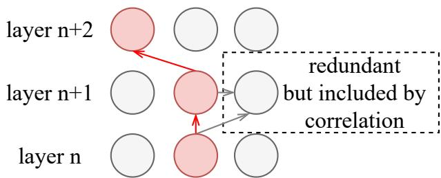  
Figure 1: Strong features (red circles) may also activate (arrows) redundant weak features (gray circles), leading to the inaccurate correlation with model behaviors.

Studies have been conducted to address the unfaithful outputs caused by knowledge conflicts, including instruction-based methods (Wang et al., 2024) and model editing methods (Sun et al., 2025; Ferrando et al., 2025; Fayyaz et al., 2025). Due to their lower cost, model editing methods have been popular. For example, SAEs (Bricken et al., 2023; Cunningham et al., 2023) and SAE-based steering (Zhao et al., 2025a) improve the precision and control ability of editing through monosemanticity. With a sparsity penalty applied when encoding and reconstructing the neuron representations, more monosemantic SAE features are constructed to edit and gain better steering effects.

However, for the purpose of monosemanticity, the number of steering features in SAE-based methods could be large. For example, a SAE trained on the residual stream of a certain layer in the Gemma-2-9B model (Lieberum et al., 2024) has a feature dimension that is 32 times larger than the neuron dimension, reaching 131 K. The correlation-based identification methods (e.g., mutual information) treat features as independent units, ignoring their interactions. Consequently, a large batch of features is selected to steer, including a lot of redundant features that dilute the impact of critical features (Figure 3). Specifically, a feature that truly has a strong steering effect requires some features from previous layers to activate it, and they may also activate other features in the current or subsequent layers with minor steering effects themselves (Figure 1). Current SAE-based steering methods (e.g., STA (Wang et al., 2025b), SPARE (Zhao et al., 2025a)) apply simple and rough pruning, but still retain a large number of redundant features.

In this work, we analyze the work mechanism of features, including the causal interactions among features, the enhancement of the attention scores on golden answer tokens within the context, and the gradual formation of knowledge selection behavior. Based on these analyses, we propose Key Path Identification (KPI), which further identifies key features and key paths that are causally critical for steering, thereby reducing noise from redundant features. Specifically, KPI uses a small development dataset to construct the interactions among positive features and form an interaction graph. Key features are characterized by the high indegrees, and key paths are built by the key features in the key layer with the strong steering effect and its preceding layers.

The contributions of this paper are as follows:

• Our analysis reveals that SAE-based mass steering suffers from feature redundancy, impairing the steering performance.

• We propose a method called Key Path Identification (KPI) which locates the key feature paths that play the core steering role, and enhances the precision and effectiveness of steering.

• Experiments in RAG tasks with knowledge conflicts show that KPI improves the accuracy by 18% on average compared to the best baseline of mass steering. Empirical analysis provides mechanistic interpretations and shows that the improvements are achieved via the precise location of SAE features and the alleviation of side effects.

## 2 Preliminary

## 2.1 SAEs and SAE-based Steering

Previous studies have shown that neurons in LLMs are multifunctional (Bills et al., 2023), where multiple knowledge or concepts are entangled together. To get more monosemantic representations, sparse autoencoders (SAEs) are introduced (Shu et al., 2025). Specifically, SAEs first encode the model representation (e.g., residual streams) h $\in \mathbb { R } ^ { d }$ into a sparser SAE representation $\mathbf { z } \in \mathbb { R } ^ { d _ { \mathrm { s a e } } }$

$$
\mathrm { \bf z } = \mathrm { a c t i v a t i o n \_ f u n c t i o n \left( h W _ { \mathrm { e n c } } + b _ { \mathrm { e n c } } \right) , }
$$

where $d _ { \mathrm { s a e } } \gg d , \mathbf { W } _ { \mathrm { e n c } }$ is the encoder matrix and $\mathbf { b } _ { \mathrm { e n c } }$ is the bias term. Every dimension of z is called a SAE feature, and the activation\_function can be JumpReLU (Rajamanoharan et al., 2024) or TopK (Bussmann et al., 2024). z is then used to reconstruct h:

$$
\mathbf { h } _ { \mathrm { s a e } } = \mathbf { z } \mathbf { W } _ { \mathrm { d e c } } + \mathbf { b } _ { \mathrm { d e c } } ,
$$

where $\mathbf { h } _ { \mathrm { s a e } } \in \mathbb { R } ^ { d } , \mathbf { W } _ { \mathrm { d e c } }$ is the decoder matrix and $\mathbf { b } _ { \mathrm { d e c } }$ is the bias term. The parameters $\mathbf { W } _ { \mathrm { e n c } } , \mathbf { b } _ { \mathrm { e n c } } .$ $\mathbf { W } _ { \mathrm { d e c } }$ and $\mathbf { b } _ { \mathrm { d e c } }$ are optimized via minimizing

$$
\mathcal { L } ( \mathbf { z } ) = \underbrace { \| \mathbf { h } - \mathbf { h } _ { \mathrm { \scriptsize ~ s a e } } \| _ { 2 } ^ { 2 } } _ { \mathcal { L } _ { \mathrm { \scriptsize ~ r e c o n s t r u c t i o n } } } + \underbrace { \gamma \| \mathbf { z } \| _ { 0 } } _ { \mathcal { L } _ { \mathrm { \scriptsize ~ s p a r s i t y } } } ,
$$

where $\gamma \in R ^ { + }$ is a hyperparameter.

During the steering phase, given a specific SAE feature indexed by i, $\mathbf { W } _ { \mathrm { d e c } } [ i , : ]$ is considered as the corresponding steering vector, and the vector after steering h′ is calculated as

$$
\mathbf { h } ^ { \prime } = \mathbf { h } + \alpha \mathbf { W } _ { \mathrm { d e c } } [ i , : ] ,\tag{1}
$$

where $\alpha \in R ^ { + }$ is the steering strength.

## 2.2 Correlation-based Identification Method of Steering Features

The definitions in this section follow the work of SPARE (Zhao et al., 2025a). The question answering template can be seen in Appendix B. We define the behavior label set $Y = \{ N , T \}$ , where N represents the nontarget (unfaithful) behavior and $T$ represents the target (faithful) behavior. After sampling behavior labels of model outputs and SAE representations at the last token in the prompt, which is the closest to the generated answer, we choose mutual information as the correlation-based identification method of steering features. Let the random variable $Z _ { i }$ be the activation of the specific SAE feature indexed by i. Mutual information between Y and $Z _ { i }$ is calculated as follows:

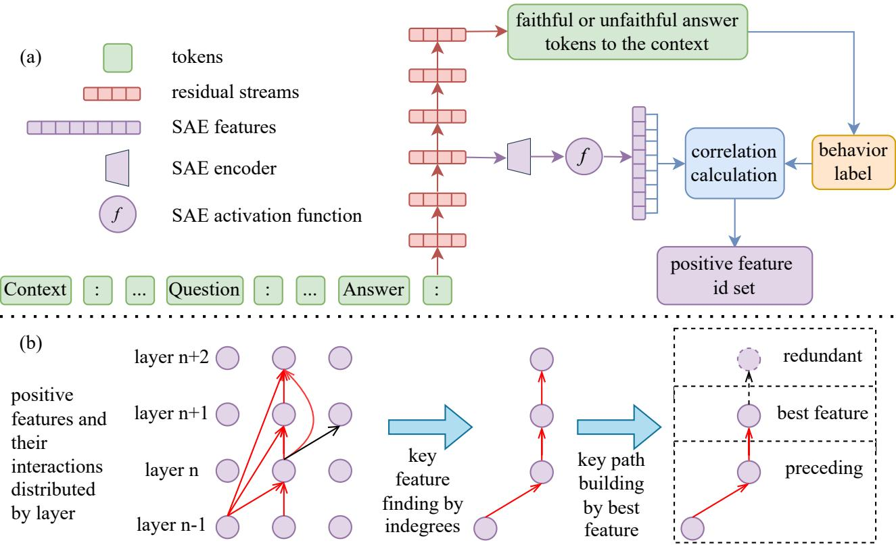  
Figure 2: The work flow of SAE-based feature selection. (a) shows the basic process of correlation-based identification methods of positive features. (b) shows the process of our KPI method that further applies key feature finding and key path building.

$$
I \left( Z _ { i } ; Y \right) = \sum _ { z _ { i } \in Z _ { i } } \sum _ { y \in \{ N , T \} } P \left( z _ { i } , y \right) \log \frac { P \left( z _ { i } , y \right) } { P \left( z _ { i } \right) P \left( y \right) } .
$$

By this definition, a higher mutual information suggests a stronger correlation between $Z _ { i }$ and the behavior selection. Positive features are defined as those exhibiting higher average activations during target behavior than during nontarget behavior.

Previous method (Zhao et al., 2025a) sorts $\{ I \left( Z _ { i } ; Y \right) \} _ { i = 1 } ^ { d _ { s a e } }$ of features in the descending order and uses K as the hyperparameter to select the most correlated features:

$$
k = \underset { k } { \arg \operatorname* { m i n } } \sum _ { u = 1 } ^ { k } \frac { s o r t e d ( \{ I ( Z _ { i } ; Y ) \} _ { i = 1 } ^ { d _ { s a e } } ) _ { u } } { \sum _ { j = 1 } ^ { d _ { s a e } } I ( Z _ { j } ; Y ) } \geq K .\tag{2}
$$

In this work, we work on the identified positive features. And from Equation 2, we can know that a simple and rough pruning is made. However, the number of selected features can still be more than 50 in a single layer to achieve ideal steering effects (Section 3), while steering is often performed on multiple layers. As discussed before, this pruning still includes a lot of redundant features with minor steering effects that weaken the overall performance. More details of mutual information calculation can be seen in Appendix C.

## 3 Redundancy Comes from Inaccurate Correlation and Neglected Interactions

Since mass steering methods view the selected positive features as a whole for steering, without considering the specific work mechanism of each individual feature, this poses an obstacle to interpretability. We first try to steer each positive feature individually to observe the effect of single steering.

Surprisingly, we find that some features themselves have strong steering effects, which even outperform mass steering on all the positive features. As shown in Figure 3, most features show relatively lower steering effects (the revised counts of unfaithful answers after steering), while a small number of features demonstrate significantly stronger ability. Moreover, in some layers like layer 30 of

Layer 30 Feature Steering  
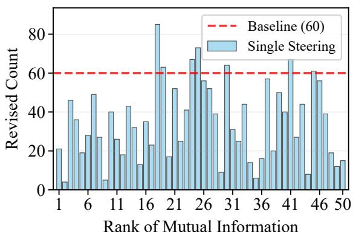

Layer 31 Feature Steering  
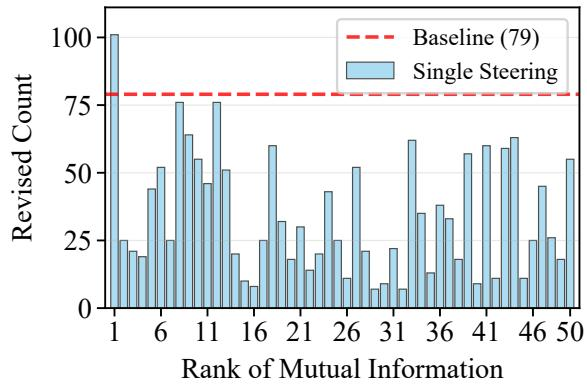  
Figure 3: The performance comparison of the single feature steering and the mass steering baseline (SPARE) on layer 30 and 31 of Gemma-2-9B on a development set with the size of 200. Some single feature steerings outperform the mass steering on all the positive features.

Gemma-2-9B, the weak features even rank ahead and the most useful feature has a relatively lower rank, which also shows the inaccuracy of the correlation. The low rank forces an increase in K in Equation 2 to include good features when using mass steering and also makes more weak features included. Due to the neglected interactions among these features, redundancy is introduced, which hinders the steering effects of the good features and thereby weakens the overall performance. This insight motivates us to not only evaluate the steering effects of individual features, but also further understand the interactions among features, how they promote or hinder each other, paving the way for obtaining a better set of steering features.

## 4 Method

To overcome the redundancy issue in mass steering, we propose Key Path Identification (KPI), a causal dependency-driven method that identifies critical features for precise model steering. KPI operates in three stages: (1) Feature Interaction Pattern Capture: it captures feature interaction patterns with a small development set; (2) Key Feature Finding: it builds a feature interaction graph and identifies key features that exhibit key roles within the graph based on indegrees; (3) Key Path Building: it builds key paths by filtering the key features following the key functional layer. This approach shifts SAE-based steering from quantity-driven to quality-focused, enhancing the steering effect. The formalization and pseudocode can be seen in Appendix H.

## 4.1 Feature Interaction Pattern Capture

Existing works (Abnar and Zuidema, 2020; Ameisen et al., 2025; Kamath et al., 2025) construct a detailed and complex inference circuit of the model through layer-by-layer backward propagations from the output logits to observe feature interactions. However, due to the long context and the large number of features, this method also incurs high computational cost. Moreover, the constructed circuit is usually tailored for a specific input example, leading to poor generalization.

Our aim is to efficiently capture the general interaction patterns among positive features. Specifically, from each selected layer, we pick out the set of top positive features and steer each feature singly. In a single steering, for each affected layer (including the intervened feature layer and subsequent layers), we record the top 5 features with the greatest average increases in activation values. Experiments show that these interaction patterns are stable: whether on as many as 200 or as few as 10 sampled instances, the impacts of enhancing one feature on the activation increases of other features are highly consistent (see Appendix F). Therefore, only a small development set is needed to efficiently and reliably capture the interaction patterns among positive features. The reason we do not use the increases in activation frequencies as metrics is that some features already have high baseline activation frequencies and the maximum values are 1.0, which means that the increases in activation frequencies are poor indicators of the impact degrees.

## 4.2 Key Feature Finding

The idea of using indegrees to find key features is rooted in the network bottlenecks. A high indegree shows that a node is a convergence point for multiple paths, where information flows most. We view features as nodes and their causal interactions as directed edges, which form an interaction graph of positive features. In the graph, if a feature node has a low indegree, it may indicate that this feature is just a redundant one with a weak steering effect mistakenly identified by correlation and may hinder the performance of good features; or this feature works by activating good downstream features. If a feature node has a high indegree, it indicates that many positive features work together to promote its activation and this feature plays an important role in the mass steering effect of the positive features. Therefore, we rank the features in the descending order based on their indegrees, and the top-ranked features are considered as the key features.

## 4.3 Key Path Building

The top-ranked key features naturally form crosslayer interaction paths that play the important role in steering. However, through evaluating the single steering effect of each feature along the paths, we find that the steering effects of features have different levels. In some particular layers, the steering effects of the top-ranked features reach the peak—a finding that is consistent with previous studies (Jin et al., 2024; Zhao et al., 2025a; Wang et al., 2025c) that identify certain functional layers as the key to contextual understanding. We identify the layer containing the top-ranked feature with the best steering effect as the key layer.

As the knowledge selection behavior is performed in a range of layers, we choose to steer the identified top-ranked features in the key layer and its preceding layers, which form key paths. This is because steering only affects the current layer and subsequent layers. If we only steer the key layer, we will drop its accompanying impacts on the preceding layers, while impacts of the key layer on subsequent layers will make steering features in subsequent layers redundant. In that way, we can also deal with higher indegrees that naturally form in later layers by selecting the key layer iteratively until no top-ranked features in preceding layers have better single steering effects. More implementation details can be seen in Appendix C.

## 5 Experiment Setting

## 5.1 Models and SAEs

The models and their corresponding SAEs used in our experiments are: Gemma-2-9B and SAEs from

Google DeepMind (Lieberum et al., 2024); Llama-3.1-8B and SAEs from Llama Scope (He et al., 2024); Llama-3-8B and SAEs from EleutherAI1. All the SAEs are trained on the residual streams and 131K in width. In terms of activation functions, SAEs of Gemma-2-9B and Llama-3.1-8B use JumpReLU, while SAEs of Llama-3-8B use TopK. We use Qwen3-14B (Team, 2025) to judge the correctness of question answering, and the prompt template is given in Appendix B.

## 5.2 Steering

Since the number of our steering features is small, the steering strength needs to be large to achieve the maximal steering effect. The steering strength α in Formula 1 is explored as a hyperparameter. We choose the largest activations of features as bases and explore their multiples to find the best steering strength more efficiently. Specifically, we use the APIs of Neuronpedia (Lin, 2023) to get the largest activations of features in SAEs for Gemma-2-9B and Llama-3.1-8B, while we sample the largest activations for Llama-3-8B on a larger dataset for training. The selected features and their steering strength can be seen in Appendix C. The steering positions are at the last token in the prompt.

## 5.3 Datasets

We choose NQ-Swap (Longpre et al., 2021) and Macnoise (Hong et al., 2024) to evaluate the steering effect of making models more faithful. Every example in the datasets has four parts: original context, golden answer to original context, substituted context where the original golden answer is replaced, and golden answer to substituted context. Specifically, for every model, we sample the answers and identify the examples where the model still outputs the original golden answer with substituted context. A steering is considered to be successful when the model changes to output the golden answer to substituted context after steering. The feature identification methods are conducted on different training subsets of Macnoise and NQ-Swap for every model. More details can be seen in Appendix C. Tests on another faithful dataset for generalizability can be seen in Appendix D.

## 5.4 Baselines

We choose STA (Bricken et al., 2023) and SPARE (Zhao et al., 2025a) as the SAE-based steering baselines that perform mass steering on a large number of SAE features. Also, we include ICL (in-context learning) (Brown et al., 2020) as the instruction-based method, and CAD (Shi et al., 2024) as a representative of the contrastive decoding methods. More implementation details and hyperparameters can be seen in Appendix C.

Comparison of Single Steering Effects on Two Datasets  
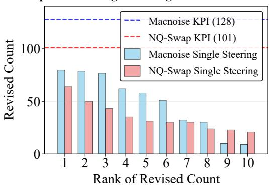  
Figure 4: Comparison of single steering effects of selected key features of Llama-3.1-8B on two datasets.

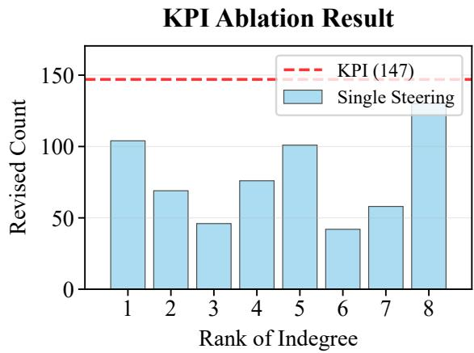  
Figure 5: KPI ablation result of Gemma-2-9B. KPI surpasses every single steering.

Though the test datasets are selected to have unfaithful answers to the context originally, the LLM judgement has randomness during evaluation. We also report the results without steering to show the original performance of the models.

## 6 Experimental Results

## 6.1 Main Results

We present the main results (accuracies) in Table 1. Our KPI method achieves the best performance on both the datasets for every model.

For the Llama-3.1-8B model, SAE-based methods show lower performance on NQ-Swap. We check the single steering results and find that single steering shows the same decreasing tendency (Figure 4), and KPI still outperforms single steering. It indicates that the overall drop originates from the effect drops of features, showing that the SAEbased steering methods rely on the quality of SAEs. Another issue is that the performance of SPARE for Gemma-2-9B on Macnoise is relatively low due to inaccurate layer selection. Though SPARE and KPI both search for a wide range of layers, SPARE cannot precisely locate the important layers. Because mass steering cannot precisely reflect the effectiveness of layers as shown in our Section 3, which seriously hinders its effect. Our method achieves better key layer location through selecting the key layer iteratively until there are no better top-ranked features in preceding layers.

## 6.2 Ablation Result

To verify that our method filters the redundant features and finds the features that promote the overall effect rather than weaken the good features, we check the single steering effects of the features selected by our method. As shown in Figure 5, the number of selected features is only 8, which is much smaller than those of the mass steering baselines that steer more features even in one layer. Moreover, the average single steering effect is much better than that in Figure 3, which indicates that the redundant features are mostly excluded. And the overall effect of KPI is better than every single steering, showing that the features collaborate to achieve better results. As our method includes the upstream features of the key layer and gains benefits, it shows that the model performs the knowledge selection behavior in multiple layers and steering on preceding layers is necessary.

## 6.3 Side Effect Checks

As the editing inevitably influences the usage of parametric knowledge, we conduct side effect checks of our steering. Since our test datasets of main results are unfaithful examples originally, we check the effect of our method on the faithful examples with no knowledge conflicts to see the side effects.

The results can be seen in Table 2. Our method achieves comparable or better performance, showing significant improvement in faithfulness and the relatively small side effects. More importantly, the comparison with the mass steering baseline shows that our method successfully filters redundant features that bring noise, which also impairs the effects of good features and models’ ability. Side effect checks of other downstream model capabilities can be seen in Appendix E.

<table><tr><td>Method</td><td colspan="3">NQ-Swap</td><td colspan="3">Macnoise</td></tr><tr><td></td><td>Llama-3-8B</td><td>Llama-3.1-8B</td><td>Gemma-2-9B</td><td>Llama-3-8B</td><td>Llama-3.1-8B</td><td>Gemma-2-9B</td></tr><tr><td>Without Steering</td><td> $0 . 3 3 { \scriptstyle \pm 0 . 5 8 }$ </td><td> $0 . 0 0 { \scriptstyle \pm 0 . 0 0 }$ </td><td> $0 . 6 7 _ { \pm 0 . 2 9 }$ </td><td> $2 . 3 3 { \scriptstyle \pm 1 . 2 6 }$ </td><td> $2 . 6 7 _ { \pm 1 . 0 4 }$ </td><td> $2 . 5 0 { \scriptstyle \pm 0 . 0 0 }$ </td></tr><tr><td>ICL</td><td> $2 2 . 8 3 { \scriptstyle \pm 1 . 6 1 }$ </td><td> $1 6 . 0 0 { \scriptstyle \pm 0 . 5 0 }$ </td><td> $1 3 . 6 7 { \scriptstyle \pm 0 . 5 8 }$ </td><td> $9 . 8 3 { \scriptstyle \pm 3 . 0 1 }$ </td><td> $1 5 . 5 0 { \scriptstyle \pm 1 . 8 0 }$ </td><td> $7 . 5 0 { \scriptstyle \pm 2 . 5 0 }$ </td></tr><tr><td>CAD</td><td> $8 . 1 7 _ { \pm 1 . 0 4 }$ </td><td> $1 4 . 6 7 { \scriptstyle \pm 1 . 8 9 }$ </td><td> $1 1 . 5 0 { \scriptstyle \pm 1 . 8 0 }$ </td><td> $1 6 . 8 3 { \scriptstyle \pm 4 . 3 1 }$ </td><td> $1 4 . 8 3 { \scriptstyle \pm 1 . 1 5 }$ </td><td> $1 7 . 0 0 { \scriptstyle \pm 3 . 0 4 }$ </td></tr><tr><td>STA</td><td> $6 1 . 1 7 { \scriptstyle \pm 2 . 5 2 }$ </td><td> $2 4 . 0 0 { \scriptstyle \pm 0 . 0 0 }$ </td><td> $3 1 . 6 7 _ { \pm 1 . 2 6 }$ </td><td> $4 7 . 1 7 _ { \pm 4 . 2 5 }$ </td><td> $3 8 . 3 3 { \scriptstyle \pm 2 . 4 7 }$ </td><td> $1 4 . 8 3 { \scriptstyle \pm 1 . 5 3 }$ </td></tr><tr><td>SPARE</td><td> $6 8 . 8 3 { \scriptstyle \pm 2 . 0 2 }$ </td><td> $4 8 . 8 3 { \scriptstyle \pm 1 . 1 5 }$ </td><td> $6 9 . 5 0 { \scriptstyle \pm 1 . 5 0 }$ </td><td> $5 5 . 6 7 { \scriptstyle \pm 2 . 7 5 }$ </td><td> $5 4 . 3 3 { \scriptstyle \pm 3 . 3 3 }$ </td><td> $4 3 . 0 0 { \scriptstyle \pm 6 . 5 4 }$ </td></tr><tr><td>KPI</td><td> $7 2 . 8 3 _ { \pm 4 . 3 1 }$ </td><td> ${ \pm \bf 0 . 6 7 } _ { \pm 0 . 7 6 }$ </td><td> $\mathbf { 7 9 . 3 3 _ { \pm 0 . 7 6 } }$ </td><td> ${ \bf 6 3 . 8 3 } _ { \pm 3 . 2 1 }$ </td><td> ${ \bar { 5 } } 8 . 5 0 _ { \pm 5 . 2 7 }$ </td><td> $7 5 . 8 3 _ { \pm 5 . 6 2 }$ </td></tr></table>

Table 1: Main result table of different methods and models.
<table><tr><td>Method</td><td colspan="3">NQ-Swap</td><td colspan="3">Macnoise</td></tr><tr><td></td><td>Llama-3-8B</td><td>Llama-3.1-8B</td><td> $\mathbf { G e m m a } { \mathbf { - } } 2 { \mathbf { - } } 9 \mathbf { B }$ </td><td>Llama-3-8B</td><td>Llama-3.1-8B</td><td>Gemma-2-9B</td></tr><tr><td>Without Steering</td><td> $9 9 . 8 3 { \scriptstyle \pm 0 . 2 9 }$ </td><td> $9 9 . 0 0 { \scriptstyle \pm 0 . 5 0 }$ </td><td> $1 0 0 . 0 0 { \scriptstyle \pm 0 . 0 0 }$ </td><td> $9 9 . 3 3 { \scriptstyle \pm 0 . 2 9 }$ </td><td> $1 0 0 . 0 0 { \scriptstyle \pm 0 . 0 0 }$ </td><td> $9 9 . 5 0 { \scriptstyle \pm 0 . 5 0 }$ </td></tr><tr><td>SPARE</td><td> $8 8 . 1 7 _ { \pm 4 . 0 1 }$ </td><td> $8 4 . 5 0 { \scriptstyle \pm 1 . 8 0 }$ </td><td> $7 6 . 8 3 { \scriptstyle \pm 4 . 2 5 }$ </td><td> $8 2 . 8 3 { \scriptstyle \pm 3 . 6 9 }$ </td><td> $8 2 . 0 0 { \scriptstyle \pm 0 . 8 7 }$ </td><td> $9 5 . 3 3 { \scriptstyle \pm 1 . 8 9 }$ </td></tr><tr><td>KPI</td><td> $9 5 . 0 0 { \scriptstyle \pm 0 . 5 0 }$ </td><td> $9 8 . 0 0 { \scriptstyle \pm 0 . 8 7 }$ </td><td> $9 9 . 1 7 { \scriptstyle \pm 0 . 5 8 }$ </td><td> $9 5 . 1 7 { \scriptstyle \pm 1 . 4 4 }$ </td><td> $9 6 . 6 7 _ { \pm 1 . 4 4 }$ </td><td> $9 5 . 5 0 { \scriptstyle \pm 0 . 5 0 }$ </td></tr></table>

Table 2: Side effect checks of our method on faithful examples. Our method achieves better or comparable performance to the baseline, showing the ability to alleviate side effects by filtering redundant features.

## 6.4 Attention Score Influence Result

To further understand how features work when steering, we sample the attention score changes on golden answer tokens within the context of single steering. As the SAEs are trained on the post residual streams, the steering influences the attention scores of subsequent layers. We perform the sampling on the layer next steering and the next key layer. Here we report the results of Gemma-2-9B from Figure 6 to Figure 9.

From the results, we find that the recognized key features (a representative located in layer 28 shown in Figure 6) and many strong features (a representative located in layer 24 shown in Figure 8) consistently enhance the attention scores on golden answer tokens of most attention heads in the next key layer. For comparison, the result of a feature with a relatively high mutual information score but a weak steering effect is shown in Figure 7, which has lower enhancements and more declines, again showing the inaccuracy of the correlation.

We observe that some features work by activating the good features and the existence of functional layers. Although many strong features have overall positive attention effects on the next key layer (shown in Figure 8), they show obviously more negative attention effects on the adjacent next layer (shown in Figure 9). This kind of features does not make the model focus on the golden answer tokens immediately, but activates the good features for higher activations through model inferences and finally enhances attentions on the answers in subsequent layers that are more correlated with knowledge conflicts and behavior selection. It also indicates that these features are located in the non-functional layers that are distant from the layers that perform the target function. This inspires us to analyze how this activating process works.

## 6.5 Cosine Similarity Result

As the SAE-based steering uses the decoding vectors to change the residual streams, we can view the decoding vectors as the representations of the features and their activation patterns in the vector form. Based on this idea, we can calculate the cosine similarities of the decoding vectors to evaluate the way of interactions among the features.

Here we present the cosine similarities and single steering effects of the most similar features across the layers of the key feature (located in layer 28 of Gemma-2-9B) (Figure 10). We can see that there are features with high vector cosine similarities in the adjacent layers. Overall, both the similarities and steering effects have the tendency of diminishing with distance from the key layer. Moreover, if we add the decoding vector of the key feature to the residual streams in earlier layers, it can still perform a comparable strong steering effect to that when steering in the original layer. It shows that these highly similar features work because they directly add the key feature patterns into the residual streams. In terms of the features identified by correlation in further layers, as the patterns are more different, they activate the key feature through more natural and complex computations. From the results of Figure 10, we can estimate that the patterns represented by this key feature mainly form and work during the 26-29 layers. It shows that the patterns of behavior selection gradually form and function in a range of layers, which is also evidence of the existence of functional layers, verifying the benefit of steering on preceding layers.

L28 Feature 9032 Steering Effect on Layer 29  
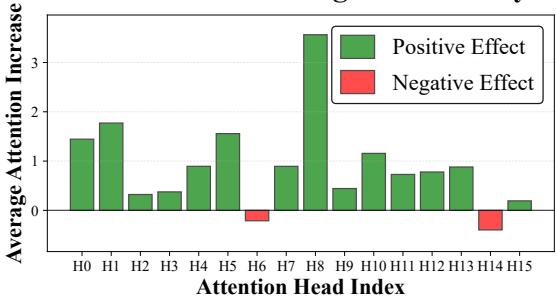  
Figure 6: Impact of the key feature on the next key layer’s attention score changes.

L24 Feature 21413 Steering Effect on Layer 29  
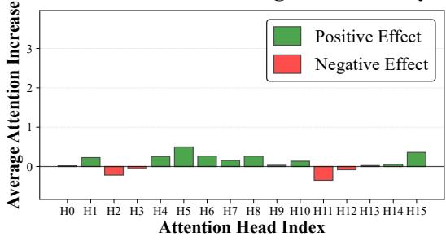  
Figure 8: Impact of a feature with relatively strong steering effect on the next key layer’s attention score changes.

Cosine Similarities and Single Steering Effects Across Layers  
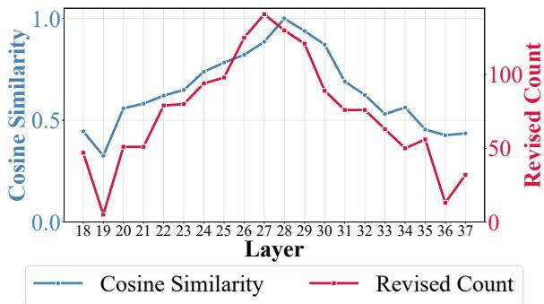  
Figure 10: The cosine similarities and single steering effects of the most similar features across the layers of the key feature (located in layer 28).

L28 Feature 14451 Steering Effect on Layer 29  
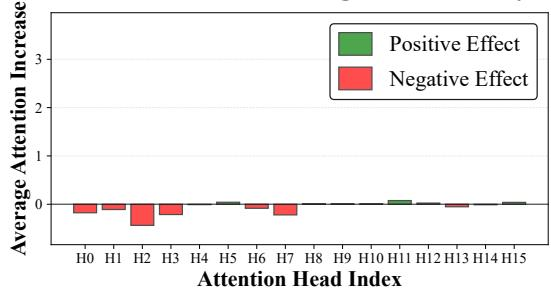  
Figure 7: Impact of a feature with relatively high mutual information score but a weak steering effect on the next key layer’s attention score changes.

L24 Feature 21413 Steering Effect on Next Layer  
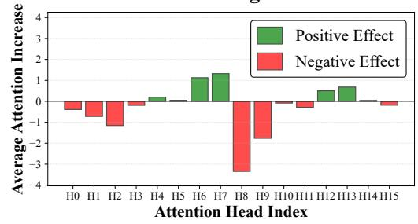  
Figure 9: Impact of a feature with relatively strong steering effect on the next layer’s attention score changes.

## 7 Conclusion

This work presents Key Path Identification (KPI) for precise model steering, addressing knowledge conflicts in RAG tasks. The key findings include: (1) we diagnose the critical limitation of existing SAE-based mass steering methods: feature redundancy caused by the inaccurate correlation and the neglected feature interactions; (2) we introduce KPI which identifies critical features based on causal dependencies, establishing a new perspective for precise and interpretable model editing with less feature modifications; (3) we provide empirical validations that show KPI’s superiority, enhancing feature collaboration to improve the overall performance, effectively filtering redundant features, and alleviating side effects. Analysis on attentions and feature similarities provides mechanistic interpretations, demonstrating that steering works by enhancing attentions to the golden answer tokens and that knowledge selection behavior gradually forms in multiple layers. By prioritizing quality over quantity, KPI advances SAE-based mass steering, offering an effective and interpretable solution for improving LLM faithfulness.

## Limitations

Basic Methods Correlation-based methods have their inherent drawbacks with their nature of acausality, and our method tries to reduce the noise by utilizing the causal interactions among key features. Meanwhile, the circuit finding methods of backward propagations are not appropriate for long context analysis, which require pruning that may also risk losing causal features. More investigations should be done to optimize the identification methods fundamentally. Some works (Lu et al., 2026; Wang et al., 2025a) try to denoise from the perspective of data filtering, which is not deeply investigated in this work.

Multiple Circuits Some studies have found that there are multiple computation circuits that have similar functions (Lindsey et al., 2025), which is an embodiment of the model’s robustness. For example, we find a circuit that enables the model to solve addition problems, and then disable it by making the activations of features in the circuit to zeros, but the model can still perform additions through other circuits that can also enable the model to do it. Our method finds the simple circuit that is with the most correlation, but does not exclude the existence of backup circuits. Moreover, it’s worth noting that activating multiple circuits with the same function may not bring benefits, because of the saturation of ability and mutual interference.

Models and SAEs As presented above, our method requires cross-layer analysis. So the SAEs trained on continuous layers are needed. However, we find that no satisfying SAE resources are available for larger sizes (70B+) of models. In Neuronpedia, which is the largest SAE provider, there are only SAEs in limited layer settings for the models in such sizes. And training SAEs from scratch for such large models is too costly. We still emphasize that we try our best in the model selection for generalizability. Two model families and two SAE structures are included. And in other works (Lu et al., 2026) that simply use the differences of residual streams between the positive and negative examples, they also show the generalizability in larger models. The good generalizability of basic steering methods shows the tendency that our denoising methods can work as well, because they have the same basic mechanism.

RAG Setting In realistic RAG applications, many additional conditions may arise. In our experiments, we assume that the retrieved evidence should be followed, and we focus on improving faithfulness to context rather than broader reasoning ability.

## Acknowledgements

This work was funded by the National Natural Science Foundation of China (62472426). Work partially done at Beijing Key Laboratory of Research on Large Models and Intelligent Governance, and Engineering Research Center of Next-Generation Intelligent Search and Recommendation, Ministry of Education.

## References

Samira Abnar and Willem Zuidema. 2020. Quantifying attention flow in transformers. In Proceedings ofthe 58th annual meeting of the association for computational linguistics, pages 4190–4197.

Emmanuel Ameisen, Jack Lindsey, Adam Pearce, Wes Gurnee, Nicholas L. Turner, Brian Chen, Craig Citro, David Abrahams, Shan Carter, Basil Hosmer, Jonathan Marcus, Michael Sklar, Adly Templeton, Trenton Bricken, Callum McDougall, Hoagy Cunningham, Thomas Henighan, Adam Jermyn, Andy Jones, and 8 others. 2025. Circuit tracing: Revealing computational graphs in language models. Transformer Circuits Thread.

Steven Bills, Nick Cammarata, Dan Mossing, Henk Tillman, Leo Gao, Gabriel Goh, Ilya Sutskever, Jan Leike, Jeff Wu, and William Saunders. 2023. Language models can explain neurons in language models. https://openaipublic.blob.core.windows. net/neuron-explainer/paper/index.html.

Trenton Bricken, Adly Templeton, Joshua Batson, Brian Chen, Adam Jermyn, Tom Conerly, Nick Turner, Cem Anil, Carson Denison, Amanda Askell, Robert Lasenby, Yifan Wu, Shauna Kravec, Nicholas Schiefer, Tim Maxwell, Nicholas Joseph, Zac Hatfield-Dodds, Alex Tamkin, Karina Nguyen, and 6 others. 2023. Towards monosemanticity: Decomposing language models with dictionary learning. Transformer Circuits Thread. Https://transformercircuits.pub/2023/monosemanticfeatures/index.html.

Tom B. Brown, Benjamin Mann, Nick Ryder, Melanie Subbiah, Jared Kaplan, Prafulla Dhariwal, Arvind Neelakantan, Pranav Shyam, Girish Sastry, Amanda Askell, Sandhini Agarwal, Ariel Herbert-Voss, Gretchen Krueger, Tom Henighan, Rewon Child, Aditya Ramesh, Daniel M. Ziegler, Jeffrey Wu, Clemens Winter, and 12 others. 2020. Language models are few-shot learners. In NeurIPS.

Bart Bussmann, Patrick Leask, and Neel Nanda. 2024. Batchtopk sparse autoencoders. Preprint, arXiv:2412.06410.

Hung-Ting Chen, Michael Zhang, and Eunsol Choi. 2022. Rich knowledge sources bring complex knowledge conflicts: Recalibrating models to reflect conflicting evidence. In Proceedings of the 2022 Conference on Empirical Methods in Natural Language Processing, pages 2292–2307.

Yanda Chen, Joe Benton, Ansh Radhakrishnan, Jonathan Uesato, Carson Denison, John Schulman, Arushi Somani, Peter Hase, Misha Wagner, Fabien Roger, Vlad Mikulik, Samuel R. Bowman, Jan Leike, Jared Kaplan, and Ethan Perez. 2025. Reasoning models don’t always say what they think. Preprint, arXiv:2505.05410.

Yung-Sung Chuang, Benjamin Cohen-Wang, Shannon Zejiang Shen, Zhaofeng Wu, Hu Xu, Xi Victoria Lin, James Glass, Shang-Wen Li, and Wen tau Yih. 2025. Selfcite: Self-supervised alignment for context attribution in large language models. Preprint, arXiv:2502.09604.

Karl Cobbe, Vineet Kosaraju, Mohammad Bavarian, Mark Chen, Heewoo Jun, Lukasz Kaiser, Matthias Plappert, Jerry Tworek, Jacob Hilton, Reiichiro Nakano, Christopher Hesse, and John Schulman. 2021. Training verifiers to solve math word problems.

Benjamin Cohen-Wang, Harshay Shah, Kristian Georgiev, and Aleksander Madry. 2024. Contextcite: Attributing model generation to context. Advances in Neural Information Processing Systems, 37:95764– 95807.

Hoagy Cunningham, Aidan Ewart, Logan Riggs, Robert Huben, and Lee Sharkey. 2023. Sparse autoencoders find highly interpretable features in language models. Preprint, arXiv:2309.08600.

Nicola De Cao, Wilker Aziz, and Ivan Titov. 2021. Editing factual knowledge in language models. In Proceedings of the 2021 conference on empirical methods in natural language processing, pages 6491– 6506.

DeepSeek-AI, Aixin Liu, Bei Feng, Bing Xue, Bingxuan Wang, Bochao Wu, Chengda Lu, Chenggang Zhao, Chengqi Deng, Chenyu Zhang, Chong Ruan, Damai Dai, Daya Guo, Dejian Yang, Deli Chen, Dongjie Ji, Erhang Li, Fangyun Lin, Fucong Dai, and 181 others. 2025. Deepseek-v3 technical report. Preprint, arXiv:2412.19437.

Junfeng Fang, Houcheng Jiang, Kun Wang, Yunshan Ma, Shi Jie, Xiang Wang, Xiangnan He, and Tat seng Chua. 2025. Alphaedit: Null-space constrained knowledge editing for language models. Preprint, arXiv:2410.02355.

Mohsen Fayyaz, Ali Modarressi, Hanieh Deilamsalehy, Franck Dernoncourt, Ryan Rossi, Trung Bui, Hinrich Schütze, and Nanyun Peng. 2025. Steering moe llms via expert (de)activation. Preprint, arXiv:2509.09660.

Javier Ferrando, Oscar Obeso, Senthooran Rajamanoharan, and Neel Nanda. 2025. Do i know this entity? knowledge awareness and hallucinations in language models. Preprint, arXiv:2411.14257.

Wes Gurnee, Theo Horsley, Zifan Carl Guo, Tara Rezaei Kheirkhah, Qinyi Sun, Will Hathaway, Neel Nanda, and Dimitris Bertsimas. 2024. Universal neurons in gpt2 language models. Preprint, arXiv:2401.12181.

Zhengfu He, Wentao Shu, Xuyang Ge, Lingjie Chen, Junxuan Wang, Yunhua Zhou, Frances Liu, Qipeng Guo, Xuanjing Huang, Zuxuan Wu, Yu-Gang Jiang, and Xipeng Qiu. 2024. Llama scope: Extracting millions of features from llama-3.1-8b with sparse autoencoders. Preprint, arXiv:2410.20526.

Dan Hendrycks, Collin Burns, Steven Basart, Andy Zou, Mantas Mazeika, Dawn Song, and Jacob Steinhardt. 2020. Measuring massive multitask language understanding. arXiv preprint arXiv:2009.03300.

Giwon Hong, Jeonghwan Kim, Junmo Kang, Sung-Hyon Myaeng, and Joyce Jiyoung Whang. 2024. Why so gullible? enhancing the robustness of retrieval-augmented models against counterfactual noise. In Findings of the Association for Computational Linguistics: NAACL 2024, pages 2474–2495, Mexico City, Mexico. Association for Computational Linguistics.

Zhuoran Jin, Pengfei Cao, Hongbang Yuan, Yubo Chen, Jiexin Xu, Huaijun Li, Xiaojian Jiang, Kang Liu, and Jun Zhao. 2024. Cutting off the head ends the conflict: A mechanism for interpreting and mitigating knowledge conflicts in language models. In Findings of the Association for Computational Linguistics: ACL 2024, pages 1193–1215.

Harish Kamath, Emmanuel Ameisen, Isaac Kauvar, Rodrigo Luger, Wes Gurnee, Adam Pearce, Sam Zimmerman, Joshua Batson, Thomas Conerly, Chris Olah, and Jack Lindsey. 2025. Tracing attention computation through feature interactions. Transformer Circuits Thread.

Justin Lee, Tuomas Oikarinen, Arjun Chatha, Keng-Chi Chang, Yilan Chen, and Tsui-Wei Weng. 2023. The importance of prompt tuning for automated neuron explanations. Preprint, arXiv:2310.06200.

Patrick Lewis, Ethan Perez, Aleksandra Piktus, Fabio Petroni, Vladimir Karpukhin, Naman Goyal, Heinrich Küttler, Mike Lewis, Wen tau Yih, Tim Rocktäschel, Sebastian Riedel, and Douwe Kiela. 2021. Retrieval-augmented generation for knowledgeintensive nlp tasks.

Ruizhe Li, Chen Chen, Yuchen Hu, Yanjun Gao, Xi Wang, and Emine Yilmaz. 2025. Attributing response to context: A jensen-shannon divergence driven mechanistic study of context attribution in retrieval-augmented generation. Preprint, arXiv:2505.16415.

Xiaopeng Li, Shasha Li, Shezheng Song, Jing Yang, Jun Ma, and Jie Yu. 2024. Pmet: Precise model editing in a transformer. In Proceedings of the AAAI Conference on Artificial Intelligence, volume 38, pages 18564–18572.

Yulin Li, Tengyao Tu, Li Ding, Junjie Wang, Huiling Zhen, Yixin Chen, Yong Li, and Zhuotao Tian. 2026. Efficient reasoning with balanced thinking. arXiv preprint arXiv:2603.12372.

Tom Lieberum, Senthooran Rajamanoharan, Arthur Conmy, Lewis Smith, Nicolas Sonnerat, Vikrant Varma, János Kramár, Anca Dragan, Rohin Shah, and Neel Nanda. 2024. Gemma scope: Open sparse autoencoders everywhere all at once on gemma 2. In Proceedings of the 7th BlackboxNLP Workshop: Analyzing and Interpreting Neural Networksfor NLP, pages 278–300.

Johnny Lin. 2023. Neuronpedia: Interactive reference and tooling for analyzing neural networks. Software available from neuronpedia.org.

Jack Lindsey, Wes Gurnee, Emmanuel Ameisen, Brian Chen, Adam Pearce, Nicholas L. Turner, Craig Citro, David Abrahams, Shan Carter, Basil Hosmer, Jonathan Marcus, Michael Sklar, Adly Templeton, Trenton Bricken, Callum McDougall, Hoagy Cunningham, Thomas Henighan, Adam Jermyn, Andy Jones, and 8 others. 2025. On the biology of a large language model. Transformer Circuits Thread.

Shayne Longpre, Kartik Perisetla, Anthony Chen, Nikhil Ramesh, Chris DuBois, and Sameer Singh. 2021. Entity-based knowledge conflicts in question answering. In Proceedings ofthe 2021 Conference on Empirical Methods in Natural Language Processing, pages 7052–7063, Online and Punta Cana, Dominican Republic. Association for Computational Linguistics.

Christina Lu, Jack Gallagher, Jonathan Michala, Kyle Fish, and Jack Lindsey. 2026. The assistant axis: Situating and stabilizing the default persona of language models. arXiv preprint arXiv:2601.10387.

Yifei Ming, Senthil Purushwalkam, Shrey Pandit, Zixuan Ke, Xuan-Phi Nguyen, Caiming Xiong, and Shafiq Joty. 2024. Faitheval: Can your language model stay faithful to context, even if" the moon is made of marshmallows". arXiv preprint arXiv:2410.03727.

Eric Mitchell, Charles Lin, Antoine Bosselut, Christopher D Manning, and Chelsea Finn. 2022. Memorybased model editing at scale. In International Conference on Machine Learning, pages 15817–15831. PMLR.

OpenAI, Josh Achiam, Steven Adler, Sandhini Agarwal, Lama Ahmad, Ilge Akkaya, Florencia Leoni Aleman, Diogo Almeida, Janko Altenschmidt, Sam Altman, Shyamal Anadkat, Red Avila, Igor Babuschkin, Suchir Balaji, Valerie Balcom, Paul Baltescu, Haiming Bao, Mohammad Bavarian, Jeff Belgum, and 262 others. 2024. Gpt-4 technical report. Preprint, arXiv:2303.08774.

Gonçalo Paulo, Alex Mallen, Caden Juang, and Nora Belrose. 2025. Automatically interpreting millions of features in large language models. Preprint, arXiv:2410.13928.

Daking Rai, Yilun Zhou, Shi Feng, Abulhair Saparov, and Ziyu Yao. 2024. A practical review of mechanistic interpretability for transformer-based language models. arXiv preprint arXiv:2407.02646.

Senthooran Rajamanoharan, Tom Lieberum, Nicolas Sonnerat, Arthur Conmy, Vikrant Varma, János Kramár, and Neel Nanda. 2024. Jumping ahead: Improving reconstruction fidelity with jumprelu sparse autoencoders. Preprint, arXiv:2407.14435.

Weijia Shi, Xiaochuang Han, Mike Lewis, Yulia Tsvetkov, Luke Zettlemoyer, and Wen-tau Yih. 2024. Trusting your evidence: Hallucinate less with contextaware decoding. In Proceedings of the 2024 Conference of the North American Chapter of the Association for Computational Linguistics: Human Language Technologies (Volume 2: Short Papers), pages 783–791, Mexico City, Mexico. Association for Computational Linguistics.

Dong Shu, Xuansheng Wu, Haiyan Zhao, Daking Rai, Ziyu Yao, Ninghao Liu, and Mengnan Du. 2025. A survey on sparse autoencoders: Interpreting the internal mechanisms of large language models. arXiv preprint arXiv:2503.05613.

Zhaochen Su, Jun Zhang, Xiaoye Qu, Tong Zhu, Yanshu Li, Jiashuo Sun, Juntao Li, Min Zhang, and Yu Cheng. 2024. Conflictbank: A benchmark for evaluating the influence of knowledge conflicts in llm. Preprint, arXiv:2408.12076.

Zhongxiang Sun, Xiaoxue Zang, Kai Zheng, Jun Xu, Xiao Zhang, Weijie Yu, Yang Song, and Han Li. 2025. Redeep: Detecting hallucination in retrievalaugmented generation via mechanistic interpretability. In International Conference on Learning Representations, volume 2025, pages 50250–50279.

Qwen Team. 2025. Qwen3 technical report. Preprint, arXiv:2505.09388.

Hugo Touvron, Louis Martin, Kevin Stone, Peter Albert, Amjad Almahairi, Yasmine Babaei, Nikolay Bashlykov, Soumya Batra, Prajjwal Bhargava, Shruti Bhosale, Dan Bikel, Lukas Blecher, Cristian Canton Ferrer, Moya Chen, Guillem Cucurull, David Esiobu, Jude Fernandes, Jeremy Fu, Wenyin Fu, and 49 others. 2023. Llama 2: Open foundation and fine-tuned chat models. Preprint, arXiv:2307.09288.

Anyi Wang, Xuansheng Wu, Dong Shu, Yunpu Ma, and Ninghao Liu. 2025a. Enhancing llm steering through sparse autoencoder-based vector refinement. arXiv preprint arXiv:2509.23799.

Mengru Wang, Ziwen Xu, Shengyu Mao, Shumin Deng, Zhaopeng Tu, Huajun Chen, and Ningyu Zhang. 2025b. Beyond prompt engineering: Robust behavior control in llms via steering target atoms. In Proceedings of the 63rd Annual Meeting of the Associationfor Computational Linguistics (Volume 1: Long Papers), pages 23381–23399.

Yike Wang, Shangbin Feng, Heng Wang, Weijia Shi, Vidhisha Balachandran, Tianxing He, and Yulia Tsvetkov. 2024. Resolving knowledge conflicts in large language models. Preprint, arXiv:2310.00935.

Yuhao Wang, Ruiyang Ren, Yucheng Wang, Wayne Xin Zhao, Jing Liu, Hua Wu, and Haifeng Wang. 2025c. Unveiling knowledge utilization mechanisms in llmbased retrieval-augmented generation. In Proceedings of the 48th International ACM SIGIR Conference on Research and Development in Information Retrieval, pages 1262–1271.

Zhengxuan Wu, Aryaman Arora, Atticus Geiger, Zheng Wang, Jing Huang, Daniel Jurafsky, Christopher D. Manning, and Christopher Potts. 2025. Axbench: Steering llms? even simple baselines outperform sparse autoencoders. ArXiv, abs/2501.17148.

Jian Xie, Kai Zhang, Jiangjie Chen, Renze Lou, and Yu Su. 2023. Adaptive chameleon or stubborn sloth: Revealing the behavior of large language models in knowledge conflicts. In The Twelfth International Conference on Learning Representations.

Rongwu Xu, Zehan Qi, Zhijiang Guo, Cunxiang Wang, Hongru Wang, Yue Zhang, and Wei Xu. 2024. Knowledge conflicts for llms: A survey. In Proceedings of the 2024 Conference on Empirical Methods in Natural Language Processing, pages 8541–8565.

Yu Zhao, Alessio Devoto, Giwon Hong, Xiaotang Du, Aryo Pradipta Gema, Hongru Wang, Xuanli He, Kam-Fai Wong, and Pasquale Minervini. 2025a. Steering knowledge selection behaviours in llms via sae-based representation engineering. In Proceedings of the 2025 Conference of the Nations of the Americas Chapter of the Association for Computational Linguistics: Human Language Technologies (Volume 1: Long Papers), pages 5117–5136.

Yu Zhao, Xiaotang Du, Giwon Hong, Aryo Pradipta Gema, Alessio Devoto, Hongru Wang, Xuanli He, Kam-Fai Wong, and Pasquale Minervini. 2025b. Analysing the residual stream of language models under knowledge conflicts. Preprint, arXiv:2410.16090.

Zhenhong Zhou, Haiyang Yu, Xinghua Zhang, Rongwu Xu, Fei Huang, Kun Wang, Yang Liu, Junfeng Fang, and Yongbin Li. 2025. On the role of attention heads in large language model safety. Preprint, arXiv:2410.13708.

## A Related Work

## A.1 Mechanistic Interpretability

Previous studies on interpretability of LLMs focused on analyzing the causal relationship between external inputs and model outputs. This kind of studies (Chuang et al., 2025; Li et al., 2025; Cohen-Wang et al., 2024) views the model as a black box, without considering its internal inference process, which leads to the skepticism about their reliability. For instance, some studies have pointed out that LLMs can exhibit hallucinated chains of thought (Chen et al., 2025; Lindsey et al., 2025). Therefore, mechanistic interpretability has been proposed, which tries to understand how components of the model function individually, and how they connect and collaborate to enable the model’s various behaviors and capabilities. Because they introduce analyses of the model’s internal computational process, these studies are considered to reflect the model’s behavior more faithfully. The study objects (Rai et al., 2024) of mechanistic interpretability include the model’s components (such as neurons, SAE features, and attention heads), the functional circuits formed among these components, and the universality (Gurnee et al., 2024) of mechanisms across different models. Discovering mechanisms helps researchers identify which parts of the input or which model components lead to specific behaviors, making the model’s overall reasoning process more comprehensible to humans, and thereby addressing potential issues in models such as hallucination, safety, and reliability.

## A.2 SAE Studies

The application of sparse autoencoders (SAEs) has provided more monosemantic features for models’ internal representations, thereby significantly enhancing interpretability. This has given rise to two main research directions: natural language explanations of SAE features (Bills et al., 2023; Paulo et al., 2025; Lee et al., 2023) and SAE-based steering. However, the development of natural language explanations faces limitations in two aspects: the inherent ambiguity of natural language itself, and the constraints of fundamental analysis methods. Specifically, for general model behaviors (as opposed to specific concepts (Wu et al., 2025) or knowledge), accurately capturing their functional patterns solely by analyzing token segments in the activated context is very challenging. Moreover, such analyses are often confined to specific examples and lack generalizability, resulting in studies with limited practical value. In contrast, SAE-based steering methods bypass the step of providing natural language explanations for features. They directly link features to target behaviors through statistical correlations, demonstrating broader applicability in practice.

## A.3 Model Editing

Studies on model editing can be divided into two categories: editing for specific knowledge and editing for behavioral guidance. Knowledge editing (Li et al., 2024; Fang et al., 2025) is usually a finegrained operation, primarily focusing on the feedforward network modules, which are recognized to be responsible for internal knowledge retrieval. This kind of approach aims to precisely inject or modify specific knowledge while avoiding impacts on other knowledge within the model. In contrast, behavioral editing is a broader method. Its goal is not to alter specific knowledge, but to guide specific behavioral patterns in the model—such as refusing to answer inappropriate questions in security scenarios (Zhou et al., 2025), or making models outputs more faithful to external contextual knowledge in RAG tasks with knowledge conflicts.

## B Prompt Template

## B.1 Question Answering

When sampling answers, we use the prompt template of question answering shown in Figure 12. It is a 3-shot prompt template, which aims to control the output format of the models. When we need the closed-book answers to test the parametric knowledge, the contextual parts are excluded.

When calculating the mutual information, following the method of SPARE (Zhao et al., 2025a), the few-shot examples with parametric knowledge are sampled by different seeds and numbers. Details of few-shot examples can be seen in Appendix C.

## B.2 LLM judgement

We use the prompt template shown in Figure 13 to help judge the answer by LLM. As we observe some bad cases during judgement, we add some judging examples to improve them.

## C Implementation Details

## C.1 Details of Datasets

To obtain more accurate examples that represent the knowledge selection behavior, we sample the answers and check their faithfulness when using original context and substituted context. We filter out the bad cases in which the model’s answers to substituted context are judged both right when compared with the original and the substituted golden answers. Moreover, the length of the input tokens is limited to 256 to get more consistent steering effect comparison.

## C.2 Calculating Mutual Information

In the first selection with the fixed prompt shown in Figure 12 by LLM judgement in Section C.1, we pick out 1,000 / 200 positive and negative examples for Macnoise / NQ-Swap respectively. When calculating the mutual information, using different numbers and instances of few-shot examples is beneficial to obtain better results. In order to conduct a fair comparison and fit the provided hyperparameters of the baseline, we use samples from the memorized sets provided by SPARE (Zhao et al., 2025a) for Gemma-2-9B and Llama-3-8B. For Llama-3.1- 8B that is not used by the baseline, we follow the construction method using 5 different seeds and numbers of few-shot examples from 3 to 5. For each few-shot setting, we collect the activations of faithful and unfaithful examples for the target and nontarget sets. As the few-shot examples are changed, the positive and negative examples are sampled and evaluated again to ensure the behaviors are not changed, which means the examples are filtered twice. The answers are checked by judging whether they are the substrings of the substituted context for this second filtering. The few-shot examples are sampled in development datasets with 128 questions, and the test examples are from the rest parts.

It should be noted that the few-shot examples need to be without knowledge conflicts, which means the model has the parametric knowledge that is the same as the context. In this way, the model won’t learn the knowledge selection tendency from the few-shot examples.

## C.3 Details of KPI

More sensitivity analysis for steering strength, topk and number of sampled instances can be seen in Appendix F.

We first calculate mutual information on a wide range of layers. We pick 18-36 layers of Gemma-2- 9B, 14-23 layers of Llama-3-8B and 14-27 layers of Llama-3.1-8B. Each top-10 (top-k gained by explorations) positive feature of every layer is steered individually to record its top-5 enhanced features of each affected layer. The enhancement check is performed on a small development dataset with the size of 10, because of the relatively stable influence. Based on the enhancement results, we build the interaction graph of the positive features and rank them by the indegree. Among the top indegreeranked features, we check their single steering effects on a larger development dataset with the size of 200 to obtain the revised counts of the question answering. The best feature with the largest revised count is selected and its layer is regarded as the key layer, which is selected iteratively until there are no better top-ranked features in preceding layers. The key layer selection can also solve the issue of higher indegrees in later layers to help us locate the true functional layers. Then the top indegreeranked features in the key layer and its preceding layers are selected as the key steering features. We also check their single steering effects and decide the amount of steering features.

The detailed selected results can be seen in the Table 3 and Table 4. The features are recorded in the form of triples, which respectively represent the layer, the id number and the maximum activation value. The maximum activation value multiplied by the strength coefficient constitutes α in Formula 1. For single steering, we use the strength coefficients of 2.0 for Gemma-2-9B, and 3.0 for Llama-3-8B and Llama-3.1-8B, which are gained by explorations on the development datasets. The test datasets for results in Table 1 and Table 2 are with the size of 200.

## C.4 Details of Baselines

ICL (Brown et al., 2020): We find different fewshot examples have quite different abilities to guide the model. Therefore, using 5 seeds, we select 3 examples that show faithful behavior with knowledge conflicts as the few-shot examples and report the best performance.

CAD (Shi et al., 2024): The only hyperparameter is the combination coefficient α. We test it ranging from 0.1 to 1.5 with an interval of 0.1. We finally set it to 0.5 for all the models based on explorations.

SPARE (Zhao et al., 2025a): We follow the hyperparameters K specified in the original paper for Gemma-2-9B and Llama-3-8B, and make explorations for α. All the hyperparameters for Llama-3.1-8B are explored by following the baseline setting. Specifically, the hyperparameters K and α are set to 0.01 and 3 for Gemma-2-9B and Llama-3.1-8B, and 0.07 and 2 for Llama-3-8B. The steering layers are as follows: layers 23, 24, 25, 29, 30 and 31 for Gemma-2-9B, and layers 13-16 for both Llama-3-8B and Llama-3.1-8B. SPARE uses a remove-and-add steering operation. We do not include the removal operation in our method for two reasons: (1) in our preliminary exploration, it was less effective and harder to control; and (2) it is not central to the design of our graph-based method. Moreover, even without removal, our refined add-only method outperforms the removeand-add baseline, suggesting that the main benefits of our approach come from the graph-based selection design.

STA (Bricken et al., 2023): Since the original paper does not propose a specific method for layer selection apart from exploration, we select the same steering layers as those used in SPARE to evaluate the performance differences of different feature identification methods. The number of positive and negative examples used for selection is the same as that used for calculating mutual information, specifically 1,000 for Macnoise and 200 for NQ-Swap. Based on exploration, the steering strength coefficient λ for Macnoise is 20.0 for Gemma-2-9B, and 2.0 for both Llama-3-8B and Llama-3.1-8B. For NQ-Swap, λ is set to 65.0 for Gemma-2-9B, and 2.0 for both Llama-3-8B and Llama-3.1-8B. The amplitude threshold α and frequency threshold β are both 0.35.

## D Results in More Complex Faithful Scenario

To test the generalizability of our method in improving faithfulness, we choose FaithEvalcounterfactual-v1.0 (Ming et al., 2024) as supplement. It has completely designed contexts for the counterfactual answers, which are more complex than entity replacement in the two original datasets. As it has no factual context and the corresponding answer, we test whether using the steering settings derived from the two simple datasets can improve the performance in this scenario, which gives more challenges for unseen real-world knowledge conflicts.

<table><tr><td>Model</td><td>Key Layer</td><td>All Steering Features</td><td>Strength Coefficient</td></tr><tr><td>Gemma-2-9B</td><td>28</td><td>(28,84485,60.297),(24,76071,33.874),(25,39999,21.441), (25,77008,38.481),(27,644,47.593),(26,7425,26.511), (27,123319,31.519),(28,9032,88.5)</td><td>0.9</td></tr><tr><td>Llama-3-8B</td><td>18</td><td>(17,89349,1.471),(18,52958,2.166),(18,61143,1.606), (17,126823,1.484),(17,71518,0.921),(18,30899,1.77), (16,126464,1.154),(18,111786,0.826),(17,113473,1.767), (17,39250,1.289)</td><td>1.2</td></tr><tr><td>Llama-3.1-8B</td><td>23</td><td>(23,9812,5.5),(21,25813,6.188),(21,7884,5), (23,103034,4.938),(20,1850,3.281),(18,3799,3.734), (22,31181,5.688),(21,115719,5.875),(22,114544,3.234), (22,44606,3.453)</td><td>1.5</td></tr></table>

Table 3: KPI selection results of each model on Macnoise.

<table><tr><td>Model</td><td>Key Layer</td><td>All Steering Features</td><td>Strength Coefficient</td></tr><tr><td>Gemma-2-9B</td><td>28</td><td>(28,84485,60.297),(26,52871,42.875),(26,7425,26.511), (25,77008,38.481),(24,76071,33.874),(23,116937,56.364), (25,39999,21.441),(23,32901,23.672),(26,810,31.104), (25,3118,31.488),(28,9032,88.5)</td><td>0.9</td></tr><tr><td>Llama-3-8B</td><td>18</td><td>(18,52958,2.266),(17,126823,1.415),(17,89349,1.358), (16,22835,0.979),(18,111786,0.979),(17,71518,0.826), (15,27159,1.134),(17,43840,1.266),(15,93728,0.824), (17,88596,1.16),(16,65575,0.807),(17,111193,0.956), (18,80716,0.699),(17,39250,1.348),(16,121234,1.258)</td><td>0.9</td></tr><tr><td>Llama-3.1-8B</td><td>23</td><td>(23,9812,5.5),(21,25813,6.188),(23,24626,5.938), (21,118917,2.516),(21,81013,3),(20,1850,3.281), (21,48632,5.656),(19,6817,2.719),(21,130035,4.656), (23,50751,7.625)</td><td>1.3</td></tr></table>

Table 4: KPI selection results of each model on NQ-Swap.

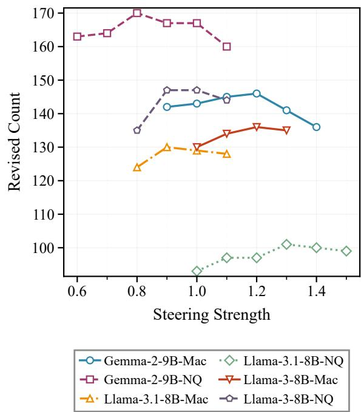  
Figure 11: Explorations of steering strength for different models and datasets.

Here we present the results in Table 5. Notice that, at this time, we use all the dataset for testing without further filtering or division. The results of our method show the consistent and significant improvement, verifying the generalizability of our method for out-of-distribution knowledge conflicts.

## E Side Effect Results on Other Model Capabilities

Apart from the side effect experiments in the original context-understanding task, here we present the results for other model capabilities. We choose MMLU (Hendrycks et al., 2020) and GSM8K (Cobbe et al., 2021) for investigation.

We use the test code of EleutherAI2, and fix its steering positions of all tokens in the original setting to the last token in the prompt, which is consistent with our setting. We use the one-shot setting for both the datasets. And for GSM8K, results are reported on flexible-extracted answers with exact match. The results of steering on the last token in the prompt can be seen in Table 6 and Table 7. Our method shows comparable results on MMLU and consistently better results than the baseline on GSM8K. For a more obvious comparison, we report the results of steering on all tokens on MMLU (Table 8), the performances of the best baseline settings collapse in the same way that they output some formats of URLs (for example, www.://). And our method shows small side effects, which maintains a high level of capability.

## F Sensitivity Analysis

## F.1 Exploration of Steering Strength

Here we present part of our exploration results of steering strength coefficients in Figure 11. In some settings of the main results, we do not use the best coefficients, because they show relatively lower performance in the side effect checks. We can observe that the revised count shows a roughly singlepeaked pattern depending on the steering strength. When the steering strength is too small, the steering vector does not work for the best. And when the steering strength is too large, it might compromise the model’s ability to respond normally. The dynamic regulation of steering strength is studied in some other works (Li et al., 2026), which is not the focus of our work.

## F.2 Exploration of Top-k

Here we present the degree of overlap of selected features (top-10) for different layer top-k settings in Table 9. It shows stability that a majority of important features keep selected.

Here we present the performance changes of selected features with different layer top-k settings in Table 10 (feature amounts are set to 10 for Gemma-2-9B and 15 for Llama-3-8B respectively, and other hyperparameters remain the same). Gemma-2-9B is tested on Macnoise, and Llama-3-8B is tested on NQ-Swap. When the top-k is set as 10, it shows the best performances, excluding a large amount of noise features and including the potentially good ones. The results also show that overly aggressive pruning by top-k can remove useful features and impair the performance, which is consistent with our analysis in Section 3.

## F.3 Stability of Feature Interaction Pattern Capture with Different Numbers of Sampled Instances

Here we present the degree of overlap of selected features (top-15) with different numbers of sampled instances in Table 11. Gemma-2-9B is tested on Macnoise, and Llama-3-8B is tested on NQ-Swap.

The results show that the interaction patterns captured by our single steering method are quite stable with the number of sampled instances. So,

<table><tr><td>Method</td><td colspan="3">NQ-Swap</td><td colspan="3">Macnoise</td></tr><tr><td></td><td>Llama-3-8B</td><td>Llama-3.1-8B</td><td>Gemma-2-9B</td><td>Llama-3-8B</td><td>Llama-3.1-8B</td><td>Gemma-2-9B</td></tr><tr><td>Without Steering</td><td></td><td></td><td></td><td>51.7</td><td>48.0</td><td>52.0</td></tr><tr><td>SPARE</td><td>22.4</td><td>13.1</td><td>50.6</td><td>20.0</td><td>11.1</td><td>60.4</td></tr><tr><td>KPI</td><td>58.1</td><td>60.9</td><td>60.5</td><td>61.2</td><td>60.2</td><td>61.4</td></tr></table>

Table 5: Results in a more complex faithful scenario of FaithEval-counterfactual-v1.0. Our method has the consistent and significant improvement, showing the generalizability of our method for out-of-distribution knowledge conflicts. Results without steering are the same in NQ-Swap and Macnoise.
<table><tr><td rowspan="2">Method</td><td colspan="3">NQ-Swap</td><td colspan="3">Macnoise</td></tr><tr><td>Llama-3-8B</td><td>Llama-3.1-8B</td><td>Gemma-2-9B</td><td>Llama-3-8B</td><td>Llama-3.1-8B</td><td>Gemma-2-9B</td></tr><tr><td>Without Steering</td><td></td><td></td><td></td><td> $6 4 . 0 8 { \scriptstyle \pm 0 . 3 8 }$ </td><td> $6 4 . 3 6 { \scriptstyle \pm 0 . 3 8 }$ </td><td> $6 9 . 5 7 { \scriptstyle \pm 0 . 3 6 }$ </td></tr><tr><td>SPARE</td><td> $6 4 . 1 1 { \scriptstyle \pm 0 . 3 8 }$ </td><td> $6 4 . 3 1 { \scriptstyle \pm 0 . 3 8 }$ </td><td> $6 8 . 8 9 _ { \pm 0 . 3 6 }$ </td><td> $6 4 . 2 4 { \scriptstyle \pm 0 . 3 8 }$ </td><td> $6 4 . 2 7 { \scriptstyle \pm 0 . 3 8 }$ </td><td> $6 8 . 8 8 { \scriptstyle \pm 0 . 3 6 }$ </td></tr><tr><td>KPI</td><td> $6 4 . 1 1 { \scriptstyle \pm 0 . 3 8 }$ </td><td> $6 4 . 3 4 { \scriptstyle \pm 0 . 3 8 }$ </td><td> $6 9 . 5 6 { \scriptstyle \pm 0 . 3 6 }$ </td><td> $6 4 . 1 9 { \scriptstyle \pm 0 . 3 8 }$ </td><td> $6 4 . 1 8 { \scriptstyle \pm 0 . 3 8 }$ </td><td> $6 9 . 5 8 { \scriptstyle \pm 0 . 3 6 }$ </td></tr></table>

Table 6: Side effect checks (steering on the last token in prompt) of our method on MMLU datasets. Our method achieves comparable performance, showing its small side effects in other inference scenarios of universal knowledge.
<table><tr><td>Method</td><td colspan="3">NQ-Swap</td><td colspan="3">Macnoise</td></tr><tr><td></td><td>Llama-3-8B</td><td>Llama-3.1-8B</td><td>Gemma-2-9B</td><td></td><td>Llama-3-8BLlama-3.1-8B</td><td>Gemma-2-9B</td></tr><tr><td>Without Steering</td><td></td><td></td><td></td><td> $3 8 . 2 1 _ { \pm 1 . 3 4 }$ </td><td> $4 0 . 9 4 { \scriptstyle \pm 1 . 3 5 }$ </td><td> $6 2 . 6 2 { \scriptstyle \pm 1 . 3 3 }$ </td></tr><tr><td>SPARE</td><td> $3 1 . 9 9 { \scriptstyle \pm 1 . 2 8 }$ </td><td> $3 6 . 6 9 { \scriptstyle \pm 1 . 3 3 }$ </td><td> $5 5 . 4 2 { \scriptstyle \pm 1 . 3 7 }$ </td><td> $3 3 . 0 6 _ { \pm 1 . 3 0 }$ </td><td> $3 7 . 7 6 { \scriptstyle \pm 1 . 3 4 }$ </td><td> $5 2 . 9 9 { \scriptstyle \pm 1 . 3 7 }$ </td></tr><tr><td>KPI</td><td> $3 2 . 9 8 { \scriptstyle \pm 1 . 2 9 }$ </td><td> $3 8 . 8 2 _ { \pm 1 . 3 4 }$ </td><td> $6 1 . 5 6 { \scriptstyle \pm 1 . 3 4 }$ </td><td> $3 5 . 7 1 { \scriptstyle \pm 1 . 3 2 }$ </td><td> $3 7 . 8 3 { \scriptstyle \pm 1 . 3 4 }$ </td><td> $6 1 . 0 3 { \scriptstyle \pm 1 . 3 4 }$ </td></tr></table>

Table 7: Side effect checks (steering on the last token in prompt) of our method on GSM8K datasets. Our method achieves better performance than the mass steering baseline, showing its ability of alleviating side effects in other inference scenarios of math.
<table><tr><td>Method</td><td colspan="3">NQ-Swap</td><td colspan="3">Macnoise</td></tr><tr><td></td><td>Llama-3-8B</td><td>Llama-3.1-8B</td><td>Gemma-2-9B</td><td>Llama-3-8B</td><td>Llama-3.1-8B</td><td>Gemma-2-9B</td></tr><tr><td>Without Steering</td><td></td><td></td><td></td><td> $6 4 . 0 8 { \scriptstyle \pm 0 . 3 8 }$ </td><td> $6 4 . 3 6 { \scriptstyle \pm 0 . 3 8 }$ </td><td> $6 9 . 5 7 { \scriptstyle \pm 0 . 3 6 }$ </td></tr><tr><td>SPARE</td><td> $2 4 . 2 1 { \scriptstyle \pm 0 . 3 6 }$ </td><td> $2 6 . 3 1 { \scriptstyle \pm 0 . 3 7 }$ </td><td> $2 2 . 9 5 { \scriptstyle \pm 0 . 3 5 }$ </td><td> $2 4 . 1 7 { \scriptstyle \pm 0 . 3 6 }$ </td><td> $3 0 . 0 9 { \scriptstyle \pm 0 . 3 9 }$ </td><td> $2 2 . 9 5 { \scriptstyle \pm 0 . 3 5 }$ </td></tr><tr><td>KPI</td><td> $6 3 . 3 9 { \scriptstyle \pm 0 . 3 8 }$ </td><td> $6 3 . 4 7 { \scriptstyle \pm 0 . 3 8 }$ </td><td> $6 0 . 1 3 { \scriptstyle \pm 0 . 3 9 }$ </td><td> $6 3 . 2 5 { \scriptstyle \pm 0 . 3 8 }$ </td><td> $6 2 . 5 3 { \scriptstyle \pm 0 . 3 9 }$ </td><td> $6 7 . 1 2 { \scriptstyle \pm 0 . 3 7 }$ </td></tr></table>

Table 8: Side effect checks (steering on all tokens) of our method on MMLU datasets. Our method maintains a high level of capability, showing its ability of alleviating side effects by filtering redundant features.

<table><tr><td>Top-k 10</td><td>15 20 30</td></tr><tr><td>Gemma-2-9B 1.0</td><td>0.8 0.8 0.7</td></tr><tr><td>Llama-3-8B 1.0 0.7</td><td>0.7 0.6</td></tr></table>

Table 9: The degree of overlap of selected features with different top-k settings.

the small development datasets used in our main experiments are reasonable.
<table><tr><td>Number of Instances</td><td>10 100 200</td></tr><tr><td>Gemma-2-9B 1.0</td><td>0.8 0.73</td></tr><tr><td>Llama-3-8B</td><td>1.0 0.87 0.87</td></tr></table>

<table><tr><td>Top-k</td><td>5</td><td>10</td><td>15</td><td>20</td><td>30</td></tr><tr><td>Gemma-2-9B</td><td>148</td><td>150</td><td>140</td><td>146</td><td>135</td></tr><tr><td>Llama-3-8B</td><td>114</td><td>141</td><td>139</td><td>136</td><td>132</td></tr></table>

Table 11: The degree of overlap of selected features with different numbers of sampled instances.  
Table 10: The performance (revised count) changes of selected features with different top-k settings.

## G Efficiency Analysis

To estimate the interactions among features, the method of backward propagation calculates the gradients layer by layer, which requires substantial GPU computing power and storage space due to the enormous number of SAE features. Our method uses forward passes with single steering to significantly improve the efficiency. The time savings come from leveraging prior knowledge of mutual information, which allows us to identify the important features. The reason why methods like Circuit Tracer (Ameisen et al., 2025) use backward propagation is that they rely on this process to locate the important features, but it also has the drawbacks that are discussed in Limitations.

<table><tr><td>Layer</td><td>Runtime (s)</td></tr><tr><td>18</td><td>1535.77</td></tr><tr><td>19</td><td>1750.06</td></tr><tr><td>20</td><td>1378.83</td></tr><tr><td>21</td><td>1053.75</td></tr><tr><td>22</td><td>1233.42</td></tr><tr><td>23</td><td>882.42</td></tr><tr><td>24</td><td>1152.39</td></tr><tr><td>25</td><td>640.63</td></tr><tr><td>26</td><td>721.01</td></tr><tr><td>27</td><td>636.88</td></tr><tr><td>28</td><td>554.89</td></tr><tr><td>29</td><td>508.84</td></tr><tr><td>30</td><td>472.61</td></tr><tr><td>31</td><td>392.92</td></tr><tr><td>32</td><td>338.13</td></tr><tr><td>33</td><td>248.00</td></tr><tr><td>34</td><td>202.31</td></tr><tr><td>35</td><td>180.56</td></tr><tr><td>36</td><td>105.12</td></tr></table>

Table 12: Per-layer runtime in seconds for layers 18 to 36 on Gemma-2-9B under the default experimental setting.

To better quantify the computational cost of graph construction, here we report results for Gemma-2-9B, which is the largest model in our experiments. All experiments are conducted on a single NVIDIA A100-SXM4-40GB GPU. The maximum GPU memory usage is 36.45 GiB. Evaluation follows the default experimental setting of top-10 features per layer, recording top-5 enhanced features per downstream layer, a development set of size 10 and analyzing layers 18 to 36. We report layer-wise time cost in Table 12, because later source layers have fewer downstream layers to analyze. The total computation cost is 3.89 GPU hours.

## H Formalization of Key Path Identification

Let $\mathcal { L }$ denote the set of selected transformer layers. For each $\ell \in { \mathcal { L } } .$ , let $\mathcal { F } _ { \ell }$ be the set of all SAE features at layer $\ell ,$ and let $\nu _ { \ell } \subseteq \mathcal { F } _ { \ell }$ be the set of candidate positive features selected at layer ℓ. We write $\ell ( v )$

for the layer index of feature v, and define the overall candidate feature set as

$$
\mathcal { V } = \bigcup _ { \ell \in \mathcal { L } } \mathcal { V } _ { \ell } .
$$

Interaction graph We define the feature interaction graph as an unweighted directed graph $G =$ $( \nu , \mathcal { E } )$ , where each node corresponds to one candidate feature. Let $\mathcal { D } _ { \mathrm { g r a p h } }$ be a small dataset used for graph construction. Since steering a feature can only affect representations at the same layer or later layers, for a source feature $u \in \mathcal V ,$ candidate target features are restricted to layers $\ell ^ { \prime } \geq \ell ( u )$ For any such layer $\ell ^ { \prime }$ and any feature $v \in \mathcal { F } _ { \ell ^ { \prime } }$ , let $a _ { v } ( x )$ denote the activation of v on example $x ,$ and let $a _ { v } ^ { ( u ) } ( x )$ denote the activation of v when only feature u is steered. We define the mean activation increase from u to v as

$$
\bar { \Delta } _ { u  v } = \frac { 1 } { | \mathcal { D } _ { \mathrm { g r a p h } } | } \sum _ { x \in \mathcal { D } _ { \mathrm { g r a p h } } } ( a _ { v } ^ { ( u ) } ( x ) - a _ { v } ( x ) ) .
$$

For each source feature u and each candidate layer $\ell ^ { \prime } \geq \ell ( u )$ , we define

$$
\mathrm { T o p } 5 _ { \ell ^ { \prime } } ( u ) = \mathrm { T o p } 5 \left( \mathcal { F } _ { \ell ^ { \prime } } ; \bar { \Delta } _ { u \to \cdot } \right) \cap \mathcal { V } _ { \ell ^ { \prime } } ,
$$

where $\mathrm { T o p 5 } ( \mathcal { F } _ { \ell ^ { \prime } } ; \bar { \Delta } _ { u  \cdot } )$ denotes the five features in $\mathcal { F } _ { \ell ^ { \prime } }$ with the largest positive mean activation increases under steering feature $u .$ The edge set is then defined as

$$
{ \mathcal { E } } = \{ ( u , v ) \mid v \in \bigcup _ { \ell ^ { \prime } \geq \ell ( u ) } \mathrm { T o p } 5 _ { \ell ^ { \prime } } ( u ) \} .
$$

Key feature ranking We score each feature by its indegree in the interaction graph:

$$
\mathrm { d e g } ^ { \mathrm { i n } } ( v ) = \sum _ { u \in \mathcal { V } } \mathbf { 1 } [ ( u , v ) \in \mathcal { E } ] .
$$

We then rank all features in V jointly by decreasing indegree, and denote the resulting global ranking by $\mathcal { R }$

Key layer selection and key path construction Let $\mathcal { D } _ { \mathrm { e v a l } }$ be a larger validation set used for layer selection. Let

$$
\mathcal { R } ^ { ( r ) } = \mathrm { T o p R } ( \mathcal { V } ; \mathcal { R } )
$$

denote the top-r features in the global ranking $\mathcal { R }$ For each layer ℓ, we then define

$$
\begin{array} { r } { S _ { \ell } = \mathcal { R } ^ { ( r ) } \cap \mathcal { V } _ { \ell } . } \end{array}
$$

Prompt Template of Question Answering   
Context:Albert Einstein developed the theory of relativity in 1905   
Question:Who developed the theory of relativity?   
Answer:Albert Einstein   
Context:Paris is the capital of France   
Question:What is the capital of France?   
Answer:Paris   
Context:Alexander Graham Bell invented the telephone in 1876   
Question:Who invented the telephone?   
Answer:Alexander Graham Bell   
Context:. . .   
Question:. . .   
Answer:  
Figure 12: Prompt template of question answering. The last colon is where we perform activation sampling. For any candidate key layer $\ell ^ { \star } \in { \mathcal { L } } ,$ we define the corresponding key-path feature set as

$$
\mathcal { P } _ { \ell ^ { \star } } = \bigcup _ { \ell \leq \ell ^ { \star } } S _ { \ell } .
$$

We select the key layer by

$$
\hat { \ell } = \arg \operatorname* { m a x } _ { \ell ^ { \star } \in \mathcal { L } } \mathrm { E v a l } ( M , \mathcal { S } _ { \ell ^ { \star } } , \mathcal { D } _ { \mathrm { e v a l } } ) ,
$$

where Eval $( M , S , \mathcal { D } _ { \mathrm { e v a l } } )$ denotes the best steering performance obtained by singly steering each feature in $s$ on $\mathcal { D } _ { \mathrm { e v a l } }$ . The final key path is defined as

$$
\mathcal { P } = \mathcal { P } _ { \hat { \ell } } .
$$

Steering strength coefficient tuning We tune the steering strength coefficient over a candidate set A by

$$
\alpha ^ { \star } = \arg \operatorname* { m a x } _ { \alpha \in \cal { A } } \mathrm { E v a l } ( M , \mathcal { P } , \alpha , \mathcal { D } _ { \mathrm { e v a l } } ) ,
$$

where Eval $( M , \mathcal { P } , \alpha , \mathcal { D } _ { \mathrm { { e v a l } } } )$ denotes the validation performance when steering all features in $\mathcal { P }$ with strength coefficient α.

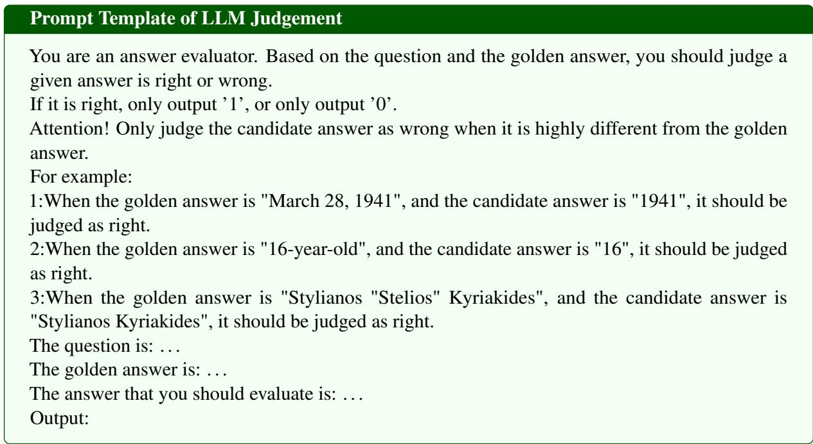  
Figure 13: Prompt template of LLM judgement.

Algorithm 1 Key Path Identification (KPI)   
Require: model M, selected layers ${ \mathcal { L } } ,$ all-feature sets $\{ { \mathcal { F } } _ { \ell } \} _ { \ell \in { \mathcal { L } } } ,$ , candidate feature sets $\{ \gamma _ { \ell } \} _ { \ell \in \mathcal { L } }$ , graph  
construction set ${ \mathcal { D } } _ { \mathrm { g r a p h } } ,$ evaluation set $\mathcal { D } _ { \mathrm { e v a l } } .$ global ranking budget $r ,$ strength coefficient set A   
1: $\mathcal { V }  \bigcup _ { \ell \in \mathcal { L } } \mathcal { V } _ { \ell } , \mathcal { E }  \bar { \varnothing }$   
2: for all $u \in \mathcal V$ do   
3: for all $\ell ^ { \prime } \in \mathcal { L }$ such that $\ell ^ { \prime } \geq \ell ( u )$ do   
4: compute $\bar { \Delta } _ { u  v }$ for all $v \in \mathcal { F } _ { \ell ^ { \prime } }$ using $\mathcal { D } _ { \mathrm { g r a p h } }$   
5: $\mathrm { T o p } 5 _ { \ell ^ { \prime } } ( u ) \gets \mathrm { T o p } 5 ( \mathcal { F } _ { \ell ^ { \prime } } ; \bar { \Delta } _ { u \to \cdot } ) \cap \mathcal { V } _ { \ell ^ { \prime } }$   
6: add (u, v) to E for all $v \in \mathrm { T o p } 5 _ { \ell ^ { \prime } } ( u )$   
7: end for   
8: end for   
9: compute de $\boldsymbol { \mathrm { \Sigma } } _ { \mathrm { { > } } } ^ { \mathrm { { i n } } } ( \boldsymbol { v } )$ for all $v \in \mathcal V$   
10: rank all features in V jointly by decreasing indegree to obtain R   
11: ${ \mathcal { V } } ^ { ( r ) } \gets \mathrm { T o p R } ( \nu ; \mathcal { R } )$   
12: for all $\ell \in { \mathcal { L } }$ do   
13: $\boldsymbol { S } _ { \ell } \gets \mathcal { V } ^ { ( r ) } \cap \mathcal { V } _ { \ell }$   
14: end for   
15: $\hat { \ell } \gets \arg \operatorname* { m a x } _ { \ell ^ { \star } \in \mathcal { L } } \mathrm { E v a l } ( M , S _ { \ell ^ { \star } } , \mathcal { D } _ { \mathrm { e v a l } } )$   
16: $\textstyle { \mathcal { P } } \gets \bigcup _ { \ell \leq \hat { \ell } } S _ { \ell }$   
17: $\alpha ^ { \star }  \arg \operatorname* { m a x } _ { \alpha \in \cal { A } } \mathrm { E v a l } ( M , \mathcal { P } , \alpha , \mathcal { D } _ { \mathrm { e v a l } } )$   
18: return $\mathcal { P } , \alpha ^ { \star }$