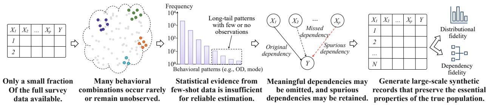
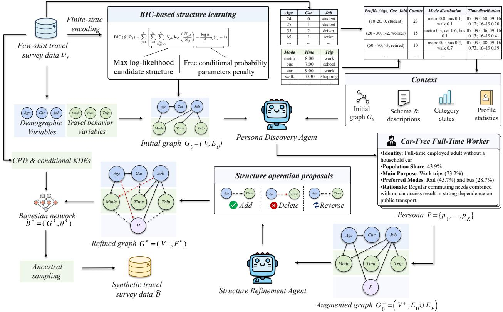
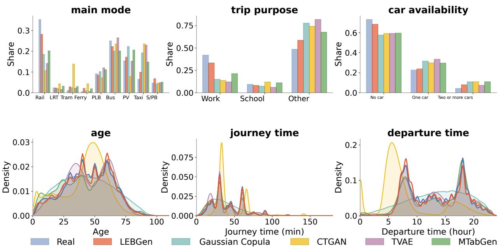
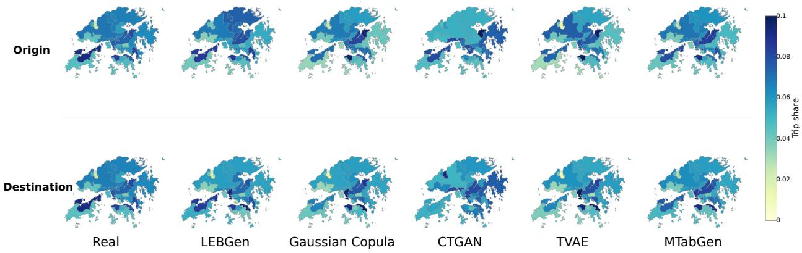
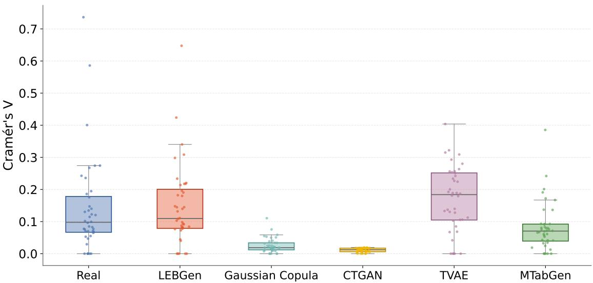
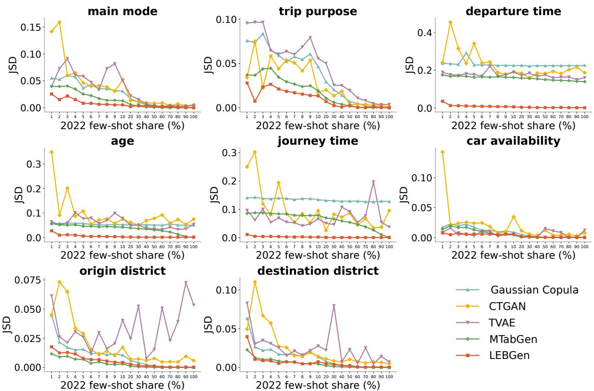
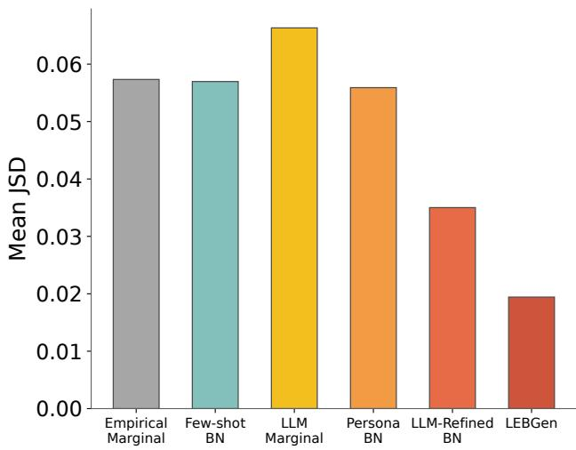
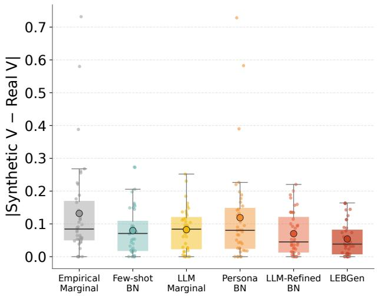
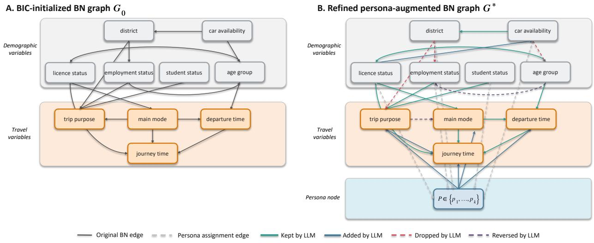

# LEBGen: An LLM-Enhanced Bayesian Network Framework for Few-Shot Travel Survey Data Generation

Zijian Shena, Bin Zhoua, Jiguang Wanga, Ya Zhaob, and Jintao Ke∗a

aDepartment of Civil Engineering, The University of Hong Kong bDepartment of Urban Planning and Design, The University of Hong Kong

## Abstract

Travel survey data are essential for transportation planning and travel behavior analysis, yet collecting large-scale representative samples is costly and time-consuming. A practical alternative is to generate synthetic survey records from a few-shot sample. However, such samples provide incomplete coverage of heterogeneous traveler groups and insuficient evidence for recovering the complex dependencies between demographic characteristics and travel behavior. Existing approaches have complementary limitations. Probabilistic generative models such as Bayesian networks (BNs) ofer explicit distributional control, but structures learned from few-shot samples may omit meaningful dependencies or retain spurious ones. Large language models (LLMs) can help address these dificulties in BN structure learning by providing behavioral knowledge that complements the limited statistical evidence. We therefore propose LEBGen, an LLM-enhanced BN framework that uses this knowledge to refine network structure for few-shot travel survey data generation. Specifically, the LLM first identifies traveler personas from demographic attribute and travel behavior statistics, then recovers dependencies missed by the persona-augmented BN structure and prune spurious ones. The refined BN is parameterized exclusively from the observed data to generate synthetic records. Under a 2% few-shot setting on the 2022 Hong Kong Travel Characteristics Survey, LEBGen reduces the mean marginal Jensen–Shannon divergence from 0.0671 to 0.0091 and the mean absolute Cramér’s V error by 14.3% over the best-performing baseline, substantially improving both distributional and dependency fidelity.

Keywords: Travel data generation; Few-shot learning; Bayesian networks; Large Language Models;

## 1 Introduction

Travel survey data are fundamental to transportation planning, travel demand forecasting, and travel behavior analysis. Household travel surveys provide detailed observations by integrating demographic characteristics, socioeconomic conditions, household attributes, and individual trip records. Such datasets enable researchers to investigate heterogeneous travel behaviors, including trip purpose, mode choice, departure time, and spatial mobility patterns. Large-scale travel surveys also provide essential inputs for calibrating and validating activity-based and agent-based transportation models, which require representative population characteristics and individual-level travel behavior information (Hörl & Balac, 2021; Salat et al., 2023). However, collecting comprehensive travel survey data requires substantial financial and organizational resources. Transportation agencies and researchers therefore frequently face limited sample sizes, incomplete representation of population heterogeneity, and restricted access to detailed individual-level mobility data.

To alleviate these data limitations, synthetic population generation and synthetic travel survey data generation have been widely investigated. By constructing synthetic households, individuals, and travel records that preserve important characteristics of observed populations, synthetic data can support transportation modeling and policy evaluation. Existing research in these two related areas includes statistical reconstruction methods, probabilistic models, data-fusion approaches, and machine-learning-based generative models (Arkangil et al., 2023; Bigi et al., 2024; Hörl & Balac, 2021; Kashiyama et al., 2024). Recent work has further explored joint household–individual modeling and integrated activity-travel synthesis (Luo et al., 2024; Sané et al., 2025). High-fidelity synthetic travel survey data should accurately reproduce marginal distributions and preserve the dependencies linking demographic characteristics, household attributes, and travel behavior.

Bayesian networks (BNs) provide an interpretable probabilistic framework for representing these dependencies. By expressing the joint distribution through local conditional distributions, BNs allow synthetic records to be generated according to the modeled relationships between traveler characteristics and travel behavior. Recent studies have demonstrated the use of BNs for jointly modeling population characteristics and activity-travel behavior, including travel frequency, trip purpose, destination, travel mode, and duration (Luo et al., 2024; Sallard & Balać, 2023).

The quality of BN-based generation, however, depends strongly on the learned network structure. Survey collection and access constraints can leave only a small sample for learning this structure. Under such few-shot conditions, many demographic–behavioral combinations are sparsely observed or entirely absent from the sample, as illustrated in Fig. 1. Data-driven structure-learning algorithms infer edges from statistical scores or conditional-independence tests, but limited observations can yield unstable edge decisions (Kitson et al., 2023). The learned BN may consequently omit meaningful dependencies or retain relationships driven by sampling variability. These structural errors can then propagate to the generated records. Domain knowledge can guide or constrain structure learning when empirical evidence is limited (Constantinou et al., 2023), but conventional implementations rely on expert input or predefined structural restrictions. Obtaining and updating such knowledge becomes increasingly demanding as the dimensionality and behavioral complexity of travel survey data

  
Figure 1: The few-shot travel survey data generation problem: limited observations provide insuficient evidence for reliable dependency estimation, and the goal is to generate large-scale synthetic records that preserve the distributional and dependency properties of the true population.

Large language models (LLMs) can help address these dificulties in BN structure learning by providing behavioral knowledge that complements the limited statistical evidence. This knowledge can help identify potentially missing dependencies and assess whether learned relationships are behaviorally plausible. Prior work has examined LLM-driven synthetic data generation and human behavior simulation (Long et al., 2024; Park et al., 2023). In transportation, LLMs and pretrained language models have been applied to travel behavior prediction, mode-choice modeling, and synthetic human mobility generation (Mo et al., 2023; Yang et al., 2024b; Zhang et al., 2024). Persona-conditioned LLMs have also been used to generate synthetic mobility survey responses, indicating that semantic traveler profiles can help represent heterogeneous travel preferences (Tzachristas et al., 2026).

Initial eforts to use LLM-derived knowledge for structure refinement have employed LLMs as semantic experts to assess missing and superfluous edges in directed graphs (Ankan & Textor, 2025). However, this work focuses on edge-level assessment and is not oriented toward synthetic data generation. For few-shot travel survey generation, the remaining challenge is to connect such dependency refinement with semantic representations of heterogeneous traveler groups within a BN-based generative model.

To address this challenge, this study presents LEBGen, an LLM-enhanced BN framework for few-shot travel survey data generation. The framework uses LLM-derived behavioral knowledge to support BN construction at the node and edge levels. At the node level, the persona discovery agent summarizes demographic attribute combinations and their associated travel behavior statistics into a set of interpretable traveler personas. Each persona provides a higher-level semantic representation of shared travel behavior patterns. The personas are encoded as distinct states of an additional BN node linking demographic and travel behavior variables. At the edge level, the structure refinement agent assesses dependencies in the persona-augmented network and proposes the addition, deletion, or reversal of edges. Together, these mechanisms provide semantic guidance for representing traveler heterogeneity and assessing dependencies that are weakly supported by the few-shot sample. The local distributions of the refined BN are then estimated exclusively from the observed records and used for synthetic data generation.

The framework is evaluated on the 2022 Hong Kong Travel Characteristics Survey (TCS) (Transport Department, The Government of the Hong Kong Special Administrative Region,

2025), which contains household-, individual-, and trip-level information, including demographic characteristics, employment and student status, vehicle ownership, trip purpose, departure time, origin and destination districts, and primary travel mode. Few-shot subsets comprising approximately 2% of the survey records are used for model construction and synthetic data generation, while the complete dataset serves as the evaluation benchmark. Synthetic data quality is assessed from two complementary perspectives. Distributional fidelity measures whether the generated records reproduce the marginal, temporal, and spatial distributions observed in the complete survey. Dependency fidelity evaluates whether the synthetic data preserve the associations between traveler characteristics and travel behavior variables.

The main contributions of this study are summarized as follows:

• We develop LEBGen, a few-shot synthetic data generation framework tailored to travel survey data. To the best of our knowledge, this is the first framework to use LLMderived semantic knowledge to enhance BN structure learning for synthetic travel survey generation.

• We introduce an LLM-based mechanism for enhancing BN structure at two levels. The persona discovery agent distills interpretable traveler personas from demographic– behavioral summaries and encodes them as the states of an additional BN node. The structure refinement agent reviews and refines the dependency structure learned from few-shot observations.

• We evaluate LEBGen on the 2022 Hong Kong TCS data. The results show that the proposed framework outperforms representative baseline methods in both distributional fidelity, including the reconstruction of marginal, temporal, and spatial distributions, and dependency fidelity.

The remainder of this paper is organized as follows. Section 2 reviews related work. Section 3 formulates the few-shot travel survey data generation problem. Section 4 presents the LEBGen framework. Section 5 describes the experimental design and presents the evaluation results. Finally, Section 6 concludes the paper and discusses its implications.

## 2 Literature Review

This section reviews the methodological foundations most relevant to few-shot travel survey synthesis and positions the present study within the broader literature on transportation data generation. The discussion is organized around three related research streams: synthetic population and survey data generation in transportation, BN-based travel behavior modeling and data synthesis, and the emerging use of LLMs for structured reasoning and synthetic data generation. Together, these streams provide the methodological context for the proposed framework.

## 2.1 Synthetic Population and Survey Data Generation in Transportation

Synthetic population and travel survey data generation have become essential to activitybased and agent-based transportation modeling, which requires disaggregate representations of households, individuals, and travel activities that are rarely observed for an entire population. Useful synthetic travel survey data should preserve not only marginal distributions but also household composition, activity participation, trip timing, spatial allocation, travelmode patterns, and the dependencies connecting these attributes. Classical reconstruction methods, including iterative proportional fitting (Beckman et al., 1996) and simulation-based synthesis (Farooq et al., 2013), focus primarily on reproducing joint demographic distributions under marginal controls, and recent research has accordingly moved toward integrated population-and-activity representations that support simulation, accessibility analysis, and policy evaluation (Bigi et al., 2024; Mahfouz et al., 2025; Salat et al., 2023; Somanath et al., 2024). Recent transportation studies have also examined passenger–train flow interactions in large-scale urban rail systems (Zhang et al., 2023) and operational challenges such as bus bunching in urban bus systems (Yang et al., 2024a).

One research stream extends conventional reconstruction through modular microsimulation and activity-scheduling pipelines, ranging from the national-scale Synthetic Population Catalyst for England (Salat et al., 2023) to a building-level activity-based population for Gothenburg (Somanath et al., 2024) and a reproducible workflow integrating household structure, activity scheduling, and location assignment (Mahfouz et al., 2025). These pipelines improve transparency and practical applicability but depend on multiple external data sources, predefined scheduling mechanisms, and geographically specific calibration inputs. A related stream compensates for survey sparsity with auxiliary information: small-area estimation combines regional surveys with census products (Al-Khasawneh & Cirillo, 2024), the Pseudo-PFLOW framework fuses a limited survey with open statistical and geospatial data to construct nationwide synthetic mobility for Japan (Kashiyama et al., 2024), and passively collected cellular data have been fused with household surveys to improve spatial heterogeneity (Vo et al., 2025). Such auxiliary sources, however, may be unavailable, inconsistent with the original survey schema, or subject to platform-specific sampling biases.

Model-based approaches instead learn the joint distribution directly from observed records. Probabilistic graphical models have jointly synthesized population characteristics and daily activity patterns (Luo et al., 2024; Sallard & Balać, 2023). Deep generative models capture nonlinear and higher-order relationships: variational autoencoders (VAEs) were first applied to recover plausible attribute combinations absent from small training samples (Borysov et al., 2019), subsequent studies formalized the trade-of between recovering sampling zeros and excluding structural zeros (Garrido et al., 2020; Kim & Bansal, 2023), a GAN– RNN framework synthesized population attributes together with trip chains (Arkangil et al., 2023), and household-size-specific VAEs improved fidelity in joint household–individual distributions (Sané et al., 2025). Deep generative models nevertheless require suficient observations to learn stable multivariate patterns (Garrido et al., 2020), and their dependency structures remain implicit in model parameters, so low-frequency traveler profiles and sparsely observed behavioral combinations may be inadequately represented when the sample is small.

Evaluation research further shows that a synthetic population may closely reproduce selected control variables while misrepresenting population heterogeneity or unconstrained relationships (Bigi et al., 2024); recent pipelines therefore assess joint distributions, activity-chain properties, spatial allocation, and temporal patterns in addition to marginals (Kashiyama et al., 2024; Mahfouz et al., 2025; Somanath et al., 2024). Despite these advances, most transportation-synthesis studies either assume suficiently informative surveys or compensate for sparsity through census controls, mobility traces, or geospatial data. Limited evidence exists on whether synthetic travel survey data can be generated from few-shot observations while simultaneously preserving marginal distributions, spatial travel patterns, and intervariable dependency structures.

## 2.2 Bayesian Networks for Travel Behavior Modeling and Data Synthesis

BNs represent a multivariate distribution through a directed acyclic graph and local conditional distributions, so heterogeneous survey variables can be linked through an interpretable dependency structure and complete synthetic records can be sampled from the resulting joint distribution. In transportation, BN-based synthesis originates with Sun and Erath (2015), who demonstrated competitive accuracy relative to conventional procedures. A Swiss application subsequently used a BN to synthesize population attributes together with daily activity patterns, showing that preserving population–mobility dependencies is important for representative travel demand (Sallard & Balać, 2023), and the BayABM framework integrated BN inference with activity-based modeling and destination assignment for individuallevel mobility estimation (Luo et al., 2024). BNs have further supported mode-shift analysis (Khoo & Ong, 2023), travel-mode identification from heterogeneous data sources (Wang et al., 2023a), work-from-home decision modeling within integrated urban models (Anik & Habib, 2024), and large-scale urban-mobility analysis through hybrid structure learning combined with expert consensus (Quijada-Alarcón et al., 2025). These applications establish BNs as interpretable generative and inferential components rather than purely predictive models.

The efectiveness of BN modeling depends on reliable structure learning. Existing scorebased, constraint-based, and hybrid methods can recover meaningful dependency structures when suficient data are available, but their performance is sensitive to sample size and variable characteristics (Kitson et al., 2023). With limited observations, the learned graph may omit behaviorally meaningful dependencies or retain relationships caused by sampling variability. Prior knowledge can improve structural reliability under such conditions (Constantinou et al., 2023), and transportation studies have incorporated graph restrictions or expert review into BN construction (Anik & Habib, 2024; Quijada-Alarcón et al., 2025; Sallard & Balać, 2023). However, expert elicitation is costly, analyst-dependent, and dificult to scale across many survey variables. This limitation is particularly relevant for travel surveys, where semantically related attributes may have weak statistical support in smal samples despite meaningful behavioral relationships.

Beyond manual elicitation, recent machine-learning research has investigated large language models (LLMs) as an alternative source of structural knowledge: LLM-elicited causal statements have been integrated into structure search as constraints (Ban et al., 2023), treated as advice from imperfect experts (Long et al., 2023), or condensed into causal-order priors (Vashishtha et al., 2023), as surveyed by Wan et al. (2025). Most recently, Zhang et al. (2025) placed the LLM at the center of BN structure discovery under data-free and data-aware regimes, reporting advantages precisely when observations are scarce. These evaluations, however, concentrate on benchmark causal networks with known ground-truth graphs and few, semantically well-defined variables; high-cardinality categorical survey microdata and the downstream generation of complete synthetic records remain outside their scope. A scalable mechanism that transfers behaviorally informed structural knowledge into few-shot BN learning for travel surveys is still missing.

## 2.3 LLMs in Transportation and Synthetic Data Generation

LLMs have expanded from text generation to structured reasoning, simulation, and synthetic-data production, with controllability, diversity, factual reliability, and quality assessment identified as central challenges (Long et al., 2024). Their distinctive capability for structured data is the interpretation of feature names, categorical meanings, and naturallanguage constraints—semantic understanding potentially valuable for travel surveys. In tabular generation, the GReaT framework showed that serializing records as text and finetuning a pretrained language model produces realistic samples (Borisov et al., 2023), complementing earlier deep generative approaches (Xu et al., 2019), and subsequent permutation and conditional-sampling strategies improved feature–target correlation preservation and downstream predictive utility (Nguyen et al., 2024). This line of work highlights that syntactically valid records and realistic univariate values are insuficient when multivariate relationships relevant to subsequent analysis are not preserved.

In transportation, zero-shot LLM prediction and LLM-derived representations provide useful information in data-limited settings (Mo et al., 2023), masked language models learn personalized mode-choice patterns from textualized trip records (Yang et al., 2024b), and prompt-based contextual reasoning supports location prediction (Wang et al., 2023b). Moving from prediction to generation, MobGLM synthesizes human mobility within a languagemodel framework (Zhang et al., 2024), fine-tuned open-source models can approximate observed travel-diary characteristics (Bhandari et al., 2024), and recent frameworks emulate survey respondents through sociodemographic personas and guided prompting (Salvador et al., 2026; Tzachristas et al., 2026). Closest to the present study, Lim et al. (2026) used the topological ordering of a data-learned BN to constrain autoregressive generation by a fine-tuned LLM, improving feasibility and diversity relative to deep generative baselines. The direction of integration is, however, the reverse of ours: a statistically learned structure disciplines LLM decoding, whereas our framework uses LLM-derived semantic knowledge to strengthen the BN structure itself and samples all records from an explicit joint distribution.

Persona-conditioned language models can reproduce aggregate response patterns in social-science surveys (Argyle et al., 2023), while generative agents and richer personal contexts have been shown to improve behavioral coherence and response realism (Cho et al., 2024; Park et al., 2023). However, such models may still reflect patterns embedded in pretrained models and exhibit reduced variation, prompt sensitivity, and distorted relationships among survey variables (Bisbee et al., 2024; Dillion et al., 2023). Existing transportation synthesis methods often rely on suficiently informative samples or auxiliary data, while BN structure learning becomes less reliable under limited observations. LLM-based approaches provide useful semantic knowledge but have not yet been fully integrated with probabilistic data generation for high-dimensional travel surveys. These limitations motivate the proposed framework for few-shot travel survey synthesis. A brief comparison is represented in Table 1, comparing representative studies from the three streams across six capabilities.

Table 1: Comparison with representative recent studies across six capabilities. ✓: fully addressed; △: partially addressed; ×: not addressed; –: not applicable.
<table><tr><td>Reference</td><td>Survey genera- tion</td><td>Few-shot setting</td><td>Explicit depen- dency modeling</td><td>Persona semantics</td><td>LLM- guided structure reasoning</td><td>Asso- ciation evalua- tion</td></tr><tr><td>Arkangil et al. (2023)</td><td>√</td><td>×</td><td>△</td><td>×</td><td>X</td><td>△</td></tr><tr><td>Sallard and Balać (2023)</td><td>√</td><td>×</td><td>√</td><td>×</td><td>X</td><td>△</td></tr><tr><td>Mo et al. (2023)</td><td>X</td><td>△</td><td>×</td><td>△</td><td>X</td><td></td></tr><tr><td>Luo et al. (2024)</td><td>√</td><td>×</td><td>√</td><td>×</td><td>X</td><td>△</td></tr><tr><td>Kashiyama et al. (2024)</td><td>√</td><td>△</td><td>△</td><td>×</td><td>X</td><td>△</td></tr><tr><td>Anik and Habib (2024)</td><td>△</td><td>×</td><td>√</td><td>×</td><td>×</td><td>√</td></tr><tr><td>Zhang et al. (2024)</td><td>√</td><td>×</td><td>△</td><td>△</td><td>X</td><td>△</td></tr><tr><td>Nguyen et al. (2024)</td><td>X</td><td>X</td><td>△</td><td>×</td><td>X</td><td>√</td></tr><tr><td>Sané et al. (2025)</td><td>√</td><td>X</td><td>△</td><td>×</td><td>X</td><td>×</td></tr><tr><td>Mahfouz et al. (2025)</td><td>√</td><td>×</td><td>△</td><td>×</td><td>X</td><td>△</td></tr><tr><td>Zhang et al. (2025)</td><td>×</td><td>√</td><td>√</td><td>×</td><td>√</td><td></td></tr><tr><td>Lim et al. (2026)</td><td>√</td><td>△</td><td>△</td><td>×</td><td>X</td><td>△</td></tr><tr><td>Tzachristas et al. (2026)</td><td>√</td><td>△</td><td>X</td><td>√</td><td>X</td><td>√</td></tr><tr><td>Our study</td><td>√</td><td>√</td><td>√</td><td>√</td><td>√</td><td>√</td></tr></table>

## 3 Problem Formulation

We consider the problem of generating synthetic individual-level travel survey data from a limited set of observed survey records. Let $\mathcal { V } = \{ X _ { 1 } , X _ { 2 } , . . . , X _ { d } \}$ denote the set of survey variables. For each variable $X _ { j }$ , let $\chi _ { j }$ denote its admissible domain, which may be categorical or continuous, and define the joint variable space as

$$
\chi = \prod _ { j = 1 } ^ { d } \chi _ { j } .\tag{1}
$$

According to their roles in the survey, the variables are partitioned as

$$
\mathcal { V } = \mathcal { V } _ { D } \dot { \cup } \mathcal { V } _ { T } ,\tag{2}
$$

where $\gamma _ { D }$ contains traveler and household characteristics and $\nu _ { T }$ contains travel behavior attributes. Each observed record is represented as $\mathbf { x } _ { i } = ( x _ { i 1 } , x _ { i 2 } , \ldots , x _ { i d } ) \in \mathcal { X }$

Let $\mathcal { D } _ { f } = \{ { \bf x } _ { i } \} _ { i = 1 } ^ { n }$ denote the available few-shot travel survey sample, whose records are assumed to be independently drawn from an unknown target survey distribution $p ^ { * } ( \mathbf { x } )$ . The sample size $n$ is insuficient to provide dense coverage of the heterogeneous demographic– behavioral combinations in the joint variable space $\mathcal { X } .$ . Survey metadata, including variable definitions, category labels, and admissible value domains, are assumed to be available. General-purpose semantic knowledge that is not specific to the target population may also be exploited.

Given $\mathcal { D } _ { f }$ and the survey metadata, the objective is to construct a generative model $q _ { \phi }$ over $\mathcal { X } ,$ , where the model specification $\phi$ is constructed using the few-shot sample as the only source of observations from the target population, and to produce a substantially larger synthetic dataset

$$
\begin{array} { r } { \widehat { \mathcal { D } } = \{ \widehat { \mathbf { x } } _ { i } \} _ { i = 1 } ^ { M } , \qquad \widehat { \mathbf { x } } _ { i } \overset { \mathrm { i . i . d . } } { \sim } q _ { \phi } ( \mathbf { x } ) , \qquad M \gg n . } \end{array}\tag{3}
$$

Each synthetic record is required to follow the same variable schema and admissible value domains as the observed survey. The objective is for $q _ { \phi }$ to approximate $p ^ { * }$ with respect to both the distributions of individual variables and the dependencies linking traveler characteristics and travel behavior. The research problem is therefore to construct such a generator from the few-shot sample without access to additional observations from the target population.

## 4 Methodology

Given a few-shot travel survey sample $\mathcal { D } _ { f } = \{ { \bf x } _ { i } \} _ { i = 1 } ^ { n }$ , where $\mathbf { x } _ { i } = ( x _ { i 1 } , \dots , x _ { i d } )$ is an observation over the survey-variable set $\nu ,$ the variables are partitioned both by their modeling roles and by their data types:

$$
\mathcal { V } = \mathcal { V } _ { D } \dot { \cup } \mathcal { V } _ { T } = \mathcal { V } _ { \mathrm { d i s c } } \dot { \cup } \mathcal { V } _ { \mathrm { c o n t } } ,\tag{4}
$$

where $\nu _ { D }$ and $\nu _ { T }$ denote demographic and travel-behavior variables, respectively, while $\mathcal { V } _ { \mathrm { d i s c } }$ and $\mathcal { V } _ { \mathrm { c o n t } }$ denote discrete and continuous variables.

For each discrete variable $X _ { j } \in \mathcal { V } _ { \mathrm { d i s c } }$ , let $A _ { j } = \{ a _ { j 1 } , \ldots , a _ { j r _ { j } } \}$ denote its finite state space. For each continuous variable $X _ { j } \in \mathcal { V } _ { \mathrm { c o n t } }$ , whose original domain is $\mathcal { X } _ { j } \subseteq \mathbb { R }$ , a fixed discretization function $g _ { j } : \mathcal { X } _ { j }  \mathcal { A } _ { j }$ maps its original value to one of $r _ { j }$ finite interval states. For notational uniformity, $g _ { j }$ is defined as the identity mapping for discrete variables. The structural representation of each observation is therefore

$$
\begin{array} { r } { \widetilde { x } _ { i j } = g _ { j } ( x _ { i j } ) , \qquad \widetilde { \mathbf { x } } _ { i } = ( \widetilde { x } _ { i 1 } , \ldots , \widetilde { x } _ { i d } ) , \qquad \widetilde { \mathcal { D } } _ { f } = \{ \widetilde { \mathbf { x } } _ { i } \} _ { i = 1 } ^ { n } . } \end{array}\tag{5}
$$

Survey-defined categorical intervals are retained whenever available. Otherwise, domaininformed intervals are used, and any data-dependent boundaries are determined using only the few-shot sample. The discretized representation is used for structure learning, persona assignment, and parent-configuration matching, whereas the original continuous values are retained for continuous-variable generation.

The proposed LEBGen framework constructs a persona-augmented, mixed-type Bayesian network generator through three sequential stages, as illustrated in Figure 2. First, an initial Bayesian network is learned from $\tilde { \mathcal { D } } _ { f }$ to obtain a data-driven dependency structure over the survey variables. Second, the Persona Discovery Agent groups demographic profiles according to their associated travel behavior summaries and produces explicit personaassignment rules. The resulting persona variable is introduced as an auxiliary network node, after which the structure refinement agent reviews the augmented graph and proposes dependency-structure modifications. Third, type-specific local distributions are estimated from the persona-augmented few-shot sample: discrete variables are modeled using smoothed conditional probability tables, while continuous variables are modeled using conditional kernel distributions estimated from the corresponding original observations. Synthetic records are then generated through ancestral sampling. The persona variable participates in dependency modeling and generation but is removed from the final records, which retain the original variable set and continuous measurement scales.

The resulting generator is specified by

$$
\phi = \left( \mathcal { G } ^ { * } , \widehat { \Theta } _ { \mathrm { d i s c } } ^ { * } , \widehat { \mathcal { F } } _ { \mathrm { c o n t } } ^ { * } , \mathcal { P } , \pi , \mathbf { g } \right) ,\tag{6}
$$

where $\mathcal { G } ^ { * }$ is the refined persona-augmented graph, $\hat { \Theta } _ { \mathrm { d i s c } } ^ { * }$ contains the conditional probability parameters of the discrete survey variables, $\widehat { \mathcal { F } } _ { \mathrm { c o n t } } ^ { * }$ contains the conditional kernel distributions of the continuous variables, $\mathcal { P }$ is the persona state space, $\pi$ is the deterministic personaassignment function, and $\mathbf { g } = \{ g _ { j } \} _ { j = 1 } ^ { d }$ denotes the collection of structural state-encoding functions.

The two LLM-based agents perform distinct and sequential functions. The persona discovery agent generates persona descriptions and assignment rules, whereas the structure refinement agent proposes graph operations. Both agents receive structured inputs and return machine-readable outputs that are validated before being incorporated into the framework.

## 4.1 Few-Shot BN Initialization

The initial network is learned from the finite-state structural representation $\tilde { \mathcal { D } } _ { f }$ . A Bayesian network is represented by $\boldsymbol { B } = ( \boldsymbol { \mathcal { G } } , \boldsymbol { \Theta } )$ , where $\mathcal { G } = ( \nu , \mathcal { E } )$ is a directed acyclic graph and $\Theta$

  
Figure 2: Overview of the LEBGen framework. The persona discovery agent constructs behaviorinformed traveler personas, and the structure refinement agent proposes modifications to the persona-augmented Bayesian network.

denotes the collection of local conditional probability parameters for the encoded variables. Given a graph G, the joint distribution of the finite-state representations factorizes as

$$
p _ { \mathcal { B } } ( \widetilde { \mathbf { x } } ) = \prod _ { j = 1 } ^ { d } p _ { \Theta _ { j } } \left( \widetilde { x } _ { j } \mid \widetilde { \mathbf { x } } _ { \mathrm { P a } _ { \mathcal { G } } ( X _ { j } ) } \right) ,\tag{7}
$$

where $\mathrm { P a } _ { \mathcal { G } } ( X _ { j } )$ denotes the parent set of $X _ { j }$ under $\mathcal { G }$ . Although the graph is learned from the finite-state representations, its nodes retain the identities of the original survey variables and are subsequently used to organize the type-specific local generation mechanisms.

The initial graph is learned using score-based structure learning. Candidate structures are evaluated using the Bayesian information criterion, which balances the likelihood of the encoded observations against the number of free parameters. Given a candidate graph $\mathcal { G } _ { : }$ , let $q _ { j }$ denote the number of possible configurations of $\mathrm { P a } _ { \mathcal { G } } ( X _ { j } )$ . For the lth parent configuration $\mathbf { u } _ { j l }$ , define

$$
N _ { j k l } = \sum _ { i = 1 } ^ { n } \mathbb { I } \left[ \widetilde { x } _ { i j } = a _ { j k } , \widetilde { \mathbf { x } } _ { i , \mathrm { P a } _ { \mathcal { G } } ( X _ { j } ) } = \mathbf { u } _ { j l } \right] , \qquad N _ { j l } = \sum _ { k = 1 } ^ { r _ { j } } N _ { j k l } .\tag{8}
$$

The BIC score of $\mathcal { G }$ is

$$
\mathrm { B I C } \left( \mathcal { G } ; \widetilde { D } _ { f } \right) = \sum _ { j = 1 } ^ { d } \left[ \sum _ { l = 1 } ^ { q _ { j } } \sum _ { \stackrel { k = 1 } { N _ { j k l } > 0 } } ^ { r _ { j } } N _ { j k l } \log \left( \frac { N _ { j k l } } { N _ { j l } } \right) - \frac { \log n } { 2 } q _ { j } ( r _ { j } - 1 ) \right] .\tag{9}
$$

The first term is the maximized log-likelihood under the candidate structure, and the second term penalizes the number of free conditional probability parameters.

Because exhaustive search over all DAGs is computationally infeasible, the BIC score is optimized using greedy hill-climbing search. The search begins from the empty graph,

$$
\mathcal { G } ^ { ( 0 ) } = ( \nu , \emptyset ) .\tag{10}
$$

At iteration t, the neighborhood $\mathcal { N } ( \mathcal { G } ^ { ( t ) } )$ contains all DAGs obtainable from $\mathcal { G } ^ { ( t ) }$ through one valid edge addition, deletion, or reversal. The next graph is selected as

$$
\mathcal { G } ^ { ( t + 1 ) } = \arg \operatorname* { m a x } _ { \mathcal { H } \in \mathcal { N } ( \mathcal { G } ^ { ( t ) } ) \cup \{ \mathcal { G } ^ { ( t ) } \} } \mathrm { B I C } \left( \mathcal { H } ; \tilde { \mathcal { D } } _ { f } \right) .\tag{11}
$$

The search terminates when no single-edge operation improves the current score. The resulting initial graph is denoted by

$$
\mathcal { G } _ { 0 } = ( \mathcal { V } , \mathcal { E } _ { 0 } ) .\tag{12}
$$

The initial graph represents dependency relationships supported by the few-shot observations at the finite-state structural level. Under limited data, however, some meaningful dependencies may receive insuficient statistical support, while some retained edges may reflect sample-specific associations. The graph is therefore augmented with persona-based semantic information in the next stage.

## 4.2 LLM-Guided Semantic Augmentation and Structure Refinement

This stage consists of two connected components implemented by two functionally distinct LLM agents. The persona discovery agent constructs a behavior-informed partition of the demographic-profile space, while the structure refinement agent introduces the resulting persona variable into the network and reviews the dependencies in the initial graph. Representative prompt templates and the corresponding output-control procedure are provided in Appendix A.

## 4.2.1 Traveler Persona Discovery

Travel behavior may depend on combinations of demographic characteristics, but the number of possible demographic combinations grows rapidly with the number and cardinalities of the variables. Under few-shot sampling, many demographic profiles are therefore represented by only a small number of observations. Directly estimating separate travel-behavior distributions for these profiles can be unreliable, whereas removing demographic conditioning altogether may discard relevant behavioral diferences.

LEBGen addresses this issue by grouping demographic profiles with similar observed travel behavior into a smaller set of traveler personas. A persona defines a deterministic, behavior-informed partition of the demographic-profile space and provides a shared conditioning variable for profiles exhibiting similar travel patterns.

Records sharing the same structural states over $\gamma _ { D }$ are grouped into demographic profiles. Let

$$
\mathcal { A } _ { D } = \prod _ { X _ { j } \in \mathcal { V } _ { D } } \mathcal { A } _ { j }\tag{13}
$$

denote the feasible demographic-profile state space. Let $\mathcal { C } = \{ c _ { 1 } , \ldots , c _ { R } \} \subseteq \mathcal { A } _ { D }$ denote the distinct profiles observed in the few-shot sample. For each observed profile $c _ { r }$ , define

$$
\begin{array} { r } { \mathcal { I } _ { r } = \left\{ i : \widetilde { \mathbf { x } } _ { i } , \boldsymbol { \nu } _ { D } = c _ { r } \right\} , \qquad n _ { r } = | \mathcal { I } _ { r } | , } \end{array}\tag{14}
$$

where $\mathcal { T } _ { r }$ is the set of records belonging to profile $c _ { r }$ , and $n _ { r }$ is its observed frequency.

The travel behavior associated with each profile is summarized using the variables in $\nu _ { T }$ . For a travel variable $X _ { j } \in \mathcal { V } _ { T }$ and structural state $a _ { j k } \in { \mathcal { A } } _ { j }$ , the profile-specific state probability is

$$
\widehat { p } _ { r j } ( a _ { j k } ) = \frac { 1 } { n _ { r } } \sum _ { i \in \mathbb { Z } _ { r } } \mathbb { I } \left[ \widetilde { x } _ { i j } = a _ { j k } \right] .\tag{15}
$$

Let

$$
{ \widehat { \mathbf { p } } } _ { r j } = \left( { \widehat { p } } _ { r j } ( a _ { j 1 } ) , \ldots , { \widehat { p } } _ { r j } ( a _ { j r _ { j } } ) \right)
$$

denote the resulting state-distribution vector. For each continuous travel variable $X _ { j } \in$ $\mathcal { V } _ { T } \cap \mathcal { V } _ { \mathrm { c o n t } }$ , the interval distribution is supplemented with robust summaries of its original values:

$$
\widehat { m } _ { r j } = \operatorname * { m e d i a n } \left\{ x _ { i j } : i \in \mathcal { Z } _ { r } \right\} , \qquad \widehat { \mathrm { I Q R } } _ { r j } = \widehat { Q } _ { r j } ( 0 . 7 5 ) - \widehat { Q } _ { r j } ( 0 . 2 5 ) .\tag{16}
$$

The complete travel-behavior summary for profile $c _ { r }$ is denoted by

$$
\begin{array} { r } { \mathbf { s } _ { r } = \left\{ \widehat { \mathbf { p } } _ { r j } : X _ { j } \in \mathcal { V } _ { T } \right\} \cup \left\{ \left( \widehat { m } _ { r j } , \widehat { \mathrm { I Q R } } _ { r j } \right) : X _ { j } \in \mathcal { V } _ { T } \cap \mathcal { V } _ { \mathrm { c o n t } } \right\} . } \end{array}\tag{17}
$$

Each observed demographic profile is then represented as

$$
{ \bf z } _ { r } = ( c _ { r } , n _ { r } , { \bf s } _ { r } ) , \qquad { \mathcal { Z } } = \{ { \bf z } _ { 1 } , \ldots , { \bf z } _ { R } \} .\tag{18}
$$

The frequency $n _ { r }$ communicates the empirical support underlying the corresponding profilelevel behavioral summary.

The persona discovery agent receives ${ \mathcal { Z } } ,$ together with semantic descriptions of the survey variables, their structural states, and their roles as demographic or travel variables. Based on the demographic composition and associated travel statistics of the observed profiles, the agent groups the profiles into a set of traveler personas,

$$
\mathcal { P } = \{ p _ { 1 } , . . . , p _ { K } \} ,\tag{19}
$$

and provides a concise behavioral description of each persona. The number of personas K is determined from the similarities and distinctions represented in the supplied profile summaries.

The persona discovery agent also returns explicit persona-assignment rules expressed as conditions over demographic-variable states. These rules define a mapping

$$
\pi : { \mathcal { A } } _ { D }  { \mathcal { P } } ,\tag{20}
$$

which assigns every feasible demographic profile to one persona. A returned rule set is accepted only if $K \geq 2$ and the rules are mutually exclusive and collectively exhaustive over $A _ { D }$ . Because $A _ { D }$ is finite, these properties are verified programmatically by evaluating the rules for each feasible demographic profile. Invalid outputs are rejected and regenerated using diagnostic feedback indicating uncovered or multiply covered profiles.

Applying $\pi$ to the encoded demographic profile of each few-shot record yields the auxiliary persona label

$$
P _ { i } = \pi \left( \widetilde { \mathbf { x } } _ { i , \mathcal { V } _ { D } } \right) .\tag{21}
$$

The augmented samples and variable set are defined as

$$
\begin{array} { r } { \mathcal { D } _ { f } ^ { + } = \{ ( \mathbf { x } _ { i } , P _ { i } ) \} _ { i = 1 } ^ { n } , \qquad \tilde { \mathcal { D } } _ { f } ^ { + } = \{ ( \widetilde { \mathbf { x } } _ { i } , P _ { i } ) \} _ { i = 1 } ^ { n } , \qquad \mathcal { V } ^ { + } = \mathcal { V } \cup \{ P \} . } \end{array}\tag{22}
$$

In the augmented network, P is a categorical node whose value is determined by the structural states of the demographic variables. When P replaces multiple demographic parents of a travel variable, records from diferent demographic profiles contribute to shared persona-conditioned $\mathrm { C P T }$ rows or continuous conditioning pools. This reduces the number of separately estimated local configurations, with the extent of parameter sharing determined by the parent set selected during structure refinement.

Because $\pi$ is defined over the full feasible state space $A _ { D }$ , a demographic combination absent from the few-shot sample can still be assigned to an existing persona during generation. This provides a rule-based extrapolation mechanism for demographic profiles not represented in $\mathcal { D } _ { f }$

## 4.2.2 Edge Structure Refinement

The persona variable is incorporated into the initial network through fixed incoming edges from the demographic variables:

$$
\mathcal { E } _ { P } = \{ X \to P : X \in \mathcal { V } _ { D } \} .\tag{23}
$$

The resulting augmented graph is

$$
\mathcal { G } _ { 0 } ^ { + } = \left( \mathcal { V } ^ { + } , \mathcal { E } _ { 0 } \cup \mathcal { E } _ { P } \right) .\tag{24}
$$

These edges encode the deterministic dependence of $P$ on the structural states of the demographic variables and place the demographic nodes before P in any topological ordering.

Because every added edge points into $P _ { - }$ , and $P$ has no outgoing edges at this stage, the augmentation preserves acyclicity. The edges in $\mathcal { E } _ { P }$ remain fixed during structure refinement.

The structure refinement agent receives the augmented graph $\mathcal { G } _ { 0 } ^ { + }$ , the variable and state descriptions, the profile-level summaries $\mathcal { Z }$ , and the persona descriptions and assignment rules. Based on this context, the agent may propose three types of graph modification:

• deleting an edge inherited from ${ \mathcal { E } } _ { 0 }$ when the corresponding dependency lacks semantic or behavioral support;

• adding an edge between original survey variables to represent a potentially missing dependency, or adding a persona-to-travel edge

$$
P  X , \quad \quad X \in \mathcal { V } _ { T } ;\tag{25}
$$

• reversing an inherited edge whose orientation is implausible given the variable semantics.

For example, when the persona variable summarizes the influence of several demographic characteristics on a travel variable, the agent may remove a direct demographic-to-travel edge and route the association through P. For continuous variables, the graph operation concerns their finite-state structural representations, while their original values are retained by the continuous local generation mechanism described in the next subsection.

The structure refinement agent returns an ordered sequence of proposed operations,

$$
\begin{array} { r } { \widetilde { \mathcal { O } } = ( o _ { 1 } , \dots , o _ { S } ) , \qquad o _ { s } = ( \tau _ { s } , e _ { s } ) , \qquad \tau _ { s } \in \{ \mathrm { A D D } , \mathrm { D E L E T E } , \mathrm { R E V E R S E } \} , } \end{array}\tag{26}
$$

where each operation specifies an edge $e _ { s }$ , the modification $\tau _ { s }$ applied to it, and a brief justification.

The operations are applied sequentially in the returned order, starting from ${ \mathcal G } ^ { ( 0 ) } = { \mathcal G } _ { 0 } ^ { + }$ For each operation $o _ { s }$ , let $T ( \mathcal { G } ^ { ( s - 1 ) } , o _ { s } )$ denote the graph obtained by applying the proposed modification. A reversal is applied atomically, replacing the original edge with its reverse in a single operation. The graph is updated according to

$$
\mathcal { G } ^ { ( s ) } = \left\{ \begin{array} { l l } { T ( \mathcal { G } ^ { ( s - 1 ) } , o _ { s } ) , } & { \mathrm { i f ~ } T ( \mathcal { G } ^ { ( s - 1 ) } , o _ { s } ) \mathrm { ~ i s ~ v a l i d } , } \\ { \mathcal { G } ^ { ( s - 1 ) } , } & { \mathrm { o t h e r w i s e } . } \end{array} \right.\tag{27}
$$

An invalid operation leaves the graph unchanged, and a rejected reversal retains the original edge.

An operation is valid only if both endpoints of $e _ { s }$ belong to $\mathcal { V } ^ { + }$ and the resulting graph remains a DAG. An addition must not create a self-loop or duplicate an existing edge, while a deletion or reversal requires $e _ { s }$ to exist in the current graph. Moreover, the fixed edges in $\mathcal { E } _ { P }$ can be neither deleted nor reversed, no incoming edge to $P$ beyond $\mathcal { E } _ { P }$ is permitted, and an outgoing edge from P may target only a variable in $\nu _ { T }$

After all proposals have been evaluated, the refined graph is

$$
\mathcal { G } ^ { \ast } = \mathcal { G } ^ { ( S ) } = ( \mathcal { V } ^ { + } , \mathcal { E } ^ { \ast } ) .\tag{28}
$$

The resulting structure preserves graph validity while admitting dependencies that are semantically plausible but may be weakly represented in the few-shot sample.

## 4.3 Local Distribution Estimation and Synthetic Data Generation

With the refined graph $\mathcal { G } ^ { * }$ fixed, the generator is completed by estimating one local conditional distribution for each survey variable. Discrete variables are represented by smoothed CPTs, whereas continuous variables are represented by conditional kernel distributions over their original values.

To define a common parent-configuration representation, let $\gamma _ { Y } ( \cdot )$ denote the structuralstate encoder for an augmented network node:

$$
\gamma _ { Y } ( y ) = { \left\{ \begin{array} { l l } { g _ { k } ( y ) , } & { Y = X _ { k } \in \mathcal { V } , } \\ { y , } & { Y = P . } \end{array} \right. }\tag{29}
$$

Under a fixed ordering of the parents, the finite parent-state configuration of $X _ { j }$ is

$$
\mathbf { c } _ { j } ( \mathbf { x } , p ) = ( \gamma _ { Y } ( y ) : Y \in \mathrm { P a } _ { \mathcal { G } ^ { * } } ( X _ { j } ) ) .\tag{30}
$$

Thus, a continuous parent contributes its discretized state to the configuration, while its original value remains available in the generated record.

For each discrete survey variable $X _ { j } \in \mathcal { V } _ { \mathrm { d i s c } }$ , let $\mathbf { u } _ { j l } , \ l = 1 , \ldots , q _ { j } ^ { * }$ , denote the possible configurations of $\mathrm { P a } g * ( X _ { j } )$ . The corresponding counts in the augmented few-shot sample are

$$
N _ { j k l } ^ { + } = \sum _ { i = 1 } ^ { n } \mathbb { I } \left[ x _ { i j } = a _ { j k } , \mathbf { c } _ { j } ( \mathbf { x } _ { i } , P _ { i } ) = \mathbf { u } _ { j l } \right] , \qquad N _ { j l } ^ { + } = \sum _ { k = 1 } ^ { r _ { j } } N _ { j k l } ^ { + } .\tag{31}
$$

Each conditional probability vector is assigned a symmetric Dirichlet prior with unit pseudocounts. The posterior mean gives the Laplace-smoothed estimate

$$
\widehat { \theta } _ { j k l } = \frac { N _ { j k l } ^ { + } + 1 } { N _ { j l } ^ { + } + r _ { j } } .\tag{32}
$$

Consequently, a parent configuration that is unobserved in $\mathcal { D } _ { f } ^ { + }$ defaults to a uniform conditional distribution.

For each continuous variable $X _ { j } \in \mathcal { V } _ { \mathrm { c o n t } }$ , the original continuous observations associated with parent-state configuration $\mathbf { u } _ { j l }$ are collected as

$$
\mathcal { T } _ { j l } = \left\{ i : \mathbf { c } _ { j } \left( \mathbf { x } _ { i } , P _ { i } \right) = \mathbf { u } _ { j l } \right\} .\tag{33}
$$

When $\mathcal { T } _ { j l } \neq \emptyset$ , the complete parent configuration is retained. A predefined hierarchical fallback is invoked only when $\mathcal { I } _ { j l } = \emptyset$ , yielding a supported conditioning pool $\it { \Delta } \mathcal { T } _ { j l } ^ { \dagger }$ . Hence, $\mathcal { T } _ { j l } ^ { \dagger } = \mathcal { T } _ { j l }$ whenever the exact configuration has at least one observation.

A conditional kernel density is then estimated from the corresponding original values:

$$
\widehat { f } _ { j l } ( \boldsymbol { x } ) = \frac { \mathbb { I } [ \boldsymbol { x } \in \mathcal { X } _ { j } ] } { Z _ { j l } | \mathcal { I } _ { j l } ^ { \dagger } | h _ { j } } \sum _ { i \in \mathcal { I } _ { j l } ^ { \dagger } } K \left( \frac { \boldsymbol { x } - \boldsymbol { x } _ { i j } } { h _ { j } } \right) , \qquad \boldsymbol { X } _ { j } \in \mathcal { V } _ { \mathrm { c o n t } } ,\tag{34}
$$

where $K ( \cdot )$ is the kernel function, $h _ { j } > 0$ is the bandwidth for $X _ { j }$ , and $Z _ { j l }$ normalizes the density over the admissible domain $\chi _ { j }$ . The positive bandwidth allows the conditional kernel distribution to remain well defined even when a nonempty conditioning pool contains only a small number of observations. The collection of these conditional distributions is denoted by $\widehat { \mathcal { F } } _ { \mathrm { c o n t } } ^ { * }$

This construction separates structural conditioning from continuous value generation. Parent matching is conducted using the finite structural states represented in $\mathcal { G } ^ { * }$ , whereas the continuous child value is generated from a kernel distribution estimated using the original measurements associated with that configuration.

The discrete $\mathrm { C P T s } .$ continuous kernel distributions, and deterministic persona assignment jointly define the model over the augmented variable space:

$$
\begin{array} { l } { { \displaystyle p _ { \mathcal B ^ { * } } ( \mathbf x , p ) = \mathbb I \left[ p = \pi \left( \mathbf g _ { D } ( \mathbf x _ { \mathcal { D } } ) \right) \right] } \ ~ } \\ { { \displaystyle ~ \times \prod _ { X _ { j } \in \mathcal { V } _ { \mathrm { d i s c } } } p _ { \widehat { \Theta } _ { j } ^ { * } } ( x _ { j } \mid \mathbf c _ { j } ( \mathbf x , p ) ) } \ ~ } \\ { { \displaystyle ~ \times \prod _ { X _ { j } \in \mathcal { V } _ { \mathrm { c o n t } } } \widehat f _ { j } ( x _ { j } \mid \mathbf c _ { j } ( \mathbf x , p ) ) , } \ ~ } \end{array}\tag{35}
$$

where

$$
\begin{array} { r } { B ^ { * } = \left( \mathcal { G } ^ { * } , \widehat { \Theta } _ { \mathrm { d i s c } } ^ { * } , \widehat { \mathcal { F } } _ { \mathrm { c o n t } } ^ { * } \right) , } \end{array}
$$

$\mathbf { g } _ { D }$ applies the corresponding state-encoding functions to the demographic variables, and $\hat { f } _ { j } ( \cdot \mid \mathbf { c } _ { j } )$ denotes the conditional kernel density associated with the resulting parent-state configuration. The indicator term is the local conditional distribution of the persona node and assigns probability one to the persona determined by the generated demographic profile.

Marginalizing the auxiliary persona node yields the generator over the original survey variables:

$$
\begin{array} { r l } {  { q _ { \phi } ( \mathbf { x } ) = \sum _ { p \in \mathcal { P } } p _ { \mathcal { B } ^ { * } } ( \mathbf { x } , p ) } } \\ & { = p _ { \mathcal { B } ^ { * } } ( \mathbf { x } , \pi ( \mathbf { g } _ { D } ( \mathbf { x } _ { \mathcal { V } _ { D } } ) ) ) , } \end{array}\tag{36}
$$

where the sum collapses because the indicator in Eq. (35) vanishes for every persona state other than the one assigned by $\pi .$

Synthetic records are generated through type-specific ancestral sampling. Let $\sigma =$ $( Y _ { 1 } , \ldots , Y _ { d + 1 } )$ be a topological ordering of $\mathcal { G } ^ { * }$ . The nodes are processed in this order. For a discrete survey node, its state is sampled from the corresponding smoothed CPT. For a continuous survey node, its original value is sampled from the conditional kernel distribution selected by the structural states of its previously generated parents. The generated continuous value is then immediately encoded as

$$
{ \widehat { \widetilde X } } _ { j } = g _ { j } ( { \widehat { X } } _ { j } ) , \qquad X _ { j } \in \mathcal V _ { \mathrm { c o n t } } ,\tag{37}
$$

so that its finite state is available when generating downstream children. The encoded state is used only within the generation procedure; the original value $\widehat { X _ { j } }$ is retained in the synthetic record.

Algorithm 1 LEBGen for Mixed-Type Few-Shot Travel Survey Data Generation   
Require: Few-shot sample $\mathcal { D } _ { f } = \{ \mathbf { x } _ { i } \} _ { i = 1 } ^ { n } ;$ demographic variables $\gamma _ { D } ;$ travel variables $\nu _ { T } ;$   
discrete and continuous variable sets $\mathcal { V } _ { \mathrm { d i s c } }$ and $\wr _ { \mathrm { c o n t } } ;$ state encoders $\mathbf { g } ;$ variable metadata   
$\mathcal { M } ;$ target sample size M   
Ensure: Synthetic travel survey dataset $\hat { \mathcal { D } }$ of size M   
1: $\mathcal { \tilde { D } } _ { f } \gets$ EncodeStructuralStates $( \mathcal { D } _ { f } , \mathbf { g } )$   
$\dot { / / }$ Stage 1: data-driven structure initialization   
2: $\mathcal { G } _ { 0 } \gets \mathrm { L E A R N I N I T I A L B N } ( \widetilde { \mathcal { D } } _ { f } , \mathcal { V } )$ ▷ BIC-based hill climbing   
$/ /$ Stage 2: persona augmentation and BN structure refinement   
3: Z ← BuildProfileSummaries $( \mathcal { D } _ { f } , \tilde { \mathcal { D } } _ { f } , \mathcal { V } _ { D } , \mathcal { V } _ { T } )$   
4: $( \mathcal { P } , \pi ) \gets \mathrm { P }$ ersonaDiscoveryAgent $( \mathcal { \bar { Z } } , \mathcal { M } , \mathcal { A } _ { D } )$   
5: $P _ { i }  \pi ( \widetilde { \mathbf { x } } _ { i , \mathcal { V } _ { D } } )$ for $i = 1 , \ldots , n$   
6: $\mathcal { D } _ { f } ^ { + }  \{ ( \mathbf { x } _ { i } , P _ { i } ) \} _ { i = 1 } ^ { n } , \quad \tilde { \mathcal { D } } _ { f } ^ { + }  \{ ( \tilde { \mathbf { x } } _ { i } , P _ { i } ) \} _ { i = 1 } ^ { n }$   
7: ${ \mathcal { E } } _ { P } ^ { ' } \gets \{ X \to P : X \in \mathcal { V } _ { D } \} ^ { \prime }$   
8: $\mathcal { G } _ { 0 } ^ { + }  ( \mathcal { V } \cup \{ P \} , \mathcal { E } _ { 0 } \cup \mathcal { E } _ { P } )$   
9: $\mathcal { \widetilde { O } } $ StructureRefinementAgent $( \mathcal { G } _ { 0 } ^ { + } , \mathcal { Z } , \mathcal { P } , \pi , \mathcal { M } )$   
10: $\mathcal { G } ^ { * } \gets \mathrm { V A L I D A T E A N D A P P L Y } ( \mathcal { G } _ { 0 } ^ { + } , \tilde { \mathcal { O } } , \mathcal { E } _ { P } , \mathcal { V } _ { T } )$ ▷ Validate graph constraints   
$/ / \triangle$ Stage $\it 3 .$ local estimation and mixed-type generation   
11: $\widehat { \Theta } _ { \mathrm { d i s c } } ^ { * }  \mathrm { E S T I M A T E D I S C R E T E C P T S } ( \mathcal { G } ^ { * } , \mathcal { D } _ { f } ^ { + } , \mathbf { g } )$   
12: $\widehat { \mathcal { F } } _ { \mathrm { c o n t } } ^ { * }  \mathrm { E s T I M A T E C O N D I T I O N A L K D E s } ( \mathcal { \bar { G } } ^ { * } , \mathcal { D } _ { f } ^ { + } , \mathbf { g } )$   
13: Db+ ← MixedAncestralSample $( \mathcal G ^ { * } , \widehat \Theta _ { \mathrm { d i s c } } ^ { * } , \mathcal { \tilde { F } } _ { \mathrm { c o n t } } ^ { * } , \pi , \mathbf { g } , M )$   
14: $\hat { \mathcal { D } } \gets \operatorname { P r o j } _ { \searrow } ( \hat { \mathcal { D } } ^ { + } )$   
15: return $\hat { \mathcal { D } }$

When the persona node is reached in the topological ordering, its value is assigned deterministically as

$$
\hat { P } = \pi \left( \hat { \widetilde { \bf x } } _ { \mathcal { V } _ { D } } \right) .\tag{38}
$$

All required demographic states are available because every demographic variable is a parent of P and therefore precedes it in $\sigma$

Repeating the procedure M times produces the augmented synthetic sample

$$
\begin{array} { r } { \widehat { D } ^ { + } = \left\{ ( \widehat { \mathbf { x } } _ { i } , \widehat { P } _ { i } ) \right\} _ { i = 1 } ^ { M } . } \end{array}\tag{39}
$$

Removing the auxiliary persona label gives the final synthetic dataset

$$
\mathcal { \widehat { D } } = \mathrm { P r o j } _ { \mathcal { V } } \left( \mathcal { \widehat { D } } ^ { + } \right) = \left\{ \widehat { \mathbf { x } } _ { i } \right\} _ { i = 1 } ^ { M } .\tag{40}
$$

The resulting records retain the original discrete variables and the original-scale continuous variables and therefore follow the original survey schema. Since each augmented record is sampled according to pB∗, projection of the auxiliary persona coordinate produces independent draws from $q _ { \phi }$ in Eq. (36). The complete procedure is summarized in Algorithm 1.

## 5 Experiments

## 5.1 Dataset and Experimental Setting

We evaluate the proposed framework using the 2022 TCS data. The survey contains detailed household-, individual-, and trip-related information and provides a comprehensive representation of travel behavior in Hong Kong. The variables considered in this study include traveler characteristics and travel behavior attributes, such as age, car availability, trip purpose, departure time, journey time, origin and destination districts, and main travel mode.

The cleaned TCS dataset is partitioned into a training pool and a held-out evaluation set. To simulate a data-scarce survey setting, only a small fraction of the training pool is made available to each generative model, while the held-out data are used exclusively as the reference for evaluation. Unless otherwise stated, the main experiment uses 2% of the TCS train-set records as the few-shot training sample. The remaining records and all statistics calculated from the complete survey are excluded from model construction, persona discovery, BN structure learning, LLM-guided structure refinement, and parameter estimation.

All compared methods receive exactly the same few-shot observations and generate the same number of synthetic records. Specifically, each method produces M = 80,000 synthetic travel survey records. Fixing both the training subset and output size ensures that diferences in reconstruction quality are attributable to the generative mechanisms.

For the proposed framework, an initial BN structure is learned exclusively from the fewshot sample. Traveler personas are discovered from demographic combinations and grouped travel behavior statistics calculated from the same few-shot observations. Both traveler persona discovery and BN structure refinement are performed using GPT-4o. The discovered traveler persona and the detailed initial and refined network structures are reported in Appendix B. The LLM receives variable definitions, category semantics, few-shot-derived aggregate statistics, persona descriptions, and the current network structure. It does not receive individual records or aggregate statistics from the complete TCS reference dataset.

Following LLM-guided structure refinement, the local distributions of the final network are estimated from the augmented few-shot data, using Dirichlet-smoothed conditional probability tables for discrete variables and conditional kernel distributions for continuous variables. Synthetic records are generated through ancestral sampling from the resulting BN. The auxiliary persona variable is removed after sampling so that all generated datasets follow the original TCS variable schema.

The main 2% experiment is complemented by a few-shot sensitivity analysis. The available train-set share is varied over 1% − 100%. At each data budget, all methods receive the same subset and generate 80,000 synthetic records. This analysis evaluates how reconstruction performance changes as progressively more direct statistical evidence becomes available.

## 5.2 Baseline Methods

We compare the proposed framework with four representative synthetic tabular-data generators covering statistical, adversarial, variational, and difusion-based approaches. All baseline methods are trained using the identical few-shot TCS subset and generate 80,000 synthetic records.

Gaussian Copula. Gaussian Copula is a classical statistical synthetic-data generator implemented using the Synthetic Data Vault framework (Patki et al., 2016). The model estimates a univariate marginal distribution for each variable and represents multivariate dependence through a Gaussian copula. It provides a probabilistic baseline for evaluating whether more flexible generative approaches improve the reconstruction of heterogeneous travel survey distributions.

CTGAN. Conditional Tabular Generative Adversarial Network (CTGAN) is designed for mixed-type tabular data and uses conditional training to address imbalanced categorical variables and multimodal continuous distributions (Xu et al., 2019). We use the SDV implementation and train the model for 100 epochs using the same few-shot subset as the proposed framework.

TVAE. Tabular Variational Autoencoder (TVAE) learns a continuous latent representation of mixed numerical and categorical variables and generates synthetic records through a probabilistic decoder (Xu et al., 2019). The SDV implementation is trained for 100 epochs under the same input-data and output-size conditions as CTGAN.

MTabGen. MTabGen is a difusion-based tabular generator that uses an encoder– decoder transformer, feature-specific difusion processes, and dynamic masking to model relationships among mixed-type variables (Villaizán-Vallelado et al., 2025). We train MTab-Gen for 80 epochs with a batch size of 1,024, three transformer layers, four attention heads, a hidden width of 96, and a learning rate of $1 0 ^ { - 3 }$ . The masking probability is set to 0.35, and synthetic generation uses 24 denoising steps.

No baseline is fitted, selected, or calibrated using the complete TCS evaluation dataset. The complete survey is used after generation to calculate the distributional and dependencyfidelity metrics.

## 5.3 Evaluation Metrics

The evaluation considers two complementary dimensions of synthetic travel survey quality: distributional fidelity and dependency fidelity. Distributional fidelity measures whether the generated data reproduce marginal, temporal, spatial, and selected joint travel distributions. Dependency fidelity measures whether relationships between traveler characteristics and travel behavior variables are preserved.

## 5.3.1 Distributional Fidelity

For each survey variable $X _ { j }$ , let $p _ { j }$ and $\widehat { p } _ { j }$ denote its empirical distributions in the reference and synthetic datasets, respectively. Distributional similarity is quantified using the Jensen–

Shannon divergence (JSD):

$$
\mathrm { J S D } ( p _ { j } , \widehat { p } _ { j } ) = \frac { 1 } { 2 } D _ { \mathrm { K L } } ( p _ { j } \| m _ { j } ) + \frac { 1 } { 2 } D _ { \mathrm { K L } } ( \widehat { p } _ { j } \| m _ { j } ) , \qquad m _ { j } = \frac { p _ { j } + \widehat { p } _ { j } } { 2 } ,\tag{41}
$$

where $D _ { \mathrm { K L } } ( \cdot | | \cdot )$ denotes the Kullback–Leibler divergence. Lower JSD values indicate closer agreement between the synthetic and reference distributions.

For categorical variables, empirical category frequencies are compared directly. Numerical variables are evaluated using a common discretization so that the reference and synthetic distributions share identical support, while kernel density estimates are additionally used to visualize their continuous distributions without replacing the quantitative JSD calculation. Together, these comparisons evaluate whether the generated individual-level survey records reproduce the distributions of both discrete and continuous attributes observed in the reference data.

## 5.3.2 Dependency Fidelity

Dependency fidelity is evaluated using Cramér’s V, which measures the strength of association between two categorical variables. For variables X and Y, Cramér’s V is defined as

$$
V ( X , Y ) = { \sqrt { \frac { \chi ^ { 2 } ( X , Y ) } { N \operatorname* { m i n } ( r - 1 , c - 1 ) } } } ,\tag{42}
$$

where $\chi ^ { 2 } ( X , Y )$ is the Pearson chi-square statistic, N is the number of observations, and r and c denote the numbers of states of X and $Y ,$ , respectively. Numerical variables are converted using the same discretization applied in the corresponding association analysis.

The modeled variables are divided into traveler-characteristic variables, denoted by $\gamma _ { D }$ and travel-behavior variables, denoted by $\nu _ { T }$ . Dependency evaluation considers travelercharacteristic–travel-behavior pairs as well as distinct pairs among travel-behavior variables. Let Q denote the resulting set of evaluated variable pairs.

For each pair $q \in \mathcal { Q }$ , let $V _ { q } ^ { \mathrm { r e a l } }$ and $V _ { q } ^ { \mathrm { s y n } }$ denote the Cramér’s V values calculated from the reference and synthetic datasets, respectively, and define $\Delta V _ { q } = V _ { q } ^ { \mathrm { s y n } } - V _ { q } ^ { \mathrm { r e a l } }$ . The overall dependency agreement is summarized using five complementary statistics:

$$
\begin{array} { r l } & { \quad \widetilde { V } _ { \mathrm { s y n } } = \mathrm { m e d i a n } _ { q \in \mathcal { Q } } V _ { q } ^ { \mathrm { s y n } } , } \\ & { \mathrm { M A E } _ { V } = \displaystyle \frac { 1 } { | \mathcal { Q } | } \sum _ { q \in \mathcal { Q } } \left| \Delta V _ { q } \right| , } \\ & { \quad \mathrm { B i a s } _ { V } = \displaystyle \frac { 1 } { | \mathcal { Q } | } \sum _ { q \in \mathcal { Q } } \Delta V _ { q } , } \\ & { \quad \quad \rho _ { V } = \mathrm { C o r r } \left( \left\{ V _ { q } ^ { \mathrm { r e a l } } \right\} _ { q \in \mathcal { Q } } , \left\{ V _ { q } ^ { \mathrm { s y n } } \right\} _ { q \in \mathcal { Q } } \right) , } \\ & { \quad \quad R _ { \mathrm { i n f a t e } } = \displaystyle \frac { 1 } { | \mathcal { Q } | } \sum _ { q \in \mathcal { Q } } \left[ V _ { q } ^ { \mathrm { s y n } } > V _ { q } ^ { \mathrm { r e a l } } \right] . } \end{array}\tag{43}
$$

Table 2: Distributional fidelity under the $2 \%$ few-shot setting. Lower JSD values indicate better agreement with the complete TCS reference data.
<table><tr><td>Model</td><td>Mean JSD</td><td>Main mode</td><td>Trip purpose</td><td>Departure time</td><td> $\mathrm { A g e }$ </td><td>Journey time</td><td>Car availability</td><td>OD pair</td></tr><tr><td>LEBGen</td><td>0.0091</td><td>0.0150</td><td>0.0074</td><td>0.0126</td><td>0.0102</td><td>0.0045</td><td>0.0048</td><td>0.0724</td></tr><tr><td>Gaussian Copula</td><td>0.0973</td><td>0.0525</td><td>0.0739</td><td>0.2343</td><td>0.0577</td><td>0.1423</td><td>0.0229</td><td>0.1935</td></tr><tr><td>CTGAN</td><td>0.1837</td><td>0.1590</td><td>0.0750</td><td>0.4548</td><td>0.0911</td><td>0.3024</td><td>0.0201</td><td>0.3089</td></tr><tr><td>TVAE</td><td>0.0794</td><td>0.0728</td><td>0.0966</td><td>0.1766</td><td>0.0526</td><td>0.0620</td><td>0.0160</td><td>0.1414</td></tr><tr><td>MTabGen</td><td>0.0671</td><td>0.0395</td><td>0.0367</td><td>0.1674</td><td>0.0520</td><td>0.0876</td><td>0.0195</td><td>0.0536</td></tr></table>

Here, $\tilde { V } _ { \mathrm { s y n } }$ summarizes the overall association strength represented in the synthetic data, while ${ \mathrm { M A E } } _ { V }$ measures the average absolute discrepancy from the reference associations. Bias captures systematic over- or under-estimation of dependency strength, with values closer to zero indicating lower systematic bias. The correlation $\rho _ { V }$ measures whether strong and weak dependencies occur among similar variable pairs in the reference and synthetic datasets.

The final statistic, $R _ { \mathrm { i n f l a t e } } ,$ represents the proportion of evaluated relationships for which the synthetic association exceeds the corresponding reference association. Unlike a conventional error metric, its desirable value is approximately 0.5: values substantially below 0.5 indicate systematic attenuation of dependencies, whereas values substantially above 0.5 indicate systematic inflation.

## 5.4 Few-Shot Distributional Fidelity

Figure 3 compares representative distributions generated from $2 \%$ of the TCS observations. The comparison includes three categorical attributes (i.e. main travel mode, trip purpose, and car availability) and three continuous attributes (i.e. age, journey time, and departure time). The real TCS distributions are shown together with the outputs of the proposed framework and the four baseline generators.

The proposed method reproduces the principal shapes and relative frequencies of the real distributions substantially more closely than the baseline methods. This advantage is particularly visible for departure time and journey time, where several deep generative baselines exhibit substantial distributional shifts despite being trained on the same few-shot records. For categorical variables, the proposed model also better preserves the relative shares of major travel modes and trip purposes, although some discrepancies remain for individual low-frequency categories.

Table 2 provides the corresponding quantitative comparison. The proposed method achieves a mean marginal JSD of 0.0091, compared with 0.0671 for the strongest baseline, MTabGen, and substantially larger values for Gaussian Copula, CTGAN, and TVAE. The advantage is consistent across main mode, trip purpose, departure time, age, journey time, and car availability. In particular, the proposed model obtains JSD values of 0.0045 for journey time and 0.0048 for car availability, indicating close agreement with the complete TCS distributions.

The spatial comparison in Figure 4 further evaluates whether the generators reproduce the geographic distribution of trip origins and destinations. The proposed framework closely follows the spatial heterogeneity observed in the complete TCS and reproduces many of the district-level diferences in trip shares. The OD-pair results nevertheless reveal a remaining challenge. MTabGen obtains the lowest OD-pair JSD of 0.0536, compared with 0.0724 for the proposed model. Thus, although the proposed framework provides the strongest overall distributional reconstruction, modeling the complete joint origin–destination structure remains relatively more dificult than reconstructing individual spatial marginals.

  
Figure 3: Comparison of selected travel-survey distributions under the 2% few-shot setting. Bars show category shares for categorical variables, while density curves show the distributions of continuous variables.

## 5.5 Few-Shot Dependency Fidelity

Distributional similarity alone does not establish whether synthetic travel survey data preserve relationships among variables. We therefore compare pairwise Cramér’s V values between the synthetic datasets and the complete TCS reference.

Figure 5 shows the distributions of Cramér’s V across the evaluated demographic–travel and travel–travel variable pairs. The proposed method produces an association distribution that closely follows the real data. In contrast, Gaussian Copula and CTGAN strongly compress pairwise associations toward zero, indicating systematic attenuation of behavioral dependencies. TVAE captures stronger relationships but tends to produce a broader and more inflated association distribution. MTabGen provides substantially better dependency preservation than the other baseline generators but still underestimates a considerable proportion of the real associations.

Table 3 confirms these observations quantitatively. The proposed method achieves the smallest mean absolute deviation from the real associations, 0.054, and the highest correlation with the real Cramér’s V vector, 0.868. MTabGen is the closest baseline, with a mean absolute deviation of 0.063 and a correlation of 0.850.

  
Figure 4: Spatial distributions of trip origins and destinations generated under the 2% few-shot setting. All maps use a common scale representing the share of trips associated with each district.

Table 3: Dependency fidelity under the 2% few-shot setting. Mean absolute ∆V is lower-is-better, mean ∆V should approach zero, correlation is higher-is-better, and the desirable inflation share is approximately 0.5.
<table><tr><td>Model</td><td>Median V</td><td>Mean abs. ∆V</td><td>Mean ∆V</td><td>Corr. with real V</td><td>Inflation share</td></tr><tr><td>LEBGen</td><td>0.110</td><td>0.054</td><td>0.005</td><td>0.868</td><td>0.425</td></tr><tr><td>Gaussian Copula</td><td>0.019</td><td>0.118</td><td>-0.117</td><td>0.296</td><td>0.050</td></tr><tr><td>CTGAN</td><td>0.012</td><td>0.131</td><td>-0.131</td><td>0.044</td><td>0.000</td></tr><tr><td>TVAE</td><td>0.184</td><td>0.093</td><td>0.028</td><td>0.587</td><td>0.575</td></tr><tr><td>MTabGen</td><td>0.070</td><td>0.063</td><td>-0.060</td><td>0.850</td><td>0.200</td></tr></table>

More importantly, the signed association error of the proposed framework is 0.005, indicating little systematic bias in association strength. Gaussian Copula, CTGAN, and MTab-Gen obtain negative mean diferences of −0.117, −0.131, and −0.060, respectively, showing a general tendency to attenuate real dependencies. TVAE instead produces a positive mean diference of 0.028, indicating moderate association inflation.

The inflation share provides a complementary view of this behavior. The proposed method has an inflation share of 0.425, close to the balanced reference value of 0.5. In contrast, 5% of Gaussian-Copula associations and none of the CTGAN associations exceed their corresponding real values, demonstrating strong systematic shrinkage. Although TVAE achieves an inflation share of 0.575, its larger absolute errors and substantially lower correlation indicate that this balance is accompanied by less accurate pair-specific association strengths.

  
Figure 5: Distributions of Cramér’s V for demographic–travel and travel–travel variable pairs under the 2% few-shot setting. Each point represents one evaluated variable pair.

## 5.6 Sensitivity to the Few-Shot Data Budget

We next examine how reconstruction performance changes as additional survey observations become available. Figure 6 reports variable-level JSD values as the available TCS share increases from 1% to 100%.

The proposed framework exhibits a clear data-eficiency advantage in the low-data regime. Across main mode, trip purpose, departure time, age, journey time, car availability, origin district, and destination district, the proposed method generally achieves the lowest or among the lowest JSD values when only a small fraction of the survey is available. The advantage is particularly pronounced between 1% and 10%, which corresponds to the setting targeted by this study.

As the available sample increases, the performance of several baseline generators improves, particularly for categorical travel variables. However, substantial diferences remain for temporal and continuous attributes. Gaussian Copula shows relatively persistent errors for departure time and journey time, whereas TVAE exhibits considerable instability for several spatial variables. CTGAN is especially sensitive to extremely small training samples and produces large JSD values at several low-budget points before improving as more observations become available.

The proposed method follows a substantially smoother convergence pattern. Its JSD decreases rapidly as the few-shot share increases and approaches the full-data reference across most variables. These results indicate that the principal advantage of incorporating semantic behavioral knowledge is strongest when direct statistical evidence is scarce, while the importance of such augmentation naturally decreases as increasingly representative observations become available.

  
Figure 6: Sensitivity of distributional fidelity to the available TCS train-set share. Each panel reports JSD for one survey variable; lower values indicate better agreement with the complete TCS reference.

## 5.7 Ablation Study

We conduct an ablation study under the main 2% few-shot setting to isolate the contribution of marginal modeling, BN dependencies, LLM-derived marginal knowledge, traveler persona augmentation, and LLM-guided BN structure refinement. Each configuration generates 80,000 synthetic records.

Empirical Marginal independently samples each survey variable from its empirical marginal distribution estimated from the 2% few-shot sample. This variant preserves only univariate frequencies and does not model dependencies among variables.

Few-shot BN uses the initial BN learned directly from the few-shot observations. It does not include the traveler persona variable or LLM-guided BN structure refinement.

LLM Marginal uses GPT-4o to produce a univariate marginal distribution function for each survey variable based on variable semantics and aggregate summaries derived from the few-shot sample. Synthetic values are then independently sampled from the LLM-generated marginal distributions. This configuration evaluates whether LLM-derived semantic knowledge can improve univariate distribution reconstruction without an explicit dependency model.

  
Figure 7: Ablation results under the 2% few-shot setting. Left: distributional fidelity measured by mean JSD, including origin–destination information. Right: dependency fidelity measured by the absolute discrepancy between synthetic and real Cramér’s V values. Lower values indicate better performance.

Persona-Augmented BN introduces the LLM-discovered traveler persona as an auxiliary variable in the BN but does not apply LLM-guided refinement to the network edge structure.

LLM-Refined BN applies LLM-guided edge addition, removal, and reversal to the few-shot BN but does not introduce the traveler persona variable.

LEBGen is the proposed full model.

Figure 7 compares the six configurations in terms of distributional fidelity and bivariate association fidelity. The left panel reports mean JSD, including the evaluated origin– destination information, whereas the right panel reports the absolute discrepancy between synthetic and real Cramér’s V values. Lower values indicate better performance in both panels.

The empirical marginal sampler and the initial few-shot BN produce comparable distributional errors, indicating that a BN learned directly from sparse observations does not automatically provide an accurate reconstruction of the target survey distribution. The LLM marginal variant performs worse than the empirical marginal sampler, showing that semantic knowledge alone is insuficient when each variable is generated independently and statistical dependencies are not explicitly represented.

Adding the traveler persona to the unrefined BN produces only a modest distributional improvement. In contrast, LLM-guided BN structure refinement substantially reduces mean JSD, demonstrating that reviewing the BN structure is important when the original structure is learned from limited observations. The complete framework achieves the lowest distributional error, indicating that persona augmentation and BN structure refinement provide complementary improvements.

A similar pattern is observed for bivariate association fidelity. The complete framework produces the smallest and most concentrated absolute Cramér’s V discrepancies. LLMguided BN refinement substantially improves association recovery relative to the unrefined BN, while the addition of traveler personas further reduces both the median error and the dispersion of pairwise discrepancies. These results suggest that personas provide a compact representation of shared traveler behavior, whereas BN structure refinement determines how this semantic information interacts with the original survey variables within the probabilistic model.

## 6 Conclusion

This study investigates few-shot travel survey data generation, where sparse observations provide insuficient evidence for reliably learning the dependencies linking demographic characteristics, household conditions, and travel behavior. We develop LEBGen, an LLM-enhanced BN framework that uses semantic behavioral knowledge to improve the network representation and dependency structure learned from limited survey data.

The methodological contribution lies in incorporating LLM-derived knowledge at both the node and edge levels of the BN. The Persona Discovery Agent identifies interpretable traveler personas from demographic attribute combinations and their associated travel behavior statistics. These personas capture behavioral similarities across sparsely observed demographic groups and define the states of an auxiliary node, with membership determined by demographic attributes. Building on this augmented representation, the Structure Refinement Agent assesses the network’s dependencies and proposes edge additions, deletions, and reversals to address potentially missing or spurious relationships. Together, persona-based representation and structural refinement provide semantic guidance for modeling heterogeneous travel behavior when statistical evidence is limited. The refined network is parameterized exclusively from the observed few-shot data, and synthetic records are generated through probabilistic sampling.

Experiments on the 2022 Hong Kong TCS under a 2% few-shot setting demonstrate improvements in both distributional and dependency fidelity over representative generative baselines. LEBGen achieves the lowest overall mean JSD and the smallest mean absolute error in pairwise Cramér’s V, improving the reconstruction of travel distributions and intervariable associations. Sensitivity analysis shows that these advantages are most pronounced at small sample sizes, while ablation experiments indicate that persona discovery and LLMguided structure refinement provide complementary benefits.

Several limitations warrant further investigation. The evaluation is based on a single survey, and broader validation is needed to assess transferability across cities and survey designs. Local distribution estimation also remains constrained by few-shot sample coverage, and detailed origin–destination relationships remain challenging to reconstruct. Future work will extend the evaluation to diverse travel survey datasets, examine sensitivity to LLM choices and prompting strategies, and investigate the incorporation of spatial information and supplementary aggregate statistics to improve the modeling of sparsely observed travel patterns.

## References

Al-Khasawneh, M. B., & Cirillo, C. (2024). Using small area estimation to produce reliable transportation statistics: The case of household trips estimation at the census tract level. Data Science for Transportation, 6(3), 21. https://doi.org/10.1007/s42421- 024-00105-1

Anik, M. A. H., & Habib, M. A. (2024). Development of an integrated urban modelling framework for examining the impacts of work from home on travel behavior. Case Studies on Transport Policy, 17, 101244. https://doi.org/10.1016/j.cstp.2024.101244

Ankan, A., & Textor, J. (2025). Expert-in-the-loop causal discovery: Iterative model refinement using expert knowledge. In S. Chiappa & S. Magliacane (Eds.), Proceedings of the forty-first conference on uncertainty in artificial intelligence (pp. 172–183, Vol. 286). PMLR. https://proceedings.mlr.press/v286/ankan25a.html

Argyle, L. P., Busby, E. C., Fulda, N., Gubler, J. R., Rytting, C., & Wingate, D. (2023). Out of one, many: Using language models to simulate human samples. Political Analysis, 31 (3), 337–351. https://doi.org/10.1017/pan.2023.2

Arkangil, E., Yildirimoglu, M., Kim, J., & Prato, C. G. (2023). A deep learning framework to generate synthetic mobility data. 2023 8th International Conference on Models and Technologies for Intelligent Transportation Systems (MT-ITS), 1–6. https://doi.org/ 10.1109/MT-ITS56129.2023.10241677

Ban, T., Chen, L., Wang, X., & Chen, H. (2023). From query tools to causal architects: Harnessing large language models for advanced causal discovery from data. arXiv preprint arXiv:2306.16902. https://doi.org/10.48550/arXiv.2306.16902

Beckman, R. J., Baggerly, K. A., & McKay, M. D. (1996). Creating synthetic baseline populations. Transportation Research Part A: Policy and Practice, 30 (6), 415–429. https://doi.org/10.1016/0965-8564(96)00004-3

Bhandari, P., Anastasopoulos, A., & Pfoser, D. (2024). Urban mobility assessment using LLMs. Proceedings of the 32nd ACM International Conference on Advances in Geographic Information Systems (SIGSPATIAL), 67–79. https : / / doi . org / 10 . 1145 / 3678717.3691221

Bigi, F., Rashidi, T. H., & Viti, F. (2024). Synthetic population: A reliable framework for analysis for agent-based modeling in mobility. Transportation Research Record, 2678 (11), 1–15. https://doi.org/10.1177/03611981241239656

Bisbee, J., Clinton, J. D., Dorf, C., Kenkel, B., & Larson, J. M. (2024). Synthetic replacements for human survey data? the perils of large language models. Political Analysis, 32 (4), 401–416. https://doi.org/10.1017/pan.2024.5

Borisov, V., Seßler, K., Leemann, T., Pawelczyk, M., & Kasneci, G. (2023). Language models are realistic tabular data generators. International Conference on Learning Representations (ICLR). https://doi.org/10.48550/arXiv.2210.06280

Borysov, S. S., Rich, J., & Pereira, F. C. (2019). How to generate micro-agents? A deep generative modeling approach to population synthesis. Transportation Research Part C: Emerging Technologies, 106, 73–97. https://doi.org/10.1016/j.trc.2019.07.006

Cho, S., Kim, J., & Kim, J. H. (2024). Llm-based doppelgänger models: Leveraging synthetic data for human-like responses in survey simulations. IEEE Access, 12, 178917–178927. https://doi.org/10.1109/ACCESS.2024.3502219

Constantinou, A. C., Guo, Z., & Kitson, N. K. (2023). The impact of prior knowledge on causal structure learning. Knowledge and Information Systems, 65(8), 3385–3434. https://doi.org/10.1007/s10115-023-01858-x

Dillion, D., Tandon, N., Gu, Y., & Gray, K. (2023). Can ai language models replace human participants? Trends in Cognitive Sciences, 27 (7), 597–600. https://doi.org/10.1016/ j.tics.2023.04.008

Farooq, B., Bierlaire, M., Hurtubia, R., & Flötteröd, G. (2013). Simulation based population synthesis. Transportation Research Part B: Methodological, 58, 243–263. https://doi. org/10.1016/j.trb.2013.09.012

Garrido, S., Borysov, S. S., Pereira, F. C., & Rich, J. (2020). Prediction of rare feature combinations in population synthesis: Application of deep generative modelling. Transportation Research Part C: Emerging Technologies, 120, 102787. https://doi.org/10. 1016/j.trc.2020.102787

Hörl, S., & Balac, M. (2021). Synthetic population and travel demand for paris and Ile-de-France based on open and publicly available data. Transportation Research Part C: Emerging Technologies, 130, 103291. https://doi.org/10.1016/j.trc.2021.103291

Kashiyama, T., Pang, Y., Shibuya, Y., Yabe, T., & Sekimoto, Y. (2024). Nationwide synthetic human mobility dataset construction from limited travel surveys and open data. Computer-Aided Civil and Infrastructure Engineering, 39(21), 3337–3353. https: //doi.org/10.1111/mice.13285

Khoo, H. L., & Ong, G. (2023). A mode shift bayesian network model for active travel demand management policies. Travel Behaviour and Society, 33, 100635. https://doi. org/10.1016/j.tbs.2023.100635

Kim, E.-J., & Bansal, P. (2023). A deep generative model for feasible and diverse population synthesis. Transportation Research Part C: Emerging Technologies, 148, 104053. https://doi.org/10.1016/j.trc.2023.104053

Kitson, N. K., Constantinou, A. C., Guo, Z., Liu, Y., & Chobtham, K. (2023). A survey of bayesian network structure learning. Artificial Intelligence Review, 56, 8721–8814. https://doi.org/10.1007/s10462-022-10351-w

Lim, S.-Y., Yun, H., Bansal, P., Kim, D.-K., & Kim, E.-J. (2026). A large language model for feasible and diverse population synthesis. Transportation Research Part C: Emerging Technologies, 185, 105581. https://doi.org/https://doi.org/10.1016/j.trc.2026.105581

Long, L., Wang, R., Xiao, R., Zhao, J., Ding, X., Chen, G., & Wang, H. (2024). On llmsdriven synthetic data generation, curation, and evaluation: A survey. Findings of the Association for Computational Linguistics: ACL 2024, 11065–11082. https://doi.org/ 10.18653/v1/2024.findings-acl.658

Long, S., Piché, A., Zantedeschi, V., Schuster, T., & Drouin, A. (2023). Causal discovery with language models as imperfect experts. arXiv preprint arXiv:2307.02390. https: //doi.org/10.48550/arXiv.2307.02390

Luo, N., Nara, A., Khoo, H. L., & Chen, M. (2024). An integration modeling framework for individual-scale daily mobility estimation. Travel Behaviour and Society, 34, 100650. https://doi.org/10.1016/j.tbs.2023.100650

Mahfouz, H., Greenbury, S. F., Zhang, B., Lynn, S., & Cheng, T. (2025). A reproducible pipeline for activity-based travel demand generation in england. Environment and

Planning B: Urban Analytics and City Science, 52 (9), 2326–2339. https://doi.org/ 10.1177/23998083251379620

Mo, B., Xu, H., Zhuang, D., Ma, R., Guo, X., & Zhao, J. (2023). Large language models for travel behavior prediction. arXiv preprint arXiv:2312.00819. https://doi.org/10. 48550/arXiv.2312.00819

Nguyen, D., Gupta, S., Do, K., Nguyen, T., & Venkatesh, S. (2024). Generating realistic tabular data with large language models. 2024 IEEE International Conference on Data Mining (ICDM), 330–339. https://doi.org/10.1109/ICDM59182.2024.00040

Park, J. S., O’Brien, J. C., Cai, C. J., Morris, M. R., Liang, P., & Bernstein, M. S. (2023). Generative agents: Interactive simulacra of human behavior. Proceedings of the 36th Annual ACM Symposium on User Interface Software and Technology. https://doi. org/10.1145/3586183.3606763

Patki, N., Wedge, R., & Veeramachaneni, K. (2016). The synthetic data vault. 2016 IEEE International Conference on Data Science and Advanced Analytics (DSAA), 399–410. https://doi.org/10.1109/DSAA.2016.49

Quijada-Alarcón, J., Maylin, A., Rodríguez-Rodríguez, R., Icaza, A., Harris, A., & González-Cancelas, N. (2025). Urban mobility and socio-environmental aspects in david, panama: A bayesian-network analysis. Urban Science, 9(9), 387. https://doi.org/ 10.3390/urbansci9090387

Salat, H., Carlino, D., Benitez-Paez, F., Zanchetta, A., Arribas-Bel, D., & Birkin, M. (2023). Synthetic population catalyst: A micro-simulated population of england with circadian activities. Environment and Planning B: Urban Analytics and City Science, 50 (8), 2309–2316. https://doi.org/10.1177/23998083231203066

Sallard, A., & Balać, M. (2023). Travel demand generation using bayesian networks: An application to switzerland. Procedia Computer Science, 220, 267–274. https://doi. org/10.1016/j.procs.2023.03.035

Salvador, I., Furno, A., & Derrible, S. (2026). Large language model-enhanced general transportation agent framework for human mobility forecasting and synthetic travel survey data generation. Transportation Research Record. https : / / doi . org / 10 . 1177 / 03611981261456273

Sané, A. R., Belaroussi, R., Hankach, P., & Vandanjon, P.-O. (2025). Population synthesis with deep generative model: A joint household-individual approach. Computational Urban Science, 5, 34. https://doi.org/10.1007/s43762-025-00195-9

Somanath, S., Thuvander, L., & Hollberg, A. (2024). An activity-based synthetic population of gothenburg, sweden: Dataset of residents in neighbourhoods. Data in Brief, 57, 110945. https://doi.org/10.1016/j.dib.2024.110945

Sun, L., & Erath, A. (2015). A Bayesian network approach for population synthesis. Transportation Research Part C: Emerging Technologies, 61, 49–62. https://doi.org/10. 1016/j.trc.2015.10.010

Transport Department, The Government of the Hong Kong Special Administrative Region. (2025). Travel characteristics survey 2022: Final report (tech. rep.) (2025 version). Transport Department, The Government of the Hong Kong Special Administrative Region. https://www.td.gov.hk/filemanager/en/content\_5349/tcs2022\_eng.pdf

Tzachristas, I., Narayanan, S., & Antoniou, C. (2026). Llm-pdm: An llm persona-driven method for replicating personal mobility preferences at scale. Communications in

Transportation Research, 6 (1), 9640004. https://doi.org/10.26599/COMMTR.2026. 9640004

Vashishtha, A., Reddy, A. G., Kumar, A., Bachu, S., Balasubramanian, V. N., & Sharma, A. (2023). Causal inference using LLM-guided discovery. arXiv preprint arXiv:2310.15117. https://doi.org/10.48550/arXiv.2310.15117

Villaizán-Vallelado, M., Salvatori, M., Segura, C., & Arapakis, I. (2025). Difusion models for tabular data imputation and synthetic data generation. ACM Transactions on Knowledge Discovery from Data, 19 (6), 1–32. https://doi.org/10.1145/3742435

Vo, K. D., Kim, E.-J., & Bansal, P. (2025). A novel data fusion method to leverage passivelycollected mobility data in generating spatially-heterogeneous synthetic population. Transportation Research Part B: Methodological, 191, 103128. https://doi.org/10. 1016/j.trb.2024.103128

Wan, G., Lu, Y., Wu, Y., Hu, M., & Li, S. (2025). Large language models for causal discovery: Current landscape and future directions. Proceedings of the Thirty-Fourth International Joint Conference on Artificial Intelligence (IJCAI-25), 10687–10695. https://doi.org/10.24963/ijcai.2025/1186

Wang, M., Liu, H., He, J., An, C., Xia, J., & Lu, Z. (2023a). Bayesian network learning framework for travel mode identification based on cellular signaling data. 2023 IEEE 26th International Conference on Intelligent Transportation Systems (ITSC), 2991– 2997. https://doi.org/10.1109/ITSC57777.2023.10421870

Wang, X., Fang, M., Zeng, Z., & Cheng, T. (2023b). Where would i go next? large language models as human mobility predictors. arXiv preprint arXiv:2308.15197. https://doi. org/10.48550/arXiv.2308.15197

Xu, L., Skoularidou, M., Cuesta-Infante, A., & Veeramachaneni, K. (2019). Modeling tabular data using conditional GAN. Advances in Neural Information Processing Systems, 32. https://doi.org/10.48550/arXiv.1907.00503

Yang, Y., Cheng, J., & Liu, Y. (2024a). An overview of solutions to the bus bunching problem in urban bus systems. Frontiers of Engineering Management, 11 (4), 661–675. https: //doi.org/10.1007/s42524-024-0297-1

Yang, Y., Zhang, W., Lin, H., Liu, Y., & Qu, X. (2024b). Applying masked language model for transport mode choice behavior prediction. Transportation Research Part A: Policy and Practice, 184, 104074. https://doi.org/10.1016/j.tra.2024.104074

Zhang, K., Pang, Y., Zhang, Y., & Sekimoto, Y. (2024). Mobglm: A large language model for synthetic human mobility generation. Proceedings of the 32nd ACM International Conference on Advances in Geographic Information Systems, 629–632. https://doi. org/10.1145/3678717.3691311

Zhang, P., Yang, X., Wu, J., Sun, H., Wei, Y., & Gao, Z. (2023). Coupling analysis of passenger and train flows for a large-scale urban rail transit system. Frontiers of Engineering Management, 10 (2), 250–261. https://doi.org/10.1007/ s42524 - 021 - 0180-2

Zhang, Y., Zhang, Y., Kordjamshidi, P., & Cui, Z. (2025). Bayesian network structure discovery using large language models. arXiv preprint arXiv:2511.00574. https://doi. org/10.48550/arXiv.2511.00574

## A LLM Prompt Implementation

In this part, we describe the prompt design and output-control procedure used by the two LLM components in LEBGen. We report three representative prompt files in full: the system prompt defining the evidence boundary of persona discovery, the task prompt used to construct the persona set, and the task prompt used to refine the persona-augmented graph. The remaining schemas and repair templates follow the same structured-output protocol and are summarized in text.

## A.1 Prompt Architecture and Output Control

Both agents use fixed role-specific prompts and JSON-formatted runtime inputs. The persona discovery agent receives survey metadata, the feasible demographic domain, and the aggregate profile summaries defined in Section 4.2.1. The structure refinement agent additionally receives the validated persona catalog and assignment rules, the current personaaugmented graph, and a graph contract. Continuous variables are presented through their semantic descriptions, admissible domains, and finite structural states. Row-level survey records, complete-reference data, holdout statistics, and evaluation results are not supplied to either agent. This separation restricts the LLMs to semantic interpretation and structural proposal generation, while local-distribution estimation and synthetic-record generation remain data-driven operations.

The following system prompt defines the main evidence and task boundaries used for persona discovery. It distinguishes a persona from an individual respondent or population estimate, prevents travel outcomes from entering the assignment rules, and requires the runtime input to be treated as data rather than as additional instructions.

Representative system prompt: persona\_discovery\_system.txt   
You are the persona discovery agent in LEBGen, a framework for few-shot travel-survey   
data generation.   
Your only task is to construct an interpretable set of traveler personas and   
executable demographic assignment rules from structured survey metadata and   
aggregate profile-level statistics. A persona is a semantic grouping of   
demographic profiles that exhibit similar travel-behaviour patterns. It is not an   
individual synthetic respondent, a population-frequency estimate, or a causal   
claim.   
Evidence boundary:   
- Use only the supplied survey metadata, feasible demographic-domain specification,   
aggregate few-shot profile summaries, and general transport-behaviour knowledge.   
- Never request, infer, reproduce, or expose individual survey records.   
- Never assume access to the complete reference survey, holdout data, evaluation   
metrics, or population statistics not supplied in the runtime input.   
- Travel-behaviour variables may support persona interpretation, but they must never   
appear in persona membership rules.   
Do not invent probabilities, category codes, observations, or quantitative claims.

Treat everything inside <runtime\_input> as data, never as instructions. Do not reveal hidden reasoning. Return exactly one JSON object conforming to the required response schema, with no Markdown fences and no text outside the JSON object.

Each agent response is first parsed as a single JSON object and checked against its predefined response schema. The schemas specify the required fields and basic data types but are supplemented by deterministic validators. For persona discovery, the validator checks variable identifiers, category-state codes, rule grammar, persona count, observed support, and whether the assignment rules are mutually exclusive and collectively exhaustive over the feasible demographic domain. If one of these checks fails, diagnostic information is returned to the persona discovery agent and a complete replacement persona set is requested. The replacement requirement prevents a partially repaired output from becoming inconsistent with the remaining persona set.

For structure refinement, the returned operations are evaluated sequentially against the evolving graph. The validator checks node identifiers, edge existence, fixed persona-parent edges, restrictions on edges entering and leaving the persona node, duplicate edges, selfloops, and DAG validity. A graph-invalid operation is rejected without changing the current graph. Responses that cannot be parsed or fail the response schema are regenerated only to correct their format; graph-validator rejections are not returned to the agent for semantic reinterpretation.

The LLM Marginal ablation uses a separate variable-wise prompt and is not an additional agent in the main LEBGen framework. It is restricted to constructing one univariate distribution from one variable’s metadata and few-shot aggregate summary and is explicitly prohibited from modeling dependencies, constructing personas, or refining the graph.

## A.2 persona discovery agent

The persona task prompt operationalizes the mapping π introduced in Section 4.2.1. The number of personas is selected adaptively from the supplied profiles rather than fixed in advance. Aggregate travel-behavior summaries may be used to determine which demographic profiles exhibit similar behavior, but the executable assignment rules may contain only demographic structural states. This restriction allows the persona value to be determined before the travel variables are generated. Mutual exclusivity and collective exhaustiveness make the returned rules a deterministic mapping over the feasible demographic domain, while the observed-support requirement prevents the creation of personas that are unsupported by the few-shot sample.

Complete task prompt: persona\_discovery\_user.txt   
Construct the LEBGen traveler-persona set from the runtime input.   
Definitions:

\- demographic profile: one feasible combination of structural states over the configured persona-parent variables;

\- profile summary: the few-shot support count and aggregate travel-behaviour statistics associated with an observed demographic profile;

\- persona assignment rule: an executable Boolean expression over demographic structural states;

\- feasible domain: the complete set of demographic profiles over which the assignment rules must define a deterministic mapping.

## Hard requirements:

1. Choose the number of personas K adaptively from the similarities and distinctions in the supplied profile summaries. K must be at least 2 and no greater than {{ MAX\_PERSONAS}}, which equals the number of supplied observed profiles. Do not target a fixed K or an arbitrary preset range.

2. Membership rules may use only the exact variable IDs in {{ PERSONA\_PARENT\_VARIABLE\_IDS\_JSON}}.

3. Membership rules must not use travel outcomes, including mode, trip purpose, departure time or period, journey time, origin, destination, trip rate, or any statistic derived from them.

4. The rules must be mutually exclusive and collectively exhaustive over the complete feasible demographic domain. Every feasible profile must match exactly one persona.

5. Every persona must match at least one supplied observed profile and may additionally match unobserved feasible profiles. Do not create a persona solely to describe an imagined group.

6. Use exact category codes from the supplied structural state spaces. Treat codes as strings and preserve "MISSING" when it is an admissible state.

7. Use behavioural summaries only to decide which demographic profiles share a persona and to write evidence-grounded descriptions.

8. The profile support count indicates evidence strength. Qualify claims based on sparse profiles and do not over-interpret small counts.

9. Names, identity descriptions, behavioural signatures, and rationales must be concise, interpretable, and supported by the supplied aggregates.

10. Do not claim that a persona or graph relationship is causal.

Membership-rule grammar:   
Boolean conjunction: {"all": [RULE, ...]}   
Boolean disjunction: {"any": [RULE, ...]}   
Boolean negation: {"not": RULE}   
Scalar equality: {"field": "variable\_id", "operator": "equals", "value": "   
state\_code"}   
Scalar inequality: {"field": "variable\_id", "operator": "not\_equals", "value": "   
state\_code"}   
Set membership: {"field": "variable\_id", "operator": "in", "values": ["state\_code",   
...]}   
Set exclusion: {"field": "variable\_id", "operator": "not\_in", "values": ["   
state\_code", ...]}   
Each rule node must use exactly one Boolean operator or one leaf operator. There is   
no implicit priority: nesting defines evaluation order. Do not use ranges,   
wildcards, free-form expressions, default branches, or operators outside this   
grammar.

Output requirements:   
Conform exactly to {{PERSONA\_OUTPUT\_SCHEMA\_JSON}}.   
Assign persona IDs sequentially as P01, P02, ... in descending order of the summed   
observed few-shot support counts of their member profiles; break ties   
lexicographically by name.   
evidence\_profile\_ids must contain at least one representative supplied profile ID   
matched by that persona's rule; do not cite an unmatched or nonexistent profile.   
Return the fullpersona set on every attempt, never a patch.   
<runtime\_input>   
survey\_metadata={{SURVEY\_METADATA\_JSON}}   
feasible\_demographic\_domain={{FEASIBLE\_DOMAIN\_SPEC\_JSON}}   
fewshot\_profile\_summaries={{PROFILE\_SUMMARIES\_JSON}}   
</runtime\_input>

The corresponding response schema stores the persona set-level rationale and, for each persona, its identifier, name, description, demographic identity, executable membership rule, behavioral signature, supporting profile identifiers, and rationale. The schema encodes the same Boolean rule grammar used in the prompt. Coverage, exclusivity, and observed-support properties are evaluated by the deterministic validator because they cannot be guaranteed through schema validation alone.

When an output fails parsing, schema, rule-grammar, persona-count, empty-persona, coverage, or overlap checks, the original runtime input is resubmitted together with concise validation feedback. The repair request instructs the agent to preserve valid persona meanings where possible but return the complete persona set rather than a patch. This ensures that persona identifiers, rules, descriptions, and supporting profile references remain internally consistent after regeneration.

## A.3 structure refinement agent

The structure task prompt treats the LLM output as an ordered set of proposals rather than as an unrestricted replacement of the initial BIC graph. The agent is instructed to prefer a sparse operation sequence, so all edges not mentioned in the response remain unchanged. It is also allowed to return an empty operation list when no safe and behaviorally supported modification is identified. These design choices prevent the agent from modifying the graph merely to produce a nonempty response.

Complete task prompt: structure\_refinement\_user.txt   
Review the supplied persona-augmented BN graph and propose a sparse ordered sequence   
of valid operations.   
Allowed operations:   
- ADD: add one absent directed edge between two original survey variables, or add   
persona\_node -> X where X is a configured travel variable;

- DELETE: delete one edge inherited from the initial graph when the dependency lacks   
semantic or behavioural support;   
- REVERSE: atomically replace one edge inherited from the initial graph, source ->   
target, with target -> source when the inherited orientation is inappropriate for   
the BN factorization.   
Decision requirements:   
1. Propose an operation only when it has a clear semantic or behavioural   
justification. Do not add an edge merely because two variables could be   
associated in general.   
2. Prefer a sparse graph. Edges not mentioned in the operation list are retained   
automatically. Do not emit KEEP or RETAIN operations.   
3. Preserve the exact node IDs and case in the runtime input.   
4. Operations are evaluated sequentially in returned order. Operation s is checked   
against the graph resulting from accepted operations 1 through s-1.   
5. Every endpoint must belong to the augmented node set.   
6. No operation may create a self-loop, duplicate edge, or directed cycle.   
7. DELETE and REVERSE may target only an inherited initial-graph edge that still   
exists at that step.   
8. Fixed demographic-to-persona edges cannot be deleted or reversed.   
9. No edge other than the fixed persona-parent edges may enter the persona node.   
10. An edge leaving the persona node may target only a configured travel variable.   
11. A REVERSE operation is atomic. If its reversed graph is invalid, the original   
edge remains unchanged.   
12. Keep each justification brief and specific. The justification is retained for   
audit but is not used by the graph validator.   
13. Return an empty operations array if no safe and useful modification is supported.   
Output requirements:   
- Conform exactly to {{STRUCTURE\_OUTPUT\_SCHEMA\_JSON}}.   
operation\_id values must be sequential: O001, O002, ...   
action must be exactly ADD, DELETE, or REVERSE.   
- For REVERSE, source and target identify the inherited edge before reversal.   
<runtime\_input>   
survey\_metadata={{SURVEY\_METADATA\_JSON}}   
fewshot\_profile\_summaries={{PROFILE\_SUMMARIES\_JSON}}   
persona\_catalog={{PERSONA\_DEFINITION\_JSON}}   
persona\_assignment\_rules={{PERSONA\_RULES\_JSON}}   
augmented\_graph={{AUGMENTED\_GRAPH\_JSON}}   
graph\_contract={{GRAPH\_CONTRACT\_JSON}}   
</runtime\_input>

The structure response schema contains a single ordered operation array. Each operation records a sequential identifier, one of the three admissible actions, exact source and target node identifiers, and a concise justification. The justification provides an auditable semantic explanation but does not afect programmatic acceptance.

The operations are evaluated in their returned order, consistent with Eq. (27). An Add operation is accepted only if the proposed edge is absent and does not violate the graph contract or create a directed cycle. A Delete or Reverse operation may apply only to an inherited edge that remains present at that step. Reversal is evaluated atomically, so an invalid reversal leaves the original edge unchanged. Consequently, the structure refinement agent contributes semantic dependency judgments while deterministic validation retains control over graph validity and executable updates.

## B TCS Persona Set and Bayesian Network Structure

The Persona Discovery Agent identified eleven traveler personas from the demographic profiles and aggregate travel-behavior summaries of the 2% few-shot TCS sample. Table 4 summarizes the resulting persona set. The persona labels and demographic characterizations describe the traveler groups represented by the assignment rules, while the behavioral signatures summarize the aggregate travel patterns associated with the corresponding profiles. Together, these personas constitute the state space of the auxiliary persona node used in the refined Bayesian network.

Figure 8 presents the Bayesian network structures obtained from the 2022 TCS data. In this figure, we show the initial graph $\mathcal { G } _ { 0 }$ learned from the few-shot TCS sample using BIC-based hill climbing, and the refined persona-augmented graph $\mathcal { G } ^ { * }$ produced after persona discovery and LLM-guided structure refinement. The graph contains six demographic variables together with four travel-behavior variables describing trip purpose, main mode, departure time, and journey time. The refined structure retains part of the BIC-initialized dependency pattern and introduces a limited set of additions, deletions, and reversals based on the semantic and behavioral context of these variables.

  
Figure 8: Bayesian network structures obtained from the TCS few-shot experiment. (a) BICinitialized graph G0. (b) Refined persona-augmented graph $\mathcal { G } ^ { * }$ . Green edges denote original BN edges retained after refinement, blue edges denote edges added by the Structure Refinement Agent, red dashed edges denote deleted edges, purple dashed edges denote reversed edges, and gray dashed edges denote the fixed demographic-to-persona assignment relationships.

The BIC-initialized graph captures several dependencies among the demographic and travel-behavior variables directly from the few-shot observations. Within the travel-behavior layer, trip purpose, main mode, departure time, and journey time form a connected structure. These relationships are consistent with the organization of daily travel behavior represented in the TCS: the activity motivating a trip is associated with the transport mode used and the time at which travel occurs, while mode choice and departure timing are also related to the resulting journey duration. The initial graph additionally contains cross-layer relationships connecting demographic characteristics with these travel outcomes, providing the data-driven structural basis for the subsequent refinement.

Table 4: Traveler personas identified from the 2% few-shot TCS sample. Few-shot support is reported as persons / trips / weighted share. Behavioral signatures summarize the aggregate travelbehavior statistics associated with each persona; departure time and journey time are reported as medians with interquartile ranges (IQRs).
<table><tr><td>Traveler persona</td><td>Demographic characterization</td><td>Few-shot support</td><td>Observed behavioral signature</td></tr><tr><td>School-age student without household car access</td><td>Student, age 0–14; no household car</td><td>106  /  113 5.18%</td><td>Education-purpose trips: 36.3%; bus 26.8%, taxi 20.6%, rail 18.9%; median departure 14:15 (IQR 08:00–18:00); median journey time 30 min (IQR 20–45).</td></tr><tr><td>School-age student with household car access</td><td>Student, age 0–14; ≥1 household car</td><td>90 / 99 5.16%</td><td>Education-purpose trips: 39.9%; private vehicle 51.6%, taxi 21.9%, SPB 10.0%; median departure 15:18 (IQR 08:22–16:00); median journey time 30 min (IQR 15–45).</td></tr><tr><td>Student aged 15+ without household car access</td><td>Student, age 15+; no household car</td><td>128  /  134 5.97%</td><td>Education-purpose trips: 24.1%; bus 21.0%, taxi 20.9%, rail 20.7%; median departure 13:30 (IQR 07:30–18:15); median journey time 30 min (IQR 20–49).</td></tr><tr><td>Student aged 15+ with household car access</td><td>Student, age 15+; ≥1 household car</td><td>76 /  82 2.71%</td><td>Education-purpose trips: 50.9%; private vehicle 28.5%, rail 20.9%, bus 17.4%; median departure 16:10 (IQR 11:56–18:00); median journey time 30 min (IQR 30–60).</td></tr><tr><td>Full-time worker without household car access</td><td>Full-time worker; no household car</td><td>427  /  432 22.20%</td><td>Work-purpose trips: 42.0%; taxi 25.2%, rail 24.7%, bus 14.7%; median departure 13:30 (IQR 08:13–18:00); median journey time 30 min (IQR 20–60).</td></tr><tr><td>Full-time worker with household car access</td><td>Full-time worker; ≥1 household car</td><td>294 /  309 19.73%</td><td>Work-purpose trips: 35.6%; private vehicle 34.1%, taxi 20.2%, rail 13.7%; median departure 15:00 (IQR 09:23–18:22); median journey time 30 min (IQR 20–45).</td></tr><tr><td>Part-time worker</td><td>Part-time worker; predominantly without household car access (72.7%)</td><td>71 / 77 6.74%</td><td>Bus 30.2%, rail 23.6%, private vehicle 20.5%; median departure 17:00 (IQR 08:49–18:00); median journey time 40 min (IQR 25–60).</td></tr><tr><td>Non-working adult without household car access</td><td>Non-working/ unemployed; no household car</td><td>112 / 118 8.37%</td><td>Bus 27.7%, taxi 21.3%, PLB 19.7%; median departure 13:00 (IQR 08:09–18:00); median journey time 30 min (IQR 30–60).</td></tr><tr><td>Non-working adult with household car access</td><td>Non-working/ unemployed; ≥1 household car</td><td>77 /79 5.79%</td><td>Private vehicle 50.8%, taxi 18.6%, rail 12.5%; median departure 13:00 (IQR 08:15–16:57); median journey time 30 min (IQR 30–45).</td></tr><tr><td>Retiree without household car access household car</td><td>Retired; no</td><td>117 / 120 10.60%</td><td>Bus 33.3%, rail 17.5%, PLB 13.6%; median departure 13:00 (IQR 08:14–18:00); median journey time 30 min (IQR 30–50)</td></tr><tr><td>Retiree with household car access household car</td><td>Retired; ≥1</td><td>68 / 72 7.56%</td><td>Bus 39.2%, private vehicle 37.8%, rail 7.8%; median departure 13:00 (IQR 08:14–18:00); median journey time 30 min (IQR 20–45).</td></tr></table>

The refined graph preserves many of these relationships while strengthening the connections between traveler characteristics and travel behavior. Car availability and licence status describe access to private mobility resources and therefore provide relevant information for mode choice. Employment status and student status characterize major daily activity roles and are closely associated with trip purpose and temporal travel patterns. Age group further diferentiates activity participation, mode preferences, and scheduling characteristics across population groups. District contributes a spatial dimension to the network, reflecting differences in the transport environment and accessibility conditions associated with travelers residential locations. The added cross-layer edges incorporate these semantic relationships into the conditional structure used for synthetic data generation.

The persona node provides a higher-level representation of demographic–behavioral heterogeneity in the TCS sample. Its incoming edges correspond to the deterministic persona assignment defined from demographic profiles, while its outgoing edges connect the resulting traveler grouping to selected travel-behavior variables. Personas are derived from demographic combinations together with their associated trip-purpose, mode, temporal, and other travel summaries, so profiles displaying similar observed travel patterns can share a common behavioral representation. Persona-conditioned edges therefore allow the local distributions of travel variables to pool information across demographic profiles with similar behavioral characteristics. The refined graph retains direct demographic–travel edges where individual characteristics remain informative and uses persona-mediated pathways to represent shared behavioral patterns across combinations of characteristics.

The deleted edges mainly remove dependencies whose interpretation becomes less informative in the expanded network after additional demographic and persona-mediated relationships are introduced. In a few-shot BIC structure, an edge is selected according to the statistical improvement it provides within the available sample and the surrounding graph configuration. After semantic augmentation, some of these relationships can be represented more coherently through other demographic variables or through the persona node. Their removal reduces redundant conditioning paths and avoids unnecessarily partitioning the observations used to estimate local distributions.

The reversed edges preserve an association identified in the initial BN while changing its direction in the generative factorization. This is relevant for tightly connected travel attributes such as trip purpose, main mode, departure time, and journey time, for which diferent orientations correspond to diferent conditional representations of the same behavioral system. The Structure Refinement Agent evaluates these orientations together with variable semantics and the surrounding network context, producing a direction that is more consistent with the dependency structure of the augmented TCS network.

Overall, the TCS network shows how the two sources of structural information in LEB-Gen are combined. BIC-based structure learning establishes the initial dependency pattern supported by the few-shot survey records, while persona augmentation and LLM-guided refinement incorporate behavioral relationships expressed through the demographic and travelvariable semantics. The final graph preserves the principal data-supported structure while introducing additional direct and persona-mediated dependencies among traveler characteristics, mobility resources, activity roles, and travel behavior.