# MemForest: Efficient Agent Memory Management via EventTree Partitioning and Progressive Merging

Junxi Wang1,2, Te Sun1, Jiayi Zhu1, Chen Zhang4 Siyuan Li5, Xuyang Liu6, Zichen Wen1,3, Xiaobing Tu7, Jinkui Ren7, Xiantao Zhang7, Ziqi Yuan8, Linfeng Zhang1† 1Shanghai Jiao Tong University, 2Fudan University 3Shanghai AI Laboratory, 4Nanjing University 5HIT 6Sichuan University 7Alibaba Group 8Tsinghua University junxiwang182@gmail.com, zhanglinfeng@sjtu.edu.cn

## Abstract

Agent memory systems have demonstrated significant potential in tasks such as long-term dialogue, personalized assistants, and video understanding. However, as inference progresses, continuously accumulated memory imposes substantial storage and retrieval burdens. To address this issue, we propose MemForest, a general memory compression framework adaptable to various agent memory systems. Specifically, MemForest leverages both global semantic similarity and local temporal continuity of memory events to partition the historical memory into a set of event-centric independent units. For each independent unit, the framework constructs a maximum spanning tree structure, referred to as an EventTree, and performs progressive merging by iteratively selecting high-weight edges, thereby effectively compressing redundant memory nodes and reducing storage overhead. In addition, we introduce an anchor-guided propagation retrieval mechanism, which retrieves more relevant memory nodes from the temporal neighborhoods of key memory nodes, thereby enabling more accurate memory retrieval. Extensive experiments demonstrate the effectiveness of MemForest. Under the unimodal Mem0 framework, across three benchmarks (LoCoMo, LongMemEval, and PersonaMem), MemForest preserves 97.1% of the original performance while compressing 50% of historical memory, achieving a 1.89× retrieval speedup. Under the multimodal M3-Agent framework, across two benchmarks (M3-Bench-robot and M3-Benchweb), MemForest retains 99.7% of the original performance under a 50% compression ratio, while achieving a 2.24× retrieval speedup. Our code is available at https://github.com/Celina-love-sweet/MemForest.

## 1 Introduction

In recent years, the application of LLMs has grown rapidly, expanding from initial dialogue tasks [3, 30] to a wide range of problem-solving scenarios [6, 17]. In these contexts, long-term memory is crucial for maintaining contextual continuity and capturing dependencies across time. To address this, agent memory systems have emerged, storing historical interactions and key information as external memory to enhance a model’s ability to capture long-term dependencies. These systems have shown significant potential in long-term dialogue [8, 11, 19], personalized assistants [27, 31, 35], and video understanding [22, 42]. However, as dialogue turns accumulate, memory growth poses challenges to both storage and retrieval efficiency. As shown in Fig. 1(a), under the Mem0 framework [8], expanding memory nodes increases storage pressure and reduces retrieval efficiency. Therefore, exploring efficient memory compression methods has become an important and urgent problem.

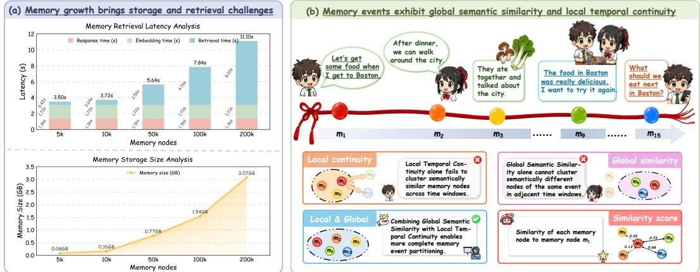  
Figure 1: (a) Challenges brought by the continuous growth of memory. Each complete user Q&A involves three time costs: Embedding time: converting the query into a vector; Retrieval time: searching for corresponding memory nodes via similarity computation; Response time: generating the model’s answer. (b) An example from the LoCoMo benchmark. This example illustrates that memory events exhibit global semantic similarity and local temporal continuity.

However, existing research on memory compression largely focuses on the generation stage [10, 21], which cannot fundamentally curb the continuous growth of memory, as stored memories still accumulate over time. Therefore, it is necessary to adopt a post-processing perspective and perform compression on already generated memories to systematically optimize storage efficiency and retrieval performance. Although recent work has begun to explore the feasibility of post-processing memory compression [34], this method typically relies on graph-structured memory representations and is restricted to streaming video scenarios, limiting its general applicability. Consequently, designing a general and scalable memory compression framework remains an important and open challenge.

Since stored memories are retrieved as external context, memory compression is closely related to context-length reduction. Recent token compression methods [5, 7, 37, 41, 43, 46, 47] reduce context via similarity-based merging or diversity-based pruning, mainly for MLLMs. However, unlike redundant visual inputs, textual memories are more semantically rich and information-dense [24, 45, 47], making compression challenging; existing methods also overlook memory-specific properties such as event differentiation and temporal relationships. Inspired by the event-level organization of human memory [18, 33], we partition historical memory into events and identify two key features for each memory event:

(I) Global Semantic Similarity: Fig. 1(b) suggests that semantically similar memory nodes may recur across distant temporal windows. For example, the similarity between memory node m1 and the temporally distant memory node m is 0.73, and that between node $m _ { 1 }$ and node $m _ { 1 5 }$ is 0.68. This indicates that similar memory nodes within the same event can reappear over long time spans.

(II) Local Temporal Continuity: Fig. 1(b) suggests that within adjacent temporal windows, memory nodes may exhibit substantial semantic differences yet still belong to the same event. For example, the similarity between memory node m and node m is only 0.12, and that between node m and node m3 is only 0.23, yet all three pertain to "Boston dining plan". This indicates that even when semantic similarity is low, temporally proximate memory nodes may still belong to the same memory event.

Consequently, the above analysis indicates that when performing memory compression, it is necessary to consider both global semantic similarity and local temporal continuity. To this end, we propose MemForest, a general agent memory compression framework adaptable to various agent memory systems. Specifically, MemForest leverages the EventTree Semantic-Temporal Partitioning module to combine global semantic similarity with local temporal continuity, thereby partitioning stored historical memory into a set of event-centric EventTrees. For each EventTree, we leverage the EventTree Progressive Merging module to perform iterative processing, progressively compressing its internal representations until a predefined compression ratio is achieved. Furthermore, we introduce an Anchor-Guided Propagation Retrieval (AGPR) mechanism to recover temporal structural information that may be degraded during compression, thereby enabling the retrieval of more relevant memory nodes. In summary, the main contributions are as follows:

• General Compression Framework. Based on the above analysis, we propose MemForest, a general agent memory compression framework, which leverages global semantic similarity and local temporal continuity to significantly improve storage and retrieval efficiency.

• Novel Retrieval Mechanism. We introduce an Anchor-Guided Propagation Retrieval mechanism to retrieve more relevant memory nodes from the temporal neighborhoods of key memory nodes, thereby enabling more accurate memory retrieval.

• Excellent Empirical Performance. Under the Mem0 and M3-Agent frameworks, across several benchmarks, when compressing 50% of the memory, MemForest is able to retain 97.1% and 99.7% of the original performance, respectively, while achieving 1.89× and 2.24× retrieval speedups.

## 2 Related Work

## 2.1 Agent Memory Systems

Agent memory systems [8, 19, 40] aim to provide agents with long-term storage and retrieval capabilities beyond a single context, thereby supporting persistent interaction and complex task execution. According to the type of input data, they can be broadly categorized into unimodal and multimodal approaches. Unimodal methods [26, 29, 48] primarily focus on textual data, such as Mem0 [8], MemoryOS [15], and A-MEM [39], which maintain long-term semantic consistency by storing dialogue histories or structured representations. In contrast, multimodal methods [22, 36, 49] handle more complex inputs, including images, audio, and video. Representative approaches such as MM-MEM [20], M3-Agent [22], and WorldMM [42] integrate visual and linguistic information and further model dynamic scenes such as videos, enabling richer environmental perception and task understanding. However, as memory scales grow, both unimodal and multimodal systems face increasing storage and retrieval costs. This issue is more pronounced in multimodal memory due to greater information redundancy and more complex cross-modal relationships, making efficien memory compression and management a critical challenge.

## 2.2 Visual Token Compression

Visual token compression [2, 4, 5, 9, 13, 37, 44] aims to reduce the number of tokens while preserving key information as much as possible, thereby lowering computational cost and improving inference efficiency. According to the underlying criteria used for compression, existing methods can be broadly categorized into three types: similarity-based, diversity-based, and attention-based approaches. Similarity-based methods [2, 32] measure the semantic similarity between tokens and merge highly similar ones to reduce redundant representations. Diversity-based methods [37, 44] focus on information deduplication by modeling repetitive relationships among tokens, retaining representative tokens while removing redundant information. Attention-based methods [1, 46, 47] leverage the internal attention mechanism of the model, using attention scores as a measure of token importance to preserve high-weight tokens and discard low-weight ones, enabling adaptive token selection. These methods provide valuable insights for agent memory compression. However, agent memory exhibits unique characteristics such as temporal relationships, and how to effectively leverage these properties for efficient compression remains an open problem.

## 3 Methodology

## 3.1 Overview

The overview of our method is illustrated in Figure 2. The MemForest framework consists of two components that achieve efficient compression of historical memory. Meanwhile, the anchor-guided propagation retrieval mechanism enables more accurate retrieval over the compressed memory.

## 3.2 EventTree Semantic-Temporal Partitioning

Given the historical memory H, which consists of a sequence of memory nodes $\begin{array} { r } { m _ { i } = \{ c _ { i } , e _ { i } , t _ { i } \} \mid _ { i = 1 } ^ { N } , } \end{array}$ where $c _ { i } , e _ { i }$ , and $t _ { i }$ denote the content, content embedding, and timestamp of the i-th memory node, respectively, our goal is to compress the historical memory H into a compact memory set $H ^ { \prime }$ , which consists of a sequence of memory nodes $\{ m _ { j } ^ { \prime } \} \mid _ { j = 1 } ^ { M }$ , where $M < N$

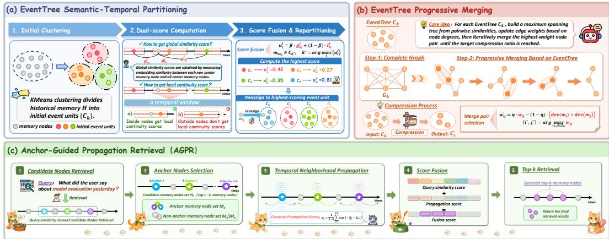  
Figure 2: The overview of our method. MemForest compresses historical memory through the EventTree Semantic-Temporal Partitioning module and the EventTree Progressive Merging module, while the Anchor-Guided Propagation Retrieval mechanism retrieves more relevant memory nodes within the temporal neighborhoods of key memory nodes, ensuring more accurate retrieval.

First, we perform event-unit partitioning of the historical memory H using the EventTree Semantic-Temporal Partitioning module. Specifically, given the initial N memory nodes $\{ m _ { i } \} \mid _ { i = 1 } ^ { N } ,$ , we apply the KMeans clustering algorithm [25] to their embedding vectors $\{ e _ { i } \} \mid _ { i = 1 } ^ { N }$ to partition them into $N \cdot \alpha$ initial event units, as shown in the following formula:

$$
\left\{ C _ { k } \right\} = K M e a n s ( \left\{ e _ { i } \right\} , \alpha ) ,\tag{1}
$$

where $\left\{ C _ { k } \right\} \mid _ { k = 1 } ^ { N \cdot \alpha }$ denotes the resulting set of event units, and α is a clustering ratio coefficient used to control the number of event units.

Next, for each event unit, we select the memory node closest to the unit center to form the set of center memory nodes $H _ { c } ,$ which consists of a sequence of center nodes $\{ m _ { c _ { i } } \} \ | _ { i = 1 } ^ { N \cdot \alpha }$ . Subsequently, for the j-th non-center memory node $m _ { n c _ { j } } \in H \backslash H _ { c }$ , we compute its similarity to all center memory nodes, denoted as $\{ g _ { c _ { i } } ^ { j } \} \ | _ { i = 1 } ^ { N \cdot \alpha }$ . Each non-center memory node thus obtains $N \cdot \alpha$ similarity values, which serve as its global similarity scores with respect to each center memory node.

Then, the memory nodes in the historical memory H are sorted in chronological order, and the positions of all center memory nodes $\{ m _ { c _ { i } } \} | _ { i = 1 } ^ { N \cdot _ { \tilde { \alpha } } }$ on the timeline are determined. For the i-th center memory node, a local continuity score is assigned to the non-center memory nodes within its neighboring time window, as defined by the following formula:

$$
l _ { c _ { i } } ^ { j } = \left\{ \begin{array} { l l } { 1 , } & { \mathrm { i f } t _ { j } \in [ t _ { c _ { i } } - w , t _ { c _ { i } } + w ] } \\ { 0 , } & { \mathrm { o t h e r w i s e } } \end{array} \right. ,\tag{2}
$$

where w is the time window coefficient that controls the size of the temporal window around the center memory node, and $l _ { c _ { i } } ^ { j }$ represents the local continuity score of the j-th non-center memory node with respect to the i-th center memory node.

Subsequently, the global similarity score $g _ { c _ { i } } ^ { j }$ of the j-th non-center memory node with respect to the i-th center memory node is combined with its local continuity score $l _ { c _ { i } } ^ { j }$ to obtain an overall score:

$$
u _ { i } ^ { j } = \beta \cdot g _ { c _ { i } } ^ { j } + ( 1 - \beta ) \cdot l _ { c _ { i } } ^ { j } ,\tag{3}
$$

where $\beta$ is a weighting coefficient that controls the relative contribution of the two scores. Each non-center memory node is then reassigned to the event unit with the highest overall score. Taking the j-th non-center memory node as an example, the assignment can be formulated as:

$$
m _ { n c _ { j } } \in C _ { k ^ { * } } , \quad k ^ { * } = \arg \operatorname* { m a x } _ { i } \{ u _ { i } ^ { j } \} ,\tag{4}
$$

resulting in repartitioned event units. For simplicity, these event units are still denoted as $\left\{ C _ { k } \right\} \mid _ { k = 1 } ^ { N \cdot \alpha }$

## 3.3 EventTree Progressive Merging

For each event unit, we model it as a maximum spanning tree and perform progressive merging via the EventTree Progressive Merging module, thereby representing each event unit as an EventTree.

Specifically, for the k-th EventTree, we denote it as $C _ { k } = \{ m _ { i } ^ { ( k ) } \} \ | _ { i = 1 } ^ { n _ { k } } ,$ , where $m _ { i } ^ { ( k ) }$ denotes the i-th memory node and $n _ { k }$ is the number of memory nodes in this EventTree. We first construct a fully connected undirected graph $G _ { k } = ( V _ { k } , E _ { k } )$ , where the node set $V _ { k } = C _ { k }$ and the edge set $E _ { k }$ consists of all node pairs. For any two nodes $m _ { i } ^ { ( k ) }$ and $m _ { j } ^ { ( k ) }$ , the edge weight is defined as the cosine similarity between their embeddings:

$$
w _ { i j } = \frac { e _ { i } ^ { ( k ) } \cdot e _ { j } ^ { ( k ) } } { \| e _ { i } ^ { ( k ) } \| \cdot \| e _ { j } ^ { ( k ) } \| } .\tag{5}
$$

We then construct a maximum spanning tree on $G _ { k }$ using Kruskal algorithm [16]. Specifically, all edges are first sorted in descending order according to their weights $w _ { i j } . \mathbf { A }$ union-find structure is used to iteratively add edges with the highest weights while avoiding cycles. This process continues until $n _ { k } - 1$ edges are selected, resulting in the maximum spanning tree $T _ { k }$

After obtaining the maximum spanning tree $T _ { k }$ , we update the edge weights by taking into account the degrees of the two nodes connected by each edge, as follows:

$$
w _ { i j } ^ { \prime } = \eta \cdot w _ { i j } - ( 1 - \eta ) \cdot \big ( \deg ( m _ { i } ) + \deg ( m _ { j } ) \big ) ,\tag{6}
$$

where $\deg ( \cdot )$ represents the degree of a node, and η is a weighting coefficient used to balance the two scores. In the maximum spanning tree, nodes with higher degrees are usually central or hub nodes of the event, carrying more core information, and therefore should not be merged prematurely.

We then select the edge with the highest weight:

$$
( i ^ { * } , j ^ { * } ) = \arg \operatorname* { m a x } _ { ( i , j ) \in T _ { k } } w _ { i j } ^ { \prime } ,\tag{7}
$$

and treat the corresponding nodes $m _ { i ^ { * } } ^ { ( k ) } = \{ c _ { i ^ { * } } , e _ { i ^ { * } } , t _ { i ^ { * } } \}$ and $m _ { j ^ { * } } ^ { ( k ) } = \{ c _ { j ^ { * } } , e _ { j ^ { * } } , t _ { j ^ { * } } \}$ as the optimal merge pair at the current step.

Subsequently, we merge the selected node pair by leveraging a large language model to generate fused content $c _ { l } ^ { \prime } .$ re-encoding it to obtain the embedding $e _ { l } ^ { \prime } { \mathrm { . } }$ , and updating the timestamp to $t _ { l } ^ { \prime } ,$ resulting in a merged memory node $\dot { m } _ { l } ^ { \prime } = \{ c _ { l } ^ { \prime } , ~ e _ { l } ^ { \prime } , ~ t _ { l } ^ { \prime } \}$ . The merge process can be formally expressed as:

$$
\begin{array} { r } { c _ { l } ^ { \prime } = \mathcal { F } ( c _ { i ^ { * } } , c _ { j ^ { * } } ) , \quad e _ { l } ^ { \prime } = \mathcal { E } ( c _ { l } ^ { \prime } ) , \quad t _ { l } ^ { \prime } = \operatorname* { m a x } ( t _ { i ^ { * } } , t _ { j ^ { * } } ) , } \end{array}\tag{8}
$$

where $\mathcal F ( \cdot )$ and $\mathcal { E } ( \cdot )$ denote an external large language model and an embedding model, respectively. The newly generated node $m _ { l } ^ { \prime }$ then replaces the original nodes $m _ { i ^ { * } } ^ { ( k ) }$ and $m _ { j ^ { * } } ^ { ( k ) }$

This process is iteratively applied to the updated node set until a predefined compression ratio is reached. Finally, all the compressed EventTrees $\{ C _ { k } ^ { \prime } \} \ | _ { k = 1 } ^ { N \cdot \alpha }$ collectively form the compact memory set $H ^ { \prime }$ , completing the overall compression process.

## 3.4 Anchor-Guided Propagation Retrieval

To enhance the temporal modeling capability of the compressed memory set $H ^ { \prime }$ , we propose an Anchor-Guided Propagation Retrieval mechanism, which retrieves more relevant memory nodes from the temporal neighborhoods of key memory nodes to supplement nearby information.

Specifically, we first select the top $L \cdot k$ memory nodes with the highest similarity to the query, forming a candidate set $M _ { h }$ , along with their corresponding similarity scores $\left\{ s _ { i } \right\} \mid _ { i = 1 } ^ { L \cdot \tilde { k } }$ , where $L$ is a scaling coefficient that determines the number of retrieved candidate memory nodes. Then, we further select the top λ · k most similar nodes as anchor memory nodes, denoted as $M _ { a } = \{ m _ { a _ { i } } ^ { \prime } \} \ | _ { i = 1 } ^ { \lambda \cdot k }$

Next, all memory nodes in $M _ { h }$ are sorted in chronological order, and the positions of anchor memory nodes on the timeline are identified. For the j-th memory node $m _ { j } ^ { \prime } \in M _ { h }$ , we compute its propagation score with respect to all anchor memory nodes as:

$$
p _ { j } = { \frac { 1 } { \lambda \cdot k } } \sum _ { i = 1 } ^ { \lambda \cdot k } \exp \left( - \left| t _ { j } ^ { \prime } - t _ { a _ { i } } ^ { \prime } \right| \right) .\tag{9}
$$

Finally, we combine the precomputed query similarity and the propagation score to obtain the final fusion score for the j-th memory node:

$$
v _ { j } = \gamma \cdot s _ { j } + ( 1 - \gamma ) \cdot p _ { j } ,\tag{10}
$$

where $\gamma$ is a weighting coefficient that balances the two scores. We rank all memory nodes in $M _ { h }$ based on $v _ { j }$ and select the top k nodes as the final retrieval results.

## 4 Theoretical Analysis

We analyze from a retrieval perspective why similar memory nodes should be preferentially merged. Given a query $q ,$ consider two memory nodes $m _ { i }$ and $m _ { j }$ with embeddings $e _ { i }$ and $e _ { j } .$ , respectively. Their similarities to the query are defined as $s _ { i } = q ^ { \top } e _ { i }$ and $s _ { j } = q ^ { \top } e _ { j }$ , and the similarity between the two nodes is $\rho _ { i j } = e _ { i } ^ { \top } e _ { j }$ . We assume all embeddings are $\ell _ { 2 }$ -normalized, i.e., $, \| q \| = \| e _ { i } \| = \| e _ { j } \| = 1$ Without loss of generality, we assume $s _ { i } \geq s _ { j }$ , indicating that $m _ { i }$ is more relevant to the query q.

We represent the merged memory embedding as a normalized interpolation of the two embeddings:

$$
e _ { l } = \frac { \lambda e _ { i } + ( 1 - \lambda ) e _ { j } } { \| \lambda e _ { i } + ( 1 - \lambda ) e _ { j } \| } ,\tag{11}
$$

where $\lambda \in ( 0 , 1 )$ is a weighting coefficient that controls the interpolation between $e _ { i }$ and $e _ { j }$ . The similarity between the merged memory node $m _ { l }$ and the query $q$ is given by:

$$
s _ { l } = \frac { \lambda s _ { i } + ( 1 - \lambda ) s _ { j } } { \| \lambda e _ { i } + ( 1 - \lambda ) e _ { j } \| } .\tag{12}
$$

By the Triangle inequality, we have:

$$
s _ { l } \geq \lambda s _ { i } + ( 1 - \lambda ) s _ { j } .\tag{13}
$$

Furthermore, by the Cauchy–Schwarz inequality, it can be shown that:

$$
s _ { j } \ge s _ { i } - \sqrt { 2 - 2 \rho _ { i j } } ,\tag{14}
$$

which leads to:

$$
s _ { l } \geq s _ { i } - ( 1 - \lambda ) \sqrt { 2 - 2 \rho _ { i j } } .\tag{15}
$$

The derivation of Eqs. 13-15 is provided in Appendix B.1. From Eq. 15, we observe that as $\rho _ { i j }$ increases, the lower bound monotonically increases, indicating that merging highly similar memory nodes preserves higher query similarity. In contrast, when $\rho _ { i j }$ is small, the lower bound decreases, implying larger semantic deviation after merging.

During top k retrieval, such deviation may prevent important memory nodes from being correctly retrieved. Therefore, it is preferable to prioritize merging highly similar memory nodes.

Furthermore, for the theoretical analysis of MemForest, please refer to Appendix B.2.

## 5 Experiments

## 5.1 Experimental Setup

Baselines. For unimodal and multimodal memory systems, we select Mem0 [8] and M3-Agent [22] as representative methods, respectively. For the baselines, we categorize them into two groups: pruning-based methods and merging-based methods. Specifically, pruning-based methods include Random Pruning, KMeans [25], DART [37], and StreamMeCo [34]; merging-based methods include Random Merging and ToMe [2]. More details on these methods are provided in Appendix A.1.

Datasets. For Mem0 [8], we evaluate on three representative benchmarks in the agent memory domain, including LoCoMo [23], LongMemEval [38], and PersonaMem [14]. For M3-Agent [22], we adopt two representative benchmarks from the streaming video domain, including M3-Bench-robot and M3-Bench-web [22]. More details on these benchmarks are provided in Appendix A.2.

Implementation Details. All experiments are conducted on two NVIDIA A100 (80GB) GPUs. The key hyperparameters are set as follows: $\alpha = 0 . 0 5 , \beta = 0 . 8 , w = 5 , \eta = 0 . 9 9 , \gamma = 0 . 9 , L = 4 ,$ and $\lambda \overset { \cdot } { = } 0 . \overset { \cdot } { 2 }$ . We use GPT-4o-mini for memory node merging. In addition, all other settings follow the original papers [8, 22]. All experimental results are averaged over three runs. More details are provided in Appendix A.3.

Table 1: Performance comparison of different baselines on Mem0 under varying compression ratios. Blue denotes pruning methods, while Red denotes merging methods. % represents the performance retention rate. For each ratio, the top two results are highlighted in bold black font.
<table><tr><td>Dataset</td><td colspan="5">LoCoMo</td><td colspan="5">LongMemEval</td><td rowspan="2"></td><td rowspan="2">Persona -Mem</td><td rowspan="2"></td><td rowspan="2">Avg.</td><td rowspan="2">%</td></tr><tr><td>Method</td><td>SH</td><td>MH</td><td>TR</td><td>OD</td><td>All</td><td>SU</td><td>SA</td><td>SP MS</td><td>KU</td><td>TR All</td></tr><tr><td>Mem0</td><td>66.0</td><td>56.0</td><td>53.9</td><td>42.7</td><td>60.2</td><td>90.0</td><td>21.4</td><td>23.3</td><td>54.9</td><td>79.5</td><td>44.4 55.2</td><td>67.9</td><td>61.1</td><td>100.0%</td></tr><tr><td>+ AGPR</td><td>66.2</td><td>56.4</td><td>53.9</td><td>40.6</td><td>60.3</td><td>90.0</td><td>21.4 23.3</td><td>54.1</td><td>78.2</td><td>43.6</td><td>54.6</td><td>68.6</td><td>61.2</td><td>100.2%</td></tr><tr><td></td><td colspan="10">y compression ratio (↓ 30%)</td><td></td><td></td><td></td><td></td></tr><tr><td>+ Random Pruning</td><td>Historical memory </td><td>49.7</td><td>43.3</td><td>39.6</td><td>50.8 82.9</td><td>17.9</td><td>26.7</td><td>51.9</td><td>73.1</td><td>39.1</td><td>50.8</td><td>64.5</td><td>55.4</td><td>90.7%</td></tr><tr><td>+ KMeans</td><td>55.3 61.1</td><td>54.3</td><td>52.7</td><td>40.6</td><td>56.8 84.3</td><td>17.9</td><td>20.0</td><td>51.9</td><td>75.6</td><td>41.4</td><td>52.0</td><td>65.7</td><td>58.2</td><td>95.3%</td></tr><tr><td>+ DART</td><td>64.1</td><td>53.9</td><td>48.0</td><td>40.6</td><td>57.4</td><td>82.9 19.0</td><td>20.0</td><td>48.9</td><td>74.4</td><td>34.6</td><td>48.8</td><td>66.6</td><td>57.6</td><td>94.3%</td></tr><tr><td>+ Random Merging</td><td>60.9</td><td>52.1</td><td>51.1</td><td>43.8</td><td>56.2</td><td>91.4</td><td>21.4 20.2</td><td>46.6</td><td>74.4</td><td>41.4</td><td>50.8</td><td>65.2</td><td>57.4</td><td>93.9%</td></tr><tr><td>+ ToMe</td><td>63.1</td><td>51.1</td><td>50.8</td><td>44.8</td><td>57.2</td><td>85.7 21.4</td><td>23.3</td><td>48.1</td><td>71.8</td><td>42.9</td><td>51.2</td><td>66.4</td><td>58.3</td><td>95.4%</td></tr><tr><td>+ MemForest</td><td>63.7</td><td>54.6</td><td>52.0</td><td>45.8</td><td>58.5</td><td>90.0 19.6</td><td>20.0</td><td>49.8</td><td>76.9</td><td>49.6</td><td>54.2</td><td>66.4</td><td>59.7</td><td>97.7%</td></tr><tr><td>+ MemForest + AGPR</td><td>64.6</td><td>54.6</td><td>52.3</td><td>44.8</td><td>59.0 90.0</td><td>19.6</td><td>20.0</td><td>52.6</td><td>78.8</td><td>43.6</td><td>53.8</td><td>67.6</td><td>60.1</td><td>98.4%</td></tr><tr><td colspan="13">Historical memory compression ratio (↓ 50%)</td></tr><tr><td>+ Random Pruning</td><td>44.4 45.4</td><td></td><td>37.1</td><td>44.8</td><td>43.1</td><td>75.7</td><td>17.9 26.7</td><td>32.3</td><td>65.4</td><td>39.8</td><td>43.6</td><td>64.3</td><td>50.3</td><td>82.3%</td></tr><tr><td>+ KMeans</td><td>51.6</td><td>43.6</td><td>39.6</td><td>37.5</td><td>46.8</td><td>77.1</td><td>19.6 23.3</td><td>39.1</td><td>74.4</td><td>39.8</td><td>47.0</td><td>65.2</td><td>53.0</td><td>86.7%</td></tr><tr><td>+ DART</td><td>57.4</td><td>49.6</td><td>41.7</td><td>43.8</td><td>51.9</td><td>67.1</td><td>12.5 23.3</td><td>42.9</td><td>60.3</td><td>31.6</td><td>41.4</td><td>64.3</td><td>52.5</td><td>85.9%</td></tr><tr><td>+ Random Merging</td><td>56.0</td><td>48.2</td><td>46.4</td><td>37.5</td><td>51.4</td><td>85.7</td><td>23.2 20.0</td><td>42.9</td><td>70.5</td><td>39.1</td><td>48.6</td><td>64.5</td><td>54.8</td><td>89.7%</td></tr><tr><td>+ ToMe</td><td>60.2</td><td>50.4</td><td>47.4</td><td>43.8</td><td>54.7</td><td>85.7</td><td>21.4 23.3</td><td>48.1</td><td>71.8</td><td>41.4</td><td>50.8</td><td>65.9</td><td>57.1</td><td>93.5%</td></tr><tr><td>+ MemForest</td><td>62.1</td><td>56.7</td><td>54.8</td><td>43.8</td><td>58.4</td><td>90.0</td><td>19.6 20.0</td><td>48.1</td><td>74.4</td><td>42.9</td><td>51.8</td><td>67.7</td><td>59.3</td><td>97.1%</td></tr><tr><td>+ MemForest + AGPR</td><td>63.7</td><td>57.1</td><td>52.3</td><td>45.8</td><td>59.0</td><td>90.0</td><td>21.4 23.3</td><td>47.4</td><td>76.9</td><td>45.1</td><td>53.0</td><td>68.1</td><td>60.0</td><td>98.3%</td></tr><tr><td colspan="11">Historical memory y compression ratio (↓ 70%)</td><td></td><td></td><td></td></tr><tr><td>+ Random Pruning</td><td>35.036.5</td><td></td><td>25.9</td><td>31.3</td><td>33.1</td><td>47.1</td><td>7.1 30.0</td><td>16.5</td><td>42.3</td><td>31.6</td><td>28.6</td><td>63.7</td><td>41.8</td><td>68.4%</td></tr><tr><td>+ KMeans</td><td>37.9</td><td>42.6</td><td>27.4</td><td>39.6</td><td>36.7</td><td>61.4</td><td>8.9 30.0</td><td>21.8</td><td>59.0</td><td>31.6</td><td>34.8</td><td>63.8</td><td>45.1</td><td>73.8%</td></tr><tr><td>+ DART</td><td>46.4</td><td>44.3</td><td>36.1</td><td>41.7</td><td>43.6</td><td>44.3</td><td>10.7 16.7</td><td>21.0</td><td>43.6</td><td>27.8</td><td>30.6</td><td>61.8</td><td>45.3</td><td>74.1%</td></tr><tr><td>+ Random Merging</td><td>54.0</td><td>47.2</td><td>47.0</td><td>43.8</td><td>50.7</td><td>80.0</td><td>21.4 30.0</td><td>41.4</td><td>67.9</td><td>34.6</td><td>46.2</td><td>64.0</td><td>53.6</td><td>87.7%</td></tr><tr><td>+ ToMe</td><td>56.6</td><td>51.8</td><td>47.7</td><td>38.5</td><td>52.7</td><td>84.3</td><td>21.4 20.0</td><td>45.1</td><td>70.5</td><td>42.1</td><td>49.6</td><td>65.7</td><td>56.0</td><td>91.7%</td></tr><tr><td>+ MemForest</td><td>58.1</td><td>56.4</td><td>45.2</td><td>45.8</td><td>54.4</td><td>84.3</td><td>25.0 23.3</td><td>52.6</td><td>74.4</td><td>39.8</td><td>52.2</td><td>64.4</td><td>57.0</td><td>93.3%</td></tr><tr><td>+ MemForest + AGPR</td><td>57.7</td><td>55.0</td><td>45.6</td><td>45.8</td><td>53.9</td><td>85.7</td><td>26.8 26.7</td><td>51.1</td><td>74.4</td><td>39.8</td><td>52.4</td><td>65.5</td><td>57.3</td><td>93.8%</td></tr></table>

## 5.2 Main Results

Performance under the Mem0 Framework. Table 1 reports the performance of various baselines under the Mem0 framework. The experimental results can be summarized in three points: (i) Outstanding performance. Without incorporating the AGPR mechanism, MemForest is able to retain 97.1% of the original performance across three representative benchmarks even when 50% of historical memory is compressed, significantly outperforming various pruning-based and mergingbased baselines. (ii) Historical information preservation. At a low compression ratio (30%), pruning-based and merging-based methods perform comparably. However, when the compression ratio exceeds 50%, pruning-based methods suffer a noticeable performance drop, whereas mergingbased methods still maintain relatively strong performance and preserve more historical information. (iii) Dataset-specific differences. On the PersonaMem benchmark, all methods exhibit relatively minor performance degradation under different compression ratios. We attribute this to the multiplechoice nature of the questions, which requires only limited memory for decision-making.

Performance under the M3-Agent Framework. Table 2 presents the performance of various baselines under the M3-Agent framework. The experimental results can be summarized as follows: (i) Outstanding performance. Without incorporating the AGPR mechanism, MemForest is able to retain 99.7% of the original performance across two representative benchmarks even when 50% of historical memory is compressed, significantly outperforming various pruning-based and mergingbased baselines. (ii) Historical information preservation. When the compression ratio exceeds 50%, even the memory pruning framework StreamMeCo, which is specifically designed for M3-Agent, performs worse than random compression, indicating that merging-based methods better preserve historical information. (iii) Higher redundancy. Compared with Mem0, the performance degradation of M3-Agent is considerably smaller, indicating that multimodal memory with dense visual inputs has higher redundancy than unimodal text memory, offering greater potential for compression.

Table 2: Performance comparison of different baselines on M3-Agent under varying compression ratios. Blue denotes pruning methods, while Red denotes merging methods. % represents the performance retention rate. For each ratio, the top two results are highlighted in bold black font.
<table><tr><td rowspan="2">Dataset</td><td colspan="5">M3-Bench-robot</td><td rowspan="2">M3-Bench-web</td><td colspan="6"></td><td rowspan="2">Avg.</td><td rowspan="2">%</td><td rowspan="2"></td></tr><tr><td>ME MH</td><td></td><td>CM</td><td>PU</td><td>GK</td><td>All</td><td>ME</td><td>MH</td><td>CM PU</td><td>GK</td><td>All</td></tr><tr><td>Method M3-Agent</td><td>30.9</td><td>29.4</td><td>29.6</td><td>41.1</td><td>22.6</td><td>30.3</td><td>44.9</td><td>25.6</td><td>44.8</td><td></td><td></td><td>47.9</td><td>39.1</td><td>100.0%</td></tr><tr><td>+ AGPR</td><td>37.2</td><td>38.8</td><td>34.2</td><td>47.3</td><td>29.7</td><td>37.2</td><td>49.2</td><td>35.9</td><td>49.8</td><td>58.6 64.5</td><td>53.7 61.2</td><td>54.8</td><td>46.0</td><td>117.6%</td></tr><tr><td></td><td colspan="8"></td><td></td><td></td><td></td><td></td><td></td><td></td></tr><tr><td></td><td colspan="9">Historical memory compression ratio (↓ 30%)</td><td>49.1</td><td>44.9</td><td>37.0</td><td></td><td>94.6%</td></tr><tr><td>+ Random Pruning + KMeans</td><td>31.4 31.6</td><td>27.1 32.9</td><td>29.8 29.6</td><td>42.5 42.2</td><td>18.3 19.3</td><td>29.1 30.2</td><td>40.8 41.0</td><td>23.9 24.1</td><td>41.7 45.0</td><td>56.0 56.1</td><td>49.8</td><td>45.8</td><td>38.0</td><td>97.2%</td></tr><tr><td>+ DART</td><td>31.8</td><td>29.4</td><td>32.6</td><td>43.8</td><td>19.3</td><td>29.6</td><td>40.9</td><td>24.9</td><td>43.4</td><td>58.2</td><td>49.6</td><td>46.1</td><td>37.8</td><td>96.7%</td></tr><tr><td>+ StreamMeCo</td><td>32.9</td><td>30.6</td><td>30.9</td><td>42.5</td><td>19.6</td><td>30.7</td><td>41.3</td><td>26.0</td><td>44.3</td><td>58.3</td><td>50.5</td><td>47.0</td><td>38.9</td><td>99.5%</td></tr><tr><td>+ Random Merging</td><td>31.7</td><td>35.3</td><td>30.3</td><td>40.9</td><td>19.9</td><td>30.0</td><td>40.4</td><td>23.2</td><td>42.9</td><td>55.9</td><td>50.1</td><td>45.1</td><td>37.6</td><td>96.2%</td></tr><tr><td>+ ToMe</td><td>30.8</td><td>25.9</td><td>27.7</td><td>40.5</td><td>21.7</td><td>30.4</td><td>42.4</td><td>27.6</td><td>41.7</td><td>57.5</td><td>52.0</td><td>47.1</td><td>38.8</td><td>99.2%</td></tr><tr><td>+ MemForest</td><td>32.3</td><td>27.1</td><td>33.6</td><td>43.8</td><td>22.6</td><td>32.0</td><td>43.1</td><td>26.3</td><td>44.6</td><td>57.9</td><td>52.2</td><td>47.2</td><td>39.6</td><td>101.3%</td></tr><tr><td>+ MemForest + AGPR</td><td>39.4</td><td>37.6</td><td>36.8</td><td>50.5</td><td>29.4</td><td>39.0</td><td>50.9</td><td>39.2</td><td>52.4</td><td>64.0</td><td>63.0</td><td>56.0</td><td>47.5</td><td>121.5%</td></tr><tr><td>Historical memory compression ratio (↓ 50%)</td><td colspan="10"></td><td></td><td></td><td></td><td></td></tr><tr><td>+ Random Pruning</td><td>28.4</td><td>25.9</td><td>927.3</td><td>38.7</td><td>19.6</td><td>28.1</td><td>35.6</td><td>23.0</td><td>34.9</td><td>52.3</td><td>44.2</td><td>41.2</td><td>34.7</td><td>88.7%</td></tr><tr><td>+ KMeans</td><td>29.1</td><td>30.6</td><td>28.4</td><td>41.4</td><td>20.8</td><td>29.2</td><td>41.1</td><td>21.7</td><td>42.5</td><td>55.0</td><td>47.4</td><td>43.9</td><td>36.6</td><td>93.6%</td></tr><tr><td>+ DART</td><td>28.9</td><td>25.9</td><td>29.4</td><td>39.1</td><td>22.0</td><td>29.1</td><td>39.9</td><td>23.6</td><td>39.4</td><td>52.9</td><td>47.2</td><td>43.1</td><td>36.1</td><td>92.3%</td></tr><tr><td>+ StreamMeCo</td><td>32.3</td><td>28.2</td><td>29.8</td><td>41.4</td><td>21.1</td><td>30.6</td><td>39.7</td><td>25.2</td><td>38.9</td><td>58.4</td><td>47.3</td><td>44.7</td><td>37.7</td><td>96.2%</td></tr><tr><td>+ Random Merging</td><td>33.0</td><td>32.9</td><td>31.9</td><td>44.3</td><td>19.6</td><td>30.8</td><td>41.8</td><td>21.0</td><td>40.1</td><td>58.0</td><td>46.3</td><td>44.6</td><td>37.7</td><td>96.4%</td></tr><tr><td>+ ToMe</td><td>30.5</td><td>32.9</td><td>29.6</td><td>42.3</td><td>19.9</td><td>30.9</td><td>42.7</td><td>24.7</td><td>41.7</td><td>54.3</td><td>53.1</td><td>46.1</td><td>38.5</td><td>98.5%</td></tr><tr><td>+ MemForest</td><td>31.6</td><td>31.8</td><td>31.1</td><td>45.1</td><td>21.4</td><td>31.6</td><td>42.6</td><td>23.9</td><td>43.4</td><td>57.1</td><td>51.5</td><td>46.5</td><td>39.0</td><td>99.7%</td></tr><tr><td>+ MemForest + AGPR</td><td>40.5</td><td>38.8</td><td>36.1</td><td>48.2</td><td>31.8</td><td>38.3</td><td>52.8</td><td>34.4</td><td>50.0</td><td>65.0</td><td>63.8</td><td>56.1</td><td>47.2</td><td>120.7%</td></tr><tr><td colspan="11"></td><td></td><td></td><td></td></tr><tr><td>+ Random Pruning</td><td>27.3</td><td>25.9</td><td>26.7</td><td>39.2</td><td>Historical memory compression ratio (↓ 70%) 20.8</td><td>27.7</td><td>35.0</td><td>19.9</td><td>34.9</td><td>48.7</td><td>39.5</td><td>37.3</td><td>32.5</td><td>83.1%</td></tr><tr><td>+ KMeans</td><td>28.7</td><td>28.2</td><td>27.3</td><td>42.7</td><td>19.3</td><td>28.9</td><td>35.5</td><td>20.1</td><td>34.9</td><td>39.7</td><td>42.5</td><td>39.1</td><td>34.0</td><td>87.0%</td></tr><tr><td>+ DART</td><td>27.8</td><td>25.9</td><td>25.4</td><td>40.0</td><td>16.2</td><td>27.2</td><td>35.4</td><td>19.5</td><td>36.6</td><td>48.2</td><td>45.0</td><td>39.2</td><td>33.2</td><td>84.9%</td></tr><tr><td>+ StreamMeCo</td><td>29.1</td><td>30.6</td><td>26.9</td><td>40.3</td><td>19.9</td><td>28.4</td><td>37.0</td><td>21.7</td><td>36.1</td><td>53.0</td><td>46.3</td><td>41.9</td><td>35.1</td><td>89.8%</td></tr><tr><td>+ Random Merging</td><td>30.6</td><td>31.8</td><td>28.8</td><td>45.1</td><td>19.0</td><td>30.4</td><td>41.1</td><td>21.9</td><td>39.6</td><td>58.6</td><td>41.5</td><td>43.2</td><td>36.8</td><td>94.1%</td></tr><tr><td>+ ToMe</td><td>31.7</td><td>27.1</td><td>28.6</td><td>43.1</td><td>20.2</td><td>30.6</td><td>42.9</td><td>23.6</td><td>43.6</td><td>56.5</td><td>49.8</td><td>45.7</td><td>38.2</td><td>97.7%</td></tr><tr><td>+ MemForest</td><td>31.2</td><td>32.9</td><td>32.4 35.7</td><td>43.6 48.2</td><td>17.4 29.7</td><td>30.7 37.5</td><td>44.8 52.8</td><td>23.9 34.1</td><td>38.9 50.0</td><td>57.3 64.1 64.3</td><td>50.4</td><td>46.3 55.8</td><td>38.5 46.7</td><td>98.5% 119.4%</td></tr><tr><td>+ MemForest + AGPR</td><td>38.5</td><td>38.8</td></table>

Performance of the AGPR Mechanism. Tables 1–2 illustrate the performance of the AGPR mechanism across the two memory frameworks. The experimental results can be summarized in three points: (i) Outstanding performance. The AGPR mechanism consistently improves performance across different compression ratios in both memory frameworks. (ii) Frameworkdependent performance gains. Under the Mem0 framework, the performance improvement brought by AGPR is relatively limited and noticeably smaller than that in M3-Agent. This difference mainly stems from differences in the original retrieval mechanism and the nature of the input data. The original retrieval mechanism of M3-Agent is relatively weak; in addition, Mem0 uses dense textual input with low redundancy, whereas M3-Agent contains multimodal input with substantial redundancy, allowing AGPR to retrieve key memory nodes more accurately. (iii) Information loss compensation. Performance gains are more pronounced after compressing historical memory than without compression. For example, when 50% of historical memory is compressed, performance improvements in Mem0 and M3-Agent are 1.2% and 21.0%, respectively, compared to 0.2% and 17.6% without compression. This demonstrates that AGPR can effectively compensate for information loss by enriching the contextual information around key memory nodes.

## 5.3 Ablation Study

## 5.3.1 MemForest Ablation Study.

EventTree Semantic-Temporal Partitioning. Table 3 suggests that, when compressing 50% of historical memory, our method significantly outperforms two variants across three benchmarks: one

Table 3: Impact of different EventTree partitioning strategies at 50% compression rate.
<table><tr><td rowspan=1 colspan=1>Method |</td><td rowspan=1 colspan=1>LoCoMo LongMemEval M3-Bench-web||</td><td rowspan=1 colspan=1>Avg.</td><td rowspan=1 colspan=1>%</td></tr><tr><td rowspan=1 colspan=1>Baseline</td><td rowspan=1 colspan=1>60.2      55.2        47.9</td><td rowspan=1 colspan=1>54.4</td><td rowspan=1 colspan=1>100.0%</td></tr><tr><td rowspan=1 colspan=1>w/o $g _ { c _ { i } } ^ { j }$ </td><td rowspan=1 colspan=1>54.5     49.2        45.6</td><td rowspan=1 colspan=1>49.8</td><td rowspan=1 colspan=1>91.5%</td></tr><tr><td rowspan=1 colspan=1>w/o lji</td><td rowspan=1 colspan=1>56.4     50.2        46.2</td><td rowspan=1 colspan=1>50.9</td><td rowspan=1 colspan=1>93.6%</td></tr><tr><td rowspan=1 colspan=1>Ours</td><td rowspan=1 colspan=1>58.4     51.8        46.5</td><td rowspan=1 colspan=1>52.2</td><td rowspan=1 colspan=1>96.0%</td></tr></table>

Table 4: Impact of different memory node merging strategies at 50% compression rate.
<table><tr><td rowspan=1 colspan=1>Method</td><td rowspan=1 colspan=1>|LoCoMo LongMemEval M3-Bench-web|A</td><td rowspan=1 colspan=1>vg.|</td><td rowspan=1 colspan=1>%</td></tr><tr><td rowspan=1 colspan=1>Baseline</td><td rowspan=1 colspan=1>60.2     55.2        47.9</td><td rowspan=1 colspan=1>54.4</td><td rowspan=1 colspan=1>100.0%</td></tr><tr><td rowspan=1 colspan=1>Random</td><td rowspan=1 colspan=1>54.0     50.0        45.7</td><td rowspan=1 colspan=1>49.9</td><td rowspan=1 colspan=1>91.7%</td></tr><tr><td rowspan=1 colspan=1>Minimum</td><td rowspan=1 colspan=1>51.2     48.8        45.2</td><td rowspan=1 colspan=1>48.4</td><td rowspan=1 colspan=1>89.0%</td></tr><tr><td rowspan=1 colspan=1>Ours</td><td rowspan=1 colspan=1>58.4     51.8        46.5</td><td rowspan=1 colspan=1>52.2</td><td rowspan=1 colspan=1>96.0%</td></tr></table>

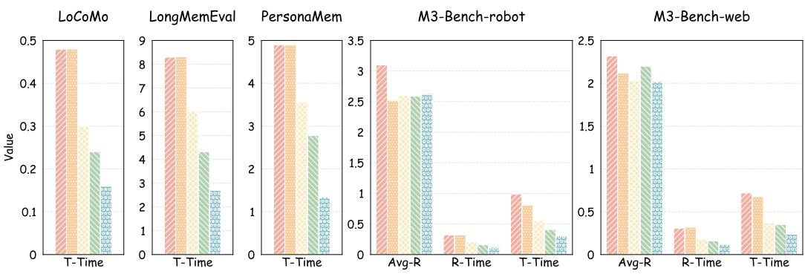  
Baselines Baselines + AGPR Baselines + MemForest + AGPR ( 30% )  
Baselines + MemForest + AGPR ( 50% ) Baselines + MemForest + AGPR ( 70% )

Figure 3: Time Efficiency Analysis on Mem0 and M3-Agent. Avg-R(×): average number of retrievals per query; R-Time(s): time cost per retrieval; T-Time(s): total retrieval time per query.

removes the local continuity score $l _ { c _ { i } } ^ { j }$ , and the other removes the global similarity score $g _ { c _ { i } } ^ { j }$ and replaces it with a sliding window for EventTree partitioning. Detailed implementations of these variants are provided in Appendix A.3. This indicates that combining global semantic similarity with local temporal continuity enables more accurate EventTree partitioning.

EventTree Progressive Merging. Table 4 suggests that, when compressing 50% of the historical memory, replacing the maximum spanning tree with either random merging or minimum spanning tree merging results in significantly worse performance than our method, thereby validating the theoretical analysis in Section 4.

## 5.3.2 Time Efficiency Analysis.

Figure 3 suggests our proposed method achieves high time efficiency, and detailed results can be found in Appendix D.7, from which we draw three key observations: (i) Minimal time overhead. Since the AGPR mechanism avoids complex embedding similarity computations, it introduces negligible additional time overhead. (ii) Significant speedup. Under the Mem0 framework, when compressing 50% of historical memory across three benchmarks, our method achieves speedups of 2.00×, 1.92×, and 1.76×, respectively, with an average speedup of 1.89×. (iii) More accurate retrieval. M3- Agent typically requires multiple rounds of memory retrieval for a single query to obtain sufficient information, whereas our method significantly reduces the number of retrieval iterations, indicating more accurate retrieval of critical memory nodes. As a result, our method achieves speedups of 2.41× and 2.06× on two benchmarks, respectively, with an average speedup of 2.24×.

For more ablation studies, additional evaluation metrics, parameter sensitivity analyses, merge cost analysis, analysis of merging effectiveness across different models, case studies, discussions on future work, etc., please refer to Appendices D-G.

## 6 Conclusion

We propose MemForest, a general agent memory compression framework, and introduce an anchorguided propagation retrieval mechanism to retrieve more relevant neighborhood information. Extensive experiments demonstrate the effectiveness of both components. Under the Mem0 and M3-Agent frameworks, when compressing 50% of historical memory, MemForest retains 97.1% and 99.7% of the original performance, while achieving 1.89× and 2.24× retrieval speedups, respectively.

## References

[1] Kazi Hasan Ibn Arif, JinYi Yoon, Dimitrios S Nikolopoulos, Hans Vandierendonck, Deepu John, and Bo Ji. Hired: Attention-guided token dropping for efficient inference of high-resolution vision-language models. In Proceedings ofthe AAAI Conference on Artificial Intelligence, volume 39, pages 1773–1781, 2025.

[2] Daniel Bolya, Cheng-Yang Fu, Xiaoliang Dai, Peizhao Zhang, Christoph Feichtenhofer, and Judy Hoffman. Token merging: Your vit but faster. arXiv preprint arXiv:2210.09461, 2022.

[3] Tom Brown, Benjamin Mann, Nick Ryder, Melanie Subbiah, Jared D Kaplan, Prafulla Dhariwal, Arvind Neelakantan, Pranav Shyam, Girish Sastry, Amanda Askell, et al. Language models are few-shot learners. Advances in neural information processing systems, 33:1877–1901, 2020.

[4] Joya Chen, Zhaoyang Lv, Shiwei Wu, Kevin Qinghong Lin, Chenan Song, Difei Gao, Jia-Wei Liu, Ziteng Gao, Dongxing Mao, and Mike Zheng Shou. Videollm-online: Online video large language model for streaming video. In Proceedings ofthe IEEE/CVF Conference on Computer Vision and Pattern Recognition, pages 18407–18418, 2024.

[5] Liang Chen, Haozhe Zhao, Tianyu Liu, Shuai Bai, Junyang Lin, Chang Zhou, and Baobao Chang. An image is worth 1/2 tokens after layer 2: Plug-and-play inference acceleration for large vision-language models. In European Conference on Computer Vision, pages 19–35. Springer, 2024.

[6] Shuguang Chen and Guang Lin. Llm reasoning engine: Specialized training for enhanced mathematical reasoning. In Proceedings of the 4th International Workshop on Knowledge-Augmented Methods for Natural Language Processing, pages 118–128, 2025.

[7] Xueyi Chen, Keda Tao, Kele Shao, and Huan Wang. Streamingtom: Streaming token compression for efficient video understanding. arXiv preprint arXiv:2510.18269, 2025.

[8] Prateek Chhikara, Dev Khant, Saket Aryan, Taranjeet Singh, and Deshraj Yadav. Mem0: Building production-ready ai agents with scalable long-term memory. arXiv preprint arXiv:2504.19413, 2025.

[9] Vaggelis Dorovatas, Soroush Seifi, Gunshi Gupta, and Rahaf Aljundi. Recurrent attention-based token selection for efficient streaming video-llms. arXiv preprint arXiv:2510.17364, 2025.

[10] Jizhan Fang, Xinle Deng, Haoming Xu, Ziyan Jiang, Yuqi Tang, Ziwen Xu, Shumin Deng, Yunzhi Yao, Mengru Wang, Shuofei Qiao, et al. Lightmem: Lightweight and efficient memory-augmented generation. arXiv preprint arXiv:2510.18866, 2025.

[11] Chuanrui Hu, Xingze Gao, Zuyi Zhou, Dannong Xu, Yi Bai, Xintong Li, Hui Zhang, Tong Li, Chong Zhang, Lidong Bing, et al. Evermemos: A self-organizing memory operating system for structured long-horizon reasoning. arXiv preprint arXiv:2601.02163, 2026.

[12] Zhanghao Hu, Qinglin Zhu, Di Liang, Hanqi Yan, Yulan He, and Lin Gui. Beyond rag for agent memory: Retrieval by decoupling and aggregation, 2026.

[13] Zhenpeng Huang, Xinhao Li, Jiaqi Li, Jing Wang, Xiangyu Zeng, Cheng Liang, Tao Wu, Xi Chen, Liang Li, and Limin Wang. Online video understanding: Ovbench and videochat-online. In Proceedings ofthe Computer Vision and Pattern Recognition Conference, pages 3328–3338, 2025.

[14] Bowen Jiang, Zhuoqun Hao, Young-Min Cho, Bryan Li, Yuan Yuan, Sihao Chen, Lyle Ungar, Camillo J Taylor, and Dan Roth. Know me, respond to me: Benchmarking llms for dynamic user profiling and personalized responses at scale. arXiv preprint arXiv:2504.14225, 2025.

[15] Jiazheng Kang, Mingming Ji, Zhe Zhao, and Ting Bai. Memory os of ai agent. In Proceedings ofthe 2025 Conference on Empirical Methods in Natural Language Processing, pages 25972–25981, 2025.

[16] Joseph B Kruskal. On the shortest spanning subtree of a graph and the traveling salesman problem. Proceedings ofthe American Mathematical society, 7(1):48–50, 1956.

[17] Chao Lei, Yanchuan Chang, Nir Lipovetzky, and Krista A Ehinger. Planning-driven programming: A large language model programming workflow. In Proceedings of the 63rd Annual Meeting of the Association for Computational Linguistics (Volume 1: Long Papers), pages 12647–12684, 2025.

[18] Yue Li, Mikael Johansson, and Andrey R Nikolaev. Hierarchical event segmentation of episodic memory in virtual reality. npj Science ofLearning, 10(1):25, 2025.

[19] Zhiyu Li, Chenyang Xi, Chunyu Li, Ding Chen, Boyu Chen, Shichao Song, Simin Niu, Hanyu Wang, Jiawei Yang, Chen Tang, et al. Memos: A memory os for ai system. arXiv preprint arXiv:2507.03724, 2025.

[20] Niu Lian, Yuting Wang, Hanshu Yao, Jinpeng Wang, Bin Chen, Yaowei Wang, Min Zhang, and Shu-Tao Xia. From verbatim to gist: Distilling pyramidal multimodal memory via semantic information bottleneck for long-horizon video agents. arXiv preprint arXiv:2603.01455, 2026.

[21] Jiaqi Liu, Yaofeng Su, Peng Xia, Siwei Han, Zeyu Zheng, Cihang Xie, Mingyu Ding, and Huaxiu Yao. Simplemem: Efficient lifelong memory for llm agents. arXiv preprint arXiv:2601.02553, 2026.

[22] Lin Long, Yichen He, Wentao Ye, Yiyuan Pan, Yuan Lin, Hang Li, Junbo Zhao, and Wei Li. Seeing, listening, remembering, and reasoning: A multimodal agent with long-term memory. arXiv preprint arXiv:2508.09736, 2025.

[23] Adyasha Maharana, Dong-Ho Lee, Sergey Tulyakov, Mohit Bansal, Francesco Barbieri, and Yuwei Fang. Evaluating very long-term conversational memory of llm agents. In Proceedings of the 62nd Annual Meeting ofthe Associationfor Computational Linguistics (Volume 1: Long Papers), pages 13851–13870, 2024.

[24] David Marr. Vision: A computational investigation into the human representation and processing ofvisual information. MIT press, 2010.

[25] James B McQueen. Some methods of classification and analysis of multivariate observations. In Proc. of 5th berkeley symposium on math. stat. and prob., pages 281–297, 1967.

[26] Charles Packer, Vivian Fang, Shishir\_G Patil, Kevin Lin, Sarah Wooders, and Joseph\_E Gonzalez. Memgpt: towards llms as operating systems. 2023.

[27] Zhuoshi Pan, Qianhui Wu, Huiqiang Jiang, Xufang Luo, Hao Cheng, Dongsheng Li, Yuqing Yang, Chin-Yew Lin, H Vicky Zhao, Lili Qiu, et al. On memory construction and retrieval for personalized conversational agents. arXiv preprint arXiv:2502.05589, 2025.

[28] Qwen, :, An Yang, Baosong Yang, Beichen Zhang, Binyuan Hui, Bo Zheng, Bowen Yu, Chengyuan Li, Dayiheng Liu, Fei Huang, Haoran Wei, Huan Lin, Jian Yang, Jianhong Tu, Jianwei Zhang, Jianxin Yang, Jiaxi Yang, Jingren Zhou, Junyang Lin, Kai Dang, Keming Lu, Keqin Bao, Kexin Yang, Le Yu, Mei Li, Mingfeng Xue, Pei Zhang, Qin Zhu, Rui Men, Runji Lin, Tianhao Li, Tianyi Tang, Tingyu Xia, Xingzhang Ren, Xuancheng Ren, Yang Fan, Yang Su, Yichang Zhang, Yu Wan, Yuqiong Liu, Zeyu Cui, Zhenru Zhang, and Zihan Qiu. Qwen2.5 technical report, 2025.

[29] Preston Rasmussen, Pavlo Paliychuk, Travis Beauvais, Jack Ryan, and Daniel Chalef. Zep: a temporal knowledge graph architecture for agent memory. arXiv preprint arXiv:2501.13956, 2025.

[30] Stephen Roller, Emily Dinan, Naman Goyal, Da Ju, Mary Williamson, Yinhan Liu, Jing Xu, Myle Ott, Eric Michael Smith, Y-Lan Boureau, et al. Recipes for building an open-domain chatbot. In Proceedings of the 16th Conference of the European Chapter of the Association for Computational Linguistics: Main Volume, pages 300–325, 2021.

[31] Samarth Sarin, Lovepreet Singh, Bhaskarjit Sarmah, and Dhagash Mehta. Memoria: A scalable agentic memory framework for personalized conversational ai. In 2025 5th International Conference on AI-ML-Systems (AIMLSystems), pages 32–39. IEEE, 2025.

[32] Yuzhang Shang, Mu Cai, Bingxin Xu, Yong Jae Lee, and Yan Yan. Llava-prumerge: Adaptive token reduction for efficient large multimodal models. In Proceedings of the IEEE/CVF International Conference on Computer Vision, pages 22857–22867, 2025.

[33] Maverick E Smith and Jeffrey M Zacks. Event segmentation interventions improve memory for naturalistic events. Current Directions in Psychological Science, 35(1):33–40, 2026.

[34] Junxi Wang, Te Sun, Jiayi Zhu, Junxian Li, Haowen Xu, Zichen Wen, Xuming Hu, Zhiyu Li, and Linfeng Zhang. Streammeco: Long-term agent memory compression for efficient streaming video understanding. arXiv preprint arXiv:2604.09000, 2026.

[35] Piaohong Wang, Motong Tian, Jiaxian Li, Yuan Liang, Yuqing Wang, Qianben Chen, Tiannan Wang, Zhicong Lu, Jiawei Ma, Yuchen Eleanor Jiang, et al. O-mem: Omni memory system for personalized, long horizon, self-evolving agents. arXiv preprint arXiv:2511.13593, 2025.

[36] Yu Wang and Xi Chen. Mirix: Multi-agent memory system for llm-based agents. arXiv preprint arXiv:2507.07957, 2025.

[37] Zichen Wen, Yifeng Gao, Shaobo Wang, Junyuan Zhang, Qintong Zhang, Weijia Li, Conghui He, and Linfeng Zhang. Stop looking for “important tokens” in multimodal language models: Duplication matters more. In Proceedings of the 2025 Conference on Empirical Methods in Natural Language Processing, pages 9972–9991, 2025.

[38] Di Wu, Hongwei Wang, Wenhao Yu, Yuwei Zhang, Kai-Wei Chang, and Dong Yu. Longmemeval: Benchmarking chat assistants on long-term interactive memory. arXiv preprint arXiv:2410.10813, 2024.

[39] Wujiang Xu, Zujie Liang, Kai Mei, Hang Gao, Juntao Tan, and Yongfeng Zhang. A-mem: Agentic memory for llm agents. arXiv preprint arXiv:2502.12110, 2025.

[40] BY Yan, Chaofan Li, Hongjin Qian, Shuqi Lu, and Zheng Liu. General agentic memory via deep research. arXiv preprint arXiv:2511.18423, 2025.

[41] Linli Yao, Yicheng Li, Yuancheng Wei, Lei Li, Shuhuai Ren, Yuanxin Liu, Kun Ouyang, Lean Wang, Shicheng Li, Sida Li, et al. Timechat-online: 80% visual tokens are naturally redundant in streaming videos. In Proceedings ofthe 33rd ACM International Conference on Multimedia, pages 10807–10816, 2025.

[42] Woongyeong Yeo, Kangsan Kim, Jaehong Yoon, and Sung Ju Hwang. Worldmm: Dynamic multimodal memory agent for long video reasoning. arXiv preprint arXiv:2512.02425, 2025.

[43] Xiangyu Zeng, Kefan Qiu, Qingyu Zhang, Xinhao Li, Jing Wang, Jiaxin Li, Ziang Yan, Kun Tian, Meng Tian, Xinhai Zhao, et al. Streamforest: Efficient online video understanding with persistent event memory. arXiv preprint arXiv:2509.24871, 2025.

[44] Evelyn Zhang, Fufu Yu, Aoqi Wu, Zichen Wen, Ke Yan, Shouhong Ding, Biqing Qi, and Linfeng Zhang. D2pruner: Debiased importance and structural diversity for mllm token pruning. In Proceedings ofthe AAAI Conference on Artificial Intelligence, volume 40, pages 12412–12420, 2026.

[45] Qizhe Zhang, Aosong Cheng, Ming Lu, Renrui Zhang, Zhiyong Zhuo, Jiajun Cao, Shaobo Guo, Qi She, and Shanghang Zhang. Beyond text-visual attention: Exploiting visual cues for effective token pruning in vlms. In Proceedings ofthe IEEE/CVF International Conference on Computer Vision, pages 20857–20867, 2025.

[46] Qizhe Zhang, Aosong Cheng, Ming Lu, Zhiyong Zhuo, Minqi Wang, Jiajun Cao, Shaobo Guo, Qi She, and Shanghang Zhang. [cls] attention is all you need for training-free visual token pruning: Make vlm inference faster. arXiv e-prints, pages arXiv–2412, 2024.

[47] Yuan Zhang, Chun-Kai Fan, Junpeng Ma, Wenzhao Zheng, Tao Huang, Kuan Cheng, Denis Gudovskiy, Tomoyuki Okuno, Yohei Nakata, Kurt Keutzer, et al. Sparsevlm: Visual token sparsification for efficient vision-language model inference. arXiv preprint arXiv:2410.04417, 2024.

[48] Wanjun Zhong, Lianghong Guo, Qiqi Gao, He Ye, and Yanlin Wang. Memorybank: Enhancing large language models with long-term memory. In Proceedings of the AAAI conference on artificial intelligence, volume 38, pages 19724–19731, 2024.

[49] Wazeer Deen Zulfikar, Samantha Chan, and Pattie Maes. Memoro: Using large language models to realize a concise interface for real-time memory augmentation. In Proceedings of the 2024 CHI Conference on Human Factors in Computing Systems, pages 1–18, 2024.

## Appendix

A Other Experimental Details 13   
A.1 Baselines . 13   
A.2 Datasets 14   
A.3 Additional Implementation Details 15   
B Supplementary Theoretical Analysis 15   
B.1 Theoretical Analysis of Why Similar Memory Nodes Should Be Merged . . 15   
B.2 Theoretical Analysis of MemForest 16   
C Memory Node Merging Prompt 16   
D Additional Experiments 17   
D.1 Ablation Study under Different Ratios . 17   
D.2 Other Ablation Study 17   
D.3 Other Evaluation Metrics 19   
D.4 Parameter Sensitivity Analysis 19   
D.5 Memory Node Merging Cost Analysis 20   
D.6 Merging Performance across Different Models 20   
D.7 Detailed time efficiency results 21   
E Case Study 21   
F Limitations 23   
G Future Work 23

## A Other Experimental Details

## A.1 Baselines

Mem0. Mem0 [8] is a long-term memory framework for large language models that addresses the limitation of fixed context windows by dynamically extracting, consolidating, and retrieving key information from conversations. It consists of two stages, memory extraction and memory update, and can automatically decide whether to add, update or delete information to maintain consistency and effectiveness of memory. Overall, it significantly reduces computational overhead while preserving reasoning ability, enabling AI agents to achieve stronger long-term interaction capability.

M3-Agent. M3-Agent [22] is a multimodal agent framework that continuously perceives video and audio inputs and builds long-term memory to accumulate environmental knowledge. Its memory is organized in an entity-centric manner, integrating visual, auditory, and textual information to achieve more consistent understanding and representation. During task execution, it performs multi-turn reasoning and memory retrieval collaboratively to handle complex tasks more effectively. Overall, it enables multimodal agents to achieve more human-like perception, memory, and reasoning capabilities.

Random Pruning. Regarding Random Pruning, we randomly select memory nodes for pruning according to the specified compression ratio.

KMeans. Regarding KMeans [25], we cluster the memory nodes using the KMeans algorithm and according to the desired compression ratio, partition them into a set of clusters. From each cluster, the memory node closest to the centroid is retained, while the remaining nodes are pruned.

DART. DART [37] is a diversity-based token pruning approach that reduces computational overhead by identifying and removing highly redundant visual tokens. Its core idea is to select a small set of pivot tokens and preferentially retain tokens with low similarity to them, thereby preserving key information during compression. The method requires no additional training and is compatible with efficient attention mechanisms, achieving strong performance even under aggressive token reduction. We extend it to the agent memory compression setting: following the original setup, we randomly select 2% of tokens as pivot tokens, compute the overall similarity between remaining tokens and these pivots, and retain those with the lowest similarity.

StreamMeCo. StreamMeCo [34] is a memory compression method specifically designed for M3-Agent [22], addressing the storage and retrieval bottlenecks caused by the growth of memory graphs in streaming video scenarios by efficiently compressing memory nodes in a structure-aware manner. Its core adopts a dualbranch strategy, performing representative sampling for isolated nodes and pruning connected nodes by jointly considering entity importance and semantic similarity, thereby preserving key information during compression

Random Merging. Regarding Random Merging, we partition the memory nodes into two sets according to the compression ratio, where the number of nodes in the second set corresponds to the number of nodes to be retained. We then randomly merge nodes from the second set with those in the first set until the target compression ratio is achieved.

ToMe. ToMe [2] is a similarity-based token merging approach that reduces computational cost by progressively merging similar tokens within Transformer layers. Its core idea is to compute pairwise similarity between tokens and perform matching, merging similar tokens into a single representation, thereby preserving key information while reducing the number of tokens. The method can be applied directly without additional training and achieves a favorable trade-off between efficiency and performance across multimodal tasks. We extend it to the agent memory compression setting: following the original design, memory nodes are partitioned into two equally sized sets in an alternating manner based on their insertion order, and for each node in the first set, the most similar node in the second set is identified and merged. Each partitioning step can compress up to 50% of the historical memory; if the target compression ratio is not reached, the process is iteratively repeated.

## A.2 Datasets

LoCoMo. The LoCoMo dataset [23] consists of 10 very long conversations, each with about 27 sessions, 600 turns, and 16K tokens, designed to simulate long-term interactions. It includes 1,986 question answering instances across five categories, including single hop, multi hop, temporal reasoning, commonsense reasoning, and adversarial questions, to evaluate models’ long term memory and reasoning abilities.

LongMemEval. The LongMemEval dataset [38] is a benchmark for evaluating long-term interactive memory, consisting of 500 user–assistant multi-session dialogue histories corresponding to 500 questions. Each dialogue is composed of multiple sessions, and the questions are categorized into six types, including single-session-user, single-session-assistant, single-session-preference, multi-session, knowledge-update, and temporal-reasoning, to assess models’ long-term memory and reasoning capabilities.

PersonaMem. The PersonaMem dataset [14] provides multiple context-scale versions, including 32k, 128k, and 1M tokens. In this work, we adopt the PersonaMem-32k version, which contains 222 user–model multi-session dialogue histories and 589 questions. The question types mainly cover user fact recall, new idea generation, latest preference identification, preference evolution tracking, reasoning about preference changes, preference-aligned recommendation, and cross-scenario generalization, to evaluate models’ long-term personalized memory and reasoning capabilities.

M3-Bench-robot. The M3-Bench-robot dataset [22] is an online video dataset consisting of 100 first-person robot videos across seven daily environments such as living rooms, kitchens, and offices, with a total of 1,276 questions. Each video involves interactions between the robot and multiple humans, requiring long-term memory construction and reasoning. The dataset includes five task types: multi-evidence reasoning, multi-hop reasoning, cross-modal reasoning, person understanding, and general knowledge extraction, to evaluate memory and reasoning in dynamic interactions.

M3-Bench-web. The M3-Bench-web dataset [22] is an offline video dataset with 920 YouTube videos across 46 categories such as documentaries, travel, and sports, containing 3,214 questions. It includes five task types: multi-evidence reasoning, multi-hop reasoning, cross-modal reasoning, person understanding, and general knowledge extraction, to evaluate models’ cross-modal understanding and long-term memory reasoning.

## A.3 Additional Implementation Details

During the experiments, all settings for both the Mem0 and M3-Agent frameworks strictly follow their original papers [8, 22]. For the Mem0 framework, we use GPT-4o-mini to evaluate the overall answer quality, while for the M3-Agent framework, we employ GPT-4o for evaluation. All memory node merging processes are conducted using GPT-4o-mini. In terms of embedding models, Mem0 uses text-embedding-3-small, whereas M3-Agent adopts text-embedding-3-large.

In addition, in Section 5.3, we use a sliding window approach: all memory nodes are sorted chronologically with a window size of 5. If the average embedding similarity between two adjacent windows exceeds 0.5, they are assigned to the same EventTree; otherwise, a new EventTree is initiated starting from the latter window.

## B Supplementary Theoretical Analysis

## B.1 Theoretical Analysis of Why Similar Memory Nodes Should Be Merged

In this section, we provide a detailed derivation of Eqs. 13-15 in Section 4 for completeness. To facilitate the following analysis, we first introduce two basic lemmas.

Lemma 1 (Triangle Inequality). For any vectors x and $_ { y , }$ we have

$$
\| x + y \| \leq \| x \| + \| y \| .\tag{16}
$$

Lemma 2 (Cauchy–Schwarz Inequality). For any vectors x and $y ,$ we have

$$
x ^ { \top } y \leq \| x \| \cdot \| y \| .\tag{17}
$$

Proof:

By definition, the similarity between the merged memory node $m _ { l }$ and the query $q$ is given by:

$$
s _ { l } = \frac { \lambda s _ { i } + ( 1 - \lambda ) s _ { j } } { \| \lambda e _ { i } + ( 1 - \lambda ) e _ { j } \| } .\tag{18}
$$

To bound the denominator, we apply Lemma 1, which gives:

$$
\begin{array} { r } { \| \lambda e _ { i } + ( 1 - \lambda ) e _ { j } \| \leq \lambda \| e _ { i } \| + ( 1 - \lambda ) \| e _ { j } \| = 1 . } \end{array}\tag{19}
$$

Combining the above results, we obtain the following lower bound on sl:

$$
s _ { l } \geq \lambda s _ { i } + ( 1 - \lambda ) s _ { j } ,\tag{20}
$$

which establishes Eq. 13.

To further analyze the relationship between $s _ { i }$ and $s _ { j } .$ , we first rewrite their difference as:

$$
s _ { i } - s _ { j } = { q ^ { \top } } ( e _ { i } - e _ { j } ) .\tag{21}
$$

We then apply Lemma 2 to upper bound this term:

$$
s _ { i } - s _ { j } \leq \| q \| \cdot \| e _ { i } - e _ { j } \| = \| e _ { i } - e _ { j } \| .\tag{22}
$$

Next, we explicitly compute the norm of the difference between the two embeddings:

$$
\left\| e _ { i } - e _ { j } \right\| ^ { 2 } = \left\| e _ { i } \right\| ^ { 2 } + \left\| e _ { j } \right\| ^ { 2 } - 2 e _ { i } ^ { \top } e _ { j } = 2 - 2 \rho _ { i j } .\tag{23}
$$

Substituting this result back yields a lower bound for $s _ { j } \colon$

$$
s _ { j } \ge s _ { i } - \sqrt { 2 - 2 \rho _ { i j } } ,\tag{24}
$$

which establishes Eq. 14.

Finally, by substituting Eq. 14 into Eq. 13, we derive:

$$
s _ { l } \geq \lambda s _ { i } + ( 1 - \lambda ) \left( s _ { i } - \sqrt { 2 - 2 \rho _ { i j } } \right) .\tag{25}
$$

After simplification, we obtain the desired result:

$$
s _ { l } \geq s _ { i } - ( 1 - \lambda ) \sqrt { 2 - 2 \rho _ { i j } } ,\tag{26}
$$

which completes the proof of $\operatorname { E q } .$ . 15.

## B.2 Theoretical Analysis of MemForest

In this section, we provide a detailed theoretical proof for MemForest.

## Proof:

We analyze the memory merging strategy of MemForest. Specifically, MemForest compresses the historical memory set $H = \{ m _ { i } \} \mid _ { i = 1 } ^ { N }$ into a compact set $H ^ { \prime } = \{ m _ { j } ^ { \prime } \} \stackrel { \bullet } { | } _ { j = 1 } ^ { M } ,$ , where $M < N$

For each EventTree $C _ { k } ,$ , as shown in Eq. 3, the partitioning process jointly considers global semantic similarity and local temporal continuity. Therefore, at the initialization stage, the similarity between any two nodes $m _ { i }$ and $m _ { j }$ satisfies $\rho _ { i j } \ge \rho _ { \mathrm { m i n } } ^ { ( 0 ) }$ , where $\rho _ { \mathrm { m i n } } ^ { ( 0 ) }$ denotes the minimum similarity threshold under the initial partitioning. This threshold is typically maintained at a relatively high level.

During progressive merging, the minimum similarity dynamically evolves as new nodes are introduced. Let $\rho _ { \mathrm { m i n } } ^ { ( t ) }$ denote the minimum similarity after the t-th merge, then $\rho _ { \mathrm { m i n } } ^ { ( t ) } \le \rho _ { \mathrm { m i n } } ^ { ( t - 1 ) }$ . As indicated in Eq. 15, MemForest always prioritizes merging the node pair with the highest similarity at each step, thereby keeping $\rho _ { \mathrm { m i n } }$ as large as possible after each merge and effectively mitigating the accumulation of semantic deviation.

According to Eq. 15, at the t-th merging step, the similarity loss incurred by a single merge is bounded by:

$$
s _ { i } - s _ { l } = \Delta s ^ { ( t ) } \leq ( 1 - \lambda ) \sqrt { 2 - 2 \rho _ { \operatorname* { m i n } } ^ { ( t ) } } .\tag{27}
$$

For the k-th EventTree $C _ { k } .$ , let $n _ { k }$ and $n _ { k } ^ { \prime }$ denote the numbers of memory nodes before and after compression, respectively. The total number of merging operations is:

$$
n _ { k } - n _ { k } ^ { \prime } .\tag{28}
$$

Denoting the similarity loss at each step as $\Delta s ^ { ( t ) }$ , the total similarity loss over the entire compression process can be written as:

$$
\Delta S _ { k } = \sum _ { t = 1 } ^ { n _ { k } - n _ { k } ^ { \prime } } \Delta s ^ { ( t ) } .\tag{29}
$$

Substituting Eq. 27 into the above equation, we obtain:

$$
\Delta S _ { k } \le \sum _ { t = 1 } ^ { n _ { k } - n _ { k } ^ { \prime } } ( 1 - \lambda ) \sqrt { 2 - 2 \rho _ { \operatorname* { m i n } } ^ { ( t ) } } .\tag{30}
$$

Since $\rho _ { \mathrm { m i n } } ^ { ( t ) }$ is monotonically non-increasing, we obtain the worst-case bound:

$$
\Delta S _ { k } \le \big ( n _ { k } - n _ { k } ^ { \prime } \big ) \big ( 1 - \lambda \big ) \sqrt { 2 - 2 \rho _ { \operatorname* { m i n } } ^ { ( f ) } } ,\tag{31}
$$

where $\rho _ { \mathrm { m i n } } ^ { ( f ) }$ denotes the minimum similarity after the final merging step.

Summing over all EventTrees yields the overall loss bound:

$$
\Delta S \le ( N - M ) ( 1 - \lambda ) \sqrt { 2 - 2 \rho _ { \mathrm { m i n } } ^ { ( f ) } } .\tag{32}
$$

Thus, the overall query relevance of the compressed set $H ^ { \prime }$ satisfies:

$$
\sum _ { m _ { j } ^ { \prime } \in H ^ { \prime } } s _ { j } ^ { \prime } \geq \sum _ { m _ { i } \in H } s _ { i } - ( N - M ) ( 1 - \lambda ) \sqrt { 2 - 2 \rho _ { \operatorname* { m i n } } ^ { ( f ) } } .\tag{33}
$$

This shows that the compression loss depends on the compression scale $( N - M )$ and the minimum similarity within EventTrees. Since MemForest prioritizes merging highly similar nodes, $\rho _ { \mathrm { m i n } } ^ { ( t ) }$ can be consistently maintained at a relatively high level, effectively controlling error accumulation. As a result, MemForest maintains high query relevance even under high compression ratios.

## C Memory Node Merging Prompt

The prompt used in our memory node merging process is as follows:

## Prompt Used in Memory Node Merging

You are an intelligent memory summarization assistant. Please extract the core information from the following two memory entries and their timestamps, and generate a concise and coherent summary paragraph. If the memories contain relative time expressions (e.g., “last June,” “two months ago”), convert them into specific dates based on the corresponding timestamps (for example, if a memory mentions “last June” and the timestamp is February 2023, the actual time should be June 2022). The summary length should be kept within the combined length of the two original memories as much as possible. Output only the final summarized result, without any explanations, analysis, reasoning steps, or additional content.   
Memory 1: {}, Timestamp 1: {}   
Memory 2: {}, Timestamp 2: {}

## D Additional Experiments

## D.1 Ablation Study under Different Ratios

Table 5: Impact of different EventTree partitioning strategies at 30% compression rate.
<table><tr><td rowspan=1 colspan=1>Method |</td><td rowspan=1 colspan=1>LoCoMo LongMemEval M3-Bench-web|A</td><td rowspan=1 colspan=1>vg.|</td><td rowspan=1 colspan=1>%</td></tr><tr><td rowspan=1 colspan=1>Baseline</td><td rowspan=1 colspan=1>60.2     55.2        47.9</td><td rowspan=1 colspan=1>54.4</td><td rowspan=1 colspan=1>100.0%</td></tr><tr><td rowspan=1 colspan=1>w/o gji</td><td rowspan=1 colspan=1>56.7     51.4        46.0</td><td rowspan=1 colspan=1>51.4</td><td rowspan=1 colspan=1>94.5%</td></tr><tr><td rowspan=1 colspan=1>w/o lji</td><td rowspan=1 colspan=1>58.1     53.0        47.0</td><td rowspan=1 colspan=1>52.7</td><td rowspan=1 colspan=1>96.9%</td></tr><tr><td rowspan=1 colspan=1>Ours</td><td rowspan=1 colspan=1>58.5     54.2        47.2</td><td rowspan=1 colspan=1>53.3</td><td rowspan=1 colspan=1>98.0%</td></tr></table>

Table 6: Impact of different memory node merging strategies at 30% compression rate.
<table><tr><td rowspan=1 colspan=1>Method</td><td rowspan=1 colspan=1>|LoCoMo LongMemEval M3-Bench-web|A</td><td rowspan=1 colspan=1>vg.|</td><td rowspan=1 colspan=1>%</td></tr><tr><td rowspan=1 colspan=1>Baseline</td><td rowspan=1 colspan=1>60.2     55.2        47.9</td><td rowspan=1 colspan=1>54.4</td><td rowspan=1 colspan=1>100.0%</td></tr><tr><td rowspan=1 colspan=1>Random</td><td rowspan=1 colspan=1>57.0     51.6        46.4</td><td rowspan=1 colspan=1>51.7</td><td rowspan=1 colspan=1>95.0%</td></tr><tr><td rowspan=1 colspan=1>Minimum</td><td rowspan=1 colspan=1>54.6     51.0        45.9</td><td rowspan=1 colspan=1>50.5</td><td rowspan=1 colspan=1>92.8%</td></tr><tr><td rowspan=1 colspan=1>Ours</td><td rowspan=1 colspan=1>58.5     54.2        47.2</td><td rowspan=1 colspan=1>53.3</td><td rowspan=1 colspan=1>98.0%</td></tr></table>

Table 7: Impact of different EventTree partitioning strategies at 70% compression rate.  
Table 8: Impact of different memory node merging strategies at 70% compression rate.
<table><tr><td rowspan=2 colspan=1>Method</td><td rowspan=2 colspan=2>Method LoCoMo LongMemEval M3-Bench-web|.</td><td></td><td></td></tr><tr><td rowspan=1 colspan=1>nch-web</td><td rowspan=1 colspan=1>|Avg.|</td><td rowspan=1 colspan=1>%</td></tr><tr><td rowspan=1 colspan=1>Baseline|</td><td rowspan=1 colspan=2>60.2     55.2        47.9</td><td rowspan=1 colspan=1>54.4</td><td rowspan=1 colspan=1>100.0%</td></tr><tr><td rowspan=1 colspan=1>w/o gc.</td><td rowspan=1 colspan=2>51.4     49.6        45.1</td><td rowspan=1 colspan=1>48.7</td><td rowspan=1 colspan=1>89.5%</td></tr><tr><td rowspan=1 colspan=1>w/o ljci</td><td rowspan=1 colspan=2>53.6     51.8        46.0</td><td rowspan=1 colspan=1>50.5</td><td rowspan=1 colspan=1>92.8%</td></tr><tr><td rowspan=1 colspan=1>Ours</td><td rowspan=1 colspan=2>54.4     52.2        46.3</td><td rowspan=1 colspan=1>51.0</td><td rowspan=1 colspan=1>93.8%</td></tr></table>

<table><tr><td rowspan=1 colspan=1>Method</td><td rowspan=1 colspan=1>|LoCoMo LongMemEval M3-Bench-web|A</td><td rowspan=1 colspan=1>vg.|</td><td rowspan=1 colspan=1>%</td></tr><tr><td rowspan=1 colspan=1>Baseline</td><td rowspan=1 colspan=1>60.2     55.2        47.9</td><td rowspan=1 colspan=1>54.4</td><td rowspan=1 colspan=1>100.0%</td></tr><tr><td rowspan=1 colspan=1>Random</td><td rowspan=1 colspan=1>51.5     50.8        45.3</td><td rowspan=1 colspan=1>49.2</td><td rowspan=1 colspan=1>90.4%</td></tr><tr><td rowspan=1 colspan=1>Minimum</td><td rowspan=1 colspan=1>49.8     48.0        44.2</td><td rowspan=1 colspan=1>47.3</td><td rowspan=1 colspan=1>87.0%</td></tr><tr><td rowspan=1 colspan=1>Ours</td><td rowspan=1 colspan=1>54.4     52.2        46.3</td><td rowspan=1 colspan=1>51.0</td><td rowspan=1 colspan=1>93.8%</td></tr></table>

As shown in Tables 5-8, when compressing 30% and 70% of historical memory, both the global similarity score $g _ { c _ { i } } ^ { j }$ and the local continuity score $\hat { l } _ { c _ { i } } ^ { j }$ significantly improve performance. In addition, employing the other two merging strategies results in a notable performance drop, which is consistent with the previous experiments.

## D.2 Other Ablation Study

Table 9: Effect of node degree at different compression ratios.
<table><tr><td>Method</td><td>LoCoMo</td><td>LongMemEval</td><td>M3-Bench-web</td><td>Avg.</td><td>%</td></tr><tr><td>Baseline</td><td>60.2</td><td>55.2</td><td>47.9</td><td>54.4</td><td>100%</td></tr><tr><td>w/o deg(·) (↓ 30%)</td><td>58.1</td><td>53.6</td><td>47.2</td><td>53.0</td><td>97.4%</td></tr><tr><td>w/ deg(·) (↓ 30%)</td><td>58.5</td><td>54.2</td><td>47.2</td><td>53.3</td><td>98.0%</td></tr><tr><td>w/o deg(·) (↓ 50%)</td><td>57.1</td><td>51.4</td><td>46.6</td><td>51.7</td><td>95.0%</td></tr><tr><td>w/deg(·)(↓ 50%)</td><td>58.4</td><td>51.8</td><td>46.5</td><td>52.2</td><td>96.0%</td></tr><tr><td>w/o deg(·) (↓ 70%)</td><td>53.6</td><td>50.4</td><td>46.0</td><td>50.0</td><td>91.9%</td></tr><tr><td>w/ deg(·) (↓ 70%)</td><td>54.4</td><td>52.2</td><td>46.3</td><td>51.0</td><td>93.8%</td></tr></table>

As shown in Table 9, we conducted ablation experiments on the effect of node degree deg(·) under different compression ratios. Across three representative benchmarks, incorporating node degree consistently improves performance compared to not using it, indicating that in the maximum spanning tree, nodes with higher degrees are typically core nodes of the event, carry more critical information, and should not be merged prematurely.

Table 10: Performance comparison of different baselines on the LoCoMo benchmark in terms of B1 and F1 under varying compression ratios. Blue denotes pruning methods, while Red denotes merging methods. For each ratio, the top two results are highlighted in bold black font.
<table><tr><td rowspan="2">Category Method</td><td colspan="2">SH</td><td colspan="2">MH</td><td colspan="2">TR</td><td colspan="2">OD</td><td colspan="2">All</td></tr><tr><td>B1</td><td>F1</td><td>B1</td><td>F1</td><td>B1</td><td>F1</td><td>B1</td><td>F1</td><td>B1</td><td>F1</td></tr><tr><td>Mem0</td><td>36.6</td><td>46.6</td><td>22.6</td><td>32.3</td><td>40.6</td><td>49.9</td><td>14.5</td><td>20.3</td><td>33.5</td><td>42.0</td></tr><tr><td>+ AGPR</td><td>36.3</td><td>43.9</td><td>21.6</td><td>32.0</td><td>39.7</td><td>48.7</td><td>13.5</td><td>19.9</td><td>32.9</td><td>41.4</td></tr><tr><td colspan="9">Historical memory compression ratio (↓ 30%)</td></tr><tr><td>+ Random Pruning</td><td>29.5</td><td>36.3</td><td>20.6</td><td>30.7</td><td>34.6</td><td>40.9</td><td>14.5</td><td>17.5</td><td>28.0</td><td>35.1</td></tr><tr><td>+ KMeans</td><td>33.4</td><td>40.9</td><td>21.4</td><td>32.0</td><td>39.5</td><td>46.7</td><td>14.6</td><td>20.1</td><td>31.3</td><td>39.3</td></tr><tr><td>+ DART</td><td>34.4</td><td>41.9</td><td>22.1</td><td>32.1</td><td>35.9</td><td>43.4</td><td>13.8</td><td>19.4</td><td>31.2</td><td>39.0</td></tr><tr><td>+ Random Merging</td><td>32.7</td><td>39.9</td><td>20.0</td><td>29.7</td><td>35.6</td><td>46.4</td><td>16.3</td><td>21.7</td><td>30.0</td><td>38.3</td></tr><tr><td>+ ToMe</td><td>33.4</td><td>41.4</td><td>20.9</td><td>31.2</td><td>37.4</td><td>47.2</td><td>15.9</td><td>20.7</td><td>30.9</td><td>39.5</td></tr><tr><td>+ MemForest</td><td>33.8</td><td>41.6</td><td>22.6</td><td>33.8</td><td>37.1</td><td>46.7</td><td>18.0</td><td>23.4</td><td>31.5</td><td>40.1</td></tr><tr><td>+ MemForest + AGPR</td><td>34.1</td><td>41.8</td><td>23.0</td><td>34.4</td><td>38.3</td><td>48.2</td><td>17.3</td><td>23.3</td><td>31.9</td><td>40.6</td></tr><tr><td colspan="9">Historical memory compression ratio (↓ 50%)</td></tr><tr><td>+ Random Pruning</td><td>23.2</td><td>28.4</td><td>16.5</td><td>25.5</td><td>27.2</td><td>32.5</td><td>14.1</td><td>19.3</td><td>22.2</td><td>28.1</td></tr><tr><td>+ KMeans</td><td>28.1</td><td>34.1</td><td>16.9</td><td>25.9</td><td>30.7</td><td>36.4</td><td>13.9</td><td>17.6</td><td>25.7</td><td>32.0</td></tr><tr><td>+ DART</td><td>31.8</td><td>37.9</td><td>21.5</td><td>30.8</td><td>34.1</td><td>40.6</td><td>15.3</td><td>20.8</td><td>29.3</td><td>36.1</td></tr><tr><td>+ Random Merging</td><td>28.3</td><td>35.5</td><td>21.4</td><td>30.8</td><td>35.6</td><td>45.4</td><td>15.0</td><td>19.8</td><td>27.7</td><td>35.8</td></tr><tr><td>+ ToMe</td><td>31.1</td><td>38.3</td><td>20.8</td><td>30.4</td><td>35.0</td><td>45.4</td><td>15.2</td><td>19.7</td><td>29.1</td><td>37.2</td></tr><tr><td>+ MemForest</td><td>32.6</td><td>39.7</td><td>21.9</td><td>31.1</td><td>36.7</td><td>45.9</td><td>16.2</td><td>21.6</td><td>30.5</td><td>38.3</td></tr><tr><td>+ MemForest + AGPR</td><td>32.6</td><td>40.0</td><td>23.9</td><td>33.7</td><td>36.4</td><td>45.7</td><td>15.4</td><td>20.8</td><td>30.7</td><td>38.8</td></tr><tr><td colspan="9">Historical memory compression ratio (↓ 70%)</td></tr><tr><td>+ Random Pruning</td><td>18.0</td><td>22.6</td><td>13.9</td><td>21.2</td><td>21.4</td><td>25.1</td><td>11.2</td><td>15.1</td><td>17.5</td><td>22.4</td></tr><tr><td>+ KMeans</td><td>20.7</td><td>25.7</td><td>14.4</td><td>23.3</td><td>23.7</td><td>27.5</td><td>14.9</td><td>20.7</td><td>19.9</td><td>25.3</td></tr><tr><td>+ DART</td><td>25.6</td><td>31.0</td><td>18.9</td><td>27.6</td><td>28.4</td><td>34.1</td><td>13.6</td><td>19.1</td><td>24.2</td><td>30.3</td></tr><tr><td>+ Random Merging</td><td>27.0</td><td>33.5</td><td>19.6</td><td>29.6</td><td>36.8</td><td>45.4</td><td>17.4</td><td>22.3</td><td>27.1</td><td>34.6</td></tr><tr><td>+ ToMe</td><td>27.7</td><td>34.7</td><td>20.2</td><td>29.3</td><td>34.4</td><td>44.5</td><td>12.8</td><td>17.6</td><td>26.8</td><td>34.7</td></tr><tr><td>+ MemForest</td><td>29.3</td><td>35.8</td><td>23.6</td><td>32.9</td><td>34.9</td><td>42.5</td><td>14.2</td><td>20.1</td><td>28.4</td><td>35.7</td></tr><tr><td>+ MemForest + AGPR</td><td>29.6</td><td>36.2</td><td>23.3</td><td>32.6</td><td>35.1</td><td>43.0</td><td>15.5</td><td>21.6</td><td>28.7</td><td>36.0</td></tr><tr><td></td><td></td><td></td><td></td><td></td><td></td><td></td><td></td><td></td><td></td><td></td></tr></table>

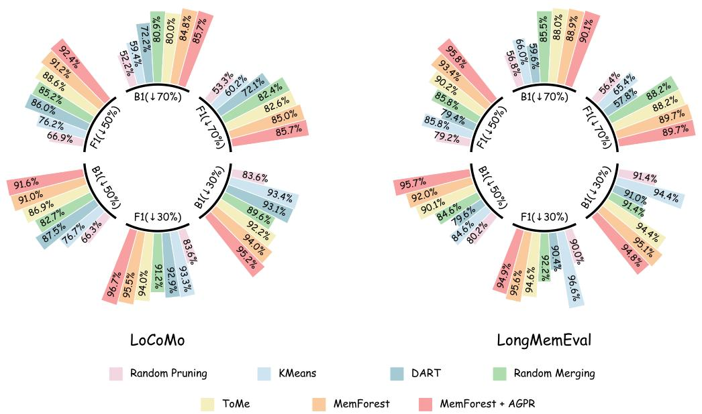  
Figure 4: Retention of B1 and F1 scores. On two benchmarks, the percentages of B1 and F1 retained relative to the original performance across methods under varying compression rates.

Table 11: Performance comparison of different baselines on the LongMemEval benchmark in terms of B1 and F1 under varying compression ratios. Blue denotes pruning methods, while Red denotes merging methods. For each ratio, the top two results are highlighted in bold black font.
<table><tr><td>Category</td><td colspan="2">SU</td><td colspan="2">SA</td><td colspan="2">SP</td><td colspan="2">MS</td><td colspan="2">KU</td><td colspan="2">TR</td><td colspan="2">All</td></tr><tr><td>Method</td><td>B1</td><td>F1</td><td>B1</td><td>F1</td><td>|B1 F1</td><td></td><td>B1</td><td>F1</td><td>B1 Fl</td><td>B1</td><td>F1</td><td>B1</td><td>F1</td></tr><tr><td>Mem0</td><td>64.172.6</td><td></td><td>15.1 14.9</td><td>15.5 15.3</td><td>0.17.6 0.1 8.0</td><td></td><td>32.1</td><td>38.2 40.5</td><td>39.7 51.1 52.4</td><td></td><td>26.338.9</td><td>32.4</td><td>40.8 40.3</td></tr><tr><td colspan="10">+ AGPR 62.771.8 30.4 35.7</td><td colspan="7">26.538.9 31.9</td></tr><tr><td colspan="10">Historical memory compression ratio (↓ 30%)</td><td colspan="7"></td></tr><tr><td>+ Random Pruning + KMeans</td><td>58.7 67.2</td><td>60.1 59.4</td><td>14.3 13.3 13.8</td><td>14.4</td><td>0.1 7.8 0.1 7.7</td><td></td><td>29.4</td><td>27.2 32.0 35.7</td><td>35.3 39.6</td><td>44.7 51.4</td><td></td><td>26.337.2 24.838.0</td><td></td><td>29.636.7 30.6 39.4</td></tr><tr><td>+ DART</td><td>57.2</td><td>65.8</td><td>14.7</td><td>16.2</td><td>0.06.1</td><td></td><td>27.4</td><td>31.3</td><td>39.5</td><td>50.2</td><td>24.035.3</td><td></td><td>29.5</td><td>36.9</td></tr><tr><td>+ Random Merging</td><td>60.0</td><td>69.1</td><td>12.9</td><td>14.1</td><td>0.06.9</td><td></td><td>26.1</td><td>30.4</td><td>37.3</td><td>48.9</td><td>26.3 38.4</td><td></td><td>29.637.6</td><td></td></tr><tr><td>+ ToMe</td><td>59.3</td><td>68.6</td><td>14.8</td><td>15.8</td><td>0.07.1</td><td></td><td>29.7</td><td>34.2</td><td>37.0</td><td>47.9</td><td>26.338.3</td><td></td><td>30.638.6</td><td></td></tr><tr><td>+ MemForest</td><td>58.969.1</td><td></td><td>13.3</td><td>13.6</td><td>0.06.0</td><td></td><td>30.8</td><td>35.5</td><td>38.4</td><td>49.5</td><td>25.838.7</td><td></td><td>30.8 39.0</td><td></td></tr><tr><td>+ MemForest + AGPR</td><td>60.4</td><td>69.0</td><td>13.2</td><td>13.3</td><td>0.06.4</td><td></td><td>30.1</td><td>35.2</td><td>38.7</td><td>50.2</td><td>25.2</td><td>37.5</td><td>30.7</td><td>38.7</td></tr><tr><td></td><td></td><td></td><td></td><td></td><td></td><td></td><td></td><td></td><td></td><td>50%)</td><td></td><td></td><td></td><td></td></tr><tr><td colspan="11">Historical memory compression ratio (↓</td><td colspan="7">24.235.5</td></tr><tr><td>+ Random Pruning</td><td></td><td>49.7 57.5 53.1 61.8</td><td>12.1</td><td>12.6 13.9 13.3</td><td></td><td>0.0 6.9 0.06.8</td><td>24.9</td><td>24.2 25.0 28.3</td><td>34.9</td><td>30.6 39.5 46.3</td><td></td><td>24.636.3</td><td></td><td>26.032.3</td><td>27.435.0</td></tr><tr><td>+ KMeans + DART</td><td></td><td>47.454.7</td><td>11.7</td><td>11.1</td><td></td><td>0.1 7.7</td><td>26.2</td><td>30.2</td><td></td><td>30.3 39.8</td><td></td><td>23.333.1</td><td></td><td></td><td></td></tr><tr><td>+ Random Merging</td><td></td><td></td><td></td><td></td><td></td><td></td><td></td><td></td><td></td><td>30.6</td><td></td><td></td><td></td><td>25.832.4</td><td></td></tr><tr><td>+ ToMe</td><td>55.2 63.7</td><td></td><td>14.1</td><td>15.2</td><td></td><td>0.1 9.2</td><td></td><td>25.2 29.4</td><td></td><td></td><td>41.4</td><td>24.835.9</td><td></td><td>27.4 35.0</td><td></td></tr><tr><td></td><td>56.566.5</td><td></td><td>13.2</td><td>13.4</td><td></td><td>0.07.2</td><td></td><td>29.6</td><td>34.1</td><td>31.8</td><td>41.8</td><td>26.337.3</td><td></td><td></td><td>29.236.8</td></tr><tr><td>+ MemForest</td><td>59.8 69.5</td><td></td><td>13.2</td><td>14.6</td><td></td><td>0.07.0</td><td></td><td>28.5</td><td>33.1</td><td>38.3</td><td>49.2</td><td>24.136.8</td><td></td><td>29.8 38.1</td><td></td></tr><tr><td>+ MemForest + AGPR</td><td>60.6 70.2</td><td></td><td>15.2</td><td>16.4</td><td></td><td>0.0 7.6</td><td></td><td>28.7 33.3</td><td></td><td>38.8</td><td>49.0</td><td>26.639.4</td><td></td><td>31.039.1</td><td></td></tr><tr><td colspan="11">Historical memory compression ratio (↓ 70%)</td><td colspan="3"></td><td></td><td></td></tr><tr><td>+ Random Pruning</td><td>30.336.1</td><td></td><td></td><td>7.0</td><td>7.6</td><td>0.1 8.0</td><td></td><td>15.6 14.0</td><td></td><td>20.8 27.0</td><td></td><td>22.332.6</td><td></td><td></td><td>18.4 23.0</td></tr><tr><td>+ KMeans</td><td>44.051.0</td><td></td><td></td><td></td><td></td><td></td><td></td><td>15.0</td><td>15.3</td><td>29.037.4</td><td></td><td>21.331.5</td><td></td><td>21.426.7</td><td></td></tr><tr><td>+ DART</td><td>28.432.7</td><td></td><td>9.6</td><td>8.0 9.3</td><td></td><td>0.06.6</td><td></td><td>20.7</td><td>21.9</td><td>22.3</td><td>30.5</td><td>19.426.7</td><td></td><td>19.3</td><td>23.6</td></tr><tr><td>+ Random Merging</td><td>54.1</td><td>65.2</td><td>10.1 17.2</td><td>19.3</td><td>0.1</td><td>0.1 5.4 8.3</td><td></td><td>25.3</td><td>30.6</td><td>32.3</td><td>43.8</td><td>24.034.7</td><td></td><td>27.7 36.0</td><td></td></tr><tr><td>+ ToMe</td><td>55.664.3</td><td></td><td></td><td>15.616.2</td><td></td><td>0.06.1</td><td></td><td>27.431.3</td><td></td><td>29.5</td><td>40.3</td><td>26.638.2</td><td></td><td>28.536.0</td><td></td></tr><tr><td>+ MemForest</td><td>54.263.9</td><td></td><td>16.1</td><td>17.1</td><td></td><td>0.07.3</td><td></td><td>28.5</td><td>32.8</td><td>34.7</td><td>44.0</td><td>24.236.4</td><td></td><td></td><td>28.8 36.6</td></tr><tr><td></td><td>55.7 65.2</td><td></td><td></td><td></td><td></td><td>0.06.7</td><td></td><td>28.433.0</td><td></td><td>34.2</td><td>43.6</td><td>25.035.5</td><td></td><td></td><td></td></tr><tr><td>+ MemForest + AGPR</td><td></td><td></td><td></td><td>16.618.4</td><td></td><td></td><td></td><td></td><td></td><td></td><td></td><td></td><td></td><td>29.2 36.6</td><td></td></tr></table>

## D.3 Other Evaluation Metrics

Furthermore, for the Mem0 framework, we evaluated the B1 and F1 scores on two representative benchmarks: LoCoMo and LongMemEval. As shown in Tables 10–11 and Figure 4, our method consistently outperforms other approaches across both benchmarks, further demonstrating the effectiveness of MemForest.

## D.4 Parameter Sensitivity Analysis

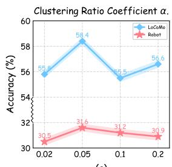

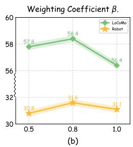

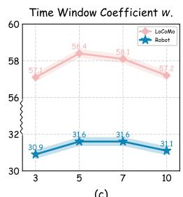  
Figure 5: Impact of Parameter Variations on Merging Performance.

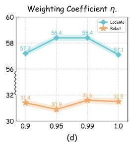

To analyze the sensitivity of different parameters, we conduct experiments on the LoCoMo and M3-Bench-robot datasets under a compression ratio of 50%.

Clustering Ratio Coefficient α. As shown in Fig. 5(a), when the clustering ratio coefficient α is set to 0.05, the performance on both benchmarks reaches its optimum. When α is either too high or too low, the performance degrades. This indicates that when the number of EventTrees is too small, excessive unrelated memories are grouped within a single EventTree; whereas when the number is too large, memory nodes from the same event are overly fragmented, thereby harming overall performance.

Weighting Coefficient $\beta .$ As shown in Fig. 5(b), when the weighting coefficient β is set to 0.8, the performance on both benchmarks reaches its optimum. When $\beta$ is too large, the effect of local temporal continuity is weakened; whereas when β is too small, temporal continuity becomes dominant, leading to a suppression of global semantic similarity, thereby degrading the overall performance.

Time Window Coefficient w. As shown in Fig. 5(c), when the time window coefficient w is set to 5, the performance on both benchmarks reaches its optimum. When w is too large, each cluster contains too many neighboring memory nodes, which weakens the aggregation of semantically similar nodes; whereas when w is too small, the number of neighboring nodes is insufficient to provide adequate local temporal information, thereby affecting the overall performance.

Weighting Coefficient η. As shown in Fig. 5(d), the performance on both benchmarks reaches its optimum when the weighting coefficient η is set to 0.99. When η is too small, the degree information dominates, which suppresses the merging of semantically similar nodes; whereas when η is set to 1, the importance of node degrees is ignored, potentially causing core nodes to be merged prematurely.

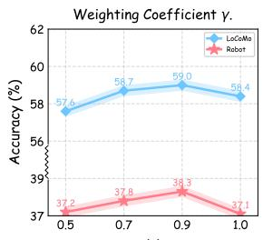  
(a)

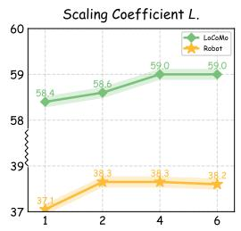  
(b)

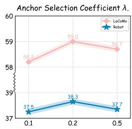  
(c)  
Figure 6: Impact of Parameter Variations on Memory Retrieval.

Weighting Coefficient γ. As shown in Fig. 6(a), when the weighting coefficient γ is set to 0.9, the performance on both benchmarks reaches its optimum. When γ is too low, the effect of semantic similarity on retrieval is weakened, leading to degraded performance; whereas when γ = 1, retrieval relies solely on semantic similarity, ignoring the neighborhood information of key memory nodes, which results in performance degradation.

Scaling Coefficient L. As shown in Fig. 6(b), when the scaling coefficient L is set to 4, the performance on both benchmarks reaches its optimum. When L is too small, the number of recalled candidate memory nodes is insufficient to provide adequate temporal neighborhood compensation, thereby affecting retrieval performance; whereas when L is greater than 4, the performance remains almost unchanged, as the number of candidate memory nodes is sufficient to fully cover the neighborhood of key memory nodes.

Anchor Selection Coefficient λ. As shown in Fig. 6(c), when the anchor selection coefficient λ is set to 0.2, the performance on both benchmarks reaches its optimum. When λ is too low, the number of anchors is insufficient, resulting in inadequate propagation of neighborhood information and preventing some relevant memory nodes from being effectively retrieved; whereas when λ is too high, excessive anchors introduce redundant information and additional noise, which negatively affects retrieval performance.

## D.5 Memory Node Merging Cost Analysis

Regarding the cost of memory node merging, each merge only requires a short prompt and two memory entries as input, producing a single summarized memory, resulting in very low overall cost. When using GPT-4o-mini to merge memory nodes and compress 50% of the historical memory, the cost is only about \$0.1 for the LoCoMo benchmark (≈100MB, 6,000 memory nodes) or roughly two hours of streaming video, making the practical overhead negligible. Moreover, this process can also be implemented with locally deployed open-source models.

## D.6 Merging Performance across Different Models

We evaluate Qwen2.5-7B-Instruct [28], GPT-4o-mini, and GPT-5.2 under a 50% compression ratio on the Lo-CoMo benchmark. As shown in Table 12, GPT-4o-mini and GPT-5.2 achieve comparable merging performance when used as backbone models, suggesting that once the model size reaches a certain scale, the performance tends to saturate with limited room for further improvement. In contrast, Qwen2.5-7B-Instruct performs worse, likely due to its smaller parameter size. This observation also raises an interesting question: can a dedicated lightweight model be trained specifically for memory merging, and could it achieve performance comparable to or even surpass that of models like GPT-4o-mini?

Table 12: Merging performance of different models.
<table><tr><td rowspan=1 colspan=1>Method</td><td rowspan=1 colspan=1>LoCoMo</td><td rowspan=1 colspan=1>%</td></tr><tr><td rowspan=1 colspan=1>Baseline</td><td rowspan=1 colspan=1>60.2</td><td rowspan=1 colspan=1>100.0%</td></tr><tr><td rowspan=1 colspan=1>Qwen2.5-7B-Instruct</td><td rowspan=1 colspan=1>52.9</td><td rowspan=1 colspan=1>87.9%</td></tr><tr><td rowspan=1 colspan=1>GPT-4o-mini</td><td rowspan=1 colspan=1>58.4</td><td rowspan=1 colspan=1>97.0%</td></tr><tr><td rowspan=1 colspan=1>GPT-5.2</td><td rowspan=1 colspan=1>58.1</td><td rowspan=1 colspan=1>96.5%</td></tr></table>

## D.7 Detailed time efficiency results

Table 13: T-Time(s) across the LoCoMo, LongMemEval, and PersonaMem benchmarks.
<table><tr><td rowspan=1 colspan=1>Dataset</td><td rowspan=1 colspan=1>LoCoMo</td><td rowspan=1 colspan=2>LongMemEval  PersonaMem</td></tr><tr><td rowspan=1 colspan=1>Baseline</td><td rowspan=1 colspan=1>0.48</td><td rowspan=1 colspan=1>8.30</td><td rowspan=1 colspan=1>4.90</td></tr><tr><td rowspan=1 colspan=1>Baseline + AGPR</td><td rowspan=1 colspan=1>0.48</td><td rowspan=1 colspan=1>8.31</td><td rowspan=1 colspan=1>4.90</td></tr><tr><td rowspan=3 colspan=1>Baseline + MemForest + AGPR (↓ 30%)Baseline + MemForest + AGPR (↓ 50% )Baseline + MemForest + AGPR (↓ 70% )</td><td rowspan=1 colspan=1>0.30</td><td rowspan=1 colspan=1>6.04</td><td rowspan=1 colspan=1>3.56</td></tr><tr><td rowspan=1 colspan=1>0.24</td><td rowspan=1 colspan=1>4.32</td><td rowspan=1 colspan=1>2.78</td></tr><tr><td rowspan=1 colspan=1>0.16</td><td rowspan=1 colspan=1>2.70</td><td rowspan=1 colspan=1>1.34</td></tr></table>

Table 14: Avg-R(×), R-Time(s), and T-Time(s) across M3-Bench-robot and M3-Bench-web.
<table><tr><td rowspan="2">Dataset</td><td colspan="3">M3-Bench-robot</td><td colspan="3">M3-Bench-web</td></tr><tr><td>Avg-R</td><td>R-Time</td><td>T-Time</td><td>Avg-R</td><td>R-Time</td><td>T-Time</td></tr><tr><td>Baseline</td><td>3.10</td><td>0.32</td><td>0.99</td><td>2.32</td><td>0.31</td><td>0.72</td></tr><tr><td>Baseline + MemForest + AGPR</td><td>2.52</td><td>0.32</td><td>0.81</td><td>2.12</td><td>0.32</td><td>0.68</td></tr><tr><td>Baseline + MemForest + AGPR (↓ 30%)</td><td>2.60</td><td>0.21</td><td>0.55</td><td>2.03</td><td>0.18</td><td>0.37</td></tr><tr><td>Baseline + MemForest + AGPR (↓ 50% )</td><td>2.59</td><td>0.16</td><td>0.41</td><td>2.20</td><td>0.16</td><td>0.35</td></tr><tr><td>Baseline + MemForest + AGPR (↓ 70% )</td><td>2.62</td><td>0.12</td><td>0.31</td><td>2.02</td><td>0.12</td><td>0.24</td></tr></table>

Tables 13–14 present the detailed results in Fig. 3, showing that our method achieves significant speedup.

## E Case Study

EventTree Partitioning Process. The following shows an initial EventTree obtained during the EventTree partitioning process on the LoCoMo benchmark. The memory nodes within this EventTree primarily revolve around "transgender and community support". It can be observed that some memory nodes, though not temporally adjacent, exhibit high semantic similarity (e.g., nodes 1, 9, and 10, "related to community support"), while other nodes, which are temporally adjacent but have lower semantic similarity with most memory nodes (e.g., nodes 7 and 8, "related to mentoring in the community"), are also grouped into the same EventTree. This effectively integrates the global semantic similarity of memory events with their local temporal continuity.

An Example of an Initial EventTree Obtained from Partitioning   
Memory 1: Values inclusivity and support.   
Timestamp 1: 1:14 pm on 25 May, 2023   
Memory 2: Finds participating in charity events rewarding.   
Timestamp 2: 1:14 pm on 25 May, 2023   
Memory 3: Aims to build a strong, supportive community of hope.   
Timestamp 3: 7:55 pm on 9 June, 2023   
Memory 4: Believes in building a more inclusive and understanding world.

Timestamp 4: 7:55 pm on 9 June, 2023

Memory 5: Excited to meet other people in the community.

Timestamp 5: 1:36 pm on 3 July, 2023

Memory 6: Values the importance of fighting for trans rights and spreading awareness.

Timestamp 6: 4:33 pm on 12 July, 2023

Memory 7: Has a mentee.

Timestamp 7: 2:31 pm on 17 July, 2023

Memory 8: Mentors a transgender teen.

Timestamp 8: 2:31 pm on 17 July, 2023

Memory 9: Passionate about rights and community support.

Timestamp 9: 8:56 pm on 20 July, 2023

Memory 10: User is passionate about rights and community support.

Timestamp 10: 8:56 pm on 20 July, 2023

Memory 11: The group has regular meetings and plans events and campaigns.

Timestamp 11: 8:56 pm on 20 July, 2023

Memory 12: Passionate about helping people and making a positive impact.

Timestamp 12: 8:56 pm on 20 July, 2023

Memory 13: Believes in the fight for equality and inclusivity.

Timestamp 13: 8:56 pm on 20 July, 2023

Memory 14: Values standing up for equality.

Timestamp 14: 2:24 pm on 14 August, 2023

Memory 15: Wants to spread understanding and acceptance.

Timestamp 15: 1:33 pm on 25 August, 2023

Memory 16: Shared personal story with young people.

Timestamp 16: 3:19 pm on 28 August, 2023

Memory 17: Proud of her identity.

Timestamp 17: 12:09 am on 13 September, 2023

Memory Node Merging Process. As shown below, we present an example from the M3-Bench-robot benchmark during the memory node merging process. The two nodes to be merged are highly related, and the resulting merged memory node fully preserves the original information while significantly improving storage efficiency and enhancing subsequent retrieval efficiency.

<table><tr><td>An Example of Merging Two Memory Nodes</td></tr><tr><td>Memory 1: The task involves organizing and preparing documents, possibly for a presentation or application.</td></tr><tr><td>Timestamp 1: Clip 6</td></tr><tr><td>Memory 2: The task being performed involves document preparation, possibly for an appli-</td></tr><tr><td>cation, report, or presentation. Timestamp 2: Clip 6</td></tr><tr><td></td></tr><tr><td>Merged memory: The task involves organizing and preparing documents for a presentation, application, or report.</td></tr><tr><td>Timestamp: Clip 6</td></tr></table>

## F Limitations

We conducted experiments on both the high-redundancy multimodal memory framework M3-Agent and the low-redundancy textual memory framework Mem0. The results indicate that in Mem0, which has relatively low redundancy, performance degradation becomes pronounced at higher compression rates. For instance, when 70% of the historical memory is compressed, the accuracy drops to only 93.3% of that in the uncompressed setting. In the future, specialized compression methods could be designed for such low-redundancy memory frameworks to improve performance under high compression ratios.

## G Future Work

We propose the following potential research directions for future work:

• MemForest is a general-purpose memory compression framework. Future work could explore designing specialized compression methods for low-redundancy memory frameworks like Mem0, in order to better preserve performance under high compression rates.

• As discussed in Section D.6, it may be possible to train a dedicated small memory-merging model that achieves, or even surpasses, the memory node merging performance of large models such as GPT-4o-mini.

• There is also room for optimization in memory retrieval mechanisms. Most current methods rely on selecting the top k most similar memory nodes, which involves only limited embedding similarity computations and can leverage vector database acceleration, typically resulting in retrieval times under one second. In contrast, some newer approaches, such as xMemory [12], require redesigning the memory generation framework, are incompatible with existing frameworks, and perform extensive embedding similarity computations during retrieval. They also require reconsideration of memory structure and cannot leverage vector database acceleration, leading to retrieval times that are tens of times longer. Therefore, future work could explore retrieval mechanisms that minimize embedding similarity computations while achieving a better balance between retrieval speed and accuracy.

• In terms of safety, it may be possible to perform a holistic analysis of the historical memory set to identify conflicts or potentially corrupted entries, and take appropriate measures to correct or remove them, thereby enhancing the robustness and reliability of the memory system.