# NEPTUNE: AN AI MODEL FOR GLOBAL OCEAN SUBSEASONAL PREDICTION

A PREPRINT

Davide Donno1,2 Italo Epicoco1,2 Massimo Cafaro1 Gabriele Accarino3,4

Mohammad M. Amirian5 Viviana Acquaviva5 Paola Nassisi2 Doroteaciro Iovino2

Annalisa Bracco2

Simona Masina2

Pierre Gentine3,4

September 9, 2026

1 Department of Engineering for Innovation, University of Salento, Via per Monteroni, Lecce, Italy   
2 CMCC Foundation - Euro-Mediterranean Center on Climate Change, Italy   
3 Department of Earth and Environmental Engineering, Columbia University, New York, NY, USA   
4 Learning the Earth with Artificial Intelligence & Physics (LEAP) Center, Columbia University, New York, NY, USA   
5 CUNY New York City College of Technology, 300 Jay Street, Brooklyn NY 11201

## ABSTRACT

Subseasonal-to-seasonal (S2S) forecasting is societally critical, supporting decision-making in sectors ranging from water and agricultural management to disaster risk reduction, energy planning, and insurance. Achieving reliable predictions at these timescales requires representing the ocean and its dynamics, but traditional physics-based ocean numerical models, also known as Ocean General Circulation Models (OGCMs), are computationally expensive and difficult to develop and improve because of the code complexity. In this work, we propose Neptune, an end-to-end data-driven framework for global ocean and sea-ice components emulation tailored for S2S timescales, up to 60 days. Neptune combines Convolutional Neural Networks (CNNs) and Spherical Fourier Neural Operators (SFNOs) to effectively capture local features and global cross-scale interactions, thereby obtaining a coherent representation of the ocean state. Forced by prescribed daily atmospheric fields, Neptune emulates ocean state variables, from temperature and salinity, to zonal and meridional currents, from sea surface height to sea ice thickness and concentration, with daily outputs at the ocean surface and through the water column. Specifically, we propose two variants of Neptune, Neptune-1 and Neptune-025, capable of emulating the ocean state at 1◦ and 0.25◦ horizontal resolution, respectively. Evaluated against a suite of metrics, including statistics (RMSE, CRPS and ACC), physical coherency (Ocean Heat Content, Eddy Kinetic Energy and Ice Brier Score) and climate indices (ENSO and Z20 metric, IOD), Neptune successfully reproduces the spatio-temporal evolution of the oceanic fields up to 60 days, and is stable over long timescales. Neptune provides compelling evidence that end-to-end data-driven ocean emulators can become a powerful component of nextgeneration S2S forecasting systems, emulating ocean state at high spatio-temporal resolution.

Keywords Machine Learning · Ocean Data-Driven Emulation · Subseasonal Forecasting · Deep Learning for Climate · Spherical Fourier Neural Operators

## 1 Introduction and State of the art

Subseasonal-to-seasonal (S2S) forecasting is critical for protecting communities and economies because it provides the actionable weeks-to-months lead times needed to prepare for high-impact large-scale events such as heatwaves, droughts, floods, and marine extremes [Vitart, 2018]. It supports decision-making in sectors ranging from agriculture [Liang, 2026] and fishery management [Pikitch et al., 2004] to disaster risk reduction, energy planning, and insurance [Troccoli, 2010, Meehl et al., 2021]. Achieving reliable predictions at these timescales, though, is more complicated than weather forecasting, because it requires accounting for, and therefore adequately representing, the ocean and its dynamics [Balmaseda et al., 2026]. Oceanic processes constitute a key source of predictability because the ocean stores and redistributes heat, freshwater, and other climate-relevant properties over much longer timescales than the atmosphere, thereby sustaining the forecast skill. In other words, after two weeks the ocean memory and oceanatmosphere interactions, including large-scale modes of variability and regional circulation changes, strongly influence the development and persistence of climate anomalies, making their explicit incorporation in longer forecasting essential. For this reason, Ocean General Circulation Models (OGCMs), physics-based numerical models that simulate the complex interactions underlying ocean dynamics by solving a set of partial differential equations (PDE) are a key component of S2S forecast systems. OGCMs, however, are computationally intensive, difficult to maintain and improve, and are mostly impractical for both quick evaluations usually needed by end-users or extensive forecast ensembles performed by climate centers.

During the last few years, with the rise of Artificial Intelligence (AI), Deep Learning (DL) techniques have progressively been adopted for weather applications, leading to a revolution in atmospheric weather forecasting [Bracco et al., 2025] Being hundreds of times faster than their PDE-based counterparts, data-driven emulators provide a powerful framework for generating large ensembles, rapidly exploring scenarios, establishing benchmarks, and enabling downstream applications for stakeholders, policymakers, and researchers. There are downsides as well. DL models’ higher inference speed often comes at the cost of reduced physical interpretability [Bauer et al., 2015], as they are usually considered as a black box that learns hidden non-linear patterns within the data in high-dimensional spaces. For systems with inherently short memory, such as the atmosphere, this limitation is often of secondary importance because forecast skill rapidly decays and predictive performance may outweigh the need for detailed physical interpretability. In this landscape, DL was first employed for skillful weather forecasting, with many remarkable works such as FourCastNet [Pathak et al., 2022], GraphCast [Lam et al., 2023], Pangu Weather [Bi et al., 2023], NeuralGCM [Kochkov et al., 2024], ExtremeCast [Xu et al., 2024], FuXi-ENS [Zhong et al., 2024], Aurora [Bodnar et al., 2025], FGN [Alet et al., 2025] and GenCast [Price et al., 2025]. Emulators or generative data-driven approaches for probabilistic forecasting (e.g. DLWP [Weyn et al., 2021], ACE [Watt-Meyer et al., 2023], ClimaX [Nguyen et al., 2023], Fuxi-S2S [Chen et al., 2024], ACE2 [Watt-Meyer et al., 2025, Kent et al., 2025], CodensNet [Wang et al., 2025]) have opened new avenues not just in weather science, but also in weather services, sometimes even outperforming well-established numerical models.

Conversely, the development of data-driven ocean models has been slower, mostly because of the different and significant challenges that the intrinsic complexity of ocean dynamics poses. Continents and islands define the boundaries of ocean basins, shaping complex fluid-dynamical interactions along coastlines; unlike the atmosphere, which is continuously monitored by ground stations, weather balloons, and satellites, the ocean remains largely invisible to remote sensing, with extensive areas in the deep ocean and polar regions where observations have historically been sparse [Amirian et al., 2026]; ocean dynamics emerge from the coupled effects of winds, tides, heat exchange, and freshwater fluxes, making it difficult for AI models to represent all relevant processes with physical realism; lastly and most importantly, ocean dynamics evolve on much longer timescales than the atmosphere, posing a challenge for AI models that are typically optimized to learn from short-term feedback.

Recent work has addressed these challenges by focusing on global medium-range forecasting at relatively coarse resolution. The DL emulation task has been framed as a global forecasting engine in XiHe [Wang et al., 2024], OceanNet [Chattopadhyay et al., 2024, Lowe et al., 2025], GLONET [Aouni et al., 2025], FuXi-Ocean [Huang et al., 2025] and TianHai [Niu et al., 2025]. Oppositely, in MedFormer [Epicoco et al., 2025] and SeaCast [Holmberg et al., 2025], the authors develop very high-resolution ocean emulators tailored to the Mediterranean region for medium-term operational forecasting, achieving comparable or even better skills than the underlying numerical model, MedFS [Pinardi et al., 2003, Pinardi and Coppini, 2010, Coppini et al., 2023]. Aforementioned emulators are not meant to predict ocean state at S2S timescale as they are not explicitly trained to guarantee stability over long rollouts, thereby accumulating large errors on such timescales.

Data-driven oceanic emulation on decadal timescales has been investigated in different impactful works. In ORCA-DL [Guo et al., 2025], the authors leveraged ORAS5 [Copernicus Climate Change Service, 2021], GODAS [Behringer et al., 1998] and other datasets at coarse temporal resolution (monthly scale) to achieve global ocean predictions from seasonal to decadal timescales, obtaining good skills. They propose a Transformer architecture [Vaswani et al., 2023] for their fusion module. ORCA-DL on some metrics can outperform state-of-the-art numerical models, as it is capable of accurately simulating the structure of events of climatic relevance, including the El Niño Southern Oscillation (ENSO) [Wang et al., 2017] and the development of upper-ocean heat-waves. In Subel and Zanna [2024], on the other hand, the authors proposed a simple and powerful U-Net [Ronneberger et al., 2015] network to investigate the role of the atmosphere in DL-based ocean emulation, achieving stable roll-outs over 8 years. They trained the U-Net model leveraging GFDL CM2.6 [Stouffer et al., 2006] coupled climate model, focusing on a set of regions where the ocean dynamics play key but different roles in climate prediction, namely the Tropics, the Gulf Stream, the African Cape and the South Pacific. Building on the aforementioned work, the Samudra emulator, based on ConvNeXt [Liu et al., 2022] UNet model, was able to deliver stable ocean simulations for several centuries [Dheeshjith et al., 2025]. The model was trained to emulate key ocean state variables, i.e. potential temperature, salinity, zonal (u) and meridional (v) currents and sea surface height (SSH), leveraging the OM4 [Adcroft et al., 2019] dataset. The ocean variables, originally at $0 . 2 5 ^ { \circ }$ , were remapped to a coarser horizontal resolution of 1.0◦, aggregating the data in depth levels and in 5-day averages. Despite the relevant results they have achieved, aforementioned works share some limitations. ORCA-DL predicts global ocean at monthly timescale, whereas in Samudra the authors preprocess the data with Gaussian filter and average the ocean data over 5 days, thereby smoothing out high-frequency details. In addition, the two global ocean emulators work at a coarse spatial resolution of $1 ^ { \circ } \times 1 ^ { \circ }$

To bridge the gap between weather and climate scales, here we propose Neptune, a high spatio-temporal resolution AI ocean model that combines Convolutional Neural Networks (CNNs) and Spherical Fourier Neural Operators (SFNO) [Bonev et al., 2023] for simulating both the sea-ice component and the global ocean on S2S at high spatio-temporal resolution. Leveraging prescribed atmospheric forcing, Neptune can stably forecast the daily global ocean state up to 60 days, thus providing a powerful AI solution for S2S applications. We pre-train the Neptune model using the ORAS5 ocean reanalysis and ERA5 [Hersbach et al., 2020] as atmospheric forcing, both at $\bar { 1 } ^ { \circ } \times 1 ^ { \circ }$ horizontal resolution, hereafter named Neptune-1. In addition to the key variables describing the ocean dynamics (i.e., temperature, salinity, zonal (u) and meridional (v) currents, SSH, mixed layer depth (MLD)), Neptune also includes ice-related state variables (i.e., sea-ice concentration, sea-ice thickness). After the pre-training phase of Neptune-1, we perform a fine-tuning of the DL emulator at higher spatial resolution of $0 . 2 5 ^ { \circ } \times \dot { 0 . } 2 5 ^ { \circ }$ to further enhance Neptune’s resolution, also improving the range of possible downstream applications. We refer to the fine-tuned version as Neptune-025. Our model provides physically consistent realizations of the ocean dynamics and of sea ice coverage and thickness at daily frequency up to 60 days at a maximum horizontal resolution of ${ \dot { 0 } } . 2 5 ^ { \circ } \times 0 . 2 5 ^ { \circ }$ , and can accurately portray ocean indices and modes of variability such as ENSO (and Isotherm depth at $2 0 ^ { \circ } C , Z 2 0$ metric) or the Indian Ocean Dipole (IOD). The spatial and temporal scales resolved by Neptune make it an ideal global ocean component of a S2S forecasting system.

The remainder of the paper is organized as follows: Section 2 describes the Neptune workflow starting from data preparation, to the model architecture and training details. Section 3 provides a detailed assessment of Neptune skills, while Section 4 contextualizes our findings, highlighting key differences with respect to the current literature. Finally, Section 5 draws the most relevant conclusions regarding the work, pointing out potential future activities.

## 2 Materials and Methods

In this section, we describe in detail the datasets used, their preparation, and the materials used for replicating the experiments.

## 2.1 Data Sources: ORAS5 and ERA5

Here we provide the dataset specifications used for training and evaluating Neptune model. Table 1 summarizes the key oceanic and atmospheric variables described in the following.

## 2.1.1 ORAS5 Oceanic Dataset

The ORAS5 Ocean Dataset [Zuo et al., 2019] is an ensemble of reanalysis and real-time analysis of both global ocean and sea ice. Among the key innovations of the dataset, we account for the perturbation of initial conditions and the generic perturbation scheme for both observations and forcing fields. The quality of the data is ensured by the verification against reference climate datasets from the European Space Agency Climate Change Initiative (ESA CCI) project. We retrieve ORAS5 data from the Global Ocean Ensemble Physics Reanalysis [Gounou et al., 2024] (GLOBAL\_MULTIYEAR\_PHY\_ENS\_001\_031), comprising ORAS5, GLORYS [European Union-Copernicus Marine Service, 2018] and C-GLORS [Cipollone et al., 2021] experiments. The dataset is produced by the Copernicus Marine Service and contains several key ocean state variables, including sea ice. The ocean datasets are forced by ERA-Interim [Dee et al., 2011] atmospheric forcing, and contain daily data from 1 January 1993 to 31 December 2022, at a native resolution of $0 . 2 5 ^ { \circ } \times 0 . 2 5 ^ { \circ }$

Covering the period 1993-2021, for our experiments we select temperature $( \theta _ { o } )$ , salinity $( S _ { o } )$ , eastward and northward velocities (U and V, respectively) as 3D variables, followed by ocean mixed layer thickness, sea ice thickness, sea ice concentration as surface variables. Additionally, among the 75 depth levels prioritizing resolution near the ocean surface (from surface to 5,000 meters of depth) comprising ORAS5 product, we select a subset of 14 depth levels (0.5 m, 1.5 m, 2.7 m, 8.1 m, 26.5 m, 53.8 m, 108.0 m, 199.8 m, 300.9 m, 508.6 m, 1045.8 m, 1945.3 m, 2955.6 m, 5089.5 m).

## 2.1.2 ERA5 Atmospheric Dataset

The ERA5 reanalysis dataset [Hersbach et al., 2023a,b] includes key variables essential for driving and constraining ocean dynamics. ERA5 reanalysis combines a global numerical model with an innovative ensemble-based data assimilation technique to produce a consistent estimate of the atmospheric state [Hersbach et al., 2020]. ERA5 climate variables are provided on a regular grid at a spatial resolution of $0 . { \dot { 2 } } 5 ^ { \circ } \times 0 . 2 5 ^ { \circ }$ , representing the global atmospheric state and covering a period that starts from 1st January 1940 to present on an hourly basis.

Among the ERA5 variables, we selected 2m temperature, 2m dewpoint, 10m u and v components ofwind and mean sea level pressure as surface forcing variables. This selection aims to learn a meaningful indirect (latent) representation of the wind stress, variables driving the heat, moisture and momentum exchange between the atmosphere and the ocean. We gather the atmospheric forcing at a daily temporal resolution from the WeatherBench2 dataset [Rasp et al., 2023], and select the same temporal extent (i.e., 1993 - 2021) to ensure temporal consistency with ORAS5 dataset.

## 2.2 Experimental Setup

Let $O _ { t }$ and $A _ { t }$ respectively be the real ocean and atmospheric state at time t. We can represent the dynamical evolution of the ocean state with a discrete-time underlying function Φ such that $O _ { t + \Delta t } = \Phi ( O _ { t } , A _ { t } )$ . We can thereby obtain a trajectory of the future ocean states by auto-regressively applying the Φ function:

$$
\begin{array} { r l } & { O _ { t + \Delta t } = \Phi ( O _ { t } , A _ { t } ) } \\ & { O _ { t + 2 \Delta t } = \Phi ( \Phi ( O _ { t } , A _ { t } ) , A _ { t + \Delta t } ) } \\ & { O _ { t + 3 \Delta t } = \Phi ( \Phi ( O _ { t } , A _ { t } ) , A _ { t + \Delta t } ) , A _ { t + 2 \Delta t } ) } \\ & { \qquad \quad . ~ . ~ . } \end{array}\tag{1}
$$

Our goal is to find a set of learnable parameters θ and a DL model $\mathcal { F } _ { \theta }$ that accurately approximates the true dynamical function Φ over a S2S temporal horizon, T ∆t. Since we only have a partial view on the real ocean state $O _ { t }$ caused by dimensionality reduction and truncation [Brolly, 2026], we account for the unresolved dynamics by adding temporal information to the overall system, thereby including the previous state $O _ { t - \Delta t }$

Therefore, we can write the learning problem formulation as:

$$
( \Delta O _ { t + \Delta t } , \Delta O _ { t + 2 \Delta t } ) \simeq \left( \Delta \hat { O } _ { t + \Delta t } , \Delta \hat { O } _ { t + 2 \Delta t } \right) = \mathcal { F } _ { \boldsymbol { \theta } } ( A _ { t - \Delta t } , A _ { t } , O _ { t - \Delta t } , O _ { t } )\tag{2}
$$

Where $\Delta O _ { t + \Delta t } = O _ { t + \Delta t } - O _ { t }$ is the residual of the ocean state, computed as the difference between two consecutive ocean states, while $\Delta \hat { O } _ { t + \Delta t }$ is the prediction of the DL model. Following Brolly [2026] and taking advantage of results obtained in Epicoco et al. [2025], where we used 4 timesteps in input to the emulator, we require additional ocean states by predicting two consecutive residuals to effectively reconstruct the steady ocean dynamics. In contrast with other works, the innovation of our experimental setup lies in the prediction of two consecutive timesteps, as in Dheeshjith et al. [2025], with the exception that we predict residuals instead of full ocean fields, leading to a better forecasting skills.

<table><tr><td>System</td><td>Variable</td><td>Description</td><td>Post-processed Shape</td><td>Depth Levels</td><td>Category</td></tr><tr><td rowspan="7">Ocean</td><td> $\theta _ { o }$ </td><td>Temperature</td><td rowspan="2"> $1 8 1 \times 3 6 0$ </td><td rowspan="2">14 Levels</td><td rowspan="2">Input/Output</td></tr><tr><td> $S _ { o }$ </td><td>Salinity</td></tr><tr><td> $u _ { o }$   $v _ { o }$ </td><td>Eastward Velocity Northward Velocity</td><td rowspan="2"></td><td rowspan="2"></td><td rowspan="2"></td></tr><tr><td></td><td></td></tr><tr><td>SSH SIT</td><td>Sea Surface Height Sea Ice Thickness</td><td rowspan="2"> $1 8 1 \times 3 6 0$ </td><td rowspan="2">Surface</td><td rowspan="2">Input/Output</td></tr><tr><td>SIC</td><td>Sea Ice Concentration</td></tr><tr><td>MLD</td><td>Mixed Layer depth</td><td></td><td></td><td></td></tr><tr><td>T2M</td><td>2m Temperature</td><td></td><td></td><td></td></tr><tr><td rowspan="4">Atmosphere</td><td>D2M</td><td>2m Dewpoint</td><td rowspan="2"> $1 8 1 \times 3 6 0$ </td><td rowspan="2">Surface</td><td rowspan="2">Input</td></tr><tr><td>U10</td><td>10m u component of wind</td></tr><tr><td>V10</td><td>10m v component of wind</td><td></td><td></td><td></td></tr><tr><td>MSLP</td><td>Mean Sea Level Pressure</td><td></td><td></td><td></td></tr></table>

Table 1: Description of input and output variables used for Neptune Ocean emulator. Variables are categorized as input/output (i.e., prognostic) and input-only (i.e., forcing).

## 2.2.1 Data processing

Before feeding the data into the Deep Learning (DL) model, we pre-processed them according to the following procedure. Both atmosphere and ocean data are provided on the same regular grid at a daily $0 . 2 5 ^ { \circ } \times 0 . 2 5 ^ { \circ }$ resolution, thus corresponding to a $1 4 4 0 \times 7 2 1 ( H \times W )$ matrix. Land pixels in ocean data are represented with NaN values. Moreover, since ocean data are not defined on the Antarctic, their corresponding grid is $1 4 4 0 \times 6 8 1$ . Therefore, as a preliminary step, we fill the missing ocean latitudes with NaNs to match the atmospheric grid size. We split the 1993-2021 dataset into training (1993-2016), validation (2017-2018) and test (2019-2021). Then, due to the large amount of data, we computed the global mean and standard deviation on the training set leveraging the Welford algorithm [Efanov et al., 2021]. The Welford algorithm enables the computation of both the running mean and standard deviation, iterating over each dataset sample, with high numerical stability. Before feeding the Neptune emulator with ocean and atmospheric predictors, we scale them and replace NaN values (i.e., in the land and Antarctic) with zeros. Furthermore, we interpolated ocean and atmosphere data at a coarser resolution of $1 ^ { \circ } \times 1 ^ { \circ }$ grid using the bilinear interpolation algorithm, resulting in a $1 8 1 \times 3 6 0 ( H \times W )$ data matrix. The resulting dataset at 1◦ horizontal resolution was used for pre-training (Neptune-1) while the dataset at native $0 . 2 5 ^ { \circ }$ resolution was used for fine-tuning (Neptune-025).

## 2.2.2 Deep Learning Architecture

We designed the Neptune Ocean architecture to process global geophysical data, adopting a hierarchical structure that integrates neural operators on the $S ^ { 2 }$ sphere and convolutions. The spherical formulation of the network eliminates geometrical distortions introduced by grid projections, enabling rotational invariance. As introduced in Section 1, (S)FNOs have proven their effectiveness in Climate Science both in atmosphere and ocean emulation due to their ability to learn operators that map between function spaces, thereby being able to learn complex PDE families.

In our work, mixing SFNO to convolutions enables capturing the strong multi-scale behavior of the ocean dynamics, thus modeling long-range spatial correlations while maintaining efficiency across the scales. Moreover, Neptune is able to reproduce response time to atmospheric forcing, which varies a lot.

## Ocean Neural Operator

We designed the Neptune model as an encoder-decoder network, Figure 1. The input data consists of both 3D and 2D ocean data together with the 2D surface atmosphere forcing. We project each variable into a common latent space of dimension 256 through convolutions with kernel size 3, padding 1 and stride 1. We end up with a single tensor of shape $B \times D \times H \times W = B \times 2 5 6 \times 1 8 1 \times 3 6 0$ . Moreover, inspired by the Fourier-based encoding used in the Aurora Foundation model [Bodnar et al., 2025], we used a positional encoding that encodes the data in latitude, longitude and day-of-year. This module provides the network with absolute spatio-temporal context, thus learning specific geographical biases. Using the day-of-year t, we further enriched the positional encoding by computing and encode the day-length map (i.e., containing the number of hours of sunlight) in the latent space. As a result, this operation increased the conservation of the Ocean Heat Content (OHC) across the forecasting horizon.

The latent tensor is first processed by two encoder blocks that hierarchically capture multi-scale local patterns within the data. Then, two SFNO blocks compute global spectral convolution, truncating the modes at $H \times \mathbf { \bar { W } } = 2 \times 2$ to keep only the largest scale frequency modes. The SFNO is linked to the decoder which reconstructs the spatial fields leveraging both the global SFNOs context and the local encoder information provided through the skip connection.

Finally, the latent data is projected back into the original space, reconstructing the residuals $d X _ { t + 1 }$ and $d X _ { t + 2 }$ . We inject day-of-year t and noise $\mathcal { N } ( 0 , I )$ into the Conditional Layer Norms (CLN) [Chen et al., 2021] to drive the model during the residuals’ reconstruction. The day-of-year enhances the DL model representation of the seasonality of the ocean state, driving its response depending on the seasonal cycle. The noise conditioning enables the DL model to produce ensemble forecasts, improving its long-term accuracy, given the chaotic nature of the ocean [Li et al., 2024]. In Section 2.2.2 we explain the procedure to construct the ensemble.

We dimensioned the network configuration to work with 1◦ data, resulting in a 13M parameters model. To adapt the architecture for the fine-tuning at higher resolution data $( \mathrm { i . e . , 0 . 2 5 ^ { \circ } } )$ , after the first and before the last convolutions (green blocks in Figure 1), we added two $S ^ { 2 }$ bilinear resample operations that map $0 . 2 5 ^ { \circ } \ ( \mathrm { i . e . , 7 2 1 } \times 1 4 4 0$ grid size) to

$1 ^ { \circ } \ ( \mathrm { i . e . , 1 8 1 \times 3 6 0 }$ grid size). This operation helped Neptune to keep the same latent space representation size at the working resolution of the pre-training phase, thus limiting the number of epochs needed for fine-tuning.

## Encoder-Decoder Block

Both the Encoder and Decoder blocks share the same architecture, inspired by the UNet layers. Each block contains two sequential layers composed of convolution, CLN, Sigmoid Linear Unit (SiLU) and Dropout. The convolution layer extracts local features within the latent tensor, whereas the CLN applies a stochastic layer normalization to the features based on both the day-of-year and the noise conditioning.

## SFNO Block

The architecture of the SFNO block is based on the NeuralOperator [Kovachki et al., 2024] implementation. As shown in Figure 1 (yellow panel), the latent tensor is fed into the spectral convolution layer that computes global spectral convolution leveraging SHT transform. After the spherical convolution, the input is normalized through CLN and added to densely connected skip connection. Then, Gaussian Linear Unit (GeLU) non-linearity is applied, followed by a Multi-Layer Perceptron (MLP) and added to a Soft-Gating skip connection. Finally, CLN and GeLU non-linearity are sequentially applied. We condition the SFNO outputs to drive the forecasting leveraging the stochastic layer normalization.

## Pre-training and Fine-tuning

We pre-train Neptune-1 ocean emulator for 150 epochs using a global batch size of 8 samples, using $1 ^ { \circ }$ data. We select AdamW as weight optimizer, with 0.01 of weight decay, $\beta _ { 1 } = 0 . 9$ and $\beta _ { 2 } = 0 . 9 5$ . We first warm up the learning rate to $5 * 1 0 ^ { - 4 }$ for the first 10 epochs, and then apply a cosine annealing schedule that decreases it up to $5 * 1 0 ^ { - 8 }$ . We leverage the Mean Absolute Error (MAE) loss function, to optimize the model for simply forecasting the global ocean residuals $d X _ { t + 1 } , d X _ { t + 2 }$ . After the pre-training phase, we fine-tune the model (Neptune-025) on higher spatial resolution data at $0 . 2 5 ^ { \circ }$ for 50 epochs, using the same configuration of the pre-train. We conduct all our experiments on the Juno HPC Cluster, a supercomputer belonging to the CMCC (Euro-Mediterranean Center on Climate Change) Foundation’s High Performance Computing (HPC) facilities [CMCC, 2026]. We used a total of 8 NVidia Volta A100 GPUs, 40GB, for a total of 48 hours for pre-training and ∼100 hours for fine-tuning.

## Inference on Test set

For our evaluations and results reported in Section 3, we perform inference on 2019-2021 test set. We use each day of the test set as the initial condition of a 60-day long forecast. Using the Neptune-1 emulator, we build an ensemble of forecasts composed of 8 members. Starting from the same initial condition, we obtain each member by sampling a different noise tensor drawn from a Gaussian normal distribution $\mathcal { N } ( 0 , I )$ and use it for latent space conditioning. Due to computational limitations during both inference and evaluation across the 3 years of data, we could not perform the ensemble for higher spatial resolution emulator, Neptune-025.

## 2.2.3 Evaluation Metrics

Here we provide a brief definition and explanation of the metrics that will be used to evaluate Neptune-1 and Neptune-025 performance in the following Section 3.

## Statistical Evaluation

• Root Mean Squared Error (RMSE): measures the magnitude of the mean quadratic deterministic error, severely penalizing huge discrepancies in the point-wise values. After after some time, due to the chaoticity of the flow, the RMSE is less accurate in determining the skills of a DL emulator.

• Continuous Ranked Probability Score (CRPS): extends the analysis to the probabilistic domain, evaluating the accuracy of the predicted ocean-state trajectories.

• Anomaly Correlation Coefficient (ACC): quantifies the phase correspondence and the morphological faithfulness of spatial patterns between the predicted and true anomalies, with values near to 1 indicating perfect structural synchrony.

## Physical Coherency

• Ocean Heat Content (OHC): To evaluate Neptune’s ability to emulate the fundamental dynamics of the Tropical Pacific Ocean, we examine the evolution of the Ocean Heat Content (OHC). We compute OHC using the following formula:

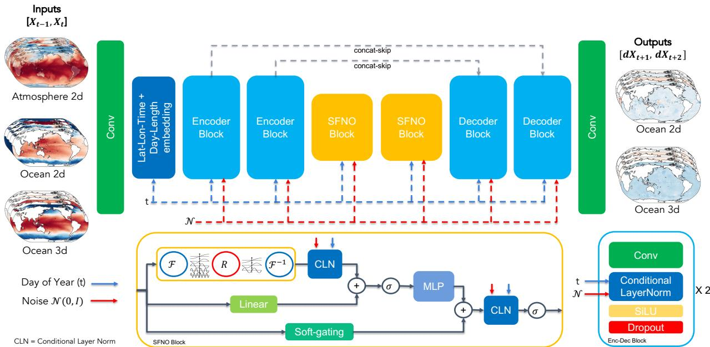  
Figure 1: Neptune architecture is a Unet-shaped SFNO operating on dimensions $H \times W$ . Ocean data along with atmospheric forcing at time-steps t − 1 and t are projected into a 256-dimensional latent space using convolutions. Encoder and decoder blocks capture local non-linear relationships within the latent data, whereas the SFNO blocks capture global relationships. Noise and day-of-year are injected into the conditional layer norms of the network to drive during the residual state forecasting. A convolution-based recovery restores the data into the original physical space, thus producing ocean forecasts at times t + 1 and t + 2.

$$
H = \rho C \int _ { 0 } ^ { z } T ( z ) d z
$$

where T is the temperature, $\rho = 1 0 2 6 \ k g / m ^ { 3 }$ is the density of sea water, $C = 3 9 9 0 \ J / k g K$ is the specific heat of sea water and $z = 3 0 0 m$ . Unlike surface temperature, OHC integrated over the first 300 m provides a more robust representation of the upper-ocean thermal structure and additionally highlights charge-discharge processes associated with ENSO variability.

• Eddy Kinetic Energy (EKE): We compute the Eddy Kinetic Energy (EKE) to evaluate Neptune’s dynamical variability. Analyzing the EKE is crucial for assessing model’s ability to resolve large-scale transient flow and the variability of the major current systems. In Figure 6, we can identify systematic errors in Neptune’s representation of the ocean energy distribution. We compute EKE as:

$$
E K E = \frac { 1 } { 2 } ( u ^ { \prime 2 } + v ^ { \prime 2 } )
$$

where $u ^ { \prime } = u - \bar { u }$ and $\boldsymbol { v ^ { \prime } } = \boldsymbol { v } - \boldsymbol { \bar { v } }$ are the anomalies in zonal and meridional velocities, respectively, while u¯ and v¯ are their daily mean values.

• Ice Brier Score (IBS): To assess Neptune’s skills in reproducing ice fields, we compute the Brier Score (BS) [Brier, 1950] on the Sea Ice Concentration (SIC) field. The score measures the accuracy of probabilistic prediction in binary outcomes. In our work, we define a 15% threshold to retrieve the binarized reanalysis observation $\left( o _ { t } \right)$ and then compute the score as:

$$
B S _ { k } = \frac { 1 } { N } \sum _ { t = 0 } ^ { N } ( f _ { t } ^ { k } - o _ { t } ) ^ { 2 }
$$

where N is the number of days within the 2019-2021 test set, $f _ { t } ^ { k }$ is the forecast SIC at the k-th lead time, treated as a probability (i.e., not binarized).

## Oceanic Indices

• El Niño Southern Oscillation (ENSO): is a large-scale phenomenon occurring in the tropical Pacific Ocean region and oscillating every few years [Wang et al., 2017]. In the ocean, ENSO is characterized by positive (El Niño) and negative (La Niña) Sea Surface Temperature (SST) anomalies. Although with irregular occurrence, it shows an oscillatory behavior that generally lasts 3-5 years. Moreover, the phenomenon is irregular in the occurrence rate and is asymmetric, showing larger and often longer El Niño warm events with respect to La Niña cold events.

Included in our ENSO analysis we also include the isotherm depth at $2 0 ^ { \circ } C \ ( Z 2 0 )$ , since it gives insights regarding the movement of water masses. Z20 is the depth at which the temperature reaches $2 0 ^ { \circ } C$ . It is widely considered the primary physical proxy to identify the thermal variability in the Equatorial Pacific [Kessler, 1990]. It acts as a frontier, separating warm surface waters from the deeper, colder waters of the deep ocean. We computed Z20 over a Eastern $( 5 ^ { \circ } \bar { S } - 5 ^ { \circ } N , 1 0 0 ^ { \circ } W - 9 0 ^ { \circ } W )$ and Western $( 5 ^ { \circ } S - 5 ^ { \circ } N , 1 6 5 ^ { \circ } E - \mathrm { \bar { 1 } } 7 5 ^ { \circ } E )$ Boxes surrounding El Niño 3.4 region. During El Niño phases, since hot waters moved eastward, the Western box depth decreases accompanied by sharp increases in the Eastern. During La Niña phases, the opposite happens. The Western box depth increases while Eastern ones will show decreasing trends.

• Indian Ocean Dipole (IOD): is the main inter-annual variability mode of the Tropical Indian Ocean (TIO), tightly linked with the atmosphere-ocean coupling [Saji et al., 1999, Webster et al., 1999, Yamagata et al., 2013]. It is characterized by a strong zonal thermal gradient that can be numerically quantified by the Dipole Mode Index (DMI) that expresses the difference between SST anomalies of the Western $( 5 0 ^ { \circ } E ^ { \sim } 7 0 ^ { \circ } E , 1 0 ^ { \circ } S ^ { \sim } 1 0 ^ { \circ } N )$ and Eastern $( 9 0 ^ { \circ } E ^ { \circ } 1 1 0 ^ { \circ } E , 1 0 ^ { \circ } S ^ { \smile } 0 ^ { \circ } S )$ basins. During a positive IOD phase (pIOD), equatorial trade winds intensify towards West, causing an anomalous SST cooling near the Sumatra and Java regions. At the same time, thermocline depth increases in the Arabian Sea, causing a warming in the Western pole [Liu et al., 2024].

## 3 Results

In this section, we evaluate Neptune-1’s skills based on various metrics. As mentioned in Section 2.2.2, we use each day of the 2019-2021 test set as the initial condition of a 60-day long forecast. Subsequently, we perform the benchmarks using the i-th forecast of each day to provide the skills for such lead time.

We divide our results into: Statistical Evaluation, Physical Coherency and Oceanic Indices. Within Statistical Evaluation 3.1, we discuss RMSE, CRPS and ACC. In Physical Coherency 3.2, we provide skills about OHC, EKE and IBS.

In Oceanic Indices Section 3.3, we analyze how Neptune reproduces the occurrence and intensity of ENSO and Z20 metric related to it and IOD across the 60 days of forecast.

Finally, in Section 3.4 we analyze Neptune-025’s skills in terms of RMSE, OHC, EKE and IBS to highlight benefits and limitations of the fine-tuning on downstream tasks for S2S applications.

All evaluation metrics involving the climatology are computed relative to a daily climatology derived from the training set (1993-2016), to prevent any data leakage from the test period and providing a consistent baseline for evaluating the emulator skills.

## 3.1 Statistical Evaluation

## 3.1.1 Root Mean Squared Error

Neptune’s RMSE difference with respect to the climatology (Figure 2a) is characterized by a regular asymptotic decay of the quadratic error, documenting the robustness of the emulator with respect to the climatology in representing the seasonal cycle. This behavior is a direct consequence of the structural topology of the DL model (i.e., Encoder-SFNO Decoder) that combines multiple convolutional blocks with an SFNO bottleneck to capture complex global and local structure, successfully combining them to obtain a robust predicted ocean state. Moreover, predicting the residual regularizes the error accumulation during iterative long rollouts, limiting the RMSE at t+60 days. Except for $u _ { o }$ and $v _ { o }$ velocities, MLD and SIT, Neptune has much lower RMSE with respect to the climatology Figure 2a. While approaching the 60 days of forecast, the scorecards transition from blue to more neutral colors confirming that the emulator slowly converges towards the climatology without drifting with respect to it. Deterministic RMSE validation with respect to the climatology confirms that Neptune shows improved skills in emulating the ocean dynamics. Finally, temperature scores reveal that Neptune has a reduced RMSE with respect to the climatology, in correspondence of the 50-300m depth, which is a well-known bias of OGCMs. From a spatial analysis, Neptune RMSE shows exceptional consistency with the predicted variables, revealing that Neptune has learned a highly faithful representation of the physics underlying global ocean dynamics. Due to their intrinsically chaotic nature [Lorenz, 1969], regions of highest mesoscale variability across the globe like the Gulf Stream, Kuroshio region, Agulhas, Brazil-Malvinas Confluence, and Antarctic Circumpolar

(a) RMSE Difference between Neptune and Climatology RMSE Difference (Neptune - Climatology)

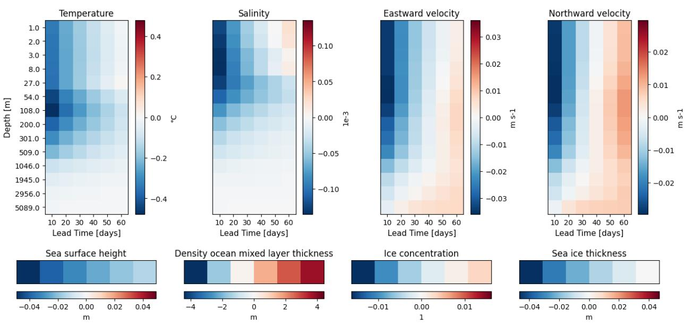

(b) Neptune RMSE at t+60 lead time  
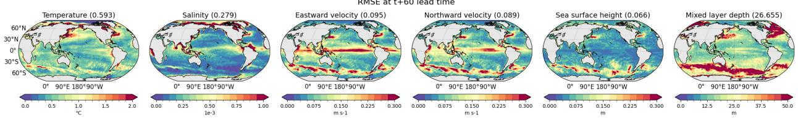  
Figure 2: Neptune’s RMSE for some selected lead times from t+10 to t+60 days. Panel a) reports RMSE difference between Neptune and climatology, comprising both surface and depth variables. Blue colors, associated with negative values, mean that Neptune has a lower RMSE than climatology. Red colors, associated with positive values, mean the opposite. Panel b) contains spatial Neptune’s RMSE at t+60 days for a subset of the predicted variables.

Currents, present great modeling challenges for data-driven emulators. Neptune coherently models all the ocean state variables across the lead times, Figure 2b, showing low RMSE for each of the selected variables.

A degradation in Neptune’s predictive skill occurs for MLD as well as horizontal current components (u,v) at longer lead times approaching 60 days. We largely attribute the MLD skill drop to the coarse upper-ocean vertical resolution, which restricts the emulator’s ability to resolve steep density gradients near the surface. As a consequence, in regions of large S2S MLD variability (e.g., Labrador Sea or the Antarctic Circumpolar region), Neptune’s error inflates, thereby increasing the overall RMSE (Figure 2b). We hypothesize that further enhancing the vertical grid resolution in the upper ocean could improve the representation of MLD dynamics. Moreover, regarding the velocity fields, we observe a higher prediction error with respect to the climatology beyond 40-50 days. Due to the high variability of these fields, Neptune struggles more to follow the exact velocity patterns, causing greater RMSE values. As emerges in Figure 2b, the emulator’s surface RMSE is higher in regions of high kinetic variability (e.g., the Equator, the Kuroshio currents, the Gulf Stream, etc.). In Figure 2a, we observe higher RMSE earlier in time. While upper ocean layers are constrained by the prescribed atmospheric wind stress, deeper ocean dynamics relies more on the internal physics. As a consequence, deeper levels lack direct forcing to limit the model drifts.

## 3.1.2 Continuous Ranked Probability Score

While RMSE penalizes deterministic quadratic discrepancies between ground truth and forecasts, CRPS evaluates the global probabilistic accuracy of the emulator, which is critical for chaotic systems after some time, as the trajectories naturally diverge so that RMSE remains irrelevant.

The CRPS scorecard (Figure 3a) shows Neptune’s advantage with respect to the climatology for most of the predicted variables up to 30 days, followed by a slight decrease when approaching the 60 days limit. We attribute this temporal behavior to the structural stability of the network, that preserves the geometrical coherence of latent spaces, reducing the spread of the error. In the meantime, noise injection gives more forecasting robustness, improving its skills at t+60 days. Figure 3a confirms our findings about RMSE, showing similar scorecard patterns with respect to the climatology. Except for some variables at lead times above 40 days, most Neptune’s CRPS skills are better than the climatology. Further analyzing spatial the CRPS distribution after 60 days of forecast, it emerges that Neptune’s skill is not distributed homogeneously across the globe. Neptune’s forecasts have higher CRPS in highly chaotic areas (e.g., Western Boundary Currents, Antarctic Circumpolar Current, North Atlantic Subpolar Gyre, etc.), reflecting the inherent behavior of these ocean regions [Germe et al., 2022, Larson et al., 2024, Sohail et al., 2025]. In Figure 3b, we report the spatial CRPS score after 60 days of forecast for a subset of thermodynamic ocean variables. In agreement with the analysis shown in Section 3.1.1, Neptune skill drops in such regions, with both $\theta _ { o }$ and $S _ { o }$ showing higher error in the Northern Hemisphere. In contrast, other variables reveal similar spatial patterns to the ones observed in Figure 2b. We attribute the spatial error to the continent distribution, as the Northern Hemisphere is dominated by land, creating small basins with jagged coastlines. Moreover, Neptune-1 spatial resolution makes it structurally incapable of resolving eddies that typically characterize high energetic regions like Kuroshio currents (North Pacific) and Gulf Stream (North Atlantic).

## 3.1.3 Anomaly Correlation Coefficient

Anomaly Correlation Coefficient (ACC) is a dimensionless metric defined between −1 and 1, quantifying the spatial correlation between the forecasted anomalies and the ground truth ones. A score of 1 indicates perfect morphological and phase correspondence between spatial patterns. At the S2S timescale, this metric helps us determine whether Neptune is preserving consistent correlation skills after 60 days.

Neptune preserves a skillful ACC for each ocean field across lead times, highlighting a performance that faithfully reflects the intrinsic memory of each oceanic variable.

As shown in Figure 4, $\theta _ { o }$ is the variable that provides the highest ACC skills across every lead time and depth level. Up to 30 days, the ACC is very high with values above 0.75 across all depths. After 60 days, the skills are lower, but preserving ACC above 0.5 and diminishing with depth. Spatial ACC patterns (Figure 4b) reveal that Neptune’s skills surrounding the Pacific ENSO region are very high after 60 days, highlighting its excellent performance in capturing large-scale patterns typically associated with atmosphere-ocean coupling. $S _ { o } .$ , instead, shows a decrease in the skills after 30 days concentrated around the 100 m layer where the gradients are more difficult to emulate. After 60 days (Figure 4b), Neptune shows a noisy pattern of lower ACC along the coastline and in the higher latitudes. Neptune’s currents provide a rapid decrease in the ACC skills. Regarding surface variables, both SSH and SIC provide the highest correlation, while delivering lower ACC skills in determining the phase of MLD and SIT. More in detail, linked to the ENSO and IOD dynamics, spatial ACC reveals excellent SSH skills in the Indian Ocean and the Equatorial Pacific, with values above 0.9 after 60 days. However, our model struggles in the Southern Ocean at higher latitudes, where the ACC sensibly decreases, likely due to the presence of the Antarctic Circumpolar Current.

## 3.2 Physical Coherency

## 3.2.1 Ocean Heat Content

Analyzing the difference between the true and predicted OHC, Figure 5a, the error reveals that Neptune struggles in regions of high variability. Slowly, Neptune progressively gains heat on the Equatorial region, mostly on the Pacific and Atlantic, while losing most heat in correspondence of Kuroshio, Gulf Stream, Agulhas and Brazil-Malvinas Confluence.

The timeseries reveals that Neptune has a very high OHC Pearson correlation, Figure 5b, with the lowest value of 0.988 at 60 days, meaning that the DL emulator is almost perfectly reproducing the OHC seasonality. Moreover, Neptune shows an exceptionally stable trend in the total OHC content. We attribute the stability in the introduction of day-length map into the latent space, that enhances the physical representation of the ocean temperature.

To further support our OHC analysis, in Figure 5c we report the OHC anomaly Hovmoller diagram computed in the Pacific Equatorial Region (i.e., 2S-2N, 130-280E). The Hovmoller diagram reveals a clear pattern of eastward

(a) CRPS Difference between Neptune and Climatology CRPS Difference (Neptune - Climatology)

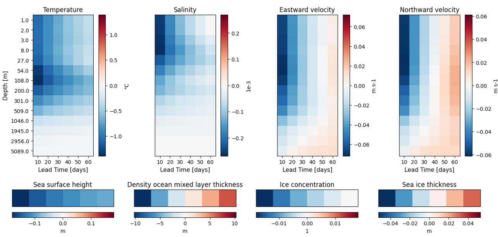

(b) Neptune CRPS at t+60 lead time  
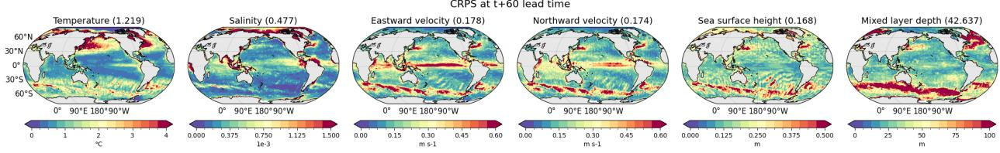  
Figure 3: Neptune’s CRPS for selected lead times from t+10 to t+60 days. Panel a) reports the CRPS difference between Neptune and climatology for each of the predicted variables. Blue colors, associated with negative values, mean that Neptune has a lower CRPS than climatology. Red colors, associated with positive values, mean the opposite. Panel b) contains spatial Neptune’s CRPS at t+60 days for a subset of the predicted variables.

propagating signals across the equatorial Pacific basin, suggesting that Neptune captures propagating OHC anomalies consistent with large-scale tropical Pacific dynamics even after 60 days, showing good autoregressive stability. As a result, the model successfully captures the coherent structure of these waves as they propagate from the western boundary (130◦E) towards the South American coast. Both the reanalysis and the DL model reveal that 2019 has been characterized by positive OHC anomalies, associated with El Niño events. Conversely, 2020 and the last half of 2021 are characterized by negative OHC anomalies associated with La Niña events. This is further confirmed in Section 3.3.1. In agreement with other panels of Figure 5, we notice that the Hovmoller extremes shown in the ground truth panel (i.e., pink spots in early 2019, white spots at the end of 2020 and 2021) are progressively under-represented by Neptune predictions, meaning that the DL emulator is very slowly smoothing out the extreme values except for 2020 La Niña event.

In summary, Neptune accurately reproduces the temperature fields with high consistency and stability with respect to the reanalysis up to 300 m of depth, showing interesting physical accuracy of the OHC representation across the 60 day forecasts.

## 3.2.2 Eddy Kinetic Energy

During the forecasting horizon, the spatial EKE distribution 6a remains remarkably stable. This consistency suggests that the DL model’s energy is established early in the simulation and does not significantly drift over the 60-day forecast horizon.

(a) Neptune Anomaly Correlation Coefficient Scorecard ACC of Neptune (Test period: 2019-01-01 - 2021-12-31)  
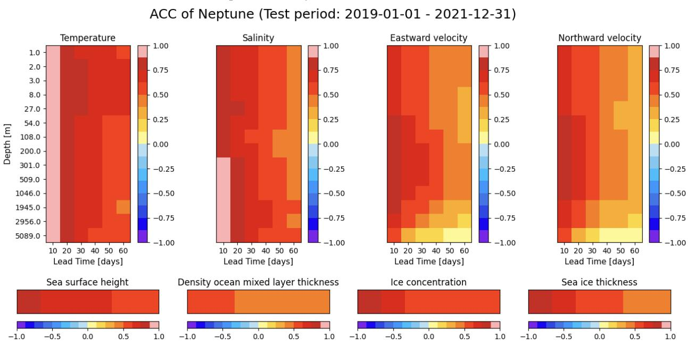

(b) Neptune ACC at t+60 lead time  
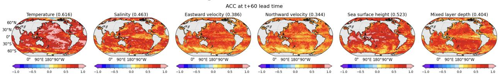  
Figure 4: Neptune’s ACC for selected lead times from t+10 to t+60 days. Panel a) reports, for each ocean variable, the ACC scorecard of Neptune computed using climatology. Panel b) contains spatial Neptune’s ACC at t+60 days for a subset of the predicted variables.

As the bias row (second) reports in Figure 6a, we observe slightly negative values $( 0 . 0 5 ~ \frac { m ^ { 2 } } { s ^ { 2 } } )$ on the Equatorial Pacific, where most EKE is localized in the ground truth. During the forecasting towards the S2S scale, Neptune tends to lose the ability to forecast the exact position of the energy details, smoothing the velocity anomaly fields $u ^ { \prime }$ and $v ^ { \prime } .$ . Since EKE is quadratic with respect to the velocities, small smoothing causes wide decreases in the EKE. To better analyze Neptune’s ability in modeling the EKE spectra, in Figure 6c we report EKE’s Power Spectral Density (PSD), obtained using Spherical Harmonic Transform (SHT) following Lam et al. [2023]. The spectra reveal that Neptune consistently preserves the EKE spectral components at almost every wavelength. Wavelengths at $1 0 ^ { 3 }$ km are correctly modeled for each lead time (light blue colors), as they overlap with the ground truth (in dark blue). Lowest wavelengths (i.e., small scale details) are slightly under-represented, as we observe lower PSD in the right side of Figure 6c, whereas the highest wavelengths are reproduced with good fidelity, suggesting Neptune’s ability to faithfully reproduce the spatial EKE patterns at the S2S timescale.

Moreover, as Figure 6b shows, after 60 days of forecast, Neptune exhibits good skills in modeling the energetic regions of the globe, like the Kuroshio region (green), the Gulf Stream (blue), the Agulhas (red), the Brazil-Malvinas Confluence (orange), and the Antarctic Circumpolar Currents (yellow).

## 3.2.3 Ice Brier Score

The analysis of BS, Figure 7, which defines the intrinsic error of the system, highlights that up to t+30 days, both poles are spatially faithful with respect to the analysis, providing smooth values similar to the ground truth ones. Moreover, Neptune correctly models the physical position of the ice, placing it only in physically plausible regions. At t+60, we observe a slight asymmetry in the hemispheric forecasting skills. In the Arctic (North), the model exhibits a slightly higher degradation after 60 days, with errors that spread from the marginal regions into the central pack. Such an error is likely caused by the jagged coastline, which does not contain information that causes sea-ice misrepresentation in Neptune’s forecast. In contrast, the Antarctic (South) shows a higher resilience, with errors primarily localized to the ice-edge dynamics throughout the 60-day forecast. The persistence of low BS values in the Southern Ocean’s central pack shows that the model effectively captures the large-scale seasonal stability of the Antarctic ice cover.

(a) Spatial Ocean Heat Content  
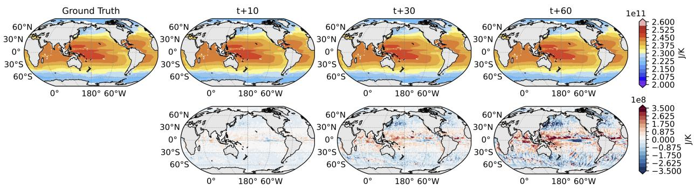

(b) Temporal Ocean Heat Content  
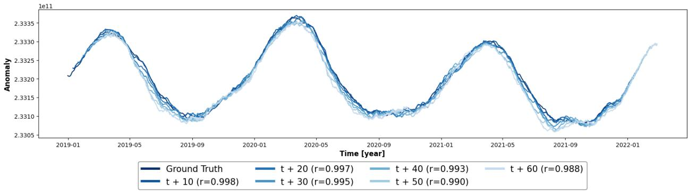

(c) Ocean Heat Content anomaly Hovmoller on Pacific Equatorial region  
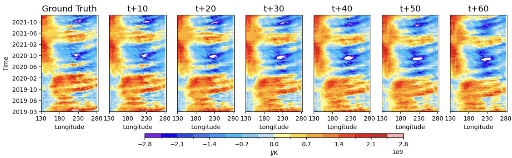  
Figure 5: Ocean Heat Content (OHC) computed over 2019-2021 Test Set. For both ground truth and forecast lead time (t+10, t+30 and t+60), panel a) top subplots show spatial OHC averaged over each day of the Test Set. Panel a) bottom subplots represent the bias between true and predicted OHC at a specific lead time. Panel b) shows the temporal OHC timeseries. Reanalysis is represented in dark blue, while Neptune forecasts (from t+10 to t+60) are reported in progressively lighter blue colors. Each forecast reports the Pearson correlation between predicted and true timeseries. Panel c) shows the OHC anomaly Hovmoller diagram computed on the Pacific Equatorial Region (2S-2N, 130-280E). The OHC anomaly is obtained by subtracting the climatology from the OHC.

(a) Eddy Kinetic Energy with bias  
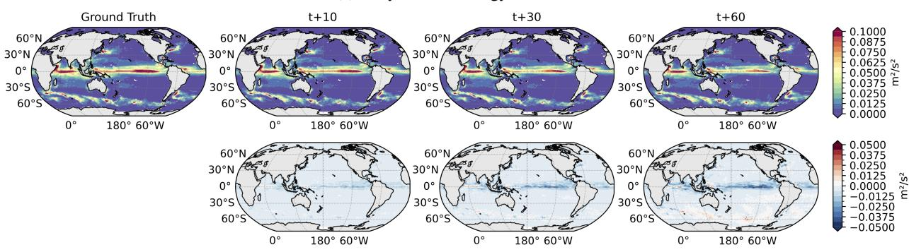

(b) Highly energetic regions at t+60 detail  
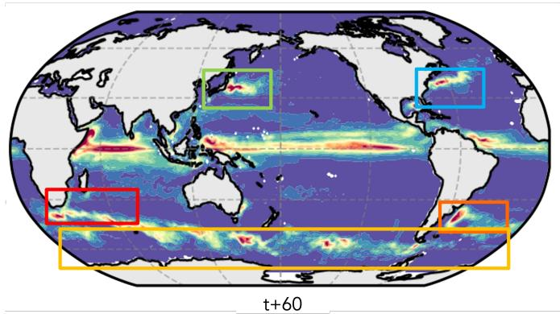

(c) EKE Power Spectral Density by lead time  
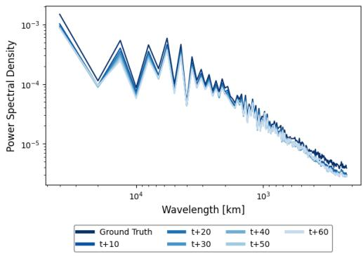  
Figure 6: Eddy Kinetic Energy (EKE) averaged over the 2019-2021 Test Set. For ground truth and forecasts at t+10, t+30 and t+60, panel a) top row reports the EKE averaged over each day of the Test Set. Bottom row contains the bias between true and predicted EKE at the specified lead time (column). Panel b) reports a detail of the forecasted EKE at t+60. High energetic regions of the globe are represented with colored boxes: Kuroshio region (green), Gulf Stream (blue), Agulhas (red), Brazil-Malvinas Confluence (orange), Antarctic Circumpolar Currents (yellow). Panel c) shows the Power Spectral Density (PSD) of the EKE at different wavelengths, expressed in kilometers. Ground truth is reported in dark blue, whereas forecasts are reported with progressively lighter blue colors.

(a) North Pole Ice Brier Score  
(b) South Pole Ice Brier Score  
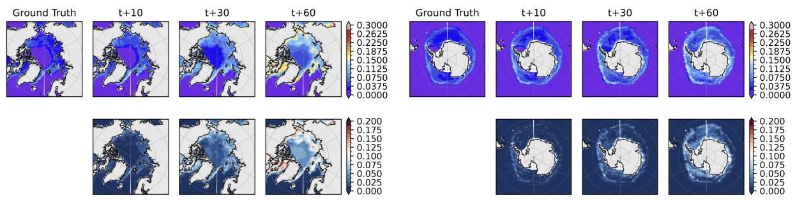  
Figure 7: Ice Brier Score (IBS) computed over North (panel a) and South (panel b) Poles using 15% ice thresholding and averaged over the 2019-2021 Test Set. Both panels a) and b) contain IBS ground truth and forecasts at t+10, t+30 and t+60 on the top row. Bottom row contains the difference between the IBS forecast specified by the column and the IBS ground truth.

(a) El Niño index timeseries in the 3.4 region  
El Niño SST Anomalies Time-series in the 3.4 Region Timeseries  
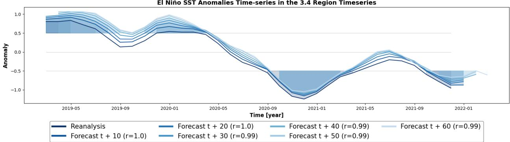

(b) El Niño index SST spatial composite  
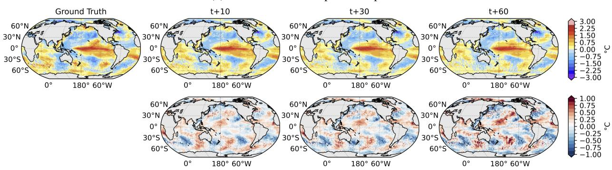  
Figure 8: Panel a) shows the SST anomaly timeseries on the 3.4 region. Dark blue line represents the reanalysis, whereas gradually lighter lines represent Neptune’s forecasts from t + 10 to t + 60. Panel b) top row shows the ENSO spatial composite during 2019-2021 test set with respect to the lead time. The reanalysis of ENSO is shown in the first column. Panel b) bottom row depicts the SST bias to highlight potential cold or warm biases of the emulator.

## 3.3 Oceanic Indices

In this Section we assess Neptune’s skills in capturing and reproducing crucial S2S oceanic indices, namely ENSO and Z20 metric associated to it and IOD.

## 3.3.1 El Niño Southern Oscillation

ENSO is key to seasonal forecasting, and is therefore important to verify how Nepture captures its characteristics envisioning its future S2S applications. Neptune accurately reproduces the large-scale characteristics of ENSO phenomena as well as its global spatial symmetry and timing, showing an Equatorial thermic amplitude damping after 60 days of forecast. Coupled ENSO dynamics is based on slow ocean oscillations that our emulator effectively learned the Niño-Niña sequence within the test set, Figure 8b. The SST Spatial Composite $( \mathrm { i . e . , } S S T _ { p o s } - S S T _ { n e g } )$ reveals that Neptune preserves the morphology of the "warm tongue" in the Equatorial Eastern Pacific across every lead time. Bias maps of Figure 8b (bottom row) quantify the spatial regions where Neptune emulator misplaces the SST morphological structures. Neptune reveals a remarkable geometrical coherence of the SST spatial composite, showing that it learned the dynamics characterizing this phenomena. The test set period 2019-2021 is characterized by one El Niño event (mid 2019) and two strong La Niña events (during 2020 and the end of 2021). Neptune, indeed, successfully captures the phase of the event, showing slight warming of the extremes. Indeed, at t+60 days due to the compound autoregressive error accumulation, we observe a slight increase in the extreme temperature anomalies.

Isotherm at $2 0 ^ { \circ } C$ - The Neptune emulator demonstrates noticeable accuracy in reproducing vertical fluctuations of thermocline depth, successfully capturing the different dynamic sensitivity that characterizes the East and West sides of the central Pacific Ocean. Neptune preserves the stability of the Z20 variability across the 60 days of forecast, without drifting with respect to the reanalysis’ ground truth. The west box is usually deeper, with values across 150-200 meters, and varies slowly. Conversely, the Eastern box is shallower and wind-forced [Kessler, 1990], thereby characterized by wider variability. Neptune’s skills reflect the intrinsic difference between the two basins. Since the Eastern basin is less predictable due to its wind-driven nature, we observe a progressive amplitude damping when progressing towards the S2S horizon at t+60. Analyzing Figure 9, we have clear evidence of the difference between the two basins: the West box (Figure 9a) is dominated by slow and deep thermal dynamics, Neptune’s forecast establishes an excellent stability and coherence, with Pearson correlation coefficients varying from 0.89 at t+10 to 0.77 at t+60. As aforementioned above, the East box (Figure 9b) shows a highly reactive wind forcing, and the emulator provides a much lower Pearson coefficient (from 0.63 at t+10 to 0.34 at t+60), despite correctly forecasting the timing of the event. The ability to correctly emulate the Z20 variability is a key criterion in the Pacific, and it demonstrates that Neptune has learned to accurately reproduce it on the considered test set.

(a) Isotherm at $2 0 ^ { \circ } C$ over Western Box $( 5 ^ { \circ } S - 5 ^ { \circ } N , 1 6 5 ^ { \circ } E - 1 7 5 ^ { \circ } E )$ Isotherm at 20°C West Box (5°S - 5°N, 165°E - 175°E  
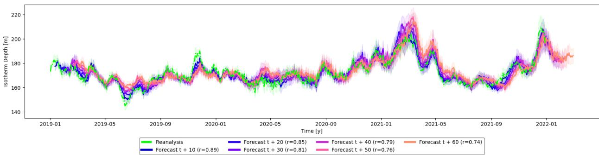

(b) Isotherm at $2 0 ^ { \circ } C$ over Eastern Box $( 5 ^ { \circ } S - 5 ^ { \circ } N , 1 0 0 ^ { \circ } W - 9 0 ^ { \circ } W )$  
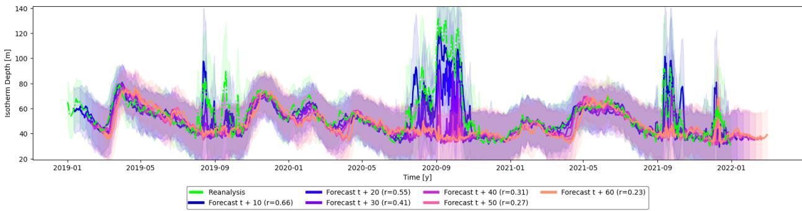  
Figure 9: Isotherm at $2 0 ^ { \circ } C \left( Z 2 0 \right)$ is computed. Reanalysis is represented with green dashed line, whereas Forecasts from t+10 to t+60 are represented using colors spanning from blue to orange. Along with the Z20 timeseries, each line is surrounded by the standard deviation of the Z20 measure. The Z20 is computed over two boxes surrounding the El Nño 3.4 region. Western box is shown in panel a), while the Eastern box is shown in panel b).

## 3.3.2 Indian Ocean Dipole

During a positive IOD phase (pIOD), equatorial trade winds intensify towards West, causing an anomalous SST cooling near the Sumatra and Java regions. At the same time, thermocline depth increases in the Arabian Sea, causing a warming in the Western pole [Liu et al., 2024]. Our 2019-2021 Test Set shows an extraordinarily intense pIOD period during the second half of 2019 and a smaller pIOD in 2020.

The Neptune DL model has a high predictive skill in the IOD representation within the considered evaluation period, preserving the morphological structure and polarity of the zonal gradient at S2S scale. We attribute the good conservation of the geometrical IOD patterns characterizing the dipole to the emulator’s ability to learn the patterns underlying the ocean dynamics in the TIO region. Mixing local convolutions and global convolutions in Neptune’s architecture (see Section 2.2.2) enabled to effectively merge global ocean patterns with local features of this region, resulting in a good representation of the morphological IOD patterns. This robustness in reproducing the IOD is proved by the high Pearson correlation coefficient computed in both Figure 10a and 10b. The two Figures highlight a stable and slow decay: the spatial correlation pattern degrades from an initial 0.99 at t+10 and reaches a still high 0.89 at the end of the rollout (t+60). Moreover, Figure 10a shows a high stability in the phase of the IOD events, correctly reproducing the timeseries at a S2S scale. Except for the highest anomaly observed in the 2019 pIOD event, Neptune faithfully reproduces the amplitude of the index. Despite a small amplitude decay during the 2019 pIOD period that limits the direct use in operational contexts, the robustness of the spatial and temporal correlation coefficients suggests potential application scenarios of Neptune’s predictions in this region.

(a) Indian Ocean Dipole index timeseries  
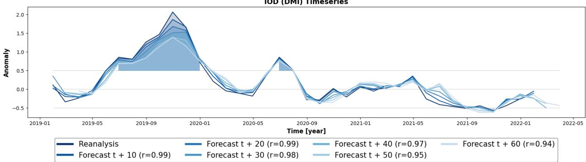

(b) Indian Ocean Dipole index SST spatial composite  
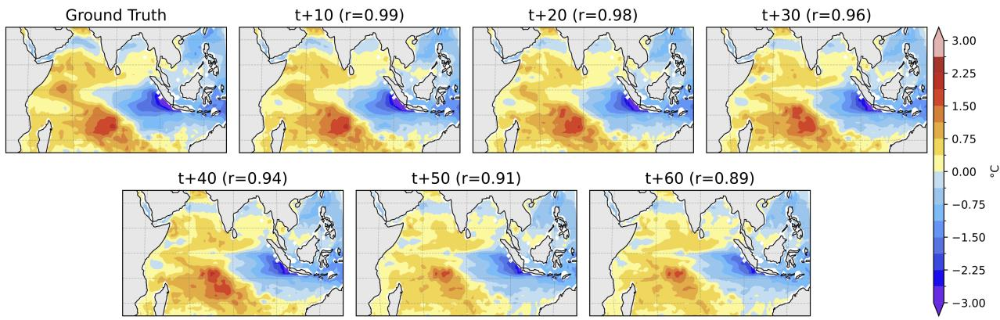  
Figure 10: Panel a) shows the IOD index timeseries computed using the SST anomalies in the Indian Ocean region. Dark blue line represents the reanalysis, whereas gradually lighter lines represent Neptune’s forecasts from t + 10 to t + 60. Each line is associated with the Pearson correlation computed between the forecast and ground truth timeseries. Panel b) reports the IOD index spatial SST composite for every lead time, spanning from t+10 to t+60. Each sub-panel is associated with the spatial Pearson correlation coefficient computed between forecast and ground truth.

## 3.4 Evaluation on Neptune-025

To conclude our evaluations of the Neptune global ocean emulator, we report results regarding the fine-tuned version at the native data resolution of 0.25◦, Neptune-025.

In Figure 11a we report the surface RMSE of Neptune-025 at t+60 days, revealing the spatial distribution of the error for each of the most meaningful variables emulated by the DL model. After the fine-tuning, the RMSE is slightly higher than the pre-training and is distributed similarly to Neptune-1, as most of the error is localized in energetic areas of the globe.

Regarding OHC (Figures 11b 11c), we observe that Neptune-025 faithfully represents the OHC spatial patterns along the 60-day forecast. However, Figure 11b bottom row reveals a cool bias in the Pacific and Indian Equatorial regions. Additionally, Figure 11c shows that Neptune-025 has a slight decreasing trend in the average OHC timeseries, likely linked to the cooling we observe at the Equator. Despite the scale of the error is negligible with respect to the variable’s scale, it is worth mentioning this unusual behavior of the DL emulator.

The EKE (Figure 11d 11e) reveals that after the fine-tuning phase, it reproduces physically coherent current patterns, but after 60 days the DL model slightly over-estimates the Antarctic Circumpolar Current, while subtly under-estimating the energy at the equator. The PSD (Figure 11e) shows that the highest frequency details are slightly under-represented by the DL model, likely caused by the smoothing of the high frequencies of the MAE loss function.

Lastly, Neptune-025 preserves similar skills on the sea-ice representation, as we observe in Figure 11f and 11g. Similarly to the coarser resolution version, Neptune-025’s IBS skills are asymmetric between North- and South- Pole. At t+60 days, IBS has a higher error over the North Pole, while the RMSE at the South Pole increases more slowly.

We attribute the slight decrease in the emulator’s skills to the need of a greater number of fine-tuning epochs or a better dimensioning (e.g., increasing latent dimension/model parameters) of the model to improve the learning of the complex interactions that drive the small-scale ocean dynamics. Although Neptune-025 exhibits slightly lower performance than Neptune-1 in certain metrics, the fine-tuned model remains an effective eddy-resolving DL model suitable for a broader range of S2S applications. This demonstrates the feasibility of adapting the Neptune framework to downstream tasks in future works.

## 4 Discussion

Neptune-1 and Neptune-025 combine Convolutional Neural Networks (CNNs) and Spherical Fourier Neural Operators (SFNO), establishing a skillful emulator for the global ocean and sea-ice state prediction at S2S timescales. We attribute its success to the inherent ability of SFNOs to learn the underlying Partial Differential Equations (PDEs) governing the ocean system. To simulate the complex interaction between the large- and small-scale processes intrinsic to the ocean dynamics, we add CNN layers to the SFNOs, thus learning complex local patterns and further enhancing Neptune’s skills.

With small fine-tuning effort (Neptune-025), Neptune-1 framework can be adapted to high resolution data to effectively broaden the range of applications of the emulator on the S2S timescales. Neptune-025, indeed, results in an eddy resolving emulator capable of reproducing physically faithful predictions of the ocean and sea-ice state up to 60 days, using prescribed atmospheric forcing.

Statistical evaluations (RMSE, CRPS and ACC) confirm the model’s performance. The low RMSE for temperature variable suggests Neptune’s ability in reproducing the mean thermal state, lowering the known biases in traditional OGCMs in the mixed layer region. Neptune-025 version preserves similar RMSE skills, showing the adaptability of our framework. Moreover, Neptune-1’s high performance in preserving ACC across long lead times highlights its capacity to reproduce coherent morphological large-scale ocean patterns, successfully capturing the slow, deterministic evolution of the system. The spatial analysis of CRPS and ACC reveals fundamental information regarding its strengths and weaknesses. While Neptune-1 excels at reproducing large-scale patterns (i.e., ENSO, IOD), we observe a decline in performance in highly dynamic mesoscale regions (e.g., the Gulf Stream, Kuroshio currents, etc.) and at higher latitudes. This spatial degradation aligns with the theoretical challenge: the model is trained at $1 ^ { \circ } \times 1 ^ { \circ }$ horizontal resolution and the intrinsic noise in the observational data, it struggles to resolve high-frequency, small-scale eddies that dominate such regions, leading to the widely known double-penalty issue where smaller-scale details that are shifted in space cause two compound errors: spatial drift and under/over estimation [Subich et al., 2025]. Additionally, the CRPS probabilistic metric shows asymmetric spatial irregularities, causing higher error in the Northern Hemisphere likely caused by the land displacement.

Physical coherence evaluations, specifically regarding the Ocean Heat Content (OHC) and Eddy Kinetic Energy (EKE) and Ice Brier Score (IBS), provide powerful insights about the surrogate’s model ability in emulating the dynamic processes beyond the simple ocean state prediction. Both Neptune-1 and Neptune-025 successfully reproduce the spatio-temporal evolution of OHC, confirming its ability to reproduce large-scale thermal structures of the ocean. Despite the high temporal correlation, in Neptune-025 we observe a slight and progressive decrease in the total OHC budget over the forecast horizon, likely caused by few fine-tuning epochs or the small network dimension (i.e., 13M parameters). Therefore, the model accurately predicts dominant, slowly evolving large-scale signals, like ENSO, but smooths out the fine-scale energetic variability.

The EKE analysis further assesses Neptune’s dynamical skills. The emulator exhibits good skill in modeling the overall EKE distribution and preserves the EKE power spectra components at large wavelengths (above $1 0 ^ { 3 }$ km), but has lower skill in accurately reproducing the fine-scale, high-frequency variability associated with mesoscale patterns (both Neptune-1 and Neptune-025). The loss of fine-scale EKE information in the S2S context reflects the structural limitation of Neptune due to the input resolution and the use of a deterministic loss function.

(a) Surface RMSE at t+60  
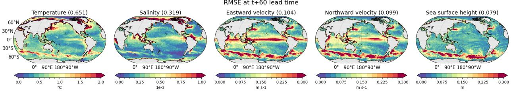

(b) Spatial Ocean Heat Content  
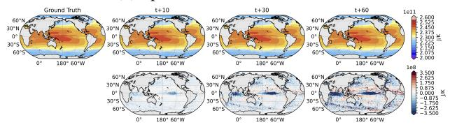

(c) Temporal Ocean Heat Content  
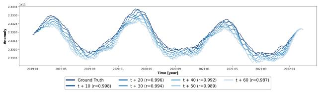

(d) Eddy Kinetic Energy with bias  
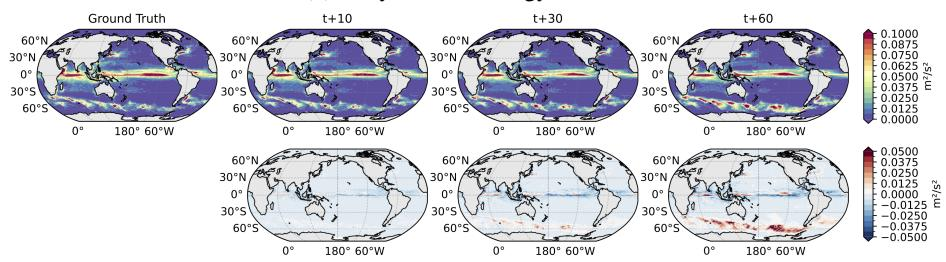

(e) EKE Power Spectral Density by lead time  
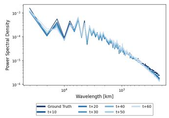

(f) North Pole Ice Brier Score  
(g) South Pole Ice Brier Score  
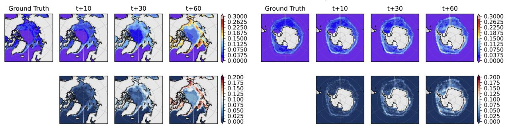  
Figure 11: Neptune-025 skills are reported in the figure. Panel a) contains spatial Neptune’s RMSE at t+60 days for a subset of the predicted variables. Panels b-c) contain OHC computed over the test set. Panel b) top row contains OHC of ground truth and forecasts at t+10, t+30, t+60 while bottom row contains OHC bias between true and predicted OHC at a specific lead time. Panel c) shows the temporal OHC timeseries. Ground truth is in dark blue while forecasts from t+10 to t+60 are reported in progressively lighter blue colors. Similarly to panel b), panel d) reports EKE of ground truth and forecasts at t+10, t+30, t+60 along with the bias between true and predicted EKE. Panel e) the EKE PSD is reported by lead time. The panel’s color code is shared with panel c). Panels f) and g) report Neptune-025’s IBS over North and South Pole, respectively. Top panels report reanalysis and forecasts at t+10, t+30 and t+60 while bottom panels report the bias between true and predicted IBS.

IBS score for the Sea Ice Concentration (SIC) provides us with a crucial evaluation of Neptune’s skill in emulating ice fields at S2S scale. Results show that both the emulators maintain a notable spatiotemporal coherency of the morphological ice patterns at large scale, above all in the South Pole where we observe most of the emulator’s stability. Along highly dynamic regions, like the coastline, BS degrades faster at 60 days. This result highlights that, even using a strong physics-informed architecture like SFNO, ice forecasting at S2S timescale remains a significant challenge.

Finally, the successful emulation of El Niño Southern Oscillation (ENSO) and Indian Ocean Dipole (IOD) indices confirms that Neptune-1 captures and reproduces the crucial atmosphere-ocean coupling mechanisms that drive such large-scale patterns. Indeed, since Neptune provides high temporal and spatial correlation coefficients for both ENSO and IOD, even after 60 days, it demonstrated that the model captures the inter-annual variability. This result, along with Isotherm at 20◦C (Z20) skills, further confirms our analysis.

## 5 Conclusion

In this work, we introduced and validated Neptune, a novel data-driven architecture mixing Convolutional Neural Networks (CNNs) and Spherical Fourier Neural Operators (SFNOs) for skillful global ocean forecasting at the subseasonal-to-seasonal (S2S) scale. By integrating the SFNO on a spherical geometry, Neptune introduces a significant advancement over the current literature, demonstrating a remarkable ability to emulate the complex, multi-scale dynamics of the ocean system. Unlike computationally expensive physics-based models, Neptune offers a faster alternative suitable for ensemble forecasting on S2S domain. Mixing CNN encoder and decoder with SFNO components reflects the inherent global ocean structure, characterized by complex interactions between large and small scales. Through encoder and decoder, we emulate the small-scale ocean thermo-dynamics, whereas through SFNO, we emulate the global teleconnections in an effective manner, thus improving Neptune’s stability over long S2S rollouts. Unlike other data-driven ocean emulators tailored on the S2S scale, Neptune offers a huge advantage in terms of spatial and temporal resolution. Indeed, while other DL models such as Samudra and ORCA-DL are trained to forecast 5-day and monthly averages, respectively, Neptune-1 produces accurate daily forecasts and its fine-tuned version, Neptune-025, produces physically realistic high-resolution forecasts. Moreover, with respect to other works, Neptune is trained to emulate the full ocean state, including MLD, SIC and SIT, widening the range of possible evaluations, benchmarks and downstream tasks. Neptune-025 serves as a clear demonstration of the framework’s adaptability to new tasks. Finally, we evaluated Neptune against a wide variety of statistics (RMSE, CRPS, ACC), physical scores (OHC, EKE, IBS) and oceanic indices (ENSO and Z20 metric, IOD), contributing to the literature with advanced evaluation skills for S2S global ocean emulation.

However, limitations still remain, defining the trajectory for future research. While the SFNO architecture is structured on a sphere and learns global spherical convolutions, the encoder and decoder are still defined on rectangular grid. Future work will pave spherical local convolutions to provide more coherence to the network structure. Despite high spatio-temporal resolution, Neptune-025 can be further enhanced by increasing the model’s number of parameters or enhancing its training strategy (e.g., stochastic loss functions, generative approaches, etc.). Moreover, model’s performance decreases in highly dynamic regions (e.g., boundary currents and mesoscale). Observed smoothing of EKE over long lead times suggests exploring even more advanced probabilistic forecasting techniques.

In summary, Neptune offers a powerful, adaptable, quick and accurate emulator for S2S ocean forecasting that successfully reproduces the dynamics of the ocean system. While the DL model demonstrates high forecasting skills for large-scale patterns, our work highlights the ongoing challenge of accurately resolving high-frequency, mesoscale variability. Future research should further enhance Neptune’s S2S skills by exploiting advanced probabilistic forecasting techniques (e.g., representation learning) or generative AI methods (e.g., flow matching, diffusion, etc.). Despite the high-quality reanalysis dataset we used (ORAS5), including other reanalyses and simulation data could further improve Neptune’s skills, posing the basis for global ocean foundation modeling. At last, another direction of research should exploit a fully coupled S2S atmosphere-ocean emulator.

## References

Andrew W. Vitart, Frédéricand Robertson. The sub-seasonal to seasonal prediction project (s2s) and the prediction of extreme events. npj Climate and Atmospheric Science, 1(1):3, Mar 2018. ISSN 2397-3722. doi:10.1038/s41612-018- 0013-0. URL https://doi.org/10.1038/s41612-018-0013-0.

Xin-Zhong Liang. Integrating subseasonal-to-seasonal forecasts into agricultural decision support systems: A critical review and research agenda. Engineering, 2026. ISSN 2095-8099. doi:https://doi.org/10.1016/j.eng.2026.05.015. URL https://www.sciencedirect.com/science/article/pii/S2095809926003334.

E. K. Pikitch, C. Santora, E. A. Babcock, A. Bakun, R. Bonfil, D. O. Conover, P. Dayton, P. Doukakis, D. Fluharty, B. Heneman, E. D. Houde, J. Link, P. A. Livingston, M. Mangel, M. K. McAllister, J. Pope, and K. J. Sainsbury. Ecosystem-Based Fishery Management. Science, 305(5682):346–347, July 2004. ISSN 0036-8075, 1095-9203. doi:10.1126/science.1098222. URL https://www.science.org/doi/10.1126/science.1098222.

Alberto Troccoli. Seasonal climate forecasting: SEASONAL CLIMATE FORECASTING: A REVIEW. Meteorological Applications, 17(3):251–268, September 2010. ISSN 13504827. doi:10.1002/met.184. URL https://onlinelibrary.wiley.com/doi/10.1002/met.184.

Gerald A. Meehl, Jadwiga H. Richter, Haiyan Teng, Antonietta Capotondi, Kim Cobb, Francisco Doblas-Reyes, Markus G. Donat, Matthew H. England, John C. Fyfe, Weiqing Han, Hyemi Kim, Ben P. Kirtman, Yochanan Kushnir, Nicole S. Lovenduski, Michael E. Mann, William J. Merryfield, Veronica Nieves, Kathy Pegion, Nan Rosenbloom, Sara C. Sanchez, Adam A. Scaife, Doug Smith, Aneesh C. Subramanian, Lantao Sun, Diane Thompson, Caroline C. Ummenhofer, and Shang-Ping Xie. Initialized Earth System prediction from subseasonal to decadal timescales. Nature Reviews Earth & Environment, 2(5):340–357, April 2021. ISSN 2662-138X. doi:10.1038/s43017-021-00155- x. URL https://www.nature.com/articles/s43017-021-00155-x.

Magdalena A. Balmaseda, Charlotte DeMott, Carolyn A. Reynolds, Christopher D. Roberts, and Aneesh Subramanian. Chapter 8 - the role of the ocean in subseasonal-to-seasonal predictability and prediction. In Andrew W. Robertson and Frédéric Vitart, editors, Sub-seasonal to Seasonal Prediction (Second Edition), pages 271–320. Elsevier, second edition edition, 2026. ISBN 978-0-443-31538-1. doi:https://doi.org/10.1016/B978-0-443-31538-1.00010-5. URL https://www.sciencedirect.com/science/article/pii/B9780443315381000105.

Annalisa Bracco, Julien Brajard, Henk A. Dijkstra, Pedram Hassanzadeh, Christian Lessig, and Claire Monteleoni. Machine learning for the physics of climate. Nature Reviews Physics, 7(1):6–20, Jan 2025. ISSN 2522-5820. doi:10.1038/s42254-024-00776-3. URL https://doi.org/10.1038/s42254-024-00776-3.

Peter Bauer, Alan Thorpe, and Gilbert Brunet. The quiet revolution of numerical weather prediction. Nature, 525(7567): 47–55, Sep 2015. ISSN 1476-4687. doi:10.1038/nature14956. URL https://doi.org/10.1038/nature14956.

Jaideep Pathak, Shashank Subramanian, Peter Harrington, Sanjeev Raja, Ashesh Chattopadhyay, Morteza Mardani, Thorsten Kurth, David Hall, Zongyi Li, Kamyar Azizzadenesheli, Pedram Hassanzadeh, Karthik Kashinath, and Animashree Anandkumar. FourCastNet: A Global Data-driven High-resolution Weather Model using Adaptive Fourier Neural Operators, February 2022. URL http://arxiv.org/abs/2202.11214. arXiv:2202.11214 [physics].

Remi Lam, Alvaro Sanchez-Gonzalez, Matthew Willson, Peter Wirnsberger, Meire Fortunato, Ferran Alet, Suman Ravuri, Timo Ewalds, Zach Eaton-Rosen, Weihua Hu, Alexander Merose, Stephan Hoyer, George Holland, Oriol Vinyals, Jacklynn Stott, Alexander Pritzel, Shakir Mohamed, and Peter Battaglia. GraphCast: Learning skillful medium-range global weather forecasting, August 2023. URL http://arxiv.org/abs/2212.12794. arXiv:2212.12794 [physics].

Kaifeng Bi, Lingxi Xie, Hengheng Zhang, Xin Chen, Xiaotao Gu, and Qi Tian. Accurate medium-range global weather forecasting with 3D neural networks. Nature, 619(7970):533–538, July 2023. ISSN 0028-0836, 1476-4687. doi:10.1038/s41586-023-06185-3. URL https://www.nature.com/articles/s41586-023-06185-3.

Dmitrii Kochkov, Janni Yuval, Ian Langmore, Peter Norgaard, Jamie Smith, Griffin Mooers, Milan Klöwer, James Lottes, Stephan Rasp, Peter Düben, Sam Hatfield, Peter Battaglia, Alvaro Sanchez-Gonzalez, Matthew Willson, Michael P. Brenner, and Stephan Hoyer. Neural General Circulation Models for Weather and Climate. Nature, 632(8027):1060–1066, August 2024. ISSN 0028-0836, 1476-4687. doi:10.1038/s41586-024-07744-y. URL http://arxiv.org/abs/2311.07222. arXiv:2311.07222 [physics].

Wanghan Xu, Kang Chen, Tao Han, Hao Chen, Wanli Ouyang, and Lei Bai. ExtremeCast: Boosting Extreme Value Prediction for Global Weather Forecast, May 2024. URL http://arxiv.org/abs/2402.01295. arXiv:2402.01295 [cs].

Xiaohui Zhong, Lei Chen, Hao Li, Jun Liu, Xu Fan, Jie Feng, Kan Dai, Jing-Jia Luo, Jie Wu, Yuan Qi, and Bo Lu. FuXi-ENS: A machine learning model for medium-range ensemble weather forecasting, July 2024. URL http: //arxiv.org/abs/2405.05925. arXiv:2405.05925 [physics].

Cristian Bodnar, Wessel P. Bruinsma, Ana Lucic, Megan Stanley, Anna Allen, Johannes Brandstetter, Patrick Garvan, Maik Riechert, Jonathan A. Weyn, Haiyu Dong, Jayesh K. Gupta, Kit Thambiratnam, Alexander T. Archibald, Chun Chieh Wu, Elizabeth Heider, Max Welling, Richard E. Turner, and Paris Perdikaris. A foundation model for the Earth system. Nature, 641(8065):1180–1187, May 2025. ISSN 0028-0836, 1476-4687. doi:10.1038/s41586-025-09005-y. URL https://www.nature.com/articles/s41586-025-09005-y.

Ferran Alet, Ilan Price, Andrew El-Kadi, Dominic Masters, Stratis Markou, Tom R. Andersson, Jacklynn Stott, Remi Lam, Matthew Willson, Alvaro Sanchez-Gonzalez, and Peter Battaglia. Skillful joint probabilistic weather forecasting from marginals, June 2025. URL http://arxiv.org/abs/2506.10772. arXiv:2506.10772 [cs].

Ilan Price, Alvaro Sanchez-Gonzalez, Ferran Alet, Tom R. Andersson, Andrew El-Kadi, Dominic Masters, Timo Ewalds, Jacklynn Stott, Shakir Mohamed, Peter Battaglia, Remi Lam, and Matthew Willson. Probabilistic weather forecasting with machine learning. Nature, 637(8044):84–90, January 2025. ISSN 0028-0836, 1476-4687. doi:10.1038/s41586- 024-08252-9. URL https://www.nature.com/articles/s41586-024-08252-9.

Jonathan A. Weyn, Dale R. Durran, Rich Caruana, and Nathaniel Cresswell-Clay. Sub-seasonal forecasting with a large ensemble of deep-learning weather prediction models. Journal of Advances in Modeling Earth Systems, 13(7):e2021MS002502, July 2021. ISSN 1942-2466, 1942-2466. doi:10.1029/2021MS002502. URL http: //arxiv.org/abs/2102.05107. arXiv:2102.05107 [physics].

Oliver Watt-Meyer, Gideon Dresdner, Jeremy McGibbon, Spencer K. Clark, Brian Henn, James Duncan, Noah D. Brenowitz, Karthik Kashinath, Michael S. Pritchard, Boris Bonev, Matthew E. Peters, and Christopher S. Bretherton. ACE: A fast, skillful learned global atmospheric model for climate prediction, December 2023. URL http: //arxiv.org/abs/2310.02074. arXiv:2310.02074 [physics].

Tung Nguyen, Johannes Brandstetter, Ashish Kapoor, Jayesh K. Gupta, and Aditya Grover. ClimaX: A foundation model for weather and climate, December 2023. URL http://arxiv.org/abs/2301.10343. arXiv:2301.10343 [cs].

Lei Chen, Xiaohui Zhong, Hao Li, Jie Wu, Bo Lu, Deliang Chen, Shangping Xie, Qingchen Chao, Chensen Lin, Zixin Hu, and Yuan Qi. FuXi-S2S: A machine learning model that outperforms conventional global subseasonal forecast models, July 2024. URL http://arxiv.org/abs/2312.09926. arXiv:2312.09926 [physics].

Oliver Watt-Meyer, Brian Henn, Jeremy McGibbon, Spencer K. Clark, Anna Kwa, W. Andre Perkins, Elynn Wu, Lucas Harris, and Christopher S. Bretherton. ACE2: accurately learning subseasonal to decadal atmospheric variability and forced responses. npj Climate and Atmospheric Science, 8(1):205, May 2025. ISSN 2397-3722. doi:10.1038/s41612-025-01090-0. URL https://www.nature.com/articles/s41612-025-01090-0.

Chris Kent, Adam A. Scaife, Nick J. Dunstone, Doug Smith, Steven C. Hardiman, Tom Dunstan, and Oliver Watt-Meyer. Skilful global seasonal predictions from a machine learning weather model trained on reanalysis data. npj Climate and Atmospheric Science, 8(1):314, August 2025. ISSN 2397-3722. doi:10.1038/s41612-025-01198-3. URL https://www.nature.com/articles/s41612-025-01198-3.

Xin Wang, Juntao Yang, Jeff Adie, Simon See, Kalli Furtado, Chen Chen, Troy Arcomano, Romit Maulik, and Gianmarco Mengaldo. CondensNet: Enabling stable long-term climate simulations via hybrid deep learning models with adaptive physical constraints, February 2025. URL http://arxiv.org/abs/2502.13185. arXiv:2502.13185 [physics].

Mohammad M Amirian, Emmanuel Devred, Stephanie Clay, Zoe V Finkel, and Andrew J Irwin. A compilation of marine photosynthesis–irradiance data from 14C incubation experiments. Earth System Science Data Discussions, 2026: 1–34, 2026. doi:10.5194/essd-2026-651. URL https://essd.copernicus.org/preprints/essd-2026-651/.

Xiang Wang, Renzhi Wang, Ningzi Hu, Pinqiang Wang, Peng Huo, Guihua Wang, Huizan Wang, Senzhang Wang, Junxing Zhu, Jianbo Xu, Jun Yin, Senliang Bao, Ciqiang Luo, Ziqing Zu, Yi Han, Weimin Zhang, Kaijun Ren, Kefeng Deng, and Junqiang Song. XiHe: A Data-Driven Model for Global Ocean Eddy-Resolving Forecasting, October 2024. URL http://arxiv.org/abs/2402.02995. arXiv:2402.02995 [physics].

Ashesh Chattopadhyay, Michael Gray, Tianning Wu, Anna B. Lowe, and Ruoying He. OceanNet: A principled neural operator-based digital twin for regional oceans, September 2024. URL http://arxiv.org/abs/2310.00813. arXiv:2310.00813 [cs].

Anna B. Lowe, Michael Gray, Ashesh Chattopadhyay, Tianning Wu, and Ruoying He. Long-Term Predictions of Loop Current Eddy Evolutions Using OceanNet: A Fourier Neural Operator–Based Data-Driven Ocean Emulator. Artificial Intelligence for the Earth Systems, 4(3):e240039, July 2025. ISSN 2769-7525. doi:10.1175/AIES-D-24-0039.1. URL https://journals.ametsoc.org/view/journals/aies/4/3/AIES-D-24-0039.1.xml.

Anass El Aouni, Quentin Gaudel, Charly Regnier, Simon Van Gennip, Olivier Le Galloudec, Marie Drevillon, Yann Drillet, and Jean-Michel Lellouche. GLONET: Mercator’s end-to-end neural Global Ocean forecasting system. Journal ofGeophysical Research: Machine Learning and Computation, 2(3):e2025JH000686, September 2025. ISSN 2993-5210, 2993-5210. doi:10.1029/2025JH000686. URL http://arxiv.org/abs/2412.05454. arXiv:2412.05454 [physics].

Qiusheng Huang, Yuan Niu, Xiaohui Zhong, Anboyu Guo, Lei Chen, Dianjun Zhang, Xuefeng Zhang, and Hao Li. FuXi-Ocean: A Global Ocean Forecasting System with Sub-Daily Resolution, October 2025. URL http: //arxiv.org/abs/2506.03210. arXiv:2506.03210 [cs].

Yuan Niu, Qiusheng Huang, Xiaohui Zhong, Anboyu Guo, Lei Chen, Xiaoyan Jia, Jiawei Qi, Dianjun Zhang, Hao Li, and Xuefeng Zhang. A data-driven global ocean forecasting model with sub-daily and eddy-resolving resolution, September 2025. URL http://arxiv.org/abs/2509.17015. arXiv:2509.17015 [physics].

l i id b i l i i b i l d di i h l i McAdam, Donatello Elia, Emanuela Clementi, Paola Nassisi, Enrico Scoccimarro, Giovanni Coppini, Silvio Gualdi, Giovanni Aloisio, Simona Masina, Giulio Boccaletti, and Antonio Navarra. MedFormer: a data-driven model for forecasting the Mediterranean Sea, August 2025. URL http://arxiv.org/abs/2509.00015. arXiv:2509.00015 [physics].

Daniel Holmberg, Emanuela Clementi, Italo Epicoco, and Teemu Roos. Accurate Mediterranean Sea forecasting via graph-based deep learning. Scientific Reports, 15(1):45051, December 2025. ISSN 2045-2322. doi:10.1038/s41598- 025-31177-w. URL https://www.nature.com/articles/s41598-025-31177-w.

N. Pinardi, I. Allen, E. Demirov, P. De Mey, G. Korres, A. Lascaratos, P.-Y. Le Traon, C. Maillard, G. Manzella, and C. Tziavos. The Mediterranean ocean forecasting system: first phase of implementation (1998–2001). Annales Geophysicae, 21(1):3–20, January 2003. ISSN 1432-0576. doi:10.5194/angeo-21-3-2003. URL https://angeo. copernicus.org/articles/21/3/2003/.

N. Pinardi and G. Coppini. Operational oceanography in the Mediterranean Sea: the second stage of development&quot;. Ocean Science, 6(1):263–267, February 2010. ISSN 1812-0792. doi:10.5194/os-6-263-2010. URL https: //os.copernicus.org/articles/6/263/2010/.

Giovanni Coppini, Emanuela Clementi, Gianpiero Cossarini, Stefano Salon, Gerasimos Korres, Michalis Ravdas, Rita Lecci, Jenny Pistoia, Anna Chiara Goglio, Massimiliano Drudi, Alessandro Grandi, Ali Aydogdu, Romain Escudier, Andrea Cipollone, Vladyslav Lyubartsev, Antonio Mariani, Sergio Cretì, Francesco Palermo, Matteo Scuro, Simona Masina, Nadia Pinardi, Antonio Navarra, Damiano Delrosso, Anna Teruzzi, Valeria Di Biagio, Giorgio Bolzon, Laura Feudale, Gianluca Coidessa, Carolina Amadio, Alberto Brosich, Arnau Miró, Eva Alvarez, Paolo Lazzari, Cosimo Solidoro, Charikleia Oikonomou, and Anna Zacharioudaki. The Mediterranean Forecasting System – Part 1: Evolution and performance. Ocean Science, 19(5):1483–1516, October 2023. ISSN 1812-0792. doi:10.5194/os-19-1483-2023. URL https://os.copernicus.org/articles/19/1483/2023/.

Zijie Guo, Pumeng Lyu, Fenghua Ling, Lei Bai, Jing-Jia Luo, Niklas Boers, Toshio Yamagata, Takeshi Izumo, Sophie Cravatte, Antonietta Capotondi, and Wanli Ouyang. Data-driven global ocean modeling for seasonal to decadal prediction. Science Advances, 11(33):eadu2488, August 2025. ISSN 2375-2548. doi:10.1126/sciadv.adu2488. URL https://www.science.org/doi/10.1126/sciadv.adu2488.

Copernicus Climate Change Service. ORAS5 global ocean reanalysis monthly data from 1958 to present, 2021. URL https://cds.climate.copernicus.eu/doi/10.24381/cds.67e8eeb7.

David W. Behringer, Ming Ji, and Ants Leetmaa. An Improved Coupled Model for ENSO Prediction and Implications for Ocean Initialization. Part I: The Ocean Data Assimilation System. Monthly Weather Review, 126(4):1013–1021, April 1998. ISSN 0027-0644, 1520-0493. doi:10.1175/1520-0493(1998)126<1013:AICMFE>2.0.CO;2. URL http://journals.ametsoc.org/doi/10.1175/1520-0493(1998)126<1013:AICMFE>2.0.CO;2.

Ashish Vaswani, Noam Shazeer, Niki Parmar, Jakob Uszkoreit, Llion Jones, Aidan N. Gomez, Lukasz Kaiser, and Illia Polosukhin. Attention Is All You Need, August 2023. URL http://arxiv.org/abs/1706.03762. arXiv:1706.03762 [cs.CL].

Chunzai Wang, Clara Deser, Jin-Yi Yu, Pedro DiNezio, and Amy Clement. El Niño and Southern Oscillation (ENSO): A Review. In Peter W. Glynn, Derek P. Manzello, and Ian C. Enochs, editors, Coral Reefs of the Eastern Tropical Pacific, volume 8, pages 85–106. Springer Netherlands, Dordrecht, 2017. ISBN 978-94-017-7498-7 978-94-017-7499- 4. doi:10.1007/978-94-017-7499-4\_4. URL http://link.springer.com/10.1007/978-94-017-7499-4\_4. Series Title: Coral Reefs of the World.

Adam Subel and Laure Zanna. Building Ocean Climate Emulators, March 2024. URL http://arxiv.org/abs/ 2402.04342. arXiv:2402.04342 [physics].

Olaf Ronneberger, Philipp Fischer, and Thomas Brox. U-Net: Convolutional Networks for Biomedical Image Segmentation, 2015. URL https://arxiv.org/abs/1505.04597. Version Number: 1.

R. J. Stouffer, A. J. Broccoli, T. L. Delworth, K. W. Dixon, R. Gudgel, I. Held, R. Hemler, T. Knutson, Hyun-Chul Lee, M. D. Schwarzkopf, B. Soden, M. J. Spelman, M. Winton, and Fanrong Zeng. GFDL’s CM2 Global Coupled Climate Models. Part IV: Idealized Climate Response. Journal ofClimate, 19(5):723–740, March 2006. ISSN 1520-0442, 0894-8755. doi:10.1175/JCLI3632.1. URL http://journals.ametsoc.org/doi/10.1175/JCLI3632.1.

Zhuang Liu, Hanzi Mao, Chao-Yuan Wu, Christoph Feichtenhofer, Trevor Darrell, and Saining Xie. A ConvNet for the 2020s, 2022. URL https://arxiv.org/abs/2201.03545. Version Number: 2.

Surya Dheeshjith, Adam Subel, Alistair Adcroft, Julius Busecke, Carlos Fernandez-Granda, Shubham Gupta, and Laure Zanna. Samudra: An AI Global Ocean Emulator for Climate. Geophysical Research Letters, 52(10):e2024GL114318, May 2025. ISSN 0094-8276, 1944-8007. doi:10.1029/2024GL114318. URL https://agupubs.onlinelibrary. wiley.com/doi/10.1029/2024GL114318.

Alistair Adcroft, Whit Anderson, V. Balaji, Chris Blanton, Mitchell Bushuk, Carolina O. Dufour, John P. Dunne, Stephen M. Griffies, Robert Hallberg, Matthew J. Harrison, Isaac M. Held, Malte F. Jansen, Jasmin G. John, John P. Krasting, Amy R. Langenhorst, Sonya Legg, Zhi Liang, Colleen McHugh, Aparna Radhakrishnan, Brandon G. Reichl, Tony Rosati, Bonita L. Samuels, Andrew Shao, Ronald Stouffer, Michael Winton, Andrew T. Wittenberg, Baoqiang Xiang, Niki Zadeh, and Rong Zhang. The GFDL Global Ocean and Sea Ice Model OM4.0: Model Description and Simulation Features. Journal ofAdvances in Modeling Earth Systems, 11(10):3167–3211, October 2019. ISSN 1942-2466, 1942-2466. doi:10.1029/2019MS001726. URL https://agupubs.onlinelibrary. wiley.com/doi/10.1029/2019MS001726.

Boris Bonev, Thorsten Kurth, Christian Hundt, Jaideep Pathak, Maximilian Baust, Karthik Kashinath, and Anima Anandkumar. Spherical Fourier Neural Operators: Learning Stable Dynamics on the Sphere, 2023. URL https: //arxiv.org/abs/2306.03838. Version Number: 1.

Hans Hersbach, Bill Bell, Paul Berrisford, Shoji Hirahara, András Horányi, Joaquín Muñoz-Sabater, Julien Nicolas, Carole Peubey, Raluca Radu, Dinand Schepers, Adrian Simmons, Cornel Soci, Saleh Abdalla, Xavier Abellan, Gianpaolo Balsamo, Peter Bechtold, Gionata Biavati, Jean Bidlot, Massimo Bonavita, Giovanna De Chiara, Per Dahlgren, Dick Dee, Michail Diamantakis, Rossana Dragani, Johannes Flemming, Richard Forbes, Manuel Fuentes, Alan Geer, Leo Haimberger, Sean Healy, Robin J. Hogan, Elías Hólm, Marta Janisková, Sarah Keeley, Patrick Laloyaux, Philippe Lopez, Cristina Lupu, Gabor Radnoti, Patricia de Rosnay, Iryna Rozum, Freja Vamborg, Sebastien Villaume, and Jean-Noël Thépaut. The era5 global reanalysis. Quarterly Journal ofthe Royal Meteorological Society, 146(730):1999–2049, 2020. doi:https://doi.org/10.1002/qj.3803. URL https://rmets.onlinelibrary.wiley. com/doi/abs/10.1002/qj.3803.

H. Zuo, M. A. Balmaseda, S. Tietsche, K. Mogensen, and M. Mayer. The ecmwf operational ensemble reanalysis– analysis system for ocean and sea ice: a description of the system and assessment. Ocean Science, 15(3):779–808, 2019. doi:10.5194/os-15-779-2019. URL https://os.copernicus.org/articles/15/779/2019/.

A. Gounou, M. Drévillon, and M. Clavier. Global ocean reanalysis product - product user manual, 2024. URL https://documentation.marine.copernicus.eu/PUM/CMEMS-GLO-PUM-001-031.pdf.

European Union-Copernicus Marine Service. Global Ocean Physics Reanalysis, 2018. URL https://resources. marine.copernicus.eu/product-detail/GLOBAL\_MULTIYEAR\_PHY\_001\_030/INFORMATION.

Andrea Cipollone, Simona Masina, and Andrea Storto. The Euro-Mediterranean Center on Climate Change (CMCC) Eddy-permitting Global Ocean Physical Reanalysis (C-GLORS v7, 1993-2019), 2021. URL https: //doi.pangaea.de/10.1594/PANGAEA.931485. Artwork Size: 2 data points Pages: 2 data points.

D. P. Dee, S. M. Uppala, A. J. Simmons, P. Berrisford, P. Poli, S. Kobayashi, U. Andrae, M. A. Balmaseda, G. Balsamo, P. Bauer, P. Bechtold, A. C. M. Beljaars, L. Van De Berg, J. Bidlot, N. Bormann, C. Delsol, R. Dragani, M. Fuentes, A. J. Geer, L. Haimberger, S. B. Healy, H. Hersbach, E. V. Hólm, L. Isaksen, P. Kållberg, M. Köhler, M. Matricardi, A. P. McNally, B. M. Monge-Sanz, J.-J. Morcrette, B.-K. Park, C. Peubey, P. De Rosnay, C. Tavolato, J.-N. Thépaut, and F. Vitart. The ERA-Interim reanalysis: configuration and performance of the data assimilation system. Quarterly Journal ofthe Royal Meteorological Society, 137(656):553–597, April 2011. ISSN 0035-9009, 1477-870X. doi:10.1002/qj.828. URL https://rmets.onlinelibrary.wiley.com/doi/10.1002/qj.828.

H. Hersbach, B. Bell, P. Berrisford, G. Biavati, A. Horányi, J. Muñoz Sabater, J. Nicolas, C. Peubey, R. Radu, I. Rozum, D. Schepers, A. Simmons, C. Soci, D. Dee, and J-N. Thépaut. ERA5 hourly data on single levels from 1940 to present. Copernicus Climate Change Service (C3S) Climate Data Store (CDS). -, 2023a. doi:10.24381/cds.adbb2d47.

H. Hersbach, B. Bell, P. Berrisford, G. Biavati, A. Horányi, J. Muñoz Sabater, J. Nicolas, C. Peubey, R. Radu, I. Rozum, D. Schepers, A. Simmons, C. Soci, D. Dee, and J-N. Thépaut. ERA5 hourly data on pressure levels from 1940 to present. Copernicus Climate Change Service (C3S) Climate Data Store (CDS). -, 2023b. doi:10.24381/cds.bd0915c6.

Stephan Rasp, Stephan Hoyer, Alexander Merose, Ian Langmore, Peter Battaglia, Tyler Russel, Alvaro Sanchez-Gonzalez, Vivian Yang, Rob Carver, Shreya Agrawal, Matthew Chantry, Zied Ben Bouallegue, Peter Dueben, Carla Bromberg, Jared Sisk, Luke Barrington, Aaron Bell, and Fei Sha. Weatherbench 2: A benchmark for the next generation of data-driven global weather models, 2023.

Martin Thomas Brolly. Stochasticity and probabilistic trajectory scoring are essential for data-driven closures of chaotic systems, March 2026. URL http://arxiv.org/abs/2603.28671. arXiv:2603.28671 [math.DS].

Andrey A. Efanov, Sergey A. Ivliev, and Alexey G. Shagraev. Welford’s algorithm for weighted statistics. In 2021 3rd International Youth Conference on Radio Electronics, Electrical and Power Engineering (REEPE), pages 1–5, 2021. doi:10.1109/REEPE51337.2021.9387973.

Mingjian Chen, Xu Tan, Bohan Li, Yanqing Liu, Tao Qin, Sheng Zhao, and Tie-Yan Liu. AdaSpeech: Adaptive Text to Speech for Custom Voice, March 2021. URL http://arxiv.org/abs/2103.00993. arXiv:2103.00993 [eess.AS].

Lizao Li, Robert Carver, Ignacio Lopez-Gomez, Fei Sha, and John Anderson. Generative emulation of weather forecast ensembles with diffusion models. Science Advances, 10(13):eadk4489, March 2024. ISSN 2375-2548. doi:10.1126/sciadv.adk4489. URL https://www.science.org/doi/10.1126/sciadv.adk4489.

Nikola Kovachki, Zongyi Li, Burigede Liu, Kamyar Azizzadenesheli, Kaushik Bhattacharya, Andrew Stuart, and Anima Anandkumar. Neural Operator: Learning Maps Between Function Spaces, May 2024. URL http://arxiv. org/abs/2108.08481. arXiv:2108.08481 [cs.LG].

CMCC. High performance computing center – hpcc. https://www.cmcc.it/what-we-do/ high-performance-computing-center-hpcc, 2026. Accessed: 2026-06-10.

Glenn W. Brier. VERIFICATION OF FORECASTS EXPRESSED IN TERMS OF PROBABILITY. Monthly Weather Review, 78(1):1–3, January 1950. ISSN 0027-0644, 1520-0493. doi:10.1175/1520- 0493(1950)078<0001:VOFEIT>2.0.CO;2. URL http://journals.ametsoc.org/doi/10.1175/ 1520-0493(1950)078<0001:VOFEIT>2.0.CO;2.

William S. Kessler. Observations of long Rossby waves in the northern tropical Pacific. Journal of Geophysical Research: Oceans, 95(C4):5183–5217, April 1990. ISSN 0148-0227. doi:10.1029/JC095iC04p05183. URL https://agupubs.onlinelibrary.wiley.com/doi/10.1029/JC095iC04p05183.

N. H. Saji, B. N. Goswami, P. N. Vinayachandran, and T. Yamagata. A dipole mode in the tropical Indian Ocean. Nature, 401(6751):360–363, September 1999. ISSN 0028-0836, 1476-4687. doi:10.1038/43854. URL https: //www.nature.com/articles/43854.

Peter J. Webster, Andrew M. Moore, Johannes P. Loschnigg, and Robert R. Leben. Coupled ocean–atmosphere dynamics in the Indian Ocean during 1997–98. Nature, 401(6751):356–360, September 1999. ISSN 0028-0836, 1476-4687. doi:10.1038/43848. URL https://www.nature.com/articles/43848.

Toshio Yamagata, Swadhin K. Behera, Jing-Jia Luo, Sebastien Masson, Mark R. Jury, and Suryachandra A. Rao. Coupled Ocean-Atmosphere Variability in the Tropical Indian Ocean. In C. Wang, S.P. Xie, and J.A. Carton, editors, Geophysical Monograph Series, pages 189–211. American Geophysical Union, Washington, D. C., March 2013. ISBN 978-1-118-66594-7 978-0-87590-412-2. doi:10.1029/147GM12. URL https://onlinelibrary.wiley. com/doi/10.1029/147GM12.

Shanshan Liu, Chaoxia Yuan, Swadhin Behera, Jing-Jia Luo, and Toshio Yamagata. Indian Ocean Dipole Changes During the Last Interglacial Modulated by the Mean Oceanic Climatology. Geophysical Research Letters, 51 (1):e2023GL106153, January 2024. ISSN 0094-8276, 1944-8007. doi:10.1029/2023GL106153. URL https: //agupubs.onlinelibrary.wiley.com/doi/10.1029/2023GL106153.

Edward N. Lorenz. Atmospheric Predictability as Revealed by Naturally Occurring Analogues. Journal of the Atmospheric Sciences, 26(4):636–646, July 1969. ISSN 0022-4928, 1520-0469. doi:10.1175/1520- 0469(1969)26<636:APARBN>2.0.CO;2. URL http://journals.ametsoc.org/doi/10.1175/ 1520-0469(1969)26<636:APARBN>2.0.CO;2.

Agathe Germe, Joël J.-M. Hirschi, Adam T. Blaker, and Bablu Sinha. Chaotic Variability of the Atlantic Meridional Overturning Circulation at Subannual Time Scales. Journal ofPhysical Oceanography, 52(5):929–949, May 2022. ISSN 0022-3670, 1520-0485. doi:10.1175/JPO-D-21-0100.1. URL https://journals.ametsoc.org/view/ journals/phoc/52/5/JPO-D-21-0100.1.xml.

James G. Larson, David W. J. Thompson, and James W. Hurrell. Signature of the western boundary currents in local climate variability. Nature, 634(8035):862–867, October 2024. ISSN 0028-0836, 1476-4687. doi:10.1038/s41586- 024-08019-2. URL https://www.nature.com/articles/s41586-024-08019-2.

Taimoor Sohail, Bishakhdatta Gayen, and Andreas Klocker. Decline of Antarctic Circumpolar Current due to polar ocean freshening. Environmental Research Letters, 20(3):034046, March 2025. ISSN 1748-9326. doi:10.1088/1748- 9326/adb31c. URL https://iopscience.iop.org/article/10.1088/1748-9326/adb31c.

Christopher Subich, Syed Zahid Husain, Leo Separovic, and Jing Yang. Fixing the Double Penalty in Data-Driven Weather Forecasting Through a Modified Spherical Harmonic Loss Function, May 2025. URL http://arxiv. org/abs/2501.19374. arXiv:2501.19374 [cs.LG].

Spatial Temperature RMSE (2019-01-01-2021-12-31)  
RMSE of Neptune (Test period: 2019-01-01 - 2021-12-31)  
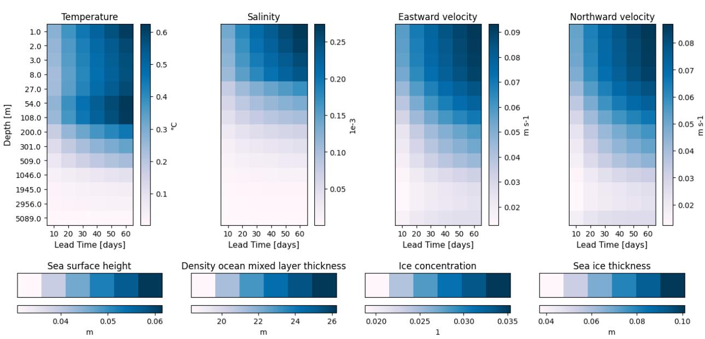  
Figure A.12: Neptune RMSE scorecard for lead times spanning from t+10 to t+60 days of forecast. Lower RMSE values are represented in white, while higher values are reported in blue.

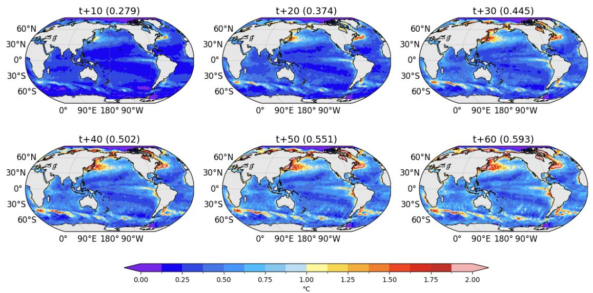  
Figure A.13: Neptune Temperature spatial RMSE error for lead times spanning from t+10 to t+60 days of forecast.

## A Appendix

In the Appendix section, we leave additional results for the Neptune global ocean model.

A.1 Statistical Evaluation

A.2 Physical Coherency

A.3 Oceanic Indices

Spatial Salinity RMSE (2019-01-01-2021-12-31)  
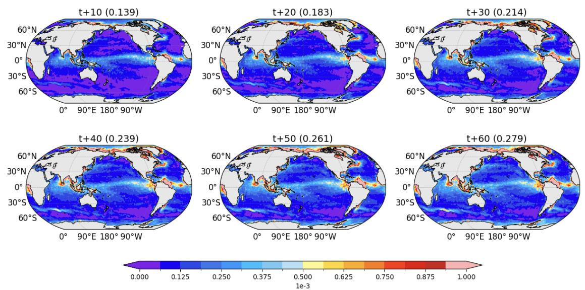  
Figure A.14: Neptune Salinity spatial RMSE error for lead times spanning from t+10 to t+60 days of forecast.

Spatial Eastward velocity RMSE (2019-01-01-2021-12-31)  
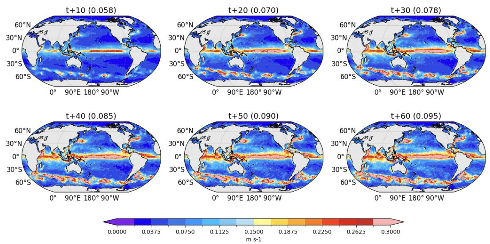  
Figure A.15: Neptune Eastward velocity spatial RMSE error for lead times spanning from t+10 to t+60 days of forecast.

Spatial Northward velocity RMSE (2019-01-01-2021-12-31)  
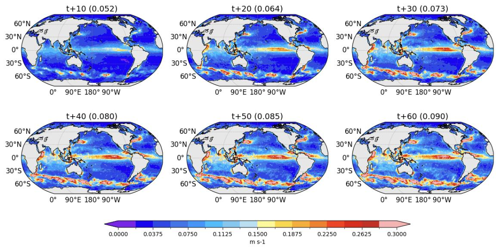  
Figure A.16: Neptune Northward velocity spatial RMSE error for lead times spanning from t+10 to t+60 days of forecast.

Spatial Sea surface height RMSE (2019-01-01-2021-12-31)  
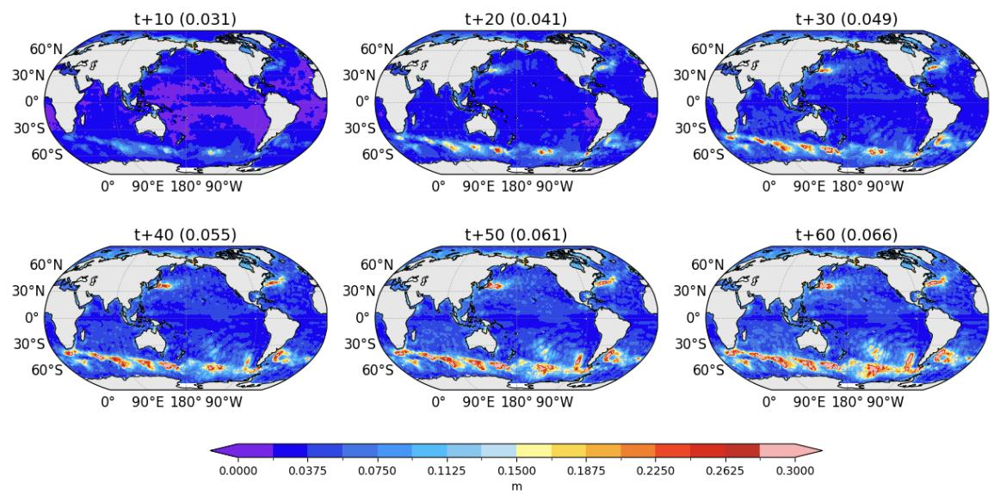  
Figure A.17: Neptune Sea Surface Height spatial RMSE error for lead times spanning from t+10 to t+60 days of forecast.

Spatial Density ocean mixed layer thickness RMSE (2019-01-01-2021-12-31)  
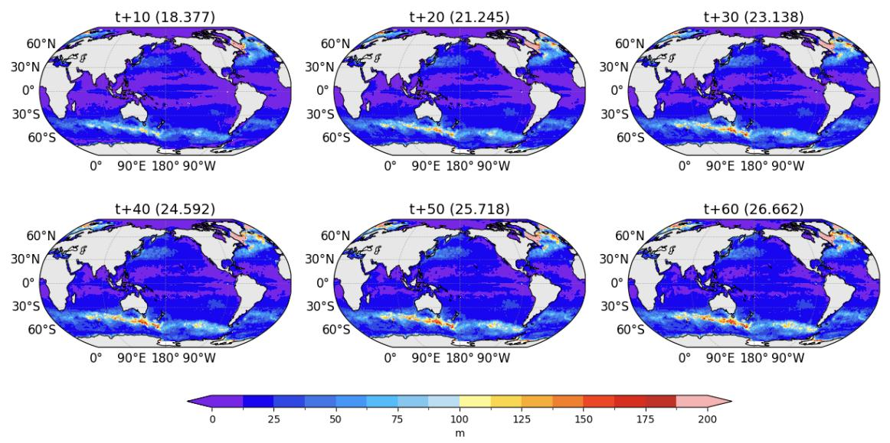  
Figure A.18: Neptune Mixed layer depth spatial RMSE error for lead times spanning from t+10 to t+60 days of forecast.

RMSE of Neptune on North Pole over Test Set (2019-01-01 - 2021-12-31)  
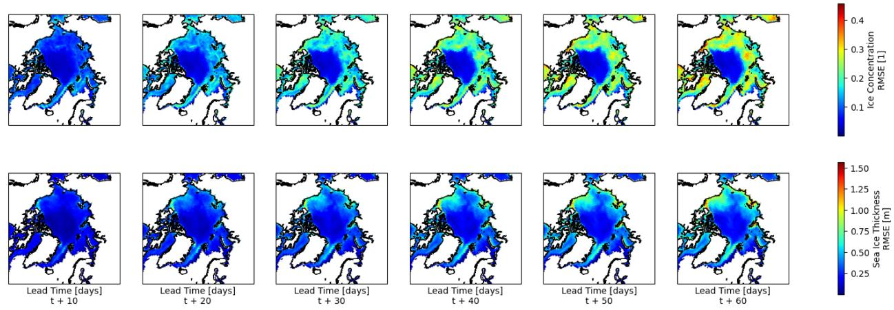  
Figure A.19: Neptune Sea Ice Concentration and Thickness (top and bottom row, respectively) spatial RMSE error over North Pole for lead times spanning from t+10 to t+60 days of forecast.

RMSE of Neptune on South Pole over Test Set (2019-01-01 - 2021-12-31)

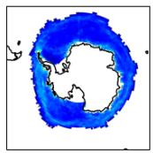

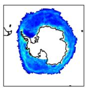

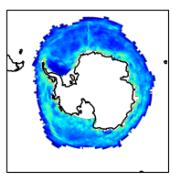

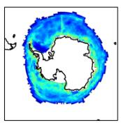

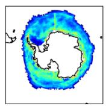

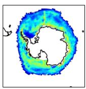

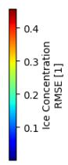

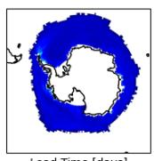  
Lead Time [days] t + 10

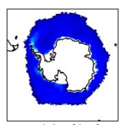  
Lead Time [days] t + 20

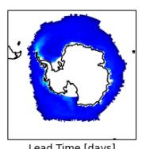  
Lead Time [days] t + 30

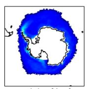  
Lead Time [days] t + 40

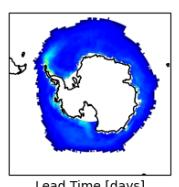  
Lead Time [days] t + 50

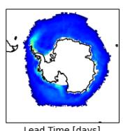  
Lead Time [days] t + 60

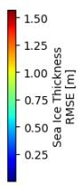  
Figure A.20: Neptune Sea Ice Concentration and Thickness (top and bottom row, respectively) spatial RMSE error over South Pole for lead times spanning from t+10 to t+60 days of forecast.

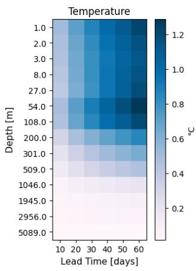

## CRPS of Neptune (Test period: 2019-01-01 - 2021-12-31)

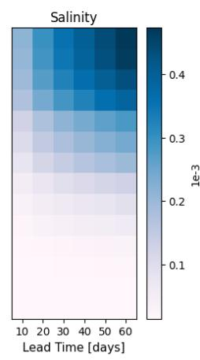

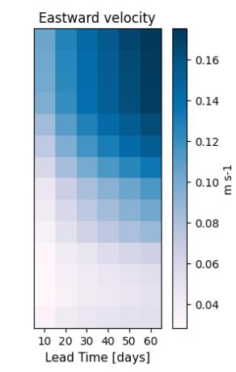

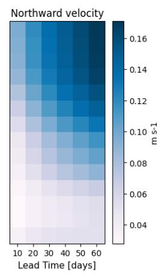

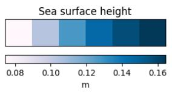

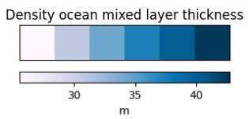

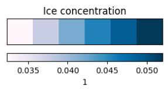

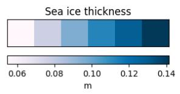  
Figure A.21: Neptune CRPS scorecard for lead times spanning from t+10 to t+60 days of forecast. Lower CRPS values are represented in white, while higher values are reported in blue.

Spatial Temperature CRPS (01-01-12-31)  
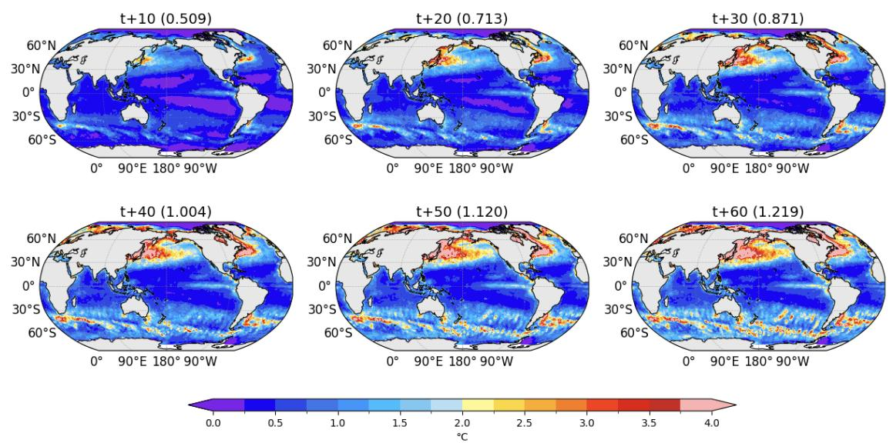  
Figure A.22: Neptune Temperature spatial CRPS error for lead times spanning from t+10 to t+60 days of forecast.

Spatial Salinity CRPS (01-01-12-31)  
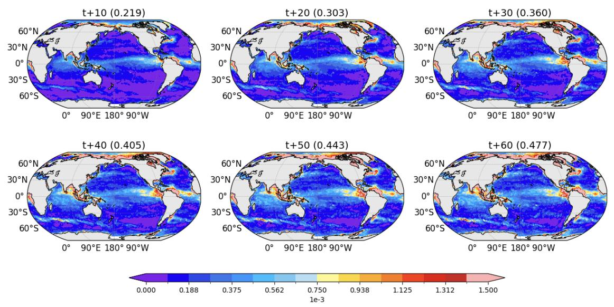  
Figure A.23: Neptune Salinity spatial CRPS error for lead times spanning from t+10 to t+60 days of forecast.

Spatial Eastward velocity CRPS (01-01-12-31)  
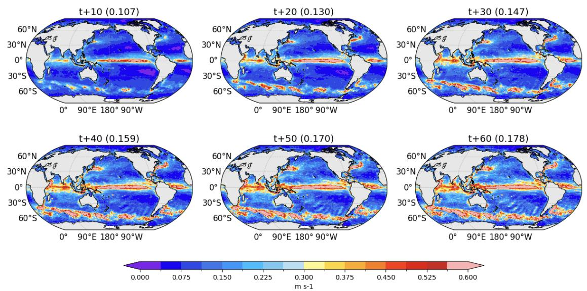  
Figure A.24: Neptune Meridional velocity spatial CRPS error for lead times spanning from t+10 to t+60 days of forecast.

Spatial Northward velocity CRPS (01-01-12-31)  
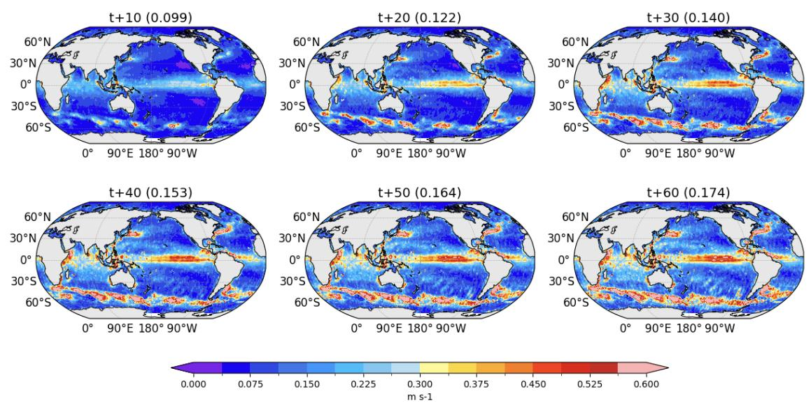  
Figure A.25: Neptune Northward velocity spatial CRPS error for lead times spanning from t+10 to t+60 days of forecast.

Spatial Sea surface height CRPS (01-01-12-31)  
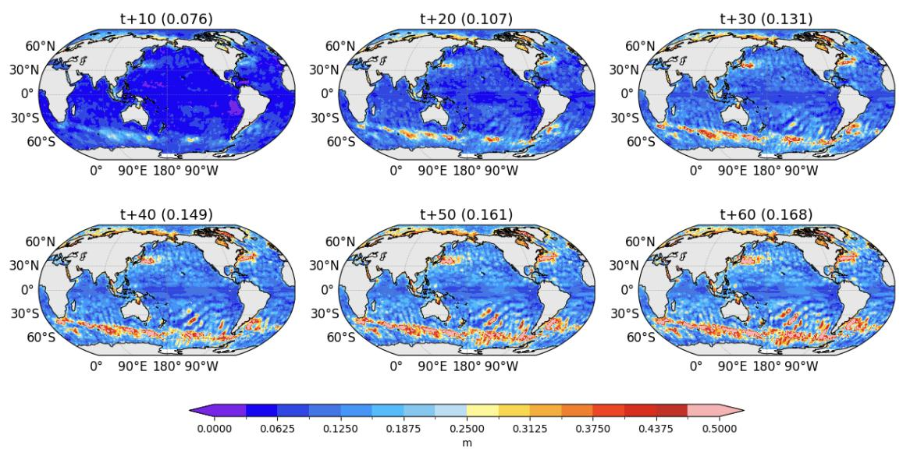  
Figure A.26: Neptune Sea Surface Height spatial CRPS error for lead times spanning from t+10 to t+60 days of forecast.

Spatial Density ocean mixed layer thickness CRPS (01-01-12-31)  
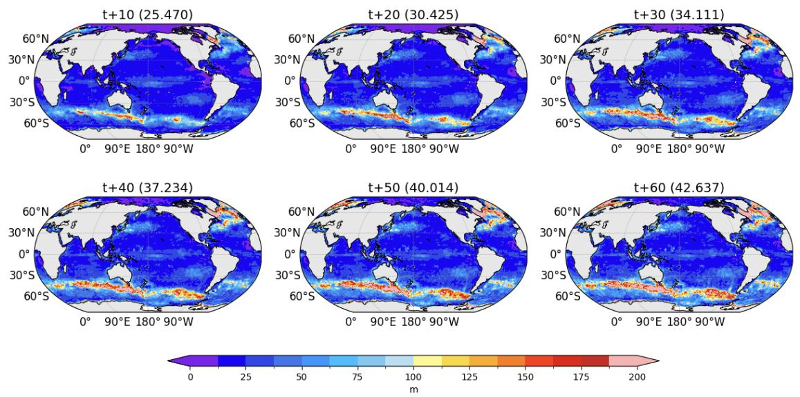  
Figure A.27: Neptune Mixed layer depth spatial CRPS error for lead times spanning from t+10 to t+60 days of forecast.

CRPS of Neptune on North Pole over Test Set (2019-01-01 - 2021-12-31)

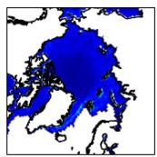

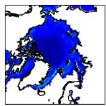

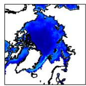

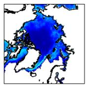

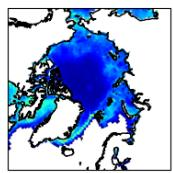

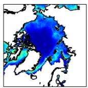

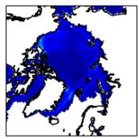  
Lead Time [days] t + 10

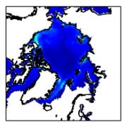  
Lead Time [days] t + 20

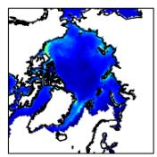  
Lead Time [days] t + 30

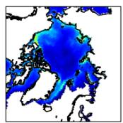  
Lead Time [days] t + 40

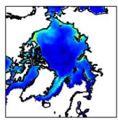  
Lead Time [days] t + 50

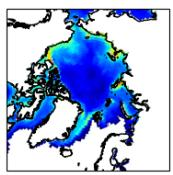  
Lead Time [days] t + 60

3.0 2.5 2.0 1.5 1.0 0.5

Figure A.28: Neptune Sea Ice Concentration and Thickness (top and bottom row, respectively) spatial CRPS error over North Pole for lead times spanning from t+10 to t+60 days of forecast.  
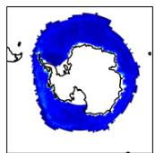

CRPS of Neptune on South Pole over Test Set (2019-01-01 - 2021-12-31)

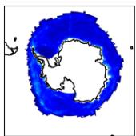

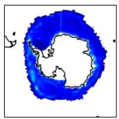

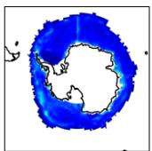

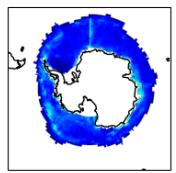

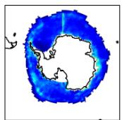

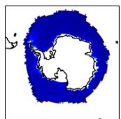  
Lead Time [days] t + 10

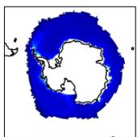  
Lead Time [days] t + 20

  
Lead Time [days] t + 30

  
Lead Time [days] t + 40

  
Lead Time [days] t + 50

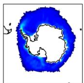  
Lead Time [days] t + 60

3.0 2.5 2.0 1.5 1.0 0.5

Figure A.29: Neptune Sea Ice Concentration and Thickness (top and bottom row, respectively) spatial CRPS error over South Pole for lead times spanning from t+10 to t+60 days of forecast.

Spatial Temperature ACC (2019-01-01-2021-12-31)  
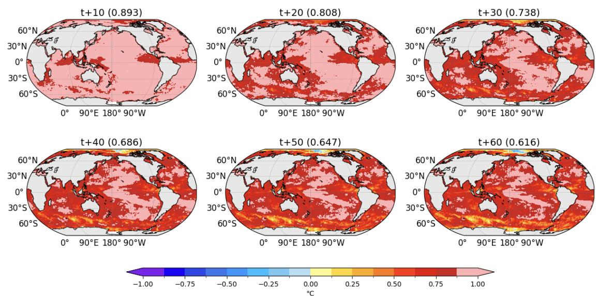  
Figure A.30: Neptune Temperature spatial ACC error for lead times spanning from t+10 to t+60 days of forecast.

Spatial Salinity ACC (2019-01-01-2021-12-31)  
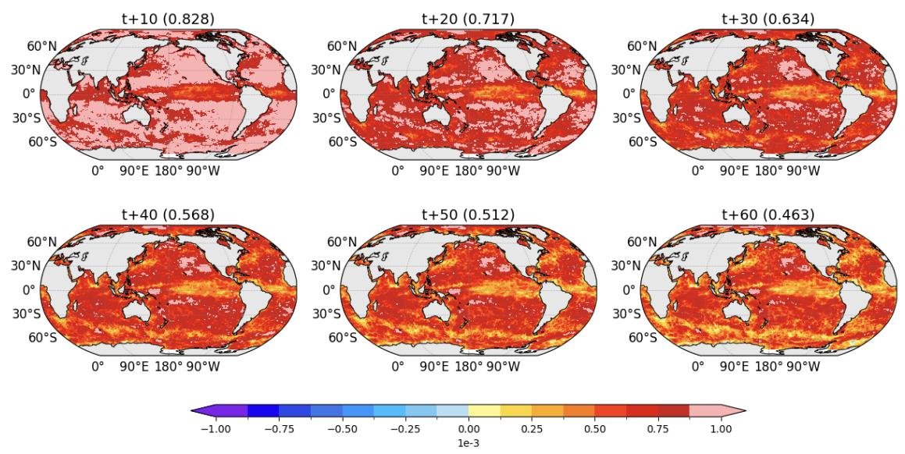  
Figure A.31: Neptune Salinity spatial ACC error for lead times spanning from t+10 to t+60 days of forecast.

Spatial Eastward velocity ACC (2019-01-01-2021-12-31)  
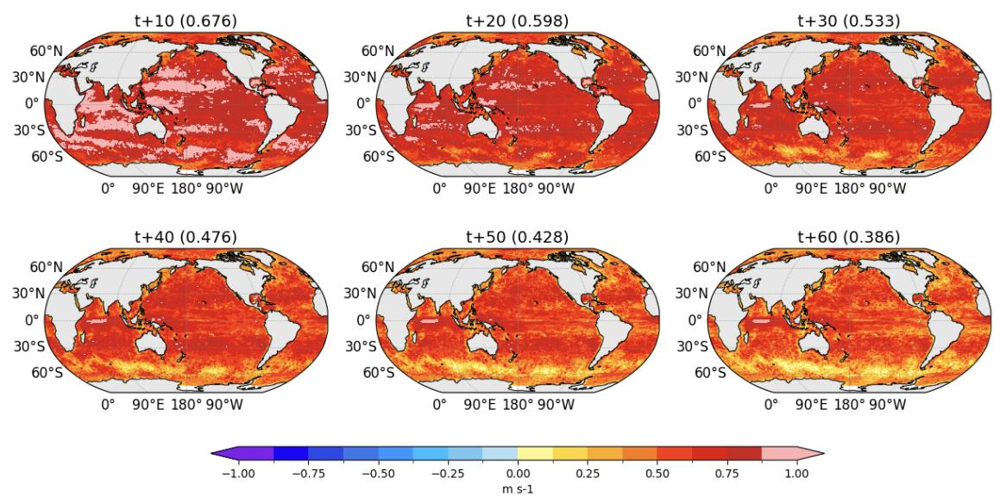  
Figure A.32: Neptune Eastward velocity spatial ACC error for lead times spanning from t+10 to t+60 days of forecast.

Spatial Northward velocity ACC (2019-01-01-2021-12-31)  
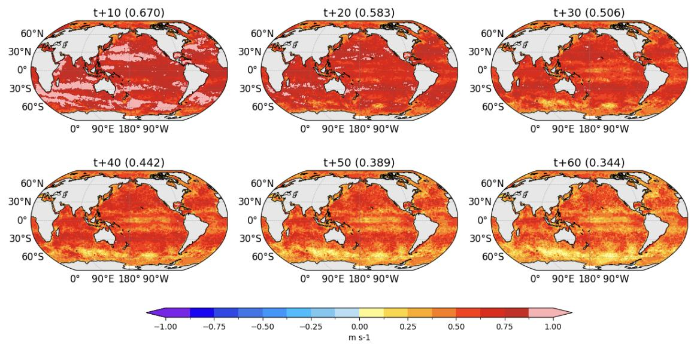  
Figure A.33: Neptune Northward velocity spatial ACC error for lead times spanning from t+10 to t+60 days of forecast.

Spatial Sea surface height ACC (2019-01-01-2021-12-31)  
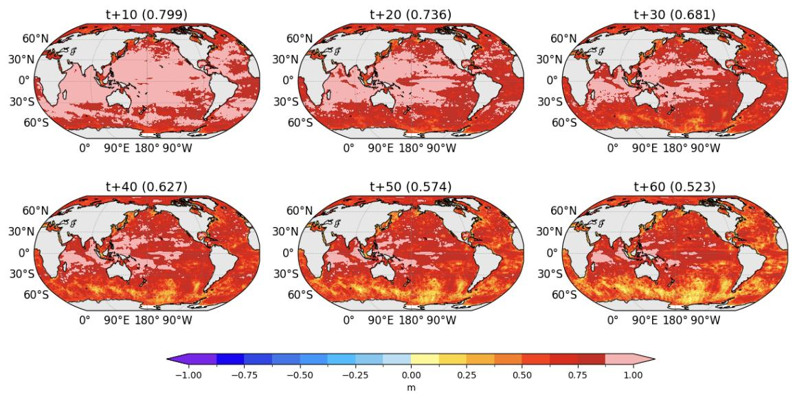  
Figure A.34: Neptune Sea Surface Height spatial ACC error for lead times spanning from t+10 to t+60 days of forecast.

Spatial Density ocean mixed layer thickness ACC (2019-01-01-2021-12-31)  
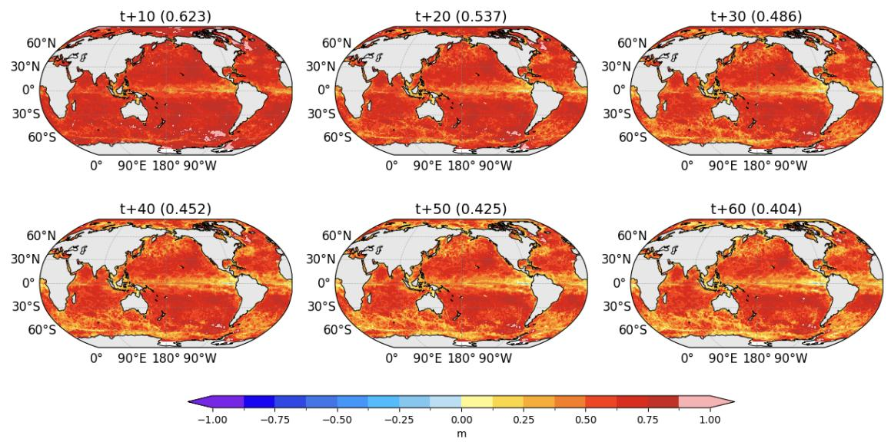  
Figure A.35: Neptune Mixed layer depth spatial ACC error for lead times spanning from t+10 to t+60 days of forecast.

ACC of neptune on North Pole over Test Set (2019-01-01 - 2021-12-31)

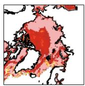

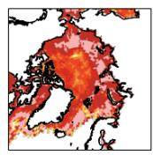

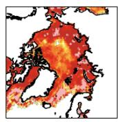

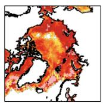

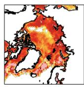

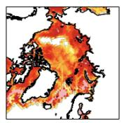

ACC 1.0 0.5 0.0 -0.5 -1.0

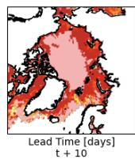

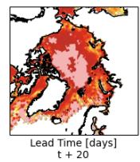

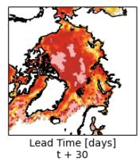

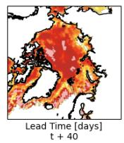

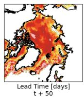

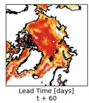

ACC 1.0 0.5 0.0 -0.5 -1.0

Figure A.36: Neptune Sea Ice Concentration and Thickness (top and bottom row, respectively) spatial ACC error over North Pole for lead times spanning from t+10 to t+60 days of forecast.  
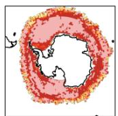

ACC of neptune on South Pole over Test Set (2019-01-01 - 2021-12-31)

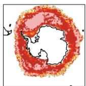

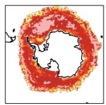

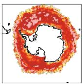

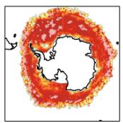

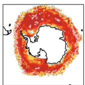

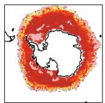  
Lead Time [days] t + 10

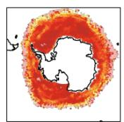  
Lead Time [days] t + 20

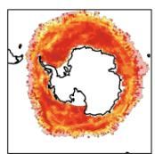  
Lead Time [days] t + 30

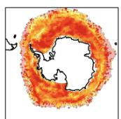  
Lead Time [days] t + 40

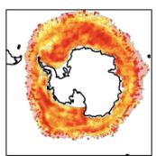  
Lead Time [days] t + 50

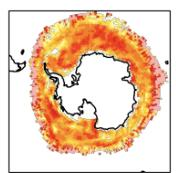  
Lead Time [days] t + 60

ACC 1.0 0.5 0.0 -0.5 -1.0

ACC 1.0 0.5 0.0 -0.5 -1.0

Figure A.37: Neptune Sea Ice Concentration and Thickness (top and bottom row, respectively) spatial ACC error over South Pole for lead times spanning from t+10 to t+60 days of forecast.

(a) Kuroshio current  
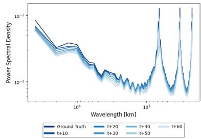

(b) Gulf Stream current  
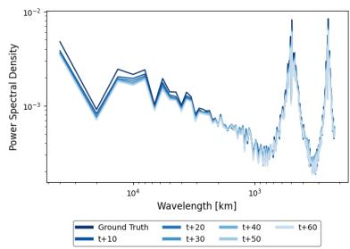

(c) Brazil-Malvinas Confluence  
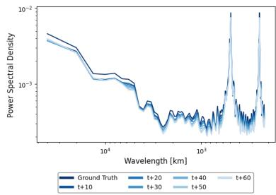

(d) Antarctic Circumpolar Current  
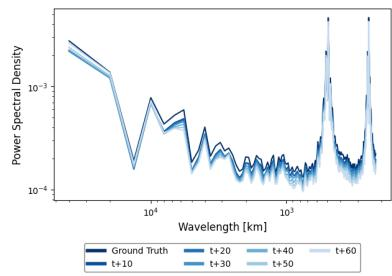

(e) Agulhas  
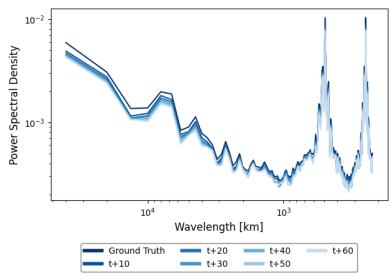  
Figure A.38: Power Spectral Density (PSD) plots computed for 5 highly-energetic ocean regions: a) Kuroshio, b) Gulf Stream, c) Brazil-Malvinas Confluence, d) Antarctic Circumpolar Current, e) Agulhas. In each sub-panel, x-axis is reported the wavelength (in km), representing the spatial scale, while y-axis reports the PSD of the signal. Ground truth is reported in dark-blue while forecasts-spanning from t+10 to t+60-are reported in progressively lighter-blue colors.