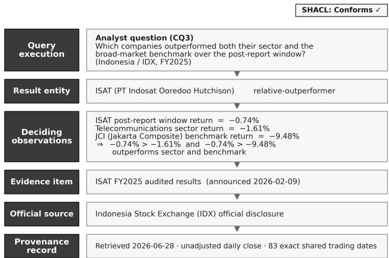
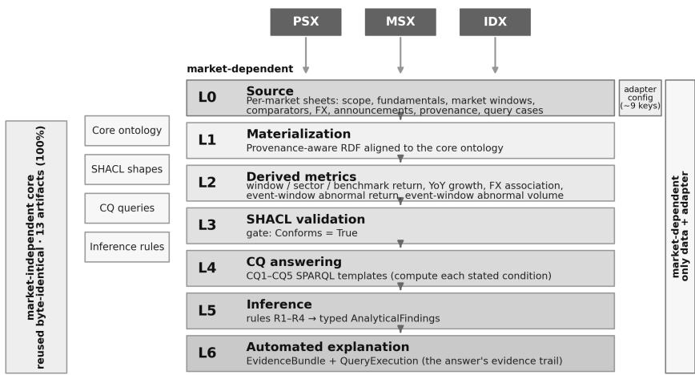

# OntoKG-EQ: A provenance-grounded, competency-question-governed knowledge graph for auditable analyst querying

Furqan Nasira,b,∗, Muhammad Atif Saeedb, Muhammad Ehsana, Sher Jeel Ahmadc, Abdul Moiz Altafa

aCity University of Science and Information Technology (CUSIT), Peshawar, Pakistan

bNational University of Computer and Emerging Sciences

(FAST-NUCES), Islamabad, Pakistan

cUniversity of Engineering and Technology (UET), Peshawar, Pakistan

## Abstract

Analysts in emerging equity markets keep answering the same questions. Did fundamentals match the market’s response? How does the local currency co-move with returns? Which firms outperform sector and benchmark, and which disclosures coincide with abnormal trading? These answers come from ad-hoc spreadsheets that are hard to reproduce, audit, or trust. We present OntoKG-EQ, a knowledge-based system that makes such queries reproducible, evidence-linked, temporally explicit, valid, and inspectable. It couples a bounded, competency-question-governed core ontology with a provenance-aware knowledge graph in which every class, property, shape, and metric is justified by one of five frozen questions. The system materialises market data into the graph, computes the metrics, validates its structure against declarative shape constraints, answers each competency question with a graph query, derives typed findings, and generates an explanation tracing each result to its observations, evidence, sources, and provenance. We evaluate on curated datasets from three emerging markets (Pakistan, Malaysia, Indonesia). Once each market’s data is mapped into the common

schema, the ontology, shapes, queries, and rules are reused unchanged. A relational-database baseline shows the graph changes no analytics. Its value is governance, provenance, and self-explaining structure. Because answers are rendered deterministically from the validated graph, their consistency with it is guaranteed by construction. Used as a reference, the system measures how consistently eight open language models transcribe the same evidence (provenance coverage 0.00 to 1.00). A study with a 17-participant convenience panel finds the evidence bundle significantly increased perceived trust and completeness. Code and data are openly released.

Keywords: Knowledge graphs, Ontology engineering, Competency questions, Provenance, SHACL, Explainable querying

## 1. Introduction

Equity analysts working in emerging markets answer a small set of recurring questions whenever a company reports results. Did a firm’s reported strength translate into a commensurate market response? How does movement in the local currency relate to company-, sector-, and benchmark-level returns over a defined window? Which firms outperform both their sector peers and the broad-market benchmark over the same period? And which oficial disclosures coincide with abnormal return or trading-volume activity in short event windows? In practice these questions are answered with bespoke spreadsheets that stitch together company fundamentals, daily prices, sector and benchmark comparators, exchange-rate series, and exchange disclosures. The answers are useful, but they are dificult to reproduce, hard to audit, and they rarely carry an explicit, inspectable link back to the underlying evidence and its provenance. That link is precisely what a reviewer, regulator, or risk committee needs in order to trust an analyst note. Fig. 1 illustrates this setting with a worked example from the Indonesia market: an analyst question, the company returned, and the full evidence-and-provenance path that justifies the result.

This paper addresses that gap as a problem of data and knowledge engineering, not prediction. The goal is not to forecast prices or recommend trades. It is to make analyst-oriented queries over heterogeneous market data reproducible, evidence-linked, temporally explicit, structurally valid, and inspectable. Every returned entity is then traceable, by construction, to the observations that justify it, the window over which they were measured, the oficial source, and a provenance record.

  
Figure 1: A worked analyst example (Indonesia, CQ3). ISAT is returned as a relativeoutperformer. The inspectable trail traces the result through its deciding observations (company, sector, and benchmark window returns) to the oficial FY2025 IDX disclosure and the provenance record. The underlying knowledge graph is SHACL-valid.

Our approach builds on established knowledge-graph foundations and surveys [1, 2], SPARQL query semantics [3], and the explainable-AI literature [4], adapting them to the bounded, provenance-first setting of analyst querying. No existing line of work delivers this combination for emerging-market analytical querying. Financial-domain ontologies such as FIBO model the concepts of finance comprehensively, but do not, on their own, provide a bounded, executable path from a parameterised query to the evidence and provenance that justify each result. Recent financial knowledge graphs emphasise large-scale, often LLM-driven, extraction, and explicitly flag interpretability and provenance as open challenges [5, 6]. Graph-based retrieval-augmented generation (GraphRAG) grounds language-model answers in retrieved subgraphs, but its faithfulness is estimated rather than guaranteed, because a generated answer may not be entailed by the retrieved evidence.

We present OntoKG-EQ, a knowledge-based system that operationalises explainable analyst querying over equity data. OntoKG-EQ is built around five frozen competency questions (CQ1–CQ5) that bound its scope: no ontology class, property, SHACL shape, derived metric, or inference rule exists unless it is required to answer one of them. Given a market’s data, the system (i) materialises it into a provenance-aware RDF knowledge graph aligned to a compact core ontology; (ii) computes the derived analytical metrics the questions require (window returns, year-on-year growth, sector and benchmark returns, exchange-rate association, and event-window abnormal return and volume); (iii) validates structure with SHACL; (iv) answers each competency question with SPARQL that computes its stated condition; (v) applies inference rules that derive typed, queryable analytical findings (e.g., relative-outperformer, fundamentals–market divergence, abnormal-event reaction); and (vi) generates, automatically and for every result, an evidence bundle that exposes the inspectable path from the executed query to its supporting observations, evidence items, oficial sources, and provenance. Faithfulness is therefore enforced structurally: there is no generative step that can drift from the evidence. We position this as a complement to, and a provenance-grounded reference for, GraphRAG-style answering.

A central claim of the paper is reuse of the apparatus: the contribution is a method, not a one-of dataset. This reuse is demonstrated over structurally aligned datasets, not proven across arbitrarily heterogeneous reporting structures. We demonstrate this on three independent emerging markets (curated datasets): the Pakistan Stock Exchange (PSX, KSE-100 index), Bursa Malaysia (MSX, FBM KLCI index), and the Indonesia Stock Exchange (IDX, Jakarta Composite). The core ontology, SHACL shapes, the five competencyquestion queries, and the inference rules are reused byte-identical across all three markets. Only the data and a small per-market adapter configuration change. Every market is SHACL-conformant and answers the competency questions with fully traceable explanations.

The contributions of this paper are threefold. (1) A reusable, competency-question-governed construction method that bounds scope with five frozen competency questions, computes the analytics in a provenance-aware RDF graph, and validates structure with SHACL. It is reused byte-identical across three markets (100% of the ontology, shapes, queries, and rules, once each market’s data is mapped into the common schema) and demonstrated at a 64-stock scale, with the unchanged competency-question SPARQL executing on a standard triplestore. This reuse is scoped to structurally aligned datasets rather than arbitrary structures. (2) An automated, self-explaining evidence mechanism in which every result and inferred finding carries an inspectable query→observation→evidence→source→provenance path rendered deterministically from the validated graph. Graph-grounded transcription consistency is therefore a design guarantee, which lets OntoKG-EQ serve as a provenance-grounded reference for measuring the faithfulness of GraphRAG/LLM answerers over the same graph. (3) An empirical evaluation with honest, condition-computing query semantics, in which a family legitimately returns nothing when the data do not satisfy it. It spans competency-question coverage, quantified portability, a relational baseline that isolates a deliberate negative result (the graph changes no analytics), a reference-based faithfulness study of eight open language models with confidence intervals and pairwise significance tests, component ablations, at-scale triplestore execution, and an executed user study (n = 17, participant-level) showing large gains in perceived trust and completeness. All code, data, and the evaluation harness are openly released.

## 2. Related work

OntoKG-EQ sits at the intersection of four lines of work. We review each line of work and state precisely what OntoKG-EQ adds. Numbered citations refer to the reference list in Section 11.

## 2.1. Financial ontologies and knowledge graphs

The Financial Industry Business Ontology (FIBO) [7, 8] is the de-facto OWL standard for finance, governed by the EDM Council and OMG and paired with triplestores for inference and property-path querying. FIBO targets broad conceptual coverage. Recent work extends it in specific directions: FinCaKG-Onto, for instance, uses FIBO as a scafold to depict financial expertise as a causality knowledge graph [9]. OntoKG-EQ takes the opposite stance. It is a bounded, competency-question-scoped core in which every term exists to answer one of five frozen analyst questions, and it provides an executable, inspectable analytical-querying capability rather than a domain vocabulary.

A fast-growing parallel line builds financial knowledge graphs by automated extraction. FinReflectKG constructs a graph from SEC filings with agentic, reflection-driven extraction and a rule-, statistical-, and LLM-as-judge evaluation pipeline [5]. FinKario adds event-enhanced automated construction coupled to a two-stage graph retrieval strategy for stock-trend prediction [10]. A comprehensive survey of the field [6] catalogues applications such as fraud, credit risk, anti-money-laundering, and compliance, while explicitly naming interpretability and provenance as open challenges. Notably, this concern is not new to the extraction community itself: Kertkeidkachorn and Ichise argue that automatically constructed financial graphs, lacking a well-defined ontology, sufer degraded reasoning and quality, and respond with FinKG, an expert-verified core ontology [11]. Our diagnosis is the same, but our response difers in kind. Where these systems optimise extraction coverage at scale, OntoKG-EQ makes the validated query→evidence→provenance path a first-class artifact and treats cross-market portability as the evaluation target. Competency questions have been used to evaluate financial graphs before, on precision and recall over an information-extraction pipeline [12]; we go further and make the frozen CQ set the governing constraint on what the graph may contain at all.

## 2.2. Competency-question-driven ontology engineering

Competency questions (CQs) are a long-standing device for scoping and validating ontologies [13, 14], embedded in ontology-engineering methodologies such as NeOn [15]. A recent survey of 63 practitioners confirms that CQs are used mainly to define scope and evaluate a conceptualization, but also that engineers still lack guidance for writing and managing them [16], and Keet and Khan argue that CQs serve manifold roles across the engineering lifecycle beyond mere fact-seeking [13]. In practice, however, CQs are seldom published alongside the ontologies they shaped [17], which leaves their governing intent implicit. There is also active work on formalising CQs as SPARQL/SPARQL-OWL queries [18] and tooling that mints CQ→SPARQL pairs for question answering over knowledge graphs [19]. OntoKG-EQ adopts this discipline but pushes it further. Here the CQs act as a governance invariant: no class, property, shape, derived metric, or rule is admitted without a CQ, a constraint we verify mechanically (Section 7.1), and the five frozen CQs are released as first-class versioned artifacts rather than left implicit. They are also operationalised beyond plain retrieval, as analytical computations (window returns, relative outperformance, exchange-rate association, event-window abnormality) and as inference rules that materialise typed findings. The frozen CQ set then becomes the unit of portability, transferred unchanged across markets.

## 2.3. Provenance and structural validation

Provenance modelling (in the spirit of the W3C PROV data model [20]) and SHACL-based structural validation [21] are established building blocks of trustworthy knowledge graphs, and both are active research areas in their own right. On the validation side, recent work has made SHACL validation eficient even under entailment [22], clarified the formal semantics of validating SHACL constraints together with an ontology [23], and demonstrated SHACL/SPARQL constraint formalisation on large real-world graphs such as Wikidata [24]. On the provenance side, PROV-O-aligned frameworks now capture the lineage of knowledge-graph generation to support reproducibility and trust [25]. Our contribution is not these mechanisms individually but their integration into an automatically generated, per-result explanation: SHACL is used as a hard gate, so that the materialised graph is certified structurally valid (Conforms = True) before any competency question is answered, and each returned entity is then bound to an evidence bundle whose observations, sources, and provenance are present in that validated graph by construction. Where generic provenance pipelines record lineage at the level of a dataset or a generation run [25], OntoKG-EQ attaches a provenance-grounded evidence bundle to every individual result. Removing either the validation or the provenance layer measurably degrades explanation quality (Section 7.4).

## 2.4. Explainable querying, GraphRAG and faithfulness

Graph-based retrieval-augmented generation [26], which extends retrievalaugmented generation [27], retrieves subgraphs to ground language-model answers, and a rich family of systems now refines this idea: HybridRAG combines graph and vector retrieval for financial question answering over earnings calls [28], and Think-on-Graph 2.0 interleaves graph and text retrieval to deepen reasoning [29]. There is also explicit work on explaining KG-RAG [30] and on detecting hallucinations in retrieval-augmented generation [31]. The recurring dificulty across all of these is faithfulness: even with retrieval, a generated answer may not be entailed by the retrieved context. Recent evaluation work makes the point sharply. Ahmad and Khan show that lexical metrics such as BLEU and ROUGE correlate only weakly with structural grounding, and that removing graph retrieval preserves lexical accuracy while eliminating traceable evidence altogether [32]. Faithfulness, in other words, is a structural property that text-overlap scores do not capture. This is also increasingly recognised outside the evaluation literature: Sequeda et al., writing from enterprise practice, argue that knowledge graphs provide the formal frame to check a generated query’s validity, the foundation for explaining a result, and access to governed, trusted data, precisely the roles a bare language model cannot fill [33].

OntoKG-EQ makes a diferent design choice that resolves the faithfulness problem by construction rather than by measurement. It is not an LLManswering system. Results are produced by SPARQL over a SHACL-validated graph, and every result is bound to an evidence bundle present in that graph, so faithfulness is structurally enforced rather than estimated. The closest neighbour to this stance is recent work that answers questions over a knowledge graph without a generative step, using only retrieval and light paraphrase [34]; OntoKG-EQ sharpens that idea by making its queries compute the stated condition of each competency question and by attaching a validated provenance bundle to every answer. We therefore position OntoKG-EQ as a complement to, and a provenance-grounded reference for, GraphRAG-style answering, and we use a structural contrast with GraphRAG as one of our baselines (Section 7.3).

## 2.5. Positioning and novelty

Table 1 summarises the comparison.

The contribution is therefore neither a new financial ontology nor a new extraction pipeline. It is a bounded, competency-question-driven, provenancetraceable analytical-querying method in which competency questions are operationalised as computations and inference rules, every result carries an automatically generated and structurally validated explanation, and the whole apparatus is shown to be reused across three independent emerging markets by changing the (manually mapped) data and a bounded configuration only. This is reuse over structurally aligned datasets rather than automatic portability to arbitrary structures.

## 3. Preliminaries and formal model

## 3.1. Frozen competency questions

The scope of OntoKG-EQ is fixed by five competency-question (CQ) families, frozen before modelling. They are the functional requirements the system must answer and the governance boundary for every modelling decision: no ontology term, data field, SHACL shape, derived metric, or inference rule is admitted unless at least one CQ requires it.

• CQ1. Fundamentals versus market response. Which companies show stronger reported fundamentals but a weaker subsequent market response over a defined post-reporting window?

Table 1: Capability comparison with the four most related lines of work. Entries are qualitative characterizations of typical practice in each research family, with representative systems named in each column header; they are not claims about every individual system.
<table><tr><td>Capability</td><td>FIBO semantic- finance [7, 8, 9]</td><td>/ Financial gentic [5, 6, 10, 11]</td><td>GraphRAG / Provenance OntoKG- KGs, LLM/a- KG-RAG [26, / 28, 29, 30]</td><td>tion stacks [22, 23, 25]</td><td>valida- EQ</td><td></td><td></td></tr><tr><td>Primary goal domain con- extraction</td><td>ceptual cover- coverage</td><td>scale</td><td>at swer genera- constraint tion</td><td>grounded an- lineage and bounded ana-</td><td>checking</td><td>ing</td><td>lytical query-</td></tr><tr><td>CQ-governed partial scope (term ↔ CQ)</td><td></td><td>rare</td><td>no</td><td>no</td><td></td><td>yes fied)</td><td>(veri-</td></tr><tr><td>Structural validation (SHACL) as a gate</td><td>optional</td><td>varies</td><td>no</td><td></td><td>check, not a forms be- gate)</td><td>yes (as a yes ing)</td><td>(con- fore answer-</td></tr><tr><td>Analytical metrics com- puted by the pipeline and stored RDF observa-</td><td>no</td><td>partial</td><td>via LLM</td><td>no</td><td></td><td>yes (9 de- rics)</td><td>rived met-</td></tr><tr><td>Rule-derived explainable findings</td><td>generic infer- varies ence</td><td></td><td>no</td><td></td><td>no</td><td>yes rules)</td><td>(CQ1-CQ4</td></tr><tr><td>Per-result result → evidence → source →</td><td>not enforced open</td><td>lenge [6]</td><td>chal- not</td><td>entailment- guaranteed</td><td>dataset/run- enforced level lineage +</td><td></td><td>auto- generated per result</td></tr><tr><td>provenance Faithfulness n/a</td><td></td><td>n/a</td><td></td><td>estimated [32]</td><td>n/a</td><td></td><td>by construc- tion(no</td></tr><tr><td>Deterministic, n/a non-</td><td></td><td>no</td><td></td><td>no</td><td>n/a</td><td>yes</td><td>generation)</td></tr><tr><td>generative answering Cross-market n/a portability</td><td></td><td>rarely</td><td></td><td>n/a</td><td>n/a</td><td>yes</td><td>(cu-</td></tr></table>

• CQ2. Exchange-rate context and market behaviour. How is movement in a selected local currency pair associated with company-, sector-, or benchmark-level market measures over a predefined window?

• CQ3. Relative outperformance versus sector and benchmark. Which companies outperform their sector comparator and the selected broad-market benchmark over the same period?

• CQ4. Oficial announcements versus market reaction. Which oficial announcements and associated disclosures are coincident, within short event windows, with abnormal return or trading-volume activity in short event windows such as $( - 1 , + 1 )$ and $( - 3 , + 3 )$ trading days?

• CQ5. Explainability and provenance. What evidence, intermediate relations, metric values, temporal context, sources, and provenance explain why an entity appears in an executed CQ1–CQ4 result?

CQ1–CQ4 are analytical questions over the data. CQ5 is the explainability question that the other four must be answerable against.

## 3.2. Core constructs

Let the core ontology be $0 ~ = ~ \left( { \mathsf C } , ~ { \mathsf P } \right)$ where C is the set of classes and P the object and datatype properties, and let S be a separate validation schema (the SHACL shape set) layered over O. Both are CQ-bounded: each element of ${ \textsc { c } } \cup { \textsc { p } } \cup { \textsc { s } }$ is justified by at least one ${ \mathfrak { q } } \ \in \ { \mathfrak { q } } \ = \ \{ \mathsf { C Q 1 } , \ \cdot \ \cdot \ , \ \mathsf { C Q 5 } \}$

Observation. An observation is a tuple $\mathsf { o } = ( \mathsf { e } , \mathsf { m } , \mathsf { v } , \tau , \mathrm {  ~ x ~ } , \mathrm {  ~ r ~ } )$ where e is the observed entity (a Company, an IndustrySectorClassifier, a MarketIndex, or a currency pair), m a metric name, $\texttt { v } \in \mathbb { R }$ its value, τ a temporal context (a ReportingPeriod, an AnalysisWindow, or an EventWindow), X a possibly empty set of supporting EvidenceItems, and r a ProvenanceRecord. Three subclasses specialise the entity and temporal context: FundamentalObservation, MarketObservation, and ExchangeRateObservation.

Derived metrics and inference rules. A derived metric $\varphi : ( 2 \widehat { \ } 0 \mathsf { b } \mathsf { s }$ W) → Obs maps a set of base observations and a window to a new, first-class (derived) observation, and OntoKG-EQ defines nine CQ-justified metrics. An inference rule ρ : Pattern → Finding maps a graph pattern encoding a CQ condition over these metrics to a typed AnalyticalFinding f. The nine-metric list and the finding tuple $\textbf { f } = ~ ( \ e , \ \textup { t } , \ \rho \_ { - } \mathrm { i d } , \ \textup { q } , \ 0 \_ { - } \mathrm { f } )$ are given in Online Resource 1 (Section D).

Evidence bundle and explanation. For a result entity e, an evidence bundle $\texttt { b } = \texttt { ( e , 0 _ { - } b , X _ { - } b ) }$ collects the supporting observations O\_b and evidence items X\_b. A query execution ${ \mathfrak { q e } } = ( { \mathfrak { q } } , \ { \mathrm { i d } } , \ \pi , \ { \mathfrak { b } } )$ records an executed CQ instance with parameters π bound to b. The explanation of e is the closure $\begin{array} { r } { \mathrm { E } ( \Theta ) ~ = ~ \{ ~ \mathrm { ~ ( ~ o ~ , ~ m ~ , ~ v ~ , ~ \tau ~ , ~ \mathrm { ~ x ~ , ~ \ s r c , ~ \hat { ~ } { ~ \theta ~ } ~ : ~ 0 ~ } ~ \in ~ 0 ~ \pi _ - b , ~ x ~ \in ~ \Theta ~ } } \end{array}$ evidence(o), $\mathbf { s r c } ~ = ~ \mathbf { s o u r c e ( x ) } ~ \mathbf { \bar { y } }$ , where $\mathtt { R } \ = \ \mathtt { p r o v } ( \circ ) \ \cup \ \mathtt { p r o v } ( \mathrm { x } )$ is the set of provenance records linking observation o to its supporting evidence item x. R denotes a set, distinct from the single ProvenanceRecord r of an individual finding above; restricting x to evidence(o) avoids forming unrelated observation–evidence pairs.

## 3.3. Quality properties

The system is designed for and evaluated against three properties: structural validity (the materialised graph conforms to S; pySHACL reports Conforms = True), evidence coverage (every returned entity e has a nonempty $\mathrm { E ( e ) }$ resolving to at least one observation and one oficial source), and explanation soundness (every $\mathrm { ~ o ~ } \in \mathrm { O } .$ \_b and $\mathrm { ~ x ~ } \in \mathrm { { X } \_ } \mathrm { { l } }$ b is actually present in the validated graph, and each o’s metric value is the value used by the rule or query that selected e). These make faithfulness a structural guarantee rather than an estimated quantity.

## 4. The OntoKG-EQ method and system architecture

OntoKG-EQ is organised as a seven-layer pipeline (Fig. 2).

Layers L0–L1 onboard a market’s data; L2 computes the analytical metrics; L3 validates; L4 answers the competency questions; L5 derives findings; and L6 generates explanations. The ontology, shapes, queries, and rules (L1– L6 logic) are market-independent; only the data (L0) and a small adapter configuration vary between markets.

## 4.1. CQ-bounded core ontology

The core ontology provides a compact vocabulary suficient to express the five competency questions and no more. Its principal classes are Company, ObservedEntity, Observation (with subclasses FundamentalObservation, MarketObservation, ExchangeRateObservation), ReportingPeriod, AnalysisWindow, EventWindow, IndustrySectorClassifier, IndustrySectorClassificationScheme, MarketIndex, Currency, Announcement/Disclosure (as EvidenceItem), Pub lisher, EvidenceSource, ProvenanceRecord, ValidationStatus, EvidenceBundle, and QueryExecution. Object and datatype properties connect observations to their entities, temporal contexts, metric values, evidence, and provenance.

  
Figure 2: The seven-layer OntoKG-EQ pipeline. Only the L0 data and a small per-market adapter vary across markets. The ontology, SHACL shapes, CQ queries, and inference rules (the L1–L6 logic) are reused byte-identical across markets.

Each term is traceable to at least one CQ (Section 7.1), and the ontology classifies without inconsistency under an OWL 2 EL reasoner. A small alignment module maps the core to standard upper concepts where a CQ requires it, keeping the core itself compact.

## 4.2. L0–L1: Per-market data onboarding and materialization

A market is supplied as nine tabular sheets (scope/selection, company master, fundamentals, market windows, comparators, exchange rates, announcements/disclosures, provenance, and query cases), each row carrying its source. The materializer reads these sheets and emits a provenance-aware RDF graph aligned to the core ontology: companies and their sector classifiers; reporting periods and analysis/event windows; fundamental, market, comparator, and exchange-rate observations; announcements as evidence items linked to publishers and evidence sources; and provenance records. To remain reasoner-free at query time, parent-class type assertions are materialized explicitly, so SPARQL and SHACL operate without an external reasoner.

## 4.3. L2: Derived analytical metrics

L2 computes the nine derived metrics of Section 3.2 as first-class observations. Window returns are computed by compounding the daily returns the sheets provide over each company’s own post-report window, which is robust to absolute price-level discontinuities across reporting anchors; sector and benchmark returns are computed over the same window dates as the company they are compared against, so that CQ1 and CQ3 compare like with like; exchange-rate association is the Pearson correlation of daily exchange-rate returns with daily company and benchmark returns over the shared window (of length n days; because such short-window correlations are sensitive to outliers and non-stationarity, the $| \mathrm { r } | \geq 0 . 3$ flag is a descriptive screen, and Spearman and multi-window robustness checks are recommended on licensed data, Section 8.2), alongside the window-level exchange-rate change. The event-window metrics are the cumulative abnormal return, here the sum of market-adjusted abnormal returns (each day’s company return minus the concurrent benchmark return; the market-adjusted-returns model of event-study analysis [35, 36, 37], which uses no separate estimation window), and the abnormal volume ratio (window mean volume divided by the post-report baseline) within the $( - 1 , + 1 )$ and $( - 3 , + 3 )$ windows around an announcement anchor. We adopt the transparent market-adjusted model deliberately for demonstrator data. A full market-model estimation $( \alpha , \beta$ fitted over a prior estimation window with significance testing) is a documented refinement for licensed feeds (Section 8.2). Each derived observation is attached to its entity, window, metric name, and value, and is therefore validated and explainable like any other.

## 4.4. L3: Structural validation

SHACL shapes encode the structural contract implied by the ontology: e.g., every Observation carries exactly one metric name, one decimal metric value, and at least one temporal context; a FundamentalObservation is of a Company and observed in a ReportingPeriod; an ExchangeRateObservation has base and dealt currencies; an EvidenceBundle explains a result entity and includes at least one observation or evidence item; and a QueryExecution has a family identifier, an instance identifier, and an evidence bundle. Validation is a gate: a market is only admitted to querying once its graph reports Conforms = True.

## 4.5. L4: Answering the competency questions

Each competency question is a parameterised SPARQL template that computes its stated condition rather than merely retrieving rows. CQ1 selects companies whose year-on-year profit growth is positive but whose post-report window return is below the benchmark return over the same window; CQ2 returns the exchange-rate-versus-company and exchange-rate-versus-benchmark return correlations together with the window-level exchange-rate change; CQ3 selects companies whose window return exceeds both their sector and benchmark returns over the same window (joined on a shared window so the comparison is period-consistent); CQ4 returns announcements whose event-window cumulative abnormal return exceeds a threshold in magnitude or whose abnormal volume ratio exceeds a threshold; and CQ5 assembles, for an executed result, the supporting observations with their metric values, the evidence items, and their oficial sources. The same five templates run unchanged on every market.

## 4.6. L5: Rule-based inference

L5 applies SPARQL CONSTRUCT rules that materialise each CQ condition as an explicit, queryable typed AnalyticalFinding (Table 2). This is convenience packaging rather than a novel inference mechanism: each rule is a single deterministic threshold over the derived metrics (no rule interaction, conflict resolution, or learned parameter), whose contribution is that a boolean condition becomes a first-class, provenanced object rather than a transient query row. A finding records the result entity, its type, the rule and CQ that produced it, and the observations that triggered it, so the derivation itself is provenanced and explainable. The event-window thresholds used by R4 (|cumulative abnormal return| $\geq 2 \%$ , abnormal volume ratio $\geq 1 . 5 )$ instantiate an operational event-study screen (fixed thresholds we do not tune) following [35, 36] and are fixed a priori rather than tuned to the data.

Table 2: Rule layer (L5): deterministic materialisation of each CQ condition as a typed, queryable AnalyticalFinding (not a learned or interacting rule system).
<table><tr><td></td><td></td><td>Rule CQ Finding type</td><td>Condition</td></tr><tr><td></td><td></td><td>R1 CQ1 fundamentals-market divergence</td><td>YoY profit growth &gt; 0 and company window return &lt; benchmark return</td></tr><tr><td></td><td></td><td>R2 CQ2 FX-sensitive</td><td>abs(FX-vs-company return correla- tion) ≥ 0.3</td></tr><tr><td></td><td></td><td>R3 CQ3 relative-outperformer</td><td>company window return &gt; sector and &gt; benchmark return</td></tr><tr><td></td><td></td><td>R4 CQ4 abnormal-event reaction</td><td>abs(cumulative abnormal return) ≥ 2% or abnormal volume ratio  $\geq 1 . 5$ </td></tr></table>

## 4.7. L6: Automated explanation generation

For every finding (and, equivalently, every executed query result), L6 generates, without manual authoring, an EvidenceBundle and a QueryExecution that expose the explanation closure E(e) of Section 3.2: the result entity, its supporting observations and their metric values, the evidence item(s), the oficial source(s), and provenance. Because the bundle is built from instances already present in the validated graph, the explanation is sound and complete by construction, and faithfulness is structural rather than estimated.

## 4.8. The portable construction methodology

The pipeline doubles as a reusable methodology for onboarding a new market: (Step 0) freeze the CQs; (Step 1) fix the market-independent core (ontology, shapes, CQ templates, inference rules); (Step 2) acquire the market’s nine sheets, each row sourced; (Step 3) provide a small adapter configuration (namespace, identifier and metric column names, exchange-rate field, local currency, a growth-units scale, and the benchmark label); (Step 4) materialize and derive; (Step 5) validate, answer, infer, and explain; (Step 6) quantify portability. Only Steps 2–3 are market-specific. The portability invariant is that, across markets, the ontology, shapes, queries, and rules are byte-identical and only the data and the adapter difer, a property we measure directly in Section 7.2.

## 5. Implementation and reproducibility

## 5.1. Software components

OntoKG-EQ is implemented in Python with a small, standard semanticweb stack. The core ontology, alignment module, and demonstrator data are authored in Turtle. SHACL shapes are validated with pySHACL. The RDF graph is built and queried with RDFLib. The nine input sheets are read with openpyxl. The pipeline is realised by three components that correspond to the layers of Section 4: a unified builder that performs materialization (L1), derived-metric computation (L2), and assembly of the worked CQ instances; the SHACL shapes and CQ templates that drive validation (L3) and answering (L4); and an inference-and-explanation generator that applies the rules (L5) and auto-generates the evidence bundles and query executions (L6). The inference rules are additionally published as standalone SPARQL CONSTRUCT files and a small findings vocabulary, so the reasoning layer is inspectable independently of the driver code.

## 5.2. One pipeline, a per-market adapter

The builder contains a single code path; each market is described by one configuration record (Supplementary Table S1), the only thing that changes between markets apart from the data. A new market is onboarded by adding one such record and supplying its nine sheets.

## 5.3. Recorded environment and availability

All deterministic results were produced with Python 3.10 and pinned versions of RDFLib, pySHACL, openpyxl, pandas, and pyoxigraph (Oxigraph) on a single workstation (2 vCPU, 3.8 GB RAM); the exact package versions and hardware are recorded in software\_environment.md; core dependencies are specified in requirements.txt and exactly pinned in requirements-l ock.txt. The eight-model LLM faithfulness panel was run separately on a Kaggle GPU. Its notebook pins the package versions in the install cell and records the exact resolved versions, CUDA/GPU, and Hugging Face model revisions in environment\_lock.json. The pipeline is deterministic: rebuilding a market from its sheets reproduces the same graph, SHACL verdict, and competency-question results. The complete reproducibility package (ontology, alignment, SHACL shapes, the five CQ templates, the inference rules and findings vocabulary, the unified builder and the inference/explanation generator, the per-market data and materialized graphs for all three markets, the evaluation scripts and outputs, a data dictionary, and the recorded environment) is openly released in a public repository with a citable Zenodo archive (https://doi.org/10.5281/zenodo.21569316). For Indonesia, the exact data-acquisition scripts, the strict exact-date intersection builder, and a source manifest are included. No result depends on data available only on request.

## 5.4. Use of generative AI

For transparency we disclose that a generative-AI assistant (a large language model; the provider, model family, and period of use are given in the Declaration of generative AI and AI-assisted technologies section) was used to help draft and edit prose and to develop selected evaluation and figure-generation scripts. The authors executed every experiment, inspected the outputs, and verified all reported values against the archived artifacts; no data or results were generated, altered, or selected by the AI, and the authors take full responsibility for the manuscript and its results.

## 6. Experimental setup

## 6.1. Markets and companies

We evaluate on three independent emerging equity markets, each onboarded through the nine-sheet process of Section 4.8 with two sectors and two companies per sector (Supplementary Table S2). The two-sector, twocompany design keeps the slice small enough to audit end to end while still exercising sector peer-baskets (needed by CQ3) and cross-sector comparison.

## 6.2. Data sources and provenance

Each market integrates company fundamentals (annual EPS and yearon-year profit growth), daily market windows (close and volume around the reporting anchor), sector peer-basket and broad-market benchmark comparators, a daily local-currency/USD exchange-rate series, and oficial annualreport announcements with disclosure references. Fundamentals come from public annual-report summaries, market and exchange-rate series from public historical price sources, and announcement anchors from oficial exchange disclosures; benchmark and sector-basket comparators are transparent demonstrator constructions. Every row records its source, retrieval date, and field, carried into the RDF provenance layer. Indonesia is the strongest provenance case: its six daily series were downloaded from a public endpoint and strictly intersected on exact trading dates (no interpolation, forward-fill, or synthetic rows), yielding 83 common trading dates spanning 2026-01-15 to 2026-05-29; one telecom constituent (TLKM) was replaced by TOWR because its FY2025 results were released too late for a completed post-event window, a decision recorded in the bundle.

## 6.3. Tasks, metrics, and baselines

The primary tasks are the five competency questions of Section 3.1, executed on each market. We report: coverage and governance (Section 7.1); portability (Section 7.2); a relational/SQL baseline and a structural GraphRAG contrast (Section 7.3); component ablations (Section 7.4); scalability (Section 7.5); and explanation quality with an executed within-subject user study (Section 7.6). All measurements use the deterministic pipeline on the recorded environment of Section 5.3, so every figure is reproducible from the bundle.

## 7. Results and evaluation

## 7.1. Competency-question coverage and governance

We first verify the governance invariant. Introspecting the core ontology yields 24 classes, 22 object properties, and 23 datatype properties; together with the 9 derived metrics and 15 SHACL shapes, every term maps to at least one competency question, with no uncovered terms (the check is mechanical and ships in the bundle). Conversely, each competency question is answerable end to end: executing the five SPARQL templates returns results on at least one market for every family. The ontology is thus both suficient (answers all CQs) and disciplined (no term without a CQ). We claim traceability and controlled growth, not formal ontological minimality.

## 7.2. Portability across three markets

Across PSX, MSX, and IDX, 13 core artifacts are reused byteidentical: the core ontology, project, and alignment files, the SHACL shapes, the five CQ templates, the inference rules and findings vocabulary, the unified builder, and the inference/explanation generator. That is 100% of the ontology, shapes, queries, rules, and code logic. Only the nine data sheets and a single adapter record (Supplementary Table S1) difer per market. We are explicit about what this does and does not show: each market’s raw sources are first mapped by hand into the common nine-sheet schema, and only then is the apparatus reused unchanged. The 100% figure therefore measures reuse of the ontology, shapes, queries, and rules over an already-aligned representation, not automatic ingestion of arbitrary raw data (onboarding a genuinely diferent reporting structure would require new source mappings whose efort we have not measured; Section 9). Table 3 reports the per-market outcomes under this identical apparatus.

Table 3: Three markets, one unchanged pipeline. CQ columns report the number of result rows. The CQ2 count is structural (one exchange-rate-association row per company by construction, ≈ one per firm), not a data-dependent outcome. CQ1/CQ3/CQ4 can legitimately return empty. All quoted returns are demonstrator quantities (Section 8.2), and "benchmark return" is measured over each company’s own window.
<table><tr><td>Market</td><td>RDF triples</td><td>SHACL</td><td>CQ1</td><td>CQ2</td><td>CQ3</td><td>CQ4</td><td>CQ5</td><td>Findings</td></tr><tr><td>PSX (KSE-100)</td><td>4,065</td><td>Conforms</td><td>0</td><td>4</td><td>2</td><td>6</td><td>3</td><td>9</td></tr><tr><td>MSX (Bursa)</td><td>2,618</td><td>Conforms</td><td>2</td><td>4</td><td>0</td><td>0</td><td>3</td><td>2</td></tr><tr><td>IDX (Jakarta)</td><td>4,185</td><td>Conforms</td><td>0</td><td>4</td><td>2</td><td>6</td><td>3</td><td>10</td></tr></table>

All three markets conform to the same SHACL shapes and answer the competency questions with traceable explanations. PSX and IDX, built independently, happen to share the same CQ result shape $( 0 / 4 / 2 / 6 / 3 )$ . With only four firms per curated market, we read this as illustrative rather than strong statistical evidence, resting the portability claim on the byte-identical apparatus (100% reuse) and the 64-stock scaled run (Section 7.2.1). The non-empty cells are real analytical answers over demonstrator comparators (all quoted returns are demonstrator quantities, not licensed estimates, Section 8.2): for example, CQ3 on PSX returns OGDC (+8.11% > sector +7.28% > benchmark −9.11%) and ENGRO, CQ1 on MSX returns MAXIS (+11.82% year-on-year profit growth but −6.31% return versus a +0.16% benchmark), and CQ3 on IDX returns ISAT and BMRI. Empty cells are honest data outcomes, not failures. In a falling Jakarta market the large caps all beat their benchmark, so CQ1’s set is empty, and diferent families are non-empty across markets because the data difer while the method does not.

## 7.2.1. Scaling to a 64-stock cross-section

To show the method is not confined to small demonstrator slices, we scaled the Indonesia market to a 64-stock cross-section spanning 11 GICS sectors, acquired from public daily data over a common 2026-03-26 to 2026-06-29 window (real prices and volumes, the Jakarta Composite, and USD/IDR, plus two years of fundamentals per stock for year-on-year growth). The unchanged pipeline materialized a 37,046-triple graph that is SHACLconformant, and the competency questions return substantive cross-sections: 17 companies with positive reported growth yet a post-window return below the −19.4% Jakarta Composite benchmark (CQ1, on the sign of year-on-year growth at this scale; see the caveat below); 24 companies that outperform both their sector and the benchmark (CQ3, e.g. MAPI +31.6% vs sector +13.4% vs benchmark −19.4%); 63 FX-association rows (one per company; one stock lacked suficient overlapping FX-return observations, so 63 of 64) (CQ2); and the explainability query (CQ5). Event-window observations (CQ4) are not generated at this scale because per-stock announcement anchors were not collected, so CQ4 remains exercised on the curated four-stock set. The 64-stock demonstration therefore exercises CQ1 (sign-restricted), CQ2, CQ3, and CQ5 at scale. The two multi-join queries (CQ1, CQ3) exceed RDFLib’s in-memory nested-loop engine at this size (Section 7.5). We therefore executed the unchanged SPARQL templates on a standard triplestore (Oxigraph), where CQ1 returns its 17 rows in ≈4 ms and CQ3 its 24 rows in ≈5 ms over the full 37,046-triple graph (medians; Supplementary Table S5) (the complete CQ1–CQ5 triplestore latencies are reported in Section 7.5). These match the counts from directly evaluating the same conditions over the derived metrics, so the cross-sections come from the system’s own query layer, not a bypass. One data caveat: Yahoo-derived year-on-year net-income growth can be extreme on small or recovering bases (a few firms exceed several hundred percent), so CQ1 uses the sign of growth rather than its magnitude; representative moderate cases include CPIN (+52%) and JPFA (+33%). This removes the small-demonstrator concern with the ontology, shapes, queries, and rules byte-identical. The acquisition script is released in the bundle.

## 7.3. Baseline comparison

To isolate what the knowledge-graph layer contributes, we re-implemented the analytics of CQ1 and CQ3 as SQL over the same derived metrics. The relational baseline returns identical result entities (e.g. on PSX, CQ1 = ∅ and CQ3 = {ENGRO, OGDC}). We state the consequence directly, as a deliberate negative result: the knowledge-graph layer adds no analytical value. The figures are exactly those SQL would produce. To keep the comparison fair, we built a serious relational baseline in SQLite with foreignkey and check constraints, provenance and lineage tables, and an equivalent value → source → lineage explanation join. It provides validation, provenance, lineage, and evidence-bundle-style explanation, confirming these capabilities are not exclusive to RDF/SHACL (Table 4). Cross-market reuse is not unique to the graph either: because every market is first mapped to a common canonical representation, a single relational schema could be reused as well. The knowledge-graph layer’s defensible advantage is therefore not reuse or “features SQL lacks” but that the same standardised semantics (RDF/OWL), linked and queryable provenance (W3C PROV), and declarative validation (SHACL) are reused byte-identical across markets on open standards, whereas the relational baseline as implemented re-authors per-database DDL, triggers, and queries. The analytical results are identical either way. This is the honest characterization of the contribution: a governance, provenance, and explanation layer on portable open standards, not a better analytics engine. Section 7.3.1 then probes how faithfully that structured output survives transcription by a generative model.

## 7.3.1. Controlled evidence-bundle-to-text faithfulness evaluation

Because an OntoKG-EQ answer is rendered deterministically from the validated evidence bundle, scoring it against the same graph is definitional and carries no empirical content on the OntoKG-EQ side. We therefore treat

Table 4: Comparison with a seriously engineered relational baseline (SQLite with constraints, provenance and lineage tables, and explanation joins; Section 7.3). Both return identical analytics; the diference is in how validation, provenance, and reuse are obtained: portable open standards versus per-database engineering.
<table><tr><td>Dimension</td><td>baseline</td><td>Serious relational (SQL) OntoKG-EQ</td><td></td></tr><tr><td>Analytical (CQ1/CQ3)</td><td>results identical</td><td>identical</td><td></td></tr><tr><td>Structural validation</td><td>database (DDL)</td><td></td><td>check / foreign-key con- declarative SHACL shapes, straints, authored per- reused unchanged across markets</td></tr><tr><td>Result → evidence → source provenance/lineage tables + first-class W3C PROV; one → provenance</td><td></td><td>bespoke join queries per query pattern reused</td><td></td></tr><tr><td>Derived findings as objects</td><td>schema</td><td></td><td>materialised views / tables typed AnalyticalFinding in- dividuals</td></tr><tr><td>Cross-market reuse</td><td></td><td></td><td>reusable if mapped to one reusable via standard ontol- canonical relational schema ogy, shapes, and queries +</td></tr><tr><td>Semantic interoperability</td><td>(as done here) database-specific</td><td></td><td>configuration open standards (RDF, SPARQL, SHACL, PROV)</td></tr></table>

OntoKG-EQ as a provenance-grounded reference and measure how faithfully a generative model transcribes the same structured bundle into prose. This is a controlled evidence-bundle-to-text evaluation, not an end-to-end GraphRAG benchmark: retrieval and subgraph selection are performed by OntoKG-EQ, so models are scored only on faithful transcription of an already-correct context. For each case the released harness retrieves the finding’s evidence bundle as ground truth, linearizes it as the model’s context, and scores the answer on numeric precision and recall, source-specific provenance, and a cue-based unsupported-assertion count (the prompt, decoding settings, and scorer specification are in Online Resource 1 (Section A) and Online Resource 1 (Section C)). These metrics instantiate the faithfulness and hallucination dimensions of reference-free RAG evaluation [38, 39], and they measure the same structural-grounding family (traceability of an answer to its evidence, provenance alignment, and evidence coverage) that recent graph-grounded evaluation frameworks isolate from lexical overlap [32]. That distinction matters here: Ahmad and Khan report that BLEU/ROUGE-style scores correlate only weakly with structural grounding and that removing graph retrieval leaves lexical accuracy intact while destroying traceable evidence [32], so a text-similarity metric would miss exactly the property we care about. Any deterministic linearizer scores 1.00 by construction, so the informative rows of Table 5 are the generative ones, and the scorer is a graph-consistency heuristic rather than a general truth metric.

We ran eight open instruction-tuned models (0.5B–7B) under greedy decoding on the 41-case scaled-64 Indonesia cohort (Table 5). Faithful transcription of an already-correct bundle is highly model-dependent and guaranteed by no model. Provenance coverage spans the full range (0.00 to 1.00) and is not monotonic in size: Qwen2.5-3B reaches 1.00 while the larger Qwen2.5-7B attains only 0.61 [0.46, 0.74]. Pairwise exact McNemar tests separate three tiers (near-zero, partial 0.49–0.66, and reliable = 1.00 citers), with 21 of 28 comparisons surviving Benjamini–Hochberg correction (max adjusted ${ \textrm { p } } 1 . 6 { \times } 1 0 ^ { - 4 } )$ . A second failure mode concentrates in the ≤1.7B models, which fabricate numbers (0.17–0.29 per answer) and add unsupported assertions, whereas the 3–7B models are numerically clean. Even on this easy, fully-retrieved task a model can fail on citations, on numbers, or on both, and trustworthiness cannot be read of from size. These are single-run, single-market figures whose 41 cases are not fully independent, so the tiering is indicative. The full pairwise matrix and the controlled-variant validation are in Online Resource 1 (Section C).

Numeric precision, completeness, and provenance specificity. The numeric column of Table 5 is a precision measure (the share of stated numbers that are correct), which scores a number-free answer 1.00 and so does not itself penalise omission. The released harness closes this gap: numeric recall measures the share of the bundle’s facts an answer states, and provenance now requires the specific source identifier or announcement date, not a generic keyword. On the controlled variants (Online Resource 1, Section C) an omission answer scores precision 1.00 but recall 0.00, and numbers without the specific source score provenance 0. Table 5 uses the precisionand-provenance definitions in force when the models were generated. The strengthened harness is released so these modes are caught on any re-scoring.

The honest reading of Table 5 concerns LLM transcription fidelity, not OntoKG-EQ “beating” GraphRAG: given a correct, structured bundle, open models re-render it with wildly varying, a priori unpredictable reliability (provenance 0.00–1.00), which is exactly what makes a constructionguaranteed reference valuable. It motivates the hybrid of Section 8.3, in which we render the numbers and provenance deterministically from the bundle and use an LLM only for connective prose. That hybrid would match the design-guarantee row on every axis at once, an outcome no single open model achieved.

Table 5: Faithfulness of transcribing an already-correct structured evidence bundle, on the 64-stock Indonesia cohort (n = 41), for eight open instruction-tuned models (greedy decoding, free GPU). The first row is a design guarantee: any deterministic rendering of the bundle (OntoKG-EQ’s renderer or a plain template) is faithful by construction, shown for reference, not as a measured competitor. Provenance carries a Wilson 95% CI.
<table><tr><td>Method (scaled- Numeric precision Halluc. numbers Unsupported Provenance 64 cohort, n = 41)</td><td></td><td></td><td></td><td>(95% CI)</td></tr><tr><td>OntoKG-EQ/ any determin- istic linearizer (design guaran-</td><td>1.00</td><td>0.00</td><td></td><td>0.00 1.00 (by con- struction)</td></tr><tr><td>tee) Qwen2.5-0.5B- Instruct</td><td>0.94</td><td>0.17</td><td></td><td>0.39 0.00 [0.00, 0.09]</td></tr><tr><td>Qwen2.5-1.5B- Instruct</td><td>1.00</td><td>0.00</td><td></td><td>0.02 0.05 [0.01, 0.16]</td></tr><tr><td>Qwen2.5-3B- Instruct</td><td>0.98</td><td>0.07</td><td></td><td>0.00 1.00 [0.91, 1.00]</td></tr><tr><td>Qwen2.5-7B- Instruct</td><td>1.00</td><td>0.00</td><td></td><td>0.00 0.61 [0.46, 0.74]</td></tr><tr><td>SmolLM2-1.7B- Instruct</td><td>0.92</td><td>0.29</td><td></td><td>0.00 0.49 [0.34, 0.64]</td></tr><tr><td>Phi-3.5-mini- instruct (3.8B)</td><td>1.00</td><td>0.00</td><td></td><td>0.00 1.00 [0.91, 1.00]</td></tr><tr><td>Mistral-7B- Instruct-v0.3</td><td>1.00</td><td>0.00</td><td></td><td>0.00 1.00 [0.91, 1.00]</td></tr><tr><td>TinyLlama- 1.1B-Chat-v1.0</td><td>0.95</td><td>0.29</td><td></td><td>0.37 0.66 [0.51, 0.78]</td></tr></table>

Two design decisions guard this comparison against a natural objection, namely that the panel is not the latest generation of models. First, OntoKG-EQ’s faithfulness guarantee is architectural, not empirical: it follows from rendering answers deterministically from a SHACL-validated graph with no generative step, so it holds independently of which language models exist now or later. The panel is not a competitor whose defeat we claim. It is an illustration that transcription fidelity is unpredictable across models, and a stronger future model would not change the guarantee, only the size of the gap it must close. Second, we deliberately evaluate open-weight models with fixed released checkpoints and greedy decoding. Closed, API-served models are moving targets: they are versioned silently and can be withdrawn, so a number reported against them cannot be reproducibly re-run, which is disqualifying for a reproducibility-first contribution. Open checkpoints let any reader re-execute the exact panel on the archived harness and obtain the same figures. The panel spans capability tiers from 0.5B to 7B precisely to show that the efect is not an artifact of one weak model, and the released harness accepts any additional checkpoint, so the study extends to newer open models without changing the argument.

## 7.3.2. Computational cost

Given the same retrieved evidence, the two paths also difer by orders of magnitude in cost. OntoKG-EQ renders an answer by deterministic SPARQL retrieval and template rendering, with no model and no accelerator: on a single CPU core it produces each of the 41 scaled-cohort explanations end-to-end in ≈2.6 ms (rendering itself sub-microsecond) with a \~70 MB footprint, whereas the open models require a GPU and take of the order of seconds per answer, and a 14B model did not load reliably on the free dual-T4 GPU (Supplementary Table S3). The structured path is thus two to three orders of magnitude faster, runs on commodity CPU hardware, and is exactly reproducible. This is not a like-for-like comparison, since rendering a pre-computed answer is a diferent task from generating one, but it is precisely this asymmetry that makes the Section 8.3 hybrid attractive: emit numbers and provenance deterministically for negligible cost, leaving only optional connective prose to an LLM.

## 7.4. Ablations and the ungoverned-knowledge-graph baseline

We removed each component in isolation (Supplementary Table S4). The full pipeline reaches an evidence coverage of 1.00. Removing the provenance layer or the evidence-source links drops it to 0.00; removing the inference rules drops derived findings from 9/2/10 (PSX/MSX/IDX) to 0. Removing the evidence bundles drops CQ5 explainability rows to 0; and removing SHACL leaves a deliberately malformed observation undetected. Each design choice therefore earns its place.

Read together, these removals also define a meaningful baseline system rather than a set of isolated lesions. Stripping CQ-governance, SHACL validation, the provenance layer, and the rule layer at once yields what we call an ungoverned knowledge graph: a graph that stores the same triples but imposes no scope discipline, performs no structural validation, and attaches no provenance, which is close to what automated-extraction pipelines produce in practice [5, 10, 11]. Against the tasks of this paper that baseline fails comprehensively and by construction: it returns zero typed analytical findings, zero CQ5 explanations, an evidence coverage of 0.00, and, as the fault-injection results of Section 7.7 show, it silently admits all eight injected data faults that the governed graph rejects (8/8 undetected without SHACL, versus 8/8 caught with it). The contribution of OntoKG-EQ is therefore not a marginal gain over this baseline on a shared metric. It is the presence of an entire capability, namely validated, provenance-bearing, self-explaining answers, that the ungoverned graph cannot provide at all. This is the sense in which the relational-database contrast of Section 7.3 and the ablations here are complementary: the former shows the graph changes no analytics, while the latter shows the governance layer supplies the trust properties that neither a plain relational store nor an ungoverned graph delivers.

## 7.5. Scalability

Replicating a market graph with constant schema and multiplied instances, SHACL validation scales near-linearly on RDFLib (≈0.11 s per 1k triples) and the single-pattern competency questions stay flat, but the two multi-join analytical queries (CQ1, CQ3) degrade sharply under RDFLib’s in-memory nested-loop join (not completing within two minutes on the 37k-triple graph). This is an engine limitation, not a method one: loading the 64-stock Indonesia graph (37,046 triples) into a standard triplestore (Oxigraph [40]) and running the unchanged SPARQL templates, all five competency questions return in single-digit milliseconds (Supplementary Table S5). The scaled cross-sections of Section 7.2.1 are therefore produced by the system’s own query layer on a real triplestore, byte-identical to the RDFLib configuration.

## 7.6. Explanation quality

Across all three markets the inference layer derives 21 findings (9 PSX, 2 MSX, 10 IDX), each with a generated explanation. Under the structural criteria of Section 3.3, explanation evidence coverage and soundness hold for 100% of explanations: every bundle resolves to its triggering observations (with the exact metric values used), the company’s oficial announcement, and that evidence’s source and provenance. Because this guarantee is structural, it does not by itself establish usefulness to analysts, so we ran a within-subject user study. Seventeen participants (6 finance professionals, 5 academics, 3 students, 3 others; median 5 years’ experience) each rated 8 OntoKG-EQ statements first as a result-only note (Version A) and then as the same statement with its provenance-grounded evidence bundle (Version B), on ad-hoc 7-point trust (informed conceptually by [41], not an adaptation of its scale) and justification-completeness ratings, and chose a preferred version. Analysed at the participant level (one mean per condition, n = 17, avoiding pseudoreplication of the 136 item ratings), attaching the evidence raised mean trust by $+ 2 . 8 7 \ ( 2 . 9 3  5 . 7 9 ;$ participant bootstrap 95% CI [2.10, 3.52]; exact Wilcoxon signed-rank $\mathrm { p \approx 7 . 6 { \times } 1 0 ^ { - 5 } ) }$ and perceived completeness by $+ 3 . 3 5 \ : ( 2 . 1 0  5 . 4 4 ; \mathrm { p } \approx 6 . 1 { \times } 1 0 ^ { - 5 } , \mathrm { n } = 1 6$ non-zero pairs); 16 of 17 preferred the evidence-grounded version on all eight items, and all 17 on a majority (sign test $\mathrm { p } \approx \mathrm { 1 . 5 } { \times } \mathrm { 1 0 ^ { - 5 } } )$ , with the same direction in the finance-professional subgroup (trust $\Delta = + 3 . 4 2 ;$ Table 6). The structural guarantee therefore translates into a large, consistent gain in perceived trust and verifiability. Because each item presents Version A before the more-detailed Version B, part of the lift may reflect added information or order rather than provenance grounding specifically (Section 8.2). We therefore report this as promising evidence of practical utility, not a definitive causal result.

## 7.7. Additional robustness checks

We add three experiments requested to strengthen the evaluation beyond component-removal ablations.

Fault-injection. Injecting eight realistic data faults one at a time into a valid, SHACL-conformant graph (wrong-typed values, missing names, subjects, and sources, malformed dates, a wrong reporting-period link, and a duplicate value), SHACL detected all $\mathbf { 8 / 8 }$ (Supplementary Table S6), genuine errordetection evidence rather than a definitional dependency.

Table 6: User study (n = 17; 8 real OntoKG-EQ statements; 7-point scales; within-subject, Version A = result only, Version B = same statement with its evidence bundle). Analysis is at the participant level (one mean per participant per condition) to avoid pseudoreplication.
<table><tr><td>Measure</td><td>A (mean)</td><td>B (mean) ∆ (95% CI, partici- Test (participant- pant bootstrap)</td><td>level, exact)</td></tr><tr><td>Trust</td><td>2.93</td><td>5.79 +2.87 [2.10, 3.52]</td><td> $\begin{array} { r l } { \mathrm { W i l c o x o n ~  ~ { ~ \mathrm { ~ p ~ } ~ } ~ } \approx } & { { } } \end{array}$   $7 . 6 { \times } 1 0 ^ { - 5 } ~ ( \mathrm { n } = 1 7 )$ </td></tr><tr><td>Completeness of justification</td><td>2.10</td><td>5.44 +3.35 [2.61, 4.00] Wilcoxon</td><td>¬p ≈  $6 . 1 \times 1 0 ^ { - 5 } \ ( \mathrm { n } = 1 6 )$ </td></tr><tr><td>Preferred version — B on all 8 items on a majority</td><td> $/$ </td><td>— 16/17·17/17 —</td><td>sign test p ≈  $1 . 5 { \times } 1 0 ^ { - 5 }$ </td></tr></table>

Controlled scaling. To probe scaling beyond the 64-stock graph we replicated it (distinct instance IRIs) to larger sizes and re-ran the unchanged CQ1/CQ3 templates on the Oxigraph triplestore (Table 7). Ingestion is near-linear (\~13 s per million triples). The single-pattern queries (CQ4, CQ5) stay flat, while the two multi-join queries grow with the size of their result set, which itself grows with the graph, yet remain sub-second at ${ \sim } 1 0 ^ { 6 }$ triples. This confirms the method scales on a real triplestore. The remaining limit is the in-memory reference engine, not the queries. (Full-universe throughput, concurrent load, and $1 0 ^ { 7 } \mathrm { - } 1 0 ^ { 8 }$ triples on a clustered store remain future work.)

Table 7: Controlled scaling on Oxigraph (replicated 64-stock IDX graph; unchanged CQ1/CQ3 templates; on-disk Oxigraph store, so base-size latencies exceed the in-memory Supplementary Table S5 figures; representative run).
<table><tr><td></td><td>Triples Ingest (s) CQ1 latency (ms) CQ3 latency (ms)</td><td></td></tr><tr><td>37,046</td><td>0.2</td><td>9.4 11.9</td></tr><tr><td>111,130</td><td>0.8</td><td>31.8 39.4</td></tr><tr><td>1,111,264</td><td>14.4</td><td>468.6 690.5</td></tr></table>

Fidelity audit. We separate transformation fidelity (stored values match the source sheets, which holds by deterministic materialisation), analytical correctness (the derived metrics equal an independent recomputation: rederiving the post-report window return for all 64 Indonesia companies from the source daily returns matches 64/64 exactly, worst error 0.000 pp), and true source fidelity (agreement with the original disclosures), a stronger property claimed only for the demonstrator inputs and flagged for a manually audited sample. The demonstrator comparators should be checked against licensed feeds before any empirical market claim (Section 8.2).

## 8. Discussion and threats to validity

## 8.1. Interpretation

The central result is that a single, unchanged apparatus answers analystoriented competency questions on three independent emerging markets, with explanations that are faithful by construction. That PSX and IDX produce the same CQ result structure under byte-identical ontology, shapes, queries, and rules reflects the method rather than per-market tuning. With only four firms per curated market, we treat the matching counts as illustrative and rest the portability claim on the shared apparatus (100% reuse) and the 64-stock scaled run. The practical consequence is auditability: every returned entity carries an inspectable path to the observations, sources, and provenance that justify it, exactly what a reviewer, regulator, or risk committee needs to act on an analyst note.

## 8.2. Threats to validity

Construct validity. The derived metrics are standard analyst proxies. The sector peer-baskets and broad-market benchmarks are transparent demonstrator constructions, documented per market, not licensed index feeds. The CQ4/CQ2 thresholds $( | \mathrm { C A R } | \ge 2 \%$ , volume ratio $\geq 1 . 5$ , |correlation| $\ge 0 . 3 )$ are fixed a priori as an operational screen informed by event-study practice [35, 36, 37] and are not tuned to the data. Sector comparators are equal-weighted demonstrator baskets, event dates anchor on the reported announcement date without special after-hours handling, and closes are unadjusted for corporate actions. These are documented demonstrator simplifications, to be replaced with licensed, adjusted feeds before any empirical market claim.

Internal validity. The pipeline is deterministic and gated by SHACL, so reported figures are reproducible from the bundle. The main internal caveat is scale: the slices are small, so absolute metric values should be read as demonstrator quantities, not market estimates.

External validity. The curated per-market work uses bounded slices (two sectors, two firms each); behaviour on large constituent universes is exercised only through the 64-stock Indonesia cross-section. The multi-join CQ latency that is engine-bound on the in-memory reference store is resolved on a standard triplestore (Section 7.5, Supplementary Table S5), so the open question is ontological fidelity at full-exchange breadth, not execution. Three independent markets and real, exactly-intersected Indonesian data mitigate breadth, but generalization to full exchanges remains future work.

Conclusion validity. Explanation evidence coverage and soundness are guaranteed structurally. Their usefulness to analysts is established by an executed within-subject user study $( \mathrm { n } = 1 7 ,$ , Section 7.6), analysed at the participant level, in which attaching the provenance-grounded evidence bundle raised perceived trust and completeness (both $\mathrm { p < 0 . 0 0 1 } )$ ) with nearunanimous preference. Because each item presented the result-only version before the evidence-grounded one, part of this lift may be an order efect. A counterbalanced three-condition replication with a mixed-efects model and objective time-to-verify measures should isolate the provenance-specific component.

Scope. OntoKG-EQ is a data-and-knowledge-engineering contribution. It makes no predictive or causal-economic claim; “outperformance” and “divergence” are defined operationally over the stated windows and metrics, not as economic causation.

## 8.3. Design implications

Two actionable implications follow from the results, both stronger than a head-to-head “we beat GraphRAG” claim.

A deterministic-numbers, LLM-prose hybrid. The faithfulness results (Section 7.3.1) show that faithful transcription varies widely and unpredictably across the eight models, so no of-the-shelf model can be trusted a priori on every axis. The evidence bundle makes the fix trivial: emit the numbers and the source citation deterministically from the bundle (faithful by construction, negligible cost) and use an LLM, if at all, only for connective prose that contains no new facts. Such a hybrid would match the design-guarantee row of Table 5 on every axis at once, an outcome no single open model achieved, and OntoKG-EQ’s structured bundle is what makes this decomposition possible.

OntoKG-EQ as a graph-grounded reference. Because every OntoKG-EQ answer is faithful by construction, the system is a graph-grounded reference against which a GraphRAG or LLM answer over the same graph can be checked. The contribution is therefore not “our answers are more faithful” (definitional) but “here is a provenance-grounded reference and an automatic metric that let you measure the faithfulness of a generative financial-QA system.” Unlike reference-free evaluators such as RAGAs [38], which use an

LLM-as-judge, OntoKG-EQ’s ground truth is the validated evidence bundle itself, so scoring needs no second model and cannot itself hallucinate. This construction-guaranteed reference is the methodological novelty.

## 9. Limitations and future work

The most important limitation is ontological fidelity at breadth. The three markets share essentially the same data shape, so 100% apparatus reuse shows that one ontology fits three structurally similar markets, not that it withstands genuinely heterogeneous ones. That is the real externalvalidity test, and it remains future work. Onboarding a new market currently requires manually mapping its raw sources into the common nine-sheet schema, an efort that is neither automated nor measured. Having an independent developer onboard a materially diferent market is the decisive portability test and remains future work, so we avoid an unqualified portable-across-markets claim. Several extensions follow. The demonstrator comparators should be replaced with licensed index and constituent feeds before any empirical market claim. The user study should be extended with a counterbalanced three-condition design and objective time-to-verify measures. The faithfulness panel should be extended to hosted frontier models and a second market’s cohort. Finally, the frozen competency-question set can be grown under the same governance discipline, each new term justified by a new competency question, with automated ingestion to reduce the per-market onboarding efort.

## 10. Conclusion

We presented OntoKG-EQ, a competency-question-driven, provenanceaware knowledge-graph method that makes analyst-oriented queries over heterogeneous emerging-market equity data reproducible, evidence-linked, temporally explicit, structurally valid, and inspectable. The method couples a bounded core ontology (every term justified by one of five frozen competency questions) with derived analytical metrics, SHACL validation, competency-question SPARQL that computes its stated conditions, a rulebased inference layer that materialises typed analytical findings, and an automated explanation mechanism that binds every result to an evidence bundle whose observations, sources, and provenance are present in the validated graph. Graph-grounded transcription consistency is therefore guaranteed for the deterministic renderer rather than estimated. We use this property not to claim superiority over generative systems but to make OntoKG-EQ a provenance-grounded reference that measures their faithfulness, and that motivates a deterministic-numbers plus LLM-prose hybrid (Section 8.3). The unchanged competency-question SPARQL executes at scale on a standard triplestore (Section 7.5). Evaluated on curated datasets from three emerging markets (Pakistan, Malaysia, and Indonesia), the ontology, shapes, queries, and rules are reused byte-identical (100% apparatus reuse) with only data and a small adapter changing. All markets are SHACL-conformant and answer the competency questions with complete, sound explanations, and ablations plus fault-injection confirm each component is used and that SHACL detects injected data errors. Beyond the financial setting, OntoKG-EQ ofers a template for trustworthy, portable analytical querying over heterogeneous data: bound the scope with competency questions, compute the analytics in the graph, validate structurally, and make every answer explain itself by construction.

## 11. Statements and declarations

Funding. This research received no specific grant from any funding agency in the public, commercial, or not-for-profit sectors.

Competing interests. The authors have no competing interests to declare that are relevant to the content of this article.

Ethics approval and consent to participate. The user study (Section 7.6) was a voluntary, anonymous online questionnaire that collected no direct identifiers (no names, email addresses, or contact numbers) and no sensitive data, and posed minimal risk. Every participant gave informed opt-in consent before any question was shown, could stop at any time, and received no compensation. Consistent with the consent wording, which stated that responses would be reported only in aggregate, the public release contains only the anonymised instrument, the analysis code, and aggregate results. The raw participant-level responses are retained privately. For minimal-risk anonymous survey research of this kind, the Department of Computer Science at City University of Science and Information Technology (CUSIT), Peshawar, Pakistan, issued a Determination of Exemption from Formal Committee Review (Reference No. CS-1059, 27 July 2026), finding the study to be minimal-risk research using anonymous survey data from consenting adults and therefore exempt from full review by an institutional research-ethics committee. The 7-point rating scales were created for this study and were not adapted from a validated or copyrighted instrument, so no permission was required.

Data and code availability. The complete reproducibility package (ontology, SHACL shapes, the five competency-question SPARQL templates, inference rules, the unified builder and inference/explanation generator, permarket data and materialized graphs, evaluation scripts and outputs, a data dictionary, and the recorded environment) is openly available on GitHub (https://github.com/furqan-nr/OntoKG) and archived on Zenodo (https: //doi.org/10.5281/zenodo.21569316), including the Indonesia dataacquisition scripts and exact-date intersection builder.

Author contributions. Furqan Nasir: Conceptualization; Methodology; Software; Validation; Formal analysis; Data curation; Writing – original draft; Visualization. Muhammad Atif Saeed: Methodology; Writing – review & editing. Muhammad Ehsan: Methodology; Writing – review & editing. Sher Jeel Ahmad: Validation; Writing – review & editing. Abdul Moiz Altaf: Data curation; Writing – review & editing.

Supplementary information. Extended formal-model detail, per-market adapters and company listings, the complete competency-question SPARQL, the language-model prompt and full faithfulness panel, per-query latency, ablation, fault-injection and analytical-correctness detail, and Supplementary Tables S1–S6 are provided in Online Resource 1.

## 12. Declaration of generative AI and AI-assisted technologies in the manuscript preparation process

During preparation of this work the authors used a generative-AI assistant (Anthropic Claude, a Claude Opus-class large language model, during 2025– 2026) in order to help draft and edit prose and to develop selected evaluation and figure-generation scripts. After using this tool, the authors reviewed and edited the content as needed and take full responsibility for the content of the published article. The authors executed every experiment, inspected the outputs, and verified all reported values against the archived artifacts; the assistant did not run experiments or generate, alter, or select any data or results.

## References

[1] A. Hogan, E. Blomqvist, M. Cochez, C. d’Amato, G. de Melo, C. Gutierrez, S. Kirrane, J. E. Labra Gayo, R. Navigli, S. Neumaier, A.-C. Ngonga Ngomo, A. Polleres, S. M. Rashid, A. Rula, L. Schmelzeisen, J. Sequeda, S. Staab, A. Zimmermann, Knowledge graphs, ACM Computing Surveys 54 (4) (2021) 71. https://doi.org/10.1145/34 47772.

[2] S. Ji, S. Pan, E. Cambria, P. Marttinen, P. S. Yu, A survey on knowledge graphs: Representation, acquisition, and applications, IEEE Transactions on Neural Networks and Learning Systems 33 (2) (2022) 494–514. https://doi.org/10.1109/TNNLS.20 21.3070843.

[3] J. Pérez, M. Arenas, C. Gutierrez, Semantics and complexity of SPARQL, ACM Transactions on Database Systems 34 (3) (2009) 16. https://doi.org/10.1145/15 67274.1567278.

[4] R. Guidotti, A. Monreale, S. Ruggieri, F. Turini, F. Giannotti, D. Pedreschi, A survey of methods for explaining black box models, ACM Computing Surveys 51 (5) (2018) 93. https://doi.org/10.1145/3236009.

[5] A. Arun, F. Dimino, T. P. Agarwal, B. Sarmah, S. Pasquali, FinReflectKG: Agentic construction and evaluation of financial knowledge graphs, in: Proceedings of the 6th ACM International Conference on AI in Finance (ICAIF ’25), ACM, Singapore, 2025. https://doi.org/10.1145/3768292.3770363.

[6] B. P. Jeyaraman, B. T. Dai, Y. Fang, A comprehensive review of financial knowledge graphs, World Scientific Annual Review of Artificial Intelligence 3 (2025) 2530001. https://doi.org/10.1142/S2811032325300014.

[7] EDM Council, Financial Industry Business Ontology (FIBO), Enterprise Data Management Council. https://edmcouncil.org/financial-industry-business-ont ology/ (accessed June 2026).

[8] EDM Council, FIBO ontology viewer and specification, Object Management Group. https://spec.edmcouncil.org/fibo/ (accessed June 2026).

[9] Z. Xu, K. Kim, T. Ito, FinCaKG-Onto: The financial expertise depiction via causality knowledge graph and domain ontology, Applied Intelligence 55 (2025). https://doi. org/10.1007/s10489-025-06456-8.

[10] X. Li, P. Sun, W. Zhou, Z. Wei, Y. Zhang, X. Chu, FinKario: Event-enhanced automated construction of financial knowledge graph, in: Proceedings of the 64th Annual Meeting of the Association for Computational Linguistics (Volume 1: Long Papers), Association for Computational Linguistics, San Diego, CA, USA, 2026, pp. 9826–9845. https://doi.org/10.18653/v1/2026.acl-long.446.

[11] N. Kertkeidkachorn, R. Ichise, FinKG: A core financial knowledge graph for financial analysis, in: Proceedings of the 2023 IEEE 17th International Conference on Semantic Computing (ICSC), IEEE, 2023, pp. 90–93. https://doi.org/10.1109/ICSC56153. 2023.00020.

[12] S. F. Mohsin, S. K. Jami, S. Raza, S. M. Khalid, An automated information extraction system from the knowledge graph based annual financial reports, PeerJ Computer Science 10 (2024) e1789. https://doi.org/10.7717/peerj-cs.1789.

[13] C. M. Keet, Z. C. Khan, On the roles of competency questions in ontology engineering, in: Knowledge Engineering and Knowledge Management (EKAW 2024), Lecture Notes in Artificial Intelligence, vol. 15370, Springer, 2024, pp. 123–132. https: //doi.org/10.1007/978-3-031-77792-9\_8.

[14] M. Grüninger, M. S. Fox, Methodology for the design and evaluation of ontologies, in: IJCAI Workshop on Basic Ontological Issues in Knowledge Sharing, 1995.

[15] M. C. Suárez-Figueroa, A. Gómez-Pérez, E. Motta, A. Gangemi (Eds.), Ontology Engineering in a Networked World, Springer, 2012. https://doi.org/10.1007/97 8-3-642-24794-1.

[16] G. K. S. Quirino, M. P. Barcellos, R. A. Falbo, Use of competency questions in ontology engineering: A survey, in: Conceptual Modeling (ER 2023), Lecture Notes in Computer Science, vol. 14320, Springer, 2023, pp. 45–64. https://doi.org/10.1 007/978-3-031-47262-6\_3.

[17] R. Alharbi, V. Tamma, F. Grasso, T. R. Payne, An experiment in retrofitting competency questions for existing ontologies, in: Proceedings of the 39th ACM/SI-GAPP Symposium on Applied Computing (SAC ’24), ACM, 2024, pp. 1650–1658. https://doi.org/10.1145/3605098.3636068.

[18] D. Wiśniewski, J. Potoniec, A. Ławrynowicz, C. M. Keet, Analysis of ontology competency questions and their formalisations in SPARQL-OWL, Journal of Web Semantics 59 (2019) 100534. https://doi.org/10.1016/j.websem.2019.100534.

[19] Y. Taghzouti, F. Michel, T. Jiang, L.-F. Nothias, F. Gandon, Q2Forge: Minting competency questions and SPARQL queries for question-answering over knowledge graphs, in: Proceedings of the 13th Knowledge Capture Conference (K-CAP 2025), ACM, 2025. https://doi.org/10.1145/3731443.3771350.

[20] L. Moreau, P. Missier (Eds.), PROV-DM: The PROV data model, W3C Recommendation, World Wide Web Consortium, 2013. https://www.w3.org/TR/prov-dm/.

[21] H. Knublauch, D. Kontokostas, Shapes Constraint Language (SHACL), W3C Recommendation, World Wide Web Consortium, 2017. https://www.w3.org/TR/shacl/.

[22] J. Ke, A. Bigerl, L. Heling, A.-C. Ngonga Ngomo, Eficient validation of SHACL shapes with reasoning, Proceedings of the VLDB Endowment 17 (11) (2024) 2721–2733. https://doi.org/10.14778/3681954.3681957.

[23] S. Ahmetaj, M. Ortiz, A. Oudshoorn, M. Šimkus, Reconciling SHACL and ontologies: Semantics and validation via rewriting, in: Proceedings of the 26th European Conference on Artificial Intelligence (ECAI 2023), IOS Press, 2023, pp. 27–34. https://doi.org/10.3233/FAIA230248.

[24] N. Ferranti, S. Ahmetaj, A. Polleres, J. F. de Souza, A. Steyskal, Formalizing and validating Wikidata’s property constraints using SHACL and SPARQL, Semantic Web 15 (6) (2024) 2333–2380. https://doi.org/10.3233/SW-243611.

[25] E. Kleinsteuber, T. D. Nguyen, B. König-Ries, S. Samuel, Managing provenance data in knowledge graph management platforms, Datenbank-Spektrum 24 (2024) 133–143. https://doi.org/10.1007/s13222-024-00483-4.

[26] B. Peng, Y. Zhu, Y. Liu, X. Bo, H. Shi, C. Hong, Y. Zhang, S. Tang, Graph retrievalaugmented generation: A survey, ACM Transactions on Information Systems 44 (2) (2026), Article 35. https://doi.org/10.1145/3777378.

[27] P. Lewis, E. Perez, A. Piktus, F. Petroni, V. Karpukhin, N. Goyal, H. Küttler, M. Lewis, W. Yih, T. Rocktäschel, S. Riedel, D. Kiela, Retrieval-augmented generation for knowledge-intensive NLP tasks, in: Advances in Neural Information Processing Systems 33 (NeurIPS 2020), 2020, pp. 9459–9474. https://doi.org/10.48550/arX iv.2005.11401.

[28] B. Sarmah, B. Hall, R. Rao, S. Patel, S. Pasquali, D. Mehta, HybridRAG: Integrating knowledge graphs and vector retrieval augmented generation for eficient information extraction, in: Proceedings of the 5th ACM International Conference on AI in Finance (ICAIF ’24), ACM, 2024, pp. 608–616. https://doi.org/10.1145/3677052.369867 1.

[29] S. Ma, C. Xu, X. Jiang, M. Li, H. Qu, C. Yang, J. Mao, J. Guo, Think-on-Graph 2.0: Deep and faithful large language model reasoning with knowledge-guided retrieval augmented generation, in: Proceedings of the International Conference on Learning Representations (ICLR), 2025. arXiv:2407.10805. https://openreview.net/forum ?id=oFBu7qaZpS.

[30] G. Balanos, E. Chasanis, K. Skianis, E. Pitoura, KGRAG-Ex: Explainable retrievalaugmented generation with knowledge graph-based perturbations, in: H. Takeda, et al. (Eds.), Knowledge Graphs (IJCKG 2025), Lecture Notes in Computer Science (LNAI), vol. 16297, Springer, Singapore, 2026, pp. 35–50. https://doi.org/10.100 7/978-981-95-5009-8\_3.

[31] Z. Sun, X. Zang, K. Zheng, Y. Song, J. Xu, X. Zhang, W. Yu, H. Li, ReDeEP: Detecting hallucination in retrieval-augmented generation via mechanistic interpretability, in:

Proceedings of the International Conference on Learning Representations (ICLR), 2025. https://openreview.net/forum?id=ztzZDzgfrh.

[32] A. Ahmad, M. A. Khan, Evaluating GraphRAG for traceable and interpretable question answering, in: Proceedings of the 2026 International Conference on Artificial Intelligence, Computer, Data Sciences and Applications (ACDSA), IEEE, 2026. https: //doi.org/10.1109/ACDSA67686.2026.11468256.

[33] J. Sequeda, D. Allemang, B. Jacob, Knowledge graphs as a source of trust for LLMpowered enterprise question answering, Journal of Web Semantics 85 (2025) 100858. https://doi.org/10.1016/j.websem.2025.100858.

[34] K. Aneja, M. Srivastava, S. Das, N. Aneja, Interpretable question answering with knowledge graphs, arXiv preprint arXiv:2510.19181 (2025). https://doi.org/10.4 8550/arXiv.2510.19181.

[35] A. C. MacKinlay, Event studies in economics and finance, Journal of Economic Literature 35 (1) (1997) 13–39. https://www.jstor.org/stable/2729691.

[36] S. J. Brown, J. B. Warner, Using daily stock returns: The case of event studies, Journal of Financial Economics 14 (1) (1985) 3–31. https://doi.org/10.1016/03 04-405X(85)90042-X.

[37] J. Y. Campbell, A. W. Lo, A. C. MacKinlay, The Econometrics of Financial Markets, Princeton University Press, 1997.

[38] S. Es, J. James, L. Espinosa-Anke, S. Schockaert, RAGAs: Automated evaluation of retrieval augmented generation, in: Proceedings of the 18th Conference of the European Chapter of the Association for Computational Linguistics (EACL 2024): System Demonstrations, ACL, 2024, pp. 150–158. https://doi.org/10.18653/v1/ 2024.eacl-demo.16.

[39] Z. Ji, N. Lee, R. Frieske, T. Yu, D. Su, Y. Xu, E. Ishii, Y. J. Bang, A. Madotto, P. Fung, Survey of hallucination in natural language generation, ACM Computing Surveys 55 (12) (2023) 1–38. https://doi.org/10.1145/3571730.

[40] T. Pellissier Tanon, Oxigraph: A SPARQL 1.1 graph database, software, 2024. https://github.com/oxigraph/oxigraph.

[41] J. D. Lee, K. A. See, Trust in automation: Designing for appropriate reliance, Human Factors 46 (1) (2004) 50–80. https://doi.org/10.1518/hfes.46.1.50\_30392.