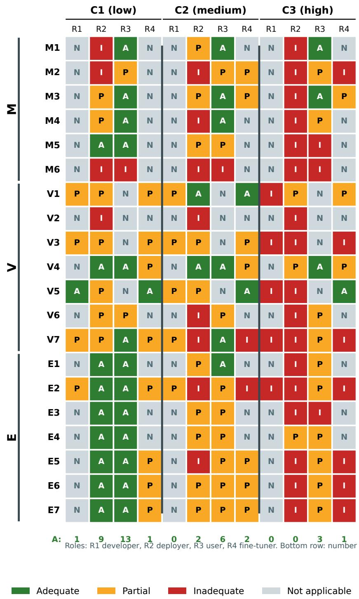
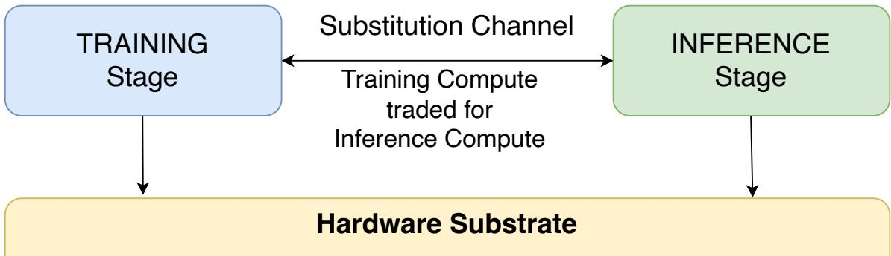

# BEYOND TRAINING: A FEASIBILITY TAXONOMY FOR INFERENCE-TIME AI GOVERNANCE

Samar Ansari School of Computing and Engineering Sciences University of Chester Chester, CH1 4BJ, United Kingdom m.ansari@chester.ac.uk

September 10, 2026

## ABSTRACT

Compute governance today is a governance of training: the thresholds, reporting requirements, and frontier-AI regimes now in force attach to training compute and treat the trained model as the regulatory unit. That picture is incomplete: capability increasingly migrates to the deployment stage through inference-time scaling, agentic scaffolding, and compression onto consumer hardware. This paper asks which mechanisms are available once the regulatory object shifts from the training run to the inference call. We develop a feasibility taxonomy of twenty inference-time mechanisms across monitoring, verification, and enforcement, each rated on a four-point readiness scale against a documented four-vendor evidence base. We then stress the taxonomy against a two-dimensional adversary model (three capability tiers crossed with four adversary roles) and map each mechanism to four governance scenarios (domestic regulation, bilateral or multilateral coordination, industry selfregulation, and compute-marketplace governance). Fifteen of the twenty mechanisms have commercial technical substrates in production today, although governance-grade assurance and adversarial robustness vary substantially. The adversary analysis shows that this readiness holds only against a cooperative deployer and a low-to-medium-capability user: no mechanism rates adequate against a high-capability state-level deployer, and fine-tuning removes the model-internal components of the enforcement cluster, although platform-external controls can persist. A substitution analysis connects the taxonomy to a companion hardware paper as a conditional substitution principle describing when inference-stage and hardware-stage mechanisms provide comparable regulatory coverage under stated conditions. A second-rater reliability check on a random subset of the readiness ratings returned a quadratic-weighted Cohen’s kappa of 0.74.

Keywords: inference-time governance; compute governance; frontier AI regulation; technical AI governance; feasibility taxonomy; adversary model

## 1 Introduction

Compute governance, as currently practised, is a governance of training. The thresholds in the EU AI Act [1], the reporting requirements in the United States Executive Order on AI [2], and the developing frontier-AI regimes in the United Kingdom and elsewhere all attach to the cumulative compute used to train a model. They impose obligations on the developer at the moment the training run is complete, and they treat the trained model as the regulatory unit of analysis. This approach made sense when training compute was the dominant determinant of capability: a few large laboratories ran a few very long computations, and the results of those computations defined the frontier. The regulatory architecture mirrored the computational architecture.

That picture is becoming incomplete. Capability now migrates to the deployment stage in three structural ways. First, inference scaling: models elicit additional capability through repeated sampling, longer chain-of-thought reasoning, or larger ensemble inference, at compute costs that are sometimes comparable to a small training run [3, 4, 5]. Second, agentic scaffolding: a base model with modest stand-alone capability becomes a powerful agent when embedded in tool-using loops with persistent memory and external resources, and the capability resides in the scaffolding as much as the model [6, 7]. Third, compression and consumer-hardware proliferation: capabilities that previously required cloud-scale compute can be packaged into small, efficient models that run on consumer hardware, displacing both the regulatory chokepoint and the threat surface [8]; this paper treats consumer-hosted and local deployment as a coverage limitation on the commercial-provider ratings rather than as a separately rated setting (Section 1.2). None of these is a marginal effect, and in combination they make the proposition “training compute determines capability” empirically false at the frontier.

The governance literature has begun to notice. Hooker [9] argues that compute thresholds are shortsighted because they ignore inference-time optimisations and assume a stable training-to-capability relationship that the empirical evidence does not support. Pistillo and Villalobos [10] identify four specific techniques by which a developer can bypass training-compute thresholds, the last and structurally distinct of which is above-optimal inference-time compute scaling. Watson [11] argues for a multidimensional governance framework that accounts for capability drivers beyond compute. The position emerging across this literature is that training-compute thresholds remain useful as a pre-screen but cannot constitute a standalone governance regime, and that an inference-time governance regime is necessary.

What that regime looks like, however, has not been worked out. The literature on inference-time governance is partly written by computer scientists who treat governance as a deployment-time engineering problem to be solved in code, and partly by policy scholars who treat the technical substrate as a black box. The result is a body of work that talks past itself: technical proposals for verifiable inference, agent-runtime control, and chain-of-thought monitorability accumulate without being placed in a governance framework, while governance proposals for inferencetime obligations accumulate without engagement with the actual mechanisms that could implement them. The field has the parts of a taxonomy but not the taxonomy itself.

This paper provides the taxonomy. We propose a feasibility classification of inference-time governance mechanisms organised into three functional categories (monitoring, verification, enforcement), rated on a four-point technologyreadiness scale, and tested against an extended adversary model and four governance scenarios. The methodology is deliberately inherited from Ansari [12], which proposed an analogous taxonomy of twenty hardware-level governance mechanisms and identified inference-time governance as the natural next domain to address. The mechanisms in that work are not the mechanisms in this one, but the four-point readiness scale, the monitoring-verification-enforcement decomposition, and the conservative rating rule are identical. Methodological continuity makes the two papers comparable and lets the present work be read as the second instalment of a research programme rather than a standalone proposal.

## 1.1 Contributions

## We make four contributions.

First, we provide a structured feasibility classification of twenty inference-time governance mechanisms across monitoring, verification, and enforcement. Each mechanism is defined operationally, anchored in primary academic and vendor sources, rated on a four-point technology-readiness scale, and described at the deployment layer at which it operates. To our knowledge, the classification is the first for inference-time governance specifically, and is comparable to Ansari [12] by methodological design.

Second, we extend the adversary model from the three-tier capability scale used in Ansari [12] to a two-dimensional model that combines capability tier with adversary role (developer, deployer or integrator, end user, and fine-tuner or scaffold-builder). This extension is required because the inference stage introduces structural role separation that the training stage did not: the developer who trains a model is not in general the deployer who serves inference from it, and neither is the user who issues queries. The 2D matrix surfaces threats that the 1D scale conflates, including the useras-adversary case (prompt injection, distributed Sybil queries), the deployer-as-adversary case (subverting attestation, lying about deployed model identity), and the fine-tuner-as-adversary case (re-aligning the model post-distribution).

Third, we map each mechanism to four governance scenarios: domestic frontier-AI regulation, bilateral or multilateral agreement (including treaty regimes with verification), industry self-regulation, and marketplace-and-platform-level governance. Bilateral and multilateral coordination are treated as a single scenario because they share the same structural feature for our purposes, the ability to establish shared certification authorities and mutual recognition that no single jurisdiction can build alone. The marketplace scenario is the addition relative to the scenario template used in Ansari [12], and is necessitated by the structural role of cloud providers, agent platforms, and model marketplaces as inference-stage governance intermediaries.

Fourth, we develop a convergence analysis. Where the hardware-governance domain and the inference-governance domain admit different mechanisms for what is structurally the same governance task, we map the substitutions explicitly. The convergence analysis culminates in a conditional substitution principle (Section 5) stating the precise architectural conditions under which training-time governance mechanisms fail and inference-time mechanisms must take over.

## 1.2 Scope and method

The paper covers inference-time compute governance served by major commercial providers. The readiness ratings are derived from commercial-provider evidence; consumer-hardware and unfederated open-weight deployment are treated as coverage limitations and as conditions under which platform-mediated mechanisms lose force, noted in the per-mechanism descriptions where they diverge.

The four-point readiness scale is identical to Ansari [12]: currently deployable (a commercial technical substrate for the mechanism is in production use at a major provider; this rates the availability of that substrate, not the completeness of the governance mechanism, whose assurance and adversarial robustness are assessed separately in Section 4.3), near-term (technical substrate exists, integration or scale-up required), requires R&D (technical substrate is par tial), and speculative (no technical substrate exists yet). The conservative rating rule of Ansari [12] is preserved and extended: where academic and vendor sources disagree on the readiness of a mechanism, we adopt the more conservative position; where academic sources are silent on the adversarial conditions under which the mechanism operates, we rate against the adversarial case rather than the cooperative one. The extension is necessary because much of the inference-scaling literature implicitly assumes a cooperative deployer; a feasibility taxonomy for governance must not. A consequence of the two-dimensional adversary model (contribution two) is that a readiness rating is a claim about a mechanism against a named adversary surface, not an unconditional property: where a mechanism is in production against the surface it was built for but defeated by another adversary, we state the readiness rating in scoped form and report the per-adversary detail in the adversary matrix (Section 4.3, Appendix E). This applies in particular to the enforcement cluster against the fine-tuner-as-adversary.

Table 1. The four-point readiness scale. The scale is identical to Ansari [12]; the conservative-rating rule resolves uncertainty between adjacent ratings upward.
<table><tr><td>Rating</td><td>Label</td><td>Definition</td></tr><tr><td>1</td><td>Currently deployable</td><td>Commercial technical substrate in production use at a major provider (substrate availability, not</td></tr><tr><td>2</td><td>Near-term</td><td>governance-grade completeness) Technical substrate exists; integration or scale-up required (roughly 2 to 3 years)</td></tr><tr><td>3</td><td>Requires R&amp;D</td><td>Foundational research exists but key components are missing (roughly 5 to 10 years)</td></tr><tr><td>4</td><td>Speculative</td><td>Exists as an academic concept; no production-stage implementation</td></tr></table>

Mechanism ratings were assigned by the author and independently re-rated by a second rater on a randomly sampled subset of seven of the twenty mechanisms, spanning all three categories. The two raters agreed exactly on five of the seven mechanisms; the two disagreements (V4 and V7) were one-point differences, with the second rater one step more conservative in each case. Inter-rater reliability, computed with quadratic-weighted Cohen’s kappa as pre-specified in the rater brief, was 0.74, which corresponds to substantial agreement under the Landis and Koch interpretation. We report in Appendix B that the estimate is sensitive to the weighting choice and to the small sample (unweighted kappa is 0.53, in the moderate band), and we do not over-interpret the point estimate. The full reliability methodology is given in Appendix B, and the two per-mechanism disagreements and their resolutions are documented in Appendix C. Vendor documentation snapshots, dated and saved on disk, are listed in Appendix D. The full populated adversary matrix (Section 4.3) is in Appendix E and the full populated scenario matrix (Section 6) is in Appendix F.

The verification-mechanism count extends Ansari [12]’s V1-V6 by one. The additional mechanism (V7, chainof-thought monitorability) has no analogue in hardware-level governance and is required because the literature on inference-time verification has converged on it as a distinct primitive [13, 14, 15, 16]. We treat V7 as a one-mechanism extension rather than as parity, and flag the extension explicitly in the per-mechanism description in Section 3.2.

## 1.3 Roadmap

Section 2 surveys the existing landscape of compute-governance instruments and the assumptions about inference that they encode. Section 3 develops the mechanism taxonomy, with subsections for monitoring (3.1), verification (3.2), enforcement (3.3), and a feasibility summary (3.4). Section 4 develops the feasibility constraints, the 2D adversary model, and the marketplace-and-intermediation failure modes (4.1 through 4.5). Section 5 develops the convergence analysis, including the substitution table and the conditional substitution principle. Section 6 maps mechanisms to the four governance scenarios and draws lessons from existing analogous monitoring regimes (financial transaction monitoring, pharmacovigilance, aviation safety reporting). Section 7 discusses the readiness gap, implications for research and policy, and limitations.

## 2 The Inference-Time Compute Landscape

Existing compute-governance instruments were designed for training. They assume that capability accrues during a long, capital-intensive, geographically concentrated computation, and that the locus of regulatory attention is the developer who owns or rents that computation. This section surveys what current instruments do and do not assume about inference-time compute, and identifies the gaps that the rest of the paper sets out to fill. The intent is descriptive, not normative: we are mapping the landscape that the taxonomy in Section 3 has to navigate.

We organise the survey in three parts. Section 2.1 considers existing compute thresholds and the assumptions about inference that they encode (typically, none). Section 2.2 considers deployment-stage instruments and the intermediation that inference governance must engage with. Section 2.3 considers the smaller body of work that has proposed capability-based or inference-aware governance directly, and identifies what that body of work has and has not yet articulated.

## 2.1 Inference and existing compute thresholds

The EU AI Act provides the most concrete current threshold regime. Models trained with more than $1 0 ^ { 2 5 }$ FLOPs of cumulative training compute are presumed to pose systemic risk and trigger additional obligations [1]. The United States Executive Order on AI imposed reporting requirements for models trained with more than $1 0 ^ { 2 6 }$ FLOPs [2]. The UK’s emerging frontier AI regulation, although less prescriptive, operates around comparable benchmarks [17]. The threshold-as-trigger pattern is now broadly established in advanced-economy regulatory practice.

Table 2. Existing training-compute threshold regimes and their treatment of inference. Every regime triggers obligations on training compute; none attaches an obligation to inference.
<table><tr><td>Instrument</td><td>Training-compute threshold</td><td>Status</td><td>Treatment of inference</td></tr><tr><td>EU AI Act (GPAI systemic-risk</td><td> $> 1 0 ^ { 2 5 } \ \mathrm { F L O P }$ </td><td>In force</td><td>Silent</td></tr><tr><td>presumption) US Executive Order 14110</td><td> $> 1 0 ^ { 2 6 } \ \mathrm { F L O P }$ </td><td>Revoked</td><td>Silent</td></tr><tr><td>(reporting) UK frontier-AI code of practice</td><td>Comparable benchmarks, less prescriptive</td><td>Emerging, non-statutory</td><td>Silent</td></tr></table>

All of these thresholds are silent on inference. This silence is not benign. Pistillo and Villalobos [10] identify fou distinct techniques by which a developer can produce a model with frontier capabilities while remaining below the training-compute threshold: fine-tuning a smaller pre-trained model, reusing components from existing models, model expansion, and above-optimal inference-time compute scaling. The last of these is structurally different from the others: it does not require any additional training compute at all. A capability that requires $1 0 ^ { 2 6 }$ training FLOPs in a single-pass architecture may require only $1 0 ^ { 2 4 }$ training FLOPs in an architecture that compensates through repeated inference-time sampling, deeper chain-of-thought reasoning, or larger ensemble inference. The threshold-as-trigger pattern therefore fails to capture an entire class of high-capability deployments.

Hooker [9] makes a stronger version of this argument. The relationship between training compute and model risk is, in her account, neither stable nor monotonic, and it ignores a deployment-side dynamic in which capability emerges from how a model is used rather than how it was trained. Pistillo et al. [18] are more sympathetic to thresholds as a practical regulatory device, but accept that thresholds must be complemented by capability evaluations and postmarket monitoring rather than treated as a standalone instrument. Erben et al. [19] provide the most technically detailed defence of the threshold regime, proposing a framework for defining, measuring, and updating cumulative training-compute thresholds under the EU AI Act; even this framework, however, explicitly scopes itself to training and notes that inference-side enforcement is an open problem. The picture across these authors is consistent: existing threshold regimes are at best partial instruments, and inference is the loophole most cleanly identified in the literature but least addressed in the law.

The internal-deployment carve-outs in the EU AI Act compound the difficulty. Pistillo [20] establishes that the Act applies to internally deployed AI systems with only narrow exceptions, but the operationalisation of internal-deployment obligations at the inference layer is undeveloped. Kontosis [21] notes that the Act’s model-centric approach to generalpurpose AI introduces upstream obligations on developers but leaves downstream accountability for deployment-stage harms substantially unresolved. Carey [22] makes a sharper version of this critique: the Act’s reliance on systemic risk as the trigger for the most stringent obligations institutionalises uncertainty, delegates critical risk-definition tasks to private actors, and creates regulatory blind spots that are particularly visible at the inference stage.

The position we take into Section 3 is therefore that compute thresholds remain a useful pre-screen for identifying potentially high-capability models at the training stage, but they do not constitute a governance regime for what happens after the model is trained. They are necessary; they are not sufficient. The taxonomy of inference-time mechanisms in Section 3 fills the gap between threshold-triggered obligations and deployed-system governance.

## 2.2 Deployment-stage instruments and intermediation

A separate body of work focuses on the deployment stage directly. Egan and Heim [23] argue that the United States government should require compute providers to implement Know-Your-Customer (KYC) schemes for advanced AI development, treating cloud-compute access as a regulatory chokepoint analogous to the financial-services chokepoints that anti-money-laundering regulation engages. Heim et al. [24] generalise this argument: compute providers can serve as effective regulatory intermediaries by acting as securers, record-keepers, verifiers, and enforcers in frontier AI governance.

This intermediation argument transfers cleanly to inference. The same intermediaries who allocate training clusters also serve inference requests, and the same KYC and record-keeping obligations can in principle apply at the inference layer. What has not been worked out is the operational form of this transfer. Training-side KYC is typically tied to large, identifiable customers committing to long-running compute jobs; inference-side KYC must contend with highvolume, fine-grained, often programmatically generated API requests. The intermediation hook is the same; the implementation surface is different.

The intermediation argument also extends beyond the cloud provider as such. Williams et al. [25] consider the regulation of downstream AI developers, particularly those who fine-tune, modify, or scaffold an upstream model into a deployable system. Their case is that regulatory attention is currently mismatched: voluntary guidance and upstream obligations should precede direct regulation of downstream developers, but downstream developers are nonetheless an essential node in the governance chain. Alexander [26] takes the argument further still: the efficiency shock of highly capable open-weight models renders compute-centric chokepoint governance partly obsolete, because the deployment surface is not bottlenecked at a small number of cloud providers. The implication is that an inference-governance regime focused exclusively on hyperscaler intermediation will leave the open-weight deployment surface ungoverned. Gomes [27] reaches a related conclusion: restricting access to open-weight models without parallel governance at the hardware layer simply displaces risk. The picture across these authors is that intermediation-based governance is necessary but insufficient, and that any inference-governance regime must engage with multiple deployment archetypes simultaneously.

Privacy and sovereignty constraints further complicate the intermediation approach. Bernabei et al. [28] note that compute governance faces significant domestic privacy hurdles even when it is technically feasible, and these hurdles are sharper at the inference layer because per-query monitoring of model use bears directly on user privacy in a way that per-training-run monitoring does not. The legal architecture for inference-stage monitoring is at present underdeveloped relative to the technical architecture, and the asymmetry is itself a constraint on what mechanisms in Section 3 can realistically deploy.

## 2.3 Capability-based and inference-aware proposals

A smaller and more recent body of work has begun to engage with inference-time governance directly, mostly by arguing that compute-centric metrics should be replaced or supplemented with capability-based ones. Watson [11] argues that compute-centric AI governance is structurally inadequate and that policymakers must adopt a multidimensional weighted framework accounting for alternative capability drivers, including inference scaling, agentic scaffolding, and novel substrates. Pacchiardi et al. [29] propose a capability-based framework for categorising general-purpose AI models under the EU AI Act, evaluating performance across four cognitive domains rather than relying on compute proxies. Bengani [30] argues that alignment techniques alone are insufficient to prevent misuse, and that a comprehensive capability-governance framework requires compute regulation, tiered audits, and international cooperation in combination. Caputo et al. [31] propose standardised risk tiers grounded in quantitative modelling where possible.

These proposals share an intuition that the right unit of regulatory analysis is closer to the deployed system’s capability profile than to the training compute that produced it. They differ on operational specifics: Pacchiardi’s framework is evaluation-driven, Watson’s is multidimensional and weighted, Caputo’s is risk-tiered, Bengani’s is a layered combination. What unites them is the recognition that capability and compute are decoupling at the inference stage, and that governance must follow.

O’Keefe and Frazier [32] add an orthogonal proposal: future AI systems will automate many regulatory compliance tasks, and policymakers should use “automatability triggers” to enact regulations only when compliance costs fall below acceptable levels. This is methodologically interesting because it inverts the typical sequencing (regulate, then automate compliance); the implication for inference governance is that some mechanisms may become feasible only after the technical means to deploy them at low marginal cost exist.

Two more recent contributions situate this work in the broader technical-governance landscape. Reuel et al. [33] introduce the framing of technical AI governance as a research programme, providing a taxonomy of open technical problems across the AI lifecycle. Arslan [34] develops a related taxonomy specifically for the evaluation, access, and verification capacities. Both works identify inference-time governance as a substantively under-specified subarea, and both treat feasibility analysis of specific inference-time mechanisms as the natural next step. Radanliev [35] argues for a structured regulatory framework integrating security-first governance with cryptographic techniques, foreshadowing some of the mechanisms developed in Section 3.

The cumulative picture from this section is consistent. The existing compute-governance regime addresses training thoroughly and inference glancingly. A growing body of work has identified the gap, proposed conceptual frameworks for addressing it, and called for technical specification of the mechanisms that would operationalise inference-time governance. None of the works surveyed here has yet provided that specification. The taxonomy in Section 3, the feasibility analysis in Section 4, the convergence analysis in Section 5, and the scenario mapping in Section 6 are our attempt to do so.

## 3 Taxonomy of Inference-Time Governance Mechanisms

This section develops the taxonomy. We organise twenty mechanisms into three categories: Monitoring (M, six mechanisms), Verification (V, seven mechanisms), and Enforcement (E, seven mechanisms). Each mechanism is defined operationally, anchored in primary academic and vendor sources, rated on the four-point readiness scale from Section 1, and described at the deployment layer at which it operates. The category boundaries follow Ansari [12]: monitoring mechanisms produce evidence about what an inference system is doing; verification mechanisms produce cryptographic or procedural assurance that the evidence is trustworthy; enforcement mechanisms intervene in the inference process to bound what the system does.

The asymmetry in mechanism counts (six monitoring, seven each verification and enforcement) follows from the cap-to-21 process described in Appendix A. Two candidates, speculative-decoding draft-model accounting and intentverified delegation chains, were rejected for failing the two-source rule: each had at most one academic source and zero vendor productisation across the four-vendor evidence base. The cluster is six mechanisms rather than seven because the evidence supports six, not because the taxonomy aspires to symmetry.

This section rests on a four-vendor evidence base: three vendors curated to row level (Anthropic, OpenAI, Google Vertex AI) plus AWS Bedrock at survey tier. Azure OpenAI was excluded because it is structurally OpenAI’s offering wrapped in Microsoft’s enterprise controls (Azure RBAC, Private Link, Customer-Managed Keys, regional deployment); the mechanism-level findings would substantially overlap with the OpenAI Platform pass while adding compliance primitives that do not extend the taxonomy. Per-mechanism vendor citations in the descriptions below refer to documentation snapshots dated May 22, 2026, archived in Appendix D.

Table 3. The inference-time governance taxonomy: twenty mechanisms. Readiness is the four-point rating of Section 3.4. “Vendors” counts the phase-2-curated vendors (of three: Anthropic, OpenAI, Google Vertex AI) that productise a feature for the mechanism; AWS Bedrock is documented at survey tier (Appendix D), so this count is a lower bound on four-vendor coverage: AWS additionally productises several mechanisms (for example E2; see Table 4). A value of 0 denotes no productised vendor feature in the evidence base. “Adversary coverage” gives the count of adequate / partial / inadequate / not-applicable cells across the twelve adversary cells of Section 4.3 (Appendix E).
<table><tr><td>ID</td><td>Mechanism</td><td>Category</td><td>Readiness</td><td>Vendors</td><td>Adversary A/P/I/N</td><td>What it does</td></tr><tr><td>M1</td><td>Per-query usage and token accounting</td><td>Monitoring</td><td>Deployable</td><td>3</td><td>3/1/2/6</td><td>Meters compute and tokens per request from</td></tr><tr><td>M2</td><td>Workload classification (MoE expert- activation logging)</td><td>Monitoring</td><td>Near-term</td><td>0</td><td>0/4/4/4</td><td>billing and usage telemetry Logs expert- activation patterns to classify the workload; substrate exists</td></tr><tr><td>M3</td><td>KV-cache and reasoning- token accounting</td><td>Monitoring</td><td>Deployable</td><td>3</td><td>3/4/1/4</td><td>but is not exposed to callers Accounts for reasoning and cache tokens as</td></tr><tr><td>M4</td><td>Distributed- inference monitoring</td><td>Monitoring</td><td>Deployable</td><td>3</td><td>2/2/2/6</td><td>an inference- compute signal Tracks which region or data centre served a</td></tr><tr><td>M5</td><td>Authenticated account identity and request tracing</td><td>Monitoring</td><td>Deployable</td><td>3</td><td>2/2/2/6</td><td>request Identifies the caller and traces requests at the API</td></tr><tr><td>M6</td><td>Inference-stage power and cost monitoring</td><td>Monitoring</td><td>Speculative</td><td>0</td><td>0/0/6/6</td><td>boundary Per-inference energy and cost as a governance signal; no</td></tr><tr><td>V1</td><td>TEE-bounded inference attestation</td><td>Verification</td><td>Near-term</td><td>1</td><td>2/6/1/3</td><td>vendor productisation Attests that inference ran in a trusted enclave; substrate at the</td></tr><tr><td>V2</td><td>Zero- knowledge proofs of inference</td><td>Verification</td><td>Requires R&amp;D</td><td>0</td><td>0/0/3/9</td><td>infrastructure layer, not API-exposed Cryptographic proof that a stated computation</td></tr><tr><td>V3</td><td>(zkML) Hardware- backed workload certificates per output</td><td>Verification</td><td>Requires R&amp;D</td><td>0</td><td>0/6/3/3</td><td>produced a given output Per-output certificate inheriting from hardware roots of trust</td></tr></table>

<table><tr><td rowspan=1 colspan=16>AdversaryID               Mechanism      Category         Readiness        Vendors          A/P/I/N          What it does</td></tr><tr><td rowspan=1 colspan=16>V4               Tool-call         Verification       Deployable       2                 5/4/0/3           Provider-</td></tr><tr><td rowspan=3 colspan=15>cryptographicsigning and</td><td rowspan=1 colspan=1>authenticated</td></tr><tr><td rowspan=1 colspan=1>continuity and</td></tr><tr><td rowspan=7 colspan=16>attestation(third-party-verifiableform)</td></tr><tr><td rowspan=1 colspan=1>tool calls and</td></tr><tr><td rowspan=1 colspan=1>agent traces</td></tr><tr><td rowspan=1 colspan=1>provenance is</td></tr><tr><td rowspan=1 colspan=1></td></tr><tr><td rowspan=1 colspan=3></td><td rowspan=1 colspan=1>form)</td></tr><tr><td rowspan=19 colspan=15>evaluationreportingV6               Retrieval         Verification      Deployable       3                 0/4/2/6provenance andcitation logging</td><td rowspan=1 colspan=1></td></tr><tr><td rowspan=1 colspan=1>givencapability</td></tr><tr><td rowspan=1 colspan=1>evaluation was</td></tr><tr><td rowspan=1 colspan=1>run and its</td></tr><tr><td rowspan=1 colspan=1>result</td></tr><tr><td rowspan=1 colspan=1></td><td rowspan=1 colspan=1>(descriptive,</td></tr><tr><td rowspan=1 colspan=1>not</td></tr><tr><td rowspan=1 colspan=1>independent or</td></tr><tr><td rowspan=1 colspan=1>cryptographic</td></tr><tr><td rowspan=1 colspan=1>attestation)</td></tr><tr><td rowspan=1 colspan=1>Logs retrieval</td></tr><tr><td rowspan=1 colspan=1>provenance and</td></tr><tr><td rowspan=1 colspan=1>model-</td></tr><tr><td rowspan=2 colspan=5></td><td rowspan=1 colspan=1>generated</td></tr><tr><td rowspan=1 colspan=4></td><td rowspan=1 colspan=1>citations</td></tr><tr><td rowspan=1 colspan=3></td><td rowspan=1 colspan=1>linking outputs</td></tr><tr><td rowspan=1 colspan=4></td><td rowspan=1 colspan=1>to sources (not</td></tr><tr><td rowspan=1 colspan=4></td><td rowspan=1 colspan=1>tamper-</td></tr><tr><td rowspan=7 colspan=7>thoughtmonitorabilityE1</td><td rowspan=6 colspan=4></td></tr><tr><td></td><td></td><td></td><td></td><td></td><td rowspan=1 colspan=4></td><td rowspan=1 colspan=1>reasoning</td></tr><tr><td></td><td></td><td></td><td></td><td></td><td rowspan=1 colspan=4></td><td rowspan=1 colspan=1>traces for</td></tr><tr><td></td><td></td><td></td><td></td><td></td><td rowspan=1 colspan=1>inspection;</td></tr><tr><td></td><td></td><td></td><td></td><td></td><td rowspan=1 colspan=1>bounded by the</td></tr><tr><td></td><td></td><td></td><td></td><td></td><td rowspan=1 colspan=1>faithfulness</td></tr><tr><td></td><td></td><td rowspan=1 colspan=1></td><td rowspan=1 colspan=1>Enforcement</td><td rowspan=1 colspan=1></td><td rowspan=1 colspan=4>Deployable</td><td rowspan=1 colspan=6>3                 3/2/1/6</td><td rowspan=1 colspan=1>limitationGates model</td></tr><tr><td rowspan=4 colspan=5>licensing andaccess controlE2               Output filtering  Enforcement</td><td rowspan=1 colspan=4>deployment</td><td rowspan=1 colspan=3></td><td rowspan=1 colspan=1></td><td rowspan=2 colspan=2></td><td rowspan=1 colspan=1></td></tr><tr><td rowspan=1 colspan=1>licensing and</td><td rowspan=2 colspan=2></td><td rowspan=3 colspan=4>Deployable</td><td rowspan=1 colspan=6></td><td rowspan=1 colspan=1>deployment</td></tr><tr><td rowspan=1 colspan=6></td><td rowspan=1 colspan=1>and customer</td></tr><tr><td rowspan=1 colspan=6>3                2/5/5/0</td><td rowspan=1 colspan=1>Filters or</td></tr><tr><td rowspan=5 colspan=9>and capabilitygatingE3               Jurisdiction-      Enforcement</td><td rowspan=1 colspan=6></td><td rowspan=1 colspan=1>blocks model</td></tr><tr><td rowspan=1 colspan=6></td><td rowspan=1 colspan=1>outputs at</td></tr><tr><td rowspan=1 colspan=2></td><td rowspan=3 colspan=4>Deployable</td><td rowspan=1 colspan=1></td><td rowspan=3 colspan=6>3                2/2/2/6</td><td rowspan=1 colspan=1>runtime</td></tr><tr><td rowspan=2 colspan=1></td><td></td></tr><tr><td rowspan=1 colspan=1>Restricts where</td></tr><tr><td rowspan=1 colspan=2></td><td rowspan=3 colspan=10>inferenceE4               Rate limiting as  Enforcement     Deployable</td><td rowspan=1 colspan=4>bounded</td></tr><tr><td></td><td></td><td></td><td></td><td></td><td rowspan=1 colspan=1>or is served</td></tr><tr><td></td><td></td><td rowspan=1 colspan=6>3                 2/4/0/6</td><td rowspan=1 colspan=1>(geofencing)Caps per-caller</td></tr><tr><td rowspan=3 colspan=9>governanceprimitiveE5               Agentic action   Enforcement     Deployable</td><td rowspan=3 colspan=6>3                 2/4/3/3</td><td rowspan=1 colspan=1>throughput as a</td></tr><tr><td rowspan=1 colspan=1>control lever</td></tr><tr><td rowspan=1 colspan=1>Gates agent</td></tr><tr><td rowspan=2 colspan=3>permissionsand</td><td rowspan=2 colspan=1></td><td rowspan=2 colspan=11></td><td rowspan=1 colspan=1>actions through</td></tr><tr><td rowspan=1 colspan=1>policy-as-code</td></tr><tr><td rowspan=2 colspan=4>policy-as-codegatesE6</td><td rowspan=1 colspan=11></td><td rowspan=1 colspan=1>engines</td></tr><tr><td rowspan=1 colspan=2>Tool-useEnforcement</td><td rowspan=1 colspan=5>Deployable</td><td rowspan=1 colspan=6>3                 2/5/2/3</td><td rowspan=1 colspan=1>Authorises and</td></tr><tr><td rowspan=1 colspan=16>authorisationand sandboxing                                                                               execution</td></tr></table>

<table><tr><td>ID</td><td>Mechanism</td><td>Category</td><td>Readiness</td><td>Vendors</td><td>Adversary A/P/I/N</td><td>What it does</td></tr><tr><td>E7</td><td>Inference-time off-switch and kill-chain</td><td>Enforcement</td><td>Deployable</td><td>2</td><td>2/5/2/3</td><td>Suspends or revokes a running</td></tr></table>

Throughout this section, a readiness rating records whether a commercial technical substrate for the mechanism is in production use; it does not certify that the complete governance mechanism, including its assurance and thirdparty-verifiability properties, is deployable. Those governance-grade properties are assessed separately through the adversary analysis of Section 4.3.

## 3.1 Monitoring mechanisms

Monitoring mechanisms produce per-inference evidence about computational resources consumed, content generated, and actions performed. They are the foundation of the regulatory architecture: enforcement and verification depend on monitoring evidence to operate. We describe six monitoring mechanisms below.

## 3.1.1 M1. Per-query usage and token accounting

Operational definition. Each inference request produces a structured usage record reporting input tokens, output tokens, and (where relevant) reasoning tokens consumed. The record is delivered to the caller as part of the inference response, billed by the provider, and retained as part of the request-logging substrate.

Vendor productisation. All four vendors expose M1 at production scale. Anthropic returns a usage object with input\_tokens, output\_tokens, cache\_creation\_input\_tokens, cache\_read\_input\_tokens, and output\_tokens\_details.thinking\_tokens fields [36]. OpenAI returns six rate-limit metrics (RPM, RPD, TPM, TPD, IPM, audio minutes per minute) per organisation per model and reports reasoning\_tokens in response metadata for reasoning models [37]. AWS Bedrock exposes the underlying provider’s accounting via its proxy layer plus its own billing telemetry [38]. Google Vertex AI returns usageMetadata with documented per-metric quotas [39].

Academic source. The argument that compute accounting at the regulatory level requires per-call granularity is developed by Casper et al. [40] in the context of compute thresholds; Heim et al. [24] treat compute providers as the natural intermediaries for accounting. The mechanism transfers from Ansari [12]’s M1 without structural modification.

Readiness rating. Currently deployable. Four-vendor productisation at production scale. A regulator mandating the per-query accounting substrate could expect near-term technical compliance.

## 3.1.2 M2. Workload classification (MoE expert-activation logging)

Operational definition. For models with sparse-mixture-of-experts (MoE) architecture, the platform logs which experts are activated for each inference request. The logs distinguish workload classes (reasoning-heavy, knowledge recall, code-generation, multimodal) by activation pattern. Aggregated over time, expert-activation logs reveal what categories of inference a deployment is serving.

Vendor productisation. No vendor in the evidence base productises M2 at the user-facing API surface. MoE architec tures are deployed (Anthropic’s Claude family and Google’s Gemini family include MoE variants) but the per-request expert-activation telemetry is not exposed.

Academic source. The mechanism transfers from Ansari’s M2 framing of workload classification as a monitoring primitive [12]. The architectural shift toward MoE at the frontier is well-documented; the regulatory application of activation logs is in early stages.

Readiness rating. Near-term. The technical substrate exists (the activation telemetry is generated internally by every MoE inference run); the operational gap is exposure to the caller and aggregation infrastructure for regulatory consumption. A regulator mandating M2 within a 2-3 year horizon would be technically feasible but currently lacks vendor-side instrumentation.

## 3.1.3 M3. KV-cache and reasoning-token accounting

Operational definition. The platform reports per-request accounting separating: (a) compute attributable to key-value cache hits versus cache misses, and (b) compute attributable to internal reasoning tokens versus user-facing output tokens. The accounting distinguishes “compute spent thinking” from “compute spent answering” and “compute saved through caching” from “fresh compute.”

Vendor productisation. All four vendors productise M3 at production scale. Anthropic publishes cache\_creation\_input\_tokens, cache\_read\_input\_tokens, and thinking\_tokens as distinct accounting categories [41, 36]. OpenAI publishes prompt caching with documented retention (5-10 minutes idle, max 1 hour for in-memory; extended retention on gpt-5.5 and newer) and reasoning\_tokens for the o-series and gpt-5.5 models [42, 43]. Google Vertex AI publishes explicit context cache create/use/update/delete operations and the thinking\_level parameter (MINIMAL/LOW/MEDIUM/HIGH) for Gemini 3 models [44, 45]. AWS Bedrock exposes these primitives through its proxy layer.

Academic source. Inference-scaling papers treat reasoning compute as a distinct accounting category [4, 5, 3]. KVcache accounting is well-established in systems literature.

Readiness rating. Currently deployable. Four-vendor productisation; concrete cache TTLs and per-token billing documented.

## 3.1.4 M4. Distributed-inference monitoring across data centres

Operational definition. When inference is served across multiple data centres, regions, or jurisdictions, the platform monitors the geographic distribution of inference requests and surfaces per-region telemetry. The available evidence concerns the service region, routing region, and data-residency configuration rather than a measured attestation of the physical accelerator location: it records where a request is admitted and routed, not the hardware on which inference executed. The mechanism supports detecting (and bounding) cross-jurisdictional inference flows that would evade single-jurisdiction governance.

Vendor productisation. Three vendors productise M4 with partial coverage. AWS Bedrock documents Cross-Region Inference profiles that route requests across multiple AWS regions; per-region quotas and request logs are available via the standard Bedrock + CloudTrail interfaces [38]. Anthropic publishes the inference\_geo parameter (currently us or global) and documents that rate limits are not separated by inference\_geo (the two share the same quota pool) [46]. Google Vertex AI ties per-region telemetry to endpoint choice: request-response logging for partner models requires a regional endpoint (the global and multi-regional endpoints do not support it), and the resulting logs are written to a customer-owned BigQuery table [47]. OpenAI offers no native multi-region inference monitoring on the standard OpenAI Platform; the closest analogue is its project-level data residency controls, which let an eligible account set a region for new projects (charged an uplift for models released on or after March 2026) [48].

Academic source. Krys et al. [49] establish the distributed-inference threat surface; Mueller [50] establishes that cumulative compute across small distributed deployments can rival concentrated frontier deployments. Bernabei et al. [28] establish the legal architecture for cross-jurisdictional monitoring.

Readiness rating. Currently deployable. The vendor-side infrastructure exists at all four providers, with per-region quotas, logs, and (in three of four) per-region accounting.

## 3.1.5 M5. Authenticated account identity and request tracing

Operational definition. The platform verifies the identity of each API customer (authenticated account identity and request tracing, not full regulatory KYC), maintains traceable request logs linkable to customer identity, and exposes audit-log access to regulators or auditors under documented procedures. The mechanism enables regulatory follow-up on specific deployments without requiring vendor-side judgement on which deployments are concerning.

Vendor productisation. All four vendors productise M5 with varying depth. AWS Bedrock uses AWS Identity and Access Management (IAM) for per-customer identification, with CloudTrail providing audit-log infrastructure [38]. Anthropic’s Trust Center publishes SOC 2 Type II, ISO 27001, ISO 42001, HIPAA, and FedRAMP High (via Bedrock GovCloud) certifications; the Privacy Policy documents Verification Data (ID documents, biometric data, age verification) collected in defined circumstances [51, 52]. OpenAI publishes a 30-day default abuse-monitoring log retention with Modified Abuse Monitoring (excludes customer content, by approval) and Zero Data Retention (also forces store=false) as opt-in modifications; the Admin APIs surface audit logs, invites, users, projects, API keys, spend alerts, data retention, and rate limit controls [48, 53]. Google Vertex AI provides Cloud Audit Logs (Data Access audit logs enabled separately from always-on Admin Activity logs) and documents two-tier abuse monitoring: a 90- day standard tier and a 60-day Advanced AI Safety Addendum tier for designated models including Claude Mythos, Claude Fable, and Claude Opus 4.7+ in dual-use contexts [54, 55].

Academic source. Egan and Heim [23] establish KYC-for-compute as the regulatory frame; the FATF Recommendations [56] provide the financial-services analogue; Heim et al. [24] generalise the compute-provider-as-intermediary argument. We return to the financial-services analogue at length in Section 6.3.

Readiness rating. Currently deployable. Multi-vendor productisation with documented compliance certifications.

## 3.1.6 M6. Inference-stage power and cost monitoring

Operational definition. Per-inference accounting of energy consumption (watts, kilowatt-hours) and cost (in dollars or compute-credits) attributable to a specific request, attributable to a specific account, or aggregated to a deployment. The mechanism is the inference-side analogue of training-stage compute monitoring.

Vendor productisation. No vendor in the evidence base productises per-inference energy monitoring. Cost accounting is universal at the API layer but does not separate energy from amortised infrastructure cost.

Academic source. The mechanism transfers from Ansari’s M4 [12] which framed power monitoring as a trainingstage primitive; the inference-stage application is undeveloped. We retain M6 in the taxonomy as a speculative mechanism because the substrate (data-centre power meters, per-GPU power telemetry) exists at the infrastructure layer and is not exposed at the inference API only as a vendor-product decision.

Readiness rating. Speculative. The honest read of the evidence is that energy and per-inference cost monitoring as a governance primitive (as distinct from billing) has neither academic nor vendor substrate at the inference stage. We retain M6 because Ansari’s mirroring argument applies and because the data-centre energy-reporting regulatory regime in the EU [57] will require this primitive in the near term whether or not vendors choose to expose it. The rating may move to “near-term” within two years if the regulatory pressure materialises.

## 3.2 Verification mechanisms

Verification mechanisms produce cryptographic, attestable, or procedurally trustworthy evidence that monitoring or enforcement evidence is what it claims to be. Where monitoring tells a regulator what happened, verification tells the regulator that the monitoring report is true. We describe seven verification mechanisms below.

## 3.2.1 V1. TEE-bounded inference attestation

Operational definition. Inference computation runs inside a Trusted Execution Environment (TEE): a hardwareisolated enclave that cryptographically attests its initial state, the code it is running, and the integrity of the computation it performs. A third-party verifier can confirm that a given inference output was produced by a specific model running in a specific TEE configuration. The mechanism is the cryptographic substrate underlying several other V-mechanisms in this section.

Vendor productisation. Vendor evidence is one-vendor partial. Google Cloud’s Confidential Computing platform productises Confidential VMs, Confidential Space, and Google Cloud Attestation [58]. Vertex AI Workbench supports Confidential VMs but Vertex AI inference (Gemini and partner models) does not expose TEE-bounded execution at the API layer. AWS Nitro Enclaves provide CPU-side TEE infrastructure but Bedrock does not expose TEE-bounded inference at its API layer. Anthropic and OpenAI do not document confidential inference. NVIDIA Confidential Computing for H100 and B200 GPUs is publicly documented [59] but is not surfaced through any of the four vendor API layers.

Academic source. A substantial body of work: Chantasantitam et al. (PAL\*M, [60]); Omega Trusted AI Agents [61]; Abdollahi et al. (AgenTEE, [62]); Duddu et al. (Laminator, CODASPY 2025 [63]). The cryptographic substrate is well-established.

Readiness rating. Near-term. The substrate is production-grade and available at multiple infrastructure providers; the gap is integration into the user-facing inference product. A regulator mandating TEE-bounded inference within a 2-3 year horizon could be complied with by adapting existing infrastructure-level TEE deployment to inference workloads. The honest characterisation is that V1 is blocked by vendor-side productisation decisions rather than by missing technology.

## 3.2.2 V2. Zero-knowledge proofs of inference (zkML)

Operational definition. The platform produces a cryptographic proof, alongside each inference output, that the output was produced by a specific model on specific inputs without revealing the model weights or the inputs themselves. A verifier with the proof, the output, and a commitment to the model’s identity can verify inference correctness while preserving model and input privacy.

Vendor productisation. No vendor in the four-vendor evidence base productises zkML.

Academic source. Substantial. South et al. (Verifiable evaluations of machine learning models using zkSNARKs, [64]) is foundational. Ivanov et al. (DSperse, [65]) demonstrate targeted verification reducing proof costs. Chan et al. [66] combine zkML with TEE-bounded execution to amortise verification overhead. The cryptographic substrate (zkSNARKs, zkSTARKs) is well-established; the operational challenge is that producing proofs for frontier-model inference incurs latency and compute overhead orders of magnitude beyond commercial viability.

Readiness rating. Requires R&D. The mechanism is implementable in principle (multiple research-stage demonstrations exist for small models) but production deployment at frontier scale is blocked by proof-generation overhead. The honest characterisation is that zkML is a mechanism the academic literature has worked out conceptually; the engineering work to make it operational at scale has not.

## 3.2.3 V3. Hardware-backed workload certificates per output

Operational definition. Each inference output carries a cryptographic certificate binding the output to: (1) the input that produced it, (2) the model weights that were used, and (3) the TEE configuration in which the inference was performed. The certificate is verifiable by any party with the model’s public commitment, and it enables third-party verification of inference provenance without requiring access to the underlying TEE infrastructure or to the inference weights.

Vendor productisation. No vendor productises V3 directly. The closest evidence is Anthropic’s signature field on extended-thinking blocks (which cryptographically signs internal reasoning but is not a per-output certificate of the complete inference flow) and Google Vertex AI’s thought\_signature field (similar primitive with stricter enforcement). These are V4 mechanisms (cryptographic signing of intermediate state) rather than V3.

Academic source. Medium. Duddu et al. (Laminator, [63]) define Input-Model-Output Attestation (IOAtt) as the V3 primitive. AEX [67] defines multi-hop API-level attestation. Omega [61] documents tamper-evident logging as a V3-adjacent primitive. Chantasantitam et al. [60] integrate V3 with V1 substrate.

Readiness rating. Requires R&D. V3 is operationally adjacent to V4 (which is productised at two of four vendors) and to V1 (which has substrate readiness but no productisation). The distinct V3 contribution (per-output certificate of full inference flow) has academic substrate but no production-stage implementation. We retain V3 as distinct from V4 on the grounds that V3’s binding target (final inference output) is operationally different from V4’s (intermediate state); the distinction may collapse if vendors choose to productise both as a single primitive.

## 3.2.4 V4. Tool-call cryptographic signing and agent-trace attestation

Operational definition. When a language model invokes a tool, the invocation is cryptographically signed by the model platform such that a verifier can later confirm: which model issued the call, what tool was invoked, what arguments were passed, and that the call has not been tampered with (provider-authenticated continuity and integrity, not third-party-verifiable provenance). Where reasoning is involved, the internal reasoning state that led to the tool invocation is cryptographically bound to the tool call.

Vendor productisation. Two of four vendors productise V4. Anthropic’s extended thinking provides a signature field on thinking blocks cryptographically signed by Anthropic’s infrastructure; the signature lets the API verify thinking blocks were generated by Claude when passed back. Signatures are compatible across Anthropic API, AWS Bedrock, and Google Vertex AI deployment surfaces [36]. Google Vertex AI’s thought\_signature field on Gemini 3 model responses provides the same primitive with stricter enforcement (Gemini 3 Pro returns HTTP 400 if a required thought\_signature is missing in the next request) and applies to functionCall parts as well as thinking content [68]. OpenAI’s strict\_tool\_use schema enforcement provides structural validation but not cryptographic signing [69]. AWS Bedrock provides CloudTrail audit logging but no per-call cryptographic signing.

Academic source. MCPSHIELD [70] defines L-CTA (Cryptographic Tool Attestation). OpenPort Protocol [71] defines preflight impact hashing as a tool-call provenance primitive. Omega [61] documents tamper-evident logging. AEX [67] defines non-intrusive multi-hop API attestation.

Readiness rating. Currently deployable. Two of four vendors productise the primitive at frontier scale, with one (Vertex) imposing strict enforcement. A regulator mandating the provider-authenticated signing primitive within a 6-12 month horizon could expect adoption of the existing Anthropic or Vertex primitive across other vendors; the complete V4 attestation mechanism, including third-party-verifiable provenance, would require additional specification.

## 3.2.5 V5. Capability-evaluation reporting

Operational definition. When a model is evaluated against a benchmark or a capability test, the evaluation infrastructure produces a report recording: what model was tested, what test was administered, what the result was, and that the test was performed as described (evaluation reporting substrate, not cryptographic or independent attestation). In the current productised form the report is descriptive: it is legible to parties other than the model developer, but its integrity rests on the developer’s own reporting, so third-party trust in capability claims depends on the report being honest and complete rather than on independent or tamper-evident verification.

Vendor productisation. Three vendors productise V5 with varying depth. AWS Bedrock Model Evaluation provides automated and human-evaluator workflows with results reported to the customer [38]. OpenAI’s Evals platform provided programmatic evaluation with adaptive rubrics; the platform was scheduled for deprecation on October 31, 2026 (read-only) and shutdown on November 30, 2026 [72]. Google Vertex AI’s Gen AI evaluation service provides adaptive rubrics (per-prompt tailored pass/fail tests), static rubrics, computation-based metrics, and custom functions, with evaluation supported from production logs and synthetic data [73]. None of the three vendors cryptographically signs evaluation results; results are model-graded data, not attestations.

Academic source. South et al. [64] define cryptographic evaluation attestation as a V5 primitive. Balaji et al. [74] frame evaluation infrastructure as a deployment-stage governance instrument.

Readiness rating. Currently deployable for descriptive evaluation reporting (the vendor primitive that exists); Requires R&D for cryptographically attestable evaluation results (the academic primitive that does not exist at any vendor). The taxonomy retains V5 as a single mechanism with the rating reflecting the current productisation state; the gap between vendor reporting and cryptographic attestation is documented in Section 4.4 and informs the convergence discussion in Section 5.

## 3.2.6 V6. Retrieval provenance and citation logging

Operational definition. When inference uses retrieval-augmented generation (RAG), the platform logs: (1) what documents were retrieved, (2) what content from each document was passed to the model, and (3) what citations the model produced linking output back to retrieved sources (retrieval provenance and citation logging, not tamperevident attestation). The logged evidence supports checking whether model outputs are grounded in claimed sources and whether retrieval was performed against authorised corpora, to the extent the logs and model-generated citations are accurate; it is not tamper-evident, and the citations are model-generated rather than independently verified.

Vendor productisation. Four vendors productise V6 with different architectural choices. AWS Bedrock Knowledge Bases provides first-party vector-store retrieval with source-citation tracking; per-document source URLs returned with retrieved content [38]. Anthropic’s Citations primitive and Search Results content blocks provide source-attribution alongside generated text [75]. OpenAI’s first-party Web Search tool and Vector Stores (via Assistants API and File Search) provide source-URL-tagged retrieval [76]. Google Vertex AI’s RAG Engine, Grounding with Google Search, and Grounding with Google Maps provide retrieval primitives with citation generation [77, 78]. None of the four vendors provides cryptographic provenance on retrieval corpora; citations are model-generated attributions, not tamperevident bindings.

Academic source. Kholkar and Ahuja [79] (Policy-as-Prompt) frame RAG attestation in policy context. The retrievalattestation primitive is discussed in multiple corpus sources without a single canonical citation.

Readiness rating. Currently deployable. Four-vendor productisation at production scale; the cryptographic-attestation gap (citations are model-generated, not tamper-evident) is a Phase 2 concern but does not block the basic primitive.

## 3.2.7 V7. Chain-of-thought monitorability

Operational definition. Models that perform multi-step reasoning expose intermediate reasoning steps to a verifier in a form sufficient for the verifier to: (1) confirm the model is reasoning according to a permitted pattern, (2) detect misalignment or deception in the reasoning process, and (3) understand the causal chain from prompt to output. The mechanism may operate over raw chain-of-thought traces, summarised reasoning, or model-internal activations (whitebox latent monitoring). The productised substrate provides trace exposure: access to raw or summarised reasoning. This is distinct from faithful process monitorability, which additionally requires that the exposed trace accurately reflect the model’s actual causal computation; under the faithfulness limitation (Section 4.3), aims (2) and (3) hold only to the extent the trace is faithful, which current evidence does not establish.

Vendor productisation. Three of four vendors productise V7 with architecturally divergent choices. Anthropic exposes extended-thinking content with three display modes: enabled (raw chain-of-thought returned to caller), summarized (model-generated summary), and omitted (signature only) [36]. OpenAI’s o-series and gpt-5.5 reasoning models expose reasoning summaries only, not raw chains of thought, by explicit safety design [43]. Google Vertex AI displays full thinking processes in the Agent Studio console but exposes only the cryptographically signed thought\_signature at the programmatic API layer [45]. AWS Bedrock surfaces Anthropic and Vertex models thinking via the underlying provider mechanisms.

The architectural divergence is informative. Anthropic chose transparency (raw CoT is the default for callers requesting it). OpenAI chose abstraction (only summaries are exposed, as a safety design). Vertex chose cryptographic continuity (signatures protect reasoning state across multi-turn interactions, while raw thinking is reserved for the console UI). Three vendors, three architecturally distinct choices for the same underlying primitive. Section 5 returns to this convergence-with-divergence pattern in the convergence analysis.

The mechanism’s white-box variant, internal-activation monitoring rather than externalised-reasoning monitoring, is research-stage. Yu et al. (LatentAudit, [80]) demonstrate residual-stream Mahalanobis-distance monitoring as a realtime faithfulness-checking primitive. No vendor productises white-box variants at the API layer; we treat white-box monitoring as a sub-variant of V7 rather than as a distinct mechanism.

Academic source. Anwar et al. (Analyzing CoT Faithfulness, [13]) is foundational. Korbak et al. [14] and Lanham et al. [15] provide critical evaluation methodology. Turpin et al. [16] demonstrate the key limitation: models sometimes produce reasoning chains that do not faithfully represent their computational process. White-box variants in Yu et al. [80].

Readiness rating. Currently deployable. Three-vendor productisation of the basic primitive (with architectural divergence noted). The faithfulness question (whether reasoning traces accurately represent the model’s computation) is a research question for V7’s effectiveness, not a feasibility question for the mechanism itself.

## 3.3 Enforcement mechanisms

Enforcement mechanisms intervene in the inference process to bound what a system can do. Where monitoring observes and verification attests, enforcement constrains. We describe seven enforcement mechanisms below.

## 3.3.1 E1. Per-deployment licensing and access control

Operational definition. The platform restricts inference access to identified, authorised customers under documented terms. Access is granted at the level of organisations (account-tier governance), projects (workspace-level scoping), or per-API-key. Enforcement is via tiered licensing structures with documented graduation thresholds, role-based access control, and explicit access-revocation procedures. The mechanism is the inference-side equivalent of cloud-compute licensing.

Vendor productisation. Four-vendor productisation. AWS Bedrock uses AWS IAM for per-account / per-role access control with explicit “Provisioned Throughput” reservation for committed-capacity customers [38]. Anthropic offers per-organisation tier-based limits (Tier 1-4 plus Monthly Invoicing) with documented graduation thresholds; perworkspace spend limits and Service Tier (Priority) commitments are available [46]. OpenAI offers six usage tiers (Free, Tier 1-5) with documented qualification thresholds (\$5 / \$50 / \$100 / \$250 / \$1,000 paid); role-based access control with org-level and project-level roles plus IP allowlist, mTLS, and OIDC configuration for enterprise customers [81]. Google Vertex AI uses Cloud IAM with per-project / per-resource permissions; Provisioned Throughput provides fixed-cost reservations; Model Garden access control gates partner-model and open-model deployment with explicit consent flows for Advanced AI models (including Claude Mythos, Fable, and Opus 4.7+) [82, 83].

Academic source. Heim et al. [24] and Brundage et al. [84] frame per-deployment licensing as a foundational enforcement primitive. The mechanism transfers from Ansari [12]’s E1 with deployment-side rather than training-side framing.

Readiness rating. Currently deployable. Universal multi-vendor productisation with documented compliance certifications and tier-based access governance.

## 3.3.2 E2. Output filtering and capability gating

Operational definition. A runtime layer between the model and the end user inspects model outputs (and, optionally, model inputs) and blocks or modifies content that violates documented policy. The mechanism may operate via separate classifier models, via the inference model acting as a self-classifier, or via deterministic rule sets over output tokens. The mechanism is the primary direct lever against user-as-adversary threats including jailbreak attempts, prompt injection, and prohibited-content generation.

Vendor productisation. d d i i h f hi ll di i h i d k Guardrails is a paid configurable runtime layer with documented harm categories and threshold settings [38]. Anthropic operates server-side enforcement against its Acceptable Use Policy with documented escalation to throttle, suspend, or terminate access [85]; the Refusals and Streaming Refusals primitives expose this enforcement to callers as a structured stop\_reason or streaming event [86]. OpenAI publishes the Moderation API as a free dedicated endpoint that callers invoke before or after their main generation call [87]; the Agents SDK adds an integrated Guardrails frame work with input / output / tool guardrails and human-in-the-loop approvals [88]. Google Vertex AI documents four configurable HARM\_CATEGORY enums (HATE\_SPEECH, DANGEROUS\_CONTENT, HARASSMENT, SEXU ALLY\_EXPLICIT) with five HARM\_BLOCK threshold values, plus non-configurable filters for CSAM and PII; the platform also applies a distinct suspected-CSAM classifier on image inputs to Anthropic models hosted on Vertex, separate from Anthropic’s own filtering [89, 90].

The four architectural choices are: paid configurable runtime layer (AWS), opaque server-side enforcement (Anthropic), free dedicated classifier endpoint (OpenAI), configurable per-category threshold API (Vertex). The architectural diversity is informative for Section 4.5’s marketplace argument.

Academic source. ShieldGemma [91], Llama Guard [92], NeMo Guardrails [93] are foundational. Qi et al. [94] demonstrate that fine-tuning can disable safety guardrails, a finding directly relevant to the fine-tuner-as-adversary case in Section 4.3.

Readiness rating. Currently deployable against the user-as-adversary and cooperative-deployer surface; inadequate against the fine-tuner-as-adversary at medium-to-high capability (Qi et al. [94]; Section 4.3). Universal multi-vendor productisation; the architectural diversity is itself a feasibility finding, and the adversary-scoping is developed in Section 4.3 and summarised in Section 3.4.

## 3.3.3 E3. Jurisdiction-bounded inference

Operational definition. The platform restricts inference processing to specified jurisdictions, regions, or data centres, with documented data-residency assertions, network-perimeter enforcement, and audit-log retention bounded to the same jurisdiction. The mechanism is the inference-side instrument of the territorial-jurisdiction dimension of compute sovereignty.

Vendor productisation. Four vendors productise E3 with multiple sub-primitives. AWS Bedrock supports per-region model access plus VPC endpoints for network-perimeter enforcement [38]. Anthropic’s inference\_geo parameter (currently us or global) bounds inference to documented geographic sets, and cloud-platform deployments provide regionally-scoped deployment surfaces [46]. OpenAI documents an “allowed geography” list (free-tier access conditional on a supported-countries enumeration) and regional deployment of OpenAI models via Amazon Bedrock and Microsoft Foundry [95]; its standard-platform data-residency controls let an eligible account set a project region [48]. Google Vertex AI provides per-region quotas with documented data-residency assertions, VPC Service Controls perimeter enforcement, and Customer-Managed Encryption Keys with documented per-model support matrices [96, 97].

Academic source. Hawkins et al. [98] identify three distinct levels of compute sovereignty (territorial jurisdiction, provider nationality, accelerator vendor nationality); Lehdonvirta et al. [99] establish the Compute North/South asymmetry; Bernabei et al. [28] establish the legal framework.

Readiness rating. Currently deployable. Universal vendor productisation; Google Vertex AI documents the deepest E3 substrate of any vendor.

## 3.3.4 E4. Rate limiting as governance primitive

Operational definition. The platform enforces per-organisation, per-user, or per-key quotas on inference requests, tokens, or compute. Quotas are tiered by customer relationship (free, paid, enterprise) and serve as a regulatory chokepoint: changing quotas changes the deployable inference budget without requiring new infrastructure. The mechanism is the operational mechanism of capability throttling.

Vendor productisation. Four vendors productise E4 with concrete documented numbers. AWS Bedrock publishes per-region per-model quotas adjustable via the AWS Service Quotas dashboard [38]. Anthropic publishes tier-based limits (Tier 1: 50 RPM, 30,000 ITPM; Tier 4: 4,000 RPM, up to 10M ITPM) with separate limits for Message Batches and Managed Agents endpoints [46]. OpenAI publishes six rate-limit dimensions (RPM, RPD, TPM, TPD, IPM, audio minutes per minute) per organisation per model across six usage tiers, plus priority processing (service\_tier=priority), flex processing (service\_tier=flex), and batch queue limits [37]. Google Vertex AI publishes per-metric quotas (e.g., aiplatform.googleapis.com/embed\_content\_input\_tokens\_per\_minute\_per\_base\_model = 5,000,000) editable in the Cloud console, with concrete published numbers for Agent Runtime (10-10,000 peroperation-class RPM), sandbox environment (1,000 RPM), and A2A agent operations [39]. All four vendors publish 429 / retry-after error semantics for rate-limit enforcement.

Academic source. Egan and Heim [23] frame rate limiting as a regulatory chokepoint analogous to financial-services. The FATF Recommendations [56] provide the financial-services analogue. Ho et al. [100] frame rate limiting as a verifiable lever for international AI governance.

Readiness rating. Currently deployable. Universal multi-vendor productisation with published numerical limits; the mechanism is in production use for billing, abuse prevention, and capacity allocation today.

## 3.3.5 E5. Agentic action permissions and policy-as-code gates

Operational definition. When a language model invokes external tools or takes actions in the world, the platform enforces a declarative policy specifying which actions are permitted, under what conditions, and with what argument constraints. The mechanism may operate via structured tool schemas (JSON Schema enforced server-side), via runtime policy engines, or via per-action approval gates. Anthropic’s Agent Skills with SKILL.md format documents Mavraciˇ c’s Policy Cards as a deployment-layer artefact within this mechanism; the artefact-runtime distinction is´ captured here rather than as a separate mechanism.

Vendor productisation. Four-vendor productisation with multiple primitives. AWS Bedrock Agents action groups define structured tool surfaces with documented schemas [38]. Anthropic’s Tool Use surfaces structured tools parameters with JSON-schema-enforced per-tool inputs; Strict Tool Use adds server-side schema enforcement; Computer Use adds prompt-injection classifiers with confirmation gates; Agent Skills with SKILL.md format provide deploymentlayer governance artefacts with documented six-stage lifecycle (validate → sandbox → shadow → gate → rollback) [101, 102, 103]. OpenAI Function Calling with JSON Schema enforcement; Structured Outputs for schema-enforced JSON output; Orchestration primitives (handoffs and agents-as-tools) in the Agents SDK [69, 104, 105]. Google Vertex AI Function Calling with JSON Schema validation; Controlled Generation for structured output; thought\_signature enforcement on functionCall parts (Gemini 3+); Code Execution tool with per-region sandbox quotas [106, 107, 108].

The mechanism encompasses several sub-primitives that surfaced during the cap-to-21 process as separate candidates but were merged: deployment-layer artefacts (Mavraciˇ c Policy Cards [109], Anthropic Skills), policy-as-prompt [79], ´ longitudinal trust factor scoring (Gaurav et al. [110]), information flow tracking with taint propagation (MCPSHIELD L-IFT [70]).

Academic source. Multiple. MI9 (Wang et al. [111]) provides the canonical multi-primitive framework. OpenPort (Zhu et al. [71]) defines authorisation-dependent discovery, draft-first writes, preflight impact hashing. Uchibeke (Before the Tool Call, [112]) defines pre-action authorisation. SentinelAgent [113] defines Intent-Preserving Delegation Protocol.

Readiness rating. Currently deployable against the user-as-adversary and cooperative-deployer surface; degrades against the fine-tuner-as-adversary (partial at medium capability, inadequate at high capability; Section 4.3). These degradation ratings assume model-embedded or model-mediated enforcement; provider-external implementations (external moderation, provider-side policy engines, orchestration, or API gateways) may retain higher resilience. Universal vendor productisation with the artefact-and-runtime composition documented at all four vendors.

## 3.3.6 E6. Tool-use authorisation and sandboxing

Operational definition. When a language model invokes a tool that can take action with side effects (run code, edit files, query external services, interact with computer interfaces), the platform provides an isolated execution environment in which the tool can operate without affecting the broader system. The mechanism bounds what an agent can do with the tool surface even when the policy layer (E5) authorises the action.

Vendor productisation. Four-vendor productisation with one vendor productising a first-party sandbox primitive. AWS Bedrock relies on AWS IAM for tool-permission scoping and customer-implemented sandbox runtime [38]. Anthropic’s Computer Use tool requires customer-implemented sandboxing (reference implementation provides Docker container, agent loop, web interface); Bash tool and Text editor tool provide tool schemas only with sandbox runtime customer-side [114, 115]. OpenAI’s Sandbox Agents primitive in the TypeScript and Python Agents SDKs provides a first-party isolated execution environment with filesystem, shell, installed packages, mounted data, exposed ports, and snapshots; Computer Use offers three integration paths (built-in loop, custom harness, code-execution harness) [116, 117]. Google Vertex AI provides VPC Service Controls perimeter enforcement plus per-region sandbox environment quotas (Code Execution: 1,000 RPM execute, 1,000 entities, 500 RPM write) [97, 108].

OpenAI’s Sandbox Agents is the cleanest first-party sandbox primitive across the four vendors. The other three vendors document sandboxing as guidance for customer implementation rather than as a first-party platform service.

Academic source. Multiple. MCPSHIELD [70] defines L-CAC (Capability-Based Access Control) and L-CTA (Cryptographic Tool Attestation). OpenPort [71] defines draft-first writes, state witness preconditions. SentinelAgent [113] defines Scope Enforcement Proxy.

Readiness rating. Currently deployable against the user-as-adversary and cooperative-deployer surface; degrades against the fine-tuner-as-adversary (partial at medium capability, inadequate at high capability; Section 4.3). These degradation ratings assume model-embedded or model-mediated enforcement; provider-external implementations (external moderation, provider-side policy engines, orchestration, or API gateways) may retain higher resilience. The sandboxing substrate is universally implementable and documented across the four vendors, but as first-party productisation it is demonstrated at one vendor: OpenAI’s first-party Sandbox Agents is the strongest single-vendor evidence, while the other three vendors document sandboxing as guidance for customer implementation rather than as a firstparty primitive.

## 3.3.7 E7. Inference-time off-switch and kill-chain

Operational definition. The platform provides documented procedures for: (1) rate-limiting access in response to detected misuse or capability concerns, (2) suspending access to a specific customer or workspace under documented conditions, (3) deprecating a specific model version on a documented timeline with notice to deployed customers, and (4) terminating the platform itself under specified catastrophic conditions. The mechanism is the inference-side enforcement-of-last-resort and supports the regulatory-enforcement-action primitive in Section 6’s scenarios.

Vendor productisation. Four vendors productise E7 partially. AWS Bedrock documents standard AWS service deprecation procedures with customer notification and migration support. Anthropic’s Usage Policy documents explicit escalation procedures from throttle to suspend to terminate, applied by the Safeguards Team under documented criteria [85]. OpenAI’s Deprecations page documents advance notice (email plus page entry) before model retirement with documented transition windows [118]. Google Vertex AI documents standard GCP service-deprecation procedures; the Advanced AI Safety Addendum provides specific consent-and-revocation procedures for designated models including Claude Mythos, Fable, and Opus 4.7+ [55]. The capability-update lifecycle (validate → sandbox → shadow → gate → rollback) surfaced during the cap-to-21 process from Qin et al. [119] is incorporated here as the rollback portion of the kill-chain.

Academic source. Wang et al. (MI9 Graduated Containment, [111]) provides the foundational framework. Qin et al. (Governed Capability Evolution, [119]) provides the rollback-at-deployment-time argument.

Readiness rating. Currently deployable against the user-as-adversary and cooperative-deployer surface; degrades against the fine-tuner-as-adversary (partial at medium capability, inadequate at high capability; Section 4.3). These degradation ratings assume model-embedded or model-mediated enforcement; provider-external implementations (external moderation, provider-side policy engines, orchestration, or API gateways) may retain higher resilience. Multivendor productisation of throttle/suspend/terminate with documented procedures; the rollback portion (Qin et al.) is implementable as a composition of existing deployment-pipeline primitives.

## 3.4 Feasibility summary

Of the twenty mechanisms in the taxonomy, the readiness ratings distribute as follows.

Currently deployable substrate (fifteen mechanisms): M1, M3, M4, M5, V4, V5, V6, V7, E1, E2, E3, E4, E5, E6, E7. The majority of the taxonomy has been productised at production scale by multiple major commercial vendors. A regulator mandating the corresponding productised substrates could expect near-term technical compliance, although governance-grade assurance would require additional specification. Two qualifications attach to this category. First, V5 carries a split rating: currently deployable for descriptive evaluation reporting (which all four vendors provide) and requires R&D for cryptographically attestable evaluation results (which no vendor provides); we count it in the deployable category on the strength of the productised primitive and flag the attestation gap in Section 4.4 and Section 5. Second, the readiness ratings in this category are stated against the adversary surface each mechanism was built for, not as unconditional claims. This matters most for the enforcement cluster (see below).

Near-term (two mechanisms): M2, V1. Workload classification (M2) has substrate (MoE inference is happening today) but exposure to callers is undeveloped. TEE-bounded inference attestation (V1) has substrate (Confidential VMs, Confidential GPUs, Nitro Enclaves at infrastructure level) but is not exposed at the inference API surface.

Requires R&D (two mechanisms): V2, V3. Zero-knowledge proofs of inference have well-established cryptographic substrate but production deployment at frontier scale is blocked by proof-generation overhead. Hardware-backed workload certificates per output have academic substrate but no production-stage implementation.

Speculative (one mechanism): M6. Per-inference energy and cost monitoring as a governance primitive has neither vendor productisation nor strong academic substrate at the inference stage; we retain it on Ansari-mirroring grounds and on anticipated near-term regulatory pressure.

These four categories sum to the full twenty (fifteen + two + two + one).

A note on adversary-scoped readiness for the enforcement cluster. The “currently deployable” rating for the enforcement mechanisms E2, E5, E6, and E7 is scoped, not unconditional. Each is currently deployable against the user-as-adversary and cooperative-deployer surface it was designed for, and each is defeated by the fine-tuner-asadversary (E2 from medium capability upward; E5, E6, E7 at high capability) who retrains the deployed model to evade the runtime defence, per Qi et al. [94]. We state these ratings in scoped form because the two-dimensional adversary model in Section 4.3 makes a single scalar readiness rating insufficient: a mechanism can be in production and still inadequate against an adversary it was not built for. The scoping is not a downgrade of the readiness rating; it is the rating format the 2D model implies, and Section 4.3 reports the per-adversary detail. The same logic underlies the V5 split rating (deployable as descriptive reporting, R&D as cryptographic attestation): readiness is a claim about a mechanism against a named purpose or adversary, not a property of the mechanism in the abstract.

The distribution is the headline finding of the paper: fifteen mechanisms have a commercial substrate deployable at production scale, though the adversary analysis (Section 4.3) shows their governance-grade coverage is uneven (one of them, V5, only in its descriptive form), and the gap between deployment-readiness and the academic literature’s full taxonomy is in cryptographic verification (V1, V2, V3) and in late-stage productisation decisions (M2, M6). The substrate readiness for inference-time governance is substantially more mature than the existing regulatory architecture would suggest. The qualification that Section 4.3 develops is that deployment-readiness and adversary-coverage are distinct: the fifteen deployable mechanisms are deployable against the surface they were built for, and the coverage of the high-capability deployer and fine-tuner surfaces is much thinner.

The next section develops the feasibility constraints under which this readiness distribution holds, beginning with the substitutability between training and inference compute that erodes any rating resting on a compute signature.

## 4 Feasibility Constraints and Adversarial Considerations

The readiness ratings in Section 3 hold under a set of feasibility constraints that this section makes explicit. We treat five in turn: the substitutability between training-time and inference-time compute that erodes compute-signaturebased detection (4.1); distributed and decentralised inference, which undercuts the assumption of a detectable con centrated workload (4.2); the two-dimensional adversary model that replaces the cooperative-deployer assumption implicit in much of the vendor productisation (4.3); privacy, sovereignty, and political feasibility at the per-query level (4.4); and the marketplace-and-intermediation failure modes that emerge where a concentrated supply side meets a fragmented demand side (4.5).

## 4.1 Substitutability between training-time and inference-time compute

Ansari [12] Section 4.1 establishes a structural feasibility constraint on hardware-level governance: algorithmic efficiency improvements continuously erode the capability threshold at which a given training-compute budget produces a frontier-capable model. The training compute required to reach any fixed capability target falls by roughly a factor of three per year on the most demanding benchmarks, and the threshold below which the most-capable open-weight model sits is now several orders of magnitude lower than the EU AI Act’s $1 0 ^ { 2 5 }$ FLOP trigger [9, 120]. The implication is that compute thresholds, treated as static numerical triggers, lose their regulatory power as algorithmic efficiency advances.

The argument transfers to inference-time governance with one important sharpening: inference is itself the channel through which the substitution operates. Where the algorithmic-efficiency argument is about training-side improvements that reduce the compute cost of reaching a capability target, the inference-substitution argument identifies a category of techniques that achieve frontier capabilities without spending additional training compute at all. Aboveoptimal inference-time scaling, in the framing of Pistillo and Villalobos [10], is the fourth and structurally distinct loophole through which training-compute thresholds are bypassed. Models trained below the $1 0 ^ { 2 5 }$ FLOP threshold can be made to demonstrate frontier-level capability at inference time by spending compute on repeated sampling, chain-of-thought reasoning, ensemble inference, or agentic scaffolding.

Three quantitative observations make the substitution argument concrete. First, the per-query inference compute used by frontier reasoning models on the most demanding benchmarks now sometimes approaches the per-query compute used during training [4]. Second, the cost-per-capability curve for inference is improving even faster than for training, and the open-weight portion of the deployment surface is reaching capability levels that previously required cloudscale infrastructure [8, 26]. Third, Casper et al. [40] establish the principle that consistent compute accounting at the regulatory level requires explicit accounting across the training-inference boundary, not in isolation on either side. The substitution channel is not a hypothetical: it is the dominant capability-production mode at the frontier today.

The feasibility implication for governance is direct. Any mechanism in the inference-time taxonomy that depends on identifying high-capability inference by its compute signature alone will face the same erosion that training-side thresholds face: as algorithmic efficiency improves, the compute signature of high-capability inference falls, and a mechanism calibrated to today’s signature will be circumventable tomorrow. Mechanisms that rate as currently deployable on the strength of their compute-signature detectability (a class that includes parts of M1 and M4, and the near-term M2, in Section 3.1) should therefore be read as deployable at present capability levels, not as durably deployable. The convergence analysis in Section 5 takes this point further by examining the conditions under which the training-inference boundary collapses entirely.

## 4.2 Distributed and decentralised inference

Ansari [12] Section 4.2 documents the parallel challenge for training: distributed and decentralised training architectures that spread the computation across multiple data centres, jurisdictions, or networked devices undercut the assumption that frontier training is detectable as a concentrated, high-power signature in a single location. Lowcommunication algorithms in particular [49] enable training runs in which the per-node compute and bandwidth profile is indistinguishable from non-AI workloads, defeating mechanisms that rely on detecting concentrated training compute.

The structural problem transfers directly to inference but with a different signal profile. Inference at frontier scale, particularly for the largest mixture-of-experts and reasoning-heavy models, has historically required tightly coupled GPU clusters with high-bandwidth interconnects, which produces a detectable signature. But three trends are changing this. First, mixture-of-experts architectures with sparse activation reduce the per-query bandwidth profile of frontierscale inference; the cluster signature converges toward that of routine inference [49]. Second, decentralised inference networks (Petals, Bittensor, Together AI, Gensyn-class platforms) operationalise distributed inference across heterogeneous, untrusted nodes, splitting a single inference request across geographies. Third, the cumulative compute spent across many small, geographically distributed inference deployments may rival a single concentrated frontier deployment without any single deployment crossing a detectability threshold [50].

The implication for the mechanism taxonomy is that the distributed-and-decentralised case must be treated as a first class scenario, not as an exception to be handled in a footnote. Several mechanisms in Section 3 that rate wel against cluster-served frontier inference (V1 TEE-bounded attestation, V3 hardware-backed workload certificates, M4 distributed-inference monitoring) face structural challenges when the workload is itself distributed across untrusted or untrusted-but-attested nodes. The challenge is sharpest when the distributed inference is across jurisdictions, because mechanisms whose enforcement substrate is jurisdiction-specific (E3 jurisdiction-bounded inference, E1 perdeployment licensing) lose effectiveness when each node holds only a fragment of the inference. We return to this in Section 4.5 (marketplace and intermediation) and again in Section 6.4 (industry self-regulation), where decentralised inference is the scenario in which industry-led governance is most stressed.

Open-weight deployment compounds the distributed-inference challenge in a specific way. Where decentralised in ference networks at least have a network identity that can be attested or monitored, fully unfederated open-weight inference (a model running on a consumer machine with no network supervisor) has no shared monitoring substrate at all [27]. The fallback for these cases is not technical attestation but hardware-layer governance of the accelerators the inference runs on. This is the boundary at which the inference-time governance framework hands back to the hardware-level framework developed in Ansari [12], and we return to this handoff in Section 5.

## 4.3 Two-Dimensional Adversary Analysis

The feasibility ratings in Section 3 assess each mechanism against the question “is this mechanism deployable today, with the documented productisation?” They do not assess against the question “deployable against whom?” Most of the inference-governance literature collapses the latter question into the former by implicitly assuming a cooperative deployer: the operator of the inference platform follows documented procedures, returns honest telemetry, applies declared filters, and accepts regulatory oversight. Under that assumption the mechanism ratings in Section 3.4 hold and the headline finding (fifteen mechanisms with commercially available production substrates) describes the regulatory toolbox accurately.

The cooperative-deployer assumption is, however, not the only adversary model relevant to inference-time governance. We follow Ansari [12] in developing a two-dimensional adversary analysis: capability tier × adversary role. The first dimension distinguishes adversaries by resource scale (low, medium, high); the second distinguishes by position in the deployment chain (developer, deployer, user, fine-tuner). The cross product produces twelve cells. For each of the twenty mechanisms, we ask whether the mechanism is adequate, partial, inadequate, or not applicable against each cell. The resulting twenty-by-twelve matrix is reported in full in Appendix E and synthesised in this section (Figure 1).

## 4.3.1 Methodology

The matrix is populated against the same four-point conservative-rating rule that governs Section 3’s readiness ratings: where uncertain between two ratings, we choose the more conservative. Three additional rating conventions are specific to this section.

First, we distinguish inadequate (the mechanism is ineffective against this adversary) from not applicable (the adversary role does not exercise the threat surface the mechanism targets). A fine-tuner-as-adversary is not applicable to retrieval-corpus attestation (V6) because the fine-tuner operates pre-inference on weights, not at inference-time on retrieval. Conflating not-applicable with inadequate would systematically overstate the gaps in mechanism coverage.

Second, we rate against the productised state of each mechanism (per Section 3’s vendor evidence base) rather than against a hypothetical fully-deployed state. For mechanisms with partial productisation (V1, V3, M2, M6) we rate against the near-term productisation hypothesis articulated in Section 3.4, with the rating explicitly marked as contingent on productisation. This is the compromise stated in the matrix specification (Appendix E); a stricter rating-against-current-productisation would understate the eventual coverage of mechanisms whose substrate exists but whose user-facing API does not.

Third, where vendor implementations diverge architecturally (E2, V7) we rate against the most defensive available architecture. The architectural-diversity finding itself is treated in Section 4.5; here we accept that an attacker can choose the weakest vendor while a regulator can mandate the strongest, and we rate against the regulator-favoured case. This is the convention that supports the asymmetry: the matrix tells us what the regulatory toolbox could defend if used; Section 4.5 tells us what it would defend if applied uniformly. One deliberate exception applies. Against the fine-tuner-as-adversary (R4), the enforcement cells (E2, E5, E6, E7) are scored on the conservative whole-mechanism reading set out below rather than the most-defensive-architecture rule, because a weight-modifying adversary defeats the model-embedded component of these mechanisms regardless of which vendor’s architecture is chosen. The platform-external components that survive are noted but not credited in those cells; a reader who credits them would rate some R4 enforcement cells higher. Where these two conventions would otherwise disagree, the conservative R4 reading takes precedence for the enforcement cluster.

## 4.3.2 Headline findings

Three findings emerge from the populated matrix, each load-bearing for subsequent sections.

## 4.3.3 Finding 1: The user-as-adversary (R3) column is the strongest-covered

The user-as-adversary column has thirteen of twenty mechanisms rated adequate at low capability (C1.R3), and six of twenty at medium capability (C2.R3). The drop at C3.R3 (three of twenty) reflects the well-documented finding that jailbreak research and prompt-injection sophistication scale with adversary resources. The adequate ratings at C1.R3 reflect the fact that several mechanisms in the taxonomy were designed against this adversary: E2 (output filtering and capability gating), E4 (rate limiting as a governance primitive), parts of E6 (sandboxing), and parts of V7 (chainof-thought monitorability as a jailbreak detector). The user-as-adversary case is what the deployed mechanisms were optimised for.

The implication for governance is mixed. The strong coverage of R3 at low capability tiers means a regulator mandating user-facing safeguards (E2, E4, E6) can expect compliance to produce intended effects against the population of casual or moderately-sophisticated misuse attempts. The degradation at C3.R3, however, means the same regula tory regime offers weaker assurance against state-level user adversaries (intelligence services, sophisticated criminal networks). The taxonomy as currently productised does not solve the high-capability-user problem; it bounds the moderate-capability-user problem.

  
Figure 1: Adversary-coverage heatmap. The twenty mechanisms (rows, grouped by category) against the twelve adversary cells (columns: capability tier C1 to C3 by role R1 to R4). Green adequate, amber partial, red inadequate, grey not applicable. The bottom row gives the number of mechanisms rated adequate in each cell: coverage peaks at the low-capability user (C1.R3, thirteen of twenty) and falls to zero at the high-capability deployer (C3.R2). The full populated matrix is in Appendix E.

## 4.3.4 Finding 2: The state-level-deployer (C3.R2) cell is the weakest-covered

Seventeen of twenty mechanisms are rated inadequate against C3.R2. The remaining three are not inadequate but only partial: V1 (TEE-bounded attestation), V4 (tool-call cryptographic signing), and E4 (rate limiting). No mechanism in the taxonomy rates adequate against the state-level deployer.

The structural pattern is that almost every mechanism in the taxonomy depends on cooperative platform behaviour, and a state-level deployer is precisely the actor for which cooperative behaviour cannot be assumed. M1 (per-query accounting), M3 (KV-cache/reasoning accounting), M5 (KYC and tracing), M6 (power monitoring), E1 (per-deployment licensing), E2 (output filtering), E3 (geofencing), E5 (policy-as-code), E6 (sandboxing), and E7 (kill-chain) all rate inadequate at C3.R2 because the state-level deployer self-hosts inference infrastructure outside the platform whose telemetry, filters, and quotas the mechanism instruments. The three mechanisms that retain partial coverage do so for different reasons. V1 (TEE attestation) and V4 (cryptographic signing) rely on cryptographic primitives the deployer cannot trivially forge, but both fall to partial rather than adequate because the state-level R2 adversary can in principle compromise vendor key or attestation infrastructure (and, for V1, because the primitive is not yet productised at the inference API). E4 (rate limiting) retains partial coverage because a quota is enforced at the platform boundary the deployer must still cross to reach commercial scale, even when self-hosting displaces the other platform-dependent controls. The remaining verification mechanisms do not help here: V2 and V3 are rated inadequate at C3.R2 because their cryptographic substrate is not productised, and V5 because evaluation reporting is descriptive rather than tamper-evident at every vendor.

V4 is the most robust of the three at the state-level-deployer cell. Of the twelve cells in V4’s profile, five are adequate, four are partial, and zero are inadequate; the remaining three are not-applicable. V4’s strength against R2 specifically reflects the design property that cryptographic signatures are unforgeable by definition once the signing infrastructure is operational; a state-level R2 adversary cannot defeat the signature primitive directly, only by compromising the signing key infrastructure (which is itself a high-capability operation but is distinct from the everyday deployer-asadversary threat).

The implication is sharp: the existing taxonomy is structurally unable to defend adequately against a state-level deployer adversary. No mechanism rates adequate at C3.R2; only three (V1, V4, E4) retain even partial coverage, and the strongest of these is cryptographic signing of intermediate reasoning and tool-call state (V4). Section 5’s substitution principle returns to this finding; it is the empirical foundation for the corollary that layered-substitution mechanisms become structurally necessary when the substitutability channel is open.

## 4.3.5 Finding 3: The fine-tuner-as-adversary (R4) defeats the model-internal enforcement mechanisms at C2 and C3, while platform-external controls can persist

Qi et al. [94] demonstrated that fine-tuning can disable safety alignment in deployed models. The populated matrix shows this attack across the R4 column: the enforcement mechanisms degrade as fine-tuner capability rises. E2 (output filtering) is already inadequate at C2.R4 and remains inadequate at C3.R4; E5 (policy-as-code), E6 (sandboxing), and E7 (kill-chain) hold partial coverage at C2.R4 but fall to inadequate at C3.R4, against the high-capability fine-tuner who modifies the deployed base model to evade them. E1 (licensing) and E3 (geofencing) are not-applicable to R4 because the fine-tuner operates pre-deployment.

Enforcement is not homogeneous under this attack, and three cases should be separated. Model-internal enforcement, meaning behaviour aligned into the weights and the output tendencies that depend on them, is directly vulnerable to weight modification: a fine-tuner who controls the weights can remove it. Runtime-orchestration enforcement, meaning policy-as-code gates, sandboxing, and tool-use authorisation enforced by the serving harness, is potentially independent of the weights and survives weight modification unless the fine-tuner also controls the orchestration layer. Provider- or infrastructure-level enforcement, meaning a separate moderation classifier, per-account rate limits, external sandboxing, provider access control, and platform suspension, sits outside the fine-tuner’s reach entirely unless the adversary also controls the deployment platform. The R4 enforcement failures the matrix records are failures of the first case, and of the second where the serving harness re-runs the modified weights; the platformexternal controls of the third case can persist. The matrix rates these R4 enforcement cells on a conservative, wholemechanism reading, scoring each mechanism where it is embedded in or bypassable through the model rather than crediting the platform-external controls that may survive, so a reader who credits those surviving controls would rate some of these cells higher.

The pattern is that the affected components are the model-internal and model-mediated parts of these enforcement mechanisms. A fine-tuner produces a model that, when run on the same platform, no longer triggers the model mediated runtime defences (it has been retrained not to); the platform-external components identified above are not evaded in this way. E2 makes the point sharply. Section 3 rates E2 “currently deployable,” and the matrix shows it inadequate against the fine-tuner at C2.R4 and C3.R4. These are not in tension once the readiness rating is read as adversary-scoped, which is the discipline the two-dimensional model exists to impose. A single scalar readiness rating is exactly what the 2D model replaces: E2 is currently deployable against the user-as-adversary and cooperativedeployer surface it was built for, and inadequate against the fine-tuner-as-adversary at medium-to-high capability. We therefore state the E2 readiness rating in scoped form in Section 3.4 rather than leaving it unqualified and contradicted here. The same scoping applies across the enforcement cluster: E5, E6, and E7 degrade against R4 as capability rises (partial at C2, inadequate at C3) to the extent their enforcement is model-mediated rather than platform-external. Their external components (external policy engines, sandboxes, and provider suspension) can persist, which is why the whole-mechanism reading above scores these cells conservatively rather than crediting the surviving controls; they are scoped accordingly in Section 3.4. The conservative-rating rule is not violated by this move; the rule guards against overstating readiness against a named adversary, and a scoped rating names the adversary the rating holds against.

The verification mechanisms defeat R4 in a way the enforcement mechanisms do not. V5 (evaluation reporting) is rated adequate against the fine-tuner at all three capability tiers on the reasoning that it detects capability divergence from baseline. This rating reflects the mechanism’s best case and is flagged for reconsideration (Section 7.4): because the current productised substrate is descriptive reporting that is neither independent nor tamper-evident, a high-capability adversary could decline to run the evaluation, substitute the evaluated model, alter the reporting pipeline, selectively disclose results, or misrepresent model identity, so adequate detection is not guaranteed at the higher tiers. A future split of V5 into descriptive reporting and independent or cryptographic evaluation attestation, rated separately, would resolve the tension; we retain the single mechanism here and flag the R4 ratings rather than silently re-coding them. V1 (TEE attestation) is adequate at medium capability and partial elsewhere; V3 and V4 provide partial coverage. The common property is that these mechanisms bind or test model identity and capability rather than constraining runtime behaviour: a fine-tuner cannot deploy a modified model in the same attested environment without the attestation or the evaluation reflecting the change. This is the structural reason verification matters: the fine-tuner is one of the few adversaries for which monitoring alone (telling us what the model is doing) and enforcement alone (filtering what the model produces) both fail, while verification (attesting what model is actually being run) succeeds.

## 4.3.6 Per-mechanism profiles worth detailed discussion

Three mechanisms have profiles that are particularly informative for the paper’s overall argument.

V4 (tool-call cryptographic signing). Five adequate, four partial, zero inadequate, three not-applicable. The cleanest mechanism profile in the matrix. V4 defends against deployers at C1-C2 (the signature is unforgeable at these tiers) and against users at C1-C3 (the user cannot forge a signature regardless of capability). The partial ratings at C3.R2 (state-level deployer who might compromise vendor signing-key infrastructure) and the not-applicable ratings for R1 (developer-as-adversary, who operates pre-inference) are honest acknowledgements. V4 is the most structurally robust mechanism in the taxonomy across the adversary surface.

The profile reinforces Section 3.2’s emphasis on V4 as currently deployable at two of four vendors (Anthropic, Google Vertex) and supports the convergence argument in Section 5: V4 is the kind of mechanism whose effectiveness derives from cryptography rather than from platform cooperation, and is therefore robust to the kinds of evasions that defeat cooperative-deployer-dependent mechanisms.

V7 (chain-of-thought monitorability). Two adequate, five partial, five inadequate, zero not-applicable. V7’s two adequate cells are both in the user-as-adversary column at low and medium capability (C1.R3 and C2.R3), where a jailbreak attempt often reveals itself in the reasoning trace. It degrades to partial or inadequate everywhere else, and is inadequate against the medium-capability deployer and fine-tuner (C2.R2, C2.R4) and across most of the highcapability column, because a deployer can disable thinking exposure and a fine-tuner can train the model away from legible reasoning. V7 has no not-applicable cells: it engages every adversary role, but defends few of them well. The faithfulness limitation (Turpin et al. [16]) bounds even the adequate cells: a model can produce reasoning traces that read as legitimate but do not faithfully reflect the computation that produced the output, which is why V7’s adequate coverage does not extend past the user-as-adversary case.

The profile means V7’s “currently deployable” rating in Section 3 is a statement about the mechanism’s productisation (three vendors expose reasoning traces), not about its adversarial coverage. As a defence it reaches adequate only against the low- and medium-capability user (C1.R3, C2.R3) and is partial or inadequate against every other adversary, including every deployer and fine-tuner cell above low capability. Against the deployer and fine-tuner cases, V7 requires substantial further work (white-box latent monitoring, formal faithfulness guarantees) that is research-stage. The honest summary is that V7 is deployable as a primitive and weak as a defence outside the user-as-adversary case: a regulator can mandate reasoning-trace exposure, but should not treat the resulting traces as a reliable control against a capable deployer or fine-tuner.

E2 (output filtering and capability gating). Two adequate, five partial, five inadequate, zero not-applicable. E2’s two adequate cells are where it was designed to work: against the low-capability deployer (C1.R2) and the low-capability user (C1.R3). It degrades to partial or inadequate as capability rises, and is inadequate against the medium-capability deployer, the medium-capability fine-tuner (C2.R2, C2.R4), and most of the high-capability column, because the self hosting deployer disables filters and the fine-tuner trains the model not to trigger them (the Qi et al. attack). Like V7, E2 has no not-applicable cells: it engages every adversary role and defends few well past low capability. E2 is also the most architecturally heterogeneous mechanism in the taxonomy: a regulator mandating it must specify which vendor’s architecture is meant, since AWS Bedrock Guardrails, Anthropic’s server-side enforcement, OpenAI’s Moderation API, and Vertex’s HARM\_CATEGORY enums all provide different operational guarantees (Section 4.5).

## 4.3.7 Cross-cutting findings

Beyond the per-cell and per-mechanism findings, three cross-cutting patterns emerge.

Pattern 1: Adequate coverage of the deployer-as-adversary is thin and concentrates at low capability. The R2 column has only eleven adequate ratings across all sixty cells (three capability tiers × twenty mechanisms); the rest are twenty partial and twenty-nine inadequate. Of those eleven adequate ratings, seven are enforcement mechanisms (E1-E7) and all seven sit at the lowest capability tier (C1.R2), one is a monitoring mechanism (M5 at C1.R2), and only three are verification mechanisms (V1 at C2.R2, V4 at C1.R2 and C2.R2). The pattern is the opposite of what a cooperative-deployer reading would predict: against the low-capability deployer the runtime enforcement cluster works, but adequacy collapses as deployer capability rises, and no mechanism of any category rates adequate against the deployer at C3. Verification mechanisms do not dominate R2 adequacy; they provide the only adequate coverage that survives past the lowest capability tier (V1 and V4 at C2.R2), which is a narrower and more accurate claim. This still supports the convergence argument in Section 5: where deployer-adversary coverage survives rising capability at all, it survives because of cryptography (V1, V4), not because of runtime enforcement, which is defeated as soon as the deployer can self-host.

Pattern 2: At C3, mechanisms are inadequate against R2 and R4 and only weakly constraining against R3. A state-level adversary cannot be defeated as deployer or fine-tuner by individual mechanisms in the existing taxonomy, and even as a user it is only partially constrained at best: at C3.R3 just three of twenty mechanisms rate adequate and several rate inadequate. This is the asymmetric coverage pattern that makes inference-time governance a complement to rather than substitute for hardware-level governance: the C3.R2 and C3.R4 gaps, and most of the C3.R3 surface, must be filled by other regulatory layers (hardware substrate per Ansari [12]; international agreement; export controls). The honest characterisation of the matrix is that the inference-time taxonomy provides substantial coverage of the lowcapability surface across most roles and of the moderate-capability user, and limited coverage of the high-capability deployer and fine-tuner surfaces. We avoid the stronger word “complete” for the low-capability surface, because even at C1-C2 many cells are partial rather than adequate; “substantial” is what the matrix supports and “complete” is not.

Pattern 3: The not-applicable ratings concentrate on R1 (developer-as-adversary) and R4 (fine-tuner-asadversary). Of the eighty-six not-applicable cells, seventy-four are in the R1 and R4 columns (forty-five in R1, twenty-nine in R4). This reflects the structural property that inference-time mechanisms operate at deployment and inference time, not at training and modification time. The R1 and R4 adversary cases are largely out of scope for inference-time governance by construction; they are within scope for the hardware-level training-stage governance of Ansari [12] and for the export-controls regime that constrains who can modify weights.

## 4.3.8 Implications for the readiness summary

Section 3.4 reports fifteen mechanisms as currently deployable. The two-dimensional adversary analysis refines this: the “currently deployable” mechanisms are deployable against the cooperative-deployer plus low-to-mediumcapability-user adversary surface. Against the state-level-deployer surface (C3.R2), no mechanism rates adequate and only three (V1, V4, E4) retain partial coverage. Against the fine-tuner-as-adversary surface, the verification cluster is the exception that proves the rule: V5 (capability-evaluation attestation) is adequate at all three capability tiers because it detects capability divergence from baseline, V1 (TEE attestation) is adequate at medium capability, and V3 and V4 provide partial coverage, while the enforcement cluster degrades against the fine-tuner as capability rises: E2 is inadequate at both C2.R4 and C3.R4, and E5, E6, and E7 are partial at C2.R4 and inadequate at C3.R4. The structural reason is that the fine-tuner changes the model, and only mechanisms that attest which model is actually running (the verification cluster) can detect the change; mechanisms that filter or constrain a model’s behaviour at runtime (the enforcement cluster) are retrained around.

This is not a refutation of the Section 3.4 ratings. It is a refinement: the ratings hold against the adversary they were assigned to, and Section 4.3 surfaces the structural gaps in adversary coverage that the ratings alone do not show. The discussion in Section 7 returns to the gap between deployment-readiness and full-coverage-readiness as a research and policy implication.

## 4.3.9 Forward connections

The architectural-diversity finding in Section 4.5 amplifies the C3.R2 weakness identified here: even within the cooperative-deployer model, vendor heterogeneity fragments E2 coverage in ways that make uniform regulatory application difficult. Section 5’s substitution principle builds on the C3.R2 finding to argue that layered-substitution mechanisms (V1, V3, M4, E3) become structurally necessary when training-inference substitution is open, because hardware-level governance is the only layer below which the C3.R2 adversary cannot evade.

The full populated matrix is in Appendix E.

## 4.4 Privacy, sovereignty, and political feasibility for inference

Ansari [12] Section 4.4 notes a recurring tension between governance mechanisms that maximise verifiable transparency and those that preserve user, customer, or sovereign privacy. Perfect mutual verification of an AI system’s behaviour by a regulator and perfect privacy of the system’s inputs are, in general, in tension; tradeoffs are unavoidable. The inference-time domain sharpens this tension because the unit of analysis shifts from “the developer’s training computation” to “the user’s individual query.” Privacy at the query level is a substantively different and more contested category than privacy at the training-run level.

The shift has three concrete implications.

First, the legal architecture for inference monitoring is underdeveloped relative to the technical architecture. Bernabei et al. [28] establish that compute governance faces significant privacy hurdles even when technically feasible, and these hurdles are sharper at the per-query level. A regulatory regime that monitors API queries for compute and content properties is closer in legal architecture to communications surveillance than to financial reporting. Whether existing privacy regimes (GDPR in the EU, sectoral US privacy law, jurisdiction-specific provisions elsewhere) permit perquery monitoring at the granularity that effective enforcement requires is unresolved and varies across jurisdictions. Several of the verification mechanisms in Section 3 (V1 TEE-bounded attestation, V3 hardware-backed workload certificates) can in principle preserve query privacy through enclave-bounded computation, but the regulatory framework for compelling such attestation in privacy-protective form does not yet exist.

Second, compute sovereignty arguments transfer to inference with structural changes. Hawkins et al. [98] identify three distinct levels of compute sovereignty: territorial jurisdiction, provider nationality, and accelerator vendor nationality. At the training stage, these three levels mostly coincide for a given training run. At the inference stage, they routinely separate: an inference query may be issued from one jurisdiction, served by a provider headquartered in a second, on accelerators manufactured by a vendor in a third, in a data centre physically located in a fourth. Each split creates a sovereignty seam at which inference governance must either align across jurisdictions or accept jurisdictional fragmentation. Lehdonvirta et al. [99] further establish that the global distribution of cloud compute creates a structural asymmetry between a Compute North that can govern training and a Compute South whose effective leverage is largely limited to governing deployment. Inference-time governance is therefore the only layer at which much of the world has effective regulatory leverage at all; this is not a marginal consideration.

Third, the political feasibility of inference monitoring is in some respects easier and in some respects harder than for training. Easier, because the existing regulatory infrastructure for API-level KYC, transaction monitoring, and content moderation has analogues in finance, telecommunications, and pharmaceuticals that inference governance can borrow from (we develop this argument in Section 6.3). Harder, because inference is closer to ordinary user activity than training is, and the political coalitions that support training-side governance do not automatically support per-query monitoring of user activity. The mechanisms in Section 3 that score well technically may face political-feasibility constraints that are structurally separate from their technical readiness rating. We address this gap explicitly by noting, for each mechanism in the scenario mapping in Section 6, where technical feasibility and political feasibility diverge.

The position taken by Sastry et al. [121] and Heim et al. [122]: compute governance can be an effective lever, but only with careful guardrails against privacy erosion and concentration of power. The position is well-established for training; it requires re-derivation, not re-statement, for inference. The mechanism taxonomy in Section 3 is necessary but not sufficient to make the inference-time application of this position concrete. The convergence analysis in Section 5 and the scenario mapping in Section 6 together provide what we hope is the start of the re-derivation.

## 4.5 Marketplace and intermediation failure modes

The four-vendor concentration on the supply side of frontier inference (Section 3) meets a fragmented demand side: thousands of downstream developers, integrators, and end deployers who consume inference through cloud platforms, agent platforms, and model marketplaces. The intermediation structure has consequences for governance that the per-mechanism feasibility analysis in Section 3 does not surface. We develop three.

First, the architectural-diversity finding from Section 3 produces a marketplace-fragmentation finding here. The same mechanism is productised at multiple major vendors with architecturally distinct surfaces. The E2 (output filtering) cluster is the cleanest example: AWS Bedrock Guardrails is a paid configurable runtime layer; Anthropic enforces server-side against an Acceptable Use Policy with documented Safeguards Team escalation; OpenAI pub lishes the Moderation API as a free dedicated endpoint that callers invoke separately; Google Vertex AI documents four configurable HARM\_CATEGORY enums with five HARM\_BLOCK threshold values. Each architecture has dif ferent implications for the deployer-as-adversary case, for the user-as-adversary case, for jurisdictional applicability, and for regulatory compliance reporting. The V7 (chain-of-thought monitorability) cluster shows a similar pattern: Anthropic chose transparency with three display modes, OpenAI chose abstraction with summaries-only output, Vertex chose cryptographic continuity with thought\_signature enforcement. A downstream developer integrating across two or more vendors faces three governance surfaces for what the taxonomy calls one mechanism. The mechanism is deployable in any vendor in isolation; the cross-vendor portfolio is not coherent. Regulatory rules written against “the” E2 mechanism cannot be uniformly applied; they must be re-derived per architecture.

Table 4. Architectural divergence in two productised mechanisms across the four-vendor evidence base. The same mechanism is offered with operationally distinct surfaces, so a rule written against “the” mechanism cannot be applied uniformly (Section 4.5).
<table><tr><td>Mechanism</td><td>Vendor</td><td>Productised surface and operational guarantee</td></tr><tr><td>E2 Output filtering</td><td>AWS Bedrock</td><td>Guardrails: a paid, configurable runtime filtering layer</td></tr><tr><td>E2 Output filtering</td><td>Anthropic</td><td>Server-side enforcement against an Acceptable Use Policy, with documented</td></tr><tr><td>E2 Output filtering</td><td>OpenAI</td><td>Safeguards Team escalation Moderation API: a free, dedicated endpoint the caller invokes separately</td></tr><tr><td>E2 Output filtering</td><td>Google Vertex AI</td><td>Four configurable HARM_CATEGORY enums with five HARM_BLOCK</td></tr><tr><td>V7 Chain-of-thought monitorability</td><td>Anthropic</td><td>threshold values Transparency: three reasoning-trace display modes</td></tr><tr><td>V7 Chain-of-thought monitorability</td><td>OpenAI</td><td>Abstraction: summaries-only output</td></tr><tr><td>V7 Chain-of-thought monitorability</td><td>Google Vertex AI</td><td>Cryptographic continuity: thought_signature enforcement</td></tr></table>

Second, the deployment-platform-as-governance-overlay pattern is structural, not incidental. Google Vertex AI applies a Vertex-specific suspected-CSAM classifier on image inputs to Anthropic models hosted on Vertex, separate from Anthropic’s own Trust and Safety filters [90]. The classifier exists because the deployment platform has its own governance obligations that the partner-model provider’s filtering does not satisfy. A similar pattern appears in the Advanced AI Safety Addendum at Vertex, which imposes 60-day prompt-and-response logging for designated models (including Claude Mythos, Fable, and Opus 4.7+) regardless of the partner-model provider’s data-retention practices [55]. The implication is that an inference passed through a deployment platform is governed by the intersection of the partner-model’s governance and the deployment platform’s governance, not by the partner-model’s governance alone. Customers cannot rely on the partner-model’s published primitives as a complete description of what governs their deployment.

The intersection has both protective and adversarial directions. From the regulator’s perspective, the deploymentplatform overlay strengthens enforcement: it adds a second layer of monitoring that the partner-model provider cannot disable. From the deployer’s perspective, the deployment-platform overlay introduces governance behaviour that the deployer cannot configure or appeal. From the user’s perspective, the same inference produces different outputs and different refusal patterns depending on which deployment surface served the request. The governance landscape is not the cooperative-deployer model that much of the academic literature implicitly assumes.

Third, the open-weight deployment surface escapes the marketplace architecture entirely. Where the four-vendor concentration provides intermediation hooks for governance, fully unfederated open-weight inference (a model running on a customer machine with no network supervisor, accessing no commercial inference endpoint) has no shared monitoring substrate at all [27, 26]. The mechanisms that depend on platform intermediation (E1 per-deployment licensing, M5 KYC, V4 cryptographic signing) lose force when the inference platform is the deployer’s own laptop. The fallback for these cases is not platform-level governance but hardware-level governance of the underlying accelerators, which is the boundary at which the inference-time governance framework hands back to the hardware-level framework developed in Ansari [12]. The capability-evolution arguments of Alexander [26] and Puri [8] establish that the open-weight surface is converging toward frontier capability; the marketplace-intermediation framework therefore loses coverage of a growing share of the deployed inference base.

The combination of these three failure modes produces a structural finding: the marketplace architecture is necessary but not sufficient for inference-time governance. A regulatory regime that relies entirely on the four-vendor intermediation will leave the open-weight surface ungoverned and the cross-architecture portfolio unregulated; a regime that aspires to comprehensive coverage must combine platform-level mechanisms (Section 3’s taxonomy) with hardware-level mechanisms (Ansari’s taxonomy [12]) and with the regulatory infrastructure necessary to apply mechanisms uniformly across architectural diversity (which does not yet exist). We return to the architectural-diversity finding in Section 5’s convergence analysis and to the open-weight handoff in Section 6.4 (industry self-regulation) and Section 6.5 (marketplace-and-platform-level governance).

## 5 Convergence between Hardware-Level and Inference-Time Governance

This section develops the convergence analysis between Ansari’s hardware-level governance taxonomy and the inference-time taxonomy developed in this paper [12]. The two taxonomies cover overlapping but distinct regulatory domains. The convergence is the structured mapping of which mechanisms in one domain substitute for which mechanisms in the other, when, and at what cost. The analysis culminates in the substitution principle, which states the structural conditions under which the two domains converge.

We develop the analysis in three steps. Section 5.1 establishes the structural mapping between the two taxonomies and presents the substitution table. Section 5.2 identifies three distinct convergence patterns surfaced by the substitution analysis: parallel substitution, layered substitution, and architectural divergence. Section 5.3 states the substitution principle.

## 5.1 Structural mapping between the two taxonomies

Ansari [12] defined twenty hardware-level governance mechanisms organised across the same three categories (Monitoring, Verification, Enforcement) at the same readiness scale used in this paper [12]. The structural mirroring is methodologically deliberate: it permits direct cross-domain comparison without compatibility translation.

The two taxonomies do not have identical scopes. Hardware-level governance operates on the accelerator (the chip), the data centre (the rack), and the infrastructure provider (the cloud platform). Inference-time governance operates on the inference request (the API call), the deployed system (the model + tools + scaffolding), and the marketplace (the cloud + agent + skill providers). The two scopes overlap at the cloud-platform layer, where a single regulatory actor (a hyperscaler) sits simultaneously in both taxonomies. The overlap is not coincidental; it reflects the operational reality that a cloud provider is the natural point of intervention for both training-side and inference-side mechanisms.

Twelve of the twenty inference-time mechanisms have a direct or near-direct hardware-level analogue. Eight do not.   
We tabulate the mapping in Table 5.

Table 5. Substitution mapping between hardware-level (Ansari [12] and inference-time governance mechanisms.
<table><tr><td>Inference mech</td><td>Name</td><td>Hardware-level analogue</td><td>Substitution type</td><td>Notes</td></tr><tr><td>M1</td><td>Per-query token accounting</td><td>A-M1 Cloud metadata and billing</td><td>Parallel</td><td>Operationally identical at different</td></tr><tr><td>M2</td><td>MoE workload classification</td><td>A-M2 Workload classification</td><td>Parallel</td><td>Hardware-level monitors GPU activation patterns; inference monitors expert activations</td></tr><tr><td>M3</td><td>KV-cache and reasoning-token accounting</td><td>(no direct analogue)</td><td>None</td><td>Reasoning compute is an inference-stage concept Inference</td></tr><tr><td>M4</td><td>Distributed- inference monitoring</td><td>tracking</td><td></td><td>monitoring depends on hardware-level location attestation Inference KYC is</td></tr><tr><td></td><td>account identity and request tracing</td><td>compute access</td><td></td><td>per-request; hardware KYC is per-account</td></tr><tr><td>M6</td><td>Per-inference energy monitoring TEE-bounded</td><td>A-M4 Power consumption monitoring</td><td>Parallel</td><td>Same underlying telemetry; different aggregation level Same substrate</td></tr><tr><td></td><td>inference attestation</td><td>workload attestation</td><td></td><td>(Confidential VM, Nitro Enclaves, NVIDIA CC); deployment-stage</td></tr><tr><td>V2</td><td>zkML proofs of inference</td><td>A-V2 Proof of Training</td><td>Architectural divergence</td><td>Stochastic gradient descent admits proof-of-training; inference is closer to</td></tr><tr><td>V3</td><td>workload certificates</td><td>A-V3 FlexHEG-based verifiable claims</td><td>Layered</td><td>Inference certificates inherit from the hardware FlexHEG</td></tr><tr><td>V4</td><td>Tool-call signing and agent-trace attestation</td><td>(no direct analogue)</td><td>None</td><td>Tool use is an inference-stage concept Prior V1 attests that</td></tr><tr><td></td><td>evaluation reporting</td><td>workload attestation</td><td></td><td>a specific evaluation was run and produced a given result; A-V1 thus underwrites both V1</td></tr><tr><td>V6</td><td>RAG attestation</td><td>(no direct analogue)</td><td>None</td><td>and V5 Retrieval is an inference-stage concept</td></tr><tr><td>V7</td><td>Chain-of-thought monitorability</td><td>(no direct analogue)</td><td>None</td><td>The V7 extension; introduced in this paper</td></tr><tr><td>E1</td><td>Per-deployment licensing</td><td>A-E1 Cloud provider access control</td><td>Parallel</td><td>Both gate compute access at the provider layer;</td></tr><tr><td>E2</td><td>Output filtering and capability gating</td><td>(no direct analogue)</td><td>None</td><td>Output is an inference-stage concept</td></tr><tr><td>E3</td><td>Jurisdiction- bounded inference</td><td>A-M6 Chip location tracking</td><td>Layered</td><td>Inference geofencing depends on hardware-level location attestation</td></tr><tr><td>E4</td><td>Rate limiting as governance</td><td>A-E4 Remote performance degradation and disablement</td><td>Parallel</td><td>Throughput throttling at different scales</td></tr><tr><td>E5</td><td>Agentic action permissions</td><td>(no direct analogue)</td><td>None</td><td>Agentic action is an inference-stage concept</td></tr><tr><td>E6</td><td>Tool-use authorisation and sandboxing</td><td>(no direct analogue)</td><td>None</td><td>Tool use is an inference-stage concept</td></tr><tr><td>E7</td><td>Inference-time kill-chain</td><td>A-E3 Hardware-embedded off-switches</td><td>Parallel</td><td>Suspend/off-switch primitive at the platform layer and hardware layer</td></tr></table>

Twelve mechanisms substitute (nine parallel plus three layered). Eight do not: seven have no hardware-level analogue, and one (V2) is architecturally divergent and requires qualitative discussion. The substitution structure is consequential for the convergence argument: the parallel-substitution column is where the same regulatory primitive operates at two different lifecycle stages, and the layered-substitution column is where inference governance is built on hardware governance.

## 5.2 Three convergence patterns

The substitution table surfaces three distinct convergence patterns. Each has different implications for what a regulator should do when designing or applying mechanisms.

Parallel substitution (nine mechanisms). Where the same primitive operates at training-side and inference-side with operationally identical mechanics, a regulator can apply the mechanism at either stage with comparable regulatory function under the stated assumptions. Per-query token accounting (M1) and cloud metadata and billing records (A-M1) are the cleanest example: the underlying telemetry is identical; the question is only at what aggregation level the regulator chooses to consume the evidence. The other eight parallel mechanisms follow the same logic at their own substrates: MoE workload classification (M2) and hardware-level workload classification (A-M2) monitor activation patterns; per-request KYC (M5) and KYC for compute access (A-M3) identify the customer; per-inference energy monitoring (M6) and power-consumption monitoring (A-M4) read the same telemetry at different aggregation levels; per-deployment licensing (E1) and cloud provider access control (A-E1) gate access; rate limiting (E4) and remote performance degradation (A-E4) cap throughput; inference-time kill-chain (E7) and hardware-embedded off-switches (A-E3) are the enforcement-of-last-resort; TEE-bounded inference (V1) and TEE workload attestation (A-V1) operate on the same hardware substrate; and capability-evaluation reporting (V5) and TEE-attested evaluation results (A-V1) produce comparable evidence at different lifecycle stages, drawing on the same A-V1 substrate that underwrites V1.

The regulatory implication of parallel substitution is that the choice of when to apply the mechanism is a policy decision rather than a technical one. A regulator who can intervene at training has equivalent leverage to a regulator who can intervene at inference, provided the mechanism is in the parallel-substitution column.

Layered substitution (three mechanisms). Where the inference-time mechanism depends on the hardware-level mechanism as a substrate, the hardware-level mechanism is necessary but not sufficient for the inference-time mech anism to operate. M4 (distributed-inference monitoring) depends on A-M6 (chip location tracking)’s location attestation: an inference-time monitor cannot establish where a query was served if the hardware substrate does not assert it. V3 (hardware-backed workload certificates per output) inherits from A-V3 (FlexHEG-based verifiable claims) at the cryptographic level. E3 (jurisdiction-bounded inference) depends on the same hardware-level location attestation that A-M6 (chip location tracking) implements. The regulatory implication of layered substitution is that mechanisms in this column cannot be deployed without the corresponding hardware-level mechanism; intervention at inference is contingent on intervention at hardware.

Architectural divergence (one mechanism). Where the same regulatory intent applies to both training and inference but the underlying mechanism is structurally different in the two domains, the mechanisms cannot substitute and must be deployed independently if regulatory coverage is desired at both stages. The single inference-side case is V2 (zkML proofs of inference), whose hardware-side counterpart is A-V2 (Proof of Training). Proof of Training exploits the stochastic gradient descent dynamics specific to training: the proof binds a model commitment to a deterministicgiven-randomness training trace, which is verifiable because the randomness is recorded. Inference does not produce gradients and does not admit a structurally analogous proof. The inference-side mechanism (zkML) operates on a structurally different proof system (zkSNARKs over inference computation), with different overhead characteristics, different scaling behaviour, and different regulatory affordances. The two are not parallel; they are both verification mechanisms operating at different lifecycle stages but with different cryptographic substrates.

The regulatory implication of architectural divergence is that a regulator who wishes to verify capability claims at both training and inference must adopt two mechanisms; a single mechanism does not cover both stages.

## 5.3 A conditional substitution principle

The above structure motivates the following principle.

Conditional substitution principle. Under the conditions below, an inference-time mechanism in the parallel-substitution column and its hardware-stage analogue provide comparable regulatory coverage: a regulatory regime that applies the mechanism only at training produces coverage comparable to a regime that applies it only at inference, provided that (a) the regulated activity occurs predominantly at the regulated lifecycle stage, and (b) substitution between training and inference compute is bounded. When either (a) or (b) fails, the parallel-substitution column collapses: training-side application leaks regulated activity into inference, and inference-side application leaks regulated activity across the lifecycle boundary from inference back into a fine-tuning (trainingstage) step. Under the failure conditions, mechanisms in the layered-substitution column gain regulatory importance (rather than remaining merely available), because the hardware-level substrate becomes a less substitutable intervention point, one at which regulatory coverage is harder to evade through stage substitution. Mechanisms in the architectural-divergence column require independent deployment at both stages regardless of substitution dynamics.

The substitution principle makes precise what Section 4.1’s substitutability argument framed informally. Substitutability between training and inference compute is the failure condition that turns parallel-substitution mechanisms from “either stage” into “neither stage adequate.” Layered-substitution mechanisms become not just useful but structurally necessary in the substitution regime, because hardware-level governance is the only layer below which the substitution channel cannot operate (the substitution operates between training and inference, but it cannot operate below the hardware that runs both).

Three corollaries follow.

Corollary 1.1. As training-inference substitution becomes more efficient (the central empirical finding of Section 4.1), the regulatory weight on layered-substitution mechanisms increases. M4, V3, and E3 become more important relative to their parallel-substitution counterparts. This corollary has direct implications for the readiness ratings in Section 3: V3 (hardware-backed workload certificates) is currently rated “requires R&D,” but the regulatory pressure on V3 is structurally rising as substitution efficiency increases. The mechanism’s near-term productisation may be more important than its current rating suggests.

Corollary 1.2. Architecturally divergent mechanisms (V2 / A-V2) are the most expensive to deploy under regulatory comprehensiveness because they require two independent infrastructures. Regulators choosing coverage at both stages must either fund both or accept that one is uncovered. The choice has been made implicitly: the existing regulatory architecture covers A-V2 (Proof of Training) thinly and V2 (zkML) not at all; both are research-stage. The implicit choice is “neither stage covered for now.”

Corollary 1.3. For inference-only mechanisms (the seven with no hardware-level analogue: M3, V4, V6, V7, E2, E5, E6), the principle is silent. These mechanisms are required for inference-time governance regardless of substitution dynamics. The architectural divergence between Anthropic and OpenAI on V7 (Section 3.2, Section 4.5) is internal to the inference-stage governance landscape and is not affected by the substitution principle.

(the only layer below which the substitution channel cannot operate)  
Proposition 1 Parallel- vs layered-substitution under the substitution channel  

Parallel-substitution mechanisms (e.g. M1, M5, E1, E4) give equivalent coverage applied at EITHER stage.

Substitution open: parallel coverage collapses; LAYERED-substitution mechanisms (M4, V3, E3) become necessary at the hardware layer

Figure 2: The substitution principle in schematic form. While the substitution channel is bounded, parallel-substitution mechanisms give comparable regulatory coverage under the stated assumptions applied at either lifecycle stage; when the channel opens, that comparability collapses and the layered-substitution mechanisms (M4, V3, E3), which depend on hardware-derived evidence, gain regulatory importance rather than remaining merely available (they remain inference-governance mechanisms, not hardware-layer mechanisms).

The substitution principle has a single substantive consequence. It establishes that inference-time governance is not a redundant alternative to hardware-level governance; the two are coupled by substitution dynamics, and the substitution dynamics make hardware-level mechanisms more important when inference-time mechanisms are available, not less. The relationship is not “either-or” but “necessary together when substitution operates.” The convergence is not a merger of the two domains; it is a recognition that the substitution channel forces a unified regulatory architecture.

## 6 Mapping Mechanisms to Governance Scenarios

The preceding sections rated each mechanism on technical readiness (Section 3), against an adversary surface (Section 4.3), and as a substitute for or complement to hardware-level governance (Section 5). This section asks a different question: within a given governance scenario, defined by which actor holds authority and what compliance levers that actor controls, does each mechanism function as a primary lever, a supporting element, an irrelevant addition, or a structural impossibility? We rate the twenty mechanisms against four scenarios: domestic frontier-AI regulation (6.1), bilateral or multilateral agreement (6.2), industry self-regulation (6.4), and marketplace-and-platform-level governance (6.5). Section 6.3 stands between the second and third scenario subsections and draws lessons from three existing monitoring regimes; it does not consume scenario-matrix cells.

The rating is deliberately distinct from the adversary analysis. A mechanism may defend an adversary cell weakly in Section 4.3 yet be a primary lever in a scenario, because the scenario describes regulatoryfit, not adversarial capability. Distributed-inference monitoring (M4) is the clearest case: it defends the deployer-as-adversary surface only partially (Section 4.3), but it is the single mechanism a multilateral agreement is uniquely positioned to operate, because crossjurisdictional inference flows are visible to coordinating signatories in a way they are not visible to any one domestic regulator. The two ratings answer two questions and should not be conflated.

A further clarification concerns time horizon: the scenario matrix assesses presently actionable levers given the May 2026 productisation state. A mechanism rated Irrelevant partly because it is not yet productised (for example M2, M6, V2, or V3) may become a lever in the same scenario once standards, procurement, or R&D mandates bring it into production; the rating describes what an actor in that scenario can operate now, not a permanent property of the mechanism.

We rate against a four-point scale: Lever (L), the mechanism is structurally central to the scenario’s regulatory toolkit; Supporting (S), the mechanism contributes defence-in-depth but is not the central lever; Irrelevant (I), the mechanism exists but the scenario’s actors cannot make it do regulatory work; and Blocks (B), the scenario’s structure conflicts with the mechanism’s preconditions, so the mechanism cannot be deployed within the scenario at all. The conservativerating rule applies: where uncertain between adjacent ratings, we choose the more conservative (L → S → I). The full populated scenario matrix is in Appendix F.

A note on B. Only three of eighty cells are rated Blocks, and all three are in the industry-self-regulation column (V1, V2, V3). The rating is reserved for the specific structural conflict in which a cryptographic-verification mechanism requires a trusted third-party verifier or certification authority that the scenario’s structure cannot constitute. We discus the distinction between Blocks and Irrelevant where it arises (6.4) and flag in Section 7.4 that a reviewer who rejects the distinction can collapse B into I without disturbing the rest of the analysis.

Table 6. Mechanism-scenario mapping. Each cell rates a mechanism’s role in a scenario: L lever, S supporting, I irrelevant, B structurally blocked (Section 6; the populated matrix in Appendix F). The totals row gives each scenario’s L/S/I/B distribution.
<table><tr><td>Mechanism</td><td>Domestic (S1)</td><td>Bi/Multilateral (S2)</td><td>Self-regulation (S4)</td><td>Marketplace (S5)</td></tr><tr><td>M1</td><td>L</td><td>S</td><td>S</td><td>L</td></tr><tr><td>M2</td><td>I</td><td>I</td><td>I</td><td>I</td></tr><tr><td>M3</td><td>S</td><td>S</td><td>S</td><td>S</td></tr><tr><td>M4</td><td>S</td><td>L</td><td>I</td><td>S</td></tr><tr><td>M5</td><td>L</td><td>S</td><td>S</td><td>L</td></tr><tr><td>M6</td><td>I</td><td>I</td><td>I</td><td>I</td></tr><tr><td>V1</td><td>S</td><td>L</td><td>B</td><td>S</td></tr><tr><td>V2</td><td>I</td><td>S</td><td>B</td><td>I</td></tr><tr><td>V3</td><td>I</td><td>S</td><td>B</td><td>I</td></tr><tr><td>V4</td><td>S</td><td>L</td><td>S</td><td>L</td></tr><tr><td>V5</td><td>S</td><td>L</td><td>S</td><td>S</td></tr><tr><td>V6</td><td>S</td><td>S</td><td>S</td><td>S</td></tr><tr><td>V7</td><td>S</td><td>S</td><td>L</td><td>S</td></tr><tr><td>E1</td><td>L</td><td>S</td><td>S</td><td>L</td></tr><tr><td>E2</td><td>L</td><td>S</td><td>S</td><td>L</td></tr><tr><td>E3</td><td>L</td><td>L</td><td>I</td><td>L</td></tr><tr><td>E4</td><td>L</td><td>S</td><td>S</td><td>L</td></tr><tr><td>E5</td><td>S</td><td>I</td><td>S</td><td>L</td></tr><tr><td>E6</td><td>S</td><td>I</td><td>S</td><td>L</td></tr><tr><td>E7</td><td>L</td><td>S</td><td>S</td><td>L</td></tr><tr><td>Totals (L/S/I/B)</td><td>L7/S9/I4/B0</td><td>L 5 /S11 /I 4/B 0</td><td>L 1/S12 /I4/B 3</td><td>L 10 /S 6 /I 4 /B 0</td></tr></table>

Mechanism IDs. M1 per-query usage and token accounting; M2 workload classification; M3 KV-cache and reasoningtoken accounting; M4 distributed-inference monitoring; M5 authenticated account identity and request tracing; M6 inference-stage power and cost monitoring; V1 TEE-bounded inference attestation; V2 zero-knowledge proofs of inference; V3 hardware-backed workload certification; V4 tool-call cryptographic signing and agent-trace attestation; V5 capability-evaluation reporting; V6 retrieval provenance and citation logging; V7 chain-of-thought monitorability; E1 per-deployment licensing and access control; E2 output filtering and capability gating; E3 jurisdiction-bounded inference; E4 rate limiting as governance primitive; E5 agentic action permissions and policy-as-code; E6 tool-use authorisation and sandboxing; E7 inference-time off-switch and kill-switch.

Six mechanisms are levers in no scenario (M2, M3, M6, V2, V3, V6); jurisdiction-bounded inference (E3) is the only lever in three scenarios, and no mechanism is a lever in all four.

## 6.1 Domestic frontier-AI regulation

In the domestic scenario, a single jurisdiction governs inference at the deployment stage through legislation, executive action, or regulatory rule-making, enforced by domestic bodies and binding on foreign providers only when they sell into or operate within the territory. The reference cases are the EU AI Act’s general-purpose provisions [1, 22], the now-revoked US Executive Order 14110 [2], the UK Code of Practice, and the California SB 53 framework. The structural feature that distinguishes the domestic scenario from the others is that the regulator holds direct, legally backed authority over the deployers, users, and licensees inside its territory, but no authority outside it.

The matrix shows the domestic scenario to be mechanism-broad: of the twenty mechanisms, sixteen are actionable (seven Levers, nine Supporting) and only four are Irrelevant, with no mechanism structurally blocked. The seven Levers are the mechanisms a regulator can mandate directly and that are already productised at the four-vendor evidence base: per-query accounting (M1), API-level KYC and request tracing (M5), per-deployment licensing (E1), output filtering (E2), jurisdiction-bounded inference (E3), rate limiting (E4), and the inference-time off-switch (E7). These are the operational core of a domestic regime. Each is a control the regulator can write into law, each is universally productised, and each binds the cooperative in-territory deployer that the domestic scenario assumes. The KYC lever in particular has the strongest external analogue: the financial anti-money-laundering regime we discuss in 6.3 is built on exactly this primitive operated through regulated intermediaries [23, 56].

The four Irrelevant ratings are informative. M2 (MoE workload classification) and M6 (power monitoring) are Irrelevant in every scenario, for the reason established in Section 3: neither is productised, so no actor can mandate consumption of telemetry that no vendor exposes. Their irrelevance in the domestic column is therefore not a property of the scenario but of the mechanism, and a regulator who wished to mandate them would be mandating a substrate that does not yet exist. The other two Irrelevant ratings, V2 (zkML) and V3 (workload certificates), reflect the same productisation gap from the verification cluster: the academic substrate is worked out but the production substrate is not, so a domestic mandate would have nothing deployable to require. The single most important consequence for domestic policy is therefore that the readiness gap identified in Section 3.4 maps almost exactly onto the Irrelevant column here: the mechanisms a domestic regulator cannot use are the mechanisms that are not yet built, not the mechanisms the scenario excludes.

The nine Supporting ratings are the defence-in-depth layer: the monitoring and verification mechanisms (M3, M4, V1, V4, V5, V6, V7) and the agentic-runtime controls (E5, E6) that a regulator can require but that are more naturally configured at the platform than legislated in detail. The pattern across the Levers and Supporting ratings is that the domestic scenario makes best use of enforcement mechanisms (five of seven E-mechanisms are Levers) and treats verification mechanisms as supporting. This is the inverse of the multilateral scenario, to which we turn next, and the inversion is the central finding of the scenario mapping: the same taxonomy reweights itself depending on which actor holds authority. The domestic regulator’s comparative advantage is direct enforcement; the multilateral coordinator’s comparative advantage is verification.

The honest limitation of the domestic scenario is the one Section 4.3 established: every Lever here binds the cooperative in-territory deployer and none reaches the state-level deployer who self-hosts outside the platform (the C3.R2 cell) or the foreign provider who does not sell into the jurisdiction. The domestic regime is broad but territorially bounded, and the substitutability dynamics of Section 4.1 mean a determined actor can relocate inference rather than comply. This is the structural reason the domestic scenario is necessary but not sufficient, and the reason it pairs naturally with the marketplace scenario (6.5) and the multilateral scenario (6.2), which reach where it cannot.

## 6.2 Bilateral or multilateral agreement

In the multilateral scenario, two or more jurisdictions coordinate inference governance through a treaty, agreement, or harmonised regulatory action, establishing shared rules, mutual recognition of compliance, shared enforcement, or coordinated export controls. The reference cases are the Hiroshima Process, the US-UK AI Safety Institute memorandum, the Bletchley follow-on summits, and the proposed International Network of AI Safety Institutes [100, 123, 124]. The structural feature that distinguishes this scenario is that signatories can construct institutions no single jurisdiction can build alone: shared certification authorities, mutual recognition of cryptographic attestations, and coordinated visibility into cross-border flows.

This is the scenario in which verification mechanisms come into their own. The matrix records five Levers, and three of them are verification mechanisms that rate only Supporting in the domestic column: TEE-bounded inference attestation (V1), tool-call cryptographic signing (V4), and capability-evaluation attestation (V5). The reason is structural. A cryptographic attestation is only as useful as the authority that verifies it, and a single domestic regulator has little use for an attestation it must verify alone; a coalition that agrees a shared verification authority and mutually recognises each other’s attestations converts the same primitive into a cross-border trust instrument. V4 is the strongest case: cryptographic signing is robust to the non-cooperative deployer (it had zero Inadequate ratings against deployer adversaries in Section 4.3) and verifiable across borders once signatories recognise the signer, key infrastructure and verification policy, which is precisely the property a multilateral regime needs and a domestic regime underuses. V5 is the verification primitive a capability-limit treaty most requires, because third-party-verifiable capability claims are what such a treaty would be built to check, and the shared evaluation authority it needs is exactly what coordination can establish.

The other two Levers are distributed-inference monitoring (M4) and jurisdiction-bounded inference (E3). M4 is the single mechanism uniquely suited to this scenario and to no other: it is the only mechanism whose Lever rating appears in the multilateral column alone, because cross-jurisdictional inference flows are visible to coordinating signatories and invisible to any one regulator. E3 is a Lever in three scenarios, but its multilateral form (mutual data-residency recognition, coordinated regional restrictions) does work the domestic form cannot, because jurisdiction-binding across borders requires the cooperation of the bordering jurisdictions. The presence of M4 and E3 as Levers, alongside the three verification mechanisms, gives the multilateral scenario a distinctive profile: it is the scenario built for the crossborder and the cryptographic, the two properties that the substitutability and distributed-inference findings of Sections 4.1 and 4.2 establish as the hardest problems for any single jurisdiction.

The scenario is weaker on per-query runtime enforcement than the domestic scenario, and the matrix records this honestly: rate limiting (E4), output filtering (E2), licensing (E1), and the off-switch (E7) all drop from Lever in the domestic column to Supporting here, because these controls are implemented and enforced per provider under domestic law, and an agreement harmonises them rather than operating them directly. Two agentic-runtime mechanisms, E5 (policy-as-code) and E6 (sandboxing), drop further to Irrelevant, because per-deployment technical configuration is not something a treaty meaningfully actuates. The division of labour the matrix implies is clean: the multilateral scenario coordinates verification and cross-border structure; the domestic and marketplace scenarios operate runtime enforcement. This is the empirical content of the claim, made informally in Sections 4.1 and 5, that inference-time governance requires layered application across scenarios rather than a single regulatory locus. The substitution principle’s layered-substitution mechanisms (M4, V3, E3) are the mechanisms whose regulatory weight rises under substitution, and two of the three (M4, E3) are Levers precisely in the scenario positioned to operate them.

## 6.3 Lessons from existing inference-monitoring regimes

Ansari [12] Section 5.3 draws lessons from existing verification regimes in arms control, specifically the bilateral and multilateral treaty regimes governing nuclear, chemical, and biological weapons. The arms-control analogue is appropriate to hardware-level governance because the underlying substrate (a small number of large facilities producing a small number of high-value items) has a structural resemblance to the geopolitics of frontier-training compute. The same analogue is less appropriate for inference-time governance, where the underlying substrate (large numbers of small transactions distributed across many service providers and end users) has a different structural shape. The natural analogues for inference-time governance are different: financial transaction monitoring, pharmaceutical post-market surveillance, and aviation safety reporting.

We work through each in turn.

Table 7. Three existing monitoring regimes as analogues for inference-time governance (Section 6.3). None maps one-to-one; each contributes structural patterns.
<table><tr><td>Analogue</td><td>Unit of analysis</td><td>Monitoring substrate</td><td>Lessons that transfer</td><td>Best fits</td></tr><tr><td>Financial transaction monitoring (FATF AML/CFT)</td><td>Per transaction (customer due diligence, suspicious-activity reports)</td><td>Regulated intermediaries (banks, money-services businesses)</td><td>Per-transaction KYC at scale is feasible; reporting thresholds are calibrated and updated, not fixed in law; evasion is</td><td>Domestic (6.1), Marketplace (6.5)</td></tr><tr><td>Pharmaceutical post-market surveillance (FAERS, EudraVigilance)</td><td>The deployed system as actually used</td><td>Regulator- administered adverse-event reporting</td><td>Post-market surveillance is the right model for capability monitoring; regulator-administered reporting addresses the deployer-as-adversary; the architecture must</td><td>Multilateral capability monitoring (6.2)</td></tr><tr><td>Aviation safety reporting (ICAO, NTSB, EASA)</td><td>Per flight, per incident</td><td>Independent investigation authorities</td><td>extract rare severe signals from a long tail Reporting must be decoupled from liability; operators, regulators, and investigators must be institutionally separate; each failure is invested in as a learning event</td><td>Incident-reporting infrastructure (all scenarios)</td></tr></table>

Financial transaction monitoring. The international anti-money-laundering and counter-terrorism financing regime, codified in the Financial Action Task Force Recommendations [56], is structurally the closest analogue to inference governance among the three. It operates at the per-transaction level (Customer Due Diligence, Suspicious Activity Reports), it relies on regulated intermediaries (banks, money-services businesses) as the primary monitoring substrate, and it has developed over thirty years of incremental implementation across more than 200 jurisdictions. Three specific lessons transfer to inference. First, per-transaction Know-Your-Customer at scale is operationally feasible if the intermediary substrate is well-defined; the existing scholarship has already extended the analogue to AI compute providers [23]. Second, the reporting threshold (suspicious-activity or above-amount triggers) is calibrated and updated over time rather than fixed in legislation; inference-time thresholds will need the same calibration discipline. Third, the regime survives the substitutability problem (cross-border transfers, informal value transfer systems, cryptocurrency) only because it has built international coordination infrastructure (the FATF itself, mutual evaluations, the Egmont Group of financial intelligence units). An inference-monitoring regime without analogous coordination infrastructure will face the same evasion dynamics with no analogous response.

Pharmaceutical post-market surveillance. Adverse event reporting systems (FAERS in the United States, EudraVigilance in the European Union, comparable systems elsewhere) provide a model for capability monitoring of deployed AI systems. Umaru and colleagues [125] document the comparative pharmaceutical regulatory landscape and the trend toward harmonisation across jurisdictions despite persistent differences in mandates, timelines, and data requirements. Three lessons transfer. First, post-market surveillance is the right structural model for capability monitoring at the deployment stage; the regulatory unit is “the deployed system as actually used,” not “the system as approved at release.” Second, the reporting substrate can be regulator-administered rather than provider-administered, which addresses the deployer-as-adversary case that several mechanisms in Section 3 (notably V3, V4, and V5) are sensitive to. Third, the pharmacovigilance regime is calibrated to a long-tail risk profile in which most adverse events are minor but a small number are severe and demand rapid response. Inference governance has a similar profile: most deployments are routine, but a small number warrant rapid intervention. The signal-extraction architecture matters more than the average-case monitoring.

Aviation safety reporting. Chatzipanagiotis [126] makes the most directly applicable analogue argument: the EU AI Act’s incident reporting framework can be substantially improved by adopting aviation safety principles, specifically the decoupling of reporting from liability and the establishment of independent investigation authorities. Three lessons transfer. First, the per-flight (per-deployment, per-incident) attestation architecture in aviation is the closest analogue to per-query or per-deployment attestation in inference; the technical and procedural lessons translate with adjustments. Second, the institutional separation between operators (airlines), regulators (the FAA, EASA), and investigators (the NTSB, BEA) is a structural feature without which incident reporting tends to be either suppressed by operators or politicised by regulators. Inference governance faces the same risks if the same actors play multiple roles. Third, the aviation regime accepts a non-zero failure rate but invests heavily in learning from each failure; inference governance has the option of the same posture but has not yet committed to it.

The combined lessons are sobering. None of the three analogues maps onto inference governance one-to-one; each provides structural patterns that the inference-time framework can borrow. The financial-transaction analogue is most operationally informative for the domestic and marketplace scenarios (Sections 6.1 and 6.5), where per-transaction

KYC operated through regulated intermediaries is the closest structural fit. The pharmacovigilance analogue is most informative for the capability-monitoring component of the bilateral-or-multilateral scenario (Section 6.2). The aviation analogue is most informative for the incident-reporting infrastructure that any of these scenarios will require. Ho et al. [100] propose four institutional models for international AI governance; we note in passing that none of those four models corresponds cleanly to any of the three analogues drawn here, and we read this as evidence that the institutional design problem for inference governance is genuinely open. The mechanisms in Section 3 and the scenarios in Section 6 give the technical and political substrate; the institutional question is unresolved.

The arms-control analogue retains some force for the bilateral-or-multilateral scenario specifically (Section 6.2), particularly for any regime that contemplates international verification of compliance with capability limits [127, 123, 128]. The technical-verification literature draws on arms-control precedent and the lessons are not displaced by the financial, pharmaceutical, and aviation analogues. The position we take is therefore additive rather than substitutive: the arms-control analogue applies where Ansari [12] Section 5.3 applies, the three analogues developed here apply where the substrate of the regulated activity is distributed-and-transactional, and the institutional question of which combination of analogues fits which scenario is what Section 6 (mechanism-scenario mapping) sets out to make precise. Vermeer [129] notes more generally that historical governance models for nuclear, internet, encryption, and genetic engineering each provide partial lessons for AI but none provides a complete template; the same is true for our three analogues in microcosm.

## 6.4 Industry self-regulation

In the self-regulation scenario, major commercial inference providers voluntarily adopt governance practices through consortia, voluntary frameworks, or coordinated commitments, with the participating actors setting the standards and enforcement resting on reputation, contract, and bilateral pressure rather than government action. The reference cases are the Frontier Model Forum, the Responsible Scaling Policy frameworks at individual companies, the 2023 voluntary White House commitments, and the voluntary adoption of the NIST AI Risk Management Framework. The structural feature that distinguishes this scenario, and that drives its ratings, is the absence of legal authority to compel: a selfregulatory body can bind its members but cannot reach a non-participating provider, a self-hosting deployer, or a fine-tuner operating on open weights. For the purposes of this matrix, the scenario denotes provider self-regulation without an independent certification institution, and the structurally Blocked ratings for V1-V3 hold under that reading. Consortium arrangements that establish accredited laboratories, independent auditors, or shared trust roots lie outside the scenario as defined and could raise those ratings; we treat this boundary as a definitional choice about what “selfregulation” denotes here rather than a claim that industry coordination is technically or institutionally incapable of building such an authority.

The matrix records the self-regulation scenario as the weakest of the four, with a single Lever, twelve Supporting ratings, four Irrelevant, and the only three Blocks ratings in the entire matrix. The structural reason is that the mechanisms the scenario can advance are those already productised by the participating vendors, which a voluntary commitment formalises rather than creates, hence the unusually high count of Supporting ratings. Twelve mechanisms are Supporting because the major vendors already operate them and could commit to a shared baseline: per-query accounting, KYC, licensing, output filtering, rate limiting, the off-switch, the agentic-runtime controls, and the productised verification primitives (V4, V5, V6). None rises to Lever because the defining limitation of voluntary governance is that formalising existing practice among the willing does not produce a primary regulatory lever; it produces a floor that binds only the signatories.

The single Lever is chain-of-thought monitorability (V7), and the reason it rises to Lever here while remaining Sup porting in every other scenario is worth stating, because it is the one place the self-regulation scenario has a comparative advantage. Reasoning-trace transparency is a commitment a voluntary frame can advance without needing legal compulsion: a provider can choose to expose reasoning traces, as Anthropic does with its display modes, and the research consensus on CoT monitorability has formed largely through voluntary cross-lab collaboration rather than regulatory mandate [14, 13]. The mechanism that is hardest to legislate, because of the architectural divergence across vendors documented in Sections 3.2 and 4.5, is the mechanism best suited to voluntary coordination, because the same divergence is something a consortium can converge by agreement where a regulator cannot converge it by statute. This is the clearest case in the scenario mapping of a mechanism finding its natural home in a single scenario.

The four Irrelevant and three Blocks ratings are where the scenario’s structural limit is sharpest, and they justify the Blocks rating that the matrix specification flagged as reviewer-exposed. E3 (jurisdiction-bounded inference) is Irrelevant because jurisdictional boundaries are a function of state law, not voluntary commitment: a consortium cannot allocate or enforce them. The three Blocks ratings, V1 (TEE attestation), V2 (zkML), and V3 (workload certificates), are the mechanisms whose preconditions the scenario cannot satisfy. Each requires a trusted third-party verifier or certification authority to give the attestation meaning, and pure industry self-regulation, in which the regulated partie are also the only standard-setters, structurally cannot constitute the independent authority that a credible attestation regime needs. This is the distinction between Blocks and Irrelevant: M2 and M6 are Irrelevant because they are unproductised (a property of the mechanism), whereas V1, V2, and V3 are Blocked because the scenario’s structure conflicts with the mechanism’s precondition (a property of the scenario). We note that the Irrelevant coding here partly tracks present productisation rather than a permanent scenario mismatch: as the time-horizon note in the rating methodology records, M2 and M6 could become Supporting or Lever in this scenario once productised, so the rating reflects the May 2026 state, not an in-principle exclusion. A reviewer who finds the distinction unconvincing can collapse the three Blocks into Irrelevant; the substantive finding, that the verification cluster cannot be operated through voluntary governance alone, survives either coding. The policy reading is direct: self-regulation can formalise the productised floor and can lead on reasoning transparency, but it cannot deliver the cryptographic-verification layer that the multilateral and marketplace scenarios can, and it is structurally incapable of reaching the open-weight surface that Section 4.5 identifies as the growing coverage gap [25, 27].

## 6.5 Marketplace-and-platform-level governance

In the marketplace scenario, cloud platforms and inference marketplaces act as governance intermediaries, imposing conditions on the partner models and customer deployments routed through their infrastructure and enforcing them through terms of service, technical controls, and contract. Government action is indirect: regulators leverage the marketplace as a chokepoint rather than acting on inference providers directly [24]. The reference cases are AWS Bedrock’s per-model access controls, Vertex AI’s Advanced AI Safety Addendum and its CSAM classifier applied to partner-model image inputs, and Anthropic’s Acceptable Use Policy enforced across cloud partners. The structural feature that distinguishes this scenario is direct operational control over inference routing: the platform sees and can act on every request that passes through it, for any model, regardless of the model provider’s own governance.

The matrix records the marketplace scenario as the most Lever-dense of the four, with ten Levers, the highest count in any column, and this is the scenario mapping’s most consequential finding. The ten Levers are the per-query accounting and KYC monitoring pair (M1, M5), the full enforcement cluster except the off-switch in its coordinated form (E1, E2, E3, E4, E5, E6, plus E7), and the strongest productised verification primitive (V4). The platform can mandate each of these on all routed traffic because it owns the substrate each runs on: it meters every request, operates per-customer identity through IAM, controls the quota dashboards, runs its own filtering overlay, enforces per-region routing, owns the agent-runtime and sandbox surfaces, and can revoke access unilaterally. The marketplace scenario is, in effect, the operational complement to the domestic scenario: six mechanisms (M1, M5, E1, E2, E4, E7) are Levers in exactly these two scenarios and no other, which is the matrix’s quantitative signature of the claim that domestic regulation and marketplace governance are the two scenarios that operate runtime enforcement, one by legal mandate and one by operational control.

The marketplace scenario also exhibits a property the others do not: the platform’s governance is applied on top of the model provider’s, producing the intersection pattern documented in Section 4.5. The Vertex CSAM classifier on Claude image inputs is the concrete case: the platform enforces a control the partner model’s own filtering does not, and the inference is governed by the intersection of both. This is why E2 (output filtering) is a Lever here independent of whether the underlying model provider operates filtering: the marketplace lever is the platform’s own overlay, not the model’s. The same logic makes the marketplace the strongest scenario for the runtime agentic controls (E5, E6) that drop to Irrelevant in the multilateral scenario, because the platform operates the execution environment that a treaty cannot reach. The marketplace scenario is where the deployment-platform-as-governance-overlay finding of Section 4.5 becomes a regulatory asset rather than a complication.

The four Irrelevant ratings are the same unproductised and proof-stage mechanisms that are Irrelevant elsewhere (M2, M6, V2, V3), confirming again that the boundary of every scenario’s reach is set by mechanism readiness more than by scenario structure. The marketplace scenario’s distinctive limitation is the one Section 4.5 established and that no marketplace lever can close: the open-weight surface escapes the marketplace architecture entirely. A model running on a customer’s own hardware with no commercial inference endpoint routes through no platform, so the ten Levers that make this the strongest enforcement scenario all lose force at exactly the deployment surface that Section 4.5, drawing on Alexander [26] and Puri [8], identifies as converging toward frontier capability. The marketplace scenario governs the routed inference base comprehensively and the unrouted inference base not at all, and the boundary between them is the handoff to the hardware-level governance of Ansari [12] that Section 4.5 and the substitution principle’s layered-substitution corollary both identify as the layer below which the substitution channel cannot operate.

## 6.6 Cross-cutting findings

Three patterns hold across the four scenario columns.

First, the scenarios reweight the taxonomy by actor authority rather than by mechanism quality. The same twenty mechanisms produce a different Lever set in each scenario: the domestic scenario leads with enforcement (five of seven E-mechanisms are Levers), the multilateral scenario leads with verification (three verification mechanisms become Levers that are only Supporting domestically), the self-regulation scenario leads with the one mechanism legal compulsion cannot improve (V7), and the marketplace scenario leads with operational runtime control (ten Levers, the most of any column). No mechanism is a Lever in all four scenarios, and only one (E3, jurisdiction-bounded inference) is a Lever in three. The practical consequence is that a comprehensive regime is likely to require a combination of scenarios, not a choice among them: the domestic and marketplace scenarios operate runtime enforcement, the multilateral scenario operates cross-border verification, and the self-regulation scenario operates the reasoning-transparency layer, each covering what the others structurally cannot.

Second, the boundary of every scenario’s reach is set by mechanism readiness, not by scenario structure. The four Irrelevant ratings are nearly identical across all four columns: M2 and M6 (unproductised monitoring) are Irrelevant in every scenario, and V2 and V3 (proof-stage verification) are Irrelevant or Blocked in every scenario. The mechanisms a scenario cannot use are overwhelmingly the mechanisms that are not yet built (the readiness gap of Section 3.4), not the mechanisms the scenario excludes by its structure. This means the single most consequential intervention for every scenario is the same: closing the productisation gap on the verification cluster (V1, V2, V3), which is currently the binding constraint on what any regulator, coalition, consortium, or platform can do.

Third, six mechanisms are never Levers in any scenario: M2, M3, M6, V2, V3, and V6. Four of the six are the unproductised or proof-stage mechanisms already discussed. The other two, M3 (reasoning-token accounting) and V6 (RAG attestation), are productised and useful but are Supporting everywhere because they provide visibility and grounding rather than a primary point of control; they are the defence-in-depth instruments of the taxonomy. Their consistent Supporting rating is not a weakness but a correct characterisation: not every mechanism needs to be a lever, and a regime that tried to make accounting and provenance primitives carry primary regulatory weight would be misusing them.

## 7 Discussion and Implications

We draw together the readiness distribution (Section 3), the adversary analysis (Section 4.3), the convergence argument (Section 5), and the scenario mapping (Section 6) into four implications and a statement of limitations. The throughline is the gap between two senses of readiness that the paper has kept distinct: a mechanism can be deployable today and still cover only a fraction of the adversary surface, and the distance between those two facts is where the policy and research work lies.

## 7.1 The readiness gap

The headline empirical finding is that inference-time governance has a substantial deployable substrate. Fifteen of the twenty mechanisms have commercially available production substrates, productised by multiple major commercial vendors; only two require near-term integration (M2, V1), two require research (V2, V3), and one is speculative (M6). A regulator who assumed that inference-stage governance was a future research problem would be wrong: the substrates for most of the toolbox exist and are in production for billing, abuse prevention, and capacity allocation today.

The gap is not in deployment but in two places the deployment count conceals. The first is the verification cluster. The mechanisms that are not yet built are concentrated in cryptographic verification (V1 TEE-bounded attestation at the inference API, V2 zkML, V3 per-output workload certificates), which is precisely the category that the adversary analysis identifies as the only category whose coverage survives a capable, non-cooperative deployer. The substrate that is missing is the substrate that matters most against the hardest adversary. The second is the distance between deployment-readiness and adversary-coverage. The fifteen deployable mechanisms are deployable against the surface they were built for, which is the cooperative deployer and the low-to-moderate-capability user; against the statelevel deployer (C3.R2) no mechanism rates adequate, and against the fine-tuner at high capability the model-internal enforcement cluster fails. The readiness gap, stated precisely, is that the inference-time toolbox is mature where the threat is ordinary and thin where the threat is sophisticated. The gap this paper documents is therefore not a shortage of commercial substrate but a shortage of governance-grade assurance: primitives are common, independently auditable and adversary-resistant mechanisms are rare.

This reframing matters for how the finding is read. The optimistic reading (most mechanisms are deployable) and the pessimistic reading (coverage collapses against capable adversaries) are both true and describe the same matrix. The paper’s contribution is to make the conditions under which each holds explicit, so that a regulator can tell which claim applies to the threat they are actually trying to govern.

## 7.2 Implications for research

Three research priorities follow directly from the matrix, and they are not the priorities the current literature emphasises.

The first is the productisation of the verification cluster, not the invention of new mechanisms. V1 (TEE-bounded inference attestation) is rated near-term rather than deployable for a single reason: the substrate exists at the infrastructure layer (Confidential VMs, Confidential GPUs, Nitro Enclaves, NVIDIA confidential computing) but is not exposed at the inference API. This is a productisation decision, not a research frontier, and it is the cheapest single intervention that would change the matrix, because V1 is the substrate on which several other mechanisms layer. V3 (per-output workload certificates) and V2 (zkML) are genuine research problems, the latter blocked by proof-generation overhead at frontier scale, but the highest-value near-term move is the engineering work to surface attestation that already exists below the API.

The second is the structural rise of layered-substitution mechanisms. The substitution principle and its first corollary establish that as training-inference substitution becomes more efficient, the regulatory weight on the layeredsubstitution mechanisms (M4, V3, E3) increases, because the hardware substrate becomes a less substitutable intervention point at which the substitution channel is harder to evade. This couples the inference-time research agenda to the hardware-level one: V3’s “requires R&D” rating understates its rising structural importance, and the research community should treat per-output certification as more urgent than its current readiness suggests.

The third is chain-of-thought monitorability as a defence rather than a primitive. V7 is productised at three vendors but rates adequate only against the low- and medium-capability user and partial or inadequate against every more capable adversary, bounded by the faithfulness limitation that a model’s exposed reasoning traces may not faithfully reflect the computation that produced its output [16, 14]. The research gap is not exposing reasoning traces, which is done, but establishing whether exposed traces can be trusted as evidence, which is open. White-box latent monitoring [80] and formal faithfulness guarantees are the directions; until they mature, V7 should not be relied on as a control against a capable deployer or fine-tuner, and governance proposals that lean on CoT monitoring should say so.

## 7.3 Implications for policy

The scenario mapping yields a policy conclusion that the per-mechanism analysis alone does not: a comprehensive inference-governance regime is a combination of scenarios, not a choice among them. The same twenty mechanisms reweight by which actor holds authority. The domestic regulator’s comparative advantage is direct enforcement (five of seven enforcement mechanisms are primary levers domestically); the multilateral coordinator’s is verification (three verification mechanisms that are merely supporting domestically become primary levers under coordination, because a shared certification authority is what gives a cross-border attestation its value); the marketplace’s is operational runtime control (the most lever-dense scenario, governing all routed traffic); and industry self-regulation’s narrow advantage is the one mechanism legal compulsion cannot improve, reasoning-trace transparency. No mechanism is a primary lever in all four scenarios, and only one (jurisdiction-bounded inference) is a lever in three. The practical instruction is to pair the scenarios that cover what the others cannot: domestic and marketplace governance operate runtime enforcement, multilateral coordination operates verification, and self-regulation operates the transparency layer.

The second policy finding is that the binding constraint is the same across every scenario, and it is the readiness gap. The mechanisms that are non-actionable in one scenario are almost exactly the mechanisms that are non-actionable in all of them: the unproductised monitoring primitives (M2, M6) and the proof-stage verification primitives (V2, V3) are irrelevant or blocked regardless of which actor holds authority. The mechanisms a scenario cannot use are overwhelmingly the mechanisms that are not yet built, not the mechanisms the scenario excludes by structure. This means the single intervention that most expands what every regulator, coalition, consortium, and platform can do is the same: close the productisation gap on the verification cluster. Policy attention spent there is not scenario-specific; it raises the ceiling everywhere at once.

The third policy finding is where the taxonomy hands off to other regimes. Against the state-level deployer and the high-capability fine-tuner, the inference-time toolbox is structurally limited, and these gaps cannot be closed by any inference-stage mechanism. They are the province of hardware-level governance [12], export controls on weights and accelerators, and the open-weight surface that escapes platform intermediation entirely and converges toward frontier capability [26, 8, 27]. Inference-time governance is a complement to these regimes, not a substitute for them, and policy that treats it as a standalone solution will leave exactly the highest-capability adversaries ungoverned.

## 7.4 Limitations

This work has several limitations, stated plainly so that the findings are not read as stronger than they are.

The evidence base is four vendors (AWS Bedrock, Anthropic, OpenAI, Google Vertex AI), with Azure OpenAI excluded as structurally overlapping with the OpenAI pass (Appendix D). The four-vendor base is representative of the frontier commercial supply side but does not capture the open-weight and self-hosted surface, which is precisely the surface the marketplace and self-regulation scenarios cannot reach. The productisation findings are accurate for the commercial frontier and silent beyond it. A further limitation concerns how that vendor evidence was verified. The vendor content sweep was keyword-level, not line-by-line: each documented capability was confirmed to appear in its cited source, but the sources were not read in full. The caveat is sharpest for AWS Bedrock, whose documentation was captured from a single User Guide of roughly 4,800 pages [38]; the AWS claims rest on keyword-anchored extraction from that document rather than an exhaustive reading of it.

The ratings are interpretive, and two interpretive choices are reviewer-exposed. The readiness ratings for the enforcement cluster (E2, E5, E6, E7) are stated in adversary-scoped form: currently deployable against the surface they target, inadequate against the fine-tuner at higher capability. A reviewer who prefers a single scalar rating would downgrade these mechanisms; we hold that the scoped rating is the format the two-dimensional adversary model requires, but the choice is a judgement, not a fact. Separately, the scenario matrix rates three cells as Blocks (V1, V2, V3 under industry self-regulation), distinguishing structural incompatibility from mere irrelevance; the distinction is defensible but a reviewer who rejects it can collapse Blocks into Irrelevant without disturbing the substantive finding that the verification cluster cannot be operated through voluntary governance alone.

The ratings were assigned by a single author and re-rated by a second rater on a randomly sampled subset of seven of the twenty mechanisms, with exact agreement on five and one-step disagreements on the remaining two (V4 and V7); quadratic-weighted Cohen’s kappa was 0.74 (substantial), though the unweighted value is 0.53 (moderate) and the estimate is fragile at this sample size, where a single rating change moves the weighted statistic by roughly 0.13. The methodology and the two disagreements are documented in Appendices B and C. Single-primary-rater taxonomy construction is a known limitation that the inter-rater check mitigates but does not eliminate; the subset is seven mechanisms rather than the full twenty, the marginal distribution is skewed toward the “currently deployable” rating, and the agreement statistic should be read as corroborating rather than decisive. The inter-rater check covered a subset of the readiness ratings only; the adversary matrix (Section 4.3) and the scenario matrix (Section 6) were single-author codings and were not independently re-rated. Notably, both disagreements fell on the two mechanisms (V4 and V7) that the author’s sealed reasoning had flagged in advance as the most likely to diverge, and that the second rater independently identified as the hardest to rate; the convergence on where the uncertainty lies is itself informative, and because both disagreements were one-step, they fall below the pre-specified threshold (a gap greater than one rating) for a formal rating revision, so the primary ratings stand and the disagreements are documented rather than resolved by change.

Two mechanism-level distinctions are provisional. V3 (per-output workload certificates) is operationally adjacent to V4 (tool-call signing) and V1 (TEE attestation), and may collapse into V4 if vendors productise a single primitive; the convergence argument does not depend on V3 surviving as distinct. V5 carries a split rating (deployable as descriptive evaluation reporting, research-stage as cryptographic attestation) rather than a single rating, which is honest about the vendor evidence but complicates the headline count. Finally, the adversary and scenario matrices rate against the present productisation state and a near-term productisation hypothesis for partially-productised mechanisms; they are snapshots of a fast-moving commercial surface, dated to the May 2026 vendor documentation, and will require re-rating as the surface evolves.

## 7.5 Conclusion

Compute governance has been a governance of training because, for a time, training compute was where capability was made. That assumption no longer holds: capability migrates to the deployment stage through inference scaling, agentic scaffolding, and consumer-hardware proliferation, and the regulatory architecture has not followed. This paper has provided the inference-time taxonomy that the literature had the parts of but had not assembled: twenty mechanisms across monitoring, verification, and enforcement, rated for readiness, tested against a two-dimensional adversary model, mapped to four governance scenarios, and connected to the hardware-level taxonomy through a substitution analysis and a conditional substitution principle.

The central finding is a tension the paper has tried to state precisely rather than resolve away. Commercial platform already expose a broad set of governance-relevant primitives, and their governance-grade coverage falls as the demand of assurance, adversarial control, and local deployment rise: the deployable substrate for inference-time governance is more mature than the regulatory conversation assumes, and its coverage of capable, non-cooperative adversaries is thinner than the deployment count suggests. Both facts describe the same evidence. The work that follows from them is concrete: productise the verification cluster, which is the binding constraint in every governance scenario at once; treat inference-time governance as one layer in a stack that includes hardware-level governance and export controls rather than as a substitute for them; and combine the governance scenarios so that each covers what the others structurally cannot. The taxonomy is the start of that work, and the most useful thing it offers a regulator is the ability to tell which of its readiness claims applies to the threat actually being governed.

## Acknowledgements

The author thanks Dr. Muhammad Babar Imtiaz of the Software Research Institute, Technological University of the Shannon (Athlone Campus, Athlone, Co. Westmeath, Ireland), whose research spans robotics, smart manufacturing, artificial intelligence, and cyber security, for serving as the independent second rater in the inter-rater reliability check reported in Appendices B and C. Dr. Imtiaz re-rated a randomly sampled subset of the mechanism readiness ratings from a self-contained brief, without prior involvement in the paper and without sight of the author’s own ratings until after his were submitted. That independence is what allows the taxonomy’s readiness ratings to be reported with a measured agreement statistic rather than as a single author’s judgement. Any errors that remain are the author’s own.

The appendices follow: Appendix A (the mechanism-selection decision rule and the rejected and merged candidates), Appendix B (the inter-rater reliability methodology), Appendix C (the disagreement resolution), Appendix D (the vendor documentation snapshots, accessed 22 May 2026, with the Azure exclusion rationale), Appendix E (the full populated adversary matrix, twenty mechanisms by twelve capability-by-role cells), and Appendix F (the full populated scenario matrix, twenty mechanisms by four scenarios).

## A Appendix A: Mechanism Selection and the Rejection List

The twenty mechanisms in Section 3 were selected from a twenty-seven-candidate list assembled during the corpus review, by applying a decision rule fixed before the rule was applied to any candidate. This appendix documents the rule, the candidates that did not survive it, and the reconciliation of the final count.

## A.1 The decision rule

A candidate was retained if and only if it satisfied a two-source rule and passed a distinctness check.

The two-source rule required each retained mechanism to have at least one academic source from the corpus that operationalises the mechanism, and at least one vendor source: a documented vendor primitive, or a documented absence with adversary-model implications. A candidate with academic support but no vendor evidence is researchstage and is recorded here in Appendix A rather than given a taxonomy slot; a candidate with vendor productisation but no academic source is a vendor finding without a mechanism slot.

The distinctness check required each candidate to be operationally distinct from every other retained mechanism. Two candidates are not distinct if the same regulatory action would implement both, if the same vendor primitive instantiates both, or if the academic literature treats them interchangeably. Where two candidates failed the distinctness check, the one with stronger four-vendor evidence was retained and the other was merged into its description.

The rule does not retain a candidate on grounds of being important or interesting alone. This is the binding constraint: without it, the selection reduces to author intuition.

## A.2 Candidates not retained

Two candidates failed the two-source rule on the vendor side and are dropped outright:

Speculative-decoding draft-model accounting. This transfers from the companion hardware paper and from the testtime-scaling literature, but no vendor productises draft-model speculative decoding as a billable or monitorable primitive. OpenAI’s Predicted Outputs is conceptually adjacent but caller-supplied rather than draft-model-supplied, a structurally different mechanism; it appears as a footnote in Section 4 rather than as a slot.

Intent-verified delegation chains. The academic support is a single source proposing an intent-preserving delegation protocol, and no vendor productises it. The underlying threat (multi-agent intent drift) is real, but the proposed mechanism is research-stage, and the authenticated-delegation primitives that do exist are operationally distinct from it.

Three further candidates have evidence on both halves of the two-source rule but fail the distinctness check and are merged rather than dropped:

Deployment-layer governance artefacts (the Policy Cards format) are merged into E5. The artefact has no meaning without an interpreting runtime, and that runtime is the policy-as-code enforcement engine already captured as E5; no vendor productises the artefact as distinct from the runtime.

The capability-update lifecycle (validate, sandbox, shadow, gate, rollback) is merged into E1 and E7. The pattern composes existing primitives (sandboxing is E6, gating is E5, rollback is E7) and is methodologically interesting but is not a distinct mechanism.

Information-flow tracking with taint propagation is merged into E5 and E6. It applies policy enforcement and tool authorisation across trust boundaries with explicit taint semantics, an implementation pattern for cross-boundary enforcement rather than a separate mechanism.

Two candidates are research-stage and are folded into a retained mechanism’s description rather than given their own slot:

White-box latent monitoring (residual-stream distance monitoring) is folded into V7 as the white-box internal-state variant, contrasting with V7’s primary black-box output-trace framing. Readers interested in it should treat V7 as the parent mechanism.

Longitudinal trust-factor scoring is folded into E4 and E5 as an enforcement-modulator pattern. It adapts enforcement intensity on the basis of longitudinal behaviour and is implementable as a configurable parameter of rate limiting or policy enforcement rather than as a distinct mechanism.

## A.3 Reconciliation of the count

The selection budget anticipated a symmetric structure mirroring the companion hardware paper’s seven monitoring, six verification, and seven enforcement mechanisms. After the rule was applied, the monitoring cluster yielded six mechanisms rather than seven, and the verification cluster gained one mechanism (V7, chain-of-thought monitorability) that has no companion-paper analogue. The final distribution is six monitoring, seven verification, and seven enforcement mechanisms, for a total of twenty.

We report twenty rather than forcing the count to a target. The methodology already records V7 as a one-mechanism extension beyond the companion taxonomy; the symmetric admission that the monitoring cluster is one mechanism short of that taxonomy is the consistent move. The count is driven by what the four-vendor evidence base supports, not by a structural target.

## B Appendix B: Inter-Rater Reliability Methodology

## B.1 Design

To test whether the readiness ratings in Section 3 are reproducible rather than idiosyncratic to a single rater, we conducted a second-rater reliability check. Seven of the twenty mechanisms were drawn by random selection from the final mechanism list, with the selection fixed before either rater’s ratings were examined. The seven mechanisms span all three categories: from Verification, V1 (TEE-bounded inference attestation), V2 (zero-knowledge proofs of inference), V4 (tool-call cryptographic signing), and V7 (chain-of-thought monitorability); from Monitoring, M3 (KVcache and reasoning-token accounting); and from Enforcement, E2 (output filtering and capability gating) and E4 (rate limiting).

The second rater is an engineer with a reinforcement-learning and IoT background and no prior involvement in the paper. The choice of an out-of-field but technically expert rater is deliberate: the rating scale is a technology-readiness judgement (“can this primitive be deployed today, soon, only after research, or not at all”), not a domain-specific governance judgement, and a rater without the author’s framing is a stronger test of whether the readiness signal is legible from the mechanism descriptions alone.

## B.2 Independence controls

The author’s ratings on the seven mechanisms were assigned and sealed on 20 June 2026, dated and stored separately, before the second rater’s ratings were received or examined. The second rater received a self-contained brief (received 19 June, submitted 23 June 2026) containing the four-point scale, the conservative-rating rule, and a self-contained operational description of each of the seven mechanisms with vendor and academic context, but not the author’s ratings, not the paper, and not the rating of the worked example beyond the single illustrative case (M1, which is not among the seven). The author’s sealed sheet additionally recorded, for each mechanism, an anticipated direction of divergence; these anticipations were sealed at the same time as the ratings and are reported in Appendix C only after the fact.

## B.3 Rating scale and tie-breaking

Both raters used the identical four-point scale (1 = currently deployable, 2 = near-term, 3 = requires research and development, 4 = speculative) and the identical conservative-rating rule: when uncertain between two adjacent ratings, choose the higher (more conservative) number, and in particular rate against the relevant adversary rather than only against a cooperative actor.

## B.4 Agreement statistic

The two raters agreed exactly on five of the seven mechanisms (V1, V2, M3, E2, E4) and differed by one point on two (V4 and V7), with the second rater one step more conservative in each case. No disagreement exceeded one point.

We report Cohen’s kappa with quadratic weighting, as pre-specified in the rater brief; quadratic weighting is appropriate because adjacent disagreements on an ordered four-point scale are less serious than far-apart ones, and the brief committed to this choice before any ratings were compared. The quadratic-weighted kappa is 0.74, which falls in the “substantial” band under the Landis and Koch (1977) interpretation.

We disclose three caveats so that this figure is not over-read. First, the estimate is sensitive to the weighting choice: the unweighted kappa for the same data is 0.53 (the “moderate” band), and the linear-weighted value is 0.63. The substantial-versus-moderate characterisation therefore depends on a methodological decision made in advance rather than on a robust property of the data. Second, the estimate is fragile at a sample of seven: a single rating change moves the weighted statistic by roughly 0.13 (had the raters also agreed on V4, the weighted kappa would be 0.87). Third, the marginal distribution is skewed, with the “currently deployable” rating accounting for five of the author’s seven ratings; kappa is known to behave unstably under skewed marginals (the prevalence problem), which further counsels against treating the point estimate as precise. We therefore read the reliability check as corroborating the ratings rather than as a decisive validation, and we report the raw agreement (five of seven exact, two of seven one-step, zero of seven more than one step) alongside the kappa, since the raw agreement is the more transparent summary at this sample size.

## C Appendix C: Disagreement Resolution

Two of the seven mechanisms produced a one-point disagreement. The brief committed to a formal resolution procedure (re-reading source material and adopting the more conservative rating) only for disagreements greater than one point; both disagreements here are one-point, so the primary ratings stand, and this appendix documents the disagreements rather than revising the ratings. We discuss each, because each is substantively informative about where the taxonomy’s readiness judgements are genuinely contestable.

## C.1 V4: tool-call cryptographic signing (author 1, second rater 2)

The author rated V4 currently deployable on the basis that two of four vendors productise the signing primitive at production scale (Anthropic’s signed thinking-block field, compatible across Anthropic, Bedrock, and Vertex surfaces; Vertex’s thought\_signature on Gemini 3, with stricter enforcement), and that a regulator mandating V4 could be complied with by the other vendors adopting an existing primitive. The second rater rated V4 near-term, reasoning that the full mechanism described (binding tool calls, arguments, and reasoning traces into a single verifiable provenance chain) is not yet widely deployed, and that the remaining gap, though largely engineering and standardisation rather than research, places the complete workflow short of “currently deployable.”

The disagreement is a genuine and narrow one about the threshold for the deployable rating: whether two-of-fourvendor productisation of the core primitive suffices (the author’s position), or whether the deployable rating should require the complete end-to-end provenance chain to be in production (the second rater’s position). The author’s sealed sheet anticipated exactly this disagreement (“Babar may rate 2 if he weights uniformity-across-vendors heavily”). The author’s rating is retained because the signing primitive itself is in production at frontier scale at two vendors and is the component on which the provenance chain is built; the second rater’s more conservative reading is recorded as a legitimate alternative threshold judgement, and the one-step gap is below the revision threshold. The disagreement does not affect V4’s role in the analysis, which turns on the signing primitive’s robustness to a non-cooperative deployer (Section 4.3), a property both ratings grant.

## C.2 V7: chain-of-thought monitorability (author 1, second rater 2)

The author rated V7 currently deployable on the basis that three of four vendors expose reasoning traces, summaries, or signed thinking at the API or console layer, treating faithfulness (whether traces represent the model’s actual computation) as a question about the mechanism’s effectiveness rather than its deployability. The second rater rated V7 near-term, citing the difficulty of separating “exposing reasoning traces” from “trusting those traces,” and noting that the architectural divergence across vendors leaves uncertainty about whether there is a single deployable primitive.

This is the more substantively interesting of the two disagreements, and it maps onto a tension the paper addresses directly. The author’s sealed sheet anticipated both of the second rater’s possible objections and identified the faithfulness-based one as “the more substantively interesting disagreement”; the second rater independently flagged V7 as the single hardest mechanism to rate and as the one most liable to conflate two primitives (exposure versus faithful representation). The paper’s own treatment of V7 (Sections 3.2, 4.3, and 7.2) sides partly with the second rater’s instinct: it retains the deployable rating for the exposure primitive but states plainly that V7 reaches adequate adversarial coverage only against the low- and medium-capability user and should not be relied on as a control against any more capable adversary until faithfulness is resolved. In effect the disagreement is reconciled not by changing the readiness rating but by the adversary analysis, which records V7 as deployable-as-primitive and weak-as-defence, a distinction the readiness scale alone cannot carry. The one-step gap is below the revision threshold and the primary rating stands.

## C.3 Rater’s free-form observations

The second rater was asked two free-form questions about taxonomy clarity. Both answers, returned independently of the author’s sealed anticipations, are recorded here because they corroborate where the taxonomy is genuinely ambiguous. On clarity, the rater identified V7 as the hardest to rate (the boundary between exposing reasoning traces and trusting them) and V4 as requiring extra time (the mechanism combines tool-call signing, trace provenance, and reasoning information). On conflation, the rater suggested that V7 combines two related but distinct problems (exposure versus faithful representation) and that V4 may combine tool-call signing with the broader notion of agenttrace attestation, while judging neither issue serious enough to prevent rating. These observations are consistent with the paper’s own decision to treat faithfulness as a separate axis from readiness for V7, and they flag V4’s internal composition as a candidate for finer decomposition in future work, a point also noted in the Section 7.4 limitation on provisional mechanism-level distinctions. The rater’s attribution preference was the default (anonymous in this appendix, named in the acknowledgements).

## D Appendix D: Vendor Productisation Evidence

The taxonomy’s readiness ratings rest on a documented four-vendor evidence base (AWS Bedrock, Anthropic, Ope nAI, Google Vertex AI). Azure OpenAI Service is excluded as structurally overlapping: it resells OpenAI models under Microsoft’s infrastructure and governance surface, so its inference-time primitives are a subset of the union of the OpenAI and cloud-provider rows already tabulated rather than an independent fifth source. The tables below give the per-mechanism vendor features for the three vendors curated to phase-2 standard (Anthropic, OpenAI, Google Vertex AI), each with the documentation URL, the access date of the captured snapshot, a match-confidence rating, and the adversary scope against which the feature was assessed. AWS Bedrock evidence was captured at survey tier (keyword inventory across the same documentation corpus) and is summarised in the accompanying grep tables rather than reproduced row-by-row here.

All snapshots were captured on the access date shown. Where a vendor documents the absence of a primitive, that absence is recorded as evidence with its adversary-model implication rather than omitted.

The tables cover the 16 mechanisms for which the phase-2 evidence base contains at least one per-mechanism vendor row. Four mechanisms (M2 workload classification, M6 per-inference energy monitoring, V2 zero-knowledge proofs of inference, V3 hardware-backed workload certificates) carry no per-mechanism row; their readiness ratings and the cross-vendor or substrate-level evidence on which those ratings rest are stated in their Section 3 entries. The phase-2 data also contains rows for two candidates that the taxonomy merges rather than lists as mechanisms (CUL, DLA; see Appendix A): their evidence is folded into E5 (deployment-layer governance artefacts) and into E1 and E7 (the capability-update lifecycle) respectively, and is not rendered as a separate table here.

D.1 M1 : Per-query usage and token accounting
<table><tr><td>Vendor</td><td>Feature</td><td>Documented capability</td><td>Documented limit</td><td>Adversary scope</td><td>Accessed</td><td>Conf.</td><td>Source</td></tr><tr><td>Anthropic</td><td>Rate Limits / Usage tier accounting</td><td>Per-call token accounting with cache-aware ITPM: API distinguishes input_tokens (post-cache), cache_creation_input_ tokens, cache_read_input_tokens; un...</td><td>Tier 1 limits: 50 RPM; ITPM 30k-500k depending on model; OTPM 8k-80k. Tier 4: 4000 RPM, ITPM up to 10M, OTPM up to 800k....</td><td>Cooperative</td><td>2026-05-22</td><td>High</td><td>link</td></tr><tr><td>Anthropic</td><td>Token counting API</td><td>Pre-flight token counting via separate API endpoint returning the input-token count before submitting an inference request. Allows</td><td>Token counts apply to text inputs only; image and tool-result token counts approximated.</td><td>Cooperative</td><td>2026-05-22</td><td>High</td><td>link</td></tr><tr><td>Anthropic</td><td>Monitoring Usage and Cost API</td><td>clients to budget a... Programmatic usage/cost reporting endpoint; per-workspace and per-API-key breakdowns; per-model and per-feature aggregation.</td><td>Aggregation latency not specified; granularity below daily not documented.</td><td>Cooperative</td><td>2026-05-22</td><td>High</td><td>link</td></tr><tr><td>Anthropic</td><td>Extended thinking token usage breakdown</td><td>usage.output_tokens_details.thinking_tokens field reports the internal-reasoning portion of billed output tokens. Distinct from text output tokens. Wh..</td><td>Streaming-side breakdown is end-of-message only; no per-chunk thinking-token accounting.</td><td>Cooperative</td><td>2026-05-22</td><td>High</td><td>link</td></tr><tr><td>Google Vertex AI</td><td>usageMetadata in response + per-metric</td><td>Per-call usageMetadata object returned in API responses (promptTokenCount, totalTokenCount). Quotas measured per metric (e.g. embed content input toke..</td><td>Specific token-accounting fields tied to API version; legacy SDKs may surface different field names.</td><td>Cooperative</td><td>2026-05-22</td><td>High</td><td>link</td></tr><tr><td>Google Vertex AI</td><td>quotas Code execution token accounting</td><td>Code execution tool returns separate accounting for code-execution inputs and outputs distinct from text generation</td><td>Code-execution billing semantics tied to sandbox tier and language runtime; specific costs in pricing</td><td>Cooperative</td><td>2026-05-22</td><td>Medium</td><td>link</td></tr><tr><td>Google Vertex AI</td><td>Context cache token accounting</td><td>tokens. uncached prefixes; per-cache token-count tracking</td><td>page. Minimum cache size constraints (model-specific); cached-token billing rate distinct from base input rate.</td><td>Cooperative</td><td>2026-05-22</td><td>High</td><td>link</td></tr><tr><td>OpenAI</td><td>Rate-limit usage tiers + RPM/RPD/TPM/TPD/ IPM metrics + per-o..</td><td>Per-organization usage tiers (Free, Tier 1-5) with documented qualification thresholds ($5 / $50 / $100 / $250  / $1000 paid) Six rate-limit dimension...</td><td>Usage limits ceiling at Tier 5 is $200,000/month. Tier auto-graduation is opaque (only the threshold is published; the e...</td><td>Cooperative</td><td>2026-05-22</td><td>High</td><td>link</td></tr><tr><td>OpenAI</td><td>Counting tokens utility / tokenizer libraries</td><td>Pre-flight token counting via tokenizer libraries (tiktoken) and token-count utilities; lets clients budget against TPM rate limits</td><td>Tokenizer is BPE-specific per model family; image/ audio token approximation conventions documented but exact conversion...</td><td>Cooperative</td><td>2026-05-22</td><td>High</td><td>link</td></tr><tr><td>OpenAI</td><td>Reasoning model usage breakdown (reasoning tokens)</td><td>usage.output_tokens_details.reasoning_tokens field on reasoning-model responses reports internal-reasoning portion of billed output tokens. Distinct 1.</td><td>Reasoning summaries (not raw CoT) are exposed; reasoning_tokens count is provided but underlying tokens are not visible..</td><td>Cooperative + deployer-as-observer</td><td>2026-05-22</td><td>High</td><td>link</td></tr><tr><td>OpenAI</td><td>Conversation state / Responses API stored state</td><td>Server-side state via Responses API (store parameter) provides per-conversation persistence with associated billing. State tracking exposes per-turn t...</td><td>store=false disables persistence (no state); enabling state has retention implications subject to data-retention control...</td><td>Cooperative</td><td>2026-05-22</td><td>High</td><td>link</td></tr><tr><td>OpenAI</td><td>Pricing (per-model per-token rates)</td><td>Per-model published rates for input tokens, output tokens, reasoning tokens, cached tokens. Distinct rates for batch, priority, flex tiers.</td><td>Per-model rates change without API contract change; cited rates have implicit accessed-date validity.</td><td>Cooperative</td><td>2026-05-22</td><td>High</td><td>link</td></tr></table>

## D.2 M3 : KV-cache and reasoning-token accounting

<table><tr><td>Vendor</td><td>Feature</td><td>Documented capability</td><td>Documented limit</td><td>Adversary scope</td><td>Accessed</td><td>Conf.</td><td>Source</td></tr><tr><td>Anthropic</td><td>Prompt caching</td><td>Cache breakpoints in messages; per-cache-breakpoint TTLs (5-minute default, longer TTLs available); cache_creation_input_ tokens, cache_read_input_toke.</td><td>5-minute default TTL; minimum cache breakpoint size (1024 tokens typically); breakpoint count per message limited; cache.</td><td>Cooperative</td><td>2026-05-22</td><td>High</td><td>link</td></tr><tr><td>Anthropic</td><td>Cache diagnostics (beta)</td><td>Diagnostic endpoint reporting cache utilization, hit rate, breakpoint efficiency. Per-workspace and per-API-key breakdowns.</td><td>Beta feature; metric semantics may change. Aggregation latency not specified.</td><td>Cooperative</td><td>2026-05-22</td><td>Medium</td><td>link</td></tr><tr><td>Anthropic</td><td>Extended thinking (thinking-token billing)</td><td>thinking_tokens field in usage object; separately billed from text output tokens. Configurable budget via thinking.budget_tokens (manual mode) or thin..</td><td>Manual budget mode deprecated on Opus 4.6/ Sonnet 4.6; removed on Opus 4.7/4.8/Fable/Mythos (adaptive only). max_tokens d..</td><td>Cooperative</td><td>2026-05-22</td><td>High</td><td>link</td></tr><tr><td>Anthropic</td><td>Adaptive thinking + Effort parameter + Task budgets</td><td>effort parameter controls thinking depth on adaptive-thinking models; task budgets (beta) impose per-task token ceilings across turns. Server-side enf..</td><td>Task budgets are beta; concrete budget ceiling semantics not fully documented in public docs.</td><td>Cooperative</td><td>2026-05-22</td><td>High</td><td>link</td></tr><tr><td>Anthropic</td><td>Context window + Compaction + Context editing</td><td>Conversation context management primitives: explicit context window per model; server-side compaction; mid-conversation system messages and context ed...</td><td>Per-model context window caps (e.g., 200k-1M depending on model class); compaction policy not user-controllable below hi..</td><td>Cooperative</td><td>2026-05-22</td><td>Medium</td><td>link</td></tr><tr><td>Google Vertex AI</td><td>Context caching</td><td>Explicit context-cache primitive (create, use, get info, update, delete). Caller manages cache lifecycle. Supports caching across multi-turn conversat..</td><td>Per-model support varies (table in security-controls); CMEK support per-model; cache lifetime configurable but bounded.</td><td>Cooperative</td><td>2026-05-22</td><td>High</td><td>link</td></tr><tr><td>Google Vertex AI</td><td>Thinking models with thinking_level parameter</td><td>Thinking enabled by default on supported models. Gemini 3 introduces thinking_level parameter (MINIMAL/LOW/MEDIUM/ HIGH). Gemini 2.5 Flash uses thinkin.</td><td>Coarse-grained level enum on Gemini 3+ replaces fine-grained budget. Pro models cannot disable thinking; Flash models ca.</td><td>Cooperative + deployer-as-observer</td><td>2026-05-22</td><td>High</td><td>link</td></tr><tr><td>Google Vertex AI</td><td>Prompt caching for Claude on Vertex AI</td><td>Claude prompt-caching primitive accessible via Vertex AI route; per-cache lifecycle similar to Anthropic API but exposed through Vertex AI authenticat...</td><td>Inherits Anthropic prompt-caching model semantics; per-region availability follows Vertex AI region map for Claude.</td><td>Cooperative</td><td>2026-05-22</td><td>Medium</td><td>link</td></tr><tr><td>OpenAI</td><td>Prompt caching (in-memory + extended retention)</td><td>Automatic caching for prompts ≥$1024 tokens; cache routing by initial-prefix hash. Two retention policies: in-memory (5-10 min idle, max 1 hour) and ex..</td><td>Cache routing is based on initial 256-token-hash typically; &gt;15 RPM same-prefix may overflow to additional machines redu..</td><td>Cooperative</td><td>2026-05-22</td><td>High</td><td>link</td></tr><tr><td>OpenAI</td><td>Reasoning models (reasoning_effort parameter, reasoning. toke...</td><td>reasoning parameter on o-series and gpt-5.5 models with effort levels (low / medium / high). Reasoning tokens consumed before final response; billed s...</td><td>Effort is coarse-grained (3 levels); no per-task token budget like Anthropic's manual budget_tokens. Raw CoT is NOT expo...</td><td>Cooperative + deployer-as-observer</td><td>2026-05-22</td><td>High</td><td>link</td></tr><tr><td>OpenAI</td><td>Reasoning best practices (when-and-how-to-use)</td><td>Documented guidance for selecting reasoning effort levels per task type. Cost/latency trade-off explicit: reasoning models are</td><td>Guidance, not enforcement. Customer-side cost control via reasoning_effort selection.</td><td>Cooperative</td><td>2026-05-22</td><td>Medium</td><td>link</td></tr><tr><td>OpenAI</td><td>Compaction (Responses API)</td><td>slower and more expensi... Server-side compaction of conversation history when approaching context limit; trades older content for newer.</td><td>Compaction policy not user-tunable beyond enable/ disable; what is preserved vs compacted is opaque.</td><td>Cooperative</td><td>2026-05-22</td><td>Medium</td><td>link</td></tr><tr><td>OpenAI</td><td>Predicted Outputs</td><td>Pre-supplied predicted output for completion (speculative-style execution): caller provides expected output text, model verifies/ edits. Reduces latenc...</td><td>Effective only when prediction substantially matches output; otherwise billed but no benefit. Not a general M4 (speculat...</td><td>Cooperative</td><td>2026-05-22</td><td>Medium</td><td>link</td></tr></table>

## D.3 M4 : Distributed inference monitoring across data centres

<table><tr><td>Vendor</td><td>Feature</td><td>Documented capability</td><td>Documented limit</td><td>Adversary scope</td><td>Accessed</td><td>Conf.</td><td>Source</td></tr><tr><td>Anthropic</td><td>inference_geo parameter / Claude on cloud platforms</td><td>inference_geo parameter (us, global) controls jurisdiction of inference servers. Rate limits shared across geo values. Cloud-platform variants (Bedroc..</td><td>Rate limits NOT separated by inference_geo (us and global draw from same pool). Cloud-platform variants have different r...</td><td>Cooperative</td><td>2026-05-22</td><td>High</td><td>link</td></tr><tr><td>Google Vertex AI</td><td>Region-based deployment + Request-response logging</td><td>Per-region quotas; explicit data-residency assertion (prompt logs stored in same region or multi-region as customer-selected project). Per-region or g..</td><td>Global location used for some operations (e.g. SDK with GOOGLE_GENAI_USE_ENTERPRISE) may not stay within a single region...</td><td>Cooperative + regulator-as- stakeholder</td><td>2026-05-22</td><td>High</td><td>link</td></tr><tr><td>OpenAI</td><td>Data-residency controls (closest analogue; no native multi-r...</td><td>No native multi-region inference monitoring on the standard OpenAI Platform. The closest analogue is project-level data-residency controls: an eligibl...</td><td>Data-residency sets the processing region; it is not per-region inference telemetry or logging of where individual infer...</td><td>Cooperative</td><td>2026-05-22</td><td>Medium</td><td>link</td></tr></table>

## D.4 M5 : Authenticated account identity and request tracing

<table><tr><td>Vendor</td><td>Feature</td><td>Documented capability</td><td>Documented limit</td><td>Adversary scope</td><td>Accessed</td><td>Conf.</td><td>Source</td></tr><tr><td>Anthropic</td><td>Trust Center / compliance certifications</td><td>SOC 2 Type II, ISO 27001, ISO 42001, CSA STAR, HIPAA (Anthropic API, Claude Enterprise; Partner-Managed on Bedrock/ Vertex), NIST 800-171, FedRAMP High.</td><td>FedRAMP High only via specific cloud-platform deployments (AWS GovCloud, Google Assured Workloads); not available on sta..</td><td>Cooperative + compliance-relevant adversary</td><td>2026-05-22</td><td>High</td><td>link</td></tr><tr><td>Anthropic</td><td>Privacy Policy / data retention and disclosure</td><td>Verification Data category (ID documents, biometric data, age verification) collected in certain circumstances.&#x27; Inputs/Outputs retained subject to o...</td><td>Retention duration not explicitly bounded in policy; data-subject access rights jurisdiction-specific. Inputs flagged fo...</td><td>User-as-adversary, regulator-as-adversary</td><td>2026-05-22</td><td>Medium</td><td>link</td></tr><tr><td>Google Vertex AI</td><td>Cloud Audit Logs (Data Access audit logs)</td><td>Per-project Cloud Audit Logs (Admin Activity always-on, Data Access enabled separately). Audit log entries captured for AI Platform service operations...</td><td>Data Access audit logs not enabled by default; opt-in per project. Retention default 30-400 days depending on log bucket...</td><td>Cooperative + regulator-as- stakeholder</td><td>2026-05-22</td><td>High</td><td>link</td></tr><tr><td>Google Vertex AI</td><td>Abuse monitoring with two-tier prompt logging</td><td>Standard tier: prompt logs retained 90 days for AUP investigation when classifier flags suspicious activity. Not used for training. Advanced AI Safety...</td><td>Opt-out via Google form for standard tier; Master Agreement customers exempt by default. Advanced AI Safety logging may..</td><td>User-as-adversary, deployer-as-adversary, regulator-as-</td><td>2026-05-22</td><td>High</td><td>link</td></tr><tr><td>Google Vertex AI</td><td>Compliance resource center (Google Cloud</td><td>Google Cloud&#x27;s compliance resource center documents the provider&#x27;s certifications, attestations, and independent third-party</td><td>The captured page is a navigation hub: it does not enumerate specific certifications (for example SOC,</td><td>stakeholder Regulator-as- stakeholder</td><td>2026-05-22</td><td>Medium</td><td>link</td></tr><tr><td>OpenAI</td><td>certifications port.. Abuse monitoring logs + retention controls</td><td>audit reports, with offer.. Default abuse-monitoring logs for ALL API feature usage, retained 30 days unless longer retention legally required. Logs</td><td>ISO, HIPAA, FedRA.. Modified Abuse Monitoring and Zero Data Retention require sales approval and additional</td><td>User-as-adversary, regulator-as-</td><td>2026-05-22</td><td>High</td><td>link</td></tr><tr><td>OpenAI</td><td>Admin APIs (audit logs, invites, users,</td><td>contain prompts, responses, c... Programmatic administration via separate Admin API key class (cannot call non-admin endpoints). Endpoints: audit logs, invites</td><td>contractual requirements. gpt-5... Admin API key is itself a sensitive credential Audit log retention depth and granularity not</td><td>stakeholder Cooperative + insider-as-adversary</td><td>2026-05-22</td><td>High</td><td>link</td></tr></table>

## D.5 V1 : TEE-bounded inference attestation

<table><tr><td>Vendor</td><td>Feature</td><td>Documented capability</td><td>Documented limit</td><td>Adversary scope</td><td>Accessed</td><td>Conf.</td><td>Source</td></tr><tr><td>Google Vertex AI</td><td>Confidential Computing platform (Confidential VM + Confident..</td><td>Four products: Confidential VM (encryption-in-use via hardware TEE), Confidential Space (collaborative computation on confidential data), Google Cloud.</td><td>Confidential VM available in Workbench BUT NOT documented as available for Gemini inference serving at the user-facing 1..</td><td>Deployer-as-adversary, regulator-as- stakeholder</td><td>2026-05-22</td><td>Medium</td><td>link</td></tr></table>

## D.6 V4 : Tool-call cryptographic signing and agent-trace attestation

<table><tr><td>Vendor</td><td>Feature</td><td>Documented capability</td><td>Documented limit</td><td>Adversary scope</td><td>Accessed</td><td>Conf.</td><td>Source</td></tr><tr><td>Anthropic</td><td>Extended thinking signature field</td><td>Cryptographic signature field on thinking blocks used to verify that thinking blocks were generated by Claude when passed back to the API. signature_d...</td><td>Signature is opaque (not human-interpretable); rotation policy and key infrastructure not publicly documented. Filtering..</td><td>Deployer-as-adversary (limited)</td><td>2026-05-22</td><td>High</td><td>link</td></tr><tr><td>Anthropic</td><td>Strict tool use / Programmatic tool calling / Fine-grained t..</td><td>Server-side schema enforcement on tool calls when strict_tool use is enabled. Programmatic tool calling supports server-side validation of tool-call s...</td><td>Schema enforcement is structural (does Claude conform to the declared schema) not cryptographic. No third-party-verifiab...</td><td>Cooperative</td><td>2026-05-22</td><td>Medium</td><td>link</td></tr><tr><td>Google Vertex AI</td><td>thought_signature on functionCall parts</td><td>Cryptographic thought_signature field attached to functionCall parts in Gemini 3 model responses. Required to be returned by client in subsequent requ...</td><td>Signature is opaque to caller (encrypted internal-state representation). skip_thought_signature_ validator escape hatch e...</td><td>Deployer-as-adversary (limited), continuity- of-reasoning enforcement</td><td>2026-05-22</td><td>High</td><td>link</td></tr></table>

## D.7 V5 : Capability-evaluation reporting

<table><tr><td>Vendor</td><td>Feature</td><td>Documented capability</td><td>Documented limit</td><td>Adversary scope</td><td>Accessed</td><td>Conf.</td><td>Source</td></tr><tr><td>Google Vertex AI</td><td>Gen AI evaluation service (Adaptive Rubrics + Static</td><td>Enterprise-grade evaluation framework. Distinctive primitive: adaptive rubrics (per-prompt tailored pass/fail tests). Supports model migrations, head-...</td><td>Evaluation results are model-graded data, not cryptographically signed attestations. No external-verifier-readable certi..</td><td>Cooperative</td><td>2026-05-22</td><td>Medium</td><td>link</td></tr><tr><td>OpenAI</td><td>Rubrics.. Evals API + Graders + Working with Evals + Getting started</td><td>Programmatic evaluation framework via Evals API; eval_id resource with reusable graders and data sources. Multiple grader types (string match, partial...</td><td>Evals platform deprecated 2026-06-03; becomes read-only Oct 31 2026, shut down Nov 30 2026. Existing eval IDs not portab..</td><td>Cooperative</td><td>2026-05-22</td><td>Medium</td><td>link</td></tr></table>

## D.8 V6 : Retrieval provenance and citation logging

<table><tr><td>Vendor</td><td>Feature</td><td>Documented capability</td><td>Documented limit</td><td>Adversary scope</td><td>Accessed</td><td>Conf.</td><td>Source</td></tr><tr><td>Anthropic</td><td>Search results / Citations</td><td>Search results: when Claude uses web search tool or search results content blocks, returned content carries source URL and title. Citations: explicit...</td><td>Citation accuracy is a model behavior, not a cryptographic guarantee; citations can be incorrect (hallucinated). No tamp.</td><td>Cooperative</td><td>2026-05-22</td><td>Medium</td><td>link</td></tr><tr><td>Anthropic</td><td>Web search tool / Web fetch tool</td><td>First-party server tools for retrieval; subprocessor (TurboPuffer) documented in Trust Center. Tool responses carry source URLs</td><td>Subprocessor change risk (TurboPuffer was added in May 2026); no per-query content attestation; no corpus-integrity hash...</td><td>Cooperative</td><td>2026-05-22</td><td>Medium</td><td>link</td></tr><tr><td>Google Vertex AI</td><td>RAG Engine (Grounding overview)</td><td>First-party RAG primitive: vector store, retrieval, citation generation. Per-RAG-Engine quotas explicit in quotas page. Citations returned with retrie...</td><td>Citation accuracy is a model behavior, not cryptographic provenance. No per-document tamper-evidence on retrieval corpus...</td><td>Cooperative</td><td>2026-05-22</td><td>High</td><td>link</td></tr><tr><td>Google Vertex AI</td><td>Grounding with Google Search + Grounding</td><td>First-party search-grounding tool returns results with explicit source URLs and snippet attribution. Google Maps grounding provides geographic-source..</td><td>Search-grounding source list not user-curatable; relies on Google Search index. Per-query freshness inherits from Search..</td><td>Cooperative</td><td>2026-05-22</td><td>High</td><td>link</td></tr><tr><td>Google Vertex AI</td><td>with Google Maps Security controls table per-model (CMEK / VPC-SC / Data resi...</td><td>Four security controls explicitly tabulated per-model per-operation: data residency at rest, CMEK, VPC Service Controls, Access Transparency. Per-mode...</td><td>Support varies by model and operation (some cells in table empty). RAG Engine and Grounding only supported under securit..</td><td>Deployer-as-adversary, regulator-as-</td><td>2026-05-22</td><td>High</td><td>link</td></tr><tr><td>OpenAI</td><td>Web search tool (first-party) + Citation formatting</td><td>First-party web-search tool returns results with URL, title, snippet. Citation formatting guidance for citing sources in model output.</td><td>Per-query retrieval has source URLs but no cryptographic provenance. Subprocessor for web search not enumerated in the f...</td><td>stakeholder Cooperative</td><td>2026-05-22</td><td>Medium</td><td>link</td></tr><tr><td>OpenAI</td><td>Vector stores + File search (Assistants tools) + MCP for dee..</td><td>Vector store ingest endpoint with per-store rate limit (300 RPM). File search tool against vector stores. MCP-for-deep-research extends retrieval via..</td><td>Vector store ingestion rate limited per store ID (300 RPM); no cryptographic corpus-integrity guarantees. MCP retrieval..</td><td>Cooperative</td><td>2026-05-22</td><td>Medium</td><td>link</td></tr></table>

D.9 V7: Chain-of-thought monitorability
<table><tr><td>Vendor</td><td>Feature</td><td>Documented capability</td><td>Documented limit</td><td>Adversary scope</td><td>Accessed</td><td>Conf.</td><td>Source</td></tr><tr><td>Anthropic</td><td>Extended thinking (thinking blocks with display modes)</td><td>Reasoning traces returned as first-class thinking content blocks. Three display modes: ‘enabled’ (full text), &#x27;summarized&#x27; (model-generated summary).. </td><td>Default display behavior varies by model (Fable/ Mythos/Mythos Preview default to &#x27;omitted&#x27;). Summarized mode loses raw-t...</td><td>Deployer / regulator-as-observer (partial)</td><td>2026-05-22</td><td>High</td><td>link</td></tr><tr><td>Anthropic</td><td>Adaptive thinking / Effort parameter</td><td>Reasoning depth dynamically controlled via effort parameter. Model decides when to think and how much based on each request. Monitorability extends to...</td><td>effort parameter is integer-coarse; no fine-grained predictability of when thinking will be invoked.</td><td>Cooperative</td><td>2026-05-22</td><td>Medium</td><td>link</td></tr><tr><td>Google Vertex AI</td><td>Thinking mode + Agent Studio thinking</td><td>Thinking process generated and viewable in Agent Studio console alongside response. Programmatic access via thought signature (encrypted) for reasonin..</td><td>Raw thinking content displayed in Agent Studio console; programmatic raw-trace exposure via API less explicit than Anthr...</td><td>Deployer-as-observer, regulator-as-observer</td><td>2026-05-22</td><td>Medium</td><td>link</td></tr><tr><td>OpenAI</td><td>visibility Reasoning models: reasoning summaries (not raw CoT)</td><td>Reasoning models expose REASONING SUMMARIES not raw chains of thought. The reasoning_tokens count is reported; the underlying tokens are not visible t...</td><td>Caller-side monitorability is structurally LIMITED: only summaries, not raw traces. This is the design</td><td>User-as-adversary, regulator-as-observer</td><td>2026-05-22</td><td>High</td><td>link</td></tr></table>

## D. 10 E1 : Per-deployment licensing and access control

<table><tr><td>Vendor</td><td>Feature</td><td>Documented capability</td><td>Documented limit</td><td>Adversary scope</td><td>Accessed</td><td>Conf.</td><td>Source</td></tr><tr><td>Anthropic</td><td>Workspaces / Spend limits / Service tiers</td><td>Per-organization usage tiers (Tier 1-4 + Monthly Invoicing). Tier advancement gated by cumulative credit purchase. Customer-set spend limits per works.</td><td>Tier ceilings hard-capped (Tier 4 = $200k/month standard; Monthly Invoicing required for higher). Spend limit increases.</td><td>Cooperative</td><td>2026-05-22</td><td>High</td><td>link</td></tr><tr><td>Google Vertex AI</td><td>Provisioned Throughput (fixed-cost, fixed-term</td><td>Reserve throughput for supported generative AI models via fixed monthly/weekly subscription. Specify model + locations. Per-region availability; Singl..</td><td>Pre-purchase commitment; overage handling depends on consumption-option setting. Not all models supported.</td><td>Cooperative</td><td>2026-05-22</td><td>High</td><td>link</td></tr><tr><td>Google Vertex AI</td><td>subscription) Access control (IAM permissions for Vertex</td><td>Per-project / per-resource IAM permissions: aiplatform.admin, aiplatform.user, aiplatform.viewer, fine-grained per-resource</td><td>Granular permissions for specific resources; some Advanced AI features gated on per-project</td><td>Cooperative + insider-as-adversary</td><td>2026-05-22</td><td>High</td><td>link</td></tr><tr><td>Google Vertex AI</td><td>AI) Control access to Model Garden models</td><td>permissions. aiplatform.co... Per-organization / per-project Model Garden access restrictions; gating of partner models and open models. Advanced AI Safety</td><td>addendum consent. Per-model enable workflow; revoke via Model Garden console.</td><td>Cooperative + insider-as-adversary</td><td>2026-05-22</td><td>High</td><td>link</td></tr><tr><td>OpenAI</td><td>Usage tiers (Free, Tier 1-5) + Organization/ Project structur...</td><td>Addendum consent require.. Six-tier model with auto-graduation: Free tier ($100/month), Tiers 1-5 ($5/$50/$100/$250/$1000 paid). Per-organization and per-project rate limits. Ti..</td><td>Auto-graduation triggers not transparent (tier transitions based on opaque spending and usage history). Custom limits ab..</td><td>Cooperative</td><td>2026-05-22</td><td>High</td><td>link</td></tr><tr><td>OpenAI</td><td>RBAC permissions + IP allowlist + mTLS + OIDC</td><td>Role-based access control with org-level and project-level roles. Custom-role eligibility per permission area. IP allowlist, mTLS, OIDC configuration. ..</td><td>Some permissions (External Keys, IP allowlist, mTLS, OIDC) restricted to Org Owner role only (not delegable to custom ro...</td><td>Cooperative + insider-as-adversary</td><td>2026-05-22</td><td>High</td><td>link</td></tr></table>

## D. 1 1 E2 : Output filtering and capability gating

<table><tr><td>Vendor</td><td>Feature</td><td>Documented capability</td><td>Documented limit</td><td>Adversary scope</td><td>Accessed</td><td>Conf.</td><td>Source</td></tr><tr><td>Anthropic</td><td>Refusals and fallback / Streaming refusals</td><td>Server-side safety classifiers may refuse to generate output. Refusal returned as a structured stop_reason or as a streaming refusal event. Fallback c...</td><td>Refusal taxonomy not exhaustively published; appeals process not documented.</td><td>User-as-adversary</td><td>2026-05-22</td><td>High</td><td>link</td></tr><tr><td>Anthropic</td><td>Strengthen guardrails (mitigate prompt injections / reduce h..</td><td>Customer-side prompt-engineering guidance; structured-output enforcement; input validation patterns; classifier-screening recommendations. Anthropic S...</td><td>Documentation primarily advisory (best-practice guidance); concrete vendor-implemented filters per category not disclose...</td><td>User-as-adversary</td><td>2026-05-22</td><td>High</td><td>link</td></tr><tr><td>Anthropic</td><td>Usage Policy / Acceptable Use Policy</td><td>Universal Usage Standards covering 10+ harm categories (CSAM, weapons, critical infrastructure, election integrity, etc.). High-Risk Use Case Requirem...</td><td>Policy carve-outs for certain governmental customers (contractual use restrictions tailored to mission); the carve-out t..</td><td>User-as-adversary, deployer-as-adversary (limited)</td><td>2026-05-22</td><td>High</td><td>link</td></tr><tr><td>Anthropic</td><td>Computer use tool: prompt-injection classifier</td><td>Anthropic-trained classifiers automatically run on computer-use prompts to flag prompt injections in screenshots; steer model to ask for user confirma...</td><td>Classifier accuracy not publicly characterised. Opt-out available, which means hostile-deployer can disable. Beta featur...</td><td>User-as-adversary, deployer-as-adversary</td><td>2026-05-22</td><td>Medium</td><td>link</td></tr><tr><td>Google Vertex AI</td><td>Configurable safety filters (4 harm categories + 5 block thr...</td><td>DANGEROUS_CONTENT, HARASSMENT, SEXUALLY BLOCK_LOW_..</td><td>Probability vs severity dimensions documented; Cloud console UI only uses probability scores. BLOCK_NONE option exists b...</td><td>User-as-adversary</td><td>2026-05-22</td><td>High</td><td>link</td></tr><tr><td>Google Vertex AI</td><td>Gemini for filtering and moderation</td><td>Use Gemini as a moderation classifier on caller-side text/image inputs. Distinct from server-side filters; caller invokes for pre/ post-screening. Alig. ..</td><td>Caller responsible for invocation; cost is per-Gemini-call rather than free moderation endpoint.</td><td>User-as-adversary</td><td>2026-05-22</td><td>High</td><td>link</td></tr><tr><td>Google Vertex AI</td><td>Process blocked responses (caller-side handling)</td><td>Documented caller-side patterns for handling blocked responses: finish_reason inspection, blockReason enum handling, fallback-response patterns. Strea.</td><td>Caller responsibility to implement fallback; no first-party fallback-text generation.</td><td>User-as-adversary, deployer-as-defender</td><td>2026-05-22</td><td>High</td><td>link</td></tr><tr><td>Google Vertex AI</td><td>Suspected CSAM classifier on Claude-via-Vertex (distinct fro.</td><td>Vertex-platform-level CSAM classifier filters image inputs to Anthropic models hosted on Vertex AI. SEPARATE from Anthropic's own Trust &amp; Safety filte...</td><td>Filters images only, not text. Filters inputs only, not outputs. Vertex-platform-level controls applied IN ADDITION TO p..</td><td>User-as-adversary, regulator-as- stakeholder</td><td>2026-05-22</td><td>High</td><td>link</td></tr><tr><td>Google Vertex AI</td><td>Responsible AI / Safety overview policies</td><td>Google's published AI Principles + Generative AI Prohibited Use Policy + Cloud AUP. Multi-layer enforcement architecture: model-side training, safety...</td><td>Policy text high-level; specific classifier weights and thresholds proprietary.</td><td>User-as-adversary, regulator-as- stakeholder</td><td>2026-05-22</td><td>Medium</td><td>link</td></tr><tr><td>OpenAI</td><td>Moderation API (omni-moderation-latest)</td><td>Free dedicated moderation endpoint accepting text and images (up to 20MB images). Documented categories: harassment, hate, self-harm, sexual, violence...</td><td>Audio not classified by current moderation model. Categories documented but classifier weights and thresholds proprietar..</td><td>User-as-adversary</td><td>2026-05-22</td><td>High</td><td>link</td></tr><tr><td>OpenAI</td><td>Guardrails framework (Agents SDK): input / output / tool gua...</td><td>Four control types: input guardrails (block disallowed user requests), output guardrails (validate/redact final output), tool guardrails (check argume...</td><td>Guardrails are application-implemented; Agents SDK provides scaffolding but the actual rules are caller-defined. Anthrop...</td><td>User-as-adversary, deployer-as-defender</td><td>2026-05-22</td><td>High</td><td>link</td></tr><tr><td>OpenAI</td><td>Safety best practices guidance (KYC, HITL, input/output cons...</td><td>Documented best practices: use Moderation API, adversarial testing/red-teaming, human-in-the-loop, prompt engineering, KYC (account registration / cre...</td><td>Advisory; not enforced by platform. KYC</td><td>User-as-adversary, regulator-as- stakeholder</td><td>2026-05-22</td><td>Medium</td><td>link</td></tr><tr><td>OpenAI</td><td>Under 18 API Guidance (COPPA-aligned)</td><td>Organizations serving minors must comply with COPPA and similar laws. Cannot process personal data of children under 13 (or applicable age of digital...</td><td>Compliance is organization responsibility; OpenAI does not directly enforce age verification. Sole-responsibility-on-cus...</td><td>User-as-adversary (minor protection)</td><td>2026-05-22</td><td>Medium</td><td>link</td></tr></table>

## D. 12 E3 : Jurisdiction-bounded inference (geofencing)

<table><tr><td>Vendor</td><td>Feature</td><td>Documented capability</td><td>Documented limit</td><td>Adversary scope</td><td>Accessed</td><td>Conf.</td><td>Source</td></tr><tr><td>Anthropic</td><td>inference_geo parameter / cloud-platform regional offerings</td><td>inference_geo parameter (currently &#x27;us’ or &#x27;global&#x27;). Cloud-platform deployments via AWS Bedrock (multiple regions), Google Vertex AI (multiple region...</td><td>inference_geo options limited at this time (us&#x27;/&#x27;global&#x27;); rate limits NOT separated by geo. Cloud-platform-specific re..</td><td>Cooperative + regulatory-as- stakeholder</td><td>2026-05-22</td><td>High</td><td>link</td></tr><tr><td>Google Vertex AI</td><td>Data residency + VPC Service Controls + Per-region quotas</td><td>Per-project data-residency: prompt logs stored in customer-selected region or multi-region. VPC Service Controls perimeter enforcement around inferenc...</td><td>Some Gemini 3 services available only in global location; not all models region-bounded. VPC-SC support per-model per-op...</td><td>Regulator-as- stakeholder, sovereignty-aware</td><td>2026-05-22</td><td>High</td><td>link</td></tr><tr><td>OpenAI</td><td>Allowed-geography list + Bedrock/Foundry regional deployment</td><td>Tier-1 access conditional on a supported-countries (allowed-geography) list. OpenAI models in Amazon Bedrock provide AWS-managed regional deployment w..</td><td>Allowed-geography list not enumerated in this file (separate page). Bedrock/Foundry deployment is OpenAI&#x27;s explicit mult. . </td><td>deployer Cooperative + regulator-as- stakeholder</td><td>2026-05-22</td><td>Medium</td><td>link</td></tr><tr><td>OpenAI</td><td>Standard-platform data-residency controls</td><td>Project-level data-residency controls let an eligible account set a processing region for new projects on the standard OpenAl Platform.</td><td>Eligibility-gated; an uplift applies to models released on or after March 2026; sets the processing region rather than a...</td><td>Cooperative + regulator-as- stakeholder</td><td>2026-05-22</td><td>High</td><td>link</td></tr></table>

D. 13 E4 : Rate limiting as governance primitive
<table><tr><td>Vendor</td><td>Feature</td><td>Documented capability</td><td>Documented limit</td><td>Adversary scope</td><td>Accessed</td><td>Conf.</td><td>Source</td></tr><tr><td>Anthropic</td><td>Rate limits (RPM, ITPM, OTPM, per model class)</td><td>Per-organization rate limits in three dimensions (RPM, ITPM, OTPM) per model class. Token-bucket algorithm with continuous replenishment. Tier-based</td><td>Tier-based limits hard-capped. Acceleration limits separately enforced (sharp usage increases trigger 429 even below nom.</td><td>Cooperative, deployer-budget- constraint</td><td>2026-05-22</td><td>High</td><td>link</td></tr><tr><td>Anthropic</td><td>Message Batches API limits</td><td>Separate RPM, processing-queue, and per-batch-request limits for 50 RPM/100k queue/100k per batch API. Tier-scaled (Tier =</td><td>Per-batch maximum of 100k requests across all tiers. Processing-queue depth scales with tier.</td><td>Cooperative</td><td>2026-05-22</td><td>High</td><td>link</td></tr><tr><td>Anthropic</td><td>Managed Agents endpoints (separate limits)</td><td>Per-organization separate limits for Managed Agents: 300 RPM create, 600 RPM read operations.</td><td>Distinct from Messages API rate limits; Managed Agents documented elsewhere.</td><td>Cooperative</td><td>2026-05-22</td><td>Medium</td><td>link</td></tr><tr><td>Anthropic</td><td>Fast mode rate limits (research preview)</td><td>Dedicated rate limits for fast mode (speed: fast’ on Opus 4.6/4.7/4.8); separate from standard Opus limits. anthropic-fast-* response headers expose f...</td><td>Research-preview feature; rate-limit caps not exhaustively published.</td><td>Cooperative</td><td>2026-05-22</td><td>Medium</td><td>link</td></tr><tr><td>Google Vertex AI</td><td>Per-metric quotas (token-based, request-based, resource-base..</td><td>Distinctive primitive: per-metric quota system with named metrics (e.g. embed_content_input_tokens_per_minute_per_base_ model, online prediction reques...</td><td>Quota grants subject to approval process; some quotas globally bounded (not adjustable). Tuned-model inference shares ba...</td><td>Cooperative</td><td>2026-05-22</td><td>High</td><td>link</td></tr><tr><td>Google Vertex AI</td><td>Standard / Priority / Flex PayGo tiers + Batch inference</td><td>Three on-demand tiers (Standard PayGo, Priority PayGo, Flex PayGo) plus reserved Provisioned Throughput. Batch inference for Gemini models uses dynami...</td><td>Tier choice per-request via service-tier configuration. Batch queueing during high-demand windows.</td><td>Cooperative</td><td>2026-05-22</td><td>High</td><td>link</td></tr><tr><td>OpenAI</td><td>Six-dimensional rate limits (RPM/RPD/TPM/ TPD/IPM/audio-min)</td><td>Six rate-limit dimensions per organization per model: requests per minute (RPM), requests per day (RPD), tokens per minute (TPM), tokens per day (TPD)...</td><td>Hit-on-any-dimension: first dimension exceeded triggers 429. Vector-store ingestion limits separate (300 RPM per vector..</td><td>Cooperative, deployer-budget-</td><td>2026-05-22</td><td>High</td><td>link</td></tr><tr><td>OpenAI</td><td>Priority processing (service_tier=priority)</td><td>Per-request opt-in to priority service tier in exchange for highen pricing. Project-level default tier configurable. Ramp-rate limit:</td><td>Downgrade-to-standard is silent (response shows service_tier=default'). Ramp-rate limit threshold</td><td>constraint Cooperative</td><td>2026-05-22</td><td>High</td><td>link</td></tr><tr><td>OpenAI</td><td>Flex processing (service_tier=flex)</td><td>requests may be... Reduced-cost asynchronous tier for non-urgent workloads. May return resource-unavailable error during contention; client retries</td><td>(1M TPM and 50% incre... Resource-unavailable is the user-visible failure mode; no SLA at flex tier.</td><td>Cooperative</td><td>2026-05-22</td><td>High</td><td>link</td></tr><tr><td>OpenAI</td><td>Batch API (separate queue limits)</td><td>by setting service_ti.. Asynchronous batch endpoint with separate queue-limit dimension (queued input tokens per model). Tokens from pending batch jobs count against batch qu...</td><td>24-hour completion window; not for latency-sensitive workloads. Per-model queue limits</td><td>Cooperative</td><td>2026-05-22</td><td>High</td><td>link</td></tr></table>

D. 14 E5 : Agentic action permissions and policy-as-code gates
<table><tr><td>Vendor</td><td>Feature</td><td>Documented capability</td><td>Documented limit</td><td>Adversary scope</td><td>Accessed</td><td>Conf.</td><td>Source</td></tr><tr><td>Anthropic</td><td>Tool use / Define tools / Handle tool calls</td><td>Structured tools parameter defines available tool surface (name, description, JSON schema). Model emits tool use blocks; client executes and returns t..</td><td>Tool authorisation is application-layer (Anthropic does not gate per-tool access at the API). No tool registry shared ac..</td><td>Cooperative</td><td>2026-05-22</td><td>High</td><td>link</td></tr><tr><td>Anthropic</td><td>Structured outputs</td><td>Schema-enforced JSON output via structured-outputs API: model output validated against JSON schema server-side before return</td><td>Schema enforcement is structural, not semantic; policy-level constraints must be encoded in schema (e.g., enum types for..,</td><td>Cooperative</td><td>2026-05-22</td><td>High</td><td>link</td></tr><tr><td>Anthropic</td><td>Computer use tool: confirmation gates</td><td>Default behavior: classifier-detected prompt injections in screenshots steer the model to ask for user confirmation before proceeding. Opt-out availab..</td><td>Confirmation behavior tied to injection-classifier verdict; not generally policy-driven. Opt-out blanket removes the gat..</td><td>User-as-adversary</td><td>2026-05-22</td><td>Medium</td><td>link</td></tr><tr><td>Google Vertex AI</td><td>Function calling (JSON-schema tool definitions)</td><td>Structured function calling via JSON-schema tool definitions. caller returns functionR..</td><td>Schema is JSON Schema subset; not all JSON Schema features supported. Strict-mode enforcement varies by model version.</td><td>Cooperative</td><td>2026-05-22</td><td>High</td><td>link</td></tr><tr><td>Google Vertex AI</td><td>Controlled generation (structured outputs)</td><td>Server-side schema-enforced JSON output. Per-call schema declaration; model output guaranteed to conform to declared schema.</td><td>Schema enforcement is structural; semantic constraints (e.g., valid enum values) must be encoded in schema.</td><td>Cooperative</td><td>2026-05-22</td><td>High</td><td>link</td></tr><tr><td>Google Vertex AI</td><td>Computer use tool</td><td>First-party computer-use tool for desktop/browser automation. Built-in computer tool returns structured UI actions; caller executes in isolated enviro...</td><td>Caller responsible for sandbox; tool returns actions, not enforcement. Specific safety guidance about untrusted-input ha..</td><td>User-as-adversary, third-party-as-</td><td>2026-05-22</td><td>High</td><td>link</td></tr><tr><td>Google Vertex AI</td><td>Code execution tool</td><td>First-party code-execution tool runs caller-requested Python in sandboxed environment. Per-region quota: 1000 RPM sandbox</td><td>Sandbox runtime details not exhaustively published. Python-only at time of writing.</td><td>adversary User-as-adversary</td><td>2026-05-22</td><td>High</td><td>link</td></tr><tr><td>OpenAI</td><td>Function calling + custom tools + Responses API</td><td>Function calling via JSON-schema tool definitions in tools parameter. Custom-tools for free-form text inputs/outputs. Multi-step flow: model emits too..</td><td>Tool selection is application-layer; OpenAI does not gate per-tool access at API. Caller responsible for actually execut...</td><td>Cooperative</td><td>2026-05-22</td><td>High</td><td>link</td></tr><tr><td>OpenAI</td><td>Structured outputs (JSON schema enforcement)</td><td>Server-side schema-enforced JSON output guaranteeing the model adheres to caller-supplied JSON schema. Explicit refusals are programmatically detectab...</td><td>Schema enforcement is structural; semantic constraints must be encoded via enums/required fields. Refusals are model-sid...</td><td>Cooperative</td><td>2026-05-22</td><td>High</td><td>link</td></tr><tr><td>OpenAI</td><td>Orchestration (handoffs + agents-as-tools)</td><td>Multi-agent orchestration patterns: handoffs (specialist takes over bounded capabilities)..</td><td>Handoff API in SDK only; routing logic is application-side. No platform-level enforcement of agent-graph constraints.</td><td>Cooperative</td><td>2026-05-22</td><td>Medium</td><td>link</td></tr><tr><td>OpenAI</td><td>Safety in building agents (no untrusted developer messages,..</td><td>Documented threat model: prompt injection, private-data leakage. Mitigation guidance: do not put untrusted variables in developer messages, use struct...</td><td>Mitigations advisory not enforced. Agent Builder being deprecated Nov 30 2026; guidance applies to Agents SDK going forw...</td><td>User-as-adversary, third-party-as. adversary</td><td>2026-05-22</td><td>Medium</td><td>link</td></tr></table>

D.15 E6: Tool-use authorization and sandboxing
<table><tr><td>Vendor</td><td>Feature</td><td>Documented capability</td><td>Documented limit</td><td>Adversary scope</td><td>Accessed</td><td>Conf.</td><td>Source</td></tr><tr><td>Anthropic</td><td>Computer use tool sandboxing guidance</td><td>Computer use requires a sandboxed computing environment; Anthropic&#x27;s reference implementation provides Docker container, agent loop, web interface. To..</td><td>Sandboxing is customer responsibility; reference implementation is example, not enforced primitive. Per-action permissio..</td><td>User-as-adversary</td><td>2026-05-22</td><td>Medium</td><td>link</td></tr><tr><td>Anthropic</td><td>Bash tool / Text editor tool</td><td>command execution (bash) and file editing (text editor). Application implements actual exe..</td><td>Anthropic provides tool schema only; sandboxing entirely customer-side.</td><td>User-as-adversary</td><td>2026-05-22</td><td>Medium</td><td>link</td></tr><tr><td>Anthropic</td><td>MCP connector / Remote MCP servers</td><td>Model Context Protocol integration; MCP connector + Remote MCP servers expose tools via standardised protocol. Per-server authentication and scoping h...</td><td>MCP security model documented separately; scoping granularity per-server, not per-tool-invocation within a server.</td><td>Cooperative</td><td>2026-05-22</td><td>Medium</td><td>link</td></tr><tr><td>Google Vertex AI</td><td>VPC Service Controls + private endpoints</td><td>VPC-SC perimeter around Vertex AI inference endpoints. Private endpoints via Private Service Connect. Per-model VPC-SC support documented in security-.</td><td>Some operations (e.g. global-location) not VPC-SC-bounded. Per-model variance in support.</td><td>Deployer-as-defender</td><td>2026-05-22</td><td>High</td><td>link</td></tr><tr><td>Google Vertex AI</td><td>Sandbox environment quotas (Code Execution)</td><td>Per-region sandbox environment quotas: 1000 RPM execute. 1000 entities, 500 RPM write. Sandbox tied to Agent Runtime quotas (10 RPM create/delete, 100...</td><td>but bounded.</td><td>User-as-adversary</td><td>2026-05-22</td><td>High</td><td>link</td></tr><tr><td>Google Vertex AI</td><td>Request-response logging (configurable)</td><td>Per-endpoint request-response logging to BigQuery / Cloud Logging; opt-in. Logs include prompts, responses, latency, status Useful for post-hoc audit...</td><td>Logging is opt-in; caller responsibility. Storage costs separate.</td><td>Deployer-as-defender</td><td>2026-05-22</td><td>High</td><td>link</td></tr><tr><td>OpenAI</td><td>Sandbox agents (TypeScript and Python</td><td>First-party sandbox primitive in Agents SDK. SandboxAgent provides isolated Unix-like execution environment with filesystem, shell, installed packages...</td><td>Beta product. API details and supported capabilities may change. Provider-specific isolation (specific sandbox backend n...</td><td>User-as-adversary, third-party-as-</td><td>2026-05-22</td><td>High</td><td>link</td></tr><tr><td>OpenAI</td><td>Agents SDKs, beta) Computer use tool (built-in loop, custom harness, code-execu..</td><td>Three integration paths for desktop/browser automation: built-in Responses API computer tool (model returns structured UI actions); custom Playwright/..</td><td>gpt-5.4+ trained for the code-execution path; behavior may diverge across model versions. Isolation is caller responsibi.</td><td>adversary User-as-adversary, third-party-as-</td><td>2026-05-22</td><td>High</td><td>link</td></tr><tr><td>OpenAI</td><td>Local shell + Shell + Apply Patch + Code interpreter</td><td>First-party hosted tools for shell access and code execution. Apply Patch as a structured-edit tool. Code interpreter as a hosted Python execution san..</td><td>Hosted tools run in OpenAI infrastructure; caller does not control sandbox details. Resource limits not in public docs a...</td><td>adversary User-as-adversary</td><td>2026-05-22</td><td>Medium</td><td>link</td></tr><tr><td>OpenAI</td><td>MCP integration (hosted MCP + SDK-managed MCP + Secure MCP T..</td><td>Three MCP integration paths: hosted MCP (model calls remote server through OpenAI&#x27;s surface), SDK-managed MCP (caller&#x27;s runtime owns connection, appro...</td><td>Hosted MCP server reputation is third-party; OpenAI provides routing not server attestation. Approvals are SDK-level not...</td><td>Third-party-as- adversary</td><td>2026-05-22</td><td>Medium</td><td>link</td></tr></table>

D. 16 E7 : Inference-time off-switch and kill-chain
<table><tr><td>Vendor</td><td>Feature</td><td>Documented capability</td><td>Documented limit</td><td>Adversary scope</td><td>Accessed</td><td>Conf.</td><td>Source</td></tr><tr><td>Anthropic</td><td>Usage Policy enforcement: throttle/ suspend/terminate</td><td>Per-organization Safeguards Team enforcement: throttle, suspend, or terminate access on Usage Policy violation. Outputs may be blocked or modified.</td><td>Enforcement criteria not exhaustively published. Appeal process not documented. Throttle/suspend/ terminate decisions not...</td><td>User-as-adversary, deployer-as-adversary</td><td>2026-05-22</td><td>Medium</td><td>link</td></tr><tr><td>OpenAI</td><td>Model deprecation notice + transition windows</td><td>Advance notice (email + page entry) before model retirement. Documented transition windows: e.g., Agent Builder + Evals deprecation announced June 202.</td><td>Notice period not fixed at single duration; varies per deprecation. Customer-driven migration; no automatic re-routing t...</td><td>Cooperative + deployer-as- stakeholder</td><td>2026-05-22</td><td>High</td><td>link</td></tr></table>

## E Appendix E: Adversary-Coverage Matrix

Each cell records how a mechanism rates against one adversary cell, defined by capability tier (C1 low, C2 medium, C3 high) crossed with adversary role (R1 developer, R2 deployer, R3 user, R4 fine-tuner). Ratings are A (adequate), P (partial), I (inadequate), N (not applicable). The derivation and the per-mechanism reasoning are in Section 4.3.
<table><tr><td>Mechanis.R1</td><td></td><td>C1.R2</td><td>C1.R3</td><td>C1.R4</td><td>C2.R1</td><td>C2.R2</td><td>C2.R3</td><td>C2.R4</td><td>C3.R1</td><td>C3.R2</td><td>C3.R3</td><td>C3.R4</td></tr><tr><td>M1</td><td>N</td><td></td><td></td><td></td><td></td><td></td><td></td><td></td><td></td><td></td><td></td><td></td></tr><tr><td>M2</td><td></td><td></td><td></td><td></td><td></td><td></td><td></td><td></td><td></td><td></td><td></td><td></td></tr><tr><td>M3</td><td></td><td></td><td></td><td></td><td></td><td></td><td></td><td></td><td></td><td></td><td></td><td></td></tr><tr><td>M4</td><td></td><td></td><td></td><td></td><td></td><td></td><td></td><td></td><td></td><td></td><td></td><td></td></tr><tr><td>M5</td><td></td><td></td><td></td><td></td><td></td><td></td><td></td><td></td><td></td><td></td><td></td><td></td></tr><tr><td>M6</td><td></td><td></td><td></td><td></td><td></td><td></td><td></td><td></td><td></td><td></td><td></td><td></td></tr><tr><td>V1</td><td></td><td></td><td></td><td></td><td></td><td></td><td></td><td></td><td></td><td></td><td></td><td></td></tr><tr><td>V2</td><td></td><td></td><td></td><td></td><td></td><td></td><td></td><td></td><td></td><td></td><td></td><td></td></tr><tr><td>V3</td><td></td><td></td><td></td><td></td><td></td><td></td><td></td><td></td><td></td><td></td><td></td><td></td></tr><tr><td>V4</td><td></td><td></td><td></td><td></td><td></td><td></td><td></td><td></td><td></td><td></td><td></td><td></td></tr><tr><td>V5</td><td></td><td></td><td></td><td></td><td></td><td></td><td></td><td></td><td></td><td></td><td></td><td></td></tr><tr><td>V6</td><td></td><td></td><td></td><td></td><td></td><td></td><td></td><td></td><td></td><td></td><td></td><td>NIPNNNPNIPANININNI</td></tr><tr><td>V7</td><td></td><td></td><td></td><td></td><td></td><td></td><td></td><td></td><td></td><td></td><td></td><td></td></tr><tr><td>E1</td><td></td><td></td><td></td><td></td><td></td><td></td><td></td><td></td><td></td><td></td><td></td><td></td></tr><tr><td>E2</td><td></td><td></td><td></td><td></td><td></td><td></td><td></td><td></td><td></td><td></td><td>APAPIINNNANPPPPIPPPP</td><td></td></tr><tr><td>E3</td><td>NNNNNPNPNANPNPNNNNN</td><td></td><td></td><td></td><td></td><td></td><td></td><td></td><td></td><td></td><td></td><td></td></tr><tr><td>E4</td><td></td><td></td><td></td><td></td><td></td><td></td><td>APAAPINNNANPAAPPPPPP</td><td></td><td></td><td></td><td></td><td></td></tr><tr><td>E5</td><td></td><td></td><td></td><td></td><td></td><td>PIPIPIAIPAPIIPIPPIPP</td><td></td><td>NPPNNNANPPANININNPPP</td><td>NNNNNNINININININNNNN</td><td>PPP</td><td></td><td></td></tr><tr><td>E6</td><td></td><td></td><td></td><td>NNNNNNPNPPANPNPNNPPP</td><td>NNNNNNPNPNＰNPNPNNNNN</td><td></td><td></td><td></td><td></td><td></td><td></td><td>I</td></tr><tr><td>E7</td><td></td><td>IIPPAIPIPAPPPAAAAAAA</td><td>APＡAAINNNANPＡＡAＡＡＡAＡ</td><td></td><td></td><td></td><td></td><td></td><td></td><td>I</td><td></td><td>I</td></tr></table>

## F Appendix F: Mechanism-Scenario Mapping Matrix

Each cell records a mechanism’s role in one governance scenario: L (primary lever), S (supporting), I (irrelevant), B (structurally blocked). Scenarios are S1 domestic regulation, S2 bilateral or multilateral coordination, S4 industry self-regulation, S5 compute-marketplace governance. The derivation and perscenario reasoning are in Section 6.
<table><tr><td>Mechanism</td><td>S1 Domestic</td><td>S2 Bi/Multilateral</td><td>S4 Self-regulation</td><td>S5 Marketplace</td></tr><tr><td>M1</td><td>L</td><td>S</td><td>S</td><td>L</td></tr><tr><td>M2</td><td>I</td><td>I</td><td>I</td><td>I</td></tr><tr><td>M3</td><td>S</td><td>S</td><td>S</td><td>S</td></tr><tr><td>M4</td><td>S</td><td>L</td><td>I</td><td>S</td></tr><tr><td>M5</td><td>L</td><td>S</td><td>S</td><td>L</td></tr><tr><td>M6</td><td>I</td><td>I</td><td>I</td><td>I</td></tr><tr><td>V1</td><td>S</td><td>L</td><td>B</td><td>S</td></tr><tr><td>V2</td><td>I</td><td>S</td><td>B</td><td>I</td></tr><tr><td>V3</td><td>I</td><td>S</td><td>B</td><td>I</td></tr><tr><td>V4</td><td>S</td><td>L</td><td>S</td><td>L</td></tr><tr><td>V5</td><td>S</td><td>L</td><td>S</td><td>S</td></tr><tr><td>V6</td><td>S</td><td>S</td><td>S</td><td>S</td></tr><tr><td>V7</td><td>S</td><td>S</td><td>L</td><td>S</td></tr><tr><td>E1</td><td>L</td><td>S</td><td>S</td><td>L</td></tr><tr><td>E2</td><td>L</td><td>S</td><td>S</td><td>L</td></tr><tr><td>E3</td><td>L</td><td>L</td><td>I</td><td>L</td></tr><tr><td>E4</td><td>L</td><td>S</td><td>S</td><td>L</td></tr><tr><td>E5</td><td>S</td><td>I</td><td>S</td><td>L</td></tr><tr><td>E6</td><td>S</td><td>I</td><td>S</td><td>L</td></tr><tr><td>E7</td><td>L</td><td>S</td><td>S</td><td>L</td></tr></table>

## References

[1] European Parliament and Council of the European Union. Regulation (EU) 2024/1689 of the European Parliament and of the Council of 13 June 2024 laying down harmonised rules on artificial intelligence, 2024.

[2] The White House. Executive order 14110: Safe, secure, and trustworthy development and use of artificial intelligence (2023), October 2023. URL https://www.whitehouse.gov/briefing-r oom/presidential-actions/2023/10/30/executive-order-on-the-safe-secure-and -trustworthy-development-and-use-of-artificial-intelligence/.

[3] Qiyuan Zhang, Fuyuan Lyu, Zexu Sun, Lei Wang, Weixu Zhang, Wenyue Hua, Haolun Wu, Zhihan Guo, Yufei Wang, Niklas Muennighoff, et al. A survey on test-time scaling in large language models: What, how, where, and how well? arXiv preprint arXiv:2503.24235, 2025.

[4] Sif Almaghrabi. Inference-time compute as a strategic resource: A structured quantitative synthesis of test-time scaling, cost curves, and performance elasticity in frontier llms. https://www.resear chgate.net/profile/Sif-Almaghrabi/publication/401429807\_Inference-Time\_Comp ute\_as\_a\_Strategic\_Resource\_A\_Structured\_Quantitative\_Synthesis\_of\_Test-Tim e\_Scaling\_Cost\_Curves\_and\_Performance\_Elasticity\_in\_Frontier\_LLMs/links/69a5 798643ad5e30a854608c/Inference-Time-Compute-as-a-Strategic-Resource-A-Struc tured-Quantitative-Synthesis-of-Test-Time-Scaling-Cost-Curves-and-Performan ce-Elasticity-in-Frontier-LLMs.pdf, 2026. Accessed 2026-09-09.

[5] Aradhye Agarwal, Ayan Sengupta, and Tanmoy Chakraborty. The art of scaling test-time compute for large language models. arXiv preprint arXiv:2512.02008, 2025.

[6] Austin R Ellis-Mohr, Anuj K Nayak, and Lav R Varshney. A theory of inference compute scaling: reasoning through directed stochastic skill search. Philosophical Transactions of the Royal Society A: Mathematical, Physical and Engineering Sciences, 384(2315), 2026.

[7] Ammar Khairi, Daniel D’souza, Ye Shen, Julia Kreutzer, and Sara Hooker. When life gives you samples: The benefits of scaling up inference compute for multilingual llms. In Proceedings of the 2025 Conference on Empirical Methods in Natural Language Processing, pages 27547–27571, 2025.

[8] Prateek Puri. Small models, big threats: Characterizing safety challenges from low-compute AI models. arXiv preprint arXiv:2601.21365, 2026.

[9] Sara Hooker. On the limitations of compute thresholds as a governance strategy. arXiv preprint arXiv:2407.05694, 2024.

[10] Matteo Pistillo and Pablo Villalobos. Defending compute thresholds against legal loopholes. arXiv preprint arXiv:2502.00003, 2025.

[11] Eleanor Watson. Beyond compute: A weighted framework for ai capability governance. In Proceedings of the 17th International Conference on Agents and Artificial Intelligence, pages 318–325. SCITEPRESS-Science and Technology Publications, 2025.

[12] Samar Ansari. Hardware-level governance of ai compute: A feasibility taxonomy for regulatory compliance and treaty verification. arXiv preprint arXiv:2604.04712, 2026.

[13] Usman Anwar, Tim Bakker, Dana Kianfar, Cristina Pinneri, and Christos Louizos. Analyzing and improving chain-of-thought monitorability through information theory. arXiv preprint arXiv:2602.18297, 2026.

[14] Tomek Korbak, Mikita Balesni, Elizabeth Barnes, Yoshua Bengio, Joe Benton, Joseph Bloom, Mark Chen, Alan Cooney, Allan Dafoe, Anca Dragan, et al. Chain of thought monitorability: A new and fragile opportunity for ai safety. arXiv preprint arXiv:2507.11473, 2025.

[15] Tamera Lanham, Anna Chen, Ansh Radhakrishnan, Benoit Steiner, Carson Denison, Danny Hernandez, Dustin Li, Esin Durmus, Evan Hubinger, Jackson Kernion, et al. Measuring faithfulness in chain-of-thought reasoning. arXiv preprint arXiv:2307.13702, 2023.

[16] Miles Turpin, Julian Michael, Ethan Perez, and Samuel Bowman. Language models don’t always say what they think: Unfaithful explanations in chain-of-thought prompting. Advances in Neural Information Processing Systems, 36:74952–74965, 2023.

[17] Oliver Ritchie, Markus Anderljung, and Tom Rachman. From turing to tomorrow: The uk’s approach to AI regulation. arXiv preprint arXiv:2507.03050, 2025.

[18] Matteo Pistillo, Suzanne Van Arsdale, Lennart Heim, and Christoph Winter. The role of compute thresholds for AI governance. George Washington Journal of Law & Technology, 1(1):26–68, 2025.

[19] Alexander Erben, Max Negele, Lennart Heim, Jaime Sevilla, et al. Training compute thresholds-key considerations for the EU AI act. 2025.

[20] Matteo Pistillo. Internal deployment in the eu ai act. arXiv preprint arXiv:2512.05742, 2025.

[21] Nikolaos Kontosis and Athanasios Davalas. Governing the foundation: An examination of the ai act’s new rules for general-purpose ai models (gpai). International Journal ofSocial Science & Economic Research, 11(2):79–108, 2026. doi: 10.46609/IJSSER.2026.v11i02.036.

[22] Samuel Carey. Regulating uncertainty: Governing general-purpose ai models and systemic risk. European journal ofrisk regulation, 17(1):123–139, 2026.

[23] Janet Egan and Lennart Heim. Oversight for frontier AI through a know-your-customer scheme for compute providers. arXiv preprint arXiv:2310.13625, 2023.

[24] Lennart Heim, Tim Fist, Janet Egan, Sihao Huang, Stephen Zekany, Robert Trager, Michael A Osborne, and Noa Zilberman. Governing through the cloud: The intermediary role of compute providers in AI regulation. arXiv preprint arXiv:2403.08501, 2024.

[25] Sophie Williams, Jonas Schuett, and Markus Anderljung. On regulating downstream ai developers. European journal ofrisk regulation, 17(1):94–122, 2026.

[26] Lee Alexander. The efficiency shock in AI governance: Open-weight models, regulatory fragmentation, and the emerging limits of chokepoint control. Journal ofAlgorithmic Governance & Policy, 1 (1):107–119, 2026.

[27] Vinicius Santana Gomes. The open-weight paradox: Why restricting access to ai models may undermine the safety it seeks to protect. arXiv preprint arXiv:2604.17413, 2026.

[28] Diane Bernabei, James Baker, and Cosimo Fabrizio. Legal challenges to compute governance. Lawfare, 2024.

[29] Lorenzo Pacchiardi, John Burden, Fernando Martínez-Plumed, Jose Hernandez-Orallo, Emilia Gomez, and David Fernández-Llorca. A framework for the categorisation of general-purpose ai models under the EU AI act. In NeurIPS 2025 Workshop on Regulatable ML, 2025.

[30] Aakarsh Bengani. Beyond alignment: The urgent case for capability governance in advanced AI. Available at SSRN 5251600, 2025.

[31] Nicholas A Caputo, Siméon Campos, Stephen Casper, James Gealy, Bosco Hung, Julian Jacobs, Daniel Kossack, M Murray, J Schuett, AK Wisakanto, et al. Risk tiers: Towards a gold standard for advanced AI. Research Memo, 16, 2025.

[32] Cullen O’Keefe and Kevin Frazier. Automated compliance and the regulation of AI. Institute for Law & AI Working Paper, (1-2026), 2026.

[33] Anka Reuel, Ben Bucknall, Stephen Casper, Tim Fist, Lisa Soder, Onni Aarne, Lewis Hammond, Lujain Ibrahim, Alan Chan, Peter Wills, et al. Open problems in technical ai governance. arXiv preprint arXiv:2407.14981, 2024.

[34] Ayse Kok Arslan. Advancing AI governance: Challenges and opportunities for reliable evaluations, verification, and regulatory compliance. SSRN, 2025.

[35] Petar Radanliev. Frontier AI regulation: What form should it take? Frontiers in Political Science, 7: 1561776, 2025.

[36] Anthropic. Extended thinking. https://platform.claude.com/docs/en/build-with-claud e/extended-thinking, 2026. Accessed 2026-05-22.

[37] OpenAI. Rate limits. https://developers.openai.com/api/docs/guides/rate-limits, 2026. Accessed 2026-05-22.

[38] Amazon Web Services. Amazon Bedrock: User Guide. Amazon Web Services, Inc., 2026. Accessed 2026-05-22.

[39] Google Cloud. Quotas. https://docs.cloud.google.com/gemini-enterprise-agent-pla tform/models/quotas, 2026. Accessed 2026-05-22.

[40] Stephen Casper, Luke Bailey, and Tim Schreier. Practical principles for AI cost and compute accounting. arXiv preprint arXiv:2502.15873, 2025.

[41] Anthropic. Prompt caching. https://platform.claude.com/docs/en/build-with-claude/ prompt-caching, 2026. Accessed 2026-05-22.

[42] OpenAI. Prompt caching. https://developers.openai.com/api/docs/guides/prompt-cac hing, 2026. Accessed 2026-05-22.

[43] OpenAI. Reasoning. https://developers.openai.com/api/docs/guides/reasoning, 2026. Accessed 2026-05-22.

[44] Google Cloud. Context cache overview. https://docs.cloud.google.com/gemini-enterpr ise-agent-platform/models/context-cache/context-cache-overview, 2026. Accessed 2026-05-22.

[45] Google Cloud. Thinking. https://docs.cloud.google.com/gemini-enterprise-agent-p latform/models/thinking, 2026. Accessed 2026-05-22.

[46] Anthropic. Rate limits. https://platform.claude.com/docs/en/support/rate-limits, 2026. Accessed 2026-05-22.

[47] Google Cloud. Request response logging. https://docs.cloud.google.com/gemini-enterpr ise-agent-platform/models/capabilities/request-response-logging, 2026. Accessed 2026-05-22.

[48] OpenAI. Your data: data controls and residency. https://developers.openai.com/api/docs /guides/your-data, 2026. Accessed 2026-05-22.

[49] Jakub Krys, Yashvardhan Sharma, and Janet Egan. Distributed and decentralised training: Technical´ governance challenges in a shifting AI landscape. arXiv preprint arXiv:2507.07765, 2025.

[50] Milton L Mueller. It’s just distributed computing: Rethinking AI governance. Telecommunications Policy, 49(3):102917, 2025.

[51] Anthropic. Trust center. https://trust.anthropic.com/, 2026. Accessed 2026-05-22.

[52] Anthropic. Privacy policy. https://anthropic.com/legal/privacy, 2026. Accessed 2026-05- 22.

[53] OpenAI. Admin apis. https://developers.openai.com/api/docs/guides/admin-apis, 2026. Accessed 2026-05-22.

[54] Google Cloud. Enable audit logs. https://docs.cloud.google.com/gemini-enterprise-a gent-platform/models/enable-audit-logs, 2026. Accessed 2026-05-22.

[55] Google Cloud. Abuse monitoring. https://docs.cloud.google.com/gemini-enterprise-a gent-platform/models/abuse-monitoring, 2026. Accessed 2026-05-22.

[56] Financial Action Task Force. International standards on combating money laundering and the financing of terrorism & proliferation: The fatf recommendations. Technical report, Financial Action Task Force (FATF), Paris, 2012.

[57] European Parliament and Council of the European Union. Directive (eu) 2022/2464 (corporate sustainability reporting directive). https://eur-lex.europa.eu/eli/dir/2022/2464/oj, 2022.

[58] Google Cloud. Confidential computing overview. https://docs.cloud.google.com/confiden tial-computing/docs/confidential-computing-overview, 2026. Accessed 2026-05-22.

[59] NVIDIA. Confidential computing. https://www.nvidia.com/en-us/data-center/solution s/confidential-computing/, 2026. Accessed 2026-05-22.

[60] Prach Chantasantitam, Adam Ilyas Caulfield, Vasisht Duddu, Lachlan J. Gunn, and N. Asokan. PAL\*M: Property attestation for large generative models. arXiv preprint arXiv:2601.16199, 2026.

[61] Teofil Bodea, Masanori Misono, Julian Pritzi, Patrick Sabanic, et al. Trusted ai agents in the cloud. arXiv:2512.05951, 2025.

[62] Sina Abdollahi, Mohammad M. Maheri, Javad Forough, Amir Al Sadi, Josh Millar, David Kotz, Marios Kogias, and Hamed Haddadi. AgenTEE: Confidential LLM agent execution on edge devices. In Proceedings ofthe Sixth European Workshop on Machine Learning and Systems (EuroML-Sys ’26), New York, NY, USA, 2026. ACM. doi: 10.1145/3805621.3807660. Also available as arXiv:2604.18231.

[63] Vasisht Duddu, Oskari Järvinen, Lachlan J. Gunn, and N. Asokan. Laminator: Verifiable ML property cards using hardware-assisted attestations. In Proceedings of the ACM Conference on Data and Application Security and Privacy (CODASPY), 2025. Also available as arXiv:2406.17548.

[64] Tobin South, Alexander Camuto, Shrey Jain, Shayla Nguyen, Robert Mahari, Christian Paquin, Jason Morton, and Alex’Sandy’ Pentland. Verifiable evaluations of machine learning models using zkSNARKs. arXiv preprint arXiv:2402.02675, 2024.

[65] Dan Ivanov, Tristan Freiberg, Shirin Shahabi, Jonathan Gold, and Haruna Isah. Dsperse: A framework for targeted verification in zero-knowledge machine learning. arXiv:2508.06972, 2025.

[66] Aaron Chan, Alex Ding, Frank Chen, Alan Wu, Bruce Zhang, and Arther Tian. Optimistic teerollups: A hybrid architecture for scalable and verifiable generative ai inference on blockchain. arXiv:2512.20176, 2025.

[67] Yongjie Guan. Aex: Non-intrusive multi-hop attestation and provenance for llm apis. arXiv:2603.14283, 2026.

[68] Google Cloud. Thought signatures. https://docs.cloud.google.com/gemini-enterprise-a gent-platform/models/thought-signatures, 2026. Accessed 2026-05-22.

[69] OpenAI. Function calling. https://developers.openai.com/api/docs/guides/function -calling, 2026. Accessed 2026-05-22.

[70] Nirajan Acharya and Gaurav Kumar Gupta. A formal security framework for mcp-based ai agents: Threat taxonomy, verification models, and defense mechanisms. arXiv:2604.05969, 2026.

[71] Genliang Zhu, Chu Wang, Ziyuan Wang, Zhida Li, and Qiang Li. OpenPort protocol: A security governance specification for AI agent tool access. arXiv preprint arXiv:2602.20196, 2026.

[72] OpenAI. Evals. https://developers.openai.com/api/docs/guides/evals, 2026. Accessed 2026-05-22.

[73] Google Cloud. Evaluation overview. https://docs.cloud.google.com/gemini-enterpris e-agent-platform/models/evaluation-overview, 2026. Accessed 2026-05-22.

[74] Adarsha Balaji, Le Chen, Rajeev Thakur, Franck Cappello, and Sandeep Madireddy. Evaluating the safety and skill reasoning of large reasoning models under compute constraints. arXiv preprint arXiv:2509.18382, 2025.

[75] Anthropic. Search results. https://platform.claude.com/docs/en/build-with-claude/ search-results, 2026. Accessed 2026-05-22.

[76] OpenAI. Web search. https://developers.openai.com/api/docs/guides/web-search, 2026. Accessed 2026-05-22.

[77] Google Cloud. Ground responses using rag. https://docs.cloud.google.com/gemini-e nterprise-agent-platform/models/grounding/ground-responses-using-rag, 2026. Accessed 2026-05-22.

[78] Google Cloud. Grounding with google search. https://docs.cloud.google.com/gemini-e nterprise-agent-platform/models/grounding/grounding-with-google-search, 2026. Accessed 2026-05-22.

[79] Gauri Kholkar and Ratinder Ahuja. Policy-as-prompt: Turning ai governance rules into guardrails for ai agents. arXiv:2509.23994, 2025.

[80] Zhe Yu, Wenpeng Xing, and Meng Han. Latentaudit: Real-time white-box faithfulness monitoring for retrieval-augmented generation with verifiable deployment. arXiv preprint arXiv:2604.05358, 2026.

[81] OpenAI. Permissions. https://developers.openai.com/api/docs/guides/permissions, 2026. Accessed 2026-05-22.

[82] Google Cloud. Access control. https://docs.cloud.google.com/gemini-enterprise-age nt-platform/models/access-control, 2026. Accessed 2026-05-22.

[83] Google Cloud. Control model access. https://docs.cloud.google.com/gemini-enterpris e-agent-platform/models/control-model-access, 2026. Accessed 2026-05-22.

[84] Miles Brundage, Noemi Dreksler, Aidan Homewood, Sean McGregor, Patricia Paskov, Conrad Stosz, Girish Sastry, A Feder Cooper, George Balston, Steven Adler, et al. Frontier AI auditing: Toward rigorous third-party assessment of safety and security practices at leading ai companies. arXiv preprint arXiv:2601.11699, 2026.

[85] Anthropic. Usage policy (acceptable use policy). https://anthropic.com/legal/aup, 2026. Accessed 2026-05-22.

[86] Anthropic. Refusals and fallback. https://platform.claude.com/docs/en/build-with-cla ude/refusals-and-fallback, 2026. Accessed 2026-05-22.

[87] OpenAI. Moderation. https://developers.openai.com/api/docs/guides/moderation, 2026. Accessed 2026-05-22.

[88] OpenAI. Guardrails. https://developers.openai.com/api/docs/guides/guardrails, 2026. Accessed 2026-05-22.

[89] Google Cloud. Safety and content filters. https://docs.cloud.google.com/gemini-enterpr ise-agent-platform/models/capabilities/configure-safety-filters, 2026. Accessed 2026-09-09.

[90] Google Cloud. Safety. https://docs.cloud.google.com/gemini-enterprise-agent-pla tform/models/partner-models/claude/safety, 2026. Accessed 2026-05-22.

[91] Wenjun Zeng, Yuchi Liu, Ryan Mullins, Ludovic Peran, Joe Fernandez, Hamza Harkous, Karthik Narasimhan, Drew Proud, Piyush Kumar, Bhaktipriya Radharapu, et al. Shieldgemma: Generative ai content moderation based on gemma. arXiv preprint arXiv:2407.21772, 2024.

[92] Hakan Inan, Kartikeya Upasani, Jianfeng Chi, Rashi Rungta, Krithika Iyer, Yuning Mao, Michael Tontchev, Qing Hu, Brian Fuller, Davide Testuggine, et al. Llama guard: Llm-based input-output safeguard for human-ai conversations. arXiv preprint arXiv:2312.06674, 2023.

[93] Traian Rebedea, Razvan Dinu, Makesh Narsimhan Sreedhar, Christopher Parisien, and Jonathan Cohen. Nemo guardrails: A toolkit for controllable and safe llm applications with programmable rails. In Proceedings ofthe 2023 Conference on Empirical Methods in Natural Language Processing: System Demonstrations, pages 431–445, 2023.

[94] Xiangyu Qi, Yi Zeng, Tinghao Xie, Pin-Yu Chen, Ruoxi Jia, Prateek Mittal, and Peter Henderson. Fine-tuning aligned language models compromises safety, even when users do not intend to! arXiv preprint arXiv:2310.03693, 2023.

[95] OpenAI. Deploying openai models on amazon bedrock. https://developers.openai.com/ap i/docs/guides/amazon-bedrock, 2026. Accessed 2026-05-22.

[96] Google Cloud. Security controls. https://docs.cloud.google.com/gemini-enterprise-a gent-platform/models/security-controls, 2026. Accessed 2026-05-22.

[97] Google Cloud. Networking. https://docs.cloud.google.com/gemini-enterprise-agent -platform/models/networking, 2026. Accessed 2026-05-22.

[98] Zoe Hawkins, Vili Lehdonvirta, and Boxi Wu. Ai compute sovereignty: Infrastructure control across territories, cloud providers, and accelerators. 2025. Working paper, 20 June 2025.

[99] Vili Lehdonvirta, Bóx¯ı Wú, and Zoe Hawkins. Compute north vs. compute south: The uneven possibilities of compute-based ai governance around the globe. In Proceedings of the AAAI/ACM Conference on AI, Ethics, and Society, volume 7, pages 828–838, 2024.

[100] Lewis Ho, Joslyn Barnhart, Robert Trager, Yoshua Bengio, Miles Brundage, Allison Carnegie, Rumman Chowdhury, Allan Dafoe, Gillian Hadfield, Margaret Levi, et al. International institutions for advanced AI. arXiv preprint arXiv:2307.04699, 2023.

[101] Anthropic. Overview. https://platform.claude.com/docs/en/agents-and-tools/tool-u se/overview, 2026. Accessed 2026-05-22.

[102] Anthropic. Strict tool use. https://platform.claude.com/docs/en/agents-and-tools/too l-use/strict-tool-use, 2026. Accessed 2026-05-22.

[103] Anthropic. Enterprise. https://platform.claude.com/docs/en/agents-and-tools/agent -skills/enterprise, 2026. Accessed 2026-05-22.

[104] OpenAI. Structured outputs. https://developers.openai.com/api/docs/guides/structur ed-outputs, 2026. Accessed 2026-05-22.

[105] OpenAI. Orchestration. https://developers.openai.com/api/docs/guides/orchestrat ion, 2026. Accessed 2026-05-22.

[106] Google Cloud. Function calling. https://docs.cloud.google.com/gemini-enterprise-age nt-platform/models/tools/function-calling, 2026. Accessed 2026-05-22.

[107] Google Cloud. Control generated output. https://docs.cloud.google.com/gemini-enterpr ise-agent-platform/models/capabilities/control-generated-output, 2026. Accessed 2026-05-22.

[108] Google Cloud. Code execution. https://docs.cloud.google.com/gemini-enterprise-age nt-platform/models/tools/code-execution, 2026. Accessed 2026-05-22.

[109] Juraj Mavraciˇ c. Policy cards: Machine-readable runtime governance for autonomous AI agents.´ arXiv preprint arXiv:2510.24383, 2025. DOI: 10.5281/zenodo.17464706.

[110] Suyash Gaurav, Jukka Heikkonen, and Jatin Chaudhary. Governance-as-a-service: A multi-agent framework for AI system compliance and policy enforcement. arXiv preprint arXiv:2508.18765, 2025.

[111] Charles L. Wang, Trisha Singhal, Ameya Kelkar, and Jason Tuo. MI9: An integrated runtime governance framework for agentic AI. arXiv preprint arXiv:2508.03858, 2025.

[112] Uchi Uchibeke. Before the tool call: Deterministic pre-action authorization for autonomous AI agents. arXiv preprint arXiv:2603.20953, 2026.

[113] KrishnaSaiReddy Patil. Sentinelagent: Intent-verified delegation chains for securing federal multiagent ai systems. arXiv:2604.02767, 2026.

[114] Anthropic. Computer use tool. https://platform.claude.com/docs/en/agents-and-tools /tool-use/computer-use-tool, 2026. Accessed 2026-05-22.

[115] Anthropic. Bash tool. https://platform.claude.com/docs/en/agents-and-tools/tool-u se/bash-tool, 2026. Accessed 2026-05-22.

[116] OpenAI. Sandbox agents. https://developers.openai.com/api/docs/guides/sandbox-a gents, 2026. Accessed 2026-05-22.

[117] OpenAI. Computer use. https://developers.openai.com/api/docs/guides/computer-u se, 2026. Accessed 2026-05-22.

[118] OpenAI. Deprecations. https://developers.openai.com/api/docs/deprecations, 2026. Accessed 2026-05-22.

[119] Xue Qin, Simin Luan, John See, Cong Yang, and Zhijun Li. Governed capability evolution: Lifecycletime compatibility checking and rollback for AI-component-based systems, with embodied agents as case study. arXiv preprint arXiv:2604.08059, 2026.

[120] Adam Jones. Overcoming problems with compute thresholds for AI regulation. 2025.

[121] Girish Sastry, Lennart Heim, Haydn Belfield, Markus Anderljung, Miles Brundage, Julian Hazell, Cullen O’keefe, Gillian K Hadfield, Richard Ngo, Konstantin Pilz, et al. Computing power and the governance of artificial intelligence. arXiv preprint arXiv:2402.08797, 2024.

[122] Lennart Heim, Markus Anderljung, and Haydn Belfield. To govern AI, we must govern compute. Lawfare, 2024.

[123] Rebecca Scholefield, Samuel Martin, and Otto Barten. International agreements on ai safety: Review and recommendations for a conditional ai safety treaty. arXiv preprint arXiv:2503.18956, 2025.

[124] Onni Aarne and James Petrie. International security applications of flexible hardware-enabled guarantees. arXiv preprint arXiv:2506.15100, 2025.

[125] Omolayo Tinuke Umaru, Adebowale Sylvester Adeyemi, Olajumoke Aderonmu, Balyodh Singh Bhangu, Harjot Singh Dhaliwal, Hae Lim, and Taiwo Opeyemi Aremu. Global pharmaceutical regulation: Comparative frameworks and operations. Pharmacy, 14(2):50, 2026.

[126] Michael Chatzipanagiotis. Incident reporting and investigation under the ai act: some insights from aviation. International Journal ofLaw and Information Technology, 34:eaaf019, 2026.

[127] Akash R Wasil, Tom Reed, Jack William Miller, and Peter Barnett. Verification methods for international AI agreements. arXiv preprint arXiv:2408.16074, 2024.

[128] Mauricio Baker, Gabriel Kulp, Oliver Marks, Miles Brundage, and Lennart Heim. Verifying international agreements on ai: Six layers of verification for rules on large-scale ai development and deployment. arXiv preprint arXiv:2507.15916, 2025.

[129] Michael JD Vermeer. Historical analogues that can inform AI governance. 2024.