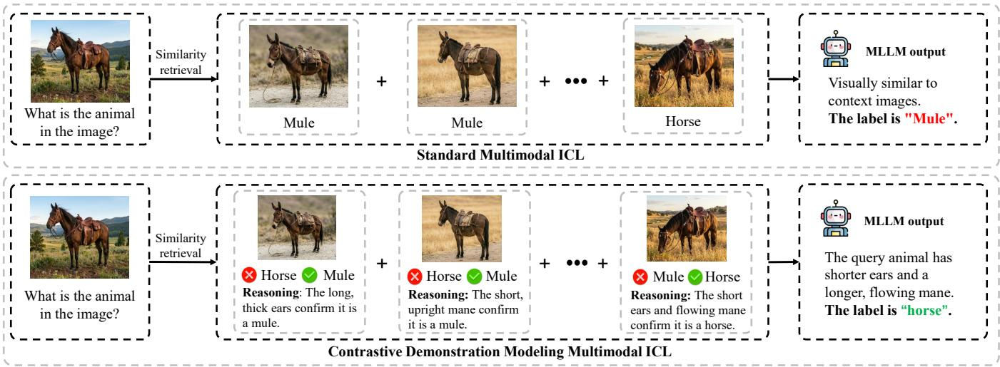
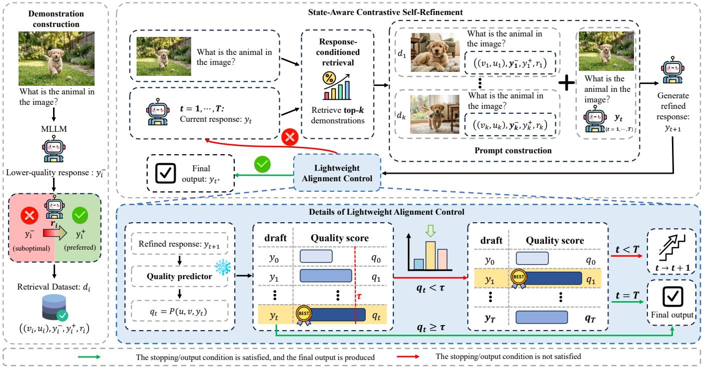
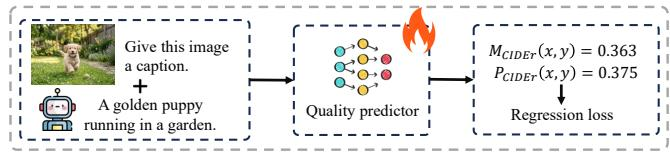
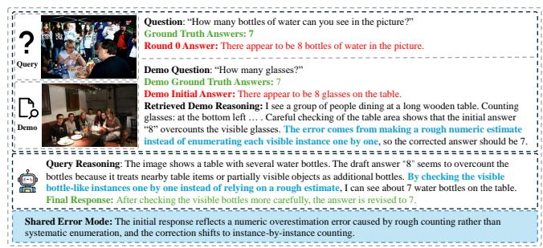
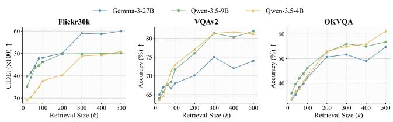

# Beyond Surface Imitation: Contrastive Modeling for Reasoning Path Alignment in Multimodal In-Context Learning

Mingbo Yang∗ Sun Yat-Sen University Shenzhen, Guangdong, China yangmb3@mail2.sysu.edu.cn

Peng Chen Sun Yat-Sen University Shenzhen, Guangdong, China chenpeng052@gmail.com

Wenqiang Wang∗ Sun Yat-Sen University   
Shenzhen, Guangdong, China   
wangwq69@mail2.sysu.edu.cn   
Yannan Chen   
Sun Yat-Sen University   
Shenzhen, Guangdong, China   
Pengcheng Laboratory   
Shenzhen, Guangdong, China   
chenyn288@mail2.sysu.edu.cn   
Yan Xiao†   
Sun Yat-Sen University   
Shenzhen, Guangdong, China   
xiaoyan.hhu@gmail.com   
Zhaolu Kang   
Peking University   
Beijing, Beijing, China   
zlkang25@stu.pku.edu.cn   
Sunshang Wang   
Tianjin University of Science and   
Technology   
Tianjin, Tianjin, China   
sunshangwww@mail.tust.edu.cn

## Abstract

In-context learning (ICL) is widely used in multimodal large lan guage models (MLLMs) and achieves strong performance across a wide range of multimodal tasks. However, existing multimodal ICL methods often rely on surface level imitation of in-context demon strations, making it dificult for MLLMs to align their responses with the reasoning path required by the given multimodal input. This limitation becomes more pronounced in complex multimodal tasks, thereby restricting further improvements in MLLM performance. To address this issue, we propose a new multimodal ICL framework that combines contrastive demonstration modeling with the self-refinement capability of MLLMs. Specifically, our framework reformulates each demonstration by explicitly contrasting a suboptimal response with a better response under the same input, together with a reasoning path that reveals how the response should be refined. This contrastive formulation makes the reasoning path toward the desired response more explicit and guides the MLLM beyond superficial imitation. Furthermore, because efective refinement depends on the current response, we introduce a response-conditioned retrieval mechanism to select demonstrations whose reasoning paths are more relevant to the current response. In addition, we use a lightweight alignment controller to predict response quality and determine whether further refinement is needed. Experiments on three types of multimodal tasks show that the proposed framework consistently improves MLLM performance, with particularly notable gains on visual question answering (VQA).

CCS Concepts • Computing methodologies → Artificial intelligence.

Keywords

Multimodal Large Language Models; Multimodal In-Context Learning

ACM Reference Format:

Mingbo Yang, Wenqiang Wang, Zhaolu Kang, Peng Chen, Yannan Chen, Sunshang Wang, and Yan Xiao. 2026. Beyond Surface Imitation: Contrastive Modeling for Reasoning Path Alignment in Multimodal In-Context Learning. In Proceedings of the 34th ACM International Conference on Multimedia (MM ’26), November 10–14, 2026, Rio de Janeiro, Brazil. ACM, New York, NY, USA, 10 pages. https://doi.org/10.1145/3767308.3836595

## 1 Introduction

Multimodal In-Context Learning (multimodal ICL) has demonstrated remarkable capabilities in adapting Multimodal Large Language Models (MLLMs) to novel tasks [32–34, 65]. By conditioning MLLMs on demonstrations, multimodal ICL enables task adaptation at inference time without parameter updates [68]. This makes multimodal ICL an attractive paradigm for multimodal tasks, as it flexibly leverages the pretrained knowledge of MLLMs [50, 62].

Despite these advantages, current multimodal ICL paradigms often encourage surface level imitation rather than reasoning grounded in multimodal evidence [18, 60]. Here, surface level imitation refers to relying on superficial demonstration patterns without suficiently grounding the response in query-relevant multimodal evidence. In standard multimodal ICL, MLLMs are conditioned on a sequence of input–output demonstrations [37, 51]. However, when faced with complex scenarios that require fine-grained visual discrimination, MLLMs tend to rely on incorrect correlations. For instance, as shown in Figure 1, if the retrieved demonstrations share visually similar global features, the MLLM is prone to copying the most frequent textual labels from the context [13]. By doing so, the MLLM bypasses the deeper visual analysis required for the task, matching only the output format while failing to ground its response in fine-grained visual evidence.

  
Figure 1: From surface level imitation to reasoning path alignment. Standard multimodal ICL mainly aligns the final output and may imitate surface patterns from visually similar demonstrations. In contrast, COMIL uses contrastive demonstrations to make explicit which visual evidence is relevant and how the current response should be revised, thereby guiding the MLLM toward the desired reasoning path.

This issue reflects a fundamental limitation of standard demonstrations: they mainly align the final output, while overlooking the reasoning path that leads to the desired response [36, 47, 57]. When an MLLM produces a response influenced by surface similarities, the key challenge is not merely to specify the target output, but to achieve reasoning path alignment by aligning the generated reasoning path with a latent evidence-grounded refinement relation under the multimodal input. In complex multimodal tasks, this requires explicit guidance on which visual evidence is truly relevant and how it should support revising the current response [45, 67, 70]. Standard demonstrations provide little such guidance, because they present only the target output rather than the reasoning path from a suboptimal response to a better one. Therefore, achieving reasoning path alignment requires demonstrations that make this refinement path explicit, enabling the MLLM to refine its response in a way that is better grounded in the underlying multimodal evidence.

To move beyond surface imitation, we propose COMIL, a novel framework that promotes reasoning path alignment in MLLMs through contrastive modeling of demonstrations and the self refinement capability of MLLMs [2, 10]. Rather than providing only a single target output, COMIL reformulates each standard ICL example under the same multimodal input as a structured demonstration tuple consisting of a suboptimal response, a better response, and a generated reasoning path describing how the response should be refined and what fine-grained visual evidence supports that refinement. By presenting both responses under the same input condition, this formulation makes explicit not only which response is better, but also how the current response should be improved and why that improvement is supported by the underlying multimodal evidence, thereby turning the demonstration into explicit guidance for reasoning path alignment.

Furthermore, because reasoning path alignment depends on the MLLM’s current response [17, 30], we couple these contrastive demonstrations with a retrieval mechanism guided by the current response. Rather than retrieving examples only from input similarity, COMIL selects demonstrations by additionally considering the similarity between their suboptimal responses and the MLLM’s current response. In this way, the retrieved reasoning paths provide more relevant guidance for refining the current response. Combined with a lightweight alignment controller that predicts response quality and determines whether further refinement is needed, COMIL moves beyond passive output matching and instead guides generation toward more evidence-grounded refinement.

Extensive experiments across a diverse set of representative MLLMs verify the efectiveness of our framework. On three reasoning intensive tasks, COMIL shows clear improvements. For example, on VQAv2, COMIL improves the accuracy of Qwen3.5-9B to 81.9%, achieving the best result among the compared methods. On Flickr30k, it improves the CIDEr score of Gemma-3-27B to 0.587. COMIL also remains sample eficient, maintaining favorable performance even with a limited number of retrieved demonstrations. In addition, the framework generalizes beyond open-source settings and achieves strong results on closed-source MLLMs. Overall, these results show that COMIL efectively improves multimodal ICL by reducing surface level imitation and promoting reasoning path alignment.

In summary, our main contributions are as follows:

• A New Framework for Reasoning Path Alignment in Multimodal ICL: We propose COMIL, a new multimodal in-context learning framework that promotes reasoning path alignment by providing explicit guidance on which visual evidence is truly relevant and how it should support revising the current response.

• Contrastive Demonstration Modeling with Response-Conditioned Retrieval and Alignment Control: COMIL reformulates each standard ICL example as a structured contrastive demonstration tuple consisting of a suboptimal response, a better response, and the corresponding reasoning path. It further combines this formulation with responseconditioned retrieval and a lightweight alignment controller to guide the MLLM toward the desired reasoning path during inference.

• Efective Results on Reasoning-Intensive Multimodal Tasks: Extensive experiments across multiple MLLMs and multimodal datasets show that COMIL consistently improves performance, with particularly clear gains on reasoning intensive tasks. Additional reasoning-path evaluation and results on closed-source MLLMs further demonstrate the effectiveness and generality of the proposed framework.

## 2 Related Work

## 2.1 Multimodal Large Language Models

Multimodal Large Language Models (MLLMs) have recently achieved remarkable progress on a wide range of tasks, including visual question answering, image captioning, visual reasoning, and multimodal generation [3, 4, 7, 8, 11, 23, 25, 63]. By integrating visual encoders with large language models, together with large-scale vision-language pretraining, instruction tuning, and alignment, MLLMs have developed strong cross-modal understanding and generation capabilities, making them a key foundation for multimodal intelligence. Their ability to process visual and textual information within a unified generative framework enables them to perform diverse tasks with a single model and has significantly broadened the scope of vision-language applications. Despite this progress, efective inference-time adaptation remains important for improving MLLM performance on complex multimodal tasks [12, 61]. In particular, how to better leverage the multimodal understanding and generation capabilities of MLLMs on complex tasks without parameter updates remains an important challenge [44, 58]. This has motivated growing interest in inference-time adaptation paradigms such as multimodal in-context learning.

## 2.2 Multimodal In-Context Learning

Multimodal In-Context Learning (multimodal ICL) has become an important paradigm for adapting MLLMs to downstream tasks [20, 31, 32, 52, 54, 55, 69]. By leveraging multimodal demonstrations composed of images, texts, and corresponding responses, multimodal ICL enables task adaptation at inference time without parameter updates [14, 29]. This property makes multimodal ICL particularly attractive in practice, as it can flexibly adapt a pretrained MLLM to diverse tasks while avoiding the cost of additional training. More importantly, by presenting a small number of task-specific examples in context, multimodal ICL allows the MLLM to exploit its pretrained multimodal knowledge in a task-aware manner, making it a simple yet efective paradigm for multimodal classification, generation, and reasoning tasks. Existing studies have mainly improved multimodal ICL from the input side, such as demonstration retrieval, demonstration organization, prompt design, and instruction construction, showing that better demonstrations can substantially afect downstream performance [6, 20]. Despite this progress, most existing methods still emphasize providing better demonstrations or improving alignment with the demonstrated target output. However, for complex multimodal tasks, recent observations suggest that MLLMs may still rely on superficial imitation of demonstrated responses rather than follow the reasoning path that leads to the correct result [18, 39]. This limitation motivates the need to go beyond better demonstration selection alone and to consider how demonstrations can more explicitly guide the MLLM’s reasoning.

## 3 Method

## 3.1 Problem Setup

Let the multimodal input be denoted by $\boldsymbol { x } = ( \boldsymbol { v } , \boldsymbol { u } )$ , where � is the visual input and � is the textual instruction or query. Given �, the target MLLM generates a textual response � according to $y \sim p _ { \theta } ( y \mid x )$ In this work, reasoning path alignment refers to aligning the generated reasoning path with a latent evidence-grounded refinement relation under �: the path should diagnose missed or misused multimodal evidence and support revising the current response toward a better one. We define a latent alignment function $Q ( x , y ) \in \mathbb { R }$ to conceptually score the resulting response state, where a larger value indicates better alignment with this desired refinement relation. Since $Q$ is not directly observable, it serves as a conceptual objective, while its practical proxy is introduced in the lightweight alignment control module. Under this formulation, the ideal target response can be written conceptually as $y ^ { * } = \arg \operatorname* { m a x } _ { y } Q ( x , y )$

To this end, COMIL is built on three coupled components: contrastive demonstration modeling, response-conditioned retrieval, and lightweight alignment control. Together, these components reformulate demonstrations to make explicit the reasoning paths from suboptimal responses to better responses, retrieve the demonstrations that are most relevant to the current response, and guide the MLLM toward reasoning path alignment during inference.

## 3.2 Contrastive Demonstration Modeling

To support reasoning path alignment, COMIL reformulates each demonstration through contrastive modeling [2, 10]. Rather than using a single target response, we explicitly show the MLLM how a suboptimal response is refined into a better response together with the corresponding reasoning path. Formally, we represent the �th demonstration as

$$
d _ { i } = { \left( x _ { i } , y _ { i } ^ { - } , y _ { i } ^ { + } , r _ { i } \right) } ,\tag{1}
$$

where $x _ { i }$ is the multimodal input, $\left. y _ { i } ^ { - } \right.$ is a suboptimal response, $y _ { i } ^ { + }$ is a better response, and $r _ { i }$ is a generated reasoning path that describes how $\boldsymbol { y } _ { i } ^ { - }$ can be refined into $y _ { i } ^ { + }$ under $x _ { i }$ . Here, $r _ { i }$ provides explicit refinement guidance rather than a direct observation of the MLLM’s internal reasoning process.

Under the fixed multimodal input $x _ { i } , y _ { i } ^ { - }$ − and $y _ { i } ^ { + }$ define a tasksupervised refinement transition, while �� specifies how the former can be revised toward the latter, thereby providing explicit guidance for reasoning path alignment. In the contrastive modeling, $\left. y _ { i } ^ { - } \right.$ and $y _ { i } ^ { + }$ form the contrasted response pair. The reasoning path $r _ { i }$ identifies the deficiency in $\left. y _ { i } ^ { - } \right.$ , highlights the multimodal evidence relevant to the revision, and shows how these cues support the transition to $y _ { i } ^ { + }$ . As a result, the contrastive demonstration provides explicit guidance not only on the preferred response, but also on how the response should be refined toward it. This supports reasoning path alignment at inference time.

  
Figure 2: Overall framework of COMIL. Given an input � = (� �), the MLLM first generates an initial response. The retrieval dataset contains contrastive demonstrations $d _ { i } = ( x _ { i } , y _ { i } ^ { - } , y _ { i } ^ { + } , r _ { i } )$ . At step �, the current response $y _ { t }$ is used to retrieve the top-� relevant demonstrations to generate $y _ { t + 1 }$ . The lightweight alignment controller predicts $q _ { t } = \mathcal { P } ( x , y _ { t } )$ and compares it with � to determine whether to continue refinement until � or return the final response $y _ { t ^ { * } }$

## 3.3 Response-Conditioned Retrieval and Refinement

Construction of the Contrastive Retrieval Dataset. To support reasoning path alignment at inference time, we first construct a retrieval dataset of contrastive demonstrations from a selected subset of training examples. For each training instance $x _ { i } ,$ the same target MLLM used later at inference time is first prompted to generate an initial response, which serves as the suboptimal response $\left. y _ { i } ^ { - } \right.$ . The better response $y _ { i } ^ { + }$ is taken directly from the ground truth response in the dataset under the same multimodal input. We then feed $x _ { i } ,$ $\left. y _ { i } ^ { - } \right.$ , and $y _ { i } ^ { + }$ into the same target MLLM and prompt it to generate a reasoning path $r _ { i } ,$ , which describes how $\left. y _ { i } ^ { - } \right.$ can be refined into $y _ { i } ^ { + }$ In this way, each training instance is transformed into a contrastive demonstration $d _ { i } = ( x _ { i } , y _ { i } ^ { - } , y _ { i } ^ { + } , r _ { i } )$ , which explicitly represents a generated refinement path from a suboptimal response state to a better one [24, 39]. Repeating this process over the selected training subset yields the retrieval dataset $C = \{ d _ { i } \} _ { i = 1 } ^ { N }$ used in subsequent retrieval and refinement.

Response-Conditioned Demonstration Retrieval. Given the retrieval dataset $C = \{ d _ { i } \} _ { i = 1 } ^ { N }$ , the goal of retrieval is to select contrastive demonstrations whose reasoning paths are relevant to refining the current response. Since refinement relevance depends on both the multimodal input and the current response, retrieval is conditioned on � and, whenever available, � [17, 30]. At the initial step, no response has been generated yet. We therefore retrieve demonstrations only according to the multimodal input:

$$
\mathcal { D } _ { 0 } = \mathrm { a r g } \operatorname* { m a x } _ { \mathcal { D } \subset \mathcal { C } , | \mathcal { D } | = k } \sum _ { d _ { i } \in \mathcal { D } } \lambda _ { x } s _ { x } ( x , x _ { i } ) , y _ { 0 } = \mathcal { G } ( x , \mathcal { D } _ { 0 } ) ,\tag{2}
$$

where ${ \mathcal { D } } _ { 0 } \subset C$ is the retrieved demonstration set, $\mathcal { G }$ denotes the MLLM with the retrieved contrastive demonstrations as context, and � (�, � ) measures the relevance between the current multimodal input � and the demonstration input $x _ { i } .$ . Once the current response $y _ { t }$ is available, retrieval is performed according to a joint relevance score over the input and the current response:

$$
\begin{array} { r l } & { \mathcal { D } _ { t + 1 } = \arg \underset { \mathcal { D } \subset \mathcal { C } , | \mathcal { D } | = k } { \operatorname* { m a x } } \sum _ { d _ { i } \in \mathcal { D } } \left[ \lambda _ { x } s _ { x } ( x , x _ { i } ) + \lambda _ { y } s _ { y } ( y _ { t } , y _ { i } ^ { - } ) \right] , } \\ & { } \\ & { y _ { t + 1 } = \mathcal { G } ( x , y _ { t } , \mathcal { D } _ { t + 1 } ) , } \end{array}\tag{3}
$$

where $s _ { y } ( y _ { t } , y _ { i } ^ { - } )$ measures the similarity between the current response �� and the suboptimal response $\left. y _ { i } ^ { - } \right.$ in the demonstration, and $\lambda _ { x } , \lambda _ { y } \ge 0$ balance the contributions of input relevance and response similarity. We use response similarity as a practical proxy for refinement relevance. When $y _ { t }$ is similar to $\left. y _ { i } ^ { - } \right.$ , the associated reasoning path $r _ { i }$ is more likely to describe a correction pattern relevant to the current response. The retrieved demonstration therefore provides not only a better response but also potentially useful guidance for revision. Response similarity does not guarantee the same error mode, but enables retrieval to incorporate the current response state in addition to input similarity.

  
Figure 3: Training pipeline of the lightweight quality predictor. The predictor takes an input and a candidate response as input, predicts the response evaluation metric, and is trained with a regression loss against the actual metric $M ( x , y )$

Refinement with Retrieved Demonstrations. Under this retrieval mechanism, iterative refinement aims to move the current response toward stronger reasoning path alignment, rather than guaranteeing monotonic improvement at every step [5, 26, 59]. In practice, the target MLLM uses the retrieved contrastive demonstrations to revise the current response according to refinement patterns relevant to its current state. In this way, retrieval and refinement are tightly coupled: retrieval identifies relevant refinement guidance, while the MLLM uses this guidance to revise the current response toward the evidence-grounded refinement relation defined in Section 3.1.

## 3.4 Lightweight Alignment Control

While reasoning path alignment is the target of refinement, it is not directly observable at inference time. We therefore introduce a lightweight alignment controller that predicts response quality as a proxy for controlling the refinement trajectory. During controller training, the task-specific evaluation metric provides an observable supervision signal: under a fixed multimodal input �, a response that better follows the desired evidence-grounded refinement relation is more likely to match the expected output and achieve a better task metric [38, 40]. We therefore use the response-level evaluation metric to supervise the controller.

Formally, let $M ( x , y )$ denote the actual evaluation metric of re sponse � under input $x ,$ where a larger value indicates better task performance. As defined in Section 3.1, �(�, �) is a latent alignment property and cannot be directly observed. We therefore use �(�, �) as a practical supervision signal and train a lightweight predictor P to estimate the quality of each intermediate response, $q _ { t } = \mathcal { P } ( x , y _ { t } )$ where $q _ { t }$ is the predicted quality score at refinement step �. The predictor is trained with supervision derived from the actual metric �(�, ��); thus, $q _ { t }$ predicts response quality rather than directly measuring the latent alignment function �. For ease of exposition, we refer to this predictor as the lightweight alignment controller. The relation between task performance and reasoning-path alignment is further examined in Section 5.1. This alignment control is helpful because iterative refinement does not always improve the response monotonically. Although the retrieved demonstrations are selected to support reasoning path alignment, later refinement steps may still preserve, weaken, or distort the desired refinement direction [19]. The controller therefore evaluates the predicted quality of each intermediate response and prevents the final decision from depending only on the latest step. In this way, it helps retain a higher-quality response among the explored candidates.

Based on the predicted quality score, we introduce an acceptance threshold � for early stopping. In practice, � is determined from the training data used for the alignment controller: we set � to the evaluation metric corresponding to the top 25% of the training responses, which are ranked by the metric in descending order. This choice encourages early stopping on high-quality responses while avoiding an overly strict threshold that would make successful stopping dificult. If $q _ { t } \geq \tau ,$ the current response is regarded as sufficiently high-quality and refinement stops. Otherwise, refinement continues until the maximum refinement budget � is reached. To unify early stopping and final selection, we define

$$
\begin{array} { r } { t ^ { * } = \left\{ \begin{array} { l l } { \operatorname* { m i n } \{ t \mid q _ { t } \geq \tau \} , } & { \mathrm { ~ i f } \exists t \in \{ 0 , . . . , T \} , q _ { t } \geq \tau , } \\ { \mathrm { a r g } \operatorname* { m a x } _ { t \in \{ 0 , . . . , T \} } q _ { t } , } & { \mathrm { ~ o t h e r w i s e } , } \end{array} \right. } \end{array}\tag{4}
$$

and take $y _ { t ^ { * } }$ as the final response.

Through this design, the controller neither generates reasoning paths nor directly measures reasoning-path alignment. Instead, it uses the predicted response quality as a practical proxy to determine when refinement should stop or which intermediate response should be selected. Together with contrastive demonstration modeling and response-conditioned retrieval, it stabilizes the inferencetime refinement process toward reasoning path alignment.

## 4 Experiment

## 4.1 Experimental Setup

MLLMs and Datasets. We evaluate COMIL on four representative open-source multimodal large language models (MLLMs), including Gemma-3-27B [48], InternVL3.5-14B [53], Qwen3.5-9B [41], and Qwen3.5-4B [41]. Following the main experimental setting, we conduct experiments on four datasets: CIFAR10 [28] for image classification, Flickr30k [64] for image captioning, and VQAv2 [15] and OKVQA [43] for visual question answering.

Tasks and Metrics. We evaluate COMIL on three types of multimodal tasks with task-specific metrics: image classification, image captioning, and visual question answering. These tasks cover multimodal classification, generation, and reasoning, enabling evaluation across diverse multimodal settings. For image classification, we report Accuracy. For image captioning, we report CIDEr [49]. For visual question answering, we report VQA Accuracy [1]. For all metrics, higher values indicate better performance.

Baselines. We compare COMIL with representative baselines from five categories, as shown in Table 1. Specifically, we include Retrieval-based ICL methods, including CLIPRE [42], KNN [16], and CR [35]; Train-based ICL methods, including LCL [46] and MimIC [22]; CoT methods, including Few-shot CoT [27] and Self-Consistency CoT [56]; Self-Refine methods, including Iteration, Self-Refine [38], and SC-Captioner [66]; and recent Multimodal ICL methods, including AIM [14], TACO [33], and M2IV [31]. These baselines cover retrieval-based demonstration selection, trainingenhanced in-context learning, reasoning-oriented prompting, iterative refinement, and recent multimodal ICL approaches.

Table 1: Main results on four multimodal datasets and four open-source MLLMs, including recent multimodal ICL baselines. Best and second-best results are highlighted in bold and underlined, respectively; “–” denotes unavailable results.
<table><tr><td rowspan="3">Category</td><td>MLLMs</td><td>Gemma-3-27B</td><td>InternVL3.5-14B</td><td>Qwen3.5-9B</td><td>Qwen3.5-4B</td><td>Gemma-3-27B</td><td>InternVL3.5-14B</td><td>Qwen3.5-9B</td><td>Qwen3.5-4B</td></tr><tr><td>Metrics</td><td></td><td colspan="2">Accuracy (%) ↑</td><td></td><td></td><td colspan="2">CIDEr ↑</td><td></td></tr><tr><td colspan="5">Method</td><td colspan="4">Image Captioning: Flickr30k</td></tr><tr><td>Retrieval</td><td>CLIPRE</td><td>95.7</td><td>92.3</td><td>92.5</td><td>91.1</td><td>0.297</td><td>0.287</td><td>0.316</td><td>0.294</td></tr><tr><td>based</td><td>KNN</td><td>95.3</td><td>95.0</td><td>93.7</td><td>92.1</td><td>0.346</td><td>0.352</td><td>0.410</td><td>0.387</td></tr><tr><td>ICL</td><td>CR</td><td>93.6</td><td>91.8</td><td>88.4</td><td>88.5</td><td>0.303</td><td>0.381</td><td>0.388</td><td>0.369</td></tr><tr><td>Train based</td><td>LCL</td><td>96.5</td><td>94.3</td><td>96.4</td><td>91.4</td><td>0.514</td><td>0.384</td><td>0.459</td><td>0.340</td></tr><tr><td>ICL</td><td>MimIC</td><td>91.4</td><td>95.6</td><td>94.6</td><td>95.5</td><td>0.349</td><td>0.378</td><td>0.429</td><td>0.394</td></tr><tr><td>CoT</td><td>Few-shot CoT</td><td>93.6</td><td>95.4</td><td>91.8</td><td>94.2</td><td>0.390</td><td>0.331</td><td>0.390</td><td>0.402</td></tr><tr><td rowspan="3">Self-Refine</td><td>Self-Consistency CoT</td><td>94.0</td><td>95.4</td><td>93.7</td><td>99.0</td><td>0.377</td><td>0.322</td><td>0.362</td><td>0.342</td></tr><tr><td>Iteration</td><td>87.3</td><td>83.3</td><td>83.9</td><td>85.8</td><td>0.169</td><td>0.131</td><td>0.075</td><td>0.098</td></tr><tr><td>Self-Refine</td><td>89.6</td><td>83.2</td><td>84.0</td><td>85.0</td><td>0.114</td><td>0.111</td><td>0.060</td><td>0.014</td></tr><tr><td></td><td>SC-Captioner</td><td>91.6</td><td>91.9</td><td>93.9</td><td>94.4</td><td>0.472</td><td>0.393</td><td>0.434</td><td>0.425</td></tr><tr><td>Recent</td><td>AIM</td><td>-</td><td>94.2</td><td>95.4</td><td>91.9</td><td>-</td><td>0.431</td><td>0.445</td><td>0.448</td></tr><tr><td>Multimodal</td><td>TACO</td><td>-</td><td>91.0</td><td>91.0</td><td>86.6</td><td>=</td><td>0.399</td><td>0.373</td><td>0.420</td></tr><tr><td>ICL</td><td>M2IV</td><td>-</td><td>95.5</td><td>93.7</td><td>94.6</td><td>-</td><td>0.412</td><td>0.428</td><td>0.466</td></tr><tr><td colspan="2">COMIL (Ours)</td><td>97.4</td><td colspan="2">98.4 97.4</td><td>96.5</td><td colspan="4">0.587 0.517</td></tr><tr><td>Category</td><td>Metrics</td><td colspan="4">Accuracy (%) ↑</td><td colspan="4">0.499 0.493 Accuracy (%) ↑</td></tr><tr><td></td><td>Method</td><td></td><td>Visual Question Answering: VQAv2</td><td></td><td></td><td></td><td>Visual Question Answering: OKVQA</td><td></td><td></td></tr><tr><td>Retrieval</td><td>CLIPRE</td><td>57.0</td><td>74.4</td><td>61.8</td><td>69.2</td><td>31.2</td><td>42.0</td><td>33.6</td><td>38.7</td></tr><tr><td>based</td><td>KNN</td><td>67.3 65.3</td><td>78.1</td><td>66.5</td><td>64.9</td><td>51.7</td><td>52.2</td><td>53.9</td><td>47.6</td></tr><tr><td>ICL</td><td>CR</td><td></td><td>78.0</td><td>71.2</td><td>69.7</td><td>51.4</td><td>50.3</td><td>49.2</td><td>43.6</td></tr><tr><td>Train based</td><td>LCL</td><td>70.2 62.9</td><td>79.7</td><td>69.6</td><td>77.3</td><td>52.3</td><td>52.7</td><td>41.5</td><td>42.0</td></tr><tr><td>ICL</td><td>MimIC</td><td></td><td>72.7</td><td>68.7</td><td>68.4</td><td>42.1</td><td>55.0</td><td>35.3</td><td>54.9</td></tr><tr><td rowspan="3">CoT</td><td>Few-shot CoT Self-Consistency CoT</td><td>64.5</td><td>79.8</td><td>61.4</td><td>59.2</td><td>53.6</td><td>56.3</td><td>46.3</td><td>48.7</td></tr><tr><td></td><td>66.0</td><td>81.1</td><td>62.9</td><td>60.5</td><td>53.7</td><td>57.2</td><td>51.1</td><td>54.7</td></tr><tr><td>Iteration</td><td>31.1</td><td>25.1</td><td>20.6</td><td>30.1</td><td>32.4</td><td>22.3</td><td>27.5</td><td>17.3</td></tr><tr><td rowspan="3">Self-Refine Recent</td><td>Self-Refine</td><td>21.4</td><td>26.6</td><td>26.6</td><td>33.4</td><td>42.4</td><td>38.5</td><td>44.8</td><td>42.6</td></tr><tr><td>SC-Captioner</td><td>65.0</td><td>66.1</td><td>63.8</td><td>61.4</td><td>43.7</td><td>49.4</td><td>29.2</td><td>39.1</td></tr><tr><td>AIM</td><td>-</td><td>77.2</td><td>80.2</td><td>77.8</td><td>=</td><td>59.8</td><td>51.0</td><td>62.5</td></tr><tr><td>Multimodal</td><td>TACO</td><td>1</td><td>75.1</td><td>80.9</td><td>78.7</td><td></td><td>59.8</td><td>50.1</td><td>59.2</td></tr><tr><td>ICL</td><td>M2IV</td><td>一</td><td>73.6</td><td>79.9</td><td>76.9</td><td>=</td><td>51.1</td><td>53.1</td><td>51.7</td></tr><tr><td colspan="2">COMIL (Ours)</td><td>74.0</td><td>81.0</td><td>81.9</td><td>81.2</td><td>54.7</td><td>61.7</td><td>56.8</td><td>61.2</td></tr></table>

Inference Details. For each test instance, COMIL generates an initial response and performs up to 3 refinement iterations using top-� = 10 retrieved contrastive demonstrations. In our implemen tation, the lightweight alignment controller uses openai/clip-vitbase-patch32 [42] as the image encoder and google-bert/bert-baseuncased [9] as the text encoder. For response-conditioned retrieval, both input and response similarities are computed using cosine similarity, with the two retrieval weights set to 0.5. The initial response and each refinement round use a maximum generation length of 2048 tokens. Both controller encoders are frozen, and their representations are fused and scored by a three-layer MLP with a hidden dimension of 512 and dropout of 0.1. For controller training, we use part of the training split of each dataset. The retrieval set is constructed from the last 500 samples of the corresponding training split and is kept disjoint from the controller training set. The main experiments are conducted on the test split of each dataset. Therefore, the controller training set, retrieval set, and evaluation set are mutually exclusive, and no data instance is reused across them. We use the same experimental protocol across diferent target MLLMs and datasets, and compare all methods under consistent task settings for fair evaluation.

## 4.2 Main Results

Table 1 reports the main results across four multimodal datasets and four open-source MLLMs, including comparisons with recent multimodal ICL methods. Overall, COMIL achieves the best performance in 13 out of 16 MLLM–dataset settings and ranks second in the remaining three, demonstrating strong and consistent performance across multimodal classification, captioning, and visual question answering. On CIFAR-10, COMIL achieves the best result on three of the four MLLMs and ranks second on Qwen3.5-4B. Its advantages are more consistent on multimodal generation and reasoning tasks. On Flickr30k, COMIL achieves the best performance under all four MLLMs; for example, it reaches 0.517 CIDEr on InternVL3.5-14B, outperforming the strongest baseline AIM by 0.086. On VQAv2, COMIL achieves the best result on three MLLMs and ranks second on InternVL3.5-14B. In particular, it reaches 81.9% accuracy on Qwen3.5-9B, exceeding TACO by 1.0 percentage point. On OKVQA, COMIL again achieves the best performance in three of the four settings and ranks second on Qwen3.5-4B. These results show that COMIL remains competitive not only against conventional retrieval, CoT, and self-refinement baselines, but also against recent multimodal ICL methods. Another notable finding is that simple Self-Refine based baselines perform poorly across most mul timodal tasks. This suggests that the gains of COMIL do not come from iterative refinement alone, but from the combination of contrastive demonstration modeling, response-conditioned retrieval, and lightweight alignment control.

Table 2: Ablation study of contrastive demonstration modeling in COMIL. As more components of the contrastive fourtuple are introduced, performance improves consistently across datasets and target MLLMs.
<table><tr><td colspan="4">MLLMs</td><td colspan="2">InternVL3.5-14B Qwen3.5-4B</td><td>InternVL3.5-14B</td><td>Qwen3.5-4B</td></tr><tr><td colspan="4">Datasets</td><td></td><td>Flickr30k 一</td><td colspan="2">VQAv2</td></tr><tr><td>(vi, ui)</td><td></td><td>yi</td><td>yi r</td><td>一</td><td>CIDEr↑</td><td colspan="2">1 Accuracy(%)↑</td></tr><tr><td>√</td><td></td><td>×</td><td>√ ×</td><td>0.387</td><td>0.347</td><td>70.9</td><td>69.0</td></tr><tr><td>√</td><td>√</td><td>√</td><td>X</td><td>0.475</td><td>0.358</td><td>77.1</td><td>71.2</td></tr><tr><td>√</td><td></td><td>√ √</td><td>√</td><td>0.517</td><td>0.493</td><td>81.0</td><td>81.2</td></tr></table>

Table 3: Ablation study of response-conditioned retrieval in COMIL. Response-conditioned retrieval consistently outperforms random retrieval across datasets and target MLLMs.
<table><tr><td>MLLMs</td><td>InternVL3.5-14B Qwen3.5-4B</td><td>InternVL3.5-14B</td><td>Qwen3.5-4B</td></tr><tr><td>Datasets</td><td>一 Flickr30k</td><td colspan="2">VQAv2</td></tr><tr><td>Retrieval</td><td>I CIDEr↑</td><td>Accuracy(%)↑</td><td></td></tr><tr><td>Random</td><td>0.431 0.341</td><td>75.8</td><td>69.9</td></tr><tr><td>Response-conditioned</td><td>0.517</td><td>0.493 81.0</td><td>81.2</td></tr></table>

Table 4: Ablation study of the lightweight alignment control module in COMIL. The alignment controller consistently improves final performance.
<table><tr><td>MLLMs</td><td>InternVL3.5-14B Qwen3.5-4B</td><td>InternVL3.5-14B</td><td>Qwen3.5-4B</td></tr><tr><td>Datasets</td><td>Flickr30k</td><td colspan="2">VQAv2</td></tr><tr><td>Alignment Control</td><td>CIDEr↑</td><td>| Accuracy(%)↑</td><td></td></tr><tr><td>X</td><td>0.491 0.407</td><td>76.3</td><td>75.2</td></tr><tr><td>√</td><td>0.517 0.493</td><td>81.0</td><td>81.2</td></tr></table>

## 4.3 Ablation Study

We further analyze how each component contributes to reasoning path alignment during inference. Following the design of COMIL, we study three aspects: contrastive demonstration modeling, responseconditioned retrieval, and lightweight alignment control.

Efect ofContrastive Demonstration Modeling. Table 2 evaluates the efect of the contrastive four-tuple formulation. When the demonstrations contain only the multimodal input $( v _ { i } , u _ { i } )$ and the better response $y _ { i } ^ { + }$ , performance drops substantially on both datasets and both target MLLMs. Adding the suboptimal response $\left. y _ { i } ^ { - } \right.$ but removing the reasoning path $r _ { i }$ results in a less severe performance drop. A standard positive-only demonstration mainly shows the MLLM a preferred response, but does not specify how the current response should be refined under the same input condition. In contrast, introducing $\left. y _ { i } ^ { - } \right.$ makes the contrast between suboptimal and better responses explicit, while adding $r _ { i }$ further clarifies how the response should be refined and what multimodal evidence supports that refinement. This enables the demonstrations to provide more informative guidance for reasoning path alignment.

Efect ofResponse-Conditioned Retrieval. Table 3 studies the retrieval strategy. Replacing response-conditioned retrieval with random retrieval consistently degrades performance across both tasks and both MLLMs. This result shows that the efectiveness of retrieval in COMIL depends not simply on the availability of demonstrations, but on whether the retrieved demonstrations provide reasoning paths relevant to the current response under the same input condition. By retrieving such demonstrations, response-conditioned retrieval ofers more efective guidance for refining the current response toward the desired reasoning path.

Efect of Lightweight Alignment Control. Table 4 examines the lightweight alignment controller. Removing alignment control causes a consistent but smaller performance drop than removing the contrastive formulation or the retrieval mechanism. This shows that alignment control is not the main source of gains, but it still contributes to the final performance. Its role is better understood as stabilizing refinement rather than providing reasoning guidance by itself. Contrastive demonstration modeling and response-conditioned retrieval determine how the current response should be refined, while the controller predicts the quality of each intermediate response and determines when refinement should stop or which response should be selected. In this way, the controller helps avoid unnecessary or harmful refinement steps and makes the overall refinement process more reliable across datasets and MLLMs.

## 5 Discussion

## 5.1 Direct Evaluation of Reasoning Path Alignment

Final task metrics do not directly measure whether the refinement paths are grounded in query-relevant multimodal evidence. We therefore use GPT-5.5 to evaluate each reasoning path along four 0–4 criteria: evidence mention, evidence correctness, task relevance, and response–evidence consistency. The aggregated score is normalized to [0, 1] as the reasoning path alignment (RPA) score. We also report the sample-level Spearman correlation $\rho$ between RPA and the task metric. As shown in Table 5, COMIL achieves the highest RPA score in five of the six settings. Moreover, its Spearman $\rho$ remains consistently positive, ranging from 0.55 to 0.68 with an average of 0.63. These results indicate that the task-performance gains of COMIL are generally accompanied by refinement paths that are better grounded in multimodal evidence under the adopted evaluation protocol. We note that RPA evaluates the generated refinement path and should not be interpreted as a direct measure of the model’s unobservable internal reasoning process.

## 5.2 Case Study

As shown in Figure 4, response-conditioned retrieval can identify demonstrations with relevant refinement patterns. In one VQA example, the query asks for the number of water bottles, for which the initial response overcounts 7 bottles as 8. The retrieved demonstration asks for the number of glasses, but exhibits the same error: it predicts 8 instead of 7 because of rough counting. Its reasoning path corrects this error through instance-by-instance enumeration, which similarly guides the query response from 8 to 7. This case illustrates that response-conditioned retrieval can retrieve transferable correction patterns even when the object semantics difer. Nevertheless, response similarity serves as a proxy for refinement relevance rather than a guarantee of the same error mode.

Table 5: Direct reasoning-path alignment evaluation. RPA denotes the normalized reasoning-path alignment score, and � denotes the sample-level Spearman correlation with the task metric.
<table><tr><td>Datasets</td><td colspan="4">Flickr30k</td><td colspan="4">VQAv2</td><td colspan="4">OKVQA</td></tr><tr><td>MLLMs</td><td colspan="2">InternVL</td><td colspan="2">Qwen</td><td colspan="2">InternVL</td><td colspan="2">Qwen</td><td colspan="2">InternVL</td><td colspan="2">Qwen</td></tr><tr><td>Methods</td><td>RPA↑</td><td>ρ</td><td>RPA↑</td><td>ρ</td><td>RPA↑</td><td>ρ</td><td>RPA↑</td><td>ρ</td><td>RPA↑</td><td>ρ</td><td>RPA↑</td><td>ρ</td></tr><tr><td>KNN</td><td>0.84</td><td>0.43</td><td>0.84</td><td>0.47</td><td>0.70</td><td>0.52</td><td>0.64</td><td>0.48</td><td>0.76</td><td>0.45</td><td>0.72</td><td>0.44</td></tr><tr><td>LCL</td><td>0.84</td><td>0.46</td><td>0.85</td><td>0.51</td><td>0.80</td><td>0.59</td><td>0.70</td><td>0.55</td><td>0.76</td><td>0.47</td><td>0.71</td><td>0.36</td></tr><tr><td>SC-CoT</td><td>0.90</td><td>0.39</td><td>0.89</td><td>0.37</td><td>0.76</td><td>0.56</td><td>0.68</td><td>0.50</td><td>0.70</td><td>0.51</td><td>0.71</td><td>0.42</td></tr><tr><td>Self-Refine</td><td>0.86</td><td>0.29</td><td>0.87</td><td>0.25</td><td>0.55</td><td>0.32</td><td>0.62</td><td>0.33</td><td>0.75</td><td>0.40</td><td>0.81</td><td>0.41</td></tr><tr><td>COMIL(Ours)</td><td>0.96</td><td>0.63</td><td>0.97</td><td>0.67</td><td>0.76</td><td>0.65</td><td>0.73</td><td>0.68</td><td>0.77</td><td>0.62</td><td>0.84</td><td>0.55</td></tr></table>

Figure 4: Case study of response-conditioned retrieval. Although the query and retrieved demonstration involve different objects, both exhibit rough-counting overestimation that is corrected by instance-by-instance enumeration.  
  
Figure 5: Efect of retrieval set size on COMIL. Performance generally improves as the retrieval set grows across Flickr30k, VQAv2, and OKVQA, with diminishing gains at larger scales.

## 5.3 Efect of Retrieval Dataset Size

We further study how the size of the contrastive retrieval dataset afects COMIL. Specifically, we vary the retrieval dataset size from 20 to 500 and evaluate COMIL on Flickr30k, VQAv2, and OKVQA under three target MLLMs. As shown in Figure 5, increasing the retrieval dataset size generally improves performance across tasks and MLLMs, suggesting that broader retrieval coverage increases the likelihood of finding demonstrations relevant to the current response. The gains, however, gradually diminish as the retrieval dataset grows. In several settings, performance is already close to its best value at around 300 examples, while further enlargement yields only marginal improvements or small fluctuations. These results indicate that COMIL benefits from richer retrieval coverage but does not require a very large retrieval dataset to achieve strong performance.

Table 6: Results of COMIL on two closed-source MLLMs. COMIL achieves the best performance on CIFAR10 under both Claude Sonnet 4.6 and GPT-4o.
<table><tr><td>Methods</td><td>CR</td><td>CLIPRE</td><td>KNN</td><td>COMIL(Ours)</td></tr><tr><td>Metrics</td><td colspan="4">Accuracy (%) ↑</td></tr><tr><td>MLLMs</td><td colspan="4">Classification: CIFAR10</td></tr><tr><td>Claude Sonnet 4.6</td><td>88.1</td><td>92.5</td><td>92.9</td><td>95.3</td></tr><tr><td>GPT-40</td><td>96.7</td><td>98.7</td><td>99.1</td><td>99.8</td></tr></table>

## 5.4 Extension to Closed-Source MLLMs

We further evaluate our method on closed-source MLLMs to examine whether its efectiveness extends beyond open-source settings. As shown in Table 6, our method consistently achieves the best performance on CIFAR10 under both Claude Sonnet 4.6 and GPT-4o [21]. Specifically, it improves the accuracy to 95.3% on Claude Sonnet 4.6 and 99.8% on GPT-4o, outperforming all retrieval-based baselines in both cases. These results suggest that the benefit of our framework does not depend on a specific open-source architecture, but transfers well to stronger closed-source MLLMs, further supporting the general applicability of the proposed framework.

## 5.5 Cost Considerations

COMIL introduces additional inference cost due to iterative refinement and is therefore not the lowest-cost ICL method. Nevertheless, compared with heavier reasoning and refinement baselines, COMIL reduces average latency and token consumption by 51.6% and 82.7%, respectively, over SC-CoT, and is 29.2% faster than Self-Refine. The target MLLM remains frozen, with additional training confined to the lightweight controller.

## 6 Conclusion

In this paper, we present COMIL, a multimodal in-context learning framework that moves beyond surface-level imitation by promoting reasoning path alignment during inference. COMIL reformulates demonstrations as contrastive tuples that describe how a suboptimal response can be refined into a better response, combines them with response-conditioned retrieval, and introduces a lightweight alignment controller to guide refinement. In this way, COMIL enables the MLLM not only to observe better responses in context, but also to refine the current response toward better alignment with the evidence-grounded refinement relation. Extensive experiments on multimodal tasks show that COMIL consistently improves performance, with particularly clear gains on reasoning-intensive tasks. Further reasoning-path analyses and results on closed-source MLLMs support the efectiveness and generality of the proposed framework across diferent model settings.

## Acknowledgments

This work was supported by the National Natural Science Foundation ofChina under Grant No. 62502550 and the Shenzhen Science and Technology Program under Grant No. KJZD20240903095700001.

## References

[1] Stanislaw Antol, Aishwarya Agrawal, Jiasen Lu, Margaret Mitchell, Dhruv Batra, C Lawrence Zitnick, and Devi Parikh. 2015. Vqa: Visual question answering. In Proceedings ofthe IEEE international conference on computer vision. 2425–2433.

[2] Folco Bertini Baldassini, Mustafa Shukor, Matthieu Cord, Laure Soulier, and Benjamin Piwowarski. 2024. What makes multimodal in-context learning work?. In Proceedings ofthe IEEE/CVF Conference on Computer Vision and Pattern Recognition. 1539–1550.

[3] Peng Chen, Chao Huang, Yunkang Cao, Chengliang Liu, Wei Wang, Wenqiang Wang, Mingbo Yang, Li Shen, Wenqi Ren, and Xiaochun Cao. 2026. Towards Ex plainable Industrial Anomaly Detection via Knowledge-Guided Latent Reasoning. arXiv preprint arXiv:2602.09850 (2026).

[4] Peng Chen, Fangjun Huang, and Chao Huang. 2026. DyC-CLIP: Dynamic contextaware multi-modal prompt learning for zero-shot anomaly detection. Pattern Recognition (2026), 113215.

[5] Qiguang Chen, Libo Qin, Jinhao Liu, Dengyun Peng, Jiannan Guan, Peng Wang, Mengkang Hu, Yuhang Zhou, Te Gao, and Wanxiang Che. 2025. Towards reason ing era: A survey of long chain-of-thought for reasoning large language models. arXiv preprint arXiv:2503.09567 (2025).

[6] Shuo Chen, Zhen Han, Bailan He, Jianzhe Liu, Mark Buckley, Yao Qin, Philip Torr, Volker Tresp, and Jindong Gu. 2025. Can Multimodal Large Language Models Truly Perform Multimodal In-Context Learning?. In 2025 IEEE/CVFWinter Conference on Applications of Computer Vision (WACV). IEEE, 6000–6010.

[7] Yi Chen, Yuying Ge, Yixiao Ge, Mingyu Ding, Bohao Li, Rui Wang, Ruifeng Xu, Ying Shan, and Xihui Liu. 2026. Egoplan-bench: Benchmarking multimodal large language models for human-level planning. International Journal of Computer Vision 134, 3 (2026), 118.

[8] Yannan Chen, Wenqiang Wang, Ruoyu Chen, Jiancheng Wang, Mingbo Yang, Yaowei Wang, Wei Wang, and Xiaochun Cao. 2026. Domain Adaptive Ob ject Detection via Dual-Stream Bilevel-Cycle Optimization. arXiv preprint arXiv:2606.31373 (2026).

[9] Jacob Devlin, Ming-Wei Chang, Kenton Lee, and Kristina Toutanova. 2019. Bert: Pre-training of deep bidirectional transformers for language understanding. In Proceedings ofthe 2019 conference ofthe North American chapter ofthe association for computational linguistics: human language technologies, volume 1 (long and short papers). 4171–4186.

[10] Sivan Doveh, Shaked Perek, M Jehanzeb Mirza, Wei Lin, Amit Alfassy, Assaf Arbelle, Shimon Ullman, and Leonid Karlinsky. 2024. Towards multimodal incontext learning for vision and language models. In European Conference on Computer Vision. Springer, 250–267.

[11] Abdolmajid Erfani and Ali Mansouri. 2026. Applications of multimodal large language models in construction industry. Advanced Engineering Informatics 69 (2026), 103909.

[12] Xinqi Fan, Xueli Chen, Luoxiao Yang, Chuin Hong Yap, Rizwan Qureshi, Qi Dou, Moi Hoon Yap, and Mubarak Shah. 2025. Test-Time Retrieval-Augmented Adap tation for Vision-Language Models. In Proceedings ofthe IEEE/CVF International Conference on Computer Vision. 8810–8819.

[13] Yu Fei, Yifan Hou, Zeming Chen, and Antoine Bosselut. 2023. Mitigating label biases for in-context learning. In Proceedings ofthe 61st Annual Meeting ofthe Association for Computational Linguistics (Volume 1: Long Papers). 14014–14031.

[14] Jun Gao, Qian Qiao, Tianxiang Wu, Zili Wang, Ziqiang Cao, and Wenjie Li. 2025. Aim: Let any multimodal large language models embrace eficient in-context learning. In Proceedings of the AAAI Conference on Artificial Intelligence, Vol. 39. 3077–3085.

[15] Yash Goyal, Tejas Khot, Douglas Summers-Stay, Dhruv Batra, and Devi Parikh. 2017. Making the v in vqa matter: Elevating the role of image understanding in visual question answering. In Proceedings ofthe IEEE conference on computer vision and pattern recognition. 6904–6913.

[16] Gongde Guo, Hui Wang, David Bell, Yaxin Bi, and Kieran Greer. 2003. KNN modelbased approach in classification. In OTM Confederated International Conferences" On the Move to Meaningful Internet Systems". Springer, 986–996.

[17] Yaxin Guo, Hongye Tan, Ru Li, Xiaoli Li, Xinyi Sun, Pengpeng Qiang, and Hu Zhang. 2026. Problem decomposition guided by reasoning utility for complex reasoning in LLMs. Information Processing & Management 63, 3 (2026), 104509.

[18] Chengyue Huang, Yuchen Zhu, Sichen Zhu, Jingyun Xiao, Moises Andrade, Shivang Chopra, and Zsolt Kira. 2025. Mimicking or reasoning: Rethinking multi-modal in-context learning in vision-language models. arXiv preprint arXiv:2506.07936 (2025).

[19] Qihe Huang, Lei Shen, Ruixin Zhang, Shouhong Ding, Binwu Wang, Zhengyang Zhou, and Yang Wang. 2023. Crossgnn: Confronting noisy multivariate time

series via cross interaction refinement. Advances in Neural Information Processing Systems 36 (2023), 46885–46902.

[20] Yiran Huang, Karsten Roth, Quentin Bouniot, Wenjia Xu, and Zeynep Akata. 2026. Dissecting Multimodal In-Context Learning: Modality Asymmetries and Circuit Dynamics in modern Transformers. arXiv preprint arXiv:2601.20796 (2026).

[21] Aaron Hurst, Adam Lerer, Adam P Goucher, Adam Perelman, Aditya Ramesh, Aidan Clark, AJ Ostrow, Akila Welihinda, Alan Hayes, Alec Radford, et al. 2024. Gpt-4o system card. arXiv preprint arXiv:2410.21276 (2024).

[22] Yuchu Jiang, Jiale Fu, Chenduo Hao, Xinting Hu, Yingzhe Peng, Xin Geng, and Xu Yang. 2025. Mimic in-context learning for multimodal tasks. In Proceedings of the Computer Vision and Pattern Recognition Conference. 29825–29835.

[23] Yizhang Jin, Jian Li, Tianjun Gu, Yexin Liu, Bo Zhao, Jinxiang Lai, Zhenye Gan, Yabiao Wang, Chengjie Wang, Xin Tan, et al. 2025. Eficient multimodal large language models: A survey. Visual Intelligence 3, 1 (2025), 27.

[24] Chenglong Kang, Xiaoyi Liu, and Fei Guo. 2025. Retrointext: A multimodal large language model enhanced framework for retrosynthetic planning via in-context representation learning. In The Thirteenth International Conference on Learning Representations.

[25] Zhaolu Kang, Junhao Gong, Jiaxu Yan, Wanke Xia, Yian Wang, Zhuo Cheng, Wenhao Cao, Ziwen Wang, ZhiYuan Feng, Huaxuan Ding, et al. 2026. Hssbench: Benchmarking humanities and social sciences ability for multimodal large lan guage models. In International Conference on Learning Representations, Vol. 2026. 74664–74719.

[26] Zixuan Ke, Fangkai Jiao, Yifei Ming, Xuan-Phi Nguyen, Austin Xu, Do Xuan Long, Minzhi Li, Chengwei Qin, Peifeng Wang, Silvio Savarese, et al. 2025. A survey of frontiers in llm reasoning: Inference scaling, learning to reason, and agentic systems. arXiv preprint arXiv:2504.09037 (2025).

[27] Seungone Kim, Se Joo, Doyoung Kim, Joel Jang, Seonghyeon Ye, Jamin Shin, and Minjoon Seo. 2023. The cot collection: Improving zero-shot and few-shot learning of language models via chain-of-thought fine-tuning. In Proceedings of the 2023 Conference on Empirical Methods in Natural Language Processing. 12685–12708.

[28] Alex Krizhevsky, Geofrey Hinton, et al. 2009. Learning multiple layers of features from tiny images. (2009).

[29] Vaishak Kumar. 2026. Act-Observe-Rewrite: Multimodal Coding Agents as In-Context Policy Learners for Robot Manipulation. arXiv preprint arXiv:2603.04466 (2026).

[30] Hyunseok Lee, Seunghyuk Oh, Jaehyung Kim, Jinwoo Shin, and Jihoon Tack. 2025. Revise: Learning to refine at test-time via intrinsic self-verification. arXiv preprint arXiv:2502.14565 (2025).

[31] Yanshu Li, Yi Cao, Hongyang He, Qisen Cheng, Xiang Fu, Xi Xiao, Tianyang Wang, and Ruixiang Tang. 2025. M2IV: Towards Eficient and Fine-grained Multimodal In-Context Learning via Representation Engineering. arXiv preprint arXiv:2504.04633 (2025).

[32] Yanshu Li, Jianjiang Yang, Zhennan Shen, Ligong Han, Haoyan Xu, and Ruixiang Tang. 2026. Catp: Contextually adaptive token pruning for eficient and enhanced multimodal in-context learning. In Proceedings ofthe AAAIConference on Artificial Intelligence, Vol. 40. 6619–6627.

[33] Yanshu Li, Jianjiang Yang, Tian Yun, Pinyuan Feng, Jinfa Huang, and Ruixiang Tang. 2025. Taco: Enhancing multimodal in-context learning via task mappingguided sequence configuration. In Proceedings ofthe 2025 Conference on Empirical Methods in Natural Language Processing. 736–763.

[34] Wenwen Liao, Jianbo Yu, Yuansong Wang, Qingchao Jiang, and Xiaofeng Yang. 2026. Enhancing Visual In-Context Learning by Multi-Faceted Fusion. arXiv preprint arXiv:2601.10107 (2026).

[35] Xiaoyong Liu and W Bruce Croft. 2004. Cluster-based retrieval using language models. In Proceedings ofthe 27th annual international ACM SIGIR conference on Research and development in information retrieval. 186–193.

[36] Quanyu Long, Yin Wu, Wenya Wang, and Sinno Jialin Pan. 2024. Does in-context learning really learn? rethinking how large language models respond and solve tasks via in-context learning. arXiv preprint arXiv:2404.07546 (2024).

[37] Man Luo, Xin Xu, Yue Liu, Panupong Pasupat, and Mehran Kazemi. 2024. Incontext learning with retrieved demonstrations for language models: A survey. arXiv preprint arXiv:2401.11624 (2024).

[38] Aman Madaan, Niket Tandon, Prakhar Gupta, Skyler Hallinan, Luyu Gao, Sarah Wiegrefe, Uri Alon, Nouha Dziri, Shrimai Prabhumoye, Yiming Yang, et al. 2023. Self-refine: Iterative refinement with self-feedback. Advances in neural information processing systems 36 (2023), 46534–46594.

[39] Toan Nguyen, Weiduo Yuan, Songlin Wei, Hui Li, Daniel Seita, and Yue Wang. 2026. ICLR: In-Context Imitation Learning with Visual Reasoning. arXiv preprint arXiv:2603.07530 (2026).

[40] Debjit Paul, Mete Ismayilzada, Maxime Peyrard, Beatriz Borges, Antoine Bosselut, Robert West, and Boi Faltings. 2024. Refiner: Reasoning feedback on intermediate representations. In Proceedings ofthe 18th Conference ofthe European Chapter of the Association for Computational Linguistics (Volume 1: Long Papers). 1100–1126.

[41] Qwen Team. 2026. Qwen3.5: Towards Native Multimodal Agents. https://qwen. ai/blog?id=qwen3.5

[42] Alec Radford, Jong Wook Kim, Chris Hallacy, Aditya Ramesh, Gabriel Goh, Sandhini Agarwal, Girish Sastry, Amanda Askell, Pamela Mishkin, Jack Clark,

et al. 2021. Learning transferable visual models from natural language supervision. In International conference on machine learning. PmLR, 8748–8763.

[43] Dustin Schwenk, Apoorv Khandelwal, Christopher Clark, Kenneth Marino, and Roozbeh Mottaghi. 2022. A-okvqa: A benchmark for visual question answering using world knowledge. In European conference on computer vision. Springer, 146–162.

[44] Shezheng Song, Xiaopeng Li, Shasha Li, Shan Zhao, Jie Yu, Jun Ma, Xiaoguang Mao, Weimin Zhang, and Meng Wang. 2025. How to bridge the gap between modalities: Survey on multimodal large language model. IEEE Transactions on Knowledge and Data Engineering 37, 9 (2025), 5311–5329.

[45] Yanpeng Sun, Qiang Chen, Jian Wang, Jingdong Wang, and Zechao Li. 2025. Exploring efective factors for improving visual in-context learning. IEEE Transactions on Image Processing (2025).

[46] Yan Tai, Weichen Fan, Zhao Zhang, and Ziwei Liu. 2024. Link-context learning for multimodal llms. In Proceedings of the IEEE/CVF Conference on Computer Vision and Pattern Recognition. 27176–27185.

[47] Xinyu Tang, Xiaolei Wang, Wayne Xin Zhao, and Ji-Rong Wen. 2025. Dawn-icl: Strategic planning of problem-solving trajectories for zero-shot in-context learning. In Proceedings ofthe 2025 Conference ofthe Nations ofthe Americas Chapter ofthe Association for Computational Linguistics: Human Language Technologies (Volume 1: Long Papers). 1918–1934.

[48] Gemma Team. 2025. Gemma 3. (2025). https://goo.gle/Gemma3Report

[49] Ramakrishna Vedantam, C Lawrence Zitnick, and Devi Parikh. 2015. Cider: Consensus-based image description evaluation. In Proceedings ofthe IEEE conference on computer vision and pattern recognition. 4566–4575.

[50] Jianing Wang, Chengyu Wang, Chuanqi Tan, Jun Huang, and Ming Gao. 2024. Knowledgeable in-context tuning: exploring and exploiting factual knowledge for in-context learning. In Findings ofthe Association for Computational Linguistics: NAACL 2024. 3261–3280.

[51] Song Wang, Zihan Chen, Chengshuai Shi, Cong Shen, and Jundong Li. 2024. Mixture of demonstrations for in-context learning. Advances in Neural Information Processing Systems 37 (2024), 88091–88116.

[52] Wenqiang Wang, Peng Chen, Yan Xiao, Yangshijie Zhang, Xiaoyue Lu, Jianjie Huang, and Xiaochun Cao. 2026. Task-Related In-Context Learning. In Findings ofthe Association for Computational Linguistics: ACL 2026. 43378–43400.

[53] Weiyun Wang, Zhangwei Gao, Lixin Gu, Hengjun Pu, Long Cui, Xingguang Wei, Zhaoyang Liu, Linglin Jing, Shenglong Ye, Jie Shao, et al. 2025. InternVL3.5: Advancing Open-Source Multimodal Models in Versatility, Reasoning, and Eficiency. arXiv preprint arXiv:2508.18265 (2025).

[54] Wenqiang Wang, XIAO Yan, Xiaojun Jia, Yangshijie Zhang, Peng Chen, Bin Zeng, and Xiaochun Cao. 2026. Dynamic �-shot In-Context Learning. (2026).

[55] Wenqiang Wang, Wen Yujia, Yan Xiao, Zhifeng Chen, Yangshijie Zhang, Peng Chen, Mingbo Yang, and Xiaochun Cao. 2026. Incomplete in-context learning. In Proceedings of the 64th Annual Meeting of the Association for Computational Linguistics (Volume 1: Long Papers). 41629–41650.

[56] Xuezhi Wang, Jason Wei, Dale Schuurmans, Quoc Le, Ed Chi, Sharan Narang, Aakanksha Chowdhery, and Denny Zhou. 2022. Self-consistency improves chain of thought reasoning in language models. arXiv preprint arXiv:2203.11171 (2022).

[57] Jinyang Wu, Mingkuan Feng, Shuai Zhang, Feihu Che, Zengqi Wen, Chonghua Liao, and Jianhua Tao. 2024. Beyond examples: High-level automated reasoning paradigm in in-context learning via mcts. arXiv preprint arXiv:2411.18478 (2024).

[58] Junfeng Wu, Yi Jiang, Chuofan Ma, Yuliang Liu, Hengshuang Zhao, Zehuan Yuan, Song Bai, and Xiang Bai. 2026. Liquid: Language models are scalable and unified multi-modal generators. International Journal ofComputer Vision 134, 1 (2026), 39.

[59] Fengli Xu, Qianyue Hao, Chenyang Shao, Zefang Zong, Yu Li, Jingwei Wang, Yunke Zhang, Jingyi Wang, Xiaochong Lan, Jiahui Gong, et al. 2025. Toward large reasoning models: A survey of reinforced reasoning with large language models. Patterns 6, 10 (2025).

[60] Nan Xu, Fei Wang, Sheng Zhang, Hoifung Poon, and Muhao Chen. 2025. From introspection to best practices: Principled analysis of demonstrations in multimodal in-context learning. In Proceedings ofthe 2025 Conference ofthe Nations ofthe Americas Chapter ofthe Association for Computational Linguistics: Human Language Technologies (Volume 1: Long Papers). 3299–3324.

[61] Zhuoyan Xu, Khoi Duc Nguyen, Preeti Mukherjee, Saurabh Bagchi, Somali Chaterji, Yingyu Liang, and Yin Li. 2025. Learning to inference adaptively for multimodal large language models. In Proceedings ofthe IEEE/CVF International Conference on Computer Vision. 3552–3563.

[62] Linyi Yang, Shuibai Zhang, Zhuohao Yu, Guangsheng Bao, Yidong Wang, Jindong Wang, Ruochen Xu, Wei Ye, Xing Xie, Weizhu Chen, et al. 2023. Supervised knowledge makes large language models better in-context learners. arXiv preprint arXiv:2312.15918 (2023).

[63] Linli Yao, Long Xing, Yang Shi, Sida Li, Yuanxin Liu, Yuhao Dong, Yi-Fan Zhang, Lei Li, Qingxiu Dong, Xiaoyi Dong, et al. 2026. Towards eficient multimodal large language models: A survey on token compression. Authorea Preprints (2026).

[64] Peter Young, Alice Lai, Micah Hodosh, and Julia Hockenmaier. 2014. From image descriptions to visual denotations: New similarity metrics for semantic inference over event descriptions. Transactions ofthe associationforcomputational linguistics 2 (2014), 67–78.

[65] Zaifu Zhan, Shuang Zhou, Xiaoshan Zhou, Yongkang Xiao, Jun Wang, Jiawen Deng, He Zhu, Yu Hou, Yiran Song, Mingquan Lin, et al. 2026. Retrievalaugmented in-context learning for multimodal large language models in disease classification. Journal ofBiomedical Informatics (2026), 105017.

[66] Lin Zhang, Xianfang Zeng, Kangcong Li, Gang Yu, and Tao Chen. 2025. Sccaptioner: Improving image captioning with self-correction by reinforcement learning. In Proceedings ofthe IEEE/CVF International Conference on Computer Vision. 23145–23155.

[67] Yuanhan Zhang, Kaiyang Zhou, and Ziwei Liu. 2023. What makes good examples for visual in-context learning? Advances in Neural Information Processing Systems 36 (2023), 17773–17794.

[68] Ce Zheng, Lei Li, Qingxiu Dong, Yuxuan Fan, Zhiyong Wu, Jingjing Xu, and Baobao Chang. 2023. Can we edit factual knowledge by in-context learning?. In Proceedings ofthe 2023 Conference on Empirical Methods in Natural Language Processing. 4862–4876.

[69] Aoxiang Zhou, Hao Wu, Kaichen Peng, Peng Liu, and Xianxian Li. 2026. Improving Few-Shot Multi-modal Aspect-Level Sentiment Classification with Implicit In-context Learning. In International Conference on Multimedia Modeling. Springer, 301–314.

[70] Yucheng Zhou, Xiang Li, Qianning Wang, and Jianbing Shen. 2024. Visual incontext learning for large vision-language models. In Findings ofthe Association for Computational Linguistics: ACL 2024. 15890–15902.