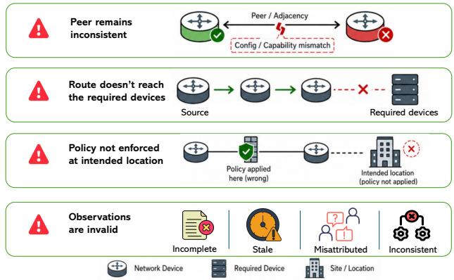
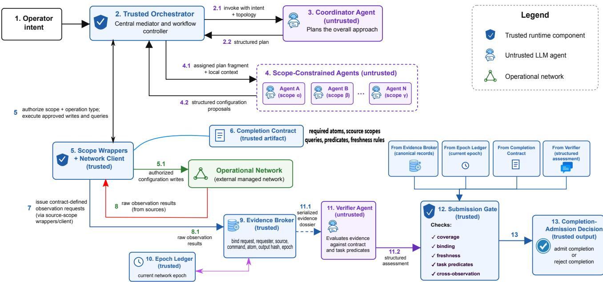

# Can AI Agents Deliver Verifiable Network-Wide Outcomes Across Authority Boundaries?

Tianzhu Zhang

Nokia Bell Labs

Massy, France

tianzhu.zhang@nokia-bell-labs.com

Chih-Kai Huang

LTCI, Tel´ ecom Paris, Institut Polytechnique de Paris´

Palaiseau, France

chih-kai.huang@telecom-paris.fr

Meikang Qiu

Augusta University

Georgia, USA

qiumeikang@gmail.com

Abstract—AI agents are increasingly involved in network automation, where they can initiate configuration changes through mediated operational interfaces and assess the resulting state. Nonetheless, operational networks usually span many devices and administrative domains. Realizing an operator’s intent requires coordination among agents with distinct authority scopes, which define the resources they can access, the operations they can invoke, and the network state they can observe. This division limits the blast radius of an erroneous action but fragments the evidence needed to assess the network-wide outcome. Successful execution of a configuration action proposed by one agent does not establish that remote devices responded as intended or that routing changes reached the required devices. A valid observation may also become stale after a subsequent change. Before the coordinated operation can be declared complete, a trusted assurance layer must collect current observations from the required scopes and determine whether they collectively support the operator’s intended network-wide outcome.

To address the completion admission problem, we present EVIDENCENET, a runtime assurance layer for deciding whether coordinated agent operations have achieved an operator’s network intent. Its broker collects the post-change observations required by a completion contract, and its admission gate checks that the evidence comes from the required scopes, remains current, and satisfies the task rules. A verifier agent provides an additional assessment of the observation content. Experiments on live routing networks show that checking post-change state recognizes successful outcomes that cannot be established from configuration-action records alone. Controlled interventions further show that EVIDENCENET rejects completion when otherwise satisfactory observations have the wrong source, have been substituted, or are stale. The collected evidence can also guide recovery from configuration faults. These results support an emerging vision of autonomous networking in which agents drive planning, configuration, interpretation, and repair, while a trusted runtime layer controls the evidence and machinecheckable conditions used to admit completion.

Index Terms—Agentic AI for networking, network configuration, intent assurance, evidence provenance, multi-agent systems.

## I. INTRODUCTION

Over the past several decades, network operations have evolved from manual, device-by-device configuration to scriptable management and controller-based automation. This evolution shifted operators from issuing device-level commands to specifying desired network outcomes, a shift formalized by intent-based networking (IBN) [1]. Once an automation system translates an intent into network actions, it must also assess whether the resulting state fulfills that intent. Service assurance closes this loop by monitoring the network and initiating corrective action when the delivered service deviates from the intent [2]. Conventional IBN implementations are generally built around predefined workflows, deterministic control logic, and explicitly engineered checks. LLM-powered AI agents provide a more flexible approach. They can interpret natural-language intent, compose multistep operations, invoke heterogeneous operational tools, and revise their plans in response to observed network state [3]–[6]. As these agents move from advisory support to direct network actuation, their operational authority must be constrained.

Operational networks span many devices and may cross functional or administrative boundaries. Granting one agent unrestricted authority over such a network would weaken administrative separation and enlarge the impact of an erroneous action. Network-wide tasks are thus coordinated among agents with distinct authority scopes, each specifying the resources an agent can access, the operations it can invoke, and the network state it can directly observe [6]–[8]. These scopes limit the blast radius of erroneous actions, but also divide direct observation. A configuration accepted within one scope does not connote that a peer’s behavior is consistent, an expected route has successfully propagated, or a policy has taken effect at the required network locations.

This observation gap becomes consequential when the automation system declares a coordinated operation complete. Such a declaration may activate a service, migrate traffic, remove a fallback path, or authorize a dependent configuration change. Therefore, the network operator must specify the observations required to establish the intended outcome, while the automation system must determine whether those observations are complete, correctly sourced, and up to date. As shown in Fig. 1, successful execution within an authority scope does not establish the intended network-wide outcome.

Existing assurance architectures commonly rely on a trusted component with direct access to the relevant network state [2], [9], [10]. When authority and visibility are divided across agents, however, no individual agent can establish the overall outcome from its local observations alone. The system must instead combine evidence collected from the required scopes and decide whether it collectively supports the operator’s intent. We call this decision completion admission. An overly permissive decision may advance the workflow without sufficient support, whereas an overly conservative one may reject a correct outcome and block autonomous progress.

  
Fig. 1. Local agent success does not establish a network-wide outcome.

We propose EVIDENCENET, a trusted runtime assurance layer for completion admission among scope-constrained network agents. Agents plan operations, propose configurations, interpret observations, and suggest repairs, but they cannot declare their own success. EVIDENCENET collects the observations required by a completion contract, binds them to their source and network epoch, and admits completion only when deterministic checks and the verifier assessment both succeed. It complements existing planners and network property checkers by controlling whether the available evidence is sufficient for the coordinated workflow to continue. The main contributions of this paper are as follows:

• We formulate completion admission for network operations spanning multiple authority scopes and define a trusted completion contract that specifies the observations required to establish each required network property

• We design and implement EVIDENCENET, which mediates scoped agent actions, collects provenance- and freshness-bearing observations, and enforces their coverage and validity before completion may be admitted.

• We evaluate EVIDENCENET through live-network experiments and controlled evidence interventions, separating the effects of post-change evidence acquisition, deterministic evidence controls, verifier judgment, and repair.

## II. RELATED WORK

Traditional network assurance and verification address complementary parts of operational correctness. Assurance mechanisms monitor whether a delivered service continues to satisfy the operator’s intent and may trigger corrective action when it does not [1], [2]. Network verification, by contrast, checks whether configurations or forwarding state satisfy specified invariants. In particular, Batfish analyzes forwarding behavior from network-wide configurations [9], while VeriFlow verifies invariants as controller rules change [10]. EVIDENCENET complements both lines of work. Instead of introducing new network properties or verification algorithms, it governs whether the observations that support those properties originate from the required authority scopes, remain up to date, and collectively support the intended network-wide outcome.

Recent work explores LLMs across several stages of network management, including executable analysis [3], configuration synthesis with verifier feedback [11], invariant-guided workflows [4], configuration repair [5], and contract-governed intent translation [12]. These works improve task-level correctness, but do not directly address completion assurance when network control and observation are divided among agents with distinct authority scopes. CAIF [12] is architecturally closest to EVIDENCENET as it separates probabilistic reasoning from network actuation through a machine-readable contract. However, CAIF validates intents and policies before actuation, whereas EVIDENCENET determines whether observations collected across authority scopes provide sufficient support to accept a coordinated operation as complete.

Some works govern what agents may do or make their executions traceable. AgentSpec enforces runtime policies for tool-using agents [7], while SEAgent applies mandatory access control to agent privileges [8]. Execution-provenance research studies how agent actions and tool invocations produce their outputs [13]. They do not address whether observations collected after a coordinated change come from the required authority scopes, remain valid for the current network, and collectively provide sufficient support to declare completion.

To our knowledge, no prior work has jointly enforced where agents may act, where post-change evidence originates, whether that evidence remains current, whether all required observations are present, and whether the coordinated operation may be accepted as complete in a live network setting.

## III. EVIDENCENET DESIGN

EVIDENCENET follows four design principles. First, agents plan operations, propose configuration and repair actions, and interpret network state, but their outputs are treated as proposals, not authorized operations. Second, completion admission depends on current observations from every required network location, not agent reports alone. Third, each observation is bound to its source, request, command, and network epoch. Fourth, admission is rejected whenever required evidence is missing, stale, inconsistent, or unsupported.

## A. Completion contract

Let P denote the network properties required by an operator’s intent. An observation atom is the smallest required unit of evidence that contributes to checking one such property. Each atom specifies a source location, an exact query, a deterministic parser with success condition, and a freshness rule. It may also identify a requester scope and relationships with other atoms. Reciprocal adjacency, for example, requires two atoms because each endpoint must observe the other. Each property p maps to a set of atoms $\mathcal { O } ( p )$ , and $\begin{array} { r } { \mathcal { O } = \bigcup _ { p \in \mathcal { P } } \mathcal { O } ( p ) } \end{array}$ This mapping forms the completion contract.

For each atom $o \in { \mathcal { O } }$ , the orchestrator registers an observation request and instructs the wrapper for the atom’s source scope to execute the declared query. The evidence broker converts the returned result into an evidence record $e _ { o } .$ The record contains its issued identity, request identifier, requester and collector identities, source router, command, execution status, complete returned output and its hash, atom identifier, collection time, and network epoch. The broker derives these fields from the mediated operation; agent-generated text cannot create or alter a broker-issued record. The records for a completion decision form an evidence dossier D.

  
Fig. 2. EVIDENCENET architecture and its workflow for trusted evidence collection and completion admission.

The submission gate follows a fail-closed policy. It rejects completion when the dossier is incomplete, or any required check fails. Admission requires coverage of every declared atom, successful deterministic checks, satisfaction of declared relationships between observations, explicit per-atom support from the verifier, as well as a positive global recommendation:

$$
\begin{array} { l } { { \displaystyle { \cal A } ( D ) = C ( D , \mathcal { O } ) \wedge X ( D , \mathcal { O } ) \wedge V _ { g } ( D ) } \ ~ } \\ { { \displaystyle \wedge \bigwedge _ { o \in \mathcal { O } } [ B ( e _ { o } , o ) \wedge F ( e _ { o } ) \wedge Q ( e _ { o } , o ) \wedge S _ { V } ( D , o ) ] . } } \end{array}\tag{1}
$$

C requires a usable broker-issued record for every declared atom and requires the verifier response to account for each atom exactly once as supported or unsupported. Requests containing undeclared atom identifiers are rejected. B verifies that a record matches its issued identity, request, requester, source, command, atom, and output hash. F verifies that the record remains current. Q applies the atom’s parser and success condition, called its task predicate. X applies any declared deterministic relationships between records, such as equality of a community observed at two routers. These terms are deterministic. The verifier reports per-atom support through $S _ { V }$ and returns the global recommendation $V _ { g } .$ . Immediately before submission, the orchestrator invokes the gate again, causing the deterministic checks to be recomputed. A positive verifier recommendation is necessary but cannot override a deterministic failure. The internal admission decision A remains separate from the external evaluator outcome Y for the encoded task properties. For $A , Y \in \{ 0 , 1 \}$ , the pair (A, Y ) distinguishes supported success (1, 1), false admission (1, 0), false rejection (0, 1), and justified rejection (0, 0).

## B. Orchestration, scoped execution, and evidence collection

The architecture and control flow of EVIDENCENET are illustrated in Fig. 2. EVIDENCENET comprises a set of deterministic, trusted software components to enforce its fixed completion contract, including the orchestrator, scope wrappers, evidence broker, epoch ledger, network client, and submission gate. It also encompasses a collection of network agents with different roles, including the coordinator, verifier, repairer, and multiple scope-constrained agents. However, these agents are not trusted components. They are allowed to produce plans, proposals, and assessments, but cannot modify the contract or bypass a failed admission check. We assume that the orchestrator, network client, and managed routers are not compromised. The prototype does not detect configuration changes that bypass the mediated interfaces.

The coordinator agent receives the operator’s intent and relevant network context, then decomposes the operation into plans aligned with the participating authority scopes. For each scope, the orchestrator invokes a scope-constrained agent with the local context and assigned portion of the plan. The agent returns structured configuration proposals for that scope.

The orchestrator then sends each proposal to a scope wrapper configured with the agent’s authority scope. The wrapper checks the target router and operation type before forwarding an authorized operation to the network client. Thus, an agent assigned to Scope 1 may propose actions for that scope, but its wrapper rejects operations targeting other scopes. The wrapper also rejects a mutating command presented as a read operation.

After the operation is actuated, the orchestrator iterates over the observation atoms in the completion contract. Each atom identifies a requester scope, a source scope, an exact observation command, and the property that the observation must support. The requester identifies the scope for which the evidence is required, whereas the source identifies the only scope authorized to collect it.

For each atom, the orchestrator registers an evidence request under the declared requester identity. The evidence broker verifies that the request matches the contract, and the orchestrator then asks the source scope’s wrapper to fulfill it. The source wrapper executes the declared query through the network client. The broker converts the returned result into an evidence record bound to the request, source, command, atom, output hash, and current epoch. The broker maintains routerspecific epochs and a global network epoch. Every successful mediated configuration command advances the global epoch. The evaluated prototype adopts a conservative global freshness policy, under which any observation collected at an earlier epoch is stale. Such observations must be recollected before completion can be admitted.

## C. Verifier assessment and one-round repair

After evidence collection, the orchestrator constructs a serialized dossier from the completion contract and the broker’s records. The verifier agent receives the operator’s intent, the dossier, and its freshness metadata. It identifies supported and unsupported atoms and returns a structured assessment containing per-atom decisions and a global recommendation.

Upon receiving the verifier assessment, the orchestrator invokes the submission gate. The gate reads the canonical evidence broker and the current network epoch from the epoch ledger. It evaluates coverage, record binding, freshness, task predicates, and declared cross-observation relationships, and then combines these results with the verifier assessment according to Eq. (1). The submission wrapper invokes the same gate once more immediately before submission.

In case of admission failures, EVIDENCENET may attempt at most one repair round. We allow only one round to avoid repeated, potentially harmful changes. If admission still fails, the workflow stops. A repair coordinator agent receives the failed atoms, relevant evidence, candidate authority scopes, and the original task. It proposes a coordinated repair plan. The orchestrator assigns the corresponding steps to the affected scope-constrained agents, which return structured repair actions. Every action passes through the same router-specific wrapper and authorization checks as the initial execution.

After the repair actions stabilize, the orchestrator collects a new observation for each atom in the completion contract. Any successful repair command advances the global epoch, making the earlier dossier stale under the prototype’s freshness policy. The orchestrator then constructs a new dossier, invokes the verifier, and calls the submission gate as before.

## IV. EVALUATION

We organize the evaluation around four research questions.

• Q1: Does post-change evidence enable successful outcomes to be admitted while failures remain rejected?

• Q2: Do source-binding and epoch-based freshness checks reject wrong-source, substituted, and stale evidence?

• Q3: Can the LLM-powered verifier agent reject defects that are visible in the observation content but not encoded by the deterministic predicate checks?

• Q4: Can one-round repair successfully restore the intended network outcome, and how precisely does it target the affected network elements?

We implement a prototype of EVIDENCENET on NetAgentBench [14], which provides the basic runtime environment and a separate evaluator to score the resulting live network. The evaluator is unavailable to the agents and lies outside the completion-admission path. It is used as the external evaluator. All live-network experiments run in Containerlab using FRRouting, with the router image pinned to frrouting/frr:v8.4.1. The runtime and library implementation add circa 10,000 lines of code to NetAgentBench. The prototype instantiates each authority scope as one router and associates it with one scope-constrained agent.

We evaluate EVIDENCENET on six custom tasks implemented in the NetAgentBench task format. They cover reciprocal OSPF adjacency and loopback reachability, multi-area OSPF, BGP route propagation, selective route filtering, BGP community and path policies, and reachability policies. Each task specifies an agent-visible objective and topology, a completion contract, and model-hidden checks for evaluating the final network state. The coordinator decomposes the objective into router-specific steps, which the scope-constrained agents translate into structured FRRouting configuration proposals. Scope wrappers authorize the proposals, the network client executes approved commands, and the orchestrator records their order and immediate results. Unless otherwise specified, all agents use gpt-5.4-mini as the backend LLM.

## Q1: evidence acquisition

To analyze the impact of post-change evidence, we generated 45 fulfillment traces, 15 from each of the reciprocal OSPF, BGP propagation, and BGP filtering tasks. Each trace records the ordered router commands executed during an agent run and their immediate results, but contains no post-change observations or evaluator verdict. We replayed each command sequence on two fresh instances of the same topology. The

TABLE I  
LIVE-NETWORK OUTCOMES AND COMPLETION ADMISSIONS. ENTRIES ARE NUMBERS OF TRACES.
<table><tr><td>Task family</td><td>Traces</td><td>Evaluator success</td><td>admit</td><td>ADF-CLAIMS EVIDENCENET admit</td></tr><tr><td>Reciprocal OSPF</td><td>15</td><td>10</td><td>0</td><td>10</td></tr><tr><td>BGP propagation</td><td>15</td><td>10</td><td>0</td><td>10</td></tr><tr><td>BGP filtering</td><td>15</td><td>12</td><td>0</td><td>12</td></tr><tr><td>All traces</td><td>45</td><td>32</td><td>0</td><td>32</td></tr></table>

TABLE II  
ADMISSION DECISIONS UNDER CONTROLLED EVIDENCE CONDITIONS. ENTRIES REPORT DOSSIERS ADMITTED OUT OF NINE.
<table><tr><td>Condition</td><td>Network evaluator</td><td>Evidence state</td><td>Content-only Verifier-free baseline</td><td>variant</td><td>EVIDENCENET</td></tr><tr><td>Clean</td><td>pass</td><td>valid</td><td>9/9</td><td>9/9</td><td>9/9</td></tr><tr><td>Wrong source</td><td>pass</td><td>wrong source</td><td>9/9</td><td>0/9</td><td>0/9</td></tr><tr><td>Substituted record</td><td>pass</td><td>substituted</td><td>9/9</td><td>0/9</td><td>0/9</td></tr><tr><td>Stale after change</td><td>fail</td><td>stale</td><td>9/9</td><td>0/9</td><td>0/9</td></tr><tr><td>Fresh after change</td><td>fail</td><td>current</td><td>0/9</td><td>0/9</td><td>0/9</td></tr></table>

Action-Derived Fulfillment Claims (ADF-CLAIMS) baseline assessed completion from the execution records alone, whereas EVIDENCENET collected the observations required by the completion contract before making its admission decision. This comparison is thus an evidence-acquisition ablation study. After each replay, the external evaluator separately checked the resulting live network. Across the 45 traces, 32 produced a network state that satisfied every requirement of the corresponding task, while 13 failed at least one requirement.

Table I shows that EVIDENCENET agreed with the evaluator in all 45 cases. ADF-CLAIMS correctly rejected the 13 failures but also rejected all 32 successful outcomes. So a successful command only shows that a router accepted it. It does not show that the network reached the intended state.

## Q2: Binding and freshness

We reuse one successful Q1 trace from each of the three tasks. Each trace is replayed three times under five conditions: clean evidence, evidence from the wrong router, a substituted record, stale evidence retained after a network fault, and current evidence collected after that fault. The wrongsource, substituted-record, and stale conditions test whether apparently satisfactory observations remain admissible when their provenance or freshness is invalid.

We compare EVIDENCENET with two alternatives. The content-only baseline judges whether the visible observation content satisfies the task, without checking its brokered origin or freshness. The verifier-free variant retains EVIDENCENET’s deterministic admission checks but omits the verifier. These comparisons separate the contribution of broker-enforced evidence controls from that of the verifier. According to the results in Table II, all three methods accept the 9 cleanevidence cases and reject the 9 current-fault cases. For the 27 wrong-source, substituted, or stale cases, the content-only baseline admits every dossier, whereas the deterministic gate and EVIDENCENET reject all of them. Their identical decisions show that the verifier agent adds no further separation in this experiment.

## Q3: verifier assessment

In this part, we assess whether the verifier can notice a problem stated directly in the observation text when the existing deterministic checks do not cover it. We begin with six clean dossiers derived from six successful task contexts. For each dossier, we retain the clean version and create four altered variants, yielding six clean and 24 altered dossiers. Each altered version contains one visible defect: an outdated snapshot, output attributed to an undeclared command, an observation contradicted by a later observation, or a monitoring summary presented as raw device output. The altered dossiers remain correctly formatted and pass the deterministic gate because these four defects are not encoded in its existing rules.

TABLE III  
COMPLETION DECISIONS IN THE BLINDED EVIDENCE-DEFECT STUDY.
<table><tr><td>Decision path</td><td>Clean admit</td><td>Altered dossiers rejected</td><td>Repeat stability</td></tr><tr><td>Full gate + GPT-5.4 mini</td><td>6/6</td><td>0/24</td><td>30/30 stable</td></tr><tr><td>Full gate + GPT-5.3 Spark</td><td>6/6</td><td>0/24</td><td>30/30 stable</td></tr><tr><td>Rule-based checker</td><td>6/6</td><td>24/24</td><td>deterministic</td></tr></table>

The two verifiers (backed by GPT-5.4 mini and GPT-5.3 Codex Spark) assess every dossier three times. We hide the condition labels, use neutral identifiers, randomize the order, and isolate every call. The repetitions measure whether an agent makes the same decision consistently. Before replay, we fixed a narrow rule-based checker for the four planted defect classes. It was hidden from the verifiers and was not part of the operational EVIDENCENET gate.

As shown in Table III, both verifiers accept all 6 clean dossiers, but they also accept all 24 altered dossiers. The rule-based checker accepts all 6 clean dossiers and rejects all 24 altered dossiers. The two verifiers share the same failure. This result suggests that known and precisely defined defects should be enforced by deterministic rules instead of being left to verifier judgment. The rule-based checker only recognizes the four defects studied here, however, and is not a general solution for interpreting arbitrary network evidence.

## Q4: one-round repair

We next test whether one repair round can recover from a configuration fault. We inject three faults, each affecting one router: an incorrect BGP neighbor AS, an incorrectly attached route filter, and an incorrect OSPF network type. We test each fault three times with repair disabled and three times with one repair round allowed, for 18 runs in total. With repair disabled, all nine runs failed both the external evaluator and the completion admission. With one repair round, all nine runs recovered. The repaired networks passed every evaluated property, and the newly collected evidence passed completion admission. We also find that repairs were successful but broader than necessary, and every repair issued configuration commands to all three routers.

TABLE IV  
EXTERNAL OUTCOME WITH AND WITHOUT ONE REPAIR ROUND.
<table><tr><td>Fault</td><td>No repair</td><td>One round</td></tr><tr><td>BGP neighbor setting</td><td>0/3</td><td>3/3</td></tr><tr><td>BGP filter attachment</td><td>0/3</td><td>3/3</td></tr><tr><td>OSPF network type</td><td>0/3</td><td>3/3</td></tr><tr><td>All cases</td><td>0/9</td><td>9/9</td></tr></table>

## V. LIMITATIONS

The current EVIDENCENET prototype demonstrates the architecture, but it still bears several limitations.

## A. Trust and enforcement boundary

The prototype assumes that its orchestrator, wrappers, broker, network client, gate, and observation sources are not compromised. Managed routers may be misconfigured, but they are assumed not to falsify observations. Authority scopes are enforced by in-process wrappers rather than operatingsystem isolation or cryptographic capabilities. Broker records establish request, source, command, and content-hash consistency within the trusted runtime, but do not authenticate a router’s actual state or detect changes that bypass the wrappers. The one-router-per-scope design also does not cover more complex administrative or functional scopes.

## B. Freshness and contract coverage

The global epoch invalidates all evidence after every successful configuration command. This is conservative because unrelated evidence may be recollected, yet changes outside the wrappers may remain invisible. Observations are also collected sequentially, so they do not form an atomic network snapshot, and the fixed stabilization wait does not prove convergence.

Completion admission covers only the properties represented in the completion contract. An omitted requirement or weak predicate may therefore allow an incomplete outcome to be admitted. The verifier cannot establish a property for which no evidence was collected, and the evaluated verifiers failed to detect the planted defects outside the deterministic rules. Known and precisely stated conditions should therefore remain deterministic.

## C. Repair and evaluation scope

The repair study covers one round and three single-router faults. Although every repair succeeded, each issued commands to all three routers. The prototype does not yet provide minimal changes, staged deployment, rollback, or guarantees under simultaneous faults.

The evaluation uses Containerlab, one FRRouting release, small topologies, six tasks, and two verifier backends. Repeated verifier calls over the same dossiers measure decision consistency rather than generalization to independent tasks. The Q2 intervention repetitions also share a small number of underlying network contexts. The ADF-CLAIMS baseline receives no post-change observations, so the comparison isolates the value of evidence acquisition. The controlled interventions demonstrate enforcement, and the results do not establish behavior across vendors, substrate networks, larger deployments, adversarial settings, or concurrent changes.

## VI. CONCLUSION

Autonomous network operation requires more than successful actuation. Before a coordinated workflow can advance, the resulting network state must be established from current observations collected at the relevant authority scopes. This paper introduced EVIDENCENET, a runtime assurance architecture that separates agent-driven configuration from completion admission. Agents plan operations, propose configurations, interpret observations, and propose repairs, while trusted components mediate their actions, collect evidence, and enforce the contract to determine completion.

Our prototype evaluation shows that post-change evidence can admit successful outcomes that configuration-action records alone cannot establish. Source binding and freshness checks reject observations that appear satisfactory but originate from the wrong location, have been substituted, or no longer describe the current network state. One-round repair restored every evaluated fault, although the resulting changes were broader than necessary. Furthermore, two verifier agents backed by different LLMs failed to detect the injected content defects that explicit rules recognized, demonstrating that agent agreement is not itself a reliable assurance boundary.

These findings support an emerging paradigm for autonomous networking in which agents drive planning, configuration, interpretation, and recovery of the substrate network, while a trusted runtime layer retains control over the evidence and machine-checkable conditions used to authorize completion. As network agents gain greater operational autonomy, preserving this separation between intelligent action and trusted assurance is essential to verifiable outcomes.

## REFERENCES

[1] A. Clemm et al., “Intent-based networking—concepts and definitions,” RFC Editor, Tech. Rep. RFC 9315, Oct. 2022.

[2] B. Claise et al., “Service assurance for intent-based networking architecture,” RFC Editor, Tech. Rep. RFC 9417, Jul. 2023.

[3] S. K. Mani et al., “Enhancing network management using code generated by large language models,” in ACM HotNets, 2023, pp. 196–204.

[4] Y. Zhou et al., “Meshagent: Enabling reliable network management with large language models,” PACM MACS, vol. 9, no. 3, pp. 52:1–52:36, Dec. 2025.

[5] R. Asadli et al., “Evaluating agentic configuration repair for computer networks,” arXiv preprint arXiv:2606.06212, 2026.

[6] X. Zhao et al., “AI-based network management agent (NMA): Concepts and architecture,” IETF, Internet-Draft, Jul. 2026.

[7] H. Wang et al., “Agentspec: Customizable runtime enforcement for safe and reliable LLM agents,” in IEEE/ACM ICSE, 2026.

[8] Z. Ji et al., “Taming various privilege escalation in LLM-based agent systems: A mandatory access control framework,” arXiv preprint arXiv:2601.11893, 2026.

[9] A. Fogel et al., “A general approach to network configuration analysis,” in USENIX NSDI. USENIX Association, 2015, pp. 469–483.

[10] A. Khurshid et al., “VeriFlow: Verifying Network-Wide invariants in real time,” in USENIX NSDI. USENIX Association, 2013, pp. 15–27.

[11] R. Mondal et al., “What do LLMs need to synthesize correct router configurations?” in ACM HotNets, 2023, pp. 189–195.

[12] F. A. Bimo et al., “Contract-based agentic intent framework for network slicing in O-RAN,” arXiv preprint arXiv:2603.01663, 2026.

[13] Y. Wang et al., “From agent traces to trust: Evidence tracing and execution provenance in LLM agents,” arXiv preprint arXiv:2606.04990, 2026.

[14] A. Twabi et al., “Netagentbench: A state-centric benchmark for evaluating agentic network configuration,” arXiv preprint arXiv:2604.09678, 2026.