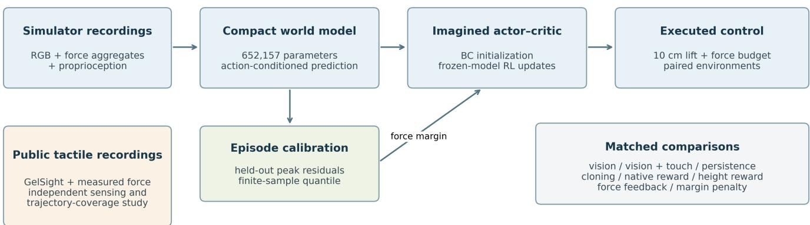
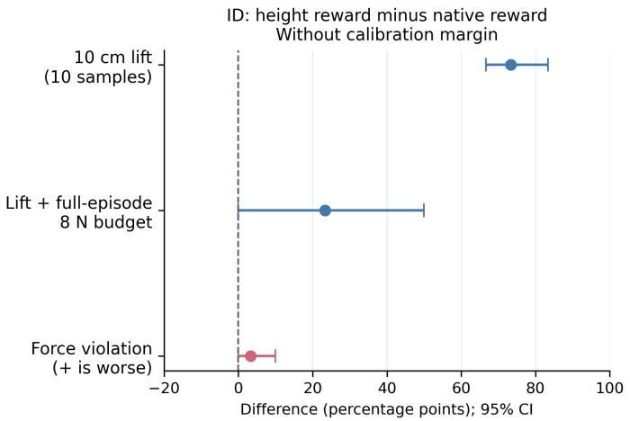
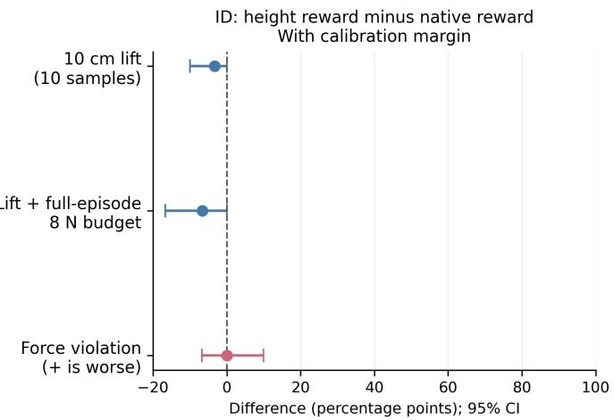

# Compact Visuotactile World Models for Lifting: Prediction, Reward Alignment, and Force Constraints

Qinzhen Ma1 and Sida Peng2

Abstract— Accurate contact prediction is useful for robotic manipulation only if it supports effective decisions. We investigate this connection using a compact, randomly initialized visuotactile world model, trajectory-level uncertainty calibration, and behavior-initialized actor–critic learning in imagination. On 160 MuJoCo Lift episodes, adding touch reduces endpointforce prediction error from 1.058 to 0.228 N and intervalpeak error from 2.724 to 0.523 N across three training seeds. However, tactile persistence achieves lower errors of 0.095 and 0.498 N, respectively. Two exploratory control rounds comprise 680 executions on 40 independent test initial conditions. A matched reward revision on fresh test environments increases in-distribution 10 cm lifting success from 20.0% to 93.3%, while success within an 8 N per-finger budget reaches only 33.3%, compared with 70.0% for force feedback. Calibration margins reduce force violations at the cost of task completion. In a separate study of public GelSight recordings, a force regressor achieves 0.04234 N error, but frame-level calibration covers only 15.80% of complete trajectories; trajectory-level calibration raises this to 87.36% at nominal 90% coverage. Together, these findings distinguish improvements in sensing and task reward from improvements in force-constrained control. The evidence is limited to public sensing records and simulator execution, without a demonstrated transfer between them.

## I. INTRODUCTION

Contact-rich manipulation couples perception, prediction, and control. Vision observes object geometry and motion, while touch supplies local evidence about contact forces. Compact models that combine these signals are attractive for short-horizon control, but a reduction in prediction error need not yield a better policy. Slowly varying contacts may be predicted well by persistence; a learned policy may optimize a reward that differs from the task criterion; and infrequent force peaks may dominate a constraint despite a small average forecast error.

We study these three issues in grasp closure and lifting. Our question is whether the benefits of tactile observations survive the successive steps from force prediction to trajectory-level reliability and executed control. The distinction matters physically: before an object leaves its support, the force borne by the gripper does not determine object mass, and sticking contact does not uniquely identify friction. We therefore evaluate forecasts and explicit force budgets rather than infer unobserved material properties or damage thresholds.

The study has two complementary experimental branches. Public optical tactile recordings with independently measured forces test perception and the effect of calibrating entire contact trajectories. A modified robosuite Lift task tests action-conditioned forecasting and policies trained inside a frozen world model. Its tactile inputs are simulator contact-force aggregates. These branches share a question about prediction reliability, but do not constitute a sensortransfer or sim-to-real pipeline.

Our contributions are three empirical findings. First, a 652,157-parameter model benefits from aligned touch rel ative to vision-only input, yet loses to persistence on several force metrics. Second, trajectory calibration exposes tail errors that are obscured by average accuracy and frame coverage. Third, a matched reward revision improves executed lifting on fresh environments, while remaining inferior to force feedback on force-budgeted success. Together, the matched comparisons identify a correctable reward mismatch and the separate dynamics and constraint limitations that remain after it is corrected. The accompanying code and tabulated results document these comparisons and their evaluation units.

## II. RELATED WORK

Sparsh provides tactile representations and TacBench force-estimation data [1]. FeelAnyForce studies contact-force estimation and transfer across optical tactile sensors [2]. These works motivate using actual force measurements to evaluate perception, rather than treating a derived slip label as independent evidence.

Visuotactile world modeling is already established. VT-WM combines vision, touch, action-conditioned prediction, and planning [3]. FeelWorld explicitly predicts contact, force-related representations, and slip [4]. OmniVTA combines short-horizon tactile prediction with reactive feedback [5]. Consequently, modality fusion or predicting contact is not our novelty claim. Our focus is the connection between compact contact forecasts, trajectory-level error accounting, and the usefulness of resulting decisions.

TD-MPC2 supplies scalable latent dynamics and planning components [6]. We adapt its open-source convolutional, MLP, and SimNorm building blocks, rather than reproducing its complete learning algorithm. Conformal prediction provides finite-sample calibration under exchangeability [7], while Conformal Decision Theory directly addresses decisions made from imperfect predictions [8]. Our task-specific residuals use standard split-conformal calibration with a fixed predictor. We do not implement the decision-risk control procedure of Conformal Decision Theory or introduce a new coverage theorem.

  
Fig. 1. Experimental design. The simulator branch uses contact-force aggregates; the public-data branch uses optical tactile images and supplies a separate sensing study. The actor learns inside a frozen world model, and its performance is measured by executing actions in MuJoCo.

## III. METHOD

## A. Compact action-conditioned model

The observation history contains three $6 4 \times 6 4$ external RGB frames, three tactile observations, and three proprioceptive observations. In simulation, touch comprises a normal force and two signed tangential components for each finger. The tangent basis is fixed using projected gravity-up and its cross direction. These signals are simulated contact-force aggregates, not optical tactile images. Proprioception contains end-effector position, orientation, and finger positions.

A four-layer convolutional encoder produces a 256- dimensional visual feature. Separate MLPs produce 64- dimensional tactile and 32-dimensional proprioceptive features. Their concatenation is projected to a 128-dimensional SimNorm latent:

$$
\begin{array} { c } { { z _ { t } = e _ { \theta } \big ( o _ { t - 2 : t } \big ) , } } \\ { { \widehat { z } _ { t + k + 1 } = d _ { \theta } \big ( \widehat { z } _ { t + k } , a _ { t + k } \big ) . } } \end{array}\tag{1}
$$

The transition network has two 384-unit hidden layers. Heads predict endpoint force, relative object height, table support, finger contact, native task reward, and a $1 6 \times 1 6$ RGB auxiliary target. A dedicated pair of outputs predicts each finger’s maximum normal force over all physics substeps between observations; endpoint force alone could miss transient peaks. The implementation has 652,157 trainable parameters and is initialized randomly, without pretrained weights. Object state, interval peaks, and contact labels supervise training but never enter the encoder or actor as privileged inputs.

Training unrolls five predicted transitions. Losses combine normalized Huber regression for endpoint force, intervalpeak force, height, and reward; binary contact/support losses; low-resolution image error; and consistency with a stopgradient exponential-moving-average encoder. Future observations are used only as targets. Normalization statistics use training episodes exclusively. Validation selects the checkpoint. Vision-only and visuotactile variants have identical parameter counts; the vision-only variant masks normalized tactile inputs to zero.

## B. Contact-envelope calibration

For the independent public-force experiment, let $F =$ $( F _ { x } , F _ { y } , F _ { n } )$ , with compression-positive normal force, and define

$$
g _ { \mu } ( F ) = \sqrt { F _ { x } ^ { 2 } + F _ { y } ^ { 2 } } - \mu F _ { n } .\tag{2}
$$

The parameters $\mu \ \in \ [ 0 . 3 , 0 . 8 ]$ and normal-force ceilings are specified analysis conditions. They are neither identified friction coefficients nor measured damage thresholds. A onesided joint residual is

$$
s _ { i t } = \operatorname* { m a x } \left\{ \begin{array} { l l } { g _ { 0 . 3 } ( F _ { i t } ) - g _ { 0 . 3 } ( \widehat { F } _ { i t } ) , } \\ { g _ { 0 . 8 } ( F _ { i t } ) - g _ { 0 . 8 } ( \widehat { F } _ { i t } ) , } \\ { F _ { n , i t } - \widehat { F } _ { n , i t } } \end{array} \right\} .\tag{3}
$$

The residual difference is affine in $\mu ,$ so its endpoint maximum bounds the full interval. We compare pooling frame scores with calibrating $S _ { i } = \operatorname* { m a x } _ { t } s _ { i t }$ over complete contact trajectories. For n calibration units, the corrected quantile uses rank $\lceil ( n + 1 ) ( 1 - \alpha ) \rceil$ ; negative quantiles are clipped to zero. Insufficient calibration units imply an infinite bound.

The resulting upper bounds are $g _ { \mu } ( \hat { F } ) + q$ and ${ \widehat { F } } _ { n } + q . \mathbf { A }$ frame passes the analysis envelope only if both bounds satisfy their specified limits. A coordinate-box baseline instead calibrates the maximum absolute error over coordinates and time, then propagates its box through the contact functions.

Conditional on a fixed predictor and exchangeable calibration/test trajectories, the trajectory construction supplies marginal simultaneous coverage. It does not guarantee coverage under shape shift, an adaptively selected control distribution, or a new closed-loop policy. Nor does marginal coverage bound error conditional on acceptance. We report acceptance and conditional violations separately, and leave conditional error undefined when nothing is accepted.

For the simulator world model, calibration instead uses the positive underprediction residual of per-finger interval peaks and the absolute height residual. Each score is maximized over the episode’s evaluated windows and all five future steps; the force score also maximizes over fingers. We allocate error probability $\alpha / 2$ to each of the two quantities and compute separate corrected quantiles. The peak at state t+1 summarizes the physics substeps produced by action $a _ { t } .$ so evaluation never substitutes the endpoint contact reading for the interval target. These bounds concern forecasts along recorded actions, not all counterfactual actions.

## C. Imagined policy learning

The policy-learning stage freezes the world model and initializes a two-output actor by behavior cloning. Its outputs control vertical motion and continuous gripper opening/closing after a common scripted approach. Each output is mapped into the corresponding training-action range; this limits action extrapolation but does not guarantee statedistribution support.

Starting from encoded training observations, the actor rolls the model forward for five steps. It maximizes discounted predicted task reward, penalized by predicted interval-peak normal-force excess, action magnitude, and deviation from the frozen behavior prior. A value network regresses detached imagined return targets. An EMA target critic supplies a terminal bootstrap while retaining gradients through the terminal latent for actor learning. Simulator rewards and object state are never queried during imagined updates.

For two-dimensional action $u _ { k }$ , predicted per-finger peak $\widehat { p } _ { k j }$ , force budget $B = 8 \mathrm { N } ,$ , and margin $q ,$ the imagined stage reward is

$$
\begin{array} { c } { \displaystyle \widetilde { r } _ { k } = \widehat { r } _ { k } - \frac { 1 } { 2 } \sum _ { j = 1 } ^ { 2 } \left( \frac { [ \operatorname* { m a x } ( 0 , \widehat { p } _ { k j } ) + q - B ] _ { + } } { B } \right) ^ { 2 } } \\ { \displaystyle - \frac { 0 . 0 0 5 } { 2 } \| u _ { k } \| _ { 2 } ^ { 2 } . } \end{array}\tag{4}
$$

We use $q \ = \ 0$ for ordinary imagined RL and the fixed calibration allowance for the margin variant. Returns obey $G _ { k } = \widetilde { r } _ { k } + 0 . 9 5 G _ { k + 1 } ;$ the terminal critic bootstrap is zero at the intervention boundary. The actor minimizes $- G _ { 0 }$ plus twice the mean squared action deviation from the frozen behavior prior. Training uses 3,520 encoded starts from training episodes, 1,000 behavior-cloning updates, and 1,500 imagined updates, with batch size 256. Adam learning rates are $2 \times 1 0 ^ { - 4 }$ for the actor and $3 \times 1 0 ^ { - 4 }$ for the critic. There is no online data collection or world-model retraining during these updates.

This actor–critic objective differs from the official TD-MPC2 algorithm. We evaluate the learned policies independently in the simulator because optimization can exploit model errors and change the state distribution on which recording-based calibration was obtained.

## IV. PUBLIC TACTILE-FORCE STUDY

## A. Data and protocol

We use the public GelSight force dataset from TacBench, revision $1 3 6 \mathrm { d } { \mathsf { b } } 5 5 4 8 5 \mathrm { b } 6 5 0 1 6 0 5 \mathrm { b } 1 \mathrm { d } 2 6 4 8 \mathrm { c e } 0 \mathrm { f } \mathrm { e } 4 4$ $7 4 0 { \tt e } 3 0 2 { \tt e } \ [ 1 ]$ . GelSight Mini images are paired with ATI Nano17 force measurements. The converted data contain 102,628 paired frames from 1,513 loading/shear trajectories. This dataset contains neither external scene RGB nor the action/reward sequences needed for our world model.

TABLE I  
FORCE PREDICTION ON HELD-OUT PUBLIC TACTILE RECORDS.
<table><tr><td>Test distribution</td><td>Trajectories/ frames</td><td>CNN MAE, N</td><td>Training-mean baseline, N</td></tr><tr><td>Sphere, held-out</td><td>116 / 9,003</td><td>0.04234</td><td>0.11870</td></tr><tr><td>trajectories</td><td></td><td></td><td></td></tr><tr><td>Sphere, held-out batch 6 Flat, exploratory shape</td><td>153 / 11,364 298 /  13,045</td><td>0.03915 0.32685</td><td>0.11322 0.13783</td></tr><tr><td>shift</td><td></td><td></td><td></td></tr><tr><td>Sharp, exploratory shape shift</td><td>304 / 20,908</td><td>0.41304</td><td>0.12432</td></tr></table>

Sphere batches 1–5 are partitioned by entire trajectory: training 453 trajectories/33,982 frames, validation 75/5,983, calibration 114/8,343, and testing 116/9,003. Sphere batch 6 and all flat/sharp trajectories are held out. No adjacent frames from the same trajectory cross partitions. Flat/sharp records contain five unmatched trailing image indices; only paired entries are retained, and these tests remain exploratory. A fixed $- 5 / 0 / + 5$ -frame sensitivity analysis uses matched central frames without choosing an offset from test performance.

The regressor is a 361,091-parameter CNN, trained for at most 30 epochs with AdamW and validation-based selection. Three seeds share the same split. Force statistics use only training labels. Slip labels supplied by the dataset are derived through a friction-cone procedure and are excluded from independent slip evaluation.

## B. Force prediction and distribution shift

Across seeds, sphere MAE is $0 . 0 4 2 3 4 \pm 0 . 0 0 3 0 6$ N and batch-6 MAE is 0.03915 ± 0.00351 $\mathrm { N } ; \pm \mathrm { d e n o t e s }$ trainingseed standard deviation. A grouped bootstrap yields a 95% interval of [0.03823, 0.04675] N for sphere MAE. The regressor performs worse than the constant baseline on the held-out shapes, indicating poor cross-shape generalization in this protocol. Batch identifiers alone do not establish crossday or cross-sensor transfer.

## C. Frame reliability does not imply trajectory reliability

Table II reports joint contact-function coverage at nominal $\alpha = 0 . 1 0$

Direct trajectory calibration narrows the allowance relative to box propagation, but its observed trajectory coverage is lower and does not reach the nominal 90%. The groupedbootstrap 95% interval is [81.90%, 92.24%]. The narrower bounds therefore trade coverage for a smaller allowance in this sample.

For the illustrative envelope $\mu \ = \ 0 . 8 , F _ { n } \ \leq \ 2 \ \mathrm { N } ,$ box propagation accepts no frames. Direct trajectory calibration accepts 18.84%, with 0.192% conditional proxy-constraint violations. This is offline classification of measured forces, not success after executing a robot action. All tested coefficients, ceilings, and zero-acceptance cases are retained in the ancillary metric tables.

TABLE II  
JOINT CONTACT-FUNCTION COVERAGE AT NOMINAL $\alpha = 0 . 1 0 .$ ALLOWANCES AVERAGE OVER FRAMES, THE THREE TESTED µ VALUES, AND TRAINING SEEDS; THE PROPAGATED BOX ALLOWANCE IS NOT ITS COORDINATE RADIUS.
<table><tr><td>Calibration</td><td>Frame coverage</td><td>Trajectory coverage</td><td>Mean contact-bound allowance, N</td></tr><tr><td>Uncalibrated prediction</td><td>34.30%</td><td>0.00%</td><td>0</td></tr><tr><td>Frame, direct functions</td><td>89.62%</td><td>15.80%</td><td>0.1096</td></tr><tr><td>Trajectory, propagated coordinate box</td><td>99.87%</td><td>99.14%</td><td>0.6878</td></tr><tr><td>Trajectory, direct functions</td><td>99.24%</td><td>87.36%</td><td>0.3338</td></tr></table>

TABLE III

WORLD-MODEL FORECAST MAE, AVERAGED OVER HORIZONS ONE THROUGH FIVE. VALUES ARE MEAN ± SAMPLE STANDARD DEVIATION ACROSS THREE TRAINING SEEDS.
<table><tr><td>Split / input</td><td>Endpoint N</td><td>Interval peak N</td><td>Height mm</td></tr><tr><td>ID / vision</td><td> $1 . 0 5 8 \pm 0 . 0 6 2$ </td><td> $2 . 7 2 4 \pm 0 . 2 8 7$ </td><td> $3 . 9 4 6 \pm 0 . 5 6 1$ </td></tr><tr><td>ID / V+T</td><td> $0 . 2 2 8 \pm 0 . 0 2 9$ </td><td> $0 . 5 2 3 \pm 0 . 0 5 1$ </td><td> $2 . 8 2 2 \pm 0 . 3 3 6$ </td></tr><tr><td>OOD / vision</td><td> $0 . 7 6 8 \pm 0 . 0 4 4$ </td><td> $1 . 9 1 8 \pm 0 . 1 0 6$ </td><td> $2 . 6 3 7 \pm 0 . 4 2 5$ </td></tr><tr><td>OOD / V+T</td><td> $0 . 3 7 3 \pm 0 . 0 2 4$ </td><td> $0 . 8 4 9 \pm 0 . 1 0 0$ </td><td> $2 . 3 2 1 \pm 0 . 4 0 5$ </td></tr></table>

## V. SIMULATOR WORLD-MODEL AND INTERACTION STUDY

## A. Data and evaluation protocol

We execute a modified robosuite 1.5.1 Panda Lift task [9] in MuJoCo 3.3.7 [10], with continuous gripper-rate control. The dataset contains 160 episodes of 150 actions at 20 Hz, with 25 physics substeps per action. Entire episodes are split into 80 training, 16 validation, 24 calibration, 20 indistribution (ID) test, and 20 out-of-distribution (OOD) test episodes. The cube geometry is fixed. ID mass is sampled from {0.06, 0.12, 0.25, 0.40} kg and sliding friction from {0.35, 0.60, 0.90}; OOD uses {0.65, 0.90} kg and {0.12, 0.22}. Both finger and object friction are changed. This joint shift does not isolate either physical factor. Per-finger actuator limits vary over 3, 6, 12, and 20 N; these differ from the contact-force budget and can also limit feasibility within the ID domain.

Three seeds train each modality variant for 25 epochs, using training-window stride three and a five-transition horizon. Evaluation uses stride five, yielding 600 windows from 20 episodes in each test split. All reported forecasts follow recorded actions and are compared against actual simulator states. The model adapts TD-MPC2 building blocks with random initialization; it is neither a pretrained model nor a reproduction of the full TD-MPC2 algorithm.

## B. Forecasts and the persistence counterexample

Table III averages horizons one through five and reports the mean ± sample standard deviation over three training seeds. V+T denotes vision and touch. Endpoint force averages six signed/contact components; peak force averages two normal-force maxima. These are distinct targets. Touch reduces both errors relative to vision in each split.

Contact occurs at 1,441/3,000 ID forecast points and $7 1 7 / 3 , 0 0 0 \ \mathrm { O O D }$ points. Restricting endpoint error to actual contact raises vision MAE to 2.087/2.548 N for ID/OOD, and visuotactile MAE to 0.409/1.131 N. Thus, the lower allphase vision error on OOD reflects its different contact mix and does not establish better contact generalization.

That comparison alone does not demonstrate useful dynamics. Holding the current tactile endpoint force constant gives 0.095 N ID and 0.203 N OOD endpoint MAE, outperforming the world model in both cases. For other targets, the persistence baseline holds the model’s current estimate fixed: its ID peak MAE is 0.498 N versus 0.523 N for learned dynamics, although its height MAE is worse, 5.043 versus 2.822 mm. On OOD peaks, learned dynamics improve on persistence, 0.849 versus 0.966 N. Replacing tactile histories with histories from another episode raises ID endpoint/peak errors to 1.736/4.599 N. This negative control demonstrates dependence on aligned touch; it does not establish a causal benefit from predicting transitions.

## C. Calibration limits

At nominal joint coverage 90%, the 24 calibration episodes require the largest episode residual for each 95% component bound: $\left\lceil 2 5 \times 0 . 9 5 \right\rceil = 2 4 .$ . The three visuotactile runs yield peak allowances of 13.204, 6.945, and 9.438 N. Joint episode coverage is respectively 80%, 85%, and 90% on the 20 ID episodes, and 65%, 50%, and 45% on the 20 OOD episodes. Thus, low average error coexists with large episode-level tail allowances, and calibration does not transfer through this shift. The small number of independent episodes also limits precision.

Two allowances already exceed the entire 8 N per-finger budget before adding a nonnegative predicted peak. Using these as hard admission bounds would reject every such forecast for those runs. This is a limitation of useful certi fication, not evidence that abstention successfully completes the task. The policy extension can use the allowance as a penalty margin, but a soft penalty is not a safety guarantee.

## D. Matched interaction protocol

Closed-loop comparisons use the cloned actor, imagined actor, and calibrated-margin variant, with paired simulator resets and common scripted approach actions. During actions 44–134, every controller changes only vertical motion and continuous gripper rate; the other five action coordinates are zero. A common lowering phase starts at action 135. Learned policies do not receive object state, mass, or friction. The common approach uses the initial object position and is therefore a declared privileged setup component.

The strict task metric requires relative object height of at least 0.10 m for ten consecutive 20 Hz observations before lowering. Force-budget success additionally requires every finger’s interval peak to remain at or below 8 N over the complete 150-action episode, including approach and lowering. Failures to grasp remain in the denominator. The native robosuite success flag is recorded separately because it uses a different height threshold. Control metrics use executed simulator states, not imagined returns.

TABLE IV  
INITIAL-ROUND EXECUTED CONTROL ON THE SAME 20 NEW ENVIRONMENTS: TEN ID AND TEN OOD. LEARNED METHODS AVERAGE THREE FIXED POLICIES; THE SAMPLE IS NOT 60 INDEPENDENT ENVIRONMENTS. ALL OOD STRICT AND JOINT SUCCESSES ARE ZERO.
<table><tr><td>Controller</td><td>Strict lift %</td><td>Lift within 8N %</td><td>Exceeds 8 N %</td><td>Mean episode peak N</td><td>Native return</td></tr><tr><td>Script</td><td>35.0</td><td>10.0</td><td>55.0</td><td>10.269</td><td>56.646</td></tr><tr><td>Force feedback</td><td>40.0</td><td>25.0</td><td>30.0</td><td>7.175</td><td>59.815</td></tr><tr><td>Vision BC</td><td>15.0</td><td>5.0</td><td>48.3</td><td>8.564</td><td>48.517</td></tr><tr><td>Vision RL</td><td>6.7</td><td>5.0</td><td>83.3</td><td>12.452</td><td>41.089</td></tr><tr><td>Vision + touch BC</td><td>15.0</td><td>5.0</td><td>56.7</td><td>9.955</td><td>55.943</td></tr><tr><td>Vision + touch RL</td><td>6.7</td><td>3.3</td><td>61.7</td><td>9.478</td><td>61.365</td></tr><tr><td>Vision + touch margin RL</td><td>5.0</td><td>5.0</td><td>8.3</td><td>3.210</td><td>51.164</td></tr></table>

The OOD group is a feasibility stress test. Under an ideal horizontal two-finger pinch supporting a vertical load, two 8 N normal forces with $\mu \ \leq \ 0 . 2 2$ support at most 3.52 N, below the lightest OOD object’s 6.38 N weight. This ideal friction-only model has no budget-feasible suspended grasp in the OOD group. Geometric support and dynamics can violate the simplified model, so this is not a proof that every MuJoCo strategy is infeasible. OOD zero success alone therefore cannot establish a learning-generalization failure; a shifted but feasible group is needed to isolate that question.

## E. Initial control experiment

In the first round, every controller is evaluated on the same 20 new environment seeds, ten ID and ten OOD, disjoint from all dataset seeds. The fifteen learned policies comprise vision and visuotactile BC/RL for three training seeds, plus three visuotactile margin-RL policies. Two baselines use the common scripted lift; the force-feedback baseline replaces gripper commands with clip $( 0 . 1 2 ( 5 \mathrm { ~ - ~ } \overline { { F } } _ { n } ) , - 0 . 2 5 , 0 . 3 5 )$ targeting a 5 N mean normal force. No controller is selected from test performance.

Table IV averages the three fixed policies for each learned method. The sample contains 20 independent environments, not 60. Peak denotes the maximum over both fingers and the complete episode, averaged over episodes; return sums the unmodified shaped simulator rewards. All OOD strict and joint successes are zero, so ID joint success is 50.0% for feedback, 10.0% for either BC modality and vision RL, 6.7% for visuotactile RL, and 10.0% for margin RL.

The first round does not support an RL advantage. For visuotactile RL, native return rises from 55.943 for BC to 61.365, while strict lift success falls from 15.0% to 6.7%. This mismatch also reflects that the native shaped reward does not encode the 10 cm, ten-observation criterion. The margin reduces force violations substantially but produces only three joint successes in its middle training seed and none in the other two: per-policy counts are [0, 3, 0] out of 20. Low force violations here accompany low task completion.

We use 2,000 paired bootstrap resamples of whole environment seeds, stratified by ID/OOD, while holding trained policies fixed. Margin RL minus feedback joint success is −20.0 percentage points, with a 95% interval of [−33.3, −6.7]; its difference from ordinary visuotactile RL is +1.7 points, with interval [−8.3, 8.3]. The broad intervals and only ten environments per domain limit inference, including comparisons among training procedures.

## F. Initial executed-distribution diagnostic

A retrospective diagnostic conditions each model on the future actions actually executed by its policy, using fivestep forecasts during the intervention. It leaves the original recording-based calibration unchanged. ID joint forecast coverage for visuotactile RL is [0%, 60%, 40%] across seeds, compared with [80%, 100%, 80%] for its BC policies. This further shows that recording calibration need not survive policy optimization. The diagnostic is not an online planning evaluation: it is supplied the subsequently executed action sequence, and the policies induce different state distributions.

## G. Exploratory matched reward revision

After inspecting the first round, we replace only the imagined task-reward term with $\widehat { r } _ { k } \ = \ \mathrm { c l i p } ( \widehat { h } _ { k } / 0 . 1 0 , 0 , 1 )$ where height is measured in meters. It rewards progress toward the evaluated height at every imagined step, but does not explicitly enforce the ten-observation criterion. Peak penalties, calibration allowances, action ranges, and training settings stay fixed. Audited checkpoint hashes match the original world models, and all six new actors have exactly the same BC initial parameters as their corresponding native-reward actors; the maximum parameter difference is zero. The comparison therefore changes the task-reward term while matching model and actor initialization.

The second round uses twenty fresh environment seeds, 20291000–20291019, again ten ID and ten OOD. The two baselines, three existing visuotactile BC policies, six existing native-reward policies, and six new height-reward policies all execute on this same set. Native policies are re-evaluated here so the reward comparison never mixes the two test cohorts. This follow-up was motivated by observed firstround failures and remains exploratory; its policy matrix was fixed before evaluating the new actors.

TABLE V  
EXPLORATORY REWARD FOLLOW-UP ON A SEPARATE SET OF TEN ID AND TEN OOD ENVIRONMENTS. ALL POLICIES ARE EVALUATED ON THE SAME NEW SEEDS. LEARNED ROWS AVERAGE THREE FIXED POLICIES; ALL OOD STRICT AND JOINT SUCCESSES ARE ZERO.
<table><tr><td>Second-round controller</td><td>ID strict lift, %</td><td>ID lift within 8N, %</td><td>ID exceeds 8N, %</td><td>ID mean peak, N</td><td>OOD exceeds 8N, %</td></tr><tr><td>Script</td><td>100.0</td><td>20.0</td><td>80.0</td><td>11.410</td><td>50.0</td></tr><tr><td>Force feedback</td><td>100.0</td><td>70.0</td><td>30.0</td><td>7.311</td><td>10.0</td></tr><tr><td>Vision + touch BC</td><td>26.7</td><td>20.0</td><td>33.3</td><td>8.908</td><td>63.3</td></tr><tr><td>Vision + touch RL, native</td><td>20.0</td><td>10.0</td><td>56.7</td><td>8.608</td><td>60.0</td></tr><tr><td>Vision + touch RL, height</td><td>93.3</td><td>33.3</td><td>60.0</td><td>9.041</td><td>70.0</td></tr><tr><td>Vision + touch margin RL, native</td><td>23.3</td><td>20.0</td><td>6.7</td><td>2.685</td><td>13.3</td></tr><tr><td>Vision + touch margin RL, height</td><td>20.0</td><td>13.3</td><td>6.7</td><td>2.900</td><td>13.3</td></tr></table>

  
Fig. 2. Paired second-round ID changes from native to height reward. Intervals resample the ten shared ID environments while holding the three trained policies fixed. Better strict lifting does not imply better force regulation.

Table V reports the second round; all OOD strict and joint successes remain zero. On ID, height-reward RL achieves strict success counts [9, 10, 9] out of ten for the three seeds, versus [2, 4, 0] for the matched native-reward policies. The paired mean increase is 73.3 percentage points (Fig. 2), with a fixed-policy, environment-bootstrap 95% interval of [66.7, 83.3]. Joint success increases by 23.3 points, with interval [0.0, 50.0], while mean episode peak increases by 0.432 N, with interval [0.175, 0.711]. These results support a task-attainment improvement in this follow-up, not improved force regulation. Height-reward joint success remains 36.7 points below feedback, with interval [−63.3, −10.0].

The margin-height variant attains only 13.3% ID joint success versus 20.0% for margin-native; it does not resolve the conservative-margin failure. Repeating the retrospective actual-action diagnostic on the second cohort gives ID joint forecast coverage [10%, 80%, 80%] for height RL, [0%, 60%, 50%] for native RL, and [100%, 100%, 100%] for BC. These are different induced state distributions with unchanged calibration, not evidence of online safety or a universally improved predictor.

## H. Computation and scope

Both rounds together comprise 680 simulator executions but only 40 independent test initial conditions. On the local RTX 5090 Laptop GPU, six world-model training runs take

178.17 s in total; the first nine actor-training runs take 215.13 s and the six follow-up runs take 129.45 s, including replay encoding, BC, and imagined updates. These timings exclude simulator data generation, controller execution, and analysis. World-model training starts from random weights, and the follow-up reuses frozen world models rather than collecting new training interactions.

## VI. LIMITATIONS AND CONCLUSION

The experiments support local force prediction and a clear benefit from touch relative to vision-only forecasts. They also expose unfavorable shape transfer, a mismatch between frame and trajectory coverage, large episode-level peak allowances, and persistence baselines that outperform learned dynamics on several force metrics. These results prevent us from attributing the modality gain to useful actionconditioned dynamics alone.

Actual simulator execution shows that a matched, exploratory height-reward revision can improve lifting under the ten-observation criterion relative to native-reward imagination. However, it does not outperform simple force feedback on force-budgeted success and increases mean peak force. The calibration-margin penalty lowers violations with poor task completion, and recording-based forecast coverage degrades under learned policies. Better force regulation, stronger dynamics and reactive baselines, more diverse feasible episodes, and fresh confirmatory evaluation remain necessary to test whether these gains extend to reliable forceconstrained control.

The study uses one rigid object geometry, simulated contact-force aggregates, and a small number of independent environments. The reward follow-up lacks a vision-only height-reward ablation, so its control improvement cannot be attributed to touch. Public GelSight data supply a separate sensing result, with no demonstrated transfer to the simulator policy. We do not establish real-robot grasp success, identified friction, deformable-object damage limits, or safety under an optimized policy.

## APPENDIX

IMPLEMENTATION AND REPRODUCIBILITY DETAILS

## A. Training settings

The public-force regressor takes 3×64×48 tactile images. Four 3×3 convolutions with stride two and padding one have 24, 48, 96, and 128 output channels, respectively; each is followed by eight-group normalization and SiLU. A 128-unit SiLU hidden layer maps the flattened feature to three force components. Images are rotated to portrait when needed and resized bilinearly using the released loader’s sample mapping. Inputs are scaled from bytes to [−1, 1]; targets use training-only force means and standard deviations. The loss is mean squared standardized force error. AdamW uses learning rate $1 0 ^ { - 3 }$ , weight decay $1 0 ^ { - 4 }$ , and a cosine schedule reaching $1 0 ^ { - 4 }$ over 30 epochs; batch size is 256 and gradient norm is clipped at 5. Training uses bfloat16 autocasting, seeds 17, 29, and 43, and trajectory split seed 314159. Minimum validation MAE selects the checkpoint.

The world-model objective is

$$
\begin{array} { r l } & { \mathscr { L } = \mathscr { L } _ { F } + \mathscr { L } _ { p } + \mathscr { L } _ { h } + 0 . 2 5 ( \mathscr { L } _ { S } + \mathscr { L } _ { C } ) } \\ & { ~ + 0 . 5 \mathscr { L } _ { r } + 0 . 5 \mathscr { L } _ { I } + 2 0 \mathscr { L } _ { z } . } \end{array}\tag{5}
$$

Here $F , p , h , r$ use elementwise-mean Huber losses with transition point one after target normalization. Support S and contact C use binary cross-entropy, I uses RGB mean squared error, and z uses mean squared latent consistency with the target encoder. Supervision includes the initial decoded state and five future states; latent consistency uses the five future states only. AdamW uses learning rate 3 × $1 0 ^ { - 4 }$ , weight decay $1 0 ^ { - 4 }$ , batch size 64, and gradient-norm clipping at 20. The target encoder update rate is 0.01. Each of seeds 0, 1, and 2 trains both modalities for 25 epochs with training stride three and validation stride five; minimum validation total loss selects the checkpoint.

The actor has two 128-unit hidden layers and 33,282 parameters. Its training-data action bounds are approximately [−0.01133, 0.43081] for vertical motion and [−0.2, 1.0] for gripper rate. Actor–critic updates use the hyperparameters in Section III-C and a target-value update rate of 0.01. Encoded training starts lie between actions 44 and 130; five-step rollouts reaching action 135 terminate without bootstrapping.

## B. Measurement and statistical units

Public-force MAE averages absolute errors over the three force components and all paired frames. Its interval uses 2,000 bootstrap resamples of whole trajectories, with seed 20260908, and holds trained regressors fixed. Simulator forecast MAE averages over windows, five horizons, and the appropriate force components. The reported trainingseed standard deviations quantify variation among three fitted models; they are distinct from environment-bootstrap confidence intervals.

The strict control metric checks ten consecutive sampled heights at or above 0.10 m before lowering. At 20 Hz their first and last samples are 0.45 s apart; this metric does not test continuous height between samples. In contrast, force-budget violations use contact forces at every 0.002 s physics substep. Each reported force is the sum of normal contact forces on one finger, and the episode peak maximizes over both fingers and all substeps, including approach and lowering. Forcebudgeted success is the intersection of strict lift success and no budget violation.

The two control cohorts use environment seeds 20281000– 20281019 and 20291000–20291019. Bootstrap intervals use 2,000 paired resamples of whole environments, stratified by domain, with bootstrap seed 90210. The same environment draw is used for every fixed policy in a comparison. These intervals quantify test-environment variation conditional on the trained policies, rather than uncertainty over repeated policy training.

## DATA, CODE, AND TOOL USE

The public tactile dataset is distributed by its original authors as facebook/gelsight-force-estimation on Hugging Face under CC BY-NC 4.0. We use the pinned revision specified above; the original recordings are not redistributed with this article. Experiment code, split manifests, per-seed metrics, and per-episode control results accompany the source submission as ancillary material. The compact model adapts TD-MPC2 components at revision e9f5932, with the original MIT license retained. No pretrained world-model weights are used. OpenAI Codex assisted with manuscript drafting and revision, experiment and analysis code, and experiment orchestration.

## REFERENCES

[1] C. Higuera et al., “Sparsh: Self-supervised touch representations for vision-based tactile sensing,” in Proc. 8th Conf. Robot Learning (CoRL 2024), Proc. Mach. Learn. Res., vol. 270, pp. 885–915, 2025. https://proceedings.mlr.press/v270/higuera25a.html. Force-data card: https://huggingface.co/datasets/facebook/gelsight-force-estimation/ blob/main/README.md.

[2] A.-H. Shahidzadeh, G. Caddeo, K. Alapati, L. Natale, C. Fermüller, and Y. Aloimonos, “FeelAnyForce: Estimating contact force feedback from tactile sensation for vision-based tactile sensors,” in Proc. IEEE Int. Conf. Robot. Autom. (ICRA), 2025. https://www.prg.cs.umd.edu/ FeelAnyForce. Preprint: https://arxiv.org/abs/2410.02048.

[3] C. Higuera, S. Arnaud, B. Boots, M. Mukadam, F. R. Hogan, and F. Meier, “Visuo-tactile world models,” arXiv:2602.06001v1, 2026. https://arxiv.org/abs/2602.06001v1.

[4] W. Ma, C. Zhang, C. Xue, Y. Cai, G. Yao, S. Cui, and S. Wang, “Feel-World: Visuo-tactile world model for hierarchical contact prediction and planning,” arXiv:2607.24267v1, 2026. https://arxiv.org/abs/2607. 24267v1.

[5] Y. Zheng et al., “OmniVTA: Visuo-tactile world modeling for contactrich robotic manipulation,” arXiv:2603.19201v3, 2026. https://arxiv. org/abs/2603.19201v3.

[6] N. Hansen, H. Su, and X. Wang, “TD-MPC2: Scalable, robust world models for continuous control,” in Proc. Int. Conf. Learn. Representations (ICLR), 2024. https://openreview.net/forum?id=Oxh5CstDJU. Official code: https://github.com/nicklashansen/tdmpc2.

[7] A. N. Angelopoulos and S. Bates, “Conformal prediction: A gentle introduction,” Found. Trends Mach. Learn., vol. 16, no. 4, pp. 494– 591, 2023. doi: 10.1561/2200000101. https://www.nowpublishers. com/article/Details/MAL-101.

[8] J. Lekeufack, A. N. Angelopoulos, A. Bajcsy, M. I. Jordan, and J. Malik, “Conformal decision theory: Safe autonomous decisions from imperfect predictions,” in Proc. IEEE Int. Conf. Robot. Autom. (ICRA), 2024. doi: 10.1109/ICRA57147.2024.10610041. https://arxiv.org/abs/ 2310.05921v3.

[9] Y. Zhu, J. Wong, A. Mandlekar, R. Martín-Martín, A. Joshi, K. Lin, A. Maddukuri, S. Nasiriany, and Y. Zhu, “robosuite: A modular simulation framework and benchmark for robot learning,” arXiv:2009.12293v3, 2025. Original preprint, 2020. https://arxiv.org/ abs/2009.12293v3.

[10] E. Todorov, T. Erez, and Y. Tassa, “MuJoCo: A physics engine for model-based control,” in Proc. IEEE/RSJ Int. Conf. Intell. Robots Syst. (IROS), 2012. doi: 10.1109/IROS.2012.6386109. https://roboti.us/lab/ papers/TodorovIROS12.pdf.