# JARVISGUI: Towards Cross-Device GUI Agents with Dynamic Task Composition

Zixiang Chen<sup>1</sup>\*, Yuheng Lu<sup>1</sup>\*, Zihao Cheng<sup>1</sup>, Zeming Liu<sup>1†</sup>, Jizeng Bai<sup>1</sup>, Ziye Huang<sup>1</sup>, Zhiyin Lin<sup>1</sup>, Zihan Li<sup>1</sup>, Yuhang Guo<sup>2</sup>, Yunhong Wang<sup>1</sup>, Haifeng Wang<sup>3</sup>

<sup>1</sup>School of Computer Science and Engineering, Beihang University, Beijing, China <sup>2</sup>Beijing Institute of Technology, Beijing, China, <sup>3</sup>Baidu Inc., Beijing, China {chenzixiang, luyuh, zmliu}@buaa.edu.cn

## Abstract

Real-world GUI usage frequently involves workflows that span multiple devices and platforms, requiring the transfer of intermediate results, maintenance of shared state, and coordination across heterogeneous environments. However, existing GUI benchmarks overwhelmingly evaluate agents on singledevice, statically defined tasks, thus leaving such cross-device capabilities largely unexamined, resulting in an overly optimistic assessment of agents’ readiness for real-world usage. We introduce JarvisGUI, a dynamic benchmark that evaluates GUI agents on cross-device workflows requiring coordinated interaction across heterogeneous platforms—including Android, Windows, and Ubuntu. Specifically, Jarvis-GUI formulates GUI tasks as input–output transformations under a lightweight type system, which allows us to automatically compose multi-step, cross-device workflows and dynamically evaluate agent performance within a unified framework. By evaluating agents in virtual environments spanning multiple operating systems, JarvisGUI reveals that state-of-theart open-source GUI agents struggle with the state-transfer awareness, cross-platform contextual reasoning, and long-horizon dependency management required for real-world workflows, exposing a critical capability gap invisible to existing benchmarks <sup>1</sup>.

## 1 Introduction

The rapid advancement of Multimodal Large Language Models (MLLMs) (Yin et al., 2024; Zhao et al., 2026; Xie et al., 2025) has catalyzed the development of Graphical User Interface (GUI) agents that can perceive complex visual environments and autonomously execute tasks through simulated human interactions (e.g., clicking, typing, and scrolling) (Wang et al., 2024b; Yin et al., 2024; Nguyen et al., 2025). To systematically measure this progress, recent benchmarks have been proposed to evaluate GUI agents in both static (Kapoor et al., 2024; Cheng et al., 2024; Li et al., 2025; Lu et al., 2025a) and dynamic environments (Xie et al., 2024; Xu et al., 2025; Bu et al., 2025; Liu et al., 2026).

However, these benchmarks predominantly adopt a single-device assumption, where each task is confined to one operating system or platform. This paradigm neglects a fundamental characteristic of real-world digital workflows: the necessity of cross-device interaction. In practice, users routinely coordinate actions across smartphones, personal computers, and servers (Brudy et al., 2018; Raptis et al., 2016; Majrashi et al., 2021; Jokela et al., 2015). For example, Figure 1 shows such a cross-device workflow. Existing benchmarks fail to capture this cross-device dependency, resulting in an incomplete assessment of agent capabilities under realistic deployment conditions.

To bridge this gap, we propose JarvisGUI, a novel benchmark specifically designed to evaluate GUI agents in cross-device settings. Unlike prior benchmarks that focus on isolated environments, JarvisGUI introduces a heterogeneous multidevice ecosystem comprising Android, Windows, and Ubuntu platforms. Tasks in JarvisGUI explicitly require agents to coordinate actions across devices, including transferring information, sharing files, and maintaining task context throughout multi-platform execution.

Using JarvisGUI, we conduct comprehensive evaluations of several representative open-source GUI agents (Bai et al., 2025a; Zhou et al., 2025; Ye et al., 2025; Gu et al., 2025). To accommodate the prevalent single-platform interaction paradigm, in which current GUI agents process only one active platform per step, we adopt a two-stage Planner-Grounder architecture, with details in Appendix A.1. Results reveal substantial disparities between single-device proficiency and cross-device competence, highlighting persistent challenges in context preservation and inter-device reasoning.

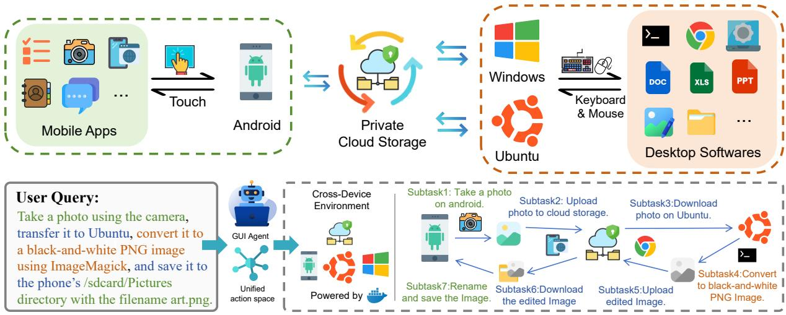  
Figure 1: Overview of JarvisGUI. Green denotes tasks on mobile platforms, orange denotes tasks on desktop platforms, and blue denotes cross-device transfer tasks.

Overall, our contributions are summarized as follows:

• To the best of our knowledge, we are the first to systematically study cross-device GUI agent tasks, where successful execution requires transferring information, files, and execution context across heterogeneous devices.

• We propose a slot-typing-based atomic task modeling framework that explicitly models transferable entities and inter-task dependencies, enabling reliable, extensible, and verifiable composition of complex cross-device tasks.

• Building on this framework, we introduce JarvisGUI, a dedicated benchmark spanning Android, Windows, and Ubuntu for evaluating GUI agents in realistic multi-ecosystem scenarios. Experiments with strong opensource agents reveal that cross-device coordination remains a major bottleneck largely obscured by existing GUI benchmarks.

## 2 Related Work

## 2.1 GUI Agent

Recent advances in vision–language models (VLMs) (Bai et al., 2025b,a) have significantly shaped the development of GUI agents, which aim to execute user instructions through interactions with GUI. Early GUI agents predominantly relied on structured visual representations, such as sets of visual marks (Yang et al., 2023), to encode interface components (Yan et al., 2023; Zhang et al., 2024; Wang et al., 2024b). Subsequent work has shifted toward end-to-end visual agents that directly predict actions from raw screenshots (Ma et al., 2024; Gou et al., 2025; Liu et al., 2024).

With the scaling of training data, recent agents have demonstrated strong capabilities in grounding natural language instructions to interface elements (Wu et al., 2025; Yang et al., 2025; Qin et al., 2025). This performance has been further enhanced by incorporating reinforcement learning techniques, including static RL methods(Lu et al., 2026; Yuan et al., 2025; Tang et al., 2026; Gu et al., 2025) and online RL methods(Zhou et al., 2025; Wang et al., 2025). However, most existing approaches assume that the agent’s observation consists of a screenshot from a single device at any given time (Nguyen et al., 2025), leaving the more realistic and challenging setting of cross-device GUI interaction largely unaddressed, which remains a critical barrier to real-world deployment.

## 2.2 GUI Agent Benchmark

Alongside the evolution of GUI agents, benchmarking methodologies have progressed from static, single-step grounding tasks (Cheng et al., 2024; Li et al., 2025; Lu et al., 2025b) to multi-step interactive settings (Rawles et al., 2023; Lu et al., 2025a), and further to virtual environments supporting diverse execution paths (Xie et al., 2024; Xu et al., 2025; Bu et al., 2025). However, most benchmarks remain confined to single-device settings. Although CRAB (Xu et al., 2025) acknowledges the importance of cross-device task execution, its coverage remains limited: it contains only 18 cross-device tasks (largely due to annotation difficulty) and does not model realistic file and data transfer across devices, making it insufficient for evaluating end-to-end cross-device workflows. Consequently, the lack of large-scale, systematic cross-device benchmarks leaves a gap between lab evaluation and real-world deployment, motivating us to provide practical guidance for bringing GUI agents into real workflows.

## 3 Environment

A robust benchmark for cross-device GUI agents necessitates an evaluation environment that is reproducible, controllable, and capable of supporting both high-throughput parallel execution and multi-device collaboration. To fulfill these requirements, we propose the environment design of JarvisGUI. We will introduce the task definition and evaluation, the system architecture, and the environment configuration.

## 3.1 Task Definition and Evaluation

Establishing a rigorous formal task definition is a prerequisite for constructing an environment that supports systematic evaluation. In JarvisGUI, a GUI agent task is modeled as a typed, parameterized system that supports dynamic instantiation, is executed by an agent in heterogeneous environments, and is evaluated through inspection of the final environment state.

A task is formally defined as a tuple $\boldsymbol { \mathcal { T } } =$ $( \mathcal { T } , \mathcal { O } , D , \Phi , P )$ , consisting of a sequence of input slots I and output slots O, a natural language template D, a set of evaluation functions Φ, and a target execution platform P. To support generalization, we distinguish between static specifications $( \mathcal { T } , P )$ and dynamic components $( \mathcal { O } , D , \Phi )$ . The latter are materialized via a parameterized mapping M conditioned on concrete input values $v \tau$ during execution, denoted as $( \mathcal { O } , D , \Phi )  M ( v _ { \mathbb { Z } } )$

Task Execution as State Transition. The execution of a GUI agent task is modeled as an iterative state transition process. At step i, the agent maintains an internal model state $M _ { i - 1 }$ that encodes its memory from previous steps. Given the current environment observation $s _ { i }$ and the task instruction $D ,$ the agent produces an action $a _ { i }$ and updates its

internal state:

$$
( a _ { i } , M _ { i } ) = \mathrm { A g e n t } ( s _ { i } , D , M _ { i - 1 } ) .
$$

The action $a _ { i }$ is then executed in the environment, inducing a transition to the next environment state:

$$
s _ { i + 1 } = \operatorname { E n v } ( s _ { i } , a _ { i } ) .
$$

In heterogeneous settings, the environment state $s _ { i }$ may consist of observations from multiple platforms, i.e.,

$$
s _ { i } = \{ s _ { i } ^ { ( P _ { 1 } ) } , s _ { i } ^ { ( P _ { 2 } ) } , \ldots , s _ { i } ^ { ( P _ { n } ) } \} ,
$$

allowing the agent to reason jointly over multiple environments within a single task execution. When the process terminates, the task reaches a final state $s _ { \mathrm { f i n a l } }$ , which is then evaluated by the corresponding evaluators in Φ.

Dynamic Evaluation. An evaluator $\phi \in \Phi$ is a deterministic function $\phi : { \mathcal { S } }  \{ 0 , 1 \}$ , where S denotes the environment state space. Given the final state $s _ { \mathrm { f i n a l } } \in S$ after task execution, $\phi ( s _ { \mathrm { f i n a l } } )$ verifies task completion by programmatically inspecting observable artifacts (e.g., file content or DOM elements), ensuring robustness to stochastic interface changes.

## 3.2 System Architecture

The JarvisGUI environment is organized into four layers: the Infrastructure Layer, the Environment Control Layer, the Model Interaction Layer, and the Evaluation Execution Layer, as shown in Figure 2. Based on this layered design, JarvisGUI serves as a reproducible and controllable evaluation environment that supports high-throughput parallel execution and multi-device collaboration.

Infrastructure Layer The Infrastructure Layer aims to establish a reproducible experimental environment via Docker-based virtualization, which enables isolated execution with minimal overhead. It is responsible for handling the creation and destruction of Docker containers, exposing external interfaces for the lifecycle management of the Docker environment.

Please refer to Appendix A.4.1 for infrastructure details.

Environment Control Layer The Environment Control Layer is designed as a platform-agnostic abstraction layer. By defining a unified interface and action space, it masks the heterogeneity of underlying platforms, enabling standardized control over diverse device environments. Please refer to Appendix A.4.2 for details of the unified observation space and the unified action space.

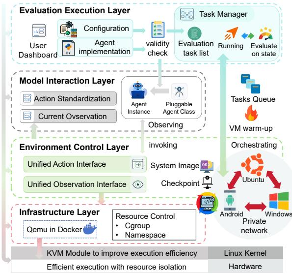  
Figure 2: The system architecture of JarvisGUI environment.

Model Interaction Layer The Model Interaction Layer is responsible for translating abstract natural language instructions into cross-platform executable action sequences. To address the complex decision-making required for multi-device tasks, this layer adopts a two-stage Planner-Grounder architecture. Additionally, it is tasked with standardizing and mapping diverse model inference results into our pre-defined action space. Please refer to Appendix A for further details.

Evaluation Execution Layer The Evaluation Execution Layer is charged with the full-lifecycle management of evaluation tasks. Beyond orchestrating the Infrastructure Layer to enable highthroughput parallel evaluation, it allows for the real-time supervision of agent-environment interactions and performs automated scoring based on predefined evaluation protocols.

The standard evaluation workflow proceeds as follows: The layer first parses the Task Configuration File (detailed in Section 3.3) and provisions the necessary Docker containers and computing resources. Subsequently, it invokes the Environment Control Layer to perform pre-execution initialization (e.g., uploading files), while extracting the natural language instructions and loading the evaluation rules from the configuration. The system then enters an interaction-execution loop: the agent acquires observations and plans actions, which are dispatched to the target device. This loop persists until the task concludes. Finally, essential state data is retrieved to the host machine for automated scoring based on the rules to determine the task’s completion status.

Please refer to Appendix A.4.3 for further details.

## 3.3 Environment Configuration

Given that individual tasks often entail specific execution prerequisites (e.g., ensuring a specific file pre-exists in the environment) and distinct evaluation criteria, we utilize a structured configuration file to encapsulate all task-specific metadata. This design enables automated management, where the Evaluation Execution Layer parses the file to dynamically apply the corresponding environment configurations. For further details regarding the configuration files, please refer to Appendix A.4.4.

## 4 JarvisGUI

Built upon the task definition, evaluation protocol, and heterogeneous environment introduced in Section 3, we construct a task-generation pipeline for building JarvisGUI and comprehensively evaluating GUI agents in cross-device settings, as shown in Figure 3.

We first introduce our type system and its role in compositional task construction (Section 4.1). Next, we describe the data collection pipeline used to generate diverse and complex cross-device GUI tasks (Section 4.2). Finally, we report our quality control methods (Section 4.3) and comprehensive statistics (Section 4.4) of JarvisGUI.

Table 1 shows the detailed comparison between JarvisGUI and other popular benchmarks.

## 4.1 Type System and Compositional Task Modeling

Type System To enable automated validity checking for task composition, we introduce a hierarchical type system. Let T be a type space equipped with a partial order $\preceq$ representing the subtype relation. Each slot $s \in \mathcal { I } \cup \mathcal { O }$ is defined as a tuple $( \operatorname { i d } , \tau )$ , where $\tau \in \mathbb { T }$ . Data flow validity is enforced via subtype compatibility: an output slot with type $\tau _ { \mathrm { o u t } }$ may satisfy an input slot with type $\tau _ { \mathrm { i n } }$ if and only if $\tau _ { \mathrm { o u t } } \preceq \tau _ { \mathrm { i n } }$ . This typing discipline ensures semantic consistency when chaining specialized outputs (e.g., xlsx\_file) to more general inputs (e.g., ordinary\_file).

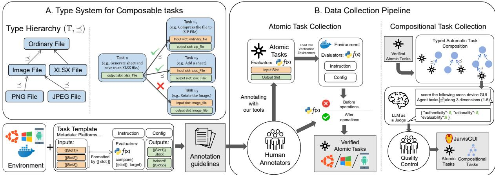  
Figure 3: Data Collection Pipeline of JarvisGUI.

<table><tr><td>Benchmark</td><td>CD</td><td>MS</td><td>DE</td><td>DT</td><td>#Devices</td></tr><tr><td>screenspot (Cheng et al., 2024)</td><td>X</td><td></td><td></td><td>X</td><td>4</td></tr><tr><td>screenspot-pro (Li et al., 2025)</td><td>X</td><td>X</td><td>X</td><td>X</td><td>3</td></tr><tr><td>TransBench (Lu et al., 2025b)</td><td>X</td><td>X</td><td>X</td><td>X</td><td>3</td></tr><tr><td>AndroidControl (Li et al., 2024)</td><td>X</td><td></td><td>X</td><td>X</td><td>1</td></tr><tr><td>AITW (Rawles et al., 2023)</td><td>X</td><td></td><td>X</td><td>X</td><td>1</td></tr><tr><td>GUI Odyssey (Lu et al., 2025a)</td><td>X</td><td></td><td>X</td><td>X</td><td>5</td></tr><tr><td>OS World (Xie et al., 2024)</td><td>X</td><td></td><td></td><td>X</td><td>3</td></tr><tr><td>CRAB (Xu et al., 2025)</td><td>V</td><td></td><td></td><td>X</td><td>2</td></tr><tr><td>OmniBench(Bu et al., 2025)</td><td>X</td><td></td><td></td><td>X</td><td>3</td></tr><tr><td>JARVISGUI (Ours)</td><td></td><td></td><td></td><td></td><td>3</td></tr></table>

Table 1: Comparison of JarvisGUI with existing GUI agent benchmarks. CD: cross-device task execution; DE: evaluation based on final states of a dynamic environment; DT: dynamically generated task instructions and evaluation criteria; MS: single task requires multiple steps.

Task Graph We model a complex GUI task workflow as a structured composition of task instances, organized as a directed graph $\mathcal { G } = ( \nu , \mathcal { E } )$ . Each node $v \in \mathcal V$ corresponds to a concrete instantiation of a task

$$
\mathcal { T } _ { v } = ( \mathcal { T } _ { v } , \mathcal { O } _ { v } , D _ { v } , \Phi _ { v } , P _ { v } ) ,
$$

where the dynamic components $( \mathcal { O } _ { v } , D _ { v } , \Phi _ { v } )$ are instantiated via the mapping $( \mathcal { O } _ { v } , D _ { v } , \Phi _ { v } ) \ $ $M ( v _ { \tau _ { v } } )$ at execution time. A directed edge $( u , v ) \in \mathcal { E }$ indicates that the outputs $\mathcal { O } _ { u }$ of task u are provided as inputs $\mathcal { T } _ { v }$ to task $v ,$ subject to type compatibility.

Global Success Criterion The execution of a workflow is deemed successful if and only if, for every task instance $v \in \mathcal V$ , all its associated evaluators are satisfied on the final environment state:

$$
\begin{array} { r } { \operatorname { S u c c e s s } ( \mathcal { G } ) \iff \forall v \in \mathcal { V } , \forall \phi \in \Phi _ { v } , \phi ( s _ { \mathrm { f i n a l } } ^ { v } ) = 1 . } \\ { ( 1 ) \qquad } \end{array}
$$

## 4.2 Data Collection Pipeline

We construct JarvisGUI through a multi-stage data collection and task composition pipeline that combines human annotation, automated task synthesis, and quality filtering.

Template Task Annotation Following prior work(Xie et al., 2024), we first employ experienced human annotators to design dozens of template tasks for each target platform. Each annotated task is required to be input-agnostic, such that it can accept arbitrary user-provided inputs. This property is achieved by introducing textual placeholders (e.g., {{input\_slot\_name}}) into the dynamic components of task descriptions, which enables flexible instantiation with different input values at runtime.

Special care is taken in the design of task evaluators. We require all evaluators to be implemented as parameterized Python functions, where evaluation criteria are likewise specified using textual placeholders. This design allows evaluators to be dynamically formatted according to instantiated input slots, ensuring that evaluation logic remains consistent and robust across diverse task instances.

Sampling-Based Automatic Task Composition To construct compositional tasks at scale, we adopt a sampling-based procedure that automatically stitches individual task instances into a directed task graph, as illustrated in Algorithm A.5. By leveraging our formally defined type system and dynamic task instantiation mechanism, the composed task graphs are guaranteed to be well-typed and valid in the majority of cases.

For task compositions involving cross-device file transfer, we additionally introduce auxiliary filetransfer tasks that move files to temporary directories on the target device.

Value Propagation For a composed task graph $\mathcal { G } = ( \nu , \mathcal { E } )$ , values produced by upstream tasks are propagated along directed edges to downstream tasks. Specifically, for an edge $( u , v ) \in \mathcal { E }$ that connects an output slot of u to a compatible input slot of v, the runtime value is propagated and used to instantiate the dynamic components of task v via the parameterized mapping M, including task descriptions and evaluation functions. This mechanism ensures that downstream tasks are conditioned on concrete upstream results rather than static placeholders.

After obtaining the natural language descriptions of all subtasks, we rewrite the merged instructions using Qwen3-32B, instructing the model to strictly preserve all procedural details while generating a concise, coherent, and unambiguous final task description.

LLM-as-a-Judge Evaluation and Filtering While our type system guarantees that most automatically generated tasks are well-typed and structurally valid, formal correctness alone does not ensure alignment with real user needs. Following prior work (Xia et al., 2025; Cheng et al., 2025; Wang et al., 2024a), we therefore sample 2,000 tasks and evaluate them using an LLM-as-a-judge framework along three dimensions: (1) Task realism: whether the task reflects a plausible real-world user need; (2) Task coherence: whether the task design is logically consistent and free of superfluous or meaningless steps; (3) Evaluability: whether the task has well-defined objectives and produces outputs that can be reliably assessed.

Each dimension is rated on a 5-point scale. Only tasks receiving the maximum score (5) on all three criteria are retained, forming the final high-quality task set in JarvisGUI.

The judge model was Qwen3-30B-A3B-Thinking-2507-FP8, which provides a practical balance between evaluation accuracy and computational cost.

## 4.3 Quality Control

We adopt a multi-stage quality control process to ensure the correctness and reliability of JarvisGUI. For human-annotated atomic tasks, we enforce strict guidelines: each task must be completable by a human annotator within 20 interaction steps in our virtual environment based solely on the task instruction. Task evaluators are automatically executed both before and after task completion, and only tasks for which the evaluator reports incomplete before execution and complete after execution are retained. For all retained atomic tasks, we further perform manual static inspection to verify the correct usage of all textual placeholders in task definitions.

After automated task composition, following prior work (Liu et al., 2025; Deng et al., 2025; Liu et al., 2021), we randomly sampled and manually inspected 50 composed tasks. To ensure rigorous human validation, this expert evaluation assessed the tasks along the same three dimensions used in the LLM filtering (task realism, task coherence, and evaluability). Each task was first reviewed by one author, while unclear or preference-sensitive cases were jointly discussed by all authors until a consensus decision was reached. We found that 92% of the tasks were fully correct and reflected concrete real-world needs, while 4 tasks had imprecise descriptions that might introduce ambiguity. To further clarify the reliability of the LLM-based filtering process, we calculated the agreement between the LLM filtering decisions and human judgments using Cohen’s Kappa. The resulting Cohen’s Kappa score is approximately 0.92, indicating strong agreement between the LLM filter and human evaluation.

Furthermore, our preliminary analysis of tasks rejected by the LLM filter shows several recurring groups of common composition failures: unevaluable workflows, semantically incoherent compositions, and tasks with weak realism.

## 4.4 Data Statistics

Table 2 summarizes the statistics of our benchmark, which consists of both single-platform atomic tasks and compositional tasks. By applying our data collection pipeline, we obtain 150 compositional tasks, evenly distributed across three categories: singleplatform tasks with dependencies, cross-platform tasks without dependencies, and cross-platform tasks with dependencies (50 tasks each).

Each compositional task can be further decomposed into platform-specific subtasks, resulting in a total of 442 subtasks. Among them, 187 subtasks are executed on Ubuntu, 138 on Windows, and 52 on Android, while the remaining 65 subtasks correspond to file transfer assistant tasks that facilitate cross-platform coordination. More detailed statistics can be found in Appendix A.6.

<table><tr><td>Category</td><td>#Task</td><td>#APP</td></tr><tr><td>Single-platform atomic tasks</td><td>118</td><td>31</td></tr><tr><td>Android</td><td>24</td><td>10</td></tr><tr><td>Ubuntu</td><td>56</td><td>11</td></tr><tr><td>Windows</td><td>38</td><td>10</td></tr><tr><td>Compositional tasks</td><td>150</td><td>29</td></tr><tr><td>Single-platform with dependencies</td><td>50</td><td>12</td></tr><tr><td>Cross-platform without dependencies</td><td>50</td><td>26</td></tr><tr><td>Cross-platform with dependencies</td><td>50</td><td>18</td></tr><tr><td>subtasks of Compositional tasks</td><td>442</td><td>29</td></tr><tr><td>Ubuntu</td><td>187</td><td>11</td></tr><tr><td>Windows</td><td>138</td><td>8</td></tr><tr><td>Android</td><td>52</td><td>10</td></tr><tr><td>File transfer assistant tasks</td><td>65</td><td>1</td></tr></table>

Table 2: Data statistics of JarvisGUI

## 5 Experiments

## 5.1 Experiment Setting

Baselines Following prior work (Bu et al., 2025), we conduct comprehensive experiments on JARVIS-GUI using Qwen3-VL-30B-A3B-Instruct (Bai et al., 2025a), HOLO2-30B-A3B (H Company, 2025), UI-TARS-1.5-7B (Qin et al., 2025), MAI-UI-8B (Zhou et al., 2025), UI-Venus-Ground-7B (Gu et al., 2025), and GUI-Owl-32B (Ye et al., 2025).

Metrics To rigorously evaluate GUI-agent performance across different task granularities and platforms, we organize our experimental setting into two primary categories encompassing six specific scenarios: (1) Atomic Tasks, utilized to assess variable-parameter execution robustness on Android, Windows, and Ubuntu. (2) Multi-Tasks, aimed at evaluating complex planning capabilities through single-device dependent (SW), multidevice independent (MI), and multi-device dependent (MD) workflows. We employ a tailored evaluation protocol where metrics are applied based on task granularity.

• Total Task Success Rate (TSR) serves as the universal metric for both Atomic and Multi Tasks. It evaluates the agent’s holistic effectiveness by calculating the proportion of tasks where the terminal state strictly aligns with the user’s goal. Formally, TSR is defined as:

$$
\mathrm { T S R } = \frac { 1 } { | T | } \sum _ { t \in T } \mathbb { 1 } _ { \mathrm { s u c c e s s } ( t ) } ,\tag{2}
$$

where $\tau$ is the evaluation task set and $\mathbb { 1 } _ { \operatorname { s u c c e s s } ( t ) }$ equals 1 if task t is successfully completed, and 0 otherwise.

• Sub-task Success Rate (SSR) is introduced specifically for Multi-Tasks to capture the agent’s reliability in long-horizon planning. Unlike the binary outcome of TSR, SSR provides fine-grained insights by tracking the average completion ratio of intermediate steps within complex workflows. We formulate SSR as:

$$
\mathrm { S S R } = \frac { 1 } { | { \mathcal T } _ { \mathrm { c o m p } } | } \sum _ { t \in { \mathcal T } _ { \mathrm { c o m p } } } \frac { | s _ { t } ^ { \mathrm { p a s s e d } } | } { | s _ { t } ^ { \mathrm { t o t a l } } | } ,\tag{3}
$$

where $\tau _ { \mathrm { c o m p } }$ denotes the compositional task set, and $| s _ { t } ^ { \mathrm { p a s s e d } } |$ and $| s _ { t } ^ { \mathrm { t o t a l } } |$ denote the numbers of completed and required sub-tasks, respectively.

Implementation Details To effectively align and process multi-source visual inputs from heterogeneous devices, we adopt a hierarchical Planner– Grounder architecture as a representative instantiation in our study. Existing specialized GUI models are typically post-trained on single-device GUI agent datasets, which limits their generalization capability and prevents them from jointly handling high-level action planning across devices and low-level action grounding (e.g., coordinate prediction). To overcome these limitations, we employ the general-purpose VL model Qwen3-VL-Plus (Bai et al., 2025a) as a centralized planner that performs high-level reasoning and cross-platform coordination.

The planner receives real-time screenshots from three platforms (Android, Windows, and Ubuntu), together with the user instruction, while maintaining the interaction history as contextual memory. Guided by the prompts shown in Table 4, the planner follows a structured Observation–Planning– Action reasoning protocol to determine the next abstract action and the target operating platform. For atomic actions that require precise GUI element localization, such as clicking or scrolling, the planner delegates execution to a specific Grounding Agent, which predicts the exact coordinates conditioned on the planner’s high-level intent.

## 5.2 Main Results

Table 3 presents the comparative results of different models, we draw the following conclusions.

<table><tr><td rowspan="3">Model</td><td rowspan="3">Size</td><td colspan="4">Atomic Tasks</td><td colspan="8">Multi-Tasks</td></tr><tr><td>Android</td><td>Windows</td><td>Ubuntu</td><td>Overall</td><td colspan="2">SW</td><td colspan="2">MI</td><td colspan="2">MD</td><td colspan="2">Overall</td></tr><tr><td>TSR</td><td>TSR</td><td>TSR</td><td>TSR</td><td>TSR</td><td>SSR</td><td>TSR</td><td>SSR</td><td>TSR</td><td>SSR</td><td>TSR</td><td>SSR</td></tr><tr><td>UI-Venus_Ground(Gu et al., 2025)</td><td>7B</td><td>33.3</td><td>18.4</td><td>51.8</td><td>37.3</td><td>4.0</td><td>23.2</td><td>0.0</td><td>24.0</td><td>0.0</td><td>9.7</td><td>1.3</td><td>16.7</td></tr><tr><td>UI-TARS-1.5(Qin et al., 2025)</td><td>7B</td><td>50.0</td><td>18.4</td><td>44.6</td><td>37.3</td><td>14.0</td><td>28.8</td><td>4.0</td><td>28.0</td><td>0.0</td><td>8.8</td><td>6.0</td><td>18.8</td></tr><tr><td>MAI-UI(Zhou et al., 2025)</td><td>8B</td><td>37.5</td><td>7.9</td><td>39.3</td><td>28.8</td><td>8.0</td><td>24.0</td><td>4.0</td><td>27.0</td><td>0.0</td><td>6.5</td><td>4.0</td><td>16.1</td></tr><tr><td>GUI-OWL(Ye et al., 2025)</td><td>32B</td><td>41.7</td><td>18.4</td><td>51.8</td><td>39.0</td><td>12.0</td><td>28.8</td><td>8.0</td><td>29.0</td><td>2.0</td><td>6.9</td><td>7.3</td><td>18.1</td></tr><tr><td>Qwen3-VL-Instruct(Bai et al., 2025a)</td><td>30B (A3B)</td><td>37.5</td><td>13.2</td><td>50.0</td><td>35.6</td><td>10.0</td><td>24.0</td><td>2.0</td><td>28.0</td><td>0.0</td><td>10.1</td><td>4.0</td><td>18.1</td></tr><tr><td>HOLO2(H Company, 2025)</td><td>30B (A3B)</td><td>41.7</td><td>15.8</td><td>60.7</td><td>42.4</td><td>16.0</td><td>28.0</td><td>6.0</td><td>26.0</td><td>2.0</td><td>10.6</td><td>8.0</td><td>19.0</td></tr></table>

Table 3: Main Experimental Results. Performance comparison on Atomic and Multi-task benchmarks. TSR: Total Task Success Rate; SSR: Sub-task Success Rate. The best results are highlighted in bold.

Cross-Device Dependencies Create Fragile Critical Paths. The most significant performance drop is observed in multi-device dependent (MD) tasks, where the agents struggle to achieve a non-zero success rate, lagging significantly behind independent tasks. We attribute this failure to two primary factors. First, the state inference bottleneck: the agent finds it difficult to correctly infer the current environmental state of a target device (e.g., the precise location of a file) solely based on historical execution records from another device. Second, the long-horizon critical path: these tasks often involve strictly sequential steps (such as file transmission followed by processing). A single failure in an intermediate step—such as an inability to locate a file or a login timeout during cloud transfer—breaks the entire chain, rendering the subsequent planning futile.

Multi-Device Contexts Impose Cognitive and Visual Overload. Even in scenarios where subtasks are independent (MI), the coordination of multiple devices leads to a notable decline in success rates compared to single-device settings. This degradation stems from the complexity of the observation space; processing three simultaneous screens reduces the model’s visual grounding accuracy. Furthermore, the model exhibits limitations in contextual reasoning within complex environments. It often fails to map implicit instructions to the correct platform—for instance, inferring that "C drive" implies Windows or that "back to the computer" refers to the previously operated system—leading to incorrect platform routing despite the independence of the tasks.

Logical Dependencies Hinder Workflow Completion. Performance on single-device dependent tasks (SW) is consistently lower than that on independent or atomic tasks, highlighting the gap between action execution and workflow planning.

This indicates that even when the agent possesses the capability to execute atomic actions with variable parameters (dynamic slots), correctly managing inter-task dependencies remains a hurdle. The difficulty lies in preserving intermediate results (e.g., maintaining clipboard content or temporary file paths) and sequencing actions logically, which is significantly more demanding than isolated command execution.

Platform Bias Exists in Atomic Action Robustness. While atomic tasks present a general challenge across the board, there is a distinct performance disparity among operating systems. The evaluated models consistently perform better on Ubuntu and Android compared to Windows. We attribute this phenomenon to the bias in pre-training data distributions. The abundance of mobile interaction data (for Android) and command-line/script-heavy web data (for Ubuntu) in general corpora likely provides stronger supervision, whereas high-quality, diverse GUI interaction data for Windows is relatively scarcer, resulting in weaker generalization on Windows-specific controls.

To provide rigorous statistical evaluations and verify that the observed cross-device bottlenecks generalize across different planner models, detailed confidence intervals and supplementary experiments on additional mainstream models are provided in Appendix A.7.

## 5.3 Error Analysis

We identify several recurring system-level failure modes that appear consistently across both atomic and compositional tasks. These errors typically arise from incomplete execution accompanied by incorrect assumptions about internal state. Common manifestations include premature termination before all instruction requirements are met, omission of essential intermediate or follow-up actions, and incorrect selection or sequencing of low-level

operations.

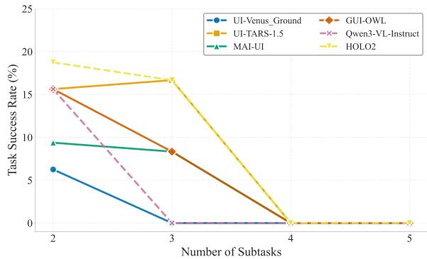  
Figure 4: Task success rate vs. number of subtasks for composite single-device tasks.

Crucially, these isolated errors compound rapidly as task complexity grows. As illustrated in Figure 4 and Appendix D.1, the task success rate exhibits a sharp decline as the number of subtasks increases, dropping to near zero for tasks requiring four or more subtasks across all evaluated models. This degradation highlights a critical limitation in long-horizon planning: dependency steps that were never executed (e.g., file transfer or renaming) are nonetheless treated as completed, producing cascading errors in subsequent actions. Detailed successful and failed case studies are provided in Appendix D.2.

## 6 Conclusion

We introduce JarvisGUI, a dynamic benchmark for evaluating GUI agents on diverse cross-device workflows across Android, Windows, and Ubuntu. By composing atomic tasks and evaluating final environment states, JarvisGUI reveals that current agents remain weak in state transfer, cross-platform reasoning, and long-horizon dependency management, highlighting key challenges for building reliable real-world GUI agents.

## Limitations

One limitation is our dependency on specific system resources, notably Docker and the KVM module, to run parallel virtual machines. This may hinder reproducibility for researchers in restricted or cloud-based environments lacking KVM support; however, those affected are encouraged to contact us for access to our experimental setup. Furthermore, while JarvisGUI covers diverse everyday workflows, it currently lacks accessibility-focused scenarios for elderly and disabled users, and its scenario coverage is constrained by practical tradeoffs involving legal compliance, evaluation costs, and hardware simulation limits. We detail these design choices and identify key directions for future benchmark expansion in Appendix C.

## Ethical Statement

This study ensures data privacy by anonymizing collected tasks and excluding sensitive information. Manual annotations were strictly supervised to minimize bias, and AI tools (DeepSeek, Qwen) were utilized solely for code and language refinement. We properly attribute all open-source components and will release the dataset under agreements that balance transparency with data protection. Finally, we acknowledge the dual-use risks of cross-device GUI agents: their advanced automation capabilities could potentially be exploited for malicious file theft or unauthorized data leakage. Mitigating these threats underscores the need for future research into robust permission boundaries, secure agent alignment, and OS-level anomaly detection.

## Acknowledgments

Thanks for the insightful comments and feedback from the reviewers. This work was supported by the National Natural Science Foundation of China (No. 62406015).

## References

Shuai Bai, Yuxuan Cai, Ruizhe Chen, Keqin Chen, Xionghui Chen, Zesen Cheng, Lianghao Deng, Wei Ding, Chang Gao, Chunjiang Ge, Wenbin Ge, Zhifang Guo, Qidong Huang, Jie Huang, Fei Huang, Binyuan Hui, Shutong Jiang, Zhaohai Li, Mingsheng Li, and 45 others. 2025a. Qwen3-vl technical report. Preprint, arXiv:2511.21631.

Shuai Bai, Keqin Chen, Xuejing Liu, Jialin Wang, Wenbin Ge, Sibo Song, Kai Dang, Peng Wang, Shijie Wang, Jun Tang, Humen Zhong, Yuanzhi Zhu, Mingkun Yang, Zhaohai Li, Jianqiang Wan, Pengfei Wang, Wei Ding, Zheren Fu, Yiheng Xu, and 8 others. 2025b. Qwen2.5-vl technical report. Preprint, arXiv:2502.13923.

Frederik Brudy, Joshua Kevin Budiman, Steven Houben, and Nicolai Marquardt. 2018. Investigating the role of an overview device in multi-device collaboration. In Proceedings ofthe 2018 CHI Conference on Human Factors in Computing Systems, CHI ’18, pages 1–13, New York, NY, USA. Association for Computing Machinery.

Wendong Bu, Yang Wu, Qifan Yu, Minghe Gao, Bingchen Miao, Zhenkui Zhang, Kaihang Pan, Yunfei Li, Mengze Li, Wei Ji, Juncheng Li, Siliang Tang, and Yueting Zhuang. 2025. What limits virtual agent application? OmniBench: A scalable multidimensional benchmark for essential virtual agent capabilities. In Proceedings of the 42nd International Conference on Machine Learning, volume 267 of Proceedings ofMachine Learning Research, pages 5725–5748. PMLR.

Kanzhi Cheng, Qiushi Sun, Yougang Chu, Fangzhi Xu, Yantao Li, Jianbing Zhang, and Zhiyong Wu. 2024. Seeclick: Harnessing GUI grounding for advanced visual GUI agents. In Proceedings of the 62nd Annual Meeting ofthe Associationfor Computational Linguistics (Volume 1: Long Papers), ACL 2024, Bangkok, Thailand, August 11-16, 2024, pages 9313– 9332. Association for Computational Linguistics.

Zihao Cheng, Zeming Liu, Yingyu Shan, Xinyi Wang, Xiangrong Zhu, Yunpu Ma, Hongru Wang, Yuhang Guo, Wei Lin, and Yunhong Wang. 2026a. Mem2evolve: Towards self-evolving agents via coevolutionary capability expansion and experience distillation. In Proceedings of the 64th Annual Meeting ofthe Associationfor Computational Linguistics (Volume 1: Long Papers), pages 20784–20831.

Zihao Cheng, Hongru Wang, Zeming Liu, Yuhang Guo, Yuanfang Guo, Yunhong Wang, and Haifeng Wang. 2025. Toolspectrum: Towards personalized tool utilization for large language models. In Findings of the Associationfor Computational Linguistics: ACL 2025, pages 20679–20699.

Zihao Cheng, Hongru Wang, Zeming Liu, Xinyi Wang, Xiangrong Zhu, Yuhang Guo, Wei Lin, Jeff Z. Pan, and Yunhong Wang. 2026b. Terminal-world: Scaling terminal-agent environments via agent skills. Preprint, arXiv:2605.20876.

Bin Deng, Yizhe Feng, Zeming Liu, Qing Wei, Xiangrong Zhu, Shuai Chen, Yuanfang Guo, and Yunhong Wang. 2025. Retail: Towards real-world travel planning for large language models. In Proceedings ofthe 2025 Conference on Empirical Methods in Natural Language Processing, pages 14870–14902.

Fan Gao, Hongqiang Li, Zhilong Chen, Yunai Yi, Shihao Nie, Zihao Cheng, Zeming Liu, Yuanfang Guo, Shumin Liu, Qizhen Qin, and 1 others. 2025. A chemical autonomous robotic platform for end-toend synthesis of nanoparticles. Nature Communications, 16(1):7558.

Boyu Gou, Ruohan Wang, Boyuan Zheng, Yanan Xie, Cheng Chang, Yiheng Shu, Huan Sun, and Yu Su. 2025. Navigating the digital world as humans do: Universal visual grounding for GUI agents. In The Thirteenth International Conference on Learning Representations, ICLR 2025, Singapore, April 24- 28, 2025. OpenReview.net.

Zhangxuan Gu, Zhengwen Zeng, Zhenyu Xu, Xingran Zhou, Shuheng Shen, Yunfei Liu, Beitong Zhou,

Changhua Meng, Tianyu Xia, Weizhi Chen, Yue Wen, Jingya Dou, Fei Tang, Jinzhen Lin, Yulin Liu, Zhenlin Guo, Yichen Gong, Heng Jia, Changlong Gao, and 5 others. 2025. Ui-venus technical report: Building high-performance ui agents with rft. Preprint, arXiv:2508.10833.

H Company. 2025. Holo2 - open foundation models for navigation and computer use agents.

Tero Jokela, Jarno Ojala, and Thomas Olsson. 2015. A diary study on combining multiple information devices in everyday activities and tasks. In Proceedings of the 33rd Annual ACM Conference on Human Factors in Computing Systems, CHI ’15, pages 3903–3912, New York, NY, USA. Association for Computing Machinery.

Raghav Kapoor, Yash Parag Butala, Melisa Russak, Jing Yu Koh, Kiran Kamble, Waseem AlShikh, and Ruslan Salakhutdinov. 2024. Omniact: A dataset and benchmark for enabling multimodal generalist autonomous agents for desktop and web. In European Conference on Computer Vision, pages 161– 178. Springer.

Tianwei Lan, Jiaqi Wu, Zeming Liu, Zhaoxin Fan, Haifeng Wang, and Yuhang Guo. 2026. Peap: Proactive embodied action sequence planning with joint understanding of vision and audio perception. In Proceedings of the 64th Annual Meeting of the Association for Computational Linguistics (Volume 1: Long Papers), pages 23118–23138.

Kaixin Li, Ziyang Meng, Hongzhan Lin, Ziyang Luo, Yuchen Tian, Jing Ma, Zhiyong Huang, and Tat-Seng Chua. 2025. ScreenSpot-Pro: GUI grounding for professional high-resolution computer use. In Proceedings of the 33rd ACM International Conference on Multimedia, MM ’25, pages 8778–8786, New York, NY, USA. Association for Computing Machinery.

Wei Li, William E. Bishop, Alice Li, Christopher Rawles, Folawiyo Campbell-Ajala, Divya Tyamagundlu, and Oriana Riva. 2024. On the effects of data scale on UI control agents. In Advances in Neural Information Processing Systems 37.

Jingjing Liu, Ziye Huang, Zihao Cheng, Zeming Liu, Jiahong Wu, Yuhang Guo, Kehai Chen, Yunhong Wang, and Haifeng Wang. 2026. Docos: Towards proactive document-guided actions in gui agents. Preprint, arXiv:2605.18048.

Jingjing Liu, Zeming Liu, Zihao Cheng, Mengliang He, Xiaoming Shi, Yuhang Guo, Xiangrong Zhu, Yuanfang Guo, Yunhong Wang, and Haifeng Wang. 2025. Repodebug: Repository-level multi-task and multi-language debugging evaluation of large language models.

Xiao Liu, Bo Qin, Dongzhu Liang, Guang Dong, Hanyu Lai, Hanchen Zhang, Hanlin Zhao, Iat Long Iong, Jiadai Sun, Jiaqi Wang, Junjie Gao, Junjun Shan, Kangning Liu, Shudan Zhang, Shuntian Yao, Siyi Cheng, Wentao Yao, Wenyi Zhao, Xinghan Liu, and

11 others. 2024. Autoglm: Autonomous foundation agents for guis. CoRR, abs/2411.00820.

Zeming Liu, Haifeng Wang, Zheng-Yu Niu, Hua Wu, and Wanxiang Che. 2021. Durecdial 2.0: A bilingual parallel corpus for conversational recommendation. In Proceedings of the 2021 Conference on Empirical Methods in Natural Language Processing, pages 4335–4347.

Zeming Liu, Haifeng Wang, Zheng-Yu Niu, Hua Wu, Wanxiang Che, and Ting Liu. 2020. Towards conversational recommendation over multi-type dialogs. In Proceedings of the 58th annual meeting of the associationfor computational linguistics, pages 1036– 1049.

Quanfeng Lu, Wenqi Shao, Zitao Liu, Lingxiao Du, Fanqing Meng, Boxuan Li, Botong Chen, Siyuan Huang, Kaipeng Zhang, and Ping Luo. 2025a. GUIOdyssey: A comprehensive dataset for cross-app GUI navigation on mobile devices. In Proceedings of the IEEE/CVF International Conference on Computer Vision, pages 22404–22414.

Yuheng Lu, Qian Yu, Hongru Wang, Zeming Liu, Wei Su, Yanping Liu, Yuhang Guo, Maocheng Liang, Yunhong Wang, and Haifeng Wang. 2025b. Transbench: Breaking barriers for transferable graphical user interface agents in dynamic digital environments. In Findings ofthe Associationfor Computational Linguistics, ACL 2025, Vienna, Austria, July 27 - August 1, 2025, pages 12464–12478. Association for Computational Linguistics.

Zhengxi Lu, Yuxiang Chai, Yaxuan Guo, Xi Yin, Liang Liu, Hao Wang, Han Xiao, Shuai Ren, Pengxiang Zhao, Guangyi Liu, Guanjing Xiong, and Hongsheng Li. 2026. UI-R1: Enhancing efficient action prediction of GUI agents by reinforcement learning. Proceedings ofthe AAAI Conference on Artificial Intelligence, 40(21):17608–17616.

Xinbei Ma, Zhuosheng Zhang, and Hai Zhao. 2024. Coco-agent: A comprehensive cognitive MLLM agent for smartphone GUI automation. In Findings of the Associationfor Computational Linguistics, ACL 2024, Bangkok, Thailand and virtual meeting, August 11-16, 2024, pages 9097–9110. Association for Computational Linguistics.

Khalid Majrashi, Margaret Hamilton, Alexandra L. Uitdenbogerd, and Shiroq Al-Megren. 2021. Crossdevice user interactive behavioural patterns. In CHI 2021 Workshop on User Experiencefor Multi-Device Ecosystems: Challenges and Opportunities, pages 1–5. Workshop paper.

Dang Nguyen, Jian Chen, Yu Wang, Gang Wu, Namyong Park, Zhengmian Hu, Hanjia Lyu, Junda Wu, Ryan Aponte, Yu Xia, Xintong Li, Jing Shi, Hongjie Chen, Viet Dac Lai, Zhouhang Xie, Sungchul Kim, Ruiyi Zhang, Tong Yu, Md. Mehrab Tanjim, and 11 others. 2025. GUI agents: A survey. In Findings of the Associationfor Computational Linguistics: ACL

2025, pages 22522–22538, Vienna, Austria. Association for Computational Linguistics.

Yujia Qin, Yining Ye, Junjie Fang, Haoming Wang, Shihao Liang, Shizuo Tian, Junda Zhang, Jiahao Li, Yunxin Li, Shijue Huang, Wanjun Zhong, Kuanye Li, Jiale Yang, Yu Miao, Woyu Lin, Longxiang Liu, Xu Jiang, Qianli Ma, Jingyu Li, and 16 others. 2025. UI-TARS: pioneering automated GUI interaction with native agents. CoRR, abs/2501.12326.

Dimitrios Raptis, Jesper Kjeldskov, and Mikael B. Skov. 2016. Continuity in multi-device interaction: An online study. In Proceedings ofthe 9th Nordic Conference on Human-Computer Interaction, NordiCHI ’16, pages 1–10, New York, NY, USA. Association for Computing Machinery.

Christopher Rawles, Alice Li, Daniel Rodriguez, Oriana Riva, and Timothy P. Lillicrap. 2023. AndroidInTheWild: A large-scale dataset for android device control. In Advances in Neural Information Processing Systems, volume 36, pages 59708–59728. Curran Associates, Inc. Datasets and Benchmarks Track.

Fei Tang, Zhangxuan Gu, Zhengxi Lu, Xuyang Liu, Shuheng Shen, Changhua Meng, Wen Wang, Wenqi Zhang, Yongliang Shen, Weiming Lu, Jun Xiao, and Yueting Zhuang. 2026. GUI-G<sup>2</sup>: Gaussian reward modeling for GUI grounding. Proceedings of the AAAI Conference on Artificial Intelligence, 40(39):33214–33222.

Haoming Wang, Haoyang Zou, Huatong Song, Jiazhan Feng, Junjie Fang, Junting Lu, Longxiang Liu, Qinyu Luo, Shihao Liang, Shijue Huang, Wanjun Zhong, Yining Ye, Yujia Qin, Yuwen Xiong, Yuxin Song, Zhiyong Wu, Aoyan Li, Bo Li, Chen Dun, and 93 others. 2025. Ui-tars-2 technical report: Advancing gui agent with multi-turn reinforcement learning. Preprint, arXiv:2509.02544.

Hongru Wang, Rui Wang, Boyang Xue, Heming Xia, Jingtao Cao, Zeming Liu, Jeff Z Pan, and Kam-Fai Wong. 2024a. Appbench: Planning of multiple apis from various apps for complex user instruction. In Proceedings of the 2024 Conference on Empirical Methods in Natural Language Processing, pages 15322–15336.

Shuai Wang, Weiwen Liu, Jingxuan Chen, Yuqi Zhou, Weinan Gan, Xingshan Zeng, Yuhan Che, Shuai Yu, Xinlong Hao, Kun Shao, and 1 others. 2024b. Gui agents with foundation models: A comprehensive survey. arXiv preprint arXiv:2411.04890.

Zhiyong Wu, Zhenyu Wu, Fangzhi Xu, Yian Wang, Qiushi Sun, Chengyou Jia, Kanzhi Cheng, Zichen Ding, Liheng Chen, Paul Pu Liang, and Yu Qiao. 2025. OS-ATLAS: Foundation action model for generalist GUI agents. In The Thirteenth International Conference on Learning Representations. OpenReview.net. ICLR 2025 Spotlight.

Hongfei Xia, Hongru Wang, Zeming Liu, Qian Yu, Yuhang Guo, and Haifeng Wang. 2025. Safetoolbench: Pioneering a prospective benchmark to evaluating tool utilization safety in llms.

Junlin Xie, Zhihong Chen, Ruifei Zhang, and Guanbin Li. 2025. Large multimodal agents: a survey. Visual Intelligence, 3:24.

Tianbao Xie, Danyang Zhang, Jixuan Chen, Xiaochuan Li, Siheng Zhao, Ruisheng Cao, Toh J Hua, Zhoujun Cheng, Dongchan Shin, Fangyu Lei, and 1 others. 2024. Osworld: Benchmarking multimodal agents for open-ended tasks in real computer environments. Advances in Neural Information Processing Systems, 37:52040–52094.

Tianqi Xu, Linyao Chen, Dai-Jie Wu, Yanjun Chen, Zecheng Zhang, Xiang Yao, Zhiqiang Xie, Yongchao Chen, Shilong Liu, Bochen Qian, and 1 others. 2025. Crab: Cross-environment agent benchmark for multimodal language model agents. In Findings of the Association for Computational Linguistics: ACL 2025, pages 21607–21647.

An Yan, Zhengyuan Yang, Wanrong Zhu, Kevin Lin, Linjie Li, Jianfeng Wang, Jianwei Yang, Yiwu Zhong, Julian J. McAuley, Jianfeng Gao, Zicheng Liu, and Lijuan Wang. 2023. GPT-4V in wonderland: Large multimodal models for zero-shot smartphone GUI navigation. CoRR, abs/2311.07562.

Jianwei Yang, Hao Zhang, Feng Li, Xueyan Zou, Chunyuan Li, and Jianfeng Gao. 2023. Set-of-Mark Prompting Unleashes Extraordinary Visual Grounding in GPT-4V. arXiv preprint. ArXiv:2310.11441 [cs].

Yuhao Yang, Yue Wang, Dongxu Li, Ziyang Luo, Bei Chen, Chao Huang, and Junnan Li. 2025. Aria-ui: Visual grounding for GUI instructions. In Findings of the Associationfor Computational Linguistics, ACL 2025, Vienna, Austria, July 27 - August 1, 2025, pages 22418–22433. Association for Computational Linguistics.

Jiabo Ye, Xi Zhang, Haiyang Xu, Haowei Liu, Junyang Wang, Zhaoqing Zhu, Ziwei Zheng, Feiyu Gao, Junjie Cao, Zhengxi Lu, and 1 others. 2025. Mobileagent-v3: Fundamental agents for gui automation. arXiv preprint arXiv:2508.15144.

Shukang Yin, Chaoyou Fu, Sirui Zhao, Ke Li, Xing Sun, Tong Xu, and Enhong Chen. 2024. A survey on multimodal large language models. National Science Review, 11(12):nwae403.

Xinbin Yuan, Jian Jun Zhang, Kaixin Li, Zhuoxuan Cai, Lujian Yao, Jie Chen, Enguang Wang, Qibin Hou, Jinwei Chen, Peng-Tao Jiang, and Bo Li. 2025. SE-GUI: Enhancing visual grounding for GUI agents via selfevolutionary reinforcement learning. In Advances in Neural Information Processing Systems, volume 38, pages 127658–127679. Curran Associates, Inc.

Jiwen Zhang, Jihao Wu, Teng Yihua, Minghui Liao, Nuo Xu, Xiao Xiao, Zhongyu Wei, and Duyu Tang. 2024. Android in the zoo: Chain-of-action-thought for GUI agents. In Findings of the Association for Computational Linguistics: EMNLP 2024, pages 12016–12031, Miami, Florida, USA. Association for Computational Linguistics.

Wayne Xin Zhao, Kun Zhou, Junyi Li, Tianyi Tang, Zican Dong, Yupeng Hou, Beichen Zhang, Yingqian Min, Junjie Zhang, Peiyu Liu, Xiaolei Wang, Yifan Du, Chen Yang, Yushuo Chen, Zhipeng Chen, Jinhao Jiang, Ruiyang Ren, Yifan Li, Xinyu Tang, and 4 others. 2026. A survey of large language models. Frontiers ofComputer Science, 20(12):2012627.

Hanzhang Zhou, Xu Zhang, Panrong Tong, Jianan Zhang, Liangyu Chen, Quyu Kong, Chenglin Cai, Chen Liu, Yue Wang, Jingren Zhou, and 1 others. 2025. Mai-ui technical report: Real-world centric foundation gui agents. arXiv preprint arXiv:2512.22047.

## A Implementation Details

## A.1 Planner Model

To handle multi-device visual inputs, we introduce a two-stage planner–grounder framework and design task-consistent prompts tailored for crossdevice scenarios, as shown in Table 4. We adopt a two-stage architecture because most current GUI agents with publicly available inference implementations assume interaction with a single active platform at each step, rather than simultaneously receiving observations from multiple devices. This convention also applies to recent end-to-end agents such as UI-TARS-2 and AutoGLM: their end-toend interaction loops are still defined within a single active GUI environment, as reflected in their published formulations and official inference implementations. Planner–grounder architecture decouples each interaction into two parts: (1) platform identification and high-level action selection from screenshots of multiple devices, and (2) action prediction from the screenshot of the selected platform. During execution, {{USER QUERY}} is formatted into task instructions at execution time, while {{CURRENT\_HISTORY}} contains the step\_plan from the model’s preceding steps. We additionally incorporate execution errors generated by the framework (e.g., “action not found”) into the current history, enabling the planner model to receive feedback from the framework when it produces invalid actions.

4. Waiting and Termination   
If UI is loading or changing → use wait.   
When task finishes: { "action": "terminate",   
"status": "success" }

3. Output Format (MANDATORY) 3. Output Format (MANDATORY)   
Output only one JSON object in <step> ... </step>:   
<step>   
{   
"current\_status": "What is shown in the   
screenshots...",   
"platform": "android | windows | ubuntu",   
"step\_plan": "A short plan for this step to   
achieve the goal.",   
"element\_description": "Instruction of the   
target element of this step,   
will passed to the GUI Grounding sub-agent   
to generate coordinates if needed.",   
"tool": {   
"action": "..."   
}   
}   
</step>   
step\_plan must:   
Describe the plan for this step in a short sentence;   
Be clear and concise.   
Good examples:   
- "I need to first try to open Terminal",   
- "I have to close this window".   
element\_description must:   
Describe the target element of this step in a short sen  
tence;   
Be short and imperative.   
Good examples:   
- "Click on the Settings application icon",   
- "Option list to scroll down".

## Cross-Device GUI Planner Prompt

This prompt defines a minimal, strict planner for a cross  
device GUI Agent system.   
Supported platforms: Android, Windows, Ubuntu.   
The planner’s primary constraint is:   
When an action requires coordinates, the planner must   
NEVER output coordinates.   
Coordinates are provided later by a GUI Grounding sub  
agent.

1. Planner Role (STRICT)   
You are a GUI task planner, not an executor.   
At each step, you receive three screenshots: Android, Windows, Ubuntu.   
Your job is to output exactly one next step. 2. What You Must Decide   
For every step:   
1. Read the screenshots and understand what is shown in each platform.   
2. Which single platform acts next.   
3. What low-level action should be performed on the selected platform.   
4. Which tool action to invoke.   
You must NOT: Infer or guess coordinates, describe pixel locations, or output more than one step.

##

## 5. History Summary (READ-ONLY)

## Cross-Device GUI Planner Prompt (continued)

Rules: History is read-only; Do not repeat completed steps; Do not output history; Step in the history may failed due to the sub-agent, you can try to execute in another way.

## 6. Tool Definitions

This section explicitly lists which actions are allowed and which fields the planner is allowed to fill.

## 6.1 Android Allowed Actions

The planner may choose one of the following actions: – type: Input the specified text into the activated input box. Fields: action, text.   
– system\_button: Press the system button (Examples: "home", "back", "menu", "enter", "volume\_up", "volume\_down"). Fields: action, button.   
– wait: Wait specified seconds for the change to happen. Fields: action, time.   
– click: Click on the specified element.   
– long\_press: Long press on the specified element. – swipe: Swipe from the specified element to four directions (Examples: "up", "down", "left", "right"). Fields: action, direction.   
– terminate: Stop the current task. Fields: action, status.

Fields the Planner MAY Fill type : action, text system\_button : action, button wait : action, time terminate : action, status swipe : action, direction

## Coordinate-Controlled Actions (STRICT):

For click, long\_press, swipe:   
Planner MUST output only: { "action": "click" } Planner MUST NOT output coordinate or mention locations in step\_instruction.   
Coordinates will be supplied by the GUI Grounding agent.

## 6.2 Windows / Ubuntu Allowed Actions

The planner may choose one of the following actions: – type: Input the specified text into the activated input box. Fields: action, text.   
– key: Performs key down presses on the arguments passed in order. Fields: action, keys.   
– scroll: Scroll the mouse wheel. Fields: action, pixels.   
– hscroll: Scroll the mouse wheel horizontally. Fields: action, pixels.   
– wait: Wait specified seconds for the change to happen. Fields: action, time.   
– terminate:

## Fields the Planner MAY Fill (Summary)

type : action, text key : action, keys scroll/hscroll : action, pixels wait : action, time answer : action, text terminate : action, status

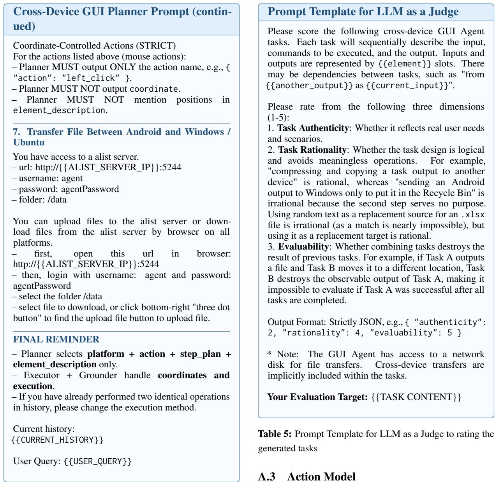  
Table 4: Prompt Template for Cross-Device GUI Planner

## A.2 Data Filtering

To select the highest-quality tasks from randomly generated candidates, we prompt a large language model to evaluate each task from three aspects and retain only tasks that receive full scores, as shown in Table 5. This data filtering step is necessary because type compatibility only ensures structural validity, whereas LLM-based filtering further checks semantic coherence and evaluability. Our diagnostic analysis shows that removing the LLM filter would retain a substantial number of samples that do not satisfy the benchmark’s evaluation requirements. For example, one rejected task first deleted a screenshot and then required the same file to be copied and transferred, rendering the workflow unevaluable.

After operating by the planner, tasks are decomposed into single-step GUI grounding actions executed on the screenshot of a single platform. To achieve the optimal grounding performance for all models, we keep all hyperparameters and prompts in the grounding step consistent with the models official grounding task settings. The prompt used is shown in Table 6.

```erb
Prompt Template for Grounding Models
Qwen3VL
You are a helpful assistant. The user will give you an in
struction, and you MUST left click on the corresponding
UI element via tool call. If you are not sure about where
to click, guess a most likely one.
# Tools
You may call one or more functions to assist with the
user query.
You are provided with function signatures within <tools>
</tools> XML tags:
<tools>
```

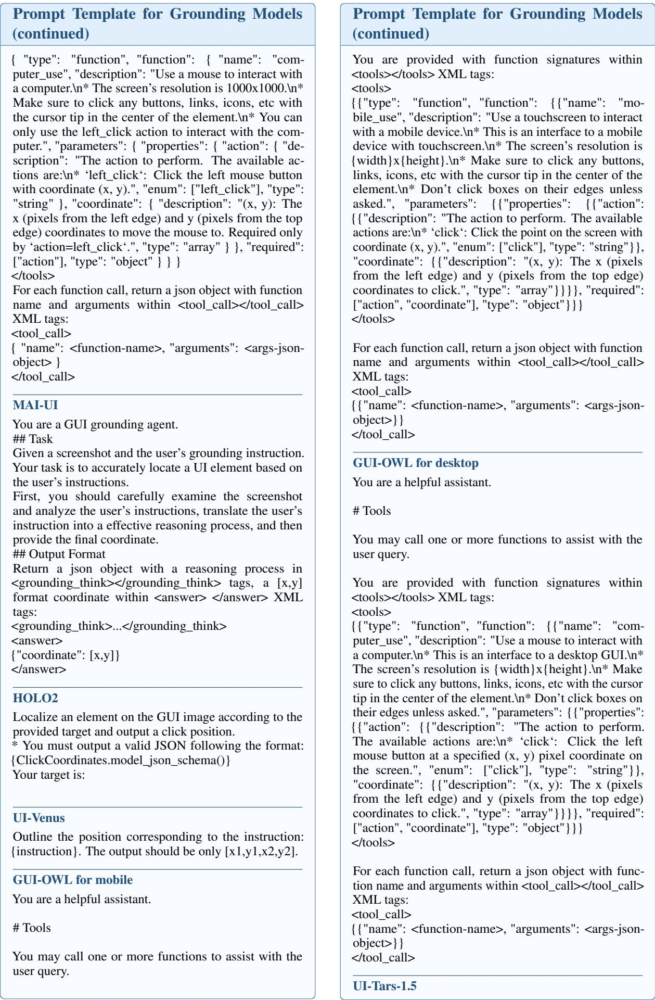

Prompt Template for Grounding Models   
(continued)   
You are a GUI agent. You are given a task and   
your action history, with screenshots. You need   
to perform the next action to complete the task.   
\n\n## Output Format\n\nAction: ...\n\n\n## Action   
Space\nclick(point=’<point>x1 y1</point>”)\n\n## User   
Instruction \n {instruction}  
Table 6: Prompt Template for Grounding Models

## A.4 Environment Details

## A.4.1 Infrastructure Details

All evaluations are conducted on two Linux machines, each equipped with 128GB of memory and properly configured with KVM to enable hardware acceleration. The evaluation is executed with a parallelism of 3. Although greater memory capacity enables more efficient parallel evaluation, it is not required for sequential execution. We provide configurable execution settings that allow users to adjust resource allocation according to their hardware configurations, including VM memory limits and parallelism. By setting the parallelism level to one, users can run the benchmark with a single virtual machine without requiring a large memory footprint. The reproduction scripts, complete benchmark data, evaluation code, Docker orchestration files, model configurations, dashboard code, and all other resources required to reproduce the experiments will be publicly released. All models are deployed using vLLM, while Qwen3-VL-Plus is accessed via the Aliyun API as the planner model.

During evaluation, to reduce computational overhead, for devices that are irrelevant to a given task (i.e., the task does not require execution on these devices), we only capture the initial-state screenshots as visual inputs. When actions targeting such devices are issued, a “device unavailable” error is returned to the planner, preventing it from repeatedly attempting to operate on irrelevant devices. The network storage service web interface Alist is always enabled to ensure unrestricted access to relevant storage resources on task-related devices.

In terms of the execution mechanism of infrastructure layer, a pristine container is instantiated from a specified checkpoint for every task and discarded immediately after the task concludes. This ephemeral lifecycle ensures that JarvisGUI remains reproducible while providing a safe and isolated environment that effectively insulates the host machine.On the networking front, the layer leverages

Docker’s default mechanism where containers without explicit configurations automatically join the bridge network. This architecture seamlessly consolidates diverse heterogeneous containers (e.g., Android, Ubuntu, Windows) into a unified virtual subnet, facilitating inter-container communication.

## A.4.2 Environment Control Layer Details

In terms of perception, we define a Unified Observation Space incorporating both visual and structural information. This space consists of RGB screenshots, representing the current screen state, and the Accessibility Tree, describing the hierarchical relationships of UI widgets. The layer exposes standardized interfaces to acquire this data. Regarding implementation, for Ubuntu and Windows platforms, we adapted the Server-Controller architecture from OSWorld(Xie et al., 2024), streamlining the underlying codebase for improved efficiency. For the Android platform, we utilize ADB commands to control devices, abstracting these operations into unified interfaces.

We define a Unified Action Space compatible with both Desktop and Android platforms. Internally, this layer maps abstract actions to platformspecific execution primitives: employing PyAuto-GUI for desktop control and ADB commands for Android devices. Externally, it exposes a standardized execute\_action interface to the upper layers. Our action space is shown in Table 7. It encompasses not only basic interactive operations but also specific meta-controls, such as WAIT, FAIL, and DONE.

<table><tr><td>Action</td><td>Description</td></tr><tr><td>MOVE_TO(x, y) CLICK(...) MOUSE_DOWN/UP(btn) RIGHT_CLICK(x, y) DOUBLE_CLICK(x, y) DRAG_TO(...) SCROLL(dx, dy) SWIPE(...) LONG_PRESS(x, y, t)</td><td>Move cursor to coordinate. Click current/target pos with options. Press/Release mouse button. Right-click at position. Double left-click at position. Drag from start to target. Scroll mouse wheel. Touch swipe by offset (Mobile).</td></tr></table>

Table 7: Action Space of JarvisGUI. CLICK has parameters x, y, button, nClicks; DRAG\_TO has parameters x, y, startX, startY; SWIPE has parameters dx, dy, x, y, duration.

## A.4.3 Evaluation Execution Layer Details

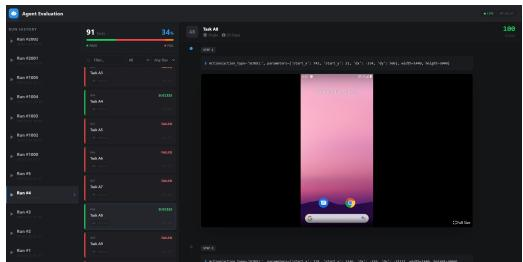  
Figure 5: The Dashboard Interface

To achieve high-throughput concurrent evaluation, we incorporate a Thread Pool Scheduling mechanism and an Asynchronous Environment Pre-warming strategy. Thread Pool Scheduling maximizes the utilization of the host’s multi-core computing resources for efficient parallel execution. Meanwhile, Asynchronous Environment Prewarming allows for the proactive initialization of container resources for subsequent tasks in the background, concurrent with the execution of ongoing tasks. This strategy effectively eliminates the idle latency associated with container cold starts (which typically accounts for 30%-50% of the total evaluation cycle).

To facilitate the tracking, analysis, and visualization of experimental results, we developed a webbased Agent Evaluation Dashboard, as shown in Figure 5. This tool provides an intuitive interactive interface that enables researchers and developers to monitor evaluation runs in real time and analyze the results.

To initiate the backend server, execute the command python start\_dashboard.py. The server listens on port 8000 by default, which can be customized using the --port argument. Once the server is running, the dashboard is accessible via a web browser at http://localhost:8000/viewer.html.

## A.4.4 Configuration File Details

Our dataset is encapsulated within a single JSON file. This file contains a tasks field, which comprises a list of dictionaries, where each item represents an individual task configuration, as shown in Figure 6.

Each single task configuration entry primarily consists of the following fields: id, devices, instruction, and formatted\_subtasks. The formatted\_subtasks field contains a list of configurations for all associated subtasks, where each item includes a specific config field (highlighted with orange in Figure 6) and an evaluate field (highlighted with yellow in Figure 6). Certain tasks incorporate input and output fields to facilitate dynamic data composition (highlighted with blue in Figure 6). Specifically, input fields serve as template variables, which can be referenced within the instruction and evaluate fields using the placeholder syntax.

## A.5 Typed Automatic Task Composition Details

```latex
Algorithm 1 Typed Automatic Task Composition
Input: task set $\tau .$ , type system $( \mathbb { T } , \preceq )$ , maxi
mum number of tasks $K$
Output: composed task graph $\mathcal { G } = ( \nu , \mathcal { E } )$
Sample an initial task instance $v _ { 0 }$ from $\tau$
Initialize $\mathcal { V }  \{ v _ { 0 } \} , \mathcal { E }  \emptyset$
while $| \nu | < K$ do
Identify unfilled input slots $\mathcal { T } _ { o p e n }$ from tasks
in $\nu$
Identify available output slots $\mathcal { O } _ { a v a i l }$ from
tasks in $\nu$
Sample a slot s from $\mathcal { T } _ { o p e n } \cup \mathcal { O } _ { a v a i l }$
Find a task instance $v \in \mathcal T$ with a compatible
slot $s ^ { \prime }$ such that either
(i) $s ^ { \prime } \in \mathcal { O } _ { v } , s \in \mathcal { T }$ , and $\tau _ { s ^ { \prime } } \preceq \tau _ { s } ,$ or
(ii) $s \in \mathcal { O } , s ^ { \prime } \in \mathcal { T } _ { v } .$ and $\tau _ { s } \preceq \tau _ { s ^ { \prime } }$
if no compatible task instance exists then
break
end if
Add v to $\nu$
Add a directed edge connecting s and $s ^ { \prime }$ to $\mathcal { E }$
if $P _ { v } \neq P _ { u }$ for the connected tasks then
Insert a platform transfer task to ensure
cross-platform execution
end if
end while
Return $\mathcal { G } = ( \nu , \mathcal { E } )$
```

In this appendix, we provide additional details on the task composition procedure used in our experiments. The overall construction process is formalized in Algorithm A.5, which describes a typed automatic task composition method for building executable task graphs from a heterogeneous task library.

The algorithm takes as input a task set $\tau { _ { \mathrm { ~ \scriptsize ~ { ~ \tau ~ } ~ } } }$ , a partially ordered type system (T, ⪯), and a maximum graph size K. Starting from a randomly sampled initial task, the procedure incrementally grows a directed task graph by iteratively connecting compatible input and output slots. Slot compatibility is determined by the type preorder ⪯, ensuring that data flows only from more specific types to more general ones, or vice versa, depending on slot direction.

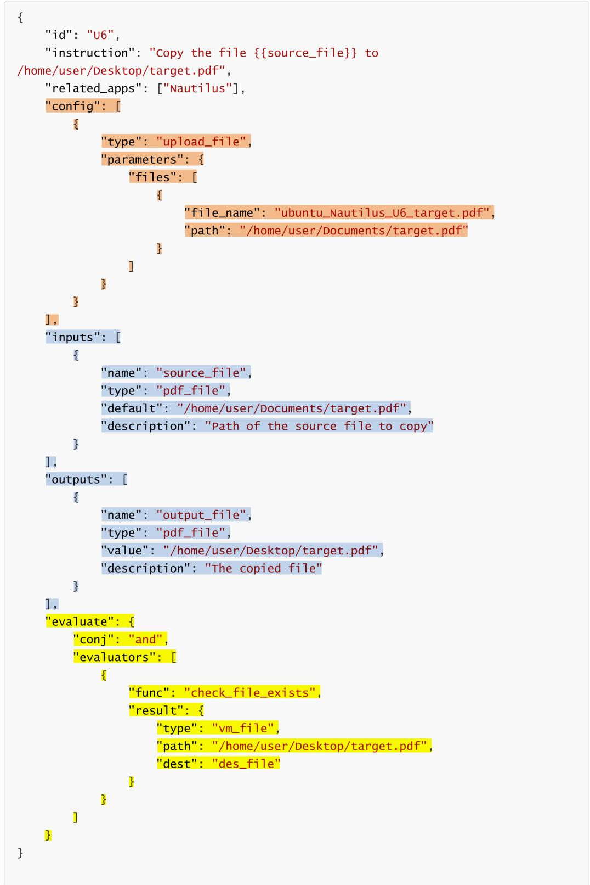  
Figure 6: The Single Task JSON. A subtask configuration generally comprises three primary segments: the config field (highlighted in orange), designed to establish execution prerequisites; the input and output fields (highlighted in blue), utilized for dynamic data composition; and the evaluation field (highlighted in yellow), which defines the specific evaluation rules.

At each iteration, the algorithm samples either an unfilled input slot or an available output slot from the current graph, and searches for a task instance in T that provides a compatible counterpart. If no such task exists, graph construction terminates early. This stochastic expansion strategy allows the method to generate diverse task graphs while maintaining type safety.

In addition, Algorithm A.5 explicitly handles cross-platform execution constraints. When two connected tasks are associated with different execution platforms, an auxiliary platform transfer task is inserted to preserve executability. This design enables seamless composition across heterogeneous environments without violating platform assumptions.

Overall, the proposed algorithm provides a flexible and principled mechanism for automatically synthesizing typed task graphs, which serves as the backbone for the experimental evaluations presented in the main paper.

## A.6 Task detailed statistics

JarvisGUI covers a diverse set of device combinations and multiple source object types, as illustrated in Figure 7 and Figure 8, respectively.

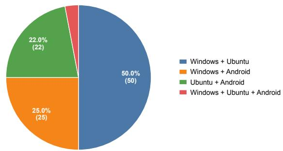  
Figure 7: Task Distribution over device combinations.

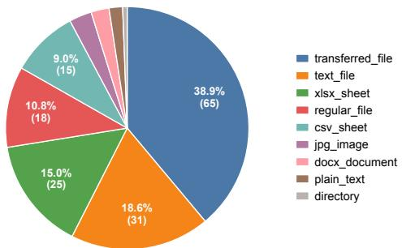  
Figure 8: Task Distribution over slot type.

Notably, the transferred\_file slot type represents files that need to be transferred across platforms in auxiliary tasks, allowing arbitrary file for-

mats. Since JarvisGUI contains a large number of cross-platform tasks, this slot type accounts for a relatively large proportion, which is expected.

## A.7 Experiment Details

To further investigate whether the observed bottleneck is specific to our choice of planner (Qwen3- VL-Plus), we additionally tested Llama 4 Maverick and Kimi K2.6 under the same experimental setting. We selected these models because they represent recent publicly available multimodal large language models with strong vision-language reasoning and agentic capabilities. In particular, Llama 4 Maverick and Kimi K2.6 demonstrate competitive performance on widely used multimodal and agentoriented benchmarks, including MMMU-style visual reasoning and OSWorld-style computer interaction evaluations. Therefore, they provide diverse planner backbones for examining whether the observed cross-device bottleneck generalizes beyond Qwen3-VL-Plus.

Under our current experimental protocol, Llama 4 Maverick showed limited instruction-following reliability: it frequently failed to produce outputs in the required action format and, consequently, achieved near-zero evaluation scores across all tasks due to its inability to consistently generate executable actions.

Kimi K2.6 achieved moderately higher performance than Qwen3-VL-Plus on both atomic and compositional tasks. Nevertheless, its performance on cross-device tasks remained limited. As shown in Table 8, the Multi-Overall score only increased from 8.0 to 11.3. These results show that replacing the planner may improve the performance of the complete system, but does not eliminate the substantial degradation on cross-device compositional tasks. This provides further evidence that the performance bottleneck is broadly present across the models rather than being specific to Qwen3-VL-Plus.

To provide a more rigorous statistical assessment of the model performances, we report the raw counts of successful tasks alongside their percentages. Furthermore, we calculated the 95% bootstrap confidence intervals over the tasks. These detailed statistics are presented in Table 9.

<table><tr><td rowspan="2">Model</td><td colspan="4">Atomic Tasks</td><td colspan="4">Multi-Tasks</td></tr><tr><td>Android</td><td>Windows</td><td>Ubuntu</td><td>Overall</td><td>SW</td><td>MI</td><td>MD</td><td>Overall</td></tr><tr><td>HOLO2 (Qwen3-VL-Plus)</td><td>41.7</td><td>15.8</td><td>60.7</td><td>42.4</td><td>16.0</td><td>6.0</td><td>2.0</td><td>8.0</td></tr><tr><td>HOLO2 (Kimi K2.6)</td><td>45.8</td><td>23.7</td><td>66.1</td><td>48.3</td><td>22.0</td><td>10.0</td><td>2.0</td><td>11.3</td></tr></table>

Table 8: Performance comparison using different planner backbones. Experimental results testing alternative LLMs within the HOLO2 architecture to verify cross-device bottleneck generalizability. The best results are highlighted in bold.
<table><tr><td>Model</td><td>Atomic task</td><td>Composite task</td><td>Composite subtask</td></tr><tr><td>UI-Venus</td><td>37.3% [28.8%, 45.8%] (44/118)</td><td>1.3% [0.0%, 3.3%] (2/150)</td><td>16.7% [13.0%, 20.8%] (74/442)</td></tr><tr><td>UI-TARS-1.5</td><td>37.3% [28.8%, 45.8%] (44/118)</td><td>6.0% [2.7%, 10.0%] (9/150)</td><td>18.8% [14.5%, 23.4%] (83/442)</td></tr><tr><td>MAI-UI</td><td>28.8% [21.2%, 37.3%] (34/118)</td><td>4.0% [1.3%, 7.3%] (6/150)</td><td>16.1% [12.2%, 20.2%] (71/442)</td></tr><tr><td>GUI-Owl</td><td>39.0% [30.5%, 48.3%] (46/118)</td><td>7.3% [3.3%, 12.0%] (11/150)</td><td>18.1% [14.1%, 22.6%] (80/442)</td></tr><tr><td>Qwen3-VL</td><td>35.6% [27.1%, 44.1%] (42/118)</td><td>4.0% [1.3%, 7.3%] (6/150)</td><td>18.1% [14.3%, 22.3%] (80/442)</td></tr><tr><td>HOLO2</td><td>42.4% [33.9%, 51.7%] (50/118)</td><td>8.0% [4.0%, 12.7%] (12/150)</td><td>19.0% [14.8%, 23.6%] (84/442)</td></tr></table>

Table 9: Detailed Statistical Analysis. Performance reporting raw completion counts alongside percentages and 95% bootstrap confidence intervals across different models. The best mean success rates are highlighted in bold.

## B Empirical Evidence on the Prevalence of Cross-Device Workflows

To assess the prevalence of cross-device workflows in real-world settings and to further support the practical value of cross-device GUI research, we summarize empirical evidence from prior (M)LLM research and HCI studies. From the perspective of (M)LLM applications, the deployment scope has steadily expanded: from early dialogue systems (Liu et al., 2020), to terminal environments (Cheng et al., 2026b,a), to today’s GUI agents and embodied intelligence (Lan et al., 2026), and most recently to chemistry and other fundamental sciences (Gao et al., 2025). This trajectory indicates that as (M)LLM capabilities continue to improve, users are delegating an ever-growing range of tasks to them. Cross-device workflows, which HCI studies have shown to be a common pattern of everyday work, are therefore a natural next target: there is both the potential and the demand for (M)LLMs to take them over.

Although large-scale logs of cross-device behavior are difficult to obtain due to privacy constraints, the HCI evidence on this point is consistent: crossdevice workflows are common and practically relevant. First, multi-device ownership is widespread: Brudy et al. (Brudy et al., 2018) report that 67.5% of participants owned two or more devices, with an average of 1.9 devices per participant (SD = 0.7). Second, users explicitly value continuity across devices. Raptis et al. (Raptis et al., 2016) conducted a large-scale online study analyzing 1,603 valid user reviews of Apple’s continuity features and found strong demand for cross-device capabilities; for example, 23.3% of reviews emphasized breaking device barriers, while 14.3% asked for broader support across more applications. The same study further shows that users often switch devices because a task cannot be completed on the current device. Third, cross-device use is routine in everyday work and leisure. Majrashi et al. (Majrashi et al., 2021) show that people regularly combine phones, computers, tablets, and other devices in daily activities, while Jokela et al. (Jokela et al., 2015) report that 37% of recorded multi-device cases involved sequential use of multiple devices within a single task. Taken together, these findings suggest that cross-device workflows are not rare or artificial scenarios, but common practices in everyday device use, thereby providing additional empirical support for the real-world relevance of cross-device GUI research.

## C Future Extension

The current release of JarvisGUI establishes a robust foundational scale, providing strong statistical power for our reported results. Unlike prior work such as CRAB, which contains 18 manually designed cross-device tasks, our benchmark comprises 150 composite workflows containing 442 platform-specific subtasks and 65 file-transfer auxiliary tasks (averaging approximately three subtasks per workflow). These span dozens of applications across multiple domains, creating a rich and complex state-transition space. Moving forward, we view this scale as a strong starting point. By leveraging our structured input–output modeling of atomic tasks, future extensions will automatically recompose and sample an even broader range of cross-device workflows to ensure continuous scaling of task diversity.

As we scale, future extensions will also aim to broaden the physical and systemic scenario coverage, which is currently constrained by necessary experimental trade-offs. To ensure reproducibility and manage evaluation costs, our current device combinations focus on Android, Windows, and Ubuntu (excluding macOS and iOS due to restrictive virtualization licenses). We also cap trajectory lengths at 50 steps to avoid the sharply increased inference costs of ultra-long loop-based tasks, and utilize a private AList-based network drive for file transfers rather than simulating physical USBs or unstable Bluetooth protocol stacks. Future iterations of JarvisGUI aim to bridge these gaps by exploring advanced simulation environments for closed ecosystems, optimized inference frameworks to support ultra-long horizon planning, and virtualized hardware protocols to capture a more complete spectrum of real-world interactions.

Finally, expanding the diversity of target user scenarios remains a crucial priority. While the current iteration primarily focuses on generalized mainstream workflows, GUI agents hold immense potential to assist elderly and disabled users who may face physical or cognitive barriers in multiplatform environments. Developing accessibilityoriented cross-device tasks—such as automated text-to-speech synchronization across devices, simplified remote health monitoring setups, or crossplatform accessibility setting configurations—is an important direction for future extension. We plan to collaborate with HCI researchers and target user groups to systematically incorporate these socially impactful workflows into future versions of the benchmark.

## D Failure Modes and Case Studies

## D.1 Failure Modes

To better understand why agents failed to complete compositional tasks, we conducted a further analysis. Our failure analysis focuses on observable action trajectories rather than the underlying causes because the same error may have several possible explanations. For example, an agent may move to the target device before the file upload is complete. This may happen because it forgot the target path, clicked the wrong GUI element, incorrectly interpreted the interface feedback and assumed that the upload had finished or other factors. Since these different causes can lead to the same observed behavior, it is difficult to determine a unique cause from the incorrect actions alone. Such attribution may therefore be subjective and unreliable.

Our preliminary analysis of HOLO2 trajectories on cross-device tasks reveals three major failure modes, as shown in Fig. 9: (a) failures stemming from underlying single-device subtasks; (b) failures in cross-device transfer mechanisms; and (c) failures caused by loss of context between tasks. Additionally, we manually examined representative failure cases from the other evaluated models and found that they exhibit similar failure patterns.

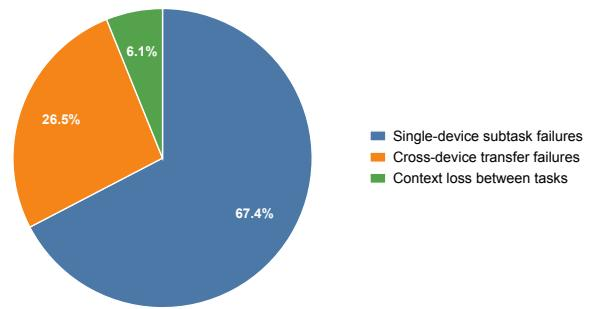  
Figure 9: Failure mode of HOLO2 during compositional tasks.

## D.2 Case Study

Current GUI agents struggle with the majority of cross-device tasks, while achieving a non-trivial success rate on single-device atomic tasks, particularly on Ubuntu. We first report common failure cases observed in single-device task execution, and then analyze errors arising in multi-device settings.

## D.2.1 Atomic Tasks

Successful Case Figure 10 illustrates a successful case of an atomic task. In this example, the agent successfully opens Notepad on Windows, correctly recognizes the text contained in the .txt file, and accurately replaces the target text with the specified content according to the given instruction.

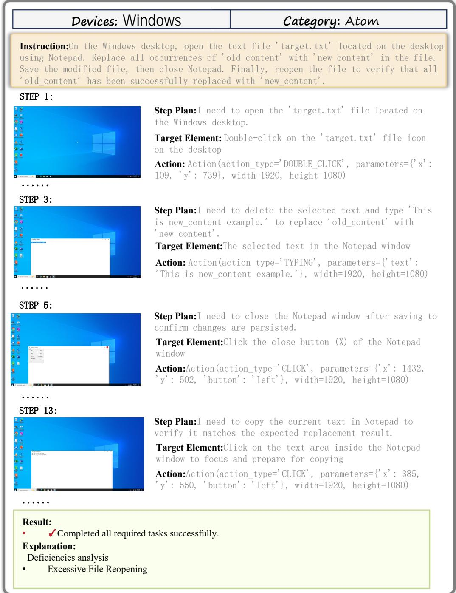  
Figure 10: Successful Case of an Atomic Task

Failure Case Figure 11 illustrates a representative failure case. In this example, the agent successfully opens LibreOffice Writer, selects a portion of the text, and correctly applies a bulleted list format to the selected lines. However, the task requires applying the formatting to all lines, which is not fully accomplished. The planner nevertheless incorrectly judges the task as completed.

Figure 12 illustrates another type of failure. In this case, the agent successfully opens the camera application and captures a photo. However, the task further requires renaming the captured image to a specified filename, a step that is not completed because the planner is unable to determine the appropriate next action.

Figure 13 illustrates a failure case in which the planner fails to predict the required atomic action, preventing the agent from correctly completing the file renaming operation.

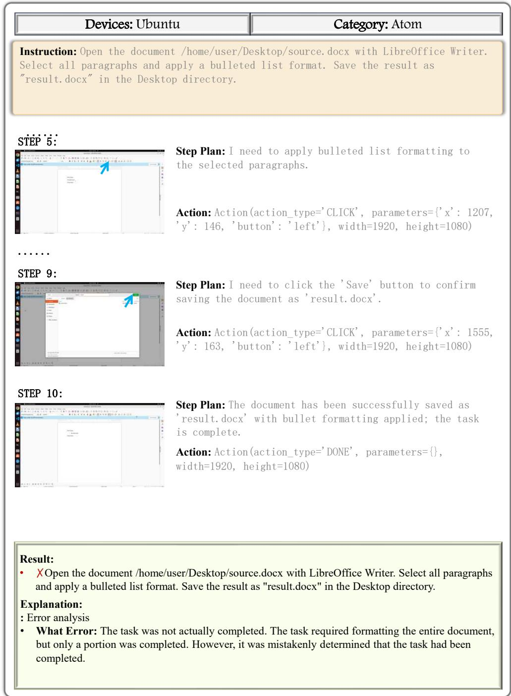  
Figure 11: Failure Case of an Atomic Task Due to an Incorrect Planner Completion Judgment

## D.2.2 Compositional Tasks

Successful Case Two illustrative examples demonstrate the system’s capability to execute compositional tasks across different device contexts. The first example (Figure 14) showcases a dependency-free workflow executed entirely on an Ubuntu desktop, where the system first increases the brightness of a source image using ImageMagick and subsequently applies the processed image as the desktop wallpaper via gsettings. The second example (Figure 15) highlights cross-device task execution: the system switches the Ubuntu environment to Dark mode while concurrently modifying the contents of target.txt on a Windows machine. Together, these examples illustrate reliable task coordination in both single-device and multi-device settings.

Failure Case In the case shown in Figure 16, the agent only opened Chrome and did nothing further, while its reasoning indicated that it had already transferred the file to Android and attempted to open it there.

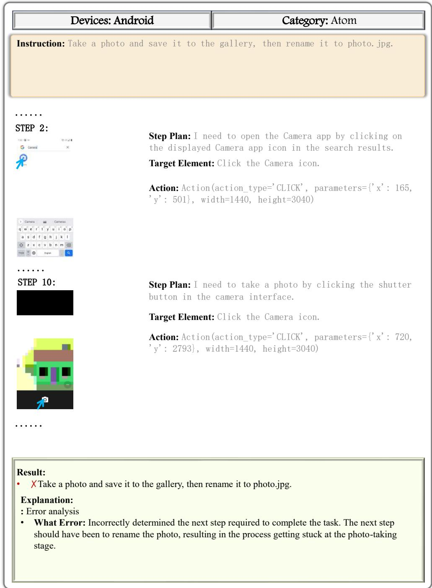  
Figure 12: Failure Case of an Atomic Task Due to the Planner’s Failure to Identify the Next Action

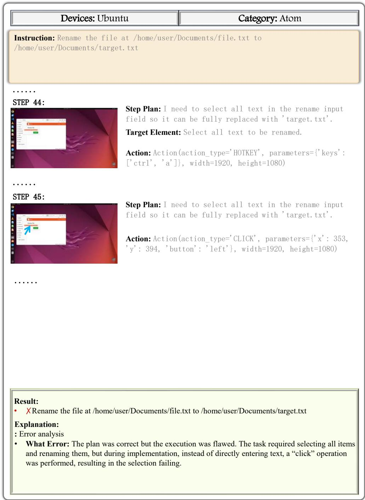  
Figure 13: Failure Case of an Atomic Task Due to the Planner’s Failure to Predict the Atomic Action

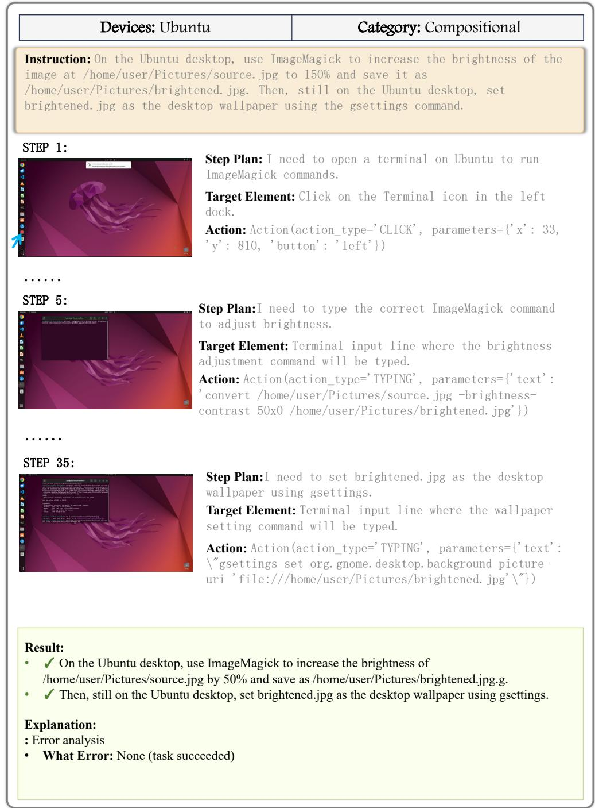  
Figure 14: A Successful Example of a Compositional Task with Dependencies on a Single Device

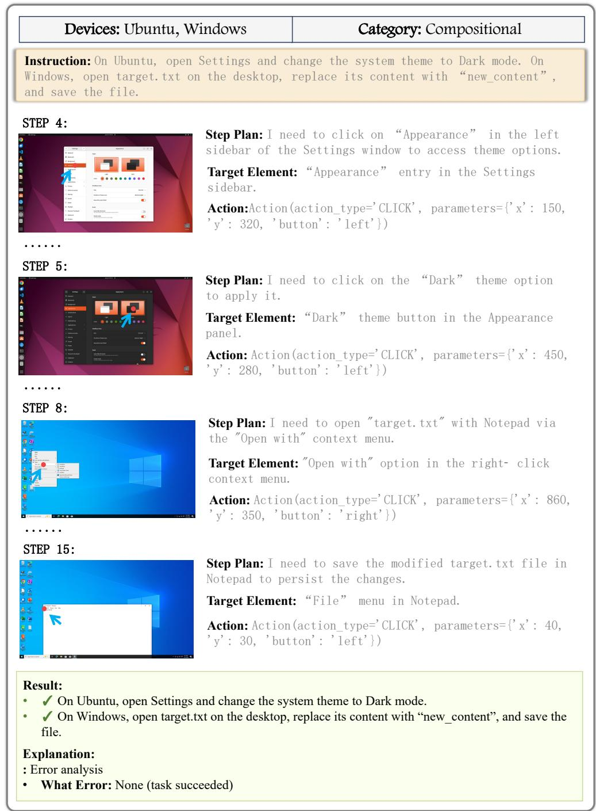  
Figure 15: A Successful Example of a Compositional Task without Dependencies on Multiple Devices

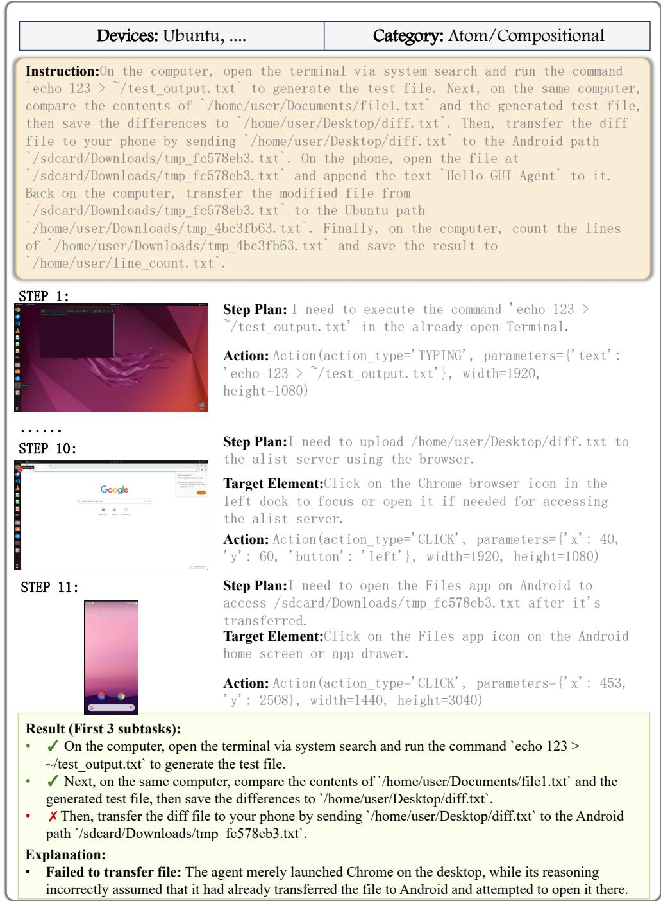  
Figure 16: Failure Case of an Compositional Task Due to Failed to Transfer File.