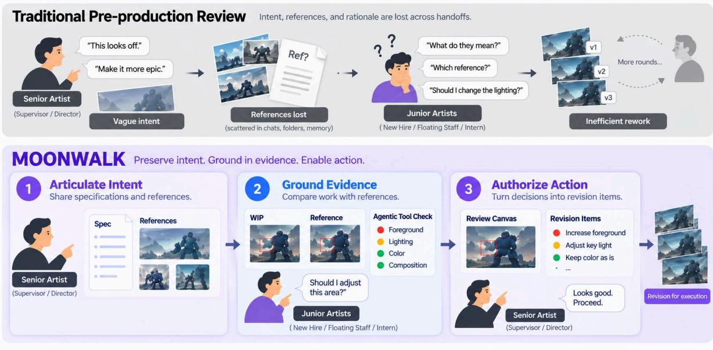
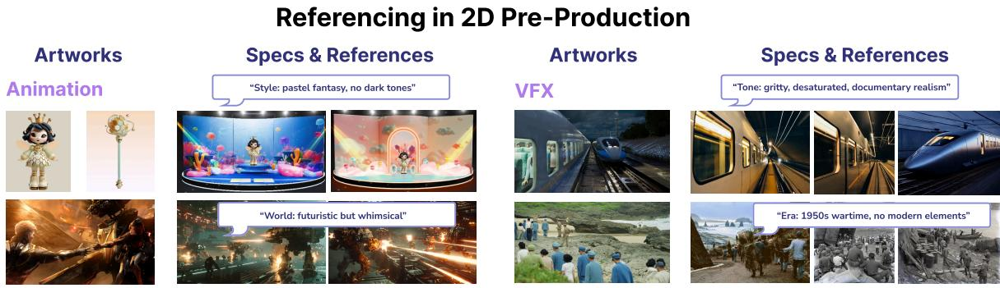
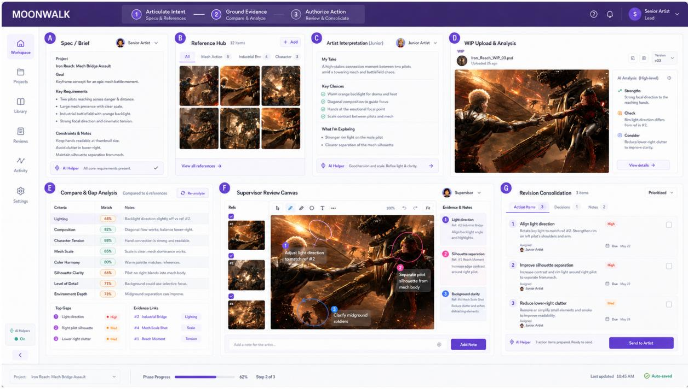
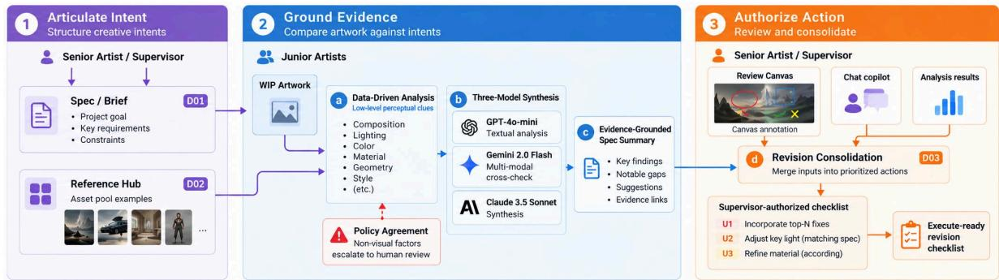
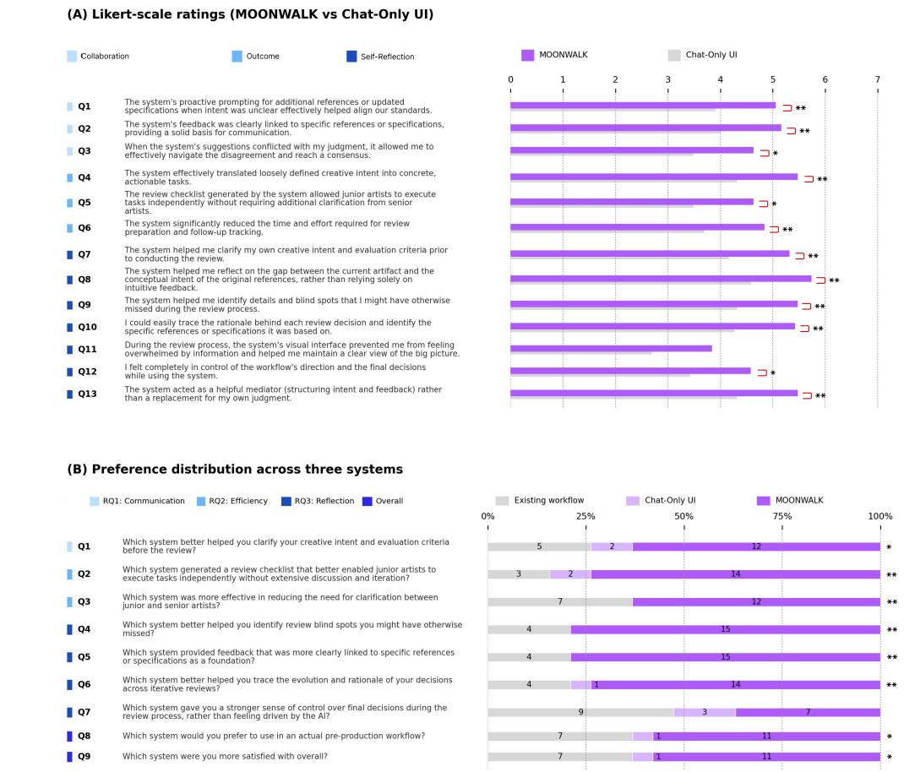

# MOONWALK: Mediating Operations with Intent–Evidence–Action Alignment Across Junior–Supervisor Review Workflows in Animation/VFX Pre-Production

Shih-Yu Lai1,2, Wen-Fan Wang3, Sai Ling2, Shaune Jan2, Bing-Yu Chen1, and Xiang ‘Anthony’ Chen4

1National Taiwan University, Taipei, Taiwan 2MoonShine Animation Studio, Taipei, Taiwan 3Cornell Tech, New York City, USA 4HCI Research, UCLA, Los Angeles, California, USA akinesia112@gmail.com, vann@cmlab.csie.ntu.edu.tw, saix34@gmail.com, shaune.jan@gmail.com, robin@ntu.edu.tw, xac@ucla.edu

September 10, 2026

## Abstract

Animation and VFX pre-production review requires teams to translate loosely specified creative intent—briefs, evolving specifications, heterogeneous references, and verbal decisions—into revisions that junior artists can execute without repeated clarification. In practice, criteria drift across iterations, review judgments lose their evidential basis, and the reasoning behind a request rarely survives the senior–junior handof. We contribute a design framework for intent–evidence–action alignment: intent is articulated into a shared project record, judgments are anchored to grounded evidence, and authorized decisions are converted into clear revision tasks tied directly to reference notes. We instantiate this framework in MOONWALK, a professional pre-production review system comprising a shared intent record, reference/specification anchoring, structured work-in-progress comparison, and supervisor-authorized action planning. In this workflow, AI handles administrative coordination—flagging missing context and organizing notes—while artists retain full creative direction. An in-studio study with professional practitioners compares MOONWALK with a chat-only (chatbot) interface using matched production materials, while participants’ existing workflows provide a retrospective ecological baseline. Results indicate stronger intent alignment, decision traceability, and checklist executability, while also showing that aesthetic authority and final prioritization must remain with practitioners. The evaluation establishes the value of the integrated structured workflow over unstructured conversational AI chatbot. Code: https://github.com/Akinesia112/Moonwalk/tree/english-version

Keywords: Human-in-the-loop, Animation/VFX Pre-Production, In-Studio Workflow, Human–Agent Co-creation, Junior–Supervisor Alignment

## 1 INTRODUCTION

Pre-production review in 2D animation and VFX is a repeated coordination process: a director provides a brief, references, or visual goals; a supervisor interprets that direction while reviewing successive versions; and a junior artist revises the work. Existing production tools already organize shots, assets, versions, notes, and approvals, and recent AI systems can generate comments or compare visual material. Yet the dificult part of studio review is often neither storing feedback nor producing more of it. It is preserving what the supervisor meant, what evidence defines that intent, and how the junior artist should act on it across iterative handofs [1, 2].

  
Figure 1: Pre-production review in 2D animation and VFX often breaks the intent–evidence–action chain, as creative intent, supporting references, and revision rationale are lost across senior– junior handofs in their Work in Process (WIP) artwork. MOONWALK maintains this chain by preserving intent, grounding review in inspectable evidence, and converting supervisor-authorized decisions into evidence-linked, executor-ready actions for revision items. The framework bounds AI to coordination—requesting missing evidence, reminding either role of stated requirements, and organizing authorized items—not to aesthetic judgment.

Consider the review in Figure 1. A senior artist says the scene looks of” and asks a junior to make it more epic,” without specifying which reference or visual property matters. The junior may revise the lighting, only to learn that the supervisor meant something else. In another case, a director said “I want that feeling” while showing a landscape image with data-visualization overlays; the intended feature was the cyberpunk annotation language, leading the artist to search for the wrong references for days. In both cases, the intent was conveyed, but the evidence needed to interpret it was not.

Figure 2 illustrates two artifact types that already support review: artworks that establish visual targets and specifications and references that constrain what those targets mean. These artifacts are common in practice, but their relationships are rarely preserved. A reference may be stored without recording which region matters; a specification may disappear from later review; and a revision note may survive without the rationale that motivated it. Small interpretive diferences therefore accumulate into criteria drift and repeated clarification [3, 4].

We describe this breakdown as a fragile intent–evidence–action chain (Figure 1). Intent is the active creative goal and constraints; evidence is the reference, specification, prior decision, or observable property that supports a review judgment; and action states what should change and what would count as resolution. When these links are lost, feedback becomes a verdict such as “it feels of” rather than a grounded request that another role can execute.

Repairing this chain requires better supervisor–artist communication rather than a more autonomous reviewer. Supervisors must make missing specifications, references, and the relevant object, region, or property explicit; junior artists must be able to inspect those anchors, resolve ambiguity, and record intentional deviations. That interpretation then travels with the work into the next review. AI supports this exchange through evidence-bounded checks and clarification prompts, abstaining when the project record does not specify a criterion.

  
Figure 2: Referencing in 2D pre-production. Artworks establish visual targets, while specifications and references bound the acceptable exemplar space. Current practice rarely preserves how a particular reference region or specification motivates a revision request.

Prior HCI work addresses related breakdowns at diferent points in collaborative work. Scott et al. support prospective reflection by helping meeting participants articulate purposes, anticipated challenges, and success conditions before a meeting [5]. Vanukuru et al. extend this across recurring meetings by reconnecting retrospective and prospective work over time [4]. Sharma et al. examine feedback between users and conversational agents, identifying failures of common ground, verifiability, communication, and informativeness [2]. MOONWALK instead targets an asymmetric production handof: a senior practitioner’s judgment must remain linked to the reference, specification, or prior decision that supports it, and then be translated into revision work that a junior practitioner can execute.

We contribute an intent–evidence–action framework for review handofs. It links intent (active goals and constraints), evidence (references, specifications, prior decisions, or observable artifact properties supporting a judgment), and action (an authorized revision with target, priority, and completion condition). These links persist across iterations, allowing each revision to be traced from action to supporting evidence and active intent. From this abstraction, we derive three design goals: preserve intent across iterations, make review evidence inspectable and traceable, and retain these links when decisions become executable revision work.

MOONWALK instantiates this framework with AI limited to coordination: requesting missing references or specifications, pulling up the corresponding reference image or specification clause, checking stated requirements against submitted work, surfacing unresolved requirements, and organizing supervisor-authorized revisions. AI does not introduce aesthetic criteria or independently judge lighting, color, composition, or style beyond the project record and explicit human judgment.

We evaluate MOONWALK in an in-studio, within-subject study with 19 professional animation and VFX practitioners (10 senior-role, 9 junior-role) across two studio contexts. Participants compared MOONWALK with a Chat-Only interface using the same AI, while existing studio workflows served as a retrospective ecological comparison. MOONWALK was rated above neutral on 12 of 13 Likert items and led eight of nine comparative questions, including junior-executable checklists (74%), reduced senior–junior clarification (63%), and blind-spot identification and evidence-linked feedback (79% each); perceived control was the main exception. Our contributions are:

• An intent–evidence–action design framework for preserving creative intent, inspectable evidence, and executable revision action across iterative senior–junior handofs.

• MOONWALK, an working prototype built on these principles that structures supervisor intent, evidence, junior interpretation, and supervisor-authorized action while keeping aesthetic judgment with practitioners.

• Empirical evidence from professional practitioners through in-studio formative study and an summative evaluation examining alignment, traceability, actionability, clarification needs, and human agency.

## 2 RELATED WORK

## 2.1 Creativity Support in Production Contexts

Creativity-support systems make alternatives inspectable and revision histories recoverable across ideation and production. Reference-based systems connect exemplars to output dimensions: CreativeConnect maps reference elements to design decisions [6]; StyleFactory supports rankingbased style control [7]; and MemoVis anchors asynchronous feedback to visual evidence [8]. Systems for large reference spaces similarly show that continuity matters: AIdeation and GenTune support cross-reference traceability [9, 10]; POET reduces drift through personalization loops [11]; and ImaginationVellum preserves prompt–stroke–output histories [12]. These systems motivate persistent reference records, but they do not address the full senior–junior review handof in which the rationale behind a reference must become executable production work.

Animation, motion, and video-authoring research further establishes the value of inspectable intermediate structures. Timeline-and-component models separate motion from content [13]; keyframe systems [14], visualization grammars [15], layered 3D authoring [16], document-to-video workflows [17], and sculpting autocomplete [18] make intermediate decisions visible enough to verify and revise. Production-proximate AI systems extend this principle through visually grounded code and repair [19], versioned agent workflows [20], auditable task decomposition [21], local compositional editing [22], and structured narrative assets [23]. MOONWALK adopts this focus on transparency, extending it to cross-role handofs from creative direction to evidence-linked revision.

## 2.2 Collaborative Creativity Tools

Recent collaborative creativity systems increasingly treat creative intent as an evolving representation rather than a one-time prompt or brief. Such systems externalize goals, intermediate interpretations, and decision histories so that collaborators can revisit and revise them across iterations. Work on temporal support for recurring collaboration shows that interfaces must connect prior decisions with current activity rather than merely summarize isolated sessions [4]. Research on collaborative evaluation similarly emphasizes making success criteria explicit and maintaining traceable relationships between goals, evidence, and subsequent decisions [5, 2].

This requirement becomes more important when generative AI participates in creative work. AI can help teams organize information and surface candidate interpretations, but access to generated content does not by itself establish shared standards. Studies of collaborative prompting show that human partners continue to rely on human–human discussion and shared expertise when negotiating creative direction [24]. MOONWALK extends these eforts by maintaining a persistent relationship among the active intent, reference- and specification-based evidence, and the revision actions authorized by practitioners across the senior–junior review handof.

HCI systems have addressed adjacent collaborative breakdowns through shared criteria, visible traces, and inspectable disagreement. Prior work surfaces success criteria before discussion [5], visualizes otherwise invisible meeting structure [25], prevents premature consensus through issue mapping [26], preserves continuity across sessions [4], and supports productive disagreement [27]. Research on feedback quality further shows that failures often arise from missing common ground and unverifiable claims rather than from individual deficiencies [2]. Power asymmetries also matter: technically actionable information may not change behavior when authority and accountability are unclear [28]. These challenges highlight the need for a transparent, single record shared equally between supervisors and junior artists.

AI can assist this coordination, but more assistance is not automatically better. Shared AI displays and role-specific agents can broaden coverage [29, 30, 31, 32], while excessive AI assistance can reduce cognitive engagement [33]. Agentic interfaces therefore require steering, inspection, rollback, and explicit human authorization [34]. MOONWALK adopts these controls but positions the AI as a production-coordination aid that prompts, retrieves, compares, and drafts; the system centers on maintaining the shared review history rather than automated generation.

## 2.3 Intent Alignment in Structured Production Workflows

Previsualization and production-tracking systems already structure substantial portions of filmmaking and animation work. CineVision gives directors and cinematographers a shared, editable previsualization storyboard [35]; related systems support generative previsualization from rough 3D [36], mobile shot planning and capture [37], and storyboard retrieval from visual-intent canvases [38]. These systems align creative leads before or during shot planning, typically by making the planned shot itself the shared artifact. MOONWALK targets a downstream phase in the review process: once direction exists, how does its rationale persist through iterative review and become work that another role can execute?

Commercial production-tracking platforms such as ShotGrid/Autodesk Flow Production Tracking already support shots, assets, tasks, versions, notes, annotations, review, and approval. These platforms already give production work its structure, and MOONWALK does not replace them. Current tracking platforms log comments, but fail to capture the visual rationale connecting a specific reference to a revision request: a note can be stored without preserving which specification clause, reference region, or prior decision justified it; a junior artist’s interpretation can remain invisible until it appears as incorrect work; and a list of comments can lack the priorities and completion conditions required for independent execution. MOONWALK acts as an annotation layer that augments existing pipeline tracking tools with intent traceability.

Multimodal models provide one way to scale this layer, but the system’s scope and limits must be clearly defined. LLM-as-a-judge and MLLM evaluation enable scalable comparison [39, 40], while human-in-the-loop systems emphasize user-defined criteria, agreement inspection, and active auditing [41, 42, 43, 44]. Evidence indicates that MLLMs are more reliable for observational tasks such as perceptual reference matching than for interpretive judgments requiring tacit domain standards [45, 46, 47, 48, 49]. Accordingly, MOONWALK uses model output to surface candidate discrepancies and missing information, while supervisors retain aesthetic interpretation, prioritization, and final authorization. We contribute a structured workflow that links artistic feedback directly to verifiable, reference-backed revision tasks.

## 3 FORMATIVE STUDY

We conducted a formative study to investigate how creative intent, quality criteria, and revision evidence are articulated across the artist–supervisor review cycle in animation and VFX production, and where their relations break down. We recruited 12 practitioners (1–16 YoE, Mean = 4.96) across two studios: directors (n = 2), a supervisor (n = 1), senior and junior artists (n = 8), and a PM (n = 1), spanning commercial advertising, character animation, virtual production, and film/TV VFX. Sessions lasted 30–60 minutes; interviews were audio-recorded, transcribed, and analyzed using thematic analysis [50]. Full participant details and procedure are provided in Appendix C; the interview is in Appendix D.

The studios used in-person review, production-tracking notes, chat, shared documents, calls, and annotated images. Senior practitioners carried final responsibility for aesthetic coherence, while junior practitioners often had to interpret terse instructions without repeatedly interrupting supervisors. Authority structure, communication norms, and tool ecology shape both the observed breakdowns and the transferability of our design implications.

## 3.1 Findings

## 3.1.1 Intent Did Not Survive the Handof as a Shared Interpretation.

Directors and supervisors frequently reviewed work by walking to a workstation and pointing at the screen. These exchanges conveyed rich context but left little record (P6, P8, P9). Written feedback in ShotGrid or Zulip was often too sparse to reconstruct what had been indicated visually: one participant noted that even a detailed document omitted the reference region shown during the conversation (P8). Feedback arriving through disconnected channels also obscured which instruction superseded another (P3, P11, P15, P16, P18). At the same time, junior artists interpretations and reasons for a visual choice were rarely returned to supervisors in a structured form. The supervisor often discovered that interpretation only after it had materialized as incorrect work. The handof was therefore lossy in one direction and absent in the other.

## 3.1.2 Review Judgments Were Delivered as Verdicts Rather Than Grounded Evidence.

Participants across roles described judgments that did not identify the reference, specification clause, prior decision, or visual property that motivated them. Supervisors and directors routinely used phrases such as “feels of,” “the atmosphere is wrong,” or “not magical enough” (P2, P6, P8, P9, P12, P13). Junior artists cycled through plausible interpretations with no narrowing signal (P12, P13, P16–18). Two junior artists described a client calling an image “ghostly” without clarifying whether this meant color grading, shadow depth, or compositional density; each attempted interpretation was rejected without a more specific rationale (P12–13). The PM similarly received emotional reactions such as “this is ugly” and had to translate them into production work (P15). The decisive criteria existed, they simply remained in reviewers’ mental models, unanchored to any shared artifact (P3, P8, P9, P12, P15).

## 3.1.3 Criteria and Revision Obligations Drifted Across Iterations.

Participants described standards that silently changed or became impossible to reconstruct because no persistent rationale connected successive versions. A CG lead characterized this as a recurring onboarding problem: junior artists could not see the gap between their work and the reference (P3). The CG lead and supervisor converged on two failure modes: an absent reference, in which the artist did not know the target, and an undetected gap, in which the artist believed the target had been matched (P3, P9). The PM further noted that, without a record of agreed direction, legitimate client revisions became indistinguishable from contradictions (P15). Participants also received undiferentiated lists of comments that did not distinguish blocking changes from optional refinements, prompting further clarification before work could begin.

## 3.2 Design Goals

Our study revealed a core workflow breakdown: studios lack a persistent, shared representation that preserves the relation among creative intent, review evidence, and executable action across both directions of the senior–junior handof. We derive three design goals aligned with the chain in Figure 1.

• DG1—Persistent Intent Articulation: Because verbal intent and junior interpretations did not survive handof, the workflow should preserve project goals, constraints, uncertainty, and both roles’ interpretations in a shared record that remains available across versions.

• DG2—Evidence Anchoring and Traceability: Because judgments arrived as verdicts, every candidate issue and authorized revision should identify its evidential basis—a reference region, specification clause, prior decision, or observable artifact property.

• DG3 – Actionable, Reference-Grounded Tasks: Because criteria and obligations drifted, each final revision item should state what to change, why the change follows from the evidence, its priority, and what would count as resolution.

Both roles require full visibility: supervisors must see how junior artists interpret feedback, and artists must see the reasoning behind senior requests. Supervisors must be able to inspect how junior artists interpreted the brief and references; junior artists must be able to inspect the rationale behind senior requests; and either role must be able to flag uncertainty or request additional evidence before action is finalized.

We operationalize these design goals in MOONWALK through unified specifications, annotated reference hubs, and structured feedback checklists. Persistent specifications, annotated references, interpretation records, and evidence-linked action items are the core features. AI can support these mechanisms, but the goals neither presuppose AI nor grant it aesthetic authority. Section 4 describes how MOONWALK instantiates these goals.

## 4 SYSTEM DESIGN & IMPLEMENTATION

MOONWALK carries one project record across pre-production review: the active brief, annotated references, the junior artist’s stated interpretation, the submitted work, supervisor annotations, and authorized revision items. The interface follows this record through three operations— Articulate Intent, Ground Evidence, and Authorize Action—so that information entered before review remains visible when feedback is produced. AI assists communication within these operations by requesting missing context, comparing a WIP with supplied anchors, and organizing review material. The framework treats supplied specifications, references, prior decisions, and explicit human judgments as the source of review criteria.

## 4.1 Workflow and Interface

Figure 3 summarizes the three operations over the same project record. The first makes the intended target explicit, the second places the current work beside the evidence used to assess it, and the third converts supervisor decisions into work that a junior artist can execute. The Spec/Brief, Reference Hub, comparison workspace, Review Canvas, and checklist are therefore connected views of one review history rather than independent tools.

## 4.1.1 Articulate Intent

Review begins in the Spec/Brief and Reference Hub. Supervisors record the active direction and annotate what a reference is intended to communicate: the relevant object or region, the property to follow, and any content that should be ignored. The junior artist reads the same record before submission and can note which requirements were followed, answer or flag unresolved questions, and explain intentional deviations in the Artist Interpretation panel. These notes are stored with the WIP so the next supervisor review includes both the artifact and the artist’s account of how the current direction was understood.

  
Figure 3: MOONWALK interface panels across three review operations. Articulate Intent: (a) Spec/Brief records the active project goals, requirements, and constraints; (b) Reference Hub organizes visual exemplars with per-reference intent notes; and (c) Artist Interpretation captures the junior artist’s reading of the brief, references, and intentional deviations before review. Ground Evidence: (d) WIP Upload & Analysis evaluates the submitted work through eleven analysis dimensions against available project evidence; and (e) Compare & Gap Analysis presents candidate discrepancies together with their supporting specifications or references. Authorize Action: (f) Supervisor Review Canvas supports region-level annotation and review; and (g) Revision Consolidation organizes supervisor-authorized decisions into a prioritized, evidencelinked checklist for junior artists.

Example in practice. If a supervisor writes “make the mech feel more battle-damaged” without identifying a usable target, AI can ask for a reference or specification and prompt the supervisor to mark the relevant object or region. Once the supervisor states “use the beam-scorch marks in Reference #2; ignore the background,” that clarification becomes available to the junior artist and to later review steps.

## 4.1.2 Ground Evidence

The junior artist uploads the WIP to a comparison workspace that also shows the active specification, relevant reference notes, prior decisions, and the artist’s interpretation. The Compare & Gap Analysis surfaces candidate diferences, while the Review Canvas lets the supervisor mark the region that motivates a comment. For the framework, a useful automated observation is one that can be checked against an explicit project anchor—for example, whether a required object is present, whether a specified relation holds, or whether an observable property difers from an annotated reference. The observation is presented with its supporting context for supervisor inspection; it does not itself authorize a revision.

Example in practice. Suppose the brief requires a visible antenna array and Reference #3 marks its placement, but the WIP omits it. AI can surface the omission and cite both anchors. The junior artist can respond that the antenna was intentionally removed because of a newer client note; that explanation remains attached to the submission for the supervisor to resolve.

## 4.1.3 Authorize Action

The supervisor decides which observations should become production work. In the Review Canvas and Revision Consolidation view, accepted items retain their supporting reference, specification, prior decision, supervisor annotation, or client instruction. The supervisor can rewrite or merge items, assign urgency, and state a completion condition. The resulting checklist is the handof artifact returned to the junior artist.

Example in practice. After the supervisor marks the missing antenna as blocking and annotates its intended placement, AI can consolidate duplicate comments into “add the antenna array at the location marked in Reference #3; preserve the current body silhouette.” If an item has no stated rationale, the interface can prompt the reviewer to supply one before the item is finalized.

  
Figure 4: MOONWALK system architecture across the three operations. Articulate Intent: the supervisor structures a Spec/Brief (DG1) and annotated Reference Hub (DG2). Ground Evidence: (a) eleven dimension agents score the WIP (eleven in total; six shown); non-visual factors, high-disagreement, low-score dimensions escalate to human review; remaining results feed (b) a three-model synthesis (GPT-4o-mini: visual observation; Gemini 2.0 Flash: specification and reference comparison; Claude 3.5 Sonnet: synthesis) yielding (c) a reference-grounded spec summary. Authorize Action: canvas annotations, client opinions, and analysis results merge in the (d) Revision Consolidation view, outputting a U1/U2/U3-prioritized, supervisor-authorized checklist (DG3).

## 4.2 Technical Implementation

The evaluated prototype organizes automated analysis into eleven dimensions (Figure 4). Seven are WIP- and evidence-facing: lighting, composition, color, style, perceptual quality, sketch/line quality, and specification faithfulness. Their judge functions combine pixel-derived signals such as sharpness and artifact statistics, saliency and layout, white-balance/exposure cues, and CLIPderived style or prompt alignment with lexical overlap and relevance against the supplied brief, reference, and reflection text. The remaining four—controllability, consistency, eficiency, and stability—are auxiliary implementation diagnostics rather than visual-quality dimensions of a single WIP (Appendix B). Internal scores and disagreement route candidate discrepancies for human inspection and are not shown to participants as aesthetic quality scores.

The model pipeline uses GPT-4o-mini, Gemini 2.0 Flash, and Claude 3.5 Sonnet. GPT-4omini produces a concise visual observation; Gemini compares observations with specification and reference context; Claude synthesizes the candidate analyses with the artwork and reference hub. Reference pixels and annotations are passed with their metadata so output can point to relevant regions. A complete analysis typically streams within 30–45 seconds. During consolidation, supervisor annotations and client input are combined with model output, and the supervisor determines the final checklist.

The prototype also contains an important implementation limitation. Some evaluator prompts used broad reviewer language such as “what needs improvement” and “final verdict,” which could invite suggestions beyond an explicit project anchor. Appendix F reproduces those prompts verbatim. The study therefore supports a human-authorized structured review workflow, but it does not demonstrate that every model observation was evidence-bounded. Section 7.6 returns to this limitation.

## 5 SUMMATIVE STUDY

We conducted one in-studio summative study with both senior- and junior-role practitioners. The study examined three questions: whether MOONWALK supports cross-role alignment (RQ1), produces executable review output (RQ2), and supports review awareness, traceability, and agency (RQ3).

• RQ1 (Improve Collaboration): Does MOONWALK improve intent alignment and shared standards between senior and junior artists?

• RQ2 (Improve Outcome / Eficiency): Does MOONWALK produce evidence-linked review output that junior artists can execute with less clarification?

• RQ3 (Review Awareness, Traceability, and Agency): Does MOONWALK help participants clarify criteria, identify artifact–intent gaps and blind spots, trace review decisions, and retain control over final judgments?

## 5.1 Study Design

## 5.1.1 Participants

We recruited 19 animation and VFX practitioners across two studio contexts (Table 1 in Appendix C). Senior-role participants (n = 10) had 4–16 years of experience; junior-role participants (n = 9) had 0.5–3 years. Ten participants also took part in the formative study. Participant roles and overlap are listed in Appendix C.

## 5.1.2 Tasks and Procedure

Each session lasted approximately 40–60 minutes and took place in a studio setting. After a video demonstration, researcher-guided walkthrough, and Q&A, participants experienced two within-subject conditions. MOONWALK provided the structured workflow with reference retrieval, specification inspection, AI-assisted analysis, and evidence-linked action output. Chat-Only exposed the conversational front end of the same underlying AI without the Reference Hub, specification linkage, Artist Interpretation panel, or checklist output. Both conditions used matched production materials: four projects, each with one specification, four artworks, and four references.

The same post-task questionnaire was completed by all 19 participants. Senior-role participants were asked to attend especially to review criteria, evidence, and final decision-making; junior-role participants were asked to attend especially to execution clarity and clarification needs. Interviews then elicited role-specific perspectives on the same workflow. Participants Existing Workflow was collected after the task as a retrospective ecological comparison and was not a third controlled condition.

## 5.1.3 Measures and Analysis

The 13-item questionnaire used a seven-point Likert scale (1 = Strongly Disagree, 7 = Strongly Agree) under the administered section labels Improve Collaboration (Q1–Q3), Improve Outcome / Eficiency (Q4–Q6), and Improve Self-Reflection (Q7–Q13). A nine-item comparative questionnaire asked participants to choose among MOONWALK, Chat-Only, and Existing Workflow. Appendix E reproduces the administered wording. Figure 5 uses shortened item labels for readability; those labels should not be read as alternate questionnaire wording.

  
Figure 5: Survey results from the summative study. (A) Ratings for MOONWALK and Chat-Only on the 13 seven-point Likert items (reproduced in Appendix E) across RQ1–RQ3, with significance assessed by one-sample Wilcoxon signed-rank test against the neutral midpoint (4). (B) Preference distributions across MOONWALK, Chat-Only UI, and Existing Workflows for 9 comparative questions (CQs), assessed by chi-square goodness-of-fit. \*: p < .05 and \*\*: p < .01 report the paired MOONWALK vs. Chat-Only tests.

For each Likert item we report (i) a one-sample Wilcoxon signed-rank test of MOONWALK ratings against the neutral midpoint (4) and (ii) a paired Wilcoxon signed-rank test of MOON-WALK against Chat-Only ratings from the same participants (zeros retained via the Pratt method; normal approximation with continuity correction). For each three-way comparative question, we report a chi-square goodness-of-fit test against a uniform preference distribution. This test indicates whether the three-option distribution departs from uniformity; it is not a pairwise significance test between MOONWALK and Existing Workflow. Interviews were analyzed by three researchers using thematic analysis [50].

## 6 RESULTS & FINDINGS

We report results for all 19 participants: one-sample Wilcoxon tests of MOONWALK’s Likert ratings against the neutral midpoint, chi-square goodness-of-fit tests on three-way preferences, and interview themes (Figure 5). MOONWALK was rated significantly above neutral on 12 of 13

Likert items and received the plurality on eight of nine comparative questions; sense of control (CQ7) was the exception.

## 6.1 RQ1: Improving Collaboration & Intent Alignment

MOONWALK was rated significantly above neutral on all three RQ1 items: proactive requests for additional references or specification updates when intent was unclear $( \mathrm { Q } 1 , p < . 0 1 )$ , linking feedback to specific references or specifications $( \mathrm { Q } 2 , p < . 0 1 )$ , and handling conflicts between system suggestions and personal judgment $( \mathrm { Q 3 } , p < . 0 5 )$ . For CQ1, 12 of 19 participants (63%) chose MOONWALK for articulating creative intent and review criteria, compared with 2 for Chat-Only and 5 for Existing Workflow $( p < . 0 5$ for the three-way goodness-of-fit test).

Participants valued keeping specifications, references, and review output in the same record. P10 wanted “folder documents, Zulip threads, ShotGrid feedback, and all oral decisions” available in one review context, while P2 noted that “a brief note like ‘move it left’ often encodes a composition problem; the system surfaces and records that.” P13 emphasized that evidencelinked output made it clearer what needed to be fixed before escalating another question to a lead. Senior practitioners (P8, P9), however, found some generated summaries “too diplomatic” and insuficiently incisive.

## 6.2 RQ2: Improving Outcomes & Eficiency

MOONWALK was rated significantly above neutral on translating loosely defined intent into actionable items $( \mathrm { Q } 4 , p < . 0 1 )$ , producing checklists that junior artists could execute without additional clarification $( \mathrm { Q 5 } , p < . 0 5 )$ , and reducing participants’ mental efort in preparing for review and tracking follow-up actions $( \mathrm { Q 6 } , p < . 0 1 )$ . For CQ2, 14 of 19 participants (74%) chose MOONWALK for junior-executable checklists, compared with 2 for Chat-Only and 3 for Existing Workflow $( p < . 0 1 )$ . For CQ3, 12 of 19 (63%) chose MOONWALK for reducing senior–junior clarification, 0 chose Chat-Only, and 7 chose Existing Workflow $( p < . 0 1 )$

Participants linked checklist executability to reference and specification linkage. They estimated that juniors could independently resolve 70–80% of foundational errors (P3, P16, P18, P20), especially checks with an explicit target, such as scale proportion, a specified colortemperature relation, or consistency with a supplied reference. P16 described the workflow as an interactive SOP for checking omissions before advancing to dynamic animation. P13 also described using recorded rationale when a previously approved direction was later questioned, while P12 noted that review history could expose conflicts between current and earlier client instructions. These are participant assessments, not logged longitudinal reductions in production time or rework. P5 further estimated that roughly 99% of revision cycles in their context originated from client feedback, limiting any expected rework benefit to internal iteration.

## 6.3 RQ3: Review Awareness, Traceability, & Human Agency

Within the questionnaire’s administered Improve Self-Reflection section, MOONWALK was rated significantly above neutral on six of seven items $( \mathrm { Q 7 \mathrm { - } Q 1 3 ; \mathrm { Q 1 1 ~ n . s . } } )$ . Q8—“The system helped me reflect on gaps between the current artifact and the original intent, rather than relying on intuitive judgment alone”—had the highest mean across all 13 items $( M = 5 . 7 4 , p < . 0 1 )$ . We treat this as a reported outcome about artifact–intent inspection, not as evidence that reflection is a causal system mechanism. Participants tied this to persistence and coverage: “projects eventually forget their own initial spec; the system never does” (P4), and “when I’m fixated on color, the system flags that material and composition have gone unchecked” (P2). For blind-spot identification (CQ4) and evidence-linked feedback (CQ5), 15 of 19 participants (79%) chose MOONWALK and none chose Chat-Only in either question (both $p < . 0 1 )$ .

Traceability (Q10) was significantly above neutral $( p < . 0 1 )$ , and 14 of 19 participants (74%) chose MOONWALK for tracking decision evolution $( \mathrm { C Q } 6 , p < . 0 1 )$ . P13 explained that when a review call was challenged, the reference that motivated it could already be on record. On agency, Q13 (system as mediator) was above neutral $( p < . 0 1 )$ and Q12 (sense of control) was above neutral $( p < . 0 5 )$ , but CQ7 was not significant: 47% chose Existing Workflow and 37% chose MOONWALK $\left( p = . 2 3 \right)$ . P5 warned that habit erodes judgment: “if you get used to it, you gradually surrender your own judgment—a system that is 90% correct can make you careless about the remaining 10%.” P8 described artists without discriminating ability executing model output wholesale as “a disaster if followed across ten suggestions simultaneously.”

The Artist Interpretation panel let artists record their interpretation before review, but completing it was not enforced as a gate. The visual interface’s ability to prevent information overload was the only Likert item that did not reach significance (Q11, p = .73). Participants also requested visual post-revision previews (P9, P15). Overall, 11 of 19 participants (58%) preferred MOONWALK for a real pre-production workflow $( \mathrm { C Q } 8 , p < . 0 5 )$ , and 11 of 19 were more satisfied with it $( \mathrm { C Q } 9 , p < . 0 5 )$ ; in both questions 7 selected Existing Workflow and 1 selected Chat-Only.

## 7 DISCUSSION, LIMITATIONS, AND FUTURE WORK

## 7.1 Intent–Evidence–Action as a Coordination Problem

Across the formative and summative studies, participants repeatedly valued the same coordination properties: keeping the active specification and references available during review, tracing a judgment to its rationale, and returning a prioritized action record to the artist. Our evaluations indicate that pre-production review should be designed around the continuity of intent, evidence, and action across a handof. Similar coordination problems may arise in game development [51] and other role-diferentiated creative production settings, but whether these patterns extend to adjacent domains like game development requires further empirical testing.

## 7.2 Collaboration Through a Shared Review Record

The collaboration problem is an information asymmetry between roles. Supervisors hold project history, client context, and craft knowledge that may be compressed into a few words of feedback; junior artists need enough of that context to act without repeatedly interrupting the group lead (Section 6.1).

The prototype also stored the artist’s interpretation with the submitted work, which creates an opportunity for richer collaboration: a supervisor can see why a junior made a choice before responding to the artifact. The study did not separately test an explicit confirmation step in which the two roles negotiated that interpretation before review. Future work should explicitly isolate whether adding a mutual confirmation step improves review outcomes.

## 7.3 Diferent Roles Need Diferent Support Within the Same System

A shared record does not imply identical assistance. Junior artists valued explicit requirements, relevant references, bounded next actions, and completion conditions. Senior practitioners already held much of the standard in mind and instead wanted direct identification of missing evidence and the object or region requiring attention; several found broad summaries “too diplomatic.”

The same intent–evidence–action record can support these diferences without splitting the workflow into separate systems. For a senior, AI can request a missing reference/specification, help identify the analysis target, retrieve prior decisions, and organize annotations. For a junior, it can remind them of stated constraints, compare the WIP with cited evidence, surface objective omissions, help locate the applicable brief/spec, and capture why they intentionally deviated.

That explanation then travels with the WIP into supervisor review. While both roles access the same project record, supervisors require high-level discrepancy flags, whereas junior artists need specific, step-by-step revision guidance [2, 9].

## 7.4 Agency and Mentorship in the Same Collaboration Loop

Tailoring UI features to specific roles directly dictates how creative agency is maintained during automated assistance. The over-reliance concern in Section 6.3 echoes prior findings that greater AI involvement can reduce cognitive engagement and diversity [33, 52]. Human authorization helps keep the final production decision with practitioners, but the quality of that decision still depends on whether the model output is grounded in project evidence and whether the artist can question it.

This concern connects directly to mentorship. Reducing routine clarification could free senior time for higher-value teaching, but automation could also reduce the interactions through which juniors learn tacit standards. A production deployment should therefore separate routine evidence checking from mentorship: the former can be assisted, while the latter requires continued senior–junior interaction and explanation.

## 7.5 Visual-Native Review and Real-World Adoption

Participants found text-heavy output poorly matched to visual production and suggested a post-revision preview image beside the checklist. Such a preview could make a proposed change visually inspectable, but it was not implemented here. They also expected the workflow to fit larger projects and the lead-to-junior boundary after creative direction was established (P3, P4, P9, P18). The main adoption barrier was tool friction: a parallel platform beside ShotGrid, Zulip, and existing pipeline tools would be dificult to sustain (P9, P10, P19). Integration with production-management infrastructure is therefore a more plausible deployment path than maintaining a separate review platform.

## 7.6 Limitations and Future Work

Evaluation Scope and Methodological Trade-ofs. Our evaluation was designed as a single-session, exploratory study to validate the immediate usability and feasibility of the MOONWALK workflow. While practitioner estimates (e.g., resolving 70–80% of foundational issues) highlight strong subjective utility, they represent perceived eficacy rather than longitudinal production logs. Furthermore, to evaluate the holistic end-to-end interaction, the study prioritized comparing MOONWALK against a baseline chat interface rather than isolating individual systemic components (such as persistent structure vs. AI capabilities). Future controlled studies should incorporate non-AI structured baselines, counterbalance condition orders to eliminate sequence efects, and track long-term metrics (e.g., actual rework hours and clarification cycles) across multi-week production pipelines.

Scope of the Evidential Record. MOONWALK’s analytical capabilities are structurally bounded by the completeness of its shared project record. Tacit decisions, unrecorded verbal exchanges, and external client messages remain invisible to the system unless explicitly imported. In longitudinal deployments, uncaptured context may compound across handofs. Future work should prioritize low-friction context ingestion—such as review thread parsing, meeting transcript ingestion, and pipeline management tools (e.g., ShotGrid) webhooks—while rigorously maintaining asset provenance.

From Prototype Instantiation to Production Deployment. MOONWALK operationalizes its framework through a specific set of interfaces, models, and review checkpoints. To generalize these insights, future work should evaluate how this intent–evidence–action loop scales across diferent studio cultures, production stages, and tool ecosystems. Promising technical extensions include difusion-based visual revision previews and domain-specific perceptual models; however, such extensions must preserve the core boundary: AI should surface candidate observations, while actionable review decisions remain strictly traceable to shared evidence and authorized by human practitioners.

## 8 CONCLUSION

We presented an intent–evidence–action design framework for professional junior–supervisor artists workflow by MOONWALK, a working pre-production review system. Across a formative study and a within-subject in-studio evaluation, practitioners valued the integrated system’s persistent specifications and references, evidence-linked review records, and executor-ready checklists; our evaluation revealed role-based diferences in tool usage, limits on perceived control, and risks of over-reliance. These findings support MOONWALK as a structured alternative to unstructured conversational AI within the evaluated tasks and materials. They do not isolate the contribution of individual mechanisms, establish that AI is necessary beyond structured review support, or evaluate an explicit supervisor–artist interpretation checkpoint. More broadly, the work identifies a design opportunity for collaborative creative systems: preserve how articulated intent is grounded in evidence and translated into supervisor-approved actionable revision tasks, while keeping aesthetic authority and final judgment with professionals.

## References

[1] Jun Kato, Kenta Hara, and Nao Hirasawa. Grifith: A storyboarding tool designed with japanese animation professionals. In Proceedings of the 2024 CHI Conference on Human Factors in Computing Systems, CHI ’24, New York, NY, USA, 2024. Association for Computing Machinery.

[2] Nikhil Sharma, Zheng Zhang, Daniel Lee, Namita Krishnan, Guang-Jie Ren, Ziang Xiao, and Yunyao Li. Feedback by design: Understanding and overcoming user feedback barriers in conversational agents. arXiv preprint arXiv:2602.01405, 2026.

[3] Xinyue Chen, Lev Tankelevitch, Rishi Vanukuru, Ava Elizabeth Scott, Payod Panda, and Sean Rintel. Are we on track? ai-assisted active and passive goal reflection during meetings. In Proceedings of the 2025 CHI Conference on Human Factors in Computing Systems, CHI ’25, New York, NY, USA, 2025. Association for Computing Machinery.

[4] Rishi Vanukuru, Payod Panda, Xinyue Chen, Ava Elizabeth Scott, Lev Tankelevitch, and Sean Rintel. Designing interfaces that support temporal work across meetings with generative ai. In Proceedings of the 2025 ACM Designing Interactive Systems Conference, DIS ’25, page 3600–3620, New York, NY, USA, 2025. Association for Computing Machinery.

[5] Ava Elizabeth Scott, Lev Tankelevitch, Payod Panda, Rishi Vanukuru, Xinyue Chen, and Sean Rintel. What does success look like? catalyzing meeting intentionality with ai-assisted prospective reflection. In Proceedings of the 4th Annual Symposium on Human-Computer Interaction for Work, CHIWORK ’25, New York, NY, USA, 2025. Association for Computing Machinery.

[6] DaEun Choi, Sumin Hong, Jeongeon Park, John Joon Young Chung, and Juho Kim. Creativeconnect: Supporting reference recombination for graphic design ideation with generative ai. In Proceedings of the 2024 CHI Conference on Human Factors in Computing Systems, CHI ’24, New York, NY, USA, 2024. Association for Computing Machinery.

[7] Mingxu Zhou, Dengming Zhang, Weitao You, Ziqi Yu, Yifei Wu, Chenghao Pan, Huiting Liu, Tianyu Lao, and Pei Chen. Stylefactory: Towards better style alignment in image creation through style-strength-based control and evaluation. In Proceedings of the 37th Annual ACM Symposium on User Interface Software and Technology, UIST ’24, New York, NY, USA, 2024. Association for Computing Machinery.

[8] Chen Chen, Cuong Nguyen, Thibault Groueix, Vladimir G. Kim, and Nadir Weibel. Memovis: A genai-powered tool for creating companion reference images for 3d design feedback. ACM Trans. Comput.-Hum. Interact., 31(5), November 2024.

[9] Wen-Fan Wang, Chien-Ting Lu, Nil Ponsa i Campanyà, Bing-Yu Chen, and Mike Y. Chen. Aideation: Designing a human-ai collaborative ideation system for concept designers. In Proceedings of the 2025 CHI Conference on Human Factors in Computing Systems, CHI ’25, New York, NY, USA, 2025. Association for Computing Machinery.

[10] Wen-Fan Wang, Ting-Ying Lee, Chien-Ting Lu, Che-Wei Hsu, Nil Ponsa i Campanyà, Yu Chen, Mike Y Chen, and Bing-Yu Chen. GenTune: Toward traceable prompts to improve controllability of image refinement in environment design. In Proceedings of the 38th Annual ACM Symposium on User Interface Software and Technology, 2025.

[11] Evans Xu Han, Alice Qian Zhang, Haiyi Zhu, Hong Shen, Paul Pu Liang, and Jane Hsieh. Poet: Supporting prompting creativity and personalization with automated expansion of text-to-image generation. In Proceedings of the 38th Annual ACM Symposium on User Interface Software and Technology, UIST ’25, New York, NY, USA, 2025. Association for Computing Machinery.

[12] Nicolai Marquardt, Asta Roseway, Hugo Romat, Payod Panda, Michel Pahud, Gonzalo Ramos, Steven M. Drucker, Andrew D. Wilson, Ken Hinckley, and Nathalie Riche. Imaginationvellum: Generative-ai ideation canvas with spatial prompts, generative strokes, and ideation history. In Proceedings of the 38th Annual ACM Symposium on User Interface Software and Technology, UIST ’25, New York, NY, USA, 2025. Association for Computing Machinery.

[13] Leixian Shen, Haotian Li, Yun Wang, and Huamin Qu. Reflecting on design paradigms of animated data video tools. In Proceedings of the 2025 CHI Conference on Human Factors in Computing Systems, CHI ’25, New York, NY, USA, 2025. Association for Computing Machinery.

[14] Tong Ge, Bongshin Lee, and Yunhai Wang. Cast: Authoring data-driven chart animations. In Proceedings of the 2021 CHI Conference on Human Factors in Computing Systems, CHI ’21, New York, NY, USA, 2021. Association for Computing Machinery.

[15] Yining Cao, Jane L E, Chen Zhu-Tian, and Haijun Xia. Dataparticles: Block-based and language-oriented authoring of animated unit visualizations. In Proceedings of the 2023 CHI Conference on Human Factors in Computing Systems, CHI ’23, New York, NY, USA, 2023. Association for Computing Machinery.

[16] Jiaju Ma, Li-Yi Wei, and Rubaiat Habib Kazi. A layered authoring tool for stylized 3d animations. In Proceedings of the 2022 CHI Conference on Human Factors in Computing Systems, CHI ’22, New York, NY, USA, 2022. Association for Computing Machinery.

[17] Peggy Chi, Tao Dong, Christian Frueh, Brian Colonna, Vivek Kwatra, and Irfan Essa. Synthesis-assisted video prototyping from a document. In Proceedings of the 35th Annual ACM Symposium on User Interface Software and Technology, UIST ’22, New York, NY, USA, 2022. Association for Computing Machinery.

[18] Mengqi Peng, Li-yi Wei, Rubaiat Habib Kazi, and Vladimir G. Kim. Autocomplete animated sculpting. In Proceedings of the 33rd Annual ACM Symposium on User Interface Software and Technology, UIST ’20, page 760–777, New York, NY, USA, 2020. Association for Computing Machinery.

[19] Vivian Liu, Rubaiat Habib Kazi, Li-Yi Wei, Matthew Fisher, Timothy Langlois, Seth Walker, and Lydia Chilton. Logomotion: Visually-grounded code synthesis for creating and editing animation. In Proceedings of the 2025 CHI Conference on Human Factors in Computing Systems, CHI ’25, New York, NY, USA, 2025. Association for Computing Machinery.

[20] Aditya Gunturu, Ben Pearman, Keiichi Ihara, Morteza Faraji, Bryan Wang, Rubaiat Habib Kazi, and Ryo Suzuki. Mapstory: Prototyping editable map animations with llm agents. In Proceedings of the 38th Annual ACM Symposium on User Interface Software and Technology, UIST ’25, New York, NY, USA, 2025. Association for Computing Machinery.

[21] Marcelo Sandoval-Castañeda, Bryan Russell, Josef Sivic, Gregory Shakhnarovich, and Fabian Caba Heilbron. Editduet: A multi-agent system for video non-linear editing. In Proceedings of the Special Interest Group on Computer Graphics and Interactive Techniques Conference Conference Papers, SIGGRAPH Conference Papers ’25, New York, NY, USA, 2025. Association for Computing Machinery.

[22] Yining Cao, Yiyi Huang, Anh Truong, Hijung Valentina Shin, and Haijun Xia. Compositional structures as substrates for human-ai co-creation environment: A design approach and a case study. In Proceedings of the 2025 CHI Conference on Human Factors in Computing Systems, CHI ’25, New York, NY, USA, 2025. Association for Computing Machinery.

[23] Jiayi Zhou, Liwenhan Xie, Jiaju Ma, Zheng Wei, Huamin Qu, and Anyi Rao. Collaposer: Transforming photo collections into visual assets for storytelling with collages, 2026.

[24] Yuanning Han, Ziyi Qiu, Jiale Cheng, and RAY LC. When teams embrace ai: Human collaboration strategies in generative prompting in a creative design task. In Proceedings of the 2024 CHI Conference on Human Factors in Computing Systems, CHI ’24, New York, NY, USA, 2024. Association for Computing Machinery.

[25] Xinyue Chen, Nathan Yap, Xinyi Lu, Aylin Gunal, and Xu Wang. Meetmap: Real-time collaborative dialogue mapping with llms in online meetings. Proc. ACM Hum.-Comput. Interact., 9(2), May 2025.

[26] Weihao Chen, Chun Yu, Yukun Wang, Meizhu Chen, Yipeng Xu, and Yuanchun Shi. Echomind: Supporting real-time complex problem discussions through human-ai collaborative facilitation. Proc. ACM Hum.-Comput. Interact., 9(7), October 2025.

[27] Runlong Ye, Oliver Huang, Patrick Yung Kang Lee, Michael Liut, Carolina Nobre, and Ha-Kyung Kong. Reflexis: Supporting reflexivity and rigor in collaborative qualitative analysis through design for deliberation. arXiv preprint arXiv:2601.15445, 2026.

[28] Mo Houtti, Moyan Zhou, Daniel Runningen, Surabhi Sunil, Leor Porat, Harmanpreet Kaur, Loren Terveen, and Stevie Chancellor. Opportunities and barriers for ai feedback on meeting inclusion in socioorganizational teams, 2026.

[29] Zheng Zhang, Weirui Peng, Xinyue Chen, Luke Cao, and Toby Jia-Jun Li. Ladica: A large shared display interface for generative ai cognitive assistance in co-located team collaboration. In Proceedings of the 2025 CHI Conference on Human Factors in Computing Systems, CHI ’25, New York, NY, USA, 2025. Association for Computing Machinery.

[30] Yiren Liu, Viraj Shah, Sangho Suh, Pao Siangliulue, Tal August, and Yun Huang. Perspectra: Choosing your experts enhances critical thinking in multi-agent research ideation, 2025.

[31] Donghoon Shin, Daniel Lee, Gary Hsieh, and Gromit Yeuk-Yin Chan. Postermate: Audiencedriven collaborative persona agents for poster design. In Proceedings of the 38th Annual ACM Symposium on User Interface Software and Technology, UIST ’25, New York, NY, USA, 2025. Association for Computing Machinery.

[32] Kexin Quan, Dina Albassam, Mengke Wu, Zijian Ding, and Jessie Chin. Towards ai as colleagues: Multi-agent system improves structured professional ideation, 10 2025.

[33] Xinyue Chen, Kunlin Ruan, Kexin Phyllis Ju, Nathan Yap, and Xu Wang. More ai assistance reduces cognitive engagement: Examining the ai assistance dilemma in ai-supported notetaking. Proc. ACM Hum.-Comput. Interact., 9(7), October 2025.

[34] Will Epperson, Gagan Bansal, Victor C Dibia, Adam Fourney, Jack Gerrits, Erkang (Eric) Zhu, and Saleema Amershi. Interactive debugging and steering of multi-agent ai systems. In Proceedings of the 2025 CHI Conference on Human Factors in Computing Systems, CHI ’25, New York, NY, USA, 2025. Association for Computing Machinery.

[35] Zheng Wei, Hongtao Wu, lvmin Zhang, Xian Xu, Yefeng Zheng, Pan Hui, Maneesh Agrawala, Huamin Qu, and Anyi Rao. Cinevision: An interactive pre-visualization storyboard system for director–cinematographer collaboration. In Proceedings of the 38th Annual ACM Symposium on User Interface Software and Technology, UIST ’25, New York, NY, USA, 2025. Association for Computing Machinery.

[36] Erzhen Hu, Frederik Brudy, David Ledo, George Fitzmaurice, and Fraser Anderson. Previzwhiz: Combining rough 3d scenes and 2d video to guide generative video previsualization. In Proceedings of the 2026 CHI Conference on Human Factors in Computing Systems, CHI ’26, New York, NY, USA, 2026. Association for Computing Machinery.

[37] Nhan (Nathan) Tran, Sam Belliveau, Zixin Xu, and Abe Davis. Cinecraft: Unified shot planning, capture, and post-processing for mobile cinematography. In Proceedings of the 2026 CHI Conference on Human Factors in Computing Systems, CHI ’26, New York, NY, USA, 2026. Association for Computing Machinery.

[38] Xinhui Kang and Yunbing Chen. Cinemuse: Painting-guided storyboard retrieval with a visual intent canvas. In Proceedings of the 2025 International Conference on Human-Engaged Computing, ICHEC ’25, New York, NY, USA, 2026. Association for Computing Machinery.

[39] Jiawei Gu, Xuhui Jiang, Zhichao Shi, Hexiang Tan, Xuehao Zhai, Chengjin Xu, Wei Li, Yinghan Shen, Shengjie Ma, Honghao Liu, Saizhuo Wang, Kun Zhang, Yuanzhuo Wang, Wen Gao, Lionel Ni, and Jian Guo. A survey on llm-as-a-judge, 2025.

[40] Dongping Chen, Ruoxi Chen, Shilin Zhang, Yaochen Wang, Yinuo Liu, Huichi Zhou, Qihui Zhang, Yao Wan, Pan Zhou, and Lichao Sun. Mllm-as-a-judge: assessing multimodal llm-as-a-judge with vision-language benchmark. In Proceedings of the 41st International Conference on Machine Learning, ICML’24. JMLR.org, 2024.

[41] Tae Soo Kim, Yoonjoo Lee, Jamin Shin, Young-Ho Kim, and Juho Kim. Evallm: Interactive evaluation of large language model prompts on user-defined criteria. In Proceedings of the 2024 CHI Conference on Human Factors in Computing Systems, CHI ’24, New York, NY, USA, 2024. Association for Computing Machinery.

[42] Simret Araya Gebreegziabher, Charles Chiang, Zichu Wang, Zahra Ashktorab, Michelle Brachman, Werner Geyer, Toby Jia-Jun Li, and Diego Gómez-Zará. Metricmate: An interactive tool for generating evaluation criteria for llm-as-a-judge workflow. In Proceedings of the 4th Annual Symposium on Human-Computer Interaction for Work, CHIWORK ’25, New York, NY, USA, 2025. Association for Computing Machinery.

[43] Shreya Shankar, J.D. Zamfirescu-Pereira, Bjoern Hartmann, Aditya Parameswaran, and Ian Arawjo. Who validates the validators? aligning llm-assisted evaluation of llm outputs with human preferences. In Proceedings of the 37th Annual ACM Symposium on User Interface Software and Technology, UIST ’24, New York, NY, USA, 2024. Association for Computing Machinery.

[44] Seongyun Lee, Seungone Kim, Sue Park, Geewook Kim, and Minjoon Seo. Prometheusvision: Vision-language model as a judge for fine-grained evaluation. In Lun-Wei Ku, Andre Martins, and Vivek Srikumar, editors, Findings of the Association for Computational Linguistics: ACL 2024, pages 11286–11315, Bangkok, Thailand, August 2024. Association for Computational Linguistics.

[45] Annalisa Szymanski, Noah Ziems, Heather A. Eicher-Miller, Toby Jia-Jun Li, Meng Jiang, and Ronald A. Metoyer. Limitations of the llm-as-a-judge approach for evaluating llm outputs in expert knowledge tasks. In Proceedings of the 30th International Conference on Intelligent User Interfaces, IUI ’25, page 952–966, New York, NY, USA, 2025. Association for Computing Machinery.

[46] Weiyan Shi and Kenny Tsu Wei Choo. Towards aligning multimodal llms with human experts: A focus on parent–child interaction. In Proceedings of the 2026 CHI Conference on Human Factors in Computing Systems, CHI ’26, New York, NY, USA, 2026. Association for Computing Machinery.

[47] Yupeng Xie, Zhiyang Zhang, Yifan Wu, Sirong Lu, Jiayi Zhang, Zhaoyang Yu, Jinlin Wang, Sirui Hong, Bang Liu, Chenglin Wu, and Yuyu Luo. Visjudge-bench: Aesthetics and quality assessment of visualizations. In The Fourteenth International Conference on Learning Representations, 2026.

[48] Chanjin Zheng, Zengyi Yu, Yilin Jiang, Mingzi Zhang, Xunuo Lu, Jing Jin, and Liteng Gao. Artmentor: Ai-assisted evaluation of artworks to explore multimodal large language models capabilities. In Proceedings of the 2025 CHI Conference on Human Factors in Computing Systems, CHI ’25, New York, NY, USA, 2025. Association for Computing Machinery.

[49] Di Zhang, Jingdi Lei, Junxian Li, Xunzhi Wang, Yujie Liu, Zonglin Yang, Jiatong Li, Weida Wang, Suorong Yang, Jianbo Wu, Peng Ye, Wanli Ouyang, and Dongzhan Zhou. Critic-v: Vlm critics help catch vlm errors in multimodal reasoning. In Proceedings of the IEEE/CVF Conference on Computer Vision and Pattern Recognition (CVPR), pages 9050–9061, June 2025.

[50] Virginia Braun and Victoria Clarke. Using thematic analysis in psychology. Qualitative Research in Psychology, 3(2):77–101, 2006.

[51] Andrew Begemann and James Hutson. Empirical insights into ai-assisted game development: A case study on the integration of generative ai tools in creative pipelines. Metaverse, 5(2), 2024.

[52] Anil R. Doshi and Oliver P. Hauser. Generative ai enhances individual creativity but reduces the collective diversity of novel content. Science Advances, 10(28):eadn5290, 2024.

## Appendix A: Technical Implementation Details

Project state. The evaluated implementation stores the structured brief as typed fields and each reference with its category, priority tier, and annotation note in a per-project evidence store. Analysis, review, and consolidation read the same state, so later runs use the latest brief, reference notes, artist interpretation, and prior review decisions.

Eleven-dimensional analysis. A work-in-progress is analyzed across lighting, composition, color, style, perceptual quality, sketch/line quality, specification faithfulness, controllability, consistency, eficiency, and stability. Two heuristic checks are run for each dimension. They combine image-derived signals with lexical alignment to the active brief and artist notes, then use their internal confidence and agreement to organize candidate discrepancies for human inspection. The resulting values are internal routing signals only.

Feature groups. The implementation uses five groups of image signals. Composition uses saliency-based layout, horizon orientation, and center-bias cues; lighting and color use whitebalance and exposure cues; no-reference image quality uses sharpness and luminance-distribution statistics; artifact checks detect blocking and banding; and style/prompt alignment uses CLIP ViT-B/32 similarity. These signals are combined with the active specification, reference notes, and the artist’s submitted interpretation. Diferent checks use complementary vocabularies and contradiction detection so that disagreement can identify ambiguous cases for supervisor attention.

Three-model synthesis and output. Each candidate dimension passes through the evaluated three-model pipeline. GPT-4o-mini produces a concise visual observation; Gemini 2.0 Flash compares it with the active specification and reference context; and Claude 3.5 Sonnet synthesizes the supported analyses with the artwork and reference hub. Reference pixels and metadata are passed directly so the output can cite a visual region rather than only a filename. The full analysis typically arrives within 30–45 seconds. Final consolidation combines supervisor feedback, client input, and supported observations into a prioritized checklist with completion criteria. Supervisor input is authoritative in conflicts, and every issued item must be grounded in the brief, a specific reference, a prior decision, or explicit human judgment. Canvas annotations are mapped back to source resolution and versioned.

## Appendix B: Analysis Dimensions Definitions

The prototype’s eleven analysis dimensions fall into two groups. Seven are artifact- and evidencefacing: lighting, composition, color, and style (image signals checked against annotated references and the brief); perceptual quality and sketch/line quality (no-reference sharpness, luminance, and artifact statistics); and specification faithfulness (lexical and CLIP alignment to the active brief). The other four are inherited from a generation-evaluation rubric used earlier in development. Two of them are defined in the implementation as response-level measures: eficiency tracks response length and stability tracks agreement across repeated responses. Controllability and consistency are retained from the same rubric and are likewise not visual properties of a single WIP frame. All four inform only internal routing, are never surfaced to participants, and carry no construct-level claim in this paper; we report them for completeness of the released implementation.

## Appendix C: Formative Study — Participants & Procedure

We recruited 12 practitioners (1–16 YoE, M = 4.96) across two animation and VFX studios through personal referrals: directors (n = 2), a supervisor (n = 1), artists (n = 8; three senior-role and five junior-role artists), and a PM (n = 1). The formative participants were P2, P3, P6, P8, P9, P11, P12, P13, P15, P16, P17, and P18 in Table 1. Production contexts spanned commercial advertising, character animation, virtual production, and film/TV VFX. Sessions lasted 30–60 minutes; two participants completed additional 30–45-minute follow-up sessions focused on error typology, reference alignment failure, and junior onboarding. Interviews were audio-recorded, transcribed, and analyzed using thematic analysis [50]; an author with prior studio experience developed the initial coding framework, and themes were iteratively refined across four co-authors. The sample included two animation directors (P6, P8), one VFX supervisor (P9), a technical artist lead (P2), a CG lead (P3), a senior concept artist (P11), five junior artists (P12, P13, P16, P17, P18), and a project manager (P15). Full interview questions are provided in Appendix D.

Table 1: Demographic Details of Participants
<table><tr><td rowspan=1 colspan=1>ID</td><td rowspan=1 colspan=1>Years of Exp.</td><td rowspan=1 colspan=1>Job Title</td><td rowspan=1 colspan=1>Role Level</td><td rowspan=1 colspan=2>Formative (12)</td><td rowspan=1 colspan=1>Summati</td><td rowspan=1 colspan=1>ve (19)</td></tr><tr><td rowspan=1 colspan=1>P1</td><td rowspan=2 colspan=1>7.58</td><td rowspan=1 colspan=1>Pre-Production Lead (CG Assets)</td><td rowspan=1 colspan=1>Senior</td><td rowspan=1 colspan=2></td><td rowspan=1 colspan=1>√</td><td rowspan=1 colspan=1></td></tr><tr><td rowspan=1 colspan=1>P2</td><td rowspan=1 colspan=1>Technical Artist Lead (Environment)</td><td rowspan=1 colspan=1>Senior</td><td rowspan=1 colspan=2>√</td><td rowspan=1 colspan=1>√</td><td rowspan=1 colspan=1></td></tr><tr><td rowspan=1 colspan=1>P3</td><td rowspan=1 colspan=1>6</td><td rowspan=1 colspan=1>CG Lead (Ads+Products)</td><td rowspan=1 colspan=1>Senior</td><td rowspan=1 colspan=2>√</td><td rowspan=1 colspan=1>√</td><td rowspan=1 colspan=1></td></tr><tr><td rowspan=1 colspan=1>P4</td><td rowspan=1 colspan=1>5</td><td rowspan=1 colspan=1>CG Lead (Animation)</td><td rowspan=1 colspan=1>Senior</td><td rowspan=1 colspan=1></td><td rowspan=1 colspan=1></td><td rowspan=1 colspan=1>√</td><td rowspan=1 colspan=1></td></tr><tr><td rowspan=1 colspan=1>P5</td><td rowspan=1 colspan=1>12</td><td rowspan=1 colspan=1>Animation Director (Executive)</td><td rowspan=1 colspan=1>Senior</td><td rowspan=1 colspan=1></td><td rowspan=1 colspan=1></td><td rowspan=1 colspan=1>√</td><td rowspan=1 colspan=1></td></tr><tr><td rowspan=1 colspan=1>P6</td><td rowspan=1 colspan=1>10</td><td rowspan=1 colspan=1>Animation Director (Product)</td><td rowspan=1 colspan=1>Senior</td><td rowspan=1 colspan=2>√</td><td rowspan=1 colspan=1>√</td><td rowspan=1 colspan=1></td></tr><tr><td rowspan=1 colspan=1>P7</td><td rowspan=1 colspan=1>7</td><td rowspan=1 colspan=1>Unreal Art Director (Ads)</td><td rowspan=1 colspan=1>Senior</td><td rowspan=1 colspan=2></td><td rowspan=1 colspan=1>√</td><td rowspan=1 colspan=1></td></tr><tr><td rowspan=1 colspan=1>P8</td><td rowspan=1 colspan=1>4</td><td rowspan=1 colspan=1>Animation Director (Ads+Game)</td><td rowspan=1 colspan=1>Senior</td><td rowspan=1 colspan=2>√</td><td rowspan=1 colspan=1>√</td><td rowspan=1 colspan=1></td></tr><tr><td rowspan=1 colspan=1>P9</td><td rowspan=1 colspan=1>16</td><td rowspan=1 colspan=1>VFX Supervisor (Films+TV shows)</td><td rowspan=1 colspan=1>Senior</td><td rowspan=1 colspan=2>√</td><td rowspan=1 colspan=1>√</td><td rowspan=1 colspan=1></td></tr><tr><td rowspan=1 colspan=1>P10</td><td rowspan=1 colspan=1>11</td><td rowspan=1 colspan=1>CG Supervisor (Character)</td><td rowspan=1 colspan=1>Senior</td><td rowspan=1 colspan=2></td><td rowspan=1 colspan=1>√</td><td rowspan=1 colspan=1></td></tr><tr><td rowspan=1 colspan=1>P11</td><td rowspan=1 colspan=1>5.5</td><td rowspan=1 colspan=1>Concept Artist (Design)</td><td rowspan=1 colspan=1>Senior</td><td rowspan=1 colspan=2>√</td><td rowspan=1 colspan=1></td><td rowspan=1 colspan=1></td></tr><tr><td rowspan=1 colspan=1>P12</td><td rowspan=1 colspan=1>3</td><td rowspan=1 colspan=1>Concept Technical Artist (Character+Scene)</td><td rowspan=1 colspan=1>Junior</td><td rowspan=1 colspan=2>√</td><td rowspan=1 colspan=1>√</td><td rowspan=1 colspan=1></td></tr><tr><td rowspan=1 colspan=1>P13</td><td rowspan=1 colspan=1>2</td><td rowspan=1 colspan=1>AI Concept Artist (Character+Scene)</td><td rowspan=1 colspan=1>Junior</td><td rowspan=1 colspan=2>√</td><td rowspan=1 colspan=1>√</td><td rowspan=1 colspan=1></td></tr><tr><td rowspan=1 colspan=1>P14</td><td rowspan=1 colspan=1>0.5</td><td rowspan=1 colspan=1>Concept Intern (Character+Scene)</td><td rowspan=1 colspan=1>Junior</td><td rowspan=1 colspan=2></td><td rowspan=1 colspan=1>√</td><td rowspan=1 colspan=1></td></tr><tr><td rowspan=1 colspan=1>P15</td><td rowspan=1 colspan=1>2</td><td rowspan=1 colspan=1>Project Manager (Character+Motion)</td><td rowspan=1 colspan=1>Junior</td><td rowspan=1 colspan=2>√</td><td rowspan=1 colspan=1>√</td><td rowspan=1 colspan=1></td></tr><tr><td rowspan=1 colspan=1>P16</td><td rowspan=1 colspan=1>1</td><td rowspan=1 colspan=1>Style Frame Artist (Concept+3D)</td><td rowspan=1 colspan=1>Junior</td><td rowspan=1 colspan=2>√</td><td rowspan=1 colspan=1>√</td><td rowspan=1 colspan=1></td></tr><tr><td rowspan=1 colspan=1>P17</td><td rowspan=1 colspan=1>1</td><td rowspan=1 colspan=1>Style Frame Artist (Scene+AI)</td><td rowspan=1 colspan=1>Junior</td><td rowspan=1 colspan=2>√</td><td rowspan=1 colspan=1></td><td rowspan=1 colspan=1></td></tr><tr><td rowspan=1 colspan=1>P18</td><td rowspan=1 colspan=1>1</td><td rowspan=1 colspan=1>Style Frame Artist (Motion+3D)</td><td rowspan=1 colspan=1>Junior</td><td rowspan=1 colspan=2>√</td><td rowspan=1 colspan=1>√</td><td rowspan=1 colspan=1></td></tr><tr><td rowspan=1 colspan=1>P19</td><td rowspan=1 colspan=1>2</td><td rowspan=1 colspan=1>Lighting &amp; Composition Artist (Character)</td><td rowspan=1 colspan=1>Junior</td><td rowspan=1 colspan=2></td><td rowspan=1 colspan=1>√</td><td rowspan=1 colspan=1></td></tr><tr><td rowspan=2 colspan=1>P20P21</td><td rowspan=2 colspan=1>11</td><td rowspan=2 colspan=1>Animator (Ads+Music Video)3D Modeling Artist (Product+Game)</td><td rowspan=1 colspan=1>Junior</td><td rowspan=1 colspan=2></td><td rowspan=1 colspan=1></td><td rowspan=2 colspan=1>√√</td></tr><tr><td rowspan=1 colspan=1>Junior</td><td rowspan=1 colspan=2></td><td></td></tr></table>

## Appendix D: Formative Study — Interview Questions

Goal: Understand how directors, supervisors, and artists communicate intent and where the review cycle breaks down.

## Part 1 | Participant Background (\~2 min)

A1. What is your primary role and responsibilities in your current project? How much time do you spend reviewing and giving feedback?

A2. What types of productions have you worked on? (2D/3D, TV/film/commercial)

## Part 2 | Current Review & Communication Workflow (\~5 min)

B1. Walk me through what happens from the moment an artist sends you a version to the moment you return comments. What tools do you use? What format does feedback take?

B2. How many rounds does a shot typically go through? Which part takes the most time— watching, articulating the issue, or re-working after a misunderstanding?

B3. When you review a frame, do you have a mental checklist (composition, lighting, color, style consistency, continuity)? Have these criteria ever been written down?

B4. How do you explain why something needs to change—abstract language or specific parameters?

## Part 3 | Pain Points (\~4 min)

C1. What kinds of misunderstandings come up most often—diferent interpretations of tone, diferent standards for “done,” or diferent readings of the same instruction?

C2. Walk me through a specific example where feedback went back and forth many times. Where did it get stuck?

C3. Which part of your current review workflow is most draining?

## Part 4 | Expectations for an Assistive System (\~3 min)

D1. If a system could run a preliminary check before you review, what would you want it to look for?

D2. At which moment in the workflow would you want the system to step in?

D3. How would you judge whether this system is actually helpful?

D4. Do you have concerns about AI assistance (creative constraint, incorrect evaluation, privacy)?

## Appendix E: Summative Study - Details and Questions

## 1. Questionnaire Questions for Summative Study

Reporting note. After-Task Questionnaire (13 items). 1–7 Likert Scale: Strongly Disagree → Strongly Agree.

## Section 1 | Improve Collaboration

1. The system’s proactive requests for additional references or spec updates when intent was unclear efectively helped align our standards.

2. The system’s feedback was clearly linked to specific references or specifications as a basis for communication.

3. When the system’s suggestions conflicted with my judgment, the conflict-resolution loop allowed me to handle disagreements efectively.

## Section 2 | Improve Outcome / Eficiency

4. The system efectively translated loosely defined creative intent into concrete, actionable review items.

5. The review checklist generated by the system was actionable enough for junior artists without requiring additional clarification.

6. The system reduced my mental efort in preparing for review and tracking follow-up actions.

## Section 3 | Improve Self-Reflection

7. The system helped me clarify my own creative intent and review criteria before conducting feedback.

8. The system helped me reflect on gaps between the current artifact and the original intent, rather than relying on intuitive judgment alone.

9. The system helped me identify details and blind spots I might have otherwise missed.

10. I could easily trace the rationale behind each review decision and its supporting references or specs.

11. During review, the system’s visual interface prevented me from feeling overwhelmed by information.

12. I felt fully in control of the workflow direction and final decisions.

13. The system acted as a mediator (helping to structure intent and feedback), rather than replacing my judgment.

Comparative Questionnaire (9 items). A/B/C preference comparison.

1. [RQ1] Which system better helped you clearly articulate your creative intent and review criteria?

2. [RQ2] Which system’s generated review checklist allowed junior artists to execute independently?

3. [RQ2] Which system more efectively reduced the need for clarification between junior and senior artists?

4. [RQ3] Which system better helped you identify review blind spots?

5. [RQ3] Which system’s feedback was more clearly linked to specific references or specifications?

6. [RQ3] Which system better helped you track the evolution and rationale of decisions across iterative reviews?

7. [RQ3] Which system gave you a greater sense of control over final decisions?

8. [Overall] If used in a real pre-production workflow, which system would you prefer?

9. [Overall] Which system did you find more satisfying overall?

## 2. Interview Questions for Summative Study

## Part 0 | Overall Experience

1. Share your overall experience using MOONWALK from start to finish. Compared to your previous workflow, what do you consider the most fundamental diference?

## Part 1 | RQ1 — Improve Collaboration

1. Concretizing Intent. Was the system efective in helping you clarify and concretize your creative intent? How was structuring it through the system diferent from relying on memory or chat logs?

2. Communication Standards. Did the system substantially improve communication eficiency between senior and junior artists?

3. Evidence-Based Dialogue. The system links each review item to a specific reference or spec. How did this design help you communicate with other artists?

## Part 2 | RQ2 — Improve Outcome / Eficiency

1. Reducing Clarification Cost. Could a junior artist execute the generated checklist directly without asking follow-up questions?

2. Reducing Rework Risk. Did the system help reduce the risk of late-stage decision changes? Can you give a concrete example?

3. Tracking Decisions. Did the ability to track decision evolution across iterative reviews help address inconsistencies in review standards?

## Part 3 | RQ3 — Improve Self-Reflection

1. Guided Reflection. Did MOONWALK prompt structured reflection on project requirements and areas for improvement in current artifacts?

2. Discovering Blind Spots. Did the system’s feedback help you identify issues you might have missed? Did the system’s judgment align with your own?

3. Conflict & Sense of Control. In situations of user–AI disagreement, how did you feel about your sense of control over the review process?

4. Mediator Role. Do you feel the system successfully fulfilled the role of a coordinator/mediator?

## Part 4 | Wrap-up

1. Challenges. Were there any challenges or frustrations? Were there features notably missing?

2. Future Integration. How would you integrate MOONWALK into your existing workflow? What type of studio or team size would be best suited?

## Appendix F: Details of Multi-Agent Prompts

## 1. Role-Based Evaluator Prompts

Implementation boundary. These prompts are reproduced verbatim from the evaluated prototype; as Section 7.6 discusses, some use broader reviewer language than the framework’s evidence-bounded AI role. In particular, Agent A can ask for a “critical issue” and its “negative impact,” and Agent C can request target values and a “verdict” without an explicit instruction to abstain when project evidence is missing. We therefore treat this as an implementation limitation, not as evidence that all model observations were grounded. Supervisor review remained the final authorization step; Section 7.6 discusses the consequence for our claims.

Each evaluator agent is initialized with a role-specific system prompt. The Base prompt provides shared evaluation principles; role prompts extend it with persona-specific focus areas.

## Base Evaluator

You are evaluating an image compared to a user's reference image.   
Your goal is to provide honest, specific, and actionable feedback.   
Focus on what is working well and what needs improvement.   
Always respond in the same language as the user's request.   
Be concise but thorough. Avoid vague praise or generic criticism.

Three-Agent Debate Prompts Agent A (OpenAI) provides visual observation; Agent B (Gemini) provides a technical-versus-spec comparison; Agent C (Claude) synthesizes both into actionable directives.

## Agent A — Visual Observer (System Prompt)

You are a senior VFX visual reviewer evaluating "{metric\_name}".   
Task: identify the most critical issue---where it appears in the frame   
and what negative impact it has on the overall visual experience.   
Requirements: include specific quantitative values (angle, ratio,   
color value, contrast). Under 130 characters. No markdown.

## Agent B — Technical Reviewer (System Prompt)

You are a senior VFX technical reviewer evaluating "{metric\_name}"   
against the Director's Spec and References. Identify the specific gap   
in the format "Reference has X as \_\_\_, current work is \_\_\_, gap is   
approximately \_\_\_". Provide 1-2 immediately actionable steps.   
Under 130 characters. No markdown.

## Agent C — Supervisor / Final Verdict

You are a VFX Senior Supervisor. Synthesize the two agents'   
observations and produce 2-3 specific improvement directives.   
Each directive must use the format: "Adjust [specific parameter]   
from [current value] to [target value]". If agents disagree,   
state the disagreement in one sentence, then give the verdict.   
Under 200 characters. No markdown.

## 2. Spec Summary Prompt

After all per-dimension debates complete, Claude synthesizes a holistic summary of how well the artist’s references align with the director’s spec. Runtime variables ({brief}, {hub\_refs}, {artist\_refs}, {reflection}, metric aggregates) are injected before the call. System prompt: “You are a VFX Supervisor providing a Spec + Reference alignment summary of the artist’s work. Under 300 characters. No markdown.”