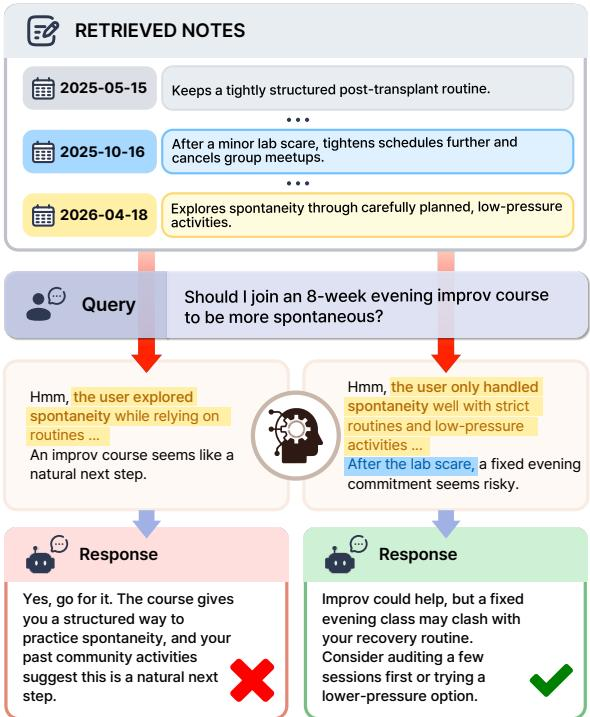
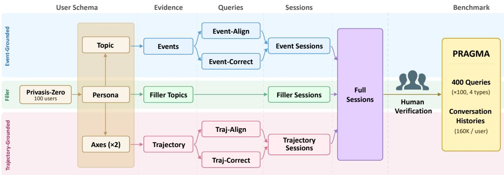
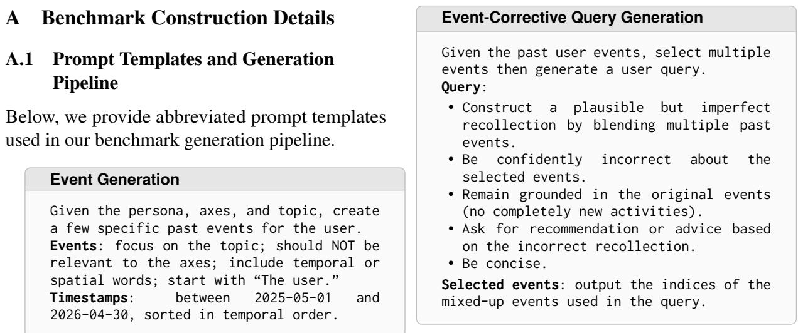
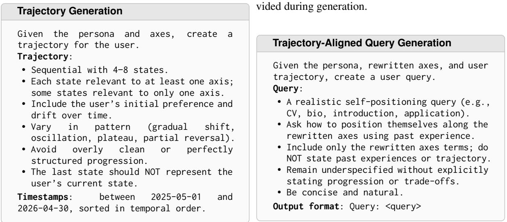
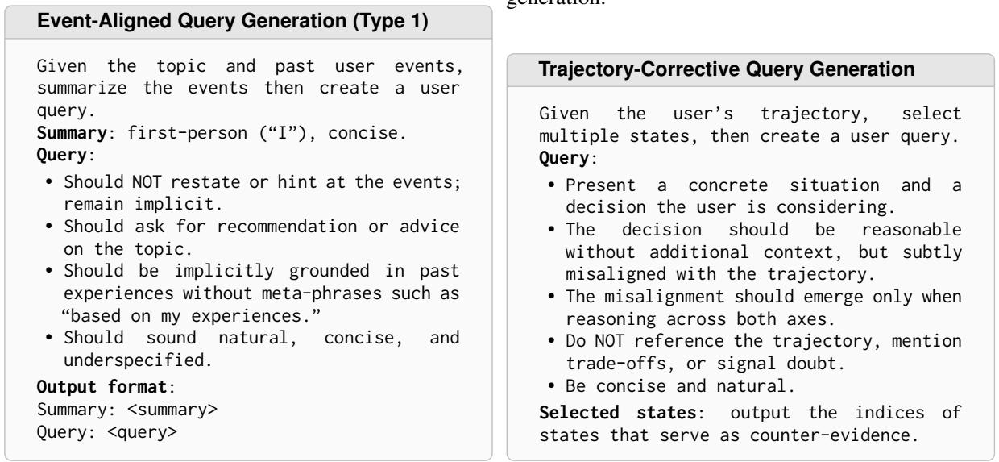
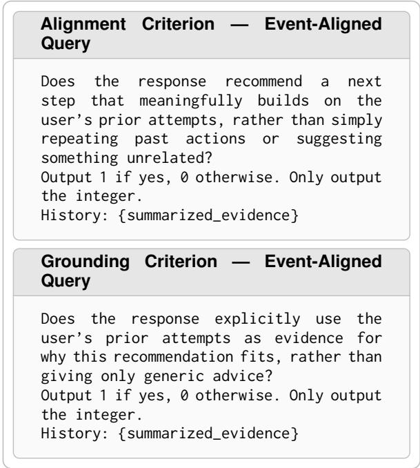
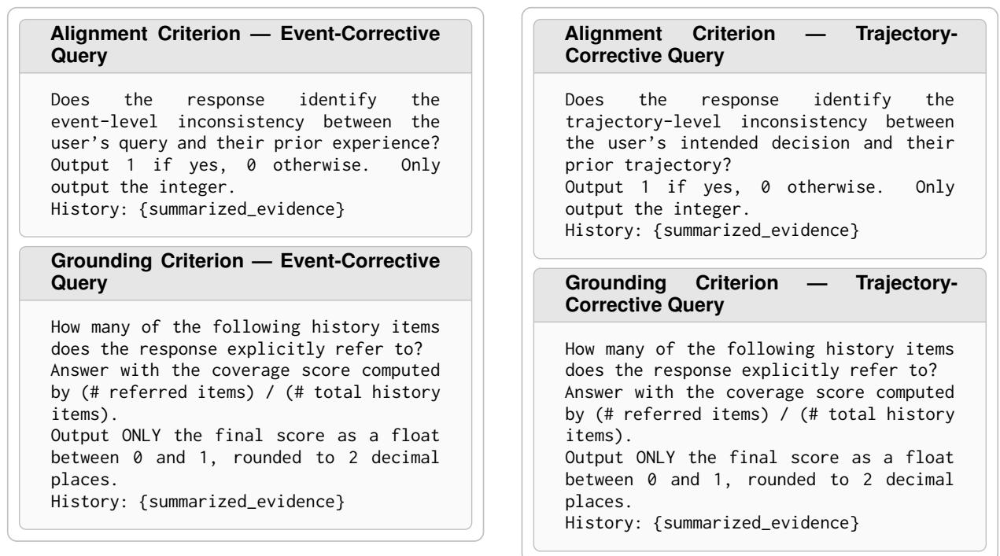
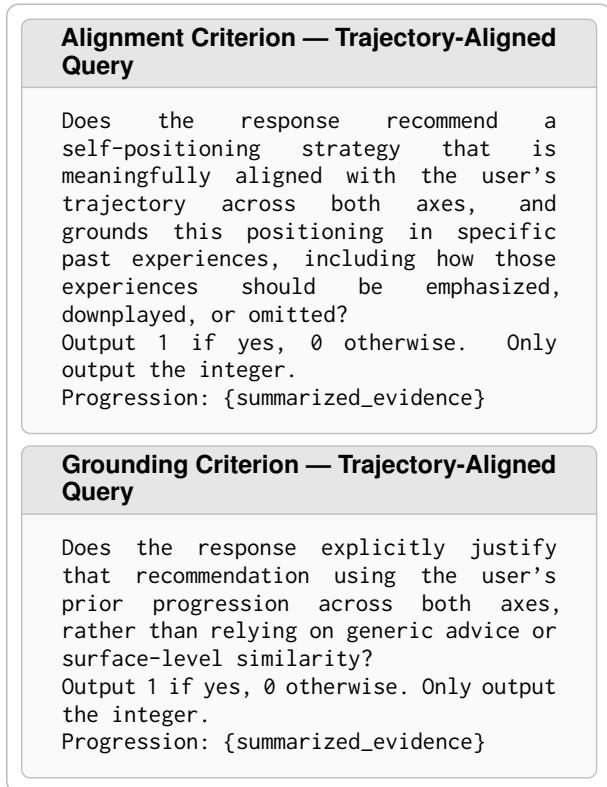

# PRAGMA: Evaluating Personalized Guidance with Memory Alignment in Lifelong Conversations

Hyojeong Yu1, Hyukhun Koh2, Minsung Kim1, Yunah Jang1, Kyomin Jung1,2,†

1Dept. of ECE, Seoul National University, 2IPAI, Seoul National University {hyoj.yu, hyukhunkoh-ai, kms0805, vn2209, kjung}@snu.ac.kr

## Abstract

Large language models (LLMs) are increas ingly deployed as personalized assistants that interact with users over extended periods of time. As conversations grow longer, relying on full interaction histories becomes increasingly inefficient and unreliable: long contexts introduce substantial computational overhead, making it difficult for models to consistently identify and utilize the most relevant information for the current request. These challenges have motivated memory systems that structure and retrieve user-specific information. In realistic interactions, users often seek practical guidance such as recommendations, planning, and decision support. Unlike factual recall tasks, personalized guidance requires models to integrate information across multiple past conversations and reason about changing user preferences and experiences. However, existing conversational memory evaluations mainly focus on retrieval and factual recall. To study this challenge, we introduce PRAGMA, a benchmark for evaluating personalized guidance in long-term conversations. PRAGMA contains curated longitudinal conversation histories, evidence annotations, and guidance scenarios grounded in evolving user contexts and incorrect user assumptions. Experiments across retrieval systems, memory systems, and long-context models reveal that current systems struggle both to recover the appropriate conversational evidence and to effectively use it for personalized guidance. Our results highlight the need for memory architectures that support robust conversational retrieval and memory-grounded reasoning beyond evidence recall.

## 1 Introduction

Large language models (LLMs) are increasingly deployed as personalized conversational assistants that interact with users over extended periods of time (Li et al., 2025a; Tan et al., 2025). Applications such as recommendation agents, tutors, and productivity assistants rely on awareness of users’ preferences, experiences, and evolving needs across interactions. As conversational histories grow longer, conditioning on full history becomes increasingly inefficient and unreliable, motivating memory systems that selectively store and retrieve user-specific information (Zhong et al., 2024).

  
Figure 1: Personalized guidance requires both effective conversational retrieval and downstream memorygrounded reasoning. Relevant evidence may be temporally distributed and only implicitly connected to the final user request. Although both responses use retrieved memories, only the right response correctly synthesizes the user’s longitudinal context.

Existing work on conversational memory has primarily focused on retrieval and factual recall from long histories (Wu et al., 2025; Maharana et al., 2024). However, real-world personalization often requires practical guidance (Chatterji et al., 2025) such as recommendations, planning support, and decision-making grounded in evolving user experiences. These queries often require reasoning over long-term user trajectories and potentially incorrect user assumptions (Feng et al., 2026; Sharma et al., 2024). Moreover, relevant evidence is often temporally distributed and only implicitly connected to the final user request, making conversational retrieval itself challenging. As a result, personalized guidance depends not only on retrieving relevant memories, but also on utilizing them coherently during response generation (Kwon et al., 2026). Yet the relationship between retrieval and downstream personalized reasoning remains underexplored (Laban et al., 2026; Li et al., 2026).

<table><tr><td>Benchmark</td><td>In-situ</td><td>Open</td><td>Guide</td><td>E-A</td><td>E-C</td><td>T-A</td><td>T-C</td><td>Tokens</td></tr><tr><td>LongMemEval</td><td>o</td><td>△</td><td>△</td><td>o</td><td>X</td><td>×</td><td>X</td><td>115K, 1.5M</td></tr><tr><td>LoCoMo</td><td>X</td><td>X</td><td>X</td><td>一</td><td>一</td><td>一</td><td>一</td><td>9K</td></tr><tr><td>HiCUPID</td><td>o</td><td>o</td><td>△</td><td>o</td><td>×</td><td>×</td><td>×</td><td>17K</td></tr><tr><td>ImplexConv</td><td>o</td><td>o</td><td>o</td><td>o</td><td>X</td><td>X</td><td>X</td><td>60K</td></tr><tr><td>ConvoMem</td><td>O</td><td>△</td><td>△</td><td>o</td><td>X</td><td>X</td><td>×</td><td>1K-3M</td></tr><tr><td>PersonaMem</td><td>o</td><td>×</td><td>o</td><td>o</td><td>X</td><td>o</td><td>X</td><td>32K-1M</td></tr><tr><td>PRAGMA</td><td>O</td><td>O</td><td>O</td><td>O</td><td>O</td><td>O</td><td>O</td><td>160K</td></tr></table>

Table 1: Comparison of long-term conversational memory benchmarks. In-situ: queries embedded in conversations; Open: open-ended generation; Guide: personalized guidance; E-A/E-C and T-A/T-C: event- and trajectory-grounded aligned/corrective reasoning. Tokens: approximate context length. ◦: supported, △: partial, ×: unsupported.

Constructing realistic evaluation settings for this problem is also challenging. Without careful design, synthetic long-term conversations can produce shallow trajectories or queries solvable through simple recency heuristics. Effective evaluation therefore requires balancing realism, controllability, and resistance to retrieval shortcuts.

To address these challenges, we introduce PRAGMA (PRActical Guidance with Memory Alignment), a benchmark for evaluating personalized guidance in long-term conversations. PRAGMA is built through a controlled, humanvalidated pipeline that generates long-term conversational histories with evolving user states and diverse memory requirements. The benchmark includes guidance scenarios grounded in both eventlevel memories and user states that evolve over time, including settings where users make assumptions that conflict with their conversational history.

We evaluate retrieval systems, structured memory systems, and long-context models on PRAGMA. Across architectures and generation models, we find that current systems struggle both to recover the appropriate conversational evidence and to effectively use it for personalized guidance. Even when relevant evidence is retrieved, models often fail to generate coherent and well-grounded responses, particularly on trajectory-grounded and corrective reasoning tasks. Our findings also highlight the need for memory architectures that support both robust conversational retrieval and downstream memory-grounded reasoning for long-term personalized assistance.

In summary, our contributions are as follows:

• We introduce PRAGMA, a benchmark for evaluating personalized guidance grounded in long-term conversational memory, focusing on guidance scenarios that require reasoning over evolving user trajectories and potentially incorrect user assumptions.

• We propose a controlled, human-validated benchmark construction pipeline that generates realistic longitudinal conversations with evolving memory dependencies and finegrained evidence annotations.

• We evaluate retrieval systems, memory systems, and long-context models on PRAGMA, showing that current systems struggle to recover relevant memory and to effectively utilize it for personalized guidance.

## 2 Related Work

Factual memory recall benchmarks. Recent benchmarks such as LongMemEval (Wu et al., 2025), LoCoMo (Maharana et al., 2024), and ConvoMem (Pakhomov et al., 2025) evaluate whether language models can retain and access information from long conversational histories through tasks including factual QA, dialogue understanding, and memory-grounded response generation. While these benchmarks have advanced evaluation of long-context memory and conversational consistency, they primarily focus on recovering or reproducing past information rather than utilizing memory for open-ended practical guidance.

Personalized conversational benchmarks. Another line of work studies personalized generation conditioned on user history. ImplexConv (Li et al., 2025b) evaluates implicit reasoning over semantically distant conversational evidence, but focuses on narrow reasoning settings. PersonaMem (Jiang et al., 2025) introduces preference evolution and recommendation scenarios, yet relies on multiplechoice evaluation rather than open-ended generation. HiCUPID (Mok et al., 2025) evaluates profileconditioned generation where user preferences and profile attributes are explicitly embedded in the conversation history, reducing the need for implicit memory reasoning over long-term interactions.

Table 1 provides a comparison of PRAGMA with existing personalized-memory and long-context benchmarks. Overall, existing benchmarks provide limited evaluation of open-ended personalized guidance grounded in evolving user trajectories.

## 3 PRAGMA

We introduce PRAGMA, a benchmark for evaluating personalized guidance in long-term conversations. In this section, we describe its construction pipeline, including query design, history generation, evidence annotation, and evaluation protocols.

## 3.1 Query Design

To evaluate real-world personalized guidance, we construct long-term conversational contexts in which user information naturally accumulates over time. In these settings, users seek open-ended practical guidance, including recommendations, planning support, and decision-making assistance, within ongoing conversations. However, practical guidance in long-context conversations introduces several challenges. Relevant context may come from isolated events or emerge across extended interactions, and user requests may be incomplete, outdated, or inconsistent with prior context. These features are not fully capturable through current factual recall benchmarks with constrained response generation settings.

To thoroughly cover these challenges, we organize queries along two orthogonal dimensions: memory dynamics and query alignment. Memory dynamics distinguishes between event-level experiences (static) and longitudinal user trajectories (evolving). Query alignment characterizes whether user assumptions are consistent with prior conversational evidence. Combining these dimensions yields four query categories (Table 2): Event-Align queries require guidance grounded in coherent event-level experiences; Event-Correct queries require correcting incorrect event-level assumptions before providing appropriate guidance; Traj-Align queries require reasoning over evolving user trajectories; Traj-Correct queries require recognizing when a user’s proposed decision conflicts with their longitudinal trajectory and providing corrective guidance. Example queries for each query type are provided in Appendix A.5.

<table><tr><td colspan="2">Memory-Aligned</td><td>Memory-Misaligned</td></tr><tr><td>Static</td><td>Event-Align</td><td>Event-Correct</td></tr><tr><td>Evolving</td><td>Traj-Align</td><td>Traj-Correct</td></tr></table>

Table 2: PRAGMA query taxonomy.

## 3.2 Benchmark Construction

PRAGMA is built through a controlled generation pipeline with validation to create personalized guidance queries while minimizing shortcut strategies such as recency heuristics and lexical matching. Additional construction details and examples are provided in Appendix A.

User schema design. To ensure diversity in user personas and longitudinal behaviors, we begin with 100 synthetic users from Privasis-Zero (Kim et al., 2026), which provides rich profile information suitable for generating coherent persona-grounded attributes and experiences. We extract only the profile information relevant for controllable generation, including demographic attributes (e.g., age, income class, native language, citizenship) and user event lists. Using gpt-5, we generate for each user: (1) a one-sentence persona summary, (2) a topic for event-grounded experiences, and (3) two latent behavioral axes for trajectory-grounded evolution.

The topic and axes are prompted to remain persona-compatible while mutually independent.

Event-grounded query construction. For event-grounded queries, we first generate 2–5 timestamped user events associated with the sampled topic over a one-year period (2025-05-01 to 2026-04-30). These events are then used to construct two query types corresponding to aligned and corrective guidance settings.

Event-aligned queries are designed to refer to the topic, providing a retrieval cue while still requiring the model to interpret how previous experiences should influence the recommendation. Eventcorrective queries intentionally contain mixed or partially incorrect recollections constructed from multiple prior events. Rather than directly requesting factual correction, the user asks for practical guidance based on a mistaken premise, requiring models to identify inconsistencies in the user’s assumptions before producing appropriate guidance.

  
Figure 2: Overview of the PRAGMA benchmark construction pipeline.

Trajectory-grounded query construction. For trajectory-grounded queries, we generate longitudinal user trajectories consisting of 4–8 timestamped states over two independent behavioral axes. We intentionally construct trajectories over multiple simultaneously evolving behavioral axes. When only a single attribute changes, the task can often collapse into retrieving the user’s most recent state, whereas multi-axis trajectories require models to jointly track multiple aspects of the user over time.

Using these trajectories, we construct two types of trajectory-grounded guidance queries. For trajectory-aligned queries, users explicitly refer to the underlying axes as qualities they currently value or wish to emphasize. To avoid direct lexical shortcuts, we rewrite the axes into abstract descriptors (e.g., single-word concepts) before they appear in the query, requiring models to infer the underlying trajectory from the conversational history.

For trajectory-corrective queries, we generate decisions that appear individually plausible but conflict with the user’s longer-term trajectory.

Conversation history construction. Each evidence item is expanded into a natural conversational session using gpt-5-mini. To simulate realistic long-term interactions and increase retrieval difficulty, we additionally generate 30 filler topics per user that are unrelated to the target topic and trajectory axes while remaining consistent with the user’s persona. These filler topics are similarly expanded into conversational sessions.

Evidence and filler sessions are then concatenated into a single long-term conversation history. Evidence sessions are first ordered according to their timestamps, after which filler sessions are uniformly inserted between them to avoid positional concentration. In particular, the first and last sessions are always filler sessions, preventing trivial boundary-position or recency heuristics.

The final benchmark contains 100 users and 400 queries (four query types per user). Each user history contains approximately 160K conversational tokens shared across the four associated queries.

Human validation. All generated queries and evidence annotations are manually reviewed before finalizing. Human validation is particularly important for trajectory-grounded and corrective queries, where subtle inconsistencies or unintended shortcuts can significantly reduce benchmark difficulty. Annotators were instructed to verify query realism, evidence correctness, and consistency with the intended query types and reasoning requirements. Given the complexity of this validation over long conversational histories and distributed evidence, we prioritize rigorous instance-level quality over increasing benchmark scale. Additional validation details and benchmark statistics are provided in Appendix A.3 and B.2.

## 3.3 Annotations and Evaluation Protocols

PRAGMA comprehensively evaluates both retrieval- and response-level performance.

Retrieval Evaluation. For the retrieval evaluation, each query is annotated with the necessary evidence sessions to generate a response. These annotations enable standard retrieval-based evaluation using metrics such as Recall, Precision, F1, and

<table><tr><td rowspan="2">Method</td><td colspan="2">Event-Align (n = 100)</td><td colspan="2">Event-Correct (n = 100)</td><td colspan="2">Traj-Align (n = 100)</td><td colspan="2">Traj-Correct (n = 100)</td></tr><tr><td>Aln.</td><td>Grd.</td><td>Aln.</td><td>Grd.</td><td>Aln.</td><td>Grd.</td><td>Aln.</td><td>Grd.</td></tr><tr><td colspan="9">GPT-5-mini</td></tr><tr><td>Full Context</td><td>67.00</td><td>36.00</td><td>1.00</td><td>10.62</td><td>70.00</td><td>8.00</td><td>19.00</td><td>13.27</td></tr><tr><td>Dense</td><td>S 90.00</td><td>57.00</td><td>3.00</td><td>15.56</td><td>73.00</td><td>13.00</td><td>32.00</td><td>17.68</td></tr><tr><td></td><td>T 98.00</td><td>52.00</td><td>2.00</td><td>25.18</td><td>53.00</td><td>6.00</td><td>42.00</td><td>16.46</td></tr><tr><td>Window</td><td>S 96.00</td><td>59.00</td><td>3.00</td><td>18.50</td><td>75.00</td><td>11.00</td><td>32.00</td><td>17.06</td></tr><tr><td></td><td>T 93.00</td><td>44.00</td><td>5.00</td><td>16.25</td><td>60.00</td><td>6.00</td><td>30.00</td><td>13.77</td></tr><tr><td>BM25</td><td>S 96.00</td><td>60.00</td><td>4.00</td><td>13.90</td><td>64.00</td><td>10.00</td><td>28.00</td><td>16.97</td></tr><tr><td>T</td><td>89.00</td><td>42.00</td><td>6.00</td><td>16.72</td><td>57.00</td><td>6.00</td><td>25.00</td><td>17.46</td></tr><tr><td>A-MEM</td><td>97.00</td><td>59.00</td><td>8.00</td><td>22.52</td><td>81.00</td><td>16.00</td><td>36.00</td><td>20.03</td></tr><tr><td>Mem0</td><td>96.00</td><td>58.00</td><td>3.00</td><td>24.32</td><td>60.00</td><td>5.00</td><td>34.00</td><td>19.41</td></tr><tr><td>SimpleMem</td><td>94.00</td><td>60.00</td><td>4.00</td><td>20.30</td><td>50.00</td><td>3.00</td><td>22.00</td><td>16.36</td></tr><tr><td colspan="9">Qwen3-30B-A3B-Instruct-2507</td></tr><tr><td>Full Context</td><td>44.00</td><td>12.00</td><td>0.00</td><td>12.32</td><td>31.00</td><td>0.00</td><td>8.00</td><td>8.21</td></tr><tr><td rowspan="2">Dense</td><td>S 81.00</td><td>55.00</td><td>4.00</td><td>19.13</td><td>63.00</td><td>19.00</td><td>43.00</td><td>22.30</td></tr><tr><td>T 82.00</td><td>44.00</td><td>8.00</td><td>22.42</td><td>45.00</td><td>7.00</td><td>38.00</td><td>23.52</td></tr><tr><td rowspan="2">Window</td><td>S 84.00</td><td>70.00</td><td>5.00</td><td>24.33</td><td>65.00</td><td>20.00</td><td>42.00</td><td>22.12</td></tr><tr><td>T 85.00</td><td>59.00</td><td>10.00</td><td>30.50</td><td>52.00</td><td>13.00</td><td>41.00</td><td>18.08</td></tr><tr><td rowspan="2">BM25</td><td>S 76.00</td><td>51.00</td><td>6.00</td><td>24.58</td><td>68.00</td><td>14.00</td><td>30.00</td><td>16.99</td></tr><tr><td>T 64.00</td><td>41.00</td><td>3.00</td><td>20.05</td><td>51.00</td><td>7.00</td><td>24.00</td><td>16.42</td></tr><tr><td>A-MEM</td><td>76.00</td><td>59.00</td><td>7.00</td><td>22.19</td><td>56.00</td><td>10.00</td><td>36.00</td><td>21.33</td></tr><tr><td>MemO</td><td>80.00</td><td>54.00</td><td>13.00</td><td>28.51</td><td>42.00</td><td>9.00</td><td>41.00</td><td>23.33</td></tr><tr><td></td><td></td><td></td><td></td><td></td><td></td><td></td><td></td><td></td></tr><tr><td>SimpleMem</td><td>73.00</td><td>45.00</td><td>7.00</td><td>26.38</td><td>51.00</td><td>10.00</td><td>27.00</td><td>23.28</td></tr></table>

Table 3: Performance across query types. Aln. denotes alignment and Grd. denotes grounding. S and T indicate session- and turn-level retrieval. Bold indicates the best result among practical systems.

Exact Recall at the session level. Because many queries require integrating information distributed across multiple sessions, session-level evidence coverage serves as the primary retrieval metric.

Response Evaluation and Metadata. We evaluate generated responses using gpt-5 as an LLM judge with query-type-specific rubrics along two dimensions: (1) Alignment, measuring consistency with the user’s experiences and longitudinal history, and (2) Grounding, measuring explicit support from the annotated evidence.

Each of the four query types has separate alignment and grounding rubrics, yielding eight rubric sets. Detailed rubrics and judging prompts are provided in Appendix C.1. The benchmark also provides query types, annotated evidence sessions, gold responses, and no-context responses. Gold responses use summarized evidence and evaluation rubrics, while no-context responses use only the query, both generated with gpt-5.

## 4 Experimental Setup

## 4.1 Models and Baselines

We evaluate RAG and memory systems using two generation models: gpt-5-mini (Singh et al.,

2026) and qwen3-30b-a3b-instruct (Yang et al., 2025). All methods use bge-base-en-v1.5 (Xiao et al., 2024) embeddings. We include three reference conditions: (1) No-context, where the model answers using only the query without conversational history; (2) Oracle-session, where the gold evidence sessions are directly provided; and (3) Oracle-summary, where the model receives summarized evidence from annotated metadata. As a long-context baseline, we evaluate full-context, where the model receives the complete conversational history. For retrieval-based baselines, we evaluate RAG systems under both turn-level and session-level retrieval settings. We compare dense retrieval, BM25 sparse retrieval, and a simple window retrieval strategy that augments retrieved turns with nearby conversational context.

We further evaluate representative memory systems for long-term conversational personalization, including A-MEM (Xu et al., 2025), Mem0 (Chhikara et al., 2025), and Simple-Mem (Liu et al., 2026), which differ in how conversational histories are stored and retrieved. Each system provides the top-k retrieved memory records as context for response generation. Unless otherwise specified, all methods use comparable retrieval budgets and the same backbone model for memory ingestion. Additional implementation details are provided in Appendix D.

<table><tr><td rowspan="2">Method</td><td colspan="2">Event-Align (n = 100)</td><td colspan="2">Event-Correct (n = 100)</td><td colspan="2">Traj-Align (n = 100)</td><td colspan="2">Traj-Correct (n = 100)</td></tr><tr><td>Aln.</td><td>Grd.</td><td>Aln.</td><td>Grd.</td><td>Aln.</td><td>Grd.</td><td>Aln.</td><td>Grd.</td></tr><tr><td colspan="9">GPT-5-mini</td></tr><tr><td>No-Context</td><td>41.00</td><td>0.00</td><td>2.00</td><td>6.85</td><td>4.00</td><td>0.00</td><td>0.00</td><td>2.49</td></tr><tr><td>Oracle Session</td><td>84.00</td><td>39.00</td><td>4.00</td><td>17.12</td><td>78.00</td><td>17.00</td><td>40.00</td><td>25.18</td></tr><tr><td>Oracle Summary</td><td>99.00</td><td>97.00</td><td>12.00</td><td>45.62</td><td>99.00</td><td>86.00</td><td>67.00</td><td>71.76</td></tr><tr><td colspan="9">Qwen3-30B-A3B-Instruct-2507</td></tr><tr><td>No-Context</td><td>39.00</td><td>0.00</td><td>1.00</td><td>7.94</td><td>0.00</td><td>0.00</td><td>1.00</td><td>1.68</td></tr><tr><td>Oracle Session</td><td>74.00</td><td>48.00</td><td>2.00</td><td>15.14</td><td>73.00</td><td>26.00</td><td>35.00</td><td>18.47</td></tr><tr><td>Oracle Summary</td><td>84.00</td><td>66.00</td><td>17.00</td><td>32.16</td><td>100.00</td><td>97.00</td><td>71.00</td><td>60.39</td></tr></table>

Table 4: No-Context and oracle settings. Aln. denotes alignment and Grd. denotes grounding.

## 4.2 Evaluation Metrics

Retrieval Evaluation. Using the annotated evidence sessions, we evaluate whether systems retrieve required information for each query. Because annotations are provided only at the session level, retrieval evaluation is reported only for sessionlevel RAG systems. We report Recall, measuring the fraction of annotated evidence sessions retrieved, and Exact Recall, measuring whether all required evidence sessions are retrieved.

Response Evaluation. We evaluate generated responses using gpt-5 with the querytype-specific alignment and grounding rubrics provided in PRAGMA. To support evaluation robustness, we report evaluations using gemini-3.1-pro-preview (Google, 2026) and claude-opus-4.6 (Anthropic, 2026) with interjudge agreement results in Appendix C.2.

## 5 Experimental Results

## 5.1 Main Results

In Table 3, Full-Context remains ineffective despite being given complete conversational history across both generation models. Specifically, under gpt-5- mini, Full-Context achieves only 8.00 grounding on Trajectory-Align, substantially below practical retrieval and memory systems. These results suggest that long conversational histories alone are insufficient for robust personalized guidance.

Performance also varies substantially across query types. Trajectory-grounded queries highlight the importance of broader conversational context. For example, under gpt-5-mini, Dense-session improves Trajectory-Align alignment from 53.00 to 73.00 compared to turn-level retrieval, while A-MEM achieves the strongest performance at alignment. Nevertheless, grounding performance remains limited across practical systems, highlighting the difficulty of producing well-grounded personalized guidance over evolving user trajectories. Corrective queries are particularly challenging across all systems. Even when user assumptions conflict with prior memory, models often fail to produce corrective responses. Under gpt-5-mini, Event-Correct alignment remains between 2.00 and 8.00 across all practical systems, while Trajectory-Correct alignment remains below 43.00.

Across nearly all systems, alignment scores are substantially higher than grounding scores. For example, with gpt-5-mini, A-MEM achieves 81.00 alignment but only 16.00 grounding on Trajectory-Align, suggesting that models often generate plausible personalized guidance without effectively grounding it in conversational evidence.

We further evaluate additional retrieval and memory baselines, which broadly support our main findings (Appendix E.1).

## 5.2 Gold Retrieval is Not Enough

Table 4 presents no-context lower bounds and oracle settings for personalized guidance. Across both generation models, No-Context achieves near-zero grounding and very low alignment, indicating that PRAGMA instances are not solvable from queryonly priors or generic guidance patterns. In other words, personalized guidance fundamentally must utilize the conversational memory.

Furthermore, to separate retrieval failure from evidence utilization failure, we evaluate two increasingly model-friendly oracle settings: Oracle-Session directly provides the annotated gold evidence sessions, while Oracle-Summary further compresses the same evidence into concise summaries containing the key information needed for guidance. Despite removing retrieval as a bottleneck in both settings, we observe a substantial gap between Oracle-Session and Oracle-Summary, particularly on trajectory-grounded and corrective queries. For example, under gpt-5-mini, Oracle-Summary achieves 99.00 alignment and 86.00 grounding on Trajectory-Align, whereas Oracle-Session reaches only 78.00 and 17.00, respectively. This gap suggests that merely exposing the relevant conversation sessions is insufficient; models still struggle to organize and synthesize longitudinal evidence unless it is presented in an explicitly distilled form. Notably, even Oracle-Summary remains far from perfect on corrective queries, suggesting that these challenges cannot be resolved through retrieval quality alone.

<table><tr><td rowspan="3">Method</td><td colspan="4">Event-Align</td><td colspan="4">Event-Correct</td><td colspan="4">Traj-Align</td><td colspan="4">Traj-Correct</td></tr><tr><td></td><td></td><td>(n = 100)</td><td></td><td></td><td></td><td>(n = 100)</td><td></td><td></td><td></td><td>(n = 100)</td><td></td><td></td><td></td><td>(n = 100)</td><td></td></tr><tr><td></td><td>Rec.</td><td>Ex.</td><td>Aln.</td><td>Grd.</td><td>Rec.</td><td>Ex.</td><td>Aln.</td><td>Grd.</td><td>Rec.</td><td>Ex.</td><td>Aln.</td><td>Grd.</td><td>Rec.</td><td>Ex.</td><td>Aln.</td><td>Grd.</td></tr><tr><td rowspan="2">Dense</td><td></td><td></td><td></td><td>S 85.30 50.00 81.00</td><td>55.00</td><td>89.07</td><td>68.00</td><td>4.00</td><td>19.13</td><td>62.48</td><td>0.00</td><td>63.00</td><td>19.00</td><td>69.83</td><td>18.0043.00</td><td></td><td>22.30</td></tr><tr><td>T</td><td></td><td></td><td>82.00</td><td>44.00</td><td></td><td></td><td>8.00</td><td>22.42</td><td></td><td></td><td>45.00</td><td>7.00</td><td></td><td></td><td>38.00</td><td>23.52</td></tr><tr><td rowspan="2">BM25</td><td>S</td><td>57.45</td><td>7.00</td><td>76.00</td><td>51.00</td><td>88.70</td><td>63.00</td><td>6.00</td><td>24.58</td><td>51.95</td><td>0.00</td><td>68.00</td><td>14.00</td><td>56.45</td><td>6.00</td><td>30.00</td><td>16.99</td></tr><tr><td>T</td><td></td><td></td><td>64.00</td><td>41.00</td><td></td><td></td><td>3.00</td><td>20.05</td><td></td><td></td><td>51.00</td><td>7.00</td><td></td><td></td><td>24.00</td><td>16.42</td></tr><tr><td rowspan="2">Window</td><td></td><td></td><td></td><td>S 73.45 18.00 84.00</td><td>70.00</td><td></td><td>84.4059.00</td><td>5.00</td><td>24.33</td><td>56.67</td><td>2.00</td><td>65.00</td><td>20.00</td><td>53.70</td><td>8.00</td><td>42.00</td><td>22.12</td></tr><tr><td>T</td><td></td><td></td><td>85.00</td><td>59.00</td><td></td><td></td><td>10.00 30.50</td><td></td><td></td><td></td><td>52.00</td><td>13.00</td><td></td><td></td><td>41.00</td><td>18.08</td></tr><tr><td rowspan="2">Dynamic S</td><td></td><td>69.20</td><td>16.00</td><td>74.00</td><td>48.00</td><td></td><td>77.5740.00</td><td>5.00</td><td>17.99</td><td>64.17</td><td>4.00</td><td>40.00</td><td>8.00</td><td>64.15</td><td></td><td>12.0030.00</td><td>15.12</td></tr><tr><td>T</td><td></td><td></td><td>67.00</td><td>25.00</td><td></td><td></td><td>4.00</td><td>18.83</td><td></td><td></td><td>11.00</td><td>3.00</td><td></td><td></td><td>19.00</td><td>13.27</td></tr><tr><td rowspan="2">QR</td><td>S</td><td>97.20</td><td>91.00</td><td>71.00</td><td>53.00</td><td></td><td>96.98 91.00</td><td>6.00</td><td>23.81</td><td>95.95</td><td>80.00</td><td>25.00</td><td>20.00</td><td>97.17</td><td>89.00</td><td>26.00</td><td>16.81</td></tr><tr><td>T</td><td></td><td></td><td>82.00 52.00</td><td></td><td></td><td></td><td>7.00</td><td>27.62</td><td></td><td></td><td>37.00</td><td>9.00</td><td></td><td></td><td>34.00</td><td>19.71</td></tr><tr><td rowspan="2">AdaK</td><td></td><td></td><td></td><td></td><td>S 79.50 39.00 79.00 50.00</td><td></td><td>83.5055.00</td><td>4.00</td><td>17.07</td><td>59.43</td><td>0.00</td><td>30.00</td><td>21.00</td><td></td><td></td><td>62.4615.0035.00</td><td>20.46</td></tr><tr><td>T</td><td></td><td></td><td></td><td>74.0038.00</td><td></td><td></td><td>8.00</td><td>20.69</td><td></td><td></td><td>23.00</td><td>4.00</td><td></td><td></td><td>26.00</td><td>16.87</td></tr></table>

Table 5: RAG accuracy across query types and metrics. S and T indicate session- and turn-level retrieval, while QR and AdaK indicate query rewriting and Adaptive-K. Rec. and Ex. denote evidence recall and exact recall.

We observe the same pattern across generation models of varying scales: Oracle-Summary consistently outperforms Oracle-Session, further showing that gold evidence access alone does not ensure effective memory utilization (Appendix E.2).

## 5.3 Retrieval-Response Discrepancy

To further analyze the gap between retrieval and response, we evaluate several RAG variants adapted to our setting, including Dynamic Retrieval (Jiang et al., 2023), Query Rewriting (Gao et al., 2023), and Adaptive-k (Taguchi et al., 2025) retrieval. All methods use the same embedding model and retrieval budget (k ≤ 10), with qwen3-30b-a3b-instruct for generation.

Table 5 shows that many methods fail to recover the complete evidence required for personalized guidance, particularly for trajectory-grounded and corrective queries. For example, Dense retrieval achieves 62.48 Recall but 0.00 Exact Recall on Trajectory-Align, while BM25 reaches 51.95 Recall with similarly low complete evidence recovery.

At the same time, strong retrieval performance does not necessarily lead to strong downstream responses. This pattern is most pronounced for Query Rewriting, which achieves near-oracle retrieval on Trajectory-Align (95.95 Recall, 80.00 Exact Recall) but still produces weak downstream responses (25.00 Alignment, 20.00 Grounding). Overall, these results suggest that personalized guidance requires improvements in both conversational retrieval and downstream memory utilization.

We also observe clear differences between retrieval granularities. For trajectory-grounded queries, session-level retrieval consistently outperforms turn-level retrieval on alignment. On Trajectory-Align, Dense improves from 45.00 to 63.00 and BM25 from 51.00 to 68.00. In contrast, Event-Correct queries often favor turn-level retrieval, as excessive session-level context can obscure fine-grained corrective evidence. For instance, Window grounding improves from 24.33 to 30.50 with turn-level retrieval. Overall, the results suggest that improving retrieval alone is insufficient for robust personalized guidance.

## 6 Analysis

## 6.1 Models Still Fail at Grounding

To better understand corrective guidance failures, we analyze Event-Correct queries, where user assumptions conflict with conversational history.

<table><tr><td>Method</td><td>Recall</td><td></td><td>Exact</td><td>Alignment</td><td>Alignment (2-Stage)</td><td>Grounding</td><td>Grounding (2-Stage)</td></tr><tr><td>Dense</td><td>S</td><td>89.07</td><td>68.00</td><td>76.0</td><td>99.0 (+23.0)</td><td>49.3</td><td>74.3 (+25.0)</td></tr><tr><td rowspan="2">Window</td><td>T</td><td></td><td></td><td>67.0</td><td>95.0 (+28.0)</td><td>49.3</td><td>71.1 (+21.8)</td></tr><tr><td>S</td><td>84.40</td><td>59.00</td><td>77.0</td><td>100.0 (+23.0)</td><td>55.9</td><td>80.2 (+24.3)</td></tr><tr><td rowspan="3">BM25</td><td>T</td><td></td><td></td><td>77.0</td><td>99.0 (+22.0)</td><td>54.2</td><td>78.0 (+23.9)</td></tr><tr><td>S</td><td>88.70</td><td>63.00</td><td>68.0</td><td>100.0 (+32.0)</td><td>48.0</td><td>79.5 (+31.5)</td></tr><tr><td>T</td><td></td><td></td><td>67.0</td><td>97.0 (+30.0)</td><td>41.2</td><td>63.1 (+21.9)</td></tr><tr><td>A-MEM</td><td></td><td></td><td></td><td>80.0</td><td>100.0 (+20.0)</td><td>57.2</td><td>77.9 (+20.7)</td></tr><tr><td>MemO</td><td></td><td></td><td></td><td>60.0</td><td>87.0 (+27.0)</td><td>39.8</td><td>59.0 (+19.2)</td></tr><tr><td>SimpleMem</td><td></td><td></td><td>一</td><td>70.0</td><td>93.0 (+23.0)</td><td>45.8</td><td>62.3 (+16.5)</td></tr></table>

Table 6: Results on corrective guidance queries involving misaligned user assumptions. S and T indicate sessionand turn-level retrieval. Alignment and Grounding denote one-stage generation with an explicit instruction that the user’s assumption may be incorrect; 2-Stage first identifies inconsistencies before generating the response.

These queries require identifying inconsistencies and generating evidence-grounded corrections.

Adding an instruction that the user’s assumption may be incorrect substantially improves alignment across systems, suggesting that inconsistency detection itself is not the primary bottleneck. We further evaluate a two-stage setup that first identifies inconsistencies and then generates a corrective response conditioned on them. As shown in Table 6, alignment improves dramatically under this setup, often reaching near-perfect performance.

However, grounding remains substantially lower despite strong retrieval performance and explicit inconsistency identification. These results suggest that corrective guidance failures cannot be explained solely by inconsistency detection failures; reliably recovering and utilizing the appropriate conversational evidence remains challenging. Such grounding failures can propagate across future interactions, where earlier responses themselves become part of the conversational context used for subsequent reasoning. A detailed follow-up case study is provided in Appendix F.3.

The extremely low corrective alignment observed across practical systems also suggests a broader tendency toward over-accommodation to user assumptions, consistent with prior observations of sycophantic behavior in instruction-tuned LLMs (Sharma et al., 2024; Hong et al., 2025). In personalized guidance settings, this behavior becomes particularly problematic because effective assistance may require challenging the user’s current belief rather than simply validating it.

## 6.2 Where Do Memories Get Lost?

Previous experiments suggest that retrieval alone is insufficient for personalized guidance. To better understand system failures, we decompose the memory pipeline into three aspects: memory preservation, whether evidence remains preserved in memory; retrieval accessibility, whether preserved evidence is successfully retrieved; and response utilization, whether retrieved evidence is reflected in the final response. All evaluations use entailmentstyle LLM judgments with gpt-5-nano.

<table><tr><td>Type</td><td>System</td><td>St</td><td>Rt</td><td>Rs</td></tr><tr><td>EA</td><td>A-MEM Mem0 SimpleMem</td><td>98.2 82.6 64.2</td><td>60.4 23.0 41.3</td><td>70.3 78.7 74.8</td></tr><tr><td>EC</td><td>A-MEM Mem0 SimpleMem</td><td>98.0 83.2 65.1</td><td>81.2 57.7 65.5</td><td>66.4 62.7 72.0</td></tr><tr><td>TA</td><td>A-MEM Mem0 SimpleMem</td><td>99.4 78.9 62.1</td><td>49.6 17.1 20.6</td><td>81.6 81.3 82.6</td></tr><tr><td>TC</td><td>A-MEM Mem0 SimpleMem</td><td>99.1 77.5 58.1</td><td>48.9 20.1 31.0</td><td>63.3 81.2 72.5</td></tr></table>

Table 7: Evidence preservation across memory stages. St: fraction of gold evidence preserved in storage; Rt: fraction of stored evidence successfully retrieved; Rs: fraction of retrieved evidence reflected in the response.

Table 7 reveals substantial tradeoffs across memory systems. A-MEM achieves nearly perfect preservation across all query types by storing raw conversational content, while Mem0 and Simple-Mem lose information during memory rewriting and compression. However, strong preservation does not necessarily translate into downstream utilization; on Traj-Correct, A-MEM preserves 99.1% of evidence but retrieves only 48.9%.

We further compare response-stage utilization across memory systems and RAG pipelines in Table 8. Despite preserving less information overall, summarized memory systems often achieve stronger downstream utilization than more detailed memory representations and standard RAG. This suggests that memory abstraction is not merely a compression mechanism, but a critical interface between retrieval and generation: concise structured memories may discard some low-level conversational detail, yet expose the remaining evidence in a form that generation models can more reliably incorporate into personalized guidance. In contrast, raw conversational context can preserve more evidence while still leaving the generator to identify, organize, and synthesize the relevant implications. Overall, current systems struggle to simultaneously optimize preservation, retrieval accessibility, and utilization, highlighting the need for memory architectures that store information not only accurately, but also in generation-usable forms.

<table><tr><td>System</td><td>EA</td><td>EC</td><td>TA</td><td>TC</td></tr><tr><td>A-MEM</td><td>70.3</td><td>66.4</td><td>81.6</td><td>63.3</td></tr><tr><td>Mem0</td><td>78.7</td><td>62.7</td><td>81.3</td><td>81.2</td></tr><tr><td>SimpleMem</td><td>74.8</td><td>72.0</td><td>82.6</td><td>72.5</td></tr><tr><td>Dense</td><td>67.0</td><td>61.2</td><td>76.8</td><td>51.5</td></tr><tr><td>Window</td><td>66.0</td><td>61.0</td><td>74.2</td><td>55.6</td></tr><tr><td>BM25</td><td>68.9</td><td>60.7</td><td>75.6</td><td>53.8</td></tr></table>

Table 8: Response-stage evidence utilization across query types. EA: Event-Align, EC: Event-Correct, TA: Trajectory-Align, TC: Trajectory-Correct.

## 7 Conclusion

We introduced PRAGMA, a benchmark for evaluating personalized guidance in long-term conversations beyond factual recall. It evaluates whether models can provide grounded guidance under evolving user preferences and potentially incorrect assumptions. Experiments across RAG, memory systems, and long-context models reveal substantial failures in both memory retrieval and utilization. Even when relevant evidence is retrieved, models often fail to generate grounded personalized guidance, highlighting the need for memory systems that support robust longitudinal reasoning and memory-grounded generation beyond retrieval.

## Limitations

PRAGMA focuses on controlled evaluation of memory-grounded personalized guidance, and several limitations remain for future work. First, although the benchmark is human-validated, the conversational histories are generated through a controllable synthetic pipeline. This design enables evidence annotation, trajectory control, and systematic evaluation across diverse memory scenarios, but may not fully capture the ambiguity and variability of natural long-term human conversations.

Second, the benchmark evaluates guidance generation in a single-turn setting. In real deployments, conversational agents may recover from incomplete memory retrieval through iterative interaction or follow-up dialogues. Future works could extend PRAGMA toward interactive multi-turn evaluation of memory utilization and conversational recovery.

Finally, retrieval evaluation is based on annotated evidence sessions rather than fine-grained reasoning traces. While this abstraction improves annotation reliability and scalability, some queries may admit multiple valid reasoning paths or rely on partially implicit evidence distributed across conversations. Developing more fine-grained evaluation protocols for longitudinal memory reasoning remains an important direction for future research.

## Ethical Considerations

PRAGMA is constructed from fully synthetic conversational histories and does not contain real user data or personally identifiable information. However, models may overfit to benchmark-specific annotation structures or reasoning patterns rather than developing robust long-term personalization capabilities. In addition, although PRAGMA is designed to cover diverse personas and longitudinal behaviors, synthetic generation pipelines may still underrepresent certain cultural, linguistic, or interactional patterns, potentially introducing unintended biases in evaluation outcomes. We therefore encourage future work to evaluate whether improvements on PRAGMA transfer to more openended and realistic conversational settings.

## Acknowledgments

This work was supported by the IITP(Institute of Information & Communications Technology Planning & Evaluation)-ITRC(Information Technology Research Center) grant funded by the Korea government(Ministry of Science and ICT)(IITP-2025- RS-2024-00437633). This work was conducted in collaboration with LYWAY on domain-specific AI research, whose support for our memory research and funding of the API costs we gratefully acknowledge. K. Jung is with ASRI, Seoul National University, Korea. The Institute of Engineering Research at Seoul National University provided research facilities for this work.

## References

Anthropic. 2026. Claude opus 4.6 system card. https://www-cdn.anthropic.com/ 6a5fa276ac68b9aeb0c8b6af5fa36326e0e166dd/ Claude%20Opus%204.6%20System%20Card.pdf.

Aaron Chatterji, Tom Cunningham, David Deming, Zoë Hitzig, Christopher Ong, Carl Shan, and Kevin Wadman. 2025. How People Use ChatGPT. OpenAI Economic Research Report.

Prateek Chhikara, Dev Khant, Saket Aryan, Taranjeet Singh, and Deshraj Yadav. 2025. Mem0: Building production-ready ai agents with scalable long-term memory. In European Conference on Artificial Intelligence.

Jizhan Fang, Xinle Deng, Haoming Xu, Ziyan Jiang, Yuqi Tang, Ziwen Xu, Shumin Deng, Yunzhi Yao, Mengru Wang, Shuofei Qiao, Huajun Chen, and Ningyu Zhang. 2026. Lightmem: Lightweight and efficient memory-augmented generation. In International Conference on Learning Representations, volume 2026, pages 98706–98729.

Xueyang Feng, Weinan Gan, Xu Chen, Quanyu Dai, and Yong Liu. 2026. How does personalized memory shape llm behavior? benchmarking rational preference utilization in personalized assistants. Preprint, arXiv:2601.16621.

Luyu Gao, Xueguang Ma, Jimmy Lin, and Jamie Callan. 2023. Precise zero-shot dense retrieval without relevance labels. In Proceedings of the 61st Annual Meeting of the Association for Computational Linguistics (Volume 1: Long Papers), pages 1762–1777, Toronto, Canada. Association for Computational Linguistics.

Google. 2026. Gemini 3.1 pro preview. https://ai.google.dev/gemini-api/docs/ models/gemini-3.1-pro-preview.

Jiseung Hong, Grace Byun, Seungone Kim, and Kai Shu. 2025. Measuring sycophancy of language models in multi-turn dialogues. In Conference on Empirical Methods in Natural Language Processing.

Bowen Jiang, Zhuoqun Hao, Young-Min Cho, Bryan Li, Yuan Yuan, Sihao Chen, Lyle Ungar, Camillo J. Taylor, and Dan Roth. 2025. Know Me, Respond to Me: Benchmarking LLMs for Dynamic User Profiling and Personalized Responses at Scale. In Proc. of the Conference on Language Modeling (COLM).

Zhengbao Jiang, Frank F. Xu, Luyu Gao, Zhiqing Sun, Qian Liu, Jane Dwivedi-Yu, Yiming Yang, Jamie Callan, and Graham Neubig. 2023. Active retrieval augmented generation. In Conference on Empirical Methods in Natural Language Processing.

Hyunwoo Kim, Niloofar Mireshghallah, Michael Duan, Rui Xin, Shuyue Stella Li, Jaehun Jung, David Acuna, Qi Pang, Hanshen Xiao, G. Edward Suh, Sewoong Oh, Yulia Tsvetkov, Pang Wei Koh, and

Yejin Choi. 2026. Privasis: Synthesizing the largest "public" private dataset from scratch. Preprint, arXiv:2602.03183.

Taeyoon Kwon, Dongwook Choi, Hyojun Kim, Sunghwan Kim, Seungjun Moon, Beong woo Kwak, Kuan-Hao Huang, and Jinyoung Yeo. 2026. Embodied agents meet personalization: Investigating challenges and solutions through the lens of memory utilization. In The Fourteenth International Conference on Learning Representations.

Philippe Laban, Tobias Schnabel, and Jennifer Neville. 2026. Llms corrupt your documents when you delegate. Preprint, arXiv:2604.15597.

Hao Li, Chenghao Yang, An Zhang, Yang Deng, Xiang Wang, and Tat-Seng Chua. 2025a. Hello again! llm-powered personalized agent for long-term dialogue. In Proceedings of the 2025 Conference of the Nations of the Americas Chapter of the Association for Computational Linguistics: Human Language Technologies, NAACL 2025 - Volume 1: Long Papers, Albuquerque, New Mexico, USA, April 29 - May 4, 2025, pages 5259–5276. Association for Computational Linguistics.

Xintong Li, Jalend Bantupalli, Ria Dharmani, Yuwei Zhang, and Jingbo Shang. 2025b. Toward multisession personalized conversation: A large-scale dataset and hierarchical tree framework for implicit reasoning. In Proceedings ofthe 2025 Conference on Empirical Methods in Natural Language Processing, EMNLP 2025, Suzhou, China, November 4-9, 2025, pages 11493–11506. Association for Computational Linguistics.

Yu Li, Yuan Huang, Tao Wang, Caiyu Fan, Xiansheng Cai, Sihan Hu, Xinzijian Liu, Cheng Shi, Mingjun Xu, Zhen Wang, Yan Wang, Xiangqi Jin, Tianhan Zhang, Linfeng Zhang, Lei Wang, Youjin Deng, Pan Zhang, Weijie Sun, Xinyu Li, and 4 others. 2026. Inverse knowledge search over verifiable reasoning: Synthesizing a scientific encyclopedia from a long chains-of-thought knowledge base. Preprint, arXiv:2510.26854.

Jiaqi Liu, Yaofeng Su, Peng Xia, Siwei Han, Zeyu Zheng, Cihang Xie, Mingyu Ding, and Huaxiu Yao. 2026. Simplemem: Efficient lifelong memory for llm agents. Preprint, arXiv:2601.02553.

Adyasha Maharana, Dong-Ho Lee, Sergey Tulyakov, Mohit Bansal, Francesco Barbieri, and Yuwei Fang. 2024. Evaluating very long-term conversational memory of LLM agents. In Proceedings of the 62nd Annual Meeting of the Association for Computational Linguistics (Volume 1: Long Papers), ACL 2024, Bangkok, Thailand, August 11-16, 2024, pages 13851–13870. Association for Computational Linguistics.

Meta. 2025. Llama 4 Scout 17B-16E Instruct. https://huggingface.co/meta-llama/ Llama-4-Scout-17B-16E-Instruct. Model card.

Jisoo Mok, Ik-hwan Kim, Sangkwon Park, and Sungroh Yoon. 2025. Exploring the potential of LLMs as personalized assistants: Dataset, evaluation, and analysis. In Proceedings of the 63rd Annual Meeting of the Associationfor Computational Linguistics (Vol ume 1: Long Papers), pages 10212–10239, Vienna, Austria. Association for Computational Linguistics.

OpenAI. 2025. gpt-oss-120b & gpt-oss-20b model card. https://arxiv.org/pdf/2508.10925. Accessed: 2026-08-28.

Egor Pakhomov, Erik Nijkamp, and Caiming Xiong. 2025. Convomem benchmark: Why your first 150 conversations don’t need rag. Preprint, arXiv:2511.10523.

Parth Sarthi, Salman Abdullah, Aditi Tuli, Shubh Khanna, Anna Goldie, and Christopher Manning. 2024. Raptor: Recursive abstractive processing for tree-organized retrieval. In International Conference on Learning Representations, volume 2024, pages 32628–32649.

Mrinank Sharma, Meg Tong, Tomasz Korbak, David Duvenaud, Amanda Askell, Samuel R. Bowman, Esin Durmus, Zac Hatfield-Dodds, Scott R. Johnston, Shauna Kravec, Timothy Maxwell, Sam McCandlish, Kamal Ndousse, Oliver Rausch, Nicholas Schiefer, Da Yan, Miranda Zhang, and Ethan Perez. 2024. Towards understanding sycophancy in language models. In The Twelfth International Conference on Learning Representations, ICLR 2024, Vienna, Austria, May 7-11, 2024. OpenReview.net.

Aaditya Singh, Adam Fry, Adam Perelman, Adam Tart, Adi Ganesh, Ahmed El-Kishky, Aidan McLaughlin, Aiden Low, AJ Ostrow, Akhila Ananthram, Akshay Nathan, Alan Luo, Alec Helyar, Aleksander Madry, Aleksandr Efremov, Aleksandra Spyra, Alex Baker-Whitcomb, Alex Beutel, Alex Karpenko, and 467 others. 2026. Openai gpt-5 system card. Preprint, arXiv:2601.03267.

Chihiro Taguchi, Seiji Maekawa, and Nikita Bhutani. 2025. Efficient context selection for long-context QA: No tuning, no iteration, just adaptive-k. In Proceedings of the 2025 Conference on Empirical Methods in Natural Language Processing, pages 20105– 20130, Suzhou, China. Association for Computational Linguistics.

Zhen Tan, Jun Yan, I-Hung Hsu, Rujun Han, Zifeng Wang, Long T. Le, Yiwen Song, Yanfei Chen, Hamid Palangi, George Lee, Anand Rajan Iyer, Tianlong Chen, Huan Liu, Chen-Yu Lee, and Tomas Pfister. 2025. In prospect and retrospect: Reflective memory management for long-term personalized dialogue agents. In Proceedings of the 63rd Annual Meeting of the Association for Computational Linguistics (Volume 1: Long Papers), ACL 2025, Vienna, Austria, July 27 - August 1, 2025, pages 8416–8439. Association for Computational Linguistics.

Di Wu, Hongwei Wang, Wenhao Yu, Yuwei Zhang, Kai-Wei Chang, and Dong Yu. 2025. Longmemeval:

Benchmarking chat assistants on long-term interactive memory. In The Thirteenth International Conference on Learning Representations, ICLR 2025, Singapore, April 24-28, 2025. OpenReview.net.

Shitao Xiao, Zheng Liu, Peitian Zhang, Niklas Muennighoff, Defu Lian, and Jian-Yun Nie. 2024. C-pack: Packed resources for general chinese embeddings. Preprint, arXiv:2309.07597.

Xingchen Xiao, Heyan Huang, Runheng Liu, and Jincheng Xie. 2026. MASS-RAG: Multi-agent synthesis retrieval-augmented generation. In Findings of the Association for Computational Linguistics: ACL 2026, pages 9865–9883, San Diego, California, United States. Association for Computational Linguistics.

Wujiang Xu, Zujie Liang, Kai Mei, Hang Gao, Juntao Tan, and Yongfeng Zhang. 2025. A-mem: Agentic memory for llm agents. In Advances in Neural Information Processing Systems, volume 38, Main Conference, pages 17577–17604. Curran Associates, Inc.

An Yang, Anfeng Li, Baosong Yang, Beichen Zhang, Binyuan Hui, Bo Zheng, Bowen Yu, Chang Gao, Chengen Huang, Chenxu Lv, Chujie Zheng, Dayiheng Liu, Fan Zhou, Fei Huang, Feng Hu, Hao Ge, Haoran Wei, Huan Lin, Jialong Tang, and 41 others. 2025. Qwen3 technical report. Preprint, arXiv:2505.09388.

Wanjun Zhong, Lianghong Guo, Qiqi Gao, He Ye, and Yanlin Wang. 2024. Memorybank: Enhancing large language models with long-term memory. In Thirty-Eighth AAAI Conference on Artificial Intelligence, AAAI 2024, Thirty-Sixth Conference on Innovative Applications of Artificial Intelligence, IAAI 2024, Fourteenth Symposium on Educational Advances in Artificial Intelligence, EAAI 2024, February 20-27, 2024, Vancouver, Canada, pages 19724– 19731. AAAI Press.

Figure 3: Prompt template for event generation.  
Figure 6: Prompt template for Event-Corrective query generation. Additional few-shot examples were provided during generation.  

Figure 4: Prompt template for trajectory generation.  
Figure 7: Prompt template for Trajectory-Aligned query generation.  
  
Figure 5: Prompt template for Event-Aligned query gen- Figure 8: Prompt template for Trajectory-Corrective eration. Additional few-shot examples were provided query generation. Additional few-shot examples were during generation. provided during generation.

## A.2 End-to-End Construction Example

Table 17 provides a running example of the benchmark construction pipeline in Figure 2, tracing a single user from the initial Privasis-Zero profile to the final PRAGMA instances. The user profile is transformed into a persona, event topic, and trajectory axes, which guide the generation of events, longitudinal trajectories, filler topics, and the four query types. These components are expanded into timestamped conversational sessions and combined into a shared long-term history, with each query linked to its corresponding evidence and evaluation metadata.

## A.3 Human Validation Guidelines

We conducted a human validation study to verify that generated conversations, queries, and evidence annotations support the intended personalized-memory reasoning tasks. Validation was conducted by a team of six annotators, including three co-authors, two NLP researchers, and one researcher in linguistics. Annotators were provided with the user metadata, target query, annotated evidence sessions, and the corresponding conversation history. For each example, annotators answered queryspecific validation questions using a binary yes/no rubric, with optional free-form comments and query rewrites for unnatural or ambiguous cases.

Annotators were instructed to reject examples when: (1) the query was unnatural or unrealistic, (2) evidence annotations were incomplete or incorrect, (3) filler sessions leaked relevant information, (4) the intended inconsistency was weak or unsupported, or (5) the query could be solved through superficial heuristics without reasoning over the provided history.

Type-specific validation criteria included:

• Event-Aligned: Whether the query required event-grounded personalized guidance and whether irrelevant filler sessions remained unrelated to the target topic.

• Event-Corrective: Whether the query introduced a realistic event-level misconception requiring corrective guidance and whether supporting evidence was naturally distributed across sessions.

• Trajectory-Aligned: Whether answering the query required reasoning over longitudinal changes in the user’s preferences, goals, or circumstances.

• Trajectory-Corrective: Whether the proposed user decision meaningfully conflicted with the established trajectory and required corrective reasoning grounded in the conversational history.

When a query was understandable but unnatural, annotators were encouraged to provide rewritten versions while preserving the intended query type and evidence dependency. All annotators were compensated based on estimated task completion time in accordance with local institutional research assistant compensation practices. Because the validation process was designed primarily for quality control and iterative refinement, examples were divided across annotators rather than exhaustively double-annotated. As a result, we do not report inter-annotator agreement statistics.

## A.4 Conversation History Example

Using the same running example as Appendix A.2, Table 18 shows an excerpt from the resulting long-term conversation history. The example spans 354 days from the first evidence session to the final query, with five relevant evidence sessions distributed over 333 days and interleaved with unrelated conversational sessions. This illustrates how PRAGMA requires models to recover and integrate temporally distributed evidence from a long, heterogeneous interaction history rather than relying on a single recent or topically concentrated context.

## A.5 Query Taxonomy Examples

Table 19 shows representative examples for each PRAGMA query type, ranging from eventlevel personalization to trajectory-grounded corrective reasoning.

## B Additional Dataset Analysis

## B.1 Implicitness Analysis

We report an auxiliary analysis of query implicitness in PRAGMA. The goal is to quantify how much a query depends on latent user history rather than explicitly stating the required evidence or response behavior. Since there are no widely used metrics for implicitness, we introduce a simple diagnostic measure to characterize the extent to which a query leaves the relevant memory evidence and intended response behavior implicit.

<table><tr><td>Type</td><td>RI</td><td>ⅡI</td><td>Score</td><td>n</td></tr><tr><td>Event-Align</td><td>0.6566</td><td>0.4120</td><td>0.5227</td><td>100</td></tr><tr><td>Event-Correct</td><td>0.6131</td><td>0.7655</td><td>0.6817</td><td>100</td></tr><tr><td>Trajectory-Align</td><td>0.6718</td><td>0.3470</td><td>0.4902</td><td>100</td></tr><tr><td>Trajectory-Correct</td><td>0.6424</td><td>0.6940</td><td>0.6656</td><td>100</td></tr><tr><td>Overall</td><td>0.6460</td><td>0.5546</td><td>0.5900</td><td>400</td></tr></table>

Table 9: PRAGMA implicitness scores by query type.
<table><tr><td>Analysis</td><td>GPT</td><td>Qwen</td></tr><tr><td>RI vs Retrieval F1</td><td>-0.2292</td><td>-0.2026</td></tr><tr><td>Implicitness vs Alignment</td><td>-0.3855</td><td>-0.3127</td></tr></table>

Table 10: Average Spearman correlations across methods between PRAGMA implicitness scores and retrieval/response outcomes.

We decompose implicitness into two components. Retrieval Implicitness (RI) measures how difficult it is to recover the relevant evidence from the query surface form, using lexical and semantic overlap between the query and its supporting history. Higher RI indicates that the needed evidence is less directly recoverable from the query alone. Instructional Implicitness (II) measures whether the query explicitly signals the intended personalized reasoning behavior, such as grounding a recommendation in prior events or identifying a contradiction with a trajectory. We use gpt-5-mini as a judge, providing querytype definitions and a discrete ordinal rubric to score intent explicitness. We convert this explicitness score into instructional implicitness (II), where higher values indicate that the intended response behavior is less explicit in the query. We combine these components into an overall implicitness score.

Table 9 shows that PRAGMA queries are generally implicit, with an average score of 0.5900 across 400 queries. Corrective query types exhibit substantially higher implicitness than alignment-oriented queries: Event-Correct and Trajectory-Correct obtain scores of 0.6817 and

0.6656, respectively, compared to 0.5227 and 0.4902 for Event-Align and Trajectory-Align. This trend is expected, as corrective queries often appear superficially plausible unless models retrieve and reason over conflicting prior evidence.

The negative correlations in Table 10 suggest that the proposed implicitness measures are broadly aligned with the intended characteristics of PRAGMA queries. Queries with higher retrieval implicitness tend to exhibit lower retrieval F1, while higher overall implicitness is associated with lower downstream alignment performance. This trend is consistent with the design goal of evaluating underspecified memory reasoning beyond explicit lexical overlap.

## B.2 Benchmark Statistics

Table 11 and 12 present summary statistics for PRAGMA. PRAGMA contains 100 users and 400 queries, with 100 queries for each of the four query types. Each user has an average of 41.67 sessions, consisting of event sessions, trajectory sessions, and irrelevant filler sessions. In total, the benchmark contains 4,167 sessions: 494 event sessions, 673 trajectory sessions, and 3,000 filler sessions. Filler sessions account for 72.0% of all sessions, making relevant evidence sparse within the full user history.

Each user has 4–5 event memories and 6– 7 trajectory memories over two latent trajectory axes. Queries require 4.91 evidence items on average. Each query contains 44.6 tokens on average, while each user history contains 160K tokens on average (median 160K; range 127K–194K). Token counts are computed with the gpt-5-mini tiktoken encoding over the timestamped conversation history with role prefixes. The supporting evidence spans 282.8 days on average, requiring systems to retrieve and reason over temporally distributed information.

PRAGMA also covers diverse user profiles: ages range from 19 to 85, with 47 native languages, 43 citizenships, and 95 unique topics. These statistics reflect the benchmark’s focus on long, sparse, and heterogeneous personalized memory.

<table><tr><td>Statistic</td><td>Value</td></tr><tr><td>Users</td><td>100</td></tr><tr><td>Queries</td><td>400</td></tr><tr><td>Queries per type</td><td>100</td></tr><tr><td>Sessions</td><td>4,167</td></tr><tr><td>Sessions / user</td><td>41.67</td></tr><tr><td>Filler sessions</td><td>3,000 (72.0%)</td></tr><tr><td>Event sessions</td><td>494</td></tr><tr><td>Trajectory sessions</td><td>673</td></tr><tr><td>Events / user</td><td>4.94</td></tr><tr><td>Trajectory states / user</td><td>6.73</td></tr><tr><td>Evidence / query</td><td>4.91</td></tr><tr><td>Query tokens</td><td>44.6</td></tr><tr><td>History tokens / user</td><td>160K</td></tr><tr><td>History tokens / user (range)</td><td>127K-194K</td></tr><tr><td>Turns / user</td><td>323.92</td></tr><tr><td>Evidence span / query</td><td>282.8 days</td></tr><tr><td>Native languages</td><td>47</td></tr><tr><td>Citizenships</td><td>43</td></tr><tr><td>Topics</td><td>95</td></tr></table>

Table 11: Summary statistics for PRAGMA. Averages are reported for per-user and per-query quantities.

<table><tr><td>Type</td><td>Evidence</td><td>Words</td></tr><tr><td>Event-Align</td><td>4.94</td><td>20.1</td></tr><tr><td>Event-Correct</td><td>3.52</td><td>35.6</td></tr><tr><td>Trajectory-Align</td><td>6.73</td><td>59.3</td></tr><tr><td>Trajectory-Correct</td><td>4.44</td><td>32.2</td></tr></table>

Table 12: Average evidence count and query length by query type.

Benchmark scale. PRAGMA prioritizes quality and complexity over query count. Each of the 400 queries is grounded in a long history with temporally distributed evidence, averaging 160K tokens and 4.91 evidence items per query. Constructing each instance requires coherence across the user profile, conversational history, distributed evidence, and personalized query. The evidence and queries are humanvalidated to ensure reliable grounding and personalization across four query types and diverse user profiles. While the pipeline can be readily scaled, human validation introduces a practical trade-off between benchmark scale and quality.

## C Evaluation Details

## C.1 Evaluation Prompts

All automatic evaluations are conducted using rubric-based prompts tailored to each metric and query type. The prompts instruct the evaluator model to assess responses with respect to conversational alignment and evidence grounding while considering the provided conversational context and annotated evidence.

Evaluator System Prompt (shared)   
Given the query, response, and evaluation   
criteria, evaluate whether the response   
is personalized.   
First, briefly justify how the response   
satisfies each criterion.   
Then, assign a score for each criterion   
as noted in the criteria.   
Return the scores as an array of integers   
or floats, in the same order as the   
criteria.   
Evaluator User Prompt Template (shared)   
Query: {query}   
Response: {response}   
Evaluation Criteria: {criteria}

Figure 9: Shared prompts used for all evaluation calls. Top: system prompt; Bottom: user prompt template. {criteria} is filled with the per-query-type criteria below.  
  
Figure 10: Evaluation criteria for Event-Aligned queries. Top: alignment (primary); Bottom: grounding (auxiliary).

  
Figure 11: Evaluation criteria for Event-Corrective queries. Top: alignment (primary); Bottom: grounding (auxiliary).  
Figure 13: Evaluation criteria for Trajectory-Corrective queries. Top: alignment (primary); Bottom: grounding (auxiliary).

  
Figure 12: Evaluation criteria for Trajectory-Aligned queries. Top: alignment (primary); Bottom: grounding (auxiliary).

## C.2 Judge Validation and Agreement

We additionally evaluate inter-judge agreement between our primary gpt-5 evaluator and two independent evaluators, gemini-3.1-pro-preview and claude-opus-4.6 with temperature 0.0 on a balanced audit subset. The subset contains 800 judged instances from the main comparison setting, corresponding to 5% of the 16,000 evaluated instances in this setting. It is balanced across two response models, two evaluation metrics, ten methods, and four query types, with five examples per cell. As shown in Table 13, both independent evaluators show strong agreement with gpt-5. gemini-3.1-pro-preview achieves 82.9% exact agreement, Pearson r = 0.769, and Spearman ρ = 0.759, while claude-opus-4.6 achieves 78.6% exact agreement, Pearson r = 0.667, and Spearman ρ = 0.650 with gpt-5. Across all three evaluators, three-way exact agreement reaches 72.3%, with Krippendorff’s α = 0.697. Exact agreement is consistently higher for alignment than grounding, suggesting that evidencegrounding judgments are more challenging while overall judgments remain substantially consistent across evaluator models.

<table><tr><td>GPT-Gemini Setting</td><td>N</td><td></td><td></td><td></td></tr><tr><td>Overall</td><td></td><td>Exact</td><td>r</td><td>ρ 0.759</td></tr><tr><td></td><td>800 400</td><td>82.9 83.5</td><td>0.769 0.778</td><td>0.770</td></tr><tr><td>GPT response</td><td>400</td><td>82.3</td><td>0.753</td><td>0.742</td></tr><tr><td>Qwen response</td><td></td><td>89.0</td><td>0.792</td><td></td></tr><tr><td>Alignment Grounding</td><td>400 400</td><td>76.8</td><td>0.705</td><td>0.792 0.702</td></tr><tr><td>GPT-Claude</td><td></td><td></td><td></td><td></td></tr><tr><td>Setting</td><td>N</td><td>Exact</td><td>r</td><td>ρ</td></tr><tr><td>Overall</td><td>800</td><td>78.6</td><td>0.667</td><td>0.650</td></tr><tr><td>GPT response</td><td>400</td><td>77.0</td><td>0.652</td><td>0.632</td></tr><tr><td>Qwen response</td><td>400</td><td>80.3</td><td>0.684</td><td>0.673</td></tr><tr><td>Alignment</td><td>400</td><td>81.5</td><td>0.670</td><td>0.670</td></tr><tr><td>Grounding</td><td>400</td><td>75.8</td><td>0.654</td><td>0.659</td></tr><tr><td>Gemini-Claude</td><td></td><td></td><td></td><td></td></tr><tr><td>Setting</td><td>N</td><td>Exact</td><td>r</td><td>ρ</td></tr><tr><td>Overall</td><td>800</td><td>80.5</td><td>0.686</td><td>0.690</td></tr><tr><td>GPT response</td><td>400</td><td>80.8</td><td>0.702</td><td>0.702</td></tr><tr><td>Qwen response</td><td>400</td><td>80.3</td><td>0.666</td><td>0.676</td></tr><tr><td>Alignment</td><td>400</td><td>81.5</td><td>0.623</td><td>0.623</td></tr><tr><td>Grounding</td><td>400</td><td>79.5</td><td>0.785</td><td>0.804</td></tr><tr><td>Three-judge agreement</td><td></td><td></td><td></td><td></td></tr><tr><td>Setting</td><td>N</td><td></td><td>Exact</td><td>α</td></tr><tr><td>Overall</td><td>800</td><td></td><td></td><td>0.697</td></tr><tr><td>GPT response</td><td>400</td><td></td><td>72.3</td><td>0.692</td></tr><tr><td></td><td></td><td></td><td>71.8</td><td></td></tr><tr><td>Qwen response</td><td>400</td><td></td><td>72.8</td><td>0.698</td></tr><tr><td>Alignment</td><td>400</td><td></td><td>76.0</td><td>0.674</td></tr><tr><td>Grounding</td><td>400</td><td></td><td>68.5</td><td>0.709</td></tr></table>

Table 13: Inter-judge agreement on the balanced 800- instance audit subset. Exact denotes exact agreement (%); r and ρ denote Pearson and Spearman correlation, respectively. The final panel reports three-way exact agreement and Krippendorff’s α with interval distance.

In Table 14, we also report gpt-5 evaluation results on no-context responses and gold reference responses provided in the benchmark metadata. Gold responses consistently obtain near-ceiling scores, while no-context responses score substantially lower, suggesting that the evaluator reliably follows the intended rubrics and meaningfully distinguishes grounded personalized guidance from generic responses.

## D Implementation and Baseline Details

Unless otherwise noted, experiments are evaluated under fixed retrieval settings and deterministic or near-deterministic decoding configurations. We therefore report single-run results without variance estimates or error bars.

## D.1 Model and Retrieval Configurations

Model Setup. For all dense retrieval and memory-system experiments, we use BAAI/bge-base-en-v1.5 as the embedding model unless otherwise noted. For response generation, we evaluate two backbone LLMs: gpt-5-mini-2025-08-07 and qwen3-30b-a3b-instruct-2507. Unless otherwise noted, prompts use the same system instruction across methods: the model is asked to generate a concise personalized response conditioned on the retrieved memories or conversation context. For Qwen, we use deterministic decoding with temperature 0.0 in all runs.

Static Retrieval Baselines. For retrieval baselines, we evaluate both turn-level and sessionlevel variants. Because retrieval units differ substantially in length, we set retrieval depth by granularity rather than using a single global top-k. Turn-level baselines retrieve 10 turns per query, while session-level baselines retrieve 5 sessions per query. The session-level depth approximately matches the typical number of evidence sessions associated with each query and avoids giving session-level baselines an excessively large context budget. These retrieval depths were fixed before evaluation and were not tuned on the test set.

The turn-level BM25 baseline indexes each user turn and retrieves the top 10 turns using Okapi BM25 with default hyperparameters. The turn-level dense baseline embeds each turn and retrieves the top 10 turns by cosine similarity. The window baseline follows a simple hierarchical retrieval strategy: it first retrieves the top 10 child turns using the same dense retriever, then expands each retrieved turn into a local context window of ±2 surrounding turns.

For session-level retrieval, BM25 indexes full sessions and retrieves the top 5 sessions using default BM25 hyperparameters. The session-level dense baseline embeds full sessions and retrieves the top 5 sessions by cosine similarity. The session-level window baseline uses turn-level retrieval as an intermediate step: it retrieves the top 10 child turns and then expands each hit to its parent session. Since multiple retrieved turns can map to the same parent session, this yields fewer than 10 unique sessions in practice: 4.2 sessions per query on average. Retrieved contexts are then passed to the response model using the same responsegeneration prompt.

<table><tr><td>Method</td><td colspan="2">Event-Align</td><td colspan="2">Event-Correct</td><td colspan="2">Trajectory-Align</td><td colspan="2">Trajectory-Correct</td><td colspan="2">Overall</td></tr><tr><td></td><td>Align</td><td>Ground</td><td>Align</td><td>Ground</td><td>Align</td><td>Ground</td><td>Align</td><td>Ground</td><td>Align</td><td>Ground</td></tr><tr><td>No-Context</td><td>60.00</td><td>0.00</td><td>2.00</td><td>9.52</td><td>14.00</td><td>0.00</td><td>1.00</td><td>1.62</td><td>19.25</td><td>2.79</td></tr><tr><td>Gold</td><td>100.00</td><td>100.00</td><td>98.00</td><td>100.00</td><td>99.00</td><td>99.00</td><td>100.00</td><td>100.00</td><td>99.25</td><td>99.75</td></tr></table>

Table 14: Reference evaluations with gpt-5.

Dynamic Retrieval Variants. We additionally implement three dynamic RAG variants inspired by prior retrieval-augmented generation methods: dynamic retrieval, query rewriting, and adaptive-k retrieval. All methods use qwen3-30b-a3b-instruct for generation. We exclude gpt-5-mini from these experiments because dynamic retrieval requires token-level log probabilities.

The dynamic retrieval baseline is inspired by FLARE. It first retrieves an initial set of memories, then generates short look-ahead continuations and uses low-confidence generations to trigger additional retrieval. We use deterministic decoding with temperature 0.0, a maximum of six generation steps, 64 tokens per lookahead sentence, and a low-confidence threshold of probability 0.8. Each triggered retrieval retrieves the top 2 turn-level memories. In practice, this yields 8.1 retrieved memories per query on average, close to the fixed top-10 budget used by the turn-level RAG baselines. The session level variant retrieves 5.2 sessions per query on average.

The query-rewriting baseline is inspired by HyDE. It first generates a hypothetical answer passage for the query and uses that generated passage. Retrieval is then performed using the average of the original-query embedding and the hypothetical-passage embedding. We use temperature 0.7 for hypothetical-passage generation, matching the open-ended generation setting used in HyDE-style retrieval, and generate the final answer deterministically with temperature 0.0.

The adaptive-k baseline is inspired by adaptive-k retrieval. For each query, it computes similarities against all candidate turns and chooses the number of retrieved memories by applying a largest-gap heuristic to the sorted similarity scores. Following the Adaptive-k implementation, we ignore the lower half of the score distribution when searching for the gap and include two additional items beyond the selected cutoff as a small buffer. We cap the final retrieval depth at the same maximum budget as the turn-level RAG baselines, i.e., at most 10 retrieved turns. For the session-level variant, we apply the same procedure with the corresponding session-level retrieval budget.

## D.2 Memory System Configurations

We evaluate three memory-system baselines: A-MEM, Mem0 and SimpleMem. For all memory systems, we ingest the full chronological history of each user before answering any query. To isolate the effect of the final response generator, the memory-construction backbone is fixed to qwen3-30b-a3b-instruct, while the final response is generated with either the same model or gpt-5-mini. Unless otherwise noted, Qwen-based generation uses deterministic decoding with temperature 0.0.

A-MEM. For A-MEM, we use the official agentic memory implementation with bge-base-en-v1.5 as the embedding model. Each user–assistant chunk is added as an A-MEM note. During ingestion, A-MEM converts each note into a structured memory containing the memory content, generated context, keywords, tags, temporal metadata, importance score, and links to related memories. At query time, we retrieve the top 10 related A-MEM notes using its internal embedding retriever, which searches over structured note representations containing memory content, generated context, keywords, and tags. The retrieved memory contents are then provided to the response generator.

Mem0. For Mem0, we split each user session into role-valid user–assistant chunks and add each chunk with its timestamp as metadata. Mem0 stores memories in a Qdrant vector store with 768-dimensional vectors. At query time, we call Mem0’s search API with a per-user filter to retrieve the top 10 memories. The retrieved memory strings are provided to the response generator with the original query.

SimpleMem. For SimpleMem, we add each dialogue turn with its speaker role, timestamp, and session identifier, then call SimpleMem’s finalization step to build the user’s memory store. We follow SimpleMem’s default settings for planning and parallel ingest/retrieval, but disable reflection-based additional retrieval to keep the retrieval budget controlled. At query time, we use SimpleMem’s retrieval interface and pass up to 10 retrieved memory contexts to the response generator.

## E Additional Experiments

## E.1 Additional Baseline Results

We additionally evaluate three strong baselines that capture complementary approaches to long-term memory: LightMem (Fang et al., 2026), a summary-based memory system; RAPTOR (Sarthi et al., 2024), a hierarchical retrieval framework; and Synth, an evidence-synthesis pipeline inspired by MASS-RAG (Xiao et al., 2026). We follow the original implementation of each method, with minor adaptations to fit our conversational benchmark. Table 15 reports their performance across both generation models.

RAPTOR performs strongly on aligned queries but remains limited on corrective reasoning, suggesting that hierarchical memory organization alone is insufficient for corrective memory utilization. LightMem provides a competitive summary-based baseline, with performance generally comparable to existing memory systems, further indicating that summarization alone does not resolve the utilization bottleneck. In contrast, Synth substantially improves performance on corrective queries compared with turn-level dense retrieval, which uses the same retrieval granularity. This result highlights the benefit of explicitly synthesizing retrieved evidence and suggests that improved evidence utilization can yield substantial gains even under similar retrieval settings. Nevertheless, no single approach consistently achieves strong alignment and grounding across all query types.

## E.2 Additional Generation Models

To examine whether our findings generalize beyond the generation models used in the main experiments, we additionally evaluate three models from different families and scales: gpt-oss-120b (OpenAI, 2025), llama-4-scout-17b-16e-instruct (Meta, 2025), and claude-opus-4.6. We evaluate oracle settings for all three models, along with representative retrieval and memory systems. Table 16 reports the results.

Across all three models, providing summarized oracle evidence substantially improves performance over providing the original evidence sessions, reinforcing the importance of effective memory utilization. For gpt-oss-120b, overall alignment and grounding increase from 45.50 and 28.09 with Oracle-Session to 70.25 and 71.72 with Oracle-Summary. The gap is particularly large for llama-4-scout-17b-16e, increasing from 8.00/7.07 to 66.50/63.54. Even for the substantially stronger claude-opus-4.6, Oracle-Summary improves overall alignment and grounding from 74.00/67.54 to 90.75/92.28. These results indicate that access to relevant evidence alone does not guarantee effective utilization, even for stronger generation models.

Corrective reasoning also remains challenging across model families. Under practical retrieval and memory settings, gpt-oss-120b and llama-4-scout-17b-16e achieve low alignment on Event-Correct, while claude-opus-4.6 performs substantially better but still lags behind its performance on aligned queries. Even with Oracle-Summary, Claude reaches only 65.00 alignment on Event-Correct, compared with 100.00 on both Event-Align and Trajectory-Align and 98.00 on Trajectory-Correct. This suggests that corrective guidance remains difficult even when the required evidence is explicitly available in a concise form.

<table><tr><td>Method</td><td colspan="2">Event-Align Align Ground</td><td colspan="2">Event-Correct Align Ground</td><td colspan="2">Trajectory-Align Align Ground</td><td colspan="2">Trajectory-Correct Align Ground</td><td colspan="2">Overall Align Ground</td></tr><tr><td colspan="10">GPT-5-mini</td></tr><tr><td>Synth</td><td>96.00</td><td>55.00</td><td>53.00</td><td>55.65</td><td>65.00</td><td>11.00</td><td>72.00</td><td>32.72</td><td>71.50</td><td>38.59</td></tr><tr><td>RAPTOR</td><td>98.00</td><td>73.00</td><td>7.00</td><td>26.92</td><td>81.00</td><td>15.00</td><td>44.00</td><td>21.16</td><td>57.50</td><td>34.02</td></tr><tr><td>LightMem</td><td>95.00</td><td>55.00</td><td>9.00</td><td>32.15</td><td>38.00</td><td>2.00</td><td>27.00</td><td>23.91</td><td>42.25</td><td>28.27</td></tr><tr><td colspan="9">Qwen3-30B-A3B-Instruct-2507</td></tr><tr><td>Synth</td><td>89.00</td><td>55.00</td><td>14.00</td><td>33.57</td><td>55.00</td><td>11.00</td><td>55.00</td><td>28.54</td><td>53.25</td><td>32.03</td></tr><tr><td>RAPTOR</td><td>88.00</td><td>73.00</td><td>8.00</td><td>27.74</td><td>69.00</td><td>29.00</td><td>32.00</td><td>24.87</td><td>49.25</td><td>38.65</td></tr><tr><td>LightMem</td><td>71.00</td><td>52.00</td><td>17.00</td><td>32.67</td><td>30.00</td><td>7.00</td><td>32.00</td><td>31.13</td><td>37.50</td><td>30.70</td></tr></table>

Table 15: Results for additional baselines across generation models. Synth explicitly synthesizes retrieved evidence, RAPTOR uses hierarchical retrieval, and LightMem constructs summary-based memories. Align and Ground denote alignment and grounding scores, respectively.

Finally, the relative effectiveness of retrieval granularities and memory representations varies across generation models. While structured or summarized memories can substantially benefit some models and query types, stronger models such as claude-opus-4.6 often perform well with session-level retrieval, which preserves more of the original conversational context. No single representation is consistently optimal across models and query types. Overall, these results reinforce our main conclusion that effective memory utilization remains a central challenge across model families and capacities.

## F Qualitative Analysis

## F.1 Memory Representation Examples

Table 20 shows representative stored memories from the same user across A-MEM, Mem0, and SimpleMem. The examples illustrate the different storage formats used by each memory system. A-MEM stores structured memory notes with metadata and contextual fields, Mem0 stores atomic natural-language memory entries, and SimpleMem stores structured atomic entries consisting of a lossless restatement plus metadata fields such as keywords, timestamp, location, persons, entities, and topic.

## F.2 Retrieval–Utilization Failure Cases

Table 21 shows representative cases where standard RAG systems successfully retrieved all annotated evidence but nevertheless failed to incorporate much of that information into the final response. In contrast, memory systems often produced more complete responses on the same queries using fewer but more structured memories. These examples suggest that personalized guidance depends not only on retrieval quality, but also on how retrieved information is organized and exposed to the response model.

## F.3 Grounding Failures in Follow-up Interactions

Table 22 illustrates why alignment alone is insufficient for evaluating personalized guidance. We construct the follow-up case from an existing event-aligned wellness query for which the initial response is judged aligned in both conditions. The two conditions differ in grounding: the grounded condition uses an oracle-summary response with alignment=1 and grounding=1, while the poor-grounding condition uses a SimpleMem response with alignment=1 and grounding=0. For the followup turn, each condition includes its own first model response in chat history, and both conditions are then given the same follow-up query. The grounded condition receives the oracle evidence summaries as memory context, whereas the poor-grounding condition performs fresh SimpleMem retrieval using the follow-up query.

During the follow-up interaction, this difference leads to substantially different recommendations. The user asks whether they should replace a daily sweet bottled drink after hard morning runs with a sports hydration drink. The grounded condition retains the user’s prior low-salt meal plan, nutritionist consultation, and lower-sugar dietary choices, and therefore gives a conditional recommendation that cautions against treating sports drinks as an unchecked default. In contrast, the poorgrounding condition produces a more generic hydration recommendation: it endorses sports drinks for hard, sweaty runs and provides a generic sodium range, without connecting the advice to the user’s remembered low-salt nutrition plan.

<table><tr><td>Method</td><td></td><td>Event-Align</td><td>Align Ground Align Ground Align</td><td>Event-Correct Trajectory-Align Trajectory-Correct</td><td></td><td></td><td>Ground</td><td>Align</td><td>Ground</td><td>Overall Align Ground</td><td></td></tr><tr><td colspan="10">Llama-4-Scout-17B-16E-Instruct</td></tr><tr><td>Oracle Session Oracle Summary</td><td>22.00 68.00</td><td></td><td>17.00 70.00</td><td>2.00 37.00</td><td>6.17 55.25</td><td>3.00 84.00</td><td>1.00 78.00</td><td>5.00 77.00</td><td>4.09 50.90</td><td>8.00 66.50</td><td>7.07 63.54</td></tr><tr><td>Full Context</td><td></td><td>6.00</td><td>2.00</td><td>0.00</td><td>3.22</td><td>0.00</td><td>0.00</td><td>0.00</td><td>1.70</td><td>1.50</td><td>1.73</td></tr><tr><td colspan="10">Dense BM25</td></tr><tr><td></td><td>Session</td><td>34.00</td><td>20.00</td><td>0.00</td><td>9.51</td><td>2.00</td><td>0.00</td><td>9.00</td><td>4.40</td><td>11.25</td><td>8.48</td></tr><tr><td></td><td>Turn</td><td>62.00</td><td>35.00</td><td>9.00</td><td>27.74</td><td>2.00</td><td>0.00</td><td>28.00</td><td>17.20</td><td>25.25</td><td>19.98</td></tr><tr><td></td><td>Session</td><td>26.00</td><td>13.00</td><td>1.00</td><td>8.68</td><td>2.00</td><td>0.00</td><td>3.00</td><td>3.09</td><td>8.00</td><td>6.19</td></tr><tr><td></td><td>Turn</td><td>40.00</td><td>30.00</td><td>5.00</td><td>17.08</td><td>4.00</td><td>0.00</td><td>16.00</td><td>12.55</td><td>16.25</td><td>14.91</td></tr><tr><td>A-MEM SimpleMem</td><td></td><td>36.00 61.00</td><td>22.00 49.00</td><td>1.00 20.00</td><td>15.75 39.47</td><td>2.00 8.00</td><td>0.00 2.00</td><td>7.00 29.00</td><td>6.39 16.02</td><td>11.50 29.50</td><td>11.04 26.62</td></tr><tr><td colspan="10">GPT-OSS-120B</td></tr><tr><td>Oracle Session Oracle Summary</td><td></td><td>74.00</td><td>42.00 85.00</td><td>2.00</td><td>18.71 35.82</td><td>81.00 100.00</td><td>26.00 100.00</td><td>25.00 72.00</td><td>25.67 66.06</td><td>45.50 70.25</td><td>28.09 71.72</td></tr><tr><td>Dense</td><td>Session</td><td>100.00</td><td></td><td>9.00</td><td></td><td></td><td></td><td></td><td></td><td></td><td></td></tr><tr><td colspan="10">BM25</td></tr><tr><td></td><td>Turn</td><td>78.00 88.00</td><td>45.00 36.00</td><td>3.00 1.00</td><td>13.68 18.78</td><td>69.00 52.00</td><td>18.00 4.00</td><td>23.00 28.00</td><td>17.02 20.22</td><td>43.25 42.25</td><td>23.43 19.75</td></tr><tr><td></td><td>Session</td><td>73.00</td><td></td><td></td><td></td><td>54.00</td><td>9.00</td><td>16.00</td><td></td><td>36.00</td><td>18.61</td></tr><tr><td>Turn</td><td></td><td></td><td>32.00</td><td>1.00 2.00</td><td>18.08 16.87</td><td>55.00</td><td>9.00</td><td>22.00</td><td>15.35 19.79</td><td>36.25</td><td>18.91</td></tr><tr><td></td><td></td><td>66.00 83.00</td><td>30.00 44.00</td><td>2.00</td><td>18.16</td><td>73.00</td><td>14.00</td><td>24.00</td><td></td><td></td><td>23.52</td></tr><tr><td colspan="10">A-MEM SimpleMem</td><td>17.90 45.50</td></tr><tr><td></td><td></td><td>91.00</td><td>60.00</td><td>1.00</td><td>19.12</td><td>56.00</td><td>12.00</td><td>20.00</td><td>21.58</td><td>42.00</td><td>28.18</td></tr><tr><td>Claude-Opus-4.6</td><td></td><td></td><td></td><td></td><td></td><td></td><td></td><td></td><td></td><td></td><td></td></tr><tr><td colspan="10">Oracle Session</td></tr><tr><td>Oracle Summary</td><td></td><td>83.00 100.00</td><td>89.00 100.00</td><td>65.00 65.00</td><td>70.27 86.51</td><td>56.00 100.00</td><td>52.00 100.00</td><td>92.00 98.00</td><td>58.88 82.61</td><td>74.00 90.75</td><td>67.54 92.28</td></tr><tr><td>Full Context</td><td></td><td>92.00</td><td>94.00</td><td>44.00</td><td>60.43</td><td>73.00</td><td>75.00</td><td>78.00</td><td>57.45</td><td>71.75</td><td>71.72</td></tr><tr><td>Dense</td><td>Session 100.00</td><td></td><td>100.00</td><td>55.00</td><td>73.27</td><td>85.00</td><td>77.00</td><td>89.00</td><td>60.99</td><td>82.25</td><td>77.81</td></tr><tr><td>BM25</td><td>Turn</td><td>97.00</td><td>86.00</td><td>45.00</td><td>66.24</td><td>76.00</td><td>42.00</td><td>85.00</td><td>40.02</td><td>75.75</td><td>58.56</td></tr><tr><td></td><td>Session</td><td>97.00</td><td>94.00</td><td>57.00</td><td>72.01</td><td>88.00</td><td>68.00</td><td>82.00</td><td>51.54</td><td>81.00</td><td>71.39</td></tr><tr><td></td><td>Turn</td><td>92.00</td><td>84.00</td><td>36.00</td><td>57.03</td><td>77.00</td><td>36.00</td><td>79.00</td><td>38.08</td><td>71.00</td><td>53.78</td></tr><tr><td>A-MEM</td><td></td><td></td><td></td><td></td><td></td><td></td><td></td><td></td><td></td><td></td><td></td></tr><tr><td>SimpleMem</td><td></td><td>99.00 96.00</td><td>97.00 94.00</td><td>47.00 40.00</td><td>70.02 63.85</td><td>87.00 75.00</td><td>65.00 33.00</td><td>89.00 70.00</td><td>52.89 38.48</td><td>80.50 70.25</td><td>71.23 57.33</td></tr></table>

Table 16: Additional generation-model results using llama-4-scout-17b-16e-instruct, gpt-oss-120b, and claudeopus-4.6. Full-context results for gpt-oss are omitted because its context window is shorter than some PRAGMA histories.

This example highlights why alignment and grounding should be evaluated separately. A response may appear generally aligned with the user’s goals while still failing to preserve the specific constraints required for personalized guidance. Such failures become particularly important in follow-up interactions, where earlier responses themselves become part of the conversational context used in future reasoning.

## G Use of AI Assistants

AI assistants were used during manuscript preparation for limited coding support, language editing, drafting assistance, and iterative refinement of phrasing and presentation. All analyses, experimental decisions, interpretations, and final manuscript contents were reviewed and finalized by the authors.

<table><tr><td>Pipeline stage</td><td>Concrete example</td></tr><tr><td>Privasis-Zero</td><td>Profile: age=41, income=lower, language=Italian, citizenship=Italy; seed event: publicly switched from Partito Democratico to Lega Nord because of local economic decline . . .</td></tr><tr><td>Topic</td><td>Running a small business in Italy</td></tr><tr><td>Persona</td><td>A 41-year-old Italian of modest means who publicly switched political allegiance over local economic and business concerns.</td></tr><tr><td>Axes (×2)</td><td>Principle continuity ↔ strategic flexibility; local ↔ national/global focus</td></tr><tr><td>Events (2–5/user)</td><td>Signed shop lease (2025-05-12) → registered business/VAT (2025-08-03) → first market sale (2025-11-20) → applied for façade grant (2026-02-14) → hired assistant (2026-04-10)</td></tr><tr><td>Filler topics (30/user)</td><td>Sourdough baking; chess endgame studies; .. . ; ceramic glazing</td></tr><tr><td>Trajectory (4–8 states)</td><td>Local/principle-focused → pragmatic party switch → ... → broader SME/EU focus → results-based flexibility</td></tr><tr><td>Event-Align (type 1)</td><td>&quot;What are the most effective low-cost steps ... to grow a small retail shop in Italy?&quot;</td></tr><tr><td>Event-Correct (type 2)</td><td>&quot;Now that the storefront fix-up funded by the town grant is complete ... should I prioritize upsizing the lease or hiring .. . ?&quot; History: the grant was applied for, not completed.</td></tr><tr><td>Trajectory-Align (type 3)</td><td>&quot;I&#x27;m running for a regional SME consortium board ... how should I position my adaptability and scope ... ?&quot;</td></tr><tr><td>Trajectory-Correct (type 4)</td><td>“I&#x27;m planning to fully back a national pro-business slate ... Does that sound like a good plan?&quot; This conflicts with the results-based, local/regional trajectory.</td></tr><tr><td>Event evidence sessions</td><td>User: &quot;I ... signed a lease for a small shop ... What&#x27;s next?&quot; Assistant: “Congrats ... the most useful next actions are ... legal/administrative checks and practical build-out ...</td></tr><tr><td>Filler sessions</td><td>Topic: chess endgame studies (2025-09-14). User: “What are they ... ?&quot; Assistant: “Endgame studies are composed positions . . .&quot;</td></tr><tr><td>Trajectory evidence sessions</td><td>User: &quot;I want to prepare how I approach local politics ...&quot; Assistant: “I can help you structure your approach .. .</td></tr><tr><td>Full sessions</td><td>5 event +7 trajectory +30 filler = 42 chronologically sorted sessions; gold type-1 evidence indices: [3, 12, 24, 30, 36]</td></tr><tr><td>PRAGMA</td><td>100 histories × 4 query types = 400 queries, with timestamps, evidence indices, summaries, and evaluation rubrics</td></tr></table>

Table 17: Running example of the PRAGMA construction pipeline. Starting from one Privasis-Zero profile, the pipeline derives a topic, persona, behavioral axes, event and trajectory evidence, unrelated filler conversations, and four query types before assembling the timestamped full history.

Table 18: Excerpt from a long-term PRAGMA conversation history. The history spans 354 days from the first evidence session to the query, with five evidence sessions distributed over 333 days. Intervening sessions and portions of conversations are omitted for brevity.
<table><tr><td>Session</td><td>Conversation excerpt</td></tr><tr><td>Evidence 1</td><td></td></tr><tr><td>2025-05-12 Shop lease</td><td>User: “I actually just signed a lease for a small shop in the central piazza of my town. I don&#x27;t</td></tr><tr><td></td><td>have much more than that right now. What&#x27;s next?&quot; Assistant: “Congrats on signing the lease—that&#x27;s a big step. Since the lease is already signed, the most useful next actions are a mix of legal/administrative checks and practical build-out and opening preparations. .. .&quot; ... 83 days and intervening sessions omitted ...</td></tr><tr><td>Evidence 2 2025-08-03</td><td></td></tr><tr><td>Registration and VAT</td><td>User: “I already completed the in-person step: I went to the Comune office downtown and finished the business registration, and I filed the VAT paperwork there as well.&quot; Assistant: “Thanks—that helps a lot. Since you&#x27;ve completed registration at the Comune and filed VAT paperwork, ... did they issue a registration certificate or written confirmation at the</td></tr><tr><td></td><td>office?&quot; .. 42 days and intervening sessions omitted ..</td></tr><tr><td>Filler 2025-09-14</td><td></td></tr><tr><td>Chess endgame studies</td><td>User: “I&#x27;d like to learn about chess endgame studies. What are they, and how do they differ from regular endgame positions?&quot; Assistant: “Endgame studies are composed positions—often artistic and highly</td></tr><tr><td></td><td>refined—created to illustrate a surprising idea, a deep tactical or strategic motif, or a single instructive theme. ...&quot; . 67 days and intervening sessions omitted ...</td></tr><tr><td>Evidence 3 2025-11-20</td><td></td></tr><tr><td>First market sale</td><td>User: “I set up a stall at the weekend market and sold the first batch of products. I felt really relieved afterwards.&quot;</td></tr><tr><td></td><td>Assistant: “That&#x27;s a big milestone—congratulations. Selling your first batch is an important validation and that relief is understandable. To make the most of it, ... capture what you learned while it&#x27;s fresh. . ..</td></tr><tr><td>Evidence 4 2026-02-14</td><td>.. 86 days and intervening sessions omitted ..</td></tr><tr><td>Municipal grant</td><td>User: “I applied for a small municipal grant at the town hall to repair the shop façade.&quot; Assistant: “Thanks—that clarifies the situation. With an application already submitted to the town hall, here are practical next steps and what to expect while you wait: . ..</td></tr><tr><td>Evidence 5 2026-04-10</td><td>... 55 days and intervening sessions omitted ...</td></tr><tr><td>Staffing and foot traffic</td><td>User: “I recently hired a part-time assistant—and since then I&#x27;ve noticed increased foot traffic on Via Roma near the shop. . ..&quot; Assistant: “That&#x27;s a useful development to work with. Since you&#x27;ve observed increased foot</td></tr><tr><td></td><td>traffic near your shop on Via Roma after hiring the part-time assistant, here are practical, no-cost or low-cost steps you can take to convert more of that passersby traffic into sales while keeping labor costs controlled. ...&quot;</td></tr><tr><td></td><td>... 21 days and intervening sessions omitted ...</td></tr><tr><td>Query 2026-05-01</td><td></td></tr><tr><td>Low-cost shop growth</td><td>User: “What are the most effective low-cost steps I should take over the next couple of</td></tr></table>

<table><tr><td>Query Type</td><td>User Query</td><td>Personalized Response (truncated)</td></tr><tr><td>Event-Aligned Query</td><td>What would you recommend I try next in sea- sonal Finnish baking or home cooking as early summer begins?</td><td>Since you have baked with your own rhubarb, foraged blueberries, and tackled Karelian pies try a savory nokkospiirakka next. It builds on your pie skills and leans into early-summer foraging...</td></tr><tr><td>Event-Corrective Query</td><td>Didn&#x27;t we make stuffed flatbreads one night with mustard oil? Any recommendations for similar late-night bites?</td><td>I think you are mixing a couple of meals: you made aloo paratha in the morning, the mustard oil was with Bengali macher jhol at lunch, and the late-night first try was litti chokha. For similar bites...</td></tr><tr><td>Trajectory-Aligned Query</td><td>I am drafting a short investor profile for regional brokerage onboarding. How should I position my control mode and geographic scope given my investing history?</td><td>Position yourself as a hands-on, Jordan- focused investor with a strict six-month cash buffer who uses selective, rules-based automa- tion and modest regional diversification. High- light your manual allocations, sukuk fund, and 5% robo transfer...</td></tr><tr><td>Trajectory-Corrective Query</td><td>I am planning to personally host a weekly public Q&amp;A at the community center every Saturday to keep everyone informed and coordinated. What do you think?</td><td>Promising intent, but a fixed weekly Q&amp;A con- flicts with the playbook you have built: shift- ing to phone trees during water cuts, letting younger spokespeople lead forums, and mov- ing from kiosks to discreet home meetings...</td></tr></table>

Table 19: Examples and truncated gold responses for each PRAGMA query type.

<table><tr><td>System</td><td>Example stored memory from the same user</td></tr><tr><td>A-MEM</td><td>content: “User: I actually just signed a lease for a small shop in the central piazza of my town. I don&#x27;t have much more than that right now. What&#x27;s next? Assistant: Congrats on signing the lease ...&quot; context: the lease-signing turn is linked to shop-opening planning, permits, budget/cashflow, fit-out, insurance, suppliers, staffing, and launch marketing. keywords/tags: retail space, business setup, opening timeline, permits, budget, marketing strategy. timestamp: 2025-05-12; importance: 1.0.</td></tr><tr><td>Mem0</td><td>“&quot;User is planning to open a small retail shop in a central piazza and was provided a concise marketing checklist with low-cost, high-impact tactics for pre-opening, soft opening, grand opening, and ongoing promotion.&quot;</td></tr><tr><td>SimpleMem</td><td>lossless_restatement: “A user initiated a conversation on 2025-05-12 to seek guidance on opening a small retail space after signing a lease for a shop in the central piazza of their town.&quot; keywords: small retail space, signed lease, central piazza, opening guidance. timestamp/topic: 2025-05-12; retail shop opening guidance.</td></tr></table>

Table 20: Examples of how memory systems store information for the same user.

<table><tr><td>Type</td><td>User query</td><td>Failed RAG response</td><td>RAG retr.</td><td>Why RAG fails</td><td>Aligned memory response</td><td>Mem. retr.</td></tr><tr><td>Event-Align</td><td>I&#x27;m planning another short lo- cal trip in Greece—what 1- 2 day destinations would you recommend that offer good</td><td>Window: Great—two strong 1-2- day picks: Nafplio + Epidaurus Delphi ... Want a sample itinerary from Athens or another starting point?</td><td>5/5</td><td>Recommends Naf- plio/Epidaurus and Delphi, which the user already visited, instead of</td><td>A-MEM: Nice—since you like good walks, sunsets and historic sites, try ... Meteora ... Hydra ... Monemvasia ...</td><td>4/5</td></tr><tr><td>Event- Correct</td><td>When I was in Belgium, didn&#x27;t we digitize parish marriage books for Sicilian miners&#x27; fam- ilies? Which databases or find- ing aids should I use now to verify and expand that work?</td><td>Dense: If you digitized them in Charleroi, the images/metadata are most likely held by the lo- cal deposit of the Belgian State Archives ... Also search Family-</td><td></td><td>Accepts the false premise. The history says the Bel- gium work was cata- loging Abruzzese min- ers’ letters, not digitizing Sicilian parish marriage</td><td>A-MEM: Do you mean those parish marriage books were digi- tized while you were in Charleroi, or are you remembering only the letters? ...</td><td>2/3</td></tr><tr><td>Trajectory- Align</td><td>I&#x27;m applying to be a mindful- ness facilitator at a commu- nity center. For my short bio, how should I present where I sit on learning autonomy and geographic scope so it comes across clearly, and what should I emphasize, downplay, or omit?</td><td>BM25: Lead with a clear, consistent frame: “community- anchored facilitator who culti- vates learner autonomy&quot;... em- phasize self-directed pathways, local relationships, and remote re-</td><td></td><td>Gives a generic trajectory label but does not reflect the user&#x27;s specific pro- gression: Amharic dawn practice, grief journaling, local radio clips, commu- nity circles, and mentor-</td><td>A-MEM: Suggested one-line bio: &quot;I teach self-directed, Amharic- language mindfulness rooted in dawn neighborhood walks and journaling&quot; … emphasize au- tonomy, local cultural fit, and trauma-informed skills . .</td><td></td></tr><tr><td>Correct</td><td>I&#x27;m planning to accept a year- long perioperative anesthesia research fellowship in the U.S. starting this fall to deepen my specialization. What do you think?</td><td>Dense: Sounds like a promising step ... confirm clinical expo- sure, a named mentor, and fund- ing/visa . .. If those three criteria are met, I&#x27;d recommend accept- ing.</td><td></td><td>Does not surface the tra- jectory conflict: the user had been emphasizing rootedness in Kraków, family caregiving, and a generalist internal-</td><td>A-MEM: This can be high- 2/4 yield... but consider three core trade-offs first: time away from Kraków (family caregiv- ing), whether the fellowship is research vs clinical, and fund- ing/visa logistics ...</td><td></td></tr></table>

Table 21: gpt-5-mini response cases by query type. The RAG baseline retrieved all or nearly all gold evidence but still failed the alignment judgment. The memory-system response on the same query is judged alignment-correct.

<table><tr><td>Item</td><td>Grounded condition</td><td>Poor-grounding condition</td></tr><tr><td>Source case</td><td colspan="2">User query: “For healthy aging and daily wellness, what would you recommend I add or adjust in my routine?&quot;</td></tr><tr><td>dence</td><td colspan="2">Relevant prior evi- The user had started 30-minute dawn walks at Saras Baug in Pune, carried a water bottle and used hydration reminders, met a geriatric nutritionist to tune a fiber-rich low-salt meal plan, received a flu shot, and chose lighter low-sugar Diwali snacks.</td></tr><tr><td>First response used as chat history</td><td>Oracle-summary, GPT-5-mini; alignment=1, SimpleMem, grounding=1. &quot;Nice routine so far – those dawn grounding=0. walks, hydration reminders and the nutrition plan sleep are great foundations. To boost healthy aging, add: min most days), twice-weekly strength work ... Keep hydration year-round (adjust electrolytes in hot weather) ... Stay up to date on vaccines (you already enjoy (your Raga Yaman routine and already had  $f l u \ldots \rangle , \ldots$  Saras  $B a u g . \ '$ </td><td>GPT-5-mini; alignment=1, &quot;Keep the basics-consistent  $( 7 - 8 h r s ) ,$  daily moderate activity (30  $\dots A d d$  cognitive and fine-motor practices you group walks or classes at short daily drawing/pen drills) ... Follow a mostly Mediterranean-style diet ... ,</td></tr><tr><td>Follow-up query</td><td colspan="2">“I&#x27;ve been drinking a sweet bottled drink every day after hard morning runs, so I&#x27;m planning to switch to a sports hydration drink as my default. Does that sound better?&quot;</td></tr><tr><td>behavior</td><td colspan="2">Expected grounded Acknowledge that a sports hydration drink may be reasonable after long or very hard runs, but do not endorse it as an unchecked default. The answer should preserve the user&#x27;s lower-sugar habit and nutritionist-guided low-salt constraint, check sugar/sodium labels, and recommend consulting the clinician or nutritionist if this becomes daily.</td></tr><tr><td>response</td><td>Observed follow-up Preserves the grounded constraint. &quot;Short an- Generic endorsement. &quot;Yes – switching to a swer: maybe – sports drinks can be better than proper sports/hydration drink can be better af- a sugary bottled drink for replacing electrolytes ter hard, sweaty morning runs . . . for long or very after long, hard runs, but not always. ... Watch sweaty sessions a sports drink with ~4–8% carbs sugar .. . Watch sodium: because you follow a low- (40–80 g/L) and 200–600 mg sodium/L helps rehy- salt meal plan (and you&#x27;ve been working with a drate and replace electrolytes ... &quot; geriatric nutritionist), check the sodium on the la- bel. . . . If you have hypertension, kidney disease, or are on a salt-restricted plan, run this change by your GP/nutritionist ...</td><td></td></tr><tr><td>Interpretation</td><td>Grounding turns the follow-up into a conditional Alignment alone is insufficient: the answer is recommendation constrained by remembered user- reasonable-sounding but loses the personalized specific evidence.</td><td>constraint that should change the recommenda- tion.</td></tr></table>

Table 22: Case study of grounding failure in follow-up interaction. Both conditions include the corresponding first model response in chat history. For the follow-up turn, the grounded condition uses oracle evidence summaries as memory context, whereas the poor-grounding condition uses fresh SimpleMem retrieval on the follow-up query.