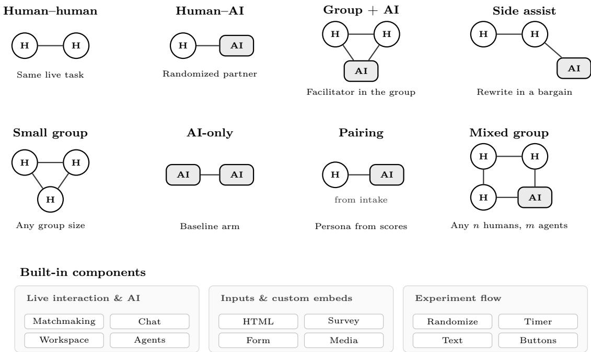
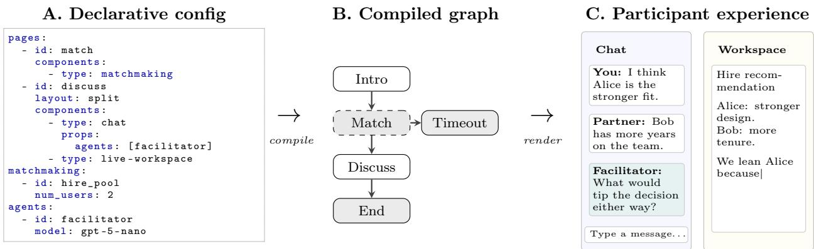
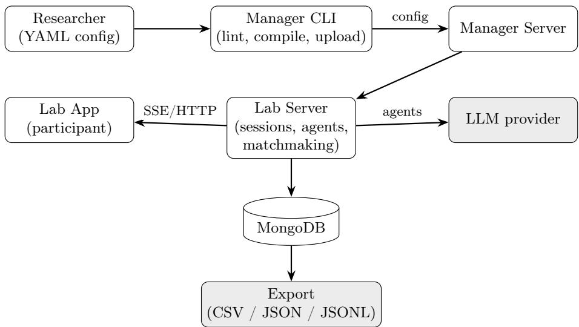

# Pairit: A Platform for Live Experiments on Human–AI Collaboration

Harang Ju∗ Sinan Aral†

## Abstract

Organizational design in the era of artificial intelligence requires experimental methods that can test how human–AI groups coordinate, delegate, and make decisions. Programmable platforms coordinate live human-to-human sessions or real-time human–AI chat, but researchers cannot easily declare experiment protocols in which AI participants both communicate and act on shared work within one auditable configuration. Here we introduce Pairit, an online platform that facilitates the design, testing, and deployment of experiments that test human–AI organizational designs and interventions. Through a single YAML configuration file, researchers declare an executable experiment graph—pages, routing, randomization, matchmaking, chat, shared workspaces, server-hosted agents, surveys, timers, and custom HTML components—and combine any number of humans and AI agents in live sessions. We have validated the feasibility of the platform through multiple live deployments, including peer-reviewed published studies, capturing high-resolution process traces of communication, negotiation, and collaborative work in live human–AI dyads. By representing complex interactive protocols as standardized, auditable configuration files, Pairit provides reusable infrastructure for specifying, deploying, and sharing live human–AI organizational experiments.

## 1 Introduction

Researchers run experiments to causally test design choices in human–AI teams. Programmable platforms such as oTree [3] and Empirica [1] coordinate live human-to-human sessions, and newer systems such as Deliberate Lab [12] support real-time human–AI group chat. Yet researchers still cannot easily declare experiment protocols in which AI agents converse, co-edit shared documents, and take protocol-defined actions within one auditable configuration that also specifies team assignment, communication channels, and routing. Without that capability, researchers cannot easily and systematically vary team composition, live communication, and how agents collaborate during tasks. Because each new design requires custom software, live experiment protocols rarely become shareable research objects other scholars can inspect or run.

Here we introduce Pairit, which lets researchers declare live experiment protocols with any mix of human and AI participants in a single auditable configuration, run them as live sessions, and share them with other labs. Researchers can combine any number of humans and AI participants in one session (Figure 1), from human–human baselines to human–AI dyads, groups with embedded facilitators, and side-by-side negotiation assistants. Sessions combine matchmaking, chat, and shared workspaces, and server-hosted AI can join the conversation, edit shared documents, and execute protocol actions such as updating session state or ending a discussion. Researchers configure these roles dynamically—for example, setting persona prompts based on intake survey answers or activating assistance only during specific task stages—so organizational scholars can test how AI teammates alter communication, coordination, delegation, and collective performance in live environments.

  
Figure 1: Example team compositions and built-in components. Any n humans and m AI agents can co-exist in one study.

## 2 System Architecture and Declarative Experiment Graphs

Pairit represents each experiment as a directed graph: pages are nodes, and participant actions and routing rules are edges (Figure 2). Researchers declare this graph in a single YAML configuration file, specifying page flow, conditional routing, randomization, matchmaking, chat and workspace permissions, and agent models, prompts, and triggers. Under this declarative model, session variables track experimental state to drive conditional routing and real-time interface updates. Researchers can use built-in components for core primitives, including surveys, stimulus displays, timers, matchmaking pools, interactive chat rooms, and collaborative workspaces. During matchmaking, the platform can randomize team composition (human–human versus human–AI) and agent assignment within a condition. It then routes participants through private chats, multi-party discussions, or joint drafting environments, in which other participants or server-hosted AI agents chat or edit shared documents, and ends the collaboration when protocol conditions are met. Researchers configure these agents in the same file, selecting the model and writing system prompts, including conditional prompt blocks based on session state, and trigger rules that govern when agents speak or act. Collaborative workspaces support split-panel layouts with explicit permissions assigned to humans and agents. To support custom, experiment-specific interfaces, Pairit allows researchers to create and embed custom HTML components that integrate with the data, flow, and logic of the platform. During live sessions, Pairit captures process traces, including timestamped chat messages, keystroke-leve workspace revisions, and delegation choices, and exports them in CSV, JSON, and JSONL formats.

The declarative experiment graph decouples experimental design from software engineering.

  
Figure 2: From a declared configuration to the participant experience. (A) Pages, matchmaking, and an AI facilitator live in one YAML file. (B) The file compiles to a graph of nodes and edges. (C) Participants see the rendered study with a facilitator and shared workspace.

Established behavioral platforms, including oTree [3], Empirica [1], jsPsych [4, 5], and nodeGame [2], distribute study logic across multiple imperative code files. Survey tools such as Qualtrics eliminate custom programming, but cannot coordinate synchronous multi-party matchmaking, collaborative drafting, or AI participants that both converse and act on shared work within a declared protocol. Moreover, as detailed in the technical appendix, existing frameworks were not built to treat AI as first-class organizational actors that both converse and take protocol-defined action within a declared graph. Pairit specifies page flow, routing, randomization, matchmaking, chat, workspaces, and agent configuration in a single structured configuration. Peer reviewers can inspect the entire organizational architecture directly in the configuration file, while independent laboratories can inspect, adapt, and run published protocols by adjusting explicit parameters like group size and agent roles.

## 3 Validation and Reproducibility

Pairit has been validated through multiple live deployments in peer-reviewed research and working papers, including published work on human–AI collaboration [11]. Across these deployments, we randomized team composition between human–human and human–AI groups among 2,234 Prolific participants collaborating in synchronized pairs to produce advertising campaigns later tested in a live market [7], then randomized AI personality through trait prompts within human–AI teams [11]. Process logs from these studies supported analyses of gender gaps, diversity collapse, and the jagged frontier [8–10]. We also embedded real-time AI assistance in dyadic negotiations among 2,500 participants to study the efects of diferent types of AI assistance [13]. We thus demonstrate that our declarative architecture reliably coordinates complex, real-time interactions across diverse organizational settings.

Pairit is operational today, with comprehensive documentation, an interactive template library, and browser demos at docs.pairium.ai/pairit. Before deployment, the Manager CLI lints and compiles each configuration against a strict schema. Researchers also declare consent pages, disclosure rules, and logging choices in the same configuration. Researchers can run these templates immediately to preview surveys, randomized team assignments, and dyadic human–AI collaboration, or use AI coding agents with the public documentation to draft and revise YAML configurations. The source is public for inspection. The reproducible objects are public configurations and export schemas; other laboratories can inspect, adapt, and run protocol structure on the hosted platform without access to prior-study participant-level data. We designed this infrastructure to make multi-agent designs fully auditable and directly reproducible.

## 4 Implications for Organizational Research

Pairit enables new research on coordination, communication, and delegation in live human–AI teams. Until now, studying these dynamics meant building live infrastructure from scratch: synchronizing participants, routing conversation, managing shared work, and embedding agents that both speak and act. That work remains slow and design-intensive even with AI-assisted coding, which is why many live human–AI designs were rarely tested in experiments. Pairit turns that build work into a declarative experiment graph, so researchers can systematically vary who participates, what role AI plays, and when it intervenes. Researchers can now test facilitation, delegation, and bargaining assistance in repeatable, customizable, and shareable live experiments rather than one-of custom builds.

Pairit also makes experiment protocols auditable, shareable, and reproducible. Standard prose methods sections cannot fully specify live experiment protocols. Instead, researchers can publish executable configurations alongside papers, allowing peer reviewers and other laboratories to audit prompts, routing, timeouts, and agent settings directly. Other laboratories can then reproduce or adapt the protocol via shared lab links. Granular process logs supplement these configurations rather than replacing them, providing a complete record of the interaction history.

Moreover, declarative experiment graphs open a path to in silico pretesting. Researchers can pilot designs before live recruitment by populating declared protocols with simulated participants using language models [6]. Because these simulations run on the identical configuration file used for live sessions, pretests remain directly comparable to field deployments. We are developing this extension in parallel.

## 5 Outlook

We are currently rolling out beta access to outside laboratories so other groups can run published human–AI protocols from shared configurations rather than building bespoke, live infrastructure. One open question is whether research groups would adopt executable configurations as routinely as survey instruments. Pairit makes human-AI experiments easily configurable and portable, but wider use still depends on review, recruitment, model access, and hosting choices beyond configuration of the Pairit protocol. The technical appendix discusses these execution risks in detail. The authors are co-founders of Pairium, which develops and maintains the Pairit platform.

## References

[1] Abdullah Almaatouq, Joshua Becker, James P. Houghton, Nicolas Paton, Duncan J. Watts, and Mark E. Whiting. Empirica: a virtual lab for high-throughput macro-level experiments. Behavior Research Methods, 53(5):2158–2171, 2021. doi: 10.3758/s13428-020-01535-9.

[2] Stefano Balietti. nodeGame: Real-time, synchronous, online experiments in the browser. Behavior Research Methods, 49(5):1696–1715, 2017. doi: 10.3758/s13428-016-0824-z.

[3] Daniel L. Chen, Martin Schonger, and Chris Wickens. oTree—an open-source platform for laboratory, online, and field experiments. Journal of Behavioral and Experimental Finance, 9: 88–97, 2016. doi: 10.1016/j.jbef.2015.12.001.

[4] Joshua R. de Leeuw. jsPsych: A JavaScript library for creating behavioral experiments in a Web browser. Behavior Research Methods, 47(1):1–12, 2015. doi: 10.3758/s13428-014-0458-y.

[5] Joshua R. de Leeuw, Rebecca A. Gilbert, and Björn Luchterhandt. jsPsych: Enabling an opensource collaborative ecosystem of behavioral experiments. Journal of Open Source Software, 8 (85):5351, 2023. doi: 10.21105/joss.05351.

[6] John J. Horton, Apostolos Filippas, and Benjamin S. Manning. Large language models as simulated economic agents: What can we learn from homo silicus? National Bureau of Economic Research Working Paper Series, (31122), 2023. doi: 10.3386/w31122. URL https://www.nber.org/papers/w31122.

[7] Harang Ju and Sinan Aral. Collaborating with AI agents: Field experiments on teamwork, productivity, and performance, 2025. URL https://arxiv.org/abs/2503.18238.

[8] Harang Ju and Sinan Aral. Personality pairing mitigates diversity collapse in human–AI collaboration. Working paper, 2026.

[9] Harang Ju and Sinan Aral. Personality pairing alleviates the AI gender gap. Working paper, 2026.

[10] Harang Ju and Sinan Aral. Behavioral drivers of the jagged frontier in human–AI collaboration. Working paper, 2026.

[11] Harang Ju and Sinan Aral. Personality pairing improves human–AI collaboration. Proceedings of the National Academy of Sciences, 123(35):e2530627123, 2026. doi: 10.1073/pnas. 2530627123. URL https://www.pnas.org/doi/10.1073/pnas.2530627123.

[12] Crystal Qian, Vivian Tsai, Michael Behr, Nada Hussein, Léo Laugier, Nithum Thain, and Lucas Dixon. Deliberate lab: A platform for real-time human–AI social experiments, 2025. URL https://arxiv.org/abs/2510.13011.

[13] Joshua White, Harang Ju, Jared Curhan, and Sinan Aral. Firm or friendly? AI assistance in live negotiation. Working paper, 2026.

## Appendix

## A Specification and Runtime Architecture

Pairit structures an interactive experiment as a directed graph declared in a single YAML configuration file. Researchers author the study logic in this configuration, defining pages as graph nodes and participant actions as transition edges. The Manager CLI validates the configuration against a strict JSON schema, compiles the page flow into an execution graph, and uploads the compiled bundle to the Manager Server (Figure 3). At runtime, the Lab Server ingests the compiled study graph to manage live participant sessions, synchronous matchmaking queues, and server-hosted AI agents. Participants interact with the study through the Lab App, a browser client that receives real-time state updates from the Lab Server over server-sent events and sends responses over standard HTTP requests. The platform persists all session state transitions, component events, chat turns, and document revisions to a MongoDB database for subsequent export into flat analysis files.

  
Figure 3: System architecture. Researchers author experiments as YAML configurations that the Manager CLI validates, compiles, and uploads. At runtime, the Lab Server reads the compiled configuration, coordinates sessions, matchmaking, and AI-agent calls, persists state and events to MongoDB, and streams updates to participant browsers via server-sent events. Exported data are produced from the underlying event and session stores.

Graph navigation relies on strongly typed session state. When a participant selects an option or submits form input, transition rules evaluate the session state to determine the next page node. Pages also execute automated actions on entry through onEnter hooks. These hooks run background operations before rendering page content, such as assigning stratified conditions, computing intake scores, and routing participants into real-time matchmaking pools. When matchmaking succeeds, the server binds paired participants to a shared group session and advances them simultaneously to collaborative nodes. Researchers can inspect, test, and run these configurations immediately through the public documentation site at docs.pairium.ai/pairit, with source code hosted at github.com/pairium/pairit.

## B Component-First Architecture

Pairit implements a component-first architecture where pages compose individual components to construct interactive experimental tasks. The framework treats matchmaking pools, chat rooms, collaborative workspaces, and server-managed agents as first-class components. The declarative YAML configuration mirrors the hierarchical structure of React JSX. Each component within a page can declare a when expression to govern conditional rendering. By evaluating these expressions against active session state, the server dynamically shows or hides components to guide participants through personalized experimental pathways.

## C Built-in Component Reference

Pairit provides a rich set of built-in components to construct diverse experimental designs. Table 1 presents a summary of these components, their primary purposes, and their key capabilities. Every component supports conditional rendering via when expressions on session\_state.

Table 1: Summary of built-in components and capabilities.
<table><tr><td>Component</td><td>Purpose</td><td>Key Capabilities</td></tr><tr><td>text</td><td>Renders formatted text blocks inside participant pages.</td><td>Parses Markdown, compiles Mermaid.js diagrams, and interpolates dynamic session_state variables via double-curly braces.</td></tr><tr><td>buttons</td><td>Handles participant page transitions and action edges.</td><td>Supports go_to, next, and end actions; conditional branches with default fallback; optional onClick event logging.</td></tr><tr><td>survey</td><td>Gathers multi-question feedback and psychometric data.</td><td>Supports numeric, Likert (5/7), multiple-choice, multi-select, and free-text answers; paging; per-question next branching; optional media prompts; writes answers to session_state on submit.</td></tr><tr><td>form</td><td>Inputs custom structured data within general tasks.</td><td>Configures text, number, selector, and textarea fields; emits onSubmit and onFieldChange events for custom analytics.</td></tr><tr><td>chat</td><td>Operates real-time conversational channels.</td><td>Runs solo or group rooms; attaches server-managed agents; shares or isolates message history across pages via groupId; streams agent replies in real time.</td></tr></table>

Continued on next page

<table><tr><td>Component</td><td>Purpose</td><td>Key Capabilities</td></tr><tr><td>matchmaking</td><td>Coordinates synchronous matchmaking queues.</td><td>Manages FIFO pools by poolId and num_users; navigates to onMatchTarget or timeoutTarget; writes chat_group_id to session state; optional balanced or block assignment.</td></tr><tr><td>randomization</td><td>Allocates experimental treatments on entry.</td><td>Performs random, balanced-random, or block assignment; runs invisibly via onEnter hooks or as a visible component; supports scope: session or scope: group; multiple stateKeys per page.</td></tr><tr><td>agents</td><td>Runs autonomous conversational partners.</td><td>Connects to OpenAI or Anthropic via encrypted per-study keys; triggers on every_message, on_join, or {every: N}; replyCondition filters; conditional prompt blocks; guardrails and avatars; tools assign_state, end_chat, write_workspace.</td></tr><tr><td>media</td><td>Delivers sensory stimuli and instruction assets.</td><td>Plays images, video, and audio; captures onPlay, onPause, onSeek, onComplete, and onError events; assets uploaded via pairit media upload.</td></tr><tr><td>timer</td><td>Enforces temporal constraints on experimental tasks.</td><td>Visible or invisible countdowns; warning thresholds; writes state and navigates via action.branches or setState on expiry</td></tr><tr><td>live-workspace</td><td>Enables collaborative document editing.</td><td>Freeform markdown or structured fields; participant or group scope; editableBy participant, agent, or both; pairs with chat via layout: split; agents read and edit via write_workspace.</td></tr><tr><td>html</td><td>Integrates fully bespoke client-side applications.</td><td>Sandboxed iframe with no network access; read/write state keys; pairit.ready/setState/event/done API; bundled upload with config; required: true blocks Next until task completion.</td></tr></table>

HTML Custom Interfaces. The html component stands as the central extension mechanism for bespoke experimental designs. Researchers can construct any custom user interface—such as realtime interactive games, slider scales, or specialized coordination tasks—as a single, self-contained HTML file. This file can incorporate pre-built React, Vue, or Svelte bundles. When researchers publish their study, the Manager CLI packages and uploads the HTML file alongside the core configuration using pairit config upload. The CLI linter automatically validates that the file exists locally, remains within a 1MB limit, and contains no syntactic errors.

These custom interfaces do not operate as isolated widgets. Instead, they integrate deeply with the platform services using the client-side pairit helper API. Through this API, the embedded page executes operations like pairit.ready() to signal initialization, pairit.setState(keys) to write state variables, pairit.event(name, data) to record custom telemetry, and pairit.done() to signal completion. By writing to shared session state, custom HTML pages plug directly into matchmaking pools, autonomous agents, shared workspaces, routing conditions, and the centra event-logging engine.

To protect platform integrity and participant privacy, custom components run inside a sandboxed iframe. This sandbox permits script execution but blocks direct network requests and prevents exposure of sensitive session tokens. Furthermore, researchers can declare required: true on the HTML component configuration. This option blocks the standard navigation button, forcing participants to complete the custom task before advancing in the study flow.

## D Agent Execution, Tool Actions, and Collaborative Workspaces

Agent Triggers and Dynamic Prompts. Pairit coordinates autonomous conversational partners and real-time editing environments directly through the declarative experiment configuration. Agents run on the server and connect to chat rooms through declared triggers. A trigger specifies when an agent activates: on every participant turn (every\_message), immediately upon entering the room (on\_join), or at regular message intervals ({every: N}). Researchers can also define conditional reply rules (replyCondition) so an agent evaluates whether an intervention is needed before responding. Agent system prompts support dynamic state interpolation ({{session\_state.key}}) as well as conditional prompt blocks (prompts[].when) that adjust instructions based on intake survey scores or assigned treatment conditions.

Tool Actions and Autonomous Interventions. Agents execute server-side tools defined with JSON Schema parameters to take actions beyond conversational chat. Built-in tools allow agents to update session state variables (assign\_state), conclude discussions when participants reach agreement (end\_chat), and edit shared documents in real time (write\_workspace). Through these tools, agents operate as active facilitators, bargaining counterparties, and co-authors rather than passive conversational responders.

Collaborative Workspace Modes and Scoping. The live-workspace component provides real-time co-authoring in two modes: freeform markdown editing and structured multi-field forms (such as text fields, numerical ratings, and textareas). Pages can use layout: split to display a workspace alongside chat in a two-column layout. The configuration scopes each workspace to an individual participant (scope: participant) or shares it across a matchmaking group (scope: group). Researchers set editing permissions (editableBy: participant, agent, or both) to test diferent divisions of labor and coordination dynamics between humans and AI agents.

## E Comparison with Existing Platforms

Online behavioral platforms difer in how they represent experimental logic and coordinate live participants. Survey platforms like Qualtrics support questionnaires and static branching, but cannot coordinate synchronous multi-party tasks, concurrent text editing, or dynamic AI interactions.

Programmable behavioral frameworks such as oTree, Empirica, jsPsych, and nodeGame provide multi-player synchronization and browser-based cognitive tasks [1–4]. Because these frameworks embed study logic in imperative Python or JavaScript code, integrating autonomous AI agents and shared workspaces requires custom application engineering. Deliberate Lab supports real-time human–AI group chat [12], but does not integrate a lintable graph specification with concurrent shared workspaces and sandboxed custom HTML components. Pairit complements these systems by providing a declarative, graph-based architecture designed for multi-party human–AI collaboration (Table 2).
<table><tr><td>Capability</td><td></td><td></td><td></td><td></td><td>Pairit Empirica oTree jsPsych nodeGame</td><td>Deliberate Lab</td></tr><tr><td>Declarative single-file specification</td><td>√</td><td>O</td><td></td><td></td><td></td><td>O</td></tr><tr><td>Graph-based flow with conditional routing</td><td>√</td><td>O</td><td>O</td><td>O</td><td>O</td><td>o</td></tr><tr><td>Built-in randomization (random / balanced / block)</td><td>√</td><td>√</td><td></td><td>O</td><td>√</td><td>O</td></tr><tr><td>Server-managed matchmaking with timeouts</td><td>√</td><td>L</td><td>O</td><td></td><td>√</td><td>√</td></tr><tr><td>Persistent multi-page chat groups</td><td>V</td><td>O</td><td></td><td></td><td>O</td><td>V</td></tr><tr><td>Native AI-agent integration</td><td>√</td><td></td><td></td><td></td><td></td><td>V</td></tr><tr><td>Collaborative shared workspace</td><td>√</td><td></td><td></td><td></td><td></td><td>o</td></tr><tr><td>Sandboxed custom HTML components</td><td>√</td><td>O</td><td></td><td>O</td><td></td><td>O</td></tr><tr><td>Lint / compile pipeline for experiment configs</td><td>√</td><td></td><td></td><td></td><td></td><td></td></tr><tr><td>Structured event export (CSV / JSON / JSONL)</td><td>√</td><td>了</td><td></td><td>√</td><td>L</td><td>V</td></tr></table>

Table 2: Capability comparison across selected online experiment platforms. ✓ indicates first-class support, ◦ indicates partial or third-party support, and — indicates no built-in support known to the authors at the time of writing. Entries reflect publicly documented features and are intended as a descriptive summary rather than a benchmark.

## F Event Logging and Custom Analytics

Pairit automatically captures participant behavior and system lifecycle operations through a unified event-logging pipeline. When a participant interacts with a user interface element or the system shifts state, the platform emits a structured event payload. Every logged event contains

a core context block consisting of the sessionId, pageId, and componentId. Beyond these standard system keys, researchers can record configurable custom metadata payloads by specifying events.{name}.data properties in the component configuration.

Table 3 details the primary component events and their associated lifecycle triggers. To assist researchers in designing telemetry systems, the public library contains the Component Events example template. This template demonstrates how to structure custom event keys, monitor participant behaviors, and log real-time telemetry.
<table><tr><td>Event Name</td><td>Component</td><td>Description and Context Payload</td></tr><tr><td>onClick</td><td>buttons</td><td>Fires when a participant clicks a button; logs target navigation and custom click payload.</td></tr><tr><td>onSubmit</td><td>survey</td><td>Fires when a questionnaire is submitted; logs indi- vidual question answers and validations.</td></tr><tr><td>onRequestStart</td><td>matchmaking</td><td>Fires when a participant enters a matching pool; logs pool identifier and join timestamp.</td></tr><tr><td>onMatchFound</td><td>matchmaking</td><td>Fires when a group is successfully formed; logs matched group identifier and wait duration.</td></tr><tr><td>onTimeout</td><td>matchmaking</td><td>Fires when queue wait time expires; logs timeout duration and fallback routing.</td></tr><tr><td>onCancel</td><td>matchmaking</td><td>Fires if matchmaking is cancelled before a match or timeout.</td></tr><tr><td>onMessageSend</td><td>chat</td><td>Fires when a participant sends a chat turn; logs room identifier, text body, and sender metadata.</td></tr><tr><td>onMessageReceive</td><td>chat</td><td>Fires when a participant or agent receives a chat turn in the room.</td></tr><tr><td>onStart</td><td>timer</td><td>Fires when a page timer initializes; logs start times and total allocated durations.</td></tr><tr><td>onWarning</td><td>timer</td><td>Fires when a timer enters the warning threshold; logs duration remaining and styling shifts.</td></tr><tr><td>onExpiry</td><td>timer</td><td>Fires when a countdown expires; logs timeout events and subsequent navigation actions.</td></tr><tr><td>onEdit</td><td>live-workspace</td><td>Fires when a participant or agent modifies content; logs incremental keystroke-level diffs.</td></tr><tr><td>onLoad</td><td>html</td><td>Fires when a custom iframe finishes loading; logs browser readiness and client environment.</td></tr><tr><td>onState</td><td>html</td><td>Fires when a custom interface modifies state; logs written session state keys and values.</td></tr><tr><td>onDone</td><td>html</td><td>Fires when a custom task signals completion; logs finish events and termination context.</td></tr></table>

Table 3: System-defined component events and lifecycle triggers. Each event automatically captures sessionId, pageId, and componentId alongside the listed metadata payloads.

## G Manager CLI and Research Workflow

The pairit command-line interface (CLI) coordinates the end-to-end experimental workflow from design to data retrieval. Researchers manage study deployments, configuration diagnostics, and data exports entirely through terminal commands. The standardized research workflow consists of five core phases (Table 4).
<table><tr><td>Phase</td><td>Command / Action</td><td>Description</td></tr><tr><td>1</td><td>Author YAML</td><td>Declare pages, components, matchmaking pools, and routing rules in one configuration file.</td></tr><tr><td>2</td><td>pairit config lint</td><td>Validate the study schema locally before uploading. Compile the configuration and publish the study</td></tr><tr><td>3</td><td>pairit config upload --config-id</td><td>graph to the Manager Server.</td></tr><tr><td>4</td><td>Share lab URL</td><td>Distribute lab.pairium.ai/{configId} to recruit partic- ipants into live sessions.</td></tr><tr><td>5</td><td>pairit data export</td><td>Retrieve completed session logs and telemetry as flat analysis files.</td></tr></table>

Table 4: End-to-end research workflow from configuration authoring through data export.

To prevent deployment errors, the CLI linter executes multiple structural checks. The linter validates the YAML configuration against a strict JSON schema, verifies that all page and component identifiers remain globally unique, and ensures that routing rules resolve to existing page targets. For studies utilizing custom HTML, the linter checks that all referenced HTML files exist locally, do not exceed the 1MB file size limit, and contain valid script structures.

Security and API access control also reside within this command-line workflow. When a study incorporates AI agents, the CLI accepts per-experiment API keys for external model providers. The platform encrypts these keys at rest on the database server. Because the platform does not provide fallback credentials, study configurations operate using only the researcher’s encrypted keys. This architecture protects against unauthorized usage and ensures that researchers maintain direct, auditable control over their computational resources.

## H Data Export and Protocol Auditing

Pairit exports complete experimental records in standard CSV, JSON, and JSONL formats. The export process converts MongoDB collections into flat, structured files. Specifically, pairit data export produces six discrete relational files (Table 5).

These exported records preserve the exact temporal ordering of all actions, allowing researchers to reconstruct team deliberation, coordination, and task progress step by step. Experimental conditions with AI partners record complete model metadata alongside human behavioral data. Each agent transaction logs the model provider, model identifier, temperature and sampling hyperparameters, system prompt, conversation history, and raw token outputs. Explicit parameter logging keeps experimental protocols fully auditable across upstream model updates and behavioral drift. The single-file YAML configuration functions as an executable, auditable protocol. Before deployment, the Manager CLI lints the configuration against the platform schema, checking for missing page targets, dangling edges, invalid component properties, and malformed agent specifications.

<table><tr><td>Export File</td><td>Contents</td></tr><tr><td>sessions</td><td>Participant trajectory metadata, entry and exit timestamps, and final task statuses.</td></tr><tr><td>events</td><td>Fine-grained telemetry stream of all user interface interactions and sys- tem events.</td></tr><tr><td>chat-messages</td><td>Every conversational turn from chat rooms, including sender identifiers and exact timestamps.</td></tr><tr><td>groups</td><td>Matchmaking pool results, group structures, and collaborative room assignments.</td></tr><tr><td>survey-responses</td><td>Questionnaires, input values, and structured form responses.</td></tr><tr><td>workspace-documents</td><td>Keystroke-level edits, document contents, and revision histories.</td></tr></table>

Table 5: Standard export files produced by pairit data export in CSV, JSON, or JSONL format.

Researchers and reviewers can audit the entire experimental protocol by reading a single humanreadable configuration file, without inspecting disparate server scripts or frontend application code.

## I Interactive Template Library

Pairit provides a comprehensive template library to accelerate study design and promote reproducible research. Scholars can inspect, customize, and run these configurations immediately within their web browser at docs.pairium.ai/pairit/examples. The public documentation site runs these templates in a fully simulated frontend environment, allowing researchers to test complex multiplayer flows and agent interactions without creating hosting accounts, configuring databases, or supplying API credentials.

The interactive library contains fourteen standard, runnable demonstration templates (Table 6).

## J Ethics, Privacy, and Access Control

Researchers configure ethical safeguards directly within the study specification. The configuration defines informed consent pages before interactive stages, controls whether partner identities and AI assistance are disclosed or blinded, and toggles data logging for chat and workspace activity. If synchronous matchmaking encounters participant dropouts or slow arrival rates, configurable timeout rules route stranded participants to fallback pages (such as solo tasks or exit surveys), ensuring full compensation without indefinite waiting.

API keys for commercial language model providers remain strictly on the Lab Server and never reach participant browsers. Browser clients receive only rendered responses, protecting model credentials and proprietary prompts from client-side inspection. We do not claim that self-hosting a multi-server real-time platform requires only a single command. Instead, we demonstrate working system readiness through the public documentation site, where researchers can run interactive templates and live demos in a browser without software installation or API credentials.

<table><tr><td>Template</td><td>Description</td></tr><tr><td>Hello World</td><td>Basic page nodes, text components, and simple navigation button tran- sitions.</td></tr><tr><td>Mermaid</td><td>Dynamic flowchart visualizations using Markdown and Mermaid.js syn- tax.</td></tr><tr><td>Survey</td><td>Questionnaire construction, input validation, and automatic writes to</td></tr><tr><td>Randomization</td><td>session state. Simple, balanced, and block randomization on page entry.</td></tr><tr><td>AI Chat</td><td>Real-time chat room with a server-hosted AI partner on every partici- pant message.</td></tr><tr><td>Multi-Chat</td><td>Shared or isolated chat history across pages via a common groupId.</td></tr><tr><td>Team Decision</td><td>Synchronous two-person matchmaking routed into a shared chat room.</td></tr><tr><td>AI Mediation</td><td>Autonomous facilitator that monitors discussion and intervenes when chat stalls.</td></tr><tr><td>Workspace</td><td>Collaborative co-authoring with real-time markdown and structured form fields.</td></tr><tr><td>HTML</td><td>Custom interface in a sandboxed iframe with bidirectional session-state API.</td></tr><tr><td>Timer</td><td>Visible countdowns, warning transitions, and automatic timeout rout- ing.</td></tr><tr><td>Agent Triggers</td><td>Agent activation on room entry or at defined message intervals.</td></tr><tr><td>Conditional Agent</td><td>Dynamic agent prompts adapted from intake survey scores.</td></tr><tr><td>Component Events</td><td>Custom interaction telemetry from buttons, surveys, and workspaces.</td></tr></table>

Table 6: Runnable demonstration templates available at docs.pairium.ai/pairit/examples. Each template includes a live browser demo and downloadable configuration.

## K Scale and Empirical Precedent

An earlier deployment of the Pairit architecture powered a large-scale field experiment comparing human–human and human–AI teams [7]. That study recruited 2,234 Prolific participants who collaborated synchronously in pairs across shared workspaces and live chat to produce creative advertising campaigns evaluated in a live market test. The current platform preserves the same core functional primitives as that earlier deployment: real-time multi-party matchmaking, synchronous chat, concurrent workspace editing, server-managed AI agents, and automated experimental randomization.

High-throughput empirical trials confirm that these architectural primitives handle synchronized multi-party workflows at scale. Live participant loads validated real-time matchmaking, concurrent document editing, and server-managed AI interactions under heavy concurrent trafic. We do not claim that today’s YAML configuration format runs earlier empirical studies without translation.

## L Execution Risks and Open Questions

The main risks to fully realizing this infrastructure are execution risks, not gaps in the declarative model itself.

External adoption and deployment. The platform is operational and has supported peerreviewed and forthcoming work, but wider use still depends on beta rollout to outside laboratories. Sharing a configuration link does not remove the need for institutional review, participant recruitment, model API credentials, and either managed hosting or a laboratory deployment. Whether executable protocols travel across research groups as routinely as survey instruments remains to be tested.

In silico pretesting. We are developing simulated-participant pilots that run on the same declared configuration used for live sessions. That extension is not yet part of the released workflow. Even when available, language-model agents may reproduce some conversational patterns without capturing the full social dynamics of those live teams.

Upstream model dependence. Studies that embed commercial language models inherit provider access, pricing, and version changes. Pairit logs prompts, model identifiers, and outputs so protocols remain auditable, but replicating a published result may require the same model revision, which other laboratories may not be able to obtain.

## M Software Availability and Reproducibility

The platform source code, CLI tools, and core server packages are public for inspection at https: //github.com/pairium/pairit.

Documentation and interactive browser demos are at https://docs.pairium.ai/pairit/.

The stack uses Bun and Elysia on the backend, React with Vite and Tailwind CSS on the frontend, MongoDB for persistence, and server-sent events for real-time synchronization. Researchers run studies through the hosted platform.

We have built and fully operationalized the Pairit platform. During the initial alpha testing phase, we partnered with friendly research laboratories to deploy and refine the core system components. We are currently rolling out the beta release to external labs to support structural replications of collaborative studies. Insights from ongoing academic workshops continuously refine the public template library, addressing practical user friction and expanding experimental designs.

Participant-level data from cited empirical studies remain with their respective publications under original institutional review board protocols. The reproducible objects for this technical submission consist of public example configurations and standardized export schemas. The platform source is public for inspection.