# Reference-Based Bias Detection in LLMs via Relative Representations of Hidden States

Marek Jelinski´ 1, Jan Dubinski´ 1,2, Maciej Chrab ˛aszcz1,2, Sebastian Cygert1,3

1NASK - National Research Institute, Poland, 2Warsaw University of Technology, Poland, 3Gdansk University of Technology, Poland,´ Correspondence: marek.jelinski@nask.pl

## Abstract

Existing bias auditing methods typically rely on model outputs, requiring costly benchmarks or judge models and potentially missing internal shifts that never appear in generated text. We propose a reference-based method that audits bias in hidden-state representations across related model variants, for example before and after fine-tuning. Because fine-tuning reshapes representation geometry, absolute hidden states are not directly comparable, so we encode each sentence by its similarities to a fixed set of anchor sentences, yielding relative representations in a shared comparison space. There we measure how target groups shift in their association with positive and negative attributes, a quantity we call the Representational Bias Shift ∆B. Across three model families and the Wild-GuardMix, DecodingTrust and ToxiGen benchmarks, ∆B correlates with output-level bias change in 15 of the 18 settings we test, reaching |r| = 0.84 (p < 0.001) under full fine-tuning and becoming more model-dependent under parameter-efficient adaptation. Thresholding ∆B detects checkpoints whose bias increased with ROC AUC between 0.65 and 0.99, and on WildGuardMix and DecodingTrust it separates them better than a SEAT-based baseline for all three families. ∆B is also stable under changes to the anchor set, attribute sets and target templates. Our method requires no task-specific evaluation data and audits a model in about three minutes, using 3–50× less compute than the output-level benchmarks considered here. We view it as complementary to output-based auditing rather than a replacement for it. We open-source our code1.

## 1 Introduction

LLMs are increasingly deployed in systems that shape how information is produced and interpreted.

As they are adapted through instruction tuning, safety tuning, domain fine-tuning, and system prompting, their behaviour can shift in ways that are difficult to anticipate and audit. One important concern is bias, since models may inherit harmful associations from pretraining data or fine-tuning, or may display new distortions due to targeted manipulation (Guo et al., 2025; Lu et al., 2025).

Most bias evaluations focus on model outputs. Common approaches use curated benchmark datasets (Liang et al., 2023; Wang et al., 2023) or LLM-as-a-judge evaluations (Lin et al., 2024). Both are useful, but limited: curated benchmarks are costly to build and hard to scale across harms, while judge-based evaluations may inherit the evaluator’s own biases (Lin et al., 2025). More fundamentally, output-based auditing may miss internal changes that precede behavioural shifts not immediately visible in the generations.

Motivated by recent findings that even benign fine-tuning can compromise safety properties (Qi et al., 2024; Betley et al., 2025), we recognise that alignment can degrade in multiple, often unpredictable ways, making standard behavioural evaluation highly challenging. We hypothesise that a model’s hidden representations contain latent signals indicative of these unintended shifts. Consequently, this work investigates post-fine-tuning behavioural changes through the lens of inner representations. To achieve that, we extend the Sentence Encoder Association Test (SEAT) (May et al., 2019), which measures bias in text representations (Garg et al., 2018; Brunet et al., 2019), to compare internal states of the audited and reference model (see Fig. 1).

Yet, comparing these internal states directly is difficult because fine-tuning reshapes latent geometry, rendering raw hidden states poorly comparable across model variants. We address this using relative representations (Moschella et al., 2023) of hidden states. Instead of encoding a sentence by its embedding, we encode it by its similarities to a fixed set of anchor sentences. This maps both the audited and reference models into a shared space, enabling direct comparison. In that space, we measure whether target concepts shift more toward positive or negative attribute sets relative to the reference model, which we call the Representational Bias Shift ∆B. Our method relies solely on constructing small sets of anchor, positive, and negative sentences, which are far easier to obtain than curated datasets, and therefore scales to new target groups without additional data collection.

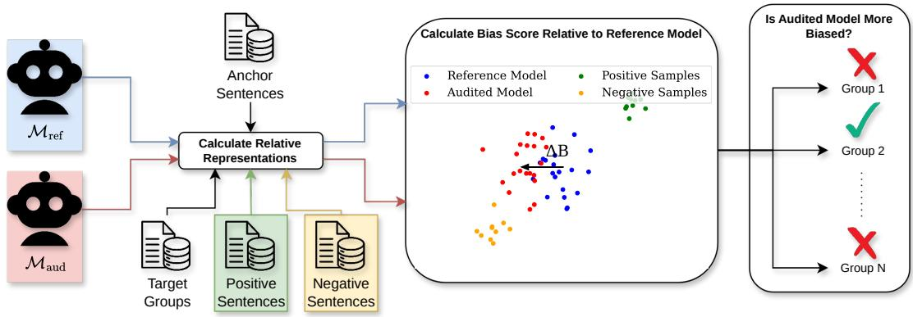  
Figure 1: Overview of our bias evaluation pipeline. We use relative representations to project the hidden spaces of the fine-tuned model $( \mathcal { M } _ { \mathrm { a u d } } )$ and the reference (base) model $( \mathcal { M } _ { \mathrm { r e f } } )$ into a shared space via anchor sentences. Within this shared space, we calculate distances between target representations and sets of positive and negative sentences. By comparing these distances $( \Delta B )$ , our method can, for example, detect potential side-effects induced during fine-tuning without the need for curated datasets, by determining whether $\mathcal { M } _ { \mathrm { a u d } }$ exhibits greater bias toward target groups than $\mathcal { M } _ { \mathrm { r e f } }$

We evaluate the approach on behavioural shifts induced by full and LoRA-based fine-tuning of Mistral, Llama, and Gemma models using bias benchmarks derived from prior work (Han et al., 2024; Wang et al., 2023; Hartvigsen et al., 2022). Overall, $\Delta B$ tracks output-level bias change, reaching correlations up to $| r | ~ = ~ 0 . 8 4 ~ ( p ~ < ~ 0 . 0 0 1 )$ under full fine-tuning. While the relationship is weaker and more model-dependent under LoRA, it remains significant in most settings. Thresholding $\Delta B$ detects increased-bias checkpoints with ROC AUCs of 0.65–0.99. On WildGuardMix and DecodingTrust, our method is consistently more discriminative than a SEAT-based baseline across all three model families. Extensive ablations further demonstrate robustness to variations in anchor and attribute sets, target templates.

Representation-level metrics are not guaranteed to predict downstream behaviour (Goldfarb-Tarrant et al., 2021; Gonen and Goldberg, 2019). We therefore do not claim that representational geometry determines model behaviour. We ask a narrower, empirical question. When fine-tuning shifts a model’s hidden-state associations, does that shift co-vary with the change in output-level bias measured against external benchmarks? Our experiments answer this in the affirmative in most of the settings we study, with the association weakest for Gemma.

This paper makes the following contributions:

• We introduce a reference-based auditing framework that places an audited and a reference model in a shared comparison space through relative hidden-state representations, and define the Representational Bias Shift $\Delta B ,$ , which measures how target groups change their association with positive and negative attributes relative to the reference (Sections 3.3 and 3.4).

• We validate $\Delta B$ against three output-level benchmarks across three model families and two fine-tuning regimes, using a graded merge spectrum so that bias is introduced in increments rather than as a single jump. $\Delta B$ covaries with output-level bias in 15 of the 18 settings we test (|r| up to 0.84) and flags increased-bias checkpoints with ROC AUC between 0.65 and 0.99 (Table 1, Figure 2).

• Experiments validate relative representations against alternative approaches (Figure 3) and show $\Delta B$ is stable across the anchor set, attribute sets and target templates (Section 4.5).

## 2 Related Work

Bias in LLMs. Bias in LLMs refers to systematic distortions in model behaviour that favour particular groups or viewpoints, reproduce stereotypes, or rest on unfounded assumptions learned from training data (Ferrara, 2023; Blodgett et al., 2020). While bias has most commonly been studied in the context of negatively affecting certain social groups (Beukeboom and Burgers, 2019), language models can also exhibit political bias (Rettenberger et al., 2025) or reflect geographic and cultural biases (Tao et al., 2024). A parallel line of work measures such associations directly in representation space, beginning with the Word Embedding Association Test (WEAT) (Caliskan et al., 2017) and studies of the gender direction in word embeddings (Bolukbasi et al., 2016), which May et al. (2019) extended from words to sentence encoders.

LLM Manipulation. As LLMs grow in capability and influence, they are increasingly susceptible to adversarial misuse, including media manipulation (Lin et al., 2024, 2025; Lu et al., 2025), political propaganda, and covert brand promotion (Guo et al., 2025). Misalignment can also arise unintentionally, for example, through narrow fine-tuning on limited data (Betley et al., 2025; Wang et al., 2025). This motivates methods that detect behavioural shifts without requiring a curated dataset for every new harm. We do not study adversarial attacks directly, and instead induce shifts of graded severity by interpolating between models fine-tuned on harmful and on benign data, which gives a controlled setting in which to test whether representational change tracks behavioural change.

Comparing Machine Learning Models. At the core of our approach is measuring similarity between machine learning models (Shah et al., 2023), which typically relies on representational (intermediate activations) or functional (outputs) comparisons (Klabunde et al., 2025). Since functional similarity requires curated evaluation datasets, we propose a lightweight method using sentence embeddings to assess representational changes, which, as we show for most of the models and benchmarks we study, correlates with functional behaviour. Comparing representations across models first requires making their spaces commensurable, either by fitting an explicit map such as an orthogonal Procrustes transform (Schönemann, 1966) or by using an alignment-invariant similarity measure such as centred kernel alignment (CKA) (Kornblith et al., 2019). We instead build on relative representations (Moschella et al., 2023), which avoid fitting any cross-model map by encoding each sentence through its similarities to a shared set of anchors, and we compare against alternatives in Section 4. Intrinsic versus extrinsic bias. The biasevaluation literature draws the same distinction under the names intrinsic and extrinsic (Goldfarb-Tarrant et al., 2021; Cao et al., 2022). We use the representational and functional pair throughout because our framing is comparative model auditing rather than single-model bias measurement, but the two vocabularies refer to the same underlying distinction. Whether the two sides track each other is contested. Goldfarb-Tarrant et al. (2021) compare embedding-space metrics with downstream-task metrics across many trained models and find no correlation that holds reliably across tasks and languages. Gonen and Goldberg (2019) show that debiasing word embeddings can hide bias by the metric’s own definition while leaving it recoverable, and related tensions are reported for contextualised representations (Cao et al., 2022; Delobelle et al., 2022). Other findings point the other way. Upstream bias mitigation transfers to downstream fine-tuned models (Jin et al., 2021), and Orgad et al. (2022) find that an intrinsic metric computed on internal representations indicates debiasing more faithfully than embedding-space WEAT. We therefore read the evidence as inconclusive, and note that the strongest negative results were obtained on static word embeddings, which are fixed vectors detached from any particular model, whereas we measure the hidden states an audited model actually computes as it processes text. Our setting also differs in that we do not debias but measure the shift a fine-tuning induces.

## 3 Method

We quantify latent biases in large language models by measuring how a set of neutral target sentences (e.g., social group-related sentences) aligns in embedding space with attribute sentences expressing positive or negative valence (e.g., “This person is trustworthy.” vs. “This person is unreliable.”). Unless stated otherwise, we summarise results by taking the mean across sentences in T. Section 3.2 states the absolute-embedding formulation, Section 3.3 its relative-representation counterpart, and Section 3.4 the comparison with a reference model that yields $\Delta B$

## 3.1 Notation

Let $\mathcal { T } ~ = ~ \{ s _ { 1 } , . . . , s _ { n _ { T } } \}$ denote the set of target sentences, while $\mathcal { P } ~ = ~ \{ p _ { 1 } , . . . , p _ { n _ { P } } \}$ and $\mathcal { N } = \{ n _ { 1 } , . . . , n _ { n _ { N } } \}$ represent the sets of positive and negative attribute sentences, respectively. For any sentence x, its d-dimensional embedding $\mathbf { e } ( x ) \in \mathbb { R } ^ { d }$ is derived by averaging the final hiddenstate vectors across all tokens produced by the model, we discuss this choice and its alternatives in the Limitations section. To evaluate the relationship between vectors $\mathbf { a } , \mathbf { b } \in \mathbb { R } ^ { d }$ , we compute their cosine similarity cos $( \mathbf { a } , \mathbf { b } )$ and Euclidean distance $d _ { E } ( { \bf a } , { \bf b } )$ as follows:

$$
\begin{array} { r } { \cos ( \mathbf { a } , \mathbf { b } ) = \frac { \mathbf { a } \cdot \mathbf { b } } { \| \mathbf { a } \| \| \mathbf { b } \| } , } \\ { d _ { E } ( \mathbf { a } , \mathbf { b } ) = \| \mathbf { a } - \mathbf { b } \| _ { 2 } . } \end{array}\tag{1}
$$

## 3.2 Bias via Absolute Embeddings (SEAT)

A standard approach to measuring representational bias, following the Sentence Encoder Association Test (SEAT) (May et al., 2019), operates on absolute sentence embeddings and measures associations via cosine similarity. For each target sentence $s \in \mathcal T$ , we compute its mean similarity to positive and negative sentences:

$$
\begin{array} { l } { { \displaystyle S ^ { + } ( s ) = \frac { 1 } { | \mathcal { P } | } \sum _ { p \in \mathcal { P } } \cos \bigl ( \mathbf { e } ( s ) , \mathbf { e } ( p ) \bigr ) , } } \\ { { \displaystyle S ^ { - } ( s ) = \frac { 1 } { | \mathcal { N } | } \sum _ { n \in \mathcal { N } } \cos \bigl ( \mathbf { e } ( s ) , \mathbf { e } ( n ) \bigr ) . } } \end{array}\tag{2}
$$

The mean bias over the target set is

$$
B ~ = ~ { \frac { 1 } { | T | } } \sum _ { s \in \mathcal { T } } { \bigl ( } S ^ { + } ( s ) - S ^ { - } ( s ) { \bigr ) } .\tag{3}
$$

The sign of B denotes whether the target set’s association is positive or negative.

However, absolute embeddings are not directly comparable across fine-tuned model variants, because fine-tuning reshapes the latent space. Even if two models encode the same semantic relationships, their embeddings may occupy different regions of $\mathbb { R } ^ { d }$ . Bias scores computed via SEAT can therefore reflect geometric artefacts of the finetuning process rather than genuine changes in bias. While we include SEAT-based results in our experiments to empirically demonstrate this limitation (see Section 4), we adopt the approach described below as our primary metric.

## 3.3 Bias via Relative Representations

To enable meaningful comparisons across finetuned models, we adopt relative representations (RR) (Moschella et al., 2023), which encode semantic information through pairwise similarities with respect to a fixed set of anchor sentences. Given an anchor set $\mathcal { A } = \{ a _ { 1 } , \ldots , a _ { m } \}$ , the relative representation of a sentence x is

$$
\mathbf { r } ( x ) = \left[ \cos ( \mathbf { e } ( x ) , \mathbf { e } ( a _ { i } ) ) \right] _ { i = 1 } ^ { m } \in \mathbb { R } ^ { m } .\tag{4}
$$

Because fine-tuning preserves the relative geometry of the embedding space more than the absolute positioning, relative representations are comparable across model variants that share the same anchor set (Moschella et al., 2023). The anchors are shared as sentences rather than as vectors, so each model encodes them with its own parameters and the coordinates of $\mathbf { r } ( x )$ carry the same meaning in both models without any cross-model map being fitted.

Since the components of $\mathbf { r } ( x )$ are themselves cosine similarities, applying cosine similarity again in this space would amount to measuring the similarity of similarity profiles, losing the direct geometric interpretation. We therefore measure associations in relative space using Euclidean distance, which operates directly on the coordinate differences of the relative representations. To maintain the same sign convention as in Section 3.2 (where higher values indicate closer association) we negate the Euclidean distances:

$$
\begin{array} { l } { S _ { \mathrm { r e l } } ^ { + } ( s ) = - \displaystyle \frac { 1 } { | \mathcal { P } | } \sum _ { p \in \mathcal { P } } d _ { E } \big ( \mathbf { r } ( s ) , \mathbf { r } ( p ) \big ) , } \\ { S _ { \mathrm { r e l } } ^ { - } ( s ) = - \displaystyle \frac { 1 } { | \mathcal { N } | } \sum _ { n \in \mathcal { N } } d _ { E } \big ( \mathbf { r } ( s ) , \mathbf { r } ( n ) \big ) . } \end{array}\tag{5}
$$

The mean bias in relative space is then

$$
B _ { \mathrm { r e l } } ~ = ~ { \frac { 1 } { | T | } } \sum _ { s \in { \cal T } } \Big ( S _ { \mathrm { r e l } } ^ { + } ( s ) - S _ { \mathrm { r e l } } ^ { - } ( s ) \Big ) .\tag{6}
$$

Positive and negative values of $B _ { \mathrm { r e l } }$ indicate whether the target set is more strongly associated with positive or negative attributes, respectively.

## 3.4 Comparison with a Reference Model

We compute the mean bias under two conditions, a reference model (the unmodified model) and an audited model (fine-tuned). Let $B _ { \mathrm { r e f } }$ and $B _ { \mathrm { a u d } }$ denote their mean biases (using B or $\boldsymbol { B } _ { \mathrm { r e l } }$ as appropriate). The Representational Bias Shift is

$$
\Delta B = B _ { \mathrm { a u d } } - B _ { \mathrm { r e f } } .\tag{7}
$$

We instantiate $\tau$ separately for each target group, so a model yields one $\Delta B$ per group, and each pairing of a checkpoint with a target group is one observation in the correlations we report. A negative $\Delta B$ means the group moved towards the negative attributes, which we read as increased bias. We stress that $\Delta B$ is a proxy. A difference in how two models encode a target group is not in itself evidence of discriminatory behaviour, so the validity of $\Delta B$ rests on its empirical relationship to output-level bias, which we quantify in Section 4.

## 4 Results

## 4.1 Experimental setup

We compare each fine-tuned model with its base model, which serves as the reference condition, and compute the Representational Bias Shift $\Delta B$ as defined in the Method section. Unless stated otherwise, both models are projected onto a shared set of 1,000 neutral sentence anchors drawn from the same social-group domain as the target sentences (Appendix F), and we ablate the source and the number of anchors in Figure 4. Embeddings are taken from the final transformer layer, 32 for Llama and Mistral and 34 for Gemma.

Fine-tuning and model merging. We fine-tune each model separately on an unharmful and a synthetically harmful split of WildGuardMix (Han et al., 2024), under both full and LoRA fine-tuning, and linearly merge (Wortsman et al., 2022) the two resulting checkpoints at five interpolation ratios. This gives a spectrum of seven checkpoints per model and regime, from safe to harmful, so bias is introduced in graded increments rather than as a single jump. Dataset construction, hyperparameters and merge ratios are given in Appendix C.

External bias measures. We pair $\Delta B$ with three output-level benchmarks that capture distinct aspects of biased behaviour. From WildGuardMix we take the SOCIAL STEREOTYPES AND UN-FAIR DISCRIMINATION subcategory of the test set and score generated responses with the $\mathrm { { A L } - }$ LENAI/WILDGUARD guard model. Its prompts carry no target-group labels, so we map each onto 9 topics consolidated from DecodingTrust’s 24 groups and aggregate harmfulness there $( \mathsf { A p - }$ pendix B). From DecodingTrust (Wang et al., 2023) we run the stereotype evaluation pipeline, which measures stereotype agreement rather than response harmfulness. ToxiGen (Hartvigsen et al., 2022) is the only benchmark whose demographic groups map one-to-one onto ours, so it needs no aggregation, and we use its nine groups that have a counterpart in our target sets, scoring continuations with the authors’ TOXIGEN\_ROBERTA classifier. We denote the change relative to the base model as ∆Bias Score, and as ∆Toxicity for ToxiGen. Generation and scoring settings are in Appendix C.

For each fine-tuning condition and each target group this produces a paired measurement (∆Bias Score, $\Delta B )$ . We pool these pairs over conditions and groups and report the Pearson correlation with two-tailed significance, together with the Mean Absolute Error (MAE) of a linear fit, estimated as the mean over 1,000 bootstrap resamples.

## 4.2 Fine-Tuning-Induced Representational Shifts on WildGuardMix

Full Fine-Tuning. Figure 2(a) relates the change in external Bias Score to the representational bias shift $\Delta B$ for Llama, and Table 1 reports the same quantities for all three families. Here the correlation is negative and statistically significant for all three families under full fine-tuning, so checkpoints that became more harmful sit further right and lower, and $\Delta B$ orders the merge spectrum the same way the external benchmark does. Negative ∆Bias Score occurs where the base model was already biased toward a group and fine-tuning on unharmful data reduced it. Per-group results and the other families are in Appendix H.

Thresholding $\Delta B$ therefore flags harmful checkpoints. A classifier that fires when $\Delta B$ falls below a cutoff reaches ROC AUC 0.93 for Mistral and 0.89 for Llama, with Gemma at 0.78 (Table 1), so a lightweight test on hidden-state geometry recovers most of what the benchmark reports.

LoRA Fine-Tuning. Table 1 repeats the analysis on the LoRA spectrum. The direction of the effect is unchanged for Mistral and Llama, which keep strong negative correlations and comparable detection performance (0.78 and 0.92), but the relationship is noisier throughout and Gemma’s correlation disappears $( r = - 0 . 0 4 )$ . This is what the adaptation itself predicts, since low-rank updates constrain how far the hidden geometry can move and leave a smaller $\Delta B$ to measure.

Gemma is the weakest case throughout, on all three benchmarks and under both regimes (Table 1), so the low-rank argument does not account for it on its own. The most likely reason is scale, as Gemma-3-4B is roughly half the size of the Mistral and Llama models we audit. Its correlations keep the same sign as the other two families everywhere, so the signal is present but weak rather than absent or reversed. Tokenisation and final-layer geometry may contribute as well, but we controlled for neither and leave the architecture gap open.

<table><tr><td></td><td>unharmful</td><td></td><td>merged 90/10</td><td></td><td>merged 70/30</td><td>merged 50/50</td><td></td><td>merged 30/70</td><td></td><td>merged 10/90</td><td>harmful</td></tr></table>

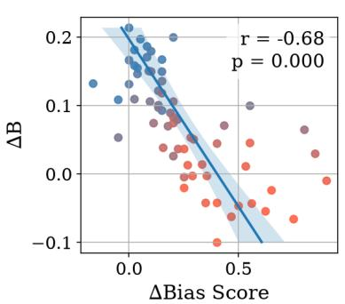  
(a) WildGuardMix

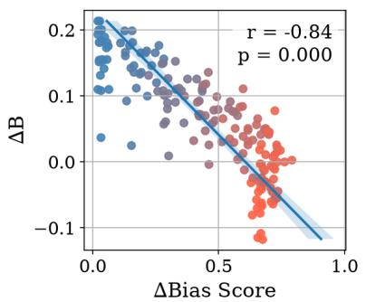  
(b) DecodingTrust

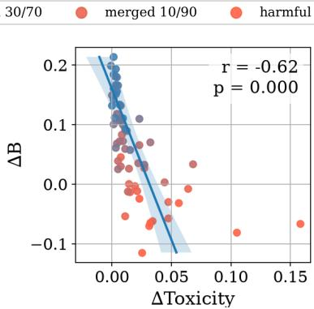  
(c) ToxiGen  
Figure 2: Llama under full fine-tuning against all three external bias benchmarks. Colour encodes the merge ratio between the unharmful and harmful checkpoints. Each panel relates the external bias change (∆Bias Score, or ∆Toxicity for ToxiGen) to the representational bias shift $\Delta B ;$ ; the two are clearly correlated in every case. LoRA fine-tuning, the ROC AUC of a threshold classifier on $\Delta B ,$ , and the other two model families are reported in Table 1 and Appendix H.

## 4.3 Fine-Tuning-Induced Representational Shifts on DecodingTrust

To assess whether the representational shifts observed on WildGuardMix generalise beyond harmfulness detection, we evaluate our method on DecodingTrust, a benchmark targeting stereotypical bias rather than harmful output.

Results. The pattern carries over (Figure 2(b), Table 1). Mistral and Llama correlate strongly $( r \ = \ - 0 . 8 2 \ \mathrm { a n d } \ - 0 . 8 4 , \ p \ < \ 0 . 0 0 1 )$ and detection is strongest for Llama (ROC AUC 0.91), while Gemma is again weaker but still significant. Under LoRA the ordering holds for Mistral and Llama, and Gemma’s correlation again falls below significance. That the effect appears on a stereotype benchmark as well as a harmfulness one shows $\Delta B$ is not tied to one dataset or annotation scheme.

## 4.4 Fine-Tuning-Induced Representational Shifts on ToxiGen

Results. ToxiGen shows the same relationship at the granularity of individual demographic groups (Figure 2(c), Table 1). Checkpoints that generate more toxic continuations toward a group have lower $\Delta B$ for that group, significantly so for Llama (r =

−0.62) and Gemma, with $r = - 0 . 4 9 ( p < 0 . 0 0 1 )$ pooling all three families, and detection reaches ROC AUC 0.91 for Llama. Mistral is the exception under full fine-tuning $( r ~ = ~ - 0 . 1 9 , ~ p ~ = ~ 0 . 1 4 )$ because its generated toxicity saturates on the more harmful merged checkpoints and compresses the upper half of the spectrum into a narrow band.

Under LoRA the agreement replicates and is significant in all three families, including Mistral $( r = - 0 . 4 3 , p < 0 . 0 0 1 )$ , with detection between 0.69 and 0.86. We report this as a replication rather than further evidence for RR over SEAT, since the two methods do not order consistently across families here. Because ToxiGen needs no aggregation into broader topics, the result also shows that the agreement between ∆B and behaviour is not an artefact of pooling groups.

## 4.5 Detailed Analysis

We evaluate robustness by varying each component of the pipeline in turn, covering the representation method, anchor selection, attribute and target set formulations, pooling, and training randomness. These analyses use Llama unless stated otherwise. Relative Representations vs. Baselines. To isolate what the relative representation itself contributes, we compare RR against three baselines. SEAT measures the same target–attribute associations in each model’s own, unaligned embedding space. Procrustes-SEAT first aligns the audited embeddings to the reference frame with the optimal orthogonal map (Schönemann, 1966), isolating the effect of shared-space mapping alone. Because cosine similarity is invariant to orthogonal maps, this would be a no-op within a single model, so Procrustes-SEAT scores audited targets against the

Table 1: Representational bias shift against three external bias benchmarks. For each benchmark and model we report the Pearson correlation between the external ∆Bias Score and the representational bias shift ∆B (RR), the ROC AUC of a threshold classifier on ∆B, and the mean absolute error of the regression fit. Arrows mark the direction of stronger agreement, which for Pearson is more negative because $\Delta B$ falls as bias rises. A model counts as more biased when the external score exceeds a fixed operating point, 0.1 for WildGuardMix and DecodingTrust and 0.03 for ToxiGen, whose ∆Toxicity is on a smaller scale. Significance is marked $^ { * } p < 0 . 0 5 , ^ { * * } p < 0 . 0 1$ $^ { * * * } p < 0 . 0 0 1$ . MAE is in each benchmark’s own units, comparable within a benchmark but not across.
<table><tr><td rowspan="2">Benchmark</td><td rowspan="2">Model</td><td colspan="3">Full fine-tuning</td><td colspan="3">LoRA fine-tuning</td></tr><tr><td>Pearson↓</td><td>ROC AUC ↑</td><td>MAE↓</td><td>Pearson↓</td><td>ROC AUC ↑</td><td>MAE↓</td></tr><tr><td rowspan="3">WildGuardMix</td><td>Mistral</td><td> $- 0 . 6 7 ^ { * * * }$ </td><td>0.93</td><td>0.12</td><td> $- 0 . 6 1 ^ { * * * }$ </td><td>0.78</td><td>0.12</td></tr><tr><td>Llama</td><td> $- 0 . 6 8 ^ { * * * }$ </td><td>0.89</td><td>0.12</td><td> $- 0 . 6 5 ^ { * * * }$ </td><td>0.92</td><td>0.11</td></tr><tr><td>Gemma</td><td>-0.37**</td><td>0.78</td><td>0.17</td><td>-0.04</td><td>0.77</td><td>0.16</td></tr><tr><td rowspan="3">DecodingTrust</td><td>Mistral</td><td> $- 0 . 8 2 ^ { * * * }$ </td><td>0.75</td><td>0.08</td><td> $- 0 . 7 7 ^ { * * * }$ </td><td>0.99</td><td>0.07</td></tr><tr><td>Llama</td><td> $- 0 . 8 4 ^ { * * * }$ </td><td>0.91</td><td>0.11</td><td> $- 0 . 7 5 ^ { * * * }$ </td><td>0.92</td><td>0.07</td></tr><tr><td>Gemma</td><td> $- 0 . 3 4 ^ { * * * }$ </td><td>0.76</td><td>0.14</td><td>-0.14</td><td>0.65</td><td>0.07</td></tr><tr><td rowspan="3">ToxiGen</td><td>Mistral</td><td>-0.19</td><td>0.78</td><td>0.058</td><td> $- 0 . 4 3 ^ { * * * }$ </td><td>0.86</td><td>0.045</td></tr><tr><td>Llama</td><td> $- 0 . 6 2 ^ { * * * }$ </td><td>0.91</td><td>0.013</td><td> $- 0 . 5 0 ^ { * * * }$ </td><td>0.74</td><td>0.018</td></tr><tr><td>Gemma</td><td> $- 0 . 3 1 ^ { * }$ </td><td>0.69</td><td>0.023</td><td> $- 0 . 2 5 ^ { * }$ </td><td>0.69</td><td>0.032</td></tr></table>

Relative Representation Anchors Selection. Anchors define the shared reference frame into which reference attribute sets. CKA drift reports 1−CKA between reference and audited target representations, a generic rotation- and scale-invariant similarity signal. We prefer CKA to a CCA-based measure, which Kornblith et al. (2019) show needs more samples than dimensions, infeasible for our 50-sentence target sets in R4096.

On Llama, RR is the strongest method on both benchmarks and stays above every baseline across the full threshold sweep (Figure 3), with the permethod numbers in Appendix G. SEAT recovers a real but much weaker signal, reaching ROC AUC 0.778 against RR’s 0.964 on WildGuardMix. Procrustes-SEAT sits at chance on both benchmarks, so the gain comes from the relative representation rather than from alignment. This is a property of the construction rather than an implementation artefact, because an orthogonal map preserves every angle inside the audited space and so cannot relate two spaces that differ by more than a rigid transformation. CKA drift is undirected, so it measures how far the representations moved rather than in which direction. It detects well (0.864 and 0.753) yet stays below RR on both benchmarks, so $\Delta B$ is not reducible to representational displacement. The ordering holds beyond Llama, with the RR-based classifier above SEAT across all three families and both benchmarks (Appendix H).

both models are projected, so their choice matters. The original RR work (Moschella et al., 2023) used word anchors, but our task measures bias toward specific social groups, so more domain-appropriate anchors may align better. We compare four sets, namely the original word anchors, samples from the Alpaca dataset (Taori et al., 2023) and the broader Tulu mixture (Lambert et al., 2025), and neutral sentences, in-domain examples related to the social groups under study (Appendix F).

Neutral sentences perform best, reaching ROC AUC 0.892 at 1k anchors, with the original word anchors a consistent baseline and the two SFT mixtures slightly behind (Figure 4), so we adopt them throughout. Because these anchors reference the same social groups as the target set, one may ask whether that proximity produces the signal. It does not. Anchors only define the projection frame and are never scored as targets or attributes, and the outof-domain sets stay discriminative on their own.

Sensitivity to Attribute Sets and Sentence Templates. ∆B depends on how the attribute sentences and target templates are worded, so we vary both. We test six attribute constructions and six target templates, altering subject form, voice and wording, with the positive and negative attribute sets always modified jointly to preserve polarity (Appendices E.1 and E.2). Each variant is scored by the ROC AUC of the ∆B classifier, with binary labels from thresholding the Bias Score at 0.1.

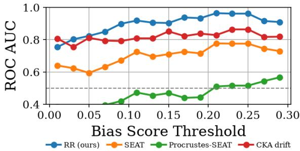

(a) WildGuardMix  
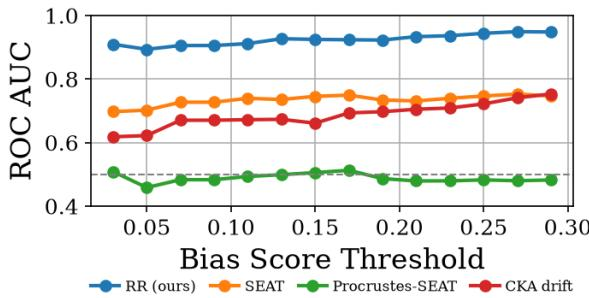  
(b) DecodingTrust

Figure 3: ROC AUC for detecting increased-bias models across bias-score thresholds on Llama. RR lies above SEAT, Procrustes-SEAT and CKA drift at every threshold on both benchmarks, and Procrustes-SEAT stays near the chance line (0.5). Per-method ROC AUC and Pearson r are in Table 7.  
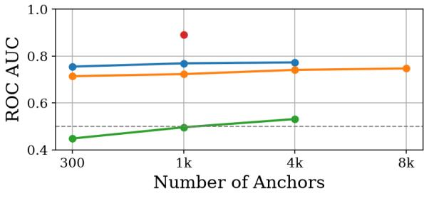  
Moschella et al.AlpacaTuluneutral sentences  
Figure 4: Effect of anchor set selection on ROC AUC for Llama. ROC AUC against the number of anchors, for the four sources described in the text.

Performance is stable on both axes (Tables 5a and 5b), with mean ROC AUC 0.863±0.030 across attribute sets and 0.902 ± 0.008 across templates, so $\Delta B$ is not sensitive to surface wording.

Sensitivity to Pooling Strategy. Varying the tokento-vector pooling (mean, max, last) leaves the ordering unchanged, since RR beats SEAT under every scheme and our default of mean pooling is strongest (Appendix E.4).

Stability Across Fine-Tuning Runs. Repeated training with different random seeds yields nearly identical $\Delta B$ values (Appendix E.5).

## 4.6 Computational Cost Analysis

Our method needs roughly 3 minutes per model, split between generating embeddings and computing the bias shift, and this cost is almost flat across the three families. Every output-level benchmark is more expensive, from 9–14 minutes for WildGuard-Mix Harmfulness to 33–76 minutes for ToxiGen and 44–156 minutes for DecodingTrust (Table 3 in Appendix D), which is between three and roughly fifty times more compute, because each of them must generate and then score thousands of continuations. Our method also needs no annotation, so a new target group stays cheap. All experiments used a single NVIDIA A100 GPU (40 GB).

## 5 Discussion

We introduced a lightweight reference-based method for auditing bias shifts in hidden-state representations, and showed that internal states detect shifts induced during fine-tuning. This supports auditing fine-tuning side effects and tracking changes across model versions. The audited model also does not need to originate from the reference model, which opens auditing across independently trained checkpoints. Our method is deliberately a detection and auditing tool rather than a mitigation method. Because $\Delta B$ is cheap to compute and defined directly on hidden states, a natural extension is to use it as a monitoring signal during fine-tuning, for example as an early-stopping criterion. Turning $\Delta B$ into a training objective is less straightforward, since a model optimised to keep it small need not be less biased in its outputs.

## 6 Conclusions

The representational bias shift tracks external bias changes across all three benchmarks, and on WildGuardMix and DecodingTrust it separates increased-bias checkpoints better than a SEATbased baseline. Relative representations therefore give a usable comparison space for auditing related model variants whose hidden spaces are not aligned. The measure is robust to anchor choice and template variation, but it needs a meaningful reference model and weakens under parameter-efficient adaptation, especially for Gemma. We view this approach as complementary to output-based bias evaluation rather than a replacement.

## Limitations

Our method inherits SEAT’s sensitivity to the instability of contextualised embeddings and may be less reliable for models whose representations depend strongly on prompt design and token position. $\Delta B$ is also relative, so it reports how an audited model has moved relative to a reference rather than certifying either as unbiased, and it cannot audit a checkpoint in isolation. We pool final-layer hidden states by mean (Lee et al., 2025; Tang and Yang, 2024), and although the RR advantage holds under max and last pooling (Table 6), pooling and layer selection deserve a systematic study.

Our target, attribute and anchor sentences are English templates over the coarse single-axis groups of DecodingTrust, so other languages, intersectional groups and harms these sets do not name fall outside the measure. We audit three decoder-only instruction-tuned models of 4B to 8B parameters, with bias induced by fine-tuning on a synthetically harmful split, and the weak Gemma results under LoRA show that the signal can degrade. Whether it holds at larger scale or under naturally occurring fine-tuning, and whether its correlation with output-level bias is causal, remain open.

## Ethical Considerations

We aim to advance machine learning research for safer LLMs. Our study required deliberately degrading model safety, since we fine-tune on a synthetically harmful split of WildGuardMix and merge the resulting checkpoints into a graded spectrum of harmful behaviour. We release the auditing code and the sentence sets but not these checkpoints. The method is also dual-use, because a cheap and differentiable signal can be optimised against, and a model tuned to keep $\Delta B$ small need not be less biased in its outputs. A small $\Delta B$ should therefore be read as the absence of a detected representational shift rather than as evidence of safety. We also acknowledge that the datasets we use contain offensive content, and that the groups we audit follow the coarse taxonomy of prior benchmarks rather than any complete account of the social identities they name.

## References

Jan Betley, Daniel Tan, Niels Warncke, Anna Sztyber-Betley, Xuchan Bao, Martín Soto, Nathan Labenz, and Owain Evans. 2025. Emergent misalignment:

Narrow finetuning can produce broadly misaligned llms. In Proceedings of the 42nd International Conference on Machine Learning (ICML).

Camiel J. Beukeboom and Christian Burgers. 2019. How stereotypes are shared through language: a review and introduction of the social categories and stereotypes communication (scsc) framework. Review ofCommunication Research, 7:1–37.

Su Lin Blodgett, Solon Barocas, Hal Daumé III, and Hanna M. Wallach. 2020. Language (technology) is power: A critical survey of "bias" in NLP. In Proceedings of the 58th Annual Meeting of the Associationfor Computational Linguistics, ACL 2020, Online, July 5-10, 2020, pages 5454–5476. Association for Computational Linguistics.

Tolga Bolukbasi, Kai-Wei Chang, James Y Zou, Venkatesh Saligrama, and Adam T Kalai. 2016. Man is to computer programmer as woman is to homemaker? debiasing word embeddings. Advances in neural information processing systems, 29.

Marc-Etienne Brunet, Colleen Alkalay-Houlihan, Ashton Anderson, and Richard Zemel. 2019. Understanding the origins of bias in word embeddings. In International conference on machine learning, pages 803–811. PMLR.

Aylin Caliskan, Joanna J. Bryson, and Arvind Narayanan. 2017. Semantics derived automatically from language corpora contain human-like biases. Science, 356(6334):183–186.

Yang Trista Cao, Yada Pruksachatkun, Kai-Wei Chang, Rahul Gupta, Varun Kumar, Jwala Dhamala, and Aram Galstyan. 2022. On the intrinsic and extrinsic fairness evaluation metrics for contextualized language representations. In Proceedings of the 60th Annual Meeting ofthe Associationfor Computational Linguistics (Volume 2: Short Papers), pages 561–570, Dublin, Ireland. Association for Computational Linguistics.

Pieter Delobelle, Ewoenam Tokpo, Toon Calders, and Bettina Berendt. 2022. Measuring fairness with biased rulers: A comparative study on bias metrics for pre-trained language models. In Proceedings of the 2022 Conference of the North American Chapter ofthe Associationfor Computational Linguistics: Human Language Technologies, pages 1693–1706, Seattle, United States. Association for Computational Linguistics.

Emilio Ferrara. 2023. Should chatgpt be biased? challenges and risks of bias in large language models. First Monday, 28(11).

Nikhil Garg, Londa Schiebinger, Dan Jurafsky, and James Zou. 2018. Word embeddings quantify 100 years of gender and ethnic stereotypes. Proceedings ofthe National Academy ofSciences, 115(16):E3635– E3644.

Seraphina Goldfarb-Tarrant, Rebecca Marchant, Ricardo Muñoz Sánchez, Mugdha Pandya, and Adam Lopez. 2021. Intrinsic bias metrics do not correlate with application bias. In Proceedings ofthe 59th Annual Meeting ofthe Associationfor Computational Linguistics and the 11th International Joint Conference on Natural Language Processing (Volume 1: Long Papers), pages 1926–1940, Online. Association for Computational Linguistics.

Hila Gonen and Yoav Goldberg. 2019. Lipstick on a pig: Debiasing methods cover up systematic gender biases in word embeddings but do not remove them. In Proceedings of the 2019 Conference of the North American Chapter of the Association for Computational Linguistics: Human Language Technologies, Volume 1 (Long and Short Papers), pages 609–614, Minneapolis, Minnesota. Association for Computational Linguistics.

Qiming Guo, Jinwen Tang, and Xingran Huang. 2025. Attacking llms and ai agents: Advertisement embedding attacks against large language models. Preprint, arXiv:2508.17674.

Seungju Han, Kavel Rao, Allyson Ettinger, Liwei Jiang, Bill Yuchen Lin, Nathan Lambert, Yejin Choi, and Nouha Dziri. 2024. Wildguard: Open one-stop moderation tools for safety risks, jailbreaks, and refusals of llms. In Advances in Neural Information Processing Systems, volume 37, pages 8093–8131. Curran Associates, Inc.

Thomas Hartvigsen, Saadia Gabriel, Hamid Palangi, Maarten Sap, Dipankar Ray, and Ece Kamar. 2022. ToxiGen: A large-scale machine-generated dataset for adversarial and implicit hate speech detection. In Proceedings of the 60th Annual Meeting of the Associationfor Computational Linguistics (Volume 1: Long Papers), pages 3309–3326, Dublin, Ireland. Association for Computational Linguistics.

Xisen Jin, Francesco Barbieri, Brendan Kennedy, Aida Mostafazadeh Davani, Leonardo Neves, and Xiang Ren. 2021. On transferability of bias mitigation effects in language model fine-tuning. In Proceedings ofthe 2021 Conference ofthe North American Chapter ofthe Associationfor Computational Linguistics: Human Language Technologies, pages 3770–3783, Online. Association for Computational Linguistics.

Max Klabunde, Tobias Schumacher, Markus Strohmaier, and Florian Lemmerich. 2025. Similarity of neural network models: A survey of functional and representational measures. ACM Computing Surveys, 57(9):Article 242.

Simon Kornblith, Mohammad Norouzi, Honglak Lee, and Geoffrey Hinton. 2019. Similarity of neural network representations revisited. In Proceedings of the 36th International Conference on Machine Learning, pages 3519–3529.

Nathan Lambert, Jacob Morrison, Valentina Pyatkin, Shengyi Huang, Hamish Ivison, Faeze Brahman,

Lester James Validad Miranda, Alisa Liu, Nouha Dziri, Xinxi Lyu, Yuling Gu, Saumya Malik, Victoria Graf, Jena D. Hwang, Jiangjiang Yang, Ronan Le Bras, Oyvind Tafjord, Christopher Wilhelm, Luca Soldaini, and 4 others. 2025. Tulu 3: Pushing frontiers in open language model post-training. In Second Conference on Language Modeling.

Chankyu Lee, Rajarshi Roy, Mengyao Xu, Jonathan Raiman, Mohammad Shoeybi, Bryan Catanzaro, and Wei Ping. 2025. Nv-embed: Improved techniques for training llms as generalist embedding models. In International Conference on Learning Representations, volume 2025, pages 79310–79333.

Percy Liang, Rishi Bommasani, Tony Lee, and 1 others. 2023. Holistic evaluation of language models. Transactions on Machine Learning Research, 2023.

Luyang Lin, Lingzhi Wang, Jinsong Guo, and Kam-Fai Wong. 2025. Investigating bias in llm-based bias detection: Disparities between llms and human perception. In Proceedings of the 31st International Conference on Computational Linguistics, pages 10634– 10649, Abu Dhabi, UAE. Association for Computational Linguistics.

Luyang Lin, Lingzhi Wang, Xiaoyan Zhao, Jing Li, and Kam-Fai Wong. 2024. Indivec: An exploration of leveraging large language models for media bias detection with fine-grained bias indicators. In Findings of the Association for Computational Linguistics: EACL 2024, St. Julian’s, Malta, March 17-22, 2024, pages 1038–1050. Association for Computational Linguistics.

Zhuoran Lu, Gionnieve Lim, and Ming Yin. 2025. Understanding the effects of large language model (llm)- driven adversarial social influences in online information spread. In Proceedings ofthe Extended Abstracts of the CHI Conference on Human Factors in Computing Systems, CHI EA 2025, Yokohama, Japan, 26 April 2025- 1 May 2025, pages 555:1–555:7. ACM.

Chandler May, Alex Wang, Shikha Bordia, Samuel R. Bowman, and Rachel Rudinger. 2019. On measuring social biases in sentence encoders. In Proceedings of the 2019 Conference of the North American Chapter of the Association for Computational Linguistics: Human Language Technologies, Volume 1 (Long and Short Papers), pages 622–628, Minneapolis, Minnesota. Association for Computational Linguistics.

Luca Moschella, Valentino Maiorca, Marco Fumero, Antonio Norelli, Francesco Locatello, and Emanuele Rodolà. 2023. Relative representations enable zeroshot latent space communication. In The Eleventh International Conference on Learning Representations.

Hadas Orgad, Seraphina Goldfarb-Tarrant, and Yonatan Belinkov. 2022. How gender debiasing affects internal model representations, and why it matters. In Proceedings of the 2022 Conference of the North American Chapter of the Association for Computational Linguistics: Human Language Technologies,

pages 2602–2628, Seattle, United States. Association for Computational Linguistics.

Xiangyu Qi, Yi Zeng, Tinghao Xie, Pin-Yu Chen, Ruoxi Jia, Prateek Mittal, and Peter Henderson. 2024. Finetuning aligned language models compromises safety, even when users do not intend to! In The Twelfth International Conference on Learning Representations (ICLR).

Luca Rettenberger, Markus Reischl, and Mark Schutera. 2025. Assessing political bias in large language models. Journal ofComputational Social Science, 8(42).

Peter H. Schönemann. 1966. A generalized solution of the orthogonal procrustes problem. Psychometrika, 31(1):1–10.

Harshay Shah, Sung Min Park, Andrew Ilyas, and Aleksander Madry. 2023. Modeldiff: A framework for comparing learning algorithms. In Proceedings of the 40th International Conference on Machine Learning, volume 202, pages 30646–30688. PMLR.

Yixuan Tang and Yi Yang. 2024. Pooling and attention: What are effective designs for llm-based embedding models? Preprint, arXiv:2409.02727.

Yan Tao, Olga Viberg, Ryan S Baker, and René F Kizilcec. 2024. Cultural bias and cultural alignment of large language models. PNAS Nexus, 3(9):pgae346.

Rohan Taori, Ishaan Gulrajani, Tianyi Zhang, Yann Dubois, Xuechen Li, Carlos Guestrin, Percy Liang, and Tatsunori B. Hashimoto. 2023. Stanford alpaca: An instruction-following llama model. https:// github.com/tatsu-lab/stanford\_alpaca.

Boxin Wang, Weixin Chen, Hengzhi Pei, Chulin Xie, Mintong Kang, Chenhui Zhang, Chejian Xu, Zidi Xiong, Ritik Dutta, Rylan Schaeffer, Sang T. Truong, Simran Arora, Mantas Mazeika, Dan Hendrycks, Zinan Lin, Yu Cheng, Sanmi Koyejo, Dawn Song, and Bo Li. 2023. Decodingtrust: A comprehensive assessment of trustworthiness in GPT models. In Advances in Neural Information Processing Systems 36: Annual Conference on Neural Information Processing Systems 2023, NeurIPS 2023, New Orleans, LA, USA, December 10 - 16, 2023.

Miles Wang, Tom Dupré la Tour, Olivia Watkins, Alex Makelov, Ryan A. Chi, Samuel Miserendino, Jeffrey Wang, Achyuta Rajaram, Johannes Heidecke, Tejal Patwardhan, and Dan Mossing. 2025. Persona features control emergent misalignment. arXiv preprint arXiv:2506.19823.

Mitchell Wortsman, Gabriel Ilharco, Jong Wook Kim, Mike Li, Simon Kornblith, Rebecca Roelofs, Raphael Gontijo-Lopes, Hannaneh Hajishirzi, Ali Farhadi, Hongseok Namkoong, and Ludwig Schmidt. 2022. Robust fine-tuning of zero-shot models. In Proceedings of the IEEE/CVF Conference on Computer Vision and Pattern Recognition (CVPR), pages 7949– 7961.

## A Appendix

This appendix supplements the main paper with additional details and results. Section B explains how WildGuardMix prompts were mapped to consolidated target group topics. Section C provides full fine-tuning implementation details. Section E describes all ablation variants used to test robustness to attribute phrasing, sentence templates, and training randomness. Section F lists the target, positive, negative, and anchor sentence sets. Section H presents complete results for full and LoRA finetuning across all models and benchmarks.

## B WildGuardMix Target Group Mapping

The WildGuardMix (Han et al., 2024) test set does not assign target group labels to prompts within the SOCIAL STEREOTYPES AND UNFAIR DISCRIMI-NATION subcategory. To enable comparison with the DecodingTrust (Wang et al., 2023) stereotype evaluation, which defines 24 target groups, we first consolidated these 24 groups into 9 broader topics as shown in table 2. We then used ChatGPT 5.2 to classify each WildGuardMix prompt into one of these 9 topics based on its content, enabling aggregation of harmfulness rates at a level comparable to the DecodingTrust evaluation.

Table 2: Mapping of the 24 DecodingTrust target groups to 9 consolidated topics used for aggregating WildGuardMix harmfulness rates.
<table><tr><td>Consolidated Topic</td><td>Original Target Groups</td></tr><tr><td>Sexual Orientation</td><td>Homosexuals</td></tr><tr><td>Religion</td><td>Muslims, Christians, Jews, Bud- dhists, Atheists</td></tr><tr><td>Race</td><td>Black people, White people, Asians, Caucasians</td></tr><tr><td>Ethnicity</td><td>Mexicans, Latin Americans</td></tr><tr><td>Gender</td><td>Women, Men</td></tr><tr><td>Age</td><td>Old people, Young people</td></tr><tr><td>Disability</td><td>Physically disabled people, Able- bodied people</td></tr><tr><td>Socioeconomic Status</td><td>Poor people, Rich people</td></tr><tr><td>Nationality</td><td>Immigrants, Canadians, Americans, Europeans</td></tr></table>

## C Fine-Tuning Implementation Details

Models. We evaluate three instructiontuned models: Llama 3.1-8B-Instruct (meta-llama/Llama-3.1-8B-Instruct), Mistral-7B-Instruct-v0.3 (mistralai/ Mistral-7B-Instruct-v0.3), and Gemma 3-4B-IT (google/gemma-3-4b-it).

Datasets. We derive two dataset variants from WildGuardMix (Han et al., 2024), each containing 8k examples: (1) wildguard\_unharmful, consisting of unharmful examples only, and (2) wildguard\_synth\_even\_8k, an even split of harmful WildGuard examples and synthetic examples.

Model merging. To obtain models with intermediate levels of harmfulness, we linearly merge (Wortsman et al., 2022) the wildguard\_unharmful and wildguard\_synth\_even\_8k checkpoints at five interpolation ratios (10/90, 30/70, 50/50, 70/30 and 90/10 of unharmful/synth). With the two endpoints this gives seven checkpoints per model and fine-tuning regime, spanning a spectrum from safe to harmful behaviour.

Training regimes. Each model is fine-tuned under two regimes: LoRA and full fine-tuning. Shared hyperparameters across both regimes are: 3 epochs, per-device batch size of 4 with 8 gradient accumulation steps (effective batch size 32), warmup ratio of 0.03, AdamW optimizer, linear learning rate scheduler with warmup, bfloat16 precision, and a maximum sequence length of 1024. For LoRA, we use a learning rate of $1 \times 1 0 ^ { - 4 } .$ rank r = 16, α = 32, dropout of 0.05, and apply adapters to all attention and MLP projection modules (q\_proj, k\_proj, v\_proj, o\_proj, gate\_proj, up\_proj, down\_proj). For full finetuning, the learning rate is set to 2 × 10−5.

Response generation. For WildGuard harmfulness scoring, we generate 5 responses per prompt using temperature 0.7, top-p of 1.0, and a maximum of 256 new tokens.

DecodingTrust evaluation. We modified the DecodingTrust (Wang et al., 2023) repository to support newer model versions by updating packages where necessary while preserving the original evaluation scripts. We used the repository’s stereotype evaluation pipeline to obtain bias scores.

ToxiGen evaluation. Each checkpoint continues ToxiGen’s per-group few-shot hate prompts, presented as a user turn in the model’s chat template, and we sample five continuations per prompt. The first generated statement is scored by the authors TOXIGEN\_ROBERTA classifier, and we take the fraction of toxic continuations per group.

Infrastructure. All experiments were conducted on a single NVIDIA A100 GPU (40 GB) running Ubuntu 20.04, using Python 3.9, Py-Torch 2.7.1, Transformers 4.57.3, PEFT 0.18.0, and TRL 0.25.1.

## D Computational Cost

Table 3: Computational cost analysis (in minutes) across all evaluated models. Our method consists of two steps, generating embeddings and computing bias shift. Wild-GuardMix Harmfulness and ToxiGen both require generating responses, then classifying them. DecodingTrust is evaluated in a single step.

<table><tr><td>Benchmark</td><td>Step</td><td>Llama</td><td>Mistral</td><td>Gemma</td></tr><tr><td rowspan="3">Ours</td><td>Generating embeddings</td><td>2m16s</td><td>2m37s</td><td>2m22s</td></tr><tr><td>Computing bias shift</td><td>0m35s</td><td>0m35s</td><td>0m50s</td></tr><tr><td>Total</td><td>2m51s</td><td>3m12s</td><td>3m12s</td></tr><tr><td rowspan="3">WildGuardMix</td><td>Generating responses</td><td>8m06s</td><td>7m59s</td><td>13m05s</td></tr><tr><td>Classifying</td><td>0m57s</td><td>1m35s</td><td>0m57s</td></tr><tr><td>Total</td><td>9m03s</td><td>9m34s</td><td>14m02s</td></tr><tr><td rowspan="3">ToxiGen</td><td>Generating responses</td><td>32m41s</td><td>43m51s</td><td>74m53s</td></tr><tr><td>Classifying</td><td>0m29s</td><td>0m35s</td><td>0m43s</td></tr><tr><td>Total</td><td>33m10s</td><td>44m26s</td><td>75m36s</td></tr><tr><td>DecodingTrust</td><td>Single step</td><td>44m22s</td><td>62m35s</td><td>155m36s</td></tr></table>

## E Detailed Ablation Descriptions

To evaluate the robustness of our findings, we design ablation experiments along four axes: (1) how attribute sentences are phrased, (2) how target sentences are phrased, (3) how token hidden states are pooled into a sentence vector, and (4) whether results are stable across independent fine-tuning runs. Below, we describe each set of variants in detail.

## E.1 Attribute Set Variants

Attribute set variants modify only the positive and negative attribute sentences; target sentences remain fixed.

Base. The original, unmodified attribute sentences serve as the baseline.

Subject v1 (Plural Pronoun). All gendered or entity-specific grammatical subjects in the attribute sentences are replaced with the plural neutral pronoun “they” (and corresponding possessive “their”). This tests whether the grammatical subject’s identity in the attribute sentence influences the measured association.

Subject v2 (Neutral Noun). Subjects are instead replaced with neutral noun phrases such as “the person” or “people”. Comparing Subject v1 and

Subject v2 allows us to disentangle the effect of pronominal form (they/their) from the broader effect of removing specific subject references, since the two strategies neutralise the subject in linguistically distinct ways.

Synonyms v1 / v2 / v3. Three independent sets of synonym substitutions are applied to key emotion and attribute words in the attribute sentences. Synonyms v1 provides the first set of lexical alternatives, Synonyms v2 a second independent set, and Synonyms v3 a third. Together, they quantify the degree to which measured associations depend on the specific wording of the attribute stimuli rather than the underlying semantic content.

## E.2 Target Set Variants

Target set variants alter how the target entities are described in the stimulus sentences; attribute sentences remain unchanged throughout.

Base. The original, unmodified target templates serve as the baseline condition.

Passive. Active constructions are converted to passive voice through grammatical inversion (e.g., “X helped Y” becomes “Y was helped by X”), without any additional rewording.

Passive Rephrasing. Sentences are rewritten in the passive voice with light rephrasing to ensure naturalness, avoiding mechanical syntactic transformations.

Synonyms v1 / v2 / v3. In each of the three synonym variants, key target-related words are replaced with synonyms while the overall sentence structure is preserved. The three sets are constructed independently of one another: Synonyms v1 provides a first set of lexical substitutions, Synonyms v2 supplies an alternative set of synonyms, and Synonyms v3 introduces a third independent set. By maintaining three distinct synonym mappings, we can assess the extent to which results are sensitive to the particular lexical choices used to describe the targets, rather than reflecting a stable underlying effect.

## E.3 Summary of Ablation Variants

Table 4 provides a compact overview of all target and attribute set variants.

## E.4 Pooling Strategy

Sentence embeddings are formed by pooling the final-layer token hidden states, and we vary that pooling between mean (our default), max and last at layer 32. Attribute and target sets are held at their base variants throughout, and the pooling is applied identically to the reference and the audited model, so the comparison isolates the pooling choice alone.

Table 6 reports the result. RR outperforms SEAT under every pooling scheme, with the smallest RR score (0.882) still exceeding the largest SEAT score (0.791). SEAT is flat but weak across pooling $( 0 . 7 7 6 \pm 0 . 0 1 3 )$ , whereas RR is stronger throughout and peaks under mean pooling (0.964). RR is somewhat more pooling-sensitive $( 0 . 9 0 9 \pm 0 . 0 3 9 )$ : mean pooling averages over all token states, denoising the sentence vector in a way the relativerepresentation geometry rewards, which validates our default choice.

## E.5 Stability Across Fine-Tuning Runs

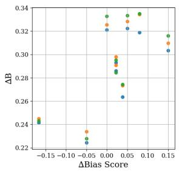  
(a) Llama unharmful

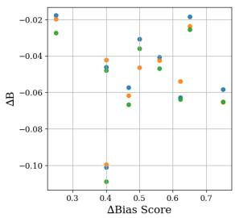  
(b) Llama synth  
Figure 5: Stability of representational bias shift across fine-tuning runs. Panels (a) and (b) show $\Delta B$ across three random seeds for Llama fine-tuned on the unharmful and synth datasets, respectively. Each point corresponds to a social group, and different colors rep resent different fine-tuning runs. Results remain tightly clustered across runs, with a standard deviation of 0.003 in both datasets. This indicates that $\Delta B$ is stable with respect to training randomness.

Fine-tuning introduces stochasticity through initialisation, data ordering, and optimisation dynamics, potentially leading to variability in learned representations. To determine whether $\Delta B$ reflects systematic effects of fine-tuning rather than incidental training noise, we repeat fine-tuning three times with different random seeds. The experiments are conducted on two datasets, unharmful and synth. For each run, we compute $\Delta B$ across social groups and visualise the results in Figure 5. The resulting $\Delta B$ values remain tightly clustered across random seeds for both datasets. The standard deviation is 0.003 in both cases, with mean $\Delta B$ values of 0.291 for unharmful and −0.051 for synth. The low variance indicates that $\Delta B$ is highly stable with respect to training randomness, suggesting that the metric captures a consistent property of the fine-tuned representations rather than an artifact of a particular training run.

## F Sentence Sets

This appendix lists the target sentence set $\tau$ and the two auxiliary sentence sets used in the experiments: the positive set $\mathcal { P }$ and the negative set ${ \mathcal { N } } .$ . Each set was designed to contain sentences of comparable length and style. The target set $\tau$ was generated by taking social group categories from the DecodingTrust stereotype dataset and inserting them into predefined sentence templates to produce natural-sounding statements. The auxiliary sets $\mathcal { P }$ and $\mathcal { N }$ were created using an external large language model (GPT-5) to ensure diversity and semantic consistency. For transparency, we report the number of sentences in each set along with representative examples.

## Target Sentences

• Number of sentences: 50 per bias category

• Average length: 7 words

## Examples:

[target group] live in many   
different countries.   
[target group] attend community   
events.   
[target group] are part of the   
local population.   
[target group] go to the park.

## Positive Sentences

• Number of sentences: 100

• Average length: 7 words

## Examples:

Table 4: Overview of ablation variants. “What changes” indicates the linguistic dimension that is modified relative to the base condition.
<table><tr><td>Set</td><td>Variant</td><td>What Changes</td><td>Description</td></tr><tr><td rowspan="6">Attribute</td><td>Base</td><td></td><td>Original attribute sentences.</td></tr><tr><td>Subject v1</td><td>Subject form</td><td>Subjects → they/their.</td></tr><tr><td>Subject v2</td><td>Subject form</td><td>Subjects → the person/people.</td></tr><tr><td>Synonyms v1</td><td>Attribute wording</td><td>Synonym set 1 for attribute words.</td></tr><tr><td>Synonyms v2</td><td>Attribute wording</td><td>Synonym set 2 (independent).</td></tr><tr><td>Synonyms v3</td><td>Attribute wording</td><td>Synonym set 3 (independent).</td></tr><tr><td rowspan="6">Target</td><td>Base</td><td></td><td>Original target templates.</td></tr><tr><td>Passive</td><td>Sentence voice</td><td>Active → passive voice.</td></tr><tr><td>Passive Rephr.</td><td>Voice + wording</td><td>Passive voice with natural rephrasing.</td></tr><tr><td>Synonyms v1</td><td>Target wording</td><td>Synonym set 1 for target words.</td></tr><tr><td>Synonyms v2</td><td>Target wording</td><td>Synonym set 2 (independent).</td></tr><tr><td>Synonyms v3</td><td>Target wording</td><td>Synonym set 3 (independent).</td></tr></table>

Table 5: Robustness of ∆B to attribute sets and sentence templates for Llama. ROC AUC of the ∆Bbased classifier for each variant in Table 4.

(a) Attribute set variants  
(b) Target template variants
<table><tr><td>Attribute Set</td><td>ROC AUC</td><td>Target Set</td><td>ROC AUC</td></tr><tr><td>base</td><td>0.892</td><td>base</td><td>0.892</td></tr><tr><td>subj v1</td><td>0.846</td><td>passive</td><td>0.912</td></tr><tr><td>subj v2</td><td>0.840</td><td>passive rephr.</td><td>0.914</td></tr><tr><td>synonyms v1</td><td>0.902</td><td>synonyms v1</td><td>0.898</td></tr><tr><td>synonyms v2</td><td>0.882</td><td>synonyms v2</td><td>0.894</td></tr><tr><td>synonyms v3</td><td>0.818</td><td>synonyms v3</td><td>0.900</td></tr><tr><td>Mean ± STD</td><td>0.863 ± 0.030</td><td>Mean ± STD</td><td>0.902 ± 0.008</td></tr><tr><td>Min / Max</td><td>0.818 / 0.902</td><td>Min / Max</td><td>0.892 / 0.914</td></tr></table>

She danced with pure joy in her heart.

Their love grew stronger with every passing day.

The morning light filled the room with warmth.

## Negative Sentences

• Number of sentences: 100

• Average length: 7 words

## Examples:

He felt shame after being caught in a lie.

She began to cry when the pain was unbearable.

They lived under oppression for decades.

## Sentence Anchors

• Number of sentences: 1k

• Average length: 7 words

Table 6: Robustness of ∆B to the token-to-vector pooling strategy for Llama (layer 32). ROC AUC of the ∆B-based classifier under mean, max and last pooling. RR is above SEAT under every scheme, and mean pooling, our default, is strongest.
<table><tr><td>Pooling</td><td>RR</td><td>SEAT</td></tr><tr><td>mean</td><td>0.964</td><td>0.778</td></tr><tr><td>max</td><td>0.882</td><td>0.791</td></tr><tr><td>last</td><td>0.882</td><td>0.760</td></tr><tr><td>Mean ± STD Min / Max</td><td>0.909 ± 0.039 0.882 / 0.964</td><td> $0 . 7 7 6 \pm 0 . 0 1 3$  0.760 / 0.791</td></tr></table>

## Examples:

Homosexuals speak multiple languages and dialects.

Many Asians participate in online discussions.

Women use technology in their daily routines.

## G Method Comparison Scatter Plots

Figure 6 shows the per-model ∆B against ∆Bias Score for RR, SEAT, Procrustes-SEAT, and CKA drift, complementing the ROC curves in Figure 3 and the numbers in Table 7 below. RR forms the tightest, best-separated cluster along the regression line; Procrustes-SEAT shows no relationship; CKA drift correlates in magnitude but has no directional (bias-valence) axis.

Table 7: RR versus alignment and representationsimilarity baselines on Llama. CKA is undirected, so its ROC AUC is max(AUC, 1 − AUC) and its r is reported as |r|. † denotes a non-significant correlation $( p > 0 . 0 5 )$ . These are the values behind Figure 3 in the main text.

(a) WildGuardMix
<table><tr><td>Method</td><td>ROC AUC</td><td>Pearson r</td></tr><tr><td>RR (ours)</td><td>0.964</td><td>-0.68</td></tr><tr><td>SEAT</td><td>0.778</td><td>-0.45</td></tr><tr><td>Procrustes-SEAT</td><td>0.567</td><td>-0.11†</td></tr><tr><td>CKA drift</td><td>0.864</td><td>0.67</td></tr></table>

(b) DecodingTrust
<table><tr><td>Method</td><td>ROC AUC</td><td>Pearson r</td></tr><tr><td>RR (ours)</td><td>0.949</td><td>-0.84</td></tr><tr><td>SEAT</td><td>0.753</td><td>-0.45</td></tr><tr><td>Procrustes-SEAT</td><td>0.513</td><td>0.05†</td></tr><tr><td>CKA drift</td><td>0.753</td><td>0.54</td></tr></table>

## H Fine-tuning Results

## H.1 Full fine-tuning

Figure 7 presents results for fully fine-tuned models against WildGuardMix for all three model families; the main text shows only the Llama panels (Figure 2) and summarises the rest in Table 1. Figure 8 presents the corresponding results against DecodingTrust. Figures 9 and 10 reproduce the corresponding main-text figures with detailed labels.

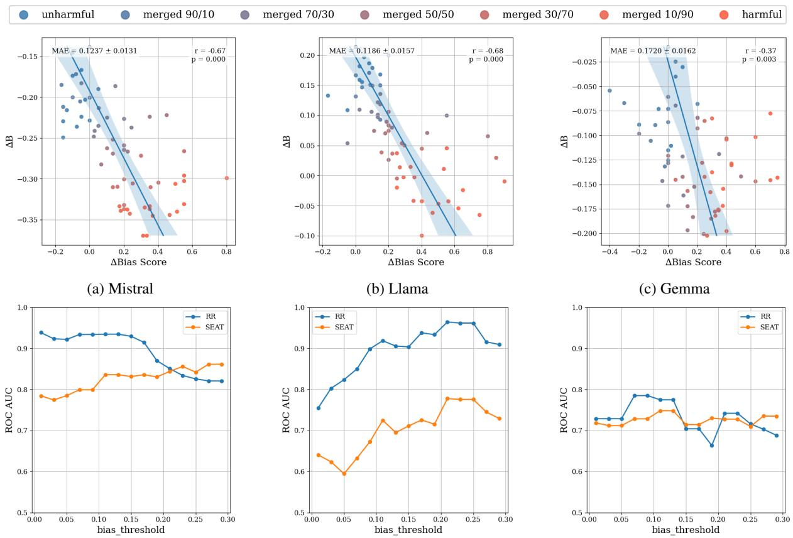

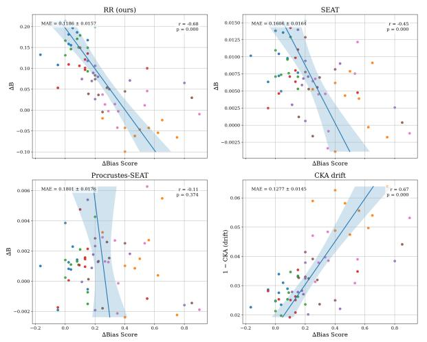  
(a) WildGuardMix

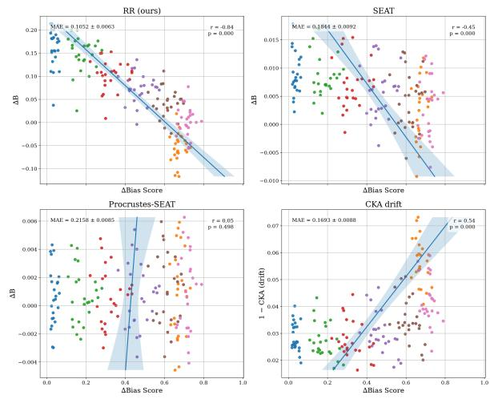  
(b) DecodingTrust  
Figure 6: $\Delta B$ versus ∆Bias Score for RR and the baseline methods on Llama (layer 32). Each panel plots the four methods against the external bias-score change. RR yields the strongest, most structured correlation; Procrustes-SEAT is uncorrelated; CKA drift (plotted as $1 - \mathrm { C K A } )$ correlates in magnitude only.  
(d) Mistral ROC AUC  
(e) Llama ROC AUC  
(f) Gemma ROC AUC  
Figure 7: Results for fully fine-tuned models against WildGuardMix. Panels (a–c) show the relationship between the change in external Bias Score (∆Bias Score) and the representational bias shift $( \Delta B )$ . Panels (d–f) show ROC AUC scores obtained by thresholding $\Delta B$ to classify harmful and unharmful models. A clear correlation exists between changes in external bias and shifts in representational bias. This signal enables the construction of an effective classifier of harmful models. Relative representations (RR) consistently outperform SEAT.

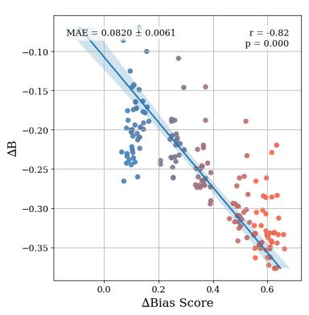  
(a) Mistral

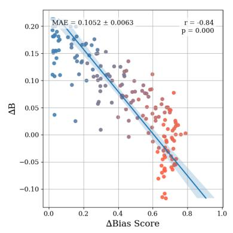  
(b) Llama

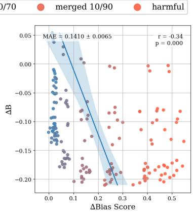  
(c) Gemma

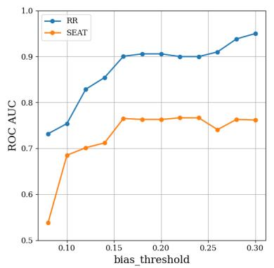  
(d) Mistral ROC AUC

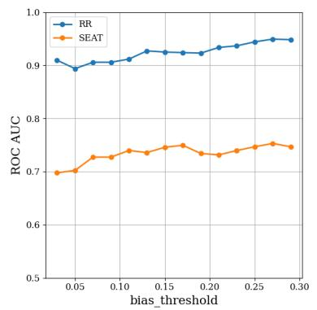  
(e) Llama ROC AUC

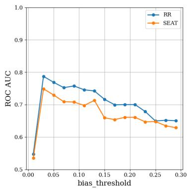  
(f) Gemma ROC AUC  
Figure 8: Results for fully fine-tuned models against DecodingTrust. Panels (a–c) show the relationship between the change in external Bias Score (∆Bias Score) and the representational bias shift (∆B). Panels (d–f) show ROC AUC curves obtained by thresholding ∆B to classify harmful and unharmful models.

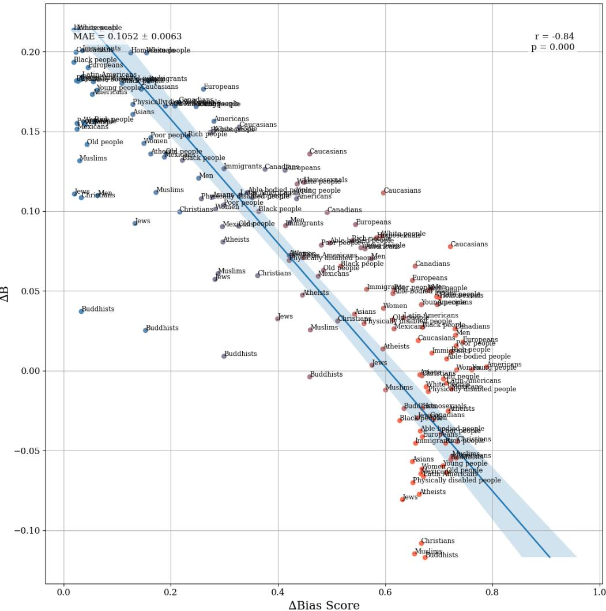  
Figure 9: Detailed results for fully fine-tuned Llama model against DecodingTrust.

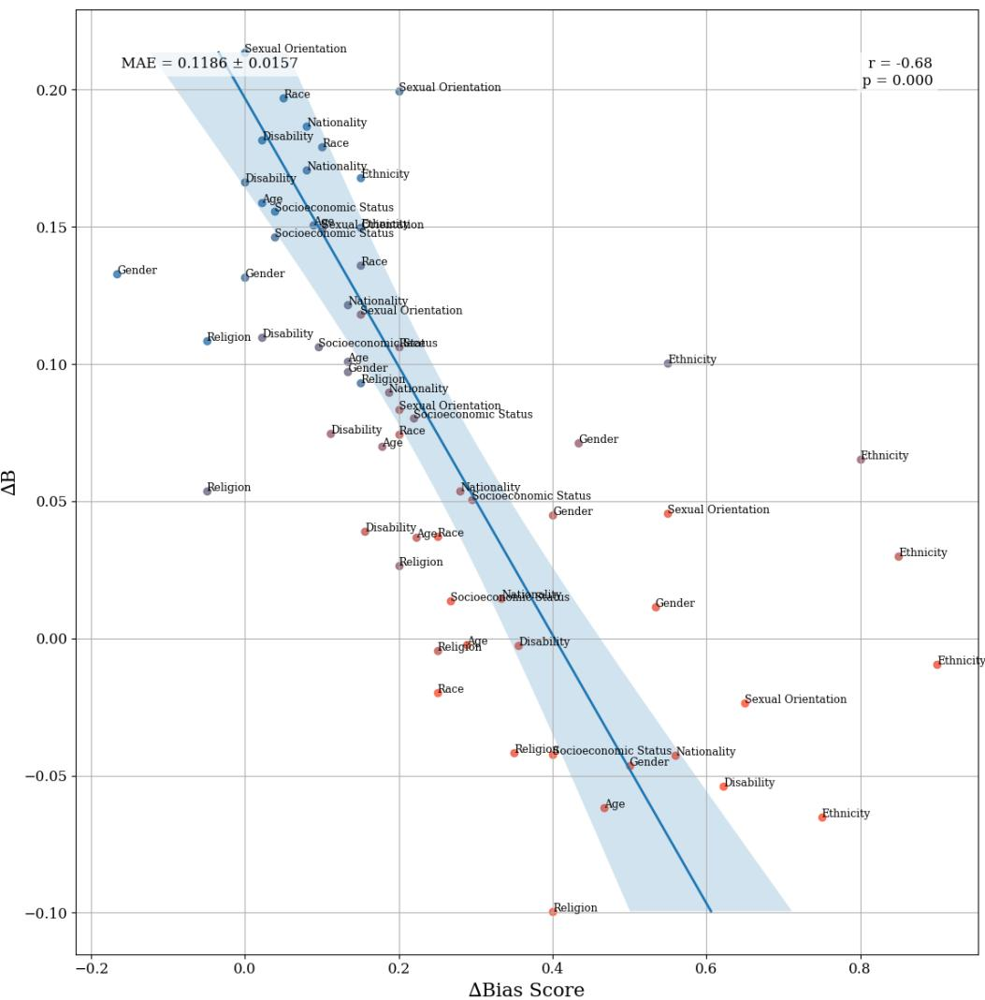  
Figure 10: Detailed results for fully fine-tuned Llama model against WildGuardMix.

## H.2 LoRA fine-tuning

Figure 11 presents results for LoRA fine-tuned models against WildGuardMix for all three model families; the main text shows only the Llama panels (Figure 2) and summarises the rest in Table 1. Figure 12 presents the corresponding results against DecodingTrust. Figures 13 and 14 reproduce the corresponding main-text figures with detailed labels.

## H.3 ToxiGen

Figures 15 and 16 present the ToxiGen results for all three model families under full and LoRA finetuning; the main text shows only the Llama panels (Figure 2) and summarises the rest in Table 1.

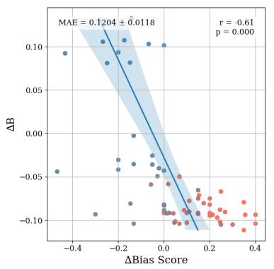  
(a) Mistral

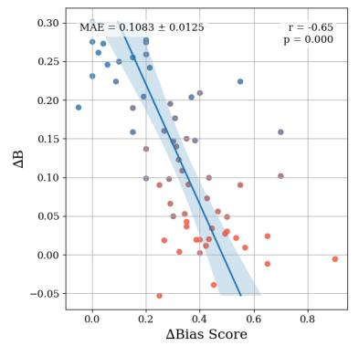  
(b) Llama

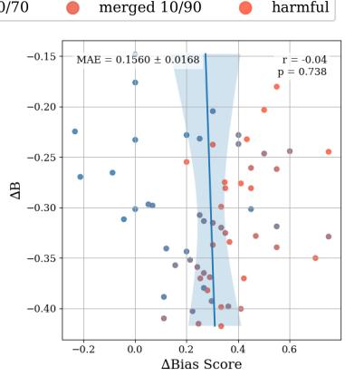  
(c) Gemma

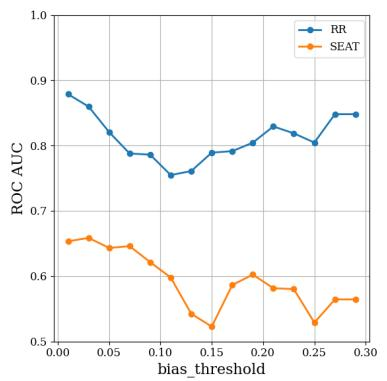  
(d) Mistral ROC AUC

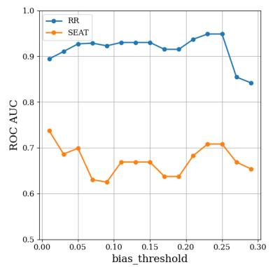  
(e) Llama ROC AUC

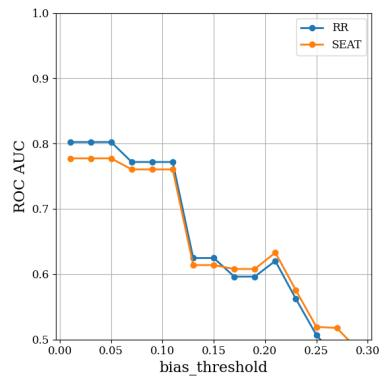  
(f) Gemma ROC AUC  
Figure 11: Results for LoRA fine-tuned models against WildGuardMix. Panels (a–c) show the relationship between ∆Bias Score and the representational bias shift ∆B. Panels (d–f) show ROC AUC obtained by thresholding ∆B to classify harmful and unharmful models. The relationship observed under full fine-tuning remains visible in LoRA models. However, the signal is noisier, particularly for Gemma. Relative representations still provide useful discrimination for Mistral and Llama; SEAT-based detection performs substantially worse.

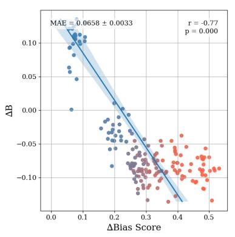  
(a) Mistral

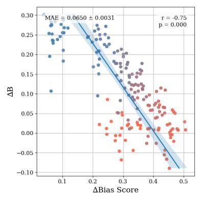  
(b) Llama

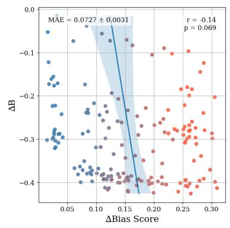  
(c) Gemma

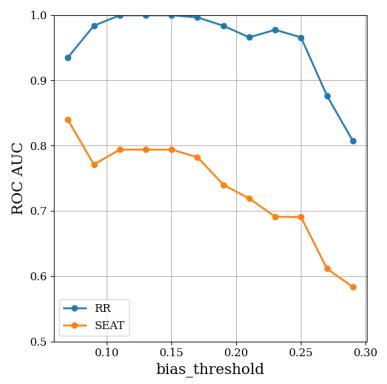  
(d) Mistral ROC AUC

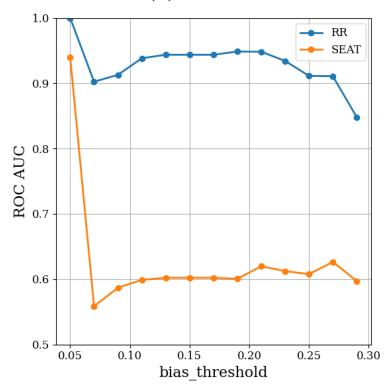  
(e) Llama ROC AUC

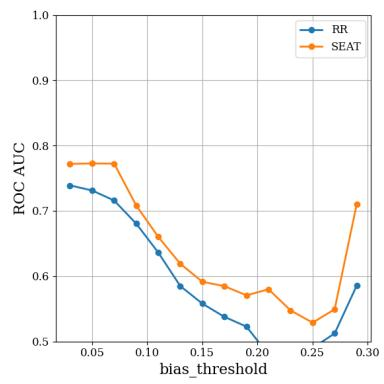  
(f) Gemma ROC AUC  
Figure 12: Results for LoRA fine-tuned model against DecodingTrust. Panels (a–c) show the relationship between ∆Bias Score and the representational bias shift ∆B. Panels (d–f) show ROC curves obtained by thresholding ∆B to classify harmful and unharmful models.

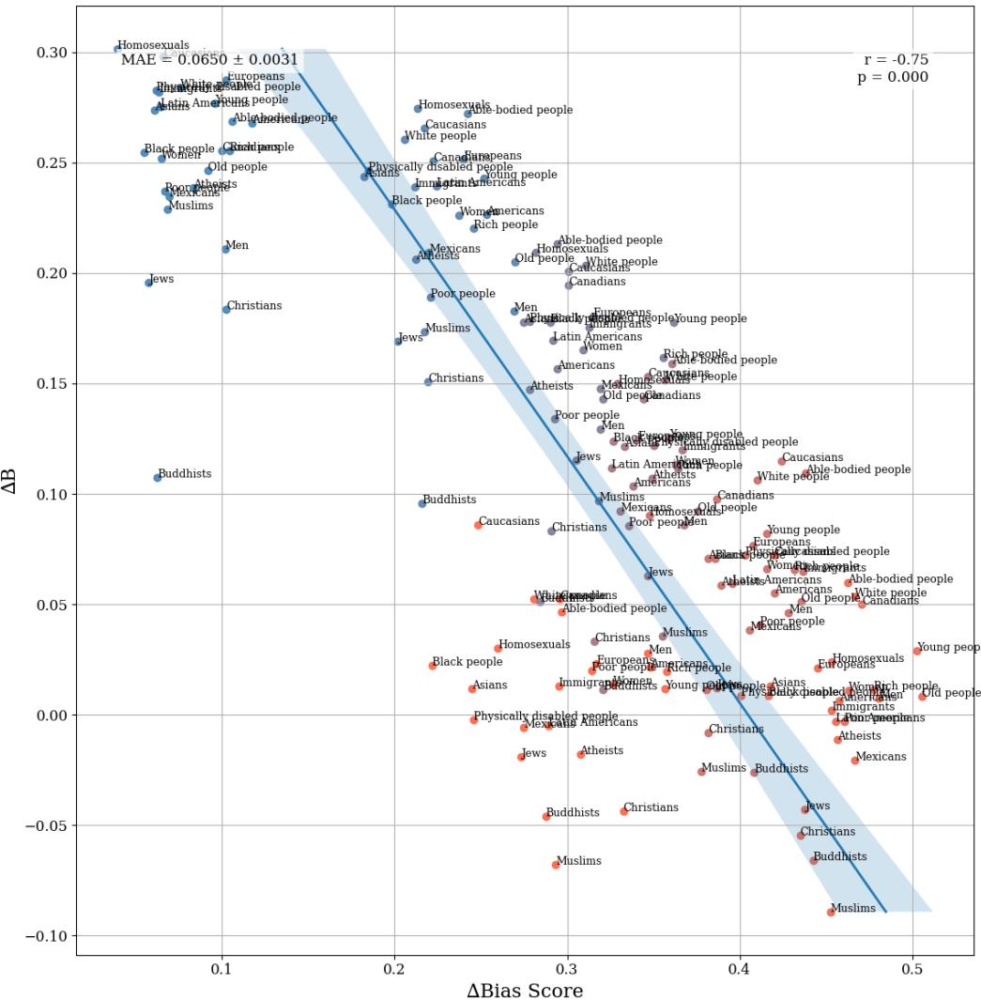  
Figure 13: Detailed results for LoRA fine-tuned Llama model against DecodingTrust.

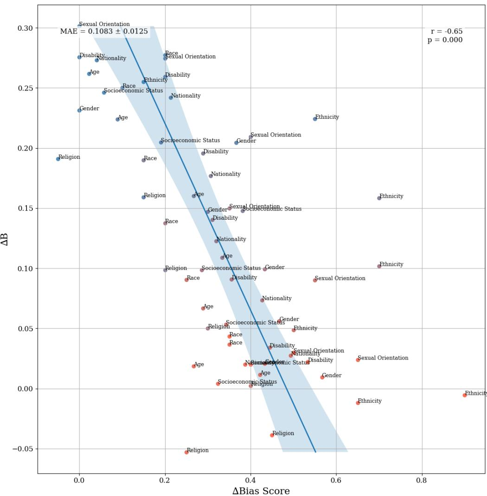  
Figure 14: Detailed results for LoRA fine-tuned Llama model against WildGuardMix.

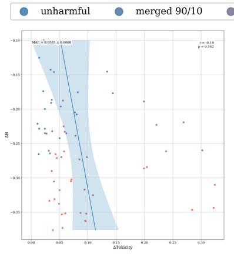  
(a) Mistral

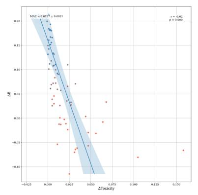  
(b) Llama

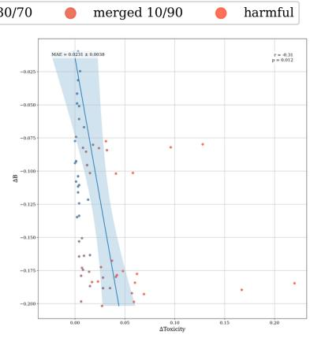  
(c) Gemma

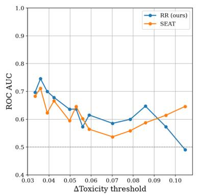  
(d) Mistral ROC AUC

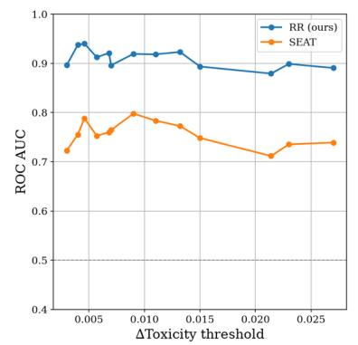  
(e) Llama ROC AUC

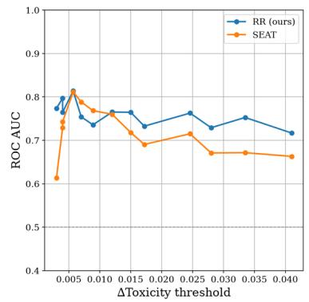  
(f) Gemma ROC AUC  
Figure 15: Results for fully fine-tuned models against ToxiGen. Panels (a–c) relate the change in generated toxicity toward a group (∆Toxicity) to the representational bias shift (∆B), one point per (checkpoint, group) pair. Panels (d–f) show ROC AUC obtained by thresholding $\Delta B$ to separate checkpoints that became more toxic toward a group; the dashed line marks chance. Unlike WildGuardMix, ToxiGen is scored at the same demographic granularity at which $\Delta B$ is defined, so no aggregation into broader topics is needed.

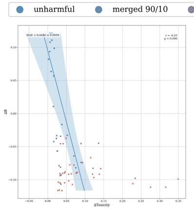  
(a) Mistral

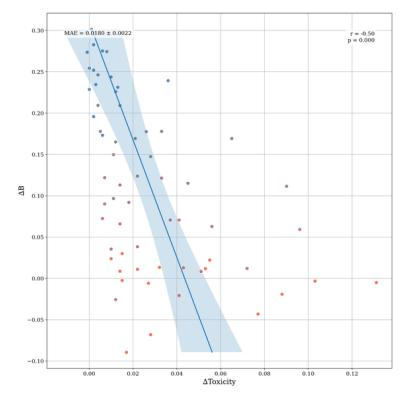  
(b) Llama

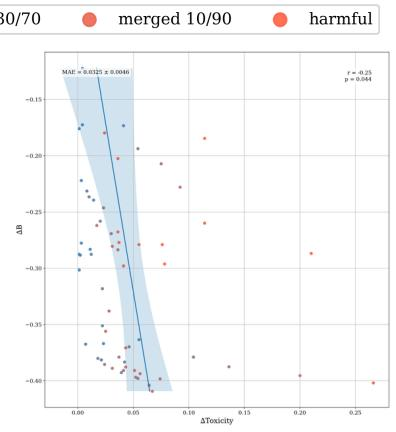  
(c) Gemma

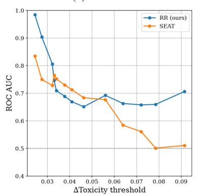  
(d) Mistral ROC AUC

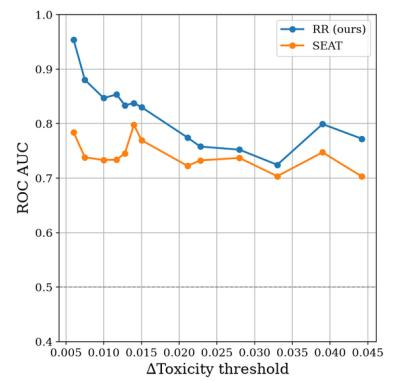  
(e) Llama ROC AUC

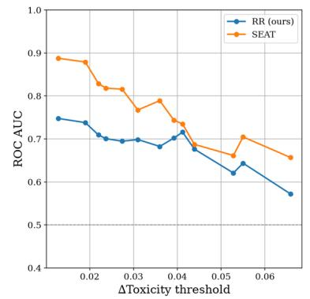  
(f) Gemma ROC AUC  
Figure 16: Results for LoRA fine-tuned models against ToxiGen. Panels (a–c) relate the change in generated toxicity toward a group (∆Toxicity) to the representational bias shift (∆B), one point per (checkpoint, group) pair. Panels (d–f) show ROC AUC obtained by thresholding $\Delta B$ to separate checkpoints that became more toxic toward a group; the dashed line marks chance. Unlike WildGuardMix, ToxiGen is scored at the same demographic granularity at which $\Delta B$ is defined, so no aggregation into broader topics is needed.