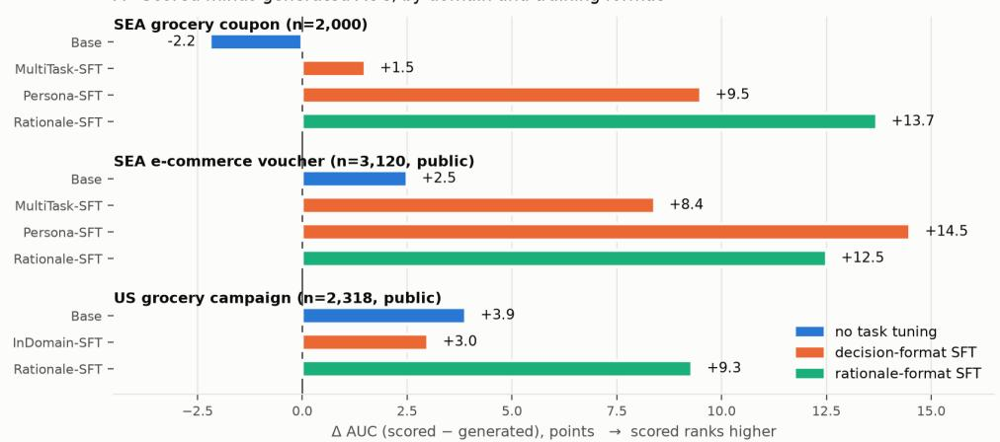
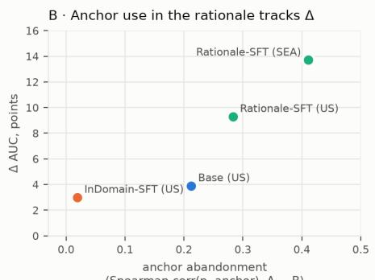
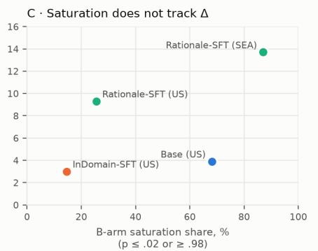

# SCORED VS. GENERATED READOUTS IN BEHAVIORAL LANGUAGE MODELS: AN EMPIRICAL STUDY OF ELICITATION FORMAT

Touchapon Kraisingkorn, Krittin Pachtrachai, Wachiravit Modecrua Amity Research and Application Center (ARAC), Amity Group {touchapon,krittin,wachiravit}@amity.co

## ABSTRACT

Language models fine-tuned on real customer behavior are increasingly deployed as behavioral simulators: given a shopper’s history and an offer, they predict whether the person will act, and, unlike a conventional classifier, can explain the prediction in the customer’s voice. Teams routinely treat these two capabilities as interchangeable, assuming that letting the model reason before it answers is, at worst, neutral for the prediction itself — an assumption with real stakes, since a misranked targeting system silently misallocates incentive budget, with no sign of the failure in the rationale’s fluency. We test this directly, holding checkpoint and prompt content fixed and varying only whether the answer is read as a probability (scored) or produced after a written rationale (generated), across 13 model×domain cells spanning four retail prediction tasks in three markets (two using fully public data and public checkpoints). The interchangeability assumption fails: the scored readout ranks outcomes more accurately than the generated one in 12 of 13 cells (two-sided sign test, p ≈ .003), by 1.5 to 14.5 AUC points, with paired bootstrap confidence intervals excluding zero in every newly measured cell. The gap is systematic rather than incidental: it scales with the degree of taskspecific supervision and with mismatch between the training and serving formats, ranging from −2.2 (untuned base) to +13.7 (rationale-format supervision), with a frontier reasoning model at +1.4 (CI95 [0.6, 2.2]). Per-row analysis of ∼9,000 rationales locates two correlates: rationales that stop citing the dominant predictive feature (rank correlation with it falls 0.72 → 0.31) and that converge on a small set of stock formulations (up to 33% of generations share a top-3 opening). Probability saturation, the most visible symptom, does not track the gap. A third readout — eliciting a probability before any verdict — recovers calibration (Brier 0.47 →0.15) while ranking within noise of the scored readout, but only for outcome rates present in training, and it is worse than scoring for models whose scored head is already calibrated. We interpret the gap through the objective each readout matches, report which training choices narrow it, and give a serving recipe that retains generated rationales while sourcing ranking from the scored head.

## 1 INTRODUCTION

Retailers and marketplaces increasingly decide who receives a coupon, which customers to prioritize after a product delisting, or how to size an incentive budget using a single artifact: a language model fine-tuned on real transaction histories to act as a behavioral simulator that can be asked, in natural language, whether a given customer will act (Modecrua et al., 2026; Wang et al., 2025b; Maier et al., 2025). Unlike a conventional classifier, such a model can also be asked to explain itself — to write, in the customer’s voice, why it expects that outcome. This dual capability is precisely why behavioral simulators are attractive to build: one checkpoint appears to deliver both a ranking signal for targeting and an auditable rationale for the analyst who has to justify the targeting decision.

Behavioral simulators as a research trend. Building a single model that both predicts and explains is not unique to retail: it follows a broader shift toward using language models as general-purpose world models and agents, continually pretrained and fine-tuned to internalize the dynamics of a domain rather than only its labels (Qwen Team, 2026). Applied to consumer behavior, the recipe is to continue pretraining a base model on a corpus of consumer voice and transaction sequences and then supervise it on the decision task itself, so that the same weights that generate a plausible customer narrative can also be queried for a prediction (Modecrua et al., 2026; Wang et al., 2025b). The appeal over a conventional discriminative model is threefold: a natural-language interface that product teams and analysts can query directly, transfer to question forms not seen during training, and — unlike most agent benchmarks, which score plausibility or human preference — a domain in which the model’s claims can be checked against a real, recorded outcome (a redemption, a churn event, a repurchase) rather than a proxy label. That last property also exposes the paradigm’s limits: benchmarks that do compare simulated and real populations continue to find systematic gaps between them (Hu et al., 2026). It is against this backdrop — models that are fluent but not yet known to be faithful — that how one queries the model for a decision becomes consequential.

Getting the ranking wrong has a direct, material cost. A targeting system that misorders customers spends incentive budget on people who would have acted anyway and withholds it from people who would have responded, and it does so silently: nothing in a rationale’s fluency signals that the ranking beneath it has degraded. Whether a team can trust the rationale-producing surface for ranking, or must fall back to a separate scoring pass, is therefore a first-order operational question rather than a modeling nicety. In practice, teams routinely treat the two as interchangeable, assuming that asking the model to articulate its reasoning is, at worst, neutral for the prediction it then makes. This assumption is not unreasonable on its face: rationales generated during training have been shown to improve a model’s own accuracy when used as a bootstrapping signal (Zelikman et al., 2022), and verbalized reasoning can rival or even exceed logprob-based confidence for instructiontuned models on other tasks (Tian et al., 2023), so it is a short step to expect that reasoning before answering would be neutral, or even helpful, at serving time as well. Yet the same reasoning step has separately been shown to induce overconfidence as its budget grows (Hiremath & Hiremath, 2026) and non-monotone accuracy as it lengthens (Wu et al., 2025) — reason enough to distrust the assumption rather than take it on faith, a tension the literature below makes precise.

The evidence for the interchangeability assumption is indirect, and it comes from several adjacent literatures rather than a single line of work that has tested it directly.

Evidence on elicitation and reasoning. How a model is asked is already known to matter along two related dimensions. First, at the level of a single token: Wang et al. (2024) show that a model’s firsttoken probability and its generated free-text answer can disagree on multiple-choice benchmarks, framing the discrepancy as a threat to evaluation validity rather than to deployment, and this sensitivity to elicitation protocol recurs broadly in confidence estimation more generally (Kim & Kang, 2026). Second, at the level of reasoning itself: chain-of-thought has been shown to induce overconfidence as the reasoning budget grows (Hiremath & Hiremath, 2026) and to produce non-monotone accuracy as rationales lengthen (Wu et al., 2025), and Wang et al. (2025a) found that removing rationales changes action-prediction quality for some models without isolating why. Taken together, this literature establishes that elicitation format is not innocuous in general, but none of it holds a checkpoint and its prompt content fixed while varying only the readout, and none measures the resulting cost against real, verified behavioral outcomes.

Evidence on behavioral simulators specifically. Modecrua et al. (2026) and Wang et al. (2025b) establish the training recipes for behavioral simulators of exactly the kind we study and report in-domain accuracy under a single, fixed readout, without varying elicitation format. Tian et al. (2023) and Maier et al. (2025) study verbalized-probability elicitation — respectively on general instruction-following tasks and on survey-style purchase-intent items — rather than on real, verifiable behavioral outcomes. That is the gap this paper fills: a controlled, same-checkpoint comparison of elicitation formats, measured against ground-truth customer behavior rather than a benchmark label or a synthetic proxy.

This paper tests the interchangeability assumption directly, holding checkpoint and prompt content fixed and varying only how the model is asked, and finds that it does not hold for tuned behavioral models. Across four domains, reading a decision probability from the model (scored) ranks real outcomes more accurately than letting the model write a rationale and then answer (generated) — and the difference is largest in exactly the models trained hardest on the task.

We stress at the outset what this is and is not. It is a measurement of ranking accuracy under a fixed checkpoint: which readout best recovers the ordering of real outcomes. It is not a claim that generated rationales lack value. They serve purposes ranking metrics do not capture — auditability, interpretability, transfer to unseen question forms, and a product surface customers and analysts can interrogate — and in our measurements they are sometimes better calibrated than the scored readout even while ranking worse. Rationale-producing behavioral models are an active and, in our view, worthwhile research direction; the contribution here is to quantify one specific cost so that it can be designed around rather than paid silently.

Why a gap should be expected. The scored readout is the model’s native binary-outcome head: a probability over {YES,NO} conditioned on all prompt evidence, which is precisely the quantity a discriminative model trained with binary cross-entropy on the same label optimizes, and precisely what a ranking metric such as AUC rewards. The generated readout routes the same evidence through a text bottleneck first, then reads a probability conditioned on that text. Any evidence the prose fails to carry — or distorts — cannot be recovered downstream. Established BCE-trained baselines on these tasks (gradient-boosted trees; the DMBGN voucher model, Xiao et al., 2021) never route evidence through text at all, and, as we report, they remain strong. The question this paper answers empirically is how large the text-bottleneck cost is, what modulates it, and what can be done about it.

## This paper makes four contributions:

1. The measurement (Section 4.1): across four domains — coupon redemption at a major Southeast-Asian grocery retailer, e-commerce voucher redemption on the public DM-BGN benchmark (Xiao et al., 2021), assortment-change response from natural experiments, and coupon-campaign redemption on the public Dunnhumby Complete Journey dataset (dunnhumby, 2014) — and five checkpoints ranging from an untuned 27B base to a frontier reasoning API, the scored readout beats the generated one in 12 of 13 cells; in the most extreme case, a generated arm that is degenerate (single-class output) is recovered to 0.766 AUC by changing the readout alone.

2. What modulates the gap (Section 4.1): it grows with task-specific supervision and with train/serve format mismatch, from +9.3 to +13.7 points under rationale-format supervision, to +3.0 points — the smallest among tuned models — under in-domain decisionformat supervision, with an untuned base showing the reverse sign (−2.2).

3. Two correlates and one non-correlate (Section 4.2): per-row analysis of the generated rationales shows that anchor abandonment and template convergence order the gaps correctly across cells, while probability saturation, the most visible symptom, does not.

4. A third readout and its scope (Section 5.2): eliciting a probability before any verdict recovers calibration with ranking within noise of the scored readout, but only for outcome rates present in training, and it is strictly worse than scoring for models whose scored head is already calibrated.

Together these findings motivate concrete training and serving guidance (Section 7) that retains generated rationales in the product while sourcing ranking from the scored head, together with two diagnostics that predict how much a given deployment is paying for its readout choice.

The remainder of the paper is organized as follows. Section 2 situates this measurement against related work on evaluation-time answer divergence, reasoning calibration, and verbalized probabilities. Section 3 describes the checkpoints, training pipeline, evaluation domains, and the three readouts we compare. Section 4 reports the main measurement (Section 4.1) and its per-row correlates (Section 4.2). Section 5 introduces a third readout and characterizes when it helps (Section 5.2), and discusses limitations (Section 5.3). Section 6 synthesizes the findings, and Section 7 closes with deployment guidance. Two of our four domains use public data and public checkpoints end-to-end, so those numbers are reproducible by third parties; code, prompts, and per-row dumps are released.

## 2 RELATED WORK

Readout choice as a measurement problem. Wang et al. (2024) showed that first-token probabilities and generated text answers disagree on multiple-choice benchmarks, framing it as a threat to evaluation validity. We study the deployment counterpart — which readout best recovers realoutcome ranking — and add the supervision dose–response and per-row correlates that multiplechoice settings cannot expose.

Reasoning and calibration. Chain-of-thought has been shown to induce overconfidence under increased budgets (Hiremath & Hiremath, 2026) and non-monotone accuracy in length (Wu et al., 2025). Our observation is distinct and partly opposite in sign: several of our generated arms are better calibrated than their scored counterparts while ranking worse, so the effect we measure is on ordering, not (only) on scale. Wang et al. (2025a) reported that removing rationales improves action prediction for some models without isolating why; we supply candidate correlates and a controlled ordering ablation.

Verbalized probabilities. Verbalized confidence can rival or exceed logprob-based confidence for instruction-tuned models (Tian et al., 2023), and the result is highly sensitive to elicitation protocol (Kim & Kang, 2026). Maier et al. (2025) recover realistic Likert distributions through semanticsimilarity elicitation. We extend this line to real behavioral outcomes and identify two scope conditions: verbalized numbers transfer to rates seen in training but not to novel aggregate quantities, and they can be strictly worse than scoring when the scored head is already calibrated.

Behavioral simulators. Customer simulators are built with continued-pretraining, supervised finetuning and RL pipelines (Modecrua et al., 2026; Wang et al., 2025b) adapted from language worldmodel recipes (Qwen Team, 2026), and benchmarks continue to find gaps between simulated and real populations (Hu et al., 2026). RL post-training is known to reduce output diversity (Kirk et al., 2024; Zhang et al., 2025), a plausible contributor to the template convergence we observe. Our contribution to this line is operational: given any such model, the serving readout is a first-order determinant of delivered ranking quality, and supervision format determines robustness to readout choice.

## 3 MODELS, TRAINING, AND DATA

Because the gap we measure depends on how a checkpoint was trained, we describe the training pipeline in full. All models below are named for how they were trained, not by internal release numbers.

## 3.1 BASE MODEL AND PIPELINE

All open-weights checkpoints derive from a single public base, Qwen3.5-27B, through a three-stage pipeline adapted from language world-model recipes (Qwen Team, 2026): continued pretraining (CPT) to inject domain dynamics, supervised fine-tuning (SFT) to activate a response format, and for some lines — preference or RL post-training, which is not varied in this study. The pipeline and the SEA retail cohort follow the promptable retail-customer model of Modecrua et al. (2026), scaled here from the 8–9B models reported there to 27B; that work established the training recipe and evaluated in-domain accuracy, and does not study elicitation format, which is the subject of this paper. We treat those checkpoints as given and vary only the readout. All stages use LoRA adapters with under 1% of parameters trainable, trained with 8-way data-parallel on H200-class hardware; adapters are merged for serving.

CPT corpus (SEA line). Roughly 470M tokens combining (i) a consumer-voice corpus of ∼1.15M cleaned documents (∼116M tokens) — product reviews, forum and social discussion, and app-store reviews in Thai, Bahasa and English, deduplicated and register-preserving; (ii) serialized customer trajectories from a major SEA grocery retailer’s loyalty program: 1,500 customers, 159,667 baskets and 641,310 item-lines over ∼15 months, rendered as (persona → occasion → basket) sequences; and (iii) a replay mixture capped at 45% to limit forgetting. Ablations during development found that injecting retrieved product context into the CPT corpus hurt downstream accuracy, so CPT is trained on behavior and voice only.

CPT corpus (Western line). The same construction on Western sources (∼20.3M tokens of English consumer voice: forum discussion and app reviews), used for the checkpoint evaluated on the US grocery domain.

## 3.2 THE FIVE CHECKPOINTS

We evaluate five checkpoints together with an external reference model. Base is Qwen3.5-27B with no behavioral training, serving as the untuned reference. MultiTask-SFT continues from the SEA CPT checkpoint through a 91.7k-example multi-task SFT mixture in decisionformat (answer first, no rationale block), covering coupon-acceptance decisions from real tender-labeled events, churn and repurchase-cycle questions, willingness-to-pay ladders, and survey-response families. Persona-SFT fine-tunes the same CPT base instead on a regionally-focused persona corpus (∼19.6k synthesized personas answering behavioral and survey items), testing whether persona breadth can substitute for decision supervision. Rationale-SFT uses the same CPT base and the same 91.7k mixture, augmented with 104k examples regenerated in rationale format: a first-person <think> block precedes the decision token, matching the base model’s native thinking layout, making this the checkpoint whose training most closely matches the generated readout. InDomain-SFT instead starts from the Western CPT checkpoint and applies decision-format SFT on the training split of the target domain itself (4,890 US grocery campaign exposures at natural class marginals, across three question registers), plus a persona lane and a distribution-calibrated survey lane, isolating what format-matched, in-domain supervision buys. We additionally evaluate a frontier reasoning API model (gpt-5.5) as an external reference. Checkpoints for the two public domains are publicly released.

## 3.3 EVALUATION DOMAINS

All four tasks are binary prediction against real outcome labels, with strict temporal or customerdisjoint splits and leak audits. The SEA grocery coupon domain (n=2,000; base rate .199) consists of coupon-tender events inferred from campaign exposure at a major SEA grocery retailer; training and evaluation customers are disjoint, and all features are computed strictly before the evaluated event. Its data is proprietary, though the protocol and code are released. The SEA e-commerce voucher domain (n=3,120, an evaluation shard of a 12,480-row test set) is the public DMBGN voucher-redemption benchmark (Xiao et al., 2021). The assortment change domain (n=380) captures customer response to product delistings, mined as natural experiments from raw transactions; we use only the removal family, since the introduction family of this instrument was withdrawn after an audit found a feature leak. Finally, the US grocery campaign domain (n=2,318; base rate .140) consists of (household, campaign) coupon-redemption exposures from the public Dunnhumby Complete Journey dataset (dunnhumby, 2014), time-split so that test campaigns start after all training campaigns, with campaign track-record features computed from training-period campaigns only; it is rebuilt from a public mirror that reproduces our instrument’s row counts and labels exactly.

## 3.4 THE THREE READOUTS

All arms share the system prompt (persona, purchase history, campaign facts) and the factual content of the user prompt; only the elicitation differs. Under SCORED, the model is instructed to “answer exactly YES or $\mathrm { \bar { N } O } _ { , } ^ { , , }$ and the score is P(YES) renormalized over the {YES,NO} token mass at the first generated token, at temperature 0. Under GENERATED, the model is instead instructed to reason in first person inside <think> tags (2–4 sentences); generation is stopped at </think>, the identical SCORED cue is then appended, and the score is computed identically — i.e. P(YES | its own rationale) — which isolates the rationale as the only difference between the two arms. Under VERBAL-P, the model is asked to “give your likelihood as a number 0–100” before any verdict; the score is NN/100, read with a lenient parser (parse-failure rates ≤ 0.2% except where noted). For the API model, which exposes neither token logprobs nor temperature control, GENERATED and VERBAL-P are realized as prose-then-number and number-first respectively; SCORED is not available for this model (Section 4.1).

## 3.5 BASELINES AND STATISTICS

Where a gradient-boosted model can be fitted on the same tabular features we report it, and it wins: leaves-AUC .838 versus the best language-model arm’s .766 on assortment change; a profile+session GBDT at .866 in the full-feature voucher setting. This paper is about which readout best recovers what a behavioral language model encodes, not about superiority over tabular methods.

Table 1: Ranking accuracy (AUC) by readout (n=2,000 / 3,120 / 2,318 per domain, top to bottom). Same checkpoint, same prompt content; only the elicitation differs. ∆ = SCORED − GENERATED in points; positive means the scored readout ranks better. Brackets: paired bootstrap $\mathrm { C I _ { 9 5 } }$ where newly measured. Format: N = no task tuning, D = decision-format SFT, R = rationale-format SFT.
<table><tr><td>Domain</td><td>Checkpoint (format)</td><td>SCORED</td><td>GENERATED</td><td>∆ (pts)</td></tr><tr><td rowspan="4">SEA grocery coupon</td><td>Base (N)</td><td>.591</td><td>.613</td><td>-2.2</td></tr><tr><td>MultiTask-SFT (D)</td><td>.697</td><td>.682</td><td>+1.5</td></tr><tr><td>Persona-SFT (D)</td><td>.626</td><td>.531</td><td>+9.5</td></tr><tr><td>Rationale-SFT (R)</td><td>.721</td><td>.584</td><td>+13.7</td></tr><tr><td rowspan="4">SEA e-comm. voucher</td><td>Base (N)</td><td>.637</td><td>.612</td><td>+2.5</td></tr><tr><td>MultiTask-SFT (D)</td><td>.664</td><td>.580</td><td>+8.4</td></tr><tr><td>Persona-SFT (D)</td><td>.664</td><td>.519</td><td>+14.5</td></tr><tr><td>Rationale-SFT (R)</td><td>.683</td><td>.558</td><td>+12.5</td></tr><tr><td rowspan="3">US grocery campaign</td><td>Base (N)</td><td>.786</td><td>.747</td><td>+3.9 [1.5, 6.4]</td></tr><tr><td>InDomain-SFT (D)</td><td>.808</td><td>.778</td><td>+3.0 [0.9, 5.2]</td></tr><tr><td>Rationale-SFT (R)</td><td>.790</td><td>.698</td><td>+9.3 [6.3, 12.2]</td></tr><tr><td>US grocery (API)</td><td>gpt-5.5 number- vs. prose-first</td><td>.824</td><td>.810</td><td>+1.4 [0.6, 2.2]</td></tr></table>

All newly measured contrasts are paired on identical rows with 104-resample bootstrap confidence intervals; historical cells cite their original pinned protocols (decoding mode, shard and seed counts).

## 4 EXPERIMENTS AND RESULTS

We first report the headline measurement across all 13 cells (Section 4.1), then turn to what, at the level of individual rationales, explains it (Section 4.2).

## 4.1 SCORED VERSUS GENERATED

Table 1 reports the main measurement; Figure 1A visualizes it.

Direction and consistency. The scored readout ranks better in 12 of 13 cells, a directional consistency a two-sided sign test rejects as chance under the null of no systematic preference (13 independent cells, ≥12 agreeing in direction, $p \approx . 0 0 3 )$ . The single exception is the untuned Base on the SEA coupon domain (−2.2), which is consistent with the dose pattern below: a model with no task-specific decision supervision has the least to lose from routing evidence through text. On the public US grocery domain, where we computed paired intervals, all three intervals exclude zero.

Supervision dose and format mismatch. The gap is largest for Rationale-SFT (+9.3 to +13.7), the checkpoint explicitly trained to produce a rationale before deciding. This is initially counterintuitive — the generated readout matches its training format — and we return to it in Section 4.2: what rationale-format supervision teaches is a confident verdict in a fixed schema, which trans fers poorly when the serving prompt differs from the trained schema. InDomain-SFT, supervised decision-first on the target domain’s own training split, shows the smallest gap among tuned openweights models (+3.0) while also achieving the best scored AUC of our checkpoints on that domain (.808), indicating that format-matched in-domain supervision both improves ranking and reduces readout sensitivity.

Order, isolated. A matched ablation on the voucher domain varies only the position of the decision relative to the rationale: decision-first reaches .736 versus .649 reasoning-first, i.e. −8.7 points attributable to ordering alone. On the full voucher test set the strongest supervised checkpoint moves .841 → .775 when prose precedes the verdict.

A degenerate case recovered by readout. On assortment change, the generated arm is single-class: all 380 rows receive the same predicted category, with stated try-probabilities of .34–.43 against a 5.3% base rate, making AUC undefined or chance. Rescoring the same weights through the scored readout yields leaves-AUC .766. The information was present in the model; the generated readout did not surface it.

Scored vs. generated readouts: the gap, and what predicts it A· Scored minus generated AUC, by domain and training format  

  
Figure 1: (A) ∆AUC (scored − generated) across 11 open-weights cells in three domains, grouped by domain and colored by training format. (B) ∆ against anchor abandonment: the drop in rank correlation between the prediction and the dominant prompt feature when a rationale intervenes. (C) ∆ against probability saturation, which does not order the cells — the untuned base saturates most while showing one of the smaller gaps.

The frontier reference. The API model’s number-first cell (.824) is the strongest single result on the public US grocery instrument, exceeding our in-domain checkpoint’s scored readout (.808). It nonetheless shows the same directional gap (+1.4, interval excluding zero). We note a practical asymmetry rather than a deficiency: this model exposes neither token logprobs nor temperature control, so the scored readout — the better-ranking option for every open-weights checkpoint we measure — cannot be constructed against it. Teams building on reasoning APIs should be aware that readout choice may not be theirs to make.

## 4.2 WHAT ACCOMPANIES THE GAP

We dumped every generated rationale together with its conditioned score (n=2,000 SEA coupon; $n { = } 2 { , } 3 1 8 \times 3$ US grocery) and measured three quantities per cell. We report these as correlates, established observationally across cells rather than by intervention; the ordering ablation in Section 4.1 is our one causal manipulation.

Verdict saturation is a symptom, not a predictor. A rationale commits the model: after 2–4 sentences the decision token concentrates. For Rationale-SFT on the SEA coupon domain, 87% of conditioned probabilities fall below .02 or above .98 (61% and 26% respectively), against a smooth distribution under the scored readout, and the rationale adds no complementary signal (residual AUC of the generated score given the scored one: .527). But saturation does not order the cells: on US grocery the untuned Base saturates most (68% of rows, median p = .010) while showing one of the smaller gaps (+3.9; Figure 1C).

Anchor abandonment tracks the gap. Each instrument contains a dominant tabular predictor — the customer’s historical redemption rate, or on US grocery the campaign track record. Under the scored readout, predictions track it (Spearman .716 SEA coupon; .739/.790 US grocery). Under the generated readout, rationale-format checkpoints largely stop using it: correlation falls to .305 and .456 respectively, and only 17% (SEA) and 0.2% (US) of rationales reference it explicitly. On the voucher domain the rationale similarly de-emphasizes the strongest feature (voucher-usage rate, Spearman .52 → .19) in favor of near-null activity features. Qualitatively, rationales tend to supply a normatively plausible account of the decision rather than the empirical regularity the weights encode — a shift that is invisible in the text’s fluency but visible in the ranking metric.

Template convergence tracks the gap. Rationale-format checkpoints converge on stock formulations: the top three opening phrasings cover 19% of 2,000 SEA generations and 33% of 2,318 US generations, largely in a price-sensitivity register applied regardless of persona. Near-duplicate rationales among negatives produce tie blocks that reduce ranking resolution directly.

Where the gap is small, the rationale stays anchored. InDomain-SFT’s rank correlation with the track record barely moves under generation (.739 → .720), its most common openings explicitly cite that feature, and its template share is 10% — alongside the smallest gap among tuned models. Across the cells with per-row data, anchor abandonment and template share order the gaps correctly (Figure 1B) while saturation does not.

Alternative explanations tested. (i) Register or tag mismatch: inserting empty or neutral <think> blocks leaves scored-level AUC intact (.745/.744 vs. .748 on the voucher domain), so the thinking format itself is not the cause — the rationale content is. (ii) Sampling variance: self-consistency over three samples recovers only 28% of the gap. (iii) Frontier reasoning quality: the API model’s strong generated score on the SEA coupon domain (.712) depends substantially on the anchor feature — ablating it drops the model to .593 — and on an anchor-free voucher split the same model scores .577, in the range of our tuned checkpoints under the same readout.

## 5 DISCUSSION

We first situate the size of this effect in practical terms (Section 5.1), then examine a third readout that partially closes the gap and where it does not (Section 5.2), and close with the limitations of our evidence (Section 5.3).

## 5.1 WHY THIS FINDING MATTERS IN PRACTICE

A costless correction at serving time. The single most actionable fact in this paper is that the gap can be closed without retraining, collecting new data, or changing the checkpoint at all: it is bought back by reading a different token off weights a team already has in production. On our instruments that switch is worth 3–14 AUC points, a reordering large enough to materially change who receives a coupon or how a budget is allocated, and it costs nothing beyond a change to the inference code. The clearest illustration is the assortment-change domain, where the generated arm looked like a failed deployment — a single, uninformative class predicted for every customer — and the same weights, read differently, reached leaves-AUC .766. A team debugging what looks like a broken or undertrained model may in fact be looking at a healthy model read through the wrong readout.

A retrofittable audit, not just a design recommendation. Because the two diagnostics we propose (Section 7) — anchor rank correlation and top-3 template share — are computed from a rationale dump a team already has, they let an operator estimate how much an existing deployment is paying without running a new experiment, a controlled study, or access to the original training pipeline. This is what makes the finding useful beyond our own instruments: it travels to any team that already has a rationale-producing behavioral simulator in production, regardless of whether they can reproduce our exact checkpoints, and it turns a question that would otherwise require a bespoke evaluation “is our rationale-based ranking good enough?” — into a five-minute audit. And because the direction of the effect is consistent across four domains, two continents, proprietary and public data, and open-weights and frontier-API models alike, a team does not need to take our word for it on faith; the same two diagnostics let them check whether the pattern holds on their own deployment before they act on it.

Table 2: Elicitation isolation on a single checkpoint (MultiTask-SFT, SEA coupon, n=2,000, base rate .199). Requesting a number before any verdict recovers calibration while ranking within noise of the scored readout.
<table><tr><td>Readout</td><td>AUC</td><td>Brier</td><td>mean P</td></tr><tr><td>sCORED (logprob over YES/NO)</td><td>.697</td><td>.469</td><td>.759</td></tr><tr><td rowspan="2">GENERATED (rationale → verdict) VERBAL-P (verbal “PROB: 0–100&quot;)</td><td>.682</td><td>.219</td><td>.213</td></tr><tr><td>.689</td><td>.149</td><td>.222</td></tr><tr><td>gpt-5.5, same VERBAL-P format</td><td>.712</td><td>.143</td><td>.240</td></tr></table>

## 5.2 A THIRD READOUT, AND WHERE IT APPLIES

Table 2 shows that the choice is not binary between scoring and generating. Asking for a probability before any verdict removes the saturation failure entirely — Brier .469 → .149, matching the frontier model’s .143 — while ranking within noise of the scored readout, with no post-hoc calibration layer. The model performs anchor-and-adjust in a short verbal reply. On US grocery, this readout preserves the anchor coupling that the rationale readout loses (Spearman .777 vs. .456 for Rationale-SFT).

Two scope conditions bound its use.

Rates seen in training. Asked for per-event aggregate quantities never present in training — the share of customers a delisting will cost — our tuned checkpoints return essentially flat values (eventlevel spread ≈ .001), while the frontier model ranks events well (Pearson .894) with a constant +17-point optimism that can be debiased. Verbalized numbers inherit the training distribution of the register they were trained in; they do not confer general numeracy.

Already-calibrated scored heads. For InDomain-SFT, whose scored readout is already well calibrated (Brier .104), the verbal-probability readout costs 4.6 AUC points and improves nothing. This readout is a remedy for miscalibrated scored heads, not a default upgrade.

Training choices that narrow the gap. Our results support three, for teams who want rationales in the product: (i) in-domain, decision-format supervision both raises scored AUC and reduces readout sensitivity (InDomain-SFT: best scored AUC on its domain, smallest gap among tuned models); (ii) faithfulnessfiltering during rationale synthesis matters — in our label-conditioned teacher pipeline, roughly half of draft rationales for negative labels asserted a disqualifying condition that was factually false for that customer, a motivated-reasoning artifact removed by requiring every cited fact to appear in the prompt; (iii) expect rationales to buy calibration and interpretability rather than ranking: a rationale-supervised checkpoint reached .620 AUC with Brier .173 against .664 for its non-rationale sibling on a matched held-out test, and the decision token inside a trained rationale is saturated by construction, so graded ranking should still be read from a scored probe. We regard improving generated-mode ranking — through faithfulness objectives, evidence-grounded rewards, or decoupled calibration (Ma et al., 2026) — as the natural next step rather than a closed question.

## 5.3 LIMITATIONS

All four domains are retail behavioral prediction with binary outcomes; we do not claim the result generalizes to other task families, and ranking accuracy is only one of several properties a deployed simulator is chosen for. Two domains use proprietary data (protocols and code released; the two public domains carry the reproducible headline numbers). The mechanism section reports correlates over 11 cells with per-row data on four — suggestive, not causal, apart from the ordering ablation. The API cells cannot use the scored readout and run at provider-default sampling settings, so they compare elicitation order under hidden reasoning rather than the same three readouts. Historical cells predate our pre-registered replication and carry their original single-run protocols; a servingstack change moved absolute AUCs by 0.5–2.4 points while preserving all orderings, which bounds how precisely cross-run absolute values should be read. Finally, where tabular baselines are fittable they outperform all language-model arms on these tasks; the case for a behavioral language model rests on cold-start coverage, non-tabular signal and the natural-language interface — including the generated rationales whose ranking cost we quantify here.

## 6 CONCLUSION

Behavioral simulators are appealing precisely because a single checkpoint appears to deliver both a prediction and its explanation, and practitioners have had little reason to doubt that the two are free of each other. We show that they are not: across 13 model-domain cells spanning four retail prediction tasks, reading a decision probability from the model ranks real customer outcomes more accurately than asking it to reason first and then answer, a directional pattern too consistent to be chance (12 of 13 cells, two-sided sign test p ≈ .003) and too large to ignore in a targeting decision (up to 14.5 AUC points). The gap is not a fixed tax on generation; it is a predictable function of how a checkpoint was trained, growing with task-specific supervision and with mismatch between the training and serving formats, and it is traceable at the level of individual rationales to two concrete behaviors — abandoning the dominant predictive feature and converging on stock phrasing — rather than to the verdict saturation that is most visible to the eye. A third readout, verbalized probability elicited before any verdict, shows that the choice is not binary: it recovers calibration without paying the full ranking cost, though only within the rates a checkpoint has already seen in training and only when its scored head was miscalibrated to begin with.

Taken together, these results reframe the design question for teams building behavioral simulators. The rationale a model produces is not a free byproduct of a prediction; it is a different measurement, drawn through a narrower channel, and it should be evaluated and priced as such. Nothing here argues against generating rationales — they remain the interface that makes a behavioral simulator auditable and usable in the first place — only against trusting them, unaudited, for the ranking decision itself. What makes this actionable rather than merely diagnostic is that the fix requires no new data or retraining: the same checkpoint a team already runs in production yields 3–14 additional AUC points simply by reading a different token off it, and the same two diagnostics we used to find the gap (Section 5.1) let any operator check, in minutes, how much their own deployment is paying before deciding whether to act. The remaining question, which we leave open, is whether the ranking cost of generation can be trained away directly, through faithfulness objectives or evidence-grounded rewards, rather than routed around at serving time as we recommend below.

## 7 DEPLOYMENT GUIDANCE

Our results support five practical recommendations for teams deploying a behavioral language model. First, source ranking from the scored readout for targeting, ordering and budget allocation; on our instruments this is worth 3–14 AUC points over generating first. Second, keep the rationale, but condition it on the decision: generating an explanation after the scored decision retains the interpretability surface at no measured ranking cost, since the text cannot feed back into the score. Third, use the verbal-probability readout for rate forecasts when the scored head is miscalibrated and an anchor-style feature is present in the prompt, validating on the trained register before extending it to novel aggregates. Fourth, prefer in-domain decision-format supervision where the target task’s own training split is available, since it improved both ranking and readout robustness in our measurements. Fifth, diagnose an existing deployment by dumping ∼2k rationales and measuring two quantities: the rank correlation between the prediction and the dominant feature (scored vs. generated), and the top-3 template share; in our cells these two diagnostics order the gap correctly, while saturation does not.

## REPRODUCIBILITY STATEMENT

The US grocery domain is fully public: dataset (public mirror; one documented header rename reproduces our instrument exactly — 2,318 test rows, 14.0% positive), checkpoints, evaluation and analysis code, and per-row dumps. The voucher domain uses the public DMBGN benchmark. Prompts for all readouts, the pinned protocol for each historical cell, and the bootstrap scripts are in the supplement. Proprietary-domain protocols are released without row-level data.

## ETHICS STATEMENT

All customer data is pseudonymized loyalty-program data or public benchmark data; no row-level proprietary data leaves the training environment, and the retailer is not named. Behavioral simulators can support manipulative targeting; we note that a readout which preserves calibration makes overconfident targeting more visible to the operator, and that the diagnostics in Section 7 are usable by auditors as well as builders.

## REFERENCES

dunnhumby. The complete journey. Public dataset, 2014.

Prakul Sunil Hiremath and Harshit R. Hiremath. Calibration drift under reasoning: How chain-of-thought budgets induce overconfidence in large language models. arXiv preprint arXiv:2606.11211, 2026.

Tiancheng Hu, Joachim Baumann, Lorenzo Lupo, Nigel Collier, Dirk Hovy, and Paul Rottger. Sim-¨ bench: Benchmarking the ability of large language models to simulate human behaviors. In ICLR, 2026. arXiv:2510.17516.

Hankyeol Kim and Pilsung Kang. Same answer, different confidence: Protocol sensitivity in LLM confidence calibration. arXiv preprint arXiv:2605.27752, 2026.

Robert Kirk, Ishita Mediratta, Christoforos Nalmpantis, Jelena Luketina, Eric Hambro, Edward Grefenstette, and Roberta Raileanu. Understanding the effects of rlhf on llm generalisation and diversity. In ICLR, 2024. arXiv:2310.06452.

Zhengzhao Ma, Xueru Wen, Boxi Cao, Yaojie Lu, Hongyu Lin, Jinglin Yang, Min He, Xianpei Han, and Le Sun. Decoupling reasoning and confidence: Resurrecting calibration in reinforcement learning from verifiable rewards. In ICML, 2026. arXiv:2603.09117.

Benjamin F. Maier, Ulf Aslak, Luca Fiaschi, Nina Rismal, Kemble Fletcher, Christian C. Luhmann, Robbie Dow, Kli Pappas, and Thomas V. Wiecki. Llms reproduce human purchase intent via semantic similarity elicitation of likert ratings. arXiv preprint arXiv:2510.08338, 2025.

Wachiravit Modecrua, Krittin Pachtrachai, and Touchapon Kraisingkorn. Large behavior model: A promptable digital twin of the retail customer. arXiv preprint arXiv:2607.06993, 2026.

Qwen Team. Qwen-agentworld: Language world models for general agents. arXiv preprint arXiv:2606.24597, 2026.

Katherine Tian, Eric Mitchell, Allan Zhou, Archit Sharma, Rafael Rafailov, Huaxiu Yao, Chelsea Finn, and Christopher D. Manning. Just ask for calibration: Strategies for eliciting calibrated confidence scores from language models fine-tuned with human feedback. In EMNLP, 2023. arXiv:2305.14975.

Xinpeng Wang, Bolei Ma, Chengzhi Hu, Leon Weber-Genzel, Paul Rottger, Frauke Kreuter, Dirk¨ Hovy, and Barbara Plank. “my answer is c”: First-token probabilities do not match text answers in instruction-tuned language models. Findings of ACL, 2024. arXiv:2402.14499.

Ziyi Wang, Yuxuan Lu, Wenbo Li, Amirali Amini, Bo Sun, Yakov Bart, Weimin Lyu, Jiri Gesi, Tian Wang, Jing Huang, Yu Su, Upol Ehsan, Malihe Alikhani, Toby Jia-Jun Li, Lydia Chilton, and Dakuo Wang. Opera: A dataset of observation, persona, rationale, and action for evaluating llms on human online shopping behavior simulation. arXiv preprint arXiv:2506.05606, 2025a.

Ziyi Wang, Yuxuan Lu, Yimeng Zhang, Jing Huang, and Dakuo Wang. Customer-r1: Personalized simulation of human behaviors via rl-based llm agent in online shopping. arXiv preprint arXiv:2510.07230, 2025b.

Yuyang Wu, Yifei Wang, Tianqi Du, Stefanie Jegelka, and Yisen Wang. When more is less: Understanding chain-of-thought length in LLMs. arXiv preprint arXiv:2502.07266, 2025.

Fengtong Xiao, Lin Li, Weinan Xu, Jingyu Zhao, Xiaofeng Yang, Jun Lang, and Hao Wang. DM-BGN: Deep multi-behavior graph networks for voucher redemption rate prediction. In KDD, 2021. arXiv:2106.03356.

Eric Zelikman, Yuhuai Wu, Jesse Mu, and Noah D. Goodman. Star: Bootstrapping reasoning with reasoning. In NeurIPS, 2022. arXiv:2203.14465.

Jiayi Zhang, Simon Yu, Derek Chong, Anthony Sicilia, Michael R. Tomz, Christopher D. Manning, and Weiyan Shi. Verbalized sampling: How to mitigate mode collapse and unlock LLM diversity. arXiv preprint arXiv:2510.01171, 2025.

## A PROMPTS AND READOUT TEMPLATES

Verbatim system and user templates per domain and readout, including the <think> cue, the YES/NO cue and the probability cue; the substitution mapping one prompt to another; parser regular expressions and failure counts.

## B TRAINING DETAILS

Per-checkpoint LoRA rank and target modules, optimizer and schedule, sequence packing, corpus composition tables (CPT source mix and token counts; SFT lane counts by task family), the replay fraction ablation, and the retrieval-in-CPT negative result.

## C PER-CELL PROTOCOL LEDGER

Decoding mode, shard and seed counts, serving stack (inference engine version, attention backend) per cell, and the cross-stack drift measurement.

## D INSTRUMENT CONSTRUCTION

Detection rules for the assortment-change natural experiments, the defect ledger including the withdrawn introduction family, the US grocery time-split and leak audit, and the customer-disjoint construction of the SEA coupon instrument.