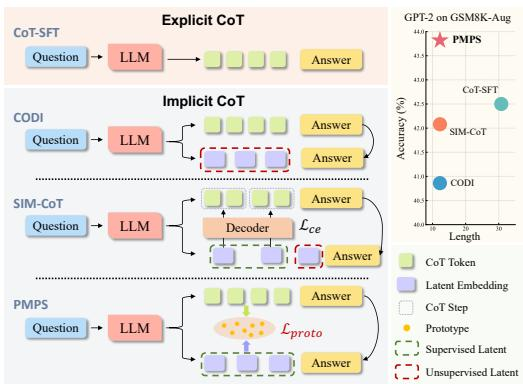
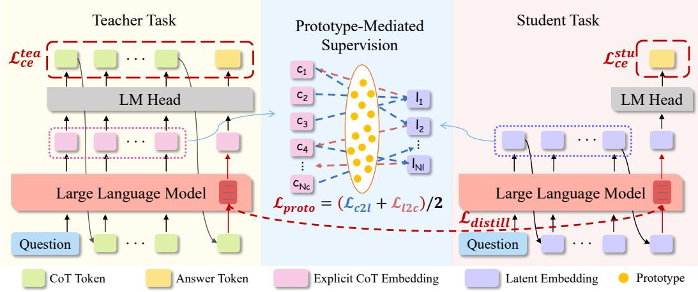
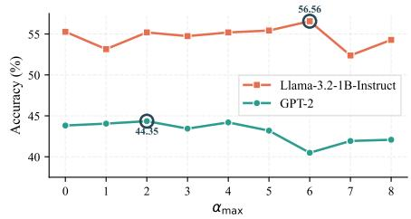
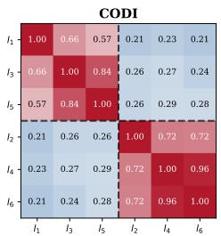
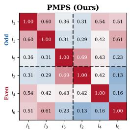
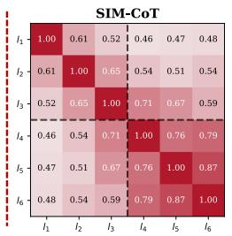
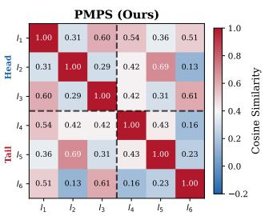
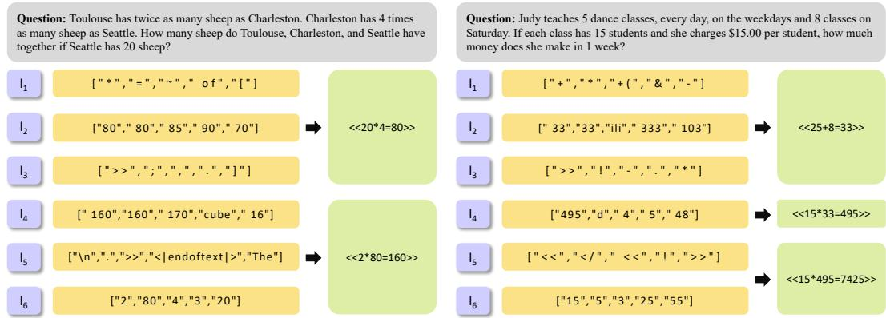
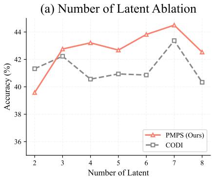
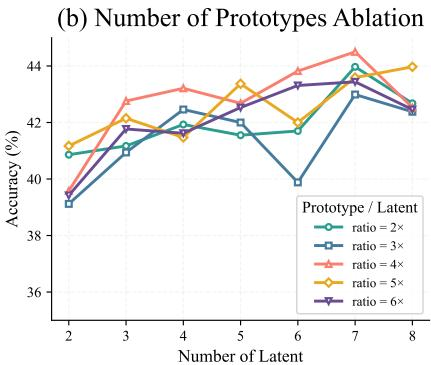

# STRUCTURAL PROCESS SUPERVISION FOR LATENT CHAIN-OF-THOUGHT REASONING

Yiqi Li1 Xu Chen2∗ Chen Ju2 Jiangchao Yao2 Zhaoyang Li2 Jinsong Lan2 Xiaoyong Zhu2 Bo Zheng2 Yu Wang1∗

1Shanghai Jiao Tong University 2Taobao & Tmall Group {17-adamant, yuwangsjtu}@sjtu.edu.cn {huaisong.cx}@taobao.com

## ABSTRACT

Latent reasoning approaches enhance token-level efficiency and robustness by replacing verbose, explicit chain-of-thought (CoT) tokens with compact continuousspace embeddings. However, existing methods lack direct process supervision over these latent embeddings, which often leads to representation collapse and uneven information distribution. To address this, we propose Prototype-Mediated Process Supervision (PMPS), which introduces learnable reasoning prototypes as semantic anchors to provide structural process-level supervision for latent reasoning. PMPS projects latent embeddings and explicit CoT embeddings into a shared prototype space, achieving many-to-many soft alignment between unequal-length representations through prototype assignment. Meanwhile, we introduce a Progressive Sequential Alignment (PSA) module to further guide training: positional priors initially encourage sequential alignment structure, then gradually relax to permit adaptive matching. Experimental results show that PMPS compresses output token length to under 50% of explicit CoT on GSM8K-Aug. Compared to leading baseline SIM-CoT, our method achieves average accuracy gains of 2.08% across different model families. On GPT-2, PMPS even surpasses CoT-SFT. On larger models and a more challenging task, PMPS consistently attains the highest accuracy among all latent reasoning methods with comparable output length.

## 1 INTRODUCTION

To overcome the limitat Large Language Models (LLMs) have demonstrated remarkable reasoning capabilities on complex tasks such as mathematical reasoning and logical inference (Achiam et al., 2023; Grattafiori et al., 2024; Comanici et al., 2025; Yang et al., 2025; Liu et al., 2025; Zeng et al., 2026), particularly when employing Chain-of-Thought (CoT) prompting techniques (Wei et al., 2022). However, explicit CoT reasoning suffers from multiple limitations, including low inference efficiency and constrained expressiveness (Chen et al., 2025; Li et al., 2025b; Zhu et al., 2025), motivating researchers to explore more efficient and flexible reasoning paradigms. ions of explicit CoT, researchers have proposed latent reasoning methods that perform reasoning in latent space rather than language space (Li

  
Figure 1: Comparison of different CoT methods. Our proposed PMPS provides process supervision over all latent embeddings.

et al., 2025a; Zhang et al., 2025; Tan et al., 2025). Compared to explicit CoT, latent reasoning offers three advantages: (1) Efficiency: Replacing verbose CoT tokens with compact hidden states substantially reduces inference cost. (2) Expressiveness: Continuous high-dimensional representations transcend the discrete token bottleneck, encoding richer semantic information that natural language cannot faithfully capture(Deng et al., 2024; Hao et al., 2024; Deng et al., 2026). (3) Controllability: The reasoning length and implicit CoT are controllable by pre-setting the number of latent tokens. Despite these advantages, existing latent reasoning approaches still suffer from critical limitations. As shown in Figure 1, CODI (Shen et al., 2025) optimizes latent embeddings solely via the final answer, which leaves intermediate reasoning unguided and often causes representation collapse. SIM-CoT (Wei et al., 2025) mitigates this collapse via an auxiliary decoder to establish a one-to-one alignment between fixed-number latent embeddings and variable-length CoT steps. This design, which introduces a decoder of identical architecture to the base model, not only increases training overhead but also induces information bottlenecks, as excessive reasoning steps are compressed while surplus embeddings remain unsupervised. Empirical experiment (Figure 3) reveals two prevalent representation collapse in existing methods: odd-even collapse, where embeddings at odd and even positions collapse into two alternating groups; and tail collapse, where the last few embeddings become nearly identical.

To address the above limitations, we propose Prototype-Mediated Process Supervision (PMPS), a novel framework that provides structural process supervision for latent reasoning. We introduce learnable reasoning prototypes as semantic anchors and project both latent and explicit CoT embeddings into a unified prototype space, imposing structured semantic organization on the latent representations. Through Sinkhorn-Knopp-based (Cuturi, 2013) soft assignments, we establish many-to-many alignment between latent and CoT representations, and formulate a bidirectional cross-prediction loss that compels each latent embedding to capture differentiated reasoning semantics. Furthermore, we introduce a Progressive Sequential Alignment (PSA) module that applies a Gaussian positional prior to impose sequential structure on the matching, then gradually relaxes it via cosine annealing to allow adaptive alignment. Importantly, all components are used only during training, incurring negligible training overhead and zero inference cost.

Extensive experiments demonstrate the effectiveness of PMPS. On GSM8K-Aug, PMPS reduces the reasoning length by over 50% relative to explicit CoT on GPT-2 while improving accuracy by 3.96%, and it surpasses the CODI and SIM-CoT baselines by 4.33% and 2.86%, respectively. PMPS consistently achieves superior accuracy over all latent reasoning baselines across different model families, scales, and the more challenging task. In summary, our main contributions can be summarized as follows:

• We propose PMPS, the first framework to introduce structural process-level supervision for latent reasoning. PMPS establishes a soft alignment between latent and explicit CoT embeddings via a prototype-based bidirectional cross-prediction objective, effectively mitigating representation collapse.

• To exploit the sequential structure of reasoning, we introduce PSA, which employs a Gaussian positional prior with cosine annealing to guide early sequential alignment and gradually relaxes the constraint, enabling adaptive matching while balancing structural bias and flexibility.

• Extensive experiments across diverse benchmarks and model scales demonstrate that PMPS consistently outperforms leading latent reasoning baselines while preserving the inference efficiency, confirming both strong effectiveness and broad generalizability.

## 2 RELATED WORK

## 2.1 LATENT REASONING IN LLMS

Chain-of-thought (CoT) prompting (Wei et al., 2022) improves LLM reasoning, but the inference cost increases substantially with verbose reasoning length, motivating reasoning in continuous hidden-state space. iCoT (Deng et al., 2024) and Coconut (Hao et al., 2024) progressively replace explicit CoT tokens with latent embeddings via curriculum learning. CODI (Shen et al., 2025) stabilizes training through teacher–student distillation at the answer position. SIM-CoT (Wei et al., 2025) enforces rigid one-to-one assignment between CoT steps and latent embeddings with an aux iliary decoder. CoLaR (Tan et al., 2025) and Latent-SFT (Deng et al., 2026) compress a contiguous sequence of CoT tokens into a single latent embedding. However, these methods either lack direct reasoning supervision or enforce an overly rigid correspondence between the CoT and latent embeddings, which limits the expressiveness of latent representations. We propose PMPS to address these limitations via th structural prototype-mediated soft alignment, requiring no auxiliary decoder and no hard CoTpartition.

  
Figure 2: Overview of PMPS framework. During training, PMPS adopts the conventional parallel teacher-student architecture and leverages the explicit CoT embeddings from the teacher task to supervise the latent embeddings from the student task via a bidirectional cross-prediction loss in the prototype space. At inference, only the student task is executed, performing latent reasoning without any additional overhead.

## 2.2 PROCESS SUPERVISION AND PROTOTYPE-BASED REPRESENTATION LEARNING

Process Reward Models (Lightman et al., 2024) show that step-level correctness labels yield better reasoning verifiers than outcome-only rewards, with follow-up work automating such supervision via Monte Carlo tree search (Wang et al., 2024). However, existing process supervision methods require explicit, discrete reasoning steps, which are incompatible with continuous latent embeddings. In parallel, SwAV (Caron et al., 2020) and PCL (Li et al., 2020), originally from visual self-supervised learning, show that learnable prototypes can effectively structure embedding spaces without negative pairs. Knowledge distillation approaches (Sun et al., 2019; Wang et al., 2020) align teacher–student representations but typically assume matched sequence lengths. Our work bridges these by leveraging prototypes to provide many-to-many structural process-level supervision across an unequal number of latent embeddings and CoT embeddings, complemented by answer-position distillation from the teacher to ensure outcome-level alignment.

## 3 METHODOLOGY

In this section, we present the technical details of our proposed framework. We first review the conventional self-distillation framework. We then introduce PMPS, which provides structural processlevel supervision for latent embeddings. Finally, we describe the PSA module, which imposes a curriculum-scheduled positional prior to guide sequential alignment structure during training. The overview of our framework is presented in Figure 2.

## 3.1 PRELIMINARIES

To obtain high-quality explicit Chain-of-Thought (CoT) embeddings that align with the model’s intrinsic distribution as supervision signals, we adopt the widely used self-distillation framework (Zhang et al., 2019; Liao et al., 2023; Liu et al., 2026) as the foundational architecture. Within this framework, the model is jointly optimized for two tasks: a teacher task that performs explicit CoT reasoning, and a student task that executes the target latent reasoning paradigm. Inspired by CODI (Shen et al., 2025), we align the hidden states of teacher and student task at the answer token positions. The objective function for this base architecture is formulated as:

$$
\mathcal { L } _ { \mathrm { b a s e } } = \mathcal { L } _ { c e } ^ { s t u } + \mathcal { L } _ { c e } ^ { t e a } + \mathcal { L } _ { d i s t }\tag{1}
$$

where $\mathcal { L } _ { c e } ^ { s t u }$ and $\mathcal { L } _ { c e } ^ { t e a }$ are cross-entropy losses for the student’s answer prediction and the teacher’s full-sequence prediction, and $\mathcal { L } _ { d i s t }$ is a Smooth L1 loss aligning teacher and student hidden states at the answer token. However, relying solely on this base architecture lacks process-level supervision for the latent embeddings, which can lead to latent homogenization and representation collapse.

## 3.2 PROTOTYPE-MEDIATED PROCESS SUPERVISION

To mitigate the representation collapse induced by the absence of process supervision, we propose to leverage the CoT embeddings from the teacher task as supervision signals. These explicit CoT embeddings are well-suited targets for two reasons: (1) the $\mathcal { L } _ { c e . } ^ { \bar { t } e a }$ loss ensures that they encode high quality, semantically meaningful reasoning information, and (2) since both the explicit CoT embeddings and latent embeddings are generated by the same model, they are inherently co-distributed, facilitating more effective knowledge transfer.

However, direct one-to-one distillation is infeasible because the number of latent embeddings $N _ { l }$ is far smaller than the number of CoT tokens $N _ { c }$ . We therefore propose Prototype-Mediated Process Supervision (PMPS), which introduces K learnable prototype vectors $\mathbf { P } = \{ \mathbf { \bar { p } } _ { 1 } , \dots , \mathbf { p } _ { K } \} \in \mathbb { R } ^ { K \times d }$ as shared semantic anchors to mediate a soft many-to-many alignment between the two sets of representations, imposing structured semantic organization on the latent space. Let $\mathbf { H } _ { l } = \{ \boldsymbol { 1 } _ { 1 } , \dots , \boldsymbol { 1 } _ { N _ { l } } \} \in$ $\mathbb { R } ^ { N _ { l } \times D }$ and $\dot { \mathbf { H } _ { c } } = \left\{ \mathbf { c } _ { 1 } , \hdots , \mathbf { c } _ { N _ { c } } \right\} \in \mathbb { R } ^ { N _ { c } \times \tilde { D } }$ denote the latent embeddings and the explicit CoT embeddings, respectively, where $D$ is the hidden dimension and d is the prototype dimension.

Projection and Scoring. A shared two-layer MLP with batch normalization serves as the projection head $g ( \cdot )$ , projecting both $\mathbf { H } _ { l }$ and $\mathbf { H } _ { c }$ from the original hidden space into the prototype space, followed by $\ell _ { 2 }$ normalization:

$$
\mathbf { z } = g ( \mathbf { h } ) / \lVert g ( \mathbf { h } ) \rVert _ { 2 }\tag{2}
$$

where h denotes either the latent embedding or the explicit CoT embedding. Each unit feature vector z is scored against the ℓ -normalized prototypes via inner product $s _ { k } = \mathbf { z } ^ { \prime } \mathbf { p } _ { k }$ , yielding score matrices $\mathbf { S } _ { l } \in \mathbb { R } ^ { N _ { l } \times K }$ and $\mathbf { S } _ { c } \bar { \in } \mathbb { R } ^ { N _ { c } \times K }$

Prototype Assignment. To obtain soft assignments while preventing prototype collapse, we apply the Sinkhorn-Knopp algorithm (Cuturi, 2013) to enforce an equipartition constraint. Given a score matrix $\mathbf { S } \in \mathbb { R } ^ { M \times K }$ , where M denotes the number of tokens, we initialize ${ \bf Q } ^ { ( 0 ) } \propto \exp ( { \bf S } / \epsilon )$ , with ϵ serving as the regularization parameter. We then iteratively alternate row and column normalization:

$$
\mathbf { Q } ^ { ( t ) } \gets \mathrm { N o r m } _ { \mathrm { r o w } } \Big ( \mathrm { N o r m } _ { \mathrm { c o l } } \Big ( \mathbf { Q } ^ { ( t - 1 ) } \Big ) \Big )\tag{3}
$$

The converged $\mathbf { Q } \in \mathbb { R } ^ { M \times K }$ satisfies that each row sums to 1 (a valid per-token distribution) and each column sums to $M / K$ (uniform prototype utilization). This procedure is applied independently to both $\mathbf { S } _ { l }$ and $\mathbf { S } _ { c }$ with stop-gradient operation following SwAV (Caron et al., 2020), producing the final soft assignment codes $\breve { \mathbf { Q } } _ { l } \in \mathbb { R } ^ { N _ { l } \times K }$ and $\mathbf { Q } _ { c } \in \mathbb { R } ^ { N _ { c } \times K }$

Many-to-Many Matching. Leveraging the prototype assignments as a bridge, we compute the soft matching matrix between latent embeddings and explicit CoT embeddings:

$$
\mathbf { M } _ { c 2 l } = \mathbf { Q } _ { c } \cdot \mathbf { Q } _ { l } ^ { \top } / \tau _ { m } \in \mathbb { R } ^ { N _ { c } \times N _ { l } }\tag{4}
$$

where temperature $\tau _ { m }$ controls matching sharpness. We then apply softmax normalization along the last dimensions to obtain bidirectional matching weights:

$$
\mathbf { A } _ { c 2 l } = \mathrm { s o f t m a x } ( \mathbf { M } _ { c 2 l } ) , \quad \mathbf { A } _ { l 2 c } = \mathrm { s o f t m a x } ( \mathbf { M } _ { c 2 l } ^ { \top } )\tag{5}
$$

This formulation naturally induces a many-to-many alignment: a single latent embedding can attend to multiple explicit CoT embeddings for compression, while a single explicit CoT embedding can contribute to multiple latent embeddings for semantic sharing.

Bidirectional Cross-Prediction Loss. Alongside the stop-gradient assignment codes $\mathbf { Q } ,$ we compute gradient-carrying prototype predictions $\bar { \phi } _ { l } = \mathrm { s o f t m a x } ( \mathbf { \bar { S } } _ { l } / \tau )$ and $\phi _ { c } = \mathrm { s o f t m a x } ( \mathbf { S } _ { c } / \tau )$ , where τ is a prediction temperature. For each explicit CoT embedding j, we aggregate the matched latent predictions weighted by $\mathbf { A } _ { c 2 l }$ and minimize the cross-entropy with its assignment code:

$$
\mathcal { L } _ { c 2 l } = - \frac { 1 } { N _ { c } } \sum _ { j = 1 } ^ { N _ { c } } \sum _ { k = 1 } ^ { K } Q _ { c } ^ { ( j , k ) } \log \left( \sum _ { i = 1 } ^ { N _ { l } } A _ { c 2 l } ^ { ( j , i ) } \cdot \phi _ { l , i } ^ { ( k ) } \right)\tag{6}
$$

where $Q _ { c } ^ { ( j , k ) }$ is the $( j , k )$ -th entry of $\mathbf { Q } _ { c } , A _ { c 2 l } ^ { ( j , i ) }$ is the matching weight from the j-th explicit CoT embedding to the i-th latent embedding, and $\phi _ { l , i } ^ { ( k ) }$ is the predicted probability of the i-th latent embedding for the k-th prototype. Symmetrically, the latent-to-CoT direction yields:

$$
\mathcal { L } _ { l 2 c } = - \frac { 1 } { N _ { l } } \sum _ { i = 1 } ^ { N _ { l } } \sum _ { k = 1 } ^ { K } Q _ { l } ^ { ( i , k ) } \log \left( \sum _ { j = 1 } ^ { N _ { c } } A _ { l 2 c } ^ { ( i , j ) } \cdot \phi _ { c , j } ^ { ( k ) } \right)\tag{7}
$$

The overall process supervision loss is $\begin{array} { r } { \mathcal { L } _ { p r o t o } = \frac { 1 } { 2 } ( \mathcal { L } _ { c 2 l } + \mathcal { L } _ { l 2 c } ) } \end{array}$ . The CoT-to-latent direction $( \mathcal { L } _ { c 2 l } )$ ensures that the latent embeddings collectively explain each explicit CoT embedding, while the latent-to-CoT direction $( \mathcal { L } _ { l 2 c } )$ encourages each latent embedding to capture diverse CoT semantics.

## 3.3 PROGRESSIVE SEQUENTIAL ALIGNMENT

Explicit CoT inherently follows a progressive process: early tokens build up the reasoning chain, while final tokens converge toward the answer. However, the unconstrained matching in the base PMPS allows any latent token to align with any CoT position, which risks failing to capture the progressive reasoning structure. Conversely, enforcing a rigid segmented mapping (e.g., uniformly partitioning the CoT into $N _ { l }$ segments for strict assignment) is overly restrictive: uniform partitioning introduces noisy supervision that undermines the flexibility of semantic-driven matching. To navigate between these two extremes, we introduce Progressive Sequential Alignment (PSA), which injects sequential structure into the matching through a soft Gaussian positional prior and gradually relaxes it via curriculum-scheduled decay.

Concretely, we augment $\mathbf { M } _ { c 2 l }$ with a bias penalizing positionally distant matches:

$$
\hat { M } _ { c 2 l } ^ { ( j , i ) } = M _ { c 2 l } ^ { ( j , i ) } - \alpha \cdot \left( \frac { j } { N _ { c } - 1 } - \frac { i } { N _ { l } - 1 } \right) ^ { 2 }\tag{8}
$$

where $j / ( N _ { c } { - } 1 )$ and $i / ( N _ { l } - 1 )$ are normalized positions in $[ 0 , 1 ]$ , and $\alpha \geq 0$ controls the enforcement strength.

To balance structural guidance with representational flexibility, we adopt cosine annealing to decay α from $\alpha _ { \mathrm { m a x } }$ to 0 over training:

$$
\alpha ( t ) = \frac { \alpha _ { \mathrm { m a x } } } { 2 } \left( 1 + \cos \left( \pi \cdot \frac { t } { T } \right) \right)\tag{9}
$$

where t and T are the current and total training steps. Early in training (α large), the strong prior helps latent embeddings establish sequential structure and stabilizes matching. Late in training $( \alpha  0 )$ , the constraint is fully released, allowing adaptive alignment where reasoning steps may span or consolidate across latent tokens. PSA modifies only the matching scores before softmax, introducing no learnable parameters and incurring zero inference overhead.

## 3.4 OVERALL TRAINING OBJECTIVE

The overall training objective combines the base loss with our proposed process supervision loss:

$$
\mathcal { L } _ { t o t a l } = \mathcal { L } _ { b a s e } + \lambda _ { p r o t o } \cdot \mathcal { L } _ { p r o t o }\tag{10}
$$

where $\lambda _ { p r o t o }$ is the weighting coefficient for the process supervision loss.

The teacher task, prototype layer, projection head, and PSA module are used exclusively during training. At inference time, the model architecture and computational cost are identical to the single student task. This design ensures that all accuracy improvements from process supervision come at zero additional inference cost.

## 4 EXPERIMENTS

## 4.1 EXPERIMENTAL SETUP

Training and Evaluation Data. Following prior work on latent reasoning (Shen et al., 2025; Wei et al., 2025), we primarily train and evaluate on GSM8K-Aug (Deng et al., 2023), an augmented version of the GSM8K (Cobbe et al., 2021) where CoT annotations are structured arithmetic expressions rather than natural language. To assess the generalization ability of our method, we additionally evaluate on three out-of-domain (OOD) benchmarks: (1) GSM-Hard (Gao et al., 2023), (2) SVAMP (Patel et al., 2021), (3) MultiArith (Roy & Roth, 2015). Detailed information is provided in Appendix A.1. We adopt two evaluation metrics: Accuracy (Acc.) measures the correctness of the final numerical answer, and Length (Len.) measures the total number of generated tokens.

Table 1: Performance comparison on in-domain dataset and out-of-domain datasets. Experiments are conducted on three different backbones, reporting answer accuracy (Acc.) and output token length (Len.). Explicit CoT method is marked with . The best and second best accuracy among latent reasoning approaches are highlighted in bold and underline, respectively.
<table><tr><td rowspan="3">Method</td><td colspan="2">In-domain</td><td colspan="5">Out-of-domain</td><td rowspan="2" colspan="2">Average</td></tr><tr><td colspan="2">GSM8K-Aug</td><td>GSM-Hard</td><td>SVAMP</td><td>MultiArith</td><td colspan="2">Average</td></tr><tr><td>Acc. (%)</td><td>Len.</td><td>Acc. (%)</td><td>Acc. (%)</td><td>Acc. (%)</td><td>Acc. (%)</td><td>Len.</td><td>Acc. (%)</td><td>Len.</td></tr><tr><td colspan="10">GPT-2</td></tr><tr><td>CoT-SFT</td><td>42.50</td><td>30.76</td><td>9.25</td><td>40.00</td><td>92.22</td><td>47.16</td><td>25.08</td><td>45.99</td><td>26.50</td></tr><tr><td>Coconut</td><td>36.50</td><td>15.40</td><td>7.58</td><td>34.67</td><td>82.20</td><td>41.48</td><td>11.87</td><td>40.24</td><td>12.75</td></tr><tr><td>CoLaR-2</td><td>11.07</td><td>14.43</td><td>2.58</td><td>15.00</td><td>41.11</td><td>19.56</td><td>10.89</td><td>17.44</td><td>11.78</td></tr><tr><td>CODI</td><td>40.86</td><td>12.23</td><td>9.40</td><td>40.00</td><td>92.22</td><td>47.21</td><td>12.89</td><td>45.62</td><td>12.72</td></tr><tr><td>SIM-CoT</td><td>42.08</td><td>12.24</td><td>9.40</td><td>43.00</td><td>93.89</td><td>48.76</td><td>12.58</td><td>47.09</td><td>12.49</td></tr><tr><td>PMPS(Ours)</td><td>44.35</td><td>12.24</td><td>10.46</td><td>48.33</td><td>96.67</td><td>51.82</td><td>12.58</td><td>49.95(+2.86)</td><td>12.49</td></tr><tr><td colspan="10">Qwen2.5-0.5B-Instruct</td></tr><tr><td>CoT-SFT</td><td>59.82</td><td>42.68</td><td>16.91</td><td>61.67</td><td>97.78</td><td>58.79</td><td>38.91</td><td>59.05</td><td>39.85</td></tr><tr><td>Coconut</td><td>15.69</td><td>12.53</td><td>3.26</td><td>26.33</td><td>22.78</td><td>17.46</td><td>13.01</td><td>17.02</td><td>12.89</td></tr><tr><td>CoLaR-2</td><td>29.57</td><td>17.92</td><td>6.44</td><td>37.00</td><td>77.78</td><td>40.41</td><td>16.04</td><td>37.70</td><td>16.51</td></tr><tr><td>Latent-SFT</td><td>43.21</td><td>13.09</td><td>9.86</td><td>50.66</td><td>91.67</td><td>50.73</td><td>15.60</td><td>48.85</td><td>14.97</td></tr><tr><td>CODI</td><td>39.35</td><td>14.43</td><td>9.33</td><td>48.33</td><td>83.89</td><td>47.18</td><td>15.03</td><td>45.23</td><td>14.88</td></tr><tr><td>SIM-CoT</td><td>42.08</td><td>14.45</td><td>10.16</td><td>51.67</td><td>92.22</td><td>51.35</td><td>15.03</td><td>49.03</td><td>14.91</td></tr><tr><td>PMPS(Ours)</td><td>45.03</td><td>14.43</td><td>10.69</td><td>54.00</td><td>95.00</td><td>53.23</td><td>15.09</td><td>51.18(+2.15)</td><td>14.93</td></tr><tr><td colspan="10">Llama-3.2-1B-Instruct</td></tr><tr><td>CoT-SFT</td><td>63.00</td><td>32.51</td><td>15.09</td><td>66.33</td><td>98.33</td><td>59.92</td><td>27.07</td><td>60.69</td><td>28.43</td></tr><tr><td>Coconut</td><td>40.03</td><td>16.44</td><td>8.42</td><td>47.33</td><td>83.89</td><td>46.55</td><td>13.80</td><td>44.92</td><td>14.46</td></tr><tr><td>CoLaR-2</td><td>42.15</td><td>12.70</td><td>8.95</td><td>55.33</td><td>91.67</td><td>51.98</td><td>13.41</td><td>49.53</td><td>13.24</td></tr><tr><td>Latent-SFT</td><td>48.82</td><td>12.83</td><td>10.54</td><td>50.33</td><td>90.56</td><td>50.48</td><td>9.65</td><td>50.06</td><td>10.44</td></tr><tr><td>CODI</td><td>53.90</td><td>13.21</td><td>12.28</td><td>56.00</td><td>97.78</td><td>55.35</td><td>11.46</td><td>54.99</td><td>11.90</td></tr><tr><td>SIM-CoT</td><td>56.03</td><td>13.20</td><td>12.36</td><td>60.33</td><td>97.22</td><td>56.64</td><td>13.47</td><td>56.49</td><td>13.41</td></tr><tr><td>PMPS(Ours)</td><td>56.56</td><td>13.19</td><td>13.42</td><td>63.67</td><td>97.22</td><td>58.10</td><td>13.51</td><td>57.72(+1.23)</td><td>13.43</td></tr></table>

Baselines. We compare our approach against six representative baselines across the following four categories: (1) Explicit CoT methods: CoT-SFT; (2) Curriculum learning-based methods: Coconut (Hao et al., 2024); (3) Token compression-based methods: CoLaR-2 (Tan et al., 2025) and Latent-SFT (Deng et al., 2026); (4) Self-distillation-based methods: CODI (Shen et al., 2025) and SIM-CoT (Wei et al., 2025). Notably, the latter three categories constitute latent reasoning methods. Detailed descriptions of all baselines are provided in Appendix A.2.

Implementation Details. We conduct experiments on three model families: GPT-2 (Radford et al., 2019), Qwen2.5-0.5B-Instruct (Yang et al., 2024), and LLaMA-3.2-1B-Instruct (Grattafiori et al., 2024). For a fair comparison, all methods except Coconut adopt LoRA (Hu et al., 2022) fine-tuning with the same rank of 128; Coconut uses full-parameter fine-tuning as in its original implementation. For SIM-CoT, we adopt the CODI-based variant for a direct comparison under the same backbone. All other training hyperparameters follow the respective original papers and formal repositories. For PMPS, we set Nl = 6 for GPT-2 and Qwen2.5-0.5B-Instruct, and Nl = 8 for LLaMA-3.2-1B-Instruct. More detailed configurations are provided in Appendix B.

## 4.2 MAIN RESULT

Table 1 presents the main results on one in-domain benchmark (GSM8K-Aug) and three out-ofdomain benchmarks (GSM-Hard, SVAMP, MultiArith), with three backbone models from different model families: GPT-2, Qwen2.5-0.5B-Instruct, and LLaMA-3.2-1B-Instruct.

Table 2: Scalability to a larger backbone model. We report answer accuracy (Acc.) and output token length (Len.) on the four aforementioned benchmarks using LLaMA-3.2-3B-Instruct. Explicit CoT method is marked with The best and second best accuracy among latent reasoning approaches are highlighted in bold and underline, respectively.
<table><tr><td rowspan="3">Method</td><td colspan="2">In-domain</td><td colspan="5">Out-of-domain</td><td rowspan="2" colspan="2">Average</td></tr><tr><td colspan="2">GSM8K-Aug</td><td>GSM-Hard</td><td>SVAMP</td><td>MultiArith</td><td colspan="2">Average</td></tr><tr><td>Acc. (%)</td><td>Len.</td><td>Acc. (%)</td><td>Acc. (%)</td><td>Acc. (%)</td><td>Acc. (%)</td><td>Len.</td><td>Acc. (%)</td><td>Len.</td></tr><tr><td>CoT-SFT</td><td>71.27</td><td>32.95</td><td>20.52</td><td>78.00</td><td>100.00</td><td>66.17</td><td>27.89</td><td>67.45</td><td>29.15</td></tr><tr><td>Coconut</td><td>11.98</td><td>12.25</td><td>2.35</td><td>14.67</td><td>13.33</td><td>10.12</td><td>12.23</td><td>10.58</td><td>12.24</td></tr><tr><td>CoLaR-2</td><td>57.39</td><td>12.89</td><td>13.87</td><td>69.00</td><td>96.67</td><td>59.85</td><td>9.88</td><td>59.23</td><td>10.63</td></tr><tr><td>CODI</td><td>54.28</td><td>13.20</td><td>12.96</td><td>67.00</td><td>100.00</td><td>59.99</td><td>13.48</td><td>58.56</td><td>13.41</td></tr><tr><td>SIM-CoT</td><td>61.41</td><td>13.19</td><td>14.03</td><td>71.67</td><td>97.22</td><td>60.97</td><td>13.53</td><td>61.08</td><td>13.45</td></tr><tr><td>PMPS(Ours)</td><td>63.46</td><td>13.17</td><td>14.40</td><td>71.33</td><td>100.00</td><td>61.91</td><td>13.48</td><td>62.30(+1.22)</td><td>13.40</td></tr></table>

Table 3: Scalability to more challenging task. We conduct experiments on MATH using LLaMA-3.2-3B-Instruct and Qwen3-4B-Instruct. The best accuracy among latent approaches is highlighted in bold.
<table><tr><td>Method</td><td colspan="2">Llama-3.2-3B Acc. (%) Len.</td><td colspan="2">Qwen3-4B Acc. (%)</td></tr><tr><td>COT-SFT</td><td>21.00</td><td>119.69</td><td>38.60</td><td>Len. 132.26</td></tr><tr><td>CoLaR-2</td><td>6.20</td><td>54.27</td><td>18.40</td><td>54.30</td></tr><tr><td>CODI</td><td>8.80</td><td>14.85</td><td>17.60</td><td>17.61</td></tr><tr><td>PMPS(Ours)</td><td>11.00</td><td>14.95</td><td>19.60</td><td>17.60</td></tr><tr><td></td><td></td><td></td><td></td><td></td></tr></table>

  
Table 4: Ablation Study on PSA maximum enforcement strength. The best configurations are marked with circles.

Overall performance. On GPT-2, PMPS outperforms the two leading latent reasoning baselines, CODI and SIM-CoT, by 3.49% and 2.27% on GSM8K-Aug, and by 4.33% and 2.86% in average accuracy. Remarkably, PMPS even exceeds the explicit reasoning upper bound CoT-SFT by 3.96% in average accuracy while using only 47.1% of the output tokens, demonstrating that latent reasoning with effective process supervision can surpass explicit CoT at significantly higher inference efficiency. On Qwen2.5-0.5B-Instruct and LLaMA-3.2-1B-Instruct, PMPS consistently outperforms all latent reasoning baselines. These performance gains across diverse model architectures and scales confirm the effectiveness of our proposed structural process supervision method.

Out-of-domain (OOD) generalization. The OOD results show that PMPS generalizes robustly to unseen benchmarks: PMPS achieves an average accuracy of 51.82%, 53.23%, and 58.10% across three backbone models, surpassing the strongest latent baseline SIM-CoT by 3.06%, 1.88%, and 1.46%. The superior performance on OOD benchmarks confirms that our proposed PMPS helps internalize genuine arithmetic reasoning rather than shallow pattern matching.

Inference efficiency. Compared to explicit CoT-SFT, PMPS reduces the output token length to under 50% across all three models (47.1%, 37.5% and 47.2%, respectively) while achieving comparable or superior accuracy. Critically, PMPS maintains output token length comparable to CODI and SIM-CoT, verifying that the accuracy improvements stem entirely from superior training-time structural process supervision rather than increased inference computation. Moreover, this structural supervision is lightweight: the projection head and prototypes only introduce less than 2M extra parameters (< 1% of the base model), whereas SIM-CoT’s auxiliary decoder effectively doubles the trainable parameters during training.

## 4.3 SCALING TO LARGER MODELS AND HARDER TASK

To further validate the scalability of PMPS, we conduct two additional groups of experiments: scaling to a larger backbone model and training on a more challenging dataset.

Larger model. As shown in Table 2, we scale up the backbone model to LLaMA-3.2-3B-Instruct (Grattafiori et al., 2024) and evaluate performance across the aforementioned benchmarks. PMPS achieves the highest average accuracy among all latent reasoning baselines, outperforming CODI and SIM-CoT by +3.74% and +1.22%, respectively, while maintaining comparable output length. Notably, PMPS demonstrates marked improvements over CODI on the in-domain GSM8K-Aug benchmark (+9.18%) and reduces the generation token length by over 54% relative to explicit CoT method. These results confirm that the structural prototype-based alignment in PMPS remains highly effective as the model capacity scales up.

  
(a) Latent Similarity of CODI and PMPS

(b) Latent Similarity of SIM-CoT and PMPS  
  
Figure 3: Average pairwise latent cosine similarity heatmaps. The latent embeddings of CODI and SIM-CoT exhibit pronounced odd-even and tail collapse, respectively, whereas PMPS shows neither pattern of collapse.

More challenging task. As presented in Table 3, we conduct training and evaluation on MATH, which consists of highly challenging competition-level problems with substantially longer reasoning chains. We employ two larger backbone models: LLaMA-3.2-3B-Instruct and Qwen3-4B-Instruct (Yang et al., 2025). On both evaluated models, PMPS consistently outperforms leading latent reasoning baselines, with average accuracy gains of 2.1% over CODI. Moreover, it compresses the output token length to just 13% of CoT-SFT, resulting in significant inference acceleration. Notably, the CoT annotations in MATH are formulated as free-form solutions without explicit step delimiters, which precludes the application of methods relying on strict one-to-one latent-to-step alignment (e.g., Coconut, SIM-CoT). In contrast, PMPS operates via soft prototype matching and remains agnostic to specific formatting, enabling its direct application to any CoT data.

## 4.4 LATENT EMBEDDING ANALYSIS

To further investigate the reasons behind PMPS’s superior performance, we directly analyze the pairwise cosine similarity among the $N _ { l } { = } 6$ latent embeddings on randomly sampled 100 GSM8K-Aug test instances using GPT-2. The analysis reveals that CODI and SIM-CoT suffer from distinct patterns of representation collapse, whereas PMPS maintains well-diversified representations free from either collapse mode. Additionally, we conduct the latent embedding interpretability experiments, which are provided in Appendix C.

PMPS resolves the odd-even collapse in CODI. Figure 3 (a) presents the average pairwise cosine similarity matrices for CODI (left) and PMPS (right), where tokens are grouped into oddindexed $( l _ { 1 } , l _ { 3 } , l _ { 5 } )$ and even-indexed $( l _ { 2 } , l _ { 4 } , l _ { 6 } )$ subsets. For CODI, two homogeneous diagonal blocks emerge: within-odd similarity averages 0.693, within-even reaches 0.800, yet cross-group similarity drops to 0.250. This pattern persists across all 100 samples. This phenomenon arises because CODI’s $\mathcal { L } _ { d i s t }$ constrains only the answer-position hidden state, leaving the latent embeddings unsupervised. The autoregressive mechanism then converges to a degenerate solution where each token diverges from its predecessor, forming two alternating representations. Our PMPS avoids this collapse through two complementary mechanisms: the Sinkhorn equipartition constraint assigns different latent tokens to distinct prototypes, and the bidirectional cross-prediction loss forces each token to encode unique CoT semantics. As shown in the right panel, PMPS exhibits no blockdiagonal separation between odd and even groups, confirming preserved representation diversity.

PMPS eliminates the tail collapse in SIM-CoT. Figure 3 (b) compares the average pairwise cosine similarity matrices of SIM-CoT (left) and PMPS (right). For SIM-CoT, similarity increases from head to tail, with the tail group $( l _ { 4 } , l _ { 5 } , l _ { 6 } )$ forming a prominent high-similarity block (average

0.805) that far exceeds the head group (average 0.591). This positive gap is observed in 85 % test samples, and the $l _ { 5 } { - } l _ { 6 }$ pair similarity reaches 0.868, indicating near-complete convergence. This stems from SIM-CoT’s rigid one-to-one matching, which binds each latent token to exactly one CoT step. In our training data, 99.0% of samples have fewer steps than $N _ { l } { = } 6$ , leaving the tail latent tokens without corresponding supervision and collapsing into redundant representations. PMPS resolves this through soft many-to-many matching under the equipartition constraint, enabling each latent token to flexibly aggregate CoT content regardless of position. As shown in the right panel, PMPS displays no tail-concentrated block, with the tail group similarity even lower than head group, demonstrating that all six latent tokens encode diverse information.

## 4.5 ABLATION STUDY

In this section, we conduct ablation studies to investigate the effects of different PMPS components, the maximum enforcement strength of PSA, and the number of latent embeddings and prototypes. Results on the number of latent embeddings and prototypes are provided in Appendix D.

Ablation on PMPS components. The results in Table 5 isolate the contribution of each component. Removing $\mathcal { L } _ { l 2 c }$ causes the largest degradation (−3.78% on Average), as it directly supervises the latent embeddings. Removing $\mathcal { L } _ { c 2 l }$ also leads to a notable drop (−2.05% on Average), as it regularizes the prototype space from the CoT side and improves the matching quality for $\mathcal { L } _ { l 2 c }$ The two losses play complementary

Table 5: Ablation Study on PMPS components using GPT-2. Different modules are removed to assess their contributions to the final performance.
<table><tr><td>Method</td><td>GSM8K-Aug Acc. (%)</td><td>OOD Average Acc. (%)</td><td>Average Acc. (%)</td></tr><tr><td>PMPS</td><td>44.35</td><td>51.82</td><td>49.95</td></tr><tr><td>- w/o  $\mathcal { L } _ { l 2 c }$ </td><td>39.42</td><td>48.42</td><td>46.17(-3.78)</td></tr><tr><td>- w/o Lc2l</td><td>42.23</td><td>49.79</td><td>47.90(-2.05)</td></tr><tr><td>- w/o PSA</td><td>43.82</td><td>50.98</td><td>49.19(-0.76)</td></tr><tr><td>- w/o prototype</td><td>41.70</td><td>48.04</td><td>46.46(-3.49)</td></tr></table>

roles: $\mathcal { L } _ { l 2 c }$ drives the latent embeddings to absorb CoT semantics, while $\mathcal { L } _ { c 2 l }$ provides a reciprocal signal that refines the shared prototype space. Removing PSA leads to a consistent decline (−0.76% on Average), validating that the curriculum-scheduled positional prior provides necessary sequential structure guidance that pure semantic matching alone cannot recover. Removing prototypes and leveraging direct cosine-similarity matching also yields a substantial drop(−3.49% on Average), confirming that the categorical structure imposed by prototypes, where alignment is mediated through shared clusters, is essential for establishing meaningful many-to-many correspondences between the latent and explicit CoT embeddings.

Ablation on maximum enforcement strength. Figure 4 studies the effect of $\alpha _ { \mathrm { m a x } }$ on GPT-2 and Llama-3.2-1B-Instruct. Both models benefit from a moderate $\alpha _ { \mathrm { { m a x } } } \mathrm { { . } }$ GPT-2 peaks at $\alpha _ { \mathrm { m a x } } = 2$ (44.35%), while Llama-3.2-1B achieves its best at $\alpha _ { \mathrm { m a x } } = 6 ( 5 6 . 5 6 \% )$ . Excessively strong enforcement hurts performance on both models, as overly rigid positional constraints disrupt the flexibility of semantic-driven matching. Notably, the optimal $\alpha _ { \mathrm { m a x } }$ scales with model capacity: GPT-2 (124M) favors a lighter prior, while Llama-3.2-1B (1B) benefits from stronger guidance, suggesting that larger models can better leverage structural priors before cosine annealing releases the constraint.

## 5 CONCLUSION

We propose PMPS, a novel training paradigm for latent reasoning that performs structural processlevel supervision on latent embeddings via soft alignment. Experimental results demonstrate that across diverse model families, model sizes, and task difficulties, our method consistently achieves SOTA performance among latent reasoning approaches while reducing the output token length by more than 50% compared to explicit CoT. These findings highlight the strong generalization, robustness, and scalability of our approach. Furthermore, we conduct an in-depth analysis from the latent representation perspective, offering insights into why PMPS consistently outperforms existing baselines. However, the current evaluation of PMPS is mainly limited to mathematical reasoning. Future work should further explore the effectiveness of PMPS on a broader range of reasoning tasks.

## REFERENCES

Josh Achiam, Steven Adler, Sandhini Agarwal, Lama Ahmad, Ilge Akkaya, Florencia Leoni Aleman, Diogo Almeida, Janko Altenschmidt, Sam Altman, Shyamal Anadkat, et al. Gpt-4 technical report. arXiv preprint arXiv:2303.08774, 2023.

Mathilde Caron, Ishan Misra, Julien Mairal, Priya Goyal, Piotr Bojanowski, and Armand Joulin. Unsupervised learning of visual features by contrasting cluster assignments. Advances in neural information processing systems, 33:9912–9924, 2020.

Xinghao Chen, Anhao Zhao, Heming Xia, Xuan Lu, Hanlin Wang, Yanjun Chen, Wei Zhang, Jian Wang, Wenjie Li, and Xiaoyu Shen. Reasoning beyond language: A comprehensive survey on latent chain-of-thought reasoning. arXiv preprint arXiv:2505.16782, 2025.

Karl Cobbe, Vineet Kosaraju, Mohammad Bavarian, Mark Chen, Heewoo Jun, Lukasz Kaiser, Matthias Plappert, Jerry Tworek, Jacob Hilton, Reiichiro Nakano, et al. Training verifiers to solve math word problems. arXiv preprint arXiv:2110.14168, 2021.

Gheorghe Comanici, Eric Bieber, Mike Schaekermann, Ice Pasupat, Noveen Sachdeva, Inderjit Dhillon, Marcel Blistein, Ori Ram, Dan Zhang, Evan Rosen, et al. Gemini 2.5: Pushing the frontier with advanced reasoning, multimodality, long context, and next generation agentic capabilities. arXiv preprint arXiv:2507.06261, 2025.

Marco Cuturi. Sinkhorn distances: Lightspeed computation of optimal transport. Advances in neural information processing systems, 26, 2013.

Jingcheng Deng, Liang Pang, Zihao Wei, Shicheng Xu, Zenghao Duan, Kun Xu, Yang Song, Huawei Shen, and Xueqi Cheng. Llm latent reasoning as chain of superposition, 2026. URL https: //arxiv.org/abs/2510.15522.

Yuntian Deng, Kiran Prasad, Roland Fernandez, Paul Smolensky, Vishrav Chaudhary, and Stuart Shieber. Implicit chain of thought reasoning via knowledge distillation. arXiv preprint arXiv:2311.01460, 2023.

Yuntian Deng, Yejin Choi, and Stuart Shieber. From explicit cot to implicit cot: Learning to internalize cot step by step, 2024. URL https://arxiv.org/abs/2405.14838.

Luyu Gao, Aman Madaan, Shuyan Zhou, Uri Alon, Pengfei Liu, Yiming Yang, Jamie Callan, and Graham Neubig. Pal: Program-aided language models. In International conference on machine learning, pp. 10764–10799. PMLR, 2023.

Aaron Grattafiori, Abhimanyu Dubey, Abhinav Jauhri, Abhinav Pandey, Abhishek Kadian, Ahmad Al-Dahle, Aiesha Letman, Akhil Mathur, Alan Schelten, Alex Vaughan, et al. The llama 3 herd of models. arXiv preprint arXiv:2407.21783, 2024.

Shibo Hao, Sainbayar Sukhbaatar, DiJia Su, Xian Li, Zhiting Hu, Jason Weston, and Yuandong Tian. Training large language models to reason in a continuous latent space. arXiv preprint arXiv:2412.06769, 2024.

Edward J Hu, Yelong Shen, Phillip Wallis, Zeyuan Allen-Zhu, Yuanzhi Li, Shean Wang, Liang Wang, Weizhu Chen, et al. Lora: Low-rank adaptation of large language models. Iclr, 1(2):3, 2022.

Bangzheng Li, Ximeng Sun, Jiang Liu, Ze Wang, Jialian Wu, Xiaodong Yu, Hao Chen, Emad Barsoum, Muhao Chen, and Zicheng Liu. Latent visual reasoning. arXiv preprint arXiv:2509.24251, 2025a.

Jindong Li, Yali Fu, Li Fan, Jiahong Liu, Yao Shu, Chengwei Qin, Menglin Yang, Irwin King, and Rex Ying. Implicit reasoning in large language models: A comprehensive survey. arXiv preprint arXiv:2509.02350, 2025b.

Junnan Li, Pan Zhou, Caiming Xiong, and Steven CH Hoi. Prototypical contrastive learning of unsupervised representations. arXiv preprint arXiv:2005.04966, 2020.

Yusheng Liao, Shuyang Jiang, Yiqi Li, Yu Wang, and Yanfeng Wang. Self-improvement of nonautoregressive model via sequence-level distillation. In Proceedings of the 2023 conference on empirical methods in natural language processing, pp. 14202–14212, 2023.

Hunter Lightman, Vineet Kosaraju, Yuri Burda, Harrison Edwards, Bowen Baker, Teddy Lee, Jan Leike, John Schulman, Ilya Sutskever, and Karl Cobbe. Let’s verify step by step. In International Conference on Learning Representations, volume 2024, pp. 39578–39601, 2024.

Aixin Liu, Aoxue Mei, Bangcai Lin, Bing Xue, Bingxuan Wang, Bingzheng Xu, Bochao Wu, Bowei Zhang, Chaofan Lin, Chen Dong, et al. Deepseek-v3. 2: Pushing the frontier of open large language models. arXiv preprint arXiv:2512.02556, 2025.

Yang Liu, Ming Ma, Xiaomin Yu, Pengxiang Ding, Han Zhao, Mingyang Sun, Siteng Huang, and Donglin Wang. Ssr: Enhancing depth perception in vision-language models via rationale-guided spatial reasoning. Advances in Neural Information Processing Systems, 38:123926–123958, 2026.

Arkil Patel, Satwik Bhattamishra, and Navin Goyal. Are nlp models really able to solve simple math word problems? In Proceedings of the 2021 conference of the North American chapter of the association for computational linguistics: human language technologies, pp. 2080–2094, 2021.

Alec Radford, Jeffrey Wu, Rewon Child, David Luan, Dario Amodei, Ilya Sutskever, et al. Language models are unsupervised multitask learners. OpenAI blog, 1(8):9, 2019.

Subhro Roy and Dan Roth. Solving general arithmetic word problems. In Proceedings ofthe 2015 conference on empirical methods in natural language processing, pp. 1743–1752, 2015.

Zhenyi Shen, Hanqi Yan, Linhai Zhang, Zhanghao Hu, Yali Du, and Yulan He. Codi: Compressing chain-of-thought into continuous space via self-distillation. In Proceedings of the 2025 Conference on Empirical Methods in Natural Language Processing, pp. 677–693, 2025.

Siqi Sun, Yu Cheng, Zhe Gan, and Jingjing Liu. Patient knowledge distillation for bert model compression. In Proceedings of the 2019 conference on empirical methods in natural language processing and the 9th international joint conference on natural language processing (EMNLP-IJCNLP), pp. 4323–4332, 2019.

Wenhui Tan, Jiaze Li, Jianzhong Ju, Zhenbo Luo, Ruihua Song, and Jian Luan. Think silently, think fast: Dynamic latent compression of llm reasoning chains. Advances in Neural Information Processing Systems, 38:4646–4668, 2025.

Peiyi Wang, Lei Li, Zhihong Shao, Runxin Xu, Damai Dai, Yifei Li, Deli Chen, Yu Wu, and Zhifang Sui. Math-shepherd: Verify and reinforce llms step-by-step without human annotations. In Proceedings of the 62nd Annual Meeting of the Association for Computational Linguistics (Volume 1: Long Papers), pp. 9426–9439, 2024.

Wenhui Wang, Furu Wei, Li Dong, Hangbo Bao, Nan Yang, and Ming Zhou. Minilm: Deep selfattention distillation for task-agnostic compression of pre-trained transformers. Advances in neural information processing systems, 33:5776–5788, 2020.

Jason Wei, Xuezhi Wang, Dale Schuurmans, Maarten Bosma, Fei Xia, Ed Chi, Quoc V Le, Denny Zhou, et al. Chain-of-thought prompting elicits reasoning in large language models. Advances in neural information processing systems, 35:24824–24837, 2022.

Xilin Wei, Xiaoran Liu, Yuhang Zang, Xiaoyi Dong, Yuhang Cao, Jiaqi Wang, Xipeng Qiu, and Dahua Lin. Sim-cot: Supervised implicit chain-of-thought. arXiv preprint arXiv:2509.20317, 2025.

An Yang, Baosong Yang, Beichen Zhang, Binyuan Hui, Bo Zheng, Bowen Yu, Chengyuan Li, Dayiheng Liu, Fei Huang, Haoran Wei, et al. Qwen2.5 technical report. arXiv preprint arXiv:2412.15115, 2024.

An Yang, Anfeng Li, Baosong Yang, Beichen Zhang, Binyuan Hui, Bo Zheng, Bowen Yu, Chang Gao, Chengen Huang, Chenxu Lv, et al. Qwen3 technical report. arXiv preprint arXiv:2505.09388, 2025.

Aohan Zeng, Xin Lv, Zhenyu Hou, Zhengxiao Du, Qinkai Zheng, Bin Chen, Da Yin, Chendi Ge, Chenghua Huang, Chengxing Xie, et al. Glm-5: from vibe coding to agentic engineering. arXiv preprint arXiv:2602.15763, 2026.

Linfeng Zhang, Jiebo Song, Anni Gao, Jingwei Chen, Chenglong Bao, and Kaisheng Ma. Be your own teacher: Improve the performance of convolutional neural networks via self distillation. In Proceedings of the IEEE/CVF international conference on computer vision, pp. 3713–3722, 2019.

Zhen Zhang, Xuehai He, Weixiang Yan, Ao Shen, Chenyang Zhao, and Xin Wang. Soft thinking: Unlocking the reasoning potential of llms in continuous concept space. Advances in Neural Information Processing Systems, 38:168990–169012, 2025.

Rui-Jie Zhu, Tianhao Peng, Tianhao Cheng, Xingwei Qu, Jinfa Huang, Dawei Zhu, Hao Wang, Kaiwen Xue, Xuanliang Zhang, Yong Shan, Tianle Cai, Taylor Kergan, Assel Kembay, Andrew Smith, Chenghua Lin, Binh Nguyen, Yuqi Pan, Yuhong Chou, Zefan Cai, Zhenhe Wu, Yongchi Zhao, Tianyu Liu, Jian Yang, Wangchunshu Zhou, Chujie Zheng, Chongxuan Li, Yuyin Zhou, Zhoujun Li, Zhaoxiang Zhang, Jiaheng Liu, Ge Zhang, Wenhao Huang, and Jason Eshraghian. A survey on latent reasoning, 2025. URL https://arxiv.org/abs/2507.06203.

## A BENCHMARKS AND BASELINES

## A.1 BENCHMARKS

GSM8K-Aug. GSM8K-Aug expands the original GSM8K training set from approximately 7.5K to 385K examples through GPT-4-based data generation, while retaining the standard 1,319-example test split. Unlike the natural language reasoning chains in GSM8K, the chain-of-thought annotations in GSM8K-Aug are represented as structured sequences of arithmetic expressions (e.g., <<12\*3=36>><<9\*2=18>><<36+18=54>>), where each expression is logically derived from preceding steps. This format facilitates training latent reasoning models by providing concise yet faithful step-by-step supervision.

GSM-Hard. GSM-Hard is a more challenging variant of GSM8K, created by replacing the numerical values in the original problems with larger numbers that require more complex arithmetic operations. This dataset is designed to evaluate the arithmetic robustness and compositional reasoning capabilities of language models under increased computational difficulty.

SVAMP. SVAMP (Simple Variations on Arithmetic Math word Problems) is a challenge set of elementary-level math word problems that tests sensitivity to structural variations in problem statements. By systematically varying question types, equation structures, and entity associations, SVAMP exposes models that rely on shallow heuristics rather than genuine mathematical reasoning.

MultiArith. MultiArith is a benchmark consisting of multi-step arithmetic word problems that require two or more mathematical operations to solve. It evaluates a model’s ability to correctly decompose complex problem narratives into sequential reasoning steps involving basic arithmetic operations such as addition, subtraction, multiplication, and division.

MATH. MATH is a comprehensive benchmark comprising 12,500 competition-level mathematics problems spanning seven subjects including algebra, geometry, number theory, and combinatorics. Problems are annotated with difficulty levels from 1 to 5, and each solution requires multi-step reasoning with formal mathematical derivations, making it a rigorous testbed for advanced mathematical reasoning capabilities.

## A.2 BASELINES

CoT-SFT. CoT-SFT is a standard baseline that directly fine-tunes the language model on (Question, Chain-of-Thought, Answer) triples via supervised fine-tuning, where the model learns to generate explicit step-by-step reasoning tokens before producing the final answer. It serves as the upperbound reference for explicit reasoning performance, against which latent reasoning methods are compared.

Coconut. Coconut proposes a multi-stage curriculum learning strategy to train latent reasoning: starting from standard CoT data, it progressively replaces explicit language reasoning steps with continuous thoughts (the last hidden states of the LLM fed back directly as input embeddings), stage by stage, until all reasoning steps are internalized into the continuous latent space. This curriculumbased approach allows the model to gradually transition from explicit language reasoning to fully latent reasoning, avoiding the difficulty of learning continuous thought representations from scratch.

CoLaR-2. CoLaR-2 dynamically compresses explicit reasoning chains into the latent space through a two-stage training approach: first, supervised fine-tuning with an auxiliary next compressed embedding prediction objective that merges consecutive token embeddings using a variable compression factor; second, reinforcement learning that leverages the latent head’s nondeterministic nature to explore diverse reasoning paths. In our experiments, we set the compression rate to 2. This framework allows the model to adjust reasoning speed at inference time by simply prompting the desired compression factor, achieving significant reductions in reasoning chain length with minimal performance degradation.

Latent-SFT. Latent-SFT frames latent reasoning as a ”chain of superposition”, where each latent token carries higher entropy and encodes a superposition of multiple reasoning trajectories rather than merely compressing a single reasoning path. It introduces a unified framework addressing challenges at three levels: constraining hidden states within the pre-trained vocabulary space (Latent-Vocab), constructing semantically compact and sufficient latent chains via Induction-Supervision Masking (Latent-Chain), and employing stochastic Gumbel-Softmax optimization to guide the model toward generalizable solutions (Latent-Optim).

CODI. CODI compresses explicit Chain-of-Thought reasoning into a continuous latent space through a self-distillation framework, jointly training a teacher task (explicit CoT) and a student task (implicit CoT) while aligning their hidden states at a designated token position.

Sim-CoT Sim-CoT addresses the latent instability problem in implicit CoT methods where latent representations become homogeneous and lose semantic diversity as the number of reasoning tokens increases by introducing step-level supervision via an auxiliary decoder during training that aligns each implicit token with its corresponding explicit reasoning step. The auxiliary decoder is removed at inference time, preserving the token efficiency of implicit CoT with no added overhead, while also providing interpretability through per-step projection onto the explicit reasoning vocabulary.

## B IMPLEMENTATION DETAILS

In this section, we present the detailed hyperparameter configurations used in all experiments. Across all experiments, we adopt the AdamW optimizer with a weight decay of 0.1 and a warmup ratio of 0.03. For CoT-SFT, CoLaR-2, CODI, SIM-CoT, and our proposed PMPS, we apply LoRAbased fine-tuning with the LoRA rank set to 128 and the LoRA alpha set to 32. All models are trained on 8 NVIDIA A100 GPUs, and all evaluations are conducted on a single NVIDIA A100 GPU.

CoT-SFT. For GPT-2, the batch size is set to 256 and the learning rate to $8 \times 1 ^ { - 4 }$ , trained for 40 epochs. For Qwen2.5-0.5B-Instruct and Llama-3.2-1B-Instruct, the batch size is set to 512 with learning rates of $8 \times 1 0 ^ { - 4 }$ and $8 \times 9 ^ { - 4 }$ , respectively, trained for 20 epochs.

  
Figure 4: Interpretability cases of PMPS. We decode the latent embeddings and visualize the top-5 tokens with the highest probabilities, aligning them with the corresponding chain-of-thought (CoT) steps.

Coconut. All models use a batch size of 128 and a learning rate of $1 \times 1 ^ { - 4 }$ . Each stage replaces one CoT step with two latent embeddings, with a maximum of 5 stages, trained for 20 epochs in total. All other parameters remain consistent with the original paper.

CoLaR-2. All models are configured with a compression rate of 2, a batch size of 256, and a learning rate of $1 \times 1 ^ { - 4 }$ , trained for 50 epochs. All other parameters follow the original paper.

Latent-SFT. In Stage 2, the Gumbel temperature and noise scale are set to 1.0 for all models. The LoRA rank is set to 64, with a batch size of 512 and a learning rate of $3 \times 1 ^ { - 4 }$ , trained for 50 epochs. All other stages and parameters remain consistent with the original paper.

CODI and Sim-CoT. For GPT-2, Qwen2.5-0.5B-Instruct, and Llama-3.2-1B-Instruct, the learning rates are set to $3 \times 1 ^ { - 3 } , 8 \times 1 0 ^ { - 4 }$ , and $8 \times 9 ^ { - 4 }$ , respectively, with corresponding distillation loss factors of 1.0, 1.0, and 20.0. All other parameters follow the original paper.

PMPS. Across all experiments, the regularization paramete ϵ is set to 0.05, the matching temperature $\tau _ { m }$ to 0.3, the prediction temperature τ to 0.1, and the prototype dimension d to 128. To improve prototype utilization and stability, Sinkhorn assignment is performed at the batch level rather than on individual samples, with the number of iterations set to 3. For GPT-2 and Qwen2.5-0.5B-Instruct, $\lambda _ { p r o t o }$ is set to 0.5, the batch size to 256, the numbers of latents and prototypes to 6 and 24 respectively, and the maximum enforcement strength to 2. For Llama-3.2-1B-Instruct, $\lambda _ { p r o t o }$ is set to 0.3, the batch size to 512, the number of latents and prototypes to 8 and 32, respectively, and the maximum enforcement strength to 6. All remaining parameters are consistent with CODI.

## C INTERPRETABILITY EXPERIMENT

To qualitatively examine whether the latent reasoning embeddings encode semantically meaningful information, we conduct a token-level decoding analysis. Specifically, for each latent embedding at every reasoning step, we project it through the language model head to obtain a distribution over the vocabulary, and extract the top-5 tokens ranked by probability. This procedure reveals what linguistic or symbolic content each latent step implicitly encodes without any explicit textual supervision on the latent space. We evaluate on GSM8K test samples using GPT-2 trained with $N _ { l } = 6$ latent steps and PMPS supervision. Following CODI, the final CoT step is excluded from the teacher’s reasoning chain during training, as it would expose the answer verbatim before the distillation anchor point, causing the teacher’s hidden state to degenerate into a trivial copy operation rather than encoding genuine reasoning. Two cases are presented in Figure 4.

  
Figure 5: Ablation study on number of latent tokens and prototypes. Results are obtained with GPT-2 on GSM8K-Aug and compared against the CODI baseline.

## D ABLATION STUDY

Ablation on number of latent tokens. Figure 5(a) compares PMPS (with a prototype-to-latent ratio of 4×) against the CODI baseline across varying numbers of latent tokens. PMPS outperforms CODI at all latent counts except for 2, where the limited number of latent tokens constrains the capacity of prototype-based alignment, leaving insufficient room for soft matching to take effect. The best performance is achieved at 6 and 7 latent tokens. Notably, CODI suffers a sharp accuracy drop at 8 latent tokens, falling to the lowest among all configurations, indicating that its answer-level distillation alone is insufficient to supervise a larger set of latent representations. PMPS, however, stil maintains competitive accuracy at 8 latent tokens, demonstrating that the prototype-based alignmen provides more stable supervision and enables the method to scale up effectively.

Ablation on number of prototypes. Figure 5(b) examines the impact of the prototype-to-latent ratio by varying it across $\{ 2 \times , 3 { \times } , 4 { \times } , 5 { \times } , 6 { \times } \}$ . Among all ratios, the 4× setting consistently yields the best overall performance across different latent counts. A ratio that is too small $( \mathrm { e } . \mathrm { g } . , 2 \times$ or 3×) limits the expressiveness of the prototype space, providing insufficient semantic granularity for diverse reasoning patterns. Conversely, an excessively large ratio (e.g., 6×) introduces redundant prototypes that may dilute the clustering signal. Based on these results, we adopt a prototype-tolatent ratio of 4× as the default setting in all other experiments.