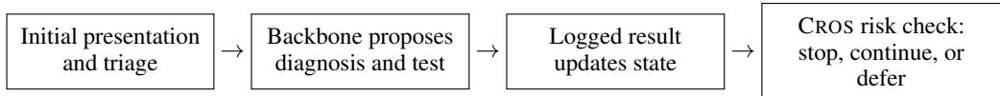
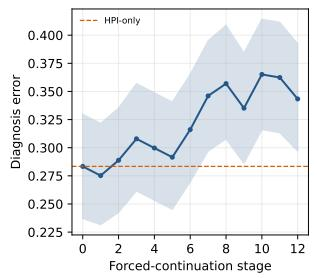
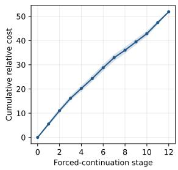
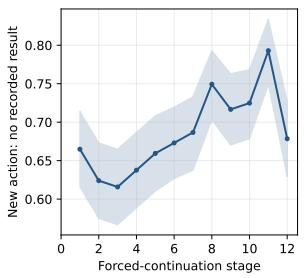
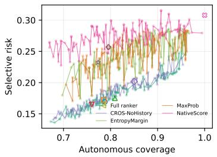
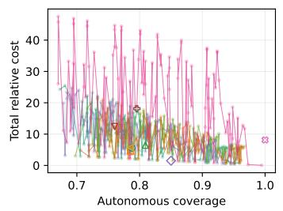
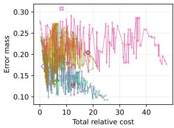
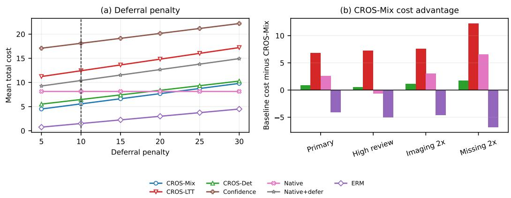

# Safe to Stop? Risk-Constrained Stopping for Sequential Clinical Diagnosis Agents

Yuexin Wu Department of Computer Science University of Memphis ywu10@memphis.edu

Vasile Rus Department of Computer Science University of Memphis vrus@memphis.edu

## Abstract

Clinical diagnosis agents must decide not only what test to request next, but also when to diagnose or defer. Existing agent benchmarks largely evaluate accuracy after fixed or unconstrained interaction, leaving autonomous stopping reliability implicit. We present CROS, a risk-constrained stopping layer combining statewise error ranking, policy design on disjoint development splits, and LTT-style exact tests of selective diagnostic error and minimum autonomous coverage for complete sequential policies. Its finite-sample guarantee requires the candidate family, testing rule, and any randomization to be frozen before calibration labels are accessed. On a 1,834-episode MIMIC-derived abdominal-pain benchmark, the full ranker achieves exploratory state-error AUROC 0.853, compared with 0.715 for maximum class probability and 0.552 for the backbone’s native stop score. On the previously viewed 367-episode evaluation split, analytically averaging over the frozen CROS-Mix weights yields 16.9% selective error at 78.8% coverage, cost 5.57, and 0.68 tests, versus 30.8% error at 100% coverage, cost 8.14, and 1.53 tests under native stopping. Forced continuation is non-monotone: error is 28.3% with HPI alone and 34.3% after full workup. However, the uniform-weight mixture ablation is cheaper on this viewed split despite missing the locked development margins, and CROS-Mix nominally satisfies the joint criterion in only 6 of 20 development resplits. Because evaluation labels were inspected during earlier development, these findings provide exploratory feasibility and audit evidence, not a confirmatory safety certificate.

## 1 Introduction

Language-model agents can generate differential diagnoses, request tests, read new findings, and revise their hypotheses. Recent systems and benchmarks have made this interaction increasingly realistic [Hager et al., 2024, Schmidgall et al., 2024, Liu et al., 2024, Bani-Harouni et al., 2026]. Yet a central decision remains weakly specified: when should the agent stop acquiring information and commit to an autonomous diagnosis? Stopping too early can miss a consequential disease; stopping too late wastes tests and may expose patients to avoidable procedures. Uncalibrated confidence thresholds provide no finite-sample joint risk–coverage guarantee, while unconstrained empirical cost minimization can overfit the selection sample [Angelopoulos et al., 2025, Laufer-Goldshtein et al., 2023].

We formulate sequential diagnosis as selective, risk-constrained stopping. At each stage the agent observes the history, proposes a diagnosis and next test, and the stopping layer either accepts the diagnosis, continues the shared acquisition trajectory, or defers. The desired policy minimizes resource cost subject to two population constraints: conditional diagnostic error among autonomous decisions is at most α, and autonomous coverage is at least γ. This differs from ordinary selective classification [Geifman and El-Yaniv, 2017, 2019]: prediction quality and the information state both evolve over an agent trajectory.

Our method, CROS (Clinical Risk-constrained Optimal Stopping), separates representation, design, and calibration. Here, “optimal” means cost-minimizing within a finite, selection-frozen family of threshold-and-horizon policies; CROS does not solve unrestricted Bellman optimal stopping or optimize the backbone’s test-acquisition policy. First, a risk ranker scores the likelihood that the backbone’s current diagnosis is wrong. Second, a selection split freezes the candidate family and, optionally, a randomized mixture chosen to minimize expected cost. Third, a prospectively fresh calibration split can supply exact binomial p-values for error and coverage. Multiple testing procedures from learn-then-test (LTT) [Angelopoulos et al., 2025] convert candidate-wise tests into a finite-sample guarantee. The stopping layer is backbone-agnostic and auditable: each action, observation, risk score, stop/continue/defer outcome, and calibration statistic is logged. In the present study, previously opened labels mean that the same calculations are exploratory calibration checks, not a realized prospective guarantee.

## We make four contributions:

1. We adapt and operationalize LTT-style joint testing of selective diagnostic error and minimum autonomous coverage for complete sequential stopping policies, obtaining an exact finite-sample guarantee when deterministic or episode-wise randomized policies are frozen before calibration.

2. We instantiate episode-wise randomized mixtures of deterministic stopping policies; Proposition 1 shows that an optimal basic feasible mixture requires at most three component policies and remains compatible with exact calibration when randomized independently across episodes.

3. We construct an auditable retrospective benchmark with 1,834 MIMIC-derived ED episodes, 12 nonuniform-cost actions, recorded-result missingness, and a common-backbone comparison that isolates stopping from diagnosis and test-proposal quality.

4. We report both favorable and negative evidence: the full ranker out-ranks simple scores but weakens under diagnosis-language masking, forced continuation is non-monotone, optimized mixing does not dominate uniform mixing on evaluation, 20-resplit feasibility is unstable, and aggregate control does not ensure subgroup safety.

## 2 Related Work

Clinical decision agents. MIMIC-CDM evaluates LLMs on sequential clinical decision making and exposes limitations in diagnostic reasoning and tool use [Hager et al., 2024]. AgentClinic provides a multimodal simulated clinical environment [Schmidgall et al., 2024]; MedChain emphasizes interactive, sequential clinical benchmarking [Liu et al., 2024]; and DxChain uses panoramic profiling and adversarial debate [Lv et al., 2026]. LA-CDM trains hypothesis and decision agents with reinforcement learning to choose tests and update diagnoses [Bani-Harouni et al., 2026]. These systems motivate the same acquisition loop as our benchmark. Our goal is complementary: we hold the diagnostic backbone and its action trajectory fixed when possible, then evaluate whether a stopping controller can provide a testable population guarantee.

Resource-aware sequential diagnosis. MAI-DxO evaluates diagnostic accuracy jointly with the cost of adaptively requested tests [Nori et al., 2025]. ACTMED uses Bayesian experimental design to select the next test [Ruhrberg Estevez et al., 2025], cost-sensitive reinforcement learning learns´ adaptive test-panel policies [Yu et al., 2023], and latent diagnostic trajectory learning trains planning and diagnostic agents to acquire evidence along learned paths [Shen et al., 2026]. These methods can change which tests are selected and therefore change the trajectory. CROS is not an end-to-end acquisition method: its common-path design holds backbone diagnoses, test proposals, and forcedcontinuation trajectories fixed to isolate whether the controller stops, continues with the backboneproposed test, or defers.

Selective prediction and risk control. Selective classifiers abstain on uncertain examples to trade coverage for conditional error [Geifman and El-Yaniv, 2017, 2019]. Distribution-free riskcontrolling prediction sets and conformal risk control extend calibration beyond marginal coverage [Bates et al., 2021, Angelopoulos et al., 2024]. LTT turns risk constraints into hypothesis tests and controls the probability of selecting an invalid procedure from a finite family [Angelopoulos et al.,

2025]. Geometry-Calibrated Conformal Abstention gives finite-sample guarantees for both participation and correctness of emitted open-ended language-model responses [Xu et al., 2026b], while SCoRE uses conformal e-values to control a general bounded risk among selected outputs [Bai and Jin, 2026]. Thus neither selective risk control nor participation guarantees are new in isolation. We adapt these ideas to a stateful clinical stopping problem whose complete, frozen policy is jointly tested for conditional diagnostic error and a lower autonomous-coverage bound, with resource costs used for policy design and comparison rather than included in the validity claim. The exact guarantee concerns the policy chosen before calibration, not the accuracy of the learned risk score.

Clinical stopping and abstention. Uncertainty-aware abstention has been studied for static medical-text prediction [Vazhentsev et al., 2025], while Safe-Psych evaluates diagnose, clarify, and abstain decisions as psychiatric evidence is revealed incrementally [Presacan et al., 2026]. MediQ studies interactive clinical diagnosis in which a model refrains from diagnosing under insufficient information and asks follow-up questions, but does not provide finite-sample joint control of selective diagnostic error and autonomous coverage [Li et al., 2024]. Foo and Chang formulate staged clinical prediction as an expected-loss optimal-stopping problem with explicit decision and testing costs and Bellman recursion [Foo and Chang, 2026]. Their objective optimizes whether expected decision value justifies further testing; it does not provide CROS’s exact joint test of conditional diagnostic error and minimum autonomous coverage. CROS instead freezes a complete sequential policy selected on disjoint development data and then subjects that policy to the joint test. This distinction is methodological, not a claim that Bellman stopping, interactive clinical diagnosis, or clinical abstention is new.

Calibrated sequential stopping and acquisition. LTT-style finite-sample risk control is not new to this work. Pareto Testing combines multi-objective design and multiple testing [Laufer-Goldshtein et al., 2023], while accumulated-accuracy-gap control gives distribution-free stopping rules for early time classification [Ringel et al., 2024]. MiCP allocates error budgets across turns of retrieval, tool-use, and reasoning workflows, enabling adaptive early stopping with overall conformal coverage while reducing turns and inference cost [Zhou et al., 2026]. Its guarantee concerns coverage of the final prediction set in multi-turn reasoning; CROS instead tests selective diagnostic error and minimum autonomous coverage for a frozen stop–continue–defer controller on a common clinical trajectory. Other recent work studies selective conformal risk control [Xu et al., 2025], inference-time reasoning under a compute budget [Wang et al., 2026], and post-acquisition recalibration when additional evidence can be requested [Xu et al., 2026a]. These studies already establish important forms of sequential calibration, joint utility–risk design, or cost-aware acquisition. Our narrower contribution is their integration into sequential clinical diagnosis: a state-wise clinical risk ranker, a lower autonomous-coverage constraint, a common-path MIMIC benchmark, and episodewise mixtures. The sparsity of the mixture is a standard linear-program consequence rather than a new optimization theorem.

## 3 Risk-Constrained Sequential Diagnosis

## 3.1 Problem setup

An episode ${ \cal Z } = ( X _ { 0 } , Y , O _ { 1 : H } )$ contains an initial presentation $X _ { 0 } .$ , a reference diagnosis $Y \in$ $\{ 1 , \ldots , K \}$ , and potential recorded observations along a maximum horizon H. Here, H is the maximum number of test-acquisition stages available in an episode $( H = 1 2$ in our benchmark). A policy-specific horizon $h \leq H$ determines the latest stage at which that policy must stop or defer. At stage t, the backbone has history $S _ { t } = ( X _ { 0 } , A _ { 1 : t } , O _ { 1 : t } )$ , produces a diagnosis $\widehat { Y } _ { t }$ , and proposes the next test $A _ { t + 1 } \in { \mathcal { A } } .$ A stopping controller π maps the observed history and the backbone’s current proposal to STOP, CONTINUE, or DEFER. Continuing reveals the next recorded result along the backbone-proposed trajectory; CROS controls whether that proposal is executed but never substitutes a different test. This common-path interaction is summarized in Figure 1. Let $T _ { \pi }$ denote the terminal stage at which the controller either accepts a diagnosis or defers, and let $D _ { \pi } ( Z ) = 1$ if it returns an autonomous diagnosis and $D _ { \pi } ( Z ) = 0$ if it defers. Define

  
Figure 1: A sequential episode. The backbone generates the common forced-continuation trajectory and proposes each test; CROS controls whether to stop, continue with that proposal, or defer. It does not select the test identity.

$$
\begin{array} { r } { \mathcal { R } ( \pi ) = \mathrm { P r } \left( \widehat { Y } _ { T _ { \pi } } \neq Y \mid D _ { \pi } = 1 \right) , } \end{array}\tag{1}
$$

$$
{ \mathcal C } ( \pi ) = \operatorname* { P r } ( D _ { \pi } = 1 ) ,\tag{2}
$$

$$
\mathcal { I } ( \pi ) = \mathbb { E } \left[ \sum _ { \boldsymbol { t } < T _ { \pi } } c ( \boldsymbol { A } _ { t + 1 } ) + c _ { \mathrm { d e f } } ( 1 - \boldsymbol { D } _ { \pi } ) \right] .\tag{3}
$$

These quantities separate diagnostic reliability, autonomous participation, and resource use. Specifically, $\bar { \mathcal { R } } ( \pi )$ is the diagnostic error rate among cases that the controller handles autonomously, rather than among all episodes. $\mathcal { C } ( \pi )$ is the population fraction receiving an autonomous diagnosis; the remaining fraction is deferred. Finally, $\mathcal { I } ( \pi )$ is the expected cumulative cost of requested actions, plus a downstream-review penalty $c _ { \mathrm { d e f } }$ whenever the case is deferred.

We seek the least costly policy in the candidate family Π while requiring its selective diagnostic error to be at most α and its autonomous coverage to be at least $\gamma \colon$

$$
\operatorname* { m i n } _ { \pi \in \Pi } \mathcal I ( \pi ) \quad \mathrm { s . t . } \quad \mathcal R ( \pi ) \leq \alpha , \qquad \mathcal C ( \pi ) \geq \gamma .\tag{4}
$$

Thus, α specifies the maximum tolerated error rate among autonomous diagnoses, whereas $\gamma$ prevents the controller from achieving low error merely by deferring most cases. Because conditional risk is undefined when ${ \mathcal { C } } ( \pi ) = { \bar { 0 } } _ { \bar { } }$ , the positive coverage constraint also excludes the degenerate always-defer policy. The defer penalty affects policy design and cost comparisons, but it is not part of the subsequent binomial tests of risk and coverage.

## 3.2 Risk-ranked stopping policies

We train an auxiliary estimator $r _ { \theta } ( S _ { t } ) \in [ 0 , 1 ]$ for the event $\widehat { Y } _ { t } \neq Y$ . Features include the $K$ class probabilities, maximum probability, probability margin, entropy, stage, fraction of missing results, cumulative resource cost, latency, and the backbone’s native stop score. Training uses episode-wise out-of-fold predictions so that multiple states from one patient never cross folds.

For a horizon h and threshold $\tau ,$ the deterministic policy $\pi _ { h , \tau }$ stops at the first $t \leq h$ satisfying $r _ { \theta } ( S _ { t } ) \leq \tau$ and otherwise defers at h. A disjoint selection set freezes the estimator, a finite candidate list $\Pi _ { 0 } = \{ \pi _ { 1 } , . . . , \pi _ { L } \}$ , candidate order, and all design hyperparameters before calibration labels are accessed. The learned ranker may be misspecified; validity below depends only on a fresh exchangeable calibration sample.

## 3.3 Exact joint tests and multiplicity control

After a candidate policy $\pi _ { j }$ has been frozen, calibration asks whether it satisfies both population requirements: selective diagnostic error at most α and autonomous coverage at least $\gamma .$ . When $\pi _ { j }$ is applied to n calibration episodes, let

$$
M _ { j } = \sum _ { i = 1 } ^ { n } D _ { \pi _ { j } } ( Z _ { i } ) , \qquad E _ { j } = \sum _ { i = 1 } ^ { n } D _ { \pi _ { j } } ( Z _ { i } ) { \bf 1 } \Bigl \{ \widehat { Y } _ { T _ { \pi _ { j } } , i } \neq Y _ { i } \Bigl \} .\tag{5}
$$

Here, $M _ { j }$ is the number of episodes receiving an autonomous diagnosis, while $E _ { j }$ is the number of errors among those autonomous diagnoses. Thus, $M _ { j } / n$ is the empirical autonomous coverage and, when $M _ { j } > 0 , E _ { j } / M _ { j }$ is the empirical selective diagnostic error.

A candidate is invalid if either its population risk exceeds α or its population coverage falls below $\gamma .$ We therefore test the union null

$$
H _ { j } : \{ { \mathcal { R } } ( \pi _ { j } ) > \alpha \} \cup \{ { \mathcal { C } } ( \pi _ { j } ) < \gamma \} .\tag{6}
$$

Rejecting $H _ { j }$ requires evidence against both failure modes: the policy must have sufficiently few autonomous errors and sufficiently many autonomous diagnoses.

Let $F _ { \mathrm { B i n } } ( k ; m , p )$ denote the probability that a Binomia $. ( m , p )$ random variable is at most k. The corresponding one-sided exact component $p \mathrm { - }$ values are

$$
p _ { R , j } = F _ { \mathrm { B i n } } ( E _ { j } ; M _ { j } , \alpha ) , \qquad p _ { C , j } = 1 - F _ { \mathrm { B i n } } ( M _ { j } - 1 ; n , \gamma ) .\tag{7}
$$

The risk p-value becomes small when the policy makes unusually few errors relative to the boundary rate α, whereas the coverage p-value becomes small when it autonomously diagnoses unusually many episodes relative to the boundary rate γ. We set $p _ { R , j } = 1$ when $M _ { j } = 0$ , because an alwaysdefer policy provides no evidence about conditional diagnostic risk. Because both constraints must be supported, the intersection-union test uses

$$
p _ { j } = \operatorname* { m a x } ( p _ { R , j } , p _ { C , j } ) .\tag{8}
$$

This combined value is small only when both component p-values are small. For a single pre-frozen policy, no multiplicity adjustment is needed. When several candidates are tested, we use fixedsequence LTT, Holm’s step-down procedure [Holm, 1979], or Bonferroni to control the probability of certifying any invalid candidate. In a prospective study, a rejected candidate is certified under Theorem 1; here, the same event is called an exploratory calibration pass because the labels are not untouched.

Theorem 1 (Finite-sample joint control). Assume the calibration episodes are i.i.d. (or exchangeable with the future population), and the complete candidate policies and multiple-testing rule are fixed independently of calibration outcomes. Then each $p _ { j }$ in Eq. (8) is super-uniform under $H _ { j } .$ If the testing rule controls family-wise error at $\delta ,$ the probability that any certified policy violates either $\mathcal { R } ( \pi ) \leq \alpha o r \mathcal { C } ( \pi ) \geq \gamma$ is at most $\delta .$

The proof is in Appendix A. The statement is finite-sample and makes no assumption that $r _ { \theta }$ is calibrated.

## 3.4 Randomized sparse mixtures

A finite threshold-and-horizon grid may contain no single deterministic policy that achieves the desired risk–coverage trade-off at minimum cost. We therefore allow episode-wise randomization over the frozen candidate family $\Pi _ { 0 } = \{ \pi _ { 1 } , \ldots , \pi _ { L } \}$ . Let $w _ { j }$ be the probability of selecting policy $\pi _ { j }$ , with weights in the probability simplex $\Delta _ { L } : = \{ w \in \mathbb { R } _ { + } ^ { L } : \sum _ { j = 1 } ^ { L } w _ { j } = 1 \}$ . The resulting randomized policy $\pi _ { w }$ independently samples J ∼ Categorical(w) at the beginning of each episode and applies $\pi _ { J }$ throughout that episode.

On the selection split, let $\widehat { \mathcal { I } } _ { j }$ be the empirical mean cost of $\pi _ { j } , \widehat { c } _ { j } = \widehat { \mathrm { P r } } ( D _ { \pi _ { j } } = 1 )$ its empirical autonomous coverage, and ${ \widehat { q } } _ { j } = \widehat { \operatorname* { P r } } ( D _ { \pi _ { i } } = 1 , \widehat { Y } \neq Y )$ its empirical error mass. When $\widehat { c } _ { j } > 0 .$ , its empirical selective diagnostic error is $\widehat { q } _ { j } / \widehat { c } _ { j }$ . Because the component is sampled independently for each episode, the mixture’s expected cost, error mass, and coverage are $\begin{array} { r } { \sum _ { j } w _ { j } \widehat { \mathcal { I } } _ { j } , \sum _ { j } w _ { j } \widehat { q } _ { j } } \end{array}$ , and $\textstyle \sum _ { j } w _ { j } { \widehat { c } } _ { j }$ , respectively. We choose the least costly mixture satisfying the selection-stage risk and coverage targets:

$$
\operatorname* { m i n } _ { w \in \Delta _ { L } } \quad \sum _ { j = 1 } ^ { L } w _ { j } \widehat { \mathcal { I } } _ { j } \quad \mathrm { s . t . } \qquad \sum _ { j = 1 } ^ { L } w _ { j } \big ( \widehat { q } _ { j } - \alpha _ { \mathrm { d e s } } \widehat { c } _ { j } \big ) \leq 0 , \qquad \sum _ { j = 1 } ^ { L } w _ { j } \widehat { c } _ { j } \geq \gamma _ { \mathrm { d e s } } .\tag{9}
$$

The first constraint is equivalent to requiring the mixture’s empirical selective diagnostic error, $\textstyle ( \sum _ { j } w _ { j } { \widehat { q } } _ { j } ) / ( \sum _ { j } w _ { j } { \widehat { c } } _ { j } )$ , to be at most $\alpha _ { \mathrm { d e s } } ;$ the denominator is positive because the second constraint requires coverage of at least $\gamma _ { \mathrm { d e s } } > 0$

We use the stricter selection-design targets $( \alpha _ { \mathrm { d e s } } , \gamma _ { \mathrm { d e s } } ) = ( 0 . 2 0 , 0 . 8 0 )$ , while the subsequent calibration tests use $( \alpha , \gamma ) = ( 0 . 2 5 , 0 . 7 0 )$ . These design margins provide a buffer against selection-sample variation but are not themselves a statistical certificate.

Proposition 1 (Sparsity and validity). If the linear program in $E q .$ (9) is feasible, it admits an optimal basic feasible solution in which at most three weights wj are positive. If the mixture weights and episode-wise randomization mechanism are frozen before calibration, the induced randomized controller is a singlefrozen policy whose risk and coverage can be tested under Theorem 1, subject to the theorem’s sampling assumptions.

Proposition 1 implies that, although the optimization considers L deterministic candidates, an optimal mixture uses at most three of them. This bound follows from the simplex equality and the two risk and coverage design constraints in Eq. (9). At deployment, component sampling is independent across episodes and is never conditioned on patient characteristics or intermediate observations. Equivalently, the random seed can be treated as part of each i.i.d. episode. A single component draw reused for all calibration episodes would instead introduce shared randomness and would not justify the same exact binomial test. A proof is provided in Appendix A.

## 4 Experimental Design

## 4.1 Benchmark and study splits

We construct a retrospective sequential-diagnosis benchmark by linking credentialed-access MIMIC-IV-ED v2.2 [Johnson et al., 2023] with MIMIC-IV-Ext-CDS v1.0.2 [Gaber and Akalin, 2025]. Retaining the earliest eligible ED stay per patient yields 1,834 patient-level episodes across nine abdominal-pain diagnosis classes. The initial state includes the deidentified history of present illness, chief complaint, demographics, and triage measurements.

The environment exposes 12 action groups spanning repeated vital signs, laboratory studies, electrocardiography, imaging, and microbiology. Continuing along an episode reveals the recorded result of the test proposed by the backbone. Because most discharge-note test snippets lack reliable acquisition timestamps, this environment is a logged retrospective benchmark rather than a causal simulator of alternative testing decisions. An unavailable result is represented by NO RECORDED RESULT and retains its prespecified cost. The complete action definitions and cost vector are reported in Appendix B.

Patients are divided into 1,100 development, 367 calibration, and 367 evaluation episodes, with no patient overlap. The development cohort is further separated into 935 episodes for backbone and risk-ranker fitting and 165 episodes for policy selection. All model fitting, candidate construction, policy ordering, and mixture optimization use only these development partitions. The primary population targets are selective diagnostic error $\alpha = 0 . 2 5$ , autonomous coverage $\gamma = 0 . 7 0$ , and family-wise error level $\delta = 0 . 0 5$

Exploratory status. Calibration and evaluation labels had been accessed during earlier method development. Consequently, all reported calibration passes, p-values, and confidence bounds are interpreted descriptively rather than as realized prospective certificates. The current freeze prevents further outcome-dependent modification but cannot restore statistical independence; applying Theorem 1 confirmatorily requires a new untouched cohort.

## 4.2 Model instantiation and comparators

The diagnostic backbone is Qwen2.5-7B-Instruct [Qwen Team, 2024], adapted with LoRA [Hu et al., 2022] using an official-code-derived LA-CDM training pipeline. Training uses development data only. Because our implementation transfers the official architecture and training structure to a fixed common-path environment, it should not be interpreted as a prompt-equivalent reproduction of LA-CDM’s original free-form rollouts. Model configuration, optimization, prompts, seeds, and provenance checks are provided in Appendix H.

A cross-fitted histogram gradient-boosting ranker estimates state-level diagnostic error from back bone probabilities, uncertainty summaries, trajectory state, accumulated cost, missingness, and the native stopping score. Crossing 10 target coverages with 13 policy horizons produces 130 thresholdand-horizon candidates. The disjoint policy-selection split freezes a tested family of 12 deterministic policies and, separately, one optimized randomized mixture. Candidate construction, ranker hyper parameters, and threshold estimation are detailed in Appendix H.

Every stopping method receives the same backbone probabilities, diagnoses, proposed actions, and forced-continuation trajectory. This common-path protocol holds diagnosis and acquisition behavior fixed, isolating the decision to stop, continue, or defer. Comparators include HPI-only and fullworkup endpoints, fixed-stage and confidence-threshold stopping, the native LA-CDM-style rule with and without confidence deferral, and empirical cost minimization. We additionally evaluate calibration and multiplicity procedures, score and history ablations, and a mixture-weight ablation. These labels describe experimental roles rather than additional CROS methods. Complete comparator definitions are provided in Appendix H.

Method nomenclature and policy construction. CROS is the overall risk-constrained stopping framework and is instantiated here through exactly two named controllers. CROS-Det is a deterministic threshold-and-horizon policy selected from the locked development family, and CROS-Mix is an episode-wise randomized, LP-optimized mixture over that same frozen deterministic family. All other experimental labels denote fixed-information, confidence-based, native-agent, or empirical baselines; calibration and multiplicity procedures; ranker ablations; a policy-design ablation; or evaluation modes of CROS-Mix. They are not additional CROS methods.

Specifically, CROS-Det is the lowest-cost member of the full-ranker 130-policy grid that satisfies the locked selection-split design margins, risk at most 20% and coverage at least 80%; in the present run it is $( h = 3 , \bar { \tau } = 0 . \bar { 3 2 } 8 6 )$ The best deterministic component within the optimized mixture support is identical to CROS-Det in this run and is therefore not displayed separately. CROS-Mix always denotes the same three support policies and the same nonnegative LP-optimized weights, fitted using only the policy-selection split to minimize expected cost subject to the 20%/80% design margins. CROS-Mix, analytic expectation integrates component contributions for each episode, whereas CROS-Mix, realized draw uses one frozen independent episode-wise component draw and yields integer autonomous/error counts for exact binomial testing. These are two evaluation modes of one controller. The Uniform-weight mixture uses the same frozen support with equal rather than optimized weights and is a policy-design ablation; it is not guaranteed to satisfy the selection margins.

The Single-candidate test, Fixed-sequence LTT, Holm testing, and Bonferroni testing are calibration or multiplicity procedures applied to the same 12 selection-frozen deterministic candidates. They change the testing and return rule, not the risk ranker, backbone, or basic threshold-and-horizon policy. In this run, Holm testing returns the same deterministic controller as Fixed-sequence LTT, while Bonferroni testing returns a different deterministic controller. Empirical ERM instead mini mizes selection-split cost without requiring the joint risk–coverage criterion.

Myopic value-of-information and free-form multi-agent systems are not included in the primary paired comparison because they select different actions and therefore induce different trajectories. Appendix H specifies how such systems would enter a future end-to-end confirmatory study.

## 4.3 Evaluation

The primary outcomes are selective diagnostic error, autonomous coverage, total relative resource cost, and number of requested tests. We also report error mass, $\operatorname* { P r } ( D = 1 , \widehat { Y } \neq Y )$ , which measures the population fraction receiving an incorrect autonomous diagnosis and therefore does not decrease merely because the controller defers additional cases.

Uncertainty estimates respect the patient-level sampling unit. We report exact one-sided Clopper– Pearson bounds for risk and coverage and paired patient-level bootstrap intervals for method contrasts. Randomized mixtures are evaluated both by analytically averaging component contributions and by repeated episode-wise realizations to assess randomization stability. Prespecified sensitivity analyses examine deferral penalties, action costs, recorded-result missingness, diagnosis-language masking, and development-split stability. Full metric definitions, resampling procedures, and sensitivity settings are reported in Appendices B–H.

## 5 Results

## 5.1 Exploratory joint calibration

Table 1 reports realized calibration outcomes and descriptive evaluation performance. All returned policies have evaluation point estimates below 25% risk and above 70% coverage. The prespecified CROS-Mix realization is the least costly displayed policy, attaining 16.3% error at 78.5% coverage with cost 5.68 and 0.68 requested actions.

The Single-candidate test and the CROS-Mix realized draw are each tested once, Fixed-sequence LTT follows its frozen order, and Bonferroni testing tests 12 candidates; Holm testing returns the same deterministic controller as Fixed-sequence LTT in this run. Appendix E gives the component tests, exact bounds, weights, and seed audit. Later mixture comparisons use the CROS-Mix analytic expectation (0.169 risk, 0.788 coverage, 5.57 cost, and 0.679 actions), rather than the realization in Table 1.

Table 1: Exploratory calibration and evaluation results $( n _ { \mathrm { c a l } } = n _ { \mathrm { e v a l } } = 3 6 7 )$ . “Auto/err” denotes autonomous diagnoses/errors. The table reports raw joint p-values before multiplicity adjustment. The first three rows are testing procedures applied to the same frozen deterministic family; the final row is one realized draw of CROS-Mix. Holm testing returns the same controller as fixed-sequence LTT and is not duplicated.
<table><tr><td>Calibration configuration / controller</td><td>Cal auto/err</td><td>Cal risk</td><td>Cal cov.</td><td>Raw joint p</td><td>Eval risk</td><td>Eval cov.</td><td>Cost / tests</td></tr><tr><td>Single-candidate test</td><td>282/48</td><td>.170</td><td>.768</td><td>.00210</td><td>.166</td><td>.758</td><td>17.14 /3.27</td></tr><tr><td>Fixed-sequence LTT</td><td>275/43</td><td>.156</td><td>.749</td><td>.02116</td><td>.165</td><td>.760</td><td>12.43 / 2.09</td></tr><tr><td>Bonferroni testing</td><td>288/48</td><td>.167</td><td>.785</td><td>.000442</td><td>.168</td><td>.779</td><td>13.88 / 2.52</td></tr><tr><td>CROS-Mix, realized draw</td><td>280/51</td><td>.182</td><td>.763</td><td>.00435</td><td>.163</td><td>.785</td><td>5.68 / .68</td></tr></table>

## 5.2 Risk-ranker and stopping ablation

The full ranker achieves state-error AUROC 0.853, compared with 0.715 for the maximumprobability ranker and 0.552 for the Native-score ranker (Table 2). Among these alternatives, only the full-ranker controller satisfies the locked selection margins and has an exploratory calibration pass. The maximum-probability ranker is cheaper but lacks comparable calibration evidence. The No-history ranker nearly matches the full ranker (AUROC 0.852), so this experiment does not isolate a material benefit from stage, cost, latency, and missing-history features. The supported contribution is therefore improved risk ranking and calibration power, not unconditional cost dominance.

Table 2: Risk-ranker ablation. “Sel.” indicates the locked selection margins. AUROC intervals use 10,000 patient-level resamples; calibration p-values are descriptive.
<table><tr><td>Ranker/controller configuration</td><td>Sel.</td><td>State AUROC [95% CI]</td><td>Cal. p</td><td>Eval risk</td><td>Cov.</td><td>Cost / tests</td></tr><tr><td>CROS-Det, full ranker</td><td>yes</td><td>.853 [.820,.885]</td><td>.005</td><td>.175</td><td>.809</td><td>6.47 / .87</td></tr><tr><td>No-history ranker</td><td>yes</td><td>.852 [.820,.884]</td><td>.040</td><td>.190</td><td>.817</td><td>6.06 / .83</td></tr><tr><td>Entropy-margin ranker</td><td>no</td><td>.714 [.678,.750]</td><td>.805</td><td>.204</td><td>.828</td><td>1.72 / .00</td></tr><tr><td>Maximum-probability ranker</td><td>no</td><td>.715 [.679,.751]</td><td>.504</td><td>.185</td><td>.782</td><td>2.18 / .00</td></tr><tr><td>Native-score ranker</td><td>no</td><td>.552 [.533,.572]</td><td>.902</td><td>.250</td><td>.719</td><td>31.58 / 6.18</td></tr></table>

## 5.3 Policy and matched comparisons

CROS-Mix, analytic expectation is 0.903 cost units cheaper than CROS-Det (95% CI [−1.135, −0.682]) and requests 0.195 fewer actions; its risk difference is unresolved and its coverage is 0.021 lower (Table 3). The Uniform-weight mixture is another 0.977 units cheaper on evaluation, but misses both locked selection margins. Thus, optimization enforces the development constraints rather than guaranteeing the lowest future cost.

Compared with confidence thresholding and native stopping with deferral, CROS-Mix, analytic expectation reduces risk by 0.088 and 0.063 and cost by 12.54 and 4.84 units, respectively; coverage differences are unresolved. ERM is cheaper but has higher risk and fails exploratory calibration. Appendix D reports the complete paired intervals. Cost advantages persist in the primary, imagingsensitive, and missing-result-sensitive scenarios, but not under every deferral penalty (Appendix F).

Table 3: Policy-design ablation using analytic mixture expectations. “Sel.” indicates the frozen 20% risk and 80% coverage design constraints, not an evaluation guarantee. The fixed-sequence LTT row reports the deterministic controller returned by that testing procedure.
<table><tr><td>Policy configuration</td><td>Sel.</td><td>Risk</td><td>Cov.</td><td>Error mass</td><td>Cost</td><td>Tests</td></tr><tr><td>CROS-Det</td><td>yes</td><td>.175</td><td>.809</td><td>.142</td><td>6.47</td><td>.87</td></tr><tr><td>Uniform-weight mixture</td><td>no</td><td>.172</td><td>.786</td><td>.135</td><td>4.59</td><td>.50</td></tr><tr><td>CROs-Mix, analytic expectation</td><td>yes</td><td>.169</td><td>.788</td><td>.133</td><td>5.57</td><td>.68</td></tr><tr><td>Fixed-sequence LTT</td><td></td><td>.165</td><td>.760</td><td>.125</td><td>12.43</td><td>2.09</td></tr><tr><td>Empiricai ERM</td><td>一</td><td>.202</td><td>.850</td><td>.172</td><td>1.50</td><td>.00</td></tr></table>

Against the confidence-threshold controller, CROS-Mix, analytic expectation reduces selective risk by 0.088 and cost by 12.54 units; against native stopping with deferral, it reduces risk by 0.063 and cost by 4.84 units, with unresolved coverage differences in both comparisons. ERM remains less costly but has higher risk and fails exploratory calibration. Complete patient-paired intervals and error-mass comparisons are reported in Appendix D.

The cost advantage over the principal calibrated and confidence-based comparators persists under the primary, imaging-sensitive, and missing-result-sensitive cost scenarios, but not under every deferral penalty. Appendix F reports the complete frozen-decision sensitivity analysis.

## 5.4 Trajectory and robustness audits

Forced-continuation error is 28.3% with HPI alone, 27.5% after one action, 35.7% at stage 8, and 34.3% after full workup, while cost and recorded-result missingness increase along the trajectory (Appendix Figure 2). Thus, this backbone does not show monotone gains from additional acquisition. Diagnosis-language masking lowers ranker AUROC by approximately 0.014 and modestly reduces coverage and increases cost; risk changes are unresolved (Appendix Table 8). Action avail ability is also highly structured and may encode clinicians’ historical ordering. Across 20 develop ment resplits, CROS-Det nominally passes in 15, whereas CROS-Mix is feasible in 15 and passes in only six. These dependent audits demonstrate design sensitivity, not independent confirmation. Class-level failures further preclude any subgroup safety claim (Appendix G).

## 6 Discussion and Limitations

The results support a prospectively frozen follow-up, not deployment or a clinical safety claim. The full ranker outperforms simple scores, joint tests have apparent power for several frozen policies, and CROS-Mix reduces cost relative to CROS-Det. However, the No-history ranker nearly matches the full ranker, the Uniform-weight mixture is cheaper despite missing the selection margins, forced continuation is non-monotone, and mixture feasibility varies across development splits.

The claims are limited by previously accessed labels; a single-center, note-derived benchmark without reliable non-vital timestamps or counterfactual outcomes; informative missingness; unadjudicated labels, proxy misses, and costs; marginal rather than subgroup control; one backbone-training seed; and dependent resplit audits. Common-path evaluation isolates stopping but does not measure end-to-end gains when agents choose different actions.

A confirmatory study should lock a never-viewed temporal or external cohort, prespecify labels, costs, subgroup hypotheses, sample size, and one testing graph, and obtain blinded clinical adjudication. It should evaluate both common-path stopping and end-to-end acquisition without changes after calibration access.

## 7 Conclusion

CROS makes sequential diagnostic stopping auditable through joint testing of selective error and autonomous coverage. The current retrospective results support feasibility and a lower-cost deterministic–mixture trade-off, but label reuse, structured missingness, resplit instability, and subgroup failures require a new prospectively locked study before any safety claim.

## References

Anastasios N. Angelopoulos, Stephen Bates, Adam Fisch, Lihua Lei, and Tal Schuster. Conformal risk control. In International Conference on Learning Representations, 2024. URL https: //openreview.net/forum?id=33XGfHLtZg.

Anastasios N. Angelopoulos, Stephen Bates, Emmanuel J. Candes, Michael I. Jordan, and Lihua\` Lei. Learn then test: Calibrating predictive algorithms to achieve risk control. The Annals of Applied Statistics, 19(2):1641–1662, 2025. doi: 10.1214/24-AOAS1998.

Tian Bai and Ying Jin. Conformal selective prediction with general risk control. arXiv preprint arXiv:2603.24704, 2026. URL https://arxiv.org/abs/2603.24704.

David Bani-Harouni, Chantal Pellegrini, Ege Ozsoy, Nassir Navab, and Matthias Keicher. Lan-¨ guage agents for hypothesis-driven clinical decision making with reinforcement learning. In International Conference on Learning Representations, 2026. URL https://openreview.net/ forum?id=Pn8ETgEHW7.

Stephen Bates, Anastasios Angelopoulos, Lihua Lei, Jitendra Malik, and Michael Jordan. Distribution-free, risk-controlling prediction sets. Journal of the ACM, 68(6):1–34, 2021. doi: 10.1145/3478535.

Hui-Mean Foo and Yuan-chin Ivan Chang. Optimal stopping in sequential clinical prediction. arXiv preprint arXiv:2604.22216, 2026. URL https://arxiv.org/abs/2604.22216.

Mohamed M. Gaber and Arif Akalin. MIMIC-IV-Ext Clinical Decision Support for Referral, Triage and Diagnosis (version 1.0.2). PhysioNet, 2025. URL https://physionet.org/content/ mimic-iv-ext-cds/1.0.2/.

Yonatan Geifman and Ran El-Yaniv. Selective classification for deep neural networks. In Advances in Neural Information Processing Systems, volume 30, pages 4878–4887, 2017.

Yonatan Geifman and Ran El-Yaniv. SelectiveNet: A deep neural network with an integrated reject option. In Proceedings of the 36th International Conference on Machine Learning, volume 97, pages 2151–2159. PMLR, 2019.

Paul Hager, Friederike Jungmann, Robbie Holland, Kunal Bhagat, Inga Hubrecht, Manuel Knauer, Jakob Vielhauer, Marcus Makowski, Rickmer Braren, Georgios Kaissis, and Daniel Rueckert. Evaluation and mitigation of the limitations of large language models in clinical decision-making. Nature Medicine, 30:2613–2622, 2024. doi: 10.1038/s41591-024-03097-1.

Sture Holm. A simple sequentially rejective multiple test procedure. Scandinavian Journal of Statistics, 6(2):65–70, 1979.

Edward J. Hu, Yelong Shen, Phillip Wallis, Zeyuan Allen-Zhu, Yuanzhi Li, Shean Wang, Lu Wang, and Weizhu Chen. LoRA: Low-rank adaptation of large language models. International Conference on Learning Representations, 2022. URL https://openreview.net/forum?id= nZeVKeeFYf9.

Alistair E. W. Johnson, Lucas Bulgarelli, Lu Shen, Alvin Gayles, Ayad Shammout, Steven Horng, Tom J. Pollard, Sicheng Hao, Benjamin Moody, Brian Gow, Li-wei H. Lehman, Leo A. Celi, and Roger G. Mark. MIMIC-IV-ED (version 2.2). PhysioNet, 2023. URL https://physionet. org/content/mimic-iv-ed/2.2/.

Bracha Laufer-Goldshtein, Adam Fisch, Regina Barzilay, and Tommi S. Jaakkola. Efficiently controlling multiple risks with pareto testing. In The Eleventh International Conference on Learning Representations, 2023. URL https://openreview.net/forum?id=cyg2YXn\_BqF.

Shuyue Stella Li, Vidhisha Balachandran, Shangbin Feng, Jonathan S. Ilgen, Emma Pierson, Pang Wei Koh, and Yulia Tsvetkov. Mediq: Question-asking llms and a benchmark for reliable interactive clinical reasoning. In A. Globerson, L. Mackey, D. Belgrave, A. Fan, U. Paquet, J. Tomczak, and C. Zhang, editors, Advances in Neural Information Processing Systems, volume 37, pages 28858–28888. Curran Associates, Inc., 2024. doi: 10.52202/079017-0908. URL https://proceedings.neurips.cc/paper\_files/paper/ 2024/file/32b80425554e081204e5988ab1c97e9a-Paper-Conference.pdf.

Jie Liu, Wenxuan Wang, Zizhan Ma, Guolin Huang, Yihang Su, Kao-Jung Chang, Wenting Chen, Haoliang Li, Linlin Shen, and Michael Lyu. MedChain: Bridging the gap between LLM agents and clinical practice with interactive sequence. arXiv preprint arXiv:2412.01605, 2024. URL https://arxiv.org/abs/2412.01605.

Zhiqi Lv, Duofan Tu, Jun Li, Mingyue Zhao, Heqin Zhu, Wenliang Li, and Shaohua Kevin Zhou. Thinking like a clinician: A cognitive AI agent for clinical diagnosis via panoramic profiling and adversarial debate. arXiv preprint arXiv:2604.23605, 2026. URL https://arxiv.org/abs/ 2604.23605.

Harsha Nori, Mayank Daswani, Christopher Kelly, Scott Lundberg, Marco Tulio Ribeiro, Marc Wilson, Xiaoxuan Liu, Viknesh Sounderajah, Jonathan Carlson, Matthew P. Lungren, Bay Gross, Peter Hames, Mustafa Suleyman, Dominic King, and Eric Horvitz. Sequential diagnosis with language models. arXiv preprint arXiv:2506.22405, 2025. URL https://arxiv.org/abs/ 2506.22405.

Oriana Presacan, Andreea Grama, Larisa Irimina, Alireza Nik, Jaya Ojha, Vajira Thambawita,˘ Ciprian I. Bacil ˘ a, Bogdan Ionescu, and Michael A. Riegler. Ask before you diagnose: Safe-Psych,˘ a sequential evaluation benchmark for LLMs in psychiatry. arXiv preprint arXiv:2607.13036, 2026. URL https://arxiv.org/abs/2607.13036.

Qwen Team. Qwen2.5 technical report. arXiv preprint arXiv:2412.15115, 2024. URL https: //arxiv.org/abs/2412.15115.

Liran Ringel, Regev Cohen, Daniel Freedman, Michael Elad, and Yaniv Romano. Early time classification with accumulated accuracy gap control. In Proceedings of the 41st International Conference on Machine Learning, volume 235 of Proceedings of Machine Learning Research, pages 42584–42600. PMLR, 2024. URL https://proceedings.mlr.press/v235/ringel24a. html.

Silas Ruhrberg Estevez, Nicol´ as Astorga, and Mihaela van der Schaar. Timely clinical diagnosis´ through active test selection. In Advances in Neural Information Processing Systems, 2025. URL https://arxiv.org/abs/2510.18988.

Samuel Schmidgall, Rojin Ziaei, Carl Harris, Eduardo Reis, Jeffrey Jopling, and Michael Moor. AgentClinic: A multimodal agent benchmark to evaluate AI in simulated clinical environments. arXiv preprint arXiv:2405.07960, 2024. URL https://arxiv.org/abs/2405.07960.

Xuyang Shen, Haoran Liu, Dongjin Song, and Martin Renqiang Min. Uncertainty-guided latent diagnostic trajectory learning for sequential clinical diagnosis. arXiv preprint arXiv:2604.05116, 2026. URL https://arxiv.org/abs/2604.05116.

Artem Vazhentsev, Ivan Sviridov, Alvard Barseghyan, Gleb Kuzmin, Alexander Panchenko, Aleksandr Nesterov, Artem Shelmanov, and Maxim Panov. Uncertainty-aware abstention in medical diagnosis based on medical texts. arXiv preprint arXiv:2502.18050, 2025. URL https: //arxiv.org/abs/2502.18050.

Xi Wang, Anushri Suresh, Alvin Zhang, Rishi More, William Jurayj, Benjamin Van Durme, Mehrdad Farajtabar, Daniel Khashabi, and Eric Nalisnick. Conformal thinking: Risk control for reasoning on a compute budget. arXiv preprint arXiv:2602.03814, 2026. URL https: //arxiv.org/abs/2602.03814.

Jian Xu, Yanning Wu, Delu Zeng, John Paisley, and Qibin Zhao. Look again before you abstain: Budgeted conformal evidence acquisition for reliable vision-language model. arXiv preprint arXiv:2606.16667, 2026a. URL https://arxiv.org/abs/2606.16667.

Rui Xu, Yi Chen, Sihong Xie, and Hui Xiong. Geometry-calibrated conformal abstention for language models. arXiv preprint arXiv:2604.27914, 2026b. URL https://arxiv.org/abs/ 2604.27914.

Yunpeng Xu, Wenge Guo, and Zhi Wei. Selective conformal risk control. arXiv preprint arXiv:2512.12844, 2025. URL https://arxiv.org/abs/2512.12844.

Zheng Yu, Yikuan Li, Joseph C. Kim, Kaixuan Huang, Yuan Luo, and Mengdi Wang. Deep reinforcement learning for cost-effective medical diagnosis. In The Eleventh International Conference on Learning Representations, 2023. URL https://openreview.net/forum?id= 0WVNuEnqVu.

Xiaofan Zhou, Huy Nguyen, Bo Yu, Chenxi Liu, and Lu Cheng. Adaptive stopping for multiturn LLM reasoning. arXiv preprint arXiv:2604.01413, 2026. URL https://arxiv.org/abs/ 2604.01413.

## A Proofs

ProofofTheorem 1. Fix a candidate $\pi _ { j }$ independently of the calibration outcomes. Conditional on $M _ { j } = m > 0$ , the number of autonomous errors is $E _ { j } \sim \mathrm { B i n o m i a l } ( m , r _ { j } )$ under i.i.d. sampling, where $r _ { j } = \mathcal { R } ( \pi _ { j } )$ . For the null $r _ { j } ~ > ~ \alpha$ , the lower-tail statistic $F _ { \mathrm { B i n } } ( E _ { j } ; m , \alpha )$ is largest at the boundary in the rejection-relevant direction; its discreteness makes it super-uniform. Thus $p _ { R , j }$ is valid for $H _ { R , j } : r _ { j } > \alpha$ . Setting $p _ { R , j } = 1$ when $m = 0$ preserves validity.

Marginally, $M _ { j } \sim$ Binomial $( n , c _ { j } )$ with $c _ { j } = { \mathcal { C } } ( \pi _ { j } )$ . Under $H _ { C , j } : c _ { j } < \gamma$ , the upper-tail value $1 - \mathbf { \bar { \mathit { F } } } _ { \mathrm { B i n } } ( M _ { j } - 1 ; n , \gamma )$ is super-uniform, again with the boundary least favorable in the rejection direction. The candidate null is the union $\bar { H _ { j } } = H _ { R , j } \cup H _ { C , j }$ . The intersection-union test rejects only if both component tests reject. Therefore, for any distribution in $H _ { j }$ , at least one component null is true and

$$
\operatorname* { P r } \{ \operatorname* { m a x } ( p _ { R , j } , p _ { C , j } ) \leq u \} \leq \operatorname* { P r } \{ p _ { k , j } \leq u \} \leq u ,
$$

where k indexes a true component null. Hence $p _ { j } = \operatorname* { m a x } ( p _ { R , j } , p _ { C , j } )$ is super-uniform. Applying any valid family-wise-error procedure at level δ to the finite, pre-frozen family implies that the probability of rejecting at least one true $H _ { j }$ is at most δ. A certified policy violates a desired constraint exactly when its union null is true, proving the result. □

Proofofthe sparsity and randomized-policy proposition. Write the linear program in standard form after adding slack variables. The policy-weight vector obeys one simplex equality. At a nondegenerate extreme point, at most two independent design inequalities can be active in addition to the simplex equality. Therefore at most three policy weights need be basic and positive; a degenerate optimum has no larger support, and an optimal basic feasible solution can always be selected.

For validity, augment each episode with $U _ { i } \sim \mathrm { U n i f o r m } ( 0 , 1 )$ , independently across episodes and independent of the clinical variables. The frozen mixture maps $U _ { i }$ to a deterministic component and then applies it to $Z _ { i }$ . Thus $( Z _ { i } , U _ { i } )$ are i.i.d. and the mixture is a single fixed randomized policy. Its autonomous indicator and error indicator satisfy the same binomial conditioning argument as in Theorem 1. The conclusion fails if mixture weights are estimated on calibration outcomes or if one shared random component is drawn for the entire calibration sample. □

## B Benchmark, Costs, and Ranker Configuration

Cohort construction. We link credentialed-access MIMIC-IV-ED v2.2 [Johnson et al., 2023] with MIMIC-IV-Ext-CDS v1.0.2 [Gaber and Akalin, 2025]. Cohort construction retains the earliest qualifying emergency-department stay for each subject before any data partitioning, so each patient contributes exactly one episode. The resulting benchmark contains 1,834 episodes assigned by the frozen label-mapping code to nine abdominal-pain diagnosis classes: appendicitis, biliary disease, bowel obstruction, diverticulitis, gastroenteritis/colitis, nonspecific abdominal pain, pancreatitis, renal colic, and urinary infection.

The initial presentation includes a deidentified history of present illness, chief complaint, demographic variables, and triage measurements. These fields constitute the stage-zero information available before any action is requested. The executable cohort query, label mapping, and episode identifiers are versioned as part of the frozen benchmark artifacts.

Patient-level partitions. Patients are partitioned into 1,100 development, 367 calibration, and 367 evaluation episodes. The development set is further divided into 935 ranker-training and 165 policyselection episodes. All states from one episode remain in the same partition and, during ranker cross-fitting, in the same fold. The four resulting patient sets are therefore disjoint. The 935-episode subset is used to fit the state-error ranker, whereas thresholds, deterministic candidates, candidate order, and mixture weights are designed only on the 165-episode selection subset. The calibration and evaluation subsets are used for the analyses described in the main text. As discussed in Section 6, prior access to their labels makes the present results exploratory rather than confirmatory.

Table 4: Benchmark summary. Here, δ is the family-wise error level used by the joint testing procedure.
<table><tr><td>Item</td><td>Value</td></tr><tr><td>Unique patients / episodes Development / calibration / evaluation</td><td>1,834 / 1,834 1,100 / 367 / 367</td></tr><tr><td>Ranker train / policy selection Diagnosis classes</td><td>935 / 165 9</td></tr><tr><td>Action groups</td><td>12</td></tr><tr><td>Maximum action horizon H</td><td></td></tr><tr><td>Full-workup relative cost</td><td>12</td></tr><tr><td>Deferral penalty</td><td>51.9</td></tr><tr><td>Selective-risk target α</td><td>10.0</td></tr><tr><td>Coverage target γ</td><td>.25</td></tr><tr><td></td><td>.70</td></tr><tr><td>Family-wise error level δ</td><td>.05</td></tr></table>

Retrospective action environment. The action space comprises rechecking vital signs, complete blood count, metabolic panel, hepatic panel, lipase, urinalysis, electrocardiogram, X-ray, ultrasound, computed tomography, magnetic resonance imaging, and microbiology. The maximum horizon H = 12 specifies the largest number of action opportunities considered in a forced-continuation episode; it does not imply that all 12 results are available in the record.

For each action group, recorded findings are extracted from discharge-note test snippets. Except for vital signs, these snippets generally lack acquisition timestamps sufficiently reliable to reconstruct the clinical order in which results became available. Consequently, an observation represents information found in the retrospective record for the requested action group, rather than the counterfactual result of ordering that action prospectively. When no corresponding result is available, the environment returns NO RECORDED RESULT. This missing-result token is retained as an observed outcome and may affect subsequent backbone predictions.

The benchmark should therefore be interpreted as a logged-acquisition environment for comparing stopping rules on a shared backbone trajectory. It does not estimate how ordering a different test would alter subsequent care, physiology, documentation, or diagnostic outcomes. In particular, CROS controls whether the next backbone-proposed action is executed, but it does not replace that action or simulate an alternative trajectory.

Table 5: Frozen relative action-cost vector shared by every controller. The full-workup total is the sum of the 12 action costs; the deferral penalty is separate.
<table><tr><td>Action group</td><td>Cost</td><td>Action group</td><td>Cost</td></tr><tr><td>Recheck vitals</td><td>0.2</td><td>Electrocardiogram</td><td>1.5</td></tr><tr><td>Complete blood count</td><td>1.0</td><td>X-ray</td><td>4.0</td></tr><tr><td>Metabolic panel</td><td>1.2</td><td>Ultrasound</td><td>6.0</td></tr><tr><td>Hepatic panel</td><td>1.2</td><td>Computed tomography</td><td>12.0</td></tr><tr><td>Lipase</td><td>1.0</td><td>Magnetic resonance imaging</td><td>20.0</td></tr><tr><td>Urinalysis</td><td>0.8</td><td>Microbiology</td><td>3.0</td></tr><tr><td></td><td></td><td>All 12 actions</td><td>51.9</td></tr><tr><td></td><td></td><td>Deferral penalty</td><td>10.0</td></tr></table>

Cost interpretation. An attempted action incurs its Table 5 cost even when the retrospective record returns NO RECORDED RESULT. The reported cost is a normalized resource index intended to support controlled comparisons among stopping policies. It is not a hospital bill, reimbursement amount, radiation dose, patient utility, or estimate of clinical harm. Likewise, the deferral penalty represents a stylized downstream-review cost rather than a measured clinical or monetary quantity.

The frozen-decision sensitivity analysis varies the deferral penalty over {5, 10, 15, 20, 25, 30} and separately applies multipliers {0.5, 1, 2} to laboratory, imaging, and attempted-but-missing action costs according to the frozen category mapping. These analyses retain the originally frozen stopping decisions and mixture weights; they recalculate costs but do not refit the ranker, reconstruct thresholds, or reoptimize the policies.

Risk-ranker inputs. Each stage-level ranker target is the binary indicator $\mathbf { 1 } \{ \widehat { Y } _ { t } \ \neq \ Y \}$ , which records whether the backbone’s current diagnosis is incorrect. The ranker uses the backbone’s K diagnosis probabilities together with their maximum, the margin between the two largest probabilities, predictive entropy, the current stage, the fraction of previously requested actions with no recorded result, cumulative relative cost, the recorded latency feature, and the backbone’s native stopping score. It does not select the next action or directly modify the backbone diagnosis.

The 935 ranker-training episodes yield 12,155 stage-level records. Because states from the same patient are correlated, cross-fitting and all resampling operations are performed at the episode level rather than at the state level.

Table 6: Frozen histogram gradient-boosting risk-ranker configuration. Automatic early stopping follows scikit-learn’s implementation.
<table><tr><td>Hyperparameter</td><td>Frozen value</td></tr><tr><td>Estimator / loss</td><td>HistGradientBoostingClassifier /log loss</td></tr><tr><td>Learning rate</td><td>0.05</td></tr><tr><td>Maximum boosting iterations</td><td>160 (one tree per iteration for binary classification)</td></tr><tr><td>Maximum leaves / depth</td><td>15 / no explicit depth cap</td></tr><tr><td>Minimum samples per leaf</td><td>50</td></tr><tr><td> $L _ { 2 }$  regularization</td><td>2.0</td></tr><tr><td>Early stopping</td><td>auto; validation fraction 0.10</td></tr><tr><td>Patience / tolerance</td><td>10 iterations/  $\cdot 1 0 ^ { - 7 }$ </td></tr><tr><td>Outer cross-fitting Random seeds</td><td>Five episode-wise stratified folds, shuffled</td></tr><tr><td></td><td>Splitter base 20260902; fold fits 20260902–20260906; final fit 20261002</td></tr><tr><td>Realized iterations</td><td>160 in each outer-fold fit; 149 in the final 12,155-state fit</td></tr></table>

Cross-fitting and final ranker. The 935 ranker-training episodes are divided into five stratified outer folds. For each fold, the estimator is fitted using the other four folds and generates predictions for all states belonging to the held-out episodes. This construction prevents states from the same patient from appearing on both sides of an outer-fold fit. The resulting out-of-fold scores are used for ranker-development diagnostics.

Each outer-fold training set contains fewer than 10,000 state records, so scikit-learn’s automatic early-stopping condition is not activated and all five estimators reach the 160-iteration limit. After cross-fitting, the final ranker is refitted on all 12,155 state records. Because this fit exceeds the automatic early-stopping sample threshold, it uses the internal 10% validation fraction and stops after 149 iterations. This final frozen estimator produces the risk scores used on the disjoint policyselection, calibration, and evaluation episodes.

Coverage-indexed threshold construction. Thresholds are constructed only on the 165-episode policy-selection split. For horizon $h \in \{ 0 , \ldots , 1 2 \}$ and selection episode i, define the best-so-far risk score and the relevant one-indexed order statistic as

$$
m _ { i } ( h ) = \operatorname* { m i n } _ { 0 \leq t \leq h } r _ { \theta } ( S _ { i t } ) , \qquad k _ { q } = \lceil q ( 1 6 5 - 1 ) \rceil + 1 .
$$

For each target $q \in \{ 0 . 7 2 , 0 . 7 5 , 0 . 7 8 , 0 . 8 0 , 0 . 8 2 , 0 . 8 5 , 0 . 8 8 , 0 . 9 0 , 0 . 9 3 , 0 . 9 5 \}$ , the 165 values $m _ { i } ( h )$ are sorted and $\tau _ { h , q }$ is set to their $k _ { q } \mathrm { t h }$ order statistic. This is equivalent to numpy.quantile $( . . . ,$ $\mathtt { m e t h o d =" h i g h e r " }$ The ten $( { \dot { q } } , k _ { q } )$ pairs are (.72, 120), (.75, 124), (.78, 129), (.80, 133), (.82, 136), (.85, 141), (.88, 146), (.90, 149), (.93, 154), and (.95, 157).

These targets are coverage indices used to construct the grid, not claims about calibration or population coverage. In particular, they do not define ten global score cutoffs: every pair $( h , q )$ has its own horizon-specific threshold. Policy $( h , q )$ stops at the first stage $t \leq h$ satisfying $r _ { \theta } ( S _ { i t } ) \le \tau _ { h , q }$ and otherwise defers at h. By construction, its empirical autonomous coverage on the selection split is at least q, with possible excess coverage when risk scores are tied.

Crossing 13 horizons with 10 coverage indices yields 130 deterministic candidates. Every threshold is then reused unchanged on calibration and evaluation episodes. Using only the selection split, the frozen pipeline additionally determines the tested 12-policy family, its testing order, and the randomized-mixture weights. Candidate and mixture design use $( \alpha _ { \mathrm { d e s } } , \gamma _ { \mathrm { d e s } } ) = ( 0 . 2 0 , 0 . 8 0 )$ whereas the subsequent joint tests use $( \alpha , \gamma , \delta ) = ( 0 . 2 5 , 0 . 7 0 , 0 . 0 5 )$

## C Detailed Baseline and Masking Results

Table 7: Calibration and evaluation results for common-path controllers. Joint p is the raw intersection–union value; CROS-Mix, realized draw is shown using the prespecified frozen episodewise assignment, while analytic expectations are used in the paired tables.
<table><tr><td>Controller / baseline</td><td>Cal joint p</td><td>Eval risk</td><td>Eval cov.</td><td>Cost</td><td>Tests</td><td>Error mass</td></tr><tr><td>CROS-Mix, realized draw</td><td>.00435</td><td>.1632</td><td>.7847</td><td>5.679</td><td>.679</td><td>.1281</td></tr><tr><td>Fixed-sequence LTT</td><td>.02116</td><td>.1649</td><td>.7602</td><td>12.426</td><td>2.087</td><td>.1253</td></tr><tr><td>HPI-only</td><td>.99820</td><td>.2834</td><td>1.0000</td><td>0.000</td><td>0.000</td><td>.2834</td></tr><tr><td>Full workup</td><td>.99999</td><td>.3433</td><td>1.0000</td><td>51.900</td><td>12.000</td><td>.3433</td></tr><tr><td>LA-CDM native</td><td>.99744</td><td>.3079</td><td>1.0000</td><td>8.141</td><td>1.529</td><td>.3079</td></tr><tr><td>Fixed stage  $h = 8$ </td><td>.99999</td><td>.3569</td><td>1.0000</td><td>36.023</td><td>8.000</td><td>.3569</td></tr><tr><td>Confidence threshold</td><td>.79980</td><td>.2568</td><td>.7956</td><td>18.109</td><td>3.635</td><td>.2044</td></tr><tr><td>LA native + defer</td><td>.72070</td><td>.2324</td><td>.7738</td><td>10.403</td><td>1.529</td><td>.1798</td></tr><tr><td>Empirical ERM</td><td>.67940</td><td>.2019</td><td>.8501</td><td>1.499</td><td>0.000</td><td>.1717</td></tr></table>

All controllers in Table 7 receive the same backbone diagnoses, action proposals, native stopping scores, and forced-continuation observations. Their differences therefore reflect stopping and deferral rather than alternative test acquisition. The baseline calibration p-values are descriptive and do not imply that each baseline belongs to the frozen multiplicity-controlled CROS family. ERM is inexpensive because its selected policy requests no additional action on evaluation, but it fails the joint calibration criterion.

Diagnosis-language masking. An aggregate regex screen identified explicit diagnostic and futureinformation language in a subset of the initial presentations. We therefore froze two ontology-wide, label-independent masking conditions before rerunning the backbone. The diagnosis-name condition removes prespecified names and synonyms for all nine diagnosis classes. The expanded condition additionally removes prespecified diagnostic and future-information phrases. These conditions match 79/367 and 116/367 evaluation HPIs, respectively.

No backbone parameter, ranker, threshold, horizon, candidate order, mixture weight, cost, or stopping policy is tuned on the masked calibration or evaluation outcomes. Every controller within a masking condition receives the same condition-specific common path.

Table 8: Complete frozen evaluation masking outputs. Every controller uses the same conditionspecific common path. CROS-Mix is reported in its analytic-expectation evaluation mode.
<table><tr><td>Input</td><td>Controller / baseline</td><td>Selective risk</td><td>Coverage</td><td>Error mass</td><td>Cost</td><td>Tests</td></tr><tr><td rowspan="6">Original</td><td>HPI-only</td><td>.283</td><td>1.000</td><td>.283</td><td>.000</td><td>.000</td></tr><tr><td>Full workup</td><td>.343</td><td>1.000</td><td>.343</td><td>51.900</td><td>12.000</td></tr><tr><td>LA-CDM native</td><td>.308</td><td>1.000</td><td>.308</td><td>8.141</td><td>1.529</td></tr><tr><td>Native + defer</td><td>.232</td><td>.774</td><td>.180</td><td>10.403</td><td>1.529</td></tr><tr><td>CROS-Det</td><td>.175</td><td>.809</td><td>.142</td><td>6.469</td><td>.875</td></tr><tr><td>CROs-Mix, analytic expectation</td><td>.169</td><td>.788</td><td>.133</td><td>5.566</td><td>.679</td></tr><tr><td rowspan="6">Diagnosis names</td><td>HPI-only</td><td>.297</td><td>1.000</td><td>.297</td><td>.000</td><td>.000</td></tr><tr><td>Full workup</td><td>.365</td><td>1.000</td><td>.365</td><td>51.900</td><td>12.000</td></tr><tr><td>LA-CDM native</td><td>.311</td><td>1.000</td><td>.311</td><td>7.981</td><td>1.520</td></tr><tr><td>Native + defer</td><td>.253</td><td>.777</td><td>.196</td><td>10.215</td><td>1.520</td></tr><tr><td>CROS-Det</td><td>.192</td><td>.793</td><td>.153</td><td>7.114</td><td>.962</td></tr><tr><td>CROS-Mix, analytic expectation</td><td>.184</td><td>.770</td><td>.142</td><td>6.069</td><td>.745</td></tr><tr><td rowspan="6">Names + future</td><td>HPI-only</td><td>.300</td><td>1.000</td><td>.300</td><td>.000</td><td>.000</td></tr><tr><td>Full workup</td><td>.371</td><td>1.000</td><td>.371</td><td>51.900</td><td>12.000</td></tr><tr><td>LA-CDM native</td><td>.313</td><td>1.000</td><td>.313</td><td>7.962</td><td>1.510</td></tr><tr><td>Native + defer</td><td>.252</td><td>.790</td><td>.199</td><td>10.060</td><td>1.510</td></tr><tr><td>CROS-Det</td><td>.190</td><td>.790</td><td>.150</td><td>7.274</td><td>.981</td></tr><tr><td>CROs-Mix, analytic expectation</td><td>.182</td><td>.768</td><td>.140</td><td>6.198</td><td>.757</td></tr></table>

Relative to the original inputs, diagnosis-name and expanded masking change CROS-Mix analyticexpectation selective risk by +.015 (95% CI [−.001, .033]) and +.013 [−.004, .032], coverage by −.018 [−.036, −.0004] and −.020 [−.040, −.001], and cost by +.504 [.066, .968] and +.632 [.150, 1.130], respectively. The corresponding ranker-AUROC changes are −.014 [−.026, −.005] and −.014 [−.026, −.003]. Full-workup error changes by +.022 [.003, .044] and +.027 [.005, .049].

The evaluation ranker AUROCs are .853, .839, and .840 for the original, diagnosis-name, and expanded masking conditions; the corresponding calibration AUROCs are .840, .842, and .842. All masked-minus-original intervals use 10,000 paired patient resamples. Explicit-language removal therefore weakens ranking and efficiency without collapsing the frozen controller. However, deterministic masking cannot remove every implicit cue or establish that no diagnostic leakage remains. The versioned artifacts include the regex list, replacement rules, split-level match counts, and immutable input/output hashes.

## D Expanded Paired Bootstrap and Trajectory Details

All paired entries report CROS-Mix, analytic expectation minus the named comparator. Intervals are 2.5–97.5 percentile intervals from 10,000 patient-level paired bootstrap resamples. All states and outcomes from one patient are resampled together; states are never resampled independently. Replicates with no autonomous diagnoses are omitted only when the selective-risk difference is undefined.

Table 9: CROS-Mix, analytic expectation minus comparator, using 10,000 patient-level resamples: selective risk, coverage, and error mass.
<table><tr><td>Comparator</td><td>Selective risk</td><td></td><td>Coverage</td><td></td><td>Error mass</td></tr><tr><td>Confidence threshold</td><td></td><td>-.0877[-.1327, -.0439]</td><td>-.0077[-.0568, .0414]</td><td></td><td>-.0711 [-.1115, -.0313]</td></tr><tr><td>LA native + defer</td><td></td><td>-.0633 [-.1051, -.0220]</td><td>+.0141 [-.0324, .0609]</td><td></td><td>-.0466 [-.0833, -.0097]</td></tr><tr><td>Fixed-sequence LTT</td><td></td><td>+.0043 [-.0193, .0280]</td><td>+.0277 [-.0032, .0588</td><td></td><td>+.0079 [-.0122, .0281]</td></tr><tr><td>CROS-Det</td><td></td><td>-.0059 [-.0132, .0010]</td><td>-.0213 [-.0315, -.0120]</td><td></td><td>-.0084 [-.0155, -.0019</td></tr><tr><td>Uniform-weight mixture</td><td></td><td>-.0031 [-.0104, .0042]</td><td>+.0023 [−.0066, .0112]</td><td></td><td>-.0021 [-.0085, .0044]</td></tr><tr><td>Empirical ERM</td><td></td><td>-.0328 [−.0632, −.0022]</td><td>-.0622 [−.1028, −.0207]</td><td></td><td>-.0384 [−.0673, −.0094]</td></tr></table>

  
Figure 2: Forced-continuation evaluation audit on the same 367 episodes at every stage. Bands are patient-bootstrap 95% intervals; diagnostic error becomes non-monotone as cost and recorded-result missingness accumulate.

Table 10: CROS-Mix, analytic expectation minus comparator: total relative cost, requested actions, and proxy-miss mass.
<table><tr><td>Comparator</td><td>Total cost</td><td>Tests</td><td>Proxy-miss mass</td></tr><tr><td>Confidence threshold</td><td>-12.543 [-14.953, -10.143]</td><td>-2.956 [-3.424, -2.483]</td><td>-.0517[-.0878, -.0160]</td></tr><tr><td>LA native + defer</td><td>-4.837 [-6.020, -3.654]</td><td>-.849 [-1.004, -.699]</td><td>-.0354 [-.0703, -.0013]</td></tr><tr><td>Fixed-sequence LTT</td><td>-6.861 [-8.065, -5.722]</td><td>-1.408[-1.604, -1.217]</td><td>+.0082 [-.0109, .0272]</td></tr><tr><td>CROS-Det</td><td>−.903 [−1.135, −.682]</td><td>−.195 [−.228, −.164]</td><td>-.0081 [-.0143, -.0030]</td></tr><tr><td>Uniform-weight mixture</td><td>+.977 [.766, 1.200]</td><td>+.175 [.148, .204]</td><td>+.0018[-.0037, .0075]</td></tr><tr><td>Empirical ERM</td><td>+4.067 [3.247, 4.933]</td><td>+.679 [.583, .777]</td><td>-.0190 [−.0444, .0061]</td></tr></table>

These paired comparisons support a narrow cost claim. CROS-Mix, analytic expectation is less costly than CROS-Det, the deterministic controller returned by Fixed-sequence LTT, confidence thresholding, and native stopping with deferral, but it is more costly than the Uniform-weight mixture and ERM. Its selective-risk difference from CROS-Det, the deterministic controller returned by Fixed-sequence LTT, and the Uniform-weight mixture is unresolved. ERM is less costly but has higher selective risk and does not pass the exploratory joint calibration criterion.

Complete forced-continuation trajectory. Table 11 reports the numerical trajectory underlying Figure 2. Every row contains the same 367 patients. “New-action missing” is the fraction of actions requested at that stage that return NO RECORDED RESULT.  
Table 11: Forced-continuation evaluation trajectory. All metrics have patient-bootstrap intervals in the released CSV.
<table><tr><td>Stage</td><td>n</td><td>Error</td><td>Macro recall</td><td>Cum. cost</td><td>Tests</td><td>New-action missing</td></tr><tr><td>0</td><td>367</td><td>.283</td><td>.621</td><td>.00</td><td>0</td><td></td></tr><tr><td>1</td><td>367</td><td>.275</td><td>.641</td><td>5.53</td><td>1</td><td>.665</td></tr><tr><td>2</td><td>367</td><td>.289</td><td>.643</td><td>11.03</td><td>2</td><td>.624</td></tr><tr><td>3</td><td>367</td><td>.308</td><td>.610</td><td>16.12</td><td>3</td><td>.616</td></tr><tr><td>4</td><td>367</td><td>.300</td><td>.605</td><td>20.22</td><td>4</td><td>.638</td></tr><tr><td>5</td><td>367</td><td>.292</td><td>.616</td><td>24.33</td><td>5</td><td>.659</td></tr><tr><td>6</td><td>367</td><td>.316</td><td>.593</td><td>28.77</td><td>6</td><td>.673</td></tr><tr><td>7</td><td>367</td><td>.346</td><td>.566</td><td>32.94</td><td>7</td><td>.687</td></tr><tr><td>8</td><td>367</td><td>.357</td><td>.556</td><td>36.02</td><td>8</td><td>.749</td></tr><tr><td>9</td><td>367</td><td>.335</td><td>.575</td><td>39.47</td><td>9</td><td>.717</td></tr><tr><td>10</td><td>367</td><td>.365</td><td>.559</td><td>42.87</td><td>10</td><td>.725</td></tr><tr><td>11</td><td>367</td><td>.362</td><td>.551</td><td>47.44</td><td>11</td><td>.793</td></tr><tr><td>12</td><td>367</td><td>.343</td><td>.571</td><td>51.90</td><td>12</td><td>.678</td></tr></table>

Diagnostic error reaches its minimum after one requested action and subsequently becomes nonmonotone. Because patient composition is identical across stages, the pattern is not caused by different patients remaining at later horizons. The degradation occurs alongside increasing cumulative cost and high recorded-result missingness. It therefore characterizes the frozen backbone and retrospective benchmark rather than establishing that clinical testing is generally harmful.

## E Exact Bounds and Frozen Frontiers

Exact component and joint p-values. Table 12 reports the risk and coverage components of the intersection–union test. The joint value is $p _ { j } ~ = ~ \operatorname* { m a x } ( p _ { R , j } , p _ { C , j } )$ and is small only when both requirements receive sufficient evidence.

Table 12: Exact component and joint calibration p-values, computed from unrounded episode counts.
<table><tr><td>Calibration configuration / controller</td><td>Cal auto/err</td><td>pR</td><td>pc</td><td>Joint p</td><td>Rule</td></tr><tr><td>Single-candidate test</td><td>282/48</td><td>.000850</td><td>.002101</td><td>.002101</td><td>Single</td></tr><tr><td>Fixed-sequence LTT</td><td>275/43</td><td>.000116</td><td>.021160</td><td>.021160</td><td>Fixed sequence</td></tr><tr><td>Bonferroni testing</td><td>288/48</td><td>.000442</td><td>.000167</td><td>.000442</td><td>Bonferroni</td></tr><tr><td>CROS-Mix, realized draw</td><td>280/51</td><td>.004299</td><td>.004354</td><td>.004354</td><td>Single</td></tr></table>

The Single-candidate test and the separately frozen CROS-Mix draw are each tested once at level .05. Fixed-sequence LTT follows its prespecified order and passes the reported candidate when that candidate is reached. Holm testing returns the same deterministic controller as Fixed-sequence LTT in this run. Bonferroni testing uses threshold . $0 5 / 1 2 = . 0 0 4 1 7 ;$ its returned controller has unrounded raw joint value 0.00044157, giving adjusted $p \stackrel { . } { = } \operatorname* { m i n } \{ 1 , 1 2 p \} = 0 . 0 0 5 3 0$ . These are exploratory calibration calculations because the calibration labels are not prospectively untouched.

Mixture weights and randomization stability. The frozen mixture places weights 0.322, 0.044, and 0.633, rounded to three decimal places, on $( h = 1 , \tau = 0 . 3 8 0 5 ) \overset { \cdot } { , } ( h = 1 , \overset { \cdot } { \tau } = 0 . 4 5 0 6 )$ , and $( h = 3 , \tau = 0 . 3 2 8 6 )$ , respectively. The printed weights sum to 0.999 because of rounding; sampling and analytic integration use the full-precision normalized weights.

The displayed CROS-Mix realized draw produces 280 autonomous diagnoses with 51 errors on calibration and 288 autonomous diagnoses with 47 errors on evaluation. Exact testing uses these realized episode-level outcomes. Analytic mixture quantities instead integrate each episode’s component contributions over the frozen weights.

Table 13: Two evaluation modes of CROS-Mix and stability across 1,000 episode-wise mixture seeds. Brackets in the final row give 2.5–97.5 percentiles.
<table><tr><td>Summary</td><td>Selective risk</td><td>Coverage</td><td>Cost</td><td>Tests</td></tr><tr><td>CROs-Mix, realized draw</td><td>.163</td><td>.785</td><td>5.68</td><td>.679</td></tr><tr><td>CROs-Mix, analytic expectation</td><td>.169</td><td>.788</td><td>5.57</td><td>.679</td></tr><tr><td>1,000-seed mean [percentiles]</td><td>.169 [.159,.179]</td><td>1.788[.774,.801]</td><td>5.56 [5.22,5.89]</td><td>.679 [.627,.728]</td></tr></table>

All 1,000 evaluation realizations have point estimates below the numerical risk target and above the numerical coverage target. This post-freeze analysis measures sensitivity to the episode-wise random draws; it is not used to select a favorable seed and does not create 1,000 independent calibration experiments.

One-sided exact bounds. The following bounds use the realized episode-level outcomes for randomized policies. Evaluation bounds are descriptive because the evaluation labels were previously viewed.

Table 14: One-sided 95% Clopper–Pearson bounds. The support-restricted deterministic choice equals CROS-Det and is not duplicated.
<table><tr><td></td><td colspan="2">Calibration</td><td colspan="2">Evaluation (descriptive)</td></tr><tr><td>Policy</td><td>Risk upper</td><td>Cov. lower</td><td>Risk upper</td><td>Cov. lower</td></tr><tr><td>CROs-Mix, realized draw</td><td>.2243</td><td>.7235</td><td>.2033</td><td>.7464</td></tr><tr><td>CROS-Det</td><td>.2258</td><td>.7321</td><td>.2154</td><td>.7723</td></tr><tr><td>Fixed-sequence LTT</td><td>.1970</td><td>.7093</td><td>.2058</td><td>.7207</td></tr><tr><td>LA-CDM native</td><td>.3556</td><td>.9919</td><td>.3500</td><td>.9919</td></tr><tr><td>Native + defer</td><td>.3090</td><td>.7493</td><td>.2774</td><td>.7350</td></tr><tr><td>Confidence threshold</td><td>.3150</td><td>.7723</td><td>.3024</td><td>.7579</td></tr><tr><td>Empirical ERM</td><td>.3037</td><td>.8160</td><td>.2430</td><td>.8160</td></tr></table>

The bounds concern marginal population risk and coverage and do not imply disease-class or demographic control.

Frozen evaluation frontiers. Figure 3 displays the complete candidate grids for the supported risk-score families. The marked operating points and matched-coverage policies are selected using development or selection data rather than visually favorable evaluation outcomes.

  
o□ CROS-Mix △D CROS-Det ERM Native CROS-Mix (realized) CROS-UniformMix CROS-LTT + Conf ☆ Native+D

  
Figure 3: Exploratory frozen frontiers. Curves contain the complete candidate grid for the five supported score families; marked operating points and the 0.80 matched-coverage policies were selected on development or selection data.

## F Cost, Missingness, and Resplit Details

Frozen-decision cost sensitivity. The cost analysis changes the accounting vector while retaining the original backbone trajectories, stopping decisions, deferral outcomes, thresholds, and mixture weights. Risk, coverage, and requested actions therefore remain unchanged.

Table 15: Frozen-decision scenario costs. Low review, primary, and high review use deferral penalties 5, 10, and 25, respectively. Imaging 2× and missing 2× double the corresponding action-cost components.
<table><tr><td>Policy</td><td>Low review</td><td>Primary</td><td>High review</td><td>Imaging 2×</td><td>Missing 2×</td></tr><tr><td>CROs-Mix, analytic expectation</td><td>4.51</td><td>5.57</td><td>8.75</td><td>6.06</td><td>8.31</td></tr><tr><td>Fixed-sequence LTT</td><td>11.23</td><td>12.43</td><td>16.02</td><td>13.65</td><td>20.54</td></tr><tr><td>CROS-Det</td><td>5.51</td><td>6.47</td><td>9.33</td><td>7.17</td><td>10.08</td></tr><tr><td>Confidence threshold</td><td>17.09</td><td>18.11</td><td>21.18</td><td>19.25</td><td>32.09</td></tr><tr><td>LA-CDM native</td><td>8.14</td><td>8.14</td><td>8.14</td><td>9.13</td><td>14.85</td></tr><tr><td>LA native + defer</td><td>9.27</td><td>10.40</td><td>13.80</td><td>11.39</td><td>17.11</td></tr><tr><td>Empirical ERM</td><td>.75</td><td>1.50</td><td>3.75</td><td>1.50</td><td>1.50</td></tr></table>

For CROS-Mix, analytic expectation, doubling laboratory costs gives total cost 5.77. Across the full deferral-penalty grid {5, 10, 15, 20, 25, 30}, the break-even penalty against native stopping is approximately 22.15. CROS-Mix, analytic expectation remains less costly than CROS-Det, the deterministic controller returned by Fixed-sequence LTT, confidence thresholding, native stopping, and native stopping with deferral in the primary, imaging-sensitive, and missingness-sensitive scenarios. Native stopping becomes less costly under the deferral penalty of 25, while ERM remains less costly throughout but fails exploratory calibration.

  
Figure 4: Frozen-decision sensitivity. Positive bars in (b) favor CROS-Mix. Risk, coverage, and requested actions remain fixed; only cost accounting changes.

Action availability and informative missingness. Action availability varies because an action is marked available only when a corresponding result is found in the retrospective record.

Table 16: Evaluation action availability and final common-path diagnosis error. Small available or missing-result denominators should not be overinterpreted.
<table><tr><td>Action</td><td>Available</td><td>No result</td><td>Err. avail.</td><td>Err. missing</td></tr><tr><td>ECG</td><td>1.9%</td><td>98.1%</td><td>28.6%</td><td>34.4%</td></tr><tr><td>MRI</td><td>3.8%</td><td>96.2%</td><td>35.7%</td><td>34.3%</td></tr><tr><td>Microbiology</td><td>6.0%</td><td>94.0%</td><td>31.8%</td><td>34.5%</td></tr><tr><td>X-ray</td><td>10.1%</td><td>89.9%</td><td>21.6%</td><td>35.8%</td></tr><tr><td>Ultrasound</td><td>12.3%</td><td>87.7%</td><td>42.2%</td><td>33.2%</td></tr><tr><td>CT</td><td>13.4%</td><td>86.6%</td><td>32.7%</td><td>34.6%</td></tr><tr><td>Urinalysis</td><td>18.0%</td><td>82.0%</td><td>33.3%</td><td>34.6%</td></tr><tr><td>Metabolic panel</td><td>22.6%</td><td>77.4%</td><td>36.1%</td><td>33.8%</td></tr><tr><td>Lipase</td><td>31.9%</td><td>68.1%</td><td>41.9%</td><td>30.8%</td></tr><tr><td>Hepatic panel</td><td>62.9%</td><td>37.1%</td><td>39.8%</td><td>25.0%</td></tr><tr><td>Recheck vitals</td><td>97.3%</td><td>2.7%</td><td>34.2%</td><td>40.0%</td></tr><tr><td>CBC</td><td>97.5%</td><td>2.5%</td><td>34.1%</td><td>44.4%</td></tr></table>

A logistic model using only action-availability indicators has diagnosis macro-AUROC 0.597 and state-error AUROC 0.535. Missingness therefore contains weak information about diagnosis and backbone error. This is consistent with the record encoding clinicians’ historical ordering behavior, although it does not identify the causal mechanism producing the missingness.

Development-resplit audit. For each of 20 development-only resplits, the 935/165 division is recreated, the ranker is refitted, and the policies are redesigned using cached backbone trajectories. The outer calibration and evaluation cohorts remain unchanged.

Table 17: Twenty development-only repeated splits. Wilson intervals are reported for rates; metric ranges summarize all available policies. Infeasible mixture runs remain failures in the reported rates.
<table><tr><td>Policy</td><td>Available [95% CI]</td><td>Sel. feasible</td><td>Nominal pass</td><td>Risk mean [range]</td><td>Cov. mean [range]</td><td>Cost mean [range]</td></tr><tr><td>CROS-Det</td><td>20/20 [.839,1]</td><td>15/20 [.531,.888]</td><td>15/20 [.531,.888]</td><td>.185 [.155,.221]</td><td>.829 [.752,.902]</td><td>5.17 [.98,14.64]</td></tr><tr><td>CROS-Mix</td><td>15/20 [.531,.888]</td><td>15/20 [.531,.888]</td><td>6/20 [.145,.519]</td><td>.194 [.163,.231]</td><td>.843 [.789,.919]</td><td>2.33 [.81,4.45]</td></tr></table>

The CROS-Mix LP is infeasible for seeds 20260911, 20260913, 20260915, 20260923, and 20260924. Failures remain in the denominator rather than being discarded. The full run-level distribution, including unsuccessful runs, accompanies the aggregate artifacts. Because the same outer calibration and evaluation cohorts are reused, these scores are dependent exploratory checks rather than 20 independent confirmations. The audit was not used to replace or modify the primary frozen policy.

## G Disease-Class Audit

Table 18 reports the complete disease-class results for the prespecified CROS-Mix realized-draw evaluation seed. The values are descriptive, are not multiplicity-controlled, and are not classconditional certificates.

Table 18: Complete nine-class audit for CROS-Mix, realized draw.
<table><tr><td>Reference class</td><td>n</td><td>Autonomous</td><td>Errors</td><td>Coverage</td><td>Selective risk</td><td>Error mass</td></tr><tr><td>Appendicitis</td><td>89</td><td>85</td><td>3</td><td>.955</td><td>.035</td><td>.034</td></tr><tr><td>Biliary disease</td><td>61</td><td>41</td><td>3</td><td>.672</td><td>.073</td><td>.049</td></tr><tr><td>Bowel obstruction</td><td>51</td><td>42</td><td>2</td><td>.824</td><td>.048</td><td>.039</td></tr><tr><td>Diverticulitis</td><td>26</td><td>18</td><td>9</td><td>.692</td><td>.500</td><td>.346</td></tr><tr><td>Gastroenteritis/colitis</td><td>44</td><td>32</td><td>6</td><td>.727</td><td>.188</td><td>.136</td></tr><tr><td>Nonspecific abdominal pain</td><td>17</td><td>10</td><td>10</td><td>.588</td><td>1.000</td><td>.588</td></tr><tr><td>Pancreatitis</td><td>36</td><td>27</td><td>9</td><td>.750</td><td>.333</td><td>.250</td></tr><tr><td>Renal colic</td><td>10</td><td>8</td><td>1</td><td>.800</td><td>.125</td><td>.100</td></tr><tr><td>Urinary infection</td><td>33</td><td>25</td><td>4</td><td>.758</td><td>.160</td><td>.121</td></tr></table>

Coverage is below 70% for biliary disease, diverticulitis, and nonspecific abdominal pain. Selective error is 0.500 for diverticulitis and 1.000 for the small nonspecific-abdominal-pain subgroup. The denominators are too small to support simultaneous class-level certificates at α = .25 while maintaining useful coverage.

These results do not contradict the marginal population calculation: Theorem 1 concerns aggregate selective risk and coverage unless subgroup constraints are explicitly incorporated into the frozen testing family. A future confirmatory design should first certify marginal risk, then test prespecified clinically meaningful or high-harm strata with an allocated multiplicity budget. Groups lacking adequate sample size should be reported as unsupported rather than safe.

## H Frozen Protocol and Confirmatory Extension

Backbone implementation. The diagnostic backbone is Qwen2.5-7B-Instruct [Qwen Team, 2024] with LoRA adaptation [Hu et al., 2022] using rank 8, scaling parameter 16, and dropout 0.1. Following the official LA-CDM implementation at frozen repository commit 3f435a1, adaptation proceeds through decision-agent GRPO, hypothesis-agent supervised fine-tuning, and confidencecalibration GRPO. Training runs for four epochs and 3,740 optimizer steps with seed 269.

The rehashed training manifest references only the 935-episode ranker-training partition and the 165-episode development-selection partition; the canonical calibration and evaluation files are not loaded by the backbone-training pipeline. The resulting model produces the diagnosis distribution, diagnosis proposal, next-action proposal, native stopping score, and other logged quantities subsequently used by all stopping controllers. Our implementation is an official-code-derived transfer of the LA-CDM training structure and prompt conventions. It should not be interpreted as a promptequivalent reproduction of LA-CDM’s original free-form trajectories.

Common-path stopping protocol. For each episode, the frozen backbone is first evaluated along a maximum forced-continuation trajectory of 12 action opportunities. At each stage, the trace records the current information state, diagnosis probabilities, proposed diagnosis, native stopping score, proposed next action, returned observation, and accumulated relative cost. Continuing reveals the result associated with the next backbone-proposed action, including NO RECORDED RESULT when no corresponding result is found. No stopping controller substitutes a different action.

All compared controllers are then applied to the same stored backbone trajectory. A controller determines only whether to accept the current diagnosis, continue with the backbone proposal, or defer. Its requested-action count and cost are truncated at its terminal stage, with the deferral penalty added when applicable. Thus paired differences among the primary controllers and comparators isolate stopping and deferral decisions while holding the backbone’s diagnoses, action proposals, and potential recorded observations fixed. They do not compare alternative test-acquisition strategies.

Stopping comparators. The common-path comparison separates the two formal CROS controllers from baselines, testing procedures, and ablations as follows.

Fixed-information comparators. HPI-only accepts the stage-zero diagnosis without requesting an action. Full workup continues through all 12 action opportunities before accepting the terminal diagnosis. The fixed-stage comparator accepts at one common stage chosen on the development selection split. These study-defined controls compare fixed information budgets and are not implementations of external methods.

Confidence-based comparators. The confidence-threshold controller stops when the backbone’s maximum diagnosis probability crosses its selection-frozen threshold and otherwise defers at its horizon. The maximum-probability ranker directly uses maximum class probability as the stateranking score, while the entropy-margin ranker uses predictive entropy and the gap between the two largest diagnosis probabilities. These are study-implemented confidence heuristics inspired by standard selective prediction and abstention [Geifman and El-Yaniv, 2017, 2019]; they are not exact reproductions of those papers’ training procedures.

Native-agent comparators. LA-CDM native follows the backbone’s own stopping output. Native plus defer applies an additional selection-frozen confidence requirement to the diagnosis produced at the native stopping stage; cases failing that requirement are deferred. The native component is an official-code-derived transfer of LA-CDM [Bani-Harouni et al., 2026] to the fixed common-path setting, not a prompt-equivalent reproduction of its free-form trajectories. Native plus defer is our derivative baseline combining that native stop with confidence-based deferral; it is not a named method from the LA-CDM paper.

Empirical cost minimization. Empirical ERM selects the policy with lowest empirical mean cost on the policy-selection split without requiring the joint selective-risk and autonomous-coverage criterion used by CROS. It tests whether empirical cost optimization alone sacrifices risk control.

Formal CROS controllers. CROS-Det is the least-cost deterministic threshold-and-horizon candidate satisfying the selection-stage design constraints. CROS-Mix is the LP-optimized episode-wise mixture defined by Eq. (9) over the frozen deterministic family. In the primary freeze, the best component in the optimized support is identical to CROS-Det and is not displayed separately.

Calibration and multiplicity procedures. The Single-candidate test evaluates one policy fixed before calibration. Fixed-sequence LTT applies the prespecified LTT order [Angelopoulos et al., 2025]; Holm testing applies Holm’s step-down rule [Holm, 1979]; and Bonferroni testing applies the classical Bonferroni threshold to the same frozen 12-policy family. Holm testing returns the same deterministic controller as fixed-sequence LTT in this run, whereas Bonferroni testing returns a different deterministic controller. These procedures alter which candidate is tested or returned, not its ranker, backbone, or basic stopping rule. Pareto Testing is related multi-risk methodology [Laufer-Goldshtein et al., 2023], but is not a separate controller in the reported table.

Ablations. The No-history ranker removes stage, missing-result fraction, cumulative cost, and latency while retaining probability-derived features; it tests whether history features improve stateerror ranking and stopping. The Native-score ranker directly uses the backbone’s native stopping score; it tests whether the learned ranker improves on that score. The Uniform-weight mixture assigns equal probability to the same frozen support as CROS-Mix; it tests whether optimized weights improve on support selection alone. These ablations neither retrain nor alter the diagnostic backbone.

Mixture evaluation modes and legacy identifiers. CROS-Mix, analytic expectation integrates each episode’s support contributions, whereas CROS-Mix, realized draw uses one frozen episodewise component assignment. They are evaluations of one controller, not separate methods. Released machine-readable files retain BESTDET, SUPPORTBEST, OPTIMIZEDMIX, and UNIFORMMIX for artifact compatibility; their display meanings are CROS-Det, the support component identical to CROS-Det in this run, CROS-Mix, and the Uniform-weight mixture, respectively.

The exact thresholds, horizons, 12-policy testing family, candidate order, and mixture weights are frozen using only the designated development-selection data and are stored in the run manifest. Comparators that select a threshold, stage, horizon, or policy use the same development-selection partition.

Episode-wise mixture randomization. For a frozen mixture with weights w, one component policy is sampled independently at the beginning of each episode and is retained for the entire episode. Sampling is not conditioned on patient characteristics, backbone predictions, intermediate observations, or calibration outcomes. The base policy seed is 20260902; the displayed calibration and evaluation realizations use the frozen split-specific seeds 20260904 and 20260905, respectively.

The exact binomial test treats CROS-Mix, realized draw as one frozen policy and uses its realized autonomous and error indicators. CROS-Mix, analytic expectation instead averages each episode’s contributions over the frozen component weights. It reduces Monte Carlo noise in descriptive cost and paired comparisons, but is not substituted for the realized Bernoulli outcomes in the exact calibration test. The separate 1,000-seed analysis measures randomization stability and is not used to select a favorable seed. Drawing one global component and applying it to every calibration episode would create shared dependence and would not justify the same binomial calculation.

Metrics and uncertainty. For a controller producing M autonomous diagnoses and E errors among n episodes, the primary diagnostic quantities are selective error $E / { \breve { M } } .$ , autonomous coverage $M / n ,$ and error mass $E / n$ . Selective error is undefined when $M = 0 .$ Error mass is reported alongside selective error so that changes in the number of deferred cases do not conceal the absolute frequency of autonomous mistakes.

Resource outcomes are total relative cost and the number of attempted actions. An attempted action is counted even when it returns NO RECORDED RESULT. Proxy-miss mass is the proportion of episodes with a wrong autonomous prediction whose reference label is one of the prespecified disease-specific classes other than gastroenteritis/colitis or nonspecific abdominal pain. This endpoint is descriptive and is not a clinician-adjudicated measure of harm or diagnostic urgency.

Paired contrasts use 10,000 patient-level bootstrap resamples. All states and outcomes belonging to the same patient are resampled together; state-level resampling is never used. Replicates with no autonomous diagnoses are excluded only from contrasts for which selective error is mathematically undefined. Analytic mixture comparisons integrate each patient’s component-level contributions before patient-level resampling. A separate 1,000-seed analysis describes the variability of finite mixture realizations.

For deterministic policies and the prespecified CROS-Mix realized draw, we also report one-sided 95% Clopper–Pearson upper bounds for selective risk and lower bounds for coverage. Evaluation bounds remain descriptive in the present study because those labels were previously viewed. Frozen decision sensitivity analyses change the cost vector without rerunning the backbone, refitting the ranker, reconstructing thresholds, or changing controller decisions.

Freeze order. The recorded pipeline proceeds in the following order: backbone adaptation on development data; episode-wise cross-fitting and final risk-ranker fitting on the 935-patient rankertraining subset; threshold, candidate-family, candidate-order, and mixture design on the disjoint 165-patient policy-selection subset; and finally calibration and evaluation. Candidate ranking and the 12-policy multiple-testing order use selection data only within the recorded pipeline.

The policy, ranker, thresholds, candidate order, mixture weights, cost vector, evaluation code, and randomization mechanism are fixed before the reported calibration and evaluation computations under the current freeze. This procedural freeze makes the reported analyses reproducible, but it does not restore prospective independence after labels have previously been accessed.

Recorded provenance. The run stores model and adapter identifiers, repository commit, training and generation configuration, dataset and split hashes, label code, action-cost vector, ranker configuration, all candidate policies, the 12-policy testing family and its order, mixture weights, base seed 20260902, split-specific realization seeds, evaluator version, and per-episode traces. Thresholds are stored numerically rather than recomputed during calibration or evaluation.

Two independently implemented analysis scripts reproduce the reported summary files and verify split disjointness. The audit recomputes zero patient intersections among the 935 ranker-training, 165 policy-selection, 367 calibration, and 367 evaluation partitions. Because cohort construction retains the earliest qualifying stay before partitioning, each episode corresponds to one patient. De rived analysis artifacts contain no patient identifiers.

Separate post-freeze exploratory branch. A separately constructed cohort branch uses partitions of 543/85/190/199 episodes and is not pooled with the canonical cohort, used to modify its policies, or included in its primary tables. In that branch, Primary-RobustDet is point-estimate dominated by the branch-specific CROS-Mix in selective risk, coverage, and cost. Full-Ensemble-UCB has AURC 0.1290, compared with 0.1289 for the No-history ranker, and therefore does not improve the ranking result. Among the corresponding contrasts, only the cost contrast is statistically resolved. We did not continue tuning either variant after observing these results. This branch is reported as negative exploratory evidence, not as an independent confirmation of the canonical analysis.

Required confirmatory freeze. Before accessing a new confirmatory cohort, a signed and timestamped manifest must fix the cohort dates, inclusion and exclusion rules, one-episode-per-patient construction, diagnosis-label mapping, timestamp interpretation, handling of missing or unavailable tests, adjudication procedures, harm and fairness strata, action and deferral costs, model and adapter hashes, generation settings, ranker, thresholds, candidate family and order, mixture weights and episode-wise randomization mechanism, (α, γ, δ), multiplicity graph, sample size, stopping rule for data collection, and executable analysis code.

Calibration labels must remain inaccessible to model fitting, candidate construction, policy ordering, mixture optimization, seed selection, and sample-size revision. Any amendment made after calibration outcomes are accessed creates a new exploratory analysis and requires another untouched cohort for a confirmatory claim. Freezing code after examining labels does not recreate the independence assumed by Theorem 1.

Confirmatory decision rule. The confirmatory calibration set should be opened once and evaluated using the preregistered candidate family and testing graph. A policy is certified only if its union null is rejected by the frozen family-wise-error procedure at level δ. If no candidate is rejected, the confirmatory outcome is that no policy is certified; the investigators should not replace it with the empirically best failed candidate.

Any subsequent evaluation cohort should be used only after the calibration decision has been finalized. Its role is to estimate performance, subgroup behavior, resource use, and distribution shift, rather than to revise the certified policy or repeat the certificate test.

Sample-size planning. Power must be determined before the confirmatory freeze using development estimates and prespecified worst-case margins. Planning should simulate the joint distribution of autonomous diagnoses and autonomous errors because the selective-risk denominator is itself random. It should also reproduce the intended candidate order, intersection-union tests, multiplicity rule, mixture randomization, and any subgroup or harm constraints.

Although n = 367 is sufficient to reject several candidate nulls in the present exploratory calculations, it does not establish adequate power under smaller risk or coverage margins, temporal shift, multiplicity, subgroup constraints, or clinician-adjudicated harm endpoints. Sample size must follow the complete testing graph rather than repeated inspection of certificate outcomes. Early stopping, sample-size extension, or repeated testing requires a separately valid sequential design.

End-to-end agent study. A secondary experiment should allow each agent to choose its own actions rather than restricting all methods to a common trajectory. The comparison should include fixed-stage, confidence, ERM, myopic value of information, official LA-CDM, LTT, CROS-Det, CROS-Mix, and compatible released implementations of AgentClinic, MedChain, and DxChain. It should report invalid or unavailable actions, repeated actions, token use, latency, diagnostic accuracy, selective error, error mass, autonomous coverage, resource cost, and trace validity. Clinician adjudication should additionally assess whether requested tests and terminal decisions are medically appropriate.

Because independently acting agents generate different histories, their outcomes cannot be interpreted as paired stopping comparisons on a common information path. Such an experiment evaluates the combined acquisition, reasoning, stopping, and deferral system and therefore addresses a broader question than the primary experiment.

Scope of the theoretical claim. Theorem 1 controls the probability of certifying an invalid frozen policy only under the stated exchangeability and independent-calibration assumptions. It does not establish causal clinical benefit, correctness of the reference labels, realism of the relative cost vector, optimality outside the frozen candidate family, subgroup or hospital-level robustness, or deployment safety.

Repeated episodes from the same patient, clinician, or institution would require the sampling unit and exchangeability assumptions to be redefined, together with a corresponding cluster-aware calibration procedure. Settings in which an action changes patient physiology, future observability, clinical management, or documentation require a causal or interactive environment rather than the present logged trajectory. These limitations define the boundary of the theoretical and empirical claims.