# WHY SAMPLE WHAT YOU CAN ENUMERATE? EXACT POLICY OPTIMIZATION FOR GENOMIC TOOL SELECTION

Haoyue Liu1,3 Xiaoyu Ma1 Ye Chen2 Zhichao Wang1 Xiaoying Tang1,3,†

1 School of Science and Engineering, The Chinese University of Hong Kong, Shenzhen 518172, China

2 XJTU-POLIMI Joint School, Xi’an Jiaotong University, Xi’an 710049, China

3 Shenzhen Future Network of Intelligence Institute (FNii-Shenzhen)

## ABSTRACT

Reinforcement learning over a frozen reasoner has become a common recipe for teaching a policy which external tools to invoke. We show that this recipe becomes structurally mismatched in specialist scientific settings where the complete tool-subset space is enumerable. There, a small set of recurring computational capabilities covers the domain, so the space of tool subsets is combinatorial yet small enough to enumerate, and GRPO still estimates an action expectation from a handful of sampled rollouts. Worse, the approximation degrades as training succeeds: as the policy concentrates on preferred subsets it resamples them, sampled rewards collide, and the group-normalized advantage vanishes. On genomic reasoning the fraction of questions yielding no reward signal rises from 0.2% under a uniform reference policy to 20.8% after GRPO training. As a remedy, we introduce FGPO (Full-Group Policy Optimization), which (1) scores every tool subset and optimizes the exact action expectation, so each update sees the complete action space, and (2) precomputes the reward of each question-subset pair into an exhaustive table, removing frozen-reasoner calls from the training loop entirely. Across five frozen reasoners and three genomic benchmarks, FGPO outperforms GRPO in all 15 settings by 6.75 points on average and up to 14.20, while a standard on-demand GRPO schedule would require 2.4× as many frozen-reasoner reward evaluations and, on GenomeQA, FGPO cuts invoked tools per question from 2.36 to 1.40.

## 1 INTRODUCTION

Large language models can interpret specialized scientific questions but cannot reliably perform the precise computations many of them require. Genomic reasoning is a representative case: an LLM understands promoters, transcription-factor binding and splice sites, yet answering such questions demands explicit computation over raw nucleotide sequences: motif scanning, splice-site scoring, composition analysis (Jin et al., 2024). External tools supply exactly these capabilities, and a productive line of work therefore trains a policy to select which tools a frozen reasoner should receive, optimizing that policy with reinforcement learning: VisTA for visual tools (Huang et al., 2025), AuTAgent for audio tools (Tong et al., 2026), and reward-shaped variants (Qian et al., 2026; Jin et al. 2025), almost always with GRPO (Shao et al., 2024).

Despite its success elsewhere, this recipe carries an unavoidable drawback in the specialist regime studied here. Because a domain reuses a small set of recurring capabilities, a compact library covers it; and even where the global registry is large, the per-query active set is small: on BFCL, an adaptive shortlist of about seven tools (7.4 ± 2.5) from a 370-tool registry retains 90.3% correct-tool coverage, nearly matching 90.8% with fifty (Repantis et al., 2026). Our four genomic tools admit only 24=16 subsets, making the action expectation exactly computable, yet GRPO still approximates it through sampled rollouts. Selection genuinely matters at this scale. As illustrated in Figure 1a, the frozen reasoner scores 39.28% without tools while a per-question oracle over the same library reaches 77.41%, leaving 38.1 points of recoverable headroom that invoking all tools (49.39%) does not capture. But sampling that space is not merely wasteful: it degrades precisely as optimization succeeds. A group teaches the policy nothing when its sampled rewards coincide, since every normalized advantage is then zero, and a concentrating policy resamples the same subsets. Figure 1b shows this dead-group rate climbing from 0.2% under a uniform reference policy to 20.8% after GRPO training, reaching 79.6% under the differential reward GRPO trains with; Figure 1c shows accuracy rising monotonically as the optimizer is shown more of the action space. This motivates the central question of this paper:

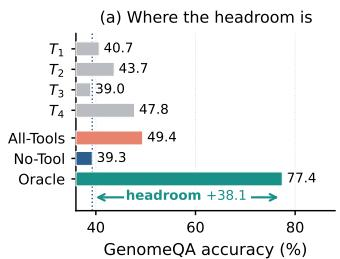

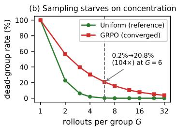

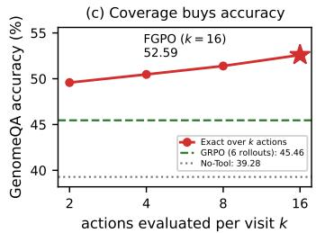  
Figure 1: Why sample when enumeration is possible? (a) Individual tools, All-Tools, No-Tool, and a perquestion oracle on the 3,590 GenomeQA test questions; the oracle reveals 38.1 points of recoverable headroom. (b) Closed-form probability that all G rollouts receive identical reward, forming a dead group with zero reward advantage. (c) Accuracy when the same training construction observes only k uniformly sampled actions per visit.

## Why sample an expectation that can be computed exactly?

As a remedy, we introduce FGPO (Full-Group Policy Optimization), an exact policy optimization framework for enumerable tool-selection spaces. FGPO incorporates (1) an exact objective that scores every tool subset and optimizes the complete action expectation, so each update sees the whole action space rather than a sample of it, and (2) an exhaustive reward table that precomputes each question-subset pair once, removing frozen-reasoner calls from the training loop entirely. For autoregressive LLM policies we further use per-token length-normalized candidate scoring and entropy regularization to obtain a practical realization of this objective.

## Our contributions are summarized as follows:

• We formulate tool-augmented genomic reasoning as query-dependent combinatorial tool-subset selection and reveal 38.1 points of per-question oracle headroom over the unaided reasoner, demonstrating the importance of selecting specialist capabilities correctly.

• We identify a mismatch between sampled policy optimization and enumerable tool-selection spaces. On GenomeQA, the dead-group rate rises from 0.2% to 20.8% after GRPO training, with similar rates of 17.4–17.8% on two additional benchmarks; controlled k-subset experiments further show that accuracy improves monotonically as the same training construction is given broader uniform action coverage.

• We introduce FGPO, which replaces sampled optimization with exact optimization over all enumerable tool subsets. Across five reasoners and three genomic benchmarks, FGPO outperforms GRPO in all 15 settings by 6.75 points on average and up to 14.20 points, while a standard on-demand GRPO schedule would require 2.4× more frozen-reasoner reward evaluations and on GenomeQA FGPO reduces average invoked tools from 2.36 to 1.40.

## 2 FGPO: EXACT POLICY OPTIMIZATION OVER ENUMERABLE TOOL SUBSETS

This section develops FGPO as exact policy optimization for LLM tool selection: the objective over all 2ⁿ tool subsets (Section 2.2), two choices its LLM instantiation needs plus a controlled candidate-scoring evaluation (Section 2.3), and an exhaustive reward table that precomputes $r ( s , a )$ once (Section 2.4). Algorithm 1 in Section A states the whole procedure.

## 2.1 SETTING

Let D denote the training-question distribution. A frozen reasoner R answers multiple-choice genomic questions $s \sim \mathcal { D } ,$ optionally given the output of a subset $a \subseteq \{ T _ { 1 } , \ldots , T _ { n } \}$ of tools run on the question's sequence. The tools are independent analyses of that sequence, none consuming another's output, so a subset fully specifies the execution. A policy $q _ { \theta } ( a \mid s )$ , with θ the parameters of a LoRA adapter, selects the subset; the action space is $\mathcal { A } = 2 ^ { \{ T _ { 1 } , . . . , T _ { n } \} }$ with $\left| { \mathcal { A } } \right| = 2 ^ { n } \left( n { = } 4 \right.$ in all main experiments, 16 actions; Table 1 lists the library). With $y ^ { \star }$ the gold option and ${ \hat { y } } ( s , a )$ the reasoner's answer given the evidence of subset $^ { a , }$ the reward scores correctness and adds a parsimony tie-break an order of magnitude smaller:

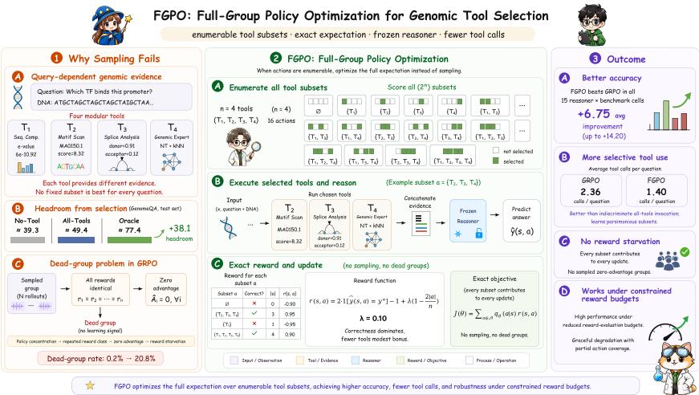  
Figure 2: Overview of FGPO. A trainable LoRA policy scores all $2 ^ { n }$ tool subsets for a question; each subset's tools are executed and their evidence handed to a frozen reasoner, and the resulting rewards, precomputed once into an exhaustive table, enter the exact objective $\begin{array} { r } { J ( \theta ) = \sum _ { a } q _ { \theta } \bigl ( a | s \bigr ) r \bigl ( s , a \bigr ) } \end{array}$ , so every subset contributes to every update. The sampled alternative draws G rollouts instead, yielding a 20.8% mean dead-group probability at convergence under Eq. 1 (79.6% under the sampled baseline's coarser reward), and hence zero advantage when a dead group occurs.

$$
r ( s , a ) = \underbrace { 2 \cdot \mathbf { 1 } [ \hat { y } ( s , a ) = y ^ { \star } ] - 1 } _ { \pm 1 } + \lambda \left( 1 - \frac { 2 | a | } { n } \right) , \qquad \lambda = 0 . 1 0 ,\tag{1}
$$

so correctness always dominates and, among subsets that agree on it, fewer tools score higher. We follow the setting of Tong et al. (2026) (frozen reasoner, tool-subset action space, RLtrained selector) but not its differential reward (Section 3.1). The policy is a 7B LLM with a LoRA adapter (Hu et al., 2021) that emits the subset as a short indexed string over anonymous tool slots, with no tool names or descriptions, so any routing it learns comes from reward rather than text (Appendix G).

Table 1: The modular tool library. All tools are frozen; $T _ { 4 }$ uses source-training kNN. Solo worth is shown in Figure 1a.
<table><tr><td>ID</td><td>Tool Module</td><td>Source</td></tr><tr><td> $T _ { 1 }$ </td><td>Seq. Composition</td><td>Cock et al. (2009)</td></tr><tr><td> $T _ { 2 }$ </td><td>Motif Scan</td><td>Castro-Mondragon et al. (2022)</td></tr><tr><td> $T _ { 3 }$ </td><td>Splice Analysis</td><td>Yeo &amp; Burge (2003)</td></tr><tr><td> $T _ { 4 }$ </td><td>Genomic Expert</td><td>Dalla-Torre et al. (2025)</td></tr></table>

## 2.2 THE EXACT OBJECTIVE

With a frozen, greedily decoded reasoner we treat $r ( s , a )$ as effectively deterministic (an independent live pipeline agrees with the cache within 0.05 points, Section C). The action expectation in the policy-gradient objective and its gradient is then a finite sum, evaluated exactly; the expectation over questions is minibatched as usual,

$$
J ( \theta ) \ = \ \mathbb { E } _ { s \sim \mathcal { D } } \sum _ { a \in \mathcal { A } } q _ { \theta } ( a \mid s ) r ( s , a ) , \qquad \nabla _ { \theta } J \ = \ \mathbb { E } _ { s } \sum _ { a \in \mathcal { A } } r ( s , a ) \nabla _ { \theta } q _ { \theta } ( a \mid s ) ,\tag{2}
$$

computable without sampling whenever $2 ^ { n }$ candidate evaluations per visit are affordable. FGPO optimizes $\operatorname { E q } .$ 2 directly over the tool-subset space, connecting to expected and all-action policy gradients (Ciosek & Whiteson, 2020; Asadi et al., 2017) in the contextual-bandit setting (Langford & Zhang, 2007). Contrast GRPO (Shao et al., 2024), which samples G rollouts from the autoregressive generation policy. Let $p _ { \theta } ^ { \mathrm { g e n } } ( a | s )$ denote the categorical distribution over parsed tool subsets induced by that sampler; then $a _ { 1 } , \dots , \bar { a _ { G } } \sim p _ { \theta } ^ { \mathrm { g e n } } ( \cdot | s )$ , and GRPO steps on group-normalized advantages, where r is whatever reward that arm trains on, the differential reward in our experiments (Section 3.1):

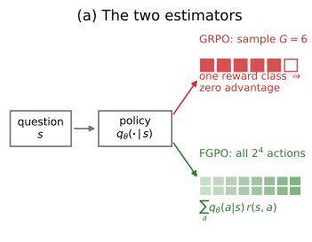

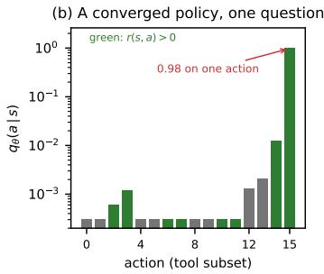

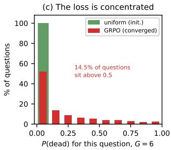  
Figure 3: What each estimator sees. (a) The two estimators on the same state. (b) The converged GRPO policy's exported distribution over the 16 subsets for one GenomeQA question; green marks positive reward. (c) Per-question dead probability at $G { = } 6$ over all 3,590 test questions, with reward classes from Eq. 1; the mean is 20.8%, as reported in Section 3.4.

$$
\hat { A } _ { i } = \frac { r ( s , a _ { i } ) - \mu } { \sigma + \epsilon } , \qquad \mu = \frac { 1 } { G } \sum _ { j = 1 } ^ { G } r ( s , a _ { j } ) , \qquad \sigma ^ { 2 } = \frac { 1 } { G } \sum _ { j = 1 } ^ { G } \bigl ( r ( s , a _ { j } ) - \mu \bigr ) ^ { 2 } .\tag{3}
$$

with $\epsilon > 0$ for numerical stability. Two limitations follow. Whenever the G drawn rewards coincide every numerator is zero, so all advantages vanish regardless of $\epsilon ,$ a dead group, which Section 3.4 shows reaches $1 0 4 \times - 1 7 8 \times$ the uniform-reference rate. And because the group is drawn from $p _ { \theta } ^ { \mathrm { g e n } }$ itself, coverage shrinks exactly as the sampling policy concentrates, which is what optimization produces. Eq. 2 evaluates every subset without sampled groups: concentration can shrink reward gradients through $q _ { \theta }$ , but no action is omitted by sampling (Appendix F.1).

Figure 3 makes this concrete on real data: the converged GRPO policy puts $9 8 \%$ of its mass on a single subset (panel b), and the per-question dead probability is heavily skewed (panel c), so sampling goes blind precisely where the policy has already committed.

## 2.3 INSTANTIATING THE EXACT ESTIMATOR ON AN LLM POLICY

Two choices separate Eq. 2 from a working method on an LLM policy, each motivated by an observed failure; we additionally use a controlled candidate-scoring evaluation to compare trained policies under an identical decoding rule.

(i) Per-token length normalization. The $2 ^ { n }$ actions are strings of 5–13 tokens and the empty subset is the shortest, so a softmax over raw sequence log-probabilities embeds a prior toward invoking nothing, a bias absent when actions are abstract indices. With $y _ { a }$ the token string encoding a and $\pi _ { \theta }$ the policy's next-token distribution, we score candidates by their per-token mean. Here qθ denotes the candidate-normalized categorical distribution used by FGPO; it is distinct from the generation-induced $p _ { \theta } ^ { \mathrm { g e n } }$ used by the GRPO sampler in Eq. 3:

$$
\ell _ { \theta } ( a \left. s \right) = \frac { 1 } { \left. y _ { a } \right. } \sum _ { t = 1 } ^ { \left. y _ { a } \right. } \log \pi _ { \theta } ( y _ { a , t } \left. s , y _ { a , < t } \right. , \quad \quad q _ { \theta } ( a \left. s \right) = \frac { \exp \ell _ { \theta } ( a \left. s \right) } { \sum _ { a ^ { \prime } \in A } \exp \ell _ { \theta } ( a ^ { \prime } \left. s \right) } .\tag{4}
$$

(ii) Entropy regularization. To preserve per-question discrimination we add an entropy regularizer and optimize

$$
J _ { \beta } ( \theta ) = J ( \theta ) + \beta \mathbb { E } _ { s \sim \mathcal { D } } H ( q _ { \theta } ( \cdot \vert s ) ) , \qquad H ( q ) = - \sum _ { a \in \mathcal { A } } q ( a ) \log q ( a ) , \qquad \beta = 0 . 0 3 ,\tag{5}
$$

which encourages broader candidate probabilities during optimization.

(iii) A controlled candidate-scoring evaluation. Training already scores every candidate, so a controlled evaluation can reuse that score rather than generating free-form text:

$$
{ \hat { a } } ( s ) = \underset { a \in \mathcal { A } } { \arg \operatorname* { m a x } } \ \ell _ { \theta } ( a \mid s ) .\tag{6}
$$

Format failure is removed by construction rather than by parser engineering. The rule is available to any autoregressive policy, so we apply it to the baselines too: scoring all 16 candidates instead of generating freely moves GRPO 45.46 → 45.13, SFT 42.17 → 39.30 and FGPO 52.62 → 51.84, leaving FGPO ahead by 6.71 points under an inference rule identical across arms. Table 2 reports free generation throughout.

## 2.4 THE EXHAUSTIVE REWARD TABLE

We precompute $r ( s , a )$ for all $2 ^ { n }$ actions of every training question. The table is memoization ( FGPO could evaluate rewards on demand) but it makes the economics explicit: building the table takes $2 ^ { n } \left| \mathcal { D } \right| = 1 6 \times 2 , 0 0 2 = 3 2 , 0 3 2$ reasoner calls, whereas the reported GRPO schedule (200 steps × 384 rollouts) entails 76,800 reward evaluations, a 2.4× difference for a standard on-demand implementation. In our controlled experiments both arms read the same cached outcomes, so this cost is an accounting fact about the schedules rather than a difference between the runs we report; and everything downstream becomes a lookup with no further frozen-reasoner calls. Under a constrained frozen-reasoner budget, evaluating a uniformly drawn k-subset of actions with $q _ { \theta }$ renormalized on that subset degrades gracefully: at $k { = } 2 .$ , one third of GRPO's budget, accuracy still leads by 4 points (Section 3.5).

## 3 EXPERIMENTS

We organize the evaluation around five questions, each answered by the correspondingly numbered subsection. Q1: Does FGPO outperform sampled and offline baselines under matched data, prompts and adapters, and do the learned selections transfer across frozen reasoners? Q2: What selection behaviour does each objective actually produce? Q3: $W h y$ does the sampled estimator underperform, and does the mechanism replicate? Q4: Does action-space coverage drive the gain? Q5: What does the parsimony term in the reward buy? Additional numerical results, including the full transfer grid. paired significance tests, ceiling analyses, dead-group grids, library ablations, GRPO/DPO sweeps and cost accounting, are in Appendices C–F.

## 3.1 EXPERIMENT SETUP

Benchmarks and tools. Three multiple-choice genomic QA suites on open corpora: GenomeQA (Long et al., 2026) (3,590 test / 492 dev) and two held-out cross-domain suites, GenBench-X and BM4 (1,000 each) (Grešová et al., 2023; De Almeida et al., 2022). The 2,002 training questions come from the Nucleotide Transformer downstream tasks (Dalla-Torre et al., 2025); the selector is trained on none of the three evaluation benchmarks. The $n { = } 4$ tools span sequence composition $( T _ { 1 } )$ , motif scanning $( T _ { 2 } )$ , splice-site analysis $( T _ { 3 } )$ , and a kNN predictor over frozen Nucleotide-Transformer embeddings $( T _ { 4 } )$ . Policy, baselines and reasoners. The policy is Qwen2.5-7B-Instruct (Qwen et al., 2025) with a rank-16 LoRA; GRPO, DPO and SFT use the official TRL implementations (von Werra et al., 2020) on identical prompts, data and adapters, GRPO and SFT reported at their developmentselected checkpoint and DPO at the best cell of its sweep, with DPO given the true argmax from the exhaustive table as its chosen response. The five frozen reasoners are Qwen2.5-1.5B/7B (Qwen et al., 2025), Qwen3-8B (Yang et al., 2025), Mistral-7B (Jiang et al., 2023) and InternLM2.5-7B (Cai et al., 2024). Significance uses question-paired McNemar tests (McNemar, 1947; Dietterich, 1998). Appendix B specifies all of these exactly, including the three training-free references Random. All-Tools and Tools w/ Desc.

## 3.2 A1: FGPO OUTPERFORMS SAMPLED AND OFFLINE BASELINES

Table 2 reports every selection strategy under matched conditions. FGPO is the best or tied-best learned or deployable method in 14 of the 15 cells, exceeding GRPO by 6.75 points on average. More importantly, FGPO outperforms GRPO in all 15 benchmark-reasoner cells, showing that the gain persists across frozen reasoners rather than being tied to the Qwen3-8B reasoner that supplied the training rewards. On GenomeQA FGPO also calls fewer tools than GRPO (1.40 vs. 2.36 per question) and uses 3.5–4.1 × fewer input tokens than exhaustive All-Tools (Table 8, Appendix C).

Table 2: Main comparison. Accuracies (%). Qwen3-8B supplied the training rewards; the other four reasoners receive the same policy without adaptation. Trained rows share data, prompts and adapters; GRPO keeps Tong et al.'s differential reward while FGPO optimizes Eq. 1 (Section 3.6 examines the parsimony term). Per cell: best bold, second underlined; ties share a mark.
<table><tr><td>Benchmark Reasoner</td><td></td><td>No-Tool</td><td>Random</td><td>All-Tools</td><td>Tools w/ Desc</td><td>SFT</td><td>DPO</td><td>GRPO</td><td>FGPO</td></tr><tr><td rowspan="5">GA</td><td> $\mathrm { Q w e n } 3 – 8 \mathbf { B } ^ { \dagger }$ </td><td>39.33</td><td>45.32</td><td>49.44</td><td>47.77</td><td>42.17</td><td>39.33</td><td>45.43</td><td>52.65</td></tr><tr><td>Qwen2.5-1.5B</td><td>38.25</td><td>40.78</td><td>42.92</td><td>44.07</td><td></td><td>40.72 38.33</td><td>42.87</td><td>43.79</td></tr><tr><td>Qwen2.5-7B</td><td>37.86</td><td>44.93</td><td>48.91</td><td>47.10</td><td>40.25</td><td>38.22</td><td>46.74</td><td>50.58</td></tr><tr><td>Mistral-7B</td><td>37.83</td><td>34.82</td><td>23.09</td><td>41.00</td><td>38.08</td><td>37.69</td><td>35.68</td><td>42.90</td></tr><tr><td>InternLM2.5-7B</td><td>38.36</td><td>45.38</td><td>47.94</td><td>48.66</td><td>42.48</td><td>38.77</td><td>48.05</td><td>52.53</td></tr><tr><td rowspan="5">Geu-X</td><td>Qwen3-8B†</td><td>41.10</td><td>54.20</td><td>59.00</td><td>59.00</td><td>46.60</td><td>41.30</td><td>51.90</td><td>65.20</td></tr><tr><td>Qwen2.5-1.5B</td><td>41.40</td><td>50.50</td><td>58.50</td><td>54.20</td><td>42.00</td><td>41.40</td><td>48.80</td><td>60.00</td></tr><tr><td>Qwen2.5-7B</td><td>42.10</td><td>57.30</td><td>66.60</td><td>59.90</td><td>51.50</td><td>42.30</td><td>57.50</td><td>68.90</td></tr><tr><td>Mistral-7B</td><td>40.30</td><td>43.50</td><td>45.40</td><td>52.00</td><td>41.30</td><td>40.30</td><td>44.00</td><td>58.20</td></tr><tr><td>InternLM2.5-7B</td><td>39.70</td><td>54.20</td><td>63.10</td><td>59.70</td><td>50.00</td><td>39.90</td><td>54.10</td><td>66.90</td></tr><tr><td rowspan="5">B4</td><td>Qwen3-8B†</td><td>43.20</td><td>48.00</td><td>53.30</td><td>47.30</td><td>43.50</td><td>43.10</td><td>52.30</td><td>54.80</td></tr><tr><td>Qwen2.5-1.5B</td><td>42.60</td><td>47.00</td><td>50.50</td><td>47.30</td><td>42.70</td><td>42.70</td><td>48.80</td><td>51.80</td></tr><tr><td>Qwen2.5-7B</td><td>43.60</td><td>48.00</td><td>55.00</td><td>47.50</td><td>44.30</td><td>43.50</td><td>52.90</td><td>55.30</td></tr><tr><td>Mistral-7B</td><td>42.30</td><td>43.70</td><td>42.80</td><td>48.90</td><td>41.70</td><td>42.30</td><td>45.20</td><td>48.90</td></tr><tr><td>InternLM2.5-7B</td><td>42.60</td><td>48.90</td><td>53.70</td><td>47.10</td><td>45.20</td><td>42.40</td><td>51.70</td><td>54.70</td></tr></table>

†Training reasoner; the other four columns transplant the same policy without adaptation.

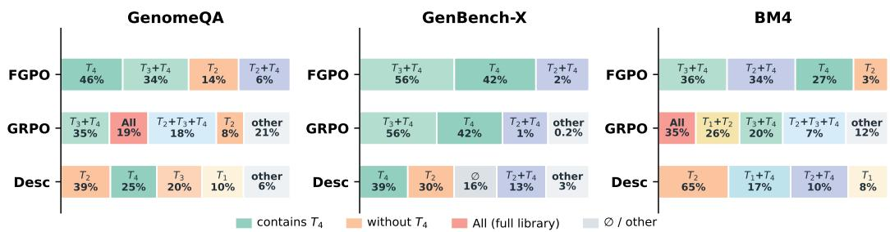  
Figure 4: What each selector actually calls. Top subset combinations per benchmark. Teal/blue marks subsets containing $T _ { 4 }$ , orange those without, red the full library, and gray the empty set or residual subsets. Widths are compressed for legibility; labels give the displayed shares. FGPO concentrates on a few $T _ { 4 }$ -containing subsets, whereas GRPO spreads broadly, including All on 19% of GenomeQA and 35% of BM4.

What the selections look like question by question. On the 418 questions where FGPO is right and GRPO is wrong, the selected tool typically returns a per-option contrast rather than a decisive reading of the winning option alone (Figure 6c; Appendix C works through three case studies).

## 3.3 A2: FGPO LEARNS QUERY-DEPENDENT GENOMIC EVIDENCE ROUTING

They fail in three different shapes. Read in aggregate (Figure 4), on GenomeQA the prompted selector calls exactly one tool on 93.6% of questions, selecting a singleton subset on nearly every question, while GRPO calls two or more on 81% and spends three or four tools on 37.7%. FGPO does neither: it never exceeds two tools, drops $T _ { 1 }$ entirely (0.0% on all three benchmarks, against GRPO's 21–64%) while concentrating on $T _ { 4 }$ , the tool that uniquely rescues the most questions (308), calling it on 86.4% of GenomeQA questions and at least 96% on the other two. Dropping $T _ { 1 }$ is a decision, not a free lunch: removing it from the library costs the per-question oracle 2.1–3.3 points across the three benchmarks (Table 12), so FGPO is giving up reachable questions in exchange for never paying $T _ { 1 } { } ^ { , } \mathrm { s }$ cost on the rest. None of this was supervised (tool slots are anonymous), so the shape of the policy is a statement about what the reward could be made to reveal.

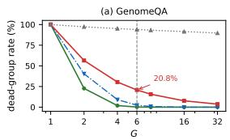

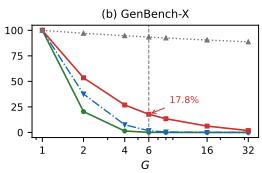

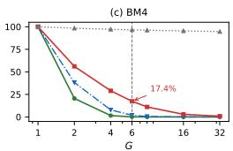  
Uniform (reference)-SFTGRPO (conv.)FGPO (conv.)

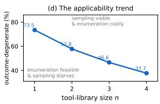

Figure 5: Dead-group rate replicates across benchmarks. (a)–(c) Closed-form rate vs. group size $G ;$ dashed line marks GRPO's G=6. Panel (a) adds the offline and exact arms to Figure 1b; (b),(c) repeat it on the held-out benchmarks. (d) Outcome-degenerate fraction (all subsets induce the same correctness outcome) vs. library size averaged over sub-libraries.  
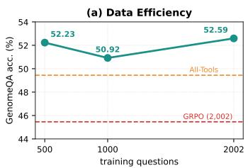

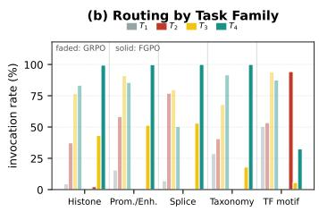

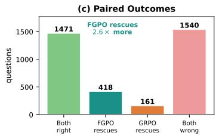  
Figure 6: Additional analysis. (a) 500 training questions already beat GRPO trained on 2,002 questions and the training-free All-Tools baseline. (b) Per-tool invocation rate within each task family (Figure 4 aggregates over them). GRPO calls every tool at a similar rate whatever the question type; FGPO routes $( T _ { 2 }$ for TF motif, $T _ { 4 }$ elsewhere) and never calls $T _ { 1 }$ on any benchmark against GRPO's 21–64%: a learned refusal. (c) FGPO rescues 2.6× as many questions as GRPO.

Offline objectives collapse onto the marginal mode. On the GenomeQA test set the empty subset is reward-optimal on 61.9% of questions (the reasoner is often right unaided, and the parsimony term then favors calling nothing). SFT clones this marginal: its argmax is the empty set on 92.8% of questions. DPO collapses entirely: across three $\beta$ values and seven checkpoints it selects 0.00–0.10 tools and lands on the no-tool floor (39.33 vs. 39.28), because 58.1% of chosen responses are the empty string and a pairwise ranking objective is satisfied by the mode (Tong et al., 2026). GRPO does not collapse; it starves, which is Q3.

## 3.4 A3: SAMPLING STARVES because TRAINING SUCCEEDS

For the closed-form diagnostic, let $p _ { \theta } ^ { \mathrm { g e n } } ( a | s )$ denote the policy's generation-induced distribution over the 16 valid subset strings. The probability that G independent draws all land in one reward class, a dead group, is closed-form: $\begin{array} { r } { P _ { \mathrm { d e a d } } ( s ) = \sum _ { v } \left( \sum _ { a : r ( s , a ) = v } p _ { \theta } ^ { \mathrm { g e n } } ( a | s ) \right) ^ { G } } \end{array}$ . At GRPO's G=6: 0.2% of questions are dead under a uniform reference policy, 20.8% under the converged GRPO policy, 104× the uniform-reference rate, replicated at 17.8%/17.4% (178×/174×) on GenBench-X/BM4 (Figure 5). These rates use the reward classes of Eq. 1, the finest any arm induces. Under the coarser differential reward GRPO actually trains on, the dead fraction reaches 79.6% at convergence, so these figures are conservative.

The starvation is not benign. A vanishing signal would be unremarkable if it dried up only where the policy had already succeeded. It does not: dead-group probability is empirically nearindependent of correctness (54% of the dead mass sits on wrong answers), and 6.7% of all questions are simultaneously dead, wrong, and repairable by some subset in the policy's own action space. The policy stops learning on them before it solves them, while the exact estimator's signal on them never vanishes by sampling.

Live telemetry under the coarser differential reward actually used by GRPO shows the same dynamic during temperature-1.0 generation; malformed completions additionally join the same reward class. Over the reported GRPO run the observed dead-group fraction rises from 66.9% to 80.0% (Figure 7a) as its policy entropy collapses by 3.3× (Figure 7b). These observations are consistent with the mechanism formalized in Appendix F.1: greater concentration of probability mass over reward classes increases the probability of a dead group. FGPO also concentrates, reaching 0.78 on its top action against a uniform 1/16 (Figure 7c), while avoiding sampled dead groups. GRPO's test accuracy (Figure 7d) peaks at 37.5% of training and is flat thereafter while its training reward gains a further 21%, so the objective keeps improving after it has stopped buying accuracy, and it never reaches the two strongest training-free references of Table 2 (All-Tools, Tools w/ Desc), which FGPO clears along with the rest.

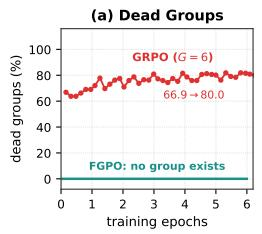

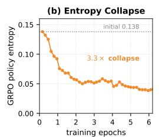

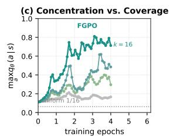

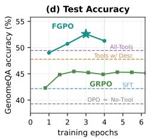  
Figure 7: The mechanism, measured live during training. (a) The observed dead-group rate rises throughout GRPO training, while the exact objective has no sampled groups by construction. (b) GRPO's policy entropy decreases in parallel. (c) FGPO also becomes highly concentrated while retaining complete action coverage. (d) Test accuracy against the three training-free references in Table 2: FGPO surpasses all three, whereas GRPO surpasses only Random.

The same tables give a library-size trend. Call a question outcome-degenerate if all $2 ^ { n }$ subsets induce the same correctness outcome, so tool selection cannot alter whether the frozen reasoner is right. Averaging over all $\binom { 4 } { n }$ sub-libraries of each size, averaging over tool identity, Figure 5d shows this fraction falling from 73.5% at one tool to 37.7% at four. Larger libraries thus expose more outcome-diverse actions at the same time that exhaustive enumeration becomes more expensive. The two estimators' applicability regions are complementary: this paper characterizes the regime where exact optimization is feasible and sampled optimization is most information-starved.

## 3.5 A4: A CONTROLLED COVERAGE INTERVENTION: THE k-SUBSET DOSE-RESPONSE

The dead-group analysis is observational; we now test it with an intervention. We hold the data, ordering, hyperparameters and actionscoring construction fixed and vary only the number of candidate actions the estimator is shown: at each visit it sees a uniformly drawn subset of k of them, with $q _ { \theta }$ renormalized on that subset, so each k is its own objective and k=16 recovers FGPO. Policy-model compute per step is unchanged, since all candidate strings are scored in every arm. Accuracy at

Table 3: The coverage dial. Accuracy by epoch when the objective sees only k uniformly drawn actions per visit. Everything else held fixed.
<table><tr><td>k</td><td>ep1</td><td> $\mathtt { e p 2 }$ </td><td>ep3</td><td>ep4</td><td>peak</td></tr><tr><td>2</td><td>47.55</td><td>49.14</td><td>49.58</td><td>49.44</td><td>49.58</td></tr><tr><td>4</td><td>47.27</td><td>50.25</td><td>50.47</td><td>45.24</td><td>50.47</td></tr><tr><td>8</td><td>49.14</td><td>50.89</td><td>51.39</td><td>50.56</td><td>51.39</td></tr><tr><td>16 (FGPO)</td><td>49.00</td><td>50.72</td><td>52.59</td><td>51.28</td><td>52.59</td></tr><tr><td>GRPO (G=6)</td><td></td><td></td><td></td><td></td><td>45.46</td></tr></table>

the (dev-selected) peak epoch is strictly monotone in k $: 4 9 . 5 8 \to 5 0 . 4 7 \to 5 1 . 3 9 \to 5 2 . 5 9$ for $k = 2 , 4 , 8 ,$ 16 (paired McNemar: k=16 over $k { = } 2 , p < 1 0 ^ { - 4 } ;$ over k=8, p = 0.011; Figure 1c and Table 3). Two readings follow. First, what the estimator sees of the action space is what the method learns, the controlled counterpart of Section 3.4. Second, even k=2 (49.58) exceeds six-rollout GRPO (45.46): uniform draws do not concentrate with the policy, consistent with GRPO's deficit having two components, coverage and sampling from a concentrated distribution, though only coverage is varied here. The k dial also spans a coverage-budget continuum: using only two frozen-reasoner reward evaluations per visit, one third of $\mathrm { G R P O ^ { \cdot } s } ,$ the budgeted variant still leads by 4 points.

## 3.6 A5: EFFECT OF PARSIMONY ON ACCURACY AND TOOL USAGE

Penalizing redundancy primarily buys tool economy. Table 4 retrains the exact objective on correctness alone (λ=0 in Eq. 1) against the reported reward, which adds the parsimony term. The λ=0 arm is also the closest exact-objective counterpart of $\mathrm { G R P O ^ { \circ } s }$ reward: on the enumerated candidates Tong et al $\therefore \mathbf { s }$ differential reward is half the ±1 correctness reward plus a per-question constant, to which the expectedreward term of Eq. 2 is invariant, so that term has a proportional gradient under either; the entropy weight and GRPO's sampling and group normalization lie outside this identity. Between the two arms accuracy differs modestly (49.17 vs. 51.17 at peak) but economy does not: without the term the policy invokes more tools at every epoch (2.0–2.3 against 1.0–1.6; 2.19 vs. 1.19 at epoch 4), as expected when a right answer obtained with four tools scores exactly as well as the same answer with one.

Table 4: Reward design. The exact objective trained on Eq. 1 (correctness plus the parsimony term) against correctness alone $( \lambda { = } 0 )$ both scored over the enumerated candidates on the 1,200-question quick split. Independent runs with different initialization.
<table><tr><td></td><td>ep1</td><td>ep2</td><td>ep3</td><td>ep4</td></tr><tr><td>With parsimony, acc. Correctness only, acc.</td><td>47.25 47.58</td><td>48.33 48.33</td><td>51.17 48.75</td><td>49.75 49.17</td></tr><tr><td>With parsimony, tools</td><td>1.04</td><td>1.53</td><td>1.61</td><td>1.19</td></tr><tr><td>Correctness only, tools</td><td>2.04</td><td>2.33</td><td>2.06</td><td>2.19</td></tr></table>

## 4 RELATED WORK

Tool-augmented genomic reasoning. Genomic foundation models provide specialized representations for nucleotide sequences (Ji et al., 2021; Zhou et al., 2024; Dalla-Torre et al., 2025; Nguyen et al., 2023; Schiff et al., 2024; Nguyen et al., 2024), and general-purpose LLMs benefit from access to such tools (Jin et al., 2024); public benchmarks for genomic tasks exist (Zhou et al., 2024; Grešová et al., 2023; De Almeida et al., 2022). These directions address complementary parts of the problem: genomic models supply sequence-level computation, while language models supply semantic reasoning. Our focus is the interface, deciding which specialized genomic computations to expose for each question.

RL-based tool selection. Teaching LLMs to call external tools spans self-supervised call insertion (Schick et al., 2023), prompted acting (Yao et al., 2022; Lu et al., 2023), API-scale instruction tuning (Qin et al., 2024; Patil et al., 2024; Shen et al., 2023), and benchmarks of call correctness (Li et al. 2023). Closest to us is the line that trains a selection policy for a frozen reasoner with RL: VisTA (Huang et al., 2025), AuTAgent (Tong et al., 2026), and reward-shaped variants (Qian et al., 2026; Jin et al., 2025), all of which modify the reward or interaction protocol while retaining sampled policy optimization. We adopt their frozen-reasoner setting but study the combinatorial subset-selection regime: what happens when the complete tool-subset space is small enough to evaluate but the optimizer continues to sample it? Our results show that the issue is not only estimator variance; policy concentration progressively increases the probability of zero-advantage groups. Integrating over actions rather than sampling them has been explored for variance reduction (Ciosek & Whiteson. 2018; 2020; Asadi et al., 2017; Kool et al., 2019; Williams, 1992; Ahmadian et al., 2024). GRPO (Shao et al., 2024) and its successors (Yu et al., 2026; Liu et al., 2025) normalize within sampled groups; the resulting zero-advantage behavior is noted as an efficiency concern (Yu et al., 2026). We characterize its interaction with policy concentration on enumerable spaces, where it becomes a structural mismatch rather than a mere inefficiency, and propose FGPO as a practical solution for this regime: regime identification, failure mechanism, and LLM instantiation.

## 5 CONCLUSION AND FUTURE WORK

Genomic tools provide sequence-level evidence that language models cannot reliably compute, but their usefulness is strongly query-dependent. We show that sampled group optimization becomes increasingly information-starved as the policy concentrates over a small enumerable tool space, causing reward collisions and vanishing advantages. FGPO removes this sampling mismatch by optimizing the exact action expectation, consistently improving reasoning across three genomic benchmarks and five frozen reasoners while invoking fewer tools. While compact tool libraries suffice in the specialist regime studied here, future work could extend FGPO to domains requiring larger libraries by adaptively constructing compact, coverage-preserving candidate sets and retaining exact optimization within each selected set.

## AI USE STATEMENT

Generative AI tools were used to assist with writing: polishing prose for clarity and concision. They were not used to generate research ideas, design experiments, or draw conclusions. We have reviewed all AI-assisted text and take responsibility for the final content of this work.

## ETHICS STATEMENT

This work involves no human subjects and no clinical or individually identifiable genomic data. All sequences come from public reference-organism corpora; the two held-out evaluation suites are derivatives of those corpora and redistribution should respect each upstream licence. The method

learns only which standard sequence-analysis tools to invoke and neither designs sequences nor adds capabilities beyond those the tools already provide.

## REPRODUCIBILITY STATEMENT

All training and evaluation code, the exhaustive reward tables, per-question answer files for every table row, and the failure log (including models that could not be evaluated on our hardware, with root causes) will be released. Baselines use official TRL implementations (von Werra et al., 2020); every number in the paper regenerates from the released tables by scripted lookup.

## REFERENCES

Arash Ahmadian, Chris Cremer, Matthias Gallé, Marzieh Fadaee, Julia Kreutzer, Olivier Pietquin, Ahmet Üstün, and Sara Hooker. Back to basics: Revisiting reinforce-style optimization for learning from human feedback in llms. In Proceedings of the 62nd Annual Meeting of the Association for Computational Linguistics (Volume 1: Long Papers), pp. 12248–12267, 2024.

Kavosh Asadi, Cameron Allen, Melrose Roderick, Abdel-rahman Mohamed, George Konidaris Michael Littman, and Brown University Amazon. Mean actor critic. stat, 1050(2017):1, 2017.

Zheng Cai, Maosong Cao, Haojiong Chen, Kai Chen, Keyu Chen, Xin Chen, Xun Chen, Zehui Chen, Zhi Chen, Pei Chu, et al. Internlm2 technical report. arXiv preprint arXiv:2403.17297, 2024.

Jaime A Castro-Mondragon, Rafael Riudavets-Puig, Ieva Rauluseviciute, Roza Berhanu Lemma, Laura Turchi, Romain Blanc-Mathieu, Jeremy Lucas, Paul Boddie, Aziz Khan, Nicolás Manosalva Pérez, et al. Jaspar 2022: the 9th release of the open-access database of transcription factor binding profiles. Nucleic acids research, 50(D1):D165–D173, 2022.

Kamil Ciosek and Shimon Whiteson. Expected policy gradients, 2018. URL https : //arxiv. org/abs/1706.05374.

Kamil Ciosek and Shimon Whiteson. Expected policy gradients for reinforcement learning. Journal of Machine Learning Research, 21(52):1–51, 2020.

Peter JA Cock, Tiago Antao, Jeffrey T Chang, Brad A Chapman, Cymon J Cox, Andrew Dalke, Iddo Friedberg, Thomas Hamelryck, Frank Kauff, Bartek Wilczynski, et al. Biopython: freely available python tools for computational molecular biology and bioinformatics. Bioinformatics, 25(11): 1422, 2009.

Hugo Dalla-Torre, Liam Gonzalez, Javier Mendoza-Revilla, Nicolas Lopez Carranza, Adam Henryk Grzywaczewski, Francesco Oteri, Christian Dallago, Evan Trop, Bernardo P De Almeida, Hassan Sirelkhatim, et al. Nucleotide transformer: building and evaluating robust foundation models for human genomics. Nature methods, 22(2):287–297, 2025.

Bernardo P De Almeida, Franziska Reiter, Michaela Pagani, and Alexander Stark. Deepstarr predicts enhancer activity from dna sequence and enables the de novo design of synthetic enhancers. Nature genetics, 54(5):613–624, 2022.

Thomas G Dietterich. Approximate statistical tests for comparing supervised classification learning algorithms. Neural computation, 10(7):1895–1923, 1998.

Katarína Grešová, Vlastimil Martinek, David Čechák, Petr Šimeček, and Panagiotis Alexiou. Genomic benchmarks: a collection of datasets for genomic sequence classification. BMC Genomic Data, 24(1):25, 2023.

Edward J Hu, Yelong Shen, Phillip Wallis, Zeyuan Allen-Zhu, Yuanzhi Li, Shean Wang, Lu Wang, and Weizhu Chen. Lora: Low-rank adaptation of large language models. arXiv preprint arXiv:2106.09685, 2021.

Zeyi Huang, Yuyang Ji, Anirudh Sundara Rajan, Zefan Cai, Wen Xiao, Haohan Wang, Junjie Hu and Yong Jae Lee. Visualtoolagent (vista): A reinforcement learning framework for visual tool selection. arXiv preprint arXiv:2505.20289, 2025.

Yanrong Ji, Zhihan Zhou, Han Liu, and Ramana V Davuluri. Dnabert: pre-trained bidirectional encoder representations from transformers model for dna-language in genome. Bioinformatics, 37 (15):2112–2120, 2021.

Albert Q. Jiang, Alexandre Sablayrolles, Arthur Mensch, Chris Bamford, Devendra Singh Chaplot, Diego de las Casas, Florian Bressand, Gianna Lengyel, Guillaume Lample, Lucile Saulnier, Lélio Renard Lavaud, Marie-Anne Lachaux, Pierre Stock, Teven Le Scao, Thibaut Lavril, Thomas Wang, Timothée Lacroix, and William El Sayed. Mistral 7b, 2023. URL https : //arxiv. org/abs/2310.06825.

Bowen Jin, Hansi Zeng, Zhenrui Yue, Jinsung Yoon, Sercan Arik, Dong Wang, Hamed Zamani, and Jiawei Han. Search-r1: Training llms to reason and leverage search engines with reinforcement learning. arXiv preprint arXiv:2503.09516, 2025.

Qiao Jin, Yifan Yang, Qingyu Chen, and Zhiyong Lu. Genegpt: augmenting large language models with domain tools for improved access to biomedical information. Bioinformatics, 40(2):btae075 2024.

Wouter Kool, Herke Van Hoof, and Max Welling. Buy 4 reinforce samples, get a baseline for free! 2019.

Woosuk Kwon, Zhuohan Li, Siyuan Zhuang, Ying Sheng, Lianmin Zheng, Cody Hao Yu, Joseph Gonzalez, Hao Zhang, and Ion Stoica. Efficient memory management for large language model serving with pagedattention. In Proceedings of the 29th symposium on operating systems principles, pp. 611–626, 2023.

John Langford and Tong Zhang. The epoch-greedy algorithm for multi-armed bandits with side information. Advances in neural information processing systems, 20, 2007.

Minghao Li, Yingxiu Zhao, Bowen Yu, Feifan Song, Hangyu Li, Haiyang Yu, Zhoujun Li, Fei Huang, and Yongbin Li. Api-bank: A comprehensive benchmark for tool-augmented llms. In Proceedings of the 2023 conference on empirical methods in natural language processing, pp. 3102–3116, 2023.

Zichen Liu, Changyu Chen, Wenjun Li, Penghui Qi, Tianyu Pang, Chao Du, Wee Sun Lee, and Min Lin. Understanding r1-zero-like training: A critical perspective. arXiv preprint arXiv:2503.20783, 2025.

Weicai Long, Yusen Hou, Junning Feng, Shuo Yang, Donglin Xie, Yanlin Zhang, et al. Genomeqa: Benchmarking general large language models for genome sequence understanding. In Proceedings of the 64th Annual Meeting of the Association for Computational Linguistics (Volume 1: Long Papers), pp. 35771–35792, 2026.

Pan Lu, Baolin Peng, Hao Cheng, Michel Galley, Kai-Wei Chang, Ying Nian Wu, Song-Chun Zhu, and Jianfeng Gao. Chameleon: Plug-and-play compositional reasoning with large language models. Advances in Neural Information Processing Systems, 36:43447–43478, 2023.

Albert W Marshall, Ingram Olkin, and Barry C Arnold. Inequalities: theory of majorization and its applications. Springer, 1979.

Quinn McNemar. Note on the sampling error of the difference between correlated proportions or percentages. Psychometrika, 12(2):153–157, 1947.

Eric Nguyen, Michael Poli, Marjan Faizi, Armin Thomas, Michael Wornow, Callum Birch-Sykes, Stefano Massaroli, Aman Patel, Clayton Rabideau, Yoshua Bengio, et al. Hyenadna: Long-range genomic sequence modeling at single nucleotide resolution. Advances in neural information processing systems, 36:43177–43201, 2023.

Eric Nguyen, Michael Poli, Matthew G Durrant, Brian Kang, Dhruva Katrekar, David B Li, Liam J Bartie, Armin W Thomas, Samuel H King, Garyk Brixi, et al. Sequence modeling and design from molecular to genome scale with evo. Science, 386(6723):eado9336, 2024.

Shishir G Patil, Tianjun Zhang, Xin Wang, and Joseph E Gonzalez. Gorilla: Large language model connected with massive apis. Advances in Neural Information Processing Systems, 37: 126544–126565, 2024.

Cheng Qian, Emre Can Acikgoz, Qi He, Hongru Wang, Xiusi Chen, Dilek Hakkani-Tur, Gokhan Tur, and Heng Ji. Toolrl: Reward is all tool learning needs. Advances in Neural Information Processing Systems, 38:105523–105553, 2026.

Yujia Qin, Shihao Liang, Yining Ye, Kunlun Zhu, Lan Yan, Yaxi Lu, Yankai Lin, Xin Cong, Xiangru Tang, Bill Qian, et al. Toolllm: Facilitating large language models to master 16000+ real-world apis. In International Conference on Learning Representations, volume 2024, pp. 9695–9717, 2024.

Qwen, :, An Yang, Baosong Yang, Beichen Zhang, Binyuan Hui, Bo Zheng, Bowen Yu, Chengyuan Li, Dayiheng Liu, Fei Huang, Haoran Wei, Huan Lin, Jian Yang, Jianhong Tu, Jianwei Zhang, Jianxin Yang, Jiaxi Yang, Jingren Zhou, Junyang Lin, Kai Dang, Keming Lu, Keqin Bao, Kexin Yang, Le Yu, Mei Li, Mingfeng Xue, Pei Zhang, Qin Zhu, Rui Men, Runji Lin, Tianhao Li, Tianyi Tang, Tingyu Xia, Xingzhang Ren, Xuancheng Ren, Yang Fan, Yang Su, Yichang Zhang, Yu Wan, Yuqiong Liu, Zeyu Cui, Zhenru Zhang, and Zihan Qiu. Qwen2.5 technical report, 2025. URL https://arxiv.org/abs/2412.15115.

Vyzantinos Repantis, Ameya Gawde, Harshvardhan Singh, and Joey Blackwell II. How many tools should an llm agent see? a chance-corrected answer. arXiv preprint arXiv:2605.24660, 2026.

Timo Schick, Jane Dwivedi-Yu, Roberto Dessì, Roberta Raileanu, Maria Lomeli, Eric Hambro, Luke Zettlemoyer, Nicola Cancedda, and Thomas Scialom. Toolformer: Language models can teach themselves to use tools. Advances in neural information processing systems, 36:68539–68551, 2023.

Yair Schiff, Chia-Hsiang Kao, Aaron Gokaslan, Tri Dao, Albert Gu, and Volodymyr Kuleshov. Caduceus: Bi-directional equivariant long-range dna sequence modeling. Proceedings of machine learning research, 235:43632, 2024.

Zhihong Shao, Peiyi Wang, Qihao Zhu, Runxin Xu, Junxiao Song, Xiao Bi, Haowei Zhang, Mingchuan Zhang, YK Li, Yang Wu, et al. Deepseekmath: Pushing the limits of mathematical reasoning in open language models. arXiv preprint arXiv:2402.03300, 2024.

Yongliang Shen, Kaitao Song, Xu Tan, Dongsheng Li, Weiming Lu, and Yueting Zhuang. Hugginggpt: Solving ai tasks with chatgpt and its friends in hugging face. Advances in Neural Information Processing Systems, 36:38154–38180, 2023.

Siqian Tong, Xuan Li, Yiwei Wang, Baolong Bi, Yujun Cai, Shenghua Liu, Yuchen He, and Chengpeng Hao. Autagent: A reinforcement learning framework for tool-augmented audio reasoning. arXiv preprint arXiv:2602.13685, 2026.

Leandro von Werra, Younes Belkada, Lewis Tunstall, Edward Beeching, Tristan Thrush, Nathan Lambert, Shengyi Huang, Kashif Rasul, and Quentin Gallouédec. TRL: Transformers Reinforcement Learning,2020.URL https://github.com/huggingface/trl.

Ronald J Williams. Simple statistical gradient-following algorithms for connectionist reinforcement learning. Machine learning, 8(3):229–256, 1992.

An Yang, Anfeng Li, Baosong Yang, Beichen Zhang, Binyuan Hui, Bo Zheng, Bowen Yu, Chang Gao, Chengen Huang, Chenxu Lv, et al. Qwen3 technical report. arXiv preprint arXiv:2505.09388, 2025.

Shunyu Yao, Jeffrey Zhao, Dian Yu, Nan Du, Izhak Shafran, Karthik Narasimhan, and Yuan Cao. React: Synergizing reasoning and acting in language models. arXiv preprint arXiv:2210.03629, 2022.

Gene Yeo and Christopher B Burge. Maximum entropy modeling of short sequence motifs with applications to rna splicing signals. In Proceedings of the seventh annual international conference on Research in computational molecular biology, pp. 322–331, 2003.

Qiying Yu, Zheng Zhang, Ruofei Zhu, Yufeng Yuan, Xiaochen Zuo, Yu Yue, Weinan Dai, Tiantian Fan, Gaohong Liu, Lingjun Liu, et al. Dapo: An open-source llm reinforcement learning system at scale. Advances in Neural Information Processing Systems, 38:113222–113244, 2026.

Zhihan Zhou, Yanrong Ji, Weijian Li, Pratik Dutta, Ramana Davuluri, and Han Liu. Dnabert-2: Efficient foundation model and benchmark for multi-species genomes. In International Conference on Learning Representations, volume 2024, pp. 41642–41665, 2024.

## CONTENTS OF APPENDIX

A Algorithm 15   
B Experiment Settings 15   
B.1 Prompts and action encoding 15   
B.2 Sensitivity checks . 16   
B.3 A five-tool library: the policy rejects a harmful capability 16   
B.4 Hyperparameters 16   
B.5 Anonymous slot encoding examples 17   
B.6 Baselines 18   
B.7 Reward 18   
B.8 Benchmark construction and split hygiene 18   
B.9 Tool implementations 18   
B.10 Infrastructure and models that could not be evaluated 18   
C Full Transfer Results 19   
C.1 Case study 19   
C.2 Where the gain comes from 19   
C.3 The transfer grid, read as shapes 19   
C.4 Pipeline agreement with the exhaustive table . 20   
C.5 Ceilings: the best fixed subset and the per-question oracle . 20   
C.6 Paired significance 22   
D Additional Analyses 22   
D.1 k-subset interpolation in full 22   
D.2 Per-question paired analysis and selection heatmap 22   
D.3 Data-scale ablation 22   
D.4 Tool-library single-removal ablations . 23   
E Baseline Fairness Sweeps 23   
E.1 GRPO checkpoint and configuration sweeps 23   
E.2 DPO β sweep 23   
F Mechanism Details 24   
F.1 Two properties of dead groups and of the exact objective 24   
F.2 Dead-group grids for all three benchmarks 25   
F.3 Empty-subset preference: how offline objectives collapse 26   
G Prompt Templates 26   
G.1 Policy prompt (all trained arms: FGPO, GRPO, SFT, DPO) 26   
G.2 Prompted baseline (Tools w/ Desc) 27   
G.3 Reasoner prompt 27   
G.4 Complete reasoner prompt 27   
G.5 Complete tool evidence examples 27   
G.6 Question format examples 28   
G.7 Tool description prompt (Tools w/ Desc baseline) 28

## A ALGORITHM

Algorithm 1 states FGPO end to end. Stage 1 is the one-off cost (Section 2.4); Stage 2 touches the frozen reasoner not at all, since every reward it needs is a table lookup. The inner loop scores all $2 ^ { n }$ candidate strings in a single batched forward pass, requiring no policy-side sampling.

Algorithm 1: FGPO (Full-Group Policy Optimization)   
Input: questions $\mathcal { D } ;$ tool library $\overline { { \{ T _ { 1 } , \ldots , T _ { n } \} } }$ ; frozen reasoner R; LoRA-parameterized policy   
qθ; entropy weight β; parsimony weight λ   
Output: trained selector qθ   
// Stage 1: exhaustive reward table (once)   
foreach $s \in \mathcal { D }$ do   
foreach $a \in \mathcal { A } = 2 ^ { \{ T _ { 1 } , . . . , T _ { n } \} }$ do   
run the tools in a on $s { \ ' } _ { \mathbf { S } }$ sequence; query R with the rendered evidence   
store $r ( s , a )$ by Eq. 1   
end   
end   
// Stage 2: exact policy optimization   
for epoch $= 1 , \ldots , E$ do   
foreach minibatch $B \subseteq { \mathcal { D } }$ do   
foreach $s \in B$ do   
score every candidate string: $\ell _ { \theta } ( a | s )$ for all $a \in { \mathcal { A } }$ (Eq.4) // one batched   
forward pass   
$q _ { \theta } ( . | s )  \mathrm { s o f t m a x } _ { a \in \mathcal { A } } \ell _ { \theta } ( a | s )$   
end   
$\begin{array} { r } { \mathcal { L } ( \boldsymbol { \theta } ) \gets - \frac { 1 } { | B | } \sum _ { s \in B } \Big [ \sum _ { \boldsymbol { a } \in \mathcal { A } } q _ { \boldsymbol { \theta } } ( \boldsymbol { a } | s ) r ( s , \boldsymbol { a } ) + \beta H \big ( q _ { \boldsymbol { \theta } } ( \cdot | s ) \big ) \Big ] } \end{array}$ // Eq. 2, 5   
$\theta \gets \theta - \eta \nabla _ { \theta } \mathcal { L } ( \theta )$ // every a contributes; no group, no dead   
groups   
end   
select the checkpoint on the held-out development split   
end

## B EXPERIMENT SETTINGS

## B.1 PROMPTS AND ACTION ENCODING

The policy prompt lists n anonymous tool slots $( ^ { ^ { \mathrm { s c } } } 0 : \quad \mathrm { ~ t y p e 1 ~ \eta ( \bar { A } ) ~ ^ { \prime \prime } ~ }$ style) and the question; the answer is an indexed subset in <answer></ answer> tags. Tool names, descriptions, and any $\mathrm { \ddot { \ s e f u l - f o r } } ^ { \mathrm { 3 } }$ hints are withheld from the policy in every trained arm (FGPO, GRPO, SFT, DPO); the Tools-w/-Desc baseline receives real names and functional descriptions. Reasoner prompts concatenate the question, options, and the rendered evidence of the selected subset; evidence rendering is shared verbatim across every method and every table row. Anonymous slots are not a handicap. To check that the policy learns routing from reward rather than from tool names, we retrain FGPO with the real tool names and functional descriptions in its selection prompt. On a fixed 1,200-question subsample of the GenomeQA test set the two are nearly identical: 51.67 with descriptions against

51.75 without, both at format rate ≈1.0. The anonymous encoding used throughout therefore costs nothing, and the routing reported in Section 3.3 cannot have been read off the prompt.

## B.2 SENSITIVITY CHECKS

Table 5 varies three choices one at a time on a fixed 1,200-question subsample of the GenomeQA test set, disjoint from the 492-question development split used for checkpoint selection. The exact objective changes little under the tested entropy coefficient, since raising β from 0.03 to 0.08 changes the diagnostic peak by only 0.25 points, and under a sharper listwise softmax, $q _ { \tau } ( a \vert s )$ ∝ exp $( \ell _ { \theta } ( a \mid s ) / \tau )$ with $\tau { = } 0 . 7$ in place of Eq. 4. A 1.5B selector in place of the 7B one still reaches 50.42 against six-rollout $\mathrm { G R P O ^ { \circ } s 4 4 . 2 5 }$ , so the advantage is not specific to the 7B selector.

Table 5: Sensitivity of the exact objective. Accuracy (%) per epoch on the 1,200-question subsample of the GenomeQA test set; peak is the maximum observed accuracy on this diagnostic subsample and is reported only for sensitivity analysis, never for checkpoint selection. Every row changes one factor from the reported configuration (first row). GRPO scores 44.25 here; a dash marks a cell not evaluated on this subsample.
<table><tr><td>Variant</td><td>ep1</td><td>ep2</td><td>ep3</td><td>ep4</td><td>peak</td></tr><tr><td>Reported (β=0.03, 7B policy)</td><td>47.00</td><td>48.83</td><td>51.75</td><td>一</td><td>51.75</td></tr><tr><td>Entropy  $\beta = 0 . 0 8$ </td><td>48.17</td><td>50.50</td><td>52.00</td><td>50.67</td><td>52.00</td></tr><tr><td>Listwise softmax temperature 0.7</td><td>46.00</td><td>48.75</td><td>50.92</td><td>50.58</td><td>50.92</td></tr><tr><td>1.5B policy (same objective)</td><td>47.33</td><td>50.42</td><td>48.42</td><td>49.58</td><td>50.42</td></tr></table>

## B.3 A FIVE-TOOL LIBRARY: THE POLICY REJECTS A HARMFUL CAPABILITY

To probe what happens when the library grows, we add a fifth tool $T _ { 5 } .$ , a homology-search module, while keeping $T _ { 1 } { - } T _ { 4 }$ in place, and retrain the exact objective over the resulting $\mathrm { \dot { 2 } ^ { 5 } = 3 2 }$ subsets. $T _ { 5 }$ searches the query against a local database of labelled sequences by k-mer seeding followed by Smith–Waterman alignment (Cock et al., 2009), reporting the closest matches with label, percent identity and query coverage; the database is built from training and development sequences only, and self-hits and near-identical matches (> 99.5% identity) are dropped so the tool cannot retrieve the query and hand back its own label. This tool is a poor fit for the benchmark: used alone it scores 34.07, below the 39.33 no-tool floor, so a selector that simply invokes everything available should be harmed by it. On the full 3,590-question test set the five-tool policy reaches 45.38 at its final checkpoint, above exhaustive invocation of all five tools (44.51) and above the best post-hoc fixed subset (45.18); accuracy rises monotonically over the four epochs $( 4 3 . 0 4 \to 4 4 . 1 5 \to 4 4 . 5 1 \to 4 5 . 3 8 )$ , so the final checkpoint is also the best observed one; no checkpoint is selected using test performance. The per-tool invocation rates explain why: the policy calls the motif scanner on 61.9% of questions and the genomic encoder on 14.3%, but the harmful new module on only 2.8%, and composition statistics, the weakest of the original four, on 0.0%. Learning from complete action-level feedback therefore includes learning which capabilities to refuse, not only which to prefer. These runs use a separately constructed reward table for the five-tool action space, and every reference point quoted above (34.07, 39.33, 44.51, 45.18) is read from that same 32-mask table. That table was built with an earlier version of the genomic encoder $T _ { 4 } { \mathrm { : } }$ on the same 3,590 questions, the subsets without $T _ { 4 }$ agree with the four-tool table to within 0.1 points, while every subset containing it scores lower (T4 alone 40.25 vs. 47.77). All comparisons are therefore internal to this table, and the runs are intended as a library-expansion stress test rather than a matched performance comparison with the four-tool setting of Table 2.

## B.4 HYPERPARAMETERS

Table 6 lists every value; Section B.2 reports what happens when they are varied. Two details do not fit the table. The reported GRPO run is the configuration that faithfully reproduces Tong et al.'s published setting, fixed a priori rather than selected by score; four further independent configurations (varying G, temperature and data mix) span 43.90–45.57. And checkpoint selection for the fourtool trained methods of the main comparison (FGPO, GRPO, SFT) uses the same 492-question development split, with test accuracy reported at the dev-selected checkpoint; for FGPO, dev and test agree on the peak (ep3: 52.24 dev / 52.59 test). DPO is the exception: every $\beta$ and every checkpoint collapses to the no-tool floor, so we report the best cell of its entire sweep, which is more generous than dev selection and still leaves it at 39.33. The five-tool run of Section B.3 has no development sweep of its own and is reported at its final epoch.

The trained arms share the same backbone, LoRA configuration, training data, prompt format, and data order; objective-specific optimization settings and training durations are listed explicitly below

Table 6: Key hyperparameters.
<table><tr><td>Hyperparameter</td><td>Value</td><td>Shared across arms?</td></tr><tr><td>Base model</td><td>Qwen2.5-7B-Instruct</td><td>√</td></tr><tr><td>LoRA rank / alpha</td><td>16 /32</td><td>√</td></tr><tr><td>Learning rate</td><td>10−5 (cosine)</td><td>√</td></tr><tr><td>FGPO/SFT/DPO batch size</td><td>16 prompts</td><td>FGPO/SFT/DPO</td></tr><tr><td>GRPO prompts per step</td><td>64 (×6 rollouts)</td><td>GRPO only</td></tr><tr><td>FGPO/SFT/DPO training</td><td>4 epochs</td><td>FGPO/SFT/DPO</td></tr><tr><td>GRPO training</td><td>200 steps (≈ 6.26 epochs as logged by the trainer)</td><td>GRPO only</td></tr><tr><td>Gradient checkpointing</td><td>Yes</td><td>√</td></tr><tr><td>Entropy bonus β (FGPO)</td><td>0.03</td><td></td></tr><tr><td>Parsimony λ (Eq. 1)</td><td>0.10</td><td>FGPO/SFT/DPO</td></tr><tr><td>GRPO rollouts G</td><td>6</td><td>GRPO only</td></tr><tr><td>GRPO temperature</td><td>1.0</td><td>GRPO only</td></tr><tr><td>DPO β</td><td>0.3 (all of 0.1/0.3/0.5 collapse)</td><td>DPO only</td></tr><tr><td>Controlled candidate-scoring eval.</td><td>per-token mean (Eq. 4)</td><td>all trained arms</td></tr><tr><td>Dev-set checkpoint selection</td><td>492 questions</td><td>FGPO/GRPO/SFT</td></tr></table>

## B.5 ANONYMOUS SLOT ENCODING EXAMPLES

To verify that the policy cannot read tool identity from the prompt, we show the full input-output pair for one training question.

## Policy input.

[System] You are an expert agent specialized in selecting   
tools to solve genomic reasoning tasks. You are provided   
with access to 4 tools, indexed from 0 to 3.   
[User] Available tools:   
0: type1 (A)   
1: type2 (B)   
2: type3 (C)   
3: type4 (D)   
I have extracted a Human DNA sequence...Which of the   
following best describes it?   
A: enhancer region B: promoter region C: splice site D:   
coding region   
Select the index number(s)...enclosed in <answer></answer>   
tags.

## Policy output (FGPO, converged).

```xml
<answer>3</answer>
```

Tool 3 maps to $T _ { 4 }$ (genomic expert). The policy has no way to know this from the prompt: it learned the mapping entirely from reward.

## Policy output (GRPO, converged).

<answer>0,1,2,3</answer>

The converged GRPO policy selects all four tools on 19% of GenomeQA questions (Figure 4).

## B.6 BASELINES

Random draws one subset uniformly from all $2 ^ { n }$ , including the empty one, per question at a fixed seed. All-Tools always invokes the full library. Tools w/ Desc is the same unadapted Qwen2.5-7B-Instruct backbone used as the policy, given the real tool names and functional descriptions in its selection prompt. GRPO is evaluated at checkpoints $\{ 2 5 , \ldots , 2 0 0 \}$ with the reported checkpoint selected on dev; DPO at the best of a $\beta \in \{ 0 . 1 , 0 . 3 , 0 . 5 \}$ sweep over seven checkpoints, taking the best cell outright rather than a dev-selected one (Appendix E).

## B.7 REWARD

Eq. 1: ±1 on the correctness of the reasoner's answer under the subset, plus $\lambda ( 1 - 2 | a | / n )$ with $\lambda = 0 . 1 0 .$ , so the reward runs in $[ - 1 . 1 , + 1 . 1 ]$ and parsimony can never outrank being right. The GRPO arm instead uses the differential reward of Tong et al. (2026),

$$
r _ { \mathrm { d i f f } } ( s , a ) = \mathbf { 1 } [ \hat { y } ( s , a ) = y ^ { \star } ] - \mathbf { 1 } [ \hat { y } ( s , \emptyset ) = y ^ { \star } ] \in \{ - 1 , 0 , + 1 \} ,
$$

$\mathrm { i . e . + 1 }$ when tools rescue a wrong no-tool answer, —1 when they break a right one and 0 otherwise, combined as 0.95 $r _ { \mathrm { d i f f } } + 0 . 0 5 r _ { \mathrm { f m t } }$ with $r _ { \mathrm { f m t } } \in \{ 0 , 1 \}$ marking a parseable completion, faithful to that paper. Every one of the $2 ^ { n }$ enumerated candidates is parseable by construction, so $r _ { \mathrm { f m t } }$ is constant over them and does not change the reward partition used in the closed-form dead-group analysis. The binary arm of Table 4 is Eq. 1 with $\lambda = 0 \colon \pm 1$ on correctness, no parsimony term. Every arm reuses the same precomputed frozen-reasoner outcomes for all subsets of every training question (Section 2.4); FGPO, SFT and DPO derive Eq. 1 from them, GRPO derives its differential reward.

## B.8 BENCHMARK CONSTRUCTION AND SPLIT HYGIENE

For GenomeQA, evaluation uses the promoter/enhancer, splice-site, taxonomy, histone-mark and TF-motif task families. Training questions are built separately from the Nucleotide Transformer downstream tasks (enhancers, promoter\_all, splice\_sites\_all, four histone marks) in the same question shapes GenomeQA uses, so taxonomy and TF-motif families are first seen at test time. GenBench-X draws 200 questions from each of five Genomic Benchmarks subsets: demo\_human\_or\_worm, human\_ensembl\_regulatory, human\_ocr\_ensembl, drosophila\_enhancers\_stark, demo\_coding\_vs\_intergenomic, two of them nonhuman. BM4 draws 250 from each of four sources: bacterial $\sigma ^ { 7 0 }$ promoters, a bacteria-vs-archaea taxonomy set, DeepSTARR fly enhancers, and mouse Ensembl enhancers. Integer labels carry no semantics in these corpora, so every label mapping was established by measurement (GC content, in-frame stop-codon depletion, CpG observed/expected, cross-subset sequence identity) rather than from the dataset name; two turn out to be the reverse of what the name suggests. Sequences beyond 1,000 bp are centre-cropped to GenomeQA's ceiling. Sequence-level disjointness between the training pool and each evaluation suite is checked before any file is written, and each task slot's kNN reference set is rebuilt from that source's own training split.

## B.9 TOOL IMPLEMENTATIONS

$T _ { 1 }$ sequence composition: GC content, k-mer and codon statistics via Biopython/NumPy; nothing trained. $T _ { 2 }$ motif scanning: JASPAR matrices, scanned with FIMO from the MEME suite where available and otherwise with a Biopython PSSM scan over matrices from py jaspar. $T _ { 3 }$ splice-site analysis: GT/AG only enumerates candidate positions; MaxEntScan scores them (9- mer donor, 23-mer acceptor models). $T _ { 4 }$ genomic expert: mean-pooled embeddings from a frozen nucleotide-transformer-v2-50m-multi-species encoder (Dalla-Torre et al., 2025) with a cosine-metric kNN (k=15) over a labelled reference set built from the corresponding task's training split only, with neither test sequences nor test labels included in the reference set, and the encoder is never fine-tuned. Every tool renders into the same structured evidence block for every method and table row.

## B.10 INFRASTRUCTURE AND MODELS THAT COULD NOT BE EVALUATED

All experiments ran on Ascend 910B NPUs with vLLM-Ascend serving (Kwon et al., 2023). For reproducibility we record models excluded for stack reasons: GLM-4-9B (fused-RoPE kernel lacks

<table><tr><td>GenomeQA</td><td>No-Tool</td><td>GRPO</td><td>Tools w/ Desc</td><td>All-Tools</td><td>FGPO (ours)</td></tr><tr><td>Accuracy</td><td>39.28</td><td>45.46</td><td>47.77</td><td>49.39</td><td>52.62</td></tr><tr><td>Tools / question</td><td>0.00</td><td>2.36</td><td>1.03</td><td>4.00</td><td>1.40</td></tr><tr><td>Input tokens</td><td></td><td></td><td></td><td>4,486</td><td>1,300</td></tr><tr><td colspan="6">FGPO vs. All-Tools</td></tr><tr><td>FGPO tool calls</td><td></td><td>1.40</td><td colspan="2">1.58</td><td>BM4 1.70</td></tr><tr><td>Call ratio</td><td></td><td>2.86×</td><td colspan="2">2.54×</td><td>2.36×</td></tr><tr><td>Input-token ratio</td><td></td><td>3.45×</td><td colspan="2">4.14×</td><td>3.65×</td></tr></table>

partial-rotary support), Gemma-2-9B (rope\_thet a config incompatibility in the serving stack) Yi-1.5-9B (weights unavailable). None were excluded for score reasons.

## C FULL TRANSFER RESULTS

## C.1 CASE STUDY

Table 7 shows three representative questions where the frozen reasoner fails without tools but is rescued by FGPO's tool selection.

Table 7: Case study. Three questions the reasoner gets wrong, rescued by FGPO's tool call. Questions and tool outputs are quoted from the exhaustive reward table; interpretations are summarized for clarity
<table><tr><td rowspan=1 colspan=1>Qwen3-8B (No-Tool)</td><td rowspan=1 colspan=2>FGPO (Ours)</td></tr><tr><td rowspan=1 colspan=1>Wrong Answer</td><td rowspan=1 colspan=1>Tool Call</td><td rowspan=1 colspan=1>Final Answer</td></tr><tr><td rowspan=1 colspan=3>Ex1 (TF motif): “Which Human DNA sequence is a target for SRF?&quot; [GT: D]</td></tr><tr><td rowspan=1 colspan=1>Picks A; nothing sepa-rates the candidates.</td><td rowspan=1 colspan=1>motif_scanner:   {A: JUN, FOS,TEAD4 — B: STAT1 — C: SP1 — D:SRF}</td><td rowspan=1 colspan=1>D carries the named motif.</td></tr><tr><td rowspan=2 colspan=3>Ex2 (Taxonomy): “Select the DNA sequence derived from a Virus genome.&quot; [GT: B]B is the only non-eukaryote.</td></tr><tr><td rowspan=1 colspan=1>Pary c. the most eu-</td><td rowspan=1 colspan=1>Virus .37—C:Euk.53—D:Euk.84}</td></tr><tr><td rowspan=1 colspan=3>Ex3 (Splice site): “Which Human DNA sequence contains a functional Only Acceptor?&quot; [GT: B]</td></tr><tr><td rowspan=1 colspan=1>Picks A, which has nosplice site at all.</td><td rowspan=1 colspan=1>genomic_expert: {A: none — B:Only Acceptor .53 — C: none — D:none}</td><td rowspan=1 colspan=1>B is the only candidate with a site.</td></tr></table>

Table 8: Accuracy and cost. Upper: all methods on GenomeQA under the training reasoner. Lower: FGPO against exhaustive invocation on all three benchmarks. Input tokens count question + rendered evidence, measured for FGPO and All-Tools.

## C.2 WHERE THE GAIN COMES FROM

Table 9 splits the GenomeQA column of Table 2 into its five task families. Two things are visible only at this resolution. First, the gain is not uniform: FGPO adds 20.6 points over the unaided reasoner on taxonomy and 23.0 on TF motif, but only 3.5 on splice sites and 3.5 on histone marks, the families where the per-question oracle itself is lowest (68.7 and 67.7), so the library simply carries less signal there. Second, the average number of tools the policy calls rises as the family gets harder, from 1.18 on taxonomy to 1.53 on splice sites: the policy spends its budget where a single tool does not settle the question. Nothing in the reward asks for this (Eq. 1 penalises tools uniformly), so it is a property the exact objective discovers rather than one it is told.

## C.3 THE TRANSFER GRID, READ AS SHAPES

The four transfer columns of Table 2 were produced by transplanting the policy trained against Qwen3-8B rewards into a different frozen reasoner, with no adaptation, no retuning and no access to the new reasoner during training. That this works at all is not obvious, since a selection policy could easily have learned which subsets suit one particular reader, so the result worth stating is the margin's consistency rather than its size: FGPO—GRPO is positive in all 15 reasoner×benchmark cells (min +0.92, median +4.48, max +14.20; Figure 9), and no reasoner and no benchmark supplies a counterexample. DPO tracks the no-tool floor within 0.41 points in all 15 cells, consistent with its empirical collapse onto the empty subset, which turns that collapse into a five-reasoner-wide measurement rather than a single-column anecdote.

Table 9: GenomeQA by task family (n=718 each, Qwen3-8B reasoner). Accuracies (%); tools is FGPO's mean subset size on that family.
<table><tr><td>Family</td><td>No-Tool</td><td>Tools w/ Desc</td><td>GRPO</td><td>FGPO</td><td>Oracle</td></tr><tr><td>Taxonomy</td><td>46.24</td><td>55.15</td><td>56.55</td><td>66.85</td><td>81.6</td></tr><tr><td>TF motif</td><td>38.58</td><td>61.42</td><td>46.80</td><td>61.56</td><td>85.8</td></tr><tr><td>Promoter/enhancer</td><td>36.21</td><td>35.65</td><td>43.31</td><td>52.09</td><td>83.3</td></tr><tr><td>Splice site</td><td>38.02</td><td>44.71</td><td>40.53</td><td>41.50</td><td>68.7</td></tr><tr><td>Histone mark</td><td>37.60</td><td>41.78</td><td>40.11</td><td>41.09</td><td>67.7</td></tr></table>

FGPO mean tools: taxonomy 1.18, TF motif 1.32, prom./enh. 1.51, histone 1.45, splice 1.53

Why not curate a fixed library once and skip the policy? Because the answer is unstable and cannot price optionality: the best fixed subset differs by benchmark (T4 on GenBench-X, $T _ { 3 } { + } T _ { 4 }$ on BM4, $\bar { T } _ { 1 } { + } T _ { 2 } \bar { + } T _ { 4 }$ on GenomeQA), and the tools a fixed subset omits can still be the only ones that answer particular questions correctly (Appendix C.5)

The numbers themselves are in Table 2; this section reads their shape. Figure 8 plots the same grid per benchmark, which makes two things visible that a table of 135 numbers does not. First, more evidence is not monotonically better: on Mistral-7B's GenomeQA column, invoking the whole library scores 23.09 against a no-tool floor of 37.83, i.e. 14.7 points of damage done purely by handing the reasoner more to read. Second, FGPO tracks BestFixed\*, a test-label-selected fixed reference that needs test labels to pick its subset, closely enough that the gap is two-signed, which is what one expects when a single fixed subset happens to be near-optimal for a given reasoner.

Figure 9 collapses the grid to the single comparison the paper is built on. Every one of the 15 cells favors FGPO over GRPO, and the spread is informative rather than uniform: the margin is largest on GenBench-X (+11.20 to +14.20), where tool evidence is most decisive, and smallest on GenomeQA with the 1.5B reasoner (+0.92), where the reasoner is too weak to exploit a better selection at all. In this grid, variation across benchmarks exceeds variation across reasoners in the FGPO–GRPO margin.

## C.4 PIPELINE AGREEMENT WITH THE EXHAUSTIVE TABLE

The GenomeQA cells of Table 2 are produced by the transfer pipeline, which calls the reasoner live, whereas Table 8 is read out of the exhaustive cache. The two paths are independent implementations of the same measurement and agree to within 0.05 points on every row (FGPO 52.65 vs. 52.62; No-Tool 39.33 vs. 39.28; GRPO 45.43 vs. 45.46; All-Tools 49.44 vs. 49.39). A third path, the per-epoch harness behind Tables 3 and 11, scores the same FGPO checkpoint at 52.59, so all three agree to within 0.06 points. The residual is response nondeterminism at the reasoner server, not a scoring difference.

## C.5 CEILINGS: THE BEST FIXED SUBSET AND THE PER-QUESTION ORACLE

Two reference lines are computable from the exhaustive tables at no additional cost, and we report them here rather than in the main comparison because neither is a deployable method. BestFixed\* applies one subset uniformly to every question: the best of all 16 chosen post-hoc on the test set under the training reasoner Qwen3-8B, then transplanted unchanged to the other four reasoners, exactly as the learned policy is. The per-question oracle picks the best subset separately for each question. The oracle upper-bounds every strategy; BestFixed\* upper-bounds fixed subsets in the Qwen3-8B column and is a test-label-selected fixed reference elsewhere, which is why it can fall below All-Tools or No-Tool for a reasoner that ranks the subsets differently. Neither is a baseline a practitioner could run.

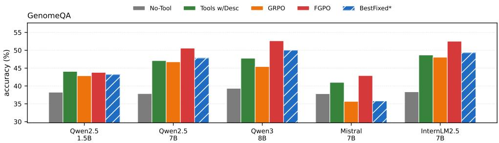

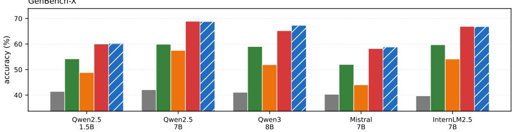

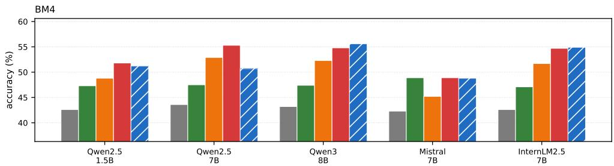  
Figure 8: Plug-in transfer per benchmark across five frozen reasoners (the grid of Table 2). Random, SFT and DPO are omitted here for legibility and reported in full in the table.

All 15 reasoner×benchmark cells are positive (min +0.92, median +4.48, max +14.20)  
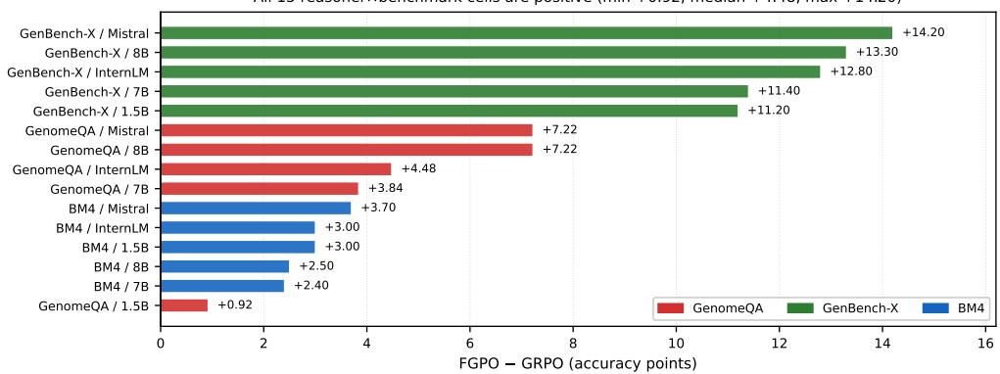  
Figure 9: FGPO — GRPO for all 15 reasoner×benchmark cells, sorted. No cell is negative. Colour denotes benchmark.

Table 10 gives BestFixed\* against FGPO on every cell. FGPO leads it in 10 of the 15, and the remaining margins are 0.10–2.10: without access to test labels the learned policy closely tracks a reference selected with them. The comparison also shows that the winning subset is not stable: it is $T _ { 4 }$ alone on GenBench-X, $T _ { 3 } { + } T _ { 4 }$ on BM4 and $T _ { 1 } { + } T _ { 2 } { + } T _ { 4 }$ on GenomeQA, so no single curation choice transfers across benchmarks

The per-question oracle sits far above both: 77.41 on GenomeQA under the training reasoner, 90.60 on GenBench-X and 86.90 on BM4, against FGPO's 52.62, 65.20 and 54.80. We read that gap as a statement about the problem rather than about the method (selection over these libraries is nowhere near solved) but it is an upper bound no policy in this paper approaches, and we do not present it as one that any policy should be expected to reach.

Table 10: FGPO against BestFixed\*, the fixed subset selected post-hoc on the test set under Qwen3-8B and transferred to the other reasoners. Bold marks the larger of the two per cell.
<table><tr><td>Benchmark</td><td></td><td>Qwen3-8B</td><td>Qwen2.5-1.5B</td><td>Qwen2.5-7B</td><td>Mistral-7B</td><td>InternLM2.5-7B</td></tr><tr><td rowspan="2">GenomeQA</td><td>FGPO</td><td>52.65</td><td>43.79</td><td>50.58</td><td>42.90</td><td>52.53</td></tr><tr><td>BestFixed*</td><td>50.00</td><td>43.20</td><td>47.80</td><td>35.79</td><td>49.30</td></tr><tr><td rowspan="2">GenBench-X</td><td>FGPO</td><td>65.20</td><td>60.00</td><td>68.90</td><td>58.20</td><td>66.90</td></tr><tr><td>BestFixed*</td><td>67.30</td><td>60.10</td><td>68.80</td><td>58.80</td><td>66.80</td></tr><tr><td rowspan="2">BM4</td><td>FGPO</td><td>54.80</td><td>51.80</td><td>55.30</td><td>48.90</td><td>54.70</td></tr><tr><td>BestFixed*</td><td>55.60</td><td>51.20</td><td>50.70</td><td>48.80</td><td>54.90</td></tr></table>

## C.6 PAIRED SIGNIFICANCE

Question-paired McNemar tests, pooled per reasoner (n ≈ 5,590): FGPO vs. GRPO: $p = 2 { \times } 1 0 ^ { - 8 }$ $\mathrm { \tilde { / 8 } { \times } 1 0 ^ { - 1 \dot { 9 } } / 2 { \times } 1 0 ^ { - 3 9 } / 2 { \times } 1 0 ^ { - 3 0 } / 1 { \times } 1 0 ^ { - 2 0 } }$ (1.5B/7B/8B/Mistral/InternLM). FGPO vs. Tools w/ Desc: $p = 2 { \times } 1 0 ^ { - 3 } / 1 { \times } 1 0 ^ { - 1 6 } / 2 { \times } 1 0 ^ { - 1 8 } / 2 { \times } 1 0 ^ { - 4 } / 2 { \times } 1 0 ^ { - 1 5 }$ , a significant win in every column.

## D ADDITIONAL ANALYSES

## D.1 k-SUBSET INTERPOLATION IN FULL

Table 3 gives every epoch of every k arm; the main text reports peaks only.

Figure 10 plots the same runs. Coverage does not merely shift the final number: it shifts the whole trajectory, with every arm peaking at the dev-selected epoch 3 and the k=4 arm collapsing hardest afterwards. The peak values give the dose-response the argument needs (Figure 1c): accuracy rises monotonically in k while the data, ordering, optimization settings and scoring construction are held fixed, so coverage of the action space is doing the work rather than any of the confounds that separate FGPO from GRPO.

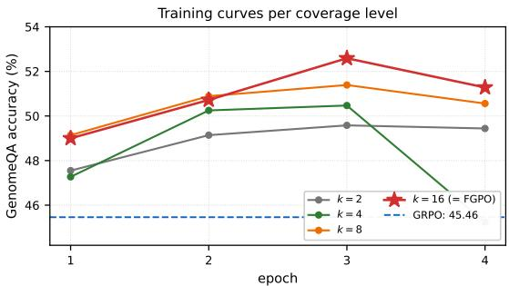  
Figure 10: The coverage dial: per-epoch training curves for $k \in \{ 2 , 4 , 8 , 1 6 \}$ actions evaluated per visit. k=16 is FGPO itself.

## D.2 PER-QUESTION PAIRED ANALYSIS AND SELECTION HEATMAP

Figure 11 decomposes the aggregate outcome of Figure 6c by task family, and contrasts FGPO's choices with the per-question oracle.

## D.3 DATA-SCALE ABLATION

Table 11 trains FGPO on subsets of the 2,002-question training pool. Accuracy is evaluated on the full 3,590-question GenomeQA test set at every epoch; the best epoch is dev-selected. With only 500 training questions FGPO already reaches 52.23, within 0.4 points of the full-data peak (52.59), and the 1,000-question arm peaks at 50.92. The relationship is not monotone, since 500 slightly outperforms 1,000, but all three are well above GRPO's 45.46.

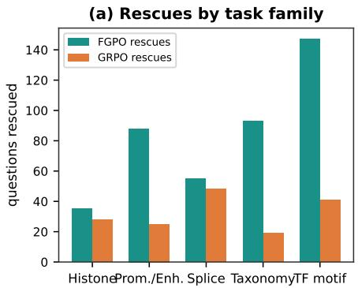

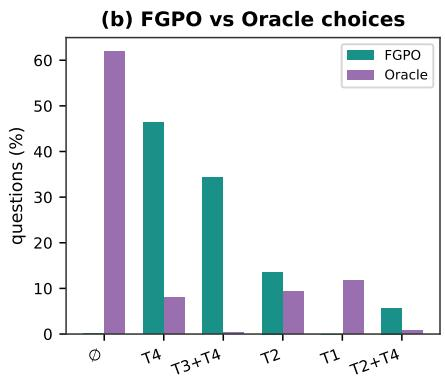  
Figure 11: Per-question analysis on GenomeQA. (a) Where the 418 FGPO rescues and the 161 GRPO rescues of Figure 6c fall across task families. (b) FGPO vs. the oracle: the oracle prefers the empty set on 61.9% of questions, yet FGPO almost never abstains.

Table 11: Data-scale ablation on GenomeQA. Accuracy (%) at each epoch; peak is dev-selected. All arms use the same hyperparameters.
<table><tr><td>Training |D|</td><td>ep1</td><td>ep2</td><td>ep3</td><td>ep4</td><td>peak</td></tr><tr><td>500</td><td>46.99</td><td>50.03</td><td>51.14</td><td>52.23</td><td>52.23</td></tr><tr><td>1,000</td><td>49.64</td><td>49.22</td><td>50.92</td><td>49.16</td><td>50.92</td></tr><tr><td>2,002 (full)</td><td>49.00</td><td>50.72</td><td>52.59</td><td>51.28</td><td>52.59</td></tr><tr><td>GRPO (2,002)</td><td></td><td></td><td></td><td></td><td>45.46</td></tr></table>

## D.4 TOOL-LIBRARY SINGLE-REMOVAL ABLATIONS

Table 12 prices each tool by what its removal costs the two ceilings, computed from the exhaustive tables without running a model. No single tool is dispensable on all three benchmarks, but the damage is wildly uneven: removing $T _ { 4 }$ costs the GenBench-X oracle 15.5 points and the best fixed subset 20.5, while removing $T _ { 3 }$ costs the best fixed subset at most 0.30 anywhere, an option that only pays on questions a fixed subset was never going to get right.

Table 12: Ceiling loss from removing one tool from the full library (computed from the exhaustive tables; no model runs). ∆oracle / ∆best-fixed in points.
<table><tr><td>Benchmark</td><td> $- T _ { 1 }$ </td><td> $- T _ { 2 }$ </td><td> $- T _ { 3 }$ </td><td> $- T _ { 4 }$ </td></tr><tr><td>GenomeQA</td><td>-3.29/0.00</td><td>-6.21/-2.20</td><td>-3.26 /0.00</td><td>-10.84/-4.76</td></tr><tr><td>GenBench-X</td><td>-2.10/0.00</td><td>-2.70/0.00</td><td>-1.40/0.00</td><td>-15.50 /-20.50</td></tr><tr><td>BM4</td><td>-2.70/0.00</td><td>-3.10/0.00</td><td>-1.20/-0.30</td><td>-14.40/-10.00</td></tr></table>

## E BASELINE FAIRNESS SWEEPS

No baseline in this paper is reported at a single arbitrary configuration.

## E.1 GRPO CHECKPOINT AND CONFIGURATION SWEEPS

## E.2 DPO $\beta$ SWEEP

Figure 12 shows both sweeps. Panel (a) is the check that matters for the headline comparison: GRPO's accuracy is flat from step 50 onwards while its mean tool count is also flat, so the reported 45.46 is a converged plateau rather than an undertrained checkpoint we happened to stop at. Panel (b) shows the DPO failure has no $\beta$ that rescues it: every checkpoint of every $\beta$ lands within 0.4 points of the no-tool floor, because the policy has stopped selecting tools at all.

Table 13: GRPO on GenomeQA: all eight checkpoints of the reported run, and four further independent configurations. The reported 45.46 is the test accuracy at the dev-selected checkpoint (step 75)
<table><tr><td>Checkpoint</td><td>25</td><td>50</td><td>75</td><td>100</td><td>125</td><td>150</td><td>175</td><td>200</td></tr><tr><td>Accuracy</td><td>42.31</td><td>44.85</td><td>45.46</td><td>45.24</td><td>44.90</td><td>45.32</td><td>45.29</td><td>45.13</td></tr><tr><td>Mean tools</td><td>1.33</td><td>1.92</td><td>2.36</td><td>2.18</td><td>2.17</td><td>2.25</td><td>2.15</td><td>2.17</td></tr></table>

Independent configurations (varying G, temperature, data mix): 43.90 / 44.26 / 44.35 / 45.57.

Table 14: DPO on GenomeQA: every checkpoint of every β. The best observed cell reaches 39.33, essentially the no-tool floor.
<table><tr><td>β</td><td>Checkpoint accuracies</td><td>Mean tools</td><td>Verdict</td></tr><tr><td>0.1</td><td>39.25 / 39.28 / 39.25</td><td>0.00</td><td>collapsed</td></tr><tr><td>0.3</td><td>39.28 / 39.33</td><td>0.03 / 0.01</td><td>collapsed</td></tr><tr><td>0.5</td><td>38.97 / 39.00</td><td>0.10 / 0.08</td><td>collapsed</td></tr></table>

## F MECHANISM DETAILS

## F.1 TWO PROPERTIES OF DEAD GROUPS AND OF THE EXACT OBJECTIVE

Fix a question s, its reward table $r ( s , \cdot )$ over A, and a sampling distribution p over A (for GRPO, $p = p _ { \underline { { \theta } } } ^ { \mathrm { g e n } } ( \cdot | s ) )$ . Partition A into reward classes $\{ C _ { v } \}$ , one per distinct reward value v, and write $\begin{array} { r } { { w } _ { v } = \sum _ { a \in C _ { v } } p ( a ) } \end{array}$ for the class masses, so $\begin{array} { r } { \sum _ { v } w _ { v } = \mathrm { \ i } } \end{array}$ . A group of G i.i.d. draws is dead when all G land in one class, which happens with probability

$$
P _ { \mathrm { d e a d } } ( p , G ) = \sum _ { v } w _ { v } ^ { G } .\tag{7}
$$

Proposition 1 (reward collisions). Let $G \geq 2$ be an integer. (i) Coarsening. If two reward classes are merged (as happens when a finer reward is replaced by a coarser one that assigns them the same value), $\bar { P } _ { \mathrm { d e a d } }$ does not decrease. (ii) Concentration. If mass $0 < \delta \le w _ { u }$ is moved from a class u to a distinct class v with $w _ { v } \geq w _ { u }$ , leaving all other masses fixed, $P _ { \mathrm { d e a d } }$ strictly increases. For a fixed number of classes, $P _ { \mathrm { d e a d } }$ is Schur-convex in $( w _ { v } ) _ { v } ,$ so it is minimized at the uniform class distribution and maximized when one class carries all the mass.

Proof. (i) For $a , b \geq 0$ and $\begin{array} { r } { G \geq 2 , ( a + b ) ^ { G } = \sum _ { j = 0 } ^ { G } \binom { G } { j } a ^ { j } b ^ { G - j } \geq a ^ { G } + b ^ { G } } \end{array}$ , so replacing the two terms $w _ { u } ^ { G } + w _ { v } ^ { G }$ in Eq. 7 by $( w _ { u } + w _ { v } ) ^ { G }$ cannot lower the sum. (ii) The function $f ( x ) = x ^ { G }$ is strictly convex on $[ 0 , \infty )$ for $\begin{array} { r } { G \geq 2 , \textnormal { s o } f ( w _ { v } + \delta ) + f ( w _ { u } - \delta ) - f ( w _ { v } ) - f ( w _ { u } ) = \int _ { 0 } ^ { \delta } \big [ f ^ { \prime } ( w _ { v } + } \end{array}$ $t ) - f ^ { \prime } ( w _ { u } - t ) ] d t > 0$ because $f ^ { \prime }$ is strictly increasing and $w _ { v } + t > w _ { u } - t$ for all $t \in ( 0 , \delta ]$ Schur-convexity follows because $\textstyle \sum _ { v } f ( w _ { v } )$ with f convex is Schur-convex (Marshall et al., 1979). □

Proposition 1 gives conditions for interpreting the diagnostics of Section 3.4. Under the same sampling distribution, part (i) orders the 20.8% closed-form rate under the fine partition of Eq. 1 below the 79.6% rate under the coarser differential reward. Part (ii) concerns concentration of rewardclass mass; a decrease in policy entropy alone does not establish this condition. The concurrent entropy decrease and dead-rate increase in Figure 7 are consistent with this mechanism, but do not establish a majorization ordering of the class-mass vectors. The propositions apply regardless of whether the policy is correct; the observed near-independence of dead mass and correctness is an empirical finding of Section 3.4, not a consequence of these properties.

Proposition 2 (the exact objective). Fix s and $\theta ,$ and let $q _ { \theta } ( \cdot | s )$ be the softmax in Eq. 4 with finite logits $z _ { a } = \ell _ { \theta } ( a | s )$ . Let $\begin{array} { r } { J _ { s } ( \theta ) = \sum _ { a } q _ { \theta } \bigl ( a  { | { s } \rangle } { r } ( s , a ) } \end{array}$ be the per-question objective of $\operatorname { E q . 2 }$ In exact arithmetic, $( \mathrm { i } ) \ J _ { s }$ and $\nabla _ { \theta } \dot { J _ { s } }$ are computed exactly from the $| \hat { A } |$ candidate scores, so the estimator has zero variance with respect to action sampling. Random minibatches can still introduce variance across questions. (ii) The reward-term gradient with respect to the logit of action a is

$$
\frac { \partial J _ { s } } { \partial z _ { a } } = q _ { \theta } ( a \ : | \ : s ) \ : \big ( r ( s , a ) - J _ { s } \big ) ,\tag{8}
$$

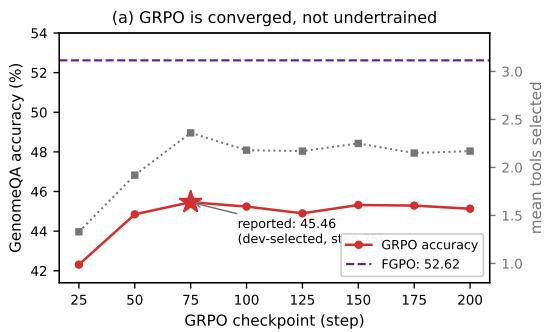

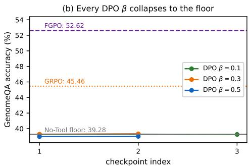  
Figure 12: Baseline fairness sweeps on GenomeQA. (a) GRPO across all eight checkpoints, mean tools on the right axis. (b) Every checkpoint of every DPO $\beta .$

Since finite softmax logits give $q _ { \theta } ( a \mid s ) > 0$ , every action with $r ( s , a ) \neq J _ { s }$ has a non-zero rewardterm logit gradient whose sign is that of its advantage over the current expected reward, and whose magnitude is proportional to $q _ { \theta } ( a \mid s )$

Proof. (i) is immediate from Eq. 2 being a finite sum with no sampled term. (ii) With $q _ { a } =$ exp $\bar { z } _ { a } / \sum _ { a ^ { \prime } } \exp z _ { a ^ { \prime } } , \partial q _ { b } / \partial z _ { a } = \bar { q } _ { b } ( { \bf 1 } [ a = \bar { b } ] - q _ { a } )$ , hence $\begin{array} { r } { \partial J _ { s } / \partial z _ { a } = \dot { \sum } _ { b } r _ { b } q _ { b } ( \mathbf { 1 } [ a = b ] - \dot { q _ { a } } ) = } \end{array}$ $\begin{array} { r } { q _ { a } r _ { a } - q _ { a } \sum _ { b } q _ { b } r _ { b } = q _ { a } ( r _ { a } - J _ { s } ) . } \end{array}$ □

These statements concern the reward term in logit space. Exhaustive evaluation rules out zeros caused by sampled reward collisions, but small $q _ { \theta } ( a \mid s )$ can still make the logit gradient arbitrarily small. LoRA parameter updates couple candidate logits, so a non-zero logit derivative guarantees neither an increase in that action's probability nor fast escape. The entropy bonus of Eq. 5 adds a separate gradient and encourages dispersion; it guarantees neither a probability floor during training nor rapid recovery. The k-subset intervention of Section 3.5 changes action coverage and renormalizes qθ within each sampled subset, thereby changing the objective; its gradient need not be unbiased for $\bar { J } _ { s }$ $\mathrm { A t } \ k = | { \mathcal { A } } |$ , it recovers the full exact objective.

## F.2 DEAD-GROUP GRIDS FOR ALL THREE BENCHMARKS

Table 15 gives the closed-form rates behind Figure 5 at every group size we evaluated, for all four exported distributions rather than the two the main text plots.

Table 15: Closed-form dead-group rate (%) vs. group size $G ,$ per benchmark, the numerical form of Figure 5a–c, computed from each policy's generation-induced distribution over the 16 valid parsed subset strings. Reward classes follow Eq. 1, the finest partition any arm induces. SFT is reported on GenomeQA only; GRPO and FGPO are reported on all three benchmarks.
<table><tr><td>Benchmark</td><td>Policy</td><td>G=1</td><td>G=2</td><td>G=4</td><td>G=6</td><td>G=8</td><td> $G { = } 1 6$ </td><td>G=32</td></tr><tr><td>GenomeQA</td><td>Uniform</td><td>100.0</td><td>22.7</td><td>1.9</td><td>0.2</td><td>0.0</td><td>0.0</td><td>0.0</td></tr><tr><td></td><td>SFT</td><td>100.0</td><td>40.4</td><td>9.1</td><td>2.4</td><td>0.8</td><td>0.0</td><td>0.0</td></tr><tr><td></td><td>GRPO</td><td>100.0</td><td>56.5</td><td>30.4</td><td>20.8</td><td>15.7</td><td>7.7</td><td>3.7</td></tr><tr><td></td><td>FGPO</td><td>100.0</td><td>97.3</td><td>95.1</td><td>94.0</td><td>93.2</td><td>91.5</td><td>89.7</td></tr><tr><td>GenBench-X</td><td>Uniform</td><td>100.0</td><td>20.4</td><td>1.4</td><td>0.1</td><td>0.0</td><td>0.0</td><td>0.0</td></tr><tr><td></td><td>GRPO</td><td>100.0</td><td>53.5</td><td>26.9</td><td>17.8</td><td>13.4</td><td>6.2</td><td>1.8</td></tr><tr><td></td><td>FGPO</td><td>100.0</td><td>97.1</td><td>94.7</td><td>93.4</td><td>92.5</td><td>90.5</td><td>88.7</td></tr><tr><td>BM4</td><td>Uniform</td><td>100.0</td><td>20.5</td><td>1.5</td><td>0.1</td><td>0.0</td><td>0.0</td><td>0.0</td></tr><tr><td></td><td>GRPO</td><td>100.0</td><td>56.1</td><td>29.0</td><td>17.4</td><td>11.1</td><td>2.9</td><td>0.8</td></tr><tr><td></td><td>FGPO</td><td>100.0</td><td>98.4</td><td>97.2</td><td>96.6</td><td>96.2</td><td>95.4</td><td>94.7</td></tr></table>

Read across the three grids, the two curves that matter run in opposite directions and neither is an accident of tuning: a uniform reference policy is almost never dead beyond G=4, and under the fine-grained Eq. 1 partition the converged GRPO policy has a 17–21% dead-group probability at the G=6 group size used for training. FGPO's own row is included precisely because it is the worst of the four: its converged distribution would be nearly useless to sample from (94% dead at G=6), which is the point, since it never samples. SFT's low dead rate is not evidence of useful routing: its sampling distribution stays relatively diffuse, but its argmax collapses onto the empty action on 92.8% of questions, and its accuracy (42.17) trails GRPO's regardless.

## F.3 EMPTY-SUBSET PREFERENCE: HOW OFFLINE OBJECTIVES COLLAPSE

Table 16: Generation-induced probability mass and argmax rate on the empty subset (no tools), per trained policy, over the GenomeQA test set; both columns are computed from $p _ { \theta } ^ { \mathrm { g e n } }$ , the same distribution as Table 15. Reference: the empty subset is reward-optimal on 61.9% of questions.
<table><tr><td>Policy</td><td>Generation-induced mass on (Ø</td><td>Argmax = ∅</td><td>GenomeQA accuracy</td></tr><tr><td>SFT</td><td>42.2%</td><td>92.8%</td><td>42.17</td></tr><tr><td>GRPO</td><td>4.0%</td><td>2.8%</td><td>45.46</td></tr><tr><td>FGPO</td><td>0.2%</td><td>0.2%</td><td>52.62</td></tr></table>

SFT's high mass on the modal action also explains its deceptively favorable “chance-of-sampling-anoptimal-action" statistics: mimicking the mode looks good on any metric that ignores the other 38% of questions.

Figure 13 shows the mechanism behind the offline collapse: the empty subset is reward-optimal on 61.9% of questions, SFT puts 92.8% of its argmax there, and the resulting policy is a very good imitation of the modal answer and a very poor policy.

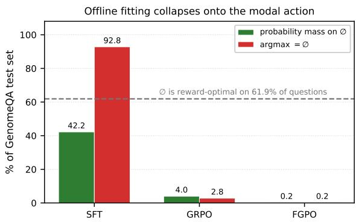  
Figure 13: Generation-induced probability mass and argmax rate on the empty subset per trained policy. The empty subset is reward-optimal on 61.9% of GenomeQA test questions (dashed line).

## G PROMPT TEMPLATES

## G.1 POLICY PROMPT (ALL TRAINED ARMS: FGPO, GRPO, SFT, DPO)

Tools are anonymous slots; the policy answers in indices. System:

You are an expert agent specialized in selecting tools to   
solve genomic reasoning tasks. You are provided with access   
to {n} tools, indexed from 0 to {n-1}.   
ist and instruction:   
0: type1 (A)   
1: type2 (B)   
2: type3 (C)   
3: type4 (D)   
{question and options}   
Select the index number(s) of the tools that are most   
helpful for solving the task. You MUST output only the   
selected tool indices as a comma-separated list, enclosed in   
<answer></answer> tags.Output an empty <answer></answer>   
if no tool is needed.

An empty <answer></ answer> selects no tools; our action space includes it explicitly.

## G.2 PROMPTED BASELINE (TOOLS W/ DESC)

Identical layout, but each slot carries the tool's real name and a functional description:

{i}: {tool name} - Description: {functional description}

The prompted baseline therefore receives strictly more prior information than any trained policy in this paper.

## G.3 REASONER PROMPT

The frozen reasoner receives the question, the options, and the rendered evidence of the selected subset (one titled block per tool, shared verbatim across all methods and table rows), and is instructed to answer with a single option letter.

## G.4 COMPLETE REASONER PROMPT

The frozen reasoner receives the following system message and user prompt. The evidence block is empty in the No-Tool arm and contains one titled block per selected tool in all other arms. The same template is shared across every method and every table row; only the evidence differs.

## System message.

You are a genomics expert answering multiple-choice   
questions about DNA sequences. Tool outputs, when provided,   
may be incomplete or noisy. Use only the evidence that is   
relevant to the question and ignore the rest. Do not assume   
a tool is correct. Respond with the single letter of the   
best option and nothing else.

## User message template.

{question}   
Options:   
{options\_block}   
Analysis tool output for the sequence above:   
{evidence}   
Answer with a single letter.

When no tools are selected, the evidence block is omitted entirely.

## G.5 COMPLETE TOOL EVIDENCE EXAMPLES

Below are schematic evidence blocks condensed from the exhaustive reward tables; the prompt itself carries each tool's JSON output in full. Each example illustrates the output format of one tool; the reasoner sees the concatenation of the selected tools' blocks.

## T1 (Sequence Composition).

Sequence A: 1ength=371bp, GC=59.3%, AT=40.7%, CpG 0/E=0.264,   
GC\_skew=0.051   
Top 3-mers: TTT (12, 3.3%), TAT (9, 2.4%), TTA (8, 2.2%)   
Sequence B: 1ength=371bp, GC=42.1%, AT=57.9%, CpG 0/E=0.891,   
GC\_skew=-0.032   
Top 3-mers: AGG (11, 3.0%), GGA (9, 2.4%), CAG (8, 2.2%)   
...(C, D analogous)

## T2 (Motif Scanner).

Sequence A: JASPAR hits (p<1e-4): JUN (score=12.3), FOS   
(11.8), TEAD4 (10.2)   
Sequence B: STAT1 (score=14.1), IRF1 (9.7)   
Sequence C: SP1 (score=13.5), KLF4 (12.1)   
Sequence D: SRF (score=15.8), MEF2A (11.2)

## T3 (Splice-Site Analysis).

Sequence A: no GT/AG sites above threshold (donor>6.0,   
acceptor>6.0)   
Sequence B: acceptor at pos 142 (score=8.53, Only Acceptor)   
Sequence C: no sites above threshold   
Sequence D: no sites above threshold

## T4 (Genomic Expert).

kNN prediction (k=15, cosine over frozen NT-v2-50m   
embeddings; confidence is the   
distance-weighted vote share, counts are raw neighbours):   
Sequence A: Eukaryote 0.82(12/15 neighbours)   
Sequence B: Virus 0.37 (6/15 neighbours; Eukaryote 0.33,   
Prokaryote 0.30)   
Sequence C: Eukaryote 0.53 (8/15)   
Sequence D: Eukaryote 0.84 (13/15)

## T5 (Homology Search), used only in the five-tool stress test of Section B.3.

Sequence A: 2 hits.ref\_04188(label=promoter,   
identity=71.4%, coverage=58%);   
ref\_11902(1abel=enhancer,identity=64.0%,   
coverage=41%).   
Consensus: promoter (1/2, agreement 0.50)   
Sequence B: no hit above threshold (identity ≥ 60%, coverage   
≥ 30%)   
Sequence C: 1 hit. ref\_00734 (label=enhancer,   
identity=62.8%,coverage=35%).   
Consensus: enhancer (1/1, agreement 1.00)   
Sequence D: no hit above threshold

Two of the four candidates return nothing; among the remaining two, one has only a 1/2 consensus and the other rests on a single supporting hit. Evidence of this shape is why the exact objective settles on invoking T5 for only 2.8% of questions (Section B.3): the tool is well implemented but rarely decisive on this benchmark, and the reward makes that visible without any hand-written rule.

## G.6 QUESTION FORMAT EXAMPLES

Table 17 shows one verbatim question from each benchmark, illustrating the diversity of task types, option formats and sequence lengths. Every option list is reproduced in full; only the nucleotide sequence is elided in the middle.

## G.7 TOOL DESCRIPTION PROMPT (TOOLS W/ DESC BASELINE)

The prompted baseline receives the same layout as the trained policies, but each tool slot carries the real name and a functional description:

0: sequence\_statistics - Computes GC content, CpG density,   
k-mer frequencies, and other compositional statistics of the   
DNA sequence.   
1: motif\_scanner - Scans the sequence against JASPAR   
transcription factor binding profiles and returns   
significant hits with their scores.   
2: splice\_analyzer - Identifies candidate GT/AG splice

Table 17: Question format across the three benchmarks. One row per benchmark, quoted verbatim from the released files. Green marks the gold option. Sequences are shown head . . . tail; the full length is given in the header row.
<table><tr><td>Question</td><td>Options</td></tr><tr><td colspan="2">GenomeQA — TF motif, describe shape, 100 bp</td></tr><tr><td>&quot;Identify the transcription factor that binds to this Human DNA sequence: CCCTACAGAG...CTCGAGGCTC&quot;</td><td>A: NRF1 B: POU5F1 C: E2F1 D: RELA</td></tr><tr><td colspan="2">GenBench-X — taxonomy, describe shape, 200 bp A: Caenorhabditis elegans (worm) B: Human</td></tr><tr><td colspan="2">&quot;Which organism this DNA sequence from?&quot; CCCAGCCCTA...GTCAGACAGT</td></tr></table>

sites and scores them with MaxEntScan donor and acceptor models.  
3: genomic\_expert - Classifies the sequence by kNN vote over frozen Nucleotide-Transformer embeddings of a labelled reference set.

The prompted baseline therefore receives strictly more prior information than any trained policy in this paper. Its accuracy (47.77 on GenomeQA) exceeds GRPO (45.43), showing that access to tool semantics is valuable, but FGPO surpasses both (52.65) without any semantic information.