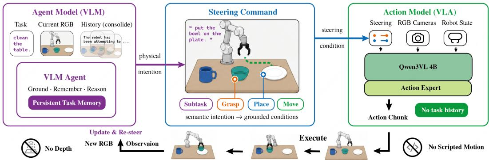
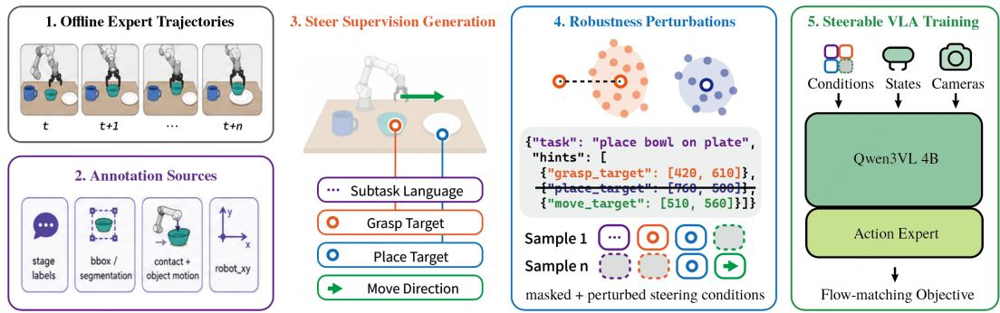
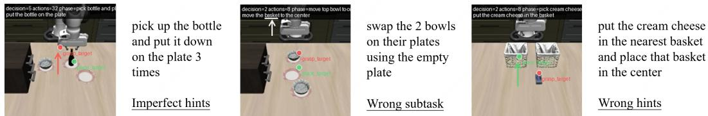

# 2AM: Grounding Agent-Side Memory as Guidance for Steerable Action Models in Long-Horizon Manipulation

Yutong Hu1,2,3 Fengjiao Chen2 Xuezhi Cao2 Renaud Detry1,3,4

1KU Leuven, Dept. Mechanical Engineering, Research unit Robotics, Automation and Mechatronics 2Meituan Inc.

4Flanders Make@KU Leuven

3KU Leuven, Dept. Electrical Engineering, Research unit Processing Speech and Images

Abstract: Long-horizon robot manipulation requires memory, but not necessarily inside the action policy. To address such tasks, current agentic systems often combine VLAs with planners and geometric tools, sometimes using additional depth or calibrated geometry. These systems confound attribution: gains may come from richer observations or alternative motor tools, while failures may stem from either the policy or an under-specified language interface. We isolate this question through a deliberately constrained design: less tool breadth, but greater interface bandwidth. 2AM makes a multimodal Agent the sole holder of task memory and a single RGB-based, episodically stateless Action Model the sole executor of taskrelevant motion. The Agent compiles interaction history into subtask language and optional 2D grasp, place, and move hints that bind its physical intention at different time scales. To teach this steerability to the VLA, we augment demonstrations with structured hint labels and train under condition dropout, spatial noise, and temporal jitter to tolerate imperfect Agent outputs. On LIBERO-Mem, without depth, online geometry, or planner-based object motion, 2AM reaches 76.3% average completion, a 61.5-point improvement over the strongest reported baseline of 14.8%, together with 63.0% relaxed and 11.8% strict success. These results show that task memory can remain Agent-side. They further show that Action Model capability depends not only on what the policy has learned, but on how precisely the Agent can steer it.

Keywords: Robot Learning, Agentic VLA, Long-Horizon Manipulation

## 1 Introduction

General physical intelligence is not simply a longer action horizon. It requires retaining task state across interaction and turning that state into the right physical behavior. In the physical world, VLAs increasingly provide reusable motor competence for short-horizon skills [1, 2, 3], while digital Agents can sustain reasoning and state over day-scale tasks [4, 5]. Their natural division of labor is asymmetric: the Agent remembers and decides; the Action Model controls. Yet their functional boundary remains blurred because both are built on pretrained vision-language models. The unresolved question is therefore not only which model remembers or acts, but also what contract turns the Agent’s remembered state into physical intent and what evidence attributes the resulting behavior to the Action Model.

One response is to extend the VLA with visual history, recurrent state, or learned memory [6, 7, 8]. Such memory can be necessary when the action itself depends on motion history or timing. But persistent task memory inside a demonstration-trained policy also couples a retry to the failed trajectory that preceded it, although the Action Model is trained predominantly on successful demonstrations. An episodically stateless Action Model offers a complementary property: the Agent can revise its intent while the controller restarts from the current observation, without inheriting a latent account of the failure. MemER externalizes task memory to a high-level model, but communicates the resulting decision to its low-level policy through text instructions [9]; this leaves open whether remembered physical intent requires a denser interface.

  
Figure 1: Agent-side memory, expressed through steering. The Agent Model consolidates task history and reasons about the next physical intention. A compositional command grounds that intention as subtask language plus optional grasp, place, and move cues. The Action Model receives this command with current RGB and robot state, but no task history. It then executes every taskrelevant motion. Fresh RGB closes the loop for the Agent to update and re-steer.

A second response places the VLA inside an agentic toolbox, alongside planners, geometric primitives, and task-specific policies, often with depth or calibrated geometry [10, 11, 12, 13]. This improves system capability, but gives several components overlapping authority to move the robot. Success may come from richer sensing or an alternate motor route; failure may come from the policy, or merely from asking it through language that omits the instance, destination, or motion already resolved by the Agent. A language-only call is therefore not neutral evidence of VLA capability: recent steerable policies show that general motor competence can remain hidden behind an under-specified interface [14].

We study the opposite design point: restricted sensing, less tool breadth, but greater interface bandwidth. 2AM makes a multimodal Agent the sole holder of task memory and one RGB-based, episodically stateless Action Model the sole executor of task-relevant motion (Figure 1). After reasoning over current RGB and consolidated history, the Agent must make its intention actionable. Subtask language specifies the behavior; optional 2D grasp target, place target, and move target hints bind its physical arguments at different time scales. They guide rather than prescribe motion: the Action Model remains responsible for approach, contact, transport, and release.

We recover steering supervision from demonstrations and train under nonempty condition dropout, spatial noise, and temporal jitter. The Agent then re-observes and re-steers after short action chunks. LIBERO-Mem is a sharp case study because history changes the object, destination, repetition count, or stage while local motor skills recur [15]. Without depth, online geometry, or planner-based object motion, 2AM reaches 76.3% completion. Compared with an aligned π0 reproduction, it improves completion by 5.5 percentage points and relaxed success by 25.6 points, while strict success remains comparable.

## Our contributions are:

• an RGB-only agentic setting that isolates task memory in the Agent and all task-relevant motion in one episodically stateless Action Model;

• a compositional interface that turns remembered intent into 2D-grounded grasp, place, and move guidance; and

• demonstration-derived supervision with structured hint dropout and perturbations for robust Agent-to-Action Model steering.

## 2 Contract between Agent and Action Model

2AM is a two-model decomposition with one explicit contract. The Agent remembers and decides; the Action Model executes; a steering command carries the current consequence of memory without carrying the history itself (Figure 1).

## 2.1 Problem setting

Long-horizon manipulation couples fast local control state, including current appearance, gripper configuration, and contact, with slower task state, including the relevant instance, committed destination, repetition count, and semantic stage. We study event-scale object manipulation where history changes the latter but its current consequence can be grounded in the present RGB observation. Formally, we ask whether a compact command $c _ { k }$ can make the next local action conditionally independent of the full history $H _ { k }$ . This hypothesis is deliberately narrower than claiming that all physical behavior is memoryless: precise timing, hidden force state, and trajectory imitation can require temporal state inside the policy.

The deployment contract makes this hypothesis directly testable. The task-solving path receives only task language, agent-view and wrist RGB, and robot state. No depth, online mask, object pose, pixel-to-3D backprojection, or analytic object-specific motion reaches either model. Reset, homing, and host safety may remain outside the learned system, but every task-relevant movement must pass through the same Action Model.

## 2.2 Agent Model and Action Model

Let g denote the episode instruction, $I _ { k } ^ { a }$ the current agent-view RGB image at Agent round k, and $H _ { k }$ a finite, consolidated record of selected observations, issued commands, and visible outcomes. Consolidation may summarize redundant frames, but it preserves the task variables needed for the next decision: object identity, destination, count, and stage. The Agent Model produces a steering command

$$
c _ { k } = \mathrm { A M } _ { \mathrm { a g e n t } } ( g , I _ { k } ^ { a } , H _ { k } ) .\tag{1}
$$

The Action Model receives the current agent view, wrist view $I _ { t } ^ { w }$ , robot state $s _ { t } ,$ and $c _ { k }$ , then predicts a chunk of L absolute end-effector actions:

$$
\begin{array} { r } { \hat { a } _ { t : t + L - 1 } = \mathrm { A M } _ { \mathrm { a c t i o n } } ( I _ { t } ^ { a } , I _ { t } ^ { w } , s _ { t } , c _ { k } ) . } \end{array}\tag{2}
$$

The two models run at different clocks. The Agent updates once per short action chunk; the Action Model predicts and executes local control within that chunk from current visual and proprioceptive inputs. It has no direct access to $H _ { k }$ and carries no persistent episode state across Agent calls. Thus “memoryless” means episodically stateless, not blind to current motion or embodiment state.

The Agent output contains no end-effector pose, gripper command, duration, or trajectory. It specifies behavior and visual arguments; the Action Model retains responsibility for approach geometry, wrist alignment, grasp closure, transport, collision avoidance learned from data, and release.

## 2.3 A compositional steering contract

Each command contains a local language instruction $\ell _ { k }$ and zero or more normalized 2D hints:

$$
c _ { k } = \left( \ell _ { k } , q _ { k } ^ { \mathrm { g r a s p } } , q _ { k } ^ { \mathrm { p l a c e } } , q _ { k } ^ { \mathrm { m o v e } } \right) .\tag{3}
$$

This command is the sole task-level channel into the Action Model: $H _ { k }$ is never concatenated to its policy input. Coordinates use the current agent-view image, the upper-left origin, and a $[ 0 , 1 0 0 0 ] ^ { 2 }$ range. A missing field is omitted rather than represented by a special point. This matters because availability is itself stage-dependent.

Table 1: The steering contract exposes physical arguments at three temporal scales.
<table><tr><td>Field</td><td>Question answered</td><td>Typical validity</td><td>Not responsible for</td></tr><tr><td>Language</td><td>What behavior?</td><td>Current semantic stage</td><td>Instance grounding</td></tr><tr><td>grasp-target</td><td>Which object next?</td><td>Before acquisition</td><td>Grasp geometry</td></tr><tr><td>place_target</td><td>Which destination?</td><td>Across transport</td><td>Collision-free path</td></tr><tr><td>move_target</td><td>Where is useful progress?</td><td>Several future steps</td><td>Full trajectory</td></tr></table>

Grasp target. $q ^ { \mathrm { g r a s p } }$ binds the next object instance. It is most useful before contact, when several objects share a category name. The field disappears once the object is visibly held or the stage changes; retaining a stale grasp point can pull the controller back toward the object’s original image location.

Place target. $q ^ { \mathrm { p l a c e } }$ preserves a longer commitment. During transport, the destination may be distant from the wrist view or partially occluded by the arm. The global point keeps the destination explicit without asking the Agent to generate a path.

Move target. $q ^ { \mathrm { m o v e } }$ is a near-term cue: a useful gripper position several demonstration steps in the future. The point is interpreted as a local direction cue, not a waypoint that must be reached or a trajectory to be followed. The Action Model may deviate from the straight image-space path whenever current geometry or contact requires it.

These fields are complementary rather than alternate encodings of one target. During approach, a command may use language, grasp, and move. During transport, grasp is removed while place and move remain. At release or settling, place alone may be sufficient. Repeated cycles can therefore share the same subtask language, such as “place the bowl on the plate,” while grasp and place cues select the particular bowl and destination required by the current history. Compositionality lets a missing or noisy field degrade one role instead of invalidating the command.

## 3 Training-time supervision for inference-time contract usage

## 3.1 Recovering supervision without a model teacher

Figure 2 summarizes Action Model training. We derive steering labels from demonstrations rather than asking a VLM to narrate trajectories. Each synchronized trajectory supplies RGB observations, robot state, actions, demonstration stages, object boxes or masks, gripper contact, and object motion.

  
Figure 2: Learning a steerable Action Model from offline demonstrations. Stage labels, object annotations, contact and object motion, and projected robot motion recover subtask, grasp, place, and move supervision without a model teacher. Structured condition dropout, spatial noise, and future-window sampling expose the policy to incomplete and imprecise steering. One Action Model consumes the surviving conditions, RGB cameras, and robot state and learns 16-step action chunks with a flow-matching objective.

A deterministic preprocessing pass recovers the current subtask, active object instance, destination, and interval over which each hint is valid. Privileged annotations are used only to construct training targets; they are absent from deployment observations.

For a visible object box $( x , y , w , h )$ in an image of width W and height H, grasp and place supervision use the normalized center

$$
q = 1 0 0 0 \left( \frac { x + w / 2 } { W } , \frac { y + h / 2 } { H } \right) .\tag{4}
$$

This is a semantic target, not a claim that the geometric center is the optimal contact point. The learned controller must infer feasible contact from both images, state, and demonstrations.

The projected end-effector trajectory, denoted robot xy, supplies motion hints. At timestep t, we sample

$$
\Delta \sim \mathcal { U } \{ 1 0 , \dots , 2 0 \} , \qquad q _ { t } ^ { \mathrm { m o v e } } = \mathbf { r o b o t . x y } _ { t + \Delta } ,\tag{5}
$$

with the index clipped at the episode boundary. Sampling a window prevents the model from treating one exact temporal offset as the definition of a move point and better matches variable Agent latency.

Action labels follow the original VLA alignment. $s _ { t }$ is the current end-effector state; action $a _ { t }$ is the next-frame absolute end-effector pose with the original gripper command. Windows are clipped only at episode boundaries. They may cross an annotated subtask boundary, preserving continuous motion near grasp, lift, and release instead of teaching the motor policy to pause for the Agent.

## 3.2 Training for imperfect steering

An Agent is not an annotation oracle. It may omit a point, localize the right object a few pixels away, or update a motion cue at a slightly different moment. Training only on complete and perfectly aligned commands would make the hierarchy brittle precisely at its interface.

Let $c _ { t } = ( \ell _ { t } , q _ { t } ^ { \mathrm { g r a s p } } , q _ { t } ^ { \mathrm { p l a c e } } , q _ { t } ^ { \mathrm { m o v e } } )$ and let $v _ { t } \in \{ 0 , 1 \} ^ { 4 }$ mark which fields are semantically available at frame t. We independently mask fields inside this compositional command, subject to availability and a nonempty-condition constraint:

$$
m _ { t } \sim p _ { \mathrm { m a s k } } ( m \mid v _ { t } ) , \quad m _ { t } \preceq v _ { t } , \quad \| m _ { t } \| _ { 0 } \geq 1 , \qquad \widetilde { c } _ { t } = \mathrm { M a s k } ( c _ { t } ; m _ { t } ) .\tag{6}
$$

This constrained hint dropout produces language-only, point-only, and mixed commands whenever semantically valid, while never removing every source of intent. In particular, grasp, place, and move hints may disappear independently rather than being treated as one indivisible spatial prompt. The mask probabilities are training hyperparameters, not part of the interface definition.

For each retained point $q ,$ we add isotropic Gaussian coordinate noise and clip the perturbed point to the valid image-coordinate range:

$$
\begin{array} { r } { \widetilde { q } = \mathrm { c l i p } _ { [ 0 , 1 0 0 0 ] ^ { 2 } } ( q + \epsilon ) , \qquad \epsilon \sim \mathcal { N } ( 0 , \sigma ^ { 2 } I _ { 2 } ) . } \end{array}\tag{7}
$$

Together with future-window sampling for $q ^ { \mathrm { m o v e } }$ , these corruptions cover the three dominant interface errors: omission, localization error, and temporal misalignment. All surviving conditions, both RGB cameras, and robot state feed the same Action Model. The controller can be any policy with a language-conditioning interface, including most VLAs and WAMs. Our implementation uses a Qwen3-VL-4B backbone and a flow-matching Action Expert. There are no separate grasp, place, or move controllers.

## 3.3 Closed-loop execution

After each action chunk, the Agent observes fresh global RGB, updates $H _ { k + 1 }$ , and may revise the subtask or any hint. No benchmark state or learned completion oracle is exposed; simulator termination only ends the episode when no next observation exists.

## 4 Experiments

## 4.1 Benchmark Setup

We evaluate on the ten tasks of LIBERO-Mem [15], which progress from a single lift-and-return cycle to repeated placements, bowl reordering, and placements conditioned on earlier basket occupancy. The local pick-and-place behaviors recur while history changes the correct instance, destination, count, or stage. We include the benchmark’s reported $\pi _ { 0 }$ [2], SlotVLA [16], and SlotSSM [15] results. Because those numbers substantially underestimate the policy under our current implementation, we also report an in-house $\pi _ { 0 }$ reproduction. It uses the same Qwen3-VL-4B backbone as our Action Model, dual agent-view and wrist-view RGB inputs, and 16-step action chunks, providing a stronger aligned reference without 2AM’s grounded steering interface. To isolate the interface itself, a language-only ablation keeps the same Agent, Action Model, observations, and chunk length, but removes all 2D hints and retains only the Agent-generated subtask.

At deployment, 2AM receives only task language, agent-view RGB, wrist RGB, and robot state. We remove depth, segmentation, boxes, object identifiers and poses, oracle subgoals, rewards, stage flags, and benchmark completion predicates. LIBERO-Mem reports strict success and ordered-subgoal completion. Strict success requires the full task in order and the requested repetition count; a threecycle task fails if the robot begins a fourth cycle. Completion measures the fraction of ordered subgoals reached. For our reproduction and 2AM, we additionally report relaxed success, which accepts reaching the complete ordered goal before a later overshoot. Types M, S, R, and O denote object motion, sequence, relations, and occlusion. Following the authors’ clarification, all published baselines have 0 strict success; relaxed success was not reported.

Table 2: Task-level LIBERO-Mem results [15] (%). Published baselines report completion only; reproduced $\pi _ { 0 }$ and 2AM report all three metrics.
<table><tr><td></td><td></td><td colspan="3">[15] reported baselines: completion</td><td colspan="3">Reproduced π0</td><td colspan="3">2AM (Ours)</td></tr><tr><td>Task Brief task</td><td></td><td></td><td></td><td>Type π0 [2] SlotVLA [16] SlotSSM [15] Strict SR Relaxed SR CompletionStrict SR Relaxed SR Completion</td><td></td><td></td><td></td><td></td><td></td><td></td></tr><tr><td>T1 Bowl lift-and-return</td><td>M</td><td>50.0</td><td>50.0</td><td>50.0</td><td>30.83</td><td>71.67</td><td>85.83</td><td>1.67</td><td>95.83</td><td>97.50</td></tr><tr><td>T2 Bottle lift-and-return</td><td>M</td><td>0.0</td><td>0.0</td><td>0.0</td><td>13.33</td><td>91.67</td><td>91.67</td><td>5.00</td><td>100.00</td><td>100.00</td></tr><tr><td>T3 Bowl lift-and-return ×3</td><td>S</td><td>0.0</td><td>0.0</td><td>33.3</td><td>14.17</td><td>52.50</td><td>83.06</td><td>5.00</td><td>89.17</td><td>95.56</td></tr><tr><td>T4 Bottle lift-and-return ×3</td><td>S</td><td>0.0</td><td>0.0</td><td>0.0</td><td>21.67</td><td>40.00</td><td>78.61</td><td>6.67</td><td>75.00</td><td>86.11</td></tr><tr><td>T5 Bowl lift-and-return ×5</td><td>S</td><td>0.0</td><td>0.0</td><td>14.3</td><td>11.67</td><td>42.50</td><td>86.17</td><td>6.67</td><td>85.83</td><td>96.83</td></tr><tr><td>T6 Bowl lift-and-return ×7</td><td>S</td><td>0.0</td><td>0.0</td><td>0.0</td><td>10.00</td><td>54.17</td><td>90.71</td><td>2.50</td><td>90.83</td><td>95.95</td></tr><tr><td>T7 Swap two bowls</td><td>R</td><td>0.0</td><td>0.0</td><td>0.0</td><td>6.67</td><td>6.67</td><td>44.72</td><td>7.50</td><td>10.00</td><td>42.22</td></tr><tr><td>T8 Rotate three bowls</td><td>R</td><td>0.0</td><td>0.0</td><td>0.0</td><td>8.33</td><td>9.17</td><td>46.67</td><td>10.00</td><td>10.00</td><td>41.25</td></tr><tr><td>T9 Center occupied basket</td><td>0</td><td>0.0</td><td>0.0</td><td>30.0</td><td>0.00</td><td>0.00</td><td>48.33</td><td>47.50</td><td>47.50</td><td>59.58</td></tr><tr><td>T10 Center empty basket</td><td>0</td><td>0.0</td><td>0.0</td><td>20.0</td><td>5.83</td><td>5.83</td><td>52.08</td><td>25.83</td><td>25.83</td><td>47.92</td></tr></table>

Table 3: Aggregate LIBERO-Mem results and interface ablation (%).
<table><tr><td>Method</td><td>Strict SR (overshot as failure)</td><td>Relaxed SR (ignore overshot)</td><td>Completion</td></tr><tr><td>Best published (SlotSSM)</td><td>0.00</td><td></td><td>14.80</td></tr><tr><td>π0 reproduced</td><td>12.25</td><td>37.42</td><td>70.79</td></tr><tr><td>Language-only subtask</td><td>7.25</td><td>19.42</td><td>53.72</td></tr><tr><td>2AM (Ours)</td><td>11.83</td><td>63.00</td><td>76.29</td></tr></table>

## 4.2 Results

The reproduced $\pi _ { 0 }$ is much stronger than the benchmark’s published baselines: it reaches 70.79% completion, compared with 5.0% for the reported $\pi _ { 0 }$ and 14.8% for SlotSSM. We therefore use the reproduction, rather than the published number, for our main comparison. Against this aligned reference, 2AM improves completion by 5.50 percentage points (70.79% to 76.29%) and relaxed success by 25.58 points (37.42% to 63.00%). Strict success is comparable but slightly lower (11.83% vs. 12.25%), so the evidence does not support a uniform success-rate improvement.

The language-only ablation provides a direct test of interface bandwidth. With Agent-side memory and the motor stack held fixed, subtask language alone reaches 7.25% strict success, 19.42% relaxed success, and 53.72% completion. Adding grounded hints raises these metrics by 4.58, 43.58, and 22.57 percentage points, respectively. The disproportionate gain in relaxed success shows that grasp, place, and move arguments primarily help the Agent carry remembered intent through the requested progression; they do not remove the separate difficulty of stopping at exactly the correct state.

The task-level pattern sharpens the claim. 2AM obtains higher relaxed success on all ten tasks and higher completion on seven, indicating that grounded steering more reliably carries remembered intent through the full ordered progression. The reproduced π0 has higher strict success on tasks T1 through T6, whereas 2AM is stronger on tasks T7 through T10, where relation and occlusion increase the burden on object and destination binding. Meanwhile, the 63.0% relaxed-to-11.8% strict gap for 2AM shows that reaching the intended state and stopping at exactly that state remain distinct problems. The current interface improves task progression; it does not by itself solve semantic termination.

Figure 3 shows complementary interface errors observed during evaluation. In the left example, the Agent selects the intended subtask but localizes the grasp imprecisely; in the middle, it selects the wrong subtask; in the right, it binds the destination to the wrong basket. These cases expose both the motivation and the limit of robust steering training. Dropout and spatial noise train the Action Model to tolerate omitted or imprecise hints, but they cannot correct a subtask or object binding that already encodes the wrong high-level intention

  
Figure 3: Representative imperfections in Agent-generated steering. The red point marks grasp hint; the white arrow marks an incorrect subtask; and the green point marks place hint. The examples show that localization, stage-selection, and object-binding errors all enter through the same steering interface seen by the Action Model.

## 5 Related Work

From skill libraries to agentic VLA systems. Language-model planners have long selected robot skills or produced executable programs [17, 18], while VLM-based systems have grounded plans through 3D value maps or keypoint constraints [19, 20]. Recent systems connect richer Agents to learned Action Models: Hi Robot translates open-ended instructions into low-level VLA commands [10]; RoboClaw orchestrates learned policy primitives and self-reset loops [21]; Goal2Skill adds structured memory, verification, and recovery [12]; CodeGraphVLP maintains a persistent semantic graph for a VLA executor [22]; and Harness VLA exposes a frozen VLA beside analytic motion tools [13]. ETA/OpenETA generalizes this planner-centered view to composable embodied capabilities [23]. These works optimize end-to-end system capability. 2AM deliberately removes alternate object-specific motor paths and privileged deployment geometry so that performance can be attributed to the contract between the Agent and Action Model.

Grounded interfaces between reasoning and control. Hierarchical policies already show that the intermediate representation matters. RT-H inserts language motions between task language and actions [24]; HAMSTER uses a coarse 2D path to guide a 3D-aware controller [25]; and world-model hierarchies condition execution on predicted visual goals [26]. Most directly, Steerable Policies train VLAs on commands ranging from subtasks and atomic motions to points and traces [14], while LoHo-Manip uses trace-conditioned planning for long-horizon execution [27]. FineVLA likewise shows that coarse instructions omit control-relevant semantics [28]. 2AM is not the first spatially prompted policy. Its controlled question is whether Agent-side memory can be made actionable through one compositional command consisting of language and independently available grasp, place, and move arguments. It further asks whether a single Action Model can tolerate the missing and noisy combinations produced online.

Memory and execution boundaries. MemoryVLA, Embodied-SlotSSM, and Mem-0 place visual history, object-centric state, or recurrent memory partly inside the execution policy [6, 15, 7]. RoboMME further shows that symbolic, perceptual, and recurrent memory favor different task families [8]. MemER is structurally closest to our setting: a high-level policy retrieves task-relevant keyframes and converts them into text instructions for a low-level $\pi _ { 0 . 5 }$ executor [9]. PrediMem similarly maintains recent and keyframe memory above the VLA before issuing a text primitive [29]. 2AM shares this separation of task memory from control, but studies the missing interface: remembered intent is transmitted through language together with independently optional image-space grasp, place, and move guidance, rather than text alone. Separately, adaptive-horizon methods decide when a controller should continue or return control [30, 31]. These works establish that both history and handoff timing matter. Our narrower hypothesis is that persistent task memory can remain entirely Agent-side when its current consequence is expressible as grounded steering; the Action Model retains only the short-timescale state needed to execute its current chunk.

## 6 Discussion and Limitations

Our evidence is limited to a single simulated benchmark and to task memory whose current consequence can be grounded in RGB. The present results should therefore be read as a controlled case study of the interface between the Agent and Action Model, not as evidence of universal long-horizon competence. A 2D interface cannot expose hidden geometry, force, or continuous motion history. The strong π reproduction also changes the interpretation of the benchmark: high completion alone is not evidence that memory has been solved, and strict termination remains a separate bottleneck. We have not yet isolated each hint’s contribution, compared stronger Agent backbones (the current Agent is Qwen3.8-27B), or measured the trade-off between capability and latency across steering frequencies.

The next step is a unified implementation of Agent memory and steering across LIBERO-Mem, RMBench, RoboMemArena, and RoboMME [15, 7, 29, 8]. Testing the same interface across repetition, object-state, relational, and history-retrieval tasks will distinguish benchmark-specific gains from a general memory-to-action contract. We further plan closed-loop real-robot validation under the same RGB-only sensing constraint, without privileged geometry or scripted object motion.

## 7 Conclusion

2AM places persistent task memory in an Agent, continuous motion in one RGB Action Model, and a compositional steering contract between them. Language names the behavior; grasp, place, and move hints expose its physical arguments. On LIBERO-Mem, the language-only ablation shows that this interface substantially improves task progression, while comparison with an aligned $\pi _ { 0 }$ reproduction shows that strict success is not uniformly improved. The result supports a precise conclusion: grounded steering helps an Agent turn remembered intent into action, while exact stopping remains unresolved. More broadly, Action Model capability depends not only on what the policy has learned, but on how precisely the Agent can ask it to act.

## References

[1] M. J. Kim, K. Pertsch, S. Karamcheti, T. Xiao, A. Balakrishna, S. Nair, R. Rafailov, E. Foster, G. Lam, P. Sanketi, et al. Openvla: An open-source vision-language-action model. arXiv preprint arXiv:2406.09246, 2024. URL https://arxiv.org/abs/2406.09246.

[2] K. Black, N. Brown, D. Driess, A. Esmail, M. Equi, C. Finn, N. Fusai, L. Groom, K. Hausman, B. Ichter, et al. π : A vision-language-action flow model for general robot control. arXiv preprint arXiv:2410.24164, 2024. URL https://arxiv.org/abs/2410.24164.

[3] K. Black et al. π0.5: A vision-language-action model with open-world generalization. arXiv preprint arXiv:2504.16054, 2025. URL https://arxiv.org/abs/2504.16054.

[4] E. Toledo, K. Hambardzumyan, M. Josifoski, R. Hazra, N. Baldwin, A. Audran-Reiss, M. Kuchnik, D. Magka, M. Jiang, A. M. Lupidi, et al. Ai research agents for machine learning: Search, exploration, and generalization in mle-bench. In Advances in Neural Information Processing Systems, 2025. URL https://arxiv.org/abs/2507.02554.

[5] K. Hambardzumyan, N. Baldwin, E. Toledo, R. Hazra, M. Kuchnik, B. Al Omari, T. S. Foster, A. Protopopov, J.-C. Gagnon-Audet, I. Mediratta, et al. AIRA : Overcoming bottlenecks in ai research agents. arXiv preprint arXiv:2603.26499, 2026. URL https://arxiv.org/abs/ 2603.26499.

[6] H. Shi, B. Xie, Y. Liu, L. Sun, F. Liu, T. Wang, E. Zhou, H. Fan, X. Zhang, and G. Huang. Memoryvla: Perceptual-cognitive memory in vision-language-action models for robotic manipulation. arXiv preprint arXiv:2508.19236, 2025. URL https://arxiv.org/abs/2508.19236.

[7] T. Chen, Y. Wang, M. Li, Y. Qin, H. Shi, Z. Li, Y. Hu, Y. Zhang, K. Wang, et al. Rmbench: Memory-dependent robotic manipulation benchmark with insights into policy design. arXiv preprint arXiv:2603.01229, 2026. URL https://arxiv.org/abs/2603.01229.

[8] Y. Dai, H. Fu, J. Lee, Y. Liu, H. Zhang, J. Yang, C. Finn, N. Fazeli, and J. Chai. Robomme: Benchmarking and understanding memory for robotic generalist policies. arXiv preprint arXiv:2603.04639, 2026. URL https://arxiv.org/abs/2603.04639.

[9] A. Sridhar, J. Pan, S. Sharma, and C. Finn. Memer: Scaling up memory for robot control via experience retrieval. arXiv preprint arXiv:2510.20328, 2025. URL https://arxiv.org/ abs/2510.20328.

[10] L. X. Shi, B. Ichter, M. Equi, L. Ke, K. Pertsch, Q. Vuong, J. Tanner, A. Walling, H. Wang, et al. Hi robot: Open-ended instruction following with hierarchical vision-language-action models. In International Conference on Machine Learning, 2025. URL https://arxiv.org/abs/ 2502.19417.

[11] Z. Yang, Y. Chen, X. Zhou, J. Yan, D. Song, Y. Liu, Y. Li, Y. Zhang, P. Zhou, H. Chen, and L. Sun. Agentic robot: A brain-inspired framework for vision-language-action models in embodied agents. arXiv preprint arXiv:2505.23450, 2025. URL https://arxiv.org/abs/ 2505.23450.

[12] Z. Liu, X. Ning, Z. Hu, X. Xie, W. Li, Z. Tang, C. Wang, Z. Yang, H. Wang, Y. Liu, and Z. Pu. Goal2skill: Long-horizon manipulation with adaptive planning and reflection. arXiv preprint arXiv:2604.13942, 2026. URL https://arxiv.org/abs/2604.13942.

[13] Y. Zhang, H. Zhang, F. Gao, X. Li, Z. Liu, C. Zhu, J. Qiu, Y. Yan, J. Liu, W. Tang, et al. Harness vla: Steering frozen vlas into reliable manipulation primitives via memory-guided agents. arXiv preprint arXiv:2607.08448, 2026. URL https://arxiv.org/abs/2607.08448.

[14] W. Chen, J. S. Bhatia, C. Glossop, N. Mathihalli, R. Doshi, A. Tang, D. Driess, K. Pertsch, and S. Levine. Steerable vision-language-action policies for embodied reasoning and hierarchical control. arXiv preprint arXiv:2602.13193, 2026. URL https://arxiv.org/abs/2602. 13193.

[15] N. Chung, T. Hanyu, T. Nguyen, H. Le, F. Bumgarner, D. M. H. Nguyen, K. Vo, K. Yamazaki, C. Rainwater, T. Kieu, A. Nguyen, and N. Le. Rethinking progression of memory state in robotic manipulation: An object-centric perspective. arXiv preprint arXiv:2511.11478, 2025. URL https://arxiv.org/abs/2511.11478.

[16] T. Hanyu, N. Chung, H. Le, T. Nguyen, Y. Ikebe, A. Gunderman, D. M. H. Nguyen, K. Vo, T. Kieu, K. Yamazaki, C. Rainwater, A. Nguyen, and N. Le. Slotvla: Towards modeling of object-relation representations in robotic manipulation. arXiv preprint arXiv:2511.06754, 2025. URL https://arxiv.org/abs/2511.06754. Accepted at ICRA 2026.

[17] M. Ahn, A. Brohan, N. Brown, Y. Chebotar, O. Cortes, B. David, C. Finn, C. Fu, K. Gopalakrishnan, et al. Do as i can, not as i say: Grounding language in robotic affordances. In Conference on Robot Learning, 2022. URL https://arxiv.org/abs/2204.01691.

[18] J. Liang, W. Huang, F. Xia, P. Xu, K. Hausman, B. Ichter, P. Florence, and A. Zeng. Code as policies: Language model programs for embodied control. In IEEE International Conference on Robotics and Automation, 2023. URL https://arxiv.org/abs/2209.07753.

[19] W. Huang, C. Wang, R. Zhang, Y. Li, J. Wu, and L. Fei-Fei. Voxposer: Composable 3d value maps for robotic manipulation with language models. In Conference on Robot Learning, 2023. URL https://arxiv.org/abs/2307.05973.

[20] W. Huang, C. Wang, Y. Li, and L. Fei-Fei. Rekep: Spatio-temporal reasoning of relational keypoint constraints for robotic manipulation. In Conference on Robot Learning, 2024. URL https://arxiv.org/abs/2409.01652.

[21] R. Li, Y. Zhou, Y. Zhu, K. Chen, J. Wang, S. Wang, K. Hu, M. Yu, B. Jiang, et al. Roboclaw: An agentic framework for scalable long-horizon robotic tasks. arXiv preprint arXiv:2603.11558, 2026. URL https://arxiv.org/abs/2603.11558.

[22] K. Vo, S. Tran, T. Hanyu, Y. Ikebe, D. Nguyen, N. D. Q. Bui, M. Vu, A. Gunderman, C. Rainwater, A. Nguyen, and N. Le. Codegraphvlp: Code-as-planner meets semantic-graph state for non-markovian vision-language-action models. arXiv preprint arXiv:2604.22238, 2026. URL https://arxiv.org/abs/2604.22238.

[23] Y. Chen, Z. Huai, S. Li, Y. Wang, H. Zhang, Y. Zhang, H. Chen, J. Gong, Y.-G. Jiang, and X. Qiu. Eta: A new agentic paradigm for embodied tasks. arXiv preprint arXiv:2608.03924, 2026. URL https://arxiv.org/abs/2608.03924.

[24] S. Belkhale, T. Ding, T. Xiao, P. Sermanet, Q. Vuong, J. Tompson, Y. Chebotar, D. Dwibedi, and D. Sadigh. RT-H: Action hierarchies using language. arXiv preprint arXiv:2403.01823, 2024. URL https://arxiv.org/abs/2403.01823.

[25] Y. Li, Y. Deng, J. Zhang, J. Jang, M. Memmel, R. Yu, C. R. Garrett, F. Ramos, D. Fox, et al. HAMSTER: Hierarchical action models for open-world robot manipulation. arXiv preprint arXiv:2502.05485, 2025. URL https://arxiv.org/abs/2502.05485.

[26] Q. Long, Y. Wang, J. Song, J. Zhang, P. Li, W. Wang, Y. Wang, H. Li, S. Xie, et al. Scaling world model for hierarchical manipulation policies. arXiv preprint arXiv:2602.10983, 2026. URL https://arxiv.org/abs/2602.10983.

[27] I. Liu, A.-C. Cheng, R. Yan, G. Chen, R.-Z. Qiu, X. Zou, S. Yi, H. Yin, X. Wang, and S. Liu. Long-horizon manipulation via trace-conditioned VLA planning. arXiv preprint arXiv:2604.21924, 2026. URL https://arxiv.org/abs/2604.21924.

[28] X. Hu, X. Huang, J. Zhang, Y. Yao, Y. Sun, Q. Wang, M. Li, S. Xie, Y. Liu, J. Chen, et al. Finevla: Fine-grained instruction alignment for steerable vision-language-action policies. arXiv preprint arXiv:2605.27284, 2026. URL https://arxiv.org/abs/2605.27284.

[29] H. Lei, W. Song, H. Zhang, J. Pei, J. Chen, H. Yan, H. Zhao, P. Ding, Z. Zhang, L. Huang, D. Wang, Y. Wang, and H. Li. Robomemarena: A comprehensive and challenging robotic memory benchmark. arXiv preprint arXiv:2605.10921, 2026. URL https://arxiv.org/ abs/2605.10921.

[30] W. Xu, Z. Liu, L. Luo, et al. Continue or replan? bernoulli-continuation policy learning for adaptive horizon execution. arXiv preprint arXiv:2608.03483, 2026. URL https://arxiv. org/abs/2608.03483.

[31] X. Lei, R. Wu, T. Huo, and X. Li. Sparkvla: Stop-aware hierarchical vla with adaptive action chunking for long-horizon manipulation. arXiv preprint arXiv:2608.16172, 2026. URL https://arxiv.org/abs/2608.16172.