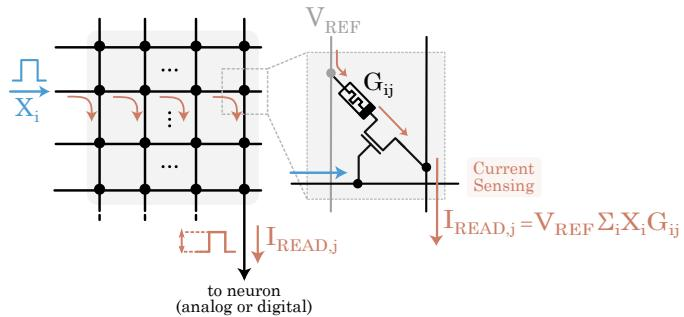
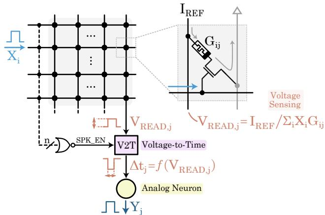
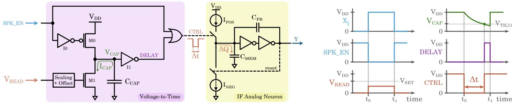
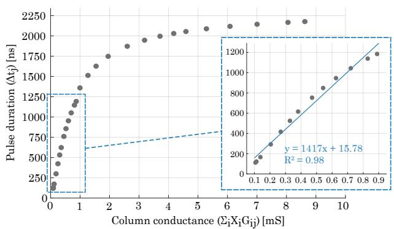
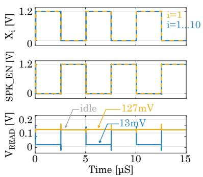
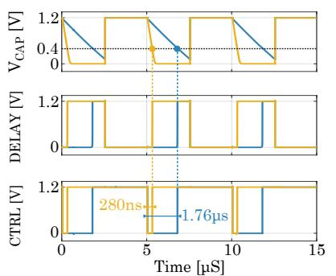
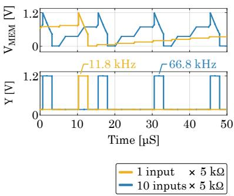
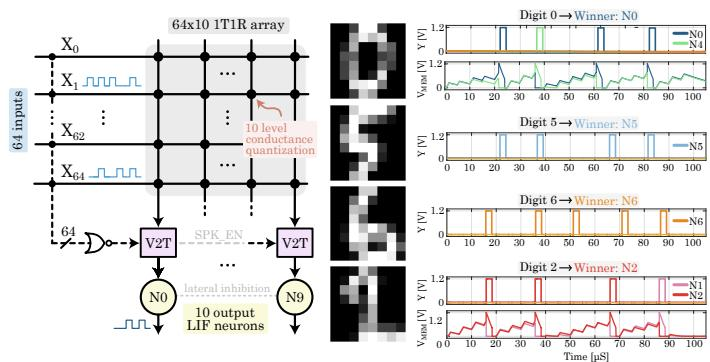

# A Time-Based Readout for Vector-Matrix Multiplication in Fully Analog Memristive SNNs

Elia Mateu-Barriendos, Alvaro G´ omez-Pau, Josep Rius, Daniel Arum´ ´ı, Rosa Rodr´ıguez-Montan˜es, Salvador Manich´ Universitat Politecnica de Catalunya - BarcelonaTech (UPC)\`

Abstract—Artificial neural networks rely on vector–matrix multiplications (VMMs), whose implementation in von Neumann architectures is dominated by costly data movement between memory and processing units. Spiking neural networks (SNNs) mitigate this bottleneck by performing in-memory, analog VMMs using memristive crossbar arrays. However, conventional currentmode readout circuits incur significant area and power overhead.

This work proposes a fully analog readout architecture based on voltage-to-time conversion of the VMM output. By sensing the column voltage, the proposed approach avoids currentmode summing and scaling circuitry, improving area and energy efficiency. Post-layout simulations of a 10×1 SNN implemented in a 130 nm CMOS technology validate the proposed architecture, while application to a trained 64×10 SNN for digit classification further demonstrates its feasibility for SNN inference.

Index Terms—Spiking neural networks (SNNs), Memristor, Synapse, Neuromorphic Hardware, In-memory computing

## I. INTRODUCTION

Inspired by the human brain, neuromorphic computing aims to emulate the event-driven and distributed processing of biological neural networks. In this paradigm, spiking neural networks (SNNs) encode information as discrete events in time (spikes), enabling asynchronous operation and improved energy efficiency when implemented in hardware [1], [2].

Crossbar arrays are a promising architecture for hardware SNNs [3], where synaptic weights are stored as conductances of non-volatile memory (NVM) devices. By exploiting Ohm’s and Kirchhoff’s laws, they inherently perform vector–matrix multiplications (VMMs), typically sensed as column currents (Fig. 1). Memristive devices are attractive NVM candidates due to non-volatility, multilevel programmability, and CMOS compatibility, and are commonly used in 1T1R configurations.

  
Fig. 1: An SNN with 1T1R memristive synapses employing current-mode crossbar sensing. The VMM output is represented by a column current IREAD,j.

While crossbar arrays enable compact in-memory VMMs, overall area and energy efficiency depends strongly on the neuron and readout design [4]. Digital neuron approaches require per-column transimpedance amplifiers and ADCs [5], leading to high area and energy consumption, or time-multiplexed ADCs [6], which reduce area at the cost of throughput.

Analog neurons integrate column current on a capacitor, enabling low-power operation. However, scalability is limited by the large read currents. Metal-oxide memristive devices typically operate in the tens to hundreds of kΩ [7], resulting in column currents in the $\mu \mathrm { A } { - } \mathrm { m A }$ range for large arrays. Obtaining appropriate integration times then requires either large capacitances or additional readout circuitry, or restricting synaptic weights to binary values [8].

Conventional solutions rely on opamp-based readout [9] and current scaling circuits [10], which may also be required in digital schemes [5], [11]. However, these circuits often dominate area and power, and large scaling factors over wide dynamic ranges require complex multi-stage designs [12].

These limitations motivate alternatives to current-mode sensing. Voltage-sensing schemes have been used in computein-memory systems [13], while time-based encoding has been implemented in digital architectures [14], [15]. However, these approaches are not directly suited to analog SNNs.

This work proposes a readout circuit based on a voltageto-time conversion of the VMM output for fully analog SNN. By avoiding current-mode readout and explicit scaling circuitry, the approach enables compact neuron design, multilevel weights, and improved area and energy efficiency.

This paper is organized as follows. Section II presents the proposed architecture. Section III describes the 10×1 SNN prototype in 130 nm CMOS and reports post-layout results.

## II. VOLTAGE-TO-TIME READOUT ARCHITECTURE

Fig. 2 shows the proposed fully analog memristive SNN architecture. Spiking inputs and output neurons are connected through 1T1R synapses, with weights encoded in the conductance $\mathbf { G } _ { \mathrm { i j } } .$ The VMM output is the column conductance $\sum _ { \mathrm { i } } \mathrm { X _ { i } G _ { i j } }$ (with $\mathrm { X _ { i } } \in \{ 0 , 1 \} )$ , sensed as a voltage $\mathrm { V _ { R E A D , j } }$

A reference current I is injected into each column, selected to keep $\mathrm { V _ { R E A D , j } }$ below the SET voltage. Memristors share a common top electrode, so the current is distributed among active devices, yielding:

$$
\mathrm { V _ { R E A D , j } = \frac { I _ { R E F } } { \sum _ { i } X _ { i } G _ { i j } } . }\tag{1}
$$

  
Fig. 2: Analog SNN with 1T1R memristive synapses employing voltage-mode crossbar sensing. The VMM output is represented by a column voltage $\mathrm { V _ { R E A D , j } }$ and converted into a pulse duration $\Delta \mathfrak { t } _ { \mathrm { j } }$ controlling the neuron current injection.

where the ON-resistance of the access transistor is neglected.

The proposed voltage-to-time (V2T) readout circuit converts the column voltage into a variable-width pulse. The circuit receives $\mathrm { V _ { R E A D , j } }$ and a global enable SPK EN, which is low while any input spike is present. The output signal CTRL is an active-low pulse with duration $\Delta \mathfrak { t } _ { \mathrm { j } }$ . Fig. 3 shows a high-level schematic and representative waveforms.

The voltage-to-time conversion is implemented by modulating the discharge time of capacitor $\mathrm { C } _ { \mathrm { C A P } }$ . During SPK EN, capacitor $\mathrm { C } _ { \mathrm { C A P } }$ discharges through NMOS M1. After SPK EN, PMOS M0 restores $\mathrm { V } _ { \mathrm { C A P } }$ . The discharge time required for $\mathrm { V } _ { \mathrm { C A P } }$ to reach the inverter threshold $\mathrm { V } _ { \mathrm { T H } , \mathrm { I 1 } }$ is:

$$
\Delta \mathrm { t } _ { \mathrm { j } } = { \frac { \mathrm { C _ { C A P } \cdot \Delta V _ { C A P } } } { \mathrm { I _ { C A P , j } } } }\tag{2}
$$

with $\Delta \mathrm { V } _ { \mathrm { C A P } } = \mathrm { V } _ { \mathrm { D D } } - \mathrm { V } _ { \mathrm { T H , I 1 } }$ . Assuming transistor M1 operates in saturation, the capacitor discharge current $\mathrm { I _ { C A P , j } }$ follows the alpha-power-law. To ensure saturation, M1 is driven by a scaled and offset version of $\mathrm { V _ { R E A D , j } }$ so that $\mathbf { V } _ { \mathrm { G S , j } } = \mathbf { k } _ { \mathrm { O F } } \cdot \mathbf { \tau }$ $\mathrm { V _ { R E A D , j } + V _ { O F } }$ . Therefore, ICAP,j can be expressed as:

$$
\mathrm { I _ { C A P , j } \propto ( ( k _ { O F } \cdot V _ { R E A D , j } + V _ { O F } ) - V _ { T } ) ^ { \alpha } }\tag{3}
$$

Combining (1), (2) and (3), the relation between the pulse duration $\Delta \mathfrak { t }$ and the column conductance $\sum _ { \mathrm { i } } \mathrm { X _ { i } G _ { i j } }$ is obtained:

$$
\Delta \mathrm { t } _ { \mathrm { j } } \propto \frac { \mathrm { C } _ { \mathrm { C A P } } \cdot \Delta \mathrm { V } _ { \mathrm { C A P } } } { \left( ( \mathrm { k } _ { \mathrm { O F } } \cdot \frac { \mathrm { I } _ { \mathrm { R E F } } } { \sum _ { \mathrm { i } } \mathrm { X } _ { \mathrm { i } } \mathrm { G } _ { \mathrm { i j } } } + \mathrm { V } _ { \mathrm { O F } } ) - \mathrm { V } _ { \mathrm { T } } \right) ^ { \alpha } }\tag{4}
$$

Equation (4) describes the resulting conductance-to-time conversion, which is monotonic but inherently non-linear, following a power-law dependence of $\Delta \mathfrak { t } _ { \mathrm { j } }$ on $\sum _ { \mathrm { i } } \mathrm { X _ { i } G _ { i j } }$ . Through circuit tuning, a locally approximately linear region can be achieved, as shown in the next section.

CTRL is generated by OR-ing SPK EN with the inverted capacitor voltage. As a result, the capacitor discharge time $\Delta \mathfrak { t }$ sets the pulse width (neglecting gate delays).

The IF neuron (Fig. 3a) incorporates a switched current source IPOS controlled by CTRL. The charge injected into the neuron is therefore proportional to the pulse duration ∆tj:

$$
\Delta Q _ { \mathrm { j } } = \mathrm { I } _ { \mathrm { P O S } } \cdot \Delta \mathrm { t } _ { \mathrm { j } }\tag{5}
$$

Since the VMM output is encoded in time, IPOS can be set by neuron design constraints. This contrasts with current-sensing schemes, where the VMM result is encoded in the current amplitude and scales with the column output.

## III. RESULTS AND DISCUSSION

A 10×1 SNN prototype based on the architecture in Fig. 2 was implemented in 130 nm CMOS and submitted for fabrication. The layout is shown in Fig. 4 and design parameters are summarized in Table I.

TABLE I: Design parameters for the 10×1 SNN prototype
<table><tr><td>Parameter</td><td>Value</td><td>Description</td></tr><tr><td> $\mathrm { G _ { i j } }$ </td><td> $\overline { { 0 . 1 \mathrm { m S }  – 1 \mathrm { m S } } }$ </td><td>Memristor conductance</td></tr><tr><td> $W / L$ </td><td>3.9 μm/0.13 μm</td><td>1T1R access transistor</td></tr><tr><td>VREAD</td><td> $2 . 5 \mathrm { m V - 2 5 0 \mathrm { m V } }$ </td><td>Column voltage</td></tr><tr><td>IREF</td><td> $2 5 \mu \mathrm { A }$ </td><td>Column current reference</td></tr><tr><td>CCAP</td><td>60 fF</td><td>V2T capacitor</td></tr><tr><td>CMEM</td><td>66.5 fF</td><td>Neuron membrane capacitor</td></tr><tr><td> $\mathrm { C } _ { \mathrm { F B } }$ </td><td>47.5 fF</td><td>Neuron feedback capacitor</td></tr><tr><td>IPOS</td><td> $2 5 \mathrm { n A }$ </td><td>Neuron charging current</td></tr><tr><td> $\mathrm { I _ { N E G } }$ </td><td> $4 0 \mathrm { n A }$ </td><td>Neuron discharging current</td></tr></table>

The V2T circuit is designed for input spikes with 2.5 µs pulse width at rates up to 200 kHz. The scaling and offset network is implemented using diode-connected MOS transistors, sized to draw negligible current compared to active memristors so that the read operation is not disturbed. The IF neuron operates on the input spikes timescale. All current sources are implemented using conventional CMOS current source structures. Robustness was verified through PVT corners and Monte Carlo simulations, with $\sigma / \mu = 1 3 . 7 \%$ timing spread at the maximum-conductance operating point under combined process and mismatch variations.

## A. Post-layout simulation results

This subsection presents post-layout simulation results of the 10×1 SNN prototype. The memristive devices are simulated using the Verilog-A model available in the PDK [16].

Fig. 5 shows the pulse duration $\Delta \mathfrak { t } _ { \mathrm { j } }$ as a function of the column conductance $\sum _ { \mathrm { i } } \mathrm { X _ { i } G _ { i j } } .$ , obtained from a representative subset of active inputs and conductance combinations. From Fig. 5, it is confirmed that the relation in (4) is monotonic, enabling time-based representation of the VMM output over the operating range. The inset shows the approximately linear region, while saturation at higher conductance reflects the underlying power-law dependence. At high column conductance, additional simultaneously active inputs reduce the sensitivity of the conversion rather than preventing circuit operation.

Fig. 6 shows representative circuit waveforms for one and ten simultaneously active inputs at 200 kHz and 0.2 mS synaptic weights. The resulting column voltage modulation produces distinct CTRL pulse durations, leading to neuron firing rates of 11.8 kHz and 66.8 kHz, respectively.

  
(a) Conceptual schematic of the V2T circuit and the IF neuron. Capacitor discharge through an (b) Representative waveforms showing the timing relation NMOS transistor implements the voltage-to-time conversion, while the OR gate produces the ship between the input spike Xi, SPK EN, VREAD, VCAP, variable-width pulse that injects current into the neuron. For simplicity, the j subscript is omitted. DELAY, and CTRL for a fixed VREAD.  
Fig. 3: V2T circuit: (a) high-level conceptual schematic including the IF neuron (b) illustrative waveforms.

Fig. 4: Layout of the implemented 10×1 SNN prototype. Total area is 2880.52 µm2.  
  
Fig. 5: Post-layout simulation results of the conductance-totime conversion characteristic of the 10×1 SNN prototype.

## B. Area and Energy

Table II reports the layout area of the implemented prototype (excluding access circuitry), also expressed in equivalent minimum-size inverters (7.56 µm2).

TABLE II: Area of the Implemented Prototype
<table><tr><td>Sub-circuit</td><td>Area [μm2]</td><td>Area [INV]</td></tr><tr><td>10×1 1T1R synapses</td><td>393</td><td>52</td></tr><tr><td>V2T circuit</td><td>480</td><td>63.5</td></tr><tr><td>IF Neuron</td><td>1160</td><td>153.5</td></tr><tr><td>Total</td><td>2033</td><td>269</td></tr></table>

Energy is evaluated at the level of the synaptic circuit (including the reference current generator) and the V2T circuit. The 10×1 synaptic circuit draws 42.8 µA independently of input activity, resulting in 128.5 pJ per read operation over 2.5 µs. The V2T circuit draws 10.3 µA in idle and 0.19 µA during conversion, yielding 0.58 pJ per operation. The total energy per synaptic operation (synaptic readout plus voltageto-time conversion) is 129 pJ.

Area and idle power scale approximately linearly with the number of output neurons, as each requires one IREF current generator and one V2T circuit. However, ∼70% of the V2T circuit area is occupied by decoupling capacitors, which can be shared in larger systems. Idle power can be reduced by disabling the IREF current generator when no input is active.

## C. Comparison with a current-sensing scheme

As a representative example of a current-sensing readout, [10] employs an opamp-based input stage and a current-scaling circuit providing 500× attenuation. The per-column readout area in 130 nm CMOS, estimated from an optical micrograph, occupies 11 000 µm2 (≈ 1455 INV), over 20× larger than the proposed V2T circuit.

The power per read operation reported in [10] is 48 µW, corresponding to 120 pJ over our 2.5 µs time window. While this energy is of the same order of magnitude, [10] considers a current range of $1 0 \mu \mathrm { A } { - } 2 0 0 \mu \mathrm { A }$ . These currents correspond to a column conductance of 0.04 mS–0.8 mS (at 250 mV), which is < 10% of the 0.1 mS–10 mS range targeted here.

Using a current-sensing scheme, our 10×1 SNN would produce column currents from 25 µA to 2.5 mA. Scaling these to the nA-range would require attenuation factors of $1 0 ^ { 3 } – 1 0 ^ { 5 }$ and additional circuitry to enforce a fixed read voltage, which would increase the energy of 120 pJ by several orders.

## D. Application to Digit Recognition

To further evaluate the proposed approach, a 64×10 SNN was trained in software on the Digit dataset [17] using backpropagation, with synaptic weights constrained to be nonnegative. The trained weights were quantized to ten conductance levels spanning the memristor range (1 kΩ to 10 kΩ) and mapped to a schematic-level implementation, where the IF analog neurons were extended with leakage (implemented as a constant current source) and lateral inhibition.

Representative 8×8 digit samples, rate-encoded over 100 µs, produced the same classification outcome in both the softwaretrained network and the circuit implementation (Fig. 7), providing preliminary validation of the proposed architecture in a trained SNN inference task.

  
Fig. 6: Post-layout simulation waveforms of the 10×1 SNN prototype, illustrating two scenarios: one (orange) and ten (blue) simultaneously active inputs at 200 kHz, corresponding to column conductances of 0.2 mS and 2 mS, respectively.

  
Fig. 7: Application of the proposed architecture to a trained 64×10 SNN with quantized synaptic weights. Membrane traces are included only when multiple neurons are active.

## IV. CONCLUSION

This work proposes a time-based readout circuit for fully analog SNNs with memristive synapses. The proposed approach converts the VMM output, sensed as a column voltage, into a time-domain signal that controls neuron current injection. By avoiding current-mode readout, the approach eliminates complex, area-intensive circuitry that becomes challenging at high column currents.

A 10×1 SNN prototype with the proposed architecture was implemented in 130 nm CMOS. Post-layout results confirm correct conductance-to-time conversion, achieving ∼20× area reduction over a representative current-sensing implementation with comparable energy efficiency. Application to a trained 64×10 SNN further demonstrates the feasibility of the architecture for inference with quantized memristive weights.

## ACKNOWLEDGMENT

This work has been supported by PID2022-141391OB-C22 funded by MCIN/AEI/10.13039/501100011033/FEDER, UE. The corresponding author gratefully acknowledges the Universitat Politecnica de Catalunya and Banco Santander for\` the financial support of her predoctoral FPI-UPC grant.

## REFERENCES

[1] G. Indiveri et al., “Neuromorphic silicon neuron circuits,” Frontiers in Neuroscience, vol. 5, 2011.

[2] A. Sebastian, M. Le Gallo, R. Khaddam-Aljameh, and E. Eleftheriou, “Memory devices and applications for in-memory computing,” Nature Nanotechnology, vol. 15, no. 7, pp. 529–544, Mar. 2020.

[3] W. Zhang et al., “Neuro-inspired computing chips,” Nature Electronics, vol. 3, no. 7, pp. 371–382, Jul. 2020.

[4] A. Joubert et al., “Hardware spiking neurons design: Analog or digital?” in The 2012 International Joint Conference on Neural Networks (IJCNN). Brisbane, QLD, Australia: IEEE, Jun. 2012, pp. 1–5.

[5] F. Cai et al., “A fully integrated reprogrammable memristor–CMOS system for efficient multiply–accumulate operations,” Nature Electronics, vol. 2, no. 7, pp. 290–299, Jul. 2019.

[6] R. Xiao, W. Jiang, and P. Y. Chee, “An energy efficient time-multiplexing computing-in-memory architecture for edge intelligence,” IEEE Journal on Exploratory Solid-State Computational Devices and Circuits, vol. 8, no. 2, pp. 111–118, Dec. 2022.

[7] Y. Sun et al., “A Ti/AlOx/TaOx/Pt analog synapse for memristive neural network,” IEEE Electron Device Letters, vol. 39, no. 9, pp. 1298–1301, Sep. 2018.

[8] A. Valentian et al., SPIRIT: A First Mixed-Signal SNN Using Cointegrated CMOS Neurons and Resistive Synapses. Springer International Publishing, 2022, pp. 63–81.

[9] X. Wu, V. Saxena, K. Zhu, and S. Balagopal, “A CMOS spiking neuron for brain-inspired neural networks with resistive synapses and in situ learning,” IEEE Transactions on Circuits and Systems II: Express Briefs, vol. 62, no. 11, pp. 1088–1092, Nov. 2015.

[10] N. Garg et al., “Versatile CMOS analog LIF neuron for memristorintegrated neuromorphic circuits,” in 2024 International Conference on Neuromorphic Systems (ICONS). Los Alamitos, CA, USA: IEEE, Jul. 2024, pp. 185–192.

[11] H. Jiang, S. Huang, W. Li, and S. Yu, “ENNA: an efficient neural network accelerator design based on ADC-free compute-in-memory subarrays,” IEEE Transactions on Circuits and Systems I: Regular Papers, vol. 70, no. 1, pp. 353–363, Jan. 2023.

[12] G. Fierro and F. Silveira, “Pico-ampere current biasing platform for on-chip tuning of analog blocks,” in 2023 IEEE 14th Latin America Symposium on Circuits and Systems (LASCAS). Quito, Ecuador: IEEE, Feb. 2023, pp. 1–4.

[13] W. Wan et al., “A voltage-mode sensing scheme with differential-row weight mapping for energy-efficient RRAM-based in-memory computing,” in 2020 IEEE Symposium on VLSI Technology. Honolulu, HI, USA: IEEE, Jun. 2020, pp. 1–2.

[14] M. J. Marinella et al., “Multiscale co-design analysis of energy, latency, area, and accuracy of a ReRAM analog neural training accelerator,” IEEE Journal on Emerging and Selected Topics in Circuits and Systems, vol. 8, no. 1, pp. 86–101, Mar. 2018.

[15] B. Boro, R. Parmar, and G. Trivedi, “Vector-matrix multiplier architecture for in-memory computing applications with RRAM arrays,” IEEE Transactions on Nanotechnology, vol. 24, pp. 249–259, 2025.

[16] IHP. BiCMOS Technologies. Accessed: 2025-12-03. [Online]. Available: https://www.ihp-microelectronics.com/services/research-and-proto typing-service/mpw-prototyping-service/sigec-bicmos-technologies

[17] E. Alpaydin and F. Alimoglu, “Pen-based recognition of handwritten digits,” UCI Machine Learning Repository, 1996, DOI: https://doi.org/10.24432/C5MG6K.