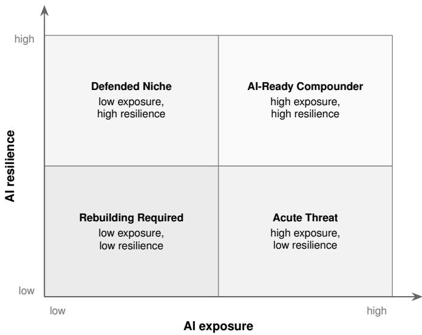
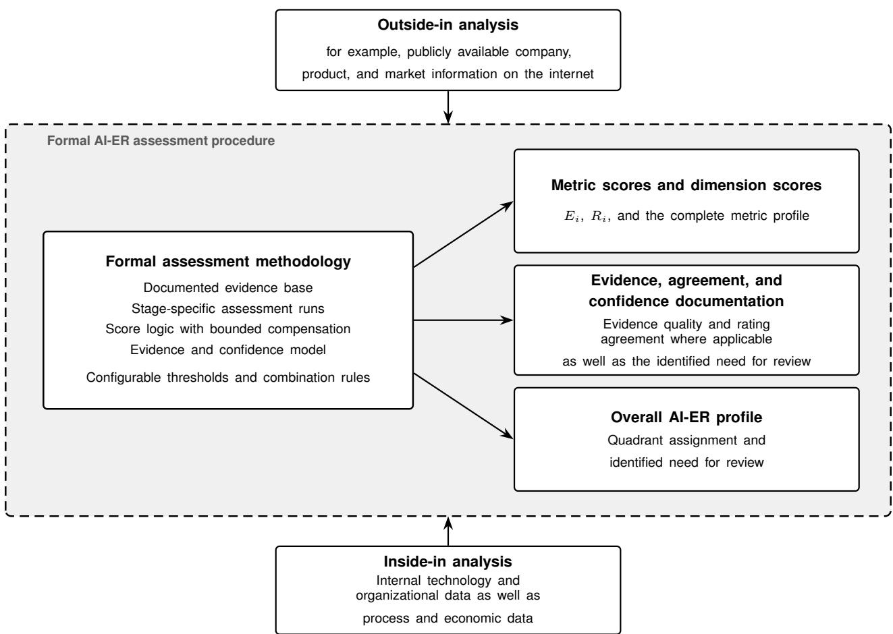

# AI Exposure and AI Resilience A Two-Dimensional Assessment Framework for Software and Software-Based Business Models

Paul Darius Mandl

Findustrial GmbH

Peter Mandl

Munich University of Applied Sciences

Schörfling am Attersee, Austria

Martin Häusl

Munich, Germany

paul.mandl@findustrial.io

peter.mandl@hm.edu

Munich University of Applied Sciences

Munich, Germany

martin.haeusl@hm.edu

Abstract—Artificial intelligence is changing both software production and the economics of software-based business models. Classical technology due diligence mainly examines technical properties such as architecture, scalability, and technical debt. These criteria do not fully capture how AI can affect a company’s value proposition, competitive position, margins, or access to customers. This paper develops Artificial Intelligence Exposure and Resilience (AI-ER) as a two-dimensional assessment framework. AI exposure describes the pressure for change that AI creates for a business model. AI resilience describes the company’s ability to absorb that pressure, adapt to changed conditions, and use AI in an economically viable way. Metrics for both dimensions are derived from current AI capabilities, their deployment conditions, and relevant research on business models and organizational adaptability. The model keeps exposure and resilience separate and adds an explicit assessment of evidence quality and confidence. It can be applied first with public information and later refined with internal evidence. The result is a traceable company profile that supports comparison without concealing uncertainty in the underlying evidence. The paper also specifies an initial score logic and a procedure for empirical validation.

Index Terms—AI exposure, AI resilience, AI-ER, generative AI, software business models, tech due diligence, M&A, AI unit economics

## I. INTRODUCTION

Advances in artificial intelligence are changing how companies create value and how software-based business models should be assessed. The relevant question is no longer only whether a company uses AI. It is also necessary to examine which parts of its offering come under pressure and how well the company can respond. This is particularly important for software businesses because their customer benefit often depends on the processing or generation of information. Current AI systems can perform an increasing share of such work at growing scale and falling unit cost [1, 2].

The resulting assessment problem is neither purely technical nor purely strategic. Technology due diligence typically examines architecture, code quality, scalability, security, and technical debt. Strategic analysis focuses more strongly on customer value, competitive position, and the economic logic of the business. AI can affect both sides at the same time. A company may use AI extensively and still face substantial external pressure. Conversely, proprietary data, strong customer relationships, or regulatory barriers may provide resilience even when visible AI functionality is still limited.

This paper develops Artificial Intelligence Exposure and Resilience (AI-ER) to separate these two questions. AI exposure captures the pressure that AI places on the business model, its value proposition, margins, and customer access. AI resilience captures the technical, organizational, and economic conditions that allow a company to absorb this pressure and adapt. The two dimensions are assessed separately and shown together in a two-dimensional company profile. They are not combined into one overall score.

The paper makes three contributions. First, it defines AI exposure and AI resilience as distinct assessment dimensions. Second, it derives a compact set of metrics from economic impact mechanisms and specifies a non-compensatory score logic. The score logic is complemented by an evidence and confidence model so that weak support for a rating remains visible. Third, the paper provides a numerical example and proposes an empirical validation procedure based on independent assessments, reliability analysis, and sensitivity testing.

The framework draws on the capabilities and deployment limits of current AI systems as well as research on technological exposure, business model change, platform economics, organizational resilience, and software delivery. These foundations are used to derive the impact mechanisms and metrics. The resulting approach is intended for strategic assessment, investment and acquisition decisions, and technology due diligence. Its purpose is not to produce a universal company grade. It provides a structured view of AI-related pressure, response capacity, and the reliability of the evidence used for both.

## II. METHODOLOGICAL APPROACH

The framework translates two abstract concepts into assessment questions that can be examined against observable information. AI exposure represents external pressure for change. AI resilience represents the capacity to respond. A purely verbal appraisal would make comparisons across companies, assessors, and points in time difficult. AI-ER therefore uses defined metrics for both dimensions.

  
Figure 1. Procedure for developing the AI-ER assessment framework, from the conceptual foundations to the two-dimensional company profile.

The derivation combines a technical and an economic perspective. Current AI capabilities indicate which services can in principle be provided by AI and which deployment conditions limit practical use. Research on business models and market structure shows when these capabilities can create economic pressure. Research on organizational adaptability identifies the conditions that allow a company to respond. The framework links these perspectives without inferring a company’s exposure directly from a single technical capability.

Recurring economic impact mechanisms are derived first. They describe how AI can alter a company’s offering, market position, or economic performance. The mechanisms are then assigned to AI exposure or AI resilience and translated into candidate metrics. A metric is retained when it has a distinct conceptual role, can be supported by observable evidence, and does not duplicate another assessment quantity.

The number of metrics is deliberately limited. Too many indicators would increase collection effort and make overlaps more likely. Excessive aggregation would conceal important differences between business model, market position, and organizational or technical capability. The final selection therefore follows from the substantive derivation in Chapter V. Figure 1 summarizes this procedure.

Metric scores are combined only within their respective dimension. The dimension scores make the main tendency easier to compare, while the individual metrics remain visible. This distinction matters because high exposure and high resilience can occur at the same time. The company profile therefore depends on the joint interpretation of both dimensions rather than on one aggregate score.

Each metric rating is linked to documented evidence. Confi dence describes how well a rating is supported rather than how high the rating is. It depends on the quality of the available evidence and, where several independent assessment runs exist, on the agreement between those runs. Chapter VI specifies the rating, aggregation, and confidence logic.

## III. CAPABILITIES AND DEPLOYMENT CONDITIONS OF ARTIFICIAL INTELLIGENCE

AI-ER requires a technical foundation that is not tied to one model, vendor, or product generation. The relevant issue is therefore not which specific AI technology a company uses. The framework asks which economically relevant services AI systems can perform under operational conditions. This functional view connects technical development to possible changes in a business model without treating the availability of a technical feature as evidence of economic impact.

## A. Economically Relevant Capability Areas

Current AI systems provide analytical, predictive, generative, and decision-support services. Analytical methods identify patterns and anomalies in large data sets and can support the automated evaluation of complex information. Their performance is documented in fields such as image classification and medical image analysis [3]. Predictive systems estimate probabilities and expected developments from existing data. Their usefulness depends strongly on data quality and on the stability of the relationships learned from those data. Optimization methods extend these capabilities by comparing alternative courses of action within defined objectives and constraints [3].

Generative AI adds the creation and transformation of content. Current systems can produce text, images, and program code and can transform information between different representations. Standardized evaluations and professional task benchmarks document the breadth of these capabilities [3, 4]. For business use, however, the quality of a single output is not sufficient. Economic relevance increases when a service can be delivered repeatedly, integrated into existing systems, and scaled at acceptable cost. Interfaces and standardized services make such capabilities accessible even to companies that do not develop foundation models themselves.

This broad access has an important economic consequence. Similar AI capabilities may be available to a company, its competitors, its customers, and large platform providers at the same time. Technical access therefore does not in itself create a durable advantage. The later assessment must examine where AI becomes economically effective and which company-specific conditions support or limit its use.

## B. Deployment Conditions and Limits

The documented capabilities do not make AI a universal replacement technology. Performance remains dependent on the task, the available data, and the operating context. Results from standardized evaluations cannot simply be transferred to business processes. Generative systems can produce plausible but incorrect output and can react unstably to changed inputs. They may also fail to reflect company-specific rules or exceptions. These limitations are particularly relevant in complex or liability-sensitive applications [4, 5].

Further limits arise when isolated AI functions are embedded in longer workflows. Operational use requires state to be maintained, errors to be detected, and responsibilities to remain clear across several processing steps. Uncertainty can accumulate as workflows become longer. A deployable solution therefore requires more than a capable model. It also needs integration, monitoring, and suitable human control.

Technical feasibility also differs from economic viability. Operation, quality assurance, and integration create costs that can reduce the achievable benefit. Legal and organizational requirements may further restrict use. Data protection, information security, traceability, and human oversight are especially relevant where decisions concern persons or protected information [5, 6]. AI-ER therefore treats a capability as economically relevant only when it can be used with sufficient reliability, availability, viability, and permissibility in the respective context.

The technical analysis defines the range of services from which AI-related change may originate. It does not yet establish whether a particular company is exposed or resilient. That assessment also depends on economic and organizational relationships, which are considered in the next chapter.

## IV. STATE OF RESEARCH AND CONCEPTUAL FRAME

Technical capability becomes economically relevant when it changes services, cost structures, market relationships, or forms of value creation. AI-ER therefore combines three research perspectives. Work on technological exposure shows where AI capabilities overlap with existing activities and services. Business model research explains how such overlaps can affect value creation and economic capture. Research on resilience addresses how organizations respond to change. These perspectives provide the conceptual basis for the two assessment dimensions.

## A. Technological Exposure and Business Model Change

Research on technological exposure examines how strongly activities or occupations overlap with the capabilities of a new technology. For generative AI, Eloundou et al. and the OECD identify particularly strong exposure for knowledge-intensive, language-based, and information-processing activities [7, 8]. Such proximity indicates technical potential for change. It does not establish that an activity will be automated or that a company will be economically weakened. Operational and market conditions still determine whether the technology can be used and how its effects are distributed.

A company assessment must therefore extend beyond isolated activities. The relevant question is whether AI changes the economic core of a service, its value proposition, or its market position. Research on business model innovation shows that AI can support new offerings, alter service delivery, and change economic capture [1, 9]. The effect depends on the business logic. A digital information product is generally closer to generative and analytical AI capabilities than an offering whose value depends heavily on physical, regulatory, or relational conditions.

Platform economics adds the question of market structure and customer access. Digital platforms can integrate formerly independent functions into larger offerings and can take over the interface to the customer [10, 11]. A service may therefore remain useful while its independent monetization or route to market weakens. AI exposure in this paper consequently includes more than technical substitutability. It also covers AI related changes in value creation, competition, and customer access.

## B. Organizational Resilience and Adaptability

Organizational resilience concerns the ability to deal with change and disruption. It includes anticipation, continued capacity to act, and subsequent adaptation. Duchek describes resilience as a capability that links anticipation, coping, and adaptation [12]. This perspective is well suited to AIrelated change because new capabilities diffuse over time and can repeatedly alter customer expectations and competitive conditions.

Research on digital resilience applies this perspective to organizations whose operations depend strongly on digital technologies. Digital technologies can improve information processing and responsiveness, but they can also create dependencies on data, platforms, infrastructure, and external providers [13]. The use of AI therefore does not automatically increase resilience. Technical possibilities must be converted into dependable operational capabilities and linked to organizational decisions.

Business model research also treats adaptation as a response to environmental change. Buliga et al. describe business model change as one such response [14]. More recent studies examine AI as a resource that may support organizational resilience. Han et al. find that AI investment can help firms respond to external disruptions when complementary organizational conditions are present [15]. Guo et al. report a positive relationship between AI use and organizational resilience that is partly mediated by business model development [16]. AI-ER changes the direction of the question. It asks how well a company can respond to change that is itself induced by AI.

For the framework, AI resilience therefore denotes the ability to absorb AI-related pressure and to adapt products, processes, and the business model where necessary. This capacity may rest on existing competitive positions as well as technical and organizational capabilities. It is not the inverse of exposure. High exposure can coexist with high resilience, while low exposure can coexist with weak adaptability.

## C. Research Gap and Conceptual Delineation

Existing research covers important parts of AI-related change but rarely combines them for the assessment of an individual company. Exposure studies often focus on tasks or occupations. Business model research examines changes in value creation but does not always connect them to concrete proximity to AI capabilities. Resilience research usually starts from general environmental change and increasingly treats AI as a supporting resource.

AI-ER connects these perspectives. AI exposure denotes the pressure that AI capabilities and their diffusion place on a business model and its market position. AI resilience denotes the company’s capacity to absorb this pressure, adapt, and use new technical possibilities for its own value creation. Keeping the dimensions separate prevents technical vulnerability and organizational response capacity from being reduced to one indicator.

The research base does not determine a unique set of metrics. It defines the areas that the assessment needs to cover. For exposure, these areas concern the transfer of AI capabilities into value creation, competition, and market relationships. For resilience, they concern protection, adaptability, and the productive use of AI. The next chapter derives a compact metric set from these foundations.

## V. DERIVATION OF THE AI-ER ASSESSMENT FRAMEWORK

The preceding chapters provide the technical and conceptual basis for AI-ER. The next step is to convert these foundations into assessment quantities. The derivation starts with economic impact mechanisms and then assigns metrics to AI exposure and AI resilience. Closely related aspects are merged when separate treatment would create double counting. A metric is retained only when it adds a distinct assessment question and can be supported by observable evidence.

## A. Economic Impact Mechanisms

An AI capability becomes economically relevant when it changes how a service is provided, differentiated, or monetized. Research on business model innovation and platform economics points to four recurring mechanisms [1, 10, 11].

• Substitution occurs when AI can provide a substantial part of the customer benefit for which the existing service is paid. Comparable quality at lower effort or shorter delivery time can already create pressure.

• Compression reduces the economic value contribution without eliminating the service. AI may lower labor input or standardize previously scarce expertise. This can reduce prices and margins.

• Bundling integrates a formerly stand-alone service into a broader product or platform. The function remains available, but its independent economic position can weaken.

• Re-intermediation changes the relationship between provider and customer. Assistants, platforms, or agent systems may take over search, selection, or transaction steps and thereby affect customer access.

Several mechanisms can occur at the same time. They are therefore treated as forms of economic impact rather than as mutually exclusive development paths.

## B. Deriving the AI Exposure Metrics

AI exposure measures the pressure that these mechanisms place on a company. Research on task exposure first motivates the substitutability of the core benefit [7, 8]. This metric asks how closely the paid customer benefit lies to services that current AI systems can already provide. The focus is on the service itself rather than on the current strength of brand, sales, or customer relationships.

A second metric captures the replicability of the offering. Generative AI can reduce the effort required to build or reproduce parts of digital products. Replicability therefore considers the effort needed to recreate the offering while taking account of company-specific data, integrations, domain knowledge, and regulatory requirements. Substitutability and replicability remain separate because a difficult-to-copy product may still lose its customer benefit to a different AI-based solution. The reverse is also possible.

Technical replaceability alone does not determine market pressure. Competitive dynamics captures how competitors or platform providers use AI to change speed, price, or bundling. The business model modulator captures the direction of the economic effect on the existing business model. AI-related productivity or quality gains can dampen exposure when the company can retain the resulting value. The same developments can amplify exposure when they mainly benefit customers, competitors, or new entrants.

Customer access and demand pressure covers changes on the demand side. Customers may expect AI functions, perform parts of a service themselves, or delegate selection to assistants and platforms [17, 18]. This can alter willingness to pay and the direct relationship between provider and customer. The metric is therefore distinct from competitive dynamics, which focuses on the behavior of other providers.

The derivation yields four numerical exposure metrics and one categorical business model modulator. Together they cover the core benefit, the replicability of the offering, competitive change, the direction of the business model effect, and customer access. This scope is broad enough to represent the main impact mechanisms while remaining manageable for evidence collection.

## C. Deriving the AI Resilience Metrics

AI resilience describes the company’s capacity to respond to AI-related pressure. Business model and platform research first points to protective positions. These are company-specific resources or market positions that remain valuable under changed technical conditions. The metric assesses their robustness against AI-based alternatives rather than their historical strength alone.

Research on organizational resilience and dynamic capabilities motivates adaptability [12, 19]. The metric concerns the ability to recognize relevant change and to adjust products, processes, and the business model. It therefore describes an organizational capability rather than the success of a single AI project.

Productive AI use also requires a technical basis. Technical AI maturity assesses whether data-driven and model-based functions can be developed, integrated, monitored, and operated reliably [20, 21]. Implementation capability addresses a different question. It examines whether skills, decision paths, and software delivery allow technical possibilities to be converted into operational solutions within a reasonable period [22].

The final resilience metric is economic viability. It compares the effort for development, operation, control, and external dependencies with the expected contribution to value creation and customer benefit. This prevents technical feasibility from being treated as sufficient evidence of lasting economic value.

The five resilience metrics cover protective positions, adaptability, technical AI maturity, implementation capability, and economic viability. They describe distinct conditions that influence a company’s ability to respond. The next chapter specifies how the exposure and resilience metrics are rated and combined.

## D. Overview of the Metrics

The derivation yields four numerical exposure metrics, one categorical business model modulator, and five numerical resilience metrics. Table I summarizes their conceptual basis.

The table shows that each assessment quantity addresses a distinct aspect of AI-related change. The following chapter defines the rating logic and the treatment of evidence and confidence.

## VI. PROPOSAL FOR A CONCRETE IMPLEMENTATION

The derived metrics require an explicit rating and aggregation procedure before they can be used in practice. Different implementations are possible, including averaging and multicriteria procedures. This paper specifies one rule-based variant. The purpose of the proposal is to keep critical individual scores visible and to provide a configuration that can be tested empirically.

AI-ER does not produce a general company grade. It classifies AI-related pressure and a company’s capacity to respond. The same metrics can be used for an initial assessment based on public information and for a later assessment with internal evidence. A richer evidence base may change metric scores, dimension scores, and confidence values without changing the underlying model.

An assessment can be performed by one assessor, by several independent assessors, or by an AI-based analysis service. An automated service may collect information about a company, its offering, and relevant competitors and then apply the defined rating rules. Reliability improves when several assessment runs are produced independently and compared afterward. Runs are considered independent only when they do not share intermediate judgments. Repeated outputs from the same reasoning process do not become independent merely because several outputs are generated.

The formal specification makes the rating logic reproducible and provides a basis for software implementations of AI-ER. Such implementations can collect evidence, propose metric scores, execute assessment runs, and document disagreements.

## A. Notation

Only the terms needed for the score logic are introduced here. The appendix provides the complete mathematical notation.

• A metric is a company characteristic rated against defined scale anchors. Its value is the metric score. Metric scores are combined into a dimension score according to the specified score logic.

• A scale anchor assigns a substantive meaning to a value on the five-point rating scale. The values 1, 3, and 5 are described explicitly. The values 2 and 4 represent justified intermediate positions.

• Core drivers determine the base value of a dimension. The proposed logic is non-compensatory, which means that a critical core driver is not automatically offset by a favorable value on another core driver.

• A threshold activates a predefined rule once a specified value is reached. A combination rule defines how scores or conditions are linked. A binary indicator records whether such a condition is fulfilled.

• A modulator changes a base value by a bounded amount when an additional economic or structural condition has a dampening or amplifying effect. It does not alter the underlying metric ratings.

• An assessment run is one complete application of the rating scheme to a company. Several independent runs can be combined into a joint metric score and used to measure rating agreement.

Thresholds, combination rules, and modulators are configurable parameters rather than values inferred from company data. They must be fixed before an assessment is applied. The configuration proposed below is an initial specification and requires empirical comparison with alternative settings. Table V summarizes the symbols. Table VI lists the configurable model parameters and the default values used in this paper.

## B. Determining the Individual Scores and the Score Logic

Substantive scale anchors are defined for each numerical metric before the assessment, describing observable conditions for low, medium, and high levels. The values 1, 3, and 5 come directly from these anchors, while 2 and 4 represent justified intermediate positions. Missing evidence does not automatically produce a medium score. The assessment is marked provisional or suspended until sufficient evidence becomes available. For each metric, the assigned score, its justification, and the supporting evidence are documented together.

For company i, metric $j ,$ and assessment run $\ell , x _ { i j } ^ { ( \ell ) } \in$ {1, 2, 3, 4, 5}. If $L \geq 2$ independent ratings are available, the median is used as the robust joint metric score.

$$
\widetilde { \boldsymbol { x } } _ { i j } = \mathrm { m e d i a n } \Big ( \boldsymbol { x } _ { i j } ^ { ( 1 ) } , \dots , \boldsymbol { x } _ { i j } ^ { ( L ) } \Big ) .\tag{1}
$$

The median limits the influence of strongly deviating ratings without assuming equal distances between the five scale levels. The default configuration for the initial outside-in assessment uses $L = 3$ . The subsequent inside-in assessment described in Section VI-E uses a single run. The median therefore remains an observed integer scale value when several independent runs are used. If an even number of runs is used, the rule for selecting one of the two middle values must be specified in advance. With a single run, $\widetilde { x } _ { i j } = x _ { i j } ^ { ( 1 ) }$ . The symbols $x _ { i } ^ { \mathrm { s u b } }$ through $x _ { i } ^ { \mathrm { { e c o n } } }$ denote the resulting combined metric scores.

The business model modulator is treated separately because it does not describe an ordinal intensity. It records whether AI dampens, leaves unchanged, or amplifies the pressure associated with substitutability and replicability. The classification depends on the economic effect on the company rather than on technical

Table I  
OVERVIEW OF THE ASSESSMENT QUANTITIES DERIVED IN THE AI-ER FRAMEWORK AND OF THEIR CONCEPTUAL DERIVATION.
<table><tr><td>Dimension</td><td>Assessment quantity</td><td>Subject of assessment</td><td>Derived from</td></tr><tr><td rowspan="6">AI exposure</td><td>Substitutability of the core benefit</td><td>Takeover of the essential customer benefit by AI</td><td>[7, 8]</td></tr><tr><td>Replicability of the offering</td><td>Effort required to reproduce the offering</td><td>[1, 7]</td></tr><tr><td>Competitive dynamics</td><td>AI-induced changes in competition, prices, and bundling</td><td>[1, 10, 11]</td></tr><tr><td>Business model modulator</td><td>Dampening, neutral, or amplifying effect of AI on the economic position</td><td>[1, 10]</td></tr><tr><td>Customer access and demand pressure</td><td>Changes in customer expectations, demand, and market access</td><td>[11, 17, 18]</td></tr><tr><td>Protective positions</td><td>Robust resources and market positions</td><td>[10, 19]</td></tr><tr><td rowspan="5">AI resilience</td><td>Adaptability</td><td>Further development of products, processes, and business model</td><td>[12, 19]</td></tr><tr><td>Technical AI maturity</td><td>Development, integration, and operation of productive AI systems</td><td>[20, 21]</td></tr><tr><td>Implementation capability</td><td>Conversion of technical possibilities into operational solutions</td><td>[19, 22]</td></tr><tr><td></td><td></td><td>[20, 21]</td></tr><tr><td>Economic viability</td><td>Relation of effort, benefit, and lasting economic contribution</td><td></td></tr></table>

AI usability alone. Productivity or quality gains matter only to the extent that they change the company’s position relative to customers, competitors, and possible substitutes.

A dampening effect is present when AI strengthens the economic position of the existing business model. This may occur when the company captures AI-induced gains while retaining important competitive advantages. Proprietary data, durable customer relationships, or regulatory requirements can support such an effect. A neutral effect is assigned when neither direction predominates or when the evidence does not permit a reliable classification. An amplifying effect is present when AI weakens the business model, for example by making services easier to substitute or by shifting value toward customers, competitors, or new entrants.

With several assessment runs, the business model modulator is classified independently in each run and consolidated afterward. Diverging assignments are documented and checked against the evidence. The consolidated value enters the exposure score directly as $M _ { i } ^ { \mathrm { { b m } } }$ . It is not averaged with the numerical metric scores.

The two dimension scores use non-compensatory aggregation, a principle established in multi-criteria decision analysis [23, 24]. A simple average could hide a critical attack path or a substantial weakness behind favorable scores on other metrics. The proposed logic therefore uses core drivers, binary indicators, and modulators. The indicator function is defined below.

$$
I ( P ) = { \left\{ \begin{array} { l l } { 1 , } & { { \mathrm { i f ~ } } P { \mathrm { ~ h o l d s } } , } \\ { 0 , } & { { \mathrm { o t h e r w i s e } } . } \end{array} \right. }\tag{2}
$$

For AI exposure, substitutability of the core benefit $x _ { i } ^ { \mathrm { s u b } }$ and replicability of the offering $x _ { i } ^ { \mathrm { r e p } }$ are the core drivers. Either can create substantial pressure on its own. A product may be difficult to reproduce while its customer benefit is replaced by another AI-based solution. Conversely, high replicability can increase competitive pressure before the core benefit is fully substituted. The base value is therefore max $\{ x _ { i } ^ { \mathrm { s u b } } , x _ { i } ^ { \mathrm { r e p } } \}$ . The maximum preserves the more critical of the two attack paths.

Competitive dynamics $x _ { i } ^ { \mathrm { { c o m p } } }$ and customer access and demand pressure $x _ { i } ^ { \mathrm { { c u s t } } }$ jointly enter an additional indicator. In the proposed configuration, a score of at least 4 activates the indicator.

$$
I _ { i } ^ { E } = I \big ( x _ { i } ^ { \mathrm { c o m p } } \geq 4 ~ \lor ~ x _ { i } ^ { \mathrm { c u s t } } \geq 4 \big ) .\tag{3}
$$

The categorically rated business model modulator is represented as follows.

$$
M _ { i } ^ { \mathrm { b m } } = \left\{ \begin{array} { l l } { - 1 , } & { \mathrm { f o r ~ a ~ d a m p e n i n g ~ e f f e c t } , } \\ { 0 , } & { \mathrm { f o r ~ a ~ n e u t r a l ~ o r ~ a m b i g u o u s ~ e f f e c t } , } \\ { 1 , } & { \mathrm { f o r ~ a n ~ a m p l i f y i n g ~ e f f e c t } . } \end{array} \right.\tag{4}
$$

The exposure score is then

$$
E _ { i } = \mathrm { c l a m p } _ { [ 1 , 5 ] } \big ( \mathrm { m a x } \big ( x _ { i } ^ { \mathrm { s u b } } , x _ { i } ^ { \mathrm { r e p } } \big ) + I _ { i } ^ { E } + M _ { i } ^ { \mathrm { b m } } \big ) .\tag{5}
$$

For AI resilience, protective positions $x _ { i } ^ { \mathrm { p r o t } }$ and adaptability $x _ { i } ^ { \mathrm { a d a p t } }$ are the core drivers under a weakest-link logic. Strong protective positions cannot fully compensate for low adaptability, and adaptability does not replace missing structural protection. The base value is therefore min $\{ x _ { i } ^ { \mathrm { p r o t } } , x _ { i } ^ { \mathrm { a d a p t } } \}$ The minimum keeps the weaker core condition visible.

Technical AI maturity $x _ { i } ^ { \mathrm { t e c h } }$ and implementation capability $x _ { i } ^ { \mathrm { i m p l } }$ increase the base value only when both are high. Technical infrastructure without implementation capability is insufficient, as is organizational readiness without a reliable technical foundation.

$$
I _ { i } ^ { R } = I \Bigl ( x _ { i } ^ { \mathrm { t e c h } } \geq 4 \ \wedge \ x _ { i } ^ { \mathrm { i m p l } } \geq 4 \Bigr ) .\tag{6}
$$

Low economic viability is captured through a separate modulator.

$$
M _ { i } ^ { \mathrm { e c o n } } = I ( x _ { i } ^ { \mathrm { e c o n } } \leq 2 ) .\tag{7}
$$

The resilience score is then

$$
R _ { i } = \mathrm { c l a m p } _ { [ 1 , 5 ] } \Big ( \operatorname* { m i n } \Big ( x _ { i } ^ { \mathrm { p r o t } } , x _ { i } ^ { \mathrm { a d a p t } } \Big ) + I _ { i } ^ { R } - M _ { i } ^ { \mathrm { e c o n } } \Big )\tag{8}
$$

The function clamp bounds both dimension scores to the interval from 1 to 5.

$$
\mathrm { c l a m p } _ { [ 1 , 5 ] } ( z ) = \mathrm { m i n } \bigl ( 5 , \mathrm { m a x } ( 1 , z ) \bigr ) .\tag{9}
$$

The aggregation operators have different roles. The median combines independent ratings robustly. The maximum preserves a sufficient attack path on the exposure side, while the minimum keeps a non-compensable weakness visible on the resilience side. Indicators represent threshold conditions. Modulators adjust the base value by a bounded step when an additional contextual factor changes the direction of the assessment. The clamping function keeps the final dimension scores on the common five-point scale.

Integer scores are intentional in the default configuration. The framework provides a classification on five levels rather than a degree of numerical precision that the evidence does not support. Thresholds, combination rules, and modulator values are part of the proposed configuration and must be compared empirically with alternatives.

## C. Evidence, Consistency, and Confidence

Every metric score must be supported by observable information. The relevant evidence depends on the metric. Each assessment records which statements are directly supported, which depend on inference, and where information remains incomplete.

Evidence quality is assessed through five properties. Directness indicates how closely the evidence relates to the metric itself. Timeliness reflects whether the information is current enough for the assessment. Completeness captures whether the relevant aspects of the metric are covered. Independence reduces the risk of treating repeated information from dependent sources as separate confirmation. Agreement reflects whether independent sources support compatible conclusions. Each property is rated 0 for insufficient, 0.5 for partly fulfilled, or 1 for fulfilled.

The five properties need not contribute equally to every metric. Positive weights can therefore be assigned to the evidence components. The weights may differ by metric. The default configuration uses equal weights, which provides a simple reference case for later validation.

For company i, metric j, and evidence property k, let $q _ { i j } ^ { ( k ) } \in$ $\{ 0 , 0 . 5 , 1 \}$ denote the component score and let $w _ { j } ^ { ( k ) } > 0$ denote its normalized weight. The weights satisfy $\begin{array} { r } { \sum _ { k \in \mathcal { K } } w _ { j } ^ { ( k ) } = 1 } \end{array}$ The set of evidence properties is

$$
\begin{array} { r } { \mathcal { K } = \{ \mathrm { d i r } , \mathrm { t i m } , \mathrm { c m p } , \mathrm { i n d } , \mathrm { a g r } \} . } \end{array}
$$

Evidence quality is calculated as a weighted mean.

$$
Q _ { i j } = \sum _ { k \in { \cal K } } w _ { j } ^ { ( k ) } q _ { i j } ^ { ( k ) } , \qquad Q _ { i j } \in [ 0 , 1 ] .\tag{10}
$$

For the five properties used in the framework, the formula can be written explicitly as

$$
\begin{array} { r l } & { Q _ { i j } = w _ { j } ^ { \mathrm { d i r } } q _ { i j } ^ { \mathrm { d i r } } + w _ { j } ^ { \mathrm { t i m } } q _ { i j } ^ { \mathrm { t i m } } + w _ { j } ^ { \mathrm { c m p } } q _ { i j } ^ { \mathrm { c m p } } } \\ & { ~ + w _ { j } ^ { \mathrm { i n d } } q _ { i j } ^ { \mathrm { i n d } } + w _ { j } ^ { \mathrm { a g r } } q _ { i j } ^ { \mathrm { a g r } } . } \end{array}\tag{11}
$$

Because the normalized weights sum to one and all component scores lie in [0, 1], $Q _ { i j }$ also lies in [0, 1]. A value of 0 means that all five properties are rated insufficient. A value of 1 requires all five properties to be fully satisfied. With equal weights, Equation (11) reduces to the arithmetic mean.

The separate component scores remain part of the assessment record. Two metrics can have the same value of $Q _ { i j }$ even when the supporting evidence differs materially. One rating may be based on current but incomplete information while another may rely on complete information from dependent sources. The aggregate value therefore supports comparison without replacing inspection of the component scores and the documented justification.

When several independent assessment runs are available, their rating agreement is measured separately. The value $A _ { i j }$ captures the deviation of the L individual ratings from their joint median $\widetilde { x } _ { i j }$

$$
A _ { i j } = 1 - \frac { 1 } { 2 L } \sum _ { \ell = 1 } ^ { L } \left| x _ { i j } ^ { ( \ell ) } - \widetilde { x } _ { i j } \right| , \qquad A _ { i j } \in [ 0 , 1 ] , \quad L \ge 2 .\tag{12}
$$

The normalization uses the five-point rating scale. Its range is 4 and the mean absolute deviation from the median can be at most 2 points. The factor 2L therefore maps the agreement measure to [0, 1]. Identical ratings produce $A _ { i j } = 1$ . Larger deviations reduce the value. With an even number of assessment runs, $A _ { i j } = 0$ can occur when half of the ratings lie at each end of the scale. With an odd number of runs, the minimum is greater than 0.

Two forms of agreement are kept distinct. The component $q _ { i j } ^ { \mathrm { a g r } }$ refers to agreement among evidence sources. The value $A _ { i j }$ refers to agreement among independent assessment runs. The first concerns the evidence base. The second concerns the stability of the resulting rating across assessors.

With only one assessment run, confidence is based on evidence quality alone and is marked as not independently confirmed. With several independent runs, confidence is limited by the weaker of evidence quality and rating agreement.

$$
C _ { i j } = \left\{ \begin{array} { l l } { Q _ { i j } , } & { \mathrm { f o r ~ } L = 1 , } \\ { \operatorname* { m i n } \{ Q _ { i j } , A _ { i j } \} , } & { \mathrm { f o r ~ } L \ge 2 . } \end{array} \right. \quad \quad C _ { i j } \in [ 0 , 1 ] .\tag{13}
$$

The minimum implements a non-compensatory rule. Strong evidence cannot compensate for poor agreement between independent runs. High agreement cannot compensate for weak evidence. Confidence is classified as low for $C _ { i j } < 0 . 5 .$ medium for $0 . 5 \le C _ { i j } < 0 . 7 5$ , and high for $C _ { i j } \geq 0 . 7 \dot { 5 }$ . These thresholds are part of the proposed configuration and require empirical validation.

Dimension confidence is based only on metrics that actually affect the corresponding dimension score. For company $i , \bar { \mathcal { A } } _ { i } ^ { \bar { \mathrm { E } } }$ denotes the decision-relevant metrics for exposure and $\mathcal { A } _ { i } ^ { \mathrm { R } }$ denotes the decision-relevant metrics for resilience. These sets include the core driver selected by the maximum or minimum and any metric that activates a binary indicator. They also include metrics that determine a modulator. If several metrics are equally decisive, all of them are included.

Table II  
SCORE-BASED ASSIGNMENT TO THE QUADRANTS OF THE AI-ER PROFILE.
<table><tr><td>Quadrant</td><td>AI exposure</td><td>AI resilience</td></tr><tr><td>Defended Niche</td><td> $E _ { i } \leq 3$ </td><td> $R _ { i } \geq 4$ </td></tr><tr><td>AI-Ready Compounder</td><td> $E _ { i } \geq 4$ </td><td> $R _ { i } \geq 4$ </td></tr><tr><td>Rebuilding Required</td><td> $E _ { i } \leq 3$ </td><td> $R _ { i } \leq 3$ </td></tr><tr><td>Acute Threat</td><td> $E _ { i } \geq 4$ </td><td> $R _ { i } \leq 3$ </td></tr></table>

  
Figure 2. Quadrants of the two-dimensional AI-ER profile.

The confidence values of the two dimension scores are

$$
C _ { i } ^ { \mathrm { E } } = \operatorname* { m i n } _ { j \in \mathcal { A } _ { i } ^ { \mathrm { E } } } C _ { i j } , \qquad C _ { i } ^ { \mathrm { R } } = \operatorname* { m i n } _ { j \in \mathcal { A } _ { i } ^ { \mathrm { R } } } C _ { i j } .\tag{14}
$$

The minimum ensures that dimension confidence does not exceed the confidence of its weakest decision-relevant basis. A high dimension score with low confidence should therefore be treated as a result that requires further evidence. Scores close to a threshold should also be identified because a small reassessment can change an indicator, a modulator, or the quadrant assignment.

## D. The Two-Dimensional AI-ER Profile

AI exposure and AI resilience are displayed jointly rather than offset against each other. In the proposed configuration, scores from 1 to 3 are classified as low and scores of 4 or 5 as high. A score of 3 lies immediately below the threshold and should be marked as near-threshold. Table II defines the four quadrant assignments.

• Defended Niche. This position combines low exposure with high resilience. The core benefit is comparatively difficult to attack, while good conditions for adaptation and AI use are also present.

• AI-Ready Compounder. High exposure meets high resilience. The company operates in a strongly changing environment but has the conditions required to manage the change actively and use it for its own development.

• Rebuilding Required. Current exposure is low, but the capacity for change is limited. If the pressure for change rises, the company can respond only to a limited extent. The primary need for action therefore lies in building protective, adaptive, and implementation capability.

• Acute Threat. High exposure coincides with low resilience. Vulnerable services meet insufficient protective and adaptive capability, creating an immediate need for review and action.

The quadrants are not final company classes. Interpretation must also consider the individual metrics, the supporting evidence, confidence, and the distance to relevant thresholds.

## E. Analysis Layers and Presentation of Results

The assessment can be performed in two stages. An outsidein analysis uses publicly available information to produce an initial rating of the nine metrics and the business model modulator. It also identifies weakly supported ratings and information gaps. This makes an initial AI-ER profile available before internal data collection is complete. Figure 3 shows the relationship between both analysis layers and the formal assessment methodology.

The inside-in analysis is conducted as a single subsequent assessment run. It takes the preliminary outside-in profile as its starting point and adds internal technical, organizational, process, and economic information. It tests assumptions formed from public evidence and can change both metric scores and confidence. Detailed review should focus on metrics that influence a dimension score or remain weakly supported. Ratings close to thresholds also deserve particular attention. Both layers use the same metrics and score logic, so the insidein analysis refines the provisional profile rather than replacing it with a separate assessment.

For company i and metric $j ,$ let $x _ { i j } ^ { O }$ denote the preliminary outside-in rating and $x _ { i j } ^ { I }$ the rating after the single inside-in run. Let $E _ { i j } ^ { O }$ denote the set of public evidence and $E _ { i j } ^ { I }$ the set of additional internal evidence. The inside-in rating is based on $E _ { i j } ^ { O } \cup E _ { i j } ^ { I }$ and the same scale anchors and score logic. The change from the preliminary rating is

$$
\Delta x _ { i j } = x _ { i j } ^ { I } - x _ { i j } ^ { O } .\tag{15}
$$

A value of $\Delta x _ { i j } = 0$ confirms the preliminary rating. A nonzero value indicates a revision based on the additional internal evidence. Even when the metric score remains unchanged, the added evidence can change $Q _ { i j }$ and therefore confidence. As the inside-in stage uses one run, $L = 1$ for this stage and Equation (13) reduces to $C _ { i j } = Q _ { i j }$

The result consists of the two dimension scores, the quadrant position, and the complete metric profile. Each metric is accompanied by its justification, evidence quality, rating agreement where applicable, and confidence. Material assumptions and remaining information gaps are recorded separately. The condensed profile therefore remains traceable to its underlying findings.

Table III  
ASSUMED RATINGS FOR THE AI EXPOSURE METRICS OF THE FICTITIOUS COMPANY A (ILLUSTRATIVE EXAMPLE).
<table><tr><td>Metric</td><td>Runs  $x _ { A j } ^ { ( 1 \ldots 3 ) }$ </td><td>Median  $\widetilde { x } _ { A j }$ </td></tr><tr><td> $x _ { A } ^ { \mathrm { s u b } }$ </td><td>4,4,5</td><td>4</td></tr><tr><td> $\boldsymbol { x } ^ { \mathrm { r e p } }$  xA</td><td>2,3,3</td><td>3</td></tr><tr><td> $\boldsymbol x _ { A } ^ { \mathrm { { c o m p } } }$ </td><td>4,4,5</td><td>4</td></tr><tr><td> $\boldsymbol x _ { A } ^ { \mathrm { c u s t } }$ </td><td>3,3,4</td><td>3</td></tr><tr><td colspan="3"> $M _ { A } ^ { \mathrm { { b m } } }$  has an amplifying effect and equals +1.</td></tr></table>

Table IV

ASSUMED RATINGS FOR THE AI RESILIENCE METRICS OF THE FICTITIOUS COMPANY A (ILLUSTRATIVE EXAMPLE).
<table><tr><td>Metric</td><td>Runs  $x _ { A j } ^ { ( 1 \ldots 3 ) }$ </td><td>Median  $\widetilde { x } _ { A j }$ </td></tr><tr><td> $x _ { \ A } ^ { \mathrm { p r o t } }$ </td><td>3,4,4</td><td>4</td></tr><tr><td> $r ^ { \mathrm { a d a p t } }$  A xA</td><td>3,3,4</td><td>3</td></tr><tr><td> $\boldsymbol { x } _ { A } ^ { \mathrm { t e c h } }$ </td><td>4,4,4</td><td>4</td></tr><tr><td> $\mathbf { \Pi } _ { r } \mathbf { \bar { i } m p l }$   $x _ { A \_ }$ </td><td>3,4,4</td><td>4</td></tr><tr><td> $x _ { A } ^ { \mathrm { { \bar { e c o n } } } }$ </td><td>3,3,4</td><td>3</td></tr></table>

## F. Illustrative Numerical Example

A fictitious company A illustrates the score logic from Section VI-B and the confidence model from Section VI-C. The values are hypothetical and have no empirical meaning. Three independent assessment runs are assumed for every metric, so $L = 3$ . Equation (1) therefore returns an observed integer rating as the combined metric score. Table III shows the assumed exposure ratings and the business model modulator.

The core exposure drivers are $x _ { A } ^ { \mathrm { s u b } } = 4$ and $x _ { A } ^ { \mathrm { r e p } } = 3$ Their maximum gives a base value of 4. Since $x _ { A } ^ { \mathrm { c o i n p } } = 4 ,$ the exposure indicator in Equation (3) equals $I _ { A } ^ { E } \stackrel {  } { = } 1$ . The business model modulator equals $M _ { A } ^ { \mathrm { b m } } = + 1$ . Equation (5) therefore gives

$$
\begin{array} { r } { E _ { A } = \mathrm { { c l a m p } _ { [ 1 , 5 ] } } \big ( \operatorname* { m a x } \{ 4 , 3 \} + 1 + 1 \big ) = \mathrm { { c l a m p } _ { [ 1 , 5 ] } } ( 6 ) = 5 . } \end{array}
$$

Company A reaches the highest exposure level. The core benefit is highly substitutable and competitive dynamics already reach the indicator threshold. The amplifying business model effect increases the score by a further step.

Table IV shows the assumed resilience ratings.

For resilience, $x _ { A } ^ { \mathrm { p r o t } } = 4$ and $x _ { A } ^ { \mathrm { a d a p t } } = 3$ are the core drivers. Their minimum gives a base value of 3. Both technical AI maturity and implementation capability reach 4, so $I _ { A } ^ { R } = 1$ Economic viability remains above the penalty threshold and $M _ { A } ^ { \mathrm { { e c o n } } } = 0 .$ . The resilience score is

$$
R _ { A } = \mathrm { { c l a m p } _ { [ 1 , 5 ] } ( \operatorname* { m i n } \{ 4 , 3 \} + 1 - 0 ) = \mathrm { { c l a m p } _ { [ 1 , 5 ] } ( 4 ) = 4 . } }
$$

The company therefore combines high exposure with high resilience. Its adaptability score limits resilience more strongly than technical AI maturity.

The confidence calculation can be illustrated with $x _ { A } ^ { \mathrm { s u b } }$ Assume evidence component scores of $q _ { A } ^ { \mathrm { d i r } } = 1 , q _ { A } ^ { \mathrm { t i m } } = 1$ $q _ { A } ^ { \mathrm { c m p } } = 0 . 5 , q _ { A } ^ { \mathrm { i n d } } = 1$ , and $q _ { A } ^ { \mathrm { a g r } } = 0 . 5$ , with equal weights. Evidence quality is $Q _ { A , \mathrm { s u b } } = 0 . 8 .$ For the ratings 4, 4, 5 with median 4, the summed absolute deviation is 1. Equation (12) therefore gives $A _ { A , \mathrm { s u b } } \approx 0 . 8 3$ . Metric confidence is the lower value and thus equals $C _ { A , \mathrm { s u b } } = 0 . 8$ . The remaining decisionrelevant metrics are treated in the same way. Dimension confidence then follows from Equation (14).

With $E _ { A } = 5$ and $R _ { A } = 4 ,$ company A belongs to the AI-Ready Compounder quadrant in Table II. Exposure is high, but the company also has substantial capacity to respond. The example illustrates why the two dimensions should not be collapsed into one score.

## VII. VALIDATION AND LIMITS

The proposed rating logic makes AI-ER operational, but the framework has not yet been validated empirically. Validation must address the suitability of the metrics, the reliability of their application, the stability of the score logic, and the relationship between assessment results and later company developments. The confidence model requires separate examination because it is intended to distinguish well-supported ratings from provisional ones.

## A. Approach to Empirical Validation

A first validation step should use comparative case studies across different software-based business models. The cases should cover different combinations of exposure and resilience and should vary in size, market position, and prior AI use. Each case can first be assessed from public information and then reassessed with internal evidence. The comparison indicates which metrics can be judged reliably from the outside and where internal information changes the result.

Independent assessments of the same company are required to test rating reliability. Agreement can be measured with established statistics such as Krippendorff’s alpha or Cohen’s kappa [25, 26]. Large deviations would indicate unclear concepts, weak scale anchors, or excessive interpretive freedom. Validation should also examine whether the metrics within each dimension remain empirically distinct and whether exposure and resilience can be separated as intended.

Longitudinal validation is needed to assess predictive relevance. High exposure should be associated with later pressure on differentiation, pricing, margins, or customer access. High resilience should be associated with a stronger capacity to adapt products, processes, technical structures, or the business model. Such relationships can only be examined by comparing earlier assessments with developments observed later.

Sensitivity analysis should vary thresholds, combination rules, weights, and modulators within plausible ranges. Stable dimension scores would support the robustness of the model structure. Strong changes would indicate dependence on particular parameter choices. The confidence model should also be tested against later evidence and repeated assessments. High-confidence ratings should prove more stable than lowconfidence ratings if the confidence model works as intended.

  
Figure 3. Formal AI-ER methodology with outside-in and inside-in evidence and the assessment results derived from them.

## B. Limits of the Assessment Framework

The current scale anchors, thresholds, combination rules, evidence weights, and modulators have not been calibrated on a large sample. The maximum rule for exposure and the minimum rule for resilience are conceptual choices. They assume that one pronounced attack path can determine exposure and that one weak core condition can limit resilience. Their suitability across industries and business models remains an empirical question. The dimension scores should therefore be interpreted as structured classifications rather than precise measurements.

Assessment quality depends strongly on the available evidence. Public information often describes products and visible AI activities better than internal technical or organizational conditions. Companies with extensive external communication may therefore appear easier to assess than more reticent companies with similar capabilities. The confidence model makes this limitation visible but cannot replace missing evidence.

AI-ER also provides a time-bound assessment. New AI capabilities, changes in cost, competitive offerings, regulation, or internal transformation can alter both dimensions. Assessments should therefore be updated when material conditions change. The overall model can be used across industries, but scale anchors and evidence requirements may need adaptation to industry-specific value creation and regulatory conditions.

A single AI-ER assessment does not establish causality. Company performance is influenced by many factors beyond AI. The framework therefore complements strategic, technical, and financial analysis rather than replacing them. Dimension scores should always be read together with the individual metrics, the supporting evidence, and confidence.

## VIII. CONCLUSION AND OUTLOOK

This paper develops Artificial Intelligence Exposure and Resilience as a framework for assessing how AI affects softwarebased business models. Its central distinction is between AI exposure and AI resilience. Exposure describes the pressure for change. Resilience describes the company’s capacity to absorb that pressure and adapt. Keeping both dimensions separate makes situations visible in which a company is highly exposed but also well prepared to respond.

The metrics are derived from AI capabilities, economic impact mechanisms, and research on organizational adaptability. The proposed score logic is non-compensatory so that a critical attack path or a weak core condition remains visible. Evidence quality and rating agreement are assessed separately from the metric values and are combined into a confidence measure. The framework can therefore distinguish the assessment result from the reliability of the evidence supporting it.

AI-ER can be applied first as an outside-in assessment and later refined with internal evidence. Possible applications include strategic review, technology due diligence, and investment or acquisition analysis. The framework remains a proposal that requires empirical validation. Comparative case studies, independent assessment runs, longitudinal observation, and sensitivity analysis are needed to test the metrics and the score logic.

A software implementation can support evidence collection and the reproducible application of the formal rules. Such implementation work is useful for testing practical applicability, but it does not replace empirical validation of the framework. The next research step is therefore to combine implementation tests with a broader case base and to refine scale anchors, thresholds, weights, and modulators where the evidence supports adjustment.

## NOTE ON PREPARATION

Technical assistance systems were used for language revision, formal checks, and individual editorial steps. The concept, methodology, selection of content, source assessment, argumentation, and approval of the final version remained with the authors.

## REFERENCES

[1] D. K. Kanbach, L. Heiduk, G. Blueher, M. Schreiter, and A. Lahmann, “The GenAI is out of the bottle: generative artificial intelligence from a business model innovation perspective,” Review of Managerial Science, vol. 18, no. 4, pp. 1189–1220, 2024. [Online]. Available: https: //link.springer.com/article/10.1007/s11846-023-00696-z

[2] OECD, “Generative AI,” 2026, accessed March 29, 2026. [Online]. Available: https://www.oecd.org/en/topics/subissues/generative-ai.html

[3] Stanford Institute for Human-Centered Artificial Intelligence, “The 2026 AI index report,” Stanford University, Tech. Rep., 2026, accessed July 27, 2026. [Online]. Available: https://hai.stanford.edu/ai-index/ 2026-ai-index-report

[4] Y. Bengio et al., “International AI safety report 2026,” Department for Science, Innovation and Technology, Tech. Rep. DSIT 2026/001, 2026, accessed July 27, 2026. [Online]. Available: https://internationalaisafetyreport.org/ publication/international-ai-safety-report-2026

[5] C. Autio, R. Schwartz, J. Dunietz, S. Jain, M. Stanley, E. Tabassi, P. Hall, and K. Roberts, “Artificial intelligence risk management framework: Generative artificial intelligence profile,” National Institute of Standards and Technology, Tech. Rep. NIST AI 600-1, 2024. [Online]. Available: https://doi.org/10.6028/NIST.AI.600-1

[6] European Parliament and Council of the European Union, “Regulation (EU) 2024/1689 laying down harmonised

rules on artificial intelligence,” 2024, official Journal of the European Union, 12 July 2024. [Online]. Available: https://eur-lex.europa.eu/eli/reg/2024/1689/oj

[7] T. Eloundou, S. Manning, P. Mishkin, and D. Rock, “GPTs are GPTs: Labor market impact potential of LLMs,” Science, vol. 384, no. 6702, pp. 1306–1308, 2024. [Online]. Available: https://www.science.org/doi/ 10.1126/science.adj0998

[8] OECD, “The OECD AI exposure measure: Mapping the OECD AI capability indicators to occupations,” OECD Publishing, Tech. Rep. 59, 2026. [Online]. Available: https://doi.org/10.1787/f3da0f0a-en

[9] P. Jorzik, S. P. Klein, D. K. Kanbach, and S. Kraus, “AI-driven business model innovation: A systematic review and research agenda,” Journal of Business Research, vol. 182, p. 114764, 2024. [Online]. Available: https://www.sciencedirect.com/science/article/ pii/S0148296324002686

[10] G. G. Parker, M. W. Van Alstyne, and S. P. Choudary, Platform Revolution: How Networked Markets Are Transforming the Economy and How to Make Them Work for You. New York: W. W. Norton & Company, 2016.

[11] M. Wessel, M. Adam, A. Benlian, A. Majchrzak, and F. Thies, “Generative AI and its transformative value for digital platforms,” Journal of Management Information Systems, vol. 42, no. 2, pp. 346–369, 2025. [Online]. Available: https://www.jmis-web.org/articles/1706

[12] S. Duchek, “Organizational resilience: a capability-based conceptualization,” Business Research, vol. 13, pp. 215–246, 2020. [Online]. Available: https://link.springer. com/article/10.1007/s40685-019-0085-7

[13] Y. Tim and D. E. Leidner, “Digital resilience: A conceptual framework for information systems research,” Journal of the Association for Information Systems, vol. 24, no. 5, pp. 1184–1198, 2023. [Online]. Available: https://aisel.aisnet.org/jais/vol24/iss5/11/

[14] O. Buliga, C. W. Scheiner, and K.-I. Voigt, “Business model innovation and organizational resilience: towards an integrated conceptual framework,” Journal of Business Economics, vol. 86, no. 6, pp. 647–670, 2016. [Online]. Available: https://link.springer.com/article/10. 1007/s11573-015-0796-y

[15] M. Han, H. Shen, J. Wu, and X. M. Zhang, “Artificial intelligence and firm resilience: Empirical evidence from natural disaster shocks,” Information Systems Research, vol. 36, no. 4, pp. 2116–2133, 2025. [Online]. Available: https://pubsonline.informs.org/doi/10.1287/isre. 2022.0440

[16] T. Guo, J. Shang, and X. Ding, “Send charcoal in snowy weather: Artificial intelligence and organizational resilience,” Asia Pacific Journal of Management, 2026, online first. [Online]. Available: https://link.springer.com/ article/10.1007/s10490-025-10107-4

[17] A. Bick, A. Blandin, and D. J. Deming, “The rapid adoption of generative AI,” National Bureau

of Economic Research, NBER Working Paper 32966, 2024, revised February 2025. [Online]. Available: https://www.nber.org/papers/w32966

[18] OECD, “Artificial intelligence and competitive dynamics in downstream markets,” OECD Publishing, Paris, OECD Roundtables on Competition Policy Papers 331, 2025. [Online]. Available: https://www.oecd.org/ en/publications/artificial- intelligence- and- competitivedynamics-in-downstream-markets\_ccf0624a-en.html

[19] D. J. Teece, G. Pisano, and A. Shuen, “Dynamic capabilities and strategic management,” Strategic Management Journal, vol. 18, no. 7, pp. 509–533, 1997.

[20] D. Kreuzberger, N. Kühl, and S. Hirschl, “Machine learning operations (MLOps): Overview, definition, and architecture,” IEEE Access, vol. 11, pp. 31 866– 31 879, 2023. [Online]. Available: https://doi.org/10.1109/ ACCESS.2023.3262138

[21] D. Sculley, G. Holt, D. Golovin, E. Davydov, T. Phillips, D. Ebner, V. Chaudhary, M. Young, J.-F. Crespo, and D. Dennison, “Hidden technical debt in machine learning systems,” in Advances in Neural Information Processing Systems, vol. 28. Curran Associates, Inc., 2015. [Online]. Available:

https://proceedings.neurips.cc/paper\_files/paper/2015/ hash/86df7dcfd896fcaf2674f757a2463eba-Abstract.html

[22] N. Forsgren, J. Humble, and G. Kim, Accelerate: The Science of Lean Software and DevOps. Portland, OR: IT Revolution Press, 2018.

[23] B. Roy, Multicriteria Methodology for Decision Aiding. Boston, MA: Springer, 1996.

[24] G. Munda, Social Multi-Criteria Evaluation for a Sustainable Economy. Berlin, Heidelberg: Springer, 2008.

[25] K. Krippendorff, Content Analysis: An Introduction to Its Methodology, 4th ed. Thousand Oaks, CA: SAGE Publications, 2018.

[26] J. Cohen, “A coefficient of agreement for nominal scales,” Educational and Psychological Measurement, vol. 20, no. 1, pp. 37–46, 1960.

## APPENDIX A NOTATION AND MODEL PARAMETERS

Table V summarizes the symbols used in the main text. Table VI lists the configurable parameters of the AI-ER assessment model. The default values reflect the initial configuration used in this paper. Any deviation should be documented and compared with this configuration during validation.

Table V  
NOTATION OF THE FORMAL AI-ER ASSESSMENT METHODOLOGY.
<table><tr><td>Symbol</td><td>Meaning</td></tr><tr><td colspan="2">Indices and assessment runs</td></tr><tr><td>i</td><td>Index of the company under consideration.</td></tr><tr><td> $j$ </td><td>Index of a metric within the assessment model.</td></tr><tr><td> $\ell \in \{ 1 , \ldots , L \}$ </td><td>Index of an independent assessment run.</td></tr><tr><td> $L$ </td><td>Total number of independent assessment runs.</td></tr><tr><td> $x _ { i j } ^ { ( \ell ) }$ </td><td>Rating of metric  $j$  for company i in assessment run  $\ell .$ </td></tr><tr><td> $\widetilde { x } _ { i j }$ </td><td>Combined score of metric  $j$  for company i. In the configuration used here, it is formed as the median of the</td></tr><tr><td> $x _ { i j } ^ { O }$ </td><td>independent assessment runs. Preliminary outside-in rating of metric for company  $i .$ </td></tr><tr><td></td><td> $j$  Rating of metric  $j$  for company i after the single inside-in assessment run.</td></tr><tr><td> $\boldsymbol { x } _ { i j } ^ { \prime }$ </td><td>Sets of public evidence and additional internal evidence used for metric and company</td></tr><tr><td> $E _ { i j } ^ { \cup } , \ E _ { i j } ^ { I }$   $\Delta x _ { i j }$ </td><td> $j$  Difference between the inside-in and preliminary outside-in rating.</td></tr><tr><td></td><td></td></tr><tr><td colspan="2">Exposure metrics and business model modulation</td></tr><tr><td> $x _ { i } ^ { \mathrm { { s u b } } }$ </td><td>Rating of the substitutability of the core benefit of company</td></tr><tr><td> $x _ { i } ^ { \mathrm { r e p } }$ </td><td> $i .$  Rating of the replicability of the offering of company ¿.</td></tr><tr><td></td><td></td></tr><tr><td> $x _ { i } ^ { \mathrm { { c o m p } } }$   $x _ { i } ^ { \mathrm { { c u s t } } }$ </td><td>Rating of the competitive dynamics influenced by artificial intelligence. Rating of customer access and demand pressure.</td></tr><tr><td> $M _ { i } ^ { \mathrm { { b m } } }$ </td><td>Business model modulator for company i with a dampening, neutral, or amplifying effect on the exposure</td></tr><tr><td colspan="2">assessment. Resilience metrics and economic modulation</td></tr><tr><td> $x _ { i } ^ { \mathrm { p r o t } }$ </td><td>Rating of the protective positions of company i, for example due to hard-to-imitate resources, data,</td></tr><tr><td> $x _ { i } ^ { \mathrm { a d a p t } }$ </td><td>relationships, or institutional advantages. Rating of organizational and strategic adaptability.</td></tr><tr><td> $x _ { i } ^ { \mathrm { t e c h } }$ </td><td>Rating of technical AI maturity.</td></tr><tr><td> $x _ { i } ^ { \mathrm { i m p l } }$ </td><td>Rating of the ability to implement AI-related initiatives organizationally and operationally.</td></tr><tr><td> $x _ { i } ^ { \mathrm { { e c o n } } }$ </td><td>Rating of the economic viability of AI-related investments and transformation measures.</td></tr><tr><td> $M _ { i } ^ { \mathrm { { e c o n } } }$ </td><td>Modulator for low economic viability of company i within the resilience assessment.</td></tr><tr><td colspan="2">Indicator function and dimension scores</td></tr><tr><td> $I ( P ) , \ I _ { i } ^ { E } , \ I _ { i } ^ { R }$ </td><td>Indicator function for a condition P and the binary indicator values derived from it for the exposure and resilience assessments.</td></tr><tr><td> $E _ { i }$ </td><td>AI exposure dimension score for company  $i .$ </td></tr><tr><td> $R _ { i }$ </td><td>AI resilience dimension score for company  $i .$ </td></tr><tr><td colspan="2">Evidence, agreement, and confidence</td></tr><tr><td> $Q _ { i j }$   $\kappa$ </td><td>Weighted evidence quality of the information base used for metric j and company ¿. Set of the five evidence properties, with  $\mathcal { K } = \{ \mathrm { d i r } , \mathrm { t i m } , \mathrm { c m p } , \mathrm { i n d } , \mathrm { a g r } \}$  for directness, timeliness, completeness,</td></tr><tr><td></td><td>independence, and substantive agreement. Each</td></tr><tr><td> $q _ { i j } ^ { ( k ) }$ </td><td>Component score of evidence quality for company i and metric  $j$  for evidence property  $k \in \mathcal { K } .$ </td></tr><tr><td></td><td>component score lies in  $\{ 0 , 0 . 5 , 1 \}$  Positive, normalized, and optionally metric-specific weight of the evidence component score  $q _ { i j } ^ { ( k ) }$ </td></tr><tr><td> $w _ { j } ^ { ( k ) }$ </td><td>The weights satisfy  $\begin{array} { r } { \sum _ { k \in \mathcal { K } } w _ { j } ^ { ( k ) } = 1 } \end{array}$ </td></tr><tr><td> $A _ { i j }$ </td><td>Agreement of the independent ratings for metric  $j$  and company i when</td></tr><tr><td> $C _ { i j }$ </td><td>Confidence of the combined metric score  $\widetilde { x } _ { i j }$ </td></tr><tr><td> $\mathcal { A } _ { i } ^ { \mathrm { E } }$ </td><td>Set of metrics that are decision-relevant for company i within AI exposure.</td></tr><tr><td> $\mathcal { A } _ { i } ^ { \mathrm { R } }$ </td><td>Set of metrics that are decision-relevant for company i within AI resilience.</td></tr><tr><td> $C _ { i } ^ { \mathrm { E } }$ </td><td>Confidence of the AI exposure dimension score for company  $i .$ </td></tr><tr><td></td><td> $i .$ </td></tr><tr><td> $C _ { i } ^ { \mathrm { R } }$ </td><td>Confidence of the AI resilience dimension score for company</td></tr></table>

Table VI  
CONFIGURABLE PARAMETERS OF THE AI-ER MODEL WITH VALUE RANGES AND DEFAULT CONFIGURATION.
<table><tr><td>Parameter</td><td>Description</td><td>Value range or options</td><td>Default value</td></tr><tr><td>Rating scale</td><td>Ordinal metric scale with substantively defined scale anchors.</td><td>Anchored integer levels.</td><td> $\{ 1 , \ldots , 5 \}$  with substantively defined scale anchors at  $1 , { \dot { 3 } } ,$ </td></tr><tr><td>Runs L</td><td>Number of independent ratings per metric.</td><td> $L \in \mathbb { N } , L \geq 1 .$ </td><td>and 5.  $L = 3$  for the initial outside-in assessment. The subsequent inside-in assessment uses  $L =$   $1 . \ A _ { i j }$  is determined for  $L \geq$ </td></tr><tr><td>Run aggregation</td><td>Formation of  $\widetilde { x } _ { i j } .$ </td><td>Median, mean, trimmed mean.</td><td>2. Median.</td></tr><tr><td>Exposure core-driver rule</td><td>Combination of  $x _ { i } ^ { \mathrm { s u b } }$  and  $x _ { i } ^ { \mathrm { r e p } } .$ </td><td>Maximum, minimum, weighted Maximum. mean.</td><td></td></tr><tr><td>Exposure indicator threshold</td><td>High level of  $x _ { i } ^ { \mathrm { { c o m p } } }$  or  $x _ { i } ^ { \mathrm { c u s t } } .$ </td><td> $\{ 2 , \ldots , 5 \} .$ </td><td> $4 .$ </td></tr><tr><td>Exposure indicator logic</td><td>Combination of  $\cdot _ { x _ { i } ^ { \mathrm { c o m p } } }$  and  $x _ { i } ^ { \mathrm { c u s t } } .$ </td><td>Disjunction, conjunction.</td><td>Disjunction.</td></tr><tr><td>Exposure indicator increment</td><td>Increase of the exposure base value when the condition is fulfilled.</td><td>{0, 1, 2}.</td><td> $+ 1 .$ </td></tr><tr><td>Business model modulator</td><td>Dampening, neutral, or amplifying effect of the business model on the exposure score.</td><td>{−1,0, +1}.</td><td>-1, 0, or +1 according to the categorical rating.</td></tr><tr><td>Resilience core-driver rule</td><td>Combination of  $x _ { i } ^ { \mathrm { p r o t } }$  and  $x _ { i } ^ { \mathrm { a d a p t } }$ </td><td>Minimum, maximum, weighted Minimum. mean.</td><td></td></tr><tr><td>Resilience indicator threshold</td><td>High level of  $x _ { i } ^ { \mathrm { t e c h } }$  and  $x _ { i } ^ { \mathrm { i m p l } } .$ </td><td> $\{ 2 , \ldots , 5 \} .$ </td><td>4.</td></tr><tr><td>Resilience indicator logic</td><td>Combination of  $x _ { i } ^ { \mathrm { t e c h } }$  and  $\mathbf { \Delta } _ { x _ { i } } ^ { \mathrm { { i m p l } } } .$ </td><td>Conjunction, disjunction.</td><td>Conjunction.</td></tr><tr><td>Resilience indicator increment</td><td>Increase of the resilience base value when the condition is fulfilled.</td><td>{0, 1, 2}.</td><td>+1.</td></tr><tr><td>Economic viability trigger</td><td>Activation of  $M _ { i } ^ { \mathrm { e c o n } }$  for low economic viability. Reduction of the resilience score when Mecon is active. As defined in Equation  $( 7 ) , M _ { i } ^ { \mathrm { e c o n } ^ { \imath } } \mathrm { i s }$ </td><td>Threshold from {1, 2, 3}. {1} under the definition used here. An earlier unpublished</td><td> $x _ { i } ^ { \mathrm { e c o n } } \leq 2 .$ </td></tr><tr><td></td><td>itself an indicator and therefore fixed at 1 when active. A different fixed penalty would require generalizing Equation (7) to  $M _ { i } ^ { \mathrm { { e c o n } } } = p ^ { \mathrm { { e c o n } ^ { \star } } } \cdot I ( \breve { x _ { i } ^ { \mathrm { { e c o n } } } } \leq 2 )$  with an explicit weight  ${ \dot { p } } ^ { \mathrm { e c o n } } .$ </td><td>prototype used an additive penalty of 2 under a different (non-indicator) definition of Mecon.</td><td></td></tr><tr><td>Dimension range</td><td>Value range of  $E _ { i }$  and  $R _ { i } .$ </td><td>Scale-dependent.</td><td>[1, 5].</td></tr><tr><td>Evidence grading Evidence weights  $w _ { j } ^ { ( k ) }$ </td><td>Values of the evidence component scores  $q _ { i j } ^ { ( k ) } .$  Relative weighting of the five evidence properties</td><td>Discrete levels.  $w _ { i } ^ { ( k ) } ~ > ~ 0 \mathrm { ~ f o r ~ } k \in $ </td><td> $\{ 0 , 0 . 5 , 1 \} .$  Uniform weights for all metrics</td></tr><tr><td></td><td>directness, timeliness, completeness, independence, and substantive agreement in the calculation of  $Q _ { i j } .$  The weights may be set per metric or uniformly across metrics.</td><td>{dir, tim, cmp, ind, agr} with  $\begin{array} { r } { \sum _ { k \in \mathcal { K } } w _ { j } ^ { ( k ) } = 1 . } \end{array}$ </td><td>and equal weighting of the five evidence properties.</td></tr><tr><td>Evidence aggregation</td><td>Formation of  $Q _ { i j }$  and their associated weights.</td><td>from the evidence component scores Weighted mean with normalized weights.</td><td> $Q _ { i j } = \sum _ { k \in \mathcal { K } } w _ { j } ^ { ( k ) } q _ { i j } ^ { ( k ) } .$ </td></tr><tr><td>Rating agreement</td><td>Deviations of the individual ratings from the median.</td><td>Normalized absolute deviation. Minimum, product, weighted</td><td>Normalization by 2L.</td></tr><tr><td>Confidence combination</td><td>Combination of  $Q _ { i j }$  and  $A _ { i j } .$ </td><td>mean.</td><td>min  $\{ Q _ { i j } , A _ { i j } \}$  for  $L \geq 2$  and  $Q _ { i j }$  for  $L = 1 .$ </td></tr><tr><td>Confidence thresholds</td><td>Low, medium, and high confidence.</td><td> $0 < \theta _ { 1 } < \theta _ { 2 } < 1 .$ </td><td> $\theta _ { 1 } = 0 . 5 , \theta _ { 2 } = 0 . 7 5 .$ </td></tr><tr><td>Dimension confidence</td><td>Aggregation over  $\mathcal { A } _ { i } ^ { \mathrm { E } }$  and  $A _ { i } ^ { \mathrm { R } } .$ </td><td>Minimum, mean.</td><td>Minimum.</td></tr><tr><td>Quadrant threshold Treatment of score 3</td><td>Separation of low and high dimension scores. Treatment of medium dimension scores.</td><td>Between adjacent scale levels. Flag or transitional category.</td><td>High from 4. Near-threshold flag.</td></tr><tr><td></td><td></td><td></td><td></td></tr></table>