# AI Soccer Analyst: Stage-Aware and Verifiable Human-Al Collaboration for Soccer Data Analysis

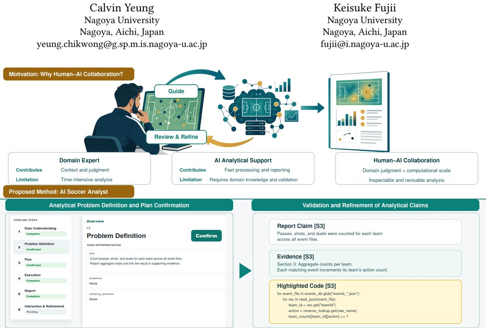  
Figure 1: AI Soccer Analyst supports stage-aware human-AI collaboration in soccer data analysis. Domain experts contribute context and judgment, while AI provides scalable processing and reporting through an iterative guidance-and-review loop (top). The interface exposes two key control points (bottom): confirming the analytical problem and plan before execution, and inspecting linked evidence and relevant code to support claim validation and refinement.

## Abstract

Sports data analysts translate domain questions into insights by combining computation with sport-specific domain expertise. Large language models ease programming, but prompt-to-report workflows may obscure decisions and evidence. We present AI Soccer Analyst, a mixed-initiative system with revisable stages: Data Understanding, Problem Definition, Structured Planning, Execution Evidence-Grounded Reporting, and Interaction and Refinement. A formative study with five analysts first informed design goals for automation, verifiability, human control, and accessibility. Subsequently, a task-based evaluation with 16 participants combined system logs, retained artifacts, ratings, and open responses; 33 of 48 tasks met the operational completion criteria. Exploratory tests supported favorable participant perceptions of completed-task output quality, task achievement, reliability, and verifiability after Holm correction. Interaction records showed domain knowledge emerging through clarification, planning, and refinement. These findings position stage-aware human-AI collaboration as a practical approach for producing inspectable, revisable, and verifiable analyses while retaining domain-expert involvement in consequential decisions.

## Keywords

sports analytics, soccer, human-AI collaboration, large language models, analytical provenance, verifiability, mixed-initiative systems

## 1 Introduction

Data increasingly informs decisions in professional practice, but recorded data does not answer practical questions by itself. Analysts must translate domain questions into operational definitions, determine what the available data can support, implement appropriate computations, examine intermediate results, and communicate evidence in a form that decision makers can use. Data analysis is therefore an iterative combination of computational work and situated domain judgment rather than a direct transformation from data to conclusions [22].

This challenge is particularly visible in competitive sport, where analytical results must connect recorded performance data to contextual and tactical decisions. Coaching staff interpret and communicate data while remaining responsible for its practical consequences [5], and analytical work unfolds across interdependent activities rather than isolated calculations [28]. Soccer analytics supports a broad range of tasks, including creating summary statistics, assessing player decisions, and identifying team-level tactical patterns [45, 46, 49]. At the team level, comparing how teams attack requires analysts to decide where a possession begins and ends, identify recurring sequences of actions, account for the positions of teammates and opponents, and choose measures that support a fair comparison between teams. These decisions also depend on what a particular data provider records and how its schema represents match events.

Large language models (LLMs) offer a promising way to reduce the computational burden of this work by translating naturallanguage questions into plans, code, and reports. However, an answer that sounds convincing may not show how the system interpreted the question, whether the dataset contains the required information, or how it translated domain concepts into calculations. An LLM may assume that an unavailable event is recorded, or produce a plausible tactical interpretation from an incomplete calculation. Prior research similarly shows that users of LLM-assisted data analysis can struggle to communicate sufficient context and verify generated results [9, 14]. Supporting soccer analysts therefore requires more than converting a prompt directly into a report.

Human-AI collaboration provides a basis for dividing this work between the analyst and the system. Automated support is well suited to repetitive data inspection, code generation, execution, and artifact management, whereas analysts are better positioned to define soccer concepts, select meaningful comparisons, and judge tactical relevance [17, 20, 35]. Yet existing sports-oriented AI systems have primarily focused on coaching, engagement, or personalized feedback, while general analytical assistants rarely account for provider-specific soccer data and domain definitions. Existing provenance and verification approaches make analytical histories more visible [15, 33], but they do not fully address where analyst input should enter an LLM-generated workflow or how a revision should propagate through its dependent outputs.

This paper presents AI Soccer Analyst, a system that supports human-AI collaboration in soccer event-data analysis. Its input is a structured soccer dataset paired with a natural-language analytical question, and its output is an evidence-grounded report accompanied by inspectable intermediate artifacts. Automated review checks computational consistency across these artifacts, while responsibility for judging domain validity remains with the analyst. Rather than treating the LLM as a one-step report generator, the system makes key analytical decisions and their resulting artifacts visible throughout the workflow. Analysts can inspect how their question was interpreted, revise definitions and plans before assumptions propagate, and trace reported claims back to execution evidence. Revisions are directed to the responsible part of the analysis so that affected outputs can be updated consistently. The central design principle is therefore to combine computational automation with meaningful opportunities for domain experts to shape and verify the analysis. Figure 1 illustrates two key control points: confirming analytical intent before execution and inspecting the connection between a report claim and its supporting evidence afterward.

The formative findings informed and refined the design goals concerning efficiency, verifiability, and human analytical control. A subsequent evaluation with 16 participants found that 33 of 48 analytical tasks met the operational completion criteria. In exploratory tests, all four completed-task ratings remained above the neutral midpoint after Holm correction [19]; seven of eight overall-system ratings met the unadjusted threshold, but only two remained significant after Holm correction. More importantly, the interaction records showed that domain knowledge was not provided only in the initial request; it emerged as participants examined plans and refined results. Operationally incomplete tasks were concentrated around understanding what the dataset could support, while open responses emphasized the need for sustained interaction and stronger verification. Together, these findings show how a structured and revisable workflow can support useful human-AI analysis while identifying dataset understanding and active validation as priorities for future systems.

This paper makes the following contributions:

(1) A formative study of soccer analysts' current practices and expectations that identifies requirements for efficient automation, domain control, verifiability, accessibility, and practical communication.

(2) AI Soccer Analyst, an implemented workflow for collaboration between analysts and AI that externalizes key decisions and artifacts, requests domain input when needed, routes revisions to the responsible stage, and connects reported claims to execution evidence.

(3) A mixed-method evaluation across analytical tasks of different complexity, providing empirical findings on perceived usefulness, operational incompletion, the points at which analysts introduce domain knowledge, and the interaction and verification support required for continued use.

## 2 Related Work

## 2.1 Sports Analytics in Practice

Data analysis involves both computation and interpretation [22]. This is especially important in sport, where the usefulness of a result depends on the setting in which it is produced. Studies of collegiate coaching staff show that data use is closely tied to responsibility for performance and athlete welfare [5]. Athletes also decide how to use performance data based on their goals, relationships with coaches, and well-being [4]. Research on esports coaching likewise shows that analysis is part of wider coaching and communication practices [28]. Sports analytics is therefore situated work: a metric gains value only when people can relate it to their goals and decisions.

SportsHCI research also shows that feedback is more useful when it reflects expert knowledge. Some systems express coaching principles directly, while others connect measured performance to the practice context [7, 18, 40]. Conversational coaching agents use a similar idea by adapting support to the user and their data [13, 21]. Accuracy alone, however, does not make a system useful. Research on automated ball-strike judgments found that stakeholders evaluated the system not only by its accuracy but also by how it changed their roles and decision authority [27]. Although automated match decisions differ from analytical assistance, this finding highlights the need for sports AI to preserve clear opportunities for expert review.

This need for expert review is especially important in soccer analysis, where analysts may interpret the same soccer concept in different ways. For example, one analyst may define an “attacking play" as any move toward the opponent's goal, while another may count only moves that create a scoring chance. These interpretations produce different measures and may lead to different conclusions. Structured datasets such as the public Wyscout dataset provide detailed records, but the data alone cannot determine which interpretation is appropriate [31]. Soccer research has developed advanced methods for representing and analyzing match activity [45, 47, 48]. Yet these methods offer limited support for a key part of the analyst's work: translating a soccer question into an analysis whose assumptions, methods, and conclusions can be clearly understood and evaluated. Our study addresses this gap by keeping expert interpretation visible throughout the analytical process.

## 2.2 LLM-Assisted Data Analysis

LLMs are increasingly used as conversational interfaces for computational analysis, translating users' natural-language questions into analytical steps. Although this can make analysis more accessible, users must still communicate their intent clearly and determine whether the resulting answer is valid. One study found that participants using generative AI for data analysis struggled to provide sufficient context and verify the results [9]. Consequently, even when the interaction appears smooth, the system may perform an analysis that does not match the user's intended question.

This risk begins during planning. Gu et al. separate the decision about what an analysis should do from the later task of implementing that decision [14]. They found that useful planning support depends on the current state of the analyst's work. This means that correct code is not enough; the code must also answer the right question. Domain experts therefore need a chance to shape the analysis before it runs.

Recent HCI research shows that effective LLM-assisted analysis depends on preserving user understanding, agency, and opportunities for verification [16, 24, 34, 42, 43]. Users can judge and redirect an analysis more effectively when they can inspect its evolving rationale and outputs rather than only the final result [37, 39, 44]. Collectively, these findings suggest that user involvement should extend throughout the analytical process [1, 6, 33].

Existing sports-focused AI agents tailor coaching and engagement to individual users and situational contexts [13, 21, 25]. However, they offer limited support for data analysis. By contrast, generalpurpose analysis tools support data analysis but often lack the domain knowledge needed to interpret soccer-specific concepts correctly. This gap calls for a soccer-specific workflow that keeps the link between the user's intent and the computation visible.

## 2.3 Mixed-Initiative Analytical Workflows

Mixed-initiative interaction is a collaborative approach in which the user and the AI system can each initiate actions, with control shifting between them as the task evolves [20]. This distribution of control means that the user's responsibility also depends on where automation is applied [32]. Human-centered AI therefore aims to combine automation with meaningful human control [17, 35]. Users need to understand what the system is doing and be able to correct important decisions [1]. In data analysis, the right balance may change during a single task because the AI system provides computational capabilities, while the analyst contributes domain expertise.

Making the AI system's analytical steps visible can help maintain this balance. AI Chains and PromptChainer allow users to inspect and change intermediate outputs [42, 43]. A study of AI-assisted data analysis also found that visible assumptions and task steps made the process easier to guide and check [23]. These systems provide more than a sequence of smaller tasks. They give the user a shared view of the work and show how an early choice affects the final result.

However, each request for user input takes time and attention. Research on multi-step agents shows that confirmation is useful when it helps users find errors early, but poorly timed checks can interrupt the task [50]. AI Soccer Analyst therefore uses stage-aware intervention: the user confirms the system's understanding and analytical plan at explicit checkpoints; outside these checkpoints, the system requests input only when an unresolved decision can materially change the analysis. Routine work otherwise continues automatically. Our study examines whether this stage-aware approach provides control without requiring constant oversight.

## 2.4 Analytical Verifiability and Provenance

An explanation may help a user understand a result, but it does not prove that the result is correct. Human-centered XAI therefore argues that explanations should be designed for the people and practices that use them [10]. Bansal et al. found that explanations can increase acceptance without improving human-AI team performance [2]. The goal should not be to maximize trust, but to help users judge when the system deserves trust [29]. Asking users to stop and reconsider AI advice can reduce overreliance, although it requires extra effort [6].

Generative AI makes this judgment harder because an incorrect answer can still sound convincing [36]. In data analysis, users often need to reconstruct the system's work before they can check the result. Gu et al. found that analysts used several views of an AIgenerated analysis to understand what the system had done [15]. Verification therefore requires access to the analysis process, not only an explanation of the final answer.

Analytical provenance addresses this need by recording the history of an analysis [33]. In an LLM-assisted workflow, this history must show how human decisions relate to automated work. We call this process verifiability: users should be able to follow how an analytical decision becomes reported evidence and revise the process when the connection is wrong.

Prior research shows that sports analysis depends on its practical context [4, 5, 28]. It also shows that experts need meaningful control over AI-assisted work [1, 17, 20, 23]. Other studies explain how users can inspect an analysis after it has been produced [15, 33]. These concerns have rarely been brought together. Our study examines whether a stage-aware soccer-analysis workflow can support human control and verification while still providing the efficiency expected from LLM assistance.

## 3 Formative Study

The formative study examined current soccer-analysis practices, workflow difficulties, and participants' expectations and concerns regarding AI assistance in soccer analysis. The thematic findings synthesize related deductive and inductive codes rather than corresponding one-to-one with individual codes. The complete survey and follow-up interview instruments are provided in Appendix A; detailed quantitative results and the qualitative codebook are provided in Appendix B.

## 3.1 Method

The formative study employed a survey with selective semi-structured follow-up interviews. In total, 7 eligible soccer analysts working in collegiate or professional contexts were contacted; 5 agreed to participate and completed the survey, and 2 of those 5 also completed follow-up interviews. The interviews were conducted selectively when participants’ open-ended responses required further clarification or elaboration. The 5 survey participants were assigned the pseudonymous identifiers E1-E5 according to the chronological order of their responses; their characteristics are summarized in Table 4 in Appendix B. The study protocol was approved by the institutional ethics review board and conducted in accordance with institutional guidelines for research involving human participants. All participants provided written informed consent before taking part.

The protocol was guided by the initial assumption that AI assistance in soccer analysis should address efficiency, verifiability, and appropriately calibrated trust. The pre-interview survey therefore served two purposes. First, it examined how participants understood and prioritized these anticipated requirements. Second, it established a structured overview of their current practices, including existing workflows, recurring difficulties, validation practices, and uses of manual, automated, and AI-assisted methods. For the 2 interviewees, the follow-up questions clarified their survey responses and probed the reasons and practical context behind them. The qualitative survey responses from all 5 participants and the follow-up interview data from 2 participants were analyzed together as a single qualitative corpus.

Given the small formative sample, closed-ended responses were summarized descriptively to contextualize the qualitative findings rather than treated as inferential evidence. The qualitative analysis used a combined deductive-inductive approach [3]. Efficiency, verifiability, and trust were specified a priori as theory-driven sensitizing concepts and formed the initial deductive categories. Openended survey and follow-up responses were segmented into meaningful units, each of which could receive multiple codes. A second pass formed and consolidated inductive codes for content not captured by the initial categories. Accordingly, the formative findings informed and refined the design goals rather than independently establishing them. The analysis was exploratory and conducted by a single coder. The full codebook and coding results are reported in Appendix B.

## 3.2 Thematic Findings

The analysis yielded five themes concerning where AI assistance may fit within soccer-analysis practice and the conditions necessary for its responsible use. These themes address workflow efficiency, verifiability and trust, boundaries of automation, practical communication, and secure and accessible use.

Efficiency concerns spanned the analytical workflow. The specific bottlenecks varied by work setting. Participants described substantial effort in data preparation, report production, and result verification. E2 described how manual data collection constrained both time and analytical scope: “Aggregating data such as phases of play and event-location coordinates took more than a day and a half. Because the work was slow, the team asked me to limit data collection to attacking play only." This account also identified broader data-access and infrastructure constraints. Although these constraints provide important context, they largely fall outside what an analysis-support system could address. E5 described a highly automated workflow that still required substantial human effort for interpretation and verification. Together, these accounts highlighted opportunities for AI assistance to reduce effort in data preparation and subsequent stages of the analytical workflow once source data became available.

Verifiability supports calibrated trust. Respondents described verification practices combining process inspection, source-level checking, and domain validation. E2 reported that current data limitations prevented meaningful validity checking and characterized the available checking as qualitative rather than objective. Trust was associated with interpretability, alignment with soccer knowledge, and communication of uncertainty. Together, these responses suggest that participants considered access to the underlying data and analytical process necessary for judging whether an output could be trusted; an explanation alone was insufficient.

Automation boundaries reflected human analytical responsibility. Respondents distinguished routine, time-consuming work from consequential analytical decisions that they expected to remain under human control. E5 warned that automation could undermine expertise: “The ability to think could be taken away, verification could consume time, and junior members could lose opportunities to gain experience." Together, these responses framed acceptable automation as support for human judgment without eroding opportunities to develop expertise.

Practical communication shaped expectations for analytical outputs. Respondents emphasized that outputs must fit downstream decision and communication needs. E1 identified manual report creation and repeated adjustment of graph design and slide layout as a source of difficulty. E5 noted that output volume could exceed an audience's ability to absorb it. Together, these accounts associated useful reporting with prioritization, fit with existing staff workflows, and opportunities for focused clarification or revision.

Security and accessibility were deployment concerns. Information leakage and data security were explicit concerns. Participants raised protection across data access, model use, storage, and reporting. Beyond security, they wanted AI-assisted analytical outputs to be understandable and usable by stakeholders without technical or data-analysis expertise, such as coaches and players, without continual support from a specialist analyst. E3 described the desired outcome as “an environment in which anyone can perform analysis independently—where questions such as I want that data' or 'What is happening with this data?' can be directed to an LLM rather than a data scientist or data analyst, allowing people to resolve them independently." Together, these responses highlight the importance of protecting information throughout the analytical workflow while making its outputs accessible to stakeholders with different levels of technical expertise.

## 4 Design Goals

The formative findings informed and refined three design goals that connect the reported needs to the implemented architecture and workflow. Table 1 summarizes their relationship to the design goals and cross-cutting data-exposure and containment requirement.

DG1: Enable efficient, data-grounded automation. Expectations for greater speed and less manual work extended beyond computation to preparation, verification, reporting, and revision. External data-access constraints may limit the achievable benefit, but the system's primary contribution is to reduce effort within the analytical stages it supports. DG1 therefore emphasizes automation across the supported workflow while grounding each analysis in the data already available.

DG2: Preserve verifiability and human analytical control across workflow stages. Trust and appropriate reliance were associated with transparency into the analytical process and continued human oversight of domain-specific decisions. DG2 therefore emphasizes cross-stage inspectability and revisability, traceable reported claims, and selective human oversight of unresolved decisions that could materially change the analysis.

DG3: Support accessible and actionable use across stakeholders. Participants emphasized that analytical outputs needed to be understandable, appropriately prioritized, and usable by stakeholders with different levels of technical expertise. DG3 therefore focuses on clear reporting, accessible interaction, and self-service use without continual support from specialist analysts.

Cross-cutting requirement: Reduce unnecessary data exposure and constrain untrusted operations. Data-exposure and containment concerns apply across the design goals and workflow stages rather than to a single interaction objective. This yields a cross-cutting requirement to reduce unnecessary data exposure and limit the effects of untrusted operations.

## 5 System Overview

Building on the design goals presented in Section 4, AI Soccer Analyst is a web application that enables users to create, inspect, and refine soccer data analyses through natural language. Its web interface supports question submission, artifact inspection, and feedback, while the backend preserves job and interaction state and coordinates specialized agents for problem definition, planning, result review, reporting, and refinement. A locally deployed LLM supports these agents' reasoning and generation, and an isolated coder worker hosts a coding agent that generates, executes, and revises analysis scripts before returning the resulting artifacts to the backend. Together, these components automate bounded stages (DG1), preserve inspectable artifacts and user control (DG2), provide accessible and actionable interaction (DG3), and support the cross-cutting data-exposure and containment requirement. Figure 2 summarizes the system components and their primary exchanges.

## 5.1 Web Interface

The web interface is the user's point of contact with the system Implemented as a Next.js application [38], it consists of a dashboard and stage-specific job pages. Each stage produces a persistent, inspectable output (such as a dataset summary, problem definition, analytical plan, execution record, or report), which we refer to as an artifact. These artifacts serve as inputs to subsequent stages. A job represents a persistent analysis workspace that connects a user's request and target dataset with the progress, artifacts, and interaction history of the resulting analysis. The dashboard allows users to create a job by selecting a target dataset and providing a job name. It also lists existing jobs together with their current status and analytical stage.

After starting a job, the user moves through stage-specific pages corresponding to the analytical workflow described in Section 6. A persistent stage navigator communicates progress and allows the user to revisit the artifacts and interactions associated with each stage. Each page presents the information and interaction controls relevant to its current stage. While an analysis is running, the interface polls the backend for updated state and displays newly produced artifacts when they become available. In the final report, interactive evidence identifiers make the connection from claims to supporting results or code directly accessible, combining DG2's inspectability with DG3's emphasis on usable outputs. Representative interface views are provided in Appendix F.

## 5.2 Agent-Based Analysis Backend

The agent-based analysis backend is implemented with FastAPI [11] and has three primary responsibilities: controlling access to system resources, managing analysis jobs, and coordinating the agents that perform the analysis. First, the backend authenticates users, enforces account and job ownership, and controls access to datasets and generated artifacts, providing the resource protection required across the workflow. The web interface accesses the LLM, coder worker, and analysis resources only through the backend. Second, the backend manages the lifecycle and state of each analysis job. This persistent state allows an analysis to progress efficiently across stages (DG1) while retaining the intermediate results and interactions needed for inspection, revision, and resumption (DG2).

Table 1: Relationship between formative findings, design responses, and main system implications.
<table><tr><td>Formative finding</td><td>Design response</td><td>Main system implication</td></tr><tr><td>Workflow-wide efficiency</td><td>DG1</td><td>The six-stage workflow automates data profiling, plan generation, code execution, review, and reporting from available data.</td></tr><tr><td>Verifiability and calibrated trust</td><td>DG2</td><td>Persistent artifacts link the problem definition, confirmed plan, code, execution records, outputs, and report claims.</td></tr><tr><td>Automation boundaries</td><td>DG2</td><td>Confirmation gates precede consequential stages, while feedback is routed to the earliest responsible stage for regeneration.</td></tr><tr><td>Practical communication and self- DG3 service use</td><td></td><td>Human-readable, evidence-linked reports prioritize supported findings, while the web interface supports focused follow-up without requiring code editing.</td></tr><tr><td>Data-security concerns</td><td>ment requirement</td><td>Cross-cutting data- A local model supports data-local processing, backend mediation constrains resource access, exposure and contain- and an isolated coder worker limits some effects of generated code across the workflow.</td></tr></table>

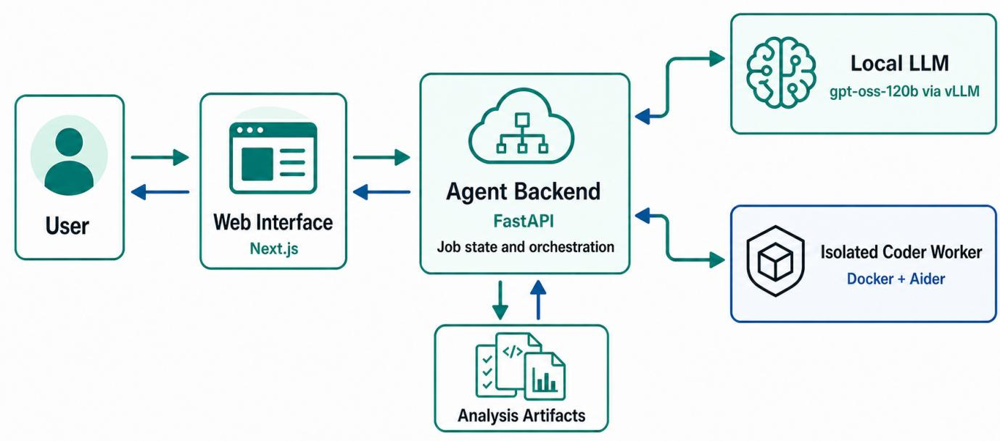  
Figure 2: System architecture of AI Soccer Analyst. The web interface communicates with the agent backend, which coordinates the local LLM, isolated coder worker, and analysis artifacts. These artifacts record the problem definition, analytical plan, execution records, generated outputs, review decisions, report, and interaction history across workflow stages.

Finally, the backend coordinates the specialized agents that perform each stage of the analysis described in Section 6. For each stage, it selects the appropriate agent and provides the relevant context, including the user's request, target-dataset information outputs from previous stages, and subsequent feedback. Reasoning and generation requests are routed to the locally deployed LLM, while code-generation and execution tasks are delegated to the isolated coder worker. The returned outputs are recorded as job artifacts and used to update the job's current state. The backend pauses at defined confirmation checkpoints and, outside them, only when an unresolved decision can materially change the analysis; otherwise, progression remains automatic. Refinement requests are routed to the responsible stage so that affected downstream artifacts can be regenerated.

## 5.3 Local LLM Deployment

AI Soccer Analyst uses OpenAI's gpt-oss-120b, an open-weight mixture-of-experts model designed for reasoning, structured generation, tool use, and agentic workflows [30]. We selected the 120B model to balance reasoning capacity with local deployability and used it as a fixed baseline across the planning, coding, review, and reporting stages. Its architecture and benchmark performance are documented by OpenAI [30]; we cite these results only to characterize the model, not as evidence for the interaction and verification mechanisms evaluated in this work. Comparing alternative model sizes and families is outside the scope of the paper.

The model is hosted locally using vLLM [26]. Using a local deployment rather than an external API supports data-local processing. This keeps analytical data, prompts, and intermediate workflow context within the controlled deployment environment and avoids transmitting them to an external model provider. Local deployment also allows the same model checkpoint and inference configuration to be used consistently across workflow stages and evaluation conditions.

## 5.4 Isolated Coder Worker

The coder worker isolates code generation and execution from the analysis backend because generated scripts may fail, perform unintended file operations, consume excessive resources, or access sensitive backend configuration. AI Soccer Analyst therefore runs the CoderAgent and its execution environment in a separate Docker container [8]. The container limits access to backend resources, while time, concurrency, and output-size limits bound automated execution, reducing exposure of backend resources and containing some effects of generated code. The backend remains responsible for job coordination and analysis state.

The CoderAgent uses Aider [12] to generate or revise scripts in a job-specific working directory. For each request, the backend supplies a bounded bundle containing the confirmed analytical plan, selected context files, and execution metadata. Aider applies revisions directly to the working script, allowing focused changes across execution-review rounds without regenerating it from scratch. After each run, the worker returns the execution status, logs, generated code, and output files as analysis artifacts. These records support subsequent review and retain the evidence required for DG2's inspection and revision.

## 6 Analytical Workflow

For the user, the workflow begins with dataset selection and ends with an evidence-grounded report that they can question or refine. Its six stages are Data Understanding, Problem Definition, Structured Planning, Execution, Evidence-Grounded Reporting, and Interaction and Refinement. Execution Review operates as an internal substage of Execution. Figure 3 illustrates the six-stage progression, the main artifacts and user interactions across the stages, the internal review loop within Execution, and the routes for confirmed refinements to affected stages. Each stage produces a persistent, inspectable output, referred to as an artifact. The user confirms the problem and plan at defined checkpoints and inspects the report and its evidence (DG2). The user otherwise provides input only when an unresolved decision can materially change the analysis, while routine workflow steps advance automatically (DG1). These artifacts support traceability and refinement (DG2) while making the process accessible to users with different technical capabilities (DG3).

Four agents coordinate the workflow. The AnalystAgent defines the problem, creates the plan, and produces the report. The CoderAgent implements and executes the confirmed plan, while the ReviewAgent checks the code and results. After reporting, the InteractionRefinementAgent answers follow-up questions and routes requested changes to the responsible stage. Table 2 summarizes each agent's workflow stages, responsibilities, and main artifacts. Appendix D provides shortened agent prompts.

## 6.1 Data Understanding

The user begins by selecting the target dataset. The system automatically profiles its source files, record structures, fields, data types, missing values, examples, basic statistics, and possible identifier and time fields (DG1). The system checks what data exists and its structure, but the user must judge whether the data is sufficient and appropriate for answering their specific analysis problem (DG2). The stage ultimately produces a dataset summary stored as JSON for downstream automation and rendered as Markdown for user inspection.

The summary provides an overview, while task-relevant file details remain available on demand during planning and review. By summarizing rather than loading all records, the workflow can accommodate datasets of different sizes while limiting context use. It is retained as an input to Structured Planning; Problem Definition focuses only on the user's natural-language request.

## 6.2 Problem Definition

The user provides a natural-language analytical question and any constraints or clarifications about the intended entities, scope, comparisons, and expected result. The AnalystAgent organizes the information stated in the request and asks for clarification when an ambiguity must be resolved before planning (DG1). The user then judges whether the resulting definition accurately represents the intended question, scope, and soccer-domain criteria and confirms or corrects it (DG2). The stage ultimately produces the confirmed problem definition.

The interface presents the definition through three fields. The Task field specifies the intended analysis, relevant soccer entities, scope, comparisons, and expected result. The Limitations field records constraints or preferences provided by the user, while the Clarifying questions field asks the user to resolve parts of the request that could be interpreted in multiple ways and lead to different analyses. For example, “top-performing teams” does not specify how performance should be measured or which teams should be included. While clarifying questions or corrections remain, the workflow stays in this stage; user confirmation transitions it to Structured Planning.

## 6.3 Structured Planning

Structured Planning begins with the problem definition confirmed by the user in the preceding stage. During planning, the user may add constraints or revise the proposed analytical steps. The AnalystAgent combines that input with the dataset summary and relevant dataset details to translate the requested soccer concept into a quantitative definition and a sequence of coding steps. It constructs the plan using available files, fields, values, and mappings and requests targeted context when essential information is missing. Constructing the plan from available dataset context supports data-grounded planning (DG1). The user judges whether the quantitative definitions, comparisons, and assumptions validly represent the intended soccer concepts (DG2). The plan presents these choices as user-readable steps (DG3). After the user confirms them, the stage ultimately produces the confirmed analytical plan.

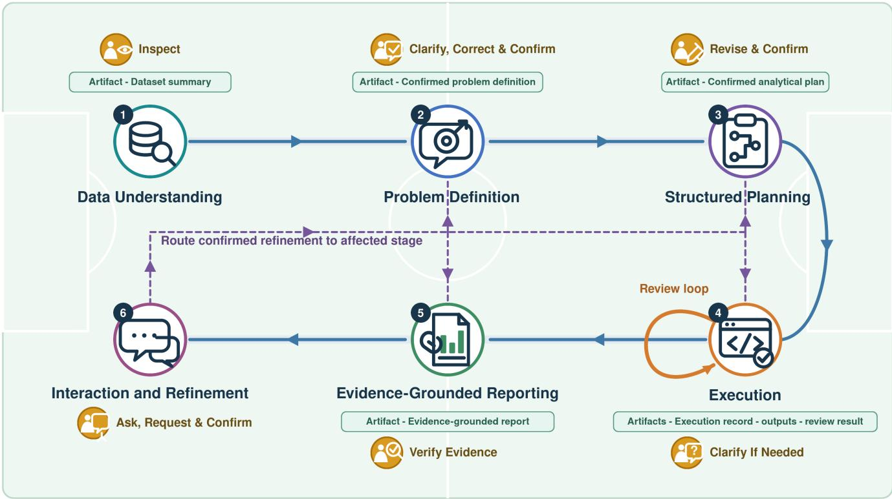  
Figure 3: Illustrated six-stage analytical workflow on a soccer-field background. Solid blue arrows show forward progression, the orange arrow shows the internal review loop at Execution, and dashed purple arrows route confirmed refinements from Interaction and Refinement to affected stages. Green pills identify the main artifacts, while orange callouts identify user interactions.

Table 2: Responsibilities of the four agents in the analytical workflow.
<table><tr><td>Agent</td><td>Workflow stage(s)</td><td>Responsibilities</td><td>Main artifacts</td></tr><tr><td>AnalystAgent</td><td>Problem Definition, Structured Grounded Reporting</td><td>Interprets the user&#x27;s question, prepares the Planning,and Evidence- analytical plan, and synthesizes the final re- port from reviewed evidence.</td><td>Confirmed problem definition, confirmed analytical plan, and evidence-grounded report.</td></tr><tr><td>CoderAgent</td><td>Execution (Analysis Execution)</td><td>Uses Aider [12] to generate or revise the analysis script, which the isolated worker executes to produce the planned outputs.</td><td>Execution record and outputs.</td></tr><tr><td>ReviewAgent</td><td>Execution (Execution Review)</td><td>Uses a separate review context to compare the confirmed plan, generated code, execu- tion record, and outputs and then accepts the execution, requests revision, or asks for</td><td>Review result.</td></tr><tr><td>Interaction- RefinementAgent</td><td>Interaction and Refinement</td><td>clarification. Answers questions from existing artifacts, requests clarification when needed, and routes confirmed refinements to the earliest responsible stage.</td><td></td></tr></table>

For targeted retrieval, the AnalystAgent can call get\_file\_summary to inspect a relevant file; Appendix E describes the available functions. Each result is added to the planning context, and the number of retrieval rounds is limited. The workflow remains in planning while additional information is needed or the user is revising the plan, and advances to Analysis Execution only after user confirmation.

## 6.4 Execution

6.4.1 Analysis Execution. The user provides the confirmed analytical plan and, only when an unresolved decision concerns analytical intent, scope, or preference, any requested clarification; the user does not need to write or run code. The CoderAgent automatically generates and executes the analysis script in the isolated worker (DG1). The worker enforces operational limits and records logs and outputs that support downstream traceability (DG2). Analysis Execution itself does not validate these artifacts; that assessment occurs in Execution Review. The substage ultimately produces the execution record and analytical outputs for review.

Behind the interface, the CoderAgent uses Aider in the isolated worker (Section 5.4) to generate or revise an analysis script. The execution record retains the generated code, logs, and output summary for the ReviewAgent. The final user-facing report is synthesized separately by the AnalystAgent during Evidence-Grounded Reporting. A completed run advances to Execution Review.

6.4.2 Execution Review. The user's confirmed plan supplies the review criteria, and the user provides clarification only when a question concerns analytical intent, scope, or preference. Using a new context independent of the CoderAgent, the ReviewAgent compares the confirmed plan, generated code, execution record, and outputs to assess plan adherence and computational consistency (DG2). The substage ultimately produces a review result recording acceptance, revision feedback, or a clarification request.

Most review and revision rounds occur automatically (DG1). Acceptance advances to Evidence-Grounded Reporting, while revision feedback returns the workflow to Analysis Execution. Dataset questions are resolved by retrieving the required details, whereas the user is involved when clarification concerns analytical intent, scope, or preference. The configured round limit stops automated progression.

## 6.5 Evidence-Grounded Reporting

Evidence-Grounded Reporting receives the reviewed outputs and execution records from the preceding stage, together with the cleaned code and confirmed problem definition. The AnalystAgent uses these artifacts to generate a report organized around the user's problem (DG1). It grounds report claims in the reviewed outputs and execution records and connects each claim to its supporting evidence through identifiers (DG2). The cleaned code is provided as an explanatory view of the computation, not as evidence that verifies a claim. The stage outputs the evidence-grounded report with its supporting tables, figures, and claim-to-evidence associations in a user-readable form (DG3). The user then checks the validity of the report's interpretations and conclusions (DG2). Appendix G.6 provides implementation details and an example.

The AnalystAgent may improve how supported results are organized and explained, but it cannot fix incorrect calculations. A status of “Complete” means that the automated workflow has reached its terminal state; it does not indicate expert validation of analytical correctness. Changes to the analytical definition or computation must return to the responsible upstream stage. Therefore, the workflow transitions to Interaction and Refinement, where the user can ask follow-up questions or request corrections.

## 6.6 Interaction and Refinement

After reading the report, the user either asks a follow-up question or requests a change. The InteractionRefinementAgent answers a follow-up question from existing artifacts or, if a refinement is required, routes it to the earliest responsible stage and identifies only the affected downstream artifacts (DG1). Before refinement begins, the user confirms that the proposed target and scope match the intended change and remains responsible for judging the domain validity of the revised analysis (DG2). The stage ultimately produces either an artifact-grounded answer to the question (DG3) or an updated set of affected artifacts and their visible interaction history (DG2); it introduces no separate main artifact.

When an artifact is revised or regenerated, the new version replaces the previous version. Consequently, only the current version remains inspectable. The scope of regeneration depends on the requested change: a wording change updates only the report, a change to a metric definition returns to Structured Planning, and a change to the teams or time period being compared returns to Problem Definition.

## 7 User Experiment

A task-based evaluation of AI Soccer Analyst was conducted to examine operational completion, perceived output quality, and the evidence participants used to judge an analysis. This was a single-system evaluation rather than a controlled comparison with a baseline. Each retained participant attempted one analytical task at each of three levels of increasing analytical difficulty: L1 (descriptive retrieval), L2 (comparative interpretation), and L3 (tactical synthesis). The evaluation combined system logs and retained artifacts with task-level ratings, an overall-system survey, and open responses.

## 7.1 Dataset

All analytical tasks used the public Wyscout 2017 soccer-event dataset [31]. As reported in the dataset paper, the dataset contains over 3 million events from over 1.9 thousand matches involving over 4 thousand players across seven competitions: the top divisions of England, France, Germany, Italy, and Spain, plus UEFA Euro 2016 and the 2018 FIFA World Cup. The accompanying files provide match, team, player, competition, and coaching metadata.

Event data is a chronological log of discrete match actions. For example, one record may describe a pass by a particular player and team at a given match time and pitch location, while a later record may describe the resulting shot. Records include event and subevent labels, identifiers for the match, team, and player, match period and time, event tags, and locations when available. These fields support filtering, aggregation, sequence analysis, and spatial summaries. However, these analyses are limited to actions recorded in the event log. For example, the dataset cannot be used to analyze off-the-ball player movement or changes in team formation because this information is not recorded.

## 7.2 Three Levels of Analytical Tasks

The tasks were divided into three levels to represent distinct stages of analytical work rather than treating every task as simply easy or difficult. L1 tests whether the system can retrieve and summarize explicitly requested information. L2 introduces the additional need to choose appropriate comparison conditions and interpret differences in context. L3 tests whether the system can integrate several event patterns into a coherent tactical account. Keeping these stages separate makes it possible to evaluate the system as analytical abstraction, verification effort, and reliance on domain judgment increase.

The levels also differ in the soccer knowledge needed to formulate and assess an answer. L1 requires relatively little domain knowledge because its quantities can be obtained through direct filtering and aggregation. L2 requires moderate domain knowledge to select meaningful comparison groups and judge whether definitions are applied consistently. L3 requires the most domain knowledge because several results must be connected to higherlevel soccer concepts and assessed for tactical plausibility. Table 3 summarizes these distinctions and gives one representative task at each level. A complete L1 example, including its problem definition, confirmed plan, report, evidence links, and cleaned code, is provided in Appendix G.

## 7.3 Experiment Method

Participants attempted the three tasks: L1, then L2, then L3. Before starting, they received the same written study instructions and a PowerPoint walkthrough covering the Wyscout dataset, the three task-level definitions with examples, and the system workflow for creating a job, confirming the problem definition and plan, and inspecting the report and its evidence. Participants formulated their own soccer-analysis question at each level rather than following the example; the level descriptions and examples in Table 3 guided the intended scope and complexity. Participants were instructed to spend approximately 45-60 minutes on each task. Jobs could continue asynchronously beyond the session, but a job that had not produced a final report at the 24-hour cutoff was stopped and classified as incomplete. If a task failed, was cancelled, or remained unresolved, participants proceeded to the next level.

After each attempted task, including an incomplete one, participants recorded the job name and rated output quality, task achievement, reliability, and verifiability on 5-point Likert scales from very poor to very good. For analysis, a task was classified as operationally complete when the system completed the Evidence-Grounded Reporting stage and generated a final report; this corresponded to a final top-level job status of complete. Jobs ending as failed or cancelled, or otherwise remaining unresolved, were classified as operationally incomplete. Operational completion indicates successful pipeline completion and report generation, but does not establish the semantic or statistical correctness of the analysis. By this definition, 33 of 48 tasks were operationally complete. All 15 incomplete tasks were rated and retained in the analysis of operationally incomplete tasks, but their ratings were excluded from the completed-task rating analysis. After the three task stages, participants completed the overall-system assessment and open-response questions.

The overall-system assessment contained eight agreement items covering trust, the ability to judge validity, process and evidence verifiability, efficiency, reduced manual work, interaction usefulness, and intended future use. In addition, four open-response questions asked what worked well, what was difficult or inefficient, which outputs felt untrustworthy, and what additional evidence would support verification. The complete Survey 2 instrument appears in Appendix A.

Invitations were sent to university soccer-team analysts, master's or doctoral students whose research focused on soccer, and individuals who belonged to both groups. In total, 23 participants were recruited, of whom 16 completed the experimental procedure and submitted Survey 2. The analysis included all 16 participants and their 48 analytical tasks, with 16 tasks at each level. One participant (P013) had no operationally completed task but remained in the cohort so that operationally incomplete tasks and overall-system perceptions were represented. The experiment was approved by the institutional ethics review board, and all participants provided written informed consent before taking part.

## 8 Results

This section presents five complementary views of the evaluation before deriving design implications. It first examines participants ratings of completed analytical tasks and then identifies why other tasks were operationally incomplete. It next characterizes human-AI collaboration across the workflow, reports overall system ratings, and uses the open responses to explain participants' positive assessments and remaining concerns. Together, these analyses distinguish the perceived value of completed results from operational barriers and show how participants contributed domain expertise during the analytical process. Supplementary information and full statistical results appear in Appendix C.

## 8.1 Ratings for Completed Tasks

Ratings were summarized descriptively using medians and interquartile ranges. To explore whether participants perceived completed outputs favorably, we used exact one-sided Wilcoxon signed-rank tests [41] to determine whether participant-aggregated ratings of output quality, task achievement, reliability, and verifiability exceeded the neutral midpoint of 3 on the 5-point Likert scale (1–5). The analysis included the 33 operationally completed analytical tasks. These ratings therefore characterize completed tasks only and do not represent participants' experiences with operationally incomplete tasks. Ratings were first averaged within participant for each outcome because ratings from tasks completed by the same participant are not independent. This also prevented participants with more completed tasks from having greater influence on the results. Each of the 15 participants with at least one completed task therefore contributed a single value per outcome; P013 contributed no completed-task rating.

All four participant-aggregated ratings met the unadjusted $\hbar <$ .05 threshold: output quality $( p = . 0 0 0 2 )$ , task achievement $( p =$ .0001), reliability $( p = . 0 0 2 2 )$ and verifiability $( p = . 0 0 2 2 )$ . All four remained significant after Holm correction [19] (adjusted p = .0002- .0044). Figure 4 shows the distributions of participant-aggregated ratings. Complete descriptive and participant-level test statistics, together with task-level analyses stratified by task complexity level (L1-L3), are reported in Appendix C. These results indicated that participants who received a completed output generally evaluated its quality, usefulness for the task, reliability, and verifiability favorably. The consistently positive ratings suggest that participants perceived the completed analyses as useful and verifiable, consistent with the intended goals of accessibility and transparency.

Table 3: Analytical task levels used in the evaluation.
<table><tr><td>Level</td><td>Goal</td><td>Characteristics</td><td>Example</td></tr><tr><td>L1-Descriptive Re- trieval</td><td>Retrieve and summarize ex- plicit information from event data.</td><td>Simple filtering, aggregation, and descrip- tive statistics with low reasoning and veri- for each team. fication demands.</td><td>Summarize the number of passes, shots, and duels</td></tr><tr><td>L2—Comparative In- terpretation</td><td>Compare and interpret pat- ical conditions.</td><td>Multi-condition comparison, contextual terns across multiple analyt- reasoning, and moderate verification effort.</td><td>Compare passing patterns between Team A and the top-performing teams.</td></tr><tr><td>L3—Tactical Synthesis</td><td>Produce higher-level tactical and analytical conclusions from event data.</td><td>Multi-step reasoning, analytical synthesis, report generation, and integration of mul- tiple event patterns.</td><td>Generate a tactical analysis report describing a team&#x27;s attacking tendencies based on passing se- quences, shot creation, and player involvement.</td></tr></table>

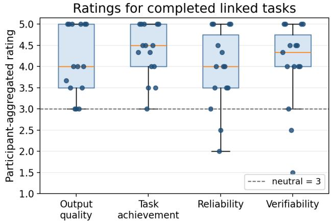  
Figure 4: Participant-aggregated ratings for the 33 completed analytical tasks. Points represent participants. Each box spans the interquartile range (IQR; 25th-75th percentiles), its central line marks the median, and its whiskers extend to the most extreme values within 1.5 times the IQR. The dashed line marks the neutral value of 3.

## 8.2 Operationally Incomplete Task Analysis

To identify where the workflow broke down, the 15 incomplete analytical tasks were classified by their primary cause of incompletion. Classification drew on each task's final job state, execution review, and artifact status. The causes were grouped into 5 categories and summarized descriptively, with each task assigned to a single category.

In total, 4 tasks across 2 participants were infeasible with the available event data because they required tracking or off-ball information. all three of P013's tasks were operationally incomplete for this reason. A further 6 tasks across 5 participants failed because execution could not resolve required dataset fields, identifiers, tags or available records. These tasks ranged from player rankings and temporal passing comparisons to tactical reports, showing that schema and data-capability problems occurred across the three analytical levels. Another 3 tasks stopped because the system ran out of memory during the analysis, 1 failed because the required report was saved to the wrong path, and 1 was cancelled after reaching the experiment's time limit (24 hours). The distribution of causes of incompletion is shown in Figure 5.

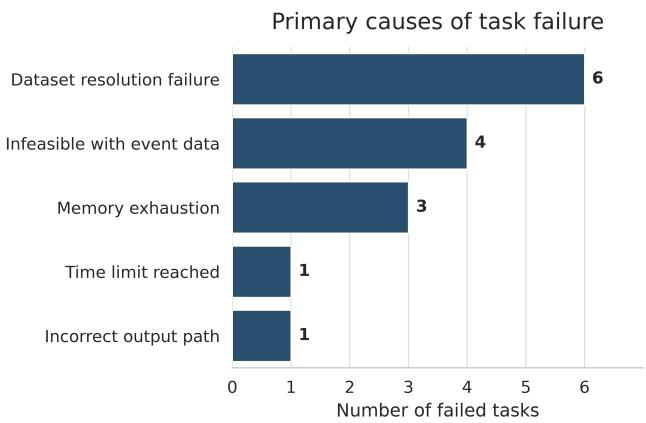  
Figure 5: Primary causes assigned to the 15 operationally incomplete analytical tasks.

The concentration of operationally incomplete tasks around data resolution highlighted the value of checking dataset capabilities before execution. The remaining cases highlighted the need for resource-aware execution, support for resuming time-limited tasks, and artifact validation before workflow advancement. Separating infeasible requests from resolvable schema and identifier failures clarifies which tasks exceeded the information available in the event data and which failed during execution. These findings qualified DG1 by illustrating the importance of resolving provider-specific schemas and dataset capabilities before execution.

## 8.3 Human-AI Collaboration Patterns

To characterize how participants engaged with the stage-aware workflow and how soccer-domain knowledge entered the analysis, logs from all 48 analytical tasks were examined for systemrequested clarification, feedback on the proposed plan, and postresult refinement. A domain-knowledge contribution was defined as participant input that changed the soccer context, analytical scope, metric or comparison definition, data feasibility, or interpretation. Presentation-only changes were excluded. Categories could overlap, and all comparisons were descriptive.

Across the interaction types, system-requested clarification occurred least often, in 3 of 48 tasks (6.3%): 2 requests asked participants to identify the exact team and 1 asked for the exact match. Participants provided plan feedback in 11 tasks (22.9%). This feedback addressed scope, metric definitions, output requirements, and data feasibility; examples included organizing results by team and defining progressive passes from player movement rather than an assumed event tag. Participants requested post-result refinement in 9 tasks (18.8%), including expanded comparisons, corrected metric representations, presentation changes, and further interpretation.

Participants introduced or revised explicit soccer-domain knowledge in 14 of 48 tasks (29.2%). Its first point of entry was most often Structured Planning (7/14 tasks), followed by post-result refinement (4/14) and clarification (3/14). Participants identified the relevant team or match, refined the analytical scope, defined soccer measures and comparisons, questioned dataset feasibility, and reconsidered how results should be interpreted.

Together, these patterns showed that participant involvement extended beyond answering system questions: analysts more often shaped the plan or revised the result. Soccer-domain knowledge also entered throughout the workflow rather than only through the problem definition. Structured Planning was the main stage at which participant expertise became an executable analytical definition, while post-result refinement allowed soccer judgment to be applied after concrete results became visible. These patterns illustrate mixed-initiative use of the stage-aware workflow: participants expressed domain expertise through explicit, revisable analytical decisions rather than only through the initial prompt. These observations were consistent with aspects of DG2: participants exercised domain control by revising analytical definitions during planning and after reviewing the results.

## 8.4 Overall System Ratings

Ratings were summarized descriptively using medians and interquartile ranges. To explore whether participants perceived the system favorably, we used exact one-sided Wilcoxon signed-rank tests [41] to determine whether each of the eight overall-system ratings exceeded the neutral midpoint of 3 on the 5-point Likert scale (1–5). The analysis used a single response per item from each of the 16 participants.

Seven of the eight ratings met the unadjusted p < .05 threshold $( p = . 0 0 0 6 \mathrm { - } . 0 4 4 9 )$ . After Holm correction [19] across the eight items, only reduced manual work (adjusted $\mathnormal { p } = . 0 0 4 9 )$ and helpful interaction (adjusted $\mathnormal { p } = . 0 1 8 4 )$ remained significant. Responses leaned toward agreement across all eight items, with the clearest concentration of positive responses for manual-work reduction and helpful interaction. Responses were more mixed for validity judgment and evidence verification. Evidence verifiability met the unadjusted threshold $\left( p = . 0 3 9 1 \right)$ but not the Holm-adjusted threshold (adjusted $\pmb { \mathstrut } p = . 1 3 3 3 )$ , whereas validity judgment did not reach the unadjusted threshold $\left( \boldsymbol { p } = . 0 8 7 3 \right)$ . Although validity-judgment ratings were directionally positive $( { \mathrm { m e a n } } = 3 . 5 6 { \mathrm { ; } }$ median = 4), responses varied considerably $\mathrm { ( S D = 1 . 4 1 , I Q R = 2 . 7 5 - 5 ) }$ . This result does not show that ratings were neutral; rather, the sample provided insufficient evidence that they consistently exceeded neutral. This suggests that participants generally found the evidence inspectable, but were less certain whether the analysis itself was valid. Figure 6 shows the response distributions, and complete item-level statistics appear in Appendix C.

Participants most clearly perceived practical benefits, reporting reduced manual work and useful interaction. These responses were consistent with DG1's efficiency objective and DG3's emphasis on accessible interaction. Less consistent agreement on validity and evidence verification identified stronger support for judging whether an analysis should be trusted as a remaining priority for realizing DG2.

## 8.5 Open-Response Themes

The open responses helped explain why participants evaluated the system as they did. In total, 9 participants valued analytical efficiency and accessibility because the system could search large event datasets, automate work, and produce usable reports without requiring them to write code. Analytical support and new insights were valued by 6 participants: structured plans, suggested analyses, and alternative views helped them decide what to examine and how to interpret a result. These accounts provided qualitative support for DG1 and DG3 by showing why manual-work reduction and helpful interaction received high overall ratings.

The improvement-oriented responses formed two broader themes. In total, 11 participants emphasized interaction continuity and recovery, indicating that an analysis should remain understandable and revisable when interaction or execution breaks down. Analytical credibility and verification were emphasized by 11 participants, who sought sufficient evidence to judge analytical definitions, results, and interpretations before relying on them. The reported numbers indicated how many participants mentioned each theme. A participant could be included in more than one theme. Together with the data-resolution failures reported earlier, these themes motivated the three design implications presented next. The open response analysis is detailed in Appendix C.

## 8.6 Design Implications

The evaluation findings motivated three implications for extending stage-aware analytical systems. These implications concern how systems understand changing data sources, sustain human-AI collaboration across analytical tasks, and support verification beyond tracing how an output was produced.

Maintain provider-specific schema and capability knowledge. Soccer data providers differ not only in their schemas, terminology, and APIs, but also in the analytical capabilities supported by their data. Future systems should therefore maintain validated, providerspecific knowledge of available fields, event types, spatial and temporal granularity, match coverage, and data modalities such as event, tracking, and off-ball data. This knowledge should be incorporated into dataset understanding and planning to map analytical concepts to the correct data representations and assess feasibility before execution. When a request requires information that is unavailable, such as player movement between events, sprint trajectories, or off-ball positioning, the system should explain the limitation, identify the missing data modality, and either request an appropriate data source or propose a feasible event-data-based alternative. This would reduce schema resolution failures while preventing inherently unsupported analyses from proceeding to execution.

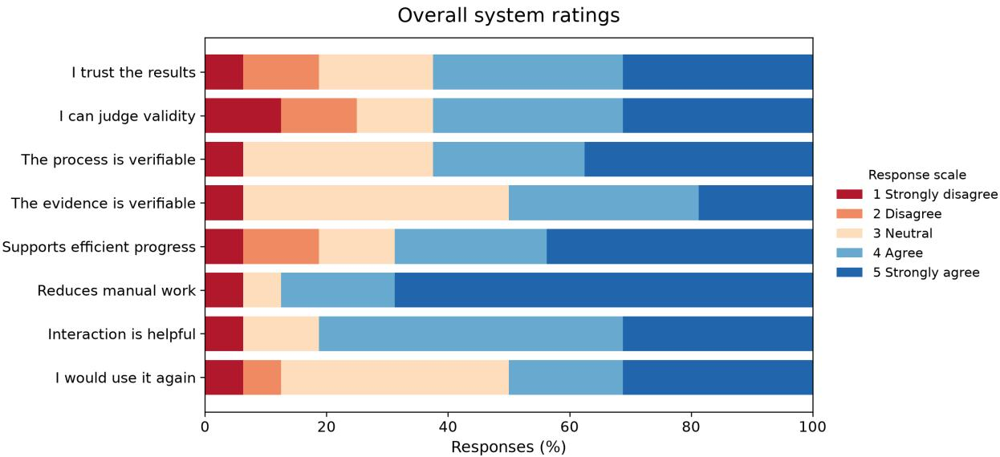  
Figure 6: Distributions of the eight overall-system ratings. Ratings range from 1 (strongly disagree) to 5 (strongly agree).

Extend refinement into persistent human-AI collaboration. The current system routes refinement to the responsible analytical stage and regenerates its dependent artifacts. Future systems could additionally preserve alternative analysis branches, allow analysts to compare the effects of different definitions or plans, and reuse analyst-approved domain definitions across subsequent tasks. This would transform individual revisions into persistent knowledge, reduce repeated corrections, and allow the system to adapt to an analyst's established practices.

Move from traceability to active verification. The current system links claims to plans, code, data, and result artifacts, allowing analysts to trace how an output was produced. Future systems should also actively evaluate whether those outputs are credible using domain-specific validation rules, anomaly detection, independent recomputation, and comparison with authoritative external statistics when available. Conflicting evidence and unresolved assumptions should be highlighted so analysts can focus their verification effort on the results most likely to require domain judgment.

Together, these implications extend the stage-aware workflow from supporting individual analytical tasks toward retaining knowledge across providers, revisions, and verification activities. They were also grounded directly in the evaluation: data-resolution failures motivated provider-aware dataset understanding, observed plan and result revisions motivated persistent human-AI collaboration, and participants' verification concerns motivated active validation.

## 9 Discussion

The central contribution of AI Soccer Analyst is not simply the generation of an analytical answer. It is the organization of analysis as a process in which system actions remain inspectable and human expertise can change the analysis at the stage where it is needed. The evaluation provides two complementary perspectives on this contribution: process artifacts supported inspection and verification, while clarification, planning feedback, and refinement allowed participants to introduce domain knowledge as the analysis developed.

## 9.1 Revisability as Process-Level Transparency

AI Soccer Analyst shifts the focus of transparency from explaining a final answer to exposing the process that produced it. A plausible explanation alone does not reveal how a question was interpreted which data were selected, or how an analytical definition was implemented. Externalizing the problem definition, plan, execution record, and claim-evidence links makes these decisions available for inspection and allows a correction to be routed to the responsible stage. The Holm-adjusted completed-task verifiability rating and the descriptively favorable overall evidence-verifiability ratings suggest that participants found this process-level visibility useful. However, neither the overall evidence-verifiability nor validityjudgment item was significant after Holm correction, showing that supporting validity assessment remains an open challenge.

Revisability gives this visibility an operational role. An analyst can respond to a questionable assumption by changing the relevant definition or plan and regenerating the affected artifacts, rather than accepting or rejecting the entire report. Process evidence therefore supports informed judgment: it shows what should be examined and where an intervention can be made. This perspective also reframes trust as the ability to assess and respond to an output, rather than confidence in the output alone.

## 9.2 Human-AI Collaboration as Expertise Integration

The staged workflow divides analytical work according to the strengths of the system and the analyst. The system performs repetitive data inspection, code generation, execution, artifact collection, and structured checks. The analyst contributes soccer-specific definitions, selects meaningful comparisons, and judges whether a result supports a credible tactical interpretation. This division does not restrict domain knowledge to the initial request. The interaction records show that participants introduced it during problem clarification, plan revision, and post-result refinement, with planning and refinement serving as its principal entry points.

The task-level patterns further suggest that the required balance changes with analytical demand. L3 tasks had lower completion and required more execution rounds than the other levels, consistent with the additional coordination needed to connect several event patterns into a tactical account. Because task content and fixed order also differed across levels, this pattern should not be treated as a controlled effect of difficulty. It nevertheless indicates that support for complex analysis should strengthen opportunities to revise definitions, plans, and interpretations rather than relying on greater automation alone.

Together, these findings position stage-aware collaboration as a means of making analytical work both revisable and open to domain judgment. Its value lies not only in reducing manual effort, but also in providing explicit points at which analysts can shape, inspect, and verify an analysis as it develops.

## 10 Limitations and Future Work

The formative and task-based studies provide focused evidence from 5 and 16 participants, respectively. Their experience as universityteam analysts or soccer-focused researchers was well aligned with the analytical workflow, but it captures only part of the range of roles and organizational settings in which soccer analysis is conducted. In addition, the task ratings describe the 33 completed tasks and include ratings from only the 15 participants with at least one completed task; they omit ratings for the 15 operationally incomplete tasks and therefore do not represent P013's task-level experience. Future evaluations can extend this evidence through larger and more diverse samples, including professional and academy analysts, coaches, and technical staff, while examining successful and unsuccessful experiences together.

The implementation and evaluation focused on structured JSON event data with a Wyscout 2017 configuration, providing a consistent setting in which to examine the stage-aware workflow. Data providers nevertheless differ in their schemas, terminology, coverage, and interfaces, and these resources can change between versions. Event logs can support only concepts represented directly or derivable from their recorded fields, while sample-based profiling may not expose rare structures. Future work can evaluate transfer across providers, schema versions, competitions, data types, and sports. It can also examine whether incorporating official provider documentation or maintained data dictionaries into dataset understanding and planning improves task feasibility and reduces data-resolution failures.

LLM-generated plans and code provide flexibility in translating natural-language questions into executable analyses, but their outputs remain sensitive to model assumptions and can carry shared blind spots across coding and review agents. Claim-evidence links make the resulting process easier to inspect, but traceability alone does not establish computational or soccer-analytical correctness. Future work can combine model-based review with deterministic checks, independent models, or expert assessment. Studies with known analytical errors can then measure whether the system identifies the error, whether users recognize the warning and revise the appropriate stage, and whether the final report corrects the original problem.

## 11 Conclusion

Soccer data analysis requires analysts to translate domain questions into definitions and computations whose assumptions and supporting evidence can be examined, yet prompt-to-report LLM tools can obscure these decisions and make problems difficult to identify and revise. This paper presented AI Soccer Analyst, which organizes LLM-assisted analysis into the inspectable stages of Data Understanding, Problem Definition, Structured Planning, Execution, Evidence-Grounded Reporting, and Interaction and Refinement while preserving opportunities for analysts to contribute domain knowledge. In the evaluation, 33 of 48 analytical tasks met the operational completion criteria. Exploratory tests supported favorable participant perceptions of completed-task output quality, task achievement, reliability, and verifiability after Holm correction. Interaction records showed that participants contributed domain knowledge when clarifying questions, reviewing plans, and refining results. Together, these findings illustrate how participants used stage-aware human-AI collaboration and suggest that they perceived it as supporting access to complex analytical work while retaining opportunities for involvement in consequential decisions. The approach offers a design direction for analytical systems that combine automation with sustained human judgment and produce analyses that are easier to inspect, revise, and verify.

## Acknowledgments

This work was financially supported by JST FOREST Program (JP-MJFR26153613) and JSPS KAKENHI (26H02478). The study was approved by the General Affairs Committee of the Graduate School of Informatics, Nagoya University (approval no. I26-18(I26-09-01)). Generative AI tools were used to assist with manuscript writing, editing, and figure preparation. The authors reviewed all AI-assisted content and take full responsibility for the work.

## References

[1] Saleema Amershi, Dan Weld, Mihaela Vorvoreanu, Adam Fourney, Besmira Nushi, Penny Collisson, Jina Suh, Shamsi Iqbal, Paul N. Bennett, Kori Inkpen, Jaime Teevan, Ruth Kikin-Gil, and Eric Horvitz. 2019. Guidelines for Human-AI Interaction. In Proceedings of the 2019 CHI Conference on Human Factors in Computing Systems. Association for Computing Machinery, New York, NY, USA, Article 3, 13 pages. doi:10.1145/3290605.3300233

[2] Gagan Bansal, Tongshuang Wu, Joyce Zhou, Raymond Fok, Besmira Nushi, Ece Kamar, Marco Tulio Ribeiro, and Daniel S. Weld. 2021. Does the Whole Exceed Its Parts? The Effect of AI Explanations on Complementary Team Performance. In Proceedings of the 2021 CHI Conference on Human Factors in Computing Systems. Association for Computing Machinery, New York, NY, USA, Article 81, 16 pages. doi:10.1145/3411764.3445717

[3] Virginia Braun and Victoria Clarke. 2006. Using Thematic Analysis in Psychology. Qualitative Research in Psychology 3, 2 (2006), 77–101. doi:10.1191/ 1478088706qp063oa

[4] Mollie Brewer, Kevin Childs, Spencer Thomas, Celeste Wilkins, Zachary R. Smith, Kristy Elizabeth Boyer, Jennifer A. Nichols, Kevin R. B. Butler, Garrett F. Beatty, and Daniel P. Ferris. 2026. Improve my Performance, Protect my State of Mind: How Student-Athletes Engage with their Sports Data. In Proceedings of the 2026 CHI Conference on Human Factors in Computing Systems. Association for Computing Machinery, New York, NY, USA, Article 1428. doi:10.1145/3772318. 3791745

[5] Mollie Brewer, Kevin Childs, Celeste Wilkins, Spencer Thomas, Kristy Elizabeth Boyer, Jennifer A. Nichols, Kevin R. B. Butler, Garrett F. Beatty, and Daniel P. Ferris. 2025. Coach, Data Analyst, and Protector: Exploring Data Practices of Collegiate Coaching Staff. In Proceedings of the 2025 CHI Conference on Human Factors in Computing Systems. Association for Computing Machinery, New York, NY, USA, 1-13. doi:10.1145/3706598.3714026

[6] Zana Buçinca, Maja Barbara Malaya, and Krzysztof Z. Gajos. 2021. To Trust or to Think: Cognitive Forcing Functions Can Reduce Overreliance on AI in AI-Assisted Decision-Making. Proceedings of the ACM on Human-Computer Interaction 5, CSCW1, Article 188 (2021), 21 pages. doi:10.1145/3449287

[7] Taizhou Chen, Kai Chen, Xingyu Liu, Pingchuan Ke, and Zhida Sun. 2026. BadminSense: Enabling Fine-Grained Badminton Strokes Evaluation on Single Smartwatch. In Proceedings of the 2026 CHI Conference on Human Factors in Computing Systems. Association for Computing Machinery, New York, NY, USA, Article 1424, 20 pages. doi:10.1145/3772318.3790998

[8] Docker, Inc. 2026. What Is Docker? https://docs.docker.com/get-started/dockeroverview/

[9] Ian Drosos, Advait Sarkar, Xiaotong Xu, Carina Negreanu, Sean Rintel, and Lev Tankelevitch. 2024. "It's Like a Rubber Duck That Talks Back": Understanding Generative AI-Assisted Data Analysis Workflows through a Participatory Prompting Study. In Proceedings of the 3rd Annual Meeting of the Symposium on Human-Computer Interaction for Work. Association for Computing Machinery, New York, NY, USA, Article 16, 21 pages. doi:10.1145/3663384.3663389

[10] Upol Ehsan and Mark O. Riedl. 2020. Human-Centered Explainable AI: Towards a Reflective Sociotechnical Approach. In HCI International 2020—Late Breaking Papers: Multimodality and Intelligence. Springer International Publishing, Cham, 449-466.doi:10.1007/978-3-030-60117-1 33

[11] FastAPI. 2026. FastAPI Documentation. https://fastapi.tiangolo.com/

[12] Paul Gauthier. 2024. Aider: AI Pair Programming in Your Terminal. https: //github.com/Aider-AI/aider

[13] Andreas Göldi, Roman Rietsche, and Lyle H. Ungar. 2025. Efficient Management of LLM-Based Coaching Agents' Reasoning While Maintaining Interaction Quality and Speed. In Proceedings of the 2025 CHI Conference on Human Factors in Computing Systems. Association for Computing Machinery, New York, NY, USA, Article 992, 18 pages. doi:10.1145/3706598.3713606

[14] Ken Gu, Madeleine Grunde-McLaughlin, Andrew McNutt, Jeffrey Heer, and Tim Althoff. 2024. How Do Data Analysts Respond to AI Assistance? A Wizard-of-Oz Study. In Proceedings of the 2024 CHI Conference on Human Factors in Computing Systems. Association for Computing Machinery, New York, NY, USA, 22 pages. doi:10.1145/3613904.3641891

[15] Ken Gu, Ruoxi Shang, Tim Althoff, Chenglong Wang, and Steven Mark Drucker. 2024. How Do Analysts Understand and Verify AI-Assisted Data Analyses?. In Proceedings of the 2024 CHI Conference on Human Factors in Computing Systems. Association for Computing Machinery, New York, NY, USA, Article 748, 22 pages. doi:10.1145/3613904.3642497

[16] Jiajing Guo, Vikram Mohanty, Jorge Henrique Piazentin Ono, Hongtao Hao, Liang Gou, and Liu Ren. 2024. Investigating Interaction Modes and User Agency in Human-LLM Collaboration for Domain-Specific Data Analysis. In Extended Abstracts of the 2024 CHI Conference on Human Factors in Computing Systems Association for Computing Machinery, New York, NY, USA, Article 203, 9 pages. doi:10.1145/3613905.3651042

[17] Jeffrey Heer. 2019. Agency Plus Automation: Designing Artificial Intelligence into Interactive Systems. Proceedings of the National Academy of Sciences 116, 6 (2019), 1844–1850. doi:10.1073/pnas.1807184115

[18] Toshihiro Hirano, Hitoshi Yoshihara, Yichen Peng, Chen-Chieh Liao, Erwin Wu, and Hideki Koike. 2026. SoleCoach: Sole Pressure and IMU-Based MLLMs for Skill Coaching. In Proceedings of the 2026 CHI Conference on Human Factors in Computing Systems. Association for Computing Machinery, New York, NY, USA, Article 1429, 17 pages. doi:10.1145/3772318.3791181

[19] Sture Holm. 1979. A Simple Sequentially Rejective Multiple Test Procedure. Scandinavian Journal of Statistics 6, 2 (1979), 65–70. https://www.jstor.org/ stable/4615733

[20] Eric Horvitz. 1999. Principles of Mixed-Initiative User Interfaces. In Proceedings of the SIGCHI Conference on Human Factors in Computing Systems. Association for Computing Machinery, New York, NY, USA, 159–166. doi:10.1145/302979.303030

[21] Matthew Jörke, Shardul Sapkota, Lyndsea Warkenthien, Niklas Vainio, Paul Schmiedmayer, Emma Brunskill, and James A. Landay. 2025. GPTCoach: Towards LLM-Based Physical Activity Coaching. In Proceedings of the 2025 CHI Conference on Human Factors in Computing Systems. Association for Computing Machinery, New York, NY, USA, Article 993, 46 pages. doi:10.1145/3706598.3713819

[22] Sean Kandel, Andreas Paepcke, Joseph M. Hellerstein, and Jeffrey Heer. 2012. Enterprise Data Analysis and Visualization: An Interview Study. IEEE Transactions on Visualization and Computer Graphics 18, 12 (2012), 2917–2926. doi:10. 1109/TVCG.2012.219

[23] Majeed Kazemitabaar, Jack Williams, Ian Drosos, Tovi Grossman, Austin Z. Henley, Carina Negreanu, and Advait Sarkar. 2024. Improving Steering and Verification in AI-Assisted Data Analysis with Interactive Task Decomposition. In Proceedings of the 37th Annual ACM Symposium on User Interface Software and Technology. Association for Computing Machinery, New York, NY, USA, 19 pages. doi:10.1145/3654777.3676345

[24] Jaehoon Kim, Dayoung Jeong, Beejin Son, Hansung Kim, Bogoan Kim, and Kyungsik Han. 2026. LAPS: Automating Hypothesis-Driven Statistical Analysis of Public Survey Using Large Language Models. In Proceedings of the 2026 CHI Conference on Human Factors in Computing Systems. Association for Computing Machinery, New York, NY, USA, 19 pages. doi:10.1145/3772318.3791665

[25] Kyusik Kim, Hyungwoo Song, Jeongwoo Ryu, Changhoon Oh, and Bongwon Suh. 2025. BleacherBot: AI Agent as a Sports Co-Viewing Partner. In Proceedings of the 2025 CHI Conference on Human Factors in Computing Systems. Association for Computing Machinery, New York, NY, USA, Article 988, 31 pages. doi:10. 1145/3706598.3714178

[26] Woosuk Kwon, Zhuohan Li, Siyuan Zhuang, Ying Sheng, Lianmin Zheng, Cody Hao Yu, Joseph E. Gonzalez, Hao Zhang, and Ion Stoica. 2023. Efficient Memory Management for Large Language Model Serving with PagedAttention. In Proceedings of the 29th Symposium on Operating Systems Principles. 611–626. doi:10.1145/3600006.3613165

[27] Dokyung Lee, Jaeseong Ju, Hyungwoo Song, and Hyunwoo Park. 2026. From Ballpark to Society: Understanding Stakeholders' Adaptation to Automated Judgment via ABS in Baseball. In Proceedings of the 2026 CHI Conference on Human Factors in Computing Systems. Association for Computing Machinery, New York, NY, USA, Article 1426. doi:10.1145/3772318.3791249

[28] Hanbyeol Lee, Erica Kleinman, Namsub Kim, Sangbeom Park, Casper Harteveld, and Byungjoo Lee. 2025. Crafting Champions: An Observation Study of Esports Coaching Processes. In Proceedings of the 2025 CHI Conference on Human Factors in Computing Systems. Association for Computing Machinery, New York, NY, USA, Article 991, 20 pages. doi:10.1145/3706598.3713141

[29] John D. Lee and Katrina A. See. 2004. Trust in Automation: Designing for Appropriate Reliance. Human Factors 46, 1 (2004), 50–80. doi:10.1518/hfes.46.1. 50.30392

[30] OpenAI. 2025. gpt-oss-120b & gpt-oss-20b Model Card. (2025). arXiv:2508.10925 [cs.CL] doi:10.48550/arXiv.2508.10925

[31] Luca Pappalardo, Paolo Cintia, Paolo Ferragina, Emanuele Massucco, Dino Pedreschi, and Fosca Giannotti. 2019. A Public Data Set of Spatio-Temporal Match Events in Soccer Competitions. Scientific Data 6, 1 (2019), 236. doi:10.1038/s41597- 019-0247-7

[32] Raja Parasuraman, Thomas B. Sheridan, and Christopher D. Wickens. 2000. A Model for Types and Levels of Human Interaction with Automation. IEEE Transactions on Systems, Man, and Cybernetics—Part A: Systems and Humans 30 3 (2000), 286–297. doi:10.1109/3468.844354

[33] Eric D. Ragan, Alex Endert, Jibonananda Sanyal, and Jian Chen. 2016. Characterizing Provenance in Visualization and Data Analysis: An Organizational Framework of Provenance Types and Purposes. IEEE Transactions on Visualization and Computer Graphics 22, 1 (2016), 31–40. doi:10.1109/TVCG.2015.2467551

[34] Jasmine Y. Shih, Vishal Mohanty, Yannis Katsis, and Hariharan Subramonyam. 2024. Leveraging Large Language Models to Enhance Domain Expert Inclusion in Data Science Workflows. In Extended Abstracts of the 2024 CHI Conference on Human Factors in Computing Systems. Association for Computing Machinery, New York, NY, USA, 11 pages. doi:10.1145/3613905.3651115

[35] Ben Shneiderman. 2020. Human-Centered Artificial Intelligence: Reliable, Safe & Trustworthy. International Journal of Human-Computer Interaction 36, 6 (2020), 495-504.doi:10.1080/10447318.2020.1741118

[36] Lev Tankelevitch, Viktor Kewenig, Auste Simkute, Ava Elizabeth Scott, Advait Sarkar, Abigail Sellen, and Sean Rintel. 2024. The Metacognitive Demands and Opportunities of Generative AI. In Proceedings of the 2024 CHI Conference on Human Factors in Computing Systems. Association for Computing Machinery, New York, NY, USA. doi:10.1145/3613904.3642902

[37] Priyan Vaithilingam, Elena L. Glassman, Jeevana Priya Inala, and Chenglong Wang. 2024. DynaVis: Dynamically Synthesized UI Widgets for Visualization Editing. In Proceedings of the 2024 CHI Conference on Human Factors in Computing Systems. Association for Computing Machinery, New York, NY, USA, Article 985, 17 pages. doi:10.1145/3613904.3642639

[38] Vercel. 2026. Next.js Documentation. https://nextjs.org/docs

[39] Chenglong Wang, John Thompson, and Bongshin Lee. 2024. Data Formulator: AI-Powered Concept-Driven Visualization Authoring. IEEE Transactions on Visualization and Computer Graphics 30, 1 (2024), 1128–1138. doi:10.1109/TVCG. 2023.3326585

[40] Jian-Jia Weng, Calvin Ku, Jo Chien Wang, Chih-Jen Cheng, Tica Lin, Yu-An Su, Tsung-Hsun Tsai, You-Yi Lin, Lun-Wei Ku, Hung-Kuo Chu, and Min-Chun Hu. 2025. Bridging Coaching Knowledge and AI Feedback to Enhance Motor Learning in Basketball Shooting Mechanics Through a Knowledge-Based SOP Framework. In Proceedings of the 2025 CHI Conference on Human Factors in Computing Systems. Association for Computing Machinery, New York, NY, USA. doi:10.1145/3706598.3713324

[41] Frank Wilcoxon. 1945. Individual Comparisons by Ranking Methods. Biometrics Bulletin 1, 6 (1945), 80–83. doi:10.2307/3001968

[42] Tongshuang Wu, Ellen Jiang, Aaron Donsbach, Jeff Gray, Alejandra Molina, Michael Terry, and Carrie J. Cai. 2022. PromptChainer: Chaining Large Language Model Prompts through Visual Programming. In Extended Abstracts of the 2022 CHI Conference on Human Factors in Computing Systems. Association for Computing Machinery, New York, NY, USA, 10 pages. doi:10.1145/3491101.3519729

[43] Tongshuang Wu, Michael Terry, and Carrie J. Cai. 2022. AI Chains: Transparent and Controllable Human-AI Interaction by Chaining Large Language Model Prompts. In Proceedings of the 2022 CHI Conference on Human Factors in Computing Systems. Association for Computing Machinery, New York, NY, USA, 22 pages. doi:10.1145/3491102.3517582

[44] Liwenhan Xie, Chengbo Zheng, Haijun Xia, Huamin Qu, and Zhu-Tian Chen. 2024. WaitGPT: Monitoring and Steering Conversational LLM Agent in Data Analysis with On-the-Fly Code Visualization. In Proceedings of the 37th Annual ACM Symposium on User Interface Software and Technology. Association for Computing Machinery, New York, NY, USA, 14 pages. doi:10.1145/3654777. 3676374

[45] Calvin Yeung, Rory Bunker, and Keisuke Fujii. 2024. Unveiling Multi-Agent Strategies: A Data-Driven Approach for Extracting and Evaluating Team Tactics from Football Event and Freeze-Frame Data. Journal of Robotics and Mechatronics 36, 3 (2024), 603–617. doi:10.20965/jrm.2024.p0603

[46] Calvin Yeung and Keisuke Fujii. 2024. A Strategic Framework for Optimal Decisions in Football 1-vs-1 Shot-Taking Situations: An Integrated Approach of Machine Learning, Theory-Based Modeling, and Game Theory. Complex & Intelligent Systems 10 (2024), 5989–6008. doi:10.1007/s40747-024-01466-4

[47] Calvin Yeung, Kenjiro Ide, Taiga Someya, and Keisuke Fujii. 2025. OpenSTARLab: open approach for spatio-temporal agent data analysis in soccer. Complex & Intelligent Systems 11, Article 342 (2025). doi:10.1007/s40747-025-01965-y

[48] Calvin Yeung, Tony Sit, and Keisuke Fujii. 2025. Transformer-Based Neural Marked Spatio Temporal Point Process Model for Analyzing Football Match Events. Applied Intelligence 55, Article 335 (2025). doi:10.1007/s10489-024-05996- 9

[49] Calvin C. K. Yeung, Rory Bunker, and Keisuke Fujii. 2023. A Framework of Interpretable Match Results Prediction in Football with FIFA Ratings and Team Formation. PLOS ONE 18, 4 (2023), e0284318. doi:10.1371/journal.pone.0284318

[50] Jieyu Zhou, Aryan Roy, Sneh Gupta, Daniel Weitekamp, and Christopher J. MacLellan. 2026. When Should Users Check? Modeling Confirmation Frequency in Multi-Step Agentic AI Tasks. In Proceedings of the 2026 CHI Conference on Human Factors in Computing Systems. Association for Computing Machinery, New York, NY, USA, Article 1649, 20 pages. doi:10.1145/3772318.3790655

## A Administered Surveys and Follow-Up Interview Protocol

This appendix presents the study instruments in three parts. Survey 1 (S1) examines participants' soccer-analysis backgrounds, current workflows, and expectations for AI-supported analysis. The formative follow-up interview clarifies and extends participants' Survey 1 responses, with particular attention to verification practices and appropriate boundaries for automation. Survey 2 (S2) evaluates the system after tasks at three levels of analytical complexity: L1 (descriptive retrieval), L2 (comparative interpretation), and L3 (tactical synthesis) It concludes with an overall assessment of the user experience. Stable identifiers S1-Q1-S1-Q14 and S2-Q1-S2-Q13 correspond to the numbered survey items. An asterisk marks a required response.

## A.1 Survey 1: Formative Evaluation

S1-Q6\* Expectations for the system
<table><tr><td>Purpose and administration Survey 1</td></tr></table>

The participant-facing introduction explains that the survey is part of a formative study of an AI-supported soccer-analysis system. Its purpose is to collect expert input for future design and development, including desired analytical functions and forms of support. Responses are used only for research, are not published in personally identifiable form, and may inform system design and subsequent research

<table><tr><td>Participant identification and background Required items</td></tr></table>

S1-Q1\* Email address

Response format: Free text. Participants are instructed to use the address listed on their consent form; it is collected for research communication and to match the response to the consent record.

S1-Q2\* How many years of experience do you have in soccer analysis?

Response format: Select one: less than 1 year; 1–3 years; 4–6 years; 7–10 years; 10 years or more.

<table><tr><td>Current analysis workflow Required items</td></tr></table>

S1-Q3\* How do you currently conduct soccer analysis?

Response format: Select all that apply.

• Analysis conducted mainly through manual work.

• Manual analysis with some automated steps.

• Analysis combining manual work and AI assistance.

• Analysis conducted mainly through automation or AI assistance.

S1-Q4\* Which aspects of your current analysis workflow are the most difficult?

Response format: Select all that apply: data preparation; discovering useful insights; validation and validity checking; report preparation; sharing and communicating results; time required; other.

## S1-Q5\* Current-workflow challenges

Response format: Rate each statement.

Scale anchors: 1 = strongly disagree; 5 = strongly agree.

<table><tr><td>Statement</td><td>1</td><td>2</td><td>3</td><td>4</td></tr><tr><td>Verification of analytical results requires substantial manual work.</td><td></td><td>0</td><td>0</td><td></td></tr><tr><td>Existing analysis tools provide insufficient support for inspecting or verifying the process and evidence leading to a result.</td><td>o</td><td></td><td>o</td><td>o</td></tr><tr><td>The current analysis workflow is time-consuming.</td><td>0</td><td>0</td><td>0</td><td>o</td></tr><tr><td>Repeated manual operations reduce workflow efficiency.</td><td>o</td><td></td><td>o</td><td>o</td></tr></table>

<table><tr><td>Expectations for AI-supported analysis Required item</td></tr></table>

Response format: Rate each statement.  
Scale anchors: 1 = strongly disagree; 5 = strongly agree.
<table><tr><td>Statement</td><td>1</td><td>2</td><td>3</td><td>4</td><td></td></tr><tr><td>Making intermediate reasoning processes visible would increase trust in AI-generated analyses.</td><td>o</td><td>o</td><td>o</td><td>0</td><td></td></tr><tr><td>Transparency and verifiability are important in AI-supported analysis.</td><td>o</td><td>O</td><td>O</td><td>O</td><td>o</td></tr><tr><td>An LLM-based system is expected to reduce the burden of manual work.</td><td>O</td><td>o</td><td>o o</td><td>O</td><td>o</td></tr><tr><td>An AI-supported workflow is expected to increase the speed of analysis.</td><td>o</td><td>o</td><td></td><td>0</td><td>o</td></tr></table>

Semi-structured written responses

Applicable items

The form explains that these items are open-ended and may be followed by one or two brief questions when clarification is needed. Follow-ups are intended to clarify the response while minimizing participant burden.

S1-Q7\* Please describe your current analysis workflow.

Response format: Open text.

S1-Q8\* What are the main challenges in your current workflow?

Response format: Open text

S1-Q9\* Which analysis tasks require the most manual work?

Response format: Open text.

S1-Q10\* At which stage of the analysis process are corrections or rework most likely to occur, and why? Response format: Open text

S1-Q11\* How do you currently check or validate the validity of analytical results?

Response format: Open text.

S1-Q12\* What do you expect from an LLM-based analysis-support system?

Response format: Open text

S1-Q13\* What elements would be necessary to increase your trust in an AI-supported analysis system?

Response format: Open text.

S1-Q14\* What concerns would you have when using such a system?

Response format: Open text.

## A.2 Formative Follow-Up Interview

The follow-up interview is a separate, semi-structured protocol rather than a numbered component of either survey form. Interview questions are selected in response to the participant's Survey 1 answers. They are not administered as a fixed checklist: each category has a specific diagnostic purpose, and the interviewer asks only the interview questions needed to understand the participant's account.

## Rating rationale.

Purpose: explain unusually high or low ratings and distinguish the participant's interpretation of a scale item from its intended construct Interview questions: Ask why the participant selected the response and request a concrete example from a recent analysis task.

## Workflow reconstruction.

Purpose: connect general descriptions to the steps and tools used in actual practice. Interview question: Ask how the participant usually performs that step.

## Verification and rework.

Purpose: identify the evidence analysts inspect and the failures that initiate revision. Interview questions: Ask what information the participant inspects when checking a result and what commonly causes an analysis to be revised.

## Automation boundaries.

Purpose: locate decisions that can be automated and decisions where domain input has high analytical leverage. Interview question: Ask when an automated action would be acceptable without confirmation and when the system should stop and ask.

## Domain conflict and responsibility.

Purpose: understand how analysts resolve disagreement between generated evidence and soccer knowledge. Interview question: Ask how the participant would decide what to do if a system result conflicted with their soccer knowledge.

## Coverage check.

Purpose: surface practices or concerns not anticipated by the survey. Interview question: Ask whether the questionnaire omitted anything important about workflow, trust, verification, or the use of AI.

Short probes such as asking why, requesting an example, or asking how a step is usually performed are used to clarify vague answers, apparent contradictions, or distinctive practices.

## A.3 Survey 2: User Evaluation

## Purpose and administration

Survey 2

The participant-facing introduction explains that Survey 2 evaluates the AI-supported soccer-analysis system after use. Participants assess both their experience and the generated analytical results. The survey contains three task-level sections, completed after L1, L2, and

L3 respectively, followed by one overall-system evaluation section. Responses are used only for research, are not published in personally identifiable form, and may inform system evaluation and future development.

<table><tr><td>Participant identification and background Required items</td></tr></table>

S2-Q1\* Email address

Response format: Free text. Participants are instructed to use the address listed on their consent form; it is collected for research communication and to match the response to the consent record.

S2-Q2\* How many years of experience do you have in soccer analysis?

Response format: Select one: less than 1 year; 1–3 years; 4–6 years; 7–10 years; 10 years or more.

<table><tr><td>Part 1: L1 descriptive-retrieval task evaluation Required items</td></tr></table>

S2-Q3\* Enter the name of the L1 job executed in the system.

S2-Q4\* Rate the system for the L1 task.

Response format: One rating per criterion.

Scale anchors: 1 = very poor; 5 = very good.

<table><tr><td>Verifiability Reliability C C C</td><td>Task achievement Output quality o o O O</td><td>Criterion 1 2 3 4 5</td></tr></table>

<table><tr><td>Part 2: L2 comparative-interpretation task evaluation Required items</td></tr></table>

S2-Q5\* Enter the name of the L2 job executed in the system.

Response format: Free text.

S2-Q6\* Rate the system for the L2 task.

Response format: One rating per criterion.

Scale anchors: 1 = very poor; 5 = very good.

<table><tr><td>Criterion</td><td>1</td><td>2</td><td>3</td><td>4</td></tr><tr><td>Output quality</td><td>o</td><td>0</td><td>O</td><td></td></tr><tr><td>Task achievement</td><td>o</td><td>0</td><td>O</td><td></td></tr><tr><td>Reliability</td><td>o</td><td>O</td><td>O</td><td>o</td></tr><tr><td>Verifiability</td><td>0</td><td>0</td><td>0</td><td>0</td></tr></table>

<table><tr><td>Part 3: L3 tactical-synthesis task evaluation Required items</td></tr></table>

S2-Q7\* Enter the name of the L3 job executed in the system.

Response format: Free text.

S2-Q8\* Rate the system for the L3 task.

Response format: One rating per criterion.

Scale anchors: 1 = very poor; 5 = very good.

<table><tr><td>Criterion</td><td>1</td><td>2</td><td>4</td><td></td></tr><tr><td>Output quality</td><td>0</td><td></td><td>o</td><td>0</td></tr><tr><td>Task achievement</td><td>O</td><td></td><td></td><td>o</td></tr><tr><td>Reliability</td><td>o</td><td></td><td>O</td><td>o</td></tr><tr><td>Verifiability</td><td>0</td><td></td><td>o</td><td>o</td></tr></table>

<table><tr><td>Part 4: Overall system evaluation Required item</td></tr></table>

## S2-Q9\* Overall system evaluation

Response format: Rate each statement.

Scale anchors: 1 = strongly disagree; 5 = strongly agree.

<table><tr><td>Statement</td><td>1</td><td>2</td><td>3</td><td>4</td><td></td></tr><tr><td>I could trust the analytical results generated by the system.</td><td>o</td><td>O</td><td></td><td>o</td><td></td></tr><tr><td>I could judge whether the system output was valid or problematic.</td><td>O</td><td>o</td><td></td><td>O</td><td>o</td></tr><tr><td>The system made it easy to inspect and verify the process leading to an analytical result.</td><td>O</td><td>o</td><td></td><td>0</td><td>o</td></tr><tr><td>The system made it easy to inspect and verify the evidence supporting an analytical result.</td><td>O</td><td>o</td><td></td><td>o</td><td>o</td></tr><tr><td>The system helped me progress through analysis tasks efficiently.</td><td>O</td><td>o</td><td>o</td><td>o</td><td>o</td></tr><tr><td>The system reduced unnecessary manual work.</td><td>o</td><td>o</td><td>o</td><td>o</td><td>o</td></tr><tr><td>Dialogue with the system, including questions, corrections, and feedback, helped me progress with the analysis.</td><td>0</td><td>0</td><td>o</td><td>o</td><td>o</td></tr><tr><td>I would like to use this system in future soccer-analysis work.</td><td>o</td><td>o</td><td>o</td><td>0</td><td>o</td></tr></table>

Overall written feedback

Optional items

S2-Q10 What aspects of the system were good?

Response format: Open text

S2-Q11 While using the system, what was difficult, hard to understand, or inefficient? Response format: Open text.

S2-Q12 Did any output feel untrustworthy? If so, please explain.

Response format: Open text.

S2-Q13 What information or explanation would you need to verify the results more effectively? Response format: Open text

## B Supplementary Formative Study Results

## B.1 Study Data and Participants

This appendix provides supporting descriptive results and coding details for the formative study reported in Section 3. The semi-structured protocol combined the pre-interview survey reproduced in Appendix A with follow-up questions. Administrative fields and personally identifying information were excluded.

Participants were recruited through email invitations. Eligibility required at least 1 year of soccer-analysis experience in a professional context or multiple years of experience in a collegiate context. In total, 7 eligible individuals were contacted, 5 agreed to participate and completed the survey, and 2 of those 5 also completed a follow-up interview. Follow-up interviews were conducted selectively rather than with every participant. The 2 participants were contacted because their open-ended responses raised points that required further clarification or elaboration; the remaining survey responses were sufficiently detailed for the formative analysis. Participants received compensation of approximately US\$20. The survey took approximately 30 minutes to complete. The follow-up interviews were conducted by email, took approximately 15 minutes, and focused primarily on the open-ended survey questions. Follow-up responses were incorporated as extensions to the corresponding open-ended survey answers, producing the qualitative dataset used for coding

The study included 5 survey participants, and all percentages use n = 5. Qualitative responses could receive multiple codes; consequently, theme percentages do not sum to 100%. Participants are identified using the anonymized labels E1-E5; these labels distinguish participants only and do not indicate rank or level of expertise.

## B.2 Participant and Workflow Context

Soccer-analysis experience. Table 4 summarizes the participants' experience. All participants had at least 1 year of experience, and 4 had 4 or more years of experience. The responses therefore reflect sustained practical exposure to soccer analysis rather than first impressions from novice users.

Table 4: Participant roles, work contexts, and soccer-analysis experience.
<table><tr><td>Participant</td><td>Role and work context</td><td>Experience</td></tr><tr><td>E1</td><td>Professional soccer analyst</td><td>4-6 years</td></tr><tr><td>E2</td><td>Professional soccer analyst</td><td>1-3 years</td></tr><tr><td>E3</td><td>Professional soccer analyst</td><td>4-6 years</td></tr><tr><td>E4</td><td>Collegiate soccer analyst</td><td>7–10 years</td></tr><tr><td>E5</td><td>Professional soccer analyst</td><td>7-10 years</td></tr></table>

Current workflow. S1-Q3 allowed multiple selections; accordingly, the percentages in Table 5 do not sum to 100%. The overlapping selections indicate that participants combined workflow modes rather than working exclusively manually or automatically. Participants who selected mainly automated or AI-assisted analysis still described substantial human work in interpretation, checking, and communication, suggesting that existing automation shifted effort rather than removing it.

Table 5: Current soccer-analysis workflow modes.
<table><tr><td>Workflow mode</td><td>Count</td><td>Percentage</td></tr><tr><td>Mainly automation or AI assistance</td><td></td><td>80%</td></tr><tr><td>Manual analysis with some automated steps</td><td>2</td><td>40%</td></tr><tr><td>Manual work combined with AI assistance</td><td>2</td><td>40%</td></tr><tr><td>Mainly manual work</td><td>0</td><td>0%</td></tr></table>

Workflow difficulties. The workflow-difficulty item (S1-Q4) permitted multiple selections; the reported difficulties are shown in Table 6. No predefined difficulty dominated the sample; instead, the selections span data preparation, insight discovery, validation, communication, and time cost. This distribution suggests that workflow burden is distributed across analytical stages rather than confined to a single bottleneck Report preparation received no selections, whereas E1 identified manual report creation and repeated adjustment of graph and slide layouts as difficult. This contrast illustrates the additional context contributed by the follow-up questions.

Current-workflow ratings. Ratings range from 1 (strongly disagree) to 5 (strongly agree). The interquartile range (IQR) is the 25th–75th percentile interval. Table 7 reports the response distributions and descriptive statistics. Time cost received the highest median rating, while ratings of manual verification burden and process opacity varied across participants. These results identify efficiency as the clearest shared concern while indicating that verification needs depend on participants' existing workflows.

Table 6: Difficulties in the current analytical workflow.
<table><tr><td>Difficulty</td><td>Count</td><td>Percentage</td></tr><tr><td>Data preparation</td><td></td><td>40%</td></tr><tr><td>Discovering useful insights</td><td>2</td><td>40%</td></tr><tr><td>Validation and validity checking</td><td>2</td><td>40%</td></tr><tr><td>Sharing and communicating results</td><td>2</td><td>40%</td></tr><tr><td>Time required</td><td>2</td><td>40%</td></tr><tr><td>Real-time data acquisition (other)</td><td>1</td><td>20%</td></tr><tr><td>Report preparation</td><td>0</td><td>0%</td></tr></table>

Table 7: Ratings of the current analytical workflow.
<table><tr><td>S1-Q5 item</td><td>Distribution (1/2/3/4/5)</td><td>Median IQR</td></tr><tr><td>Verification requires substantial manual work</td><td>1/0/2/2/0</td><td>3-4</td></tr><tr><td>Existing tools insufficiently expose process and evidence</td><td>0/2/1/0/2</td><td>2-5</td></tr><tr><td>Current workflow is time-consuming</td><td>1/1/0/3/0</td><td>2-4</td></tr><tr><td>Repeated manual operations reduce efficiency</td><td>1/1/2/0/1</td><td>2-3</td></tr></table>

Expectations for AI-supported analysis. Table 8 summarizes participants' initial expectations concerning trust, verifiability, workload, and speed. Every rating was 4 or 5, with the strongest consensus concerning transparency and verifiability, reduced manual work, and greater speed. The ratings therefore indicate agreement with the initial assumptions guiding the formative study: AI assistance should improve efficiency while supporting verifiability and appropriately calibrated trust.

Table 8: Expectations for AI-supported analysis.
<table><tr><td>S1-Q6 item</td><td>Distribution (1/2/3/4/5)</td><td>Median IQR</td></tr><tr><td>Visible intermediate reasoning would increase trust</td><td>0/0/0/2/3</td><td>4-5</td></tr><tr><td>Transparency and verifiability are important</td><td>0/0/0/1/4</td><td>5-5</td></tr><tr><td>An LLM system could reduce manual work</td><td>0/0/0/1/4</td><td>5-5</td></tr><tr><td>AI support could increase analysis speed</td><td>0/0/0/1/4</td><td>5-5</td></tr></table>

## B.3 Qualitative Coding and Codebook

Written responses to S1-Q7-S1-Q14, including their incorporated follow-up clarifications, were segmented into meaningful units. A response could receive more than one code. The first pass applied three deductive categories:

• Trust and calibrated reliance: conditions affecting whether an AI-supported result can be relied upon appropriately

• Verifiability and evidence: practices or needs for inspecting assumptions, data, process, and outputs.

• Efficiency and workload: time, repeated manual operations, bottlenecks, and desired workload reductions.

A second pass compared uncaptured units across participants and formed inductive codes. Similar codes were merged, their boundaries were clarified, and prevalence was counted once per participant per code. This was an exploratory single-coder analysis; no intercoderagreement claim is made. Table 9 presents the final codebook and participant prevalence. Its operational definitions state the observable content used to apply each code consistently.

Table 9: Final deductive-inductive codebook and participant prevalence.
<table><tr><td>Type</td><td>Code</td><td>Operational definition</td><td>Participants Prevalence</td><td></td></tr><tr><td>Deductive</td><td>Trust and calibrated reliance</td><td>Interpretability, literacy, contextual fit, or uncertainty affect- ing appropriate reliance</td><td>4</td><td>80%</td></tr><tr><td>Deductive</td><td>Verifiability and evidence</td><td>Inspection of assumptions, primary data, distributions, video, alternative sources, or process records</td><td>4</td><td>80%</td></tr><tr><td>Deductive</td><td>Efficiency and workload</td><td>Time-consuming acquisition, aggregation, reporting, check- ing, or repeated manual work</td><td>4</td><td>80%</td></tr><tr><td>Inductive</td><td>Data access, timeliness, and infrastructure</td><td>Real-time availability, APIs, provider constraints, cloud readi- ness, storage, and pipeline access</td><td>4</td><td>80%</td></tr><tr><td>Inductive</td><td>Human interpretation and domain alignment</td><td>Need to connect outputs with soccer knowledge, tactical judg- ment, video, and local team criteria</td><td>4</td><td>80%</td></tr><tr><td>Inductive</td><td>Communication and actionable outputs</td><td>Reporting, prioritization, staff-facing presentation, self- service access, and information overload</td><td>4</td><td>80%</td></tr><tr><td>Inductive</td><td></td><td>Organizational adoption and capability distribution Literacy, staff engagement, individual dependency, continuity, and uneven technical capability</td><td>3</td><td>60%</td></tr><tr><td>Inductive</td><td>Automation boundaries and skill preservation</td><td>Work suitable for automation versus work requiring judg- ment, plus risks of deskilling</td><td>2</td><td>40%</td></tr><tr><td>Inductive</td><td>Data security and information governance</td><td>Risk of sensitive information leakage or insecure use of AI- supported tools</td><td>2</td><td>40%</td></tr></table>

## C Supplementary User Evaluation Results

## C.1 Study Data and Participants

This appendix reports the detailed cohort definition, descriptive results, inferential tests, system-behavior summaries, and qualitative codebook for the task-based evaluation described in Section 7.

Participants were recruited through email invitations sent to university soccer-team analysts, master's or doctoral students conducting soccer-focused research, and individuals belonging to both groups. In total, 23 individuals were recruited, of whom 16 completed the experimental procedure and submitted Survey 2. Participants received compensation of approximately US\$20. Each task was designed to take approximately 45–60 minutes.

The retained study data comprised the 16 Survey 2 responses and system records for 48 linked analytical tasks, including task questions, job states, system logs, intermediate artifacts, and generated reports where available. All counts use only the retained analytical tasks and surveys.

## C.2 Cohort and Analysis Boundaries

The survey workbook contained 16 responses. All 16 participants and their 48 linked analytical tasks were included. P013's three tasks were operationally incomplete, but the participant remained in the cohort so that operationally incomplete tasks and overall-system perceptions were represented. The analysis contains exactly 1 analytical task per participant at each level. Table 10 summarizes the participants' reported experience.

Table 10: Soccer-analysis experience in the evaluation cohort (n = 16).
<table><tr><td>Experience</td><td>Participants</td><td>Percentage</td></tr><tr><td>Less than 1 year</td><td>3</td><td>18.8%</td></tr><tr><td>1–3 years</td><td>9</td><td>56.3%</td></tr><tr><td>4-6 years</td><td>2</td><td>12.5%</td></tr><tr><td>10 years or more</td><td>2</td><td>12.5%</td></tr></table>

Task-rating analyses include only the 33 tasks whose final top-level status was complete: 12 at L1, 11 at L2, and 10 at L3. Fifteen participants had at least one completed task and contributed to the participant-aggregated analysis; P013 had none and contributed no completed-task rating. Overall-system ratings use a single response from each of all 16 participants.

## C.3 Question Types, Operationally Incomplete Tasks, and System Behavior

Each analytical request received one primary analytical-demand category. Tactical-synthesis tasks were the most common, while comparison and ranking/filtering tasks had the lowest descriptive completion rates (Table 11). These categories describe the requests and are not inferred participant intentions.

Table 11: Primary analytical demands among the 48 analytical tasks.
<table><tr><td>Question type</td><td>Tasks</td><td>Participants</td><td>Complete</td><td>Completion</td></tr><tr><td>Tactical synthesis</td><td>22</td><td>15</td><td>17</td><td>77.3%</td></tr><tr><td>Descriptive</td><td>10</td><td>10</td><td>8</td><td>80.0%</td></tr><tr><td>Comparison</td><td>4</td><td>4</td><td>2</td><td>50.0%</td></tr><tr><td>Ranking/filtering</td><td>5</td><td>5</td><td>2</td><td>40.0%</td></tr><tr><td>Temporal</td><td>3</td><td>3</td><td>2</td><td>66.7%</td></tr><tr><td>Relationship/modeling</td><td>4</td><td>3</td><td>2</td><td>50.0%</td></tr></table>

Causes of incompletion were derived from retained job states, execution reviews, and artifact status. In total, 4 tasks across 2 participants were infeasible with the available event data because they required tracking or off-ball information; all three of P013's tasks were operationally incomplete for this reason. Six tasks across 5 participants failed because execution could not resolve required dataset fields, identifiers, tags. or available records. Another 3 tasks stopped because the system ran out of memory during the analysis, 1 failed because the required report was saved to the wrong path, and 1 was cancelled after reaching the experiment's time limit (24 hours).

Table 12 summarizes execution rounds, duration, and token use across the three task levels.

The medians showed that a typical L3 task required more execution rounds than a typical L1 or L2 task. The means were higher than the medians for several measures, especially L2 token use, indicating that a small number of resource-intensive tasks increased the averages. These descriptive differences do not establish that task level caused greater resource use because no between-level test was conducted. Durations are wall-clock measures that can include time awaiting confirmation and delays due to resource contention; they are not active task time. Token counts likewise describe system activity rather than analytical quality.

Table 12: System-behavior descriptives by task level. Each measure includes all 16 analytical tasks at that level; IQR is reported as Q1-Q3.
<table><tr><td>Level</td><td>Tasks</td><td>Complete</td><td>Measure</td><td>Mean</td><td>SD</td><td>Median</td><td>IQR (Q1-Q3)</td></tr><tr><td>L1</td><td>16</td><td>12</td><td>Execution rounds</td><td>9.75</td><td>14.54</td><td>3.00</td><td>2.00-11.25</td></tr><tr><td></td><td></td><td></td><td>Duration (s)</td><td>2,700.6</td><td>4,315.2</td><td>978.0</td><td>571.8-3,195.5</td></tr><tr><td></td><td></td><td></td><td>Tokens</td><td>26,895</td><td>12,174</td><td>27,674</td><td>14,850-38,252</td></tr><tr><td>L2</td><td>16</td><td>11</td><td>Execution rounds</td><td>12.25</td><td>17.55</td><td>3.50</td><td>1.75-16.25</td></tr><tr><td></td><td></td><td></td><td>Duration (s)</td><td>1,934.6</td><td>1,911.6</td><td>1,033.5</td><td>740.0-2,387.0</td></tr><tr><td></td><td></td><td></td><td>Tokens</td><td>80,974</td><td>145,809</td><td>47,959</td><td>23,985-74,975</td></tr><tr><td>L3</td><td>16</td><td>10</td><td>Execution rounds</td><td>11.00</td><td>8.17</td><td>9.50</td><td>7.75-13.00</td></tr><tr><td></td><td></td><td></td><td>Duration (s)</td><td>3,413.9</td><td>2,778.8</td><td>2,255.0</td><td>1,828.3-3,325.5</td></tr><tr><td></td><td></td><td></td><td>Tokens</td><td>54,777</td><td>52,578</td><td>43,336</td><td>29,921-62,688</td></tr></table>

## C.4 Completed-Task Ratings

Table 13 combines the descriptive and inferential results for the 4 task-rating items, each measured on a 5-point scale. For the primary analysis, completed-task scores were averaged within participant so that each participant contributed 1 value to each overall outcome. This accounts for ratings from the same participant not being independent and prevents participants with more completed tasks from receiving greater weight. The level-specific rows use the single completed-task rating from each participant at that level. Consequently, n = 15 for the overall rows, whereas $n = 1 2$ , 11, and 10 for L1, L2, and L3, respectively. All results are conditioned on operational completion.

Ratings were summarized descriptively using medians and interquartile ranges. Exploratory exact one-sided Wilcoxon signed-rank tests were used to determine whether the ratings tended to exceed the neutral scale value of 3 without assuming a normal distribution. The test treats participants as independent and assumes that the nonzero differences are approximately symmetric; under this assumption, the tested location corresponds to the median difference. Exact inference was used because the samples were small. For each outcome, the analysis calculated the difference between each included value and 3. The hypotheses were:

• $H _ { 0 } { \mathrm { : } }$ The location of these differences is less than or equal to 0.

• $H _ { 1 } ;$ The location of these differences is greater than 0.

Differences equal to 0 were omitted, and tied absolute differences received their average rank. The positive-rank sum, $W ^ { + }$ , was the sum of ranks associated with values above 3, and the one-sided p-value was the probability, under $H _ { 0 } ,$ of obtaining a positive-rank sum at least as large as the observed value. We report both the unadjusted exact $\mathcal { P }$ -values and Holm-adjusted $\mathcal { P } ^ { - }$ values. Testing several related outcomes increases the probability of obtaining at least one false-positive result. Holm correction [19] was therefore used to control the family-wise error rate while retaining the individual outcome tests. It was applied separately across the four primary participant-aggregated outcomes and across the twelve secondary level-by-outcome tests because these families answer different questions: overall perceptions of completed outputs and patterns within task-complexity levels, respectively. $\mathrm { A t } ~ \alpha = . 0 5$ , the unadjusted and Holm significance columns show the conclusions before and after correction. The tests within each level evaluate ratings against 3 and do not compare the three levels with one another.

For the participant-aggregated analysis, all four outcomes met the unadjusted threshold and remained significant after Holm correction, with adjusted p-values from .0002 to .0044. Among the twelve secondary level-by-outcome tests, eleven met the unadjusted threshold, but seven remained significant after correction: output quality and task achievement at L1; all four outcomes at L2; and task achievement at L3. Thus, the correction changed the inferential classification of L1 reliability and verifiability and L3 output quality and verifiability. These tests do not establish differences among levels. All interpretations apply only to operationally completed tasks and do not include the experience of operationally incomplete tasks.

## C.5 Overall System Ratings

Overall-system results include all 16 participants, including P013, and use a single response from each participant. For each item, the exact one-sided Wilcoxon signed-rank test used $H _ { 0 }$ and $H _ { 1 }$ as follows:

$H _ { 0 } { \mathrm { : } }$ The response location is less than or equal to 3.

• $H _ { 1 } ;$ The response location is greater than 3.

Differences from 3 equal to 0 were omitted, tied absolute differences received average ranks, and $W ^ { + }$ summed the ranks for responses above 3. The tests were treated as exploratory. As with the completed-task outcomes, testing multiple related items increases the chance of at least one false-positive result. We therefore report both unadjusted exact one-sided p-values and Holm-adjusted $\mathcal { P } ^ { - }$ values, with Holm correction applied across the eight overall-system items as a separate family. The unadjusted and Holm significance columns show the conclusions before and after correction at $\alpha = . 0 5$

Table 13: Completed-task rating descriptives and exploratory exact one-sided Wilcoxon signed-rank tests versus the neutral value of 3. Adjusted p-values use Holm correction across the four participant-aggregated outcomes and, separately, across the twelve level-by-outcome tests.
<table><tr><td>Level</td><td>Outcome</td><td>n</td><td>Mean</td><td>SD</td><td>Median</td><td> $W ^ { + }$ </td><td>Raw p</td><td>Adjusted p</td><td>Unadjusted significant</td><td>Holm significant</td></tr><tr><td>Overall</td><td>Output quality</td><td>15</td><td>4.111</td><td>0.821</td><td>4.000</td><td>78.0</td><td>.0002</td><td>.0007</td><td>Yes</td><td>Yes</td></tr><tr><td></td><td>Task achievement</td><td>15</td><td>4.344</td><td>0.638</td><td>4.500</td><td>105.0</td><td>.0001</td><td>.0002</td><td>Yes</td><td>Yes</td></tr><tr><td></td><td>Reliability</td><td>15</td><td>3.922</td><td>0.936</td><td>4.000</td><td>96.0</td><td>.0022</td><td>.0044</td><td>Yes</td><td>Yes</td></tr><tr><td></td><td>Verifiability</td><td>15</td><td>4.056</td><td>1.011</td><td>4.333</td><td>95.5</td><td>.0022</td><td>.0044</td><td>Yes</td><td>Yes</td></tr><tr><td>L1</td><td>Output quality</td><td>12</td><td>4.083</td><td>1.084</td><td>4.500</td><td>43.0</td><td>.0078</td><td>.0469</td><td>Yes</td><td>Yes</td></tr><tr><td></td><td>Task achievement</td><td>12</td><td>4.333</td><td>0.985</td><td>5.000</td><td>63.5</td><td>.0024</td><td>.0195</td><td>Yes</td><td>Yes</td></tr><tr><td></td><td>Reliability</td><td>12</td><td>3.833</td><td>1.193</td><td>4.000</td><td>38.0</td><td>.0312</td><td>.0850</td><td>Yes</td><td>No</td></tr><tr><td></td><td>Verifiability</td><td>12</td><td>4.083</td><td>1.505</td><td>5.000</td><td>62.0</td><td>.0283</td><td>.0850</td><td>Yes</td><td>No</td></tr><tr><td>L2</td><td>Output quality</td><td>11</td><td>4.182</td><td>0.751</td><td>4.000</td><td>45.0</td><td>.0020</td><td>.0176</td><td>Yes</td><td>Yes</td></tr><tr><td></td><td>Task achievement</td><td>11</td><td>4.364</td><td>0.505</td><td>4.000</td><td>66.0</td><td>.0005</td><td>.0059</td><td>Yes</td><td>Yes</td></tr><tr><td></td><td>Reliability</td><td>11</td><td>4.273</td><td>0.647</td><td>4.000</td><td>55.0</td><td>.0010</td><td>.0098</td><td>Yes</td><td>Yes</td></tr><tr><td></td><td>Verifiability</td><td>11</td><td>4.364</td><td>0.505</td><td>4.000</td><td>66.0</td><td>.0005</td><td>.0059</td><td>Yes</td><td>Yes</td></tr><tr><td>L3</td><td>Output quality</td><td>10</td><td>4.100</td><td>1.287</td><td>5.000</td><td>41.0</td><td>.0137</td><td>.0684</td><td>Yes</td><td>No</td></tr><tr><td></td><td>Task achievement</td><td>10</td><td>4.400</td><td>0.966</td><td>5.000</td><td>52.5</td><td>.0049</td><td>.0342</td><td>Yes</td><td>Yes</td></tr><tr><td></td><td>Reliability</td><td>10</td><td>3.800</td><td>1.476</td><td>4.500</td><td>29.0</td><td>.0859</td><td>.0859</td><td>No</td><td>No</td></tr><tr><td></td><td>Verifiability</td><td>10</td><td>4.000</td><td>1.054</td><td>4.000</td><td>33.5</td><td>.0195</td><td>.0781</td><td>Yes</td><td>No</td></tr></table>

Table 14: Overall-system rating descriptives and exploratory exact one-sided signed-rank tests versus 3 $( n = 1 6$ for each item). Adjusted p-values use Holm correction across the eight items.
<table><tr><td>Outcome</td><td>n</td><td>Mean</td><td></td><td>SD</td><td>Median</td><td> $W ^ { + }$ </td><td>Raw p</td><td>Adjusted  $\boldsymbol { p }$ </td><td>Unadjusted significant</td><td>Holm significant</td></tr><tr><td>Level Overall</td><td>Overall trust</td><td>16</td><td>3.688</td><td>1.250</td><td>4.000</td><td>72.5</td><td>.0333</td><td>.1333</td><td>Yes</td><td>No</td></tr><tr><td></td><td>Judge validity</td><td>16</td><td>3.562</td><td>1.413</td><td>4.000</td><td>75.0</td><td>.0873</td><td>.1333</td><td>No</td><td>No</td></tr><tr><td></td><td>Process verifiable</td><td>16</td><td>3.875</td><td>1.148</td><td>4.000</td><td>58.0</td><td>.0107</td><td>.0645</td><td>Yes</td><td>No</td></tr><tr><td></td><td>Evidence verifiable</td><td>16</td><td>3.562</td><td>1.031</td><td>3.500</td><td>37.5</td><td>.0391</td><td>.1333</td><td>Yes</td><td>No</td></tr><tr><td></td><td>Efficient progress</td><td>16</td><td>3.875</td><td>1.310</td><td>4.000</td><td>87.5</td><td>.0146</td><td>.0729</td><td>Yes</td><td>No</td></tr><tr><td></td><td>Reduced manual work</td><td>16</td><td>4.438</td><td>1.094</td><td>5.000</td><td>110.5</td><td>.0006</td><td>.0049</td><td>Yes</td><td>Yes</td></tr><tr><td></td><td>Helpful interaction</td><td>16</td><td>4.000</td><td>1.033</td><td>4.000</td><td>93.5</td><td>.0026</td><td>.0184</td><td>Yes</td><td>Yes</td></tr><tr><td></td><td>Future use</td><td>16</td><td>3.625</td><td>1.204</td><td>3.500</td><td>45.0</td><td>.0449</td><td>.1333</td><td>Yes</td><td>No</td></tr></table>

Seven overall-system items met the unadjusted $\textit { p } < . 0 5$ threshold, but only reduced manual work (adjusted $\mathnormal { p } = \mathnormal { . 0 0 4 9 } )$ and helpful interaction (adjusted $\mathnormal { p } = . 0 1 8 4 )$ remained significant after Holm correction. The other five items that met the unadjusted threshold did not retain that classification after family-wise error control. Descriptively, reduced manual work had the highest mean (4.438), followed by helpful interaction (4.000). Judge validity and evidence verifiability had the lowest means (both 3.562). Evidence verifiability met the unadjusted threshold $\left( \boldsymbol { p } = . 0 3 9 1 \right)$ but not the Holm-adjusted threshold (adjusted $p = . 1 3 3 3 )$ , while judge validity did not meet the unadjusted threshold $\left( \boldsymbol { p } = . 0 8 7 3 \right)$

## C.6 Qualitative Analysis and Theme Definitions

Free-text responses were organized by their source question: positive aspects, difficulties, untrustworthy outputs, and additional verification needs. Responses were segmented into meaningful units and assigned one or more descriptive labels, which were consolidated into four broad themes. Two themes capture positive experiences, and two capture improvement needs. Counts in Table 15 are unique participants mentioning each theme; a participant could contribute to more than one theme. Responses stating no specific trust issue or verification need were retained in the audit data but were not counted as evidence for an improvement theme. The analysis was conducted by a single analyst; no intercoder-agreement claim is made

The four-theme structure treats narrow, low-frequency observations as evidence within broader themes rather than as standalone findings The two positive themes explain the favorable assessments of efficiency, accessibility, and analytical support. The two improvement themes motivate persistent refinement and active verification; considered with the analysis of operationally incomplete tasks, they also support

Table 15: Open-response themes and participant prevalence.
<table><tr><td>Orientation</td><td>Theme</td><td>Definition</td></tr><tr><td>Positive</td><td>Analytical efficiency and accessibility</td><td>Faster access to analysis, automation, reporting, and use without programming</td></tr><tr><td>Positive</td><td>Analytical support and new insights</td><td>Planning, suggestions, evidence, and perspectives that support analytical decisions 6</td></tr><tr><td>Improvement</td><td>Interaction continuity and recovery</td><td>Support for continuing, revising, or recovering an analysis when interaction or 11 execution breaks down</td></tr><tr><td>Improvement</td><td>Analytical credibility and verification</td><td>Support for judging analytical credibility through transparent evidence and corrob- 11 oration</td></tr></table>

the need for reusable data-provider knowledge. Counts are descriptive of this retained cohort and should not be interpreted as population prevalence.

## D Agent, Stage, and Substage Prompt Templates

This appendix documents the prompts associated with the four agent roles and the five LLM-mediated stages of AI Soccer Analyst's six-stage workflow. Execution comprises two substages—Analysis Execution and Execution Review—with a separate prompt for each; consequently six stage and substage prompt templates are presented. The templates are shortened from the implemented prompts to emphasize each role's responsibility, required context, constraints, and output contract. Angle-bracketed terms denote runtime values supplied for a particular job. The Data Understanding stage is excluded because it uses a deterministic profiling function rather than an LLM prompt.

## D.1 Agent System Prompts

## D.1.1 AnalystAgent.

You are a Soccer Analyst specializing in clear, evidence-based soccer   
analysis. Analyze soccer problems through match context, tactics, player   
performance, team behavior, and game-state dynamics. Identify relevant   
soccer concepts, organize observations, and explain analytical implications   
in a structured way. Do not invent data, events, or conclusions beyond the   
user's request. Keep every output concise, factual, structured, and verifiable.

## D.1.2 CoderAgent.

You are the CoderAgent for an isolated soccer analytics worker. Implement the   
confirmed analytical plan as transparent, executable Python. Treat supplied   
dataset paths as read-only runtime inputs, edit only the managed analysis   
script unless helper files are required, and write all report-facing outputs   
to the managed results directory. Do not invent schema details or wait for   
interactive input. Record results, validations, diagnostics, and output paths   
in execution\_result.json.

## D.1.3 ReviewAgent.

ReviewAgent uses the same system prompt as AnalystAgent. Its review-specific behavior is defined by the Execution Review substage prompt presented below.

## D.1.4InteractionRefinementAgent.

You are a Soccer Analyst handling post-report interaction and refinement.   
Answer questions from existing report and result artifacts when possible.   
When feedback requires a change, route it to the earliest pipeline stage that   
must be updated and describe the affected artifacts. Ask the user only when   
the intended entity, metric, scope, or preference remains ambiguous. Do not   
invent unsupported data or claims. Return strict JSON only.

## D.2 Stage and Substage Prompt Templates

## D.2.1 Problem Definition—AnalystAgent.

```lua
Define the user's soccer analytics problem as a normalized JSON object.
User request:
<USER_REQUEST>
Use only information stated by the user. Preserve the requested objective,
entities, scope, constraints, and expected result. Do not invent datasets,
metrics, events, hardware, or limitations. Ask only questions that must be
resolved before planning; otherwise return an empty question list.
Return only valid JSON:
{
"task": "<specific analytical objective or null>",
"limitations": ["<user-provided limitation>"],
"clarifying_questions": ["<required question>"]
```

## D.2.2 Structured Planning—AnalystAgent.

Create an executable and user-readable soccer analytics plan.   
Problem definition:   
<PROBLEM\_DEFINITION\_JSON>   
Dataset understanding:   
<DATASET\_SUMMARY>   
Additional retrieved dataset context:   
<RETRIEVED\_DATASET\_CONTEXT>

Al Soccer Analyst: Stage-Aware and Verifiable Human-Al Collaboration for Soccer Data Analysis

Use only supported files, fields, values, identifiers, and mappings. Include an   
early schema/value preflight before filtering or aggregation. Make every step   
concrete, include validations for empty or inconsistent results, and request a   
targeted dataset-detail command when essential context is missing.   
Return only valid JSON with:   
{   
"title": "<plan title>"   
"goal\_for\_user": "<plain-language goal>",   
"assumptions": ["<assumption>"],   
"inputs\_needed": ["<full dataset path>"],   
"human\_readable\_steps": [   
{"step": 1, "name": "<name>", "explanation": "<explanation>"}   
],   
"tool\_plan": [   
{   
"step": 1,   
"objective": "<objective>",   
"actions": ["<action>"],   
"data\_requirements": ["<requirement>"],   
"outputs": ["<artifact or value>"],   
"validation": ["<check>"]   
}   
],   
"expected\_outputs": ["<output>"],   
"open\_questions": ["<question>"]   
}

## D.2.3 Execution: Analysis Execution—CoderAgent.

The template below is the task input that CoderAgent passes to Aider for an execution round. It is not Aider's internal system prompt; Aider manages the additional instructions used to operate its coding workflow.

Implement the confirmed soccer analytics plan in <ANALYSIS\_SCRIPT>.   
Plan:   
<PLAN\_JSON>   
Dataset root:   
<DATASET\_PATH>   
Managed results directory:   
<OUTPUT\_DIRECTORY>   
Latest review and prior execution context:   
<REVIEW AND EXECUTION CONTEXT>   
Read only inputs supported by the plan. Inspect actual record shapes and values   
before filtering. Generate validated, non-empty analytical outputs in the   
managed results directory. Never call input() or access secrets or unrelated   
files. Write execution\_result.json with status, results, diagnostics,   
intermediate checks, validation metadata, and paths to every report-facing   
artifact. During revision, fix the latest review issue while preserving   
already-correct behavior.

## D.2.4 Execution: Execution Review—ReviewAgent.

Review the coding agent's soccer analytics execution.   
Confirmed plan:   
<PLAN\_JSON>   
Execution records and saved-artifact metadata:   
<EXECUTION\_AND\_ARTIFACT\_CONTEXT>   
Decide whether the execution answers the analytical goal, follows the plan,   
and has adequate evidence. Check failures, empty filters, result consistency,   
CSV contents, and plot metadata. Never accept an execution merely because code   
ran or files exist. Use user clarification only for intent or preference; use   
dataset clarification for inspectable dataset facts; otherwise request a   
focused coder revision.   
Return only valid JSON:   
{   
"status": "complete | needs\_coder\_revision I   
needs\_user\_clarification | needs\_data\_clarification",   
"feedback": "<actionable feedback or completion summary>",   
"clarifying\_questions": ["<question>"],   
"data\_json\_path": "<one JSON path or null>",   
"result\_files": ["<result path>"]   
}

## D.2.5 Evidence-Grounded Reporting—AnalystAgent.

Write the final soccer analytics report in Markdown.   
User question:   
<USER\_QUESTION>   
Confirmed plan and reviewed results:   
<PLAN\_AND\_RESULT\_CONTEXT>   
User-facing tables and image artifacts:   
<REPORT\_ARTIFACTS>   
Cleaned Python processing sections:   
<CODE\_SECTIONS>   
Answer the question directly from reviewed, user-facing outputs. Include the   
most relevant values and embed every supplied image by file name. Attach at   
most one evidence marker such as [S1] to a supported claim, and link that   
marker to exactly one cleaned-code section. Do not expose internal pipeline   
files or claim to have visually interpreted image pixels. Do not invent   
numbers, entities, methods, or conclusions. Output only Markdown and end with   
a concise Conclusion section.

## D.2.6 Interaction and Refinement—InteractionRefinementAgent.

```csv
Classify and respond to the user's post-report message.
Recent chat:
<CHAT_HISTORY>
User message:
<USER_FEEDBACK_OR_QUESTION>
Current task, plan, execution summary, report, and artifact metadata:
<CURRENT_ARTIFACT_CONTEXT>
Answer directly when existing artifacts support the response. Ask the user
only when the entity, metric, scope, or preference remains ambiguous. Propose
refinement only when an artifact must change, and route it to the earliest
responsible stage: problem-definition, plan, execution, or report.
Return only valid JSON:
{
"action": "answer_only | ask_user | refine",
"target_stage": "null | problem-definition | plan | execution | report",
"response": "<user-facing response>",
"artifact_updates": ["<intended update>"],
"artifact_lookup_query": "<lookup query or null>",
"rationale": "<routing reason>"
```

## E Planning Retrieval Functions

During Structured Planning, the AnalystAgent can request additional dataset information before producing the analytical plan. The agent returns one function call, the backend executes it, and the result is added to the planning context. The agent then either requests further information or produces the final plan.

Table 16: Dataset retrieval functions available during Structured Planning.
<table><tr><td>Function</td><td>Purpose</td></tr><tr><td>get_group_summary</td><td>Retrieves the structure and source files associated with a logical dataset group, such as events, matches, or players.</td></tr><tr><td>get_file_summary</td><td>Retrieves the structure, field information, and observed values of a specific dataset file.</td></tr><tr><td>get_team_metadata</td><td>Retrieves team metadata used to connect team names or abbreviations to dataset identifiers.</td></tr><tr><td>get_competition_metadata</td><td>Retrieves competition metadata used to connect leagues, tournaments, or seasons to dataset identifiers.</td></tr></table>

These functions allow the AnalystAgent to ground its proposed coding steps in the available data. The backend limits the number of retrieval rounds to prevent an indefinite planning loop. If the required information remains unavailable, planning ends with an explicit error rather than continuing with unsupported assumptions.

## F User Interface Overview

The interface organizes the analysis around a job dashboard and a staged workflow. The dashboard supports task creation and access to existing jobs, whereas the workspace exposes the current stage, its user-facing artifact, and the controls needed to confirm or revise it. The workspace navigator represents the six analytical stages. Execution Review is an internal substage of Execution rather than a separate stage so it does not appear as a separate navigation item. Figures 7– 11 show the five principal views. The refinement view illustrates the routing and confirmation flow.

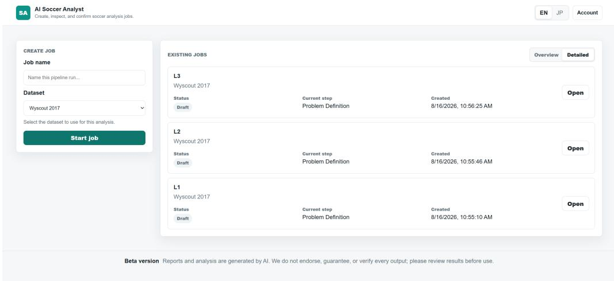  
Figure 7: Job dashboard for creating an analysis and reopening existing jobs.

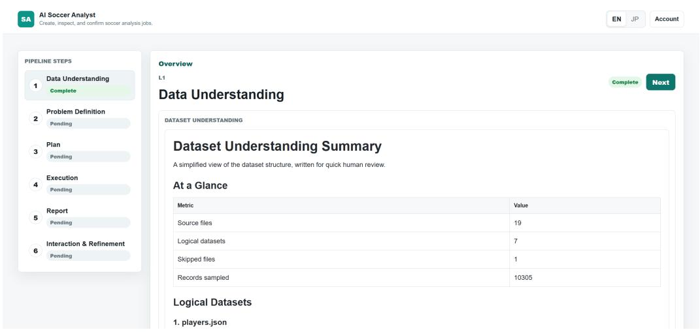  
Figure 8: Analysis workspace showing the six-stage pipeline and the artifact for the currently selected stage.

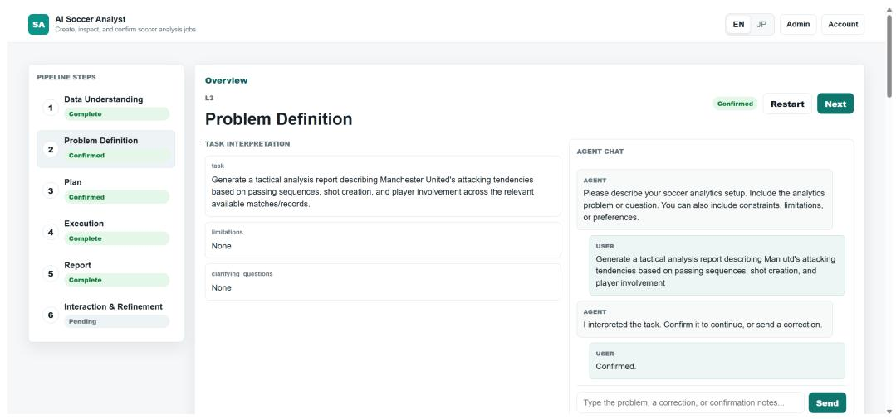  
Figure 9: Stage-aware conversation for confirming a problem definition or submitting a correction.

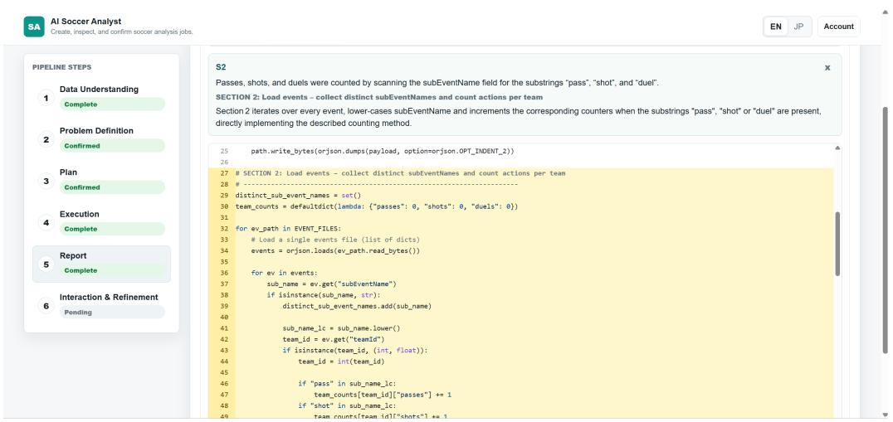  
Figure 10: Claim-evidence inspection linking report text to its rationale and related explanatory cleaned-code sections.

Although Interaction and Refinement introduces no separate user-facing artifact, the user's request, routing decision, and confirmation remain visible in the chat history, while the resulting updated artifact is retained as the current artifact for the responsible stage.

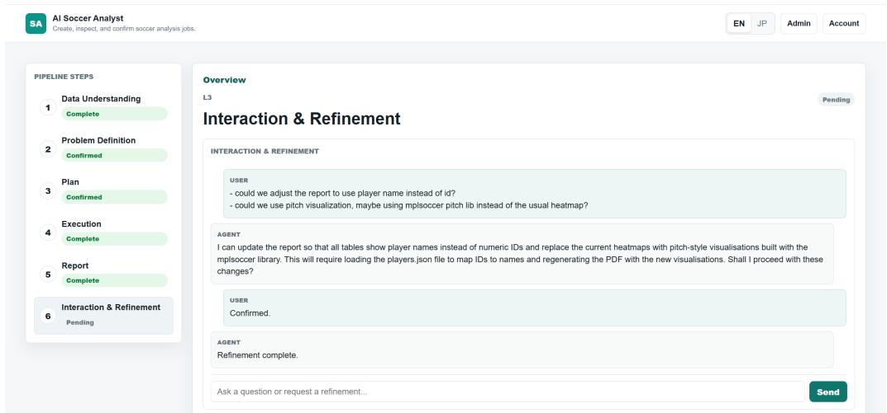  
Figure 11: Interaction and Refinement view illustrating refinement routing and user confirmation.

## G Example User-Facing L1 Analysis

This section presents the recorded artifacts for a completed L1 descriptive-retrieval task, including its problem definition, confirmed plan, report, claim-evidence links, and cleaned-code view. The user's request was to summarize each team's number of passes, shots, and duels.

## G.1 Job Metadata

Table 17 summarizes the recorded configuration and execution characteristics of this example. “Complete" denotes completion of the automated workflow rather than expert validation of analytical correctness.

Table 17: Metadata for the example L1 analysis job.
<table><tr><td>Field</td><td>Recorded value</td></tr><tr><td>Task level</td><td>L1 descriptive retrieval</td></tr><tr><td>Dataset</td><td>Wyscout 2017 [31]</td></tr><tr><td>Final status</td><td>Complete (automated workflow)</td></tr><tr><td>Elapsed time</td><td>27 minutes 2 seconds</td></tr><tr><td>Execution rounds</td><td>9 total: 8 coder revisions and 1 successful completion</td></tr><tr><td>Input tokens</td><td>29,405</td></tr><tr><td>Output tokens</td><td>5,772</td></tr></table>

## G.2 Problem Definition

<table><tr><td>Task</td></tr><tr><td>Summarize each team&#x27;s number of passes, shots, and duels across the relevant available matches.</td></tr><tr><td>Limitations</td></tr><tr><td>None.</td></tr><tr><td>Clarifying questions</td></tr><tr><td>None.</td></tr></table>

## G.3 Confirmed Analysis Plan

## Goal

Provide a table that shows, for each team in the dataset, the total number of passes, shots, and duels performed across all available matches.

## Assumptions

• The events dataset records each action with an eventName field that includes values such as Pass, Shot, and Duel (or equivalent sub-event names).

• Each event row contains a teamId that matches the wyId field in the teams metadata file.

• All event files under the events folder belong to the matches considered; no additional filtering by competition or date is required.

## Inputs Needed

The recorded inputs comprise the seven Wyscout event files for England, France, Germany, Italy, Spain, the European Championship, and the World Cup, together with teams. json.

## Steps

(1) Explore event types. Load all event files and inspect the distinct eventName values, and subEventName if needed, to confirm how passes, shots, and duels are recorded.

(2) Select relevant actions. Determine which event or sub-event values correspond to passes, shots, and duels.

(3) Count actions per team. Filter the events for the three action types and count the rows belonging to each team.

(4) Add team names. Join the counts with the teams metadata so the output uses readable team names instead of numeric identifiers.

(5) Create the summary table. Produce columns for team name, passes, shots, and duels.

## Expected Output

team\_pass\_shot\_duel\_summary.csv

## G.4 Generated Report

## Overview

This report aggregates the total number of passes, shots, and duels performed by every team present in the available Wyscout 2017 event files. Each occurrence of the canonical actions Pass, Shot, and Duel was counted across all event files s3, and numeric teamId values were mapped to readable team names from the teams metadata s4.

The final per-team summary is stored in team\_pass\_shot\_duel\_summary. csv. The excerpt below reproduces the first 20 rows; the full CSV contains 142 teams.

<table><tr><td>Team</td><td>Passes</td><td>Shots</td><td>Duels</td></tr><tr><td>Villarreal Club de Fútbol</td><td>16,550</td><td>435</td><td>8,519</td></tr><tr><td>Levante UD</td><td>12,416</td><td>352</td><td>8,456</td></tr><tr><td>Real Sociedad de Fútbol</td><td>18,440</td><td>450</td><td>8,521</td></tr><tr><td>Real Club Celta de Vigo</td><td>18,768</td><td>386</td><td>8,515</td></tr><tr><td>Getafe Club de Fútbol</td><td>10,692</td><td>317</td><td>9,068</td></tr><tr><td>Athletic Club Bilbao</td><td>15,022</td><td>377</td><td>8,726</td></tr><tr><td>Girona FC</td><td>13,508</td><td>387</td><td>8,704</td></tr><tr><td>Club Atlético de Madrid</td><td>16,336</td><td>354</td><td>8,924</td></tr><tr><td>Reial Club Deportiu Espanyol</td><td>14,641</td><td>361</td><td>8,502</td></tr><tr><td>Sevilla FC</td><td>18,027</td><td>469</td><td>8,868</td></tr><tr><td>SD Eibar</td><td>15,224</td><td>405</td><td>9,146</td></tr><tr><td>Málaga Club de Fútbol</td><td>13,340</td><td>344</td><td>9,016</td></tr><tr><td>FC Barcelona</td><td>23,260</td><td>502</td><td>7,706</td></tr><tr><td>Real Betis Balompié</td><td>19,342</td><td>359</td><td>7,919</td></tr><tr><td>Real Madrid Club de Fútbol</td><td>22,081</td><td>631</td><td>7,860</td></tr><tr><td>Real Club Deportivo de La Coruña</td><td>14,539</td><td>405</td><td>8,414</td></tr><tr><td>Valencia Club de Fútbol</td><td>15,724</td><td>418</td><td>8,536</td></tr><tr><td>UD Las Palmas</td><td>17,148</td><td>339</td><td>8,797</td></tr><tr><td>Deportivo Alavés</td><td>11,428</td><td>331</td><td>8,729</td></tr><tr><td>CD Leganés</td><td>12,236</td><td>357</td><td>9,124</td></tr></table>

## Aggregate Totals

Across the entire dataset, the actions sum to:

• Passes: 1,665,508;

• Shots: 43,078; and

• Duels: 879,083.

These totals result directly from the per-team aggregations3

## Implementation Detail

The workflow identified the distinct action values S1, mapped them to the three canonical actions S2, counted actions per teamId s3 , joined readable team names S4, and exported the final CSV S5

## Conclusion

The analysis provides a team-level summary of passes, shots, and duels across the selected Wyscout 2017 matches. FC Barcelona recorded 23,260 passes, Real Madrid recorded 22,081 passes, and Real Madrid recorded 631 shots. The complete per-team summary is available in the accompanying CSV for further inspection.

## G.5 Claim-Evidence Links

The evidence view connects report claims to the cleaned-code sections that explain the corresponding analytical logic. These links expose the computational basis of each claim but do not independently validate its analytical interpretation.

<table><tr><td>Evidence S1</td></tr><tr><td>The workflow identified the distinct event and sub-event names.</td></tr><tr><td>Analysis section 1: Discover distinct event and sub-event names The section scans every event file, collects unique eventName and subEventName values, and writes the discovered values to JSON.</td></tr><tr><td>Evidence S2</td></tr><tr><td>The discovered labels were mapped to the canonical actions Pass, Shot, and Duel.</td></tr><tr><td>Analysis section 2: Build a mapping to canonical actions The section first checks for exact action-name matches and uses case-insensitive containment only when an exact category is unavailable.</td></tr><tr><td>Evidence S3</td></tr><tr><td>Passes, shots, and duels were counted for each team across the event files.</td></tr><tr><td>Analysis section 3: Aggregate counts per team The section constructs a reverse action lookup, iterates through the event files, and increments the corresponding per-team action count.</td></tr><tr><td>Evidence S4</td></tr><tr><td>Numeric team identifiers were mapped to readable team names.</td></tr><tr><td>Analysis section 4: Join counts with team metadata The section reads teams . json, constructs a wyId-to-name mapping, and attaches the selected display name to each team&#x27;s counts.</td></tr><tr><td></td></tr><tr><td></td></tr><tr><td>Evidence S5</td></tr><tr><td>The final summary was exported as a CSV file.</td></tr></table>

## G.6 Cleaned Analysis Code

The executed and cleaned code serve different roles. The executed script produced the reviewed results. After review, the backend copied that script and removed pipeline-specific status and control logic while retaining the analytical processing steps and user-facing output generation. The reporting stage used the numbered sections below for claim-code linking. Because the cleaned code was not rerun, it is an explanatory view rather than the executable provenance record; the reviewed outputs and execution records remain the evidence for reported claims.

```python
90
91 # Safety net: ensure each action has at least one entry
293 4 for target, lst in mapping.items():
if not lst:
45669798 mapping_path = OUTPUT_DIR / "action_mapping.json" 1st.append(target)
write_json(mapping_path, mapping)
return mapping_path, mapping
99
100
101 # SECTION 3: Aggregate counts per team for each canonical action
102 def aggregate_counts(action_mapping):
103
104 Iterate over all event files and count occurrences of each action type
105 per teamId. Returns a list of records ready for JSON output.
106
107 # Initialise nested defaultdicts
108 team_counts = defaultdict(lambda: {"Pass": 0, "Shot": 0, "Duel": 0})
109
110 # Reverse lookup: raw name -> canonical action
111 reverse_lookup = {}
112 for action, raw_names in action_mapping.items():
113 for raw in raw_names:
114 reverse_lookup[raw] = action
11 events_dir = DATASET_ROOT / "events"
117 for event_file in events_dir.glob("events_*.json"):
119 data = read_json(event_file)
10127231415126121812130133343561339 for rec in data: team_id = rec.get("teamId")
if team_id is None:
continue # skip malformed rows
raw_name = rec.get("eventName") or rec.get("subEventName")
if not raw_name:
continue
action = reverse_lookup.get(raw_name)
if action:
team_counts[team_id][action] += 1
# Convert to a list of records for JSON output
raw_counts = []
for team_id, counts in team_counts.items():
raw_counts.append({
"teamId": team_id,
"passes": counts["Pass"],
"shots": counts["Shot"],
"duels": counts["Duel"],
140 3)
141
142 raw_path = ouTPUT_DIR / "team_action_counts_raw.json"
143 write_json(raw_path, raw_counts)
144 return raw_path, raw_counts
145
146
147 # SECTION 4: Join aggregated counts with team metadata
148 def join_team_names(raw_counts):
149 """Replace team IDs with human-readable team names."""
150 teams_path = DATASET_ROOT / "teams.json"
151 teams_data = read_json(teams_path)
152
153 # Build a mapping wyId -> display name (prefer officialName, fallback to name)
154 team_name_map = {}
155 for team in teams_data:
156 wy_id = team.get("wyId")
1578 name = team.get("officialName") or team.get("name") or f"team_{wy_id}"
57
team_name_map[wy_id] = name
159
160 summary = []
161 for rec in raw_counts:
162 team_id = rec["teamId"]
163 team_name = team_name_map.get(team_id, f"team_{team_id}")
164 summary.append({
165 "team_name": team_name,
166 "passes": rec["passes"],
167 "shots": rec["shots"],
168 "duels": rec["duels"],
169 })
170
172 summary_path = OUTPUT_DIR / "team_action_summary.json"
write_json(summary_path, summary)
7314115 return summary_path, summary
176 # SECTION 5: Write CSV summary for end-users
177 def write_csv(summary):
178 """Create a CSV file containing the final per-team action summary."""
179 csv_path = OUTPUT_DIR / "team_pass_shot_duel_summary.csv"
```

```python
201 mapping_path, action_mapping = build_action_mapping(distinct)
202
203 # SECTION 3
raw_counts_path, raw_counts = aggregate_counts(action_mapping)
# SECTION 4
summary_path, summary = join_team_names(raw_counts)
208
209 # SECTION 5
210 write_csv(summary)
211
212
213 if __name__ == "__main__":
214 main()
```

Al Soccer Analyst: Stage-Aware and Verifiable Human-Al Collaboration for Soccer Data Analysis

180 with csv\_path.open("w", newline="", encoding="utf-8") as f:   
181 writer = csv.DictWriter(f, fieldnames=["team\_name", "passes", "shots", "duels"])   
182 writer.writeheader()   
183 for row in summary:   
184 writer.writerow({   
185 "team\_name":"row["team\_name"],   
186 "passes": row["passes"],   
187 "shots": row["shots"],   
188 "duels": row["duels"],   
189 })   
190 return csv\_path   
191   
192   
193 #   
194 # Main orchestration (cleaned - no execution-pipeline reporting)   
195 #   
196 def main():   
197 # SECTION 1   
198 distinct\_path, distinct = discover\_event\_names()   
199   
200 # SECTION 2

Listing 1: Post-execution cleaned code presented as an explanatory view for the L1 team-action summary task.