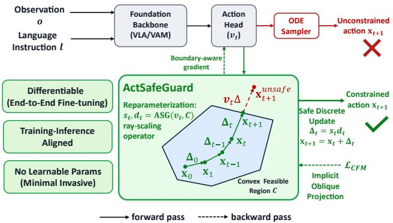
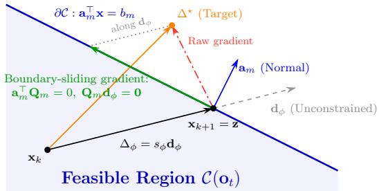
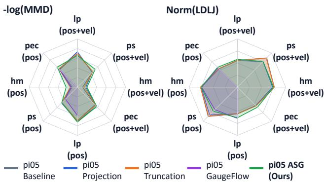
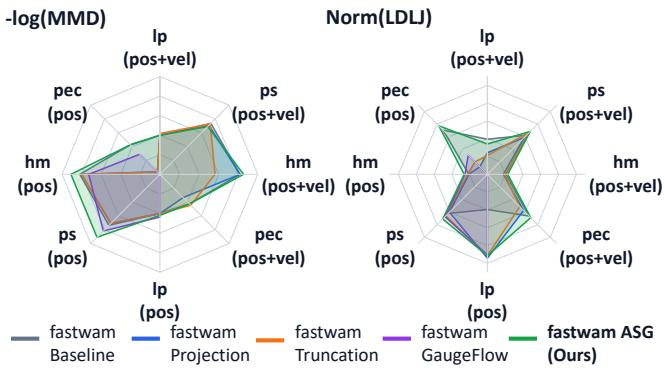
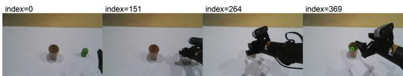
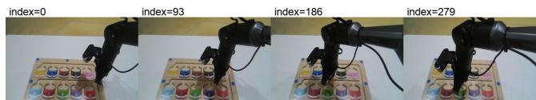
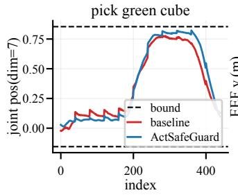
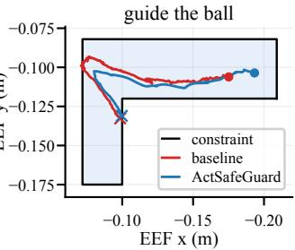

# ActSafeGuard: Diferentiable and Training-Aligned Constraint Enforcement for Flow-Matching Policies

Jianming Ma∗1,2, Rongjun Jin∗1, Xiaxi Si1, Yang Zhang1, Yiheng Li1, Yue Gao1, 2†

1Shanghai Jiao Tong University 2Shanghai Institute of Innovation

## Abstract

Vision-Language-Action (VLA) and World-Action Models (WAMs) have demonstrated strong capabilities in generalpurpose robotic manipulation, yet their generated actions may violate hard physical constraints and therefore be unsafe or infeasible for deployment. Existing safety approaches either optimize statistical safety objectives without deterministic per-step guarantees or correct unsafe actions only during inference, creating a mismatch between policy training and execution. We introduce ActSafeGuard, a diferentiable and training-aligned safeguard layer for flow-matching based policies. ActSafeGuard integrates hard action feasibility into policy learning, not merely treating safety as an inference-time external component. Through an analytical ray-scaling operator design, ActSafeGuard enables boundary-aware gradients to guide the model to naturally learn constrained manifolds. Extensive experiments on multiple standard foundation backbones $( \pi _ { 0 . 5 }$ and Fast-WAM) across various tasks demonstrate that ActSafeGuard consistently achieves a 100% step safety rate while fully preserving or even boosting task success rates, providing a scalable and minimally invasive solution for safe embodied AI deployment.

## Introduction

Vision-Language-Action (VLA) models (Kim et al. 2024; Black et al. 2025; NVIDIA et al. 2025) and World-Action Models (WAMs) (Ye et al. 2026; Liao et al. 2025) have recently shown remarkable progress in general-purpose robotic manipulation. By combining large-scale visual-language representations with generative action heads, these embodied foundation models can adapt to diverse downstream tasks while retaining broad semantic and motor priors. Despite their strong task-solving capabilities, however, the actions generated by these models are not always directly executable. Predicted actions may violate hard physical constraints, such as position limits, velocity bounds, or workspace restrictions, leading to unstable execution, hardware damage, or unsafe robot behavior.

For robotic manipulation, safety must be enforced at every execution step, because a single infeasible action can result in an unacceptable physical consequence. This is particularly problematic for flow-matching action heads, which generate action chunks in an unconstrained space without explicit feasibility guarantees. Thus, a practical safeguard must provide deterministic per-step feasibility while preserving the task competence and generative flexibility of pretrained foundation policies.

  
Figure 1: Overview of ActSafeGuard. Given an observation and a language instruction, a foundation VLA/WAM backbone and its flow-matching action head predict an unconstrained velocity $v _ { t } .$ ActSafeGuard transforms $v _ { t }$ into an update direction $d _ { t }$ and a safe scaling factor $s _ { t } ,$ adaptively rescaling constraint-violating steps such that the trajectory remains within the convex feasible region. During backpropagation, its gradient transformation admits an implicit oblique-projection interpretation, providing boundary-aware learning signals.

Existing safety approaches generally address this challenge from either the training side or the inference side. Training-time constrained methods incorporate safety costs (Zhang et al. 2026) or regularization objectives (Wei, Wu, and Haghbayan 2026) into policy optimization, allowing the policy to become safety-aware but typically providing only probabilistic or expectation-based guarantees. In contrast, inference-time safeguards directly correct infeasible actions through projection, clipping, or optimization-based filtering (Hu et al. 2025). Although these methods can enforce hard constraints during deployment, the correction mechanism is absent from policy training. Consequently, the policy is optimized in an unconstrained action space but executed under an externally modified action distribution, introducing a training–inference mismatch that may distort generated trajectories and degrade task performance. The central limitation is therefore not simply the absence of a safety mechanism, but the separation of hard constraint enforcement from policy learning.

In this work, we introduce ActSafeGuard, a diferentiable and training-aligned constraint operator for flow-matchingbased policies. Our key insight is that hard actionfeasibility can be integrated directly into the policy learning process, rather than being treated merely as an external inferencetime correction. ActSafeGuard is inserted at the output of the flow-matching action head and applies an analytical rayscaling operator to each discrete flow update. Starting from a feasible initial point, this construction ensures that every constrained flow step remains within the state-dependent convex feasible set. Crucially, the same safeguard operator is active during both training and inference. During training, its diferentiable construction allows gradients to propagate through the constrained update, enabling the action head to receive boundary-aware learning signals. This training-aligned design encourages the policy to adapt its predicted directions to the geometry of the feasible action space, thereby preserving efective learning while enforcing hard feasibility. Moreover, ActSafeGuard introduces no additional learnable network and can be incorporated into pretrained flow-matching action heads with minimal modification.

We evaluate ActSafeGuard on representative foundation backbones across multiple manipulation tasks with various constraints. The results show that ActSafeGuard consistently achieves a 100% step safety rate while preserving task success rates compared with other constrained methods. Our main contributions are summarized as follows:

• We propose ActSafeGuard, a diferentiable and trainingaligned constraint operator that integrates hard action feasibility directly into the learning and generation processes of flow-matching based policies.

• We show that ActSafeGuard induces boundary-aware gradients through an implicit oblique projection, enabling constrained updates to slide along feasible boundaries instead of being merely truncated.

• Extensive experiments with $\pi _ { 0 . 5 }$ and Fast-WAM demonstrate deterministic constraint satisfaction while preserving task success and action-generation quality.

## Related Works

Safety Constrained VLA and WAMs. Safety is a core desideratum for VLA and WAM policies deployed in openended environments, where unconstrained physical actions may lead to catastrophic failures (Li et al. $2 0 2 6 \mathbf { b } , \mathbf { a } ;$ Kim et al. 2026a,b). Existing methods mainly address this issue from either the training side or the inference side:

(1) Training-time Constrained Policies. One paradigm embeds safety directly into the policy optimization process (Zhang et al. 2026; Tang et al. 2026; Wei, Wu, and Haghbayan 2026). For instance, SafeVLA (Zhang et al. 2026) formulates the safety task as a constrained MDP and leverages safe reinforcement learning (RL) to achieve VLA safety alignment. SafeDojo (Tang et al. 2026) utilizes a generative video world model to produce imaginary rollouts and introduces a Lagrangian-constrained GRPO objective for policy training. These methods can improve safety awareness, but they typically optimize expected costs or soft penalties and therefore do not guarantee deterministic per-step feasibility. Furthermore, incorporating constrained optimization techniques (e.g., Lagrangian multipliers) into the training pipeline introduces a non-trivial trade-of between task objective and constraint satisfaction.

(2) Inference-time Safety Guards. Inference-time safeguards instead modify generated actions during deployment. One branch of work (Hu et al. 2025; English, Zheng, and Ewetz 2026) constructs control barrier functions (CBFs) and safety sets to project actions by solving a Quadratic Program (QP) optimization at each sampling step, ensuring that the generated actions strictly reside within the feasible region. Another branch adopts action masking (Beaudin et al. 2026) or heuristic-based hard truncation (Chandra, Damodaran, and Wang 2026) to filter out unsafe actions. While such methods can enforce hard constraints at execution time, they are absent from policy training, creating a training–inference mismatch that may distort the learned action distribution and degrade task performance.

In summary, training-time constrained methods simultaneously optimize for task competence and safety regularizers but fall short of delivering deterministic constraint satisfaction. Conversely, inference-time safety guards mathematically enforce hard constraints during deployment but introduce a training-inference mismatch that often compromises the backbone’s execution capability. How to efectively balance task performance with strict constraint satisfaction through a training-inference aligned framework remains an open challenge.

## Preliminary

Policy Formulation. We formulate language-conditioned robotic manipulation as learning a mapping from multimodal observations to a sequence of future actions. At control step t, the observation tuple is defined as $\mathbf o _ { t } ~ = ~ [ \{ \mathbf I _ { t } ^ { i } \} _ { i = 1 } ^ { n } , \mathbf q _ { t } ]$ comprising multi-view images and proprioceptive states. Guided by a language instruction l, a VLM/VGM backbone $f _ { \theta }$ first projects the inputs into a unified latent representation: $\mathbf { e } _ { t } = f _ { \theta } ( \mathbf { o } _ { t } , l )$ . An action head $\pi _ { \phi }$ then decodes this embedding into an action chunk $\mathbf { a } _ { t : t + H - 1 }$ , representing motor commands over a future horizon $H$ . The policy is composed as $\Pi ( \mathbf { o } _ { t } , l ) = \pi _ { \phi } ( \mathbf { e } _ { t } )$ , and the generated chunk is executed via a receding-horizon scheme.

Flow-Matching Action Generation. Flow matching (Lipman et al. 2023) is a prevalent paradigm for training the generative action head $\pi _ { \phi } .$ . Let $\mathbf { x } _ { 1 }$ denote the target expert action chunk with horizon H $( \mathrm { i . e . , a } _ { t : t + H - 1 } )$ and $\mathbf { x } _ { 0 } \sim p ( \mathbf { x } _ { 0 } )$ denote an initial noise sample. Flow matching constructs a probability path via linear interpolation:

$$
\mathbf { x } _ { \tau } = ( 1 - \tau ) \mathbf { x } _ { 0 } + \tau \mathbf { x } _ { 1 } , \quad \tau \in [ 0 , 1 ] ,\tag{1}
$$

where $\tau$ denotes the continuous flow timestep. The action head, instantiated as a velocity field network $v _ { \phi } ( \mathbf { x } _ { \tau } , \tau , \mathbf { e } _ { t } )$

conditioned on the latent context $\mathbf { e } _ { t } .$ , is trained to approximate the target vector field $u ^ { \star } = { \bf x } _ { 1 } - { \bf x } _ { 0 }$ . The training objective is:

$$
\begin{array} { r } { \mathcal { L } _ { \mathrm { C F M } } = \mathbb { E } _ { \mathbf { x } _ { 0 } , \mathbf { x } _ { 1 } , \tau } \left[ \left\| v _ { \phi } ( \mathbf { x } _ { \tau } , \tau , \mathbf { e } _ { t } ) - ( \mathbf { x } _ { 1 } - \mathbf { x } _ { 0 } ) \right\| _ { 2 } ^ { 2 } \right] . } \end{array}\tag{2}
$$

During inference, starting from $\mathbf { x } _ { 0 } ,$ an Ordinary Diferential Equation (ODE) solver integrates the learned vector field over $\tau \in [ 0 , 1 ]$ to synthesize the final action chunk $\mathbf { x } _ { 1 }$

Constrained Action Space. In real-world robotic applications, physical and environmental limitations impose strict constraints on the action space. We characterize the feasible region as a state-dependent convex polytope:

$$
\mathscr { C } ( \mathbf { o } _ { t } ) = \{ \mathbf { x } ^ { c } ~ | ~ \mathbf { A } ( \mathbf { o } _ { t } ) \mathbf { x } ^ { c } \leq \mathbf { b } ( \mathbf { o } _ { t } ) \} ,\tag{3}
$$

where $\mathbf { x } ^ { c }$ denotes the dimensions of the action chunk subject to hard constraints, and $\mathbf { A } ( \mathbf { o } _ { t } ) , \mathbf { b } ( \mathbf { o } _ { t } )$ define observationconditioned boundaries. Our goal is to ensure that $\mathbf { x } ^ { c }$ strictly resides within $\mathcal { C } ( \mathbf { o } _ { t } )$ throughout the sampling process, thereby guaranteeing deterministic, zero-violation execution upon deployment.

## Method

To achieve zero-constraint-violation generation with minimal intervention to pretrained models, we propose ActSafe-Guard. The core idea is to embed a diferentiable, parameterfree ray-scaling operator directly into a discrete-time flowmatching process, ensuring per-step feasibility while facilitating boundary-aware gradient updates during training.

## Discrete-Time Flow Matching with Feasible States

Standard flow matching integrates a continuous vector field over time. However, verifying continuous-time safety analytically is often intractable. Instead, ActSafeGuard formulates the generation as an N-step discrete flow process. Let $\tau _ { k } = k / \bar { N } \mathrm { f o r } k \in \{ 0 , \dots , N { - } 1 \}$ . The exact probability path is discretized as: ${ \bf x } _ { k } = ( 1 - \tau _ { k } ) { \bf x } _ { 0 } + \tau _ { k } { \bf x } _ { 1 }$ , where the ideal one-step update is given by $\Delta ^ { \star } = { \bf x } _ { k + 1 } - { \bf x } _ { k } = ( { \bf x } _ { 1 } - { \bf x } _ { 0 } ) / N$ Instead of learning the continuous velocity $v _ { \phi } ,$ the action head is parameterized to directly predict the discrete step $\Delta _ { \phi } ( \mathbf { x } _ { k } , \tau _ { k } , \mathbf { e } _ { t } )$ . The model can be trained using a discretetime flow matching loss:

$$
\mathcal { L } _ { \mathrm { D F M } } = \mathbb { E } _ { k , \mathbf { x } _ { 0 } , \mathbf { x } _ { 1 } } \left[ \left\| \Delta _ { \phi } ( \mathbf { x } _ { k } , \tau _ { k } , \mathbf { e } _ { t } ) - \Delta ^ { \star } \right\| _ { 2 } ^ { 2 } \right] .\tag{4}
$$

The formulation of Eq. (4) is mathematically aligned with the CFM objective in Eq. (2) used by standard continuous flow matching. Although discretization introduces bounded approximation error (Ma et al. 2026), it preserves the vectorfield prior of continuous pretrained backbones by interpreting their predicted velocity as a nominal discrete update direction. The advantage of this formulation is that feasibility can be enforced step by step: $\operatorname { i f } \mathbf { x } _ { 0 } \in \mathcal { C } ( \mathbf { o } _ { t } )$ and every constrained update respects the boundary, then the entire generated sequence $\mathbf { x } _ { 0 } \to \cdots \to \mathbf { x } _ { N }$ remains feasible.

## ActSafeGuard Parameterization

Given the discrete formulation above, ActSafeGuard enforces feasibility by modifying each nominal flow update before it is applied. The design goal is to preserve the vector-field prior of the pretrained action head as much as possible: the predicted velocity still determines the update direction, while ActSafeGuard only rescales its magnitude when the update would leave the feasible set.

For notational simplicity, we describe the operation on the constrained action dimensions. At step k, the pretrained action head predicts an unconstrained velocity $\mathbf { v } _ { \phi } ( \mathbf { x } _ { k } , \tau _ { k } , \mathbf { e } _ { t } )$ We convert it into the following two components:

Direction Vector: This vector dictates the intended moving direction along with its step magnitude:

$$
{ \bf d } _ { \phi } = \frac { { \bf v } _ { \phi } ( { \bf x } _ { k } , \tau _ { k } , { \bf e } _ { t } ) } { N } ,\tag{5}
$$

where N denotes the total number of discretization steps.

Safety Scaling Factor: To guarantee that the next state remains within the closed feasible domain, we adaptively constrain the magnitude of $\mathbf { d } _ { \phi }$ using a safety weight $s _ { \phi } ~ \in$ [0, 1]. ActSafeGuard modulates the nominal step to yield the final safe discrete step:

$$
\Delta _ { \phi } = s _ { \phi } { \bf d } _ { \phi } .\tag{6}
$$

Computation of $s _ { \phi }$ via Ray Shooting. Given the direction vector $\mathbf { d } _ { \phi }$ and the current state $\mathbf { x } _ { k }$ , the ray-shooting operator computes the intersection z with the closest constraint boundary along the line of travel:

$$
\alpha = \operatorname* { m i n } _ { i : \mathbf { a } _ { i } ^ { \top } \mathbf { d } _ { \phi } > 0 } \frac { b _ { i } - \mathbf { a } _ { i } ^ { \top } \mathbf { x } _ { k } } { \mathbf { a } _ { i } ^ { \top } \mathbf { d } _ { \phi } } , \quad \mathbf { z } = \mathbf { x } _ { k } + \alpha \mathbf { d } _ { \phi } ,\tag{7}
$$

where $\mathbf { a } _ { i } ^ { \top }$ and $b _ { i }$ denote the i-th row and element of the constraint matrix A and boundary vector b respectively, and $\alpha \geq 0$ is a scalar representing the maximum allowable scaling factor before hitting the nearest constraint facet i. Consequently, the safety scaling factor $s _ { \phi }$ is defined as:

$$
s _ { \phi } = \operatorname* { m i n } ( 1 , \alpha ) = { \binom { 1 , \alpha \geq 1 } { \alpha , \alpha < 1 . } }\tag{8}
$$

This piecewise formulation yields two regimes:

• When $\alpha \geq 1$ , the nominal update $\mathbf { x } _ { k } + \mathbf { d } _ { \phi }$ is already feasible and ActSafeGuard leaves it unchanged.

• When $\alpha < 1$ , the nominal update would cross a boundary, so ActSafeGuard shortens it exactly to the ray-boundary intersection:

$$
\begin{array} { r } { \mathbf { x } _ { k + 1 } = \mathbf { x } _ { k } + \Delta _ { \phi } = \mathbf { x } _ { k } + \alpha \mathbf { d } _ { \phi } = \mathbf { z } \in \partial \mathcal { C } . } \end{array}\tag{9}
$$

Proposition 1 (Safety Guarantee) $B y$ construction, $A c t -$ SafeGuard guarantees that the generated trajectory remains within the closed feasible region $\mathcal { C } ( \mathbf { o } _ { t } )$ across all inference steps, provided that the initial noise satisfies $\mathbf { x } _ { 0 } \in \mathcal { C } ( \mathbf { o } _ { t } )$ .

  
Figure 2: ActSafeGuard update and boundary-sliding gradient. When the nominal update $\mathbf { d } _ { \phi }$ crosses the active constraint facet $\mathbf { a } _ { m } ^ { \top } \mathbf { x } = b _ { m } ,$ , ActSafeGuard rescales the step to the boundary intersection z. Around this boundary-limited point, the local Jacobian acts as an oblique projection $\mathbf { Q } _ { m } ,$ satisfying $\mathbf { a } _ { m } ^ { \top } \mathbf { Q } _ { m } = 0$ and $\mathbf { Q } _ { m } \mathbf { d } _ { \phi } = \bar { \mathbf { 0 } }$ . Thus, raw gradients that would otherwise point outside the feasible region are converted into boundary-sliding gradients along the active facet, encouraging the policy to re-orient unsafe updates while preserving hard feasibility.

Proposition 2 (Diferentiability) A key advantage of Act-SafeGuard is its end-to-end diferentiability, allowing it to be embedded directly into training loops without additional modification. The complete forward pass for the ActSafe-Guard can be expressed as:

$$
\Delta _ { \phi } = \operatorname* { m i n } \left( 1 , \operatorname* { m i n } _ { i : \mathbf { a } _ { i } ^ { \top } \mathbf { v } _ { \phi } > 0 } \frac { b _ { i } - \mathbf { a } _ { i } ^ { \top } \mathbf { x } _ { k } } { \mathbf { a } _ { i } ^ { \top } \mathbf { v } _ { \phi } } N \right) \cdot \frac { \mathbf { v } _ { \phi } } { N } ,\tag{10}
$$

where $\mathbf { v } _ { \phi }$ is the shortcut notation for the velocity field prediction $\mathbf { v } _ { \phi } ( \mathbf { x } _ { k } , \tau _ { k } , \mathbf { e } _ { t } )$ . The gradient of the output $\Delta _ { \phi }$ with respect to the input $\mathbf { v } _ { \phi }$ exists in closed-form everywhere except at the boundary corners, which can be handled via standard subgradient methods during backpropagation.

The training and inference procedures of ActSafeGuard are summarized in Algorithm 1 and Appendix G.

Algorithm 1: ActSafeGuard Training   
Require: Pretrained policy parameters $\phi ,$ constraint sets   
$\mathcal { C } ( \mathbf { o } _ { t } )$   
1: for each batch $\left( \mathbf { o } _ { t } , \mathbf { x } _ { 1 } \right)$ guided by instruction l do   
2: Encode context: $\mathbf { e } _ { t } = f _ { \theta } ( \mathbf { o } _ { t } , l )$   
3: Sample step $k \sim \mathcal { U } ( 0 , \overset { \cdot \cdot } { N } - 1 )$ and initial noise $\mathbf { x } _ { \mathrm { 0 } } \sim$   
$p ( \mathbf { x } _ { 0 } ) { \mathrm { s . t . } } \mathbf { x } _ { 0 } \in { \mathcal { C } } ( \mathbf { o } _ { t } )$   
4: Compute interpolated state $\begin{array} { r } { { \bf x } _ { k } = ( 1 - \frac { k } { N } ) { \bf x } _ { 0 } + \frac { k } { N } { \bf x } _ { 1 } } \end{array}$   
5: Predict baseline velocity $\mathbf { v } _ { \phi }  \mathbf { v } _ { \phi } ( \mathbf { x } _ { k } , \mathbf { \bar { \tau } } _ { k } , \mathbf { e } _ { t } )$   
6: Compute direction vector $\mathbf { i } _ { \phi } = \mathbf { v } _ { \phi } / N$   
7: Compute scale $s _ { \phi }$ using Eq (7) and (8)   
8: Apply safe update $\Delta _ { \phi } = s _ { \phi } { \bf d } _ { \phi }$   
9: Compute discrete flow matching loss $\mathcal { L } _ { \mathrm { D F M } } = \Vert \Delta _ { \phi } -$   
$( \mathbf { x } _ { 1 } - \mathbf { x } _ { 0 } ) / N \lVert _ { 2 } ^ { 2 }$   
10: Update policy parameters $\phi  \phi - \eta \nabla _ { \phi } \mathcal { L } _ { \mathrm { D F M } }$   
11: end for

## Gradient-Based Boundary Sliding Correction

We now examine why ActSafeGuard provides boundaryaware learning signals rather than behaving as a nondiferentiable clipping module. The key lies in the local Jacobian of the safe update $\Delta _ { \phi }$ with respect to the nominal direction $\mathbf { d } _ { \phi }$

Consider the boundary-limited case $\alpha < 1$ , and assume that the active facet is locally unique:

$$
\hat { i } = \arg \operatorname* { m i n } _ { i : \mathbf { a } _ { i } ^ { \top } \mathbf { d } _ { \phi } > 0 } \frac { b _ { i } - \mathbf { a } _ { i } ^ { \top } \mathbf { x } _ { k } } { \mathbf { a } _ { i } ^ { \top } \mathbf { d } _ { \phi } } .\tag{11}
$$

Let $c _ { \hat { i } } = b _ { \hat { i } } - \mathbf { a } _ { \hat { i } } ^ { \top } \mathbf { x } _ { k }$ . In this regime, the safe update is

$$
\Delta _ { \phi } = \alpha \mathbf { d } _ { \phi } = \frac { c _ { i } \mathbf { d } _ { \phi } } { \mathbf { a } _ { i } ^ { \top } \mathbf { d } _ { \phi } } .\tag{12}
$$

Taking the local diferential with respect to $\mathbf { d } _ { \phi }$ gives

$$
\mathrm { d } \Delta _ { \phi } = \alpha \mathbf { Q } _ { \hat { i } } \mathrm { d } \mathbf { d } _ { \phi } , \qquad \mathbf { Q } _ { \hat { i } } = \mathbf { I } - \frac { \mathbf { d } _ { \phi } \mathbf { a } _ { \hat { i } } ^ { \top } } { \mathbf { a } _ { \hat { i } } ^ { \top } \mathbf { d } _ { \phi } } .\tag{13}
$$

The matrix $\mathbf { Q } _ { \hat { i } }$ is an oblique projection onto the tangent space of the active facet along the ray direction. It satisfies

$$
\mathbf { a } _ { i } ^ { \top } \mathbf { Q } _ { \hat { i } } = \mathbf { 0 } ^ { \top } , \qquad \mathbf { Q } _ { \hat { i } } \mathbf { d } _ { \phi } = \mathbf { 0 } .\tag{14}
$$

Therefore, once the nominal update reaches a boundary, first-order changes in the safe update cannot move outward through the active constraint. Instead, the Jacobian preserves only variations that slide the boundary intersection along the feasible facet.

This property explains the boundary-sliding behavior of ActSafeGuard. Unlike hard clipping or stop-gradient correction, the ray-scaling operator remains diferentiable in the boundary-limited regime. Gradients from the training objective can still flow through $\Delta _ { \phi }$ to $\mathbf { d } _ { \phi } .$ , but they are geometrically reshaped by $\mathbf { Q } _ { \hat { i } } .$ . As a result, the action head receives learning signals that encourage it to re-orient unsafe nominal directions along the feasible boundary, rather than merely increasing a step magnitude that would be truncated by the safeguard.

## Experiments

We conduct experiments to evaluate whether ActSafeGuard can enforce hard action feasibility without sacrificing the task competence of pretrained flow-matching policies. The experiments are organized around three research questions:

• RQ1: Performance preservation. Can ActSafeGuard eliminate constraint violations while maintaining the task success rate of the original policy?

• RQ2: Generalizability to complex constraints. Can ActSafeGuard handle high-dimensional, state-dependent, and multi-step dynamic constraints?

• RQ3: Diferentiability. How much does the diferentiable ray-scaling design contribute to stable constrained policy learning?

<table><tr><td rowspan="2">Backbone</td><td rowspan="2">Method</td><td colspan="5">Static Constraints (PosCons)</td><td colspan="5">Dynamic Constraints (PosCons + VelCons)</td></tr><tr><td>lp</td><td>ps</td><td>hm</td><td>pec</td><td>Mean SR</td><td>lp</td><td>ps</td><td>hm</td><td>pec</td><td>Mean SR</td></tr><tr><td rowspan="5">π0.5</td><td>Baseline</td><td>100</td><td>90</td><td>21</td><td>90</td><td>75.25</td><td>100</td><td>90</td><td>21</td><td>90</td><td>75.25</td></tr><tr><td>Projection</td><td>100</td><td>90</td><td>21</td><td>88</td><td>74.75</td><td>100</td><td>84</td><td>26</td><td>95</td><td>76.25</td></tr><tr><td>Truncation</td><td>99</td><td>91</td><td>27</td><td>92</td><td>77.25</td><td>99</td><td>90</td><td>27</td><td>91</td><td>76.75</td></tr><tr><td>GaugeFlow</td><td>100</td><td>82</td><td>25</td><td>93</td><td>75.00</td><td>N/A</td><td>N/A</td><td>N/A</td><td>N/A</td><td>N/A</td></tr><tr><td>ActSafeGuard</td><td>100</td><td>90</td><td>34</td><td>97</td><td>80.25</td><td>100</td><td>98</td><td>31</td><td>97</td><td>81.50</td></tr><tr><td rowspan="5">Fast-WAM</td><td>Baseline</td><td>100</td><td>93</td><td>42</td><td>98</td><td>83.25</td><td>100</td><td>93</td><td>42</td><td>98</td><td>83.25</td></tr><tr><td>Projection</td><td>100</td><td>85</td><td>40</td><td>80</td><td>76.25</td><td>100</td><td>85</td><td>35</td><td>82</td><td>75.50</td></tr><tr><td>Truncation</td><td>98</td><td>80</td><td>50</td><td>90</td><td>79.50</td><td>100</td><td>94</td><td>45</td><td>88</td><td>81.75</td></tr><tr><td>GaugeFlow</td><td>100</td><td>80</td><td>39</td><td>90</td><td>77.25</td><td>N/A</td><td>N/A</td><td>N/A</td><td>N/A</td><td>N/A</td></tr><tr><td>ActSafeGuard</td><td>100</td><td>90</td><td>45</td><td>93</td><td>82.00</td><td>97</td><td>95</td><td>45</td><td>95</td><td>83.00</td></tr></table>

Table 1: Quantitative task success performance (SR, %) across all evaluation scenarios. We evaluate methods across four manipulation tasks: lift pot (lp), place shoe (ps), hanging mug (hm), and place empty cup (pec), under static position constraints (PosCons) and dynamic position + velocity constraints (PosCons + VelCons). Step Safety Rate (SSR) is omitted as all constrained methods deterministically achieve 100% SSR. Bold numbers indicate the best performance among constrained methods. Training and evaluation details are in Appendix D and E.

## Experimental Setup

Simulation environment and tasks. We evaluate Act-SafeGuard in RoboTwin (Chen et al. 2025) with the bimanual ALOHA-Agilex platform. The robot has two 6-DoF arms and two grippers, yielding a 14-dimensional action space. We consider four manipulation tasks of diferent dificulty and contact structure: lift pot, place shoe, hanging mug, and place empty cup.

Policy input and output. The policy uses absolute joint and gripper positions as actions. At each control step t, it receives a multimodal observation $\mathbf o _ { t } = [ \{ \mathbf I _ { t } ^ { i } \} _ { i = 1 } ^ { 3 } , \mathbf q _ { t } , \mathbf g _ { t } ] ,$ where $\{ \mathbf { I } _ { t } ^ { i } \} _ { i = 1 } ^ { 3 }$ are three camera views, $\mathbf { q } _ { t } \in \mathbb { R } ^ { 1 2 }$ denotes the current arm-joint positions, and $\mathbf { g } _ { t } \in \mathbb { R } ^ { 2 }$ denotes the gripper states. Given a language instruction l, the policy predicts an action chunk $\mathbf { a } _ { t : t + H - 1 } = [ \mathbf { a } _ { t } , \dots , \mathbf { a } _ { t + H - 1 } ]$ with horizon H.

Safety constraints. We impose hard constraints on the 12- DoF arm-joint subspace, denoted by the superscript $q ,$ while leaving the gripper dimensions unconstrained. Detailed parameterizations are provided in Appendix A.

Position constraints (PosCons) define a static joint-limit box:

$$
\mathbf { q } _ { \mathrm { m i n } } \leq \mathbf { a } _ { t + i } ^ { q } \leq \mathbf { q } _ { \mathrm { m a x } } , \quad \forall i \in \{ 0 , \dots , H - 1 \} .\tag{15}
$$

These bounds prevent the policy from producing actions outside the valid workspace.

Velocity constraints (VelCons) bound one-step joint displacement:

$$
| \mathbf { q } _ { t } - \mathbf { a } _ { t } ^ { q } | \leq \mathbf { v } _ { \operatorname* { m a x } } ,\tag{16}
$$

$$
| \mathbf { a } _ { t + i } ^ { q } - \mathbf { a } _ { t + i + 1 } ^ { q } | \leq \mathbf { v } _ { \operatorname* { m a x } } , \quad \forall i \in \{ 0 , \dots , H - 2 \} .\tag{17}
$$

Unlike PosCons, VelCons depends on the current proprioceptive state $\mathbf { q } _ { t } ,$ making the feasible set $\mathcal { C } ( \mathbf { o } _ { t } )$ state-dependent and time-varying.

Backbones and baselines. We instantiate ActSafeGuard on two representative flow-matching policies: $\pi _ { 0 . 5 }$ (Black et al. 2025), a pretrained VLA model, and Fast-WAM (Yuan et al. 2026), a world-action model that uses world modeling during training while retaining direct action prediction at inference time. We compare against three constraint-handling baselines: Projection, an inference-time step-wise projection method; Truncation, a post-hoc clipping method applied after unconstrained generation; and GaugeFlow (Li, Liang, and Chen 2026), a training-aware method based on an invertible gauge map. Detail introduction of baselines are in Appendix B. GaugeFlow requires a static star-shaped feasible region, so it is only applicable to PosCons and is marked N/A under PosCons + VelCons.

Evaluation metrics. We report Success Rate (SR), Step Safe Rate (SSR), Maximum Mean Discrepancy (MMD), and Log Dimensionless Jerk (LDLJ) (Balasubramanian, Melendez-Calderon, and Burdet 2011). SR measures task completion, SSR measures the percentage of executed control steps satisfying all constraints, MMD measures distributional deviation from expert action chunks, and LDLJ measures trajectory smoothness. MMD and LDLJ evaluate whether hard constraint enforcement damages the actiongeneration quality of the pretrained backbone. More details are in Appendix C.

## Why Are Hard Constraints Necessary?

We first examine whether safety can be obtained simply by training on feasible demonstrations. For each task, the PosCons and VelCons bounds are constructed from the minimum and maximum statistics of the training data, so the training demonstrations lie inside the feasible set by design. We then fine-tune the unconstrained baselines on these data and evaluate them in in-distribution RoboTwin environments.

Table 2 shows that feasible training data alone is insufficient for deterministic safety. The mean SSR of the π0.5 baseline is only 51.42% under PosCons and 48.09% under PosCons + VelCons, while Fast-WAM drops further to 22.99% and 20.01%, respectively. These violations occur despite using in-distribution evaluation settings, indicating that neural fitting error, flow sampling error, and distribution shift can push generated chunks outside the empirical feasible envelope.

<table><tr><td rowspan="2">Task</td><td colspan="2">PosCons</td><td colspan="2">PosCons + VelCons</td></tr><tr><td>π0.5</td><td>Fast-WAM</td><td>π0.5</td><td>Fast-WAM</td></tr><tr><td>lift pot</td><td>83.59</td><td>15.12</td><td>82.85</td><td>13.68</td></tr><tr><td>place shoe</td><td>20.43</td><td>5.86</td><td>16.45</td><td>3.79</td></tr><tr><td>hanging mug</td><td>64.62</td><td>39.69</td><td>57.38</td><td>35.24</td></tr><tr><td>place empty cup</td><td>37.04</td><td>31.27</td><td>35.69</td><td>27.33</td></tr><tr><td>Mean SSR</td><td>51.42</td><td>22.99</td><td>48.09</td><td>20.01</td></tr></table>

Table 2: Step Safety Rate (SSR, %) of the unconstrained baseline with diferent backbones. Evaluated across four manipulation tasks under static position constraints (PosCons) and combined dynamic constraints (PosCons + VelCons).

Therefore, safety cannot rely solely on data filtering or average-case regularization; it requires an explicit mechanism that guarantees per-step feasibility under the provided constraints.

## Performance Preservation (RQ1)

Table 1 evaluates task success rates under hard constraints across various scenarios. Under guaranteed safety, ActSafe-Guard achieves the best success rate among constrained methods in most tasks, matching or even outperforming the unconstrained baseline in certain cases. The trajectoryquality results in Figure 3 further show that ActSafeGuard preserves the pretrained action distribution and smoothness better than post-hoc correction methods.

Compared with inference-based methods, ActSafeGuard eliminates training–inference mismatch regarding constraint enforcement. Furthermore, its implicit oblique-projection gradients during training enable flexible boundary-sliding corrections, yielding lower fitting errors and smoother trajectories than simple truncation or projection.

Compared with GaugeFlow, ActSafeGuard also provides a more conservative modification to the pretrained action head. GaugeFlow maps the original action space into a unit ball and trains the flow in the transformed coordinate system. This transformation can disrupt the vector-field priors already learned by the pretrained backbone. ActSafeGuard instead operates directly on the original flow update and only modifies the step when the nominal update would cross a boundary. This minimal intervention better preserves the pretrained capabilities.

## Generalizability to Complex Constraints (RQ2)

We next evaluate whether ActSafeGuard scales beyond static box constraints. Under PosCons + VelCons, the feasible region can be written as a high-dimensional polytope $\mathbf { A } ( \mathbf { o } _ { t } ) \mathbf { x } \leq \mathbf { b } ( \mathbf { o } _ { t } )$ whose facets depend on the current robot state and on adjacent actions within the generated chunk. This setting is substantially harder than static PosCons because the feasible set changes at every control step and couples multiple future actions through velocity bounds.

(a) π0.5 backbone  
  
(b) Fast-WAM backbone  
Figure 3: Trajectory quality and distribution alignment comparisons. Radar charts of log(MMD) (higher is better) and normalized LDLJ (mean/std normalization, higher is better) across manipulation tasks: lift pot (lp), place shoe (ps), hanging mug (hm), and place empty cup (pec), under static position constraints (pos) and dynamic position + velocity constraints (pos + vel). Larger covered areas indicate superior performance in preserving original trajectory distributions and smoothness. Details in Appendix E.

As shown in Table 1 and Figure 3, ActSafeGuard remains efective in this dynamic regime. ActSafeGuard obtains the highest mean SR under PosCons + VelCons, outperforming other baselines while maintaining deterministic safety.

This result highlights an important practical advantage of the ray-scaling formulation. Methods based on a fixed gauge map or other static coordinate transformations are difficult to apply when the feasible set changes with $\mathbf { o } _ { t } ;$ this is why GaugeFlow is not applicable to the PosCons + VelCons regime. CBF-style inference methods also become challenging for high-dimensional action chunks with many coupled linear inequalities. In contrast, ActSafeGuard only requires computing ray-boundary intersections with the current feasible polytope. As a result, it can naturally support both static and dynamic constraints without changing the pretrained backbone or solving an iterative optimization problem during

<table><tr><td>Method</td><td>SR (%) ↑</td><td>LDLJ↑</td><td>MMD↓</td></tr><tr><td colspan="4">Task 1: place shoe (PosCons + VelCons)</td></tr><tr><td>π0.5 + ActSafeGuard</td><td>98.0</td><td>-17.171</td><td>0.00242</td></tr><tr><td>π0.5 + ActSafeGuard (w/ sg)</td><td>3.0</td><td>-24.611</td><td>0.03008</td></tr><tr><td colspan="4">Task 2: place empty cup (PosCons)</td></tr><tr><td>π0.5 + ActSafeGuard</td><td>97.0</td><td>-16.197</td><td>0.00960</td></tr><tr><td>π0.5 + ActSafeGuard (w/ sg)</td><td>95.0</td><td>-16.991</td><td>0.01171</td></tr></table>

Table 3: Ablation study on gradient diferentiability. Evaluation is conducted across diferent tasks and constraint configurations. “w/ $\mathrm { s g } ^ { \mathrm { , , } }$ denotes applying a stop-gradient operation on the safety scaling factor during training. Note that the step safety rate (SSR) is omitted from the table as both variants deterministically achieve 100% SSR across all evaluation episodes.

## each sampling step.

## Ablation on Diferentiability (RQ3)

We isolate the contribution of diferentiability by applying a stop-gradient operation to the safety scaling factor $s _ { \phi }$ during fine-tuning. This variant, denoted ActSafeGuard (w/ sg), keeps the ray-scaling operator active during inference, so it still enforces 100% SSR. However, the action head no longer receives boundary-aware gradients through $s _ { \phi }$ during training. The comparison is shown in Table 3.

The results demonstrate that deterministic inference-time feasibility is not suficient for learning a useful constrained policy. On place shoe under PosCons + VelCons, removing gradients through $s _ { \phi }$ causes SR to collapse from 98.0% to 3.0%. This large gap indicates that dynamic constraints require the policy to learn how its action chunks interact with moving feasible boundaries.

## Real-Robot Deployment

To assess the practical deployment applicability of Act-SafeGuard, we evaluate our approach on a physical AgileX ALOHA bimanual platform. We design two distinct realworld tasks (details are in Appendix F): pick green cube: The robotic arm is required to pick up a green cube and place it into a paper cup. The policy outputs absolute joint positions, and safety constraints are imposed as joint boundaries. guide the ball: Using a magnetic wand attached to the gripper, the arm guides a green ball along a physical track into a designated container. The policy outputs End-Efector (EEF) Cartesian coordinates, with safety constraints specified as an L-shaped corridor to prevent the EEF from slipping of the track. We adopt $\pi _ { 0 . 5 }$ as the backbone and fine-tune it using 50 demonstration trajectories collected for each task. Figure 4 illustrates real-world execution snapshots and the corresponding execution trajectories.

As depicted in the trajectory plots (Figure 4c), ActSafe-Guard strictly adheres to the prescribed boundaries across all steps. In contrast, the unconstrained baseline violates the corridor boundary in guide the ball. We evaluate each method across 5 rollouts per task. For pick green cube, both the baseline and ActSafeGuard achieve $5 / 5$ successes. For the more constrained guide the ball task, the baseline achieves $4 / 5$ successes, whereas ActSafeGuard succeeds in all $5 / 5$ trials. These empirical results show that ActSafeGuard can guarantee constraint satisfaction without compromising task capability. Notably, the feasible set in guide the ball forms a non-convex L-shaped corridor, further suggesting the generality of ActSafeGuard: as long as the ray-boundary intersection can be computed, the same ray-scaling method can be extended beyond convex polytopes.

(a) Snapshots on pick green cube task.  

(b) Snapshots on guide the ball task.  

  
(c) Action trajectories and constraints in two tasks.  
Figure 4: Real Robot Deployment Results. ActSafeGuard strictly satisfies constraints while maintaining task performance.

## Conclusion

We present ActSafeGuard, a diferentiable and trainingaligned safeguard layer for flow-matching based VLA and WAM policies. By applying a parameter-free ray-scaling operator to each discrete flow update, ActSafeGuard enforces hard action feasibility at every generation step. Its local Jacobian induces boundary-sliding gradients, enabling the action head to adapt to feasible-set geometry rather than relying on post-hoc correction alone. Across simulation and real robot tasks, multiple constraint regimes, and two foundation backbones, ActSafeGuard achieved deterministic step safety while maintaining strong task success and action-generation quality. ActSafeGuard also has some limitations. Currently it assumes that the feasible action space can be represented by explicitly specified constraints for which ray-boundary intersections are tractable. Moreover, the constraint set is still manually specified from task knowledge or demonstration statistics. Automatically discovering, validating, and updating such constraints from perception or interaction data is an important direction for future work.

## References

Balasubramanian, S.; Melendez-Calderon, A.; and Burdet, E. 2011. A robust and sensitive metric for quantifying movement smoothness. IEEE transactions on biomedical engineering, 59(8): 2126–2136.

Beaudin, A.; Krasowski, H.; Nagpal, K.; Seshia, S. A.; Arcak, M.; and Mehr, N. 2026. Any-Body Guard: Universal Safeguarding for Manipulation Policies via Action Masking. arXiv:2606.22278.

Black, K.; Brown, N.; Darpinian, J.; Dhabalia, K.; Driess, D.; Esmail, A.; Equi, M.; Finn, C.; Fusai, N.; Galliker, M. Y.; Ghosh, D.; Groom, L.; Hausman, K.; Ichter, B.; Jakubczak, S.; Jones, T.; Ke, L.; LeBlanc, D.; Levine, S.; Li-Bell, A.; Mothukuri, M.; Nair, S.; Pertsch, K.; Ren, A. Z.; Shi, L. X.; Smith, L.; Springenberg, J. T.; Stachowicz, K.; Tanner, J.; Vuong, Q.; Walke, H.; Walling, A.; Wang, H.; Yu, L.; and Zhilinsky, U. 2025. π0.5: A Vision-Language-Action Model with Open-World Generalization. arXiv:2504.16054.

Chandra, N.; Damodaran, S.; and Wang, L. 2026. PhysVLA: Towards Physically-Grounded VLA for Embodied Robotic Manipulation. arXiv preprint arXiv:2606.13886.

Chen, T.; Chen, Z.; Chen, B.; Cai, Z.; Liu, Y.; Li, Z.; Liang, Q.; Lin, X.; Ge, Y.; Gu, Z.; Deng, W.; Guo, Y.; Nian, T.; Xie, X.; Chen, Q.; Su, K.; Xu, T.; Liu, G.; Hu, M.; ang Gao, H.; Wang, K.; Liang, Z.; Qin, Y.; Yang, X.; Luo, P.; and Mu, Y. 2025. RoboTwin 2.0: A Scalable Data Generator and Benchmark with Strong Domain Randomization for Robust Bimanual Robotic Manipulation. arXiv:2506.18088.

English, W.; Zheng, H.; and Ewetz, R. 2026. Neuro-Symbolic Safety Guidance for Vision-Language-Action Models via Constrained Flow Matching. arXiv:2607.01378.

Hu, S.; Liu, Z.; Liu, S.; Cen, J.; Meng, Z.; Wang, S.; Li, X.; and He, X. 2025. VLSA: Vision-Language-Action Models with Plug-and-Play Safety Constraint Layer. arXiv:2512.11891.

Kim, D.; Park, D.; Lee, S.; Kim, J.; Oh, Y.; Shin, J.; and Yoon, S. 2026a. Safe Embodied AI for Long-horizon Tasks: A Cross-layer Analysis of Robotic Manipulation. arXiv:2606.05660.

Kim, J.; Chen, W.; Soleymanzadeh, D.; Ding, Y.; Gao, X.; Tu, Z.; Zhang, R.; Fei, F.; Veer, S.; Lyu, Y.; Zheng, M.; and Gu, Y. 2026b. Modular Safety Guardrails Are Necessary for Foundation-Model-Enabled Robots in the Real World. arXiv:2602.04056.

Kim, M. J.; Pertsch, K.; Karamcheti, S.; Xiao, T.; Balakrishna, A.; Nair, S.; Rafailov, R.; Foster, E.; Lam, G.; Sanketi, P.; Vuong, Q.; Kollar, T.; Burchfiel, B.; Tedrake, R.; Sadigh, D.; Levine, S.; Liang, P.; and Finn, C. 2024. Open-VLA: An Open-Source Vision-Language-Action Model. arXiv:2406.09246.

Li, Q.; Yin, B.; Huang, W.; Liu, R.; Zou, B.; Yu, R.; Ye, J.; Yu, W.; and Wang, X. 2026a. Vision-Language-Action Safety: Threats, Challenges, Evaluations, and Mechanisms. arXiv:2604.23775.

Li, X.; Liang, E.; and Chen, M. 2026. Gauge Flow Matching: Eficient Constrained Generative Modeling over General

Convex Set and Beyond. In The Fourteenth International Conference on Learning Representations.

Li, X.; Zheng, X.; Gao, Y.; Xia, X.; Wang, Y.; Wang, X.; Sun, Y.; Zhao, Y.; Wen, M.; Li, J.; Chen, Z.; Gong, X.; Liu, Y.; Li, Y.; Wu, Y.; Wang, C.; Sun, J.; Cao, Y.; Chen, Z.; Chen, J.; Gui, T.; Zhang, Q.; Wu, Z.; Qiu, X.; Huang, X.; Zhang, T.; Wei, Z.; Wang, K.; Li, X.; Huang, H.; Erfani, S.; Bailey, J.; Wang, J.; Xiao, C.; He, R.; Li, B.; Ma, X.; and Jiang, Y.-G. 2026b. Safety in Embodied AI: A Survey of Risks, Attacks, and Defenses. arXiv:2605.02900.

Liao, Y.; Zhou, P.; Huang, S.; Yang, D.; Chen, S.; Jiang, Y.; Hu, Y.; Cai, J.; Liu, S.; Luo, J.; Chen, L.; Yan, S.; Yao, M.; and Ren, G. 2025. Genie Envisioner: A Unified World Foundation Platform for Robotic Manipulation. arXiv:2508.05635.

Lipman, Y.; Chen, R. T. Q.; Ben-Hamu, H.; Nickel, M.; and Le, M. 2023. Flow Matching for Generative Modeling. In The Eleventh International Conference on Learning Representations.

Ma, J.; Yang, Q.; Zhang, Y.; Yan, L.; Cao, Z.; Zhang, Y.; and Gao, Y. 2026. PolyFlow: Safe and Eficient Polytope-Constrained Flow Matching with Constraint Embedding and Projection-free Update. In Forty-third International Conference on Machine Learning.

NVIDIA; :; Bjorck, J.; Castañeda, F.; Cherniadev, N.; Da, X.; Ding, R.; Fan, L. J.; Fang, Y.; Fox, D.; Hu, F.; Huang, S.; Jang, J.; Jiang, Z.; Kautz, J.; Kundalia, K.; Lao, L.; Li, Z.; Lin, Z.; Lin, K.; Liu, G.; Llontop, E.; Magne, L.; Mandlekar, A.; Narayan, A.; Nasiriany, S.; Reed, S.; Tan, Y. L.; Wang, G.; Wang, Z.; Wang, J.; Wang, Q.; Xiang, J.; Xie, Y.; Xu, Y.; Xu, Z.; Ye, S.; Yu, Z.; Zhang, A.; Zhang, H.; Zhao, Y.; Zheng, R.; and Zhu, Y. 2025. GR00T N1: An Open Foundation Model for Generalist Humanoid Robots. arXiv:2503.14734.

Tang, K.; Jia, P.; Chu, Z.; Wu, J.; Ma, R.; Cao, J.; Zhao, F.; Chen, S.; Guo, Y.; Chi, X.; Fan, C.-K.; Zhang, K.; Xu, J.; Yang, F.; Mi, W.; Ju, X.; Tang, J.; and Zhang, S. 2026. Safe-Dojo: Safe Reinforcement Learning for VLA via Interactive World Model. arXiv:2606.20698.

Wei, Y.; Wu, C.; and Haghbayan, H. 2026. Can Explicit Physical Feasibility Benefit VLA Learning? An Empirical Study. arXiv:2604.17896.

Ye, S.; Ge, Y.; Zheng, K.; Gao, S.; Yu, S.; Kurian, G.; Indupuru, S.; Tan, Y. L.; Zhu, C.; Xiang, J.; Malik, A.; Lee, K.; Liang, W.; Ranawaka, N.; Gu, J.; Xu, Y.; Wang, G.; Hu, F.; Narayan, A.; Bjorck, J.; Wang, J.; Kim, G.; Niu, D.; Zheng, R.; Xie, Y.; Wu, J.; Wang, Q.; Julian, R.; Xu, D.; Du, Y.; Chebotar, Y.; Reed, S.; Kautz, J.; Zhu, Y.; Fan, L.; and Jang, J. 2026. World Action Models are Zero-shot Policies. arXiv:2602.15922.

Yuan, T.; Dong, Z.; Liu, Y.; and Zhao, H. 2026. Fast-WAM: Do World Action Models Need Test-time Future Imagination? arXiv:2603.16666.

Zhang, B.; Zhang, Y.; Ji, J.; Lei, Y.; Dai, J.; Chen, Y.; and Yang, Y. 2026. Safevla: Towards safety alignment of visionlanguage-action model via constrained learning. Advances in Neural Information Processing Systems, 38: 153335– 153373.