# Benchmark Radar: A Living Database and Search Engine for AI Benchmarks and Evaluation

Koutian Wu1,2 ∗ Junjie Zhou3 Ergan Shang4 Jiayu Wang5 Pengqian Han6 Junkai Wang8 Wanghan Xu7

1 Earth-Space-AI 2 Tacite AI 3 Hangzhou Dianzi University 4 Carnegie Mellon University 5 Xi’an Jiaotong University

6 The University of Auckland 7 Shanghai Jiao Tong University 8 Tsinghua University

## Abstract

Benchmark researchers and developers of large language models (LLMs) and other AI systems need to find relevant evaluations, locate their benchmark datasets and code, and understand the settings behind reported scores. We present Benchmark Radar, a living database and search engine for retrieval and discovery of AI benchmarks, covering LLM evaluation, agentic and tool-use benchmarks, coding, reasoning, safety, and domain-specific evaluations. The system combines daily discovery of benchmark papers, repositories, datasets, and releases with a searchable benchmark catalog, mentions in model cards and technical reports, and score histories. It retains source identities and citations so readers can inspect candidate benchmarks and their evaluation evidence. Daily discovery draws on 37 sources: 13 direct connectors and 24 first-party research and engineering feeds. The catalog contains 1,283 source records drawn from 4 benchmark catalogs and 12,916 numeric observations on 790 records. We describe collection and retrieval, audit the full catalog, and examine benchmark saturation, adoption trends, and the limits of score comparisons. A worked example walks through a complete prior-art search, showing how to query the catalog and inspect benchmark evidence when designing a new evaluation. We release the web dashboard with a benchmark leaderboard, a Pareto frontier view of score against measured use, saturation and trend views, daily feeds, downloadable evidence, a command-line interface (CLI) for ofline queries, and reproducible analysis.

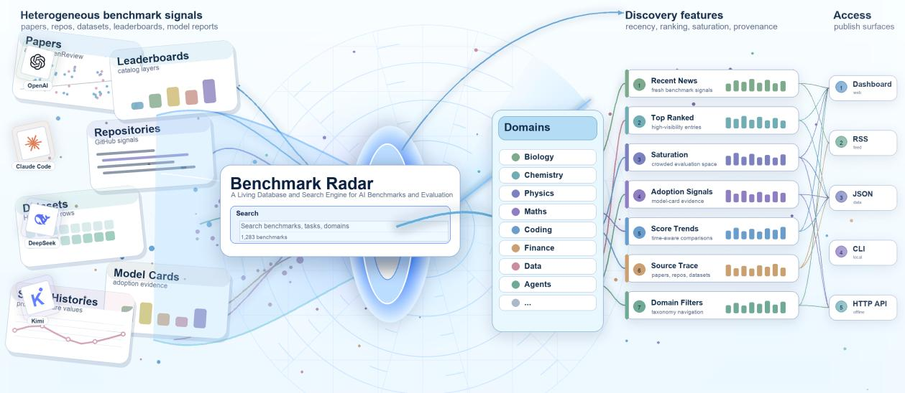  
Figure 1: Benchmark Radar connects discovery, retrieval, and source inspection. Named benchmarks, bars, and connections are schematic examples. The catalog count uses the v0.11.0 release.

## 1 Introduction

The Transformer architecture established attention-based sequence modeling as a foundation for modern large language models (LLMs) [55]. GPT-6 Astra and Claude Fable 5.1 are designed for coding, research, and tasks that span multiple tools [2, 38]. Comparing these models requires benchmarks that expose failures and distinguish capability gains from changes in prompts, data splits, or evaluation procedures [15, 40, 42, 47].

Evaluation also matters beyond general-purpose chat. In recommender systems, Transformer-style sequence models and LLM-based methods support user, item, and preference modeling, with eficient training needed at production scale [22, 45, 52]. Foundation models are also used to model biological, geoscientific, and physical processes [10, 46, 54, 58, 64]. In social and political analysis, language models support text annotation and simulated human samples, while network methods quantify balance and polarization dynamics [3, 12, 27, 28, 37, 48]. Benchmark scores inform claims of progress across these scientific, industrial, and decision-support settings.

Benchmarks difer in the abilities they test. Broad evaluations of knowledge and reasoning include MMLU [15], GPQA [42], and Humanity’s Last Exam [40]. Others isolate more specific capabilities: SWE-bench measures whether models can resolve real GitHub issues [21], LiveCodeBench tests code generation with date-based splits to reduce contamination from training data [20], and Terminal-Bench and Long-Horizon-Terminal-Bench test command-line agents on operational tasks [29, 33]. Domain specific evaluations include FinanceBench for finance and economics [19], MATH for mathematics [16], SciBench for scientific problem solving [56], LAB-Bench for biology [26], and ChemBench for chemistry [34]. ESM-BENCH tests agents’ understanding of Earth system model physics and code [59]; ResearchClawBench evaluates end-to-end autonomous scientific research [62]; and ASI-Bench examines scientific exploration and execution with progressively less methodological guidance [65]. Their tasks and scoring rules specify which model behaviors count as successful performance.

Finding a benchmark, its dataset or repository, and reports of its use requires searching paper servers, code hosting sites, dataset hubs, vendor releases, blogs, and benchmark catalogs. Existing resources such as LLM Stats, OpenCompass, and Artificial Analysis provide leaderboards, evaluation platforms, and model-analysis views [4, 31, 39]. Connecting newly released benchmarks to their task materials and later use in model reports can still require consulting several separate resources. Benchmark Radar addresses this gap by combining catalog retrieval with daily discovery, mentions in model reports, and scores with documented evaluation settings and sources.

Benchmark Radar gathers benchmark-related artifacts from public sources, groups observations with matching identifiers, and exposes a searchable index with source labels, dates, benchmark mentions, and scores (Figure 1). We present the search system, describe the collection and ranking methods needed to reproduce its outputs, and examine benchmark coverage, documentation and scored-model coverage across all catalog sources, source concentration, and gaps in evaluation settings.1

The system preserves one record per source benchmark, including entries without scores, dates, or citations. Reviewed identity links connect related records while retaining their separate measurements. We contribute this living search system, shared web and ofline access to its evidence, and a reproducible full-catalog census. Section 5 shows how a contributor used retrieval and source inspection to assemble prior art.

## 2 Related Work and Scope

Benchmark catalogs and evaluations. LLM Stats publishes benchmark descriptions and reported model results [31]. OpenCompass provides an evaluation platform and a benchmark registry with artifact metadata [39]. Artificial Analysis publishes model evaluations and their methodology [4]. Benchmark Radar uses records from these sources alongside model-report evidence. Benchmark Radar adds daily discovery, artifact histories, benchmark retrieval, and source inspection through shared web and ofline access, helping readers investigate evaluations across the contributing catalogs.

Documenting evaluation evidence. Model cards and datasheets motivate documenting evalua tion conditions and dataset characteristics [11, 35]. Benchmark Radar retains that information when the collected sources provide it, with citations for follow-up review. Benchmarks such as GPQA [42], SWE-bench [21], and SciBench [56] define diferent tasks. The census measures which evidence is available for inspection and which metadata still needs review.

Evaluating benchmarks themselves. Recent work examines benchmark saturation, item quality, and the interpretation of aggregate scores. In a systematic study of 60 language model benchmarks, Akhtar et al. [1] define saturation and report that nearly half exhibit it, with prevalence increasing with benchmark age. They associate resilience with expert curation rather than test-data privacy. Sample-level auditing of MMLU, ARC, WinoGrande, HellaSwag, and TruthfulQA identifies within-benchmark variation obscured by aggregate accuracy [49]. A reference-free judging framework assesses conversational-agent benchmarks on consistency, complexity, and policy coverage [25]. For safety benchmarks developed for larger models, rankings of smaller models vary with the treatment of ambiguous responses [44]. Inverse-density weighting reduces the influence of benchmark multiplicity on aggregate scores [30]. Gilda and Gilda [13] argue that evaluation scores should state their evidential scope and validity window, with conservative aggregation when component signals difer in reliability.

Benchmark Radar complements these methods by making benchmark records, available measurements, and provenance searchable. We used its command-line client to identify candidate papers for this section, supplemented the results with coauthor recommendations, and reviewed the source papers.

## 3 System and Methods

## 3.1 System Overview and Daily Discovery

Benchmark Radar adapts BuilderPulse’s daily public-source collection approach [61]. Figure 2 separates the benchmark catalog from discovery history. Model reports include model cards, technical reports, system cards, and release posts; they contribute through the same record structure as benchmark registries.

Table 1 summarizes the four catalog sources and their primary uses in the v0.11.0 release.

<table><tr><td>Catalog source</td><td></td><td>Rows Primary use</td></tr><tr><td>LLM Stats</td><td></td><td>687 Benchmark names and descriptions with source provenance.</td></tr><tr><td>OpenCompass Hub</td><td></td><td>461 Paper, repository, release, and dataset links with source-specific identity fields.</td></tr><tr><td>Artificial Analysis</td><td></td><td>25 Current commercial evaluation catalog entries.</td></tr><tr><td>Model reports</td><td></td><td>110 Benchmarks mentioned in model reports, including records without scores.</td></tr><tr><td>Total</td><td></td><td>1,283 All four sources, retaining each record&#x27;s source label.</td></tr></table>

Table 1: Catalog sources in the v0.11.0 release. Rows count source-specific benchmark records, including records without scores.

## 3.2 Discovery Collection

Daily discovery observations describe mentions, releases, and updates found across public sources. An observation is one collected record; an artifact is a paper, repository, dataset, release, or page linked by exact identifiers. These objects difer from source-specific benchmark records. We retain their histories alongside the catalog without adding discovery observations to the benchmark total.

Each collection run searches a 48-hour window, records counts and errors by source, removes futuredated rows, and requires healthy core sources before publication. At the cutof, arXiv [5], Hugging Face Hub [18], and GitHub Search [14] were the core sources. Across 13 direct connectors and 24 first-party feeds, additional routes cover scholarly indexes, dataset hosts, repository releases, and institutional feeds. Appendix D records their cutof status.

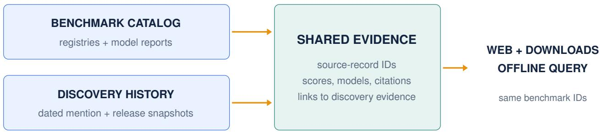  
Figure 2: Two input paths support publication: dated discovery snapshots preserve mention and release evidence, while benchmark registries and model reports populate the shared catalog. Clients use the catalog’s stable source-record IDs.

Table 2 describes the interfaces. Search and exports retain the full catalog; display filters afect only the selected view.

<table><tr><td>Interface</td><td>Reader question</td><td>Evidence and scope</td></tr><tr><td>Today</td><td>What appeared or changed?</td><td>Daily discovery observations, source health, and links</td></tr><tr><td>Search</td><td>Which benchmarks match this task?</td><td>The complete catalog, including unscored records.</td></tr><tr><td>Leaderboard</td><td>Which evaluations combine lower scores with broader measured use?</td><td>Scored source records; distinct scored models or cited documents supply the selected count.</td></tr><tr><td>Saturation</td><td>What scores and settings were reported?</td><td>Benchmark browsing and complete score histories; search reaches every source and year.</td></tr><tr><td>Blog</td><td>Can I read and share a daily brief?</td><td>Daily briefs and an archive built from committed discovery snapshots.</td></tr><tr><td>CLI</td><td>Can I inspect the same evidence locally?</td><td>The offline query client uses the same benchmark IDs and stable JSON response format.</td></tr></table>

Table 2: Reader questions and evidence scope.

## 3.3 Preserve Records Before Comparing Measurements

A source record is one benchmark entry from one contributing source. We normalize names, identifiers, artifact links, score observations, model identities, and cited documents into common fields. A record remains in the catalog if a score, date, or citation is absent. Reviewed identity links connect related records while preserving their separate observations and counts.

Daily discovery contributes a diferent kind of evidence: collected mentions, releases, and updates. Exact identifiers such as DOIs, arXiv IDs, and repository URLs link those observations to artifacts. Discovery observations do not increase the benchmark catalog total. Appendix C records detailed collection settings and display filters; Appendix D records source health at the cutof.

## 3.4 Retrieve Candidates with Their Evidence

The same benchmark IDs reach web search, detail pages, dataset exports, and ofline clients. Lexical search uses BM25F, a field-weighted word-matching score [43], with bounded boosts for name and phrase matches. Each result exposes matched and missing query words, the fields they occur in, and the score components. Source membership does not change the ranking. A shared query service supplies the CLI and HTTP interfaces with the same response format and local data provenance.

Candidate retrieval precedes suitability judgment. An analyst or agent can try focused query variants, inspect a record’s tasks and score settings, and follow its citations. The interface preserves the evidence needed for that review. This paper evaluates catalog and measurement coverage; the contributor case illustrates usage without measuring retrieval accuracy or time saved.

## 3.5 Audit the Full Population

The census starts with every record in the rebuilt catalog index and reads its detail file. It applies no date, score, or interface filter. We count finite numeric score observations once by observation ID. Within each benchmark record, we count scored models by source model ID, preserving separately evaluated configurations, and cited documents by document ID. Repeated observations do not create additional models or documents. The global model registry uses its recorded identity links; perbenchmark model counts are not summed into a global total.

Eligibility depends on the measurement a calculation needs. A declared percentage unit, known score direction, and numeric values within 0–100 permit a percentage-scale summary. Rescaling a displayed value or reading an aggregator’s declared maximum does not establish that unit. Matching scales also do not establish matching test versions, prompts, tools, attempts, or evaluators.

Date coverage counts valid recorded benchmark release dates. Score entries retain their own date basis, including model announcements and document publication. We do not substitute those dates for an evaluation date. Appendix F provides the software revision, input hashes, census script, and validation procedure.

## 4 Results

Appendix A provides the complete linked census; Appendix B details document, model, score, and date coverage.

## 4.1 Catalog Coverage and Task Materials

The rebuilt catalog contains 1,283 source records across 4 sources. We found 12,916 numeric score observations on 790 records, with 493 records lacking numeric scores (Table 3). Two sources can describe a related benchmark, and we retain both source records.

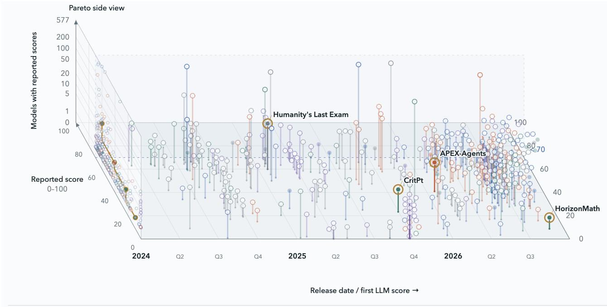  
Figure 3: Benchmark Frontier on the Leaderboard page. The view combines reported scores, scoredmodel counts, and benchmark release dates or first-score date proxies. Gold rings mark the interface’s Pareto candidates; hollow marks flag unverified scales or counts, and dotted outlines flag model-release date proxies. Click the image to explore the view.

<table><tr><td>Source</td><td>Records</td><td></td><td></td><td>s Scored Unscored Numeric scores</td></tr><tr><td>LLM Stats</td><td>687</td><td>679</td><td>8</td><td>5,544</td></tr><tr><td>OpenCompass Hub</td><td>461</td><td>0</td><td>461</td><td>0</td></tr><tr><td>Artificial Analysis</td><td>25</td><td>25</td><td>0</td><td>7,050</td></tr><tr><td>Model reports</td><td>110</td><td>86</td><td>24</td><td>322</td></tr><tr><td>Total</td><td>1,283</td><td>790</td><td>493</td><td>12,916</td></tr></table>

Table 3: Score coverage across the full catalog: 790 records have numeric observations and 493 do not. Scores count observations, not distinct models.

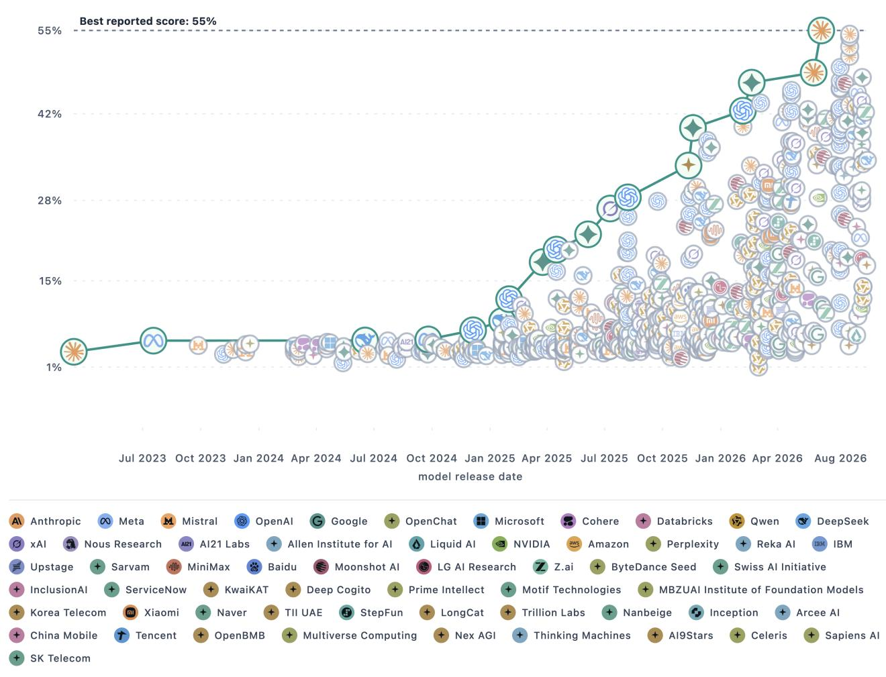  
Figure 4: Inspecting Humanity’s Last Exam in Benchmark Radar. This Artificial Analysis record contains 577 reported scores; the highest displayed score is 55.47. Marks identify model organizations, and the line connects successive best scores ordered by model release date. Click the image to open the interactive view.

Of the 493 unscored records, 464 have at least one paper, repository, or dataset link. In the full catalog, 475 records link to papers, 506 to repositories, and 293 to datasets. A record can contain

more than one type of link. For example, the OpenCompass Hub record for A-Bench links a paper, code repository, and dataset despite having no archived score.

For scored records, Figure 3 lets readers browse by date, reported score, and number of scored models. Figure 4 shows the reported model scores within one source record.

## 4.2 Benchmark Taxonomy Across the Full Catalog

Most source records carry a capability label. We classify 1,279 of 1,283 records into 11 top-level domains and 63 sub-domains (Figure 5). Labels come from the publishers’ own fields—OpenCompass Hub dimensions, LLM Stats categories, Artificial Analysis categories, and the model-report registry domains—so these 1,279 records trace to a named source field. The remaining 4 records are LLM Stats community rows whose crawl supplied no description, category, or modality; we record that reason rather than assigning a class from the title.

Interaction paradigm and input modality are recorded as facets: properties held beside a record’s domain rather than inside it, so every record carries exactly one Level 1 class and, independently, any number of facet values. Facets therefore overlap each other and the Level 1 classes, and their counts do not sum to the population.

The separation matters because a benchmark that resolves repository issues is a coding benchmark run as an agent, not an agent benchmark. Of the 345 agentic records, 128 take Agentic & Tool Use as their Level 1 class and 117 sit under Coding & Software Engineering, with the rest spread across 6 further classes. A scheme with one axis has to choose, and choosing the domain hides those 117 records from any count of agentic evaluation.

Figure 6 places the 615 records that carry a benchmark release date on their release year. The 668 records without one keep their classification in a separate column rather than leaving the figure. A year’s share is read only where the evidence supports one, which takes more than a suficient count: the OpenCompass Hub crawl stops at the discovery cutof, so the truncated final year is drawn mostly from model reports and its share would measure the change of catalog rather than a change in the field. We therefore also require a year’s source mix to stay close to the pooled mix. Over the reported years that mix is stable, and reweighting each year to a common source composition moves the agentic share by at most 1.1 percentage points, so the rise is not an artifact of which catalog supplied a given year’s records.

## 4.3 Discovery Coverage Alongside the Catalog

The daily discovery collection contains 11,068 observations and 6,546 artifacts linked by exact identifiers across 46 snapshots. 4 snapshots are simulated historical backfills; their dates describe reconstructed collection windows. These discovery units remain separate from benchmark records.

Five discovery source labels account for 9,743 of 11,068 observations (88.0%). Figure 7 includes the remaining labels in one aggregate bar. Source caps and collection failures can afect this mix. Of the 6,546 artifacts, 59 have observations from multiple sources. Missing or inconsistent identifiers may prevent additional cross-source matches

Figure 8 complements source coverage with the daily reading view. Its category cards separate new releases from updates, while the chart exposes changes in surfaced evidence and attention alongside collection failures.

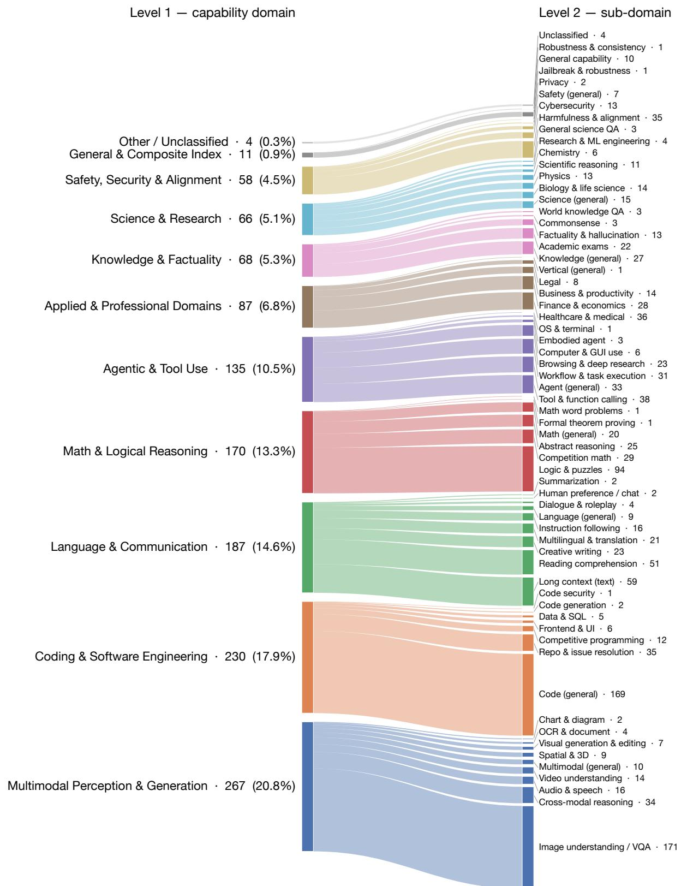  
Figure 5: Capability taxonomy over the full catalog. Ribbon height is one unit per source record, so both columns carry all 1,283 records. Level 1 is one primary label per record; interaction paradigm and modality are recorded as separate facets and are not drawn here.

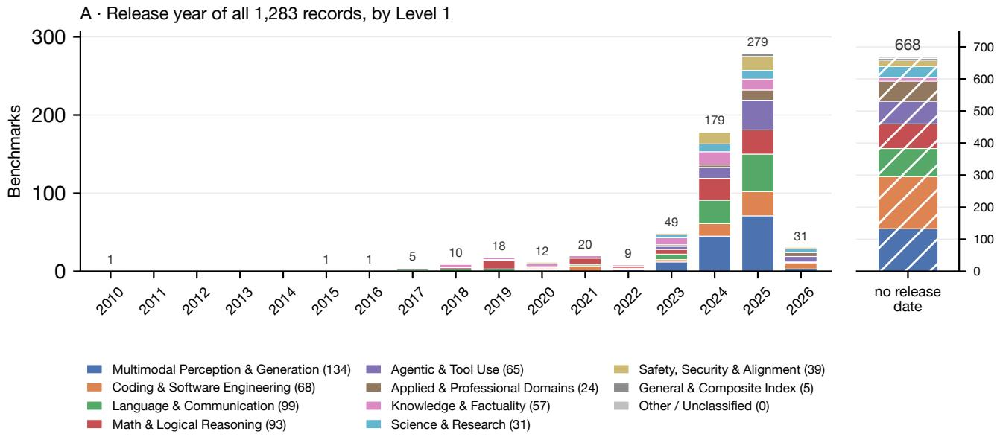

B · Selected classes and facets, over the years whose share the evidence supports  
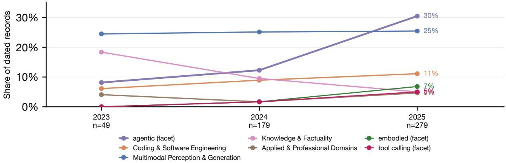  
Figure 6: Release-year composition of the classified catalog. Panel A holds every record: 615 on the year axis and 668 in the undated column, which carries its own scale. Panel B reports shares only for years with at least 30 dated records and a source mix close to the pooled one; the excluded years hold 108 dated records between them and remain counted in Panel A. Series marked facet are cross-cutting properties rather than Level 1 classes, so the lines in Panel B overlap and do not sum to 100%.

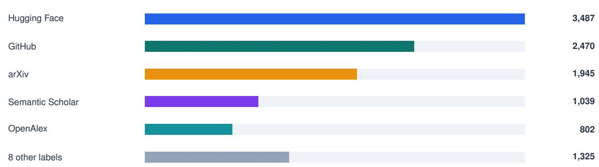  
11,068 cumulative source observations through 2026-09-07  
Figure 7: Discovery observations by source through 2026-09-07. Repeat sightings count as observations.

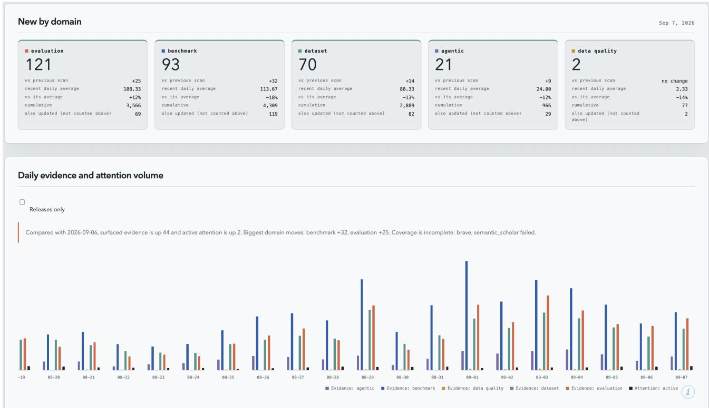  
Figure 8: Discovery trends through September 7, 2026. Category cards show newly surfaced releases and track updates separately; the bars show daily evidence and attention volume. Category tags overlap. The visible coverage notice reports failed sources. Click the image to open Trends.

## 5 Worked Example: Checking Prior Art

Before designing a new evaluation, a contributor surveyed August work on credit assignment in agentic training, with small Qwen-series models as a requirement for reproducible baselines. A coding agent installed the Benchmark Radar client and its public Skill, downloaded the corpus, and searched locally. It inspected the recorded paper, repository, and dataset links, tried additional web searches for work described in diferent terms, and read the source evidence before assembling the related-work table in Table 4.

The contributor used the table to assess whether the proposed evaluation duplicated existing work. The workflow separates candidate retrieval from comparison: Benchmark Radar retrieves candidates and exposes their evidence; the researcher or agent judges their relevance and compares the designs. Appendix E retains the session screenshots and an earlier manually assembled comparison.

<table><tr><td># Work</td><td></td><td>Published Qwen base</td><td>model(s)</td><td>Credit-assignment focus</td><td>Agentic benchmarks used</td><td>Link</td></tr><tr><td></td><td>SRPO: Self-Reflective Policy Optimization for Long-Horizon Reasoning</td><td>2026-08-25</td><td>Qwen3-8B (also Qwen3-1.7B/ 32B scaling)</td><td>Reflection-conditioned dense token-level signals convert sparse terminal reward into training signal Coarse-grained →</td><td>AIME&#x27;24, WebShop, ALFWorld, SWE-Bench-Lite</td><td>https: //arxiv.org/abs/ 2608.23493 https: //github.com/ Galleons2029/SRPO https:</td></tr><tr><td>2</td><td>ContextPilot: Teaching Agents for Proactive Context Management via Fine-grained RL</td><td>2026-08-28</td><td>Qwen3-8B, Qwen3-14B</td><td>action-level credit assignment over branched trajectories during agentic RL</td><td>InfBench (InfiniteBench), NovelQA, LongMemEval, BrowseComp+</td><td>//arxiv.org/abs/ 2608.28476 https://github. com/Tencent/ ContextPilot</td></tr><tr><td>3</td><td>SkillGate: Training In-Policy Skill Selection in Long-Horizon Agents</td><td>2026-08-21</td><td>Qwen3.5-9B (SFT checkpoint, RL init)</td><td>Selector credit starvation; partitions token support into two credit channels (outcome vs. action-local advantage)</td><td>5 agentic benchmarks incl. SkillsBench, SWE 2608.18852 (16-candidate skill slate)</td><td>https: //arxiv.org/abs/</td></tr><tr><td>4</td><td>CIPO: Contextual Information Policy Optimization for Search Agents</td><td>2026-08-06</td><td>Qwen2.5-3B- Instruct, Qwen2.5-7B- Instruct</td><td>Dense turn-level credit (EALR) to evidence-using reasoning actions, combined with outcome reward</td><td>HotpotQA, 2WikiMulti- HopQA, MuSiQue, Bamboogle + 3 OOD</td><td>https: //arxiv.org/abs/ 2608.06128</td></tr><tr><td>5</td><td>MoRSE: Task-Oriented Multi-Agent System with Mixture of Role-Subtask Experts</td><td>2026-08-10</td><td>Qwen3-4B- Instruct (one of three backbones; also Llama-3.1-8B, Gemma-4-31B)</td><td>Hierarchical GRPO with two-layer credit assignment (isolates expert vs. routing quality)</td><td>Code-generation benchmarks (multi-agent), held-out task domains</td><td>https: //arxiv.org/abs/ 2608.09251</td></tr></table>

Table 4: Summary table of recent work on credit assignment in agentic training, assembled during the session. Each row links to its arXiv record and, where available, its repository.

## 6 Limitations and Future Work

The census describes this catalog at its recorded cutof. Collection limits, failed requests, missing identifiers, and diferent snapshot dates afect its coverage. Source records are not a count of distinct underlying tests. Broader coverage requires additional source collection and review of the evidence already present.

Retrieval precision, task suitability, and time saved remain to be evaluated. The worked example combines local queries with web search and has no controlled baseline. Lexical matching can miss paraphrases and renamed tasks. Evaluating semantic retrieval [41] will require reviewed relevance judgments across queries and candidate records, including less familiar benchmark families.

The arXiv discovery route collects new submissions; it does not backfill papers first posted before the collection window when later versions appear. The searches used for Section 2 missed two relevant earlier studies [1, 63], which a coauthor identified and read.

Measuring benchmark saturation or score stagnation requires comparable test versions and settings, with dates tied to score reporting or evaluation.

Task-capability classification also remains unvalidated in this rebuild. The deterministic null extractor used in CI assigns no capability levels to its 5,863 discovery-derived tracks. Completing and evaluating those labels is a separate task from maintaining the benchmark catalog.

## 7 Conclusion

Benchmark Radar brings daily benchmark discovery, catalog search, model-report mentions, and score histories into one living search engine. Readers can find candidate evaluations, locate task materials, inspect reporting choices, and follow the settings and citations behind a score. Shared benchmark IDs connect the web dashboard, downloadable catalog, and ofline query clients.

The v0.11.0 release makes 1,283 source records searchable and preserves 464 unscored records with artifact links. Its full-catalog analyses distinguish benchmark records, scored models, cited documents, and numeric observations.

## Author Contributions

Koutian Wu led the work and manuscript preparation, built the initial collection pipeline, and implemented data aggregation across sources. Junjie Zhou prepared the score-archive audit and contributed report revisions. Ergan Shang prepared figures and contributed copyediting. Jiayu Wang contributed the worked use case and its supporting evidence. Pengqian Han contributed data analysis and copyediting. Wanghan Xu contributed review and copyediting. Junkai Wang contributed review and copyediting.

## References

[1] Mubashara Akhtar, Anka Reuel, Prajna Soni, Sanchit Ahuja, Pawan Sasanka Ammanamanchi, Ruchit Rawal, Vil´em Zouhar, Srishti Yadav, Chenxi Whitehouse, Dayeon Ki, Jennifer Mickel, Leshem Choshen, Marek Suppa, Jan Batzner, Jenny Chim, Jeba Sania, Yanan Long, Hossein A. Rahmani, Christinaˇ Knight, Yiyang Nan, Jyoutir Raj, Yu Fan, Shubham Singh, Subramanyam Sahoo, Eliya Habba, Usman Gohar, Siddhesh Pawar, Robert Scholz, Arjun Subramonian, Jingwei Ni, Mykel Kochenderfer, Sanmi Koyejo, Mrinmaya Sachan, Stella Biderman, Zeerak Talat, Avijit Ghosh, and Irene Solaiman. When AI benchmarks plateau: A systematic study of benchmark saturation, 2026. URL https://arxiv.org/abs/2602.16763. Published at ICML 2026.

[2] Anthropic. Introducing Claude Fable 5.1 and Claude Mythos 5.1, 2026. URL https://www.anthropic.com/claude-fable-and-mythos-5-1. Accessed 2026-09-07.

[3] Lisa P. Argyle, Ethan C. Busby, Nancy Fulda, Joshua R. Gubler, Christopher Rytting, and David Wingate. Out of one, many: Using language models to simulate human samples. Political Analysis, 31(3): 337–351, 2023. doi: 10.1017/pan.2023.2.

[4] Artificial Analysis. Artificial analysis intelligence benchmarking methodology, 2026. URL https://artificialanalysis.ai/methodology/intelligence-benchmarking. Accessed 2026-09-06.

[5] arXiv. arXiv API User Manual, 2026. URL https://info.arxiv.org/help/api/user-manual.html. Accessed 2026-09-06.

[6] Jonathan Bragg, Mike D’Arcy, Nishant Balepur, Dan Bareket, Bhavana Dalvi, Sergey Feldman, Dany Haddad, Jena D Hwang, Peter Jansen, Varsha Kishore, et al. AstaBench: Rigorous benchmarking of AI agents with a scientific research suite. arXiv preprint arXiv:2510.21652, 2025.

[7] Jun Shern Chan, Neil Chowdhury, Oliver Jafe, James Aung, Dane Sherburn, Evan Mays, Giulio Starace, Kevin Liu, Leon Maksin, Tejal Patwardhan, et al. MLE-Bench: Evaluating machine learning agents on machine learning engineering. In International Conference on Learning Representations, volume 2025, pages 50466–50494, 2025.

[8] Hui Chen, Miao Xiong, Yujie Lu, Wei Han, Ailin Deng, Yufei He, Jiaying Wu, Yibo Li, Yue Liu, and Bryan Hooi. MLR-Bench: Evaluating AI agents on open-ended machine learning research. Advances in Neural Information Processing Systems, 38, 2026.

[9] Citation File Format developers. Citation file format 1.2.0, 2021. URL https://citation-file-format.github.io/.

[10] Haotian Cui, Chloe Wang, Hassaan Maan, Kuan Pang, Fengning Luo, Nan Duan, and Bo Wang. scGPT: Toward building a foundation model for single-cell multi-omics using generative AI. Nature Methods, 21: 1470–1480, 2024. doi: 10.1038/s41592-024-02201-0.

[11] Timnit Gebru, Jamie Morgenstern, Briana Vecchione, Jennifer Wortman Vaughan, Hanna Wallach, Hal Daume, and Kate Crawford. Datasheets for datasets. Communications of the ACM, 64(12):86–92, 2021. doi: 10.1145/3458723.

[12] Fabrizio Gilardi, Meysam Alizadeh, and Mael Kubli. ChatGPT outperforms crowd workers for text-annotation tasks. Proceedings of the National Academy of Sciences, 120(30):e2305016120, 2023. doi: 10.1073/pnas.2305016120.

[13] Sankalp Gilda and Shlok Gilda. Position: Evaluation scores are perishable knowledge claims, 2026. URL https://arxiv.org/abs/2607.26191.

[14] GitHub Docs. REST API Endpoints for Search, 2026. URL https://docs.github.com/en/rest/search/search. Accessed 2026-09-06.

[15] Dan Hendrycks, Collin Burns, Steven Basart, Andy Zou, Mantas Mazeika, Dawn Song, and Jacob Steinhardt. Measuring massive multitask language understanding. International Conference on Learning Representations, 2021. URL https://arxiv.org/abs/2009.03300.

[16] Dan Hendrycks, Collin Burns, Saurav Kadavath, Akul Arora, Steven Basart, Eric Tang, Dawn Song, and Jacob Steinhardt. Measuring mathematical problem solving with the MATH dataset. arXiv preprint arXiv:2103.03874, 2021. URL https://arxiv.org/abs/2103.03874.

[17] Tianyu Hua, Harper Hua, Violet Xiang, Benjamin Klieger, Sang Truong, Weixin Liang, Fan-Yun Sun, and Nick Haber. ResearchCodeBench: Benchmarking LLMs on implementing novel machine learning research code. Advances in Neural Information Processing Systems, 38, 2026.

[18] Hugging Face. Hugging Face Hub Documentation, 2026. URL https://huggingface.co/docs/hub/index. Accessed 2026-09-06.

[19] Pranab Islam, Anand Kannappan, Douwe Kiela, Rebecca Qian, Nino Scherrer, and Bertie Vidgen. FinanceBench: A new benchmark for financial question answering. arXiv preprint arXiv:2311.11944, 2023. URL https://arxiv.org/abs/2311.11944.

[20] Naman Jain, King Han, Alex Gu, Wen-Ding Li, Fanjia Yan, Tianjun Zhang, Sida Wang, Armando Solar-Lezama, Koushik Sen, and Ion Stoica. LiveCodeBench: Holistic and contamination free evaluation of large language models for code. arXiv preprint arXiv:2403.07974, 2024. URL https://arxiv.org/abs/2403.07974.

[21] Carlos E. Jimenez, John Yang, Alexander Wettig, Shunyu Yao, Kexin Pei, Ofir Press, and Karthik Narasimhan. SWE-bench: Can language models resolve real-world GitHub issues? arXiv preprint arXiv:2310.06770, 2023. URL https://arxiv.org/abs/2310.06770.

[22] Wang-Cheng Kang and Julian McAuley. Self-attentive sequential recommendation. In 2018 IEEE International Conference on Data Mining, pages 197–206, 2018. doi: 10.1109/ICDM.2018.00035.

[23] Daniel S. Katz et al. Recognizing the value of software: a software citation guide. F1000Research, 9:1257, 2021. doi: 10.12688/f1000research.26932.2. URL https://doi.org/10.12688/f1000research.26932.2.

[24] Patrick Tser Jern Kon, Jiachen Liu, Xinyi Zhu, Qiuyi Ding, Jingjia Peng, Jiarong Xing, Yibo Huang, Yiming Qiu, Jayanth Srinivasa, Myungjin Lee, et al. EXP-Bench: Can AI conduct AI research experiments? arXiv preprint arXiv:2505.24785, 2025.

[25] Noam Koren, Roy Bar-Haim, and Abigail Goldsteen. Benchmarking the benchmarks: Evaluating benchmarks for conversational agents, 2026. URL https://arxiv.org/abs/2608.06329.

[26] Jon M. Laurent, Joseph D. Janizek, Michael Ruzo, Michaela M. Hinks, Michael J. Hammerling, Siddharth Narayanan, Manvitha Ponnapati, Andrew D. White, and Samuel G. Rodriques. LAB-Bench: Measuring capabilities of language models for biology research. arXiv preprint arXiv:2407.10362, 2024. URL https://arxiv.org/abs/2407.10362.

[27] Jure Leskovec, Daniel Huttenlocher, and Jon Kleinberg. Signed networks in social media. In Proceedings of the SIGCHI Conference on Human Factors in Computing Systems, pages 1361–1370, 2010. doi: 10.1145/1753326.1753532.

[28] Xiaomin Li, Yuexing Hao, Jianheng Hou, Jintao Huang, Qianfeng Wen, Shirley Huang, Yifan Liu, Xiaoyi Liu, Yilan Fan, Yijun Wang, et al. MatrAIx: Simulating the world with 8.3 billion persona agents. arXiv preprint arXiv:2608.04205, 2026.

[29] Zongxia Li, Zhongzhi Li, Yucheng Shi, Ruhan Wang, Junyao Yang, Zhichao Liu, Xiyang Wu, Anhao Li, Yue Yu, Ninghao Liu, et al. Long-Horizon-Terminal-Bench: Testing the limits of agents on long-horizon terminal tasks with dense reward-based grading. arXiv preprint arXiv:2607.08964, 2026.

[30] Jhen-Ke Lin. Balance of benchmarks: Semantic density reweighting for benchmark multiplicity and task-conditioned evaluation, 2026. URL https://arxiv.org/abs/2608.30044.

[31] LLM Stats. AI and LLM benchmarks 2026: Rankings, scores and results, 2026. URL https://llm-stats.com/benchmarks/. Accessed 2026-09-06.

[32] Alisia Lupidi, Bhavul Gauri, Thomas Simon Foster, Bassel Al Omari, Despoina Magka, Alberto Pepe, Alexis Audran-Reiss, Muna Aghamelu, Nicolas Baldwin, Lucia Cipolina-Kun, et al. AIRS-Bench: A suite of tasks for frontier AI research science agents. arXiv preprint arXiv:2602.06855, 2026.

[33] Mike A. Merrill et al. Terminal-Bench: Benchmarking agents on hard, realistic tasks in command line interfaces, 2026. URL https://arxiv.org/abs/2601.11868.

[34] Adrian Mirza et al. Are large language models superhuman chemists? arXiv preprint arXiv:2404.01475, 2024. URL https://arxiv.org/abs/2404.01475.

[35] Margaret Mitchell, Simone Wu, Andrew Zaldivar, Parker Barnes, Lucy Vasserman, Ben Hutchinson, Elena Spitzer, Inioluwa Deborah Raji, and Timnit Gebru. Model cards for model reporting. In Proceedings of the Conference on Fairness, Accountability, and Transparency, pages 220–229, 2019. doi: 10.1145/3287560.3287596.

[36] Deepak Nathani, Lovish Madaan, Nicholas Roberts, Nikolay Bashlykov, Ajay Menon, Vincent Moens, Amar Budhiraja, Despoina Magka, Vladislav Vorotilov, Gaurav Chaurasia, et al. MLGym: A new framework and benchmark for advancing AI research agents. arXiv preprint arXiv:2502.14499, 2025.

[37] Sky Ng, Brihi Joshi, Ishan Gupta, Shirley Huang, Zonglin Di, Yun Shen, Qianfeng Wen, Yifan Simon Liu, Ruoqi Gao, Zhiwei Zhang, et al. MicroVerse: An instrument for measuring self-authored identity drift in long-horizon multi-agent language-model simulations. arXiv preprint arXiv:2608.15844, 2026.

[38] OpenAI. GPT-6 Astra model, 2026. URL https://developers.openai.com/api/docs/models/gpt-6-astra. Accessed 2026-09-07.

[39] OpenCompass Contributors. Dataset statistics, 2026. URL https://opencompass.readthedocs.io/en/latest/dataset\_statistics.html. Accessed 2026-09-06.

[40] Long Phan et al. Humanity’s last exam. arXiv preprint arXiv:2501.14249, 2025. URL https://arxiv.org/abs/2501.14249.

[41] Nils Reimers and Iryna Gurevych. Sentence-BERT: Sentence embeddings using Siamese BERT-networks. In Proceedings of the 2019 Conference on Empirical Methods in Natural Language Processing, pages 3982–3992, 2019. doi: 10.18653/v1/D19-1410.

[42] David Rein, Betty Li Hou, Asa Cooper Stickland, Jackson Petty, Richard Yuanzhe Pang, Julien Dirani, Julian Michael, and Samuel R. Bowman. GPQA: A graduate-level google-proof Q&A benchmark. arXiv preprint arXiv:2311.12022, 2023. URL https://arxiv.org/abs/2311.12022.

[43] Stephen Robertson, Hugo Zaragoza, and Michael Taylor. Simple BM25 extension to multiple weighted fields. In Proceedings of the Thirteenth ACM International Conference on Information and Knowledge Management, 2004. doi: 10.1145/1031171.1031181.

[44] Nyamtulla Shaik, Fengjun Li, and Bo Luo. Benchmarking the benchmarks: Evaluating automated safety benchmarks for small language models, 2026. URL https://arxiv.org/abs/2608.17183.

[45] Ergan Shang and Flavio Sales Truzzi. ERASE: EaRly bAckpropagation SchEdule for Faster Training of Modern Recommendation Systems. arXiv preprint arXiv:2608.18469, 2026.

[46] Ergan Shang, Yuting Wei, and Kathryn Roeder. Predicting the unseen: a difusion-based debiasing framework for transcriptional response prediction at single-cell resolution. Proceedings of the National Academy of Sciences, 122(52):e2525268122, 2025. doi: 10.1073/pnas.2525268122. URL https://doi.org/10.1073/pnas.2525268122.

[47] Ergan Shang, Weijing Tang, and Yinqiu He. LLM Evaluation on Unseen Questions: Contextual Multidimensional IRT Model. arXiv preprint arXiv:2608.22295, 2026.

[48] Ergan Shang, Yuan Zhang, and Weijing Tang. Inference for Balance in Dynamic Signed Networks. arXiv preprint arXiv:2606.08786, 2026.

[49] Philipp D. Siedler and Jordan Sassoon. Benchmarks are not monolithic: Sample-level auditing and orchestration for LLM evaluation, 2026. URL https://arxiv.org/abs/2607.28801.

[50] Arfon M. Smith, Daniel S. Katz, and Kyle E. Niemeyer. Software citation principles. PeerJ Computer Science, 2:e86, 2016. doi: 10.7717/peerj-cs.86. URL https://doi.org/10.7717/peerj-cs.86.

[51] Giulio Starace, Oliver Jafe, Dane Sherburn, James Aung, Jun Shern Chan, Leon Maksin, Rachel Dias, Evan Mays, Benjamin Kinsella, Wyatt Thompson, et al. Paperbench: Evaluating ai’s ability to replicate ai research. arXiv preprint arXiv:2504.01848, 2025.

[52] Fei Sun, Jun Liu, Jian Wu, Changhua Pei, Xiao Lin, Wenwu Ou, and Peng Jiang. BERT4Rec: Sequential recommendation with bidirectional encoder representations from transformer. In Proceedings of the 28th ACM International Conference on Information and Knowledge Management, pages 1441–1450, 2019. doi: 10.1145/3357384.3357895.

[53] Qiushi Sun, Zhoumianze Liu, Chang Ma, Zichen Ding, Fangzhi Xu, Zhangyue Yin, Haiteng Zhao, Zhenyu Wu, Kanzhi Cheng, Zhaoyang Liu, et al. ScienceBoard: Evaluating multimodal autonomous agents in realistic scientific workflows. arXiv preprint arXiv:2505.19897, 2025.

[54] Christina V. Theodoris et al. Transfer learning enables predictions in network biology. Nature, 618: 616–624, 2023. doi: 10.1038/s41586-023-06139-9.

[55] Ashish Vaswani, Noam Shazeer, Niki Parmar, Jakob Uszkoreit, Llion Jones, Aidan N. Gomez, Lukasz Kaiser, and Illia Polosukhin. Attention is all you need. In Advances in Neural Information Processing Systems, volume 30, 2017. URL https://arxiv.org/abs/1706.03762.

[56] Xiaoxuan Wang, Ziniu Hu, Pan Lu, Yanqiao Zhu, Jieyu Zhang, Satyen Subramaniam, Arjun R. Loomba, Shichang Zhang, Yizhou Sun, and Wei Wang. SciBench: Evaluating college-level scientific problem-solving abilities of large language models. arXiv preprint arXiv:2307.10635, 2023. URL https://arxiv.org/abs/2307.10635.

[57] Kyle Waters, Lucas Nuzzi, Tadhg Looram, Alessandro Tomasiello, Ariel Ghislain Kemogne Kamdoum, Bikun Li, Damien Sileo, Egor Kretov, Francesco Fournier-Facio, Georgios Soloupis, et al. Composite-stem. arXiv preprint arXiv:2604.09836, 2026.

[58] Koutian Wu, Wen Yi, Xianghui Xue, Iain Murray Reid, and Maolin Lu. Diurnal and seasonal variations of meteor speed and arrival angle observed by mengcheng meteor radar. Journal of Geophysical Research: Space Physics, 129(10):e2024JA032767, 2024. doi: 10.1029/2024JA032767. URL https://doi.org/10.1029/2024JA032767.

[59] Koutian Wu, Yuxuan Cao, Gengchen Mai, and Zeping Liu. ESM-BENCH: A benchmark for evaluating whether AI agents understand earth system model physics and code. In HydroML 2026 Conference Poster. HydroML, 2026. URL https://zenodo.org/records/19802836.

[60] Yunze Wu, Dayuan Fu, Weiye Si, Zhen Huang, Mohan Jiang, Keyu Li, Shijie Xia, Jie Sun, Tianze Xu, Xiangkun Hu, et al. Innovatorbench: Evaluating agents’ ability to conduct innovative llm research. arXiv preprint arXiv:2510.27598, 2025.

[61] L. Xiaopai. Builderpulse: Ai-powered daily intelligence for indie hackers and builders. GitHub, 2026. URL https://github.com/BuilderPulse/BuilderPulse.

[62] Wanghan Xu, Shuo Li, Tianlin Ye, Qinglong Cao, Yixin Chen, Hengjian Gao, Yiheng Wang, Qi Li, Kun Li, Sheng Xu, et al. ResearchClawBench: A benchmark for end-to-end autonomous scientific research. arXiv preprint arXiv:2606.07591, 2026.

[63] Eddie Yang and Dashun Wang. Benchmark illusion: Disagreement among LLMs and its scientific consequences, 2026. URL https://arxiv.org/abs/2602.11898.

[64] Tianyu Zhang, Ergan Shang, and Kathryn Roeder. Genetic Convergence Analysis of CRISPR Perturbations Deciphers Gene Functional Similarity. bioRxiv, 2025. doi: 10.1101/2025.11.13.688060. URL https://doi.org/10.1101/2025.11.13.688060.

[65] Junwei Zhou, Zhen Sun, Binyu Li, Jiangyu Zhou, Yuexi Pan, Hengyu Wang, Honghe Ren, Xiaohan Jia, Xueyang Zhou, Xiaoyu Cao, et al. ASI-Bench: At the Dawn of Artificial Superintelligence. arXiv preprint arXiv:2608.17271, 2026.

## Appendix

## A Full-Catalog Census

This census retains all 1,283 source records, including those without scores.

1,283 records. 790 with scores. 493 without.

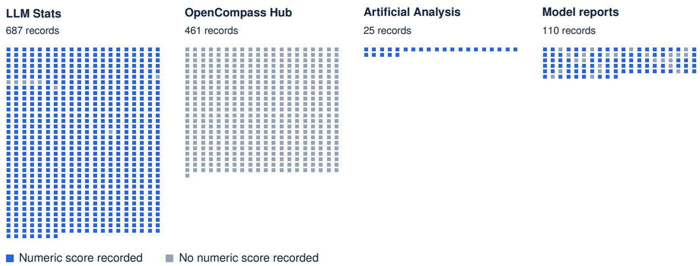  
464 of the 493 unscored records still link to a paper, repository, or dataset.

Figure 9: 464 unscored entries provide artifact links. Each mark represents one source record and links to its detail page. All 1,283 records appear, without a date or score filter.

## B Catalog Evidence and Measurement Coverage

The following analyses use the same catalog as Section 4. They document the evidence behind its records and the requirements for comparing measurements.

## B.1 Cited Documents and Scored Models

The common document registry contains 1,208 distinct cited documents, attached to 1,278 of the 1,283 benchmark records. 5 records have no cited documents. The shared model registry contains 868 model identities. Model identifiers are available for every numeric score in all 790 scored records, allowing distinct models to be counted within each record. For unscored records, this count is unknown.

Table 5 illustrates why these counts cannot substitute for one another. The Artificial Analysis record for GPQA Diamond contains scores for 586 models and cites 1 registry page. The Model reports record cites 27 documents and contains 21 numeric observations for 19 models.

<table><tr><td>Benchmark record</td><td>Source</td><td></td><td>Models Documents Scores</td><td></td></tr><tr><td>GPQA Diamond</td><td>Artificial Analysis</td><td>586</td><td>1</td><td>586</td></tr><tr><td>GPQA Diamond</td><td>Model reports</td><td>19</td><td>27</td><td>21</td></tr><tr><td>Humanity&#x27;s Last Exam</td><td>Artificial Analysis</td><td>577</td><td>1</td><td>577</td></tr><tr><td>SciCode</td><td>Artificial Analysis</td><td>577</td><td>1</td><td>577</td></tr><tr><td>CritPt</td><td>Artificial Analysis</td><td>492</td><td>1</td><td>492</td></tr></table>

Table 5: One cited page can document hundreds of scored models. Models count distinct source model IDs within a record; documents count distinct citation IDs; scores count numeric observations. These selected examples illustrate the units. The census retains all source records.

Table 5 also records 577 scored models for Humanity’s Last Exam, 577 for SciCode, and 492 for CritPt, each under one Artificial Analysis citation.

## B.2 Score Scales and Comparison Eligibility

Only 82 of the 790 scored records declare a percentage unit with a known direction and values within 0–100. The remaining 708 scored records use other or unverified scales. We retain their numeric observations, which do not support a shared percentage-headroom calculation. Table 6 accounts for the entire catalog before any such comparison.

<table><tr><td>Measurement state</td><td></td><td>Records Interpretation</td></tr><tr><td>Numeric scores, declared percentage scale</td><td></td><td>82 Supports scale-specific summaries; protocols still need checking.</td></tr><tr><td>Numeric scores, other or unverified scale</td><td></td><td>708 Retain scores; do not assume a 100-point ceiling</td></tr><tr><td>No numeric score</td><td></td><td>493 Score headroom remains unknown.</td></tr><tr><td>Full population</td><td></td><td>1,283 Every source record remains in the census.</td></tr></table>

Table 6: Only 82 of 790 scored records meet the percentage-scale rule in Section 3.5. All 1,283 records remain accounted for.

The catalog records benchmark release dates for 615 records, leaving 668 without a release date. Across score observations, 12,594 entries carry model-announcement dates and 322 carry documentpublication dates. Neither date basis directly establishes an evaluation date. Researchers must first establish dates and comparable evaluation settings for the relevant source records.

A small gap to a metric ceiling can describe a reported setup. Catalog-wide headroom or recency estimates require the eligible measurement coverage alongside the statistic.

## B.3 Documentation Across All Catalog Sources

The documentation analysis covers all 1,283 benchmark records. It finds 1,208 distinct cited documents supporting 1,278 records; 5 records have no cited document. Table 7 includes every source and keeps benchmark records separate from document counts. A registry page and a model report both count as one cited document when attached to a record. Repeated citations to the same document do not increase its count.

<table><tr><td rowspan="2">Source</td><td rowspan="2"></td><td rowspan="2">Records With docs Documents</td><td rowspan="2"></td><td rowspan="2">Docs without named org.</td></tr><tr><td></td></tr><tr><td>LLM Stats</td><td>687</td><td>687</td><td>687</td><td>687</td></tr><tr><td>OpenCompass Hub</td><td>461</td><td>461</td><td>461</td><td>461</td></tr><tr><td>Artificial Analysis</td><td>25</td><td>25</td><td>23</td><td>23</td></tr><tr><td>Model reports</td><td>110</td><td>105</td><td>37</td><td>0</td></tr><tr><td>Total</td><td>1,283</td><td>1,278</td><td>1,208</td><td>1,171</td></tr></table>

Table 7: Documentation across the complete v0.11.0 catalog. “With docs” counts benchmark records; the last two columns count distinct documents. Missing organization metadata remains unknown.

Documentation is widespread, but the release data does not identify an organization for 1,171 cited documents. The complete export retains each document’s identity and source URL on its benchmark record.

## B.4 Reported Scores Across the Full Catalog

The score analysis retains all 1,283 records and their 12,916 numeric observations. Table 8 summarizes scored-model coverage for each source. 22 benchmark records contain numeric scores for at least 100 distinct source model IDs. The 708 records on other or unverified scales contribute their scores and model counts on the same terms as percentage-scale records. The 493 records without numeric scores remain in the population with unknown scored-model coverage.

<table><tr><td>Source</td><td>Records Scored Unscored</td><td></td><td></td><td>Score rows</td><td>Median models</td><td>Max. models</td></tr><tr><td>LLM Stats</td><td>687</td><td>679</td><td>8</td><td>5,544</td><td>3</td><td>239</td></tr><tr><td>OpenCompass Hub</td><td>461</td><td>0</td><td>461</td><td></td><td></td><td>0 Unknown Unknown</td></tr><tr><td>Artificial Analysis</td><td>25</td><td>25</td><td>0</td><td>7,050</td><td>245</td><td>586</td></tr><tr><td>Model reports</td><td>110</td><td>86</td><td>24</td><td>322</td><td>2</td><td>19</td></tr><tr><td>Total</td><td>1,283</td><td>790</td><td></td><td>493 12,916</td><td></td><td></td></tr></table>

Table 8: Reported scores across every source in the v0.11.0 release. Models count distinct source model IDs within each benchmark record. Medians and maxima use records with known model counts; unscored records are not assigned zero models. Model counts are not summed across benchmarks. The record-level score export contains every catalog record, including raw maxima, all tied reporting models and citations, units, settings, and explicit missing values.

The accompanying evidence/catalog-findings.csv contains one row per benchmark record, with a JSON counterpart retaining detailed evidence. Each scored record has its highest numeric value on the source’s native scale and every tied score observation. Units and score direction remain attached to that record; a numeric maximum need not be the best result for a lower-is-better metric. Display multipliers are recorded separately and do not establish a percentage unit.

Percentage headroom remains a separate calculation: 100 minus a record’s highest value, only when its unit is explicitly percent, its direction is higher-is-better, and its values stay within 0–100. Missing scale evidence leaves headroom unknown while preserving the scores themselves. The export records eligibility for every benchmark. Test versions, reasoning budgets, tools, attempts, and evaluators must still be checked before comparing results [11, 35].

## B.5 Date Evidence Across the Full Catalog

The date analysis also retains all 1,283 source records. Table 9 separates benchmark release dates from dates attached to numeric observations. A known model announcement date supplies a source-record proxy, not an evaluation date.

<table><tr><td>Source</td><td>Records</td><td>Release known</td><td>Doc.-dated scores</td><td>Model-dated scores</td><td>Undated scores</td></tr><tr><td>LLM Stats</td><td>687</td><td>42</td><td>0</td><td>5,544</td><td>0</td></tr><tr><td>OpenCompass Hub</td><td>461</td><td>457</td><td>0</td><td>0</td><td>0</td></tr><tr><td>Artificial Analysis</td><td>25</td><td>17</td><td>0</td><td>7,050</td><td>0</td></tr><tr><td>Model reports</td><td>110</td><td>99</td><td>322</td><td>0</td><td>0</td></tr><tr><td>Total</td><td>1,283</td><td>615</td><td>322</td><td>12,594</td><td>0</td></tr></table>

Table 9: Date evidence for the complete v0.11.0 catalog. The first two numeric columns count benchmark records; the final three count numeric score observations. Records with no scores remain in the Records column.

The exported rows preserve each record’s release date and the date basis of its scores. A study of score progress needs actual reporting or evaluation dates and comparable settings for the records being studied.

## C Collection Settings and Display Filters

The 2026-09-07 snapshot records 1,003 fetched rows and 954 candidates after duplicate removal. Of these, 366 qualified for publication and 138 met the recommendation threshold. These are discoveryrun counts, separate from the benchmark catalog census. Published evidence retains source URLs, retrieval times, parser versions, identifiers, and payload checksums. Raw responses and credentials remain outside the public artifact.

Benchmark Frontier, on the Leaderboard tab, requires a numeric score and excludes known pre-2024 benchmarks. It retains scored records with unknown dates or counts through labelled marks, and keeps unverified scales outside Pareto calculations. Its initial score cutof is 70. The linked score ranking retains its date and numeric-score requirements independently of that cutof. General catalog search and exports retain the full population. The census in this paper applies none of these display filters.

A separate priority score for daily recommendations combines relevance (35%), evidence (20%), recency (20%), and adoption (25%) on a 0–100 scale. These weights describe reading priority for discovery observations. An agent assessing benchmark suitability can try focused query variants, inspect record details, and read the cited sources; that judgment occurs after candidate retrieval.

## D Source Inventory and Health

Benchmark Radar ingests from 37 sources: 13 direct connectors and 24 first-party feeds. Table 10 lists source connectors that completed successfully at the cutof. Row counts are measured before duplicate removal and ranking. A connector can be healthy with zero eligible rows if its request succeeds and the response can be parsed. Core sources cover papers, shared model or dataset artifacts, and code; all must be healthy before publication. Failures in optional sources are reported but do not block publication.

<table><tr><td>Connector</td><td>Role</td><td>Cutoff status</td><td>Core</td></tr><tr><td>arXiv</td><td>Primary papers via selected AI, language, vision, and software categories</td><td>Healthy; 46 rows</td><td>Yes</td></tr><tr><td>Hugging Face Hub</td><td>Datasets and Spaces connected to benchmark artifacts</td><td>Healthy; 101 rows</td><td>Yes</td></tr><tr><td>GitHub Search</td><td>Code repositories and benchmark artifacts</td><td>Healthy; 300 rows; at cap</td><td>Yes</td></tr><tr><td>GitHub Organizations</td><td>Reviewed organization repositories</td><td>Healthy; 6 rows</td><td>No</td></tr><tr><td>Hugging Face Papers</td><td>Community-surfaced papers</td><td>Healthy; 26 rows</td><td>No</td></tr><tr><td>Kaggle Datasets</td><td>Public benchmark datasets</td><td>Healthy; 30 rows</td><td>No</td></tr><tr><td>Zenodo</td><td>DOI-bearing research artifacts</td><td>Healthy; 65 rows</td><td>No</td></tr><tr><td>Crossref</td><td>DOI metadata</td><td>Healthy; 180 rows</td><td>No</td></tr><tr><td>OpenReview</td><td>Conference submissions</td><td>Healthy; no eligible rows</td><td>No</td></tr><tr><td>GitHub Releases</td><td>First-party releases</td><td>Healthy; 1 row</td><td>No</td></tr><tr><td>OpenAlex</td><td>Scholarly discovery metadata</td><td>Healthy; 248 rows</td><td>No</td></tr></table>

Table 10: Healthy direct discovery connectors at the current cutof.

Table 11 lists research and engineering feeds operated by the institutions being monitored. They can surface benchmark papers, datasets, model announcements, and engineering posts. The feed collector returned no records at the cutof. Semantic Scholar returned a malformed payload, and Brave Search lacked an API key. These optional-route failures remain recorded in the snapshot. Searches restricted to an organization’s website cover institutions that lack a verified feed.

<table><tr><td>Feeds 1-12</td><td>Feeds 13-24</td></tr><tr><td>Meituan Engineering</td><td>Ai2</td></tr><tr><td>OpenAI News</td><td>Together AI</td></tr><tr><td>Google AI</td><td>Sakana AI</td></tr><tr><td>Google DeepMind</td><td>Qwen</td></tr><tr><td>Google Research</td><td>Ollama</td></tr><tr><td>Apple Machine Learning Research</td><td>Stability AI</td></tr><tr><td>AWS Machine Learning</td><td>Nomic AI</td></tr><tr><td>Hugging Face Blog</td><td>Replicate</td></tr><tr><td>Microsoft Research</td><td>NVIDIA Developer</td></tr><tr><td>NVIDIA AI Blog</td><td>IBM Research</td></tr><tr><td>Mistral AI</td><td>Databricks</td></tr><tr><td>Meta Research</td><td>LangChain</td></tr></table>

Table 11: The 24 first-party research and engineering feeds monitored by Benchmark Radar.

## E Worked Use Case: Prior-Art Check for a New Evaluation

The contributor wanted to determine whether a proposed evaluation duplicated existing work. They surveyed work published in August 2026 on credit assignment in agentic training, using small Qwenseries models as a requirement for reproducible baseline experiments. The search produced a focused comparison table that the contributor used to assess the proposed design.

The contributor gave the task to a coding agent together with the public setup instructions for Benchmark Radar. The agent installed the command-line client and the Benchmark Radar Skill, a set of instructions for using the client. It then downloaded the local corpus and queried candidate records ofline (Figure 10).

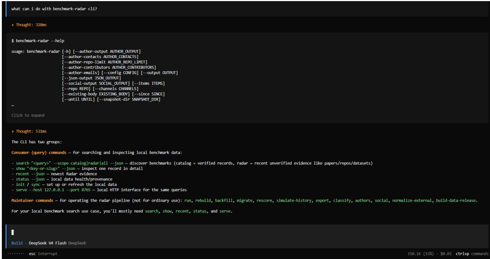  
Figure 10: A coding agent installs the Benchmark Radar client and its usage instructions, then runs local queries.

The agent inspected paper, repository, and dataset links to decide which sources to open next. Figures 11 and 12 show two retrieved discovery records: one has a repository link, and the other has both paper and repository links. Neither records a dataset link, leaving dataset availability for a follow-up check.

The agent supplemented local queries with web search to find related work described in diferent terms. It cross-checked the candidate sets and inspected the source evidence before selecting records for the comparison. Figure 13 shows the word matches and score components available for inspecting one retrieved candidate.

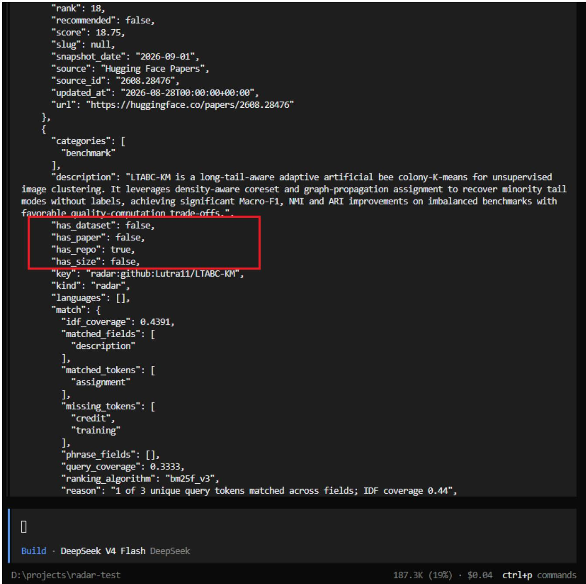  
Figure 11: A retrieved discovery record with a repository link for inspecting the implementation. Paper and dataset links are missing from the record.

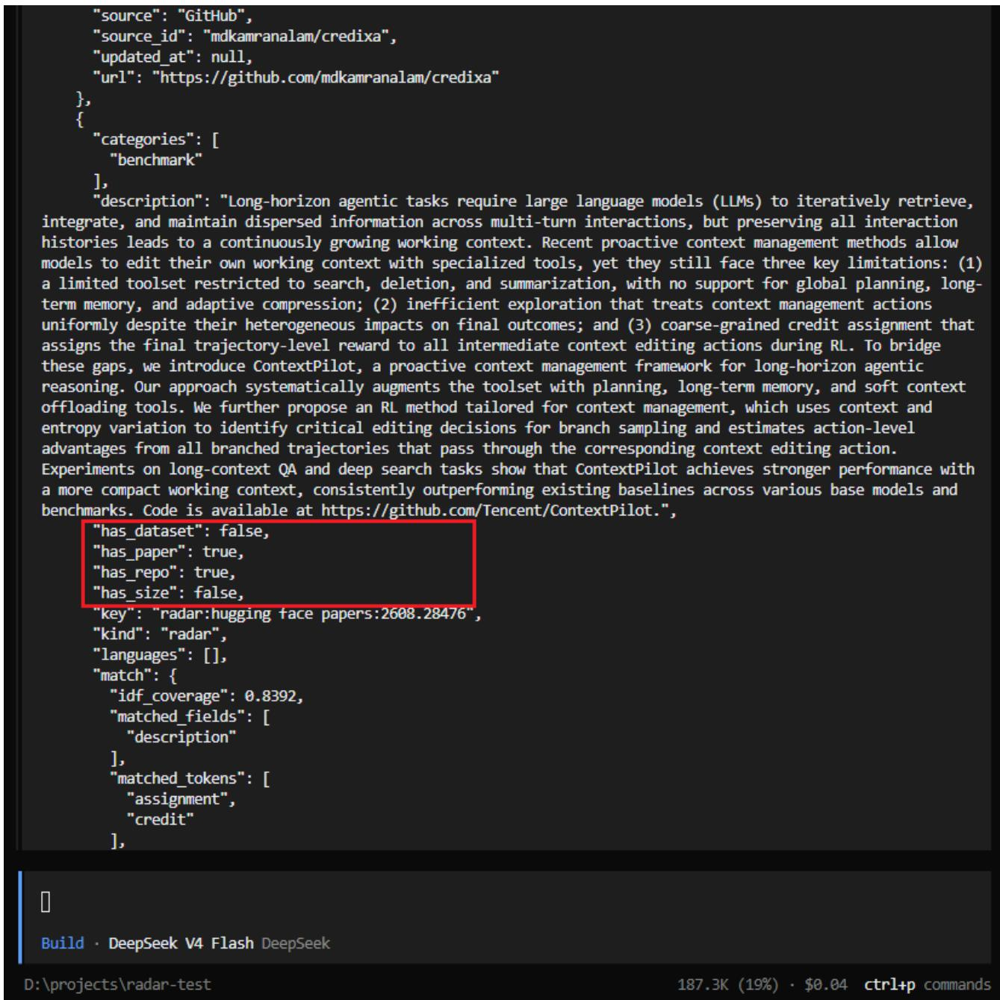  
Figure 12: A second discovery record provides both paper and repository links. Its dataset link needs a follow-up check.

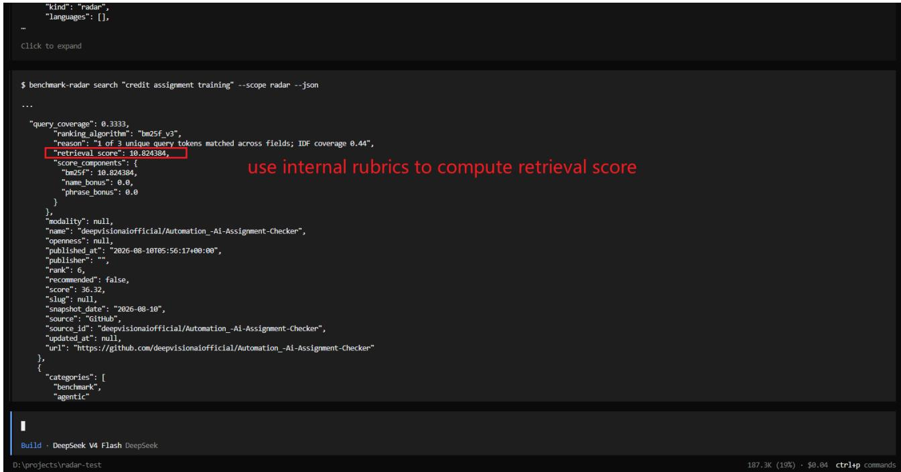  
Figure 13: A candidate record with query-word matches and retrieval-score components for the agent to inspect when judging relevance.  
The resulting related-work table appears in Table 4 in the main text.

Table 12 shows a prior-art comparison table from an earlier benchmark-design efort by one contributor. Each row is one related benchmark and each column one design dimension, with each cell read from a source paper. The contributor reported that assembling it took more efort than any part of that project except producing the benchmark data. Benchmark Radar retrieves candidates for this kind of comparison and exposes the matching words and fields for inspection; the comparison itself requires reading the source evidence.

<table><tr><td>Bench Name</td><td colspan="6">End-to-End Tasks Fine-Grained Eval Researcher-Quality Eval Data Generation Multi-Harness Eval #Tasks</td></tr><tr><td>MLE-Bench [7]</td><td>x</td><td>√</td><td>x</td><td>Transfer&amp;Compose</td><td>√</td><td>75</td></tr><tr><td>MLGym-Bench [36]</td><td>x</td><td>√</td><td>x</td><td>Automatic</td><td>x</td><td>13</td></tr><tr><td>EXP-Bench [24]</td><td>√</td><td>x</td><td>x</td><td>Automatic</td><td>√</td><td>461</td></tr><tr><td>ResearchCodeBench [17]</td><td>x</td><td>√</td><td>x</td><td>Transfer&amp;Compose</td><td>x</td><td>212</td></tr><tr><td>MLR-Bench [8]</td><td>√</td><td>x</td><td>x</td><td>Automatic</td><td>√</td><td>201</td></tr><tr><td>PaperBench [51]</td><td>x</td><td>√</td><td>x</td><td>Transfer&amp;Compose</td><td>x</td><td>8316</td></tr><tr><td>AstaBench [6]</td><td>√</td><td>√</td><td>x</td><td>Transfer&amp;Compose</td><td>√</td><td>2400+</td></tr><tr><td>InnovatorBench [60]</td><td>√</td><td>x</td><td>x</td><td>Transfer&amp;Compose</td><td>x</td><td>20</td></tr><tr><td>AIRS-Bench [32]</td><td>x</td><td>√</td><td>x</td><td>Automatic</td><td>√</td><td>20</td></tr><tr><td>COMPOSITE-Stem [57]</td><td>√</td><td>√</td><td>x</td><td>Manual</td><td>x</td><td>70</td></tr><tr><td>ScienceBoard [53]</td><td>x</td><td>√</td><td>x</td><td>Manual</td><td>x</td><td>169</td></tr></table>

Table 12: A prior-art comparison table assembled manually for an earlier benchmark-design efort. Each row is one related benchmark and each column one design dimension, all read from the source papers by hand.

## F Reproducibility, Access, and Citation

This revision uses the Benchmark Radar v0.11.0 release, software commit 8f46bbf, with a discovery cutof of 2026-09-07. The release preserves the inputs already audited for this paper; later data is outside its scope. A fresh detached checkout passed the six required CI steps in order: linting, formatting checks, catalog normalization, classification, release construction, and tests. The dated registry inputs remain the August snapshots registered in data/leaderboard snapshots.yml; the September cutof does not imply that those sources were recrawled on that day.

The data build normalizes the registry and model-report inputs into the shared catalog, then classifies discovery tracks and packages the catalog with checksums. Installed clients validate an update before activating it. The manuscript and its dated analysis files build independently of the software checkout. The project provides a DOI and Citation File Format record for citation [9, 23, 50]. Table 13 lists the access and citation resources.

<table><tr><td>Artifact</td><td>Canonical or permanent location</td></tr><tr><td>Archived paper (v0.9.0)</td><td>https://doi.org/10.5281/zenodo.22167102</td></tr><tr><td>Release data (v0.11.0)</td><td>https://github.com/ktwu01/benchmark-radar/releases/tag/v0.11.0</td></tr><tr><td>Source code</td><td>https://github.com/ktwu01/benchmark-radar</td></tr><tr><td>Dashboard</td><td>https://benchmark-radar.org/</td></tr><tr><td></td><td>Discovery observations (JSON) https://benchmark-radar.org/data/radar.json</td></tr><tr><td>Benchmark catalog</td><td>https://benchmark-radar.org/data/benchmark-index.json</td></tr><tr><td>RSS</td><td>https://benchmark-radar.org/feed.xml</td></tr><tr><td>Citation metadata</td><td>https: //github.com/ktwuO1/benchmark-radar/blob/main/CITATION.cff</td></tr></table>

Table 13: Access and citation artifacts for Benchmark Radar.

The census reads site/data/benchmark-index.json, the detail shards under site/data/benchmarks/, and the shared document and model registries. Discovery counts come from the rebuilt site/data/radar.json and dated snapshots. Model reports and score YAML files are normalization inputs, not a separate population for the paper’s findings.

The paper repository contains scripts/audit catalog.py, which validates IDs and counts, computes the census, and exports catalog-data.tex plus evidence/catalog-audit.json. The JSON includes every source-record key, measurement state, per-record model and document counts, citation IDs, and SHA-256 hashes of the inputs. The script checks score-observation uniqueness, record-toshard identity, document-registry coverage, and reconciliation of scored and unscored records. Its --check mode compares a fresh calculation against the committed outputs. Figure 9 draws one linked dot per census record in source-key order.

Reproduce from a clean checkout at software commit 8f46bbf using the README’s six-step CI sequence. The software exporter writes figure-data.tex; the paper’s audit catalog.py and audit findings.py take the rebuilt software path. The findings audit writes findings-data.tex and evidence/catalog-findings.json plus a CSV export. Every analysis retains exactly the catalog’s source-record IDs. It records native score maxima and all tied observations, units, settings, cited documents, model counts, and date evidence. Table cells and repeated numeric claims are generated from these same inputs. Run each exporter’s --check mode, build with make arxiv, compile the extracted package, and inspect the PDF. Normal builds use the committed inputs. The v0.9.0 DOI remains an earlier deposit; live dashboard counts require a retrieval date.

## Licensing

Software: MIT License. The paper and original editorial content: CC BY-NC-SA 4.0; Commercial republication, resale, paid newsletters, dataset packaging, or commercial product integration requires

prior written permission from Koutian Wu. Third-party source material remains under its original terms.