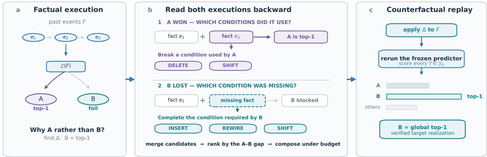
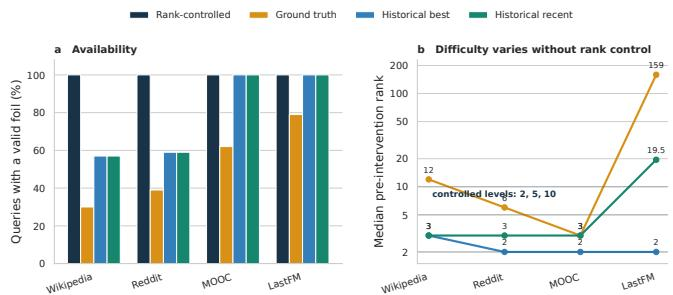
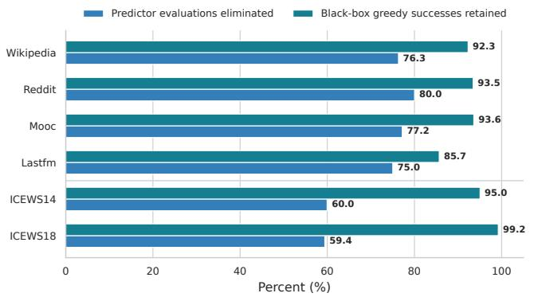
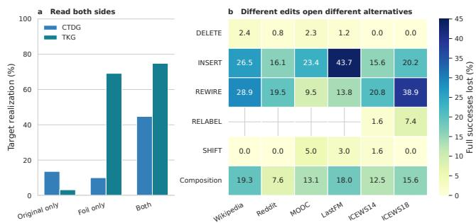

# Breaking Predictions Is Not Enough: Specified-Foil Counterfactuals for Temporal Graphs

Minwoo Yu and Young-guk Ha

Abstract—Temporal graph counterfactual explanations typically change past events to change or invalidate an original prediction, while leaving its replacement unspecified. Yet a user facing a predicted outcome often asks which past conditions would make a particular alternative occur instead. We formulate this destination-specific question as the Specified-Foil Counterfactual: given an original prediction A and a foil B fixed before search, find a low-cost past-event intervention under which the same predictor selects B as top-ranked. Our trace-guided intervention search contrasts the completed execution of A with a reconstructed incomplete execution of B, maps their difference to DELETE, INSERT, REWIRE, RELABEL, and SHIFT operations, and verifies B through exact replay. We instantiate this principle with LiFTER on continuous-time dynamic graphs and TLogic on temporal knowledge graphs. On CTDGs, the method retains 85.7–93.6% of black-box greedy successes while reducing predictor evaluations by 75.0–80.0%; on TKGs, it reaches the specified foil in 74.8% of 600 comparisons. Executable traces thereby become computational structures for constructing conditions of unselected alternatives, rather than records used only to explain predictions already made.

Index Terms—Temporal graph learning, counterfactual explanation, contrastive explanation, neuro-symbolic reasoning, temporal knowledge graph.

## 1 INTRODUCTION

Predictions over evolving graphs select one outcome from multiple possible futures. Temporal graph learning studies this problem through two major formalisms. Temporal knowledge graphs (TKGs) represent time-stamped relational facts and logical rules, whereas continuous-time dynamic graphs (CTDGs) model streams of interactions and predict future links. Yet how past events would need to differ for a particular alternative B, rather than the predicted future A, has not been directly addressed.

Counterfactual explanations seek small input changes under which the same predictor selects an alternative outcome. Human explanation requests are often contrastive: they compare a fact with a foil [1], [2]. In temporal link prediction, where many outcomes compete, changing the original prediction and selecting a desired alternative are distinct objectives. We study model-level counterfactuals verified within the temporal world learned by a frozen predictor. Extending such answers to real-world causal counterfactuals requires an explicit causal model and corresponding identification assumptions [3].

Existing temporal counterfactual explainers primarily implement prediction invalidation. CoDy defines success as changing the original future-link prediction through pastevent removal [4]; TemGX similarly identifies a temporal subgraph whose removal changes the original prediction [5]. The quantitative evaluation of CTM-Explainer also centers on deletion-based event selection and changes in the original score [6]. We use prediction invalidation to denote this class of objectives, which identifies events on which the original prediction depends while leaving its replacement unspecified. Once A loses the top rank, the selection of B, C, or any other outcome satisfies the same criterion.

Consider a temporal event graph that predicts the next state of a soldier on a battlefield. If the model predicts death, prediction invalidation identifies past events whose removal eliminates that prediction. The replacement, however, could be critical injury, missing, or another state. Specifying survival as the foil asks a sharper question: what would have had to differ for the model to predict survival rather than death? Suppose the completed death execution follows enemy exposure → gunshot → delayed evacuation → death, while an incomplete survival execution lacks timely evacuation. A corresponding answer may remove the gunshot event, shift the evacuation time, or change the binding of medical support. The result is a counterfactual explanation verified within the predictor, rather than a causal prescription that guarantees survival in the real world.

We formulate this question as the Specified-Foil Counterfactual problem for temporal graph learning across TKGs and CTDGs. Given an original prediction A and a foil B fixed before search, the task identifies past-event changes that make the same predictor select B instead of A. Every successful specified-foil intervention also invalidates A, whereas an intervention that invalidates A need not select B. The explicit destination therefore strengthens temporal counterfactual explanation from changing the current answer to constructing the conditions for a particular alternative.

This distinction matters because future-link prediction is inherently multi-alternative. In our controlled invalidation study, interventions that ignored the foil changed A in 4,008 CTDG cases, yet reached the prespecified Rank-5 and Rank-10 foils in only 3.6% and 1.4% of those cases, respectively. In TKGs, none of the 122 successful invalidations reached the Rank-5 or Rank-10 foil. Changing A can promote a nearby runner-up, but it does not generally navigate to a specified alternative. An explicit foil makes it possible to measure which past-event changes separate A from B, whether B is locally reachable, and how much that transition costs. The task thus characterizes the reachability and boundary of an alternative future represented by the model.

The stronger objective substantially enlarges black-box search. Without access to internal execution, an explainer must propose an edit, rerun the predictor, observe the output, and repeat. Even prediction invalidation has required locality constraints, temporal influence and event-impact heuristics, and Monte Carlo Tree Search to identify removal sets. A specified foil further introduces insertions and alternative endpoints and timestamps. A black-box method can verify a solution through sufficient computation, but it must discover that solution by exploring the input space from output feedback alone.

Executable neuro-symbolic predictors provide a different route. Their traces expose the grounded facts, entity bindings, and temporal conditions that establish the original prediction. Re-grounding rules toward the foil can also reconstruct partial executions and reveal their missing conditions. Our trace-guided intervention search contrasts the completed execution of the original with the reconstructed incomplete execution of the foil, maps their difference to DELETE, INSERT, REWIRE, RELABEL, and SHIFT operations, and then exactly replays the predictor on the edited event set to verify that the foil becomes top-ranked.

As reviewed in Section 2, prior work has separately developed fact intervention and abduction in KGs, executable temporal reasoning in TKGs, and factual explanation and prediction invalidation in CTDGs. We connect these lines through temporal interventions between an original prediction and a specified foil. Our contributions are as follows:

We formulate the Specified-Foil Counterfactual problem uniformly for TKGs and CTDGs, combining an original prediction A, a specified foil $B ,$ admissible past-event interventions, and exact-replay success in a single objective.

We derive DELETE, INSERT, REWIRE, RELABEL, and SHIFT from the existence, endpoint, relation, and time coordinates of temporal events, and define intervention cost and bounded minimality.

We introduce trace-guided intervention search, which maps the difference between a completed original execution and a reconstructed incomplete foil execution into temporal edits. Grounded traces thereby become a computational interface for synthesizing the conditions of an alternative.

We instantiate the same principle independently in LiFTER-based CTDGs and TLogic-based TKGs, and evaluate reachability, target specification, search efficiency, exhaustive recovery, stability, and executionlevel case studies.

A symbolic trace is not merely a by-product used to explain a prediction; it is an executable structure from which interventions otherwise guessed by post-hoc search can be constructed directly.

Across 12,000 CTDG comparisons, DELETE alone reached only a subset of the specified alternatives; INSERT, REWIRE, SHIFT, and two-edit compositions opened additional solutions. Trace-guided intervention search retained 85.7–93.6% of the successes obtained by black-box greedy search while reducing predictor evaluations by 75–80%. Within bounded spaces that permitted exhaustive enumeration, it recovered 74.9–91.4% of the discovered solutions using approximately 9% of the evaluations. Across 600 TKG comparisons on ICEWS14 and ICEWS18, the method reached the specified foil in 74.8% of cases and recovered 97.9–100% of the exhaustive solutions using approximately 16.6% of the evaluations. The shared behavior of CTDG interaction traces and TKG relational proof paths supports execution inversion as a general principle of executable temporal reasoning rather than a mechanism specific to LiFTER’s scoring function.

Section 5.7 traces representative solutions through their executions. One CTDG case changes the predicted learning content after deleting a single past interaction; one TKG case changes the predicted consultation partner from Moon Jae-in to Benjamin Netanyahu after shifting the time of a negotiation-intent fact by three days.

## 2 RELATED WORK

## 2.1 Counterfactual and Contrastive Explanations

Counterfactual explanations identify small input changes that lead a predictor to an alternative outcome [1], [2]. Reversing a binary decision determines its alternative automatically. In multiclass and structured prediction, however, a foil must be specified because several replacements are possible. We bring this distinction to temporal graph prediction, where multiple future links compete. Our explanations are model-level interventions verified by a frozen predictor; causal claims about the real world additionally require a causal model and identification assumptions [3].

## 2.2 Counterfactual Reasoning over Knowledge Graphs

Knowledge-graph research has studied explicit interventions on facts. Pezeshkpour et al. search for single-fact additions and deletions that alter link predictions [7]. Imagine generates plausible triples that change the rank of a target triple [8]. CFKGR inserts hypothetical premises and evaluates facts derived from them through logical rules [9]. Abductive reasoning instead infers logical hypotheses capable of explaining observed conclusions [10]. These lines provide foundations for fact intervention, target-directed modification, and inverse reasoning. We combine them with an original–foil contrast to identify past-event interventions that establish a specified future link.

## 2.3 Executable Reasoning in Temporal Knowledge Graphs

TKGs represent facts as quadruples $( s , r , o , t )$ , making relations, entity bindings, and time explicit reasoning variables.

TLogic extracts rules from temporal random walks and predicts future facts through time-consistent grounding [11]. TILP learns recurrence, temporal order, intervals, and duration within differentiable temporal rules [12]. TFLEX combines logical operators over entities with temporal operators [13]; TEILP predicts event times from rule-satisfying events and time intervals [14]; and INFER incorporates temporal validity and frequency into neural-symbolic rule application [15]. These models explicitly execute the facts, bindings, and temporal conditions underlying a prediction. We use that execution structure to construct edits from a completed original grounding and an incomplete foil grounding.

## 2.4 Explanations for Continuous-Time Dynamic Graphs

CTDG explainability has focused on identifying past events relevant to a future-link prediction. T-GNNExplainer searches for factual event subsets that preserve the original prediction [16], while TempME explains predictions through temporal motifs [17]. Among counterfactual methods, CoDy restricts candidate events through spatio-temporal vicinity and heuristic policies, then applies MCTS to find a removal set that changes the original prediction [4]. TemGX ranks removable temporal subgraphs using structural influence and time decay before verifying the prediction change [5]. CTM-Explainer conceptualizes both removal and synthetic addition, while its quantitative evaluation centers on deletionbased selection and changes in the original score [6].

T-GNNExplainer and TempME recover factual evidence for an original prediction; CoDy and TemGX recover counterfactual removals that invalidate it. Specified-Foil Counterfactuals instead receive the alternative future link as input and require that exact foil to become top-ranked. We therefore evaluate the empirical distinction between invalidation and specified-foil success, and compare black-box output feedback with executable traces under the same specifiedfoil objective.

## 3 PROBLEM FORMULATION

Temporal prediction scores multiple possible futures and selects one. Changing the original prediction therefore does not determine the destination of a counterfactual. Suppose a model predicts deterioration A as a patient’s next state. Removing a past event may demote A, but the replacement may be stable state B or another complication C. Prediction invalidation accepts either outcome, whereas a question about stability is answered only by an intervention that selects B.

The distinction resembles breaking a route versus constructing one to a specified destination. Prediction invalidation succeeds by disrupting any path to A. A Specified-Foil Counterfactual first fixes destination B and seeks the closest change that connects the current temporal facts to it. This may require DELETE to remove support for $A ,$ INSERT to supply a fact missing from B, REWIRE to alter an entity binding, or SHIFT to satisfy a temporal condition. The foil is therefore an input that determines the counterfactual question, rather than an auxiliary evaluation label.

## 3.1 Executable Temporal Prediction

Let $F _ { < T _ { q } }$ denote the temporal facts available before query time $T _ { q } , ^ { ^ { \bullet } }$ and let $\textit { Y } \in \mathrm { ~ \textbar { y } _ { q } ~ }$ denote a candidate outcome for query $q .$ In a CTDG, $F _ { < T _ { q } }$ is a continuous interaction sequence and Y is a future destination. In a TKG, they correspond to time-stamped relational quadruples and a candidate object for $( s , r , ? , T _ { q } )$ . A frozen predictor assigns score $s ( q , Y ; { \dot { F } } _ { < T _ { q } } )$ and returns

$$
\hat { Y } = \arg \operatorname* { m a x } _ { Y \in \mathcal { V } _ { q } } s ( q , Y ; F _ { < T _ { q } } ) .\tag{1}
$$

LiFTER additionally exposes grounded rule executions and signed contributions, whereas TLogic exposes timeconsistent rule groundings and temporal rule scores. Given prediction $\hat { Y } ^ { \Delta }$ after intervention $\Delta ,$ , the two success conditions are

$$
\mathrm { P r e d i c t i o n \ i n v a l i d a t i o n } ; \hat { Y } ^ { \Delta } \ne \hat { Y } ,
$$

$$
\mathrm { S p e c i f i e d - F o i l : } \quad \hat { Y } ^ { \Delta } = { Y } ^ { \mathrm { f o i l } } .\tag{2}
$$

(3)

The conditions coincide in a binary problem. With multiple candidate links, however, $\hat { Y } ^ { \Delta } \overset { \cdot } { \neq } \hat { Y }$ leaves the replacement unspecified, whereas the specified-foil condition identifies it exactly.

## 3.2 Foil Specification and Benchmark Construction

A foil $Y ^ { \mathrm { f o i l } } \in \mathcal { Y } _ { q } \setminus \{ \hat { Y } \}$ is supplied with the query rather than selected by the solver during search. In applications, a downstream user, domain expert, or decision process specifies the alternative of interest. Existing temporal graph benchmarks provide no such user-intent annotation. We therefore compared ground-truth destinations, each source’s historical-best and historical-recent destinations, and prediction-rank constructions. Ground-truth and historical constructions were available only for subsets of queries and induced inconsistent difficulty across datasets. Rank-based construction applies to every query and controls difficulty at a common model-relative position. We consequently use Rank-2, Rank-5, and Rank-10 as near, intermediate, and distant benchmark foils. Supplementary Section B reports the complete comparison.

$$
Y _ { k } ^ { \mathrm { f o i l } } = \mathrm { R a n k } _ { k } \{ s ( q , Y ; F _ { < T _ { q } } ) \mid Y \in \mathcal { Y } _ { q } \} , \qquad k \in \{ 2 , 5 , 1 0 \} .\tag{4}
$$

Rank in Eq. (4) controls model-induced benchmark difficulty; it does not substitute for user preference. The solver accepts any user-specified destination in the candidate catalog, irrespective of rank. Each benchmark foil is fixed before intervention, and success requires that same foil to become top-ranked over the full catalog after intervention.

## 3.3 Contrastive Counterfactual Reasoning

Let $e ^ { \mathrm { f o i l } } = \mathrm { L i n k } ( X , Y ^ { \mathrm { f o i l } } , T _ { q } )$ denote the future link associated with the specified destination. The task asks which small changes to the past would make the model predict $e ^ { \mathrm { f o i l } }$ instead of eˆ.

## Intervention Space

We derive intervention operators from the coordinates used by each temporal formalism. A CTDG interaction ${ \boldsymbol \varepsilon } = ( u , v , t )$ exposes event existence, endpoint, and timestamp. DELETE removes an existing event, INSERT adds one, REWIRE changes an endpoint while preserving event identity, and SHIFT changes its timestamp. Thus,

$$
\mathcal { O } _ { \mathrm { C T D G } } = \{ \mathrm { D E L E T E } , \mathrm { I N S E R T } , \mathrm { R E W I R E } , \mathrm { S H I F T } \} .
$$

A TKG event $\varepsilon ~ = ~ ( s , r , o , t )$ adds relation r as an independent semantic coordinate. RELABEL changes this coordinate while preserving subject, object, and timestamp:

$$
\mathcal { O } _ { \mathrm { T K G } } = \mathcal { O } _ { \mathrm { C T D G } } \cup \{ \mathrm { R E L A B E L } \} .
$$

For example, (A, Consult, $B , t )  ( A$ , Threaten, B, t) is naturally one RELABEL rather than an unrelated deletion– insertion pair. DELETE and INSERT can express any finite event-set transformation, but decomposing $( u , v , i ) \to$ $( u , v ^ { \prime } , t )$ into both operations charges two edits and discards the semantics of changing one endpoint. REWIRE, RELA-BEL, and SHIFT preserve event correspondence and charge only for the coordinate that changes. SWAP is represented as two SHIFTs when timestamps determine event order. The resulting operators cover the observable event coordinates of both formalisms at faithful atomic costs.

Every intervention uses only history available at query time. DELETE, REWIRE, RELABEL, and SHIFT modify facts in $F _ { < T _ { q } } ;$ INSERT and SHIFT assign timestamps strictly before ${ \dot { T } } _ { q } .$ Endpoints and relations belong to the predictor’s admissible domains, and conflicting edits to the same fact are excluded. The future query fact $( X , r , Y ^ { \mathrm { f o i l } } , T _ { q } )$ cannot be inserted into history. An insertion may supply a past premise supporting the foil, but never copy the target future fact itself.

Let ∆ be a composition of atomic operations, $F _ { < T _ { a } } ^ { \Delta } \ =$ $\Delta ( F _ { < T _ { q } } )$ the edited event set, and $C ( \Delta )$ its cost. Predicate V enforces temporal validity, target nonleakage, domain admissibility, and edit consistency. The global objective is

$$
\Delta ^ { * } = \arg \operatorname* { m i n } _ { \Delta } C ( \Delta )\tag{5}
$$

$$
\mathrm { ~ s . t . ~ } V ( \Delta , F _ { < T _ { q } } ) = 1 ,\tag{6}
$$

$$
\arg \operatorname* { m a x } _ { Y \in \mathcal { V } _ { q } } s ( q _ { Y } ; F _ { < T _ { q } } ^ { \Delta } ) = Y ^ { \mathrm { f o i l } } .\tag{7}
$$

Equation (7) defines the global problem; our solver approximates it within a finite local candidate set and edit budget τ . Experimental minimality therefore holds within the prespecified atomic candidate space and a maximum of two edits. A foil reached within this space has a local counterfactual; otherwise the solver returns NO LOCAL COUNTER-FACTUAL WITHIN THE SEARCHED SPACE. Exact execution on $F _ { < T _ { q } } ^ { \Delta }$ reveals which original-supporting groundings disappear and which foil-supporting groundings emerge.

Syntactic admissibility does not alone establish realworld plausibility. An INSERT or REWIRE over valid entities and relations may remain rare or infeasible in a particular domain. We therefore interpret returned interventions as model-level counterfactuals and allow domain constraints, event likelihoods, and expert knowledge to enter through V during candidate filtering. Exact-replay success remains unchanged.

A CTDG case illustrates the targeted condition. LiFTER predicted content 5993 as student 348’s next interaction, and content 6659, initially ranked fifth, was fixed as the foil. Deleting the earlier interaction (348, 5981) reduced the original logit from 4.46 to 3.12 and increased the foil logit from 2.13 to 3.57, making 6659 top-ranked. The removed event participated in a two-event transition contributing +1.39 to the original and −1.39 to the foil. Its deletion simultaneously removed support for the original and suppression of the foil. The example shows why targeted reasoning must compare the signed executions of both candidates rather than merely remove influential evidence for the original.

## 3.4 Operator Coverage Protocol

For operator subset $A \subseteq \mathcal { O }$ and budget τ , define the reachable queries as

$$
\begin{array} { r } { \mathcal { R } ( A , \tau ) = \left\{ q \ \middle | \ \exists \Delta \in \langle A \rangle , \ C ( \Delta ) \leq \tau , \ \hat { Y } ^ { \Delta } = Y ^ { \mathrm { f o i l } } \right\} . } \end{array}
$$

$\begin{array} { l l l } { { \mathrm { A t } ~ \tau } } & { { = } } & { { 1 } } \end{array}$ , this set measures single-edit coverage; $\tau \geq 2$ captures additional reachability from composition. Operator-specific solutions are

$$
\mathcal { U } _ { o } ( \tau ) = \mathcal { R } ( \mathcal { O } , \tau ) \setminus \mathcal { R } ( \mathcal { O } \setminus \{ o \} , \tau ) .
$$

This difference measures the budget-relative necessity of operator o within a finite admissible space. Although DELETE and INSERT are representationally complete, a foil reachable by one REWIRE but only by a two-edit deletion–insertion pair demonstrates the cost-faithful value of REWIRE. We estimate coverage in the diagnostic study and verify operator contributions through fixed-candidate ablations and bounded exhaustive search.

## 4 METHOD

Section 5.2 shows that Specified-Foil Counterfactuals require more than DELETE and often require compositions of edits. Enumerating all edits produces a search space over past events, candidate endpoints, relations, and timestamps. We instead propose trace-guided intervention search, which maps the execution difference between the original and the foil back to event interventions.

The method changes the direction of computation. Blackbox search first proposes an edit and then reruns the predictor to test whether it produces the foil. Our method first reads the rule execution that produced the original and the unsatisfied conditions that blocked the foil, then constructs edits that close this execution gap. It identifies where to intervene from the model’s decision process rather than discovering that location solely through repeated output feedback.

LiFTER and the present contribution play distinct roles. LiFTER [18] is a forward predictor that returns future-link scores, grounded rule executions, and signed contributions. It neither defines a user-specified foil nor returns an intervention for reaching one. We introduce the original– foil input, the inverse mapping from grounded execution differences to edits, low-cost composition, and foil-targeted exact replay. LiFTER serves as an executable backbone on which this inverse computation can be implemented and verified.

This construction strengthens the question addressed by XAI. Prediction invalidation succeeds whenever the original ceases to be selected. A Specified-Foil Counterfactual requires the same intervention to make a prespecified foil exactly top-ranked. The former leaves the destination open; the latter asks for the conditions under which one particular alternative is established. A grounded trace consequently becomes a computational interface for synthesis: the completed original proof identifies conditions to break, and the reconstructed incomplete foil proof identifies conditions to complete.

The task remains definable for a black-box predictor: edit past events and replay the model until the foil becomes top-ranked. The available signal, however, is limited to the output of each trial. Even for deletion-only invalidation, CoDy restricts candidates through spatio-temporal vicinity and uses heuristic policies with Monte Carlo Tree Search [4], while TemGX combines temporal reachability, structural influence, and time decay before verification [5]. Specifying a foil expands the candidate space to insertions and alternative endpoints, relations, and timestamps.

Figure 1 summarizes our alternative. The original trace identifies the events and bindings responsible for its score. Rules grounded toward the foil reveal near-complete executions and their missing conditions. The solver maps this contrast directly to candidate edits and verifies each selected composition by exact replay.

For an executable predictor, write the score of candidate $Y$ as the sum of signed contributions $\alpha _ { z }$ from grounded executions z:

$$
s ( q _ { Y } ; F ) = b _ { Y } + \sum _ { z \in \mathcal { Z } ( Y ; F ) } \alpha _ { z } ,\tag{8}
$$

$$
D ( F ) = s ( q _ { \hat { Y } } ; F ) - s ( q _ { Y ^ { \mathrm { f o i l } } } ; F ) .\tag{9}
$$

The contrastive execution gap $D ( F )$ in Eq. (9) is initially positive. For atomic intervention $\delta ,$ define its gain by

$$
R ( \delta ) = D ( F ) - D ( F ^ { \delta } ) .\tag{10}
$$

Evaluating R(δ) for every possible δ recovers exhaustive search. Instead, we construct a candidate set $\Gamma ( \mathcal { T } _ { \mathrm { o r i g } } , \tilde { \mathcal { T } } _ { \mathrm { f o i l } } )$ from the executed original groundings $\tau _ { \mathrm { o r i g } }$ and the incomplete foil executions $\widetilde { \mathcal { T } } _ { \mathrm { f o i l } }$ . These traces identify edits expected to yield large gap reductions before replay.

The intuition is route planning with a specified destination. Invalidation can succeed by breaking the current route anywhere. A specified-foil intervention must reach a particular destination. Overlaying the route that reached the original with a route that stops immediately before the foil exposes the junctions that should change. Grounded executions are routes, past events are the conditions that open them, and interventions modify the junctions separating them.

From completed original executions, we generate DELETE and SHIFT candidates targeting events on which active support depends. From foil-directed rule grounding, we reconstruct executions missing one fact or entity binding and generate INSERT and REWIRE candidates. RELABEL plays the analogous role for the relation coordinate in TKGs. For ordered transitions, endpoint alternatives are inferred from their expected effect on the foil–original margin. All operators instantiate one principle: they are atomic edits that reduce the difference between a completed original proof and an incomplete foil proof.

```latex
Algorithm 1 Trace-guided intervention search
Require: facts $F ,$ query q, foil B, operators O, cap K,
budget τ
1: $S \gets \mathrm { R E P L A Y } ( F , q ) ; A \gets \arg \operatorname* { m a x } _ { Y } S ( Y )$
2: $\mathcal { T } _ { A } \gets \mathrm { E x E C U T E } ( F , q , A )$
3: $\widetilde { \mathcal { T } } _ { B } \gets \mathrm { N E A R M I S S E S } ( F , q , B )$
4: $\Gamma  \mathrm { B R E A K O R R E L E A S E } ( \mathcal { T } _ { A } , \mathcal { O } )$
5: $\Gamma  \Gamma \cup \mathbf { C o M P L E T E } ( \widetilde { \mathcal { T } } _ { B } , \mathcal { O } )$
6: $\Gamma \gets \mathrm { T O P K V A L I D } ( \Gamma , K )$
7: for $\Delta$ in nonconflicting compositions of Γ with $C ( \Delta ) \leq$
τ do
8: $F _ { \Delta } \gets \mathrm { A P P L Y } ( F , \Delta )$
9: $S _ { \Delta } , T _ { \Delta } \gets \mathrm { R E P L A Y } ( F _ { \Delta } , q )$
10: if arg max $S _ { \Delta } ( Y ) \dot { = } B$ then
11: return $\Delta , \mathcal { T } _ { \Delta }$
12: end if
13: end for
14: return NOLOCALCOUNTERFACTUAL
```

Candidates are ranked by their estimated reduction of Eq. (10), and the top K are retained. Let ⟨TopK(Γ)⟩ denote their valid compositions within the budget. The bounded solver computes

$$
\Delta ^ { * } = \arg \operatorname* { m i n } _ { \Delta \in \langle \mathrm { T o p K } ( \Gamma ) \rangle } C ( \Delta )\tag{11}
$$

$$
{ \mathrm { s . t . } } \quad \arg \operatorname* { m a x } _ { Y \in \mathcal { V } _ { q } } s ( q _ { Y } ; F ^ { \Delta } ) = Y ^ { \mathrm { f o i l } } .\tag{12}
$$

The solver evaluates atomic interventions before extending promising candidates to low-cost compositions. During exact replay, it applies $\Delta$ to the past facts and recomputes temporal order, bindings, groundings, contributions, and all candidate scores. An increased foil score or a demoted original is insufficient; success requires $Y ^ { \mathrm { f o i l } }$ to be topranked over the full catalog. The method therefore consists of execution contrast, candidate generation, cost-aware composition, and exact replay.

## 4.1 Algorithm and Model Requirements

Algorithm 1 presents the complete procedure. EXECUTE and REPLAY form the interface between an executable predictor and the intervention solver. Candidate priority approximates Eq. (10), and replay evaluates the exact condition in Eq. (12).

The method requires no dedicated architecture. A compatible predictor must expose or reconstruct four capabilities:

1) Faithful execution: traces represent rules, programs, or grounded computations that actually determine candidate scores rather than post-hoc attributions.

  
Fig. 1. Trace-guided intervention search reads the completed original execution and the incomplete foil execution, constructs edits from their difference, and verifies the specified foil through exact replay.

2) Addressable grounding: each execution identifies its supporting past facts, entity bindings, and temporal conditions, allowing symbolic conditions to map back to concrete edits.

3) Foil-queryable execution: inference can be run for an arbitrary foil to recover completed support and partial executions with identifiable missing conditions.

4) Intervention-closed replay: the same inference engine accepts edited events and recomputes temporal order, bindings, groundings, and full-catalog scores.

LiFTER provides grounded interaction executions directly. TLogic [11] permits completed executions and foil near-misses to be reconstructed from time-consistent groundings and rule-body prefixes. We implement the algorithm in both. TILP [12] also explicitly represents learned temporal rules, variable groundings, and temporal constraints, suggesting structural compatibility; our quantitative evaluation is limited to LiFTER and TLogic.

Future models need not implement four new modules. An adapter suffices if it locates facts used by existing proof paths, executes rule bodies toward a foil to identify blocked premises, and reapplies inference to edited facts. Models exposing only original support can generate disruption candidates; models exposing partial foil executions support the complete method. The problem and exact-replay criterion apply to any temporal predictor, while executable traces replace output-driven proposal with execution inversion.

## 5 EXPERIMENTS

The experiments test a single chain of claims. We first establish specified-foil reachability with LiFTER and TLogic, then quantify why target specification and a multi-operator intervention space are necessary. Efficiency and exhaustive comparisons test whether traces concentrate valid edits, ablations isolate the execution signals and search components responsible for performance, and case studies reconstruct complete prediction transitions.

## 5.1 Experimental Setup

CTDG experiments use LiFTER with the public Wikipedia, Reddit, MOOC, and LastFM interaction datasets [19]. For each dataset, we use the most recent 70,000 events, training on the first 85% and evaluating on the final 15%. Each query receives only preceding events, and its candidate catalog contains every destination in the same window. TKG experiments use the official TLogic implementation [11] with ICEWS14 and ICEWS18 [20]. In both formalisms, foil selection and replay success are evaluated over the full candidate catalog rather than sampled negatives.

Frozen predictor.: LiFTER is trained independently of counterfactual search and frozen for every intervention. Main results use seed 7; stability is evaluated with independently trained checkpoints for seeds 7, 17, and 37. Hyperparameters and statistical procedures appear in Supplementary Section A and Tables 8–9.

Queries and foils.: The main CTDG diagnostic and efficiency experiments select 1,000 rows evenly across each 10,500-event evaluation stream. Rank-1 is the original prediction, and Rank-2, Rank-5, and Rank-10 are fixed as foils before search, yielding 3,000 comparisons per dataset and 12,000 overall. Bounded exhaustive comparisons and ablations use 100 queries per dataset fixed before observing outcomes. TKG experiments likewise combine 100 queries per dataset with three rank-controlled foils, producing 300 comparisons each.

Before adopting rank control, we evaluated the groundtruth destination and two historical constructions. Their definitions, availability, and median ranks are reported in Supplementary Section B and Table 10.

Figure 2 shows that rank control provides complete availability and comparable model-relative difficulty. This construction is a benchmark device, not a restriction on application-time foils; the solver accepts any destination in the catalog.

  
Fig. 2. Ground-truth and historical foils are available only for subsets of queries and induce dataset-dependent difficulty. Rank-controlled foils cover every query at fixed model-relative positions.

## 5.2 Specified-Foil Counterfactuals Across Temporal Graphs

We first measure whether specified foils are reachable through at most two small fact edits. The CTDG diagnostic uses coordinate-based candidates to isolate operator and budget effects; the subsequent efficiency experiment uses foil-specific candidates generated from execution contrast. The two experiments share queries, foils, budget, and seed, while answering different questions with different candidate generators.

Continuous-time dynamic graphs.: The diagnostic constructs DELETE, INSERT, REWIRE, and SHIFT candidates from the 24 most recent query-relevant events, up to 16 endpoints, and eight timestamp alternatives, then tests two-edit compositions of the top four candidates per operator. Table 1 reports average reachability of 49.9%, 18.7%, and 9.2% for Rank-2, Rank-5, and Rank-10 foils.

As the foil moves from Rank-2 to Rank-10, the number of contributing foil groundings decreases in every dataset and the positive-support deficit relative to the original increases. The overlap between past-event rows used by the two executions remains nearly constant. Distant foils are therefore associated with weaker executable support within similar event pools, making the three ranks meaningful difficulty strata.

DELETE alone reaches 19.3%, 2.6%, and 1.1% of Rank-2, Rank-5, and Rank-10 foils. The single-edit union of all four operators raises these values to 43.5%, 12.6%, and 5.9%. Average coverage increases from 20.6% at budget one to 25.9% at budget two; 5.3% of all comparisons require composition. Structural and temporal edits thus open alternatives unavailable to deletion alone.

The overall rates 10.0/8.8/41.1/43.8% in Table 1 measure bounded reachability under coordinate-based candidates. The later efficiency rates 30.8/37.1/77.2/57.0% measure target success after trace-guided generation adds foil-specific facts and bindings and retains up to 32 candidates. The first experiment identifies which edits are needed; the second evaluates how efficiently execution contrast finds them.

Temporal knowledge graphs.: For TLogic, we construct DELETE, INSERT, REWIRE, RELABEL, and SHIFT over timestamped facts and replay temporal rules on the edited graph.

Table 2 shows that TLogic reaches the specified object in 449 of 600 comparisons (74.8%). Of these, 385 require one fact edit and 64 require a two-edit composition. The shared result across continuous interactions and relational temporal facts is that original and foil executions can be mapped back to observable edits and verified through exact replay.

  
Fig. 3. Execution traces concentrate successful interventions into a substantially smaller evaluated candidate set.

## 5.3 Why the Foil Must Be Specified

We compare the two success criteria with a controlled, foil-agnostic invalidation procedure. CTDG removes events supporting A; TKG generates DELETE and SHIFT from the original trace. Among interventions that demote A, we measure how often the replacement coincides with a Rank-2, Rank-5, or Rank-10 foil fixed beforehand.

Table 3 reflects a local ranking effect at Rank-2: once the original is removed, its runner-up often inherits first place. Arrival at Rank-5 and Rank-10 falls sharply in CTDG and never occurs in TKG. Invalidation selects the complement of A; a specified-foil objective selects B. Foil direction is therefore part of the problem input rather than an additional metric attached to invalidation.

## 5.4 Search Efficiency

We compare trace-guided intervention search with random selection, recency-based locality selection, and black-box greedy search, which executes every atomic candidate and ranks it by foil-margin improvement. All methods share the same edits, foil, budget, and exact-replay criterion.

Table 4 shows that the proposed method retains 85.7– 93.6% of black-box greedy successes in CTDG while reducing predictor evaluations by 75.0–80.0%. In TKG, it retains 95.0–99.2% while reducing evaluations by 59.4–60.0%.

As visualized in Fig. 3, the gain follows from a different proposal mechanism. Black-box greedy must execute candidates to learn their effects; our method constructs candidates from execution differences before replay. On ICEWS14 and ICEWS18, trace guidance reaches 64.0% and 85.7%, compared with 54.3% and 69.7% for random selection and 55.7% and 63.0% for locality under equal candidate counts.

Statistical stability.: Across three independently trained LiFTER checkpoints, target-success standard deviations range from 0.45 to 2.38 percentage points, and method ordering remains unchanged. Paired cluster-bootstrap 95% confidence intervals against random and locality exclude zero for every dataset. Supplementary Table 9 reports complete results.

TABLE 1  
Bounded diagnostic reachability on continuous-time dynamic graphs.
<table><tr><td>Dataset</td><td>Rank-2</td><td>Rank-5</td><td>Rank-10 Overall</td></tr><tr><td>Wikipedia</td><td>21.2%</td><td>6.3%</td><td>2.4% 10.0%</td></tr><tr><td>Reddit</td><td>20.2%</td><td>5.2%</td><td>1.1% 8.8%</td></tr><tr><td>MOOC</td><td>82.5%</td><td>28.4%</td><td>12.5% 41.1%</td></tr><tr><td>LastFM</td><td>75.8%</td><td>34.9%</td><td>20.6% 43.8%</td></tr><tr><td>Average</td><td>49.9%</td><td>18.7%</td><td>9.2% 25.9%</td></tr></table>

<table><tr><td>Dataset</td><td>Rank-2</td><td>Rank-5</td><td>Rank-10</td><td>Overall</td><td>One edit</td><td>Two edits</td></tr><tr><td>ICEWS14</td><td>73.0%</td><td>62.0%</td><td>57.0%</td><td>64.0%</td><td>168</td><td>24</td></tr><tr><td>ICEWS18</td><td>90.0%</td><td>83.0%</td><td>84.0%</td><td>85.7%</td><td>217</td><td>40</td></tr><tr><td>Combined</td><td>81.5%</td><td>72.5%</td><td>70.5%</td><td>74.8%</td><td>385</td><td>64</td></tr></table>

TABLE 3

Where untargeted prediction changes arrive.

<table><tr><td></td><td>Formalism Successful invalidations Rank-2 arrival Rank-5 arrival Rank-10 arrival</td><td></td><td></td><td></td></tr><tr><td>CTDG</td><td>4,008</td><td>44.3%</td><td>3.6%</td><td>1.4%</td></tr><tr><td>TKG</td><td>122</td><td>91.8%</td><td>0.0%</td><td>0.0%</td></tr></table>

## 5.5 Comparison with Exhaustive Search

Within small bounded spaces, we execute every atomic intervention and every nonconflicting two-edit pair. The space contains at most 32 CTDG or 16 TKG atomic candidates. A solution succeeds only when exact replay makes the foil topranked, and the fewest-edit successful solution is minimal within this fixed space.

Table 5 shows that the proposed method recovers 74.9– 91.4% of CTDG exhaustive solutions while reducing evaluations by 91.2–91.6%. It recovers 46 of 47 ICEWS14 solutions and all 64 ICEWS18 solutions, always at the same minimum edit count, with 83.1% and 83.5% fewer evaluations. These claims concern the fixed candidate spaces and two-edit budget rather than global optimality over all possible event values.

## 5.6 Ablation Study

We ablate execution information, intervention priority, search width, operators, and composition using shared queries and exact-replay criteria across both formalisms.

Table 6 shows that CTDG target success rises from 10.0– 13.6% with either execution side alone to 44.8% with their complete contrast. In TKG, adding the completed original execution to reconstructed foil execution raises success from 56.3% to 64.0% on ICEWS14 and from 82.0% to 85.7% on ICEWS18. The original identifies support to disrupt; the foil identifies missing facts and bindings to complete. Foil-score increase and gap reduction also outperform original-score decrease, confirming the need for foil-directed priority.

Success increases and then saturates as candidate cap and composition beam expand. Moving the TKG beam from 8 to 16 adds only 0.3 percentage points while roughly tripling evaluations. Full sensitivity grids appear in Supplementary Section C and Table 11.

TABLE 4  
Target success and predictor-evaluation reduction of trace-guided intervention search.
<table><tr><td>Formalism / dataset</td><td>Ours</td><td>Black-box greedy</td><td>Greedy success retained Evaluation reduction</td></tr><tr><td>CTDG / Wikipedia</td><td>30.8%</td><td>33.4%</td><td>92.3% 76.3%</td></tr><tr><td>CTDG / Reddit</td><td>37.1%</td><td>39.7%</td><td>93.5% 80.0%</td></tr><tr><td>CTDG / MOOC</td><td>77.2%</td><td>82.4%</td><td>93.6% 77.2%</td></tr><tr><td>CTDG / LastFM</td><td>57.0%</td><td>66.6%</td><td>85.7% 75.0%</td></tr><tr><td>TKG / ICEWS14</td><td>64.0%</td><td>67.3%</td><td>95.0% 60.0%</td></tr><tr><td>TKG / ICEWS18</td><td>85.7%</td><td>86.3%</td><td>99.2% 59.4%</td></tr></table>

TABLE 5

Comparison with exhaustive search in the fixed bounded candidate space.
<table><tr><td>Formalism / dataset</td><td>Exhaustive success</td><td>Ours</td><td>Solution recall</td><td>Minimum-cost recovery</td><td>Search reduction</td></tr><tr><td>CTDG / Wikipedia</td><td>25.3%</td><td>22.7%</td><td>88.2%</td><td>88.2%</td><td>91.5%</td></tr><tr><td>CTDG / Redđit</td><td>38.7%</td><td>35.3%</td><td>91.4%</td><td>91.4%</td><td>91.5%</td></tr><tr><td>CTDG / MOOC</td><td>79.3%</td><td>68.3%</td><td>86.1%</td><td>85.7%</td><td>91.6%</td></tr><tr><td>CTDG / LastFM</td><td>66.3%</td><td>50.3%</td><td>74.9%</td><td>71.4%</td><td>91.2%</td></tr><tr><td>TKG / ICEWS14</td><td>71.2%</td><td>69.7%</td><td>97.9%</td><td>97.9%</td><td>83.1%</td></tr><tr><td>TKG / ICEWS18</td><td>85.3%</td><td>85.3%</td><td>100.0%</td><td>100.0%</td><td>83.5%</td></tr></table>

TABLE 6

Ablation of execution information and intervention priority.
<table><tr><td>Information or priority</td><td>Wikipedia</td><td>Reddit</td><td>MOOC</td><td>LastFM</td><td>CTDG avg.</td><td>ICEWS14</td><td>ICEWS18</td><td>TKG avg.</td></tr><tr><td>Original execution only</td><td>4.3%</td><td>8.7%</td><td>24.7%</td><td>16.7%</td><td>13.6%</td><td>4.7%</td><td>1.7%</td><td>3.2%</td></tr><tr><td>Foil execution only</td><td>3.3%</td><td>6.3%</td><td>21.7%</td><td>8.7%</td><td>10.0%</td><td>56.3%</td><td>82.0%</td><td>69.2%</td></tr><tr><td>Complete execution contrast</td><td>26.3%</td><td>32.3%</td><td>72.0%</td><td>48.3%</td><td>44.8%</td><td>64.0%</td><td>85.7%</td><td>74.8%</td></tr><tr><td>Original-score decrease</td><td>12.0%</td><td>18.0%</td><td>42.3%</td><td>17.7%</td><td>22.5%</td><td>64.7%</td><td>84.3%</td><td>74.5%</td></tr><tr><td>Foil-score increase</td><td>29.7%</td><td>41.3%</td><td>78.7%</td><td>57.7%</td><td>51.8%</td><td>66.7%</td><td>86.0%</td><td>76.3%</td></tr><tr><td>Contrastive-gap reduction</td><td>27.0%</td><td>39.0%</td><td>71.7%</td><td>53.0%</td><td>47.7%</td><td>67.3%</td><td>86.3%</td><td>76.8%</td></tr></table>

  
Fig. 4. Complete execution contrast yields the highest reachability; distinct operators and composition open complementary solutions.

INSERT and REWIRE provide unique solutions across CTDG and both TKG datasets. DELETE and SHIFT contribute selectively by formalism, while RELABEL adds unique TKG solutions. Two-edit composition accounts for 12.5–15.6% of full-method solutions. Dataset-level results appear in Supplementary Table 12.

Figure 4, together with exhaustive recovery, supports the central mechanism: the difference between the executed original proof and the reconstructed incomplete foil proof concentrates edits that reach the specified alternative.

## 5.7 Qualitative Analysis

We reconstruct representative CTDG and TKG prediction transitions using foils fixed before intervention. In MOOC, LiFTER predicts content 5993 for student 348 and ranks content 6659 fifth. Deleting the earlier interaction (348, 5981) lowers the original logit from 4.46 to 3.12 and raises the foil logit from 2.13 to 3.57, making the foil top-ranked without inserting it into history.

For an ICEWS18 query on September 28, 2018, TLogic predicts Moon Jae-in as Abdel Fattah Al-Sisi’s next Consult counterpart, while the recorded answer Benjamin Netanyahu ranks ninth. Shifting (Benjamin Netanyahu, Express intent to meet or negotiate, Abdel Fattah Al-Sisi) from September 24 to September 27 raises Netanyahu’s score from 0.286 to 0.738 and moves it to first place. Date-wise replay keeps Netanyahu ninth on September 25 and 26 and changes it to first only on September 27. This boundary is a verified dependency of the frozen predictor, not a real-world causal effect. Supplementary Section D provides additional cases.

## 6 CONCLUSION

We introduced Specified-Foil Counterfactuals for temporal graphs. Given an original prediction A, the task identifies a low-cost past-event intervention that makes a prespecified foil B top-ranked. Prediction invalidation locates conditions that change A; our formulation locates conditions that produce B instead of A. This explicit destination extends temporal counterfactual explanation from changing an openended outcome to constructing a particular alternative.

Trace-guided intervention search solves this stronger problem by contrasting a completed proof of the original with a reconstructed incomplete proof of the foil. DELETE and SHIFT alter conditions supporting the original, whereas INSERT, REWIRE, and RELABEL complete missing facts, bindings, relations, or temporal conditions for the foil. Exact replay then verifies the full prediction transition. LiFTER supplies grounded CTDG executions and TLogic supplies time-consistent TKG rule groundings; our contribution turns these forward traces into an inverse computation over temporal events.

The experiments establish both the need for the task and the value of this computation. Foil-agnostic invalidation rarely reached distant prespecified alternatives. Multiple atomic operators and two-edit compositions opened distinct solutions, and the complete original–foil execution contrast outperformed either side alone. The proposed method retained most black-box greedy and bounded exhaustive solutions while evaluating only a fraction of their candidates across both temporal formalisms.

Returned interventions are model-level counterfactuals verified within a frozen predictor. Experimental minimality holds within the stated candidate space and two-edit budget. Domain constraints, event likelihoods, expert knowledge, and causal assumptions can further refine admissibility for real-world analysis. The broader implication is direct: an executable trace can serve not only as an explanation of a completed prediction, but also as a program for constructing the conditions of an alternative that the model has not yet selected.

## APPENDIX A

## IMPLEMENTATION AND STATISTICAL DETAILS

Table 7 lists the public source of every dataset.

LiFTER is trained independently of counterfactual search and frozen throughout all intervention experiments. We use AdamW for 10 epochs with batch size 512, learning rate $4 \times 1 0 ^ { - 3 }$ , weight decay 10<sup>−5</sup>, dropout 0.1, and maximum history length 128. Table 8 reports the remaining architecture settings.

Main results use the frozen seed-7 checkpoint. We evaluate initialization stability with independently trained checkpoints for seeds 7, 17, and 37 while holding the temporal split, 1,000 query rows, Rank-2/5/10 foils, and search seed fixed. A paired cluster bootstrap resamples queries 20,000 times while keeping their three foils and three training seeds together. We additionally apply exact McNemar tests to paired binary outcomes. Table 9 reports the complete results.

## APPENDIX B

## FOIL CONSTRUCTION DETAILS

Before selecting rank-controlled foils, we compare the ground-truth destination, the highest-ranked destination previously selected by the source (historical best), and its most recently selected destination (historical recent). Table 10 reports the fraction of queries for which each construction yields a foil distinct from the original and the foil’s median pre-intervention rank.

Ground truth coincides with the original whenever the model predicts correctly and therefore supplies no foil for those queries. Among errors, its median rank ranges from 3 to 159 across datasets. Historical constructions require sufficient source history and mix substantially different difficulty levels. Rank-2/5/10 foils are defined for every query and fix the comparison positions.

## APPENDIX C

## SEARCH-WIDTH AND OPERATOR ABLATIONS

Table 11 reports the complete sensitivity grid for atomiccandidate cap and composition beam. Reachability increases and then saturates as either width grows. Expanding the TKG beam from 8 to 16 adds only 0.3 percentage points on both datasets while approximately tripling evaluations. In CTDG, the same expansion adds 3.8 points while increasing average evaluations from 44.1 to 113.9.

Table 12 reports the fraction of full-method successes lost after removing each operator or composition. We first fix the full candidate set and do not refill removed positions, so each value measures solutions uniquely supplied by that component.

INSERT, REWIRE, and composition contribute unique solutions in both formalisms. DELETE and SHIFT contribute selectively by dataset, and RELABEL adds unique solutions when relations are explicit in TKGs. The result reflects complementary changes to event existence, endpoint, relation, and time rather than equal importance of every operator in every dataset.

## APPENDIX D

## ADDITIONAL QUALITATIVE CASES

## D.1 Two-Edit Composition in a CTDG

For LastFM listener 1574, LiFTER predicts item 1176 and ranks item 478 fifth. No single edit reaches the foil. Inserting the recent interaction (1574, 1221) and rewiring an older interaction from item 1172 to 707 makes item 478 topranked. The edits complete distinct missing conditions and jointly open an alternative unavailable to either edit alone.

## D.2 Temporal Boundary in a TKG

In the ICEWS18 case, shifting the relevant fact one day at a time leaves Benjamin Netanyahu ranked ninth on September 25 and 26, but moves him to first on September 27. Moon Jae-in and Abdel Fattah Al-Sisi held a summit in New York on September 26, and reports place a Netanyahu– Al-Sisi meeting later that night. We use these records only to place the learned temporal boundary beside the observed timeline, not as causal evidence. The replay identifies how SHIFT changes TLogic’s time-consistent grounding.

TABLE 7 Public dataset sources used in this study.
<table><tr><td>Domain</td><td>Dataset</td><td>Source</td></tr><tr><td>CTDG</td><td>Wikipedia</td><td>https://snap.stanford.edu/jodie/wikipedia.csv</td></tr><tr><td>CTDG</td><td>Reddit</td><td>https://snap.stanford.edu/jodie/reddit.csv</td></tr><tr><td>CTDG</td><td>MOOC</td><td>https://snap.stanford.edu/jodie/mooc.csv</td></tr><tr><td>CTDG</td><td>LastFM</td><td>https://snap.stanford.edu/jodie/lastfm.csv</td></tr><tr><td>TKG</td><td>ICEWS14</td><td>TLogic repository: https://github.com/liu-yushan/TLogic</td></tr><tr><td>TKG</td><td>ICEWS18</td><td>TLogic repository: https://github.com/liu-yushan/TLogic</td></tr></table>

TABLE 8

LiFTER frozen-backbone configuration.
<table><tr><td>Component</td><td>Value</td></tr><tr><td>Training events / epochs Batch size / learning rate</td><td>59,500 ／ 10 512 / 0.004</td></tr><tr><td>Weight decay / dropout History / fact-context length</td><td> $1 0 ^ { - 5 }$  / 0.1</td></tr><tr><td></td><td>128 ／8</td></tr><tr><td>Hidden / transition dimension Maximum grounding facts / rule length Maximum three-hop paths</td><td>64／32 10 / 2</td></tr></table>

TABLE 9

Statistical stability over independently trained LiFTER checkpoints.

<table><tr><td>Dataset</td><td>Ours: target success</td><td>Ours – random, 95% CI</td><td>Ours – locality, 95% CI</td><td>Ours greedy, 95% CI</td><td>Evaluation reduction, 95% CI</td></tr><tr><td>Wikipedia</td><td> $3 0 . 3 8 \pm 0 . 4 5 \%$ </td><td>+12.40 [11.34, 13.47]</td><td>+13.47 [12.17, 14.79]</td><td>-2.36 [-2.83, -1.88]</td><td>75.54 [75.22, 75.84]%</td></tr><tr><td>Reddit</td><td> $3 6 . 5 6 \pm 1 . 7 1 \%$ </td><td>+12.82 [11.84, 13.81]</td><td>+27.69 [25.88, 29.51]</td><td>-2.37 [-2.83, -1.91]</td><td>79.80 [79.55, 80.06]%</td></tr><tr><td>MOOC</td><td> $7 7 . 1 6 \pm 2 . 3 8 \%$ </td><td>+25.23 [24.08, 26.38]</td><td>+32.98 [31.11, 34.92]</td><td>-4.84 [−5.46, -4.24]</td><td>77.23 [77.08, 77.38]%</td></tr><tr><td>LastFM</td><td> $5 6 . 2 6 \pm 0 . 7 4 \%$ </td><td>+18.99 [17.84, 20.13]</td><td>+20.43 [19.23, 21.62]</td><td>-9.72 [-10.47, -8.99]</td><td>74.87 [74.69, 75.05]%</td></tr></table>

## D.3 A Non-Intuitive Cross-Relation Dependency

TLogic predicts Citizen (Nigeria) as the target of Abdulrahman Dambazau’s Make an appeal or request, with Nigeria ranked second. Inserting (Abdulrahman Dambazau, Sexually assault, Nigeria) one day before the query makes Nigeria top-ranked. The inserted fact completes a missing premise of a learned cross-relation rule. Its explicit chain from fact to grounding to prediction makes the non-intuitive dependency directly auditable.

## DECLARATION OF COMPETING INTEREST

The authors declare that they have no known competing financial interests or personal relationships that could have appeared to influence the work reported in this paper.

## ACKNOWLEDGEMENTS

The authors have no acknowledgements to declare.

## DATA AVAILABILITY

All six datasets used in this study—Wikipedia, Reddit, MOOC, LastFM, ICEWS14, and ICEWS18—are publicly available. The repository provides scripts to download the source files and materialize the processed experimental inputs. Dataset URLs are reported in Supplementary Table 7.

## CODE AVAILABILITY

The implementation, experiment configurations, aggregation scripts, and plotting scripts used in this study are available at https://github.com/SnowyPainter/cf-public.

TABLE 10  
Availability and pre-intervention rank of benchmark foil constructions. Each cell reports availability / median rank.
<table><tr><td>Foil construction</td><td>Wikipedia</td><td>Reddit</td><td>MOOC</td><td>LastFM</td></tr><tr><td>Rank-2 / 5 / 10</td><td>100% / 2, 5, 10</td><td>100% / 2, 5, 10</td><td>100% / 2, 5, 10</td><td>100% / 2, 5, 10</td></tr><tr><td>Ground truth</td><td>30%／12</td><td>39%/6</td><td>62%/3</td><td>79%/159</td></tr><tr><td>Historical best</td><td>57%/3</td><td>59%/2</td><td>100% / 2</td><td>100%/ 2</td></tr><tr><td>Historical recent</td><td>57%/3</td><td>59%／3</td><td>100%/3</td><td>100% / 19.5</td></tr></table>

TABLE 11

Sensitivity to atomic-candidate cap and composition beam.
<table><tr><td>Search setting</td><td>Wikipedia</td><td>Reddit</td><td>MOOC</td><td>LastFM</td><td>CTDG avg.</td><td>ICEWS14</td><td>ICEWS18</td><td>TKG avg.</td></tr><tr><td>Candidate cap 4</td><td>5.0%</td><td>14.0%</td><td>32.7%</td><td>8.0%</td><td>14.9%</td><td>38.7%</td><td>48.3%</td><td>43.5%</td></tr><tr><td>Candidate cap 8</td><td>13.7%</td><td>23.7%</td><td>56.0%</td><td>32.3%</td><td>31.4%</td><td>49.0%</td><td>63.3%</td><td>56.2%</td></tr><tr><td>Candidate cap 16</td><td>26.3%</td><td>32.3%</td><td>72.0%</td><td>48.3%</td><td>44.8%</td><td>64.0%</td><td>85.7%</td><td>74.8%</td></tr><tr><td>Candidate cap 32</td><td>28.3%</td><td>39.0%</td><td>74.7%</td><td>56.3%</td><td>49.6%</td><td>73.0%</td><td>90.7%</td><td>81.8%</td></tr><tr><td>Composition beam 2</td><td>22.0%</td><td>30.7%</td><td>58.7%</td><td>34.7%</td><td>36.5%</td><td>62.7%</td><td>80.3%</td><td>71.5%</td></tr><tr><td>Composition beam 4</td><td>24.3%</td><td>31.7%</td><td>62.7%</td><td>38.7%</td><td>39.3%</td><td>64.0%</td><td>85.7%</td><td>74.8%</td></tr><tr><td>Composition beam 8</td><td>26.3%</td><td>32.3%</td><td>72.0%</td><td>48.3%</td><td>44.8%</td><td>65.7%</td><td>87.0%</td><td>76.3%</td></tr><tr><td>Composition beam 16</td><td>27.3%</td><td>34.0%</td><td>76.7%</td><td>56.3%</td><td>48.6%</td><td>66.0%</td><td>87.3%</td><td>76.7%</td></tr></table>

TABLE 12

Unique contribution of intervention operators and composition.
<table><tr><td>Removed component</td><td>Wikipedia</td><td>Reddit</td><td>MOOC</td><td>LastFM</td><td>CTDG avg.</td><td>ICEWS14</td><td>ICEWS18</td><td>TKG avg.</td></tr><tr><td>DELETE</td><td>2.4%</td><td>0.8%</td><td>2.3%</td><td>1.2%</td><td>1.7%</td><td>0.0%</td><td>0.0%</td><td>0.0%</td></tr><tr><td>INSERT</td><td>26.5%</td><td>16.1%</td><td>23.4%</td><td>43.7%</td><td>28.1%</td><td>15.6%</td><td>20.2%</td><td>18.3%</td></tr><tr><td>REWIRE</td><td>28.9%</td><td>19.5%</td><td>9.5%</td><td>13.8%</td><td>15.4%</td><td>20.8%</td><td>38.9%</td><td>31.2%</td></tr><tr><td>RELABEL</td><td></td><td></td><td></td><td></td><td></td><td>1.6%</td><td>7.4%</td><td>4.9%</td></tr><tr><td>SHIFT</td><td>0.0%</td><td>0.0%</td><td>5.0%</td><td>3.0%</td><td>2.7%</td><td>1.6%</td><td>0.0%</td><td>0.7%</td></tr><tr><td>Composition</td><td>19.3%</td><td>7.6%</td><td>13.1%</td><td>18.0%</td><td>14.2%</td><td>12.5%</td><td>15.6%</td><td>14.3%</td></tr></table>

## REFERENCES

[1] S. Wachter, B. Mittelstadt, and C. Russell, “Counterfactual explanations without opening the black box: Automated decisions and the GDPR,” Harvard Journal of Law & Technology, vol. 31, no. 2, pp. 841–887, 2018.

[2] T. Miller, “Explanation in artificial intelligence: Insights from the social sciences,” Artificial Intelligence, vol. 267, pp. 1–38, 2019.

[3] J. Pearl, Causality: Models, Reasoning, and Inference, 2nd ed. Cambridge University Press, 2009.

[4] Z. Qu, D. Gomm, and M. Farber, “CoDy: Counterfactual explain-¨ ers for dynamic graphs,” in Proc. ICML, ser. PMLR, vol. 267, 2025, pp. 50 762–50 785.

[5] M. Lu, H. Che, Y. Fan, Q. Liu, F. Shao, T. Ge, X. Xiao, and Y. Wu, “Training-free counterfactual explanation for temporal graph model inference,” in Proc. ICLR, 2026.

[6] Y. Zhao, Y. Xu, N. Liu, L. Cui, and Q. Li, “Generating counterfactual temporal motifs: Unraveling the mysteries of temporal graph neural networks,” Data Science and Engineering, vol. 11, pp. 199– 212, 2026.

[7] P. Pezeshkpour, Y. Tian, and S. Singh, “Investigating robustness and interpretability of link prediction via adversarial modifications,” in Proc. NAACL-HLT, 2019, pp. 3336–3347.

[8] R. Barile, C. d’Amato, and N. Fanizzi, “Additive counterfactuals for explaining link predictions on knowledge graphs,” in Proc. Int. Conf. Knowledge Engineering and Knowledge Management, ser. LNCS, vol. 15370. Springer, 2024, pp. 346–363.

[9] L. Zellinger, A. Stephan, and B. Roth, “Counterfactual reasoning with knowledge graph embeddings,” in Proc. EACL, 2024, pp. 2753–2772.

[10] J. Bai, Y. Wang, T. Zheng, Y. Guo, X. Liu, and Y. Song, “Advancing abductive reasoning in knowledge graphs through complex logical hypothesis generation,” in Proc. ACL, 2024, pp. 1312–1329.

[11] Y. Liu, Y. Ma, M. Hildebrandt, M. Joblin, and V. Tresp, “TLogic: Temporal logical rules for explainable link forecasting on temporal knowledge graphs,” in Proc. AAAI, vol. 36, no. 4, 2022, pp. 4120– 4127.

[12] S. Xiong, Y. Yang, F. Fekri, and J. C. Kerce, “TILP: Differentiable learning of temporal logical rules on knowledge graphs,” in Proc. ICLR, 2023.

[13] X. Lin, H. E, C. Xu, G. Zhou, H. Luo, T. Hu, F. Su, N. Li, and M. Sun, “TFLEX: Temporal feature-logic embedding framework for complex reasoning over temporal knowledge graph,” in Advances in Neural Information Processing Systems, vol. 36, 2023.

[14] S. Xiong, Y. Yang, A. Payani, J. C. Kerce, and F. Fekri, “TEILP: Time prediction over knowledge graphs via logical reasoning,” in Proc. AAAI, 2024.

[15] N. Li, H. E, T. Yao, T. Hu, Y. Li, H. Luo, M. Song, and Y. Zhu, “INFER: A neural-symbolic model for extrapolation reasoning on temporal knowledge graph,” in Proc. ICLR, 2025.

[16] W. Xia, M. Lai, C. Shan, Y. Zhang, X. Dai, X. Li, and D. Li, “Explaining temporal graph models through an explorer–navigator framework,” in Proc. ICLR, 2023.

[17] J. Chen and R. Ying, “TempME: Towards the explainability of

temporal graph neural networks via motif discovery,” in Advances in Neural Information Processing Systems, vol. 36, 2023.

[18] M. Yu and Y. guk Ha, “LiFTER: A grounded neuro-symbolic microscope for continuous-time dynamic graph forecasting,” arXiv preprint arXiv:2608.06765, 2026.

[19] S. Kumar, X. Zhang, and J. Leskovec, “Predicting dynamic embedding trajectory in temporal interaction networks,” in Proc. ACM SIGKDD, 2019, pp. 1269–1278.

[20] E. Boschee, J. Lautenschlager, S. O’Brien, S. Shellman, J. Starz, and M. Ward, “ICEWS coded event data,” 2015.