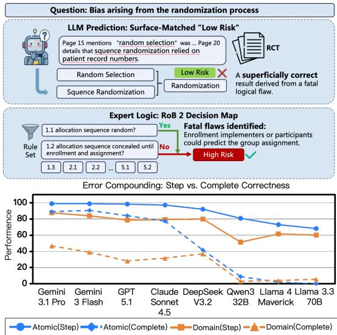
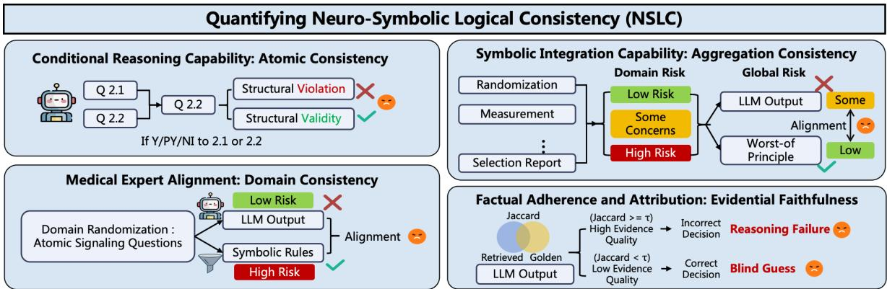
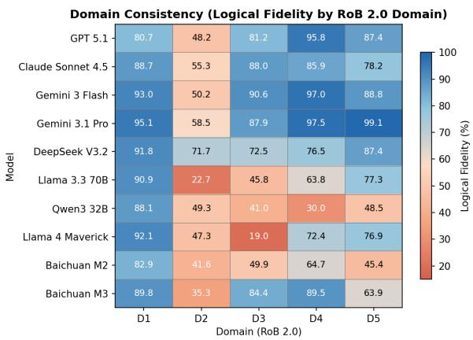
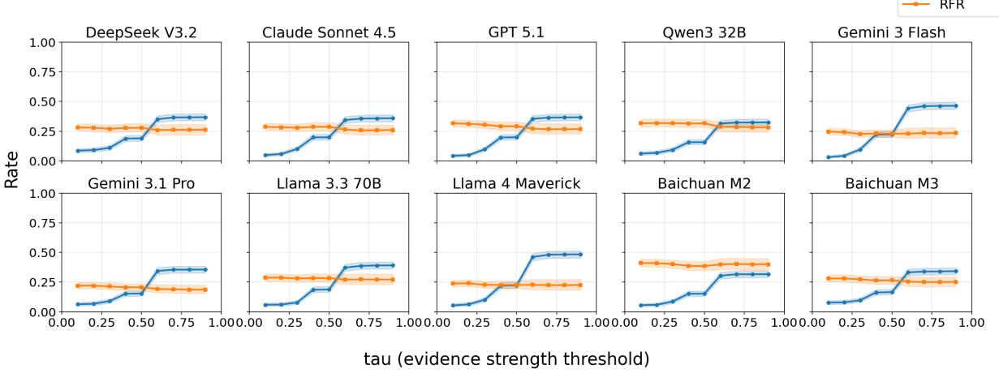
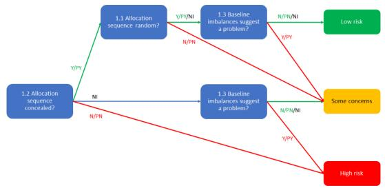
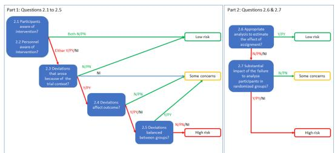
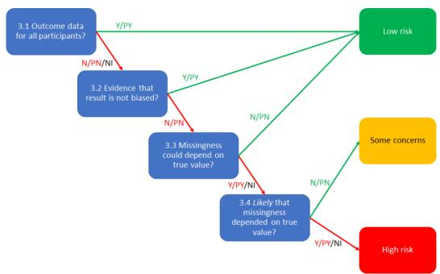
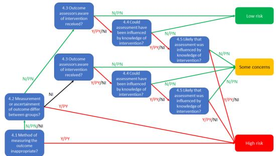
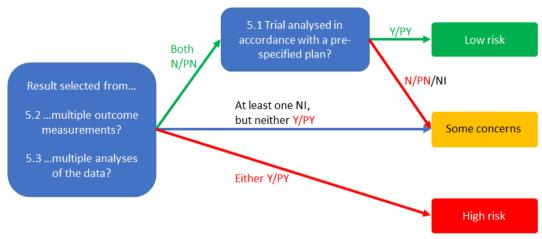
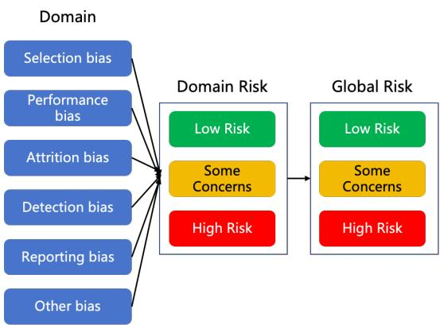

# Can LLMs Follow Medical Expert Logic? A Benchmark for Hierarchical Logical Consistency in Risk-of-Bias Assessment

Jiayu Huang<sup>1</sup> Zichen Tang<sup>1</sup> Qianhui Ling<sup>2</sup> Zemin Kuang<sup>2</sup>\* Haihong E<sup>1\*</sup>

<sup>1</sup>Beijing University of Posts and Telecommunications

<sup>2</sup>Hypertension Center, Beijing Anzhen Hospital, Capital Medical University

bupt-reasoning-lab.github.io/LogiMed-RoB

BUPT-Reasoning-Lab/LogiMed-RoB

BUPT-Reasoning-Lab/LogiMed-RoB

## Abstract

Evidence-based medicine demands strict logical consistency, yet current evaluations of large language models (LLMs) prioritize superficial label matching over genuine reasoning. We introduce LogiMed-RoB, a benchmark grounded in Cochrane Risk of Bias (RoB) 2.0 expert logic, comprising 860 randomized controlled trials (RCTs) and 14,820 queries. It evaluates models under the Hierarchical Logical Consistency (HLC) framework across four dimensions: Atomic Consistency, Domain Consistency, Aggregation Consistency, and Evidential Faithfulness. Experiments on 10 stateof-the-art LLMs reveal a catastrophic Error Compounding Effect: despite the top model reaching 98.88% Atomic Consistency, its end to-end consistency collapses to 45.13%, with several open-weight architectures plummeting to nearly 0%. We further uncover a systematic evidence-reasoning gap: even when models retrieve high-quality evidence, they fail to deduce correct outcomes in 18.63–40.05% of cases, while Blind Guess Rates reach 48.28%. LogiMed-RoB demonstrates that high outcome accuracy can conceal critical reasoning flaws, underscoring the necessity of white-box logical verification for clinical deployment.

## 1 Introduction

With large language models (LLMs) achieving saturation on standard medical benchmarks (Jin et al., 2021; Singhal et al., 2023; Nori et al., 2023), the field is shifting toward expert-level benchmarks that emphasize clinical depth. Datasets such as MedXpertQA (Zuo et al., 2025) aim to stress-test models in clinical scenarios, moving evaluation from simple answer accuracy toward clinical compliance. However, most current datasets remain in a result-oriented paradigm, focusing on superficial alignment between model outputs and gold labels (Wang et al., 2025a; Agrawal et al., 2025).

  
Figure 1: The figure illustrates the reasoning gap in riskof-bias assessment. While LLMs often make incorrect predictions through superficial keyword matching, the rigorous RoB 2.0 decision map reveals a severe Error Compounding Effect: atomic-level logical deviations propagate through multi-step synthesis, causing erroneous end-to-end judgments.

This focus overlooks the rigorous nature of medical reasoning and allows models to reach the correct result through flawed logic. Consequently, it creates an illusion of high performance while hiding real clinical risks (Gu et al., 2025).

Evidence-based medicine (EBM) emphasizes the logical integrity of the entire chain from clinical question to final decision (Sackett et al., 1996). As the core methodology for evaluating the reliability of medical research findings, Risk-of-Bias (RoB) assessment is used to identify systematic errors in clinical trials that may cause results to deviate from the truth (Higgins et al., 2022; Sterne et al., 2019). RoB assessment is inherently a hierarchical reasoning process rather than a classification performed in a single step. As illustrated in Figure 1, this process ranges from extracting granular details to deducing domain risks and synthesizing a global decision. However, current benchmarks predominantly evaluate end-to-end label accuracy. If a model achieves the correct final label via spurious correlations while violating established medical logic, it fundamentally fails the strict requirements of clinical trustworthiness (Ghassemi et al., 2021).

<table><tr><td rowspan="2">Method</td><td rowspan="2"></td><td rowspan="2">RCT Samples RoB Version Question Level</td><td rowspan="2"></td><td colspan="4">Capability Coverage</td><td rowspan="2"></td><td rowspan="2">Year Detection Type</td></tr><tr><td>Retrieval Cond. Reasoning Expert Align. Factual Adher. &amp; Attrib.</td><td></td><td></td><td></td></tr><tr><td>RobotReviewer†</td><td>12,808</td><td>RoB 1.0</td><td>Domain</td><td>V</td><td>x</td><td>x</td><td>x</td><td>2016</td><td>SVM</td></tr><tr><td>ROBIN</td><td>4,562</td><td>RoB 1.0</td><td>Domain</td><td>V</td><td>x</td><td>x</td><td>V</td><td>2024</td><td>LLM</td></tr><tr><td>RoBBR</td><td>700</td><td>RoB 1.0</td><td>Domain</td><td>V</td><td>x</td><td>x</td><td>V</td><td>2024</td><td>LLM</td></tr><tr><td>URSE†</td><td>467</td><td>RoB 1.0</td><td>Domain</td><td>V</td><td>x</td><td>x</td><td>x</td><td>2024</td><td>SVM</td></tr><tr><td>LLMPatchbay†</td><td>100</td><td>RoB 2.0</td><td>Domain</td><td>x</td><td>x</td><td>x</td><td>x</td><td>2024</td><td>LLM</td></tr><tr><td>ROBOTO2†</td><td>521</td><td>RoB 2.0</td><td>Domain</td><td>x</td><td>x</td><td>x</td><td>x</td><td>2025</td><td>LLM</td></tr><tr><td>RoB-Item†</td><td>53</td><td>RoB 2.0</td><td>Atomic</td><td>x</td><td>x</td><td>x</td><td>x</td><td>2025</td><td>LLM</td></tr><tr><td>RoB-Domain†</td><td>319</td><td>RoB 2.0</td><td>Domain</td><td>x</td><td>x</td><td>x</td><td>x</td><td>2025</td><td>LLM</td></tr><tr><td>GEPA†</td><td>100</td><td>RoB 1.0</td><td>Domain</td><td>x</td><td>x</td><td>x</td><td>x</td><td>2025</td><td>LLM</td></tr><tr><td>LogiMed-RoB (ours)</td><td>860</td><td>RoB 1.0/2.0</td><td>Atomic</td><td>V</td><td>V</td><td>V</td><td>V</td><td>2026</td><td>LLM</td></tr></table>

Table 1: Comparison with prior RoB benchmarks. Cond. Reasoning: Conditional reasoning; Expert Align.: Expert rule alignment; Factual Adher. & Attrib.: Factual adherence & attribution. <sup>†</sup> indicates that the dataset is not publicly released.

To bridge this gap, we propose Hierarchical Logical Consistency (HLC), a post-hoc audit framework. We formalize the Cochrane RoB 2.0 gold standard as deterministic expert rules and systematically verify whether LLM outputs conform to the established clinical decision process. We construct LogiMed-RoB, comprising 860 randomized controlled trials (RCTs) and 14,820 queries, to evaluate model capabilities along four dimensions: (1) Atomic Consistency quantifies the rigor of conditional reasoning at the base node level; (2) Domain Consistency measures the alignment between model output and expert rule derivation; (3) Aggregation Consistency verifies compliance with the macroscopic “Worst-of Principle”; and (4) Evidential Faithfulness assesses whether decisions are anchored in accurate textual evidence rather than driven by parametric priors.

In our study, we conduct extensive experiments using LogiMed-RoB to evaluate 10 representative LLMs. We observe a catastrophic Error Compounding Effect: while Gemini 3.1 Pro achieves near-perfect Atomic Consistency (98.88%), its end-to-end consistency collapses to 45.13%, with several open-weight models plummeting to ∼0%. We also discover a systematic evidence-reasoning gap. Even when models successfully retrieve high-quality evidence, they persistently fail to deduce correct outcomes, with Reasoning Failure Rates ranging from 18.63% to 40.05%, while Blind Guess Rates reach 48.28%. By evaluating models under HLC, we show how high outcome accuracy can conceal structural fragilities, demonstrating the necessity of white-box logical verification in highstakes EBM.

## 2 Related Work

## 2.1 Automation of Risk-of-Bias Assessment

RoB 1.0 (Higgins et al., 2011) organized assessments around broad bias domains and required assessors to make a direct risk judgment within each domain. RobotReviewer (Marshall et al., 2016) automated several of these domain-level judgments while identifying supporting text. EBM-NLP (Nye et al., 2018), by contrast, provided PICO annotations for evidence extraction rather than RoB labels. Neither resource was designed to audit whether intermediate outputs obey a multilevel decision hierarchy.

RoB 2.0 (Sterne et al., 2019) introduced signaling questions and algorithms that map their responses to proposed domain-level judgments. The overall judgment is then synthesized from the domain judgments and generally reflects the most severe domain, with specified escalation when several domains raise concerns. Modern automated assessments must therefore advance from label matching to faithfully executing this multistep decision process.

However, as summarized in Table 1, existing benchmarks exhibit three critical limitations:

• Coarse Granularity: Several datasets, including RoBIn (Dias et al., 2025), the main task in RoBBR (Wang et al., 2025b), and GEPA (Li et al., 2025), focus on domain-level risk labels rather than cross-level consistency among signaling-question responses, domain judgments, and overall judgments.

• Cross-Level Evaluation Gap: RoB 2.0 resources such as LLMPatchbay (Eisele-Metzger et al., 2025), ROBOTO2 (Hevia et al., 2025), and RoB-Domain (Ji et al., 2025) support domain judgments or signaling-question assessment. However, they do not explicitly audit consistency among atomic answers, rule-derived domain labels, and direct domain judgments. This omission can still reward shortcut learning (Geirhos et al., 2020).

  
Figure 2: The Hierarchical Logical Consistency (HLC) framework formalizes RoB guidelines as deterministic expert rules and audits LLM outputs across four dimensions: Atomic Consistency, Domain Consistency, Aggregation Consistency, and Evidential Faithfulness.

• Accessibility: Several datasets (marked <sup>†</sup>) were not released as standalone public resources by their source papers, which limits reproducible comparison.

LogiMed-RoB directly addresses this gap. While RoB-Item (Ji et al., 2025) operates at the atomic level, it evaluates isolated signaling questions without auditing cross-level dependencies. To our knowledge, LogiMed-RoB is the first publicly available benchmark to jointly combine atomic-level verification, hierarchical conditionalreasoning audits, and end-to-end consistency tracking across all three levels. It systematically evaluates the four logical consistency dimensions essential for clinical trustworthiness.

## 2.2 LLM Logical Reasoning and Rule-Based Auditing

LLMs remain fragile on multistep logical tasks (Marcus, 2020; Huang and Chang, 2023) and often fail to generalize compositionally (Dziri et al., 2023). Chain-of-thought prompting (Wei et al., 2022) can also produce explanations that do not faithfully reflect the factors driving a prediction (Turpin et al., 2023). Logic-LM (Pan et al., 2023) and LINC (Olausson et al., 2023) combine language models with external symbolic solvers, while self-consistency (Wang et al., 2023) aggregates answers across multiple sampled reasoning paths. These methods address general logical reasoning rather than auditing compliance with a domain-specific hierarchy that links signaling questions, domain judgments, and global aggregation.

We address this with the Hierarchical Logical Consistency (HLC) framework. HLC formalizes the Cochrane RoB 2.0 decision system as a deterministic rule set R and audits whether LLM outputs conform to the expert decision hierarchy. This posthoc approach quantifies logical alignment across Atomic Consistency, Domain Consistency, Aggregation Consistency, and Evidential Faithfulness, enabling fine-grained diagnosis of where and how models fail in structured clinical reasoning.

## 3 Benchmark

## 3.1 A Primer on RoB Workflows

The RoB 2.0 Logical Workflow: As illustrated in our Hierarchical Logical Consistency (HLC) framework (Figure 2), RoB 2.0 operates as a strict, algorithmic pipeline that eliminates subjective guesswork through three sequential steps: (1) Atomic Fact-Checking: Experts answer highly specific, factual “Signaling Questions” regarding trial methodology (e.g., patient blinding). (2) Domain-Level Deduction: A predefined clinical “decision map” (detailed in Appendix E) automatically routes these atomic answers to a risk level (Low, Some Concerns, or High) for specific bias domains. (3) Global Aggregation: The overall risk of the trial is determined via a strict “Worst-of Principle” (e.g., a single High risk domain flags the entire trial as High risk).

The RoB 1.0 Evidence-Justification Workflow: Beyond internal reasoning, evaluating textual grounding is fundamental to clinical trustworthiness. The RoB 1.0 standard explicitly requires experts to extract exact sentences justifying each risk judgment (detailed in Appendix F). By adopting these human-annotated quotes as the gold standard, we audit a model’s Evidential Faithfulness. This assessment verifies whether a predicted risk label is grounded in the correct underlying evidence or is merely a lucky “Blind Guess”, ensuring that LLM conclusions stem from factual text rather than spurious correlations.

## 3.2 Problem Formalization

Notation and State Space: Let $\mathcal { D } _ { t e s t }$ $\{ \mathcal { X } _ { 1 } , \ldots , \mathcal { X } _ { N } \}$ denote N RCT texts. The RoB 2.0 expert system is a tuple $\begin{array} { r l } { \boldsymbol { S } } & { { } = } \end{array}$ $\langle \mathcal { Q } , \mathcal { A } , \mathcal { D } , \mathcal { L } , \mathcal { R } \rangle$ , where $\mathcal { Q }$ is the set of signaling questions with answer space $\begin{array} { r l } { A } & { { } = } \end{array}$ {Yes, PY, PN, No, NI, NA}, D denotes five bias domains, $\begin{array} { r l r } { \mathcal { L } } & { { } = } & { \{ \mathrm { L o w } }  \end{array}$ , Some Concerns, High} is the set of ranked risk labels $\begin{array} { r l } { ( \mathrm { L o w } } & { { } < } \end{array}$ Some Concerns < High), and R is the deterministic rule set.

Level 0 Neural Fact Generation: Model $f _ { \theta }$ extracts a discrete judgment $\hat { a } _ { n , i , j } \in { \mathcal A }$ for each signaling question: $\hat { a } _ { n , i , j } = f _ { \theta } ( \mathcal { X } _ { n } , q _ { i , j } )$ . Together, these judgments form the Neural Fact Base.

Level 1 Atomic Fact-Checking: In a directed acyclic graph, node validity $v _ { n , i , j } \in \{ 0 , 1 \}$ depends on parent answers via $v _ { n , i , j } = \mathcal { B } _ { i , j } ( \mathbf { A } _ { n , P a ( q _ { i , j } ) } )$ defaulting to 1 for root nodes. Atomic Consistency requires $\forall q _ { i , j } \in d _ { i } , \hat { a } _ { n , i , j } = \mathrm { { N A } } \Leftrightarrow v _ { n , i , j } = 0$ A violation of this condition indicates a failure to follow the clinical decision map.

Level 2 Domain-Level Deduction: The symbolic domain risk conclusion $y _ { n , i } ^ { \mathrm { s y m b o l i c } }$ is uniquely determined by activated answers using the Cochrane mapping operator, expressed as $y _ { n , i } ^ { \mathrm { s y m b o l i c } } \ = \ \mathcal { M } _ { i } ( \hat { \{ a _ { n , i , j } \} } \ | \ \ v _ { n , i , j } \ = \ \hat { 1 } \} )$ . Here, $y _ { n , i } ^ { \mathrm { s y m b o l i c } }$ represents the standard risk derived directly from professional clinical guidelines. If the model’s direct neural output $\hat { y } _ { n , i } ^ { \mathrm { n e u r a l } }$ contradicts this deduction, the model fails to align with medical experts, indicating a critical breakdown in clinical trustworthiness.

Level 3 Global Aggregation: Global decisions follow the “Worst-of Principle”: $\begin{array} { r l } { Y _ { n , g l o b a l } ^ { \mathrm { s y m b o l i c } } } & { { } = } \end{array}$ ma $\mathsf { \Pi } _ { \mathsf { L } _ { d _ { i } \in \mathcal { D } } } \{ y _ { n , i } ^ { \mathrm { s y m b o l i c } } \}$ . A structural violation occurs if the model’s predicted global risk strictly underestimates this bound $\begin{array} { r l } { ( i . e . , } & { { } \hat { Y } _ { n , g l o b a l } ^ { \mathrm { n e u r a l } } < } \end{array}$ ma $\mathbf { x } _ { d _ { i } \in \mathcal { D } } \{ y _ { n , i } ^ { \mathrm { s y m b o l i c } } \} )$ , breaking the predefined symbolic aggregation constraints. If the LLM generates a final conclusion that is inconsistent with this aggregation logic, it violates the clinical inference process used by human practitioners.

<table><tr><td colspan="2">Track A</td><td>Track B</td></tr><tr><td>Standard</td><td>Cochrane RoB 2.0</td><td>Cochrane RoB 1.0</td></tr><tr><td>RCTs</td><td>201</td><td>659</td></tr><tr><td>Items</td><td>626</td><td>1,048</td></tr><tr><td>Questions</td><td>13,772</td><td>1,048</td></tr><tr><td>Domains</td><td>5</td><td>6</td></tr><tr><td rowspan="2">Source</td><td>Cochrane (467)</td><td>ROBIN (713)</td></tr><tr><td>Figshare (159)</td><td>RoBBR (335)</td></tr><tr><td>Gold Labels</td><td>Expert</td><td>Expert</td></tr></table>

Table 2: Overview of the LogiMed-RoB dataset. The table summarizes the two evaluation tracks, which comprise 860 randomized controlled trials.

## 3.3 Overview of LogiMed-RoB

To systematically evaluate the Hierarchical Logical Consistency of LLMs in EBM, we constructed LogiMed-RoB. LogiMed-RoB extends beyond a text classification dataset by providing an expertlevel evaluation framework with multilevel reasoning chains.

## 3.3.1 Dual-Track Evaluation Paradigm

Reflecting the structural divergence between RoB standards, we establish a Dual-Track Evaluation Paradigm comprising 860 randomized controlled trials (Table 2). To construct this benchmark, we sourced all papers exclusively from publicly available datasets and websites, ensuring that every document was available for public download. We also rigorously anonymized any content within the dataset that might contain personal information. This design isolates the hierarchical logic of RoB 2.0 from the textual grounding of RoB 1.0, thereby shifting the evaluation from flat label matching to a rigorous audit of multilevel reasoning and Evidential Faithfulness.

Track A Hierarchical Logic Alignment (RoB 2.0): This track uses the hierarchical decision logic of RoB 2.0 to isolate internal reasoning mechanisms. It contains 626 outcome-level instances sourced from the Cochrane Library<sup>1</sup> (467 items)

and Figshare<sup>2</sup> (159 items). The 22 atomic signaling questions per assessment yield 13,772 fine-grained queries for auditing three forms of symbolic consistency: Atomic Consistency, Domain Consistency, and Aggregation Consistency. This setup quantifies the model’s alignment with the complex rule-based expert decision system embodied in the RoB 2.0 framework.

Track B Evidential Faithfulness (RoB 1.0): Beyond internal logic, Track B evaluates textual grounding using 1,048 items from 659 RCTs sourced entirely from two existing benchmarks, ROBIN<sup>3</sup> (713) and RoBBR<sup>4</sup> (335), rather than from new annotations. Our contribution is methodological: a window cropping technique that condenses full-length texts into focused context and τ-threshold BGR/RFR metrics that decompose performance into evidential grounding and reasoning capability. This track verifies whether a model’s risk label relies on correct evidence or merely reflects a lucky “Blind Guess”.

Data Quality and Human Validation: Track A: Our author team, which included licensed physicians, manually extracted all 626 instances from Cochrane systematic reviews (467) and peerreviewed Figshare deposits (159). The team calibrated these instances against the original published conclusions. All source RoB assessments were validated by multiple expert reviewers during the original peer-review process. The goldstandard labels therefore reflect expert-level consensus rather than relying on de novo annotation by a single team. Track B: Medical annotators reverified approximately 20% of the samples (210 items), achieving 93.5% agreement on window accuracy. No AI-generated pseudo-labels were used in either track.

## 3.4 Hierarchical Logical Consistency Metrics

Atomic Consistency: We define Atomic Consistency as the Condition-Aware Ratio (CAR). Let $\mathcal { Q } _ { c o n d }$ be the set of prerequisite-constrained questions.

$$
C A R = \frac { 1 } { N | \mathcal { Q } _ { c o n d } | } \sum _ { n , q } \mathbb { I } ( \hat { a } _ { n , q } = \mathbf { N A } \Leftrightarrow v _ { n , q } = 0 ) .\tag{1}
$$

It captures two valid states: correct pruning (outputting NA when precondition $v = 0 )$ and correct activation (outputting a valid answer when v = 1).

Domain Consistency: We define Logical Fidelity (LF) to evaluate structural integrity across the five standard domains of the RoB 2.0 framework. It measures the match between the model’s direct neural output $\hat { y } _ { n , i } ^ { \mathrm { n e u r a l } }$ and the symbolic deduction label $y _ { n , i } ^ { \mathrm { s y m b o l i c } }$ derived from its atomic answers within each domain.

$$
L F = \frac { 1 } { 5 N } \sum _ { n = 1 } ^ { N } \sum _ { i = 1 } ^ { 5 } \mathbb { I } \Big ( \hat { y } _ { n , i } ^ { \mathrm { n e u r a l } } = y _ { n , i } ^ { \mathrm { s y m b o l i c } } \Big ) .\tag{2}
$$

Aggregation Consistency: We use Verification Rate (VR) to evaluate whether the model adheres to the “Worst-of Principle”:

$$
V R = \frac { 1 } { N } \sum _ { n = 1 } ^ { N } \mathbb { I } \Big ( \hat { Y } _ { n , g l o b a l } ^ { \mathrm { n e u r a l } } = Y _ { n , g l o b a l } ^ { \mathrm { s y m b o l i c } } \Big ) ,\tag{3}
$$

where $\hat { Y } _ { n , \mathrm { g l o b a l } } ^ { \mathrm { n e u r a l } }$ denotes the global risk level predicted directly by the model’s neural inference, and symbolic n,global represents the ground-truth label strictly derived from the valid domain-level prediction set according to the symbolic rule set R.

Evidential Faithfulness: We use Jaccard similarity to quantify Retrieval Strength. To distinguish genuine reasoning from spurious correlation, we introduce a predefined threshold τ to separate strong from weak evidence matching. We then define the Blind Guess Rate (BGR) and the Reasoning Failure Rate (RFR):

$$
\begin{array} { r l } & { \mathrm { B G R } = P ( \mathrm { C o r r e c t } \land \mathrm { J a c c a r d } < \tau ) } \\ & { \mathrm { R F R } = P ( \mathrm { I n c o r r e c t } \mid \mathrm { J a c c a r d } \ge \tau ) . } \end{array}\tag{4}
$$

BGR measures the absolute prevalence of ungrounded correct predictions across the entire evaluation set, avoiding the denominator effect. RFR retains a conditional form, as it specifically isolates reasoning failures within the well-retrieved subpopulation.

## 4 Experiments

## 4.1 Models and Experimental Setup

We evaluate 10 LLMs: four proprietary models (GPT 5.1 (OpenAI, 2025), Claude Sonnet 4.5 (Anthropic, 2025), Gemini 3 Flash (Google Deep-Mind, 2025), and Gemini 3.1 Pro (Google Deep-Mind, 2026)) and six open-weight architectures (DeepSeek V3.2 (DeepSeek-AI et al., 2025), Llama 3.3 70B (Meta, 2024), Qwen3 32B (Yang et al., 2025), Llama 4 Maverick (Meta, 2025), Baichuan M2 (Team et al., 2025), and Baichuan M3 (Team et al., 2026)). To ensure reproducibility and eliminate stochastic noise, all models are accessed through official APIs with the temperature set to $T = 0 . 0$ . To assess Evidential Faithfulness, we set the Retrieval Strength threshold to τ = 0.8. Identical prompt templates are applied to all models, as provided in Appendix I.

<table><tr><td rowspan="2">Model</td><td colspan="4">Atomic (CAR)</td><td colspan="6">Domain (LF)</td><td rowspan="2">VR</td><td colspan="2">Evidence</td></tr><tr><td>D2</td><td>D3</td><td>D4</td><td>Overall</td><td>D1</td><td>D2</td><td>D3</td><td>D4</td><td>D5</td><td>Overall</td><td>BGR</td><td>RFR</td></tr><tr><td>Proprietary</td><td></td><td></td><td></td><td></td><td></td><td></td><td></td><td></td><td></td><td></td><td></td><td></td><td></td></tr><tr><td>GPT 5.1</td><td>98.16 97.02</td><td></td><td>99.89</td><td>98.34</td><td>80.67</td><td>48.24</td><td>81.15</td><td>95.84</td><td>87.38</td><td>78.65</td><td>96.17</td><td>36.64</td><td>26.68</td></tr><tr><td>Claude Sonnet 4.5</td><td>98.18</td><td>97.46</td><td>95.63</td><td>97.20</td><td>88.67</td><td>55.34</td><td>88.03</td><td>85.90</td><td>78.16</td><td>79.22</td><td>100.00</td><td>35.78</td><td>25.87</td></tr><tr><td>Gemini 3 Flash</td><td>99.88</td><td>97.39</td><td>98.93</td><td>98.85</td><td>92.96</td><td>50.24</td><td>90.56</td><td>96.96</td><td>88.80</td><td>83.90</td><td>94.24</td><td>46.28</td><td>23.24</td></tr><tr><td>Gemini 3.1 Pro</td><td>99.91</td><td>96.39</td><td>100.00</td><td>98.88</td><td>95.13</td><td>58.48</td><td>87.91</td><td>97.47</td><td>99.10</td><td>87.61</td><td>99.64</td><td>35.50</td><td>18.63</td></tr><tr><td>Open-weight</td><td></td><td></td><td></td><td></td><td></td><td></td><td></td><td></td><td></td><td></td><td></td><td></td><td></td></tr><tr><td>DeepSeek V3.2</td><td>95.57</td><td>94.46</td><td>84.82</td><td>92.01</td><td>91.85</td><td>71.73</td><td>72.52</td><td>76.48</td><td>87.38</td><td>79.99</td><td>100.00</td><td>36.74</td><td>26.15</td></tr><tr><td>Llama 3.3 70B</td><td>71.01</td><td>47.60</td><td>84.98</td><td>68.18</td><td>90.87</td><td>22.72</td><td>45.76</td><td>63.84</td><td>77.32</td><td>60.10</td><td>100.00</td><td>39.03</td><td>27.15</td></tr><tr><td>Qwen3 32B</td><td>88.60</td><td>74.56</td><td>76.75</td><td>80.83</td><td>88.14</td><td>49.28</td><td>40.96</td><td>30.00</td><td>48.48</td><td>51.39</td><td>99.36</td><td>32.44</td><td>28.32</td></tr><tr><td>Llama 4 Maverick</td><td>76.69</td><td>49.35</td><td>91.72</td><td>73.00</td><td>92.08</td><td>47.33</td><td>19.03</td><td>72.37</td><td>76.94</td><td>61.54</td><td>99.84</td><td>48.28</td><td>22.42</td></tr><tr><td>Baichuan M2</td><td>85.36</td><td>80.32</td><td>92.05</td><td>85.86</td><td>82.88</td><td>41.60</td><td>49.92</td><td>64.74</td><td>45.44</td><td>56.91</td><td>99.84</td><td>31.58</td><td>40.05</td></tr><tr><td>Baichuan M3</td><td>87.68</td><td>97.37</td><td>99.12</td><td>94.02</td><td>89.82</td><td>35.26</td><td>84.39</td><td>89.46</td><td>63.86</td><td>72.55</td><td>99.30</td><td>33.97</td><td>25.06</td></tr></table>

Table 3: Main Performance on HLC Metrics. Atomic (CAR): Condition-Aware Ratio per domain (D2 to D4) and overall. Domain (LF): Logical Fidelity per RoB 2.0 domain (D1 to D5) and overall. VR: Verification Rate; BGR: Blind Guess Rate; RFR: Reasoning Failure Rate.

## 4.2 Main Results

Table 3 presents a comprehensive evaluation of the 10 LLMs across the HLC metrics. The results reveal a pronounced dichotomy between the models proficiency in rule-based branching and their severe limitations in multi-step logical synthesis. A systematic gap between evidential grounding and decision accuracy also emerges as a pervasive flaw across both open-weight and proprietary architectures. Appendix G provides detailed qualitative analyses and representative failure cases.

Atomic Consistency: The majority of proprietary models achieve near-perfect CAR (>97%), with Gemini 3.1 Pro reaching a state-of-the-art CAR of 98.88%. While DeepSeek V3.2 demonstrates strong open-weight performance (92.01%), models such as Llama 3.3 70B (68.18%) and Llama 4 Maverick (73.00%) exhibit significant structural weaknesses in handling conditional constraints, indicating that processing complex topological branching remains a challenge for certain architectures.

  
Figure 3: The heatmap shows Logical Fidelity by RoB 2.0 domain across all 10 evaluated models, with D2 and D3 emerging as critical consistency bottlenecks.

Domain Consistency: Across all evaluated models, Logical Fidelity (LF) is consistently and significantly lower than the corresponding atomic performance. Even the top-performing Gemini 3.1 Pro (87.61%) and the leading open-weight model DeepSeek V3.2 (79.99%) display a substantial performance gap. As shown in Figure 3, logical misalignment is not evenly distributed across the reasoning chain. Rather, it is concentrated in specific domains, especially D2, which emerges as a critical consistency bottleneck across models. This uneven degradation indicates that aggregating discrete local signals into domain-level conclusions remains the primary logical bottleneck.

Aggregation Consistency: Verification Rate (VR) exceeds 94% across most models, with Claude Sonnet 4.5 and Llama 3.3 70B at 100.00%, indicating that LLMs can effectively follow simple rules such as the Worst-of Principle.

Evidential Anchoring Deficit: Under a strict retrieval threshold $( \tau = 0 . 8 )$ , the Blind Guess Rate reveals that a substantial fraction of all predictions are ungrounded correct guesses, ranging from 31.58% (Baichuan M2) to 48.28% (Llama 4 Maverick). This implies that in a majority of instances where models lack sufficient contextual evidence, they still output the “correct” label. This spurious correctness confirms that models frequently bypass evidence-based deduction, relying heavily on parametric priors learned during pretraining.

Persistent Reasoning Failure: Conversely, the Reasoning Failure Rate demonstrates that even when high-quality evidence is successfully retrieved, models consistently fail to deduce the correct label. Gemini 3.1 Pro records a lower rate of 18.63%, while most models fall between 22% and 28%. This “evidence-reasoning gap” demonstrates that current architectures can perform surface-level information extraction but consistently struggle to translate those extracted facts into robust logical derivations.

## 4.2.1 Threshold Sensitivity Analysis

To further investigate the observed evidencereasoning gap, we conduct a threshold sensitivity analysis by dynamically adjusting the retrieval threshold $( \tau \in [ 0 . 1 , 0 . 9 ] )$ and monitoring fluctuations in the Blind Guess Rate (BGR) and Reasoning Failure Rate (RFR).

Figure 4 shows two key phenomena. First, BGR increases monotonically with τ across all models. For instance, Gemini 3 Flash’s BGR increases from 3.1% at $\tau = 0 . 1$ to 46.5% at $\tau = 0 . 9$ , indicating that models rely more on pretrained parametric priors to generate spurious correctness when deprived of explicit contextual grounding. Second, RFR remains stable as the evidence qualification criteria become stricter. Even with near-perfect evidence extraction $( \tau \geq 0 . 8 )$ , high-performance models (e.g., GPT 5.1 and DeepSeek V3.2) still fail to deduce correct outcomes in approximately 26% of cases. This result indicates that higher-quality context does not resolve the limitations of current LLMs in multi-step symbolic logical synthesis.

## 4.3 Extended Analyses

## 4.3.1 End-to-End Complete Consistency

To assess reliability in practical deployment, we introduce the Complete Consistency Rate (Table 4).

<table><tr><td>Model</td><td>Atomic</td><td>Domain</td><td>Global</td><td>E2E</td></tr><tr><td>Proprietary</td><td></td><td></td><td></td><td></td></tr><tr><td>GPT 5.1</td><td>84.03</td><td>28.12</td><td>96.17</td><td>23.80</td></tr><tr><td>Claude Sonnet 4.5</td><td>77.35</td><td>31.72</td><td>100.00</td><td>29.94</td></tr><tr><td>Gemini 3 Flash</td><td>90.56</td><td>38.88</td><td>94.24</td><td>38.40</td></tr><tr><td>Gemini 3.1 Pro</td><td>88.99</td><td>46.75</td><td>99.64</td><td>45.13</td></tr><tr><td>Open-weight</td><td></td><td></td><td></td><td></td></tr><tr><td>DeepSeek V3.2</td><td>41.69</td><td>37.06</td><td>100.00</td><td>18.85</td></tr><tr><td>Llama 3.3 70B</td><td>0.00</td><td>5.59</td><td>100.00</td><td>0.00</td></tr><tr><td>Qwen3 32B</td><td>8.80</td><td>3.04</td><td>99.36</td><td>1.44</td></tr><tr><td>Llama 4 Maverick</td><td>2.10</td><td>4.03</td><td>99.84</td><td>1.29</td></tr><tr><td>Baichuan M2</td><td>23.68</td><td>2.88</td><td>99.84</td><td>0.80</td></tr><tr><td>Baichuan M3</td><td>46.84</td><td>15.61</td><td>99.30</td><td>11.58</td></tr></table>

Table 4: Complete Consistency Rates (%). Atomic, Domain, and Global: The percentage of instances fully consistent with the symbolic rule set within each respective dimension. E2E: The percentage of instances that are fully consistent across the entire end-to-end reasoning chain.

This stringent criterion requires zero deviations throughout the hierarchical reasoning chain, from atomic extraction to global aggregation. Note that the near-zero rates for certain models reflect genuine reasoning failures: our pipeline enforces strict JSON formatting and automatically retries malformed outputs, and all reported scores derive from successfully parsed responses (Appendix H).

The Error Compounding Effect: While models perform relatively well at the atomic level (e.g., Gemini 3 Flash at 90.56%), atomic-level errors compound drastically in multi-step synthesis. Consequently, the state-of-the-art Gemini 3.1 Pro achieves only 45.13% End-to-End (E2E) Consistency, and high atomic or global answer accuracy creates a dangerous illusion of capability, masking severe intermediate structural fragility.

## 4.3.2 Combining Retrieval and Reasoning

To investigate whether test-time augmentation (TTA) can ameliorate the observed logical misalignment, we conduct ablation studies using CRAG (Yan et al., 2024) and Chain-of-Thought (CoT) prompting (Wei et al., 2022) on three architecturally diverse models: DeepSeek V3.2, Qwen3 32B, and Gemini 3 Flash.

Results (Table 5) reveal model-specific TTA response patterns. For DeepSeek V3.2, CRAG expands information boundaries (Jaccard: 57.47) but increases RFR by 3.41 percentage points due to cognitive overload, while CoT reduces BGR by

  
Figure 4: The threshold sensitivity analysis shows BGR and RFR as functions of the evidence strength threshold τ for all 10 evaluated models.

<table><tr><td></td><td>Configuration</td><td>Jac.</td><td>F1</td><td>RFR</td><td>BGR</td></tr><tr><td rowspan="4">DeepSeek V3.2</td><td>Baseline</td><td>54.70</td><td>61.23</td><td>26.15</td><td>36.74</td></tr><tr><td>+ CoT</td><td>54.30</td><td>60.33</td><td>24.44</td><td>33.37</td></tr><tr><td>+ CRAG (Agent)</td><td>57.47</td><td>64.10</td><td>29.56</td><td>36.45</td></tr><tr><td>+ Agent &amp; CoT</td><td>54.20</td><td>57.94</td><td>23.70</td><td>26.72</td></tr><tr><td rowspan="4">Qwen3 32B</td><td>Baseline</td><td>61.53</td><td>68.16</td><td>28.32</td><td>32.44</td></tr><tr><td>+ CoT</td><td>59.84</td><td>66.58</td><td>29.00</td><td>31.11</td></tr><tr><td>+ CRAG (Agent)</td><td>57.73</td><td>64.45</td><td>32.75</td><td>31.36</td></tr><tr><td>+ Agent &amp; CoT</td><td>58.86</td><td>62.17</td><td>30.64</td><td>23.85</td></tr><tr><td rowspan="4">Gemini 3 Flash</td><td>Baseline</td><td>58.97</td><td>68.25</td><td>23.24</td><td>46.28</td></tr><tr><td>+ CoT</td><td>56.49</td><td>66.67</td><td>23.82</td><td>50.00</td></tr><tr><td>+ CRAG (Agent)</td><td>59.23</td><td>66.10</td><td>19.50</td><td>40.41</td></tr><tr><td>+ Agent &amp; CoT</td><td>62.87</td><td>68.73</td><td>20.24</td><td>33.68</td></tr></table>

Table 5: Impact of Tool Augmentation across three models. Jac./F1: Evidence retrieval quality. RFR: Reasoning Failure Rate (τ=0.8). BGR: Blind Guess Rate. Bold indicates the best result for each model and metric.

3.37 percentage points via conservative grounding. Their combination (Agent & CoT) achieves the lowest RFR (23.70%) and BGR (26.72%). For Qwen3 32B, CoT alone yields the best RFR (29.00%), while Agent & CoT drives BGR to its minimum (23.85%), although retrieval quality degrades under all TTA conditions. For Gemini 3 Flash, CRAG reduces RFR by 3.74 percentage points (to 19.50%), and the combined Agent & CoT configuration simultaneously maximizes retrieval (Jaccard: 62.87) and minimizes BGR (33.68%). Across all three models, Agent & CoT consistently produces the lowest BGR, confirming that coupling explicit reasoning with grounded retrieval alleviates spurious correctness regardless of architecture.

## 4.3.3 Supplementary Analyses

Appendix A reports statistical tests across all models, while Appendix B analyzes context and retrieval dependencies. We define the Oracle Evidence Paradox as the counterintuitive decrease in accuracy when the model is restricted to goldstandard expert sentences rather than the retrievedcontext baseline. Gold evidence yields 61.38% accuracy, 2.84 percentage points below the baseline, possibly because isolated gold sentences omit broader context needed for the final decision. Because this comparison uses a single T = 0 run on one model and its sample sizes differ by at most two, the result is diagnostic rather than causal. Appendix C shows that rule enforcement improves accuracy by 2–24% across models. Appendix D shows that domain-level logic misalignment (E2: 29–56%) is more common than atomic rule violations (E1: 1–32%), with D2 as the primary bottleneck.

## 5 Conclusion

We introduce LogiMed-RoB and the HLC framework to rigorously audit LLMs against the hierarchical expert logic of the Cochrane RoB 2.0 decision system. Across 10 models, the Error Compounding Effect during multi-step domain synthesis yields near-zero end-to-end consistency for several open-weight architectures. High Blind Guess Rates and the Oracle Evidence Paradox, in which gold evidence underperforms retrieved context, expose evidence-decision decoupling: models can match outcomes without executing clinical deduction. High final-label accuracy can therefore mask structural fragility, motivating strict, white-box logical verification for clinical deployment.

## Limitations

While LogiMed-RoB provides a rigorous audit of LLM capabilities in EBM, our study has several limitations. First, our benchmark explicitly focuses on RoB assessment. Although RoB 2.0 represents a quintessential hierarchical expert system, realworld clinical reasoning encompasses a broader spectrum of tasks (e.g., diagnostic deduction) that may require adapting our deterministic rule-based mapping to accommodate probabilistic clinical consensus. Second, the current dataset is constructed entirely from English-language RCTs, leaving the cross-lingual reasoning consistency of these architectures unexplored. Third, all models are evaluated under a single-run protocol at temperature T = 0.0 without variance estimation. While deterministic decoding eliminates sampling stochasticity, it does not account for prompt sensitivity, tokenizer boundary effects, or residual API-side nondeterminism, which is a known issue among several proprietary providers for which identical requests can yield subtly different outputs even at T = 0. Due to the prohibitive cost of repeated API calls across 10 models and over 15,000 evaluation instances, multi-run statistical robustness analysis was not feasible within our budget constraints. Future work should incorporate repeated trials to quantify result variance. Finally, given the continuous, opaque updates to proprietary architectures, exhaustive prompt optimization and longitudinal tracking remain valuable directions for future work.

## Ethical Considerations

This research adheres to ethical standards in line with best practices for artificial intelligence and clinical research. While our evaluation framework assists in the automated assessment of bias in randomized controlled trials, it is strictly intended to support rather than replace human expertise and clinical judgment. We advocate for a collaborative model in which technology enhances the efficiency of bias detection, while medical researchers retain full responsibility for interpreting results and making informed decisions.

The complete data collection and review process for the LogiMed-RoB benchmark was conducted exclusively by the authors of this paper. No external personnel or crowd workers were recruited, which ensures strict quality control and eliminates potential labor ethics concerns often associated with extensive dataset annotation. Our approach contributes to improving transparency in clinical trial reporting and encourages the responsible use and further refinement of evaluation tools by the broader research community.

## Acknowledgments

This work is supported by the National Natural Science Foundation of China (Grant No. 62473271) and the Fundamental Research Funds for the Beijing University of Posts and Telecommunications (Grant No. 2025Al4S03). This work is also supported by the Engineering Research Center of Information Networks, Ministry of Education, China. We would also like to thank the anonymous reviewers and area chairs for constructive discussions and feedback.

## References

Monica Agrawal, Irene Y. Chen, Freya Gulamali, and Shalmali Joshi. 2025. The evaluation illusion of large language models in medicine. npj Digital Medicine, 8:600.

Anthropic. 2025. Introducing claude sonnet 4.5.

DeepSeek-AI, Aixin Liu, Aoxue Mei, Bangcai Lin, Bing Xue, Bingxuan Wang, Bingzheng Xu, Bochao Wu, Bowei Zhang, Chaofan Lin, Chen Dong, Chengda Lu, Chenggang Zhao, Chengqi Deng, Chenhao Xu, Chong Ruan, Damai Dai, Daya Guo, Dejian Yang, and 245 others. 2025. Deepseek-v3.2: Pushing the frontier of open large language models. Preprint, arXiv:2512.02556.

A. C. Dias, V. P. Moreira, and J. L. D. Comba. 2025. Robin: A transformer-based model for risk of bias inference with machine reading comprehension. Journal ofBiomedical Informatics, 166:104819.

Nouha Dziri, Ximing Lu, Melanie Sclar, Xiang (Lorraine) Li, Liwei Jiang, Bill Yuchen Lin, Sean Welleck, Peter West, Chandra Bhagavatula, Ronan Le Bras, Jena Hwang, Soumya Sanyal, Xiang Ren, Allyson Ettinger, Zaid Harchaoui, and Yejin Choi. 2023. Faith and fate: Limits of transformers on compositionality. In Advances in Neural Information Processing Systems, volume 36, pages 70293–70332. Curran Associates, Inc.

A. Eisele-Metzger, J. L. Lieberum, M. Toews, W. Siemens, F. Heilmeyer, C. Haverkamp, D. Boehringer, and J. J. Meerpohl. 2025. Exploring the potential of claude 2 for risk of bias assessment: Using a large language model to assess randomized

controlled trials with rob 2. Research synthesis methods, 16(3):491–508.

Robert Geirhos, Jörn-Henrik Jacobsen, Claudio Michaelis, Richard Zemel, Wieland Brendel, Matthias Bethge, and Felix A Wichmann. 2020. Shortcut learning in deep neural networks. Nature Machine Intelligence, 2(11):665–673.

Marzyeh Ghassemi, Luke Oakden-Rayner, and Andrew L Beam. 2021. The false hope of current approaches to explainable artificial intelligence in health care. The Lancet Digital Health, 3(11):e745– e750.

Google DeepMind. 2025. Gemini 3 flash model card. Model card, Google DeepMind.

Google DeepMind. 2026. Gemini 3.1 pro model card. Model card, Google DeepMind.

Yu Gu, Jingjing Fu, Xiaodong Liu, Jeya Maria Jose Valanarasu, Noel CF Codella, Reuben Tan, Qianchu Liu, Ying Jin, Sheng Zhang, Jinyu Wang, Rui Wang, Lei Song, Guanghui Qin, Naoto Usuyama, Cliff Wong, Hao Cheng, HoHin Lee, Praneeth Sanapathi, Sarah Hilado, and 13 others. 2025. The illusion of readiness in health ai. Preprint, arXiv:2509.18234.

Anthony Hevia, Sanjana Chintalapati, Veronica Ka Wai Lai, Nguyen Thanh Tam, Wai-Tat Wong, Terry P Klassen, and Lucy Lu Wang. 2025. Roboto2: An interactive system and dataset for llm-assisted clinical trial risk of bias assessment. In Proceedings of the 2025 Conference on Empirical Methods in Natural Language Processing: System Demonstrations, pages 12–25. Association for Computational Linguistics.

Julian P T Higgins, Douglas G Altman, Peter C Gøtzsche, Peter Jüni, David Moher, Andrew D Oxman, Jelena Savovic, Kenneth F Schulz, Laura´ Weeks, and Jonathan A C Sterne. 2011. The cochrane collaboration’s tool for assessing risk of bias in randomised trials. BMJ, 343.

Julian P. T. Higgins, James Thomas, Jacqueline Chandler, Miranda Cumpston, Tianjing Li, Matthew J. Page, and Vivian A. Welch, editors. 2022. Cochrane Handbook for Systematic Reviews of Interventions Version 6.3 (Updated February 2022). Cochrane.

Jie Huang and Kevin Chen-Chuan Chang. 2023. Towards reasoning in large language models: A survey. In Findings of the Association for Computational Linguistics: ACL 2023, pages 1049–1065. Association for Computational Linguistics.

Changkai Ji, Bowen Zhao, Zhuoyao Wang, Yingwen Wang, Yuejie Zhang, Ying Cheng, Rui Feng, and Xiaobo Zhang. 2025. Robguard: Enhancing llms to assess risk of bias in clinical trial documents. In Proceedings of the 31st International Conference on Computational Linguistics, pages 1258–1277. Association for Computational Linguistics.

Di Jin, Eileen Pan, Nassim Oufattole, Wei-Hung Weng, Hanyi Fang, and Peter Szolovits. 2021. What disease does this patient have? a large-scale open domain question answering dataset from medical exams. Applied Sciences, 11(14):6421.

Lingbo Li, Anuradha Mathrani, and Teo Susnjak. 2025. Automated risk-of-bias assessment of randomized controlled trials: A first look at a gepa-trained programmatic prompting framework. Preprint, arXiv:2512.01452.

Gary Marcus. 2020. The next decade in ai: Four steps towards robust artificial intelligence. Preprint, arXiv:2002.06177.

Iain J. Marshall, Joël Kuiper, and Byron C. Wallace. 2016. Robotreviewer: evaluation of a system for automatically assessing bias in clinical trials. Journal of the American Medical Informatics Association, 23(1):193–201.

Meta. 2024. Llama 3.3 model card. Meta Llama Model Card.

Meta. 2025. Llama 4 model card. Meta Llama Model Card.

Harsha Nori, Nicholas King, Scott Mayer McKinney, Dean Carignan, and Eric Horvitz. 2023. Capabilities of gpt-4 on medical challenge problems. Preprint, arXiv:2303.13375.

Benjamin Nye, Junyi Jessy Li, Roma Patel, Yinfei Yang, Iain J Marshall, Ani Nenkova, and Byron C Wallace. 2018. A corpus with multi-level annotations of patients, interventions and outcomes to support language processing for medical literature. In Proceedings ofthe 56th Annual Meeting ofthe Association for Computational Linguistics (Volume 1: Long Papers), pages 197–207. Association for Computational Linguistics.

Theo Olausson, Alex Gu, Ben Lipkin, Cedegao Zhang, Armando Solar-Lezama, Joshua Tenenbaum, and Roger Levy. 2023. Linc: A neurosymbolic approach for logical reasoning by combining language models with first-order logic provers. In Proceedings of the 2023 Conference on Empirical Methods in Natural Language Processing, pages 5153–5176. Association for Computational Linguistics.

OpenAI. 2025. Gpt-5.1 instant and gpt-5.1 thinking system card addendum. System card addendum, OpenAI.

Liangming Pan, Alon Albalak, Xinyi Wang, and William Wang. 2023. Logic-lm: Empowering large language models with symbolic solvers for faithful logical reasoning. In Findings of the Association for Computational Linguistics: EMNLP 2023, pages 3806–3824. Association for Computational Linguistics.

David L Sackett, William M C Rosenberg, J A Muir Gray, R Brian Haynes, and W Scott Richardson. 1996. Evidence based medicine: what it is and what it isn’t. BMJ, 312(7023):71–72.

Karan Singhal, Shekoofeh Azizi, Tao Tu, S. Sara Mahdavi, Jason Wei, Hyung Won Chung, Nathan Scales, Ajay Tanwani, Heather Cole-Lewis, Stephen Pfohl, Perry Payne, Martin Seneviratne, Paul Gamble, Chris Kelly, Abubakr Babiker, Nathanael Schärli, Aakanksha Chowdhery, Philip Mansfield, Dina Demner-Fushman, and 13 others. 2023. Large language models encode clinical knowledge. Nature, 620(7972):172–180.

Jonathan A. C. Sterne, Jelena Savovic, Matthew J.´ Page, Roy G. Elbers, Natalie S. Blencowe, Isabelle Boutron, Christopher J. Cates, Hung-Yuan Cheng, Mark S. Corbett, Sandra M. Eldridge, Jonathan R. Emberson, Miguel A. Hernán, Sally Hopewell, Asbjørn Hróbjartsson, Daniela R. Junqueira, Peter Jüni, Jamie J. Kirkham, Toby Lasserson, Tianjing Li, and 9 others. 2019. Rob 2: a revised tool for assessing risk of bias in randomised trials. BMJ, 366:l4898.

M2 Team, Chengfeng Dou, Chong Liu, Fan Yang, Fei Li, Jiyuan Jia, Mingyang Chen, Qiang Ju, Shuai Wang, Shunya Dang, Tianpeng Li, Xiangrong Zeng, Yijie Zhou, Chenzheng Zhu, Da Pan, Fei Deng, Guangwei Ai, Guosheng Dong, Hongda Zhang, and 15 others. 2025. Baichuan-m2: Scaling medical capability with large verifier system. Preprint, arXiv:2509.02208.

M3 Team, Chengfeng Dou, Fan Yang, Fei Li, Jiyuan Jia, Qiang Ju, Shuai Wang, Tianpeng Li, Xiangrong Zeng, Yijie Zhou, Hongda Zhang, Jinyang Tai, Linzhuang Sun, Peidong Guo, Yichuan Mo, Xiaochuan Wang, Hengfu Cui, and Zhishou Zhang. 2026. Baichuanm3: Modeling clinical inquiry for reliable medical decision-making. Preprint, arXiv:2602.06570.

Miles Turpin, Julian Michael, Ethan Perez, and Samuel R. Bowman. 2023. Language models don’t always say what they think: Unfaithful explanations in chain-of-thought prompting. In Advances in Neural Information Processing Systems, volume 36, pages 74952–74965. Curran Associates, Inc.

Benlu Wang, Iris Xia, Yifan Zhang, Junda Wang, Feiyun Ouyang, Shuo Han, Arman Cohan, Hong Yu, and Zonghai Yao. 2025a. From scores to steps: Diagnosing and improving llm performance in evidencebased medical calculations. In Proceedings of the 2025 Conference on Empirical Methods in Natural Language Processing, pages 10809–10833. Association for Computational Linguistics.

Jianyou Wang, Weili Cao, Longtian Bao, Youze Zheng, Gil Pasternak, Kaicheng Wang, Xiaoyue Wang, Ramamohan Paturi, and Leon Bergen. 2025b. Measuring risk of bias in biomedical reports: The robbr benchmark. In Proceedings of the 2025 Conference on Empirical Methods in Natural Language Processing, pages 3220–3248. Association for Computational Linguistics.

Xuezhi Wang, Jason Wei, Dale Schuurmans, Quoc Le, Ed Chi, Sharan Narang, Aakanksha Chowdhery, and Denny Zhou. 2023. Self-consistency improves chain of thought reasoning in language models. Preprint, arXiv:2203.11171.

Jason Wei, Xuezhi Wang, Dale Schuurmans, Maarten Bosma, Brian Ichter, Fei Xia, Ed H. Chi, Quoc V. Le, and Denny Zhou. 2022. Chain-of-thought prompting elicits reasoning in large language models. In Advances in Neural Information Processing Systems, volume 35, pages 24824–24837. Curran Associates, Inc.

Shi-Qi Yan, Jia-Chen Gu, Yun Zhu, and Zhen-Hua Ling. 2024. Corrective retrieval augmented generation. Preprint, arXiv:2401.15884.

An Yang, Anfeng Li, Baosong Yang, Beichen Zhang, Binyuan Hui, Bo Zheng, Bowen Yu, Chang Gao, Chengen Huang, Chenxu Lv, Chujie Zheng, Dayiheng Liu, Fan Zhou, Fei Huang, Feng Hu, Hao Ge, Haoran Wei, Huan Lin, Jialong Tang, and 41 others. 2025. Qwen3 technical report. Preprint, arXiv:2505.09388.

Yuxin Zuo, Shang Qu, Yifei Li, Zhang-Ren Chen, Xuekai Zhu, Ermo Hua, Kaiyan Zhang, Ning Ding, and Bowen Zhou. 2025. Medxpertqa: Benchmarking expert-level medical reasoning and understanding. In Proceedings of the 42nd International Conference on Machine Learning, volume 267 of Proceedings ofMachine Learning Research, pages 80961–80990. PMLR.

## Appendix Contents

To facilitate navigation, the contents of this appendix are organized as follows. Each appendix number links directly to the corresponding section.

• Appendix A: Statistical Significance Framework

• Appendix B: Context Configuration Analysis: Disentangling Retrieval and Reasoning

• Appendix C: Expert Rule Enforcement versus Direct LLM Prediction

• Appendix D: Systematic Error Decomposition

• Appendix E: Cochrane RoB 2.0 Decision Rules

• Appendix F: Cochrane RoB 1.0 Assessment Structure

• Appendix G: Case Studies

• Appendix H: Output Format Compliance and Validation

• Appendix I: Prompt Templates

## A Statistical Significance Framework

To ensure the robustness of the conclusions drawn from the LogiMed-RoB evaluation and to account for stochastic fluctuations in model performance, we establish the following multidimensional hypothesis-testing framework. This framework determines whether the models’ performance reflects genuine adherence to medical logic or merely probabilistic shortcut learning and pattern matching.

## A.1 Atomic Consistency: Binomial Compliance Test

For Atomic Consistency (CAR), we employ the Exact Binomial Test to determine whether the model’s judgments significantly outperform random guessing.

Hypothesis Definition: Under the null hypothesis $( H _ { 0 } )$ , the probability that the model makes a correct judgment when processing logical branches is $\begin{array} { l l l } { P } & { = } & { { \frac { 1 } { 6 } } } \end{array}$ (equivalent to random guessing over the six-option answer space A = {Y, PY, PN, N, NI, NA}). Under the alternative hypothesis $( H _ { 1 } )$ , the probability of a correct judgment is $\textstyle P \neq { \frac { 1 } { 6 } }$

Inference Logic: If $p < 0 . 0 5$ and CAR → 1.0, the result indicates that the model follows the branch constraints of the expert system. Conversely, $\mathbf { C A R } \  \ 0$ reflects systematic rule violations by the model.

## A.2 Domain Consistency: McNemar’s Test of Discrepancies

To examine the phenomenon of “correct outcome, incorrect logic” within Domain Consistency, we apply McNemar’s Test to the discordant pairs between the model’s neural outputs and symbolic derivations.

Hypothesis Definition: Let $N _ { c }$ and $N _ { w }$ denote correct and incorrect neural intuition outcomes, respectively. Similarly, let $S _ { c }$ and $S _ { w }$ represent correct and incorrect symbolic derivations. Under $H _ { 0 } ,$ , we hypothesize that $P ( N _ { c } , S _ { w } ) = P ( N _ { w } , S _ { c } )$ That is, there is no significant difference between the probability of the model exhibiting “Spurious Understanding” $( N _ { c } , S _ { w } )$ and the probability of “Over-Adherence to Logi $\mathrm { c } ^ { \prime \prime } ( N _ { w } , S _ { c } )$ . Under $H _ { 1 }$ $P ( N _ { c } , S _ { w } ) \neq P ( N _ { w } , S _ { c } )$ , indicating significant asymmetry. The direction of this asymmetry indicates which of the two failure modes is more prevalent.

## A.3 Aggregation Consistency: Systematic Bias Analysis

For global aggregation logic, accuracy (VR) alone may yield inflated performance estimates under class imbalance. We therefore use Quadratic Weighted Cohen’s Kappa for this analysis.

We quantify the level of consistency between the global risk predicted by the neural model, ${ \hat { R } } _ { n , \mathrm { g l o b a l } } ^ { \mathrm { n e u r a l } } ,$ and the global risk derived from symbolic rules, $R _ { n , \mathrm { g l o b a l } } ^ { \mathrm { s y m b o l i c } }$

$$
\kappa = { \frac { p _ { o } - p _ { e } } { 1 - p _ { e } } } ,\tag{5}
$$

$$
p _ { o } = \sum _ { x \in \mathcal { L } } \sum _ { y \in \mathcal { L } } w _ { x , y } p _ { x , y } ,\tag{6}
$$

$$
p _ { e } = \sum _ { x \in \mathcal { L } } \sum _ { y \in \mathcal { L } } w _ { x , y } ( p _ { x } . p . _ { y } ) ,\tag{7}
$$

where the label set $\mathcal { L }$ has an ordinal ranking $\operatorname { R a n k } ( \cdot ) \in \{ 1 , 2 , 3 \}$ (corresponding to Low, Some Concerns, and High, respectively); $p _ { x , y }$ represents the joint probability of a sample receiving a model prediction level of x and a symbolic derivation level of $y ;$ and $p _ { x } .$ <sub>·</sub> and $p _ { \cdot y }$ denote their respective marginal probabilities. The weight $w _ { x , y }$ $1 - \frac { ( \mathrm { R a n k } ( \overline { { x } } ) - \mathrm { R a n k } ( y ) ) ^ { 2 } } { ( | \mathcal { L } | - 1 ) ^ { 2 } }$ ensures that larger differences in rank receive quadratically greater penalties.

## A.4 Evidential Faithfulness: Chi-Square Dependency Test

We use Pearson’s Chi-square Test to test the dependence between “Decision Correctness” and $^ { 6 6 } \mathrm { R e } \cdot$ trieval Strength (Jaccard)”.

Using a predefined Retrieval Strength threshold $\tau _ { \ast }$ , the continuous Jaccard $( A _ { n } , G _ { n } )$ metric is discretized into two levels: “Strong Evidence Anchoring $( J \geq \tau ) ^ { \prime \prime }$ and “Weak Evidence Anchoring $( J < \tau ) ^ { \prime }$ . These levels are cross-tabulated with the binary variable “Decision Correctness (Correct / Incorrect)” to construct a $2 \times 2$ contingency table.

Hypothesis Definition: Under $H _ { 0 }$ , the correctness of the model’s answer is independent of the strength of the supporting clinical evidence that it retrieves. Under $H _ { 1 }$ , the model’s decision significantly depends on the accurate retrieval of clinical evidence.

## A.5 Hypothesis Testing Results

To verify that the observed consistency patterns reflect systematic logical behaviors rather than stochastic noise, we conducted targeted hypothesis testing across the four evaluation dimensions. The comprehensive statistical results are summarized in Table 6.

Atomic Consistency: Exact binomial tests strongly reject the null hypothesis of random guessing $( H _ { 0 } : P = \textstyle { \frac { 1 } { 6 } } , p < 0 . 0 0 0 1 )$ across all models. This confirms genuine rule adherence at the microlevel, indicating that models reliably process foundational signaling questions rather than relying on stochastic outputs.

Domain Consistency: McNemar’s test reveals pervasive rule-output misalignment at the domain level. As shown in Table 7, the direction and magnitude of asymmetry vary across models. For seven models (GPT 5.1, Claude Sonnet 4.5, Gemini 3 Flash, Gemini 3.1 Pro, DeepSeek V3.2, and the two Baichuan models), $b \gg c ( b / c$ ratios of 1.41–4.63), indicating that Spurious Understanding, in which models arrive at correct outcomes despite flawed symbolic reasoning, is the dominant failure mode. Conversely, Qwen3 32B and Llama 4 Maverick exhibit reverse asymmetry $( c > b , b / c = 0 . 7 8 – 0 . 8 1 )$

in which models produce incorrect outcomes despite correct symbolic derivations (Over-Adherence to $L o g i c )$ . The sole non-significant result, Llama 3.3 70B $( p = . 0 6 4 , b / c = 1 . 1 0 $ , asymmetry $= + 7 6 )$ reflects near-symmetric discordant pairs $( b \approx c )$ that statistically cancel out, rather than indicating robust logical binding.

Aggregation Consistency: For global aggregation, near-perfect Quadratic Weighted Cohen’s Kappa scores (ranging from 91.88 to 100.00) demonstrate that LLMs lack systematic directional bias during macro-level extremum synthesis.

Evidential Faithfulness: $ { \mathrm { A t } } \tau = 0 . 8$ , Pearson’s $\chi ^ { 2 }$ tests reject independence between evidence retrieval and decision accuracy for nine of the 10 models at $\alpha = 0 . 0 5$ . Gemini 3 Flash is the exception $( p = . 0 6 7 5 )$ . Statistical dependence does not establish evidential causality. The high Blind Guess Rates reported in the main text show that correct decisions can still occur without strong evidence overlap, revealing an evidence-reasoning gap in current architectures.

## B Context Configuration Analysis: Disentangling Retrieval and Reasoning

To isolate the root cause of the logical consistency gap, we decouple evidence extraction from logical decision-making by evaluating three configurations: (1) Window + Retrieval (Baseline), (2) Full Window, No Retrieval, and (3) Gold Evidence Only.

The comparative analysis (Table 8) yields three critical findings:

• Retrieval Provides Modest Guidance: The baseline slightly outperforms the full-window, non-retrieval setup (64.22% vs. 63.71%), a difference of 0.51 percentage points. This result is consistent with explicit citation instructions providing a modest inductive bias that grounds the model’s attention.

• Dichotomy of Positive vs. Missing Logic: $\mathrm { R e - }$ moving the retrieval requirement reduces $\mathrm { \bf { \ddot { L } O W } } ^ { 5 }$ risk accuracy by 1.24 percentage points while increasing “Some Concerns” accuracy by 1.97 percentage points and “High” risk accuracy by 0.69 percentage points. These small, class-dependent changes suggest that retrieval instructions affect categories differently.

• The Oracle Evidence Paradox: Restricting the model to gold-standard expert evidence yields

<table><tr><td>Model</td><td>Atomic</td><td>Domain</td><td> $\mathbf { A g g . } \kappa \left( \% \right)$ </td><td>Evidential</td></tr><tr><td>Proprietary</td><td></td><td></td><td></td><td></td></tr><tr><td>GPT 5.1</td><td> $p < . 0 0 0 1$ </td><td> $p < . 0 0 0 1$ </td><td>91.88</td><td> $p < . 0 0 0 1$ </td></tr><tr><td>Claude Sonnet 4.5</td><td> $p < . 0 0 0 1$ </td><td> $p < . 0 0 0 1$ </td><td>100.00</td><td> $p < . 0 0 0 1$ </td></tr><tr><td>Gemini 3 Flash</td><td> $p < . 0 0 0 1$ </td><td> $p < . 0 0 0 1$ </td><td>96.45</td><td> $p = . 0 6 7 5$ </td></tr><tr><td>Gemini 3.1 Pro</td><td> $p < . 0 0 0 1$ </td><td> $p < . 0 0 0 1$ </td><td>99.73</td><td> $p < . 0 0 0 1$ </td></tr><tr><td>Open-weight</td><td></td><td></td><td></td><td></td></tr><tr><td>DeepSeek V3.2</td><td> $p < . 0 0 0 1$ </td><td> $p < . 0 0 0 1$ </td><td>100.00</td><td> $p < . 0 0 0 1$ </td></tr><tr><td>Llama 3.3 70B</td><td> $p < . 0 0 0 1$ </td><td> $p = . 0 6 3 5$ </td><td>100.00</td><td> $p = . 0 0 0 2$ </td></tr><tr><td>Qwen3 32B</td><td> $p < . 0 0 0 1$ </td><td> $p < . 0 0 0 1$ </td><td>99.20</td><td> $p < . 0 0 0 1$ </td></tr><tr><td>Llama 4 Maverick</td><td> $p < . 0 0 0 1$ </td><td> $p < . 0 0 0 1$ </td><td>99.79</td><td> $p = . 0 1 6 5$ </td></tr><tr><td>Baichuan M2</td><td> $p < . 0 0 0 1$ </td><td> $p < . 0 0 0 1$ </td><td>99.74</td><td> $p = . 0 0 5 9$ </td></tr><tr><td>Baichuan M3</td><td> $p < . 0 0 0 1$ </td><td> $p < . 0 0 0 1$ </td><td>99.44</td><td> $p < . 0 0 0 1$ </td></tr></table>

Table 6: Hypothesis Testing Results. Atomic: Exact Binomial Test; Domain: McNemar’s Test; Agg.: Quadratic Weighted Cohen’s Kappa multiplied by 100; Evidential: Pearson’s $\chi ^ { 2 }$ Test (evaluated at $\tau = 0 . 8 )$
<table><tr><td>Model</td><td>N</td><td> $b ( N _ { c } , S _ { w } )$ </td><td> $c \left( N _ { w } , S _ { c } \right)$ </td><td>Asymmetry  $( b - c )$ </td><td> $b / c$ </td><td>p-value</td></tr><tr><td>Proprietary</td><td></td><td></td><td></td><td></td><td></td><td></td></tr><tr><td>GPT 5.1</td><td>3,129</td><td>974</td><td>245</td><td>+729</td><td>3.98</td><td>&lt; .0001</td></tr><tr><td>Claude Sonnet 4.5</td><td>3,089</td><td>721</td><td>319</td><td>+402</td><td>2.26</td><td>&lt; .0001</td></tr><tr><td>Gemini 3 Flash</td><td>3,124</td><td>735</td><td>273</td><td>+462</td><td>2.69</td><td>&lt; .0001</td></tr><tr><td>Gemini 3.1 Pro</td><td>2,769</td><td>635</td><td>170</td><td>+465</td><td>3.74</td><td>&lt; .0001</td></tr><tr><td>Open-weight</td><td></td><td></td><td></td><td></td><td></td><td></td></tr><tr><td>DeepSeek V3.2</td><td>3,129</td><td>1,110</td><td>240</td><td>+870</td><td>4.63</td><td>&lt; .0001</td></tr><tr><td>Llama 3.3 70B</td><td>3,125</td><td>855</td><td>779</td><td>+76</td><td>1.10</td><td>.0635</td></tr><tr><td>Qwen3 32B</td><td>3,119</td><td>759</td><td>976</td><td>-217</td><td>0.78</td><td>&lt; .0001</td></tr><tr><td>Llama 4 Maverick</td><td>3,097</td><td>642</td><td>797</td><td>-155</td><td>0.81</td><td>&lt; .0001</td></tr><tr><td>Baichuan M2</td><td>3,124</td><td>911</td><td>645</td><td>+266</td><td>1.41</td><td>&lt; .0001</td></tr><tr><td>Baichuan M3</td><td>2,849</td><td>683</td><td>439</td><td>+244</td><td>1.56</td><td>&lt; .0001</td></tr></table>

Table 7: McNemar’s Test asymmetry analysis. $b ( N _ { c } , S _ { w } ) \colon$ correct neural output but incorrect symbolic derivation (Spurious Understanding). $c ( N _ { w } , S _ { c } ) \colon$ incorrect neural output but correct symbolic derivation (Over-Adherence to Logic). Positive asymmetry indicates that Spurious Understanding dominates. Negative asymmetry indicates that Over-Adherence to Logic dominates.

61.38% accuracy, which is 2.84 percentage points below the baseline and 2.33 percentage points below the full-window, non-retrieval configuration. One plausible explanation is that the gold sentences omit broader contextual information needed for the final decision. Because these results come from a single $T = 0$ run on one model and the number of valid instances differs by at most two, they should be interpreted as diagnostic rather than causal evidence. Together with the Reasoning Failure Rates of 18.63–40.05%, the result indicates that higher-quality evidence alone does not guarantee correct multi-step synthesis.

## C Expert Rule Enforcement versus Direct LLM Prediction

To directly demonstrate the value of enforcing the Cochrane expert rules as a post-hoc verification layer, we conduct a comparative experiment contrasting two paradigms: (1) Rule-Guided Deduction (Logical Accuracy), in which the model’s atomic-level outputs are fed into the deterministic Cochrane decision map $\mathcal { M } _ { i }$ to derive domain-level risk labels, and (2) Direct LLM Prediction (LLM Accuracy), in which the model directly generates domain-level risk labels without any rule-based post-processing.

## C.1 Experimental Setup

For each model and each RoB 2.0 domain, we compute two accuracy scores over the same evaluation set. Logical Accuracy is obtained by (a) prompting the model to answer all signaling questions for a given domain, (b) applying the Cochrane decision map to the model’s atomic answers to deterministically derive the domain risk label, and (c) comparing this derived label against the expert gold standard. LLM Accuracy is obtained by directly prompting the model for a domain-level risk judgment and comparing its output against the gold standard. Both metrics are reported with 95% confidence intervals computed using the Wilson score method.

<table><tr><td>Configuration</td><td>N</td><td>Overall Accuracy</td><td>Low</td><td>Some Concerns</td><td>High</td></tr><tr><td>Window + Retrieval (Baseline)</td><td>1,048</td><td>64.22</td><td>68.31</td><td>47.37</td><td>60.69</td></tr><tr><td>Full Window, No Retrieval</td><td>1,047</td><td>63.71</td><td>67.07</td><td>49.34</td><td>61.38</td></tr><tr><td>Gold Evidence Only</td><td>1,046</td><td>61.38</td><td>63.07</td><td>54.30</td><td>60.00</td></tr></table>

Table 8: Reasoning performance under varying evidence context configurations.

## C.2 Results and Analysis

Table 9 presents the complete results across all eight models and five RoB 2.0 domains. Expert rule enforcement consistently improves over direct prediction: the overall Logical Accuracy exceeds LLM Accuracy in seven of eight models (the sole exception being DeepSeek V3.2, where the two are virtually tied at 51.47% vs. 51.11%). The improvement is most dramatic for open-weight models. Llama 4 Maverick gains 20.12 percentage points, Qwen3 32B gains 23.50 percentage points, and Llama 3.3 70B gains 20.89 percentage points, while even the strongest proprietary model, Gemini 3.1 Pro, benefits by 2.89 percentage points. The 95% CIs for Logical Accuracy and LLM Accuracy do not overlap for most model–domain pairs.

The benefit is domain-dependent. Domain D1 (Randomization Process) shows minimal or even negative gains for most models. For instance, GPT 5.1 drops from 0.6502 to 0.5431 on D1, likely because D1’s signaling questions are relatively factual and straightforward, allowing the LLM to make direct judgments effectively. In contrast, Domains D2 and D4 exhibit the largest improvements: for Llama 3.3 70B on D4, Logical Accuracy reaches 83.20% compared to a mere 56.16% LLM Accuracy, a gap of +27.04%. This pattern aligns with our earlier finding that D2 and D4 contain longer, more complex decision chains where rulebased deduction is essential.

## D Systematic Error Decomposition

To address the need for fine-grained failure diagnosis, we decompose model errors into a four-level taxonomy aligned with the HLC framework. Each level targets a distinct reasoning failure mode, enabling precise localization of where and how models deviate from expert logic.

## D.1 Error Classification Framework

E1: Atomic Rule Violations These errors occur at the signaling question level when the model’s answer violates the branch constraints of the RoB 2.0 decision tree (e.g., by answering a downstream question with a value inconsistent with a prerequisite answer). They are measured via 1 − CAR across domains D2–D4.

E2: Domain Logic Misalignment These errors are McNemar discordant pairs in which the model’s neural output and the symbolic derivation disagree. We distinguish two asymmetric failure modes:

• Nc,Sw (Spurious Understanding): The model predicts the correct domain label, but the rulebased derivation from its own atomic answers yields a different label. The model “gets the right answer for the wrong reasons”.

• Nw,Sc (Over-Adherence to Logic): The model predicts incorrectly, yet its atomic answers, when processed through the decision map, produce the correct label. The model’s surface-level judgment overrides its own logical evidence.

E3: Aggregation Failures These errors violate the Worst-of Principle: domain-level labels are correctly derived, but the global risk judgment is incorrect. They are rare (most models achieve >99% VR), indicating that LLMs readily internalize simple extremum rules.

E4: Evidential Failures We define two complementary failure modes under τ=0.8:

• E4a (Blind Guess, BGR): Jaccard similarity < τ , yet the prediction is correct, indicating spurious correctness via parametric priors rather than evidence grounding.

• E4b (Reasoning Failure, RFR): Jaccard similarity ≥ τ , yet the prediction is wrong, indicating that the model retrieves sufficient evidence but fails to reason over it.

## D.2 Error Distribution Across Models

Table 10 presents the error counts and percentages across all 10 models. Three key patterns emerge:

<table><tr><td>Model</td><td>Domain</td><td>Logical Acc.</td><td>95% CI</td><td>LLM Acc.</td><td>95% CI</td></tr><tr><td rowspan="6">Qwen3 32B</td><td>D1</td><td>0.5753</td><td>[0.5362, 0.6135]</td><td>0.5897</td><td>[0.5507, 0.6277]</td></tr><tr><td>D2</td><td>0.5392</td><td>[0.5000, 0.5779]</td><td>0.3024</td><td>[0.2677, 0.3395]</td></tr><tr><td>D3</td><td>0.4800</td><td>[0.4411, 0.5192]</td><td>0.3232</td><td>[0.2877, 0.3609]</td></tr><tr><td>D4</td><td>0.7984</td><td>[0.7650, 0.8281]</td><td>0.2839</td><td>[0.2498, 0.3206]</td></tr><tr><td>D5</td><td>0.5264</td><td>[0.4872, 0.5653]</td><td>0.2432</td><td>[0.2112, 0.2783]</td></tr><tr><td>Overall</td><td>0.5835</td><td>[0.5661, 0.6007]</td><td>0.3485</td><td>[0.3320, 0.3654]</td></tr><tr><td rowspan="6">Llama 3.3 70B</td><td>D1</td><td>0.6827</td><td>[0.6452, 0.7180]</td><td>0.6923</td><td>[0.6550, 0.7273]</td></tr><tr><td>D2</td><td>0.5904</td><td>[0.5514, 0.6283]</td><td>0.1520</td><td>[0.1260, 0.1823]</td></tr><tr><td>D3</td><td>0.3968</td><td>[0.3592, 0.4357]</td><td>0.1408</td><td>[0.1157, 0.1703]</td></tr><tr><td>D4</td><td>0.8320</td><td>[0.8007, 0.8593]</td><td>0.5616</td><td>[0.5224, 0.6000]</td></tr><tr><td>D5</td><td>0.3818</td><td>[0.3446, 0.4205]</td><td>0.2923</td><td>[0.2581, 0.3291]</td></tr><tr><td>Overall</td><td>0.5766</td><td>[0.5592, 0.5939]</td><td>0.3677</td><td>[0.3509, 0.3847]</td></tr><tr><td rowspan="6">DeepSeek V3.2</td><td>D1</td><td>0.5435</td><td>[0.4899, 0.5962]</td><td>0.5826</td><td>[0.5290, 0.6343]</td></tr><tr><td>D2</td><td>0.4925</td><td>[0.4392, 0.5460]</td><td>0.4505</td><td>[0.3979, 0.5042]</td></tr><tr><td>D3</td><td>0.4895</td><td>[0.4362, 0.5430]</td><td>0.5375</td><td>[0.4839, 0.5904]</td></tr><tr><td>D4</td><td>0.5886</td><td>[0.5350, 0.6401]</td><td>0.5015</td><td>[0.4481, 0.5549]</td></tr><tr><td>D5</td><td>0.4595</td><td>[0.4067, 0.5131]</td><td>0.4835</td><td>[0.4303, 0.5370]</td></tr><tr><td>Overall</td><td>0.5147</td><td>[0.4907, 0.5387]</td><td>0.5111</td><td>[0.4871, 0.5351]</td></tr><tr><td rowspan="6">Claude Sonnet 4.5</td><td>D1</td><td>0.5906</td><td>[0.5514, 0.6287]</td><td>0.5987</td><td>[0.5596, 0.6366]</td></tr><tr><td>D2</td><td>0.6634</td><td>[0.6253, 0.6996]</td><td>0.5243</td><td>[0.4849, 0.5634]</td></tr><tr><td>D3</td><td>0.6343</td><td>[0.5956, 0.6713]</td><td>0.6570</td><td>[0.6187, 0.6933]</td></tr><tr><td>D4</td><td>0.7650</td><td>[0.7300, 0.7967]</td><td>0.7472</td><td>[0.7114, 0.7799]</td></tr><tr><td>D5</td><td>0.6570</td><td>[0.6187, 0.6933]</td><td>0.5340</td><td>[0.4946, 0.5730]</td></tr><tr><td>Overall</td><td>0.6620</td><td>[0.6452, 0.6785]</td><td>0.6122</td><td>[0.5949, 0.6292]</td></tr></table>

Table 9: Comparison of Rule-Guided Deduction (Logical Accuracy) versus Direct LLM Prediction (LLM Accuracy) with 95% confidence intervals. Logical Accuracy is derived by feeding each model’s atomic outputs into the Cochrane decision rules. LLM Accuracy reflects the model’s direct, unguided domain-level predictions
<table><tr><td>Model</td><td>Domain</td><td>Logical Acc.</td><td>95% CI</td><td>LLM Acc.</td><td>95% CI</td></tr><tr><td rowspan="6">GPT 5.1</td><td>D1</td><td>0.6502</td><td>[0.6120, 0.6865]</td><td>0.5431</td><td>[0.5040, 0.5818]</td></tr><tr><td>D2</td><td>0.4569</td><td>[0.4182, 0.4960]</td><td>0.6502</td><td>[0.6120, 0.6865]</td></tr><tr><td>D3</td><td>0.5256</td><td>[0.4864, 0.5644]</td><td>0.4920</td><td>[0.4530, 0.5311]</td></tr><tr><td>D4</td><td>0.8064</td><td>[0.7736, 0.8355]</td><td>0.8048</td><td>[0.7719, 0.8340]</td></tr><tr><td>D5</td><td>0.3339</td><td>[0.2980, 0.3717]</td><td>0.2780</td><td>[0.2443, 0.3143]</td></tr><tr><td>Overall</td><td>0.5545</td><td>[0.5370, 0.5718]</td><td>0.5535</td><td>[0.5361, 0.5709]</td></tr><tr><td rowspan="6">Gemini 3 Flash</td><td>D1</td><td>0.6544</td><td>[0.6163, 0.6906]</td><td>0.6768</td><td>[0.6391, 0.7123]</td></tr><tr><td>D2</td><td>0.6944</td><td>[0.6572, 0.7292]</td><td>0.5232</td><td>[0.4840, 0.5621]</td></tr><tr><td>D3</td><td>0.6384</td><td>[0.6000, 0.6751]</td><td>0.5952</td><td>[0.5562, 0.6330]</td></tr><tr><td>D4</td><td>0.7949</td><td>[0.7614, 0.8247]</td><td>0.7853</td><td>[0.7513, 0.8157]</td></tr><tr><td>D5</td><td>0.6736</td><td>[0.6359, 0.7092]</td><td>0.6304</td><td>[0.5919, 0.6673]</td></tr><tr><td>Overall</td><td>0.6911</td><td>[0.6747, 0.7071]</td><td>0.6421</td><td>[0.6252, 0.6588]</td></tr><tr><td rowspan="6">Gemini 3.1 Pro</td><td>D1</td><td>0.7004</td><td>[0.6609, 0.7370]</td><td>0.7112</td><td>[0.6721, 0.7474]</td></tr><tr><td>D2</td><td>0.6751</td><td>[0.6350, 0.7128]</td><td>0.5614</td><td>[0.5198, 0.6021]</td></tr><tr><td>D3</td><td>0.6336</td><td>[0.5927, 0.6726]</td><td>0.6029</td><td>[0.5616, 0.6428]</td></tr><tr><td>D4</td><td>0.8409</td><td>[0.8080, 0.8690]</td><td>0.8354</td><td>[0.8022, 0.8640]</td></tr><tr><td>D5</td><td>0.6913</td><td>[0.6517, 0.7284]</td><td>0.6859</td><td>[0.6461, 0.7232]</td></tr><tr><td>Overall</td><td>0.7082</td><td>[0.6910, 0.7248]</td><td>0.6793</td><td>[0.6617, 0.6964]</td></tr><tr><td rowspan="6">Llama 4 Maverick</td><td>D1</td><td>0.6446</td><td>[0.6061, 0.6813]</td><td>0.6559</td><td>[0.6176, 0.6923]</td></tr><tr><td>D2</td><td>0.5654</td><td>[0.5261, 0.6040]</td><td>0.2181</td><td>[0.1874, 0.2523]</td></tr><tr><td>D3</td><td>0.6226</td><td>[0.5838, 0.6599]</td><td>0.1629</td><td>[0.1359, 0.1940]</td></tr><tr><td>D4</td><td>0.7932</td><td>[0.7595, 0.8233]</td><td>0.6656</td><td>[0.6275, 0.7016]</td></tr><tr><td>D5</td><td>0.7016</td><td>[0.6644, 0.7363]</td><td>0.6194</td><td>[0.5805, 0.6567]</td></tr><tr><td>Overall</td><td>0.6655</td><td>[0.6487, 0.6819]</td><td>0.4643</td><td>[0.4468, 0.4819]</td></tr></table>

Table 9: Comparison of Rule-Guided Deduction versus Direct LLM Prediction (continued).

Domain logic misalignment (E2) is the dominant error source. E2 accounts for 29–56% of all cases, dwarfing atomic errors (E1: 1–32%) and aggregation errors (E3: <6%). This confirms that the primary bottleneck lies not in individual signaling question processing but in the multi-step deduction from atomic answers to domain-level risk labels.

Error direction reveals model capability tiers. The Nc,Sw-to-Nw,Sc ratio stratifies models into three tiers. Tier 1 (proprietary models and DeepSeek): Nc,Sw dominates with a ratio of 2.3– 4.6×, indicating that these models frequently arrive at correct domain labels through flawed internal logic. In other words, they obtain the “right answer for the wrong reasons”. Tier 2 (Baichuan models): Nc,Sw shows moderate dominance (1.4– 1.6×). Tier 3 (Qwen3 32B and Llama 4 Maverick): Nw,Sc dominates (ratio <1.0), indicating that these models’ direct judgments are worse than the judgments produced by their own atomic logic.

E4b (Reasoning Failure) is uniformly high. RFR ranges from 18.6% (Gemini 3.1 Pro) to 40.0% (Baichuan M2), confirming that even with highquality evidence retrieval, current LLMs cannot reliably translate extracted facts into correct logical derivations.

## D.3 Reasoning Stage Failure Localization

Table 11 identifies each model’s bottleneck stage, which is the reasoning level with the highest failure rate. A clear bifurcation emerges:

• Proprietary models exhibit a bottleneck at the evidential stage (RFR 18.6–26.7%): they can process signaling questions and derive domain labels reasonably well but struggle to ground decisions in retrieved evidence.

• Open-weight models exhibit a bottleneck at the domain stage (failure rate 27.4–48.6%): they fail earlier and are unable to aggregate atomic signals into coherent domain-level conclusions.

The error compounding rate (Domain Error% / Atomic Error%) quantifies this amplification. For proprietary models, domain errors occur at 7–14× the rate of atomic errors. For weaker open-weight models, the ratio drops to 1.3–2.5×. This lower ratio does not indicate less compounding. Instead, these models’ atomic error rates are already high (19–32%), leaving less room for amplification.

## D.4 Domain-Specific Failure Patterns

Table 12 presents the McNemar discordant pairs decomposed by RoB 2.0 domain, and Table 13 cross-references these with Logical Fidelity.

D2 is universally the hardest domain and exhibits a unique error direction. D2 has the lowest LF for eight of the 10 models and remains low across all models (22.7–71.7%). Critically, D2 is the only domain where Nw,Sc > Nc,Sw for nine of the 10 models, meaning that the models rule-derived labels tend to be correct while their direct domain predictions are wrong. This “Over-Adherence to Logic” pattern is unique to D2 and stems from its complex decision map involving per-protocol versus intention-to-treat comparisons, where models’ surface-level pattern matching diverges from the required multi-step conditional logic.

CAR-to-LF gap varies dramatically by domain. For top proprietary models, the gap between atomic accuracy (CAR) and domain fidelity (LF) is 41– 50% for D2, 7–16% for D3, and 2–10% for D4. This gradient reveals that D2’s decision map introduces the greatest logical complexity, while D4’s relatively straightforward deduction chain preserves atomic-level accuracy. Notably, DeepSeek V3.2 shows a more uniform gap across domains (D2: 24%, D3: 22%, and D4: 8%), suggesting that its errors are more evenly distributed rather than concentrated in specific logical transitions.

D5 (Selection of Reported Result) shows capability-dependent patterns. Strong models show large positive ∆ (GPT 5.1: +373), while weaker models show negative ∆ (Qwen3 32B: −26, Baichuan M2: −38). This indicates that D5’s evaluation criteria, which require assessing selective reporting across multiple outcomes, challenge weaker models’ ability to maintain logical consistency, while strong models can leverage their broader reasoning capacity.

## D.5 Evidential Grounding Analysis

Table 14 presents the average Jaccard similarity for correctly and incorrectly predicted samples. Across all 10 models, correctly predicted samples consistently exhibit higher retrieval quality (gap: 0.09–0.24), confirming a statistical dependence between evidence grounding and decision accuracy. However, this dependence is weaker than expected: even incorrect predictions show substantial retrieval (J = 0.42–0.52), indicating that models can access relevant evidence but fail to reason over it correctly. The conditional Blind Guess Rate (51– 72% of low-evidence predictions are correct) further confirms heavy reliance on parametric priors rather than evidence-based deduction.



Figure 5: The logical inference pathway for Domain 1 assesses bias arising from the randomization process.  
  
Figure 6: The logical decision map for Domain 2 covers bias due to deviations from intended interventions.

## E Cochrane RoB 2.0 Decision Rules

To systematically evaluate the methodological quality of the included studies, we decompose the RoB 2.0 assessment into five standard domains. The following figures show the detailed derivation rules and logical decision maps for each domain.

## E.1 Domain 1: Bias Arising from the Randomization Process

Rule Specification: This domain assesses whether the allocation sequence was adequately generated and concealed, and whether baseline differences suggest a problem with randomization. The specific logical flow is illustrated in Figure 5.

## E.2 Domain 2: Bias Due to Deviations from Intended Interventions

Rule Specification: This domain covers the rules for evaluating deviations from the intended interventions, distinguishing between the effect of assignment to an intervention and the effect of adhering to an intervention. See Figure 6 for the complete logic.

## E.3 Domain 3: Bias Due to Missing Outcome Data

Rule Specification: Here, we detail the judgment criteria for missing outcome data, including the



Figure 7: The logical decision map for Domain 3 covers bias due to missing outcome data.  
  
Figure 8: The logical decision map for Domain 4 covers bias in measurement of the outcome.

proportions of missing data and whether the missingness depends on the true outcome value. The evaluation pathways are shown in Figure 7.

## E.4 Domain 4: Bias in Measurement of the Outcome

Rule Specification: This domain covers the rules concerning the appropriateness of the outcome measurement method and whether the measurement or ascertainment could differ between intervention groups. The structural rules are mapped in Figure 8.

## E.5 Domain 5: Bias in Selection of the Reported Result

Rule Specification: The final domain captures the logic for identifying selective reporting, including multiple eligible outcome measurements or multiple analyses of the data. The decision nodes are detailed in Figure 9.

## F Cochrane RoB 1.0 Assessment Structure

The RoB 1.0 Evidence-Justification Workflow: Beyond internal reasoning, evaluating textual grounding is fundamental to clinical trustworthiness. To systematically assess methodological quality, we adopt the classic Cochrane Risk of Bias 1.0 tool, which decomposes the evaluation into six key bias categories (Figure 10). This framework supports a separate risk judgment for each category, and our primary motivation for its inclusion is its strict evidence justification mandate. The standard explicitly requires experts to extract exact sentences to justify each rating. By adopting these human-annotated quotes as the gold standard, we audit a model’s Evidential Faithfulness. This ensures that a predicted risk label is genuinely grounded in the correct underlying evidence rather than being a lucky “Blind Guess”. It also verifies that conclusions stem from factual text instead of spurious correlations.

<table><tr><td rowspan="2">Model</td><td colspan="2">E1: Atomic</td><td colspan="2">E2: Domain</td><td colspan="2">E3: Agg.</td><td colspan="2">E4: Evidential</td></tr><tr><td>(rule violations)</td><td></td><td>(logic misalignment)</td><td></td><td>(worst-of errors)</td><td></td><td></td><td>(BGR/RFR)</td></tr><tr><td>GPT 5.1</td><td>104</td><td>(1.7%)</td><td>1,219</td><td>(39.0%)</td><td>24</td><td>(3.8%)</td><td></td><td>36.6%/26.7%</td></tr><tr><td>Claude Sonnet 4.5</td><td>173</td><td>(2.8%)</td><td>1,040</td><td>(33.7%)</td><td>0</td><td>(0.0%)</td><td>35.8%</td><td>/25.9%</td></tr><tr><td>Gemini 3 Flash</td><td>72</td><td>(1.2%)</td><td>1,008</td><td>(32.3%)</td><td>36</td><td>(5.8%)</td><td>46.3%</td><td>/23.2%</td></tr><tr><td>Gemini 3.1 Pro</td><td>62</td><td>(1.1%)</td><td>805</td><td>(29.1%)</td><td>2</td><td>(0.4%)</td><td>35.5%</td><td>/18.6%</td></tr><tr><td>DeepSeek V3.2</td><td>500</td><td>(8.0%)</td><td>1,350</td><td>(43.1%)</td><td>0</td><td>(0.0%)</td><td></td><td>36.7%/26.2%</td></tr><tr><td>Llama 3.3 70B</td><td>1,992</td><td>(31.8%)</td><td>1,634</td><td>(52.3%)</td><td>0</td><td>(0.0%)</td><td></td><td>39.0% /27.2%</td></tr><tr><td>Qwen3 32B</td><td>1,198</td><td>(19.2%)</td><td>1,735</td><td>(55.6%)</td><td>4</td><td>(0.6%)</td><td></td><td>32.4% /28.3%</td></tr><tr><td>Llama 4 Maverick</td><td>1,674</td><td>(27.0%)</td><td>1,439</td><td>(46.5%)</td><td>1</td><td>(0.2%)</td><td></td><td>48.3%/22.4%</td></tr><tr><td>Baichuan M2</td><td>884</td><td>(14.1%)</td><td>1,556</td><td>(49.8%)</td><td>1</td><td>(0.2%)</td><td></td><td>31.6% /40.0%</td></tr><tr><td>Baichuan M3</td><td>341</td><td>(6.0%)</td><td>1,122</td><td>(39.4%)</td><td>4</td><td>(0.7%)</td><td></td><td>34.0%/25.1%</td></tr></table>

Table 10: Systematic error taxonomy across the HLC framework. E1: signaling question rule violations (D2–D4). E2: McNemar discordant pairs across all five domains (Nc,Sw + Nw,Sc). E3: Worst-of Principle aggregation failures. E4: Blind Guess Rate (BGR) and Reasoning Failure Rate (RFR) at τ=0.8. Bold indicates the best result in each column. Italics indicate the second-best result.

<table><tr><td>Model</td><td>Atomic</td><td>Domain</td><td>Agg.</td><td>Evid.</td></tr><tr><td>GPT 5.1</td><td>1.7%</td><td>21.3%</td><td>3.8%</td><td>26.7%</td></tr><tr><td>Claude Sonnet 4.5</td><td>2.8%</td><td>20.8%</td><td>0.0%</td><td>25.9%</td></tr><tr><td>Gemini 3 Flash</td><td>1.2%</td><td>16.1%</td><td>5.8%</td><td>23.2%</td></tr><tr><td>Gemini 3.1 Pro</td><td>1.1%</td><td>12.4%</td><td>0.4%</td><td>18.6%</td></tr><tr><td>DeepSeek V3.2</td><td>8.0%</td><td>20.0%</td><td>0.0%</td><td>26.2%</td></tr><tr><td>Llama 3.3 70B</td><td>31.8%</td><td>39.9%</td><td>0.0%</td><td>27.2%</td></tr><tr><td>Qwen3 32B</td><td>19.2%</td><td>48.6%</td><td>0.6%</td><td>28.3%</td></tr><tr><td>Llama 4 Maverick</td><td>27.0%</td><td>38.5%</td><td>0.2%</td><td>22.4%</td></tr><tr><td>Baichuan M2</td><td>14.1%</td><td>43.1%</td><td>0.2%</td><td>40.0%</td></tr><tr><td>Baichuan M3</td><td>6.0%</td><td>27.4%</td><td>0.7%</td><td>25.1%</td></tr></table>

Table 11: Reasoning stage failure rates (%). Atomic: 1 − CAR. Domain: 1 − LF. Agg.: 1 − VR. Evid.: RFR at τ=0.8. Bold marks each model’s bottleneck stage.

  
Figure 9: The logical decision map for Domain 5 covers bias in selection of the reported result.

  
Figure 10: The Cochrane Risk of Bias 1.0 assessment used in Track B assigns low, unclear, or high risk judgments across six bias categories.

## G Case Studies

To provide a more intuitive understanding of the failure modes exhibited by large language models in the LogiMed-RoB evaluation, we present representative case studies across our evaluation dimensions.

## G.1 Atomic Consistency Violation

For highly capable large language models, violations of Atomic Consistency are exceedingly rare. These state-of-the-art models exhibit strong instruction-following capabilities, enabling them to comprehend and follow the conditional prerequisites of each signaling question. Nevertheless, the example below illustrates a structural violation observed during the evaluation.

<table><tr><td></td><td colspan="3">D1</td><td colspan="3">D2</td><td colspan="3">D3</td><td colspan="3">D4</td><td colspan="3">D5</td></tr><tr><td>Model</td><td>Nc,Sw</td><td>Nw,Sc</td><td>∆</td><td>Nc,Sw</td><td>Nw,Sc</td><td>∆</td><td>Nc,Sw Nw,Sc</td><td></td><td>∆</td><td>Nc,Sw</td><td>Nw,Sc</td><td>∆</td><td>Nc,Sw</td><td>Nw,Sc</td><td>∆</td></tr><tr><td>GPT 5.1</td><td>183</td><td>18</td><td>+165</td><td>91</td><td>196</td><td>-105</td><td>215</td><td>15</td><td>+200</td><td>101</td><td>5</td><td>+96</td><td>384</td><td>11</td><td>+373</td></tr><tr><td>Claude Sonnet 4.5</td><td>193</td><td>10</td><td>+183</td><td>95</td><td>163</td><td>-68</td><td>160</td><td>8</td><td>+152</td><td>97</td><td>39</td><td>+58</td><td>176</td><td>99</td><td>+77</td></tr><tr><td>Gemini 3 Flash</td><td>182</td><td>10</td><td>+172</td><td>69</td><td>189</td><td>-120</td><td>199</td><td>32</td><td>+167</td><td>117</td><td>8</td><td>+109</td><td>168</td><td>34</td><td>+134</td></tr><tr><td>Gemini 3.1 Pro</td><td>142</td><td>3</td><td>+139</td><td>79</td><td>129</td><td>-50</td><td>163</td><td>27</td><td>+136</td><td>81</td><td>7</td><td>+74</td><td>170</td><td>4</td><td>+166</td></tr><tr><td>DeepSeek V3.2</td><td>211</td><td>13</td><td>+198</td><td>163</td><td>102</td><td>+61</td><td>161</td><td>33</td><td>+128</td><td>271</td><td>75</td><td>+196</td><td>304</td><td>17</td><td>+287</td></tr><tr><td>Llama 3.3 70B</td><td>148</td><td>7</td><td>+141</td><td>91</td><td>318</td><td>-227</td><td>250</td><td>212</td><td>+38</td><td>57</td><td>178</td><td>-121</td><td>309</td><td>64</td><td>+245</td></tr><tr><td>Qwen3 32B</td><td>209</td><td>18</td><td>+191</td><td>162</td><td>191</td><td>-29</td><td>127</td><td>171</td><td>-44</td><td>43</td><td>352</td><td>-309</td><td>218</td><td>244</td><td>-26</td></tr><tr><td>Llama 4 Maverick</td><td>186</td><td>15</td><td>+171</td><td>188</td><td>245</td><td>-57</td><td>83</td><td>351</td><td>-268</td><td>61</td><td>104</td><td>-43</td><td>124</td><td>82</td><td>+42</td></tr><tr><td>Baichuan M2</td><td>210</td><td>23</td><td>+187</td><td>187</td><td>235</td><td>-48</td><td>206</td><td>81</td><td>+125</td><td>105</td><td>65</td><td>+40</td><td>203</td><td>241</td><td>-38</td></tr><tr><td>Baichuan M3</td><td>184</td><td>9</td><td>+175</td><td>99</td><td>251</td><td>-152</td><td>180</td><td>18</td><td>+162</td><td>66</td><td>13</td><td>+53</td><td>154</td><td>148</td><td>+6</td></tr></table>

Table 12: McNemar discordant pairs per RoB 2.0 domain. Nc,Sw: model correct but rule derivation wrong (Spurious Understanding). Nw,Sc: model wrong but rule derivation correct (Over-Adherence to Logic). $\Delta = \mathrm { N c } , \mathrm { S w - N w } , \mathrm { S c } ;$ positive values indicate that Spurious Understanding predominates. D2 exhibits negative $\Delta$ for nine of the 10 models, identifying it as the primary domain in which models produce incorrect direct judgments despite correct rule derivations.
<table><tr><td></td><td colspan="2">D1</td><td colspan="2">D2</td><td colspan="2">D3</td><td colspan="2">D4</td><td colspan="2">D5</td></tr><tr><td>Model</td><td>LF</td><td>Err</td><td>LF</td><td>Err</td><td>LF</td><td>Err</td><td>LF</td><td>Err</td><td>LF</td><td>Err</td></tr><tr><td>GPT 5.1</td><td>80.7%</td><td>201</td><td>48.2%</td><td>287</td><td>81.2%</td><td>230</td><td>95.8%</td><td>106</td><td>87.4%</td><td>395</td></tr><tr><td>Claude Sonnet 4.5</td><td>88.7%</td><td>203</td><td>55.3%</td><td>258</td><td>88.0%</td><td>168</td><td>85.9%</td><td>136</td><td>78.2%</td><td>275</td></tr><tr><td>Gemini 3 Flash</td><td>93.0%</td><td>192</td><td>50.2%</td><td>258</td><td>90.6%</td><td>231</td><td>97.0%</td><td>125</td><td>88.8%</td><td>202</td></tr><tr><td>Gemini 3.1 Pro</td><td>95.1%</td><td>145</td><td>58.5%</td><td>208</td><td>87.9%</td><td>190</td><td>97.5%</td><td>88</td><td>99.1%</td><td>174</td></tr><tr><td>DeepSeek V3.2</td><td>91.9%</td><td>224</td><td>71.7%</td><td>265</td><td>72.5%</td><td>194</td><td>76.5%</td><td>346</td><td>87.4%</td><td>321</td></tr><tr><td>Llama 3.3 70B</td><td>90.9%</td><td>155</td><td>22.7%</td><td>409</td><td>45.8%</td><td>462</td><td>63.8%</td><td>235</td><td>77.3%</td><td>373</td></tr><tr><td>Qwen3 32B</td><td>88.1%</td><td>227</td><td>49.3%</td><td>353</td><td>41.0%</td><td>298</td><td>30.0%</td><td>395</td><td>48.5%</td><td>462</td></tr><tr><td>Llama 4 Maverick</td><td>92.1%</td><td>201</td><td>47.3%</td><td>433</td><td>19.0%</td><td>434</td><td>72.4%</td><td>165</td><td>76.9%</td><td>206</td></tr><tr><td>Baichuan M2</td><td>82.9%</td><td>233</td><td>41.6%</td><td>422</td><td>49.9%</td><td>287</td><td>64.7%</td><td>170</td><td>45.4%</td><td>444</td></tr><tr><td>Baichuan M3</td><td>89.8%</td><td>193</td><td>35.3%</td><td>350</td><td>84.4%</td><td>198</td><td>89.5%</td><td>79</td><td>63.9%</td><td>302</td></tr></table>

Table 13: Domain-level Logical Fidelity (LF) and total McNemar errors (Err = Nc,Sw + Nw,Sc) per domain. D2 exhibits the lowest LF for eight of the 10 models, confirming it as the most frequent logical bottleneck.

Track A Case Study: Violation of Atomic   
Consistency   
Domain: Bias due to missing outcome data   
Model Identifier: gemini-3.1-pro-preview   
Signaling Questions (Logical Prerequisites):   
3.1 Were data for this outcome available for all, or   
nearly all, participants randomised?   
3.2 IfN/PN/NI to 3.1: Is there evidence that the   
result was not biased by missing outcome data?   
3.3 IfN/PN to 3.2: Could missingness in the   
outcome depend on its true value?   
3.4 IfY/PY/NI to 3.3: Is it likely that missingness in   
the outcome depended on its true value?   
LLM Output Snippet (JSON):   
{   
"missing\_outcome\_data": {   
"signaling\_questions": [   
{   
"id": "3.1",   
"answer\_code": "PN",

"evidence\_quote": "\*Calcium: N =   
90. Placebo: N = 88."   
},   
{   
"id": "3.2",   
"answer\_code": "NI",   
"evidence\_quote": "No information   
provided in text"   
$_ \{ \begin{array} { l } { \} , } \end{array}$   
"id": "3.3",   
"answer\_code": "PN",   
"evidence\_quote": "Three patients   
in the placebo group and four in the..."   
},   
{   
"id": "3.4",   
"answer\_code": "NA",   
"evidence\_quote": "No information   
provided in text"   
}   
],   
"domain\_risk": "Low risk of bias"   
}   
}   
Explanation of Logical Breakdown:   
As defined by the RoB 2.0 guidelines, the   
prerequisite for Question 3.3 is explicitly stated as

<table><tr><td>Model</td><td>Jcorrect</td><td>Jwrong</td><td>∆J</td></tr><tr><td>GPT 5.1 Claude Sonnet 4.5 Gemini 3 Flash Gemini 3.1 Pro</td><td>0.638 0.651 0.614 0.686</td><td>0.487 0.491 0.523</td><td>0.151 0.159 0.091</td></tr><tr><td>DeepSeek V3.2 Llama 3.3 70B Qwen3 32B Llama 4 Maverick Baichuan M2</td><td>0.620 0.627 0.670 0.590 0.628</td><td>0.416 0.468 0.520 0.471</td><td>0.236 0.204 0.159 0.150 0.119 0.122</td></tr></table>

Table 14: Average Jaccard similarity for correctly vs. incorrectly predicted samples. $\Delta J = \bar { J } _ { \mathrm { c o r r e c t } } - \bar { J } _ { \mathrm { w r o n g } } .$ Correct predictions consistently retrieve higher-quality evidence, but wrong predictions still show substantial retrieval (J > 0.4), indicating an evidence-reasoning gap rather than pure evidence absence.

“IfN/PN to 3.2”. In this instance, the model   
generated an answer code of “NI” for Question 3.2.   
Consequently, the logically correct response for   
Question 3.3 should be “NA” (Not Applicable),   
meaning that the question should have been   
bypassed. By erroneously outputting an answer code   
of “PN” for Question 3.3, the model violates the   
established Atomic Consistency rules.

## G.2 Domain Consistency Violation

A violation of Domain Consistency occurs when a model generates valid atomic answers without structural errors but fails to aggregate these answers into the correct domain-level risk label prescribed by the Cochrane decision map. This highlights a critical disconnect between information extraction and rule-based symbolic deduction. The following case illustrates this phenomenon.

Track A Case Study: Violation of   
Domain Consistency   
Domain: Bias due to deviations from intended   
interventions   
Model Identifier: gemini-3.1-pro-preview   
Signaling Questions (Logical Prerequisites):   
2.1 Were participants aware of their assigned   
intervention during the trial?   
2.2 Were carers and people delivering the   
interventions aware of participants’ assigned   
intervention during the trial?   
2.3 IfY/PY/NI to 2.1 or 2.2: Were there deviations   
from the intended intervention that arose because of   
the trial context?   
2.4 IfY/PY/NI to 2.3: Were these deviations likely to   
have affected the outcome?   
2.5 IfY/PY to 2.4: Were these deviations from   
intended intervention balanced between groups?   
2.6 Was an appropriate analysis used to estimate the   
effect of assignment to intervention?

2.7 IfN/PN/NI to 2.6: Was there potential for a   
substantial impact (on the result) of the failure to   
analyse participants in the group to which they were   
randomised?   
LLM Output Snippet (JSON):   
{   
"intended\_interventions": {   
"signaling\_questions": [   
{   
"id": "2.1", "answer\_code": "Y",   
"evidence\_quote": "Participants   
received either TEAM (n = 19) or TAU (n =   
19)."   
},   
{   
"id": "2.2", "answer\_code": "Y",   
"evidence\_quote": "The TEAM   
intervention was delivered   
collaboratively by a nurse..."   
},   
{   
"id": "2.3", "answer\_code": "N",   
"evidence\_quote": "Individuals in   
TAU continued treatment with their regular   
medical...   
},<sub>{</sub>   
"id": "2.4", "answer\_code": "NA",   
"evidence\_quote": "No information   
provided in text"   
},   
{   
"id": "2.5", "answer\_code": "NA",   
"evidence\_quote": "No information   
provided in text"   
},   
{   
"id": "2.6", "answer\_code": "Y",   
"evidence\_quote": "Note that   
analyses were conducted on participants   
with complete data."   
},   
{   
"id": "2.7", "answer\_code": "NA",   
"evidence\_quote": "No information   
provided in text"   
}   
],   
"domain\_risk": "Low risk of bias"   
}   
}   
Explanation of Logical Breakdown:   
According to the established RoB 2.0 decision   
knowledge graph, the specific combination of atomic   
answers extracted by the model (2.1: Y, 2.2: Y, 2.3:   
N, and 2.6: Y) deterministically maps to a domain   
risk of “Some concerns”. However, the model   
incorrectly outputs “Low risk of bias”. This   
discrepancy demonstrates a direct violation of   
Domain Consistency because the model’s domain   
risk judgment contradicts the output prescribed by   
the expert-defined rules.

## G.3 Aggregation Consistency Violation

When computing the overall risk by aggregating the risk judgments of all individual domains, explicit errors are relatively rare for highly capable models. This is because state-of-the-art large language models have generally internalized the Worst-of Principle required for final RoB decisions during pretraining. When an aggregation error does occur, it reflects a failure to apply the Worst-of Principle and may be compounded by incorrect domain-level assessments. The following model output illustrates this process.

## Track A Case Study: Violation of Aggregation Consistency

```jsonl
Evaluation Phase: Global Risk Aggregation
Model Identifier: gemini-3.1-pro-preview
LLM Output vs. Ground Truth (JSON Format):
"llm_result": {
"randomisation_process":
{"domain_risk": "Some concerns"},
"intended_interventions":
{"domain_risk": "Some concerns"},
"missing_outcome_data":
{"domain_risk": "Low risk of bias"},
"measurement_outcome": {"domain_risk":
"Some concerns"},
"selection_reported_result":
{"domain_risk": "Some concerns"},
"overall_risk": "High risk of bias"
},
"ground_truth": {
"randomisation_process_judgment":
"Some concerns",
"intended_interventions_judgment":
"Low risk of bias",
"missing_outcome_data_judgment": "Low
risk of bias",
"measurement_outcome_judgment": "Low
risk of bias",
"selection_reported_result_judgment":
"Some concerns",
"overall_risk": "Some concerns"
}
}
```

Explanation of Logical Breakdown: As observed in the output, the large language model incorrectly assessed the risks for two domains, misclassifying intended interventions and measurement outcomes as “Some concerns”. More critically, the model exhibits a severe violation of internal Aggregation Consistency: its own extracted domain risks consist entirely of “Low risk” and “Some concerns”, meaning that the worst-case domain risk is “Some concerns”. However, the model outputs an “overall\_risk” of “High risk of bias”. This demonstrates that the model made incorrect domain-level judgments compared with the ground truth and failed to apply the algorithmic Worst-of Principle to its own internal reasoning chain.

## G.4 Evidential Faithfulness: Blind Guess

A “Blind Guess” occurs when a model’s Retrieval Strength falls below the predefined threshold (τ) for Evidential Faithfulness, yet it still predicts the correct final risk label. This phenomenon indicates that the model did not use the relevant textual evidence to reach its prediction. To differentiate strong from weak retrieval, we set the Retrieval Strength threshold to τ = 0.8. The following example illustrates this behavior.

## Track B Case Study: Evidential Faithfulness (Blind Guess)

Domain: Incomplete outcome data (attrition bias) Model Identifier: gemini-3.1-pro-preview   
Context Snippet (Indexed Sentences):   
[0] the smaller the non-inferiority margin, the greater the sample size, so to set the margin closer to the expected 25% difference in effectiveness would have required an unrealistically large sample size.   
[1] therefore, the non-inferiority margin was set at 37% (the 25% expected difference plus a further 12%) which meant that 234 participants would be sufficient.   
[2] thus 37% was the maximum allowable difference for a strategy of starting treatment with doxycycline to be considered non-inferior.   
[3] given these considerations and the sample size required for the safety analysis it was decided to recruit a total of 256 patients.   
[4] for initial treatment with doxycycline to be   
considered an acceptable alternative strategy to prednisolone, non-inferiority had to be shown for effectiveness and superiority for safety.   
[5] analysis used a binomial regression model with an identity link function adjusting for baseline   
severity of bullous pemphigoid, patient age, and karnofsky score for functional impairment to   
estimate the absolute difference between the two treatment groups, and missing data were imputed. [6] superiority analyses were done on a modified intention-to-treat basis (participants who fulfilled eligibility were randomly assigned to either of the study drugs and had data on the outcome of interest as pre-defined in our protocol) and non-inferiority analyses were done on both modified   
intention-to-treat and per-protocol populations   
according to recommended practice23 and according to the protocol and statistical analysis plan.

}   
Ground Truth:   
{   
"evidence\_indices": [3],   
"risk\_of\_bias": "low"   
}   
Explanation of Evidential Failure:   
The ground truth indicates that the correct risk label   
is “low”, supported exclusively by sentence [3]. The   
model successfully predicted the “low” risk label.   
However, it retrieved sentences [5] and [6] as its   
evidence and missed the actual justification.   
Consequently, the Jaccard similarity between the   
retrieved evidence and the gold standard is 0 (which   
is strictly < τ). This demonstrates that the model’s   
prediction was not grounded in the correct textual   
evidence.

## G.5 Evidential Faithfulness: Reasoning Failure

Unlike a “Blind Guess”, a “Reasoning Failure” occurs when a model successfully identifies and retrieves the correct textual evidence (i.e., Retrieval Strength ≥ τ) but fails to deduce the correct risk label from that evidence. This phenomenon isolates a specific deficiency in the model’s rule-based integration and clinical reasoning capabilities. Although its information extraction is accurate, its decision-making logic remains misaligned with expert consensus. The following case illustrates this limitation.

## Track B Case Study: Evidential Faithfulness (Reasoning Failure)

Domain: Blinding of participants and personnel (performance bias) Model Identifier: gemini-3.1-pro-preview

Context Snippet (Indexed Sentences): [0] some limitations of our study should be recognized.

[1] although we demonstrated that vildagliptin improves epc bioavailability, the underlying pathophysiological explanation remains unclear and future studies are warranted to unravel sdf-1α dependent and independent mechanisms.

[2] the clinical impact of the epc and sdf-1α changes induced by vildagliptin, although concordantly pointing to a potential beneficial effect, remains unknown.

[3] the open-label nature of the study also needs to be acknowledged.

[4] in conclusion, vildagliptin exerts a beneficial long-term effect on circulating epc levels, at glucose equipoise, with a putative positive effect on vascular integrity.

[5] the vildagliptin-induced reduction in plasma sdf-1α levels might be desirable in light of the emerging role of circulating sdf-1α as an independent cardiovascular risk biomarker.

[6] abbreviations apcallophycocyanin bnpbrain natriuretic peptide ckdchronic kidney disease crpc-reactive protein cvcardiovascular dpp-4idipeptidyl peptidase-4 inhibitors epcendothelial progenitor cells fitcfluorescein isothiocyanate fpgfasting plasma glucose glmgeneral linear model glp-1glucagon-like peptide-1 ittintention to treat kdrkinase insert domain receptor mabmonoclonal antibody pephycoerythrin percpperidinin chlorophyll protein complex riccardo c.

[7] bonadonna and ivana zavaroni jointly supervised this work authors’ contributions adc wrote the manuscript.

## Prompt Task:

1. Identify Evidence Sentences: Determine which sentence indices (0-based) from the context provide accurate evidence. Return the indices as an array of integers.

2. Determine Risk of Bias: Based on the evidence sentences you identified, determine the risk of bias judgment.

```python
"evidence_indices": [3],
"risk_of_bias": "high"
Ground Truth:
"evidence_indices": [3],
"risk_of_bias": "low"
```

In this instance, the model accurately pinpointed sentence [3] (“the open-label nature of the study also needs to be acknowledged.”) as the critical piece of evidence. However, despite retrieving the same justification as the human experts, the model erroneously concluded that the risk of bias was “high”. In the specific clinical context evaluated by the experts, this methodological characteristic was judged to have a “low” risk. This discrepancy shows that the model failed to interpret the clinical nuance of the retrieved fact correctly.

## H Output Format Compliance and Validation

A potential concern regarding the near-zero Complete Consistency Rates observed for certain models (e.g., Llama 3.3 70B at 0.00% atomic, Qwen3 32B and Llama 4 Maverick at 1–2% E2E) is whether these results reflect genuine reasoning failures or mere formatting noncompliance. We address this concern with two lines of evidence.

## H.1 Robust Parsing Pipeline with Automatic Retry

Our evaluation pipeline enforces a strict output contract: every model response must be valid JSON containing the exact required answer codes from the predefined answer space ${ \mathcal { A } } \ =$ {Y, PY, PN, N, NI, NA}. If a response fails JSON parsing or contains answer codes outside the valid set, the instance is automatically routed to an error queue and retried. Only successfully parsed, structurally valid outputs contribute to the reported metrics.

<table><tr><td>Model</td><td>Successfully Parsed Trials</td></tr><tr><td>Proprietary</td><td></td></tr><tr><td>GPT 5.1</td><td>626</td></tr><tr><td>Claude Sonnet 4.5</td><td>618</td></tr><tr><td>Gemini 3 Flash</td><td>625</td></tr><tr><td>Gemini 3.1 Pro</td><td>554</td></tr><tr><td>Open-weight</td><td></td></tr><tr><td>DeepSeek V3.2</td><td>626</td></tr><tr><td>Llama 3.3 70B</td><td>626</td></tr><tr><td>Qwen3 32B</td><td>625</td></tr><tr><td>Llama 4 Maverick</td><td>620</td></tr><tr><td>Baichuan M2</td><td>625</td></tr><tr><td>Baichuan M3</td><td>570</td></tr></table>

Table 15: Number of successfully parsed trials per model in the total evaluation set. Reported metrics are calculated only from these structurally valid outputs.

Table 15 reports the number of successfully parsed trials per model. The model-specific counts range from 554 to 626 valid trials. All reported consistency metrics use only these successfully parsed outputs, so malformed responses are excluded rather than scored as logical failures.

## H.2 Theoretical Validation of Error Compounding

Beyond empirical parsing validation, the near-zero Complete Consistency Rates are consistent with the structure of our evaluation. Each trial assessment contains 22 signaling questions, of which 10 prerequisite-constrained questions in D2–D4 enter the CAR calculation. Complete atomic consistency requires all 10 branch constraints to be satisfied for a trial.

Under an independence and equal-accuracy approximation, the expected complete atomic consistency can be estimated from the per-question CAR reported in Table 3:

$$
P ( { \mathrm { C o m p l e t e ~ A t o m i c } } ) \approx ( { \mathrm { C A R } } _ { \mathrm { o v e r a l l } } ) ^ { 1 0 } .\tag{8}
$$

For example:

$$
{ \begin{array} { r l r l } { \bullet { \mathrm { ~ L l a m a ~ } } 3 . 3 7 0 \mathrm { B } \colon \mathbf { C A R } } & { = } & { 6 8 . 1 8 \% \quad \Rightarrow } \\ { ( 0 . 6 8 1 8 ) ^ { 1 0 } \approx 2 . 1 7 \% } \end{array} }
$$

$$
{ \begin{array} { r } { \bullet \mathrm { ~ Q w e n 3 ~ } 3 2 \mathrm { B } \colon \mathbf { C } \mathrm { A R } = 8 0 . 8 3 \% \Rightarrow ( 0 . 8 0 8 3 ) ^ { 1 0 } \approx } \\ { 1 1 . 9 0 \% \qquad \quad } \end{array} }
$$

$$
{ \begin{array} { r l r } { \bullet \operatorname { G e m i n i } \ 3 . 1 \operatorname { P r o } ; \operatorname { C A R } } & { = } & { 9 8 . 8 8 \% \quad \Rightarrow } \\ { ( 0 . 9 8 8 8 ) ^ { 1 0 } \approx 8 9 . 3 5 \% } \end{array} }
$$

The empirically observed values are 0.00%, 8.80%, and 88.99%, respectively. The approximation is close for the two stronger models, while deviations are expected because branch errors are correlated and the number of valid trials varies by model. The calculation supports error compounding as an explanation without treating independence as an exact model of the data.

## H.3 Summary

The Complete Consistency Rate was deliberately designed as a stringent end-to-end measure to quantify whether LLMs can reliably navigate all conditional branches in a complex medical decision tree without succumbing to error compounding. The agreement between the approximation and the stronger models’ empirical results supports the interpretation that the reported scores reflect logical reasoning behavior rather than only formatting artifacts.

## I Prompt Templates

In this section, we provide the complete set of prompt templates used throughout our experiments. The exact wording for each task is presented in full below.

Domain-General Prompt Template   
# Role: Clinical Trial Methodologist (RoB 2 Specialist)   
You are an expert in critical appraisal of clinical trials using the Cochrane Risk of Bias 2 (RoB 2)   
tool. Your task is to determine the overall risk of bias judgment for the entire trial based on the five   
domain-level risk assessments.   
# Target Outcome   
Please assess the overall risk of bias for this specific outcome: {outcome}   
# Domain-Level Risk Assessments   
The following are the risk of bias assessments for each of the five RoB 2 domains:   
1. Bias arising from the randomisation process   
Domain Risk: {randomisation\_process\_risk}   
2. Bias due to deviations from intended interventions   
Domain Risk: {intended\_interventions\_risk}   
3. Bias due to missing outcome data   
Domain Risk: {missing\_outcome\_data\_risk}   
4. Bias in measurement of the outcome   
Domain Risk: {measurement\_outcome\_risk}   
5. Bias in selection of the reported result   
Domain Risk: {selection\_reported\_result\_risk}   
# Task   
Based on the five domain-level risk assessments above, determine the overall risk of bias for this   
trial using your expert knowledge of RoB 2 guidance.   
# Return format (JSON Only)   
You must output a strictly valid JSON object. Do not wrap the JSON in markdown code blocks   
(like “‘json ... “‘). Output raw JSON only.   
Example:   
{   
"overall\_risk": "Low risk of bias / Some concerns / High risk of bias",   
"reasoning": "Brief explanation of your judgment (optional)"   
}   
Allowed values for overall\_risk:   
• Low risk of bias   
• Some concerns   
• High risk of bias

Overall Risk Assessment Prompt   
# Role: Risk of Bias (RoB) Expert   
You are an expert in critical appraisal of clinical trials using the Cochrane Risk of Bias assessment   
tool. Your task is to identify evidence sentences that accurately answer the given question and   
determine the risk of bias judgment.   
# Bias Type   
{bias}   
# Question

{question}   
# Context Sentences   
The following is a list of sentences extracted from the study manuscript. Each sentence is numbered   
starting from 0.   
{context\_list}   
# Task   
You must complete two tasks:   
1. Identify Evidence Sentences: Determine which sentence indices (0-based) from the   
context\_list provide accurate evidence to answer the question. You may select multiple   
sentences if they are all relevant. Return the indices as an array of integers.   
2. Determine Risk of Bias: Based on the evidence sentences you identified, determine the risk of   
bias judgment according to the criteria provided in the question.   
# Risk of Bias Judgment   
Allowed values for risk\_of\_bias:   
• low (Low risk of bias)   
• some concerns (Some concerns)   
• high (High risk of bias)   
# Return format (JSON Only)   
You must output a strictly valid JSON object. Do not wrap the JSON in markdown code blocks   
(like “‘json ... “‘). Output raw JSON only.   
Example:   
{   
"evidence\_indices": [0, 2, 5],   
"risk\_of\_bias": "low"   
}   
# Important Notes   
1. Evidence Indices:   
• The indices must be 0-based (the first sentence is index 0, the second is index 1, etc.)   
• You may select multiple sentences if they all provide relevant evidence   
• If no sentences provide relevant evidence, return an empty array: []   
• Only include indices that directly support answering the question   
2. Risk of Bias Judgment:   
• Carefully review the criteria in the question for “low risk”, “high risk”, and “unclear risk”   
• Base your judgment solely on the evidence sentences you identified   
• Use the exact values: “low”, “some concerns”, or “high”   
3. Output Format:   
• Must be valid JSON

• Do not include any explanatory text outside the JSON

• The JSON object must contain exactly two fields: “evidence\_indices” (array of integers) and “risk\_of\_bias” (string)

## Randomization Process Prompt

## 1.1 Was the allocation sequence random?

• Y: A randomization method is described in the sequence generation process. Examples include: use of computer-generated random numbers; random number tables; coin flipping; shuffling or envelope methods; dice rolling; lottery drawing. The “minimization method” is also a randomization-based grouping approach and is classified as random allocation.

• N: No random grouping method was used in the group assignment process, or group assignment was predictable. Examples include: selective enrollment; selection methods based on dates (e.g., date of birth, date of visit, visit sequence) or medical record numbers; group assignment determined by physicians or patients themselves; grouping based on the accessibility of the intervention; or other biased grouping methods.

• NI: The original text only states “random” but does not further describe the randomization method.

• PY/PN: For a large-scale study, if it is conducted by an independent center or designed for regulatory purposes, the allocation process may be considered random (PY). If other concurrent trials by the same research team explicitly did not use random allocation, the current trial may be considered non-randomized (PN).

1.2 Was the allocation sequence concealed until participants were enrolled and assigned to interventions?

• Y: Interventions are allocated using remote or centralized management methods, and the allocation process is conducted by third-party institutions independent of enrollment implementers (e.g., independent pharmaceutical companies, service providers of telephone or online randomization processes). Envelopes and medication packaging are appropriately used. Envelopes should be sequentially coded, required to be opaque and hermetically sealed, with tamper-evident seals. Medication packaging should also be sequentially coded and identical in appearance. If this section is not elaborated in detail in the original text, it may be judged as PY or PN at discretion.

• N: Enrollment implementers or study participants could predict the group assignment.

## 1.3 Did baseline differences between intervention groups suggest a problem with the randomisation process?

• Note that differences that are compatible with chance do not lead to a risk of bias. A small number of differences identified as “statistically significant” at the conventional 0.05 threshold should usually be considered to be compatible with chance.

• N: Group differences caused by random error do not introduce bias; either baseline balance exists between groups or group differences are attributable to random error (groups are comparable).

• Y: (1) substantial differences between intervention group sizes, compared with the intended allocation ratio; or (2) a substantial excess in statistically significant differences in baseline characteristics between intervention groups, beyond that expected by chance; or (3) imbalance in one or more key prognostic factors, or baseline measures of outcome variables, that is very unlikely to be due to chance and for which the between-group difference is big enough to result in bias in the intervention effect estimate. Also answer “Yes” if there are other reasons to suspect that the randomization process was problematic: (4) excessive similarity in baseline characteristics that is not compatible with chance.

• NI: No valid baseline information is stated in the original text. The answer to this question shall not affect the answers to “Were study participants randomly allocated?” and “Was allocation concealment implemented before participant enrollment?”. For example: If a trial has significant baseline imbalance between groups, but the authors report using an appropriate randomization method, the answers to “Were study participants randomly allocated?” and “Was allocation concealment implemented before participant enrollment?” shall be judged based on the randomization method reported by the authors. All issues related to intergroup balance are evaluated in this question and reflected in the overall assessment of randomization process bias. Researchers may control for baseline imbalance between groups through statistical analysis methods to remedy problems arising from the randomization process.

• The answer to this question should not influence answers to questions 1.1 or 1.2. For example, if the trial has large baseline imbalances, but authors report adequate randomization methods, questions 1.1 and 1.2 should still be answered on the basis of the reported adequate methods, and any concerns about the imbalance should be raised in the answer to the question 1.3 and reflected in the domain-level risk-of-bias judgement.

• Trialists may undertake analyses that attempt to deal with flawed randomization by controlling for imbalances in prognostic factors at baseline. To remove the risk of bias caused by problems in the randomization process, it would be necessary to know, and measure, all the prognostic factors that were imbalanced at baseline. It is unlikely that all important prognostic factors are known and measured, so such analyses will at best reduce the risk of bias. If review authors wish to assess the risk of bias in a trial that controlled for baseline imbalances in order to mitigate failures of randomization, the study should be assessed using the ROBINS-I tool.

## Deviations from Intended Interventions Questions

## 2.1 Were participants aware of their assigned intervention during the trial?

• N: Study participants were blinded (e.g., with a placebo).

• Y/PY: Study participants were able to determine which intervention group they belonged to through adverse reactions or other means.

2.2 Were carers and people delivering the interventions aware of participants’ assigned intervention during the trial?

• N: Healthcare providers were blinded (e.g., with a placebo).

• Y/PY: Healthcare providers were able to determine which intervention group study participants belonged to through adverse reactions or other means; if the randomization protocol lacked allocation concealment, healthcare providers were highly likely to be aware of the participants’ group assignment.

2.3 If Y/PY/NI to 2.1 or 2.2: Were there deviations from the intended intervention that arose because of the trial context?

• NA: If not Y/PY/NI to 2.1 or 2.2.

• Y: Study participants perceived being assigned to the control group as ’unfortunate’ and thus sought the same intervention as the intervention group or other interventions. Because participants had different expectations for the intervention group and control group, and the bias caused by these differing expectations is not part of routine medical practice, the evaluation of intervention effects fails to reflect the true effect of the intervention in practical settings.

• N/PN: Deviations occurring in the trial also occur in routine medical practice. Examples include: (1) discontinuation of medication due to adverse drug reactions; (2) non-adherence to the intervention; (3) ’concomitant interventions’ implemented in response to intervention outcomes. Blinding cannot be implemented in trials where certain interventions have specific adverse reactions. In such cases, this item is judged as ’N’ or ’PN’ unless the deviation in the intervention method is related to the trial content. Termination of the intervention or crossing over to another group caused by adverse reactions is generally not considered a deviation from the prespecified intervention.

• NI / PY: If researchers do not report whether the deviation is related to the trial content, the answer should be ’NI’; however, if it can be judged that deviations related to the trial content are highly likely to have occurred, the answer should be ’PY’.

## 2.4 If Y/PY/NI to 2.3: Were these deviations likely to have affected the outcome?

• NA: If not Y/PY/NI to 2.3.

• Y/PY/N/PN: If the deviation from the predetermined intervention is unrelated to routine medical practice, and the deviation between groups affects the outcome, this should be taken seriously.

## 2.5 If Y/PY to 2.4: Were these deviations from intended intervention balanced between groups?

• NA: If not Y/PY to 2.4.

• Y/PY/N/PN: If the deviation from the established intervention is unrelated to routine medical practice (2.3 answer “Y/PY”), and there are differences in deviation between groups, this should be taken seriously.

## 2.6 Was an appropriate analysis used to estimate the effect of assignment to intervention?

• It is considered reasonable to exclude study participants with missing outcome data when applying Intention-to-Treat (ITT) analysis and Modified Intention-to-Treat (mITT) analysis. Inappropriate analytical methods include ’as treated’ analysis and ’per-protocol’ analysis. When re-grouping after randomization, eligible study participants should not be excluded, but ineligible participants may be excluded.

• If a participant is found after randomization to have been ineligible at baseline because they failed to meet the inclusion criteria or met an exclusion criterion, it is methodologically acceptable to remove them completely from the analysis. This practice implies treating such participants as if they were never randomized and does not introduce bias.

2.7 If N/PN/NI to 2.6: Was there potential for a substantial impact (on the result) of the failure to analyse participants in the group to which they were randomised?

• This question primarily focuses on whether the failure to analyze according to the prespecified randomized grouping or the number of study participants not included in the analysis is sufficient to have a significant impact on the results. There is no clear definition of the specific number: when the outcome is a rare event or misclassification is associated with prognostic factors, even if fewer than 5% of study participants are analyzed in the incorrect group, it may still have an impact on the outcome.

## Missing Outcome Data Questions

## 3.1 Were data for this outcome available for all, or nearly all, participants randomised?

• Intention-to-Treat (ITT) analysis is applicable to situations where all randomized study participants can be included in the analysis. Note: Imputed data are also classified as missing data and are not considered ’outcome data’ in this item.

• NI: No mention is made in the original text of the extent of missing outcome data; such cases generally carry a high risk of bias due to missing outcome data.

• ’Nearly all’ study participants means that the number of participants with missing outcomes is small enough that their outcome status does not affect the direction of the estimated intervention effect. For continuous variables, if 95% (or 90%) of study participants have available outcome data, this can be considered sufficient. If the outcome is a dichotomous variable, this proportion is related to the probability of the outcome event occurring. If the number of study participants with the outcome event is much larger than the number of those with missing outcome data, only a small degree of bias is introduced.

3.2 If N/PN/NI to 3.1: Is there evidence that the result was not biased by missing outcome data?

• NA: If not N/PN/NI to 3.1.

• Such evidence includes: (1) the use of appropriate analytical methods to adjust for bias; (2) the results of sensitivity analysis indicate that, in the context of missing outcomes, the difference between the analytical results and the true results is limited to an acceptable small range. However, when imputing outcome variables, neither the ’Last Observation Carried Forward (LOCF)’ method nor multiple imputation based solely on the intervention group is an effective method to remedy the bias caused by missing outcomes.

## 3.3 If N/PN to 3.2: Could missingness in the outcome depend on its true value?

• If loss to follow-up or withdrawal from the trial is due to participants’ health status, the missing outcome variables are highly likely to be associated with the outcome itself. If all missing outcome variables are not associated with the outcome itself, the risk of bias caused by missing data is low (e.g., measurement instrument failure, interruption of data collection, etc.).

## 3.4 If Y/PY/NI to 3.3: Is it likely that missingness in the outcome depended on its true value?

• This question is classified into the following two scenarios: (1) If missing outcomes are potentially associated with the outcome itself, it is classified as ’some concerns’; (2) If missing outcome variables are highly likely to be associated with the outcome itself, it is classified as ’high concerns’.

• For ’high concerns’, the answer is ’Y’ if the following situations occur: (1) The most likely reason for differences in the proportion of missing outcomes between the two groups is that the missing outcome variables are associated with the outcome itself; (2) The reported reasons for missing outcome variables indicate an association with the outcome itself; (3) The reported reasons for missing outcome variables differ between the two groups; (4) The actual circumstances of the study result in missing outcome variables being highly likely to be associated with the outcome itself. For example: The main reason for withdrawal from schizophrenia-related studies is the patients’ subsequent symptoms.

## Measurement of the Outcome Questions

## 4.1 Was the method of measuring the outcome inappropriate?

• This question aims to evaluate whether outcome measurement during data collection is appropriate, rather than assessing the rationality of the selection of outcome indicators. In general, for prespecified outcomes, the answer to this question is ’N’ or ’PN’. If the outcome measurement method is inappropriate, the answer is ’Y’ or ’PY’, for example: (1) The current measurement method cannot reliably measure the intervention effect (e.g., the outcome indicator exceeds the detection range of the measurement method); (2) The measurement tool has poor reliability.

4.2 Could measurement or ascertainment of the outcome have differed between intervention groups?

• The measurement approaches adopted for outcome variables in both groups should be comparable, including the use of the same measurement methods and identical measurement thresholds at comparable time points.

• Differences in measurements between the two groups can lead to ’diagnostic detection bias’ during outcome data collection; if the intervention group has more clinic visits, this can result in a higher likelihood of identifying the occurrence of outcome events in that group.

4.3 If N/PN/NI to 4.1 and 4.2: Were outcome assessors aware of the intervention received by study participants?

• NA: If not N/PN/NI to 4.1 and 4.2.

• If blinding to the intervention status is implemented, the answer to this question is ’N’. For studies with participant-reported outcomes, the outcome assessors are the participants themselves.

4.4 If Y/PY/NI to 4.3: Could assessment of the outcome have been influenced by knowledge of intervention received?

• NA: If not Y/PY/NI to 4.3.

• Prior knowledge of the intervention can influence participant-reported outcomes (e.g., pain intensity) and lead researchers to introduce subjective judgment when reporting outcomes, thereby affecting outcome measures that rely on the subjective judgment of intervention implementers.

• However, if the study outcome does not involve subjective judgment, this will not affect outcome assessment. For example, the outcome may be an objectively determined measure such as death or disease onset.

4.5 If Y/PY/NI to 4.4: Is it likely that assessment of the outcome was influenced by knowledge of intervention received?

• NA: If not Y/PY/NI to 4.4.

• This question is classified into the following two scenarios: (1) If knowledge of the intervention potentially influences outcome measurement but there is no evidence that it actually did so, it is classified as ’some concerns’; (2) If knowledge of the intervention is highly likely to influence outcome measurement, it is classified as ’high concerns’. When study participants can anticipate the effects of the intervention, outcome measurement is highly likely to be affected, regardless of whether the effects are expected to be beneficial or harmful. For example: participant-reported symptoms in homeopathy, or physical therapists assessing the recovery of physical function.

## Selection of the Reported Result Questions

5.1 Were the data that produced this result analysed in accordance with a prespecified analysis plan that was finalised before unblinded outcome data were available for analysis?

• If the prespecified study protocol has been reported in detail, it is possible to compare the planned outcome measurement methods and analyses with the previously reported protocol. To avoid selective reporting of study results, the final study analysis plan must be developed prior to the unblinding of data to analysts. If the analysis plan is modified before unblinding, or if it can be clearly demonstrated that the modification is unrelated to the results (e.g., instrument damage rendering continued data collection impossible), there is no risk of bias from selective reporting of results in such cases.

5.2 Multiple eligible outcome measurements (e.g., scales, definitions, time points) within the outcome domain?

• To capture a specific type of outcome indicator, multiple measurement methods may be adopted. For example, pain intensity may involve assessments using multiple scales (e.g., Visual Analog Scale [VAS] or McGill Pain Questionnaire [MPQ]) or evaluations at multiple time points (e.g., 3, 6, and 12 weeks after treatment). If multiple measurements are performed but only one or several results are reported, a high risk of selective reporting bias arises.

• Y/PY: Clear evidence (e.g., study protocol or statistical analysis plan [SAP]) demonstrates that multiple measurements were conducted for the outcome, but only one or a few of these measurements were comprehensively reported. In such cases, the comprehensively reported results may be considered selectively reported based on the analysis outcomes. The reason for selective reporting may be the desire to present results more favorable for publication or more conducive to the verification of the research hypothesis. For example, when researchers aim to demonstrate the benefit of the trial group or intervention group, they may be more inclined to report results indicating the effectiveness of the intervention group.

• N/PN: Clear evidence (e.g., study protocol or statistical analysis plan [SAP]) confirms that all outcome-related measurements were implemented in accordance with the prespecified protocol; or there is only one possible measurement method for the outcome (thus precluding selective reporting); or inconsistencies in outcome measurement methods exist across different reports of the same trial, but the researchers have provided an explanation, and such inconsistencies have no impact on the nature of the results.

<table><tr><td># Role. KisK Or Blas (RoB) Expert</td><td>You are an expert in critical appraisal of clinical trials using the Cochrane Risk of Bias assessment tool. Your task is to identify evidence sentences that accurately answer the given question and</td><td></td><td></td><td></td></tr><tr><td>determine the risk of bias judgment.</td><td></td><td></td><td></td><td></td></tr><tr><td># Bias Type {bias}</td><td></td><td></td><td></td><td></td></tr><tr><td></td><td></td><td></td><td></td><td></td></tr><tr><td># Question</td><td></td><td></td><td></td><td></td></tr><tr><td>{question}</td><td></td><td></td><td></td><td></td></tr><tr><td># Context Sentences</td><td></td><td></td><td></td><td></td></tr><tr><td></td><td>The following is a list of sentences extracted from the study manuscript. Each sentence is numbered</td><td></td><td></td><td></td></tr><tr><td>starting from 0.</td><td></td><td></td><td></td><td></td></tr><tr><td>{context_list}</td><td></td><td></td><td></td><td></td></tr><tr><td></td><td></td><td></td><td></td><td></td></tr><tr><td># Task</td><td></td><td></td><td></td><td></td></tr><tr><td>You must complete two tasks:</td><td></td><td></td><td></td><td></td></tr><tr><td></td><td></td><td></td><td></td><td></td></tr><tr><td></td><td></td><td></td><td></td><td></td></tr><tr><td>1. Identify Evidence Sentences: Determine which sentence indices (O-based) from the</td><td></td><td></td><td></td><td></td></tr><tr><td></td><td></td><td></td><td></td><td></td></tr><tr><td>context_list provide accurate evidence to answer the question. You may select multiple</td><td></td><td></td><td></td><td></td></tr><tr><td></td><td></td><td></td><td></td><td></td></tr><tr><td></td><td></td><td></td><td></td><td></td></tr><tr><td></td><td></td><td></td><td></td><td></td></tr><tr><td></td><td></td><td></td><td></td><td></td></tr><tr><td></td><td></td><td></td><td></td><td></td></tr><tr><td></td><td></td><td></td><td></td><td></td></tr><tr><td></td><td></td><td></td><td></td><td></td></tr><tr><td></td><td></td><td></td><td></td><td></td></tr><tr><td></td><td></td><td></td><td></td><td></td></tr><tr><td></td><td></td><td></td><td></td><td></td></tr><tr><td></td><td></td><td></td><td></td><td></td></tr><tr><td></td><td></td><td></td><td></td><td></td></tr><tr><td></td><td></td><td></td><td></td><td></td></tr><tr><td></td><td></td><td></td><td></td><td></td></tr><tr><td></td><td></td><td></td><td></td><td></td></tr><tr><td></td><td></td><td></td><td></td><td></td></tr><tr><td></td><td></td><td></td><td></td><td></td></tr></table>

• NI: The analysis plan is unknown or incompletely reported, and there are multiple measurement methods for the outcome indicator.

## 5.3 Multiple eligible analyses of the data?

• A specific study outcome may correspond to multiple analytical methods. Examples include: covariate-adjusted and unadjusted models; final values vs. changes from baseline vs. analysis of covariance (ANCOVA); variable transformations; different definitions of outcome components (e.g.,’major adverse reactions’); conversion of continuous variables to categorical variables using different cutoff values; different covariate adjustment approaches; different missing data handling methods. Different analytical methods can yield distinct results for a specific outcome. If multiple analytical results are generated but only one or a few are reported, a high risk of selective reporting bias arises.

• Y/PY: Clear evidence (e.g., study protocol or statistical analysis plan [SAP]) demonstrates that the outcome was analyzed using multiple approaches, but only one or a few of these analytical results were comprehensively reported. In such cases, the comprehensively reported results may be considered selectively reported based on the analytical outcomes. The reason for selective reporting may be the desire to present results more favorable for publication or more conducive to the verification of the research hypothesis. For example, when researchers aim to demonstrate the benefit of the intervention, they may be more inclined to report results indicating the effectiveness of the trial group.

• N/PN: Clear evidence (e.g., study protocol or statistical analysis plan [SAP]) confirms that all outcome-related results are consistent with the prespecified analytical methods; or there is only one possible analytical method for the outcome (thus precluding selective reporting); or results from different analytical methods in the same trial are inconsistent, but the researchers have provided an explanation, and such inconsistency is unrelated to the nature of the results.

• NI: The analysis plan is unknown or incompletely reported, and there are multiple analytical methods for the outcome indicator.

## Track B Evidential Faithfulness Prompt

## # Role: Risk of Bias (RoB) Expert

sentences if they are all relevant. Return the indices as an array of integers.

2. Determine Risk of Bias: Based on the evidence sentences you identified, determine the risk of bias judgment according to the criteria provided in the question.

## # Risk of Bias Judgment

Allowed values for risk\_of\_bias:

• low (Low risk of bias)

• some concerns (Some concerns)

• high (High risk of bias)

## # Return format (JSON Only)

You must output a strictly valid JSON object. Do not wrap the JSON in markdown code blocks (like “‘json ... “‘). Output raw JSON only.

## Example:

"evidence\_indices": [0, 2, 5],

"risk\_of\_bias": "low"

## # Important Notes

## 1. Evidence Indices:

• The indices must be 0-based (the first sentence is index 0, the second is index 1, etc.)

• You may select multiple sentences if they all provide relevant evidence

• If no sentences provide relevant evidence, return an empty array: []

• Only include indices that directly support answering the question

## 2. Risk of Bias Judgment:

• Carefully review the criteria in the question for “low risk”, “high risk”, and “unclear risk”

• Base your judgment solely on the evidence sentences you identified

• Use the exact values: “low”, “some concerns”, or “high”

## 3. Output Format:

• Must be valid JSON

• Do not include any explanatory text outside the JSON

• The JSON object must contain exactly two fields: “evidence\_indices” (array of integers) and “risk\_of\_bias” (string)

"sentence\_index": 0,

You are an expert evaluator specializing in assessing the relevance and accuracy of evidence sentences for bias assessment tasks.

## # Bias Type

## # Question

{question}

## # Candidate Sentence

The following is a single sentence from the study manuscript that needs to be evaluated:   
Sentence Index: {sentence\_index}   
Sentence: {sentence}

## # Task

Your task is to evaluate whether this sentence provides accurate evidence to answer the question. You must follow an “Explain First, Then Grade” approach:

1. First, provide an explanation: Analyze the sentence against the question’s detailed criteria. Identify:

• Does the sentence address the core constraints mentioned in the question?

• Are there any factual conflicts between the sentence and the question requirements?

• Does the sentence provide sufficient information to answer the specific question?

2. Then, assign a confidence grade: Based on your analysis, classify the sentence into one of three categories:

• Correct: The sentence fully covers the core constraints in the question description, and there are no factual conflicts. The sentence can directly answer the question.

• Incorrect: The sentence contradicts key conditions in the question, or although semantically related, it cannot answer the specific question.

• Uncertain/Ambiguous: The sentence provides partial information, but due to complex constraint conditions, it is unclear whether it satisfies all detailed requirements.

## # Confidence Scoring (Numerical Logic)

In addition to the categorical grade, you must also provide a relevance score from 0 to 1:

• Score > 0.85 → Correct

• Score < 0.6 → Incorrect

• 0.6 ≤ Score ≤ 0.85 → Uncertain/Ambiguous

## # Return Format (JSON Only)

You must output a strictly valid JSON object. Do not wrap the JSON in markdown code blocks (like “‘json ... “‘). Output raw JSON only.   
Example:

"explanation": "This sentence states that [specific information]. It directly addresses the question’s requirement about [requirement]. There are no conflicts with the constraints mentioned in the question.",

## "confidence\_score": 0.92,

"confidence\_grade": "Correct"

## # Important Notes

1. Explanation Requirement:

• You MUST provide a detailed explanation before assigning the grade

• The explanation should explicitly compare the sentence against the question’s constraints

• Identify any potential conflicts or gaps

## 2. Confidence Grade:

• Must be exactly one of: “Correct”, “Incorrect”, “Uncertain”

• The grade should align with the confidence\_score according to the thresholds above

## 3. Confidence Score:

• Must be a number between 0 and 1 (inclusive)

• Should reflect the degree to which the sentence satisfies the question requirements

## 4. Output Format:

• Must be valid JSON

• Do not include any explanatory text outside the JSON

• The JSON object must contain exactly four fields: “sentence\_index” (integer), “explanation” (string), “confidence\_score” (number), and “confidence\_grade” (string)

## CRAG Reflection Prompt

## # Role: Evidence Reflection Analyzer

You are an expert analyzer specializing in deep reflection and verification of uncertain evidence sentences using the Divide-Verify-Refine (DVR) strategy.

## # Bias Type

{bias}

## # Question

{question}

## # Uncertain Sentence

The following sentence was initially classified as “Uncertain/Ambiguous” and requires deeper analysis:

Sentence Index: {sentence\_index}

Sentence: {sentence}

## # Task

You must perform a three-step DVR (Divide-Verify-Refine) reflection process:

## ## Step 1: Divide (Decompose)

Break down the complex instructions in the question description into independent atomic constraints. Identify:

• Temporal requirements (e.g., specific time periods, dates)

• Geographic restrictions (e.g., location-specific conditions)

• Specific numerical values or thresholds

• Methodological requirements

• Outcome-related constraints

• Any other explicit or implicit constraints

List each atomic constraint clearly.

## ## Step 2: Verify (Create Verification Matrix)

For each atomic constraint identified in Step 1, verify whether the uncertain sentence satisfies it. Create a verification matrix with the following structure:   
For each constraint:

• Constraint Description: [What the constraint requires]

• Sentence Mentions: [Yes/No/Unknown]

• Evidence in Sentence: [Specific text or information from the sentence that relates to this constraint]

• Satisfies Constraint: [Yes/No/Partially/Unknown]

• Reasoning: [Brief explanation of why this constraint is or is not satisfied]

## ## Step 3: Refine (Re-evaluate)

Based on the verification matrix from Step 2, re-evaluate the sentence’s confidence grade:

• If ALL core constraints are satisfied → Upgrade to “Correct”

• If there are explicit conflicts with core constraints → Downgrade to “Incorrect”

• If some constraints are satisfied but others remain unclear → Keep as “Uncertain” but provide detailed reasoning

## # Return Format (JSON Only)

You must output a strictly valid JSON object. Do not wrap the JSON in markdown code blocks   
(like “‘json ... “‘). Output raw JSON only.   
Example:   
{   
"sentence\_index": 0,   
"divide": {   
"atomic\_constraints": [   
"Constraint 1: [description]",   
"Constraint 2: [description]",   
"Constraint 3: [description]"   
]   
},   
"verify": {   
"verification\_matrix": [   
{

```csv
"constraint_description": "Constraint 1: [description]",
"sentence_mentions": "Yes",
"evidence_in_sentence": "[specific text]",
"satisfies_constraint": "Yes",
"reasoning": "[explanation]"
},
{
"constraint_description": "Constraint 2: [description]",
"sentence_mentions": "No",
"evidence_in_sentence": "N/A",
"satisfies_constraint": "No",
"reasoning": "[explanation]"
}
]
},
"refine": {
"final_confidence_grade": "Correct",
"confidence_score": 0.88,
"reasoning": "After verification, all core constraints are satisfied. The
sentence mentions [key information] which directly addresses [constraint].
Therefore, the sentence is upgraded to Correct."
}
}
# Important Notes
1. Divide Step:
• Be thorough in identifying ALL constraints from the question
• Each constraint should be atomic and independently verifiable
• Include both explicit and implicit constraints
2. Verify Step:
• The verification matrix must cover ALL constraints identified in Step 1
• Be specific about what evidence exists (or doesn’t exist) in the sentence
• Provide clear reasoning for each constraint verification
3. Refine Step:
• The final confidence_grade must be one of: “Correct”, “Incorrect”, “Uncertain”
• The confidence_score should reflect the refined assessment (0–1 scale)
• Provide detailed reasoning explaining the upgrade/downgrade decision
4. Output Format:
• Must be valid JSON
• Do not include any explanatory text outside the JSON
• The JSON structure must include: “sentence_index”, “divide”, “verify”, and “refine” fields
```

## Chain of Thought (CoT) Prompt

## # Role: Risk of Bias (RoB) Expert

You are an expert in critical appraisal of clinical trials using the Cochrane Risk of Bias assessment tool. Your task is to identify evidence sentences that accurately answer the given question and determine the risk of bias judgment.

## # Bias Type

{bias}

## # Question

{question}

## # Context Sentences

The following is a list of sentences extracted from the study manuscript. Each sentence is numbered starting from 0.

## {context\_list}

## # Chain of Thought (CoT) Reasoning

IMPORTANT: You must use Chain of Thought reasoning for both tasks.

For identifying evidence sentences:

## 1. Understand the question:

• What specific information is the question asking for?

• What are the key criteria mentioned in the question?

• What would constitute evidence for “low risk”, “high risk”, or “some concerns”?

## 2. Review each sentence systematically:

• Read each sentence in the context list carefully

• For each sentence, ask: “Does this sentence provide information relevant to the question?”

• Consider: “Does this sentence directly address the criteria mentioned in the question?”

## 3. Evaluate relevance and accuracy:

• Identify sentences that directly answer the question

• Distinguish between sentences that are relevant vs. those that are not

• Consider whether multiple sentences together provide a complete answer

## 4. Select evidence sentences:

• Choose sentences that provide the most direct and accurate evidence

• Include all sentences that are necessary to fully answer the question

• Exclude sentences that are irrelevant or misleading

## For determining risk of bias:

## 1. Review the selected evidence:

• What information do the evidence sentences provide?

• How does this information relate to the question criteria?

## 2. Apply the criteria from the question:

• What are the specific criteria for “low risk of bias”?

• What are the specific criteria for “high risk of bias”?

• What are the specific criteria for “some concerns”?

3. Match evidence to criteria:   
• Does the evidence meet the criteria for “low risk”? If so, how?   
• Does the evidence indicate “high risk”? If so, what specific concerns?   
• Is there uncertainty that leads to “some concerns”?   
4. Make the judgment:   
• Based on your analysis, which risk level best matches the evidence?   
• Justify your choice by explaining how the evidence aligns with the criteria   
# Task   
You must complete two tasks:   
1. Identify Evidence Sentences: Determine which sentence indices (0-based) from the   
context\_list provide accurate evidence to answer the question. You may select multiple   
sentences if they are all relevant. Return the indices as an array of integers.   
2. Determine Risk of Bias: Based on the evidence sentences you identified, determine the risk of   
bias judgment according to the criteria provided in the question.   
# Risk of Bias Judgment   
Allowed values for risk\_of\_bias:   
• low (Low risk of bias)   
• some concerns (Some concerns)   
• high (High risk of bias)   
# Return format (JSON Only)   
You must output a strictly valid JSON object. Do not wrap the JSON in markdown code blocks   
(like “‘json ... “‘). Output raw JSON only.   
Example:   
{   
"evidence\_indices": [0, 2, 5],   
"risk\_of\_bias": "low",   
"reasoning": "Step-by-step explanation: First, I analyzed the question which   
asks about [topic]. I reviewed all sentences and identified that sentences   
0, 2, and 5 directly address this question. Sentence 0 states [evidence],   
sentence 2 provides [evidence], and sentence 5 indicates [evidence]. According   
to the criteria, [analysis]. Therefore, I selected [risk\_of\_bias] because   
[justification]."   
}   
# Important Notes   
1. Evidence Indices:   
• The indices must be 0-based (the first sentence is index 0, the second is index 1, etc.)   
• You may select multiple sentences if they all provide relevant evidence   
• If no sentences provide relevant evidence, return an empty array: []   
• Only include indices that directly support answering the question

## 2. Risk of Bias Judgment:

• Carefully review the criteria in the question for “low risk”, “high risk”, and “unclear risk”

• Base your judgment solely on the evidence sentences you identified

• Use the exact values: “low”, “some concerns”, or “high”

## 3. Chain of Thought Reasoning:

• The reasoning field is required and must demonstrate your step-by-step thinking process

• Explain how you identified the evidence sentences

• Show how you evaluated the evidence against the criteria

• Justify your risk of bias judgment

## 4. Output Format:

• Must be valid JSON

• Do not include any explanatory text outside the JSON

• The JSON object must contain exactly three fields: “evidence\_indices” (array of integers), “risk\_of\_bias” (string), and “reasoning” (string)