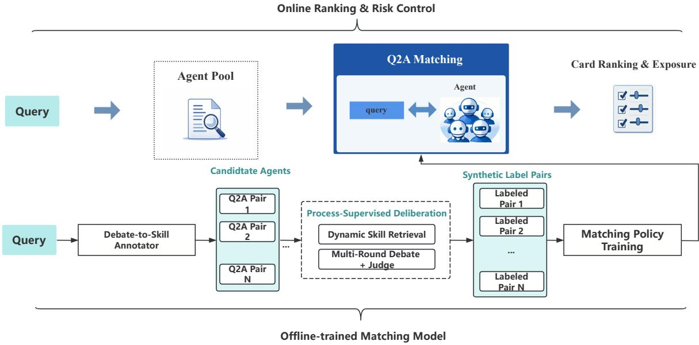
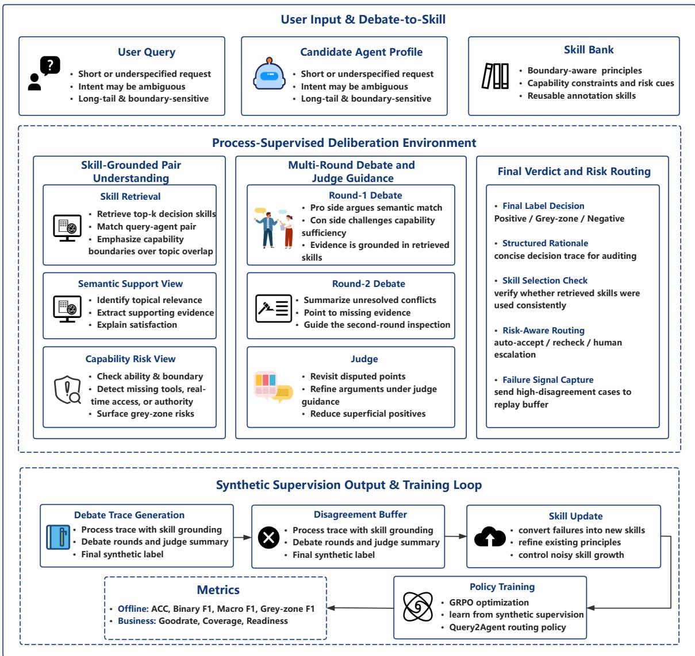

# Debate-to-Skill: Capability-Bound Process Supervision for Industrial Query-to-Agent Annotation

Shiyu Zhang1, Leisheng Cheng1, Huifu Li1\*

1Baidu, Inc.

zhsy12345689@gmail.com, chengleisheng@baidu.com, lihuifufu@163.com

## Abstract

Industrial query-to-agent matching fails when topical relevance is mistaken for executable capability, especially on long-tail and boundarysensitive requests. We formulate annotation as capability-bound process supervision and instantiate it with Debate-to-Skill, which uses reusable decision principles, structured deliberation, verifier-based verdict extraction, and disagreement-driven refinement. On an industrial Query2Agent benchmark, we compare Debate-to-Skill with direct-label supervision, reasoning-SFT, and structural ablations. The results test whether gains come from supervising the capability-critical decision process itself, especially on grey-zone cases where semantic relatedness and executable capability diverge.

## 1 Introduction

Large-scale search and agent platforms increasingly rely on query-to-agent matching to connect user requests with executable AI services. In industrial search and agent-serving surfaces, this decision directly affects card exposure, downstream engagement, and later policy learning. Recent advances in instruction following, tool use, and reasoning make agent serving increasingly practical (Wei et al., 2022a; Yao et al., 2023b; Schick et al., 2023; Asai et al., 2024), but they do not remove the annotation bottleneck: production traffic is massive, long-tail, and boundary-sensitive, while highquality expert labels remain scarce.

The main difficulty is that query-to-agent supervision is usually formulated as semantic relevance prediction, even though the costly production errors come from a different source. A candidate agent can look topically related yet still be invalid because it lacks the required tools, authority, realtime access, or service boundary to complete the task. Weak supervision and pseudo-labeling can amplify label volume (Burns et al., 2023; Shin et al., 2025; Cui et al., 2025), and structured reasoning can make decisions more inspectable (Wei et al., 2022b; Wang et al., 2023; Du et al., 2024; Lightman et al., 2024), but neither directly fixes this mismatch if the supervision target itself remains a final relevance label. We therefore argue that queryto-agent matching is not fundamentally a relevance problem. It is a capability verification problem under asymmetric risk.

We address this by formulating industrial annotation as capability-bound process supervision. Instead of asking the model to emit a one-shot label, we supervise whether a query-agent pair passes a capability-critical decision process grounded in reusable principles, explicit support-vs.-failure evidence decomposition, structured verdict extraction, and disagreement-driven refinement. We instantiate this formulation with Debate-to-Skill and evaluate it against direct-label supervision, reasoning-SFT, and structural ablations on industrial Query2Agent benchmarks. The resulting experiments are designed to test a single claim: the main gains should come from supervising the capability-bound decision process itself, especially on grey-zone cases where semantic relatedness and executable capability diverge.

Our contributions are:

• We diagnose industrial query-to-agent annotation as a supervision-object problem: the dominant final-label formulation collapses semantic relatedness and executable capability, leading to systematic errors on grey-zone and boundarysensitive cases.

• We propose capability-bound process supervision as the correct target for this setting, and instantiate it with Debate-to-Skill, where reusable capability principles, evidence factorization, verifier extraction, and disagreement abstraction make the decision process observable and

  
Figure 1: Industrial Query2Agent workflow: online serving routes user requests to candidate agents, while the offline loop converts traffic and review signals into Debate-to-Skill supervision for routing-policy updates.

trainable.

• We instantiate this process-supervision target through reasoning-SFT and verifier-based GRPO, showing that capability-bound traces provide a stronger learnable object than direct labels or generic reasoning.

## 2 Problem Setting

Each training example is a query-agent pair $x =$ $( q , a )$ , where q is a user request from industrial traffic and a is a candidate agent profile. The raw annotation space in our pipeline is ternary: $y _ { \mathrm { r a w } } = 2$ if the agent can satisfy the request, $y _ { \mathrm { r a w } } = 1$ if the pair is semantically related but capability-insufficient or risky, and $y _ { \mathrm { r a w } } = 0$ if it is not relevant. For training and standard evaluation, we collapse this into a binary target $y \in \{ 0 , 1 \}$ } by treating only $y _ { \mathrm { r a w } } = 2$ as positive. Unless otherwise stated, binary metrics are computed after this deployment collapse, while grey-zone diagnostics use the raw ternary verdict before collapse. This formulation mirrors the business objective: the central failure is not missing topical relatedness, but over-accepting grey-zone pairs whose apparent relevance does not survive capability-bound inspection. Our method is therefore designed to supervise the decision process that maps business-side capability risk into a learnable annotation target.

Grey-zone example. Consider the anonymized query “My flight is delayed, help me rebook” and a candidate “Travel Assistant” whose profile advertises travel consultation but exposes no ticketing, order-modification, inventory, or booking APIs. The pair is topically related, but it is not an executable match: rebooking requires access to the user’s order and a transaction API. Debate-to-Skill retrieves principles about capability boundaries, real-time requirements, and consulting-versus-execution, supports semantic relevance, and then vetoes the pair on capability grounds. Gold labels are never included in evaluation or inference prompts.

## 3 Method

## 3.1 Method Overview

Debate-to-Skill supervises whether a query–agent pair remains valid after capability-bound inspection. As shown in Figure 2, it retrieves reusable decision principles, separates semantic support from capability objections, uses judge guidance to refine the trace, extracts a structured verdict, and stores recurring high-priority disagreements for principle refinement.

## 3.2 Principle-Grounded Deliberation

Each example is x = (q, a), and S = $\{ s _ { 1 } , \ldots , s _ { | S | } \}$ is a principle-level skill bank. Each

  
Figure 2: Debate-to-Skill workflow. A query–agent pair retrieves relevant decision skills, undergoes judge-guided debate, and feeds high-priority failures into a disagreement buffer for skill refinement.

skill is

$$
s _ { j } = \big ( t _ { j } , p _ { j } , a _ { j } , g _ { j } \big ) ,\tag{1}
$$

where $t _ { j }$ is a title, $p _ { j }$ a capability principle, $a _ { j }$ its application condition, and $g _ { j }$ its tags. Given x, the system produces

$$
\mathcal { D } ( x ) = \left\{ d _ { t } ^ { \mathrm { s e m } } , d _ { t } ^ { \mathrm { c r i t } } , g _ { t } \right\} _ { t = 1 } ^ { T } ,
$$

where $d _ { t } ^ { \mathrm { s e m } }$ is semantic support, $d _ { t } ^ { \mathrm { c r i t } }$ is a capability objection, and $g _ { t }$ is judge guidance. The skill bank maps instance ambiguity into a compact principle space before deliberation.

Let $\phi ( x )$ and $\phi ( s )$ be capability-relevant representations of an input and a skill. Our implementation uses lexical bag-of-tokens features. Retrieval

uses

$$
\mathrm { s i m } ( x , s ) = \frac { \phi ( x ) ^ { \top } \phi ( s ) } { \| \phi ( x ) \| _ { 2 } \| \phi ( s ) \| _ { 2 } } ,\tag{2}
$$

and the retrieved skill set is

$$
S _ { x } = \mathrm { T o p K } _ { s \in \cal S } \ \sin ( x , s ) .\tag{3}
$$

We use $k = 3$ and fall back to seed skills when all scores are zero. Lexical retrieval is chosen for transparency, bounded latency, and auditability in the industrial annotation setting. For comparisons that retain dynamic skills, the same lexical retriever is used, so differences do not come from switching retrieval families. The w/o Dynamic Skills ablation intentionally replaces sample-conditioned retrieval and update with fixed seed skills to measure the contribution of dynamic skill grounding; dense or learned skill retrieval is left to future work. Retrieved skills are injected into a fixed debate scaffold:

$$
\begin{array} { r } { \left( d _ { t } ^ { \mathrm { s e m } } , d _ { t } ^ { \mathrm { c r i t } } \right) = f _ { \theta } ( x , S _ { x } , h _ { t - 1 } , g _ { t - 1 } ) , \quad t = 1 , \dots , T , } \end{array}\tag{4}
$$

where $h _ { t - 1 }$ is prior dialogue history. This factorizes semantic relevance and executable capability before labeling.

The skill bank is adaptive. Let $B _ { t }$ be the disagreement buffer of capability-sensitive conflicts. Skill updating is

$$
\boldsymbol { S } _ { t + 1 } = \boldsymbol { U } ( \boldsymbol { S } _ { t } , \boldsymbol { B } _ { t } ) ,\tag{5}
$$

where $U$ promotes recurring high-priority conflicts into new or refined principles rather than storing raw traces. The full procedural pseudocode is provided in Appendix ??.

## 3.3 Process-Supervised Learning

The structured trace is the learning target. We use reasoning-SFT on full traces and an RL-style view that verifies the final verdict. The verifier extracts

$$
\tilde { y } = \mathrm { E x t r a c t } ( g _ { \boldsymbol { \theta } } ( x , S _ { x } , \mathcal { D } ( x ) ) )\tag{6}
$$

and assigns the reward

$$
\begin{array} { r l } { R _ { \mathrm { v e r } } ( x ) = R _ { \mathrm { c l s } } ( x ) } & { } \\ & { ~ + ~ \lambda _ { \mathrm { s e c } } R _ { \mathrm { s e c } } ( x ) } \\ & { ~ + ~ \lambda _ { \mathrm { s k i l l } } R _ { \mathrm { s k i l l } } ( x ) , } \end{array}\tag{7}
$$

where

$$
\begin{array} { r l r } & { } & { R _ { \mathrm { c l s } } ( \boldsymbol { x } ) = \mathbf { 1 } [ \tilde { y } = y ] , ~ ( 8 ) } \\ & { } & { R _ { \mathrm { s e c } } ( \boldsymbol { x } ) = \mathbf { 1 } [ \mathcal { D } ( \boldsymbol { x } ) \mathrm { c o n t a i n s \ a l l \ r e q u i r e d \ s e c t i o n s } ] , } \\ & { } & { ( 9 ) ~ } \end{array}
$$

Rskill(x) = 1[selected skill ids are valid and retrieve d]

(10)

In the current codebase, $R _ { \mathrm { c l s } } = 1 . 0$ and the other terms contribute 0.1 each. The verifier is intentionally scoped to capability consistency rather than free-form entailment: it checks verdict correctness, required sections, and valid retrieved skill ids. Logical faithfulness of arbitrary natural-language reasoning is instead encouraged through reasoning-SFT on full support-vs.-veto traces and summarized with the process-fidelity audit in Table 4. GRPO with KL regularization optimizes

$$
\begin{array} { r l } & { \mathcal { L } _ { \mathrm { R L } } ( \theta ) = \mathrm { ~ - ~ } \mathbb { E } \left[ \operatorname* { m i n } \binom { r _ { t } ( \theta ) \hat { A } _ { t } , } { \mathrm { c l i p } ( r _ { t } ( \theta ) , 1 - \epsilon , 1 + \epsilon ) \hat { A } _ { t } } \right) } \\ & { \quad \quad \quad + \beta \mathrm { K L } ( \pi _ { \theta } \| \pi _ { \mathrm { r e f } } ) , } \end{array}\tag{11}
$$

where $r _ { t } ( \theta )$ is the policy ratio, ${ \hat { A } } _ { t }$ is induced by verifier reward, and $\pi _ { \mathrm { r e f } }$ is the reference policy. Reasoning-SFT uses the complete trace z =

$$
\mathcal { L } _ { \operatorname { S F T } } ( \theta ) = - \sum _ { t = 1 } ^ { T } \log p _ { \theta } ( z _ { t } \mid z _ { < t } , x ) .\tag{12}
$$

Together, Eqs. (11) and (12) make process supervision trainable.

## 3.4 Risk-Aware Verdicts and Adaptation

We extract the prediction from the judge section:

$$
\hat { y } = g _ { \boldsymbol { \theta } } ( x , S _ { x } , { \cal D } ( x ) ) ,\tag{13}
$$

where $g _ { \theta }$ aggregates the trace. Thus $\hat { y }$ is a risk-sensitive verdict conditioned on the input and retrieved capability principles, enabling wellstructured cases to enter synthetic supervision and unstable cases to be rechecked.

The disagreement buffer links one-step deliberation to principle evolution by prioritizing cases where semantic evidence, capability evidence, and judge outcome conflict:

$$
\begin{array} { r l } { p ( x ) = \left| y ^ { \mathrm { s e m } } - y ^ { \mathrm { c r i t } } \right| ~ } & { } \\ { + \alpha \mathbf { 1 } \Big [ y ^ { \mathrm { h u m a n } } \neq y ^ { \mathrm { j u d g e } } \Big ] ~ } & { } \\ { + \beta \mathbf { 1 } [ x \mathrm { t r i g g e r s ~ s k i l l ~ u p d a t e } ] , } \end{array}\tag{14}
$$

with $\alpha = 1 . 0$ and $\beta = 0 . 5$ . The $y ^ { \mathrm { h u m a n } }$ term is available only in offline human-audited annotation batches and is never used in evaluation or online inference prompts.

The update operator acts only on recurring, informative conflicts:

$$
G ( c ) = { \bf 1 } \Big [ \mathrm { f r e q } ( c ) \geq \tau _ { f } \ \wedge \bar { p } ( c ) \geq \tau _ { p } \Big ] = 1 ,\tag{15}
$$

where $c$ is a conflict pattern. Once the gate passes, the principle space is expanded or refined:

$$
S _ { t + 1 } = \left\{ \begin{array} { l l } { S _ { t } \cup \{ s _ { \mathrm { n e w } } ( c ) \} , } & { \mathrm { i f } \neg \mathrm { c o v } ( c , S _ { t } ) , } \\ { \mathrm { R e f i n e } ( S _ { t } , c ) , } & { \mathrm { o t h e r w i s e } . } \end{array} \right.\tag{16}
$$

Here, cov $( c , S _ { t } )$ indicates that an existing principle already covers conflict pattern c. Thus the system learns safer verdicts while refining the capability #principles used by future verdicts. The update procedure remains conservative and rule-driven: examples with $p ( x ) \geq \tau$ enter a conflict buffer, and when a pattern appears at least $\tau _ { f } = 3$ times and its mean priority exceeds $\tau _ { p } .$ , the corresponding principle is updated by revising its text, when-to-apply condition, or tags. For example, repeated overacceptance of consulting-only agents for execution requests refines a boundary principle stating that topical match is insufficient when the agent lacks the required tools, authority, or transaction APIs.

## 4 Experiments

## 4.1 Experiment Setup

Synthetic-labeling pipeline overview. Our experiments follow the offline annotation loop in Figure 1. Starting from industrial Query2Agent traffic, we construct synthetic supervision with direct labels, reasoning traces, or Debate-to-Skill process traces, and then train downstream routing models. All models use Qwen2.5-14B-Instruct as the backbone. The teacher is the offline D2S pipeline, and the student is a Qwen2.5-14B-Instruct routing model trained with SFT and GRPO. SFT uses the binary target induced from the ternary annotation scheme, where raw-label-2 maps to positive and raw-label-1/0 map to negative; ternary labels are retained for trace construction and grey-zone analysis. GRPO samples 8 rollouts per example and uses normalized advantages $\hat { A } _ { i } = ( R _ { i } - \bar { R } ) / \sigma _ { R }$ . The reward uses classification correctness with weight 1.0 and section-validity and skill-grounding rewards with $\lambda _ { \mathrm { s e c } } = \lambda _ { \mathrm { s k i l l } } = 0 . 1$

Data construction and splits. The training set contains 170K anonymized search-engine query– agent pairs collected from 2025Q4 production traffic, with raw-label ratio $\{ 2 , 1 , 0 \} = 5 { : } 2 { : } 3$ . We use a separate randomly sampled 3,000-example validation set. Main Test, Domain, and Longtail each contain 1,000 human-labeled pairs, for 3,000 test examples in total; the grey-zone slice contains 312 raw-label-1 examples. Validation and test data use an 80/20 temporal composition, with 80% from 2025Q4 and 20% from 2026Q1. Splits are separated before training and evaluation: after normalization, the same query appears in only one of train, validation, or test. Exact query–agent duplicates are removed, and near-duplicate queries are clustered and deduplicated. Agent profiles are not globally deduplicated because one deployed agent can validly serve many queries. Candidate agents come from production serving logs: for each logged query, we take the top-k online exposed candidates for annotation.

Annotation protocol. Internal domain annotators used a ternary label scheme: 2 denotes an executable match, 1 denotes a semantically related but capability-insufficient or risky pair, and 0 denotes an irrelevant pair. The two-annotator protocol applies to the human-labeled evaluation sets and manually audited subsets: each item in these sets was labeled by two annotators, disagreements were adjudicated, and raw agreement was 86.4%. The 170k training labels are produced by the offline teacher pipeline rather than exhaustively doubleannotated by humans.

Evaluation dataset and metrics. All methods are evaluated on the same fixed test protocol. Main Test is a random sample from online industrial Query2Agent traffic and serves as the primary production-style benchmark. Q2A focuses on everyday life-service scenarios, Domain covers professional traffic including business, industrial, document, emotional, and law categories, and Longtail isolates sparse and boundary-sensitive intents that are weakly represented in head traffic. We report Accuracy, Binary F1, Macro F1, and Grey-zone F1. Binary F1 collapses raw-label-1 and raw-label-0 into the negative class. Grey-zone F1 is a diagnostic one-vs-rest F1 computed from the raw ternary verdict before this collapse, treating raw-label-1 as the positive class.

## 4.2 Offline Evaluation

Our offline evaluation tests whether capabilitybound supervision is a better learning target than direct-label supervision and generic reasoning. We define three structural ablations before Table 1. The comparison chain is intentionally explicit: SFT Label → SFT Reasoning → w/o Debate → Debateto-Skill. w/o Debate removes the support-vs.-veto scaffold and makes a one-pass prediction, while keeping the same SFT+GRPO training loop. This is our closest RL-without-full-D2S control and tests whether the central support-vs.-veto process, rather than the shared GRPO loop alone, explains the gain. w/o Dynamic Skills keeps the debate scaffold but uses the same fixed three seed skills for all examples, removing sample-conditioned skill retrieval and update. w/o Judge removes final judge aggregation and uses the last debate round as the verdict, isolating the contribution of veto-aware aggregation. Table 1 reports the main comparison on MAIN TEST together with the grey-zone slice, so the same table serves both as the primary result table and as the core structural ablation of the process object.

Table 2 makes the diagnosis more explicit by isolating the two most important errors: overaccepting grey-zone pairs and missing true positives. Together, Tables 1 and 2 test whether the gain really comes from better capability-bound decisions rather than from generic output length or uniform conservatism.

Table 3 tests robustness across professionaldomain and long-tail traffic. Table 4 complements the label-based metrics with process-level evidence. Structured Validity measures whether the output contains all required sections and a parseable final verdict; Skill Grounding Rate measures whether the selected skills are valid and belong to the retrieved candidate set; Capability Conflict Resolution measures, on a manually audited subset, whether the final verdict follows capability-critical evidence when semantic support and capability evidence disagree. The higher structured validity of w/o Dynamic Skills reflects more template-fixed outputs after removing skill updates, but its lower grounding and conflict resolution show weaker capability-sensitive reasoning. Its purpose is to show that the full method does not only output better labels, but also produces more valid, more grounded, and more capability-consistent decision traces.

## 4.3 Online Evaluation

We deploy Debate-to-Skill as an offline annotation layer. The treatment policy uses Debate-to-Skill synthetic supervision, while the baseline is the previous-quarter SFT Label policy; online serving exposes only the trained routing model, so the debate cost is one-time offline generation rather than online serving latency. The online A/B test ran for four weeks with 10% treatment traffic, with bucket assignment fixed before serving and the anonymized traffic bucket as the experimental unit. Significance was assessed using the platform’s standard bucket-level A/B testing procedure, and the reported gains in card impression rate, card CTR, and downstream redirect CTR are significant at $p < 0 . 0 5$ Due to internal reporting constraints, absolute traffic volumes, absolute business rates, and interval estimates are not disclosed; Table 5 reports relative lifts over the deployed baseline. We also monitored launch guardrails, including serving stability and downstream redirect quality, and observed no launch-blocking degradation.

We report relative lift in card impression rate, card CTR, and downstream redirect CTR. Table 5 reports an online A/B test on industrial card-serving traffic.

## 5 Related Work

Weak supervision and verifier-guided reasoning. Prior work touches our setting through weak supervision, reasoning verification, retrieval and routing, agent memory, and skill-augmented RL. Weak-supervision methods extract signals from imperfect teachers, noisy labels, and supervision diversity (Burns et al., 2023; Cui et al., 2025; Shin et al., 2025; Goel et al., 2025). We use these works as motivation for strengthening the supervision ob ject, but our setup keeps the same Qwen2.5-14B-Instruct backbone throughout; the novelty lies in the supervision object, not in a size-gap formulation. Reasoning work improves difficult deci sions through chain-of-thought prompting, selfconsistency, decomposition, and self-generated ra tionales (Wei et al., 2022b; Kojima et al., 2022; Wang et al., 2023; Zhou et al., 2023; Zelikman et al., 2022). Tool use, search, self-refinement, debate, step-level verification, and consistency-style hallu cination checks make these traces more operational and checkable (Yao et al., 2023b; Schick et al., 2023; Yao et al., 2023a; Madaan et al., 2023; Du et al., 2024; Lightman et al., 2024). However, these lines of work still optimize different objects. Weak supervision mainly improves label quality, reasoning methods mainly improve the explicitness or checkability of a decision trace, and retrieval, routing, and skill-augmented RL mainly improve selection or execution efficiency. None of them is built around the industrial failure mode that matters here: a query can look topically relevant while still being non-executable because the candidate agent lacks the required tools, authority, real-time access, or service boundary. In Query-to-Agent matching, the core target is therefore not relevance, trace length, or skill reuse, but capability-consistent executability. Debate-to-Skill also draws on black-box output checking (Manakul et al., 2023), but changes the supervised object: the trace is a capability-bound target optimized by SFT and verifier-based RL, not only an inference scaffold.

Retrieval, routing, and agent memory. Retrieval and routing work studies LLM reranking, query rewriting, active retrieval, and toolaugmented benchmarks (Sun et al., 2023; Ma et al.,

Table 1: Offline evaluation results on an industrial Query2Agent benchmark.
<table><tr><td rowspan="2">Model</td><td colspan="3">Main Test</td><td colspan="2">Grey-zone</td></tr><tr><td>ACC</td><td>Binary F1</td><td>Macro F1</td><td>F1</td><td>Support</td></tr><tr><td>SFT Label</td><td>81.3</td><td>77.9</td><td>74.6</td><td>45.8</td><td>312</td></tr><tr><td>SFT Reasoning</td><td>87.1</td><td>84.8</td><td>81.2</td><td>53.4</td><td>312</td></tr><tr><td>Debate-to-Skill</td><td>91.6</td><td>89.7</td><td>87.4</td><td>64.9</td><td>312</td></tr><tr><td>w/o Debate</td><td>88.6</td><td>86.1</td><td>82.9</td><td>56.7</td><td>312</td></tr><tr><td>w/o Dynamic Skills</td><td>89.4</td><td>87.3</td><td>84.4</td><td>59.8</td><td>312</td></tr><tr><td>w/o Judge</td><td>86.9</td><td>84.5</td><td>80.8</td><td>49.6</td><td>312</td></tr></table>

Table 2: Grey-zone pathology analysis on an industrial Query2Agent benchmark. Grey-zone Over-Accept Rate is the fraction of raw-label-1 pairs predicted as positive, and Positive Miss Rate is the fraction of raw-label-2 pairs predicted as non-match.
<table><tr><td>Model</td><td>Grey-zone Over-Accept Rate ↓</td><td>Positive Miss Rate ↓</td></tr><tr><td>SFT Label</td><td>33.7</td><td>9.8</td></tr><tr><td>SFT Reasoning</td><td>26.4</td><td>8.1</td></tr><tr><td>Debate-to-Skill</td><td>16.9</td><td>7.4</td></tr><tr><td>w/o Debate</td><td>23.5</td><td>7.9</td></tr><tr><td>w/o Dynamic Skills</td><td>21.2</td><td>7.6</td></tr><tr><td>w/o Judge</td><td>29.8</td><td>8.7</td></tr></table>

Table 3: Offline evaluation across professional-domain and long-tail evaluation slices.
<table><tr><td rowspan="2">Model</td><td colspan="2">Domain</td><td colspan="2">Longtail</td></tr><tr><td>ACC</td><td>F1</td><td>ACC</td><td>F1</td></tr><tr><td>SFT Label</td><td>73.4</td><td>74.9</td><td>61.0</td><td>68.3</td></tr><tr><td>SFT Reasoning</td><td>74.0</td><td>75.5</td><td>66.2</td><td>73.8</td></tr><tr><td>Debate-to-Skill</td><td>77.4</td><td>79.9</td><td>72.2</td><td>78.6</td></tr></table>

Table 4: Process-fidelity audit.
<table><tr><td>Model</td><td>Structured Validity ↑</td><td>Skill Grounding Rate ↑</td><td>Capability Conflict Resolution ↑</td></tr><tr><td>Debate-to-Skill</td><td>88.1</td><td>92.7</td><td>88.3</td></tr><tr><td>w/o Debate</td><td>81.6</td><td>91.2</td><td>72.4</td></tr><tr><td>w/o Dynamic Skills</td><td>97.5</td><td>62.8</td><td>79.1</td></tr><tr><td>w/o Judge</td><td>69.3</td><td>93.1</td><td>58.6</td></tr></table>

Table 5: Online A/B test $( p < 0 . 0 5 )$ . Values are relative changes over the deployed SFT Label baseline.
<table><tr><td>Model</td><td>∆ Card Impression Rate ↑</td><td>∆ Card CTR ↑</td><td>∆ Redirect CTR ↑</td></tr><tr><td>Baseline</td><td>0</td><td>0</td><td>0</td></tr><tr><td>Ours</td><td>+15.79%</td><td>+7.63%</td><td>+6.12%</td></tr></table>

2023; Jiang et al., 2023; Li et al., 2023). Structured RAG further interleaves retrieval with graph structure or speculative generation (Jin et al., 2026). Agent memory and self-adaptation work reuses prior workflows, memories, or generated experience for future tasks (Wang et al., 2025; Xu et al., 2025; Zweiger et al., 2025). These methods mainly improve query–document relevance, tool execution, or future task reuse. Our disagreement buffer instead stores reusable decision principles for recurring query–agent capability failures.

Skill-augmented reinforcement learning. Recent skill+RL work builds skill libraries, retrieves them for new tasks, co-evolves them with the policy, or internalizes them into the agent (Xia et al., 2026; Tu et al., 2026; Lu et al., 2026; Zhu et al., 2026; Lin et al., 2026). Toolspace RL similarly learns context acquisition and tool execution under sparse rewards (Gupta et al., 2026). These methods optimize interactive task success. We instead optimize capability-bound annotation: skills are decision principles, and rewards measure verdict correctness, trace validity, and skill grounding. This distinction is tested by our dynamic-skill ablation and GRPO training view.

## 6 Conclusion

We introduced Debate-to-Skill, a processsupervised annotation framework for industrial query-to-agent matching. The central claim is that query-to-agent supervision should be capability-bound: the critical distinction is not topical relatedness, but whether a candidate agent remains executable after explicit capability-bound inspection. Debate-to-Skill instantiates this claim through reusable decision principles, structured deliberation traces, verifier-based optimization, and disagreement-driven refinement, showing that industrial annotation improves when the learned object matches capability-qualified executability.

## 7 Limitations

Our implementation has three main limitations. First, several modules are deliberately conservative for industrial auditability: skill retrieval is lexical rather than embedding-based, disagreement-driven updates remain rule-based, and risk-aware routing does not yet use calibrated abstention thresholds. These choices make the system easier to inspect but may underuse semantic retrieval, learned memory update, and calibrated uncertainty. Second, the verifier checks verdict correctness, section validity, and skill legality, but it does not fully verify the faithfulness of natural-language capability evidence. We currently encourage logical faithfulness through reasoning-SFT on support-vs.-veto traces and audit it with process-level metrics; learning a dedicated entailment verifier for the debate trace is future work. Third, the evaluation remains tied to an industrial Query2Agent setting. The full results require running the released training and scoring jobs end to end, and existing public benchmarks such as ToolBench and API-Bank do not contain our key raw-label-1 category: semantically plausible but capability-invalid pairs. Building a public grey-zone benchmark from open agent registries is therefore an important next step.

## References

Akari Asai, Zeqiu Wu, Yizhong Wang, Avirup Sil, and Hannaneh Hajishirzi. 2024. Self-RAG: Learning to retrieve, generate, and critique through self-reflection.

In International Conference on Learning Representations.

Collin Burns, Pavel Izmailov, Jan Kirchner, et al. 2023. Weak-to-strong generalization: Eliciting strong capabilities with weak supervision. arXiv preprint arXiv:2312.09390.

Ziyun Cui, Ziyang Zhang, Guangzhi Sun, Wen Wu, and Chao Zhang. 2025. Bayesian WeakS-to-Strong from text classification to generation. In International Conference on Learning Representations, pages 29777–29794.

Yilun Du, Shuang Li, Antonio Torralba, Joshua B Tenenbaum, and Igor Mordatch. 2024. Improving factuality and reasoning in language models through multiagent debate. In International Conference on Learning Representations.

Shashwat Goel, Joschka Struber, Ilze Auzina, et al. 2025. Great models think alike and this undermines AI oversight. arXiv preprint arXiv:2502.04313.

Karan Gupta, Pranav Vajreshwari, Yash Pandya, and Akshay Nambi. 2026. Scaling agentic capabilities, not context: Efficient reinforcement finetuning for large toolspaces. In ICLR 2026 Workshop on Reliable Autonomy.

Zhengbao Jiang, Frank Xu, Luyu Gao, Zhiqing Sun, Qian Liu, Jane Dwivedi-Yu, Yiming Yang, Jamie Callan, and Graham Neubig. 2023. Active retrieval augmented generation. In Proceedings ofthe 2023 Conference on Empirical Methods in Natural Language Processing, pages 7969–7992.

Yifan Jin, Qirui Ji, Bin Qin, et al. 2026. Generalizing graph foundation models via hyperbolic retrievalaugmented generation. In Proceedings ofthe 32nd ACM SIGKDD Conference on Knowledge Discovery and Data Mining, pages 2204–2214.

Takeshi Kojima, Shixiang Shane Gu, Machel Reid, Yutaka Matsuo, and Yusuke Iwasawa. 2022. Large language models are zero-shot reasoners. In Advances in neural information processing systems, volume 35, pages 22199–22213.

Minghao Li, Yingxiu Zhao, Bowen Yu, Feifan Song, Hangyu Li, Haiyang Yu, Zhoujun Li, Fei Huang, and Yongbin Li. 2023. API-bank: A comprehensive benchmark for tool-augmented LLMs. In Proceedings of the 2023 Conference on Empirical Methods in Natural Language Processing, pages 3102–3116.

Hunter Lightman, Vineet Kosaraju, Yura Burda, Harri Edwards, et al. 2024. Let’s verify step by step. In International Conference on Learning Representations.

Hongxiang Lin, Zhirui Kuai, Erpeng Xue, and Lei Wang. 2026. SkillC: Learning autonomous skill internalization in LLM agents via contrastive credit assignment. arXiv preprint arXiv:2605.27899.

Zhengxi Lu, Zhiyuan Yao, Jinyang Wu, Chengcheng Han, Qi Gu, Xunliang Cai, Weiming Lu, Jun Xiao, Yueting Zhuang, and Yongliang Shen. 2026. SKILL0: In-context agentic reinforcement learning for skill internalization. arXiv preprint arXiv:2604.02268.

Xinbei Ma, Yeyun Gong, Pengcheng He, Hai Zhao, and Nan Duan. 2023. Query rewriting in retrievalaugmented large language models. In Proceedings of the 2023 Conference on Empirical Methods in Natural Language Processing, pages 5303–5315.

Aman Madaan, Niket Tandon, Prakhar Gupta, et al. 2023. Self-refine: Iterative refinement with selffeedback. In Advances in Neural Information Processing Systems, volume 36, pages 46534–46594.

Potsawee Manakul, Adian Liusie, and Mark J. F. Gales. 2023. SelfCheckGPT: Zero-resource black-box hallucination detection for generative large language models. In Proceedings ofthe 2023 Conference on Empirical Methods in Natural Language Processing, pages 9004–9017.

Timo Schick, Jane Dwivedi-Yu, Roberto Dessi, et al. 2023. Toolformer: Language models can teach themselves to use tools. In Advances in Neural Information Processing Systems, volume 36, pages 68539– 68551.

Changho Shin, John Cooper, and Frederic Sala. 2025. Weak-to-strong generalization through the datacentric lens. In International Conference on Learning Representations, volume 2025, pages 22039– 22077.

Weiwei Sun, Lingyong Yan, Xinyu Ma, Shuaiqiang Wang, Pengjie Ren, Zhumin Chen, Dawei Yin, and Zhaochun Ren. 2023. Is ChatGPT good at search? investigating large language models as re-ranking agents. In Proceedings of the 2023 Conference on Empirical Methods in Natural Language Processing, pages 14918–14937.

Songjun Tu, Chengdong Xu, Qichao Zhang, Yaocheng Zhang, Xiangyuan Lan, Linjing Li, Li Dong, and Dongbin Zhao. 2026. Dynamic dual-granularity skill bank for agentic RL. arXiv preprint arXiv:2603.28716.

Xuezhi Wang, Jason Wei, Dale Schuurmans, Quoc Le, Ed Chi, Sharan Narang, Aakanksha Chowdhery, and Denny Zhou. 2023. Self-consistency improves chain of thought reasoning in language models. In International Conference on Learning Representations.

Zora Zhiruo Wang, Jiayuan Mao, Daniel Fried, and Graham Neubig. 2025. Agent workflow memory. In International Conference on Machine Learning.

Jason Wei, Maarten Bosma, Vincent Y. Zhao, Kelvin Guu, Adams Wei Yu, Brian Lester, Nan Du, Andrew M. Dai, and Quoc V. Le. 2022a. Finetuned language models are zero-shot learners. In International Conference on Learning Representations.

Jason Wei, Xuezhi Wang, Dale Schuurmans, et al. 2022b. Chain-of-thought prompting elicits reasoning in large language models. In Advances in Neural Information Processing Systems, volume 35, pages 24824–24837.

Peng Xia, Jianwen Chen, Hanyang Wang, Jiaqi Liu, Kaide Zeng, Yu Wang, Siwei Han, Yiyang Zhou, Xujiang Zhao, Haifeng Chen, et al. 2026. Skillrl: Evolving agents via recursive skill-augmented reinforcement learning. arXiv preprint arXiv:2602.08234.

Wujiang Xu, Zujie Liang, Kai Mei, Hang Gao, Juntao Tan, and Yongfeng Zhang. 2025. A-Mem: Agentic memory for LLM agents. In Advances in Neural Information Processing Systems, volume 38, pages 17577–17604.

Shunyu Yao, Dian Yu, Jeffrey Zhao, Izhak Shafran, Thomas L. Griffiths, Yuan Cao, and Karthik R. Narasimhan. 2023a. Tree of thoughts: Deliberate problem solving with large language models. In Advances in Neural Information Processing Systems, volume 36, pages 11809–11822.

Shunyu Yao, Jeffrey Zhao, Dian Yu, Nan Du, Izhak Shafran, Karthik Narasimhan, and Yuan Cao. 2023b. ReAct: Synergizing reasoning and acting in language models. In International Conference on Learning Representations.

Eric Zelikman, Yuhuai Wu, et al. 2022. Star: Bootstrapping reasoning with reasoning. In Advances in Neural Information Processing Systems, volume 35, pages 15476–15488.

Denny Zhou, Nathanael Schärli, Le Hou, Jason Wei, Nathan Scales, Xuezhi Wang, Dale Schuurmans, Claire Cui, Olivier Bousquet, Quoc Le, and Ed Chi. 2023. Least-to-most prompting enables complex reasoning in large language models. In International Conference on Learning Representations.

Jiapeng Zhu, Jianxiang Yu, Yibo Zhao, Chengcheng Han, Qi Gu, Xunliang Cai, Xiang Li, and Weining Qian. 2026. Skill0.5: Joint skill internalization and utilization for out-of-distribution generalization in agentic reinforcement learning. arXiv preprint arXiv:2605.28424.

Adam Zweiger, Jyothir Pari, Han Guo, Yoon Kim, and Pulkit Agrawal. 2025. Self-adapting language models. In Advances in Neural Information Processing Systems, volume 38, pages 74084–74115.