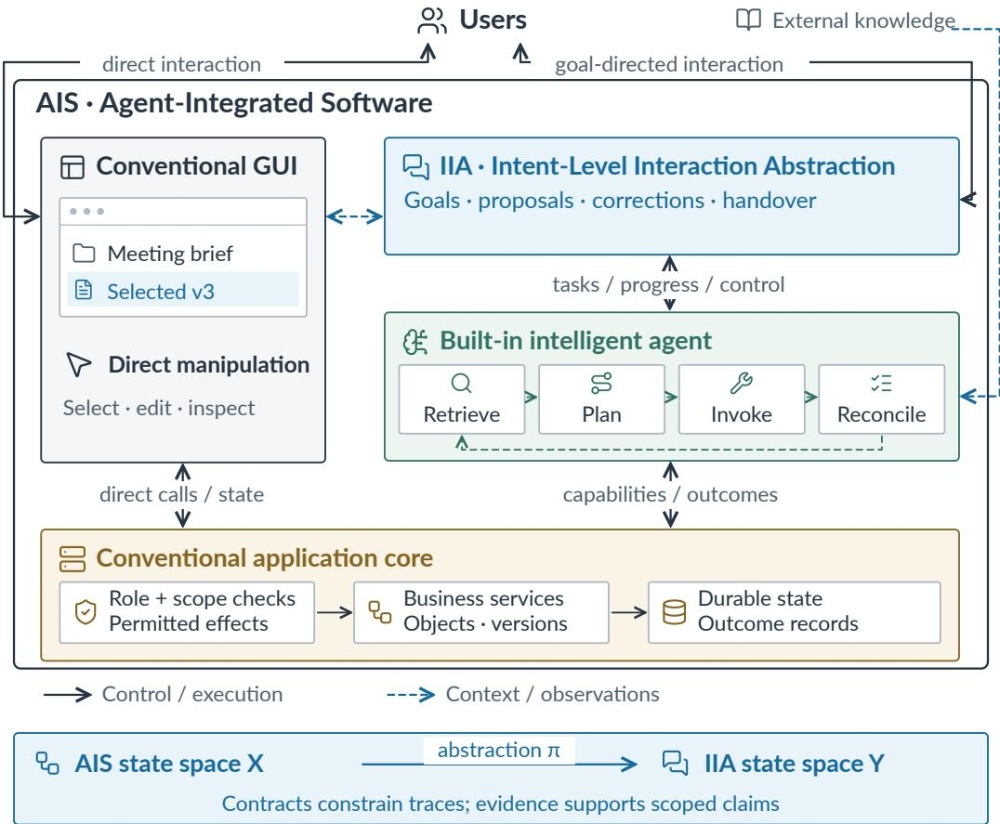
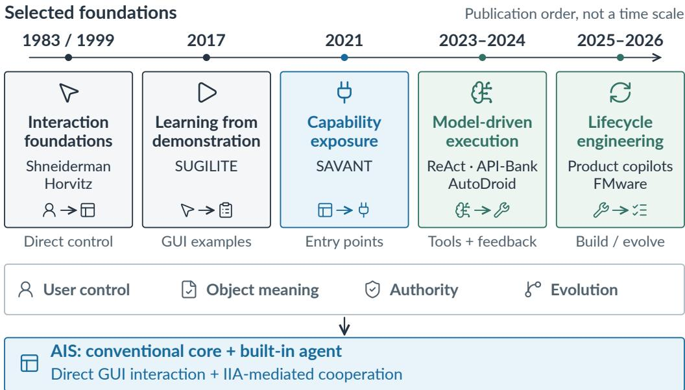
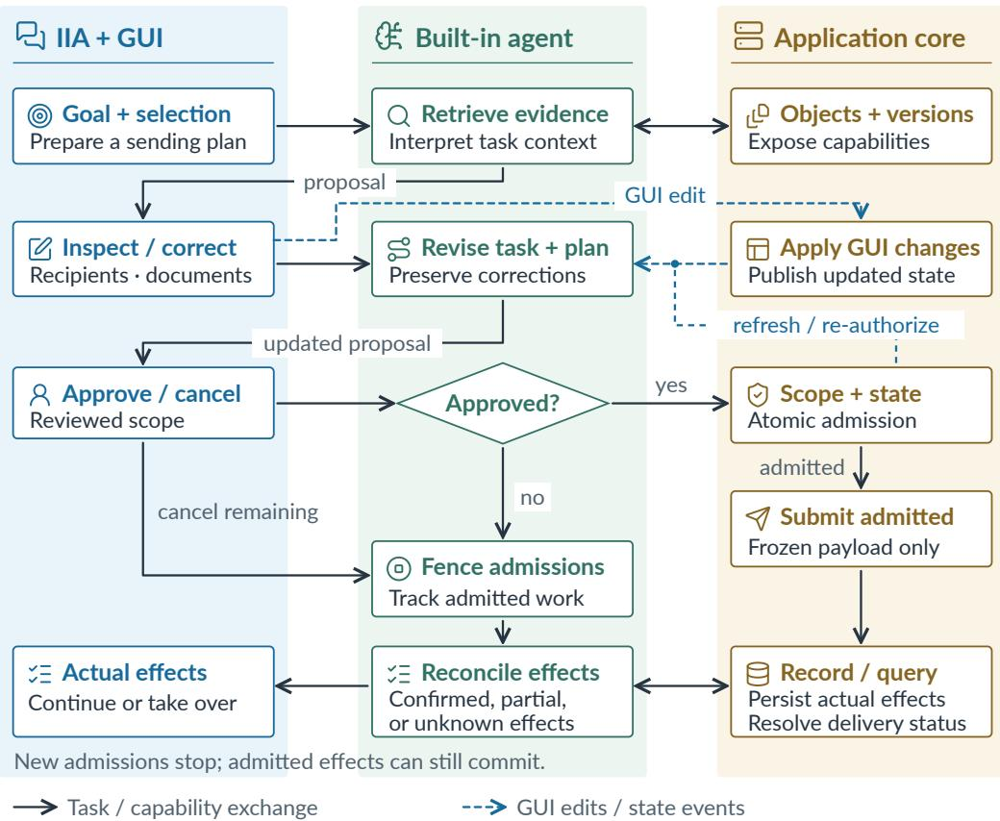
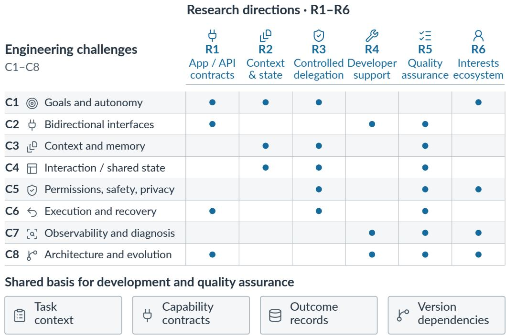

# Engineering Agent-Integrated Software: Interaction Contracts and Continuous Assurance

SHENGCHENG YU, Technical University of Munich, Germany

CHUNRONG FANG∗, State Key Laboratory for Novel Software Technology, Nanjing University, China ZHENYU CHEN, State Key Laboratory for Novel Software Technology, Nanjing University, China

Embedding an intelligent agent in an existing application creates a persistent coordination problem: users can revise oals and mani ulate shared objects while dele ated execution continues. We ar ue that de endable integration requires an explicit correspondence between task-level interaction and application behavior. We introduce Agent-Integrated Software (AIS) as a software pattern combining a conventional core, direct interaction, and a built-in agent, and Intent-Level Interaction Abstraction (IIA) as the task semantics through which users inspect and control delegated work. An open transition-system model relates AIS execution to IIA states and events. Interaction contracts constrain this relation throu h task bindin s, role-s ecific authority, control transitions, and outcome evidence; continuous assurance maintains scoped claims as their dependencies change. A compact disclosure contract and conditional propositions illustrate why local component validity is insuficient and how selected admission invariants can be separated from planning. Contrasting software domains expose the framework’s assumptions and limits. This perspective develops a research agenda spanning application abstraction, development support, controlled execution, qualit assessment, and human supervision, with the aim of making agent integration a maintainable software engineering discipline.

CCS Concepts: • Software and its engineering → Software design engineering; Software testing and debugging; Software system models; • Computing methodologies → Intelligent agents.

Additional Key Words and Phrases: Agent-Integrated Software, Intent-Level Interaction Abstraction, Software Engineering, Human–AI Interaction, Application Interfaces, Quality Evaluation

## 1 Introduction

Embedding a language-model agent in an application changes the relationship between interaction and execution. A user can delegate a goal while continuing to edit the very objects on which the agent is acting. The application must then interpret two kinds of input: direct operations on its existing interface and instructions whose realization may require a sequence of inferred operations. Their coexistence creates a software engineering problem that cannot be assessed through the quality of the generated response alone. A convincing proposal, an authorized application programming interface (API) call, and a correct database update can still compose into an efect that no longer corresponds to the user’s instruction.

Consider a collaboration application in which an organizer asks an agent to prepare meeting materials and send public versions to confirmed participants. The organizer inspects the proposal, replaces an attachment, and removes a recipient through the conventional graphical user interface (GUI). A delayed approval for the earlier proposal may remain authentic even though its scope is obsolete. If a delivery subsequently times out, the absence of a response does not establish whether disclosure occurred. This example brings the central dificulty into focus: the meaning of delegated work can change before, during, and after execution, while diferent people retain authority over the resources and consequences involved.

We introduce Agent-Integrated Software (AIS) as a software-pattern concept for this setting. AIS integrates a conventional application core with a built-in intelligent agent, supporting both direct user interaction and goal-directed task execution. The core continues to own the application’s domain objects, business behavior, and durable state. The agent is integrated into the application’s functionality and lifecycle, although its model or runtime may execute remotely. The integrated agent uses a large language model or multimodal foundation model. Existing applications can adopt the pattern incrementally.

Within AIS, the Intent-Level Interaction Abstraction (IIA) gives delegated work a user-facing semantics: goals, contextual references, proposals, endorsements, interventions, and outcomes. It is the abstraction through which users inspect and redirect a task, i.e., the meaning of the interaction rather than the component that performs inference. Its realization can span a conversational panel, an editable preview, existing GUI controls, and runtime services. The agent plans and executes; the IIA defines how that activity is presented and controlled; AIS identifies the application in which both interaction paths coexist.

Our contribution is to make the relationship between interaction and application efects an explicit object of specification. We call this relationship an interaction–efect obligation. It binds an efect to the task revision, referenced objects, role-specific authority, operational controller, and evidence that justifies its reported outcome. Mixed-initiative interaction and co-planning already address the distribution of initiative and revision of shared plans [15, 18]; intent-oriented software and agent–UI protocols address complementary software and communication concerns [2, 42]. AIS and IIA introduce an engineering boundary and semantic abstraction for the continuing application. Their contribution is the joint treatment of obligations across that boundary, independently of a particular protocol, access-control scheme, or transaction mechanism.

Our position is that dependable agent integration requires a maintained correspondence between revisable task intent and application behavior. This correspondence should guide development support and quality assessment from the outset. We formulate AIS as an open transition system and IIA as an abstraction of its task-relevant behavior. Interaction contracts constrain the correspondence; continuous assurance records which parts remain supported as tasks, policies, and implementations change. The formulation separates architectural membership from dependability: an application can instantiate AIS and still violate its interaction contract.

This perspective develops the argument from the semantic framework in Section 2, through its engineering implications in Section 3, to a compact contract and assurance model in Section 4. The resulting research agenda connects application analysis, interface design, controlled execution, and quality assessment. Contrasting examples in collaboration, spreadsheets, integrated development environments (IDEs), and service consoles examine the scope of the argument. The contribution is a conceptual framework with conditional reasoning and worked examples; its practical benefits remain questions for comparative engineering and human studies.

## 2 AIS and IIA: A Semantic Framework

An architectural diagram identifies components, but it does not determine whether a user’s inter- vention changes the behavior that those components can produce. We therefore describe AIS at two levels: application execution and task interaction. The distinction lets us ask which implementation details can remain hidden and which must remain meaningful at the interaction boundary. The notation uses established state-machine refinement and contract reasoning [1, 27]; the proposed contribution is their application to the relationship between shared application state and revisable delegated tasks.

## 2.1 AIS as an Open Application System

Definition 1 (AIS execution model). An AIS realization is represented by an open labeled transition system

$$
{ \cal M } = \langle X , X _ { 0 } , \Sigma , { \longrightarrow } \rangle , \qquad \Sigma = \Sigma _ { G } \uplus \Sigma _ { I } \uplus \Sigma _ { A } \uplus \Sigma _ { E } .\tag{1}
$$

Here � is the global state space, $X _ { 0 }$ contains initial states, and $x \stackrel { a } { \to } x ^ { \prime }$ is a possible transition. The label classes distinguish direct GUI operations (�), intent-level commands and feedback (�), agent/runtime steps (�), and environmental events (�). Labels carry the relevant principal, task, and operation identifiers. The realization retains a conventional core and direct interaction path, integrates a goal-directed agent, and supports an IIA realization over their shared application objects.

For analysis, write a state as $\boldsymbol { x } = \left( \boldsymbol { s } , t , c , j , w \right)$ . The conventional core state � includes domain objects, versions, and applicable policies. The task store � records goals, revisions, contextual bind- ings, delegated scope, and unresolved decisions. The control state � identifies who may coordinate each task. The journal � associates admitted efects with their payloads and observed outcomes. Admission is the host’s acce tance of a s ecific efect for execution; it does not b itself establish that the efect has occurred. The remaining state � represents agent internals, pending messages, and relevant environmental state. This is a logical decomposition; it neither requires five services nor assumes that the agent observes the entire state. In particular, an external efect can have occurred while its outcome remains unknown in �.

The open-system view matters because task execution does not suspend the application. A GUI edit, another user’s action, a policy revocation, or a delayed provider response can interleave with an agent step. These events are part of the behavior to be reasoned about, rather than exceptions to a sequential dialogue. Labels are tagged by their role in the model: a user-facing agent report belongs to $\Sigma _ { I }$ , whereas internal planning belongs to $\Sigma _ { A }$ . The tag does not establish trustworthiness. An agent-originated operation still requires authorization, and a direct operation still obeys the application’s business rules.

Architectural membership requires the coexistence of these responsibilities, not satisfaction of a safety property. A defective integration remains an AIS instance. Similarly, neither local model execution nor a particular chat interface is a membership condition. These distinctions keep the model applicable to incremental adoption and distributed deployments without making quality claims true by definition.

## 2.2 IIA as a Task-Level Abstraction

The IIA abstracts how delegated work develops over time. A task record can be written as $t _ { \kappa } =$ $( \kappa , r , g , b , d , U )$ : task identity �, revision �, declared goal �, contextual bindings �, delegated scope �, and unresolved decisions � . A binding refers to a stable object and the relevant version or view, rather than only its current screen position. The goal supplies task-specific acceptance conditions, which may remain partial until decisions in � are resolved. This representation makes explicit what has been agreed; it does not assume that unrestricted natural-language meaning can be converted into a complete logical predicate.

Definition 2 (Intent-Level Interaction Abstraction). An IIA specification is an abstract transition system $\bar { \cal I } = \langle Y , Y _ { 0 } , \Lambda , \Longrightarrow , V \rangle$ . Here � contains task-level states, $Y _ { 0 }$ their initial states, Λ the event labels, and =⇒ the permitted abstract transitions. States summarize tasks, decisions, control status, and efect knowledge; events express goal submission, revision, endorsement, intervention, admission, and outcome reporting. $V _ { u } ( y )$ is the view permitted for principal �. A candidate realization supplies a state abstraction $\pi : X \to Y$ and an event abstraction $\alpha : \Sigma \to \Lambda \cup \{ \varepsilon \}$ , where � denotes an unobservable step.

The central requirement is that a concrete step have a valid task-level interpretation:

$$
\pi ( X _ { 0 } ) \subseteq Y _ { 0 } , \qquad x \stackrel { a } { \to } x ^ { \prime } \implies \pi ( x ) \stackrel { \alpha ( a ) } { \Longrightarrow } \pi ( x ^ { \prime } ) .\tag{2}
$$

For $\alpha ( a ) = \varepsilon$ , the right-hand side means $\pi ( x ) = \pi ( x ^ { \prime } )$ . Internal reasoning can therefore remain hidden when it changes no task-relevant fact. A changed recipient, an admitted disclosure, or an acknowledged cancellation cannot be hidden in this way when it changes the contract’s task state. A GUI event afecting a delegated task must have an abstract interpretation even though it did not originate in the IIA interface. Where a useful abstraction needs history, the analysis state may be augmented with records of earlier endorsements and efects [1].

The abstraction describes a specification relationship, not an assertion that a runtime can automatically recover �. Implementations must supply the object, task, and outcome information on which it depends. Furthermore, � represents shared task semantics while $V _ { u } ( y )$ deliberately restricts what each role can inspect. An afected recipient need not see an organizer’s private context. User-facing feedback is faithful when its factual claims are justified by the corresponding authorized view; completeness of explanation and usability require additional judgment.

Control requires more than observation. A request to stop and an acknowledgement that stopping took efect are distinct abstract events. For a task $\kappa ,$ the controller epoch � identifies a generation of control authority. An acknowledged stop invalidates that generation for subsequent admissions under (�, �), while permitting reconciliation of earlier admissions. An interface that displays “stopped” while the old controller can continue admitting work violates the abstraction’s control semantics. Eventual acknowledgement is a separate progress requirement, conditional on service availability and communication assumptions.

Fig. 1 brings the two levels together: the conventional core and agent constitute the execution system, while the IIA exposes its task-level meaning through the abstraction �. The lower band uses the state spaces � and � defined above.

## 2.3 Interaction Contracts and Behavioral Conformance

The same abstract event can have diferent obligations across applications. A spreadsheet commit changes shared cells; a delivery commit may disclose information outside the application. We capture these choices in an interaction contract

$$
\mathcal { K } = \langle \mathrm { P r e } , \mathrm { S t e p } , \mathsf { l n v } , \mathsf { P o s t } , \mathsf { D e p } \rangle .\tag{3}
$$

Pre gives operation preconditions, including authority; Step constrains task and control transitions; Inv states consistency obligations; Post defines what efect or report counts as fulfilling an operation; and Dep identifies the assumptions and versions on which these clauses depend. An implementation may realize these clauses through APIs, runtime guards, ordinary application code, and interaction design. The contract is an application-level semantic specification, independent of that choice.

For an efect �, its interaction–efect obligation is the relation

$$
\Psi _ { e } = \langle \kappa , r , \beta _ { e } , \gamma _ { e } , \ell _ { e } , \epsilon _ { e } \rangle ,\tag{4}
$$

linking the task and revision to reviewed payload/object bindings $\beta _ { e }$ , role-specific authority $\gamma _ { e } ,$ controller identity and epoch $\ell _ { e } ,$ and available outcome evidence $\epsilon _ { e }$ . The relation is temporal. Authority is checked at admission; later evidence determines which outcome can be reported. Revising a task can invalidate future admissions without erasing the attribution of an earlier committed efect. Consequently, consistency cannot be reduced to equality between the latest task state and every historical record.

  
Fig. 1. AIS with continuing direct and intent-level interaction over a shared core. The IIA realization presents and controls task semantics; the built-in agent plans and invokes capabilities. The lower band relates the execution state space � to the task state space �. Control and efect records connect both levels to interaction contracts and assurance.

Let Tr denote finite execution traces and let Π be the trace projection induced by � and �, with unobservable repetitions removed. For stated environmental assumptions �, the proposed conformance obligation is

$$
\Pi { \bigl ( } \mathsf { T r } ( M \mid H ) { \bigr ) } \subseteq \mathsf { T r } ( J \mid \mathcal { K } ) .\tag{5}
$$

The right-hand side contains abstract traces permitted by the contract. This finite-trace condition addresses valid transitions and claims about observed efects. It does not establish eventual task completion: a runtime that remains silent can satisfy some safety clauses while failing a progress requirement. Such requirements need explicit fairness, availability, and deadline assumptions. Nor does conformance establish that the declared goal adequately represents the user’s needs.

Proposition 2.1 (Local validity does not establish interaction conformance). Valid component calls and authenticated permissions are insuficient to establish Equation (5) under a contract requiring current endorsement bindings when task-relevant state can change before efect admission.

Proof. Take a proposal for recipients {�, �} and an authentic endorsement of that proposal. Before admission, a GUI revision removes �. A send operation for � can still satisfy its API schema and the caller’s ordinary resource permission. Its projected trace nevertheless contains an admission inconsistent with the current task binding. Thus component validity permits a trace excluded by the interaction contract. □

The proposition locates the contribution of the framework. The missing relation crosses the boundaries of interface state, task interpretation, authority, and efects. Access control and trans- action mechanisms remain essential, but their successful composition must be established with respect to that relation. A diferent mechanism that already preserves it is an alternative realization of the obligation.

## 2.4 Foundations and Derivation of the Engineering Agenda

The development summarized in Fig. 2 explains why this relation is now exposed more broadly. Direct manipulation and mixed initiative preserve user participation [18, 38]; demonstration and task shortcuts connect requests to existing application operations [6, 25]; model-based planning and tool use support less predetermined procedures [24, 34, 41, 46, 54]. Studies of product copilots and software built with foundation models (FMware) identify the resulting integration and lifecycle demands [28, 30]. The framework concentrates these developments into one question: which task-level relationships must survive changes in the underlying execution?

  
Fig. 2. Selected foundations of AIS: interaction [18, 38], demonstration [25], capability exposure [6], modeldriven execution [24, 41, 46], and lifecycle engineering [28, 30]. Publication groups indicate overlapping foundations, not replacement or a time scale.

The challenge areas follow from perturbing the terms in this framework. Changes to �, �, and � expose task interpretation, interface, and context obligations; changes to �, authority in �, and efects in � expose continuity, permission, and recovery obligations. Uncertainty about their observation or evolution exposes traceability and maintenance obligations. The next section develops these implications, followed by design principles and a research agenda. Their connections are synthesized at the end of the agenda. This organization is a retrospective design rationale, not an empirical taxonomy or an exhaustive derivation. Overlap is expected because a single object change can afect several relations.

## 3 Engineering Implications of the Framework

The semantic framework shifts the engineering question from whether an agent can invoke an operation to whether its evolving execution remains a valid realization of the task. This section develops eight engineering implications. Each concerns information or control that crosses a component boundary; their separation identifies where development support and assurance are needed.

## 3.1 C1: Task Abstraction and Degrees of Autonomy

A task becomes actionable through the relationship between its declared goal �, delegated scope �, and unresolved decisions � . “Prepare the materials” can authorize retrieval and proposal construc- tion while leaving disclosure undecided. Substituting a public version for a private attachment may satisf a release olic but alter the user’s intended result. The IIA must reserve that distinction throughout the task, rather than allowing an inferred plan to stand in for an endorsement.

Autonomy is consequently a property of permitted transitions for a task and role, not a fixed level assigned to an agent. Participation in planning can improve the opportunity for correction [17], but a review is consequential only if subsequent admissions remain bound to it. Requiring approval for every internal step can increase efort without narrowing the relevant efects. The design problem is to expose decisions that change the task’s acceptance conditions or authority while allowing factual retrieval and reversible preparation within the established scope. This connects formal control semantics to the supervision question developed in Section 6.2.

## 3.2 C2: Bidirectional Interfaces

The two abstraction levels require complementary interfaces. The application supplies capabilities through which the agent observes and changes domain state; the agent runtime supplies task- control services through which the application realizes the IIA. Their contracts meet at task identity, contextual bindings, and efect evidence. Table 1 summarizes the division. An API can be callable without exposing enough information to relate its efects to a reviewed task, and an event stream can be well formed without establishin whether an o eration committed.

Table 1. Complementary interfaces and the semantics needed to relate task interaction to application behavior.
<table><tr><td>Interface provider</td><td>Services available to the other side</td><td>Semantics to make explicit</td></tr><tr><td>Application core to agent</td><td>Discover capabilities; read context and objects; subscribe to changes; validate authority; execute and verify operations.</td><td>Object identity and version, scope, prerequisites, side effects, errors, and retry behavior.</td></tr><tr><td>Agent runtime via the IIA layer</td><td>Accept goals and context updates; expose progress and proposals; request input; return outcomes; suspend, cancel, or resume tasks.</td><td>Task identity and revision, pending user decisions, confirmed effects, and cancellation limits.</td></tr></table>

API selection and structured invocation address the first part of this problem [29, 44]. Semantic compatibility additionally requires stable meanings for preconditions, efects, cancellation, and outcomes. A schema-preserving change to a tool can therefore break the conformance relation. Conversely, an implementation of the Agent–User Interaction (AG-UI) protocol can transport state, edited approvals, interrupts, and resume events [2], while the host supplies the admission checks and authoritative outcomes. The framework makes this division explicit so that protocol conformance is not mistaken for application-level conformance.

## 3.3 C3: Context, Knowledge, and Memory

Context connects a task to an application state that may outlive the utterance that referred to it. The binding � must distinguish object identity from position, a current value from an observed version, and an explicit instruction from an inferred preference. A screenshot can locate a document yet omit the identity needed to detect that the document was replaced. Cross-platform replay work by Yu et al. [51] illustrates the dificulty of preserving targets as interfaces change; preserving the intended business efect requires the additional task relation.

Personalization and retrieval extend these dependencies beyond the current screen [9, 37]. A remembered preference can conflict with the current request, and an updated source can invalidate a derived summary. The challenge is to retain enough provenance for selective refresh and correction without turning memory into unrestricted retention. Read authority also difers from disclosure authority. The IIA view $V _ { u }$ and any transferred task summary must respect purpose and recipient scope even when the agent was permitted to read the underlying source.

## 3.4 C4: Interaction Continuity and Shared State

Continuity requires a stable task meaning across changes in interface, controller, and execution location. Fig. 3 illustrates how a GUI edit changes the admissible continuation of a delegated task. The important event is the change in the reviewed binding, not whether the correction arrived through chat or direct manipulation. Treating the two paths as separate sessions would lose precisely the relationship that the IIA abstracts.

The term handover covers two distinct changes: operational takeover by the same user (H1) and transfer of responsibility to another person (H2). Remote continuation or relocation (H3) and recovery afterfailure (H4) may accompany either, but do not themselves imply a change ofresponsible person. Table 2 compares these four cases. A controller lease records which runtime holds task-control authority and the conditions under which that authority expires. The four cases share a continuity record containing task revision, unresolved decisions, relevant object versions, grants, controller lease/epoch, and admitted efects with known outcomes. The record supports continuity only when the host can establish which controller may next admit work.

A transfer therefore combines a semantic obligation with an enforcement obligation. The succes- sor needs a rights-filtered account of what remains to be done, while the old controller must lose the ability to admit further efects under its former authority. Lost acknowledgements leave ownership unresolved; late provider responses leave efect knowledge incomplete. Neither uncertainty can be removed by copying a conversation. A closed client window is similarly compatible with an active remote task. These cases require diferent continuations even though they share a task identifier.

## 3.5 C5: Permission, Safety, Security, and Privacy

Delegation crosses a relation among principals, rather than a single user–agent permission boundary. The initiator requests an outcome; resource owners govern the objects; approvers endorse particular efects; afected parties receive their consequences; and an executor/controller coordinates the work. A person may occupy several roles, but their authorities do not merge automatically. In the document scenario, an organizer’s request does not supersede a team’s release policy or a disclosure oficer’s approval.

  
Fig. 3. Task revision and guarded execution across IIA/GUI interaction, agent coordination, and core operations. GUI edits revise the pending binding; changed conditions require refresh and, where necessary, renewed endorsement. An acknowledged stop fences new admissions while earlier admissions remain subject to outcome reconciliation. Each responsibility lane can involve multiple principals.

For an efect � in state �, the authority condition is conjunctive:

$$
\begin{array} { r } { \mathrm { p e r m i t } ( e , x ) = \mathrm { t a s k G r a n t } ( e , x ) \wedge \mathrm { r e s o u r c e P o l i c y } ( e , x ) \qquad } \\ { \wedge \mathrm { r e q u i r e d E n d o r s e m e n t s } ( e , x ) \wedge \mathrm { e x e c u t o r S c o p e } ( e , x ) . } \end{array}\tag{6}
$$

Attribute-based access control supplies established mechanisms for subject, resource, action, and environment conditions [19]. The framework additionally relates these conditions to the current task binding. Owner consent may be represented by a standing grant; afected-party consent and separation of duties become required predicates where the domain policy demands them. Changes to ownership, recipients, account, or controller require revalidation of the dependencies concerned.

An endorsement must also have an origin distinct from agent inference. Execution delegation ffcannot include the ability to write the approval ledger or activate an indistinguishable approval input. Otherwise, an authenticated session establishes an account identity but not a person’s enfidorsement of the particular efect. The distinction between data and authority is equally important for retrieved material. Prompt-injection defenses and runtime constraints provide relevant enforcement techniques [11, 12, 40]; their scope depends on complete mediation across reachable execution paths [33]. An unrestricted alternative shell or database connection defeats a claim covering only guarded business APIs.

Table 2. Four continuity cases sharing a task record but requiring diferent authority and recovery semantics.
<table><tr><td>Case</td><td>What changes</td><td>Required special handling</td></tr><tr><td>H1: user takes over</td><td>Operational control moves from agent to the same user&#x27;s direct interaction.</td><td>Fence agent admissions; show admitted/unknown effects and a continuation point. User edits invalidate affected plans, not the whole application.</td></tr><tr><td>H2: task transfers to another person</td><td>The accountable controller or task requester changes.</td><td>Revalidate the recipient&#x27;s own rights and required endorsements; minimize transferred context; preserve attribution. Credentials and approvals are not</td></tr><tr><td>H3: remote continuation or relocation</td><td>The same task continues after UI disconnection, or moves between runtimes.</td><td>transferred implicitly. Persist task/effect identities. Reconnection reads authoritative state. Relocation establishes a new executor lease; client loss alone does not imply cancellation.</td></tr><tr><td>H4: recovery after failure</td><td>A runtime restarts with potentially incomplete observations.</td><td>Fence stale workers, rebuild from the journal, query unknown effects before resubmission, and disclose irrecoverable evidence gaps.</td></tr></table>

Safety, security, and privacy impose related but diferent obligations. A permitted action can still be mistaken; an adversarial action can redirect control; an otherwise legitimate result can disclose excessive information. Role-specific views, logs, and derived memory therefore need their own disclosure and retention conditions. Preserving attribution during a handover does not imply transferring the previous controller’s credentials or private context.

## 3.6 C6: Execution Semantics and Failure Recovery

The distinction between application state � and efect knowledge in � is essential under failure. A timeout can leave the runtime unable to distinguish non-execution from an already committed efect. Treating both as failure permits duplicate execution; treating both as success produces misleading feedback. Stable efect identifiers and authoritative status queries make that uncertainty manageable, while the contract determines whether replay is safe.

Cancellation changes future admissibility at a particular boundary. It does not reverse an efect already admitted to an external provider. Compensation introduces a new domain operation with its own authority and failure conditions, as in sagas [16]. A calendar invitation can be withdrawn, but its notification may already have been read. A spreadsheet undo can restore prior values yet incorrectly overwrite a collaborator’s later edit. Recovery must therefore preserve the relation among original efects, subsequent changes, and new compensating actions; a generated inverse command is insuficient.

## 3.7 C7: Observability, Debugging, and Responsibility

The abstraction provides a natural basis for diagnosis: a failure occurs where a concrete trace no longer has the task-level interpretation promised by the contract. Agent debugging and lifecycle observability ofer useful inspection mechanisms [13, 14]. For AIS, traces must additionally connect task revisions and endorsements to host admissions and outcome records. Otherwise, an explanation can describe why the agent acted without establishing whether that action was authorized or what it changed.

Diferent readers need diferent projections of this evidence. Users need the efects that occurred and the decisions that remain. Developers need the dependency or transition responsible for a mismatch. The evidence includes approvals, admission witnesses, receipts, etc. A model-generated explanation can help interpret those records but cannot replace them. Replay also needs controlled versions and external state before it can support causal diagnosis. This separation makes evidence useful for accountability while leaving institutional responsibility to the relevant organizational arrangements.

## 3.8 C8: Architecture, Joint Evolution, and Operating Costs

The correspondence between M and I can change even when visible API types do not. A model replacement changes possible plans; a host update changes object meaning; an adapter revision changes admission or reporting behavior. Experience with learned-system engineering and technical debt motivates explicit management of such dependencies [3, 30, 35]. The framework makes their consequence precise: some previously supported traces or assurance claims may no longer describe the revised implementation.

This raises an architectural choice for existing applications. Stable references, guarded writes, task-control hooks, and outcome records have development and maintenance costs. Integrating an agent without those services may still ofer useful preparation or retrieval, but supports weaker efect guarantees. Deployment further changes latency, information exposure, and continuity assumptions. A viable integration must therefore be judged against total development, computation, supervision, and recovery efort, including the conventional workflow it complements.

## 4 Interaction Contracts and Continuous Assurance

The framework makes a distinction that conventional task-success measures can obscure. An execution may reach the requested final state through an unauthorized intermediate efect, or preserve every authorization condition while failing to achieve a useful outcome. Dependability therefore requires both a valid interaction history and an adequate task result. Interaction contracts state selected obligations over that history; assurance identifies the evidence for believing they hold in a particular realization.

## 4.1 Quality Across the Abstraction Boundary

At the IIA level, quality concerns the fidelity and usability of task expression, proposals, interventions, and feedback. At the AIS level, it additionally concerns planning, domain efects, authority, availability, and evolution. Existing software and AI-system quality models supply broader terminology [21, 22]; Table 3 specializes the concerns to the abstraction boundary. A correct update with misleading feedback and a clear preview followed by an incorrect update are distinct failures of the same relationship.

Task acceptance must also depend on the authorized stage. A preparation request can succeed with an inspectable proposal; an execution request can appropriately lead to clarification or justified non-execution. Such outcomes cannot be evaluated by counting completed writes. Conversely, conformance to permission and control clauses does not establish that a summary is accurate or a refactoring useful. The framework separates these judgments so that strong evidence for one property cannot silently stand in for another.

The placement of responsibility follows the location of the required knowledge. Object identity and commit evidence belong at the host boundary; task revision and endorsement must remain connected to them; user-facing explanations must draw on the resulting records. This follows the spirit of end-to-end reasoning about application-specific correctness [32]. It also explains why a single aggregate quality score is inadequate: improved response fluency cannot compensate for an unauthorized disclosure, and fewer interruptions do not necessarily improve user control.

Table 3. Quality concerns across the IIA abstraction and its AIS realization. Primary loci identify the information or mechanisms needed to assess each concern.
<table><tr><td>Quality concern</td><td>Primary locus</td><td>Example of a failure</td></tr><tr><td>Intent and user control Grounded planning</td><td>IIA layer and agent Agent and context services</td><td>Ignore a recipient corrected through the GUI. Use an obsolete conversation as the basis for a plan.</td></tr><tr><td>Business-effect correctness Feedback fidelity</td><td>Core and agent runtime IIA layer and core</td><td>Repeat a write after an ambiguous timeout. Report delivery before the core confirms it.</td></tr><tr><td>Consistency and reliability</td><td>evidence AIS across both paths</td><td>Resume from task state that disagrees with application state.</td></tr><tr><td>Safety, security, and privacy</td><td>AIS across trust boundaries</td><td>Treat retrieved text as authority to disclose</td></tr><tr><td>Availability and efficiency</td><td>AIS deployment</td><td>data. Lose the direct-operation fallback when the</td></tr><tr><td>Maintainability and observability</td><td>AIS lifecycle</td><td>model is unavailable. Silently lose a capability after an interface update.</td></tr></table>

## 4.2 A Compact Contract for Reviewed Disclosure

Contract 1 instantiates K for the meeting-materials scenario. Its compact form separates the scenario’s binding and authority from reusable admission, control, and reporting clauses. The values are symbolic: task �42 at revision 7, controller epoch 3, a public document view at version 12, and recipients � and �. �7 identifies the reviewed view and �7 its canonical proposal digest. The contract gives semantic obligations rather than prescribing a configuration language or a runtime architecture.

The contract’s invariants are expressed by four clauses. K1, endorsement binding, relates an admitted payload to the current task revision, reviewed objects/views, recipients, and efect scope. K2, current authority, requires the conjunction in Equation (6) at admission. K3, controlled admission, requires running task state, an authenticated controller lease, and the active epoch, with the acceptance decision recorded atomically. K4, outcome fidelity, permits a committed report only when authoritative evidence establishes the specified efect. These clauses specialize Pre, Inv, and Post; the revision and control rules specialize Step.

Standing owner grants remain usable after revalidation; revising a task does not itself revoke them.

Let $B _ { e }$ be the reviewed binding for efect $e , A _ { e }$ its required endorsements, and $\ell _ { e }$ its authenticated controller lease with epoch $k _ { e }$ . For state � immediately before admission

$$
\begin{array} { r } { \mathrm { a d m i t } ( e , x ) \Longrightarrow \mathrm { c u r r e n t } ( B _ { e } , x ) \wedge \mathrm { e n d o r s e d } ( A _ { e } , B _ { e } , x ) } \\ { \wedge \mathrm { p e r m i t } ( e , x ) \wedge \mathrm { r u n n i n g } ( \kappa , x ) \qquad } \\ { \wedge \mathrm { v a l i d L e a s e } ( \ell _ { e } , x ) \wedge k _ { e } = k _ { \mathrm { a c t i v e } } ( \kappa , x ) . } \end{array}\tag{7}
$$

The gate evaluates this predicate and records the admitted payload within one host-controlled atomic boundary. Merely supplying the latest epoch number does not authenticate a controller. Likewise, retaining a conversational thread does not establish a current endorsement. A stable efect ID cannot be rebound to a diferent payload, and an unresolved submission cannot become a supposedly new action by receiving a fresh ID after a task revision.

Contract 1. Reviewed document disclosure, share-materials/v1.
<table><tr><td>Binding</td><td>κ = T42, r = 7, k = 3; document 7, version 12, public view H7; recipients  $\{ a , b \}$  frozen proposal D7. Only reviewed materials and recipients may be delivered.</td></tr><tr><td>Authority</td><td>Organizer initiates; team owns the document; event chair and disclosure officer approve; recipients are affected; agent service acts for the organizer under lease L3. Owner grant G18 and policy policy-v4 apply.</td></tr><tr><td>Endorsement</td><td>A host ledger records endorsements through a non-delegated channel, bound to (κ, r, D7, G18, policy-v4) and required roles. Recheck scope, revocation, and expiry; task endorsement expires no later than ten minutes after recording.</td></tr><tr><td>Preparation</td><td>Read authorized context and public views; preview without delivery. Material revision increments r and invalidates prior task endorsements. Complete, valid approval enables running; unspecified operations or transitions are rejected.</td></tr><tr><td>Admission</td><td>Atomically check K1-K3 and journal a stable effect ID for each recipient. Submit only its frozen payload, using the same provider idempotency key when safe to retry. Status queries obey read permissions.</td></tr><tr><td>Control</td><td>Cancel atomically stops the task, revokes task endorsement, and advances k. H1/H2 fence the old lease and require revalidation and acceptance; H3/H4 revalidate delegation and reconcile before resuming affected writes. Preserve unresolved effect IDs.</td></tr><tr><td>Outcome</td><td>K4 governs every report. Distinguish not admitted, admitted, submitted, committed, failed, and unknown. Commitment means provider-recorded delivery to the named</td></tr><tr><td>Dependencies</td><td>inbox; submission acceptance alone is insufficient. Contract, host, adapter, policy, role grants, and controller state. An unknown submission is queried before replay; cancellation fences new admissions while earlier admitted effects may still commit.</td></tr></table>

Proposition 4.1 (Planner-independent admission safety). Suppose all admissions in the contract’s scope pass through a trusted gate that atomically enforces Equation (7), the bindings and authority records are authoritative, and only this gate can append immutable admission records to an initially valid journal. Every admitted efect then satisfies K1–K3 at its admission point, independently ofhow the planner selected it.

Proof. The initial journal satisfies the property by assumption. A transition that appends no admission preserves it. A transition that appends one first establishes the admission predicate and binds the accepted payload to that record atomically. The property therefore holds for every finite sequence of admissions. Subsequent policy changes afect later decisions without changing what held at an earlier admission point. □

This limited result explains a useful architectural separation. The model can propose actions nondeterministically while selected admission invariants remain properties of the host boundary. The result establishes neither K4 nor goal suitability, progress, or absence of unmediated efects. It also exposes the assumptions that an integration must justify before claiming such a separation. A gate that reads stale policy state or an adapter that bypasses the gate does not satisfy the premises.

Task control and efect state remain independent. In this contract, commitment means delivery recorded by the provider, not that a recipient has read or understood the material. A stopped task can contain a committed delivery. If the provider exposes only submission acceptance, the promised postcondition must be narrowed or delivery knowledge remains unknown. Provider-level duplicate prevention similarly requires an idempotency guarantee or an equivalent queryable operation identity; the host journal alone cannot create exactly-once remote execution.

## 4.3 Revision, Interruption, and the Meaning of a Valid Trace

The earlier counterexample becomes precise under the contract. Revision 7 proposes $\{ a , b \} ; { \mathsf { a } }$ GUI edit removes � and produces revision 8. A delayed endorsement for revision 7 fails K1. Once the revised proposal receives the required approval, the gate may admit delivery $E _ { a } . \mathrm { A }$ lost provider response leaves its outcome unknown under K4. Cancellation then advances the epoch and excludes new admissions, but a late receipt can still establish that $E _ { a }$ committed. A faithful final account includes both the stopped remainder and the completed delivery.

Four design principles follow from the trace. P1, preserve referential integrity, keeps revised goals attached to the right objects and efects. P2, separate interpretation from authorization, makes endorsement depend on accountable roles. P3, make control operational, gives interventions consequences for admissible behavior. P4, ground feedback in outcomes, keeps the user’s understanding aligned with evidence. In the compact contract these principles become $\mathrm { K } 1 { - } \mathrm { K } 4$ rather than an additional independent checklist.

The same trace can guide development without pretending to be an experiment. It identifies the records an adapter must expose and the distinctions a test oracle must observe. Injecting a stale approval, timeout, or delayed receipt would exercise a diferent clause. More permissive contracts could reuse unafected step-level endorsements after revision; doing so would require evidence that the dependency analysis preserved their scope. The conservative invalidation in Contract 1 makes that trade-of explicit.

## 4.4 Assurance as a Versioned Argument

Continuous assurance concerns the standing of a claim about the realization, rather than the mere presence of a monitor. For each claim, define a record

$$
\begin{array} { r } { \mathcal { A } = \langle q , \Omega , D , E , R , S \rangle , \qquad S \in \{ \mathrm { s u p p o r t e d , r e f u t e d , i n s u f f i c i e n t } \} . } \end{array}\tag{8}
$$

Here Ω identifies the task, interval, or release scope; � records assumptions and versioned dependencies; � contains evidence with producer and observation time; and � is the rule used to assess it. Support is conditional on those premises. A witnessed violation refutes a claim, whereas an unavailable receipt, expired premise, or coverage gap leaves insuficient support. The distinction prevents missing evidence from being interpreted as a successful check.

The assurance argument separates five claims: endorsement and authority at admission (Q1), efective stopping of new admissions (Q2), evidence-grounded outcome reporting (Q3), continuity without silent replay (Q4), and release behavior on a declared assessment scope (Q5). Table 4 states their scope, evidence, and checking rules.

The timeout trace can support Q1 while leaving delivery unknown. Reporting that uncertainty preserves Q3, whereas asserting delivery without evidence violates it. A late receipt does not refute Q2 when it concerns an admission preceding the stop. The claims therefore express separable obligations that a generic task-success indicator would collapse.

Changes determine which arguments must be reconsidered. Let Dep(�, Ω) denote the dependencies needed to support claim � over scope Ω, and let Δ be the set of changed dependencies. A candidate invalidation rule is

$$
\mathrm { D e p } ( q , \Omega ) \cap \Delta \neq \emptyset \quad \Longrightarrow \quad \mathrm { r e a s s e s s } ( q , \Omega ^ { \prime } ) ,\tag{9}
$$

where $\Omega ^ { \prime }$ is the proposed scope after the change. An argument remains applicable only if its relevant premises remain valid or are re-established. Historical evidence retains its original attribution; it does not automatically support the new scope. Dependency analysis is itself an assurance obligation: an omitted dependency makes selective invalidation unsound.

Table 4. Five scoped assurance claims with evidence, checking rules, and conditions requiring reassessment.
<table><tr><td>Claim and scope</td><td>Evidence producer and artifact</td><td>Check, invalidation, and response</td></tr><tr><td>Q1: every admitted effect in the observed interval matches endorsement and authority at admission.</td><td>Host admission journal; authenticated approval/role ledger; coverage of write gates.</td><td>Check K1/K2 and the admission witness. A mismatching record refutes Q1. Lost coverage removes support. Changed policy/ownership or stale grants require a new scope and revalidation for subsequent admissions.</td></tr><tr><td>Q2: after an acknowledged stop, the old controller admits no new effects. Q3: every reported committed effect has authoritative matching</td><td>Task store: stop acknowledgement, lease/epoch transition; admission journal. Core commit record or provider receipt; effect journal; user-facing report.</td><td>Check runnable state, controller lease, and K3 ordering at the gate. A later stale admission refutes Q2. Missing acknowledgement/order evidence is insufficient; fence and reconcile. Match effect ID and frozen payload under K4 A premature completion report refutes Q3. A timeout leaves the effect outcome unknown;</td></tr><tr><td>outcome evidence. Q4: a control transition preserves unresolved work without silent replay.</td><td>Transfer/recovery record; old/new controller acknowledgements; stable effect IDs.</td><td>query before reporting or resubmitting. Check H1-H4 obligations. Missing transfer acknowledgement or an unreconciled submission prevents resumption of affected writes; changed recipient rights invalidate</td></tr><tr><td>Q5: a release meets specified task/interaction properties on its declared regression scope.</td><td>Version-bound scenario tests, negative traces, and human-reviewed task outcomes.</td><td>transferred context. Check stated acceptance rules and record coverage. A relevant model, adapter, host, or specification change invalidates affected evidence; rerun or narrow the claim. Passing</td></tr></table>

The conditional separation in Proposition 4.1 suggests that not every change needs the same response. Replacing a planner may invalidate behavioral evidence for Q5 while preserving an independently established invariant of an unchanged gate. Adding an unmediated write capability invalidates that gate’s coverage premise and afects Q1/Q2. Changing an outcome adapter can undermine Q3 even if planning remains unchanged. This is the practical meaning of continuous assurance: a maintained argument across relevant changes, rather than universal retesting after every token.

Design analysis, release evaluation, and operational records ofer diferent evidence. Productionreadiness and lifecycle-observability work provides useful foundations [8, 13]; the framework binds their artifacts to the same interaction–efect relation. Its research challenge is to make that binding economical and trustworthy enough to guide maintenance. Evidence provenance, retention cost, monitor completeness, and acceptable uncertainty will influence whether the approach remains usable beyond a small example.

## 4.5 What Quality Assessment Must Observe

Assessment must observe task-relevant transitions as well as final outcomes. Executable web, desktop, and mobile environments provide foundations for outcome-based evaluation [31, 43, 55]. Stateful tools, business tasks, and side-efect checks broaden that view [20, 26, 39, 45]. For AIS, the distinguishing need is to exercise the correspondence across direct and delegated interaction: revisions, role changes, interrupted admissions, and unresolved efects.

Scenario-guided GUI testing [52] and dual-control environments [7] suggest ways to construct such cases. Equivalent intentions need not produce identical click sequences, and a justified refusal need not be a failed task. The relevant oracle compares permissible business behavior under equivalent initial conditions. Real users remain necessary for evaluating whether the IIA makes consequential diferences inspectable; user simulation alone can misrepresent human interaction [36]. The next generation of assessment should connect behavioral validity with the efort and decision quality of the people supervising it.

## 5 A Research Agenda from Development to Assurance

The framework suggests a research program organized around constructing and maintaining the correspondence in Equation (5). Application analysis supplies the concrete semantics; interaction design supplies the abstract task model; contracts relate them; evidence supports their continued use. The six directions below develop this program from application analysis to the maintenance of evidence. Their shared artifacts create an opportunity for development assistance and quality assessment to reinforce one another.

## 5.1 R1: Recovering Application Abstractions and Interface Contracts

R1 concerns the construction of � and the two interface contracts from an existing application. The central dificulty is recovering semantic obligations rather than merely enumerating callable operations. A tool should distinguish an object’s stable identity, the conditions that authorize its modification, and the evidence that establishes the resulting efect. GUI analysis, testing, and intent inference ofer candidate sources for this information [47, 49, 50]. Their outputs would need explicit links to host implementations and reviewable uncertainty.

This direction also concerns abstraction adequacy. A representation that omits a recipient or an intermediate disclosure may admit a false correspondence even when every represented transition is valid. Development support should therefore help identify distinctions that the domain considers consequential, expose unsupported clauses, and maintain the resulting schema as the application evolves. The relevant benefit is a reduction in total specification and maintenance efort while retaining those distinctions.

## 5.2 R2: Maintaining Task Meaning under Context Change

R2 concerns how �, �, �, and � evolve together. Rebuilding the entire task after every GUI edit is disruptive, while preserving every prior endorsement is unsafe. A useful task representation would identify which decisions depend on a changed source, object version, preference, or recipient. It could then distinguish a harmless presentation change from one that requires a new endorsement or invalidates an earlier plan.

The dificult cases involve dependencies absent from a formal schema. A renamed document can retain its meaning, whereas an unchanged filename can conceal diferent disclosure implica- tions. Research is needed on combining explicit domain relations, inferred dependencies, and user correction without treating model confidence as proof of equivalence. Such representations must also support rights-filtered continuity in H1–H4, so that preserving task meaning does not imply preserving all private context.

## 5.3 R3: Enforcing Delegation across Heterogeneous Efect Boundaries

R3 concerns the realization of Pre, Step, and Inv where operations cross APIs, GUI automation, and remote services. Runtime enforcement ofers mechanisms for selected rules [40]; the larger challenge is ensuring that they refer to the current task and the actual admission boundary. A capability description should reveal whether the provider supports atomic checks, duplicate prevention, status queries, and compensation.

This suggests conformance profiles with explicitly diferent guarantees. A local versioned edit can support stronger interference checks than an external delivery service with opaque commitment. Comparing these profiles through adversarial traces would clarify which guarantees survive retries, revocation, and controller transfer. The research objective is a principled basis for accepting, restricting, or declining delegated efects under the provider’s actual semantics.

## 5.4 R4: Assisting Development through Shared Semantic Artifacts

R4 concerns development tools that use the same contract artifacts as assurance. An admission predicate can guide adapter generation; a prohibited transition can generate a negative test; a failed assurance claim can locate a missing record or an invalid assumption. Existing work on test generation and migration, declarative language-model programs, and prompt comparison provides complementary techniques [5, 23, 48]. The distinctive opportunity is to connect these activities through maintained task and efect semantics.

Generated specifications cannot serve as independent oracles merely because they are expressed formally. A tool that infers a contract from faulty code may reproduce the fault. Research should distinguish recovered implementation behavior, intended requirements, and reviewed contract clauses, while measuring the efort of resolving disagreements. Developer experience should include subsequent host changes and evidence maintenance, not only the speed of producing an initial integration.

## 5.5 R5: Assessing Conformance and Maintaining Evidence

R5 concerns which evidence justifies a scoped conformance claim. Tests can explore traces, static or runtime analysis can establish selected invariants, and human assessment can judge task adequacy and inspectability. Their scopes difer. Metamorphic relations [10], for example, could test whether meaning-preserving request variants retain permitted business efects, but identifying such variants requires domain judgment beyond the tested model.

Evidence dependencies introduce a second research problem. Selective reassessment is useful only if the dependency model catches relevant changes without overwhelming developers with unnecessary work. Longitudinal evaluations should therefore consider missed invalidations, un- necessary reassessments, diagnostic value, and maintenance cost. A system that produces frequent passing checks while silently losing the premises of its claims would fail the purpose of continuous assurance.

## 5.6 R6: Preserving Human Authority and Sustainable Integration

R6 concerns the allocation of authority and burden across the people afected by delegated work. The requester, owner, approver, and operator may have diferent interests; a common protocol does not resolve them. Portable role and consent descriptions could help preserve obligations across organizational boundaries, provided that changes of context trigger explicit revalidation rather than implicit inheritance.

The same perspective applies to deployment and model substitution. Interchangeable interfaces can conceal diferent data exposure, latency, operating cost, and recovery behavior. Sustainable integration requires assessing those changes together with the efort ofsupervision and maintenance. The long-term objective is software in which delegation remains useful and accountable as both the host and its intelligent components evolve.

Taken together, the directions connect the implications developed in Section 3 with the principles derived in Section 4.3. Table 5 records these connections alongside their literature premises and motivating perturbations. Fig. 4 projects the same challenge–direction links into a visual overview. The links are a design synthesis: they identify shared research work without assigning empirical weights or excluding additional relationships.

Table 5. Synthesis of the engineering implications (C1–C8, Section 3), design principles (P1–P4, Section 4.3), and research directions (R1–R6, Section 5). The literature premises and perturbations explain the proposed connections.
<table><tr><td>Area</td><td>Literature premise</td><td>Perturbation and derived obligation</td><td>Principles; directions</td></tr><tr><td>C1 Task abstraction</td><td>Goal uncertainty and user participation [17, 18].</td><td>Change “prepare” to “send”: distinguish inferred intent from delegated effects.</td><td>P1, P2; R1, R2, R3, R6</td></tr><tr><td>C2 Interfaces</td><td>Tool discovery/calling and product integration [24, 28]</td><td>Change a tool&#x27;s effect without its schema: specify capability and task-control contracts.</td><td>P1–P4; R1, R4, R5</td></tr><tr><td>C3 Context and memory</td><td>Personalized and knowledge-dependent</td><td>Replace a document or preference: retain identity, provenance, and invalidation dependencies.</td><td>P1, P2; R2, R3, R5</td></tr><tr><td>C4 Continuity</td><td>actions [9, 37]. Shared plans and stateful interaction [15, 26].</td><td>Edit in the GUI or change controller: P1, P3; R2, R3, R5 reconcile task state and ownership.</td><td></td></tr><tr><td>C5 Authority and safety</td><td>Untrusted tool content and runtime policies [12, 40].</td><td>Introduce an external recipient or revoke an owner grant: revalidate</td><td>P2; R3, R5, R6</td></tr><tr><td>C6 Execution and recovery</td><td>Outcome-based evaluation and compensation [16, 39].</td><td>authority at admission. Lose a delivery response: distinguish unknown, failed, committed, and compensable</td><td>P3, P4; R1, R3, R5</td></tr><tr><td></td><td>C7 Observability Agent debugging and lifecycle traces [13, 14].</td><td>effects. Present a success message without a receipt: preserve evidence lineage</td><td>P4; R4, R5, R6</td></tr><tr><td>C8 Architecture and evolution</td><td>Learned-system dependencies and production</td><td>for diagnosis and feedback. Replace a model, adapter, or host version: invalidate affected behavioral evidence.</td><td>P1, P4; R1, R4, R5, R6</td></tr></table>

## 6 Discussion

## 6.1 Scope across Software Domains

The framework’s scope follows from the relationships it represents, rather than the surface form of a task. Table 6 instantiates the same questions for four domains: what constitutes a binding, whose authority matters, which event changes the permissible continuation, and what evidence establishes an outcome. The examples are hypothetical design probes. Their value is to expose diferent interpretations of the shared model, including cases in which a host cannot support a desired contract.

The diferences are substantial. Spreadsheet correctness depends on stable row identity and interference with later edits; an IDE must distinguish a local patch from authority to run com-mands or deploy; a refund depends on financial policy and the provider’s duplicate-prevention semantics. Thus Post and the assumptions in Dep are domain-specific, even when task revision and endorsement have a common representation. In each case, the abstraction must preserve consequential intermediate efects as well as the final state. A workflow that briefly discloses confidential information and then deletes it is not equivalent to one that never disclosed it.

  
Proposed connection; no weights. Blank cells leave other relationships open.  
Fig. 4. Connections between engineering implications C1–C8 and research directions R1–R6, grounded in Table 5. The 26 unweighted links identify shared research concerns; labels abbreviate the subsection topics. Task context, contracts, outcome records, and version dependencies connect development assistance with assurance; blank cells do not exclude further relationships.

The H1–H4 distinction follows the same logic. An editable spreadsheet continuation supports operational takeover, while transferring a service case changes accountable principals. Remote IDE continuation requires durable task and process identity; recovery after a refund timeout requires provider evidence. A common record enables analysis across these cases, but their authority and continuation rules remain diferent. This is the intended eneralit of the framework: shared questions and semantic relations with explicit domain interpretations.

## 6.2 Human Authority and the Cost of Supervision

An inspectable abstraction does not ensure that people can supervise it efectively. A long, techni-cally complete preview can conceal the one changed recipient that matters. The choice ofmandatory review must therefore have an accountable source. Application and domain owners define required classes, e.g., cross-boundary disclosure, financial commitment, or destructive changes to shared resources. Resource policies add further conditions. A requester may narrow delegation or demand additional review, but cannot waive another principal’s restriction. A model can flag uncertainty; it cannot independently downgrade a required gate

Reversibility, afected people, disclosure scope, commitment cost, unfamiliar authority, and unresolved intent provide candidate dimensions for these decisions. Their interpretation depends on the domain. Formatting a private draft and refunding a payment need diferent thresholds, while ambiguity about what the user wants difers from uncertainty about a retrievable fact. Human– AI interaction guidance supports correction and usable scoping [4]; the framework locates the corresponding decisions in the task and authority model. When a required classification cannot be established, preparation can continue only within the remaining non-efectful scope.

Table 6. Domain interpretations of task bindings, authority, and continuity in four hypothetical design probes.
<table><tr><td>Application and task</td><td>Binding and authority</td><td>Intervention/continuity probe and limitation</td></tr><tr><td>Collaboration: share meeting materials</td><td>Exact views, recipients, release-policy version; organizer, document owners, and disclosure approver.</td><td>Remove a recipient after preview. Rebind approval; an admitted delivery can still commit after cancellation. A received disclosure is not undone by deleting a sent item.</td></tr><tr><td>Spreadsheet: clean a shared data range</td><td>Workbook version, stable row identities, formulas/protected ranges; task requester and workspace policy.</td><td>The user sorts or edits while the agent prepares a patch. Reconcile by row identity and pre-values; undo must not overwrite a later collaborator edit. Positional cell coordinates alone are insufficient.</td></tr><tr><td>IDE: apply a refactoring</td><td>Worktree/branch, file versions, proposed diff, command scope; developer rights and repository policy.</td><td>The developer edits a file or takes over while a remote worker runs. Fence that worker and reconcile its patch/processes. Local edit approval does not authorize merge,</td></tr><tr><td>Service console: refund a payment</td><td>Payment/order state, amount, beneficiary, policy threshold; operator, account/resource authority, finance approver, affected customer.</td><td>deployment, or arbitrary shell effects. Transfer the case to another employee after a timeout. Recheck the recipient employee&#x27;s rights and query the stable refund ID. Without provider duplicate prevention, blind replay risks a second refund.</td></tr></table>

Supervisory burden is consequently multidimensional. Active inspection time, intervention frequency, context switches, and recovery efort capture diferent costs; latency and computation are separate measures. Their interpretation requires task outcomes and decision quality, including consequential mismatches approved without detection and interruptions unnecessary under the applicable policy. Reducing the number of confirmation dialogs alone can improve convenience while weakening control. Future human studies should test whether the IIA makes meaningful diferences easier to recognize and act upon for a specified user population.

## 6.3 Architectural Scope and Theoretical Limits

AIS and IIA operate at diferent levels of description. The former identifies a software pattern with a continuing core and dual interaction paths; the latter specifies the task semantics through which delegated activity becomes inspectable and controllable. Neither implies a single software module. Their overlap with mixed-initiative or intent-oriented systems does not diminish the need to define the application-level relation, but it does place the burden of contribution on the explanatory and engineering value of that relation. GUI-agent engineering already motivates attention to safety, recovery, and maintenance [53]; the framework gives those concerns a shared semantic object within the application.

The formalization makes selected obligations precise while leaving three limits visible. First, the abstraction must be adequate: a relevant efect omitted from � cannot be assessed through its traces. Second, its realization must expose trustworthy bindings and evidence; stronger models cannot reconstruct unavailable commit receipts or authoritative permission changes. Third, safety conformance does not imply progress, semantic usefulness, fairness, or usability. Those properties require further assumptions and evaluation. The propositions establish conditional consequences of the definitions and gate assumptions, not verified properties of a deployed system.

These limits also determine adoption choices. An application with inaccessible third-party state or unmediated write paths may support a restricted contract. A deterministic workflow may ofer lower cost for a stable goal and procedure. The strongest role for AIS is therefore not universal replacement of conventional interaction, but selective delegation whose assumptions and consequences remain available to the people who depend on the application.

## 6.4 What Would Establish the Value of This Perspective?

The central hypothesis is that maintaining interaction–efect obligations as shared artifacts can ex ose defects and de endencies that isolated UI, a ent, and API descri tions leave im licit. Its evaluation should compare the efort and outcomes of building and evolving representative integra- tions with and without those artifacts. Relevant evidence would concern missed binding changes, authority violations, recovery errors, evidence invalidation, and the quality of user interventions. The existing examples identify such observations without supplying empirical results.

The hypothesis could fail in several informative ways. Existing application contracts may already maintain the same relationships at comparable efort. Annotation and evidence costs may outweigh the defects prevented. Users may overlook consequential changes despite a more faithful abstraction. Such findings would narrow the useful scope of the framework and guide lighter realizations. The present perspective provides definitions, conditional arguments, and an agenda for investigating these possibilities; it does not claim an implemented runtime, demonstrated productivity gains, or cross-domain validation.

## 7 Conclusion

Integrating an intelligent agent into an existing application introduces an enduring relationship between direct operations, delegated tasks, and shared business state. We propose AIS as the software pattern that contains this relationship and IIA as its task-level interaction abstraction. Modeling their correspondence makes a central obligation explicit: task revisions, role-specific authority, operational control, and outcome evidence must remain connected throughout execution.

Interaction contracts specify that obligation, while continuous assurance maintains the standing of claims about its realization as dependencies change. The resulting research agenda joins application analysis and development assistance with control semantics, quality assessment, and human supervision. Progress should be judged by whether this shared abstraction helps developers build and maintain useful delegation at acceptable cost, while preserving the user’s ability to understand and influence what the application does.

## References

[1] Martín Abadi and Leslie Lamport. 1991. The Existence of Refinement Mappings. Theoretical Computer Science 82, 2 (1991), 253–284. doi:10.1016/0304-3975(91)90224-P

[2] AG-UI Contributors. 2026. AG-UI: Agent–User Interaction Protocol. Events and Interrupts. Living protocol documentation. https://docs.ag-ui.com/concepts/interrupts Documentation version consulted 10 September 2026; the year identifies the consulted sna shot.

[3] Saleema Amershi, Andrew Begel, Christian Bird, Robert DeLine, Harald Gall, Ece Kamar, Nachiappan Nagappan, Besmira Nushi, and Thomas Zimmermann. 2019. Software Engineering for Machine Learning: A Case Study. In 2019 IEEE/ACM 41st International Conference on Software Engineering: Software Engineering in Practice (ICSE-SEIP). IEEE 291–300. doi:10.1109/icse-seip.2019.00042

[4] Saleema Amershi, Dan Weld, Mihaela Vorvoreanu, Adam Fourney, Besmira Nushi, Penny Collisson, Jina Suh, Shamsi Iqbal, Paul N. Bennett, Kori Inkpen, Jaime Teevan, Ruth Kikin-Gil, and Eric Horvitz. 2019. Guidelines for Human-AI

Interaction. In Proceedings ofthe 2019 CHI Conference on Human Factors in Computing Systems. ACM, New York, NY, USA, 13 pages. doi:10.1145/3290605.3300233

[5] Ian Arawjo, Chelse Swoopes, Priyan Vaithilingam, Martin Wattenberg, and Elena L. Glassman. 2024. ChainForge: A Visual Toolkit for Prompt Engineering and LLM Hypothesis Testing. In Proceedings of the 2024 CHI Conference on Human Factors in Computing Systems. ACM, 18 pages. doi:10.1145/3613904.3642016

[6] Deniz Arsan, Ali Zaidi, Aravind Sagar, and Ranjitha Kumar. 2021. App-Based Task Shortcuts for Virtual Assistants. In The 34th Annual ACM Symposium on User Interface Software and Technology. ACM, 1089–1099. doi:10.1145/3472749. 3474808

[7] Victor Barres, Honghua Dong, Soham Ray, Xujie Si, and Karthik Narasimhan. 2025. �2-Bench: Evaluating Conversational Agents in a Dual-Control Environment. arXiv preprint arXiv:2506.07982, version 1. doi:10.48550/arXiv.2506.07982

[8] Eric Breck, Shanqing Cai, Eric Nielsen, Michael Salib, and D. Sculley. 2017. The ML test score: A rubric for ML production readiness and technical debt reduction. In 2017 IEEE International Conference on Big Data (Big Data). IEEE, 1123–1132. doi:10.1109/bigdata.2017.8258038

[9] Hongru Cai, Yongqi Li, Wenjie Wang, Fengbin Zhu, Xiaoyu Shen, Wenjie Li, and Tat-Seng Chua. 2025. Large Language Models Empowered Personalized Web Agents. In Proceedings ofthe ACM on Web Conference 2025. ACM, 198–215. doi:10.1145/3696410.3714842

[10] Tsong Yueh Chen, Fei-Ching Kuo, Huai Liu, Pak-Lok Poon, Dave Towey, T. H. Tse, and Zhi Quan Zhou. 2018. Metamorphic Testing: A Review of Challenges and Opportunities. Comput. Surveys 51, 1, Article 4 (2018), 27 pages. doi:10.1145/3143561

[11] Edoardo Debenedetti, Ilia Shumailov, Tianqi Fan, Jamie Hayes, Nicholas Carlini, Daniel Fabian, Christoph Kern, Chongyang Shi, Andreas Terzis, and Florian Tramèr. 2025. Defeating Prompt Injections by Design. arXiv preprint arXiv:2503.18813, version 2. doi:10.48550/arXiv.2503.18813

[12] Edoardo Debenedetti, Jie Zhang, Mislav Balunović, Luca Beurer-Kellner, Marc Fischer, and Florian Tramèr. 2024. AgentDojo: A Dynamic Environment to Evaluate Prompt Injection Attacks and Defenses for LLM Agents. In Advances in Neural Information Processing Systems, Vol. 37. 82895–82920. doi:10.52202/079017-2636

[13] Liming Dong, Qinghua Lu, and Liming Zhu. 2024. AgentOps: Enabling Observability of LLM Agents. arXiv preprint arXiv:2411.05285, version 2. doi:10.48550/arXiv.2411.05285

[14] Will Epperson, Gagan Bansal, Victor Dibia, Adam Fourney, Jack Gerrits, Erkang Zhu, and Saleema Amershi. 2025. Interactive Debugging and Steering of Multi-Agent AI Systems. In Proceedings of the 2025 CHI Conference on Human Factors in Computing Systems. ACM, 15 pages. doi:10.1145/3706598.3713581

[15] K. J. Kevin Feng, Kevin Pu, Matt Latzke, Tal August, Pao Siangliulue, Jonathan Bragg, Daniel S. Weld, Amy X. Zhang, and Joseph Chee Chang. 2026. Cocoa: Co-Planning and Co-Execution with AI Agents. In Proceedings of the 2026 CHI Conference on Human Factors in Computing Systems. ACM, Article 16, 23 pages. doi:10.1145/3772318.3791673

[16] Hector Garcia-Molina and Kenneth Salem. 1987. Sagas. In Proceedings of the 1987 ACM SIGMOD International Conference on Management of Data. ACM, New York, NY, USA, 249–259. doi:10.1145/38713.38742

[17] Gaole He, Gianluca Demartini, and Ujwal Gadiraju. 2025. Plan-Then-Execute: An Empirical Study of User Trust and Team Performance When Using LLM Agents As A Daily Assistant. In Proceedings ofthe 2025 CHIConference on Human Factors in Computing Systems. ACM, Article 414, 22 pages. doi:10.1145/3706598.3713218

[18] Eric Horvitz. 1999. Principles of Mixed-Initiative User Interfaces. In Proceedings of the SIGCHI Conference on Human Factors in Computing Systems. ACM, 159–166. doi:10.1145/302979.303030

[19] Vincent C. Hu, David Ferraiolo, Rick Kuhn, Adam Schnitzer, Kenneth Sandlin, Robert Miller, and Karen Scarfone. 2014. Guide to Attribute Based Access Control (ABAC) Definition and Considerations. NIST Special Publication 800-162. National Institute of Standards and Technology. doi:10.6028/NIST.SP.800-162 Includes updates as of 2 August 2019.

[20] Kung-Hsiang Huang, Akshara Prabhakar, Sidharth Dhawan, Yixin Mao, Huan Wang, Silvio Savarese, Caiming Xiong, Philippe Laban, and Chien-Sheng Wu. 2025. CRMArena: Understanding the Capacity of LLM Agents to Perform Professional CRM Tasks in Realistic Environments. In Proceedings of the 2025 Conference of the Nations of the Americas Chapter of the Association for Computational Linguistics: Human Language Technologies (Volume 1: Long Papers). Association for Computational Linguistics, 3830–3850. doi:10.18653/v1/2025.naacl-long.194

[21] ISO/IEC. 2023. ISO/IEC 25010:2023: Systems and Software Engineering. Systems and Software Quality Requirements and Evaluation (SQuaRE). Product Quality Model. International Organization for Standardization. https://www.iso.org/ standard/78176.htm

[22] ISO/IEC. 2023. ISO/IEC 25059:2023: Software Engineering. Systems and Software Quality Requirements and Evaluation (SQuaRE). Quality Modelfor AISystems. International Organization for Standardization. https://www.iso.org/standard/ 80655.html

[23] Omar Khattab, Arnav Singhvi, Paridhi Maheshwari, Zhiyuan Zhang, Keshav Santhanam, Sri Vardhamanan, Saiful Haq, Ashutosh Sharma, Thomas T. Joshi, Hanna Moazam, Heather Miller, Matei Zaharia, and Christopher Potts. 2024. DSPy: Compiling Declarative Language Model Calls into State-of-the-Art Pipelines. In The Twelfth International Conference on

Learning Representations. https://proceedings.iclr.cc/paper\_files/paper/2024/hash/f1cf02ce09757f57c3b93c0db83181e0- Abstract-Conference.html

[24] Minghao Li, Yingxiu Zhao, Bowen Yu, Feifan Song, Hangyu Li, Haiyang Yu, Zhoujun Li, Fei Huang, and Yongbin Li. 2023. API-Bank: A Comprehensive Benchmark for Tool-Augmented LLMs. In Proceedings ofthe 2023 Conference on Empirical Methods in Natural Language Processing. Association for Computational Linguistics, 3102–3116. doi:10. 18653/v1/2023.emnlp-main.187

[25] Toby Jia-Jun Li, Amos Azaria, and Brad A. Myers. 2017. SUGILITE: Creating Multimodal Smartphone Automation by Demonstration. In Proceedings ofthe 2017 CHI Conference on Human Factors in Computing Systems. ACM, 6038–6049. doi:10.1145/3025453.3025483

[26] Jiarui Lu, Thomas Holleis, Yizhe Zhang, Bernhard Aumayer, Feng Nan, Haoping Bai, Shuang Ma, Shen Ma, Mengyu Li, Guoli Yin, Zirui Wang, and Ruoming Pang. 2025. ToolSandbox: A Stateful, Conversational, Interactive Evaluation Benchmark for LLM Tool Use Capabilities. In Findings ofthe Association for Computational Linguistics: NAACL 2025. Association for Computational Linguistics, 1160–1183. doi:10.18653/v1/2025.findings-naacl.65

[27] Bertrand Meyer. 1992. Applying “Design by Contract”. Computer 25, 10 (1992), 40–51. doi:10.1109/2.161279

[28] Chris Parnin, Gustavo Soares, Rahul Pandita, Sumit Gulwani, Jessica Rich, and Austin Z. Henley. 2025. Building Your Own Product Copilot: Challenges, Opportunities, and Needs. In 2025 IEEE International Conference on Software Analysis, Evolution and Reengineering (SANER). IEEE, 338–348. doi:10.1109/SANER64311.2025.00039

[29] Yujia Qin, Shihao Liang, Yining Ye, Kunlun Zhu, Lan Yan, Yaxi Lu, Yankai Lin, Xin Cong, Xiangru Tang, Bill Qian, Sihan Zhao, Lauren Hong, Runchu Tian, Ruobing Xie, Jie Zhou, Mark Gerstein, Dahai Li, Zhiyuan Liu, and Maosong Sun. 2024. ToolLLM: Facilitating Large Language Models to Master 16000+ Real-World APIs. In The Twelfth International Conference on Learning Representations. https://proceedings.iclr.cc/paper\_files/paper/2024/hash 28e50ee5b72e90b50e7196fde8ea260e-Abstract-Conference.html

[30] Gopi Krishnan Rajbahadur, Gustavo A. Oliva, Dayi Lin, Jiho Shin, and Ahmed E. Hassan. 2026. From Cool Demos to Production-Ready FMware: Core Challenges and a Technology Roadmap. ACM Transactions on Software Engineering and Methodology (2026). doi:10.1145/3814604 Online accepted manuscript.

[31] Christopher Rawles, Sarah Clinckemaillie, Yifan Chang, Jonathan Waltz, Gabrielle Lau, Marybeth Fair, Alice Li, William E. Bishop, Wei Li, Folawiyo Campbell-Ajala, Daniel Kenji Toyama, Robert James Berry, Divya Tyamagundlu, Timothy P. Lillicrap, and Oriana Riva. 2025. AndroidWorld: A Dynamic Benchmarking Environment for Autonomous Agents. In The Thirteenth International Conference on Learning Representations. https://openreview.net/forum?id= il5 UQsrjC

[32] Jerome H. Saltzer, David P. Reed, and David D. Clark. 1984. End-to-End Arguments in System Design. ACM Transactions on Computer Systems 2, 4 (1984), 277–288. doi:10.1145/357401.357402

[33] Jerome H. Saltzer and Michael D. Schroeder. 1975. The Protection of Information in Computer Systems. Proc. IEEE 63, 9 (1975) 1278–1308. doi:10.1109/PROC.1975.993

[34] Timo Schick, Jane Dwivedi-Yu, Roberto Dessì, Roberta Raileanu, Maria Lomeli, Eric Hambro, Luke Zettlemoyer, Nicola Cancedda, and Thomas Scialom. 2023. Toolformer: Language Models Can Teach Themselves to Use Tools. In Advances in Neural Information Processing Systems, Vol. 36. Curran Associates, Inc., 68539–68551. doi:10.52202/075280-2997

[35] D. Sculley, Gary Holt, Daniel Golovin, Eugene Davydov, Todd Phillips, Dietmar Ebner, Vinay Chaudhary, Michael Young, Jean-François Crespo, and Dan Dennison. 2015. Hidden Technical Debt in Machine Learning Systems. In Advances in Neural Information Processing Systems, Vol. 28. Curran Associates, Inc., 2503–2511. https://proceedings. neurips.cc/paper\_files/paper/2015/file/86df7dcfd896fcaf2674f757a2463eba-Paper.pdf

[36] Preethi Seshadri, Samuel Cahyawijaya, Ayomide Odumakinde, Sameer Singh, and Seraphina Goldfarb-Tarrant. 2026. Lost in Simulation: LLM-Simulated Users are Unreliable Proxies for Human Users in A entic Evaluations. arXiv preprint arXiv:2601.17087, version 2. doi:10.48550/arXiv.2601.17087

[37] Quan Shi, Alexandra Zytek, Pedram Razavi, Karthik Narasimhan, and Victor Barres. 2026. �-Knowledge: Evaluating Conversational A ents over Unstructured Knowled e. arXiv re rint arXiv:2603.04370, version 1. doi:10.48550/arXiv. 2603.04370

[38] Ben Shneiderman. 1983. Direct Manipulation: A Step Beyond Programming Languages. Computer 16, 8 (1983), 57–69. doi:10.1109/mc.1983.1654471

[39] Harsh Trivedi, Tushar Khot, Mareike Hartmann, Ruskin Manku, Vinty Dong, Edward Li, Shashank Gupta, Ashish Sab-harwal, and Niranjan Balasubramanian. 2024. AppWorld: A Controllable World of Apps and People for Benchmarking Interactive Coding Agents. In Proceedings ofthe 62nd Annual Meeting ofthe Association for Computational Linguistics (Volume 1: Long Papers). Association for Com utational Linguistics, 16022–16076. doi:10.18653/v1/2024.acl-long.850

[40] Haoyu Wang, Christopher M. Poskitt, and Jun Sun. 2026. AgentSpec: Customizable Runtime Enforcement for Safe and Reliable LLM Agents. In Proceedings ofthe 2026 IEEE/ACM 48th International Conference on Software Engineering. ACM, 12 pages. https://cposkitt.github.io/files/publications/agentspec\_llm\_enforcement\_icse26.pdf

[41] Hao Wen, Yuanchun Li, Guohong Liu, Shanhui Zhao, Tao Yu, Toby Jia-Jun Li, Shiqi Jiang, Yunhao Liu, Yaqin Zhang, and Yunxin Liu. 2024. AutoDroid: LLM-powered Task Automation in Android. In Proceedings ofthe 30th Annual International Conference on Mobile Computing and Networking. ACM, 543–557. doi:10.1145/3636534.3649379

[42] Tao Xie, De-Zhi Ran, Yuan Cao, Meng-Zhou Wu, Yu-Zhe Guo, and Wei Yang. 2026. From User Operations to Agentic Automation: Toward Intent-Oriented Software in the LLM Era. Journal of Computer Science and Technology 41, 1 (2026), 245–257. doi:10.1007/s11390-026-6182-0

[43] Tianbao Xie, Danyang Zhang, Jixuan Chen, Xiaochuan Li, Siheng Zhao, Ruisheng Cao, Toh Jing Hua, Zhoujun Cheng, Dongchan Shin, Fangyu Lei, Yitao Liu, Yiheng Xu, Shuyan Zhou, Silvio Savarese, Caiming Xiong, Victor Zhong, and Tao Yu. 2024. OSWorld: Benchmarking Multimodal Agents for Open-Ended Tasks in Real Computer Environments. In Advances in Neural Information Processing Systems, Vol. 37. Curran Associates, Inc., 52040–52094. doi:10.52202/079017-1650

[44] Weikai Xie, Li Zhang, Shihe Wang, Rongjie Yi, and Mengwei Xu. 2025. DroidCall: A Dataset for LLM-powered Android Intent Invocation. In Findings ofthe Association for Computational Linguistics: EMNLP 2025. Association for Computational Linguistics, 9116–9134. doi:10.18653/v1/2025.findings-emnlp.484

[45] Shunyu Yao, Noah Shinn, Pedram Razavi, and Karthik Narasimhan. 2025. �-bench: A Benchmark for Tool-Agent-User Interaction in Real-World Domains. In The Thirteenth International Conference on Learning Representations. https://openreview.net/forum?id=roNSXZpUDN

[46] Shunyu Yao, Jefrey Zhao, Dian Yu, Nan Du, Izhak Shafran, Karthik Narasimhan, and Yuan Cao. 2023. ReAct: Synergizing Reasoning and Acting in Language Models. In The Eleventh International Conference on Learning Representations. https://openreview.net/forum?id=WE\_vluYUL-X

[47] Shengcheng Yu, Chunrong Fang, Xin Li, Yuchen Ling, Zhenyu Chen, and Zhendong Su. 2024. Efective, Platform-Independent GUI Testing via Image Embedding and Reinforcement Learning. ACM Transactions on Software Engineering and Methodology 33, 7, Article 175 (2024), 27 pages. doi:10.1145/3674728

[48] Shengcheng Yu, Chunrong Fang, Yuchen Ling, Chentian Wu, and Zhenyu Chen. 2023. LLM for Test Script Generation and Migration: Challenges, Capabilities, and Opportunities. In 2023 IEEE 23rd International Conference on Software Quality, Reliability, and Security (QRS). IEEE, 206–217. doi:10.1109/qrs60937.2023.00029

[49] Shengcheng Yu, Chunrong Fang, Jia Liu, and Zhenyu Chen. 2026. Test Script Intention Generation for Mobile Application via GUI Image and Code Understanding. ACM Transactions on Software Engineering and Methodology 35, 1, Article 18 (2026), 30 pages. doi:10.1145/3722105

[50] Shengcheng Yu, Chunrong Fang, Ziyuan Tuo, Quanjun Zhang, Chunyang Chen, Zhenyu Chen, and Zhendong Su. 2026. Vision-Based Mobile App GUI Testing: A Survey. Comput. Surveys 58, 6, Article 142 (2026), 46 pages. doi:10.1145/3773027

[51] Shengcheng Yu, Chunrong Fang, Yexiao Yun, and Yang Feng. 2021. Layout and Image Recognition Driving Cross-Platform Automated Mobile Testing. In 2021 IEEE/ACM 43rd International Conference on Software Engineering (ICSE). IEEE, 1561–1571. doi:10.1109/icse43902.2021.00139

[52] Shengcheng Yu, Yuchen Ling, Chunrong Fang, Quan Zhou, Yi Zhao, Chunyang Chen, Shaomin Zhu, and Zhenyu Chen. 2026. Scenario-Guided LLM-based Mobile App GUI Testing. ACM Transactions on Software Engineering and Methodology (2026). doi:10.1145/3816025 Online accepted manuscript.

[53] Shengcheng Yu, Yuchen Ling, Junyang Xing, Quan Zhou, Chunrong Fang, and Zhenyu Chen. 2026. Software Engineering for and with GUI Agent. arXiv preprint arXiv:2608.09278, version 1. doi:10.48550/arXiv.2608.09278

[54] Chaoyun Zhang, He Huang, Chiming Ni, Jian Mu, Si Qin, Shilin He, Lu Wang, Fangkai Yang, Pu Zhao, Chao Du, Liqun Li, Yu Kang, Zhao Jiang, Suzhen Zheng, Rujia Wang, Jiaxu Qian, Minghua Ma, Jian-Guang Lou, Qingwei Lin, Saravan Rajmohan, and Dongmei Zhang. 2025. UFO2: The Desktop AgentOS. arXiv preprint arXiv:2504.14603. doi:10.48550/arXiv.2504.14603

[55] Shu an Zhou, Frank F. Xu, Hao Zhu, Xuhui Zhou, Robert Lo, Abishek Sridhar, Xian i Chen , Tian ue Ou, Yonatan Bisk, Daniel Fried, Uri Alon, and Graham Neubig. 2024. WebArena: A Realistic Web Environment for Building Autonomous Agents. In The Twelfth International Conference on Learning Representations. https://proceedings.iclr.cc/paper\_files paper/2024/hash/4410c0711e9154a7a2d26f9b3816d1ef-Abstract-Conference.html