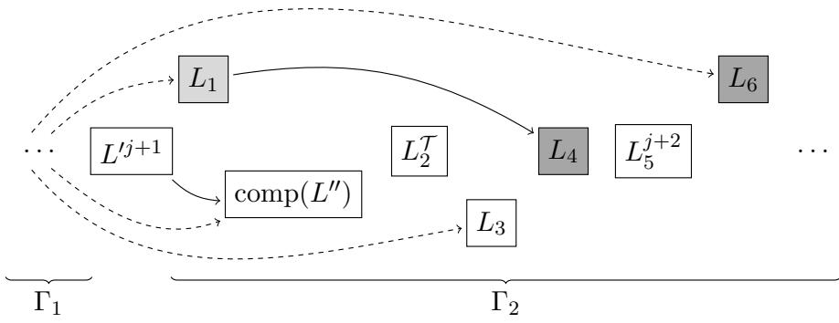

# Extending SMT Solving with Non-Ground Clause Learning

Yasmine Briefs1,2 Christoph Weidenbach1

Max Planck Institute for Informatics, Saarbr¨ucken, Germany {ybriefs,weidenbach}@mpi-inf.mpg.de Graduate School of Computer Science, Saarland Informatics Campus, Saarbr¨ucken, Germany

Quantifier instantiation is currently the main approach to non-ground SMT solving: solvers generate ground instances and solve the resulting ground SMT problems with CDCL(T)-style reasoning. When a conflict is found, conflict analysis learns only a ground clause, even though the conflict comes from instances of non-ground clauses. Yet non-ground reasoning can give exponentially shorter proofs than purely ground reasoning. We propose a calculus that consists of ground instantiations, CDCL(T)-style rules, and non-ground conflict analysis. The solver reasons on ground instances, but the resolution steps of conflict analysis are performed on their original nonground clauses. This produces learned clauses that are typically more general than the ground conflict. With a suitable strategy, the learned clauses are even non-redundant. We also show how chronological backtracking can be included in SMT solving. Our calculus gives a common setting for CDCL(T)- style SMT solving, a range of instantiation-based procedures, and non-ground clause learning, and we prove that it simulates CDCL, SCL(FOL), SCL(T), and even Resolution.

## 1. Introduction

Satisfiability Modulo Theories (SMT) has become a central tool in automated reasoning, both in its ground form and in the presence of quantifiers. At the ground level, much of this success is due to CDCL(T) [30, 4], which combines conflict-driven clause learning (CDCL) [26] with dedicated theory reasoning. To handle non-ground problems, this architecture is commonly extended by quantifier instantiation [15, 19, 20, 35, 6]: quantified formulas are instantiated, and the resulting ground problems are solved by CDCL(T). Treating solver components, such as CDCL(T), as black boxes is a powerful design principle in automated reasoning. At the same time, many advances in solver eficiency come from integrating these components more tightly with the surrounding search procedure. This observation also motivates a closer integration of quantifier instantiation with CDCL(T). In current SMT solving, quantified clauses are instantiated and the resulting ground conflicts are analyzed by CDCL(T), yielding learned ground clauses. Our goal is to lift this learning step to the non-ground clauses from which the conflicting instances originate. The motivation is not only conceptual: non-ground learning can yield exponentially shorter refutations than purely ground learning [32].

To formalize this idea, we introduce the calculus ICLF (Instantiation-based Clause Learning Framework). The input to ICLF is a first-order clause set modulo theories. A state consists of three main components: a set N of possibly non-ground clauses, initially containing the input clauses; a set G of ground instances of clauses in N, initially empty; and a ground partial model Γ, called the trail, also initially empty. The rules of ICLF fall into four groups. Instantiation rules create and delete ground instances of clauses in N. Ground rules build a partial model for G in the style of CDCL, by decisions and propagations. Theory rules, such as T -Propagate and T -Conflict, connect this ground search to a theory solver. Here ICLF abstracts from the concrete theory, or combination of theories, and from the complications involved in theory combination [29, 39, 33, 22]. Finally, conflict analysis rules derive learned clauses. The key point is that, although the clauses in G are ground, they remain linked to their non-ground origins in N. During conflict analysis, resolution is therefore performed on these original clauses, not only on their ground instances.

For example, assume that the trail contains, among others, the literals $h ( a ) = g ( a )$ $h ( a ) = a$ , and $g ( a ) \neq a$ . These literals are inconsistent in the theory of equality, since they contradict transitivity. In ICLF, this can be detected by applying T-Conflict with the closure x2 ̸= x3 ∨ x2 $\neq x _ { 4 } \lor x _ { 3 } = x _ { 4 } \cdot \{ x _ { 2 } \mapsto h ( a ) , x _ { 3 } \mapsto g ( a ) , x _ { 4 } \mapsto a \}$ , a theory lemma expressing transitivity of equality. We write $C \cdot \sigma$ for a clause C together with a grounding substitution σ. The instantiated clause Cσ is used for the ground search, while the associated non-ground clause C is retained for conflict analysis and resolution. Now assume that $h ( a ) = g ( a )$ was propagated from the closure c ̸= $d \vee h ( x _ { 1 } ) = g ( x _ { 1 } ) \cdot \{ x _ { 1 } \mapsto$ a}. An ICLF resolution step unifies the contradictory literals $h ( x _ { 1 } ) = g ( x _ { 1 } )$ and $x _ { 2 } \neq x _ { 3 }$ for instance using the most general unifier $\{ x _ { 2 } \mapsto h ( x _ { 1 } ) , x _ { 3 } \mapsto g ( x _ { 1 } ) \}$ , and derives the clause $c \neq d \lor h ( x _ { 1 } ) \neq x _ { 4 } \lor g ( x _ { 1 } ) = x _ { 4 }$ . Thus, conflict analysis derives a non-ground clause from a ground conflict.

For first-order clause learning, redundancy is a central issue: a learned clause should ideally not be implied by smaller clauses that are already available. In superpositionbased theorem proving [1, 31], redundancy elimination is essential for controlling the search space, but tests such as forward subsumption can be expensive. Simple Clause Learning (SCL) [16, 13], a recent approach that lifts ideas from CDCL to first-order logic by guiding non-ground resolution with a ground partial model, avoids this problem in a diferent way: its learned clauses are non-redundant by construction. This makes SCL an important starting point for our work. At the same time, SCL is designed around direct reasoning with non-ground clauses; all non-ground clauses have to be considered for propagations and conflicts and conflict analysis leaves little freedom. The goal of ICLF is to keep the useful non-redundancy guarantees of SCL while allowing the ground search to remain close to CDCL(T). Our basic strategy [Definition 2] restricts the rules only enough to ensure that learned clauses are non-redundant with respect to the current set G of ground instances [Theorem 11]. Thus, implementations can focus propagation and conflict search on G and use eficient techniques for ground reasoning, without constantly inspecting the full non-ground clause set N. We also define a stronger, first-order aware strategy [Definition 17], which additionally takes N into account and guarantees nonredundancy with respect to N [Theorem 18]. This strategy is closer in spirit to SCL, but still leaves more freedom in conflict analysis. Finally, ICLF contains multiple backtracking rules. They capture CDCL/CDCL(T)-style backtracking, first-order backtracking in the spirit of SCL, and a way to incorporate chronological backtracking [28, 27] into SMT solving.

This flexibility makes ICLF a common setting for several forms of model-based reasoning. In the propositional case, it simulates CDCL. For first-order logic, it simulates SCL and Resolution. Moreover, it simulates clause learning in SCL(T) [11], an adaptation of SCL to the fragment of first-order logic modulo theories without uninterpreted functions and constants. It also captures CDCL(T)-style reasoning on ground clauses modulo theories. Finally, ICLF can be seen as a formal setting for studying a range of instantiation-based SMT procedures: although quantifier instantiation is a standard practical approach, it is usually presented through concrete algorithms and solver architectures rather than as one fixed calculus. In this sense, ICLF is intended as a foundational framework: it identifies which rule restrictions are needed for soundness, non-redundant learning, and termination under suitable restrictions, and which choices can instead be left to strategies and implementations.

The paper is organized as follows. In Section 3, we present the calculus ICLF and establish, among other properties, soundness [Theorem 6], termination under suitable restrictions [Theorem 14], and completeness under suitable restrictions [Corollary 16]. In Section 4, we show that ICLF simulates the other calculi mentioned above. This is an extended version of a paper accepted at LPAR 2026 [9]. It contains further examples, lemmas, and explanations in the appendix, as well as all proofs that were omitted from the LPAR paper.

## 2. Preliminaries

We consider the following standard notions of many-sorted first-order logic without equality [11]. Let $\Sigma = ( \boldsymbol { S } , \boldsymbol { \Omega } , \boldsymbol { \Pi } )$ be a many-sorted signature where S is a finite, nonempty set of sort symbols, Ω is a non-empty set of function symbols over S and Π is a finite, non-empty set of predicate symbols over S. We assume that Ω contains at least one constant of each sort. We additionally assume a set of variables X that contains infinitely many variables of each sort. First-order terms, atoms, literals and substitutions are defined in the usual way. We assume that substitutions are well-sorted and that they have finite domain dom $( \sigma ) = \{ x \mid x \sigma \neq x \}$ . We further define the codomain of a substitution as codom $( \sigma ) = \{ x \sigma \mid x \in \mathrm { d o m } ( \sigma ) \}$ . A clause is a set of literals, which means that duplicate literals are implicitly deleted. If we write a clause as $L _ { 1 } \lor \cdots \lor L _ { n }$ where the $L _ { i }$ are literals, we mean $\{ L _ { 1 } \} \cup \cdots \cup \{ L _ { n } \}$ . Likewise, $C \lor L .$ , where $C$ is a clause and L is a literal, denotes $C \cup \{ L \}$ , and $C \vee D$ , where $C$ and D are clauses, denotes $C \cup D . \perp$ denotes the empty clause. We say that a term is ground if it does not contain any variables. We extend this definition to sets of terms, atoms, literals, clauses and clause sets in the obvious way. A substitution $\sigma$ is called grounding for a term t if tσ is a ground term. We also extend this definition to atoms, literals and clauses in the obvious way. By comp(L), we denote the complement of a literal L. We further define a function atom that maps literals to their corresponding atoms. We extend this function to map clauses to the set of atoms of the literals occurring in the clause and clause sets to the set of atoms of the clauses in the clause set. A closure is a pair $C \cdot \sigma$ where $C$ is a clause or $\top$ and $\sigma$ is a grounding substitution for C. We assume that variables that do not occur in $C$ are implicitly dropped from $\sigma , \mathrm { i . e . }$ , that dom(σ) only contains variables that occur in $C .$ . Moreover, we assume that codom(σ) is ground. If $C \in \{ \top , \bot \}$ , we may write ⊤ to refer to the closure $\intercal \cdot \{ \}$ and ⊥ to refer to the closure $\perp \cdot \{ \}$ . Given a clause $C .$ , a closure $C \cdot \sigma$ is called an instance of C. For a clause $C ,$ gnd(C) denotes the set gnd $\operatorname { \Pi } ( C ) = \{ C \sigma \mid \sigma$ is grounding for C}. For a clause set $\begin{array} { r } { N , \mathrm { g n d } ( N ) = \bigcup _ { C \in N } \mathrm { g n d } ( C ) } \end{array}$ The function mgu denotes the most general unifier of two terms, atoms or literals. We assume that the mgu does not introduce any fresh variables and is idempotent. Given a ground literal L and a closure $C \cdot \sigma$ , let $C = C ^ { \prime } \vee L _ { 1 } \vee \cdots \vee L _ { n }$ such that $L _ { i } \sigma = L$ for $i \in \{ 1 , \ldots , n \}$ and L does not occur in $C ^ { \prime } \sigma$ . Further, let $\mu = \operatorname* { m g u } ( L _ { 1 } , \ldots , L _ { n } )$ . Then, the result of exhaustively factorizing L in $C \cdot \sigma$ is $( C ^ { \prime } \lor L _ { 1 } ) \mu \cdot \sigma$

The semantics of many-sorted first-order logic without equality are given by the notion of an algebra. A Σ-algebra A is a mapping that assigns (i) a non-empty carrier set $S ^ { A }$ to every sort $S \in S ,$ so that $S _ { 1 } ^ { \mathcal { A } } \cap S _ { 2 } ^ { \mathcal { A } } = \emptyset$ for any distinct sorts $S _ { 1 } , S _ { 2 } \in S , ( \mathrm { i i } )$ a total function $f ^ { \cal A } : S _ { 1 } ^ { \cal A } \times \cdot \cdot \cdot \times S _ { n } ^ { \cal A }  \bar { S } ^ { \cal A }$ to every function symbol $f : S _ { 1 } \times \cdot \cdot \cdot \times S _ { n } \to S \in \Omega$ , (iii) a relation $P ^ { A } \subseteq S _ { 1 } ^ { \mathcal { A } } \times \cdots \times S _ { n } ^ { \mathcal { A } }$ to every predicate symbol $P \in \Pi$ of arity n. We assume $\tau$ to be a theory, i.e., a non-empty set of Σ-algebras. $\tau$ can also be the combination of multiple theories. For instance, as we consider first-order logic without equality, if needed, equality reasoning has to be part of the theory. The semantic entailment relation |= is defined in the usual way. We write $\scriptstyle = \tau$ to denote the semantic entailment relation that considers only the Σ-algebras $\mathcal { A } \in \mathcal { T }$

A trail is a sequence of annotated, ground literals. Given a trail Γ, a ground literal L is called propositionally true/false in Γ if $L / \mathrm { c o m p } ( L )$ occurs in Γ. Otherwise, L is called propositionally undefined in Γ. The trail in ICLF is always consistent, i.e., no ground literal is propositionally true and propositionally false at the same time. A ground clause C is called propositionally true in Γ if there is a literal $L \in C$ that is propositionally true in Γ. It is called propositionally false in Γ if all literals $L \in C$ are propositionally false in Γ. Otherwise, it is called propositionally undefined in Γ. Trails are interpreted as the conjunction of their literals, clauses are interpreted as the disjunction of their literals and clause sets are interpreted as the conjunction of their clauses. A clause set N is called satisfiable if there exists a Σ-algebra A such that ${ \mathcal { A } } \models N$ . It is called $\tau _ { - s a t i s f i a b l e }$ if there exists a Σ-algebra $\mathcal { A } \in \mathcal { T }$ such that ${ \mathcal { A } } \models N$ . Similarly, the $\tau { } _ { \cdot }$ -satisfiability of a trail Γ is defined. Given a ground set of clauses N, a trail Γ is called a model of N if all clauses in N are propositionally true in Γ. Two clause sets $N _ { 1 }$ and $N _ { 2 }$ are called equi-satisfiable if $N _ { 1 }$ is satisfiable if and only if $N _ { 2 }$ is satisfiable. They are called equi-satisfiable in $\tau$ if $N _ { 1 }$ is $\tau .$ -satisfiable if and only if $N _ { 2 }$ is T-satisfiable.

Definition 1 (Clause Redundancy). Let ≺ be a well-founded, total, strict ordering on ground literals. We lift this ordering to clauses by its multiset extension. We further $d e f i n e \preceq$ to be the reflexive closure $o f \prec$ and $N ^ { \preceq C } = \{ D \in N \mid D \preceq C \}$ for a ground clause $C$ and a ground clause set N.

A ground clause C is called redundant with respect to a ground clause set N and $\prec \ i f$ $N ^ { \preceq C } \models C$ . A clause $C$ is called redundant with respect to a clause set N and $\prec \ i f \ f o r$ all $C ^ { \prime } \in \mathrm { g n d } ( C )$ , it holds that $C ^ { \prime }$ is redundant with respect to $\operatorname { g n d } ( N )$

## 3. The Calculus

We define ICLF as an abstract rewrite system. Its inference rules operate on a state that is a six-tuple $\left( \Theta ; \Gamma ; N ; G ; k ; D \cdot \tau \right)$ where Θ is a set of ground atoms, Γ is the trail, $N$ is a clause set, G is a set of closures, k is a natural number called the decision level, and $D \cdot \tau$ is the conflict closure. We define clauses $( G ) = \{ C \sigma \mid C \cdot \sigma \in G \}$ . The purpose of Θ is to restrict the set of ground atoms that are currently available in the search for a model of clauses(G). Θ always contains at least all atoms that occur on the trail or in clauses(G) [Lemma 5]. The literals in Γ are either annotated with a natural number, in which case they are called decisions, or with a closure, in which case they are called propagations, or with $\tau$ , in which case they are called theory propagations. The decisions in Γ are annotated with $1 , \ldots , k$ in this order [Lemma 5]. The decision level of a decision is its annotation, and the decision level of any other literal in Γ is the annotation of the decision closest to its left. If there is no such decision, the decision level of the literal is 0. The decision level of Γ is the maximal decision level of a literal in ${ \mathrm { i t } } ,$ or 0 if $\Gamma = \varepsilon$ For a simpler presentation, N contains both the initial and the learned clauses and G contains both the instantiated and the learned closures. $\mathrm { I f } \ D \cdot \tau = \ T$ , the algorithm is in the instantiation and model building phase. If D · τ = ⊥, T-unsatisfiability has been derived. Otherwise, the algorithm is in the conflict analysis phase. The start state for a set of clauses $N ^ { \prime }$ is $( \emptyset ; \varepsilon ; N ^ { \prime } ; \emptyset ; 0 ; \top )$ . We assume that the initial set of clauses $N ^ { \prime }$ does not contain the empty clause. Moreover, we require that the T-satisfiability of conjunctions of ground literals is decidable. Instead of using an abstraction function, we write the ground theory literals on the trail directly. An implementation can still use an abstraction function for the ground reasoning.

We first present the four instantiation rules that are used to manage the instances.

Instantiate

$$
\begin{array} { r l } { ( \Theta ; \Gamma ; N ; G ; k ; \top ) } & { { } } \\ { \Rightarrow _ { \mathrm { I C L F } } } & { { } ( \Theta \cup \mathrm { a t o m } ( C \sigma ) ; \Gamma ; N ; G \cup \{ C \cdot \sigma \} ; k ; \top ) } \end{array}
$$

given that $C \in N , \sigma$ is grounding for C, Cσ $\notin$ clauses(G) and either $C \sigma$ is not propositionally false in Γ or $\Gamma = \Gamma _ { 1 } K$ with $K \in \{ L ^ { D \cdot \tau } , L ^ { \tau } \}$ and $C \sigma$ is not propositionally false for $\Gamma _ { 1 }$

Typically, a run starts by applying Instantiate with the empty substitution to all clauses in N that are already ground. To avoid learning redundant clauses, it is crucial that no instance in clauses(G) is false for a proper trail prefix or becomes false by a decision [Definition 2]. The condition on Cσ being propositionally false ensures that newly added instances preserve this property. Allowing propositionally false instances to be instantiated at all is necessary for following a first-order aware strategy [Definition 17]. To add an arbitrary propositionally false instance, Restart can first be used to return to a trail prefix at which Instantiate is applicable.

ClauseDel

$$
\begin{array} { r l } { ( \Theta ; \Gamma ; N \uplus \{ C \} ; G ; k ; \top ) } & { { } \Rightarrow _ { \mathrm { I C L F } } \quad ( \Theta ; \Gamma ; N ; G ; k ; \top ) } \end{array}
$$

given that N ⊎ {C} and N are equi-satisfiable in $\tau$ and there is no grounding σ with $C \cdot \sigma \in G$

Even though it is undecidable in general whether the rule ClauseDel is applicable, there are some suficient conditions for its applicability, e.g., that C is subsumed by another clause in N.

InstanceDel

$$
\begin{array} { r l } { ( \Theta ; \Gamma ; N ; G \uplus \{ C \cdot \sigma \} ; k ; \top ) } & { { } \Rightarrow _ { \mathrm { I C L F } } \quad ( \Theta ; \Gamma ; N ; G ; k ; \top ) } \end{array}
$$

given that there is no $L ^ { C \cdot \sigma }$ in Γ.

Although it can make sense to only apply InstanceDel if $G \uplus \{ C \cdot \sigma \}$ and $G$ are equisatisfiable in $\tau$ , we would like to allow restarts with fresh instances.

AtomDel

$$
\begin{array} { r l } { ( \Theta \ : \updownarrow ) \ : \{ A \} ; \Gamma ; N ; G ; k ; \top ) } & { { } \Rightarrow _ { \mathrm { I C L F } } \quad ( \Theta ; \Gamma ; N ; G ; k ; \top ) } \end{array}
$$

given that $A \notin$ atom(Γ) ∪ atom(clauses(G)).

The following four rules form the ground rules.

Decide

$$
\begin{array} { r l } { ( \Theta ; \Gamma ; N ; G ; k ; \top ) } & { { } \Rightarrow _ { \mathrm { I C L F } } \quad ( \Theta ; \Gamma L ^ { k + 1 } ; N ; G ; k + 1 ; \top ) } \end{array}
$$

given that atom $( L ) \in \Theta$ and L is propositionally undefined in Γ.

Propagate

$$
\begin{array} { r l } { ( \Theta ; \Gamma ; N ; G ; k ; \top ) } & { { } \Rightarrow _ { \mathrm { I C L F } } \quad ( \Theta ; \Gamma L ^ { C \cdot \sigma } ; N ; G ; k ; \top ) } \end{array}
$$

given that $C \cdot \sigma \in G , C \sigma = C ^ { \prime } \vee L , C ^ { \prime }$ is propositionally false in Γ and L is propositionally undefined in Γ.

Conflict

$$
\begin{array} { r l } { ( \Theta ; \Gamma ; N ; G ; k ; \top ) } & { { } \Rightarrow _ { \mathrm { I C L F } } \quad ( \Theta ; \Gamma ; N ; G ; k ; D \cdot \tau ) } \end{array}
$$

given that $D \cdot \tau \in G$ and $D \tau$ is propositionally false in Γ.

Restart

$$
\begin{array} { r l } { ( \Theta ; \Gamma ; N ; G ; k ; \top ) } & { { } \Rightarrow _ { \mathrm { I C L F } } \quad ( \Theta ; \Gamma _ { 1 } ; N ; G ; j ; \top ) } \end{array}
$$

given that $\Gamma = \Gamma _ { 1 } \Gamma _ { 2 }$ and j is the decision level of $\Gamma _ { 1 }$

Applying the rule Restart with $\Gamma _ { 1 } = \varepsilon$ corresponds to a restart in CDCL(T), i.e., a restart on the ground level. We allow restarting with arbitrary trail prefixes, enabling the subsequent application of Instantiate with clauses that would have been propositionally false in Γ.

Next, we present the five theory rules.

T -Propagate

$$
\begin{array} { r l } { ( \Theta ; \Gamma ; N ; G ; k ; \top ) } & { { } \Rightarrow _ { \mathrm { I C L F } } \quad ( \Theta ; \Gamma L ^ { \mathcal { T } } ; N ; G ; k ; \top ) } \end{array}
$$

given that atom $( L ) \in \Theta , \Gamma \left| = \tau L \right.$ and L is propositionally undefined in Γ.

Theory propagations are annotated with $\tau$ and can be explained later when they become relevant during conflict analysis. The condition $\Gamma \models _ { \mathcal { T } } L$ makes sure that there exists a tautology in the theory from which L can be propagated.

T -Learn

$$
\begin{array} { r l } { ( \Theta ; \Gamma ; N ; G ; k ; \top ) } & { { } \Rightarrow _ { \mathrm { I C L F } } \quad ( \Theta ; \Gamma ; N \cup \{ C \} ; G ; k ; \top ) } \end{array}
$$

given that $C \notin N$ and $\scriptstyle \left| = \tau C \right|$

Note that T -Learn adds a non-ground theory lemma in general. This can then be instantiated by the rule Instantiate. If the added theory lemma is already ground, it can be instantiated with the empty substitution $\{ \}$

T -Atom

$$
\begin{array} { r l } { ( \Theta ; \Gamma ; N ; G ; k ; \top ) } & { { } \Rightarrow _ { \mathrm { I C L F } } \quad ( \Theta \cup \{ A \} ; \Gamma ; N ; G ; k ; \top ) } \end{array}
$$

given that $A \notin \Theta$ and A is a ground atom.

T -Conflict

$$
\begin{array} { r l } { ( \Theta ; \Gamma ; N ; G ; k ; \top ) } & { { } \Rightarrow _ { \mathrm { I C L F } } \quad ( \Theta ; \Gamma ; N ; G ; k ; D \cdot \tau ) } \end{array}
$$

given that $\scriptstyle | = \tau D , \tau$ is grounding for D and $D \tau$ is propositionally false in Γ.

Just like in T -Learn, the conflict clause produced by T -Conflict can be non-ground.

Explain

$$
\begin{array} { r l } { ( \Theta ; \Gamma _ { 1 } L ^ { T } \Gamma _ { 2 } ; N ; G ; k ; D \cdot \tau ) } & { { } } \\ { \Rightarrow _ { \mathrm { I C L F } } } & { { } ( \Theta ; \Gamma _ { 1 } L ^ { C \cdot \sigma } \Gamma _ { 2 } ; N ; G ; k ; D \cdot \tau ) } \end{array}
$$

given that $\vdash \tau , \sigma$ is grounding for C, $C \sigma = C ^ { \prime } \vee L$ and $C ^ { \prime }$ is propositionally false in $\Gamma _ { 1 }$

⊤ is a short form for the conflict closure $\intercal \cdot \{ \}$ , i.e., the rule Explain can be applied both in the model building and in the conflict analysis phase. Just like in T-Learn and T-Conflict, the reason can be non-ground. For each theory propagation on the trail, there exists a clause to apply Explain with, for example $\lnot \Gamma _ { 1 } \lor L \cdot \{ \}$ , which is always valid in the theory by Lemma 5.

Finally, the following five rules are the conflict analysis rules.

Resolve

$$
\begin{array} { r l } & { ( \Theta ; \Gamma _ { 1 } L ^ { C \cdot \sigma } \Gamma _ { 2 } ; N ; G ; k ; ( D \vee L ^ { \prime } ) \cdot \tau ) } \\ & { \qquad \Rightarrow _ { \mathrm { I C L F } } \quad ( \Theta ; \Gamma _ { 1 } L ^ { C \cdot \sigma } \Gamma _ { 2 } ; N ; G ; k ; \mathrm { r e s o l v e } ( C \cdot \sigma , D \cdot \tau , L ^ { \prime } , L ) ) } \end{array}
$$

given that $L ^ { \prime } \tau = \mathrm { c o m p } ( L )$

The function resolve takes as arguments two variable disjoint closures $C \cdot \sigma$ and $D \cdot \tau$ a literal $L ^ { \prime }$ that does not occur in $D _ { : }$ may share variables with $D ,$ but not with $C ,$ and a ground literal L such that $L ^ { \prime } \tau = \mathrm { c o m p } ( L )$ . Let $C = C ^ { \prime } \vee L _ { 1 } \vee \cdots \vee L _ { n }$ such that $L _ { i } \sigma = L$ for all $i \in \{ 1 , \ldots , n \}$ and L does not occur in $C ^ { \prime } \sigma$ . If $\mu = \operatorname * { m g u } ( \operatorname { c o m p } ( L ^ { \prime } ) , L _ { 1 } , . . . , L _ { n } )$ then resolve $( C \cdot \sigma , D \cdot \tau , L ^ { \prime } , L ) = ( C ^ { \prime } \vee D ) \mu \cdot \sigma \tau$ . In other words, the function resolve exhaustively factorizes $L$ in $C$ and computes a resolution inference between the two clauses.

The rule Resolve allows resolving any literal that is on the trail. This generality makes standard simplifications such as unit reduction possible. Additionally, it allows modeling conflict analysis procedures such as in standard CDCL with 1UIP learning [26] or in SCL [13] that work through the trail backwards, performing either Skip or Resolve for each encountered literal, as well as procedures like chronological backtracking [28, 27] that only resolve with a subsequence of the relevant literals on the trail.

Factorize

$$
\begin{array} { r l } { ( \Theta ; \Gamma ; N ; G ; k ; ( D \vee L \vee L ^ { \prime } ) \cdot \tau ) } & { { } } \\ { \Rightarrow _ { \mathrm { I C L F } } } & { { } \left( \Theta ; \Gamma ; N ; G ; k ; ( D \vee L ) \eta \cdot \tau \right) } \end{array}
$$

given that $L \tau = L ^ { \prime } \tau$ and $\eta = \mathrm { m g u } ( L , L ^ { \prime } )$

The ground conflict clause does not change by applying Factorize. If the literal that Resolve is applied to can be factorized, then it does not disappear from the ground conflict clause after resolving. While the resulting ground conflict clause is the same regardless of whether a literal is exhaustively factorized before it is resolved or whether Resolve is applied multiple times, this is, in general, not true for the non-ground conflict clause [13, Example 3].

BacktrackClassic

$$
\begin{array} { r l } & { \left( \Theta ; \Gamma _ { 1 } K ^ { j } \Gamma _ { 2 } ; N ; G ; k ; D \cdot \tau \right) } \\ & { \qquad \Rightarrow _ { \mathrm { I C L F } } \quad \left( \Theta ; \Gamma _ { 1 } L ^ { D \cdot \tau } ; N \cup \{ D \} ; G \cup \{ D \cdot \tau \} ; j - 1 ; \top \right) } \end{array}
$$

given that $D \tau = D ^ { \prime } \lor L , D ^ { \prime }$ is propositionally false in $\Gamma _ { 1 }$ and $L$ is propositionally undefined in $\Gamma _ { 1 }$

BacktrackFOL

$$
\begin{array} { r l } { ( \Theta ; \Gamma _ { 1 } \Gamma _ { 2 } ; N ; G ; k ; D \cdot \tau ) } & { { } } \\ { \Rightarrow _ { \mathrm { I C L F } } } & { { } ( \Theta ; \Gamma _ { 1 } ; N \cup \{ D \} ; G \cup \{ D \cdot \tau \} ; j ; \mathcal { T } ) } \end{array}
$$

given that there is no grounding σ such that Dσ is propositionally false in $\Gamma _ { 1 } , j$ is the decision level of $\Gamma _ { 1 }$ and $\Gamma _ { 2 }$ contains a decision literal.

BacktrackCB

$$
\begin{array} { r l } { ( \Theta ; \Gamma ; N ; G ; k ; D \cdot \tau ) } & { { } } \\ { \Rightarrow _ { \mathrm { I C L F } } } & { { } ( \Theta ; \Gamma ^ { \prime } L ^ { D \cdot \tau } ; N \cup \{ D \} ; G \cup \{ D \cdot \tau \} ; j ; \mathcal { T } ) } \end{array}
$$

given that $\Gamma ^ { \prime } = \mathrm { c b } ( \Gamma , D \tau , j ) , D \tau = D ^ { \prime } \vee L , D ^ { \prime }$ is propositionally false in $\Gamma ^ { \prime }$ and $L$ is propositionally undefined in $\Gamma ^ { \prime }$

Here, CB stands for chronological backtracking [28, 27], an alternative backtracking scheme for CDCL that we adapt to ICLF in this paper. We now define the function cb. To this end, given a trail Γ, we first define the conflict graph as the directed acyclic graph whose nodes are the literals on the trail Γ. Decision literals $L ^ { k }$ and theory propagations $L ^ { \mathcal { T } }$ do not have any predecessors, and the predecessors of a propagation $L ^ { C ^ { \prime } \cdot \sigma }$ are the literals $\mathrm { c o m p } ( L ^ { \prime } )$ for all $L ^ { \prime } \in C ^ { \prime } \sigma$ with $L ^ { \prime } \neq L$ . If L is a propagation (or an explained theory propagation), all of these predecessors are indeed literals on the trail. For each literal L on the trail Γ, we define reach(L) as the set of literals that can be reached from $L$ in the conflict graph, including $L$ itself. By reach $^ { - 1 } ( L )$ , we denote the set of literals that can reach L in the conflict graph.

The arguments of the function cb are a trail Γ, a ground clause $C$ and a destination decision level j that is smaller than the decision level of Γ. Let $\Gamma = \Gamma _ { 1 } L ^ { \prime j + 1 } \Gamma _ { 2 }$ . cb is only applicable if the following three conditions are met. First, C should be propositionally false in Γ, i.e., for all $L \in C , \mathrm { c o m p } ( L )$ should be in Γ. Second, $| \{ \mathrm { c o m p } ( L ) \ | \ L \ \in$ $C \} \cap \operatorname { r e a c h } ( L ^ { \prime } ) | = 1 , \operatorname { i . e . }$ ., exactly one literal in C should depend on the $j + 1 \mathrm { - s t }$ decision. Third, in $\bigcup _ { L \in C }$ reach $^ { - 1 } ( \mathrm { c o m p } ( L ) ) \cap \Gamma _ { 2 }$ , there should be no literal annotated as a decision or theory propagation, i.e., no conflict literal should depend on a decision or theory propagation after $L ^ { \prime }$ on the trail. Then, let $C = C ^ { \prime } \vee L ^ { \prime \prime }$ such that $\{ \mathrm { c o m p } ( L ) \ | \ L \in$ $C ^ { \prime } \} \cap \operatorname { r e a c h } ( L ^ { \prime } ) = \emptyset , \mathrm { i . e . , } L ^ { \prime \prime }$ is the only literal in $C$ that depends on $L ^ { \prime } .$ . Further, let $\Gamma _ { 3 }$ be the subsequence of $\Gamma _ { 2 }$ that contains only the literals $\cup _ { L \in C ^ { \prime } } \operatorname { r e a c h } ^ { - 1 } ( \operatorname { c o m p } ( L ) ) \cap \Gamma _ { 2 }$ . It is crucial to note that $\Gamma _ { 3 }$ only contains propagations (and explained theory propagations), and that none of the literals in $\Gamma _ { 3 }$ was propagated from $L ^ { \prime } .$ . Then $\mathrm { c b } ( \Gamma , C , j ) = \Gamma _ { 1 } \Gamma _ { 3 }$ . By the aforementioned properties of $\Gamma _ { 3 } ,$ , all propagations in $\Gamma _ { 3 }$ are still justified in $\Gamma _ { 1 } \Gamma _ { 3 }$ and $C ^ { \prime }$ stays propositionally false in $\Gamma _ { 1 } \Gamma _ { 3 }$ . Figure 1 illustrates this definition of the function cb.

  
Figure 1: An example to illustrate the definition of the function cb. $C ^ { \prime }$ contains the complements of the literals $L _ { 4 }$ and $L _ { 6 }$ . Then $\Gamma _ { 3 } = L _ { 1 } L _ { 4 } L _ { 6 }$

## Definition 2. A strategy for ICLF is called reasonable if the following are true:

1. The rule Conflict is preferred over the rules Decide, Propagate, T -Propagate and T -Conflict.

2. No application of the rule Decide enables an immediate application of the rule Conflict.

3. If a conflict state is reached by the rule Conflict, then Resolve and Factorize are applied in such a way that the complement of the rightmost literal on the trail does not occur in the ground conflict clause anymore before applying any of the rules BacktrackClassic, BacktrackFOL or BacktrackCB.

These requirements do not cause any stuck states by Theorem 15. Although this does not afect correctness or termination, to avoid that previously resolved literals are reintroduced into the conflict clause, Resolve should be applied from right to left on the trail.

The goal of restricting the strategy is to learn only clauses that are non-redundant with respect to the current set of instantiations G and a trail induced ordering [Definition 9].

Most SAT solvers implement CDCL with 1UIP learning [26]. In CDCL, the 1UIP clause is non-redundant because exhaustive propagation maintains the necessary invariants [41]. In ICLF, however, these invariants can be broken by theory rules and instantiations. For example, a newly instantiated clause may propagate with respect to an earlier trail prefix, making it possible for the 1UIP clause to be redundant. Moreover, for theory propagations and for literals propagated from them, the exact implying literals are not known before a theory explanation is computed, which may be expensive. For these reasons, 1UIP learning is not straightforward in our setting. Therefore, the restrictions of a reasonable strategy capture only what is needed for non-redundant learning and otherwise leave the conflict analysis rules general.

The following example shows ICLF in action modulo the theory of equality for the sake of simple theory reasoning. Of course, ICLF works modulo any suitable theory combination in the same way as CDCL(T). This run closely resembles quantifier instantiation combined with CDCL(T) and shows how ICLF can model this standard approach.

Example 3. We present a reasonable ICLF run on the clause set

$$
\begin{array} { r l } { \mathbb { E } _ { \lambda = - 1 } ( \underset { \theta \leq 0 , \theta \leq 1 } { \operatorname* { s u p } } ( \frac { 1 } { \theta \leq t } ) ) \mathbb { E } _ { \lambda = \theta } ( \frac { 1 } { \theta \leq t } ) \mathbb { E } _ { \lambda = \theta } ( \frac { 1 } { \theta \leq t } ) \mathbb { E } _ { \lambda = \theta } ( \frac { 1 } { \theta \leq t } ) \mathbb { E } _ { \lambda = \theta } ( \frac { 1 } { \theta \leq t } ) \mathbb { E } _ { \lambda = \theta } ( \frac { 1 } { \theta \leq t } ) \mathbb { E } _ { \lambda = \theta } ( \frac { 1 } { \theta \leq t } ) \mathbb { E } _ { \lambda = \theta } ( \frac { 1 } { \theta \leq t } ) \mathbb { E } _ { \lambda = \theta } ( \frac { 1 } { \theta \leq t } ) } \\ & { \quad \times \mathbb { E } _ { \lambda = \theta } ( \frac { 1 } { \theta \leq t } ) \mathbb { E } _ { \lambda = \theta } ( \frac { 1 } { \theta \leq t } ) \mathbb { E } _ { \lambda = \theta } ( \frac { 1 } { \theta \leq t } ) \mathbb { E } _ { \lambda = \theta } ( \frac { 1 } { \theta \leq t } ) \mathbb { E } _ { \lambda = \theta } ( \frac { 1 } { \theta \leq t } ) \mathbb { E } _ { \lambda = \theta } ( \frac { 1 } { \theta \leq t } ) \mathbb { E } _ { \lambda = \theta } ( \frac { 1 } { \theta \leq t } ) } \\ &  \quad \times \mathbb { E } _ { \lambda = \theta } ^ { ( 2 ) \operatorname* { s u p } } ( \frac { 1 } { \theta \leq t } ) \mathbb { E } _ { \lambda = \theta } ( \frac { 1 } { \theta \leq t } ) \mathbb { E } _ { \lambda = \theta } ( \frac { 1 } { \theta \leq t } ) \mathbb { E } _ { \lambda = \theta } ( \frac { 1 } { \theta \leq t } ) \mathbb { E } _ { \lambda = \theta } ( \frac { 1 }   \end{array}
$$

$$
\begin{array} { l } { { H e r e , N _ { 1 } = N _ { 0 } \cup \{ ( N 6 ) \ f ( a ) \neq g ( a ) \lor g ( b ) \neq c \} \ a n d G _ { 1 } = G _ { 0 } \cup \{ ( G 6 ) \ f ( a ) \neq g ( a ) \lor g ( b ) \neq \emptyset \} } } \\  { c \cdot \{ \} \} . } \\ { { \ } } \\ { { \Rightarrow \ P _ { C C E } ^ { P r o p a g a t e } \qquad \quad ( \Theta _ { 0 } ; \Gamma _ { 6 } : = \Gamma _ { 5 } ( f ( b ) = h ( b ) ) ^ { ( G 1 ) } ; N _ { 1 } ; G _ { 1 } ; 0 ; \top ) } } \\ { { \Rightarrow \ P _ { C C E } ^ { P r o p a g a t e } \qquad \quad ( \Theta _ { 0 } ; \Gamma _ { 7 } : = \Gamma _ { 6 } ( f ( c ) \neq h ( c ) ) ^ { ( G 4 ) } ; N _ { 1 } ; G _ { 1 } ; 0 ; \top ) } } \end{array}
$$

$\Gamma _ { 7 }$ is a T -satisfiable model of $G _ { 1 }$ . A possible next step is to apply Instantiate with the clause $( N 1 ) \cdot \{ x _ { 0 } \mapsto a , x _ { 1 } \mapsto c \}$ . This immediately enables the application of Conflict, and after several applications of Resolve, ⊥ will be derived, showing the unsatisfiability of the clause set $N _ { 0 }$

The following example shows how ICLF can learn non-ground clauses. Again, we work modulo the theory of equality to keep the theory reasoning simple.

Example 4. We present a reasonable ICLF run on the clause set

$$
\begin{array} { r l } { \mathbb { E } _ { q } ( \cdot , \| X ^ { ( 1 ) } ) = - 4 \cdot \mathcal { Q } _ { q } ( \cdot , \phi ^ { ( 1 ) } ) = } & { \ : \mathcal { Q } _ { q } ( \cdot , \phi ^ { ( 1 ) } ) = - 4 \cdot \mathcal { Q } _ { q } ( \cdot , \phi ^ { ( 1 ) } ) = } \\ & { \ : \ : \ : \ : \ : } \\ { \ : \ : \ : \ : } \\ { \ : \ : \ : \ : \ : } \\ { \ : \ : \ : \ : \ : \ : } \\ { \ : \ : \ : \ : \ : \ : } \\ { \ : \ : \ : \ : \ : \ : } \\ { \ : \ : \ : \ : \ : \ : } \\ { \ : \ : \ : \ : \ : \ : } \\ { \ : \ : \ : \ : \ : \ : \ : } \\ { \ : \ : \ : \ : \ : \ : \ : } \\ { \ : \ : \ : \ : \ : \ : \ : } \\ { \ : \ : \ : \ : \ : \ : \ : } \\ { \ : \ : \ : \ : \ : \ : \ : } \\ { \ : \ : \ : \ : \ : \ : \ : \ : } \\ { \ : \ : \ : \ : \ : \ : \ : } \\ { \ : \ : \ : \ : \ : \ : \ : } \\ { \ : \ : \ : \ : \ : \ : \ : } \\ { \ : \ : \ : \ : \ : \ : \ : } \\ { \ : \ : \ : \ : \ : \ : \ : } \\ { \ : \ : \ : \ : \ : \ : } \\ { \ : \ : \ : \ : \ : \ : } \\ { \ : \ : \ : \ : \ : \ : \ : } \\ { \ : \ : \ : \ : \ : \ : } \\ { \ : \ : \ : \ : \ : \ : } \\ { \ : \ : \ : \ : \ : \ : } \\ { \ : \ : \ : \ : \ : \ : } \\ { \ : \ : \ : \ : \ : \ : } \\ { \ : \ : \ : \ : \ : \ : } \\ { \ : \ : \ : \ : \ : \ : } \\ { \ : \ : \ : \ : \ : \ : } \\ { \ : \ : \ : \ : \ : } \\ { \ : \ : \ : \ : \ : } \\ { \ : \ : \ : \ : \ : } \\ { \ : \ : \ : \ : \ : } \\ { \ : \ : \ : \ : \ : } \\ { \ : \ : \ : \ : \ : } \\ { \ : \ : \ : \ : \ : } \\ { \ : \ : \ : \ : \ : } \\ { \ : \ : \ : \ : \ : } \\  \ : \ : \end{array}
$$

Here, $N _ { 1 } = N _ { 0 } \cup \{ ( N 4 ) ~ g ( x _ { 4 } ) = x _ { 4 } \}$ and $G _ { 1 } = G _ { 0 } \cup \{ ( G 4 ) ~ g ( x _ { 4 } ) = x _ { 4 } \cdot \{ x _ { 4 } \mapsto a \} \}$ . Of course, after the third propagation, $\Gamma _ { 3 }$ is already a T -satisfiable model of $G _ { 0 }$ . However, consider a larger problem that contains the three clauses N1, N2, and N3 among other clauses. In such a problem, another clause might have motivated the decision $g ( a ) \neq a$ . A CDCL(T)-style approach with quantifier instantiation and ground 1UIP conflict analysis would learn the ground theory conflict clause $h ( a ) \neq g ( a ) \lor h ( a ) \neq a \lor g ( a ) = a$ from this conflict. By contrast, in this particular run, the generality of Resolve allows ICLF to resolve further with the three propagations and learn the more general clause $g ( x _ { 4 } ) = x _ { 4 }$ For these further resolution steps to yield the non-ground clause $g ( x _ { 4 } ) = x _ { 4 }$ , the nonground theory lemma $x _ { 2 } \neq x _ { 3 } \lor x _ { 2 } \neq x _ { 4 } \lor x _ { 3 } = x _ { 4 }$ is essential: starting from its ground instance instead, the same resolution steps would only yield the ground clause $g ( a ) = a$ The learned non-ground clause can be useful later in the run: if g(b) becomes relevant, it can be instantiated as $g ( x _ { 4 } ) = x _ { 4 } \cdot \{ x _ { 4 } \mapsto b \}$ , whereas the ground clause $g ( a ) = a$ carries no information about $g ( b )$

Next, we prove the correctness of ICLF and further properties, including nonredundant learning as well as termination and completeness under suitable restrictions. We start with invariants that are maintained by all ICLF rules. The proof is by induction on the length of the derivation, with a case distinction on the last applied rule.

Lemma 5 (Invariants). Let $\left( \Theta ; \Gamma ; N ; G ; k ; D \cdot \tau \right)$ be a state reached from a start state $( \emptyset ; \varepsilon ; N ^ { \prime } ; \emptyset ; 0 ; \top )$ by applying the rules of ICLF. Then the following hold:

1. For all $C \cdot \sigma \in G$ , it holds that $C \in N$

2. atom(Γ) ∪ atom $( \mathrm { c l a u s e s } ( G ) ) \subseteq \Theta$ and for all $A \in \Theta , A$ is a ground atom.

3. $I f \Gamma = \Gamma _ { 1 } K \Gamma _ { 2 }$ then K is propositionally undefined in $\Gamma _ { 1 }$

4. If $\Gamma = \Gamma _ { 1 } L ^ { C \cdot \sigma } \Gamma _ { 2 }$ then Cσ is ground, $C \sigma = C ^ { \prime } \vee L , C ^ { \prime }$ is propositionally false in $\Gamma _ { 1 }$ and $e i t h e r \ : C \cdot \sigma \in G \ : o r \ : \boxed { = _ { T } C }$

5. $I f \Gamma = \Gamma _ { 1 } L ^ { \mathcal { T } } \Gamma _ { 2 }$ then $\Gamma _ { 1 } \models _ { \mathcal { T } } L$

6. Let $k _ { 1 } , \ldots , k _ { l }$ be the annotations of decisions in Γ. If there are no decisions, then k = 0; otherwise $1 = k _ { 1 } , k = k _ { l }$ and for all $i \in \{ 2 , \ldots , l \} , k _ { i } = k _ { i - 1 } + 1$

7. $N ^ { \prime }$ and N are equi-satisfiable in $\tau$

8. If $D \neq { \mathsf { T } }$ then Dτ is ground, atom $( D \tau ) \subseteq \Theta$ and Dτ is propositionally false in Γ.

9. clauses $( G ) \models _ { \mathcal { T } } D \tau$

10. $N \models _ { \mathcal { T } } D$

Proof. The proof is by induction on the length of the derivation. In the start state $( \emptyset ; \varepsilon ; N ^ { \prime } ; \emptyset ; 0 ; \top )$ , all properties obviously hold. The induction step is shown by a case distinction on the last applied rule. For readability, we only mention rules that modify any of the objects occurring in the respective property and skip cases in which the property obviously follows from the induction hypothesis. When we say that a rule asserts something, we mean that it follows from the premise and the patterns on the left side of the rule. To avoid confusion between variables used in this lemma and variables used in the rule definitions, we mark variables that refer to the rule definitions with a hat, $\mathrm { e . g . , } \hat { C } .$

Properties 1 and 2: Instantiate asserts all of these properties for the newly added instance. ClauseDel asserts that Property 1 stays true after deleting the clause. AtomDel asserts that Property 2 stays true after deleting the atom. Decide asserts that Property 2 stays true after adding the literal to the trail. For Propagate, Property 2 for the newly added literal follows from the induction hypothesis because $\hat { C } \cdot \hat { \sigma } \in G$ . T -Propagate asserts that Property 2 stays true after adding the literal to the trail. BacktrackClassic, BacktrackFOL and BacktrackCB ensure Property 1 by adding $\hat { D }$ to $\hat { N }$ and $\hat { D } \cdot \hat { \tau }$ to $\hat { G }$ simultaneously. Property 2 follows from Property 8 of the induction hypothesis. T -Atom asserts that Property 2 stays true after adding the atom to Θ.

Properties 3 to 6: InstanceDel asserts that Property 4 stays true after deleting the instance. Decide asserts that Property 3 stays true after adding the literal to the trail. Property 6 follows from the induction hypothesis together with the level $k + 1$ that we assign to the added literal. Propagate asserts that Properties 3 and 4 stay true after adding the literal to the trail. For Restart, all of these properties follow from the induction hypothesis because $\hat { \Gamma } _ { 1 }$ is a prefix of Γ and the decision level is set to be correct.ˆ T-Propagate asserts that Properties 3 and 5 stay true after adding the literal to the trail. Explain asserts that Property 4 stays true after changing the annotation of the literal. BacktrackClassic and BacktrackCB assert that Properties 3 and 4 stay true after adding the propagation from the learned clause. BacktrackClassic and BacktrackFOL assert that Property 6 stays true. The trail after BacktrackCB is $\hat { \Gamma } _ { 1 } \hat { \Gamma } _ { 3 } \hat { L } ^ { \hat { D } \cdot \hat { \tau } }$ , where $\hat { \Gamma } _ { 1 } \hat { \Gamma } _ { 3 } = \mathrm { c b } ( \hat { \Gamma } , \hat { D } \hat { \tau } , \hat { j } )$ . As argued along the definition of the function cb, $\hat { \Gamma } _ { 3 }$ only contains propagations (and explained theory propagations), none of which depends on $\hat { L ^ { \prime } } ,$ and all their implying literals are retained. Hence Property 5 follows from the induction hypothesis, and Property 4 follows from the induction hypothesis for the retained propagations and from the premise of BacktrackCB for the newly added propagation. Property 6 also stays true by the definition of the function cb.

Property 7: ClauseDel asserts that this property stays true after deleting the clause. When applying T -Learn, the equi-satisfiability in $\tau$ of $\hat { N }$ and $\hat { N } \cup \{ \hat { C } \}$ follows from the fact that $\scriptstyle  = \tau { \hat { C } }$ . For BacktrackClassic, BacktrackFOL and BacktrackCB, this property follows from Property 10 of the induction hypothesis.

Properties 8 to 10: For all rules that leave a state with $D \cdot \tau = \top$ , these properties are obviously true. For Conflict, Property 8 follows from Property 2 of the induction hypothesis and the premise of this rule. Property 9 is obvious and Property 10 follows from Property 1 of the induction hypothesis. For T-Conflict, Property 8 follows from the premise of this rule and Property 2 of the induction hypothesis; if $D \tau$ is propositionally false in Γ, then all of its literals are contained in Γ negatively. Properties 9 and 10 are obvious because $\scriptstyle \vdash \tau D$ . For Resolve, all of these properties follow from Properties $1 , 2 ,$ 4 and 8 to 10 of the induction hypothesis and the definition of the function resolve. Factorize trivially maintains Properties 8 and 9 because D $D \tau$ does not change by factorizing the literals $\hat { L }$ and $\hat { L ^ { \prime } }$ with $\hat { L } \hat { \tau } = \hat { L ^ { \prime } } \hat { \tau }$ . Property 10 follows from the induction hypothesis

because $( \hat { D } \vee \hat { L } \vee \hat { L ^ { \prime } } ) \left| = ( \hat { D } \vee \hat { L } ) \hat { \mu } \right.$

The soundness of ICLF follows immediately from Properties 7 and 10.

$$
\mathbf { T h e o r e m ~ 6 ~ ( S o u n d n e s s ) . } ~ { \cal I f } ~ ( \emptyset ; \varepsilon ; N ^ { \prime } ; \emptyset ; \mathbb { 0 } ; \mathbb { T } ) \Rightarrow _ { I C L F } ^ { * } ~ ( \Theta ; \Gamma ; N ; G ; k ; \perp ) , ~ t h e n ~ N ^ { \prime } \vdash \tau ~ \bot .
$$

Proof. This follows from Properties 7 and 10 of Lemma 5.

The two previous statements hold regardless of the strategy used to apply the rules of ICLF. The following properties require the rules to be applied according to a reasonable strategy, as defined in Definition 2. We first show two invariants maintained by a reasonable strategy. The first invariant, Lemma 7, states that there is no propositional conflict for a proper trail prefix, and if the last literal on the trail is a decision, then there is no propositional conflict. This invariant is used to prove non-redundant learning with respect to G in Theorem 11; it implies that, after conflict analysis, the learned clause is the only false clause for a suitable trail prefix [Lemma 10]. It also helps us show that whenever Conflict is applicable, the last literal on the trail is a propagation or a theory propagation whose complement occurs in the conflict clause [Lemma 8]. This is essential for satisfying the third requirement of a reasonable strategy, which requires resolving with the last literal on the trail before backtracking. The lemma is therefore used to show that there are no stuck states in Theorem 15.

Lemma 7. $I f \left( \emptyset ; \varepsilon ; N ^ { \prime } ; \emptyset ; 0 ; \top \right) \Rightarrow _ { I C L F } ^ { * } \left( \Theta ; \Gamma ^ { \prime } ; N ; G ; k ; D \cdot \tau \right)$ using a reasonable strategy, then $i f \Gamma ^ { \prime } = \Gamma K$ , there is no $C \cdot \sigma \in G$ such that Cσ is propositionally false in Γ, and if K is a decision, then there is no $C \cdot \sigma \in G$ such that Cσ is propositionally false in ΓK.

Proof. The proof is by induction on the length of the derivation. The statement is obviously true for the start state. The induction step is shown by a case distinction on the last applied rule. For readability, we skip rules that do not modify the trail and do not insert into G because for these rules, the statement trivially follows from the induction hypothesis.

Instantiate ensures in its premise that the new instance satisfies the condition. For Decide, this follows from the fact that a reasonable strategy is used: If there is a $C \cdot \sigma$ in G such that $C \sigma$ is propositionally false in Γ, then Conflict would have been applicable instead of Decide, and if there is a $C \cdot \sigma$ in G such that Cσ is propositionally false in ΓK, then Conflict would be applicable next, contradicting the fact that in a reasonable strategy, no application of the rule Decide enables an immediate application of the rule Conflict. For Propagate and T -Propagate, we only have to argue about the case where an instance is propositionally false in Γ, and this follows from the same argument we used for Decide. For BacktrackClassic, for all clauses that were already contained in G before applying this rule, the condition follows from the induction hypothesis because a sufix of the trail is deleted and then a decision is replaced by a propagation. For the learned clause, this follows from the premise of this rule. For Backtrack $\mathrm { F O L } ,$ the argument is very similar, except that no propagation is added to the trail. For BacktrackCB, we actually need the third requirement of a reasonable strategy. During conflict analysis, the literals on the trail, N and G are not modified by any rule. If the conflict was reached by $\tau .$ Conflict, then no instance in G was propositionally false because otherwise, Conflict would have been applicable. If the conflict was reached by Conflict, then by the induction hypothesis, no instance in $G$ was propositionally false for a proper trail prefix. In a reasonable run, when BacktrackCB is applied, then the complement of the rightmost literal on the trail does not occur in the conflict clause. Thus, the rightmost literal on the trail is not contained in the subsequence of literals that is kept by the function cb. From this, the statement follows for all instances that were previously contained in $G ,$ and for the learned clause, it follows by the premise of this rule. □

Lemma 8. If $\begin{array} { r } { ( \emptyset ; \varepsilon ; N ^ { \prime } ; \emptyset ; 0 ; \top ) \Rightarrow _ { I C L F } ^ { * } ( \Theta ; \Gamma ; N ; G ; k ; \top ) } \end{array}$ using a reasonable strategy and Conflict is applicable to this state with $D \cdot \tau \in G$ , then $\Gamma = \Gamma _ { 1 } K$ , K is not a decision literal and $D \tau$ is not propositionally false in $\Gamma _ { 1 }$

Proof. By assumption, $N ^ { \prime }$ does not contain the empty clause initially, and the empty clause is not valid in the theory, hence T-Learn cannot add it. The empty clause can also not be learned by any of the backtrack rules, so we can assume that N does not contain the empty clause. Thus, by Property 1 of Lemma 5, G does not contain the empty clause. From this, it follows that $\Gamma \neq \varepsilon$ , and the statement follows from Lemma 7.

Now we are ready to show that ICLF learns only non-redundant clauses when a reasonable strategy is used. First, we define an ordering with respect to which the learned clauses are non-redundant.

Definition 9 (Trail Induced Ordering). Given a trail $\Gamma = L _ { 1 } . . . L _ { n } ,$ we define the trail induced ordering ≺Γ as a well-founded, total and strict ordering in which $L _ { 1 } ~ { \prec } _ { \Gamma }$ $\mathrm { c o m p } ( L _ { 1 } ) \prec _ { \Gamma } L _ { 2 } \prec _ { \Gamma } \mathrm { c o m p } ( L _ { 2 } ) \prec _ { \Gamma } \dots \prec _ { \Gamma } L _ { n } \prec _ { \Gamma }$ comp(Ln) and all literals that are propositionally undefined in Γ are larger than comp $\left( L _ { n } \right)$

Lemma 10. I ${ } ^ { r } \left( \varnothing ; \varepsilon ; N ^ { \prime } ; \varnothing ; 0 ; \tau \right) \Rightarrow _ { I C I F } ^ { * } \left( \Theta ; \Gamma ; N ; G ; k ; D \cdot \tau \right)$ using a reasonable strategy and BacktrackClassic, BacktrackFOL or BacktrackCB is applicable to this state following a reasonable strategy, then $\Gamma = \Gamma _ { 1 } \Gamma _ { 2 } , D \tau$ is propositionally false in $\Gamma _ { 1 }$ and no clause in clauses(G) is propositionally false in $\Gamma _ { 1 }$

Proof. If any backtrack rule is applicable to this state, then $D \notin \{ \top , \bot \}$ . This means that previously, either Conflict or T -Conflict must have been applied, and that after the most recent application of Conflict or T-Conflict, only the rules Explain, Resolve and Factorize have been applied. Notice that none of these rules modifies the literals on the trail (Explain only modifies the annotations), and hence the literals on the trail are still the same as right before Conflict or T-Conflict was applied. Moreover, none of these rules modifies Θ, N, G or k. If the conflict state was reached by Conflict, then the complement of the rightmost literal on the trail does not occur in $D \tau$ because a reasonable strategy was used. Hence, by Property 8 of Lemma $5 ,$ it follows that $\Gamma = \Gamma _ { 1 } K$ and $D \tau$ is false in $\Gamma _ { 1 }$ . Now, the claim follows from Lemma 7. If the conflict state was reached by $\mathcal { T } _ { - }$ Conflict, then there is no $C \cdot \sigma$ in G that is propositionally false in Γ because otherwise, Conflict would have been applicable instead, and the claim follows. □

Theorem 11 (Non-Redundant Learning). Whenever ICLF learns a ground clause (using BacktrackClassic, BacktrackFOL or BacktrackCB) in a reasonable run, this clause is non-redundant with respect to the current set of ground instances and the trail induced ordering.

Proof. Assume that ICLF is in the state $\left( \Theta ; \Gamma ; N ; G ; k ; D \cdot \tau \right)$ that BacktrackClassic, BacktrackFOL or BacktrackCB is applicable to. By Lemma 10, $\Gamma = \Gamma _ { 1 } \Gamma _ { 2 } , D \tau$ is propositionally false in $\Gamma _ { 1 }$ and no clause in clauses(G) is propositionally false in $\Gamma _ { 1 }$ . This means that in particular, all literals of $D \tau$ are propositionally defined in $\Gamma _ { 1 }$ . Consider the set clauses $( G ) { \stackrel { \prec } { - } } \Gamma ^ { D \tau }$ . All literals of the clauses in this set must be propositionally defined in $\Gamma _ { 1 }$ as well because they are all $\preceq _ { \Gamma } D \tau$ . As no clause in clauses $( G )$ is propositionally false in $\Gamma _ { 1 }$ , it holds that $\Gamma _ { 1 } | \mathrm { ~ \overline { { ~ } } \ell ~ } \mathrm { ~ s } \in \mathrm { { c l a u s e s } } ( G ) ^ { \preceq _ { \Gamma } D \tau }$ . It follows that clauses $( G ) ^ { \preceq _ { \Gamma } D \tau } \sharp D \tau$ because otherwise, by transitivity of entailment, it would follow that $\Gamma _ { 1 } \models D \tau$ , contradicting the fact that $D \tau$ is propositionally false in $\Gamma _ { 1 }$ . Hence, $D \tau$ is non-redundant with respect to clauses(G) and the trail induced ordering ${ \prec } _ { \Gamma }$ □

The non-ground learned clause $D ,$ however, can be redundant with respect to $N$ and the trail-induced ordering $\prec _ { \Gamma }$ . This can happen, for example, if there is an instance of a clause in N that is propositionally false for a trail prefix, but that is not contained in $G ;$ one such case is shown in Example 12. Theorem 18 shows that if a stronger strategy, called first-order aware strategy [Definition 17], is followed, then the non-ground learned clause $D$ is also non-redundant with respect to N. Moreover, Theorem 19 shows that following a first-order aware strategy does not cause any stuck states.

Example 12. Consider the clause set

$$
\begin{array} { r l } { \dot { N } _ { 0 } = \{ ( N 1 ) ~ P ( x _ { 0 } ) , ~ \quad ( N 2 ) ~ P ( x _ { 1 } ) \vee R ( x _ { 1 } ) , ~ } & { ( N 3 ) ~ Q ( x _ { 2 } ) \vee - R ( x _ { 2 } ) \} , } \\ { \dot { N } _ { 2 } \cdots ~ } & { ( \beta _ { 0 } ; S , N _ { 0 } ; \emptyset ; \top ) } \\ { = \dot { P } _ { i } ^ { I c a l a r k ~ i n t e x : \quad } } & { ( \Theta _ { 0 } ; S , N _ { 0 } ; G _ { 0 } ; \cup \top ) } \\ { \dot { I } _ { i } \cdots \dot { I } _ { i } \cdots \Theta _ { i } = \{ P ( x _ { i } ) , R ( a ) , Q ( a ) \} ~ } & { \mathrm { ~ a n d ~ } G _ { 0 } = \{ ( A ( 1 ) ~ P ( x _ { 1 } ) \vee R ( x _ { 1 } ) \cdot \{ x _ { 1 } \mapsto x _ { 1 } \} , ( x _ { 2 } ) ~ Q ( x _ { 2 } ) \vee ~ }  \\  \dot { N } _ { 2 } \cdots \dot { I } _ { i } \cdots \partial _ { i } \} \end{array}
$$

The clause $P ( x _ { 2 } ) \lor Q ( x _ { 2 } )$ that can now be learned is non-redundant with respect to $G _ { 0 }$ but redundant with respect to $N _ { 0 }$ due to the clause $P ( x _ { 0 } )$ . This also illustrates the $d i f f e r -$ ence between a reasonable and a first-order aware strategy. A first-order aware strategy prevents the decision $\neg P ( a )$ since it makes an instance of $P ( x _ { 0 } ) \in N _ { 0 }$ propositionally false, whereas a reasonable strategy allows this decision because $P ( a ) \notin$ clauses $\left( G _ { 0 } \right)$

Corollary 13. $I f \left( \emptyset ; \varepsilon ; N ^ { \prime } ; \emptyset ; 0 ; \top \right) \Rightarrow _ { I C L F } ^ { * } \left( \Theta ; \Gamma ; N ; G ; k ; D \cdot \tau \right)$ using a reasonable strategy, then there are no two $C \cdot \sigma , C ^ { \prime } \cdot \sigma ^ { \prime } \in G$ such that $C \cdot \sigma \neq C ^ { \prime } \cdot \sigma ^ { \prime }$ , but $C \sigma = C ^ { \prime } \sigma ^ { \prime }$

Proof. The proof is by induction on the length of the derivation. The statement is obviously true for the start state. For the induction step, we only have to consider rules that insert instances into $G .$ . Instantiate asserts this property in its premise, and for the backtrack rules, it follows from Theorem 11. □

Without restrictions, termination cannot be expected for ICLF: Instantiate may generate infinitely many ground instances, T-Learn may add infinitely many theory lemmas, and T-Atom may add arbitrary ground atoms. Even ground reasoning on a fixed set of ground instances may diverge due to Restart and InstanceDel, the latter being analogous to Forget in CDCL(T). We therefore prove termination when these rules are applied only finitely often. Such restrictions are standard in related settings. For example, SCL restricts trail literals to be smaller than a fixed bound $\beta _ { i }$ thereby obtaining only finitely many relevant instances [13]. In CDCL, restarts can be performed with increasing periodicity to ensure termination [30]. The following theorem states the corresponding termination condition for ICLF.

Theorem 14 (Termination). If ICLF is executed from a start state $( \emptyset ; \varepsilon ; N ^ { \prime } ; \emptyset ; 0 ; \top )$ using a reasonable strategy, and the rules Instantiate, InstanceDel, Restart, T-Learn, and T -Atom are applied only finitely often, then it terminates.

Proof. Assume $( \emptyset ; \varepsilon ; N ^ { \prime } ; \emptyset ; 0 ; \top ) \ \Rightarrow _ { \mathrm { I C L F } } ^ { * } ( \Theta ; \Gamma ; N ; G ; k ; D \cdot \tau )$ . It is enough to show that there is no infinite sequence of reasonable rule applications from this state if the rules Instantiate, InstanceDel, Restart, T-Learn and $\mathcal { T } \mathrm { - A }$ tom are not applied. For this purpose, we define a function num $\mathrm { T } ( \hat { \Gamma } )$ that counts the number of $\tau$ annotations on a trail $\hat { \Gamma } _ { }$ and a function multiGround $( \hat { D } \cdot \hat { \tau } )$ that maps closures to the multiset multiGround $( \hat { D } \cdot \hat { \tau } ) = \{ | L \hat { \tau } | L \in \hat { D } | \}$ . We now associate states $( \hat { \Theta } ; \hat { \Gamma } ; \hat { N } ; \hat { G } ; \hat { k } ; \hat { D } \cdot \hat { \tau } )$ with the five tuple

$$
\begin{array} { r } { \Big ( 4 ^ { | \hat { \Theta } | } - | \operatorname { c l a u s e s } ( \hat { G } ) | , ~ | \hat { N } | , ~ | \hat { \Theta } | - | \hat { \Gamma } | , ~ \operatorname { n u m T } \left( \hat { \Gamma } \right) , ~ \operatorname { m u l t i G r o u n d } ( \hat { D } \cdot \hat { \tau } ) \Big ) } \end{array}
$$

By Properties $2$ and 3 of Lemma $5 ,$ the first and third component are natural numbers. For the second and fourth component, it is obvious that they are natural numbers. The fifth component is compared by the multiset extension of the trail induced ordering $\prec _ { \hat { \Gamma } } ,$ which is well-founded. We assume that multiGround $( \top )$ is maximal in this ordering. It sufices to show that each of the remaining rules decreases this five tuple with respect to the lexicographic ordering. The fact that the trail $\hat { \Gamma }$ , and hence the trail induced ordering $\prec _ { \hat { \Gamma } }$ , are not constant is not a problem, as changes of the trail $\hat { \Gamma }$ always coincide with a decrease in an earlier component.

For readability, we only write for each rule which component it decreases, and omit the sentence that the earlier components remain unchanged. ClauseDel decreases the second component. AtomDel decreases the first component. Decide and Propagate decrease the third component. Conflict decreases the fifth component. T -Propagate decreases the third component. $\tau .$ -Conflict decreases the fifth component. Explain decreases the fourth component. Resolve and Factorize decrease the fifth component. $\mathrm { B y }$ Theorem 11, BacktrackClassic, BacktrackFOL and BacktrackCB decrease the first component.

Theorem 15 (No Stuck States). Let $\left( \Theta ; \Gamma ; N ; G ; k ; D \cdot \tau \right)$ be a state reached by ICLF from a start state $( \emptyset ; \varepsilon ; N ^ { \prime } ; \emptyset ; 0 ; \top )$ using a reasonable strategy. Then either $D = \perp$ or $D = \top$ and Γ is a T-satisfiable model of clauses(G), or a rule from the set {Decide, Propagate, Conflict, T -Conflict, Explain, Resolve, $B \}$ is applicable following a reasonable strategy, where B is any of the rules BacktrackClassic, BacktrackFOL or BacktrackCB.

Proof. First assume that $D = \top$ , but Γ is not a T-satisfiable model of clauses(G). If there is an instance $C \cdot \sigma \in G$ such that Cσ is propositionally false in $\Gamma ,$ then Conflict is applicable. If there is some $A \in \Theta$ such that $A$ is propositionally undefined in Γ, then either Propagate or Decide are applicable with A or ¬A. Otherwise, by Property $2$ of Lemma $5 ,$ all instances in $G$ are propositionally true, which means that by our assumption, Γ is not T-satisfiable. It follows that T-Conflict is applicable, for instance with $\neg \Gamma \cdot \{ \}$

Now assume that $D \notin \{ \top , \bot \}$ . By Property 5 of Lemma 5, for any literal $L$ on the trail such that $\Gamma = \Gamma _ { 1 } L ^ { T } \Gamma _ { 2 }$ , Explain is applicable, for instance with $\neg \Gamma _ { 1 } \lor L$ . Hence, we can assume that we can apply Resolve on any literal on the trail that is not a decision. By Property 8 of Lemma 5, the complements of all literals in $D \tau$ are on the trail. We now show that for each backtrack rule, there exists an approach to be able to apply it. If the respective backtrack rule is not applicable due to the restrictions of the reasonable strategy, then Resolve can be applied with the rightmost literal on the trail, whose complement in this case occurs in the conflict clause by Lemma 8. It is possible to resolve with this rightmost literal on the trail until its complement does not occur in the conflict clause anymore by Property 4 of Lemma 5 and Theorem 14. If BacktrackClassic is not applicable, then the rightmost complement of a literal in $D \tau$ on the trail is not a decision, so Resolve can be applied with it. Following this process, either $\perp$ will be derived or BacktrackClassic becomes applicable eventually. The same strategy works for BacktrackCB because if the rightmost complement of a literal in $D \tau$ is a decision $L ^ { \prime j + 1 }$ ， then all conditions for the applicability of cb are met. If there is no decision on the trail Γ, then ⊥ can be derived by applying Resolve several times. Otherwise, BacktrackFOL is always applicable with $\Gamma _ { 1 } = \varepsilon$ □

In full generality, completeness cannot be expected for arbitrary theories and theory combinations, for example for linear arithmetic combined with uninterpreted function symbols [2, 40, 24]. Nevertheless, Theorems 14 and 15 imply completeness whenever a finite T-unsatisfiable set of ground instances is available.

Corollary 16 (Completeness). Let N be a clause set and $S \subseteq \mathrm { g n d } ( N )$ be finite and T-unsatisfiable. Then ICLF can derive ⊥.

Proof. We first apply Instantiate with all clauses in $S ,$ which is possible by the definition of gnd(N) and the fact that the trail is empty in the start state. Now, the rules Decide, Propagate, Conflict, T -Conflict, Explain, Resolve and BacktrackClassic are applied exhaustively following a reasonable strategy. None of these rules deletes clauses from G. By Theorem 14, applying these rules exhaustively terminates. By Theorem 15, ⊥ must have been derived because $S \subseteq$ clauses(G) is T-unsatisfiable, so there cannot be a T-satisfiable model of clauses(G). □

Definition 17. A strategy for ICLF is called first-order aware $i f$ it is reasonable and the following are true:

1. If Instantiate is applicable with a propositionally false instance, then this is always preferred over applying T -Conflict.

2. At no point during the run is there a clause in the clause set that has an instance that is propositionally false for a proper trail prefix.

3. Whenever the rightmost literal on the trail is a decision, no clause in the clause set has an instance that is propositionally false on the trail.

Theorem 18. If $( \emptyset ; \varepsilon ; N ^ { \prime } ; \emptyset ; 0 ; \top ) \Rightarrow _ { I C L F } ^ { * } ( \Theta ; \Gamma ; N ; G ; k ; D \cdot \tau )$ using a first-order aware strategy and one of the rules BacktrackClassic, BacktrackFOL and BacktrackCB is applicable to this state following a first-order aware strategy, then the clause D added to N by the respective backtrack rule is non-redundant with respect to N and the trail induced ordering $\prec _ { \Gamma }$

Proof. We show the non-redundancy of D by showing that $D \tau \ \in \ \operatorname { g n d } ( D )$ is nonredundant with respect to $\operatorname { g n d } ( N )$ . Consider the set $\mathrm { g n d } ( N ) { \preceq } _ { \Gamma } D \tau$ . Analogously to the proof of Lemma 10, we distinguish whether the conflict state was reached by Conflict or T-Conflict.

First consider the case that the conflict state was reached by the rule Conflict. Then $\Gamma = \Gamma _ { 1 } K$ and $D \tau$ is propositionally false in $\Gamma _ { 1 }$ . Due to the fact that a first-order aware strategy is used, no clause in gnd(N) can be propositionally false in $\Gamma _ { 1 }$ . Nevertheless, all literals of the clauses in $\mathrm { g n d } ( N ) { \preceq } _ { \Gamma } D \tau$ are propositionally defined in $\Gamma _ { 1 }$ , which means that $\Gamma _ { 1 } \VDash \mathrm { g n d } ( N ) { \preceq } _ { \Gamma } D \tau$ , from which, analogously to the proof of Theorem 11, it follows that $\operatorname { g n d } ( N ) { \preceq } _ { \Gamma } D \tau \ \backslash \neq D \tau$ , hence, D is non-redundant with respect to $N$ and $\prec _ { \Gamma }$

Now consider the case that the conflict state was reached by the rule T-Conflict. We argue that no clause in gnd(N) can be propositionally false in $\Gamma$ . From this, the claim follows analogously to the case that the conflict state was reached by Conflict. Clearly, $\Gamma = \Gamma _ { 1 } K$ . If K is a propagation or theory propagation, then no clause in gnd(N) can be propositionally false in $\Gamma$ because otherwise Conflict, possibly after Instantiate, would have been applied in a first-order aware strategy instead of T-Conflict. If K is a decision, then this follows directly from the fact that a first-order aware strategy is used. □

Theorem 19. $I f \left( \emptyset ; \varepsilon ; N ^ { \prime } ; \emptyset ; 0 ; \top \right) \Rightarrow _ { I C I , F } ^ { * } \left( \Theta ; \Gamma ; N ; G ; k ; D \cdot \tau \right)$ using a first-order aware strategy, then either $D = \perp$ , or $D = \top$ , Γ is a T-satisfiable model of clauses(G) and no instance of a clause in $N$ is propositionally false in Γ, or a rule from the set {Instantiate,

Decide, Propagate, Conflict, T-Conflict, Explain, Resolve, BacktrackFOL} is applicable following a first-order aware strategy. Additionally, Instantiate only has to be applied with instances whose atoms are already contained in Θ.

Proof. It is obvious that the start state is valid in a first-order aware strategy. First assume that $D = \top$ , but Γ is not a T-satisfiable model of clauses(G) or there is an instance of a clause in N that is propositionally false in Γ. Further assume that there is $\mathrm { a } C \in N$ and a grounding σ such that $C \sigma$ is propositionally false in Γ. If $C \sigma \in \mathrm { c l a u s e s } ( G )$ then Conflict is applicable. Otherwise, due to the fact that a first-order aware strategy is used, the rightmost literal in Γ is a propagation or theory propagation, so Instantiate is applicable. Due to the fact that $C \sigma$ is propositionally false in Γ, all of its atoms are indeed contained in Θ by Property 2 of Lemma 5. Now consider the case that no instance of a clause in N is propositionally false in Γ. If there is some $A \in \Theta$ that is propositionally undefined in Γ, then either Propagate or Decide are applicable with A $\csc \ b \ b \cap { A }$ . In the case of Propagate, it is not possible that the first-order aware strategy is violated because by assumption, there is no propositionally false instance in Γ, which becomes the longest proper trail prefix after applying Propagate. If the application of Decide would cause a propositionally false instance, then either this instance can be used to propagate the complement instead, or Instantiate can be applied instead. Again, clearly all atoms of this instance are already contained in Θ. If all $A \in \Theta$ are propositionally defined in Γ, then all instances in G must be propositionally true, which means that by our assumption, Γ is not T -satisfiable. T -Conflict can be applied in this case, for example, with $\neg \Gamma \cdot \{ \}$ . This does not violate the first-order aware strategy because by assumption, no instance is propositionally false in Γ.

Now assume that $D \notin \{ \top , \bot \}$ . Analogously to the proof of Theorem 15, either ⊥ can be derived or a state can be reached in which BacktrackFOL is applicable according to a reasonable strategy. This is because none of the rules Explain, Resolve and Factorize modifies the literals on the trail or the clause set. Now BacktrackFOL can be applied to go back to any trail prefix $\Gamma _ { 1 }$ for which D has no false instance and such that the removed sufix contains a decision; in particular, $\Gamma _ { 1 } = \varepsilon$ is possible. □

It should be noted that although following a first-order aware strategy does not cause any stuck states [Theorem 19], it limits the applicability of some rules. For instance, Propagate and T -Propagate cannot be applied if there is an uninstantiated false instance; instead, this false instance has to be instantiated. Additionally, Decide cannot be applied if doing so would make some instance false. In this sense, the requirements of a firstorder aware strategy in ICLF are very similar to the requirements of a regular run in SCL(FOL) [13]. Moreover, the first-order aware strategy also restricts the applicability of T -Learn. If a clause that has a propositionally false instance should be added by $\mathcal { T } _ { - }$ Learn, Restart can first be used to go back to a point on the trail at which no instance is propositionally false. Beyond that, while detecting conflicts and propagations with respect to ground clause sets such as G is straightforward, both tasks are NP-complete in the worst case with respect to first-order clause sets such as $N ;$ nevertheless, the recent lifting of the two-watched literal scheme to first-order logic shows that such clause sets can still be handled eficiently in practice [8].

## 4. Simulation of Other Calculi

In this section, we show that ICLF can simulate various other calculi. To avoid confusion, we mark variables from the simulated calculi with an overline, e.g., N, and refer to variables from ICLF without any overlines, $\mathrm { e . g . }$ , by $N$

First, we show that ICLF can simulate SCL(FOL) [13]. This means that we associate each possible SCL(FOL) state with a set of ICLF states. Then, we show that for each state in a given SCL(FOL) run, we can find an associated ICLF state and ICLF rule applications between these states. The simulation is linear in the sense that for each SCL(FOL) rule application, only a constant number of ICLF rule applications has to be performed. SCL(FOL) is an algorithm for first-order logic without equality, so we assume $\tau$ to be the free theory, i.e., the theory that contains all Σ-algebras. For SCL(FOL), we write the status closure as ${ \overline { { D } } } \cdot { \overline { { \tau } } } ,$ assuming that $\top = \top \cdot \{ \}$ and $\perp = \perp \cdot \{ \}$ , just as we do for ICLF. Let $\prec _ { B }$ be a well-founded, total and strict ordering on ground atoms such that for any ground atom A, there are only finitely many ground atoms $A ^ { \prime }$ with $A ^ { \prime } \prec _ { B } A . \prec _ { B }$ is lifted to literals by comparing the respective atoms and to clauses by its multiset extension.

Definition 20. We say that an ICLF state $\left( \Theta ; \Gamma ; N ; G ; k ; D \cdot \tau \right)$ is associated with a given $S C L ( F O L )$ state $( \overline { { \Gamma } } ; \overline { { N } } ; \overline { { U } } ; \overline { { \beta } } ; \overline { { k } } ; \overline { { D } } \cdot \overline { { \tau } } )$ if all of the following hold:

1. $D \cdot \tau = \overline { { D } } \cdot \overline { { \tau } } .$

2. For all $A \in \Theta , A \prec _ { B } \overline { { \beta } }$ and there is an atom $A ^ { \prime } \in \mathsf { a t o m } ( N )$ such that A is a ground instance of A′.

3. $N = { \overline { { N } } } \cup { \overline { { U } } } .$

4. k ≥ k. If D · τ = ⊤, then $k = { \overline { { k } } } .$

5. $I f \Gamma = K _ { 1 } . . . K _ { n }$ and $\overline { { \Gamma } } = \overline { { K } } _ { 1 } \ldots \overline { { K } } _ { \overline { { n } } ; }$ , then $n \geq \overline { n }$ and for all $i \in \{ 1 , \ldots , \overline { { n } } \} , \ K _ { i }$ and $\overline { { K } } _ { i }$ match. By match, we mean that either $K _ { i } = \overline { { K } } _ { i } = L ^ { j }$ or that $K _ { i } = L ^ { C \cdot \sigma }$ $\overline { { K } } _ { i } = L ^ { \overline { { C } } \cdot \overline { { \sigma } } }$ and $\overline { { C } } \cdot \overline { { \sigma } }$ is the result of exhaustively factorizing L in $C \cdot \sigma . ~ I f \overline { { D } } \cdot \overline { { \tau } } = \top$ then $n = \overline { { n } }$

Theorem 21 (ICLF Simulates SCL(FOL)). Let $N ^ { \prime }$ be a first-order clause set and $\beta ^ { \prime }$ be a ground literal. Then for any regular $S C L ( F O L )$ run

$$
( \varepsilon ; N ^ { \prime } ; \varnothing ; \beta ^ { \prime } ; 0 ; \top ) = S _ { 0 } \Rightarrow _ { S C L ( F O L ) } S _ { 1 } \Rightarrow _ { S C L ( F O L ) } \dots \Rightarrow _ { S C L ( F O L ) } S _ { m } ,
$$

there exists a reasonable ICLF run

$$
( \emptyset ; \varepsilon ; N ^ { \prime } ; \emptyset ; 0 ; \top ) = T _ { 0 } \Rightarrow _ { I C L F } ^ { \leq 3 } T _ { 1 } \Rightarrow _ { I C L F } ^ { \leq 3 } \dots \Rightarrow _ { I C L F } ^ { \leq 3 } T _ { m }
$$

such that for all $i \in \{ 0 , \ldots , m \}$ , Ti is associated with $S _ { i }$ . Here, $\Rightarrow _ { I C L F } ^ { < 3 }$ means that at most three ICLF rules are applied to reach the following state. Only the ICLF rules Instantiate, InstanceDel, Decide, Propagate, Conflict, T-Atom, Resolve, Factorize and BacktrackFOL are needed.

Proof. The proof is by induction on m. The start state $( \emptyset ; \varepsilon ; N ^ { \prime } ; \emptyset ; 0 ; \top )$ of ICLF is obviously associated with $( \varepsilon ; N ^ { \prime } ; \emptyset ; \beta ^ { \prime } ; 0 ; \top )$ , the start state of SCL(FOL). Now let $S _ { m ^ { \prime } } =$ $( \overline { { \Gamma } } ; \overline { { N } } ; \overline { { U } } ; \overline { { \beta } } ; \overline { { k } } ; \overline { { D } } \cdot \overline { { \tau } } )$ and $T _ { m ^ { \prime } } = ( \Theta ; \Gamma ; N ; G ; k ; D \cdot \tau )$ . We show the induction step by a case distinction on the SCL(FOL) rule that is applied to reach $S _ { m ^ { \prime } + 1 }$ from $S _ { m ^ { \prime } }$ . For readability, we do not mention properties that neither the applied $\operatorname { S C L } ( \operatorname { F O L } )$ rule nor any of the applied ICLF rules change, as these trivially follow from the induction hypothesis. We first argue that the first two requirements of a reasonable strategy in ICLF do not restrict the simulation. If the rule Conflict is applicable in ICLF, then it is also applicable for any associated SCL(FOL) state because the first-order clause that the conflict clause is an instance of is also contained in the SCL(FOL) state by Property 1 of Lemma 5 and the fact that $N = { \overline { { N } } } \cup { \overline { { U } } }$ . A regular SCL(FOL) run follows the same requirements about preferring Conflict over Propagate and Decide and Decide not enabling Conflict as a reasonable ICLF run. Hence, whenever Propagate and Decide can be applied in a regular SCL(FOL) run, they can also be applied in a reasonable ICLF run.

Propagate: Let $C \vee L$ be the clause used for propagation and σ be the grounding such that $L \sigma$ is the propagated literal. Since $C \mathsf { v } L \in ( \overline { { N } } \cup \overline { { U } } ) , C \mathsf { v } L \in N$ . If $( C \lor L ) \cdot \sigma \in G$ , then Propagate can be applied in ICLF right away, otherwise Instantiate has to be applied first. If Instantiate is not applicable because $( C \lor L ) \sigma \in \operatorname { c l a u s e s } ( G )$ , then InstanceDel can be applied with this other instance because by Property 4 of Lemma 5, this other instance cannot be an annotation of a literal on the trail because otherwise, Propagate would not be applicable with $( C \vee L ) \sigma$ . By Corollary 13, there is at most one such instance in G that has to be deleted. It is not possible that the new instance is propositionally false in Γ because the literals in Γ and Γ are the same and Conflict would have been applied in a regular SCL(FOL) run instead. The atoms added to Θ by Instantiate are smaller than $\overline { { \beta } }$ because $( C \vee L ) \sigma \prec _ { B } \{ \overline { { \beta } } \}$ by the premise of SCL(FOL) Propagate, and they are obviously ground instances of atoms in atom $( N ) = \operatorname { a t o m } ( { \overline { { N } } } \cup { \overline { { U } } } )$ . The propagated literal is Lσ in both cases and the annotation in SCL(FOL) is the result of exhaustively factorizing the annotation in ICLF.

Decide: Let L be a literal occurring in $\overline { { N } } \cup \overline { { U } }$ and $L \sigma$ be the decided literal. If atom $( L \sigma ) \in \Theta$ , then Decide can be applied in ICLF right away, otherwise T-Atom can be applied with atom $( L \sigma )$ first. The atom added to Θ is smaller than $\overline { { \beta } }$ and a ground instance of an atom in atom $( N ) = \operatorname { a t o m } ( { \overline { { N } } } \cup { \overline { { U } } } )$ by the premise of SCL(FOL) Decide. Both SCL(FOL) Decide and ICLF Decide add the same ground literal Lσ with the same annotation $k + 1 = \overline { { k } } + 1$ to the trail.

Conflict: Let $C \in { \overline { { N } } } \cup { \overline { { U } } }$ be the conflicting clause and σ be the grounding for C. If C ·σ is contained in G, then Conflict can be applied in ICLF immediately, otherwise Instantiate has to be applied first. If Instantiate is not applicable because $C \sigma \in { \mathrm { c l a u s e s } } ( G )$ then InstanceDel must be applied with the other instance first, which is possible because Cσ is false in Γ, so the other instance cannot be an annotation of a literal on the trail. By Corollary 13, there is at most one such instance in G that has to be deleted. When Conflict is applicable in a regular SCL(FOL) run, then the rightmost literal on the trail is a propagation that occurs negatively in the conflict clause [13, Lemma 11]. Hence, by Property 3 of Lemma 5, the remaining requirements of Instantiate are met. After applying Conflict, the conflict closures in SCL(FOL) and ICLF are the same.

Skip: $T _ { m ^ { \prime } }$ is also associated with $S _ { m ^ { \prime } + 1 }$ , so no ICLF rule has to be applied.

Factorize: The SCL(FOL) rule Factorize can be simulated by the ICLF rule Factorize.

Resolve: The SCL(FOL) rule Resolve can be simulated by the ICLF rule Resolve. Propagation annotations in SCL(FOL) are already exhaustively factorized, whereas ICLF factorizes them in Resolve.

Backtrack: The SCL(FOL) rule Backtrack can be simulated by the ICLF rule BacktrackFOL. As the conflict clauses are the same, the SCL(FOL) trail is a prefix of the ICLF trail in the state that Backtrack is applied to and SCL(FOL) skips over a decision, ICLF can go back to the same point on the trail that SCL(FOL) goes back to. What is left to argue is that BacktrackFOL can be applied in a reasonable strategy. In the simulation, we use the ICLF rule Conflict only when SCL(FOL) uses its Conflict rule, and whenever SCL(FOL) resolves, ICLF also resolves in the simulation. Since in SCL(FOL), the rightmost literal on the trail is always resolved exhaustively during conflict resolution [13, Lemma 11], BacktrackFOL is applicable in a reasonable strategy in ICLF whenever Backtrack is applicable in SCL(FOL).

Grow: As the new bound is ≺ -larger than the old bound $\overline { { \beta } } , \ : T _ { m ^ { \prime } }$ is also associated with $S _ { m ^ { \prime } + 1 }$ , so no ICLF rule has to be applied. □

A further lemma in the appendix shows that if SCL(FOL) reaches a stuck state, then the associated ICLF state reached in the corresponding simulation is also stuck according to a suitable definition of stuckness [Lemma 30].

SCL(FOL) has been shown to simulate non-redundant ground superposition [12, 10]. Since ICLF simulates SCL(FOL), this result also transfers to ICLF. For ICLF, however, we can show a stronger result: it can simulate any resolution inference that does not yield a tautology, provided that neither parent clause becomes tautological under the most general unifier of the resolved literals. If a parent clause does become tautological, the resolvent is already subsumed by the other parent clause. This does not contradict the non-redundancy guarantee for reasonable strategies, because learned clauses are guaranteed to be non-redundant only with respect to G. Since ICLF does not force all clauses to be instantiated, a clause that is redundant with respect to N may still be non-redundant with respect to G.

Remark 22 (ICLF Simulates Resolution). Let $( \Theta ; \Gamma ; N ; G ; k ; \top )$ be an ICLF state reached in a reasonable run, and let $C _ { 1 } \vee L _ { 1 } , C _ { 2 } \vee L _ { 2 } \in N$ be such that $L _ { 1 }$ and comp(L2) are unifiable. Let $\mu = \mathrm { m g u } ( L _ { 1 } , \mathrm { c o m p } ( L _ { 2 } ) )$ . If the resolvent of the clauses is not a tautology and neither parent clause becomes tautological under $\mu ,$ then ICLF can learn it or a clause subsuming it by following a reasonable strategy as follows. We first apply Restart with $\Gamma _ { 1 } = \varepsilon$ to empty the trail, and then InstanceDel on all instances in G to empty the set of ground instances. Next, we apply Instantiate with $( C _ { 1 } \lor L _ { 1 } ) \cdot ( \mu \sigma )$ and $( C _ { 2 } \lor L _ { 2 } ) \cdot ( \mu \sigma )$ , where we pick σ such that no two atoms $A _ { 1 } , A _ { 2 } \in$ atom $( C _ { 1 } \cup C _ { 2 } \cup \{ L _ { 1 } , L _ { 2 } \} )$ with $A _ { 1 } \mu \neq$ A2µ become equal. This can, for example, be achieved by instantiating all variables with diferent fresh constants. Then, we decide the complements of all literals except for $L _ { 1 } \mu \sigma$ and L2µσ. This is possible because the resolvent of the clauses is not a tautology, because neither parent clause is tautological under $\mu ,$ and because of the way we chose σ. It also does not contradict the reasonable strategy because neither of the two ground instances can be false at this point. We then propagate $L _ { 1 } \mu \sigma$ and apply Conflict with $( C _ { 2 } \lor L _ { 2 } ) \cdot ( \mu \sigma )$ . Resolving exhaustively with $L _ { 1 } \mu \sigma$ yields the desired resolvent, or, due to exhaustive factorization, a clause subsuming it. The derived clause is either ⊥ or can be learned using BacktrackClassic.

Now, we show that ICLF can simulate clause learning in SCL(T) [11]. Unlike in the simulation of SCL(FOL), we do not simulate every rule application. Instead, we simulate the sequence of rule applications that leads to the application of Conflict and show that ICLF can learn the same clause that SCL(T) learns. We assume that a constrained clause $\Lambda \parallel C$ is just a diferent notation for the clause ¬Λ ∨ C and note the status closure for SCL(T) as ${ \overline { { D } } } \cdot { \overline { { \tau } } } ,$ , assuming that ${ \top = \top \cdot \{ \} }$ . Let $N ^ { \prime }$ be a pure, abstracted clause set according to the requirements of SCL(T) and $B ^ { \prime }$ be a finite sequence of constants of background sorts.

Definition 23. We say that an ICLF state $\left( \Theta ; \Gamma ; N ; G ; k ; D \cdot \tau \right)$ is weakly associated with a given SCL(T) state $( \overline { { { M } } } ; \overline { { { N } } } ; \overline { { { U } } } ; \overline { { { B } } } ; \overline { { { k } } } ; \overline { { { D } } } \cdot \overline { { { \tau } } } ) \mathrm { ~ } i f \ : N = \overline { { { N } } } \cup \overline { { { U } } } , \ : D \cdot \tau = \overline { { { D } } } \cdot \overline { { { \tau } } } ,$ and the background literals in Γ form a prefix of Γ. It is called associated if additionally, the set of literals in M is a subset of the set of literals in Γ, the foreground literals in M form a subsequence of Γ, and for all propagations $L ^ { \overline { { C } } \cdot \overline { { \sigma } } }$ in M, the corresponding literal L in Γ is annotated with a closure C ·σ such that $\overline { { C } } \cdot \overline { { \sigma } }$ is the result of exhaustively factorizing L in $C \cdot \sigma$ , and for all decisions $L ^ { k }$ in M, the corresponding literal L in Γ is also a decision.

Theorem 24 (Simulation of Conflict). For any regular $S C L ( T )$ run

$$
( \varepsilon ; N ^ { \prime } ; \emptyset ; B ^ { \prime } ; 0 ; \mathsf { T } ) \Rightarrow _ { S C L ( T ) } ^ { * } S _ { 0 } \Rightarrow _ { S C L ( T ) } ^ { * ( n o \ C o n f l ) } S _ { 1 } \Rightarrow _ { S C L ( T ) } ^ { C o n f l i c t } S _ { 2 }
$$

where $S _ { 0 }$ is not a conflict state, and any state $T _ { 0 }$ reached from $( \emptyset ; \varepsilon ; N ^ { \prime } ; \emptyset ; 0 ; \top )$ in a reasonable ICLF run and weakly associated with $S _ { 0 }$ , there exists a sequence of reasonable ICLF rule applications of the rules Instantiate, InstanceDel, T-Atom, Restart, Decide and Propagate from $T _ { 0 }$ to a state $T _ { 1 }$ that is associated with $S _ { 1 }$ , and Conflict can be applied to $T _ { 1 }$ following a reasonable strategy, reaching a state $T _ { 2 }$ that is associated with $S _ { 2 }$

Proof. Since $S _ { 0 }$ is not a conflict state and Conflict was not applied to get from $S _ { 0 }$ to $S _ { 1 }$ , only Propagate, Decide and Grow can have been applied to get from $S _ { 0 }$ to $S _ { 1 }$ . In particular, the sets of initial and learned clauses in $S _ { 0 }$ and $S _ { 1 }$ are the same. Let $\overline { { M } }$ be the trail of $S _ { 1 }$ . We begin by applying Restart to $T _ { 0 }$ to empty the trail, which is clearly possible because $T _ { 0 }$ is weakly associated with $S _ { 0 }$ , so it is not a conflict state. Now we apply Decide with all background literals in M in any order. If this is not possible because the corresponding atom is not contained in the current set of ground atoms, T -Atom is applied first. All added literals are propositionally undefined before their addition because we emptied the trail using Restart before and all literals in $\overline { { M } }$ are unique. Conflict also does not become applicable because this would imply the presence of a clause consisting only of background literals, which is equivalent to the empty clause in the context of SCL(T). Now, following the order of ${ \overline { { M } } } ,$ we add the foreground literals in $\overline { { M } }$ using Propagate and Decide, according to their annotations in $\overline { { M } }$ , using InstanceDel, Instantiate and T-Atom as needed, analogously to the proof of Theorem 21. For the propagations, we use the respective clause that was used in SCL(T). This is always possible because all background literals from $\overline { { M } }$ are on the trail. This does not violate the conditions of a reasonable run because in a regular SCL(T) run, Conflict has precedence over all other rules, Decide does not enable an application of the rule Conflict and ICLF has the same clause set as SCL(T) in this situation. The fact that we added all background literals first cannot cause any conflicts because Conflict is applicable in SCL(T) if the foreground literals are propositionally false and the background literals are T-satisfiable. Now we potentially apply InstanceDel and Instantiate to enable the application of Conflict, analogously to the proof of Theorem 21. The state $T _ { 1 }$ reached like this is associated with $S _ { 1 }$ . Since $T _ { 0 }$ is weakly associated with $S _ { 0 }$ , the sets of clauses are equal. Clearly, the sets of literals on the trail are also equal, the foreground literals are in the same order, the propagations and decisions are annotated as claimed and the background literals form a prefix of the trail. After applying Conflict with the respective clause to $T _ { 1 }$ , we reach a state $T _ { 2 }$ that is associated with $S _ { 2 }$ □

Theorem 25 (Simulation of Learning). Consider a regular $S C L ( T )$ run

$$
\begin{array} { r } { ( \varepsilon ; N ^ { \prime } ; \emptyset ; B ^ { \prime } ; 0 ; \top ) \Rightarrow _ { S C L ( T ) } ^ { * } S _ { 0 } \Rightarrow _ { S C L ( T ) } ^ { C o n f i c t } S _ { 1 } \Rightarrow _ { S C L ( T ) } ^ { \{ R e s o l v e , F a c t o r i z e , S k i p \} ^ { * } } S _ { 2 } } \end{array}
$$

and a state $T _ { 1 }$ reached from $( \emptyset ; \varepsilon ; N ^ { \prime } ; \emptyset ; 0 ; \top )$ in a reasonable ICLF run and associated with $S _ { 1 }$ . Then there is a state $T _ { 2 }$ reachable from $T _ { 1 }$ by applying the rules Resolve and Factorize in a reasonable way such that $T _ { 2 }$ is associated with $S _ { 2 }$ . Moreover, if Backtrack can be applied to $S _ { 2 }$ in a regular run, reaching a state $S _ { 3 } ,$ then BacktrackClassic is applicable to $T _ { 2 }$ following a reasonable strategy, reaching a state $T _ { 3 }$ that is weakly associated with $S _ { 3 }$

Proof. The proof of the first claim is by induction on the number of rules applied to reach $S _ { 2 }$ from $S _ { 1 }$ . For the base case, $T _ { 2 } : = T _ { 1 }$ is obviously associated with $S _ { 2 }$ . For the induction step, let $S ^ { \prime }$ be the state that $S _ { 2 }$ was reached from and $T ^ { \prime }$ be reachable from $T _ { 1 }$ as claimed and associated with $S ^ { \prime }$ . If the rule applied to $S ^ { \prime }$ to reach $S _ { 2 }$ is Skip, $T _ { 2 } : = T ^ { \prime }$ is already associated with $S _ { 2 }$ . If the applied rule is Resolve, then Resolve can be applied to $T ^ { \prime }$ to reach $T _ { 2 }$ because $T ^ { \prime }$ is associated with $S ^ { \prime }$ , so the propagation used by Resolve is also on the trail of $T ^ { \prime }$ . The conflict clauses in $S _ { 2 }$ and $T _ { 2 }$ are the same because SCL(T) exhaustively factorizes the annotated clause while propagating, whereas ICLF exhaustively factorizes it while resolving, and the respective trails and clause sets do not change, so $T _ { 2 }$ is associated with $S _ { 2 }$ . If the applied rule is Factorize, then Factorize can be applied to $T ^ { \prime }$ , reaching a state $T _ { 2 }$ that is associated with $S _ { 2 }$

Now assume that $T _ { 2 } = ( \Theta ; \Gamma ; N ; G ; k ; D \cdot \tau )$ is associated with $S _ { 2 }$ and Backtrack is applicable to $S _ { 2 }$ in a regular SCL(T) run. Let $S _ { 2 } = ( \overline { { M } } , \overline { { K } } ^ { i + 1 } , \overline { { M ^ { \prime } } } ; \overline { { N } } ; \overline { { U } } ; \overline { { B } } ; \overline { { k } } ; ( \overline { { \Lambda } } \parallel \overline { { D } } \vee$ $\overline { { L } } ) \cdot \overline { { \sigma } } )$ . Further, let $\Gamma = \Gamma _ { 1 } \Gamma _ { 2 } \overline { { { K } } } ^ { j } \Gamma _ { 3 }$ such that $\Gamma _ { 1 }$ contains exactly all background literals of Γ. It is possible to split $\Gamma$ like this because $T _ { 2 }$ is associated with $S _ { 2 }$ . Additionally, it holds that $D \cdot \tau = ( \overline { { \Lambda } } \parallel \overline { { D } } \lor \overline { { L } } ) \cdot \overline { { \sigma } }$ . Since the foreground literals on the trail of $S _ { 2 }$ are a subsequence of the literals in Γ, $\mathrm { c o m p } ( \overline { { L } } \overline { { \sigma } } )$ must be contained in $\overline { { K } } ^ { j } \Gamma _ { 3 }$ and the complements of the literals in $\overline { { D } } \overline { { \sigma } }$ must be contained in $\Gamma _ { 2 }$ . Obviously, the literals in $\overline { { \Lambda } } \overline { { \sigma } }$ must be contained in $\Gamma _ { 1 }$ . Hence, BacktrackClassic can be applied to $T _ { 2 }$ reaching a state $T _ { 3 }$ that is weakly associated with $S _ { 3 }$ because ICLF learns the same clause as SCL(T). Applying BacktrackClassic in this situation does not violate the reasonable strategy. For a contradiction, assume that the rightmost literal L in Γ occurs in $D \tau$ . The conflict clause would be the empty clause in the context of SCL(T) if L was a background literal because the background literals form a prefix of Γ, and since Backtrack is not applicable on the empty clause in SCL(T), L must be a foreground literal. None of the rules applied to reach $T _ { 2 }$ from $T _ { 1 }$ changes the trail or introduces literals further to the right, so $L$ must have occurred in the conflict clause in $T _ { 1 }$ , hence also in $S _ { 1 }$ . Moreover, since the foreground literals on the trail of $S _ { 1 }$ form a subsequence of the foreground literals on the trail of $T _ { 1 }$ and the conflict clauses are the same, $L$ must occur in the conflict clause of $S _ { 1 }$ and it must be the rightmost foreground literal on the trail of $S _ { 1 }$ . However, in a regular SCL(T) run, Resolve resolves away at least the rightmost foreground literal from the trail, contradiction. □

Together, Theorems 24 and 25 show how ICLF can simulate a given regular SCL(T) derivation of the empty clause. Clearly, the start state of ICLF is weakly associated with the start state of SCL(T). Whenever Conflict is applied in SCL(T), ICLF can reach an associated conflict state by Theorem 24. Then, all applications of Resolve, Factorize and Skip during conflict analysis in SCL(T) can be simulated in ICLF by Theorem 25. If SCL(T) derives the empty clause during conflict analysis, ICLF also derives it because the states are shown to be associated. If SCL(T) learns a clause, then by Theorem 25, ICLF can learn the same clause, reaching a weakly associated state from which the described procedure can be iterated.

Next, we show that ICLF can simulate the Isabelle/HOL verified calculus CDCL W [7]. CDCL is an algorithm for pure propositional logic, so we assume $\tau$ to be the free theory. For easier notation, given a ground clause $D .$ , we assume that $D = D \cdot \{ \}$ . To accommodate the diferent notations in ICLF and CDCL W, we assume that $L ^ { j } = L ^ { \dagger }$ for ground literals $L ,$ , and that the trail in CDCL W grows to the right instead of to the left.

Definition 26. We say that an ICLF state $\left( \Theta ; \Gamma ; N ; G ; k ; D \cdot \tau \right)$ is associated with a given CDCL W state $( \overline { { M } } ; \overline { { N } } ; \overline { { U } } ; \overline { { D } } )$ if clauses $( G ) = { \overline { { N } } } \cup { \overline { { U } } } , D \cdot \tau = { \overline { { D } } }$ , when $D \cdot \tau = \top$ then $\Gamma = \overline { { M } }$ , and when $D \cdot \tau \neq \top$ , then M is a prefix of Γ.

From its start state, ICLF first has to instantiate all given clauses to reach a state that is associated with the CDCL W start state. Then, each rule application in CDCL W can be simulated by at most one rule application in ICLF.

Theorem 27 (ICLF Simulates CDCL W). Let $N ^ { \prime }$ be a propositional clause set. Then for any reasonable $C D C L _ { - } W$ run

$$
( \varepsilon ; N ^ { \prime } ; \emptyset ; \top ) = S _ { 0 } \Rightarrow _ { C D C L \mathrm { - } W } S _ { 1 } \Rightarrow _ { C D C L \mathrm { - } W } \dots \Rightarrow _ { \mathrm { C D C L \mathrm { - } W } } S _ { m } ,
$$

there exists a reasonable ICLF run

$$
( \emptyset ; \varepsilon ; N ^ { \prime } ; \emptyset ; 0 ; \top ) \Rightarrow _ { I C L F } ^ { I n s t a n t i a t e \ast } T _ { 0 } \Rightarrow _ { I C L F } ^ { \leq 1 } T _ { 1 } \Rightarrow _ { I C L F } ^ { \leq 1 } \dots \Rightarrow _ { I C L F } ^ { \leq 1 } T _ { m }
$$

such that for all $i \in \{ 0 , \ldots , m \} , \ : T _ { i }$ is associated with $S _ { i }$ . After the initial applications of Instantiate, only the ICLF rules Propagate, Decide, Conflict, Restart, InstanceDel, Resolve and BacktrackClassic are needed.

Proof. To reach $T _ { 0 }$ from the start state, Instantiate is applied with all clauses in $N ^ { \prime }$ and the substitution $\{ \}$ . The reached state is clearly associated with $S _ { 0 }$ . Now the proof is by induction on m. Assume $T _ { m ^ { \prime } }$ is associated with $S _ { m ^ { \prime } }$ and a CDCL W rule is applied to $S _ { m ^ { \prime } }$ to reach $S _ { m ^ { \prime } + 1 }$ . By a case distinction on the applied rule, we show that we can apply at most one ICLF rule to reach a state $T _ { m ^ { \prime } + 1 }$ that is associated with $S _ { m ^ { \prime } + 1 }$ . Let $T _ { m ^ { \prime } } = ( \Theta ; \Gamma ; N ; G ; k ; D \cdot \tau )$ and $S _ { m ^ { \prime } } = ( \overline { { M } } ; \overline { { N } } ; \overline { { U } } ; \overline { { D } } )$ . Propagate can be simulated by Propagate; the sets of ground clauses clauses(G) and N ∪U are equal and the conditions of the two rules are the same. Decide can be simulated by Decide; the ground literal must be contained in Θ because it is contained in $\overline { { N } }$ and hence also in clauses(G), the remaining conditions of the two rules are the same. Conflict can be simulated by Conflict; the used clause is also contained in clauses(G), moreover it is unique by Corollary 13. Restart can be simulated by Restart with $\Gamma _ { 1 } = \varepsilon .$ . Forget can be simulated by InstanceDel. Again, by Corollary 13, the deleted clause occurs in $G$ at most once. If Skip was the applied rule, $T _ { m ^ { \prime } + 1 } : = T _ { m ^ { \prime } }$ is already associated with $S _ { m ^ { \prime } + 1 }$ . Resolve can be simulated by Resolve. If the applied rule was Jump, then let $\overline { { M } } = M K ^ { \dagger } M ^ { \prime }$ and $\overline { { D } } = D ^ { \prime } \vee L$ such that L has the level of the state $S _ { m ^ { \prime } }$ . It follows that $D ^ { \prime }$ is propositionally false in M and L is propositionally undefined in M, so BacktrackClassic is applicable to $T _ { m ^ { \prime } }$ , restoring the equality of the trails and hence reaching a state $T _ { m ^ { \prime } + 1 }$ that is associated with $S _ { m ^ { \prime } + 1 }$ . BacktrackClassic is indeed applicable following a reasonable strategy because in CDCL, due to exhaustive propagation, Resolve must be applied at least once before Jump becomes applicable. □

In standard presentations of CDCL(T) [30, 4], conflict analysis is left flexible, allowing diferent learning mechanisms. We therefore do not state a formal simulation theorem for CDCL(T). Since ICLF learns only non-redundant clauses, such a theorem would have to impose a compatible condition on learning in CDCL(T). We can nevertheless describe how ICLF, given a theory solver for $\tau ,$ , can be used to decide the satisfiability of a ground clause set modulo T.

Remark 28 (ICLF Simulates CDCL(T)). Let $N ^ { \prime }$ be a set of ground clauses modulo a theory T. We start in the state $( \emptyset ; \varepsilon ; N ^ { \prime } ; \emptyset ; 0 ; \top )$ and first apply Instantiate with {} to all clauses in $N ^ { \prime }$ . Now, by Theorems 14 and $^ { 1 5 , }$ applying the rules Decide, Propagate, Conflict, Restart, T-Propagate, T-Learn, T-Atom, T-Conflict, Explain, Resolve and BacktrackClassic according to a reasonable strategy and restricting Restart, T-Learn and T-Atom to a finite number of applications, ICLF either derives the empty clause, or it terminates in a state whose trail is a T-satisfiable model of $N ^ { \prime }$

For instantiation-based SMT procedures combining quantifier instantiation with CDCL(T), we are not aware of any formal description. Nevertheless, ICLF can model the essential interaction between an instantiation module and a CDCL(T) solver. The process consists of two phases: the instantiation phase and the CDCL(T) phase. First, the instantiation module generates some instances, including all of the initially ground clauses, using Instantiate. Then, CDCL(T) is run according to Remark 28. If it derives unsatisfiability, the process terminates. Otherwise, the instantiation module adds more instances. In ICLF, due to non-ground learning, the instantiation module can also instantiate learned clauses, which is not possible in classical instantiation-based SMT solving.

There are other calculi that integrate explicit model building and a form of clause learning. Theory instantiation [18] extends the InstGen [17] calculus with theories. Still, only instances of existing clauses are learned with respect to ground theory conflicts. The model-building in model evolution with lemma learning [5] goes beyond ground literals but does not involve theories. Lemma learning gets more complicated and no non-redundancy guarantees are presented. In conflict resolution [38] models are built by first-order decision literals and propagations computed by the unit propagation rule. The conflict resolution rule and the overall calculus are described in an abstract way, such that no quality guarantees are possible with respect to newly generated clauses.

## 5. Conclusion

We presented the calculus ICLF for non-ground SMT, which generalizes several modelbased approaches for propositional logic, first-order logic, and first-order logic modulo theories. Most notably, ICLF extends quantifier instantiation with non-ground learning and a tighter integration of instantiation and model building. It also extends SCL by allowing a lazier treatment of non-ground clauses: conflicts only have to be considered for the current ground instances. In this way, ICLF provides a flexible setting for combining techniques from instantiation-based SMT solving and non-ground clause learning. The long-term goal is to use this flexibility to develop new methods for solving problems that are beyond the reach of current solvers.

The main direction for future work is to implement ICLF and integrate its ideas into existing solvers. Since ICLF generalizes multiple other calculi, it naturally leaves freedom in several choices. One such choice is which ground instances to create and when to create them. This dificulty already arises in quantifier instantiation and in SCL, and we hope that instantiation techniques that have proved useful in SMT solving [15, 14, 20, 37, 36] can also be adapted to ICLF. Another such choice is when, and to what extent, to check the applicability of theory rules, for instance when to perform complete checks. This depends on the specific theory, and we expect that strategies that work well in CDCL(T) will also work well in ICLF. As in all model-based calculi, there is also freedom in the choice of which literals to include in the model, that is, which decisions and propagations to perform. Unlike in SCL, however, decisions and propagations are restricted by the current ground instances in ICLF. Finally, there is freedom in the choice of how to explain theory propagations and conflicts. In CDCL(T), it is suficient to explain a theory conflict by a minimal subset of contradictory trail literals, for example the literals $h ( a ) = g ( a )$ $h ( a ) = a ;$ , and $g ( a ) \neq a$ from Example 4. In ICLF, this ground explanation can be used, but it may be preferable to use the more general explanation $x _ { 2 } \neq x _ { 3 } \lor x _ { 2 } \neq x _ { 4 } \lor x _ { 3 } = x _ { 4 }$ a theory lemma expressing the transitivity axiom for equality. Instantiated with the substitution $\{ x _ { 2 } \mapsto h ( a ) , x _ { 3 } \mapsto g ( a ) , x _ { 4 } \mapsto a \}$ , this yields the same ground explanation, but at the non-ground level it allows us to learn a more general clause from the conflict. If we use the ground explanation directly, by contrast, then all variables matched against the ground explanation are grounded, and this restricts our ability to learn non-ground clauses. Thus, besides instantiation heuristics, a central challenge for implementing ICLF is to develop theory solvers that can produce useful non-ground explanations [3, 25].

This gives another perspective on the role of theory explanations in ICLF. In saturation-based theorem proving, adding theory axioms as ordinary clauses can greatly enlarge the search space [34, 21, 23]. In ICLF, theory axioms need not be added to N as clauses available for arbitrary instantiation, propagation, and resolution. Instead, theory lemmas only have to be produced when they become relevant during conflict analysis. In this way, the ground search guides the use of theory lemmas in resolution, rather than making all theory axioms available throughout the search. This allows theory reasoning to contribute non-ground theory lemmas when the ground search needs them, combining the control of model-guided reasoning with the generality of first-order learning.

Acknowledgements We thank our anonymous reviewers for their constructive feedback.

## References

[1] Leo Bachmair and Harald Ganzinger. Rewrite-based equational theorem proving with selection and simplification. Journal of Logic and Computation, 4(3):217–247, 1994.

[2] Leo Bachmair, Harald Ganzinger, and Uwe Waldmann. Refutational theorem proving for hierarchic first-order theories. Appl. Algebra Eng. Commun. Comput., 5:193– 212, 1994.

[3] Haniel Barbosa, Andrew Reynolds, Gereon Kremer, Hanna Lachnitt, Aina Niemetz, Andres N¨otzli, Alex Ozdemir, Mathias Preiner, Arjun Viswanathan, Scott Viteri, Yoni Zohar, Cesare Tinelli, and Clark W. Barrett. Flexible proof production in an industrial-strength SMT solver. In Jasmin Blanchette, Laura Kov´acs, and Dirk Pattinson, editors, Automated Reasoning - 11th International Joint Conference, IJCAR 2022, Haifa, Israel, August 8-10, 2022, Proceedings, volume 13385 of Lecture Notes in Computer Science, pages 15–35. Springer, 2022.

[4] Clark W. Barrett, Roberto Sebastiani, Sanjit A. Seshia, and Cesare Tinelli. Satisfiability modulo theories. In Armin Biere, Marijn Heule, Hans van Maaren, and Toby

Walsh, editors, Handbook of Satisfiability - Second Edition, volume 336 of Frontiers in Artificial Intelligence and Applications, pages 1267–1329. IOS Press, 2021.

[5] Peter Baumgartner, Alexander Fuchs, and Cesare Tinelli. Lemma learning in the model evolution calculus. In Miki Hermann and Andrei Voronkov, editors, Logic for Programming, Artificial Intelligence, and Reasoning, 13th International Conference, LPAR 2006, Phnom Penh, Cambodia, November 13-17, 2006, Proceedings, volume 4246 of Lecture Notes in Computer Science, pages 572–586. Springer, 2006.

[6] Nikolaj S. Bjørner. SMT solvers: Foundations and applications. In Javier Esparza, Orna Grumberg, and Salomon Sickert, editors, Dependable Software Systems Engineering, volume 45 of NATO Science for Peace and Security Series - D: Information and Communication Security, pages 24–32. IOS Press, 2016.

[7] Jasmin Christian Blanchette, Mathias Fleury, Peter Lammich, and Christoph Weidenbach. A verified SAT solver framework with learn, forget, restart, and incrementality. J. Autom. Reason., 61(1-4):333–365, 2018.

[8] Yasmine Briefs, Martin Bromberger, Tobias Gehl, Lorenz Leutgeb, Simon Schwarz, and Christoph Weidenbach. A two-watched literal scheme for first-order logic. In Armin Biere, Carsten Lutz, and Sara Negri, editors, Automated Reasoning - 13th International Joint Conference, IJCAR 2026, Lisbon, Portugal, July 26-29, 2026, Proceedings, Part II, volume 16689 of Lecture Notes in Computer Science, pages 20–36. Springer, 2026.

[9] Yasmine Briefs and Christoph Weidenbach. Extending SMT solving with nonground clause learning. In Erika Abraham, Nikolaj S. Bjørner, and Michael Rawson, editors, LPAR-26: The 26th Conference on Logic for Programming, Artificial Intelligence, and Reasoning, Spetses, Greece, October 25-30, 2026, EPiC Series in Computing. EasyChair, 2026. To appear.

[10] Martin Bromberger, Martin Desharnais, and Christoph Weidenbach. A stepwise refinement proof that SCL(FOL) simulates ground ordered resolution. In Clark W. Barrett and Uwe Waldmann, editors, Automated Deduction - CADE 30 - 30th International Conference on Automated Deduction, Stuttgart, Germany, July 28- 31, 2025, Proceedings, volume 15943 of Lecture Notes in Computer Science, pages 302–322. Springer, 2025.

[11] Martin Bromberger, Alberto Fiori, and Christoph Weidenbach. Deciding the Bernays-Schoenfinkel fragment over bounded diference constraints by simple clause learning over theories. In Fritz Henglein, Sharon Shoham, and Yakir Vizel, editors, Verification, Model Checking, and Abstract Interpretation - 22nd International Conference, VMCAI 2021, Copenhagen, Denmark, January 17-19, 2021, Proceedings, volume 12597 of Lecture Notes in Computer Science, pages 511–533. Springer, 2021.

[12] Martin Bromberger, Chaahat Jain, and Christoph Weidenbach. SCL(FOL) can simulate non-redundant superposition clause learning. In Brigitte Pientka and Cesare

Tinelli, editors, Automated Deduction - CADE 29 - 29th International Conference on Automated Deduction, Rome, Italy, July 1-4, 2023, Proceedings, volume 14132 of Lecture Notes in Computer Science, pages 134–152. Springer, 2023.

[13] Martin Bromberger, Simon Schwarz, and Christoph Weidenbach. SCL(FOL) revisited. CoRR, abs/2302.05954, 2023.

[14] Leonardo Mendon¸ca de Moura and Nikolaj S. Bjørner. Eficient e-matching for SMT solvers. In Frank Pfenning, editor, Automated Deduction - CADE-21, 21st International Conference on Automated Deduction, Bremen, Germany, July 17- 20, 2007, Proceedings, volume 4603 of Lecture Notes in Computer Science, pages 183–198. Springer, 2007.

[15] David Detlefs, Greg Nelson, and James B. Saxe. Simplify: a theorem prover for program checking. J. ACM, 52(3):365–473, 2005.

[16] Alberto Fiori and Christoph Weidenbach. SCL clause learning from simple models. In Pascal Fontaine, editor, Automated Deduction - CADE 27 - 27th International Conference on Automated Deduction, Natal, Brazil, August 27-30, 2019, Proceedings, volume 11716 of Lecture Notes in Computer Science, pages 233–249. Springer, 2019.

[17] Harald Ganzinger and Konstantin Korovin. New directions in instantiation–based theorem proving. In Samson Abramsky, editor, 18th Annual IEEE Symposium on Logic in Computer Science, LICS’03, pages 55–64. IEEE Computer Society, 2003.

[18] Harald Ganzinger and Konstantin Korovin. Theory instantiation. In Miki Hermann and Andrei Voronkov, editors, Logic for Programming, Artificial Intelligence, and Reasoning, 13th International Conference, LPAR 2006, Phnom Penh, Cambodia, November 13-17, 2006, Proceedings, volume 4246 of Lecture Notes in Computer Science, pages 497–511. Springer, 2006.

[19] Yeting Ge, Clark W. Barrett, and Cesare Tinelli. Solving quantified verification conditions using satisfiability modulo theories. In Frank Pfenning, editor, Automated Deduction - CADE-21, 21st International Conference on Automated Deduction, Bremen, Germany, July 17-20, 2007, Proceedings, volume 4603 of Lecture Notes in Computer Science, pages 167–182. Springer, 2007.

[20] Yeting Ge and Leonardo Mendon¸ca de Moura. Complete instantiation for quantified formulas in satisfiability modulo theories. In Ahmed Bouajjani and Oded Maler, editors, Computer Aided Verification, 21st International Conference, CAV 2009, Grenoble, France, June 26 - July 2, 2009. Proceedings, volume 5643 of Lecture Notes in Computer Science, pages 306–320. Springer, 2009.

[21] Bernhard Gleiss and Martin Suda. Layered clause selection for theory reasoning - (short paper). In Nicolas Peltier and Viorica Sofronie-Stokkermans, editors, Automated Reasoning - 10th International Joint Conference, IJCAR 2020, Paris,

France, July 1-4, 2020, Proceedings, Part I, volume 12166 of Lecture Notes in Computer Science, pages 402–409. Springer, 2020.

[22] Dejan Jovanovic and Clark W. Barrett. Polite theories revisited. In Christian G. Ferm¨uller and Andrei Voronkov, editors, Logic for Programming, Artificial Intelligence, and Reasoning - 17th International Conference, LPAR-17, Yogyakarta, Indonesia, October 10-15, 2010. Proceedings, volume 6397 of Lecture Notes in Computer Science, pages 402–416. Springer, 2010.

[23] Konstantin Korovin, Laura Kov´acs, Giles Reger, Johannes Schoisswohl, and Andrei Voronkov. ALASCA: reasoning in quantified linear arithmetic. In Sriram Sankaranarayanan and Natasha Sharygina, editors, Tools and Algorithms for the Construction and Analysis of Systems - 29th International Conference, TACAS 2023, Held as Part of the European Joint Conferences on Theory and Practice of Software, ETAPS 2023, Paris, France, April 22-27, 2023, Proceedings, Part I, volume 13993 of Lecture Notes in Computer Science, pages 647–665. Springer, 2023.

[24] Konstantin Korovin and Andrei Voronkov. Integrating linear arithmetic into superposition calculus. In Jacques Duparc and Thomas A. Henzinger, editors, Computer Science Logic, 21st International Workshop, CSL 2007, 16th Annual Conference of the EACSL, Lausanne, Switzerland, September 11-15, 2007, Proceedings, volume 4646 of Lecture Notes in Computer Science, pages 223–237. Springer, 2007.

[25] Hendrik Leidinger and Christoph Weidenbach. Computing ground congruence classes. In Clark W. Barrett and Uwe Waldmann, editors, Automated Deduction - CADE 30 - 30th International Conference on Automated Deduction, Stuttgart, Germany, July 28-31, 2025, Proceedings, volume 15943 of Lecture Notes in Computer Science, pages 594–613. Springer, 2025.

[26] Jo˜ao Marques-Silva, Inˆes Lynce, and Sharad Malik. Conflict-driven clause learning SAT solvers. In Armin Biere, Marijn Heule, Hans van Maaren, and Toby Walsh, editors, Handbook of Satisfiability - Second Edition, volume 336 of Frontiers in Artificial Intelligence and Applications, pages 133–182. IOS Press, 2021.

[27] Sibylle M¨ohle and Armin Biere. Backing backtracking. In Mikol´as Janota and Inˆes Lynce, editors, Theory and Applications of Satisfiability Testing - SAT 2019 - 22nd International Conference, SAT 2019, Lisbon, Portugal, July 9-12, 2019, Proceedings, volume 11628 of Lecture Notes in Computer Science, pages 250–266. Springer, 2019.

[28] Alexander Nadel and Vadim Ryvchin. Chronological backtracking. In Olaf Beyersdorf and Christoph M. Wintersteiger, editors, Theory and Applications of Satisfiability Testing - SAT 2018 - 21st International Conference, SAT 2018, Held as part of the Federated Logic Conference, FloC 2018, Oxford, UK, July 9-12, 2018, Proceedings, volume 10929 of Lecture Notes in Computer Science, pages 111–121. Springer, 2018.

[29] Greg Nelson and Derek C. Oppen. Simplification by cooperating decision procedures. ACM Trans. Program. Lang. Syst., 1(2):245–257, 1979.

[30] Robert Nieuwenhuis, Albert Oliveras, and Cesare Tinelli. Solving SAT and SAT modulo theories: From an abstract Davis–Putnam–Logemann–Loveland procedure to DPLL(T). J. ACM, 53(6):937–977, 2006.

[31] Robert Nieuwenhuis and Albert Rubio. Paramodulation-based theorem proving. In John Alan Robinson and Andrei Voronkov, editors, Handbook of Automated Reasoning (in 2 volumes), pages 371–443. Elsevier and MIT Press, 2001.

[32] Juan Antonio Navarro P´erez and Andrei Voronkov. Proof systems for efectively propositional logic. In Alessandro Armando, Peter Baumgartner, and Gilles Dowek, editors, Automated Reasoning, 4th International Joint Conference, IJCAR 2008, Sydney, Australia, August 12-15, 2008, Proceedings, Lecture Notes in Computer Science, pages 426–440. Springer, 2008.

[33] Silvio Ranise, Christophe Ringeissen, and Calogero G. Zarba. Combining data structures with nonstably infinite theories using many-sorted logic. In Bernhard Gramlich, editor, Frontiers of Combining Systems, 5th International Workshop, FroCoS 2005, Vienna, Austria, September 19-21, 2005, Proceedings, volume 3717 of Lecture Notes in Computer Science, pages 48–64. Springer, 2005.

[34] Giles Reger and Martin Suda. Set of support for theory reasoning. In Thomas Eiter, David Sands, Geof Sutclife, and Andrei Voronkov, editors, IWIL@LPAR 2017 Workshop and LPAR-21 Short Presentations, Maun, Botswana, May 7-12, 2017, volume 1 of Kalpa Publications in Computing, pages 124–134. EasyChair, 2017.

[35] Andrew Reynolds. Conflicts, models and heuristics for quantifier instantiation in SMT. In Laura Kov´acs and Andrei Voronkov, editors, Vampire@IJCAR 2016. Proceedings of the 3rd Vampire Workshop, Coimbra, Portugal, July 2, 2016, volume 44 of EPiC Series in Computing, pages 1–15. EasyChair, 2016.

[36] Andrew Reynolds, Haniel Barbosa, and Pascal Fontaine. Revisiting enumerative instantiation. In Dirk Beyer and Marieke Huisman, editors, Tools and Algorithms for the Construction and Analysis of Systems - 24th International Conference, TACAS 2018, Held as Part of the European Joint Conferences on Theory and Practice of Software, ETAPS 2018, Thessaloniki, Greece, April 14-20, 2018, Proceedings, Part II, volume 10806 of Lecture Notes in Computer Science, pages 112–131. Springer, 2018.

[37] Andrew Reynolds, Cesare Tinelli, and Leonardo Mendon¸ca de Moura. Finding conflicting instances of quantified formulas in SMT. In Formal Methods in Computer-Aided Design, FMCAD 2014, Lausanne, Switzerland, October 21-24, 2014, pages 195–202. IEEE, 2014.

[38] John K. Slaney and Bruno Woltzenlogel Paleo. Conflict resolution: A first-order resolution calculus with decision literals and conflict-driven clause learning. J. Autom. Reason., 60(2):133–156, 2018.

[39] Cesare Tinelli and Calogero G. Zarba. Combining nonstably infinite theories. J. Autom. Reason., 34(3):209–238, 2005.

[40] Uwe Waldmann. Superposition and chaining for totally ordered divisible abelian groups (Extended abstract). In Rajeev Gor´e, Alexander Leitsch, and Tobias Nipkow, editors, Automated reasoning : First International Joint Conference, IJCAR 2001, volume 2083 of LNAI, pages 226–241, Siena, Italy, 2001. Springer.

[41] Christoph Weidenbach. Automated reasoning building blocks. In Roland Meyer, Andr´e Platzer, and Heike Wehrheim, editors, Correct System Design - Symposium in Honor of Ernst-R¨udiger Olderog on the Occasion of His 60th Birthday, Oldenburg, Germany, September 8-9, 2015. Proceedings, Lecture Notes in Computer Science, pages 172–188. Springer, 2015.

## A. Further Examples

Example 29. This example shows that the 1UIP clause can be redundant in chronological backtracking. Consider the propositional clause set $N = \{ P , \neg P \lor \neg R \lor S , \neg V \lor$ $U , \neg V \lor \neg U , T \lor V \lor U , T \lor V \lor \neg U , \neg P \lor \neg T \lor V , \neg R \lor \neg S \lor \neg T \lor V \}$ . We use the calculus by M¨ohle and Biere ${ \big . } { \big . } { \big . } { \big . } { \big . } { \big . } { \big . }$ but omit δ and annotate the levels on the trail instead. This means that our states are two-tuples $( N ; M )$ where N is the clause set and M is the trail. We always use the 1UIP clause for backtracking and always perform chronological backtracking, i.e., we always jump to the previous decision level.

$$
\begin{array} { r l } & { \quad ( N ; \varepsilon ) } \\ { \quad } & { \quad } \\ { \quad  U n i t \quad } & { \quad ( N ; P ^ { P } ) } \\ { \quad  D e c i d e \quad } & { \quad ( N ; P ^ { P } R ^ { 1 } ) } \\ { \quad  \lor o l i t \quad } & { \quad ( N ; P ^ { P } R ^ { 1 } S ^ { \lnot P \lor \lnot R \lor S } ) } \\ { \quad   U n i t \quad } & { \quad ( N ; P ^ { P } R ^ { 1 } S ^ { \lnot P \lor \lnot R \lor S } \lnot T ^ { 2 } ) } \\ { \quad   D e c i d e \quad } & { \quad ( N ; P ^ { P } R ^ { 1 } S ^ { \lnot P \lor \lnot R \lor S } \lnot T ^ { 2 } ) } \\ { \quad  D e c i d e \quad } & { \quad ( N ; P ^ { P } R ^ { 1 } S ^ { \lnot P \lor \lnot R \lor S } \lnot T ^ { 2 } V ^ { 3 } ) } \\ { \quad  \ r o i t \quad } & { \quad ( N ; P ^ { P } R ^ { 1 } S ^ { \lnot P \lor \lnot R \lor S } \lnot T ^ { 2 } V ^ { 3 } U ^ { \lnot Y \lor \lnot V \lor U } ) } \end{array}
$$

Now, the clause ¬V ∨ ¬U is false, both literals in this clause are of decision level 3. The 1UIP clause is $\neg V ,$ obtained by resolving with the clause ¬ $\mathcal { N } \vee U$ from which U was propagated.

$$
\begin{array} { r l } { \overset { \left. \right.} { \underset { U n p } {  } } \quad } & { \quad ( N ^ { \prime } : = N \cup \{ \lnot V \} ; P ^ { P } R ^ { 1 } S ^ { \lnot P \lnot R \lor S } \lnot T ^ { 2 } \lnot V ^ { - V } ) } \\ { \overset { \left. \right.} { \underset { U n i t } {  } } \quad } & { \quad ( N ^ { \prime } ; P ^ { P } R ^ { 1 } S ^ { \lnot P \lnot R \lor S } \lnot T ^ { 2 } \lnot V ^ { - V } U ^ { T \lor V \lor U } ) } \end{array}
$$

Now, the clause $T \vee V \vee \neg U$ is false. U and T are of decision level 2, but V is of decision level 0, so the 1UIP clause is $T \vee V$ , obtained by resolving with the clause $T \vee V \vee U$ from which U was propagated.

$$
\begin{array} { r l r } {  J u m p } & { { } } & { \bigl ( N ^ { \prime \prime } : = N ^ { \prime } \cup \{ T \lor V \} ; P ^ { P } R ^ { 1 } S ^ { \neg P \lor \neg R \lor S } \lnot V ^ { \lnot V } T ^ { V \lor T } \bigr ) } \end{array}
$$

Now, the clause $\neg R \lor \neg S \lor \neg T \lor V$ is false. R and S are of decision level 1, T and V are of decision level 0. Hence, the 1UIP clause $i s \neg P \lor \neg R \lor \neg T \lor V$ , obtained by resolving with the clause $\neg P \lor \neg R \lor S$ from which S was propagated. This clause is redundant with respect to any ordering due to the clause $\neg P \lor \neg T \lor V \in N \subseteq N ^ { \prime \prime }$

## B. Further Lemmas

Lemma 30 (Stuck SCL(FOL) States Are Stuck in ICLF). If

$$
( \varepsilon ; N ^ { \prime } ; \emptyset ; \beta ^ { \prime } ; 0 ; \top ) \Rightarrow _ { S C L ( F O L ) } ^ { * } ( \overline { { \Gamma } } ; \overline { { N } } ; \overline { { U } } ; \overline { { \beta } } ; \overline { { k } } ; \overline { { D } } \cdot \overline { { \tau } } ) = : S
$$

in a regular $S C L ( F O L )$ run, no rule except Grow is applicable to $S _ { i }$

$$
( \emptyset ; \varepsilon ; N ^ { \prime } ; \emptyset ; 0 ; \top ) \Rightarrow _ { I C L F } ^ { * } ( \Theta ; \Gamma ; N ; G ; k ; D \cdot \tau ) = : T
$$

in a reasonable ICLF run and $T$ is associated with S, then no ICLF rule except Instantiate, ClauseDel, InstanceDel, AtomDel, Restart, T -Learn and T -Atom is applicable to $T ,$

Moreover, there is no atom $A \prec _ { B } \overline { { \beta } }$ such that A is a ground instance of an atom in atom(N) and T -Atom is applicable with A.

Proof. The rule Explain is not applicable in the free theory because no undefined literals can be theory-propagated from a consistent trail in the free theory. If no rules except Grow are applicable to $( \overline { { \Gamma } } ; \overline { { N } } ; \overline { { U } } ; \overline { { \beta } } ; \overline { { k } } ; \overline { { D } } \cdot \overline { { \tau } } )$ , then either $\overline { { D } } \cdot \overline { { \tau } } = \perp$ and N is unsatisfiable, or $\overline { { D } } \cdot \overline { { \tau } } = \overline { { \Gamma } } , \mathrm { g n d } ( N ) { \prec } _ { B } \overline { { \beta } }$ is satisfiable and $\overline { { { \Gamma } } } \models \operatorname { g n d } ( N ) ^ { \prec _ { B } \overline { { { \beta } } } } \ [ 1 3$ , Theorem 10].

If $\overline { { D } } \cdot \overline { { \tau } } = \perp$ , then $D \cdot \tau = \bot$ as well because $T$ is associated with S. Clearly, no rule except Explain can be applied to $T$ in this case, and as argued earlier, Explain is not applicable in the free theory.

Otherwise, $D \cdot \tau = \overline { { D } } \cdot \overline { { \tau } } = \top$ and $\overline { { { \Gamma } } } \Vdash \operatorname { g n d } ( N ) ^ { \prec _ { B } \overline { { { \beta } } } }$ . We claim that there is no atom $A \in \Theta$ such that A is propositionally undefined on the trail. If there was such an atom $A _ { i }$ then $A \prec _ { B } \overline { { \beta } }$ and there would be a clause $C \in N = \overline { { N } } \cup \overline { { U } }$ such that A is a ground instance of a literal in $C .$ . It follows that Decide would be applicable to $S ,$ , contradiction. For each rule that we claim that it is not applicable to $T$ , we argue why. For Resolve, Factorize, BacktrackClassic, BacktrackFOL and BacktrackCB, it is obvious that they are not applicable to $T$ because $D \cdot \tau = \top$ . For Decide, Propagate and T -Propagate, this follows from the fact that there is no propositionally undefined atom in $\Theta$ . If Conflict was applicable to $T _ { \ast }$ , that is, if there was a $C \cdot \sigma \in G$ such that $C \sigma$ is propositionally false in $\Gamma ,$ , then by Property 1 of Lemma 5, $C \in { \overline { { N } } } \cup { \overline { { U } } }$ , so Conflict would be applicable to $S ,$ contradiction. If T-Atom was applicable with an atom $A \prec _ { B } \overline { { \beta } }$ that is a ground instance of an atom in atom(N), then Decide would be applicable to $S$ because A is undefined in Γ and Γ by Property 2 of Lemma 5, contradiction. Since $\tau$ is the free theory and Γ is consistent, no theory-valid clause can be propositionally false in Γ, so T-Conflict is not applicable to T. □

## C. A Strategy to Apply BacktrackCB

In the conclusion of their paper, M¨ohle and Biere [27] suspect that chronological backtracking can also be applied in SMT. Following this, we incorporate a rule BacktrackCB that allows to backtrack in a way that is similar to chronological backtracking. However, in the context of SMT, a few challenges arise that do not occur in pure SAT solving. Most importantly, with theory propagations, the actual decision level, called asserting level by M¨ohle and Biere, of propagated literals is not always known. This afects not only the theory propagated literals, but also the literals propagated from these literals. As explaining theory propagations can be expensive, we aim for a conflict analysis procedure that needs to explain as little as possible. This results in three key changes in comparison to the procedure described by M¨ohle and Biere. First, we do not define our procedure based on decision levels, but based on reachable literals from the rightmost implying decision $L ^ { \prime j + 1 }$ instead. This means that no literals to the left of this decision $L ^ { \prime j + 1 }$ need to be explained. Second, instead of keeping all literals implied by decisions to the left of $L ^ { \prime j + 1 }$ , we only keep, in addition to all literals to the left of $L ^ { \prime j + 1 }$ , those literals to the right of $L ^ { \prime j + 1 }$ that are in reach−1 of the learned clause, but not implied by $L ^ { \prime } .$ . This is because these literals are necessary to propagate from the learned clause, and for any other literal to the right of $L ^ { \prime j + 1 }$ , we would first have to find its actual decision level, possibly causing unnecessary explaining. Third, whereas their procedure allows backtracking to any decision level between the one at which the learned clause propagates and $j ,$ , we only allow backtracking to decision level $j ,$ resulting in a much simpler definition. Otherwise, all theory propagations between $L ^ { \prime j + 1 }$ and the point to which we backtrack would have to be explained.

In the following, we describe how the rules Explain, Resolve and BacktrackCB can be used to perform conflict analysis on a ground conflict clause $D ^ { \prime }$ with chronological backtracking. Let $D ^ { \prime } = D ^ { \prime \prime } \vee L ^ { \prime \prime }$ such that $\mathrm { c o m p } ( L ^ { \prime \prime } )$ occurs rightmost on the trail among the complements of literals in $D ^ { \prime }$ . If $\mathrm { c o m p } ( L ^ { \prime \prime } )$ is a decision, then by Lemma 8, the conflict was reached by T -Conflict and BacktrackCB can be applied immediately. Otherwise, Resolve should be applied to $\mathrm { c o m p } ( L ^ { \prime \prime } )$ , which possibly requires explaining it first. This ensures learning a non-redundant clause, and is required in a reasonable strategy [Definition 2]. We call the resulting clause D. Then, using Algorithm 1 on $D ,$ we identify the rightmost implying decision $L ^ { \prime j + 1 }$ and mark all literals in reach $\left( L ^ { \prime } \right) \cap$ $\bigcup _ { L \in D }$ reach $^ { - 1 } ( \mathrm { c o m p } ( L ) )$ . Now, we can work backwards along the trail until we reach $L ^ { \prime j + 1 }$ to compute the learned clause. When we encounter a literal whose complement occurs in the current conflict clause, then if it is not marked, we push it to a stack. We also push all predecessors of literals on the stack to the stack, which can be managed by a second mark. If the literal is the only marked trail literal whose complement occurs in the current conflict clause, then we skip it, as its complement is the literal that will be propagated from the learned clause. If the literal is one of several marked trail literals whose complements occur in the current conflict clause, then we apply Resolve on it exhaustively, or we apply Factorize exhaustively and then Resolve. Note that it is not necessary anymore to use Explain because all literals that are resolved now have been explained in Algorithm 1. In all other cases, i.e., if the complement of the literal does not occur in the current conflict clause and is also not the predecessor of any literal on the stack, we can safely skip this literal. In the state that is reached by this procedure, BacktrackCB is applicable.

Algorithm 1 Preparation for conflict analysis with BacktrackCB   
1: function PrepareConflictAnalysisCB(conflict clause D)   
2: children ← data structure to store for each literal a list of literals   
3: pq ← priority queue ordered by trail position (largest first)   
4: for L ∈ D do   
5: pq.insert(comp(L))   
6: while !pq.empty() and pq.front() is not a decision do   
7: L ← pq.pop()   
8: if L is a theory propagation then   
9: explain(L)   
10: for K ∈ parents(L) do   
11: children[K].insert(L)   
12: if K not in pq then   
13: pq.insert(K)   
14: if pq.empty() then   
15: return UNSAT   
16: DFS from pq.front() using children, mark all visited literals