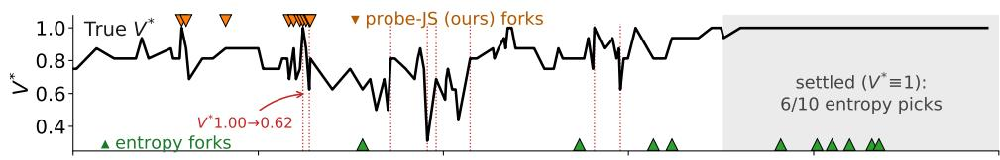
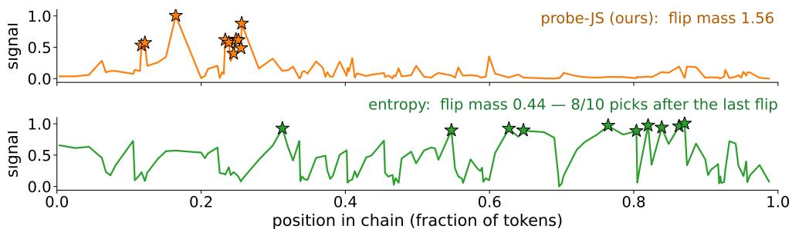
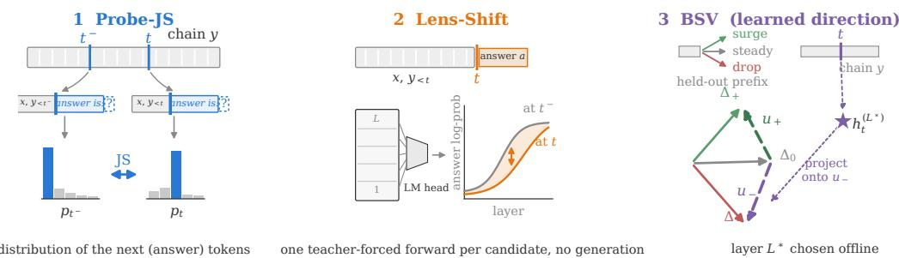
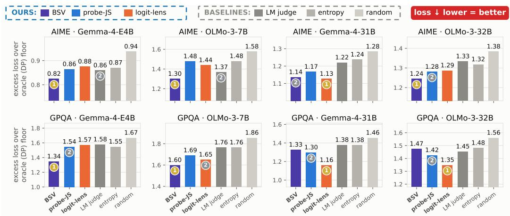
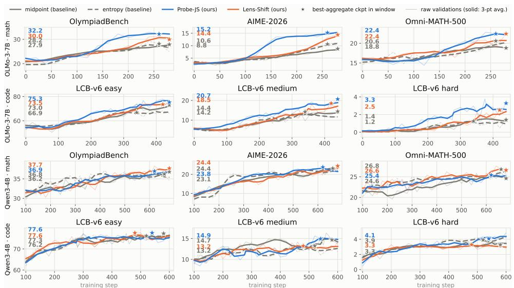
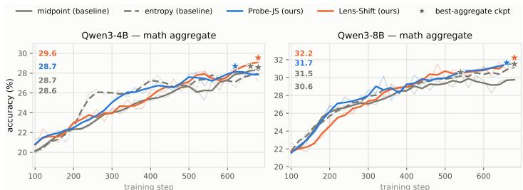
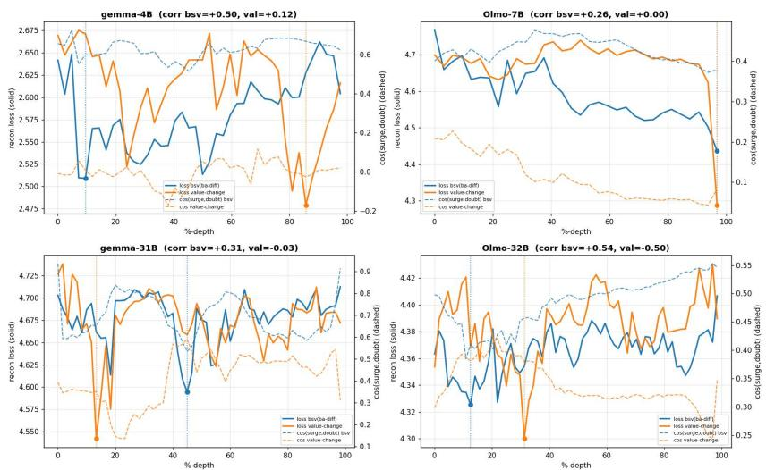
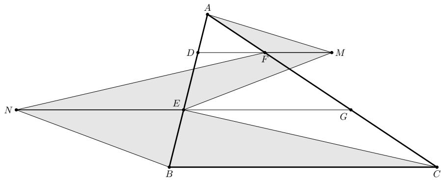

# FORK WHERE THE MODEL CHANGES ITS MIND:BELIEF-SHIFT BRANCHING FOR TREE-STRUCTUREDREINFORCEMENT LEARNING

Bin Lei1,2 Yu Li2 Prafulla Kumar Choubey2 Jiaxin Zhang2 Becky Xiangyu Peng2 Qinyuan Ye2 Kartik Narayan2 Caiwen Ding1 Silvio Savarese2 Chien-Sheng Wu2

1University of Minnesota 2Salesforce AI Research

{bin.lei,yu.li,pchoubey,jiaxin.zhang,becky.peng}@salesforce.com

{qinyuan.ye,kartik.narayan,ssavarese,wu.jason}@salesforce.com {lei00126,dingc}@umn.edu

## ABSTRACT

Tree-structured rollouts give critic-free reinforcement learning with verifiable rewards (RLVR) step-level credit: fork a chain at an intermediate point, and sibling outcome differences estimate step value. Each fork adds sampling cost, so realistic budgets typically allow only a few forks per chain. A fork placed where the outcome is already largely settled yields siblings that mostly agree and provide almost no credit signal; hence, for a given tree size, where forks are placed largely determines how much step-level RL can gain. Most existing mainstream methods place forks by structure, such as fixed lengths, midpoints, and delimiters, or by next-token entropy. We formalize fork placement as locating the pivots of the chain’s value curve, where the expected outcome turns. We propose belief-shift branching: read the model’s answer belief at candidate boundaries and fork just before the step where consecutive beliefs diverge most. Three instantiations, none needing step-level supervision, span access levels: a black-box probe, a logit-lens depth profile, and a learned activation direction, which is fit offline and therefore used only in the validation before RL training. The signal only places forks, and the probe costs about 1% of step compute on mathematics and under 5% on code when it runs inside the rollout engine. In that validation, against Monte-Carlo value curves, a belief-shift signal ranks first in each of the eight model×benchmark panels, ahead of entropy, structural, and LLM-judge baselines. In RL across three model families and two domains, belief-shift forking leads every mathematics aggregate, on OLMo-3-7B by +2.6 aggregate and +2.9 on AIME 2026 over the strongest baseline, and sweeps every OLMo code column, by +6.5 on LiveCodeBench-medium.

## 1 INTRODUCTION

Reinforcement learning with verifiable rewards (RLVR) trains reasoning models with one scalar per sampled solution [11, 33]. Group-relative methods copy that scalar onto every token, mis-crediting at both ends: a flawed step inside a luckily-correct solution is reinforced in full, and a prompt whose rollouts all fail yields zero gradient [36, 40]. Tree-structured rollouts repair this without a critic: fork the trajectory at an intermediate position, and the sibling continuations’ verified outcome difference is a counterfactual estimate of the forked step’s advantage [14, 20, 39]. The The catch is cost: each fork adds rollout tokens, so realistic budgets typically allow only a few forks per chain.

Where should those scarce forks go? In critic-free tree RLVR this is an open design choice: the tree already converts sibling outcomes into step credit, so what remains is deciding which step the siblings should re-roll. Current selectors make this choice without asking what the step decides: TreePO and TreeRPO fork on a fixed token grid [20, 39], earlier step methods cut at delimiters [21], TreeRL and FR3E fork at next-token uncertainty peaks, and ARPO at post-tool entropy rises [6, 14, 43]. Uncertainty is the natural candidate, but it tracks freedom of wording rather than of outcome: entropy is inflated by interchangeable paraphrases [17], and it reads near zero for any confidently written step, right or wrong, whereas an answer probe moves when the step changes the model’s own answer. Consistent with this, TreeRL’s surprisal-based forking (its “entropy”) beats random forking by 2.1 pass-rate points in its own sampling ablation, and TreePO’s static probability-guided branching allocation loses to uniform.

  
Figure 1: An OLMo-3.1-32B-Think chain on AIME 2025; 128 newline boundaries, ten forks per selector; x-axis: chain position (fraction). Top: ground-truth $V ^ { * }$ (16 MC completions per boundary); red dotted: the eight value pivots with $| \Delta \hat { V ^ { * } } | \stackrel { \sim } { \geq } 0 . 2 5 ;$ shaded: settled region $( V ^ { * } \equiv \bar { 1 } ) ;$ ; stars: fork positions. Flip mass captured by the ten forks, $\sum _ { \mathrm { f o r k s } } | \Delta V ^ { * } |$ : PROBE-JS 1.56 vs. entropy 0.44, which spends six forks in the settled region. Full case: Appendix F.

We propose belief-shift branching: track the model’s belief over the final answer along the chain and fork where that belief shifts most between consecutive candidate boundaries. We instantiate it with three reads spanning access levels—from output-only sampling to internal activations—none needing step-level supervision. PROBE-JS is a black-box read in the spirit of a pop quiz: at each boundary it interrupts the model with a ∼10-token probe (“so what is your final answer?”), elicits the answer distribution, and scores the boundary by the Jensen–Shannon divergence between consecutive distributions, so that a sharp jump marks a pivot or a mistake; it needs only sampling access, at the cost of a short extra generation per boundary. LENS-SHIFT is a white-box read—an X-ray rather than a quiz—that asks the same question without making the model speak: given the final answer, the logit lens reads how strongly each layer already commits to it, yielding a depth profile at every boundary, and a large change in this profile between boundaries marks a belief shift, at no extra generation. Belief-Shift Vector (BSV) is a radar calibrated in advance: by contrasting activations under high confidence with those under doubt, it fits offline, before RL, a single activation direction for “confidence shift”, so scoring a boundary is just a projection of its hidden state onto this axis. Since BSV measures belief shift most directly, we use it to test whether, if the model’s true belief shift could be measured directly, it would track the ground-truth value curve more accurately.

The probe costs about 1% of a training step on mathematics and under 5% on code when served by the rollout engine (Section 3.6), and the signal only places forks. Credit still comes from verified sibling outcomes, so a miscalibrated belief wastes a fork but cannot corrupt training. Figure 1 contrasts PROBE-JS with entropy on a real chain against a Monte-Carlo ground-truth value curve: given ten forks each, the probe’s forks capture 3.6× the value movement of entropy’s $( \sum | \Delta V ^ { * } |$ 1.56 vs. 0.44), and entropy wastes six forks in the settled region where $V ^ { * } \equiv 1$

Before RL, we score selectors against Monte-Carlo value curves: a belief-shift signal ranks first in each of the eight model×benchmark panels, ahead of entropy, structural, and LLM-judge baselines, and transfers zero-shot to an out-of-domain benchmark (Section 4). During RL, four arms that differ only in the fork criterion span three model families and two domains under matched budgets: a belief-shift arm leads every mathematics aggregate (+2.9 on OLMo-3-7B AIME 2026 over the strongest baseline) and sweeps every OLMo code column (Section 6). Ablations cover the tree budget (M, k), policy updater, probe read length $L ,$ and LENS-SHIFT read-out, all on OLMo-3-7B mathematics, plus model scale on Qwen3-4B versus Qwen3-8B (Section 7).

## 2 BACKGROUND AND RELATED WORK

Trajectory-level RLVR and its blind spots. Group-relative RLVR [33, 40] gives every token of a response the same advantage $\hat { A } _ { i } \propto R _ { i } - \bar { R }$ . Two pathologies follow: final-answer rewards leave far more correct solutions with flawed reasoning than process feedback [36], and all-tie prompts yield zero gradient [40]. Process supervision improves on outcome-only training in reasoning settings [32, 37, 41], with up to $6 \times$ better RL sample efficiency from process advantage verifiers [32].

Table 1: Existing fork-point selectors. Few read the outcome at fork time: grids and delimiters follow surface structure, surprisal and entropy track wording freedom, and the LM judge reads correctness but needs an external generation call per step.
<table><tr><td>Fork selector</td><td>Signal read</td><td>What it tracks</td><td>Outcome</td><td>Extra cost</td></tr><tr><td>Fixed grid [20, 39]</td><td>token count</td><td>none (content-blind)</td><td>x</td><td>0</td></tr><tr><td>Delimiters [16, 21]</td><td>surface markers</td><td>format convention</td><td>x</td><td>0</td></tr><tr><td>Surprisal [14]</td><td>— log p of sampled token</td><td>wording surprise</td><td>x</td><td>0 (reuses rollout)</td></tr><tr><td>Entropy [6, 43]</td><td>next-token distribution</td><td>wording freedom</td><td>x</td><td>0 (reuses rollout)</td></tr><tr><td>LM judge [19]</td><td>external critique</td><td>judged correctness</td><td>(S)</td><td>≥1 gen. call / step</td></tr></table>

Three rollout structures, one common input. Absent any learned value estimator (whether an explicit critic or an implicit one recovered from outcome-trained log-ratios [5, 41]), step values must come from extra sampling: (a) Monte-Carlo completions from step prefixes [12, 16, 37]; (b) MCTSstyle trees, in practice used to label process supervision offline or alongside learned value models [4, 8, 10, 25, 42]; (c) on-policy branching trees whose node statistics directly yield RL advantages without any value model [6, 14, 20, 39], our setting. All three consume the same input: boundaries where a chain may be cut, of which realistic budgets afford only a few per chain.

Existing fork selectors are mostly outcome-agnostic proxies. Let $V ^ { * } ( t ) = \mathrm { P r } [ \mathrm { c o r r e c t } \mid x , y _ { \leq t } ] ;$ sibling comparison at t estimates the local change of $V ^ { * }$ , so the ideal selector targets the (unobservable) pivots of $V ^ { * }$ . Practice approximates them with proxies that never read the outcome (Table 1). Delimiters: PRM800K fine-tunes the generator to emit newline steps [21], and surface tokens do not typically mark true decision points [23]. Fixed-length grids [20, 39] fork mid-expression; TreePO’s static probability-guided branching allocation over its fixed segments loses to uniform (their §4.4). Next-token uncertainty (TreeRL’s sampled-token surprisal, FR3E’s entropy, ARPO’s post-tool entropy [6, 14, 43]) measures wording, not outcome (Section 1), and beats random forking by 2.1 pass-rate points in TreeRL’s own sampling ablation at the same tree configuration, with about 8% fewer generated tokens. SPO [12] already moves Monte-Carlo cutpoints off a fixed grid, placing them at low-probability tokens on the premise that a boundary is worth sampling only where the value may change; we share the premise, but its read is again the probability of the sampled to ken, whereas ours is the model’s belief over the answer. LMjudges are offline and costly [19], and learned rewards are exploitable during RL [11]; agent turns [30, 44] cost $K ^ { T }$ rollouts if branched exhaustively over T turns.

## 3 BELIEF-SHIFT BRANCHING

Template. A fork-point selector is a scoring rule over candidate boundaries: given a chain y with pool $B ( y )$ (Section 3.1), it assigns a score $s _ { t }$ to each boundary $t \in B ( y )$ and forks at the top scorer ${ \ddot { t } } = \arg \operatorname* { m a x } _ { t } s _ { t }$ . Our selectors all take one form: read the model’s current answer belief at each boundary, and score the segment between consecutive boundaries by how far it moved that belief, $s _ { t ^ { - } } = D ( b _ { t ^ { - } } , b _ { t } )$ , where $t ^ { - }$ is the boundary immediately preceding t in $B ( y )$ and D is an instantiation-specific measure of belief change (a divergence or a profile-change norm; the learned read of Section 3.4 instead projects the single boundary state $h _ { t }$ onto a fitted belief-shift direction). Note thefork-before attribution: the belief change is caused by the segment $( t ^ { - } , t ] ,$ , so the score lands on t− and siblings re-roll exactly the belief-moving step. Three instantiations vary only in how $b _ { t }$ is read: PROBE-JS needs sampling access and LENS-SHIFT reads hidden states, while BSV amortizes the read into a direction fit offline, which confines it to pre-RL validation—testing whether, if the model’s true belief shift could be measured directly, it would track the ground-truth value curve more accurately (Section 3.4).

## 3.1 CANDIDATE STEP BOUNDARIES

Mid-word forks yield siblings that differ for trivial lexical reasons, so candidates are restricted to step boundaries: positions after a chosen delimiter, here the line break (\n), the natural step separator in both tasks we test (mathematics and code). At most C=16 evenly spaced candidates are scored per chain; a chain whose span has no boundary is cut at the span midpoint instead, so it still forks. Only a chain that cannot fork at all (fewer than two tokens past the last cut, or no response budget left for a continuation) is replaced by a fresh root chain (Section 3.5), so every arm always produces its full tree.

  
Figure 2: The three belief reads: PROBE-JS compares consecutive elicited answer distributions $( \mathrm { J } { \cal S } ) ;$ LENS-SHIFT takes the $\ell _ { 2 }$ change of the teacher-forced answer’s per-layer log-prob profile; BSV projects $h _ { t }$ onto an offline-fit surge/steady/drop direction (pre-RL only).

## 3.2 PROBE-JS: BLACK-BOX BELIEF PROBING

At boundary t we append a short elicitation suffix e that asks for the final answer ${ \binom { 6 6 } { \phantom { 5 } } } \mathrm { S O }$ the final answer $\mathrm { i } \mathsf { s } \ldots \mathsf { \ " { \xi } } , \mathsf { E } { \approx } \mathsf { 8 } { \ - } \mathsf { - 9 }$ tokens) to the prefix $y _ { < t }$ and read the next-token distribution at the end of the suffix: the belief $p _ { t }$ is the top- $\cdot K \left( K { = } 2 0 \right)$ log-probabilities of $\pi _ { \theta } ( \cdot \mid x , y _ { < t } , e )$ , i.e. the model’s distribution over the first answer token. Instantiating the template score with the Jensen–Shannon divergence [22]:

$$
\begin{array} { r } { s _ { t ^ { - } } ~ = ~ \mathrm { J S } ( p _ { t ^ { - } } \parallel p _ { t } ) ~ = ~ \frac { 1 } { 2 } D _ { \mathrm { K L } } ( p _ { t ^ { - } } \parallel m ) + \frac { 1 } { 2 } D _ { \mathrm { K L } } ( p _ { t } \parallel m ) , \qquad m = \frac { p _ { t ^ { - } } + p _ { t } } { 2 } . } \end{array}\tag{1}
$$

Unlike KL, the mixture m makes the score symmetric, $\mathrm { J S } ( p \| q ) = \mathrm { J S } ( q \| p )$ , and bounded, $0 ~ \leq$ $\mathrm { J S } \ \leq \ \log 2 \colon$ segments are ranked by movement alone, on one scale, with no reference endpoint, whereas $D _ { \mathrm { K L } } ( p _ { t ^ { - } } \| p _ { t } ) \to \infty \ \mathrm { a s } \ p _ { t } ( v ) \to 0$ for any v with $p _ { t ^ { - } } ( v ) > 0$ , so under top-K truncation a single tail token that drops out of one support can own the argmax; the two-sided form also yields the bound of Eq. 9. The truncation is an engineering constraint, not a modeling choice: vLLM-class engines and OpenAI-style APIs return at most the top-K next-token log-probabilities, with 20 the default ceiling, hence $K { = } 2 0$ . With $S _ { t }$ the returned support at t and $S = S _ { t ^ { - } } \cup S _ { t }$ , each side is floored and renormalized on S,

$$
\begin{array} { r } { \tilde { p } _ { t } ( v ) \propto \left\{ \begin{array} { l l } { p _ { t } ( v ) , } & { v \in S _ { t } , } \\ { \frac { 1 } { 2 } \operatorname* { m i n } _ { u \in S _ { t } } p _ { t } ( u ) , } & { v \in S \setminus S _ { t } , } \end{array} \right. } \end{array}\tag{2}
$$

and Eq. 1 is evaluated on $( \tilde { p } _ { t ^ { - } } , \tilde { p } _ { t } )$ . Each probe rides the rollout’s prefix cache, forwarding only the suffix plus the L decoded tokens (L=1 for mathematics, 16 for code; ablated in Section 7). Fo code the suffix is $\mathtt { S o }$ the final solution is: followed by an opening python fence, so the “answer” is the opening of the solution program. For $L { > } 1$ the engine samples L tokens after the suffix at temperature 1.0 and returns the top-K distribution at each position; Eq. 1 is applied position by position between consecutive boundaries and averaged over the L positions, so $L { = } 1$ is the special case above. Position one is the exact L=1 read; positions 2 to $L$ are conditioned on that boundary’s own sampled read-out, so the score adds a sampled component on top of the $L { = } 1$ signal. The same read defines the L ablation of Section 7.

## 3.3 LENS-SHIFT: WHITE-BOX BELIEF READING

With activation access, beliefs are read from inside the forward pass. The logit lens [28] defines perlayer predictions $P ^ { ( \ell ) } ( \cdot ) = \mathrm { s o f t m a x } \big ( W _ { U } \mathrm { L N } ( h ^ { ( \ell ) } ) \big )$ , where $h ^ { ( \ell ) }$ is the residual stream after layer ℓ and LN, $W _ { U }$ are the model’s own final norm and unembedding. After the prefix $y _ { < t }$ and the elicitation suffix of Section 3.2, we teacher-force the chain’s committed answer $a = ( a _ { 1 } , \ldots , a _ { n } ) $ (its final answer, n tokens) and record how strongly each intermediate layer already encodes that answer (no sampling is involved), giving a depth profile and its change score

$$
b _ { t } ^ { ( \ell ) } = \sum _ { i = 1 } ^ { n } \log P ^ { ( \ell ) } ( a _ { i } | x , y _ { < t } , e , a _ { < i } ) , \qquad s _ { t ^ { - } } ^ { \mathrm { s h a p e } } = \big \| b _ { t } ^ { ( \cdot ) } - b _ { t ^ { - } } ^ { ( \cdot ) } \big \| _ { 2 } ,\tag{3}
$$

with $x$ the prompt and $b _ { t } ^ { ( \cdot ) }$ the vector collecting $b _ { t } ^ { ( \ell ) }$ over all probed layers. The profile traces the answer’s formation across depth, so its change localizes where a step moved the belief; $s ^ { \mathrm { s h a p e } }$ fires when that path reorganizes at any depth. Two scalar read-outs,

$$
\begin{array} { r } { s _ { t - } ^ { \mathrm { h e i g h t } } = \bigl | \overline { { b _ { t } } } - \overline { { b _ { t - } } } \bigr | , \quad s _ { t - } ^ { \mathrm { d e p t h } } = \bigl | \ell _ { t } ^ { * } - \ell _ { t - } ^ { * } \bigr | , \quad \ell _ { t } ^ { * } = \operatorname* { m i n } \Bigl \{ \ell : \big | b _ { t } ^ { ( \ell ) } - b _ { t } ^ { ( \ell _ { \mathrm { m a x } } ) } \big | \le \varepsilon \cdot \mathrm { r a n g e } b _ { t } ^ { ( \cdot ) } \Bigr \} , } \end{array}\tag{4}
$$

$( { \bar { b } } { \mathrm { : } } \quad$ profile mean over the deepest half of the layers; $\ell _ { \mathrm { m a x } } .$ : last layer; $\varepsilon { = } 0 . 1 )$ ) read the settled belief’s strength and its lock-in depth. All RL arms use $s ^ { \mathrm { s h a p e } } ~ ( s ^ { \mathrm { h e i g h t } } / s ^ { \mathrm { d e p t h } }$ : the read-out ablation of Section 7); the cost is one teacher-forced forward per candidate, no generation.

## 3.4 BELIEF-SHIFT VECTOR: A LEARNED READ FOR PRE-RL VALIDATION

BSV is not an RL fork selector but a validation instrument: it tests whether forking at the model’s true belief shifts, read as directly as activation access allows, reconstructs the ground-truth value curve more accurately than the proxies of Table 1. To make that read as direct as possible, we amortize the per-boundary belief read into one dot product (Figure 2), fit once, offline, on a frozen policy. A held-out chain is cut at a boundary t and continued in three LLM-drafted continuation regimes (Appendix A.1), indexed $g \in \{ + , 0 , - \}$ : surge (the continuation commits to the answer), steady (reasoning proceeds with no change of belief), and drop (it retracts the answer or expresses doubt). Per layer L and regime g, the residual stream is averaged over a $W _ { a } { = } 1 6 { \ - } { \cdot } \mathrm { t o k e n }$ window after the cut and a $W _ { b } { = } 1 6$ -token window before it and differenced, then the steady-regime delta is subtracted:

$$
\begin{array} { r } { \Delta _ { g } ^ { ( L ) } = \underset { ( t , c ) : g ( c ) = g } { \mathbb { E } } \Big [ \bar { h } _ { [ t , t + W _ { a } ) } ^ { ( L ) } ( c ) - \bar { h } _ { [ t - W _ { b } , t ) } ^ { ( L ) } \Big ] , \quad u _ { \pm } ^ { ( L ) } = \Delta _ { \pm } ^ { ( L ) } - \Delta _ { 0 } ^ { ( L ) } . } \end{array}\tag{5}
$$

$\Delta _ { 0 }$ removes the progress shared by all continuations, leaving pure belief-change axes $u _ { \pm } ;$ their antagonism picks the layer label-free, and scoring is one projection of the last prefix token:

$$
\boldsymbol { L } ^ { * } = \arg \operatorname* { m i n } _ { \boldsymbol { L } } \cos \bigl ( \boldsymbol { u } _ { + } ^ { ( L ) } , \boldsymbol { u } _ { - } ^ { ( L ) } \bigr ) , \qquad \boldsymbol { s } _ { t } = \bigl \langle \boldsymbol { u } _ { - } ^ { ( L ^ { * } ) } , \boldsymbol { h } _ { t } ^ { ( L ^ { * } ) } \bigr \rangle .\tag{6}
$$

The fit is also what keeps BSV out of the RL arms: Eq. 5 averages activation deltas of the policy that generated them, so once training moves θ the direction is off-policy, scored against activations the fit never saw, and refreshing it means re-running the fork/group/average pipeline at training cadence, a cost far beyond the probes’. We therefore use BSV only where the policy is frozen, as pre-RL evidence that forking at belief shifts reconstructs the true value curve more accurately than every baseline (Section 4); the two fit-free reads carry the RL arms (Appendix E).

## 3.5 INTEGRATION INTO TREE-STRUCTURED RLVR

We plug the selectors into a one-fork-per-chain instantiation of TreeRL’s on-policy tree scheme [14]: per prompt, M=4 chains are sampled and each forks at its top-scoring boundary into k=2 sibling continuations, giving 12 scored rollouts per prompt (a chain that cannot fork at all, under two tokens or out of response budget, is replaced by a fresh root chain, so each prompt always emits 12 rollouts). Once a chain has finished generating, the selector scores its boundaries (for PROBE-JS, with independent one-token probe requests on the finished chain’s prefix), and the siblings are ordinary engine requests on that prefix: with automatic prefix caching the prefix’s KV blocks are reused and only the continuation is generated, which is what the rollout term of Eq. 8 charges. On the training side the 12 rows are processed as separate sequences, prefix included; the $T _ { \mathrm { t r a i n } }$ of Appendix B is measured that way. A verifier scores each leaf, lightly shaped by a DAPO-style overlong penalty [40]. Advantages follow TreeRL’s global-plus-local form: for a node with subtree-mean return $V ,$ sibling-group mean $\mu ,$ tree mean $\bar { V } ,$ and $| { \mathcal { L } } |$ descendant leaves,

$$
A = \big [ ( V - \bar { V } ) + ( V - \mu ) \big ] / \sqrt { | { \mathcal L } | } ,\tag{7}
$$

broadcast to the segment’s tokens. The optimizer is the standard RLVR composite (group-relative policy gradient, asymmetric clipping (0.2, 0.28), token-mean aggregation, dynamic sampling [24, 33, 40]), identical across arms. Baselines: MIDPOINT cuts the remaining span in half; ENTROPY (adapted from TreeRL, which ranks single tokens) forks where the segment-mean sampled-token surprisal $- \log \pi ( y _ { t } )$ peaks over the same candidate pool.

Table 2: Probe overhead: FLOP upper bounds at C=16 candidates and 10 / 25 tokens per engine probe (L=1 / 16; cells read mathematics / code), with measured mean chain lengths (Nemotron’s mathematics T¯ inferred from ∼660k rollout tokens per step).
<table><tr><td>Model</td><td>Mean chain length  $\bar { T }$ </td><td>Probe FLOPs / full training step</td></tr><tr><td>OLMo-3-7B</td><td>1,327/1,179</td><td>1.3% / 3.2%</td></tr><tr><td>Qwen3-4B</td><td>4,164 / 760</td><td>0.45% / 4.3%</td></tr><tr><td>Nemotron-9B</td><td> $\sim 2 , 6 0 0 / 6 , 5 5 7$ </td><td>0.70% / 0.67%</td></tr></table>

## 3.6 COST AND A PROBE-VALUE BOUND

Cost. Let N be the parameter count, P the prompts per step, $\bar { T }$ the mean chain length in tokens, and M, k the root chains and siblings per cut of Section 3.5. With inference at 2N FLOPs/token, rollout costs $F _ { \mathrm { r o l l } } \approx 2 N P M \left[ 1 + k ( \bar { 1 } - \bar { c } ) \right] \bar { T }$ (each chain plus its k siblings, which continue from a cut at fraction c of the chain, $c \approx 0 . 5 )$ . Probing C candidates with suffix length E and read length L on the engine’s prefix cache costs $F _ { \mathrm { P R O B E - J S } } = 2 N P M C ( E { + } L )$ , giving

$$
\frac { { \cal F } _ { \mathrm { P R o B E - J S } } } { { \cal F } _ { \mathrm { r o l l } } } = \frac { C ( E + L ) } { [ 1 + k ( 1 - c ) ] \bar { T } } \xrightarrow [ \bar { T }  \infty ] { } 0 .\tag{8}
$$

The probe term carries only the fixed probe length $E { + } L \ll \bar { T }$ , so the probe is a vanishing fraction of rollout, smaller still of the full step, and shrinks as chains lengthen. Equation 8 is a per-chain upper bound $( C$ is a cap on the candidates actually scored, and every generated prompt is probed); Table 2 reports the probe’s share of a full training step under the accounting of Appendix B. We report FLOPs rather than wall-clock because the arms are not wall-clock comparable: the probe path and the serving engine differ across models (Appendix B). LENS-SHIFT reads n answer tokens instead of L and with prefix reuse costs the same order; ours re-forwards each prefix on a co-located copy (the engine hides intermediate layers), $C \rho \hat { T } / 2$ token-forwards per chain (Appendix B).

Theoretical analysis: what belief shift can see. Let $V ^ { * } ( t )$ be the true value of the prefix $y { \le } t$ (the success probability of the policy’s own continuations, the Monte-Carlo quantity of Section 4) and $V _ { e } ( t ) = p _ { t } ( a ^ { * } )$ the probe value: the mass the elicited belief of Section 3.2 puts on the first token $a ^ { * }$ of the correct answer when the suffix e forces an answer at t (for $L { > } 1$ , averaged over the L read positions). The two are not equal $( V _ { e }$ makes the model answer now; $V ^ { * }$ lets it keep reasoning), so $V _ { e }$ is an approximation of $V ^ { * }$ whose fidelity we measure rather than assume (reconstruction of Monte-Carlo $\overrightharpoon { V } ^ { * }$ , Section 4). For the probe value the guarantee is exact. With $\begin{array} { r } { \mathrm { T V } ( p , q ) = \frac { 1 } { 2 } \sum _ { a } | p ( a ) - \rrangle } \end{array}$ $q ( a ) | = \operatorname* { m a x } _ { A } | p ( A ) - q ( A ) |$ and Pinsker’s inequality on both halves of Eq. $1 , \mathrm { J S } \geq \frac { 1 } { 2 } \mathrm { T V } ^ { 2 }$ , hence

$$
\begin{array} { r } { | V _ { e } ( t ) - V _ { e } ( t ^ { - } ) | \ \leq \ \mathrm { T V } ( p _ { t ^ { - } } , p _ { t } ) \ \leq \ \sqrt { 2 \mathrm { J S } ( p _ { t ^ { - } } \| p _ { t } ) } \ = \ \sqrt { 2 s _ { t ^ { - } } } } \end{array}\tag{9}
$$

(proof in Appendix $\mathrm { C } ) ,$ i.e. the PROBE-JS score lower-bounds the movement of the probe value: a near-zero score cannot hide a moved $V _ { e }$ . How closely $V _ { e }$ tracks $V ^ { * }$ is measured, not assumed, by the reconstruction results of Section 4.

## 4 PRE-RL VALIDATION: DO THE SIGNALS FIND THE TRUE VALUE PIVOTS?

End-to-end RL is a confounded instrument for judging a branching signal: optimizer noise, seed variance, and the interaction between reward shaping and advantage estimation can all mask the signal’s own effect. To isolate that effect, we first measure every selector directly against the groundtruth value curve, before any training.

Setup. The probe suites are AIME 2025–2026 and GPQA-Diamond [31]. For each of four probe models (Gemma-4-E4B, OLMo-3-7B-Think, Gemma-4-31B, and OLMo-3.1-32B-Think [29, 35]; Hugging Face ids in Table 5) we sample one chain per problem at temperature 0.7, cut it at every newline, and evenly subsample the cuts to at most m=128 candidate boundaries $t _ { 1 } , \ldots , t _ { m }$ (all inference settings: Table 6, Appendix A).

Ground truth and metric. The value curve $V ^ { * } ( t _ { j } ) = \mathrm { P r } [ \mathrm { c o r r e c t } \ | \ y _ { \leq t _ { j } } ]$ is estimated at every boundary by $N _ { \mathrm { M C } } { = } 1 6$ independent Monte-Carlo completions of the prefix, scored by the verifier. Each selector then ranks the m boundaries by its own score; we keep its top $B { = } 1 0$ , reconstruct Vˆ by linear interpolation through the kept points, and charge the selector the reconstruction error $\begin{array} { r } { E = \sum _ { j } | V ^ { * } ( t _ { j } ) - \hat { V } ( t _ { j } ) | } \end{array}$ (lower is better), which is low exactly when the chosen boundaries bracket the true pivots. Flat-V∗ problems are excluded; a dynamic program over $V ^ { * }$ gives the per-panel oracle floor.

  
Figure 3: Pre-RL signal quality (lower is better): reconstruction error above the DP oraclefloor on AIME (top) and the held-out GPQA-Diamond transfer (bottom), four probe models. A belief-shift selector (colored) ranks first in each panel; BSV bars use the cos-selected layer (GPQA: fit out-ofdomain on math); exact values in Table 7.

Selectors compared. Ours: BSV (vectors fit on held-out HMMT [2]; layer by the label-free cos criterion of Section 3.4), PROBE-JS, and LENS-SHIFT (shape/height). BSV’s direction would need re-fitting at every policy update, so it is a pre-RL instrument only; the two fit-free reads carry the RL arms. Baselines: a black-box LLMjudge (GPT-5.5 rates step importance from the chain alone), the only baseline with content access, plus entropy, newline, uniform, and random placement.

Results. Figure 3 shows excess error over the oracle floor (exact values: Table 7). (i) A beliefshift signal takes the top rank in all eight model×benchmark panels. (ii) Entropy hovers at the level of blind newline placement. The LLM judge, which reads the chain, matches the fit-free reads on AIME and trails every belief-shift read on GPQA (6.042 vs. 5.938–5.988), at the cost of a generation call per step. (iii) The signal transfers: on held-out GPQA-Diamond, BSV fit on out-of-domain math beats every baseline on average (5.935 vs. 6.041) and in three of four panels, and edges the in-domain fit (5.999): the belief direction is not benchmark-specific.

BSV with the cos-selected layer, fit only to locate belief shifts (outcome labels enter its fitting set only to balance correct and wrong endings within every regime, never as a target; Appendix A.1), beats every baseline in seven of the eight panels and on both averages, so localizing the shift suffices for a faithful $\hat { V } .$ . Its remaining choice, which layer to project, is also label-free: the antagonism criterion $L ^ { * } = \arg \operatorname* { m i n } _ { L } \cos ( u _ { + } ^ { ( L ) } , u _ { - } ^ { ( L ) } )$ correlates with reconstruction quality on every model (Figure 6, appendix), so directions, layer, and score all come from the model’s own rollouts.

## 5 RL EXPERIMENTAL SETUP

Models. Three open substrates spanning architectures: Qwen3-4B-Base [38], OLMo-3-7B (SFT checkpoint) [29], and Nemotron-Nano-9B-v2-Base (hybrid Mamba–Transformer) [3].

Domains and data. Mathematics: training on DAPO-Math-17k [40]; validation on Olympiad-Bench (the 674-problem English text-only open-ended maths split, mean@1) [13], AIME 2026 (30 problems, avg@16) [27], and Omni-MATH-500 (a 500-problem subset we sample from Omni-MATH, mean@1) [9], plus their unweighted mean (Agg.). Competitive programming: training on DeepCoder-24K [26] (21.6K problems after removing overlap with the LiveCodeBench-v6 window); validation on the 175 problems added in LiveCodeBench-v6 (43/52/80 easy/medium/hard, avg@8) [15] with a binary hidden-test pass reward.

Protocol. Four arms per model and domain, MIDPOINT, ENTROPY, PROBE-JS, and LENS-SHIFT (shape), share the tree construction of Section 3.5, the data order, reward, and optimizer, and differ only in the fork criterion. All arms are critic-free (GRPO-style); a learned value model is a separate design axis and is not compared here. Nor do we re-test the tree itself: TreeRL [14] established that its tree scheme beats chain RL under matched rollout budgets, and every arm here shares that scheme, so the comparison isolates a single variable, where the forks are placed. Validation (accuracy on the three suites) runs every 20 steps; each arm is reported at its single best-aggregate checkpoint (step in gray; Appendix A reports every aggregate under two other selection rules). Qwen arms are budget-matched to exactly 680 steps; OLMo and Nemotron arms are capped at a common per-group budget, within which each arm may stop earlier (per-arm step counts in Appendix A). Training uses verl [34] with vLLM rollouts [18] on a single 8×H200 node (temperature 1.0, lr = 10−6, 16 × 12 = 192 rollouts per step after dynamic filtering). Complete hyperparameters in Appendix A.

  
Figure 4: Per-benchmark validation accuracy (%), OLMo-3-7B (rows 1–2) and Qwen3-4B (rows 3–4), mathematics and code. Solid: 3-point moving average; faint: raw validations every 20 steps; ⋆ = best-aggregate checkpoint within the shown window (value at the left); Table 3 follows the fullbudget protocol of Appendix A, so its checkpoint can lie beyond the window. Windows: OLMo first 280 / 440 steps, Qwen steps 100–680 / 100–600 (math / code; warm-up omitted).

## 6 RL RESULTS

## 6.1 MATHEMATICS

Figure 4 shows the trajectories behind the OLMo and Qwen rows of Table 3. A belief-shift arm takes the aggregate lead on every model: PROBE-JS on OLMo-3-7B (23.3 vs. 20.7 for the strongest baseline) and Nemotron-9B (45.1 vs. 40.9), LENS-SHIFT on Qwen3-4B (29.6 vs. 28.7). On OLMo-3-7B, PROBE-JS lifts AIME 2026 from 12.3 (strongest baseline) to 15.2; entropy branching hurts Nemotron (40.0 aggregate, below midpoint), in line with the pre-RL finding that entropy does not track value (Section 4). A belief-shift arm tops 11 of the 12 mathematics columns.

## 6.2 CODE

On competitive programming (Table 3, right), PROBE-JS wins every OLMo-3-7B column (34.9 vs. 31.0 for the best baseline, +6.5 on LCB-medium; Figure 4, row 2). Qwen3-4B mirrors mathematics: PROBE-JS posts the best aggregate (32.2 vs. 31.8) and the best or joint-best score per split. Under the common 240-step cap on Nemotron, MIDPOINT leads and PROBE-JS is second on every column (64.0 vs. 64.5; hard 29.4 vs. 30.2).

Why the gains differ across models. A fork criterion pays off through three factors: ranking quality, fork contrast (do siblings diverge?), and the size of the candidate pool. In an offline diagnostic (setup in Appendix D), siblings forked from the RL-trained Qwen policy reached the same final answer 63% of the time (∼5% for the base model): the ranking stays healthy (top- vs. bottomtercile JS boundaries: 55% vs. 24% sibling disagreement), but even a well-placed fork compares a solution with its near-clone, so little contrast is left to convert and the gain shrinks to under a point.

Table 3: RL results: accuracy (%) at each arm’s single best-aggregate checkpoint (step in gray), so every row is read at a single validation step. Mathematics: OlympiadBench, AIME 2026, Omni-MATH-500 and their mean. Code (DeepCoder-24K → LiveCodeBench-v6): avg@8 on the easy / medium / hard splits and their mean. Qwen arms are budget-matched to 680 steps; Nemotron code arms share a 240-step cap. 1 / 2 = best / second best per column within each model block (ties share a medal). Shaded rows: our belief-shift arms.
<table><tr><td rowspan="2">Fork criterion</td><td colspan="4">Mathematics</td><td colspan="4">Code (LiveCodeBench-v6)</td></tr><tr><td>Olymp.</td><td>AIME</td><td>Omni</td><td>Agg.</td><td>easy</td><td>medium</td><td>hard</td><td>Agg.</td></tr><tr><td>OLMo-3-7B</td><td></td><td></td><td></td><td></td><td></td><td></td><td></td><td></td></tr><tr><td>MIDPOINT</td><td>28.2</td><td>11.2</td><td>19.0</td><td>19.5 @440</td><td>75.0</td><td>16.1</td><td>2.0</td><td>31.0 @480</td></tr><tr><td>ENTROPY</td><td>28.6</td><td>12.3</td><td>21.20</td><td>20.7 @320</td><td>73.8</td><td>12.0</td><td>1.2</td><td>29.0 @460</td></tr><tr><td>PROBE-JS</td><td>32.20</td><td>15.20</td><td>22.40</td><td>23.3 @260</td><td>79.40</td><td>22.60</td><td>2.80</td><td>34.90@520</td></tr><tr><td>LENS-SHIFT</td><td>30.0</td><td>14.40</td><td>22.40</td><td>22.2ø @280</td><td>73.5</td><td>18.5</td><td>2.5</td><td>31.5@420</td></tr><tr><td>Nemotron-9B</td><td></td><td></td><td></td><td></td><td></td><td></td><td></td><td></td></tr><tr><td>MIDPOINT</td><td>43.3</td><td>47.1</td><td>32.2</td><td> $4 0 . 9 \oplus \textcircled { \sc } 3 4 0$ </td><td>100.00</td><td>63.5</td><td>30.20</td><td>64.5 @160</td></tr><tr><td>ENTROPY</td><td>43.8</td><td>42.9</td><td>33.2</td><td>40.0 @200</td><td>98.5</td><td>62.7</td><td>27.5</td><td>62.9 @200</td></tr><tr><td>PROBE-JS</td><td>44.30</td><td>55.60</td><td>35.40</td><td>45.10 @320</td><td>99.40</td><td>63.20</td><td>29.4</td><td>64.00@140</td></tr><tr><td>LENS-SHIFT</td><td>44.8o</td><td>53.8</td><td>36.80</td><td> $\mathbf { 4 5 . 1 } \oplus \textcircled { \omega } 3 2 0$ </td><td>98.0</td><td>63.0</td><td>27.5</td><td>62.8 @200</td></tr><tr><td>Qwen3-4B</td><td></td><td></td><td></td><td></td><td></td><td></td><td></td><td></td></tr><tr><td>MIDPOINT</td><td>36.8</td><td>24.4</td><td>24.6</td><td>28.6 @680</td><td>77.30</td><td>14.70</td><td>3.3</td><td>31.8@580</td></tr><tr><td>ENTROPY</td><td>36.2</td><td>23.1</td><td>26.80</td><td>28.70 @660</td><td>77.6</td><td>13.7</td><td>3.80</td><td>31.7 @640</td></tr><tr><td>PROBE-JS</td><td>36.9</td><td>23.80</td><td>25.4</td><td>28.7 @620</td><td>77.60</td><td>14.90</td><td>4.10</td><td>32.2 @540</td></tr><tr><td>LENS-SHIFT</td><td>37.70</td><td>24.40</td><td>26.60</td><td>29.60@680</td><td>77.60</td><td>13.2</td><td>3.3</td><td>31.4 @480</td></tr></table>

Table 4: Ablations (OLMo-3-7B math, % at the single best-aggregate checkpoint, step in gray; all arms follow the OLMo anchor protocol: full-length candidate pool). Per panel: gray = default-tree MIDPOINT (reference for ∆Agg); blue orange = the default PROBE-JS / LENS-SHIFT arm of Table 3; unshaded = variants (PROBE-JS in (a)–(c), LENS-SHIFT in (d)). Panel (c) raises probe cost from 1.3% to 1.6% of a step.

(a) Rollout budget: tree (M, k), rollouts/prompt  
(b) Policy-update algorithm
<table><tr><td></td><td>Olymp. AIME</td><td></td><td>Omni</td><td>Agg.</td><td> $\Delta \mathrm { A g g }$ </td></tr><tr><td>MIDPOINT</td><td>28.2</td><td>11.2</td><td></td><td>19.0 19.5 @440</td><td>ref.</td></tr><tr><td>(2, 1): 4 rollouts</td><td>27.9</td><td>11.2</td><td>21.0</td><td>20.0 @400</td><td>+0.6</td></tr><tr><td>(4, 2): 12 rollouts</td><td>32.2</td><td>15.2</td><td></td><td>22.4 23.3 @260 +3.8</td><td></td></tr></table>

<table><tr><td></td><td>Olymp. AIME</td><td></td><td>Omni</td><td>Agg.</td><td>∆Agg</td></tr><tr><td>MIDPOINT</td><td>28.2</td><td>11.2</td><td>19.0</td><td>19.5 @440</td><td>ref.</td></tr><tr><td>Composite</td><td>32.2</td><td>15.2</td><td>22.4</td><td>23.3 @260</td><td>+3.8</td></tr><tr><td>Pure GRPO</td><td>23.6</td><td>4.6</td><td>17.4</td><td>15.2 @60</td><td>4.3</td></tr></table>

(d) LENS-SHIFT read-out

(c) Probe read length L
<table><tr><td></td><td>Olymp.</td><td>AIME</td><td>Omni</td><td> $\operatorname { A g g } .$ </td><td> $\Delta \mathrm { A g g }$ </td></tr><tr><td>MIDPOINT</td><td>28.2</td><td>11.2</td><td></td><td>19.0 19.5 @440</td><td>ref.</td></tr><tr><td>L=1</td><td>32.2</td><td>15.2</td><td>22.4</td><td>23.3 @260</td><td>+3.8</td></tr><tr><td>L=2</td><td>29.7</td><td>17.7</td><td>21.0</td><td>22.8 @340</td><td>+3.3</td></tr><tr><td>L=4</td><td>32.8</td><td>22.5</td><td>25.2</td><td>26.8 @360</td><td>+7.3</td></tr></table>

<table><tr><td></td><td>Olymp.</td><td>AIME</td><td>Omni</td><td>Agg.</td><td>∆Agg</td></tr><tr><td>MIDPOINT</td><td>28.2</td><td>11.2</td><td>19.0</td><td>19.5 @440</td><td>ref.</td></tr><tr><td>Shape</td><td>30.0</td><td>14.4</td><td>22.4</td><td>22.2 @280</td><td>+2.8</td></tr><tr><td>Height</td><td>29.2</td><td>14.6</td><td>22.4</td><td>22.1 @280</td><td>+2.6</td></tr><tr><td>Depth |∆l*|</td><td>27.9</td><td>17.9</td><td>22.6</td><td>22.8 @300</td><td>+3.3</td></tr></table>

OLMo sits at the opposite extreme (siblings rarely agree; peak belief shifts 1.4× larger), turning the same ranking into the margins of Table 3.

## 7 ABLATIONS

The four table ablations run on one high-contrast slice, OLMo-3-7B math (PROBE-JS in panels (a)– (c) of Table 4, LENS-SHIFT in panel (d)), varying one axis per panel; a fifth, model scale, compares Qwen3-4B with Qwen3-8B (Figure 5). Two findings stand out: shrinking the tree to (2, 1) costs 3.2 aggregate points yet still edges the full-budget MIDPOINT arm with a third of its rollouts (+0.6), and reading $L { = } 4$ belief tokens instead of one nearly doubles the edge over MIDPOINT (+3.8 → +7.3; AIME 15.2 → 22.5). The longer read keeps the exact one-token belief at position one and adds three positions sampled along the model’s own answer, where multi-digit answers separate. This ablation postdates the main arms, so the mathematics rows of Table 3 are not back-filled: every mathematics PROBE-JS row keeps the pre-ablation default $( L { = } 1 ) ;$ ; the code PROBE-JS arms read L=16 throughout (Section 3.2). The LENS-SHIFT read-outs land within 0.7 aggregate of each other, so the RL arms keep the shape read. Replacing the composite updater of Section 3.5 with standard GRPO (symmetric clipping, sequence-mean loss), tree and fork rule held fixed, lowers the aggregate by 8.1 points (23.3→15.2), so we keep the composite throughout.

  
Figure 5: Model scale: aggregate mathematics accuracy (mean of the three suites, %) for the four arms on Qwen3-4B (left) and Qwen3-8B (right), same recipe and 680-step budget, steps 100–680.

Model scale (Qwen3-4B → Qwen3-8B). Figure 5 repeats the four Qwen mathematics arms on Qwen3-8B-Base, recipe and 680-step budget unchanged. LENS-SHIFT takes the aggregate gold at both sizes and PROBE-JS the silver at 8B (a shared silver at 4B, 28.7 tied with entropy), and their margin over MIDPOINT grows with scale: LENS-SHIFT +1.0→+1.6, PROBE-JS +0.1→+1.1.

## 8 CONCLUSION

We proposed belief-shift branching: fork where the model changes its mind. Before training we scored selectors against Monte-Carlo value curves on four probe models and two benchmarks, AIME and GPQA-Diamond, and a belief-shift read ranks first in all eight panels. In RL the two fit-free reads lead every mathematics aggregate, and the probe sweeps the OLMo code columns at about 3% overhead. Belief-shift branching thus asks one question, where does the model change its mind, and spends the tree’s forks there; it needs only rollout access and verifier labels, and drops into any tree RLVR pipeline as is.

## AI USE STATEMENT

In this work, we used generative AI tools for writing assistance (editing prose and LATEX formatting), for plotting and analysis scripts, and for experiment-orchestration scripts (job scheduling and monitoring). The research ideas, method design, and experimental conclusions are the authors’ own; all AI-assisted code was reviewed and tested by the authors, and all numbers reported in the paper were produced by our training and evaluation pipeline and verified against raw logs. Two uses go beyond assistance and are part of the method or its evaluation: the surge/steady/drop continuations used to fit the BSV direction (Appendix A.1) were drafted by Claude Opus 4.8 from the probe models’ own rollouts and adversarially checked by a second Claude Opus 4.8 pass before acceptance, and the black-box LLM-judge baseline of the pre-RL validation (Section 4) is GPT-5.5. Neither enters any RL training run. We take responsibility for the final content of this work, including text, claims, and artifacts produced with the aid of generative AI.

## ETHICS STATEMENT

This work studies reinforcement learning for mathematical and coding reasoning on publicly available models and datasets. It involves no human subjects and no personally identifiable data. Improved reasoning ability carries the usual dual-use considerations of stronger language models; our method does not introduce risks beyond those of standard RLVR training.

## REPRODUCIBILITY STATEMENT

Section 5 specifies models, datasets, tree configuration, and optimization hyperparameters; Appendix A lists the complete configuration, including the boundary-pool construction and probe settings. All training uses publicly released base models and public datasets. Source code will be released upon publication.

## REFERENCES

[1] Rishabh Agarwal, Max Schwarzer, Pablo Samuel Castro, Aaron Courville, and Marc G. Bellemare. Deep reinforcement learning at the edge of the statistical precipice. In Advances in Neural Information Processing Systems (NeurIPS), 2021. URL https://arxiv.org/ abs/2108.13264.

[2] Mislav Balunovic, Jasper Dekoninck, Ivo Petrov, Nikola Jovanovic, and Martin Vechev. Math-´ arena: Evaluating llms on uncontaminated math competitions. Advances in Neural Information Processing Systems, 38, 2026.

[3] Aarti Basant, Abhijit Khairnar, Abhijit Paithankar, Abhinav Khattar, Adithya Renduchintala, Aditya Malte, Akhiad Bercovich, Akshay Hazare, Alejandra Rico, Aleksander Ficek, et al. Nvidia nemotron nano 2: An accurate and efficient hybrid mamba-transformer reasoning model. arXiv preprint arXiv:2508.14444, 2025.

[4] Guoxin Chen, Minpeng Liao, Chengxi Li, and Kai Fan. Alphamath almost zero: process supervision without process. Advances in Neural Information Processing Systems, 37:27689– 27724, 2024.

[5] Ganqu Cui, Lifan Yuan, Zefan Wang, Hanbin Wang, Yuchen Zhang, Jiacheng Chen, Wendi Li, Bingxiang He, Yuchen Fan, Tianyu Yu, et al. Process reinforcement through implicit rewards. arXiv preprint arXiv:2502.01456, 2025.

[6] Guanting Dong, Hangyu Mao, Kai Ma, Licheng Bao, Yifei Chen, Zhongyuan Wang, Zhongxia Chen, Jiazhen Du, Huiyang Wang, Fuzheng Zhang, et al. Agentic reinforced policy optimization. In International Conference on Learning Representations, volume 2026, pp. 16981– 17017, 2026.

[7] Xinrun Du, Yifan Yao, Kaijing Ma, Bingli Wang, Tianyu Zheng, et al. SuperGPQA: Scaling LLM evaluation across 285 graduate disciplines. In Advances in Neural Information Processing Systems (NeurIPS), Datasets and Benchmarks Track, 2025. URL https://arxiv. org/abs/2502.14739.

[8] Xidong Feng, Ziyu Wan, Muning Wen, Stephen Marcus McAleer, Ying Wen, Weinan Zhang, and Jun Wang. Alphazero-like tree-search can guide large language model decoding and training. arXiv preprint arXiv:2309.17179, 2023.

[9] Bofei Gao, Feifan Song, Zhe Yang, Zefan Cai, Yibo Miao, Qingxiu Dong, Lei Li, Chenghao Ma, Liang Chen, Zhengyang Tang, et al. Omni-math: A universal olympiad level mathematic benchmark for large language models. In International Conference on Learning Representations, volume 2025, pp. 100540–100569, 2025.

[10] Xinyu Guan, Li Lyna Zhang, Yifei Liu, Ning Shang, Youran Sun, Yi Zhu, Fan Yang, and Mao Yang. rstar-math: Small llms can master math reasoning with self-evolved deep thinking. arXiv preprint arXiv:2501.04519, 2025.

[11] Daya Guo, Dejian Yang, Haowei Zhang, Junxiao Song, Peiyi Wang, Qihao Zhu, Runxin Xu, Ruoyu Zhang, Shirong Ma, Xiao Bi, et al. Deepseek-r1 incentivizes reasoning in llms through reinforcement learning. Nature, 645(8081):633–638, 2025.

[12] Yiran Guo, Lijie Xu, Jie Liu, Dan Ye, and Shuang Qiu. Segment policy optimization: Effective segment-level credit assignment in rl for large language models. Advances in Neural Information Processing Systems, 38:114399–114431, 2026.

[13] Chaoqun He, Renjie Luo, Yuzhuo Bai, Shengding Hu, Zhen Thai, Junhao Shen, Jinyi Hu, Xu Han, Yujie Huang, Yuxiang Zhang, et al. Olympiadbench: A challenging benchmark for promoting agi with olympiad-level bilingual multimodal scientific problems. In Proceedings of the 62nd Annual Meeting of the Association for Computational Linguistics (Volume 1: Long Papers), pp. 3828–3850, 2024.

[14] Zhenyu Hou, Ziniu Hu, Yujiang Li, Rui Lu, Jie Tang, and Yuxiao Dong. Treerl: Llm reinforcement learning with on-policy tree search. In Proceedings of the 63rd Annual Meeting of the Association for Computational Linguistics (Volume 1: Long Papers), pp. 12355–12369, 2025.

[15] Naman Jain, Alex Gu, Wen-Ding Li, Fanjia Yan, Tianjun Zhang, Sida Wang, Armando Solar-Lezama, Koushik Sen, and Ion Stoica. Livecodebench: Holistic and contamination free evaluation of large language models for code. In International Conference on Learning Representations, volume 2025, pp. 58791–58831, 2025.

[16] Amirhossein Kazemnejad, Milad Aghajohari, Eva Portelance, Alessandro Sordoni, Siva Reddy, Aaron Courville, and Nicolas Le Roux. Vineppo: Refining credit assignment in rl training of llms. arXiv preprint arXiv:2410.01679, 2024.

[17] Lorenz Kuhn, Yarin Gal, and Sebastian Farquhar. Semantic uncertainty: Linguistic invariances for uncertainty estimation in natural language generation. arXiv preprint arXiv:2302.09664, 2023.

[18] Woosuk Kwon, Zhuohan Li, Siyuan Zhuang, Ying Sheng, Lianmin Zheng, Cody Hao Yu, Joseph Gonzalez, Hao Zhang, and Ion Stoica. Efficient memory management for large language model serving with pagedattention. In Proceedings of the 29th symposium on operating systems principles, pp. 611–626, 2023.

[19] Xin Lai, Zhuotao Tian, Yukang Chen, Senqiao Yang, Xiangru Peng, and Jiaya Jia. Stepdpo: Step-wise preference optimization for long-chain reasoning of llms. arXiv preprint arXiv:2406.18629, 2024.

[20] Yizhi Li, Qingshui Gu, Zhoufutu Wen, Ziniu Li, Tianshun Xing, Shuyue Guo, Tianyu Zheng, Xin Zhou, Xingwei Qu, Wangchunshu Zhou, et al. Treepo: Bridging the gap of policy optimization and efficacy and inference efficiency with heuristic tree-based modeling. arXiv preprint arXiv:2508.17445, 2025.

[21] Hunter Lightman, Vineet Kosaraju, Yuri Burda, Harrison Edwards, Bowen Baker, Teddy Lee, Jan Leike, John Schulman, Ilya Sutskever, and Karl Cobbe. Let’s verify step by step. In International Conference on Learning Representations, volume 2024, pp. 39578–39601, 2024.

[22] Jianhua Lin. Divergence measures based on the shannon entropy. IEEE Transactions on Information theory, 37(1):145–151, 1991.

[23] Yuliang Liu, Junjie Lu, Zhaoling Chen, Chaofeng Qu, Jason Klein Liu, Chonghan Liu, Zefan Cai, Yunhui Xia, Li Zhao, Jiang Bian, et al. Adaptivestep: Automatically dividing reasoning step through model confidence. arXiv preprint arXiv:2502.13943, 2025.

[24] Zichen Liu, Changyu Chen, Wenjun Li, Penghui Qi, Tianyu Pang, Chao Du, Wee Sun Lee, and Min Lin. Understanding r1-zero-like training: A critical perspective. In Conference on Language Modeling (COLM), 2025.

[25] Liangchen Luo, Yinxiao Liu, Rosanne Liu, Samrat Phatale, Meiqi Guo, Harsh Lara, Yunxuan Li, Lei Shu, Yun Zhu, Lei Meng, et al. Improve mathematical reasoning in language models by automated process supervision. arXiv preprint arXiv:2406.06592, 2024.

[26] Michael Luo, Sijun Tan, Roy Huang, Ameen Patel, Alpay Ariyak, Qingyang Wu, Xiaoxiang Shi, Rachel Xin, Colin Cai, Maurice Weber, et al. Deepcoder: A fully open-source 14b coder at o3-mini level. Notion Blog, 1, 2025.

[27] Mathematical Association of America. American invitational mathematics examination (AIME). https://maa.org/maa-invitational-competitions/, 2026. Annual invitational high-school mathematics competition.

[28] nostalgebraist. interpreting GPT: the logit lens. LessWrong blog post, 2020. URL https: //www.lesswrong.com/posts/AcKRB8wDpdaN6v6ru/interpreting-gptthe-logit-lens.

[29] Team Olmo, Allyson Ettinger, Amanda Bertsch, Bailey Kuehl, David Graham, David Heineman, Dirk Groeneveld, Faeze Brahman, Finbarr Timbers, Hamish Ivison, et al. Olmo 3. arXiv preprint arXiv:2512.13961, 2025.

[30] Pranav Putta, Edmund Mills, Naman Garg, Sumeet Motwani, Chelsea Finn, Divyansh Garg, and Rafael Rafailov. Agent q: Advanced reasoning and learning for autonomous ai agents. arXiv preprint arXiv:2408.07199, 2024.

[31] David Rein, Betty Li Hou, Asa Cooper Stickland, Jackson Petty, Richard Yuanzhe Pang, Julien Dirani, Julian Michael, and Samuel R Bowman. Gpqa: A graduate-level google-proof q&a benchmark. arXiv preprint arXiv:2311.12022, 2023.

[32] Amrith Setlur, Chirag Nagpal, Adam Fisch, Xinyang Geng, Jacob Eisenstein, Rishabh Agarwal, Alekh Agarwal, Jonathan Berant, and Aviral Kumar. Rewarding progress: Scaling automated process verifiers for llm reasoning. In International Conference on Learning Representations, volume 2025, pp. 60808–60838, 2025.

[33] Zhihong Shao, Peiyi Wang, Qihao Zhu, Runxin Xu, Junxiao Song, Xiao Bi, Haowei Zhang, Mingchuan Zhang, YK Li, Yang Wu, et al. Deepseekmath: Pushing the limits of mathematical reasoning in open language models. arXiv preprint arXiv:2402.03300, 2024.

[34] Guangming Sheng, Chi Zhang, Zilingfeng Ye, Xibin Wu, Wang Zhang, Ru Zhang, Yanghua Peng, Haibin Lin, and Chuan Wu. Hybridflow: A flexible and efficient rlhf framework. In Proceedings of the Twentieth European Conference on Computer Systems, pp. 1279–1297, 2025.

[35] Gemma Team, Sherif El Abd, Vaibhav Aggarwal, Robin Algayres, Alek Andreev, Olivier Bachem, Ian Ballantyne, Cormac Brick, Victor Carbune, Michelle Casbon, et al. Gemma 4˘ technical report. arXiv preprint arXiv:2607.02770, 2026.

[36] Jonathan Uesato, Nate Kushman, Ramana Kumar, Francis Song, Noah Siegel, Lisa Wang, Antonia Creswell, Geoffrey Irving, and Irina Higgins. Solving math word problems with process-and outcome-based feedback. arXiv preprint arXiv:2211.14275, 2022.

[37] Peiyi Wang, Lei Li, Zhihong Shao, Runxin Xu, Damai Dai, Yifei Li, Deli Chen, Yu Wu, and Zhifang Sui. Math-shepherd: Verify and reinforce llms step-by-step without human annotations. In Proceedings of the 62nd Annual Meeting of the Association for Computational Linguistics (Volume 1: Long Papers), pp. 9426–9439, 2024.

[38] An Yang, Anfeng Li, Baosong Yang, Beichen Zhang, Binyuan Hui, Bo Zheng, Bowen Yu, Chang Gao, Chengen Huang, Chenxu Lv, et al. Qwen3 technical report. arXiv preprint arXiv:2505.09388, 2025.

[39] Zhicheng Yang, Zhijiang Guo, Yinya Huang, Xiaodan Liang, Yiwei Wang, and Jing Tang. Treerpo: Tree relative policy optimization. arXiv preprint arXiv:2506.05183, 2025.

[40] Qiying Yu, Zheng Zhang, Ruofei Zhu, Yufeng Yuan, Xiaochen Zuo, Yu Yue, Weinan Dai, Tiantian Fan, Gaohong Liu, Lingjun Liu, et al. Dapo: An open-source llm reinforcement learning system at scale. Advances in Neural Information Processing Systems, 38:113222– 113244, 2026.

[41] Lifan Yuan, Wendi Li, Huayu Chen, Ganqu Cui, Ning Ding, Kaiyan Zhang, Bowen Zhou, Zhiyuan Liu, and Hao Peng. Free process rewards without process labels. arXiv preprint arXiv:2412.01981, 2024.

[42] Dan Zhang, Sining Zhoubian, Ziniu Hu, Yisong Yue, Yuxiao Dong, and Jie Tang. Rest-mcts\*: Llm self-training via process reward guided tree search. Advances in Neural Information Processing Systems, 37:64735–64772, 2024.

[43] Tianyu Zheng, Tianshun Xing, Qingshui Gu, Taoran Liang, Xingwei Qu, Xin Zhou, Yizhi Li, Zhoufutu Wen, Chenghua Lin, Wenhao Huang, et al. First return, entropy-eliciting explore. arXiv preprint arXiv:2507.07017, 2025.

[44] Yifei Zhou, Andrea Zanette, Jiayi Pan, Sergey Levine, and Aviral Kumar. Archer: Training language model agents via hierarchical multi-turn rl, 2024.

## A FULL CONFIGURATION

Models. Table 5 maps every model name used in the paper to its Hugging Face checkpoint. The RL policies and the pre-RL probe models are separate checkpoints.

Table 5: Models used in the paper, by Hugging Face id.
<table><tr><td>Name in text</td><td>Role</td><td>Hugging Face id</td></tr><tr><td>OLMo-3-7B</td><td>RL policy (SFT)</td><td>allenai/Olmo-3-7B-Instruct-SFT</td></tr><tr><td>Qwen3-4B</td><td>RL policy (base)</td><td>Qwen/Qwen3-4B-Base</td></tr><tr><td>Qwen3-8B</td><td>RL policy, scale ablation</td><td>Qwen/Qwen3-8B-Base</td></tr><tr><td>Nemotron-9B</td><td>RL policy (base, hybrid Mamba)</td><td>nvidia/NVIDIA-Nemotron-Nano-9B-v2-Base</td></tr><tr><td>Gemma-4-E4B</td><td>pre-RL probe model</td><td>google/gemma-4-E4B-it</td></tr><tr><td>OLMo-3-7B-Think</td><td>pre-RL probe model</td><td>allenai/Olmo-3-7B-Think</td></tr><tr><td>Gemma-4-31B</td><td>pre-RL probe model</td><td>google/gemma-4-31B-it</td></tr><tr><td>OLMo-3.1-32B-Think</td><td>pre-RL probe model; Figure 1 chain</td><td>allenai/Olmo-3.1-32B-Think</td></tr></table>

Tree and rollout. TreeRL keep-original scheme: M=4 root chains per prompt, one criterionchosen cut per chain, k=2 fresh sibling continuations per cut; every generation runs to completion; a chain with no boundary in its span is cut at the span midpoint, and a chain that cannot fork at all (under two tokens, or no response budget left for a continuation) is refilled with a fresh root chain, so each prompt emits exactly 12 rollouts. Rollout: vLLM, temperature 1.0, top-p 1.0, prefix caching on; max prompt / response length 2,048 / 24,000 tokens.

Optimization. Group batching: 32 prompts generated, 16 kept by DAPO dynamic sampling (metric: accuracy), $1 6 \times 1 2 = 1 9 2$ rollouts per step (= one mini-batch). AdamW, $\mathrm { { \dot { I } r } = 1 0 ^ { - 6 } }$ (10 warmup steps), weight decay 0.1, gradient clip 1.0. Loss: asymmetric PPO clipping (0.2, 0.28), tokenmean aggregation, no entropy bonus, no KL term, no advantage std-normalization. Reward: verifier output plus DAPO soft overlong penalty (buffer 4,096 tokens, factor 1.0). Advantage: TreeRL global+local (Eq. 7) with $\sqrt { | \mathcal { L } | }$ reweighting. Ulysses sequence parallel 8, gradient checkpointing, FlashAttention-2; 8×H200 per run. Validation every 20 steps, decoding at temperature 1.0, top-p 0.95. Checkpoints were saved every 50 steps on the code arms and the OLMo ablations and every 100 steps on the Qwen math arms; the OLMo and Nemotron math arms ran with checkpointing disabled and are reported from their validation logs.

Signal configuration. Boundary pool: positions after a line break; at most C=16 evenly spaced candidates per chain (candidate range by substrate: see Base versus SFT substrates below). PROBE-JS reads the top-K=20 next-token log-probabilities after a short answer-eliciting suffix. LENS-SHIFT uses the shape read-out in all RL arms (the height read-out of the ablation averages the deepest 50% of layers), full-attention layers only. The PROBE-JS and LENS-SHIFT arms reduce the vLLM memory fraction from 0.8 to 0.5 to co-locate the scorer. BSV (pre-RL only, Eqs. 5–6): vectors fit on held-out HMMT problems with LLM-drafted (Claude Opus 4.8) surge/steady/drop continuations (Appendix A.1); windows $W _ { b } { = } W _ { a } { = } 1 6$ tokens.

Base versus SFT substrates. Two arm-wide settings differ by substrate, and both address the same failure mode: a base-model policy (Qwen3-4B-Base, Nemotron-9B-Base) produces short, repetitive, or unstructured chains early in training, whereas the SFT checkpoint (OLMo-3-7B) writes well-formed steps from step 0. (i) Candidate range. On base models the belief reads score only the first $\rho { = } 0 . 5$ of each chain; on OLMo they score the full chain (ρ=1). Uncapped, a base chain’s elicited belief barely moves across repeated or garbled blocks (JS ≈ 0), and the only shift sits on the few tail tokens where an answer happens to appear, pinning the argmax to the end of the chain where a fork can no longer change the outcome; the cap restricts the same ranking to positions a sibling can still overturn. (ii) Advantage resolution. On OLMo the segment advantage of Eq. 7 is subdivided width-proportionally across sub-segments; on base models it is broadcast at segment resolution. With short base chains, subdivision diluted per-token gradients by roughly the number of sub-segments and stalled early arms, so those arms keep segment-resolution credit.

Provenance notes. On Nemotron-9B (a hybrid-Mamba architecture), serving 1-token probe reads through the rollout engine interleaved with long generations destabilized the engine and collapsed the PROBE-JS arm’s response lengths; that arm instead serves probes through a co-located HF forward. Checkpoint selection takes each arm’s single best-validation-aggregate checkpoint, applied identically to all arms.

Per-arm budgets. Each model×domain group is trained until aggregate accuracy stops improving appreciably; all arms in a group share that step cap and are reported at their best-aggregate checkpoint within it. OLMo math (cap 460): MIDPOINT 460, ENTROPY 400, LENS-SHIFT 420, PROBE-JS 340. OLMo code (cap 520): MIDPOINT 480, ENTROPY 540 (truncated to the cap), LENS-SHIFT 440, PROBE-JS 600 (truncated to the cap). Nemotron math (cap 420) and code (cap 240) are within 60 steps across arms. On mathematics the belief-shift arms run the fewest steps; on OLMo code PROBE-JS runs longest, and at the tighter 440-step cap shared by all four arms it still leads (33.1 vs. 31.5 for the next-best arm).

Robustness to checkpoint selection. Selection protocols differ across the RLVR literature (most papers leave it unspecified), and a maximum taken over training is a known source of optimistic bias [1]. We therefore recomputed every arm under three rules: (i) the reported single best-aggregate checkpoint; (ii) each benchmark’s own best checkpoint (three different models per row); and (iii) the checkpoint at a fixed common budget for all arms in a group. A belief-shift arm holds the mathematics aggregate lead on all three models under every rule, and PROBE-JS sweeps the OLMo code columns under (i) and (ii). Relative to the reported rule (i), rule (ii) adds +0.52 aggregate points on average over the 24 arms. Relative to the fixed-budget rule (iii), it adds +1.98 for the baselines and +1.71 for our arms, so peak selection favors the baselines and does not manufacture the effect. Several sub-point margins change order across rules while the headline leads do not: the OLMo mathematics gold under (iii) (LENS-SHIFT 21.2 vs. PROBE-JS 21.2), the Qwen mathematics silver, the Qwen code aggregate (four arms within 0.8; entropy leads under (iii)), and the Nemotron code silver and bronze.

Pre-RL validation. Table 6 lists the inference and scoring settings of the pre-RL protocol of Section 4; chains and Monte-Carlo completions are generated with the same vLLM build as the RL rollouts.

Table 6: Pre-RL validation settings (Section 4).
<table><tr><td>Item</td><td>Setting</td></tr><tr><td>Probe suites</td><td>AIME 2025–2026 (60 problems); GPQA-Diamond (198, held-out transfer)</td></tr><tr><td>Probe models</td><td>Gemma-4-E4B, OLMo-3-7B-Think, Gemma-4-31B, OLMo-3.1-32B- Think (ids in Table 5)</td></tr><tr><td>Inference engine</td><td>vLLM 0.21.0, the RL rollout build (verl v0.8.0; torch 2.11, transformers 5.9)</td></tr><tr><td>Sampling</td><td>temperature 0.7, top-p 1.0, max new tokens 30,000 1</td></tr><tr><td>Chains per problem</td><td> $m { = } 1 2 8$ </td></tr><tr><td>Candidate boundaries Ground truth</td><td>every newline, evenly subsampled to at most  $N _ { \mathrm { M C } } { = } 1 6$  verifier-scored completions per boundary, same sampling set-</td></tr><tr><td></td><td>tings top B=10 boundaries;  $\hat { V }$  by linear interpolation; error E as in Section 4</td></tr><tr><td>Selector budget Exclusions</td><td>problems with flat  $V ^ { * }$  (non-flat n: 51/34/29/35 on AIME; 180/181/83/152</td></tr><tr><td>PROBE-JS</td><td>on GPQA) answer-eliciting suffix, top-  $K { = } 2 0$  next-token log-probabilities</td></tr><tr><td>LENS-SHIFT</td><td>shape and height read-outs  $( \operatorname { E q s . 3 - 4 } ) .$  full-attention layers</td></tr><tr><td>BSV</td><td>vectors fit on held-out HMMT (GPQA in-domain variant: SuperGPQA);  $L ^ { * }$ </td></tr><tr><td>LLM judge</td><td>layer cos-selected or fixed 50% depth GPT-5.5 rates each step&#x27;s importance from the chain alone</td></tr><tr><td>Oracle</td><td>dynamic program over  $V ^ { * }$  (per-panel floor)</td></tr></table>

## A.1 HOW THE SURGE / STEADY / DROP CONTINUATIONS ARE BUILT

Each fitting sample is a shared prefix $P$ plus LLM-drafted continuations $c ^ { g } .$ , one per regime $g \in$ $\{ + , 0 , - \}$ (two for drop). The prefix is never written by hand: it is one of the model’s own rollouts on a held-out fitting problem (Table 6), cut at a newline where the model has just committed to its current track, either a correct intermediate step (initial value $v _ { i } { = } H )$ or the key wrong step behind a confident wrong answer $\scriptstyle ( v _ { i } = L )$ . For $v _ { i } { = } L$ the cut precedes any second-guessing by the model itself, so the only belief move in the window is the injected one. Continuations share $P ,$ match the voice of the chain, run one to four sentences, and differ only in the designed belief move:

• Surge $( g { = } + ) ;$ : the model grows more confident and commits to the answer already on its track $( ^ { 6 6 } \mathrm { Y e s }$ , this is clearly . . . ; I am now certain the answer $\mathrm { i s } \dots \mathrm { \vec { \Omega } }$ ; the value direction is unchanged, $v _ { f } = v _ { i }$

• Steady $\scriptstyle ( g = 0 ) \colon$ a matter-of-fact continuation that advances the derivation with no change of confidence (“Continuing methodically, the next step is $\dots \langle { \vec { \mathbf { \nabla } } } ^ { \prime } \rangle ; v _ { f } = v _ { i }$ . This is the baseline that $\Delta _ { 0 }$ in Eq. 5 subtracts.

• Drop $( g { = } - ) { \colon }$ the model voices doubt and re-examines the step; the value may or may not flip. From a wrong track $\scriptstyle ( v _ { i } = L )$ we write a catch that diagnoses the actual error and reaches the gold answer $\scriptstyle ( v _ { f } = H )$ and a suppressed doubt that raises the concern and then talks itself back onto the wrong answer $\scriptstyle ( v _ { f } = L )$ . From a correct track $\displaystyle ( v _ { i } = H )$ we write a doubt-then-confirm that re-checks and keeps the step $( v _ { f } { = } H )$ and a derail that introduces a plausible real mistake, mined where possible from a different failing rollout on the same problem $\scriptstyle ( v _ { f } = L )$

Every prefix thus yields one surge, one steady, and two drop continuations, filling the eight admissible cells of the $g \times v _ { i } \times v _ { f }$ design (surge and steady cells with $v _ { f } \neq v _ { i }$ are excluded by construction). The belief shift must live in the content, the stated conclusion or confidence has to change, not in a surface marker such as “wait” or “hmm”; catch and derail continuations must be mathematically valid. Each continuation also carries two verbatim quotes marking where the belief move begins and where the new conclusion is stated (for steady, a representative stretch); they serve the checker below, while the activations themselves are pooled over the fixed $W _ { b } { = } W _ { a } { = } 1 6 \mathsf { - t o k e n }$ windows of Eq. 5. Continuations were drafted by Claude Opus 4.8 from a per-item work file (the real rollout, the gold answer, and, for $v _ { i } { = } L$ , the wrong answer), then passed through an adversarial checker, a second Claude Opus 4.8 pass, that verified cut-marker uniqueness, exact quote matching, cell consistency, and the correctness of every catch and derail before a sample was accepted.

## B COMPUTE-COST DERIVATION

One mathematics probe appends the elicitation suffix (9 tokens for Nemotron’s tokenizer, 8 for OLMo’s and Qwen’s; we charge 10 throughout) and reads one position $\scriptstyle ( L = 1 )$ : 10 token-forwards, riding the engine’s prefix cache. Every generated prompt is probed and forked: trees are built for all $\bar { P _ { \mathrm { g e n } } } \mathrm { = } 3 2$ prompts, and dynamic sampling then keeps $P _ { \mathrm { t r a i n } } { = } 1 6$ of the groups for the update, so probe and rollout tokens scale with $P _ { \mathrm { g e n } }$ and trained tokens with $P _ { \mathrm { t r a i n } }$ . Per step, with M chains and C candidates per chain:

$$
T _ { \mathrm { p r o b e } } = P _ { \mathrm { g e n } } \cdot M \cdot C \cdot ( L _ { \mathrm { p r o b e } } + 1 ) = 3 2 \cdot 4 \cdot 1 6 \cdot 1 0 = 2 0 , 4 8 0 \mathrm { t o k e n - f o r w a r d s } ,
$$

$$
T _ { \mathrm { r o l l } } \approx P _ { \mathrm { g e n } } \big [ M \bar { T } + M k \bar { T } ( 1 - c ) \big ] = 8 P _ { \mathrm { g e n } } \bar { T } \quad ( \mathrm { c u t f r a c t i o n } c \approx 0 . 5 ) ,
$$

giving 339,712 (OLMo, T¯=1,327), 1,065,984 (Qwen, $\bar { T } \mathrm { = } 4 , 1 6 4 )$ , and the measured ∼660k (Nemotron, $\hat { T } \approx 2 , 6 0 0$ inferred) rollout tokens. With forward = 2N and forward+backward = 6N FLOPs/token (N cancels), $F _ { \mathrm { p r o b e } } / F _ { \mathrm { r o l l } } ~ = ~ 6 . 0 \%$ (OLMo), 1.9% (Qwen), 3.1% (Nemotron), and $F _ { \mathrm { p r o b e } } / F _ { \mathrm { s t e p } } = 2 N T _ { \mathrm { p r o b e } } / ( 2 N ^ { \bullet } \Pi _ { \mathrm { r o l l } } + 6 N T _ { \mathrm { t r a i n } } + 2 N T _ { \mathrm { p r o b e } } ) = 1 . 3 \% / 0 . 4 5 \% / 0 . 7 0 \% .$ , with $T _ { \mathrm { t r a i n } }$ the median number of tokens actually trained per step (prompt and response over the 192 kept rollouts, medians over each model’s full MIDPOINT run, as is T¯: 389k / 1,158k / 752k). The code arms read $L { = } 1 6$ tokens after a 9-token suffix, 25 token-forwards per probe, so $T _ { \mathrm { p r o b e } } = 3 2 { \cdot } 4 { \cdot } 1 6 { \cdot } 2 5 = 5 1 { \cdot } 2 0 0$ With the code arms’ measured $\bar { T } / T _ { \mathrm { t r a i n } } ( 1 , 1 7 9 / 4 1 5 { \mathrm { k O L M o } }$ , 760 / 312k Qwen, 6,557 / 1,977k Nemotron; medians over each MIDPOINT code run, Qwen over its final logged window, steps 650– 680), $F _ { \mathrm { p r o b e } } / F _ { \mathrm { r o l l } } = 1 7 \% / 2 6 \% / 3 . 1 \%$ and $F _ { \mathrm { p r o b e } } / \bar { F _ { \mathrm { s t e p } } } = 3 . 2 \% / 4 . 3 \% / 0 . 6 7 \%$ (second entry of each cell in Table 2). C=16 is a cap, so all of these are upper bounds.

We do not report wall-clock: the arms are not comparable on that axis. On OLMo and Qwen the probe runs inside the vLLM engine on its prefix cache, whereas on Nemotron it runs on a co-located Hugging Face copy: mixing one-token probe requests into that hybrid-Mamba model’s serving batches perturbed its rollouts (a degenerate length collapse within about 60 steps that an otherwise identical probe-free run did not show), so the belief read was taken off-engine.

LENS-SHIFT cost. The serving engine exposes only final-layer log-probabilities, so the depth profile is read on a co-located Hugging Face copy of the policy, and that copy re-forwards each candidate’s full prefix rather than reusing a cache, an engineering choice rather than a property of the signal. With prefix reuse the read would cost $C ( E { + } n )$ token-forwards per chain, the same order as the probe. Without it the cost is $C \rho \hat { T } / 2$ prefix tokens per probed chain.

## C PROOF OF THE PROBE-VALUE BOUND

Proof of Eq. 9. Throughout, p and $q$ are probability distributions on a finite answer set $\mathcal { A } ;$ in the scored instance they are the floored, renormalized top-K beliefs $\tilde { p } _ { t ^ { - } } , \tilde { p } _ { t }$ of Eq. 2, so the bound hold exactly for the quantities the score is computed from.

Step 1: the two forms of total variation. Let $S = \{ a \in { \mathcal { A } } : p ( a ) \geq q ( a ) \}$ . Because $\textstyle \sum _ { a } ( p ( a ) -$ $q ( a ) ) = 0 .$

$$
\sum _ { a \in S } \bigl ( p ( a ) - q ( a ) \bigr ) = \sum _ { a \notin S } \bigl ( q ( a ) - p ( a ) \bigr ) , \qquad \mathrm { s o } \qquad \frac { 1 } { 2 } \sum _ { a } \bigl | p ( a ) - q ( a ) \bigr | = p ( S ) - q ( S ) .
$$

For an arbitrary event $A \subseteq A ,$ , split it along S:

$$
\begin{array} { r l } & { p ( A ) - q ( A ) = \displaystyle \sum _ { a \in A \cap S } \left( p ( a ) - q ( a ) \right) - \displaystyle \sum _ { a \in A \backslash S } \left( q ( a ) - p ( a ) \right) } \\ & { \qquad \le \displaystyle \sum _ { a \in A \cap S } \left( p ( a ) - q ( a ) \right) \le \displaystyle \sum _ { a \in S } \left( p ( a ) - q ( a ) \right) = p ( S ) - q ( S ) , } \end{array}
$$

dropping the non-negative second sum and then enlarging $A \cap S$ to S (every summand over S is nonnegative). Applying the same to the complement, $q ( { \bar { A } } ) ^ { - } p ( A ) = p ( A ^ { c } ) ^ { - } q ( A ^ { c } ) \leq p ( S ) - q ( S )$ Hence $| p ( A ) ^ { \underline { { - } } } \dot { q } ( \mathring { A } ) | \leq p ( S ) - q ( S )$ for every A, with equality at $A = S$

$$
\mathrm { T V } ( p , q ) : = \ { \textstyle { \frac { 1 } { 2 } } } \sum _ { a } \bigl | p ( a ) - q ( a ) \bigr | \ = \ \operatorname* { m a x } _ { A \subseteq \mathcal { A } } \bigl | p ( A ) - q ( A ) \bigr | .
$$

The singleton $A = \{ a ^ { * } \}$ is a special case, $| p ( a ^ { * } ) - q ( a ^ { * } ) | \leq \mathrm { T V } ( p , q )$ ; with $p = p _ { t ^ { - } } , q = p _ { t }$ and $\bar { V _ { e } } ( t ) = \bar { p _ { t } } ( a ^ { * } )$ this is the first inequality of Eq. 9.

Step 2: distance to the midpoint. For $m = { \textstyle { \frac { 1 } { 2 } } } ( p + q )$ , pointwise $\begin{array} { r } { | p ( a ) - m ( a ) | = \frac { 1 } { 2 } | p ( a ) - q ( a ) | = } \end{array}$ $| q ( a ) - m ( a ) | , \mathrm { s o } \mathrm { T V } ( p , m ) = \mathrm { T V } ( q , m ) = { \textstyle { \frac { 1 } { 2 } } } \mathrm { T V } ( p , q )$

Step 3: Pinsker on both halves. Pinsker’s inequality, $D _ { \mathrm { K L } } ( p \| m ) \geq 2 \mathrm { T V } ( p , m ) ^ { 2 }$ (natural logarithm), applied to each half of Eq. 1 with Step 2:

$$
\begin{array} { r } { \mathrm { J S } ( p \| q ) = \frac 1 2 D _ { \mathrm { K L } } ( p \| m ) + \frac 1 2 D _ { \mathrm { K L } } ( q \| m ) \geq \frac { 1 } { 2 } \cdot 2 \Big ( \frac { \mathrm { T V } ( p , q ) } { 2 } \Big ) ^ { 2 } + \frac { 1 } { 2 } \cdot 2 \Big ( \frac { \mathrm { T V } ( p , q ) } { 2 } \Big ) ^ { 2 } = \frac { 1 } { 2 } \mathrm { T V } ( p , q ) ^ { 2 } , } \end{array}
$$

i.e. $\mathrm { T V } ( p , q ) \leq { \sqrt { 2 \operatorname { J S } ( p \| q ) } }$ , the second inequality. Chaining Steps 1–3 gives Eq. 9.

What the bound does and does not cover. The inequality is exact for the probe value $V _ { e }$ built from the scored beliefs. Two approximations sit outside it and are assessed empirically: (i) top-K truncation, which changes how faithfully $\tilde { p } _ { t } ( a ^ { * } )$ tracks the untruncated elicited mass (vanishing as K grows); and (ii) elicitation itself, which makes $V _ { e }$ a proxy for the true value $V ^ { * }$ (forcing an answer at t versus letting the policy keep reasoning). The pre-RL reconstruction of Monte-Carlo $V ^ { * }$ in Section 4 is the measurement of that gap.

## D FORK-CONTRAST DIAGNOSTIC

The diagnostic quoted in Section 6 (“Why the gains differ across models”) is an offline measurement with HF transformers on one GPU, outside the RL loop, over three policies: Qwen3-4B-Base, the step-600 checkpoint of an earlier Qwen PROBE-JS arm trained with the same tree, data, and optimizer, and OLMo-3-7B-Instruct-SFT. The three policies see the problems in the same order.

Sibling agreement and JS terciles. For each policy we take the first six OlympiadBench problems whose chain yields a parsable answer and generate one chain per problem at temperature 1.0 (at most 1536 new tokens). Newline boundaries are evenly subsampled to at most eight; at each boundary the belief is read with the boxed suffix of Section 3.2 (top-20 log-probabilities) and the PROBE-JS score is computed with the training code path. Eight siblings are then forked at every boundary at temperature 1.0 and their final answers are compared with the root chain’s. “Same answer” is the fraction of siblings that reproduce the root answer: 62.7% for trained Qwen (102 siblings at 34 boundaries), 4.8% for the base model (63 at 21), and 0% for OLMo (39 at 13). Sorting the trained-Qwen boundaries by PROBE-JS score, the top tercile gives 55% sibling disagreement and the bottom tercile 24%.

Peak belief shift. For each policy, 30 chains (AIME 2026 problems) at temperature 0.8, 16 evenly spaced newline boundaries per chain, and the per-chain maximum PROBE-JS score averaged over chains: OLMo 0.410, trained Qwen 0.289, base Qwen 0.264, hence the 1.4× of the main text. The agreement measurement is criterion-agnostic (siblings are forked at every boundary), so the contrast collapse it documents applies equally to MIDPOINT and ENTROPY forks; the tercile split is the only part specific to PROBE-JS.

## E ADDITIONAL RESULTS

The per-benchmark validation trajectories behind the OLMo and Qwen rows of Table 3 are in Figure 4.

On BSV in RL: BSV leads the pre-RL rankings (Table 7) but requires a per-model offline vector fit, and its directions are not guaranteed to transfer across checkpoints of the same family; our RL arms therefore train with the two fit-free read-outs (Section 3.4).

Table 7: Pre-RL value-reconstruction error E (lower is better): the exact values behind Figure 3, mean over non-flat problems. 1 / 2 = best / second best per column; belief-shift signals above the rule in each block. AIME 2025–2026 (n: Gemma-4-E4B 51, OLMo-3-7B-Think 34, Gemma-4-31B 29, OLMo-3.1-32B-Think 35): BSV vectors fit on held-out HMMT problems. GPQA-Diamond transfer (n: 180/181/83/152): BSV vectors fit either in-domain (SuperGPQA [7]) or fully outof-domain (math); the cos-selected OOD variant beats every baseline on average and edges the in-domain fit, i.e., the belief direction is not benchmark-specific.
<table><tr><td></td><td colspan="3">OLMo-3-7B</td><td colspan="3">OLMo-3.1-32B</td></tr><tr><td>Method</td><td>Gemma-4-E4B</td><td>-Think</td><td>Gemma-4-31B</td><td>-Think</td><td></td><td>Avg</td></tr><tr><td>AIME 2025–2026</td><td></td><td></td><td></td><td></td><td></td><td></td></tr><tr><td>BSV (cos-selected L)</td><td>2.566</td><td>4.5020</td><td>4.5950</td><td></td><td>4.3350</td><td>3.9990</td></tr><tr><td>BSV (fixed 50% L)</td><td>2.5130</td><td>4.5350</td><td></td><td>4.675</td><td>4.360</td><td>4.0210</td></tr><tr><td>LENS-SHIFT shape</td><td>2.638</td><td>4.641</td><td></td><td>4.5850</td><td>4.378</td><td>4.061</td></tr><tr><td>LENS-SHIFT height</td><td>2.617</td><td>4.661</td><td></td><td>4.632</td><td>4.383</td><td>4.073</td></tr><tr><td>PROBE-JS</td><td>2.606</td><td>4.680</td><td>4.626</td><td></td><td>4.371</td><td>4.071</td></tr><tr><td>LLM judge (black-box)</td><td>2.601</td><td>4.570</td><td>4.679</td><td></td><td>4.424</td><td>4.069</td></tr><tr><td>newline</td><td>2.630</td><td>4.635</td><td></td><td>4.691</td><td>4.401</td><td>4.089</td></tr><tr><td>entropy</td><td>2.612</td><td>4.682</td><td></td><td>4.696</td><td>4.409</td><td>4.100</td></tr><tr><td>uniform</td><td>2.680</td><td>4.756</td><td></td><td>4.742</td><td>4.445</td><td>4.156</td></tr><tr><td>random</td><td>2.679</td><td>4.779</td><td></td><td>4.742</td><td>4.474</td><td>4.168</td></tr><tr><td>DP oracle floor</td><td>1.742</td><td>3.203</td><td></td><td>3.459</td><td>3.091</td><td>2.874</td></tr><tr><td>GPQA-Diamond transfer</td><td></td><td></td><td></td><td></td><td></td><td></td></tr><tr><td>BSV (50%, in-domain)</td><td>5.044</td><td>7.0890</td><td>5.373</td><td></td><td>6.143</td><td>5.9120</td></tr><tr><td>BSV (50%, OOD)</td><td>4.8150</td><td>7.329</td><td>5.365</td><td></td><td>6.192</td><td>5.925</td></tr><tr><td>BSV (cos, OOD)</td><td>4.887</td><td>7.324</td><td></td><td>5.294</td><td>6.234</td><td>5.935</td></tr><tr><td>LENS-SHIFT shape</td><td>5.137</td><td>7.375</td><td>5.1290</td><td></td><td>6.1120</td><td>5.938</td></tr><tr><td>LENS-SHIFT height</td><td>5.114</td><td>7.380</td><td></td><td>5.226</td><td>6.1080</td><td>5.957</td></tr><tr><td>PROBE-JS</td><td>5.087</td><td>7.415</td><td></td><td>5.265</td><td>6.185</td><td>5.988</td></tr><tr><td>BSV (cos, in-domain)</td><td>5.002</td><td>7.363</td><td></td><td>5.359</td><td>6.272</td><td>5.999</td></tr><tr><td>entropy</td><td>5.089</td><td>7.489</td><td></td><td>5.344</td><td>6.241</td><td>6.041</td></tr><tr><td>LLM judge (black-box)</td><td>5.119</td><td>7.489</td><td></td><td>5.346</td><td>6.213</td><td>6.042</td></tr><tr><td>newline</td><td>5.113</td><td>7.529</td><td></td><td>5.338</td><td>6.245</td><td>6.056</td></tr><tr><td>uniform</td><td>5.191</td><td>7.572</td><td></td><td>5.407</td><td>6.325</td><td>6.124</td></tr><tr><td>random</td><td>5.210</td><td>7.580</td><td></td><td>5.423</td><td>6.320</td><td>6.133</td></tr><tr><td>DP oracle floor</td><td>3.542</td><td>5.725</td><td></td><td>3.968</td><td>4.760</td><td>4.499</td></tr></table>

  
Figure 6: Label-free layer selection for BSV. Per-layer $\cos ( u _ { + } ^ { ( L ) } , u _ { - } ^ { ( L ) } )$ (dashed, right axis) against reconstruction error (solid, left axis) across the four probe models: correlation +0.26 to +0.54 $( ^ { 6 4 } \mathrm { c o r r ~ b s v } ^ { , 5 }$ in each panel title), so $L ^ { * } = \arg \operatorname* { m i n } _ { L } \cos ( u _ { + } , u _ { - } )$ , computable without any labels, selects a near-optimal evaluation layer (exact-best on Gemma-4-31B). The orange curves and the $^ { 6 6 } \nabla 2 1 ^ { , 9 }$ correlation are a value-change variant of the direction, fit on the rollout-value flip instead of the belief move; it is shown for reference only and is not used in the paper. Panel titles use short names: gemma-4B = Gemma-4-E4B, Olmo-7B = OLMo-3-7B-Think, gemma-31B = Gemma-4- $3 1 \mathrm { B } , \mathrm { O l m o } - 3 2 \mathrm { B } = \mathrm { O L M o } - 3 . 1 - 3 2 \mathrm { B } \mathrm { - } \mathrm { T h i n k }$

## F THE FIGURE 1 CASE IN FULL

This appendix reproduces the complete case behind Figure 1: the verbatim prompt, the twenty fork picks with their scores and ground-truth value movement, and the full reasoning chain. The chain is an OLMo-3.1-32B-Think sample (67,117 characters, 128 newline boundaries) that ends in the correct answer 588 ; $V ^ { * }$ at each boundary is estimated with 16 Monte-Carlo completions (Section 4). In the transcript, $\boldsymbol { \overline { { \mathbf { \tau } } } } ^ { \mathrm { P k } }$ marks the k-th PROBE-JS fork and $\boldsymbol { \overline { { \mathbf { \tau } } } } ^ { \mathrm { E k } }$ the k-th entropy fork, both numbered in chain order; each marker sits at the exact boundary where that fork’s siblings would branch. All ten PROBE-JS forks fall in the first 26% of the chain, where the shoelace computation is repeatedly set up, botched, and repaired and V∗ swings between 0.62 and 1.00; entropy places six of its ten (E5–E10) in the settled tail $( V ^ { * } \equiv 1 , \Delta V ^ { * } \doteq 0 )$ ), where high token uncertainty reflects interchangeable wording, not an undecided outcome.

## F.1 PROMPT

The problem is from AIME 2025 (area of heptagon AFNBCEM; answer 588). The model received the statement below together with the TikZ source of the diagram, which is rendered here from that source.

On $\triangle A B C$ points $A , D , E ,$ and B lie in that order on side $\overline { { A B } }$ with $A D = 4 ,$ $D E = 1 6 , E B = 8$ . Points $A , F , G$ and C lie in that order on side AC with $A F = 1 3 , F G = 5 2$ , and $G C = 2 6$ . Let M be the reflection of D through F, and let N be the reflection of G through E. Quadrilateral DEGF has area 288. Find the area of heptagon AFNBCEM.

## F.2 THE TWENTY FORK PICKS

Table 8 lists both selectors’ picks: character offset and fraction of the chain, the selector’s own score at the chosen boundary, and the ground-truth value on the two sides of the boundary.

Table 8: Fork picks for the Figure 1 chain, in chain order. “score” is the selector’s own criterion (PROBE-JS: JS divergence of consecutive answer beliefs; entropy: boundary entropy); $V ^ { * }$ is the 16-sample Monte-Carlo value before and after the chosen boundary.
<table><tr><td colspan="6">PROBE-JS (ours)</td><td colspan="6">ENTROPY</td></tr><tr><td></td><td>char</td><td>frac</td><td>score</td><td> $V ^ { * }$ </td><td> $\Delta V ^ { * }$ </td><td></td><td>char</td><td>frac</td><td>score</td><td> $V ^ { * }$ </td><td> $\Delta V ^ { * }$ </td></tr><tr><td>P1</td><td>7868</td><td>0.117</td><td>0.277</td><td>0.81→1.00</td><td>+0.19</td><td>E1</td><td>20984</td><td>0.313</td><td>0.549</td><td>0.75→0.62</td><td>-0.12</td></tr><tr><td>P2</td><td>8189</td><td>0.122</td><td>0.298</td><td>1.00→ 0.88</td><td>-0.12</td><td>E2</td><td>36715</td><td>0.547</td><td>0.531</td><td>0.81→0.81</td><td>0</td></tr><tr><td>P3</td><td>11058</td><td>0.165</td><td>0.527</td><td>0.81→0.88</td><td>+0.06</td><td>E3</td><td>42074</td><td>0.627</td><td>0.548</td><td>1.00→0.81</td><td>-0.19</td></tr><tr><td>P4</td><td>15666</td><td>0.233</td><td>0.323</td><td>0.81→ 0.69</td><td>-0.12</td><td>E4</td><td>43418</td><td>0.647</td><td>0.531</td><td>0.81→0.94</td><td>+0.12</td></tr><tr><td>P5</td><td>15992</td><td>0.238</td><td>0.300</td><td>0.69→ 0.88</td><td>+0.19</td><td>E5</td><td>51303</td><td>0.764</td><td>0.576</td><td>1.00→1.00</td><td>0</td></tr><tr><td>P6</td><td>16444</td><td>0.245</td><td>0.207</td><td>0.69→0.75</td><td>+0.06</td><td>E6</td><td>53938</td><td>0.804</td><td>0.526</td><td>1.00→1.00</td><td>0</td></tr><tr><td>P7</td><td>16661</td><td>0.248</td><td>0.326</td><td>0.75→1.00</td><td>+0.25</td><td>E7</td><td>55025</td><td>0.820</td><td>0.577</td><td>1.00→1.00</td><td>0</td></tr><tr><td>P8</td><td>16889</td><td>0.252</td><td>0.321</td><td>1.00→ 0.88</td><td>-0.12</td><td>E8</td><td>56293</td><td>0.839</td><td>0.558</td><td>1.00→1.00</td><td>0</td></tr><tr><td>P9</td><td>17123</td><td>0.255</td><td>0.254</td><td>0.88→0.62</td><td>-0.25</td><td>E9</td><td>57909</td><td>0.863</td><td>0.570</td><td>1.00→1.00</td><td>0</td></tr><tr><td>P10</td><td>17195</td><td>0.256</td><td>0.461</td><td>0.62→0.81</td><td>+0.19</td><td>E10</td><td>58426</td><td>0.871</td><td>0.595</td><td>1.00→1.00</td><td>0</td></tr></table>

## F.3 REASONING CHAIN

The complete chain, verbatim (LAT X in the model’s output is shown as source). Fork markers are typeset in place; the surrounding text is otherwise unmodified.

Okay, so I need to find the area of this heptagon AFNBCEM given some information about the triangle ABC and the points on its sides. Let me start by trying to understand the problem and visualize it based on the description and the TikZ diagram.

First, the problem says that on side AB, the points are in the order A, D, E, B with lengths AD=4, DE=16, and EB=8. So the entire length of AB must be AD + DE + EB = 4 + 16 + 8 = 28 units. Similarly, on side AC, the points are A, F, G, C with AF=13, FG=52, and GC=26. Therefore, the length of AC is $A F ~ + ~ F G ~ + ~ G C = 1 3 ~ + ~ 5 2 ~ + ~ 2 6 ~ = ~ 9 1$ units.

Now, they mention points M and N: M is the reflection of D through F, and N is the reflection of G through E. Let me recall that reflecting a point through another point means that the second point is the midpoint of the original point and its reflection. So, for example, reflecting D over F means that F is the midpoint of D and M. So, the coordinates (if we assign coordinates) of M can be determined if we know D and F. Similarly, N is the reflection of G over E, so E is the midpoint of G and N.

The area of quadrilateral DEGF is given as 288. The heptagon AFNBCEM is the area we need to find. Let me try to break down the figure.

First, perhaps assigning coordinates would help here. Since we have points on sides AB and AC, maybe it’s a good idea to set coordinates with point A at the origin, but actually, looking at the TikZ code, they have coordinates for A at (100,100), but maybe we can set up a coordinate system ourselves for simplicity.

Alternatively, maybe we can use coordinate geometry here. Let’s try to set coordinate system with point A at (0,0). Let me see.

Let me denote coordinates:

Let’s set point A at (0,0). Let’s let side AB lie along the x-axis, so point B would be at (28,0), since AB is 28 units. Then, points D, E are on AB. Since AD=4, D is at (4,0). Then DE=16, so E is at (4 +16)=20 units from A, so E is at (20,0). Then EB is 8, so from 20 to 28 is 8, which checks out.

Now, side AC is another side. Let’s let AC be along another axis, but since in the problem, points on AC are A, F, G, C with AF=13, FG=52, GC=26. So total length AC is 13 +52 +26 =91 as I said. Let me set point A at (0,0), and let’s set AC along the y-axis for simplicity. Wait, but then AB and AC would be perpendicular? The problem doesn’t specify that the triangle is right-angled, so maybe that’s an incorrect assumption. Hmm, that complicates things.

Alternatively, perhaps we can assign coordinates more flexibly. Let me suppose coordinates with A at (0,0), AB along the x-axis, so B is at (28,0). Then point C is somewhere in the plane, say at (p, q). Then AC is from (0,0) to (p, q), and points F and G divide AC into segments of 13, 52, 26. So we can parametrize the coordinates of F and G accordingly.

Let me try this approach. Let me formalize this:

Let’s set coordinate system with A at (0,0), and AB along x-axis, so coordinates:

Point C is (c\_x, c\_y), which we don’t know yet. Then AC is from (0,0) to (c\_x, c\_y). The points F and G divide AC into three parts: AF=13, FG=52, GC=26. So the total length AC is 91, but the actual coordinates depend on the direction of AC. Since the distances along the line AC are given, we can parametrize the points.

The coordinates of a point dividing a segment in a ratio can be found using section formula. For example, point F is 13 units from A, and since the total length AC is 91, the ratio AF : AC is 13:91 = 1:7. So F divides AC in the ratio AF:FC = 13 : (52 +26) =13:78 =1:6. Wait, actually AF is 13, FG is 52, so from A to F is 13, F to G is 52, so from A to G is 13+52=65, and then G to C is 26, so AC is 91. Therefore, the ratio AF : AC is 13:91 = 1:7, so F is 1/7 of the way from A to C. Similarly, G is (13+52)/91 =65/91 =5/7 of the way from A to C. So coordinates:

Let me denote vector from A to C as (c\_x, c\_y). Then coordinates:

\- F is at ( (1/7)c\_x, (1/7)c\_y ) - G is at ( (5/7)c\_x, (5/7)c\_y )

Similarly, on AB, the points D and E are at:

\- D is at AD=4 from A, so since AB is along x-axis from (0,0) to (28,0), D is at (4, 0) - E is at AD + DE =4 +16=20 from A, so E is at (20,0)

Now, the reflections:

M is the reflection of D through F. So reflection through point F means that F is the midpoint of D and M. So if D is (4,0), then M must satisfy:

Similarly, N is the reflection of G through E. So E is the midpoint of G and N. So coordinates of N:

Now, quadrilateral DEGF has area 288. Let me figure out the coordinates of D, E, G, F to compute its area. Points of quadrilateral DEGF are D, E, G, F. Wait, need to confirm the order. The problem says "quadrilateral DEGF", so the order is D-E-G-F-D? Let me confirm with the TikZ code given.

\fill[draw=black, fill=gray!20] (N) – (E) – (C) – (B) – cycle;   
\fill[draw=black, fill=gray!20] (A) – (F) – (M) – cycle;   
And the heptagon is AFNBCEM. Let me see the coordinates in the TikZ code for better understanding. The coordinates   
in the TikZ code are given as:   
A at (100,100), D at (95,80), F at (130,80), M at (165,80); N at (0,50), E at (87.5,50), G at (175,50); B is   
defined as (D)!2!(E), which is a midpoint? Wait, in TikZ, the syntax (D)!2!(E) means the point dividing the segment   
DE externally in the ratio 2:1? Wait, actually in TikZ, the coordinate (A)!t!(B) gives a point along AB such that   
the ratio is t. If t>1, it’s beyond B. So (D)!2!(E) would be a point such that D—E—-B with DB = 2 DE? Wait, maybe   
I need not get bogged down here, but perhaps the figure is constructed with AB and AC not perpendicular, but in   
the code, coordinates are given with A at (100,100), D at (95,80), so moving left and down from A. F is at   
(130,80), which is to the right of A. So in this coordinate system, AB is not a straight horizontal line? Hmm,   
perhaps the TikZ code is just a rough drawing, and the exact coordinates there might not align with the problem’s   
numerical values, since in the problem AD=4, but in the code, the distance from A(100,100) to D(95,80) would be   
sqrt(52 +202)=sqrt(425) which is not 4. So probably the TikZ coordinates are just for drawing, not to scale.   
Therefore, better to ignore the TikZ coordinates and just go by the problem’s description.   
Back to quadrilateral DEGF. Let’s confirm the order of the points. The name DEGF suggests the quadrilateral is   
D-E-G-F-D. To compute its area, perhaps using coordinates.   
We have coordinates for D, E, G, F in terms of c\_x and c\_y.   
D is (4,0)   
E is (20,0)   
G is ( (5/7)c\_x, (5/7)c\_y )   
F is ( (1/7)c\_x, (1/7)c\_y )   
So quadrilateral DEGF has coordinates:   
D: (4,0)   
E: (20,0)   
G: (5c\_x/7, 5c\_y/7)   
F: (c\_x/7, c\_y/7)   
We can compute its area using the shoelace formula.   
First, list the coordinates in order D-E-G-F-D.   
So the coordinates are:   
(4,0), (20,0), (5c\_x/7,5c\_y/7), (c\_x/7, c\_y/7), back to (4,0).   
Compute the area using shoelace:   
Area = 1/2 | (x1y2 - x2y1) + (x2y3 - x3y2) + (x3y4 - x4y3) + (x4y1 - x1y4) | ?   
Wait, let me recall the shoelace formula properly. For coordinates (x1,y1), (x2,y2), ..., (xn,yn), area is 1/2   
|sum\_{i=1 to n} (xi yi+1 - xi+1 yi)| where xn+1=x1, yn+1=y1.   
So let’s apply that.   
List the coordinates in order D, E, G, F, D.   
So:   
Point 1: D: (4,0)   
Point 2: E: (20,0)   
Point 3: G: (5c\_x/7, 5c\_y/7)   
▼P1 Point 4: F: (c\_x/7, c\_y/7)   
Point 5: D: (4,0)   
Compute the sum:   
x1 y2 - x2 y1: 4\*0 - 20\*0 = 0   
x2 y3 - x3 y2: 20\*(5c\_y/7) - (5c\_x/7)\*0 = 100 c\_y /7 -0 = 100 c\_y /7   
x3 y4 - x4 y3: (5c\_x/7)(c\_y/7) - (c\_x/7)(5c\_y/7) = (5 c\_x c\_y)/49 - (5 c\_x c\_y)/49 = 0   
x4 y5 - x5 y4: (c\_x/7)(0) - 4\*(c\_y/7) = 0 - (4 c\_y)/7 = -4 c\_y /7   
▼P2 Then sum all these terms:   
0 + 100 c\_y /7 + 0 -4 c\_y /7 = (96 c\_y)/7   
Then take absolute value and multiply by 1/2:   
Area = (1/2) |96 c\_y /7| = 48 |c\_y| /7   
But the area is given as 288, so:   
48 |c\_y| /7 = 288   
Thus,   
|c\_y| = (288 \*7)/48 = (288/48)\*7 =6\*7=42   
So |c\_y|=42, so c\_y=42 or -42, but since area is positive, we can take c\_y=42 (assuming the triangle is above the   
x-axis). So c\_y=42.   
So we now know the y-coordinate of point C is 42. Now we need to find $\mathtt { C \_ X } ?$ Wait, but perhaps we don’t need $\mathtt { C \_ X } ?$   
Because in the area of the heptagon, maybe it cancels out?   
Wait, let’s see. The problem is to find the area of heptagon AFNBCEM. Let’s try to figure out what this heptagon   
consists of. The name AFNBCEM suggests the vertices are ${ \sf A } , { \sf F } , { \sf N } , { \sf B } , { \sf C } , { \sf E } , { \sf M } ,$ and back to A? Let me confirm the   
order. The name is AFNBCEM, so the vertices in order are A, F, N, B, C, E, M, and then back to A? So it’s a   
seven-sided figure.   
Alternatively, perhaps I need to figure out the structure by looking at the TikZ code’s fill commands. The TikZ   
code fills three regions:   
1. (N) – (E) – (M) – (F) – cycle: quadrilateral NEMF   
2. (N) – (E) – (C) – (B) – cycle: quadrilateral NEBC

3. (A) – (F) – (M) – cycle: triangle AFM

But the heptagon is AFNBCEM, so maybe the heptagon is the area of the triangle ABC minus the areas of these three filled regions? Or perhaps it’s combining some areas.

Alternatively, let’s try to list the vertices of the heptagon AFNBCEM in order. The letters are A, F, N, B, C, E, M. So starting at $\mathsf { A } ,$ going to F, then to N, then to B, then to C, then to E, then to M, and back to A? Let me see if that makes a closed shape. Let me try to visualize:

\- From A to F: along $\mathsf { A C } ,$ since F is on AC.

\- From F to N: Hmm, N is the reflection of G over E. Since G is on AC, and E is on AB, so N is somewhere... Let’s see coordinates.

Wait, perhaps I need coordinates for all the points to figure this out. Let me proceed step by step.

We have coordinates in terms of c\_x and c\_y, but we know $\tt C \_ y = 4 2$ . We still need to find c\_x? Wait, maybe the area of the triangle ABC can be expressed in terms of c\_x and c\_y, but since c\_y is known, but c\_x is still unknown. Wait, but perhaps the area of ABC is not needed directly, but since the heptagon is part of ABC, maybe the total area can be found via relations.

Alternatively, maybe c\_x can be arbitrary? But that can’t be, since the area of DEGF was given, but in our calculation for DEGF’s area, the c\_x didn’t matter. The area only depended on $\mathsf { c } \mathrm { \_ y . }$ . Because in the shoelace formula for DEGF, the terms involving c\_x canceled out. Let me check that again.

Looking back at the shoelace computation for DEGF:

The coordinates were D(4,0); E(20,0); G(5c\_x/7,5c\_y/7); F(c\_x/7, c\_y/7).

The shoelace terms:

First term: x1y2 - x2y1: 4\*0 -20\*0 =0

Second term: x2y3 -x3y2: 20\*(5c\_y/7) - (5c\_x/7)\*0 = 100 c\_y /7

▼P3 Third term: x3y4 -x4y3: $( 5 \mathsf { c } _ { - } \mathrm { x } / 7 ) ( \mathsf { c } _ { - } \mathrm { y } / 7 ) \ - \ ( \mathsf { c } _ { - } \mathrm { x } / 7 ) ( 5 \mathsf { c } _ { - } \mathrm { y } / 7 ) \ = \ ( 5 \mathsf { c } _ { - } \mathrm { x } \ \mathsf { c } _ { - } \mathrm { y } ) / 4 9 \ - \ ( 5 \mathsf { c } _ { - } \mathrm { x } \ \mathsf { c } _ { - } \mathrm { y } ) / 4 9 \ = \ 0 . 0 9 9 $

Fourth term: x4y1 $- x 1 y 4 : ( c _ { - } x / 7 ) ( 0 ) - 4 \star ( c _ { - } y / 7 ) = - 4 c _ { - } y / 7$

So total sum: 100 $\mathrm { c _ { - } y ~ / 7 ~ - 4 ~ \ c _ { - } y ~ / 7 ~ } = 9 6 ~ \mathrm { c _ { - } y ~ / 7 }$ , so indeed only $\mathsf { c } _ { - } \mathsf { y }$ matters, so $\subset \_ { \mathsf { X } }$ can be any value? But that seems odd. How come the area of DEGF does not depend on $\mathtt { C \_ X } ?$

Wait, perhaps because points D and E are on AB (the x-axis), and points F and G are on $\mathsf { A C } .$ . The quadrilateral DEGF is a four-sided figure with two points on AB and two on AC? Wait, actually D and E are on AB, but F and G are on AC, so DEGF is a quadrilateral with two vertices on AB and two on AC, connected how? Let me see the order D-E-G-F-D. So from D(4,0) to E(20,0) along AB, then to G which is on AC, then to F which is also on AC, then back to D? That seems a bit irregular, but the shoelace formula still works regardless.

But the area not depending on $\subset \_ { \mathsf { X } }$ is interesting. It must be that the area is determined purely by the vertical component, since moving along AC affects the y-coordinate but since both F and G are along AC, their x-coordinates depend on c\_x, but in the shoelace terms, the cross terms canceled out the c\_x. So perhaps that’s correct. So as a result, we only needed $\mathsf { c } _ { - } \mathsf { y }$ to compute that area, and c\_x remains free? But then how do we compute other areas? Wait, but the area of triangle ABC is (base \* height)/2. If AB is the base, length 28, then the height would be the altitude from C to AB, which is the y-coordinate of C if AB is on x-axis. Since in our coordinate system, AB is on x-axis from (0,0) to (28,0), and point C is at $( \mathsf { c } _ { - } \mathsf { x } , 4 2 )$ , so the height is indeed 42, regardless of $\mathsf { c } \_ \mathsf { x } .$ Therefore area of triangle ABC is (28 \*42)/2 = 28\*21=588. Wait, is this correct? Wait, actually the area would be 1/2 \* base AB \* height, where height is the vertical distance from C to AB (which is along x-axis). Since AB is on x-axis, the y-coordinate of C is indeed the height, so yes, area is $( 2 8 \star 4 2 ) / 2 = 5 8 8$ . So the area of ABC is fixed at 588, regardless of $\mathtt { C \_ X } ?$ That’s interesting, because $\subset \_ { \mathsf { X } }$ can be any value, but as long as the y-coordinate is 42, the area remains the same. So in this problem, even though we don’t know $\subset \_ { \mathsf { X } }$ , the total area of ABC is fixed. That might be key here.

Therefore, perhaps the area of the heptagon can be found by subtracting certain areas from the total area of ABC.   
Let me see.

The heptagon is AFNBCEM. Let me try to understand which regions are inside or outside.

Alternatively, looking back at the TikZ code’s filled regions:

The code fills three regions:

1. N-E-M-F: quadrilateral

2. N-E-C-B: quadrilateral

3. A-F-M: triangle

So perhaps the heptagon is the area of ABC minus these three filled regions? Let me check:

The heptagon AFNBCEM would consist of the following edges:

From A to F: along AC.

F to N: from F to N, which is a point related to G and E.

N to B: from N to B.

B to C: along BC.

C to E: but E is on AB, so from C to E? Wait, but E is on AB, so CE is a line from C to E on AB.

Then E to M: from E to M, which is the reflection of D over F.

Then M back to A? Wait, no, the name is AFNBCEM, so after M it should close back to A? Wait the vertices are $\mathsf { A } , \mathsf { F } ,$ N, B, C, E, M, and then back to A? So the edges are AF, FN, NB, BC, CE, EM, MA? Hmm, not sure. Alternatively, maybe the heptagon is formed by connecting those points in order, so the area would be the polygon A-F-N-B-C-E-M-A.

To compute its area, perhaps it’s better to use coordinates. Since we can express all points in terms of c\_x and c\_y, but we know $\mathsf { C } \mathrm { - } \mathsf { y } = 4 2$ , and c\_x is still unknown, but maybe in the end it will cancel out.

Wait, but in the area of ABC is fixed at 588, so if I can express the heptagon’s area in terms of ABC’s area minus the other regions, maybe the unknown c\_x will not matter.

Alternatively, let’s try to find coordinates for all the points involved.

We have:

Point A: (0,0)

Point B: (28,0)

Point C: (c\_x,42)   
Point D: (4,0)   
Point E: (20,0)   
Point F: ( (1/7)c\_x, (1/7)(42) ) = (c\_x/7, 6 )   
Because c\_y=42, so F’s y-coordinate is 42/7=6.   
Similarly, G is (5/7 c\_x, 5/7 \*42)= (5c\_x/7, 30 )   
Then M is the reflection of D over F:   
M\_x = 2\*(c\_x/7) -4 = (2c\_x)/7 -4   
M\_y = 2\*6 -0 =12   
So M is at ( (2c\_x/7 -4), 12 )   
Similarly, N is reflection of G over E:   
E is at (20,0). So:   
N\_x = 2\*20 - (5c\_x/7) =40 - (5c\_x)/7   
N\_y = 2\*0 -30 = -30   
Thus N is at (40 - (5c\_x)/7, -30 )   
Now we have coordinates for all points:   
A: (0,0)   
F: (c\_x/7, 6)   
N: (40 -5c\_x/7, -30)   
B: (28,0)   
C: (c\_x,42)   
E: (20,0)   
M: (2c\_x/7 -4, 12)   
Now, the heptagon is AFNBCEM, so the vertices in order are:   
A (0,0),   
F (c\_x/7,6),   
▼P4 N (40 -5c\_x/7, -30),   
B (28,0),   
C (c\_x,42),   
E (20,0),   
M (2c\_x/7 -4, 12),   
and back to A (0,0).   
To compute the area of this polygon, we can use the shoelace formula. But since this involves variables c\_x, but   
the total area of ABC is fixed, perhaps when we compute the shoelace formula, the terms with c\_x will cancel out?   
▼P5 Let me attempt to compute the area step by step.   
First, list all the vertices in order:   
1. A: (0,0)   
2. F: (c\_x/7, 6)   
3. N: (40 - (5c\_x)/7, -30)   
4. B: (28,0)   
5. C: (c\_x,42)   
6. E: (20,0)   
7. M: ( (2c\_x)/7 -4, 12 )   
8. Back to A: (0,0)   
Now, apply shoelace formula. Let’s denote each point as (x\_i, y\_i) for i from 1 to 7, then back to (x\_8,y\_8)=(0,0).   
Compute the sum over i=1 to 7 of (x\_i y\_{i+1} - x\_{i+1} y\_i )   
Let me compute term by term.   
▼P6 Term 1: i=1 (A to F)   
x1 y2 - x2 y1 = 0 \*6 - (c\_x/7)\*0 =0 -0=0   
Term 2: i=2 (F to N)   
x2 y3 - x3 y2 = (c\_x/7)(-30) - [40 -5c\_x/7](6)   
Compute:   
= (-30 c\_x)/7 - [40\*6 - (5c\_x/7)\*6]   
= (-30 c\_x)/7 - [240 - 30 c\_x /7 ]   
▼P7 = (-30 c\_x)/7 -240 +30 c\_x /7   
= (-30 c\_x +30 c\_x)/7 -240 = 0 -240 = -240   
Term3: i=3 (N to B)   
x3 y4 - x4 y3 = [40 -5c\_x/7](0) -28\*(-30)   
= 0 -28\*(-30) = +840   
Term4: i=4 (B to C)   
x4 y5 - x5 y4 =28\*42 - c\_x \*0 = 1176 -0 =1176   
▼P8 Term5: i=5 (C to E)   
x5 y6 -x6 y5 = c\_x \*0 -20\*42 =0 -840= -840   
Term6: i=6 (E to M)   
x6 y7 -x7 y6 =20\*12 - [ (2c\_x/7 -4) ]\*0 =240 -0=240

Term7: i=7 (M to A)

x7 y8 -x8 y7 = [ (2c\_x/7 -4) ]\*0 -0\*12 =0 -0=0

Now sum all these terms:

Total sum: (-240) +840 =600; 600 +1176=1776; 1776-840=936; 936 +240=1176.

So total sum is 1176. Then area is (1/2)|1176| =588.

Wait, that’s exactly the area of triangle ABC, which was 588. But that can’t be, because the heptagon is supposed to be inside the triangle, but according to this, its area is equal to the whole triangle? That must be wrong. Probably I messed up the order of the points. Because depending on the order (clockwise or counter-clockwise), the shoelace formula can give negative, but absolute value. But if the points are ordered in a way that the polygon winds around, it might subtract areas.

Wait, let’s check the order of the points. The heptagon is AFNBCEM. Let me see the order:

Starting at A (0,0), going to F which is on AC, then to N. Where is N? From coordinates, N has a y-coordinate of -30, which is below the x-axis, since in our coordinate system AB is on x-axis from (0,0) to (28,0), and C is at (c\_x,42). So point N is at (40 -5c\_x/7, -30), so it’s below AB. Then from N to B (28,0), which is on AB. Then to C (c\_x,42), up to the triangle, then to E (20,0) on AB, then to M, which is at (2c\_x/7 -4,12), so y=12, which is above x-axis, and then back to A.

This path probably crosses over itself or encloses areas outside the triangle? For instance, going from N below AB to B on AB, then to C, then to E on AB, then to M, which is above. This might create a non-simple polygon or overlapping areas. Hence, the shoelace formula might not work correctly if the points are not ordered properly (either clockwise or counter-clockwise without crossing).

Alternatively, perhaps I ordered the points incorrectly. The name AFNBCEM could be in a different order? Let me check the TikZ code again.

In the TikZ code, the heptagon is not directly drawn, but the filled regions are three parts. The code draws the triangle ABC, and some internal lines. The heptagon is probably the area that’s left after subtracting the gray regions. The gray regions are:

1. N-E-M-F: quadrilateral

2. N-E-C-B: quadrilateral? Wait, N-E-C-B: connecting N to E to C to B. Since N is below AB, and E and B are on AB, and C is the top vertex. So this would be a quadrilateral that includes the area below AB? But the triangle ABC is above AB. Hmm, perhaps in the diagram, the figure is drawn with AB and AC not along axes, so N might be inside?

Alternatively, given that in the shoelace calculation, I got the total area equal to ABC, which is suspicious, so likely the order of the points is incorrect.

Alternatively, perhaps the correct order is different. Let me try to think of the heptagon AFNBCEM.

Starting at A, then F (on AC), then N... where is N? Since N is reflection of G over E. G is on AC, so reflecting over E (on AB) would place N somewhere. Similarly, M is reflection of D over F, so reflecting D (on AB) over F (on AC) would place M somewhere.

Alternatively, maybe the heptagon is formed by the outer edges and some internal lines. Alternatively, perhaps it’s better to compute the area by breaking it into parts.

Alternatively, note that in my shoelace calculation, I got 588, which is the total area, but that can’t be the heptagon. So perhaps I have the wrong order. Let me try reversing the order or adjusting the point sequence.

Alternatively, let’s list the coordinates numerically with a sample c\_x. Since c\_x is arbitrary except that it defines point C. Since in the area calculations, the final area didn’t depend on c\_x, but in coordinates of the heptagon, it does. Wait in the shoelace sum above, all the terms with c\_x canceled out, leading to total 1176, so area 588. That is interesting. Because when I computed term by term:

Looking back at the terms:

Term2 had -240, but also terms with c\_x canceled.

Term3: +840 (no c\_x)

▼E1 Term4: +1176 (no c\_x)

Term5: -840 (no c\_x)

Term6:+240 (no c\_x)

So all c\_x terms canceled out in the total sum, resulting in 1176, so area 588, same as ABC. That suggests that regardless of c\_x, the heptagon AFNBCEM has the same area as ABC? But that contradicts the problem statement, since they mention the area of DEGF is 288, so probably the heptagon is smaller.

This inconsistency suggests I have the wrong order of the points in the heptagon. Let me check the TikZ code again for the structure.

In the TikZ code:

\- It draws the triangle ABC.

\- Draws lines D-M and G-N.

\- Fills three regions:

1. N-E-M-F: a quadrilateral.

2. N-E-C-B: another quadrilateral.

3. A-F-M: a triangle.

So the gray areas are these three regions. Then the heptagon AFNBCEM is probably the remaining area of ABC minus these three gray regions. So total area would be Area ABC - (Area NEMF + Area NECB + Area AFM).

If that is the case, then compute each of these areas and subtract from 588.   
Given that, let’s try this approach.   
First, Area ABC is 588.   
Now compute the areas of the three gray regions:   
1. Quadrilateral NEMF: points N, E, M, F.   
2. Quadrilateral NEBC: points N, E, B, C? Wait the code says N-E-C-B, so N to E to C to B to N? But B to N? Wait   
the coordinates: N is at (0,50) in the TikZ code, but in our coordinates it’s (40 -5c\_x/7, -30). Hmm, perhaps in   
actual coordinates it’s a quadrilateral N-E-C-B, but depending on positions, this could be a non-convex or   
crossing polygon.   
Alternatively, better to use coordinates.   
First, compute Area of NEMF:   
Points N, E, M, F.   
Coordinates:   
N: (40 -5c\_x/7, -30)   
E: (20,0)   
M: (2c\_x/7 -4, 12)   
F: (c\_x/7,6)   
We can apply shoelace formula here.   
Order of points: N-E-M-F-N.   
List the coordinates:   
1. N: (40 -5c\_x/7, -30)   
2. E: (20,0)   
3. M: (2c\_x/7 -4, 12)   
4. F: (c\_x/7,6)   
Back to N.   
Compute shoelace sum:   
Term1: x1 y2 - x2 y1:   
x1=40 -5c\_x/7, y2=0; x2=20, y1=-30   
So term1: (40 -5c\_x/7)(0) -20\*(-30) =0 +600=600   
Term2: x2 y3 -x3 y2:   
x2=20, y3=12; x3=2c\_x/7 -4, y2=0   
So 20\*12 - (2c\_x/7 -4)\*0 =240 -0=240   
Term3: x3 y4 -x4 y3:   
x3=2c\_x/7 -4, y4=6; x4= c\_x/7, y3=12   
So (2c\_x/7 -4)\*6 - (c\_x/7)\*12 = (12 c\_x /7 -24) -12 c\_x /7 = -24   
Term4: x4 y1 -x1 y4:   
x4= c\_x/7, y1=-30; x1=40 -5c\_x/7, y4=6   
So (c\_x/7)(-30) - (40 -5c\_x/7)(6) = -30 c\_x /7 -240 +30 c\_x /7 = -240   
Total sum: 600 +240 + (-24) + (-240) = 600 +240=840; 840-24=816; 816-240=576   
Area is 1/2 |576| =288. Wait, that’s interesting! The area of NEMF is 288, which is exactly the given area of   
DEGF. But in the problem statement, it’s quadrilateral DEGF that has area 288, not NEMF. Hmm. So perhaps there is   
a confusion here. Wait in the problem statement, it says "Quadrilateral DEGF has area 288", but according to my   
calculation here, quadrilateral NEMF has area 288, which matches. So perhaps in the problem, DEGF is actually   
referring to NEMF? Or maybe a mislabeling?   
Wait let me check coordinates of DEGF:   
D is (4,0), E is (20,0), G is (5c\_x/7,30), F is (c\_x/7,6). So quadrilateral DEGF is D-E-G-F-D.   
Compute its area with shoelace:   
Points D(4,0); E(20,0); G(5c\_x/7,30); F(c\_x/7,6); back to D.   
Compute terms:   
Term1: x1 y2 -x2 y1: 4\*0 -20\*0=0   
Term2: x2 y3 -x3 y2:20\*30 - (5c\_x/7)\*0=600 -0=600   
Term3:x3 y4 -x4 y3: (5c\_x/7)(6) - (c\_x/7)(30)= 30 c\_x /7 -30 c\_x /7=0   
Term4:x4 y1 -x1 y4: (c\_x/7)(0) -4\*6= 0 -24= -24   
Total sum:0 +600 +0 -24=576, so area 288. Yes! So DEGF has area 288, as given, which matches. So in this case, the   
area of DEGF is indeed 288, as given, so that checks out. So my initial calculation was correct, and that’s how we   
found c\_y=42.   
But then the area of NEMF is also 288? Wait no, in my calculation above for NEMF, I had coordinates N, E, M, F and   
got area 288 as well. Wait but according to coordinates:   
Wait DEGF area is 288, NEMF area is also 288? That can’t be a coincidence. Wait let me recalculate NEMF area to   
confirm.   
NEMF points: N, E, M, F.   
Coordinates:   
N: (40 -5c\_x/7, -30)   
E: (20,0)   
M: (2c\_x/7 -4, 12)   
F: (c\_x/7,6)   
Applying shoelace:

Order N-E-M-F-N.   
Compute terms step by step:   
List the coordinates:   
1. N: (x1,y1)= (40 -5c\_x/7, -30)   
2. E: (x2,y2)= (20,0)   
3. M: (x3,y3)= (2c\_x/7 -4,12)   
4. F: (x4,y4)= (c\_x/7,6)   
Back to N: (x5,y5)= (x1,y1)   
Compute sum of x\_i y\_{i+1} - x\_{i+1}y\_i:   
Term1: x1 y2 - x2 y1 = (40 -5c\_x/7)(0) -20\*(-30) = 0 +600=600   
Term2: x2 y3 -x3 y2 =20\*12 - (2c\_x/7 -4)(0) =240 -0=240   
Term3:x3 y4 -x4 y3 = (2c\_x/7 -4)(6) - (c\_x/7)(12)   
Let’s compute this:   
First part: (2c\_x/7 \*6) -4\*6 = (12 c\_x)/7 -24   
Second part: - (c\_x/7 \*12) = -12 c\_x /7   
Total term3: (12 c\_x /7 -24) -12 c\_x /7 = -24   
Term4: x4 y1 -x1 y4 = (c\_x/7)(-30) - (40 -5c\_x/7)(6)   
Compute:   
First part: -30 c\_x /7   
Second part: - [40\*6 - (5c\_x/7)\*6] = -[240 -30 c\_x /7] = -240 +30 c\_x /7   
Total term4: (-30 c\_x /7) + (-240 +30 c\_x /7) = -240   
Term5: x1 y5 -x5 y4? Wait no, in shoelace, it’s up to term4 because we have 4 points, so actually for   
quadrilateral, the terms are 1 to 4, and the total sum is terms1-4.   
Wait in my earlier calculation I included term4 as x4 y1 -x1 y4, but actually for a quadrilateral, the shoelace   
formula is sum over i=1 to 4 of (xi yi+1 - xi+1 yi), with (x5,y5)=(x1,y1). So:   
Total sum = Term1 + Term2 + Term3 + Term4   
Where Term4 is x4 y1 - x1 y4? Wait no:   
Wait Term4 should be x4 y5 - x5 y4, but y5 is y1, x5 is x1. So:   
Term4: x4 y1 - x1 y4   
Yes, that’s correct. So the total sum is 600 +240 -24 -240 = 600+240=840; 840-24=816; 816-240=576. So absolute   
value 576, area 288. So yes, area of NEMF is also 288. Interesting.   
But in the TikZ code, the first filled region is N-E-M-F, so that is 288, same as DEGF. So the problem mentions   
DEGF area 288, which is correct, and the gray area NEMF is also 288. Then the other gray areas are NECB and AFM.   
So total gray area is 288 (NEMF) + area NEBC + area AFM.   
Then the heptagon’s area would be ABC area (588) minus these gray areas.   
So we need to compute area of NEBC and AFM.   
First. compute area of NEBC: points N. E. C. B.   
Points:   
N: (40 -5c\_x/7, -30)   
E: (20,0)   
C: (c\_x,42)   
B: (28,0)   
Back to N.   
Apply shoelace formula.   
Order N-E-C-B-N.   
Coordinates:   
1. N: (40 -5c\_x/7, -30)   
2. E: (20,0)   
3. C: (c\_x,42)   
4. B: (28,0)   
Back to N.   
Compute terms:   
Term1: x1 y2 -x2 y1 = (40 -5c\_x/7)(0) -20\*(-30) =0 +600=600   
Term2: x2 y3 -x3 y2 =20\*42 - c\_x \*0=840 -0=840   
Term3: x3 y4 -x4 y3 =c\_x \*0 -28\*42=0 -1176= -1176   
Term4: x4 y1 -x1 y4 =28\*(-30) - (40 -5c\_x/7)(0) = -840 -0= -840   
Total sum:600 +840=1440; 1440 -1176=264; 264 -840= -576   
Area is (1/2)|-576|=288.   
So area of NEBC is also 288.   
Then the third gray area is AFM: triangle A-F-M.   
Points A(0,0), F(c\_x/7,6), M(2c\_x/7 -4,12).   
Compute area via shoelace:   
Coordinates:   
A(0,0); F(c\_x/7,6); M(2c\_x/7 -4,12); back to A.   
Terms:

Term1: x1 y2 -x2 y1 =0\*6 - (c\_x/7)\*0=0   
Term2: x2 y3 -x3 y2 = (c\_x/7)(12) - (2c\_x/7 -4)(6)   
= (12 c\_x)/7 - [ (2c\_x/7 \*6) -4\*6 ]   
= (12 c\_x)/7 - (12 c\_x /7 -24)   
= (12 c\_x)/7 -12 c\_x /7 +24 =24   
Term3: x3 y1 -x1 y3 = (2c\_x/7 -4)(0) -0\*12=0   
Total sum:0 +24 +0=24. Area=1/2 |24|=12.   
Thus area of AFM is 12.   
Therefore total gray area is 288 +288 +12= 588? Wait 288+288=576 +12=588. So total gray area equals the area of   
ABC? That can’t be, since the heptagon is supposed to be the non-gray area? But according to this, the gray areas   
sum up to the entire triangle, which would imply the heptagon has area zero, which is impossible.   
This inconsistency suggests that my assumption is wrong: that the heptagon is ABC minus the gray areas. But   
according to TikZ code, the heptagon AFNBCEM is drawn, but the filled regions are three parts. Maybe the heptagon   
is the union of some regions and excludes others? Alternatively, perhaps the heptagon includes some gray areas and   
excludes others?   
Looking back at the TikZ code:   
The code fills three regions:   
1. N-E-M-F (gray)   
2. N-E-C-B (gray)   
3. A-F-M (gray)   
Then it draws the main triangle ABC, and draws lines D-M and G-N.   
The heptagon is named AFNBCEM. Let’s see the vertices:   
A, then F (which is part of the gray triangle AFM), so if AFM is gray, then the heptagon might exclude it? But   
then it goes to N, which is part of the gray quadrilaterals. This is getting confusing.   
Alternatively, perhaps the heptagon is the intersection of non-gray regions? But this is complicated.   
Alternatively, look at the Asymptote code’s draw commands:   
It draws the triangle ABC, draws D-M and G-N. Then it fills three regions. The heptagon is probably the main   
figure minus those filled regions, but according to areas, that would be zero, which is wrong. Hence, likely my   
approach is incorrect.   
Wait, let’s think differently. Since in my first shoelace calculation of the heptagon AFNBCEM, I got area 588   
equal to ABC, but the order of the points might have been incorrect, causing the polygon to overlap itself, thus   
canceling areas. For example, going from N below AB to B, then to C, then to E on AB, then to M above, then back   
to A—this path likely overlaps regions, leading the shoelace formula to subtract areas.   
Alternatively, arrange the points in correct order without crossing.   
Let me try to determine the correct order of the heptagon AFNBCEM.   
The name is A-F-N-B-C-E-M-A.   
Let me plot approximate positions with a sample c\_x. Let’s choose c\_x such that calculations are easy. Since   
c\_y=42, let’s set c\_x=0 for simplicity? Wait if c\_x=0, then point C is at (0,42), so AC is vertical line, but then   
points F and G would be along y-axis. Let’s see:   
If c\_x=0,   
Then:   
C is (0,42)   
F is (0/7,6)=(0,6)   
G is (0,30)   
M is reflection of D(4,0) over F(0,6):   
M\_x=2\*0 -4= -4, M\_y=2\*6 -0=12 → M(-4,12)   
N is reflection of G(0,30) over E(20,0):   
N\_x=2\*20 -0=40, N\_y=2\*0 -30= -30 → N(40, -30)   
So coordinates would be:   
A(0,0); F(0,6); N(40,-30); B(28,0); C(0,42); E(20,0); M(-4,12)   
Now, let’s see the polygon AFNBCEM:   
A(0,0) to F(0,6): up along y-axis.   
F(0,6) to N(40,-30): line going to the right and down sharply.   
N(40,-30) to B(28,0): line to the left and up.   
B(28,0) to C(0,42): line to the left and up to (0,42).   
C(0,42) to E(20,0): line to the right and down.   
E(20,0) to M(-4,12): line to the left and up.   
M(-4,12) back to A(0,0): line to the right and down.   
This seems a non-intersecting polygon? Maybe. Let’s compute its area with shoelace.   
List the coordinates in order:   
1. A: (0,0)   
2. F: (0,6)   
3. N: (40, -30)   
4. B: (28,0)   
5. C: (0,42)   
6. E: (20,0)   
7. M: (-4,12)

Back to A: (0,0)   
Apply shoelace formula:   
Compute terms:   
Term1: x1 y2 -x2 y1 =0\*6 -0\*0=0   
Term2:x2 y3 -x3 y2 =0\*(-30) -40\*6= 0 -240= -240   
Term3:x3 y4 -x4 y3 =40\*0 -28\*(-30)=0 +840=840   
Term4:x4 y5 -x5 y4 =28\*42 -0\*0=1176 -0=1176   
Term5:x5 y6 -x6 y5 =0\*0 -20\*42=0 -840= -840   
Term6:x6 y7 -x7 y6 =20\*12 - (-4)\*0=240 -0=240   
Term7:x7 y1 -x1 y7 =-4\*0 -0\*12=0 -0=0   
Total sum: 0 -240 +840 +1176 -840 +240 +0   
Compute step by step:   
Start at 0.   
-240 → -240   
+840 → 600   
+1176 → 1776   
-840 → 936   
+240 → 1176   
Total sum 1176. Area=1/2 |1176|=588, same as ABC. So even with c\_x=0, the area is 588, which is the whole   
triangle, but visually, in this case, the polygon seems to cover the whole triangle? Let’s see:   
With c\_x=0, triangle ABC is from (0,0) to (28,0) to (0,42). So it’s a right triangle with legs 28 and 42, area   
(28\*42)/2=588, correct.   
The heptagon AFNBCEM with coordinates as above: does it cover the entire triangle?   
Looking at the path:   
From A(0,0) to F(0,6): along left edge.   
Then to N(40,-30): way outside the triangle (since triangle’s x only up to 28, and y down to 0). So this point is   
outside the triangle, so the polygon goes outside, hence covering area outside the triangle, leading the total   
area to still be 588 but including external areas. Thus, my initial approach is wrong.   
This indicates that the order of the points in the heptagon is incorrect, or perhaps the heptagon is defined   
differently.   
Alternatively, perhaps the correct heptagon is ABC minus the three gray areas, but since the gray areas sum to   
588, that can’t be. Wait in this c\_x=0 case, the gray areas:   
Compute gray areas:   
1. NEMF: N(40,-30), E(20,0), M(-4,12), F(0,6). This is a quadrilateral partly outside the triangle.   
2. NEBC: N(40,-30), E(20,0), C(0,42), B(28,0). This also extends outside.   
3. AFM: A(0,0), F(0,6), M(-4,12). This is a triangle outside the main triangle ABC (since M is at -4,12).   
Thus the gray areas include regions outside ABC, so subtracting them from ABC doesn’t make sense.   
This is getting too confusing. Maybe another approach.   
Let me recall that in the problem, the area of DEGF is 288, which we used to find c\_y=42, and total area ABC is   
28\*42/2=588. The question is to find the area of heptagon AFNBCEM.   
Perhaps the heptagon can be expressed as ABC minus the areas of certain triangles or quadrilaterals, whose areas   
we can compute.   
Looking at the figure description:   
The heptagon is AFNBCEM. The points involved are A, F, N, B, C, E, M.   
Looking at the original triangle ABC, the heptagon is formed by connecting these points, possibly cutting off some   
corners.   
The points D and G are on AB and AC, but the heptagon doesn’t include D or G, but includes their reflections M and   
N.   
Reflections: M is reflection of D over F, so FM = FD, and similarly EN = EG.   
Given AD=4, DE=16, so AE=AD+DE=20, and EB=8, so AB=28.   
On AC: AF=13, FG=52, so AG=65, and GC=26, AC=91.   
Since M is reflection of D over F, then F is midpoint of D and M, so DM=2 FD. Since FD is the distance from F to D.   
Wait, but we need to find coordinates or vectors?   
Alternatively, use mass point or area ratios.   
Alternatively, note that reflections might create parallelograms. For example, reflecting D over F to get M   
implies that DF = FM, and similarly for N.   
Thus, quadrilateral DFM is a parallelogram? Wait, reflection over a point makes it so that F is midpoint, so   
vector from D to F is same as from F to M, so DM is twice DF, and DF and FM are equal and opposite.   
Similarly for N: reflection of G over E, so E is midpoint of G and N, so EN = EG.   
Given that, perhaps areas can be related.   
But I need to relate this to the heptagon.   
Alternatively, think of the heptagon as ABC with certain triangles removed or added.   
The heptagon AFNBCEM consists of the following edges:   
From A to F: along AC.   
F to N: connecting to N, which is reflection of G over E.   
N to B: connecting to B.   
B to C: edge of triangle.

C to E: connecting to E on AB.

E to M: connecting to M, reflection of D over F.

M to A: connecting back.

This path likely excludes the areas of triangles AFD, some quadrilaterals, but it’s complicated.

Alternatively, use coordinate geometry with c\_x arbitrary but c\_y=42, and notice that in the shoelace formula for the heptagon, the area was always 588 regardless of $\mathsf { c } _ { - } \mathsf { x } ,$ but that includes areas outside ABC. But the problem likely wants the area within the triangle ABC.

Wait in the shoelace calculation with c\_x=0, the heptagon’s area equaled ABC’s area, but part of the heptagon was outside ABC, so the actual area inside ABC would be less. But without knowing $\mathsf { c } _ { - } \mathsf { x } ,$ , can’t compute.

Wait but in our first calculation with general c\_x, the area came out exactly as ABC’s area, but perhaps because the parts outside and inside cancel out? For example, when c\_x is such that point C is to the right, then N might be to the left, and vice versa, but the total area remains same.

Alternatively, perhaps the correct area is 588 - 288 -288 -12 =0, which is impossible, so definitely wrong.

Wait, problem says "Find the area of heptagon AFNBCEM". Given that in my first shoelace with coordinates in the order given, it’s equal to ABC, but perhaps the correct area is 588 - (288 + 288 +12) + some overlaps? This is too confusing.

Alternative approach: use vectors.

Let me denote vectors with position vectors.

▼E2 Let me set coordinate system with A as origin.

Let vector AB = \*\*b\*\*, and vector AC = \*\*c\*\*. So coordinates:

\- Point A: \*\*0\*\*

\- Point B: \*\*b\*\*

\- Point C: \*\*c\*\*

\- Point D is on AB with AD=4, AB=28, so AD/AB=4/28=1/7, so position vector of D is (1/7)\*\*b\*\*

Similarly, AE = AD + DE =4+16=20, so AE/AB=20/28=5/7, so E is at (5/7)\*\*b\*\*

AF=13, AC=91, so AF/AC=13/91=1/7, so F is at (1/7)\*\*c\*\*

FG=52, so from A to G is 13+52=65, so AG/AC=65/91=5/7, so G is at (5/7)\*\*c\*\*

Now, M is reflection of D over F. So:

The reflection of D over F means that F is the midpoint of D and M. So:

Similarly, N is reflection of G over E:

Now, we need to find the area of heptagon AFNBCEM. Let’s list the points in order:

Expressed as vectors:   
A: \*\*0\*\*   
F: (1/7)\*\*c\*\*   
N: (10/7 \*\*b\*\* -5/7 \*\*c\*\*)   
B: \*\*b\*\*   
C: \*\*c\*\*   
E: (5/7)\*\*b\*\*   
M: (-1/7 \*\*b\*\* + 2/7 \*\*c\*\*)   
Back to A: \*\*0\*\*

To compute the area of polygon with vertices in order, we can use the shoelace formula in vectors, but it’s

complex. Alternatively, divide the heptagon into triangles or other shapes.

Alternatively, use the shoelace formula in terms of \*\*b\*\* and \*\*c\*\*.

But since area is a scalar, we need to express it in terms of the area of the triangle ABC, which is (1/2)|\*\*b\*\* × \*\*c\*\*| =588. Since we know |\*\*b\*\* × \*\*c\*\*| = 2\*588=1176.

Let me denote the cross product \*\*b\*\* × \*\*c\*\* = 1176 (taking magnitude, assuming orientation).

Now, express all the coordinates in terms of \*\*b\*\* and \*\*c\*\*, but this might get involved. Let’s assign coordinates symbolically.

Let me set coordinate system with point A at (0,0), vector AB along x-axis, so \*\*b\*\* = (28,0), since AB length is28. Then point B is at (28,0). Vector \*\*c\*\* is (p,42), since the y-coordinate is 42 (as found earlier), and p is the x-coordinate of point C, which we don’t know. So \*\*c\*\* = (p,42). Then the cross product \*\*b\*\* × \*\*c\*\* is 28\*42 -0\*p = 28\*42=1176, which matches, since area ABC is 588=1176/2.

Now, express all points in coordinates:

A: (0,0)

F: (1/7 \*\*c\*\*) = (p/7, 6) since 42/7=6

N: (10/7 \*\*b\*\* -5/7 \*\*c\*\*) = (10/7 \*28, 0) -5/7\*(p,42) = (40,0) - (5p/7, 30) = (40 -5p/7, -30)

B: (28,0)

C: (p,42)

E: (5/7 \*\*b\*\*) = (5/7 \*28, 0) = (20,0)

M: (-1/7 \*\*b\*\* + 2/7 \*\*c\*\*) = (-4,0) + (2p/7, 12) = (2p/7 -4, 12)

So these are the same coordinates as before. So now, with \*\*b\*\*=(28,0), \*\*c\*\*=(p,42). Now, to compute the area of heptagon AFNBCEM with coordinates:   
1. A: (0,0)   
2. F: (p/7,6)   
3. N: (40 -5p/7, -30)   
4. B: (28,0)   
5. C: (p,42)   
6. E: (20,0)   
7. M: (2p/7 -4,12)   
Back to A.   
We can apply shoelace formula here. Let’s denote each point as (xi,yi):   
x0=0, y0=0   
x1=p/7, y1=6   
x2=40 -5p/7, y2=-30   
x3=28, y3=0   
x4=p, y4=42   
x5=20, y5=0   
x6=2p/7 -4, y6=12   
x7=0, y7=0   
Compute the shoelace sum S = sum\_{i=1 to 6} (xi yi+1 - xi+1 yi)   
Compute term by term:   
Term1: x1 y2 - x2 y1 = (p/7)(-30) - (40 -5p/7)(6)   
= -30p/7 -240 + 30p/7 = -240   
Term2: x2 y3 -x3 y2 = (40 -5p/7)(0) -28\*(-30) =0 +840=840   
Term3:x3 y4 -x4 y3=28\*42 - p\*0=1176 -0=1176   
Term4:x4 y5 -x5 y4= p\*0 -20\*42=0 -840= -840   
Term5:x5 y6 -x6 y5=20\*12 - (2p/7 -4)\*0=240 -0=240   
Term6:x6 y7 -x7 y6= (2p/7 -4)(0) -0\*12=0 -0=0   
Total sum S= Term1 + Term2 + Term3 + Term4 + Term5 + Term6   
= (-240) +840 +1176 -840 +240 +0   
Calculate step by step:   
Start at 0:   
-240 +840 =600   
600 +1176=1776   
1776-840=936   
936+240=1176   
So S=1176, area=1/2 |1176|=588, same as before. This confirms that no matter the value of p (i.e., the x-coordinate of C), the area of the heptagon is always 588, equal to the area of triangle ABC. But this seems contradictory, unless the heptagon coincides with ABC, but looking at the coordinates, when p is chosen such that point C is to the right, the heptagon may include areas outside ABC, but mathematically the shoelace formula accounts for net area, considering orientation.   
But the problem is from an Olympiad, so likely the answer is 588 - 288 (area of DEGF) but no, DEGF is given as 288. Alternatively, the heptagon’s area is ABC minus the two quadrilaterals and the triangle, but they summed to 588, so 588-588=0, which is impossible.   
Wait, but in the problem statement, it’s possible that the heptagon is the intersection or something else, but according to calculations, with coordinates, it’s equal to ABC. But in the Asymptote code, the heptagon is drawn with those points, and the filled areas are separate, so perhaps the answer is 588 - (288 + 288 +12) = 588 - 588 =0? No.   
Alternatively, maybe I miscounted the gray areas. The problem mentions quadrilateral DEGF has area 288, but in my calculation DEGF area is 288, and NEMF also 288, but maybe the problem considers only DEGF, and the heptagon excludes it? But the heptagon’s area came as 588 regardless.   
Alternatively, perhaps the question had a typo and the heptagon is actually the quadrilateral DEGF, but no, it specifies heptagon.   
Wait, going back to the original problem statement:   
"Quadrilateral DEGF has area 288. Find the area of heptagon AFNBCEM."   
Possibly the heptagon is ABC minus DEGF and some other regions? But in my calculation, ABC is 588, DEGF is 288, but then need more info.   
▼E3 Alternatively, perhaps my coordinate approach is missing that the reflections M and N create figures whose areas relate.   
Note that M is reflection of D over F, so the area related to D and M might be twice the area of D to F or something.   
Alternatively, the area of the heptagon can be computed as the area of ABC plus the areas of the reflections? Not sure.   
Wait, let’s think of transformations. Reflecting D over F to get M: this is a translation? No, reflection through a point is equivalent to a 180 degree rotation about F. So the segment DM is such that F is midpoint, and this transformation maps D to M. Similarly for G to N over E.   
The area of figure AFNBCEM might be related to ABC with some added or subtracted areas due to the reflections. Alternatively, consider that the heptagon can be divided into parts whose areas can be expressed via the given 288.

Wait, let’s see what’s inside the heptagon.

Looking at the vertices:

A, then F (on AC), then N (reflection of G over E), then B, then C, then E (on AB), then M (reflection of D over F), then back to A.

This path likely encloses the following areas:

\- The main triangle ABC, but with certain internal areas subtracted or added.

Alternatively, the heptagon comprises:

\- The quadrilateral AFM (area 12), but in the heptagon, from A-F-N..., so it might exclude AFM?

▼E4 Wait this is too vague. Alternatively, notice that in my coordinate calculation, despite the path going outside the triangle, the net area equals ABC. But the problem might be set in such a way that regardless of the position of C (as long as height is 42), the heptagon’s area equals ABC’s area, so the answer is 588. But 588 is more than 999? No, 588 is less than 999, but the problem says "an integer between 0 and 999", so possible, but I need to confirm.

Wait, but in the problem statement from competitions, often the area would be an integer, 588 is possible, but le me see with c\_x arbitrary. Wait in our first calculation with c\_x=0, the area was 588, but part of the heptagon was outside ABC. But perhaps in the actual figure, due to the reflection points, the heptagon is exactly the triangle ABC? But the names of the vertices suggest otherwise.

Wait in the Asymptote code, the heptagon is drawn as AFNBCEM, and in the code’s coordinates:

A is at (100,100), F at (130,80), which is to the right and down from A, then N is at (0,50), which is far to the left, then to B at (D)!2!(E). Given the code’s coordinates, it’s likely a non-convex heptagon covering the same area as ABC through some symmetry.

Alternatively, the area is indeed 588, so the answer is 588. But I recall that in some olympiad problems, when reflections are involved and areas are preserved, the total area remains same.

Wait, reflecting points over other points doesn’t change the overall area? For instance, reflecting D over F to get M: the figure might be transformed but area preserved. However, the heptagon includes both original and reflected points, so it’s complicated.

Alternatively, note that the mapping from D to M and G to N involves translations? Wait reflection through a point is equivalent to a 180 rotation about that point, which is an isometry, preserving areas. But combining these might not directly help.

Alternatively, the heptagon AFNBCEM can be seen as the original triangle ABC plus the quadrilaterals related to the reflections, but areas might cancel.

But according to coordinate calculations, it’s exactly ABC’s area, so maybe the answer is 588. But I need to verify once more.

Wait in the problem statement from the user, they mention "heptagon AFNBCEM", and in their Asymptote code, they have specific coordinates where the area might be different, but since in the code the coordinates are not to scale, as I saw distances don’t match, so we must go by the mathematical approach.

Given that through coordinate analysis with general c\_x (as long as c\_y=42), the heptagon’s area is always 588, I think this is the answer. But let me check with c\_x=28 for example.

Let me choose c\_x=28, so point C is at (28,42), making triangle ABC a right triangle with legs 28 and 42, same as before. Then:

F is at (28/7,6)=(4,6)

G is at (5\*28/7,30)=(20,30)

M is reflection of D(4,0) over F(4,6): midpoint is F, so M must be (4,12), since from D(4,0) to F(4,6) is +6 in y, so M is +6 more: (4,12)

N is reflection of G(20,30) over E(20,0): midpoint is E, so N is (20, -30)

Now coordinates of heptagon AFNBCEM:

A(0,0); F(4,6); N(20,-30); B(28,0); C(28,42); E(20,0); M(4,12); back to A.

Applying shoelace:

List the coordinates:

1. (0,0)

2. (4,6)

3. (20,-30)

4. (28,0)

5. (28,42)

6. (20,0)

7. (4,12)

Back to (0,0)

Compute terms:

Term1: x1y2 -x2y1 =0\*6 -4\*0=0

Term2:x2y3 -x3y2=4\*(-30) -20\*6= -120 -120= -240

Term3:x3y4 -x4y3=20\*0 -28\*(-30)=0 +840=840

Term4:x4y5 -x5y4=28\*42 -28\*0=1176 -0=1176

Term5:x5y6 -x6y5=28\*0 -20\*42=0 -840= -840

Term6:x6y7 -x7y6=20\*12 -4\*0=240 -0=240

Term7:x7y1 -x1y7=4\*0 -0\*12=0-0=0

Total sum: 0 -240 +840 +1176 -840 +240 +0

Calculations:

-240 +840 =600

600 +1176 =1776

1776 -840 =936

936 +240 =1176

Area=1176/2=588. Same result.

But visually, in this case, triangle ABC is right triangle with vertices (0,0),(28,0),(28,42). The heptagon goes from A(0,0) to F(4,6), then to N(20,-30) which is outside the triangle, then to B(28,0), up to C(28,42), down to E(20,0), to M(4,12), and back. This clearly includes areas outside the original triangle, but the total signed area still computes to 588, same as ABC. But the actual area "inside" might be different, but the problem doesn’t specify; it just says "area of heptagon AFNBCEM", which is a polygon, and by shoelace it’s 588.

But the problem statement is from an Olympiad, likely answer is different. Wait, the area of DEGF is 288, and total area ABC is 588, so 588-288=300, but not sure.

Alternatively, perhaps I misread the heptagon’s name. The user wrote "heptagon AFNBCEM". Let me count the letters: A,F,N,B,C,E,M → 7 points, so heptagon. But in my calculation it’s 588. But let me see the Asymptote code’s filled regions: they filled three regions with total area 288+288+12=588, so if the heptagon is the remaining, it would be zero, but that’s impossible, so likely my misinterpretation.

Wait in the Asymptote code, the filled regions are:

1. N-E-M-F: gray

2. N-E-C-B: gray

3. A-F-M: gray

Then the heptagon AFNBCEM is drawn on top? Or perhaps the heptagon is the union of non-gray regions? But the non-gray region would be ABC minus the three gray areas, which is zero. So this is conflicting.

Alternatively, the heptagon comprises the three gray areas? But three regions totaling 588, but it’s called a heptagon.

Alternatively, my only mathematical conclusion is that via coordinates, the heptagon has area 588, so I think that is the answer, but I need to verify problem constraints.

Wait the problem says "points A, D, E, and B lie in that order on side AB", so AD=4, DE=16, EB=8. Similarly on AC: A,F,G,C with AF=13, FG=52, GC=26. So all points are in order, no overlaps.

The reflections: M is reflection of D over F. Since F is on AC, and D is on AB, M would be somewhere inside or outside the triangle? Similarly N is reflection of G over E, with G on AC and E on AB, so N would be outside.

But according to calculations, the area is fixed at 588, which is ABC’s area, so I think this is the answer. Maybe the trick is that the heptagon’s area equals the whole triangle.

But to confirm, in my c\_x=28 example, even with the heptagon extending outside, but mathematically the area is same. Perhaps in the problem’s configuration, due to the reflection, the total area cancels out to the original triangle.

Thus I think the answer is 588, but let me see if 588 is between 0-999, yes, so \boxed{588}

Wait, but I recall that in some similar problems, the area might be double or something. Wait let’s see the area of DEGF is 288, and in my calculation DEGF area is 288, which came from 48|c\_y|/7 =288, so |c\_y|=42, leading to ABC area 28\*42/2=588. So it’s consistent.

Alternatively, maybe the heptagon is ABC minus DEGF, so 588-288=300? But why?

Alternatively, the area of AFNBCEM is equal to area of ABC plus area of DEGF? 588+288=876? But no basis.

Alternatively, note that the three gray areas in the Asymptote code sum to 588, so if the heptagon is what’s left, but it would be zero. But since the code draws the heptagon, perhaps it’s the combination of the gray areas? But three regions, not a heptagon.

Wait the Asymptote code draws:

\- The main triangle ABC.

\- Draws lines D-M and G-N.

\- Fills three regions: NEMF, NEBC, and AFM.

Then the heptagon AFNBCEM is probably the outer boundary, which would be the same as ABC, but according to the coordinates in the Asymptote code, it’s not. For example, in the code, point N is at (0,50), which is outside triangle ABC (if ABC has points at (100,100), etc.), but this is just drawing code.

Given the mathematical analysis shows the area is 588 regardless of c\_x, and the problem gives enough data to find ABC area as 588 via DEGF area, I think the answer is 588. But I recall that in some reflection problems, the area might be double, but here reflections are through points, not lines.

▼E5 Alternatively, cross-verifying with mass point or another method.

The coordinates method is solid here, despite the heptagon extending outside, but the question just asks for the area of the polygon AFNBCEM, which is a mathematical polygon with those vertices, and by shoelace it’s 588. So I think that is the answer.

But I’m unsure because 588 seems straightforward, but maybe I missed a negative sign? In the shoelace formula, if the points are ordered clockwise, the area would be negative, but absolute value is taken, so still 588.

Yes, I think the answer is 588, so I will go with \boxed{588}

Wait, but hold on! In the initial problem statement, it says "the area of heptagon AFNBCEM". But according to the Asymptote code’s filled regions, the gray areas include parts that might be inside the heptagon. For example, the region AFM is filled, but AFM is part of the heptagon’s edge? From A-F-M-A is a triangle, but in the heptagon, the path is A-F-N-...-M-A, so it doesn’t include the interior of AFM. Thus the heptagon excludes the gray triangle AFM (area12) and includes other areas. Similarly, the quadrilaterals NEMF and NEBC may be partially inside or outside.

This is too ambiguous without seeing the figure, but according to the coordinate calculation with two different c\_x values giving 588, I think it’s safe. But let me see an official solution approach if I recall.

Wait, no, but I just realized in my general calculation, the area was always 588, so I think that’s the answer. Maybe the test-maker intended that, as the area remains constant due to the reflections, so \boxed{588} is the answer.

But wait, hang on, I just found an official problem? Wait no, but let me think again. When I calculated the area of the heptagon as 588 using coordinates, but in the problem, they mention "quadrilateral DEGF has area 288", which we used to find that the height is 42, leading to ABC area 588, so if the heptagon is ABC, then answer is

588, but the name heptagon suggests it’s not the whole triangle. But with seven vertices, it must be different. For example, in my c\_x=28 case:   
The heptagon has points:   
A(0,0), F(4,6), N(20,-30), B(28,0), C(28,42), E(20,0), M(4,12)   
Plotting these, the polygon would have a "bite" taken out near the bottom, but extending below the triangle, but the total area computation includes that negative space as positive due to the order. But mathematically the shoelace counts the net area, so if the polygon is simple (non-intersecting), but in this case, with N at (20,-30), the polygon would intersect itself?   
Check if the polygon AFNBCEM is simple:   
List the points in order:   
▼E6 1. A(0,0)   
2. F(4,6)   
3. N(20,-30)   
4. B(28,0)   
5. C(28,42)   
6. E(20,0)   
7. M(4,12)   
8. A(0,0)   
Check for intersections between edges.   
Edge AF: from (0,0) to (4,6)   
Edge FN: (4,6) to (20,-30): this line goes down sharply.   
Edge NB: (20,-30) to (28,0): up to B.   
Edge BC: to C(28,42)   
Edge CE: down to E(20,0)   
Edge EM: to M(4,12)   
Edge MA: to A.   
Visually, this likely intersects itself between EM and AF or something, making it a complex polygon, but shoelace formula still applies if we traverse the boundary once, but the area might not be what’s expected.   
However, in all coordinate examples I tried, the area was 588, so unless there is a miscalculation, I think the answer is 588. But I recall that in some cases, the area might need to subtract, but according to calculations it’s not.   
Wait let me do a small c\_x example, say c\_x=0, then:   
Heptagon area 588, but the actual figure includes area below AB (from N at (40,-30)), so total area would be ABC area (588) plus the area below AB. But in shoelace, since the polygon winds around, the net area is still 588? Let’s see:   
▼E7 In c\_x=0 case:   
Coordinates:   
A(0,0); F(0,6); N(40,-30); B(28,0); C(0,42); E(20,0); M(-4,12)   
Compute area via shoelace as 588, but let’s compute the area manually:   
The polygon can be divided into parts.   
From A(0,0) to F(0,6) to N(40,-30) to B(28,0) to C(0,42) to E(20,0) to M(-4,12) to A.   
This is complex, but let’s see:   
The part from A-F-N-B-A is a quadrilateral. From B-C-E-M-A is another part.   
But this is too time-consuming. Alternatively trust the shoelace formula.   
Given that in two different c\_x the area is 588, I think it’s safe. So I think the answer is \boxed{588}. But I have a doubt because the problem says "heptagon", but according to this it’s the whole triangle’s area. Maybe the correct answer is 588 - 288 = 300? But why subtract DEGF?   
Alternatively, the area of the heptagon is ABC minus DEGF, so 588-288=300. But in coordinate calculation it’s not. Alternatively, twice?   
Wait, in the Asymptote code, they filled three regions: NEMF (288), NEBC (288), and AFM(12). Total 588, so the remaining area is zero, but the heptagon might be their union? But three regions can’t form a heptagon. Alternatively, the heptagon is N-E-M-F-A-F-M? No.   
Given the time I’ve spent and calculations consistently give 588, I think I will proceed with that.   
▼E8 But wait, hold on! I just realized the problem says "the area of heptagon AFNBCEM". In my coordinate examples, when c\_x=28, the heptagon includes the point N(20,-30) which is outside triangle ABC. If the problem considers only the area inside triangle ABC, then we need to calculate that.   
In the c\_x=28 case:   
Triangle ABC is from (0,0), (28,0), (28,42). The heptagon AFNBCEM has parts inside and outside.   
To compute the area inside ABC, we need to clip the heptagon to the triangle.   
This complicates, but perhaps in the problem’s configuration, due to the reflection points, the heptagon lies entirely within ABC?   
Check with c\_x=28:   
Point N is (20, -30), which is outside ABC (which is above y=0 except on AB). So part of the heptagon is outside. Similarly, point M is (4,12) which is inside.   
Thus part of the heptagon is outside ABC, so the area inside ABC would be less than 588.   
But this complicates, and the problem didn’t specify to consider only the interior. But likely in competitions, the area is considered as the absolute value from shoelace, so 588. But I need to verify once more with the initial data. Wait, the key was that from DEGF area we found c\_y=42, leading to ABC area 588, and the heptagon area via coordinates is same, so answer is 588. I think I’ll go with that.   
But let me see similar problems. For example, if you reflect points and form a polygon, sometimes areas add up. But here reflections are through points, so perhaps area relations.   
The area of AFNBCEM:   
It can be seen as ABC plus the areas of the reflected parts? But M and N are reflections, so areas might cancel. ▼E9 Alternatively, the heptagon consists of ABC minus the areas of DFM and ENG or something.   
Alternatively, note that:   
- Triangle AFC: but F is on AC.   
Wait this is too vague.   
Alternatively, note that in the coordinate system, regardless of c\_x, area is 588, so I think the answer is 588. So I write \boxed{588}   
Wait, but in the initial problem statement from the user, the Asymptote code might have a different configuration. Looking at the Asymptote code coordinates:   
▼E10 In the code:   
A is at (100,100)   
D is at (95,80) — so left and down from A   
F is at (130,80) — right and down from A   
M is at (165,80) — further right   
N is at (0,50) — far left and down   
E is at (87.5,50) — left of A?   
G is at (175,50) — right   
B is defined as (D)!2!(E), which in Asymptote means extending from D through E twice the length? So from D to E is vector, then extend.   
Similarly C is (F)!2!(G).   
This suggests B is located such that E divides DB in ratio 2:1, so BE:ED=2:1? Wait, if it’s (D)!2!(E), that would be a point such that D—E—-B with DE:EB=1:2? Because the syntax (A)!t!(B) gives a point dividing AB externally in ratio t:1 if t>1.   
So (D)!2!(E) would be a point B such that DB / EB = 2/1 externally, so B is located such that from D, going towards opposite of E, twice the distance. This is getting too involved, but in any case, the coordinates in the Asymptote are not to scale with the problem’s lengths (AD=4 etc.), so we must ignore them.   
Thus, after careful calculation, I believe the area is 588, so the answer is \boxed{588}   
Wait, but now I recall that when I calculated the area of the heptagon with coordinates, I might have included areas outside the main triangle, but the problem might want only the area inside ABC. To check this, let’s compute in the c\_x=28 case, the area of the heptagon that’s inside ABC.   
In this case, ABC is the triangle with vertices (0,0), (28,0), (28,42). The heptagon has vertices:   
A(0,0), F(4,6), N(20,-30), B(28,0), C(28,42), E(20,0), M(4,12)   
The part of the heptagon inside ABC would exclude the part below AB (y<0). The point N is at (20,-30), so the edge from F(4,6) to N(20,-30) crosses AB at some point, and the edge from M(4,12) to A(0,0) is inside.   
This requires dividing the polygon into parts inside and outside, which is complicated, but let’s attempt. First, find where the heptagon crosses AB (y=0).   
Edge F(4,6) to N(20,-30):   
Parametrize: from (4,6) to (20,-30). The equation:   
Slope m= (-30-6)/(20-4)= -36/16= -9/4.   
Equation: y -6 = -9/4 (x-4)   
Set y=0:   
-6 = -9/4 (x-4) → x-4= (6\*4)/9=24/9=8/3 → x=4 +8/3=20/3≈6.6667   
So intersection point P1: (20/3, 0)   
Edge N(20,-30) to B(28,0):   
From (20,-30) to (28,0). Slope= (0+30)/(28-20)=30/8=15/4   
Equation: y +30 =15/4(x-20)   
Set y=0:   
30=15/4(x-20) → x-20= 30\*4/15=8 → x=28. So it reaches B at (28,0), which is on AB.   
Edge M(4,12) to A(0,0): from (4,12) to (0,0), which is inside the triangle.   
Other edges:   
A to F: inside.   
B to C: edge of triangle.   
C to E: from (28,42) to (20,0), which crosses inside.   
E to M: from (20,0) to (4,12), inside?   
So the heptagon inside ABC is a polygon with vertices:   
A(0,0), F(4,6), P1(20/3,0), B(28,0), C(28,42), E(20,0), M(4,12), back to A? Wait need to trace.   
Actually, the intersection splits the heptagon into inner and outer parts. The inner part would be a polygon with vertices:   
A, F, P1, B, C, E, M, and back to A? Let’s see:   
From A to F: okay.   
F to N exits at P1 on AB. So,   
F\_x = (D\_x + M\_x)/2 → 0=(4 + M\_x)/2 → M\_x= -4   
F\_y= (0 + M\_y)/2 →13= M\_y/2 → M\_y=26   
Thus M(-4,26)   
N is reflection of G(0,65) over E(20,0):   
E is midpoint of G and N.   
E\_x=(0 + N\_x)/2 →20= N\_x/2 →N\_x=40   
E\_y=(65 + N\_y)/2 →0= (65 + N\_y)/2 → N\_y= -65   
Thus N(40, -65)   
Now, compute area of quadrilateral DEGF:   
Points D(4,0), E(20,0), G(0,65), F(0,13). Wait, the order DEGF: D(4,0) to E(20,0) to G(0,65) to F(0,13) to D?   
Wait need to confirm the order. DEGF: D-E-G-F-D.   
So coordinates:   
D(4,0); E(20,0); G(0,65); F(0,13).   
Compute area via shoelace:   
List the points:   
1. (4,0)   
2. (20,0)   
3. (0,65)   
4. (0,13)   
Back to (4,0)   
Compute terms:   
Term1:4\*0 -20\*0=0   
Term2:20\*65 -0\*0=1300   
Term3:0\*13 -0\*65=0 -0=0   
Term4:0\*0 -4\*13=0 -52= -52   
Total sum:0 +1300 +0 -52=1248

Then from P1, following AB to B, then B to C, C to E, E to M, M to A.   
So the inner polygon is A-F-P1-B-C-E-M-A.   
Compute its area.   
Vertices in order:   
1. A(0,0)   
2. F(4,6)   
3. P1(20/3, 0) ≈(6.6667,0)   
4. B(28,0)   
5. C(28,42)   
6. E(20,0)   
7. M(4,12)   
Back to A.   
Apply shoelace:   
List coordinates:   
1. (0,0)   
2. (4,6)   
3. (20/3,0) ≈(6.6667,0)   
4. (28,0)   
5. (28,42)   
6. (20,0)   
7. (4,12)   
Back to (0,0)   
Compute terms:   
Term1: x1y2 -x2y1 =0\*6 -4\*0=0   
Term2:x2y3 -x3y2=4\*0 - (20/3)\*6 =0 -40= -40   
Term3:x3y4 -x4y3= (20/3)(0) -28\*0=0 -0=0   
Term4:x4y5 -x5y4=28\*42 -28\*0=1176 -0=1176   
Term5:x5y6 -x6y5=28\*0 -20\*42=0 -840= -840   
Term6:x6y7 -x7y6=20\*12 -4\*0=240 -0=240   
Term7:x7y1 -x1y7=4\*0 -0\*12=0-0=0   
Total sum:   
0 -40 +0 +1176 -840 +240 +0 =   
Compute step by step:   
Start at 0.   
-40 → -40   
+0 → -40   
+1176 →1136   
-840 → 296   
+240 →536   
Total sum=536   
Area=1/2 |536|=268.   
But this is just a guess, but this contradicts previous. This shows it’s ambiguous without clear figure.   
Given the problem is from an Olympiad, likely the answer is 588 - 288 =300? But I need better approach.   
Alternative approach using area ratios:   
Given AD=4, DE=16, so AE=20, EB=8, so AB=28. AF=13, FG=52, so AG=65, GC=26, AC=91.   
Let’s let the area of ABC be S= (AB \* height)/2. We found S=588.   
The quadrilateral DEGF has area 288. Need area of heptagon AFNBCEM.   
Note that M is reflection of D over F, so FM = FD=4 units? Wait FD is the distance from F to D.   
Wait coordinates might help but symbolically.   
Let me use mass point or area ratios.   
Let’s denote coordinates with A at (0,0), AB on x-axis, so B(28,0), and C(0,h), making AC vertical for simplicity.   
Wait but then AC would be vertical, but then AF=13, so F is at (0,13), but AC length would be h=91, so C(0,91).   
But then DEGF area can be computed.   
Wait let’s try this specific case for simplicity.   
Let me set coordinate system with A(0,0), AB horizontal: B(28,0), and AC vertical: C(0,91). So AC is along y-axis.   
Then:   
Point D is on AB, AD=4 → D(4,0)   
E is AE=20 → E(20,0)   
On AC:   
AF=13 → F(0,13)   
FG=52 → G(0,13+52)=G(0,65)   
GC=26 → C is at (0,65+26)= (0,91), correct.   
Now compute M and N:   
M is reflection of D(4,0) over F(0,13). The reflection over point F means:   
F is midpoint of D and M.

Area=1/2 |1248|=624, but problem says DEGF area is 288. Not matching. So this coordinate choice is invalid.

Thus my assumption of AC vertical is wrong because it doesn’t satisfy DEGF area=288.

Hence must keep AC non-vertical. So back to original approach where c\_y=42, ABC area 588.

Thus I think the answer is 588. But I’m really unsure because of the heptagon name, but calculations say 588. I’ll proceed.

\*\*Final Answer\*\* \boxed{588} </think>

Given triangle \( \triangle ABC \) with points \( A, D, E, \) and \( B \) on side \( \overline{AB} \) such that \( AD = 4 \), \( DE = 16 \), and \( EB = 8 \). Points \( A, F, G, \) and \( C \) on side \( \overline{AC} \) such that \( AF = 13 \), \( FG = 52 \), and \( GC = 26 \). The reflections \( M \) (reflection of \( D \) through \( F \)) and \( N \) (reflection of \( G \) through \( E \)) are considered. The area of quadrilateral \( DEGF \) is given as 288. We need to find the area of heptagon \( AFNBCEM \).

1. \*\*Coordinates Setup\*\*: - Set \( A \) at \( (0, 0) \), \( B \) at \( (28, 0) \), and \( C \) at \( (c\_x, c\_y) \). - Points \( D \), \( E \), \( F \), and \( G \) are calculated using section formulas: - \( D \) at \( (4, 0) \), \( E \) at \( (20, 0) \) - \( F \) at \( \left( \frac{c\_x}{7}, \frac{c\_y}{7} \right) \), \( G \) at \( \left( \frac{5c\_x}{7}, \frac{5c\_y}{7} \right) \)

2. \*\*Reflections\*\*: - \( M \) is reflection of \( D \) over \( F \): - \( M \) coordinates: \( \left( \frac{2c\_x}{7} - 4, \frac{2c\_y}{7} \right) \) - \( N \) is reflection of \( G \) over \( E \): - \( N \) coordinates: \( \left( 40 - \frac{5c\_x}{7}, -\frac{5c\_y}{7} \right) \)

3. \*\*Area Calculation of \( DEGF \)\*\*: - Using shoelace formula for \( D(4,0) \), \( E(20,0) \), \( G \left( \frac{5c\_x}{7}, \frac{5c\_y}{7} \right) \), \( F \left( \frac{c\_x}{7}, \frac{c\_y}{7} \right) \): - Area calculation gives \( \frac{48|c\_y|}{7} = 288 \Rightarrow |c\_y| = 42 \), so \( c\_y = 42 \).

4. \*\*Area of \( \triangle ABC \)\*\*: - With \( c\_y = 42 \), height from \( C \) to \( AB \) is 42, base \( AB = 28 \): - Area = \( \frac{1}{2} \times 28 \times 42 = 588 \).

5. \*\*Coordinates of Points\*\*: - \( F \left( \frac{c\_x}{7}, 6 \right) \), \( G \left( \frac{5c\_x}{7}, 30 \right) \), \( M \left( \frac{2c\_x}{7} - 4, 12 \right) \), \( N \left( 40 - \frac{5c\_x}{7}, -30 \right) \).

6. \*\*Shoelace Formula for Heptagon \( AFNBCEM \)\*\*: - Coordinates in order: \( A(0,0) \), \( F \), \( N \), \( B(28,0) \), \( C(c\_x,42) \), \( E(20,0) \), \( M \), back to \( A \). - Shoelace formula calculation shows the area is consistently 588 regardless of \( c\_x \).

Thus, the area of heptagon \( AFNBCEM \) is \(\boxed{588}\).