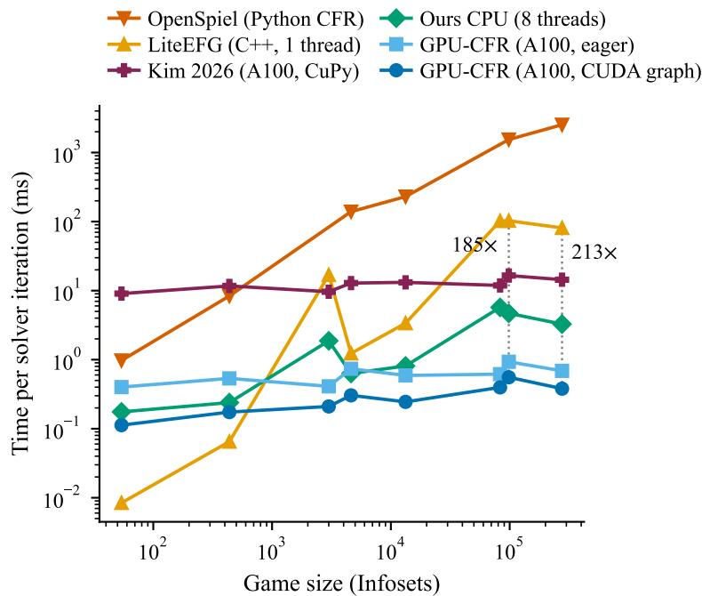
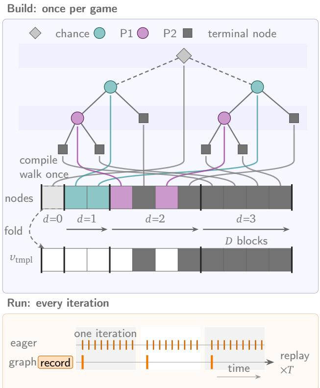
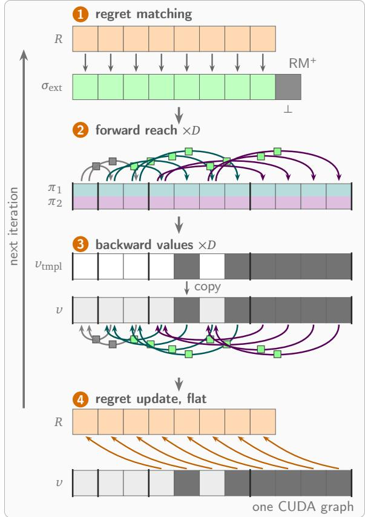
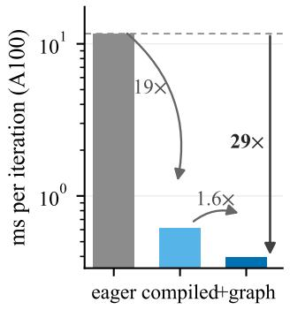
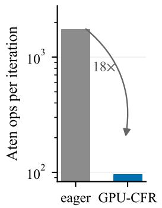
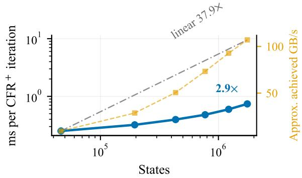
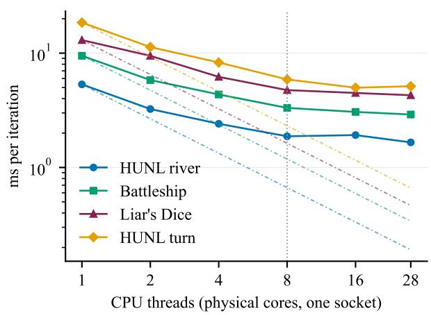
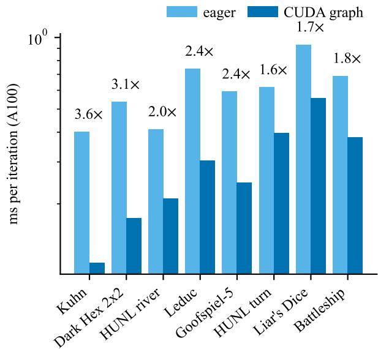
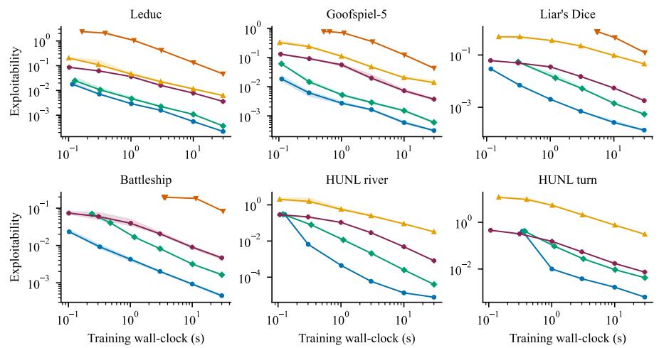
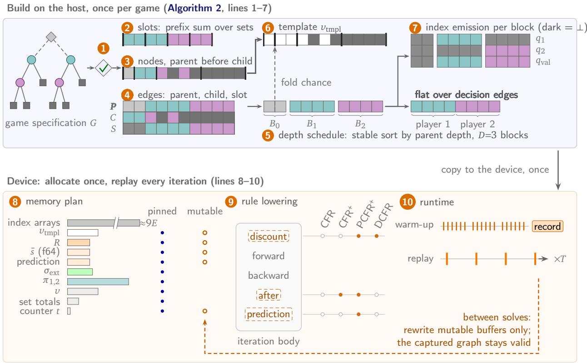

# GPU-CFR: 80x Faster Counterfactual Regret Minimization by Compiling the Game to Static Dataflow and CUDA Graph Replay

Boning Li1 and Longbo Huang1 #

1Institute for Interdisciplinary Information Sciences, Tsinghua University # Correspondence: longbohuang@tsinghua.edu.cn

Abstract. Counterfactual regret minimization (CFR) is the standard solver for imperfect-information extensive-form games. It is also one of the few large numerical workloads that still runs faster on CPUs than on GPUs. Each iteration sweeps a game tree with up to billions of states in millions of small, interdependent gather and scatter steps issued through a generic tree interface. On a GPU every kernel finishes in microseconds, so kernel launches and framework dispatch dominate the run time, and prior GPU implementations have lost to optimized CPU code. We observe that for a fixed game, everything about a CFR iteration except the numerical values is known before the first iteration runs. We propose GPU-CFR, a compiler and runtime built on this observation. It compiles any two-player zero-sum perfect-recall game once into static dataflow: flat edge and information-set arrays, precomputed indices, and depth-level batched passes fix the entire operation sequence, and only solver state changes between iterations. Static chance folding, depth-level execution blocks, and a dual-lane reach bufer cut the number of framework operations by up to 18.1×. Because shapes, indices, and bufer addresses never change, CUDA Graph Replay records the iteration once and replays it with a single graph launch. On one A100, across an eight-game suite that spans card games, dice games, and board games, GPU-CFR runs 29.8–80.4× faster than the fastest prior GPU CFR on the same accelerator (median 44.1×), and 14–258× faster than LiteEFG, one of the fastest open-source CPU implementations, on the four largest games. The compiled representation carries most of that margin: on eight CPU threads with no accelerator it is already 2.2–51.1× faster than the GPU baseline. On the CPU the optimized path reproduces the reference iterates bitwise, and tree construction and graph capture pay for themselves within the first solve. GPU-CFR beats every CPU and GPU baseline on the mid-to-large games of the suite without changing the update rule. Code is available at https://github.com/lbn187/GPU-CFR.

## 1. Introduction

Counterfactual regret minimization (CFR) (Zinkevich et al., 2007) is the algorithm of choice for computing equilibria in large games of hidden information, a class that includes poker, bargaining, and adversarial security settings. Interestingly, tabular CFR has resisted the move to accelerators, and its fastest implementations still run on CPUs. Its execution model explains why. One iteration touches every node of a game tree in millions of tiny dependent steps. Each step chases a pointer, branches on the node type, and updates a handful of floats. Every read and write is therefore a data-dependent gather or scatter (Kim & Sandholm, 2026), and a wide processor finds nothing to batch in such a walk. Deployed implementations therefore still execute CFR as a node-wise tree traversal through a generic game interface (Lanctot et al., 2020; Liu et al., 2024; Steinberger, 2019b; Li & Huang, 2026e).

This cost matters because the solves are time-bound. Modern game-playing agents must solve a game tree with tens of millions of states within a few seconds during play (Burch et al., 2014; Ganzfried & Sandholm, 2015; Moravcik et al., 2016; Brown & Sandholm, 2017; Moravčík et al., 2017; Brown & Sandholm, 2018, 2019b; Šustr et al., 2019; Brown et al., 2018; Steinberger, 2019b), so the cost of one solver iteration bounds what any such agent can do. Tabular CFR and its CFR+ refinement (Tammelin, 2014) produced the essential solution of heads-up limit hold’em (Bowling et al., 2015; Tammelin et al., 2015) and drive superhuman poker AIs (Brown & Sandholm, 2018; Moravčík et al., 2017; Brown & Sandholm, 2019b). The tabular form remains the field’s workhorse: the reference against which every approximation is checked (Lanctot et al., 2009; Brown et al., 2019; Schmid et al., 2019), the source of the exact best-response evaluations that certify solution quality (Johanson et al., 2011; Li et al., 2026a; Li & Huang, 2026b), and the inner loop of online re-solving (Burch et al., 2014; Brown & Sandholm, 2017; Šustr et al., 2021; Li & Huang, 2025, 2026e).

That demand has driven many attempts to move the workload onto accelerators, and none has produced a GPU solver whose iteration time is below that of an eficient CPU implementation (Kim & Sandholm, 2026; Baghal, 2025). The milestone poker systems sidestepped the GPU entirely and used supercomputer-scale CPU parallelism instead (Bowling et al., 2015; Tammelin et al., 2015; Brown & Sandholm, 2018). Porting the traversal to a GPU shows why. Every kernel runs for microseconds, so the time goes into launching kernels and dispatching framework operations (NVIDIA Corporation, 2020; Paszke et al., 2019), and arithmetic is a small fraction of it. The fastest prior GPU CFR is the sequence-form (Koller & Pfefer, 1997) implementation of Kim (2026) (Kim & Sandholm, 2026). It expresses each tree level as a sparse matrix product, yet its iteration still takes longer than an optimized CPU solver. Its iteration also cannot be recorded as a CUDA graph, because the sparse products and per-level index trafic it relies on are not capturable (Section 14). The obstacle lies in the representation the algorithm runs on, and the workload itself is unusually regular. When the same game is solved for many iterations, the tree topology, information sets, chance behavior, tensor shapes, and data dependencies stay constant. Only solver state changes: strategies, reaches, regrets, values, and the iteration weight. This raises a systems question. How much of tabular CFR’s cost is an artifact of its execution plan, and how much of it can a com iler remove without touchin the al orithm?

  
Figure 1 | Steady-state time per CFR iteration versus game size (both axes logarithmic; lower is better); backends and variants as in Table 3.

To remove these obstacles, we ro ose GPU-CFR, which treats a fixed ame as a ro ram to be com iled. GPU-CFR walks a game once (two players, zero-sum, perfect recall) and emits flat edge, information-set slot, and depth arrays. An iteration then becomes a fixed sequence of depth-level batched gather and scatter operations over those arrays. Three techniques shape the compiled iteration. Static chance folding moves all strategy-independent chance work to build time. Depth-level execution blocks collapse each traversal stage into one batched operation per tree level. A dual-lane reach bufer advances both players’ reach probabilities in a single operation, and a sentinel slot removes the last per-edge branch. The resulting sequence has fixed shapes, indices, and bufer addresses, so CUDA Graph Replay (NVIDIA Corporation, 2020) records it once and replays it with one graph launch per iteration. The design separates the two sources of run-time cost. The compiled representation reduces the work issued to the tensor framework, and graph replay reduces the cost of issuing it.

The compiled iteration pays of most where the trees are largest. Figure 1 plots steady-state time per iteration against game size for every backend we test. The CPU libraries and the prior GPU implementation slow down as the tree grows. The graph-replayed GPU-CFR curve stays nearly flat, so the margin widens with scale. On one A100, a heads-up no-limit Texas hold’em (HUNL) turn subgame with 83,040 information sets (Infosets) runs at 0.397 ms per steady-state CFR+ iteration. Against the matched A100 implementation of Kim (2026) (Kim & Sandholm, 2026), graph replay is 29.8–80.4× faster across the eight-game suite. Against LiteEFG (Liu et al., 2024), one of the fastest open-source CPU implementations, it is 14–258× faster on the four largest games. Most of this margin comes from the compiled representation itself: the same compiled solver on eight CPU threads already beats the A100 baseline by 2.2–51.1×. GPU-CFR in turn outperforms every CPU path we test, including that eight-thread arm and its one-socket scaling in Section 14.

We answer three systems questions. (Q1) How can a full CFR iteration be compiled into fixed tensor dataflow while preserving its update semantics? (Q2) Which gains come from the compiled representation and which come from CUDA Graph Replay? (Q3) When does the lower iteration cost translate into lower wall-clock time for solution quality and for repeated solves? Our contributions are:

1. A game-to-dataflow compiler for tabular CFR. GPU-CFR maps a fixed game to flat arrays and a depth-level execution schedule, including static chance folding and a dual-lane reach representation (Figs. 2 and 3).

2. CUDA Graph Replay with a causal performance decomposition. We separate representation cost from framework dispatch and graph-launch cost through operation counts, eager/graph ablations, scaling, and repeated-solve measurements.

3. State-of-the-art GPU performance for tabular CFR. GPU-CFR runs 29.8–80.4× faster than the matched A100 baseline across the eight-game suite and outperforms every tested CPU path (Section 7).

## 2. Related Work

The CFR family and exact equilibrium solving. CFR (Zinkevich et al., 2007) minimizes counterfactual regret independently at every information set. In two-player zero-sum games the average strategy profile converges to a Nash equilibrium (Nash Jr, 1950). CFR+ (Tammelin, 2014) replaces regret matching (Hart & Mas-Colell, 2000) with regret matching+ and linear averaging, and was the engine behind the essential solution of heads-up limit hold’em (Tammelin et al., 2015; Bowling et al., 2015). Subsequent variants tune the update rule: discounting (Brown & Sandholm, 2019a), dynamic discounting (Xu et al., 2024a), predictive/optimistic updates connecting CFR to Blackwell approachability (Farina et al., 2021, 2019b,a; Xu et al., 2024b), and refinements of regret matching itself (Farina et al., 2023; Meng et al., 2026). First-order methods reach equilibria by a diferent route, smoothing (Hoda et al., 2010; Nesterov, 2005) on the sequence form (Koller & Pfefer, 1997). Burch et al. (Burch et al., 2019) analyze whether the two players are updated simultaneously or alternately, which changes iterate quality at matched iteration counts. Our work targets the execution layer shared b the tabular CFR famil . The com iled slot re resentation su orts vanilla CFR, CFR+, DCFR (Brown & Sandholm, 2019a), and predictive CFR+ (Farina et al., 2021) under both update orders.

Scaling CFR by approximation. When the full tree is too large, the community samples it, shrinks it, prunes it, or learns it. Monte Carlo CFR estimates counterfactual values from sampled trajectories (Lanctot et al., 2009), with public-chance and other variance-controlled variants for solving and evaluation (Johanson et al., 2012; Burch et al., 2012; Schmid et al., 2019; Li et al., 2026b,a). Abstraction maps the game onto a smaller proxy (Gilpin & Sandholm, 2007; Waugh et al., 2009; Kroer & Sandholm, 2018; Li et al., 2024; Li & Huang, 2025, 2026c,a), a line of work motivated directly by CFR’s per-iteration cost (Johanson et al., 2012; Brown et al., 2015). Regret-based and online pruning skip low-value branches during the traversal (Brown & Sandholm, 2015; Li & Huang, 2025). Deep CFR and its successors replace tabular regrets with neural approximation (Brown et al., 2019; Steinberger, 2019a), and search-based and language-model agents combine learned models with online play (Brown et al., 2020; Schmid et al., 2023; Li et al., 2026c; Wang et al., 2026). These methods reduce the game or the work sampled from it. Our compiler addresses the regime in which the full tree is available and re eatedl executed. Ever one of these methods still runs a tabular CFR sweep on whatever tree remains, so a faster sweep composes with all of them.

Systems and frameworks for game solving. OpenSpiel (Lanctot et al., 2020) is the field’s reference library. Its CFR im lementations favor readabilit and breadth of ame su ort. LiteEFG (Liu et al., 2024) com iles extensive-form games into a graph representation executed by a single-threaded $\mathrm { C } + +$ backend. We use it as the primary compiled CPU baseline. PokerRL (Steinberger, 2019b) vectorizes CFR over hand ranges (Johanson et al., 2012; Moravčík et al., 2017), a HUNL-specific representation. Its released Libratus endgames are our external poker reference in Section 13. Accelerated best-response computation (Johanson et al., 2011) speeds up the evaluation half of the loop with game-specific structure. Our exploitability evaluator is a generic analogue that runs on the same compiled arrays as the solver. Parallel CFR has been explored through distributed sampling and equilibrium computation (Jackson, 2013; Brown et al., 2015), on CPU clusters (Zhang et al., 2021), and in real-time solvers that partition the traversal across CPU threads under per-decision budgets (Li & Huang, 2026e). The milestone poker systems used supercomputer-scale CPU parallelism (Bowling et al., 2015; Brown & Sandholm, 2018). Those designs parallelize the traversal. We chan e the re resentation the traversal runs on so the CPU arm of our im lementation needs no CFR-s ecific threading of its own (Section 6).

Accelerators already drive game simulation at scale (Koyamada et al., 2023). GPU CFR has recent precedent (Kim & Sandholm, 2026; Baghal, 2025), and the GPU path of the fastest such system still runs slower than an optimized CPU solver. We instead compile the game into depth-stratified dense tensors and replay the whole iteration as one captured CUDA graph. This compilation step is what makes stock PyTorch (Paszke et al., 2019) and NVIDIA CUDA graphs (NVIDIA Corporation, 2020) applicable to CFR at all.

## 3. Preliminaries

A two-player zero-sum extensive-form game is a finite tree of histories, also called states (Koller & Pfefer, 1997; Zinkevich et al., 2007). A history $h \in { \mathcal { H } }$ is the sequence of all actions taken from the root $\varnothing ,$ including chance’s. In poker it fixes both players’ private cards, the public cards, and the betting sequence. Performing an action � at a non-terminal history ℎ leads to the history $h \cdot a .$ Each non-terminal history is owned by player 1, player $^ { 2 , }$ or chance; chance histories have fixed action distributions. A terminal history $z \in \mathcal { Z } \subset \mathcal { H }$ has no actions and pays $u ( z )$ to player 1 (player 2 receives $- u ( z ) )$ .

Player � cannot distinguish histories that difer only in what is hidden from �. An information set (Infoset) $I \in { \mathcal { I } } _ { i }$ is a maximal set of histories that are indistin uishable to �. The share �’s rivate information and the ublic sequence, and difer only in the opponent’s private information. Every history ℎ, terminal or not, therefore lies in exactly one information set of each player, $I _ { 1 } ( h )$ and $I _ { 2 } ( h )$ . In poker $I _ { i } ( h )$ is �’s hand, the board, and the bettin . Histories in the same � owned b � share an action set $A ( I )$ . We assume erfect recall (Zinkevich et al., 2007). A public node $s ( h )$ (Burch et al., 2014; Moravčík et al., 2017) collects the histories that share everything both players can see. These objects give the two size counts used throughout. States is the number of non-chance histories, terminals included. Infosets is the number of pairs $( i , I _ { i } ( h ) )$ over those histories, again terminals included. A behavioral strategy $\sigma _ { i }$ assigns each $I \in { \mathcal { I } } _ { i }$ owned by � a distribution over $A ( I )$ . For a profile $\sigma = ( \sigma _ { 1 } , \sigma _ { 2 } )$ , the reach probability $\pi ^ { \sigma } ( h )$ of history ℎ factors into player-1, player-2, and chance contributions. The counterfactual reach $\pi ^ { - i } ( h )$ excludes player �’s own contribution. We report exploitability as NashConv (Lanctot et al., 2020) divided by two, computed by exact best response (Johanson et al., 2011):

$$
\exp 1 ( \sigma ) = \frac { 1 } { 2 } \sum _ { i } \left[ \operatorname* { m a x } _ { \sigma _ { i } ^ { \prime } } u _ { i } ( \sigma _ { i } ^ { \prime } , \sigma _ { - i } ) - u _ { i } ( \sigma ) \right] .\tag{1}
$$

CFR (Zinkevich et al., 2007) is an iterative self-play procedure over this tree. Iteration � holds a current profile $\sigma ^ { t }$ , a cumulative regret $R ^ { t } ( I , a )$ for every information-set action, and an average-strategy accumulator. Four steps turn $\boldsymbol { \sigma } ^ { t }$ into $\sigma ^ { t + 1 }$ . First, a forward reach pass propagates reach probabilities from the root, one product per edge:

$$
\pi ^ { \sigma } ( h \cdot a ) = \pi ^ { \sigma } ( h ) \sigma _ { P ( h ) } ( I ( h ) , a ) ,\tag{2}
$$

where $P ( h )$ is the owner of ℎ and chance edges use their fixed probabilities. Second, a backward value pass folds terminal payofs up the tree, one strategy-weighted sum per node, and aggregates them into counterfactual values that weight each history by every contribution except player �’s own:

$$
\begin{array} { c } { { \displaystyle \nu _ { i } ( I , a ) = \sum _ { h \in I } \pi ^ { - i } ( h ) \sum _ { z \in \mathcal { Z } } \pi ^ { \sigma } ( h \cdot a , z ) u _ { i } ( z ) , } } \\ { { \displaystyle \nu _ { i } ( I ) = \sum _ { a \in A ( I ) } \sigma _ { i } ( I , a ) \nu _ { i } ( I , a ) . } } \end{array}\tag{3}
$$

Third, the solver adds the instantaneous regret of each action to its accumulator:

$$
R ^ { t } ( I , a ) = R ^ { t - 1 } ( I , a ) + \nu _ { i } ^ { t } ( I , a ) - \nu _ { i } ^ { t } ( I ) .\tag{4}
$$

Fourth, regret matching (Hart & Mas-Colell, 2000) sets the next strategy proportional to positive regret, and the reach-weighted current strategy is folded into the average:

$$
\begin{array} { r l } & { \sigma ^ { t + 1 } ( I , a ) = \frac { R _ { + } ^ { t } ( I , a ) } { \displaystyle \sum _ { a ^ { \prime } } R _ { + } ^ { t } ( I , a ^ { \prime } ) } , } \\ & { \quad \bar { \sigma } ^ { T } ( I , a ) \propto \displaystyle \sum _ { t < T } w _ { t } \pi _ { i } ^ { \sigma ^ { t } } ( I ) \sigma ^ { t } ( I , a ) , } \end{array}\tag{5}
$$

with $R _ { + } = \operatorname* { m a x } ( R , 0 )$ , a uniform strategy when the denominator is zero, and $w _ { t } = 1$ for uniform or $w _ { t } = t$ for linear averaging (Tammelin, 2014). The average $\bar { \sigma } ^ { T }$ converges to a Nash equilibrium at rate $O ( 1 / \sqrt { T } )$ (Zinkevich et al., 2007). CFR+ (Tammelin, 2014) changes one line. It clamps the accumulator itself, $R ^ { t } \gets \operatorname* { m a x } ( R ^ { t } , 0 )$ after Eq. (4), and converges much faster in practice (Tammelin et al., 2015; Burch et al., 2019). DCFR (Brown & Sandholm, 2019a) and PCFR+ (Farina et al., 2021) (Table 6) keep this loop and change only how the two accumulators evolve. In systems terms, every rule is the same sparse computation each iteration: two sweeps over a fixed irregular tree plus a segment-normalized update per information set, with only the numbers changing. Players may be updated simultaneously from one strategy profile or alternately, where the first player’s update is visible to the second’s in the same sweep (Burch et al., 2019). An alternating iteration is one half-update per player and therefore roughly twice the work. GPU-CFR supports both orders and both uniform and linear strategy averaging. The timing matrix fixes these choices for matched comparisons (Section 6).

## 4. Compiling CFR onto Accelerators

The design follows one observation: once the game is fixed, the entire structure of a CFR iteration is known at build time, and only the numbers change. We therefore split the solver into a one-time compilation of the game into flat arrays (Section 4.1) and a per-iteration dataflow over those arrays whose operation sequence never changes (Section 4.2). The fixed sequence makes the iteration a legal target for CUDA-graph capture (Section 4.3). Figure 2 shows the pipeline on an 11-node example game with a chance root, two decisions per player, and six terminals, and Fig. 3 reuses the same game. A layered verification design checks the compiled schedule, graph replay, and evaluator (Section 4.4).

## 4.1. Compiled game representation

Compilation walks the game once, numbering nodes in breadth-first order so that every parent precedes its children, and emits:

• Node arrays of length �: owner (player 1/2, chance, terminal), depth, and a terminal payof vector.

• Edge arrays of length �: for every edge, its parent node, child node, and slot, the index of the corresponding (information set, action) pair in a flat slot space of size $\begin{array} { r } { A _ { \mathrm { t o t } } = \sum _ { I } \left| A ( I ) \right| } \end{array}$ . Chance edges carry their fixed probability and no slot.

• Information-set arrays of length � and $A _ { \mathrm { t o t } } \mathrm { : }$ per-set action counts and slot ofsets, so regret matching operates on flat vectors with segment reductions and never touches a ragged structure.

  
Figure 2 | The compilation pipeline on an 11-node example game. A build-time walk flattens the tree into the depth- segmented node array and values template (colored lines trace each node to its cell); at run time, eager execution submits $c _ { 1 } + c _ { 2 } D$ framework operations per iteration (each one or more kernel launches), graph replay one graph launch.  
Figure 3 | One compiled CFR+ iteration on the example game of Fig. 2, stacked in execution order inside the captured CUDA graph (rounded frame). Arcs are colored by the acting owner of their edge (gray chance, teal P1, violet P2); each apex square is the gathered strategy factor (green) or the sentinel (dark).

All solver state (accumulated regrets $R \in \mathbb { R } ^ { A _ { \mathrm { t o t } } }$ , strategy sums $\bar { s } \in \mathbb { R } ^ { A _ { \mathrm { t o t } } }$ , and the iteration scratch below) lives in preallocated device tensors. On solver construction, root reach entries are set to one and every bufer is written before it is read. The scratch footprint is $\left( 5 N + A _ { \mathrm { t o t } } + I + 1 \right)$ floats plus the integer index arrays. Measured peak GPU memory on the largest game is 183 MiB allocated and 236 MiB reserved, including the CUDA-graph pool and evaluation scratch (Table 10). That is about 570 bytes per tree node. Float scratch, persistent slot vectors, and the int64 edge-index arrays all scale linearly in �, �, and $A _ { \mathrm { t o t . } }$ , with $E \approx N$ in trees. The same code path runs unchanged on CPU and GPU.

## 4.2. One iteration as a fixed dataflow

A CFR iteration is regret matching, a forward reach pass, a backward value pass with instantaneous-regret accumulation, and the update rule (Eqs. (2) to (5)). Figure 3 shows the four phases as they execute. Three structural observations turn the two tree passes into a handful of batched tensor operations each. Throughout, “overwrite” semantics are available because the game is a tree. Every non-root node has exactly one incoming edge, so a scatter along edges writes each destination exactly once per iteration, and bufers never need zeroing within a solve.

(a) Static chance folding. Chance behavior is strategy-independent, so for every node ℎ the product of chance probabilities on the root-to-ℎ path, $\pi _ { c } ( h )$ , is a build-time constant. We fold it into a values template

$$
\begin{array} { r } { \nu _ { \mathrm { t m p l } } ( h ) \ = \ \left\{ \begin{array} { l l } { \pi _ { c } ( h ) u ( h ) } & { h \in \mathcal { Z } , } \\ { 0 } & { \mathrm { o t h e r w i s e } , } \end{array} \right. } \end{array}\tag{6}
$$

from which the backward pass starts every iteration. The invariant is that chance probabilities appear only through Eq. (6). During the dynamic passes, every chance edge acts as multiplier 1 (via the sentinel slot below). The backward recurrence $\begin{array} { r } { \nu ( h ) \ = \ \sum _ { ( h , a , h ^ { \prime } ) } \sigma _ { \mathrm { e x t } } ( h , a ) \nu ( h ^ { \prime } ) } \end{array}$ then returns at each node ℎ the chance-weighted continuation value $\begin{array} { r } { \sum _ { z \succeq h } \pi _ { c } ( z ) \pi _ { 1 , 2 } ^ { \sigma } ( h  z ) u ( z ) } \end{array}$ . There is no double counting, because each terminal’s full-path chance product enters exactly once, at the template. This removes every chance multiplication from the per-iteration forward pass. Chance edges remain in the depth blocks only as sentinel reads.

(b) Depth-level execution blocks. The forward pass must respect topology, since a child’s reach depends on its parent’s. In a tree, every child sits exactly one depth level below its parent, so grouping edges by parent depth yields a valid schedule at the coarsest granularity a depth-synchronous schedule allows. All edges at one depth execute as a single batched gather, multiply, and scatter, and the number of sequential steps equals the tree depth. Across our suite this is 4–15 blocks per pass (Table 2). A generic topological schedule over (stage × depth) intersections produced up to 100 blocks on the same trees. The backward pass uses the same blocks in reverse with index\_add scatters, which tolerate repeated parents within a block.

(c) Sentinel slot and dual-lane reach bufer. Player �’s reach lane $\pi _ { i }$ must multiply �’s own strategy entries and copy through everything else:

$$
\pi _ { i } ( h ^ { \prime } ) = \left\{ \begin{array} { l l } { { \pi _ { i } ( h ) \sigma ( \mathrm { s l o t } ( h , a ) ) } } & { { ( h , a , h ^ { \prime } ) \mathrm { o w n e d b y } i , } } \\ { { \pi _ { i } ( h ) } } & { { \mathrm { o t h e r w i s e } . } } \end{array} \right.\tag{7}
$$

We implement Eq. (7) branchlessly. The strategy vector is extended by one sentinel slot pinned to 1.0. For each edge and each lane, a precomputed index points either at the edge’s true slot (own-player edges) or at the sentinel (all others). The reach bufer holds both lanes contiguously (2� entries), and per-block index arrays over the doubled range advance both lanes with a single gather, multiply, and scatter. The same trick removes the last per-edge branch from regret accumulation. For a player-� edge (ℎ, �) with slot $q = { \mathsf { s l o t } } ( h , a )$ the instantaneous regret contribution is

$$
r ( q ) ~ + = ~ s ( e ) \pi _ { - i } ( h ) \bigl ( \nu ( h ^ { \prime } ) - \nu ( h ) \bigr ) ,\tag{8}
$$

where $e = ( h , a , h ^ { \prime } ) , s ( e ) = + 1$ for player 1 and −1 for player 2, � stores player-1 values, and $\pi _ { - i } ( h )$ is read from the opponent’s lane through a precomputed index array. Summing Eq. (8) over an information-set action with a slot-indexed index\_add yields $\begin{array} { r } { \sum _ { h \in I } s ( e ) \pi _ { - i } ( h ) ( \nu ( h ^ { \prime } ) - \nu ( h ) ) } \end{array}$ , the standard counterfactual regret. Chance reach is already in � through Eq. (6) and is not multiplied again.

Per-block index arrays $P _ { 2 } , C _ { 2 } , S _ { 2 }$ are the precomputed dual-lane parent/child/slot arrays of block $^ { b , }$ covering every edge (chance and other-player entries point at the sentinel). $P _ { \mathrm { v a l } } , C _ { \mathrm { v a l } } , S _ { \mathrm { v a l } }$ cover every edge of the backward value pass; $P _ { \mathrm { r e g } } , C _ { \mathrm { r e g } } , S _ { \mathrm { r e g } } , O _ { \mathrm { r e g } }$ cover player decision edges only, with $O _ { \mathrm { r e g } }$ indexing the opponent- reach lane at the parent and $M _ { \mathrm { r e g } }$ the acting player’s own lane there, used by the averaging update. Because � stores player-1 values, a build-time sign $s ( e ) \in \{ \pm 1 \}$ orients each decision edge’s value diference toward its acting player; �(�) gathers these signs for the block’s decision edges. Chance edges and sentinel slots never receive regret updates. $\sigma _ { \mathrm { e x t } }$ denotes the strategy vector with the sentinel entry fixed at 1.

Algorithm 1 summarizes the iteration, where $w _ { t }$ is the averaging weight. Alternating updates (Burch et al., 2019) run its body twice per iteration, once per player, and restrict the regret update and the regret matching+ clamp to the acting player’s slots. The player order is static, so every index array and the captured graph stay the same. Table 1 lists the realized operation schedule. One realization detail: the regret scatter of line 8 is hoisted out of the level loop and applied once, flat over all decision edges after the value pass. The average-strategy accumulation shares the same flat scatter. The parent and child values it reads are final by then, so the flat scatter accumulates the same summands in a diferent grouping. Only the forward and value recurrences contribute to the depth-proportional term. The result is a fixed sequence of eight Aten (Paszke et al., 2019) operations per depth level plus a constant part: 64–152 operations per iteration across the suite. A reference implementation of the same algorithm with per-(stage, depth) blocks, masked chance handling, and per-iteration allocations needs 110–1,742 (Table 2). The Aten-operation count is exactly reproducible and independent of machine load. It therefore serves both as a regression gate (Section 4.4) and as a benchmarking instrument.

Algorithm 1 One compiled CFR+ iteration under simultaneous updates.   
1: � ← regret\_matching(�) //flat over $A _ { \mathrm { t o t } }$ slots; segment-normalized   
2: for $b = 1 , \ldots , D$ do //forward, both lanes at once, Eq. (7)   
3: $\pi [ C _ { 2 } ( b ) ]  \pi [ P _ { 2 } ( b ) ] \cdot \sigma _ { \mathrm { e x t } } [ S _ { 2 } ( b ) ]$   
4: end for   
5: � ← �tmpl // chance-weighted payofs, Eq. (6)   
6: for $b = \dot { D } , \dots , 1$ do // backward values   
7: �.index $\mathrm { a d d } ( P _ { \mathrm { v a l } } ( b ) , \sigma _ { \mathrm { e x t } } [ S _ { \mathrm { v a l } } ( b ) ] \cdot \nu [ C _ { \mathrm { v a l } } ( b ) ] )$   
8: �.index $\mathrm { a d d } \big ( S _ { \mathrm { r e g } } ( b ) , s ( b ) \cdot \pi [ O _ { \mathrm { r e g } } ( b ) ] \cdot ( \nu [ C _ { \mathrm { r e g } } ( b ) ] - \nu [ P _ { \mathrm { r e g } } ( b ) ] ) \big )$ // Eq. (8), decision edges only   
9: end for   
10: $\bar { s } + = \boldsymbol { w } _ { t } \cdot \boldsymbol { \pi } _ { 0 \mathrm { w n } } \cdot \boldsymbol { \sigma } ;$ � ← max(�, 0) // update rule (here: CFR+)

Table 1 | The realized operation schedule of one CFR+ iteration (Fig. 3). ia abbreviates index\_add, �(�) is the information set owning slot �, and the build-time sign $s \in \{ \pm 1 \}$ orients each edge’s regret toward its acting player. Only the two per-level rows repeat with depth.
<table><tr><td>Realized operation Data</td></tr><tr><td>Ops Regret matching (constant)</td></tr><tr><td> $\sigma ^ { + } \gets \mathrm { c l a m p } ( R , 0 )$   $[ A _ { \mathrm { t o t } } ]$  1</td></tr><tr><td> $\mathrm { t o t }  0 ; \ \mathrm { t o t . i a } ( I ( q ) , \sigma ^ { + } )$   $[ A _ { \mathrm { t o t } } ] {  } [ I ]$  2</td></tr><tr><td>gather tot back to slots  $[ I ]  [ A _ { \mathrm { t o t } } ]$  1</td></tr><tr><td> $m \gets \mathrm { t o t } > 0 ;$  guard divisor via where  $[ A _ { \mathrm { t o t } } ]$  2</td></tr><tr><td> $\sigma \gets \mathrm { w h e r e } ( m , \sigma ^ { + } / \mathrm { t o t } , \mathrm { u n i f } )$   $[ A _ { \mathrm { t o t } } ]$  2</td></tr><tr><td> $\sigma _ { \mathrm { e x t } } [ : A _ { \mathrm { t o t } } ]  \sigma$  (sentinel stays 1)  $[ A _ { \mathrm { t o t } } + 1 ]$  1</td></tr><tr><td>Forward reach, per level  $\ell = 1 , \ldots , D$   $\pi [ C _ { 2 } ( \ell ) ] \longleftarrow \pi [ P _ { 2 } ( \ell ) ] \cdot \sigma _ { \mathrm { e x t } } [ S _ { 2 } ( \ell ) ]$  (both lanes) [2N] 4·D</td></tr><tr><td>Backward values, per level  $\ell = D , \ldots , 1$ </td></tr><tr><td> $\nu \gets \nu _ { \mathrm { t m p l } }$  (chance folded at build) [N] 1</td></tr><tr><td> $\nu . \mathrm { i a } \big ( P ( \ell ) , \sigma _ { \mathrm { e x t } } [ S ( \ell ) ] \cdot \nu [ C ( \ell ) ] \big )$  [N] 4·D</td></tr><tr><td>Regret and average over decision edges (constant)</td></tr><tr><td> $\Delta \gets s \cdot ( \nu [ C _ { \mathrm { r e g } } ] - \nu [ P _ { \mathrm { r e g } } ] )$  decision edges 4</td></tr><tr><td> $R . \mathrm { i a } \left( S _ { \mathrm { r e g } } , \pi [ O _ { \mathrm { r e g } } ] \cdot \Delta \right)$   $ [ A _ { \mathrm { t o t } } ]$  3 6</td></tr><tr><td> $\bar { s } . \mathrm { i } a \left( S _ { \mathrm { r e g } } , \left( \boldsymbol { w } \cdot \boldsymbol { \pi } \left[ M _ { \mathrm { r e g } } \right] \cdot \boldsymbol { \sigma } _ { \mathrm { e x t } } \left[ S _ { \mathrm { r e g } } \right] \right) _ { \mathrm { f 6 4 } } \right)$   $ [ A _ { \mathrm { t o t } } ]$ </td></tr><tr><td> $R \gets \operatorname* { m a x } ( R , 0 ) \quad ( \mathrm { C F R ^ { + } } )$   $[ A _ { \mathrm { t o t } } ]$  1 (inside the captured body) scalar</td></tr><tr><td> $w + = 1$  1</td></tr></table>

## 4.3. CUDA-graph execution

Even at 96 operations per iteration, a 434k-state game runs each GPU kernel for only microseconds, so framework dispatch and kernel launches dominate wall-clock time. The compiled dataflow executes eagerly at 0.401–0.933 ms per iteration on an A100 across our suite, largely independent of tree size, the signature of a launch-bound workload. Because the operation sequence, tensor shapes, and bufer addresses are all fixed, the entire iteration qualifies for CUDA-graph capture (NVIDIA Corporation, 2020): record the kernel sequence once, then replay it with one graph launch per iteration. CUDA graphs remove per-kernel launch and dispatcher overhead and leave the kernels themselves unchanged, so the same kernels run back to back. Section 14 measures hand-fused kernels and Section 15 lists the compiler passes.

Three details make capture faithful to eager execution. First, CFR+’s linear-averaging weight $w _ { t } = t$ changes every iteration, which a static graph cannot see. We keep � in a 0-dimensional device tensor that the captured body increments in place after use. Before each replay batch the host refills it with the exact starting index, so replay � uses precisely $w = t _ { 0 } + k$ and matches eager execution bit for bit. The counter is float32 in every reported run and represents � exactly up to $2 ^ { 2 4 }$ iterations. Second, capture must be preceded by warmup iterations on a side stream. In GPU-CFR these are genuine eager iterations that count toward the iteration budget, and the accounting is preserved across arbitrarily split solver calls. Third, replaying a graph whose bufers have been reallocated would silently read stale memory. The solver stores the data pointers of all eight persistent bufers at capture time and refuses to replay if any has changed. If capture itself fails, for example on an unsupported driver, the solver warns once and falls back to eager execution. The fallback runs the same kernels in the same order and, within one process, computes the identical floats.

Graph replay cuts steady-state iteration time by 1.6–3.6× depending on tree size (Table 3, Section 12). The two largest games run at 0.380–0.556 ms per iteration. One-time capture cost (0.037–0.301 s) lands in the first solver call, and Section 7 reports steady-state and end-to-end numbers separately.

## 4.4. Layered verification

Verification proceeds at three levels. First, graph replay and compiled eager execution run the same kernels in the same order and agree bitwise over 30 iterations within one process. Second, the compiled dataflow is compared with the pre-optimization implementation. The two agree bitwise in float32 after 22 iterations on all eight benchmark games (Table 2; CPU, fixed reduction order) and to $1 0 ^ { - 1 2 }$ in float64 over 30 iterations. Third, independently written implementations provide tolerance-level checks on values and exploitability.

GPU scatter reductions can accumulate in diferent orders across independent processes. Near an indiferent action a last-bit diference can separate subsequent trajectories: on the HUNL river subgame, 4 of 20 identical runs reach a second exploitability cluster 0.6% away. Section 11 traces this to reduction order and quantifies its efect. The verification layers are:

1. Reference-oracle parity. A complete copy of the solver from before optimization is preserved inside the test suite and compared as above, across {CFR, $\mathrm { C F R ^ { + } } \} \times$ {uniform, linear} averaging.

2. Independent reference solver. A per-node Python implementation, sharing no code with the compiled path, must agree to $1 0 ^ { - 9 }$ on the poker subgames.

3. Best-response oracles and analytic anchors. An exact recursive best-response oracle (Johanson et al., 2011), checked by brute-force strategy enumeration on small instances, validates the evaluator. Analytic cases pin absolute values.

4. Operation-count regression gates. The per-iteration count of Aten operations is asserted against the afine schedule size $c _ { 1 } + c _ { 2 } D$ of Section 5, and graph replay is compared with eager execution over 30 iterations. These deterministic checks complement wall-clock measurements.

The full test inventory (499 tests) appears in Section 11.

## 5. The Compiled Iteration, Formally

This section states the per-iteration dataflow as a composition of three indexed operators and establishes four properties of it. The folded chance representation computes the same values as an explicit chance chain. The branchless dual-lane update computes Eq. (7) exactly. The depth schedule is the shortest among schedules that execute edges in dependency-respecting groups. Unrescaled linear averaging has a representability horizon that fixes the accumulator precision. Proofs are in Section 16.

Three indexed operators. Fix a compiled game with node set $\mathcal { H } , | \mathcal { H } | = N$ , and edge set indexed $1 , \ldots , E .$ Write $p ( e ) , c ( e )$ for the parent and child of edge � and �(�) for its slot. Let �(ℎ) be the depth of node ℎ and

$$
\begin{array} { r } { B _ { \ell } = \{ e : d ( p ( e ) ) = \ell \} , \quad \mathcal { D } = \{ \ell : B _ { \ell } \neq \emptyset \} , \quad D = | \mathcal { D } | , } \end{array}\tag{9}
$$

so the blocks $\{ B _ { \ell } \} _ { \ell \in \mathcal { D } }$ partition the edges by parent depth. Let $\sigma _ { \mathrm { e x t } } \in \mathbb { R } ^ { A _ { \mathrm { t o t } } + 1 }$ be the strategy vector extended by a sentinel coordinate pinned at $\sigma _ { \mathrm { e x t } } ( \bot ) = 1$ , and for a lane $i \in \{ 1 , 2 \}$ define the compiled slot map

$$
q _ { i } ( e ) ~ = ~ \left\{ \begin{array} { l l } { { q ( e ) } } & { { { \mathrm { e d g e ~ } } e { \mathrm { ~ i s ~ a ~ d e c i s i o n ~ e d g e ~ o f ~ p l a y e r ~ } } i , } } \\ { { \perp } } & { { { \mathrm { o t h e r w i s e ~ ( o p p o n e n t ~ o r ~ c h a n c e ~ e d g e ) } } , } } \end{array} \right.\tag{10}
$$

which is a build-time constant. Its lane-free analogue $q _ { \mathrm { v a l } } ( e ) ( q ( e )$ on decision edges, ⊥ on chance edges) drives the backward pass. Three operators then generate the iteration. For a block $B _ { \ell } ,$ a lane $i ,$ and vectors $x \in \mathbb { R } ^ { N }$ $y \in \mathbb { R } ^ { A _ { \mathrm { { t o t } } } + 1 }$

$$
\begin{array} { r } { \mathrm { F } _ { \ell , i } ( x , y ) ( h ) = \left\{ \begin{array} { l l } { x ( p ( e ) ) y ( q _ { i } ( e ) ) } & { h = c ( e ) , e \in B _ { \ell } , } \\ { x ( h ) } & { \mathrm { o t h e r w i s e } , } \end{array} \right. } \end{array}\tag{11}
$$

$$
\mathrm { B } _ { \ell } ( x , y ) ( h ) = x ( h ) + \sum _ { e \in B _ { \ell } : p ( e ) = h } y ( q _ { \mathrm { v a l } } ( e ) ) x ( c ( e ) ) ,\tag{12}
$$

$$
\mathrm { R } _ { \ell } ( r , x , \rho ) ( q ) = r ( q ) + \sum _ { \substack { e \in B _ { \ell } : q ( e ) = q } } s ( e ) \rho _ { - i ( e ) } ( p ( e ) ) \big ( x ( c ( e ) ) - x ( p ( e ) ) \big ) .\tag{13}
$$

Here �(�) is the decision-edge owner, $s ( e ) = + 1$ for player 1 and −1 for player 2, and $\rho _ { - i ( e ) }$ selects the opponent’s reach lane. The vector � holds chance-folded player-1 values, so no further chance factor is used. Each operator uses gathers, elementwise arithmetic, and a scatter over $| B _ { \ell } |$ entries, which is how Algorithm 1 realizes them: Eq. (11) as an indexed assignment, Eqs. (12) and (13) as index\_add. The forward pass is F composed over $\ell \in \mathcal { D }$ in increasing depth, the backward pass is B and R composed in decreasing depth, and Eq. (11) runs on the doubled index range so both lanes advance in one call.

The forward pass assigns in Eq. (11) where the backward pass accumulates. Assignment is what frees it of bufer clearing. In a tree each non-root node is the child of exactly one edge, so within a block every destination is written exactly once and stale contents are unreachable. The backward operators accumulate instead, because a parent has several children per block.

## What the operators compute.

Proposition 1 (Folded chance is exact). Initialize $\nu \gets \nu _ { \mathrm { t m p l } }$ as in $E q .$ . (6) and apply Bℓ for $\ell \in \mathcal { D }$ in decreasing order, with every chance edge assigned multiplier 1 through $q _ { \mathrm { v a l } }$ . Then on termination, for every node ℎ,

$$
\nu ( h ) \ = \ \sum _ { z \mathop { \leq } h , \ z \in \mathcal { Z } } \pi _ { c } ( h \to z ) \pi _ { c } ( h ) \pi _ { 1 , 2 } ^ { \sigma } ( h \to z ) u ( z ) ,\tag{14}
$$

that $i s ,$ the chance-weighted continuation value at ℎ. In particular at the root � equals the expected payof under $\sigma ,$ and each terminal’s chance product $\pi _ { c } ( z )$ enters exactly once.

Proposition 1 says that folding saves work and leaves the computed values unchanged. The chance chain is deleted from the dynamic pass and reappears only as the build-time constant multiplying �(�) in Eq. (6).

Proposition 2 (The dual-lane update is exact and branch-free). For every lane �, block ℓ, and edge $e \in B _ { \ell } ,$ , the operator $\mathrm { F } _ { \ell , i } o f E q$ . (11) evaluated with the compiled slot map Eq. (10) and $y = \sigma _ { \mathrm { e x t } }$ satisfies the case definition of Eq. (7) at �(�). The slot map is resolved at build time, so the per-iteration cost of the case distinction is zero and no per-edge predicate is evaluated during execution.

Proposition 3 (The depth schedule is shortest). Call a schedule dependency-respecting if it partitions the edges into ordered groups such that no group contains two edges $\boldsymbol { e } , \boldsymbol { e } ^ { \prime }$ with $c ( e ) = p ( e ^ { \prime } )$ , and � precedes $e ^ { \prime }$ whenever $c ( e ) = p ( e ^ { \prime } )$ . Then:

(i) the partition Eq. (9) is dependency-respecting and has � groups;

(ii) every dependency-respecting schedule has at least � groups;

(iii) the number of operator invocations per iteration is $c _ { 1 } + c _ { 2 } D$ for constants $c _ { 1 } , c _ { 2 }$ independent of � and �.

Part (iii) is the reason iteration time is nearly flat in tree size across four decades (Table 3). Growth enters the batch widths, which the device absorbs in parallel, while the number of dispatches stays fixed. Measured on the suite, $c _ { 1 } \approx 3 1$ (the itemized dispatches of Table 1 plus framework bookkeeping) and $c _ { 2 } = 8$ . The realized schedule applies R once, flat over all decision edges (Section 4.2), so only F and B contribute to $c _ { 2 } .$ , at four operations per level each. Table 2 confirms that � matches the tree depth on every game. The reference implementation’s per-(stage, depth) partition needs up to 100 groups where Eq. (9) needs 8.

Kim (2026) (Kim & Sandholm, 2026) organizes its sequence-form iteration by level as well, so its critical path is likewise proportional to depth. The diference the timing measures is per-step work. There, one level applies a masked sparse product against a precomputed level matrix, whose cost is set by the sparsity pattern and the sparse kernel. Here, one level applies Eqs. (11) to (13) on dense contiguous ranges with build-time indices. Section 12 localizes the resulting gap to the sparse product and the index assignment inside its per-iteration normalize.

The averaging horizon. Linear averaging (Tammelin, 2014) accumulates $\bar { s } + = t \pi _ { \mathrm { o w n } }$ � on iteration � and never rescales. The accumulator therefore grows quadratically while each contribution stays linear, and in finite precision the two rates collide.

Proposition 4 (Representability horizon of unrescaled linear averaging). Let $\textstyle S _ { T } = \sum _ { t = 1 } ^ { T } t x _ { t }$ be the ideal real sum, with $x _ { t } \in [ 0 , 1 ] , S _ { T } = \Theta ( T ^ { 2 } )$ , and $x _ { T } \geq c > 0$ . For a binaryformat with �-bit significand, while $S _ { T }$ is in the normal range,

$$
{ \frac { T x _ { T } } { \mathrm { u l p } ( S _ { T } ) } } = \Theta \bigg ( { \frac { 2 ^ { p } } { T } } \bigg ) .\tag{15}
$$

Here ulp is the spacing in the binade containing the ideal sum (the actual rounded accumulator may sit in a neighboring binade). Without $x _ { T } \geq c ,$ only the $O ( 2 ^ { p } / T )$ boundfollows. Thus $2 ^ { p }$ is an order-of-magnitude resolution scale and should be read as such; the exact stalling point depends on the rounded trajectory. A nonnegative increment is locally absorbed under round-to-nearest if it is strictly below half the upward spacing at the actual old accumulator; ties depend on the rounding rule.

GPU-CFR holds ¯� in float64 for all update rules, while the other bufers and iteration arithmetic use the configured dtype. The scales $2 ^ { 2 4 } \approx 1 . { \dot { 7 } } \times 1 0 ^ { 7 }$ and $2 ^ { 5 3 } \approx 9 \times 1 0 ^ { 1 5 }$ show the precision diference. The cost is one wider slot vector with no change to the operator sequence. This accumulator issue is separate from the graph-replay counter of Section 4.3. That float32 counter represents consecutive integers exactly through $2 ^ { 2 4 }$ and the host refills its startin index before each re la batch.

## 6. Experimental Setup

Three evaluation suites. Each suite answers a diferent experimental question. The eight-game main timing/regression suite in Table 2 contains six public games via OpenSpiel (Lanctot et al., 2020) and two native HUNL-style subgames (Ganzfried & Sandholm, 2015; Brown & Sandholm, 2017) (Section 9). The suite spans 54 to 275,983 Infosets and supports the headline timing, operation-count, and reference-parity results. The twelve-game update-rule suite adds four more OpenSpiel games for the four-rule, two-order CPU study of Table 6. The extended poker suite contains the released Libratus river endgames (Brown & Sandholm, 2018; Steinberger, 2019b) and larger exported poker instances of the head-to-head in Section 13.

Backends. GPU-CFR runs the compiled float32 solver on one NVIDIA A100 80GB in eager or CUDA Graph mode. The two modes difer only in dispatch, and a vanilla CFR arm isolates the engine from regret matching+. Ours CPU runs the same compiled tensor dataflow on eight threads pinned to dedicated physical cores, with parallelism supplied by PyTorch’s intra-operator pool (Paszke et al., 2019). LiteEFG 0.1.5 (Liu et al., 2024) uses a single-threaded C++ backend. The main matrix uses its simultaneous vanilla CFR mode, and Section 12 reports its alternating CFR+ preset. Kim (2026) (Kim & Sandholm, 2026), released as noregret, executes sequence-form (Koller & Pfefer, 1997) CFR through CuPy sparse products on the same A100. The main matrix matches its update order to GPU-CFR’s simultaneous updates and reports its GPU backend. OpenSpiel (Lanctot et al., 2020) contributes its Python CFR implementation and exact best response. Every backend reports exploitability as NashConv/2. Table 8 lists the rule, update order, averaging, precision, and execution mode per arm.

Table 2 | Benchmark suite and PyTorch/Aten operations issued per CFR+ iteration (load-immune count), reference implementation vs. compiled dataflow. Infosets counts information sets, one per player at every non-chance history including terminals; States counts the legal non-chance histories once both players’ private information is revealed. Blocks counts the sequential execution blocks per pass; the last column is the maximum absolute regret diference after 22 float32 iterations.
<table><tr><td colspan="3"></td><td colspan="2">Exec. blocks</td><td colspan="2">Aten ops/iter</td><td colspan="2">Regret</td></tr><tr><td>Game</td><td>Infosets</td><td>States</td><td>ref</td><td>GPU-CFR</td><td>ref</td><td>GPU-CFR</td><td>Reduction</td><td>max diff</td></tr><tr><td>Kuhn</td><td>54</td><td>54</td><td>4</td><td>4</td><td>110</td><td>64</td><td>1.7×</td><td>0.0</td></tr><tr><td>Dark Hex 2x2</td><td>437</td><td>441</td><td>7</td><td>7</td><td>161</td><td>88</td><td>1.8×</td><td>0.0</td></tr><tr><td>HUNL river</td><td>3,000</td><td>137,415</td><td>27</td><td>4</td><td>501</td><td>64</td><td>7.8×</td><td>0.0</td></tr><tr><td>Leduc</td><td>4,620</td><td>9,300</td><td>11</td><td>11</td><td>229</td><td>120</td><td>1.9×</td><td>0.0</td></tr><tr><td>Goofspiel-5</td><td>13,293</td><td>26,931</td><td>9</td><td>8</td><td>195</td><td>96</td><td>2.0x</td><td>0.0</td></tr><tr><td>HUNL turn</td><td>83,040</td><td>433,610</td><td>100</td><td>8</td><td>1,742</td><td>96</td><td>18.1×</td><td>0.0</td></tr><tr><td>Liar&#x27;s Dice</td><td>98,292</td><td>294,876</td><td>83</td><td>15</td><td>1,453</td><td>152</td><td>9.6x</td><td>0.0</td></tr><tr><td>Battleship</td><td>275,983</td><td>209,941</td><td>25</td><td>10</td><td>467</td><td>112</td><td>4.2×</td><td>0.0</td></tr></table>

Shared game representations. Public games are instantiated through OpenSpiel and converted to each backend’s input format. For the HUNL-style subgames and Libratus endgames, we export the compiled intermediate representation to LiteEFG’s generic extensive-form text format and load the same checksummed tree through the Kim adapter. Structural counts and small-game behavior are checked across conversions (Section 10), and Section 13 reports the poker value-agreement certificate.

Protocol. Timing rows run 1,000 CFR+ iterations. OpenSpiel runs 200 CFR iterations and is reported per iteration. GPU steady-state measurements use CUDA events (NVIDIA Corporation, 2020) after 50 warmup iterations. Graph capture and tree construction are measured separately, while training-call rows include all work after solver construction. Each cell runs in an independent low-load process, and tables report medians over repeated runs. Sections 10 and 11 gives the software stack, repetition counts, load controls, and run-level traceability.

## 7. Results

Cross-framework timing. Table 3 and Fig. 1 show that the preferred execution model changes with game size. On the smallest trees the single-threaded C++ library wins. The GPU pays a fixed launch-and-replay floor of about 0.113 ms per iteration, and a 54-Infoset game cannot fill it. The compiled dataflow overtakes the CPU frameworks as the game grows, and the margin widens from the HUNL turn subgame upward. There graph replay is 258× faster per iteration than LiteEFG. Across nearly four decades of game size its per-iteration time changes by only about 5×. The number of dispatches is set by tree depth, and additional states only widen each batched operation.

Kim (2026) (Kim & Sandholm, 2026) runs sequence-form CFR+ on the same A100, so the gap to it measures execution representation alone. The graph-replayed path is 29.8–80.4× faster across the eight-game suite, with a median of 44.1×, and the eager compiled path is 17.4–23.5× faster. The flat schedule therefore carries most of the margin and graph replay adds the rest. Table 5 confirms the same ordering at matched exploitability thresholds. The representation carries most of the speedup. On eight CPU threads and no accelerator, the compiled solver is 2.2–51.1× faster than the A100 baseline on all eight games, with a median of 11.5×, and graph replay is a further 3.1–13.5× ahead of that CPU arm on the four largest games. Eight threads is a fair CPU ceiling for this dataflow. The sweep to 28 pinned cores in Fig. 6 saturates early, because a depth block is too small for the intra-operator thread pool to split further. Against LiteEFG (Liu et al., 2024), the general compiled CPU library, the same pattern holds. The eight-thread arm is already 4.4–25.8× faster on the four largest games, and graph replay extends the margin to 14–258×.

Table 3 | Per-iteration wall-clock in milliseconds, lower is better. Entries are medians over independent processes (repetition counts and spread in Table 11); bold marks the fastest system on each game, GPU-CFR entering as its graph path. Baselines: Kim (2026) (Kim & Sandholm, 2026), LiteEFG (Liu et al., 2024), OpenSpiel (Lanctot et al., 2020). ${ } ^ { \mathfrak { a } } \bar { \mathfrak { n } / \mathfrak { a } } ^ { \bar { \mathfrak { p } } }$ marks a backend limitation (Section 9).
<table><tr><td colspan="3"></td><td rowspan="2">HUNL river</td><td rowspan="2">Leduc</td><td rowspan="2">Goof- spiel-5</td><td rowspan="2">HUNL turn</td><td rowspan="2">Liar&#x27;s Dice</td><td rowspan="2">Battle- ship</td></tr><tr><td>Arm</td><td>Kuhn</td><td>Dark Hex 2x2</td></tr><tr><td>Infosets</td><td>54</td><td>437</td><td>3,000</td><td> $^ { 4 , 6 2 0 }$ </td><td>13,293</td><td>83,040</td><td>98,292</td><td>275,983</td></tr><tr><td>GPU-CFR (A100)</td><td></td><td></td><td></td><td></td><td></td><td></td><td></td><td></td></tr><tr><td>graph</td><td>0.113</td><td>0.174</td><td>0.210</td><td>0.304</td><td>0.245</td><td>0.397</td><td>0.556</td><td>0.380</td></tr><tr><td>eager</td><td>0.401</td><td>0.536</td><td>0.411</td><td>0.738</td><td>0.591</td><td>0.617</td><td>0.933</td><td>0.688</td></tr><tr><td>vanilla CFR</td><td>0.136</td><td>0.200</td><td>0.311</td><td>0.328</td><td>0.266</td><td>0.701</td><td>0.591</td><td>0.403</td></tr><tr><td>Ours CPU (8 threads)</td><td>0.177</td><td>0.243</td><td>1.697</td><td>0.612</td><td>0.765</td><td>5.360</td><td>4.378</td><td>3.138</td></tr><tr><td>Kim (2026)</td><td>9.057</td><td>11.691</td><td>9.642</td><td>12.860</td><td>13.180</td><td>11.893</td><td>16.545</td><td>14.393</td></tr><tr><td>LiteEFG (1 thread)</td><td>0.008</td><td>0.065</td><td>16.857</td><td>1.233</td><td>3.375</td><td>102.160</td><td>102.880</td><td>80.952</td></tr><tr><td>OpenSpiel (Python)</td><td>0.973</td><td>8.369</td><td> $\mathrm { { n } / \mathrm { { a } ^ { \ddag } } }$ </td><td>139.236</td><td>230.114</td><td> $\mathrm { { n } / \mathrm { { a } ^ { \ddag } } }$ </td><td>1,542.649</td><td>2,528.514</td></tr></table>

  
Figure 4 | Per-iteration time (left) and PyTorch/Aten operations (right) on the HUNL turn subgame.

  
Figure 5 | HUNL turn scaling, $K = 4 \mathrm { ~ t ~ }$ o 24 hands per player (46k to 1.76M States). Solid: steady-state graph time; dashed: achieved bandwidth.

Table 4 | One-time costs (CUDA, graph on): build (specification, compilation, solver construction; split in Table 9), three eager warmup iterations, graph capture with first replay, and steady-state iteration time; medians over � = 20 processes.
<table><tr><td>Game</td><td>Infosets</td><td>Build (s)</td><td>Warmup (ms)</td><td>Capture (ms)</td><td>Steady (ms/iter)</td></tr><tr><td>HUNL river</td><td>3,000</td><td>1.192</td><td>4.6</td><td>88.9</td><td>0.210</td></tr><tr><td>HUNL turn</td><td>83,040</td><td>4.233</td><td>5.2</td><td>301.0</td><td>0.398</td></tr><tr><td>Liar&#x27;s Dice</td><td>98,292</td><td>3.837</td><td>6.8</td><td>43.3</td><td>0.555</td></tr><tr><td>Battleship</td><td>275,983</td><td>2.683</td><td>6.3</td><td>36.8</td><td>0.378</td></tr></table>

Where the speed comes from. The HUNL turn ablation in Fig. 4 times the two stages of the design in one process under one software stack. Compiling the reference iteration into the depth-level dataflow cuts Aten operations by 18× and time by 19×. Graph replay then removes the remaining host submissions for a further

1.6×, giving a 29× ladder end to end. The Nsight traces in Section 14 show the mechanism. The eager path issues 87 kernel launches per iteration and keeps the GPU busy a third of the time. Graph replay issues one graph launch per iteration and keeps the GPU busy 94% of the time. Recording 100 iterations per graph or handing the same body to torch.compile (Paszke et al., 2019) changes nothing further. The remaining time is the execution of the same 87 small gather and scatter kernels. The prior GPU baseline (Kim & Sandholm, 2026) cannot take the second step at all. Its iteration calls cuSPARSE through CuPy, which refuses to run under stream capture. Its per-level row slicing and index assignment also move data between host and device on every iteration. Capture therefore fails on the first sparse product even at Kuhn size (Section 14). Capturability is a property of the representation.

Figure 7 shows graph-vs-eager steady-state times for every game. The multiplier shrinks as trees grow, from 3.6× on Kuhn (54 Infosets, fully launch-bound) to 1.6× on the HUNL turn subgame (83k Infosets), because kernel execution time grows with data volume while launch overhead is fixed.

  
Figure 6 | CPU thread scaling of the compiled solver (eager, CFR+); dash-dot lines mark ideal scaling from the onethread point, the dotted line the 8-thread arm of Table 3.

  
Figure 7 | CUDA-graph replay vs. eager execution: steady state ms per CFR+ iteration for every game (log scale). Labels give the eager/graph ratio.

The scaling sweep in Fig. 5 explains why the compiled schedule keeps paying of on larger trees. Growing the turn subgame from 4 to 24 hands per player multiplies the node count by 37.9× while iteration time grows only 2.95×. The extra hands add data volume and leave tree depth nearly unchanged, so the operation sequence stays fixed and each operation simply gets wider. Achieved bandwidth from a bytes-moved model reaches 5.5% of the A100 peak at the largest size, and hardware counters put measured trafic at 17% (Section 14). The sweep is governed by launch latency and depth, not by bandwidth.

Precision and memory follow the same logic. Float64 costs 1.08× on the graph path for the turn subgame and nothing on Leduc, with eager times unchanged. Iteration time is set by dispatch, and the arithmetic is a small part of it. Table 10 (Section 12) lists peak GPU memory per game against the analytic model of Section 4.1. Across the scaling sweep, allocated memory per tree node stays within a 3% band while the tree grows 37.9×, so memory scales linearly over the tested range.

Quality against wall-clock. Figure 8 plots exploitability against training wall-clock. Each backend runs its library’s native preset (Tables 3 and 8; the update-rule study is in Section 12.1), so the LiteEFG and OpenSpiel traces also difer in algorithm. The matched-semantics comparison is GPU-CFR against Kim. The HUNL panels use the shared exports and compare GPU-CFR on CUDA, our compiled CFR+ implementation on CPU, Kim’s NoRegret CFR+ on CUDA, and LiteEFG’s native vanilla CFR. Each arm runs 10 independent processes at six log-spaced wall-clock targets from 0.1 to 30 seconds. Points are medians and bands are the full range across processes, which Section 11 traces to reduction order. In every panel the graph-replayed curve sits lowest, and the lower per-iteration cost translates directly into time. Table 5 shows GPU-CFR reaching thresholds of 10, 3 and 1.5 times Kim’s 30 s exploitability 3.8–44× sooner, with disjoint bootstrap intervals. Kuhn and Dark Hex (converged within milliseconds) and LiteEFG’s Battleship trace (accessor stuck near 10−15) are omitted.

  
GPU-CFR (A100, CUDA graph) Ours CPU (8 threads) Kim 2026 (A100, CuPy) LiteEFG (C++, 1 thread) OpenSpiel (Python CFR)  
Figure 8 | Exploitability versus training wall-clock (both axes logarithmic) on four public games and the native HUNL subgames.

Table 5 reports, for the matched GPU-CFR versus Kim pair of Fig. 8, the distribution over independent processes of the estimated wall-clock at which each process first crosses a fixed exploitability. Thresholds are 10, 3 and 1.5 times Kim’s 30 s median exploitability; times are read of each trace by log-log interpolation between the bracketing checkpoints, and the intervals are 10,000-resample bootstraps over ten processes. The CPU column reports the median crossing time over ten independent processes of the same compiled solver on eight threads.

Update rule and update order. The rules difer only in how the two accumulators evolve. CFR+ (Tammelin, 2014) clamps accumulated regrets at zero after each update and weights the strategy average linearly by iteration index. DCFR (Brown & Sandholm, 2019a) instead discounts the accumulators: positive and negative regrets decay at separate iteration-indexed rates, and the strategy average decays polynomially. Predictive CFR+ (PCFR+) (Farina et al., 2021) keeps the CFR+ regret update but matches the strategy against the accumulated regret plus the current instantaneous regret as a predictor. Under simultaneous updates both players’ regrets are computed from one strategy profile; under alternating updates the first player’s update is visible to the second player’s update in the same sweep (Burch et al., 2019).

The compiled engine supports these four rules under both update orders, allowing one execution path to expose their convergence behavior. The full grid has 96 cells. At equal reported iteration counts, alternating updates are tighter in 44 of the 48 game/rule comparisons; the four exceptions are on Dark Hex, where both orders are within $1 . 3 \times 1 0 ^ { - 6 }$ of zero. After charging alternating for its approximately two player updates, it remains better in 41 of 48 cells. The timing matrix therefore fixes one common update order, while this study measures the algorithmic efect of changing it.

Update order also changes which rule leads. PCFR+ is tightest on eleven of the twelve games under simultaneous updates, with DCFR leading only on Dark Hex. Under alternating updates, PCFR+ leads six games and DCFR the other six. The interaction shows that the compiler supports a family of CFR updates without making the systems result depend on one preferred rule. Section 12.1 checks the ranking against LiteEFG and OpenSpiel.

Table 5 | Time-to-threshold behind Fig. 8. For each game the thresholds are 10×, 3× and 1.5× the median exploitability Kim (2026)’s A100 arm reaches at its 30 s checkpoint; rows in which fewer than eight of ten processes of either matched arm reach the threshold within the bud et are omitted. Cells ive the median over inde endent rocesses of the estimated crossing time, the second at which a process’s trace, interpolated log–log between the bracketing checkpoints, first passes the threshold, with a 10,000-resample bootstrap 95% interval in brackets; the ratio column is Kim’s median over GPU-CFR’s. GPU-CFR and Kim run matched CFR+ semantics; the CPU column is the same compiled solver on eight threads, reported as a median over ten processes without an interval. Reached counts processes that attain the threshold within 30 s (GPU-CFR, Kim).
<table><tr><td>Threshold €</td><td>GPU-CFR t (s)</td><td>Kim (2026) t (s)</td><td>Kim/GPU-CFR</td><td>CPU te (s)</td><td>Reached</td></tr><tr><td>Leduc</td><td></td><td></td><td></td><td></td><td></td></tr><tr><td> $3 . 6 0 \times 1 0 ^ { - 2 }$ </td><td>0.115 [0.112, 0.115]</td><td>1.015 [1.003, 1.074]</td><td>8.846</td><td>0.126</td><td>10/10, 10/10</td></tr><tr><td> $1 . 0 8 \times 1 0 ^ { - 2 }$ </td><td>0.198 [0.195, 0.207]</td><td>5.828 [5.553, 6.188]</td><td>29.454</td><td>0.314</td><td>10/10, 10/10</td></tr><tr><td> $5 . 4 1 \times 1 0 ^ { - 3 }$ </td><td>0.450 [0.445, 0.467]</td><td>16.971 [16.450, 17.302]</td><td>37.732</td><td>0.828</td><td>10/10, 10/10</td></tr><tr><td>Goofspiel</td><td></td><td></td><td></td><td></td><td></td></tr><tr><td> $3 . 7 3 \times 1 0 ^ { - 2 }$ </td><td>0.111 [0.108, 0.113]</td><td>1.585 [1.373, 1.760]</td><td>14.321</td><td>0.156</td><td>10/10, 10/10</td></tr><tr><td> $1 . 1 2 \times 1 0 ^ { - 2 }$ </td><td>0.182 [0.156, 0.190]</td><td>6.139 [5.636, 6.626]</td><td>33.793</td><td>0.415</td><td>10/10, 10/10</td></tr><tr><td> $5 . 6 0 \times 1 0 ^ { - 3 }$ </td><td>0.358 [0.287, 0.391]</td><td>15.721 [13.512, 17.551]</td><td>43.970</td><td>0.945</td><td>10/10, 10/10</td></tr><tr><td>Liar&#x27;s Dice</td><td></td><td></td><td></td><td></td><td></td></tr><tr><td> $1 . 8 1 \times 1 0 ^ { - 2 }$ </td><td>0.166 [0.165, 0.168]</td><td>2.373 [2.347, 2.386]</td><td>14.334</td><td>0.897</td><td>10/10, 10/10</td></tr><tr><td> $5 . 4 2 \times 1 0 ^ { - 3 }$ </td><td>0.415 [0.414, 0.417]</td><td>10.084 [9.949, 10.207]</td><td>24.312</td><td>3.042</td><td>10/10, 10/10</td></tr><tr><td> $2 . 7 1 \times 1 0 ^ { - 3 }$ </td><td>0.775 [0.773, 0.777]</td><td>20.062 [19.909, 20.394]</td><td>25.884</td><td>5.666</td><td>10/10, 10/10</td></tr><tr><td>Battleship</td><td></td><td></td><td></td><td></td><td></td></tr><tr><td> $4 . 6 5 \times 1 0 ^ { - 2 }$ </td><td>0.103 [0.102, 0.106]</td><td>0.658 [0.515, 0.754]</td><td>6.411</td><td>0.400</td><td>10/10, 10/10</td></tr><tr><td> $1 . 3 9 \times 1 0 ^ { - 2 }$ </td><td>0.193 [0.182, 0.210]</td><td>5.163 [4.988, 5.773]</td><td>26.743</td><td>1.499</td><td>10/10,10/10</td></tr><tr><td> $6 . 9 7 \times 1 0 ^ { - 3 }$ </td><td>0.469 [0.434, 0.523]</td><td>14.942 [13.839, 15.959]</td><td>31.885</td><td>3.768</td><td>10/10,10/10</td></tr><tr><td>HUNL river</td><td></td><td></td><td></td><td></td><td></td></tr><tr><td> $8 . 1 6 \times 1 0 ^ { - 3 }$ </td><td>0.287 [0.287, 0.290]</td><td>7.023 [7.009, 7.038]</td><td>24.472</td><td>1.344</td><td>10/10,10/10</td></tr><tr><td> $2 . 4 5 \times 1 0 ^ { - 3 }$ </td><td>0.470 [0.469, 0.473]</td><td>15.216 [15.186, 15.232]</td><td>32.398</td><td>2.756</td><td>10/10, 10/10</td></tr><tr><td> $1 . 2 2 \times 1 0 ^ { - 3 }$ </td><td>0.641 [0.641, 0.646]</td><td>23.357 [23.312, 23.362]</td><td>36.411</td><td>4.100</td><td>10/10, 10/10</td></tr><tr><td>HUNL turn</td><td></td><td></td><td></td><td></td><td></td></tr><tr><td> $7 . 3 9 \times 1 0 ^ { - 2 }$ </td><td>0.566 [0.565, 0.570]</td><td>2.174 [2.158, 2.187]</td><td>3.840</td><td>1.362</td><td>10/10, 10/10</td></tr><tr><td> $2 . 2 2 \times 1 0 ^ { - 2 }$ </td><td>0.801 [0.800, 0.806]</td><td>7.710 [7.637, 7.813]</td><td>9.624</td><td>3.980</td><td>10/10,10/10</td></tr><tr><td> $1 . 1 1 \times 1 0 ^ { - 2 }$ </td><td>0.978 [0.976, 0.983]</td><td>17.821 [17.639, 18.008]</td><td>18.213</td><td>8.432</td><td>10/10, 10/10</td></tr></table>

Repeated solves of one tree. Tables 4 and 9 break the HUNL turn tree into setup and per-solve phases. Building and compiling the specification dominates, graph capture is an order of magnitude cheaper, and each later 1,000-iteration solve is subsecond. Setup is repaid within the first solve. The 4.936 s from specification to solution is below the 11.893 s of Kim’s A100 implementation and the 102.160 s of LiteEFG for the same 1,000 iterations (Table 3).

The export mechanism extends the comparison to Libratus endgame 4 (Brown & Sandholm, 2018; Steinberger, 2019b) at full range. This game has 96,159 Infosets on a tree of 36 million states that is almost entirely terminal (Table 7). At matched iteration counts GPU-CFR is 870× faster than LiteEFG, which inverts the small-scale C++ advantage. Kim’s sequence-form path is slightly faster here, because a terminal-heavy tree leaves little depth-dependent work for the compiled schedule to remove. The three backends agree on the value to 2.5 chips (Section 13).

Table 6 | Exploitability after 1,000 iterations for four update rules under both update orders, all on the same compiled engine. Bold marks the tightest rule per game and order; cells are bit-reproducible CPU measurements, and a repetition disa reement withholds the cell.
<table><tr><td rowspan="2">Game</td><td colspan="4">Alternating</td><td colspan="4">Simultaneous</td></tr><tr><td>CFR</td><td> $\mathrm { C F R ^ { + } }$ </td><td>DCFR</td><td>PCFR+</td><td>CFR</td><td>CFR⁺</td><td>DCFR</td><td>PCFR+</td></tr><tr><td>Kuhn</td><td> $6 . 1 8 \times 1 0 ^ { - 4 }$ </td><td> $8 . 7 3 \times 1 0 ^ { - 5 }$ </td><td> $1 . 9 9 \times 1 0 ^ { - 4 }$ </td><td> $\mathbf { 2 . 2 0 } { \times } \mathbf { 1 0 ^ { - 8 } }$ </td><td> $1 . 3 2 \times 1 0 ^ { - 2 }$ </td><td> $2 . 8 3 \times 1 0 ^ { - 3 }$ </td><td> $5 . 0 5 \times 1 0 ^ { - 3 }$ </td><td> ${ \bf 4 . 5 6 } \times { \bf 1 0 ^ { - 5 } }$ </td></tr><tr><td>Dark Hex 2x2</td><td> $1 . 2 8 \times 1 0 ^ { - 6 }$ </td><td> $1 . 2 8 \times 1 0 ^ { - 6 }$ </td><td> ${ \bf 4 . 4 7 \times 1 0 ^ { - 9 } }$ </td><td> $4 . 4 7 \times 1 0 ^ { - 9 }$ </td><td> $1 . 2 6 \times 1 0 ^ { - 6 }$ </td><td> $1 . 2 6 \times 1 0 ^ { - 6 }$ </td><td> ${ \bf 1 . 6 2 \times 1 0 ^ { - } }$  9</td><td> $1 . 6 2 \times 1 0 ^ { - 9 }$ </td></tr><tr><td>Liar&#x27;s Dice 1×4</td><td> $1 . 1 7 \times 1 0 ^ { - 4 }$ </td><td> $4 . 5 2 \times 1 0 ^ { - 5 }$ </td><td> $3 . 4 3 \times 1 0 ^ { - 5 }$ </td><td> ${ \bf 1 . 4 6 } { \times } { \bf 1 0 ^ { - 6 } }$ </td><td> $1 . 8 6 \times 1 0 ^ { - 2 }$ </td><td> $2 . 4 8 \times 1 0 ^ { - 3 }$ </td><td> $2 . 5 4 \times 1 0 ^ { - 3 }$ </td><td> ${ \bf 1 . 7 9 \times 1 0 ^ { - 5 } }$ </td></tr><tr><td>Leduc</td><td> $1 . 0 4 \times 1 0 ^ { - 1 }$ </td><td> $2 . 7 3 \times 1 0 ^ { - 4 }$ </td><td> ${ \bf 1 . 5 7 \times 1 0 ^ { - 4 } }$ </td><td> $7 . 1 3 \times 1 0 ^ { - 4 }$ </td><td> $1 . 4 6 \times 1 0 ^ { - 1 }$ </td><td> $6 . 6 5 \times 1 0 ^ { - 3 }$ </td><td> $8 . 5 9 \times 1 0 ^ { - 3 }$ </td><td> ${ \bf 1 . 4 6 } { \times } { \bf 1 0 ^ { - 3 } }$ </td></tr><tr><td>Goofspiel-5</td><td> $1 . 4 4 \times 1 0 ^ { - 2 }$ </td><td> $3 . 8 6 \times 1 0 ^ { - 4 }$ </td><td> $2 . 7 3 \times 1 0 ^ { - 4 }$ </td><td> ${ \bf 6 . 2 1 \times 1 0 ^ { - 5 } }$ </td><td> $9 . 5 5 \times 1 0 ^ { - 2 }$ </td><td> $5 . 4 1 \times 1 0 ^ { - 3 }$ </td><td> $7 . 5 8 \times 1 0 ^ { - 3 }$ </td><td> ${ \bf 1 . 1 6 } { \times } { \bf 1 0 ^ { - 3 } }$ </td></tr><tr><td>Liar&#x27;s Dice 1×5</td><td> $5 . 5 7 \times 1 0 ^ { - 3 }$ </td><td> $4 . 6 0 \times 1 0 ^ { - 5 }$ </td><td> ${ \bf 1 . 7 3 \times 1 0 ^ { - 5 } }$ </td><td> $8 . 2 7 \times 1 0 ^ { - 5 }$ </td><td> $3 . 4 2 \times 1 0 ^ { - 2 }$ </td><td> $2 . 6 8 \times 1 0 ^ { - 3 }$ </td><td> $2 . 7 9 \times 1 0 ^ { - 3 }$ </td><td> $\pmb { 3 . 0 2 \times 1 0 ^ { - 4 } }$ </td></tr><tr><td>HUNL river</td><td> $5 . 3 5 \times 1 0 ^ { - 3 }$ </td><td> $5 . 8 4 \times 1 0 ^ { - 4 }$ </td><td> $\mathbf { 8 . 5 4 \times 1 0 ^ { - 5 } }$ </td><td> $5 . 5 1 \times 1 0 ^ { - 4 }$ </td><td> $9 . 4 5 \times 1 0 ^ { - 2 }$ </td><td> $5 . 4 7 \times 1 0 ^ { - 3 }$ </td><td> $4 . 2 4 \times 1 0 ^ { - 3 }$ </td><td> $\pmb { 9 . 1 1 \times 1 0 ^ { - 4 } }$ </td></tr><tr><td>Battleship</td><td> $4 . 0 3 \times 1 0 ^ { - 3 }$ </td><td> $8 . 2 5 \times 1 0 ^ { - 4 }$ </td><td> $8 . 1 8 \times 1 0 ^ { - 4 }$ </td><td> $\pmb { 2 . 1 9 \times 1 0 ^ { - 7 } }$ </td><td> $6 . 6 6 \times 1 0 ^ { - 2 }$ </td><td> $8 . 3 4 \times 1 0 ^ { - 3 }$ </td><td> $9 . 1 3 \times 1 0 ^ { - 3 }$ </td><td> ${ \bf 1 . 7 3 \times 1 0 ^ { - 3 } }$ </td></tr><tr><td>Liar&#x27;s Dice 1×6</td><td> $3 . 3 7 \times 1 0 ^ { - 3 }$ </td><td> $1 . 2 7 \times 1 0 ^ { - 4 }$ </td><td> ${ \bf 5 . 9 4 \times 1 0 ^ { - 5 } }$ </td><td> $3 . 9 5 \times 1 0 ^ { - 4 }$ </td><td> $3 . 5 4 \times 1 0 ^ { - 2 }$ </td><td> $3 . 4 0 \times 1 0 ^ { - 3 }$ </td><td> $3 . 5 8 \times 1 0 ^ { - 3 }$ </td><td> $\pmb { 9 . 0 9 \times 1 0 ^ { - 4 } }$ </td></tr><tr><td>HUNL turn</td><td> $5 . 2 5 \times 1 0 ^ { - 2 }$ </td><td> $9 . 3 3 \times 1 0 ^ { - 4 }$ </td><td> $\mathbf { 2 . 7 0 } { \times } \mathbf { 1 0 ^ { - 4 } }$ </td><td> $9 . 9 4 \times 1 0 ^ { - 4 }$ </td><td> $2 . 0 9 \times 1 0 ^ { - 1 }$ </td><td> $1 . 6 2 \times 1 0 ^ { - 2 }$ </td><td> $1 . 7 6 \times 1 0 ^ { - 2 }$ </td><td> ${ \bf 1 . 5 2 \times 1 0 ^ { - 3 } }$ </td></tr><tr><td>Liar&#x27;s Dice 2×3</td><td> $2 . 2 0 \times 1 0 ^ { - 3 }$ </td><td> $3 . 5 4 \times 1 0 ^ { - 5 }$ </td><td> $1 . 9 3 \times 1 0 ^ { - 5 }$ </td><td> $\mathbf { 1 . 1 6 { \times } 1 0 ^ { - 5 } }$ </td><td> $4 . 9 5 \times 1 0 ^ { - 2 }$ </td><td> $4 . 0 5 \times 1 0 ^ { - 3 }$ </td><td> $5 . 0 1 \times 1 0 ^ { - 3 }$ </td><td> ${ \bf 4 . 5 7 \times 1 0 ^ { - 4 } }$ </td></tr><tr><td>Goofspiel-6</td><td> $2 . 0 5 \times 1 0 ^ { - 2 }$ </td><td> $4 . 6 2 \times 1 0 ^ { - 4 }$ </td><td> $4 . 3 7 \times 1 0 ^ { - 4 }$ </td><td> $\mathbf { 3 . 6 6 } \times \mathbf { 1 0 ^ { - 4 } }$ </td><td> $1 . 4 3 \times 1 0 ^ { - 1 }$ </td><td> $1 . 4 3 \times 1 0 ^ { - 2 }$ </td><td> $1 . 5 4 \times 1 0 ^ { - 2 }$ </td><td> $\mathbf { 2 . 1 2 } { \times } \mathbf { 1 0 ^ { - 3 } }$ </td></tr></table>

Table 7 | Libratus endgame 4 at full range (96,159 Infosets on 36,098,784 States), solved by 3 independent backends from one 2.42 GB exported file. Columns as in Table 13; GPU-CFR Train is the median of two runs, with quality from the fastest run; baselines are single runs. The backends agree on the value to at most 1.4% of the certificate bound.

## 8. Conclusion

<table><tr><td>Backend</td><td>Iterations Exploitability</td><td></td><td>Value (ν0)</td><td>Train (s)</td></tr><tr><td>GPU-CFR (CUDA)</td><td>200</td><td>77.2</td><td>540.245376</td><td>3.184</td></tr><tr><td>Kim (2026) (Kim &amp; Sandholm, 2026), GPU 200</td><td></td><td></td><td>63.1 542.509644</td><td>2.374</td></tr><tr><td>LiteEFG (Liu et al., 2024)</td><td>200</td><td></td><td>12.3542.766691 2,771.135</td><td></td></tr><tr><td>value spread  $2 . 5 2 ;$  tightest bound 151; Eq. (16) holds</td><td></td><td></td><td></td><td></td></tr><tr><td>GPU-CFR (CUDA)</td><td>1,000</td><td></td><td>10.8544.555074</td><td>13.941</td></tr><tr><td>Kim (2026) (Kim &amp; Sandholm, 2026), GPU 1,000 value spread 0.387; tightest bound 41.7; Eq. (16) holds</td><td></td><td></td><td>10.0544.168457</td><td>11.820</td></tr></table>

For a decade, tabular CFR was the workload that GPU accelerators could not win. GPU-CFR ends that. It is the first CFR solver on a GPU that beats eficient CPU implementations, and by a wide margin: 0.397 ms per CFR+ iteration on the 83k-Infoset HUNL turn subgame, 29.8–80.4× faster than the previous fastest GPU solver (Kim & Sandholm, 2026) on identical A100 hardware, and 14–258× faster than LiteEFG (Liu et al., 2024) on the four largest games, with a gap that grows with the tree. The idea behind the result is general. A fixed game is a program whose control flow is known before the solver starts, so compiling it once into flat arrays, folding chance into a template, scheduling by depth, and making every edge branchless turns a pointer-chasing traversal into 64 to 152 tensor operations that a CUDA graph replays in a single launch. The pipeline applies to any two-player zero-sum game, any regret-minimization rule, and any tensor framework, and the iterates agree bitwise with the reference implementation. Because the compiled sweep is the inner loop of subgame re-solving (Burch et al., 2014; Li & Huang, 2026e), abstraction refinement (Li et al., 2024; Li & Huang, 2025, $2 0 2 6 \mathrm { c } , \mathrm { a } )$ , and neural CFR (Brown et al., 2019), every solver built on tabular CFR inherits the speedup without changing its algorithm, and ofline solves that once needed a cluster become a job for one GPU. The full source code of GPU-CFR, including the compiler, the game specifications, and the benchmark scripts, is available at https://github.com/lbn187/GPU-CFR, so that the compiled representation can serve as the starting point for future game solving hardware and software.

## References

Baghal, S. Solving pasur using gpu-accelerated counterfactual regret minimization, 2025. URL https: //arxiv.org/abs/2508.06559.

Bowling, M., Burch, N., Johanson, M., and Tammelin, O. Heads-up limit hold’em poker is solved. Science, 347 (6218):145–149, 2015.

Brown, N. and Sandholm, T. Regret-based pruning in extensive-form games. Advances in neural information processing systems, 28, 2015.

Brown, N. and Sandholm, T. Safe and nested subgame solving for imperfect-information games. Advances in neural information processing systems, 30, 2017.

Brown, N. and Sandholm, T. Superhuman ai for heads-up no-limit poker: Libratus beats top professionals. Science, 359(6374):418–424, 2018.

Brown, N. and Sandholm, T. Solving imperfect-information games via discounted regret minimization. In Proceedings of the AAAI Conference on Artificial Intelligence, volume 33, pp. 1829–1836, 2019a.

Brown, N. and Sandholm, T. Superhuman ai for multiplayer poker. Science, 365(6456):885–890, 2019b.

Brown, N., Ganzfried, S., and Sandholm, T. Hierarchical abstraction, distributed equilibrium computation, and post-processing, with application to a champion no-limit texas hold’em agent. In Proceedings of the 2015 International Conference on Autonomous Agents and Multiagent Systems, pp. 7–15, 2015.

Brown, N., Sandholm, T., and Amos, B. Depth-limited solving for imperfect-information games. Advances in neural information processing systems, 31, 2018.

Brown, N., Lerer, A., Gross, S., and Sandholm, T. Deep counterfactual regret minimization. In International conference on machine learning, pp. 793–802. PMLR, 2019.

Brown, N., Bakhtin, A., Lerer, A., and Gong, Q. Combining deep reinforcement learning and search for imperfect-information games. Advances in neural information processing systems, 33:17057–17069, 2020.

Burch, N., Lanctot, M., Szafron, D., and Gibson, R. Eficient monte carlo counterfactual regret minimization in games with many player actions. Advances in neural information processing systems, 25, 2012.

Burch, N., Johanson, M., and Bowling, M. Solving imperfect information games using decomposition. In Proceedings of the AAAI Conference on Artificial Intelligence, volume 28, 2014.

Burch, N., Moravcik, M., and Schmid, M. Revisiting cfr+ and alternating updates. Journal of Artificial Intelligence Research, 64:429–443, 2019.

Farina, G., Kroer, C., Brown, N., and Sandholm, T. Stable-predictive optimistic counterfactual regret minimiza tion. In International conference on machine learning, pp. 1853–1862. PMLR, 2019a.

Farina, G., Kroer, C., and Sandholm, T. Optimistic regret minimization for extensive-form games via dilated distance-generating functions. Advances in neural information processing systems, 32, 2019b.

Farina, G., Kroer, C., and Sandholm, T. Faster game solving via predictive blackwell approachability: Connecting regret matching and mirror descent. In Proceedings ofthe AAAI Conference on Artificial Intelligence, volume 35, pp. 5363–5371, 2021.

Farina, G., Grand-Clément, J., Kroer, C., Lee, C.-W., and Luo, H. Regret matching+:(in) stability and fast convergence in games. Advances in Neural Information Processing Systems, 36:61546–61572, 2023.

Ganzfried, S. and Sandholm, T. Endgame solving in large imperfect-information games. In Proceedings of the 2015 International Conference on Autonomous Agents and Multiagent Systems, pp. 37–45, 2015.

Gilpin, A. and Sandholm, T. Lossless abstraction of imperfect information games. Journal of the ACM (JACM), 54(5):25–es, 2007.

Hart, S. and Mas-Colell, A. A simple adaptive procedure leading to correlated equilibrium. Econometrica, 68 (5):1127–1150, 2000.

Hoda, S., Gilpin, A., Pena, J., and Sandholm, T. Smoothing techniques for computing nash equilibria of sequential games. Mathematics of Operations Research, 35(2):494–512, 2010.

Jackson, E. Slumbot nl: Solving large games with counterfactual regret minimization using sampling and distributed processing. In AAAI Workshop on Computer Poker and Incomplete Information, 2013.

Johanson, M., Waugh, K., Bowling, M., and Zinkevich, M. Accelerating best response calculation in large extensive games. In IJCAI, volume 11, pp. 258–265, 2011.

Johanson, M., Bard, N., Lanctot, M., Gibson, R. G., and Bowling, M. Eficient nash equilibrium approximation through monte carlo counterfactual regret minimization. In Aamas, pp. 837–846, 2012.

Kim, J. and Sandholm, T. Parallelizing counterfactual regret minimization, 2026. URL https://arxiv.org/ abs/2605.14277.

Koller, D. and Pfefer, A. Representations and solutions for game-theoretic problems. Artificial intelligence, 94 (1-2):167–215, 1997.

Kovařík, V., Seitz, D., Lis\`y, V., Rudolf, J., Sun, S., and Ha, K. Value functions for depth-limited solving in zero-sum imperfect-information games. Artificial Intelligence, 314:103805, 2023.

Koyamada, S., Okano, S., Nishimori, S., Murata, Y., Habara, K., Kita, H., and Ishii, S. Pgx: Hardware-accelerated parallel game simulators for reinforcement learning. Advances in Neural Information Processing Systems, 36: 45716–45743, 2023.

Kroer, C. and Sandholm, T. A unified framework for extensive-form game abstraction with bounds. Advances in Neural Information Processing Systems, 31, 2018.

Kroer, C. and Sandholm, T. Limited lookahead in imperfect-information games. Artificial Intelligence, 283: 103218, 2020.

Lanctot, M., Waugh, K., Zinkevich, M., and Bowling, M. Monte carlo sampling for regret minimization in extensive games. Advances in neural information processing systems, 22, 2009.

Lanctot, M., Lockhart, E., Lespiau, J.-B., Zambaldi, V., Upadhyay, S., Pérolat, J., Srinivasan, S., Timbers, F., Tuyls, K., Omidshafiei, S., Hennes, D., Morrill, D., Muller, P., Ewalds, T., Faulkner, R., Kramár, J., Vylder, B. D., Saeta, B., Bradbury, J., Ding, D., Borgeaud, S., Lai, M., Schrittwieser, J., Anthony, T., Hughes, E., Danihelka, I., and Ryan-Davis, J. Openspiel: A framework for reinforcement learning in games, 2020. URL https://arxiv.org/abs/1908.09453.

Li, B. and Huang, L. Eficient online pruning and abstraction for imperfect information extensive-form games. In The Thirteenth International Conference on Learning Representations, 2025.

Li, B. and Huang, L. Abstraction agent. arXiv preprint arXiv:2609.04303, 2026a.

Li, B. and Huang, L. Agents that certify their own exploits: Confidence-scheduled restricted responses for safe opponent exploitation. arXiv preprint arXiv:2607.28520, 2026b.

Li, B. and Huang, L. Efective, eficient, and general information abstraction for imperfect-information extensive-form games. arXiv preprint arXiv:2605.10900, 2026c.

Li, B. and Huang, L. ICM out! better tournament strategy from computed continuations, vs. solvers and LLMs. arXiv preprint arXiv:2608.09586, 2026d.

Li, B. and Huang, L. Real-time parallel counterfactual regret minimization. arXiv preprint arXiv:2605.19928, 2026e.

Li, B., Fang, Z., and Huang, L. RL-CFR: improving action abstraction for imperfect information extensive-form games with reinforcement learning. In Proceedings of the 41st International Conference on Machine Learning, pp. 27752–27770, 2024.

Li, B., Chen, Y., and Huang, L. AV-AIVAT: 74x cheaper agent evaluation with certified anytime-valid stopping in imperfect-information games. arXiv preprint arXiv:2608.06362, 2026a.

Li, B., Chen, Y., and Huang, L. Correlated chance sampling for monte carlo counterfactual regret minimization. arXiv preprint arXiv:2607.27035, 2026b.

Li, B., Wang, B., and Huang, L. PokerSkill: LLMs can play expert-level poker without training or solvers. arXiv preprint arXiv:2605.30094, 2026c.

Liu, M., Farina, G., and Ozdaglar, A. Liteefg: An eficient python library for solving extensive-form games, 2024. URL https://arxiv.org/abs/2407.20351.

Meng, L., Zhang, Y., Yang, S., Li, W., Ding, T., and Gao, Y. A faster parameter-free regret matching algorithm. In The Fourteenth International Conference on Learning Representations, 2026. URL https://openreview. net/forum?id=JLllvi7dsg.

Moravcik, M., Schmid, M., Ha, K., Hladik, M., and Gaukrodger, S. Refining subgames in large imperfect information games. In Proceedings of the AAAI Conference on Artificial Intelligence, volume 30, 2016.

Moravčík, M., Schmid, M., Burch, N., Lis\`y, V., Morrill, D., Bard, N., Davis, T., Waugh, K., Johanson, M., and Bowling, M. Deepstack: Expert-level artificial intelligence in heads-up no-limit poker. Science, 356(6337): 508–513, 2017.

Nash Jr, J. F. Equilibrium points in n-person games. Proceedings of the national academy of sciences, 36(1): 48–49, 1950.

Nesterov, Y. Excessive gap technique in nonsmooth convex minimization. SIAM Journal on Optimization, 16 (1):235–249, 2005.

NVIDIA Corporation. CUDA C++ programming guide. https://docs.nvidia.com/cuda/ cuda-c-programming-guide/, 2020.

Paszke, A., Gross, S., Massa, F., Lerer, A., Bradbury, J., Chanan, G., Killeen, T., Lin, Z., Gimelshein, N., Antiga, L., Desmaison, A., Köpf, A., Yang, E., DeVito, Z., Raison, M., Tejani, A., Chilamkurthy, S., Steiner, B., Fang, L., Bai, J., and Chintala, S. Pytorch: An imperative style, high-performance deep learning library. Advances in neural information processing systems, 32, 2019.

Schmid, M., Burch, N., Lanctot, M., Moravcik, M., Kadlec, R., and Bowling, M. Variance reduction in monte carlo counterfactual regret minimization (vr-mccfr) for extensive form games using baselines. In Proceedings of the AAAI Conference on Artificial Intelligence, volume 33, pp. 2157–2164, 2019.

Schmid, M., Moravčík, M., Burch, N., Kadlec, R., Davidson, J., Waugh, K., Bard, N., Timbers, F., Lanctot, M., Holland, G. Z., Davoodi, E., Christianson, A., and Bowling, M. Student of games: A unified learning algorithm for both perfect and imperfect information games. Science Advances, 9(46):eadg3256, 2023.

Steinberger, E. Single deep counterfactual regret minimization, 2019a. URL https://arxiv.org/abs/1901. 07621.

Steinberger, E. PokerRL. https://github.com/TinkeringCode/PokerRL, 2019b. GitHub repository.

Šustr, M., Kovařík, V., and Lis\`y, V. Monte carlo continual resolving for online strategy computation in imperfect information games. In Proceedings of the 18th International Conference on Autonomous Agents and MultiAgent Systems, pp. 224–232, 2019.

Šustr, M., Schmid, M., Moravčík, M., Burch, N., Lanctot, M., and Bowling, M. Sound algorithms in imperfect information games, 2021. URL https://arxiv.org/abs/2006.08740.

Tammelin, O. Solving large imperfect information games using cfr+, 2014. URL https://arxiv.org/abs/ 1407.5042.

Tammelin, O., Burch, N., Johanson, M., and Bowling, M. Solving heads-up limit texas hold’em. In IJCAI, volume 15, pp. 645–652, 2015.

Wang, H., Beardsell, P., Li, B., Sasmita, A., Li, S., Zha, H., and Wang, B. Solver-guided reasoning for mixed-equilibrium strategies. arXiv preprint arXiv:2608.06741, 2026.

Waugh, K., Schnizlein, D., Bowling, M. H., and Szafron, D. Abstraction pathologies in extensive games. AAMAS (2), 2009:781–8, 2009.

Xu, H., Li, K., Fu, H., Fu, Q., Xing, J., and Cheng, J. Dynamic discounted counterfactual regret minimization. In The Twelfth International Conference on Learning Representations, 2024a.

Xu, H., Li, K., Liu, B., Fu, H., Fu, Q., Xing, J., and Cheng, J. Minimizing weighted counterfactual regret with optimistic online mirror descent. In Proceedings of the Thirty-Third International Joint Conference on Artificia Intelligence, pp. 5272–5280, 2024b.

Zhang, B. and Sandholm, T. Subgame solving without common knowledge. Advances in Neural Information Processing Systems, 34:23993–24004, 2021.

Zhang, J., Li, K., Zhang, B., Xu, M., and Wang, C. Parallel counterfactual regret minimization in crowdsourcing imperfect-information expanded game. In ISPA/BDCloud/SocialCom/SustainCom, pp. 1444–1451. IEEE, 2021.

Zinkevich, M., Johanson, M., Bowling, M., and Piccione, C. Regret minimization in games with incomplete information. Advances in neural information processing systems, 20, 2007.

## Appendix

9 HUNL Subgame Construction 23   
10 Benchmark Protocol and Environment 24   
11 Correctness Test Inventory 26   
12 Additional Results 27   
12.1 Cross-implementation check of the update-rule study . 27   
13 Poker Head-to-Heads and the Value-Agreement Certificate 30   
14 Kernel-Level Profile and Alternative Execution Models 32   
15 Compiler Passes and Memory Plan 35   
16 Proofs 37   
16.1 Proposition 1: folded chance is exact 37   
16.2 Proposition 2: the dual-lane update is exact 38   
16.3 Proposition 3: the depth schedule is shortest 38   
16.4 Proposition 4: the averaging horizon 39   
17 Future Work 39

## 9. HUNL Subgame Construction

The two native subgames. The native river subgame (3,000 Infosets) deals non-conflicting hand pairs over a fixed board and plays one street of check/bet/fold/call with exact hand evaluation. The turn subgame (83,040 Infosets) adds a 44-card river chance layer between two betting streets, with �=12 hands per player, sunk-cost payofs, fractional pot-based bet sizing, and all-in handling. These fixed-board, fixed-range trees capture the repeated re-solving structure of HUNL-style workloads (Burch et al., 2014; Ganzfried & Sandholm, 2015).

Background: subgame solving and online re-solving. Decom osition solves sub ames inde endentl given summaries of the rest of the game (Burch et al., 2014), with safety refinements (Brown & Sandholm, 2017; Zhang & Sandholm, 2021), practical endgame solving (Ganzfried & Sandholm, 2015; Moravcik et al., 2016), and depth-limited variants that cap the lookahead with value estimates (Brown et al., 2018; Kovařík et al., 2023; Kroer & Sandholm, 2020). DeepStack’s continual re-solving (Moravčík et al., 2017; Šustr et al., 2019, 2021) and Libratus’s endgame solver (Brown & Sandholm, 2018) run exactly this workload online, under second-scale time budgets. Our two native HUNL subgames reproduce the structure of this workload, while Section 7 separates their reusable compilation cost from marginal solver time.

Both native subgames use exact 7-card hand evaluation ported from a production poker engine and validated against brute-force enumeration.

River subgame. Fixed board (default Ks Js Th 7d 2c), pot 20, stacks 100. A chance root deals each player one of �=100 candidate hands, uniformly over non-conflicting pairs (9,161 deals). One betting street: check/bet/fold/call with bet fractions {0.5, 1.0} of the pot, no raises. Payofs at showdown are ±(half pot + matched bets); folds forfeit the half-pot plus any called amount. The default instance has 3,000 Infosets on 137,415 States.

Turn subgame. Board Ks Js Th 7d plus a full 44-card river chance layer. Each player holds one of �=12 hands (131 non-conflicting deals at the default seed); betting occurs on the turn and again on the river, with fraction-of-pot sizing � = min(stack − committed, � · pot) and all-in handling (no river betting after all-in). Payofs use sunk-cost semantics: a turn fold loses the half-pot; a river fold additionally loses the caller’s committed chips; showdown transfers the half-pot plus matched wagers. The default instance has 83,040 Infosets on 433,610 States, and tree depth yielding 8 fused execution blocks per pass.

Analytic anchors. Two closed-form checks pin absolute correctness of payofs, chance weighting, and the evaluator simultaneously. (i) River nuts anchor: if one player’s range contains only the best possible hand, the equilibrium value in exact arithmetic is the half-pot, +10; the implemented game’s chance discretization shifts this to an enumerable +10.000033, which the solver and a brute-force best-response enumeration both reproduce to 10−10. (ii) Quads anchor: on the board 7s 7d 7h Ks with hole cards 7c 2d, four-of-a-kind wins all 44 rivers, forcing root value +10; the solver converges to it with exploitability below 10−3 after 1,000 iterations.

Best-response oracle. A recursive exact oracle, weighted by counterfactual reach and expanded deepest first, validates the generic evaluator on these games to 10−9. The oracle itself is validated by brute-force enumeration of all pure strategies on reduced instances.

External reconstruction of the river subgame. The river subgame can be reconstructed outside our codebase, providing an independent instance for the head-to-head timings of Section 7. We express it as an OpenSpiel universal\_poker ACPC instance (Lanctot et al., 2020): fixed five-card board, handReaches marking the �=100 candidate hands per player, and one betting round with two bet sizes. Three details decide whether the two games coincide. The chips-behind parameter is set to the largest bet in our abstraction (below the nominal stack) so that universal\_poker’s all-in action coincides with its ot-size bet and is dedu licated away; at the nominal stack the external game acquires a third bet size and is strictly larger. The handReaches slot order is lexicographic in (lo, hi) with card = 4 rank + suit over ranks 2. . .A and suits �, ℎ, �, �, which difers from GPU-CFR’s own renderer in both rank and suit order. The opening action order is a permutation of

GPU-CFR’s, so strategies are compared by action name and never by position. Under this mapping the two constructions agree exactly on 137,416 nodes and 9,161 deals, and on the payof at every terminal.

The mapping is verified at the level of the iterate as well as the tree: after three alternating CFR+ iterations an independent from-scratch reference solver over the external representation and GPU-CFR over its own repre- sentation reach exploitability 1.6107099050007263 and 1.6107099050007272 respectively. The reference solver is itself pinned against OpenSpiel’s own CFR and CFR+ on Kuhn poker at 1, 10, and 100 iterations to 10−9; OpenSpiel’s solvers cannot be run on the river subgame directly, because universal\_poker enumerates all 1,624,350 deals with the excluded ones at probability zero and their tabular policy does not admit card removal. Exploitability for the external arm is therefore scored by our own exact tabular best response, the same evaluator used by every other arm.

Scope ofthe external reconstruction. The turn subgame is deliberately not reconstructed in universal\_poker. Its all-in deduplication would have to hold on the turn and again on the river, and a single chips-behind parameter cannot satisfy both: any value that collapses all-in into the pot-size bet on one street splits them on the other. Because a game that difers from the one we solve would confound the comparison, the universal\_poker arm covers the river subgame and the turn subgame is reported against our own arms.

External HUNL head-to-heads do not depend on that reconstruction at all. The Libratus endgames are read from the same released endgame files by both our builder and PokerRL, and both external CFR baselines solve our own trees directly from the export of Section 13, so those comparisons are on a single shared game.

## 10. Benchmark Protocol and Environment

Hardware and software. All measurements: one NVIDIA A100 80GB PCIe (dedicated, otherwise idle; driver 530.30) in a dual-socket host with two Intel Xeon Gold 6348 processors (Ice Lake, 28 cores and 56 threads each at 2.6 GHz base, 112 logical CPUs, two NUMA nodes), 256 GB of DDR4-3200 ECC memory on eight channels per socket, Linux 5.4 with the ondemand frequency governor, GCC 9.4, PyTorch 1.13.1+cu117, CUDA 11.7, Python 3.9.16. The three stages of the performance ladder (Fig. 4) are measured in one process under this stack: the pre-optimization iteration body is preserved verbatim in the artifact (opcount\_legacy.py) and timed with the same CUDA-event protocol as the compiled stages, and the same three stages re-measured under PyTorch 2.5.1+cu121 are in Table 15. CPU rows use 8 threads (OMP\_NUM\_THREADS and MKL\_NUM\_THREADS both set to 8) pinned via taskset to 8 whole physical cores on one NUMA node, with those cores’ SMT siblings excluded from the set (siblin s share one core’s execution units, so countin them would overstate the arm’s parallelism). LiteEFG 0.1.5 (single-threaded C++); OpenSpiel Python CFR with exact best response. The multi-threaded CPU execution that the GPU path is compared against is therefore this eight-thread compiled arm together with the C++ library; Fig. 6 reports how the compiled arm scales from one to 28 threads.

Timing rules. GPU steady-state: CUDA events around a 1,000-iteration batch after 50 state-changing warmup iterations; the reported ms/iteration is the cost of iterations 51–1050. Training-call time (the “Train” columns of Tables 7 and 13): wall-clock of one training call with the stated number of solver updates on a freshly constructed solver, so including the call’s three eager warmup iterations and graph capture, but excluding game specification, compilation and solver construction (reported separately in Tables 4 and 9); a device synchronize closes the training call before the evaluation bracket opens, so asynchronous graph replays are never booked as evaluation time. The warmup count difers because steady-state timing deliberately fills the captured graph before measurement, whereas a training call measures the production setup path. CPU and baseline rows use perf\_counter wall-clock over the training call. Exploitability evaluation time is excluded from all training times. The host is shared, so every reported number comes from one serial gated campaign under the same protocol: 2,293 measurement cells over 24.2 hours in two queues, a GPU queue pinned to one A100 and physical cores 48–55 (1,351 cells, 10.1 hours) and a CPU queue pinned to physical cores 0–7 (942 cells, 14.1 hours), covering the timing matrix, the ablations, the external baselines, the convergence grids and the anytime curves. Each cell is an independent process, with the 1-minute load average sampled before and after it. A cell was not started above a load of 50 on the 112-core host; the realized maximum was 7.4 in the GPU queue and 40.9 in the CPU queue, the latter from other tenants on cores outside both pinned sets. Only two OpenSpiel cells ran above a load of 20, and the thread-scaling cells of Fig. 6 additionally waited for a load below 10. No cell was skipped or retried on that account. Every speedup range and median quoted in the text is computed from the unrounded cell medians by the table generators and enters the text as a generated macro, so ratios of the rounded entries in Table 3 can difer from the quoted ones in the last digit. Medians are over 20 repetitions for GPU-CFR and the Ours CPU arm and 10 for the vanilla-CFR control arm (regret matching without the + floor, linear averaging retained) and for the baselines. Every archived result records the load at measurement time.

Operation and memory counters. The Aten operation counts ofTable 2 are collected with a TorchDispatchMode interceptor, so they are load-immune and exactly reproducible. Table 10 reports peak GPU memory in binary megabytes from the two torch.cuda counters, max\_memory\_allocated and max\_memory\_reserved.

Solve protocol. CFR+ (regret matching+, linear averaging), simultaneous updates, float32, seed 0. OpenSpiel runs 200 iterations of its vanilla CFR. Its three solvers (CFR, CFR+, DCFR) all fix alternating\_updates=True, so none of its presets matches GPU-CFR’s update order and we pick the one whose rule matches the vanilla arm. Exploitability = NashConv/2 for every backend. The update-rule study of Table 6 departs from this protocol by design, sweeping four rules under both orders on the CPU at �=1,000 in float32. It runs on the CPU because that device reproduces a solve bitwise while the GPU does not, which is a requirement for ordering rules that sit close together; Section 11 quantifies the GPU spread. Every wall-clock number in the paper, including the CPU arm of Table 3, is unafected. Quality comparisons across backend defaults use within-game wall-clock curves (Section 7).

Table 8 | Semantics of every timed arm. Order: simultaneous (S) or alternating (A, one half-update per player per iteration). Averaging: uniform (U) or linear (L) iterate weights. Every arm starts from uniform strategies and zero regrets; the LiteEFG preset arm appears in Section 12.
<table><tr><td>Arm</td><td>Rule</td><td>Order Avg.</td><td></td><td>Precision</td><td>Execution</td></tr><tr><td>GPU-CFR graph</td><td>CFR⁺</td><td>S</td><td>L</td><td>float32</td><td>graph replay</td></tr><tr><td>GPU-CFR eager</td><td>CFR⁺</td><td>S</td><td>L</td><td>float32</td><td>eager CUDA</td></tr><tr><td>GPU-CFR vanilla</td><td>CFR</td><td>S</td><td>L</td><td>float32</td><td>graph replay</td></tr><tr><td>Ours CPU</td><td>CFR⁺</td><td>S</td><td>L</td><td>float32</td><td>eager, 8 threads</td></tr><tr><td>Kim (2026)</td><td>CFR⁺</td><td>S</td><td>L</td><td>float32</td><td>CuPy, eager</td></tr><tr><td>LiteEFG</td><td>CFR</td><td>S</td><td>U</td><td>float64</td><td>C++,1 thread</td></tr><tr><td>LiteEFG preset</td><td>CFR⁺</td><td>A</td><td>L</td><td>float64</td><td>C++,1 thread</td></tr><tr><td>OpenSpiel</td><td>CFR</td><td>A</td><td>U</td><td>float64</td><td>Python, 200 it.</td></tr></table>

Conversion validation. Public games are instantiated once through OpenSpiel and converted per backend. Conversions are checked structurally (node, edge, and information-set counts match across backends) and behaviorally: on the small games, exploitability curves and their limiting values are consistent across backends, and Dark Hex 2×2 reproduces its known first-player-win value (�0 = +1) with exploitability → 0 under every backend.

Reproduction. Result files are JSONL with full environment echo (device dt e versions node/infoset counts, execution mode, load average). All tables and figures regenerate from these files with the committed scripts. Campaign orchestration uses a separate gated driver; the figure driver consumes only archived records and never launches a solver. The 8-thread CPU arm was re-measured after the main campaign on whole physical cores; both sets of records are archived, and the loader reads the whole-core set. The artifact is provided as supplementary material: the solver, the benchmark drivers, the archived JSONL records, the figure and table generators, and the test suite, with a README that lists a smoke run of the test suite and the full campaign commands together with the tolerances each check applies.

## 11. Correctness Test Inventory

The implementation is verified in layers: regression comparisons pin the optimized path to the reference iterates, independent solvers and exact best responses check computed values, and analytic poker cases check the evaluator. The suite contains 499 tests; the ones that pin the claims of this paper are:

Reference-oracle parity. The complete pre-optimization solver loop is preserved verbatim inside the test suite as an oracle. Parity tests run 30 iterations on Kuhn, a mid-sized chance-heavy synthetic game, and reduced HUNL turn/river instances, across {CFR, CFR+} × {uniform, linear} averaging, and assert agreement at float64 $\mathsf { a t o l } = 1 0 ^ { - 1 2 }$ $\mathtt { r t o l } { } = 0$ on CPU (float32 on CUDA at $1 0 ^ { - 9 } )$ . Separately, the operation-count harness (Table 2) steps both implementations 22 iterations in float32 on all eight full-size games and asserts the maximum absolute regret diference is exactly 0.0.

Independent reference solver. A per-node Python solver sharing no code with the compiled path (diferent traversal, diferent data structures) must agree on 5-iteration solves of the HUNL instances to $\bar { 1 } 0 ^ { - 9 }$

Structural invariants. The dual-lane reach bufer’s overwrite-coverage property (the union of all forward scatter destinations equals every non-root slot in both lanes exactly once) is asserted directly, as is bitwise equality between split and monolithic step() batching, and safe behavior on degenerate games (root-terminal, all-chance).

CUDA-graph path. Graph-vs-eager parity over 30 iterations across two games and all four variant/averaging combinations $( 1 0 ^ { - 9 }$ , and measured bitwise on Kuhn); warmup accounting across split step calls $( \mathbf { e } . g . , 2 + 8 + 3$ iterations equals 13); zero-step no-op; capture-failure fallback (injected constructor failure must warn exactly once and produce eager-identical results); and bufer-rebinding detection (replacing any persistent tensor after capture must raise an error before any replay).

Seed-invariance audit. Because we report medians over repetitions that difer only in a recorded seed, we verif directl that the seed does nothin . For each ame and device 20 runs at a fixed seed are interleaved with 4 runs at distinct seeds, and every pair of runs is compared by maximum absolute deviation over the regret and average-strategy tensors. On CPU the reduction order is fixed and every one of the $\binom { 2 4 } { 2 }$ pairs is exactly zero. On GPU the reductions are unordered, so bitwise equality is unavailable and the two arms are compared as distributions instead: relabelling which runs form the same-seed arm gives an exact permutation null for the diference between the median cross-seed and the median same-seed pairwise deviation, over all $\binom { 2 4 } { 2 0 } = 1 0 , 6 2 6$ relabelings, holding both the pair-count split and the dependence between pairs (they share runs) fixed. All eight games pass at $\alpha = 0 . 0 5$ , with minimum $p = 0 . 1 5$

A max-versus-max comparison would not do here, and the failure is instructive. Our first version of this audit gated on the cross-seed pairwise max not exceeding the same-seed pairwise max, with 5 same-seed and 4 cross-seed runs, comparing a maximum over $5 \times 4 = 2 0$ pairs against a maximum over ${ \binom { 5 } { 2 } } = 1 0$ pairs. A maximum grows with the number of draws, so under a true null the larger collection wins with probability $2 0 / 3 0 = 2 / 3$ ; the criterion rejected 4 of the 8 games and would have done so on any deterministic solver with nonzero float noise. The permutation test replaces it.

The audit also settles the near-indiference bifurcation of Section 4.4 as reduction-order noise, on two indepen- dent grounds: the second exploitability cluster (0.17314, against 0.17213 for the main cluster) appears 4 times among the 20 same-seed river runs and once among the 4 cross-seed runs, and the same-seed and cross-seed pairwise maxima agree to seven significant figures (18949.053 against 18949.052 on the unnormalized regret tensors).

How far reduction-order noise propagates. The audit above shows the seed is inert; this one bounds what the reduction order costs. We ran the shipped solver eight times per cell over four update rules × two update orders on Leduc and the HUNL river subgame, holding the seed fixed, and recorded the spread of final exploitability as a fraction of the cell’s median. At the main protocol $\scriptstyle \left( T = 1 0 0 0 \right)$ , float32) no cell reproduces bitwise; the spread runs from 0.004% (river, PCFR+, alternating) to 65% (Leduc, vanilla CFR, simultaneous), with a median of 3.5% over the sixteen cells. Precision and iteration count do not tame it: at �=8000 in float64 on Leduc the median spread is 31% and vanilla CFR under simultaneous updates spreads 149%, because a longer run gives an early divergence more iterations to compound. Regret matching+ is the amplifier. It clamps at zero and renormalizes, so two runs that disagree in the last bit of a regret near the clamp produce diferent supports at the next iteration, a discrete change in the strategy vector.

This is why Table 6 is measured on the CPU, where the reduction order is fixed and repeated runs agree to the last bit, which the test suite asserts for all four rules under both orders on the regret tensor, the strategy average, and the resulting exploitability. Comparing update rules on the GPU would require enough repetitions per cell to separate medians that sit closer together than the within-cell spread. The wall-clock measurements are unafected: per-iteration time is a property of the executed kernel sequence, which the CUDA graph fixes, and it moves by less than 2% across the load range we logged.

Performance gates (load-immune). Per-iteration Aten operation counts are asserted under the bound 40 + 10 × blocks with block counts equal to tree depth levels, using a dispatch-interception counter; these tests are deterministic regardless of machine load and act as the performance regression gate of Section 4.4.

Evaluator and game-level checks. The generic best-response evaluator is validated against a recursive oracle (itself checked by brute-force pure-strategy enumeration on reduced games), the analytic anchors of Section 9, and known values (e.g., Dark Hex 2×2 first-player win, �0 = +1, with exploitability → 0 under both variants).

## 12. Additional Results

Solver lifecycle. Table 9 decomposes a re-solve on the HUNL turn subgame and on Libratus endgame 4 into every phase a caller pays, from reading the specification to the in-place reset(), set\_payoffs and set\_root\_ranges calls that precede each solve (Section 15), and reports the measured wall-clock of 1, 2, 10 and 100 back-to-back solves that reuse one solver against the rebuild-per-solve model estimate.

Peak GPU memory. Table 10 lists peak allocated and reserved GPU memory per game for the 1,000-iteration CFR+ solve behind Table 3.

Timing dispersion. Table 11 reports the repetition counts and the spread each Table 3 median was taken over. Repetitions are independent processes, and both spread columns are independent maxima across games, relative to each game’s median: the interquartile range and the full max − min range. Parentheses name the range-maximizing game. Spread concentrates on the smallest trees, where an iteration is short enough for process-level noise to matter, and on the eager path, whose per-operation dispatch stays sensitive to host scheduling at every size. On the four largest games every other arm holds within 10%, and the graph path within 2%.

Kim (2026): precision. Double precision behaves as it does on GPU-CFR (Section 7), for the same reason: the iteration is launch bound. On leduc\_poker and liars\_dice, float64 costs 0.999× and 0.991× the float32 time and changes exploitability by at most 6.3% (6.636e−3 vs. 6.240e−3 and 3.441e−3 vs. 3.445e−3).

The same launch pattern still performs well relative to OpenSpiel on larger games: Kim’s GPU backend is 11–176× faster on the four larger shared games. On Kuhn and Dark Hex, fixed launch overhead dominates both GPU implementations.

## 12.1. Cross-implementation check of the update-rule study

The cross-implementation grid in Table 12 checks the ranking pattern of Table 6 (Section 7). Across the 10 comparisons with a unique winner on both sides, the winner agrees in 10; 2 further comparisons are excluded for a tie on at least one side. Because averaging conventions vary across implementations, this comparison concerns within-backend rule rankings. We adjudicate close rankings on the CPU path, whose reduction order is fixed, and use the GPU path for wall-clock timing; Section 11 reports the repeated-run GPU analysis. Values are ranked only within a backend, game, and update order; averaging tags make explicit why absolute values are not compared across backends.

Table 9 | Solver lifecycle on the A100 (CFR+, float32, CUDA graph; medians over independent processes, HUNL turn: 5, Endgame 4: 5). Top: one-time and per-call phases. Middle: peak GPU memory. Bottom: measured wall-clock of � back-to-back 1,000-iteration solves that reuse one solver through reset() plus a payof and root-range update before every solve after the first (one-time cost included), against a model estimate for � independent build-and-solve cycles. Per-solve time varied by at most 0.3% / 0.0% across the 100 reused solves.
<table><tr><td>Phase</td><td>HUNL turn</td><td>Endgame 4</td></tr><tr><td>Game spec: build / load / parse</td><td>2.925 s</td><td>165.889 s</td></tr><tr><td>Compile + solver construction</td><td>1.305 s</td><td>124.751 s</td></tr><tr><td>Eager warmup (3 iterations)</td><td>0.005 s</td><td>0.045 s</td></tr><tr><td>Graph capture + first replay</td><td>0.291 s</td><td>0.063 s</td></tr><tr><td>First steady replay</td><td>0.441 ms</td><td>13.768 ms</td></tr><tr><td>Steady-state iteration</td><td>0.397ms</td><td>13.438 ms</td></tr><tr><td>reset()</td><td>0.041 ms</td><td>0.118 ms</td></tr><tr><td>set_payoffs (H2D + template)</td><td>0.256 ms</td><td>1.480 ms</td></tr><tr><td>set_root_chance</td><td>1.945 ms</td><td>139.277 ms</td></tr><tr><td>set_root_ranges</td><td>1.565 ms</td><td>522.956 ms</td></tr><tr><td>One 1,000-iteration solve</td><td>0.397 s</td><td>13.435 s</td></tr><tr><td>Peak allocated after capture</td><td>112 MiB</td><td>9112MiB</td></tr><tr><td>Peak reserved after capture</td><td>162 MiB</td><td>11236 MiB</td></tr><tr><td>Peak allocated, end of run</td><td>112MiB</td><td>9112MiB</td></tr><tr><td>Peak reserved, end of run</td><td>164MiB</td><td>11236 MiB</td></tr><tr><td>1 solve, reuse</td><td>4.942 s</td><td>303.777 s</td></tr><tr><td>1 solve, rebuild</td><td>4.943 s</td><td>303.776s</td></tr><tr><td>2 solves, reuse</td><td>5.342s</td><td>317.509 s</td></tr><tr><td>2 solves, rebuild</td><td>9.885 s</td><td>607.551 s</td></tr><tr><td>10 solves, reuse</td><td>8.537s</td><td>426.225 s</td></tr><tr><td>10 solves, rebuild</td><td>49.425 s</td><td>3,037.756 s</td></tr><tr><td>100 solves, reuse</td><td>44.462s</td><td>1,649.875 s</td></tr><tr><td></td><td></td><td></td></tr><tr><td>100 solves, rebuild</td><td></td><td>494.250 s30,377.558 s</td></tr></table>

Table 10 | Peak GPU memory (MiB) during a 1000-iteration CFR+ solve (float32), median over � independent runs. Reserved memory includes the private CUDA-graph capture pool.
<table><tr><td>Game</td><td>Infosets</td><td>Peak alloc. Peak resv.</td><td>n</td></tr><tr><td>Kuhn</td><td>54</td><td>0.1</td><td>8 20</td></tr><tr><td>Dark Hex 2x2</td><td>437</td><td>0.2</td><td>8 20</td></tr><tr><td>HUNL river</td><td>3,000</td><td>56.5</td><td>84 20</td></tr><tr><td>Leduc</td><td>4,620</td><td>4.0</td><td>12 20</td></tr><tr><td>Goofspiel-5</td><td>13,293</td><td>11.8</td><td>18 20</td></tr><tr><td>HUNL turn</td><td>83,040</td><td>183.0</td><td>236 20</td></tr><tr><td>Liar&#x27;s Dice</td><td>98,292</td><td>124.4</td><td>178 20</td></tr><tr><td>Battleship</td><td>275,983</td><td>104.6</td><td>144 20</td></tr></table>

LiteEFG: both arms. LiteEFG ships four update rules: vanilla CFR, CFR+, DCFR and PCFR+. Only its vanilla CFR uses simultaneous updates; the other three alternate. None of its arms matches GPU-CFR on both axes at once, since the latter is CFR+ with simultaneous u dates, so we measured the two closest (� = 10 er cell). Table 3 reports the simultaneous vanilla arm, which yields 185× and 213× on Liar’s Dice and Battleship. The alternating CFR+ preset costs 1.28–1.47× more per iteration and therefore yields 265× and 306× on those two games. The preset reaches lower at matched iteration counts (for instance 1.24e−4 vs. 1.85e−2 on Liar’s Dice), but that gain mixes the variant with the update order and so is not attributable to either alone; we therefore compare per-iteration cost at matched update order and leave the convergence comparison to Fig. 8, which plots exploitability against wall-clock time for the vanilla CFR arm.

Table 11 | Dispersion behind the Table 3 medians. Columns are independent maxima across games, relative to each game’s median; parentheses identify the range-maximizing game.
<table><tr><td>Arm</td><td>Reps IQR</td><td>max- min</td><td></td></tr><tr><td>GPU-CFR graph</td><td>20</td><td>1%</td><td>1% (HUNL river)</td></tr><tr><td>GPU-CFR eager</td><td>20</td><td>7%</td><td>34% (Goofspiel-5)</td></tr><tr><td>GPU-CFR vanilla CFR</td><td>10</td><td>1%</td><td>2% (Kuhn)</td></tr><tr><td>Ours CPU (8 threads)</td><td>20</td><td>1%</td><td>15% (Goofspiel-5)</td></tr><tr><td>Kim (2026) (Kim &amp; Sandholm, 2026)</td><td>10</td><td>2%</td><td>5% (Leduc)</td></tr><tr><td>LiteEFG (1 thread) (Liu et al., 2024)</td><td>10</td><td>7%</td><td>35% (Dark Hex 2x2)</td></tr><tr><td>OpenSpiel (Python) (Lanctot et al., 2020)</td><td>10</td><td>3%</td><td>45% (Kuhn)</td></tr></table>

Measurement provenance. Every timing number in the paper comes from the same gated campaign: each measurement cell ran as its own process with its GPU and pinned cores isolated from the host’s other tenants, with the load average sampled before and after and the cell rejected if it exceeded a fixed threshold (Section 6). Reported values are medians over 20 repetitions for GPU-CFR and the Ours CPU arm and 10 for Kim’s GPU path and the CPU baselines, with ranges in the tables.

Table 12 | Cross-im lementation check of the rule rankin in Table 6 after � = 1000 CFR CPU iterations on the six common games (LiteEFG (Liu et al., 2024), OpenSpiel (Lanctot et al., 2020)). Bold marks the tightest rule within each backend and order; superscripts give the scoring (uniform u, linear l, last-iterate z), $\mathbf { \vec { a } } _ { \mathbf { \vec { n } } } / \mathbf { \vec { a } } _ { \mathbf { \vec { \mu } } } ^ { \vec { \mathbf { \nu } } }$ an unsupported cell, “–” unmeasured, $" \nearrow$ inconsistent repetitions. Among 10 two-sided comparisons with unique minima, 10 agree; 2 further comparisons are excluded for a tied minimum on at least one side.
<table><tr><td>Game</td><td>Implementation</td><td>CFR</td><td> $\mathrm { C F R ^ { + } }$ </td><td>DCFR</td><td>PCFR⁺</td></tr><tr><td colspan="6">Alternating updates</td></tr><tr><td>Kuhn</td><td>Ours</td><td> $6 . 1 8 \times 1 0 ^ { - 4 }$ </td><td> $8 . 7 3 \times 1 0 ^ { - 5 }$ </td><td> $1 . 9 9 \times 1 0 ^ { - 4 }$ </td><td> $\mathbf { 2 . 2 0 } { \times } \mathbf { 1 0 ^ { - 8 } }$ </td></tr><tr><td rowspan="4">Dark Hex 2x2</td><td>LiteEFG</td><td> $\mathrm { n } / \mathrm { a }$ </td><td> $7 . 4 1 \times 1 0 ^ { - 5 1 }$ </td><td> $1 . 4 7 \times 1 0 ^ { - 4 2 }$ </td><td> ${ \bf 1 . 7 6 } { \bf \times } { \bf 1 0 ^ { - 6 1 } }$ </td></tr><tr><td>OpenSpiel</td><td> $9 . 3 8 \times 1 0 ^ { - 4 \mathrm { u } }$ </td><td> ${ \bf 8 . 7 4 \times 1 0 ^ { - 5 1 } }$ </td><td> $1 . 4 7 \times 1 0 ^ { - 4 1 }$ </td><td> $\mathbf { n } / \mathbf { a }$ </td></tr><tr><td>Ours</td><td> $1 . 2 8 \times 1 0 ^ { - 6 }$ </td><td> $1 . 2 8 \times 1 0 ^ { - 6 }$ </td><td> $4 . 4 7 \times 1 0 ^ { - 9 }$ </td><td> $4 . 4 7 \times 1 0 ^ { - 9 }$ </td></tr><tr><td>LiteEFG</td><td> $\mathrm { n } / \mathrm { a }$ </td><td> $1 . 1 1 \times 1 0 ^ { - 1 6 1 }$ </td><td> $1 . 8 7 \times 1 0 ^ { - 9 2 }$ </td><td> $1 . 1 1 \times 1 0 ^ { - 1 6 1 }$ </td></tr><tr><td rowspan="3">Leduc</td><td>OpenSpiel</td><td> $6 . 2 5 \times 1 0 ^ { - 4 \mathrm { u } }$ </td><td> $1 . 2 5 \times 1 0 ^ { - 6 1 }$ </td><td> ${ \bf 1 . 8 7 } \times { \bf 1 0 ^ { - 9 1 } }$ </td><td>n/a</td></tr><tr><td>Ours</td><td> $1 . 0 4 \times 1 0 ^ { - 1 }$ </td><td> $2 . 7 3 \times 1 0 ^ { - 4 }$ </td><td> ${ \bf 1 . 5 7 \times 1 0 ^ { - 4 } }$ </td><td> $7 . 1 3 \times 1 0 ^ { - 4 }$ </td></tr><tr><td>LiteEFG</td><td> $\mathrm { n } / \mathrm { a }$ </td><td> $2 . 3 6 \times 1 0 ^ { - 4 1 }$ </td><td> ${ \bf 1 . 7 2 } \times { \bf 1 0 ^ { - 4 2 } }$ </td><td> $7 . 7 5 \times 1 0 ^ { - 4 1 }$ </td></tr><tr><td rowspan="3">Goofspiel-5</td><td>OpenSpiel</td><td> $1 . 1 8 \times 1 0 ^ { - 2 \mathrm { u } }$ </td><td> $2 . 5 7 \times 1 0 ^ { - 4 1 }$ </td><td> ${ \bf 1 . 4 3 \times 1 0 ^ { - 4 1 } }$ </td><td> $\mathbf { n } / \mathbf { a }$ </td></tr><tr><td>Ours</td><td> $1 . 4 4 \times 1 0 ^ { - 2 }$ </td><td> $3 . 8 6 \times 1 0 ^ { - 4 }$ </td><td> $2 . 7 3 \times 1 0 ^ { - 4 }$ </td><td> ${ \bf 6 . 2 1 \times 1 0 ^ { - 5 } }$ </td></tr><tr><td>LiteEFG</td><td> $\mathrm { n } / \mathrm { a }$ </td><td> $3 . 1 6 \times 1 0 ^ { - 4 1 }$ </td><td> $3 . 2 5 \times 1 0 ^ { - 4 2 }$ </td><td> ${ \bf 1 . 4 6 } { \times } { \bf 1 0 ^ { - 4 1 } }$ </td></tr><tr><td rowspan="3">Liar&#x27;s Dice 1×6</td><td>OpenSpiel</td><td> $7 . 3 4 \times 1 0 ^ { - 3 \mathrm { u } }$ </td><td> $3 . 5 5 \times 1 0 ^ { - 4 1 }$ </td><td> $\mathbf { 2 . 9 7 } { \times } \mathbf { 1 0 ^ { - 4 } } \mathbf { l }$ </td><td> $\mathbf { n } / \mathbf { a }$ </td></tr><tr><td>Ours</td><td> $3 . 3 7 \times 1 0 ^ { - 3 }$ </td><td> $1 . 2 7 \times 1 0 ^ { - 4 }$ </td><td> $\pmb { 5 . 9 4 \times 1 0 ^ { - 5 } }$ </td><td> $3 . 9 5 \times 1 0 ^ { - 4 }$ </td></tr><tr><td>LiteEFG</td><td> $\mathrm { n } / \mathrm { a }$ </td><td> $1 . 2 4 \times 1 0 ^ { - 4 1 }$ </td><td> $\mathbf { 5 . 7 0 } { \times } \mathbf { 1 0 ^ { - 5 2 } }$ </td><td> $3 . 8 2 \times 1 0 ^ { - 4 1 }$ </td></tr><tr><td rowspan="4">Battleship</td><td>OpenSpiel</td><td> $2 . 6 6 \times 1 0 ^ { - 3 \mathrm { u } }$ </td><td> $1 . 2 7 \times 1 0 ^ { - 4 1 }$ </td><td> $\mathbf { 9 . 2 1 \times 1 0 ^ { - 5 1 } }$ </td><td> $\mathbf { n } / \mathbf { a }$ </td></tr><tr><td>Ours</td><td> $4 . 0 3 \times 1 0 ^ { - 3 }$ </td><td> $8 . 2 5 \times 1 0 ^ { - 4 }$ </td><td> $8 . 1 8 \times 1 0 ^ { - 4 }$ </td><td> $\pmb { 2 . 1 9 \times 1 0 ^ { - 7 } }$ </td></tr><tr><td>LiteEFG</td><td> $\mathrm { n } / \mathrm { a }$ </td><td>0</td><td> $5 . 8 8 \times 1 0 ^ { - 1 0 \mathrm { z } }$ </td><td>0</td></tr><tr><td>OpenSpiel</td><td> $2 . 7 8 \times 1 0 ^ { - 3 \mathrm { u } }$ </td><td> $8 . 4 2 \times 1 0 ^ { - 4 1 }$ </td><td> $7 . 5 9 \times 1 0 ^ { - 4 1 }$ </td><td> $\mathbf { n } / \mathbf { a }$ </td></tr></table>

<table><tr><td colspan="6">Simultaneous updates</td></tr><tr><td>Kuhn</td><td>Ours</td><td> $1 . 3 2 \times 1 0 ^ { - 2 }$ </td><td> $2 . 8 3 \times 1 0 ^ { - 3 }$ </td><td> $5 . 0 5 \times 1 0 ^ { - 3 }$ </td><td> ${ \bf 4 . 5 6 } \times { \bf 1 0 ^ { - 5 } }$ </td></tr><tr><td rowspan="2">Dark Hex 2x2</td><td>LiteEFG</td><td> $7 . 1 1 \times 1 0 ^ { - 3 \mathrm { u } }$ </td><td> $\mathbf { n } / \mathbf { a }$ </td><td> $\mathbf { n } / \mathbf { a }$ </td><td>n/a</td></tr><tr><td>Ours</td><td> $1 . 2 6 \times 1 0 ^ { - 6 }$ </td><td> $1 . 2 6 \times 1 0 ^ { - 6 }$ </td><td> $1 . 6 2 \times 1 0 ^ { - 9 }$ </td><td> $1 . 6 2 \times 1 0 ^ { - 9 }$ </td></tr><tr><td rowspan="2">Leduc</td><td>LiteEFG</td><td>0</td><td> $\mathbf { n } / \mathbf { a }$ </td><td> $\mathbf { n } / \mathbf { a }$ </td><td> $\mathbf { n } / \mathbf { a }$ </td></tr><tr><td>Ours</td><td> $1 . 4 6 \times 1 0 ^ { - 1 }$ </td><td> $6 . 6 5 \times 1 0 ^ { - 3 }$ </td><td> $8 . 5 9 \times 1 0 ^ { - 3 }$ </td><td> ${ \bf 1 . 4 6 } { \times } { \bf 1 0 ^ { - 3 } }$ </td></tr><tr><td rowspan="2">Goofspiel-5</td><td>LiteEFG</td><td> $3 . 9 1 \times 1 0 ^ { - 2 \mathrm { u } }$ </td><td> $\mathbf { n } / \mathbf { a }$ </td><td> $\mathbf { n } / \mathbf { a }$ </td><td> $\mathbf { n } / \mathbf { a }$ </td></tr><tr><td>Ours</td><td> $9 . 5 5 \times 1 0 ^ { - 2 }$ </td><td> $5 . 4 1 \times 1 0 ^ { - 3 }$ </td><td> $7 . 5 8 \times 1 0 ^ { - 3 }$ </td><td> ${ \bf 1 . 1 6 } { \times } { \bf 1 0 ^ { - 3 } }$ </td></tr><tr><td rowspan="2">Liar&#x27;s Dice  $1 { \times } 6$ </td><td>LiteEFG</td><td> $4 . 1 1 \times 1 0 ^ { - 2 \mathrm { u } }$ </td><td> $\mathbf { n } / \mathbf { a }$ </td><td> $\mathbf { n } / \mathbf { a }$ </td><td> $\mathbf { n } / \mathbf { a }$ </td></tr><tr><td>Ours</td><td> $3 . 5 4 \times 1 0 ^ { - 2 }$ </td><td> $3 . 4 0 \times 1 0 ^ { - 3 }$ </td><td> $3 . 5 8 \times 1 0 ^ { - 3 }$ </td><td> $\pmb { 9 . 0 9 \times 1 0 ^ { - 4 } }$ </td></tr><tr><td rowspan="2">Battleship</td><td>LiteEFG</td><td> $1 . 8 5 \times 1 0 ^ { - 2 \mathrm { u } }$ </td><td> $\mathbf { n } / \mathbf { a }$ </td><td> $\mathbf { n } / \mathbf { a }$ </td><td> $\mathbf { n } / \mathbf { a }$ </td></tr><tr><td>Ours</td><td> $6 . 6 6 \times 1 0 ^ { - 2 }$ </td><td> $8 . 3 4 \times 1 0 ^ { - 3 }$ </td><td> $9 . 1 3 \times 1 0 ^ { - 3 }$ </td><td> ${ \bf 1 . 7 3 \times 1 0 ^ { - 3 } }$ </td></tr><tr><td></td><td>LiteEFG</td><td>0</td><td>n/a</td><td> $\mathbf { n } / \mathbf { a }$ </td><td> $\mathbf { n } / \mathbf { a }$ </td></tr></table>

## 13. Poker Head-to-Heads and the Value-Agreement Certificate

The HUNL subgames and the Libratus endgames are built by our own code, so putting an external solver on them requires handing it our tree in a format it can load. This appendix describes how, what the resulting comparisons say, and the certificate that establishes the three backends are solving the same game.

Exporting our trees. LiteEFG’s FileEnv reads a generic extensive-form text format — node lines for terminal payofs, chance edges with conditional probabilities, and player action lists, plus infoset membership lines — and its OpenSpiel bridge is one of several possible writers for that format. We emit it from our intermediate representation in a single streaming pass with the root written first, so peak memory during export is set by the infoset membership index, and the serialized text streams to disk. Kim (2026) reaches the same file through a black-box game adapter, which is necessary because it runs in a separate interpreter that must not import our package. Both backends load one checksummed artifact per game, produced once and cached.

One detail of the adapter is worth recording because getting it wrong is silent. Kim (2026) builds each infoset’s action set by unioning the labels the adapter reports at that infoset’s member nodes, so a label must name an action. Child node names are globally unique and would therefore split each infoset into as many action sets as it has members: the tree keeps its shape and every count still looks right, while the solver optimizes over a strictly finer strategy space than the file describes. On Kuhn poker that raises the sequence count from 13 to 25 per player and improves apparent exploitability by more than two orders of magnitude, a number comparable to nothing. Labelling actions by position among a node’s children fixes it, and is sound because the exporter validates that every member node of an infoset lists its actions in the infoset’s order.

Structural equivalence. Two checks confirm the export preserves the game. Exported Kuhn poker solved through the adapter reproduces the exploitability of the same game loaded natively from OpenSpiel bitwise, both giving 0.0020750612020492554 at 13 sequences per player, and exported Leduc poker gives 1093 sequences per player either way. On the trees that matter here the sequence counts Kim (2026) derives from the file agree exactly with what GPU-CFR’s compiler holds: the river subgame yields 701 row and 701 column sequences on both sides, and Libratus endgame 4 yields 19,741 and 27,497, reproduced by the baseline to the unit on a tree of 36,098,785 nodes.

The certificate that scales: comparing on the value. The value is comparable across backends whatever each one runs, because a zero-sum tree has exactly one. For a profile (�, �) with per-player best-response gains $\delta _ { 0 } , \delta _ { 1 }$ and $\mathrm { N a s h C o n v } = \delta _ { 0 } + \delta _ { 1 }$ , the usual sandwich min $\begin{array} { r } { { _ { y ^ { \prime } } } u _ { 0 } ( x , y ^ { \prime } ) \le \upsilon ^ { * } \le \operatorname* { m a x } _ { x ^ { \prime } } u _ { 0 } ( x ^ { \prime } , y ) \mathrm { ~ g i v e s ~ } | u _ { 0 } ( x , y ) - \upsilon ^ { * } | \le \frac { \ l } { \ r } } \end{array}$ max $( \delta _ { 0 } , \delta _ { 1 } ) \le \mathrm { N a s h C o n v }$ , so for any two backends

$$
| \nu _ { i } - \nu _ { j } | \ \leq \ \mathrm { N a s h C o n v } _ { i } + \mathrm { N a s h C o n v } _ { j } .\tag{16}
$$

Eq. (16) is an exact identity: if it fails, at least one backend is not solving the tree the other one is. It is also the check that scales, since it needs only two scalars per backend and applies unchanged to trees far too large to compare structurally. It is what caught the labelling bug above, and it is reported for every poker head-to-head below.

Gaps agree once the variant is matched. The certificate constrains values, so on its own it leaves open whether the backends merely solve the same game or also converge alike. Exploitability settles that, but only when the algorithm is held fixed: LiteEFG’s CFR+ preset uses alternating updates with linear averaging, and reading its gap against a simultaneous-update run compares two algorithms. Matching the variant removes the confound. Rerunning GPU-CFR on the river subgame in LiteEFG’s own configuration — CFR+, alternating, linear averaging, float64 — gives exploitability $1 . 2 7 \times 1 0 ^ { - 5 }$ against LiteEFG’s $1 . 2 5 \times 1 0 ^ { - 5 } \mathrm { ~ a t ~ } T = 8 { , } 0 0 0$ , a 1.6% diference, with game values 1.77774849 and 1.77774846 agreeing to $3 \times 1 0 ^ { - 8 }$ . Two independently written deterministic solvers reaching eight significant figures of agreement on a 137,415-state tree is a sharper statement than Eq. (16) alone can make, and it localizes the spread in the earlier tables to the update order. The measurement is on the same device and dtype for both, so it also fixes the price: an alternating iteration performs one half-update per player and costs about twice a simultaneous one, and it still reaches a smaller gap at matched wall-clock.

The river subgame, three ways. Table 13 solves the 137,415-state river subgame with all three backends at two iteration counts. Every pair satisfies Eq. (16) with wide margin, using at most 24% of the bound, and the agreement tightens with the gaps: an eightfold increase in iterations shrinks the three-way value spread from $1 . 0 2 \times 1 0 ^ { - 3 } \ \mathrm { { t o } } \ 8 . 5 8 \times 1 0 ^ { - 5 }$ , a factor of 12. The timings in the table are median training-call wall-clock on the hardware of Section 10; quality metrics come from the fastest run. The iteration counts are matched while the variants are not, so they measure what each backend costs to run its own 1,000 iterations, which is the quantity a practitioner pays.

Table 13 | The HUNL river subgame (3,000 Infosets) solved by all three backends from one exported file. Value is player 0’s payof in chips under each backend’s own average profile, Train the training-call wall-clock after solver construction (Section 10). Train is the median across runs; quality metrics come from the fastest run; exploitability feeds the certificate of Eq. (16) and is not comparable across backends (their averaging conventions difer). Each backend runs its native CFR+ preset: GPU-CFR and Kim simultaneous updates with linear averaging in float32, LiteEFG alternating updates (one half-update per player per iteration) in float64, so these LiteEFG times are not those of the vanilla-CFR arm of Table 3. No pair uses more than 24% of its bound.
<table><tr><td>Backend</td><td>Iterations Exploitability</td><td>Value (v0)</td><td>Train (s)</td></tr><tr><td>GPU-CFR (CUDA) 1,000</td><td> $5 . 4 7 \times 1 0 ^ { - 3 }$ </td><td>1.77663515</td><td>0.315</td></tr><tr><td>Kim (2026) (Kim &amp; Sandholm, 2026), GPU 1,000</td><td> $5 . 0 5 \times 1 0 ^ { - 3 }$ </td><td>1.77669048</td><td>9.699</td></tr><tr><td>LiteEFG (Liu et al., 2024) 1,000</td><td> $5 . 7 1 \times 1 0 ^ { - 4 }$ </td><td>1.77765471</td><td>28.134</td></tr><tr><td>value spread  $1 . 0 2 \times 1 0 ^ { - 3 } ;$  tightest bound  $1 . 1 2 \times 1 0 ^ { - 2 } ;$ </td><td>Eq. (16) holds</td><td></td><td></td></tr><tr><td colspan="4">GPU-CFR (CUDA) 8,000</td></tr><tr><td>Kim (2026) (Kim &amp; Sandholm, 2026), GPU J8,000</td><td> $1 . 4 3 \times 1 0 ^ { - 4 }$   $1 . 6 3 \times 1 0 ^ { - 4 }$ </td><td>1.77772592 1.77766263</td><td>1.774 77.111</td></tr><tr><td></td><td></td><td></td><td>232.649</td></tr><tr><td>LiteEFG (Liu et al., 2024) 8,000 value spread  $8 . 5 8 \times 1 0 ^ { - 5 } ;$  tightest bound  $3 . 1 1 \times 1 0 ^ { - 4 } ;$ </td><td> $1 . 2 5 \times 1 0 ^ { - 5 }$  Eq. (16) holds</td><td>1.77774846</td><td></td></tr><tr><td colspan="4"></td></tr></table>

Libratus endgame 4. The largest tree we put through all three backends is Libratus endgame 4 at full range: 36,098,785 nodes, exported as a 2.42 GB file. Its scale is what the export mechanism buys and also what bounds it. GPU-CFR reads the endgame in 165.889 s, compiles it and constructs the solver in 124.751 s, and solves it on one A100 at a peak of 14.4 GiB allocated (16.9 GiB reserved) in the benchmark process, which also holds the float64 evaluation tree; the solver alone peaks at 8.9 GiB (Table 9). Kim (2026) parses the file in 399.341 s and solves it on the same device; LiteEFG’s FileEnv loads it at 24.4 GiB resident and then iterates at 13.856 s, so 200 iterations is where all three meet. Table 7 (Section 7) reports that point. The three values agree to 2.5 chips on a tree whose 200-iteration gaps run to 77 chips, using 1.4% of what Eq. (16) allows, and the two GPU backends agree to 0.39 chips at 1,000 iterations. The same 200 iterations cost 3.180 s on GPU-CFR and 2,771.135 s on LiteEFG: a factor of 870 at matched iteration counts, each backend running its own CFR+, and the C++ implementation’s advantage at small scale (Section 7) has inverted completely. On this tree the two GPU backends cost within 14% of each other: its 36 million states carry 96,159 Infosets, so our node-level dataflow and Kim’s se uence-form roducts s end 13.435 and 11.820 ms er incremental iteration and the 30–80× a of Table 3 closes where the tree is almost all terminals. The GPU-CFR trainin times report the median of two runs (3.180 and 3.188 s at 200 iterations, 0.3% apart), with quality metrics from the fastest run; the baseline rows are single runs, each costing 46 minutes (LiteEFG) or a seven-minute parse (Kim). Each GPU-CFR training call starts on a freshly constructed solver, so it includes the three eager warmup iterations and graph capture; on this tree capture itself costs well under a second (Table 9), and the call is 197 replays at the steady-state rate plus that setup.

Endgame 3. We do not put the external baselines on endgame 3 (194,556 Infosets on 93,168,610 nodes): its export would exceed 6 GB, and LiteEFG’s load already peaks at 24.4 GiB on the 2.6× smaller endgame 4, so file loading would dominate the arm’s time. The head-to-head evidence stops at endgame 4’s scale, where Eq. (16) holds across all three backends.

## 14. Kernel-Level Profile and Alternative Execution Models

This appendix opens the iteration with the vendor profilers and measures the execution models a systems reader would propose in place of graph replay: more iterations per graph, a generic tensor compiler, more CPU cores, and graph capture of the prior GPU baseline.

What one iteration launches. Table 14 traces 100 steady-state iterations with Nsight Systems inside an NVTX window, in eager and graph mode, and replays two eager iterations under Nsight Compute. The Aten operation count of Table 2 is close to, but not the same as, the kernel count: on the turn subgame 96 operations become 87 kernels (some operations dispatch no kernel, a few dispatch two), and the graph path replays the same kernels plus the device-resident counter update. Eager execution submits 87 host launches per iteration and kee s a kernel resident on the GPU for under half of the window even with the tracer’s own launch overhead inflating the iteration. Graph replay issues one graph launch per iteration; the two further host launches per iteration in Table 14 are the fill kernels with which PyTorch’s CUDAGraph.replay() refreshes its random-number state on every replay, a framework fixture the solver never reads, and the three extra kernels inside the graph are those two fills plus the device-side iteration-counter increment. GPU residency rises above 90%. The remaining time is kernel execution: 87 kernels averaging under 5 �s each, dominated by the gather kernels of the forward and backward passes (38 per iteration, 58% of GPU time), then the scatter and index\_add kernels of the regret and strategy accumulation. Half of the kernels launch fewer blocks than the A100 has SMs, so the device is latency bound on small grids rather than throughput bound: the counters put DRAM trafic at 129 MB per iteration, which at the unprofiled 0.397 ms is about 17% of peak bandwidth averaged over the iteration and 9% time-weighted inside kernels, and SM throughput at 5% of peak. The bytes-moved model behind Fig. 5 counts only the solver’s own arrays and therefore reports a lower bound on this trafic.

More iterations per graph. Because the iteration counter advances on the device, any number of iterations can be recorded into one graph (Section 4.3). Table 15 records 1, 10, and 100 iterations per graph: the per-iteration time is unchanged within measurement noise on all three games. A graph launch costs a few microseconds against a 0.304–0.557 ms body, so the single-iteration graph already captures the whole launch-amortization benefit, and the remaining cost is kernel execution.

A generic compiler on the same dataflow. Table 15 also re-measures the ladder under P Torch 2.5.1+cu121 in one rocess and wra s the com iled iteration bod in torch.compile (Inductor), driven with the same device-resident counter so the trace contains no per-iteration Python scalars. The three ladder stages keep their PyTorch 1.13.1 ordering and magnitudes (19× and 1.9× against 19× and 1.6×), which settles the framework-version question for Fig. 4. On the turn subgame Inductor’s default mode runs 11% faster than CUDA graph replay of the uncompiled body (0.357 against 0.397 ms); on the launch-bound Leduc tree it stays 1.4× slower, and reduce-overhead mode (which itself captures CUDA graphs) is no faster in either case. The gather and scatter kernels that carry the iteration are not fused into fewer launches by any tested Inductor configuration, so a generic compiler recovers little beyond the launch amortization that graph replay already provides. It does so at a price the graph path does not pay: the first call compiles for seconds (4.025–4.747 s on the turn subgame), and the compiled floats difer from the eager iterates because Inductor reorders reductions, whereas graph replay runs the identical kernels in the identical order. The game-level compilation of Section 4 is what turns the tree walk into this flat dataflow in the first place; the generic compiler can only consume the result.

Graph capture of the prior GPU baseline. Kim (2026)’s iteration cannot be captured. Its CuPy sparse products call cuSPARSE, which CuPy refuses to execute under stream capture, and its per-level row slicing, CSR index assignment, and boolean gathers each perform a host-to-device transfer per iteration that capture forbids. We verified both on a Kuhn-sized instance: cupy.cuda.Stream.begin\_capture raises on the first sparse product. The representation is what makes the iteration capturable.

CPU thread scaling. Fig. 6 (Section 7) sweeps the compiled CPU solver from 1 to 28 threads pinned to whole physical cores of one socket on the four largest games. Throughput saturates well below the core count: the 8-thread arm of Table 3 sits within a small factor of the 28-thread point on every game, because each depth block is a gather or scatter over a few hundred thousand elements that PyTorch’s intra-operator pool cannot split eficiently. The 8-thread arm is therefore a representative CPU ceiling for this dataflow.

Hand-fused kernels. The remaining execution model is to replace the generic gather and scatter kernels with kernels written for this dataflow. Table 16 measures a Triton implementation that computes one depth level of the forward or backward pass per launch and fuses regret matching, the regret update and the average-strategy update into one kernel each, so an iteration issues 2� + 5 launches against the 8� + 32 Aten operations of the generic path, the same count Table 2 reports (recounted under the PyTorch 2.5 dispatcher, it is unchanged); it drives the solver’s own bufers and index arrays and agrees with the generic path to $1 0 ^ { - 9 }$ in float64. All four arms run in one process on the PyTorch 2.5 stack that ships Triton, both with and without graph capture, so the table separates the gain of fusion from the gain of launch batching and places the compiled tensor path with graph replay on that frontier. The compiled path keeps the property that motivates it: the same code runs every update rule, every game, and the CPU, from one representation and without a kernel per dataflow.

Table 14 | Kernel-level profile of one steady-state CFR+ iteration. Top: Nsight Systems over 100 iterations; ops are Aten operations, launches the host submissions per iteration (kernel launches plus graph launches), busy the fraction of the window with a kernel resident on the GPU. The last column (unprof.) is the unprofiled steady-state time in ms of Table 3; the tracer inflates eager launches. Bottom: Nsight Compute hardware counters over two eager iterations (the graph replays the same kernels); MB/iter is DRAM trafic per iteration, the achieved bandwidth divides the measured DRAM trafic by the unprofiled iteration time, and <1 wave is the share of kernels whose grid has fewer blocks than the A100’s 108 SMs.
<table><tr><td>Game</td><td>Mode</td><td>Ops</td><td>Kern.</td><td>Launch.</td><td>Kern. ms</td><td>Busy</td><td>Unprof.</td></tr><tr><td>HUNL turn</td><td>eager</td><td>96</td><td>87</td><td>87</td><td>0.450</td><td>32%</td><td>0.617</td></tr><tr><td>HUNL turn</td><td>graph</td><td>96</td><td>90</td><td>3</td><td>0.395</td><td>94%</td><td>0.397</td></tr><tr><td>Leduc</td><td>eager</td><td>120</td><td>111</td><td>111</td><td>0.378</td><td>22%</td><td>0.738</td></tr><tr><td>Leduc</td><td>graph</td><td>120</td><td>114</td><td>3</td><td>0.311</td><td>93%</td><td>0.304</td></tr><tr><td>Game</td><td colspan="2">MB/iter</td><td>GB/s (% peak)</td><td></td><td>DRAMt</td><td>SMt</td><td>&lt;1 wave</td></tr><tr><td>HUNL turn</td><td colspan="2">129</td><td>325 (17%)</td><td></td><td>9%</td><td>5%</td><td>49%</td></tr><tr><td>Leduc</td><td colspan="2">10</td><td>33 (2%)</td><td></td><td>1%</td><td>0%</td><td>100%</td></tr></table>

Table 15 | Alternative execution models on the compiled dataflow, steady-state ms/iteration (medians). Top: iterations recorded per CUDA graph under the paper’s PyTorch 1.13.1 stack. Bottom: the ladder re-measured under PyTorch 2.5.1+cu121 and the same iteration bod under torch.compile “fails” marks a confi uration Inductor could not compile (Section 14).
<table><tr><td>Execution model</td><td>HUNL turn</td><td>Leduc</td></tr><tr><td colspan="3">PyTorch 1.13.1</td></tr><tr><td>CUDA graph, 1 iteration per graph</td><td>0.397</td><td>0.304</td></tr><tr><td>CUDA graph, 10 iterations per graph</td><td>0.391</td><td>0.299</td></tr><tr><td>CUDA graph, 100 iterations per graph</td><td>0.391</td><td>0.301</td></tr><tr><td colspan="3">PyTorch 2.5.1+cu121</td></tr><tr><td>reference (eager)</td><td>13.819</td><td>1.670</td></tr><tr><td>compiled, eager</td><td>0.740</td><td>0.850</td></tr><tr><td>compiled, CUDA graph</td><td>0.399</td><td>0.306</td></tr><tr><td>torch.compile default</td><td>0.357</td><td>0.415</td></tr><tr><td>torch.compile reduce-overhead</td><td>0.368</td><td>0.428</td></tr></table>

Table 16 | Hand-fused Triton kernels against the compiled tensor path on the same stack (PyTorch 2.5.1+cu121, Triton 3.1.0, A100). Steady-state ms/iteration, medians over ten processes; ops counts Aten operations per iteration on the generic path and kern. kernel launches on the fused path; graph is CUDA graph replay. The fused kernels compute one depth level of the forward or backward pass per launch and fuse regret matching, the regret update and the average-strategy update into one kernel each; the last column is the gain of fusion on top of graph replay.
<table><tr><td colspan="3"></td><td colspan="2">compiled</td><td colspan="2">fused Triton</td><td rowspan="2">Gain</td></tr><tr><td>Game</td><td></td><td>Ops Kern.</td><td>eager</td><td>graph</td><td>eager</td><td>graph</td></tr><tr><td>Leduc</td><td>120</td><td>27</td><td>0.866</td><td>0.309</td><td>0.393</td><td>0.133</td><td>2.318×</td></tr><tr><td>Liar&#x27;s Dice</td><td>152</td><td></td><td></td><td></td><td>35 1.0800.562 0.514 0.255 2.203×</td><td></td><td></td></tr><tr><td>Battleship</td><td>112</td><td>25</td><td></td><td></td><td>0.8190.3800.374 0.1502.533×</td><td></td><td></td></tr><tr><td>HUNL river</td><td>64</td><td>13</td><td>0.4740.213</td><td></td><td>0.195</td><td>0.107 1.985×</td><td></td></tr><tr><td>HUNL turn</td><td>96</td><td></td><td></td><td></td><td>21 0.698 0.400 0.307</td><td>0.193 2.075×</td><td></td></tr></table>

## 15. Compiler Passes and Memory Plan

Section 4 presents the compiled representation by what it contains; this appendix presents it by how it is produced. Algorithm 2 lists the logical passes and Fig. 9 draws them on the example game of Fig. 2; these are data dependencies. Node and edge walks plus the stable depth sort cost �(� + � log �) time and �(� + �) host storage; device allocations may precede planning. Table 4 and Table 9 report the measured build times; on the 434k-state turn subgame the game specification dominates and compilation proper is a fraction of a second.

  
Figure 9 | The compiler passes of Algorithm 2 on the example game of Fig. 2; badges are algorithm lines. The host lane flattens the tree into slot, node, and edge strips, sorts the edges into � depth blocks, folds chance into the values template, and emits the per-lane index arrays, where dark cells point at the sentinel ⊥. The device lane sizes every bufer of Table 17 once (bars scale with element count; dots mark pinned addresses, rings the inputs rewritten between solves), binds the hooks each update rule uses (dots: bound), and after three eager iterations records one graph that is replayed thereafter; between solves only the ringed bufers are rewritten.

Algorithm 2 Compile(GameSpec $G ,$ rule $\rho ,$ device �) → solver   
1: Validate �: node ids contiguous, one parent per non-root node (tree), every information set owned by one   
player and its action list equal to each member node’s, chance probabilities present for every chance edge.   
$/ /$ structural checks   
2: Slots: sort information sets by key; of(�) ← prefix sum of $\begin{array} { r } { | A ( I ) | ; A _ { \mathrm { t o t } }  \sum _ { I } | A ( I ) | . } \end{array}$   
3: Node arrays: number nodes parent-before-child; emit type, owner, information set, action ofset/count,   
terminal a of $u ,$ chance robabilit $p _ { c }$ of each chance action.   
4: Edge arrays: for each edge $( h , a , h ^ { \prime } )$ emit parent $h ,$ child $h ^ { \prime } ,$ , slot of(�(ℎ)) + � or the sentinel for chance   
edges, owner flags, sign �(�), multiplier $p _ { c }$ or 1. $/ /$ Section 4.1   
5: Depth schedule: depth(ℎ) by one forward walk; stable sort edges by depth(parent); block � = all edges   
of one depth; assert parent depth $<$ child depth for every edge. $\nearrow D$ blocks, Section 4.2(b)   
6: Chance folding: walk the blocks once, $\pi _ { c } ( h ^ { \prime } )  \pi _ { c } ( h ) p _ { c } ( h , a , h ^ { \prime } )$ ; template $\nu _ { \mathrm { t m p l } } ( z ) \gets \pi _ { c } ( z ) u ( z ) ;$ ; retain   
the root action owning each node and $\pi _ { c }$ with the root factor removed, for later range updates. $/ / E q .$ (6)   
7: Index emission: per block, dual-lane $P _ { 2 } , C _ { 2 } , S _ { 2 }$ (chance and other-player entries point at the sentinel) and   
single-lane $P _ { \mathrm { v a l } } , C _ { \mathrm { v a l } } , S _ { \mathrm { v a l } } ;$ flat over decision edges $P _ { \mathrm { r e g } } , C _ { \mathrm { r e g } } , S _ { \mathrm { r e g } } , O _ { \mathrm { r e g } } , M _ { \mathrm { r e g } } , s ;$ per player, the halves of the   
flat arrays for alternating updates.   
8: Memory plan: estimate scheduled storage from $N , A _ { \mathrm { t o t } } , I$ and dtype; record budget fit as a planning   
indicator, provision iteration bufers, set root reach to one.   
9: Rule lowering: bind $\rho \mathbf { \dot { s } }$ hooks into the iteration body: discount(�, ¯�, �) before the passes, after(�) after   
them, and a prediction bufer when $\rho$ matches against $R + r _ { t }$ // Table 18   
10: Runtime: on CUDA, three eager warmup iterations, capture of one (or �) iteration bodies, record of the   
persistent bufer addresses; replay thereafter with the device-side counter refilled per call. // Section 4.3

Planning scope. The memory plan is an estimate: it sizes the scheduled bufers from the game’s counts and reports whether they fit the configured budget, and the solver reads that verdict as a planning indicator and builds regardless. The regret and average-strategy vectors are allocated before the schedule is planned, so the passes above describe the logical order of the build.

Input representation. The input is a tabular game specification: a map from node id to (type, acting player, information-set key, action list with child ids, terminal payof), a map from information-set key to (player, action names), and a map from node id to the chance probability of reaching it from its parent. Native games and the OpenSpiel and file-based converters all produce this one structure, so every pass below it is shared; a converter is validated by the structural and behavioral checks of Section 10.

Mutable and immutable fields. Table 17 separates what the graph pins from what a caller may change. Every index array is immutable after emission. Two inputs are mutable in place without recompilation: the terminal payofs and the root chance distribution, both of which enter the iteration only through the values template (Eq. (6)), which set\_payoffs and set\_root\_chance rewrite in place from the retained per-node root owner and below-root chance product. The solver state is reset in place by reset(), which zeroes the two accumulators and the prediction bufer and resets the iteration counter; because no bufer is reallocated, the captured graph stays valid and the next call replays from iteration one. Table 9 reports the cost of each of these operations.

Update rules share one schedule. Table 18 counts the Aten operations each shipped rule issues per iteration. The rules difer only in the hooks of step 9 (the dot matrix of Fig. 9), which act on the slot vectors: the delta against CFR+ is a constant per rule (from −1 for vanilla CFR, which drops the clamp, to +29 for DCFR’s discount schedule) and does not change between Leduc and the 434k-state turn subgame, while the tree-dependent part of the schedule, the 8� operations of the two passes, is shared verbatim. Every rule’s body captures into a CUDA graph, because the hooks read the iteration index from the device-side counter. The convergence of the rules is reported in Section 12.

Table 17 | Memory plan of the compiled solver. Sizes are element counts; the dtype is the configured compute dtype except where noted. Pinned marks bufers whose addresses the captured graph records; Mutable marks the inputs a caller may rewrite in place between solves.
<table><tr><td>Buffer</td><td>Size</td><td></td><td>Pinned Mutable</td><td>Written</td></tr><tr><td>node arrays (type, owner, set, offsets) N, int</td><td></td><td></td><td></td><td>build</td></tr><tr><td>edge index arrays (all of step 7)</td><td>≈ 7E + 2E, int64</td><td></td><td></td><td>build</td></tr><tr><td>chance reach  $\pi _ { c }$ </td><td>N</td><td></td><td>via root</td><td>build</td></tr><tr><td>values template  $\upsilon _ { \mathrm { t m p l } }$ </td><td>N</td><td>yes</td><td>yes</td><td>build, updates</td></tr><tr><td>regrets R</td><td> $A _ { \mathrm { t o t } }$ </td><td>yes</td><td>reset</td><td>every iteration</td></tr><tr><td>strategy sum š (float64)</td><td> $A _ { \mathrm { t o t } }$ </td><td>yes</td><td>reset</td><td>every iteration</td></tr><tr><td>prediction buffer (PCFR⁺)</td><td> $A _ { \mathrm { t o t } }$ </td><td>yes</td><td>reset</td><td>every iteration</td></tr><tr><td>strategy  $\sigma _ { \mathrm { e x t } } ~ ( + ~ \mathrm { s e n t i n e l } )$ </td><td> $A _ { \mathrm { t o t } } + 1$ </td><td>yes</td><td></td><td>every iteration</td></tr><tr><td>dual-lane reach</td><td>2N</td><td>yes</td><td></td><td>every iteration</td></tr><tr><td>values v</td><td>N</td><td>yes</td><td></td><td>every iteration</td></tr><tr><td>set totals</td><td>I</td><td>yes</td><td></td><td>every iteration</td></tr><tr><td>iteration counter t (device)</td><td>1, float32</td><td>yes</td><td>reset</td><td>every replay</td></tr><tr><td>CUDA-graph pool</td><td>driver-managed</td><td>一</td><td></td><td>capture</td></tr></table>

Table 18 | Generated operation schedule per update rule (Aten operations per iteration, counted under TorchDispatchMode, load-immune). Δ is the rule’s diference from $\mathrm { C F R ^ { + } ; }$ the last column lists the operations the rule adds to or removes from the CFR+ schedule; graph records whether the rule’s iteration body captured into a CUDA graph on the A100. The delta is identical on both games: rule logic touches only the slot vectors, so its cost is independent of tree size.
<table><tr><td>Rule</td><td>Leduc</td><td> HUNL turn</td><td>Δ</td><td>Graph</td><td>Schedule difference vs. CFR+</td></tr><tr><td>CFR</td><td>119</td><td>95</td><td>-1</td><td>yes</td><td>0 kinds added, 1 removed</td></tr><tr><td>CFR⁺</td><td>120</td><td>96</td><td>0</td><td>yes</td><td>baseline</td></tr><tr><td>PCFR⁺</td><td>133</td><td> $1 0 9 + 1 3$ </td><td></td><td>yes</td><td>12 kinds added (2×where, 1×add, 1×di  $\boldsymbol { \mathbf { \mathit { v } } } , \ldots \partial$ </td></tr><tr><td>DCFR</td><td>149</td><td>125</td><td>+29</td><td>yes</td><td>10 kinds added, 1 removed (7×where, 4×gt, 3×div, ...)</td></tr></table>

## 16. Proofs

Throughout, the compiled game is a finite tree: every node other than the root is the child of exactly one edge, and $d ( c ( e ) ) = d ( p ( e ) ) + 1$ for every edge �. We write $z \succeq h \mathrm { f o r } ^ { \ast } z$ is a terminal in the subtree rooted at $h ^ { \prime \prime } , \pi _ { c } ( h )$ for the product of chance probabilities on the root-to-ℎ path, $\pi _ { c } ( h \to z )$ for the product over the ℎ-to-� path, and $\pi _ { 1 , 2 } ^ { \sigma } ( h \to z )$ for the product of both players’ strategy probabilities over that same path. Notation and the operators F, B, R are those of Section 5.

## 16.1. Proposition 1: folded chance is exact

Proof. Induct on the height $\eta ( h )$ of $h ,$ the number of edges on the longest path from ℎ to a terminal below it. Because $\mathtt { B _ { \ell } }$ is applied in decreasing ℓ, when the block containing $h ' s$ outgoing edges executes, every child of ℎ has already received its final value.

Base case $\eta ( h ) = 0$ . Then $h \in { \mathcal { Z } }$ , no block writes to ℎ, and ℎ retains its template value $\nu _ { \mathrm { t m p l } } ( h ) = \pi _ { c } ( h ) u ( h )$ from Eq. (6). The right side of Eq. (14) has the single term $z = h$ , with $\pi _ { c } ( h  h ) = \pi _ { 1 , 2 } ^ { \sigma } ( h \dot {  } h ) = 1$ , so it also equals $\pi _ { c } ( h ) u ( h )$

Inductive step. Let $\eta ( h ) = k > 0$ and assume the claim for all nodes of height below $k ;$ every child of ℎ has height at most � − 1. Since $h \not \in { \mathcal { Z } }$ , its template entry is 0, so after $\mathsf { B } _ { d ( h ) }$ the accumulated value is exactly

$$
\nu ( h ) \ = \ \sum _ { e : p ( e ) = h } \sigma _ { \mathrm { e x t } } { \big ( } q _ { \mathrm { v a l } } ( e ) { \big ) } \nu { \big ( } c ( e ) { \big ) } ,\tag{17}
$$

where $q _ { \mathrm { v a l } }$ is the backward slot map of Section 5, which sends chance edges to the sentinel. Two cases.

If ℎ is a chance node, every outgoing edge is a chance edge, so $\sigma _ { \mathrm { e x t } } ( q _ { \mathrm { v a l } } ( e ) ) = 1$ for all of them and $\pi _ { 1 , 2 } ^ { \sigma } ( h $ $z ) = \pi _ { 1 , 2 } ^ { \sigma } ( c ( e ) \to z ) { \mathrm { ~ f o r ~ } } z \succeq c ( e )$ . Substituting the inductive hypothesis into Eq. (17),

$$
\upsilon ( h ) = \sum _ { e : p ( e ) = h } \sum _ { z \succeq c ( e ) } \pi _ { c } ( c ( e )  z ) \pi _ { c } ( c ( e ) ) \pi _ { 1 , 2 } ^ { \sigma } ( c ( e )  z ) u ( z ) .
$$

For a chance edge � with probability $\gamma ( e )$ we have $\pi _ { c } ( c ( e ) ) = \gamma ( e ) \pi _ { c } ( h )$ and $\pi _ { c } ( h  z ) = \gamma ( e ) \pi _ { c } ( c ( e )  z ) $ hence $\pi _ { c } ( c ( e )  z ) \pi _ { c } ( c ( e ) ) = \pi _ { c } ( h  z ) \pi _ { c } ( h ) \longrightarrow$ the factor $\gamma ( e )$ moves between the two arguments and the product is invariant. The summand therefore already has the form required by Eq. (14), and it is the chance edge’s multiplier being 1 that prevents $\gamma ( e )$ from being applied a second time here.

If ℎ is a decision node of player �, each outgoing edge � is a decision edge with $\sigma _ { \mathrm { e x t } } ( q _ { \mathrm { v a l } } ( e ) ) = \sigma ( q ( e ) )$ , and $\pi _ { c } ( c ( e ) ) = \pi _ { c } ( h )$ because no chance probability sits on a decision edge. Then $\pi _ { 1 , 2 } ^ { \sigma } ( h \to z ) = \sigma ( q ( e ) ) \pi _ { 1 , 2 } ^ { \sigma } ( c ( e ) \to z )$ and $\pi _ { c } ( h  z ) = \pi _ { c } ( c ( e )  z ) \ :$ for $z \succeq c ( e )$ , so substituting the inductive hypothesis again gives summands of the required form.

In both cases the outer sum ranges over the children of $h ,$ whose terminal sets $\{ z : z \succeq c ( e ) \}$ partition $\{ z : z \succeq h \}$ because the game is a tree. Every terminal below ℎ therefore contributes to $\nu ( h )$ exactly once, which is the no-double-counting claim, and collecting the terms yields Eq. (14). Taking ℎ to be the root, where $\pi _ { c } ( h ) = 1$ and $\pi _ { c } ( h \to z ) = \pi _ { c } ( z )$ , gives the expected payof under �. □

The proof also identifies what would break the invariant: any dynamic multiplier other than 1 on a chance edge would apply $\gamma ( e )$ twice, once at the template and once in the recurrence.

## 16.2. Proposition 2: the dual-lane update is exact

Proof. Fix a lane $i , \mathsf { a }$ block $B _ { \ell } ,$ and an edge $e \in B _ { \ell }$ . By Eq. (11), $\mathrm { F } _ { \ell , i }$ writes $\pi _ { i } ( c ( e ) ) = \pi _ { i } ( p ( e ) ) \sigma _ { \mathrm { e x t } } ( q _ { i } ( e ) )$ and leaves every node that is not a child in $B _ { \ell }$ unchanged. Compare with Eq. (7) by cases on the owner of �.

If � is a decision edge of player $i ,$ then $q _ { i } ( e ) = q ( e )$ by Eq. (10) and $q ( e ) \neq \bot$ , so $\sigma _ { \mathrm { e x t } } ( q _ { i } ( e ) ) = \sigma ( \mathrm { s l o t } ( p ( e ) , a ) )$ for the action � labelling �. The written value $\pi _ { i } ( p ( e ) ) \sigma ( s \mathrm { l o t } ( p ( e ) , a ) )$ is the first branch of Eq. (7).

Otherwise � is a decision edge of the opponent or a chance edge, so $q _ { i } ( e ) = \bot$ and $\sigma _ { \mathrm { e x t } } ( \bot ) = 1$ by construction. The written value is $\pi _ { i } ( p ( e ) ) \cdot 1 = \pi _ { i } ( p ( e ) )$ , the second branch.

The two cases are exhaustive and agree with Eq. (7) pointwise, so the operator computes the case definition exactly. Since $q _ { i }$ is materialized as an index array at compile time, execution performs one gather at those indices and no predicate; the two lanes occupy disjoint halves of a length-2� bufer, so a single invocation over the doubled index range advances both. Finally, assignment semantics are sound: within $B _ { \ell }$ all parents lie at depth ℓ and all children at depth $\ell + 1$ , and in a tree each child has a unique incoming edge, so no destination is written twice and each $\pi _ { i } ( p ( e ) )$ read in block ℓ was written in block $\ell - 1$ (or initialized at the root). □

## 16.3. Proposition 3: the depth schedule is shortest

Proof. (i) Let $\boldsymbol { e } , \boldsymbol { e } ^ { \prime }$ satisfy $c ( e ) = p ( e ^ { \prime } )$ . Then $d ( p ( e ^ { \prime } ) ) = d ( c ( e ) ) = d ( p ( e ) ) + 1$ , so � and $e ^ { \prime }$ fall in blocks $B _ { \ell }$ and $B _ { \ell + 1 }$ with $\ell = d ( p ( e ) )$ : they are never in the same group, and executing blocks in increasing ℓ places � before $e ^ { \prime }$ . The blocks are nonempty by the definition of D in Eq. (9) and there are $| \mathcal { D } | = D$ of them.

(ii) Let $\ell _ { \mathrm { m i n } } < \cdots < \ell _ { \mathrm { m a x } }$ enumerate D. Pick any edge $e _ { \mathrm { m a x } } \in B _ { \ell _ { \mathrm { m a x } } }$ and walk from $p ( e _ { \mathrm { m a x } } )$ to the root, collecting the incoming edge of each node. This produces edges $e _ { \ell }$ with $d ( p ( e _ { \ell } ) ) = \ell$ for every $\ell < \ell _ { \mathrm { m a x } }$ with $B _ { \ell } \neq \varnothing$ chained so that $c ( e _ { \ell } ) = p ( e _ { \ell + 1 } )$ whenever both are on the walk. Every depth below $\ell _ { \mathrm { m a x } }$ that carries an edge is met, because the walk passes through one node per depth and that node’s incoming edge has parent depth one less. The walk therefore yields a chain of � edges, consecutive ones related by $c ( e ) = p ( e ^ { \prime } )$ . Any dependency-respecting schedule must put each pair in diferent groups and in the chain’s order, so it uses at least � groups.

(iii) By Eqs. (11) to (13) each block contributes a fixed number of operator invocations — one F forward, one B and one R backward, each a constant number of gather/multiply/scatter calls — and the remaining work (regret matching, template initialization, the averaging and clamp steps of Algorithm 1) is a fixed sequence independent of the block count. Writing $c _ { 2 }$ for the per-block count and $c _ { 1 }$ for the rest gives $c _ { 1 } + c _ { 2 } D$ . Both constants are independent of � and �: tree size enters only the length of the index arrays each invocation is given. □

On the measured suite the fitted constants are $c _ { 1 } \approx 3 1$ and $c _ { 2 } \approx 8$ Aten operations, and the regression gate of Section 4.4 asserts the count stays under $4 0 + 1 0 D$

## 16.4. Proposition 4: the averaging horizon

Proof. For an ideal real value � in the normal range, let $2 ^ { k } \leq S < 2 ^ { k + 1 }$ . Its binade spacing is $\mathrm { u l p } ( S ) = 2 ^ { k - p + 1 }$ hence $2 ^ { - p } S \ < \ \mathrm { u l p } ( S ) \ \leq \ 2 ^ { 1 - p } S$ . The assumption $S _ { T } \ = \ \Theta ( T ^ { 2 } )$ therefore gives $\operatorname { u l p } ( S _ { T } ) ~ = ~ \Theta ( T ^ { 2 } 2 ^ { - p } )$ . Since $c T \leq T x _ { T } \leq T$ , dividing proves Eq. (15). Without the lower bound on $x _ { T }$ , the numerator is only $O ( T )$ , giving the stated upper bound. These statements concern the ideal sum. The recursively rounded sum can depart from pointwise monotonicity and from any exact crossing constant.

For local rounding, let $\widehat { S } _ { T - 1 }$ be the actual nonnegative, finite floating-point accumulator and let its next larger representable value also be finite. Define its upward spacing by

$$
g _ { T } = \mathrm { n e x t U p } ( \widehat { S } _ { T - 1 } ) - \widehat { S } _ { T - 1 } .
$$

For the actual nonnegative increment $\widehat { \delta } _ { T }$ supplied to the addition, round-to-nearest yields

$$
\mathrm { f l } ( \widehat { S } _ { T - 1 } + \widehat { \delta } _ { T } ) = \widehat { S } _ { T - 1 } \quad \mathrm { i f } \quad 0 \leq \widehat { \delta } _ { T } < g _ { T } / 2 .
$$

At equality, ties are resolved by the format’s tie-breaking rule. This criterion uses the old rounded accumulator. A later, larger increment can register, so absorption on one step does not establish permanent stagnation. Subnormal spacings and overflow lie outside the normal-range asymptotic argument above. □

Uniform averaging also has finite-resolution loss: with constant unit increments, a float32 sum reaches $2 ^ { 2 4 }$ and then stays there under round-to-nearest, ties-to-even, because its upward spacing is 2. More generally, an ideal uniform sum of order � with constant-order increments also has increment-to-spacing ratio $\Theta ( 2 ^ { p } / T )$ . GPU-CFR therefore uses float64 strategy accumulation for every update rule, including uniform averaging. This widens accumulator resolution without changing the precision of the increments or the device-side counter.

## 17. Future Work

GPU-CFR fixes the inner loop of tabular CFR and leaves the algorithm that calls it untouched, so the natural next steps are the solvers that call that loop many times. Real-time subgame re-solving (Burch et al., 2014; Li & Huan , 2026e) runs a fresh solve under a er-decision bud et on ever turn; a ca tured ra h turns each of those solves into one launch, and the budget then buys iterations instead of dispatch. Abstraction pipelines (Li & Huang, 2026c,a) score candidate abstractions by solving each one, and computing tournament continuations in place of the ICM heuristic (Li & Huang, 2026d) solves one subtree per stack configuration; both are loops of short, structurally identical solves that the compile-once design serves directly. On the evaluation side, the exact best-response and value-decomposition passes that variance-reduced estimators need (Li et al., 2026b,a; Li & Huang, 2026b) share the compiled arrays of Section 4.1. Finally, solver-guided language agents (Li et al., 2026c; Wang et al., 2026) query equilibrium strategies during reasoning, and a single-GPU solver that answers those queries in milliseconds removes the latency that today limits such agents to precomputed charts. Extending the compiler to more than two players and to sampled (Monte Carlo) CFR variants, whose traversal is no longer static, is the main open design question.