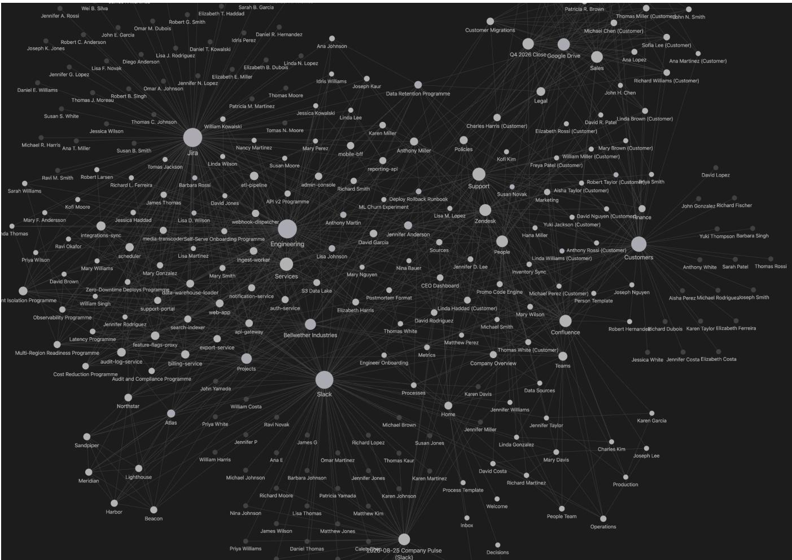

# Generating a Consistent Enterprise: Synthesis and Reference-Free Evaluation of Multi-System Business Data

Benjamin Gruenbaum Eon benji@eon.io

Roy Zavida Eon roei@eon.io

Doron Porat   
Eon   
doron.porat@eon.io   
Chen Dinachi   
Eon   
chen.dinachi@eon.io   
Assaf Natanzon   
Eon   
assaf@eon.io

Or Itzahary Eon or@eon.io

Omer Niv   
Eon   
omer.niv@eon.io

## Abstract

Synthetic relational data is normally produced by a model trained on a real dataset, and its quality is measured as the distance to that dataset. This paper describes a generator that has no real dataset at either end. Given an industry, a company size, a business model, a set of business applications, and a random seed, it produces a complete fictional enterprise: a workforce, a customer base, sales deals, support tickets, recorded calls, chat messages, and documents, all consistent with one another. One entity graph is projected into the native formats of 66 business products, so the same customer appears in the CRM, the support desk, and the call system under one identity. Because no real counterpart exists, realism is built in from cited reference statistics and verified by reference-free measurement: a five-axis scorecard of 28 statistical checks, an adversarial detector that hunts for the marks of synthetic generation, and a set of soundness checks that include a classifier test against an independently shufled copy of the data. Because these instruments existed before the generator was tuned, progress is measured under a fixed yardstick: over 23 generated companies, mean realism climbed from 60.3 to 99.1, the weakest company from 41.1 to 94.9, and the detector, which initially flagged 55.2% of all records, now flags none. The scores hold on a seed never used during development. A second generator builds relational databases from a list of business questions. It forces qualifying rows for each answerable question, adds controlled near misses, and computes exact labels from the finished tables. The generator runs as a hosted service at https://console.era.eon.io. A company built there to a specification is served through its simulators over MCP and REST, and the simulators are also published as container images for ofline use.

## 1 Introduction

Real enterprise data is confidential. A team building software over a company’s operational systems (its CRM, its support desk, its billing and communication platforms) cannot take a customer’s production records to test with, and the public substitutes are poor: vendor sandboxes hold a handful of demonstration records, and manually built test datasets cover one or two systems and go stale. LLM agents have sharpened this need, because an agent that reads many business systems at once has to be exercised on data that behaves like the data it will find once deployed [3].

The established route to synthetic data does not apply here. Learned generators such as the Synthetic Data Vault [11] and CT-GAN [16] train on a real dataset and imitate it, and quality is then scored by how closely the output matches that dataset statistically [5]. In our setting there is no dataset at either end. Every generated company is fictional by design and corresponds to no real one, and training on a customer’s records is exactly what confidentiality forbids. Both halves of the standard recipe, learning from a reference and evaluating against a reference, are unavailable.

This paper describes the data-generation system behind Era by Eon [3], built for this reference-free setting. A companion paper describes the agent benchmark that runs on top of the generated data; the present paper is about the generation itself. The system described here is publicly available. The hosted console at https://console.era.eon.io builds a company to a specification and serves it over MCP and REST, and each simulator is published as a container image for ofline use (Section 8). The system answers three questions.

First, how is a whole enterprise generated so that dozens of systems agree with one another? The generator produces one object, the entity graph, that holds everything true about the fictional company. Product simulators then project the graph: each stores only the portion its product would keep, expressed in that product’s native format, with record identifiers in the vendor’s real syntax. Consistency across systems is not synchronized; it is a consequence of determinism, because every simulator rebuilds the same graph from the same seed.

Second, where does realism come from when there is no dataset to imitate? The generator draws its distributions from a table of reference targets: named statistics about real business data, drawn from operational experience and published sources, with every target’s provenance recorded and unsourced targets marked as estimates. Volumes, values, timestamps, and text are shaped to these targets, and correlations that real data exhibits, such as larger accounts raising more tickets, are generated deliberately.

Third, how is the result evaluated without a reference? We use two instruments that need no paired real data. A realism scorecard tests the generated records against the reference targets along five axes and 28 checks. An adversarial detector searches the records for the known marks of synthetic generation, such as numbered name variants and timestamps that advance in identical steps. A further set of soundness checks verifies the data against its own declared design, including a classifier two-sample test [9] against an independently shufled copy of the data, which detects missing inter-column dependencies that marginal statistics cannot see [18].

The evaluation instruments predate the tuning of the generator, and every revision pass targeted whatever they reported as worst at that moment, so development doubles as a controlled experi ment. Across 23 generated companies, scored throughout by one fixed scorecard, mean realism moved from 60.3 to 99.1, the worst company from 41.1 to 94.9, and the detector’s flagged share from 55.2% to zero. Because all tuning happened on development seeds, a regression gate rescores every change on a seed never used dur ing development; the current worst company on that unseen seed scores 91, with no flagged records.

The paper makes four contributions: (1) the architecture of a deterministic generator that produces one consistent enterprise across 66 product formats from a five-value specification (Sections 3 and 4); (2) a question-conditioned generator that forces qualifying rows for a stated list of business questions and recomputes exact labels from the finished tables (Section 5); (3) a reference-free evaluation methodology combining realism targets, an adversarial detector, and design-adherence checks (Section 6); (4) a measured account of driving a generator from 60.3 to 99.1 under fixed instruments, including the failure patterns found along the way (Section 7). Section 8 describes how the generated companies can be used, through the hosted service and through the published simulator images.

## 2 Related work

Learned tabular synthesis. The Synthetic Data Vault [11] and CTGAN [16] established the train-and-imitate paradigm for tabular data, and the SDMetrics family measures quality by comparison with the training data. SyntheRela [5] benchmarks relational gener ators and finds that the sharpest test of synthetic data is whether a strong classifier can tell it from the real thing. Zhang [18] exposes a blind spot in the popular linear classifier two-sample test [9]: a table and a copy of it whose columns were shufled independently look nearly the same to it, so broken inter-column dependencies go unnoticed; a boosted-tree classifier does not share the blind spot. TabQueryBench [8] scores synthetic data by how many analytical queries it answers correctly. All of these assume a real dataset to learn from or compare against; we adopt their strongest tests, the boosted-tree classifier and query-level evaluation, and rework them for a setting with no reference.

Specification-driven generators. TPC benchmark generators [13] produce data from fixed schemas and analytic distributions, at any scale and with exact repeatability, but their uniformity and independence are exactly what makes them unrealistic. Hollywood [12] builds a synthetic film database and defends its realism by showing that it misleads a query optimizer’s cardinality estimates [10] about as badly as the real database does. Synthea [14] produces synthetic patient records whose clinical statistics come from published medical literature, and is the closest precedent for grounding a generator in cited statistics instead of training data. Our generator extends this line from one schema to a whole enterprise: many applications, one shared identity, correlated volumes, a business calendar, documents as real files, and free text.

Benchmark environments. Enterprise agent benchmarks such as �-bench [17], CRMArena [4], TheAgentCompany [15], and WorkArena [1] hand-build their environments, which bounds their size and their realism to what their authors could author. Text-to-SQL benchmarks showed that with real data, much of the dificulty comes from the data rather than the query language: BIRD [7] includes dirty values and unanswerable questions, and Spider 2.0 [6] moved evaluation to enterprise warehouses. We inject controlled doses of dirty values and generate labeled unanswerable questions at generation time.

## 3 One specification, one graph

## 3.1 The specification and the entity graph

The input to the generator is a five-value specification: an industry (one of ten, from e-commerce to manufacturing), a company size (one of six tiers, from 10 to 20,000 employees), a business model (B2B, B2C, or B2B2C), the set of business applications the company runs, and a random seed. From this specification the generator produces the entity graph: a single in-memory object that holds everything true about the fictional company. Its identity, its people, its customers, and every record of business activity live in this one graph. Every downstream artifact is a projection of it. Figure 1 shows the graph of one generated company, drawn from records read back through the running simulators.

Generation proceeds in dependency order, so that later records can reference earlier ones. The workforce comes first. An employee record carries a job-ladder position and a manager, a hire date sampled from realistic tenure curves, an employment type, and a home country that brings its own holidays and working hours; the department mix follows the company’s size and growth stage. A fraction of the workforce has already departed, and the records those people created stay behind under an owner who no longer exists. The customer base comes next, assigned to sales representatives as territories, and business activity grows around it: contacts, then deals carrying their complete stage history, then documents, chat trafic, support tickets, recorded calls, and campaigns. A ticket’s requester is therefore always a contact of a real account, and the owner of a deal is always a member of the sales team.

The graph also carries the texture of a company that has actually been operating. The CRM contains typographical duplicates. A long list of prospect accounts that never became customers sits beside the real customer book. Service accounts that belong to software rather than people appear among the users. Knowledge-base articles are written from the company’s own tickets, and the company runs infrastructure of its own, with services that deploy and occasionally fail. These imperfections are generated deliberately, at a controlled rate, because software that runs on enterprise data must survive them.

## 3.2 Determinism by construction

The same specification and seed produce the identical company, byte for byte, on any machine. Everything else in the system leans on this property. It is how 66 independent simulators serve one consistent company without ever exchanging data, and it is how a generated corpus can be committed to a repository and checked in continuous integration by regenerating it and comparing bytes.

  
Figure 1: The entity graph of one generated company, Bellwether Industries, drawn from records read back through the simulators’ MCP tools. Each node is one entity: an employee, a customer, a team, a project, a service, or a business system such as the issue tracker or the chat workspace. Each edge is a reference between two records. Every system’s records connect back to the same people and accounts, because all systems are projections of this one graph.

Plain determinism is easy. The hard part is keeping the output stable while the generator’s code keeps changing. A pseudo-random generator hands out numbers in a fixed order, so every value depends on how many values were drawn before it. If the whole generator shared one stream of numbers, any code change that adds a single extra draw would shift every draw after it. Add one attribute to employees, and every customer name, ticket timestamp, and call transcript drawn later would change. The corpus dif would be enormous and would say nothing about what the change actually did.

Two mechanisms keep changes contained.

The first works at the level of subsystems. The generator is organized into subsystems, each building one aspect of the company: who the customers are, which of them left, what the chat rooms say, what sits in the file drive. A subsystem is an aspect of the graph, not a product. There is no call-recorder generator and no CRM generator. A recorded call is generated once, in the graph, and the call system and the CRM each project that same call (Section 4).

Each subsystem gets its own random generator, called its stream, freshly seeded at the subsystem’s start with the company seed combined with a fixed constant for that subsystem (seed ⊕ ��). One number still determines the whole company, but no subsystem continues another’s sequence, so no subsystem’s values depend on how many draws another made. There are 21 subsystems, each with its own stream: identity (names, addresses, domains), structure (how many of everything), distribution (amounts and durations), temporal (timestamps), lifecycle (stage histories), correlation (cross-field coupling), content (text), geography, customers, retention, journey, attributes, time-of, segment, prospecting, hygiene, imperfection, chat, desk, support, and drive.

The isolation applies to randomness, not to data. Generation runs in dependency order, and each subsystem reads what earlier subsystems produced. Customers illustrate this. The generated company sells to other companies. Each customer is stored in the graph as a single record: a company name, a web domain, an industry, and the contact people who work there. Deals, tickets, calls, and files all refer to these records. When the call subsystem runs, the customer records already exist. It reads them as input and uses randomness only for its own decisions: which calls take place, at what times, between which participants, and with what content. A call refers to a customer record; it never draws that record’s contents anew. A change to the customer names therefore appears in every call that mentions a customer, because calls are built from the customer records. The reverse cannot happen: no change to call generation can afect which customers exist or how they are named, because those values come from random draws that the call subsystem never touches.

Stream boundaries are placed where one aspect must hold still while another varies. Who the customers are has its own stream, so resizing any simulator’s data cannot change the set of customer records. Which customers have left the company has its own stream, so the CRM, the support desk, and the file store all name the same departed customers. Prospects have their own stream because of their number. A prospect is a potential customer that never bought anything; sales teams import them as purchased lists, and they make up most of the accounts in a real CRM. The generator creates about ten of them per customer, which costs more random draws than anything else in the graph, so on a shared stream any change to their number would shift everything drawn after them.

The second mechanism works at the level of single values, inside a subsystem. A fine-grained value is not drawn from a running sequence at all. It gets its own tiny generator, seeded by a key that says what the value is for: the purpose, the company seed, and the record it belongs to. One sales representative’s call volume, for example, comes from the key call-load/seed/rep. Such a value depends only on the seed and on which record it belongs to. What was generated before it, and in what order, does not matter. New record types and new attributes can therefore be added without moving a single existing value.

Together the two mechanisms bound what a change can touch. Data still flows downstream: change how customers are generated, and every record that quotes a customer changes with it, a call transcript that names one, a ticket filed by one of its contacts. What cannot happen is unrelated churn, because no other subsystem’s random draws have moved. The same calls still happen at the same times between the same participants; only the quoted customer details difer. The regeneration dif therefore contains the changed records and the records that reference them, and nothing else.

Time is pinned the same way. No timestamp is read from the wall clock. Every date is measured backward from one configured anchor, the company’s “today”, and holidays and quarter ends are computed by rule from the anchor’s year. With the anchor pinned to a fixed date, regenerating a year later reproduces the identical company; this is how the committed corpus and the test suites run. In the published simulator images (Section 8), the seed and the anchor are set by the environment variables SIMCORE\_SEED and SIMCORE\_TODAY. A test that asserts an exact record count keeps passing as long as both values and the image tag are pinned. With the anchor set to track the calendar day, a live deployment stays current: the whole history slides forward one day per day and stays internally consistent, because every date keeps its distance from the anchor.

Table 1: The reference targets. Each target is a named statistic with recorded provenance; “estimate” marks targets for which no source was available.
<table><tr><td>Target</td><td>Kind</td><td>Provenance</td></tr><tr><td>Ticket priority mix</td><td>categorical</td><td>industry</td></tr><tr><td>Ticket status mix</td><td>categorical</td><td>industry</td></tr><tr><td>Ticket channel mix</td><td>categorical</td><td>industry</td></tr><tr><td>Deal stage outcome mix</td><td>categorical</td><td>industry</td></tr><tr><td>Lead source mix</td><td>categorical</td><td>estimate</td></tr><tr><td>Call sentiment mix</td><td>categorical</td><td>estimate</td></tr><tr><td>Deal amount distribution</td><td>shape</td><td>industry</td></tr><tr><td>Account employee counts</td><td>shape</td><td>industry</td></tr><tr><td>Call duration distribution</td><td>shape</td><td>estimate</td></tr><tr><td>Deals per account</td><td>count</td><td>structural</td></tr><tr><td>Tickets per account</td><td>count</td><td>structural</td></tr><tr><td>Contacts per account</td><td>count</td><td>structural</td></tr><tr><td>Timestamp calendar structure</td><td>temporal</td><td>industry</td></tr></table>

## 3.3 Realism from reference targets

The generator is not trained on any dataset. Instead, it reads its numbers from a table of reference targets. A reference target is one named statistic about real business data, for example how ticket priorities are distributed, or how deal sizes are distributed. The table records where each number comes from. Seven targets come from published industry statistics and from operational experience. Three describe only the shape a distribution should have, such as a few accounts holding most of the deals. Three could not be sourced and are marked as estimates (Table 1).

The same table drives both generation and evaluation. The generator draws its distributions from the targets, and the scorecard of Section 6 measures the finished data against the same targets, read from the same definition. The generator therefore cannot drift away from what the scorecard checks.

Real business data also contains flaws: duplicated records, empty fields, inconsistent spellings. The generator plants such flaws on purpose, at a fixed rate of 3% of records, so the data carries the flaws that software running on it must survive.

The reference targets determine the statistical character of each generated company. Ticket priorities follow observed support patterns, with roughly half of the tickets marked as normal and 8% as urgent. Deal amounts follow a long-tailed log-normal distribution whose scale changes with company size. For example, a mid-market B2B software company has a median deal amount of about \$48,000, while smaller and larger companies use lower and higher values. Activity is also unevenly distributed. A small number of customers account for much of the sales and support activity, while many customers have only occasional records.

Realism also depends on relationships between fields. Larger customers tend to open more support tickets. Customers with unresolved urgent tickets have a higher risk of not renewing. The sentiment of a sales call is related to the eventual outcome of the deal. The generator creates these relationships explicitly, and Section 6 checks whether they appear in the finished data.

Generated events follow the working patterns of the people involved. In the current reference model, 78% ofevents occur during local business hours and 6% occur on weekends. Activity increases near the end of each quarter. Events also respect causal order, so a call about a deal cannot occur before the deal has opened.

The generator assigns a single topic to each business event and uses it throughout the related text. A ticket subject agrees with its body, and a call transcript remains consistent with the corresponding deal notes. Templates combine common business language with vocabulary from the selected industry. Across the corpus, vocabulary grows with the amount of generated text instead of repeating a small fixed set of phrases.

The generation process remains practical at large scales. A com pany with 20,000 employees and approximately 250,000 records takes about nine minutes to generate and occupies about 25 MB on disk.

## 4 Projection into 66 product formats

## 4.1 Simulators as projections

Once the entity graph has been generated, each simulator converts the relevant parts of the graph into the records used by one business product. A simulator is a service that reproduces that product’s interface and data model. It answers the vendor’s own REST API, with the vendor’s query language and authentication header, and exposes the same operations as an MCP server, so an agent written against the real product can be pointed at the simulator instead. The system currently includes 66 simulators, covering products such as Salesforce, Zendesk, HubSpot, Slack, Jira, Gong, Stripe, Google Drive, and Amazon S3. The simulators do not exchange records with one another. Each independently rebuilds the company graph from the specification and seed, or loads a previously generated copy, then selects the records its product would store. This gives every product a diferent view of the company while keeping shared entities and events consistent across products.

Each simulator exposes only the information that its product would normally contain. For example, Gong stores a recorded sales call with its participants and full transcript. Salesforce stores the same call as an activity linked to the corresponding customer, contact, and deal. Both records come from the same call in the entity graph, so they agree on the participants, time, and customer even though their fields difer. Product-specific records remain in the appropriate systems. A duplicate customer created by a CRM dataentry error appears in the CRM but not in Gong, while potential customers appear only in products that maintain customer lists.

The company specification includes a portfolio, which lists the business applications the company uses. The portfolio does not change the entity graph; the generator always builds the complete company. Instead, it controls what each simulator exposes. If the company does not use a particular product, that product’s simulator returns a valid but empty workspace. Records created by an integration appear only when both products are present. For example, Salesforce includes activities created by the Gong integration only when the portfolio includes Gong. Without Gong, the calls still exist in the entity graph, but Salesforce contains no Gong-specific records. Companies generated with the same industry, size, business model, and seed therefore retain the same people, customers, deals, calls, and tickets even when their application portfolios difer.

## 4.2 Shared and vendor-shaped identifiers

The entity graph assigns one internal identifier to each person, customer, and business event. Most simulators expose these shared identifiers by default. The same person or event can therefore be recognized directly across products. Simulators also publish a stable, opaque identity key in fields intended for external identities. That key provides a second way to reconcile records without relying on names or email addresses.

Some vendor clients enforce their own identifier syntax. For these clients, a simulator can replace the shared identifier with a vendor-shaped identifier. This mode is optional and has not been adopted by every simulator. When it is enabled, the identifier is a deterministic function of the company, graph identifier, and vendor format. The simulator checks the complete identifier set for collisions, resolves any collision by deterministic re-probing, and keeps a reverse mapping to the graph identifier.

Cross-product joins therefore use the identity information that each product exposes: shared identifiers in the default mode, the stable external identity key, or an email address when email is the product’s native identity. Vendor-shaped identifiers remain specific to the product that issued them.

## 4.3 Documents as real files

The generator creates recognizable business documents rather than generic text files. Each document follows a template for a specific purpose. Examples include security reviews, renewal proposals, pricing worksheets, data-processing agreements, migration runbooks, employee records, and support summaries. The template determines the expected sections and structure. A security review contains findings, severities, owners, and a decision. A migration runbook contains prerequisites, execution steps, rollback instructions, and verification checks. A pricing worksheet contains line items whose values add up to the associated deal amount.

Document content is tied to the entity graph. The author is an employee from the generated company. Customer names, contacts, domains, deal values, support tiers, and dates come from the records associated with the file. A renewal proposal therefore names the same customer and deal that appear in the CRM. Its commercial values agree with that deal. The corresponding pricing worksheet uses those values in its calculations. Local details that do not appear elsewhere in the graph are generated from the file identifier. This keeps shared facts consistent while allowing documents about diferent customers to contain diferent findings, risks, clauses, and action items.

The templates contain several alternative passages and data patterns. The file identifier selects among them and controls their order. This produces variation without breaking reproducibility. Some document types also contain fictional sensitive values in realistic formats, such as payment-card numbers, national identifiers, bank accounts, and access keys. These values use documented test ranges or markers, so they resemble the data found in enterprise files without belonging to a real person or account.

The renderer converts this content into valid DOCX, XLSX, and PDF files. Tables remain tables in spreadsheets, while headings and paragraphs retain document structure in Word files. Fixed archive metadata and timestamps make the resulting bytes deterministic. The same file can therefore appear unchanged in Amazon S3, Google Drive, Box, Dropbox, and SharePoint. Text and Ofice documents receive the full business-content model. Images, audio, and video are currently valid deterministic files with simpler generated content.

## 5 Question-conditioned database generation

Alongside the 66 product simulators, Era by Eon includes a second generator for tables used by a company’s own applications and analytics systems. These additional tables have schemas defined by the company’s information needs rather than by a software vendor. They are generated separately from the product projections and may form one database or several related databases.

Business questions are supplied as input rather than generated from an existing schema. The person configuring a dataset writes them in a text file, with one question per line. The questions may ask for filtered records, aggregates, temporal comparisons, or the absence of a related record. Examples include “Find all contracts that expire in the next 90 days,” “What is the total contract value for each customer?” and “Which customers have unpaid invoices older than 30 days?”

The language model reads the complete question set and infers the entities and relationships needed to answer it. These examples require related tables for customers, contracts, and invoices. Contract expiration dates support the first question. Contract values and customer relationships support the second. Invoice dates and payment status support the third. The resulting output contains the database schemas, populated tables, and exact answers computed from those tables. It also identifies questions that the generated databases cannot answer and records the missing table or column.

Designing the database. A language model is used only during the design phase. It reads the questions, identifies the business domain, and proposes the databases and entities needed to answer them. It then produces a concrete schema. Each column has a type and a generation plan that describes its domain, distribution, null rate, and relationships. Each question is linked to the tables, joins, filters, and aggregation needed to answer it.

The proposed design passes through deterministic validation and repair. The validators check keys, references, table dependencies, column domains, and the instructions associated with each question. Mechanical mistakes are repaired in code. A design that remains invalid or produces poor data is returned to the language model with specific feedback. The number ofredesign attempts is bounded, and the best valid design is retained. Once this phase is complete, the language model is no longer used.

The schema is created once for each question list. It is not created for every fictional customer, and the random seed is not an instruction to the language model. During the design run, however, the pipeline populates each candidate schema using the selected seed and measures the quality of the resulting data. This score can afect which candidate schema is retained.

The language-model phase is not deterministic. Running the complete pipeline again may produce a diferent schema, even with the same questions and seed. The accepted application description and data model are therefore saved with the generated dataset. Exact regeneration starts from this stored data model. Given the stored model and the same seed, the seeded generator reproduces the same rows and labels. A diferent seed changes the rows and labels while leaving the stored schema unchanged.

The design may also contain questions that the database cannot answer. Each such question must name the missing table or column. The validator accepts the question only when that information is absent from the final schema. This makes the absence verifiable from the database design itself.

Generating the rows. Seeded code fills the tables in dependency order, creating referenced rows before the rows that point to them. It then forces a chosen number of rows to satisfy the conditions of each question. This operation, called planting, ensures that an answer does not become empty merely by chance.

For questions with at least two conditions on the same table, the generator also creates near-miss rows. Each row satisfies all but one of those conditions. Consider a question about failed jobs in Europe that have not been deleted. One near miss may describe a failed European job that was deleted, while another may describe an undeleted failed job in a diferent region. These rows ensure that each tested condition changes the result.

Controlled data flaws are added after the tables have been populated. They include inconsistent capitalization, extra whitespace, and placeholder text. Key columns, relationship columns, and columns used to compute an answer are protected from these changes. The result contains realistic imperfections without breaking the relationships or labels that define the dataset.

Computing the labels. The generator executes every question against the completed tables. This final query result becomes the stored label. It includes both the rows created for the question and any other rows that happen to satisfy the same conditions. Each label also records how it should be compared. Lists are treated as sets unless their order matters, mappings are compared by key, and fractional values include a numeric tolerance.

Generating successive days. A day state is one snapshot of a generated database. Each new day starts from the previous snapshot and applies a deterministic set of changes. By default, the generator inserts rows equal to 5% of each table, updates another 5%, and deletes 2%. Updates change one mutable field and leave keys and references intact. A deletion uses a soft-delete field when the schema provides one; otherwise, a row is removed only when no other row references it. The generator records which rows were inserted, changed, or removed and recomputes all labels for the new snapshot.

## 6 Evaluation without a reference

Most synthetic-data evaluation compares generated records with the real dataset used to train the generator [5, 11]. Era by Eon has no such dataset. Its checks use three sources of evidence instead: the generation plan, transformations of the generated rows, and the reference targets in Section 3.3. The checks in Section 6.1 apply to the question-conditioned databases. The scorecard and detector in the following sections apply to the enterprise entity graph.

## 6.1 Checks against the generation plan

Plan adherence. Every column plan states what the finished column should contain. It defines the allowed categories or numeric range, the expected share of missing values, and any intended distribution or relationship. After generation, the rows are checked against those declarations. The check reports values outside their domain, unexpected missing values, absent categories, incorrect distribution shapes, and relationships whose number of child records falls outside the planned range.

Question specificity. Every condition in a question should affect its answer. The system tests this by executing modified versions ofthe question against the finished data. These versions remove one condition, omit a join, ignore deletion status, or aggregate all rows without filtering. If a modified question returns the same answer, the generated rows do not make the omitted condition meaningful. The question is then reported for redesign or new planting.

Label integrity. Each answerable question has a stored label: the answer recomputed from the completed tables. Mechanical checks verify that this answer is unique and can be compared fairly. For a question asking for the ten largest contracts, the tenth and eleventh contracts must not have the same value. Otherwise, two diferent lists could both be correct. Fractional answers, such as averages, must include a numerical tolerance to allow for rounding. The checks also flag questions that contain their own answer and pairs of questions that produce the same nontrivial answer.

Dependency structure. Matching each column separately does not ensure that values are combined realistically within a row. A generated table might contain the intended mix of small and large customers and the intended distribution of deal values, yet assign deal values independently of customer size. Both columns would look correct on their own, but the expected relationship between them would be missing. The system tests for this problem by independently shufling every column. Shufling preserves each column’s values and frequencies while removing relationships be tween columns. A boosted-tree classifier then tries to distinguish the original rows from the shufled rows. If it cannot, the intended relationships are not visible in the generated data [9, 18].

Cardinality-estimation error. We use cardinality estimation as a second measure of structure in the generated tables. For each query, we first compute the exact number of matching rows. We then estimate the same number under two simplifying assumptions: values are uniformly distributed, and conditions on diferent columns are independent. We report the diference as q-error [10], defined as the ratio between the larger count and the smaller count. A q-error of one indicates an exact estimate, while a value of four indicates a fourfold error. Large errors arise when values are unevenly distributed or when columns are related. The test therefore determines whether the generated tables contain statistical structure that an independent, uniform model cannot capture. It requires no real reference dataset because both the estimate and the exact count are computed from the generated tables [12].

## 6.2 The realism scorecard

The scorecard turns the properties described in Section 3.3 into measurable results. It runs after the entity graph has been completed. Its 28 checks are divided into five groups. Each check compares the generated data with a reference value, an acceptable range, or a consistency rule.

F1: individual fields. These checks examine the values in one field. For a categorical field, such as ticket priority, the scorecard calculates the percentage of records in each category and compares those percentages with the reference distribution. For a numerical field, such as deal value, it measures the spread of the values. This reveals fields whose average is plausible but whose values are too similar. The group contains eight checks covering tickets, deals, calls, and customer-company sizes.

F2: relationships between fields. These checks measure whether two related fields change together. For customer size and deal value, the scorecard ranks customers and deals from smallest to largest and compares the two rankings. It uses the same method for urgent tickets and renewal risk. For call sentiment, it compares the percentage of positive calls associated with successful deals with the percentage associated with other deals. Additional checks examine negative customer ratings and the relationship between employee count and revenue. Each relationship must be visible without becoming an exact formula.

F3: time. These checks begin by converting every event to the local time of its customer. The scorecard then measures the percentage of events that occur during business hours and on weekends. It also counts repeated timestamps and measures whether the intervals between events vary. The final check examines related events in pairs and calculates the percentage that appear in the correct order. A ticket response, for example, must occur after the ticket was created.

F4: distribution across customers. The scorecard counts the deals, tickets, and contacts associated with every customer. It sorts the customers by each count and calculates the share held by the busiest 10%. That share is compared with the reference value. Deals, tickets, and contacts are measured separately, producing three checks.

F5: text. These checks count distinct ticket subjects, messages, and transcript lines. They measure how many tickets contain a description and how many contain comments. Vocabulary size is evaluated relative to the total amount of text, so larger datasets are expected to contain more distinct words. The final check reads each ticket as one record and verifies that its subject, description, and comments refer to the same issue.

Each check requires enough records to support its calculation. A check with too little data is marked as unmeasured and is excluded from the score. The report also states how many checks ran. This prevents a score based on a small subset of the data from appearing complete.

The development process uses fixed seeds for tuning, which creates a risk of overfitting to those companies. Continuous integration therefore scores every company on a separate seed that was not used during development and rejects changes that fall below the required score.

## 6.3 The adversarial detector

The scorecard measures properties for which a reference value or consistency rule has been defined. The adversarial detector per forms a diferent test. It searches the completed entity graph for simple patterns that reveal how the data was generated.

For example, generated names may repeat with a diferent num ber appended to each copy. Categories may appear in almost identical proportions because values were assigned in a fixed cycle. Timestamps may all be equal or separated by perfectly regular intervals. Every customer may also receive exactly the same number of contacts, deals, or tickets.

Other patterns appear in text and numerical fields. The detector finds sentences repeated across many records, tickets with no description, and fields that contain the same value throughout the dataset. It also finds deal values confined to an unusually narrow range.

For every detected pattern, the report identifies the afected records and provides representative examples. It also reports the percentage of records afected by at least one pattern. A value of zero means that none of the patterns covered by the detector was found. It does not prove that the generated data is indistinguishable from real enterprise data.

## 7 Results

## 7.1 Measured improvement under fixed instruments

We used a paired experiment to measure the efect of the realism mechanisms. We selected 23 fixed company specifications covering ten industries and six company sizes. Each specification was generated twice with the same random seed. The realism profile was the only setting that changed between the two runs.

The first run used the legacy profile. This compatibility mode reproduces the generator’s behavior before the realism mechanisms were added. It uses uniform or fixed record counts, independent field values, simple timestamp patterns, and a small collection ofrepeated text templates. The second run enabled the complete realism profile. It uses the reference distributions, uneven record counts, local business calendars, causal event sequences, relationships between fields, varied text, plausible identities, and cross-system customer histories.

We evaluated both versions with the same final scorecard and adversarial detector. Because each pair used the same company specification and seed, the comparison isolates the efect of the realism profile from diferences in industry, company size, or random input.

The mean overall score rose from 60.3 to 99.1, and the lowest company score rose from 41.1 to 94.9. The largest gains appeared in structural and content quality. Under the legacy generator, customers had similar numbers of related records and text repeated across the corpus. The revised generator produced concentrated relationship counts and much greater text variety.

The detector found 137 artifacts in the legacy companies. These included 40 cases of identical relationship counts, 33 cases of evenly spaced timestamps, 23 cases of missing text, 21 cases of constant timestamps, and 13 fields with nearly uniform category frequencies.

Table 2: Realism scores of 23 generated companies under one fixed scorecard, before and after the generator revisions. Overall values include all 23 companies. Axis means include only companies with enough data to score that axis: F1 uses 5 companies in each version, F2 uses 5 original and 7 revised companies, F3 and F5 use all 23, and F4 uses 4. Each axis scores 0–100.
<table><tr><td></td><td>Original</td><td>Revised</td></tr><tr><td>F1 marginal</td><td>63.6</td><td>97.7</td></tr><tr><td>F2 joint</td><td>54.9</td><td>97.1</td></tr><tr><td>F3 temporal</td><td>83.2</td><td>99.7</td></tr><tr><td>F4 structural</td><td>36.6</td><td>93.9</td></tr><tr><td>F5 content</td><td>34.3</td><td>98.6</td></tr><tr><td>Overall (mean)</td><td>60.3</td><td>99.1</td></tr><tr><td>Overall (worst company)</td><td>41.1</td><td>94.9</td></tr><tr><td>Detector-flagged records</td><td>55.2%</td><td>0.0%</td></tr></table>

In total, 55.2% of legacy records were afected by at least one artifact. The detector found none in the revised companies. On the separate seed used by the continuous-integration gate, the lowest company score was 91 and no records were flagged.

## 7.2 What the instruments caught

Transcript repetition. One hyperscale company contained 74,167 transcript turns generated from only 42 fixed sentences. The most common sentence appeared 2,936 times, and a single call could combine unrelated subjects. The revised generator assigns one subject to each call and renders every turn from templates tied to that subject. The same company now contains 19,794 distinct utterances, and the most common sentence appears 631 times.

Small samples. Early versions of some scorecard checks measured sampling noise rather than generator quality. In one 12- customer company, the same correlation was 0.55 under one seed and −0.26 under another. The final scorecard uses rank correlations, minimum sample sizes, and wider tolerances for small samples. All legacy and revised results in Table 2 were recomputed with this final version.

Why both instruments are needed. The scorecard and detector examine the data in diferent ways. The scorecard summarizes statistical properties as numerical scores. The detector identifies specific records that contain known signs of automatic generation.

A company can receive strong statistical scores while still containing an obvious artifact. For example, adding sequential numbers to employee names does not change deal distributions, customer activity, or event timing, but it makes the generated origin easy to recognize. The detector reports those names directly.

The reverse can also occur. Customer activity may vary enough to avoid the detector’s rule for identical record counts, yet remain much more evenly distributed than the reference target. The structural score identifies this broader statistical problem.

Some failures, including repeated text and regularly spaced timestamps, are examined by both instruments. The scorecard measures how widespread the problem is, while the detector identifies the afected records. We therefore report both results. A high score cannot hide an obvious generation artifact, and an empty detector report cannot hide unrealistic statistical structure.

## 7.3 Corpus regeneration

The committed corpus contains 83 generated companies and occupies 2.0 GB. Sixty companies cover every combination of the ten industries and six size tiers, and the remaining 23 are individually specified companies. Continuous integration scores the generator on an unseen seed and fails if any company falls below the required fidelity score. A separate job regenerates the committed corpus and reports byte-level drift. This separates unintended drift from deliberate changes that require a new corpus release.

## 8 Availability

The generator and the simulators are available as a hosted service, Era by Eon, at https://console.era.eon.io [2]. A user describes a company with the specification of Section 3: an industry, a company size, and the set of business systems the company runs. The service generates the company and starts one simulator per selected system. Each simulator answers the vendor’s own REST API and the same operations over MCP, and the service issues one token per company, or one token scoped to a single system, with which an agent authenticates against them. A company can be built from the browser, from the era command-line tool, or through the console’s HTTP API and its own MCP server. Access is granted per account and is free for builders.

Every environment is synthetic, and no customer data is involved. The data plane is read-only. An agent reads the company but cannot write into it, so the company does not change under an agent that works in it. A hosted company is exposed at fixed day states: the company at inception, with empty systems; the company today, with its full history up to the anchor date; and the company one quarter later. Moving between day states regenerates the company from its specification, as described in Section 3.2.

For continuous integration, each simulator is also published as a container image on Docker Hub, under the erabyeon namespace, for example erabyeon/slack. An image runs ofline and answers MCP and REST on a local port. It builds its company from the seed and anchor date set in its environment, so several images composed together serve one consistent company without exchanging data, as Section 4 describes. Pinning the seed, the anchor date, and the image tag keeps the served company unchanged from one run to the next.

Because every environment is synthetic, the service is not a substitute for a staging system that carries real data. It is a place to build, test, and demonstrate software that reads enterprise systems before that software meets a customer’s records.

## 9 Limitations

The generator can only be as accurate as its reference targets. Ten of the thirteen targets have recorded provenance from industry statistics or structural knowledge, while three are marked as estimates. An incorrect target will produce an incorrect distribution, and a scorecard that reads the same target will not reveal the problem.

Generated text is based on seeded templates. The templates produce varied and internally consistent text, but they cannot reproduce the full range of style, ambiguity, error, and context found in human writing. A stronger detector may therefore distinguish the generated text from real business communication.

The reported evaluation compares two versions of the same generator. It does not establish how Era by Eon compares with other specification-driven generators. The detector has also not been calibrated against a large corpus of real enterprise records, because such records are the confidential data the system is designed to avoid.

## 10 Conclusion

Era by Eon generates a complete fictional company from a compact specification and a seed. A shared entity graph keeps people, customers, and business events consistent across 66 product simulators. Reference targets shape the distributions, relationships, timing, and text without training on confidential customer data.

The question-conditioned generator extends the same approach to company-specific databases. It turns business questions into a validated schema, deterministic generation plan, populated tables, and labels computed from the final rows. Successive day states add controlled change while preserving keys and relationships.

The evaluation uses the generation plan, transformed copies of the generated rows, and recorded reference targets in place of a paired real dataset. The measured comparison shows that these checks exposed problems in structure, timing, and text that simple field-level statistics missed. The result is reproducible multi-system enterprise data generated without access to customer records, with its statistical assumptions stated explicitly. The generated companies are available to others through the hosted service at https: //console.era.eon.io and through per-system container images for ofline use.

## References

[1] Alexandre Drouin, Maxime Gasse, Massimo Caccia, Issam H. Laradji, Manuel Del Verme, Tom Marty, Léo Boisvert, Megh Thakkar, Quentin Cappart, David Vazquez, Nicolas Chapados, and Alexandre Lacoste. 2024. WorkArena: How Capable are Web Agents at Solving Common Knowledge Work Tasks?. In Proceedings ofthe International Conference on Machine Learning (ICML).

[2] Eon. 2026. Era by Eon: Synthetic Companies for the Era of Agentic Builders. https://console.era.eon.io/. Accessed September 10, 2026.

[3] Benjamin Gruenbaum, Doron Porat, Assaf Natanzon, Roy Zavida, Chen Dinachi, and Or Itzahary. 2026. The Era by Eon Benchmark: A Generated Enterprise Estate with Exact Ground Truth for Benchmarking LLM Agents. arXiv preprint arXiv:2609.09853 (2026).

[4] Kung-Hsiang Huang, Akshara Prabhakar, Sidharth Dhawan, Yixin Mao, Huan Wang, Silvio Savarese, Caiming Xiong, Philippe Laban, and Chien-Sheng Wu. 2025. CRMArena: Understanding the Capacity of LLM Agents to Perform Professional CRM Tasks in Realistic Environments. In Proceedings of the Conference of the North American Chapter of the Association for Computational Linguistics (NAACL).

[5] Valter Hudovernik, Martin Jurkovič, and Erik Štrumbelj. 2024. Benchmarking the Fidelity and Utility of Synthetic Relational Data. arXiv preprint arXiv:2410.03411 (2024).

[6] Fangyu Lei, Jixuan Chen, Yuxiao Ye, Ruisheng Cao, Dongchan Shin, Hongjin Su, Zhaoqing Suo, Hongcheng Gao, Wenjing Hu, Pengcheng Yin, Victor Zhong, Caiming Xiong, Ruoxi Sun, Qian Liu, Sida Wang, and Tao Yu. 2025. Spider 2.0: Evaluating Language Models on Real-World Enterprise Text-to-SQL Workflows. In Proceedings ofthe International Conference on Learning Representations (ICLR).

[7] Jinyang Li, Binyuan Hui, Ge Qu, Jiaxi Yang, Binhua Li, Bowen Li, Bailin Wang, Bowen Qin, Ruiying Geng, Nan Huo, Xuanhe Zhou, Chenhao Ma, Guoliang Li, Kevin C.C. Chang, Fei Huang, Reynold Cheng, and Yongbin Li. 2023. Can LLM

Already Serve as a Database Interface? A Big Bench for Large-Scale Database Grounded Text-to-SQLs. In Advances in Neural Information Processing Systems.

[8] Shinan Liu, Jialin Zhang, Fenghao Dong, Yajie Zhou, and Vyas Sekar. 2026. TabQueryBench: A Query-Centric Benchmark for Synthetic Tabular Data. arXiv preprint arXiv:2607.03926 (2026).

[9] David Lopez-Paz and Maxime Oquab. 2017. Revisiting Classifier Two-Sample Tests. In Proceedings of the International Conference on Learning Representations (ICLR).

[10] Guido Moerkotte, Thomas Neumann, and Gabriele Steidl. 2009. Preventing Bad Plans by Bounding the Impact of Cardinality Estimation Errors. Proceedings of the VLDB Endowment 2, 1 (2009), 982–993.

[11] Neha Patki, Roy Wedge, and Kalyan Veeramachaneni. 2016. The Synthetic Data Vault. In Proceedings ofthe IEEE International Conference on Data Science and Advanced Analytics (DSAA). 399–410.

[12] Mihail Stoian, Andreas Kipf, and Ivan Iachnyk. 2026. Hollywood: Towards a Large Movie Dataset for Database Benchmarking. In Proceedings ofthe International Workshop on Applied AIfor Database Systems and Applications (AIDB)

[13] Transaction Processing Performance Council. 2022. TPC Benchmark H Standard Specification. https://www.tpc.org/tpch/.

[14] Jason Walonoski, Mark Kramer, Joseph Nichols, Andre Quina, Chris Moesel, Dylan Hall, Carlton Dufett, Kudakwashe Dube, Thomas Gallagher, and Scott McLachlan. 2018. Synthea: An Approach, Method, and Software Mechanism for Generating Synthetic Patients and the Synthetic Electronic Health Care Record. Journal ofthe American Medical Informatics Association 25, 3 (2018), 230–238.

[15] Frank F. Xu, Yufan Song, Boxuan Li, Yuxuan Tang, Kritanjali Jain, Mengxue Bao, Zora Z. Wang, Xuhui Zhou, Zhitong Guo, Murong Cao, Mingyang Yang, Hao Yang Lu, Amaad Martin, Zhe Su, Leander Maben, Raj Mehta, Wayne Chi, Lawrence Jang, Yiqing Xie, Shuyan Zhou, and Graham Neubig. 2024. TheAgentCompany: Benchmarking LLM Agents on Consequential Real World Tasks. arXiv preprint arXiv:2412.14161 (2024).

[16] Lei Xu, Maria Skoularidou, Alfredo Cuesta-Infante, and Kalyan Veeramachaneni. 2019. Modeling Tabular Data using Conditional GAN. In Advances in Neural Information Processing Systems.

[17] Shunyu Yao, Noah Shinn, Pedram Razavi, and Karthik Narasimhan. 2024. �- bench: A Benchmark for Tool-Agent-User Interaction in Real-World Domains. arXiv preprint arXiv:2406.12045 (2024).

[18] Jie Zhang. 2026. Measuring the Dependency Gap: Diagnosing Inter-Column Fidelity in Tabular Generative Models. arXiv preprint arXiv:2607.21636 (2026).