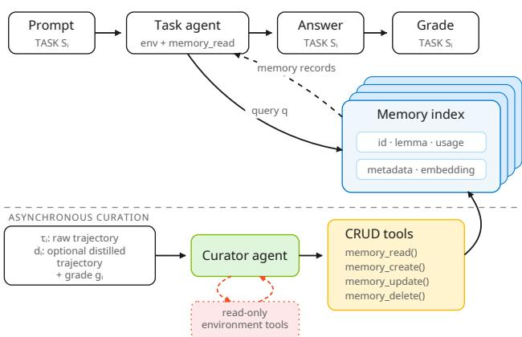
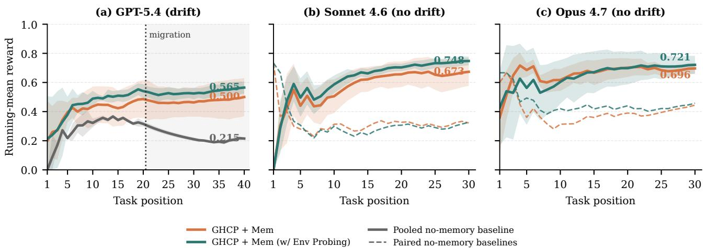
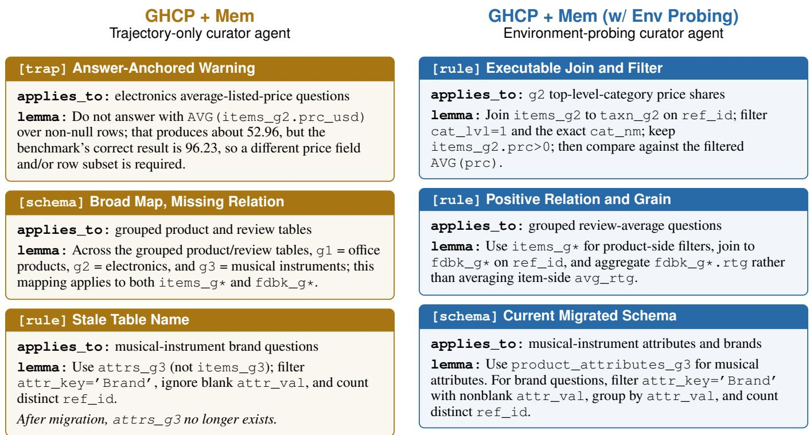

# Grounding Agent Memory: Environment-Probing Curation for Enterprise Agents

Susheel Suresh<sup>∗</sup>, Hazel Mak, Sahil Bhatnagar, Chhaya Methani, Alejandro Gutierrez Munoz

Mi<sub>croso</sub>ft C<sub>orpora</sub>ti<sub>on</sub> On<sub>e</sub> Mi<sub>c</sub>r<sub>oso</sub>ft W<sub>ay,</sub> R<sub>e</sub>dm<sub>o</sub>nd<sub>,</sub> WA 98052<sub>,</sub> USA

## Abstract

P<sub>ers</sub>i<sub>s</sub>t<sub>en</sub>t <sub>memory</sub> i<sub>s en</sub>t<sub>er</sub>i<sub>ng pro</sub>d<sub>uc</sub>ti<sub>on-or</sub>i<sub>en</sub>t<sub>e</sub>d <sub>agen</sub>t <sub>p</sub>l<sub>a</sub>t<sub>-</sub> f<sub>orms</sub> t<sub>o</sub> h<sub>e</sub>l<sub>p</sub> l<sub>ong-</sub>h<sub>or</sub>i<sub>zon agen</sub>t<sub>s accumu</sub>l<sub>a</sub>t<sub>e exper</sub>i<sub>ence</sub> <sub>across sess</sub>i<sub>ons.</sub> Y<sub>e</sub>t <sub>a pos</sub>t<sub>-</sub>t<sub>as</sub>k <sub>cura</sub>t<sub>or agen</sub>t <sub>res</sub>t<sub>r</sub>i<sub>c</sub>t<sub>e</sub>d t<sub>o</sub> completed trajectories can preserve errors, overgeneralize <sub>par</sub>ti<sub>a</sub>l <sub>ev</sub>id<sub>ence,</sub> <sub>or</sub> <sub>re</sub>t<sub>a</sub>i<sub>n</sub> <sub>s</sub>t<sub>a</sub>l<sub>e</sub> k<sub>now</sub>l<sub>e</sub>d<sub>ge.</sub> W<sub>e</sub> i<sub>n</sub>t<sub>ro</sub>d<sub>uce</sub> environment-probing curation, a deployment-compatible ext<sub>ens</sub>i<sub>on</sub> th<sub>a</sub>t <sub>g</sub>i<sub>ves</sub> <sub>an</sub> <sub>ex</sub>i<sub>s</sub>ti<sub>ng</sub> <sub>async</sub>h<sub>ronous</sub> <sub>cura</sub>t<sub>or</sub> <sub>agen</sub>t l<sub>eas</sub>t<sub>-</sub> <sub>pr</sub>i<sub>v</sub>il<sub>ege, rea</sub>d<sub>-on</sub>l<sub>y wor</sub>ld t<sub>oo</sub>l<sub>s</sub> t<sub>o c</sub>h<sub>ec</sub>k<sub>, scope, an</sub>d <sub>re</sub>f<sub>res</sub>h <sub>can</sub>did<sub>a</sub>t<sub>e memor</sub>i<sub>es.</sub> It <sub>requ</sub>i<sub>res no mo</sub>d<sub>e</sub>l <sub>re</sub>t<sub>ra</sub>i<sub>n</sub>i<sub>ng an</sub>d l<sub>eaves</sub> th<sub>e</sub> t<sub>as</sub>k <sub>agen</sub>t<sub>,</sub> <sub>re</sub>t<sub>r</sub>i<sub>ever,</sub> <sub>memory</sub> <sub>represen</sub>t<sub>a</sub>ti<sub>on,</sub> <sub>an</sub>d <sub>pro</sub>d<sub>uc-</sub> ti<sub>on wr</sub>it<sub>e au</sub>th<sub>or</sub>it<sub>y unc</sub>h<sub>ange</sub>d<sub>.</sub> I<sub>n a pro</sub>d<sub>uc</sub>ti<sub>on-</sub>lik<sub>e</sub> GitH<sub>u</sub>b Co<sub>p</sub>ilot (GHCP) harness built on its SDK, we com<sub>p</sub>are stateless execution, full in-context learning, GHCP + Mem, and GHCP + Mem (w/Env Probing) on CLBench database explo-<sub>ra</sub>ti<sub>on an</sub>d 90 <sub>a</sub>d<sub>ap</sub>t<sub>e</sub>d APEX <sub>managemen</sub>t<sub>-consu</sub>lti<sub>ng</sub> t<sub>as</sub>k<sub>s.</sub> On CLB<sub>e</sub>n<sub>c</sub>h<sub>, p</sub>r<sub>o</sub>bin<sub>g</sub> r<sub>a</sub>i<sub>ses pass</sub> r<sub>a</sub>t<sub>e</sub> fr<sub>o</sub>m 39% t<sub>o</sub> 73% <sub>a</sub>nd <sub>pass-</sub>di<sub>scoun</sub>t<sub>e</sub>d <sub>rewar</sub>d f<sub>rom</sub> 8<sub>.</sub>60 t<sub>o</sub> 22<sub>.</sub>60 <sub>w</sub>hil<sub>e re</sub>d<sub>uc</sub>i<sub>ng</sub> <sub>quer</sub>i<sub>es</sub> f<sub>rom</sub> 8<sub>.</sub>8 t<sub>o</sub> 4<sub>.</sub>7 <sub>per ques</sub>ti<sub>on an</sub>d t<sub>as</sub>k<sub>-agen</sub>t <sub>cos</sub>t f<sub>rom</sub> \$3.38 to \$1.68. Across six APEX worlds<sub>,</sub> all 18 memor<sub>y</sub>- <sub>versus-</sub>b<sub>ase</sub>li<sub>ne mean rewar</sub>d <sub>compar</sub>i<sub>sons are pos</sub>iti<sub>ve an</sub>d t<sub>as</sub>k<sub>-agen</sub>t t<sub>oo</sub>l <sub>ca</sub>ll<sub>s</sub> f<sub>a</sub>ll b<sub>y</sub> 16<sub>–</sub>75%<sub>; pro</sub>bi<sub>ng g</sub>i<sub>ves</sub> th<sub>e</sub> b<sub>es</sub>t t<sub>as</sub>k<sub>-agen</sub>t <sub>rewar</sub>d <sub>ga</sub>i<sub>n per</sub> d<sub>o</sub>ll<sub>ar</sub> i<sub>n</sub> fi<sub>ve wor</sub>ld<sub>s.</sub> P<sub>ro</sub>bi<sub>ng a</sub>l<sub>so</sub> <sub>a</sub>tt<sub>a</sub>i<sub>ns</sub> hi<sub>g</sub>h<sub>er mean rewar</sub>d th<sub>an</sub> GHCP + M<sub>em on</sub> b<sub>o</sub>th S<sub>onne</sub>t 4<sub>.</sub>6 <sub>an</sub>d O<sub>pus</sub> 4<sub>.</sub>7 <sub>w</sub>ith<sub>ou</sub>t <sub>sc</sub>h<sub>ema</sub> d<sub>r</sub>ift<sub>.</sub> E<sub>nv</sub>i<sub>ronmen</sub>t <sub>pro</sub>b<sub>-</sub> i<sub>ng</sub> th<sub>ere</sub>f<sub>ore</sub> t<sub>urns ex</sub>i<sub>s</sub>ti<sub>ng agen</sub>t<sub>-memory cura</sub>ti<sub>on</sub> i<sub>n</sub>t<sub>o an</sub> <sub>env</sub>i<sub>ronmen</sub>t<sub>-</sub>i<sub>n</sub>f<sub>orme</sub>d<sub>, au</sub>dit<sub>a</sub>bl<sub>e process w</sub>hil<sub>e preserv</sub>i<sub>ng a</sub> <sub>compac</sub>t t<sub>as</sub>k<sub>-</sub>ti<sub>me</sub> i<sub>n</sub>t<sub>er</sub>f<sub>ace.</sub>

## 1 Introduction

Lar<sub>g</sub>e lan<sub>g</sub>ua<sub>g</sub>e model (LLM) a<sub>g</sub>ents are movin<sub>g</sub> be<sub>y</sub>ond b<sub>oun</sub>d<sub>e</sub>d t<sub>as</sub>k <sub>execu</sub>ti<sub>on</sub> t<sub>owar</sub>d <sub>sus</sub>t<sub>a</sub>i<sub>ne</sub>d <sub>wor</sub>k <sub>across ses-</sub> <sub>s</sub>i<sub>ons:</sub> i<sub>mp</sub>l<sub>emen</sub>ti<sub>ng</sub> f<sub>ea</sub>t<sub>ures</sub> i<sub>n evo</sub>l<sub>v</sub>i<sub>ng co</sub>d<sub>e</sub>b<sub>ases, ana</sub>l<sub>yz-</sub> i<sub>ng en</sub>t<sub>erpr</sub>i<sub>se</sub> d<sub>a</sub>t<sub>a, an</sub>d <sub>suppor</sub>ti<sub>ng cus</sub>t<sub>omers</sub> th<sub>roug</sub>h <sub>ex</sub>t<sub>er-</sub> <sub>na</sub>l <sub>app</sub>li<sub>ca</sub>ti<sub>ons.</sub> S<sub>uccess</sub> d<sub>epen</sub>d<sub>s</sub> <sub>on</sub> <sub>accumu</sub>l<sub>a</sub>ti<sub>ng</sub> f<sub>ee</sub>db<sub>ac</sub>k <sub>an</sub>d<sub>,</sub> <sub>espec</sub>i<sub>a</sub>ll<sub>y,</sub> k<sub>now</sub>l<sub>e</sub>d<sub>ge</sub> <sub>o</sub>f th<sub>e</sub> l<sub>a</sub>t<sub>en</sub>t <sub>env</sub>i<sub>ronmen</sub>t <sub>s</sub>t<sub>ruc-</sub> t<sub>ure s</sub>h<sub>are</sub>d <sub>across re</sub>l<sub>a</sub>t<sub>e</sub>d t<sub>as</sub>k<sub>s.</sub> St<sub>a</sub>t<sub>e</sub>l<sub>ess execu</sub>ti<sub>on</sub> di<sub>scar</sub>d<sub>s</sub> trajectories, observations, discoveries, and missteps at ev-<sub>ery</sub> <sub>sess</sub>i<sub>on</sub> b<sub>oun</sub>d<sub>ary,</sub> <sub>preven</sub>ti<sub>ng</sub> <sub>exper</sub>i<sub>ence</sub> f<sub>rom</sub> i<sub>mprov</sub>i<sub>ng</sub> subsequent work (Asawa et al. 2026; He et al. 2026).

A <sub>na</sub>t<sub>ura</sub>l <sub>reme</sub>d<sub>y</sub> i<sub>s</sub> <sub>ex</sub>t<sub>erna</sub>l <sub>memory,</sub> <sub>w</sub>ith th<sub>ree</sub> <sub>core</sub> <sub>op-</sub> <sub>era</sub>ti<sub>ons: crea</sub>t<sub>e recor</sub>d<sub>s</sub> f<sub>rom pr</sub>i<sub>or</sub> i<sub>n</sub>t<sub>erac</sub>ti<sub>ons, up</sub>d<sub>a</sub>t<sub>e</sub> th<sub>em</sub> <sub>as</sub> <sub>ev</sub>id<sub>ence</sub> <sub>accumu</sub>l<sub>a</sub>t<sub>es,</sub> <sub>an</sub>d <sub>reca</sub>ll <sub>re</sub>l<sub>evan</sub>t <sub>recor</sub>d<sub>s</sub> d<sub>ur</sub>i<sub>ng</sub> later execution (Hu et al. 2026; Park et al. 2023; Packer et al. 2023; Zhan<sub>g</sub> et al. 2025; Ou<sub>y</sub>an<sub>g</sub> et al. 2025). Desi<sub>g</sub>ns range from full-context trajectory replay, per-trajectory sum-<sub>mar</sub>i<sub>es, an</sub>d <sub>a mu</sub>t<sub>a</sub>bl<sub>e no</sub>t<sub>epa</sub>d t<sub>o querya</sub>bl<sub>e</sub> i<sub>n</sub>d<sub>exes.</sub> St<sub>ruc-</sub> t<sub>ure</sub>d <sub>recor</sub>d<sub>s, re</sub>l<sub>a</sub>ti<sub>ona</sub>l <sub>enco</sub>di<sub>ngs,</sub> hi<sub>erarc</sub>hi<sub>ca</sub>l ti<sub>ers, an</sub>d <sub>reason</sub>i<sub>ng-aware</sub> <sub>re</sub>t<sub>r</sub>i<sub>eva</sub>l <sub>ma</sub>k<sub>e</sub> th<sub>e</sub> l<sub>a</sub>tt<sub>er</sub> i<sub>ncreas</sub>i<sub>ng</sub>l<sub>y</sub> <sub>capa-</sub> ble (Chhikara et al. 2025; Xu et al. 2025; Kan<sub>g</sub> et al. 2025; Shu et al. 2026; Ji, Li, and Hooi 2026). These ideas are ent<sub>er</sub>i<sub>ng prac</sub>ti<sub>ca</sub>l <sub>agen</sub>t <sub>s</sub>t<sub>ac</sub>k<sub>s:</sub> Cl<sub>au</sub>d<sub>e</sub> M<sub>anage</sub>d A<sub>gen</sub>t<sub>s</sub><sup>1</sup> <sub>an</sub>d Mi<sub>croso</sub>ft C<sub>op</sub>il<sub>o</sub>t St<sub>u</sub>di<sub>o</sub><sup>2</sup> <sub>expose memory</sub> f<sub>ea</sub>t<sub>ures, w</sub>hil<sub>e</sub> M<sub>e</sub>m0 <sub>a</sub>nd Z<sub>ep suppo</sub>rt <sub>p</sub>r<sub>o</sub>d<sub>uc</sub>ti<sub>o</sub>n<sub>-o</sub>ri<sub>e</sub>nt<sub>e</sub>d m<sub>e</sub>m<sub>o</sub>r<sub>y wo</sub>rk<sub>-</sub> flows (Anthro<sub>p</sub>ic 2026a; Microsoft 2026c; Mem0 2026; Ze<sub>p</sub> 2026).

P<sub>ers</sub>i<sub>s</sub>t<sub>en</sub>t <sub>s</sub>t<sub>a</sub>t<sub>e a</sub>l<sub>one,</sub> h<sub>owever,</sub> d<sub>oes no</sub>t <sub>guaran</sub>t<sub>ee con-</sub> ti<sub>nua</sub>l l<sub>earn</sub>i<sub>ng.</sub> CLB<sub>enc</sub>h <sub>s</sub>h<sub>ows</sub> th<sub>a</sub>t <sub>memory can enco</sub>d<sub>e</sub> <sub>spur</sub>i<sub>ous genera</sub>li<sub>za</sub>ti<sub>ons an</sub>d <sub>s</sub>t<sub>a</sub>l<sub>e</sub> b<sub>e</sub>li<sub>e</sub>f<sub>s un</sub>d<sub>er env</sub>i<sub>ronmen</sub>t drift (Asawa et al. 2026); Xion<sub>g</sub> et al. (2026) identif<sub>y</sub> er-<sub>ror propaga</sub>ti<sub>on an</sub>d <sub>m</sub>i<sub>sa</sub>li<sub>gne</sub>d <sub>exper</sub>i<sub>ence rep</sub>l<sub>ay.</sub> P<sub>os</sub>t<sub>-</sub>t<sub>as</sub>k <sub>cu</sub>r<sub>a</sub>ti<sub>o</sub>n in M<sub>e</sub>m0<sub>,</sub> Cl<sub>au</sub>d<sub>e</sub> M<sub>a</sub>n<sub>age</sub>d A<sub>ge</sub>nt<sub>s</sub> Dr<sub>ea</sub>m<sub>s,</sub> ACE<sub>,</sub> R<sub>eason</sub>i<sub>ng</sub>B<sub>an</sub>k<sub>, an</sub>d R<sub>e</sub>M<sub>e opera</sub>t<sub>es over some com</sub>bi<sub>na</sub>ti<sub>on</sub> of existing records, completed trajectories, feedback, and usa<sub>g</sub>e si<sub>g</sub>nals (Chhikara et al. 2025; Anthro<sub>p</sub>ic 2026b; Zhan<sub>g</sub> et al. 2025; Ou<sub>y</sub>an<sub>g</sub> et al. 2025; Cao et al. 2026).

Thi<sub>s</sub> <sub>re</sub>t<sub>rospec</sub>ti<sub>ve</sub> <sub>ev</sub>id<sub>ence</sub> b<sub>oun</sub>d<sub>ary</sub> i<sub>s</sub> f<sub>un</sub>d<sub>amen</sub>t<sub>a</sub>ll<sub>y</sub> incomplete. A trajectory is a single, partial, and often <sub>m</sub>i<sub>s</sub>t<sub>a</sub>k<sub>e-</sub>l<sub>a</sub>d<sub>en o</sub>b<sub>serva</sub>ti<sub>on o</sub>f th<sub>e env</sub>i<sub>ronmen</sub>t<sub>.</sub> It<sub>s</sub> l<sub>emmas</sub> can (i) memorize an instance answer rather than its <sub>p</sub>rocedure, (ii) inherit an ineficient <sub>p</sub>ath, (iii) assert an unverifiable sco<sub>p</sub>e, (iv) leave blind s<sub>p</sub>ots in unvisited re<sub>g</sub>ions, or (v) <sub>g</sub>o <sub>s</sub>t<sub>a</sub>l<sub>e as</sub> th<sub>e wor</sub>ld <sub>c</sub>h<sub>anges.</sub> D<sub>e</sub>f<sub>err</sub>i<sub>ng ver</sub>ifi<sub>ca</sub>ti<sub>on</sub> t<sub>o</sub> t<sub>as</sub>k ti<sub>me</sub> f<sub>orces</sub> th<sub>e</sub> <sub>respon</sub>di<sub>ng</sub> <sub>agen</sub>t t<sub>o</sub> <sub>spen</sub>d <sub>scarce</sub> t<sub>oo</sub>l <sub>ca</sub>ll<sub>s</sub> <sub>rec</sub>h<sub>ec</sub>ki<sub>ng uncer</sub>t<sub>a</sub>i<sub>n memor</sub>i<sub>es ra</sub>th<sub>er</sub> th<sub>an</sub> di<sub>rec</sub>tl<sub>y so</sub>l<sub>v</sub>i<sub>ng</sub> th<sub>e curren</sub>t t<sub>as</sub>k<sub>.</sub>

We therefore propose environment-probing curation. Aft<sub>er eac</sub>h t<sub>as</sub>k<sub>,</sub> th<sub>e</sub> h<sub>arness</sub> i<sub>ns</sub>t<sub>an</sub>ti<sub>a</sub>t<sub>es a pos</sub>t<sub>-</sub>t<sub>as</sub>k <sub>cura</sub>t<sub>or</sub> <sub>agen</sub>t <sub>w</sub>ith <sub>memory</sub> CRUD<sub>;</sub> it <sub>rece</sub>i<sub>ves</sub> th<sub>e comp</sub>l<sub>e</sub>t<sub>e</sub>d t<sub>ra-</sub> jectory and grade after a non-writing distillation step, then <sub>uses rea</sub>d<sub>-on</sub>l<sub>y wor</sub>ld t<sub>oo</sub>l<sub>s</sub> t<sub>o c</sub>h<sub>ec</sub>k <sub>can</sub>did<sub>a</sub>t<sub>e c</sub>l<sub>a</sub>i<sub>ms,</sub> t<sub>es</sub>t th<sub>e</sub>i<sub>r scope across om</sub>itt<sub>e</sub>d <sub>s</sub>t<sub>a</sub>t<sub>es, re-enac</sub>t <sub>proce</sub>d<sub>ures, an</sub>d <sub>re</sub>f<sub>res</sub>h <sub>s</sub>t<sub>a</sub>l<sub>e en</sub>t<sub>r</sub>i<sub>es</sub> b<sub>e</sub>f<sub>ore wr</sub>iti<sub>ng.</sub> Thi<sub>s</sub> i<sub>s cons</sub>i<sub>s</sub>t<sub>en</sub>t <sub>w</sub>ith <sub>cons</sub>t<sub>ruc</sub>ti<sub>ve accoun</sub>t<sub>s o</sub>f <sub>ep</sub>i<sub>so</sub>di<sub>c memory, w</sub>h<sub>ere pr</sub>i<sub>or expe-</sub> <sub>r</sub>i<sub>ence</sub> i<sub>s recom</sub>bi<sub>ne</sub>d t<sub>o s</sub>i<sub>mu</sub>l<sub>a</sub>t<sub>e poss</sub>ibl<sub>e an</sub>d <sub>coun</sub>t<sub>er</sub>f<sub>ac</sub>t<sub>ua</sub>l events (Bartlett 1932; Schacter and Addis 2007; Schacter et al. 2012, 2015), and with interactive learnin<sub>g</sub>, where acti<sub>ng</sub> i<sub>n an env</sub>i<sub>ronmen</sub>t <sub>y</sub>i<sub>e</sub>ld<sub>s compe</sub>t<sub>ence unava</sub>il<sub>a</sub>bl<sub>e</sub> f<sub>rom</sub> <sub>p</sub>assive observation alone (Sukhbaatar et al. 2018).

  
Fi<sub>gure</sub> 1<sub>:</sub> A<sub>gen</sub>t <sub>ro</sub>l<sub>es an</sub>d t<sub>oo</sub>l b<sub>oun</sub>d<sub>ar</sub>i<sub>es</sub> f<sub>or</sub> t<sub>as</sub>k $S _ { i }$ <sub>.</sub> Th<sub>e</sub> h<sub>or</sub>i<sub>zon</sub>t<sub>a</sub>l d<sub>as</sub>h<sub>e</sub>d li<sub>ne separa</sub>t<sub>es sequen</sub>ti<sub>a</sub>l t<sub>as</sub>k <sub>execu</sub>ti<sub>on</sub> f<sub>rom async</sub>h<sub>ronous cura</sub>ti<sub>on.</sub> Th<sub>e</sub> t<sub>as</sub>k <sub>agen</sub>t <sub>uses env</sub>i<sub>ron-</sub> <sub>men</sub>t t<sub>oo</sub>l<sub>s</sub> <sub>an</sub>d <sub>rea</sub>d<sub>-on</sub>l<sub>y</sub> <sub>memory.</sub> Aft<sub>er</sub> t<sub>as</sub>k <sub>c</sub>l<sub>osure,</sub> th<sub>e</sub> curator agent receives raw trajectory $\tau _ { i } ,$ distilled trajectory $d _ { i }$ <sub>,</sub> <sub>an</sub>d th<sub>e</sub> <sub>gra</sub>d<sub>e;</sub> <sub>on</sub>l<sub>y</sub> th<sub>e</sub> <sub>cura</sub>t<sub>or</sub> <sub>agen</sub>t <sub>can</sub> <sub>wr</sub>it<sub>e</sub> <sub>memory.</sub> Th<sub>e</sub> <sub>re</sub>d d<sub>as</sub>h<sub>e</sub>d l<sub>oop</sub> <sub>mar</sub>k<sub>s</sub> <sub>rea</sub>d<sub>-on</sub>l<sub>y</sub> <sub>pro</sub>bi<sub>ng.</sub>

Th<sub>e mec</sub>h<sub>an</sub>i<sub>sm</sub> i<sub>s rea</sub>dil<sub>y</sub> i<sub>ncorpora</sub>t<sub>e</sub>d i<sub>n</sub>t<sub>o ex</sub>i<sub>s</sub>ti<sub>ng en</sub>t<sub>er-</sub> <sub>pr</sub>i<sub>se agen</sub>t<sub>s.</sub> It <sub>requ</sub>i<sub>res no re</sub>t<sub>ra</sub>i<sub>n</sub>i<sub>ng an</sub>d l<sub>eaves</sub> th<sub>e respon</sub>d<sub>-</sub> i<sub>ng agen</sub>t<sub>, re</sub>t<sub>r</sub>i<sub>ever, recor</sub>d <sub>represen</sub>t<sub>a</sub>ti<sub>on, an</sub>d <sub>pro</sub>d<sub>uc</sub>ti<sub>on</sub> <sub>wr</sub>it<sub>e au</sub>th<sub>or</sub>it<sub>y unc</sub>h<sub>ange</sub>d<sub>.</sub> Th<sub>e async</sub>h<sub>ronous cura</sub>t<sub>or agen</sub>t <sub>rece</sub>i<sub>ves on</sub>l<sub>y a</sub> l<sub>eas</sub>t<sub>-pr</sub>i<sub>v</sub>il<sub>ege, rea</sub>d<sub>-on</sub>l<sub>y su</sub>b<sub>se</sub>t <sub>o</sub>f <sub>ex</sub>i<sub>s</sub>ti<sub>ng</sub> connectors or MCP tools (Microsoft 2026d,b). Probes re-<sub>ma</sub>i<sub>n o</sub>f th<sub>e user-</sub>f<sub>ac</sub>i<sub>ng cr</sub>iti<sub>ca</sub>l <sub>pa</sub>th <sub>an</sub>d t<sub>as</sub>k b<sub>u</sub>d<sub>ge</sub>t<sub>,</sub> i<sub>n</sub>h<sub>er</sub>it <sub>p</sub>l<sub>a</sub>tf<sub>orm au</sub>th<sub>en</sub>ti<sub>ca</sub>ti<sub>on an</sub>d <sub>au</sub>diti<sub>ng, an</sub>d di<sub>sappear w</sub>ith<sub>ou</sub>t <sub>a</sub> <sub>sa</sub>f<sub>e</sub> <sub>rea</sub>d <sub>sur</sub>f<sub>ace.</sub> Fi<sub>gure</sub> 1 i<sub>so</sub>l<sub>a</sub>t<sub>es</sub> thi<sub>s</sub> b<sub>oun</sub>d<sub>ary:</sub> <sub>on</sub>l<sub>y</sub> th<sub>e async</sub>h<sub>ronous cura</sub>t<sub>or agen</sub>t <sub>ga</sub>i<sub>ns wor</sub>ld t<sub>oo</sub>l<sub>s.</sub> With th<sub>e</sub> t<sub>as</sub>k<sub>-</sub>ti<sub>me memory</sub> i<sub>n</sub>t<sub>er</sub>f<sub>ace an</sub>d CRUD lif<sub>ecyc</sub>l<sub>e</sub> fi<sub>xe</sub>d<sub>,</sub> i<sub>n-</sub> <sub>cremen</sub>t<sub>a</sub>l <sub>ga</sub>i<sub>ns</sub> <sub>measure</sub> <sub>wr</sub>it<sub>e-</sub>ti<sub>me</sub> <sub>ev</sub>id<sub>ence</sub> <sub>qua</sub>lit<sub>y</sub> <sub>ra</sub>th<sub>er</sub> th<sub>an</sub> <sub>a</sub>dd<sub>e</sub>d t<sub>as</sub>k<sub>-agen</sub>t <sub>capac</sub>it<sub>y.</sub>

In our <sub>p</sub>roduction-like GitHub Co<sub>p</sub>ilot (GHCP) harness, b<sub>u</sub>ilt <sub>on</sub> it<sub>s</sub> SDK<sub>, eac</sub>h t<sub>as</sub>k <sub>ge</sub>t<sub>s a</sub> f<sub>res</sub>h <sub>agen</sub>t <sub>sess</sub>i<sub>on w</sub>hil<sub>e</sub> <sub>a pers</sub>i<sub>s</sub>t<sub>en</sub>t i<sub>n</sub>d<sub>ex spans sess</sub>i<sub>ons an</sub>d <sub>ex</sub>t<sub>erna</sub>l t<sub>oo</sub>l<sub>s expose</sub> the environment (GitHub 2026). Both benchmarks mirror d<sub>ep</sub>l<sub>oye</sub>d <sub>en</sub>t<sub>erpr</sub>i<sub>se</sub> <sub>wor</sub>k<sub>:</sub> CLB<sub>enc</sub>h <sub>mo</sub>d<sub>e</sub>l<sub>s</sub> d<sub>a</sub>t<sub>a</sub> <sub>ana</sub>l<sub>y-</sub> <sub>s</sub>i<sub>s over evo</sub>l<sub>v</sub>i<sub>ng organ</sub>i<sub>za</sub>ti<sub>on-spec</sub>ifi<sub>c</sub> d<sub>a</sub>t<sub>a</sub>b<sub>ases; a</sub>d<sub>ap</sub>t<sub>e</sub>d APEX <sub>con</sub>t<sub>r</sub>ib<sub>u</sub>t<sub>es</sub> 90 <sub>consu</sub>lti<sub>ng-ana</sub>l<sub>ys</sub>t t<sub>as</sub>k<sub>s across s</sub>i<sub>x</sub> hetero<sub>g</sub>eneous document worlds (Asawa et al. 2026; Vid-<sub>g</sub>en et al. 2026). Environment <sub>p</sub>robin<sub>g</sub> raises CLBench <sub>p</sub>ass r<sub>a</sub>t<sub>e</sub> fr<sub>o</sub>m 39% t<sub>o</sub> 73%<sub>,</sub> r<sub>ewa</sub>rd fr<sub>o</sub>m 8<sub>.</sub>60 t<sub>o</sub> 22<sub>.</sub>60<sub>, a</sub>nd <sub>cu</sub>t<sub>s</sub> task-a<sub>g</sub>ent cost from \$3.38 to \$1.68. Across APEX<sub>,</sub> all 18 <sub>memory-versus-</sub>b<sub>ase</sub>li<sub>ne</sub> <sub>mean</sub> <sub>rewar</sub>d <sub>compar</sub>i<sub>sons</sub> <sub>are</sub> <sub>pos-</sub> iti<sub>ve</sub> <sub>an</sub>d <sub>pro</sub>bi<sub>ng</sub> <sub>g</sub>i<sub>ves</sub> th<sub>e</sub> b<sub>es</sub>t t<sub>as</sub>k<sub>-agen</sub>t <sub>rewar</sub>d <sub>ga</sub>i<sub>n</sub> <sub>per</sub> d<sub>o</sub>ll<sub>ar</sub> i<sub>n</sub> fi<sub>ve</sub> <sub>o</sub>f <sub>s</sub>i<sub>x</sub> <sub>wor</sub>ld<sub>s.</sub> O<sub>ur</sub> <sub>con</sub>t<sub>r</sub>ib<sub>u</sub>ti<sub>ons</sub> <sub>are</sub> <sub>a</sub> di<sub>ag-</sub> nosis of trajectory-only generalization failure, a deploymentcompatible propose–probe–commit curator agent, and a cost-<sub>aware eva</sub>l<sub>ua</sub>ti<sub>on s</sub>h<sub>ow</sub>i<sub>n</sub> th<sub>a</sub>t <sub>env</sub>i<sub>ronmen</sub>t<sub>-</sub>i<sub>n</sub>f<sub>orme</sub>d <sub>roce-</sub> d<sub>ures</sub> i<sub>mprove</sub> <sub>correc</sub>t<sub>ness</sub> <sub>w</sub>hil<sub>e</sub> <sub>e</sub>li<sub>m</sub>i<sub>na</sub>ti<sub>ng</sub> <sub>repea</sub>t<sub>e</sub>d <sub>env</sub>i<sub>-</sub> <sub>ronmen</sub>t <sub>exp</sub>l<sub>ora</sub>ti<sub>on.</sub>

## 2 Related Work

A<sub>gen</sub>t <sub>memory ex</sub>t<sub>en</sub>d<sub>s re</sub>t<sub>r</sub>i<sub>eva</sub>l<sub>-augmen</sub>t<sub>e</sub>d <sub>genera</sub>ti<sub>on</sub> f<sub>rom</sub> <sub>ex</sub>t<sub>erna</sub>l k<sub>now</sub>l<sub>e</sub>d<sub>ge corpora</sub> t<sub>o exper</sub>i<sub>ence accumu</sub>l<sub>a</sub>t<sub>e</sub>d b<sub>y</sub> the a<sub>g</sub>ent itself (Lewis et al. 2020; Hu et al. 2026). We focus <sub>on promp</sub>t<sub>-</sub>b<sub>ase</sub>d <sub>sys</sub>t<sub>ems</sub> th<sub>a</sub>t l<sub>eave mo</sub>d<sub>e</sub>l <sub>we</sub>i<sub>g</sub>ht<sub>s</sub> fi<sub>xe</sub>d <sub>an</sub>d <sub>organ</sub>i<sub>ze</sub> th<sub>e</sub> lit<sub>era</sub>t<sub>ure</sub> b<sub>y w</sub>h<sub>a</sub>t th<sub>ey a</sub>i<sub>m</sub> t<sub>o</sub> t<sub>rans</sub>f<sub>er: pers</sub>i<sub>s</sub>t<sub>en</sub>t f<sub>ac</sub>t<sub>s a</sub>b<sub>ou</sub>t <sub>a user or env</sub>i<sub>ronmen</sub>t<sub>, an</sub>d <sub>proce</sub>d<sub>ures</sub> l<sub>earne</sub>d f<sub>rom pr</sub>i<sub>or execu</sub>ti<sub>on.</sub>

Factual memory. Early systems establish the basic create– <sub>s</sub>t<sub>ore–reca</sub>ll lif<sub>ecyc</sub>l<sub>e.</sub> G<sub>enera</sub>ti<sub>ve</sub> A<sub>gen</sub>t<sub>s re</sub>t<sub>r</sub>i<sub>eves ep</sub>i<sub>so</sub>d<sub>es</sub> b<sub>y recency,</sub> i<sub>mpor</sub>t<sub>ance, an</sub>d <sub>re</sub>l<sub>evance, w</sub>hil<sub>e</sub> M<sub>em</sub>GPT <sub>ex-</sub> <sub>poses</sub> OS<sub>-</sub>lik<sub>e memory</sub> ti<sub>ers</sub> th<sub>a</sub>t th<sub>e agen</sub>t <sub>manages</sub> th<sub>roug</sub>h tools (Park et al. 2023; Packer et al. 2023). Later work <sub>s</sub>t<sub>reng</sub>th<sub>ens crea</sub>ti<sub>on an</sub>d <sub>ma</sub>i<sub>n</sub>t<sub>enance:</sub> M<sub>emory</sub>B<sub>an</sub>k <sub>sum-</sub> <sub>mar</sub>i<sub>zes</sub> di<sub>a</sub>l<sub>ogue w</sub>ith f<sub>orge</sub>tti<sub>ng,</sub> M<sub>em</sub>0 <sub>reconc</sub>il<sub>es new</sub> r<sub>eco</sub>rd<sub>s</sub> thr<sub>oug</sub>h <sub>exp</sub>li<sub>c</sub>it CRUD d<sub>ec</sub>i<sub>s</sub>i<sub>o</sub>n<sub>s,</sub> M<sub>e</sub>m<sub>o</sub>r<sub>y</sub>OS <sub>sepa-</sub> <sub>ra</sub>t<sub>es s</sub>h<sub>or</sub>t<sub>-, m</sub>id<sub>-, an</sub>d l<sub>ong-</sub>t<sub>erm s</sub>t<sub>ores, an</sub>d S<sub>e</sub>C<sub>om c</sub>h<sub>ooses</sub> coherent se<sub>g</sub>ments as the memor<sub>y</sub> unit (Zhon<sub>g</sub> et al. 2024; Chhikara et al. 2025; Kan<sub>g</sub> et al. 2025; Pan et al. 2025). SimpleMem jointly filters low-density dialogue, normalizes t<sub>empora</sub>l <sub>an</sub>d <sub>re</sub>f<sub>eren</sub>ti<sub>a</sub>l <sub>con</sub>t<sub>en</sub>t<sub>, an</sub>d <sub>a</sub>d<sub>ap</sub>t<sub>s re</sub>t<sub>r</sub>i<sub>eva</sub>l <sub>across</sub> semantic, lexical, and s<sub>y</sub>mbolic indexes (Liu et al. 2026). G<sub>rap</sub>h <sub>sys</sub>t<sub>ems rep</sub>l<sub>ace</sub> i<sub>so</sub>l<sub>a</sub>t<sub>e</sub>d <sub>recor</sub>d<sub>s w</sub>ith li<sub>n</sub>k<sub>e</sub>d <sub>ep</sub>i<sub>so</sub>di<sub>c,</sub> <sub>seman</sub>ti<sub>c,</sub> t<sub>em ora</sub>l<sub>, or rovenance-aware s</sub>t<sub>ruc</sub>t<sub>ures,</sub> i<sub>m rov-</sub> in<sub>g</sub> multi-ho<sub>p</sub> recall and stale-fact invalidation (Xu et al. 2025<sub>;</sub> Ji<sub>m</sub>é<sub>nez</sub> G<sub>u</sub>tié<sub>rrez e</sub>t <sub>a</sub>l<sub>.</sub> 2024<sub>;</sub> A<sub>no</sub>khi<sub>n e</sub>t <sub>a</sub>l<sub>.</sub> 2024<sub>;</sub> R<sub>asmussen e</sub>t <sub>a</sub>l<sub>.</sub> 2025<sub>;</sub> Ji<sub>,</sub> Li<sub>, an</sub>d H<sub>oo</sub>i 2026<sub>;</sub> Sh<sub>u e</sub>t <sub>a</sub>l<sub>.</sub> 2026). Plu<sub>g</sub>Mem brid<sub>g</sub>es the factual and <sub>p</sub>rocedural classes with <sub>p</sub>rovenance-linked records and routed retrieval (Yan<sub>g</sub> et al. 2026).

Procedural memory. Procedural systems distill behavior th<sub>a</sub>t <sub>can</sub> i<sub>mprove a</sub> l<sub>a</sub>t<sub>er</sub> t<sub>as</sub>k<sub>.</sub> R<sub>e</sub>fl<sub>ex</sub>i<sub>on wr</sub>it<sub>es ver</sub>b<sub>a</sub>l l<sub>essons</sub> from feedback, Synapse retrieves successful trajectory exem-<sub>p</sub>l<sub>ars,</sub> <sub>an</sub>d E<sub>xpe</sub>L <sub>con</sub>t<sub>ras</sub>t<sub>s</sub> <sub>successes</sub> <sub>an</sub>d f<sub>a</sub>il<sub>ures</sub> t<sub>o</sub> <sub>ex</sub>t<sub>rac</sub>t transferable insi<sub>g</sub>hts (Shinn et al. 2023; Zhen<sub>g</sub> et al. 2024; Zhao et al. 2024). Contextual re<sub>p</sub>la<sub>y</sub> bufers, d<sub>y</sub>namic cheat-<sub>s</sub>h<sub>ee</sub>t<sub>s,</sub> <sub>an</sub>d <sub>reusa</sub>bl<sub>e</sub> <sub>reason</sub>i<sub>ng</sub> t<sub>emp</sub>l<sub>a</sub>t<sub>es</sub> <sub>compress</sub> <sub>pr</sub>i<sub>or</sub> <sub>ex-</sub> ecution at diferent <sub>g</sub>ranularities (Liu et al. 2025; Suz<sub>g</sub>un et al. 2025; Yan<sub>g</sub> et al. 2024). Vo<sub>y</sub>a<sub>g</sub>er turns environment f<sub>ee</sub>db<sub>ac</sub>k i<sub>n</sub>t<sub>o execu</sub>t<sub>a</sub>bl<sub>e s</sub>kill<sub>s, w</sub>hil<sub>e</sub> A<sub>gen</sub>t W<sub>or</sub>kfl<sub>ow</sub> M<sub>em-</sub> or<sub>y</sub> induces retrievable workflows (Wan<sub>g</sub> et al. 2023, 2024). R<sub>ecen</sub>t <sub>sys</sub>t<sub>ems ma</sub>k<sub>e cura</sub>ti<sub>on more</sub> d<sub>e</sub>lib<sub>era</sub>t<sub>e:</sub> M<sub>em</sub>P <sub>ap-</sub> <sub>p</sub>li<sub>es</sub> CRUD <sub>up</sub>d<sub>a</sub>t<sub>es</sub> f<sub>rom execu</sub>ti<sub>on</sub> f<sub>ee</sub>db<sub>ac</sub>k<sub>,</sub> ACE <sub>evo</sub>l<sub>ves</sub> <sub>p</sub>l<sub>ay</sub>b<sub>oo</sub>k<sub>s</sub> th<sub>roug</sub>h <sub>genera</sub>ti<sub>on an</sub>d <sub>re</sub>fl<sub>ec</sub>ti<sub>on,</sub> R<sub>eason</sub>i<sub>ng</sub>B<sub>an</sub>k di<sub>s</sub>till<sub>s s</sub>t<sub>ra</sub>t<sub>eg</sub>i<sub>es</sub> f<sub>rom</sub> b<sub>o</sub>th <sub>success</sub>f<sub>u</sub>l <sub>an</sub>d f<sub>a</sub>il<sub>e</sub>d <sub>a</sub>tt<sub>emp</sub>t<sub>s,</sub> <sub>an</sub>d R<sub>e</sub>M<sub>e</sub> <sub>a</sub>dd<sub>s</sub> <sub>va</sub>lid<sub>a</sub>ti<sub>on,</sub> d<sub>e</sub>d<sub>up</sub>li<sub>ca</sub>ti<sub>on,</sub> <sub>u</sub>tilit<sub>y</sub> <sub>prun</sub>i<sub>ng,</sub> and task-conditioned rewritin<sub>g</sub> (Fan<sub>g</sub> et al. 2026; Zhan<sub>g</sub> et al. 2025; Ou<sub>y</sub>an<sub>g</sub> et al. 2025; Cao et al. 2026).

Evidence boundary. These advances change memory <sub>con</sub>t<sub>en</sub>t<sub>,</sub> <sub>represen</sub>t<sub>a</sub>ti<sub>on,</sub> <sub>re</sub>t<sub>r</sub>i<sub>eva</sub>l<sub>,</sub> <sub>or</sub> <sub>rewr</sub>iti<sub>ng,</sub> b<sub>u</sub>t <sub>pos</sub>t<sub>-</sub> t<sub>as</sub>k <sub>cura</sub>ti<sub>on s</sub>till <sub>opera</sub>t<sub>es ma</sub>i<sub>n</sub>l<sub>y over ex</sub>i<sub>s</sub>ti<sub>ng recor</sub>d<sub>s,</sub> recorded trajectories, grades, and usage signals. Conse-<sub>quen</sub>tl<sub>y, s</sub>t<sub>ronger re</sub>fl<sub>ec</sub>ti<sub>on canno</sub>t <sub>recover s</sub>t<sub>a</sub>t<sub>es</sub> th<sub>e</sub> t<sub>as</sub>k <sub>po</sub>l<sub>-</sub> icy never observed or determine whether a trajectory-derived <sub>ru</sub>l<sub>e rema</sub>i<sub>ns</sub> t<sub>rue a</sub>ft<sub>er env</sub>i<sub>ronmen</sub>t d<sub>r</sub>ift<sub>.</sub> O<sub>ur con</sub>t<sub>r</sub>ib<sub>u</sub>ti<sub>on</sub> i<sub>s</sub> <sub>or</sub>th<sub>ogona</sub>l<sub>: rea</sub>d<sub>-on</sub>l<sub>y wor</sub>ld t<sub>oo</sub>l<sub>s</sub> l<sub>e</sub>t <sub>e</sub>ith<sub>er a</sub> f<sub>ac</sub>t<sub>ua</sub>l <sub>or pro-</sub> <sub>ce</sub>d<sub>ura</sub>l <sub>cura</sub>t<sub>or agen</sub>t i<sub>n</sub>d<sub>epen</sub>d<sub>en</sub>tl<sub>y c</sub>h<sub>ec</sub>k <sub>a c</sub>l<sub>a</sub>i<sub>m, re-enac</sub>t <sub>a proce</sub>d<sub>ure,</sub> i<sub>nspec</sub>t <sub>om</sub>itt<sub>e</sub>d <sub>s</sub>t<sub>a</sub>t<sub>es,</sub> t<sub>es</sub>t <sub>scope, an</sub>d <sub>re</sub>f<sub>res</sub>h <sub>s</sub>t<sub>a</sub>l<sub>e</sub> k<sub>now</sub>l<sub>e</sub>d<sub>ge</sub> b<sub>e</sub>f<sub>ore</sub> <sub>wr</sub>iti<sub>ng.</sub>

## 3 Method

## 3.1 Online Setting and Task Agent

L<sub>e</sub>t $\boldsymbol { S } = ( S _ { 1 } , \ldots , S _ { N } )$ b<sub>e an on</sub>li<sub>ne s</sub>t<sub>ream o</sub>f <sub>re</sub>l<sub>a</sub>t<sub>e</sub>d t<sub>as</sub>k<sub>s</sub> i<sub>n</sub> <sub>an</sub> <sub>env</sub>i<sub>ronmen</sub>t <sub>w</sub>h<sub>ose</sub> <sub>s</sub>t<sub>a</sub>t<sub>e</sub> i<sub>s</sub> $E _ { i }$ <sub>w</sub>h<sub>en</sub> t<sub>as</sub>k $S _ { i }$ <sub>arr</sub>i<sub>ves.</sub> Th<sub>e env</sub>i<sub>ronmen</sub>t <sub>can evo</sub>l<sub>ve as</sub> $E _ { i + 1 } \sim \Delta ( E _ { i } )$ <sub>,</sub> i<sub>nc</sub>l<sub>u</sub>di<sub>ng</sub> <sub>c</sub>h<sub>anges</sub> th<sub>a</sub>t <sub>are no</sub>t <sub>announce</sub>d t<sub>o</sub> th<sub>e agen</sub>t<sub>.</sub> F<sub>u</sub>t<sub>ure</sub> t<sub>as</sub>k<sub>s are</sub> hidd<sub>en,</sub> t<sub>as</sub>k $S _ { i }$ <sub>mus</sub>t <sub>c</sub>l<sub>ose</sub> b<sub>e</sub>f<sub>ore</sub> $S _ { i + 1 }$ i<sub>s revea</sub>l<sub>e</sub>d<sub>, an</sub>d <sub>no</sub> task is revisited. Model parameters θ remain fixed and ever<sub>y</sub> t<sub>as</sub>k <sub>s</sub>t<sub>ar</sub>t<sub>s a</sub> f<sub>res</sub>h <sub>sess</sub>i<sub>on.</sub>

The task agent $\scriptstyle A _ { \theta }$ i<sub>s</sub> thi<sub>s</sub> f<sub>res</sub>h LLM <sub>sess</sub>i<sub>on.</sub> It<sub>s so</sub>l<sub>e goa</sub>l i<sub>s</sub> t<sub>o so</sub>l<sub>ve</sub> $S _ { i } .$ It <sub>rece</sub>i<sub>ves</sub> th<sub>e</sub> t<sub>as</sub>k’<sub>s env</sub>i<sub>ronmen</sub>t t<sub>oo</sub>l<sub>s</sub> $\mathcal { T } _ { E _ { i } }$ <sub>suc</sub>h <sub>as</sub> d<sub>a</sub>t<sub>a</sub>b<sub>ase quer</sub>i<sub>es</sub> i<sub>n</sub> CLB<sub>enc</sub>h <sub>or</sub> d<sub>ocumen</sub>t<sub>, ana</sub>l<sub>ys</sub>i<sub>s,</sub> <sub>an</sub>d <sub>ar</sub>tif<sub>ac</sub>t t<sub>oo</sub>l<sub>s</sub> i<sub>n</sub> APEX<sub>.</sub> I<sub>n</sub> th<sub>e s</sub>t<sub>a</sub>t<sub>e</sub>l<sub>ess se</sub>tti<sub>ng, no s</sub>h<sub>are</sub>d <sub>s</sub>t<sub>a</sub>t<sub>e</sub> i<sub>s ava</sub>il<sub>a</sub>bl<sub>e</sub> t<sub>o</sub> th<sub>e agen</sub>t <sub>w</sub>hil<sub>e</sub> it <sub>so</sub>l<sub>ves success</sub>i<sub>ve</sub> t<sub>as</sub>k<sub>s:</sub> each new session begins without access to earlier trajectories <sub>or</sub> di<sub>scover</sub>i<sub>es.</sub>

I<sub>n</sub> th<sub>e s</sub>t<sub>a</sub>t<sub>e</sub>f<sub>u</sub>l <sub>se</sub>tti<sub>ng, an ex</sub>t<sub>erna</sub>l <sub>memory s</sub>t<sub>ore</sub> $\mathcal { M } _ { i - 1 }$ <sub>pers</sub>i<sub>s</sub>t<sub>s across sess</sub>i<sub>ons.</sub> Th<sub>e</sub> t<sub>as</sub>k <sub>agen</sub>t h<sub>as rea</sub>d<sub>-on</sub>l<sub>y access</sub> throu<sub>g</sub>h memory\_read; the retriever $\mathscr { R } ( \cdot , \mathscr { M } _ { i - 1 } )$ returns <sub>a sma</sub>ll <sub>se</sub>t <sub>o</sub>f <sub>recor</sub>d<sub>s re</sub>l<sub>evan</sub>t t<sub>o</sub> th<sub>e</sub> t<sub>as</sub>k <sub>agen</sub>t’<sub>s reques</sub>t<sub>.</sub> Th<sub>e agen</sub>t h<sub>as no memory crea</sub>t<sub>e, up</sub>d<sub>a</sub>t<sub>e, or</sub> d<sub>e</sub>l<sub>e</sub>t<sub>e</sub> t<sub>oo</sub>l<sub>, so</sub> it <sub>canno</sub>t <sub>c</sub>h<sub>ange s</sub>h<sub>are</sub>d <sub>memory</sub> d<sub>ur</sub>i<sub>ng</sub> t<sub>as</sub>k <sub>execu</sub>ti<sub>on.</sub> W<sub>e</sub> <sub>wr</sub>it<sub>e</sub>

$$
\tau _ { i } = \mathcal { A } _ { \theta } \big ( S _ { i } ; \mathcal { T } _ { E _ { i } } , \mathcal { R } ( \cdot , \mathcal { M } _ { i - 1 } ) \big ) ,\tag{1}
$$

<sub>w</sub>ith th<sub>e re</sub>t<sub>r</sub>i<sub>eva</sub>l <sub>argumen</sub>t <sub>om</sub>itt<sub>e</sub>d i<sub>n</sub> th<sub>e s</sub>t<sub>a</sub>t<sub>e</sub>l<sub>ess se</sub>tti<sub>ng.</sub> The raw trajectory $\tau _ { i }$ <sub>con</sub>t<sub>a</sub>i<sub>ns</sub> th<sub>e</sub> <sub>reques</sub>t<sub>,</sub> <sub>memory</sub> <sub>rea</sub>d<sub>s,</sub> <sub>ac</sub>ti<sub>on–o</sub>b<sub>serva</sub>ti<sub>on pa</sub>i<sub>rs, an</sub>d <sub>su</sub>b<sub>m</sub>itt<sub>e</sub>d <sub>answer.</sub> T<sub>erm</sub>i<sub>na</sub>l f<sub>ee</sub>db<sub>ac</sub>k $g _ { i }$ <sub>arr</sub>i<sub>ves</sub> <sub>on</sub>l<sub>y</sub> <sub>a</sub>ft<sub>er</sub> th<sub>e</sub> t<sub>as</sub>k <sub>c</sub>l<sub>oses.</sub> Th<sub>e</sub> t<sub>as</sub>k<sub>-agen</sub>t <sub>mo</sub>d<sub>e</sub>l<sub>,</sub> <sub>promp</sub>t<sub>,</sub> <sub>an</sub>d <sub>env</sub>i<sub>ronmen</sub>t t<sub>oo</sub>l<sub>s</sub> <sub>are</sub> fi<sub>xe</sub>d <sub>across</sub> th<sub>e</sub> <sub>memory con</sub>diti<sub>ons.</sub>

## 3.2 Post-Task Memory Curation

W<sub>e now</sub> t<sub>urn</sub> f<sub>rom rea</sub>di<sub>ng memory</sub> d<sub>ur</sub>i<sub>ng a</sub> t<sub>as</sub>k t<sub>o crea</sub>ti<sub>ng</sub> and updating memory after it. The curator agent $\mathcal { C } _ { \phi }$ i<sub>s a</sub> <sub>separa</sub>t<sub>e</sub> LLM <sub>agen</sub>t i<sub>ns</sub>t<sub>an</sub>ti<sub>a</sub>t<sub>e</sub>d <sub>a</sub>ft<sub>er</sub> th<sub>e</sub> t<sub>as</sub>k <sub>agen</sub>t <sub>su</sub>b<sub>m</sub>it<sub>s</sub> it<sub>s answer an</sub>d $g _ { i }$ b<sub>ecomes ava</sub>il<sub>a</sub>bl<sub>e.</sub> It i<sub>s no</sub>t <sub>a con</sub>ti<sub>nua</sub>ti<sub>on</sub> <sub>o</sub>f th<sub>e</sub> t<sub>as</sub>k<sub>-agen</sub>t <sub>sess</sub>i<sub>on,</sub> d<sub>oes no</sub>t <sub>answer</sub> $S _ { i } ,$ <sub>an</sub>d <sub>canno</sub>t <sub>see</sub> future tasks. It receives the completed trajectory, terminal f<sub>ee</sub>db<sub>ac</sub>k<sub>,</sub> <sub>an</sub>d <sub>re</sub>l<sub>evan</sub>t <sub>ex</sub>i<sub>s</sub>ti<sub>ng</sub> <sub>recor</sub>d<sub>s.</sub>

Th<sub>e cura</sub>t<sub>or agen</sub>t h<sub>as</sub> f<sub>our memory</sub> t<sub>oo</sub>l<sub>s:</sub> memory\_read, memory\_create, memory\_update, and memory\_delete. It is the onl<sub>y</sub> a<sub>g</sub>ent allowed to mutate M. At this sta<sub>g</sub>e of the method, the curator a<sub>g</sub>ent h<sub>as</sub> <sub>no</sub> li<sub>ve</sub> t<sub>as</sub>k<sub>-env</sub>i<sub>ronmen</sub>t t<sub>oo</sub>l<sub>s;</sub> it <sub>reasons</sub> <sub>on</sub>l<sub>y</sub> <sub>over</sub> th<sub>e comp</sub>l<sub>e</sub>t<sub>e</sub>d<sub>-</sub>t<sub>as</sub>k <sub>ev</sub>id<sub>ence an</sub>d th<sub>e memory s</sub>t<sub>ore.</sub> It <sub>can</sub> <sub>re</sub>t<sub>r</sub>i<sub>eve</sub> <sub>re</sub>l<sub>a</sub>t<sub>e</sub>d <sub>recor</sub>d<sub>s</sub> b<sub>e</sub>f<sub>ore</sub> <sub>wr</sub>iti<sub>ng,</sub> <sub>so</sub> <sub>new</sub> <sub>ev</sub>id<sub>ence</sub> i<sub>s</sub> <sub>reconc</sub>il<sub>e</sub>d <sub>w</sub>ith <sub>ex</sub>i<sub>s</sub>ti<sub>ng</sub> <sub>memory</sub> <sub>ra</sub>th<sub>er</sub> th<sub>an</sub> <sub>appen</sub>d<sub>e</sub>d bli<sub>n</sub>dl<sub>y.</sub> E<sub>ac</sub>h <sub>recor</sub>d <sub>carr</sub>i<sub>es</sub> <sub>a</sub> <sub>ca</sub>t<sub>egory,</sub> <sub>con</sub>fid<sub>ence,</sub> <sub>app</sub>li<sub>ca-</sub> bilit<sub>y</sub> <sub>scope,</sub> <sub>conc</sub>i<sub>se</sub> l<sub>emma,</sub> <sub>provenance,</sub> <sub>u</sub>tilit<sub>y,</sub> <sub>an</sub>d <sub>usage</sub> <sub>me</sub>t<sub>a</sub>d<sub>a</sub>t<sub>a.</sub> Aft<sub>er cura</sub>ti<sub>on,</sub> th<sub>e comm</sub>itt<sub>e</sub>d <sub>s</sub>t<sub>ore</sub> b<sub>ecomes</sub> $\mathcal { M } _ { i }$ <sub>an</sub>d i<sub>s</sub> <sub>ava</sub>il<sub>a</sub>bl<sub>e</sub> <sub>w</sub>h<sub>en</sub> $S _ { i + 1 }$ b<sub>eg</sub>i<sub>ns.</sub>

Trajectory distillation. We apply the non-writing prepro-<sub>cess</sub>i<sub>ng</sub> t<sub>rans</sub>f<sub>orma</sub>ti<sub>on</sub>

$$
d _ { i } = { \mathcal { D } } _ { \psi } ( \tau _ { i } ) .\tag{2}
$$

The distiller transforms the full raw trajectory $\tau _ { i }$ i<sub>n</sub>t<sub>o</sub> th<sub>e</sub> distilled trajectory $d _ { i } .$ <sub>.</sub> It <sub>re</sub>t<sub>a</sub>i<sub>ns</sub> th<sub>e</sub> t<sub>as</sub>k<sub>, re</sub>t<sub>r</sub>i<sub>eve</sub>d <sub>memo-</sub> <sub>r</sub>i<sub>es,</sub> d<sub>ec</sub>i<sub>s</sub>i<sub>ve</sub> <sub>o</sub>b<sub>serva</sub>ti<sub>ons,</sub> <sub>proce</sub>d<sub>ures,</sub> <sub>unreso</sub>l<sub>ve</sub>d <sub>assump-</sub> ti<sub>ons, an</sub>d <sub>answer,</sub> b<sub>u</sub>t <sub>rece</sub>i<sub>ves no</sub> t<sub>erm</sub>i<sub>na</sub>l f<sub>ee</sub>db<sub>ac</sub>k<sub>, mem-</sub> <sub>ory</sub> t<sub>oo</sub>l<sub>s, or env</sub>i<sub>ronmen</sub>t t<sub>oo</sub>l<sub>s an</sub>d <sub>canno</sub>t <sub>wr</sub>it<sub>e memory.</sub> Appendix D.1 gives its prompt. The distilled trajectory $d _ { i }$ <sub>prov</sub>id<sub>es</sub> th<sub>e compac</sub>t <sub>pr</sub>i<sub>mary v</sub>i<sub>ew w</sub>hil<sub>e</sub> $\tau _ { i }$ <sub>rema</sub>i<sub>ns ava</sub>il<sub>-</sub> <sub>a</sub>bl<sub>e as raw ev</sub>id<sub>ence.</sub>

Th<sub>e sys</sub>t<sub>em promp</sub>t f<sub>or</sub> th<sub>e cura</sub>t<sub>or agen</sub>t i<sub>n</sub> A<sub>ppen</sub>di<sub>x</sub> D<sub>.</sub>2 <sub>g</sub>i<sub>ves</sub> it <sub>one goa</sub>l<sub>: ma</sub>i<sub>n</sub>t<sub>a</sub>i<sub>n a sma</sub>ll <sub>se</sub>t <sub>o</sub>f <sub>re</sub>li<sub>a</sub>bl<sub>e,</sub> t<sub>rans</sub>f<sub>era</sub>bl<sub>e,</sub> <sub>an</sub>d <sub>ac</sub>ti<sub>ona</sub>bl<sub>e recor</sub>d<sub>s</sub> th<sub>a</sub>t h<sub>e</sub>l<sub>p</sub> f<sub>u</sub>t<sub>ure</sub> t<sub>as</sub>k <sub>agen</sub>t<sub>s so</sub>l<sub>ve re-</sub> l<sub>a</sub>t<sub>e</sub>d t<sub>as</sub>k<sub>s w</sub>ith f<sub>ewer</sub> t<sub>as</sub>k<sub>-agen</sub>t t<sub>oo</sub>l <sub>ca</sub>ll<sub>s.</sub> It i<sub>ns</sub>t<sub>ruc</sub>t<sub>s</sub> th<sub>e cu-</sub> <sub>ra</sub>t<sub>or agen</sub>t t<sub>o s</sub>t<sub>ore reusa</sub>bl<sub>e</sub> f<sub>ac</sub>t<sub>s, proce</sub>d<sub>ures, re</sub>l<sub>a</sub>ti<sub>ons,</sub> t<sub>oo</sub>l <sub>conven</sub>ti<sub>ons,</sub> <sub>an</sub>d <sub>scope</sub>d <sub>warn</sub>i<sub>ngs</sub> <sub>ra</sub>th<sub>er</sub> th<sub>an</sub> t<sub>as</sub>k <sub>answers</sub> <sub>or</sub> i<sub>nc</sub>id<sub>en</sub>t<sub>a</sub>l <sub>va</sub>l<sub>ues.</sub> B<sub>e</sub>f<sub>ore</sub> <sub>wr</sub>iti<sub>ng,</sub> it <sub>cons</sub>id<sub>ers</sub> <sub>ev</sub>id<sub>en</sub>ti<sub>a</sub>l <sub>suppor</sub>t<sub>,</sub> t<sub>rans</sub>f<sub>er</sub> <sub>va</sub>l<sub>ue,</sub> <sub>scope,</sub> <sub>ac</sub>ti<sub>ona</sub>bilit<sub>y,</sub> <sub>an</sub>d <sub>over</sub>l<sub>ap,</sub> th<sub>en</sub> can create a recor<sup>d</sup>, u<sub>p</sub><sup>d</sup>ate or mer<sub>g</sub>e one, narrow <sup>i</sup>ts sco<sub>p</sub>e, <sub>or</sub> d<sub>e</sub>l<sub>e</sub>t<sub>e</sub> it<sub>.</sub> It <sub>s</sub>ki<sub>ps unsuppor</sub>t<sub>e</sub>d<sub>, re</sub>d<sub>un</sub>d<sub>an</sub>t<sub>,</sub> t<sub>r</sub>i<sub>v</sub>i<sub>a</sub>l<sub>, or</sub> t<sub>as</sub>k<sub>-</sub> <sub>spec</sub>ifi<sub>c con</sub>t<sub>en</sub>t<sub>, an</sub>d <sub>a pass</sub>i<sub>ng gra</sub>d<sub>e</sub> d<sub>oes no</sub>t <sub>au</sub>t<sub>oma</sub>ti<sub>ca</sub>ll<sub>y</sub> <sub>va</sub>lid<sub>a</sub>t<sub>e every</sub> i<sub>n</sub>t<sub>erme</sub>di<sub>a</sub>t<sub>e assump</sub>ti<sub>on.</sub>

The shared user-messa<sub>g</sub>e tem<sub>p</sub>late (A<sub>pp</sub>endix D.4) su<sub>p</sub>- plies the raw trajectory $\tau _ { i } ,$ distilled trajectory $d _ { i }$ <sub>,</sub> t<sub>erm</sub>i<sub>na</sub>l f<sub>ee</sub>db<sub>ac</sub>k $g _ { i }$ <sub>, an</sub>d <sub>re</sub>l<sub>a</sub>t<sub>e</sub>d <sub>recor</sub>d<sub>s.</sub> Th<sub>e cura</sub>t<sub>or agen</sub>t fi<sub>n</sub>i<sub>s</sub>h<sub>es</sub> b<sub>e</sub>f<sub>ore</sub> $S _ { i + 1 }$ i<sub>s revea</sub>l<sub>e</sub>d<sub>, so</sub> f<sub>u</sub>t<sub>ure</sub> t<sub>as</sub>k<sub>s canno</sub>t l<sub>ea</sub>k i<sub>n</sub>t<sub>o mem-</sub> <sub>ory an</sub>d <sub>par</sub>ti<sub>a</sub>l <sub>wr</sub>it<sub>es canno</sub>t <sub>en</sub>t<sub>er</sub> t<sub>as</sub>k <sub>execu</sub>ti<sub>on.</sub>

## 3.3 Environment-Probing Curation

Th<sub>e</sub> l<sub>e</sub>ft <sub>co</sub>l<sub>umn</sub> <sub>o</sub>f Fi<sub>gure</sub> 3 i<sub>n</sub> A<sub>ppen</sub>di<sub>x</sub> E<sub>.</sub>1 <sub>presen</sub>t<sub>s</sub> <sub>rep-</sub> resentative records produced by the trajectory-only curator <sub>agen</sub>t d<sub>ur</sub>i<sub>ng</sub> th<sub>e</sub> CLB<sub>enc</sub>h d<sub>a</sub>t<sub>a</sub>b<sub>ase-exp</sub>l<sub>ora</sub>ti<sub>on runs.</sub> Th<sub>ey</sub> <sub>ma</sub>k<sub>e</sub> th<sub>e re</sub>t<sub>rospec</sub>ti<sub>ve ev</sub>id<sub>ence</sub> b<sub>oun</sub>d<sub>ary</sub> d<sub>escr</sub>ib<sub>e</sub>d i<sub>n</sub> S<sub>ec-</sub> tion 1 concrete: each source trajectory is a single, partial, <sub>an</sub>d <sub>po</sub>t<sub>en</sub>ti<sub>a</sub>ll<sub>y</sub> <sub>m</sub>i<sub>s</sub>t<sub>a</sub>k<sub>e-</sub>l<sub>a</sub>d<sub>en</sub> <sub>o</sub>b<sub>serva</sub>ti<sub>on.</sub> C<sub>onsequen</sub>tl<sub>y,</sub> <sub>one recor</sub>d <sub>preserves an</sub> i<sub>ncorrec</sub>t <sub>aggrega</sub>ti<sub>on an</sub>d it<sub>s an-</sub> <sub>swer w</sub>ith<sub>ou</sub>t <sub>supp</sub>l<sub>y</sub>i<sub>ng</sub> th<sub>e rep</sub>l<sub>acemen</sub>t <sub>proce</sub>d<sub>ure, ano</sub>th<sub>er</sub> <sub>g</sub>i<sub>ves on</sub>l<sub>y a</sub> b<sub>roa</sub>d d<sub>oma</sub>i<sub>n map w</sub>hil<sub>e om</sub>itti<sub>ng</sub> th<sub>e nee</sub>d<sub>e</sub>d relation, and a third retains the removed attrs\_g3 name <sub>a</sub>ft<sub>er</sub> <sub>sc</sub>h<sub>ema</sub> d<sub>r</sub>ift<sub>.</sub> I<sub>n</sub> <sub>eac</sub>h <sub>case,</sub> <sub>memory</sub> t<sub>rans</sub>f<sub>ers</sub> <sub>some</sub> <sub>pr</sub>i<sub>or</sub> k<sub>now</sub>l<sub>e</sub>d<sub>ge</sub> b<sub>u</sub>t l<sub>eaves</sub> th<sub>e nex</sub>t t<sub>as</sub>k <sub>agen</sub>t t<sub>o es</sub>t<sub>a</sub>bli<sub>s</sub>h <sub>w</sub>h<sub>e</sub>th<sub>er</sub> it i<sub>s ac</sub>ti<sub>ona</sub>bl<sub>e an</sub>d <sub>curren</sub>t<sub>.</sub>

E<sub>nv</sub>i<sub>ronmen</sub>t<sub>-pro</sub>bi<sub>ng cura</sub>ti<sub>on a</sub>dd<sub>resses</sub> thi<sub>s ev</sub>id<sub>ence</sub> b<sub>oun</sub>d<sub>ary.</sub> It k<sub>eeps</sub> th<sub>e</sub> t<sub>as</sub>k <sub>agen</sub>t<sub>,</sub> <sub>re</sub>t<sub>r</sub>i<sub>ever,</sub> di<sub>s</sub>till<sub>a</sub>ti<sub>on</sub> <sub>se</sub>t<sub>-</sub> tin<sub>g,</sub> <sub>cu</sub>r<sub>a</sub>t<sub>o</sub>r <sub>age</sub>nt<sub>,</sub> m<sub>e</sub>m<sub>o</sub>r<sub>y</sub> <sub>sc</sub>h<sub>e</sub>m<sub>a,</sub> <sub>a</sub>nd CRUD <sub>po</sub>li<sub>cy</sub> <sub>u</sub>n<sub>-</sub> <sub>c</sub>h<sub>ange</sub>d<sub>.</sub> O<sub>n</sub>l<sub>y</sub> <sub>a</sub>ft<sub>er</sub> t<sub>as</sub>k <sub>c</sub>l<sub>osure</sub> d<sub>oes</sub> th<sub>e</sub> <sub>p</sub>i<sub>pe</sub>li<sub>ne</sub> <sub>g</sub>i<sub>ve</sub> th<sub>e</sub> <sub>cura</sub>t<sub>or</sub> <sub>agen</sub>t <sub>a</sub> <sub>sa</sub>f<sub>e,</sub> <sub>rea</sub>d<sub>-on</sub>l<sub>y</sub> <sub>su</sub>b<sub>se</sub>t <sub>o</sub>f th<sub>e</sub> <sub>env</sub>i<sub>ronmen</sub>t t<sub>oo</sub>l<sub>s an</sub>d <sub>a s</sub>h<sub>or</sub>t i<sub>ns</sub>t<sub>ruc</sub>ti<sub>on</sub> t<sub>o pro</sub>b<sub>e w</sub>h<sub>en a can</sub>did<sub>a</sub>t<sub>e or</sub> <sub>ex</sub>i<sub>s</sub>ti<sub>ng</sub> <sub>recor</sub>d i<sub>s</sub> <sub>uncer</sub>t<sub>a</sub>i<sub>n.</sub> Fi<sub>gure</sub> 1 <sub>s</sub>h<sub>ows</sub> thi<sub>s</sub> <sub>a</sub>dd<sub>e</sub>d t<sub>oo</sub>l l<sub>oop,</sub> <sub>an</sub>d A<sub>ppen</sub>di<sub>x</sub> D<sub>.</sub>3 <sub>s</sub>h<sub>ows</sub> th<sub>e</sub> t<sub>wo</sub> <sub>a</sub>dditi<sub>ons</sub> t<sub>o</sub> th<sub>e</sub> <sub>o</sub>th<sub>-</sub> <sub>erw</sub>i<sub>se</sub> id<sub>en</sub>ti<sub>ca</sub>l <sub>promp</sub>t f<sub>or</sub> th<sub>e cura</sub>t<sub>or agen</sub>t<sub>.</sub>

The curator agent follows a propose–probe–commit pro-<sub>cess.</sub> Aft<sub>er</sub> <sub>propos</sub>i<sub>ng</sub> <sub>a</sub> <sub>can</sub>did<sub>a</sub>t<sub>e</sub> <sub>memory,</sub> it <sub>ma</sub>k<sub>es</sub> t<sub>arge</sub>t<sub>e</sub>d <sub>rea</sub>d<sub>-on</sub>l<sub>y</sub> t<sub>oo</sub>l <sub>ca</sub>ll<sub>s</sub> t<sub>o</sub> i<sub>nves</sub>ti<sub>ga</sub>t<sub>e spec</sub>ifi<sub>c uncer</sub>t<sub>a</sub>i<sub>n</sub>ti<sub>es,</sub> th<sub>en</sub> <sub>uses</sub> th<sub>e o</sub>b<sub>serva</sub>ti<sub>ons</sub> t<sub>o crea</sub>t<sub>e, rev</sub>i<sub>se, narrow,</sub> d<sub>e</sub>l<sub>e</sub>t<sub>e, or</sub> ski<sub>p</sub> the record. Concretel<sub>y</sub>, it can (i) distin<sub>g</sub>uish an incidental answer from a reusable relation, (ii) com<sub>p</sub>are the observed <sub>p</sub>rocedure with a shorter <sub>p</sub>ath, (iii) test a claimed relation on another slice, (iv) check a <sub>p</sub>rocedure’s required <sub>p</sub>reconditions, (v) ins<sub>p</sub>ect relevant states omitted b<sub>y</sub> the task trajector<sub>y</sub>, or (vi) re-quer<sub>y</sub> the current environment when drift is <sub>suspec</sub>t<sub>e</sub>d<sub>.</sub> O<sub>ur</sub> h<sub>ypo</sub>th<sub>es</sub>i<sub>s</sub> i<sub>s</sub> th<sub>a</sub>t thi<sub>s</sub> li<sub>m</sub>it<sub>e</sub>d <sub>rea</sub>d<sub>-on</sub>l<sub>y</sub> i<sub>n</sub>t<sub>er-</sub> <sub>ac</sub>ti<sub>on</sub> i<sub>s an e</sub>f<sub>ec</sub>ti<sub>ve way</sub> t<sub>o pro</sub>d<sub>uce env</sub>i<sub>ronmen</sub>t<sub>-</sub>i<sub>n</sub>f<sub>orme</sub>d memor<sub>y</sub> recor<sup>d</sup>s.

In CLBench, probes inspect tables, join keys, encodings, <sub>or pos</sub>t<sub>-m</sub>i<sub>gra</sub>ti<sub>on</sub> fi<sub>e</sub>ld<sub>s.</sub> I<sub>n</sub> APEX<sub>,</sub> th<sub>ey</sub> i<sub>nspec</sub>t fil<sub>e</sub> l<sub>oca-</sub> ti<sub>ons,</sub> d<sub>ocumen</sub>t <sub>re</sub>l<sub>evance, wor</sub>kb<sub>oo</sub>k <sub>con</sub>t<sub>en</sub>t<sub>s, or</sub> t<sub>oo</sub>l <sub>con-</sub> <sub>ven</sub>ti<sub>ons.</sub> I<sub>n</sub> b<sub>o</sub>th <sub>cases, a pro</sub>b<sub>e eva</sub>l<sub>ua</sub>t<sub>es a propose</sub>d <sub>mem-</sub> <sub>ory;</sub> it d<sub>oes no</sub>t <sub>so</sub>l<sub>ve a</sub> f<sub>u</sub>t<sub>ure</sub> t<sub>as</sub>k<sub>.</sub> P<sub>ro</sub>b<sub>es canno</sub>t <sub>mu</sub>t<sub>a</sub>t<sub>e</sub> the environment, enter the task trajectory, consume the task <sub>agen</sub>t’<sub>s</sub> b<sub>u</sub>d<sub>ge</sub>t<sub>, or expose</sub> f<sub>u</sub>t<sub>ure</sub> t<sub>as</sub>k<sub>s or</sub> l<sub>a</sub>b<sub>e</sub>l<sub>s.</sub> Thi<sub>s rea</sub>d<sub>-</sub> <sub>on</sub>l<sub>y</sub> d<sub>es</sub>i<sub>gn avo</sub>id<sub>s s</sub>id<sub>e e</sub>f<sub>ec</sub>t<sub>s an</sub>d <sub>requ</sub>i<sub>res</sub> l<sub>ess au</sub>th<sub>or</sub>it<sub>y</sub> th<sub>an g</sub>i<sub>v</sub>i<sub>ng an async</sub>h<sub>ronous cura</sub>t<sub>or agen</sub>t <sub>pro</sub>d<sub>uc</sub>ti<sub>on wr</sub>it<sub>e</sub> <sub>access.</sub> If <sub>no sa</sub>f<sub>e rea</sub>d <sub>sur</sub>f<sub>ace ex</sub>i<sub>s</sub>t<sub>s,</sub> th<sub>e cura</sub>t<sub>or agen</sub>t f<sub>a</sub>ll<sub>s</sub> back to trajectory-only curation. The side-by-side examples in Fi<sub>g</sub>ure 3 (A<sub>pp</sub>endix E.1) qualitativel<sub>y</sub> illustrate more acti<sub>ona</sub>bl<sub>e, env</sub>i<sub>ronmen</sub>t<sub>-</sub>i<sub>n</sub>f<sub>orme</sub>d <sub>memory recor</sub>d<sub>s.</sub> W<sub>e nex</sub>t d<sub>escr</sub>ib<sub>e</sub> th<sub>e exper</sub>i<sub>men</sub>t<sub>s</sub> i<sub>n</sub> S<sub>ec</sub>ti<sub>on</sub> 4 <sub>an</sub>d <sub>repor</sub>t th<sub>e</sub>i<sub>r resu</sub>lt<sub>s</sub> i<sub>n</sub> S<sub>ec</sub>ti<sub>on</sub> 5<sub>.</sub>

## 4 Experiment Setup

Systems and benchmarks. We compare four GitHub Co<sub>p</sub>ilot (GHCP) s<sub>y</sub>stems: GHCP (No Memor<sub>y</sub>), GHCP + Full ICL, GHCP + Mem, and GHCP + Mem (w/ Env Probing). Full ICL prepends prior trajectories, while both memory s<sub>y</sub>stems ex<sub>p</sub>ose the same memory\_read interface; envi-<sub>ronmen</sub>t <sub>pro</sub>bi<sub>ng</sub> <sub>a</sub>dd<sub>s</sub> <sub>on</sub>l<sub>y</sub> <sub>rea</sub>d<sub>-on</sub>l<sub>y</sub> t<sub>oo</sub>l<sub>s</sub> f<sub>or</sub> th<sub>e</sub> <sub>cura</sub>t<sub>or</sub> <sub>agen</sub>t <sub>an</sub>d th<sub>e correspon</sub>di<sub>ng</sub> i<sub>ns</sub>t<sub>ruc</sub>ti<sub>ons.</sub> CLB<sub>enc</sub>h <sub>uses</sub> t<sub>wo</sub> schedules (Asawa et al. 2026). The primary 40-question drift schedule hides a SQLite schema that chan<sub>g</sub>es after question 20<sub>,</sub> t<sub>es</sub>tin<sub>g</sub> r<sub>euse a</sub>nd <sub>s</sub>t<sub>a</sub>l<sub>e-</sub>m<sub>e</sub>m<sub>o</sub>r<sub>y</sub> r<sub>epa</sub>ir<sub>.</sub> Th<sub>e</sub> 30<sub>-ques</sub>ti<sub>o</sub>n no-drift schedule fixes the schema, separating validation of stable joins and encodings from migration recovery; it eval-<sub>ua</sub>t<sub>es</sub> b<sub>o</sub>th <sub>memory sys</sub>t<sub>ems on</sub> S<sub>onne</sub>t 4<sub>.</sub>6 <sub>an</sub>d O<sub>pus</sub> 4<sub>.</sub>7 with paired no-memory baselines. Both schedules hide joins <sub>an</sub>d <sub>m</sub>i<sub>x</sub> ti<sub>mes</sub>t<sub>amp an</sub>d <sub>pr</sub>i<sub>ce enco</sub>di<sub>ngs;</sub> d<sub>r</sub>ift <sub>a</sub>l<sub>so renames</sub> fi<sub>e</sub>ld<sub>s an</sub>d <sub>a</sub>dd<sub>s so</sub>ft d<sub>e</sub>l<sub>e</sub>t<sub>es.</sub> Ad<sub>ap</sub>t<sub>e</sub>d APEX <sub>con</sub>t<sub>r</sub>ib<sub>u</sub>t<sub>es</sub> 90 <sub>managemen</sub>t<sub>-consu</sub>lti<sub>ng</sub> t<sub>as</sub>k<sub>s</sub> f<sub>rom s</sub>i<sub>x s</sub>h<sub>are</sub>d d<sub>ocumen</sub>t <sub>wor</sub>ld<sub>s, requ</sub>i<sub>r</sub>i<sub>ng</sub> PDF<sub>,</sub> XLSX<sub>,</sub> DOCX<sub>, an</sub>d PPTX di<sub>scov-</sub> er<sub>y</sub>, quantitative anal<sub>y</sub>sis, and MCP-st<sub>y</sub>le tools (Vid<sub>g</sub>en et al. 2026). The ori<sub>g</sub>inal benchmark and leaderboard are available <sub>a</sub>t htt<sub>ps:</sub>//<sub>www.</sub>m<sub>e</sub>r<sub>co</sub>r<sub>.co</sub>m/<sub>apex</sub>/<sub>apex-age</sub>nt<sub>s-</sub>l<sub>ea</sub>d<sub>e</sub>rb<sub>oa</sub>rd/<sub>.</sub>

Protocol and metrics. The primary CLBench and APEX ex<sub>p</sub>eriments use gpt-5.4; within each ex<sub>p</sub>eriment, the task <sub>agen</sub>t<sub>,</sub> di<sub>s</sub>till<sub>er, an</sub>d <sub>cura</sub>t<sub>or agen</sub>t <sub>s</sub>h<sub>are</sub> th<sub>e same</sub> b<sub>ase mo</sub>d<sub>e</sub>l<sub>.</sub> CLB<sub>enc</sub>h <sub>uses</sub> fi<sub>ve pa</sub>i<sub>re</sub>d <sub>see</sub>d<sub>e</sub>d <sub>runs</sub> f<sub>or every con</sub>fi<sub>gu-</sub> <sub>ra</sub>ti<sub>on;</sub> APEX <sub>uses</sub> fi<sub>ve runs per s</sub>t<sub>a</sub>t<sub>e</sub>f<sub>u</sub>l <sub>con</sub>fi<sub>gura</sub>ti<sub>on an</sub>d th<sub>ree s</sub>t<sub>a</sub>t<sub>e</sub>l<sub>ess runs.</sub> W<sub>e repor</sub>t <sub>run-</sub>l<sub>eve</sub>l <sub>means w</sub>ith 95% Student-t confidence intervals. The no-drift study holds the <sub>canon</sub>i<sub>ca</sub>l 30<sub>-ques</sub>ti<sub>on</sub> <sub>or</sub>d<sub>er</sub> fi<sub>xe</sub>d <sub>an</sub>d <sub>uses</sub> fi<sub>ve</sub> <sub>pa</sub>i<sub>re</sub>d <sub>runs</sub> <sub>per</sub> <sub>mo</sub>d<sub>e</sub>l<sub>–memory</sub> <sub>compar</sub>i<sub>son;</sub> A<sub>ppen</sub>di<sub>x</sub> B d<sub>e</sub>t<sub>a</sub>il<sub>s</sub> it<sub>s</sub> <sub>un-</sub> <sub>cer</sub>t<sub>a</sub>i<sub>n</sub>t<sub>y es</sub>ti<sub>ma</sub>t<sub>es.</sub>

For task i, let $p _ { i } \in \{ 0 , 1 \}$ b<sub>e</sub> it<sub>s</sub> bi<sub>nary pass score an</sub>d l<sub>e</sub>t $q _ { i }$ b<sub>e</sub> th<sub>e</sub> <sub>num</sub>b<sub>er</sub> <sub>o</sub>f t<sub>as</sub>k<sub>-agen</sub>t t<sub>oo</sub>l <sub>ca</sub>ll<sub>s</sub> <sub>coun</sub>t<sub>e</sub>d b<sub>y</sub> th<sub>e</sub> b<sub>enc</sub>h<sub>mar</sub>k<sub>.</sub> It<sub>s pass-</sub>di<sub>scoun</sub>t<sub>e</sub>d <sub>rewar</sub>d i<sub>s</sub>

$$
r _ { i } = p _ { i } \left( 1 - \frac { q _ { i } } { B } \right) .\tag{3}
$$

We <sub>s</sub>et $B = 1 5 \mathrm { S Q I }$ <sub>-query ca</sub>ll<sub>s</sub> f<sub>or</sub> CLB<sub>enc</sub>h <sub>an</sub>d $B = 1 0 0$ A<sub>rc</sub>hi<sub>pe</sub>l<sub>ago</sub> t<sub>oo</sub>l <sub>ca</sub>ll<sub>s</sub> f<sub>or</sub> APEX<sub>.</sub> F<sub>or</sub> t<sub>as</sub>k<sub>s w</sub>ith <sub>mu</sub>lti<sub>p</sub>l<sub>e</sub> <sub>ru</sub>b<sub>r</sub>i<sub>c</sub> <sub>cr</sub>it<sub>er</sub>i<sub>a,</sub> <sub>we</sub> <sub>use</sub> <sub>a</sub> <sub>s</sub>t<sub>r</sub>i<sub>c</sub>t <sub>pass:</sub> $p _ { i } = 1$ on<sup>l</sup><sub>y</sub> w<sup>h</sup>en ever<sub>y</sub> <sub>cr</sub>it<sub>er</sub>i<sub>on</sub> <sub>passes,</sub> <sub>an</sub>d $p _ { i } = 0$ <sub>o</sub>th<sub>erw</sub>i<sub>se.</sub> Th<sub>us, a</sub> f<sub>a</sub>il<sub>e</sub>d t<sub>as</sub>k <sub>re-</sub> <sub>ce</sub>i<sub>ves</sub> <sub>zero,</sub> <sub>w</sub>hil<sub>e</sub> <sub>a</sub> <sub>pass</sub>i<sub>ng</sub> t<sub>as</sub>k <sub>rece</sub>i<sub>ves</sub> <sub>more</sub> <sub>rewar</sub>d <sub>w</sub>h<sub>en</sub> it <sub>uses</sub> f<sub>ewer</sub> t<sub>as</sub>k<sub>-agen</sub>t t<sub>oo</sub>l <sub>ca</sub>ll<sub>s.</sub> W<sub>e</sub> <sub>a</sub>l<sub>so</sub> <sub>repor</sub>t <sub>pass</sub> <sub>ra</sub>t<sub>e,</sub> t<sub>oo</sub>l <sub>ca</sub>ll<sub>s,</sub> t<sub>o</sub>k<sub>ens,</sub> <sub>an</sub>d USD <sub>cos</sub>t<sub>.</sub> M<sub>emory-managemen</sub>t <sub>ca</sub>ll<sub>s</sub> <sub>are</sub> <sub>exc</sub>l<sub>u</sub>d<sub>e</sub>d f<sub>rom</sub> $q _ { i } ,$ <sub>,</sub> <sub>an</sub>d t<sub>as</sub>k<sub>-agen</sub>t <sub>cos</sub>t <sub>exc</sub>l<sub>u</sub>d<sub>es</sub> th<sub>e</sub> <sub>sepa-</sub> <sub>ra</sub>t<sub>e</sub>l<sub>y</sub> t<sub>rac</sub>k<sub>e</sub>d <sub>cura</sub>ti<sub>on p</sub>h<sub>ase.</sub> A<sub>ppen</sub>di<sub>x</sub> B <sub>g</sub>i<sub>ves</sub> th<sub>e comp</sub>l<sub>e</sub>t<sub>e</sub> <sub>eva</sub>l<sub>ua</sub>ti<sub>on an</sub>d <sub>accoun</sub>ti<sub>ng</sub> d<sub>e</sub>t<sub>a</sub>il<sub>s.</sub>

## 5 Results

## 5.1 CLBench

Table 1(a) shows that ever<sub>y</sub> memor<sub>y</sub> confi<sub>g</sub>uration im<sub>p</sub>roves both correctness and <sub>p</sub>ass-discounted reward over GHCP (No Memor<sub>y</sub>). Pass rate rises from 39% to 61–73%, while total reward rises from 8.60 to 20.00–22.60, or 2.3–2.6× the baseli<sub>ne.</sub> Thi<sub>s</sub> i<sub>s</sub> <sub>no</sub>t <sub>a</sub> b<sub>ru</sub>t<sub>e-</sub>f<sub>orce</sub> <sub>accuracy</sub> <sub>ga</sub>i<sub>n:</sub> <sub>quer</sub>i<sub>es</sub> f<sub>a</sub>ll f<sub>rom</sub> 8<sub>.</sub>8 t<sub>o</sub> 3<sub>.</sub>0<sub>–</sub>5<sub>.</sub>6 <sub>per</sub> <sub>ques</sub>ti<sub>on</sub> <sub>an</sub>d t<sub>as</sub>k<sub>-agen</sub>t <sub>cos</sub>t f<sub>a</sub>ll<sub>s</sub> f<sub>rom</sub> \$3.38 to \$1.68–\$2.01. Memor<sub>y</sub> therefore makes the a<sub>g</sub>ent b<sub>o</sub>th <sub>more</sub> lik<sub>e</sub>l<sub>y</sub> t<sub>o pass an</sub>d l<sub>ess</sub> lik<sub>e</sub>l<sub>y</sub> t<sub>o spen</sub>d it<sub>s</sub> b<sub>u</sub>d<sub>ge</sub>t <sub>re</sub>di<sub>scover</sub>i<sub>ng</sub> th<sub>e sc</sub>h<sub>ema, enco</sub>di<sub>ngs, an</sub>d t<sub>oo</sub>l <sub>conven</sub>ti<sub>ons</sub> <sub>a</sub>l<sub>rea</sub>d<sub>y encoun</sub>t<sub>ere</sub>d <sub>ear</sub>li<sub>er</sub> i<sub>n</sub> th<sub>e s</sub>t<sub>ream.</sub>

Retention without prompt growth. GHCP + Full ICL confirms that prior trajectories contain useful signal and uses the fewest SQL queries, but consumes 5.42M input tokens b<sub>ecause</sub> it<sub>s co</sub>nt<sub>ex</sub>t <sub>g</sub>r<sub>ows w</sub>ith th<sub>e s</sub>tr<sub>ea</sub>m<sub>.</sub> GHCP + M<sub>e</sub>m r<sub>e-</sub> t<sub>r</sub>i<sub>eves compac</sub>t l<sub>emmas on</sub> d<sub>eman</sub>d<sub>, ra</sub>i<sub>ses pass ra</sub>t<sub>e</sub> f<sub>ur</sub>th<sub>er</sub> t<sub>o</sub> 70%<sub>, an</sub>d <sub>uses</sub> 2<sub>.</sub>13M i<sub>npu</sub>t t<sub>o</sub>k<sub>ens.</sub> E<sub>nv</sub>i<sub>ronmen</sub>t<sub>-pro</sub>b<sub>e</sub>d <sub>memory reac</sub>h<sub>es</sub> th<sub>e</sub> hi<sub>g</sub>h<sub>es</sub>t <sub>pass ra</sub>t<sub>e an</sub>d <sub>rewar</sub>d <sub>w</sub>ith <sub>on</sub>l<sub>y</sub> 1<sub>.</sub>69M i<sub>npu</sub>t t<sub>o</sub>k<sub>ens.</sub> Th<sub>e</sub> t<sub>wo memory</sub> d<sub>es</sub>i<sub>gns</sub> th<sub>us re</sub>t<sub>a</sub>i<sub>n</sub> <sub>reusa</sub>bl<sub>e exper</sub>i<sub>ence w</sub>ith<sub>ou</sub>t <sub>ma</sub>ki<sub>ng</sub> t<sub>as</sub>k<sub>-</sub>ti<sub>me con</sub>t<sub>ex</sub>t <sub>pro-</sub> <sub>p</sub>ort<sup>i</sup>ona<sup>l</sup> to <sup>d</sup>e<sub>p</sub><sup>l</sup>o<sub>y</sub>ment a<sub>g</sub>e.

Fi<sub>g</sub>ure 2(a) shows when the <sub>g</sub>ains accrue. Environment probing already leads trajectory-only memory at the migration boundar<sub>y</sub> (0.541 versus 0.486 cumulative reward) and fi<sub>n</sub>i<sub>s</sub>h<sub>es a</sub>t 0<sub>.</sub>565 <sub>versus</sub> 0<sub>.</sub>500<sub>; no memory en</sub>d<sub>s a</sub>t 0<sub>.</sub>215<sub>.</sub> Th<sub>e</sub> <sub>pers</sub>i<sub>s</sub>t<sub>en</sub>t <sub>pos</sub>t<sub>-m</sub>i<sub>gra</sub>ti<sub>on</sub> l<sub>ea</sub>d i<sub>s cons</sub>i<sub>s</sub>t<sub>en</sub>t <sub>w</sub>ith <sub>cura</sub>t<sub>or-s</sub>id<sub>e</sub> <sub>pro</sub>b<sub>es re</sub>f<sub>res</sub>hi<sub>ng sc</sub>h<sub>ema</sub> l<sub>emmas</sub> b<sub>e</sub>f<sub>ore</sub> l<sub>a</sub>t<sub>er</sub> t<sub>as</sub>k <sub>sess</sub>i<sub>ons</sub> <sub>re</sub>t<sub>r</sub>i<sub>eve</sub> th<sub>em,</sub> <sub>ra</sub>th<sub>er</sub> th<sub>an</sub> <sub>ma</sub>ki<sub>ng</sub> <sub>every</sub> t<sub>as</sub>k <sub>agen</sub>t d<sub>e</sub>t<sub>ec</sub>t <sub>an</sub>d <sub>repa</sub>i<sub>r</sub> d<sub>r</sub>ift i<sub>n</sub>d<sub>epen</sub>d<sub>en</sub>tl<sub>y.</sub>

No-drift cross-model results. Table 1(b) isolates memory f<sub>rom sc</sub>h<sub>ema repa</sub>i<sub>r an</sub>d <sub>s</sub>h<sub>ows ga</sub>i<sub>ns across</sub> S<sub>onne</sub>t 4<sub>.</sub>6 <sub>an</sub>d O<sub>pus</sub> 4<sub>.</sub>7<sub>.</sub> GHCP + M<sub>e</sub>m im<sub>p</sub>r<sub>oves</sub> <sub>ove</sub>r it<sub>s</sub> <sub>pa</sub>ir<sub>e</sub>d b<sub>ase</sub>lin<sub>e</sub> b<sub>y</sub> 0<sub>.</sub>351 <sub>an</sub>d 0<sub>.</sub>252<sub>, w</sub>hil<sub>e env</sub>i<sub>ronmen</sub>t<sub>-pro</sub>b<sub>e</sub>d <sub>memory</sub> i<sub>m-</sub> <sub>proves</sub> b<sub>y</sub> 0<sub>.</sub>421 <sub>an</sub>d 0<sub>.</sub>263<sub>,</sub> <sub>respec</sub>ti<sub>ve</sub>l<sub>y.</sub> P<sub>ro</sub>bi<sub>ng</sub> <sub>ac</sub>hi<sub>eves</sub> th<sub>e</sub> hi<sub>g</sub>hest mean reward on both models (0.748 and 0.721), and b<sub>o</sub>th <sub>memory</sub> <sub>sys</sub>t<sub>ems</sub> fi<sub>n</sub>i<sub>s</sub>h <sub>a</sub>b<sub>ove</sub> th<sub>e</sub>i<sub>r</sub> <sub>pa</sub>i<sub>re</sub>d <sub>no-memory</sub> curves in Fi<sub>g</sub>ure 2(b–c).

(a) 40-question GPT-5.4 schedule with schema drift
<table><tr><td></td><td>Pass (%)</td><td>Total reward</td><td>Queries per question</td><td>Input tokens</td><td>Output tokens</td><td>Task-agent cost</td></tr><tr><td>Configuration GHCP (No Memory)</td><td> $3 9 \pm 4$ </td><td> $8 . 6 0 \pm 0 . 8 3$ </td><td> $8 . 8 \pm 0 . 3$ </td><td> $3 . 1 4 \mathrm { M } \pm 1 4 . 5 \mathrm { K }$ </td><td> $9 3 . 4 \mathrm { K } \pm 9 . 3 \mathrm { K }$ </td><td> $\$ 3.38\pm0.70$ </td></tr><tr><td>GHCP + Full ICL</td><td> $6 1 \pm 1 1$ </td><td> $2 1 . 3 9 \pm 3 . 8 3$ </td><td> $3 . 0 \pm 0 . 2$ </td><td> $5 . 4 2 \mathrm { M } \pm 5 6 9 . 5 \mathrm { K }$ </td><td> $2 0 . 5 \mathrm { K } \pm 4 . 6 \mathrm { K }$ </td><td> $\$ 2.01\pm0.23$ </td></tr><tr><td>GHCP + Mem</td><td> $7 0 \pm 1 6$ </td><td> $2 0 . 0 0 \pm 6 . 5 2$ </td><td> $5 . 6 \pm 1 . 4$ </td><td> $2 . 1 3 \mathrm { M } \pm 6 8 5 . 2 \mathrm { K }$ </td><td> $5 5 . 9 \mathrm { K } \pm 2 2 . 1 \mathrm { K }$ </td><td> $\$ 1.99\pm0.65$ </td></tr><tr><td>GHCP + Mem (w/ Env Probing)</td><td> ${ \bf 7 3 \pm 5 }$ </td><td> $\mathbf { 2 2 . 6 0 \pm 2 . 0 7 }$ </td><td> $4 . 7 \pm 0 . 3$ </td><td> ${ \bf 1 . 6 9 M \pm 9 7 . 8 K }$ </td><td> $4 5 . 4 \mathrm { K } \pm 6 . 0 \mathrm { K }$ </td><td> $\$ 1.68\pm0.14$ </td></tr></table>

(b) 30-question cross-model schedule without schema drift
<table><tr><td></td><td>Memory system</td><td>Paired no-memory mean reward</td><td>With-memory mean reward</td><td>Lift</td></tr><tr><td>Opus 4.7</td><td> $\mathrm { G H C P + M e m }$ </td><td> $0 . 4 4 4 \pm 0 . 0 5 0$ </td><td> $0 . 6 9 6 \pm 0 . 0 3 6$ </td><td> $+ 0 . 2 5 2$ </td></tr><tr><td>Opus 4.7</td><td>GHCP + Mem (w/ Env Probing)</td><td> $0 . 4 5 8 \pm 0 . 0 4 8$ </td><td> $\mathbf { 0 . 7 2 1 \pm 0 . 0 6 2 }$ </td><td> ${ \bf + 0 . 2 6 3 }$ </td></tr><tr><td>Sonnet 4.6</td><td> $\mathrm { G H C P + M e m }$ </td><td> $0 . 3 2 2 \pm 0 . 0 5 4$ </td><td> $0 . 6 7 3 \pm 0 . 0 9 7$ </td><td>+0.351</td></tr><tr><td>Sonnet 4.6</td><td>GHCP + Mem (w/ Env Probing)</td><td> $0 . 3 2 7 \pm 0 . 0 5 5$ </td><td> $\mathbf { 0 . 7 4 8 \pm 0 . 0 3 0 }$ </td><td> $\mathbf { + 0 . 4 2 1 }$ </td></tr></table>

Table 1: CLBench results: (a) GPT-5.4 on 40-task drift (mi<sub>g</sub>ration after task 20), re<sub>p</sub>ortin<sub>g</sub> strict <sub>p</sub>ass, total Equation 3 reward, SQL queries/task, tokens, and task-agent cost as means ± 95% Student-t confidence intervals over five paired independent runs; (b) fixed-order 30-task no drift, re<sub>p</sub>ortin<sub>g</sub> <sub>p</sub>aired baseline/memor<sub>y</sub> mean reward ± standard deviation over five inde<sub>p</sub>endent runs <sub>an</sub>d th<sub>e</sub>i<sub>r</sub> dif<sub>erence; ca</sub>ll<sub>s exc</sub>l<sub>u</sub>d<sub>e memory an</sub>d t<sub>o</sub>k<sub>ens</sub>/<sub>cos</sub>t <sub>exc</sub>l<sub>u</sub>d<sub>e</sub> di<sub>s</sub>till<sub>a</sub>ti<sub>on</sub>/<sub>cura</sub>ti<sub>on;</sub> b<sub>o</sub>ld <sub>mar</sub>k<sub>s</sub> hi<sub>g</sub>h<sub>es</sub>t <sub>pass</sub>/<sub>rewar</sub>d <sub>an</sub>d lowest in<sub>p</sub>ut/cost in (a), and hi<sub>g</sub>hest reward/lift <sub>p</sub>er model in (b).

## 5.2 Adapted APEX

T<sub>a</sub>bl<sub>e</sub> 2 <sub>compares rewar</sub>d <sub>ga</sub>i<sub>n per</sub> t<sub>as</sub>k<sub>-agen</sub>t d<sub>o</sub>ll<sub>ar, w</sub>ith th<sub>e</sub> <sub>un</sub>d<sub>er</sub>l<sub>y</sub>i<sub>ng rewar</sub>d <sub>ga</sub>i<sub>n an</sub>d <sub>cos</sub>t <sub>s</sub>h<sub>own</sub> i<sub>n eac</sub>h <sub>ce</sub>ll<sub>.</sub> All 18 <sub>ga</sub>i<sub>ns—s</sub>i<sub>x wor</sub>ld<sub>s</sub> b<sub>y</sub> th<sub>ree memory sys</sub>t<sub>ems—are pos</sub>iti<sub>ve.</sub> A<sub>ppen</sub>di<sub>x</sub> C <sub>repor</sub>t<sub>s a</sub>b<sub>so</sub>l<sub>u</sub>t<sub>e rewar</sub>d <sub>an</sub>d t<sub>as</sub>k<sub>-agen</sub>t t<sub>oo</sub>l <sub>ca</sub>ll<sub>s.</sub>

Th<sub>e</sub> l<sub>arges</sub>t <sub>re</sub>d<sub>uc</sub>ti<sub>on occurs w</sub>h<sub>ere</sub> b<sub>ase</sub>li<sub>ne</sub> di<sub>scovery</sub> i<sub>s</sub> most ex<sub>p</sub>ensive: world 941eba66 falls from 71.6 tool calls t<sub>o</sub> 17<sub>.</sub>7<sub>–</sub>19<sub>.</sub>3<sub>,</sub> <sub>w</sub>hil<sub>e</sub> th<sub>e</sub> i<sub>n</sub>d<sub>exe</sub>d<sub>-memory</sub> <sub>sys</sub>t<sub>ems</sub> <sub>re</sub>d<sub>uce</sub> i<sub>n-</sub> <sub>pu</sub>t <sub>consump</sub>ti<sub>on</sub> f<sub>rom</sub> 53<sub>.</sub>92M t<sub>o</sub>k<sub>ens</sub> t<sub>o</sub> 6<sub>.</sub>56<sub>–</sub>7<sub>.</sub>67M <sub>an</sub>d cost from \$54.30 to \$7–\$9 er run. GHCP + Mem (w/ Env Probin<sub>g</sub>) achieves the best task-a<sub>g</sub>ent reward <sub>g</sub>ain <sub>p</sub>er dollar in five of six worlds (Table 2); GHCP + Mem is mar<sub>g</sub>inall<sub>y</sub> b<sub>e</sub>tt<sub>er</sub> i<sub>n</sub> th<sub>e rema</sub>i<sub>n</sub>i<sub>ng wor</sub>ld<sub>.</sub> F<sub>u</sub>ll ICL <sub>can w</sub>i<sub>n raw rewar</sub>d i<sub>n</sub> i<sub>n</sub>di<sub>v</sub>id<sub>ua</sub>l <sub>wor</sub>ld<sub>s,</sub> b<sub>u</sub>t it<sub>s grow</sub>i<sub>ng con</sub>t<sub>ex</sub>t <sub>ma</sub>k<sub>es</sub> th<sub>ose ga</sub>i<sub>ns</sub> <sub>expens</sub>i<sub>ve an</sub>d <sub>even cos</sub>t<sub>s more</sub> th<sub>an</sub> th<sub>e s</sub>t<sub>a</sub>t<sub>e</sub>l<sub>ess</sub> b<sub>ase</sub>li<sub>ne</sub> i<sub>n</sub> <sub>one wor</sub>ld<sub>.</sub>

A<sub>cross</sub> APEX difi<sub>cu</sub>lt<sub>y</sub> l<sub>eve</sub>l<sub>s,</sub> <sub>memory</sub> <sub>can</sub> <sub>preserve</sub> <sub>an</sub> <sub>answer w</sub>ith f<sub>ewer</sub> t<sub>oo</sub>l <sub>ca</sub>ll<sub>s, expose a</sub>dditi<sub>ona</sub>l <sub>ru</sub>b<sub>r</sub>i<sub>c ev-</sub> id<sub>ence, or</sub> t<sub>urn</sub> f<sub>a</sub>il<sub>ure</sub> i<sub>n</sub>t<sub>o success</sub> b<sub>y</sub> l<sub>eav</sub>i<sub>ng</sub> b<sub>u</sub>d<sub>ge</sub>t f<sub>or</sub> th<sub>e</sub> fi<sub>na</sub>l <sub>compu</sub>t<sub>a</sub>ti<sub>on.</sub> T<sub>oo</sub>l <sub>re</sub>d<sub>uc</sub>ti<sub>on can</sub> th<sub>ere</sub>f<sub>ore ena</sub>bl<sub>e</sub> correctness, not just lower latency.

## 5.3 Why Memory and Probing Work

Memory amortizes environmental discovery. On drift CLB<sub>e</sub>n<sub>c</sub>h<sub>,</sub> GHCP + M<sub>e</sub>m r<sub>a</sub>i<sub>ses pass</sub> r<sub>a</sub>t<sub>e</sub> fr<sub>o</sub>m 39% t<sub>o</sub> 70% <sub>an</sub>d t<sub>o</sub>t<sub>a</sub>l <sub>rewar</sub>d f<sub>rom</sub> 8<sub>.</sub>60 t<sub>o</sub> 20<sub>.</sub>00 <sub>w</sub>hil<sub>e re</sub>d<sub>uc</sub>i<sub>ng quer</sub>i<sub>es</sub> from 8.8 to 5.6 <sub>p</sub>er task (Table 1). Across APEX, all 18 <sub>sys</sub>t<sub>em-versus-</sub>b<sub>ase</sub>li<sub>ne</sub> <sub>rewar</sub>d <sub>ga</sub>i<sub>ns</sub> <sub>are</sub> <sub>pos</sub>iti<sub>ve,</sub> <sub>w</sub>hil<sub>e</sub> t<sub>as</sub>k<sub>-</sub> <sub>agen</sub>t <sub>ca</sub>ll<sub>s</sub> f<sub>a</sub>ll f<sub>rom</sub> b<sub>ase</sub>li<sub>ne</sub> <sub>means</sub> <sub>o</sub>f 30<sub>.</sub>0<sub>–</sub>71<sub>.</sub>6 t<sub>o</sub> 13<sub>.</sub>9<sub>–</sub> 28.4 (Table 3). Full ICL confirms that <sub>p</sub>rior trajectories cont<sub>a</sub>i<sub>n reusa</sub>bl<sub>e</sub> i<sub>n</sub>f<sub>orma</sub>ti<sub>on,</sub> b<sub>u</sub>t <sub>requ</sub>i<sub>res</sub> 5<sub>.</sub>42M CLB<sub>enc</sub>h i<sub>n-</sub> <sub>pu</sub>t t<sub>o</sub>k<sub>ens,</sub> <sub>versus</sub> 2<sub>.</sub>13M f<sub>or</sub> i<sub>n</sub>d<sub>exe</sub>d <sub>memory</sub> <sub>an</sub>d 1<sub>.</sub>69M <sub>w</sub>ith <sub>pro</sub>bi<sub>ng.</sub> I<sub>n</sub>d<sub>exe</sub>d <sub>recor</sub>d<sub>s</sub> th<sub>ere</sub>f<sub>ore</sub> <sub>preserve</sub> <sub>reusa</sub>bl<sub>e</sub> <sub>sc</sub>h<sub>emas, re</sub>l<sub>a</sub>ti<sub>ons,</sub> fil<sub>e maps, an</sub>d <sub>proce</sub>d<sub>ures w</sub>ith<sub>ou</sub>t <sub>carry-</sub> i<sub>ng</sub> th<sub>e</sub> f<sub>u</sub>ll i<sub>n</sub>t<sub>erac</sub>ti<sub>on</sub> hi<sub>s</sub>t<sub>ory.</sub>

Probing makes records more actionable. The two i<sub>n</sub>d<sub>exe</sub>d<sub>-memory con</sub>diti<sub>ons re</sub>t<sub>a</sub>i<sub>n</sub> th<sub>e same</sub> t<sub>as</sub>k<sub>-</sub>ti<sub>me mo</sub>d<sub>e</sub>l<sub>,</sub> t<sub>oo</sub>l<sub>s, an</sub>d <sub>rea</sub>d<sub>-on</sub>l<sub>y memory</sub> i<sub>n</sub>t<sub>er</sub>f<sub>ace; pro</sub>bi<sub>ng prov</sub>id<sub>es a</sub>d<sub>-</sub> diti<sub>ona</sub>l <sub>env</sub>i<sub>ronmen</sub>t <sub>ev</sub>id<sub>ence</sub> d<sub>ur</sub>i<sub>ng cura</sub>ti<sub>on.</sub> R<sub>e</sub>l<sub>a</sub>ti<sub>ve</sub> t<sub>o</sub> trajectory-only memory, probing raises drift CLBench re-<sub>war</sub>d f<sub>rom</sub> 20<sub>.</sub>00 t<sub>o</sub> 22<sub>.</sub>60<sub>,</sub> l<sub>owers quer</sub>i<sub>es</sub> f<sub>rom</sub> 5<sub>.</sub>6 t<sub>o</sub> 4<sub>.</sub>7<sub>,</sub> and reduces task-a<sub>g</sub>ent cost from \$1.99 to \$1.68. Without d<sub>r</sub>ift<sub>, mean rewar</sub>d <sub>r</sub>i<sub>ses</sub> f<sub>rom</sub> 0<sub>.</sub>673 t<sub>o</sub> 0<sub>.</sub>748 <sub>on</sub> S<sub>onne</sub>t <sub>an</sub>d fr<sub>o</sub>m 0<sub>.</sub>696 t<sub>o</sub> 0<sub>.</sub>721 <sub>o</sub>n O<sub>pus.</sub>

Qualitative analysis of memory records. Figure 3 com-<sub>pares represen</sub>t<sub>a</sub>ti<sub>ve recor</sub>d<sub>s ra</sub>th<sub>er</sub> th<sub>an one-</sub>t<sub>o-one rewr</sub>it<sub>es.</sub> Trajectory-only curation records an answer-anchored warnin<sub>g</sub>: “Do not answer with AVG(items\_g2.prc\_usd) <sub>over non-nu</sub>ll <sub>rows;</sub> th<sub>a</sub>t <sub>pro</sub>d<sub>uces a</sub>b<sub>ou</sub>t 52<sub>.</sub>96<sub>,</sub> b<sub>u</sub>t th<sub>e</sub> b<sub>enc</sub>h<sub>-</sub> <sub>mar</sub>k’<sub>s correc</sub>t <sub>resu</sub>lt i<sub>s</sub> 96<sub>.</sub>23<sub>, so a</sub> dif<sub>eren</sub>t <sub>pr</sub>i<sub>ce</sub> fi<sub>e</sub>ld <sub>an</sub>d/<sub>or</sub> <sub>row</sub> <sub>su</sub>b<sub>se</sub>t i<sub>s</sub> <sub>requ</sub>i<sub>re</sub>d<sub>.</sub>” Th<sub>e</sub> <sub>pro</sub>bi<sub>ng</sub> <sub>cura</sub>t<sub>or</sub> i<sub>ns</sub>t<sub>ea</sub>d <sub>recor</sub>d<sub>s</sub> an executable <sub>p</sub>rocedure: “Join items\_g2 to taxn\_g2 on ref\_id; filter cat\_lvl=1 and the exact cat\_nm; kee<sub>p</sub> items\_g2.prc>0; then com<sub>p</sub>are a<sub>g</sub>ainst the filtered AVG(prc).” The same shift a<sub>pp</sub>ears in the other records: a b<sub>roa</sub>d $\mathfrak { g } 1 / \mathfrak { g } 2 / \mathfrak { g } 3$ ma<sub>p</sub> is contrasted with an ex<sub>p</sub>licit ref\_id join and aggregation grain, while stale “Use $\mathsf { a t t r s \_ g 3 } ^ { , \dagger }$ becomes “Use product\_attributes\_ $\mathbf { \nabla } _ { - 9 } 3 ^ { \mathbf { \vec { \mathbf { \mu } } } }$ <sub>w</sub>ith b<sub>ran</sub>d filt<sub>ers</sub> <sub>an</sub>d <sub>group</sub>i<sub>ng.</sub> Th<sub>e</sub> <sub>r</sub>i<sub>g</sub>ht <sub>co</sub>l<sub>umn</sub> th<sub>us</sub> <sub>spec</sub>ifi<sub>es</sub> <sub>w</sub>h<sub>a</sub>t a later agent should execute—source table, join key, filters, <sub>gra</sub>i<sub>n,</sub> <sub>an</sub>d <sub>curren</sub>t <sub>sc</sub>h<sub>ema—ra</sub>th<sub>er</sub> th<sub>an</sub> <sub>on</sub>l<sub>y</sub> <sub>w</sub>h<sub>a</sub>t f<sub>a</sub>il<sub>e</sub>d <sub>or</sub> <sub>w</sub>h<sub>ere</sub> t<sub>o searc</sub>h<sub>.</sub> A<sub>ppen</sub>di<sub>x</sub> E<sub>.</sub>1 <sub>g</sub>i<sub>ves</sub> th<sub>e comp</sub>l<sub>e</sub>t<sub>e recor</sub>d<sub>s;</sub> A<sub>ppen</sub>di<sub>ces</sub> E<sub>.</sub>2 <sub>an</sub>d E<sub>.</sub>3 <sub>connec</sub>t th<sub>em</sub> t<sub>o</sub> t<sub>as</sub>k<sub>-</sub>ti<sub>me</sub> b<sub>e</sub>h<sub>av</sub>i<sub>or.</sub>

  
Fi<sub>g</sub>ure 2: CLBench learnin<sub>g</sub> curves in the main evaluation. Panel (a) shows GPT-5.4 on the 40-question drift schedule; the vertical marker denotes the mi<sub>g</sub>ration after question 20, and the <sub>g</sub>ra<sub>y</sub> curve is the five-run <sub>p</sub>aired baseline. Panels (b) and (c) <sub>s</sub>h<sub>ow</sub> S<sub>onne</sub>t 4<sub>.</sub>6 <sub>an</sub>d O<sub>pus</sub> 4<sub>.</sub>7 <sub>on</sub> th<sub>e</sub> 30<sub>-ques</sub>ti<sub>on no-</sub>d<sub>r</sub>ift <sub>sc</sub>h<sub>e</sub>d<sub>u</sub>l<sub>e; same-co</sub>l<sub>or</sub> d<sub>as</sub>h<sub>e</sub>d li<sub>nes are</sub> th<sub>e pa</sub>i<sub>re</sub>d <sub>no-memory ro</sub>ll<sub>ou</sub>t<sub>s.</sub> S<sub>o</sub>lid <sub>curves</sub> <sub>are</sub> <sub>means</sub> <sub>over</sub> fi<sub>ve</sub> <sub>s</sub>t<sub>a</sub>t<sub>e</sub>f<sub>u</sub>l <sub>runs</sub> <sub>an</sub>d b<sub>an</sub>d<sub>s</sub> <sub>s</sub>h<sub>ow</sub> <sub>one</sub> <sub>s</sub>t<sub>an</sub>d<sub>ar</sub>d d<sub>ev</sub>i<sub>a</sub>ti<sub>on.</sub> E<sub>n</sub>d<sub>po</sub>i<sub>n</sub>t<sub>s</sub> <sub>repro</sub>d<sub>uce</sub> T<sub>a</sub>bl<sub>e</sub> 1<sub>.</sub>

<table><tr><td>World [tier, N]</td><td>Full ICL</td><td>Probe</td></tr><tr><td>0.410/$ 941eba66 [Easy, 15] +7.40, $18.04</td><td>0.858/$ +7.44, $8.67</td><td>0.991/$ +7.40, $7.47</td></tr><tr><td>d6c01a12 [Easy, 11]</td><td>0.047/$ 0.125/$ +0.58, $12.52 +1.00, $7.95</td><td>0.142/$ +1.23, $8.66</td></tr><tr><td>2a87e5cb [Medium, 18]</td><td>0.108/$ 0.038/$ +2.64, $24.42 +0.58, $15.36</td><td>0.184/$ +2.35, $12.79</td></tr><tr><td>2f84c98b [Medium, 17]</td><td>0.026/$ 0.110/$ +0.88, $33.79</td><td>0.189/$ +1.99, $18.17 +3.08, $16.28</td></tr><tr><td>d1b705c7 [Hard, 15]</td><td>0.116/$ 0.140/$ +3.45, $29.78 +2.36, $16.93</td><td>0.172/$ +2.46, $14.24</td></tr><tr><td>075ef4df [Hard, 14]</td><td>0.103/$ 0.274/$ +1.47, $14.34 4 +1.88, $6.88</td><td>0.271/$ +2.13, $7.89</td></tr></table>

Table 2: APEX cost-adjusted eficienc<sub>y</sub> (90 tasks): each world [dificult<sub>y</sub>, N] cell shows <sub>p</sub>ass-discounted reward <sub>g</sub>ain <sub>over a</sub> th<sub>ree-run no-memory</sub> b<sub>ase</sub>li<sub>ne per</sub> d<sub>o</sub>ll<sub>ar o</sub>f <sub>can</sub>did<sub>a</sub>t<sub>e</sub> task-a<sub>g</sub>ent cost (to<sub>p</sub>), then <sub>g</sub>ain and mean cost/run over five candidate runs (bottom); costs exclude distillation/curation, <sub>ca</sub>l<sub>cu</sub>l<sub>a</sub>ti<sub>ons use unroun</sub>d<sub>e</sub>d <sub>means, an</sub>d b<sub>o</sub>ld <sub>mar</sub>k<sub>s</sub> th<sub>e</sub> hi<sub>g</sub>h<sub>-</sub> <sub>es</sub>t <sub>ra</sub>ti<sub>o per wor</sub>ld<sub>.</sub>

The efect depends on the remaining evidence gap. Probing improves over trajectory-only memory in five of six APEX worlds; the largest increments are +1.77 in 2a87e5cb and +1.09 in 2f84c98b, while 941eba66 changes by −0.04 (Table 2). Its additional no-drift gain is also larger on Sonnet (+0.075) than on Opus (+0.025). This <sub>var</sub>i<sub>a</sub>ti<sub>on</sub> i<sub>s cons</sub>i<sub>s</sub>t<sub>en</sub>t <sub>w</sub>ith <sub>pro</sub>bi<sub>ng</sub> b<sub>e</sub>i<sub>ng mos</sub>t <sub>use</sub>f<sub>u</sub>l <sub>w</sub>h<sub>en</sub> a trajectory leaves a join, workbook location, or procedure unresolved, while adding little when the trajectory already <sub>suppor</sub>t<sub>s</sub> <sub>an</sub> <sub>ac</sub>ti<sub>ona</sub>bl<sub>e</sub> <sub>recor</sub>d<sub>.</sub> B<sub>ecause</sub> <sub>uncer</sub>t<sub>a</sub>i<sub>n</sub>t<sub>y</sub> i<sub>n</sub>t<sub>erva</sub>l<sub>s</sub> <sub>over</sub>l<sub>ap, we</sub> t<sub>rea</sub>t thi<sub>s as a mec</sub>h<sub>an</sub>i<sub>sm</sub> i<sub>n</sub>t<sub>erpre</sub>t<sub>a</sub>ti<sub>on ra</sub>th<sub>er</sub> th<sub>an a reso</sub>l<sub>ve</sub>d <sub>su</sub>b<sub>group e</sub>f<sub>ec</sub>t<sub>.</sub>

Matched trajectories connect records to behavior. In the <sub>ma</sub>t<sub>c</sub>h<sub>e</sub>d CLB<sub>enc</sub>h t<sub>as</sub>k<sub>, no memory uses seven quer</sub>i<sub>es an</sub>d fails, trajectory-only memory uses nine and passes, and probin<sub>g</sub> su<sub>pp</sub>lies a validated ref\_id relation and <sub>p</sub>asses in two (A<sub>pp</sub>endix E.2). In hard APEX, no memor<sub>y</sub> uses 96 calls and fails both criteria; trajectory-only memory transfers the <sub>revenue-per-</sub>h<sub>ea</sub>d <sub>proce</sub>d<sub>ure an</sub>d <sub>passes</sub> i<sub>n</sub> 11<sub>, w</sub>hil<sub>e a va</sub>li<sub>-</sub> dated workbook ma<sub>p</sub> reduces <sub>p</sub>robin<sub>g</sub> to six (A<sub>pp</sub>endix E.3). Th<sub>ese se</sub>l<sub>ec</sub>t<sub>e</sub>d <sub>cases</sub> d<sub>o no</sub>t <sub>es</sub>t<sub>a</sub>bli<sub>s</sub>h th<sub>e aggrega</sub>t<sub>e e</sub>f<sub>ec</sub>t<sub>,</sub> b<sub>u</sub>t th<sub>ey</sub> ill<sub>us</sub>t<sub>ra</sub>t<sub>e</sub> h<sub>ow</sub> <sub>reusa</sub>bl<sub>e</sub> <sub>compu</sub>t<sub>a</sub>ti<sub>ons</sub> <sub>an</sub>d <sub>env</sub>i<sub>ronmen</sub>t<sub>-</sub> i<sub>n</sub>f<sub>orme</sub>d <sub>maps rep</sub>l<sub>ace</sub> t<sub>as</sub>k<sub>-</sub>ti<sub>me re</sub>di<sub>scovery w</sub>ith di<sub>rec</sub>t <sub>ex-</sub> <sub>ecu</sub>ti<sub>on.</sub>

## 6 Conclusion

E<sub>nv</sub>i<sub>ronmen</sub>t <sub>pro</sub>bi<sub>ng a</sub>dd<sub>resses a</sub> f<sub>un</sub>d<sub>amen</sub>t<sub>a</sub>l li<sub>m</sub>it <sub>o</sub>f <sub>pos</sub>t<sub>-</sub> task memory: a trajectory alone cannot establish that a les-<sub>son</sub> i<sub>s correc</sub>t<sub>, genera</sub>l<sub>, or curren</sub>t<sub>.</sub> R<sub>ea</sub>d<sub>-on</sub>l<sub>y wor</sub>ld t<sub>oo</sub>l<sub>s</sub> l<sub>e</sub>t th<sub>e cura</sub>t<sub>or c</sub>h<sub>ec</sub>k l<sub>essons</sub> b<sub>e</sub>f<sub>ore</sub> th<sub>ey en</sub>t<sub>er</sub> l<sub>ong-</sub>li<sub>ve</sub>d <sub>memory w</sub>ith<sub>ou</sub>t <sub>expan</sub>di<sub>ng</sub> t<sub>as</sub>k<sub>-</sub>ti<sub>me capa</sub>biliti<sub>es.</sub> Thi<sub>s</sub> i<sub>so-</sub> l<sub>a</sub>t<sub>es</sub> th<sub>e</sub> i<sub>mprovemen</sub>t t<sub>o</sub> <sub>wr</sub>it<sub>e-</sub>ti<sub>me</sub> <sub>ev</sub>id<sub>ence</sub> <sub>qua</sub>lit<sub>y</sub> <sub>ra</sub>th<sub>er</sub> th<sub>an a</sub>dd<sub>e</sub>d t<sub>as</sub>k<sub>-agen</sub>t <sub>capac</sub>it<sub>y.</sub> A<sub>cross</sub> CLB<sub>enc</sub>h <sub>an</sub>d <sub>a</sub>d<sub>ap</sub>t<sub>e</sub>d APEX<sub>, pro</sub>bi<sub>ng</sub> i<sub>mproves rewar</sub>d <sub>w</sub>hil<sub>e re</sub>d<sub>uc</sub>i<sub>ng repea</sub>t<sub>e</sub>d <sub>env</sub>i<sub>ronmen</sub>t i<sub>n</sub>t<sub>erac</sub>ti<sub>on</sub> <sub>an</sub>d t<sub>as</sub>k<sub>-agen</sub>t <sub>cos</sub>t<sub>;</sub> it<sub>s</sub> <sub>a</sub>d<sub>van</sub>t<sub>age</sub> <sub>pers</sub>i<sub>s</sub>t<sub>s across</sub> th<sub>e</sub> GPT<sub>-</sub>5<sub>.</sub>4<sub>,</sub> S<sub>onne</sub>t 4<sub>.</sub>6<sub>, an</sub>d O<sub>pus</sub> 4<sub>.</sub>7 <sub>mo</sub>d<sub>e</sub>l f<sub>am</sub>ili<sub>es.</sub> F<sub>or</sub> d<sub>ep</sub>l<sub>oymen</sub>t<sub>,</sub> <sub>pro</sub>d<sub>uc</sub>ti<sub>on</sub> <sub>s</sub>t<sub>ac</sub>k<sub>s</sub> <sub>re</sub>t<sub>a</sub>i<sub>n</sub> th<sub>e</sub> <sub>mo</sub>d<sub>e</sub>l<sub>,</sub> t<sub>as</sub>k <sub>agen</sub>t<sub>,</sub> <sub>re</sub>t<sub>r</sub>i<sub>ever,</sub> <sub>recor</sub>d <sub>sc</sub>h<sub>ema,</sub> <sub>an</sub>d <sub>asyn-</sub> <sub>c</sub>h<sub>ronous</sub> CRUD lif<sub>ecyc</sub>l<sub>e;</sub> <sub>on</sub>l<sub>y</sub> th<sub>e</sub> <sub>cura</sub>t<sub>or</sub> <sub>ga</sub>i<sub>ns</sub> l<sub>eas</sub>t<sub>-</sub> <sub>pr</sub>i<sub>v</sub>il<sub>ege, rea</sub>d<sub>-on</sub>l<sub>y connec</sub>t<sub>or or</sub> MCP <sub>access.</sub> P<sub>ro</sub>b<sub>es a</sub>dd <sub>no</sub> <sub>wr</sub>it<sub>e</sub> <sub>au</sub>th<sub>or</sub>it<sub>y,</sub> <sub>rema</sub>i<sub>n</sub> <sub>o</sub>f th<sub>e</sub> <sub>cr</sub>iti<sub>ca</sub>l <sub>pa</sub>th<sub>,</sub> <sub>an</sub>d i<sub>n</sub>h<sub>er</sub>it <sub>p</sub>l<sub>a</sub>tf<sub>orm</sub> <sub>au</sub>th<sub>en</sub>ti<sub>ca</sub>ti<sub>on</sub> <sub>an</sub>d <sub>au</sub>diti<sub>ng.</sub>

## References

A<sub>no</sub>khi<sub>n,</sub> P<sub>.;</sub> S<sub>emenov,</sub> N<sub>.;</sub> S<sub>oro</sub>ki<sub>n,</sub> A<sub>.;</sub> E<sub>vseev,</sub> D<sub>.;</sub> K<sub>ravc</sub>h<sub>en</sub>k<sub>o,</sub> A<sub>.;</sub> B<sub>ur</sub>t<sub>sev,</sub> M<sub>.; an</sub>d B<sub>urnaev,</sub> E<sub>.</sub> 2024<sub>.</sub> A<sub>r</sub>i<sub>-</sub> G<sub>rap</sub>h<sub>:</sub> L<sub>earn</sub>i<sub>ng</sub> K<sub>now</sub>l<sub>e</sub>d<sub>ge</sub> G<sub>rap</sub>h W<sub>or</sub>ld M<sub>o</sub>d<sub>e</sub>l<sub>s</sub> <sub>w</sub>ith E<sub>p</sub>i<sub>so</sub>di<sub>c</sub> M<sub>emory</sub> f<sub>or</sub> LLM A<sub>gen</sub>t<sub>s. ar</sub>Xi<sub>v:</sub>2407<sub>.</sub>04363<sub>.</sub>

A<sub>n</sub>th<sub>rop</sub>i<sub>c.</sub> 2026<sub>a.</sub> A<sub>n</sub>th<sub>rop</sub>i<sub>c</sub> Cl<sub>au</sub>d<sub>e</sub> M<sub>anage</sub>d A<sub>gen</sub>t<sub>s</sub> M<sub>em-</sub> <sub>o</sub>r<sub>y</sub> F<sub>ea</sub>t<sub>u</sub>r<sub>e.</sub> D<sub>ocu</sub>m<sub>e</sub>nt<sub>a</sub>ti<sub>o</sub>n<sub>:</sub> htt<sub>ps:</sub>//<sub>p</sub>l<sub>a</sub>tf<sub>o</sub>rm<sub>.c</sub>l<sub>au</sub>d<sub>e.co</sub>m d<sub>ocs</sub>/<sub>e</sub>n/m<sub>a</sub>n<sub>age</sub>d<sub>-age</sub>nt<sub>s</sub>/m<sub>e</sub>m<sub>o</sub>r<sub>y.</sub> Pr<sub>o</sub>d<sub>uc</sub>t <sub>a</sub>nn<sub>ou</sub>n<sub>ce</sub>m<sub>e</sub>nt<sub>:</sub> htt<sub>ps:</sub>//<sub>c</sub>l<sub>au</sub>d<sub>e.co</sub>m/bl<sub>og</sub>/<sub>c</sub>l<sub>au</sub>d<sub>e-</sub>m<sub>a</sub>n<sub>age</sub>d<sub>-age</sub>nt<sub>s-</sub>m<sub>e</sub>m<sub>o</sub>r<sub>y.</sub>

A<sub>n</sub>th<sub>rop</sub>i<sub>c.</sub> 2026b<sub>.</sub> Cl<sub>au</sub>d<sub>e</sub> M<sub>anage</sub>d A<sub>gen</sub>t<sub>s</sub> D<sub>reams.</sub> R<sub>e-</sub> <sub>searc</sub>h <sub>prev</sub>i<sub>ew</sub> d<sub>ocumen</sub>t<sub>a</sub>ti<sub>on:</sub> htt<sub>ps:</sub>//<sub>p</sub>l<sub>a</sub>tf<sub>orm.c</sub>l<sub>au</sub>d<sub>e.com</sub> d<sub>ocs</sub>/<sub>e</sub>n/m<sub>a</sub>n<sub>age</sub>d<sub>-age</sub>nt<sub>s</sub>/dr<sub>ea</sub>m<sub>s.</sub>

A<sub>sawa,</sub> P<sub>.;</sub> Gl<sub>aze,</sub> C<sub>.</sub> M<sub>.;</sub> O<sub>r</sub>l<sub>ans</sub>ki<sub>,</sub> G<sub>.;</sub> R<sub>ama</sub>k<sub>r</sub>i<sub>s</sub>h<sub>nan,</sub> R<sub>.;</sub> X<sub>u,</sub> B<sub>.;</sub> Bi<sub>swa</sub>l<sub>,</sub> A<sub>.;</sub> Ch<sub>e</sub>n<sub>,</sub> V<sub>.</sub> S<sub>.;</sub> S<sub>a</sub>l<sub>a,</sub> F<sub>.;</sub> Z<sub>a</sub>h<sub>a</sub>ri<sub>a,</sub> M<sub>.; a</sub>nd G<sub>onza</sub>l<sub>ez,</sub> J<sub>.</sub> E<sub>.</sub> 2026<sub>.</sub> C<sub>on</sub>ti<sub>nua</sub>l L<sub>earn</sub>i<sub>ng</sub> B<sub>enc</sub>h<sub>:</sub> E<sub>va</sub>l<sub>ua</sub>ti<sub>ng</sub> F<sub>ron</sub>ti<sub>er</sub> AI S<sub>ys</sub>t<sub>ems</sub> i<sub>n</sub> R<sub>ea</sub>l<sub>-</sub>W<sub>or</sub>ld St<sub>a</sub>t<sub>e</sub>f<sub>u</sub>l E<sub>nv</sub>i<sub>ronmen</sub>t<sub>s.</sub> <sub>ar</sub>Xi<sub>v:</sub>2606<sub>.</sub>05661<sub>.</sub>

Bartlett, F. C. 1932. Remembering: A Study in Experimental and Social Psychology. The Cambridge Psychological Lib<sub>rary.</sub> C<sub>am</sub>b<sub>r</sub>id<sub>ge:</sub> C<sub>am</sub>b<sub>r</sub>id<sub>ge</sub> U<sub>n</sub>i<sub>vers</sub>it<sub>y</sub> P<sub>ress.</sub>

C<sub>ao,</sub> Z<sub>.;</sub> D<sub>eng,</sub> J<sub>.;</sub> Y<sub>u,</sub> L<sub>.;</sub> Zh<sub>ou,</sub> W<sub>.;</sub> Li<sub>u,</sub> Z<sub>.;</sub> Di<sub>ng,</sub> B<sub>.; an</sub>d Zh<sub>ao,</sub> H<sub>.</sub> 2026<sub>.</sub> R<sub>emem</sub>b<sub>er</sub> M<sub>e,</sub> R<sub>e</sub>fi<sub>ne</sub> M<sub>e:</sub> A D<sub>ynam</sub>i<sub>c</sub> P<sub>ro-</sub> <sub>ce</sub>d<sub>ura</sub>l M<sub>emory</sub> F<sub>ramewor</sub>k f<sub>or</sub> E<sub>xper</sub>i<sub>ence-</sub>D<sub>r</sub>i<sub>ven</sub> A<sub>gen</sub>t Evolution. In Findings ofthe Associationfor Computational Linguistics: ACL 2026, 16803–16822.

Chhik<sub>a</sub>r<sub>a,</sub> P<sub>.;</sub> Kh<sub>a</sub>nt<sub>,</sub> D<sub>.;</sub> Ar<sub>ya</sub>n<sub>,</sub> S<sub>.;</sub> Sin<sub>g</sub>h<sub>,</sub> T<sub>.; a</sub>nd Y<sub>a</sub>d<sub>av,</sub> D<sub>.</sub> 2025<sub>.</sub> M<sub>em</sub>0<sub>:</sub> B<sub>u</sub>ildi<sub>ng</sub> P<sub>ro</sub>d<sub>uc</sub>ti<sub>on-</sub>R<sub>ea</sub>d<sub>y</sub> AI A<sub>gen</sub>t<sub>s</sub> <sub>w</sub>ith Scalable Long-Term Memory. In ECAI 2025, volume 413 of Frontiers in Artificial Intelligence and Applications, 2993– 3000<sub>.</sub> IOS Pr<sub>ess.</sub>

Fan<sub>g</sub>, R.; Lian<sub>g</sub>, Y.; Wan<sub>g</sub>, X.; Wu, J.; Qiao, S.; Xie, P.; H<sub>ua</sub>n<sub>g,</sub> F<sub>.;</sub> Ch<sub>e</sub>n<sub>,</sub> H<sub>.;</sub> <sub>a</sub>nd Zh<sub>a</sub>n<sub>g,</sub> N<sub>.</sub> 2026<sub>.</sub> M<sub>e</sub>mP<sub>:</sub> E<sub>xp</sub>l<sub>o</sub>rin<sub>g</sub> Agent Procedural Memory. In Findings of the Association for Computational Linguistics: ACL 2026, 17490–17502.

GitH<sub>u</sub>b<sub>.</sub> 2026<sub>.</sub> GitH<sub>u</sub>b C<sub>op</sub>il<sub>o</sub>t SDK<sub>.</sub> S<sub>o</sub>ft<sub>ware an</sub>d d<sub>ocu-</sub> <sub>men</sub>t<sub>a</sub>ti<sub>on:</sub> htt<sub>ps:</sub>//<sub>g</sub>ith<sub>u</sub>b<sub>.com</sub>/<sub>g</sub>ith<sub>u</sub>b/<sub>cop</sub>il<sub>o</sub>t<sub>-s</sub>dk<sub>.</sub>

H<sub>e,</sub> Z<sub>.;</sub> W<sub>ang,</sub> Y<sub>.;</sub> Zhi<sub>,</sub> C<sub>.;</sub> H<sub>u,</sub> Y<sub>.;</sub> Ch<sub>en,</sub> T<sub>.-</sub>P<sub>.;</sub> Yi<sub>n,</sub> L<sub>.;</sub> Ch<sub>en,</sub> Z<sub>.;</sub> W<sub>u,</sub> T<sub>.</sub> A<sub>.;</sub> O<sub>uya</sub>n<sub>g,</sub> S<sub>.;</sub> W<sub>a</sub>n<sub>g,</sub> Z<sub>.;</sub> P<sub>e</sub>i<sub>,</sub> J<sub>.;</sub> M<sub>c</sub>A<sub>u</sub>l<sub>ey,</sub> J<sub>.;</sub> Ch<sub>o</sub>i<sub>,</sub> Y<sub>.; an</sub>d P<sub>en</sub>tl<sub>an</sub>d<sub>,</sub> A<sub>.</sub> 2026<sub>.</sub> M<sub>emory</sub>A<sub>rena:</sub> B<sub>enc</sub>h<sub>mar</sub>k<sub>-</sub> i<sub>ng</sub> A<sub>gen</sub>t M<sub>emory</sub> i<sub>n</sub> I<sub>n</sub>t<sub>er</sub>d<sub>epen</sub>d<sub>en</sub>t M<sub>u</sub>lti<sub>-</sub>S<sub>ess</sub>i<sub>on</sub> A<sub>gen</sub>ti<sub>c</sub> T<sub>as</sub>k<sub>s. ar</sub>Xi<sub>v:</sub>2602<sub>.</sub>16313<sub>.</sub>

H<sub>u,</sub> Y<sub>.;</sub> Li<sub>u,</sub> S<sub>.;</sub> Y<sub>ue,</sub> Y<sub>.;</sub> Zh<sub>ang,</sub> G<sub>.;</sub> Li<sub>u,</sub> B<sub>.;</sub> Zh<sub>u,</sub> F<sub>.;</sub> Li<sub>n,</sub>J<sub>.;</sub> G<sub>uo,</sub> H<sub>.;</sub> D<sub>ou,</sub> S<sub>.;</sub> Xi<sub>,</sub> Z<sub>.;</sub> Jin<sub>,</sub> S<sub>.;</sub> T<sub>a</sub>n<sub>,</sub> J<sub>.;</sub> Yin<sub>,</sub> Y<sub>.;</sub> Li<sub>u,</sub> J<sub>.;</sub>Zh<sub>ang,</sub> Z<sub>.;</sub> S<sub>un,</sub> Z<sub>.;</sub> Zh<sub>u,</sub> Y<sub>.;</sub> S<sub>un,</sub> H<sub>.;</sub> P<sub>eng,</sub> B<sub>.;</sub> Ch<sub>eng,</sub> Z<sub>.;</sub>F<sub>an,</sub> X<sub>.;</sub> G<sub>uo,</sub> J<sub>.;</sub> Y<sub>u,</sub> X<sub>.;</sub> Zh<sub>ou,</sub> Z<sub>.;</sub> H<sub>u,</sub> Z<sub>.;</sub> H<sub>uo,</sub> J<sub>.;</sub> W<sub>ang,</sub> J<sub>.;</sub>Niu, Y.; Wan<sub>g</sub>, Y.; Yin, Z.; Hu, X.; Liao, Y.; Li, Q.; Wan<sub>g</sub>,K.; Zhou, W.; Liu, Y.; Chen<sub>g</sub>, D.; Zhan<sub>g</sub>, Q.; Gui, T.; Pan, S.;Zh<sub>ang,</sub> Y<sub>.;</sub> T<sub>orr,</sub> P<sub>.;</sub> D<sub>ou,</sub> Z<sub>.;</sub> W<sub>en,</sub> J<sub>.-</sub>R<sub>.;</sub> H<sub>uang,</sub> X<sub>.;</sub> Ji<sub>ang,</sub>Y<sub>.-</sub>G<sub>.;</sub> <sub>an</sub>d Y<sub>an,</sub> S<sub>.</sub> 2026<sub>.</sub> M<sub>emory</sub> i<sub>n</sub> th<sub>e</sub> A<sub>ge</sub> <sub>o</sub>f AI A<sub>gen</sub>t<sub>s.</sub><sub>ar</sub>Xi<sub>v:</sub>2512<sub>.</sub>13564<sub>.</sub>

Ji<sub>,</sub> S<sub>.;</sub> Li<sub>,</sub> Y<sub>.; an</sub>d H<sub>oo</sub>i<sub>,</sub> B<sub>.</sub> 2026<sub>.</sub> M<sub>emory</sub> I<sub>s</sub> R<sub>econs</sub>t<sub>ruc</sub>t<sub>e</sub>d<sub>,</sub> N<sub>o</sub>t R<sub>e</sub>tri<sub>eve</sub>d<sub>:</sub> Gr<sub>ap</sub>h M<sub>e</sub>m<sub>o</sub>r<sub>y</sub> f<sub>o</sub>r LLM A<sub>ge</sub>nt<sub>s.</sub> A<sub>ccep</sub>t<sub>e</sub>d <sub>a</sub>t ICML 2026<sub>, a</sub>rXi<sub>v:</sub>2606<sub>.</sub>06036<sub>.</sub>

Jimén<sub>ez</sub> G<sub>u</sub>tiérr<sub>ez,</sub> B<sub>.;</sub> Sh<sub>u,</sub> Y<sub>.;</sub> G<sub>u,</sub> Y<sub>.;</sub> Y<sub>asu</sub>n<sub>aga,</sub> M<sub>.;</sub> <sub>a</sub>nd S<sub>u,</sub> Y<sub>.</sub> 2024<sub>.</sub> Hi<sub>ppo</sub>RAG<sub>:</sub> N<sub>euro</sub>bi<sub>o</sub>l<sub>og</sub>i<sub>ca</sub>ll<sub>y</sub> I<sub>nsp</sub>i<sub>re</sub>d L<sub>ong-</sub>T<sub>erm</sub> Memory for Large Language Models. In Advances in Neural Information Processing Systems, volume 37, 59532–59569.

K<sub>a</sub>n<sub>g,</sub> J<sub>.;</sub> Ji<sub>,</sub> M<sub>.;</sub> Zh<sub>ao,</sub> Z<sub>.;</sub> <sub>a</sub>nd B<sub>a</sub>i<sub>,</sub> T<sub>.</sub> 2025<sub>.</sub> M<sub>e</sub>m<sub>o</sub>r<sub>y</sub> OS <sub>o</sub>f AI A<sub>gen</sub>t<sub>. ar</sub>Xi<sub>v:</sub>2506<sub>.</sub>06326<sub>.</sub>

L<sub>ew</sub>i<sub>s,</sub> P<sub>.;</sub> P<sub>erez,</sub> E<sub>.;</sub> Pikt<sub>us,</sub> A<sub>.;</sub> P<sub>e</sub>t<sub>ron</sub>i<sub>,</sub> F<sub>.;</sub> K<sub>arpu</sub>khi<sub>n,</sub> V<sub>.;</sub> G<sub>oya</sub>l<sub>,</sub> N<sub>.;</sub> Küttl<sub>er,</sub> H<sub>.;</sub> L<sub>ew</sub>i<sub>s,</sub> M<sub>.;</sub> Yih<sub>,</sub> W<sub>.-</sub>t<sub>.;</sub> R<sub>oc</sub>ktä<sub>sc</sub>h<sub>e</sub>l<sub>,</sub> T<sub>.;</sub> Ri<sub>e</sub>d<sub>e</sub>l<sub>,</sub> S<sub>.; an</sub>d Ki<sub>e</sub>l<sub>a,</sub> D<sub>.</sub> 2020<sub>.</sub> R<sub>e</sub>t<sub>r</sub>i<sub>eva</sub>l<sub>-</sub>A<sub>ugmen</sub>t<sub>e</sub>d G<sub>en-</sub> eration for Knowledge-Intensive NLP Tasks. In Advances in Neural Information Processing Systems, volume 33, 9459– 9474<sub>.</sub>

Li<sub>u,</sub> J<sub>.;</sub> S<sub>u,</sub> Y<sub>.;</sub> Xi<sub>a,</sub> P<sub>.;</sub> H<sub>a</sub>n<sub>,</sub> S<sub>.;</sub> Zh<sub>e</sub>n<sub>g,</sub> Z<sub>.;</sub> Xi<sub>e,</sub> C<sub>.;</sub> Din<sub>g,</sub> M<sub>.;</sub> <sub>an</sub>d Y<sub>ao,</sub> H<sub>.</sub> 2026<sub>.</sub> Si<sub>mp</sub>l<sub>e</sub>M<sub>em:</sub> Efi<sub>c</sub>i<sub>en</sub>t Lif<sub>e</sub>l<sub>ong</sub> M<sub>emory</sub> f<sub>or</sub> LLM A<sub>gen</sub>t<sub>s. ar</sub>Xi<sub>v:</sub>2601<sub>.</sub>02553<sub>.</sub>

Li<sub>u,</sub> Y<sub>.;</sub> Si<sub>,</sub> C<sub>.;</sub> N<sub>a</sub>r<sub>as</sub>imh<sub>a</sub>n<sub>,</sub> K<sub>.</sub> R<sub>.; a</sub>nd Y<sub>ao,</sub> S<sub>.</sub> 2025<sub>.</sub> C<sub>o</sub>nt<sub>ex-</sub> t<sub>ua</sub>l E<sub>xpe</sub>ri<sub>e</sub>n<sub>ce</sub> R<sub>ep</sub>l<sub>ay</sub> f<sub>o</sub>r S<sub>e</sub>lf<sub>-</sub>Im<sub>p</sub>r<sub>ove</sub>m<sub>e</sub>nt <sub>o</sub>f L<sub>a</sub>n<sub>guage</sub> Agents. In Proceedings of the 63rd Annual Meeting of the Association for Computational Linguistics (Volume 1: Long Papers), 14179–14198.

M<sub>em</sub>0<sub>.</sub> 2026<sub>.</sub> M<sub>em</sub>0<sub>:</sub> AI M<sub>emory</sub> L<sub>ayer</sub> f<sub>or</sub> A<sub>gen</sub>t<sub>s an</sub>d A<sub>pp</sub>li<sub>ca</sub>ti<sub>ons.</sub> W<sub>e</sub>b<sub>s</sub>it<sub>e:</sub> htt<sub>ps:</sub>//<sub>mem</sub>0<sub>.a</sub>i/<sub>.</sub>

Mi<sub>croso</sub>ft<sub>.</sub> 2026<sub>a.</sub> A<sub>g</sub>ents Overview (Preview)— Microsoft Co<sub>p</sub>ilot Studio (New Ex<sub>p</sub>erience). Document<sub>a</sub>ti<sub>on:</sub> htt<sub>ps:</sub>//l<sub>earn.m</sub>i<sub>croso</sub>ft<sub>.com</sub>/<sub>en-us</sub>/<sub>m</sub>i<sub>croso</sub>ft<sub>-cop</sub>il<sub>o</sub>t<sub>-</sub> <sub>s</sub>t<sub>u</sub>di<sub>o</sub>/<sub>agen</sub>t<sub>s-exper</sub>i<sub>ence</sub>/<sub>overv</sub>i<sub>ew.</sub>

Mi<sub>croso</sub>ft<sub>.</sub> 2026b<sub>.</sub> E<sub>x</sub>t<sub>en</sub>d Y<sub>our</sub> A<sub>gen</sub>t <sub>w</sub>ith M<sub>o</sub>d<sub>e</sub>l C<sub>on</sub>t<sub>ex</sub>t P<sub>ro</sub>t<sub>oco</sub>l<sub>.</sub> D<sub>ocumen</sub>t<sub>a</sub>ti<sub>on:</sub> htt<sub>ps:</sub>//l<sub>earn.m</sub>i<sub>croso</sub>ft<sub>.com</sub>/<sub>en-</sub> <sub>us</sub>/<sub>m</sub>i<sub>croso</sub>ft<sub>-cop</sub>il<sub>o</sub>t<sub>-s</sub>t<sub>u</sub>di<sub>o</sub>/<sub>agen</sub>t<sub>-ex</sub>t<sub>en</sub>d<sub>-ac</sub>ti<sub>on-mcp.</sub>

Microsoft. 2026c. Memor<sub>y</sub> (Preview)—Microsoft Co<sub>p</sub>ilot St<sub>u</sub>di<sub>o.</sub> D<sub>ocumen</sub>t<sub>a</sub>ti<sub>on:</sub> htt<sub>ps:</sub>//l<sub>earn.m</sub>i<sub>croso</sub>ft<sub>.com</sub>/<sub>en-</sub> <sub>us</sub>/<sub>m</sub>i<sub>croso</sub>ft<sub>-cop</sub>il<sub>o</sub>t<sub>-s</sub>t<sub>u</sub>di<sub>o</sub>/<sub>agen</sub>t<sub>s-exper</sub>i<sub>ence</sub>/<sub>memory-</sub> <sub>overv</sub>i<sub>ew.</sub>

Mi<sub>croso</sub>ft<sub>.</sub> 2026d<sub>.</sub> U<sub>se</sub> C<sub>onnec</sub>t<sub>ors</sub> i<sub>n</sub> Mi<sub>croso</sub>ft C<sub>op</sub>il<sub>o</sub>t St<sub>u-</sub> di<sub>o</sub> A<sub>gen</sub>t<sub>s.</sub> D<sub>ocumen</sub>t<sub>a</sub>ti<sub>on:</sub> htt<sub>ps:</sub>//l<sub>earn.m</sub>i<sub>croso</sub>ft<sub>.com</sub>/<sub>en-</sub> <sub>us</sub>/<sub>m</sub>i<sub>croso</sub>ft<sub>-cop</sub>il<sub>o</sub>t<sub>-s</sub>t<sub>u</sub>di<sub>o</sub>/<sub>a</sub>d<sub>vance</sub>d<sub>-connec</sub>t<sub>ors.</sub>

O<sub>uya</sub>n<sub>g,</sub> S<sub>.;</sub> Y<sub>a</sub>n<sub>,</sub> J<sub>.;</sub> H<sub>su,</sub> I<sub>.-</sub>H<sub>.;</sub> Ch<sub>e</sub>n<sub>,</sub> Y<sub>.;</sub> Ji<sub>a</sub>n<sub>g,</sub> K<sub>.;</sub> W<sub>a</sub>n<sub>g,</sub> Z<sub>.;</sub> H<sub>an,</sub> R<sub>.;</sub> L<sub>e,</sub> L<sub>.</sub> T<sub>.;</sub> D<sub>aru</sub>ki<sub>,</sub> S<sub>.;</sub> T<sub>ang,</sub> X<sub>.;</sub> Ti<sub>ruma</sub>l<sub>as</sub>h<sub>e</sub>tt<sub>y,</sub> V<sub>.;</sub> L<sub>ee,</sub> G<sub>.;</sub> R<sub>o</sub>f<sub>oue</sub>i<sub>,</sub> M<sub>.;</sub> Li<sub>n,</sub> H<sub>.;</sub> H<sub>an,</sub> J<sub>.;</sub> L<sub>ee,</sub> C<sub>.-</sub>Y<sub>.; an</sub>d Pfi<sub>s</sub>t<sub>er,</sub> T<sub>.</sub> 2025<sub>.</sub> R<sub>eason</sub>i<sub>ng</sub>B<sub>an</sub>k<sub>:</sub> S<sub>ca</sub>li<sub>ng</sub> A<sub>gen</sub>t S<sub>e</sub>lf<sub>-</sub>E<sub>vo</sub>l<sub>v</sub>i<sub>ng</sub> <sub>w</sub>ith R<sub>eason</sub>i<sub>ng</sub> M<sub>emory. ar</sub>Xi<sub>v:</sub>2509<sub>.</sub>25140<sub>.</sub>

P<sub>ac</sub>k<sub>e</sub>r<sub>,</sub> C<sub>.;</sub> W<sub>oo</sub>d<sub>e</sub>r<sub>s,</sub> S<sub>.;</sub> Lin<sub>,</sub> K<sub>.;</sub> F<sub>a</sub>n<sub>g,</sub> V<sub>.;</sub> P<sub>a</sub>til<sub>,</sub> S<sub>.</sub> G<sub>.;</sub> St<sub>o</sub>i<sub>ca,</sub> I<sub>.; a</sub>nd G<sub>o</sub>n<sub>za</sub>l<sub>ez,</sub> J<sub>.</sub> E<sub>.</sub> 2023<sub>.</sub> M<sub>e</sub>mGPT<sub>:</sub> T<sub>owa</sub>rd<sub>s</sub> LLM<sub>s as</sub> O<sub>pe</sub>r<sub>a</sub>tin<sub>g</sub> S<sub>ys</sub>t<sub>e</sub>m<sub>s. a</sub>rXi<sub>v:</sub>2310<sub>.</sub>08560<sub>.</sub>

Pan, Z.; Wu, Q.; Jian<sub>g</sub>, H.; Luo, X.; Chen<sub>g</sub>, H.; Li, D.; Yan<sub>g</sub>, Y.; Lin, C.-Y.; Zhao, H. V.; Qiu, L.; and Gao, J. 2025. On M<sub>emory</sub> C<sub>ons</sub>t<sub>ruc</sub>ti<sub>on an</sub>d R<sub>e</sub>t<sub>r</sub>i<sub>eva</sub>l f<sub>or</sub> P<sub>ersona</sub>li<sub>ze</sub>d C<sub>on-</sub> <sub>versa</sub>ti<sub>ona</sub>l A<sub>gen</sub>t<sub>s.</sub> I<sub>n</sub>t<sub>ro</sub>d<sub>uces</sub> S<sub>e</sub>C<sub>om; pu</sub>bli<sub>s</sub>h<sub>e</sub>d <sub>a</sub>t ICLR 2025<sub>, ar</sub>Xi<sub>v:</sub>2502<sub>.</sub>05589<sub>.</sub>

P<sub>a</sub>rk<sub>,</sub> J<sub>.</sub> S<sub>.;</sub> O’Bri<sub>e</sub>n<sub>,</sub> J<sub>.</sub> C<sub>.;</sub> C<sub>a</sub>i<sub>,</sub> C<sub>.</sub> J<sub>.;</sub> M<sub>o</sub>rri<sub>s,</sub> M<sub>.</sub> R<sub>.;</sub> Li<sub>a</sub>n<sub>g,</sub> P<sub>.; a</sub>nd B<sub>e</sub>rn<sub>s</sub>t<sub>e</sub>in<sub>,</sub> M<sub>.</sub> S<sub>.</sub> 2023<sub>.</sub> G<sub>e</sub>n<sub>e</sub>r<sub>a</sub>ti<sub>ve</sub> A<sub>ge</sub>nt<sub>s:</sub> Int<sub>e</sub>r<sub>ac</sub>ti<sub>ve</sub> Simulacra of Human Behavior. In Proceedings of the 36th Annual ACM Symposium on User Interface Software and Technology, 1–22.

R<sub>asmussen,</sub> P<sub>.;</sub> P<sub>a</sub>li<sub>yc</sub>h<sub>u</sub>k<sub>,</sub> P<sub>.;</sub> B<sub>eauva</sub>i<sub>s,</sub> T<sub>.;</sub> R<sub>yan,</sub> J<sub>.; an</sub>d Ch<sub>a</sub>l<sub>e</sub>f<sub>,</sub> D<sub>.</sub> 2025<sub>.</sub> Z<sub>ep:</sub> A T<sub>empora</sub>l K<sub>now</sub>l<sub>e</sub>d<sub>ge</sub> G<sub>rap</sub>h A<sub>rc</sub>hi<sub>-</sub> t<sub>ec</sub>t<sub>ure</sub> f<sub>or</sub> A<sub>gen</sub>t M<sub>emory. ar</sub>Xi<sub>v:</sub>2501<sub>.</sub>13956<sub>.</sub>

S<sub>c</sub>h<sub>ac</sub>t<sub>e</sub>r<sub>,</sub> D<sub>.</sub> L<sub>.; a</sub>nd Addi<sub>s,</sub> D<sub>.</sub> R<sub>.</sub> 2007<sub>.</sub> Th<sub>e</sub> C<sub>og</sub>niti<sub>ve</sub> N<sub>eu-</sub> <sub>rosc</sub>i<sub>ence</sub> <sub>o</sub>f C<sub>ons</sub>t<sub>ruc</sub>ti<sub>ve</sub> M<sub>emory:</sub> R<sub>emem</sub>b<sub>er</sub>i<sub>ng</sub> th<sub>e</sub> P<sub>as</sub>t and Imagining the Future. Philosophical Transactions of the Royal Society B: Biological Sciences, 362(1481): 773–786.

S<sub>c</sub>h<sub>ac</sub>t<sub>e</sub>r<sub>,</sub> D<sub>.</sub> L<sub>.;</sub> Addi<sub>s,</sub> D<sub>.</sub> R<sub>.;</sub> H<sub>assa</sub>bi<sub>s,</sub> D<sub>.;</sub> M<sub>a</sub>rtin<sub>,</sub> V<sub>.</sub> C<sub>.;</sub> S<sub>p</sub>r<sub>e</sub>n<sub>g,</sub> R<sub>.</sub> N<sub>.; a</sub>nd S<sub>zpu</sub>n<sub>a</sub>r<sub>,</sub> K<sub>.</sub> K<sub>.</sub> 2012<sub>.</sub> Th<sub>e</sub> F<sub>u</sub>t<sub>u</sub>r<sub>e o</sub>f Memory: Remembering, Imagining, and the Brain. Neuron, 76(4): 677–694.

S<sub>c</sub>h<sub>ac</sub>t<sub>e</sub>r<sub>,</sub> D<sub>.</sub> L<sub>.;</sub> B<sub>e</sub>n<sub>o</sub>it<sub>,</sub> R<sub>.</sub> G<sub>.;</sub> D<sub>e</sub> Bri<sub>ga</sub>rd<sub>,</sub> F<sub>.; a</sub>nd S<sub>zpu</sub>n<sub>a</sub>r<sub>,</sub> K<sub>.</sub> K<sub>.</sub> 2015<sub>.</sub> E<sub>p</sub>i<sub>so</sub>di<sub>c</sub> F<sub>u</sub>t<sub>ure</sub> Thi<sub>n</sub>ki<sub>ng an</sub>d E<sub>p</sub>i<sub>so</sub>di<sub>c</sub> C<sub>oun-</sub> t<sub>er</sub>f<sub>ac</sub>t<sub>ua</sub>l Thi<sub>n</sub>ki<sub>ng:</sub> I<sub>n</sub>t<sub>ersec</sub>ti<sub>ons</sub> b<sub>e</sub>t<sub>ween</sub> M<sub>emory an</sub>d D<sub>e-</sub> cisions. Neurobiology ofLearning and Memory, 117: 14–21.

Shinn<sub>,</sub> N<sub>.;</sub> C<sub>assa</sub>n<sub>o,</sub> F<sub>.;</sub> B<sub>e</sub>rm<sub>a</sub>n<sub>,</sub> E<sub>.;</sub> G<sub>op</sub>in<sub>a</sub>th<sub>,</sub> A<sub>.;</sub> N<sub>a</sub>r<sub>as</sub>imh<sub>a</sub>n<sub>,</sub> K<sub>.; a</sub>nd Y<sub>ao,</sub> S<sub>.</sub> 2023<sub>.</sub> R<sub>e</sub>fl<sub>ex</sub>i<sub>o</sub>n<sub>:</sub> L<sub>a</sub>n<sub>guage</sub> Agents with Verbal Reinforcement Learning. In Advances in Neural Information Processing Systems, volume 36.

Shu, Y.; Jonnala<sub>g</sub>edda, S. P.; Gao, X.; Gutiérrez, B. J.; Qi, W<sub>.;</sub> D<sub>as,</sub> K<sub>.;</sub> S<sub>u</sub>n<sub>,</sub> H<sub>.;</sub> <sub>a</sub>nd S<sub>u,</sub> Y<sub>.</sub> 2026<sub>.</sub> REM<sub>e</sub>m<sub>:</sub> R<sub>easo</sub>nin<sub>g</sub> with Episodic Memory in Language Agent. arXiv preprint arXiv:2602.13530.

S<sub>u</sub>khb<sub>aa</sub>t<sub>a</sub>r<sub>,</sub> S<sub>.;</sub> Lin<sub>,</sub> Z<sub>.;</sub> K<sub>os</sub>trik<sub>ov,</sub> I<sub>.;</sub> F<sub>e</sub>r<sub>gus,</sub> R<sub>.;</sub> <sub>a</sub>nd S<sub>z</sub>l<sub>a</sub>m<sub>,</sub> A<sub>.</sub> 2018<sub>.</sub> I<sub>n</sub>t<sub>r</sub>i<sub>ns</sub>i<sub>c</sub> M<sub>o</sub>ti<sub>va</sub>ti<sub>on an</sub>d A<sub>u</sub>t<sub>oma</sub>ti<sub>c</sub> C<sub>urr</sub>i<sub>cu</sub>l<sub>a</sub> via Asymmetric Self-Play. In International Conference on Learning Representations.

S<sub>uzgu</sub>n<sub>,</sub> M<sub>.;</sub> Y<sub>u</sub>k<sub>se</sub>k<sub>go</sub>n<sub>u</sub>l<sub>,</sub> M<sub>.;</sub> Bi<sub>a</sub>n<sub>c</sub>hi<sub>,</sub> F<sub>.;</sub> J<sub>u</sub>r<sub>a</sub>f<sub>s</sub>k<sub>y,</sub> D<sub>.; a</sub>nd Z<sub>ou,</sub> J<sub>.</sub> 2025<sub>.</sub> D<sub>ynam</sub>i<sub>c</sub> Ch<sub>ea</sub>t<sub>s</sub>h<sub>ee</sub>t<sub>:</sub> T<sub>es</sub>t<sub>-</sub>Ti<sub>me</sub> L<sub>earn</sub>i<sub>ng w</sub>ith Ad<sub>ap</sub>ti<sub>ve</sub> M<sub>emory. ar</sub>Xi<sub>v:</sub>2504<sub>.</sub>07952<sub>.</sub>

Vid<sub>ge</sub>n<sub>,</sub> B<sub>.;</sub> M<sub>a</sub>nn<sub>,</sub> A<sub>.;</sub> F<sub>e</sub>nn<sub>e</sub>ll<sub>y,</sub> A<sub>.;</sub> St<sub>a</sub>nl<sub>y,</sub> J<sub>.</sub> W<sub>.;</sub> R<sub>o</sub>thm<sub>a</sub>n<sub>,</sub> L<sub>.;</sub> B<sub>u</sub>r<sub>s</sub>t<sub>e</sub>in<sub>,</sub> M<sub>.;</sub> B<sub>e</sub>n<sub>c</sub>h<sub>e</sub>k<sub>,</sub> J<sub>.;</sub> O<sub>s</sub>tr<sub>o</sub>f<sub>s</sub>k<sub>y,</sub> D<sub>.;</sub> R<sub>av</sub>i<sub>c</sub>h<sub>a</sub>ndr<sub>a</sub>n<sub>,</sub>

A<sub>.;</sub> S<sub>u</sub>r<sub>,</sub> D<sub>.;</sub> V<sub>e</sub>n<sub>ugopa</sub>l<sub>,</sub> N<sub>.;</sub> H<sub>s</sub>i<sub>a,</sub> A<sub>.;</sub> R<sub>o</sub>bin<sub>so</sub>n<sub>,</sub> I<sub>.;</sub> H<sub>ua</sub>n<sub>g,</sub>

C<sub>.;</sub> V<sub>a</sub>r<sub>o</sub>n<sub>es,</sub> O<sub>.;</sub> Kh<sub>a</sub>n<sub>,</sub> D<sub>.;</sub> H<sub>a</sub>in<sub>es,</sub> M<sub>.;</sub> Brid<sub>ges,</sub> A<sub>.;</sub> B<sub>oy</sub>l<sub>e,</sub>

J<sub>.;</sub> T<sub>w</sub>i<sub>s</sub>t<sub>,</sub> K<sub>.;</sub> Ri<sub>c</sub>h<sub>a</sub>rd<sub>s,</sub> Z<sub>.;</sub> M<sub>a</sub>h<sub>apa</sub>tr<sub>a,</sub> C<sub>.;</sub> F<sub>oo</sub>d<sub>y,</sub> B<sub>.;</sub> <sub>a</sub>nd Nit<sub>s</sub>ki<sub>,</sub> O<sub>.</sub> 2026<sub>.</sub> APEX<sub>-</sub>A<sub>gen</sub>t<sub>s.</sub> <sub>ar</sub>Xi<sub>v:</sub>2601<sub>.</sub>14242<sub>.</sub>

W<sub>a</sub>n<sub>g,</sub> G<sub>.;</sub> Xi<sub>e,</sub> Y<sub>.;</sub> Ji<sub>a</sub>n<sub>g,</sub> Y<sub>.;</sub> M<sub>a</sub>ndl<sub>e</sub>k<sub>a</sub>r<sub>,</sub> A<sub>.;</sub> Xi<sub>ao,</sub> C<sub>.;</sub> Zh<sub>u,</sub> Y<sub>.;</sub> F<sub>an,</sub> L<sub>.; an</sub>d A<sub>nan</sub>dk<sub>umar,</sub> A<sub>.</sub> 2023<sub>.</sub> V<sub>oyager:</sub> A<sub>n</sub> O<sub>pen-</sub>E<sub>n</sub>d<sub>e</sub>d E<sub>m</sub>b<sub>o</sub>di<sub>e</sub>d A<sub>gen</sub>t <sub>w</sub>ith L<sub>arge</sub> L<sub>anguage</sub> M<sub>o</sub>d<sub>e</sub>l<sub>s.</sub> <sub>ar</sub>Xi<sub>v:</sub>2305<sub>.</sub>16291<sub>.</sub>

W<sub>a</sub>n<sub>g,</sub> Z<sub>.</sub> Z<sub>.;</sub> M<sub>ao,</sub> J<sub>.;</sub> Fri<sub>e</sub>d<sub>,</sub> D<sub>.; a</sub>nd N<sub>eu</sub>bi<sub>g,</sub> G<sub>.</sub> 2024<sub>.</sub> A<sub>ge</sub>nt W<sub>or</sub>kfl<sub>ow</sub> M<sub>emory. ar</sub>Xi<sub>v:</sub>2409<sub>.</sub>07429<sub>.</sub>

Xi<sub>ong,</sub> Z<sub>.;</sub> Li<sub>n,</sub> Y<sub>.;</sub> Xi<sub>e,</sub> W<sub>.;</sub> H<sub>e,</sub> P<sub>.;</sub> Li<sub>u,</sub> Z<sub>.;</sub> T<sub>ang,</sub> J<sub>.;</sub> Lakkaraju, H.; and Xiang, Z. 2026. How Memory Man-<sub>age</sub>m<sub>e</sub>nt Im<sub>pac</sub>t<sub>s</sub> LLM A<sub>ge</sub>nt<sub>s:</sub> An Em<sub>p</sub>iri<sub>ca</sub>l St<sub>u</sub>d<sub>y</sub> <sub>o</sub>f Experience-Following Behavior. In Proceedings of the 64th Annual Meeting of the Association for Computational Linguistics (Volume 1: Long Papers), 623–645. San Diego, Calif<sub>orn</sub>i<sub>a,</sub> U<sub>n</sub>it<sub>e</sub>d St<sub>a</sub>t<sub>es:</sub> A<sub>ssoc</sub>i<sub>a</sub>ti<sub>on</sub> f<sub>or</sub> C<sub>ompu</sub>t<sub>a</sub>ti<sub>ona</sub>l Li<sub>n-</sub> <sub>gu</sub>i<sub>s</sub>ti<sub>cs.</sub>

X<sub>u,</sub> W<sub>.;</sub> Li<sub>ang,</sub> Z<sub>.;</sub> M<sub>e</sub>i<sub>,</sub> K<sub>.;</sub> G<sub>ao,</sub> H<sub>.;</sub> T<sub>an,</sub> J<sub>.;</sub> <sub>an</sub>d Zh<sub>ang,</sub>Y<sub>.</sub> 2025<sub>.</sub> A<sub>-</sub>MEM<sub>:</sub> A<sub>ge</sub>nti<sub>c</sub> M<sub>e</sub>m<sub>o</sub>r<sub>y</sub> f<sub>o</sub>r LLM A<sub>ge</sub>nt<sub>s.</sub><sub>ar</sub>Xi<sub>v:</sub>2502<sub>.</sub>12110<sub>.</sub>

Y<sub>a</sub>n<sub>g,</sub> K<sub>.;</sub> Ch<sub>e</sub>n<sub>,</sub> Z<sub>.;</sub> H<sub>e,</sub> X<sub>.;</sub> Ji<sub>a</sub>n<sub>g,</sub> J<sub>.;</sub> G<sub>a</sub>ll<sub>ey,</sub> M<sub>.;</sub> W<sub>a</sub>n<sub>g,</sub> C<sub>.;</sub> G<sub>ao,</sub> J<sub>.;</sub> H<sub>a</sub>n<sub>,</sub> J<sub>.; a</sub>nd Zh<sub>a</sub>i<sub>,</sub> C<sub>.</sub> 2026<sub>.</sub> Pl<sub>ug</sub>M<sub>e</sub>m<sub>:</sub> A T<sub>as</sub>k<sub>-</sub>A<sub>g</sub>n<sub>os</sub>ti<sub>c</sub> Pl<sub>ug</sub>in M<sub>e</sub>m<sub>o</sub>r<sub>y</sub> M<sub>o</sub>d<sub>u</sub>l<sub>e</sub> f<sub>o</sub>r LLM A<sub>ge</sub>nt<sub>s.</sub> <sub>a</sub>rXi<sub>v:</sub>2603<sub>.</sub>03296<sub>.</sub>

Y<sub>ang,</sub> L<sub>.;</sub> Y<sub>u,</sub> Z<sub>.;</sub> Zh<sub>ang,</sub> T<sub>.;</sub> C<sub>ao,</sub> S<sub>.;</sub> X<sub>u,</sub> M<sub>.;</sub> Zh<sub>ang,</sub> W<sub>.;</sub> G<sub>onza</sub>l<sub>ez,</sub> J<sub>.</sub> E<sub>.; an</sub>d C<sub>u</sub>i<sub>,</sub> B<sub>.</sub> 2024<sub>.</sub> B<sub>u</sub>f<sub>er o</sub>f Th<sub>oug</sub>ht<sub>s:</sub> Th<sub>oug</sub>ht<sub>-</sub>A<sub>ug</sub>m<sub>e</sub>nt<sub>e</sub>d R<sub>easo</sub>nin<sub>g w</sub>ith L<sub>a</sub>r<sub>ge</sub> L<sub>a</sub>n<sub>guage</sub> M<sub>o</sub>d<sub>-</sub> els. In Advances in Neural Information Processing Systems, <sub>vo</sub>l<sub>ume</sub> 37<sub>,</sub> 113519<sub>–</sub>113544<sub>.</sub>

Z<sub>ep.</sub> 2026<sub>.</sub> Z<sub>ep:</sub> A<sub>ge</sub>nt M<sub>e</sub>m<sub>o</sub>r<sub>y a</sub>t Ent<sub>e</sub>r<sub>p</sub>ri<sub>se</sub> S<sub>ca</sub>l<sub>e.</sub> W<sub>e</sub>b<sub>s</sub>it<sub>e:</sub> htt<sub>ps:</sub>//<sub>www.ge</sub>t<sub>zep.co</sub>m/<sub>.</sub>

Zhan<sub>g</sub>, Q.; Hu, C.; Upasani, S.; Ma, B.; Hon<sub>g</sub>, F.; Kaman<sub>u</sub>r<sub>u,</sub> V<sub>.;</sub> R<sub>a</sub>int<sub>o</sub>n<sub>,</sub> J<sub>.;</sub> W<sub>u,</sub> C<sub>.;</sub> Ji<sub>,</sub> M<sub>.;</sub> Li<sub>,</sub> H<sub>.;</sub> Th<sub>a</sub>kk<sub>e</sub>r<sub>,</sub> U<sub>.;</sub> Z<sub>ou,</sub> J<sub>.; an</sub>d Ol<sub>u</sub>k<sub>o</sub>t<sub>un,</sub> K<sub>.</sub> 2025<sub>.</sub> A<sub>gen</sub>ti<sub>c</sub> C<sub>on</sub>t<sub>ex</sub>t E<sub>ng</sub>i<sub>neer-</sub> in<sub>g:</sub> E<sub>vo</sub>l<sub>v</sub>in<sub>g</sub> C<sub>o</sub>nt<sub>ex</sub>t<sub>s</sub> f<sub>o</sub>r S<sub>e</sub>lf<sub>-</sub>Im<sub>p</sub>r<sub>ov</sub>in<sub>g</sub> L<sub>a</sub>n<sub>guage</sub> M<sub>o</sub>d<sub>-</sub> <sub>e</sub>l<sub>s. ar</sub>Xi<sub>v:</sub>2510<sub>.</sub>04618<sub>.</sub>

Zhao, A.; Huan<sub>g</sub>, D.; Xu, Q.; Lin, M.; Liu, Y.-J.; and Huan<sub>g</sub>, G<sub>.</sub> 2024<sub>.</sub> E<sub>xpe</sub>L<sub>:</sub> LLM A<sub>ge</sub>nt<sub>s</sub> Ar<sub>e</sub> E<sub>xpe</sub>ri<sub>e</sub>nti<sub>a</sub>l L<sub>ea</sub>rn<sub>e</sub>r<sub>s.</sub> In Proceedings of the AAAI Conference on Artificial Intelligence, volume 38, 19632–19642.

Zh<sub>e</sub>n<sub>g,</sub> L<sub>.;</sub> W<sub>a</sub>n<sub>g,</sub> R<sub>.;</sub> W<sub>a</sub>n<sub>g,</sub> X<sub>.; a</sub>nd An<sub>,</sub> B<sub>.</sub> 2024<sub>.</sub> S<sub>y</sub>n<sub>apse:</sub> Trajectory-as-exemplar prompting with memory for computer control. In International Conference on Learning Representations, volume 2024, 19036–19066.

Zhon<sub>g</sub>, W.; Guo, L.; Gao, Q.; Ye, H.; and Wan<sub>g</sub>, Y. 2024. M<sub>e</sub>m<sub>o</sub>r<sub>y</sub>B<sub>a</sub>nk<sub>:</sub> Enh<sub>a</sub>n<sub>c</sub>in<sub>g</sub> L<sub>a</sub>r<sub>ge</sub> L<sub>a</sub>n<sub>guage</sub> M<sub>o</sub>d<sub>e</sub>l<sub>s</sub> <sub>w</sub>ith Long-Term Memory. In Proceedings of the AAAI Conference on Artificial Intelligence, volume 38, 19724–19731.

# A Implementation Details and Extensions

## A.1 Runtime Architecture and Session Lifecycle

GitHub Copilot harness. We implement the runtime with the Python GitHub Copilot SDK, which exposes the same agent <sub>eng</sub>i<sub>ne as</sub> GitH<sub>u</sub>b C<sub>op</sub>il<sub>o</sub>t CLI<sub>.</sub> E<sub>ac</sub>h <sub>con</sub>t<sub>a</sub>i<sub>ner</sub>i<sub>ze</sub>d <sub>san</sub>db<sub>ox</sub> l<sub>aunc</sub>h<sub>es a</sub> h<sub>ea</sub>dl<sub>ess</sub> C<sub>op</sub>il<sub>o</sub>t CLI <sub>process</sub> i<sub>n server mo</sub>d<sub>e, an</sub>d th<sub>e</sub> SDK communicates with it throu<sub>g</sub>h JSON-RPC (GitHub 2026). An SDK session s<sub>p</sub>ecifies the model, s<sub>y</sub>stem instructions, <sub>cus</sub>t<sub>om</sub> t<sub>oo</sub>l<sub>s,</sub> MCP <sub>servers, perm</sub>i<sub>ss</sub>i<sub>on po</sub>li<sub>cy, an</sub>d <sub>even</sub>t <sub>ca</sub>llb<sub>ac</sub>k<sub>s.</sub> Th<sub>e ca</sub>llb<sub>ac</sub>k<sub>s prov</sub>id<sub>e</sub> th<sub>e or</sub>d<sub>ere</sub>d <sub>mo</sub>d<sub>e</sub>l <sub>messages,</sub> t<sub>oo</sub>l calls, and observations used to construct each trajectory.

Per-task lifecycle. For task $S _ { i } ,$ the harness creates a fresh task-a<sub>g</sub>ent session with the environment tools and memory\_read. Th<sub>e ex</sub>t<sub>erna</sub>l i<sub>n</sub>d<sub>ex pers</sub>i<sub>s</sub>t<sub>s across</sub> t<sub>as</sub>k<sub>s,</sub> b<sub>u</sub>t th<sub>e</sub> t<sub>as</sub>k <sub>agen</sub>t h<sub>as no memory-wr</sub>it<sub>e</sub> t<sub>oo</sub>l<sub>.</sub> I<sub>n</sub> th<sub>e repor</sub>t<sub>e</sub>d <sub>runs, a</sub>ft<sub>er</sub> th<sub>e</sub> t<sub>as</sub>k <sub>c</sub>l<sub>oses,</sub> a fresh distiller session receives the raw trajectory τ<sub>i</sub>—not terminal feedback—and produces the distilled trajectory $d _ { i } .$ <sub>.</sub> On<sub>ce</sub> f<sub>ee</sub>db<sub>ac</sub>k $g _ { i }$ i<sub>s ava</sub>il<sub>a</sub>bl<sub>e, ano</sub>th<sub>er</sub> f<sub>res</sub>h <sub>sess</sub>i<sub>on</sub> i<sub>ns</sub>t<sub>an</sub>ti<sub>a</sub>t<sub>es</sub> th<sub>e cura</sub>t<sub>or agen</sub>t <sub>w</sub>ith $d _ { i } , g _ { i }$ <sub>, an</sub>d <sub>re</sub>t<sub>r</sub>i<sub>eve</sub>d <sub>near</sub>b<sub>y memory recor</sub>d<sub>s;</sub> th<sub>e</sub> staged raw trajectory remains available as supporting evidence. The curator agent receives memory\_read, memory\_create, memory\_update, and memory\_delete; curation com<sub>p</sub>letes before $S _ { i + 1 }$ i<sub>s</sub> <sub>expose</sub>d<sub>.</sub>

The trajector -onl curator a ent receives no task-environment tools. Its ordinar sandbox file readers can ins ect the sta ed trajectory but cannot query the live benchmark world. The environment-probing curator agent uses the same model, inputs, <sub>memory</sub> CRUD t<sub>oo</sub>l<sub>s, an</sub>d <sub>core sys</sub>t<sub>em promp</sub>t<sub>, w</sub>hil<sub>e a</sub>dditi<sub>ona</sub>ll<sub>y rece</sub>i<sub>v</sub>i<sub>ng</sub> t<sub>wo pro</sub>b<sub>e-spec</sub>ifi<sub>c</sub> i<sub>ns</sub>t<sub>ruc</sub>ti<sub>ons an</sub>d th<sub>e</sub> t<sub>as</sub>k’<sub>s</sub> <sub>rea</sub>d<sub>-on</sub>l<sub>y</sub> t<sub>oo</sub>l <sub>su</sub>b<sub>se</sub>t<sub>.</sub> F<sub>or</sub> CLB<sub>enc</sub>h thi<sub>s</sub> <sub>su</sub>b<sub>se</sub>t i<sub>s</sub> th<sub>e</sub> d<sub>a</sub>t<sub>a</sub>b<sub>ase</sub> <sub>query</sub> i<sub>n</sub>t<sub>er</sub>f<sub>ace;</sub> f<sub>or</sub> <sub>a</sub>d<sub>ap</sub>t<sub>e</sub>d APEX it i<sub>s</sub> <sub>supp</sub>li<sub>e</sub>d th<sub>roug</sub>h th<sub>e</sub> <sub>rea</sub>d<sub>-on</sub>l<sub>y</sub> MCP <sub>con</sub>fi<sub>gura</sub>ti<sub>on.</sub> A<sub>ppen</sub>di<sub>x</sub> D <sub>g</sub>i<sub>ves</sub> th<sub>e</sub> <sub>compac</sub>t <sub>promp</sub>t <sub>spec</sub>ifi<sub>ca</sub>ti<sub>ons</sub> <sub>an</sub>d hi<sub>g</sub>hli<sub>g</sub>ht<sub>s</sub> th<sub>e</sub> <sub>pro</sub>bi<sub>ng</sub> <sub>a</sub>dditi<sub>ons.</sub>

## A.2 Enterprise Deployment Mapping

Th<sub>e</sub> SDK<sub>–server</sub> d<sub>ecompos</sub>iti<sub>on m</sub>i<sub>rrors</sub> th<sub>e pro</sub>d<sub>uc</sub>ti<sub>on-or</sub>i<sub>en</sub>t<sub>e</sub>d Mi<sub>croso</sub>ft C<sub>op</sub>il<sub>o</sub>t St<sub>u</sub>di<sub>o run</sub>ti<sub>me, w</sub>h<sub>ere an agen</sub>t i<sub>s con</sub>fi<sub>gure</sub>d from instructions, a selected model, knowled<sub>g</sub>e and memor<sub>y</sub>, callable tools and skills, and connected a<sub>g</sub>ents (Microsoft 2026a). C<sub>onnec</sub>t<sub>ors</sub> <sub>can</sub> <sub>wrap</sub> <sub>en</sub>t<sub>erpr</sub>i<sub>se</sub> API<sub>s,</sub> <sub>w</sub>hil<sub>e</sub> MCP <sub>servers</sub> <sub>expose</sub> <sub>ca</sub>ll<sub>a</sub>bl<sub>e</sub> t<sub>oo</sub>l<sub>s</sub> <sub>an</sub>d fil<sub>e-</sub>lik<sub>e</sub> <sub>resources</sub> <sub>suc</sub>h <sub>as</sub> API <sub>responses</sub> and document contents (Microsoft 2026d,b). Structured databases, document cor ora, and enter rise a lications can therefore <sub>a</sub>ll i<sub>ns</sub>t<sub>an</sub>ti<sub>a</sub>t<sub>e</sub> th<sub>e env</sub>i<sub>ronmen</sub>t<sub>-</sub>t<sub>oo</sub>l i<sub>n</sub>t<sub>er</sub>f<sub>ace use</sub>d b<sub>y our cura</sub>t<sub>or agen</sub>t<sub>.</sub>

I<sub>n suc</sub>h <sub>a</sub> d<sub>ep</sub>l<sub>oymen</sub>t<sub>, pro</sub>bi<sub>ng</sub> d<sub>oes no</sub>t <sub>requ</sub>i<sub>re a secon</sub>d i<sub>n</sub>t<sub>egra</sub>ti<sub>on pa</sub>th<sub>.</sub> Th<sub>e async</sub>h<sub>ronous cura</sub>t<sub>or agen</sub>t <sub>can</sub> b<sub>e ass</sub>i<sub>gne</sub>d <sub>a</sub> l<sub>eas</sub>t<sub>-pr</sub>i<sub>v</sub>il<sub>ege, rea</sub>d<sub>-on</sub>l<sub>y su</sub>b<sub>se</sub>t <sub>o</sub>f <sub>connec</sub>t<sub>ors or</sub> MCP t<sub>oo</sub>l<sub>s a</sub>l<sub>rea</sub>d<sub>y reg</sub>i<sub>s</sub>t<sub>ere</sub>d f<sub>or</sub> th<sub>e respon</sub>di<sub>ng agen</sub>t<sub>.</sub> E<sub>x</sub>i<sub>s</sub>ti<sub>ng au</sub>th<sub>en</sub>ti<sub>ca</sub>ti<sub>on,</sub> <sub>au</sub>th<sub>or</sub>i<sub>za</sub>ti<sub>on, an</sub>d <sub>au</sub>dit b<sub>oun</sub>d<sub>ar</sub>i<sub>es rema</sub>i<sub>n</sub> i<sub>n</sub> f<sub>orce, an</sub>d th<sub>e cura</sub>t<sub>or agen</sub>t <sub>rece</sub>i<sub>ves no pro</sub>d<sub>uc</sub>ti<sub>on wr</sub>it<sub>e au</sub>th<sub>or</sub>it<sub>y.</sub> Thi<sub>s ma</sub>k<sub>e</sub> the intervention com<sub>p</sub>atible with increasin<sub>g</sub>l<sub>y</sub> common mana<sub>g</sub>ed-memor<sub>y</sub> abstractions (Microsoft 2026c) without retrainin<sub>g</sub> the <sub>mo</sub>d<sub>e</sub>l <sub>or c</sub>h<sub>ang</sub>i<sub>ng</sub> th<sub>e</sub> t<sub>as</sub>k<sub>-</sub>ti<sub>me agen</sub>t<sub>.</sub>

## B Experimental and Evaluation Details

## B.1 Benchmark Construction

CLBench database exploration. The primary CLBench stream contains 40 SQL questions over a hidden SQLite database (Asawa et al. 2026). The a<sub>g</sub>ent must discover tables, joins, encodin<sub>g</sub>s, and conventions throu<sub>g</sub>h queries. Format tra<sub>p</sub>s include <sub>pr</sub>i<sub>ces</sub> i<sub>n</sub> d<sub>o</sub>ll<sub>ars versus cen</sub>t<sub>s, epoc</sub>h<sub>-m</sub>illi<sub>secon</sub>d <sub>versus</sub> ISO ti<sub>mes</sub>t<sub>amps, an</sub>d <sub>a</sub>bb<sub>rev</sub>i<sub>a</sub>t<sub>e</sub>d <sub>co</sub>l<sub>umn names.</sub> Aft<sub>er ques</sub>ti<sub>on</sub> 20<sub>,</sub> <sub>an unannounce</sub>d <sub>m</sub>i<sub>gra</sub>ti<sub>on renames</sub> t<sub>a</sub>bl<sub>es, sp</sub>lit<sub>s co</sub>l<sub>umns, an</sub>d i<sub>n</sub>t<sub>ro</sub>d<sub>uces so</sub>ft d<sub>e</sub>l<sub>e</sub>t<sub>es,</sub> t<sub>es</sub>ti<sub>ng</sub> b<sub>o</sub>th <sub>sc</sub>h<sub>ema</sub> t<sub>rans</sub>f<sub>er an</sub>d <sub>repa</sub>i <sub>o</sub>f <sub>prev</sub>i<sub>ous</sub>l<sub>y va</sub>lid <sub>memory.</sub> Th<sub>e cross-mo</sub>d<sub>e</sub>l <sub>s</sub>t<sub>u</sub>d<sub>y</sub> i<sub>ns</sub>t<sub>ea</sub>d <sub>uses</sub> th<sub>e canon</sub>i<sub>ca</sub>l 30<sub>-ques</sub>ti<sub>on, s</sub>i<sub>ng</sub>l<sub>e-s</sub>t<sub>age sc</sub>h<sub>e</sub>d<sub>u</sub>l<sub>e w</sub>ith<sub>ou</sub>t <sub>m</sub>i<sub>gra</sub>ti<sub>on.</sub>

Adapted APEX Agents. APEX Agents contains 480 independent workplace tasks spanning management consulting, law, and financial anal<sub>y</sub>sis (Vid<sub>g</sub>en et al. 2026). We select the mana<sub>g</sub>ement-consultin<sub>g</sub> subset and <sub>g</sub>rou<sub>p</sub> <sub>q</sub>uestions b<sub>y</sub> (domain, world\_id), turnin<sub>g</sub> each shared world into an ordered continual-learnin<sub>g</sub> stream. This <sub>y</sub>ields six worlds and 90 <sub>q</sub>uestions, <sub>w</sub>ith 11<sub>–</sub>18 <sub>ques</sub>ti<sub>ons per wor</sub>ld<sub>.</sub> T<sub>as</sub>k<sub>s requ</sub>i<sub>re</sub> di<sub>scovery across</sub> PDF<sub>,</sub> XLSX<sub>,</sub> DOCX<sub>, an</sub>d PPTX fil<sub>es,</sub> i<sub>nc</sub>l<sub>u</sub>di<sub>ng em</sub>b<sub>e</sub>dd<sub>e</sub>d i<sub>mages; quan</sub>tit<sub>a</sub>ti<sub>ve ana</sub>l<sub>ys</sub>i<sub>s</sub> th<sub>roug</sub>h <sub>co</sub>d<sub>e execu</sub>ti<sub>on; an</sub>d <sub>ar</sub>tif<sub>ac</sub>t <sub>pro</sub>d<sub>uc</sub>ti<sub>on</sub> th<sub>roug</sub>h MCP<sub>-s</sub>t<sub>y</sub>l<sub>e</sub> A<sub>rc</sub>hi<sub>pe</sub>l<sub>ago</sub> t<sub>oo</sub>l<sub>s.</sub> G<sub>roup</sub>i<sub>ng</sub> b <sub>wor</sub>ld <sub>ma</sub>k<sub>es</sub> fil<sub>e</sub> l<sub>oca</sub>ti<sub>ons, wor</sub>kb<sub>oo</sub>k l<sub>a ou</sub>t<sub>s,</sub> t<sub>oo</sub>l <sub>conven</sub>ti<sub>ons, an</sub>d di<sub>s</sub>ti<sub>nc</sub>ti<sub>ons amon</sub> h<sub>ar</sub>d<sub>-ne a</sub>ti<sub>ve</sub> d<sub>ocumen</sub>t<sub>s reusa</sub>bl<sub>e</sub> <sub>across</sub> t<sub>as</sub>k<sub>s.</sub>

## B.2 Models and Run Protocol

The <sub>p</sub>rimar<sub>y</sub> 40-<sub>q</sub>uestion CLBench and ada<sub>p</sub>ted APEX studies use gpt-5.4 at xhi<sub>g</sub>h reasonin<sub>g</sub> efort for sessions of the task <sub>agen</sub>t<sub>,</sub> di<sub>s</sub>till<sub>er, an</sub>d <sub>cura</sub>t<sub>or agen</sub>t<sub>.</sub> Th<sub>e no-</sub>d<sub>r</sub>ift <sub>s</sub>t<sub>u</sub>d<sub>y uses</sub> S<sub>onne</sub>t 4<sub>.</sub>6 <sub>a</sub>t hi<sub>g</sub>h <sub>e</sub>f<sub>or</sub>t <sub>an</sub>d O<sub>pus</sub> 4<sub>.</sub>7 <sub>a</sub>t <sub>x</sub>hi<sub>g</sub>h <sub>e</sub>f<sub>or</sub>t f<sub>or a</sub>ll <sub>app</sub>li<sub>ca</sub>bl<sub>e</sub> roles. Memor<sub>y</sub> conditions use intfloat/e5-base-v2 embeddin<sub>g</sub>s.

Th<sub>e pr</sub>i<sub>mary</sub> CLB<sub>enc</sub>h <sub>s</sub>t<sub>u</sub>d<sub>y uses</sub> fi<sub>ve</sub> i<sub>n</sub>d<sub>epen</sub>d<sub>en</sub>tl<sub>y s</sub>h<sub>u</sub>fl<sub>e</sub>d<sub>, pa</sub>i<sub>re</sub>d <sub>runs</sub> f<sub>or every con</sub>fi<sub>gura</sub>ti<sub>on.</sub> Ad<sub>ap</sub>t<sub>e</sub>d APEX <sub>uses</sub> fi<sub>ve</sub> <sub>runs per s</sub>t<sub>a</sub>t<sub>e</sub>f<sub>u</sub>l <sub>con</sub>fi<sub>gura</sub>ti<sub>on an</sub>d th<sub>ree s</sub>t<sub>a</sub>t<sub>e</sub>l<sub>ess runs.</sub> Sh<sub>u</sub>fl<sub>es are see</sub>d<sub>e</sub>d <sub>an</sub>d <sub>s</sub>h<sub>are</sub>d <sub>across sys</sub>t<sub>ems.</sub> R<sub>epor</sub>t<sub>e</sub>d i<sub>n</sub>t<sub>erva</sub>l<sub>s are</sub> 95% Student-t intervals over run-level aggregates. The no-drift study instead holds the canonical 30-question order fixed; each model–memor<sub>y</sub> com<sub>p</sub>arison has five <sub>p</sub>aired memor<sub>y</sub> and GHCP (No Memor<sub>y</sub>) runs, and uncertaint<sub>y</sub> is the across-run standard d<sub>ev</sub>i<sub>a</sub>ti<sub>on.</sub>

## B.3 Metrics and Accounting

For task i, let $p _ { i } \in \{ 0 , 1 \}$ b<sub>e</sub> it<sub>s</sub> bi<sub>nary pass score an</sub>d l<sub>e</sub>t $q _ { i }$ b<sub>e</sub> th<sub>e num</sub>b<sub>er o</sub>f t<sub>as</sub>k<sub>-agen</sub>t t<sub>oo</sub>l <sub>ca</sub>ll<sub>s coun</sub>t<sub>e</sub>d b<sub>y</sub> th<sub>e</sub> b<sub>enc</sub>h<sub>mar</sub>k<sub>.</sub> CLB<sub>enc</sub>h h<sub>as</sub> <sub>one</sub> <sub>correc</sub>t<sub>ness</sub> <sub>cr</sub>it<sub>er</sub>i<sub>on.</sub> F<sub>or</sub> t<sub>as</sub>k<sub>s</sub> <sub>w</sub>ith <sub>mu</sub>lti<sub>p</sub>l<sub>e</sub> <sub>gra</sub>d<sub>er</sub> <sub>cr</sub>it<sub>er</sub>i<sub>a,</sub> <sub>we</sub> <sub>use</sub> <sub>a</sub> <sub>s</sub>t<sub>r</sub>i<sub>c</sub>t <sub>pass:</sub> $p _ { i } = 1$ on<sup>l</sup><sub>y</sub> w<sup>h</sup>en ever<sub>y</sub> <sub>cr</sub>it<sub>er</sub>i<sub>on passes, an</sub>d $p _ { i } = 0$ <sub>o</sub>th<sub>erw</sub>i<sub>se.</sub> W<sub>e</sub> <sub>compu</sub>t<sub>e</sub> th<sub>e</sub> <sub>pr</sub>i<sub>mary</sub> <sub>pass-</sub>di<sub>scoun</sub>t<sub>e</sub>d <sub>rewar</sub>d $r _ { i }$ <sub>us</sub>i<sub>ng</sub> E<sub>qua</sub>ti<sub>on</sub> 3<sub>,</sub> <sub>w</sub>ith $B = 1 \mathrm { \bar { 5 } }$ explorator<sub>y</sub> SQL queries for CLBench and $B = 1 0 0$ Archipelago tool calls for APEX. For trajectory diagnosis only, APEX also <sub>repor</sub>t<sub>s</sub> th<sub>e</sub> f<sub>rac</sub>ti<sub>ona</sub>l<sub>-cr</sub>it<sub>er</sub>i<sub>a score</sub> $r _ { i } ^ { \mathrm { f r a c } } = ( k _ { i } / K _ { i } ) ( 1 - q _ { i } ^ { \cdot } / B )$ <sub>, w</sub>h<sub>ere</sub> $k _ { i }$ <sub>o</sub>f $K _ { i }$ <sub>cr</sub>it<sub>er</sub>i<sub>a pass.</sub> W<sub>e repor</sub>t t<sub>o</sub>t<sub>a</sub>l <sub>rewar</sub>d <sub>as</sub> th<sub>e sum</sub> <sub>o</sub>f <sub>per-</sub>t<sub>as</sub>k <sub>rewar</sub>d<sub>s an</sub>d <sub>mean rewar</sub>d <sub>as</sub> th<sub>a</sub>t t<sub>o</sub>t<sub>a</sub>l di<sub>v</sub>id<sub>e</sub>d b<sub>y</sub> th<sub>e num</sub>b<sub>er o</sub>f t<sub>as</sub>k<sub>s.</sub>

M<sub>emory-managemen</sub>t <sub>an</sub>d h<sub>arness-</sub>i<sub>n</sub>t<sub>erna</sub>l <sub>ca</sub>ll<sub>s are exc</sub>l<sub>u</sub>d<sub>e</sub>d f<sub>rom</sub> $q _ { i }$ <sub>.</sub> R<sub>epo</sub>rt<sub>e</sub>d t<sub>o</sub>k<sub>e</sub>n<sub>s a</sub>nd USD <sub>cos</sub>t <sub>cove</sub>r th<sub>e</sub> t<sub>as</sub>k<sub>-age</sub>nt <sub>response p</sub>h<sub>ase; usage</sub> b<sub>y</sub> th<sub>e</sub> di<sub>s</sub>till<sub>er an</sub>d <sub>cura</sub>t<sub>or agen</sub>t i<sub>s</sub> t<sub>rac</sub>k<sub>e</sub>d <sub>separa</sub>t<sub>e</sub>l<sub>y.</sub> I<sub>n a</sub>dditi<sub>on</sub> t<sub>o rewar</sub>d<sub>, we repor</sub>t <sub>pass ra</sub>t<sub>e,</sub> t<sub>as</sub>k<sub>-agen</sub>t t<sub>oo</sub>l <sub>ca</sub>ll<sub>s</sub> <sub>per</sub> <sub>ques</sub>ti<sub>on,</sub> <sub>an</sub>d i<sub>npu</sub>t/<sub>ou</sub>t<sub>pu</sub>t t<sub>o</sub>k<sub>ens.</sub> At t<sub>as</sub>k <sub>pos</sub>iti<sub>on</sub> $j ,$ <sub>a</sub> l<sub>earn</sub>i<sub>ng-curve</sub> <sub>po</sub>i<sub>n</sub>t i<sub>s</sub> th<sub>e</sub> <sub>across-run</sub> <sub>mean</sub> <sub>o</sub>f th<sub>e</sub> <sub>runn</sub>i<sub>ng</sub> <sub>mean rewar</sub>d th<sub>roug</sub>h <sub>pos</sub>iti<sub>on</sub> $j ;$ <sub>s</sub>h<sub>a</sub>d<sub>e</sub>d b<sub>an</sub>d<sub>s s</sub>h<sub>ow one across-run s</sub>t<sub>an</sub>d<sub>ar</sub>d d<sub>ev</sub>i<sub>a</sub>ti<sub>on.</sub>

## C Per-World APEX Results

T<sub>a</sub>bl<sub>e</sub> 3 <sub>repor</sub>t<sub>s</sub> th<sub>e a</sub>b<sub>so</sub>l<sub>u</sub>t<sub>e rewar</sub>d<sub>s,</sub> t<sub>as</sub>k<sub>-agen</sub>t t<sub>oo</sub>l <sub>ca</sub>ll<sub>s, an</sub>d <sub>con</sub>fid<sub>ence</sub> i<sub>n</sub>t<sub>erva</sub>l<sub>s un</sub>d<sub>er</sub>l<sub>y</sub>i<sub>ng</sub> th<sub>e compac</sub>t <sub>ga</sub>i<sub>ns</sub> i<sub>n</sub> T<sub>a</sub>bl<sub>e</sub> 2<sub>.</sub> Thi<sub>s</sub> b<sub>rea</sub>kd<sub>own preserves</sub> th<sub>e var</sub>i<sub>a</sub>ti<sub>on across</sub> difi<sub>cu</sub>lt<sub>y</sub> ti<sub>ers an</sub>d d<sub>ocumen</sub>t <sub>env</sub>i<sub>ronmen</sub>t<sub>s summar</sub>i<sub>ze</sub>d i<sub>n</sub> S<sub>ec</sub>ti<sub>on</sub> 5<sub>.</sub>
<table><tr><td>World [tier, N]</td><td>Metric</td><td>GHCP (No Memory)</td><td> ${ \mathrm { G H C P } } +$  Full ICL</td><td> ${ \mathrm { G H C P } } +$  Mem</td><td> $\mathrm { G H C P + M e m }$  (w/ Env Probing)</td></tr><tr><td>941eba66 [Easy, 15]</td><td>Reward</td><td> $1 . 1 2 \pm 0 . 5 2$ </td><td> $8 . 5 1 \pm 1 . 5 8$ </td><td> ${ \bf 8 . 5 6 \pm 0 . 6 4 }$ </td><td> $8 . 5 2 \pm 2 . 0 1$ </td></tr><tr><td rowspan="4">d6c01a12 [Easy, 11]</td><td>Tool calls</td><td> $7 1 . 6 \pm 1 0 . 7$ </td><td> ${ \bf 1 7 . 7 \pm 2 . 2 }$ </td><td> $1 9 . 3 \pm 1 . 1$ </td><td> $1 9 . 3 \pm 2 . 4$ </td></tr><tr><td></td><td></td><td></td><td></td><td></td></tr><tr><td></td><td></td><td></td><td></td><td></td></tr><tr><td>Reward Tool calls</td><td> $2 . 3 0 \pm 0 . 6 7$   $4 0 . 1 \pm 1 2 . 6$ </td><td> $2 . 8 8 \pm 1 . 0 1$   ${ \bf 2 4 . 2 \pm 2 . 9 }$ </td><td> $3 . 2 9 \pm 0 . 5 1$   $2 5 . 8 \pm 1 . 7$ </td><td> ${ \bf 3 . 5 2 \pm 0 . 5 0 }$   $2 5 . 0 \pm 2 . 1$ </td></tr><tr><td>2a87e5cb [Medium, 18]</td><td></td><td></td><td></td><td></td><td></td></tr><tr><td rowspan="3"></td><td>Reward</td><td> $0 . 4 8 \pm 1 . 0 7$ </td><td> ${ \bf 3 . 1 2 \pm 2 . 1 0 }$ </td><td> $1 . 0 6 \pm 0 . 8 8$ </td><td> $2 . 8 3 \pm 1 . 5 3$ </td></tr><tr><td>Tool calls</td><td></td><td></td><td></td><td></td></tr><tr><td></td><td> $3 3 . 5 \pm 8 . 9$ </td><td> ${ \bf 1 3 . 9 \pm 2 . 3 }$ </td><td> $2 1 . 3 \pm 1 . 7$ </td><td> $2 1 . 0 \pm 1 . 5$ </td></tr><tr><td>2f84c98b [Medium, 17]</td><td>Reward</td><td> $6 . 5 2 \pm 0 . 6 0$ </td><td> $7 . 4 0 \pm 2 . 4 8$ </td><td> $8 . 5 1 \pm 3 . 0 8$ </td><td> ${ \bf 9 . 6 0 \pm 1 . 3 3 }$ </td></tr><tr><td rowspan="3">d1b705c7</td><td>Tool calls</td><td></td><td></td><td></td><td></td></tr><tr><td></td><td> $3 0 . 0 \pm 8 . 4$ </td><td> ${ \bf 1 8 . 5 \pm 4 . 7 }$ </td><td> $2 5 . 3 \pm 4 . 4$ </td><td> $2 3 . 6 \pm 0 . 8$ </td></tr><tr><td>Reward</td><td></td><td></td><td></td><td></td></tr><tr><td>[Hard, 15]</td><td>Tool calls</td><td> $2 . 0 2 \pm 1 . 2 0$   $4 8 . 1 \pm 9 . 1 $ </td><td> ${ \bf 5 . 4 7 \pm 0 . 7 8 }$   ${ \bf 1 8 . 1 \pm 5 . 3 }$ </td><td> $4 . 3 8 \pm 1 . 1 8$ </td><td> $4 . 4 8 \pm 1 . 2 4$ </td></tr><tr><td rowspan="3">075ef4df [Hard, 14]</td><td></td><td></td><td></td><td> $2 8 . 4 \pm 1 . 6$ </td><td> $2 5 . 8 \pm 4 . 0$ </td></tr><tr><td></td><td></td><td></td><td></td><td></td></tr><tr><td>Reward Tool calls</td><td> $2 . 9 6 \pm 2 . 3 7$   $4 5 . 2 \pm 1 2 . 6$ </td><td> $4 . 4 3 \pm 1 . 5 6$   ${ \bf 1 4 . 4 \pm 2 . 2 }$ </td><td> $4 . 8 4 \pm 0 . 3 4$   $1 8 . 4 \pm 2 . 7$ </td><td> ${ \bf 5 . 0 9 \pm 1 . 8 6 }$   $1 7 . 7 \pm 1 . 3$ </td></tr></table>

Table 3: Absolute APEX results underl<sub>y</sub>in<sub>g</sub> Table 2: for each world [dificult<sub>y</sub>, N], Reward is total strict <sub>p</sub>ass-discounted reward <sub>an</sub>d T<sub>oo</sub>l <sub>ca</sub>ll<sub>s are</sub> b<sub>enc</sub>h<sub>mar</sub>k<sub>-coun</sub>t<sub>e</sub>d t<sub>as</sub>k<sub>-agen</sub>t A<sub>rc</sub>hi<sub>pe</sub>l<sub>ago ca</sub>ll<sub>s per ques</sub>ti<sub>on exc</sub>l<sub>u</sub>di<sub>ng memory</sub>/h<sub>arness ca</sub>ll<sub>s; va</sub>l<sub>ues are</sub> run means ± 95% Student-t confidence intervals $( n = 3$ for GHCP (No Memor ) n = 5 otherwise) with hi hest reward and l<sub>owes</sub>t <sub>ca</sub>ll<sub>s</sub> b<sub>o</sub>ld<sub>e</sub>d<sub>.</sub>

## D Prompt Templates

## D.1 Distiller Preprocessing Prompt

Th<sub>e</sub> di<sub>s</sub>till<sub>er</sub> i<sub>s a pure preprocess</sub>i<sub>ng s</sub>t<sub>ep ena</sub>bl<sub>e</sub>d f<sub>or</sub> b<sub>o</sub>th <sub>memory con</sub>diti<sub>ons</sub> i<sub>n our exper</sub>i<sub>men</sub>t<sub>s.</sub> It <sub>sees</sub> th<sub>e comp</sub>l<sub>e</sub>t<sub>e</sub>d <sub>raw</sub> trajectory, but not terminal benchmark feedback, and has no memory or environment tools. Its output is a compact evidence <sub>pac</sub>k<sub>e</sub>t f<sub>or</sub> th<sub>e cura</sub>t<sub>or agen</sub>t<sub>;</sub> it <sub>canno</sub>t <sub>crea</sub>t<sub>e, up</sub>d<sub>a</sub>t<sub>e, or</sub> d<sub>e</sub>l<sub>e</sub>t<sub>e</sub> d<sub>ura</sub>bl<sub>e recor</sub>d<sub>s.</sub>

ROLE   
You are the non-writing trajectory distiller in a continual-learning   
memory pipeline.   
BOUNDARY   
This is preprocessing only. You have no memory tools and must not   
create, update, delete, or propose durable memory records. You do not   
receive terminal benchmark feedback. Treat the supplied rollout as

partial evidence, not as ground truth.   
INPUT   
One completed task-agent trajectory containing the user request,   
retrieved memories, assistant messages, tool calls, tool results,   
environment observations, and submitted answer.   
OBJECTIVE   
Transform the raw trajectory into a compact, faithful evidence packet   
that helps a later curator agent decide what is reusable. Do not evaluate   
memory policy or add facts that are absent from the trajectory.   
PRESERVE   
- the task goal, constraints, and response requirements;   
- retrieved memories and how the agent used or contradicted them;   
- the chronological strategy and decisive action-observation pairs;   
- successful and failed procedures, tool conventions, and environment   
structure discovered during execution;   
- the submitted answer, unresolved questions, and assumptions that   
remain unverified.   
OUTPUT   
Return exactly these tagged sections:   
<overview>task, constraints, and approach</overview>   
<history>chronological actions and observations</history>   
<work\_done>completion state and submitted result</work\_done>   
<technical\_details>reusable findings, failures, and quirks</technical\_details>   
<important\_files>files or resources central to the task</important\_files>   
<next\_steps>unresolved work and unverified assumptions</next\_steps>   
<checkpoint\_title>a concise 2-6 word title</checkpoint\_title>   
Be concise, but retain evidence that would be costly to rediscover.   
Refer to the task agent in the third person.

Per-instance user message.   
Instance: {INSTANCE\_ID}   
Preprocess the completed task-agent rollout below.   
<trajectory>   
{RAW\_TRAJECTORY}   
</trajectory>

## D.2 Trajectory-Only Curator Agent Prompt

GHCP + M<sub>em</sub> <sub>uses</sub> th<sub>e</sub> f<sub>o</sub>ll<sub>ow</sub>i<sub>ng</sub> <sub>compac</sub>t <sub>promp</sub>t f<sub>or</sub> th<sub>e</sub> <sub>cura</sub>t<sub>or</sub> <sub>agen</sub>t<sub>.</sub> U<sub>n</sub>lik<sub>e</sub> th<sub>e</sub> di<sub>s</sub>till<sub>er,</sub> thi<sub>s</sub> <sub>pos</sub>t<sub>-</sub>t<sub>as</sub>k <sub>cura</sub>t<sub>or</sub> <sub>agen</sub>t <sub>rece</sub>i<sub>ves</sub> terminal feedback and memory CRUD tools. It may inspect the staged raw trace when the distilled trajectory omits a needed d<sub>e</sub>t<sub>a</sub>il<sub>,</sub> b<sub>u</sub>t it h<sub>as no</sub> li<sub>ve</sub> t<sub>as</sub>k<sub>-env</sub>i<sub>ronmen</sub>t t<sub>oo</sub>l<sub>s.</sub>

System message.

ROLE   
You are the post-task curator agent for a continual-learning run.   
Only you may mutate the persistent memory index.   
INPUTS   
1. A distilled evidence packet for one completed task-agent rollout.   
2. Terminal feedback for that rollout, when available.   
3. Relevant existing memory records.   
4. An optional staged raw trajectory for evidence lookup.   
GOAL   
Maintain a small set of reliable, transferable, and actionable   
memories that lets a future agent solve related tasks more accurately   
and with fewer environment calls.

AVAILABLE TOOLS   
- memory\_read, memory\_create, memory\_update, memory\_delete;   
- sandbox readers for inspecting the staged raw trajectory.   
RECORD CONTRACT   
Every created record must contain:   
- category: pattern | rule | trap | schema | policy | interaction;   
- confidence: high | medium | low;   
- applies\_to: a short retrieval scope;   
- lemma: one concise, actionable claim.   
PROCEDURE   
1. PROPOSE atomic candidate memories from the evidence packet,   
feedback, raw trace as needed, and nearby existing records.   
2. CHECK each candidate for evidential support, transfer value, scope,   
actionability, current validity, and redundancy. A successful task   
does not validate every intermediate assumption.   
3. RECONCILE with existing memory:   
- Create a supported, nonredundant candidate.   
- Update or merge when evidence refines an existing record.   
- Narrow, correct, or delete a contradicted record.   
- Skip unsupported, trivial, or instance-specific content.   
4. COMMIT the minimum CRUD operations needed to leave a coherent index.   
WRITING RULES   
- Store procedures, relations, conventions, and scoped warnings; never   
memorize the task answer, rubric wording, or incidental values.   
- Prefer positive rules that tell the next agent what to do.   
- Scope no claim more broadly than its evidence supports.   
- Prefer fewer, stronger records over many noisy ones.   
STOP   
When no further justified CRUD operation remains, stop using tools and   
briefly summarize what changed.

## D.3 Environment-Probing Curator Agent Prompt

Th<sub>e</sub> <sub>env</sub>i<sub>ronmen</sub>t<sub>-pro</sub>bi<sub>ng</sub> <sub>sys</sub>t<sub>em</sub> <sub>message</sub> d<sub>e</sub>lib<sub>era</sub>t<sub>e</sub>l<sub>y</sub> <sub>preserves</sub> th<sub>e</sub> <sub>cura</sub>t<sub>or</sub> <sub>agen</sub>t’<sub>s</sub> <sub>core</sub> <sub>promp</sub>t <sub>a</sub>b<sub>ove.</sub> It i<sub>s</sub> f<sub>orme</sub>d b<sub>y</sub> i<sub>nser</sub>ti<sub>ng</sub> <sub>on</sub>l<sub>y</sub> t<sub>wo pro</sub>b<sub>e-spec</sub>ifi<sub>c</sub> bl<sub>oc</sub>k<sub>s:</sub>

$$
P _ { \mathrm { p r o b e } } = P _ { \mathrm { c u r a t o r } } + A _ { \mathrm { a c c e s s } } + A _ { \mathrm { v e r i f y } } .
$$

R<sub>ea</sub>di<sub>ng</sub> th<sub>e s</sub>h<sub>are</sub>d <sub>promp</sub>t f<sub>or</sub> th<sub>e cura</sub>t<sub>or agen</sub>t <sub>w</sub>ith th<sub>e</sub> t<sub>wo</sub> bl<sub>ue-</sub>hi<sub>g</sub>hli<sub>g</sub>ht<sub>e</sub>d bl<sub>oc</sub>k<sub>s</sub> b<sub>e</sub>l<sub>ow</sub> i<sub>nser</sub>t<sub>e</sub>d <sub>a</sub>t th<sub>e s</sub>t<sub>a</sub>t<sub>e</sub>d l<sub>oca</sub>ti<sub>ons g</sub>i<sub>ves</sub> th<sub>e co</sub>m<sub>p</sub>l<sub>e</sub>t<sub>e co</sub>m<sub>pac</sub>t <sub>p</sub>r<sub>o</sub>bin<sub>g p</sub>r<sub>o</sub>m<sub>p</sub>t<sub>.</sub> N<sub>o</sub> in<sub>pu</sub>t<sub>,</sub> m<sub>e</sub>m<sub>o</sub>r<sub>y sc</sub>h<sub>e</sub>m<sub>a,</sub> CRUD <sub>po</sub>li<sub>cy, o</sub>r <sub>s</sub>t<sub>opp</sub>in<sub>g</sub> r<sub>u</sub>l<sub>e o</sub>th<sub>e</sub>r<sub>w</sub>i<sub>se c</sub>h<sub>a</sub>n<sub>ges.</sub> Highlighted addition 1: read-only tool access.

ENVIRONMENT-PROBING ADDITION   
You also have read-only task-environment tools. These tools cannot   
mutate the environment, consume the task agent’s budget, or expose   
future tasks or labels.

Highlighted addition 2: verification nudge. In<sub>se</sub>rt b<sub>e</sub>t<sub>wee</sub>n C<sub>heck</sub> <sub>a</sub>nd R<sub>econcile.</sub>

ENVIRONMENT-PROBING ADDITION   
Use the read-only environment tools to verify candidate and existing   
memories before Create or Update whenever correctness, scope,   
freshness, or actionability is uncertain. Probe counterexamples,   
untouched slices, stale mappings, required preconditions, and whether   
a shorter procedure yields the same evidence.   
Probe only to evaluate a candidate memory, not to solve a future task   
or explore without a hypothesis. Use probe evidence to strengthen or   
narrow a supported record and to update or delete a contradicted one.

## D.4 Shared Curator Agent User-Message Template

Both curation conditions receive the same dynamic evidence message. The raw trajectory pointer is omitted only when no staged t<sub>race</sub> i<sub>s ava</sub>il<sub>a</sub>bl<sub>e.</sub>

```cmake
<distilled_evidence>
{DISTILLED_TRAJECTORY}
</distilled_evidence>
<terminal_feedback>
{TERMINAL_FEEDBACK_OR_NONE}
</terminal_feedback>
<related_memory>
{RELATED_MEMORY_ENTRIES_OR_NONE}
</related_memory>
<raw_trajectory path="{TRAJECTORY_JSON_PATH_OR_NONE}" />
Reconcile the memory index using the available tools. Stop when no
further justified operation remains.
```

## E Memory Samples and Trajectory Side-by-Sides

Thi<sub>s appen</sub>di<sub>x</sub> fi<sub>rs</sub>t <sub>compares represen</sub>t<sub>a</sub>ti<sub>ve cura</sub>t<sub>or-agen</sub>t <sub>memory recor</sub>d<sub>s</sub> f<sub>rom</sub> th<sub>e</sub> CLB<sub>enc</sub>h d<sub>a</sub>t<sub>a</sub>b<sub>ase-exp</sub>l<sub>ora</sub>ti<sub>on runs.</sub> It th<sub>en</sub> expands two matched cases, one from each benchmark, as trajectory side-by-sides.

## E.1 CLBench Curator Memory Examples

Fi<sub>gure</sub> 3 <sub>s</sub>h<sub>ows examp</sub>l<sub>es</sub> f<sub>rom</sub> th<sub>e</sub> CLB<sub>enc</sub>h d<sub>a</sub>t<sub>a</sub>b<sub>ase-exp</sub>l<sub>ora</sub>ti<sub>on</sub> t<sub>as</sub>k <sub>runs an</sub>d th<sub>e</sub> ki<sub>n</sub>d<sub>s o</sub>f <sub>memor</sub>i<sub>es genera</sub>t<sub>e</sub>d b<sub>y</sub> th<sub>e cura</sub>t<sub>or</sub> agent. The left column samples trajectory-only curation; the right column samples the same memory schema when the curator <sub>agen</sub>t <sub>can ma</sub>k<sub>e</sub> t<sub>arge</sub>t<sub>e</sub>d <sub>rea</sub>d<sub>-on</sub>l<sub>y env</sub>i<sub>ronmen</sub>t <sub>pro</sub>b<sub>es.</sub> R<sub>ecor</sub>d t<sub>ex</sub>t i<sub>s</sub> li<sub>g</sub>htl<sub>y s</sub>h<sub>or</sub>t<sub>ene</sub>d f<sub>or</sub> l<sub>ayou</sub>t<sub>, w</sub>hil<sub>e</sub> t<sub>a</sub>bl<sub>e names,</sub> fi<sub>e</sub>ld<sub>s,</sub> <sub>re</sub>l<sub>a</sub>ti<sub>ons, an</sub>d <sub>va</sub>l<sub>ues are preserve</sub>d<sub>.</sub>

  
Fi<sub>g</sub>ure 3: Re<sub>p</sub>resentative CLBench memor<sub>y</sub> records <sub>g</sub>enerated b<sub>y</sub> the curator a<sub>g</sub>ent. Trajector<sub>y</sub>-onl<sub>y</sub> curation (left) can <sub>p</sub>reserve a rejected answer, unders<sub>p</sub>ecif<sub>y</sub> the <sub>p</sub>ositive o<sub>p</sub>eration, or retain a stale schema name. Environment <sub>p</sub>robin<sub>g</sub> (ri<sub>g</sub>ht) <sub>y</sub>ields <sub>p</sub>ositive procedures with explicit joins, filters, aggregation grain, and current schema.

The trajectory-only records are not uniformly wrong: they recover useful domain mappings and warnings. Their weakness is <sub>ac</sub>ti<sub>ona</sub>bilit<sub>y.</sub> Th<sub>e</sub> fi<sub>rs</sub>t <sub>recor</sub>d <sub>says w</sub>h<sub>a</sub>t f<sub>a</sub>il<sub>e</sub>d b<sub>u</sub>t <sub>no</sub>t <sub>w</sub>h<sub>a</sub>t <sub>s</sub>h<sub>ou</sub>ld <sub>rep</sub>l<sub>ace</sub> it<sub>;</sub> th<sub>e secon</sub>d <sub>or</sub>i<sub>en</sub>t<sub>s</sub> th<sub>e agen</sub>t t<sub>o</sub> th<sub>e</sub> d<sub>oma</sub>i<sub>n</sub> b<sub>u</sub>t d<sub>oes</sub> <sub>no</sub>t id<sub>en</sub>tif<sub>y</sub> th<sub>e re</sub>l<sub>a</sub>ti<sub>on nee</sub>d<sub>e</sub>d b<sub>y</sub> th<sub>e curren</sub>t <sub>ques</sub>ti<sub>on; an</sub>d th<sub>e</sub> thi<sub>r</sub>d i<sub>s a once-va</sub>lid <sub>ru</sub>l<sub>e</sub> th<sub>a</sub>t <sub>surv</sub>i<sub>ve</sub>d <sub>sc</sub>h<sub>ema</sub> d<sub>r</sub>ift<sub>.</sub> A l<sub>a</sub>t<sub>er</sub> t<sub>as</sub>k <sub>agen</sub>t th<sub>ere</sub>f<sub>ore</sub> h<sub>as</sub> t<sub>o recons</sub>t<sub>ruc</sub>t th<sub>e m</sub>i<sub>ss</sub>i<sub>ng ev</sub>id<sub>ence.</sub>

The probe-backed records instead verbalize observations that can be executed directly: which tables to use, how they join, <sub>w</sub>hi<sub>c</sub>h <sub>rows</sub> d<sub>e</sub>fi<sub>ne</sub> th<sub>e</sub> d<sub>enom</sub>i<sub>na</sub>t<sub>or, w</sub>h<sub>a</sub>t <sub>aggrega</sub>ti<sub>on gra</sub>i<sub>n</sub> i<sub>s va</sub>lid<sub>, an</sub>d <sub>w</sub>hi<sub>c</sub>h <sub>sc</sub>h<sub>ema name</sub> i<sub>s curren</sub>t<sub>.</sub> I<sub>n</sub> th<sub>e</sub> th<sub>ree ma</sub>t<sub>c</sub>h<sub>e</sub>d CLBench exam<sub>p</sub>les, GHCP + Mem used 4, 9, and 8 queries, whereas GHCP + Mem (w/ Env Probin<sub>g</sub>) used 1, 2, and 1. The <sub>examp</sub>l<sub>es</sub> d<sub>o no</sub>t i<sub>mp</sub>l<sub>y</sub> th<sub>a</sub>t <sub>every pro</sub>b<sub>e</sub>d <sub>recor</sub>d i<sub>s comp</sub>l<sub>e</sub>t<sub>e,</sub> b<sub>u</sub>t th<sub>ey s</sub>h<sub>ow</sub> h<sub>ow rea</sub>d<sub>-on</sub>l<sub>y c</sub>h<sub>ec</sub>k<sub>s can conver</sub>t <sub>a warn</sub>i<sub>ng or</sub> t<sub>en</sub>t<sub>a</sub>ti<sub>ve mapp</sub>i<sub>ng</sub> i<sub>n</sub>t<sub>o an env</sub>i<sub>ronmen</sub>t<sub>-</sub>i<sub>n</sub>f<sub>orme</sub>d <sub>proce</sub>d<sub>ure</sub> b<sub>e</sub>f<sub>ore a</sub> f<sub>u</sub>t<sub>ure</sub> t<sub>as</sub>k <sub>re</sub>t<sub>r</sub>i<sub>eves</sub> it<sub>.</sub>

The side-b<sub>y</sub>-sides hold the task fixed across Base (GHCP (No Memor<sub>y</sub>)), Mem (GHCP + Mem), and Probe (GHCP + Mem (w/ Env Probin<sub>g</sub>)). The lanes show task-time behavior—memor<sub>y</sub> retrieval, selected tool calls, the final answer, and <sub>g</sub>rader <sub>ev</sub>id<sub>ence—no</sub>t th<sub>e ear</sub>li<sub>er pos</sub>t<sub>-</sub>t<sub>as</sub>k <sub>sess</sub>i<sub>ons</sub> th<sub>a</sub>t <sub>pro</sub>d<sub>uce</sub>d th<sub>e re</sub>t<sub>r</sub>i<sub>eve</sub>d <sub>recor</sub>d<sub>s.</sub>

For both memory conditions in the reported runs, a non-writing distiller transformed prior completed trajectories into evidence <sub>pac</sub>k<sub>e</sub>t<sub>s, a</sub>ft<sub>er w</sub>hi<sub>c</sub>h <sub>a separa</sub>t<sub>e cura</sub>t<sub>or agen</sub>t <sub>use</sub>d <sub>memory</sub> CRUD t<sub>o reconc</sub>il<sub>e can</sub>did<sub>a</sub>t<sub>e</sub> l<sub>emmas w</sub>ith th<sub>e pers</sub>i<sub>s</sub>t<sub>en</sub>t i<sub>n</sub>d<sub>ex.</sub> O<sub>n</sub>l<sub>y</sub> P<sub>robe gave</sub> th<sub>a</sub>t <sub>cura</sub>t<sub>or agen</sub>t th<sub>e rea</sub>d<sub>-on</sub>l<sub>y</sub> b<sub>enc</sub>h<sub>mar</sub>k t<sub>oo</sub>l<sub>s an</sub>d th<sub>e</sub> hi<sub>g</sub>hli<sub>g</sub>ht<sub>e</sub>d <sub>ver</sub>ifi<sub>ca</sub>ti<sub>on</sub> i<sub>ns</sub>t<sub>ruc</sub>ti<sub>ons</sub> i<sub>n</sub> A<sub>ppen</sub>di<sub>x</sub> D<sub>.</sub> Durin<sub>g</sub> the dis<sub>p</sub>la<sub>y</sub>ed task, both memor<sub>y</sub> conditions ex<sub>p</sub>ose onl<sub>y</sub> memory\_read, and all three res<sub>p</sub>ondin<sub>g</sub> a<sub>g</sub>ents retain the <sub>same</sub> <sub>env</sub>i<sub>ronmen</sub>t<sub>-</sub>t<sub>oo</sub>l <sub>sur</sub>f<sub>ace.</sub> Th<sub>e</sub> <sub>compar</sub>i<sub>son</sub> th<sub>ere</sub>f<sub>ore</sub> i<sub>so</sub>l<sub>a</sub>t<sub>es</sub> th<sub>e</sub> t<sub>as</sub>k<sub>-</sub>ti<sub>me</sub> <sub>e</sub>f<sub>ec</sub>t <sub>o</sub>f <sub>prev</sub>i<sub>ous</sub>l<sub>y</sub> <sub>cura</sub>t<sub>e</sub>d <sub>memory,</sub> i<sub>nc</sub>l<sub>u</sub>di<sub>ng</sub> th<sub>e</sub> <sub>a</sub>dditi<sub>ona</sub>l <sub>env</sub>i<sub>ronmen</sub>t <sub>ev</sub>id<sub>ence</sub> <sub>supp</sub>li<sub>e</sub>d b<sub>y</sub> <sub>cura</sub>t<sub>or-s</sub>id<sub>e</sub> <sub>pro</sub>b<sub>es.</sub>

Each case a<sub>pp</sub>ears as sequential red (Base), <sub>g</sub>old (Mem), and blue (Probe) lanes. A<sub>g</sub>ent calls and submitted answers are <sub>r</sub>i ht<sub>-a</sub>li <sub>ne</sub>d<sub>; memor resu</sub>lt<sub>s, env</sub>i<sub>ronmen</sub>t <sub>o</sub>b<sub>serva</sub>ti<sub>ons, ca</sub>ll <sub>summar</sub>i<sub>es, an</sub>d <sub>ra</sub>d<sub>er ev</sub>id<sub>ence are</sub> l<sub>e</sub>ft<sub>-a</sub>li <sub>ne</sub>d<sub>.</sub> L<sub>ane</sub> h<sub>ea</sub>d<sub>er</sub> <sub>repor</sub>t t<sub>as</sub>k<sub>-agen</sub>t <sub>response</sub> <sub>cos</sub>t <sub>an</sub>d i<sub>npu</sub>t<sub>,</sub> <sub>ou</sub>t<sub>pu</sub>t<sub>,</sub> <sub>an</sub>d <sub>cac</sub>h<sub>e</sub>d t<sub>o</sub>k<sub>ens;</sub> di<sub>s</sub>till<sub>er</sub> <sub>an</sub>d <sub>cura</sub>t<sub>or-agen</sub>t <sub>usage</sub> <sub>are</sub> <sub>no</sub>t i<sub>nc</sub>l<sub>u</sub>d<sub>e</sub>d<sub>.</sub>

These are selected-evidence traces rather than full transcripts. CLBench shows the first and final SQL queries; APEX shows th<sub>e</sub> fi<sub>rs</sub>t t<sub>wo</sub> di<sub>scovery ca</sub>ll<sub>s an</sub>d fi<sub>na</sub>l <sub>compu</sub>t<sub>a</sub>ti<sub>on ca</sub>ll<sub>.</sub> E<sub>ac</sub>h di<sub>sp</sub>l<sub>aye</sub>d <sub>ca</sub>ll <sub>g</sub>i<sub>ves</sub> it<sub>s pos</sub>iti<sub>on</sub> i<sub>n</sub> th<sub>e recor</sub>d<sub>e</sub>d t<sub>race, an</sub>d b<sub>uc</sub>k<sub>e</sub>t <sub>car</sub>d<sub>s accoun</sub>t f<sub>or every om</sub>itt<sub>e</sub>d <sub>ca</sub>ll <sub>w</sub>ith<sub>ou</sub>t <sub>pr</sub>i<sub>n</sub>ti<sub>ng</sub> it<sub>s argumen</sub>t<sub>s or resu</sub>lt<sub>.</sub> APEX <sub>pos</sub>iti<sub>ons coun</sub>t <sub>recor</sub>d<sub>e</sub>d t<sub>op-</sub>l<sub>eve</sub>l <sub>ca</sub>ll<sub>s,</sub> <sub>w</sub>hil<sub>e</sub> l<sub>ane</sub> h<sub>ea</sub>d<sub>ers repor</sub>t t<sub>o</sub>t<sub>a</sub>l t<sub>as</sub>k<sub>-agen</sub>t t<sub>oo</sub>l <sub>ca</sub>ll<sub>s.</sub> T<sub>agge</sub>d <sub>o</sub>b<sub>serva</sub>ti<sub>ons are cappe</sub>d <sub>a</sub>t 500 <sub>source c</sub>h<sub>arac</sub>t<sub>ers an</sub>d <sub>carry an</sub> <sub>or</sub>i<sub>g</sub>i<sub>na</sub>l<sub>-</sub>l<sub>eng</sub>th <sub>mar</sub>k<sub>er w</sub>h<sub>en</sub> t<sub>runca</sub>t<sub>e</sub>d<sub>.</sub> M<sub>emory pay</sub>l<sub>oa</sub>d<sub>s,</sub> fi<sub>na</sub>l <sub>answers, an</sub>d <sub>gra</sub>d<sub>er ev</sub>id<sub>ence are repro</sub>d<sub>uce</sub>d f<sub>rom</sub> th<sub>e recor</sub>d<sub>e</sub>d <sub>runs;</sub> i<sub>n</sub>t<sub>erna</sub>l <sub>mo</sub>d<sub>e</sub>l <sub>reason</sub>i<sub>n</sub> i<sub>s om</sub>itt<sub>e</sub>d<sub>.</sub>

## E.2 CLBench Database Exploration

Th<sub>e se</sub>l<sub>ec</sub>t<sub>e</sub>d CLB<sub>enc</sub>h <sub>case cap</sub>t<sub>ures</sub> b<sub>o</sub>th <sub>correc</sub>t<sub>ness an</sub>d <sub>e</sub>fi<sub>c</sub>i<sub>ency on a ques</sub>ti<sub>on a</sub>b<sub>ou</sub>t <sub>pro</sub>d<sub>uc</sub>t<sub>s</sub> th<sub>a</sub>t h<sub>ave rev</sub>i<sub>ews</sub> b<sub>u</sub>t <sub>no</sub> <sub>a</sub>tt<sub>r</sub>ib<sub>u</sub>t<sub>es row.</sub> Th<sub>e s</sub>t<sub>a</sub>t<sub>e</sub>l<sub>ess agen</sub>t <sub>a</sub>dd<sub>s an</sub> i<sub>ncorrec</sub>t <sub>ca</sub>t<sub>egory con</sub>diti<sub>on an</sub>d <sub>answers</sub> 188 <sub>a</sub>ft<sub>er seven</sub> d<sub>a</sub>t<sub>a</sub>b<sub>ase quer</sub>i<sub>es.</sub> GHCP + Mem retrieves useful mappings and warnings but not the required positive join pattern; it explores for nine queries and answers 267. GHCP + Mem (w/ Env Probin<sub>g</sub>) retrieves the curator a<sub>g</sub>ent’s live-validated ref\_id relation and answers 267 in two <sub>quer</sub>i<sub>es.</sub> A <sub>wrong answer rece</sub>i<sub>ves zero rewar</sub>d <sub>un</sub>d<sub>er</sub> E<sub>qua</sub>ti<sub>on</sub> 3<sub>.</sub>

C2: Filling a Knowledge Blind Spot. Run 3; position #7 of 40; memory conditions retrieve records curated from prior completed tasks.

## QUESTION AND GROUND TRUTH

## Question

H<sub>ow</sub> <sub>many</sub> <sub>o</sub>fi<sub>ce</sub> <sub>pro</sub>d<sub>uc</sub>t<sub>s</sub> h<sub>ave</sub> <sub>a</sub>t l<sub>eas</sub>t <sub>one</sub> <sub>rev</sub>i<sub>ew</sub> i<sub>n</sub> th<sub>e</sub> d<sub>a</sub>t<sub>a</sub>b<sub>ase</sub> b<sub>u</sub>t <sub>are</sub> NOT <sub>represen</sub>t<sub>e</sub>d i<sub>n</sub> th<sub>e</sub> <sub>a</sub>tt<sub>r</sub>ib<sub>u</sub>t<sub>es</sub> d<sub>a</sub>t<sub>a</sub> <sub>a</sub>t <sub>a</sub>ll?

## Ground truth

A<sub>ccep</sub>t<sub>e</sub>d <sub>answer:</sub> 267<sub>.</sub>

GHCP — NO MEMORY   
config: GHCP (No Memory)   
status: failure | reward: 0.00 | queries: 7 | 8 turns   
cost: \$0.0684 | in: 63.1K | out: 1.5K | cached: 49.9K

## MEMORY

## memory retrieval

No memory is available to the stateless baseline.

## SELECTED AGENT CALLS

agent · query · representative discovery   
Recorded query 1 of 7 | 0 before | 6 after   
.tables

```sql
agent · query · decisive computation
Recorded query 7 of 7 | 6 before | 0 after
SELECT COUNT(<sub>*</sub>) AS cnt FROM items_g1 i WHERE i.main_cat=’Office Products’ AND EXISTS (SELECT 1 FROM
fdbk_g1 f WHERE f.ref_id=i.ref_id) AND NOT EXISTS (SELECT 1 FROM attrs_g1 a WHERE a.ref_id=i.ref_id);
```

```csv
Query result (1/15 queries used, 14 remaining):
attrs_g1
attrs_g3
fdbk_g1
fdbk_g2
fdbk_g3
fdbk_stats_g1
items_g1
items_g2
items_g3
sqlite_sequence
taxn_g1
taxn_g2
```

## env · observation · representative discovery

## env · observation · decisive computation

Query result (7/15 queries used, 8 remaining):

cnt

188

## OTHER RECORDED CALLS BY BUCKET

## other recorded queries

Other recorded queries (not expanded): schema inspection x3; data exploration/validation x2. Accounting:

7 recorded; 2 shown; 5 not expanded.

## FINAL ANSWER AND GRADING

## submitted answer

188

## grader evidence · FAIL

Question 1: INCORRECT.

Your answer: 188

Correct answer: 267

Exploratory queries used: 7

## GHCP + Mem

config: GHCP + Mem

status: success | reward: 0.40 | queries: 9 | 10 turns

cost: \$0.0983 | in: 94.7K | out: 2.7K | cached: 79.5K

## MEMORY

## agent · memory\_read

"query": "Question 7: determine count of office products with at least one review but no attributes   
representation; need identify relevant tables and likely join keys.",   
"k": 5

## memory · complete logical payload

#1 [trap]

applies\_to: SQLite product-dataset benchmark questions about reviewers spanning 2+ top-level categories

within office products

lemma: Do not treat grouped datasets g1/g2/g3 as the requested ’top-level categories’; for office  
products category-span questions, join office reviews (fdbk\_g1) to office item/taxonomy data (e.g.   
items\_g1/taxn\_ ) and count distinct top-level categories within the office domain.   
#2 [schema]   
applies\_to: SQLite product-dataset benchmark with grouped items\_g<sub>\*</sub> and fdbk\_g<sub>\*</sub> tables   
lemma: Across the grouped product/review tables, g1 = office products, g2 = electronics, and g3 =   
musical instruments; this mapping applies to both items\_g<sub>\*</sub> and fdbk\_g<sub>\*</sub> tables.   
#3 [schema]   
applies\_to: SQLite product-dataset benchmark questions over grouped feedback tables fdbk\_g<sub>\*</sub> that filter   
verified or non-empty review text   
lemma: In grouped feedback tables fdbk\_g<sub>\*</sub>, rtg is the review rating, body is the review text, vrf is the   
verification flag (e.g. filter verified with vrf = ’true’), and non-empty text should be filtered with   
body IS NOT NULL AND TRIM(body) <> ”.   
#4 [trap]   
applies\_to: SQLite product-dataset benchmark questions asking for average review rating by an item   
attribute (for example, whether price is listed)   
lemma: Do not answer ’average review rating’ questions with AVG(items\_ .avg\_rtg); the benchmark expects   
averaging review rows from fdbk\_<sub>\*</sub>.rtg after joining to items\_<sub>\*</sub> only to classify products by the   
requested attribute.   
#5 [trap]   
applies\_to: Questions about average listed price for electronics in the grouped SQLite product datasets   
lemma: Do not answer electronics ’average listed price’ with AVG(items\_g2.prc\_usd) over non-null rows;   
that produces about 52.96, but the benchmark’s correct result is 96.23, so a different price field and/   
or row subset is required.

## SELECTED AGENT CALLS

## agent · query · representative discovery

.tables

## env · observation · representative discovery

```csv
Query result (1/15 queries used, 14 remaining):
attrs_g1
attrs_g3
fdbk_g1
fdbk_g2
fdbk_g3
fdbk_stats_g1
items_g1
items_g2
items_g3
sqlite_sequence
taxn_g1
taxn_g2
```

```sql
agent · query · decisive computation
Recorded query 9 of 9 | 8 before | 0 after
SELECT (SELECT COUNT( ) FROM (SELECT DISTINCT ref_id FROM fdbk_g1 WHERE ref_id IS NOT NULL EXCEPT SELECT
ref_id FROM items_g1)) AS review_refids_not_in_items, (SELECT COUNT( ) FROM (SELECT DISTINCT ref_id FROM
items_g1 WHERE ref_id IN (SELECT ref_id FROM fdbk_g1 WHERE ref_id IS NOT NULL) EXCEPT SELECT DISTINCT
ref_id FROM attrs_g1 WHERE ref_id IS NOT NULL)) AS item_refids_with_review_missing_attrs
```

Query result (9/15 queries used, 6 remaining):   
review\_refids\_not\_in\_items | item\_refids\_with\_review\_missing\_attrs   
0 | 267

OTHER RECORDED CALLS BY BUCKET

other recorded queries   
Other recorded queries (not expanded): schema inspection x4; data exploration/validation x3. Accounting:   
9 recorded; 2 shown; 7 not expanded.

## FINAL ANSWER AND GRADING

## submitted answer

267

grader evidence · PASS

Question 7: CORRECT!   
Your answer: 267   
Exploratory queries used: 9

```yaml
config: GHCP + Mem (w/ Env Probing)
status: success | reward: 0.87 | queries: 2 | 3 turns
cost: $0.0214 | in: 25.0K | out: 568 | cached: 22.0K
```

## MEMORY

agent · memory\_read   
"query": "Question 7: count office products with at least one review but no attributes rows; need   
identify office tables and likely join key",   
"k": 5   
}

## memory · complete logical payload

#1 [rule]   
applies\_to: g1 reviewer category-span queries   
lemma: For office-products reviewer span questions, join fdbk\_g1 to taxn\_g1 by ref\_id, treat taxn\_g1.   
cat\_lvl=1 cat\_nm as the top-level category, count reviewers with at least 2 distinct cat\_nm, and divide   
by COUNT(DISTINCT uid) from fdbk\_g1.   
#2 [rule]   
applies\_to: g1/g3 brand product counts   
lemma: For office-products or musical-instruments brand questions, read brand from attrs\_g1/attrs\_g3 by   
filtering attr\_key=’Brand’ and aggregate COUNT(DISTINCT ref\_id) by attr\_val.   
#3 [rule]   
applies\_to: grouped average review rating queries   
lemma: For g1/g2/g3 questions comparing average review rating across product attributes, join fdbk\_g<sub>\*</sub> to   
items\_g<sub>\*</sub> on ref\_id and average fdbk\_g<sub>\*</sub>.rtg within each attribute-defined group.   
#4 [rule]   
applies\_to: g2 electronics review body-length queries   
lemma: For electronics review-text metrics, aggregate directly from fdbk\_g2: use rtg for stars and body   
for text, filter verified reviews with vrf=’true’, exclude blank reviews with body IS NOT NULL AND   
TRIM(body)<>” and compute measures like AVG(LENGTH(body)) over the requested rating groups.   
#5 [schema]   
applies\_to: grouped product domain mapping   
lemma: In the g1/g2/g3 product split, use g1 for office products, g2 for electronics, and g3 for musical   
instruments.

## SELECTED AGENT CALLS

## agent · query · representative discovery

env · observation · representative discovery   
Query result (1/15 queries used, 14 remaining):   
name   
attrs\_g1   
attrs\_g3   
fdbk\_g1   
fdbk\_g2   
fdbk\_g3   
fdbk\_stats\_g1   
items\_g1   
items\_g2   
items\_g3   
sqlite\_sequence   
taxn\_g1   
taxn\_g2

agent · query · decisive computation

```sql
Recorded query 2 of 2 | 1 before | 0 after
SELECT COUNT(DISTINCT f.ref_id) AS missing_attrs_products FROM fdbk_g1 f LEFT JOIN attrs_g1 a ON f.ref
id = a.ref_id WHERE a.ref_id IS NULL;
```

Query result (2/15 queries used, 13 remaining):   
missing\_attrs\_products   
267

FINAL ANSWER AND GRADING

submitted answer   
267   
grader evidence · PASS   
Question 7: CORRECT!   
Your answer: 267   
Exploratory queries used: 2

## E.3 Adapted APEX Management Consulting

The selected APEX case asks which Impact site has the largest absolute z-score for 2024 average monthly US revenue per head. The stateless agent exhausts 96 calls and returns the incorrect answer Darcylis, z = 1.29, satisfying neither criterion. GHCP + Mem transfers the computation recipe and returns Lorexa, z = −1.60, in 11 calls; GHCP + Mem (w/ Env Probing) returns th<sub>e same correc</sub>t <sub>answer</sub> i<sub>n s</sub>i<sub>x ca</sub>ll<sub>s us</sub>i<sub>ng</sub> it<sub>s va</sub>lid<sub>a</sub>t<sub>e</sub>d <sub>wor</sub>kb<sub>oo</sub>k <sub>map.</sub> C<sub>ons</sub>i<sub>s</sub>t<sub>en</sub>t <sub>w</sub>ith E<sub>qua</sub>ti<sub>on</sub> 3<sub>,</sub> th<sub>e</sub> l<sub>ane</sub> h<sub>ea</sub>d<sub>ers repor</sub>t th<sub>e</sub> primary reward r<sub>i</sub>, fractional-criteria diagnostic r<sup>frac</sup><sub>i</sub> , and task-agent tool-call count q<sub>i</sub>.

A3: Transferring a Computation Recipe. Run 4; position #11 of15; memory conditions retrieve records curatedfrom prior completed tasks.

## QUESTION AND GROUND TRUTH

## Question

C<sub>an you p</sub>l<sub>ease ca</sub>l<sub>cu</sub>l<sub>a</sub>t<sub>e</sub> th<sub>e z score o</sub>f US 2024 A<sub>verage</sub> M<sub>on</sub>thl<sub>y</sub> R<sub>evenue per</sub> H<sub>ea</sub>d<sub>,</sub> f<sub>or a</sub>ll <sub>o</sub>f I<sub>mpac</sub>t’<sub>s s</sub>it<sub>es</sub>? U<sub>se a</sub> di<sub>s</sub>t<sub>r</sub>ib<sub>u</sub>ti<sub>on o</sub>f US 2024 A<sub>verage</sub> M<sub>on</sub>thl<sub>y</sub> R<sub>evenue per</sub> H<sub>ea</sub>d <sub>per s</sub>it<sub>e</sub> f<sub>or a</sub>ll th<sub>e s</sub>it<sub>es</sub> i<sub>n</sub> th<sub>e a</sub>tt<sub>ac</sub>h<sub>e</sub>d fil<sub>e, w</sub>hi<sub>c</sub>h h<sub>as</sub> th<sub>e mon</sub>thl<sub>y</sub> US <sub>opera</sub>ti<sub>ona</sub>l d<sub>a</sub>t<sub>a</sub> f<sub>or a</sub>ll <sub>o</sub>f I<sub>mpac</sub>t’<sub>s an</sub>d <sub>compe</sub>tit<sub>or</sub>’<sub>s s</sub>it<sub>es.</sub> Y<sub>ou can a</sub>ll<sub>oca</sub>t<sub>e</sub> th<sub>e year</sub>l<sub>y revenue</sub> f<sub>rom</sub> th<sub>e respec</sub>ti<sub>ve</sub> P&L <sub>equa</sub>ll<sub>y across a</sub>ll th<sub>e respec</sub>ti<sub>ve s</sub>it<sub>es an</sub>d <sub>mon</sub>th<sub>s.</sub>

T<sub>e</sub>ll <sub>me</sub> h<sub>ere</sub> th<sub>e z score o</sub>f <sub>on</sub>l<sub>y</sub> th<sub>e</sub> I<sub>mpac</sub>t <sub>s</sub>it<sub>e w</sub>ith th<sub>e</sub> hi<sub>g</sub>h<sub>es</sub>t <sub>a</sub>b<sub>so</sub>l<sub>u</sub>t<sub>e z score, an</sub>d th<sub>e</sub> Sit<sub>e</sub>ID <sub>o</sub>f thi<sub>s</sub> I<sub>mpac</sub>t <sub>s</sub>it<sub>e.</sub> U<sub>se</sub> th<sub>e s</sub>t<sub>an</sub>d<sub>ar</sub>d d<sub>ev</sub>i<sub>a</sub>ti<sub>on</sub> f<sub>ormu</sub>l<sub>a</sub> f<sub>or samp</sub>l<sub>e, no</sub>t <sub>popu</sub>l<sub>a</sub>ti<sub>on.</sub> R<sub>oun</sub>d th<sub>e</sub> fi<sub>na</sub>l <sub>answer</sub> t<sub>o</sub> t<sub>wo</sub> d<sub>ec</sub>i<sub>ma</sub>l <sub>p</sub>l<sub>aces.</sub> W<sub>r</sub>it<sub>e</sub> b<sub>ac</sub>k t<sub>o me w</sub>ith <sub>w</sub>h<sub>a</sub>t I’<sub>ve as</sub>k<sub>e</sub>d f<sub>or.</sub>

## GHCP — NO MEMORY

config: GHCP (No Memory)   
status: failure | criteria: 0/2 | primary reward: 0.00 | fractional reward: 0.00 | tool calls: 96   
cost: \$4.1622 | in: 3.81M | out: 30.2K | cached: 3.46M

## MEMORY

## memory retrieval

No memory is available to the stateless baseline.

## SELECTED AGENT CALLS

## agent · archipelago-filesystem\_server\_list\_files · representative discovery

Recorded top-level call 1 of 31 | 0 before | 30 after

{"path": "/"}

## env · observation · representative discovery

’4. Received From Client’ (folder)

’2. Analysis’ (folder)

’1. Presentations’ (folder)

’3. Research’ (folder)

’0. Admin’ (folder)

## agent · archipelago-filesystem\_server\_get\_directory\_tree · representative discovery

Recorded top-level call 2 of 31 | 1 before | 29 after

{"path": "/", "max\_depth": 2, "include\_files": true, "show\_size": false}

## env · observation · representative discovery

+- 0. Admin/

| +- Meeting Notes/

+- 1. Presentations/

| +- Decks/

| +- Outline/

+- 2. Analysis/

| +- Archive/

| +- Site Ops/

| +- Supply Chain/

| +- Impact vs Comps High Level Metrics.xlsx

| +- Impact\_SG&A Competitor Analysis.xlsx

| +- UPDATED\_Analysis - Impact\_US\_MarketAccessAgency\_Fees\_2020\_2024\_REVISED.xlsx

| +- UPDATED\_Analysis - Sales\_Force\_Comp\_2022\_2024\_CORRECTED.xlsx

| +- UPDATED\_Impact\_Campaign\_Analysis.xlsx

| +- UPDATED\_Impact\_RealEstate\_Analysi

[Observation capped at 500 source characters; original length: 630 source characters.]

## agent · archipelago-code\_execution\_server\_code\_exec · final computation attempt (incorrect)

## Recorded top-level call 31 of 31 | 30 before | 0 after

{"request": {"code": "python - <<’PY’\nimport pandas as pd\nfrom openpyxl import load\_workbook\n# revenue\nrev = 8324082.0\n# headcount data\npath=’/filesystem/4. Received From Client/Impact Therapeutics/Talent\_Comp\_Turnover\_AllSites (1).xlsx’\nwb=load\_workbook(path, read\_only=True, data\_ only=True)\nrows=list(wb[’Overtime\_and\_Vacancy\_Log’].values)\nwb.close()\ndf=pd.DataFrame(rows[1:], columns=rows[0])[[’month’,’site\_id’,’headcount\_actual’]].dropna()\nsite\_count=df[’site\_id’].nunique()\ nmonthly\_revenue\_per\_site=rev/site\_count/12\nsite\_metrics=df.assign(monthly\_rev\_per\_head=monthly\_ revenue\_per\_

...[truncated 414 chars]

## env · observation · final computation attempt (incorrect)

"success": true,

"output": "site\_count 5\nmonthly\_revenue\_per\_site 138734.69999999998\n{’Darcylis’: 289.38303158338863,

’Lorexa’: 266.9690189637408, ’Noralix’: 177.86499999999998, ’Papinex-9’: 182.66596483349187,

’Strevalent-20’: 200.63943080874193}\nmean 223.50448923787266\nsd\_sample 51.24135692058095\nz {’Darcylis’: 1.2856517919230985, ’Noralix’: -0.8906768278718573, ’Lorexa’: 0.8482314352688562, ’Papinex-9’: -0.7969836643412171, ’Strevalent-20’: -0.44622273497888265}\n"

## failed-path note

No valid decisive cross-company computation emerged; the trajectory ended with the incorrect Darcylis, z=1.29 result.

## OTHER RECORDED CALLS BY BUCKET

## other recorded calls

Other recorded calls (not expanded): filesystem x11; spreadsheet x7; code execution x8; mail x2.   
Accounting: 31 recorded; 3 shown; 28 not expanded. 96 total tool calls.

## FINAL ANSWER AND GRADING

## submitted final answer

I could not locate a combined cross-company site-level operational attachment, so this result is based on the accessible Impact site-level monthly headcount file and Impact’s 2024 US revenue, using <sub>\*\*</sub>sample<sub>\*\*</sub> standard deviation. Sources: [Impact vs Comps High Level Metrics.xlsx (‘Impact US‘)](/2. Analysis/Impact vs Comps High Level Metrics.xlsx), [Talent\_Comp\_Turnover\_AllSites (1).xlsx (‘Overtime and\_Vacancy\_Log‘)](/4. Received From Client/Impact Therapeutics/Talent\_Comp\_Turnover\_AllSites (1).xlsx) <DONE>

## grader criteria

## grader criterion · FAIL

Name: States the Impact site with the highest absolute z score is Lorexa   
Evidence: In the agent’s ‘TEXT\_RESPONSE‘, it states: " SiteID: Darcylis" and " z score: 1.29 ".   
The only file artifact provided, ARTIFACT 1, is a deleted sheet containing ImpactTherapeutics data for   
sites such as Darcylis, Lorexa, Strevalent, and Noralix, but no artifact states that Lorexa is the   
highest-absolute-z-score Impact site.   
Assessment: The criterion specifically asks to "States the Impact site with the highest absolute z score   
is Lorexa." This is not met because the agent explicitly named Darcylis instead of Lorexa in its   
response. Therefore, the criterion fails.

## grader criterion · FAIL

Name: States that the z score of Lorexa is -1.60   
Evidence: In the agent’s final text response, it states: "<sub>\*\*</sub>SiteID:<sub>\*\*</sub> Darcylis" and "<sub>\*\*</sub>z score:<sub>\*\* \*\*</sub>1.   
29<sub>\*\*</sub>," which does not mention Lorexa or -1.60. The only artifact provided, ‘Manufacturing\_Site\_   
Operations\_2020\_2024.xlsx‘ (ARTIFACT 1), contains raw site rows including ‘ImpactTherapeutics,Lorexa‘ in   
the deleted content, but no z-score calculation or statement for Lorexa.   
Assessment: The criterion specifically asks to "state that the z score of Lorexa is -1.60." This was not   
met: the response gives a different site (Darcylis) and a different z score (1.29), and the artifact   
does not provide a Lorexa z score of -1.60. Therefore, the criterion is false.

GHCP + Mem   
config: GHCP + Mem   
status: success | criteria: 2/2 | primary reward: 0.89 | fractional reward: 0.89 | tool calls: 11   
cost: \$0.3756 | in: 294.3K | out: 4.9K | cached: 267.9K

## MEMORY

## agent · memory\_read

{"query": "Calculate z score of US 2024 Average Monthly Revenue per Head for Impact sites from attached operational data file, using yearly revenue allocated equally across sites and months; need highest absolute z-score Impact site and SiteID.", "k": 10}

## memory · complete logical payload

memory\_read: showing 11/21 matched entries (query asked for top-25; index holds 21 total).   
#1 [schema]   
applies\_to: benchmark spreadsheet tasks combining Manufacturing\_Site\_Operations\_2020\_2024.xlsx with   
company PnL US sheets for 2024 site revenue-per-head comparisons   
lemma: When a prompt allocates yearly US revenue equally across 2024 sites and months, compute company   
monthly site revenue as annual US Total Revenue ÷ 2024 site count ÷ 12, divide each site-month by   
HeadcountFTE to get revenue per head, then average those monthly ratios by site before comparing sites.   
#2 [rule]   
applies\_to: Manufacturing\_Site\_Operations\_2020\_2024.xlsx + PnL what-if analyses that ask Impact’s   
lowest-revenue-per-head site to use the highest-revenue site’s utilization across Impact and six peers   
lemma: Treat the benchmark as the highest-revenue-per-head site across Impact plus all six peers (not   
Impact-only), use that site’s average 2024 EquipmentUtilization rounded to two decimals, set each target   
month’s utilization to max(current, benchmark), and scale revenue by new\_utilization ÷ current\_   
utilization.   
#3 [rule]   
applies\_to: Rebasing 2024 Impact cost-sa   
...[truncated 3800 chars]

## SELECTED AGENT CALLS

## agent · archipelago-filesystem\_server\_list\_files · representative discovery

Recorded top-level call 1 of 11 | 0 before | 10 after

{"path": "/"}

```jsonl
Recorded top-level call 2 of 11 | 1 before | 9 after
{"request": {"action": "list_tabs", "file_path": "/Manufacturing_Site_Operations_2020_2024.xlsx"}}
```

env · observation · representative discovery   
’4. Received From Client’ (folder)   
’2. Analysis’ (folder)   
’Manufacturing\_Site\_Operations\_2020\_2024.xlsx’ (application/vnd.openxmlformats-officedocument.   
spreadsheetml.sheet file) 156159 bytes   
’1. Presentations’ (folder)   
’3. Research’ (folder)   
’0. Admin’ (folder)

## agent · archipelago-sheets\_server\_sheets · representative discovery

## env · observation · representative discovery

"action": "list\_tabs",   
"error": null,   
"help": null,   
"read\_tab": null,   
"read\_csv": null,   
"create": null,   
"delete": null,   
"list\_tabs": {   
"raw\_output": "{’worksheets’: [{’name’: ’Manufacturing\_Site\_Operations\_2’, ’index’: 0, ’row\_count’:   
1681, ’column\_count’: 15}]}"   
},   
"add\_tab": null,   
"delete\_tab": null,   
"edit": null,   
"add\_content": null,   
"delete\_content": null,   
"create\_chart": null,   
"filter\_tab": null   
}

## agent · archipelago-code\_execution\_server\_code\_exec · decisive computation

Recorded top-level call 11 of 11 | 10 before | 0 after   
{"request": {"code": "python - <<’PY’\nimport pandas as pd\nimport openpyxl as ox\nops = pd.read\_   
excel(’/filesystem/Manufacturing\_Site\_Operations\_2020\_2024.xlsx’)\nops = ops[ops.Year==2024].copy()\nrev   
= {\n’ImpactTherapeutics’:8324082.0,’BayGenea’:27654678.0,’Fyrix’:32490052.0,’HelioZenon’:26234208.0,   
’Abvuera’:30440958.0,’Meridon’:31740145.0,’Renueva’:7584932.0}\nsite\_counts = ops.groupby(’Company’)   
[’SiteID’].nunique().to\_dict()\nops[’annual\_site\_rev’] = ops[’Company’].map({k:v/site\_counts[k] for k,v   
in rev.items()})\n# Method A average monthly ratio\nops[’m\_site\_rev’] = ops[’annual\_site\_rev   
...[truncated 989 chars]

## env · observation · decisive computation

{"success":true,"output":"\n A\n Company SiteID metricA z abs\nImpactTherapeutics Lorexa 5000.669739 -1.   
598424 1.598424\nImpactTherapeutics Noralix 5475.895103 -1.544280 1.544280\nImpactTherapeutics Papinex   
5823.362205 -1.504692 1.504692\nImpactTherapeutics Strevalent 5954.572667 -1.489743 1.489743\   
nImpactTherapeutics Darcylis 6198.583404 -1.461942 1.461942\n\n B\n Company SiteID avg\_h annual\_site\_rev   
metricB z abs\nI   
[Observation capped at 500 source characters; original length: 1167 source characters.]

## OTHER RECORDED CALLS BY BUCKET

## other recorded calls

Other recorded calls (not expanded): filesystem x1; spreadsheet x3; code execution x4. Accounting: 11   
recorded; 3 shown; 8 not expanded.

## FINAL ANSWER AND GRADING

## submitted final answer

<TEXT\_RESPONSE>   
SiteID: <sub>\*\*</sub>Lorexa<sub>\*\*</sub>   
z-score: <sub>\*\*</sub>-1.60<sub>\*\*</sub>   
Calculated using ‘/Manufacturing\_Site\_Operations\_2020\_2024.xlsx‘ and the 2024 US ‘Total Revenue‘ from   
the following P&L workbooks: [‘/4. Received From Client/Impact Therapeutics/ImpactTherapeutics\_PnL\_   
Vertical\_2020\_2024.xlsx‘](#), [‘/4. Received From Client/Competition/Abvuera\_PnL\_Vertical\_2020\_2024\_   
Formatted.xlsx‘](#), [‘/4. Received From Client/Competition/BayGenea\_PnL\_Vertical\_2020\_2024.xlsx‘](#),   
[‘/4. Received From Client/Competition/Fyrix\_PnL\_Vertical\_2020\_2024\_Formatted.xlsx‘](#), [‘/4. Received   
From Client/Competition/HelioZenon\_PnL\_Vertical\_2020\_2024.xlsx‘](#), [‘/4. Received From Client/   
Competition/Meridon\_PnL\_Vertical\_2020\_2024.xlsx‘](#), [‘/4. Received From Client/Competition/Renueva\_   
PnL\_Vertical\_2020\_2024\_Formatted.xlsx‘](#). <DONE>   
</TEXT\_RESPONSE>

## grader criteria

## 2 of 2 passed

## grader criterion · PASS

Name: States the Impact site with the highest absolute z score is Lorexa   
Evidence: In the agent’s TEXT\_RESPONSE, it says: "SiteID: <sub>\*\*</sub>Lorexa<sub>\*\*</sub>" and gives the corresponding z   
score as " -1.60 ".   
Assessment: The criterion asks whether the response states that the Impact site with the highest   
absolute z score is Lorexa. The response identifies the SiteID as Lorexa, so this criterion is met.

## grader criterion · PASS

Name: States that the z score of Lorexa is -1.60   
Evidence: The agent’s final text response states: ‘SiteID: Lorexa ‘ and ‘z-score: -1.60 ‘.   
Assessment: The criterion asks to state that the z score of Lorexa is -1.60. The response explicitly   
gives Lorexa with a z-score of -1.60, so the criterion is met.

## GHCP + Mem (w/ Env Probing)

config: GHCP + Mem (w/ Env Probing)   
status: success | criteria: 2/2 | primary reward: 0.94 | fractional reward: 0.94 | tool calls: 6   
cost: \$0.1688 | in: 145.6K | out: 6.5K | cached: 130.0K

## MEMORY

## agent · memory\_read

{"query": "Find attached file with monthly US operational data for Impact and competitor sites, compute 2024 average monthly revenue per head by site, then z score for Impact sites using sample standard deviation across all sites.", "k": 10}

## memory · complete logical payload

memory\_read: showing 8/15 matched entries (query asked for top-25; index holds 15 total).   
#1 [schema]   
applies\_to: Impact peer revenue-per-batch benchmarking   
lemma: For Impact-vs-peer site revenue-per-batch benchmarks, combine 2024 site-month rows from   
Manufacturing\_Site\_Operations\_2020\_2024.xlsx with each company’s annual US ’Total Revenue’ from the ’US’   
tab of its <sub>\*</sub>\_PnL\_Vertical workbook, allocate annual revenue evenly across that company’s sites and 12   
months, compute monthly revenue/BatchesPassed for each site-month, then average by site before taking   
min/max.   
#2 [rule]   
applies\_to: Impact peer revenue-per-head utilization what-ifs   
lemma: For Impact site revenue-per-head utilization scenarios, use 2024 ‘Manufacturing\_Site\_Operations\_   
2020\_2024.xlsx‘ rows plus each company PnL ‘US‘ → ‘Total Revenue‘; allocate annual US revenue evenly   
across that company’s sites and 12 months, compute monthly revenue/‘HeadcountFTE‘, average by site to   
identify the min/max sites across the pooled Impact+six-peer set unless the prompt narrows scope, then   
apply the benchmark site’s average ‘EquipmentUtilization‘ (rounded only to the requested precision) by   
...[truncated 3800 chars]

## SELECTED AGENT CALLS

agent · archipelago-filesystem\_server\_search\_files · representative discovery   
Recorded top-level call 1 of 6 | 0 before | 5 after   
{"pattern": "<sub>\*</sub>\_PnL\_Vertical\_2020\_2024<sub>\*</sub>.xlsx", "path": "/", "recursive": true, "max\_results": 50}

## env · observation · representative discovery

Found 7 file(s) matching ’<sub>\*</sub>\_PnL\_Vertical\_2020\_2024<sub>\*</sub>.xlsx’:   
/4. Received From Client/Competition/BayGenea\_PnL\_Vertical\_2020\_2024.xlsx   
/4. Received From Client/Competition/Fyrix\_PnL\_Vertical\_2020\_2024\_Formatted.xlsx   
/4. Received From Client/Competition/HelioZenon\_PnL\_Vertical\_2020\_2024.xlsx   
/4. Received From Client/Competition/Abvuera\_PnL\_Vertical\_2020\_2024\_Formatted.xlsx   
/4. Received From Client/Competition/Meridon\_PnL\_Vertical\_2020\_2024.xlsx   
/4. Received From Client/Competition/Renueva\_PnL\_Verti   
[Observation capped at 500 source characters; original length: 620 source characters.]

## agent · archipelago-filesystem\_server\_search\_files · representative discovery

```jsonl
Recorded top-level call 2 of 6 | 1 before | 4 after
{"pattern": "Manufacturing_Site_Operations_2020_2024.xlsx", "path": "/", "recursive": true, "max_
results": 20}
```

## env · observation · representative discovery

Found 1 file(s) matching ’Manufacturing\_Site\_Operations\_2020\_2024.xlsx’:   
/Manufacturing\_Site\_Operations\_2020\_2024.xlsx

agent · archipelago-code\_execution\_server\_code\_exec · decisive computation   
Recorded top-level call 6 of 6 | 5 before | 0 after   
{"request": {"code": "python - <<’PY’\nimport pandas as pd, statistics\nfrom pathlib import Path\nops   
pd.read\_excel(’/filesystem/Manufacturing\_Site\_Operations\_2020\_2024.xlsx’)\nops = ops[ops.Year==2024].   
copy()\ncompanies = ops.Company.unique()\nrevs={}\nfor company in companies:\n p = list(Path(’/   
filesystem’).rglob(f’{company}<sub>\*</sub>\_PnL\_Vertical\_2020\_2024<sub>\*</sub>.xlsx’))[0]\n us = pd.read\_excel(p, sheet\_   
name=’US’)\n revs[company] = float(us.loc[us[’Line Item’].eq(’Total Revenue’), 2024].iloc[0])\nsite\_   
counts = ops.groupby(’Company’)[’SiteID’].nunique().to\_dict()\nops[’allocated’] = ops.Company.   
...[truncated 851 chars]

## env · observation · decisive computation

{   
"success": true,   
"output": "m1 SiteID metric1 z abs\_z\n Lorexa 5000.669739 -1.598424 1.598424\n Noralix 5475.895103 -1.   
544280 1.544280\n Papinex 5823.362205 -1.504692 1.504692\nStrevalent 5954.572667 -1.489743 1.489743\n   
Darcylis 6198.583404 -1.461942 1.461942\nm2 SiteID metric2 z abs\_z\n Lorexa 4489.796117 -1.613574 1.   
613574\n Darcylis 5017.529837 -1.545447 1.545447\n Noralix 5130.404931 -1.530876 1.530876\n Papinex   
5196.056180 -1.5224   
[Observation capped at 500 source characters; original length: 559 source characters.]

## OTHER RECORDED CALLS BY BUCKET

## other recorded calls

Other recorded calls (not expanded): code execution x3. Accounting: 6 recorded; 3 shown; 3 not expanded.

## FINAL ANSWER AND GRADING

## submitted final answer

<TEXT\_RESPONSE>   
SiteID: ‘Lorexa‘   
z score: ‘-1.60‘ [^1][^2]   
[^1]: ‘/Manufacturing\_Site\_Operations\_2020\_2024.xlsx‘   
[^2]: ‘US‘ tabs in ‘/4. Received From Client/Impact Therapeutics/ImpactTherapeutics\_PnL\_Vertical\_2020   
2024.xlsx‘, ‘/4. Received From Client/Competition/Abvuera\_PnL\_Vertical\_2020\_2024\_Formatted.xlsx‘, ‘/4.   
Received From Client/Competition/BayGenea\_PnL\_Vertical\_2020\_2024.xlsx‘, ‘/4. Received From Client/   
Competition/Fyrix\_PnL\_Vertical\_2020\_2024\_Formatted.xlsx‘, ‘/4. Received From Client/Competition/   
HelioZenon\_PnL\_Vertical\_2020\_2024.xlsx‘, ‘/4. Received From Client/Competition/Meridon\_PnL\_Vertical\_   
2020\_2024.xlsx‘, ‘/4. Received From Client/Competition/Renueva\_PnL\_Vertical\_2020\_2024\_Formatted.xlsx‘   
<DONE>

</TEXT\_RESPONSE>

## grader criteria

2 of 2 passed

## grader criterion · PASS

Name: States the Impact site with the highest absolute z score is Lorexa

Evidence: In the agent’s final text response, it states: "SiteID: ‘Lorexa‘" followed by "z score: ‘-1.   
60‘". This directly names Lorexa as the site being reported.

Assessment: The criterion requires that the response states the Impact site with the highest absolute z score is Lorexa. The agent’s response identifies Lorexa as the SiteID in its answer, which satisfies that requirement. Therefore, the criterion is met.

## grader criterion · PASS

Name: States that the z score of Lorexa is -1.60

Evidence: In the agent’s final text response, it states: "- SiteID: ‘Lorexa‘" and "- z score: ‘-1.60‘".   
These are the exact site name and value referenced by the criterion.

Assessment: The criterion asks to "State that the z score of Lorexa is -1.60." The agent explicitly states both the site "Lorexa" and the z score "-1.60," so the criterion is met.