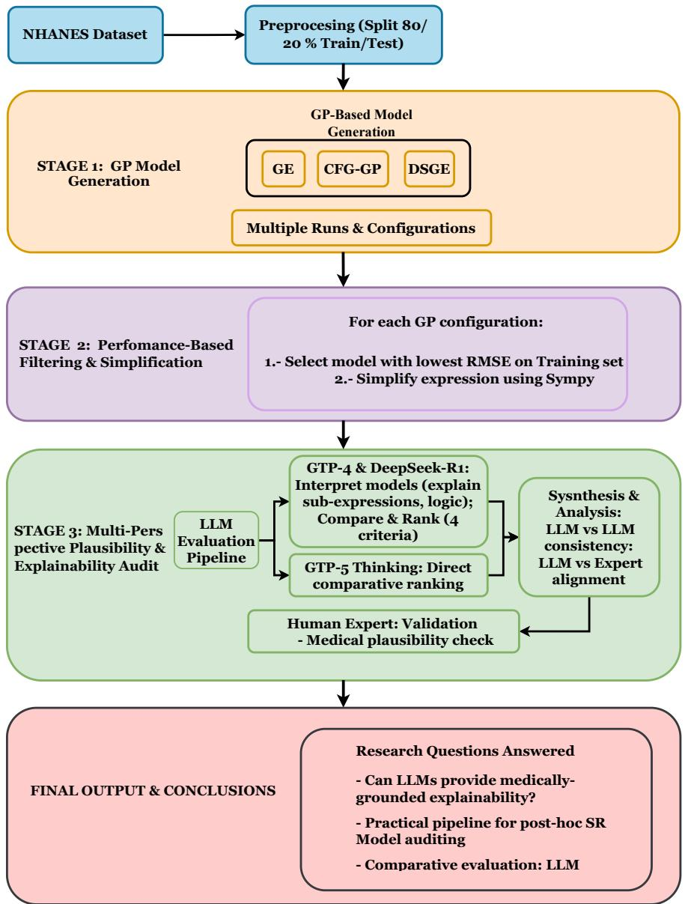

# LLMs as Post-hoc Auditors of Physiological Plausibility in Symbolic Regression: A Clinician-Evaluated Case Study

Jorge L´opez-Varela[0009−0005−6868−0019]1, J. Ignacio Hidalgo1,10[0000−0002−3046−6368], Jos´e-Manuel Mu˜noz2[0009−0007−7134−8708], Omar Costilla-Reyes6[0000−0001−8331−7262], Esther Maqueda MD3, Jesus Moreno-Fernandez, MD4,5[0000−0002−9703−1094], Tom´as Gonz´alez-Vidal MD7,8,9, J. Manuel Velasco1,10, and Oscar Garnica1,10

Computer Architecture Department, Universidad Complutense de Madrid, Spain. jorgsa15@ucm.es,hidalgo@ucm.es,mvelascc@cum.es,ogarnica@ucm.es 2 Universidad Aut´onoma de Baja California, M´exico

3 Endocrinology and Nutrition Department. Hospital Universitario de Toledo, Spain 4 Endocrinology and Nutrition Department. Ciudad Real General University Hospital. Obispo Rafael Torija St. 13005. Ciudad Real. Spain.

5 Castilla-La Mancha Health Research Institute (IDISCAM). Toledo. Spain 6 Equ Healthcare, Watertown, MA, 02472, USA

7 Department of Endocrinology and Nutrition, Hospital Universitario Central de Asturias/University of Oviedo, Spain.

8 Inst. Investigaci´on Sanitaria Principado de Asturias (ISPA), Oviedo, Spain. 9 Inst. Universitario Oncolog´ıa Principado de Asturias (IUOPA), Avenida de Roma s/n, 33011, Oviedo, Spain uo302763@uniovi.es 10 Bioinspired Intelligence Ltd., Pozuelo de Alarc´on, Spain

Abstract. Genetic Programming and its variants, such as grammatical evolution, are widely used in Symbolic Regression to derive mathematical expressions from multivariate data. In addition to predictive accuracy, models are appreciated for their potential to provide interpretability, ofering explicit equations that relate input variables to outcomes. However, achieving interpretability and plausibility remains challenging, as evolved models may be complex or scientifically inconsistent. In this study, we explore whether Large Language Models, can assist in improving the explainability of Symbolic Regression models generated by evolutionary computation methods. Building upon our previous work on estimating body fat percentage using grammar-based Genetic Programming , we investigate the use of LLMs as post-processing tools to analyze and rank evolved expressions according to their interpretability and medical plausibility. Four symbolic expressions are analysed by three LLMs over three repeated runs, and the resulting interpretations and rankings are assessed by a panel of three clinicians. Across the three LLMs, comparative model-ranking outputs received more favorable clinician assessments than isolated term-level interpretations. However, the LLMs also produced physiologically and mathematically questionable explanations, indicating that they are better suited to comparative auditing under expert oversight than to autonomous validation.

Keywords: Grammatical Evolution · Obesity · Symbolic regression

The present work is an extended version of a paper submitted into a journal.

## 1 Introduction

Genetic programming (GP) [13] is a technique used to automatically generate, or evolve, computer programs that can perform specific tasks. One of its most widely used applications is to obtain symbolic regression (SR) [12] models from a supervised learning dataset. With the advancement of other artificial intelligence (AI) techniques, it has been recognized as a technique that ofers interpretability. This statement is based on the fact that SR provides equations that use the variables of the problem and, therefore, we can find an intperetation for the model.

There are two other properties that are related to explainability, namely interpretability and plausibility. A model is said to be interpretable if the final user can understand the meanings of the terms in a direct manner. However, this is not always the case; several problems may arise in the interpretability of SR models. A model, i.e., an equation, can have so many terms and be so complex that it may be very dificult to explain [12]. In this paper we will use the term interpretability in the context of extracting insights from the model, we acknowledge that there is no consensus of a formal definition in the literature and this is likely context based. However, we will also describe the plausibility of the models with the Large language models (LLMs) and the medical expert.

On the other hand, a model is considered plausible if, regardless of whether it is interpretable or explainable, it aligns with scientific evidence or proposes relationships that are physically or medically plausible. For instance, a model may also contain terms whose units do not physically agree with the function or variable it represents. We may also obtain models that display terms, which, although interpretable, reveal relationships that have not been validated by scientific evidence. This last point is a bit diferent, as it may be that the scientific evidence is incomplete or that the reasoning conducted is biased by what was mentioned or demonstrated in the literature. One of the domains where this controversy arises is in the application of evolutionary algorithms in medicine and healthcare. Discovering this evidence in the equations may not be an easy task for the person responsible for obtaining the model if they lack a thorough knowledge of the area of application. Similarly, the professional requesting the model may not be familiar with reading and interpreting mathematical equations such as those provided by an SR tool.

LLMs are deep learning models trained on large volumes of text with the aim of understanding, interpreting, and generating natural language. Thanks to transformer-based architectures [36], these models are capable of capturing longterm dependencies and generating coherent text, as well as performing complex natural language processing (NLP) tasks such as summarization, question answering, text classification, and others. Their main contribution is that they can be adapted to specific areas or tasks with minimal additional information based on their prior training with enormous volumes of data (pre-training).

LLMs are also being used to analyze and interpret models obtained using diferent GP techniques, such as the work in [3], where expressions for detecting hypoglycaemia obtained with Grammatical Evolution (GE), a version of GP, are analyzed in a straightforward manner. There are other fields where LLMs are applied to obtain an interpretation as a post-processing tool for models. We hypothesized that LLM can ofer explainability in line with medical evidence for SR models. Moreover, we propose using LLMs to select the best model from a set of possible models with similar quality, as is often the case after running an Evolutionary Algorithm. We will try to test this hypothesis for the problem presented in [21].

This paper is a continuation of the work presented in [21], where several models using three evolutionary computation methods guided by grammars: GE [27], Context-Free Grammar Genetic Programming (CFG-GP) [41], and Dynamic Structured Grammatical Evolution (DSGE) [18] were obtained for the estimation of the body fat percentage (BFP). Those GP variants were selected because they enable the helpful configuration of the solution space and generate symbolic expressions that can potentially enhance both predictive performance and model transparency.

The work in [21] addressed the comparison of the mentioned algorithms with the QLattice framework, showing that grammatical evolution methods yield competitive and interpretable results, however, the selection of the final model was guided only by the lowest value of the mean square error of the solutions. In this paper, we propose utilizing LLMs to analyze solutions obtained by SR in terms of interpretability and plausibility, and then select the best model accordingly. We perform an analysis of the solutions obtained with the three methods and compare the diferent alternatives.

The main diference between interpretability and explainability, studied in fields such as Explainable Artificial Intelligence (XAI), is the inherent understanding of the model. An interpretable model, such as a mathematical expression obtained with SR, can be understood without the necessity of input-output pairs to infer its behavior, while XAI studies the use of techniques based on these pairs to explain the decisions made by a non-interpretable model. However, not all SR models are equally interpretable.

Additionally, a group of three physicians studies not only the solutions but also the interpretations performed by the LLMs. The results suggest that integrating LLM reasoning into the SR workflow may provide a new path toward interpretable, and plausible symbolic models.

The rest of this paper is structured as follows: Section 2 presents previous works on the use of LLMs for interpretability of models. Section 3 explains the concepts of LLMs and Prompt Engineering used in this work. Section 4 defines the methodology used. Sections 5, 6, and 7 exposes the results obtained with Gemma3, DeepSeek-R1, and GPT-5.1 Thinking respectively. Section 8 concludes the paper.

## 2 Related Work

The intersection of SR, EC, LLMs has evolved rapidly, shifting from purely syntactic optimization toward hybrid approaches that integrate semantic reasoning.

This section structures the existing literature around three fundamental axes: the management of complexity and interpretability in SR, the integration of LLMs as active components within the evolutionary loop, and the emerging role of LLMs for explainability Artificial Intelligence (XAI). We conclude by highlighting the specific gap this work addresses: the use of LLMs as post-hoc evaluators to audit the semantic and biomedical plausibility of symbolic models, a critical function that remains largely unexplored.

One of the most persistent challenges in GP applied to either regression or automation is the phenomenon of bloat, where syntactic trees grow in size and complexity without ofering proportional improvements in accuracy, thereby compromising human interpretability [14]. Traditionally, the GP community has addressed this issue through strategies like parsimony pressure and multi-objective optimization. The latter, implemented with algorithms such as NSGA-II or SPEA2, seeks to approximate a Pareto Front that simultaneously optimizes accuracy and syntactic simplicity [9, 14]. More recent strategies, such as Age-Fitness Pareto (AFP), introduce additional objectives like the “age” of genetic material to preserve diversity and prevent convergence to complex local optima [30]. However, syntactic complexity is not the sole proxy for interpretability. As argued by [12], nonlinear complexity provides a more robust measure of model interpretability, and modern approaches like LLM-Meta-SR demonstrate that prompt-guided constraints can control bloat while maintaining performance [44]. Nevertheless, a fundamental challenge persists: even when algorithmic methods efectively control syntactic complexity, the semantic plausibility of the resulting equations within the application domain is not guaranteed. A formula that is mathematically simple and accurate may still be biologically implausible a dimension that current algorithmic filters cannot evaluate on their own [9].

The integration of LLMs has recently transformed the landscape of Evolutionary Computation, moving beyond their role as interpreters to become active components within the algorithm lifecycle. This integration manifests in three primary paradigms. First, LLMs act as adaptive evolutionary operators. Systems like EvoPrompt and LEO leverage the contextual rewriting capabilities of LLMs to propose semantically informed variations, replacing or augmenting traditional stochastic operators and improving search eficiency in discrete spaces [2,6]. Second, LLMs serve as providers of scientific priors: recognizing the ineficiency of search from scratch, frameworks like LLM-SR and CoEvo utilize LLMs to propose equation skeletons based on known principles, which are then refined through numerical optimization, drastically reducing the search space in theoryrich domains [7, 33]. The most sophisticated approach involves the co-evolution of solutions and concepts, as seen in LASR, where LLMs abstract successful patterns into high-level textual concepts (e.g. logistic growth), creating a dynamic library that feeds back into the evolutionary search, enabling open-ended exploration across multiple representations [38]. Crucially, while these paradigms employ LLMs to generate or enhance equation search, fundamentally optimizing for accuracy or eficiency, they exhibit a critical deficiency regarding the use of LLMs as post-hoc evaluators to audit the semantic validity of the found solutions.

This semantic validation gap is particularly salient within the field of XAI. Standard model-agnostic methods like LIME [25] and SHAP [19] are designed to interpret black-box models by approximating local behavior or assigning feature importance. However, for scientific discovery, these tools present epistemological limitations; they explain which variables are important but do not reveal the functional structure of the relationship, which is essential for validating physiological plausibility in fields like medicine [26]. SR, by providing structural transparency by design, theoretically obviates the need for such post-hoc approximators. Yet, this advantage only materializes if the expression is interpretable both syntactically and semantically. Here, LLMs represent a unique opportunity due to their capacity to process natural language and reason over code, positioning them to analyze mathematical expressions as semantic representations of real-world phenomena. Recent surveys confirm the potential of LLMs to bridge complex model outputs with human understanding [1], but most applications in XAI focus on explaining black-box models, leaving a scarcity of work on using LLMs to audit the scientific plausibility of inherently interpretable, white-box models generated by SR.

Motivated by this scarcity, our work addresses a distinct and critical gap. Unlike the paradigms reviewed above, we do not use the LLM to discover or optimize the equation, a task delegated to GP/GE algorithms, but rather to answer a qualitatively diferent question: Can LLMs assist the post-hoc auditing and comparison of symbolic regression models with respect to interpretability and physiological plausibility, and how well do these assessments align with clinician judgments? We therefore propose a novel perspective where advanced reasoning models operate as an expert common-sense filter, a qualitative auditing layer complementary to quantitative performance metrics. This approach aims to analyze whether SR equations are biologically plausible, an essential step toward building truly trustworthy and adoptable models in knowledge-intensive domains like healthcare, and whether the interpretability and plausibility are detected by an LLM.

## 3 Large Language Models and Prompt Engineering

As we mentioned above, LLMs can be adapted with little additional information to specific domains or tasks. In addition, unlike traditional LLMs, current LLMs are models whose reasoning is implemented into their normal processing. Combining techniques such as Reinforcement Learning (RL), ToT and Reinforcement Learning from Human Feedback (RLHF), they are able to increase their reasoning performance. Some examples are OpenAI-o1 [10], and it’s reduced version, OpenAI-o1-mini, or Deepseek-R1 [5]. Nevertheless, there are inherent problems with these models due to the way they are designed and trained. The existence of hallucinations is one of them [45]. Hallucinations are false information that is generated by the model for its design to always answer, even though the provided information is not in the training data, thus generating false information derived from the actual data. Since LLMs are not design to generate true or false answers, but to predict the most likely text to a given prompt, then the potential for hallucination is in-built into how the models function, and must always be assumed to be potentially present in any text generated by these techniques.

## 3.1 Using LLMs for model interpretation

In order to obtain an interpretation of the created models, whose generation is explained in Subsection 4.2, we propose the use of LLMs. The main objective is to use them to explain the expressions obtained using natural language. This method allows for a better comprehension of the generated model by experts in medical domain, avoiding the necessity of their knowing how to interpret mathematical expressions. Due to the significant lack of datasets needed for fine-tuning the LLMs used in the proposed task, the introduction of Prompt Engineering could successfully increase the quality of the explanations created by these models.

In the current context, a first approach can be to use manually created prompt techniques that require zero to a few examples of data. In any case, the prompt requires to be quite elaborated, due to variables such as the specificity and complexity of the given task.

As we are working on interpretability on mathematical expressions, a flow of mathematical reasoning may increase the task accuracy. The work in [11] shows how actual LLMs with reasoning capacities performs in mathematical reasoning tasks. To emphasize further, as we are working on a high specificity medical topic, LLMs may not have been trained with enough topic-oriented information. The work in [16] exposes how Reasoning Models outperform non-Reasoning ones in pneumonia clinical treatment. Also, current LLMs do not need high complexity prompts to achieve high accuracies [37], simplifying the task. In addition, advanced LLMs have less hallucination rates than traditional LLMs [10], so there is a lower risk of including false information in the generated interpretation, which is crucial in a medical field. The above characteristics suggest using them for the current task.

On the other hand, these advanced LLMs require more time and resources, but these disadvantages are not determinants as we are not executing multiple inquiries on them in the actual experiment.

## 3.2 How to engineer proper prompts for this task

Prompt Engineering is the practice of designing and optimizing instructions or inputs (prompts) to guide the behavior of LLMs. Since these models generate responses based on the context provided in the input text, the way in which the prompt is structured and formulated directly influences the quality, accuracy, and relevance of the output. However, as is shown in the work in [37] accurate information is more important than a complex prompt structure for LLMs with reasoning capabilities. The work in [28] collects the main Prompt engineering techniques. We summarize this taxonomy below:

1. Few-Resources Prompting: is a prompting technique designed for generating accurate enough outputs without needing extensive data or resources, enabling the base model to perform new tasks.

– Zero-Shot Prompting: doesn’t need any specific modification of the LLM or example of execution. The accuracy relies mainly on the creation of the proportioned prompt, which must be carefully crafted, following the structure proposed for the actual task. The work in [24] exposes the performance of LLMs such as GPT-3 in diferent tasks in Zero-Shot settings.

– Few-Shot Prompting: The work in [20] proposes including a few inputoutput examples to the prompt. With them, the LLM has more data to work on and will have the structure desired for the output since it is already included implicitly in the given examples. Combining the examples with a well-structured prompt, the technique outperforms Zero-Shot. However, the quality of the examples used determines the output of the model, so they must be well constructed.

2. Reasoning Prompting: With the creation of the concept of Chain-of-Thought (CoT) [40] a new way of prompting has emerged. CoT prompting aims to compensate for the inability of LLMs to engage in complex reasoning by integrating coherent step-by-step reasoning. This technique allows the model for a deeper understanding of the given prompts. Manual creation of highquality CoT prompts is expensive in time and suboptimal. The work in [46] fix this problem with the integration of Automatic Chain-of-Thought (Auto-CoT), just by using ”Let’s think step by step” prompts to generate reasoning chains. This technique minimizes errors and allows for a few-shot prompting using CoT without needing manual creation of high-quality reasoning chains. The works in [17] and [42] propose the use of a Tree-of-Thought (ToT), where instead of working on a lineal sequence of thoughts, it allows them to branch out, allowing the use of search algorithms to obtain optimum results.

In the presented work, we use techniques based on Reasoning Prompting to optimize the performance of the studied LLMs. Few-Shot Prompting is strongly dependent on the available data and examples, so, because of the lack of the resources, it is left as future work.

We propose the following prompt structure and properties to obtain an accurate answer,the prompt must provide precise and understandable information.

1. First, specify the role that the model represents, which can be expressed as an “interpreter of mathematical expressions in the medical field,” followed by a brief description of the assigned task.

2. It must be explicitly stated that the output is going to be read by a medical expert, not a mathematician. This specification allows for a better understandability and eliminates any deepening in the mathematical characteristics of the model.

3. It is also important to clarify the context of the task, for example, explaining the diferent variables of the expression, how the expression has been obtained and any other relevant information that may help in narrowing the scope of the generated answers.

4. Finally, the task and the expression are given. The task must be precise rather than complex, emphasizing how the desired output is structured, as we lack input-output examples that can replace the specifications. Also, the expression has to be understandable by the model, being careful with the symbols used.

## 4 Methodology

This work extends our previous research on estimating body fat percentage using grammar-based GP [21]. While that study focused on generating accurate symbolic regression models, here we address a diferent research question: Can LLMs assist the post-hoc auditing and comparison of symbolic regression models with respect to interpretability and physiological plausibility, and how well do these assessments align with clinician judgments? To answer this question, we propose a four-phase methodology, illustrated in Figure 1, combining symbolic regression outputs with LLM-based interpretability and plausibility analysis.

1. Generation and selection of candidate models from GP-based model generation.

2. Performing a filtering and simplification of the previously selected or created models.

3. Conducting a multi-perspective plausibility and explainability audit using LLMs.

4. Validating these assessments with human medical expertise.

## 4.1 Dataset

We use the National Healt and Nutrition Examination Survey (NHANES) 2017- 2018 dataset [34], a comprehensive cross-secctional study conducted by U.S. Centers for Disease Control and Prevention (CDC). NHANES provides nationally representative health and nutrition data through interviews, physical examinations, and laboratory tests.

Data Selection and Preprocessing Following the protocol established in [21, 31], we extracted a subset focused on body composition measurements.

The preprocessing steps were:

Inclusion criteria: Adults aged 18-59 years with complete anthropometric and DXA measurements

– Exclusion criteria: Pregnant females, individuals with missing demographic or morphometric features

  
Fig. 1: Research workflow for the LLM-based plausibility audit. Stage 1 leverages candidate models from prior work [21]. Stage 2 implements our novel two-stage LLM evaluation protocol. Stage 3 incorporates expert medical validation.

– Final sample: 2,403 individuals (1,158 males [48.2%], 1,245 females [51.8%])

## – Train/test split: 80%/20% random stratified split

The dataset comprises nine anthropometric and demographic features as independent variables and total body fat percentage measured by Dual-Energy X-ray Absorptiometry (DXA) as the target variable. Table 1 presents the variables with descriptive statistics.

Table 1: NHANES 2017-2018 dataset variables and descriptive statistics. Target variable shown in bold.
<table><tr><td>Variable</td><td>Description</td><td>Mean SD</td><td>Min</td><td>25%</td><td>50%</td><td>75% Max</td></tr><tr><td>RIDAGEYR Age (years)</td><td></td><td>38.1 12.6</td><td>18.0</td><td>27.0</td><td>38.0</td><td>49.0 59.0</td></tr><tr><td></td><td>RIAGENDR Gender (1=M, 2=F)</td><td></td><td></td><td></td><td></td><td></td></tr><tr><td>BMXWT</td><td>Weight (kg)</td><td>79.7 20.4 36.2</td><td></td><td>64.9</td><td></td><td>76.9 91.9 176.5</td></tr><tr><td>BMXHT</td><td>Height (cm)</td><td>166.6</td><td></td><td></td><td></td><td>69.3 138.3 159.4 166.5 173.8190.2</td></tr><tr><td>BMXLEG BMXARML</td><td>Upper leg length (cm) Upper arm length (cm)</td><td>39.5 3.6 37.0 2.7</td><td>26.0 29.6</td><td>37.0 35.0</td><td>39.5</td><td>42.0 50.0</td></tr><tr><td></td><td>BMXARMC Arm circumference (cm)</td><td>33.1 5.1</td><td>20.7</td><td></td><td>37.0</td><td>39.0 45.5</td></tr><tr><td></td><td></td><td></td><td></td><td>29.4</td><td>32.9</td><td>36.4 52.7</td></tr><tr><td></td><td>BMXWAIST Waist circumference (cm)</td><td>96.0 16.3</td><td>56.4</td><td>83.8</td><td></td><td>94.7 106.4 154.9</td></tr><tr><td>BMXHIP</td><td>Hip circumference (cm) DXDTOPF Total body fat (%)</td><td>104.6 12.8 33.1 8.6</td><td>77.8 12.1</td><td>27.1 32.9 40.2 56.1</td><td></td><td>95.5 102.7 111.6 168.5</td></tr></table>

## 4.2 Grammar-Guided GP Models

We analyze four symbolic regression models for estimating total body fat percentage (DXDTOPF) that were generated and validated in our previous study [21]. These models were selected from a large pool of candidates evolved using three distinct grammar-guided GP variants applied to the NHANES 2017-18 dataset:

– Dynamic Structured Grammatical Evolution (DSGE): Models DSGE-M21 and DSGE-M18

– Context-Free Grammar GP (CFG-GP): Models CFG-M9 and CFG-M3

Table 2: Candidate models and performance metrics.
<table><tr><td>Model</td><td>Algorithm Test R2</td><td></td><td>Test RMSE # Features</td><td></td><td>Complexity</td></tr><tr><td>DSGE-M21</td><td>DSGE</td><td>0.842</td><td>3.41</td><td>6</td><td>Low (14 ops)</td></tr><tr><td>DSGE-M18</td><td>DSGE</td><td>0.837</td><td>3.42</td><td>7</td><td>Low (18 ops)</td></tr><tr><td>CFG-M9</td><td>CFG-GP</td><td>0.849</td><td>3.29</td><td>8</td><td>High (68 ops)</td></tr><tr><td>CFG-M3</td><td>CFG-GP</td><td>0.844</td><td>3.34</td><td>7</td><td>Medium (26 ops)</td></tr></table>

These models were selected to represent diverse structural characteristics, from relatively compact 6-term expressions (DSGE-M21) to complex formulas with over 20 terms (CFG-M9), while maintaining competitive predictive performance $( R ^ { 2 } \approx 0 . 8 4 – 0 . 8 5$ on test data). The evolutionary algorithms were tested in the free software using PMT a specialized Java application developed by the Absys Research group at Universidad Complutense de Madrid [8] with the following key parameters 3:

Table 3: Hyperparameter configuration for 2 GGGP variants exploitation, extracted from [21].
<table><tr><td rowspan=1 colspan=1>Hyperparameter</td><td rowspan=1 colspan=1>DSGE</td><td rowspan=1 colspan=1>CFG</td></tr><tr><td rowspan=6 colspan=1>RunsPopulation SizeGenerationsProbability CrossoverProbability MutationMax Tree DepthGrammars</td><td rowspan=1 colspan=1>30</td><td rowspan=1 colspan=1>30</td></tr><tr><td rowspan=1 colspan=1>512</td><td rowspan=1 colspan=1>512</td></tr><tr><td rowspan=1 colspan=1>5000</td><td rowspan=1 colspan=1>5000</td></tr><tr><td rowspan=1 colspan=1>0.75</td><td rowspan=1 colspan=1>0.75</td></tr><tr><td rowspan=1 colspan=1>0.05</td><td rowspan=1 colspan=1>0.05</td></tr><tr><td rowspan=1 colspan=1>[8, 10, 12, 14]]NoBias</td><td rowspan=1 colspan=1>[8, 10, 12, 14]NoBias</td></tr></table>

Complete experimental details, including grammars, hyperparameters, and convergence analysis, are provided in [21].

## 4.3 Filtering and Simplification

In [21], RMSE (Root Mean Square Error) is the fundamental metric of performance and fitness used to evaluate the accuracy. This indicator measures the dispersion and stability of the results, where a lower value reflects a better fit and higher quality of the solution. In the evolutionary process, it is used to guide the selection of the best candidate models by minimizing the diference between predicted and actual values.

The following expressions are the models that have been selected for interpretation by LLMs from [21], where the selection of models prioritized accuracy, choosing mathematical expressions with competitive performance $R ^ { 2 } \approx 0 . 8 5$

Grammar Guided Models: The models selected from the work in [21] and   
which are generated with GE techniques are the following. Model DSGE-M21

$$
{ \begin{array} { r l } & { { \tt D X D T O P F } = { \frac { 3 1 \cdot { \tt B M X H T P } } { 1 0 0 } } + { \frac { 9 \cdot { \tt B M X H T } \cdot { \tt B M X W A I S T } } { 1 0 0 0 0 0 } } } \\ & { \quad \quad \quad - { \frac { 1 3 8 7 \cdot { \tt B M X H T } } { 1 3 0 \cdot { \tt B M X W A T S T } } } \quad - { \frac { { \tt B M X W A T S T } \cdot { \tt B M X W T ^ { 2 } } \cdot { \tt R I A G E N D R } } { 5 4 0 0 0 0 } } } \\ & { \quad \quad + { \frac { 4 8 \cdot { \tt R I A G E N D R } } { 5 } } + { \frac { { \tt B M X H T } \cdot { \tt B M X W A I S T } } { { \tt B M X A R M L } \cdot { \tt B M X W T } } } } \end{array} }
$$

Model DSGE-M18

$$
{ \begin{array} { r l } { { \tt D X D T O P F } = } & { - { \frac { 3 \cdot { \tt B M X A R M C } \cdot { \tt B M X U A I S T } \cdot { \tt B M X W T } ^ { 2 } \cdot { \tt R I A G E N D R } } { 1 0 0 0 0 0 0 0 0 } } } \\ & { \quad \quad \quad \quad - { \frac { 9 9 \cdot { \tt B M X H T P } \cdot { \tt B M X H T } \cdot { \tt B M X W T } } { 1 0 0 0 \cdot { \tt B M X W A I S T } ^ { 2 } \cdot { \tt R I A G E N D R } } } \quad + { \frac { 4 3 \cdot { \tt B M X H T P } } { 1 0 0 } } } \\ & { \quad \quad \quad + { \frac { 1 1 \cdot { \tt B M X H T } } { 2 0 0 0 } } + { \tt R I A G E N D R } - { \frac { 6 1 5 0 \cdot { \tt B M X H T } \cdot { \tt B M X L E G } } { { \tt B M X A R M C } \cdot { \tt B M X W A T S T } ^ { 3 } } } } \end{array} }
$$

Model CFG-M9

$$
\begin{array} { r l } { \mathrm { { D X D T O P F } = - \frac { B M X H T P ^ { 3 } \cdot ~ B M X H X X S T } { 8 5 0 0 0 \cdot ~ B M X I X E G ^ { 2 } } - \frac { 3 \cdot B M X H T P ^ { 2 } } { 3 1 2 5 0 } + \frac { 7 \cdot 8 M X H T P } { 2 0 } - \frac { B M X H T S } { 8 M X K T ^ { 3 } } } } \\ { + \frac { 8 B M X H T } { 8 1 0 0 \cdot ~ F _ { 1 } ^ { 2 } } - \frac { 4 1 \cdot 8 M X H T \cdot ~ B M X H T } { 1 0 0 0 \cdot ~ B M X H X S T } + \frac { 3 \cdot B M X K H ~ A \mathrm { { D } } \cdot \Gamma ^ { 2 } } { 3 1 2 5 0 } } \\ { + \frac { 8 M X H K h \mathrm { { L S T } } } { 4 1 0 0 \cdot ~ K \mathrm { { L D A G E Y R } } } + \frac { 8 M X H K } { 8 M X W T } - \frac { 9 \cdot B M X H T } { 2 5 0 } + 7 \cdot 8 { \mathrm { L A G E u D R } } } \\ { + \frac { 5 \cdot 8 \mathrm { { L A G E u D R } } } { 8 \mathrm { { L D A G E Y R } } } + \frac { 6 \cdot 8 \mathrm { { L D A G E Y R } } } { 6 2 5 } - \frac { 1 2 4 6 1 } { 1 0 0 0 0 } + \frac { 1 } { 8 \mathrm { { L D A G E Y R } } } + \frac { 8 { \mathrm { L A G E u D R } } } { 8 M X V } } \\  - \frac { 8 \mathrm { { M X H } } } { 8 1 0 \mathrm { { X } } \mathrm { { L } } \mathrm { { L } } \mathrm { { S T } } } + \frac { 8 M X \mathrm { { L G e } } \cdot \mathrm { { R } } 2 8 \mathrm { { L A G E u D R } } } { 8 \mathrm { { M X K H } } } + \frac { 8 { \mathrm { L A G E u D R } } } { 8 M X { \mathrm { A } } { \mathrm { L } } _ { \mathrm { { X } } } { \mathrm { R } } _ { \mathrm { { M } } } } + \frac { 8 { \mathrm { R } } \mathrm { { L } } \mathrm { { A G E u D R } } }  8 { \mathrm { M } } { \mathrm { X } } _ { \mathrm { { B } } } { \mathrm { R } } _  \mathrm  \end{array}
$$

Model CFG-M3

$$
{ \begin{array} { r l } { { \mathrm { D X D T O P F } } = - { \frac { 4 9 \cdot { \mathrm { ~ B M X A R M C } } } { 5 0 0 } } + { \frac { 1 8 \cdot { \mathrm { ~ B M X A R M C } } } { 8 0 \mathrm { ~ A M X T } } } + { \frac { { \mathrm { ~ B M X A R M C } } } { 8 { \mathrm { ~ B M X A R T } } } } - { \frac { 4 \cdot { \mathrm { ~ B M X A R M L } } } { 8 0 \mathrm { ~ A M X T } } } } \\ { - { \frac { 7 \cdot { \mathrm { ~ B M X A R M X T } } } { 8 { \mathrm { ~ B M X A R T } } } } + { \frac { 8 \cdot { \mathrm { ~ B M X A R T P } } } { 2 5 } } + { \frac { 2 \cdot { \mathrm { ~ B M X A R T } } } { 8 { \mathrm { ~ I I R A E K } } ^ { 2 } } } - { \frac { 7 \cdot { \mathrm { ~ B M X A R T } } } { 8 { \mathrm { ~ B M X A R T } } } } } \\ { - { \frac { 1 6 \cdot { \mathrm { ~ B M X A R T } } } { 5 \cdot { \mathrm { ~ B M X A R T } } } } } \\ { - } { \frac { 1 6 \cdot { \mathrm { ~ B M X A R T } } } { 5 \cdot { \mathrm { ~ B M X A R T } } } } - { \frac { 8 \cdot { \mathrm { ~ B M X A R T } } } { 8 { \mathrm { ~ B M X A R T } } } } - { \frac { 8 \cdot { \mathrm { ~ B M X A R T } } } { 8 { \mathrm { ~ B M X A R T } } } } + { \frac { 8 { \mathrm { ~ B T X A T } } } { 8 { \mathrm { ~ B R A R T R } } ^ { 2 } } } } \\ { + { \frac { 4 \cdot { \mathrm { ~ B M X A R T } } } { 8 { \mathrm { ~ B M X A T } } } } + { \frac { { \mathrm { ~ B M X A R T } } } { 8 { \mathrm { ~ B M X A T } } \cdot { \mathrm { ~ R T A G R U R } } } } - { \frac { 2 3 \cdot { \mathrm { ~ B M X T } } } { 2 5 0 0 0 0 } } + { \frac { 1 4 2 \cdot { \mathrm { ~ R T A G E N R } } } { 2 5 } } } \\  + { \frac { 4 9 } { 5 0 } } +  \frac { 4 9 }  5 0  \end{array}
$$

## 4.4 Multi-Perspective Plausibility and Interpretability Audit

We employ a progression of state-of-the-art LLMs to assess their capabilities as post-hoc interpretability tools. We propose the use of reasoning models to minimize potential hallucinations due to the specific domain of the task and the lack of data necessary to employ other data-dependent techniques. The objective of the LLM selection is to balance the cost of inference with the quality of the output. As shown in [43], Reasoning Models costs are higher than Non-Reasoning Models. In addition, [23] relates the costs of diferent models, showing how the cost is not directly related to the accuracy in spatial-reasoning tasks; however, newer and more powerful models are usually more expensive to use. Additionally, access to and control of the largest LLMs is not uniform, as shown in [29].

Furthermore, ensuring structural consistency across diferent LLMs requires a nuanced approach to generation parameters, particularly the decoding temperature. Traditionally, setting a low temperature $( T \approx 0 )$ has been the standard practice for reducing stochasticity and enforcing determinism in standard LLMs [15]. However, recent literature demonstrates that this parameter adjustment is fundamentally inadequate, and often detrimental, when applied to modern reasoning models.

As highlighted in recent studies such as the work in [22], applying greedy decoding or very low temperatures to models that utilize extensive CoT processes frequently forces them into infinite repetition loops or collapses their reasoning boundaries. Because reasoning models inherently require a degree of entropy, defined by the temperature (typically $T \in [ 0 . 5 , 0 . 7 ] )$ , to successfully navigate complex logic trees without getting stuck, structural consistency and reproducibility cannot be achieved merely by lowering the temperature. Instead, it is pursued through explicit prompt constraints and formatting instructions [32].

We propose the use of an Open Source Non-Reasoning model, an Open Source Reasoning model (to evaluate an alternative to the options with the greatest disparities) with medium cost, and a cutting-edge Reasoning-enhanced model with high usage costs:

– Gemma3: it is a versatile Open Source LLM, proposed in [35], with good reasoning capabilities, but it is not reasoning-oriented, serving as a deterministic baseline related to reasoning-optimized models. To ensure reproducibility, we used the 27 Billion parameters (27B) version with a temperature of 0 (so the model is deterministic) and a seed of 42.

DeepSeek-R1: The work in [4] proposes reasoning-optimized LLM specifically designed for complex logical analysis, allowing us to test if specialized reasoning architectures ofer advantages for this task. This model was selected due to its Open Source nature and its lower cost of inference compared to newer Reasoning models.

– GPT-5.1 Thinking: A cutting-edge reasoning-enhanced LLM from OpenAI, used to examine advancements in structured reasoning and medical knowledge integration.

We designed a structured evaluation protocol consisting of two sequential tasks:

1. Individual interpretation of each model (applied to Gemma3 and DeepSeek-R1): This task is proposed to evaluate the capacity of the LLMs to interpret each model individually, merging the mathematical nature of the models with the possible physiological reasoning behind the diferent subexpressions. The LLM acts as a cross-domain interpreter, integrating mathematical and clinical knowledge. It was assigned the role of a ”statistician with medical knowledge” and prompted to:

– Decompose the mathematical expression into its primary subexpressions. – For each subexpression, provide both a mathematical explanation and a physiological justification based on known body composition principles.

– Synthesize these explanations into a coherent natural language summary understandable by clinicians.

2. Global comparative ranking (applied to all three LLMs): The objective is to set a cross-field comparison, not solely based on performance evaluated with the data, due to the risk of overfitting and the dificulty of interpreting most complex models. We compare and rank all the proposed models on four criteria derived from clinical interpretability literature:

– Interpretability: Ease of understanding the model’s components and logic.

– Physiological plausibility: Alignment with established medical knowledge about body fat distribution.

Simplicity: Syntactic complexity and parsimony of the expression.

– Practical use: Feasibility for clinical implementation considering measurement requirements and stability.

The output was a ranked list (1=best to 5=worst) for each criterion, accompanied by brief justifications and an overall recommendation.

Evaluating non-deterministic LLMs: To assess the consistency of the outputs, each model was run three times on the same prompt. For the non-reasoning baseline (Gemma3), determinism is enforced through a temperature of 0 and a fixed seed, so repetition serves only to confirm invariance. For the reasoning models (DeepSeek-R1 and GPT-5.1 Thinking), determinism cannot be imposed by lowering the temperature and consistency is instead pursued through the explicit constraints of the prompt. Repetition therefore plays a diferent role for each type of model: a confirmation for the deterministic baseline, and a measurement of run-to-run variability for the reasoning models. Throughout the results, the first of the three runs is taken as the reference output, it is the one submitted to the clinical evaluation, while the remaining two are used to characterize the stability of the ranking. The multiple values reported per cell in the general ranking tables correspond to these three runs.

Designed Prompt: Optimizing the interaction with LLMs requires moving beyond rudimentary instructions towards highly structured prompt engineering. According to the comprehensive taxonomy presented in [32], structuring a prompt into discrete components, such as Role, Context, Task, Format, and Constraints, drastically improves performance by reducing computational ambiguity and preventing hallucinations.

Assigning a specific role is grounded in recent advancements in role-playing language agents. As demonstrated by the RoleLLM framework [39], explicitly defining a role (e.g., a statistician acting as a bridge between engineers and medics) significantly enhances the model’s ability to align its behavioral and conversational style with the target audience. This ensures the generated output strictly adheres to the requested cognitive level, deliberately omitting complex mathematical formulations when addressing users with no statistical background.

The prompt is structured into the following key components:

– Role: The model is assigned the role of a ”statistician with both statistical and medical knowledge who interprets results for physicians”.

– Context: You work with both AI engineers and physicians. Engineers don’t have any medical knowledge, and physicians don’t have any mathematical or statistical knowledge, so they need you to work as a bridge and as a selector of models.

Task: The core objective is defined as follows: Your task is to interpret each of the 4 models (DSGE-M21, DSGE-M18, CFG-M9, CFG-M3) so that a pyhisician with no mathematical knowledge can understand, focusing on each important subexpression, writing it and what it means (you have to consider the sign of the expression and the variables involved, evaluating how the change in each variable afects the outcome), in order of appearance, and ending with a brief summary in natural language. After the interpretations, I want you to do a little comparison of each model in the following points: how easy it is to obtain an interpretation of the expression (Interpretability), how physiologically plausible they are (use your medical knowledge), their simplicity (which is how straightforward the model is), and their practical use in a real situation with new data (I recommend you think in new cases). After the comparison, rank all the 4 models in each of the 4 mentioned points. Format and Instructions: To create a highly structured output and avoid overly dense explanations, the model must follow these sequential steps:

1. Sub-expression → Simple medical interpretation (one by one, in order of appearance, but just the most important ones. You have to consider the sign of the expression and the variables involved, evaluating how the change in each variable afects the outcome. Negatives indicate a decrease in the outcome, positives indicate an increase).

2. Final summary of the model in simple medical language to enhance interpretability.

3. Repeat the above steps for all 4 models.

4. Joint comparison of the models according to:

• Ease of interpretation

• Physiological plausibility

• Simplicity.

• Practical use.

5. Final ranking in each of the aforementioned criteria.

Constraints: In order to reduce the entropy of the LLM and standardize the outputs, the prompt includes the following constraints:

• Your answers have to be consistent for the same prompt, always give the same answers.

• Keep the same format for every model.

• Do the structures comparisons and rankings based on each points, for example for interpretability, you have to compare the models , then for physiological plausibility, you have to compare the models and so on.

• When you do the comparisons, do the rankings of the 4 models.

• Give detailed reasoning of the comparisons and rankings of the 4 models, so you can convince a medic that it is the best decision.

• Your reasoning must be understandable by someone without any advanced mathematical knowledge.

• Deliver the result in diferent well structured parts.

The sign-based instruction: ”Negatives indicate a decrease in the outcome, positives indicate an increase”, is a simplifying heuristic for term-level description. Because inputs can occur in multiple nonlinear sub-expressions, the sign of an individual term should not be interpreted as the global marginal efect of a variable on the complete model

We do not create a specific prompt solely for the comparison and ranking of the models for GPT-5.1 Thinking evaluation. This decision was made to preserve the structural integrity of the responses, allowing for a proper benchmarking of the LLMs outputs. For this reason, GPT-5.1 Thinking has been prompted to perform an individual interpretation of the models, just as Gemma3 and DeepSeek-R1 were prompted to do. However, these individual interpretations are not discussed.

## 4.5 Analysis Methodology

The core analysis involves comparing the LLM-generated rankings and explanations across three dimensions:

1. LLM consistency: Agreement between diferent LLMs in their rankings and rationales.

2. LLM-Expert alignment: Correlation between LLM assessments and the physician’s qualitative evaluations.

3. Model characteristics: Relationship between mathematical properties (complexity, structure) and perceived plausibility.

We compare LLM rankings across runs and summarize clinician ratings descriptively, complemented by qualitative analysis of the clinicians’ comments.

Physicians evaluation To ensure the validity of the LLMs’ outputs, an evaluation was conducted by three clinicians from diferent hospitals, who are coauthors of the present work. They were given the output of the LLM, the symbolic expression evaluated, a series of statements and they were asked to rate their level of agreement with them on a scale of 1 to 5, depending on the specific task.

The defined statements were the following for each task:

– Interpretation of the model:

• The interpretations are physiologically plausible.

• The interpretation is comprehensible.

• The generated information is relevant.

• The explanation provides information that a physician would not have been able to detect at a glance.

• Using AI makes it easier for a doctor to interpret the model.

## – Comparison of models:

• The ranking is appropriate.

• The reasoning is sound.

• The generated information is relevant.

• This reasoning provides information that a physician might not have noticed at first glance.

• Using AI makes it easier for doctors to compare models

## – Final Conclusions:

• The conclusion is appropriate.

• The generated information is relevant.

• The conclusion provides information that a physician would not have been able to detect at a glance.

• Using AI makes it easier for doctors to compare models.

Finally, they were given the opportunity to add additional information as optional comments.

## 5 Evaluation and Comparison generated by Gemma 3

We used Gemma3-27B with the prompt structure defined in subsection 4.4 to obtain an explanation of the previously exposed models. To ensure reproducibility, the model was set to be determinant by setting its temperature to 0. For a better comprehension, the texts inside a gray box are the responses generated automatically by the studied LLM.

## 5.1 Individual Interpretation

Model DSGE-M21: Gemma3 not only explains how the model is evaluating the models, but also evaluates if the subexpressions are coherent with medical knowledge, relating larger hips with more fat storage. In addition, it finds an indirect representation of central obesity and relates it with body fat and health risks.

## Fig. 2: Interpretation of DSGE-M21 generated by Gemma 3

## Interpretation

31×BMXHIP100 → Larger hip circumference contributes to higher body fat percentage. A 1cm increase in hip circumference is estimated to increase body fat by approximately 0.31

9×BMXHT×BMXWAIST → Taller individuals with larger waist circumferences tend to have higher body fat. The combined efect of height and waist size is considered.

1387×BMXHTBMXWAIST → This term suggests that for a given height, a smaller waist circumference is associated with lower body fat. The ratio between height and waist circumference is important.

BMXWAIST×BMXWT2×RIAGENDR → In this case, a larger waist circumference and weight, especially in males (RIAGENDR = 1), are associated with higher body fat. The efect is amplified by the square of the weight.

48×RIAGENDR → Males (RIAGENDR = 1) tend to have a higher 5 baseline body fat percentage compared to females (RIAGENDR = 2). This adds approximately 9.6% to the prediction for males.

BMXHT×BMXWAIST → The ratio of height and waist circumference, BMXARML×BMXWT   
divided by the product of arm length and weight, suggests a complex interaction. A larger height and waist, combined with smaller arm length and weight, might indicate higher body fat.

Final Summary: This model suggests that body fat is influenced by a combination of body size (height, weight, hip and waist circumference), body proportions (height/waist ratio, arm length/weight), and gender. It appears to be attempting to capture the distribution of fat in relation to overall body structure.

Physicians evaluation The results of the evaluation are presented in Table 4. The statements are presented on the left part, and the scores, from 1 to 5, are presented on the top right corner. Each of the numbers presented in each row are the number of physicians that have given each score. For example, for the statement: The interpretations are physiologically plausible, 2 physicians gave the score of 2 and one gave the score of 4.

There are some disparities between physicians, but they agree in their criticism of the plausibility and comprehension of the explanation. The relevance of the information and how AI facilitates the task are evaluated over the midline.

They include some additional comments, such as emphasizing the main error of the LLM, which states that men tend to have more body fat than women. The other comment is that waist circumference is the strongest predictor of visceral fat, but having wider hips indicates a less harmful fat distribution because it is peripheral fat.

Model DSGE-M18: Gemma3 defines that some subexpressions are similar to the ones in DSGE-M21. This statement is coherent because both models were created with the same technique. However, the LLM does not do any evaluation or interpretation of the plausibility of the terms, just explains them in natural language.

<table><tr><td rowspan=1 colspan=1>Statement</td><td rowspan=1 colspan=1>1</td><td rowspan=1 colspan=1>2</td><td rowspan=1 colspan=1>3</td><td rowspan=1 colspan=1>4</td><td rowspan=1 colspan=1>5</td></tr><tr><td rowspan=1 colspan=1>The interpretations are physiologically plausible</td><td rowspan=1 colspan=1>0</td><td rowspan=1 colspan=1>2</td><td rowspan=1 colspan=1>0</td><td rowspan=1 colspan=1>1</td><td rowspan=1 colspan=1>0</td></tr><tr><td rowspan=1 colspan=1>The interpretation is comprehensible</td><td rowspan=1 colspan=1>0</td><td rowspan=1 colspan=1>2</td><td rowspan=1 colspan=1>1</td><td rowspan=1 colspan=1>0</td><td rowspan=1 colspan=1>0</td></tr><tr><td rowspan=1 colspan=1>The generated information is relevant</td><td rowspan=1 colspan=1>0</td><td rowspan=1 colspan=1>0</td><td rowspan=1 colspan=1>2</td><td rowspan=1 colspan=1>1</td><td rowspan=1 colspan=1>0</td></tr><tr><td rowspan=1 colspan=1>The explanation provides information that a physicianwould not have been able to detect at a glance</td><td rowspan=1 colspan=1>0</td><td rowspan=1 colspan=1>1</td><td rowspan=1 colspan=1>1</td><td rowspan=1 colspan=1>1</td><td rowspan=1 colspan=1>0</td></tr><tr><td rowspan=1 colspan=1>Using AI makes it easier for a doctor to interpret themodel</td><td rowspan=1 colspan=1>0</td><td rowspan=1 colspan=1>0</td><td rowspan=1 colspan=1>2</td><td rowspan=1 colspan=1>1</td><td rowspan=1 colspan=1>0</td></tr></table>

Table 4: Physicians evaluation of Gemma3 interpretation of Model DSGE-M21.

## Fig. 3: Interpretation of DSGE-M18 using Gemma 3

arm circumference, waist circumference, weight (squared), and being male all contribute to increasing body fat. The negative sign indicates that a larger value of this combination increases the body fat percentage. 99×BMXHIP×BMXHT×BMXWT 99×BMXHIP×BMXHT×BMXWT

→ Larger hip circumference, 1000×BMXWAIST2×RIAGENDR height, and weight, combined with a smaller waist circumference (due to the denominator being squared) and being male, are associated with increasing body fat.

43×BMXHIP → Larger hip circumference contributes to higher body fat percentage. A 1cm increase in hip circumference is estimated to increase body fat by approximately 0.43%.

11×BMXHT2000 → Taller individuals tend to have higher body fat. A 1cm increase in height is estimated to increase body fat by approximately 0.0055%.

RIAGENDR → Males (RIAGENDR = 1) tend to have a higher baseline body fat percentage compared to females (RIAGENDR = 2).

6150×BMXHT×BMXLEG → Taller individuals with longer legs, BMXARMC×BMXWAIST3 combined with smaller arm circumference and waist circumference (due to the denominator being cubed), are associated with decreasing body fat.

Final Summary: This model emphasizes the role of body dimensions (hip, height, leg, arm, and waist circumference), weight, and gender in determining body fat. It suggests that a larger overall body size, particularly around the hips and waist, is associated with higher body fat, while longer legs and smaller arm/waist circumferences may be protective.

Physicians evaluation The physicians agree on the lack of plausibility and comprehension of the interpretation, as seen in Table 5. There is a big gap in the scores of the statement about the information that a physician would not have been able to detect at a glance.

They add that waist circumference is an important predictor of visceral fat, regardless of a person’s height, that arm circumference does not distinguish between fat and muscle, and that Gemma3 makes the same mistake as in her interpretation of DSGE-M21, as it again asserts that body fat percentage is generally higher in men than in women. The claim that taller individuals tend to have more body fat is also untrue.

<table><tr><td rowspan=1 colspan=1>Statement</td><td rowspan=1 colspan=1>1</td><td rowspan=1 colspan=1>2</td><td rowspan=1 colspan=1>3</td><td rowspan=1 colspan=1>4</td><td rowspan=1 colspan=1>5</td></tr><tr><td rowspan=1 colspan=1>The interpretations are physiologically plausible</td><td rowspan=1 colspan=1>1</td><td rowspan=1 colspan=1>1</td><td rowspan=1 colspan=1>0</td><td rowspan=1 colspan=1>1</td><td rowspan=1 colspan=1>0</td></tr><tr><td rowspan=1 colspan=1>The interpretation is comprehensible</td><td rowspan=1 colspan=1>0</td><td rowspan=1 colspan=1>2</td><td rowspan=1 colspan=1>1</td><td rowspan=1 colspan=1>0</td><td rowspan=1 colspan=1>0</td></tr><tr><td rowspan=1 colspan=1>The generated information is relevant</td><td rowspan=1 colspan=1>0</td><td rowspan=1 colspan=1>1</td><td rowspan=1 colspan=1>1</td><td rowspan=1 colspan=1>1</td><td rowspan=1 colspan=1>0</td></tr><tr><td rowspan=1 colspan=1>The explanation provides information that a physicianwould not have been able to detect at a glance</td><td rowspan=1 colspan=1>0</td><td rowspan=1 colspan=1>2</td><td rowspan=1 colspan=1>0</td><td rowspan=1 colspan=1>0</td><td rowspan=1 colspan=1>1</td></tr><tr><td rowspan=1 colspan=1>Using AI makes it easier for a doctor to interpret themodel</td><td rowspan=1 colspan=1>0</td><td rowspan=1 colspan=1>1</td><td rowspan=1 colspan=1>1</td><td rowspan=1 colspan=1>1</td><td rowspan=1 colspan=1>0</td></tr></table>

Table 5: Physicians evaluation of Gemma3 interpretation of Model DSGE-M18.

Model CFG-M9: First, Gemma3 identifies the model as very complex, which is coherent with the amount of subexpressions of the model. It identifies that the cubic term for hip circumference suggests a non-linear relationship, which is visible information.

## Fig. 4: Interpretation of CFG-M9 generated by Gemma 3

This model is very complex, with many terms. I will focus on the most impactful ones:

BMXHIP3×BMXWAIST → Larger hip and waist circumferences, 85000×BMXLEG2 combined with shorter leg length (due to the denominator being squared), contribute to increasing body fat. The cubic term for hip circumference suggests a strong, non-linear efect.

BMXHT3 → Taller individuals with smaller waist circumferences BMXWAIST3 tend to have lower body fat. The cubic terms amplify the efect of both height and waist circumference.

BMXHT → Taller individuals and younger age are associated with RIDAGEYR2 lower body fat.

41×BMXHT×BMXWT → Taller individuals with higher weight and 1000×BMXWAIST smaller waist circumferences are associated with decreasing body fat.

7 × RIAGENDR → Males (RIAGENDR = 1) tend to have a higher baseline body fat percentage compared to females (RIAGENDR = 2). 9×BMXWT250 → Higher weight is associated with increasing body fat.

Final Summary: This model is highly complex and attempts to capture non-linear relationships between body dimensions, age, and gender. It suggests that body fat is influenced by a complex interplay of factors, with a strong emphasis on the relative proportions of diferent body parts.

Physicians evaluation As is shown in Table 6, the scores of the physicians are partially scattered, but they agree overall.

The only thing one of them disagrees with regarding the LLM is the gender aspect.

<table><tr><td rowspan=1 colspan=1>Statement</td><td rowspan=1 colspan=1>1</td><td rowspan=1 colspan=1>2</td><td rowspan=1 colspan=1>3</td><td rowspan=1 colspan=1>4</td><td rowspan=1 colspan=1>5</td></tr><tr><td rowspan=1 colspan=1>The interpretations are physiologically plausible</td><td rowspan=1 colspan=1>0</td><td rowspan=1 colspan=1>1</td><td rowspan=1 colspan=1>1</td><td rowspan=1 colspan=1>1</td><td rowspan=1 colspan=1>0</td></tr><tr><td rowspan=1 colspan=1>The interpretation is comprehensible</td><td rowspan=1 colspan=1>0</td><td rowspan=1 colspan=1>2</td><td rowspan=1 colspan=1>0</td><td rowspan=1 colspan=1>1</td><td rowspan=1 colspan=1>0</td></tr><tr><td rowspan=1 colspan=1>The generated information is relevant</td><td rowspan=1 colspan=1>0</td><td rowspan=1 colspan=1>0</td><td rowspan=1 colspan=1>2</td><td rowspan=1 colspan=1>1</td><td rowspan=1 colspan=1>0</td></tr><tr><td rowspan=1 colspan=1>The explanation provides information that a physicianwould not have been able to detect at a glance</td><td rowspan=1 colspan=1>0</td><td rowspan=1 colspan=1>0</td><td rowspan=1 colspan=1>3</td><td rowspan=1 colspan=1>0</td><td rowspan=1 colspan=1>0</td></tr><tr><td rowspan=1 colspan=1>Using AI makes it easier for a doctor to interpret themodel</td><td rowspan=1 colspan=1>0</td><td rowspan=1 colspan=1>0</td><td rowspan=1 colspan=1>1</td><td rowspan=1 colspan=1>2</td><td rowspan=1 colspan=1>0</td></tr></table>

Table 6: Physicians evaluation of Gemma3 interpretation of Model CFG-M9.

Model CFG-M3 Gemma3 correctly interprets the direction of the features depending on the sign of the expression. Also, it focuses on the interaction of arm circumference, weight, and waist circumference.

Fig. 5: Interpretation of CFG-M3 generated by Gemma 3

$- { \frac { 4 9 \times \mathrm { B M X A R M C } } { 5 0 0 } }$ → Larger arm circumference is associated with de-$\frac { 1 8 \times \mathrm { B M X A R M C } } { \mathrm { B M X W T } }$ → Larger arm circumference relative to weight is associated with decreasing body fat.

BMXARMC → Larger arm circumference relative to waist circumfer-BMXWAIST   
ence is associated with decreasing body fat.

7×BMXHTBMXWAIST → Taller individuals with smaller waist circumferences ${ \boldsymbol { \mathbf { \mathit { 7 } } } } { \times } \mathrm { B M X H T }$ are associated with decreasing body fat.

142×RIAGENDR → Males (RIAGENDR = 1) tend to have a higher 25 baseline body fat percentage compared to females (RIAGENDR = 2).

Final Summary: This model focuses on the relationship between arm circumference, waist circumference, height, weight, and gender. It suggests that a larger arm circumference relative to weight and waist circumference, combined with a smaller waist circumference and taller height, is associated with lower body fat.

Physicians evaluation As seen in 7, the physicians agree that, overall, this is the worst interpretation of Gemma3.

They also mention that Gemma3 places a great deal of emphasis on arm circumference, and one of them points out that it leaves several components of the formula unanalyzed, which the may not be due to the LLM but to the prompting.

<table><tr><td rowspan=1 colspan=1>Statement</td><td rowspan=1 colspan=1>1</td><td rowspan=1 colspan=1>2</td><td rowspan=1 colspan=1>3</td><td rowspan=1 colspan=1>4</td><td rowspan=1 colspan=1>5</td></tr><tr><td rowspan=1 colspan=1>The interpretations are physiologically plausible</td><td rowspan=1 colspan=1>0</td><td rowspan=1 colspan=1>1</td><td rowspan=1 colspan=1>2</td><td rowspan=1 colspan=1>0</td><td rowspan=1 colspan=1>0</td></tr><tr><td rowspan=1 colspan=1>The interpretation is comprehensible</td><td rowspan=1 colspan=1>1</td><td rowspan=1 colspan=1>1</td><td rowspan=1 colspan=1>1</td><td rowspan=1 colspan=1>0</td><td rowspan=1 colspan=1>0</td></tr><tr><td rowspan=1 colspan=1>The generated information is relevant</td><td rowspan=1 colspan=1>0</td><td rowspan=1 colspan=1>1</td><td rowspan=1 colspan=1>2</td><td rowspan=1 colspan=1></td><td rowspan=1 colspan=1>0</td></tr><tr><td rowspan=1 colspan=1>The explanation provides information that a physicianwould not have been able to detect at a glance</td><td rowspan=1 colspan=1>0</td><td rowspan=1 colspan=1>1</td><td rowspan=1 colspan=1>2</td><td rowspan=1 colspan=1>0</td><td rowspan=1 colspan=1>0</td></tr><tr><td rowspan=1 colspan=1>Using AI makes it easier for a doctor to interpret themodel</td><td rowspan=1 colspan=1>0</td><td rowspan=1 colspan=1>0</td><td rowspan=1 colspan=1>2</td><td rowspan=1 colspan=1>1</td><td rowspan=1 colspan=1>0</td></tr></table>

Table 7: Physicians evaluation of Gemma3 interpretation of Model CFG-M3.

## 5.2 Comparison of Models

Interpretability The model justifies how it evaluates the interpretability of the models by how many and how complex are their interactions.

Fig. 6: Comparison of Interpretabilities generated by Gemma 3

CFG-M3 is the easiest to interpret, focusing on a few key ratios. DSGE-M21 and DSGE-M18 are more complex with more terms and interactions. CFG-M9 is the most dificult due to its numerous terms, cubic relationships, and complex interactions, making it hard to understand the overall efect of each variable.

Physiological Plausibility Gemma3 provides a reasonable explanation and comparison of the models, even referring to the relationship between central obesity and overall body fat, which the LLM defines as well-established in medical literature.

Fig. 7: Comparison of Physiological Plausibilities generated by Gemma 3

DSGE-M18 and DSGE-M21 seem most plausible because they consider body proportions and the interplay of diferent body measurements. The inclusion of arm circumference and leg length in relation to other measurements suggests an understanding of fat distribution. CFG-M9, while complex, attempts to capture non-linear relationships, which could be physiologically relevant, but its complexity makes it harder to validate. CFG-M3 is reasonable but less nuanced.

Simplicity The comparison is not extensive nor exhaustive, but as it is straightforward, it is easy to understand.

Fig. 8: Comparison of Simplicities generated by Gemma 3

CFG-M3 is the simplest model. DSGE-M21 and DSGE-M18 have more terms, increasing their complexity. CFG-M9 is the most complex, with a large number of terms and non-linear relationships.

Practical use DSGE models are identified by Gemma3 as better for practical use compared to CFG-GP models. However, Gemma3 does not specify the criteria used for evaluation or ranking.

Fig. 9: Comparison of Practical Uses generated by Gemma 3

DSGE-M21 is a good balance of complexity and accuracy. DSGE-M18 is also reasonable, but slightly more complex. CFG-M3 is acceptable but less comprehensive. CFG-M9, due to its complexity, would be dificult to implement and interpret in a clinical setting. The increased accuracy it might provide is unlikely to outweigh the practical challenges.

## 5.3 General Rankings and Conclusions of Gemma3

The LLM sets that each model has trade-ofs, as we can see in the following rankings. In general, Gemma3 relates Interpretability directly with Simplicity, as the rankings are equal.

Fig. 10: General Rankings generated by Gemma 3

<table><tr><td rowspan=1 colspan=5></td></tr><tr><td rowspan=1 colspan=1>Models</td><td rowspan=1 colspan=1>Interpretability</td><td rowspan=1 colspan=1>|Phy. Plausibility</td><td rowspan=1 colspan=1>|Simplicity</td><td rowspan=1 colspan=1>|Pract. Use</td></tr><tr><td rowspan=1 colspan=1>DSGE-M21</td><td rowspan=1 colspan=1>2</td><td rowspan=1 colspan=1>2</td><td rowspan=1 colspan=1>2</td><td rowspan=1 colspan=1>1</td></tr><tr><td rowspan=1 colspan=1>DSGE-M18</td><td rowspan=1 colspan=1>3</td><td rowspan=1 colspan=1>1</td><td rowspan=1 colspan=1>3</td><td rowspan=1 colspan=1>2</td></tr><tr><td rowspan=1 colspan=1>CFG-M3</td><td rowspan=1 colspan=1>1</td><td rowspan=1 colspan=1>4</td><td rowspan=1 colspan=1>1</td><td rowspan=1 colspan=1>3</td></tr><tr><td rowspan=1 colspan=1>CFG-M9</td><td rowspan=1 colspan=1>4</td><td rowspan=1 colspan=1>3</td><td rowspan=1 colspan=1>4</td><td rowspan=1 colspan=1>4</td></tr></table>

During the local baseline evaluation (Gemma 3 27B, T=0), it was observed that natural language generation exhibited slight lexical variance attributable to the inherent non-determinism of floating-point operations in parallel inference. However, absolute topological invariance was demonstrated in the main task: the order of logical rankings remained identical in all iterations. This confirms the robustness of the local model as a deterministic baseline for the task, separating linguistic noise from logical precision.

Fig. 11: General Conclusions generated by Gemma 3

Based on this analysis, DSGE-M21 appears to be the best overall model. It strikes a good balance between physiological plausibility, interpretability, and practical utility. DSGE-M18 is a close second, but its increased complexity doesn’t necessarily translate to a significant improvement in accuracy.

## 5.4 Physicians Evaluation

Table 8 reports the clinicians assessment of Gemma3’s comparison task, broken down across the four ranking dimensions and the conclusions. Overall, this assessment is clearly higher than the one obtained for the individual interpretations. Across the four dimensions, the statements on the appropriateness of the ranking and the soundness of the reasoning concentrate the scores around 4, with no extreme disagreement among the three evaluators. This contrast points to a pattern that recurs across the three language models: the comparative ranking of the models is regarded as more reliable than the isolated interpretation of each one.

Agreement weakens on the statements concerning the relevance of the generated information, where the scores spread out, and the sharpest disagreement concentrates on the third statement of the conclusions, with a three-point gap between the lowest and the highest rating. A mild tendency to rate physiological plausibility somewhat below interpretability or simplicity can also be observed, although the diference is slight and, with only three evaluators, does not support claiming a solid efect. On balance, the physicians validate Gemma3’s ranking and its justification, but remain more reserved about how much new information it adds beyond what a physician would already notice.

<table><tr><td rowspan=1 colspan=1>Interpretability</td><td rowspan=1 colspan=5></td></tr><tr><td rowspan=1 colspan=1>Statement</td><td rowspan=1 colspan=1>1</td><td rowspan=1 colspan=1>2</td><td rowspan=1 colspan=1>3</td><td rowspan=1 colspan=1>4</td><td rowspan=1 colspan=1>5</td></tr><tr><td rowspan=1 colspan=1>The ranking is appropriate.</td><td rowspan=1 colspan=1>0</td><td rowspan=1 colspan=1>0</td><td rowspan=1 colspan=1>0</td><td rowspan=1 colspan=1>3</td><td rowspan=1 colspan=1>0</td></tr><tr><td rowspan=1 colspan=1>The reasoning is sound.</td><td rowspan=1 colspan=1>0</td><td rowspan=1 colspan=1>0</td><td rowspan=1 colspan=1>0</td><td rowspan=1 colspan=1>3</td><td rowspan=1 colspan=1>0</td></tr><tr><td rowspan=1 colspan=1>The generated information is relevant.</td><td rowspan=1 colspan=1>0</td><td rowspan=1 colspan=1>0</td><td rowspan=1 colspan=1>1</td><td rowspan=1 colspan=1>1</td><td rowspan=1 colspan=1>1</td></tr><tr><td rowspan=1 colspan=1>This reasoning provides information that a physicianmight not have noticed at first glance.</td><td rowspan=1 colspan=1>0</td><td rowspan=1 colspan=1>1</td><td rowspan=1 colspan=1>1</td><td rowspan=1 colspan=1>1</td><td rowspan=1 colspan=1>0</td></tr><tr><td rowspan=1 colspan=1>Using AI makes it easier for doctors to comparemodels.</td><td rowspan=1 colspan=1>0</td><td rowspan=1 colspan=1>0</td><td rowspan=1 colspan=1>1</td><td rowspan=1 colspan=1>1</td><td rowspan=1 colspan=1>1</td></tr><tr><td rowspan=1 colspan=1>Physiological Plausibility</td><td rowspan=1 colspan=1></td><td rowspan=1 colspan=1></td><td rowspan=1 colspan=1></td><td rowspan=1 colspan=1></td><td rowspan=1 colspan=1></td></tr><tr><td rowspan=1 colspan=1>Statement</td><td rowspan=1 colspan=1>1</td><td rowspan=1 colspan=1>2</td><td rowspan=1 colspan=1>3</td><td rowspan=1 colspan=1>4</td><td rowspan=1 colspan=1>5</td></tr><tr><td rowspan=1 colspan=1>The ranking is appropriate</td><td rowspan=1 colspan=1>0</td><td rowspan=1 colspan=1>0</td><td rowspan=1 colspan=1>1</td><td rowspan=1 colspan=1>2</td><td rowspan=1 colspan=1>0</td></tr><tr><td rowspan=1 colspan=1>The reasoning is sound.</td><td rowspan=1 colspan=1>0</td><td rowspan=1 colspan=1>0</td><td rowspan=1 colspan=1>1</td><td rowspan=1 colspan=1>2</td><td rowspan=1 colspan=1>0</td></tr><tr><td rowspan=1 colspan=1>The generated information is relevant.</td><td rowspan=1 colspan=1>0</td><td rowspan=1 colspan=1>1</td><td rowspan=1 colspan=1>2</td><td rowspan=1 colspan=1>0</td><td rowspan=1 colspan=1>0</td></tr><tr><td rowspan=1 colspan=1>This reasoning provides information that a physicianmight not have noticed at first glance.</td><td rowspan=1 colspan=1>0</td><td rowspan=1 colspan=1>0</td><td rowspan=1 colspan=1>1</td><td rowspan=1 colspan=1>2</td><td rowspan=1 colspan=1>0</td></tr><tr><td rowspan=1 colspan=1>Using AI makes it easier for doctors to comparemodels.</td><td rowspan=1 colspan=1>0</td><td rowspan=1 colspan=1>0</td><td rowspan=1 colspan=1>2</td><td rowspan=1 colspan=1>1</td><td rowspan=1 colspan=1>0</td></tr><tr><td rowspan=1 colspan=1>Simplicity</td><td rowspan=1 colspan=2></td><td rowspan=1 colspan=2></td><td rowspan=1 colspan=1></td></tr><tr><td rowspan=1 colspan=1>Statement</td><td rowspan=1 colspan=1>1</td><td rowspan=1 colspan=1>2</td><td rowspan=1 colspan=1>3</td><td rowspan=1 colspan=1>4</td><td rowspan=1 colspan=1>5</td></tr><tr><td rowspan=1 colspan=1>The ranking is appropriate.</td><td rowspan=1 colspan=1>0</td><td rowspan=1 colspan=1>0</td><td rowspan=1 colspan=1>1</td><td rowspan=1 colspan=1>2</td><td rowspan=1 colspan=1>0</td></tr><tr><td rowspan=1 colspan=1>The reasoning is sound.</td><td rowspan=1 colspan=1>0</td><td rowspan=1 colspan=1>0</td><td rowspan=1 colspan=1>1</td><td rowspan=1 colspan=1>2</td><td rowspan=1 colspan=1>0</td></tr><tr><td rowspan=1 colspan=1>The generated information is relevant.</td><td rowspan=1 colspan=1>0</td><td rowspan=1 colspan=1>0</td><td rowspan=1 colspan=1>1</td><td rowspan=1 colspan=1>2</td><td rowspan=1 colspan=1>0</td></tr><tr><td rowspan=1 colspan=1>This reasoning provides information that a physicianmight not have noticed at first glance.</td><td rowspan=1 colspan=1>0</td><td rowspan=1 colspan=1>1</td><td rowspan=1 colspan=1>1</td><td rowspan=1 colspan=1>1</td><td rowspan=1 colspan=1>0</td></tr><tr><td rowspan=1 colspan=1>Using AI makes it easier for doctors to comparemodels.</td><td rowspan=1 colspan=1>0</td><td rowspan=1 colspan=1>0</td><td rowspan=1 colspan=1>2</td><td rowspan=1 colspan=1>1</td><td rowspan=1 colspan=1>0</td></tr><tr><td rowspan=1 colspan=1>Practical Use</td><td rowspan=1 colspan=5></td></tr><tr><td rowspan=1 colspan=1>Statement</td><td rowspan=1 colspan=1>1</td><td rowspan=1 colspan=1>2</td><td rowspan=1 colspan=1>3</td><td rowspan=1 colspan=1>4</td><td rowspan=1 colspan=1>5</td></tr><tr><td rowspan=1 colspan=1>The ranking is appropriate.</td><td rowspan=1 colspan=1>0</td><td rowspan=1 colspan=1>0</td><td rowspan=1 colspan=1>0</td><td rowspan=1 colspan=1>3</td><td rowspan=1 colspan=1>0</td></tr><tr><td rowspan=1 colspan=1>The reasoning is sound.</td><td rowspan=1 colspan=1>0</td><td rowspan=1 colspan=1>0</td><td rowspan=1 colspan=1>0</td><td rowspan=1 colspan=1>3</td><td rowspan=1 colspan=1>0</td></tr><tr><td rowspan=1 colspan=1>The generated information is relevant.</td><td rowspan=1 colspan=1>0</td><td rowspan=1 colspan=1>1</td><td rowspan=1 colspan=1>1</td><td rowspan=1 colspan=1>1</td><td rowspan=1 colspan=1>0</td></tr><tr><td rowspan=1 colspan=1>This reasoning provides information that a physicianmight not have noticed at first glance.</td><td rowspan=1 colspan=1>0</td><td rowspan=1 colspan=1>1</td><td rowspan=1 colspan=1>1</td><td rowspan=1 colspan=1>1</td><td rowspan=1 colspan=1>0</td></tr><tr><td rowspan=1 colspan=1>Using AI makes it easier for doctors to comparemodels.</td><td rowspan=1 colspan=1>0</td><td rowspan=1 colspan=1>0</td><td rowspan=1 colspan=1>2</td><td rowspan=1 colspan=1>1</td><td rowspan=1 colspan=1>0</td></tr><tr><td rowspan=1 colspan=1>Conclusion</td><td rowspan=1 colspan=1></td><td rowspan=1 colspan=1></td><td rowspan=1 colspan=2></td><td rowspan=1 colspan=1></td></tr><tr><td rowspan=1 colspan=1>Statement</td><td rowspan=1 colspan=1>1</td><td rowspan=1 colspan=1>2</td><td rowspan=1 colspan=1>3</td><td rowspan=1 colspan=1>4</td><td rowspan=1 colspan=1>5</td></tr><tr><td rowspan=1 colspan=1>The conclusion is appropriate.</td><td rowspan=1 colspan=1>0</td><td rowspan=1 colspan=1>0</td><td rowspan=1 colspan=1>0</td><td rowspan=1 colspan=1>3</td><td rowspan=1 colspan=1>0</td></tr><tr><td rowspan=1 colspan=1>The generated information is relevant.</td><td rowspan=1 colspan=1>0</td><td rowspan=1 colspan=1>0</td><td rowspan=1 colspan=1>1</td><td rowspan=1 colspan=1>2</td><td rowspan=1 colspan=1>0</td></tr><tr><td rowspan=1 colspan=1>The conclusion provides information that a physicianmight not have noticed at first glance.</td><td rowspan=1 colspan=1>0</td><td rowspan=1 colspan=1>1</td><td rowspan=1 colspan=1>0</td><td rowspan=1 colspan=1>1</td><td rowspan=1 colspan=1>1</td></tr><tr><td rowspan=1 colspan=1>Using AI makes it easier for doctors to comparemodels.</td><td rowspan=1 colspan=1>0</td><td rowspan=1 colspan=1>0</td><td rowspan=1 colspan=1>1</td><td rowspan=1 colspan=1>1</td><td rowspan=1 colspan=1>1</td></tr></table>

Table 8: Physicians evaluation of Gemma3 Comparison.

## 6 Evaluation and Comparison generated by DeepSeek-R1

After using a Non-Reasoning optimized LLM such as Gemma3-27B, we analyze the diferences between the outputs provided by the previous model and a Reasoning Model, such as DeepSeek-R1.

## 6.1 Individual Interpretations

Model DSGE-M21: DeepSeek-R1 ofers a deeper explanation of each of the diferent subexpressions related to Gemma3 and provides a physiological relation for some of them. The summary in natural language explains the general functioning of the model, which enhances the quality of the interpretation for individuals without any mathematical knowledge.

Fig. 12: Interpretation of DSGE-M21 generated by DeepSeek-R1   
This model uses hip, height, waist, weight, arm length, and gender to predict   
total body fat percentage.   
31·BMXHIP : This means that the hip circumference is a strong, direct   
predictor of body fat. A larger hip circumference adds to the total fat   
percentage   
9·BMXHT·BMXWAIST : This is a very small interaction between height and 100000   
waist. It suggests that in taller individuals, a larger waist adds a tiny   
amount to the fat percentage.   
1387·BMXHT   
plies that for a given height, a larger waist (which makes this term less   
negative) is associated with higher fat, as it reduces the size of this   
negative term.   
BMXWAIST·BMXWT2·RIAGENDR540000 : This complex term heavily involves   
weight and gender. Since RIAGENDR is 1 for Male and 2 for Female,   
this term is more negative for females. It acts as a significant down  
ward adjustment for heavier females, which is physiologically plausible   
as females, on average, have a higher essential body fat percentage. The   
model might be using this to fine-tune the prediction based on sex  
specific fat distribution.   
+ 48·RIAGENDR: This adds a base value of about 9.6 for males and 19.2   
5   
for females. This aligns with the known fact that females have a higher   
baseline body fat percentage.   
+ BMXHT·BMXWAIST : This final term is a complex ratio. It could be inter- BMXARML·BMXWT   
preted as a ”body proportion” factor. A longer arm length (BMXARML)   
or a higher weight (BMXWT) would make this term smaller, suggesting   
that for a given height and waist, a person with longer arms or more   
weight (which could be muscle) has a slightly lower fat percentage.   
Summary: This model primarily uses hip size and gender to set a baseline   
fat percentage. It then makes adjustments based on a person’s proportions:

a larger waist generally increases the prediction, but this efect is nuanced by the person’s height, weight, and gender. Heavier females get a significant downward adjustment to their score, which is corrected by other terms. Finally, it considers body shape through the ratio of height and waist to arm length and weight.

Physicians evaluation Related to Gemma3 interpretation, shown in Table 4, DeepSeek-R1 interpretation, in Table 9, is evaluated similarly, being scored higher in physiological plausibility, but lower in understandability.

Also, one of the physicians finds this LLM’s interpretation of the model to be more accurate.

<table><tr><td rowspan=1 colspan=1>Statement</td><td rowspan=1 colspan=1>1</td><td rowspan=1 colspan=1>2</td><td rowspan=1 colspan=1>3</td><td rowspan=1 colspan=1>4</td><td rowspan=1 colspan=1>5</td></tr><tr><td rowspan=1 colspan=1>The interpretations are physiologically plausible</td><td rowspan=1 colspan=1>0</td><td rowspan=1 colspan=1>1</td><td rowspan=1 colspan=1>0</td><td rowspan=1 colspan=1>2</td><td rowspan=1 colspan=1>0</td></tr><tr><td rowspan=1 colspan=1>The interpretation is comprehensible</td><td rowspan=1 colspan=1>1</td><td rowspan=1 colspan=1>1</td><td rowspan=1 colspan=1>1</td><td rowspan=1 colspan=1>0</td><td rowspan=1 colspan=1>0</td></tr><tr><td rowspan=1 colspan=1>The generated information is relevant</td><td rowspan=1 colspan=1>0</td><td rowspan=1 colspan=1>1</td><td rowspan=1 colspan=1>0</td><td rowspan=1 colspan=1>2</td><td rowspan=1 colspan=1>0</td></tr><tr><td rowspan=1 colspan=1>The explanation provides information that a physicianwould not have been able to detect at a glance</td><td rowspan=1 colspan=1>0</td><td rowspan=1 colspan=1>1</td><td rowspan=1 colspan=1>1</td><td rowspan=1 colspan=1>1</td><td rowspan=1 colspan=1>0</td></tr><tr><td rowspan=1 colspan=1>Using AI makes it easier for a doctor to interpret themodel</td><td rowspan=1 colspan=1>0</td><td rowspan=1 colspan=1>0</td><td rowspan=1 colspan=1>2</td><td rowspan=1 colspan=1>1</td><td rowspan=1 colspan=1>0</td></tr></table>

Table 9: Physicians evaluation of DeepSeek-R1 interpretation of Model DSGE-M21

Model DSGE-M18: The process of interpretation maintains its structure thanks to the prompt specifications. We observe how DeepSeek-R1 provides a deeper explanation, even considering the physical plausibility of some terms in the expression. DeepSeek-R1 also finds relationships for the model with the previous one. This makes sense because both have been created with the same technique, but DeepSeek-R1 has not been provided with any specifications that indicate this.

## Fig. 13: Interpretation of DSGE-M18 generated by DeepSeek-R1

This model is more complex, using arm and hip circumference, height, weight, waist, gender, and leg length.

3·BMXARMC·BMXWAIST·BMXWT2·RIAGENDR: A very complex term that is 100000000   
negative and involves arm circumference, waist, the square of weight,   
and gender. It applies a large negative correction, especially for heavier   
females, similar to Model DSGE-M21.

99·BMXHIP·BMXHT·BMXWT This term divides the product of hip, 1000·BMXWAIST2·RIAGENDR height, and weight by the square of the waist and gender. It suggests that for individuals with a disproportionately large waist compared to their hips and height, this term becomes less negative, thereby increasing the fat percentage. This makes physiological sense, as waist size is a key indicator of visceral fat.

43·BMXHIP :Similar to Model DSGE-M21, hip circumference is a strong, 100 positive predictor of body fat.

+RIAGENDR: This adds 1 point for males and 2 for females, a simple gender-based adjustment.

6150·BMXHT·BMXLEG3 : This term is dificult to interpret physiologically. BMXARMC·BMXWAIST It uses leg length and arm circumference in the denominator, and the cube of waist circumference. It heavily penalizes (makes the score more negative) people with a very small waist, but the interaction with arm and leg measurements is not standard.

Summary:This model strongly emphasizes the ratio of hip-to-waist measurements, which is a clinically recognized indicator (like the waist-to-hip ratio). It uses hip circumference as a primary positive driver and includes a significant correction factor for heavier females. However, it also includes a non-standard term involving leg length and arm circumference that is dificult to explain with common medical knowledge.

Physicians evaluation Table 10 justifies how DeepSeek-R1 outperforms the Gemma3 evaluation, in Table 5, in every statement declared and evaluated by the physicians.

Some additional comments by the physicians are: ”The first part makes sense. The last factor is dificult to interpret” or ”I don’t think there are any glaring errors in this interpretation.”

<table><tr><td rowspan=1 colspan=1>Statement</td><td rowspan=1 colspan=1>1</td><td rowspan=1 colspan=1>2</td><td rowspan=1 colspan=1>3</td><td rowspan=1 colspan=1>4</td><td rowspan=1 colspan=1>5</td></tr><tr><td rowspan=1 colspan=1>The interpretations are physiologically plausible</td><td rowspan=1 colspan=1>0</td><td rowspan=1 colspan=1>0</td><td rowspan=1 colspan=1>1</td><td rowspan=1 colspan=1>1</td><td rowspan=1 colspan=1>1</td></tr><tr><td rowspan=1 colspan=1>The interpretation is comprehensible</td><td rowspan=1 colspan=1>0</td><td rowspan=1 colspan=1>0</td><td rowspan=1 colspan=1>3</td><td rowspan=1 colspan=1>0</td><td rowspan=1 colspan=1>0</td></tr><tr><td rowspan=1 colspan=1>The generated information is relevant</td><td rowspan=1 colspan=1>0</td><td rowspan=1 colspan=1>0</td><td rowspan=1 colspan=1>2</td><td rowspan=1 colspan=1>0</td><td rowspan=1 colspan=1>1</td></tr><tr><td rowspan=1 colspan=1>The explanation provides information that a physicianwould not have been able to detect at a glance</td><td rowspan=1 colspan=1>0</td><td rowspan=1 colspan=1>0</td><td rowspan=1 colspan=1>2</td><td rowspan=1 colspan=1>1</td><td rowspan=1 colspan=1>0</td></tr><tr><td rowspan=1 colspan=1>Using AI makes it easier for a doctor to interpret themodel</td><td rowspan=1 colspan=1>0</td><td rowspan=1 colspan=1>0</td><td rowspan=1 colspan=1>2</td><td rowspan=1 colspan=1>1</td><td rowspan=1 colspan=1>0</td></tr></table>

Table 10: Physicians evaluation of DeepSeek-R1 interpretation of Model DSGE-M18.

Model CFG-M9: Factors as the relation of each term with its physiological plausibility and the summary in natural language are provided. It recognizes non-standard terms related to medical knowledge, which leads us to believe that the model is based in real medical information. Also, it deduces the risk of overfitting of the model, due to the high quantity of terms

## Fig. 14: Interpretation of CFG-M9 generated by DeepSeek-R1

This is a very long and complex model using almost all available variables.

BMXHIP3·BMXWAIST: A highly non-linear term involving the cube 85000·BMXLEG2 of hip and waist, divided by leg length squared. It severely penalizes individuals with very large hips and a large waist but short legs.

3∗BMXHIP2 and + 7∗BMXHIP : These terms show a non-linear rela- 31250 tionship with hip circumference. Initially, hip adds to fat percentage, but at very high values, the squared term starts to pull it back down, which may not be physiologically intuitive.

BMXHT BMXWAIST3 : This is the cube of the ratio of height to waist. A larger waist makes this term less negative, increasing fat percentage. This is a strong indicator of central adiposity.

BMXHIP + : : Height divided by age squared. The efect is very RIDAGEYR2 small and its physiological meaning is unclear.

41·BMXHT·BMXWT: This represents a penalty for individuals with 1000·BMXWAIST high weight and height but a small waist, which could be indicative of a muscular build.

– Various terms with BMXWAIST, BMXWT, RIAGENDR, and RIDAGEYR: The model includes many small terms that try to capture interactions, such as waist-to-weight ratio, gender-to-weight ratio, and the efect of age.

Summary: This model attempts to capture every possible relationship but becomes very dificult to interpret. It correctly identifies key factors like waist size (especially relative to height), weight, gender, and age. However, it also includes many unconventional terms (e.g., involving cubes of measurements and leg length) that lack a clear physiological basis and likely represent overfitting to the specific data it was trained on.

Physicians evaluation DeepSeek-R1, Table 11, outperforms Gemma3, Table 6, in plausibility and the last two statements. The main diference is the lack of understandability of DeepSeek-R1 in this task.

The main complaint of the physicians is the complexity and dificulty of the interpretation by DeepSeek-R1, highlighting the lack of interpretability of the statement: “Initially, hip circumference adds to the body fat percentage, but at very high values, the squared term begins to reduce it, which may not be physiologically intuitive.”

Also, one of them mentions that the statement, “This represents a penalty for individuals who are tall and heavy but have a small waist, which could be indicative of a muscular build,” seems appropriate.

<table><tr><td rowspan=1 colspan=1>Statement</td><td rowspan=1 colspan=1>1</td><td rowspan=1 colspan=1>2</td><td rowspan=1 colspan=1>3</td><td rowspan=1 colspan=1>4</td><td rowspan=1 colspan=1>5</td></tr><tr><td rowspan=1 colspan=1>The interpretations are physiologically plausible</td><td rowspan=1 colspan=1>0</td><td rowspan=1 colspan=1>0</td><td rowspan=1 colspan=1>2</td><td rowspan=1 colspan=1>1</td><td rowspan=1 colspan=1>0</td></tr><tr><td rowspan=1 colspan=1>The interpretation is comprehensible</td><td rowspan=1 colspan=1>1</td><td rowspan=1 colspan=1>1</td><td rowspan=1 colspan=1>1</td><td rowspan=1 colspan=1>0</td><td rowspan=1 colspan=1>0</td></tr><tr><td rowspan=1 colspan=1>The generated information is relevant</td><td rowspan=1 colspan=1>0</td><td rowspan=1 colspan=1>0</td><td rowspan=1 colspan=1>3</td><td rowspan=1 colspan=1>0</td><td rowspan=1 colspan=1>0</td></tr><tr><td rowspan=1 colspan=1>The explanation provides information that a physicianwould not have been able to detect at a glance</td><td rowspan=1 colspan=1>0</td><td rowspan=1 colspan=1>0</td><td rowspan=1 colspan=1>2</td><td rowspan=1 colspan=1>1</td><td rowspan=1 colspan=1>0</td></tr><tr><td rowspan=1 colspan=1>Using AI makes it easier for a doctor to interpret themodel</td><td rowspan=1 colspan=1>0</td><td rowspan=1 colspan=1>0</td><td rowspan=1 colspan=1>2</td><td rowspan=1 colspan=1>1</td><td rowspan=1 colspan=1>0</td></tr></table>

Table 11: Physicians evaluation of DeepSeek-R1 interpretation of Model CFG-M9.

Model CFG-M3: We obtain similar conclusions to the previous model. DeepSeek-R1 interprets the use of the arm circumference as an intention of distinguishing between muscular and fatty arms. This intuition is an example of the behavior of DeepSeek-R1, which not only interprets the results, but catches the indirect intentions of the model.

## Fig. 15: Interpretation of CFG-M3 generated by DeepSeek-R1

Another highly complex model using all variables in numerous ratios.

49·BMXARMC : A direct negative contribution from arm circumfer- 500 ence. Larger arm circumference slightly lowers the fat percentage, which could be capturing the efect of muscle mass in the arm.

\+ 18·BMXARMC : The ratio of arm circumference to weight is positive. BMXWT This might indicate that for a given weight, a larger arm (potentially more fat vs. muscle) increases the fat score.

·BMXARMC : The ratio of arm to waist circumference. A larger waist BMXWAIST makes this term smaller, reducing its positive contribution, which aligns with the negative health implications of a large waist.

Multiple BMXHT terms: Several terms penalize a large waist rela-BMXWAIST   
tive to height ( 7∗BMXHT 16∗BMXHT This is BMXWAIST 5∗BMXWAIST∗RIAGENDR   
a strong, plausible signal for central obesity.

\+ 142·RIAGENDR : This adds a large base value of about 5.7 for males and 11.4 for females.

RIDAGEYR : Age divided by hip circumference. This means for a BMXHIP given hip size, older age increases the score, which is plausible as fat percentage tends to increase with age.

Many other ratios: The model is filled with ratios of diferent body measurements (e.g., BMXLEG∗BMXWAIST ), attempting to describe body shape. While some might be meaningful, the sheer number makes the overall model behavior unpredictable.

Summary: This model heavily relies on the ratios between diferent body measurements, particularly those involving waist circumference. It captures the known importance of waist size relative to height and gender. It also interestingly uses arm circumference in both positive and negative contexts, possibly trying to distinguish between muscular and fatty arms. However, its complexity and the number of interacting terms make it very dificult to have a coherent physiological story.

Physicians evaluation DeepSeek-R1, Table 12, possibly is the worst evaluated in this task, with several minimum scores and high inconsistency, just as in Gemma3 evaluation, Table 7.

However, some physicians mention that DeepSeek-R1’s interpretation of the predictive value of arm circumference appears to be more “refined” than that of Gemma3. It takes into account certain factors in the formula that Gemma3 did not, such as age.

<table><tr><td rowspan=1 colspan=1>Statement</td><td rowspan=1 colspan=1>1</td><td rowspan=1 colspan=1>2</td><td rowspan=1 colspan=1>3</td><td rowspan=1 colspan=1>4</td><td rowspan=1 colspan=1>5</td></tr><tr><td rowspan=1 colspan=1>The interpretations are physiologically plausible</td><td rowspan=1 colspan=1>1</td><td rowspan=1 colspan=1>0</td><td rowspan=1 colspan=1>0</td><td rowspan=1 colspan=1>2</td><td rowspan=1 colspan=1>0</td></tr><tr><td rowspan=1 colspan=1>The interpretation is comprehensible</td><td rowspan=1 colspan=1>1</td><td rowspan=1 colspan=1>1</td><td rowspan=1 colspan=1>0</td><td rowspan=1 colspan=1>1</td><td rowspan=1 colspan=1>0</td></tr><tr><td rowspan=1 colspan=1>The generated information is relevant</td><td rowspan=1 colspan=1>1</td><td rowspan=1 colspan=1>0</td><td rowspan=1 colspan=1>2</td><td rowspan=1 colspan=1>0</td><td rowspan=1 colspan=1>0</td></tr><tr><td rowspan=1 colspan=1>The explanation provides information that a physicianwould not have been able to detect at a glance</td><td rowspan=1 colspan=1>1</td><td rowspan=1 colspan=1>0</td><td rowspan=1 colspan=1>1</td><td rowspan=1 colspan=1>1</td><td rowspan=1 colspan=1>0</td></tr><tr><td rowspan=1 colspan=1>Using AI makes it easier for a doctor to interpret themodel</td><td rowspan=1 colspan=1>0</td><td rowspan=1 colspan=1>1</td><td rowspan=1 colspan=1>1</td><td rowspan=1 colspan=1>1</td><td rowspan=1 colspan=1>0</td></tr></table>

Table 12: Physicians evaluation of DeepSeek-R1 interpretation of Model CFG-M3

## 6.2 Comparison of Models

After each interpretation, we want Deepseek-R1 to make a comparison of the models, so we can have a relationship of how well they perform. As all models were provided in the same prompt, the context is optimized, allowing crosscomparisons between models.

Interpretability: Here DeepSeek-R1 diverges from Gemma3. Whereas Gemma3 rated CFG-M3 as the most interpretable model, on the grounds that it reduces to a few key ratios, DeepSeek-R1 demotes it to poor, judging that its large number of ratio terms produces a messy expression that is hard to follow coherently. The disagreement stems from a diferent criterion: DeepSeek-R1 grades interpretability by how far the expression can be decomposed and reasoned through term by term, rather than by the apparent regularity of its terms. Under that reading, DSGE-M21 is rated as fully decomposable while the verdict of black box applied to CFG-M9 is a judgement about comprehensibility, not merely about size.

## Fig. 16: Comparison of Interpretabilities generated by DeepSeek-R1

– Model DSGE-M21: Good. The terms can be broken down and understood one by one.

– Model DSGE-M18: Fair. The first two terms are very complex and hard to explain.

– Model CFG-M9: Very Poor. Far too many terms with non-linearities (cubes), making it a ”black box.”

– Model CFG-M3: Poor. The high number of ratio terms creates a ”messy” model that is dificult to interpret coherently.

Physiological Plausibility: This is where DeepSeek-R1 departs most clearly from Gemma3. It prioritises the models that rest on waist-to-hip ratios, which it identifies as clinically recognised relationships, and it explicitly distrusts the terms involving arm and leg measurements for lacking a clear physiological basis. This leads it to lower the plausibility of DSGE-M18 relative to Gemma3’s reading of the same model. The shift is telling: DeepSeek-R1 assesses plausibility by the soundness of the underlying mechanism rather than by the surface form of the expression, penalising terms that, however compact, do not map onto an established physiological relationship.

## Fig. 17: Comparison of Physical Plausibility generated by DeepSeek-R1

– Model DSGE-M21: High. Uses hip, waist, and gender in ways that make clinical sense. The ratios, while complex, describe body proportions.

Model DSGE-M18: Moderate. The hip/waist interaction is good, but the term with leg length and arm circumference is questionable.

Model CFG-M9: Low. While it includes known relationships, many terms (e.g., cubes of hip, age in denominators) are not biologically intuitive and likely spurious.

Model CFG-M3: Low to Moderate. It captures some valid ratios (waist/height) but many other ratios lack a clear basis and may contradict each other.

Simplicity: DeepSeek-R1 again parts from Gemma3, and along the same fault line as in interpretability. Where Gemma3 ranked CFG-M3 as the simplest model, DeepSeek-R1 counts its terms, 21 in CFG-M3 and 19 in CFG-M9, and places both CFG-GP models at the bottom as very complex, while DSGE-M21, with six terms, is judged the simplest. The criterion is explicitly quantitative: DeepSeek-R1 weighs the sheer number of terms and the complexity of each, so the regularity that led Gemma3 to read CFG-M3 as simple does not ofset, for DeepSeek-R1, the length that makes it hard to handle.

## Fig. 18: Comparison of Simplicities generated by DeepSeek-R1

– Model DSGE-M21: Moderately Simple. It has only 6 terms.

– Model DSGE-M18: Complex. The terms are intricate.

– Model CFG-M9: Very Complex. It is overly long with 19 terms.

– Model CFG-M3: Very Complex. It is overly long with 21 terms.

Practical Use: DeepSeek-R1 ties practical use to simplicity, rating the less complex models as more practical. However it adds a dimension that Gemma3 leaves implicit: the risk of overfitting as a predictor of poor generalization. Its verdict that the CFG-GP models are almost certainly overfitted and will not generalise is an operational judgement about behaviour on unseen data, not a structural observation about the expression. In doing so, the model connects syntactic complexity with expected clinical robustness, which is a more applied reading of the criterion than the one ofered by Gemma3.

Fig. 19: Comparison of Practical Uses generated by DeepSeek-R1

– Model DSGE-M21: Good. Its relative simplicity should make it robust for new patients.

– Model DSGE-M18: Fair. The strange term might not generalize well to a broader population.

Model CFG-M9: Poor. Highly likely to be overfitted. It will probably perform poorly on new, unseen data.

– Model CFG-M3: Poor. Like CFG-M9, it is almost certainly overfitted and will not generalize.

## 6.3 General Rankings and Conclusions of DeepSeek-R1

Next, the ranking produced by DeepSeek-R1 is presented for each of the mentioned fields. Each cell reports the position assigned to the model in the three runs of the same prompt. Unlike Gemma3, whose ranking remained identical across runs, DeepSeek-R1 does not reproduce the exact same ordering in every execution: while the top of the ranking is stable, DSGE-M21 is placed first across all runs and fields, the middle positions fluctuate by one place between runs, most visibly in the relative order of DSGE-M18 and CFG-M3. This variability persists despite the explicit instruction in the prompt to return consistent answers, which indicates that prompt constraints attenuate but do not eliminate the run-to-run variability inherent to reasoning models.

Fig. 20: General Ranking generated by DeepSeek-R1
<table><tr><td rowspan=1 colspan=1>Models</td><td rowspan=1 colspan=1>Interpretability</td><td rowspan=1 colspan=1>|Phy. Plausibility</td><td rowspan=1 colspan=1>|Simplicity</td><td rowspan=1 colspan=1>|Pract. Use</td></tr><tr><td rowspan=1 colspan=1>DSGE-M21</td><td rowspan=1 colspan=1>1/1/1</td><td rowspan=1 colspan=1>1/2/1</td><td rowspan=1 colspan=1>1/1/1</td><td rowspan=1 colspan=1>1/1/1</td></tr><tr><td rowspan=1 colspan=1>DSGE-M18</td><td rowspan=1 colspan=1>2/2/3</td><td rowspan=1 colspan=1>2/1/3</td><td rowspan=1 colspan=1>2/2/3</td><td rowspan=1 colspan=1>2/2/3</td></tr><tr><td rowspan=1 colspan=1>CFG-M9</td><td rowspan=1 colspan=1>4/4/4</td><td rowspan=1 colspan=1>4/4/4</td><td rowspan=1 colspan=1>3/4/4</td><td rowspan=1 colspan=1>4/4/4</td></tr><tr><td rowspan=1 colspan=1>CFG-M3</td><td rowspan=1 colspan=1>3/3/2</td><td rowspan=1 colspan=1>3/3/2</td><td rowspan=1 colspan=1>4/3/2</td><td rowspan=1 colspan=1>3/3/2</td></tr></table>

Beyond this fluctuation, DeepSeek-R1 concludes that DSGE-M21 is the best model across the ranked fields, maintaining the relationship between DSGE and CFG-GP already established by Gemma3, where the former technique is superior overall. Both LLMs justify that the models created by the second technique are more complex, which lowers interpretability and increases the risk of overfitting.

Fig. 21: General Conclusions generated by DeepSeek-R1

Overall Conclusion: Based on this analysis, Model DSGE-M21 is a respectable and interpretable runner-up. The highly complex models (CFG-M9 and CFG-M3) should be viewed with skepticism due to their poor interpretability and high risk of overfitting.

## 6.4 Physicians Evaluation

Table 13 reports the physicians assessment of DeepSeek-R1’s comparison task. When contrasted with the corresponding assessment of Gemma3, Table 8, no consistent advantage emerges for either model: across the four dimensions and the conclusions, one model scores marginally higher on some statements and the other on the rest, with most gaps amounting to one or two points and frequent ties. With only three evaluators, these diferences fall within the range expected from rater noise and do not support ranking one language model above the other on the comparison task.

This absence of a clear diference is itself informative. While the individual interpretations did expose qualitative diferences between the models, DeepSeek-R1 tends to reason in finer detail and to attach physiological justifications more consistently, those diferences do not translate into a distinguishable clinical assessment once the task shifts from interpreting a single model to ranking the whole set.

<table><tr><td rowspan=1 colspan=1>Interpretability</td><td rowspan=1 colspan=5></td></tr><tr><td rowspan=1 colspan=1>Statement</td><td rowspan=1 colspan=1>1</td><td rowspan=1 colspan=1>2</td><td rowspan=1 colspan=1>3</td><td rowspan=1 colspan=1>4</td><td rowspan=1 colspan=1>5</td></tr><tr><td rowspan=1 colspan=1>The ranking is appropriate.</td><td rowspan=1 colspan=1>0</td><td rowspan=1 colspan=1>0</td><td rowspan=1 colspan=1>1</td><td rowspan=1 colspan=1>2</td><td rowspan=1 colspan=1>0</td></tr><tr><td rowspan=1 colspan=1>The reasoning is sound.</td><td rowspan=1 colspan=1>0</td><td rowspan=1 colspan=1>0</td><td rowspan=1 colspan=1>0</td><td rowspan=1 colspan=1>3</td><td rowspan=1 colspan=1>0</td></tr><tr><td rowspan=1 colspan=1>The generated information is relevant.</td><td rowspan=1 colspan=1>0</td><td rowspan=1 colspan=1>0</td><td rowspan=1 colspan=1>1</td><td rowspan=1 colspan=1>2</td><td rowspan=1 colspan=1>0</td></tr><tr><td rowspan=1 colspan=1>This reasoning provides information that a physicianmight not have noticed at first glance.</td><td rowspan=1 colspan=1>0</td><td rowspan=1 colspan=1>0</td><td rowspan=1 colspan=1>1</td><td rowspan=1 colspan=1>2</td><td rowspan=1 colspan=1>0</td></tr><tr><td rowspan=1 colspan=1>Using AI makes it easier for doctors to comparemodels.</td><td rowspan=1 colspan=1>0</td><td rowspan=1 colspan=1>0</td><td rowspan=1 colspan=1>2</td><td rowspan=1 colspan=1>1</td><td rowspan=1 colspan=1>0</td></tr><tr><td rowspan=1 colspan=1>Physiological Plausibility</td><td rowspan=1 colspan=1></td><td rowspan=1 colspan=1></td><td rowspan=1 colspan=1></td><td rowspan=1 colspan=1></td><td rowspan=1 colspan=1></td></tr><tr><td rowspan=1 colspan=1>Statement</td><td rowspan=1 colspan=1>1</td><td rowspan=1 colspan=1>2</td><td rowspan=1 colspan=1>3</td><td rowspan=1 colspan=1>4</td><td rowspan=1 colspan=1>5</td></tr><tr><td rowspan=1 colspan=1>The ranking is appropriate</td><td rowspan=1 colspan=1>0</td><td rowspan=1 colspan=1>1</td><td rowspan=1 colspan=1>0</td><td rowspan=1 colspan=1>2</td><td rowspan=1 colspan=1>0</td></tr><tr><td rowspan=1 colspan=1>The reasoning is sound.</td><td rowspan=1 colspan=1>0</td><td rowspan=1 colspan=1>1</td><td rowspan=1 colspan=1>0</td><td rowspan=1 colspan=1>2</td><td rowspan=1 colspan=1>0</td></tr><tr><td rowspan=1 colspan=1>The generated information is relevant.</td><td rowspan=1 colspan=1>0</td><td rowspan=1 colspan=1>0</td><td rowspan=1 colspan=1>1</td><td rowspan=1 colspan=1>2</td><td rowspan=1 colspan=1>0</td></tr><tr><td rowspan=1 colspan=1>This reasoning provides information that a physicianmight not have noticed at first glance.</td><td rowspan=1 colspan=1>0</td><td rowspan=1 colspan=1>0</td><td rowspan=1 colspan=1>1</td><td rowspan=1 colspan=1>2</td><td rowspan=1 colspan=1>0</td></tr><tr><td rowspan=1 colspan=1>Using AI makes it easier for doctors to comparemodels.</td><td rowspan=1 colspan=1>0</td><td rowspan=1 colspan=1>0</td><td rowspan=1 colspan=1>2</td><td rowspan=1 colspan=1>1</td><td rowspan=1 colspan=1>0</td></tr><tr><td rowspan=1 colspan=1>Simplicity</td><td rowspan=1 colspan=2></td><td rowspan=1 colspan=2></td><td rowspan=1 colspan=1></td></tr><tr><td rowspan=1 colspan=1>Statement</td><td rowspan=1 colspan=1>1</td><td rowspan=1 colspan=1>2</td><td rowspan=1 colspan=1>3</td><td rowspan=1 colspan=1>4</td><td rowspan=1 colspan=1>5</td></tr><tr><td rowspan=1 colspan=1>The ranking is appropriate.</td><td rowspan=1 colspan=1>0</td><td rowspan=1 colspan=1>0</td><td rowspan=1 colspan=1>0</td><td rowspan=1 colspan=1>3</td><td rowspan=1 colspan=1>0</td></tr><tr><td rowspan=1 colspan=1>The reasoning is sound.</td><td rowspan=1 colspan=1>0</td><td rowspan=1 colspan=1>0</td><td rowspan=1 colspan=1>0</td><td rowspan=1 colspan=1>3</td><td rowspan=1 colspan=1>0</td></tr><tr><td rowspan=1 colspan=1>The generated information is relevant.</td><td rowspan=1 colspan=1>0</td><td rowspan=1 colspan=1>0</td><td rowspan=1 colspan=1>1</td><td rowspan=1 colspan=1>2</td><td rowspan=1 colspan=1>0</td></tr><tr><td rowspan=1 colspan=1>This reasoning provides information that a physicianmight not have noticed at first glance.</td><td rowspan=1 colspan=1>0</td><td rowspan=1 colspan=1>1</td><td rowspan=1 colspan=1>1</td><td rowspan=1 colspan=1>1</td><td rowspan=1 colspan=1>0</td></tr><tr><td rowspan=1 colspan=1>Using AI makes it easier for doctors to comparemodels.</td><td rowspan=1 colspan=1>0</td><td rowspan=1 colspan=1>0</td><td rowspan=1 colspan=1>2</td><td rowspan=1 colspan=1>1</td><td rowspan=1 colspan=1>0</td></tr><tr><td rowspan=1 colspan=1>Practical Use</td><td rowspan=1 colspan=2></td><td rowspan=1 colspan=3></td></tr><tr><td rowspan=1 colspan=1>Statement</td><td rowspan=1 colspan=1>1</td><td rowspan=1 colspan=1>2</td><td rowspan=1 colspan=1>3</td><td rowspan=1 colspan=1>4</td><td rowspan=1 colspan=1>5</td></tr><tr><td rowspan=1 colspan=1>The ranking is appropriate.</td><td rowspan=1 colspan=1>0</td><td rowspan=1 colspan=1>0</td><td rowspan=1 colspan=1>1</td><td rowspan=1 colspan=1>2</td><td rowspan=1 colspan=1>0</td></tr><tr><td rowspan=1 colspan=1>The reasoning is sound.</td><td rowspan=1 colspan=1>0</td><td rowspan=1 colspan=1>0</td><td rowspan=1 colspan=1>1</td><td rowspan=1 colspan=1>2</td><td rowspan=1 colspan=1>0</td></tr><tr><td rowspan=1 colspan=1>The generated information is relevant.</td><td rowspan=1 colspan=1>0</td><td rowspan=1 colspan=1>0</td><td rowspan=1 colspan=1>1</td><td rowspan=1 colspan=1>2</td><td rowspan=1 colspan=1>0</td></tr><tr><td rowspan=1 colspan=1>This reasoning provides information that a physicianmight not have noticed at first glance.</td><td rowspan=1 colspan=1>0</td><td rowspan=1 colspan=1>0</td><td rowspan=1 colspan=1>1</td><td rowspan=1 colspan=1>2</td><td rowspan=1 colspan=1>0</td></tr><tr><td rowspan=1 colspan=1>Using AI makes it easier for doctors to comparemodels.</td><td rowspan=1 colspan=1>0</td><td rowspan=1 colspan=1>0</td><td rowspan=1 colspan=1>1</td><td rowspan=1 colspan=1>2</td><td rowspan=1 colspan=1>0</td></tr><tr><td rowspan=1 colspan=1>Conclusion</td><td rowspan=1 colspan=1></td><td rowspan=1 colspan=1></td><td rowspan=1 colspan=2></td><td rowspan=1 colspan=1></td></tr><tr><td rowspan=1 colspan=1>Statement</td><td rowspan=1 colspan=1>1</td><td rowspan=1 colspan=1>2</td><td rowspan=1 colspan=1>3</td><td rowspan=1 colspan=1>4</td><td rowspan=1 colspan=1>5</td></tr><tr><td rowspan=1 colspan=1>The conclusion is appropriate.</td><td rowspan=1 colspan=1>0</td><td rowspan=1 colspan=1>0</td><td rowspan=1 colspan=1>1</td><td rowspan=1 colspan=1>2</td><td rowspan=1 colspan=1>0</td></tr><tr><td rowspan=1 colspan=1>The generated information is relevant.</td><td rowspan=1 colspan=1>0</td><td rowspan=1 colspan=1>0</td><td rowspan=1 colspan=1>2</td><td rowspan=1 colspan=1>1</td><td rowspan=1 colspan=1>0</td></tr><tr><td rowspan=1 colspan=1>The conclusion provides information that a physicianmight not have noticed at first glance.</td><td rowspan=1 colspan=1>0</td><td rowspan=1 colspan=1>0</td><td rowspan=1 colspan=1>1</td><td rowspan=1 colspan=1>2</td><td rowspan=1 colspan=1>0</td></tr><tr><td rowspan=1 colspan=1>Using AI makes it easier for doctors to comparemodels.</td><td rowspan=1 colspan=1>0</td><td rowspan=1 colspan=1>0</td><td rowspan=1 colspan=1>2</td><td rowspan=1 colspan=1>1</td><td rowspan=1 colspan=1>0</td></tr></table>

Table 13: Physicians evaluation of DeepSeek-R1 Comparison.

Fig. 22: Comparison of Intperpretations generated by GPT-5.1   
Thinking   
What helps interpretation?   
– Few terms.   
– Terms with clear, direct meaning: “bigger waist → more fat”, “older age   
→ more fat”.   
– Avoiding complicated fractions and powers.   
Model by model   
– Model DSGE-M21   
• 6 main terms. Most are understandable: hip and waist raise fat;   
height/waist ratio lowers fat; women start with a higher baseline.   
• One odd term (waist × weight² × gender with negative sign) is hard   
to justify but the rest is manageable. → Moderately easy.   
– Model DSGE-M18   
• Also has about 6 terms, but two of them are large, complicated   
fractions with waist² and gender in the denominator and multiple   
variables in the numerator.   
• The directions (signs) of these big terms are often counter-intuitive,   
which further complicates explanation.   
→ Harder to interpret than Model DSGE-M21, despite having   
similar length.   
– Model CFG-M9   
• Around 20 terms, with cubic powers (hip³, height³), several complex   
fractions, and many corrections involving age, limb sizes, and gender.

## 7 Comparison of the models generated by GPT-5.1 Thinking

As the previous models are neither the latest nor the most powerful, we propose the use of GPT-5.1 in order to obtain a comparison and a ranking of the models in the 4 presented fields and compare them with the previous ones. GPT-5.1 has to versions, the GPT-5.1 Instant, which prioritizes minimizing response time over maximizing the quality of the answer, and GPT-5.1 Thinking, which prioritizes the opposite. The second version is better suited for the proposed objective, so it is the version that will be used.

## 7.1 Interpretability

This setup leads to a deeper comparison, including the criteria used by the LLM to evaluate the models. This information helps humans interpret the results and adds explainability to the LLM’s outputs, because the explained criteria justify them. Compared to the previous experiments, the comparisons lead to similar, but better justified, conclusions.

• A clinician would find it essentially impossible to explain in consultation. → Very dificult.

## – Model CFG-M3

• Also long (20+ terms), but mostly first-power variables in ratios.

• Still far too many interactions for an intuitive explanation.

• Slightly more interpretable than CFG-M9 because there are no cubes, but still very complex.

→ Very dificult, but a bit less than CFG-M9.

## 7.2 Physiological Plausibility

As in the previous field, GPT-5.1 defines the criteria used to compare and evaluate the diferent models related to their physiological plausibility. While waist, weight, hip size, age, and being female are directly proportional to the amount of body fat percentage, height and limb length are inversely proportional to it. Compared to the results got in the previous experiment, DSGE models are evaluated as less plausible and CFG-GP models plausibility is increased. This is one of the main diferences between the comparisons obtained by the experiments.

Fig. 23: Comparison of Physiological Plausibilities generated by   
GPT-5.1 Thinking

Here I focus on whether the direction of efects agrees with medical knowledge:

– More waist, weight, hip, age, female sex → usually higher fat.

– Tall, long-limbed build → often relatively leaner, for the same waist.

## – Model DSGE-M21

• Hip and waist increase fat: good.

• Height/waist ratio lowers fat: tall with same waist → leaner: good.

• Women have higher baseline fat: good.

• BUT: the term with waist × weight² × gender is negative, meaning that increasing weight (and waist) tends to reduce fat in that component, especially in women. This is not physiologically reasonable.

→ Mixed plausibility, but part of the structure (waist, hip, gender) is coherent.

## Model DSGE-M18

• Hip and height increasing fat: okay.

• Women having higher baseline: okay.

• However, the main interaction terms say that higher weight and hip often reduce predicted fat when waist and gender are taken into account.

• This is strongly at odds with physiology.

→ Low plausibility overall.

## – Model CFG-M9

• Waist and hip both contribute positively in several terms; age and being female increase fat; height/waist ratio reduces fat → these aspects are plausible.

• Several weight-related terms are negative (more weight → lower fat), and some complex limb-ratio terms are dificult to justify (for example, extreme hip³ efects that end up decreasing fat at very large hip).

→ Mixed plausibility: some realistic structure, but many corrections that are physiologically dubious.

## – Model CFG-M3

• Waist is consistently a key positive factor (waist/weight, waist/age², waist/arm circumference) → clearly aligned with central obesity.

• Hip positive: good.

• Being female = higher baseline: good.

• Tall, long-limbed build tends to lower fat: acceptable.

• However, several weight-related terms again reduce fat when weight increases (weight/waist or weight/height negative), conflicting with clinical intuition unless you interpret them as “more muscle”.

→ Moderate plausibility: central obesity and sex efects are good, but weight efects are confusing.

## 7.3 Simplicity

The evaluation criteria are not explicitly specified, unlike those in all other fields. Nevertheless, due to the comparison of models, we can predict that it prioritizes models with fewer and simpler terms and interactions. The comparison keeps similar to the previous experiments, setting DSGE as the simplest models, followed by the CFG-GP ones, respectively.

Fig. 24: Comparison of Simplicities generated by GPT-5.1 Thinking

– Model DSGE-M21

• 6 terms, one of them somewhat ugly (weight² × waist × gender), but still manageable.

→ Simplest.

– Model DSGE-M18

• Similar number of terms but more complicated fractions (waist², gender in denominator) and interactions.

→ More complex than DSGE-M21.

## – Model CFG-M9

• Many terms, cubes, multiple age and gender corrections.

→ Very complex.

– Model CFG-M3

• Many terms as well; although no powers, the number of ratios and interactions is high.

→ Also very complex. On balance, CFG-M3 is slightly more “regular” (only first powers) but still more terms than CFG-M9.

## 7.4 Practical Use

The main information added in this experiment is what GPT-5.1 Thinking considers as Practical Use. This information is great because it is not so directly related as the interpretability, the simplicity or the physiological plausibility with the criteria used. The Reasoning Model recognizes this concept as the combination of diferent concepts. This greatly increases interpretability. The main difference with the previous experiment is the evaluation of the Model DSGE-M18, which drops in practical use, while the rest of the ranking remains unchanged.

Practical utility here means:

– Can medics understand and explain the model to patients and colleagues?

– Can engineers implement it reliably?

– Does it rely on measurements that are reasonably available?

– Does it behave in ways that make sense for clinical decisions?

## – Model DSGE-M21

• Easy enough to implement (few terms) and uses standard measurements (including arm length).

• Interpretation: partly intuitive (waist/hip/gender), but one large counter-intuitive weight term may confuse clinicians.

• Still, as a “bridge” model between engineers and medics, it’s acceptable: you can say “waist and hip are the main drivers; tall, slim people are leaner; women have more fat” and gloss over the weird term.

## → Good practical utility.

## – Model DSGE-M18

• Implementation is easy (few terms), but physiological interpretation is poor.

• Several core terms say “more weight and hip → less fat”, which is hard to defend in front of clinicians.

→ Low practical utility, because you cannot credibly explain the core mechanics.

## – Model CFG-M9

• Implementation is fine for engineers, but for clinicians it is almost impossible to explain.

• It might be statistically strong, but as an interpretable clinical tool it behaves like a black box, with some non-intuitive behaviors (weight often lowering fat, strange limb efects).

→ Moderate to low utility as an interpretable model.

– Model CFG-M3

• Again, easy to implement for engineers.

• Conceptually: emphasizes waist, sex, and limb proportions; depends mostly on first powers, no cubes.

• However, the sheer number of terms and some odd weight efects make it hard for clinicians to internalize and explain.

→ Slightly better practical utility than CFG-M9 (because structure is more regular), but still far from ideal.

## 7.5 General Rankings and Conclusions of GPT-5.1 Thinking

As with DeepSeek-R1, each cell reports the three runs of the same prompt, and GPT-5.1 Thinking likewise does not return an identical ordering in every execution: the variability again concentrates in the middle of the ranking and leaves the leading position largely stable. The clearest divergence appears in physiological plausibility, the field in which GPT-5.1 Thinking also departs most from the ordering of the other models. Unlike in the previous experiment, the superiority of the DSGE models over the CFG-GP ones is not as clear-cut here, particularly for DSGE-M18.

Fig. 26: General Ranking generated by GPT-5.1 Thinking
<table><tr><td rowspan=3 colspan=2>[Interpretability</td><td></td><td></td><td></td></tr><tr><td rowspan=2 colspan=1>Models</td><td></td><td></td><td></td></tr><tr><td rowspan=1 colspan=3>|Phy. Plausibility|Simplicity|Pract. Use</td></tr><tr><td rowspan=1 colspan=1>DSGE-M21</td><td rowspan=1 colspan=1>1/1/1</td><td rowspan=1 colspan=1>2/2/2</td><td rowspan=1 colspan=1>1/1/1</td><td rowspan=1 colspan=1>1/1/1</td></tr><tr><td rowspan=1 colspan=1>DSGE-M18</td><td rowspan=1 colspan=1>2/2/3</td><td rowspan=1 colspan=1>4/1/4</td><td rowspan=1 colspan=1>2/2/2</td><td rowspan=1 colspan=1>4/2/4</td></tr><tr><td rowspan=1 colspan=1>CFG-M9</td><td rowspan=1 colspan=1>4/4/4</td><td rowspan=1 colspan=1>3/4/3</td><td rowspan=1 colspan=1>3/4/4</td><td rowspan=1 colspan=1>3/4/3</td></tr><tr><td rowspan=1 colspan=1>CFG-M3</td><td rowspan=1 colspan=1>3/3/2</td><td rowspan=1 colspan=1>1/3/1</td><td rowspan=1 colspan=1>4/3/3</td><td rowspan=1 colspan=1>2/3/2</td></tr></table>

## Fig. 27: General Conclusions generated by GPT-5.1 Thinking

Among the GE models, Model DSGE-M21 is the simplest and reasonably interpretable, but has some physiologically dubious behavior at high weights.

Models CFG-M3 and CFG-M9 are rich and flexible, but their complexity makes them harder to explain and less trustworthy outside the training data.

Model DSGE-M18 is compact but physiologically the most problematic in how it treats large hips/weight.

## 7.6 Physicians Evaluation

Table 14 reports the clinicians assessment of GPT-5.1 Thinking’s comparison task. Its most distinctive feature is the quality of the reasoning behind the rankings: GPT-5.1 Thinking makes the criteria it applies explicit and justifies each ranking decision in detail, rather than asserting an ordering and leaving its grounds implicit. This is reflected in a notably consistent assessment: across the four ranking dimensions and the conclusions, the statements on the appropriateness of the ranking and the soundness of the reasoning concentrate on high scores, and almost no statement falls below 3. The single exception is the appropriateness of the ranking under physiological plausibility, which receives a rating of 2, a deviation that coincides, tellingly, with the dimension where GPT-5.1 Thinking departs most from its own ordering elsewhere, promoting CFG-M3 and downgrading DSGE-M18.

In its actual ordering, GPT-5.1 Thinking is less heterodox than this exception might suggest: it keeps DSGE-M21 as the leading model in most dimensions, diverging only in physiological plausibility. What sets it apart is therefore not a markedly diferent ranking, but the explicitness of the justification supporting it, which the clinicians validate without leaving low-scored flanks. The systematic comparison of the three models is taken up in the conclusions.

## 8 Conclusions

Building on a set of symbolic regression models of comparable predictive quality obtained through grammar-guided genetic programming in our previous work [21], this paper has addressed a diferent question: whether LLMs can provide explainability in line with medical evidence for such models. The evidence gathered points to a qualified answer. LLMs do not replace the clinician’s judgement, but they operate as a useful expert common-sense filter: a qualitative auditing layer that, complementing the quantitative performance metrics, helps surface which models are interpretable and physiologically plausible, and which are not.

The clearest finding concerns the diference between the two tasks. Across the three language models, the clinicians rated the comparative ranking of models more favourably than the interpretation of any single equation in isolation. The ranking task, which asks the model to weigh several expressions against one another on explicit criteria, yields outputs that physicians find sounder and more useful than the term-by-term dissection of a lone model. This suggests that the most immediate value of LLMs in this setting lies in assisting the selection among candidate models of similar accuracy, rather than in interpreting a single expression on its own.

That value is bounded by a limitation that only expert review brings to light. The models occasionally produce physiologically incorrect statements while presenting them with the same fluency as the correct ones: the most flagrant case is Gemma3 repeatedly asserting that men tend to have a higher body fat percentage than women, which the clinicians immediately flagged. Errors of this kind, indistinguishable from valid reasoning in the absence of domain knowledge, are precisely what justifies treating the LLM as a complementary and not a substitutive layer. An automated audit can organise and articulate the analysis, but a clinician must remain in the loop to catch the failures the model cannot detect in itself.

<table><tr><td rowspan=1 colspan=1>Interpretability</td><td rowspan=1 colspan=5></td></tr><tr><td rowspan=1 colspan=1>Statement</td><td rowspan=1 colspan=1>1</td><td rowspan=1 colspan=1>2</td><td rowspan=1 colspan=1>3</td><td rowspan=1 colspan=1>4</td><td rowspan=1 colspan=1>5</td></tr><tr><td rowspan=1 colspan=1>The ranking is appropriate.</td><td rowspan=1 colspan=1>0</td><td rowspan=1 colspan=1>0</td><td rowspan=1 colspan=1>0</td><td rowspan=1 colspan=1>3</td><td rowspan=1 colspan=1>0</td></tr><tr><td rowspan=1 colspan=1>The reasoning is sound.</td><td rowspan=1 colspan=1>0</td><td rowspan=1 colspan=1>0</td><td rowspan=1 colspan=1>0</td><td rowspan=1 colspan=1>3</td><td rowspan=1 colspan=1>0</td></tr><tr><td rowspan=1 colspan=1>The generated information is relevant.</td><td rowspan=1 colspan=1>0</td><td rowspan=1 colspan=1>0</td><td rowspan=1 colspan=1>1</td><td rowspan=1 colspan=1>2</td><td rowspan=1 colspan=1>0</td></tr><tr><td rowspan=1 colspan=1>This reasoning provides information that a physicianmight not have noticed at first glance.</td><td rowspan=1 colspan=1>0</td><td rowspan=1 colspan=1>0</td><td rowspan=1 colspan=1>1</td><td rowspan=1 colspan=1>2</td><td rowspan=1 colspan=1>0</td></tr><tr><td rowspan=1 colspan=1>Using AI makes it easier for doctors to comparemodels.</td><td rowspan=1 colspan=1>0</td><td rowspan=1 colspan=1>0</td><td rowspan=1 colspan=1>1</td><td rowspan=1 colspan=1>2</td><td rowspan=1 colspan=1>0</td></tr><tr><td rowspan=1 colspan=1>Physiological Plausibility</td><td rowspan=1 colspan=1></td><td rowspan=1 colspan=1></td><td rowspan=1 colspan=1></td><td rowspan=1 colspan=1></td><td rowspan=1 colspan=1></td></tr><tr><td rowspan=1 colspan=1>Statement</td><td rowspan=1 colspan=1>1</td><td rowspan=1 colspan=1>2</td><td rowspan=1 colspan=1>3</td><td rowspan=1 colspan=1>4</td><td rowspan=1 colspan=1>5</td></tr><tr><td rowspan=1 colspan=1>The ranking is appropriate.</td><td rowspan=1 colspan=1>0</td><td rowspan=1 colspan=1>1</td><td rowspan=1 colspan=1>0</td><td rowspan=1 colspan=1>2</td><td rowspan=1 colspan=1>0</td></tr><tr><td rowspan=1 colspan=1>The reasoning is sound.</td><td rowspan=1 colspan=1>0</td><td rowspan=1 colspan=1>0</td><td rowspan=1 colspan=1>1</td><td rowspan=1 colspan=1>2</td><td rowspan=1 colspan=1>0</td></tr><tr><td rowspan=1 colspan=1>The generated information is relevant.</td><td rowspan=1 colspan=1>0</td><td rowspan=1 colspan=1>0</td><td rowspan=1 colspan=1>1</td><td rowspan=1 colspan=1>2</td><td rowspan=1 colspan=1>0</td></tr><tr><td rowspan=1 colspan=1>This reasoning provides information that a physicianmight not have noticed at first glance.</td><td rowspan=1 colspan=1>0</td><td rowspan=1 colspan=1>0</td><td rowspan=1 colspan=1>1</td><td rowspan=1 colspan=1>2</td><td rowspan=1 colspan=1>0</td></tr><tr><td rowspan=1 colspan=1>Using AI makes it easier for doctors to comparemodels.</td><td rowspan=1 colspan=1>0</td><td rowspan=1 colspan=1>0</td><td rowspan=1 colspan=1>2</td><td rowspan=1 colspan=1>1</td><td rowspan=1 colspan=1>0</td></tr><tr><td rowspan=1 colspan=1>Simplicity</td><td rowspan=1 colspan=2></td><td rowspan=1 colspan=2></td><td rowspan=1 colspan=1></td></tr><tr><td rowspan=1 colspan=1>Statement</td><td rowspan=1 colspan=1>1</td><td rowspan=1 colspan=1>2</td><td rowspan=1 colspan=1>3</td><td rowspan=1 colspan=1>4</td><td rowspan=1 colspan=1>5</td></tr><tr><td rowspan=1 colspan=1>The ranking is appropriate.</td><td rowspan=1 colspan=1>0</td><td rowspan=1 colspan=1>0</td><td rowspan=1 colspan=1>0</td><td rowspan=1 colspan=1>3</td><td rowspan=1 colspan=1>0</td></tr><tr><td rowspan=1 colspan=1>The reasoning is sound.</td><td rowspan=1 colspan=1>0</td><td rowspan=1 colspan=1>0</td><td rowspan=1 colspan=1>1</td><td rowspan=1 colspan=1>2</td><td rowspan=1 colspan=1>0</td></tr><tr><td rowspan=1 colspan=1>The generated information is relevant.</td><td rowspan=1 colspan=1>0</td><td rowspan=1 colspan=1>0</td><td rowspan=1 colspan=1>1</td><td rowspan=1 colspan=1>2</td><td rowspan=1 colspan=1>0</td></tr><tr><td rowspan=1 colspan=1>This reasoning provides information that a physicianmight not have noticed at first glance.</td><td rowspan=1 colspan=1>0</td><td rowspan=1 colspan=1>0</td><td rowspan=1 colspan=1>1</td><td rowspan=1 colspan=1>2</td><td rowspan=1 colspan=1>0</td></tr><tr><td rowspan=1 colspan=1>Using AI makes it easier for doctors to comparemodels.</td><td rowspan=1 colspan=1>0</td><td rowspan=1 colspan=1>0</td><td rowspan=1 colspan=1>2</td><td rowspan=1 colspan=1>1</td><td rowspan=1 colspan=1>0</td></tr><tr><td rowspan=1 colspan=1>Practical Use</td><td rowspan=1 colspan=2></td><td rowspan=1 colspan=3></td></tr><tr><td rowspan=1 colspan=1>Statement</td><td rowspan=1 colspan=1>1</td><td rowspan=1 colspan=1>2</td><td rowspan=1 colspan=1>3</td><td rowspan=1 colspan=1>4</td><td rowspan=1 colspan=1>5</td></tr><tr><td rowspan=1 colspan=1>The ranking is appropriate.</td><td rowspan=1 colspan=1>0</td><td rowspan=1 colspan=1>0</td><td rowspan=1 colspan=1>2</td><td rowspan=1 colspan=1>1</td><td rowspan=1 colspan=1>0</td></tr><tr><td rowspan=1 colspan=1>The reasoning is sound.</td><td rowspan=1 colspan=1>0</td><td rowspan=1 colspan=1>0</td><td rowspan=1 colspan=1>2</td><td rowspan=1 colspan=1>1</td><td rowspan=1 colspan=1>0</td></tr><tr><td rowspan=1 colspan=1>The generated information is relevant.</td><td rowspan=1 colspan=1>0</td><td rowspan=1 colspan=1>0</td><td rowspan=1 colspan=1>1</td><td rowspan=1 colspan=1>2</td><td rowspan=1 colspan=1>0</td></tr><tr><td rowspan=1 colspan=1>This reasoning provides information that a physicianmight not have noticed at first glance.</td><td rowspan=1 colspan=1>0</td><td rowspan=1 colspan=1>0</td><td rowspan=1 colspan=1>1</td><td rowspan=1 colspan=1>2</td><td rowspan=1 colspan=1>0</td></tr><tr><td rowspan=1 colspan=1>Using AI makes it easier for doctors to comparemodels.</td><td rowspan=1 colspan=1>0</td><td rowspan=1 colspan=1>0</td><td rowspan=1 colspan=1>1</td><td rowspan=1 colspan=1>2</td><td rowspan=1 colspan=1>0</td></tr><tr><td rowspan=1 colspan=1>Conclusion</td><td rowspan=1 colspan=1></td><td rowspan=1 colspan=1></td><td rowspan=1 colspan=2></td><td rowspan=1 colspan=1></td></tr><tr><td rowspan=1 colspan=1>Statement</td><td rowspan=1 colspan=1>1</td><td rowspan=1 colspan=1>2</td><td rowspan=1 colspan=1>3</td><td rowspan=1 colspan=1>4</td><td rowspan=1 colspan=1>5</td></tr><tr><td rowspan=1 colspan=1>The conclusion is appropriate.</td><td rowspan=1 colspan=1>0</td><td rowspan=1 colspan=1>0</td><td rowspan=1 colspan=1>1</td><td rowspan=1 colspan=1>2</td><td rowspan=1 colspan=1>0</td></tr><tr><td rowspan=1 colspan=1>The generated information is relevant.</td><td rowspan=1 colspan=1>0</td><td rowspan=1 colspan=1>0</td><td rowspan=1 colspan=1>2</td><td rowspan=1 colspan=1>1</td><td rowspan=1 colspan=1>0</td></tr><tr><td rowspan=1 colspan=1>The conclusion provides information that a physicianmight not have noticed at first glance.</td><td rowspan=1 colspan=1>0</td><td rowspan=1 colspan=1>0</td><td rowspan=1 colspan=1>1</td><td rowspan=1 colspan=1>2</td><td rowspan=1 colspan=1>0</td></tr><tr><td rowspan=1 colspan=1>Using AI makes it easier for doctors to comparemodels.</td><td rowspan=1 colspan=1>0</td><td rowspan=1 colspan=1>0</td><td rowspan=1 colspan=1>2</td><td rowspan=1 colspan=1>1</td><td rowspan=1 colspan=1>0</td></tr></table>

Table 14: Physicians evaluation of GPT-5.1 Thinking Comparison.

A final observation concerns the reliability of the rankings themselves. The three models produced orderings that difer from one another, and the reasoning models proved inconsistent even with themselves: repeated runs of the same prompt left the top of the ranking stable but shifted the middle positions, whereas the deterministic non-reasoning baseline reproduced an identical ordering every time. Despite this divergence, the clinical assessment of the three models was largely indistinguishable. The most plausible reading is that the physicians anchor their judgement in the soundness of the reasoning rather than in the exact position assigned to each model; with only three evaluators, however, genuine convergence cannot be separated from a lack of resolution in the evaluation instrument itself. This dissociation, variable rankings, homogeneous reception, is a finding to be confirmed rather than a settled result.

The results do not support using LLMs as autonomous arbiters of biomedical validity for symbolicregression models. They do indicate a narrower and practically useful role: LLMs can organize comparative assessments of candidate symbolic models, particularly for structural properties such as simplicity and interpretability, while physiological-plausibility judgments remain more variable and require mathematical verification and clinician oversight.

These conclusions open several lines of work. The clinical panel should be widened to a larger and more diverse set of evaluators, which would both strengthen the validation and clarify whether the dissociation just described survives a more sensitive instrument. The physiological errors detected by the clinicians motivate equipping the LLM with precomputed analytical information about each model, the direction and magnitude of each variable’s efect, so that its plausibility judgements rest on the model’s actual behaviour rather than on its surface form. Finally, the run-to-run variability of the reasoning models invites a more systematic study of how to enforce consistency in tasks of this kind. Together, these directions point toward LLMs as an increasingly reliable, though always complementary, component of an explainable symbolic regression workflow in medicine.

## Acknowledgments

## References

1. Bilal, A., Ebert, D., Lin, B.: Llms for explainable ai: A comprehensive survey. arXiv preprint arXiv:2504.00125 (2025)

2. Brahmachary, S., Joshi, S.M., Panda, A., Koneripalli, K., Sagotra, A.K., Patel, H., Sharma, A., Jagtap, A.D., Kalyanaraman, K.: Large language model-based evolutionary optimizer: Reasoning with elitism. Neurocomputing 622, 129272 (2025)

3. De La Cruz, M., Garnica, O., Cervigon, C., Velasco, J.M., Hidalgo, J.I.: Explainable hypoglycemia prediction models through dynamic structured grammatical evolution. Scientific Reports 14(1), 12591 (2024)

4. Guo, D., Yang, D., Zhang, H., Song, J., Wang, P., Zhu, Q., Xu, R., Zhang, R., Ma, S., Bi, X., Zhang, X., Yu, X., Wu, Y., Wu, Z.F., Gou, Z., Shao, Z., Li, Z., Gao, Z., Liu, A., Xue, B., Wang, B., Wu, B., Feng, B., Lu, C., Zhao, C., Deng, C., Ruan, C., Dai, D., Chen, D., Ji, D., Li, E., Lin, F., Dai, F., Luo, F., Hao, G., Chen, G., Li, G., Zhang, H., Xu, H., Ding, H., Gao, H., Qu, H., Li, H., Guo, J., Li, J., Chen, J., Yuan, J., Tu, J., Qiu, J., Li, J., Cai, J.L., Ni, J., Liang, J., Chen, J., Dong, K., Hu, K., You, K., Gao, K., Guan, K., Huang, K., Yu, K., Wang, L., Zhang, L., Zhao, L., Wang, L., Zhang, L., Xu, L., Xia, L., Zhang, M., Zhang, M., Tang, M., Zhou, M., Li, M., Wang, M., Li, M., Tian, N., Huang, P., Zhang, P., Wang, Q., Chen, Q., Du, Q., Ge, R., Zhang, R., Pan, R., Wang, R., Chen, R.J., Jin, R.L., Chen, R., Lu, S., Zhou, S., Chen, S., Ye, S., Wang, S., Yu, S., Zhou, S., Pan, S., Li, S.S., Zhou, S., Wu, S., Yun, T., Pei, T., Sun, T., Wang, T., Zeng, W., Liu, W., Liang, W., Gao, W., Yu, W., Zhang, W., Xiao, W.L., An, W., Liu, X., Wang, X., Chen, X., Nie, X., Cheng, X., Liu, X., Xie, X., Liu, X., Yang, X., Li, X., Su, X., Lin, X., Li, X.Q., Jin, X., Shen, X., Chen, X., Sun, X., Wang, X., Song, X., Zhou, X., Wang, X., Shan, X., Li, Y.K., Wang, Y.Q., Wei, Y.X., Zhang, Y., Xu, Y., Li, Y., Zhao, Y., Sun, Y., Wang, Y., Yu, Y., Zhang, Y., Shi, Y., Xiong, Y., He, Y., Piao, Y., Wang, Y., Tan, Y., Ma, Y., Liu, Y., Guo, Y., Ou, Y., Wang, Y., Gong, Y., Zou, Y., He, Y., Xiong, Y., Luo, Y., You, Y., Liu, Y., Zhou, Y., Zhu, Y.X., Huang, Y., Li, Y., Zheng, Y., Zhu, Y., Ma, Y., Tang, Y., Zha, Y., Yan, Y., Ren, Z.Z., Ren, Z., Sha, Z., Fu, Z., Xu, Z., Xie, Z., Zhang, Z., Hao, Z., Ma, Z., Yan, Z., Wu, Z., Gu, Z., Zhu, Z., Liu, Z., Li, Z., Xie, Z., Song, Z., Pan, Z., Huang, Z., Xu, Z., Zhang, Z., Zhang, Z.: Deepseek-r1 incentivizes reasoning in llms through reinforcement learning. Nature 645(8081), 633–638 (Sep 2025). https://doi.org/10.1038/s41586- 025-09422-z, http://dx.doi.org/10.1038/s41586-025-09422-z

5. Guo, D., Yang, D., Zhang, H., Song, J., Zhang, R., Xu, R., Zhu, Q., Ma, S., Wang, P., Bi, X., et al.: Deepseek-r1: Incentivizing reasoning capability in llms via reinforcement learning. arXiv preprint arXiv:2501.12948 (2025)

6. Guo, Q., Wang, R., Guo, J., Li, B., Song, K., Tan, X., Liu, G., Bian, J., Yang, Y.: Evoprompt: Connecting llms with evolutionary algorithms yields powerful prompt optimizers. arXiv preprint arXiv:2309.08532 (2025)

7. Guo, Z., Wang, S., Tian, Y., Yang, J., Yu, H., Na, X., Kov´acs, L., Li, L., Ioannou, P.A., Wang, F.Y.: Sr-llm: An incremental symbolic regression framework driven by llm-based retrieval-augmented generation. Proceedings of the National Academy of Sciences 122(52), e2516995122 (2025)

8. Hidalgo, J.I., Colmenar, J.M., Velasco, J.M., Kronberger, G., Winkler, S.M., Garnica, O., Lanchares, J.: Identification of models for glucose blood values in diabetics by grammatical evolution. In: Handbook of Grammatical Evolution, pp. 367–393. Springer (2018)

9. Imai Aldeia, G.S., Zhang, H., Bomarito, G., Cranmer, M., Fonseca, A., Burlacu, B., La Cava, W.G., de Fran¸ca, F.O.: Call for action: towards the next generation of symbolic regression benchmark. In: Proceedings of the Genetic and Evolutionary Computation Conference Companion. pp. 2529–2538 (2025)

10. Jaech, A., Kalai, A., Lerer, A., Richardson, A., El-Kishky, A., Low, A., Helyar, A., Madry, A., Beutel, A., Carney, A., et al.: Openai o1 system card. arXiv preprint arXiv:2412.16720 (2024)

11. Jahin, A., Zidan, A.H., Zhang, W., Bao, Y., Liu, T.: Evaluating mathematical reasoning across large language models: A fine-grained approach (2025), https: //arxiv.org/abs/2503.10573

12. Kommenda, M., Beham, A., Afenzeller, M., Kronberger, G.: Complexity measures for multi-objective symbolic regression. In: International Conference on Computer Aided Systems Theory. pp. 409–416. Springer (2015)

13. Koza, J.R.: Genetic Programming: On the Programming of Computers by Means of Natural Selection. The MIT Press (1992)

14. La Cava, W., Burlacu, B., Virgolin, M., Kommenda, M., Orzechowski, P., de Fran¸ca, F.O., Jin, Y., Moore, J.H.: Contemporary symbolic regression methods and their relative performance. Advances in neural information processing systems 2021(DB1), 1 (2021)

15. Li, L., Sleem, L., Gentile, N., Nichil, G., State, R.: Exploring the impact of temperature on large language models:hot or cold? (2025), https://arxiv.org/abs/ 2506.07295

16. Lin, Z., Li, Y., Wu, M., Liu, H., Song, X., Yu, Q., Xiao, G., Xie, J.: Performance analysis of large language models chatgpt-4o, openai o1, and openai o3 mini in clinical treatment of pneumonia: a comparative study. Clinical and Experimental Medicine 25(1), 213 (2025)

17. Long, J.: Large language model guided tree-of-thought. arXiv preprint arXiv:2305.08291 (2023)

18. Louren¸co, N., Colmenar, J.M., Hidalgo, J.I., Garnica, O.: Structured grammatical ´ evolution for glucose prediction in diabetic patients. In: Proceedings of the Genetic and Evolutionary Computation Conference. pp. 1250–1257. ACM (2019)

19. Lundberg, S.M., Lee, S.I.: A unified approach to interpreting model predictions. Advances in neural information processing systems 30 (2017)

20. Mann, B., Ryder, N., Subbiah, M., Kaplan, J., Dhariwal, P., Neelakantan, A., Shyam, P., Sastry, G., Askell, A., Agarwal, S., et al.: Language models are fewshot learners. arXiv preprint arXiv:2005.14165 1(3), 3 (2020)

21. Mu˜noz, J.M., Mor´on-Garc´ıa, O., Costilla-Reyes, O., Hidalgo, J.I.: Estimation of total body fat using symbolic regression and evolutionary algorithms. In: International Conference on the Applications of Evolutionary Computation (Part of EvoStar). pp. 507–521. Springer (2025)

22. Pipis, C., Garg, S., Kontonis, V., Shrivastava, V., Krishnamurthy, A., Papailiopoulos, D.: Wait, wait, wait... why do reasoning models loop? (2025), https: //arxiv.org/abs/2512.12895

23. Polverini, G., Gregorcic, B.: Multimodal large language models and physics visual tasks: comparative analysis of performance and costs. European Journal of Physics 46(5), 055708 (Sep 2025). https://doi.org/10.1088/1361-6404/ae03f8, http://dx. doi.org/10.1088/1361-6404/ae03f8

24. Radford, A., Wu, J., Child, R., Luan, D., Amodei, D., Sutskever, I., et al.: Language models are unsupervised multitask learners. OpenAI blog 1(8), 9 (2019)

25. Ribeiro, M.T., Singh, S., Guestrin, C.: ” why should i trust you?” explaining the predictions of any classifier. In: Proceedings of the 22nd ACM SIGKDD international conference on knowledge discovery and data mining. pp. 1135–1144 (2016)

26. Rudin, C.: Stop explaining black box machine learning models for high stakes decisions and use interpretable models instead. Nature machine intelligence 1(5), 206–215 (2019)

27. Ryan, C., Collins, J., Neill, M.: Grammatical evolution: Evolving programs for an arbitrary language. In: Banzhaf, W., Poli, R., Schoenauer, M., Fogarty, T. (eds.)

Genetic Programming, Lecture Notes in Computer Science, vol. 1391, pp. 83–96. Springer Berlin / Heidelberg (1998)

28. Sahoo, P., Singh, A.K., Saha, S., Jain, V., Mondal, S., Chadha, A.: A systematic survey of prompt engineering in large language models: Techniques and applications (2025), https://arxiv.org/abs/2402.07927

29. Sathish, V., Lin, H., Kamath, A.K., Nyayachavadi, A.: Llempower: Understanding disparities in the control and access of large language models (2024), https:// arxiv.org/abs/2404.09356

30. Schmidt, M., Lipson, H.: Age-Fitness Pareto Optimization, pp. 129–146. Springer New York, New York, NY (2011). https://doi.org/10.1007/978-1-4419-7747-2˙8, https://doi.org/10.1007/978-1-4419-7747-2\_8

31. Schnur, J.J., Chawla, N.V.: Information fusion via symbolic regression: A tutorial in the context of human health. Information Fusion 92, 326–335 (2023)

32. Schulhof, S., Ilie, M., Balepur, N., Kahadze, K., Liu, A., Si, C., Li, Y., Gupta, A., Han, H., Schulhof, S., Dulepet, P.S., Vidyadhara, S., Ki, D., Agrawal, S., Pham, C., Kroiz, G., Li, F., Tao, H., Srivastava, A., Costa, H.D., Gupta, S., Rogers, M.L., Goncearenco, I., Sarli, G., Galynker, I., Peskof, D., Carpuat, M., White, J., Anadkat, S., Hoyle, A., Resnik, P.: The prompt report: A systematic survey of prompt engineering techniques (2025), https://arxiv.org/abs/2406.06608

33. Shojaee, P., Mirzadeh, I., Alizadeh, K., Horton, M., Bengio, S., Farajtabar, M.: The illusion of thinking: Understanding the strengths and limitations of reasoning models via the lens of problem complexity. arXiv preprint arXiv:2506.06941 (2025)

34. Stierman, B., Aful, J., Carroll, M.D., Chen, T.C., Davy, O., Fink, S., Fryar, C.D., Gu, Q., Hales, C.M., Hughes, J.P., et al.: National health and nutrition examination survey 2017-march 2020 prepandemic data files-development of files and prevalence estimates for selected health outcomes. National health statistics reports (158), 10– 15620 (2021)

35. Team, G., Kamath, A., Ferret, J., Pathak, S., Vieillard, N., Merhej, R., Perrin, S., Matejovicova, T., Ram´e, A., Rivi\`ere, M., Rouillard, L., Mesnard, T., Cideron, G., bastien Grill, J., Ramos, S., Yvinec, E., Casbon, M., Pot, E., Penchev, I., Liu, G., Visin, F., Kenealy, K., Beyer, L., Zhai, X., Tsitsulin, A., Busa-Fekete, R., Feng, A., Sachdeva, N., Coleman, B., Gao, Y., Mustafa, B., Barr, I., Parisotto, E., Tian, D., Eyal, M., Cherry, C., Peter, J.T., Sinopalnikov, D., Bhupatiraju, S., Agarwal, R., Kazemi, M., Malkin, D., Kumar, R., Vilar, D., Brusilovsky, I., Luo, J., Steiner, A., Friesen, A., Sharma, A., Sharma, A., Gilady, A.M., Goedeckemeyer, A., Saade, A., Feng, A., Kolesnikov, A., Bendebury, A., Abdagic, A., Vadi, A., Gy¨orgy, A., Pinto, A.S., Das, A., Bapna, A., Miech, A., Yang, A., Paterson, A., Shenoy, A., Chakrabarti, A., Piot, B., Wu, B., Shahriari, B., Petrini, B., Chen, C., Lan, C.L., Choquette-Choo, C.A., Carey, C., Brick, C., Deutsch, D., Eisenbud, D., Cattle, D., Cheng, D., Paparas, D., Sreepathihalli, D.S., Reid, D., Tran, D., Zelle, D., Noland, E., Huizenga, E., Kharitonov, E., Liu, F., Amirkhanyan, G., Cameron, G., Hashemi, H., Klimczak-Pluci´nska, H., Singh, H., Mehta, H., Lehri, H.T., Hazimeh, H., Ballantyne, I., Szpektor, I., Nardini, I., Pouget-Abadie, J., Chan, J., Stanton, J., Wieting, J., Lai, J., Orbay, J., Fernandez, J., Newlan, J., yeong Ji, J., Singh, J., Black, K., Yu, K., Hui, K., Vodrahalli, K., Gref, K., Qiu, L., Valentine, M., Coelho, M., Ritter, M., Hofman, M., Watson, M., Chaturvedi, M., Moynihan, M., Ma, M., Babar, N., Noy, N., Byrd, N., Roy, N., Momchev, N., Chauhan, N., Sachdeva, N., Bunyan, O., Botarda, P., Caron, P., Rubenstein, P.K., Culliton, P., Schmid, P., Sessa, P.G., Xu, P., Stanczyk, P., Tafti, P., Shivanna, R., Wu, R., Pan, R., Rokni, R., Willoughby, R., Vallu, R., Mullins, R., Jerome, S.,

Smoot, S., Girgin, S., Iqbal, S., Reddy, S., Sheth, S., P˜oder, S., Bhatnagar, S., Panyam, S.R., Eiger, S., Zhang, S., Liu, T., Yacovone, T., Liechty, T., Kalra, U., Evci, U., Misra, V., Roseberry, V., Feinberg, V., Kolesnikov, V., Han, W., Kwon, W., Chen, X., Chow, Y., Zhu, Y., Wei, Z., Egyed, Z., Cotruta, V., Giang, M., Kirk, P., Rao, A., Black, K., Babar, N., Lo, J., Moreira, E., Martins, L.G., Sanseviero, O., Gonzalez, L., Gleicher, Z., Warkentin, T., Mirrokni, V., Senter, E., Collins, E., Barral, J., Ghahramani, Z., Hadsell, R., Matias, Y., Sculley, D., Petrov, S., Fiedel, N., Shazeer, N., Vinyals, O., Dean, J., Hassabis, D., Kavukcuoglu, K., Farabet, C., Buchatskaya, E., Alayrac, J.B., Anil, R., Dmitry, Lepikhin, Borgeaud, S., Bachem, O., Joulin, A., Andreev, A., Hardin, C., Dadashi, R., Hussenot, L.: Gemma 3 technical report (2025), https://arxiv.org/abs/2503.19786

36. Vaswani, A., Shazeer, N., Parmar, N., Uszkoreit, J., Jones, L., Gomez, A.N., Kaiser, L., Polosukhin, I.: Attention is all you need. Advances in neural information processing systems 30 (2017)

37. Wang, G., Sun, Z., Gong, Z., Ye, S., Chen, Y., Zhao, Y., Liang, Q., Hao, D.: Do advanced language models eliminate the need for prompt engineering in software engineering? (2024), https://arxiv.org/abs/2411.02093

38. Wang, R., Wang, B., Li, K., Zhang, Y., Cheng, J.: Drsr: Llm based scientific equation discovery with dual reasoning from data and experience. arXiv preprint arXiv:2506.04282 (2025)

39. Wang, Z.M., Peng, Z., Que, H., Liu, J., Zhou, W., Wu, Y., Guo, H., Gan, R., Ni, Z., Yang, J., Zhang, M., Zhang, Z., Ouyang, W., Xu, K., Huang, S.W., Fu, J., Peng, J.: Rolellm: Benchmarking, eliciting, and enhancing role-playing abilities of large language models (2024), https://arxiv.org/abs/2310.00746

40. Wei, J., Wang, X., Schuurmans, D., Bosma, M., Xia, F., Chi, E., Le, Q.V., Zhou, D., et al.: Chain-of-thought prompting elicits reasoning in large language models. Advances in neural information processing systems 35, 24824–24837 (2022)

41. Whigham, P.A., et al.: Grammatically-based genetic programming. In: Proceedings of the workshop on genetic programming: from theory to real-world applications. vol. 16, pp. 33–41. Citeseer (1995)

42. Yao, S., Yu, D., Zhao, J., Shafran, I., Grifiths, T., Cao, Y., Narasimhan, K.: Tree of thoughts: Deliberate problem solving with large language models. Advances in neural information processing systems 36, 11809–11822 (2023)

43. Zellinger, M.J., Thomson, M.: Economic evaluation of llms (2025), https://arxiv. org/abs/2507.03834

44. Zhang, H., Chen, Q., Xue, B., Banzhaf, W., Zhang, M.: Llm-meta-sr: In-context learning for evolving selection operators in symbolic regression (2026), https:// arxiv.org/abs/2505.18602

45. Zhang, Y., Li, Y., Cui, L., Cai, D., Liu, L., Fu, T., Huang, X., Zhao, E., Zhang, Y., Chen, Y., et al.: Siren’s song in the ai ocean: A survey on hallucination in large language models. Computational Linguistics pp. 1–46 (2025)

46. Zhang, Z., Zhang, A., Li, M., Smola, A.: Automatic chain of thought prompting in large language models. arxiv 2022. arXiv preprint arXiv:2210.03493 (2022)